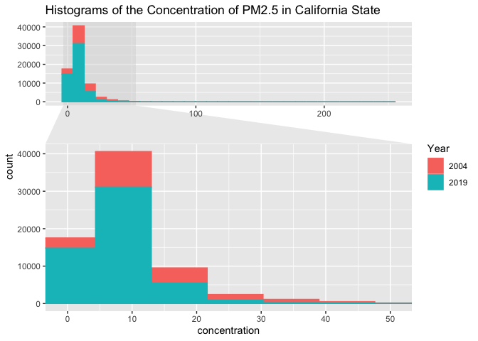
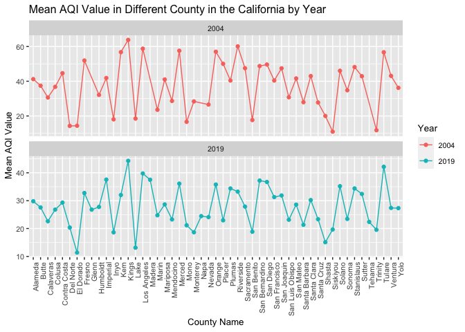
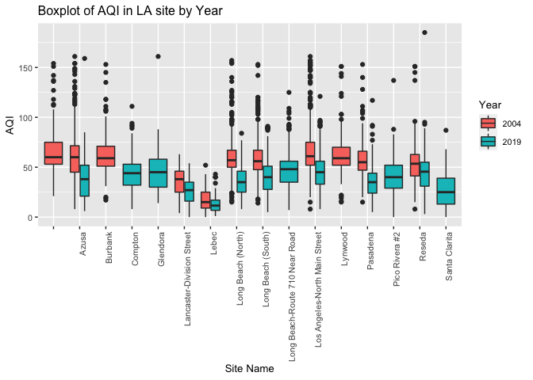

## Step 1: 
Given the formulated question from the assignment description, you will now conduct EDA Checklist items 2-4. First, download 2004 and 2019 data for all sites in California from the EPA Air Quality Data website.


```r
library(data.table)
library(tidyverse)
```

```
## ── Attaching packages ─────────────────────────────────────── tidyverse 1.3.0 ──
```

```
## ✓ ggplot2 3.3.3     ✓ purrr   0.3.4
## ✓ tibble  3.1.0     ✓ dplyr   1.0.5
## ✓ tidyr   1.1.3     ✓ stringr 1.4.0
## ✓ readr   1.4.0     ✓ forcats 0.5.1
```

```
## ── Conflicts ────────────────────────────────────────── tidyverse_conflicts() ──
## x dplyr::between()   masks data.table::between()
## x dplyr::filter()    masks stats::filter()
## x dplyr::first()     masks data.table::first()
## x dplyr::lag()       masks stats::lag()
## x dplyr::last()      masks data.table::last()
## x purrr::transpose() masks data.table::transpose()
```

```r
library(lubridate)
```

```
## 
## Attaching package: 'lubridate'
```

```
## The following objects are masked from 'package:data.table':
## 
##     hour, isoweek, mday, minute, month, quarter, second, wday, week,
##     yday, year
```

```
## The following objects are masked from 'package:base':
## 
##     date, intersect, setdiff, union
```

```r
library(leaflet)
library(plyr)
```

```
## ------------------------------------------------------------------------------
```

```
## You have loaded plyr after dplyr - this is likely to cause problems.
## If you need functions from both plyr and dplyr, please load plyr first, then dplyr:
## library(plyr); library(dplyr)
```

```
## ------------------------------------------------------------------------------
```

```
## 
## Attaching package: 'plyr'
```

```
## The following objects are masked from 'package:dplyr':
## 
##     arrange, count, desc, failwith, id, mutate, rename, summarise,
##     summarize
```

```
## The following object is masked from 'package:purrr':
## 
##     compact
```

```r
library(dplyr)
library(ggforce)
```

### Read Data
Read in the data using data.table().


```r
PM2004 <- data.table::fread("~/Desktop/PM566/PM566-labs/Assignment1/2004PM2.5.csv")
PM2019 <- data.table::fread("~/Desktop/PM566/PM566-labs/Assignment1/2019PM2.5.csv")
```

### Check 2004 Data
Check the dimensions, headers, footers, variable names and variable types. Check for any data issues, particularly in the key variable we are analyzing.

```r
# 2004 
dim(PM2004) 
```

```
## [1] 19233    20
```

```r
head(PM2004)
```

```
##          Date Source  Site ID POC Daily Mean PM2.5 Concentration    UNITS
## 1: 01/01/2004    AQS 60010007   1                           11.0 ug/m3 LC
## 2: 01/02/2004    AQS 60010007   1                           12.2 ug/m3 LC
## 3: 01/03/2004    AQS 60010007   1                           16.5 ug/m3 LC
## 4: 01/04/2004    AQS 60010007   1                           19.5 ug/m3 LC
## 5: 01/05/2004    AQS 60010007   1                           11.5 ug/m3 LC
## 6: 01/06/2004    AQS 60010007   1                           32.5 ug/m3 LC
##    DAILY_AQI_VALUE Site Name DAILY_OBS_COUNT PERCENT_COMPLETE
## 1:              46 Livermore               1              100
## 2:              51 Livermore               1              100
## 3:              60 Livermore               1              100
## 4:              67 Livermore               1              100
## 5:              48 Livermore               1              100
## 6:              94 Livermore               1              100
##    AQS_PARAMETER_CODE                     AQS_PARAMETER_DESC CBSA_CODE
## 1:              88502 Acceptable PM2.5 AQI & Speciation Mass     41860
## 2:              88502 Acceptable PM2.5 AQI & Speciation Mass     41860
## 3:              88502 Acceptable PM2.5 AQI & Speciation Mass     41860
## 4:              88502 Acceptable PM2.5 AQI & Speciation Mass     41860
## 5:              88502 Acceptable PM2.5 AQI & Speciation Mass     41860
## 6:              88502 Acceptable PM2.5 AQI & Speciation Mass     41860
##                            CBSA_NAME STATE_CODE      STATE COUNTY_CODE  COUNTY
## 1: San Francisco-Oakland-Hayward, CA          6 California           1 Alameda
## 2: San Francisco-Oakland-Hayward, CA          6 California           1 Alameda
## 3: San Francisco-Oakland-Hayward, CA          6 California           1 Alameda
## 4: San Francisco-Oakland-Hayward, CA          6 California           1 Alameda
## 5: San Francisco-Oakland-Hayward, CA          6 California           1 Alameda
## 6: San Francisco-Oakland-Hayward, CA          6 California           1 Alameda
##    SITE_LATITUDE SITE_LONGITUDE
## 1:      37.68753      -121.7842
## 2:      37.68753      -121.7842
## 3:      37.68753      -121.7842
## 4:      37.68753      -121.7842
## 5:      37.68753      -121.7842
## 6:      37.68753      -121.7842
```

```r
tail(PM2004)
```

```
##          Date Source  Site ID POC Daily Mean PM2.5 Concentration    UNITS
## 1: 12/14/2004    AQS 61131003   1                             11 ug/m3 LC
## 2: 12/17/2004    AQS 61131003   1                             16 ug/m3 LC
## 3: 12/20/2004    AQS 61131003   1                             17 ug/m3 LC
## 4: 12/23/2004    AQS 61131003   1                              9 ug/m3 LC
## 5: 12/26/2004    AQS 61131003   1                             24 ug/m3 LC
## 6: 12/29/2004    AQS 61131003   1                              9 ug/m3 LC
##    DAILY_AQI_VALUE            Site Name DAILY_OBS_COUNT PERCENT_COMPLETE
## 1:              46 Woodland-Gibson Road               1              100
## 2:              59 Woodland-Gibson Road               1              100
## 3:              61 Woodland-Gibson Road               1              100
## 4:              38 Woodland-Gibson Road               1              100
## 5:              76 Woodland-Gibson Road               1              100
## 6:              38 Woodland-Gibson Road               1              100
##    AQS_PARAMETER_CODE       AQS_PARAMETER_DESC CBSA_CODE
## 1:              88101 PM2.5 - Local Conditions     40900
## 2:              88101 PM2.5 - Local Conditions     40900
## 3:              88101 PM2.5 - Local Conditions     40900
## 4:              88101 PM2.5 - Local Conditions     40900
## 5:              88101 PM2.5 - Local Conditions     40900
## 6:              88101 PM2.5 - Local Conditions     40900
##                                  CBSA_NAME STATE_CODE      STATE COUNTY_CODE
## 1: Sacramento--Roseville--Arden-Arcade, CA          6 California         113
## 2: Sacramento--Roseville--Arden-Arcade, CA          6 California         113
## 3: Sacramento--Roseville--Arden-Arcade, CA          6 California         113
## 4: Sacramento--Roseville--Arden-Arcade, CA          6 California         113
## 5: Sacramento--Roseville--Arden-Arcade, CA          6 California         113
## 6: Sacramento--Roseville--Arden-Arcade, CA          6 California         113
##    COUNTY SITE_LATITUDE SITE_LONGITUDE
## 1:   Yolo      38.66121      -121.7327
## 2:   Yolo      38.66121      -121.7327
## 3:   Yolo      38.66121      -121.7327
## 4:   Yolo      38.66121      -121.7327
## 5:   Yolo      38.66121      -121.7327
## 6:   Yolo      38.66121      -121.7327
```

```r
names(PM2004)
```

```
##  [1] "Date"                           "Source"                        
##  [3] "Site ID"                        "POC"                           
##  [5] "Daily Mean PM2.5 Concentration" "UNITS"                         
##  [7] "DAILY_AQI_VALUE"                "Site Name"                     
##  [9] "DAILY_OBS_COUNT"                "PERCENT_COMPLETE"              
## [11] "AQS_PARAMETER_CODE"             "AQS_PARAMETER_DESC"            
## [13] "CBSA_CODE"                      "CBSA_NAME"                     
## [15] "STATE_CODE"                     "STATE"                         
## [17] "COUNTY_CODE"                    "COUNTY"                        
## [19] "SITE_LATITUDE"                  "SITE_LONGITUDE"
```

```r
str(PM2004)
```

```
## Classes 'data.table' and 'data.frame':	19233 obs. of  20 variables:
##  $ Date                          : chr  "01/01/2004" "01/02/2004" "01/03/2004" "01/04/2004" ...
##  $ Source                        : chr  "AQS" "AQS" "AQS" "AQS" ...
##  $ Site ID                       : int  60010007 60010007 60010007 60010007 60010007 60010007 60010007 60010007 60010007 60010007 ...
##  $ POC                           : int  1 1 1 1 1 1 1 1 1 1 ...
##  $ Daily Mean PM2.5 Concentration: num  11 12.2 16.5 19.5 11.5 32.5 14 29.9 21 15.7 ...
##  $ UNITS                         : chr  "ug/m3 LC" "ug/m3 LC" "ug/m3 LC" "ug/m3 LC" ...
##  $ DAILY_AQI_VALUE               : int  46 51 60 67 48 94 55 88 70 59 ...
##  $ Site Name                     : chr  "Livermore" "Livermore" "Livermore" "Livermore" ...
##  $ DAILY_OBS_COUNT               : int  1 1 1 1 1 1 1 1 1 1 ...
##  $ PERCENT_COMPLETE              : num  100 100 100 100 100 100 100 100 100 100 ...
##  $ AQS_PARAMETER_CODE            : int  88502 88502 88502 88502 88502 88502 88101 88502 88502 88101 ...
##  $ AQS_PARAMETER_DESC            : chr  "Acceptable PM2.5 AQI & Speciation Mass" "Acceptable PM2.5 AQI & Speciation Mass" "Acceptable PM2.5 AQI & Speciation Mass" "Acceptable PM2.5 AQI & Speciation Mass" ...
##  $ CBSA_CODE                     : int  41860 41860 41860 41860 41860 41860 41860 41860 41860 41860 ...
##  $ CBSA_NAME                     : chr  "San Francisco-Oakland-Hayward, CA" "San Francisco-Oakland-Hayward, CA" "San Francisco-Oakland-Hayward, CA" "San Francisco-Oakland-Hayward, CA" ...
##  $ STATE_CODE                    : int  6 6 6 6 6 6 6 6 6 6 ...
##  $ STATE                         : chr  "California" "California" "California" "California" ...
##  $ COUNTY_CODE                   : int  1 1 1 1 1 1 1 1 1 1 ...
##  $ COUNTY                        : chr  "Alameda" "Alameda" "Alameda" "Alameda" ...
##  $ SITE_LATITUDE                 : num  37.7 37.7 37.7 37.7 37.7 ...
##  $ SITE_LONGITUDE                : num  -122 -122 -122 -122 -122 ...
##  - attr(*, ".internal.selfref")=<externalptr>
```

```r
summary(PM2004$`Daily Mean PM2.5 Concentration`)
```

```
##    Min. 1st Qu.  Median    Mean 3rd Qu.    Max. 
##   -0.10    6.00   10.10   13.13   16.30  251.00
```

```r
summary(PM2004$DAILY_AQI_VALUE)
```

```
##    Min. 1st Qu.  Median    Mean 3rd Qu.    Max. 
##    0.00   25.00   42.00   46.34   60.00  301.00
```
1. There are 19233 rows and 20 columns in the PM2.5_2004 dataset.
2. The maximum of Daily Mean PM2.5 Concentration is 251.00. The mean is 13.13, and the median is 10.10. So, in 2004, PM 2.5 is not too seriously, with the latest PM 2.5 range (0 ~ 12: good).
3. The U.S. AQI is EPA’s index for reporting air quality. With the AQI value table on the [Air Quality Index (AQI) Basics](https://www.airnow.gov/aqi/aqi-basics/):
    * the maximum of AQI is 301 ---- Hazardous (Health warning of emergency conditions: everyone is more likely to be affected.)
    * the mean of AQI is 46.34 ---- Good(Air quality is satisfactory, and air pollution poses little or no risk.)
    * the Median of AQI is 42.00 ---- Good(Air quality is satisfactory, and air pollution poses little or no risk.)
    * which seems the AQI level of 2004 is not too bad, most time is good.

### Check 2019 Data
Check the dimensions, headers, footers, variable names and variable types. Check for any data issues, particularly in the key variable we are analyzing.

```r
# 2019
dim(PM2019)
```

```
## [1] 53086    20
```

```r
head(PM2019)
```

```
##          Date Source  Site ID POC Daily Mean PM2.5 Concentration    UNITS
## 1: 01/01/2019    AQS 60010007   3                            5.7 ug/m3 LC
## 2: 01/02/2019    AQS 60010007   3                           11.9 ug/m3 LC
## 3: 01/03/2019    AQS 60010007   3                           20.1 ug/m3 LC
## 4: 01/04/2019    AQS 60010007   3                           28.8 ug/m3 LC
## 5: 01/05/2019    AQS 60010007   3                           11.2 ug/m3 LC
## 6: 01/06/2019    AQS 60010007   3                            2.7 ug/m3 LC
##    DAILY_AQI_VALUE Site Name DAILY_OBS_COUNT PERCENT_COMPLETE
## 1:              24 Livermore               1              100
## 2:              50 Livermore               1              100
## 3:              68 Livermore               1              100
## 4:              86 Livermore               1              100
## 5:              47 Livermore               1              100
## 6:              11 Livermore               1              100
##    AQS_PARAMETER_CODE       AQS_PARAMETER_DESC CBSA_CODE
## 1:              88101 PM2.5 - Local Conditions     41860
## 2:              88101 PM2.5 - Local Conditions     41860
## 3:              88101 PM2.5 - Local Conditions     41860
## 4:              88101 PM2.5 - Local Conditions     41860
## 5:              88101 PM2.5 - Local Conditions     41860
## 6:              88101 PM2.5 - Local Conditions     41860
##                            CBSA_NAME STATE_CODE      STATE COUNTY_CODE  COUNTY
## 1: San Francisco-Oakland-Hayward, CA          6 California           1 Alameda
## 2: San Francisco-Oakland-Hayward, CA          6 California           1 Alameda
## 3: San Francisco-Oakland-Hayward, CA          6 California           1 Alameda
## 4: San Francisco-Oakland-Hayward, CA          6 California           1 Alameda
## 5: San Francisco-Oakland-Hayward, CA          6 California           1 Alameda
## 6: San Francisco-Oakland-Hayward, CA          6 California           1 Alameda
##    SITE_LATITUDE SITE_LONGITUDE
## 1:      37.68753      -121.7842
## 2:      37.68753      -121.7842
## 3:      37.68753      -121.7842
## 4:      37.68753      -121.7842
## 5:      37.68753      -121.7842
## 6:      37.68753      -121.7842
```

```r
tail(PM2019)
```

```
##          Date Source  Site ID POC Daily Mean PM2.5 Concentration    UNITS
## 1: 11/11/2019    AQS 61131003   1                           13.5 ug/m3 LC
## 2: 11/17/2019    AQS 61131003   1                           18.1 ug/m3 LC
## 3: 11/29/2019    AQS 61131003   1                           12.5 ug/m3 LC
## 4: 12/17/2019    AQS 61131003   1                           23.8 ug/m3 LC
## 5: 12/23/2019    AQS 61131003   1                            1.0 ug/m3 LC
## 6: 12/29/2019    AQS 61131003   1                            9.1 ug/m3 LC
##    DAILY_AQI_VALUE            Site Name DAILY_OBS_COUNT PERCENT_COMPLETE
## 1:              54 Woodland-Gibson Road               1              100
## 2:              64 Woodland-Gibson Road               1              100
## 3:              52 Woodland-Gibson Road               1              100
## 4:              76 Woodland-Gibson Road               1              100
## 5:               4 Woodland-Gibson Road               1              100
## 6:              38 Woodland-Gibson Road               1              100
##    AQS_PARAMETER_CODE       AQS_PARAMETER_DESC CBSA_CODE
## 1:              88101 PM2.5 - Local Conditions     40900
## 2:              88101 PM2.5 - Local Conditions     40900
## 3:              88101 PM2.5 - Local Conditions     40900
## 4:              88101 PM2.5 - Local Conditions     40900
## 5:              88101 PM2.5 - Local Conditions     40900
## 6:              88101 PM2.5 - Local Conditions     40900
##                                  CBSA_NAME STATE_CODE      STATE COUNTY_CODE
## 1: Sacramento--Roseville--Arden-Arcade, CA          6 California         113
## 2: Sacramento--Roseville--Arden-Arcade, CA          6 California         113
## 3: Sacramento--Roseville--Arden-Arcade, CA          6 California         113
## 4: Sacramento--Roseville--Arden-Arcade, CA          6 California         113
## 5: Sacramento--Roseville--Arden-Arcade, CA          6 California         113
## 6: Sacramento--Roseville--Arden-Arcade, CA          6 California         113
##    COUNTY SITE_LATITUDE SITE_LONGITUDE
## 1:   Yolo      38.66121      -121.7327
## 2:   Yolo      38.66121      -121.7327
## 3:   Yolo      38.66121      -121.7327
## 4:   Yolo      38.66121      -121.7327
## 5:   Yolo      38.66121      -121.7327
## 6:   Yolo      38.66121      -121.7327
```

```r
names(PM2019)
```

```
##  [1] "Date"                           "Source"                        
##  [3] "Site ID"                        "POC"                           
##  [5] "Daily Mean PM2.5 Concentration" "UNITS"                         
##  [7] "DAILY_AQI_VALUE"                "Site Name"                     
##  [9] "DAILY_OBS_COUNT"                "PERCENT_COMPLETE"              
## [11] "AQS_PARAMETER_CODE"             "AQS_PARAMETER_DESC"            
## [13] "CBSA_CODE"                      "CBSA_NAME"                     
## [15] "STATE_CODE"                     "STATE"                         
## [17] "COUNTY_CODE"                    "COUNTY"                        
## [19] "SITE_LATITUDE"                  "SITE_LONGITUDE"
```

```r
str(PM2019)
```

```
## Classes 'data.table' and 'data.frame':	53086 obs. of  20 variables:
##  $ Date                          : chr  "01/01/2019" "01/02/2019" "01/03/2019" "01/04/2019" ...
##  $ Source                        : chr  "AQS" "AQS" "AQS" "AQS" ...
##  $ Site ID                       : int  60010007 60010007 60010007 60010007 60010007 60010007 60010007 60010007 60010007 60010007 ...
##  $ POC                           : int  3 3 3 3 3 3 3 3 3 3 ...
##  $ Daily Mean PM2.5 Concentration: num  5.7 11.9 20.1 28.8 11.2 2.7 2.8 7 3.1 7.1 ...
##  $ UNITS                         : chr  "ug/m3 LC" "ug/m3 LC" "ug/m3 LC" "ug/m3 LC" ...
##  $ DAILY_AQI_VALUE               : int  24 50 68 86 47 11 12 29 13 30 ...
##  $ Site Name                     : chr  "Livermore" "Livermore" "Livermore" "Livermore" ...
##  $ DAILY_OBS_COUNT               : int  1 1 1 1 1 1 1 1 1 1 ...
##  $ PERCENT_COMPLETE              : num  100 100 100 100 100 100 100 100 100 100 ...
##  $ AQS_PARAMETER_CODE            : int  88101 88101 88101 88101 88101 88101 88101 88101 88101 88101 ...
##  $ AQS_PARAMETER_DESC            : chr  "PM2.5 - Local Conditions" "PM2.5 - Local Conditions" "PM2.5 - Local Conditions" "PM2.5 - Local Conditions" ...
##  $ CBSA_CODE                     : int  41860 41860 41860 41860 41860 41860 41860 41860 41860 41860 ...
##  $ CBSA_NAME                     : chr  "San Francisco-Oakland-Hayward, CA" "San Francisco-Oakland-Hayward, CA" "San Francisco-Oakland-Hayward, CA" "San Francisco-Oakland-Hayward, CA" ...
##  $ STATE_CODE                    : int  6 6 6 6 6 6 6 6 6 6 ...
##  $ STATE                         : chr  "California" "California" "California" "California" ...
##  $ COUNTY_CODE                   : int  1 1 1 1 1 1 1 1 1 1 ...
##  $ COUNTY                        : chr  "Alameda" "Alameda" "Alameda" "Alameda" ...
##  $ SITE_LATITUDE                 : num  37.7 37.7 37.7 37.7 37.7 ...
##  $ SITE_LONGITUDE                : num  -122 -122 -122 -122 -122 ...
##  - attr(*, ".internal.selfref")=<externalptr>
```

```r
summary(PM2019$`Daily Mean PM2.5 Concentration`)
```

```
##    Min. 1st Qu.  Median    Mean 3rd Qu.    Max. 
##  -2.200   4.000   6.500   7.734   9.900 120.900
```

```r
summary(PM2019$DAILY_AQI_VALUE)
```

```
##    Min. 1st Qu.  Median    Mean 3rd Qu.    Max. 
##    0.00   17.00   27.00   30.56   41.00  185.00
```

1. There are 53086 rows and 20 columns in the PM2.5_2019 dataset.
2. The maximum of Daily Mean PM2.5 Concentration is 120.900 The mean is 7.78, and the median is 6.500 So, in 2019, PM 2.5 is much better than 2004, with the latest PM 2.5 range (0 ~ 12: good).
3. The U.S. AQI is EPA’s index for reporting air quality. With the AQI value table on the [Air Quality Index (AQI) Basics](https://www.airnow.gov/aqi/aqi-basics/):
    * the maximum of AQI is 185.00 ---- Unhealthy (Some members of the general public may experience health effects; members of sensitive groups may experience more serious health effects.)
    * the mean of AQI is 30.72 ---- Good(Air quality is satisfactory, and air pollution poses little or no risk.)
    * the Median of AQI is 27.00 ---- Good(Air quality is satisfactory, and air pollution poses little or no risk.)
    * which seems the AQI level of 2019 is more healthy than 2004, the level of maxium is much lower.


## Step 2: 
Combine the two years of data into one data frame. Use the Date variable to create a new column for year, which will serve as an identifier. Change the names of the key variables so that they are easier to refer to in your code.


```r
PM2004[, Year := "2004"]
str(PM2004)
```

```
## Classes 'data.table' and 'data.frame':	19233 obs. of  21 variables:
##  $ Date                          : chr  "01/01/2004" "01/02/2004" "01/03/2004" "01/04/2004" ...
##  $ Source                        : chr  "AQS" "AQS" "AQS" "AQS" ...
##  $ Site ID                       : int  60010007 60010007 60010007 60010007 60010007 60010007 60010007 60010007 60010007 60010007 ...
##  $ POC                           : int  1 1 1 1 1 1 1 1 1 1 ...
##  $ Daily Mean PM2.5 Concentration: num  11 12.2 16.5 19.5 11.5 32.5 14 29.9 21 15.7 ...
##  $ UNITS                         : chr  "ug/m3 LC" "ug/m3 LC" "ug/m3 LC" "ug/m3 LC" ...
##  $ DAILY_AQI_VALUE               : int  46 51 60 67 48 94 55 88 70 59 ...
##  $ Site Name                     : chr  "Livermore" "Livermore" "Livermore" "Livermore" ...
##  $ DAILY_OBS_COUNT               : int  1 1 1 1 1 1 1 1 1 1 ...
##  $ PERCENT_COMPLETE              : num  100 100 100 100 100 100 100 100 100 100 ...
##  $ AQS_PARAMETER_CODE            : int  88502 88502 88502 88502 88502 88502 88101 88502 88502 88101 ...
##  $ AQS_PARAMETER_DESC            : chr  "Acceptable PM2.5 AQI & Speciation Mass" "Acceptable PM2.5 AQI & Speciation Mass" "Acceptable PM2.5 AQI & Speciation Mass" "Acceptable PM2.5 AQI & Speciation Mass" ...
##  $ CBSA_CODE                     : int  41860 41860 41860 41860 41860 41860 41860 41860 41860 41860 ...
##  $ CBSA_NAME                     : chr  "San Francisco-Oakland-Hayward, CA" "San Francisco-Oakland-Hayward, CA" "San Francisco-Oakland-Hayward, CA" "San Francisco-Oakland-Hayward, CA" ...
##  $ STATE_CODE                    : int  6 6 6 6 6 6 6 6 6 6 ...
##  $ STATE                         : chr  "California" "California" "California" "California" ...
##  $ COUNTY_CODE                   : int  1 1 1 1 1 1 1 1 1 1 ...
##  $ COUNTY                        : chr  "Alameda" "Alameda" "Alameda" "Alameda" ...
##  $ SITE_LATITUDE                 : num  37.7 37.7 37.7 37.7 37.7 ...
##  $ SITE_LONGITUDE                : num  -122 -122 -122 -122 -122 ...
##  $ Year                          : chr  "2004" "2004" "2004" "2004" ...
##  - attr(*, ".internal.selfref")=<externalptr>
```

```r
PM2019[, Year := "2019"]
str(PM2019)
```

```
## Classes 'data.table' and 'data.frame':	53086 obs. of  21 variables:
##  $ Date                          : chr  "01/01/2019" "01/02/2019" "01/03/2019" "01/04/2019" ...
##  $ Source                        : chr  "AQS" "AQS" "AQS" "AQS" ...
##  $ Site ID                       : int  60010007 60010007 60010007 60010007 60010007 60010007 60010007 60010007 60010007 60010007 ...
##  $ POC                           : int  3 3 3 3 3 3 3 3 3 3 ...
##  $ Daily Mean PM2.5 Concentration: num  5.7 11.9 20.1 28.8 11.2 2.7 2.8 7 3.1 7.1 ...
##  $ UNITS                         : chr  "ug/m3 LC" "ug/m3 LC" "ug/m3 LC" "ug/m3 LC" ...
##  $ DAILY_AQI_VALUE               : int  24 50 68 86 47 11 12 29 13 30 ...
##  $ Site Name                     : chr  "Livermore" "Livermore" "Livermore" "Livermore" ...
##  $ DAILY_OBS_COUNT               : int  1 1 1 1 1 1 1 1 1 1 ...
##  $ PERCENT_COMPLETE              : num  100 100 100 100 100 100 100 100 100 100 ...
##  $ AQS_PARAMETER_CODE            : int  88101 88101 88101 88101 88101 88101 88101 88101 88101 88101 ...
##  $ AQS_PARAMETER_DESC            : chr  "PM2.5 - Local Conditions" "PM2.5 - Local Conditions" "PM2.5 - Local Conditions" "PM2.5 - Local Conditions" ...
##  $ CBSA_CODE                     : int  41860 41860 41860 41860 41860 41860 41860 41860 41860 41860 ...
##  $ CBSA_NAME                     : chr  "San Francisco-Oakland-Hayward, CA" "San Francisco-Oakland-Hayward, CA" "San Francisco-Oakland-Hayward, CA" "San Francisco-Oakland-Hayward, CA" ...
##  $ STATE_CODE                    : int  6 6 6 6 6 6 6 6 6 6 ...
##  $ STATE                         : chr  "California" "California" "California" "California" ...
##  $ COUNTY_CODE                   : int  1 1 1 1 1 1 1 1 1 1 ...
##  $ COUNTY                        : chr  "Alameda" "Alameda" "Alameda" "Alameda" ...
##  $ SITE_LATITUDE                 : num  37.7 37.7 37.7 37.7 37.7 ...
##  $ SITE_LONGITUDE                : num  -122 -122 -122 -122 -122 ...
##  $ Year                          : chr  "2019" "2019" "2019" "2019" ...
##  - attr(*, ".internal.selfref")=<externalptr>
```

```r
PM2.5_Combine <- rbind(PM2004,PM2019)
str(PM2.5_Combine)
```

```
## Classes 'data.table' and 'data.frame':	72319 obs. of  21 variables:
##  $ Date                          : chr  "01/01/2004" "01/02/2004" "01/03/2004" "01/04/2004" ...
##  $ Source                        : chr  "AQS" "AQS" "AQS" "AQS" ...
##  $ Site ID                       : int  60010007 60010007 60010007 60010007 60010007 60010007 60010007 60010007 60010007 60010007 ...
##  $ POC                           : int  1 1 1 1 1 1 1 1 1 1 ...
##  $ Daily Mean PM2.5 Concentration: num  11 12.2 16.5 19.5 11.5 32.5 14 29.9 21 15.7 ...
##  $ UNITS                         : chr  "ug/m3 LC" "ug/m3 LC" "ug/m3 LC" "ug/m3 LC" ...
##  $ DAILY_AQI_VALUE               : int  46 51 60 67 48 94 55 88 70 59 ...
##  $ Site Name                     : chr  "Livermore" "Livermore" "Livermore" "Livermore" ...
##  $ DAILY_OBS_COUNT               : int  1 1 1 1 1 1 1 1 1 1 ...
##  $ PERCENT_COMPLETE              : num  100 100 100 100 100 100 100 100 100 100 ...
##  $ AQS_PARAMETER_CODE            : int  88502 88502 88502 88502 88502 88502 88101 88502 88502 88101 ...
##  $ AQS_PARAMETER_DESC            : chr  "Acceptable PM2.5 AQI & Speciation Mass" "Acceptable PM2.5 AQI & Speciation Mass" "Acceptable PM2.5 AQI & Speciation Mass" "Acceptable PM2.5 AQI & Speciation Mass" ...
##  $ CBSA_CODE                     : int  41860 41860 41860 41860 41860 41860 41860 41860 41860 41860 ...
##  $ CBSA_NAME                     : chr  "San Francisco-Oakland-Hayward, CA" "San Francisco-Oakland-Hayward, CA" "San Francisco-Oakland-Hayward, CA" "San Francisco-Oakland-Hayward, CA" ...
##  $ STATE_CODE                    : int  6 6 6 6 6 6 6 6 6 6 ...
##  $ STATE                         : chr  "California" "California" "California" "California" ...
##  $ COUNTY_CODE                   : int  1 1 1 1 1 1 1 1 1 1 ...
##  $ COUNTY                        : chr  "Alameda" "Alameda" "Alameda" "Alameda" ...
##  $ SITE_LATITUDE                 : num  37.7 37.7 37.7 37.7 37.7 ...
##  $ SITE_LONGITUDE                : num  -122 -122 -122 -122 -122 ...
##  $ Year                          : chr  "2004" "2004" "2004" "2004" ...
##  - attr(*, ".internal.selfref")=<externalptr>
```

```r
table(PM2.5_Combine$Year)
```

```
## 
##  2004  2019 
## 19233 53086
```

```r
colnames(PM2.5_Combine)[5] <- "PM2.5"
colnames(PM2.5_Combine)[7] <- "AQI"
colnames(PM2.5_Combine)[19] <- "lat"
colnames(PM2.5_Combine)[20] <- "lon"
```

## Step 3: 
Create a basic map in leaflet() that shows the locations of the sites (make sure to use different colors for each year). Summarize the spatial distribution of the monitoring sites.


```r
year.pal <- colorFactor(c("pink","lightgreen"), domain=PM2.5_Combine$Year)
leaflet(PM2.5_Combine) %>%
  addProviderTiles('CartoDB.Positron') %>% 
  addCircleMarkers(lat=~lat,lng=~lon, opacity=1, fillOpacity=1, radius=1,color = ~year.pal(PM2.5_Combine$Year))
```

```{=html}
<div id="htmlwidget-afa314783a3f1422a547" style="width:672px;height:480px;" class="leaflet html-widget"></div>
<script type="application/json" data-for="htmlwidget-afa314783a3f1422a547">{"x":{"options":{"crs":{"crsClass":"L.CRS.EPSG3857","code":null,"proj4def":null,"projectedBounds":null,"options":{}}},"calls":[{"method":"addProviderTiles","args":["CartoDB.Positron",null,null,{"errorTileUrl":"","noWrap":false,"detectRetina":false}]},{"method":"addCircleMarkers","args":[[37.687526,37.687526,37.687526,37.687526,37.687526,37.687526,37.687526,37.687526,37.687526,37.687526,37.687526,37.687526,37.687526,37.687526,37.687526,37.687526,37.687526,37.687526,37.687526,37.687526,37.687526,37.687526,37.687526,37.687526,37.687526,37.687526,37.687526,37.687526,37.687526,37.687526,37.687526,37.687526,37.687526,37.687526,37.687526,37.687526,37.687526,37.687526,37.687526,37.687526,37.687526,37.687526,37.687526,37.687526,37.687526,37.687526,37.687526,37.687526,37.687526,37.687526,37.687526,37.687526,37.687526,37.687526,37.687526,37.687526,37.687526,37.687526,37.687526,37.687526,37.687526,37.687526,37.687526,37.687526,37.687526,37.687526,37.687526,37.687526,37.687526,37.687526,37.687526,37.687526,37.687526,37.687526,37.687526,37.687526,37.687526,37.687526,37.687526,37.687526,37.687526,37.687526,37.687526,37.687526,37.687526,37.687526,37.687526,37.687526,37.687526,37.687526,37.687526,37.687526,37.687526,37.687526,37.687526,37.687526,37.687526,37.687526,37.687526,37.687526,37.687526,37.687526,37.687526,37.687526,37.687526,37.687526,37.687526,37.687526,37.687526,37.687526,37.687526,37.687526,37.687526,37.687526,37.687526,37.687526,37.687526,37.687526,37.687526,37.687526,37.687526,37.687526,37.687526,37.687526,37.687526,37.687526,37.687526,37.687526,37.687526,37.687526,37.687526,37.687526,37.687526,37.687526,37.687526,37.687526,37.687526,37.687526,37.687526,37.687526,37.687526,37.687526,37.687526,37.687526,37.687526,37.687526,37.687526,37.687526,37.687526,37.687526,37.687526,37.687526,37.687526,37.687526,37.687526,37.687526,37.687526,37.687526,37.687526,37.687526,37.687526,37.687526,37.687526,37.687526,37.687526,37.687526,37.687526,37.687526,37.687526,37.687526,37.687526,37.687526,37.687526,37.687526,37.687526,37.687526,37.687526,37.687526,37.687526,37.687526,37.687526,37.687526,37.687526,37.687526,37.687526,37.687526,37.687526,37.687526,37.687526,37.687526,37.687526,37.687526,37.687526,37.687526,37.687526,37.687526,37.687526,37.687526,37.687526,37.687526,37.687526,37.687526,37.687526,37.687526,37.687526,37.687526,37.687526,37.687526,37.687526,37.687526,37.687526,37.687526,37.687526,37.687526,37.687526,37.687526,37.687526,37.687526,37.687526,37.687526,37.687526,37.687526,37.687526,37.687526,37.687526,37.687526,37.687526,37.687526,37.687526,37.687526,37.687526,37.687526,37.687526,37.687526,37.687526,37.687526,37.687526,37.687526,37.687526,37.687526,37.687526,37.687526,37.687526,37.687526,37.687526,37.687526,37.687526,37.687526,37.687526,37.687526,37.687526,37.687526,37.687526,37.687526,37.687526,37.687526,37.687526,37.687526,37.687526,37.687526,37.687526,37.687526,37.687526,37.687526,37.687526,37.687526,37.687526,37.687526,37.687526,37.687526,37.687526,37.687526,37.687526,37.687526,37.687526,37.687526,37.687526,37.687526,37.687526,37.687526,37.687526,37.687526,37.687526,37.687526,37.687526,37.687526,37.687526,37.687526,37.687526,37.687526,37.687526,37.687526,37.687526,37.687526,37.687526,37.687526,37.687526,37.687526,37.687526,37.687526,37.687526,37.687526,37.687526,37.687526,37.687526,37.687526,37.687526,37.687526,37.687526,37.687526,37.687526,37.687526,37.687526,37.687526,37.687526,37.687526,37.687526,37.687526,37.687526,37.687526,37.687526,37.687526,37.687526,37.687526,37.687526,37.687526,37.687526,37.687526,37.687526,37.687526,37.687526,37.687526,37.687526,37.687526,37.687526,37.687526,37.687526,37.687526,37.687526,37.687526,37.687526,37.687526,37.687526,37.687526,37.687526,37.687526,37.687526,37.687526,37.687526,37.687526,37.687526,37.687526,37.687526,37.687526,37.687526,37.687526,37.687526,37.687526,37.687526,37.687526,37.687526,37.687526,37.687526,37.687526,37.535833,37.535833,37.535833,37.535833,37.535833,37.535833,37.535833,37.535833,37.535833,37.535833,37.535833,37.535833,37.535833,37.535833,37.535833,37.535833,37.535833,37.535833,37.535833,37.535833,37.535833,37.535833,37.535833,37.535833,37.535833,37.535833,37.535833,37.535833,37.535833,37.535833,37.535833,37.535833,37.535833,37.535833,37.535833,37.535833,37.535833,37.535833,37.535833,37.535833,37.535833,37.535833,37.535833,37.535833,37.535833,37.535833,37.535833,37.535833,37.535833,37.535833,37.535833,37.535833,37.535833,37.535833,37.535833,37.535833,37.535833,37.535833,37.535833,37.535833,37.535833,37.535833,37.535833,37.535833,37.535833,37.535833,37.535833,37.535833,37.535833,37.535833,37.535833,37.535833,37.535833,37.535833,37.535833,37.535833,37.535833,37.535833,37.535833,37.535833,37.535833,37.535833,37.535833,37.535833,37.535833,37.535833,37.535833,37.535833,37.535833,37.535833,37.535833,37.535833,37.535833,37.535833,39.757371488392,39.757371488392,39.757371488392,39.757371488392,39.757371488392,39.757371488392,39.757371488392,39.757371488392,39.757371488392,39.757371488392,39.757371488392,39.757371488392,39.757371488392,39.757371488392,39.757371488392,39.757371488392,39.757371488392,39.757371488392,39.757371488392,39.757371488392,39.757371488392,39.757371488392,39.757371488392,39.757371488392,39.757371488392,39.757371488392,39.757371488392,39.757371488392,39.757371488392,39.757371488392,39.757371488392,39.757371488392,39.757371488392,39.757371488392,39.757371488392,39.757371488392,39.757371488392,39.757371488392,39.757371488392,39.757371488392,39.757371488392,39.757371488392,39.757371488392,39.757371488392,39.757371488392,39.757371488392,39.757371488392,39.757371488392,39.757371488392,39.757371488392,39.757371488392,39.757371488392,39.757371488392,39.757371488392,39.757371488392,39.757371488392,39.757371488392,39.757371488392,39.757371488392,39.757371488392,39.757371488392,39.757371488392,39.757371488392,39.757371488392,39.757371488392,39.757371488392,39.757371488392,39.757371488392,39.757371488392,39.757371488392,39.757371488392,39.757371488392,39.757371488392,39.757371488392,39.757371488392,39.757371488392,39.757371488392,39.757371488392,39.757371488392,39.757371488392,39.757371488392,39.757371488392,39.757371488392,39.757371488392,39.757371488392,39.757371488392,39.757371488392,39.757371488392,39.757371488392,39.757371488392,39.757371488392,39.757371488392,39.757371488392,39.757371488392,39.757371488392,39.757371488392,39.757371488392,39.757371488392,39.757371488392,39.757371488392,39.757371488392,39.757371488392,39.757371488392,39.757371488392,39.757371488392,39.757371488392,39.757371488392,39.757371488392,39.757371488392,39.757371488392,39.757371488392,39.757371488392,39.757371488392,39.757371488392,39.757371488392,39.757371488392,39.757371488392,39.757371488392,39.757371488392,39.757371488392,39.757371488392,39.757371488392,39.327563,39.327563,39.327563,39.327563,39.327563,39.327563,39.327563,39.327563,39.327563,39.327563,39.327563,39.327563,39.327563,39.327563,39.327563,39.327563,39.327563,39.327563,39.327563,39.327563,39.327563,39.327563,39.327563,39.327563,39.327563,39.327563,39.327563,39.327563,39.327563,39.327563,39.327563,39.327563,39.327563,39.327563,39.327563,39.327563,39.327563,39.327563,39.327563,39.327563,39.327563,39.327563,39.327563,39.327563,39.327563,39.327563,39.327563,39.327563,39.327563,39.327563,39.327563,39.327563,39.327563,39.327563,39.327563,39.327563,39.327563,39.327563,39.327563,39.327563,39.327563,39.327563,39.327563,39.327563,39.327563,39.327563,39.327563,39.327563,39.327563,39.327563,39.327563,39.327563,39.327563,39.327563,39.327563,39.327563,39.327563,39.327563,39.327563,39.327563,39.327563,39.327563,39.327563,39.327563,39.327563,39.327563,39.327563,39.327563,39.327563,39.327563,39.327563,39.327563,39.327563,39.327563,39.327563,39.327563,39.327563,39.327563,39.327563,39.327563,39.327563,39.327563,39.327563,39.327563,39.327563,39.327563,39.327563,39.327563,39.327563,39.327563,39.327563,39.327563,39.327563,39.327563,39.327563,39.327563,39.327563,39.327563,39.327563,39.327563,39.327563,39.327563,39.327563,39.327563,39.327563,39.327563,39.327563,39.327563,39.327563,39.327563,39.327563,39.327563,39.327563,39.327563,39.327563,39.327563,39.327563,39.327563,39.327563,39.327563,39.327563,39.327563,39.327563,39.327563,39.327563,39.327563,39.327563,39.327563,39.327563,39.327563,39.327563,39.327563,39.327563,39.327563,39.327563,39.327563,39.327563,39.327563,39.327563,39.327563,39.327563,39.327563,39.327563,39.327563,39.327563,39.327563,39.327563,39.327563,39.327563,39.327563,39.327563,39.327563,39.327563,39.327563,39.327563,39.327563,39.327563,39.327563,39.327563,39.327563,39.327563,39.327563,39.327563,39.327563,39.327563,39.327563,39.327563,39.327563,39.327563,39.327563,39.327563,39.327563,39.327563,39.327563,39.327563,39.327563,39.327563,39.327563,39.327563,39.327563,39.327563,39.327563,39.327563,39.327563,39.327563,39.327563,39.327563,39.327563,39.327563,39.327563,39.327563,39.327563,39.327563,39.327563,39.327563,39.327563,39.327563,39.327563,39.327563,39.327563,39.327563,39.327563,39.327563,39.327563,39.327563,39.327563,39.327563,39.327563,39.327563,39.327563,39.327563,39.327563,39.327563,39.327563,39.327563,39.327563,39.327563,39.327563,39.327563,39.327563,39.327563,39.327563,39.327563,39.327563,39.327563,39.327563,39.327563,39.327563,39.327563,39.327563,39.327563,39.327563,39.327563,39.327563,39.327563,39.327563,39.327563,39.327563,39.327563,39.327563,39.327563,39.327563,39.327563,39.327563,39.327563,39.327563,39.327563,39.327563,39.327563,39.327563,39.327563,39.327563,39.327563,39.327563,39.327563,39.327563,39.327563,39.327563,39.327563,39.327563,39.327563,39.327563,39.327563,39.327563,39.327563,39.327563,39.327563,39.327563,39.327563,39.327563,39.327563,39.327563,39.327563,39.327563,39.327563,39.327563,39.327563,39.327563,39.327563,39.327563,39.327563,39.327563,39.327563,39.327563,39.327563,39.327563,39.327563,39.327563,39.327563,39.327563,39.327563,39.327563,39.327563,39.327563,39.327563,39.327563,39.327563,39.327563,39.327563,39.327563,39.327563,39.327563,38.20185,38.20185,38.20185,38.20185,38.20185,38.20185,38.20185,38.20185,38.20185,38.20185,38.20185,38.20185,38.20185,38.20185,38.20185,38.20185,38.20185,38.20185,38.20185,38.20185,38.20185,38.20185,38.20185,38.20185,38.20185,38.20185,38.20185,38.20185,38.20185,38.20185,38.20185,38.20185,38.20185,38.20185,38.20185,38.20185,38.20185,38.20185,38.20185,38.20185,38.20185,38.20185,38.20185,38.20185,38.20185,38.20185,38.20185,38.20185,38.20185,38.20185,38.20185,38.20185,38.20185,38.20185,38.20185,38.20185,38.20185,38.20185,38.20185,38.20185,38.20185,39.18919,39.18919,39.18919,39.18919,39.18919,39.18919,39.18919,39.18919,39.18919,39.18919,39.18919,39.18919,39.18919,39.18919,39.18919,39.18919,39.18919,39.18919,39.18919,39.18919,39.18919,39.18919,39.18919,39.18919,39.18919,39.18919,39.18919,39.18919,39.18919,39.18919,39.18919,39.18919,39.18919,39.18919,39.18919,39.18919,39.18919,39.18919,39.18919,39.18919,39.18919,39.18919,39.18919,39.18919,39.18919,39.18919,39.18919,39.18919,39.18919,39.18919,39.18919,39.18919,39.18919,39.18919,39.18919,39.18919,39.18919,39.18919,39.18919,39.18919,39.18919,39.18919,39.18919,39.18919,39.18919,39.18919,39.18919,39.18919,39.18919,39.18919,39.18919,39.18919,39.18919,39.18919,39.18919,39.18919,39.18919,39.18919,39.18919,39.18919,39.18919,39.18919,39.18919,39.18919,39.18919,39.18919,39.18919,39.18919,39.18919,39.18919,39.18919,39.18919,39.18919,39.18919,39.18919,39.18919,39.18919,39.18919,39.18919,39.18919,39.18919,39.18919,39.18919,39.18919,39.18919,39.18919,39.18919,39.18919,39.18919,39.18919,39.18919,39.18919,39.18919,39.18919,39.18919,39.18919,39.18919,39.18919,39.18919,39.18919,39.18919,39.18919,39.18919,39.18919,39.18919,39.18919,39.18919,39.18919,39.18919,39.18919,39.18919,39.18919,39.18919,39.18919,39.18919,39.18919,39.18919,39.18919,39.18919,39.18919,39.18919,39.18919,39.18919,39.18919,39.18919,39.18919,39.18919,39.18919,39.18919,39.18919,39.18919,39.18919,39.18919,39.18919,39.18919,39.18919,39.18919,39.18919,39.18919,39.18919,39.18919,39.18919,39.18919,39.18919,39.18919,39.18919,39.18919,39.18919,39.18919,39.18919,39.18919,39.18919,39.18919,39.18919,39.18919,39.18919,39.18919,39.18919,39.18919,39.18919,39.18919,39.18919,39.18919,39.18919,39.18919,39.18919,39.18919,39.18919,39.18919,39.18919,39.18919,39.18919,39.18919,39.18919,39.18919,39.18919,39.18919,39.18919,39.18919,39.18919,39.18919,37.936013,37.936013,37.936013,37.936013,37.936013,37.936013,37.936013,37.936013,37.936013,37.936013,37.936013,37.936013,37.936013,37.936013,37.936013,37.936013,37.936013,37.936013,37.936013,37.936013,37.936013,37.936013,37.936013,37.936013,37.936013,37.936013,37.936013,37.936013,37.936013,37.936013,37.936013,37.936013,37.936013,37.936013,37.936013,37.936013,37.936013,37.936013,37.936013,37.936013,37.936013,37.936013,37.936013,37.936013,37.936013,37.936013,37.936013,37.936013,37.936013,37.936013,37.936013,37.936013,37.936013,37.936013,37.936013,37.936013,37.936013,37.936013,37.936013,37.936013,37.936013,37.936013,37.936013,37.936013,37.936013,37.936013,37.936013,37.936013,37.936013,37.936013,37.936013,37.936013,37.936013,37.936013,37.936013,37.936013,37.936013,37.936013,37.936013,37.936013,37.936013,37.936013,37.936013,37.936013,37.936013,37.936013,37.936013,37.936013,37.936013,37.936013,37.936013,37.936013,37.936013,37.936013,37.936013,37.936013,37.936013,37.936013,37.936013,37.936013,37.936013,37.936013,37.936013,37.936013,37.936013,37.936013,37.936013,37.936013,37.936013,37.936013,37.936013,37.936013,37.936013,37.936013,37.936013,37.936013,37.936013,37.936013,37.936013,37.936013,37.936013,37.936013,37.936013,37.936013,37.936013,37.936013,37.936013,37.936013,37.936013,37.936013,37.936013,37.936013,37.936013,37.936013,37.936013,37.936013,37.936013,37.936013,37.936013,37.936013,37.936013,37.936013,37.936013,37.936013,37.936013,37.936013,37.936013,37.936013,37.936013,37.936013,37.936013,37.936013,37.936013,37.936013,37.936013,37.936013,37.936013,37.936013,37.936013,37.936013,37.936013,37.936013,37.936013,37.936013,37.936013,37.936013,37.936013,37.936013,37.936013,37.936013,37.936013,37.936013,37.936013,37.936013,37.936013,37.936013,37.936013,37.936013,37.936013,37.936013,37.936013,37.936013,37.936013,37.936013,37.936013,37.936013,37.936013,37.936013,37.936013,37.936013,37.936013,37.936013,37.936013,37.936013,37.936013,37.936013,37.936013,37.936013,37.936013,37.936013,37.936013,37.936013,37.936013,37.936013,37.936013,37.936013,37.936013,37.936013,37.936013,37.936013,37.936013,37.936013,37.936013,37.936013,37.936013,37.936013,37.936013,37.936013,37.936013,37.936013,37.936013,37.936013,37.936013,37.936013,37.936013,37.936013,37.936013,37.936013,37.936013,37.936013,37.936013,37.936013,37.936013,37.936013,37.936013,37.936013,37.936013,37.936013,37.936013,37.936013,37.936013,37.936013,37.936013,37.936013,37.936013,37.936013,37.936013,37.936013,37.936013,37.936013,37.936013,37.936013,37.936013,37.936013,37.936013,37.936013,37.936013,37.936013,37.936013,41.560952388,41.560952388,41.560952388,41.560952388,41.560952388,41.560952388,41.560952388,41.560952388,41.560952388,41.560952388,41.560952388,41.560952388,41.560952388,41.560952388,41.560952388,41.560952388,41.560952388,41.560952388,41.560952388,41.560952388,41.560952388,41.560952388,41.560952388,41.560952388,41.560952388,41.560952388,41.560952388,41.560952388,41.560952388,41.560952388,41.560952388,41.560952388,41.560952388,41.560952388,41.560952388,41.560952388,41.560952388,41.560952388,41.560952388,41.560952388,41.560952388,41.560952388,41.560952388,41.560952388,41.560952388,41.560952388,41.560952388,41.560952388,41.560952388,41.560952388,41.560952388,41.560952388,41.560952388,41.560952388,41.560952388,41.560952388,41.560952388,41.560952388,41.560952388,41.560952388,41.560952388,41.560952388,41.560952388,41.560952388,41.560952388,41.560952388,41.560952388,41.560952388,41.560952388,41.560952388,41.560952388,41.560952388,41.560952388,41.560952388,41.560952388,41.560952388,41.560952388,41.560952388,41.560952388,41.560952388,41.560952388,41.560952388,41.560952388,41.560952388,41.560952388,41.560952388,41.560952388,41.560952388,41.560952388,41.560952388,41.560952388,41.560952388,41.560952388,41.560952388,41.560952388,41.560952388,41.560952388,41.560952388,41.560952388,41.560952388,41.560952388,41.560952388,41.560952388,41.560952388,41.560952388,41.560952388,41.560952388,41.560952388,41.560952388,41.560952388,41.560952388,41.560952388,41.560952388,41.560952388,41.560952388,41.560952388,41.560952388,38.944979,38.944979,38.944979,38.944979,38.944979,38.944979,38.944979,38.944979,38.944979,38.9759996246692,38.9759996246692,38.9759996246692,38.9759996246692,38.9759996246692,38.9759996246692,38.9759996246692,38.9759996246692,38.9759996246692,38.9759996246692,38.9759996246692,38.9759996246692,38.9759996246692,38.9759996246692,38.9759996246692,38.9759996246692,38.9759996246692,38.9759996246692,38.9759996246692,38.9759996246692,38.9759996246692,38.9759996246692,38.9759996246692,38.9759996246692,38.9759996246692,38.9759996246692,38.9759996246692,38.9759996246692,38.9759996246692,38.9759996246692,38.9759996246692,38.9759996246692,38.9759996246692,38.9759996246692,38.9759996246692,38.9759996246692,38.9759996246692,38.9759996246692,38.9759996246692,38.9759996246692,38.9759996246692,38.9759996246692,38.9759996246692,38.9759996246692,38.9759996246692,38.9759996246692,38.9759996246692,38.9759996246692,38.9759996246692,38.9759996246692,38.9759996246692,38.9759996246692,38.9759996246692,38.9759996246692,38.9759996246692,38.9759996246692,38.9759996246692,38.9759996246692,38.9759996246692,38.9759996246692,38.9759996246692,38.9759996246692,38.9759996246692,38.9759996246692,38.9759996246692,38.9759996246692,38.9759996246692,38.9759996246692,38.9759996246692,38.9759996246692,38.9759996246692,38.9759996246692,38.9759996246692,38.9759996246692,38.9759996246692,38.9759996246692,38.9759996246692,38.9759996246692,38.9759996246692,38.9759996246692,38.9759996246692,38.9759996246692,38.9759996246692,38.9759996246692,38.9759996246692,38.9759996246692,38.9759996246692,38.9759996246692,38.9759996246692,38.9759996246692,38.9759996246692,38.9759996246692,38.9759996246692,38.9759996246692,38.9759996246692,38.9759996246692,38.9759996246692,38.9759996246692,38.9759996246692,38.9759996246692,38.9759996246692,38.9759996246692,38.9759996246692,38.9759996246692,38.9759996246692,38.9759996246692,38.9759996246692,38.9759996246692,38.9759996246692,38.9759996246692,38.9759996246692,38.9759996246692,38.9759996246692,38.9759996246692,38.9759996246692,38.9759996246692,38.9759996246692,38.9759996246692,38.9759996246692,36.7813328518401,36.7813328518401,36.7813328518401,36.7813328518401,36.7813328518401,36.7813328518401,36.7813328518401,36.7813328518401,36.7813328518401,36.7813328518401,36.7813328518401,36.7813328518401,36.7813328518401,36.7813328518401,36.7813328518401,36.7813328518401,36.7813328518401,36.7813328518401,36.7813328518401,36.7813328518401,36.7813328518401,36.7813328518401,36.7813328518401,36.7813328518401,36.7813328518401,36.7813328518401,36.7813328518401,36.7813328518401,36.7813328518401,36.7813328518401,36.7813328518401,36.7813328518401,36.7813328518401,36.7813328518401,36.7813328518401,36.7813328518401,36.7813328518401,36.7813328518401,36.7813328518401,36.7813328518401,36.7813328518401,36.7813328518401,36.7813328518401,36.7813328518401,36.7813328518401,36.7813328518401,36.7813328518401,36.7813328518401,36.7813328518401,36.7813328518401,36.7813328518401,36.7813328518401,36.7813328518401,36.7813328518401,36.7813328518401,36.7813328518401,36.7813328518401,36.7813328518401,36.7813328518401,36.7813328518401,36.7813328518401,36.7813328518401,36.7813328518401,36.7813328518401,36.7813328518401,36.7813328518401,36.7813328518401,36.7813328518401,36.7813328518401,36.7813328518401,36.7813328518401,36.7813328518401,36.7813328518401,36.7813328518401,36.7813328518401,36.7813328518401,36.7813328518401,36.7813328518401,36.7813328518401,36.7813328518401,36.7813328518401,36.7813328518401,36.7813328518401,36.7813328518401,36.7813328518401,36.7813328518401,36.7813328518401,36.7813328518401,36.7813328518401,36.7813328518401,36.7813328518401,36.7813328518401,36.7813328518401,36.7813328518401,36.7813328518401,36.7813328518401,36.7813328518401,36.7813328518401,36.7813328518401,36.7813328518401,36.7813328518401,36.7813328518401,36.7813328518401,36.7813328518401,36.7813328518401,36.7813328518401,36.7813328518401,36.7813328518401,36.7813328518401,36.7813328518401,36.7813328518401,36.7813328518401,36.7813328518401,36.7813328518401,36.7813328518401,36.7813328518401,36.7813328518401,36.7813328518401,36.7813328518401,36.7813328518401,36.7813328518401,36.7813328518401,36.7813328518401,36.7813328518401,36.7813328518401,36.7813328518401,36.7813328518401,36.7813328518401,36.7813328518401,36.7813328518401,36.7813328518401,36.7813328518401,36.7813328518401,36.7813328518401,36.7813328518401,36.7813328518401,36.7813328518401,36.7813328518401,36.7813328518401,36.7813328518401,36.7813328518401,36.7813328518401,36.7813328518401,36.7813328518401,36.7813328518401,36.7813328518401,36.7813328518401,36.7813328518401,36.7813328518401,36.7813328518401,36.7813328518401,36.7813328518401,36.7813328518401,36.7813328518401,36.7813328518401,36.7813328518401,36.7813328518401,36.7813328518401,36.7813328518401,36.7813328518401,36.7813328518401,36.7813328518401,36.7813328518401,36.7813328518401,36.7813328518401,36.7813328518401,36.7813328518401,36.7813328518401,36.7813328518401,36.7813328518401,36.7813328518401,36.7813328518401,36.7813328518401,36.7813328518401,36.7813328518401,36.7813328518401,36.7813328518401,36.7813328518401,36.7813328518401,36.7813328518401,36.7813328518401,36.7813328518401,36.7813328518401,36.7813328518401,36.7813328518401,36.7813328518401,36.7813328518401,36.7813328518401,36.7813328518401,36.7813328518401,36.7813328518401,36.7813328518401,36.7813328518401,36.7813328518401,36.7813328518401,36.7813328518401,36.7813328518401,36.7813328518401,36.7813328518401,36.7813328518401,36.7813328518401,36.7813328518401,36.7813328518401,36.7813328518401,36.7813328518401,36.7813328518401,36.7813328518401,36.7813328518401,36.7813328518401,36.7813328518401,36.7813328518401,36.7813328518401,36.7813328518401,36.7813328518401,36.7813328518401,36.7813328518401,36.7813328518401,36.7813328518401,36.7813328518401,36.7813328518401,36.7813328518401,36.7813328518401,36.7813328518401,36.7813328518401,36.7813328518401,36.7813328518401,36.7813328518401,36.7813328518401,36.7813328518401,36.7813328518401,36.7813328518401,36.7813328518401,36.7813328518401,36.7813328518401,36.7813328518401,36.7813328518401,36.7813328518401,36.7813328518401,36.7813328518401,36.7813328518401,36.7813328518401,36.7813328518401,36.7813328518401,36.7813328518401,36.7813328518401,36.7813328518401,36.7813328518401,36.7813328518401,36.7813328518401,36.7813328518401,36.7813328518401,36.7813328518401,36.7813328518401,36.7813328518401,36.7813328518401,36.7813328518401,36.7813328518401,36.7813328518401,36.7813328518401,36.7813328518401,36.7813328518401,36.7813328518401,36.7813328518401,36.7813328518401,36.7813328518401,36.7813328518401,36.7813328518401,36.7813328518401,36.7813328518401,36.7813328518401,36.7813328518401,36.7813328518401,36.7813328518401,36.7813328518401,36.7813328518401,36.7813328518401,36.7813328518401,36.7813328518401,36.7813328518401,36.7813328518401,36.7813328518401,36.7813328518401,36.7813328518401,36.7813328518401,36.7813328518401,36.7813328518401,36.7813328518401,36.7813328518401,36.7813328518401,36.7813328518401,36.7813328518401,36.7813328518401,36.7813328518401,36.7813328518401,36.7813328518401,36.7813328518401,36.7813328518401,36.7813328518401,36.7813328518401,36.7813328518401,36.7813328518401,36.7813328518401,36.7813328518401,36.7813328518401,36.7813328518401,36.7813328518401,36.7813328518401,36.7813328518401,36.7813328518401,36.7813328518401,36.7813328518401,36.7813328518401,36.7813328518401,36.7813328518401,36.7813328518401,36.7813328518401,36.7813328518401,36.7813328518401,36.7813328518401,36.7813328518401,36.7813328518401,36.7813328518401,36.7813328518401,36.7813328518401,36.7813328518401,36.7813328518401,36.7813328518401,36.7813328518401,36.7813328518401,36.7813328518401,36.7813328518401,36.7813328518401,36.7813328518401,36.7813328518401,36.7813328518401,36.7813328518401,36.7813328518401,36.7813328518401,36.7813328518401,36.7813328518401,36.7813328518401,36.7813328518401,36.7813328518401,36.7813328518401,36.7813328518401,36.7813328518401,36.7813328518401,36.7813328518401,36.7813328518401,36.7813328518401,36.7813328518401,36.7813328518401,36.7813328518401,36.7813328518401,36.7813328518401,36.7813328518401,36.7813328518401,36.7813328518401,36.7813328518401,36.7813328518401,36.7813328518401,36.7813328518401,36.7813328518401,36.7813328518401,36.7813328518401,36.7813328518401,36.7813328518401,36.7813328518401,36.7813328518401,36.7813328518401,36.7813328518401,36.7813328518401,36.7813328518401,36.7813328518401,36.7813328518401,36.7813328518401,36.7813328518401,36.7813328518401,36.7813328518401,36.7813328518401,36.7813328518401,36.7813328518401,36.7813328518401,36.7813328518401,36.7813328518401,36.7813328518401,36.7813328518401,36.7813328518401,36.7813328518401,36.7813328518401,36.7813328518401,36.7813328518401,36.7813328518401,36.7813328518401,36.7813328518401,36.7813328518401,36.7813328518401,36.7813328518401,36.7813328518401,36.7813328518401,36.7813328518401,36.7813328518401,36.7813328518401,36.7813328518401,36.7813328518401,36.7813328518401,36.7813328518401,36.7813328518401,36.7813328518401,36.7813328518401,36.7813328518401,36.7813328518401,36.7813328518401,36.7813328518401,36.7813328518401,36.7813328518401,36.7813328518401,36.7813328518401,36.7813328518401,36.7813328518401,36.7813328518401,36.7813328518401,36.7813328518401,36.7813328518401,36.7813328518401,36.7813328518401,36.7813328518401,36.7813328518401,36.7813328518401,36.7813328518401,36.7813328518401,36.7813328518401,36.7813328518401,36.7813328518401,36.7813328518401,36.7813328518401,36.7813328518401,36.7813328518401,36.7813328518401,36.7813328518401,36.7813328518401,36.7813328518401,36.7813328518401,36.7813328518401,36.7813328518401,36.7813328518401,36.7813328518401,36.7813328518401,36.7813328518401,36.7813328518401,36.7813328518401,36.7813328518401,36.7813328518401,36.7813328518401,36.7813328518401,36.7813328518401,36.7813328518401,36.7813328518401,36.7813328518401,36.7813328518401,36.7813328518401,36.7813328518401,36.7813328518401,36.7813328518401,36.7813328518401,36.7813328518401,36.7813328518401,36.7813328518401,36.7813328518401,36.7813328518401,36.7813328518401,36.7813328518401,36.7813328518401,36.7813328518401,36.7813328518401,36.7813328518401,36.7813328518401,36.7813328518401,36.7813328518401,36.7813328518401,36.7813328518401,36.7813328518401,36.7813328518401,36.7813328518401,36.7813328518401,36.7813328518401,36.7813328518401,36.7813328518401,36.7813328518401,36.7813328518401,36.7813328518401,36.7813328518401,36.7813328518401,36.7813328518401,36.7813328518401,36.7813328518401,36.7813328518401,36.7813328518401,36.7813328518401,36.7813328518401,36.7813328518401,36.7813328518401,36.7813328518401,36.7813328518401,36.7813328518401,36.7813328518401,36.7813328518401,36.7813328518401,36.7813328518401,36.7813328518401,36.7813328518401,36.7813328518401,36.7813328518401,36.7813328518401,36.7813328518401,36.7813328518401,36.7813328518401,36.7813328518401,36.7813328518401,36.7813328518401,36.7813328518401,36.819449,36.819449,36.819449,36.819449,36.819449,36.819449,36.819449,36.819449,36.819449,36.819449,36.819449,36.819449,36.819449,36.819449,36.819449,36.819449,36.819449,36.819449,36.819449,36.819449,36.819449,36.819449,36.819449,36.819449,36.819449,36.819449,36.819449,36.819449,36.819449,36.819449,36.819449,36.819449,36.819449,36.819449,36.819449,36.819449,36.819449,36.819449,36.819449,36.819449,36.819449,36.819449,36.819449,36.819449,36.819449,36.819449,36.819449,36.819449,36.819449,36.819449,36.819449,36.819449,36.819449,36.819449,36.819449,36.819449,36.819449,36.819449,36.819449,36.819449,36.819449,36.819449,36.819449,36.819449,36.819449,36.819449,36.819449,36.819449,36.819449,36.819449,36.819449,36.819449,36.819449,36.819449,36.819449,36.819449,36.819449,36.819449,36.819449,36.819449,36.819449,36.819449,36.819449,36.819449,36.819449,36.819449,36.819449,36.819449,36.819449,36.819449,36.72639,36.72639,36.72639,36.72639,36.72639,36.72639,36.72639,36.72639,36.72639,36.72639,36.72639,36.72639,36.72639,36.72639,36.72639,36.72639,36.72639,36.72639,36.72639,36.72639,36.72639,36.72639,36.72639,36.72639,36.72639,36.72639,36.72639,36.72639,36.72639,36.72639,36.72639,36.72639,36.72639,36.72639,36.72639,36.72639,36.72639,36.72639,36.72639,36.72639,36.72639,36.72639,36.72639,36.72639,36.72639,36.72639,36.72639,36.72639,36.72639,36.72639,36.72639,36.72639,36.72639,36.72639,36.72639,36.72639,36.72639,36.72639,36.72639,36.72639,36.72639,36.72639,36.72639,36.72639,36.72639,36.72639,36.72639,36.72639,36.72639,36.72639,36.72639,36.72639,36.72639,36.72639,36.72639,36.72639,36.72639,36.72639,36.72639,36.72639,36.72639,36.72639,36.72639,36.72639,36.72639,36.72639,36.72639,36.72639,36.72639,36.72639,37.2206398607598,37.2206398607598,37.2206398607598,37.2206398607598,37.2206398607598,37.2206398607598,37.2206398607598,37.2206398607598,37.2206398607598,37.2206398607598,37.2206398607598,37.2206398607598,37.2206398607598,37.2206398607598,37.2206398607598,37.2206398607598,37.2206398607598,37.2206398607598,37.2206398607598,37.2206398607598,37.2206398607598,37.2206398607598,37.2206398607598,37.2206398607598,37.2206398607598,37.2206398607598,37.2206398607598,37.2206398607598,37.2206398607598,37.2206398607598,37.2206398607598,37.2206398607598,37.2206398607598,37.2206398607598,37.2206398607598,37.2206398607598,37.2206398607598,37.2206398607598,37.2206398607598,37.2206398607598,37.2206398607598,37.2206398607598,37.2206398607598,37.2206398607598,37.2206398607598,37.2206398607598,37.2206398607598,37.2206398607598,37.2206398607598,37.2206398607598,37.2206398607598,37.2206398607598,37.2206398607598,37.2206398607598,37.2206398607598,37.2206398607598,37.2206398607598,37.2206398607598,37.2206398607598,37.2206398607598,37.2206398607598,37.2206398607598,37.2206398607598,37.2206398607598,37.2206398607598,37.2206398607598,37.2206398607598,37.2206398607598,37.2206398607598,37.2206398607598,37.2206398607598,37.2206398607598,37.2206398607598,37.2206398607598,37.2206398607598,37.2206398607598,37.2206398607598,37.2206398607598,37.2206398607598,37.2206398607598,37.2206398607598,37.2206398607598,37.2206398607598,37.2206398607598,37.2206398607598,37.2206398607598,37.2206398607598,37.2206398607598,37.2206398607598,37.2206398607598,37.2206398607598,37.2206398607598,37.2206398607598,37.2206398607598,37.2206398607598,37.2206398607598,37.2206398607598,37.2206398607598,37.2206398607598,37.2206398607598,37.2206398607598,37.2206398607598,37.2206398607598,37.2206398607598,37.2206398607598,37.2206398607598,37.2206398607598,37.2206398607598,37.2206398607598,37.2206398607598,40.80178,40.80178,40.80178,40.80178,40.80178,40.80178,40.80178,40.80178,40.80178,40.80178,40.80178,40.80178,40.80178,40.80178,40.80178,40.80178,40.80178,40.80178,40.80178,40.80178,40.80178,40.80178,40.80178,40.80178,40.80178,40.80178,40.80178,40.80178,40.80178,40.80178,40.80178,40.80178,40.80178,40.80178,40.80178,40.80178,40.80178,40.80178,40.80178,40.80178,40.80178,40.80178,40.80178,40.80178,40.80178,40.80178,40.80178,40.80178,40.80178,40.80178,40.80178,40.80178,40.80178,40.80178,40.80178,40.80178,40.80178,40.80178,32.67618,32.67618,32.67618,32.67618,32.67618,32.67618,32.67618,32.67618,32.67618,32.67618,32.67618,32.67618,32.67618,32.67618,32.67618,32.67618,32.67618,32.67618,32.67618,32.67618,32.67618,32.67618,32.67618,32.67618,32.67618,32.67618,32.67618,32.67618,32.67618,32.67618,32.67618,32.67618,32.67618,32.67618,32.67618,32.67618,32.67618,32.67618,32.67618,32.67618,32.67618,32.67618,32.67618,32.67618,32.67618,32.67618,32.67618,32.67618,32.67618,32.67618,32.67618,32.67618,32.67618,32.67618,32.67618,32.67618,32.67618,32.67618,32.67618,32.67618,32.67618,32.67618,32.67618,32.67618,32.67618,32.67618,32.67618,32.67618,32.67618,32.67618,32.67618,32.67618,32.67618,32.67618,32.67618,32.67618,32.67618,32.67618,32.67618,32.67618,32.67618,32.67618,32.67618,32.67618,32.67618,32.67618,32.67618,32.67618,32.67618,32.67618,32.67618,32.67618,32.67618,32.67618,32.67618,32.67618,32.67618,32.67618,32.67618,32.67618,32.67618,32.67618,32.67618,32.67618,32.67618,32.67618,32.67618,32.67618,32.67618,32.67618,32.67618,32.67618,32.67618,32.67618,32.67618,32.67618,32.67618,32.67618,32.67618,32.67618,32.67618,32.67618,32.67618,32.67618,32.67618,32.67618,32.67618,32.67618,32.67618,32.67618,32.67618,32.67618,32.67618,32.67618,32.67618,32.67618,32.67618,32.67618,32.67618,32.67618,32.67618,32.67618,32.67618,32.67618,32.67618,32.67618,32.67618,32.67618,32.67618,32.67618,32.67618,32.67618,32.67618,32.67618,32.67618,32.67618,32.67618,32.67618,32.67618,32.67618,32.67618,32.67618,32.97833,32.97833,32.97833,32.97833,32.97833,32.97833,32.97833,32.97833,32.97833,32.97833,32.97833,32.97833,32.97833,32.97833,32.97833,32.97833,32.97833,32.97833,32.97833,32.97833,32.97833,32.97833,32.97833,32.97833,32.97833,32.97833,32.97833,32.97833,32.97833,32.97833,32.97833,32.97833,32.97833,32.97833,32.97833,32.97833,32.97833,32.97833,32.97833,32.97833,32.97833,32.97833,32.97833,32.97833,32.97833,32.97833,32.97833,32.97833,32.97833,32.97833,32.97833,32.97833,32.97833,32.97833,32.97833,32.97833,32.97833,32.97833,32.97833,32.97833,32.97833,32.97833,32.97833,32.97833,32.97833,32.97833,32.97833,32.97833,32.97833,32.97833,32.97833,32.97833,32.97833,32.97833,32.97833,32.97833,32.97833,32.97833,32.97833,32.97833,32.97833,32.97833,32.97833,32.97833,32.97833,32.97833,32.97833,32.97833,32.97833,32.97833,32.97833,32.97833,32.97833,32.97833,32.97833,32.97833,32.97833,32.97833,32.97833,32.79222,32.79222,32.79222,32.79222,32.79222,32.79222,32.79222,32.79222,32.79222,32.79222,32.79222,32.79222,32.79222,32.79222,32.79222,32.79222,32.79222,32.79222,32.79222,32.79222,32.79222,32.79222,32.79222,32.79222,32.79222,32.79222,32.79222,32.79222,32.79222,32.79222,32.79222,32.79222,32.79222,32.79222,32.79222,32.79222,32.79222,32.79222,32.79222,32.79222,32.79222,32.79222,32.79222,32.79222,32.79222,32.79222,32.79222,32.79222,32.79222,32.79222,32.79222,32.79222,32.79222,32.79222,32.79222,32.79222,32.79222,32.79222,32.79222,32.79222,32.79222,32.79222,32.79222,32.79222,32.79222,32.79222,32.79222,32.79222,32.79222,32.79222,32.79222,32.79222,32.79222,32.79222,32.79222,32.79222,32.79222,32.79222,32.79222,32.79222,32.79222,32.79222,32.79222,32.79222,32.79222,32.79222,32.79222,32.79222,32.79222,32.79222,32.79222,32.79222,32.79222,32.79222,32.79222,32.79222,32.79222,32.79222,32.79222,32.79222,32.79222,32.79222,32.79222,32.79222,32.79222,36.508611,36.508611,36.508611,36.508611,36.508611,36.508611,36.508611,36.508611,36.508611,36.508611,36.508611,36.508611,36.508611,36.508611,36.508611,36.508611,36.508611,36.508611,36.508611,36.508611,36.508611,36.508611,36.508611,36.508611,36.508611,36.508611,36.508611,36.508611,36.508611,36.508611,36.508611,36.508611,36.508611,36.508611,36.508611,36.508611,36.508611,36.508611,36.508611,36.508611,36.508611,36.508611,36.508611,36.508611,36.508611,36.508611,36.508611,36.508611,36.508611,36.508611,36.508611,36.508611,36.508611,36.508611,36.508611,36.508611,36.508611,36.508611,36.508611,36.508611,36.508611,36.508611,36.508611,36.508611,36.508611,36.508611,36.508611,36.508611,36.508611,36.508611,36.508611,36.508611,36.508611,36.508611,36.508611,36.508611,36.508611,36.508611,36.508611,36.508611,36.508611,36.508611,36.508611,36.508611,36.508611,36.508611,36.508611,36.508611,36.508611,36.508611,36.508611,36.508611,36.508611,36.508611,36.508611,36.508611,36.508611,36.508611,36.508611,36.508611,36.508611,36.508611,36.508611,36.508611,36.508611,36.508611,36.508611,36.508611,36.508611,36.508611,36.508611,36.508611,36.508611,36.508611,36.508611,36.508611,36.508611,36.508611,36.508611,36.487823,36.487823,36.487823,36.487823,36.487823,36.487823,36.487823,36.487823,36.487823,36.487823,36.487823,36.487823,36.487823,36.487823,36.487823,36.487823,36.487823,36.487823,36.487823,36.487823,36.487823,36.487823,36.487823,36.487823,36.487823,36.487823,36.487823,36.487823,36.487823,36.487823,36.487823,36.487823,36.487823,36.487823,36.487823,36.487823,36.487823,36.487823,36.487823,36.487823,36.487823,36.487823,36.487823,36.487823,36.487823,36.487823,36.487823,36.487823,36.487823,36.487823,36.487823,36.487823,36.487823,36.487823,36.487823,36.487823,36.487823,36.487823,36.487823,36.487823,36.487823,36.487823,36.487823,36.487823,36.487823,36.487823,36.487823,36.487823,36.487823,36.487823,36.487823,36.487823,36.487823,36.487823,36.487823,36.487823,36.487823,36.487823,36.487823,36.487823,36.487823,36.487823,36.487823,36.487823,36.487823,36.487823,36.487823,36.487823,36.487823,36.487823,36.487823,36.487823,36.487823,36.487823,36.487823,36.487823,36.487823,36.487823,36.487823,36.487823,36.487823,36.487823,36.487823,36.487823,36.487823,36.487823,36.487823,36.487823,36.487823,36.487823,36.487823,36.487823,36.487823,36.487823,36.487823,36.487823,36.487823,36.487823,36.487823,36.487823,36.487823,36.487823,36.487823,36.487823,36.487823,36.487823,36.487823,36.487823,35.385574,35.385574,35.385574,35.385574,35.385574,35.385574,35.385574,35.385574,35.385574,35.385574,35.385574,35.385574,35.385574,35.385574,35.385574,35.385574,35.385574,35.385574,35.385574,35.385574,35.385574,35.385574,35.385574,35.385574,35.385574,35.385574,35.385574,35.385574,35.385574,35.385574,35.385574,35.385574,35.385574,35.385574,35.385574,35.385574,35.385574,35.385574,35.385574,35.385574,35.385574,35.385574,35.385574,35.385574,35.385574,35.385574,35.385574,35.385574,35.385574,35.385574,35.385574,35.385574,35.385574,35.385574,35.385574,35.385574,35.385574,35.385574,35.385574,35.385574,35.385574,35.385574,35.385574,35.385574,35.385574,35.385574,35.385574,35.385574,35.385574,35.385574,35.385574,35.385574,35.385574,35.385574,35.385574,35.385574,35.385574,35.385574,35.385574,35.385574,35.385574,35.385574,35.385574,35.385574,35.385574,35.385574,35.385574,35.385574,35.0505513494936,35.0505513494936,35.0505513494936,35.0505513494936,35.0505513494936,35.0505513494936,35.0505513494936,35.0505513494936,35.0505513494936,35.0505513494936,35.0505513494936,35.0505513494936,35.0505513494936,35.0505513494936,35.0505513494936,35.0505513494936,35.0505513494936,35.0505513494936,35.0505513494936,35.0505513494936,35.0505513494936,35.0505513494936,35.0505513494936,35.0505513494936,35.0505513494936,35.0505513494936,35.0505513494936,35.0505513494936,35.0505513494936,35.0505513494936,35.0505513494936,35.0505513494936,35.0505513494936,35.0505513494936,35.0505513494936,35.0505513494936,35.0505513494936,35.0505513494936,35.0505513494936,35.0505513494936,35.0505513494936,35.0505513494936,35.0505513494936,35.0505513494936,35.0505513494936,35.0505513494936,35.0505513494936,35.0505513494936,35.0505513494936,35.0505513494936,35.0505513494936,35.0505513494936,35.0505513494936,35.0505513494936,35.0505513494936,35.0505513494936,35.0505513494936,35.0505513494936,35.0505513494936,35.0505513494936,35.0505513494936,35.0505513494936,35.0505513494936,35.356615,35.356615,35.356615,35.356615,35.356615,35.356615,35.356615,35.356615,35.356615,35.356615,35.356615,35.356615,35.356615,35.356615,35.356615,35.356615,35.356615,35.356615,35.356615,35.356615,35.356615,35.356615,35.356615,35.356615,35.356615,35.356615,35.356615,35.356615,35.356615,35.356615,35.356615,35.356615,35.356615,35.356615,35.356615,35.356615,35.356615,35.356615,35.356615,35.356615,35.356615,35.356615,35.356615,35.356615,35.356615,35.356615,35.356615,35.356615,35.356615,35.356615,35.356615,35.356615,35.356615,35.356615,35.356615,35.356615,35.356615,35.356615,35.356615,35.356615,35.356615,35.356615,35.356615,35.356615,35.356615,35.356615,35.356615,35.356615,35.356615,35.356615,35.356615,35.356615,35.356615,35.356615,35.356615,35.356615,35.356615,35.356615,35.356615,35.356615,35.356615,35.356615,35.356615,35.356615,35.356615,35.356615,35.356615,35.356615,35.356615,35.356615,35.356615,35.356615,35.356615,35.356615,35.356615,35.356615,35.356615,35.356615,35.356615,35.356615,35.356615,35.356615,35.356615,35.356615,35.356615,35.356615,35.356615,35.356615,35.356615,35.356615,35.356615,35.356615,35.356615,35.356615,35.356615,35.356615,35.356615,35.356615,35.356615,35.356615,35.356615,35.356615,35.356615,35.356615,35.356615,35.356615,35.356615,35.356615,35.356615,35.356615,35.356615,35.356615,35.356615,35.356615,35.356615,35.356615,35.356615,35.356615,35.356615,35.356615,35.356615,35.356615,35.356615,35.356615,35.356615,35.356615,35.356615,35.356615,35.356615,35.356615,35.356615,35.356615,35.356615,35.356615,35.356615,35.356615,35.356615,35.356615,35.356615,35.356615,35.356615,35.356615,35.356615,35.356615,35.356615,35.356615,35.356615,35.356615,35.356615,35.356615,35.356615,35.356615,35.356615,35.356615,35.356615,35.356615,35.356615,35.356615,35.356615,35.356615,35.356615,35.356615,35.356615,35.356615,35.356615,35.356615,35.356615,35.356615,35.356615,35.356615,35.356615,35.356615,35.356615,35.356615,35.356615,35.356615,35.356615,35.356615,35.356615,35.356615,35.356615,35.356615,35.356615,35.356615,35.356615,35.356615,35.356615,35.356615,35.356615,35.356615,35.356615,35.356615,35.356615,35.356615,35.356615,35.356615,35.356615,35.356615,35.356615,35.356615,35.356615,35.356615,35.356615,35.356615,35.356615,35.356615,35.356615,35.356615,35.356615,35.356615,35.356615,35.356615,35.356615,35.356615,35.356615,35.356615,35.356615,35.356615,35.356615,35.356615,35.356615,35.356615,35.356615,35.356615,35.356615,35.356615,35.356615,35.356615,35.356615,35.356615,35.356615,35.356615,35.356615,35.356615,35.356615,35.356615,35.356615,35.356615,35.356615,35.356615,35.356615,35.356615,35.356615,35.356615,35.356615,35.356615,35.356615,35.356615,35.356615,35.356615,35.356615,35.356615,35.356615,35.356615,35.356615,35.356615,35.356615,35.356615,35.356615,35.356615,35.356615,35.356615,35.356615,35.356615,35.356615,35.356615,35.356615,35.356615,35.356615,35.356615,35.356615,35.356615,35.356615,35.356615,35.356615,35.356615,35.356615,35.356615,35.356615,35.356615,35.356615,35.356615,35.356615,35.356615,35.356615,35.356615,35.356615,35.356615,35.356615,35.356615,35.356615,35.356615,35.356615,35.356615,35.356615,35.356615,35.356615,35.356615,35.356615,35.356615,35.356615,35.356615,35.356615,35.356615,35.356615,35.356615,35.356615,35.356615,35.356615,35.356615,35.356615,35.356615,35.356615,35.356615,35.356615,35.356615,35.356615,35.356615,35.356615,35.356615,35.356615,35.356615,35.356615,35.356615,35.356615,35.356615,35.356615,35.356615,35.356615,35.356615,35.356615,35.356615,35.356615,35.356615,35.356615,35.356615,35.356615,35.356615,35.356615,35.356615,35.356615,35.356615,35.356615,35.356615,35.356615,35.356615,35.356615,35.356615,35.356615,35.356615,35.356615,35.356615,35.356615,35.356615,35.356615,35.356615,35.356615,35.356615,35.356615,35.356615,35.356615,35.356615,35.356615,35.356615,35.356615,35.356615,35.356615,35.356615,35.356615,35.356615,35.356615,35.356615,35.356615,35.356615,35.356615,35.356615,35.356615,35.356615,35.356615,35.356615,35.356615,35.356615,35.356615,35.356615,35.356615,35.356615,35.356615,35.356615,35.356615,35.356615,35.356615,35.356615,35.356615,35.356615,35.356615,35.356615,35.356615,35.356615,35.356615,35.356615,35.356615,35.356615,35.356615,35.356615,35.356615,35.356615,35.356615,35.356615,35.356615,35.356615,35.356615,35.356615,35.356615,35.356615,35.356615,35.356615,35.356615,35.356615,35.356615,35.356615,35.356615,35.356615,35.356615,35.356615,35.356615,35.356615,35.356615,35.356615,35.356615,35.356615,35.356615,35.356615,35.356615,35.356615,35.356615,35.356615,35.356615,35.356615,35.356615,35.356615,35.356615,35.356615,35.356615,35.356615,35.356615,35.356615,35.356615,35.356615,35.356615,35.356615,35.356615,35.356615,35.356615,35.356615,35.356615,35.356615,35.356615,35.356615,35.356615,35.356615,35.356615,35.356615,35.356615,35.356615,35.356615,35.356615,35.356615,35.356615,35.356615,35.356615,35.356615,35.356615,35.356615,35.356615,35.356615,35.356615,35.356615,35.356615,35.356615,35.356615,35.356615,35.356615,35.356615,35.356615,35.356615,35.356615,35.356615,35.356615,35.356615,35.356615,35.356615,35.356615,35.356615,35.356615,35.356615,35.356615,35.356615,35.356615,35.356615,35.356615,35.356615,35.356615,35.356615,35.356615,35.356615,35.356615,35.356615,35.356615,35.356615,35.356615,35.356615,35.356615,35.356615,35.356615,35.356615,35.356615,35.356615,35.356615,35.356615,35.356615,35.356615,35.356615,35.356615,35.356615,35.356615,35.356615,35.356615,35.356615,35.356615,35.356615,35.356615,35.356615,35.356615,35.356615,35.356615,35.356615,35.356615,35.356615,35.356615,35.356615,35.356615,35.356615,35.356615,35.356615,35.356615,35.356615,35.356615,35.356615,35.356615,35.356615,35.356615,35.356615,35.356615,35.356615,35.356615,35.356615,35.356615,35.356615,35.356615,35.356615,35.356615,35.356615,35.356615,35.356615,35.356615,35.356615,35.356615,35.356615,35.356615,35.356615,35.356615,35.356615,35.356615,35.356615,35.356615,35.356615,35.356615,35.356615,35.356615,35.356615,35.356615,35.356615,35.356615,35.356615,35.356615,35.356615,35.356615,35.356615,35.356615,35.356615,35.356615,35.356615,35.356615,35.356615,35.356615,35.356615,35.356615,35.356615,35.356615,35.356615,35.356615,35.356615,35.356615,35.356615,35.356615,35.356615,35.356615,35.356615,35.356615,35.356615,35.356615,35.356615,35.356615,35.356615,35.356615,35.356615,35.356615,35.356615,35.356615,35.356615,35.356615,35.356615,35.356615,35.356615,35.356615,35.356615,35.356615,35.356615,35.356615,35.356615,35.356615,35.356615,35.356615,35.356615,35.356615,35.356615,35.356615,35.356615,35.356615,35.356615,35.356615,35.356615,35.356615,35.356615,35.356615,35.356615,35.356615,35.356615,35.356615,35.356615,35.356615,35.356615,35.356615,35.356615,35.356615,35.356615,35.356615,35.356615,35.356615,35.356615,35.356615,35.356615,35.356615,35.356615,35.356615,35.356615,35.356615,35.356615,35.356615,35.356615,35.356615,35.356615,35.356615,35.356615,35.356615,35.356615,35.356615,35.356615,35.356615,35.356615,35.356615,35.356615,35.356615,35.356615,35.356615,35.356615,35.356615,35.356615,35.356615,35.356615,35.356615,35.356615,35.356615,35.356615,35.356615,35.356615,35.356615,35.356615,35.356615,35.356615,35.356615,35.356615,35.356615,35.356615,35.356615,35.356615,35.356615,35.356615,35.356615,35.356615,35.356615,35.356615,35.356615,35.356615,35.356615,35.356615,35.356615,35.356615,35.356615,35.356615,35.356615,35.356615,35.356615,35.356615,35.356615,35.356615,35.356615,35.356615,35.356615,35.356615,35.356615,35.356615,35.356615,35.356615,35.356615,35.356615,35.356615,35.356615,35.356615,35.356615,35.356615,35.356615,35.356615,35.356615,35.356615,35.356615,35.356615,35.356615,35.356615,35.356615,35.356615,35.356615,35.356615,35.356615,35.356615,35.356615,35.356615,35.356615,35.356615,35.356615,35.356615,35.356615,35.356615,35.356615,35.356615,35.356615,35.356615,35.356615,35.356615,35.356615,35.356615,35.356615,35.356615,35.356615,35.356615,35.356615,35.356615,35.356615,35.356615,35.356615,35.356615,35.356615,35.356615,35.356615,35.356615,35.356615,35.356615,35.356615,35.356615,35.356615,35.356615,35.356615,35.356615,35.356615,35.356615,35.356615,35.356615,35.356615,35.356615,35.356615,35.356615,35.356615,35.356615,35.356615,35.356615,35.356615,35.356615,35.356615,35.356615,35.356615,35.356615,35.356615,35.356615,35.356615,35.356615,35.356615,35.356615,35.356615,35.356615,35.356615,35.356615,35.356615,35.356615,35.356615,35.356615,35.356615,35.356615,35.356615,35.356615,35.356615,35.62109,35.62109,35.62109,35.62109,35.62109,35.62109,35.62109,35.62109,35.62109,35.62109,35.62109,35.62109,35.62109,35.62109,35.62109,35.62109,35.62109,35.62109,35.62109,35.62109,35.62109,35.62109,35.62109,35.62109,35.62109,35.62109,35.62109,35.62109,35.62109,35.62109,35.62109,35.62109,35.62109,35.62109,35.62109,35.62109,35.62109,35.62109,35.62109,35.62109,35.62109,35.62109,35.62109,35.62109,35.62109,35.62109,35.62109,35.62109,35.62109,35.62109,35.62109,35.62109,35.62109,35.62109,35.62109,35.62109,35.62109,35.62109,35.62109,35.62109,35.62109,35.62109,35.62109,35.62109,35.62109,35.62109,35.62109,35.62109,35.62109,35.62109,35.62109,35.62109,35.62109,35.62109,35.62109,35.62109,35.62109,35.62109,35.62109,35.62109,35.62109,35.62109,35.62109,35.62109,35.62109,35.62109,35.62109,35.62109,35.62109,35.62109,35.62109,35.62109,35.62109,35.62109,35.62109,35.62109,35.324636,35.324636,35.324636,35.324636,35.324636,35.324636,35.324636,35.324636,35.324636,35.324636,35.324636,35.324636,35.324636,35.324636,35.324636,35.324636,35.324636,35.324636,35.324636,35.324636,35.324636,35.324636,35.324636,35.324636,35.324636,35.324636,35.324636,35.324636,35.324636,35.324636,35.324636,35.324636,35.324636,35.324636,35.324636,35.324636,35.324636,35.324636,35.324636,35.324636,35.324636,35.324636,35.324636,35.324636,35.324636,35.324636,35.324636,35.324636,35.324636,35.324636,35.324636,35.324636,35.324636,35.324636,35.324636,35.324636,35.324636,35.324636,35.324636,35.324636,35.324636,35.324636,35.324636,35.324636,35.324636,35.324636,35.324636,35.324636,35.324636,35.324636,35.324636,35.324636,35.324636,35.324636,35.324636,35.324636,35.324636,35.324636,35.324636,35.324636,35.324636,35.324636,35.324636,35.324636,35.324636,35.324636,35.324636,35.324636,35.324636,35.324636,35.324636,35.324636,35.324636,35.324636,35.324636,35.324636,35.324636,35.324636,35.324636,35.324636,34.828839434,34.828839434,34.828839434,34.828839434,34.828839434,34.828839434,34.828839434,34.828839434,34.828839434,34.828839434,34.828839434,34.828839434,34.828839434,34.828839434,34.828839434,34.828839434,34.828839434,34.828839434,34.828839434,34.828839434,34.828839434,34.828839434,34.828839434,34.828839434,34.828839434,34.828839434,34.828839434,34.828839434,34.828839434,34.828839434,34.828839434,34.828839434,34.828839434,34.828839434,34.828839434,34.828839434,34.828839434,34.828839434,34.828839434,34.828839434,34.828839434,34.828839434,34.828839434,34.828839434,34.828839434,34.828839434,34.828839434,34.828839434,34.828839434,34.828839434,34.828839434,34.828839434,34.828839434,34.828839434,34.828839434,34.828839434,34.828839434,34.828839434,34.828839434,34.828839434,34.828839434,34.828839434,34.828839434,34.828839434,34.828839434,34.828839434,34.828839434,34.828839434,34.828839434,34.828839434,34.828839434,34.828839434,34.828839434,34.828839434,34.828839434,34.828839434,34.828839434,34.828839434,34.828839434,34.828839434,34.828839434,34.828839434,34.828839434,34.828839434,34.828839434,34.828839434,34.828839434,34.828839434,34.828839434,34.828839434,34.828839434,34.828839434,34.828839434,34.828839434,34.828839434,34.828839434,34.828839434,34.828839434,34.828839434,34.828839434,34.828839434,34.828839434,34.828839434,34.828839434,34.828839434,34.828839434,34.828839434,36.102244,36.102244,36.102244,36.102244,36.102244,36.102244,36.102244,36.102244,36.102244,36.102244,36.102244,36.102244,36.102244,36.102244,36.102244,36.102244,36.102244,36.102244,36.102244,36.102244,36.102244,36.102244,36.102244,36.102244,36.102244,36.102244,36.102244,36.102244,36.102244,36.102244,36.102244,36.102244,36.102244,36.102244,36.102244,36.102244,36.102244,36.102244,36.102244,36.102244,36.102244,36.102244,36.102244,36.102244,36.102244,36.102244,36.102244,36.102244,36.102244,36.102244,36.102244,36.102244,36.102244,36.102244,36.102244,36.102244,36.102244,36.102244,36.102244,36.102244,36.102244,36.102244,36.102244,36.102244,36.102244,36.102244,36.102244,36.102244,36.102244,36.102244,36.102244,36.102244,36.102244,36.102244,36.102244,36.102244,36.102244,36.102244,36.102244,36.102244,36.102244,36.102244,36.102244,36.102244,39.0327,39.0327,39.0327,39.0327,39.0327,39.0327,39.0327,39.0327,39.0327,39.0327,39.0327,39.0327,39.0327,39.0327,39.0327,39.0327,39.0327,39.0327,39.0327,39.0327,39.0327,39.0327,39.0327,39.0327,39.0327,39.0327,39.0327,39.0327,39.0327,39.0327,39.0327,39.0327,39.0327,39.0327,39.0327,39.0327,39.0327,39.0327,39.0327,39.0327,39.0327,39.0327,39.0327,39.0327,39.0327,39.0327,39.0327,39.0327,39.0327,39.0327,39.0327,39.0327,39.0327,39.0327,39.0327,39.0327,39.0327,39.0327,39.0327,39.0327,34.1365,34.1365,34.1365,34.1365,34.1365,34.1365,34.1365,34.1365,34.1365,34.1365,34.1365,34.1365,34.1365,34.1365,34.1365,34.1365,34.1365,34.1365,34.1365,34.1365,34.1365,34.1365,34.1365,34.1365,34.1365,34.1365,34.1365,34.1365,34.1365,34.1365,34.1365,34.1365,34.1365,34.1365,34.1365,34.1365,34.1365,34.1365,34.1365,34.1365,34.1365,34.1365,34.1365,34.1365,34.1365,34.1365,34.1365,34.1365,34.1365,34.1365,34.1365,34.1365,34.1365,34.1365,34.1365,34.1365,34.1365,34.1365,34.1365,34.1365,34.1365,34.1365,34.1365,34.1365,34.1365,34.1365,34.1365,34.1365,34.1365,34.1365,34.1365,34.1365,34.1365,34.1365,34.1365,34.1365,34.1365,34.1365,34.1365,34.1365,34.1365,34.1365,34.1365,34.1365,34.1365,34.1365,34.1365,34.1365,34.1365,34.1365,34.1365,34.1365,34.1365,34.1365,34.1365,34.1365,34.1365,34.1365,34.1365,34.1365,34.1365,34.1365,34.1365,34.1365,34.1365,34.1365,34.1365,34.1365,34.1365,34.1365,34.1365,34.1365,34.1365,34.1365,34.1365,34.1365,34.1365,34.1365,34.1365,34.1365,34.1365,34.1365,34.1365,34.1365,34.1365,34.1365,34.1365,34.1365,34.1365,34.1365,34.1365,34.1365,34.1365,34.1365,34.1365,34.1365,34.1365,34.1365,34.1365,34.1365,34.1365,34.1365,34.1365,34.1365,34.1365,34.1365,34.1365,34.1365,34.1365,34.1365,34.1365,34.1365,34.1365,34.1365,34.1365,34.1365,34.1365,34.1365,34.1365,34.1365,34.1365,34.1365,34.1365,34.1365,34.1365,34.1365,34.1365,34.1365,34.1365,34.1365,34.1365,34.1365,34.1365,34.1365,34.1365,34.1365,34.1365,34.1365,34.1365,34.1365,34.1365,34.1365,34.1365,34.1365,34.1365,34.1365,34.1365,34.1365,34.1365,34.1365,34.1365,34.1365,34.1365,34.1365,34.1365,34.1365,34.1365,34.1365,34.1365,34.1365,34.1365,34.1365,34.1365,34.1365,34.1365,34.1365,34.1365,34.1365,34.1365,34.1365,34.1365,34.1365,34.1365,34.1365,34.1365,34.1365,34.1365,34.1365,34.1365,34.1365,34.1365,34.1365,34.1365,34.1365,34.1365,34.1365,34.1365,34.1365,34.1365,34.1365,34.1365,34.1365,34.1365,34.1365,34.1365,34.1365,34.1365,34.1365,34.1365,34.1365,34.1365,34.1365,34.1365,34.1365,34.1365,34.1365,34.1365,34.1365,34.1365,34.1365,34.1365,34.1365,34.1365,34.1365,34.1365,34.1365,34.1365,34.1365,34.1365,34.1365,34.1365,34.1365,34.1365,34.1365,34.1365,34.1365,34.1365,34.1365,34.1365,34.1365,34.1365,34.1365,34.1365,34.1365,34.1365,34.1365,34.1365,34.1365,34.1365,34.17605,34.17605,34.17605,34.17605,34.17605,34.17605,34.17605,34.17605,34.17605,34.17605,34.17605,34.17605,34.17605,34.17605,34.17605,34.17605,34.17605,34.17605,34.17605,34.17605,34.17605,34.17605,34.17605,34.17605,34.17605,34.17605,34.17605,34.17605,34.17605,34.17605,34.17605,34.17605,34.17605,34.17605,34.17605,34.17605,34.17605,34.17605,34.17605,34.17605,34.17605,34.17605,34.17605,34.17605,34.17605,34.17605,34.17605,34.17605,34.17605,34.17605,34.17605,34.17605,34.17605,34.17605,34.17605,34.17605,34.17605,34.17605,34.17605,34.17605,34.17605,34.17605,34.17605,34.17605,34.17605,34.17605,34.17605,34.17605,34.17605,34.17605,34.17605,34.17605,34.17605,34.17605,34.17605,34.17605,34.17605,34.17605,34.17605,34.17605,34.17605,34.17605,34.17605,34.17605,34.17605,34.17605,34.17605,34.17605,34.17605,34.17605,34.17605,34.17605,34.17605,34.17605,34.17605,34.17605,34.17605,34.17605,34.17605,34.17605,34.17605,34.17605,34.17605,34.17605,34.17605,34.17605,34.17605,34.17605,34.17605,34.0665900008759,34.0665900008759,34.0665900008759,34.0665900008759,34.0665900008759,34.0665900008759,34.0665900008759,34.0665900008759,34.0665900008759,34.0665900008759,34.0665900008759,34.0665900008759,34.0665900008759,34.0665900008759,34.0665900008759,34.0665900008759,34.0665900008759,34.0665900008759,34.0665900008759,34.0665900008759,34.0665900008759,34.0665900008759,34.0665900008759,34.0665900008759,34.0665900008759,34.0665900008759,34.0665900008759,34.0665900008759,34.0665900008759,34.0665900008759,34.0665900008759,34.0665900008759,34.0665900008759,34.0665900008759,34.0665900008759,34.0665900008759,34.0665900008759,34.0665900008759,34.0665900008759,34.0665900008759,34.0665900008759,34.0665900008759,34.0665900008759,34.0665900008759,34.0665900008759,34.0665900008759,34.0665900008759,34.0665900008759,34.0665900008759,34.0665900008759,34.0665900008759,34.0665900008759,34.0665900008759,34.0665900008759,34.0665900008759,34.0665900008759,34.0665900008759,34.0665900008759,34.0665900008759,34.0665900008759,34.0665900008759,34.0665900008759,34.0665900008759,34.0665900008759,34.0665900008759,34.0665900008759,34.0665900008759,34.0665900008759,34.0665900008759,34.0665900008759,34.0665900008759,34.0665900008759,34.0665900008759,34.0665900008759,34.0665900008759,34.0665900008759,34.0665900008759,34.0665900008759,34.0665900008759,34.0665900008759,34.0665900008759,34.0665900008759,34.0665900008759,34.0665900008759,34.0665900008759,34.0665900008759,34.0665900008759,34.0665900008759,34.0665900008759,34.0665900008759,34.0665900008759,34.0665900008759,34.0665900008759,34.0665900008759,34.0665900008759,34.0665900008759,34.0665900008759,34.0665900008759,34.0665900008759,34.0665900008759,34.0665900008759,34.0665900008759,34.0665900008759,34.0665900008759,34.0665900008759,34.0665900008759,34.0665900008759,34.0665900008759,34.0665900008759,34.0665900008759,34.0665900008759,34.0665900008759,34.0665900008759,34.0665900008759,34.0665900008759,34.0665900008759,34.0665900008759,34.0665900008759,34.0665900008759,34.0665900008759,34.0665900008759,34.0665900008759,34.0665900008759,34.0665900008759,34.0665900008759,34.0665900008759,34.0665900008759,34.0665900008759,34.0665900008759,34.0665900008759,34.0665900008759,34.0665900008759,34.0665900008759,34.0665900008759,34.0665900008759,34.0665900008759,34.0665900008759,34.0665900008759,34.0665900008759,34.0665900008759,34.0665900008759,34.0665900008759,34.0665900008759,34.0665900008759,34.0665900008759,34.0665900008759,34.0665900008759,34.0665900008759,34.0665900008759,34.0665900008759,34.0665900008759,34.0665900008759,34.0665900008759,34.0665900008759,34.0665900008759,34.0665900008759,34.0665900008759,34.0665900008759,34.0665900008759,34.0665900008759,34.0665900008759,34.0665900008759,34.0665900008759,34.0665900008759,34.0665900008759,34.0665900008759,34.0665900008759,34.0665900008759,34.0665900008759,34.0665900008759,34.0665900008759,34.0665900008759,34.0665900008759,34.0665900008759,34.0665900008759,34.0665900008759,34.0665900008759,34.0665900008759,34.0665900008759,34.0665900008759,34.0665900008759,34.0665900008759,34.0665900008759,34.0665900008759,34.0665900008759,34.0665900008759,34.0665900008759,34.0665900008759,34.0665900008759,34.0665900008759,34.0665900008759,34.0665900008759,34.0665900008759,34.0665900008759,34.0665900008759,34.0665900008759,34.0665900008759,34.0665900008759,34.0665900008759,34.0665900008759,34.0665900008759,34.0665900008759,34.0665900008759,34.0665900008759,34.0665900008759,34.0665900008759,34.0665900008759,34.0665900008759,34.0665900008759,34.0665900008759,34.0665900008759,34.0665900008759,34.0665900008759,34.0665900008759,34.0665900008759,34.0665900008759,34.0665900008759,34.0665900008759,34.0665900008759,34.0665900008759,34.0665900008759,34.0665900008759,34.0665900008759,34.0665900008759,34.0665900008759,34.0665900008759,34.0665900008759,34.0665900008759,34.0665900008759,34.0665900008759,34.0665900008759,34.0665900008759,34.0665900008759,34.0665900008759,34.0665900008759,34.0665900008759,34.0665900008759,34.0665900008759,34.0665900008759,34.0665900008759,34.0665900008759,34.0665900008759,34.0665900008759,34.0665900008759,34.0665900008759,34.0665900008759,34.0665900008759,34.0665900008759,34.0665900008759,34.0665900008759,34.0665900008759,34.0665900008759,34.0665900008759,34.0665900008759,34.0665900008759,34.0665900008759,34.0665900008759,34.0665900008759,34.0665900008759,34.0665900008759,34.0665900008759,34.0665900008759,34.0665900008759,34.0665900008759,34.0665900008759,34.0665900008759,34.0665900008759,34.0665900008759,34.0665900008759,34.0665900008759,34.0665900008759,34.0665900008759,34.0665900008759,34.0665900008759,34.0665900008759,34.0665900008759,34.0665900008759,34.0665900008759,34.0665900008759,34.0665900008759,34.0665900008759,34.0665900008759,34.0665900008759,34.0665900008759,34.0665900008759,34.0665900008759,34.0665900008759,34.0665900008759,34.0665900008759,34.0665900008759,34.0665900008759,34.0665900008759,34.0665900008759,34.0665900008759,34.0665900008759,34.0665900008759,34.0665900008759,34.0665900008759,34.0665900008759,34.0665900008759,34.0665900008759,34.0665900008759,34.0665900008759,34.0665900008759,34.0665900008759,34.0665900008759,34.0665900008759,34.0665900008759,34.0665900008759,34.0665900008759,34.0665900008759,34.0665900008759,34.0665900008759,34.0665900008759,34.0665900008759,34.0665900008759,34.0665900008759,34.0665900008759,34.0665900008759,34.0665900008759,34.0665900008759,34.0665900008759,34.0665900008759,34.0665900008759,34.0665900008759,34.0665900008759,34.0665900008759,34.0665900008759,34.0665900008759,34.0665900008759,34.0665900008759,34.0665900008759,34.0665900008759,34.0665900008759,34.0665900008759,34.0665900008759,34.0665900008759,34.0665900008759,34.0665900008759,34.0665900008759,34.0665900008759,34.0665900008759,34.0665900008759,34.0665900008759,34.0665900008759,34.0665900008759,34.0665900008759,34.0665900008759,34.0665900008759,34.0665900008759,34.0665900008759,34.0665900008759,34.0665900008759,34.0665900008759,34.0665900008759,34.0665900008759,34.0665900008759,34.0665900008759,34.0665900008759,34.0665900008759,34.0665900008759,34.0665900008759,34.0665900008759,34.0665900008759,34.0665900008759,34.0665900008759,34.0665900008759,34.0665900008759,34.0665900008759,34.0665900008759,34.0665900008759,34.0665900008759,34.0665900008759,34.0665900008759,34.0665900008759,34.0665900008759,34.0665900008759,34.0665900008759,34.0665900008759,34.0665900008759,34.0665900008759,34.0665900008759,34.0665900008759,34.0665900008759,34.0665900008759,34.0665900008759,34.0665900008759,34.0665900008759,34.0665900008759,34.0665900008759,34.0665900008759,34.0665900008759,34.0665900008759,34.0665900008759,34.0665900008759,34.0665900008759,34.0665900008759,34.0665900008759,34.0665900008759,34.0665900008759,34.0665900008759,34.0665900008759,34.0665900008759,34.0665900008759,34.0665900008759,34.0665900008759,34.0665900008759,34.0665900008759,34.0665900008759,34.0665900008759,34.0665900008759,34.0665900008759,34.0665900008759,34.0665900008759,34.0665900008759,34.0665900008759,34.0665900008759,34.0665900008759,34.0665900008759,34.0665900008759,34.0665900008759,34.0665900008759,34.0665900008759,34.0665900008759,34.0665900008759,34.0665900008759,34.0665900008759,34.0665900008759,34.0665900008759,34.0665900008759,34.0665900008759,34.0665900008759,34.0665900008759,34.0665900008759,34.0665900008759,34.0665900008759,34.0665900008759,34.0665900008759,34.0665900008759,34.0665900008759,34.0665900008759,34.0665900008759,34.0665900008759,34.0665900008759,34.0665900008759,34.0665900008759,34.0665900008759,34.0665900008759,34.0665900008759,34.0665900008759,34.0665900008759,34.0665900008759,34.0665900008759,34.0665900008759,34.0665900008759,34.0665900008759,34.0665900008759,34.0665900008759,34.0665900008759,34.0665900008759,34.0665900008759,34.0665900008759,34.0665900008759,34.0665900008759,34.0665900008759,34.0665900008759,34.0665900008759,34.0665900008759,34.0665900008759,34.0665900008759,34.0665900008759,34.0665900008759,34.0665900008759,34.0665900008759,34.0665900008759,34.0665900008759,34.0665900008759,34.0665900008759,34.0665900008759,34.0665900008759,34.0665900008759,34.0665900008759,34.0665900008759,34.0665900008759,34.0665900008759,34.0665900008759,34.0665900008759,34.0665900008759,34.0665900008759,34.0665900008759,34.0665900008759,34.0665900008759,34.0665900008759,34.0665900008759,34.0665900008759,34.0665900008759,34.0665900008759,34.0665900008759,34.0665900008759,34.0665900008759,34.0665900008759,34.0665900008759,34.0665900008759,34.0665900008759,34.0665900008759,34.0665900008759,34.0665900008759,34.0665900008759,34.0665900008759,34.0665900008759,34.0665900008759,34.0665900008759,34.0665900008759,34.0665900008759,34.0665900008759,34.0665900008759,34.0665900008759,34.0665900008759,34.0665900008759,34.0665900008759,34.0665900008759,34.0665900008759,34.0665900008759,34.0665900008759,34.0665900008759,34.0665900008759,34.0665900008759,34.0665900008759,34.0665900008759,34.0665900008759,34.0665900008759,34.0665900008759,34.0665900008759,34.0665900008759,34.0665900008759,34.19925,34.19925,34.19925,34.19925,34.19925,34.19925,34.19925,34.19925,34.19925,34.19925,34.19925,34.19925,34.19925,34.19925,34.19925,34.19925,34.19925,34.19925,34.19925,34.19925,34.19925,34.19925,34.19925,34.19925,34.19925,34.19925,34.19925,34.19925,34.19925,34.19925,34.19925,34.19925,34.19925,34.19925,34.19925,34.19925,34.19925,34.19925,34.19925,34.19925,34.19925,34.19925,34.19925,34.19925,34.19925,34.19925,34.19925,34.19925,34.19925,34.19925,34.19925,34.19925,34.19925,34.19925,34.19925,34.19925,34.19925,34.19925,34.19925,34.19925,34.19925,34.19925,34.19925,34.19925,34.19925,34.19925,34.19925,34.19925,34.19925,34.19925,34.19925,34.19925,34.19925,34.19925,34.19925,34.19925,34.19925,34.19925,34.19925,34.19925,34.19925,34.19925,34.19925,34.19925,34.19925,34.19925,34.19925,34.19925,34.19925,34.19925,34.19925,34.19925,34.19925,34.19925,34.19925,34.19925,34.19925,34.19925,34.19925,34.19925,34.19925,34.19925,34.19925,34.19925,34.19925,34.19925,33.92899,33.92899,33.92899,33.92899,33.92899,33.92899,33.92899,33.92899,33.92899,33.92899,33.92899,33.92899,33.92899,33.92899,33.92899,33.92899,33.92899,33.92899,33.92899,33.92899,33.92899,33.92899,33.92899,33.92899,33.92899,33.92899,33.92899,33.92899,33.92899,33.92899,33.92899,33.92899,33.92899,33.92899,33.92899,33.92899,33.92899,33.92899,33.92899,33.92899,33.92899,33.92899,33.92899,33.92899,33.92899,33.92899,33.92899,33.92899,33.92899,33.92899,33.92899,33.92899,33.92899,33.92899,33.92899,33.92899,33.92899,33.92899,33.92899,33.92899,33.92899,33.92899,33.92899,33.92899,33.92899,33.92899,33.92899,33.92899,33.92899,33.92899,33.92899,33.92899,33.92899,33.92899,33.92899,33.92899,33.92899,33.92899,33.92899,33.92899,33.92899,33.92899,33.92899,33.92899,33.92899,33.92899,33.92899,33.92899,33.92899,33.92899,33.92899,33.92899,33.92899,33.92899,33.92899,33.92899,33.92899,33.92899,33.92899,33.92899,33.92899,33.92899,33.92899,33.92899,33.92899,33.92899,33.92899,33.92899,33.92899,33.92899,33.92899,33.92899,33.92899,33.92899,33.92899,34.01407,34.01407,34.01407,34.01407,34.01407,34.01407,34.01407,34.01407,34.01407,34.01407,34.01407,34.01407,34.01407,34.01407,34.01407,34.01407,34.01407,34.01407,34.01407,34.01407,34.01407,34.01407,34.01407,34.01407,34.01407,34.01407,34.01407,34.01407,34.01407,34.01407,34.01407,34.01407,34.01407,34.01407,34.01407,34.01407,34.01407,34.01407,34.01407,34.01407,34.01407,34.01407,34.01407,34.01407,34.01407,34.01407,34.01407,34.01407,34.01407,34.01407,34.01407,34.01407,34.01407,34.01407,34.01407,34.01407,34.01407,34.01407,34.01407,34.01407,34.01407,34.01407,34.01407,34.01407,34.01407,34.01407,34.01407,34.01407,34.01407,34.01407,34.01407,34.01407,34.01407,34.01407,34.01407,34.01407,34.01407,34.01407,34.01407,34.01407,34.01407,34.01407,34.01407,34.01407,34.01407,34.01407,34.01407,34.01407,34.01407,34.01407,34.01407,34.01407,34.01407,34.01407,34.01407,34.01407,34.01407,34.01407,34.01407,34.01407,34.01407,34.01407,34.01407,34.01407,34.01407,34.01407,34.01407,34.01407,34.1326,34.1326,34.1326,34.1326,34.1326,34.1326,34.1326,34.1326,34.1326,34.1326,34.1326,34.1326,34.1326,34.1326,34.1326,34.1326,34.1326,34.1326,34.1326,34.1326,34.1326,34.1326,34.1326,34.1326,34.1326,34.1326,34.1326,34.1326,34.1326,34.1326,34.1326,34.1326,34.1326,34.1326,34.1326,34.1326,34.1326,34.1326,34.1326,34.1326,34.1326,34.1326,34.1326,34.1326,34.1326,34.1326,34.1326,34.1326,34.1326,34.1326,34.1326,34.1326,34.1326,34.1326,34.1326,34.1326,34.1326,34.1326,34.1326,34.1326,34.1326,34.1326,34.1326,34.1326,34.1326,34.1326,34.1326,34.1326,34.1326,34.1326,34.1326,34.1326,34.1326,34.1326,34.1326,34.1326,34.1326,34.1326,34.1326,34.1326,34.1326,34.1326,34.1326,34.1326,34.1326,34.1326,34.1326,34.1326,34.1326,34.1326,34.1326,34.1326,34.1326,34.1326,34.1326,34.1326,34.1326,34.1326,34.1326,34.1326,34.1326,34.1326,34.1326,34.1326,34.1326,34.1326,34.1326,34.1326,34.1326,34.1326,34.1326,34.1326,34.1326,33.82376,33.82376,33.82376,33.82376,33.82376,33.82376,33.82376,33.82376,33.82376,33.82376,33.82376,33.82376,33.82376,33.82376,33.82376,33.82376,33.82376,33.82376,33.82376,33.82376,33.82376,33.82376,33.82376,33.82376,33.82376,33.82376,33.82376,33.82376,33.82376,33.82376,33.82376,33.82376,33.82376,33.82376,33.82376,33.82376,33.82376,33.82376,33.82376,33.82376,33.82376,33.82376,33.82376,33.82376,33.82376,33.82376,33.82376,33.82376,33.82376,33.82376,33.82376,33.82376,33.82376,33.82376,33.82376,33.82376,33.82376,33.82376,33.82376,33.82376,33.82376,33.82376,33.82376,33.82376,33.82376,33.82376,33.82376,33.82376,33.82376,33.82376,33.82376,33.82376,33.82376,33.82376,33.82376,33.82376,33.82376,33.82376,33.82376,33.82376,33.82376,33.82376,33.82376,33.82376,33.82376,33.82376,33.82376,33.82376,33.82376,33.82376,33.82376,33.82376,33.82376,33.82376,33.82376,33.82376,33.82376,33.82376,33.82376,33.82376,33.82376,33.82376,33.82376,33.82376,33.82376,33.82376,33.82376,33.82376,33.82376,33.82376,33.82376,33.82376,33.82376,33.82376,33.82376,33.82376,33.82376,33.82376,33.82376,33.82376,33.82376,33.82376,33.82376,33.82376,33.82376,33.82376,33.82376,33.82376,33.82376,33.82376,33.82376,33.82376,33.82376,33.82376,33.82376,33.82376,33.82376,33.82376,33.82376,33.82376,33.82376,33.82376,33.82376,33.82376,33.82376,33.82376,33.82376,33.82376,33.82376,33.82376,33.82376,33.82376,33.82376,33.82376,33.82376,33.82376,33.82376,33.82376,33.82376,33.82376,33.82376,33.82376,33.82376,33.82376,33.82376,33.82376,33.82376,33.82376,33.82376,33.82376,33.82376,33.82376,33.82376,33.82376,33.82376,33.82376,33.82376,33.82376,33.82376,33.82376,33.82376,33.82376,33.82376,33.82376,33.82376,33.82376,33.82376,33.82376,33.82376,33.82376,33.82376,33.82376,33.82376,33.82376,33.82376,33.82376,33.82376,33.82376,33.82376,33.82376,33.82376,33.82376,33.82376,33.82376,33.82376,33.82376,33.82376,33.82376,33.82376,33.82376,33.82376,33.82376,33.82376,33.82376,33.82376,33.82376,33.82376,33.82376,33.82376,33.82376,33.82376,33.82376,33.82376,33.82376,33.82376,33.82376,33.82376,33.82376,33.82376,33.82376,33.82376,33.82376,33.82376,33.82376,33.82376,33.82376,33.82376,33.82376,33.82376,33.82376,33.82376,33.82376,33.82376,33.82376,33.82376,33.82376,33.82376,33.82376,33.82376,33.82376,33.82376,33.82376,33.82376,33.82376,33.82376,33.82376,33.82376,33.82376,33.82376,33.82376,33.82376,33.82376,33.82376,33.82376,33.82376,33.82376,33.82376,33.82376,33.82376,33.82376,33.82376,33.82376,33.82376,33.82376,33.82376,33.82376,33.82376,33.82376,33.82376,33.82376,33.82376,33.82376,33.82376,33.82376,33.82376,33.82376,33.82376,33.82376,33.82376,33.82376,33.82376,33.82376,33.82376,33.82376,33.82376,33.82376,33.82376,33.82376,33.82376,33.82376,33.82376,33.82376,33.82376,33.82376,33.82376,33.82376,33.82376,33.82376,33.82376,33.82376,33.82376,33.82376,33.82376,33.82376,33.82376,33.82376,33.82376,33.82376,33.82376,33.82376,33.82376,33.82376,33.82376,33.82376,33.82376,33.79236,33.79236,33.79236,33.79236,33.79236,33.79236,33.79236,33.79236,33.79236,33.79236,33.79236,33.79236,33.79236,33.79236,33.79236,33.79236,33.79236,33.79236,33.79236,33.79236,33.79236,33.79236,33.79236,33.79236,33.79236,33.79236,33.79236,33.79236,33.79236,33.79236,33.79236,33.79236,33.79236,33.79236,33.79236,33.79236,33.79236,33.79236,33.79236,33.79236,33.79236,33.79236,33.79236,33.79236,33.79236,33.79236,33.79236,33.79236,33.79236,33.79236,33.79236,33.79236,33.79236,33.79236,33.79236,33.79236,33.79236,33.79236,33.79236,33.79236,33.79236,33.79236,33.79236,33.79236,33.79236,33.79236,33.79236,33.79236,33.79236,33.79236,33.79236,33.79236,33.79236,33.79236,33.79236,33.79236,33.79236,33.79236,33.79236,33.79236,33.79236,33.79236,33.79236,33.79236,33.79236,33.79236,33.79236,33.79236,33.79236,33.79236,33.79236,33.79236,33.79236,33.79236,33.79236,33.79236,33.79236,33.79236,33.79236,33.79236,33.79236,33.79236,33.79236,33.79236,33.79236,33.79236,33.79236,33.79236,33.79236,33.79236,33.79236,33.79236,33.79236,33.79236,33.79236,33.79236,33.79236,33.79236,33.79236,33.79236,33.79236,33.79236,33.79236,33.79236,33.79236,33.79236,33.79236,33.79236,33.79236,33.79236,33.79236,33.79236,33.79236,33.79236,33.79236,33.79236,33.79236,33.79236,33.79236,33.79236,33.79236,33.79236,33.79236,33.79236,33.79236,33.79236,33.79236,33.79236,33.79236,33.79236,33.79236,33.79236,33.79236,33.79236,33.79236,33.79236,33.79236,33.79236,33.79236,33.79236,33.79236,33.79236,33.79236,33.79236,33.79236,33.79236,33.79236,33.79236,33.79236,33.79236,33.79236,33.79236,33.79236,33.79236,33.79236,33.79236,33.79236,33.79236,33.79236,33.79236,33.79236,33.79236,33.79236,33.79236,33.79236,33.79236,33.79236,33.79236,33.79236,33.79236,33.79236,33.79236,33.79236,33.79236,33.79236,33.79236,33.79236,33.79236,33.79236,33.79236,33.79236,33.79236,33.79236,33.79236,33.79236,33.79236,33.79236,33.79236,33.79236,33.79236,33.79236,33.79236,33.79236,33.79236,33.79236,33.79236,33.79236,33.79236,33.79236,33.79236,33.79236,33.79236,33.79236,33.79236,33.79236,33.79236,33.79236,33.79236,33.79236,33.79236,33.79236,33.79236,33.79236,33.79236,33.79236,33.79236,33.79236,33.79236,33.79236,33.79236,33.79236,33.79236,33.79236,33.79236,33.79236,33.79236,33.79236,33.79236,33.79236,33.79236,33.79236,33.79236,33.79236,33.79236,33.79236,33.79236,33.79236,33.79236,33.79236,33.79236,33.79236,33.79236,33.79236,33.79236,33.79236,33.79236,33.79236,33.79236,33.79236,33.79236,33.79236,33.79236,33.79236,33.79236,33.79236,33.79236,33.79236,33.79236,33.79236,33.79236,33.79236,33.79236,33.79236,33.79236,33.79236,33.79236,33.79236,33.79236,33.79236,33.79236,33.79236,33.79236,33.79236,33.79236,33.79236,33.79236,33.79236,33.79236,33.79236,33.79236,33.79236,33.79236,33.79236,33.79236,33.79236,33.79236,33.79236,33.79236,33.79236,33.79236,33.79236,33.79236,33.79236,33.79236,33.79236,33.79236,33.79236,33.79236,33.79236,33.79236,33.79236,33.79236,33.79236,33.79236,33.79236,33.79236,33.79236,34.6697390008831,34.6697390008831,34.6697390008831,34.6697390008831,34.6697390008831,34.6697390008831,34.6697390008831,34.6697390008831,34.6697390008831,34.6697390008831,34.6697390008831,34.6697390008831,34.6697390008831,34.6697390008831,34.6697390008831,34.6697390008831,34.6697390008831,34.6697390008831,34.6697390008831,34.6697390008831,34.6697390008831,34.6697390008831,34.6697390008831,34.6697390008831,34.6697390008831,34.6697390008831,34.6697390008831,34.6697390008831,34.6697390008831,34.6697390008831,34.6697390008831,34.6697390008831,34.6697390008831,34.6697390008831,34.6697390008831,34.6697390008831,34.6697390008831,34.6697390008831,34.6697390008831,34.6697390008831,34.6697390008831,34.6697390008831,34.6697390008831,34.6697390008831,34.6697390008831,34.6697390008831,34.6697390008831,34.6697390008831,34.6697390008831,34.6697390008831,34.6697390008831,34.6697390008831,34.6697390008831,34.6697390008831,34.6697390008831,34.6697390008831,34.6697390008831,34.6697390008831,34.6697390008831,34.6697390008831,34.6697390008831,34.6697390008831,34.6697390008831,34.6697390008831,34.6697390008831,34.6697390008831,34.6697390008831,34.6697390008831,34.6697390008831,34.6697390008831,34.6697390008831,34.6697390008831,34.6697390008831,34.6697390008831,34.6697390008831,34.6697390008831,34.6697390008831,34.6697390008831,34.6697390008831,34.6697390008831,34.6697390008831,34.6697390008831,34.6697390008831,34.6697390008831,34.6697390008831,34.6697390008831,34.6697390008831,34.6697390008831,34.6697390008831,34.6697390008831,34.6697390008831,34.6697390008831,34.6697390008831,34.6697390008831,34.6697390008831,34.6697390008831,34.6697390008831,34.6697390008831,34.6697390008831,34.6697390008831,34.6697390008831,34.6697390008831,34.6697390008831,34.6697390008831,34.6697390008831,34.6697390008831,34.6697390008831,34.6697390008831,34.6697390008831,34.6697390008831,34.6697390008831,34.813034257,34.813034257,34.813034257,34.813034257,34.813034257,34.813034257,34.813034257,34.813034257,34.813034257,34.813034257,34.813034257,34.813034257,34.813034257,34.813034257,34.813034257,34.813034257,34.813034257,34.813034257,34.813034257,34.813034257,34.813034257,34.813034257,34.813034257,34.813034257,34.813034257,34.813034257,34.813034257,34.813034257,34.813034257,34.813034257,34.813034257,34.813034257,34.813034257,34.813034257,34.813034257,34.813034257,34.813034257,34.813034257,34.813034257,34.813034257,34.813034257,34.813034257,34.813034257,34.813034257,34.813034257,34.813034257,34.813034257,34.813034257,34.813034257,34.813034257,34.813034257,34.813034257,34.813034257,34.813034257,34.813034257,34.813034257,34.813034257,34.813034257,34.813034257,34.813034257,34.813034257,34.813034257,34.813034257,34.813034257,34.813034257,34.813034257,34.813034257,34.813034257,34.813034257,34.813034257,34.813034257,34.813034257,34.813034257,34.813034257,34.813034257,34.813034257,34.813034257,34.813034257,34.813034257,34.813034257,34.813034257,34.813034257,34.813034257,34.813034257,34.813034257,34.813034257,34.813034257,34.813034257,34.813034257,34.813034257,34.813034257,34.813034257,34.813034257,34.813034257,34.813034257,34.813034257,34.813034257,34.813034257,34.813034257,34.813034257,34.813034257,34.813034257,34.813034257,34.813034257,34.813034257,34.813034257,34.813034257,34.813034257,34.813034257,34.813034257,34.813034257,34.813034257,34.813034257,34.813034257,34.813034257,38.122978522,38.122978522,38.122978522,38.122978522,38.122978522,38.122978522,38.122978522,38.122978522,38.122978522,38.122978522,38.122978522,38.122978522,38.122978522,38.122978522,38.122978522,38.122978522,38.122978522,38.122978522,38.122978522,38.122978522,38.122978522,38.122978522,38.122978522,38.122978522,38.122978522,38.122978522,38.122978522,38.122978522,38.122978522,38.122978522,38.122978522,38.122978522,38.122978522,38.122978522,38.122978522,38.122978522,38.122978522,38.122978522,38.122978522,38.122978522,38.122978522,38.122978522,38.122978522,38.122978522,38.122978522,38.122978522,38.122978522,38.122978522,38.122978522,38.122978522,38.122978522,38.122978522,38.122978522,38.122978522,38.122978522,38.122978522,38.122978522,38.122978522,38.122978522,38.122978522,38.122978522,38.122978522,38.122978522,38.122978522,38.122978522,38.122978522,38.122978522,38.122978522,38.122978522,38.122978522,38.122978522,38.122978522,38.122978522,38.122978522,38.122978522,38.122978522,38.122978522,38.122978522,38.122978522,38.122978522,38.122978522,38.122978522,38.122978522,38.122978522,38.122978522,38.122978522,38.122978522,38.122978522,38.122978522,38.122978522,38.122978522,38.122978522,38.122978522,38.122978522,38.122978522,38.122978522,38.122978522,38.122978522,38.122978522,38.122978522,38.122978522,38.122978522,38.122978522,38.122978522,38.122978522,38.122978522,38.122978522,38.122978522,38.122978522,38.122978522,38.122978522,38.122978522,38.122978522,38.122978522,38.122978522,38.122978522,38.122978522,38.122978522,38.122978522,38.122978522,37.71325,37.71325,37.71325,37.71325,37.71325,37.71325,37.71325,37.71325,37.71325,37.71325,37.71325,37.71325,37.71325,37.71325,37.71325,37.71325,37.71325,37.71325,37.71325,37.71325,37.71325,37.71325,37.71325,37.71325,37.71325,37.71325,37.71325,37.71325,37.71325,37.71325,37.71325,37.71325,37.71325,37.71325,37.71325,37.71325,37.71325,37.71325,37.71325,37.71325,37.71325,37.71325,37.71325,37.71325,37.71325,37.71325,37.71325,37.71325,37.71325,37.71325,37.71325,37.71325,37.71325,37.71325,37.71325,37.71325,37.71325,37.71325,37.71325,37.71325,37.71325,37.71325,37.71325,37.71325,37.71325,37.71325,37.71325,37.71325,37.71325,37.71325,37.71325,37.71325,37.71325,37.71325,37.71325,37.71325,37.71325,37.71325,37.71325,37.71325,37.71325,37.71325,37.71325,37.71325,37.71325,37.71325,37.71325,37.71325,37.71325,37.71325,37.71325,37.71325,37.71325,37.71325,37.71325,37.71325,37.71325,37.71325,37.71325,37.71325,37.71325,37.71325,37.71325,37.71325,37.71325,37.71325,37.71325,37.71325,37.71325,37.71325,37.748707,37.748707,37.748707,37.748707,37.748707,37.748707,37.748707,37.748707,37.748707,37.748707,37.748707,37.748707,37.748707,37.748707,37.748707,37.748707,37.748707,37.748707,37.748707,37.748707,37.748707,37.748707,37.748707,37.748707,37.748707,37.748707,37.748707,37.748707,37.748707,37.748707,37.748707,37.748707,37.748707,37.748707,37.748707,37.748707,37.748707,37.748707,37.748707,37.748707,37.748707,37.748707,37.748707,37.748707,37.748707,37.748707,37.748707,37.748707,37.748707,37.748707,37.748707,37.748707,37.748707,37.748707,37.748707,37.748707,37.748707,37.748707,37.748707,37.748707,37.748707,37.748707,37.748707,37.748707,37.748707,37.748707,37.748707,37.748707,37.748707,37.748707,37.748707,37.748707,37.748707,37.748707,37.748707,37.748707,37.748707,37.748707,37.748707,37.748707,37.748707,37.748707,37.748707,37.748707,37.748707,37.748707,37.748707,37.748707,37.748707,37.748707,37.748707,37.748707,37.748707,37.748707,37.748707,37.748707,37.748707,37.748707,37.748707,37.748707,37.748707,37.748707,37.748707,37.748707,37.748707,37.748707,37.748707,37.748707,37.748707,37.748707,37.748707,37.748707,37.748707,37.748707,37.748707,37.748707,37.748707,37.748707,37.748707,37.748707,37.748707,37.748707,37.748707,37.748707,37.748707,37.748707,37.748707,37.748707,37.748707,37.748707,37.748707,37.748707,37.748707,37.748707,37.748707,37.748707,37.748707,37.748707,37.748707,37.748707,37.748707,37.748707,37.748707,37.748707,37.748707,37.748707,37.748707,37.748707,37.748707,37.748707,37.748707,37.748707,37.748707,37.748707,37.748707,37.748707,37.748707,37.748707,37.748707,37.748707,37.748707,37.748707,37.748707,37.748707,37.748707,37.748707,37.748707,37.748707,37.748707,37.748707,37.748707,37.748707,37.748707,37.748707,37.748707,37.748707,37.748707,37.748707,37.748707,37.748707,37.748707,37.748707,37.748707,37.748707,37.748707,37.748707,37.748707,37.748707,37.748707,37.748707,37.748707,37.748707,37.748707,37.748707,37.748707,37.748707,37.748707,37.748707,37.748707,37.748707,37.748707,37.748707,37.748707,37.748707,37.748707,37.748707,37.748707,37.748707,37.748707,37.748707,39.15047,39.15047,39.15047,39.15047,39.15047,39.15047,39.15047,39.15047,39.15047,39.15047,39.15047,39.15047,39.15047,39.15047,39.15047,39.15047,39.15047,39.15047,39.15047,39.15047,39.15047,39.15047,39.15047,39.15047,39.15047,39.15047,39.15047,39.15047,39.15047,39.15047,39.15047,39.15047,39.15047,39.15047,39.15047,39.15047,39.15047,39.15047,39.15047,39.15047,39.15047,39.15047,39.15047,39.15047,39.15047,39.15047,39.15047,39.15047,39.15047,39.15047,39.15047,39.15047,39.15047,39.15047,39.15047,39.15047,39.15047,39.15047,39.15047,39.15047,39.15047,37.30832,37.30832,37.30832,37.30832,37.30832,37.30832,37.30832,37.30832,37.30832,37.30832,37.30832,37.30832,37.30832,37.30832,37.30832,37.30832,37.30832,37.30832,37.30832,37.30832,37.30832,37.30832,37.30832,37.30832,37.30832,37.30832,37.30832,37.30832,37.30832,37.30832,37.30832,37.30832,37.30832,37.30832,37.30832,37.30832,37.30832,37.30832,37.30832,37.30832,37.30832,37.30832,37.30832,37.30832,37.30832,37.30832,37.30832,37.30832,37.30832,37.30832,37.30832,37.30832,37.30832,37.30832,37.30832,37.30832,37.30832,37.30832,37.30832,37.30832,37.30832,37.30832,37.30832,37.30832,37.30832,37.30832,37.30832,37.30832,37.30832,37.30832,37.30832,37.30832,37.30832,37.30832,37.30832,37.30832,37.30832,37.30832,37.30832,37.30832,37.30832,37.30832,37.30832,37.30832,37.30832,37.30832,37.30832,37.30832,37.30832,37.30832,37.64571,37.64571,37.64571,37.64571,37.64571,37.64571,37.64571,37.64571,37.64571,37.64571,37.64571,37.64571,37.64571,37.64571,37.64571,37.64571,37.64571,37.64571,37.64571,37.64571,37.64571,37.64571,37.64571,37.64571,37.64571,37.64571,37.64571,37.64571,37.64571,37.64571,37.64571,37.64571,37.64571,37.64571,37.64571,37.64571,37.64571,37.64571,37.64571,37.64571,37.64571,37.64571,37.64571,37.64571,37.64571,37.64571,37.64571,37.64571,37.64571,37.64571,37.64571,37.64571,37.64571,37.64571,37.64571,37.64571,37.64571,37.64571,37.64571,38.0880230383045,38.0880230383045,38.0880230383045,38.0880230383045,38.0880230383045,38.0880230383045,38.0880230383045,38.0880230383045,38.0880230383045,38.0880230383045,38.0880230383045,38.0880230383045,38.0880230383045,38.0880230383045,38.0880230383045,38.0880230383045,38.0880230383045,38.0880230383045,38.0880230383045,38.0880230383045,38.0880230383045,38.0880230383045,38.0880230383045,38.0880230383045,38.0880230383045,38.0880230383045,38.0880230383045,38.0880230383045,38.0880230383045,38.0880230383045,38.0880230383045,38.0880230383045,38.0880230383045,38.0880230383045,38.0880230383045,38.0880230383045,38.0880230383045,38.0880230383045,38.0880230383045,38.0880230383045,38.0880230383045,38.0880230383045,38.0880230383045,38.0880230383045,38.0880230383045,38.0880230383045,38.0880230383045,38.0880230383045,38.0880230383045,38.0880230383045,38.0880230383045,38.0880230383045,38.0880230383045,38.0880230383045,38.0880230383045,38.0880230383045,38.0880230383045,38.0880230383045,38.0880230383045,38.0880230383045,38.0880230383045,38.0880230383045,38.0880230383045,38.0880230383045,38.0880230383045,38.0880230383045,38.0880230383045,38.0880230383045,38.0880230383045,38.0880230383045,38.0880230383045,38.0880230383045,38.0880230383045,38.0880230383045,38.0880230383045,38.0880230383045,38.0880230383045,38.0880230383045,38.0880230383045,38.0880230383045,38.0880230383045,38.0880230383045,38.0880230383045,38.0880230383045,38.0880230383045,38.0880230383045,38.0880230383045,38.0880230383045,38.0880230383045,38.0880230383045,38.0880230383045,38.0880230383045,38.0880230383045,38.0880230383045,38.0880230383045,38.0880230383045,38.0880230383045,38.0880230383045,38.0880230383045,38.0880230383045,38.0880230383045,38.0880230383045,38.0880230383045,38.0880230383045,38.0880230383045,38.0880230383045,38.0880230383045,38.0880230383045,38.0880230383045,38.0880230383045,38.0880230383045,38.0880230383045,38.0880230383045,38.0880230383045,38.0880230383045,38.0880230383045,38.0880230383045,38.0880230383045,38.0880230383045,38.0880230383045,38.0880230383045,38.0880230383045,36.6942610009043,36.6942610009043,36.6942610009043,36.6942610009043,36.6942610009043,36.6942610009043,36.6942610009043,36.6942610009043,36.6942610009043,36.6942610009043,36.6942610009043,36.6942610009043,36.6942610009043,36.6942610009043,36.6942610009043,36.6942610009043,36.6942610009043,36.6942610009043,36.6942610009043,36.6942610009043,36.6942610009043,36.6942610009043,36.6942610009043,36.6942610009043,36.6942610009043,36.6942610009043,36.6942610009043,36.6942610009043,36.6942610009043,36.6942610009043,36.6942610009043,36.6942610009043,36.6942610009043,36.6942610009043,36.6942610009043,36.6942610009043,36.6942610009043,36.6942610009043,36.6942610009043,36.6942610009043,36.6942610009043,36.6942610009043,36.6942610009043,36.6942610009043,36.6942610009043,36.6942610009043,36.6942610009043,36.6942610009043,36.6942610009043,36.6942610009043,36.6942610009043,36.6942610009043,36.6942610009043,36.6942610009043,36.6942610009043,36.6942610009043,36.6942610009043,36.6942610009043,36.6942610009043,36.6942610009043,39.2334770009245,39.2334770009245,39.2334770009245,39.2334770009245,39.2334770009245,39.2334770009245,39.2334770009245,39.2334770009245,39.2334770009245,39.2334770009245,39.2334770009245,39.2334770009245,39.2334770009245,39.2334770009245,39.2334770009245,39.2334770009245,39.2334770009245,39.2334770009245,39.2334770009245,39.2334770009245,39.2334770009245,39.2334770009245,39.2334770009245,39.2334770009245,39.2334770009245,39.2334770009245,39.2334770009245,39.2334770009245,39.2334770009245,39.2334770009245,39.2334770009245,39.2334770009245,39.2334770009245,39.2334770009245,39.2334770009245,39.2334770009245,39.2334770009245,39.2334770009245,39.2334770009245,39.2334770009245,39.2334770009245,39.2334770009245,39.2334770009245,39.2334770009245,39.2334770009245,39.2334770009245,39.2334770009245,39.2334770009245,39.2334770009245,39.2334770009245,39.2334770009245,39.2334770009245,39.2334770009245,39.2334770009245,39.2334770009245,39.2334770009245,39.3278300009251,39.3278300009251,39.3278300009251,39.3278300009251,39.3278300009251,39.3278300009251,39.3278300009251,39.3278300009251,39.3278300009251,39.3278300009251,39.3278300009251,39.3278300009251,39.3278300009251,39.3278300009251,39.3278300009251,39.3278300009251,39.3278300009251,39.3278300009251,39.3278300009251,39.3278300009251,39.3278300009251,39.3278300009251,39.3278300009251,39.3278300009251,39.3278300009251,39.3278300009251,39.3278300009251,39.3278300009251,39.3278300009251,39.3278300009251,39.3278300009251,39.3278300009251,39.3278300009251,39.3278300009251,39.3278300009251,39.3278300009251,39.3278300009251,39.3278300009251,39.3278300009251,39.3278300009251,39.3278300009251,39.3278300009251,39.3278300009251,39.3278300009251,39.3278300009251,39.3278300009251,39.3278300009251,39.3278300009251,39.3278300009251,39.3278300009251,39.3278300009251,39.3278300009251,39.3278300009251,39.3278300009251,39.3278300009251,39.3278300009251,39.3278300009251,39.3278300009251,39.3278300009251,39.3278300009251,39.3278300009251,39.3278300009251,39.3278300009251,39.3278300009251,39.3278300009251,39.3278300009251,39.3278300009251,39.3278300009251,39.3278300009251,39.3278300009251,39.3278300009251,39.3278300009251,39.3278300009251,39.3278300009251,39.3278300009251,39.3278300009251,39.3278300009251,39.3278300009251,39.3278300009251,39.3278300009251,39.3278300009251,39.3278300009251,39.3278300009251,39.3278300009251,39.3278300009251,39.3278300009251,39.3278300009251,39.3278300009251,39.3278300009251,39.3278300009251,39.3278300009251,39.3278300009251,39.3278300009251,39.3278300009251,39.3278300009251,39.3278300009251,39.3278300009251,39.3278300009251,39.3278300009251,39.3278300009251,39.3278300009251,39.3278300009251,39.3278300009251,39.3278300009251,39.3278300009251,39.3278300009251,39.3278300009251,39.3278300009251,39.3278300009251,39.3278300009251,39.3278300009251,39.3278300009251,39.3278300009251,39.3278300009251,39.3278300009251,39.3278300009251,39.3278300009251,39.3278300009251,39.3278300009251,39.3278300009251,39.3278300009251,39.3278300009251,39.3278300009251,39.3278300009251,39.3278300009251,39.3278300009251,39.3278300009251,39.3278300009251,39.3278300009251,39.3278300009251,39.3278300009251,39.3278300009251,39.3278300009251,39.3278300009251,39.3278300009251,39.3278300009251,39.3278300009251,39.3278300009251,39.3278300009251,39.3278300009251,39.3278300009251,39.3278300009251,39.3278300009251,39.3278300009251,39.3278300009251,39.3278300009251,39.3278300009251,39.3278300009251,39.3278300009251,39.3278300009251,39.3278300009251,39.3278300009251,39.3278300009251,39.3278300009251,39.3278300009251,39.3278300009251,39.3278300009251,39.3278300009251,39.3278300009251,39.3278300009251,39.3278300009251,39.3278300009251,39.3278300009251,39.3278300009251,39.3278300009251,39.3278300009251,39.3278300009251,39.3278300009251,39.3278300009251,39.3278300009251,39.3278300009251,39.3278300009251,39.3278300009251,39.3278300009251,39.3278300009251,39.3278300009251,33.83062,33.83062,33.83062,33.83062,33.83062,33.83062,33.83062,33.83062,33.83062,33.83062,33.83062,33.83062,33.83062,33.83062,33.83062,33.83062,33.83062,33.83062,33.83062,33.83062,33.83062,33.83062,33.83062,33.83062,33.83062,33.83062,33.83062,33.83062,33.83062,33.83062,33.83062,33.83062,33.83062,33.83062,33.83062,33.83062,33.83062,33.83062,33.83062,33.83062,33.83062,33.83062,33.83062,33.83062,33.83062,33.83062,33.83062,33.83062,33.83062,33.83062,33.83062,33.83062,33.83062,33.83062,33.83062,33.83062,33.83062,33.83062,33.83062,33.83062,33.83062,33.83062,33.83062,33.83062,33.83062,33.83062,33.83062,33.83062,33.83062,33.83062,33.83062,33.83062,33.83062,33.83062,33.83062,33.83062,33.83062,33.83062,33.83062,33.83062,33.83062,33.83062,33.83062,33.83062,33.83062,33.83062,33.83062,33.83062,33.83062,33.83062,33.83062,33.83062,33.83062,33.83062,33.83062,33.83062,33.83062,33.83062,33.83062,33.83062,33.83062,33.83062,33.83062,33.83062,33.83062,33.83062,33.83062,33.83062,33.83062,33.83062,33.83062,33.83062,33.83062,33.83062,33.83062,33.83062,33.83062,33.83062,33.83062,33.83062,33.83062,33.83062,33.83062,33.83062,33.83062,33.83062,33.83062,33.83062,33.83062,33.83062,33.83062,33.83062,33.83062,33.83062,33.83062,33.83062,33.83062,33.83062,33.83062,33.83062,33.83062,33.83062,33.83062,33.83062,33.83062,33.83062,33.83062,33.83062,33.83062,33.83062,33.83062,33.83062,33.83062,33.83062,33.83062,33.83062,33.83062,33.83062,33.83062,33.83062,33.83062,33.83062,33.83062,33.83062,33.83062,33.83062,33.83062,33.83062,33.83062,33.83062,33.83062,33.83062,33.83062,33.83062,33.83062,33.83062,33.83062,33.83062,33.83062,33.83062,33.83062,33.83062,33.83062,33.83062,33.83062,33.83062,33.83062,33.83062,33.83062,33.83062,33.83062,33.83062,33.83062,33.83062,33.83062,33.83062,33.83062,33.83062,33.83062,33.83062,33.83062,33.83062,33.83062,33.83062,33.83062,33.83062,33.83062,33.83062,33.83062,33.83062,33.83062,33.83062,33.83062,33.83062,33.83062,33.83062,33.83062,33.83062,33.83062,33.83062,33.83062,33.83062,33.83062,33.83062,33.83062,33.83062,33.83062,33.83062,33.83062,33.83062,33.83062,33.83062,33.83062,33.83062,33.83062,33.83062,33.83062,33.83062,33.83062,33.83062,33.83062,33.83062,33.83062,33.83062,33.83062,33.83062,33.83062,33.83062,33.83062,33.83062,33.83062,33.83062,33.83062,33.83062,33.83062,33.83062,33.83062,33.83062,33.83062,33.83062,33.83062,33.83062,33.83062,33.83062,33.83062,33.83062,33.83062,33.83062,33.83062,33.83062,33.83062,33.83062,33.83062,33.83062,33.83062,33.83062,33.83062,33.83062,33.83062,33.83062,33.83062,33.83062,33.83062,33.83062,33.83062,33.83062,33.83062,33.83062,33.83062,33.83062,33.83062,33.83062,33.83062,33.83062,33.83062,33.83062,33.83062,33.83062,33.83062,33.83062,33.83062,33.83062,33.83062,33.83062,33.83062,33.83062,33.83062,33.83062,33.83062,33.83062,33.83062,33.83062,33.83062,33.83062,33.83062,33.83062,33.83062,33.83062,33.83062,33.83062,33.83062,33.83062,33.83062,33.83062,33.83062,33.83062,33.83062,33.83062,33.83062,33.83062,33.83062,33.83062,33.83062,33.83062,33.83062,33.83062,33.83062,33.83062,33.83062,33.83062,33.83062,33.83062,33.83062,33.83062,33.83062,33.83062,33.83062,33.83062,33.83062,33.83062,33.83062,33.83062,33.83062,33.83062,33.83062,33.83062,33.83062,33.83062,33.83062,33.83062,33.83062,33.83062,33.83062,33.83062,33.83062,33.83062,33.83062,33.83062,33.83062,33.83062,33.83062,33.83062,33.83062,33.83062,33.83062,33.83062,33.83062,33.83062,33.83062,33.83062,33.83062,33.83062,33.83062,33.83062,33.83062,33.83062,33.83062,33.83062,33.83062,33.83062,33.83062,33.83062,33.83062,33.83062,33.83062,33.83062,33.83062,33.83062,33.83062,33.83062,33.83062,33.83062,33.83062,33.83062,33.83062,33.83062,33.83062,33.83062,33.83062,33.83062,33.83062,33.83062,33.83062,33.83062,33.83062,33.83062,33.83062,33.83062,33.63003,33.63003,33.63003,33.63003,33.63003,33.63003,33.63003,33.63003,33.63003,33.63003,33.63003,33.63003,33.63003,33.63003,33.63003,33.63003,33.63003,33.63003,33.63003,33.63003,33.63003,33.63003,33.63003,33.63003,33.63003,33.63003,33.63003,33.63003,33.63003,33.63003,33.63003,33.63003,33.63003,33.63003,33.63003,33.63003,33.63003,33.63003,33.63003,33.63003,33.63003,33.63003,33.63003,33.63003,33.63003,33.63003,33.63003,33.63003,33.63003,33.63003,33.63003,33.63003,33.63003,33.63003,33.63003,33.63003,33.63003,33.63003,33.63003,33.63003,33.63003,33.63003,33.63003,33.63003,33.63003,33.63003,33.63003,33.63003,33.63003,33.63003,33.63003,33.63003,33.63003,33.63003,33.63003,33.63003,33.63003,33.63003,33.63003,33.63003,33.63003,33.63003,33.63003,33.63003,33.63003,33.63003,33.63003,33.63003,33.63003,33.63003,33.63003,33.63003,33.63003,33.63003,33.63003,33.63003,33.63003,33.63003,33.63003,33.63003,33.63003,33.63003,33.63003,33.63003,33.63003,33.63003,33.63003,33.63003,33.63003,33.63003,33.63003,38.74643,38.74643,38.74643,38.74643,38.74643,38.74643,38.74643,38.74643,38.74643,38.74643,38.74643,38.74643,38.74643,38.74643,38.74643,38.74643,38.74643,38.74643,38.74643,38.74643,38.74643,38.74643,38.74643,38.74643,38.74643,38.74643,38.74643,38.74643,38.74643,38.74643,38.74643,38.74643,38.74643,38.74643,38.74643,38.74643,38.74643,38.74643,38.74643,38.74643,38.74643,38.74643,38.74643,38.74643,38.74643,38.74643,38.74643,38.74643,38.74643,38.74643,38.74643,38.74643,38.74643,38.74643,38.74643,38.74643,38.74643,38.74643,38.74643,38.74643,38.74643,38.74643,38.74643,38.74643,38.74643,38.74643,38.74643,38.74643,38.74643,38.74643,38.74643,38.74643,38.74643,38.74643,38.74643,38.74643,38.74643,38.74643,38.74643,38.74643,38.74643,38.74643,38.74643,38.74643,38.74643,38.74643,38.74643,38.74643,38.74643,38.74643,38.74643,38.74643,38.74643,38.74643,38.74643,38.74643,38.74643,38.74643,38.74643,38.74643,38.74643,38.74643,38.74643,38.74643,38.74643,38.74643,38.74643,38.74643,38.74643,38.74643,38.74643,38.74643,38.74643,38.74643,38.74643,38.74643,38.74643,38.74643,38.74643,38.74643,38.74643,38.74643,38.74643,38.74643,38.74643,38.74643,38.74643,38.74643,38.74643,38.74643,38.74643,38.74643,38.74643,38.74643,38.74643,38.74643,38.74643,38.74643,38.74643,38.74643,38.74643,38.74643,38.74643,38.74643,38.74643,38.74643,38.74643,38.74643,38.74643,38.74643,38.74643,38.74643,38.74643,38.74643,38.74643,38.74643,38.74643,38.74643,38.74643,38.74643,38.74643,38.74643,38.74643,38.74643,38.74643,38.74643,38.74643,38.74643,38.74643,38.74643,38.74643,38.74643,38.74643,38.74643,38.74643,38.74643,38.74643,38.74643,38.74643,38.74643,38.74643,38.74643,38.74643,38.74643,38.74643,38.74643,38.74643,38.74643,38.74643,38.74643,38.74643,38.74643,38.74643,38.74643,38.74643,38.74643,38.74643,38.74643,38.74643,38.74643,38.74643,38.74643,38.74643,38.74643,38.74643,38.74643,38.74643,38.74643,38.74643,38.74643,38.74643,38.74643,38.74643,38.74643,38.74643,38.74643,38.74643,38.74643,38.74643,38.74643,38.74643,38.74643,38.74643,38.74643,38.74643,38.74643,38.74643,38.74643,38.74643,38.74643,38.74643,38.74643,38.74643,38.74643,38.74643,38.74643,38.74643,38.74643,38.74643,38.74643,38.74643,38.74643,38.74643,38.74643,38.74643,38.74643,39.9395670009288,39.9395670009288,39.9395670009288,39.9395670009288,39.9395670009288,39.9395670009288,39.9395670009288,39.9395670009288,39.9395670009288,39.9395670009288,39.9395670009288,39.9395670009288,39.9395670009288,39.9395670009288,39.9395670009288,39.9395670009288,39.9395670009288,39.9395670009288,39.9395670009288,39.9395670009288,39.9395670009288,39.9395670009288,39.9395670009288,39.9395670009288,39.9395670009288,39.9395670009288,39.9395670009288,39.9395670009288,39.9395670009288,39.9395670009288,39.9395670009288,39.9395670009288,39.9395670009288,39.9395670009288,39.9395670009288,39.9395670009288,39.9395670009288,39.9395670009288,39.9395670009288,39.9395670009288,39.9395670009288,39.9395670009288,39.9395670009288,39.9395670009288,39.9395670009288,39.9395670009288,39.9395670009288,39.9395670009288,39.9395670009288,39.9395670009288,39.9395670009288,39.9395670009288,39.9395670009288,39.9395670009288,39.9395670009288,39.9395670009288,39.9395670009288,39.9395670009288,39.9395670009288,39.9395670009288,39.9395670009288,39.9395670009288,39.9395670009288,39.9395670009288,39.9395670009288,39.9395670009288,39.9395670009288,39.9395670009288,39.9395670009288,39.9395670009288,39.9395670009288,39.9395670009288,39.9395670009288,39.9395670009288,39.9395670009288,39.9395670009288,39.9395670009288,39.808333,39.808333,39.808333,39.808333,39.808333,39.808333,39.808333,39.808333,39.808333,39.808333,39.808333,39.808333,39.808333,39.808333,39.808333,39.808333,39.808333,39.808333,39.808333,39.808333,39.808333,39.808333,39.808333,39.808333,39.808333,39.808333,39.808333,39.808333,39.808333,39.808333,39.808333,39.808333,39.808333,39.808333,39.808333,39.808333,39.808333,39.808333,39.808333,39.808333,39.808333,39.808333,39.808333,39.808333,39.808333,39.808333,39.808333,39.808333,39.808333,39.808333,39.808333,39.808333,39.808333,39.808333,39.808333,39.808333,39.808333,39.808333,39.808333,39.808333,39.808333,39.808333,39.808333,39.808333,39.808333,39.808333,39.808333,39.808333,39.808333,39.808333,39.808333,39.808333,39.808333,39.808333,39.808333,39.808333,39.808333,39.808333,39.808333,39.808333,39.808333,39.808333,39.808333,39.808333,39.808333,39.808333,39.808333,39.808333,39.808333,39.808333,39.808333,39.808333,39.808333,39.808333,39.808333,39.808333,39.808333,39.808333,39.808333,39.808333,39.808333,39.808333,39.808333,39.808333,39.808333,39.808333,39.808333,39.808333,39.808333,39.808333,39.808333,39.808333,39.808333,39.808333,39.808333,39.808333,39.808333,39.808333,39.808333,39.808333,39.808333,39.808333,39.808333,39.808333,39.808333,39.808333,39.808333,39.808333,39.808333,39.808333,39.808333,39.808333,39.808333,39.808333,39.808333,39.808333,39.808333,39.808333,39.808333,39.808333,39.808333,39.808333,39.808333,39.808333,39.808333,39.808333,39.808333,39.808333,39.808333,39.808333,39.808333,39.808333,39.808333,39.808333,39.808333,39.808333,39.808333,39.808333,39.808333,39.808333,39.808333,39.808333,39.808333,39.808333,39.808333,39.808333,39.808333,39.808333,39.808333,39.808333,39.808333,39.808333,39.808333,39.808333,39.808333,39.808333,39.808333,39.808333,39.808333,39.808333,39.808333,33.94603,33.94603,33.94603,33.94603,33.94603,33.94603,33.94603,33.94603,33.94603,33.94603,33.94603,33.94603,33.94603,33.94603,33.94603,33.94603,33.94603,33.94603,33.94603,33.94603,33.94603,33.94603,33.94603,33.94603,33.94603,33.94603,33.94603,33.94603,33.94603,33.94603,33.94603,33.94603,33.94603,33.94603,33.94603,33.94603,33.94603,33.94603,33.94603,33.94603,33.94603,33.94603,33.94603,33.94603,33.94603,33.94603,33.94603,33.94603,33.94603,33.94603,33.94603,33.94603,33.94603,33.94603,33.94603,33.94603,33.94603,33.94603,33.94603,33.94603,33.94603,33.94603,33.94603,33.94603,33.94603,33.94603,33.94603,33.94603,33.94603,33.94603,33.94603,33.94603,33.94603,33.94603,33.94603,33.94603,33.94603,33.94603,33.94603,33.94603,33.94603,33.94603,33.94603,33.94603,33.94603,33.94603,33.94603,33.94603,33.94603,33.94603,33.94603,33.94603,33.94603,33.94603,33.94603,33.94603,33.94603,33.94603,33.94603,33.94603,33.94603,33.94603,33.94603,33.94603,33.94603,33.94603,33.94603,33.94603,33.94603,33.94603,33.70853,33.70853,33.70853,33.70853,33.70853,33.70853,33.70853,33.70853,33.70853,33.70853,33.70853,33.70853,33.70853,33.70853,33.70853,33.70853,33.70853,33.70853,33.70853,33.70853,33.70853,33.70853,33.70853,33.70853,33.70853,33.70853,33.70853,33.70853,33.70853,33.70853,33.70853,33.70853,33.70853,33.70853,33.70853,33.70853,33.70853,33.70853,33.70853,33.70853,33.70853,33.70853,33.70853,33.70853,33.70853,33.70853,33.70853,33.70853,33.70853,33.70853,33.70853,33.70853,33.70853,33.70853,33.70853,33.70853,33.70853,33.70853,33.70853,33.70853,33.70853,33.70853,33.70853,33.70853,33.70853,33.70853,33.70853,33.70853,33.70853,33.70853,33.70853,33.70853,33.70853,33.70853,33.70853,33.70853,33.70853,33.70853,33.70853,33.70853,33.70853,33.70853,33.70853,33.70853,33.70853,33.70853,33.70853,33.70853,33.70853,33.70853,33.70853,33.70853,33.70853,33.70853,33.70853,33.70853,33.70853,33.70853,33.70853,33.70853,33.70853,33.70853,33.70853,33.70853,33.70853,33.70853,33.70853,33.70853,33.70853,33.70853,33.70853,33.70853,33.70853,33.70853,33.70853,33.70853,33.70853,33.70853,33.70853,33.70853,33.70853,33.70853,33.70853,33.70853,33.70853,33.70853,33.70853,33.70853,33.70853,33.70853,33.70853,33.70853,33.70853,33.70853,33.70853,33.70853,33.70853,33.70853,33.70853,33.70853,33.70853,33.70853,33.70853,33.70853,33.70853,33.70853,33.70853,33.70853,33.70853,33.70853,33.70853,33.70853,33.70853,33.70853,33.70853,33.70853,33.70853,33.70853,33.70853,33.70853,33.70853,33.85275,33.85275,33.85275,33.85275,33.85275,33.85275,33.85275,33.85275,33.85275,33.85275,33.85275,33.85275,33.85275,33.85275,33.85275,33.85275,33.85275,33.85275,33.85275,33.85275,33.85275,33.85275,33.85275,33.85275,33.85275,33.85275,33.85275,33.85275,33.85275,33.85275,33.85275,33.85275,33.85275,33.85275,33.85275,33.85275,33.85275,33.85275,33.85275,33.85275,33.85275,33.85275,33.85275,33.85275,33.85275,33.85275,33.85275,33.85275,33.85275,33.85275,33.85275,33.85275,33.85275,33.85275,33.85275,33.85275,33.85275,33.85275,33.85275,33.85275,33.85275,33.85275,33.85275,33.85275,33.85275,33.85275,33.85275,33.85275,33.85275,33.85275,33.85275,33.85275,33.85275,33.85275,33.85275,33.85275,33.85275,33.85275,33.85275,33.85275,33.85275,33.85275,33.85275,33.85275,33.85275,33.85275,33.85275,33.85275,33.85275,33.85275,33.85275,33.85275,33.85275,33.85275,33.85275,33.85275,33.85275,33.85275,33.85275,33.85275,33.85275,33.85275,33.85275,33.85275,33.85275,33.85275,33.85275,33.85275,33.85275,33.85275,33.85275,33.85275,33.9995800008751,33.9995800008751,33.9995800008751,33.9995800008751,33.9995800008751,33.9995800008751,33.9995800008751,33.9995800008751,33.9995800008751,33.9995800008751,33.9995800008751,33.9995800008751,33.9995800008751,33.9995800008751,33.9995800008751,33.9995800008751,33.9995800008751,33.9995800008751,33.9995800008751,33.9995800008751,33.9995800008751,33.9995800008751,33.9995800008751,33.9995800008751,33.9995800008751,33.9995800008751,33.9995800008751,33.9995800008751,33.9995800008751,33.9995800008751,33.9995800008751,33.9995800008751,33.9995800008751,33.9995800008751,33.9995800008751,33.9995800008751,33.9995800008751,33.9995800008751,33.9995800008751,33.9995800008751,33.9995800008751,33.9995800008751,33.9995800008751,33.9995800008751,33.9995800008751,33.9995800008751,33.9995800008751,33.9995800008751,33.9995800008751,33.9995800008751,33.9995800008751,33.9995800008751,33.9995800008751,33.9995800008751,33.9995800008751,33.9995800008751,33.9995800008751,33.9995800008751,33.9995800008751,33.9995800008751,33.9995800008751,33.9995800008751,33.9995800008751,33.9995800008751,33.9995800008751,33.9995800008751,33.9995800008751,33.9995800008751,33.9995800008751,33.9995800008751,33.9995800008751,33.9995800008751,33.9995800008751,33.9995800008751,33.9995800008751,33.9995800008751,33.9995800008751,33.9995800008751,33.9995800008751,33.9995800008751,33.9995800008751,33.9995800008751,33.9995800008751,33.9995800008751,33.9995800008751,33.9995800008751,33.9995800008751,33.9995800008751,33.9995800008751,33.9995800008751,33.9995800008751,33.9995800008751,33.9995800008751,33.9995800008751,33.9995800008751,33.9995800008751,33.9995800008751,33.9995800008751,33.9995800008751,33.9995800008751,33.9995800008751,33.9995800008751,33.9995800008751,33.9995800008751,33.9995800008751,33.9995800008751,33.9995800008751,33.9995800008751,33.9995800008751,33.9995800008751,33.9995800008751,33.9995800008751,33.9995800008751,33.9995800008751,33.9995800008751,33.9995800008751,33.9995800008751,33.9995800008751,33.9995800008751,33.9995800008751,33.9995800008751,33.9995800008751,33.9995800008751,33.9995800008751,33.9995800008751,33.9995800008751,33.9995800008751,33.9995800008751,33.9995800008751,33.9995800008751,33.9995800008751,33.9995800008751,33.9995800008751,33.9995800008751,33.9995800008751,33.9995800008751,33.9995800008751,33.9995800008751,33.9995800008751,33.9995800008751,33.9995800008751,33.9995800008751,33.9995800008751,33.9995800008751,33.9995800008751,33.9995800008751,33.9995800008751,33.9995800008751,33.9995800008751,33.9995800008751,33.9995800008751,33.9995800008751,33.9995800008751,33.9995800008751,33.9995800008751,33.9995800008751,33.9995800008751,33.9995800008751,33.9995800008751,33.9995800008751,33.9995800008751,33.9995800008751,33.9995800008751,33.9995800008751,33.9995800008751,33.9995800008751,33.9995800008751,33.9995800008751,33.9995800008751,33.9995800008751,33.9995800008751,33.9995800008751,33.9995800008751,33.9995800008751,33.9995800008751,33.9995800008751,33.9995800008751,33.9995800008751,33.9995800008751,33.9995800008751,33.9995800008751,33.9995800008751,33.9995800008751,33.9995800008751,33.9995800008751,33.9995800008751,33.9995800008751,33.9995800008751,33.9995800008751,33.9995800008751,33.9995800008751,33.9995800008751,33.9995800008751,33.9995800008751,33.9995800008751,33.9995800008751,33.9995800008751,33.9995800008751,33.9995800008751,33.9995800008751,33.9995800008751,33.9995800008751,33.9995800008751,33.9995800008751,33.9995800008751,33.9995800008751,33.9995800008751,33.9995800008751,33.9995800008751,33.9995800008751,33.9995800008751,33.9995800008751,33.9995800008751,33.9995800008751,33.9995800008751,33.9995800008751,33.9995800008751,33.9995800008751,33.9995800008751,33.9995800008751,33.9995800008751,33.9995800008751,33.9995800008751,33.9995800008751,33.9995800008751,33.9995800008751,33.9995800008751,33.9995800008751,33.9995800008751,33.9995800008751,33.9995800008751,33.9995800008751,33.9995800008751,33.9995800008751,33.9995800008751,33.9995800008751,33.9995800008751,33.9995800008751,33.9995800008751,33.9995800008751,33.9995800008751,33.9995800008751,33.9995800008751,33.9995800008751,33.9995800008751,33.9995800008751,33.9995800008751,33.9995800008751,33.9995800008751,33.9995800008751,33.9995800008751,33.9995800008751,33.9995800008751,33.9995800008751,33.9995800008751,33.9995800008751,33.9995800008751,33.9995800008751,33.9995800008751,33.9995800008751,33.9995800008751,33.9995800008751,33.9995800008751,33.9995800008751,33.9995800008751,33.9995800008751,33.9995800008751,33.9995800008751,33.9995800008751,33.9995800008751,33.9995800008751,33.9995800008751,33.9995800008751,33.9995800008751,33.9995800008751,33.9995800008751,33.9995800008751,33.9995800008751,33.9995800008751,33.9995800008751,33.9995800008751,33.9995800008751,33.9995800008751,33.9995800008751,33.9995800008751,33.9995800008751,33.9995800008751,33.9995800008751,33.9995800008751,33.9995800008751,33.9995800008751,33.9995800008751,33.9995800008751,33.9995800008751,33.9995800008751,33.9995800008751,33.9995800008751,33.9995800008751,33.9995800008751,33.9995800008751,33.9995800008751,33.9995800008751,33.9995800008751,33.9995800008751,33.9995800008751,33.9995800008751,33.9995800008751,33.9995800008751,33.9995800008751,33.9995800008751,33.9995800008751,33.9995800008751,33.9995800008751,33.9995800008751,33.9995800008751,33.9995800008751,33.9995800008751,33.9995800008751,33.9995800008751,33.9995800008751,33.9995800008751,33.9995800008751,33.9995800008751,33.9995800008751,33.9995800008751,33.9995800008751,33.9995800008751,33.9995800008751,33.9995800008751,33.9995800008751,33.9995800008751,33.9995800008751,33.9995800008751,33.9995800008751,33.9995800008751,33.9995800008751,33.9995800008751,33.9995800008751,33.9995800008751,33.9995800008751,33.9995800008751,33.9995800008751,33.9995800008751,33.9995800008751,33.9995800008751,33.9995800008751,33.9995800008751,33.9995800008751,33.9995800008751,33.9995800008751,33.9995800008751,33.9995800008751,33.9995800008751,33.9995800008751,33.9995800008751,33.9995800008751,33.9995800008751,33.9995800008751,33.9995800008751,33.9995800008751,33.9995800008751,33.9995800008751,33.9995800008751,33.9995800008751,33.9995800008751,33.9995800008751,33.9995800008751,33.9995800008751,33.9995800008751,33.9995800008751,33.9995800008751,33.9995800008751,33.9995800008751,33.9995800008751,33.9995800008751,33.9995800008751,33.9995800008751,33.9995800008751,33.9995800008751,33.9995800008751,33.9995800008751,33.9995800008751,33.9995800008751,33.9995800008751,33.9995800008751,33.9995800008751,33.9995800008751,33.9995800008751,33.9995800008751,33.9995800008751,33.9995800008751,33.9995800008751,33.9995800008751,33.9995800008751,33.9995800008751,33.9995800008751,33.9995800008751,33.9995800008751,33.9995800008751,33.9995800008751,33.9995800008751,33.9995800008751,33.9995800008751,33.9995800008751,33.9995800008751,33.9995800008751,33.9995800008751,33.9995800008751,33.9995800008751,33.9995800008751,33.9995800008751,33.9995800008751,33.9995800008751,33.9995800008751,33.9995800008751,33.9995800008751,33.9995800008751,33.9995800008751,33.9995800008751,33.9995800008751,33.9995800008751,33.9995800008751,33.9995800008751,33.9995800008751,33.9995800008751,33.9995800008751,33.9995800008751,33.9995800008751,33.9995800008751,33.9995800008751,33.9995800008751,33.9995800008751,33.9995800008751,33.9995800008751,33.9995800008751,33.9995800008751,33.9995800008751,33.9995800008751,33.9995800008751,33.9995800008751,33.9995800008751,33.9995800008751,33.9995800008751,33.9995800008751,33.9995800008751,33.9995800008751,33.9995800008751,33.9995800008751,33.9995800008751,33.9995800008751,33.9995800008751,33.9995800008751,33.9995800008751,33.9995800008751,33.9995800008751,33.9995800008751,33.9995800008751,33.9995800008751,33.9995800008751,33.9995800008751,33.9995800008751,33.9995800008751,33.9995800008751,33.9995800008751,33.9995800008751,33.9995800008751,33.9995800008751,33.9995800008751,33.9995800008751,33.9995800008751,33.9995800008751,33.9995800008751,33.9995800008751,33.9995800008751,33.9995800008751,33.9995800008751,33.9995800008751,33.9995800008751,33.9995800008751,33.9995800008751,33.9995800008751,33.9995800008751,33.9995800008751,33.9995800008751,33.9995800008751,33.9995800008751,33.9995800008751,33.9995800008751,33.9995800008751,33.9995800008751,33.9995800008751,33.9995800008751,33.9995800008751,33.9995800008751,33.9995800008751,33.9995800008751,33.9995800008751,33.9995800008751,33.9995800008751,33.9995800008751,33.9995800008751,33.9995800008751,33.9995800008751,33.9995800008751,33.9995800008751,33.9995800008751,33.9995800008751,33.9995800008751,33.9995800008751,33.9995800008751,33.9995800008751,33.9995800008751,33.9995800008751,33.9995800008751,33.9995800008751,33.9995800008751,33.9995800008751,33.9995800008751,33.9995800008751,33.9995800008751,33.9995800008751,33.9995800008751,33.9995800008751,33.9995800008751,33.9995800008751,33.9995800008751,33.9995800008751,33.9995800008751,33.9995800008751,33.9995800008751,33.9995800008751,33.9995800008751,33.9995800008751,33.9995800008751,33.9995800008751,33.9995800008751,33.9995800008751,33.9995800008751,33.9995800008751,33.9995800008751,33.9995800008751,33.9995800008751,33.9995800008751,33.9995800008751,33.9995800008751,33.9995800008751,33.9995800008751,33.9995800008751,33.9995800008751,33.9995800008751,33.9995800008751,33.9995800008751,33.9995800008751,33.9995800008751,33.9995800008751,33.9995800008751,33.9995800008751,33.9995800008751,33.9995800008751,33.9995800008751,33.9995800008751,33.9995800008751,33.9995800008751,33.9995800008751,33.9995800008751,33.9995800008751,33.9995800008751,33.9995800008751,33.9995800008751,33.9995800008751,33.9995800008751,33.9995800008751,33.9995800008751,33.9995800008751,33.9995800008751,33.9995800008751,33.9995800008751,33.9995800008751,33.9995800008751,33.9995800008751,33.9995800008751,33.9995800008751,33.9995800008751,33.9995800008751,33.9995800008751,33.9995800008751,33.9995800008751,33.9995800008751,33.9995800008751,33.9995800008751,33.9995800008751,33.9995800008751,33.9995800008751,33.9995800008751,33.9995800008751,33.9995800008751,33.9995800008751,33.9995800008751,33.9995800008751,33.9995800008751,33.9995800008751,33.9995800008751,33.9995800008751,33.9995800008751,33.9995800008751,33.9995800008751,33.9995800008751,33.9995800008751,33.9995800008751,33.9995800008751,33.9995800008751,33.9995800008751,33.9995800008751,33.9995800008751,33.9995800008751,33.9995800008751,33.9995800008751,33.9995800008751,33.9995800008751,33.9995800008751,33.9995800008751,33.9995800008751,33.9995800008751,33.9995800008751,33.9995800008751,33.9995800008751,33.9995800008751,33.9995800008751,33.9995800008751,33.9995800008751,33.9995800008751,33.9995800008751,33.9995800008751,33.9995800008751,33.9995800008751,33.9995800008751,33.9995800008751,33.9995800008751,33.9995800008751,33.9995800008751,33.9995800008751,33.9995800008751,33.9995800008751,33.9995800008751,33.9995800008751,33.9995800008751,33.9995800008751,33.9995800008751,33.9995800008751,33.9995800008751,33.9995800008751,33.9995800008751,33.9995800008751,33.9995800008751,33.9995800008751,33.9995800008751,33.9995800008751,33.9995800008751,33.9995800008751,33.9995800008751,33.9995800008751,33.9995800008751,33.9995800008751,33.9995800008751,33.9995800008751,33.9995800008751,33.9995800008751,33.9995800008751,33.9995800008751,33.9995800008751,33.9995800008751,33.9995800008751,33.9995800008751,33.9995800008751,33.9995800008751,33.9995800008751,33.9995800008751,33.9995800008751,33.9995800008751,33.9995800008751,33.9995800008751,33.9995800008751,33.9995800008751,33.9995800008751,33.9995800008751,33.9995800008751,33.9995800008751,33.9995800008751,33.9995800008751,33.9995800008751,33.9995800008751,33.9995800008751,33.9995800008751,33.9995800008751,33.9995800008751,33.9995800008751,33.9995800008751,33.9995800008751,33.9995800008751,33.9995800008751,33.9995800008751,33.9995800008751,33.9995800008751,33.9995800008751,33.9995800008751,33.9995800008751,33.9995800008751,33.9995800008751,33.9995800008751,33.9995800008751,33.9995800008751,33.4636438345227,33.4636438345227,33.4636438345227,33.4636438345227,33.4636438345227,33.4636438345227,33.4636438345227,33.4636438345227,33.4636438345227,33.4636438345227,33.4636438345227,33.4636438345227,33.4636438345227,33.4636438345227,33.4636438345227,33.4636438345227,33.4636438345227,33.4636438345227,33.4636438345227,33.4636438345227,33.4636438345227,33.4636438345227,33.4636438345227,33.4636438345227,33.4636438345227,33.4636438345227,33.4636438345227,33.4636438345227,33.4636438345227,33.4636438345227,33.4636438345227,33.4636438345227,33.4636438345227,33.4636438345227,33.4636438345227,33.4636438345227,33.4636438345227,33.4636438345227,33.4636438345227,33.4636438345227,33.4636438345227,33.4636438345227,33.4636438345227,33.4636438345227,33.4636438345227,33.4636438345227,33.4636438345227,33.4636438345227,33.4636438345227,33.4636438345227,33.4636438345227,33.4636438345227,33.4636438345227,33.4636438345227,33.4636438345227,33.4636438345227,33.4636438345227,33.4636438345227,33.4636438345227,33.4636438345227,33.4636438345227,33.4636438345227,33.4636438345227,33.4636438345227,33.4636438345227,33.4636438345227,33.4636438345227,33.4636438345227,33.4636438345227,33.4636438345227,33.4636438345227,33.4636438345227,33.4636438345227,33.4636438345227,33.4636438345227,33.4636438345227,33.4636438345227,33.4636438345227,33.4636438345227,33.4636438345227,33.4636438345227,33.4636438345227,33.4636438345227,33.4636438345227,33.4636438345227,33.4636438345227,33.4636438345227,33.4636438345227,33.4636438345227,33.4636438345227,33.4636438345227,33.4636438345227,33.4636438345227,33.4636438345227,33.4636438345227,33.4636438345227,33.4636438345227,33.4636438345227,33.4636438345227,33.4636438345227,33.4636438345227,33.4636438345227,33.4636438345227,33.4636438345227,33.4636438345227,33.4636438345227,33.4636438345227,33.4636438345227,33.4636438345227,38.6137790009202,38.6137790009202,38.6137790009202,38.6137790009202,38.6137790009202,38.6137790009202,38.6137790009202,38.6137790009202,38.6137790009202,38.6137790009202,38.6137790009202,38.6137790009202,38.6137790009202,38.6137790009202,38.6137790009202,38.6137790009202,38.6137790009202,38.6137790009202,38.6137790009202,38.6137790009202,38.6137790009202,38.6137790009202,38.6137790009202,38.6137790009202,38.6137790009202,38.6137790009202,38.6137790009202,38.6137790009202,38.6137790009202,38.6137790009202,38.6137790009202,38.6137790009202,38.6137790009202,38.6137790009202,38.6137790009202,38.6137790009202,38.6137790009202,38.6137790009202,38.6137790009202,38.6137790009202,38.6137790009202,38.6137790009202,38.6137790009202,38.6137790009202,38.6137790009202,38.6137790009202,38.6137790009202,38.6137790009202,38.6137790009202,38.6137790009202,38.6137790009202,38.6137790009202,38.6137790009202,38.6137790009202,38.6137790009202,38.6137790009202,38.6137790009202,38.6137790009202,38.6137790009202,38.6137790009202,38.6137790009202,38.6137790009202,38.6137790009202,38.6137790009202,38.6137790009202,38.6137790009202,38.6137790009202,38.6137790009202,38.6137790009202,38.6137790009202,38.6137790009202,38.6137790009202,38.6137790009202,38.6137790009202,38.6137790009202,38.6137790009202,38.6137790009202,38.6137790009202,38.6137790009202,38.6137790009202,38.6137790009202,38.6137790009202,38.6137790009202,38.6137790009202,38.6137790009202,38.6137790009202,38.6137790009202,38.6137790009202,38.6137790009202,38.6137790009202,38.6137790009202,38.6137790009202,38.6137790009202,38.6137790009202,38.6137790009202,38.6137790009202,38.6137790009202,38.6137790009202,38.6137790009202,38.6137790009202,38.6137790009202,38.6137790009202,38.6137790009202,38.6137790009202,38.6137790009202,38.6137790009202,38.6137790009202,38.6137790009202,38.6137790009202,38.6137790009202,38.6137790009202,38.6137790009202,38.6137790009202,38.6137790009202,38.6137790009202,38.6137790009202,38.6137790009202,38.6137790009202,38.6137790009202,38.6137790009202,38.6137790009202,38.6137790009202,38.6137790009202,38.6137790009202,38.6137790009202,38.6137790009202,38.6137790009202,38.6137790009202,38.6137790009202,38.6137790009202,38.6137790009202,38.6137790009202,38.6137790009202,38.6137790009202,38.6137790009202,38.6137790009202,38.6137790009202,38.6137790009202,38.6137790009202,38.6137790009202,38.6137790009202,38.6137790009202,38.6137790009202,38.6137790009202,38.6137790009202,38.6137790009202,38.6137790009202,38.6137790009202,38.6137790009202,38.6137790009202,38.6137790009202,38.6137790009202,38.6137790009202,38.6137790009202,38.6137790009202,38.6137790009202,38.6137790009202,38.6137790009202,38.6137790009202,38.6137790009202,38.6137790009202,38.6137790009202,38.6137790009202,38.6137790009202,38.6137790009202,38.6137790009202,38.6137790009202,38.6137790009202,38.6137790009202,38.6137790009202,38.6137790009202,38.6137790009202,38.6137790009202,38.6137790009202,38.6137790009202,38.6137790009202,38.6137790009202,38.6137790009202,38.6137790009202,38.6137790009202,38.6137790009202,38.6137790009202,38.6137790009202,38.6137790009202,38.6137790009202,38.6137790009202,38.6137790009202,38.6137790009202,38.6137790009202,38.6137790009202,38.6137790009202,38.6137790009202,38.6137790009202,38.6137790009202,38.6137790009202,38.6137790009202,38.6137790009202,38.6137790009202,38.6137790009202,38.6137790009202,38.6137790009202,38.6137790009202,38.6137790009202,38.6137790009202,38.6137790009202,38.6137790009202,38.6137790009202,38.6137790009202,38.6137790009202,38.6137790009202,38.6137790009202,38.6137790009202,38.6137790009202,38.6137790009202,38.6137790009202,38.6137790009202,38.6137790009202,38.6137790009202,38.6137790009202,38.6137790009202,38.6137790009202,38.6137790009202,38.6137790009202,38.6137790009202,38.6137790009202,38.6137790009202,38.6137790009202,38.6137790009202,38.6137790009202,38.6137790009202,38.6137790009202,38.6137790009202,38.6137790009202,38.6137790009202,38.6137790009202,38.6137790009202,38.6137790009202,38.6137790009202,38.6137790009202,38.6137790009202,38.6137790009202,38.6137790009202,38.6137790009202,38.6137790009202,38.6137790009202,38.6137790009202,38.6137790009202,38.6137790009202,38.6137790009202,38.6137790009202,38.6137790009202,38.6137790009202,38.6137790009202,38.6137790009202,38.6137790009202,38.6137790009202,38.6137790009202,38.6137790009202,38.6137790009202,38.6137790009202,38.6137790009202,38.6137790009202,38.6137790009202,38.6137790009202,38.6137790009202,38.6137790009202,38.6137790009202,38.6137790009202,38.6137790009202,38.6137790009202,38.6137790009202,38.6137790009202,38.6137790009202,38.6137790009202,38.6137790009202,38.6137790009202,38.6137790009202,38.6137790009202,38.6137790009202,38.6137790009202,38.6137790009202,38.6137790009202,38.6137790009202,38.6137790009202,38.6137790009202,38.6137790009202,38.6137790009202,38.6137790009202,38.6137790009202,38.6137790009202,38.6137790009202,38.6137790009202,38.6137790009202,38.6137790009202,38.6137790009202,38.6137790009202,38.6137790009202,38.6137790009202,38.6137790009202,38.6137790009202,38.6137790009202,38.6137790009202,38.6137790009202,38.6137790009202,38.6137790009202,38.6137790009202,38.6137790009202,38.6137790009202,38.6137790009202,38.6137790009202,38.6137790009202,38.6137790009202,38.6137790009202,38.6137790009202,38.6137790009202,38.6137790009202,38.6137790009202,38.6137790009202,38.6137790009202,38.6137790009202,38.6137790009202,38.6137790009202,38.6137790009202,38.6137790009202,38.6137790009202,38.6137790009202,38.6137790009202,38.6137790009202,38.6137790009202,38.6137790009202,38.6137790009202,38.6137790009202,38.6137790009202,38.6137790009202,38.6137790009202,38.6137790009202,38.6137790009202,38.6137790009202,38.6137790009202,38.6137790009202,38.6137790009202,38.6137790009202,38.6137790009202,38.6137790009202,38.6137790009202,38.6137790009202,38.6137790009202,38.6137790009202,38.6137790009202,38.6137790009202,38.6137790009202,38.6137790009202,38.6137790009202,38.6137790009202,38.6137790009202,38.6137790009202,38.6137790009202,38.6137790009202,38.6137790009202,38.6137790009202,38.6137790009202,38.6137790009202,38.6137790009202,38.6137790009202,38.6137790009202,38.6137790009202,38.6137790009202,38.6137790009202,38.6137790009202,38.6137790009202,38.6137790009202,38.6137790009202,38.6137790009202,38.6137790009202,38.6137790009202,38.6137790009202,38.6137790009202,38.6137790009202,38.6137790009202,38.6137790009202,38.6137790009202,38.6137790009202,38.6137790009202,38.6137790009202,38.6137790009202,38.6137790009202,38.6137790009202,38.6137790009202,38.6137790009202,38.6137790009202,38.6137790009202,38.6137790009202,38.6137790009202,38.6137790009202,38.6137790009202,38.6137790009202,38.6137790009202,38.6137790009202,38.6137790009202,38.6137790009202,38.6137790009202,38.6137790009202,38.6137790009202,38.6137790009202,38.6137790009202,38.6137790009202,38.6137790009202,38.6137790009202,38.6137790009202,38.6137790009202,38.6137790009202,38.6137790009202,38.6137790009202,38.6137790009202,38.56844,38.56844,38.56844,38.56844,38.56844,38.56844,38.56844,38.56844,38.56844,38.56844,38.56844,38.56844,38.56844,38.56844,38.56844,38.56844,38.56844,38.56844,38.56844,38.56844,38.56844,38.56844,38.56844,38.56844,38.56844,38.56844,38.56844,38.56844,38.56844,38.56844,38.56844,38.56844,38.56844,38.56844,38.56844,38.56844,38.56844,38.56844,38.56844,38.56844,38.56844,38.56844,38.56844,38.56844,38.56844,38.56844,38.56844,38.56844,38.56844,38.56844,38.56844,38.56844,38.56844,38.56844,38.56844,38.56844,38.56844,38.56844,38.56844,38.56844,38.56844,38.56844,38.56844,38.56844,38.56844,38.56844,38.56844,38.56844,38.56844,38.56844,38.56844,38.56844,38.56844,38.56844,38.56844,38.56844,38.56844,38.56844,38.56844,38.56844,38.56844,38.56844,38.56844,38.56844,38.56844,38.56844,38.56844,38.56844,38.56844,38.56844,38.56844,38.56844,38.56844,38.56844,38.56844,38.56844,38.56844,38.56844,38.56844,38.56844,38.56844,38.56844,38.56844,38.56844,38.56844,38.56844,38.56844,38.56844,38.56844,38.56844,38.56844,38.56844,38.56844,38.56844,38.56844,38.56844,38.56844,38.56844,38.56844,38.56844,38.56844,38.56844,38.56844,38.56844,38.56844,38.56844,38.56844,38.56844,38.56844,38.56844,38.56844,38.56844,38.56844,38.56844,38.56844,38.56844,38.56844,38.56844,38.56844,38.56844,38.56844,38.56844,38.56844,38.56844,38.56844,38.56844,38.56844,38.56844,38.56844,38.56844,38.56844,38.56844,38.56844,38.56844,38.56844,38.56844,38.56844,38.56844,38.56844,38.56844,38.56844,38.56844,38.56844,38.56844,38.56844,38.56844,38.56844,38.56844,38.56844,38.56844,38.56844,38.56844,38.56844,38.56844,38.56844,38.56844,38.56844,38.56844,38.56844,38.56844,38.56844,38.56844,38.56844,38.56844,38.56844,38.56844,38.56844,38.56844,38.56844,38.56844,38.56844,38.56844,38.56844,38.56844,38.56844,38.56844,38.56844,38.56844,38.56844,38.56844,38.56844,38.56844,38.56844,38.56844,38.56844,38.56844,38.56844,38.56844,38.56844,38.56844,38.56844,38.56844,38.56844,38.56844,38.56844,38.56844,38.56844,38.56844,38.56844,38.56844,38.56844,38.56844,38.56844,38.56844,38.56844,38.56844,38.56844,38.56844,38.56844,38.56844,38.56844,38.56844,38.56844,38.56844,38.56844,38.56844,38.56844,38.56844,38.56844,38.56844,38.56844,38.56844,38.56844,38.56844,38.56844,38.56844,38.56844,38.56844,38.56844,38.56844,38.56844,38.56844,38.56844,38.56844,38.56844,38.56844,38.56844,38.56844,38.56844,38.56844,38.56844,38.56844,38.56844,38.56844,38.56844,38.56844,38.56844,38.56844,38.56844,38.56844,38.56844,38.56844,38.56844,38.56844,38.56844,38.56844,38.56844,38.56844,38.56844,38.56844,38.56844,38.56844,38.56844,38.56844,38.56844,38.56844,38.56844,38.56844,38.56844,38.56844,38.56844,38.56844,38.56844,38.56844,38.56844,38.56844,38.56844,38.56844,38.56844,38.56844,38.56844,38.56844,38.56844,38.56844,38.56844,38.56844,38.56844,38.56844,38.56844,38.56844,38.56844,38.56844,38.56844,38.56844,38.56844,38.56844,38.56844,38.56844,38.56844,38.56844,38.56844,38.56844,38.56844,38.56844,38.56844,38.56844,38.56844,38.56844,38.56844,38.56844,38.56844,38.56844,38.56844,38.56844,38.56844,38.56844,38.56844,38.56844,38.56844,38.56844,38.56844,38.56844,38.56844,38.56844,38.56844,38.56844,38.56844,38.56844,38.56844,38.56844,38.56844,38.56844,38.56844,38.56844,38.56844,38.56844,38.56844,38.56844,38.56844,38.56844,38.56844,38.56844,38.56844,38.56844,38.56844,38.56844,38.56844,38.56844,38.56844,38.56844,38.56844,38.56844,38.56844,38.56844,38.56844,38.56844,38.56844,38.56844,38.56844,38.56844,38.56844,38.56844,38.56844,38.56844,38.56844,38.56844,38.56844,38.56844,38.56844,38.56844,38.56844,38.56844,38.56844,38.56844,38.56844,38.56844,38.56844,38.56844,38.56844,38.56844,38.56844,38.56844,38.56844,38.56844,38.56844,38.56844,38.56844,38.56844,38.56844,38.56844,38.56844,38.56844,38.56844,38.56844,38.56844,38.56844,38.56844,38.56844,38.56844,38.56844,38.56844,38.56844,38.56844,38.56844,38.56844,38.56844,38.56844,38.56844,38.56844,38.56844,38.56844,38.56844,38.56844,38.56844,38.56844,38.56844,38.56844,38.56844,38.56844,38.56844,38.56844,38.56844,38.56844,38.56844,38.56844,38.56844,38.56844,38.56844,38.56844,38.56844,38.56844,38.56844,38.56844,38.56844,38.56844,38.56844,38.56844,38.56844,38.56844,38.56844,38.56844,38.56844,38.56844,38.56844,38.56844,38.56844,38.56844,38.56844,38.56844,38.56844,38.56844,38.56844,38.56844,38.56844,38.56844,38.56844,38.56844,38.56844,38.56844,38.56844,38.56844,38.56844,38.56844,38.56844,38.56844,38.56844,38.56844,38.56844,38.56844,38.56844,38.56844,38.56844,38.56844,38.56844,38.56844,38.56844,38.56844,38.56844,38.56844,38.56844,38.56844,38.56844,38.56844,38.56844,38.56844,38.56844,38.56844,38.56844,38.56844,38.56844,38.56844,38.56844,38.56844,38.56844,38.56844,38.56844,38.56844,38.56844,38.56844,38.56844,38.56844,38.56844,38.56844,38.56844,38.56844,38.56844,38.56844,38.56844,38.56844,38.56844,38.56844,38.56844,38.56844,38.56844,38.56844,38.56844,38.56844,38.56844,38.56844,38.56844,38.56844,38.56844,38.56844,38.56844,38.56844,38.56844,38.56844,38.56844,38.56844,38.56844,38.56844,38.56844,38.56844,38.56844,38.56844,38.56844,38.56844,38.56844,38.56844,38.56844,38.56844,38.56844,38.56844,38.56844,38.56844,38.56844,38.56844,38.56844,38.56844,38.56844,38.56844,38.56844,38.56844,38.56844,38.56844,38.56844,38.56844,38.56844,38.56844,38.56844,38.56844,38.56844,38.56844,38.56844,38.56844,38.56844,38.56844,38.56844,38.56844,38.56844,38.56844,38.56844,38.56844,38.56844,38.56844,38.56844,38.56844,38.56844,38.56844,38.56844,38.56844,38.56844,38.56844,38.56844,38.56844,38.56844,38.56844,38.56844,38.56844,38.56844,38.56844,38.56844,38.56844,38.56844,38.56844,38.56844,38.56844,38.56844,38.56844,38.56844,38.56844,38.56844,38.56844,38.56844,38.56844,38.56844,38.56844,38.56844,38.56844,38.56844,38.56844,38.56844,38.56844,38.56844,38.56844,38.56844,38.56844,38.56844,38.56844,38.56844,38.56844,38.56844,38.56844,38.56844,38.56844,38.56844,38.56844,38.56844,38.56844,38.56844,38.56844,38.56844,38.56844,38.56844,38.56844,38.56844,38.56844,38.56844,38.56844,38.56844,38.56844,38.56844,38.56844,38.56844,38.56844,38.56844,38.56844,38.56844,38.56844,38.56844,38.56844,38.56844,38.56844,38.56844,38.56844,38.56844,38.56844,38.56844,38.56844,38.56844,38.56844,38.56844,38.56844,38.56844,38.56844,38.56844,38.56844,38.56844,38.56844,38.56844,38.56844,38.56844,38.56844,38.56844,38.56844,38.56844,38.56844,38.56844,38.56844,38.56844,38.56844,38.56844,38.56844,38.56844,38.56844,38.56844,38.56844,38.56844,38.56844,38.56844,38.56844,38.56844,38.56844,38.56844,38.56844,38.56844,38.56844,38.56844,38.56844,38.56844,38.56844,38.56844,38.56844,38.56844,38.56844,38.56844,38.56844,38.56844,38.56844,38.56844,38.56844,38.56844,38.56844,38.56844,38.56844,38.56844,38.56844,38.56844,38.56844,38.56844,38.56844,38.56844,38.56844,38.56844,38.56844,38.56844,38.56844,38.56844,38.56844,38.56844,38.56844,38.56844,38.56844,38.56844,38.56844,38.56844,38.56844,38.56844,38.56844,38.56844,38.56844,38.56844,38.56844,38.56844,38.56844,38.56844,38.56844,38.56844,38.56844,38.56844,38.56844,38.56844,38.56844,38.56844,38.56844,38.56844,38.56844,38.56844,38.56844,38.56844,38.56844,38.56844,38.56844,38.56844,38.56844,38.56844,38.56844,38.56844,38.56844,38.56844,38.56844,38.56844,38.56844,38.56844,38.56844,38.56844,38.56844,38.56844,38.56844,38.56844,38.56844,38.56844,38.56844,38.56844,38.56844,38.56844,38.556326,38.556326,38.556326,38.556326,38.556326,38.556326,38.556326,38.556326,38.556326,38.556326,38.556326,38.556326,38.556326,38.556326,38.556326,38.556326,38.556326,38.556326,38.556326,38.556326,38.556326,38.556326,38.556326,38.556326,38.556326,38.556326,38.556326,38.556326,38.556326,38.556326,38.556326,38.556326,38.556326,38.556326,38.556326,38.556326,38.556326,38.556326,38.556326,38.556326,38.556326,38.556326,38.556326,38.556326,38.556326,38.556326,38.556326,38.556326,38.556326,38.556326,38.556326,38.556326,38.556326,38.556326,38.556326,38.556326,38.556326,38.556326,38.556326,38.556326,38.556326,38.556326,38.556326,38.556326,38.556326,38.556326,38.556326,38.556326,38.556326,38.556326,38.556326,38.556326,38.556326,38.556326,38.556326,38.556326,38.556326,38.556326,38.556326,38.556326,38.556326,38.556326,38.556326,38.556326,38.556326,38.556326,38.556326,38.556326,38.556326,38.556326,38.556326,38.556326,38.556326,38.556326,38.556326,38.556326,38.556326,38.556326,38.556326,38.556326,38.556326,38.556326,38.556326,38.556326,38.556326,38.556326,38.556326,38.556326,38.556326,38.556326,38.556326,38.556326,38.556326,38.556326,38.556326,38.556326,38.556326,38.556326,38.556326,38.556326,38.556326,38.556326,38.556326,38.556326,38.556326,38.556326,38.556326,38.556326,38.556326,38.556326,38.556326,38.556326,38.556326,38.556326,38.556326,38.556326,38.556326,38.556326,38.556326,38.556326,38.556326,38.556326,38.556326,38.556326,38.556326,38.556326,38.556326,38.556326,38.556326,38.556326,38.556326,38.556326,38.556326,38.556326,38.556326,38.556326,38.556326,38.556326,38.556326,38.556326,38.556326,38.556326,38.556326,38.556326,38.556326,38.556326,38.556326,38.556326,38.556326,38.556326,38.556326,38.556326,38.556326,38.556326,38.556326,38.556326,38.556326,38.556326,38.556326,38.556326,38.556326,38.556326,38.556326,38.556326,38.556326,38.556326,38.556326,38.556326,38.556326,38.556326,38.556326,38.556326,38.556326,38.556326,38.556326,38.556326,38.556326,38.556326,38.556326,38.556326,38.556326,38.556326,38.556326,38.556326,38.556326,38.556326,38.556326,38.556326,38.556326,38.556326,38.556326,38.556326,38.556326,38.556326,38.556326,38.556326,38.556326,38.556326,38.556326,38.556326,38.556326,38.556326,38.556326,38.556326,38.556326,38.556326,38.556326,38.556326,38.556326,38.556326,38.556326,38.556326,38.556326,36.48324,36.48324,36.48324,36.48324,36.48324,36.48324,36.48324,36.48324,36.48324,36.48324,36.48324,36.48324,36.48324,36.48324,36.48324,36.48324,36.48324,36.48324,36.48324,36.48324,36.48324,36.48324,36.48324,36.48324,36.48324,36.48324,36.48324,36.48324,36.48324,36.48324,36.48324,36.48324,36.48324,36.48324,36.48324,36.48324,36.48324,36.48324,36.48324,36.48324,36.48324,36.48324,36.48324,36.48324,36.48324,36.48324,36.48324,36.48324,36.48324,36.48324,36.48324,36.48324,36.48324,36.48324,36.48324,36.48324,36.48324,36.48324,36.48324,36.48324,36.48324,36.48324,36.48324,36.48324,36.48324,36.48324,36.48324,36.48324,36.48324,36.48324,36.48324,36.48324,36.48324,36.48324,36.48324,36.48324,36.48324,36.48324,36.48324,36.48324,36.48324,36.48324,36.48324,36.48324,36.48324,36.48324,36.48324,36.48324,36.48324,36.48324,36.48324,36.48324,36.48324,36.48324,36.48324,36.48324,36.48324,36.48324,36.48324,36.48324,36.48324,36.48324,36.48324,36.48324,36.48324,36.48324,36.48324,36.48324,36.48324,36.48324,36.48324,36.48324,36.48324,36.48324,36.48324,36.48324,36.48324,36.48324,36.48324,36.48324,36.48324,36.48324,34.03723364,34.03723364,34.03723364,34.03723364,34.03723364,34.03723364,34.03723364,34.03723364,34.03723364,34.03723364,34.03723364,34.03723364,34.03723364,34.03723364,34.03723364,34.03723364,34.03723364,34.03723364,34.03723364,34.03723364,34.03723364,34.03723364,34.03723364,34.03723364,34.03723364,34.03723364,34.03723364,34.03723364,34.03723364,34.03723364,34.03723364,34.03723364,34.03723364,34.03723364,34.03723364,34.03723364,34.03723364,34.03723364,34.03723364,34.03723364,34.03723364,34.03723364,34.03723364,34.03723364,34.03723364,34.03723364,34.03723364,34.03723364,34.03723364,34.03723364,34.03723364,34.03723364,34.03723364,34.03723364,34.03723364,34.03723364,34.03723364,34.03723364,34.03723364,34.03723364,34.03723364,34.03723364,34.03723364,34.03723364,34.03723364,34.03723364,34.03723364,34.03723364,34.03723364,34.03723364,34.03723364,34.03723364,34.03723364,34.03723364,34.03723364,34.03723364,34.03723364,34.03723364,34.03723364,34.03723364,34.03723364,34.03723364,34.03723364,34.03723364,34.03723364,34.03723364,34.03723364,34.03723364,34.03723364,34.03723364,34.03723364,34.03723364,34.03723364,34.03723364,34.03723364,34.03723364,34.03723364,34.03723364,34.03723364,34.03723364,34.03723364,34.03723364,34.03723364,34.03723364,34.03723364,34.03723364,34.03723364,34.03723364,34.03723364,34.03723364,34.03723364,34.03723364,34.5109611108812,34.5109611108812,34.5109611108812,34.5109611108812,34.5109611108812,34.5109611108812,34.5109611108812,34.5109611108812,34.5109611108812,34.5109611108812,34.5109611108812,34.5109611108812,34.5109611108812,34.5109611108812,34.5109611108812,34.5109611108812,34.5109611108812,34.5109611108812,34.5109611108812,34.5109611108812,34.5109611108812,34.5109611108812,34.5109611108812,34.5109611108812,34.5109611108812,34.5109611108812,34.5109611108812,34.5109611108812,34.5109611108812,34.5109611108812,34.5109611108812,34.5109611108812,34.5109611108812,34.5109611108812,34.5109611108812,34.5109611108812,34.5109611108812,34.5109611108812,34.5109611108812,34.5109611108812,34.5109611108812,34.5109611108812,34.5109611108812,34.5109611108812,34.5109611108812,34.5109611108812,34.5109611108812,34.5109611108812,34.5109611108812,34.5109611108812,34.5109611108812,34.5109611108812,34.5109611108812,34.5109611108812,34.5109611108812,34.5109611108812,34.5109611108812,34.5109611108812,34.5109611108812,34.5109611108812,34.5109611108812,34.5109611108812,34.5109611108812,34.5109611108812,34.5109611108812,34.5109611108812,34.5109611108812,34.5109611108812,34.5109611108812,34.5109611108812,34.5109611108812,34.5109611108812,34.5109611108812,34.5109611108812,34.5109611108812,34.5109611108812,34.5109611108812,34.5109611108812,34.5109611108812,34.5109611108812,34.5109611108812,34.5109611108812,34.5109611108812,34.5109611108812,34.5109611108812,34.5109611108812,34.5109611108812,34.5109611108812,34.5109611108812,34.5109611108812,34.5109611108812,34.5109611108812,34.5109611108812,34.5109611108812,34.5109611108812,34.5109611108812,34.5109611108812,34.5109611108812,34.5109611108812,34.5109611108812,34.5109611108812,34.5109611108812,34.5109611108812,34.5109611108812,34.5109611108812,34.5109611108812,34.5109611108812,34.5109611108812,34.5109611108812,34.5109611108812,34.5109611108812,34.5109611108812,34.5109611108812,34.5109611108812,34.5109611108812,34.5109611108812,34.5109611108812,34.5109611108812,34.5109611108812,34.5109611108812,34.5109611108812,34.5109611108812,34.5109611108812,34.5109611108812,34.5109611108812,34.5109611108812,34.5109611108812,34.5109611108812,34.5109611108812,34.5109611108812,34.5109611108812,34.5109611108812,34.5109611108812,34.5109611108812,34.5109611108812,34.5109611108812,34.5109611108812,34.5109611108812,34.5109611108812,34.5109611108812,34.5109611108812,34.5109611108812,34.5109611108812,34.5109611108812,34.5109611108812,34.5109611108812,34.5109611108812,34.5109611108812,34.5109611108812,34.5109611108812,34.5109611108812,34.5109611108812,34.5109611108812,34.5109611108812,34.5109611108812,34.5109611108812,34.5109611108812,34.5109611108812,34.5109611108812,34.5109611108812,34.5109611108812,34.5109611108812,34.5109611108812,34.5109611108812,34.5109611108812,34.5109611108812,34.5109611108812,34.5109611108812,34.5109611108812,34.5109611108812,34.5109611108812,34.5109611108812,34.5109611108812,34.5109611108812,34.5109611108812,34.5109611108812,34.5109611108812,34.5109611108812,34.5109611108812,34.5109611108812,34.5109611108812,34.5109611108812,34.10002,34.10002,34.10002,34.10002,34.10002,34.10002,34.10002,34.10002,34.10002,34.10002,34.10002,34.10002,34.10002,34.10002,34.10002,34.10002,34.10002,34.10002,34.10002,34.10002,34.10002,34.10002,34.10002,34.10002,34.10002,34.10002,34.10002,34.10002,34.10002,34.10002,34.10002,34.10002,34.10002,34.10002,34.10002,34.10002,34.10002,34.10002,34.10002,34.10002,34.10002,34.10002,34.10002,34.10002,34.10002,34.10002,34.10002,34.10002,34.10002,34.10002,34.10002,34.10002,34.10002,34.10002,34.10002,34.10002,34.10002,34.10002,34.10002,34.10002,34.10002,34.10002,34.10002,34.10002,34.10002,34.10002,34.10002,34.10002,34.10002,34.10002,34.10002,34.10002,34.10002,34.10002,34.10002,34.10002,34.10002,34.10002,34.10002,34.10002,34.10002,34.10002,34.10002,34.10002,34.10002,34.10002,34.10002,34.10002,34.10002,34.10002,34.10002,34.10002,34.10002,34.10002,34.10002,34.10002,34.10002,34.10002,34.10002,34.10002,34.10002,34.10002,34.10002,34.10002,34.10002,34.10002,34.10002,34.10002,34.10002,34.10002,34.10002,34.10002,34.10002,34.10002,34.10002,34.10002,34.10002,34.10002,34.10002,34.10002,34.10002,34.10002,34.10002,34.10002,34.10002,34.10002,34.10002,34.10002,34.10002,34.10002,34.10002,34.10002,34.10002,34.10002,34.10002,34.10002,34.10002,34.10002,34.10002,34.10002,34.10002,34.10002,34.10002,34.10002,34.10002,34.10002,34.10002,34.10002,34.10002,34.10002,34.10002,34.10002,34.10002,34.10002,34.10002,34.10002,34.10002,34.10002,34.10002,34.10002,34.10002,34.10002,34.10002,34.10002,34.10002,34.10002,34.10002,34.10002,34.10002,34.10002,34.10002,34.10002,34.10002,34.10002,34.10002,34.10002,34.10002,34.10002,34.10002,34.10002,34.10002,34.10002,34.10002,34.10002,34.10002,34.10002,34.10002,34.10002,34.10002,34.10002,34.10002,34.10002,34.10002,34.10002,34.10002,34.10002,34.10002,34.10002,34.10002,34.2646400008783,34.2646400008783,34.2646400008783,34.2646400008783,34.2646400008783,34.2646400008783,34.2646400008783,34.2646400008783,34.2646400008783,34.2646400008783,34.2646400008783,34.2646400008783,34.2646400008783,34.2646400008783,34.2646400008783,34.2646400008783,34.2646400008783,34.2646400008783,34.2646400008783,34.2646400008783,34.2646400008783,34.2646400008783,34.2646400008783,34.2646400008783,34.2646400008783,34.2646400008783,34.2646400008783,34.2646400008783,34.2646400008783,34.2646400008783,34.2646400008783,34.2646400008783,34.2646400008783,34.2646400008783,34.2646400008783,34.2646400008783,34.2646400008783,34.2646400008783,34.2646400008783,34.2646400008783,34.2646400008783,34.2646400008783,34.2646400008783,34.2646400008783,34.2646400008783,34.2646400008783,34.2646400008783,34.2646400008783,34.2646400008783,34.2646400008783,34.2646400008783,34.2646400008783,34.06957,34.06957,34.06957,34.06957,34.06957,34.06957,34.06957,34.06957,34.06957,34.06957,34.06957,34.06957,34.06957,34.06957,34.06957,34.06957,34.06957,34.06957,34.06957,34.06957,34.06957,34.06957,34.06957,34.06957,34.06957,34.06957,34.06957,34.06957,34.06957,34.06957,34.06957,34.06957,34.06957,34.06957,34.06957,34.06957,34.06957,34.06957,34.06957,34.06957,34.06957,34.06957,34.06957,34.06957,34.06957,34.06957,34.06957,34.06957,34.06957,34.06957,34.06957,34.06957,34.06957,34.06957,34.06957,34.06957,34.06957,34.06957,34.06957,34.06957,34.06957,34.06957,34.06957,34.06957,34.06957,34.06957,34.06957,34.06957,34.06957,34.06957,34.06957,34.06957,34.06957,34.06957,34.06957,34.06957,34.06957,34.06957,34.06957,34.06957,34.06957,34.06957,34.06957,34.06957,34.06957,34.06957,34.06957,34.06957,34.06957,34.06957,34.06957,34.06957,34.06957,34.06957,34.06957,34.06957,34.06957,34.06957,34.06957,34.06957,34.06957,34.06957,34.06957,34.06957,34.06957,34.06957,34.06957,34.06957,34.06957,34.06957,34.06957,34.06957,34.06957,34.06957,34.06957,34.06957,34.06957,34.06957,34.06957,34.06957,34.06957,34.1066780008763,34.1066780008763,34.1066780008763,34.1066780008763,34.1066780008763,34.1066780008763,34.1066780008763,34.1066780008763,34.1066780008763,34.1066780008763,34.1066780008763,34.1066780008763,34.1066780008763,34.1066780008763,34.1066780008763,34.1066780008763,34.1066780008763,34.1066780008763,34.1066780008763,34.1066780008763,34.1066780008763,34.1066780008763,34.1066780008763,34.1066780008763,34.1066780008763,34.1066780008763,34.1066780008763,34.1066780008763,34.1066780008763,34.1066780008763,34.1066780008763,34.1066780008763,34.1066780008763,34.1066780008763,34.1066780008763,34.1066780008763,34.1066780008763,34.1066780008763,34.1066780008763,34.1066780008763,34.1066780008763,34.1066780008763,34.1066780008763,34.1066780008763,34.1066780008763,34.1066780008763,34.1066780008763,34.1066780008763,34.1066780008763,34.1066780008763,34.1066780008763,34.1066780008763,34.1066780008763,34.1066780008763,34.1066780008763,34.1066780008763,34.1066780008763,34.1066780008763,34.1066780008763,34.1066780008763,34.1066780008763,34.1066780008763,34.1066780008763,34.1066780008763,34.1066780008763,34.1066780008763,34.1066780008763,34.1066780008763,34.1066780008763,34.1066780008763,34.1066780008763,34.1066780008763,34.1066780008763,34.1066780008763,34.1066780008763,34.1066780008763,34.1066780008763,34.1066780008763,34.1066780008763,34.1066780008763,34.1066780008763,34.1066780008763,34.1066780008763,34.1066780008763,34.1066780008763,34.1066780008763,34.1066780008763,34.1066780008763,34.1066780008763,34.1066780008763,34.1066780008763,34.1066780008763,34.1066780008763,34.1066780008763,34.1066780008763,34.1066780008763,34.1066780008763,34.1066780008763,34.1066780008763,34.1066780008763,34.1066780008763,34.1066780008763,34.1066780008763,34.1066780008763,34.1066780008763,34.1066780008763,34.1939253249244,34.1939253249244,34.1939253249244,34.1939253249244,34.1939253249244,34.1939253249244,34.1939253249244,34.1939253249244,34.1939253249244,34.1939253249244,34.1939253249244,34.1939253249244,34.1939253249244,34.1939253249244,34.1939253249244,34.1939253249244,34.1939253249244,34.1939253249244,34.1939253249244,34.1939253249244,34.1939253249244,34.1939253249244,34.1939253249244,34.1939253249244,34.1939253249244,34.1939253249244,34.1939253249244,34.1939253249244,34.1939253249244,34.1939253249244,34.1939253249244,34.1939253249244,34.1939253249244,34.1939253249244,34.1939253249244,34.1939253249244,34.1939253249244,34.1939253249244,34.1939253249244,34.1939253249244,34.1939253249244,34.1939253249244,34.1939253249244,34.1939253249244,34.1939253249244,34.1939253249244,34.1939253249244,34.1939253249244,34.1939253249244,34.1939253249244,34.1939253249244,34.1939253249244,34.1939253249244,34.1939253249244,34.1939253249244,34.1939253249244,34.1939253249244,34.1939253249244,34.1939253249244,34.1939253249244,34.1939253249244,34.1939253249244,34.1939253249244,34.1939253249244,34.1939253249244,34.1939253249244,34.1939253249244,34.1939253249244,34.1939253249244,34.1939253249244,34.1939253249244,34.1939253249244,34.1939253249244,34.1939253249244,34.1939253249244,34.1939253249244,34.1939253249244,34.1939253249244,34.1939253249244,34.1939253249244,34.1939253249244,34.1939253249244,34.1939253249244,34.1939253249244,34.1939253249244,34.1939253249244,34.1939253249244,34.1939253249244,34.1939253249244,34.1939253249244,34.1939253249244,34.1939253249244,34.1939253249244,34.1939253249244,34.1939253249244,34.1939253249244,34.1939253249244,34.1939253249244,34.1939253249244,34.1939253249244,34.1939253249244,34.1939253249244,34.1939253249244,34.1939253249244,34.1939253249244,34.1939253249244,34.1939253249244,34.1939253249244,34.1939253249244,34.1939253249244,34.1939253249244,34.1939253249244,34.1939253249244,34.1939253249244,34.1939253249244,34.1939253249244,34.1939253249244,34.1939253249244,34.1939253249244,34.1939253249244,34.1939253249244,32.6312420008573,32.6312420008573,32.6312420008573,32.6312420008573,32.6312420008573,32.6312420008573,32.6312420008573,32.6312420008573,32.6312420008573,32.6312420008573,32.6312420008573,32.6312420008573,32.6312420008573,32.6312420008573,32.6312420008573,32.6312420008573,32.6312420008573,32.6312420008573,32.6312420008573,32.6312420008573,32.6312420008573,32.6312420008573,32.6312420008573,32.6312420008573,32.6312420008573,32.6312420008573,32.6312420008573,32.6312420008573,32.6312420008573,32.6312420008573,32.6312420008573,32.6312420008573,32.6312420008573,32.6312420008573,32.6312420008573,32.6312420008573,32.6312420008573,32.6312420008573,32.6312420008573,32.6312420008573,32.6312420008573,32.6312420008573,32.6312420008573,32.6312420008573,32.6312420008573,32.6312420008573,32.6312420008573,32.6312420008573,32.6312420008573,32.6312420008573,32.6312420008573,32.6312420008573,32.6312420008573,32.6312420008573,32.6312420008573,32.6312420008573,32.6312420008573,32.6312420008573,32.6312420008573,32.6312420008573,32.6312420008573,32.6312420008573,32.6312420008573,32.6312420008573,32.6312420008573,32.6312420008573,32.6312420008573,32.6312420008573,32.6312420008573,32.6312420008573,32.6312420008573,32.6312420008573,32.6312420008573,32.6312420008573,32.6312420008573,32.6312420008573,32.6312420008573,32.6312420008573,32.6312420008573,32.6312420008573,32.6312420008573,32.6312420008573,32.6312420008573,32.6312420008573,32.6312420008573,32.6312420008573,32.6312420008573,32.6312420008573,32.6312420008573,32.6312420008573,32.6312420008573,32.6312420008573,32.6312420008573,32.6312420008573,32.6312420008573,32.6312420008573,32.6312420008573,32.6312420008573,32.6312420008573,32.6312420008573,32.6312420008573,32.6312420008573,32.6312420008573,32.6312420008573,32.6312420008573,32.6312420008573,32.6312420008573,32.6312420008573,32.6312420008573,32.6312420008573,32.6312420008573,32.6312420008573,32.6312420008573,32.7911940008595,32.7911940008595,32.7911940008595,32.7911940008595,32.7911940008595,32.7911940008595,32.7911940008595,32.7911940008595,32.7911940008595,32.7911940008595,32.7911940008595,32.7911940008595,32.7911940008595,32.7911940008595,32.7911940008595,32.7911940008595,32.7911940008595,32.7911940008595,32.7911940008595,32.7911940008595,32.7911940008595,32.7911940008595,32.7911940008595,32.7911940008595,32.7911940008595,32.7911940008595,32.7911940008595,32.7911940008595,32.7911940008595,32.7911940008595,32.7911940008595,32.7911940008595,32.7911940008595,32.7911940008595,32.7911940008595,32.7911940008595,32.7911940008595,32.7911940008595,32.7911940008595,32.7911940008595,32.7911940008595,32.7911940008595,32.7911940008595,32.7911940008595,32.7911940008595,32.7911940008595,32.7911940008595,32.7911940008595,32.7911940008595,32.7911940008595,32.7911940008595,32.7911940008595,32.7911940008595,32.7911940008595,32.7911940008595,32.7911940008595,32.7911940008595,32.7911940008595,32.7911940008595,32.7911940008595,32.7911940008595,32.7911940008595,32.7911940008595,32.7911940008595,32.7911940008595,32.7911940008595,32.7911940008595,32.7911940008595,32.7911940008595,32.7911940008595,32.7911940008595,32.7911940008595,32.7911940008595,32.7911940008595,32.7911940008595,32.7911940008595,32.7911940008595,32.7911940008595,32.7911940008595,32.7911940008595,32.7911940008595,32.7911940008595,32.7911940008595,32.7911940008595,32.7911940008595,32.7911940008595,32.7911940008595,32.7911940008595,32.7911940008595,32.7911940008595,32.7911940008595,32.7911940008595,32.7911940008595,32.7911940008595,32.7911940008595,32.7911940008595,32.7911940008595,32.7911940008595,32.7911940008595,32.7911940008595,32.7911940008595,32.7911940008595,32.7911940008595,32.7911940008595,32.7911940008595,32.7911940008595,32.7911940008595,32.7911940008595,32.7911940008595,32.7911940008595,32.7911940008595,32.7911940008595,32.7911940008595,32.7911940008595,32.7911940008595,32.7911940008595,32.7911940008595,32.7911940008595,32.7911940008595,32.7911940008595,32.7911940008595,32.7911940008595,32.7911940008595,32.7911940008595,32.7911940008595,32.7911940008595,32.7911940008595,32.7911940008595,32.7911940008595,32.7911940008595,32.7911940008595,32.7911940008595,32.7911940008595,32.7911940008595,32.7911940008595,32.7911940008595,32.7911940008595,32.7911940008595,32.7911940008595,32.7911940008595,32.7911940008595,32.7911940008595,32.7911940008595,32.7911940008595,32.7911940008595,32.7911940008595,32.7911940008595,32.7911940008595,32.7911940008595,32.7911940008595,32.7911940008595,32.7911940008595,32.7911940008595,32.7911940008595,32.7911940008595,32.7911940008595,32.7911940008595,32.7911940008595,32.7911940008595,32.7911940008595,32.7911940008595,32.7911940008595,32.7911940008595,32.7911940008595,32.7911940008595,32.7911940008595,32.7911940008595,32.7911940008595,32.7911940008595,32.7911940008595,32.7911940008595,32.7911940008595,32.7911940008595,32.7911940008595,32.7911940008595,32.7911940008595,32.7911940008595,32.7911940008595,32.7911940008595,32.7911940008595,32.7911940008595,32.7911940008595,32.7911940008595,32.7911940008595,32.7911940008595,32.7911940008595,32.7911940008595,32.7911940008595,32.7911940008595,32.7911940008595,32.7911940008595,32.7911940008595,32.7911940008595,32.7911940008595,32.7911940008595,32.7911940008595,32.7911940008595,32.7911940008595,32.7911940008595,32.7911940008595,32.7911940008595,32.7911940008595,32.7911940008595,32.7911940008595,32.7911940008595,32.7911940008595,32.7911940008595,32.7911940008595,32.7911940008595,32.7911940008595,32.7911940008595,32.7911940008595,32.7911940008595,32.7911940008595,32.7911940008595,32.7911940008595,32.7911940008595,32.7911940008595,32.7911940008595,32.7911940008595,32.7911940008595,32.7911940008595,32.7911940008595,32.7911940008595,32.7911940008595,32.7911940008595,32.7911940008595,32.7911940008595,32.7911940008595,32.7911940008595,32.7911940008595,32.7911940008595,32.7911940008595,32.7911940008595,32.7911940008595,32.7911940008595,32.7911940008595,32.7911940008595,32.7911940008595,32.7911940008595,32.7911940008595,32.7911940008595,32.7911940008595,32.7911940008595,32.7911940008595,32.7911940008595,32.7911940008595,32.7911940008595,32.7911940008595,32.7911940008595,32.7911940008595,32.7911940008595,32.7911940008595,32.7911940008595,32.7911940008595,32.7911940008595,32.7911940008595,32.7911940008595,32.7911940008595,32.7911940008595,32.7911940008595,32.7911940008595,32.7911940008595,32.7911940008595,32.7911940008595,32.7911940008595,32.7911940008595,32.7911940008595,32.7911940008595,32.7911940008595,32.7911940008595,32.7911940008595,32.7911940008595,32.7911940008595,32.7911940008595,32.7911940008595,32.7911940008595,32.7911940008595,32.7911940008595,32.7911940008595,32.7911940008595,32.7911940008595,32.7911940008595,32.7911940008595,32.7911940008595,32.7911940008595,32.7911940008595,32.7911940008595,32.7911940008595,32.7911940008595,32.7911940008595,32.7911940008595,32.7911940008595,32.7911940008595,32.7911940008595,32.7911940008595,32.7911940008595,32.7911940008595,32.7911940008595,32.7911940008595,32.7911940008595,32.7911940008595,32.7911940008595,32.7911940008595,32.7911940008595,32.7911940008595,32.7911940008595,32.7911940008595,32.7911940008595,32.7911940008595,32.7911940008595,32.7911940008595,32.7911940008595,32.7911940008595,32.7911940008595,32.7911940008595,32.7911940008595,32.7911940008595,32.7911940008595,32.7911940008595,32.7911940008595,32.7911940008595,32.7911940008595,32.7911940008595,32.7911940008595,32.7911940008595,32.7911940008595,32.7911940008595,32.7911940008595,32.7911940008595,32.7911940008595,32.7911940008595,32.7911940008595,32.7911940008595,32.7911940008595,32.7911940008595,32.7911940008595,32.7911940008595,32.7911940008595,32.7911940008595,32.7911940008595,32.7911940008595,32.7911940008595,32.7911940008595,32.7911940008595,32.7911940008595,32.7911940008595,32.7911940008595,32.7911940008595,32.7911940008595,32.7911940008595,32.7911940008595,32.7911940008595,32.7911940008595,32.7911940008595,32.7911940008595,32.7911940008595,32.7911940008595,32.7911940008595,32.7911940008595,32.7911940008595,32.7911940008595,32.7911940008595,32.7911940008595,32.7911940008595,32.7911940008595,32.7911940008595,32.7911940008595,32.7911940008595,32.7911940008595,32.7911940008595,32.7911940008595,32.7911940008595,32.7911940008595,32.7911940008595,32.7911940008595,32.7911940008595,32.7911940008595,32.7911940008595,32.7911940008595,32.7911940008595,32.7911940008595,32.7911940008595,32.7911940008595,32.7911940008595,32.7911940008595,32.7911940008595,32.7911940008595,32.7911940008595,32.7911940008595,32.7911940008595,32.7911940008595,32.7911940008595,32.7911940008595,32.7911940008595,32.7911940008595,32.7911940008595,32.7911940008595,32.7911940008595,32.7911940008595,32.7911940008595,32.7911940008595,32.7911940008595,32.7911940008595,32.7911940008595,32.7911940008595,32.7911940008595,32.7911940008595,32.7911940008595,32.7911940008595,32.7911940008595,32.7911940008595,32.7911940008595,32.7911940008595,32.7911940008595,32.7911940008595,32.7911940008595,32.7911940008595,32.7911940008595,32.7911940008595,32.7911940008595,32.7911940008595,32.7911940008595,32.7911940008595,32.7911940008595,32.7911940008595,32.7911940008595,32.7911940008595,32.7911940008595,32.7911940008595,32.7911940008595,32.7911940008595,32.7911940008595,32.7911940008595,32.7911940008595,32.7911940008595,32.7911940008595,32.7911940008595,32.8364610008601,32.8364610008601,32.8364610008601,32.8364610008601,32.8364610008601,32.8364610008601,32.8364610008601,32.8364610008601,32.8364610008601,32.8364610008601,32.8364610008601,32.8364610008601,32.8364610008601,32.8364610008601,32.8364610008601,32.8364610008601,32.8364610008601,32.8364610008601,32.8364610008601,32.8364610008601,32.8364610008601,32.8364610008601,32.8364610008601,32.8364610008601,32.8364610008601,32.8364610008601,32.8364610008601,32.8364610008601,32.8364610008601,32.8364610008601,32.8364610008601,32.8364610008601,32.8364610008601,32.8364610008601,32.8364610008601,32.8364610008601,32.8364610008601,32.8364610008601,32.8364610008601,32.8364610008601,32.8364610008601,32.8364610008601,32.8364610008601,32.8364610008601,32.8364610008601,32.8364610008601,32.8364610008601,32.8364610008601,32.8364610008601,32.8364610008601,32.8364610008601,32.8364610008601,32.8364610008601,32.8364610008601,32.8364610008601,32.8364610008601,32.8364610008601,32.8364610008601,32.8364610008601,32.8364610008601,32.8364610008601,32.8364610008601,32.8364610008601,32.8364610008601,32.8364610008601,32.8364610008601,32.8364610008601,32.8364610008601,32.8364610008601,32.8364610008601,32.8364610008601,32.8364610008601,32.8364610008601,32.8364610008601,32.8364610008601,32.8364610008601,32.8364610008601,32.8364610008601,32.8364610008601,32.8364610008601,32.8364610008601,32.8364610008601,32.8364610008601,32.8364610008601,32.8364610008601,32.8364610008601,32.8364610008601,32.8364610008601,32.8364610008601,32.8364610008601,32.8364610008601,32.8364610008601,32.8364610008601,32.8364610008601,32.8364610008601,32.8364610008601,32.8364610008601,32.8364610008601,32.8364610008601,32.8364610008601,32.8364610008601,32.8364610008601,32.8364610008601,32.8364610008601,32.8364610008601,32.8364610008601,32.8364610008601,32.8364610008601,33.127769000864,33.127769000864,33.127769000864,33.127769000864,33.127769000864,33.127769000864,33.127769000864,33.127769000864,33.127769000864,33.127769000864,33.127769000864,33.127769000864,33.127769000864,33.127769000864,33.127769000864,33.127769000864,33.127769000864,33.127769000864,33.127769000864,33.127769000864,33.127769000864,33.127769000864,33.127769000864,33.127769000864,33.127769000864,33.127769000864,33.127769000864,33.127769000864,33.127769000864,33.127769000864,33.127769000864,33.127769000864,33.127769000864,33.127769000864,33.127769000864,33.127769000864,33.127769000864,33.127769000864,33.127769000864,33.127769000864,33.127769000864,33.127769000864,33.127769000864,33.127769000864,33.127769000864,33.127769000864,33.127769000864,33.127769000864,33.127769000864,33.127769000864,33.127769000864,33.127769000864,33.127769000864,33.127769000864,33.127769000864,33.127769000864,33.127769000864,33.127769000864,33.127769000864,33.127769000864,33.127769000864,33.127769000864,33.127769000864,33.127769000864,33.127769000864,33.127769000864,33.127769000864,33.127769000864,33.127769000864,33.127769000864,33.127769000864,33.127769000864,33.127769000864,33.127769000864,33.127769000864,33.127769000864,33.127769000864,33.127769000864,33.127769000864,33.127769000864,33.127769000864,33.127769000864,33.127769000864,33.127769000864,33.127769000864,33.127769000864,33.127769000864,33.127769000864,33.127769000864,33.127769000864,33.127769000864,33.127769000864,33.127769000864,33.127769000864,33.127769000864,33.127769000864,33.127769000864,33.127769000864,33.127769000864,33.127769000864,33.127769000864,33.127769000864,33.127769000864,33.127769000864,33.127769000864,33.127769000864,33.127769000864,33.127769000864,33.127769000864,33.127769000864,33.127769000864,33.127769000864,33.127769000864,33.127769000864,33.127769000864,33.127769000864,33.127769000864,33.127769000864,33.127769000864,33.127769000864,33.127769000864,33.127769000864,33.127769000864,33.127769000864,33.127769000864,33.127769000864,33.127769000864,33.127769000864,33.127769000864,33.127769000864,33.127769000864,33.127769000864,33.127769000864,33.127769000864,33.127769000864,33.127769000864,33.127769000864,33.127769000864,33.127769000864,33.127769000864,33.127769000864,33.127769000864,33.127769000864,33.127769000864,33.127769000864,33.127769000864,33.127769000864,33.127769000864,33.127769000864,33.127769000864,33.127769000864,33.127769000864,33.127769000864,33.127769000864,33.127769000864,33.127769000864,33.127769000864,33.127769000864,33.127769000864,33.127769000864,33.127769000864,33.127769000864,33.127769000864,33.127769000864,33.127769000864,33.127769000864,33.127769000864,33.127769000864,33.127769000864,33.127769000864,33.127769000864,33.127769000864,33.127769000864,33.127769000864,33.127769000864,33.127769000864,33.127769000864,33.127769000864,33.127769000864,33.127769000864,33.127769000864,33.127769000864,33.127769000864,33.127769000864,33.127769000864,33.127769000864,33.127769000864,33.127769000864,33.127769000864,33.127769000864,33.127769000864,33.127769000864,33.127769000864,33.127769000864,33.127769000864,33.127769000864,33.127769000864,33.127769000864,33.127769000864,33.127769000864,33.127769000864,33.127769000864,33.127769000864,33.127769000864,33.127769000864,33.127769000864,33.127769000864,33.127769000864,33.127769000864,33.127769000864,33.127769000864,33.127769000864,33.127769000864,33.127769000864,33.127769000864,33.127769000864,33.127769000864,33.127769000864,33.127769000864,33.127769000864,33.127769000864,33.127769000864,33.127769000864,33.127769000864,33.127769000864,33.127769000864,33.127769000864,33.127769000864,33.127769000864,33.127769000864,33.127769000864,33.127769000864,33.127769000864,33.127769000864,33.127769000864,33.127769000864,33.127769000864,33.127769000864,33.127769000864,33.127769000864,33.127769000864,33.127769000864,33.127769000864,33.127769000864,33.127769000864,33.127769000864,33.127769000864,33.127769000864,33.127769000864,33.127769000864,33.127769000864,33.127769000864,33.127769000864,33.127769000864,33.127769000864,33.127769000864,33.127769000864,33.127769000864,33.127769000864,33.127769000864,33.127769000864,33.127769000864,33.127769000864,33.127769000864,33.127769000864,33.127769000864,33.127769000864,33.127769000864,33.127769000864,33.127769000864,33.127769000864,33.127769000864,33.127769000864,33.127769000864,33.127769000864,33.127769000864,33.127769000864,33.127769000864,33.127769000864,33.127769000864,33.127769000864,33.127769000864,33.127769000864,33.127769000864,33.127769000864,33.127769000864,33.127769000864,33.127769000864,33.127769000864,33.127769000864,33.127769000864,33.127769000864,33.127769000864,33.127769000864,33.127769000864,33.127769000864,33.127769000864,33.127769000864,33.127769000864,33.127769000864,33.127769000864,33.127769000864,33.127769000864,33.127769000864,33.127769000864,33.127769000864,33.127769000864,33.127769000864,33.127769000864,33.127769000864,33.127769000864,33.127769000864,33.127769000864,33.127769000864,33.127769000864,33.127769000864,33.127769000864,33.127769000864,33.127769000864,33.127769000864,33.127769000864,33.127769000864,33.127769000864,33.127769000864,33.127769000864,33.127769000864,33.127769000864,33.127769000864,33.127769000864,33.127769000864,33.127769000864,33.127769000864,33.127769000864,33.127769000864,33.127769000864,33.127769000864,33.127769000864,33.127769000864,33.127769000864,33.127769000864,33.127769000864,33.127769000864,33.127769000864,33.127769000864,33.127769000864,33.127769000864,33.127769000864,33.127769000864,33.127769000864,33.127769000864,33.127769000864,33.127769000864,33.127769000864,33.127769000864,33.127769000864,33.127769000864,33.127769000864,33.127769000864,33.127769000864,33.127769000864,33.127769000864,33.127769000864,33.127769000864,33.127769000864,33.127769000864,33.127769000864,33.127769000864,33.127769000864,33.127769000864,33.127769000864,33.127769000864,33.127769000864,33.127769000864,33.127769000864,33.127769000864,33.127769000864,33.127769000864,33.127769000864,33.127769000864,33.127769000864,33.127769000864,33.127769000864,33.127769000864,33.127769000864,33.127769000864,33.127769000864,33.127769000864,33.127769000864,33.127769000864,33.127769000864,33.127769000864,33.127769000864,33.127769000864,33.127769000864,33.127769000864,33.127769000864,33.127769000864,33.127769000864,33.127769000864,33.127769000864,33.127769000864,33.127769000864,33.127769000864,33.127769000864,33.127769000864,33.127769000864,33.127769000864,33.127769000864,33.127769000864,33.127769000864,33.127769000864,33.127769000864,32.709223612,32.709223612,32.709223612,32.709223612,32.709223612,32.709223612,32.709223612,32.709223612,32.709223612,32.709223612,32.709223612,32.709223612,32.709223612,32.709223612,32.709223612,32.709223612,32.709223612,32.709223612,32.709223612,32.709223612,32.709223612,32.709223612,32.709223612,32.709223612,32.709223612,32.709223612,32.709223612,32.709223612,32.709223612,32.709223612,32.709223612,32.709223612,32.709223612,32.709223612,32.709223612,32.709223612,32.709223612,32.709223612,32.709223612,32.709223612,32.709223612,32.709223612,32.709223612,32.709223612,32.709223612,32.709223612,32.709223612,32.709223612,32.709223612,32.709223612,32.709223612,32.709223612,32.709223612,32.709223612,32.709223612,32.709223612,32.709223612,32.709223612,32.709223612,32.709223612,32.709223612,32.709223612,32.709223612,32.709223612,32.709223612,32.709223612,32.709223612,32.709223612,32.709223612,32.709223612,32.709223612,32.709223612,32.709223612,32.709223612,32.709223612,32.709223612,32.709223612,32.709223612,32.709223612,32.709223612,32.709223612,32.709223612,32.709223612,32.709223612,32.709223612,32.709223612,32.709223612,32.709223612,32.709223612,32.709223612,32.709223612,32.709223612,32.709223612,32.709223612,32.709223612,32.709223612,32.709223612,32.709223612,32.709223612,32.709223612,32.709223612,32.709223612,32.709223612,32.709223612,32.709223612,32.709223612,32.709223612,32.709223612,32.709223612,32.709223612,32.709223612,32.709223612,32.709223612,32.709223612,32.709223612,32.709223612,32.709223612,32.709223612,32.709223612,32.709223612,32.709223612,32.709223612,32.709223612,32.709223612,32.709223612,32.709223612,32.709223612,32.709223612,32.709223612,32.709223612,32.709223612,32.709223612,32.709223612,32.709223612,32.709223612,32.709223612,32.709223612,32.709223612,32.709223612,32.709223612,32.709223612,32.709223612,32.709223612,32.709223612,32.709223612,32.709223612,32.709223612,32.709223612,32.709223612,32.709223612,32.709223612,32.709223612,32.709223612,32.709223612,32.709223612,32.709223612,32.709223612,32.709223612,32.709223612,32.709223612,32.709223612,32.709223612,32.709223612,32.709223612,32.709223612,32.709223612,32.709223612,32.709223612,32.709223612,32.709223612,32.709223612,32.709223612,32.709223612,32.709223612,32.709223612,32.709223612,32.709223612,32.709223612,32.709223612,32.709223612,32.709223612,32.709223612,32.709223612,32.709223612,32.709223612,32.709223612,32.709223612,32.709223612,32.709223612,32.709223612,32.709223612,32.709223612,32.709223612,32.709223612,32.709223612,32.709223612,32.709223612,32.709223612,32.709223612,32.709223612,32.709223612,32.709223612,32.709223612,32.709223612,32.709223612,32.709223612,32.709223612,32.709223612,32.709223612,32.709223612,32.709223612,32.709223612,32.709223612,32.709223612,32.709223612,32.709223612,32.709223612,32.709223612,32.709223612,32.709223612,32.709223612,32.709223612,32.709223612,32.709223612,32.709223612,32.709223612,32.709223612,32.709223612,32.709223612,32.709223612,32.709223612,32.709223612,32.709223612,32.709223612,32.709223612,32.709223612,32.709223612,32.709223612,32.709223612,32.709223612,32.709223612,32.709223612,32.709223612,32.709223612,32.709223612,32.709223612,32.709223612,32.709223612,32.709223612,32.709223612,32.709223612,32.709223612,32.709223612,32.709223612,32.709223612,32.709223612,32.709223612,32.709223612,32.709223612,32.709223612,32.709223612,32.709223612,32.709223612,32.709223612,32.709223612,32.709223612,32.709223612,32.709223612,32.709223612,32.709223612,32.709223612,32.709223612,32.709223612,32.709223612,32.709223612,32.709223612,32.709223612,32.709223612,32.709223612,32.709223612,32.709223612,32.709223612,32.709223612,32.709223612,32.709223612,32.709223612,32.709223612,32.709223612,32.709223612,32.709223612,32.709223612,32.709223612,32.709223612,32.709223612,32.709223612,32.709223612,32.709223612,32.709223612,32.709223612,32.709223612,32.709223612,32.709223612,32.709223612,32.709223612,32.709223612,32.709223612,32.709223612,32.709223612,32.709223612,32.709223612,32.709223612,32.709223612,32.709223612,32.709223612,32.709223612,32.709223612,32.709223612,32.709223612,32.709223612,32.709223612,32.709223612,32.709223612,32.709223612,32.709223612,32.709223612,32.709223612,32.709223612,32.709223612,32.709223612,32.709223612,32.709223612,32.709223612,32.709223612,32.709223612,32.709223612,32.709223612,32.709223612,32.7252260005939,32.7252260005939,32.7252260005939,32.7252260005939,32.7252260005939,32.7252260005939,32.7252260005939,32.7252260005939,32.7252260005939,32.7252260005939,32.7252260005939,32.7252260005939,32.7252260005939,32.7252260005939,32.7252260005939,32.7252260005939,32.7252260005939,32.7252260005939,32.7252260005939,32.7252260005939,32.7252260005939,32.7252260005939,32.7252260005939,37.765946,37.765946,37.765946,37.765946,37.765946,37.765946,37.765946,37.765946,37.765946,37.765946,37.765946,37.765946,37.765946,37.765946,37.765946,37.765946,37.765946,37.765946,37.765946,37.765946,37.765946,37.765946,37.765946,37.765946,37.765946,37.765946,37.765946,37.765946,37.765946,37.765946,37.765946,37.765946,37.765946,37.765946,37.765946,37.765946,37.765946,37.765946,37.765946,37.765946,37.765946,37.765946,37.765946,37.765946,37.765946,37.765946,37.765946,37.765946,37.765946,37.765946,37.765946,37.765946,37.765946,37.765946,37.765946,37.765946,37.765946,37.765946,37.765946,37.765946,37.765946,37.765946,37.765946,37.765946,37.765946,37.765946,37.765946,37.765946,37.765946,37.765946,37.765946,37.765946,37.765946,37.765946,37.765946,37.765946,37.765946,37.765946,37.765946,37.765946,37.765946,37.765946,37.765946,37.765946,37.765946,37.765946,37.765946,37.765946,37.765946,37.765946,37.765946,37.765946,37.765946,37.765946,37.765946,37.765946,37.765946,37.765946,37.765946,37.765946,37.765946,37.765946,37.765946,37.765946,37.765946,37.765946,37.765946,37.765946,37.765946,37.765946,37.765946,37.765946,37.765946,37.765946,37.765946,37.765946,37.765946,37.765946,37.765946,37.765946,37.765946,37.765946,37.765946,37.765946,37.765946,37.765946,37.765946,37.765946,37.765946,37.765946,37.765946,37.765946,37.765946,37.765946,37.765946,37.765946,37.765946,37.765946,37.765946,37.765946,37.765946,37.765946,37.765946,37.765946,37.765946,37.765946,37.765946,37.765946,37.765946,37.765946,37.765946,37.765946,37.765946,37.765946,37.765946,37.765946,37.765946,37.765946,37.765946,37.765946,37.765946,37.765946,37.765946,37.765946,37.765946,37.765946,37.765946,37.765946,37.765946,37.765946,37.765946,37.765946,37.765946,37.765946,37.765946,37.765946,37.765946,37.765946,37.765946,37.765946,37.765946,37.765946,37.765946,37.765946,37.765946,37.765946,37.765946,37.765946,37.765946,37.765946,37.765946,37.765946,37.765946,37.765946,37.765946,37.765946,37.765946,37.765946,37.765946,37.765946,37.765946,37.765946,37.765946,37.765946,37.765946,37.765946,37.765946,37.765946,37.765946,37.765946,37.765946,37.765946,37.765946,37.765946,37.765946,37.765946,37.765946,37.765946,37.765946,37.765946,37.765946,37.765946,37.765946,37.765946,37.765946,37.765946,37.765946,37.765946,37.765946,37.765946,37.765946,37.765946,37.765946,37.765946,37.765946,37.765946,37.765946,37.765946,37.765946,37.765946,37.765946,37.765946,37.765946,37.765946,37.765946,37.765946,37.765946,37.765946,37.765946,37.765946,37.765946,37.765946,37.765946,37.765946,37.765946,37.765946,37.765946,37.765946,37.765946,37.765946,37.765946,37.765946,37.765946,37.765946,37.765946,37.765946,37.765946,37.765946,37.765946,37.765946,37.765946,37.765946,37.765946,37.765946,37.765946,37.765946,37.765946,37.765946,37.765946,37.765946,37.765946,37.765946,37.765946,37.765946,37.765946,37.765946,37.765946,37.765946,37.765946,37.765946,37.765946,37.765946,37.765946,37.765946,37.765946,37.765946,37.765946,37.765946,37.765946,37.765946,37.765946,37.765946,37.765946,37.765946,37.765946,37.765946,37.765946,37.765946,37.765946,37.765946,37.765946,37.765946,37.765946,37.765946,37.765946,37.765946,37.765946,37.765946,37.765946,37.765946,37.765946,37.765946,37.765946,37.765946,37.765946,37.765946,37.765946,37.765946,37.765946,37.765946,37.765946,37.765946,37.765946,37.765946,37.765946,37.765946,37.765946,37.765946,37.765946,37.765946,37.765946,37.765946,37.765946,37.765946,37.765946,37.765946,37.765946,37.765946,37.765946,37.765946,37.765946,37.765946,37.765946,37.765946,37.765946,37.765946,37.765946,37.765946,37.765946,37.765946,37.765946,37.765946,37.765946,37.7338,37.7338,37.7338,37.7338,37.7338,37.7338,37.7338,37.7338,37.7338,37.7338,37.7338,37.7338,37.7338,37.7338,37.7338,37.7338,37.7338,37.7338,37.7338,37.7338,37.7338,37.7338,37.7338,37.7338,37.7338,37.7338,37.7338,37.7338,37.7338,37.7338,37.7338,37.7338,37.7338,37.7338,37.7338,37.7338,37.7338,37.7338,37.7338,37.7338,37.7338,37.7338,37.7338,37.7338,37.7338,37.7338,37.7338,37.7338,37.7338,37.7338,37.7338,37.7338,37.7338,37.7338,37.7338,37.7338,37.7338,37.7338,37.7338,37.7338,37.7338,37.7338,37.7338,37.7338,37.7338,37.7338,37.7338,37.7338,37.7338,37.7338,37.7338,37.7338,37.7338,37.7338,37.7338,37.7338,37.7338,37.7338,37.7338,37.7338,37.7338,37.7338,37.7338,37.7338,37.7338,37.7338,37.7338,37.7338,37.7338,37.7338,37.7338,37.7338,37.7338,37.7338,37.7338,37.7338,37.7338,37.7338,37.7338,37.7338,37.7338,37.7338,37.7338,37.7338,37.7338,37.7338,37.7338,37.7338,37.7338,37.7338,37.7338,37.7338,37.7338,37.7338,37.7338,37.7338,37.7338,37.7338,37.7338,37.7338,37.7338,37.7338,37.7338,37.7338,37.7338,37.7338,37.7338,37.7338,37.7338,37.7338,37.7338,37.7338,37.7338,37.7338,37.7338,37.7338,37.7338,37.7338,37.7338,37.7338,37.7338,37.7338,37.7338,37.7338,37.7338,37.7338,37.7338,37.7338,37.7338,37.7338,37.7338,37.7338,37.7338,37.7338,37.7338,37.7338,37.7338,37.7338,37.7338,37.7338,37.7338,37.7338,37.7338,37.7338,37.7338,37.7338,37.7338,37.7338,37.7338,37.7338,37.7338,37.7338,37.7338,37.7338,37.7338,37.7338,37.7338,37.7338,37.7338,37.7338,37.7338,37.7338,37.7338,37.7338,37.7338,37.7338,37.7338,37.7338,37.7338,37.7338,37.7338,37.7338,37.7338,37.7338,37.7338,37.7338,37.7338,37.9507408985318,37.9507408985318,37.9507408985318,37.9507408985318,37.9507408985318,37.9507408985318,37.9507408985318,37.9507408985318,37.9507408985318,37.9507408985318,37.9507408985318,37.9507408985318,37.9507408985318,37.9507408985318,37.9507408985318,37.9507408985318,37.9507408985318,37.9507408985318,37.9507408985318,37.9507408985318,37.9507408985318,37.9507408985318,37.9507408985318,37.9507408985318,37.9507408985318,37.9507408985318,37.9507408985318,37.9507408985318,37.9507408985318,37.9507408985318,37.9507408985318,37.9507408985318,37.9507408985318,37.9507408985318,37.9507408985318,37.9507408985318,37.9507408985318,37.9507408985318,37.9507408985318,37.9507408985318,37.9507408985318,37.9507408985318,37.9507408985318,37.9507408985318,37.9507408985318,37.9507408985318,37.9507408985318,37.9507408985318,37.9507408985318,37.9507408985318,37.9507408985318,37.9507408985318,37.9507408985318,37.9507408985318,37.9507408985318,37.9507408985318,37.9507408985318,37.9507408985318,37.9507408985318,37.9507408985318,37.9507408985318,37.9507408985318,37.9507408985318,37.9507408985318,37.9507408985318,37.9507408985318,37.9507408985318,37.9507408985318,37.9507408985318,37.9507408985318,37.9507408985318,37.9507408985318,37.9507408985318,37.9507408985318,37.9507408985318,37.9507408985318,37.9507408985318,37.9507408985318,37.9507408985318,37.9507408985318,37.9507408985318,37.9507408985318,37.9507408985318,37.9507408985318,37.9507408985318,37.9507408985318,37.9507408985318,37.9507408985318,37.9507408985318,37.9507408985318,37.9507408985318,37.9507408985318,37.9507408985318,37.9507408985318,37.9507408985318,37.9507408985318,37.9507408985318,37.9507408985318,37.9507408985318,37.9507408985318,37.9507408985318,37.9507408985318,37.9507408985318,37.9507408985318,37.9507408985318,37.9507408985318,37.9507408985318,37.9507408985318,37.9507408985318,37.9507408985318,37.9507408985318,37.9507408985318,37.9507408985318,37.9507408985318,37.9507408985318,37.9507408985318,37.9507408985318,37.9507408985318,37.9507408985318,37.9507408985318,37.9507408985318,37.9507408985318,35.28386358,35.28386358,35.28386358,35.28386358,35.28386358,35.28386358,35.28386358,35.28386358,35.28386358,35.28386358,35.28386358,35.28386358,35.28386358,35.28386358,35.28386358,35.28386358,35.28386358,35.28386358,35.28386358,35.28386358,35.28386358,35.28386358,35.28386358,35.28386358,35.28386358,35.28386358,35.28386358,35.28386358,35.28386358,35.28386358,35.28386358,35.28386358,35.28386358,35.28386358,35.28386358,35.28386358,35.28386358,35.28386358,35.28386358,35.28386358,35.28386358,35.28386358,35.28386358,35.28386358,35.28386358,35.28386358,35.28386358,35.28386358,35.28386358,35.28386358,35.28386358,35.28386358,35.28386358,35.28386358,35.28386358,35.28386358,35.28386358,35.28386358,35.28386358,35.49158,35.49158,35.49158,35.49158,35.49158,35.49158,35.49158,35.49158,35.49158,35.49158,35.49158,35.49158,35.49158,35.49158,35.49158,35.49158,35.49158,35.49158,35.49158,35.49158,35.49158,35.49158,35.49158,35.49158,35.49158,35.49158,35.49158,35.49158,35.49158,35.49158,35.49158,35.49158,35.49158,35.49158,35.49158,35.49158,35.49158,35.49158,35.49158,35.49158,35.49158,35.49158,35.49158,35.49158,35.49158,35.49158,35.49158,35.49158,35.49158,35.49158,35.49158,35.49158,35.49158,35.49158,35.49158,35.49158,35.49158,35.49158,35.49158,35.49158,35.49158,35.49158,35.49158,35.49158,35.49158,35.49158,35.49158,35.49158,35.49158,35.49158,35.49158,35.49158,35.49158,35.49158,35.49158,35.49158,35.49158,35.49158,35.49158,35.49158,35.49158,35.49158,35.49158,35.49158,35.49158,35.49158,35.49158,35.49158,35.49158,35.49158,35.49158,35.49158,35.49158,35.49158,35.49158,35.49158,35.49158,35.49158,35.49158,35.49158,35.49158,35.49158,35.49158,35.49158,35.49158,35.49158,35.49158,35.49158,35.49158,35.49158,35.49158,35.49158,35.49158,35.49158,35.49158,35.49158,35.49158,37.482934,37.482934,37.482934,37.482934,37.482934,37.482934,37.482934,37.482934,37.482934,37.482934,37.482934,37.482934,37.482934,37.482934,37.482934,37.482934,37.482934,37.482934,37.482934,37.482934,37.482934,37.482934,37.482934,37.482934,37.482934,37.482934,37.482934,37.482934,37.482934,37.482934,37.482934,37.482934,37.482934,37.482934,37.482934,37.482934,37.482934,37.482934,37.482934,37.482934,37.482934,37.482934,37.482934,37.482934,37.482934,37.482934,37.482934,37.482934,37.482934,37.482934,37.482934,37.482934,37.482934,37.482934,37.482934,37.482934,37.482934,37.482934,37.482934,37.482934,37.482934,37.482934,37.482934,37.482934,37.482934,37.482934,37.482934,37.482934,37.482934,37.482934,37.482934,37.482934,37.482934,37.482934,37.482934,37.482934,37.482934,37.482934,37.482934,37.482934,37.482934,37.482934,37.482934,37.482934,37.482934,37.482934,37.482934,37.482934,37.482934,37.482934,37.482934,37.482934,37.482934,37.482934,37.482934,37.482934,37.482934,37.482934,37.482934,37.482934,37.482934,37.482934,37.482934,37.482934,37.482934,37.482934,37.482934,37.482934,37.482934,37.482934,37.482934,37.482934,37.482934,37.482934,37.482934,37.482934,37.482934,37.482934,37.482934,37.482934,37.482934,37.482934,37.482934,37.482934,37.482934,37.482934,37.482934,37.482934,37.482934,37.482934,37.482934,37.482934,37.482934,37.482934,37.482934,37.482934,37.482934,37.482934,37.482934,37.482934,37.482934,37.482934,37.482934,37.482934,37.482934,37.482934,37.482934,37.482934,37.482934,37.482934,37.482934,37.482934,37.482934,37.482934,37.482934,37.482934,37.482934,37.482934,37.482934,37.482934,37.482934,37.482934,37.482934,37.482934,37.482934,37.482934,37.482934,37.482934,37.482934,37.482934,37.482934,37.482934,37.482934,37.482934,37.482934,37.482934,37.482934,37.482934,37.482934,37.482934,37.482934,37.482934,37.482934,37.482934,37.482934,37.482934,37.482934,37.482934,37.482934,37.482934,37.482934,37.482934,37.482934,37.482934,37.482934,37.482934,37.482934,37.482934,37.482934,37.482934,37.482934,37.482934,37.482934,37.482934,37.482934,37.482934,37.482934,37.482934,37.482934,37.482934,37.482934,37.482934,37.482934,37.482934,37.482934,37.482934,37.482934,37.482934,37.482934,37.482934,37.482934,37.482934,37.482934,37.482934,37.482934,37.482934,37.482934,37.482934,37.482934,37.482934,37.482934,37.482934,37.482934,37.482934,37.482934,37.482934,37.482934,37.482934,37.482934,37.482934,37.482934,37.482934,37.482934,37.482934,37.482934,37.482934,37.482934,37.482934,37.482934,37.482934,37.482934,37.482934,37.482934,37.482934,37.482934,37.482934,37.482934,37.482934,37.482934,37.482934,37.482934,37.482934,37.482934,37.482934,37.482934,37.482934,37.482934,37.482934,37.482934,37.482934,37.482934,37.482934,37.482934,37.482934,37.482934,37.482934,37.482934,37.482934,37.482934,37.482934,37.482934,37.482934,37.482934,37.482934,37.482934,37.482934,37.482934,37.482934,37.482934,37.482934,37.482934,37.482934,37.482934,37.482934,37.482934,37.482934,37.482934,37.482934,37.482934,37.482934,37.482934,37.482934,37.482934,37.482934,37.482934,37.482934,37.482934,37.482934,37.482934,37.482934,37.482934,37.482934,37.482934,37.482934,37.482934,37.482934,37.482934,37.482934,37.482934,37.482934,37.482934,37.482934,37.482934,37.482934,37.482934,37.482934,37.482934,37.482934,37.482934,37.482934,37.482934,37.482934,37.482934,37.482934,37.482934,37.482934,37.482934,37.482934,37.482934,37.482934,37.482934,37.482934,37.482934,37.482934,37.482934,37.482934,37.482934,37.482934,37.482934,37.482934,37.482934,37.482934,37.482934,37.482934,34.4277749961254,34.4277749961254,34.4277749961254,34.4277749961254,34.4277749961254,34.4277749961254,34.4277749961254,34.4277749961254,34.4277749961254,34.4277749961254,34.4277749961254,34.4277749961254,34.4277749961254,34.4277749961254,34.4277749961254,34.4277749961254,34.4277749961254,34.4277749961254,34.4277749961254,34.4277749961254,34.4277749961254,34.4277749961254,34.4277749961254,34.4277749961254,34.4277749961254,34.4277749961254,34.4277749961254,34.4277749961254,34.4277749961254,34.4277749961254,34.4277749961254,34.4277749961254,34.4277749961254,34.4277749961254,34.4277749961254,34.4277749961254,34.4277749961254,34.4277749961254,34.4277749961254,34.4277749961254,34.4277749961254,34.4277749961254,34.4277749961254,34.4277749961254,34.4277749961254,34.4277749961254,34.4277749961254,34.4277749961254,34.4277749961254,34.4277749961254,34.4277749961254,34.4277749961254,34.4277749961254,34.4277749961254,34.4277749961254,34.942872,34.942872,34.942872,34.942872,34.942872,34.942872,34.942872,34.942872,34.942872,34.942872,34.942872,34.942872,34.942872,34.942872,34.942872,34.942872,34.942872,34.942872,34.942872,34.942872,34.942872,34.942872,34.942872,34.942872,34.942872,34.942872,34.942872,34.942872,34.942872,34.942872,34.942872,34.942872,34.942872,34.942872,34.942872,34.942872,34.942872,34.942872,34.942872,34.942872,34.942872,34.942872,34.942872,34.942872,34.942872,34.942872,34.942872,34.942872,34.942872,34.942872,34.942872,34.942872,34.942872,34.942872,34.942872,34.942872,34.942872,34.942872,34.733888868675,34.733888868675,34.733888868675,34.733888868675,34.733888868675,34.733888868675,34.733888868675,34.733888868675,34.733888868675,34.733888868675,34.733888868675,34.733888868675,34.733888868675,34.733888868675,34.733888868675,34.733888868675,34.733888868675,34.733888868675,34.733888868675,34.733888868675,34.733888868675,34.733888868675,34.733888868675,34.733888868675,34.733888868675,34.733888868675,34.733888868675,34.733888868675,34.733888868675,34.733888868675,34.733888868675,34.733888868675,34.733888868675,34.733888868675,34.733888868675,34.733888868675,34.733888868675,34.733888868675,34.733888868675,34.733888868675,34.733888868675,34.733888868675,34.733888868675,34.733888868675,34.733888868675,34.733888868675,34.733888868675,34.733888868675,34.733888868675,34.733888868675,34.733888868675,34.733888868675,34.733888868675,34.733888868675,34.733888868675,34.733888868675,34.733888868675,34.733888868675,34.733888868675,34.733888868675,34.733888868675,34.733888868675,34.733888868675,34.733888868675,34.733888868675,34.733888868675,34.733888868675,34.733888868675,34.733888868675,34.733888868675,34.733888868675,34.733888868675,34.733888868675,34.733888868675,34.733888868675,34.733888868675,34.733888868675,34.733888868675,34.733888868675,34.733888868675,34.733888868675,34.733888868675,34.733888868675,34.733888868675,34.733888868675,34.733888868675,34.733888868675,34.733888868675,34.733888868675,34.733888868675,34.733888868675,34.733888868675,34.733888868675,34.733888868675,34.733888868675,34.733888868675,34.733888868675,34.733888868675,34.733888868675,34.733888868675,34.733888868675,34.733888868675,34.733888868675,34.733888868675,34.733888868675,34.733888868675,34.733888868675,34.733888868675,34.733888868675,34.733888868675,34.733888868675,34.733888868675,37.348497,37.348497,37.348497,37.348497,37.348497,37.348497,37.348497,37.348497,37.348497,37.348497,37.348497,37.348497,37.348497,37.348497,37.348497,37.348497,37.348497,37.348497,37.348497,37.348497,37.348497,37.348497,37.348497,37.348497,37.348497,37.348497,37.348497,37.348497,37.348497,37.348497,37.348497,37.348497,37.348497,37.348497,37.348497,37.348497,37.348497,37.348497,37.348497,37.348497,37.348497,37.348497,37.348497,37.348497,37.348497,37.348497,37.348497,37.348497,37.348497,37.348497,37.348497,37.348497,37.348497,37.348497,37.348497,37.348497,37.348497,37.348497,37.348497,37.348497,37.348497,37.348497,37.348497,37.348497,37.348497,37.348497,37.348497,37.348497,37.348497,37.348497,37.348497,37.348497,37.348497,37.348497,37.348497,37.348497,37.348497,37.348497,37.348497,37.348497,37.348497,37.348497,37.348497,37.348497,37.348497,37.348497,37.348497,37.348497,37.348497,37.348497,37.348497,37.348497,37.348497,37.348497,37.348497,37.348497,37.348497,37.348497,37.348497,37.348497,37.348497,37.348497,37.348497,37.348497,37.348497,37.348497,37.348497,37.348497,37.348497,37.348497,37.348497,37.348497,37.348497,37.348497,37.348497,37.348497,37.348497,37.348497,37.348497,37.348497,37.348497,37.348497,37.348497,37.348497,37.348497,37.348497,37.348497,37.348497,37.348497,37.348497,37.348497,37.348497,37.348497,37.348497,37.348497,37.348497,37.348497,37.348497,37.348497,37.348497,37.348497,37.348497,37.348497,37.348497,37.348497,37.348497,37.348497,37.348497,37.348497,37.348497,37.348497,37.348497,37.348497,37.348497,37.348497,37.348497,37.348497,37.348497,37.348497,37.348497,37.348497,37.348497,37.348497,37.348497,37.348497,37.348497,37.348497,37.348497,37.348497,37.348497,37.348497,37.348497,37.348497,37.348497,37.348497,37.348497,37.348497,37.348497,37.348497,37.348497,37.348497,37.348497,37.348497,37.348497,37.348497,37.348497,37.348497,37.348497,37.348497,37.348497,37.348497,37.348497,37.348497,37.348497,37.348497,37.348497,37.348497,37.348497,37.348497,37.348497,37.348497,37.348497,37.348497,37.348497,37.348497,37.348497,37.348497,37.348497,37.348497,37.348497,37.348497,37.348497,37.348497,37.348497,37.348497,37.348497,37.348497,37.348497,37.348497,37.348497,37.348497,37.348497,37.348497,37.348497,37.348497,37.348497,37.348497,37.348497,37.348497,37.348497,37.348497,37.348497,37.348497,37.348497,37.348497,37.348497,37.348497,37.348497,37.348497,37.348497,37.348497,37.348497,37.348497,37.348497,37.348497,37.348497,37.348497,37.348497,37.348497,37.348497,37.348497,37.348497,37.348497,37.348497,37.348497,37.348497,37.348497,37.348497,37.348497,37.348497,37.348497,37.348497,37.348497,37.348497,37.348497,37.348497,37.348497,37.348497,37.348497,37.348497,37.348497,37.348497,37.348497,37.348497,37.348497,37.348497,37.348497,37.348497,37.348497,37.348497,37.348497,37.348497,37.348497,37.348497,37.348497,37.348497,37.348497,37.348497,37.348497,37.348497,37.348497,37.348497,37.348497,37.348497,37.348497,37.348497,37.348497,37.348497,37.348497,37.348497,37.348497,37.348497,37.348497,37.348497,37.348497,37.348497,37.348497,37.348497,37.348497,37.348497,37.348497,37.348497,37.348497,37.348497,37.348497,37.348497,37.348497,37.348497,37.348497,37.348497,37.348497,37.348497,37.348497,37.348497,37.348497,37.348497,37.348497,37.348497,37.348497,37.348497,37.348497,37.348497,37.348497,37.348497,37.348497,37.348497,37.348497,37.348497,37.348497,37.348497,37.348497,37.348497,37.348497,37.348497,37.348497,37.348497,37.348497,37.348497,37.348497,37.348497,37.348497,37.348497,37.348497,37.348497,37.348497,37.348497,37.348497,37.348497,37.348497,37.348497,37.348497,37.348497,37.348497,37.348497,37.348497,37.348497,37.348497,37.348497,37.348497,37.348497,37.348497,37.348497,37.348497,37.348497,37.348497,37.348497,37.348497,37.348497,37.348497,37.348497,37.348497,37.348497,37.348497,37.348497,37.348497,37.348497,37.348497,37.348497,37.348497,37.348497,37.348497,37.348497,37.348497,37.348497,37.348497,37.348497,37.348497,37.348497,37.348497,37.348497,37.348497,37.348497,37.348497,37.348497,37.348497,37.348497,37.348497,37.348497,37.348497,37.348497,37.348497,37.348497,37.348497,37.348497,37.348497,37.348497,37.348497,37.348497,37.348497,37.348497,37.348497,37.348497,37.348497,37.348497,37.348497,37.348497,37.348497,37.348497,37.348497,37.348497,37.348497,37.348497,37.348497,37.348497,37.348497,37.348497,37.348497,37.348497,37.348497,37.348497,37.348497,37.348497,37.348497,37.348497,37.348497,37.348497,37.348497,37.3062,37.3062,37.3062,37.3062,37.3062,37.3062,37.3062,37.3062,37.3062,37.3062,37.3062,37.3062,37.3062,37.3062,37.3062,37.3062,37.3062,37.3062,37.3062,37.3062,37.3062,37.3062,37.3062,37.3062,37.3062,37.3062,37.3062,37.3062,37.3062,37.3062,37.3062,37.3062,37.3062,37.3062,37.3062,37.3062,37.3062,37.3062,37.3062,37.3062,37.3062,37.3062,37.3062,37.3062,37.3062,37.3062,37.3062,37.3062,37.3062,37.3062,37.3062,37.3062,37.3062,37.3062,37.3062,37.3062,37.3062,37.3062,37.3062,37.3062,37.3062,37.3062,37.3062,37.3062,37.3062,37.3062,37.3062,37.3062,37.3062,37.3062,37.3062,37.3062,37.3062,37.3062,37.3062,37.3062,37.3062,37.3062,37.3062,37.3062,37.3062,37.3062,37.3062,37.3062,37.3062,37.3062,37.3062,37.3062,37.3062,37.3062,37.3062,37.3062,37.3062,37.3062,37.3062,37.3062,37.3062,37.3062,37.3062,37.3062,37.3062,37.3062,37.3062,37.3062,37.3062,37.3062,37.3062,37.3062,37.3062,37.3062,37.3062,37.3062,37.3062,37.3062,37.3062,37.3062,37.3062,37.3062,37.3062,37.3062,37.3062,37.3062,37.3062,37.3062,37.3062,37.3062,37.3062,37.3062,37.3062,37.3062,37.3062,37.3062,37.3062,37.3062,37.3062,37.3062,37.3062,37.3062,37.3062,37.3062,37.3062,37.3062,37.3062,37.3062,37.3062,37.3062,37.3062,37.3062,37.3062,37.3062,37.3062,37.3062,37.3062,37.3062,37.3062,37.3062,37.3062,37.3062,37.3062,37.3062,37.3062,37.3062,37.3062,37.3062,37.3062,37.3062,37.3062,37.3062,37.3062,37.3062,37.3062,37.3062,37.3062,37.3062,37.3062,37.3062,37.3062,37.3062,37.3062,37.3062,37.3062,37.3062,37.3062,37.3062,37.3062,37.3062,37.3062,37.3062,37.3062,37.3062,37.3062,37.3062,37.3062,37.3062,37.3062,37.3062,37.3062,37.3062,37.3062,37.3062,37.3062,37.3062,37.3062,37.3062,37.3062,37.3062,37.3062,37.3062,37.3062,37.3062,37.3062,37.3062,37.3062,36.983320000907,36.983320000907,36.983320000907,36.983320000907,36.983320000907,36.983320000907,36.983320000907,36.983320000907,36.983320000907,36.983320000907,36.983320000907,36.983320000907,36.983320000907,36.983320000907,36.983320000907,36.983320000907,36.983320000907,36.983320000907,36.983320000907,36.983320000907,36.983320000907,36.983320000907,36.983320000907,36.983320000907,36.983320000907,36.983320000907,36.983320000907,36.983320000907,36.983320000907,36.983320000907,36.983320000907,36.983320000907,36.983320000907,36.983320000907,36.983320000907,36.983320000907,36.983320000907,36.983320000907,36.983320000907,36.983320000907,36.983320000907,36.983320000907,36.983320000907,36.983320000907,36.983320000907,36.983320000907,36.983320000907,36.983320000907,36.983320000907,36.983320000907,36.983320000907,36.983320000907,36.983320000907,36.983320000907,36.983320000907,36.983320000907,40.550130000932,40.550130000932,40.550130000932,40.550130000932,40.550130000932,40.550130000932,40.550130000932,40.550130000932,40.550130000932,40.550130000932,40.550130000932,40.550130000932,40.550130000932,40.550130000932,40.550130000932,40.550130000932,40.550130000932,40.550130000932,40.550130000932,40.550130000932,40.550130000932,40.550130000932,40.550130000932,40.550130000932,40.550130000932,40.550130000932,40.550130000932,40.550130000932,40.550130000932,40.550130000932,40.550130000932,40.550130000932,40.550130000932,40.550130000932,40.550130000932,40.550130000932,40.550130000932,40.550130000932,40.550130000932,40.550130000932,40.550130000932,40.550130000932,40.550130000932,40.550130000932,40.550130000932,40.550130000932,40.550130000932,40.550130000932,40.550130000932,40.550130000932,40.550130000932,40.550130000932,40.550130000932,40.550130000932,40.550130000932,40.550130000932,40.550130000932,40.550130000932,40.53999,40.53999,40.53999,40.53999,40.53999,40.53999,40.53999,40.53999,40.53999,40.53999,40.53999,40.53999,40.53999,40.53999,40.53999,40.53999,40.53999,40.53999,40.53999,40.53999,40.53999,40.53999,40.53999,40.53999,40.53999,40.53999,40.53999,40.53999,40.53999,40.53999,40.53999,40.53999,40.53999,40.53999,40.53999,40.53999,40.53999,40.53999,40.53999,40.53999,40.53999,40.53999,40.53999,40.53999,40.53999,40.53999,40.53999,40.53999,40.53999,40.53999,40.53999,40.53999,40.53999,40.53999,40.53999,40.53999,40.53999,40.53999,40.53999,40.53999,40.53999,40.53999,40.53999,40.53999,40.53999,40.53999,40.53999,40.53999,40.53999,40.53999,40.53999,40.53999,40.53999,40.53999,40.53999,40.53999,40.53999,40.53999,40.53999,40.53999,40.53999,40.53999,40.53999,40.53999,40.53999,40.53999,40.53999,40.53999,40.53999,40.53999,40.53999,40.53999,40.53999,40.53999,40.53999,40.53999,40.53999,40.53999,40.53999,40.53999,40.53999,40.53999,40.53999,40.53999,40.53999,40.53999,40.53999,40.53999,40.53999,40.53999,40.6304,40.6304,40.6304,40.6304,40.6304,40.6304,40.69184,40.69184,40.69184,40.69184,40.69184,40.69184,40.69184,41.711824509,41.711824509,41.711824509,41.711824509,41.711824509,41.711824509,41.711824509,41.711824509,41.711824509,41.711824509,41.711824509,41.711824509,41.711824509,41.711824509,41.711824509,41.711824509,41.711824509,41.711824509,41.711824509,41.711824509,41.711824509,41.711824509,41.711824509,41.711824509,41.711824509,41.711824509,41.711824509,41.711824509,41.711824509,41.711824509,41.711824509,41.711824509,41.711824509,41.711824509,41.711824509,41.711824509,41.711824509,41.711824509,41.711824509,41.711824509,41.711824509,41.711824509,41.711824509,41.711824509,41.711824509,41.711824509,41.711824509,41.711824509,41.711824509,41.711824509,41.711824509,41.711824509,41.711824509,41.711824509,41.711824509,41.711824509,41.711824509,41.711824509,41.711824509,41.711824509,41.711824509,41.711824509,41.711824509,41.711824509,41.711824509,41.711824509,41.711824509,41.711824509,41.711824509,41.711824509,41.711824509,41.711824509,41.711824509,41.711824509,41.711824509,41.711824509,41.711824509,41.711824509,41.711824509,41.711824509,41.711824509,41.711824509,41.711824509,41.711824509,41.711824509,41.711824509,41.711824509,41.711824509,41.711824509,41.711824509,41.711824509,41.711824509,41.711824509,41.711824509,41.711824509,41.711824509,41.711824509,41.711824509,41.711824509,41.711824509,41.711824509,41.711824509,41.711824509,41.711824509,41.711824509,41.711824509,41.711824509,41.711824509,41.711824509,41.711824509,41.711824509,41.711824509,41.711824509,41.711824509,41.711824509,41.711824509,41.711824509,38.102507,38.102507,38.102507,38.102507,38.102507,38.102507,38.102507,38.102507,38.102507,38.102507,38.102507,38.102507,38.102507,38.102507,38.102507,38.102507,38.102507,38.102507,38.102507,38.102507,38.102507,38.102507,38.102507,38.102507,38.102507,38.102507,38.102507,38.102507,38.102507,38.102507,38.102507,38.102507,38.102507,38.102507,38.102507,38.102507,38.102507,38.102507,38.102507,38.102507,38.102507,38.102507,38.102507,38.102507,38.102507,38.102507,38.102507,38.102507,38.102507,38.102507,38.102507,38.102507,38.102507,38.102507,38.102507,38.102507,38.102507,38.102507,38.102507,38.102507,38.102507,38.102507,38.102507,38.102507,38.102507,38.102507,38.102507,38.102507,38.102507,38.102507,38.102507,38.102507,38.102507,38.102507,38.102507,38.102507,38.102507,38.102507,38.102507,38.102507,38.102507,38.102507,38.102507,38.102507,38.102507,38.102507,38.102507,38.102507,38.102507,38.102507,38.102507,38.102507,38.102507,38.102507,38.102507,38.102507,38.102507,38.102507,38.102507,38.102507,38.102507,38.102507,38.102507,38.102507,38.102507,38.102507,38.102507,38.102507,38.102507,38.102507,38.102507,38.102507,38.102507,38.102507,38.102507,38.102507,38.102507,38.102507,38.102507,38.102507,38.102507,38.102507,38.102507,38.102507,38.102507,38.102507,38.102507,38.102507,38.102507,38.102507,38.102507,38.102507,38.102507,38.102507,38.102507,38.102507,38.102507,38.102507,38.102507,38.102507,38.102507,38.102507,38.102507,38.102507,38.102507,38.102507,38.102507,38.102507,38.102507,38.102507,38.102507,38.102507,38.102507,38.102507,38.102507,38.102507,38.102507,38.102507,38.102507,38.102507,38.102507,38.102507,38.102507,38.102507,38.102507,38.102507,38.102507,38.102507,38.102507,38.102507,38.102507,38.102507,38.102507,38.102507,38.102507,38.102507,38.102507,38.102507,38.102507,38.102507,38.102507,38.102507,38.102507,38.102507,38.102507,38.102507,38.102507,38.102507,38.102507,38.102507,38.102507,38.102507,38.102507,38.102507,38.102507,38.102507,38.102507,38.102507,38.102507,38.102507,38.102507,38.102507,38.102507,38.102507,38.102507,38.102507,38.102507,38.102507,38.102507,38.102507,38.102507,38.102507,38.102507,38.102507,38.102507,38.102507,38.102507,38.102507,38.102507,38.102507,38.102507,38.102507,38.102507,38.102507,38.102507,38.102507,38.102507,38.102507,38.102507,38.102507,38.102507,38.102507,38.102507,38.102507,38.102507,38.102507,38.102507,38.102507,38.102507,38.102507,38.102507,38.102507,38.102507,38.102507,38.102507,38.102507,38.102507,38.102507,38.102507,38.102507,38.102507,38.102507,38.102507,38.102507,38.102507,38.102507,38.102507,38.102507,38.102507,38.102507,38.102507,38.102507,38.102507,38.102507,38.102507,38.102507,38.102507,38.102507,38.102507,38.102507,38.102507,38.102507,38.102507,38.102507,38.102507,38.102507,38.102507,38.102507,38.102507,38.102507,38.102507,38.102507,38.102507,38.102507,38.102507,38.102507,38.102507,38.102507,38.102507,38.102507,38.102507,38.102507,38.102507,38.102507,38.102507,38.102507,38.102507,38.102507,38.102507,38.102507,38.102507,38.102507,38.102507,38.102507,38.102507,38.102507,38.102507,38.102507,38.102507,38.102507,38.102507,38.102507,38.102507,38.102507,38.102507,38.102507,38.102507,38.102507,38.102507,38.102507,38.102507,38.102507,38.102507,38.102507,38.102507,38.102507,38.102507,38.102507,38.102507,38.102507,38.102507,38.102507,38.102507,38.102507,38.102507,38.102507,38.102507,38.102507,38.102507,38.102507,38.102507,38.102507,38.102507,38.102507,38.102507,38.102507,38.102507,38.102507,38.102507,38.102507,38.102507,38.102507,38.102507,38.102507,38.102507,38.102507,38.102507,38.102507,38.102507,38.102507,38.102507,38.443503,38.443503,38.443503,38.443503,38.443503,38.443503,38.443503,38.443503,38.443503,38.443503,38.443503,38.443503,38.443503,38.443503,38.443503,38.443503,38.443503,38.443503,38.443503,38.443503,38.443503,38.443503,38.443503,38.443503,38.443503,38.443503,38.443503,38.443503,38.443503,38.443503,38.443503,38.443503,38.443503,38.443503,38.443503,38.443503,38.443503,38.443503,38.443503,38.443503,38.443503,38.443503,38.443503,38.443503,38.443503,38.443503,38.443503,38.443503,38.443503,38.443503,38.443503,38.443503,38.443503,38.443503,38.443503,38.443503,38.443503,38.443503,38.443503,38.443503,38.443503,38.443503,38.443503,38.443503,38.443503,38.443503,38.443503,38.443503,38.443503,38.443503,38.443503,38.443503,38.443503,38.443503,38.443503,38.443503,38.443503,38.443503,38.443503,38.443503,38.443503,38.443503,38.443503,38.443503,38.443503,38.443503,38.443503,38.443503,38.443503,38.443503,38.443503,38.443503,37.642165,37.642165,37.642165,37.642165,37.642165,37.642165,37.642165,37.642165,37.642165,37.642165,37.642165,37.642165,37.642165,37.642165,37.642165,37.642165,37.642165,37.642165,37.642165,37.642165,37.642165,37.642165,37.642165,37.642165,37.642165,37.642165,37.642165,37.642165,37.642165,37.642165,37.642165,37.642165,37.642165,37.642165,37.642165,37.642165,37.642165,37.642165,37.642165,37.642165,37.642165,37.642165,37.642165,37.642165,37.642165,37.642165,37.642165,37.642165,37.642165,37.642165,37.642165,37.642165,37.642165,37.642165,37.642165,37.642165,37.642165,37.642165,37.642165,37.642165,37.642165,37.642165,37.642165,37.642165,37.642165,37.642165,37.642165,37.642165,37.642165,37.642165,37.642165,37.642165,37.642165,37.642165,37.642165,37.642165,37.642165,37.642165,37.642165,37.642165,37.642165,37.642165,37.642165,37.642165,37.642165,37.642165,37.642165,37.642165,37.642165,37.642165,37.642165,37.642165,37.642165,37.642165,37.642165,37.642165,37.642165,37.642165,37.642165,37.642165,37.642165,37.642165,37.642165,37.642165,37.642165,37.642165,37.642165,37.642165,37.642165,37.642165,37.642165,37.642165,37.642165,37.642165,37.642165,37.642165,37.642165,37.642165,37.642165,37.642165,37.642165,37.642165,37.642165,37.642165,37.642165,37.642165,37.642165,37.642165,37.642165,37.642165,37.642165,37.642165,37.642165,37.642165,37.642165,37.642165,37.642165,37.642165,37.642165,37.642165,37.642165,37.642165,37.642165,37.642165,37.642165,37.642165,37.642165,37.642165,37.642165,37.642165,37.642165,37.642165,37.642165,37.642165,37.642165,37.642165,37.642165,37.642165,37.642165,37.642165,37.642165,37.642165,37.642165,37.642165,37.642165,37.642165,37.642165,37.642165,37.642165,37.642165,37.642165,37.642165,37.642165,37.642165,37.642165,37.642165,37.642165,37.642165,37.642165,37.642165,37.642165,37.642165,37.642165,39.1387725442464,39.1387725442464,39.1387725442464,39.1387725442464,39.1387725442464,39.1387725442464,39.1387725442464,39.1387725442464,39.1387725442464,39.1387725442464,39.1387725442464,39.1387725442464,39.1387725442464,39.1387725442464,39.1387725442464,39.1387725442464,39.1387725442464,39.1387725442464,39.1387725442464,39.1387725442464,39.1387725442464,39.1387725442464,39.1387725442464,39.1387725442464,39.1387725442464,39.1387725442464,39.1387725442464,39.1387725442464,39.1387725442464,39.1387725442464,39.1387725442464,39.1387725442464,39.1387725442464,39.1387725442464,39.1387725442464,39.1387725442464,39.1387725442464,39.1387725442464,39.1387725442464,39.1387725442464,39.1387725442464,39.1387725442464,39.1387725442464,39.1387725442464,39.1387725442464,39.1387725442464,39.1387725442464,39.1387725442464,39.1387725442464,39.1387725442464,39.1387725442464,39.1387725442464,39.1387725442464,39.1387725442464,39.1387725442464,39.1387725442464,39.1387725442464,39.1387725442464,39.1387725442464,39.1387725442464,39.1387725442464,39.1387725442464,39.1387725442464,39.1387725442464,39.1387725442464,39.1387725442464,39.1387725442464,39.1387725442464,39.1387725442464,39.1387725442464,39.1387725442464,39.1387725442464,39.1387725442464,39.1387725442464,39.1387725442464,39.1387725442464,39.1387725442464,39.1387725442464,39.1387725442464,39.1387725442464,39.1387725442464,39.1387725442464,39.1387725442464,39.1387725442464,39.1387725442464,39.1387725442464,39.1387725442464,39.1387725442464,39.1387725442464,39.1387725442464,39.1387725442464,39.1387725442464,39.1387725442464,39.1387725442464,39.1387725442464,39.1387725442464,39.1387725442464,39.1387725442464,39.1387725442464,39.1387725442464,39.1387725442464,39.1387725442464,39.1387725442464,39.1387725442464,39.1387725442464,39.1387725442464,39.1387725442464,39.1387725442464,39.1387725442464,39.1387725442464,39.1387725442464,39.1387725442464,39.1387725442464,39.1387725442464,39.1387725442464,39.1387725442464,39.1387725442464,39.1387725442464,39.1387725442464,39.1387725442464,39.1387725442464,39.1387725442464,39.1387725442464,39.1387725442464,39.1387725442464,39.1387725442464,39.1387725442464,39.1387725442464,39.1387725442464,39.1387725442464,39.1387725442464,39.1387725442464,39.1387725442464,39.1387725442464,39.1387725442464,39.1387725442464,39.1387725442464,39.1387725442464,39.1387725442464,39.1387725442464,39.1387725442464,39.1387725442464,39.1387725442464,39.1387725442464,39.1387725442464,39.1387725442464,39.1387725442464,39.1387725442464,39.1387725442464,39.1387725442464,39.1387725442464,39.1387725442464,39.1387725442464,39.1387725442464,39.1387725442464,39.1387725442464,39.1387725442464,39.1387725442464,39.1387725442464,39.1387725442464,39.1387725442464,39.1387725442464,39.1387725442464,39.1387725442464,39.1387725442464,39.1387725442464,39.1387725442464,39.1387725442464,39.1387725442464,39.1387725442464,39.1387725442464,39.1387725442464,39.1387725442464,39.1387725442464,39.1387725442464,39.1387725442464,39.1387725442464,39.1387725442464,39.1387725442464,39.1387725442464,39.1387725442464,39.1387725442464,39.1387725442464,39.1387725442464,39.1387725442464,39.1387725442464,39.1387725442464,39.1387725442464,39.1387725442464,39.1387725442464,39.1387725442464,39.1387725442464,39.1387725442464,39.1387725442464,39.1387725442464,39.1387725442464,39.1387725442464,39.1387725442464,39.1387725442464,39.1387725442464,39.1387725442464,39.1387725442464,39.1387725442464,39.1387725442464,39.1387725442464,39.1387725442464,39.1387725442464,39.1387725442464,39.1387725442464,39.1387725442464,39.1387725442464,39.1387725442464,39.1387725442464,39.1387725442464,39.1387725442464,39.1387725442464,39.1387725442464,39.1387725442464,39.1387725442464,39.1387725442464,39.1387725442464,39.1387725442464,39.1387725442464,39.1387725442464,39.1387725442464,39.1387725442464,39.1387725442464,39.1387725442464,39.1387725442464,39.1387725442464,39.1387725442464,39.1387725442464,39.1387725442464,39.1387725442464,39.1387725442464,39.1387725442464,39.1387725442464,39.1387725442464,39.1387725442464,39.1387725442464,39.1387725442464,39.1387725442464,39.1387725442464,39.1387725442464,39.1387725442464,39.1387725442464,39.1387725442464,39.1387725442464,39.1387725442464,39.1387725442464,39.1387725442464,39.1387725442464,39.1387725442464,39.1387725442464,39.1387725442464,39.1387725442464,39.1387725442464,39.1387725442464,39.1387725442464,39.1387725442464,39.1387725442464,39.1387725442464,39.1387725442464,39.1387725442464,39.1387725442464,39.1387725442464,39.1387725442464,39.1387725442464,39.1387725442464,39.1387725442464,39.1387725442464,39.1387725442464,39.1387725442464,39.1387725442464,39.1387725442464,39.1387725442464,39.1387725442464,39.1387725442464,39.1387725442464,39.1387725442464,39.1387725442464,39.1387725442464,39.1387725442464,39.1387725442464,39.1387725442464,39.1387725442464,39.1387725442464,39.1387725442464,39.1387725442464,39.1387725442464,39.1387725442464,39.1387725442464,39.1387725442464,39.1387725442464,39.1387725442464,39.1387725442464,39.1387725442464,39.1387725442464,39.1387725442464,39.1387725442464,39.1387725442464,39.1387725442464,39.1387725442464,39.1387725442464,39.1387725442464,39.1387725442464,39.1387725442464,39.1387725442464,39.1387725442464,40.7862473556073,40.7862473556073,40.7862473556073,40.7862473556073,40.7862473556073,40.7862473556073,40.7862473556073,40.7862473556073,40.7862473556073,40.7862473556073,40.7862473556073,40.7862473556073,40.7862473556073,40.7862473556073,40.7862473556073,40.7862473556073,40.7862473556073,40.7862473556073,40.7862473556073,40.7862473556073,40.7862473556073,40.7862473556073,40.7862473556073,40.7862473556073,40.7862473556073,40.7862473556073,40.7862473556073,40.7862473556073,40.7862473556073,40.7862473556073,40.7862473556073,40.7862473556073,40.7862473556073,40.7862473556073,40.7862473556073,40.7862473556073,40.7862473556073,40.7862473556073,40.7862473556073,40.7862473556073,40.7862473556073,40.7862473556073,40.7862473556073,40.7862473556073,40.7862473556073,40.7862473556073,40.7862473556073,40.7862473556073,40.7862473556073,40.7862473556073,40.7862473556073,40.7862473556073,40.7862473556073,40.7862473556073,40.7862473556073,40.7862473556073,40.7862473556073,40.7862473556073,40.7862473556073,40.7862473556073,40.7862473556073,40.7862473556073,40.7862473556073,40.7862473556073,40.7862473556073,40.7862473556073,40.7862473556073,40.7862473556073,40.7862473556073,40.7862473556073,40.7862473556073,40.7862473556073,40.7862473556073,40.7862473556073,40.7862473556073,40.7862473556073,40.7862473556073,40.7862473556073,40.7862473556073,40.7862473556073,40.7862473556073,40.7862473556073,40.7862473556073,40.7862473556073,40.7862473556073,40.7862473556073,40.7862473556073,40.7862473556073,40.7862473556073,40.7862473556073,40.7862473556073,40.7862473556073,40.7862473556073,40.7862473556073,40.7862473556073,40.7862473556073,40.7862473556073,40.7862473556073,40.7862473556073,40.7862473556073,40.7862473556073,40.7862473556073,40.7862473556073,40.7862473556073,40.7862473556073,40.7862473556073,40.7862473556073,40.7862473556073,40.7862473556073,40.7862473556073,40.7862473556073,40.7862473556073,40.7862473556073,40.7862473556073,40.7862473556073,36.498834948,36.498834948,36.498834948,36.498834948,36.498834948,36.498834948,36.498834948,36.498834948,36.498834948,36.498834948,36.498834948,36.498834948,36.498834948,36.498834948,36.498834948,36.498834948,36.498834948,36.498834948,36.498834948,36.498834948,36.498834948,36.498834948,36.498834948,36.498834948,36.498834948,36.498834948,36.498834948,36.498834948,36.498834948,36.498834948,36.498834948,36.498834948,36.498834948,36.498834948,36.498834948,36.498834948,36.498834948,36.498834948,36.498834948,36.498834948,36.498834948,36.498834948,36.498834948,36.498834948,36.498834948,36.498834948,36.498834948,36.498834948,36.498834948,36.498834948,36.498834948,36.498834948,36.498834948,36.498834948,36.498834948,36.498834948,36.498834948,36.498834948,36.498834948,36.498834948,36.498834948,36.498834948,36.498834948,36.498834948,36.498834948,36.498834948,36.498834948,36.498834948,36.498834948,36.498834948,36.498834948,36.498834948,36.498834948,36.498834948,36.498834948,36.498834948,36.498834948,36.498834948,36.498834948,36.498834948,36.498834948,36.498834948,36.498834948,36.498834948,36.498834948,36.498834948,36.498834948,36.498834948,36.498834948,36.498834948,36.498834948,36.498834948,36.498834948,36.498834948,36.498834948,36.498834948,36.498834948,36.498834948,36.498834948,36.498834948,36.498834948,36.498834948,36.498834948,36.498834948,36.498834948,36.498834948,36.498834948,36.498834948,36.498834948,36.498834948,36.498834948,36.498834948,36.3321793109462,36.3321793109462,36.3321793109462,36.3321793109462,36.3321793109462,36.3321793109462,36.3321793109462,36.3321793109462,36.3321793109462,36.3321793109462,36.3321793109462,36.3321793109462,36.3321793109462,36.3321793109462,36.3321793109462,36.3321793109462,36.3321793109462,36.3321793109462,36.3321793109462,36.3321793109462,36.3321793109462,36.3321793109462,36.3321793109462,36.3321793109462,36.3321793109462,36.3321793109462,36.3321793109462,36.3321793109462,36.3321793109462,36.3321793109462,36.3321793109462,36.3321793109462,36.3321793109462,36.3321793109462,36.3321793109462,36.3321793109462,36.3321793109462,36.3321793109462,36.3321793109462,36.3321793109462,36.3321793109462,36.3321793109462,36.3321793109462,36.3321793109462,36.3321793109462,36.3321793109462,36.3321793109462,36.3321793109462,36.3321793109462,36.3321793109462,36.3321793109462,36.3321793109462,36.3321793109462,36.3321793109462,36.3321793109462,36.3321793109462,36.3321793109462,36.3321793109462,36.3321793109462,36.3321793109462,36.3321793109462,36.3321793109462,36.3321793109462,36.3321793109462,36.3321793109462,36.3321793109462,36.3321793109462,36.3321793109462,36.3321793109462,36.3321793109462,36.3321793109462,36.3321793109462,36.3321793109462,36.3321793109462,36.3321793109462,36.3321793109462,36.3321793109462,36.3321793109462,36.3321793109462,36.3321793109462,36.3321793109462,36.3321793109462,36.3321793109462,36.3321793109462,36.3321793109462,36.3321793109462,36.3321793109462,36.3321793109462,36.3321793109462,36.3321793109462,36.3321793109462,36.3321793109462,36.3321793109462,36.3321793109462,36.3321793109462,36.3321793109462,36.3321793109462,36.3321793109462,36.3321793109462,36.3321793109462,36.3321793109462,36.3321793109462,36.3321793109462,36.3321793109462,36.3321793109462,36.3321793109462,36.3321793109462,36.3321793109462,36.3321793109462,36.3321793109462,36.3321793109462,36.3321793109462,36.3321793109462,36.3321793109462,36.3321793109462,36.3321793109462,36.3321793109462,36.3321793109462,36.3321793109462,36.3321793109462,36.3321793109462,36.3321793109462,36.3321793109462,36.3321793109462,36.3321793109462,36.3321793109462,36.3321793109462,36.3321793109462,36.3321793109462,36.3321793109462,36.3321793109462,36.3321793109462,36.3321793109462,36.3321793109462,36.3321793109462,36.3321793109462,36.3321793109462,36.3321793109462,36.3321793109462,36.3321793109462,36.3321793109462,36.3321793109462,36.3321793109462,36.3321793109462,36.3321793109462,36.3321793109462,36.3321793109462,36.3321793109462,36.3321793109462,36.3321793109462,36.3321793109462,36.3321793109462,36.3321793109462,36.3321793109462,36.3321793109462,36.3321793109462,36.3321793109462,36.3321793109462,36.3321793109462,36.3321793109462,36.3321793109462,36.3321793109462,36.3321793109462,36.3321793109462,36.3321793109462,36.3321793109462,36.3321793109462,36.3321793109462,36.3321793109462,36.3321793109462,36.3321793109462,36.3321793109462,36.3321793109462,36.3321793109462,36.3321793109462,36.3321793109462,36.3321793109462,36.3321793109462,36.3321793109462,36.3321793109462,36.3321793109462,36.3321793109462,36.3321793109462,36.3321793109462,36.3321793109462,36.3321793109462,36.3321793109462,36.3321793109462,36.3321793109462,36.3321793109462,36.3321793109462,36.3321793109462,36.3321793109462,36.3321793109462,36.3321793109462,36.3321793109462,36.3321793109462,36.3321793109462,36.3321793109462,36.3321793109462,36.3321793109462,36.3321793109462,36.3321793109462,36.3321793109462,36.3321793109462,36.3321793109462,36.3321793109462,36.3321793109462,36.3321793109462,36.3321793109462,36.3321793109462,36.3321793109462,36.3321793109462,36.3321793109462,36.3321793109462,36.3321793109462,36.3321793109462,36.3321793109462,36.3321793109462,36.3321793109462,36.3321793109462,36.3321793109462,36.3321793109462,36.3321793109462,36.3321793109462,36.3321793109462,36.3321793109462,36.3321793109462,36.3321793109462,36.3321793109462,36.3321793109462,36.3321793109462,36.3321793109462,36.3321793109462,36.3321793109462,36.3321793109462,36.3321793109462,36.3321793109462,36.3321793109462,36.3321793109462,36.3321793109462,36.3321793109462,36.3321793109462,36.3321793109462,36.3321793109462,36.3321793109462,36.3321793109462,36.3321793109462,36.3321793109462,36.3321793109462,36.3321793109462,36.3321793109462,36.3321793109462,36.3321793109462,36.3321793109462,36.3321793109462,36.3321793109462,36.3321793109462,36.3321793109462,36.3321793109462,36.3321793109462,36.3321793109462,36.3321793109462,36.3321793109462,36.3321793109462,36.3321793109462,36.3321793109462,36.3321793109462,36.3321793109462,36.3321793109462,36.3321793109462,36.3321793109462,36.3321793109462,36.3321793109462,36.3321793109462,36.3321793109462,36.3321793109462,36.3321793109462,36.3321793109462,36.3321793109462,36.3321793109462,36.3321793109462,36.3321793109462,36.3321793109462,36.3321793109462,36.3321793109462,36.3321793109462,36.3321793109462,36.3321793109462,36.3321793109462,36.3321793109462,36.3321793109462,36.3321793109462,36.3321793109462,36.3321793109462,36.3321793109462,36.3321793109462,36.3321793109462,36.3321793109462,36.3321793109462,36.3321793109462,36.3321793109462,36.3321793109462,36.3321793109462,36.3321793109462,36.3321793109462,36.3321793109462,36.3321793109462,36.3321793109462,36.3321793109462,36.3321793109462,36.3321793109462,36.3321793109462,36.3321793109462,36.3321793109462,36.3321793109462,36.3321793109462,36.3321793109462,36.3321793109462,36.3321793109462,36.3321793109462,36.3321793109462,36.3321793109462,36.3321793109462,36.3321793109462,36.3321793109462,36.3321793109462,36.3321793109462,36.3321793109462,36.3321793109462,36.3321793109462,36.3321793109462,36.3321793109462,36.3321793109462,36.3321793109462,36.3321793109462,36.3321793109462,36.3321793109462,36.3321793109462,36.3321793109462,36.3321793109462,36.3321793109462,36.3321793109462,36.3321793109462,36.3321793109462,36.3321793109462,36.3321793109462,36.3321793109462,36.3321793109462,36.3321793109462,36.3321793109462,36.3321793109462,36.3321793109462,36.3321793109462,36.3321793109462,36.3321793109462,36.3321793109462,36.3321793109462,36.3321793109462,36.3321793109462,36.3321793109462,36.3321793109462,36.3321793109462,36.3321793109462,36.3321793109462,36.3321793109462,36.3321793109462,36.3321793109462,36.3321793109462,36.3321793109462,36.3321793109462,36.3321793109462,36.3321793109462,36.3321793109462,36.3321793109462,36.3321793109462,36.3321793109462,36.3321793109462,36.3321793109462,36.3321793109462,36.3321793109462,36.3321793109462,36.3321793109462,36.3321793109462,36.3321793109462,36.3321793109462,36.3321793109462,36.3321793109462,36.3321793109462,36.3321793109462,36.3321793109462,36.3321793109462,36.3321793109462,36.3321793109462,36.3321793109462,36.3321793109462,36.3321793109462,36.3321793109462,36.3321793109462,36.3321793109462,36.3321793109462,36.3321793109462,36.3321793109462,36.3321793109462,36.3321793109462,36.3321793109462,36.3321793109462,36.3321793109462,36.3321793109462,36.3321793109462,36.3321793109462,36.3321793109462,36.3321793109462,36.3321793109462,36.3321793109462,36.3321793109462,36.3321793109462,36.3321793109462,36.3321793109462,36.3321793109462,36.3321793109462,36.3321793109462,36.3321793109462,36.3321793109462,36.3321793109462,36.3321793109462,36.3321793109462,36.3321793109462,36.3321793109462,36.3321793109462,36.3321793109462,36.3321793109462,36.3321793109462,36.3321793109462,36.3321793109462,36.3321793109462,36.3321793109462,36.3321793109462,36.3321793109462,36.3321793109462,36.3321793109462,36.3321793109462,36.3321793109462,36.3321793109462,36.3321793109462,36.3321793109462,36.3321793109462,36.3321793109462,36.3321793109462,36.3321793109462,36.3321793109462,36.3321793109462,36.3321793109462,36.3321793109462,36.3321793109462,36.3321793109462,36.3321793109462,36.3321793109462,36.3321793109462,36.3321793109462,36.3321793109462,36.3321793109462,36.3321793109462,36.3321793109462,36.3321793109462,36.3321793109462,36.3321793109462,36.3321793109462,36.3321793109462,36.3321793109462,36.3321793109462,36.3321793109462,36.3321793109462,36.3321793109462,36.3321793109462,36.3321793109462,36.3321793109462,36.3321793109462,36.3321793109462,36.3321793109462,36.3321793109462,36.3321793109462,36.3321793109462,36.3321793109462,36.3321793109462,36.3321793109462,36.3321793109462,36.3321793109462,36.3321793109462,36.3321793109462,36.3321793109462,36.3321793109462,36.3321793109462,36.3321793109462,36.3321793109462,36.3321793109462,36.3321793109462,36.3321793109462,36.3321793109462,36.3321793109462,36.3321793109462,36.3321793109462,36.3321793109462,36.3321793109462,36.3321793109462,36.3321793109462,36.3321793109462,36.3321793109462,36.3321793109462,36.3321793109462,36.3321793109462,36.3321793109462,36.3321793109462,36.3321793109462,36.3321793109462,34.210169,34.210169,34.210169,34.210169,34.210169,34.210169,34.210169,34.210169,34.210169,34.210169,34.210169,34.210169,34.210169,34.210169,34.210169,34.210169,34.210169,34.210169,34.210169,34.210169,34.210169,34.210169,34.210169,34.210169,34.210169,34.210169,34.210169,34.210169,34.210169,34.210169,34.210169,34.210169,34.210169,34.210169,34.210169,34.210169,34.210169,34.210169,34.210169,34.210169,34.210169,34.210169,34.210169,34.210169,34.210169,34.210169,34.210169,34.210169,34.210169,34.210169,34.210169,34.210169,34.210169,34.210169,34.210169,34.210169,34.210169,34.210169,34.210169,34.210169,34.210169,34.210169,34.210169,34.210169,34.210169,34.210169,34.210169,34.210169,34.210169,34.210169,34.210169,34.210169,34.210169,34.210169,34.210169,34.210169,34.210169,34.210169,34.210169,34.210169,34.210169,34.210169,34.210169,34.210169,34.210169,34.210169,34.210169,34.210169,34.210169,34.210169,34.210169,34.210169,34.210169,34.210169,34.210169,34.210169,34.210169,34.210169,34.210169,34.210169,34.210169,34.210169,34.210169,34.210169,34.210169,34.210169,34.210169,34.210169,34.210169,34.210169,34.210169,34.210169,34.210169,34.210169,34.210169,34.210169,34.210169,34.210169,34.210169,34.210169,34.210169,34.210169,34.210169,34.210169,34.210169,34.210169,34.210169,34.210169,34.210169,34.210169,34.210169,34.210169,34.210169,34.210169,34.210169,34.210169,34.210169,34.210169,34.210169,34.210169,34.210169,34.210169,34.210169,34.210169,34.210169,34.210169,34.210169,34.210169,34.210169,34.210169,34.210169,34.210169,34.210169,34.210169,34.210169,34.210169,34.210169,34.210169,34.210169,34.210169,34.210169,34.210169,34.210169,34.210169,34.210169,34.210169,34.210169,34.210169,34.210169,34.210169,34.210169,34.210169,34.210169,34.210169,34.210169,34.210169,34.210169,34.210169,34.210169,34.210169,34.404281,34.404281,34.404281,34.404281,34.404281,34.404281,34.404281,34.404281,34.404281,34.404281,34.404281,34.404281,34.404281,34.404281,34.404281,34.404281,34.404281,34.404281,34.404281,34.404281,34.404281,34.404281,34.404281,34.404281,34.404281,34.404281,34.404281,34.404281,34.404281,34.404281,34.404281,34.404281,34.404281,34.404281,34.404281,34.404281,34.404281,34.404281,34.404281,34.404281,34.404281,34.404281,34.404281,34.404281,34.404281,34.404281,34.404281,34.404281,34.404281,34.404281,34.404281,34.404281,34.404281,34.404281,34.404281,34.404281,34.404281,34.404281,34.404281,34.404281,34.404281,34.404281,34.404281,34.404281,34.404281,34.404281,34.404281,34.404281,34.404281,34.404281,34.404281,34.404281,34.404281,34.404281,34.404281,34.404281,34.404281,34.404281,34.404281,34.404281,34.404281,34.404281,34.404281,34.404281,34.404281,34.404281,34.404281,34.404281,34.404281,34.404281,34.404281,34.404281,34.404281,34.404281,34.404281,34.404281,34.404281,34.404281,34.404281,34.404281,34.404281,34.404281,34.404281,34.404281,34.404281,34.404281,34.404281,34.404281,34.404281,34.404281,34.404281,34.276316,34.276316,34.276316,34.276316,34.276316,34.276316,34.276316,34.276316,34.276316,34.276316,34.276316,34.276316,34.276316,34.276316,34.276316,34.276316,34.276316,34.276316,34.276316,34.276316,34.276316,34.276316,34.276316,34.276316,34.276316,34.276316,34.276316,34.276316,34.276316,34.276316,34.276316,34.276316,34.276316,34.276316,34.276316,34.276316,34.276316,34.276316,34.276316,34.276316,34.276316,34.276316,34.276316,34.276316,34.276316,34.276316,34.276316,34.276316,34.276316,34.276316,34.276316,34.276316,34.276316,34.276316,34.276316,34.276316,34.276316,34.276316,34.276316,34.276316,34.276316,34.276316,34.276316,34.276316,34.276316,34.276316,34.276316,34.276316,34.276316,34.276316,34.276316,34.276316,34.276316,34.276316,34.276316,34.276316,34.276316,34.276316,34.276316,34.276316,34.276316,34.276316,34.276316,34.276316,34.276316,34.276316,34.276316,34.276316,34.276316,34.276316,34.276316,34.276316,34.276316,34.276316,34.276316,34.276316,34.276316,34.276316,34.276316,34.276316,34.276316,34.276316,34.276316,34.276316,34.276316,34.276316,34.276316,34.276316,34.276316,34.276316,34.276316,34.276316,34.276316,34.276316,34.276316,34.276316,34.276316,34.276316,34.276316,34.276316,34.276316,34.276316,34.276316,34.276316,34.276316,34.276316,34.276316,34.276316,34.276316,34.276316,34.276316,34.276316,34.276316,34.276316,34.276316,34.276316,34.276316,34.276316,34.276316,34.276316,34.276316,34.276316,34.276316,34.276316,34.276316,34.276316,34.276316,34.276316,34.276316,34.276316,34.276316,34.276316,34.276316,34.276316,34.276316,34.276316,34.276316,34.276316,34.276316,34.276316,34.276316,34.276316,34.276316,34.276316,34.276316,34.276316,34.276316,34.276316,34.276316,34.276316,34.276316,34.276316,34.25239,34.25239,34.25239,34.25239,34.25239,34.25239,34.25239,34.25239,34.25239,34.25239,34.25239,34.25239,34.25239,34.25239,34.25239,34.25239,34.25239,34.25239,34.25239,34.25239,34.25239,34.25239,34.25239,34.25239,34.25239,34.25239,34.25239,34.25239,34.25239,34.25239,34.25239,34.25239,34.25239,34.25239,34.25239,34.25239,34.25239,34.25239,34.25239,34.25239,34.25239,34.25239,34.25239,34.25239,34.25239,34.25239,34.25239,34.25239,34.25239,34.25239,34.25239,34.25239,34.25239,34.25239,34.25239,34.25239,34.25239,34.25239,34.25239,34.25239,34.25239,34.25239,34.25239,34.25239,34.25239,34.25239,34.25239,34.25239,34.25239,34.25239,34.25239,34.25239,34.25239,34.25239,34.25239,34.25239,34.25239,34.25239,34.25239,34.25239,34.25239,34.25239,34.25239,34.25239,34.25239,34.25239,34.25239,34.25239,34.25239,34.25239,34.25239,34.25239,34.25239,34.25239,34.25239,34.25239,34.25239,34.25239,34.25239,34.25239,34.25239,34.25239,34.25239,34.25239,34.25239,34.25239,34.25239,34.25239,34.25239,34.25239,34.25239,34.25239,34.25239,34.25239,34.25239,34.25239,34.25239,38.53445,38.53445,38.53445,38.53445,38.53445,38.53445,38.53445,38.53445,38.53445,38.53445,38.53445,38.53445,38.53445,38.53445,38.53445,38.53445,38.53445,38.53445,38.53445,38.53445,38.53445,38.53445,38.53445,38.53445,38.53445,38.53445,38.53445,38.53445,38.53445,38.53445,38.53445,38.53445,38.53445,38.53445,38.53445,38.53445,38.53445,38.53445,38.53445,38.53445,38.53445,38.53445,38.53445,38.53445,38.53445,38.53445,38.53445,38.53445,38.53445,38.53445,38.53445,38.53445,38.53445,38.53445,38.53445,38.53445,38.53445,38.53445,38.53445,38.53445,38.53445,38.53445,38.53445,38.53445,38.53445,38.53445,38.53445,38.53445,38.53445,38.53445,38.53445,38.53445,38.53445,38.53445,38.53445,38.53445,38.53445,38.53445,38.53445,38.53445,38.53445,38.53445,38.53445,38.53445,38.53445,38.53445,38.53445,38.53445,38.53445,38.53445,38.53445,38.53445,38.53445,38.53445,38.53445,38.53445,38.53445,38.53445,38.53445,38.53445,38.53445,38.53445,38.53445,38.53445,38.53445,38.53445,38.53445,38.53445,38.53445,38.53445,38.53445,38.53445,38.53445,38.53445,38.53445,38.53445,38.53445,38.53445,38.53445,38.53445,38.53445,38.53445,38.53445,38.53445,38.53445,38.53445,38.53445,38.53445,38.53445,38.53445,38.53445,38.53445,38.53445,38.53445,38.53445,38.53445,38.53445,38.53445,38.53445,38.53445,38.53445,38.53445,38.53445,38.53445,38.53445,38.53445,38.53445,38.53445,38.53445,38.53445,38.53445,38.53445,38.53445,38.53445,38.53445,38.53445,38.53445,38.53445,38.53445,38.53445,38.53445,38.53445,38.53445,38.53445,38.53445,38.53445,38.53445,38.53445,38.53445,38.53445,38.53445,38.53445,38.53445,38.53445,38.53445,38.53445,38.53445,38.53445,38.53445,38.53445,38.53445,38.53445,38.53445,38.53445,38.53445,38.53445,38.53445,38.53445,38.53445,38.53445,38.53445,38.53445,38.53445,38.53445,38.53445,38.53445,38.53445,38.53445,38.53445,38.53445,38.53445,38.53445,38.53445,38.53445,38.53445,38.53445,38.53445,38.53445,38.53445,38.53445,38.53445,38.53445,38.53445,38.53445,38.53445,38.53445,38.53445,38.53445,38.53445,38.53445,38.53445,38.53445,38.53445,38.53445,38.53445,38.53445,38.53445,38.53445,38.53445,38.53445,38.53445,38.53445,38.53445,38.53445,38.53445,38.53445,38.53445,38.53445,38.53445,38.53445,38.53445,38.53445,38.53445,38.53445,38.53445,38.53445,38.53445,38.53445,38.53445,38.53445,38.53445,38.53445,38.53445,38.53445,38.53445,38.53445,38.53445,38.53445,38.53445,38.53445,38.53445,38.53445,38.53445,38.53445,38.53445,38.53445,38.53445,38.53445,38.53445,38.53445,38.53445,38.53445,38.53445,38.53445,38.53445,38.53445,38.53445,38.53445,38.53445,38.53445,38.53445,38.53445,38.53445,38.53445,38.53445,38.53445,38.53445,38.53445,38.53445,38.53445,38.53445,38.53445,38.53445,38.53445,38.53445,38.53445,38.53445,38.53445,38.53445,38.53445,38.53445,38.53445,38.53445,38.53445,38.53445,38.53445,38.53445,38.53445,38.53445,38.53445,38.53445,38.53445,38.53445,38.53445,38.53445,38.53445,38.53445,38.53445,38.53445,38.53445,38.53445,38.53445,38.53445,38.53445,38.53445,38.53445,38.53445,38.53445,38.53445,38.53445,38.53445,38.53445,38.53445,38.53445,38.53445,38.53445,38.53445,38.53445,38.53445,38.53445,38.53445,38.53445,38.53445,38.53445,38.53445,38.53445,38.53445,38.53445,38.53445,38.53445,38.53445,38.53445,38.53445,38.53445,38.53445,38.53445,38.53445,38.53445,38.53445,38.66121,38.66121,38.66121,38.66121,38.66121,38.66121,38.66121,38.66121,38.66121,38.66121,38.66121,38.66121,38.66121,38.66121,38.66121,38.66121,38.66121,38.66121,38.66121,38.66121,38.66121,38.66121,38.66121,38.66121,38.66121,38.66121,38.66121,38.66121,38.66121,38.66121,38.66121,38.66121,38.66121,38.66121,38.66121,38.66121,38.66121,38.66121,38.66121,38.66121,38.66121,38.66121,38.66121,38.66121,38.66121,38.66121,38.66121,38.66121,38.66121,38.66121,38.66121,38.66121,38.66121,38.66121,38.66121,38.66121,38.66121,38.66121,38.66121,38.66121,38.66121,38.66121,38.66121,38.66121,38.66121,38.66121,38.66121,38.66121,38.66121,38.66121,38.66121,38.66121,38.66121,38.66121,38.66121,38.66121,38.66121,38.66121,38.66121,38.66121,38.66121,38.66121,38.66121,38.66121,38.66121,38.66121,38.66121,38.66121,38.66121,38.66121,38.66121,38.66121,38.66121,38.66121,38.66121,38.66121,38.66121,38.66121,38.66121,38.66121,38.66121,38.66121,38.66121,38.66121,38.66121,38.66121,38.66121,38.66121,38.66121,38.66121,38.66121,38.66121,38.66121,38.66121,38.66121,38.66121,37.687526,37.687526,37.687526,37.687526,37.687526,37.687526,37.687526,37.687526,37.687526,37.687526,37.687526,37.687526,37.687526,37.687526,37.687526,37.687526,37.687526,37.687526,37.687526,37.687526,37.687526,37.687526,37.687526,37.687526,37.687526,37.687526,37.687526,37.687526,37.687526,37.687526,37.687526,37.687526,37.687526,37.687526,37.687526,37.687526,37.687526,37.687526,37.687526,37.687526,37.687526,37.687526,37.687526,37.687526,37.687526,37.687526,37.687526,37.687526,37.687526,37.687526,37.687526,37.687526,37.687526,37.687526,37.687526,37.687526,37.687526,37.687526,37.687526,37.687526,37.687526,37.687526,37.687526,37.687526,37.687526,37.687526,37.687526,37.687526,37.687526,37.687526,37.687526,37.687526,37.687526,37.687526,37.687526,37.687526,37.687526,37.687526,37.687526,37.687526,37.687526,37.687526,37.687526,37.687526,37.687526,37.687526,37.687526,37.687526,37.687526,37.687526,37.687526,37.687526,37.687526,37.687526,37.687526,37.687526,37.687526,37.687526,37.687526,37.687526,37.687526,37.687526,37.687526,37.687526,37.687526,37.687526,37.687526,37.687526,37.687526,37.687526,37.687526,37.687526,37.687526,37.687526,37.687526,37.687526,37.687526,37.687526,37.687526,37.687526,37.687526,37.687526,37.687526,37.687526,37.687526,37.687526,37.687526,37.687526,37.687526,37.687526,37.687526,37.687526,37.687526,37.687526,37.687526,37.687526,37.687526,37.687526,37.687526,37.687526,37.687526,37.687526,37.687526,37.687526,37.687526,37.687526,37.687526,37.687526,37.687526,37.687526,37.687526,37.687526,37.687526,37.687526,37.687526,37.687526,37.687526,37.687526,37.687526,37.687526,37.687526,37.687526,37.687526,37.687526,37.687526,37.687526,37.687526,37.687526,37.687526,37.687526,37.687526,37.687526,37.687526,37.687526,37.687526,37.687526,37.687526,37.687526,37.687526,37.687526,37.687526,37.687526,37.687526,37.687526,37.687526,37.687526,37.687526,37.687526,37.687526,37.687526,37.687526,37.687526,37.687526,37.687526,37.687526,37.687526,37.687526,37.687526,37.687526,37.687526,37.687526,37.687526,37.687526,37.687526,37.687526,37.687526,37.687526,37.687526,37.687526,37.687526,37.687526,37.687526,37.687526,37.687526,37.687526,37.687526,37.687526,37.687526,37.687526,37.687526,37.687526,37.687526,37.687526,37.687526,37.687526,37.687526,37.687526,37.687526,37.687526,37.687526,37.687526,37.687526,37.687526,37.687526,37.687526,37.687526,37.687526,37.687526,37.687526,37.687526,37.687526,37.687526,37.687526,37.687526,37.687526,37.687526,37.687526,37.687526,37.687526,37.687526,37.687526,37.687526,37.687526,37.687526,37.687526,37.687526,37.687526,37.687526,37.687526,37.687526,37.687526,37.687526,37.687526,37.687526,37.687526,37.687526,37.687526,37.687526,37.687526,37.687526,37.687526,37.687526,37.687526,37.687526,37.687526,37.687526,37.687526,37.687526,37.687526,37.687526,37.687526,37.687526,37.687526,37.687526,37.687526,37.687526,37.687526,37.687526,37.687526,37.687526,37.687526,37.687526,37.687526,37.687526,37.687526,37.687526,37.687526,37.687526,37.687526,37.687526,37.687526,37.687526,37.687526,37.687526,37.687526,37.687526,37.687526,37.687526,37.687526,37.687526,37.687526,37.687526,37.687526,37.687526,37.687526,37.687526,37.687526,37.687526,37.687526,37.687526,37.687526,37.687526,37.687526,37.687526,37.687526,37.687526,37.687526,37.687526,37.687526,37.687526,37.687526,37.687526,37.687526,37.687526,37.687526,37.687526,37.687526,37.687526,37.687526,37.687526,37.687526,37.687526,37.687526,37.687526,37.687526,37.687526,37.687526,37.687526,37.687526,37.687526,37.687526,37.687526,37.687526,37.687526,37.743065,37.743065,37.743065,37.743065,37.743065,37.743065,37.743065,37.743065,37.743065,37.743065,37.743065,37.743065,37.743065,37.743065,37.743065,37.743065,37.743065,37.743065,37.743065,37.743065,37.743065,37.743065,37.743065,37.743065,37.743065,37.743065,37.743065,37.743065,37.743065,37.743065,37.743065,37.743065,37.743065,37.743065,37.743065,37.743065,37.743065,37.743065,37.743065,37.743065,37.743065,37.743065,37.743065,37.743065,37.743065,37.743065,37.743065,37.743065,37.743065,37.743065,37.743065,37.743065,37.743065,37.743065,37.743065,37.743065,37.743065,37.743065,37.743065,37.743065,37.743065,37.743065,37.743065,37.743065,37.743065,37.743065,37.743065,37.743065,37.743065,37.743065,37.743065,37.743065,37.743065,37.743065,37.743065,37.743065,37.743065,37.743065,37.743065,37.743065,37.743065,37.743065,37.743065,37.743065,37.743065,37.743065,37.743065,37.743065,37.743065,37.743065,37.743065,37.743065,37.743065,37.743065,37.743065,37.743065,37.743065,37.743065,37.743065,37.743065,37.743065,37.743065,37.743065,37.743065,37.743065,37.743065,37.743065,37.743065,37.743065,37.743065,37.743065,37.743065,37.743065,37.743065,37.743065,37.743065,37.743065,37.743065,37.743065,37.743065,37.743065,37.743065,37.743065,37.743065,37.743065,37.743065,37.743065,37.743065,37.743065,37.743065,37.743065,37.743065,37.743065,37.743065,37.743065,37.743065,37.743065,37.743065,37.743065,37.743065,37.743065,37.743065,37.743065,37.743065,37.743065,37.743065,37.743065,37.743065,37.743065,37.743065,37.743065,37.743065,37.743065,37.743065,37.743065,37.743065,37.743065,37.743065,37.743065,37.743065,37.743065,37.743065,37.743065,37.743065,37.743065,37.743065,37.743065,37.743065,37.743065,37.743065,37.743065,37.743065,37.743065,37.743065,37.743065,37.743065,37.743065,37.743065,37.743065,37.743065,37.743065,37.743065,37.743065,37.743065,37.743065,37.743065,37.743065,37.743065,37.743065,37.743065,37.743065,37.743065,37.743065,37.743065,37.743065,37.743065,37.743065,37.743065,37.743065,37.743065,37.743065,37.743065,37.743065,37.743065,37.743065,37.743065,37.743065,37.743065,37.743065,37.743065,37.743065,37.743065,37.743065,37.743065,37.743065,37.743065,37.743065,37.743065,37.743065,37.743065,37.743065,37.743065,37.743065,37.743065,37.743065,37.743065,37.743065,37.743065,37.743065,37.743065,37.743065,37.743065,37.743065,37.743065,37.743065,37.743065,37.743065,37.743065,37.743065,37.743065,37.743065,37.743065,37.743065,37.743065,37.743065,37.743065,37.743065,37.743065,37.743065,37.743065,37.743065,37.743065,37.743065,37.743065,37.743065,37.743065,37.743065,37.743065,37.743065,37.743065,37.743065,37.743065,37.743065,37.743065,37.743065,37.743065,37.743065,37.743065,37.743065,37.743065,37.743065,37.743065,37.743065,37.743065,37.743065,37.743065,37.743065,37.743065,37.743065,37.743065,37.743065,37.743065,37.743065,37.743065,37.743065,37.743065,37.743065,37.743065,37.743065,37.743065,37.743065,37.743065,37.743065,37.743065,37.743065,37.743065,37.743065,37.743065,37.743065,37.743065,37.743065,37.743065,37.743065,37.743065,37.743065,37.743065,37.743065,37.743065,37.743065,37.743065,37.743065,37.743065,37.743065,37.743065,37.743065,37.743065,37.743065,37.743065,37.743065,37.743065,37.743065,37.743065,37.743065,37.743065,37.743065,37.743065,37.743065,37.743065,37.743065,37.743065,37.743065,37.743065,37.743065,37.743065,37.743065,37.743065,37.743065,37.743065,37.743065,37.743065,37.743065,37.743065,37.743065,37.743065,37.743065,37.743065,37.743065,37.743065,37.743065,37.743065,37.743065,37.743065,37.743065,37.743065,37.743065,37.743065,37.743065,37.743065,37.743065,37.743065,37.743065,37.814781,37.814781,37.814781,37.814781,37.814781,37.814781,37.814781,37.814781,37.814781,37.814781,37.814781,37.814781,37.814781,37.814781,37.814781,37.814781,37.814781,37.814781,37.814781,37.814781,37.814781,37.814781,37.814781,37.814781,37.814781,37.814781,37.814781,37.814781,37.814781,37.814781,37.814781,37.814781,37.814781,37.814781,37.814781,37.814781,37.814781,37.814781,37.814781,37.814781,37.814781,37.814781,37.814781,37.814781,37.814781,37.814781,37.814781,37.814781,37.814781,37.814781,37.814781,37.814781,37.814781,37.814781,37.814781,37.814781,37.814781,37.814781,37.814781,37.814781,37.814781,37.814781,37.814781,37.814781,37.814781,37.814781,37.814781,37.814781,37.814781,37.814781,37.814781,37.814781,37.814781,37.814781,37.814781,37.814781,37.814781,37.814781,37.814781,37.814781,37.814781,37.814781,37.814781,37.814781,37.814781,37.814781,37.814781,37.814781,37.814781,37.814781,37.814781,37.814781,37.814781,37.814781,37.814781,37.814781,37.814781,37.814781,37.814781,37.814781,37.814781,37.814781,37.814781,37.814781,37.814781,37.814781,37.814781,37.814781,37.814781,37.814781,37.814781,37.814781,37.814781,37.814781,37.814781,37.814781,37.814781,37.814781,37.814781,37.814781,37.814781,37.814781,37.814781,37.814781,37.814781,37.814781,37.814781,37.814781,37.814781,37.814781,37.814781,37.814781,37.814781,37.814781,37.814781,37.814781,37.814781,37.814781,37.814781,37.814781,37.814781,37.814781,37.814781,37.814781,37.814781,37.814781,37.814781,37.814781,37.814781,37.814781,37.814781,37.814781,37.814781,37.814781,37.814781,37.814781,37.814781,37.814781,37.814781,37.814781,37.814781,37.814781,37.814781,37.814781,37.814781,37.814781,37.814781,37.814781,37.814781,37.814781,37.814781,37.814781,37.814781,37.814781,37.814781,37.814781,37.814781,37.814781,37.814781,37.814781,37.814781,37.814781,37.814781,37.814781,37.814781,37.814781,37.814781,37.814781,37.814781,37.814781,37.814781,37.814781,37.814781,37.814781,37.814781,37.814781,37.814781,37.814781,37.814781,37.814781,37.814781,37.814781,37.814781,37.814781,37.814781,37.814781,37.814781,37.814781,37.814781,37.814781,37.814781,37.814781,37.814781,37.814781,37.814781,37.814781,37.814781,37.814781,37.814781,37.814781,37.814781,37.814781,37.814781,37.814781,37.814781,37.814781,37.814781,37.814781,37.814781,37.814781,37.814781,37.814781,37.814781,37.814781,37.814781,37.814781,37.814781,37.814781,37.814781,37.814781,37.814781,37.814781,37.814781,37.814781,37.814781,37.814781,37.814781,37.814781,37.814781,37.814781,37.814781,37.814781,37.814781,37.814781,37.814781,37.814781,37.814781,37.814781,37.814781,37.814781,37.814781,37.814781,37.814781,37.814781,37.814781,37.814781,37.814781,37.814781,37.814781,37.814781,37.814781,37.814781,37.814781,37.814781,37.814781,37.814781,37.814781,37.814781,37.814781,37.814781,37.814781,37.814781,37.814781,37.814781,37.814781,37.814781,37.814781,37.814781,37.814781,37.814781,37.814781,37.814781,37.814781,37.814781,37.814781,37.814781,37.814781,37.814781,37.814781,37.814781,37.814781,37.814781,37.814781,37.814781,37.814781,37.814781,37.814781,37.814781,37.814781,37.814781,37.814781,37.814781,37.814781,37.814781,37.814781,37.814781,37.814781,37.814781,37.814781,37.814781,37.814781,37.814781,37.814781,37.814781,37.814781,37.814781,37.814781,37.814781,37.814781,37.814781,37.814781,37.814781,37.814781,37.814781,37.814781,37.814781,37.814781,37.814781,37.814781,37.814781,37.814781,37.814781,37.814781,37.814781,37.814781,37.814781,37.814781,37.814781,37.814781,37.814781,37.814781,37.814781,37.814781,37.814781,37.814781,37.814781,37.814781,37.793624,37.793624,37.793624,37.793624,37.793624,37.793624,37.793624,37.793624,37.793624,37.793624,37.793624,37.793624,37.793624,37.793624,37.793624,37.793624,37.793624,37.793624,37.793624,37.793624,37.793624,37.793624,37.793624,37.793624,37.793624,37.793624,37.793624,37.793624,37.793624,37.793624,37.793624,37.793624,37.793624,37.793624,37.793624,37.793624,37.793624,37.793624,37.793624,37.793624,37.793624,37.793624,37.793624,37.793624,37.793624,37.793624,37.793624,37.793624,37.793624,37.793624,37.793624,37.793624,37.793624,37.793624,37.793624,37.793624,37.793624,37.793624,37.793624,37.793624,37.793624,37.793624,37.793624,37.793624,37.793624,37.793624,37.793624,37.793624,37.793624,37.793624,37.793624,37.793624,37.793624,37.793624,37.793624,37.793624,37.793624,37.793624,37.793624,37.793624,37.793624,37.793624,37.793624,37.793624,37.793624,37.793624,37.793624,37.793624,37.793624,37.793624,37.793624,37.793624,37.793624,37.793624,37.793624,37.793624,37.793624,37.793624,37.793624,37.793624,37.793624,37.793624,37.793624,37.793624,37.793624,37.793624,37.793624,37.793624,37.793624,37.793624,37.793624,37.793624,37.793624,37.793624,37.793624,37.793624,37.793624,37.793624,37.793624,37.793624,37.793624,37.793624,37.793624,37.793624,37.793624,37.793624,37.793624,37.793624,37.793624,37.793624,37.793624,37.793624,37.793624,37.793624,37.793624,37.793624,37.793624,37.793624,37.793624,37.793624,37.793624,37.793624,37.793624,37.793624,37.793624,37.793624,37.793624,37.793624,37.793624,37.793624,37.793624,37.793624,37.793624,37.793624,37.793624,37.793624,37.793624,37.793624,37.793624,37.793624,37.793624,37.793624,37.793624,37.793624,37.793624,37.793624,37.793624,37.793624,37.793624,37.793624,37.793624,37.793624,37.793624,37.793624,37.793624,37.793624,37.793624,37.793624,37.793624,37.793624,37.793624,37.793624,37.793624,37.793624,37.793624,37.793624,37.793624,37.793624,37.793624,37.793624,37.793624,37.793624,37.793624,37.793624,37.793624,37.793624,37.793624,37.793624,37.793624,37.793624,37.793624,37.793624,37.793624,37.793624,37.793624,37.793624,37.793624,37.793624,37.793624,37.793624,37.793624,37.793624,37.793624,37.793624,37.793624,37.793624,37.793624,37.793624,37.793624,37.793624,37.793624,37.793624,37.793624,37.793624,37.793624,37.793624,37.793624,37.793624,37.793624,37.793624,37.793624,37.793624,37.793624,37.793624,37.793624,37.793624,37.793624,37.793624,37.793624,37.793624,37.793624,37.793624,37.793624,37.793624,37.793624,37.793624,37.793624,37.793624,37.793624,37.793624,37.793624,37.793624,37.793624,37.793624,37.793624,37.793624,37.793624,37.793624,37.793624,37.793624,37.793624,37.793624,37.793624,37.793624,37.793624,37.793624,37.793624,37.793624,37.793624,37.793624,37.793624,37.793624,37.793624,37.793624,37.793624,37.793624,37.793624,37.793624,37.793624,37.793624,37.793624,37.793624,37.793624,37.793624,37.793624,37.793624,37.793624,37.793624,37.793624,37.793624,37.793624,37.793624,37.793624,37.793624,37.793624,37.793624,37.793624,37.793624,37.793624,37.793624,37.793624,37.793624,37.793624,37.793624,37.793624,37.793624,37.793624,37.793624,37.793624,37.793624,37.793624,37.793624,37.793624,37.793624,37.793624,37.793624,37.793624,37.793624,37.793624,37.793624,37.793624,37.793624,37.793624,37.793624,37.793624,37.793624,37.793624,37.793624,37.793624,37.793624,37.793624,37.793624,37.793624,37.793624,37.793624,37.793624,37.793624,37.793624,37.793624,37.793624,37.793624,37.793624,37.793624,37.793624,37.793624,37.793624,37.793624,37.793624,37.793624,37.793624,37.793624,37.793624,37.793624,37.793624,37.793624,37.793624,37.793624,37.793624,37.793624,37.793624,37.793624,37.8647670009145,37.8647670009145,37.8647670009145,37.8647670009145,37.8647670009145,37.8647670009145,37.8647670009145,37.8647670009145,37.8647670009145,37.8647670009145,37.8647670009145,37.8647670009145,37.8647670009145,37.8647670009145,37.8647670009145,37.8647670009145,37.8647670009145,37.8647670009145,37.8647670009145,37.8647670009145,37.8647670009145,37.8647670009145,37.8647670009145,37.8647670009145,37.8647670009145,37.8647670009145,37.8647670009145,37.8647670009145,37.8647670009145,37.8647670009145,37.8647670009145,37.8647670009145,37.8647670009145,37.8647670009145,37.8647670009145,37.8647670009145,37.8647670009145,37.8647670009145,37.8647670009145,37.8647670009145,37.8647670009145,37.8647670009145,37.8647670009145,37.8647670009145,37.8647670009145,37.8647670009145,37.8647670009145,37.8647670009145,37.8647670009145,37.8647670009145,37.8647670009145,37.8647670009145,37.8647670009145,37.8647670009145,37.8647670009145,37.8647670009145,37.8647670009145,37.8647670009145,37.8647670009145,37.8647670009145,37.8647670009145,37.8647670009145,37.8647670009145,37.8647670009145,37.8647670009145,37.8647670009145,37.8647670009145,37.8647670009145,37.8647670009145,37.8647670009145,37.8647670009145,37.8647670009145,37.8647670009145,37.8647670009145,37.8647670009145,37.8647670009145,37.8647670009145,37.8647670009145,37.8647670009145,37.8647670009145,37.8647670009145,37.8647670009145,37.8647670009145,37.8647670009145,37.8647670009145,37.8647670009145,37.8647670009145,37.8647670009145,37.8647670009145,37.8647670009145,37.8647670009145,37.8647670009145,37.8647670009145,37.8647670009145,37.8647670009145,37.8647670009145,37.8647670009145,37.8647670009145,37.8647670009145,37.8647670009145,37.8647670009145,37.8647670009145,37.8647670009145,37.8647670009145,37.8647670009145,37.8647670009145,37.8647670009145,37.8647670009145,37.8647670009145,37.8647670009145,37.8647670009145,37.8647670009145,37.8647670009145,37.8647670009145,37.8647670009145,37.8647670009145,37.8647670009145,37.8647670009145,37.8647670009145,37.8647670009145,37.8647670009145,37.8647670009145,37.8647670009145,37.8647670009145,37.8647670009145,37.8647670009145,37.8647670009145,37.8647670009145,37.8647670009145,37.8647670009145,37.8647670009145,37.8647670009145,37.8647670009145,37.8647670009145,37.8647670009145,37.8647670009145,37.8647670009145,37.8647670009145,37.8647670009145,37.8647670009145,37.8647670009145,37.8647670009145,37.8647670009145,37.8647670009145,37.8647670009145,37.8647670009145,37.8647670009145,37.8647670009145,37.8647670009145,37.8647670009145,37.8647670009145,37.8647670009145,37.8647670009145,37.8647670009145,37.8647670009145,37.8647670009145,37.8647670009145,37.8647670009145,37.8647670009145,37.8647670009145,37.8647670009145,37.8647670009145,37.8647670009145,37.8647670009145,37.8647670009145,37.8647670009145,37.8647670009145,37.8647670009145,37.8647670009145,37.8647670009145,37.8647670009145,37.8647670009145,37.8647670009145,37.8647670009145,37.8647670009145,37.8647670009145,37.8647670009145,37.8647670009145,37.8647670009145,37.8647670009145,37.8647670009145,37.8647670009145,37.8647670009145,37.8647670009145,37.8647670009145,37.8647670009145,37.8647670009145,37.8647670009145,37.8647670009145,37.8647670009145,37.8647670009145,37.8647670009145,37.8647670009145,37.8647670009145,37.8647670009145,37.8647670009145,37.8647670009145,37.8647670009145,37.8647670009145,37.8647670009145,37.8647670009145,37.8647670009145,37.8647670009145,37.8647670009145,37.8647670009145,37.8647670009145,37.8647670009145,37.8647670009145,37.8647670009145,37.8647670009145,37.8647670009145,37.8647670009145,37.8647670009145,37.8647670009145,37.8647670009145,37.8647670009145,37.8647670009145,37.8647670009145,37.8647670009145,37.8647670009145,37.8647670009145,37.8647670009145,37.8647670009145,37.8647670009145,37.8647670009145,37.8647670009145,37.8647670009145,37.8647670009145,37.8647670009145,37.8647670009145,37.8647670009145,37.8647670009145,37.8647670009145,37.8647670009145,37.8647670009145,37.8647670009145,37.8647670009145,37.8647670009145,37.8647670009145,37.8647670009145,37.8647670009145,37.8647670009145,37.8647670009145,37.8647670009145,37.8647670009145,37.8647670009145,37.8647670009145,37.8647670009145,37.8647670009145,37.8647670009145,37.8647670009145,37.8647670009145,37.8647670009145,37.8647670009145,37.8647670009145,37.8647670009145,37.8647670009145,37.8647670009145,37.8647670009145,37.8647670009145,37.8647670009145,37.8647670009145,37.8647670009145,37.8647670009145,37.8647670009145,37.8647670009145,37.8647670009145,37.8647670009145,37.8647670009145,37.8647670009145,37.8647670009145,37.8647670009145,37.8647670009145,37.8647670009145,37.8647670009145,37.8647670009145,37.8647670009145,37.8647670009145,37.8647670009145,37.8647670009145,37.8647670009145,37.8647670009145,37.8647670009145,37.8647670009145,37.8647670009145,37.8647670009145,37.8647670009145,37.8647670009145,37.8647670009145,37.8647670009145,37.8647670009145,37.8647670009145,37.8647670009145,37.8647670009145,37.8647670009145,37.8647670009145,37.8647670009145,37.8647670009145,37.8647670009145,37.8647670009145,37.8647670009145,37.8647670009145,37.8647670009145,37.8647670009145,37.8647670009145,37.8647670009145,37.8647670009145,37.8647670009145,37.8647670009145,37.8647670009145,37.8647670009145,37.8647670009145,37.8647670009145,37.8647670009145,37.8647670009145,37.8647670009145,37.8647670009145,37.8647670009145,37.8647670009145,37.8647670009145,37.8647670009145,37.8647670009145,37.8647670009145,37.8647670009145,37.8647670009145,37.8647670009145,37.8647670009145,37.8647670009145,37.8647670009145,37.8647670009145,37.8647670009145,37.8647670009145,37.8647670009145,37.8647670009145,37.8647670009145,37.8647670009145,37.8647670009145,37.8647670009145,37.8647670009145,37.8647670009145,37.8647670009145,37.8647670009145,37.8647670009145,37.8647670009145,37.8647670009145,37.8647670009145,37.8647670009145,37.8647670009145,37.8647670009145,37.8647670009145,37.8647670009145,37.8647670009145,37.7012220009132,37.7012220009132,37.7012220009132,37.7012220009132,37.7012220009132,37.7012220009132,37.7012220009132,37.7012220009132,37.7012220009132,37.7012220009132,37.7012220009132,37.7012220009132,37.7012220009132,37.7012220009132,37.7012220009132,37.7012220009132,37.7012220009132,37.7012220009132,37.7012220009132,37.7012220009132,37.7012220009132,37.7012220009132,37.7012220009132,37.7012220009132,37.7012220009132,37.7012220009132,37.7012220009132,37.7012220009132,37.7012220009132,37.7012220009132,37.7012220009132,37.7012220009132,37.7012220009132,37.7012220009132,37.7012220009132,37.7012220009132,37.7012220009132,37.7012220009132,37.7012220009132,37.7012220009132,37.7012220009132,37.7012220009132,37.7012220009132,37.7012220009132,37.7012220009132,37.7012220009132,37.7012220009132,37.7012220009132,37.7012220009132,37.7012220009132,37.7012220009132,37.7012220009132,37.7012220009132,37.7012220009132,37.7012220009132,37.7012220009132,37.7012220009132,37.7012220009132,37.7012220009132,37.7012220009132,37.7012220009132,37.7012220009132,37.7012220009132,37.7012220009132,37.7012220009132,37.7012220009132,37.7012220009132,37.7012220009132,37.7012220009132,37.7012220009132,37.7012220009132,37.7012220009132,37.7012220009132,37.7012220009132,37.7012220009132,37.7012220009132,37.7012220009132,37.7012220009132,37.7012220009132,37.7012220009132,37.7012220009132,37.7012220009132,37.7012220009132,37.7012220009132,37.7012220009132,37.7012220009132,37.7012220009132,37.7012220009132,37.7012220009132,37.7012220009132,37.7012220009132,37.7012220009132,37.7012220009132,37.7012220009132,37.7012220009132,37.7012220009132,37.7012220009132,37.7012220009132,37.7012220009132,37.7012220009132,37.7012220009132,37.7012220009132,37.7012220009132,37.7012220009132,37.7012220009132,37.7012220009132,37.7012220009132,37.7012220009132,37.7012220009132,37.7012220009132,37.7012220009132,37.7012220009132,37.7012220009132,37.7012220009132,37.7012220009132,37.7012220009132,37.7012220009132,37.7012220009132,37.7012220009132,37.7012220009132,37.7012220009132,37.7012220009132,37.7012220009132,37.7012220009132,37.7012220009132,37.7012220009132,37.7012220009132,37.7012220009132,37.7012220009132,37.7012220009132,37.7012220009132,37.7012220009132,37.7012220009132,37.7012220009132,37.7012220009132,37.7012220009132,37.7012220009132,37.7012220009132,37.7012220009132,37.7012220009132,37.7012220009132,37.7012220009132,37.7012220009132,37.7012220009132,37.7012220009132,37.7012220009132,37.7012220009132,37.7012220009132,37.7012220009132,37.7012220009132,37.7012220009132,37.7012220009132,37.7012220009132,37.7012220009132,37.7012220009132,37.7012220009132,37.7012220009132,37.7012220009132,37.7012220009132,37.7012220009132,37.7012220009132,37.7012220009132,37.7012220009132,37.7012220009132,37.7012220009132,37.7012220009132,37.7012220009132,37.7012220009132,37.7012220009132,37.7012220009132,37.7012220009132,37.7012220009132,37.7012220009132,37.7012220009132,37.7012220009132,37.7012220009132,37.7012220009132,37.7012220009132,37.7012220009132,37.7012220009132,37.7012220009132,37.7012220009132,37.7012220009132,37.7012220009132,37.7012220009132,37.7012220009132,37.7012220009132,37.7012220009132,37.7012220009132,37.7012220009132,37.7012220009132,37.7012220009132,37.7012220009132,37.7012220009132,37.7012220009132,37.7012220009132,37.7012220009132,37.7012220009132,37.7012220009132,37.7012220009132,37.7012220009132,37.7012220009132,37.7012220009132,37.7012220009132,37.7012220009132,37.7012220009132,37.7012220009132,37.7012220009132,37.7012220009132,37.7012220009132,37.7012220009132,37.7012220009132,37.7012220009132,37.7012220009132,37.7012220009132,37.7012220009132,37.7012220009132,37.7012220009132,37.7012220009132,37.7012220009132,37.7012220009132,37.7012220009132,37.7012220009132,37.7012220009132,37.7012220009132,37.7012220009132,37.7012220009132,37.7012220009132,37.7012220009132,37.7012220009132,37.7012220009132,37.7012220009132,37.7012220009132,37.7012220009132,37.7012220009132,37.7012220009132,37.7012220009132,37.7012220009132,37.7012220009132,37.7012220009132,37.7012220009132,37.7012220009132,37.7012220009132,37.7012220009132,37.7012220009132,37.7012220009132,37.7012220009132,37.7012220009132,37.7012220009132,37.7012220009132,37.7012220009132,37.7012220009132,37.7012220009132,37.7012220009132,37.7012220009132,37.7012220009132,37.7012220009132,37.7012220009132,37.7012220009132,37.7012220009132,37.7012220009132,37.7012220009132,37.7012220009132,37.7012220009132,37.7012220009132,37.7012220009132,37.7012220009132,37.7012220009132,37.7012220009132,37.7012220009132,37.7012220009132,37.7012220009132,37.7012220009132,37.7012220009132,37.7012220009132,37.7012220009132,37.7012220009132,37.7012220009132,37.7012220009132,37.7012220009132,37.7012220009132,37.7012220009132,37.7012220009132,37.7012220009132,37.7012220009132,37.7012220009132,37.7012220009132,37.7012220009132,37.7012220009132,37.7012220009132,37.7012220009132,37.7012220009132,37.7012220009132,37.7012220009132,37.7012220009132,37.7012220009132,37.7012220009132,37.7012220009132,37.7012220009132,37.7012220009132,37.7012220009132,37.7012220009132,37.7012220009132,37.7012220009132,37.7012220009132,37.7012220009132,37.7012220009132,37.7012220009132,37.7012220009132,37.7012220009132,37.7012220009132,37.7012220009132,37.7012220009132,37.7012220009132,37.7012220009132,37.7012220009132,37.7012220009132,37.7012220009132,37.7012220009132,37.7012220009132,37.7012220009132,37.7012220009132,37.7012220009132,37.7012220009132,37.7012220009132,37.7012220009132,37.7012220009132,37.7012220009132,37.7012220009132,37.7012220009132,37.7012220009132,37.7012220009132,37.7012220009132,37.7012220009132,37.7012220009132,37.7012220009132,37.7012220009132,37.7012220009132,37.7012220009132,37.7012220009132,37.7012220009132,37.7012220009132,37.7012220009132,37.7012220009132,37.7012220009132,37.7012220009132,37.7012220009132,37.7012220009132,37.7012220009132,37.7012220009132,37.7012220009132,37.7012220009132,39.76168,39.76168,39.76168,39.76168,39.76168,39.76168,39.76168,39.76168,39.76168,39.76168,39.76168,39.76168,39.76168,39.76168,39.76168,39.76168,39.76168,39.76168,39.76168,39.76168,39.76168,39.76168,39.76168,39.76168,39.76168,39.76168,39.76168,39.76168,39.76168,39.76168,39.76168,39.76168,39.76168,39.76168,39.76168,39.76168,39.76168,39.76168,39.76168,39.76168,39.76168,39.76168,39.76168,39.76168,39.76168,39.76168,39.76168,39.76168,39.76168,39.76168,39.76168,39.76168,39.76168,39.76168,39.76168,39.76168,39.76168,39.76168,39.76168,39.76168,39.76168,39.76168,39.76168,39.76168,39.76168,39.76168,39.76168,39.76168,39.76168,39.76168,39.76168,39.76168,39.76168,39.76168,39.76168,39.76168,39.76168,39.76168,39.76168,39.76168,39.76168,39.76168,39.76168,39.76168,39.76168,39.76168,39.76168,39.76168,39.76168,39.76168,39.76168,39.76168,39.76168,39.76168,39.76168,39.76168,39.76168,39.76168,39.76168,39.76168,39.76168,39.76168,39.76168,39.76168,39.76168,39.76168,39.76168,39.76168,39.76168,39.76168,39.76168,39.76168,39.76168,39.76168,39.76168,39.76168,39.76168,39.76168,39.76168,39.76168,39.76168,39.76168,39.76168,39.76168,39.76168,39.76168,39.76168,39.76168,39.76168,39.76168,39.76168,39.76168,39.76168,39.76168,39.76168,39.76168,39.76168,39.76168,39.76168,39.76168,39.76168,39.76168,39.76168,39.76168,39.76168,39.76168,39.76168,39.76168,39.76168,39.76168,39.76168,39.76168,39.76168,39.76168,39.76168,39.76168,39.76168,39.76168,39.76168,39.76168,39.76168,39.76168,39.76168,39.76168,39.76168,39.76168,39.76168,39.76168,39.76168,39.76168,39.76168,39.76168,39.76168,39.76168,39.76168,39.76168,39.76168,39.76168,39.76168,39.76168,39.76168,39.76168,39.76168,39.76168,39.76168,39.76168,39.76168,39.76168,39.76168,39.76168,39.76168,39.76168,39.76168,39.76168,39.76168,39.76168,39.76168,39.76168,39.76168,39.76168,39.76168,39.76168,39.76168,39.76168,39.76168,39.76168,39.76168,39.76168,39.76168,39.76168,39.76168,39.76168,39.76168,39.76168,39.76168,39.76168,39.76168,39.76168,39.76168,39.76168,39.76168,39.76168,39.76168,39.76168,39.76168,39.76168,39.76168,39.76168,39.76168,39.76168,39.76168,39.76168,39.76168,39.76168,39.76168,39.76168,39.76168,39.76168,39.76168,39.76168,39.76168,39.76168,39.76168,39.76168,39.76168,39.76168,39.76168,39.76168,39.76168,39.76168,39.76168,39.76168,39.76168,39.76168,39.76168,39.76168,39.76168,39.76168,39.76168,39.76168,39.76168,39.76168,39.76168,39.76168,39.76168,39.76168,39.76168,39.76168,39.76168,39.76168,39.76168,39.76168,39.76168,39.76168,39.76168,39.76168,39.76168,39.76168,39.76168,39.76168,39.76168,39.76168,39.76168,39.76168,39.76168,39.76168,39.76168,39.76168,39.76168,39.76168,39.76168,39.76168,39.76168,39.76168,39.76168,39.76168,39.76168,39.76168,39.76168,39.76168,39.76168,39.76168,39.76168,39.76168,39.76168,39.76168,39.76168,39.76168,39.76168,39.76168,39.76168,39.76168,39.76168,39.76168,39.76168,39.76168,39.76168,39.76168,39.76168,39.76168,39.76168,39.76168,39.76168,39.76168,39.76168,39.76168,39.76168,39.76168,39.76168,39.76168,39.76168,39.76168,39.76168,39.76168,39.76168,39.76168,39.76168,39.76168,39.76168,39.76168,39.76168,39.76168,39.76168,39.76168,39.76168,39.76168,39.76168,39.76168,39.76168,39.76168,39.76168,39.76168,39.76168,39.76168,39.76168,39.76168,39.76168,39.76168,39.76168,39.76168,39.76168,39.76168,39.76168,39.76168,39.76168,39.76168,39.76168,39.76168,39.76168,39.76168,39.76168,39.76168,39.76168,39.76168,39.76168,39.76168,39.76168,39.76168,39.76168,39.76168,39.76168,39.76168,39.76168,39.76168,39.76168,39.76168,39.76168,39.76168,39.76168,39.76168,39.76168,39.76168,39.76168,39.76168,39.76168,39.76168,39.76168,39.76168,39.76168,39.76168,39.76168,39.76168,39.76168,39.76168,39.76168,39.76168,39.76168,39.76168,39.76168,39.76168,39.76168,39.76168,39.76168,39.76168,39.76168,39.76168,39.76168,39.76168,39.76168,39.76168,39.76168,39.76168,39.76168,39.76168,39.76168,39.76168,39.76168,39.76168,39.76168,39.76168,39.76168,39.76168,39.76168,39.76168,39.76168,39.76168,39.76168,39.76168,39.76168,39.76168,39.76168,39.76168,39.76168,39.76168,39.76168,39.76168,39.76168,39.76168,39.76168,39.76168,39.76168,39.76168,39.76168,39.76168,39.76168,39.76168,39.76168,39.76168,39.76168,39.76168,39.76168,39.76168,39.76168,39.76168,39.76168,39.76168,39.76168,39.76168,39.76168,39.76168,39.76168,39.76168,39.76168,39.76168,39.76168,39.76168,39.76168,39.76168,39.76168,39.76168,39.76168,39.76168,39.76168,39.76168,39.76168,39.76168,39.76168,39.76168,39.76168,39.76168,39.76168,39.76168,39.76168,39.76168,39.76168,39.76168,39.76168,39.76168,39.76168,39.76168,39.76168,39.76168,39.76168,39.76168,39.76168,39.76168,39.76168,39.76168,39.76168,39.76168,39.76168,39.76168,39.76168,39.76168,39.76168,39.76168,39.76168,39.76168,39.76168,39.76168,39.76168,39.76168,39.76168,39.76168,39.76168,39.76168,39.76168,39.76168,39.76168,39.76168,39.76168,39.76168,39.76168,39.76168,39.76168,39.76168,39.76168,39.76168,39.76168,39.76168,39.76168,39.76168,39.76168,39.76168,39.76168,39.76168,39.76168,39.76168,39.76168,39.76168,39.76168,39.76168,39.76168,39.76168,39.76168,39.77919,39.77919,39.77919,39.77919,39.77919,39.77919,39.77919,39.77919,39.77919,39.77919,39.77919,39.77919,39.77919,39.77919,39.77919,39.77919,39.77919,39.77919,39.77919,39.77919,39.77919,39.77919,39.77919,39.77919,39.77919,39.77919,39.77919,39.77919,39.77919,39.77919,39.77919,39.77919,39.77919,39.77919,39.77919,39.77919,39.77919,39.77919,39.77919,39.77919,39.77919,39.77919,39.77919,39.77919,39.77919,39.77919,39.77919,39.77919,39.77919,39.77919,39.77919,39.77919,39.77919,39.77919,39.77919,39.77919,39.77919,39.77919,39.77919,39.77919,39.77919,39.77919,39.77919,39.77919,39.77919,39.77919,39.77919,39.77919,39.77919,39.77919,39.77919,39.77919,39.77919,39.77919,39.77919,39.77919,39.77919,39.77919,39.77919,39.77919,39.77919,39.77919,39.77919,39.77919,39.77919,39.77919,39.77919,39.77919,39.77919,39.77919,39.77919,39.77919,39.77919,39.77919,39.77919,39.77919,39.77919,39.77919,39.77919,39.77919,39.77919,39.77919,39.77919,39.77919,39.77919,39.77919,39.77919,39.77919,39.77919,39.77919,39.77919,39.77919,39.77919,39.77919,39.77919,39.77919,39.77919,39.77919,39.77919,39.77919,39.77919,39.77919,39.77919,39.77919,39.77919,39.77919,39.77919,39.77919,39.77919,39.77919,39.77919,39.77919,39.77919,39.77919,39.77919,39.77919,39.77919,39.77919,39.77919,39.77919,39.77919,39.77919,39.77919,39.77919,39.77919,39.77919,39.77919,39.77919,39.77919,39.77919,39.77919,39.77919,39.77919,39.77919,39.77919,39.77919,39.77919,39.77919,39.77919,39.77919,39.77919,39.77919,39.77919,39.77919,39.77919,39.77919,39.77919,39.77919,39.77919,39.77919,39.77919,39.77919,39.77919,39.77919,39.77919,39.77919,39.77919,39.77919,39.77919,39.77919,39.77919,39.77919,39.77919,39.77919,39.77919,39.77919,39.77919,39.77919,39.77919,39.77919,39.77919,39.77919,39.77919,39.77919,39.77919,39.77919,39.77919,39.77919,39.77919,39.77919,39.77919,39.77919,39.77919,39.77919,39.77919,39.77919,39.77919,39.77919,39.77919,39.77919,39.77919,39.77919,39.77919,39.77919,39.77919,39.77919,39.77919,39.77919,39.77919,39.77919,39.77919,39.77919,39.77919,39.77919,39.77919,39.77919,39.77919,39.77919,39.77919,39.77919,39.77919,39.77919,39.77919,39.77919,39.77919,39.77919,39.77919,39.77919,39.77919,39.77919,39.77919,39.77919,39.77919,39.77919,39.77919,39.77919,39.77919,39.77919,39.77919,39.77919,39.77919,39.77919,39.77919,39.77919,39.77919,39.77919,39.77919,39.77919,39.77919,39.77919,39.77919,39.77919,39.77919,39.77919,39.77919,39.77919,39.77919,39.77919,39.77919,39.77919,39.77919,39.77919,39.77919,39.77919,39.77919,39.77919,39.77919,39.77919,39.77919,39.77919,39.77919,39.77919,39.77919,39.77919,39.77919,39.77919,39.77919,39.77919,39.77919,39.77919,39.77919,39.77919,39.77919,39.77919,39.77919,39.77919,39.77919,39.77919,39.77919,39.77919,39.77919,39.77919,39.77919,39.77919,39.77919,39.77919,39.77919,39.77919,39.77919,39.77919,39.77919,39.77919,39.77919,39.77919,39.77919,39.77919,39.77919,39.77919,39.77919,39.77919,39.77919,39.77919,39.77919,39.77919,39.77919,39.77919,39.77919,39.77919,39.77919,39.77919,39.77919,39.77919,39.77919,39.77919,39.77919,39.77919,39.77919,39.77919,39.77919,39.327563,39.327563,39.327563,39.327563,39.327563,39.327563,39.327563,39.327563,39.327563,39.327563,39.327563,39.327563,39.327563,39.327563,39.327563,39.327563,39.327563,39.327563,39.327563,39.327563,39.327563,39.327563,39.327563,39.327563,39.327563,39.327563,39.327563,39.327563,39.327563,39.327563,39.327563,39.327563,39.327563,39.327563,39.327563,39.327563,39.327563,39.327563,39.327563,39.327563,39.327563,39.327563,39.327563,39.327563,39.327563,39.327563,39.327563,39.327563,39.327563,39.327563,39.327563,39.327563,39.327563,39.327563,39.327563,39.327563,39.327563,39.327563,39.327563,39.327563,39.327563,39.327563,39.327563,39.327563,39.327563,39.327563,39.327563,39.327563,39.327563,39.327563,39.327563,39.327563,39.327563,39.327563,39.327563,39.327563,39.327563,39.327563,39.327563,39.327563,39.327563,39.327563,39.327563,39.327563,39.327563,39.327563,39.327563,39.327563,39.327563,39.327563,39.327563,39.327563,39.327563,39.327563,39.327563,39.327563,39.327563,39.327563,39.327563,39.327563,39.327563,39.327563,39.327563,39.327563,39.327563,39.327563,39.327563,39.327563,39.327563,39.327563,39.327563,39.327563,39.327563,39.327563,39.327563,39.327563,39.327563,39.327563,39.327563,39.327563,39.327563,39.327563,39.327563,39.327563,39.327563,39.327563,39.327563,39.327563,39.327563,39.327563,39.327563,39.327563,39.327563,39.327563,39.327563,39.327563,39.327563,39.327563,39.327563,39.327563,39.327563,39.327563,39.327563,39.327563,39.327563,39.327563,39.327563,39.327563,39.327563,39.327563,39.327563,39.327563,39.327563,39.327563,39.327563,39.327563,39.327563,39.327563,39.327563,39.327563,39.327563,39.327563,39.327563,39.327563,39.327563,39.327563,39.327563,39.327563,39.327563,39.327563,39.327563,39.327563,39.327563,39.327563,39.327563,39.327563,39.327563,39.327563,39.327563,39.327563,39.327563,39.327563,39.327563,39.327563,39.327563,39.327563,39.327563,39.327563,39.327563,39.327563,39.327563,39.327563,39.327563,39.327563,39.327563,39.327563,39.327563,39.327563,39.327563,39.327563,39.327563,39.327563,39.327563,39.327563,39.327563,39.327563,39.327563,39.327563,39.327563,39.327563,39.327563,39.327563,39.327563,39.327563,39.327563,39.327563,39.327563,39.327563,39.327563,39.327563,39.327563,39.327563,39.327563,39.327563,39.327563,39.327563,39.327563,39.327563,39.327563,39.327563,39.327563,39.327563,39.327563,39.327563,39.327563,39.327563,39.327563,39.327563,39.327563,39.327563,39.327563,39.327563,39.327563,39.327563,39.327563,39.327563,39.327563,39.327563,39.327563,39.327563,39.327563,39.327563,39.327563,39.327563,39.327563,39.327563,39.327563,39.327563,39.327563,39.327563,39.327563,39.327563,39.327563,39.327563,39.327563,39.327563,39.327563,39.327563,39.327563,39.327563,39.327563,39.327563,39.327563,39.327563,39.327563,39.327563,39.327563,39.327563,39.327563,39.327563,39.327563,39.327563,39.327563,39.327563,39.327563,39.327563,39.327563,39.327563,39.327563,39.327563,39.327563,39.327563,39.327563,39.327563,39.327563,39.327563,39.327563,39.327563,39.327563,39.327563,39.327563,39.327563,39.327563,39.327563,39.327563,39.327563,39.327563,39.327563,39.327563,39.327563,39.327563,39.327563,39.327563,39.327563,39.327563,39.327563,39.327563,39.327563,39.327563,39.327563,39.327563,39.327563,39.327563,39.327563,39.327563,39.327563,39.327563,39.327563,39.327563,39.327563,39.327563,39.327563,39.327563,39.327563,39.327563,39.327563,39.327563,39.327563,39.327563,39.327563,39.327563,39.327563,39.327563,39.327563,39.327563,39.327563,39.327563,39.327563,39.327563,39.327563,39.327563,39.327563,39.327563,39.327563,39.327563,39.327563,39.327563,39.327563,39.327563,39.327563,38.20185,38.20185,38.20185,38.20185,38.20185,38.20185,38.20185,38.20185,38.20185,38.20185,38.20185,38.20185,38.20185,38.20185,38.20185,38.20185,38.20185,38.20185,38.20185,38.20185,38.20185,38.20185,38.20185,38.20185,38.20185,38.20185,38.20185,38.20185,38.20185,38.20185,38.20185,38.20185,38.20185,38.20185,38.20185,38.20185,38.20185,38.20185,38.20185,38.20185,38.20185,38.20185,38.20185,38.20185,38.20185,38.20185,38.20185,38.20185,38.20185,38.20185,38.20185,38.20185,38.20185,38.20185,38.20185,38.20185,38.20185,38.20185,38.20185,38.20185,38.20185,38.20185,38.20185,38.20185,38.20185,38.20185,38.20185,38.20185,38.20185,38.20185,38.20185,38.20185,38.20185,38.20185,38.20185,38.20185,38.20185,38.20185,38.20185,38.20185,38.20185,38.20185,38.20185,38.20185,38.20185,38.20185,38.20185,38.20185,38.20185,38.20185,38.20185,38.20185,38.20185,38.20185,38.20185,38.20185,38.20185,38.20185,38.20185,38.20185,38.20185,38.20185,38.20185,38.20185,38.20185,38.20185,38.20185,38.20185,38.20185,38.20185,38.20185,38.20185,38.20185,38.20185,38.20185,38.20185,38.20185,38.20185,38.20185,38.20185,38.20185,38.20185,38.20185,38.20185,38.20185,38.20185,38.20185,38.20185,38.20185,38.20185,38.20185,38.20185,38.20185,38.20185,38.20185,38.20185,38.20185,38.20185,38.20185,38.20185,38.20185,38.20185,38.20185,38.20185,38.20185,38.20185,38.20185,38.20185,38.20185,38.20185,38.20185,38.20185,38.20185,38.20185,38.20185,38.20185,38.20185,38.20185,38.20185,38.20185,38.20185,38.20185,38.20185,38.20185,38.20185,38.20185,38.20185,38.20185,38.20185,38.20185,38.20185,38.20185,38.20185,38.20185,38.20185,38.20185,38.20185,38.20185,38.20185,38.20185,38.20185,38.20185,38.20185,38.20185,38.20185,38.20185,38.20185,38.20185,38.20185,38.20185,38.20185,38.20185,38.20185,38.20185,38.20185,38.20185,38.20185,38.20185,38.20185,38.20185,38.20185,38.20185,38.20185,38.20185,38.20185,38.20185,38.20185,38.20185,38.20185,38.20185,38.20185,38.20185,38.20185,38.20185,38.20185,38.20185,38.20185,38.20185,38.20185,38.20185,38.20185,38.20185,38.20185,38.20185,38.20185,38.20185,38.20185,38.20185,38.20185,38.20185,38.20185,38.20185,38.20185,38.20185,38.20185,38.20185,38.20185,38.20185,38.20185,38.20185,38.20185,38.20185,38.20185,38.20185,38.20185,38.20185,38.20185,38.20185,38.20185,38.20185,38.20185,38.20185,38.20185,38.20185,38.20185,38.20185,38.20185,38.20185,38.20185,38.20185,38.20185,38.20185,38.20185,38.20185,38.20185,38.20185,38.20185,38.20185,38.20185,38.20185,38.20185,38.20185,38.20185,38.20185,38.20185,38.20185,38.20185,38.20185,38.20185,38.20185,38.20185,38.20185,38.20185,38.20185,38.20185,38.20185,38.20185,38.20185,38.20185,38.20185,38.20185,38.20185,38.20185,38.20185,38.20185,38.20185,38.20185,38.20185,38.20185,38.20185,38.20185,38.20185,38.20185,38.20185,38.20185,38.20185,38.20185,38.20185,38.20185,38.20185,38.20185,38.20185,38.20185,38.20185,38.20185,38.20185,38.20185,38.20185,38.20185,38.20185,38.20185,38.20185,38.20185,38.20185,38.20185,38.20185,38.20185,38.20185,38.20185,38.20185,38.20185,38.20185,38.20185,38.20185,38.20185,38.20185,38.20185,38.20185,39.0212210009231,39.0212210009231,39.0212210009231,39.0212210009231,39.0212210009231,39.0212210009231,39.0212210009231,39.0212210009231,39.0212210009231,39.0212210009231,39.0212210009231,39.0212210009231,39.0212210009231,39.0212210009231,39.0212210009231,39.0212210009231,39.0212210009231,39.0212210009231,39.0212210009231,39.0212210009231,39.0212210009231,39.0212210009231,39.0212210009231,39.0212210009231,39.0212210009231,39.0212210009231,39.0212210009231,39.0212210009231,39.0212210009231,39.0212210009231,39.0212210009231,39.0212210009231,39.0212210009231,39.0212210009231,39.0212210009231,39.0212210009231,39.0212210009231,39.0212210009231,39.0212210009231,39.0212210009231,39.0212210009231,39.0212210009231,39.0212210009231,39.0212210009231,39.0212210009231,39.0212210009231,39.0212210009231,39.0212210009231,39.0212210009231,39.0212210009231,39.0212210009231,39.0212210009231,39.0212210009231,39.0212210009231,39.0212210009231,39.0212210009231,39.0212210009231,39.0212210009231,39.0212210009231,39.0212210009231,39.0212210009231,39.0212210009231,39.0212210009231,39.0212210009231,39.0212210009231,39.0212210009231,39.0212210009231,39.0212210009231,39.0212210009231,39.0212210009231,39.0212210009231,39.0212210009231,39.0212210009231,39.0212210009231,39.0212210009231,39.0212210009231,39.0212210009231,39.0212210009231,39.0212210009231,39.0212210009231,39.0212210009231,39.0212210009231,39.0212210009231,39.0212210009231,39.0212210009231,39.0212210009231,39.0212210009231,39.0212210009231,39.0212210009231,39.0212210009231,39.0212210009231,39.0212210009231,39.0212210009231,39.0212210009231,39.0212210009231,39.0212210009231,39.0212210009231,39.0212210009231,39.0212210009231,39.0212210009231,39.0212210009231,39.0212210009231,39.0212210009231,39.0212210009231,39.0212210009231,39.0212210009231,39.0212210009231,39.0212210009231,39.0212210009231,39.0212210009231,39.0212210009231,39.0212210009231,39.0212210009231,39.0212210009231,39.0212210009231,39.0212210009231,39.0212210009231,39.0212210009231,39.0212210009231,39.0212210009231,39.0212210009231,39.0212210009231,39.0212210009231,39.0212210009231,39.0212210009231,39.0212210009231,39.0212210009231,39.0212210009231,39.0212210009231,39.0212210009231,39.0212210009231,39.0212210009231,39.0212210009231,39.0212210009231,39.0212210009231,39.0212210009231,39.0212210009231,39.0212210009231,39.0212210009231,39.0212210009231,39.0212210009231,39.0212210009231,39.0212210009231,39.0212210009231,39.0212210009231,39.0212210009231,39.0212210009231,39.0212210009231,39.0212210009231,39.0212210009231,39.0212210009231,39.0212210009231,39.0212210009231,39.0212210009231,39.0212210009231,39.0212210009231,39.0212210009231,39.0212210009231,39.0212210009231,39.0212210009231,39.0212210009231,39.0212210009231,39.0212210009231,39.0212210009231,39.0212210009231,39.0212210009231,39.0212210009231,39.0212210009231,39.0212210009231,39.0212210009231,39.0212210009231,39.0212210009231,39.0212210009231,39.0212210009231,39.0212210009231,39.0212210009231,39.0212210009231,39.0212210009231,39.0212210009231,39.0212210009231,39.0212210009231,39.0212210009231,39.0212210009231,39.0212210009231,39.0212210009231,39.0212210009231,39.0212210009231,39.0212210009231,39.0212210009231,39.0212210009231,39.0212210009231,39.0212210009231,39.0212210009231,39.0212210009231,39.0212210009231,39.0212210009231,39.0212210009231,39.0212210009231,39.0212210009231,39.0212210009231,39.0212210009231,39.0212210009231,39.0212210009231,39.0212210009231,39.0212210009231,39.0212210009231,39.0212210009231,39.0212210009231,39.0212210009231,39.0212210009231,39.0212210009231,39.0212210009231,39.0212210009231,39.0212210009231,39.0212210009231,39.0212210009231,39.0212210009231,39.0212210009231,39.0212210009231,39.0212210009231,39.0212210009231,39.0212210009231,39.0212210009231,39.0212210009231,39.0212210009231,39.0212210009231,39.0212210009231,39.0212210009231,39.0212210009231,39.0212210009231,39.0212210009231,39.0212210009231,39.0212210009231,39.0212210009231,39.0212210009231,39.0212210009231,39.0212210009231,39.0212210009231,39.0212210009231,39.0212210009231,39.0212210009231,39.0212210009231,39.0212210009231,39.0212210009231,39.0212210009231,39.0212210009231,39.0212210009231,39.0212210009231,39.0212210009231,39.0212210009231,39.0212210009231,39.0212210009231,39.0212210009231,39.0212210009231,39.0212210009231,39.0212210009231,39.0212210009231,39.0212210009231,39.0212210009231,39.0212210009231,39.0212210009231,39.0212210009231,39.0212210009231,39.0212210009231,39.0212210009231,39.0212210009231,39.0212210009231,39.0212210009231,39.0212210009231,39.0212210009231,39.0212210009231,39.0212210009231,39.0212210009231,39.0212210009231,39.0212210009231,39.0212210009231,39.0212210009231,39.0212210009231,39.0212210009231,39.0212210009231,39.0212210009231,39.0212210009231,39.0212210009231,39.0212210009231,39.0212210009231,39.0212210009231,39.0212210009231,39.0212210009231,39.0212210009231,39.0212210009231,39.0212210009231,39.0212210009231,39.0212210009231,39.0212210009231,39.0212210009231,39.0212210009231,39.0212210009231,39.0212210009231,39.0212210009231,39.0212210009231,39.0212210009231,39.0212210009231,39.0212210009231,39.0212210009231,39.0212210009231,39.18919,39.18919,39.18919,39.18919,39.18919,39.18919,39.18919,39.18919,39.18919,39.18919,39.18919,39.18919,39.18919,39.18919,39.18919,39.18919,39.18919,39.18919,39.18919,39.18919,39.18919,39.18919,39.18919,39.18919,39.18919,39.18919,39.18919,39.18919,39.18919,39.18919,39.18919,39.18919,39.18919,39.18919,39.18919,39.18919,39.18919,39.18919,39.18919,39.18919,39.18919,39.18919,39.18919,39.18919,39.18919,39.18919,39.18919,39.18919,39.18919,39.18919,39.18919,39.18919,39.18919,39.18919,39.18919,39.18919,39.18919,39.18919,39.18919,39.18919,39.18919,39.18919,39.18919,39.18919,39.18919,39.18919,39.18919,39.18919,39.18919,39.18919,39.18919,39.18919,39.18919,39.18919,39.18919,39.18919,39.18919,39.18919,39.18919,39.18919,39.18919,39.18919,39.18919,39.18919,39.18919,39.18919,39.18919,39.18919,39.18919,39.18919,39.18919,39.18919,39.18919,39.18919,39.18919,39.18919,39.18919,39.18919,39.18919,39.18919,39.18919,39.18919,39.18919,39.18919,39.18919,39.18919,39.18919,39.18919,39.18919,39.18919,39.18919,39.18919,39.18919,39.18919,39.18919,39.18919,39.18919,39.18919,39.18919,39.18919,39.18919,39.18919,39.18919,39.18919,39.18919,39.18919,39.18919,39.18919,39.18919,39.18919,39.18919,39.18919,39.18919,39.18919,39.18919,39.18919,39.18919,39.18919,39.18919,39.18919,39.18919,39.18919,39.18919,39.18919,39.18919,39.18919,39.18919,39.18919,39.18919,39.18919,39.18919,39.18919,39.18919,39.18919,39.18919,39.18919,39.18919,39.18919,39.18919,39.18919,39.18919,39.18919,39.18919,39.18919,39.18919,39.18919,39.18919,39.18919,39.18919,39.18919,39.18919,39.18919,39.18919,39.18919,39.18919,39.18919,39.18919,39.18919,39.18919,39.18919,39.18919,39.18919,39.18919,39.18919,39.18919,39.18919,39.18919,39.18919,39.18919,39.18919,39.18919,39.18919,39.18919,39.18919,39.18919,39.18919,39.18919,39.18919,39.18919,39.18919,39.18919,39.18919,39.18919,39.18919,39.18919,39.18919,39.18919,39.18919,39.18919,39.18919,39.18919,39.18919,39.18919,39.18919,39.18919,39.18919,39.18919,39.18919,39.18919,39.18919,39.18919,39.18919,39.18919,39.18919,39.18919,39.18919,39.18919,39.18919,39.18919,39.18919,39.18919,39.18919,39.18919,39.18919,39.18919,39.18919,39.18919,39.18919,39.18919,39.18919,39.18919,39.18919,39.18919,39.18919,39.18919,39.18919,39.18919,39.18919,39.18919,39.18919,39.18919,39.18919,39.18919,39.18919,39.18919,39.18919,39.18919,39.18919,39.18919,39.18919,39.18919,39.18919,39.18919,39.18919,39.18919,39.18919,39.18919,39.18919,39.18919,39.18919,39.18919,39.18919,39.18919,39.18919,39.18919,39.18919,39.18919,39.18919,39.18919,39.18919,39.18919,39.18919,39.18919,39.18919,39.18919,39.18919,39.18919,39.18919,39.18919,39.18919,39.18919,39.18919,39.18919,39.18919,39.18919,39.18919,39.18919,39.18919,39.18919,39.18919,39.18919,39.18919,39.18919,39.18919,39.18919,39.18919,39.18919,39.18919,39.18919,39.18919,39.18919,39.18919,39.18919,39.18919,39.18919,39.18919,39.18919,39.18919,39.18919,39.18919,39.18919,39.18919,39.18919,39.18919,39.18919,39.18919,39.18919,39.18919,39.18919,39.18919,39.18919,39.18919,39.18919,39.18919,39.18919,39.18919,39.18919,39.18919,39.18919,39.18919,39.18919,39.18919,39.18919,39.18919,39.18919,39.18919,39.18919,39.18919,39.18919,39.18919,39.18919,39.18919,39.18919,39.18919,39.18919,39.18919,39.18919,39.18919,39.18919,39.18919,39.18919,39.18919,39.18919,39.18919,39.18919,39.18919,39.18919,39.18919,39.18919,39.18919,39.18919,39.18919,39.18919,39.18919,39.18919,39.18919,39.18919,39.18919,39.18919,39.18919,39.18919,39.18919,39.18919,39.18919,39.18919,39.18919,39.18919,39.18919,39.18919,39.18919,39.18919,39.18919,39.18919,39.18919,39.18919,39.18919,39.18919,39.18919,39.18919,39.18919,39.18919,39.18919,39.18919,39.18919,39.18919,39.18919,39.18919,39.18919,39.18919,39.18919,39.18919,39.18919,39.18919,39.18919,39.18919,39.18919,39.18919,39.18919,39.18919,39.18919,39.18919,39.18919,39.18919,37.936013,37.936013,37.936013,37.936013,37.936013,37.936013,37.936013,37.936013,37.936013,37.936013,37.936013,37.936013,37.936013,37.936013,37.936013,37.936013,37.936013,37.936013,37.936013,37.936013,37.936013,37.936013,37.936013,37.936013,37.936013,37.936013,37.936013,37.936013,37.936013,37.936013,37.936013,37.936013,37.936013,37.936013,37.936013,37.936013,37.936013,37.936013,37.936013,37.936013,37.936013,37.936013,37.936013,37.936013,37.936013,37.936013,37.936013,37.936013,37.936013,37.936013,37.936013,37.936013,37.936013,37.936013,37.936013,37.936013,37.936013,37.936013,37.936013,37.936013,37.936013,37.936013,37.936013,37.936013,37.936013,37.936013,37.936013,37.936013,37.936013,37.936013,37.936013,37.936013,37.936013,37.936013,37.936013,37.936013,37.936013,37.936013,37.936013,37.936013,37.936013,37.936013,37.936013,37.936013,37.936013,37.936013,37.936013,37.936013,37.936013,37.936013,37.936013,37.936013,37.936013,37.936013,37.936013,37.936013,37.936013,37.936013,37.936013,37.936013,37.936013,37.936013,37.936013,37.936013,37.936013,37.936013,37.936013,37.936013,37.936013,37.936013,37.936013,37.936013,37.936013,37.936013,37.936013,37.936013,37.936013,37.936013,37.936013,37.936013,37.936013,37.936013,37.936013,37.936013,37.936013,37.936013,37.936013,37.936013,37.936013,37.936013,37.936013,37.936013,37.936013,37.936013,37.936013,37.936013,37.936013,37.936013,37.936013,37.936013,37.936013,37.936013,37.936013,37.936013,37.936013,37.936013,37.936013,37.936013,37.936013,37.936013,37.936013,37.936013,37.936013,37.936013,37.936013,37.936013,37.936013,37.936013,37.936013,37.936013,37.936013,37.936013,37.936013,37.936013,37.936013,37.936013,37.936013,37.936013,37.936013,37.936013,37.936013,37.936013,37.936013,37.936013,37.936013,37.936013,37.936013,37.936013,37.936013,37.936013,37.936013,37.936013,37.936013,37.936013,37.936013,37.936013,37.936013,37.936013,37.936013,37.936013,37.936013,37.936013,37.936013,37.936013,37.936013,37.936013,37.936013,37.936013,37.936013,37.936013,37.936013,37.936013,37.936013,37.936013,37.936013,37.936013,37.936013,37.936013,37.936013,37.936013,37.936013,37.936013,37.936013,37.936013,37.936013,37.936013,37.936013,37.936013,37.936013,37.936013,37.936013,37.936013,37.936013,37.936013,37.936013,37.936013,37.936013,37.936013,37.936013,37.936013,37.936013,37.936013,37.936013,37.936013,37.936013,37.936013,37.936013,37.936013,37.936013,37.936013,37.936013,37.936013,37.936013,37.936013,37.936013,37.936013,37.936013,37.936013,37.936013,37.936013,37.936013,37.936013,37.936013,37.936013,37.936013,37.936013,37.936013,37.936013,37.936013,37.936013,37.936013,37.936013,37.936013,37.936013,37.936013,37.936013,37.936013,37.936013,37.936013,37.936013,37.936013,37.936013,37.936013,37.936013,37.936013,37.936013,37.936013,37.936013,37.936013,37.936013,37.936013,37.936013,37.936013,37.936013,37.936013,37.936013,37.936013,37.936013,37.936013,37.936013,37.936013,37.936013,37.936013,37.936013,37.936013,37.936013,37.936013,37.936013,37.936013,37.936013,37.936013,37.936013,37.936013,37.936013,37.936013,37.936013,37.936013,37.936013,37.936013,37.936013,37.936013,37.936013,37.936013,37.936013,37.936013,37.936013,37.936013,37.936013,37.936013,37.936013,37.936013,37.936013,37.936013,37.936013,37.936013,37.936013,37.936013,37.936013,37.936013,37.936013,37.936013,37.936013,37.936013,37.936013,37.936013,37.936013,37.936013,37.936013,37.936013,37.936013,37.936013,37.936013,37.936013,37.936013,37.936013,37.936013,37.936013,37.936013,37.936013,37.936013,37.936013,37.936013,37.936013,37.936013,37.936013,37.936013,37.936013,37.936013,37.936013,37.936013,37.936013,37.936013,37.936013,37.936013,37.936013,37.936013,37.936013,37.936013,37.936013,37.936013,37.936013,37.936013,37.936013,37.936013,37.936013,37.936013,37.936013,37.936013,37.936013,37.936013,37.936013,37.936013,37.936013,37.936013,37.936013,37.936013,37.936013,37.936013,37.936013,37.936013,37.936013,37.936013,37.936013,37.936013,37.936013,37.936013,37.936013,37.936013,37.936013,37.936013,37.936013,37.936013,37.936013,37.936013,37.936013,37.936013,37.936013,37.936013,37.936013,37.936013,37.936013,37.936013,37.936013,37.936013,37.936013,37.936013,37.936013,37.936013,37.936013,37.936013,37.936013,37.936013,37.936013,37.936013,37.936013,37.936013,37.936013,37.936013,37.936013,37.936013,37.936013,37.936013,37.936013,37.936013,37.936013,37.936013,37.936013,37.936013,37.936013,37.936013,37.936013,37.936013,37.936013,37.936013,37.936013,37.936013,37.936013,37.936013,37.936013,37.936013,37.936013,37.936013,37.936013,37.936013,37.936013,37.936013,37.936013,37.936013,37.936013,37.936013,37.9604,37.9604,37.9604,37.9604,37.9604,37.9604,37.9604,37.9604,37.9604,37.9604,37.9604,37.9604,37.9604,37.9604,37.9604,37.9604,37.9604,37.9604,37.9604,37.9604,37.9604,37.9604,37.9604,37.9604,37.9604,37.9604,37.9604,37.9604,37.9604,37.9604,37.9604,37.9604,37.9604,37.9604,37.9604,37.9604,37.9604,37.9604,37.9604,37.9604,37.9604,37.9604,37.9604,37.9604,37.9604,37.9604,37.9604,37.9604,37.9604,37.9604,37.9604,37.9604,37.9604,37.9604,37.9604,37.9604,37.9604,37.9604,37.9604,37.9604,37.9604,37.9604,37.9604,37.9604,37.9604,37.9604,37.9604,37.9604,37.9604,37.9604,37.9604,37.9604,37.9604,37.9604,37.9604,37.9604,37.9604,37.9604,37.9604,37.9604,37.9604,37.9604,37.9604,37.9604,37.9604,37.9604,37.9604,37.9604,37.9604,37.9604,37.9604,37.9604,37.9604,37.9604,37.9604,37.9604,37.9604,37.9604,37.9604,37.9604,37.9604,37.9604,37.9604,37.9604,37.9604,37.9604,37.9604,37.9604,37.9604,37.9604,37.9604,37.9604,37.9604,37.9604,37.9604,37.9604,37.9604,37.9604,37.9604,37.9604,37.9604,37.9604,37.9604,37.9604,37.9604,37.9604,37.9604,37.9604,37.9604,37.9604,37.9604,37.9604,37.9604,37.9604,37.9604,37.9604,37.9604,37.9604,37.9604,37.9604,37.9604,37.9604,37.9604,37.9604,37.9604,37.9604,37.9604,37.9604,37.9604,37.9604,37.9604,37.9604,37.9604,37.9604,37.9604,37.9604,37.9604,37.9604,37.9604,37.9604,37.9604,37.9604,37.9604,37.9604,37.9604,37.9604,37.9604,37.9604,37.9604,37.9604,37.9604,37.9604,37.9604,37.9604,37.9604,37.9604,37.9604,37.9604,37.9604,37.9604,37.9604,37.9604,37.9604,37.9604,37.9604,37.9604,37.9604,37.9604,37.9604,37.9604,37.9604,37.9604,37.9604,37.9604,37.9604,37.9604,37.9604,37.9604,37.9604,37.9604,37.9604,37.9604,37.9604,37.9604,37.9604,37.9604,37.9604,37.9604,37.9604,37.9604,37.9604,37.9604,37.9604,37.9604,37.9604,37.9604,37.9604,37.9604,37.9604,37.9604,37.9604,37.9604,37.9604,37.9604,37.9604,37.9604,37.9604,37.9604,37.9604,37.9604,37.9604,37.9604,37.9604,37.9604,37.9604,37.9604,37.9604,37.9604,37.9604,37.9604,37.9604,37.9604,37.9604,37.9604,37.9604,37.9604,37.9604,37.9604,37.9604,37.9604,37.9604,37.9604,37.9604,37.9604,37.9604,37.9604,37.9604,37.9604,37.9604,37.9604,37.9604,37.9604,37.9604,37.9604,37.9604,37.9604,37.9604,37.9604,37.9604,37.9604,37.9604,37.9604,37.9604,37.9604,37.9604,37.9604,37.9604,37.9604,37.9604,37.9604,37.9604,37.9604,37.9604,37.9604,37.9604,37.9604,37.9604,37.9604,37.9604,37.9604,37.9604,37.9604,37.9604,37.9604,37.9604,37.9604,37.9604,37.9604,37.9604,37.9604,37.9604,37.9604,37.9604,37.9604,37.9604,37.9604,37.9604,37.9604,37.9604,37.9604,37.9604,37.9604,37.9604,37.9604,37.9604,37.9604,37.9604,37.9604,37.9604,37.9604,37.9604,37.9604,37.9604,37.9604,37.9604,37.9604,37.9604,37.9604,37.9604,37.9604,37.9604,37.9604,37.9604,37.9604,37.9604,37.9604,37.9604,37.9604,37.9604,37.9604,37.9604,37.9604,37.9604,37.9604,37.9604,37.9604,37.9604,37.9604,37.9604,37.9604,37.9604,41.560952388,41.560952388,41.560952388,41.560952388,41.560952388,41.560952388,41.560952388,41.560952388,41.560952388,41.560952388,41.560952388,41.560952388,41.560952388,41.560952388,41.560952388,41.560952388,41.560952388,41.560952388,41.560952388,41.560952388,41.560952388,41.560952388,41.560952388,41.560952388,41.560952388,41.560952388,41.560952388,41.560952388,41.560952388,41.560952388,41.560952388,41.560952388,41.560952388,41.560952388,41.560952388,41.560952388,41.560952388,41.560952388,41.560952388,41.560952388,41.560952388,41.560952388,41.560952388,41.560952388,41.560952388,41.560952388,41.560952388,41.560952388,41.560952388,41.560952388,41.560952388,41.560952388,41.560952388,41.560952388,41.560952388,41.560952388,41.560952388,41.560952388,41.560952388,41.560952388,41.560952388,41.560952388,41.560952388,41.560952388,41.560952388,41.560952388,41.560952388,41.560952388,41.560952388,41.560952388,41.560952388,41.560952388,41.560952388,41.560952388,41.560952388,41.560952388,41.560952388,41.560952388,41.560952388,41.560952388,41.560952388,41.560952388,41.560952388,41.560952388,41.560952388,41.560952388,41.560952388,41.560952388,41.560952388,41.560952388,41.560952388,41.560952388,41.560952388,41.560952388,41.560952388,41.560952388,41.560952388,41.560952388,41.560952388,41.560952388,41.560952388,41.560952388,41.560952388,41.560952388,41.560952388,41.560952388,41.560952388,41.560952388,41.560952388,41.560952388,41.560952388,41.560952388,41.560952388,41.560952388,41.7561300009374,41.7561300009374,41.7561300009374,41.7561300009374,41.7561300009374,41.7561300009374,41.7561300009374,41.7561300009374,41.7561300009374,41.7561300009374,41.7561300009374,41.7561300009374,41.7561300009374,41.7561300009374,41.7561300009374,41.7561300009374,41.7561300009374,41.7561300009374,41.7561300009374,41.7561300009374,41.7561300009374,41.7561300009374,41.7561300009374,41.7561300009374,41.7561300009374,41.7561300009374,41.7561300009374,41.7561300009374,41.7561300009374,41.7561300009374,41.7561300009374,41.7561300009374,41.7561300009374,41.7561300009374,41.7561300009374,41.7561300009374,41.7561300009374,41.7561300009374,41.7561300009374,41.7561300009374,41.7561300009374,41.7561300009374,41.7561300009374,41.7561300009374,41.7561300009374,41.7561300009374,41.7561300009374,41.7561300009374,41.7561300009374,41.7561300009374,41.7561300009374,41.7561300009374,41.7561300009374,41.7561300009374,41.7561300009374,41.7561300009374,41.7561300009374,41.7561300009374,41.7561300009374,41.7561300009374,41.7561300009374,41.7561300009374,41.7561300009374,41.7561300009374,41.7561300009374,41.7561300009374,41.7561300009374,41.7561300009374,41.7561300009374,41.7561300009374,41.7561300009374,41.7561300009374,41.7561300009374,41.7561300009374,41.7561300009374,41.7561300009374,41.7561300009374,41.7561300009374,41.7561300009374,41.7561300009374,41.7561300009374,41.7561300009374,41.7561300009374,41.7561300009374,41.7561300009374,41.7561300009374,41.7561300009374,41.7561300009374,41.7561300009374,41.7561300009374,41.7561300009374,41.7561300009374,41.7561300009374,41.7561300009374,41.7561300009374,41.7561300009374,41.7561300009374,41.7561300009374,41.7561300009374,41.7561300009374,41.7561300009374,41.7561300009374,41.7561300009374,41.7561300009374,41.7561300009374,41.7561300009374,41.7561300009374,41.7561300009374,41.7561300009374,41.7561300009374,41.7561300009374,41.7561300009374,41.7561300009374,41.7561300009374,41.7561300009374,41.7561300009374,41.7561300009374,41.7561300009374,41.7561300009374,41.7561300009374,41.7561300009374,41.7561300009374,41.7561300009374,41.7561300009374,41.7561300009374,41.7561300009374,41.7561300009374,41.7561300009374,41.7561300009374,41.7561300009374,41.7561300009374,41.7561300009374,41.7561300009374,41.7561300009374,41.7561300009374,41.7561300009374,41.7561300009374,41.7561300009374,41.7561300009374,41.7561300009374,41.7561300009374,41.7561300009374,41.7561300009374,41.7561300009374,41.7561300009374,41.7561300009374,41.7561300009374,41.7561300009374,41.7561300009374,41.7561300009374,41.7561300009374,41.7561300009374,41.7561300009374,41.7561300009374,41.7561300009374,41.7561300009374,41.7561300009374,41.7561300009374,41.7561300009374,41.7561300009374,41.7561300009374,41.7561300009374,41.7561300009374,41.7561300009374,41.7561300009374,41.7561300009374,41.7561300009374,41.7561300009374,41.7561300009374,41.7561300009374,41.7561300009374,41.7561300009374,41.7561300009374,41.7561300009374,41.7561300009374,41.7561300009374,41.7561300009374,41.7561300009374,41.7561300009374,41.7561300009374,41.7561300009374,41.7561300009374,41.7561300009374,41.7561300009374,41.7561300009374,41.7561300009374,41.7561300009374,41.7561300009374,41.7561300009374,41.7561300009374,41.7561300009374,41.7561300009374,41.7561300009374,41.7561300009374,41.7561300009374,38.9759996246692,38.9759996246692,38.9759996246692,38.9759996246692,38.9759996246692,38.9759996246692,38.9759996246692,38.9759996246692,38.9759996246692,38.9759996246692,38.9759996246692,38.9759996246692,38.9759996246692,38.9759996246692,38.9759996246692,38.9759996246692,38.9759996246692,38.9759996246692,38.9759996246692,38.9759996246692,38.9759996246692,38.9759996246692,38.9759996246692,38.9759996246692,38.9759996246692,38.9759996246692,38.9759996246692,38.9759996246692,38.9759996246692,38.9759996246692,38.9759996246692,38.9759996246692,38.9759996246692,38.9759996246692,38.9759996246692,38.9759996246692,38.9759996246692,38.9759996246692,38.9759996246692,38.9759996246692,38.9759996246692,38.9759996246692,38.9759996246692,38.9759996246692,38.9759996246692,38.9759996246692,38.9759996246692,38.9759996246692,38.9759996246692,38.9759996246692,38.9759996246692,38.9759996246692,38.9759996246692,38.9759996246692,38.9759996246692,38.9759996246692,38.9759996246692,38.9759996246692,38.9759996246692,38.9759996246692,38.9759996246692,38.9248,38.9248,38.9248,38.9248,38.9248,38.9248,38.9248,38.9248,38.9248,38.9248,38.9248,38.9248,38.9248,38.9248,38.9248,38.9248,38.9248,38.9248,38.9248,38.9248,38.9248,38.9248,38.9248,38.9248,38.9248,38.9248,38.9248,38.9248,38.9248,38.9248,38.9248,38.9248,38.9248,38.9248,38.9248,38.9248,38.9248,38.9248,38.9248,38.9248,38.9248,38.9248,38.9248,38.9248,38.9248,38.9248,38.9248,38.9248,38.9248,38.9248,38.9248,38.9248,38.9248,38.9248,38.9248,38.9248,38.9248,38.9248,38.9248,38.9248,38.9248,38.9248,38.9248,38.9248,38.9248,38.9248,38.9248,38.9248,38.9248,38.9248,38.9248,38.9248,38.9248,38.9248,38.9248,38.9248,38.9248,38.9248,38.9248,38.9248,38.9248,38.9248,38.9248,38.9248,38.9248,38.9248,38.9248,38.9248,38.9248,38.9248,38.9248,38.9248,38.9248,38.9248,38.9248,38.9248,38.9248,38.9248,38.9248,38.9248,38.9248,38.9248,38.9248,38.9248,38.9248,38.9248,38.9248,38.9248,38.9248,38.9248,38.9248,38.9248,38.9248,38.9248,38.9248,38.9248,36.78538,36.78538,36.78538,36.78538,36.78538,36.78538,36.78538,36.78538,36.78538,36.78538,36.78538,36.78538,36.78538,36.78538,36.78538,36.78538,36.78538,36.78538,36.78538,36.78538,36.78538,36.78538,36.78538,36.78538,36.78538,36.78538,36.78538,36.78538,36.78538,36.78538,36.78538,36.78538,36.78538,36.78538,36.78538,36.78538,36.78538,36.78538,36.78538,36.78538,36.78538,36.78538,36.78538,36.78538,36.78538,36.78538,36.78538,36.78538,36.78538,36.78538,36.78538,36.78538,36.78538,36.78538,36.78538,36.78538,36.78538,36.78538,36.78538,36.78538,36.78538,36.78538,36.78538,36.78538,36.78538,36.78538,36.78538,36.78538,36.78538,36.78538,36.78538,36.78538,36.78538,36.78538,36.78538,36.78538,36.78538,36.78538,36.78538,36.78538,36.78538,36.78538,36.78538,36.78538,36.78538,36.78538,36.78538,36.78538,36.78538,36.78538,36.78538,36.78538,36.78538,36.78538,36.78538,36.78538,36.78538,36.78538,36.78538,36.78538,36.78538,36.78538,36.78538,36.78538,36.78538,36.78538,36.78538,36.78538,36.78538,36.78538,36.78538,36.78538,36.78538,36.78538,36.78538,36.78538,36.78538,36.78538,36.78538,36.78538,36.78538,36.78538,36.78538,36.78538,36.78538,36.78538,36.78538,36.78538,36.78538,36.78538,36.78538,36.78538,36.78538,36.78538,36.78538,36.78538,36.78538,36.78538,36.78538,36.78538,36.78538,36.78538,36.78538,36.78538,36.78538,36.78538,36.78538,36.78538,36.78538,36.78538,36.78538,36.78538,36.78538,36.78538,36.78538,36.78538,36.78538,36.78538,36.78538,36.78538,36.78538,36.78538,36.78538,36.78538,36.78538,36.78538,36.78538,36.78538,36.78538,36.78538,36.78538,36.78538,36.78538,36.78538,36.78538,36.78538,36.78538,36.78538,36.78538,36.78538,36.78538,36.78538,36.78538,36.78538,36.78538,36.78538,36.78538,36.78538,36.78538,36.78538,36.78538,36.78538,36.78538,36.78538,36.78538,36.78538,36.78538,36.78538,36.78538,36.78538,36.78538,36.78538,36.78538,36.78538,36.78538,36.78538,36.78538,36.78538,36.78538,36.78538,36.78538,36.78538,36.78538,36.78538,36.78538,36.78538,36.78538,36.78538,36.78538,36.78538,36.78538,36.78538,36.78538,36.78538,36.78538,36.78538,36.78538,36.78538,36.78538,36.78538,36.78538,36.78538,36.78538,36.78538,36.78538,36.78538,36.78538,36.78538,36.78538,36.78538,36.78538,36.78538,36.78538,36.78538,36.78538,36.78538,36.78538,36.78538,36.78538,36.78538,36.78538,36.78538,36.78538,36.78538,36.78538,36.78538,36.78538,36.78538,36.78538,36.78538,36.78538,36.78538,36.78538,36.78538,36.78538,36.78538,36.78538,36.78538,36.78538,36.78538,36.78538,36.78538,36.78538,36.78538,36.78538,36.78538,36.78538,36.78538,36.78538,36.78538,36.78538,36.78538,36.78538,36.78538,36.78538,36.78538,36.78538,36.78538,36.78538,36.78538,36.78538,36.78538,36.78538,36.78538,36.78538,36.78538,36.78538,36.78538,36.78538,36.78538,36.78538,36.78538,36.78538,36.78538,36.78538,36.78538,36.78538,36.78538,36.78538,36.78538,36.78538,36.78538,36.78538,36.78538,36.78538,36.78538,36.78538,36.78538,36.78538,36.78538,36.78538,36.78538,36.78538,36.78538,36.78538,36.78538,36.78538,36.78538,36.78538,36.78538,36.78538,36.78538,36.78538,36.78538,36.78538,36.78538,36.78538,36.78538,36.78538,36.78538,36.78538,36.78538,36.78538,36.78538,36.78538,36.78538,36.78538,36.78538,36.78538,36.78538,36.78538,36.78538,36.78538,36.78538,36.78538,36.78538,36.78538,36.78538,36.78538,36.78538,36.78538,36.78538,36.78538,36.78538,36.78538,36.78538,36.78538,36.78538,36.78538,36.78538,36.78538,36.78538,36.78538,36.78538,36.78538,36.78538,36.78538,36.78538,36.78538,36.78538,36.78538,36.78538,36.78538,36.78538,36.78538,36.78538,36.78538,36.78538,36.78538,36.78538,36.78538,36.78538,36.78538,36.78538,36.78538,36.78538,36.78538,36.78538,36.78538,36.78538,36.78538,36.78538,36.78538,36.78538,36.78538,36.78538,36.78538,36.78538,36.78538,36.78538,36.78538,36.78538,36.78538,36.78538,36.78538,36.78538,36.78538,36.78538,36.78538,36.78538,36.78538,36.78538,36.78538,36.78538,36.78538,36.78538,36.78538,36.78538,36.78538,36.78538,36.78538,36.78538,36.78538,36.78538,36.78538,36.78538,36.78538,36.78538,36.78538,36.78538,36.78538,36.78538,36.78538,36.78538,36.78538,36.78538,36.78538,36.78538,36.78538,36.78538,36.78538,36.78538,36.78538,36.78538,36.78538,36.78538,36.78538,36.78538,36.78538,36.78538,36.78538,36.78538,36.78538,36.78538,36.78538,36.78538,36.78538,36.78538,36.78538,36.78538,36.78538,36.78538,36.78538,36.78538,36.78538,36.78538,36.78538,36.78538,36.78538,36.78538,36.78538,36.78538,36.78538,36.78538,36.78538,36.78538,36.78538,36.78538,36.78538,36.78538,36.78538,36.78538,36.78538,36.78538,36.78538,36.78538,36.78538,36.78538,36.78538,36.78538,36.78538,36.78538,36.78538,36.78538,36.78538,36.78538,36.78538,36.78538,36.78538,36.78538,36.78538,36.78538,36.78538,36.78538,36.78538,36.78538,36.78538,36.78538,36.78538,36.78538,36.78538,36.78538,36.78538,36.78538,36.78538,36.78538,36.78538,36.78538,36.78538,36.78538,36.78538,36.78538,36.78538,36.78538,36.78538,36.78538,36.78538,36.78538,36.78538,36.78538,36.78538,36.78538,36.78538,36.78538,36.78538,36.78538,36.78538,36.78538,36.78538,36.78538,36.78538,36.78538,36.78538,36.78538,36.78538,36.78538,36.78538,36.78538,36.78538,36.78538,36.78538,36.78538,36.78538,36.78538,36.78538,36.78538,36.78538,36.78538,36.78538,36.78538,36.78538,36.78538,36.78538,36.78538,36.78538,36.78538,36.78538,36.78538,36.78538,36.78538,36.78538,36.78538,36.78538,36.78538,36.78538,36.78538,36.78538,36.78538,36.78538,36.78538,36.78538,36.78538,36.78538,36.78538,36.78538,36.78538,36.78538,36.78538,36.78538,36.78538,36.78538,36.78538,36.78538,36.78538,36.78538,36.78538,36.78538,36.78538,36.78538,36.78538,36.78538,36.78538,36.78538,36.78538,36.78538,36.78538,36.78538,36.78538,36.78538,36.78538,36.78538,36.78538,36.78538,36.78538,36.78538,36.78538,36.78538,36.78538,36.78538,36.78538,36.78538,36.78538,36.78538,36.78538,36.78538,36.78538,36.78538,36.78538,36.78538,36.78538,36.78538,36.78538,36.78538,36.78538,36.78538,36.78538,36.78538,36.78538,36.78538,36.78538,36.78538,36.78538,36.78538,36.78538,36.78538,36.78538,36.78538,36.78538,36.78538,36.78538,36.78538,36.78538,36.78538,36.78538,36.78538,36.78538,36.78538,36.78538,36.78538,36.78538,36.78538,36.78538,36.78538,36.78538,36.78538,36.78538,36.78538,36.78538,36.78538,36.78538,36.78538,36.78538,36.78538,36.78538,36.78538,36.78538,36.78538,36.78538,36.78538,36.78538,36.78538,36.78538,36.78538,36.78538,36.78538,36.78538,36.78538,36.78538,36.78538,36.78538,36.78538,36.78538,36.78538,36.78538,36.78538,36.78538,36.78538,36.78538,36.78538,36.78538,36.78538,36.78538,36.78538,36.78538,36.78538,36.78538,36.78538,36.78538,36.78538,36.78538,36.78538,36.78538,36.78538,36.78538,36.78538,36.78538,36.78538,36.78538,36.78538,36.78538,36.78538,36.78538,36.78538,36.78538,36.78538,36.78538,36.78538,36.78538,36.78538,36.78538,36.78538,36.78538,36.78538,36.78538,36.78538,36.78538,36.78538,36.78538,36.78538,36.78538,36.78538,36.78538,36.78538,36.78538,36.78538,36.78538,36.78538,36.78538,36.78538,36.78538,36.78538,36.78538,36.78538,36.78538,36.78538,36.78538,36.78538,36.78538,36.78538,36.78538,36.78538,36.78538,36.78538,36.78538,36.78538,36.78538,36.78538,36.78538,36.78538,36.78538,36.78538,36.78538,36.78538,36.78538,36.78538,36.78538,36.78538,36.78538,36.78538,36.78538,36.78538,36.78538,36.78538,36.78538,36.78538,36.78538,36.78538,36.78538,36.78538,36.78538,36.78538,36.78538,36.78538,36.78538,36.78538,36.78538,36.78538,36.78538,36.78538,36.78538,36.78538,36.78538,36.78538,36.78538,36.78538,36.78538,36.78538,36.78538,36.78538,36.78538,36.78538,36.78538,36.78538,36.78538,36.78538,36.78538,36.78538,36.78538,36.78538,36.78538,36.78538,36.78538,36.78538,36.78538,36.78538,36.78538,36.78538,36.78538,36.78538,36.78538,36.78538,36.78538,36.78538,36.78538,36.78538,36.78538,36.78538,36.78538,36.78538,36.78538,36.78538,36.78538,36.78538,36.78538,36.78538,36.78538,36.78538,36.78538,36.78538,36.78538,36.78538,36.78538,36.78538,36.78538,36.78538,36.78538,36.78538,36.78538,36.78538,36.78538,36.78538,36.78538,36.78538,36.78538,36.78538,36.78538,36.78538,36.78538,36.78538,36.78538,36.78538,36.78538,36.78538,36.78538,36.78538,36.78538,36.78538,36.78538,36.78538,36.78538,36.78538,36.78538,36.78538,36.78538,36.78538,36.78538,36.78538,36.78538,36.78538,36.78538,36.78538,36.78538,36.78538,36.78538,36.78538,36.78538,36.78538,36.78538,36.78538,36.78538,36.78538,36.78538,36.78538,36.78538,36.78538,36.78538,36.78538,36.78538,36.78538,36.78538,36.78538,36.78538,36.78538,36.78538,36.78538,36.78538,36.78538,36.78538,36.78538,36.78538,36.78538,36.78538,36.78538,36.78538,36.78538,36.78538,36.78538,36.78538,36.78538,36.78538,36.78538,36.78538,36.78538,36.78538,36.78538,36.78538,36.78538,36.78538,36.78538,36.78538,36.78538,36.78538,36.78538,36.78538,36.78538,36.78538,36.78538,36.78538,36.78538,36.78538,36.78538,36.78538,36.78538,36.78538,36.78538,36.78538,36.78538,36.78538,36.78538,36.78538,36.78538,36.78538,36.78538,36.78538,36.78538,36.78538,36.78538,36.78538,36.78538,36.78538,36.78538,36.78538,36.78538,36.78538,36.78538,36.78538,36.78538,36.78538,36.78538,36.78538,36.78538,36.78538,36.78538,36.78538,36.78538,36.78538,36.78538,36.78538,36.78538,36.78538,36.78538,36.78538,36.78538,36.78538,36.78538,36.78538,36.78538,36.78538,36.78538,36.78538,36.78538,36.78538,36.78538,36.78538,36.78538,36.78538,36.78538,36.78538,36.78538,36.78538,36.78538,36.78538,36.78538,36.78538,36.78538,36.78538,36.78538,36.78538,36.78538,36.78538,36.78538,36.78538,36.78538,36.78538,36.78538,36.78538,36.78538,36.78538,36.78538,36.78538,36.78538,36.78538,36.78538,36.78538,36.78538,36.78538,36.78538,36.78538,36.78538,36.78538,36.78538,36.78538,36.78538,36.78538,36.78538,36.78538,36.78538,36.78538,36.78538,36.78538,36.78538,36.78538,36.78538,36.78538,36.78538,36.78538,36.78538,36.78538,36.78538,36.78538,36.78538,36.78538,36.78538,36.78538,36.78538,36.78538,36.78538,36.78538,36.78538,36.78538,36.78538,36.78538,36.78538,36.78538,36.78538,36.78538,36.78538,36.78538,36.78538,36.78538,36.78538,36.78538,36.78538,36.78538,36.78538,36.78538,36.78538,36.78538,36.78538,36.78538,36.78538,36.78538,36.78538,36.78538,36.78538,36.78538,36.78538,36.78538,36.78538,36.78538,36.78538,36.78538,36.78538,36.78538,36.78538,36.78538,36.78538,36.78538,36.9851185574381,36.9851185574381,36.9851185574381,36.9851185574381,36.9851185574381,36.9851185574381,36.9851185574381,36.9851185574381,36.9851185574381,36.9851185574381,36.9851185574381,36.9851185574381,36.9851185574381,36.9851185574381,36.9851185574381,36.9851185574381,36.9851185574381,36.9851185574381,36.9851185574381,36.9851185574381,36.9851185574381,36.9851185574381,36.9851185574381,36.9851185574381,36.9851185574381,36.9851185574381,36.9851185574381,36.9851185574381,36.9851185574381,36.9851185574381,36.9851185574381,36.9851185574381,36.9851185574381,36.9851185574381,36.9851185574381,36.9851185574381,36.9851185574381,36.9851185574381,36.9851185574381,36.9851185574381,36.9851185574381,36.9851185574381,36.9851185574381,36.9851185574381,36.9851185574381,36.9851185574381,36.9851185574381,36.9851185574381,36.9851185574381,36.9851185574381,36.9851185574381,36.9851185574381,36.9851185574381,36.9851185574381,36.9851185574381,36.9851185574381,36.9851185574381,36.9851185574381,36.9851185574381,36.9851185574381,36.9851185574381,36.9851185574381,36.9851185574381,36.9851185574381,36.9851185574381,36.9851185574381,36.9851185574381,36.9851185574381,36.9851185574381,36.9851185574381,36.9851185574381,36.9851185574381,36.9851185574381,36.9851185574381,36.9851185574381,36.9851185574381,36.9851185574381,36.9851185574381,36.9851185574381,36.9851185574381,36.9851185574381,36.9851185574381,36.9851185574381,36.9851185574381,36.9851185574381,36.9851185574381,36.9851185574381,36.9851185574381,36.9851185574381,36.9851185574381,36.9851185574381,36.9851185574381,36.9851185574381,36.9851185574381,36.9851185574381,36.9851185574381,36.9851185574381,36.9851185574381,36.9851185574381,36.9851185574381,36.9851185574381,36.9851185574381,36.9851185574381,36.9851185574381,36.9851185574381,36.9851185574381,36.9851185574381,36.9851185574381,36.9851185574381,36.9851185574381,36.9851185574381,36.9851185574381,36.9851185574381,36.9851185574381,36.9851185574381,36.9851185574381,36.9851185574381,36.9851185574381,36.9851185574381,36.9851185574381,36.9851185574381,36.9851185574381,36.9851185574381,36.9851185574381,36.9851185574381,36.9851185574381,36.9851185574381,36.9851185574381,36.9851185574381,36.9851185574381,36.9851185574381,36.9851185574381,36.9851185574381,36.9851185574381,36.9851185574381,36.9851185574381,36.9851185574381,36.9851185574381,36.9851185574381,36.9851185574381,36.9851185574381,36.9851185574381,36.9851185574381,36.9851185574381,36.9851185574381,36.9851185574381,36.9851185574381,36.9851185574381,36.9851185574381,36.9851185574381,36.9851185574381,36.9851185574381,36.9851185574381,36.9851185574381,36.9851185574381,36.9851185574381,36.9851185574381,36.9851185574381,36.9851185574381,36.9851185574381,36.9851185574381,36.9851185574381,36.9851185574381,36.9851185574381,36.9851185574381,36.9851185574381,36.9851185574381,36.9851185574381,36.9851185574381,36.9851185574381,36.9851185574381,36.9851185574381,36.9851185574381,36.9851185574381,36.9851185574381,36.9851185574381,36.9851185574381,36.9851185574381,36.9851185574381,36.9851185574381,36.9851185574381,36.9851185574381,36.9851185574381,36.9851185574381,36.9851185574381,36.9851185574381,36.9851185574381,36.9851185574381,36.9851185574381,36.9851185574381,36.9851185574381,36.9851185574381,36.9851185574381,36.9851185574381,36.9851185574381,36.9851185574381,36.9851185574381,36.9851185574381,36.9851185574381,36.9851185574381,36.9851185574381,36.9851185574381,36.9851185574381,36.9851185574381,36.9851185574381,36.9851185574381,36.9851185574381,36.9851185574381,36.9851185574381,36.9851185574381,36.9851185574381,36.9851185574381,36.9851185574381,36.9851185574381,36.9851185574381,36.9851185574381,36.9851185574381,36.9851185574381,36.9851185574381,36.9851185574381,36.9851185574381,36.9851185574381,36.9851185574381,36.9851185574381,36.9851185574381,36.9851185574381,36.9851185574381,36.9851185574381,36.9851185574381,36.9851185574381,36.9851185574381,36.9851185574381,36.9851185574381,36.9851185574381,36.9851185574381,36.9851185574381,36.9851185574381,36.9851185574381,36.9851185574381,36.9851185574381,36.9851185574381,36.9851185574381,36.9851185574381,36.9851185574381,36.9851185574381,36.9851185574381,36.9851185574381,36.9851185574381,36.9851185574381,36.9851185574381,36.9851185574381,36.9851185574381,36.9851185574381,36.9851185574381,36.9851185574381,36.9851185574381,36.9851185574381,36.9851185574381,36.9851185574381,36.9851185574381,36.9851185574381,36.9851185574381,36.9851185574381,36.9851185574381,36.9851185574381,36.9851185574381,36.9851185574381,36.9851185574381,36.9851185574381,36.9851185574381,36.9851185574381,36.9851185574381,36.9851185574381,36.9851185574381,36.9851185574381,36.9851185574381,36.9851185574381,36.9851185574381,36.9851185574381,36.9851185574381,36.9851185574381,36.9851185574381,36.9851185574381,36.9851185574381,36.9851185574381,36.9851185574381,36.9851185574381,36.9851185574381,36.9851185574381,36.9851185574381,36.9851185574381,36.9851185574381,36.9851185574381,36.9851185574381,36.9851185574381,36.9851185574381,36.9851185574381,36.9851185574381,36.9851185574381,36.9851185574381,36.9851185574381,36.9851185574381,36.9851185574381,36.9851185574381,36.9851185574381,36.9851185574381,36.9851185574381,36.9851185574381,36.9851185574381,36.9851185574381,36.9851185574381,36.9851185574381,36.9851185574381,36.9851185574381,36.9851185574381,36.9851185574381,36.9851185574381,36.9851185574381,36.9851185574381,36.9851185574381,36.9851185574381,36.9851185574381,36.9851185574381,36.9851185574381,36.9851185574381,36.9851185574381,36.9851185574381,36.9851185574381,36.9851185574381,36.9851185574381,36.9851185574381,36.9851185574381,36.9851185574381,36.9851185574381,36.9851185574381,36.9851185574381,36.9851185574381,36.9851185574381,36.9851185574381,36.9851185574381,36.9851185574381,36.9851185574381,36.9851185574381,36.9851185574381,36.9851185574381,36.9851185574381,36.9851185574381,36.9851185574381,36.9851185574381,36.9851185574381,36.9851185574381,36.9851185574381,36.9851185574381,36.9851185574381,36.9851185574381,36.9851185574381,36.9851185574381,36.9851185574381,36.198672,36.198672,36.198672,36.198672,36.198672,36.198672,36.198672,36.198672,36.198672,36.198672,36.198672,36.198672,36.198672,36.198672,36.198672,36.198672,36.198672,36.198672,36.198672,36.198672,36.198672,36.198672,36.198672,36.198672,36.198672,36.198672,36.198672,36.198672,36.198672,36.198672,36.198672,36.198672,36.198672,36.198672,36.198672,36.198672,36.198672,36.198672,36.198672,36.198672,36.198672,36.198672,36.198672,36.198672,36.198672,36.198672,36.198672,36.198672,36.198672,36.198672,36.198672,36.198672,36.198672,36.198672,36.198672,36.198672,36.198672,36.198672,36.198672,36.198672,36.198672,36.198672,36.198672,36.198672,36.198672,36.198672,36.198672,36.198672,36.198672,36.198672,36.198672,36.198672,36.198672,36.198672,36.198672,36.198672,36.198672,36.198672,36.198672,36.198672,36.198672,36.198672,36.198672,36.198672,36.198672,36.198672,36.198672,36.198672,36.198672,36.198672,36.198672,36.198672,36.198672,36.198672,36.198672,36.198672,36.198672,36.198672,36.198672,36.198672,36.198672,36.198672,36.198672,36.198672,36.198672,36.198672,36.198672,36.198672,36.198672,36.198672,36.198672,36.198672,36.198672,36.198672,36.198672,36.198672,36.198672,36.198672,36.198672,36.198672,36.198672,36.198672,36.198672,36.198672,36.198672,36.198672,36.198672,36.198672,36.198672,36.198672,36.198672,36.198672,36.198672,36.198672,36.198672,36.198672,36.198672,36.198672,36.198672,36.198672,36.198672,36.198672,36.198672,36.198672,36.198672,36.198672,36.198672,36.198672,36.198672,36.198672,36.198672,36.198672,36.198672,36.198672,36.198672,36.198672,36.198672,36.198672,36.198672,36.198672,36.198672,36.198672,36.198672,36.198672,36.198672,36.198672,36.198672,36.198672,36.198672,36.198672,36.198672,36.198672,36.198672,36.198672,36.198672,36.198672,36.198672,36.198672,36.198672,36.198672,36.198672,36.198672,36.198672,36.198672,36.198672,36.198672,36.198672,36.198672,36.198672,36.198672,36.198672,36.198672,36.198672,36.198672,36.198672,36.198672,36.198672,36.198672,36.198672,36.198672,36.198672,36.198672,36.198672,36.198672,36.198672,36.198672,36.198672,36.198672,36.198672,36.198672,36.198672,36.198672,36.198672,36.198672,36.198672,36.198672,36.198672,36.198672,36.198672,36.198672,36.198672,36.198672,36.198672,36.198672,36.198672,36.198672,36.198672,36.198672,36.198672,36.198672,36.198672,36.198672,36.198672,36.198672,36.198672,36.198672,36.198672,36.198672,36.198672,36.198672,36.198672,36.198672,36.198672,36.198672,36.198672,36.198672,36.198672,36.198672,36.198672,36.198672,36.198672,36.198672,36.198672,36.198672,36.198672,36.198672,36.198672,36.198672,36.198672,36.198672,36.198672,36.198672,36.198672,36.198672,36.198672,36.198672,36.198672,36.198672,36.198672,36.198672,36.198672,36.198672,36.198672,36.198672,36.198672,36.198672,36.198672,36.198672,36.198672,36.198672,36.198672,36.198672,36.198672,36.198672,36.198672,36.198672,36.198672,36.198672,36.198672,36.198672,36.198672,36.198672,36.198672,36.198672,36.198672,36.198672,36.198672,36.198672,36.198672,36.198672,36.198672,36.198672,36.198672,36.198672,36.198672,36.198672,36.198672,36.198672,36.198672,36.198672,36.198672,36.198672,36.198672,36.198672,36.198672,36.198672,36.198672,36.198672,36.198672,36.198672,36.198672,36.198672,36.198672,36.198672,36.198672,36.198672,36.198672,36.198672,36.198672,36.198672,36.198672,36.198672,36.198672,36.198672,36.198672,36.198672,36.198672,36.198672,36.198672,36.198672,36.198672,36.198672,36.198672,36.198672,36.198672,36.198672,36.198672,36.198672,36.198672,36.198672,36.198672,36.198672,36.198672,36.198672,36.6342250009037,36.6342250009037,36.6342250009037,36.6342250009037,36.6342250009037,36.6342250009037,36.6342250009037,36.6342250009037,36.6342250009037,36.6342250009037,36.6342250009037,36.6342250009037,36.6342250009037,36.6342250009037,36.6342250009037,36.6342250009037,36.6342250009037,36.6342250009037,36.6342250009037,36.6342250009037,36.6342250009037,36.6342250009037,36.6342250009037,36.6342250009037,36.6342250009037,36.6342250009037,36.6342250009037,36.6342250009037,36.6342250009037,36.6342250009037,36.6342250009037,36.6342250009037,36.6342250009037,36.6342250009037,36.6342250009037,36.6342250009037,36.6342250009037,36.6342250009037,36.6342250009037,36.6342250009037,36.6342250009037,36.6342250009037,36.6342250009037,36.6342250009037,36.6342250009037,36.6342250009037,36.6342250009037,36.6342250009037,36.6342250009037,36.6342250009037,36.6342250009037,36.6342250009037,36.6342250009037,36.6342250009037,36.6342250009037,36.6342250009037,36.6342250009037,36.6342250009037,36.6342250009037,36.6342250009037,36.6342250009037,36.6342250009037,36.6342250009037,36.6342250009037,36.6342250009037,36.6342250009037,36.6342250009037,36.6342250009037,36.6342250009037,36.6342250009037,36.6342250009037,36.6342250009037,36.6342250009037,36.6342250009037,36.6342250009037,36.6342250009037,36.6342250009037,36.6342250009037,36.6342250009037,36.6342250009037,36.6342250009037,36.6342250009037,36.6342250009037,36.6342250009037,36.6342250009037,36.6342250009037,36.6342250009037,36.6342250009037,36.6342250009037,36.6342250009037,36.6342250009037,36.6342250009037,36.6342250009037,36.6342250009037,36.6342250009037,36.6342250009037,36.6342250009037,36.6342250009037,36.6342250009037,36.6342250009037,36.6342250009037,36.6342250009037,36.6342250009037,36.6342250009037,36.6342250009037,36.6342250009037,36.6342250009037,36.6342250009037,36.6342250009037,36.6342250009037,36.6342250009037,36.6342250009037,36.6342250009037,36.6342250009037,36.6342250009037,36.6342250009037,36.6342250009037,36.6342250009037,36.6342250009037,36.6342250009037,36.6342250009037,36.6342250009037,36.6342250009037,36.6342250009037,36.6342250009037,36.6342250009037,36.6342250009037,36.6342250009037,36.6342250009037,36.6342250009037,36.6342250009037,36.6342250009037,36.6342250009037,36.6342250009037,36.6342250009037,36.6342250009037,36.6342250009037,36.6342250009037,36.6342250009037,36.6342250009037,36.6342250009037,36.6342250009037,36.6342250009037,36.6342250009037,36.6342250009037,36.6342250009037,36.6342250009037,36.6342250009037,36.6342250009037,36.6342250009037,36.6342250009037,36.6342250009037,36.6342250009037,36.6342250009037,36.6342250009037,36.6342250009037,36.6342250009037,36.6342250009037,36.6342250009037,36.6342250009037,36.6342250009037,36.6342250009037,36.6342250009037,36.6342250009037,36.6342250009037,36.6342250009037,36.6342250009037,36.6342250009037,36.6342250009037,36.6342250009037,36.6342250009037,36.6342250009037,36.6342250009037,36.6342250009037,36.6342250009037,36.6342250009037,36.6342250009037,36.6342250009037,36.6342250009037,36.6342250009037,36.6342250009037,36.6342250009037,36.6342250009037,36.6342250009037,36.6342250009037,36.6342250009037,36.6342250009037,36.6342250009037,36.6342250009037,36.6342250009037,36.6342250009037,36.6342250009037,36.6342250009037,36.6342250009037,36.6342250009037,36.6342250009037,36.6342250009037,36.6342250009037,36.6342250009037,36.6342250009037,36.6342250009037,36.6342250009037,36.6342250009037,36.6342250009037,36.6342250009037,36.6342250009037,36.6342250009037,36.6342250009037,36.6342250009037,36.6342250009037,36.6342250009037,36.6342250009037,36.6342250009037,36.6342250009037,36.6342250009037,36.6342250009037,36.6342250009037,36.6342250009037,36.6342250009037,36.6342250009037,36.6342250009037,36.6342250009037,36.6342250009037,36.6342250009037,36.6342250009037,36.6342250009037,36.6342250009037,36.6342250009037,36.6342250009037,36.6342250009037,36.6342250009037,36.6342250009037,36.6342250009037,36.6342250009037,36.6342250009037,36.6342250009037,36.6342250009037,36.6342250009037,36.6342250009037,36.6342250009037,36.6342250009037,36.6342250009037,36.6342250009037,36.6342250009037,36.6342250009037,36.6342250009037,36.6342250009037,36.6342250009037,36.6342250009037,36.6342250009037,36.6342250009037,36.6342250009037,36.6342250009037,36.6342250009037,36.6342250009037,36.6342250009037,36.6342250009037,36.6342250009037,36.6342250009037,36.6342250009037,36.6342250009037,36.6342250009037,36.6342250009037,36.6342250009037,36.6342250009037,36.6342250009037,36.6342250009037,36.6342250009037,36.6342250009037,36.6342250009037,36.6342250009037,36.6342250009037,36.6342250009037,36.6342250009037,36.6342250009037,36.6342250009037,36.6342250009037,36.6342250009037,36.6342250009037,36.6342250009037,36.6342250009037,36.6342250009037,36.6342250009037,36.6342250009037,36.6342250009037,36.6342250009037,36.6342250009037,36.6342250009037,36.6342250009037,36.6342250009037,36.6342250009037,36.6342250009037,36.6342250009037,36.6342250009037,36.6342250009037,36.6342250009037,36.6342250009037,36.6342250009037,36.6342250009037,36.6342250009037,36.6342250009037,36.6342250009037,36.6342250009037,36.6342250009037,36.6342250009037,36.6342250009037,36.6342250009037,36.6342250009037,36.6342250009037,36.6342250009037,36.6342250009037,36.6342250009037,36.6342250009037,36.6342250009037,36.6342250009037,36.6342250009037,36.6342250009037,36.6342250009037,36.6342250009037,36.6342250009037,36.6342250009037,36.6342250009037,36.6342250009037,36.6342250009037,36.6342250009037,36.6342250009037,36.6342250009037,36.6342250009037,36.6342250009037,36.6342250009037,36.6342250009037,36.6342250009037,36.6342250009037,36.6342250009037,36.6342250009037,36.6342250009037,36.6342250009037,36.6342250009037,36.6342250009037,36.6342250009037,36.6342250009037,36.819449,36.819449,36.819449,36.819449,36.819449,36.819449,36.819449,36.819449,36.819449,36.819449,36.819449,36.819449,36.819449,36.819449,36.819449,36.819449,36.819449,36.819449,36.819449,36.819449,36.819449,36.819449,36.819449,36.819449,36.819449,36.819449,36.819449,36.819449,36.819449,36.819449,36.819449,36.819449,36.819449,36.819449,36.819449,36.819449,36.819449,36.819449,36.819449,36.819449,36.819449,36.819449,36.819449,36.819449,36.819449,36.819449,36.819449,36.819449,36.819449,36.819449,36.819449,36.819449,36.819449,36.819449,36.819449,36.819449,36.819449,36.819449,36.819449,36.819449,36.819449,36.819449,36.819449,36.819449,36.819449,36.819449,36.819449,36.819449,36.819449,36.819449,36.819449,36.819449,36.819449,36.819449,36.819449,36.819449,36.819449,36.819449,36.819449,36.819449,36.819449,36.819449,36.819449,36.819449,36.819449,36.819449,36.819449,36.819449,36.819449,36.819449,36.819449,36.819449,36.819449,36.819449,36.819449,36.819449,36.819449,36.819449,36.819449,36.819449,36.819449,36.819449,36.819449,36.819449,36.819449,36.819449,36.819449,36.819449,36.819449,36.819449,36.819449,36.819449,36.819449,36.819449,36.819449,36.819449,36.819449,36.819449,36.819449,36.819449,36.819449,36.819449,36.819449,36.819449,36.819449,36.819449,36.819449,36.819449,36.819449,36.819449,36.819449,36.819449,36.819449,36.819449,36.819449,36.819449,36.819449,36.819449,36.819449,36.819449,36.819449,36.819449,36.819449,36.819449,36.819449,36.819449,36.819449,36.819449,36.819449,36.819449,36.819449,36.819449,36.819449,36.819449,36.819449,36.819449,36.819449,36.819449,36.819449,36.819449,36.819449,36.819449,36.819449,36.819449,36.819449,36.819449,36.819449,36.819449,36.819449,36.819449,36.819449,36.819449,36.819449,36.819449,36.819449,36.819449,36.819449,36.819449,36.819449,36.819449,36.819449,36.819449,36.819449,36.819449,36.819449,36.819449,36.819449,36.819449,36.819449,36.819449,36.819449,36.819449,36.819449,36.819449,36.819449,36.819449,36.819449,36.819449,36.819449,36.819449,36.819449,36.819449,36.819449,36.819449,36.819449,36.819449,36.819449,36.819449,36.819449,36.819449,36.819449,36.819449,36.819449,36.819449,36.819449,36.819449,36.819449,36.819449,36.819449,36.819449,36.819449,36.819449,36.819449,36.819449,36.819449,36.819449,36.819449,36.819449,36.819449,36.819449,36.819449,36.819449,36.819449,36.819449,36.819449,36.819449,36.819449,36.819449,36.819449,36.819449,36.819449,36.819449,36.819449,36.819449,36.819449,36.819449,36.819449,36.819449,36.819449,36.819449,36.819449,36.819449,36.819449,36.819449,36.819449,36.819449,36.819449,36.819449,36.819449,36.819449,36.819449,36.819449,36.819449,36.819449,36.819449,36.819449,36.819449,36.819449,36.819449,36.819449,36.819449,36.819449,36.819449,36.819449,36.819449,36.819449,36.819449,36.819449,36.72639,36.72639,36.72639,36.72639,36.72639,36.72639,36.72639,36.72639,36.72639,36.72639,36.72639,36.72639,36.72639,36.72639,36.72639,36.72639,36.72639,36.72639,36.72639,36.72639,36.72639,36.72639,36.72639,36.72639,36.72639,36.72639,36.72639,36.72639,36.72639,36.72639,36.72639,36.72639,36.72639,36.72639,36.72639,36.72639,36.72639,36.72639,36.72639,36.72639,36.72639,36.72639,36.72639,36.72639,36.72639,36.72639,36.72639,36.72639,36.72639,36.72639,36.72639,36.72639,36.72639,36.72639,36.72639,36.72639,36.72639,36.72639,36.72639,36.72639,36.72639,36.72639,36.72639,36.72639,36.72639,36.72639,36.72639,36.72639,36.72639,36.72639,36.72639,36.72639,36.72639,36.72639,36.72639,36.72639,36.72639,36.72639,36.72639,36.72639,36.72639,36.72639,36.72639,36.72639,36.72639,36.72639,36.72639,36.72639,36.72639,36.72639,36.72639,36.72639,36.72639,36.72639,36.72639,36.72639,36.72639,36.72639,36.72639,36.72639,36.72639,36.72639,36.72639,36.72639,36.72639,36.72639,36.72639,36.72639,36.72639,36.72639,36.72639,36.72639,36.72639,36.72639,37.2206398607598,37.2206398607598,37.2206398607598,37.2206398607598,37.2206398607598,37.2206398607598,37.2206398607598,37.2206398607598,37.2206398607598,37.2206398607598,37.2206398607598,37.2206398607598,37.2206398607598,37.2206398607598,37.2206398607598,37.2206398607598,37.2206398607598,37.2206398607598,37.2206398607598,37.2206398607598,37.2206398607598,37.2206398607598,37.2206398607598,37.2206398607598,37.2206398607598,37.2206398607598,37.2206398607598,37.2206398607598,37.2206398607598,37.2206398607598,37.2206398607598,37.2206398607598,37.2206398607598,37.2206398607598,37.2206398607598,37.2206398607598,37.2206398607598,37.2206398607598,37.2206398607598,37.2206398607598,37.2206398607598,37.2206398607598,37.2206398607598,37.2206398607598,37.2206398607598,37.2206398607598,37.2206398607598,37.2206398607598,37.2206398607598,37.2206398607598,37.2206398607598,37.2206398607598,37.2206398607598,37.2206398607598,37.2206398607598,37.2206398607598,37.2206398607598,37.2206398607598,37.2206398607598,37.2206398607598,37.2206398607598,37.2206398607598,37.2206398607598,37.2206398607598,37.2206398607598,37.2206398607598,37.2206398607598,37.2206398607598,37.2206398607598,37.2206398607598,37.2206398607598,37.2206398607598,37.2206398607598,37.2206398607598,37.2206398607598,37.2206398607598,37.2206398607598,37.2206398607598,37.2206398607598,37.2206398607598,37.2206398607598,37.2206398607598,37.2206398607598,37.2206398607598,37.2206398607598,37.2206398607598,37.2206398607598,37.2206398607598,37.2206398607598,37.2206398607598,37.2206398607598,37.2206398607598,37.2206398607598,37.2206398607598,37.2206398607598,37.2206398607598,37.2206398607598,37.2206398607598,37.2206398607598,37.2206398607598,37.2206398607598,37.2206398607598,37.2206398607598,37.2206398607598,37.2206398607598,37.2206398607598,37.2206398607598,37.2206398607598,39.53387,39.53387,39.53387,39.53387,39.53387,39.53387,39.53387,39.53387,39.53387,39.53387,39.53387,39.53387,39.53387,39.53387,39.53387,39.53387,39.53387,39.53387,39.53387,39.53387,39.53387,39.53387,39.53387,39.53387,39.53387,39.53387,39.53387,39.53387,39.53387,39.53387,39.53387,39.53387,39.53387,39.53387,39.53387,39.53387,39.53387,39.53387,39.53387,39.53387,39.53387,39.53387,39.53387,39.53387,39.53387,39.53387,39.53387,39.53387,39.53387,39.53387,39.53387,39.53387,39.53387,39.53387,39.53387,39.53387,39.53387,39.53387,39.53387,39.53387,39.53387,39.53387,39.53387,39.53387,39.53387,39.53387,39.53387,39.53387,39.53387,39.53387,39.53387,39.53387,39.53387,39.53387,39.53387,39.53387,39.53387,39.53387,39.53387,39.53387,39.53387,39.53387,39.53387,39.53387,39.53387,39.53387,39.53387,39.53387,39.53387,39.53387,39.53387,39.53387,39.53387,39.53387,39.53387,39.53387,39.53387,39.53387,39.53387,39.53387,39.53387,39.53387,39.53387,39.53387,39.53387,39.53387,39.53387,39.53387,39.53387,39.53387,39.53387,39.53387,39.53387,39.53387,39.53387,39.53387,39.53387,39.53387,39.53387,39.53387,39.53387,39.53387,39.53387,39.53387,39.53387,39.53387,39.53387,39.53387,39.53387,39.53387,39.53387,39.53387,39.53387,39.53387,39.53387,39.53387,39.53387,39.53387,39.53387,39.53387,39.53387,39.53387,39.53387,39.53387,39.53387,39.53387,39.53387,39.53387,39.53387,39.53387,39.53387,39.53387,39.53387,39.53387,39.53387,39.53387,39.53387,39.53387,39.53387,39.53387,39.53387,39.53387,39.53387,39.53387,39.53387,39.53387,39.53387,39.53387,39.53387,39.53387,39.53387,39.53387,39.53387,39.53387,39.53387,39.53387,39.53387,39.53387,39.53387,39.53387,39.53387,39.53387,39.53387,39.53387,39.53387,39.53387,39.53387,39.53387,39.53387,39.53387,39.53387,39.53387,39.53387,39.53387,39.53387,39.53387,39.53387,39.53387,39.53387,39.53387,39.53387,39.53387,39.53387,39.53387,39.53387,39.53387,39.53387,39.53387,39.53387,39.53387,39.53387,39.53387,39.53387,39.53387,39.53387,39.53387,39.53387,39.53387,39.53387,39.53387,39.53387,39.53387,39.53387,39.53387,39.53387,39.53387,39.53387,39.53387,39.53387,39.53387,39.53387,39.53387,39.53387,39.53387,39.53387,39.53387,39.53387,39.53387,39.53387,39.53387,39.53387,39.53387,39.53387,39.53387,39.53387,39.53387,39.53387,39.53387,39.53387,39.53387,39.53387,39.53387,39.53387,39.53387,39.53387,39.53387,39.53387,39.53387,39.53387,39.53387,39.53387,39.53387,39.53387,39.53387,39.53387,39.53387,39.53387,39.53387,39.53387,39.53387,39.53387,39.53387,39.53387,39.53387,39.53387,39.53387,39.53387,39.53387,39.53387,39.53387,39.53387,39.53387,39.53387,39.53387,39.53387,39.53387,39.53387,39.53387,39.53387,39.53387,39.53387,39.53387,39.53387,39.53387,39.53387,39.53387,39.53387,39.53387,39.53387,39.53387,39.53387,39.53387,39.53387,39.53387,39.53387,39.53387,39.53387,39.53387,39.53387,39.53387,39.53387,39.53387,39.53387,39.53387,39.53387,39.53387,39.53387,39.53387,39.53387,39.53387,39.53387,39.53387,39.53387,39.53387,39.53387,39.53387,39.53387,39.53387,39.53387,39.53387,39.53387,39.53387,39.53387,39.53387,39.53387,39.53387,39.53387,39.53387,39.53387,39.53387,39.53387,39.53387,39.53387,39.53387,39.53387,39.53387,39.53387,39.53387,39.53387,39.53387,39.53387,39.53387,39.53387,39.53387,39.53387,39.53387,40.7767800009332,40.7767800009332,40.7767800009332,40.7767800009332,40.7767800009332,40.7767800009332,40.7767800009332,40.7767800009332,40.7767800009332,40.7767800009332,40.7767800009332,40.7767800009332,40.7767800009332,40.7767800009332,40.7767800009332,40.7767800009332,40.7767800009332,40.7767800009332,40.7767800009332,40.7767800009332,40.7767800009332,40.7767800009332,40.7767800009332,40.7767800009332,40.7767800009332,40.7767800009332,40.7767800009332,40.7767800009332,40.7767800009332,40.7767800009332,40.7767800009332,40.7767800009332,40.7767800009332,40.7767800009332,40.7767800009332,40.7767800009332,40.7767800009332,40.7767800009332,40.7767800009332,40.7767800009332,40.7767800009332,40.7767800009332,40.7767800009332,40.7767800009332,40.7767800009332,40.7767800009332,40.7767800009332,40.7767800009332,40.7767800009332,40.7767800009332,40.7767800009332,40.7767800009332,40.7767800009332,40.7767800009332,40.7767800009332,40.7767800009332,40.7767800009332,40.7767800009332,40.7767800009332,40.7767800009332,40.7767800009332,40.7767800009332,40.7767800009332,40.7767800009332,40.7767800009332,40.7767800009332,40.7767800009332,40.7767800009332,40.7767800009332,40.7767800009332,40.7767800009332,40.7767800009332,40.7767800009332,40.7767800009332,40.7767800009332,40.7767800009332,40.7767800009332,40.7767800009332,40.7767800009332,40.7767800009332,40.7767800009332,40.7767800009332,40.7767800009332,40.7767800009332,40.7767800009332,40.7767800009332,40.7767800009332,40.7767800009332,40.7767800009332,40.7767800009332,40.7767800009332,40.7767800009332,40.7767800009332,40.7767800009332,40.7767800009332,40.7767800009332,40.7767800009332,40.7767800009332,40.7767800009332,40.7767800009332,40.7767800009332,40.7767800009332,40.7767800009332,40.7767800009332,40.7767800009332,40.7767800009332,40.7767800009332,32.67618,32.67618,32.67618,32.67618,32.67618,32.67618,32.67618,32.67618,32.67618,32.67618,32.67618,32.67618,32.67618,32.67618,32.67618,32.67618,32.67618,32.67618,32.67618,32.67618,32.67618,32.67618,32.67618,32.67618,32.67618,32.67618,32.67618,32.67618,32.67618,32.67618,32.67618,32.67618,32.67618,32.67618,32.67618,32.67618,32.67618,32.67618,32.67618,32.67618,32.67618,32.67618,32.67618,32.67618,32.67618,32.67618,32.67618,32.67618,32.67618,32.67618,32.67618,32.67618,32.67618,32.67618,32.67618,32.67618,32.67618,32.67618,32.67618,32.67618,32.67618,32.67618,32.67618,32.67618,32.67618,32.67618,32.67618,32.67618,32.67618,32.67618,32.67618,32.67618,32.67618,32.67618,32.67618,32.67618,32.67618,32.67618,32.67618,32.67618,32.67618,32.67618,32.67618,32.67618,32.67618,32.67618,32.67618,32.67618,32.67618,32.67618,32.67618,32.67618,32.67618,32.67618,32.67618,32.67618,32.67618,32.67618,32.67618,32.67618,32.67618,32.67618,32.67618,32.67618,32.67618,32.67618,32.67618,32.67618,32.67618,32.67618,32.67618,32.67618,32.67618,32.67618,32.67618,32.67618,32.67618,32.67618,32.67618,32.67618,32.67618,32.67618,32.67618,32.67618,32.67618,32.67618,32.67618,32.67618,32.67618,32.67618,32.67618,32.67618,32.67618,32.67618,32.67618,32.67618,32.67618,32.67618,32.67618,32.67618,32.67618,32.67618,32.67618,32.67618,32.67618,32.67618,32.67618,32.67618,32.67618,32.67618,32.67618,32.67618,32.67618,32.67618,32.67618,32.67618,32.67618,32.67618,32.67618,32.67618,32.67618,32.67618,32.67618,32.67618,32.67618,32.67618,32.67618,32.67618,32.67618,32.67618,32.67618,32.67618,32.67618,32.67618,32.67618,32.67618,32.67618,32.67618,32.67618,32.67618,32.67618,32.67618,32.67618,32.67618,32.67618,32.67618,32.67618,32.67618,32.67618,32.67618,32.67618,32.67618,32.67618,32.67618,32.67618,32.67618,32.67618,32.67618,32.67618,32.67618,32.67618,32.67618,32.67618,32.67618,32.67618,32.67618,32.67618,32.67618,32.67618,32.67618,32.67618,32.67618,32.67618,32.67618,32.67618,32.67618,32.67618,32.67618,32.67618,32.67618,32.67618,32.67618,32.67618,32.67618,32.67618,32.67618,32.67618,32.67618,32.67618,32.67618,32.67618,32.67618,32.67618,32.67618,32.67618,32.67618,32.67618,32.67618,32.67618,32.67618,32.67618,32.67618,32.67618,32.67618,32.67618,32.67618,32.67618,32.67618,32.67618,32.67618,32.67618,32.67618,32.67618,32.67618,32.67618,32.67618,32.67618,32.67618,32.67618,32.67618,32.67618,32.67618,32.67618,32.67618,32.67618,32.67618,32.67618,32.67618,32.67618,32.67618,32.67618,32.67618,32.67618,32.67618,32.67618,32.67618,32.67618,32.67618,32.67618,32.67618,32.67618,32.67618,32.67618,32.67618,32.67618,32.67618,32.67618,32.67618,32.67618,32.67618,32.67618,32.67618,32.67618,32.67618,32.67618,32.67618,32.67618,32.67618,32.67618,32.67618,32.67618,32.67618,32.67618,32.67618,32.67618,32.67618,32.67618,32.67618,32.67618,32.67618,32.67618,32.67618,32.67618,32.67618,32.67618,32.67618,32.67618,32.67618,32.67618,32.67618,32.67618,32.67618,32.67618,32.67618,32.67618,32.67618,32.67618,32.67618,32.67618,32.67618,32.67618,32.67618,32.67618,32.67618,32.67618,32.67618,32.67618,32.67618,32.67618,32.67618,32.67618,32.67618,32.67618,32.67618,32.67618,32.67618,32.67618,32.67618,32.67618,32.67618,32.67618,32.67618,32.67618,32.67618,32.67618,32.67618,32.67618,32.67618,32.67618,32.67618,32.67618,32.67618,32.67618,32.67618,32.67618,32.67618,32.67618,32.67618,32.67618,32.67618,32.67618,32.67618,32.67618,32.67618,32.67618,32.67618,32.67618,32.67618,32.67618,32.67618,32.67618,32.67618,32.67618,32.67618,32.67618,32.67618,32.67618,32.67618,32.67618,32.67618,32.67618,32.67618,32.67618,32.67618,32.67618,32.67618,32.67618,32.67618,32.67618,32.67618,32.67618,32.67618,32.67618,32.67618,32.67618,32.67618,32.67618,32.67618,32.67618,32.67618,32.67618,32.67618,32.67618,32.67618,32.67618,32.67618,32.67618,32.67618,32.67618,32.67618,32.67618,32.67618,32.67618,32.67618,32.67618,32.67618,32.67618,32.67618,32.67618,32.67618,32.67618,32.67618,32.67618,32.67618,32.67618,32.67618,32.67618,32.67618,32.67618,32.67618,32.67618,32.67618,32.67618,32.67618,32.67618,32.67618,32.67618,32.67618,32.67618,32.67618,32.67618,32.67618,32.67618,32.67618,32.67618,32.67618,32.67618,32.67618,32.67618,32.67618,32.67618,32.67618,32.67618,32.67618,32.67618,32.67618,32.67618,32.67618,32.67618,32.67618,32.67618,32.67618,32.67618,32.67618,32.67618,32.67618,32.67618,32.67618,32.67618,32.67618,32.67618,32.67618,32.67618,32.67618,32.67618,32.67618,32.67618,32.67618,32.67618,32.67618,32.67618,32.67618,32.67618,32.67618,32.67618,32.67618,32.67618,32.67618,32.67618,32.67618,32.67618,32.67618,32.67618,32.67618,32.67618,32.67618,32.67618,32.67618,32.67618,32.67618,32.67618,32.67618,32.67618,32.67618,32.67618,32.67618,32.67618,32.67618,32.67618,32.67618,32.67618,32.67618,32.67618,32.67618,32.67618,32.67618,32.67618,32.67618,32.67618,32.67618,32.67618,32.67618,32.67618,32.67618,32.67618,32.67618,32.67618,32.67618,32.67618,32.67618,32.67618,32.67618,32.67618,32.67618,32.67618,32.67618,32.67618,32.67618,32.67618,32.67618,32.67618,32.67618,32.67618,32.67618,32.67618,32.67618,32.67618,32.67618,32.67618,32.67618,32.67618,32.67618,32.67618,32.67618,32.67618,32.67618,32.67618,32.67618,32.67618,32.67618,32.67618,32.67618,32.67618,32.67618,32.67618,32.67618,32.67618,32.67618,32.67618,32.67618,32.67618,32.67618,32.67618,32.67618,32.67618,32.67618,32.67618,32.67618,32.67618,32.67618,32.67618,32.67618,32.67618,32.67618,32.67618,32.67618,32.67618,32.67618,32.67618,32.67618,32.67618,32.67618,32.67618,32.67618,32.67618,32.67618,32.67618,32.67618,32.67618,32.67618,32.67618,32.67618,32.67618,32.67618,32.67618,32.67618,32.67618,32.67618,32.67618,32.67618,32.67618,32.67618,32.67618,32.67618,32.67618,32.67618,32.67618,32.67618,32.67618,32.67618,32.67618,32.67618,32.67618,32.67618,32.67618,32.67618,32.67618,32.67618,32.67618,32.67618,32.67618,32.67618,32.67618,32.67618,32.67618,32.67618,32.67618,32.67618,32.67618,32.67618,32.67618,32.67618,32.67618,32.67618,32.67618,32.67618,32.67618,32.67618,32.67618,32.67618,32.67618,32.67618,32.67618,32.67618,32.67618,32.67618,32.67618,32.67618,32.67618,32.67618,32.67618,32.67618,32.67618,32.67618,32.67618,32.67618,32.67618,32.67618,32.67618,32.67618,32.67618,32.67618,32.67618,32.67618,32.67618,32.67618,32.67618,32.67618,32.67618,32.67618,32.67618,32.67618,32.67618,32.67618,32.67618,32.67618,32.67618,32.67618,32.67618,32.67618,32.67618,32.67618,32.67618,32.67618,32.67618,32.67618,32.67618,32.67618,32.67618,32.67618,32.67618,32.67618,32.67618,32.67618,32.67618,32.67618,32.67618,32.67618,32.67618,32.67618,32.67618,32.67618,32.67618,32.67618,32.67618,32.67618,32.67618,32.67618,32.67618,32.67618,32.67618,32.67618,32.67618,32.67618,32.67618,32.67618,32.67618,32.67618,32.67618,32.67618,32.67618,32.67618,32.67618,32.67618,32.67618,32.67618,32.67618,32.67618,32.67618,32.67618,32.67618,32.67618,32.67618,32.67618,32.67618,32.67618,32.67618,32.67618,32.67618,32.67618,32.67618,32.67618,32.67618,32.67618,32.67618,32.67618,32.67618,32.67618,32.67618,32.67618,32.67618,32.67618,32.67618,32.97833,32.97833,32.97833,32.97833,32.97833,32.97833,32.97833,32.97833,32.97833,32.97833,32.97833,32.97833,32.97833,32.97833,32.97833,32.97833,32.97833,32.97833,32.97833,32.97833,32.97833,32.97833,32.97833,32.97833,32.97833,32.97833,32.97833,32.97833,32.97833,32.97833,32.97833,32.97833,32.97833,32.97833,32.97833,32.97833,32.97833,32.97833,32.97833,32.97833,32.97833,32.97833,32.97833,32.97833,32.97833,32.97833,32.97833,32.97833,32.97833,32.97833,32.97833,32.97833,32.97833,32.97833,32.97833,32.97833,32.97833,32.97833,32.97833,32.97833,32.97833,32.97833,32.97833,32.97833,32.97833,32.97833,32.97833,32.97833,32.97833,32.97833,32.97833,32.97833,32.97833,32.97833,32.97833,32.97833,32.97833,32.97833,32.97833,32.97833,32.97833,32.97833,32.97833,32.97833,32.97833,32.97833,32.97833,32.97833,32.97833,32.97833,32.97833,32.97833,32.97833,32.97833,32.97833,32.97833,32.97833,32.97833,32.97833,32.97833,32.97833,32.97833,32.97833,32.97833,32.97833,32.97833,32.97833,32.97833,32.97833,32.97833,32.97833,32.97833,32.97833,32.97833,32.97833,32.97833,32.97833,32.79222,32.79222,32.79222,32.79222,32.79222,32.79222,32.79222,32.79222,32.79222,32.79222,32.79222,32.79222,32.79222,32.79222,32.79222,32.79222,32.79222,32.79222,32.79222,32.79222,32.79222,32.79222,32.79222,32.79222,32.79222,32.79222,32.79222,32.79222,32.79222,32.79222,32.79222,32.79222,32.79222,32.79222,32.79222,32.79222,32.79222,32.79222,32.79222,32.79222,32.79222,32.79222,32.79222,32.79222,32.79222,32.79222,32.79222,32.79222,32.79222,32.79222,32.79222,32.79222,32.79222,32.79222,32.79222,32.79222,32.79222,32.79222,32.79222,32.79222,32.79222,32.79222,32.79222,32.79222,32.79222,32.79222,32.79222,32.79222,32.79222,32.79222,32.79222,32.79222,32.79222,32.79222,32.79222,32.79222,32.79222,32.79222,32.79222,32.79222,32.79222,32.79222,32.79222,32.79222,32.79222,32.79222,32.79222,32.79222,32.79222,32.79222,32.79222,32.79222,32.79222,32.79222,32.79222,32.79222,32.79222,32.79222,32.79222,32.79222,32.79222,32.79222,32.79222,32.79222,32.79222,32.79222,32.79222,32.79222,32.79222,32.79222,32.79222,32.79222,32.79222,32.79222,32.79222,32.79222,37.360684,37.360684,37.360684,37.360684,37.360684,37.360684,37.360684,37.360684,37.360684,37.360684,37.360684,37.360684,37.360684,37.360684,37.360684,37.360684,37.360684,37.360684,37.360684,37.360684,37.360684,37.360684,37.360684,37.360684,37.360684,37.360684,37.360684,37.360684,37.360684,37.360684,37.360684,37.360684,37.360684,37.360684,37.360684,37.360684,37.360684,37.360684,37.360684,37.360684,37.360684,37.360684,37.360684,37.360684,37.360684,37.360684,37.360684,37.360684,37.360684,37.360684,37.360684,37.360684,37.360684,37.360684,37.360684,37.360684,37.360684,37.360684,37.360684,37.360684,37.360684,37.360684,37.360684,37.360684,37.360684,37.360684,37.360684,37.360684,37.360684,37.360684,37.360684,37.360684,37.360684,37.360684,37.360684,37.360684,37.360684,37.360684,37.360684,37.360684,37.360684,37.360684,37.360684,37.360684,37.360684,37.360684,37.360684,37.360684,37.360684,37.360684,37.360684,37.360684,37.360684,37.360684,37.360684,37.360684,37.360684,37.360684,37.360684,37.360684,37.360684,37.360684,37.360684,37.360684,37.360684,37.360684,37.360684,37.360684,37.360684,37.360684,37.360684,37.360684,37.360684,37.360684,37.360684,37.360684,37.360684,37.360684,37.360684,37.360684,37.360684,37.360684,37.360684,37.360684,37.360684,37.360684,37.360684,37.360684,37.360684,37.360684,37.360684,37.360684,37.360684,37.360684,37.360684,37.360684,37.360684,37.360684,37.360684,37.360684,37.360684,37.360684,37.360684,37.360684,37.360684,37.360684,37.360684,37.360684,37.360684,37.360684,37.360684,37.360684,37.360684,37.360684,37.360684,37.360684,37.360684,37.360684,37.360684,37.360684,37.360684,37.360684,37.360684,37.360684,37.360684,37.360684,37.360684,37.360684,37.360684,37.360684,37.360684,37.360684,37.360684,37.360684,37.360684,37.360684,37.360684,37.360684,37.360684,37.360684,37.360684,37.360684,37.360684,37.360684,37.360684,37.360684,37.360684,37.360684,37.360684,37.360684,37.360684,37.360684,37.360684,37.360684,37.360684,37.360684,37.360684,37.360684,37.360684,37.360684,37.360684,37.360684,37.360684,37.360684,37.360684,37.360684,37.360684,37.360684,37.360684,37.360684,37.360684,37.360684,37.360684,37.360684,37.360684,37.360684,37.360684,37.360684,37.360684,37.360684,37.360684,37.360684,37.360684,37.360684,37.360684,37.360684,37.360684,37.360684,37.360684,37.360684,37.360684,37.360684,37.360684,37.360684,37.360684,37.360684,37.360684,37.360684,37.360684,37.360684,37.360684,37.360684,37.360684,37.360684,37.360684,37.360684,37.360684,37.360684,37.360684,37.360684,37.360684,37.360684,37.360684,37.360684,37.360684,37.360684,37.360684,37.360684,37.360684,37.360684,37.360684,37.360684,37.360684,37.360684,37.360684,37.360684,37.360684,37.360684,37.360684,37.360684,37.360684,37.360684,37.360684,37.360684,37.360684,37.360684,37.360684,37.360684,37.360684,37.360684,37.360684,37.360684,37.360684,37.360684,37.360684,37.360684,37.360684,37.360684,37.360684,37.360684,37.360684,37.360684,37.360684,37.360684,37.360684,37.360684,37.360684,37.360684,37.360684,37.360684,37.360684,37.360684,37.360684,37.360684,37.360684,37.360684,37.360684,37.360684,37.360684,37.360684,37.360684,37.360684,37.360684,37.360684,37.360684,37.360684,37.360684,37.360684,37.360684,37.360684,37.360684,37.360684,37.360684,37.360684,37.360684,37.360684,37.360684,37.360684,37.360684,37.360684,37.360684,37.360684,37.360684,37.360684,37.360684,37.360684,37.360684,37.360684,37.360684,37.360684,37.360684,37.360684,37.360684,37.360684,37.360684,37.360684,37.360684,37.360684,37.360684,37.360684,37.360684,37.360684,37.360684,37.360684,37.360684,37.360684,37.360684,37.360684,37.360684,37.360684,37.360684,37.360684,37.360684,37.360684,37.360684,37.360684,37.360684,37.360684,37.360684,37.360684,37.360684,37.360684,37.360684,37.360684,37.360684,37.360684,37.360684,37.360684,37.360684,37.360684,37.360684,37.360684,37.360684,37.360684,37.360684,37.360684,37.360684,37.360684,37.360684,37.360684,37.360684,37.360684,37.360684,37.360684,37.360684,37.360684,37.360684,37.360684,37.360684,37.360684,37.360684,37.360684,37.360684,37.360684,37.360684,37.360684,37.360684,37.360684,37.360684,37.360684,37.360684,37.360684,37.360684,37.360684,37.360684,37.360684,36.487823,36.487823,36.487823,36.487823,36.487823,36.487823,36.487823,36.487823,36.487823,36.487823,36.487823,36.487823,36.487823,36.487823,36.487823,36.487823,36.487823,36.487823,36.487823,36.487823,36.487823,36.487823,36.487823,36.487823,36.487823,36.487823,36.487823,36.487823,36.487823,36.487823,36.487823,36.487823,36.487823,36.487823,36.487823,36.487823,36.487823,36.487823,36.487823,36.487823,36.487823,36.487823,36.487823,36.487823,36.487823,36.487823,36.487823,36.487823,36.487823,36.487823,36.487823,36.487823,36.487823,36.487823,36.487823,36.487823,36.487823,36.487823,36.487823,36.487823,36.487823,36.487823,36.487823,36.487823,36.487823,36.487823,36.487823,36.487823,36.487823,36.487823,36.487823,36.487823,36.487823,36.487823,36.487823,36.487823,36.487823,36.487823,36.487823,36.487823,36.487823,36.487823,36.487823,36.487823,36.487823,36.487823,36.487823,36.487823,36.487823,36.487823,36.487823,36.487823,36.487823,36.487823,36.487823,36.487823,36.487823,36.487823,36.487823,36.487823,36.487823,36.487823,36.487823,36.487823,36.487823,36.487823,36.487823,36.487823,36.487823,36.487823,36.487823,36.487823,36.487823,36.487823,36.487823,36.487823,36.487823,36.487823,36.487823,36.487823,36.487823,36.487823,36.487823,36.487823,36.487823,36.487823,36.487823,36.487823,36.487823,36.487823,36.487823,36.487823,36.487823,36.487823,36.487823,36.487823,36.487823,36.487823,36.487823,36.487823,36.487823,36.487823,36.487823,36.487823,36.487823,36.487823,36.487823,36.487823,36.487823,36.487823,36.487823,36.487823,36.487823,36.487823,36.487823,36.487823,36.487823,36.487823,36.487823,36.487823,36.487823,36.487823,36.487823,36.487823,36.487823,36.487823,36.487823,36.487823,36.487823,36.487823,36.487823,36.487823,36.487823,36.487823,36.487823,36.487823,36.487823,36.487823,36.487823,36.487823,36.487823,36.487823,36.487823,36.487823,36.487823,36.487823,36.487823,36.487823,36.487823,36.487823,36.487823,36.487823,36.487823,36.487823,36.487823,36.487823,36.487823,36.487823,36.487823,36.487823,36.487823,36.487823,36.487823,36.487823,36.487823,36.487823,36.487823,36.487823,36.487823,36.487823,36.487823,36.487823,36.487823,36.487823,36.487823,36.487823,36.487823,36.487823,36.487823,36.487823,36.487823,36.487823,36.487823,36.487823,36.487823,36.487823,36.487823,36.487823,36.487823,36.487823,36.487823,36.487823,36.487823,36.487823,36.487823,36.487823,36.487823,36.487823,36.487823,36.487823,36.487823,36.487823,36.487823,36.487823,36.487823,36.487823,36.487823,36.487823,36.487823,36.487823,36.487823,36.487823,36.487823,36.487823,36.487823,36.487823,36.487823,36.487823,36.487823,36.487823,36.487823,36.487823,36.487823,36.487823,36.487823,36.487823,36.487823,36.487823,36.487823,36.487823,36.487823,36.487823,36.487823,36.487823,36.487823,36.487823,36.487823,36.487823,36.487823,36.487823,36.487823,36.487823,36.487823,36.487823,36.487823,36.487823,36.487823,36.487823,36.487823,36.487823,36.487823,36.487823,36.487823,36.487823,36.487823,36.487823,36.487823,36.487823,36.487823,36.487823,36.487823,36.487823,36.487823,36.487823,36.487823,36.487823,36.487823,36.487823,36.487823,36.487823,36.487823,36.487823,36.487823,36.487823,36.487823,36.487823,36.487823,36.487823,36.487823,36.487823,36.487823,36.487823,36.487823,36.487823,36.487823,36.487823,36.487823,36.487823,36.487823,36.487823,36.487823,36.487823,36.487823,36.487823,36.487823,36.487823,36.487823,36.487823,36.487823,36.487823,36.487823,36.487823,36.487823,36.487823,36.487823,36.487823,36.487823,36.487823,36.487823,36.487823,36.487823,36.487823,36.487823,36.487823,36.487823,36.487823,36.487823,36.487823,36.487823,36.487823,36.487823,36.487823,36.487823,36.487823,36.487823,36.487823,36.487823,36.487823,36.487823,36.487823,36.487823,36.487823,36.487823,36.487823,36.487823,36.487823,36.487823,36.487823,36.487823,36.487823,36.487823,36.487823,36.487823,36.487823,36.487823,36.487823,36.487823,36.487823,36.487823,36.487823,36.487823,36.487823,36.487823,36.487823,36.487823,36.487823,36.487823,36.487823,36.487823,36.487823,36.487823,36.487823,36.487823,36.487823,36.487823,36.487823,36.487823,36.487823,36.487823,36.487823,36.487823,36.487823,36.487823,36.487823,36.487823,36.487823,36.487823,36.487823,36.487823,36.487823,36.487823,36.487823,36.487823,36.487823,36.487823,36.487823,36.487823,36.487823,36.487823,36.487823,36.487823,36.487823,36.487823,36.487823,36.487823,36.487823,36.487823,36.487823,36.487823,36.487823,36.487823,36.487823,36.487823,36.487823,36.487823,36.487823,36.487823,36.487823,36.487823,36.487823,36.487823,36.487823,36.487823,36.487823,36.487823,36.487823,36.487823,36.487823,36.487823,36.487823,36.487823,36.487823,36.487823,36.487823,36.487823,36.487823,36.487823,36.487823,36.487823,36.487823,36.487823,36.487823,36.487823,36.487823,36.487823,36.487823,36.487823,36.487823,36.487823,36.487823,36.487823,36.487823,36.487823,36.487823,36.487823,36.487823,35.385574,35.385574,35.385574,35.385574,35.385574,35.385574,35.385574,35.385574,35.385574,35.385574,35.385574,35.385574,35.385574,35.385574,35.385574,35.385574,35.385574,35.385574,35.385574,35.385574,35.385574,35.385574,35.385574,35.385574,35.385574,35.385574,35.385574,35.385574,35.385574,35.385574,35.385574,35.385574,35.385574,35.385574,35.385574,35.385574,35.385574,35.385574,35.385574,35.385574,35.385574,35.385574,35.385574,35.385574,35.385574,35.385574,35.385574,35.385574,35.385574,35.385574,35.385574,35.385574,35.385574,35.385574,35.385574,35.385574,35.385574,35.385574,35.385574,35.385574,35.385574,35.385574,35.385574,35.385574,35.385574,35.385574,35.385574,35.385574,35.385574,35.385574,35.385574,35.385574,35.385574,35.385574,35.385574,35.385574,35.385574,35.385574,35.385574,35.385574,35.385574,35.385574,35.385574,35.385574,35.385574,35.385574,35.385574,35.385574,35.385574,35.385574,35.385574,35.385574,35.385574,35.385574,35.385574,35.385574,35.385574,35.385574,35.385574,35.385574,35.385574,35.385574,35.385574,35.385574,35.385574,35.385574,35.385574,35.385574,35.385574,35.385574,35.385574,35.385574,35.385574,35.385574,35.385574,35.385574,35.385574,35.385574,35.385574,35.385574,35.385574,35.0505513494936,35.0505513494936,35.0505513494936,35.0505513494936,35.0505513494936,35.0505513494936,35.0505513494936,35.0505513494936,35.0505513494936,35.0505513494936,35.0505513494936,35.0505513494936,35.0505513494936,35.0505513494936,35.0505513494936,35.0505513494936,35.0505513494936,35.0505513494936,35.0505513494936,35.0505513494936,35.0505513494936,35.0505513494936,35.0505513494936,35.0505513494936,35.0505513494936,35.0505513494936,35.0505513494936,35.0505513494936,35.0505513494936,35.0505513494936,35.0505513494936,35.0505513494936,35.0505513494936,35.0505513494936,35.0505513494936,35.0505513494936,35.0505513494936,35.0505513494936,35.0505513494936,35.0505513494936,35.0505513494936,35.0505513494936,35.0505513494936,35.0505513494936,35.0505513494936,35.0505513494936,35.0505513494936,35.0505513494936,35.0505513494936,35.0505513494936,35.0505513494936,35.0505513494936,35.0505513494936,35.0505513494936,35.0505513494936,35.0505513494936,35.0505513494936,35.0505513494936,35.0505513494936,35.0505513494936,35.0505513494936,35.0505513494936,35.0505513494936,35.0505513494936,35.0505513494936,35.0505513494936,35.0505513494936,35.0505513494936,35.0505513494936,35.0505513494936,35.0505513494936,35.0505513494936,35.0505513494936,35.0505513494936,35.0505513494936,35.0505513494936,35.0505513494936,35.0505513494936,35.0505513494936,35.0505513494936,35.0505513494936,35.0505513494936,35.0505513494936,35.0505513494936,35.0505513494936,35.0505513494936,35.0505513494936,35.0505513494936,35.0505513494936,35.0505513494936,35.0505513494936,35.0505513494936,35.0505513494936,35.0505513494936,35.0505513494936,35.0505513494936,35.0505513494936,35.0505513494936,35.0505513494936,35.0505513494936,35.0505513494936,35.0505513494936,35.0505513494936,35.0505513494936,35.0505513494936,35.0505513494936,35.0505513494936,35.0505513494936,35.0505513494936,35.0505513494936,35.0505513494936,35.0505513494936,35.0505513494936,35.0505513494936,35.0505513494936,35.0505513494936,35.0505513494936,35.0505513494936,35.0505513494936,35.0505513494936,35.0505513494936,35.0505513494936,35.0505513494936,35.0505513494936,35.0505513494936,35.0505513494936,35.0505513494936,35.0505513494936,35.0505513494936,35.0505513494936,35.0505513494936,35.0505513494936,35.0505513494936,35.0505513494936,35.0505513494936,35.0505513494936,35.0505513494936,35.0505513494936,35.0505513494936,35.0505513494936,35.0505513494936,35.0505513494936,35.0505513494936,35.0505513494936,35.0505513494936,35.0505513494936,35.0505513494936,35.0505513494936,35.0505513494936,35.0505513494936,35.0505513494936,35.0505513494936,35.0505513494936,35.0505513494936,35.0505513494936,35.0505513494936,35.0505513494936,35.0505513494936,35.0505513494936,35.0505513494936,35.0505513494936,35.0505513494936,35.0505513494936,35.0505513494936,35.0505513494936,35.0505513494936,35.0505513494936,35.0505513494936,35.0505513494936,35.0505513494936,35.0505513494936,35.0505513494936,35.0505513494936,35.0505513494936,35.0505513494936,35.0505513494936,35.0505513494936,35.0505513494936,35.0505513494936,35.0505513494936,35.0505513494936,35.0505513494936,35.0505513494936,35.0505513494936,35.0505513494936,35.0505513494936,35.0505513494936,35.0505513494936,35.0505513494936,35.0505513494936,35.0505513494936,35.0505513494936,35.0505513494936,35.0505513494936,35.0505513494936,35.0505513494936,35.0505513494936,35.0505513494936,35.0505513494936,35.0505513494936,35.0505513494936,35.0505513494936,35.0505513494936,35.0505513494936,35.0505513494936,35.0505513494936,35.0505513494936,35.0505513494936,35.0505513494936,35.0505513494936,35.0505513494936,35.0505513494936,35.0505513494936,35.0505513494936,35.0505513494936,35.0505513494936,35.0505513494936,35.0505513494936,35.0505513494936,35.0505513494936,35.0505513494936,35.0505513494936,35.0505513494936,35.0505513494936,35.0505513494936,35.0505513494936,35.0505513494936,35.0505513494936,35.0505513494936,35.0505513494936,35.0505513494936,35.0505513494936,35.0505513494936,35.0505513494936,35.0505513494936,35.0505513494936,35.0505513494936,35.0505513494936,35.0505513494936,35.0505513494936,35.0505513494936,35.0505513494936,35.0505513494936,35.0505513494936,35.0505513494936,35.0505513494936,35.0505513494936,35.0505513494936,35.0505513494936,35.0505513494936,35.0505513494936,35.0505513494936,35.0505513494936,35.0505513494936,35.0505513494936,35.0505513494936,35.0505513494936,35.0505513494936,35.0505513494936,35.0505513494936,35.0505513494936,35.0505513494936,35.0505513494936,35.0505513494936,35.0505513494936,35.0505513494936,35.0505513494936,35.0505513494936,35.0505513494936,35.0505513494936,35.0505513494936,35.0505513494936,35.0505513494936,35.0505513494936,35.0505513494936,35.0505513494936,35.0505513494936,35.0505513494936,35.0505513494936,35.0505513494936,35.0505513494936,35.0505513494936,35.0505513494936,35.0505513494936,35.0505513494936,35.0505513494936,35.0505513494936,35.0505513494936,35.0505513494936,35.0505513494936,35.0505513494936,35.0505513494936,35.0505513494936,35.0505513494936,35.0505513494936,35.0505513494936,35.0505513494936,35.0505513494936,35.0505513494936,35.0505513494936,35.0505513494936,35.0505513494936,35.0505513494936,35.0505513494936,35.0505513494936,35.0505513494936,35.0505513494936,35.0505513494936,35.0505513494936,35.0505513494936,35.0505513494936,35.0505513494936,35.0505513494936,35.0505513494936,35.0505513494936,35.0505513494936,35.0505513494936,35.0505513494936,35.0505513494936,35.0505513494936,35.0505513494936,35.0505513494936,35.0505513494936,35.0505513494936,35.0505513494936,35.0505513494936,35.0505513494936,35.0505513494936,35.0505513494936,35.0505513494936,35.0505513494936,35.0505513494936,35.0505513494936,35.0505513494936,35.0505513494936,35.0505513494936,35.0505513494936,35.0505513494936,35.0505513494936,35.0505513494936,35.0505513494936,35.0505513494936,35.0505513494936,35.0505513494936,35.0505513494936,35.0505513494936,35.0505513494936,35.0505513494936,35.0505513494936,35.0505513494936,35.0505513494936,35.0505513494936,35.0505513494936,35.0505513494936,35.0505513494936,35.0505513494936,35.0505513494936,35.0505513494936,35.0505513494936,35.0505513494936,35.0505513494936,35.0505513494936,35.0505513494936,35.0505513494936,35.0505513494936,35.356615,35.356615,35.356615,35.356615,35.356615,35.356615,35.356615,35.356615,35.356615,35.356615,35.356615,35.356615,35.356615,35.356615,35.356615,35.356615,35.356615,35.356615,35.356615,35.356615,35.356615,35.356615,35.356615,35.356615,35.356615,35.356615,35.356615,35.356615,35.356615,35.356615,35.356615,35.356615,35.356615,35.356615,35.356615,35.356615,35.356615,35.356615,35.356615,35.356615,35.356615,35.356615,35.356615,35.356615,35.356615,35.356615,35.356615,35.356615,35.356615,35.356615,35.356615,35.356615,35.356615,35.356615,35.356615,35.356615,35.356615,35.356615,35.356615,35.356615,35.356615,35.356615,35.356615,35.356615,35.356615,35.356615,35.356615,35.356615,35.356615,35.356615,35.356615,35.356615,35.356615,35.356615,35.356615,35.356615,35.356615,35.356615,35.356615,35.356615,35.356615,35.356615,35.356615,35.356615,35.356615,35.356615,35.356615,35.356615,35.356615,35.356615,35.356615,35.356615,35.356615,35.356615,35.356615,35.356615,35.356615,35.356615,35.356615,35.356615,35.356615,35.356615,35.356615,35.356615,35.356615,35.356615,35.356615,35.356615,35.356615,35.356615,35.356615,35.356615,35.356615,35.356615,35.356615,35.356615,35.356615,35.356615,35.356615,35.356615,35.356615,35.356615,35.356615,35.356615,35.356615,35.356615,35.356615,35.356615,35.356615,35.356615,35.356615,35.356615,35.356615,35.356615,35.356615,35.356615,35.356615,35.356615,35.356615,35.356615,35.356615,35.356615,35.356615,35.356615,35.356615,35.356615,35.356615,35.356615,35.356615,35.356615,35.356615,35.356615,35.356615,35.356615,35.356615,35.356615,35.356615,35.356615,35.356615,35.356615,35.356615,35.356615,35.356615,35.356615,35.356615,35.356615,35.356615,35.356615,35.356615,35.356615,35.356615,35.356615,35.356615,35.356615,35.356615,35.356615,35.356615,35.356615,35.356615,35.356615,35.356615,35.356615,35.356615,35.356615,35.356615,35.356615,35.356615,35.356615,35.356615,35.356615,35.356615,35.356615,35.356615,35.356615,35.356615,35.356615,35.356615,35.356615,35.356615,35.356615,35.356615,35.356615,35.356615,35.356615,35.356615,35.356615,35.356615,35.356615,35.356615,35.356615,35.356615,35.356615,35.356615,35.356615,35.356615,35.356615,35.356615,35.356615,35.356615,35.356615,35.356615,35.356615,35.356615,35.356615,35.356615,35.356615,35.356615,35.356615,35.356615,35.356615,35.356615,35.356615,35.356615,35.356615,35.356615,35.356615,35.356615,35.356615,35.356615,35.356615,35.356615,35.356615,35.356615,35.356615,35.356615,35.356615,35.356615,35.356615,35.356615,35.356615,35.356615,35.356615,35.356615,35.356615,35.356615,35.356615,35.356615,35.356615,35.356615,35.356615,35.356615,35.356615,35.356615,35.356615,35.356615,35.356615,35.356615,35.356615,35.356615,35.356615,35.356615,35.356615,35.356615,35.356615,35.356615,35.356615,35.356615,35.356615,35.356615,35.356615,35.356615,35.356615,35.356615,35.356615,35.356615,35.356615,35.356615,35.356615,35.356615,35.356615,35.356615,35.356615,35.356615,35.356615,35.356615,35.356615,35.356615,35.356615,35.356615,35.356615,35.356615,35.356615,35.356615,35.356615,35.356615,35.356615,35.356615,35.356615,35.356615,35.356615,35.356615,35.356615,35.356615,35.356615,35.356615,35.356615,35.356615,35.356615,35.356615,35.356615,35.356615,35.356615,35.356615,35.356615,35.356615,35.356615,35.356615,35.356615,35.356615,35.356615,35.356615,35.356615,35.356615,35.356615,35.356615,35.356615,35.356615,35.356615,35.356615,35.356615,35.356615,35.356615,35.356615,35.356615,35.356615,35.356615,35.356615,35.356615,35.356615,35.356615,35.356615,35.356615,35.356615,35.356615,35.356615,35.356615,35.356615,35.356615,35.356615,35.356615,35.356615,35.356615,35.356615,35.356615,35.356615,35.356615,35.356615,35.356615,35.356615,35.356615,35.356615,35.356615,35.356615,35.356615,35.356615,35.356615,35.356615,35.356615,35.356615,35.356615,35.356615,35.356615,35.356615,35.356615,35.356615,35.356615,35.356615,35.356615,35.356615,35.356615,35.356615,35.356615,35.356615,35.356615,35.356615,35.356615,35.356615,35.356615,35.356615,35.356615,35.356615,35.356615,35.356615,35.356615,35.356615,35.356615,35.356615,35.356615,35.356615,35.356615,35.356615,35.356615,35.356615,35.356615,35.356615,35.356615,35.356615,35.356615,35.356615,35.356615,35.356615,35.356615,35.356615,35.356615,35.356615,35.356615,35.356615,35.356615,35.356615,35.356615,35.356615,35.356615,35.356615,35.356615,35.356615,35.356615,35.356615,35.356615,35.356615,35.356615,35.356615,35.356615,35.356615,35.356615,35.356615,35.356615,35.356615,35.356615,35.356615,35.356615,35.356615,35.356615,35.356615,35.356615,35.356615,35.356615,35.356615,35.356615,35.356615,35.356615,35.356615,35.356615,35.356615,35.356615,35.356615,35.356615,35.356615,35.356615,35.356615,35.356615,35.356615,35.356615,35.356615,35.356615,35.356615,35.356615,35.356615,35.356615,35.356615,35.356615,35.356615,35.356615,35.356615,35.356615,35.356615,35.356615,35.356615,35.356615,35.356615,35.356615,35.356615,35.356615,35.356615,35.356615,35.356615,35.356615,35.356615,35.356615,35.356615,35.356615,35.356615,35.356615,35.356615,35.356615,35.356615,35.356615,35.356615,35.356615,35.356615,35.356615,35.356615,35.356615,35.356615,35.356615,35.356615,35.356615,35.356615,35.356615,35.356615,35.356615,35.356615,35.356615,35.356615,35.356615,35.356615,35.356615,35.356615,35.356615,35.356615,35.356615,35.356615,35.356615,35.356615,35.356615,35.356615,35.356615,35.356615,35.356615,35.356615,35.356615,35.356615,35.356615,35.356615,35.356615,35.356615,35.356615,35.356615,35.356615,35.356615,35.356615,35.356615,35.356615,35.356615,35.356615,35.356615,35.356615,35.356615,35.356615,35.356615,35.356615,35.356615,35.356615,35.356615,35.356615,35.356615,35.356615,35.356615,35.356615,35.356615,35.356615,35.356615,35.356615,35.356615,35.356615,35.356615,35.356615,35.356615,35.356615,35.356615,35.356615,35.356615,35.356615,35.356615,35.356615,35.356615,35.356615,35.356615,35.356615,35.356615,35.356615,35.356615,35.356615,35.356615,35.356615,35.356615,35.356615,35.356615,35.356615,35.356615,35.356615,35.356615,35.356615,35.356615,35.356615,35.356615,35.356615,35.356615,35.356615,35.356615,35.356615,35.356615,35.356615,35.356615,35.356615,35.356615,35.356615,35.356615,35.356615,35.356615,35.356615,35.356615,35.356615,35.356615,35.356615,35.356615,35.356615,35.356615,35.356615,35.356615,35.356615,35.356615,35.356615,35.356615,35.356615,35.356615,35.356615,35.356615,35.356615,35.356615,35.356615,35.356615,35.356615,35.356615,35.356615,35.356615,35.356615,35.356615,35.356615,35.356615,35.356615,35.356615,35.356615,35.356615,35.356615,35.356615,35.356615,35.356615,35.356615,35.356615,35.356615,35.356615,35.356615,35.356615,35.356615,35.356615,35.356615,35.356615,35.356615,35.356615,35.356615,35.356615,35.356615,35.356615,35.356615,35.356615,35.356615,35.356615,35.356615,35.356615,35.356615,35.356615,35.356615,35.356615,35.356615,35.356615,35.356615,35.356615,35.356615,35.356615,35.356615,35.356615,35.356615,35.356615,35.356615,35.356615,35.356615,35.356615,35.356615,35.356615,35.356615,35.356615,35.356615,35.356615,35.356615,35.356615,35.356615,35.356615,35.356615,35.356615,35.356615,35.356615,35.356615,35.356615,35.356615,35.356615,35.356615,35.356615,35.356615,35.356615,35.356615,35.356615,35.356615,35.356615,35.356615,35.356615,35.356615,35.356615,35.356615,35.356615,35.356615,35.356615,35.356615,35.356615,35.356615,35.356615,35.356615,35.356615,35.356615,35.356615,35.356615,35.356615,35.356615,35.356615,35.356615,35.356615,35.356615,35.356615,35.356615,35.324636,35.324636,35.324636,35.324636,35.324636,35.324636,35.324636,35.324636,35.324636,35.324636,35.324636,35.324636,35.324636,35.324636,35.324636,35.324636,35.324636,35.324636,35.324636,35.324636,35.324636,35.324636,35.324636,35.324636,35.324636,35.324636,35.324636,35.324636,35.324636,35.324636,35.324636,35.324636,35.324636,35.324636,35.324636,35.324636,35.324636,35.324636,35.324636,35.324636,35.324636,35.324636,35.324636,35.324636,35.324636,35.324636,35.324636,35.324636,35.324636,35.324636,35.324636,35.324636,35.324636,35.324636,35.324636,35.324636,35.324636,35.324636,35.324636,35.324636,35.324636,35.324636,35.324636,35.324636,35.324636,35.324636,35.324636,35.324636,35.324636,35.324636,35.324636,35.324636,35.324636,35.324636,35.324636,35.324636,35.324636,35.324636,35.324636,35.324636,35.324636,35.324636,35.324636,35.324636,35.324636,35.324636,35.324636,35.324636,35.324636,35.324636,35.324636,35.324636,35.324636,35.324636,35.324636,35.324636,35.324636,35.324636,35.324636,35.324636,35.324636,35.324636,35.324636,35.324636,35.324636,35.324636,35.324636,35.324636,35.324636,35.324636,35.324636,35.324636,35.324636,35.324636,35.324636,35.6429431008838,35.6429431008838,35.6429431008838,35.6429431008838,35.6429431008838,35.6429431008838,35.6429431008838,35.6429431008838,35.6429431008838,35.6429431008838,35.6429431008838,35.6429431008838,35.6429431008838,35.6429431008838,35.6429431008838,35.6429431008838,35.6429431008838,35.6429431008838,35.6429431008838,35.6429431008838,35.6429431008838,35.6429431008838,35.6429431008838,35.6429431008838,35.6429431008838,35.6429431008838,35.6429431008838,35.6429431008838,35.6429431008838,35.6429431008838,35.6429431008838,35.6429431008838,35.6429431008838,35.6429431008838,35.6429431008838,35.6429431008838,35.6429431008838,35.6429431008838,35.6429431008838,35.6429431008838,35.6429431008838,35.6429431008838,35.6429431008838,35.6429431008838,35.6429431008838,35.6429431008838,35.6429431008838,35.6429431008838,35.6429431008838,35.6429431008838,35.6429431008838,35.6429431008838,35.6429431008838,35.6429431008838,35.6429431008838,35.6429431008838,35.6429431008838,35.6429431008838,35.6429431008838,35.6429431008838,35.6429431008838,35.6429431008838,35.6429431008838,35.6429431008838,35.6429431008838,35.6429431008838,35.6429431008838,35.6429431008838,35.6429431008838,35.6429431008838,35.6429431008838,35.6429431008838,35.6429431008838,35.6429431008838,35.6429431008838,35.6429431008838,35.6429431008838,35.6429431008838,35.6429431008838,35.6429431008838,35.6429431008838,35.6429431008838,35.6429431008838,35.6429431008838,35.6429431008838,35.6429431008838,35.6429431008838,35.6429431008838,35.6429431008838,35.6429431008838,35.6429431008838,35.6429431008838,35.6429431008838,35.6429431008838,35.6429431008838,35.6429431008838,35.6429431008838,35.6429431008838,35.6429431008838,35.6429431008838,35.6429431008838,35.6429431008838,35.6429431008838,35.6429431008838,35.6429431008838,35.6429431008838,35.6429431008838,35.6429431008838,35.6429431008838,35.6429431008838,35.6429431008838,35.6429431008838,35.6429431008838,35.6429431008838,35.6429431008838,35.6429431008838,35.6429431008838,35.6429431008838,35.6429431008838,35.6429431008838,35.6429431008838,35.6429431008838,35.6429431008838,35.6429431008838,35.6429431008838,35.6429431008838,35.6429431008838,35.6429431008838,35.6429431008838,35.6429431008838,35.6429431008838,35.6429431008838,35.6429431008838,35.6429431008838,35.6429431008838,35.6429431008838,35.6429431008838,35.6429431008838,35.6429431008838,35.6429431008838,35.6429431008838,35.6429431008838,35.6429431008838,35.6429431008838,35.6429431008838,35.6429431008838,35.6429431008838,35.6429431008838,35.6429431008838,35.6429431008838,35.6429431008838,35.6429431008838,35.6429431008838,35.6429431008838,35.6429431008838,35.6429431008838,35.6429431008838,35.6429431008838,35.6429431008838,35.6429431008838,35.6429431008838,35.6429431008838,35.6429431008838,35.6429431008838,35.6429431008838,35.6429431008838,35.6429431008838,35.6429431008838,35.6429431008838,35.6429431008838,35.6429431008838,35.6429431008838,35.6429431008838,35.6429431008838,35.6429431008838,35.6429431008838,35.6429431008838,35.6429431008838,35.6429431008838,35.6429431008838,35.6429431008838,35.6429431008838,35.6429431008838,35.6429431008838,35.6429431008838,35.6429431008838,35.6429431008838,35.6429431008838,35.6429431008838,35.6429431008838,35.6429431008838,35.6429431008838,35.6429431008838,35.6429431008838,35.6429431008838,35.6429431008838,35.6429431008838,35.6429431008838,35.6429431008838,35.6429431008838,35.6429431008838,35.6429431008838,35.6429431008838,35.6429431008838,35.6429431008838,35.6429431008838,35.6429431008838,35.6429431008838,35.6429431008838,35.6429431008838,35.6429431008838,35.6429431008838,35.6429431008838,35.6429431008838,35.6429431008838,35.6429431008838,35.6429431008838,35.6429431008838,35.6429431008838,35.6429431008838,35.6429431008838,35.6429431008838,35.6429431008838,35.6429431008838,35.6429431008838,35.6429431008838,35.6429431008838,35.6429431008838,35.6429431008838,35.6429431008838,35.6429431008838,35.6429431008838,35.6429431008838,35.6429431008838,35.6429431008838,35.6429431008838,35.6429431008838,35.6429431008838,35.6429431008838,35.6429431008838,35.6429431008838,35.6429431008838,35.6429431008838,35.6429431008838,35.6429431008838,35.6429431008838,35.6429431008838,35.6429431008838,35.6429431008838,35.6429431008838,35.6429431008838,35.6429431008838,35.6429431008838,35.6429431008838,35.6429431008838,35.6429431008838,35.6429431008838,35.6429431008838,35.6429431008838,35.6429431008838,35.6429431008838,35.6429431008838,35.6429431008838,35.6429431008838,35.6429431008838,35.6429431008838,35.6429431008838,35.6429431008838,35.6429431008838,35.6429431008838,35.6429431008838,35.6429431008838,35.6429431008838,35.6429431008838,35.6429431008838,35.6429431008838,35.6429431008838,35.6429431008838,35.6429431008838,35.6429431008838,35.6429431008838,35.6429431008838,35.6429431008838,35.6429431008838,35.6429431008838,35.6429431008838,35.6429431008838,35.6429431008838,35.6429431008838,35.6429431008838,35.6429431008838,35.6429431008838,35.6429431008838,35.6429431008838,35.6429431008838,35.6429431008838,35.6429431008838,35.6429431008838,35.6429431008838,35.6429431008838,35.6429431008838,35.6429431008838,35.6429431008838,35.6429431008838,35.6429431008838,35.6429431008838,35.6429431008838,35.6429431008838,35.6429431008838,35.6429431008838,35.6429431008838,35.6429431008838,35.6429431008838,35.6429431008838,35.6429431008838,35.6429431008838,35.6429431008838,35.6429431008838,35.6429431008838,35.6429431008838,35.6429431008838,35.6429431008838,35.6429431008838,35.6429431008838,35.6429431008838,35.6429431008838,35.6429431008838,35.6429431008838,35.6429431008838,35.6429431008838,35.6429431008838,35.6429431008838,35.6429431008838,35.6429431008838,35.6429431008838,35.6429431008838,35.6429431008838,35.6429431008838,35.6429431008838,35.6429431008838,35.6429431008838,35.6429431008838,35.6429431008838,35.6429431008838,35.6429431008838,35.6429431008838,35.6429431008838,35.6429431008838,35.6429431008838,35.6429431008838,35.6429431008838,35.6429431008838,35.6429431008838,35.6429431008838,35.6429431008838,35.6429431008838,35.6429431008838,35.6429431008838,35.6429431008838,35.6429431008838,34.841567,34.841567,34.841567,34.841567,34.841567,34.841567,34.841567,34.841567,34.841567,34.841567,34.841567,34.841567,34.841567,34.841567,34.841567,34.841567,34.841567,34.841567,34.841567,34.841567,34.841567,34.841567,34.841567,34.841567,34.841567,34.841567,34.841567,34.841567,34.841567,34.841567,34.841567,34.841567,34.841567,34.841567,34.841567,34.841567,34.841567,34.841567,34.841567,34.841567,34.841567,34.841567,34.841567,34.841567,34.841567,34.841567,34.841567,34.841567,34.841567,34.841567,34.841567,34.841567,34.841567,34.841567,34.841567,34.841567,34.841567,34.841567,34.841567,34.841567,34.841567,34.841567,34.841567,34.841567,34.841567,34.841567,34.841567,34.841567,34.841567,34.841567,34.841567,34.841567,34.841567,34.841567,34.841567,34.841567,34.841567,34.841567,34.841567,34.841567,34.841567,34.841567,34.841567,34.841567,34.841567,34.841567,34.841567,34.841567,34.841567,34.841567,34.841567,34.841567,34.841567,34.841567,34.841567,34.841567,34.841567,34.841567,34.841567,34.841567,34.841567,34.841567,34.841567,34.841567,34.841567,34.841567,34.841567,34.841567,34.841567,34.841567,34.841567,34.841567,34.841567,34.841567,34.841567,34.841567,34.841567,34.841567,34.841567,34.841567,34.841567,34.841567,34.841567,34.841567,34.841567,34.841567,34.841567,34.841567,34.841567,34.841567,34.841567,34.841567,34.841567,34.841567,34.841567,34.841567,34.841567,34.841567,34.841567,34.841567,34.841567,34.841567,34.841567,34.841567,34.841567,34.841567,34.841567,34.841567,34.841567,34.841567,34.841567,34.841567,34.841567,34.841567,34.841567,34.841567,34.841567,34.841567,34.841567,34.841567,34.841567,34.841567,34.841567,34.841567,34.841567,34.841567,34.841567,34.841567,34.841567,34.841567,34.841567,34.841567,34.841567,34.841567,34.841567,34.841567,34.841567,34.841567,34.841567,34.841567,34.841567,34.841567,34.841567,34.841567,34.841567,34.841567,34.841567,34.841567,34.841567,34.841567,34.841567,34.841567,34.841567,34.841567,34.841567,34.841567,34.841567,34.841567,34.841567,34.841567,34.841567,34.841567,34.841567,34.841567,34.841567,34.841567,34.841567,34.841567,34.841567,34.841567,34.841567,34.841567,34.841567,34.841567,34.841567,34.841567,34.841567,34.841567,34.841567,34.841567,34.841567,34.841567,34.841567,34.841567,34.841567,34.841567,34.841567,34.841567,34.841567,34.841567,34.841567,34.841567,34.841567,34.841567,34.841567,34.841567,34.841567,34.841567,34.841567,34.841567,34.841567,34.841567,34.841567,34.841567,34.841567,34.841567,34.841567,34.841567,34.841567,34.841567,34.841567,34.841567,34.841567,34.841567,34.841567,34.841567,34.841567,34.841567,34.841567,34.841567,34.841567,34.841567,34.841567,34.841567,34.821921799,34.821921799,34.821921799,34.821921799,34.821921799,34.821921799,34.821921799,34.821921799,34.821921799,34.821921799,34.821921799,34.821921799,34.821921799,34.821921799,34.821921799,34.821921799,34.821921799,34.821921799,34.821921799,34.821921799,34.821921799,34.821921799,34.821921799,34.821921799,34.821921799,34.821921799,34.821921799,34.821921799,34.821921799,34.821921799,34.821921799,34.821921799,34.821921799,34.821921799,34.821921799,34.821921799,34.821921799,34.821921799,34.821921799,34.821921799,34.821921799,34.821921799,34.821921799,34.821921799,34.821921799,34.821921799,34.821921799,34.821921799,34.821921799,34.821921799,34.821921799,34.821921799,34.821921799,34.821921799,34.821921799,34.821921799,34.821921799,34.821921799,34.821921799,34.821921799,34.821921799,34.821921799,34.821921799,34.821921799,34.821921799,34.821921799,34.821921799,34.821921799,34.821921799,34.821921799,34.821921799,34.821921799,34.821921799,34.821921799,34.821921799,34.821921799,34.821921799,34.821921799,34.821921799,34.821921799,34.821921799,34.821921799,34.821921799,34.821921799,34.821921799,34.821921799,34.821921799,34.821921799,34.821921799,34.821921799,34.821921799,34.821921799,34.821921799,34.821921799,34.821921799,34.821921799,34.821921799,34.821921799,34.821921799,34.821921799,34.821921799,34.821921799,34.821921799,34.821921799,34.821921799,34.821921799,34.821921799,34.821921799,34.821921799,34.821921799,34.821921799,36.102244,36.102244,36.102244,36.102244,36.102244,36.102244,36.102244,36.102244,36.102244,36.102244,36.102244,36.102244,36.102244,36.102244,36.102244,36.102244,36.102244,36.102244,36.102244,36.102244,36.102244,36.102244,36.102244,36.102244,36.102244,36.102244,36.102244,36.102244,36.102244,36.102244,36.102244,36.102244,36.102244,36.102244,36.102244,36.102244,36.102244,36.102244,36.102244,36.102244,36.102244,36.102244,36.102244,36.102244,36.102244,36.102244,36.102244,36.102244,36.102244,36.102244,36.102244,36.102244,36.102244,36.102244,36.102244,36.102244,36.102244,36.102244,36.102244,36.102244,36.102244,36.102244,36.102244,36.102244,36.102244,36.102244,36.102244,36.102244,36.102244,36.102244,36.102244,36.102244,36.102244,36.102244,36.102244,36.102244,36.102244,36.102244,36.102244,36.102244,36.102244,36.102244,36.102244,36.102244,36.102244,36.102244,36.102244,36.102244,36.102244,36.102244,36.102244,36.102244,36.102244,36.102244,36.102244,36.102244,36.102244,36.102244,36.102244,36.102244,36.102244,36.102244,36.102244,36.102244,36.102244,36.102244,36.102244,36.102244,36.102244,36.102244,36.102244,36.102244,36.102244,36.102244,36.102244,36.102244,36.102244,36.102244,36.102244,36.102244,36.102244,36.102244,36.102244,36.102244,36.102244,36.102244,36.102244,36.102244,36.102244,36.102244,36.102244,36.102244,36.102244,36.102244,36.102244,36.102244,36.102244,36.102244,36.102244,36.102244,36.102244,36.102244,36.102244,36.102244,36.102244,36.102244,36.102244,36.102244,36.102244,36.102244,36.102244,36.102244,36.102244,36.102244,36.102244,36.102244,36.102244,36.102244,36.102244,36.102244,36.102244,36.102244,36.102244,36.102244,36.102244,36.102244,36.102244,36.102244,36.102244,36.102244,36.102244,36.102244,36.102244,36.102244,36.102244,36.102244,36.102244,36.102244,36.102244,36.102244,36.102244,36.102244,36.102244,36.102244,36.102244,36.102244,36.102244,36.102244,36.102244,36.102244,36.102244,36.102244,36.102244,36.102244,36.102244,36.102244,36.102244,36.102244,36.102244,36.102244,36.102244,36.102244,36.102244,36.102244,36.102244,36.102244,36.102244,36.102244,36.102244,36.102244,36.102244,36.102244,36.102244,36.102244,36.102244,36.102244,36.102244,36.102244,36.102244,36.102244,36.102244,36.102244,36.102244,36.102244,36.102244,36.102244,36.102244,36.102244,36.102244,36.102244,36.102244,36.102244,36.102244,36.102244,36.102244,36.102244,36.102244,36.102244,36.102244,36.102244,36.102244,36.102244,36.102244,36.102244,36.102244,36.102244,36.102244,36.102244,36.102244,36.102244,36.102244,36.102244,36.102244,36.102244,36.102244,36.102244,36.102244,36.102244,36.102244,36.102244,36.102244,36.102244,36.102244,36.102244,36.102244,36.102244,36.102244,36.102244,36.102244,36.102244,36.102244,36.102244,36.102244,36.102244,36.102244,36.102244,36.102244,36.102244,36.102244,36.102244,36.102244,36.102244,36.102244,36.102244,36.102244,36.102244,36.102244,36.102244,36.102244,36.102244,36.102244,36.102244,36.102244,36.102244,36.102244,36.102244,36.102244,36.102244,36.102244,36.102244,36.102244,36.102244,36.102244,36.102244,36.102244,36.102244,36.102244,36.102244,36.102244,36.102244,36.102244,36.102244,36.102244,36.102244,36.102244,36.102244,36.102244,36.102244,36.102244,36.102244,36.102244,36.102244,36.102244,36.102244,36.102244,36.102244,36.102244,36.102244,36.102244,36.102244,36.102244,36.102244,36.102244,36.102244,36.102244,36.102244,36.102244,36.102244,36.102244,36.102244,36.102244,36.102244,36.102244,36.102244,36.102244,36.102244,36.102244,36.102244,36.102244,36.102244,36.102244,36.102244,36.102244,36.102244,36.102244,36.102244,36.102244,36.102244,36.102244,36.102244,36.102244,36.102244,36.102244,36.102244,36.102244,36.102244,36.102244,36.102244,36.102244,36.102244,36.102244,36.102244,36.102244,36.102244,36.102244,36.102244,36.102244,36.102244,36.102244,36.102244,36.102244,36.102244,36.102244,36.102244,36.102244,36.102244,36.102244,36.102244,36.102244,36.102244,36.102244,36.102244,36.102244,36.102244,36.102244,36.102244,36.102244,36.102244,36.102244,36.102244,36.102244,36.102244,36.102244,36.102244,36.102244,36.102244,36.102244,36.102244,36.102244,36.102244,36.102244,36.102244,36.102244,36.102244,36.102244,36.102244,36.102244,36.102244,36.102244,36.102244,36.102244,36.102244,36.102244,36.102244,36.102244,36.102244,36.102244,36.102244,36.102244,36.102244,36.102244,36.102244,36.102244,36.102244,36.102244,36.102244,36.102244,36.102244,36.102244,36.102244,36.102244,36.102244,36.102244,36.102244,36.102244,36.102244,36.102244,36.102244,36.102244,36.102244,36.102244,36.102244,36.102244,36.102244,36.102244,36.102244,36.31567,36.31567,36.31567,36.31567,36.31567,36.31567,36.31567,36.31567,36.31567,36.31567,36.31567,36.31567,36.31567,36.31567,36.31567,36.31567,36.31567,36.31567,36.31567,36.31567,36.31567,36.31567,36.31567,36.31567,36.31567,36.31567,36.31567,36.31567,36.31567,36.31567,36.31567,36.31567,36.31567,36.31567,36.31567,36.31567,36.31567,36.31567,36.31567,36.31567,36.31567,36.31567,36.31567,36.31567,36.31567,36.31567,36.31567,36.31567,36.31567,36.31567,36.31567,36.31567,36.31567,36.31567,36.31567,36.31567,36.31567,36.31567,36.31567,36.31567,36.31567,36.31567,36.31567,36.31567,36.31567,36.31567,36.31567,36.31567,36.31567,36.31567,36.31567,36.31567,36.31567,36.31567,36.31567,36.31567,36.31567,36.31567,36.31567,36.31567,36.31567,36.31567,36.31567,36.31567,36.31567,36.31567,36.31567,36.31567,36.31567,36.31567,36.31567,36.31567,36.31567,36.31567,36.31567,36.31567,36.31567,36.31567,36.31567,36.31567,36.31567,36.31567,36.31567,36.31567,36.31567,36.31567,36.31567,36.31567,36.31567,36.31567,36.31567,36.31567,36.31567,36.31567,36.31567,36.31567,36.31567,36.31567,36.31567,36.31567,36.31567,36.31567,36.31567,36.31567,36.31567,36.31567,36.31567,36.31567,36.31567,36.31567,36.31567,36.31567,36.31567,36.31567,36.31567,36.31567,36.31567,36.31567,36.31567,36.31567,36.31567,36.31567,36.31567,36.31567,36.31567,36.31567,36.31567,36.31567,36.31567,36.31567,36.31567,36.31567,36.31567,36.31567,36.31567,36.31567,36.31567,36.31567,36.31567,36.31567,36.31567,36.31567,36.31567,36.31567,36.31567,36.31567,36.31567,36.31567,36.31567,36.31567,36.31567,36.31567,36.31567,36.31567,36.31567,36.31567,36.31567,36.31567,36.31567,36.31567,36.31567,36.31567,36.31567,36.31567,36.31567,36.31567,36.31567,36.31567,36.31567,36.31567,36.31567,36.31567,36.31567,36.31567,36.31567,36.31567,36.31567,36.31567,36.31567,36.31567,36.31567,36.31567,36.31567,36.31567,36.31567,36.31567,36.31567,36.31567,36.31567,36.31567,36.31567,36.31567,36.31567,36.31567,36.31567,36.31567,36.31567,36.31567,36.31567,36.31567,36.31567,36.31567,36.31567,36.31567,36.31567,36.31567,36.31567,36.31567,36.31567,36.31567,36.31567,36.31567,36.31567,36.31567,36.31567,36.31567,36.31567,36.31567,36.31567,36.31567,36.31567,36.31567,36.31567,36.31567,36.31567,36.31567,36.31567,36.31567,36.31567,36.31567,36.31567,36.31567,36.31567,36.31567,36.31567,36.31567,36.31567,36.31567,36.31567,36.31567,36.31567,36.31567,36.31567,36.31567,36.31567,36.31567,36.31567,36.31567,36.31567,36.31567,36.31567,36.31567,36.31567,36.31567,36.31567,36.31567,36.31567,36.31567,36.31567,36.31567,36.31567,36.31567,36.31567,36.31567,36.31567,36.31567,36.31567,36.31567,36.31567,36.31567,36.31567,36.31567,36.31567,36.31567,36.31567,36.31567,36.31567,36.31567,36.31567,36.31567,36.31567,36.31567,36.31567,36.31567,36.31567,36.31567,36.31567,36.31567,36.31567,36.31567,36.31567,36.31567,36.31567,36.31567,36.31567,36.31567,36.31567,36.31567,36.31567,36.31567,36.31567,36.31567,36.31567,36.31567,36.31567,36.31567,36.31567,36.31567,36.31567,36.31567,36.31567,36.31567,36.31567,36.31567,36.31567,36.31567,36.31567,36.31567,36.31567,36.31567,36.31567,36.31567,36.31567,36.31567,36.31567,36.31567,36.31567,36.31567,36.31567,39.0189300009231,39.0189300009231,39.0189300009231,39.0189300009231,39.0189300009231,39.0189300009231,39.0189300009231,39.0189300009231,39.0189300009231,39.0189300009231,39.0189300009231,39.0189300009231,39.0189300009231,39.0189300009231,39.0189300009231,39.0189300009231,39.0189300009231,39.0189300009231,39.0189300009231,39.0189300009231,39.0189300009231,39.0189300009231,39.0189300009231,39.0189300009231,39.0189300009231,39.0189300009231,39.0189300009231,39.0189300009231,39.0189300009231,39.0189300009231,39.0189300009231,39.0189300009231,39.0189300009231,39.0189300009231,39.0189300009231,39.0189300009231,39.0189300009231,39.0189300009231,39.0189300009231,39.0189300009231,39.0189300009231,39.0189300009231,39.0189300009231,39.0189300009231,39.0189300009231,39.0189300009231,39.0189300009231,39.0189300009231,39.0189300009231,39.0189300009231,39.0189300009231,39.0189300009231,39.0189300009231,39.0189300009231,39.0189300009231,39.0189300009231,39.0189300009231,39.0189300009231,39.0189300009231,39.0189300009231,34.1365,34.1365,34.1365,34.1365,34.1365,34.1365,34.1365,34.1365,34.1365,34.1365,34.1365,34.1365,34.1365,34.1365,34.1365,34.1365,34.1365,34.1365,34.1365,34.1365,34.1365,34.1365,34.1365,34.1365,34.1365,34.1365,34.1365,34.1365,34.1365,34.1365,34.1365,34.1365,34.1365,34.1365,34.1365,34.1365,34.1365,34.1365,34.1365,34.1365,34.1365,34.1365,34.1365,34.1365,34.1365,34.1365,34.1365,34.1365,34.1365,34.1365,34.1365,34.1365,34.1365,34.1365,34.1365,34.1365,34.1365,34.1365,34.1365,34.1365,34.1365,34.1365,34.1365,34.1365,34.1365,34.1365,34.1365,34.1365,34.1365,34.1365,34.1365,34.1365,34.1365,34.1365,34.1365,34.1365,34.1365,34.1365,34.1365,34.1365,34.1365,34.1365,34.1365,34.1365,34.1365,34.1365,34.1365,34.1365,34.1365,34.1365,34.1365,34.1365,34.1365,34.1365,34.1365,34.1365,34.1365,34.1365,34.1365,34.1365,34.1365,34.1365,34.1365,34.1365,34.1365,34.1365,34.1365,34.1365,34.1365,34.1365,34.1365,34.1365,34.1365,34.1365,34.1365,34.1365,34.1365,34.1365,34.1365,34.1365,34.1365,34.14435,34.14435,34.14435,34.14435,34.14435,34.14435,34.14435,34.14435,34.14435,34.14435,34.14435,34.14435,34.14435,34.14435,34.14435,34.14435,34.14435,34.14435,34.14435,34.14435,34.14435,34.14435,34.14435,34.14435,34.14435,34.14435,34.14435,34.14435,34.14435,34.14435,34.14435,34.14435,34.14435,34.14435,34.14435,34.14435,34.14435,34.14435,34.14435,34.14435,34.14435,34.14435,34.14435,34.14435,34.14435,34.14435,34.14435,34.14435,34.14435,34.14435,34.14435,34.14435,34.14435,34.14435,34.14435,34.14435,34.14435,34.14435,34.14435,34.14435,34.14435,34.14435,34.14435,34.14435,34.14435,34.14435,34.14435,34.14435,34.14435,34.14435,34.14435,34.14435,34.14435,34.14435,34.14435,34.14435,34.14435,34.14435,34.14435,34.14435,34.14435,34.14435,34.14435,34.14435,34.14435,34.14435,34.14435,34.14435,34.14435,34.14435,34.14435,34.14435,34.14435,34.14435,34.14435,34.14435,34.14435,34.14435,34.14435,34.14435,34.14435,34.14435,34.14435,34.14435,34.14435,34.14435,34.14435,34.14435,34.14435,34.14435,34.14435,34.14435,34.14435,34.14435,34.14435,34.14435,34.14435,34.14435,34.14435,34.14435,34.14435,34.14435,34.14435,34.14435,34.14435,34.14435,34.14435,34.14435,34.14435,34.14435,34.14435,34.14435,34.14435,34.14435,34.14435,34.14435,34.14435,34.14435,34.14435,34.14435,34.14435,34.14435,34.14435,34.14435,34.14435,34.14435,34.14435,34.14435,34.14435,34.14435,34.14435,34.14435,34.14435,34.14435,34.14435,34.14435,34.14435,34.14435,34.14435,34.14435,34.14435,34.14435,34.14435,34.14435,34.14435,34.14435,34.14435,34.14435,34.14435,34.14435,34.14435,34.14435,34.14435,34.14435,34.14435,34.14435,34.14435,34.14435,34.14435,34.14435,34.14435,34.14435,34.14435,34.14435,34.14435,34.14435,34.14435,34.14435,34.14435,34.14435,34.14435,34.14435,34.14435,34.14435,34.14435,34.14435,34.14435,34.14435,34.14435,34.14435,34.14435,34.14435,34.14435,34.14435,34.14435,34.14435,34.14435,34.14435,34.14435,34.14435,34.14435,34.14435,34.14435,34.14435,34.14435,34.14435,34.14435,34.14435,34.14435,34.14435,34.14435,34.14435,34.14435,34.14435,34.14435,34.14435,34.14435,34.14435,34.14435,34.14435,34.14435,34.14435,34.14435,34.14435,34.14435,34.14435,34.14435,34.14435,34.14435,34.14435,34.14435,34.14435,34.14435,34.14435,34.14435,34.14435,34.14435,34.14435,34.14435,34.14435,34.14435,34.14435,34.14435,34.14435,34.14435,34.14435,34.14435,34.14435,34.14435,34.14435,34.14435,34.14435,34.14435,34.14435,34.14435,34.14435,34.14435,34.14435,34.14435,34.14435,34.14435,34.14435,34.14435,34.14435,34.14435,34.14435,34.14435,34.14435,34.14435,34.14435,34.14435,34.14435,34.14435,34.14435,34.14435,34.14435,34.14435,34.14435,34.14435,34.14435,34.14435,34.14435,34.14435,34.14435,34.14435,34.14435,34.14435,34.14435,34.14435,34.14435,34.14435,34.14435,34.14435,34.14435,34.14435,34.14435,34.14435,34.14435,34.14435,34.14435,34.14435,34.14435,34.14435,34.14435,34.14435,34.14435,34.14435,34.14435,34.14435,34.14435,34.14435,34.14435,34.14435,34.14435,34.14435,34.14435,34.14435,34.14435,34.14435,34.14435,34.14435,34.14435,34.14435,34.14435,34.14435,34.14435,34.14435,34.14435,34.14435,34.14435,34.14435,34.14435,34.14435,34.14435,34.14435,34.14435,34.14435,34.14435,34.14435,34.14435,34.14435,34.14435,34.14435,34.14435,34.14435,34.14435,34.14435,34.14435,34.14435,34.14435,34.0665900008759,34.0665900008759,34.0665900008759,34.0665900008759,34.0665900008759,34.0665900008759,34.0665900008759,34.0665900008759,34.0665900008759,34.0665900008759,34.0665900008759,34.0665900008759,34.0665900008759,34.0665900008759,34.0665900008759,34.0665900008759,34.0665900008759,34.0665900008759,34.0665900008759,34.0665900008759,34.0665900008759,34.0665900008759,34.0665900008759,34.0665900008759,34.0665900008759,34.0665900008759,34.0665900008759,34.0665900008759,34.0665900008759,34.0665900008759,34.0665900008759,34.0665900008759,34.0665900008759,34.0665900008759,34.0665900008759,34.0665900008759,34.0665900008759,34.0665900008759,34.0665900008759,34.0665900008759,34.0665900008759,34.0665900008759,34.0665900008759,34.0665900008759,34.0665900008759,34.0665900008759,34.0665900008759,34.0665900008759,34.0665900008759,34.0665900008759,34.0665900008759,34.0665900008759,34.0665900008759,34.0665900008759,34.0665900008759,34.0665900008759,34.0665900008759,34.0665900008759,34.0665900008759,34.0665900008759,34.0665900008759,34.0665900008759,34.0665900008759,34.0665900008759,34.0665900008759,34.0665900008759,34.0665900008759,34.0665900008759,34.0665900008759,34.0665900008759,34.0665900008759,34.0665900008759,34.0665900008759,34.0665900008759,34.0665900008759,34.0665900008759,34.0665900008759,34.0665900008759,34.0665900008759,34.0665900008759,34.0665900008759,34.0665900008759,34.0665900008759,34.0665900008759,34.0665900008759,34.0665900008759,34.0665900008759,34.0665900008759,34.0665900008759,34.0665900008759,34.0665900008759,34.0665900008759,34.0665900008759,34.0665900008759,34.0665900008759,34.0665900008759,34.0665900008759,34.0665900008759,34.0665900008759,34.0665900008759,34.0665900008759,34.0665900008759,34.0665900008759,34.0665900008759,34.0665900008759,34.0665900008759,34.0665900008759,34.0665900008759,34.0665900008759,34.0665900008759,34.0665900008759,34.0665900008759,34.0665900008759,34.0665900008759,34.0665900008759,34.0665900008759,34.0665900008759,34.0665900008759,34.0665900008759,34.0665900008759,34.0665900008759,34.0665900008759,34.0665900008759,34.0665900008759,34.0665900008759,34.0665900008759,34.0665900008759,34.0665900008759,34.0665900008759,34.0665900008759,34.0665900008759,34.0665900008759,34.0665900008759,34.0665900008759,34.0665900008759,34.0665900008759,34.0665900008759,34.0665900008759,34.0665900008759,34.0665900008759,34.0665900008759,34.0665900008759,34.0665900008759,34.0665900008759,34.0665900008759,34.0665900008759,34.0665900008759,34.0665900008759,34.0665900008759,34.0665900008759,34.0665900008759,34.0665900008759,34.0665900008759,34.0665900008759,34.0665900008759,34.0665900008759,34.0665900008759,34.0665900008759,34.0665900008759,34.0665900008759,34.0665900008759,34.0665900008759,34.0665900008759,34.0665900008759,34.0665900008759,34.0665900008759,34.0665900008759,34.0665900008759,34.0665900008759,34.0665900008759,34.0665900008759,34.0665900008759,34.0665900008759,34.0665900008759,34.0665900008759,34.0665900008759,34.0665900008759,34.0665900008759,34.0665900008759,34.0665900008759,34.0665900008759,34.0665900008759,34.0665900008759,34.0665900008759,34.0665900008759,34.0665900008759,34.0665900008759,34.0665900008759,34.0665900008759,34.0665900008759,34.0665900008759,34.0665900008759,34.0665900008759,34.0665900008759,34.0665900008759,34.0665900008759,34.0665900008759,34.0665900008759,34.0665900008759,34.0665900008759,34.0665900008759,34.0665900008759,34.0665900008759,34.0665900008759,34.0665900008759,34.0665900008759,34.0665900008759,34.0665900008759,34.0665900008759,34.0665900008759,34.0665900008759,34.0665900008759,34.0665900008759,34.0665900008759,34.0665900008759,34.0665900008759,34.0665900008759,34.0665900008759,34.0665900008759,34.0665900008759,34.0665900008759,34.0665900008759,34.0665900008759,34.0665900008759,34.0665900008759,34.0665900008759,34.0665900008759,34.0665900008759,34.0665900008759,34.0665900008759,34.0665900008759,34.0665900008759,34.0665900008759,34.0665900008759,34.0665900008759,34.0665900008759,34.0665900008759,34.0665900008759,34.0665900008759,34.0665900008759,34.0665900008759,34.0665900008759,34.0665900008759,34.0665900008759,34.0665900008759,34.0665900008759,34.0665900008759,34.0665900008759,34.0665900008759,34.0665900008759,34.0665900008759,34.0665900008759,34.0665900008759,34.0665900008759,34.0665900008759,34.0665900008759,34.0665900008759,34.0665900008759,34.0665900008759,34.0665900008759,34.0665900008759,34.0665900008759,34.0665900008759,34.0665900008759,34.0665900008759,34.0665900008759,34.0665900008759,34.0665900008759,34.0665900008759,34.0665900008759,34.0665900008759,34.0665900008759,34.0665900008759,34.0665900008759,34.0665900008759,34.0665900008759,34.0665900008759,34.0665900008759,34.0665900008759,34.0665900008759,34.0665900008759,34.0665900008759,34.0665900008759,34.0665900008759,34.0665900008759,34.0665900008759,34.0665900008759,34.0665900008759,34.0665900008759,34.0665900008759,34.0665900008759,34.0665900008759,34.0665900008759,34.0665900008759,34.0665900008759,34.0665900008759,34.0665900008759,34.0665900008759,34.0665900008759,34.0665900008759,34.0665900008759,34.0665900008759,34.0665900008759,34.0665900008759,34.0665900008759,34.0665900008759,34.0665900008759,34.0665900008759,34.0665900008759,34.0665900008759,34.0665900008759,34.0665900008759,34.0665900008759,34.0665900008759,34.0665900008759,34.0665900008759,34.0665900008759,34.0665900008759,34.0665900008759,34.0665900008759,34.0665900008759,34.0665900008759,34.0665900008759,34.0665900008759,34.0665900008759,34.0665900008759,34.0665900008759,34.0665900008759,34.0665900008759,34.0665900008759,34.0665900008759,34.0665900008759,34.0665900008759,34.0665900008759,34.0665900008759,34.0665900008759,34.0665900008759,34.0665900008759,34.0665900008759,34.0665900008759,34.0665900008759,34.0665900008759,34.0665900008759,34.0665900008759,34.0665900008759,34.0665900008759,34.0665900008759,34.0665900008759,34.0665900008759,34.0665900008759,34.0665900008759,34.0665900008759,34.0665900008759,34.0665900008759,34.0665900008759,34.0665900008759,34.0665900008759,34.0665900008759,34.0665900008759,34.0665900008759,34.0665900008759,34.0665900008759,34.0665900008759,34.0665900008759,34.0665900008759,34.0665900008759,34.0665900008759,34.0665900008759,34.0665900008759,34.0665900008759,34.0665900008759,34.0665900008759,34.0665900008759,34.0665900008759,34.0665900008759,34.0665900008759,34.0665900008759,34.0665900008759,34.0665900008759,34.0665900008759,34.0665900008759,34.0665900008759,34.0665900008759,34.0665900008759,34.0665900008759,34.0665900008759,34.0665900008759,34.0665900008759,34.0665900008759,34.0665900008759,34.0665900008759,34.0665900008759,34.0665900008759,34.0665900008759,34.0665900008759,34.0665900008759,34.0665900008759,34.0665900008759,34.0665900008759,34.0665900008759,34.0665900008759,34.0665900008759,34.0665900008759,34.0665900008759,34.0665900008759,34.0665900008759,34.0665900008759,34.0665900008759,34.0665900008759,34.0665900008759,34.0665900008759,34.0665900008759,34.0665900008759,34.0665900008759,34.0665900008759,34.0665900008759,34.0665900008759,34.0665900008759,34.0665900008759,34.0665900008759,34.0665900008759,34.0665900008759,34.0665900008759,34.0665900008759,34.0665900008759,34.0665900008759,34.0665900008759,34.0665900008759,34.0665900008759,34.0665900008759,34.0665900008759,34.0665900008759,34.0665900008759,34.0665900008759,34.0665900008759,34.0665900008759,34.0665900008759,34.0665900008759,34.0665900008759,34.0665900008759,34.0665900008759,34.0665900008759,34.0665900008759,34.0665900008759,34.0665900008759,34.0665900008759,34.0665900008759,34.0665900008759,34.0665900008759,34.0665900008759,34.0665900008759,34.0665900008759,34.0665900008759,34.0665900008759,34.0665900008759,34.0665900008759,34.0665900008759,34.0665900008759,34.0665900008759,34.0665900008759,34.0665900008759,34.0665900008759,34.0665900008759,34.0665900008759,34.0665900008759,34.0665900008759,34.0665900008759,34.0665900008759,34.0665900008759,34.0665900008759,34.0665900008759,34.0665900008759,34.0665900008759,34.0665900008759,34.0665900008759,34.0665900008759,34.0665900008759,34.0665900008759,34.0665900008759,34.0665900008759,34.0665900008759,34.0665900008759,34.0665900008759,34.0665900008759,34.0665900008759,34.0665900008759,34.0665900008759,34.0665900008759,34.0665900008759,34.0665900008759,34.0665900008759,34.0665900008759,34.0665900008759,34.0665900008759,34.0665900008759,34.0665900008759,34.0665900008759,34.0665900008759,34.0665900008759,34.0665900008759,34.0665900008759,34.0665900008759,34.0665900008759,34.0665900008759,34.0665900008759,34.0665900008759,34.0665900008759,34.0665900008759,34.0665900008759,34.0665900008759,34.0665900008759,34.0665900008759,34.0665900008759,34.0665900008759,34.0665900008759,34.0665900008759,34.0665900008759,34.0665900008759,34.0665900008759,34.0665900008759,34.0665900008759,34.0665900008759,34.0665900008759,34.0665900008759,34.0665900008759,34.0665900008759,34.0665900008759,34.0665900008759,34.0665900008759,34.0665900008759,34.0665900008759,34.0665900008759,34.0665900008759,34.0665900008759,34.0665900008759,34.0665900008759,34.0665900008759,34.0665900008759,34.0665900008759,34.0665900008759,34.0665900008759,34.0665900008759,34.0665900008759,34.0665900008759,34.0665900008759,34.0665900008759,34.0665900008759,34.0665900008759,34.0665900008759,34.0665900008759,34.0665900008759,34.0665900008759,34.0665900008759,34.0665900008759,34.0665900008759,34.0665900008759,34.0665900008759,34.0665900008759,34.0665900008759,34.0665900008759,34.0665900008759,34.0665900008759,34.0665900008759,34.0665900008759,34.0665900008759,34.0665900008759,34.0665900008759,34.0665900008759,34.0665900008759,34.0665900008759,34.0665900008759,34.0665900008759,34.0665900008759,34.0665900008759,34.0665900008759,34.0665900008759,34.0665900008759,34.0665900008759,34.0665900008759,34.0665900008759,34.0665900008759,34.0665900008759,34.0665900008759,34.0665900008759,34.0665900008759,34.0665900008759,34.0665900008759,34.0665900008759,34.0665900008759,34.0665900008759,34.0665900008759,34.0665900008759,34.0665900008759,34.0665900008759,34.0665900008759,34.0665900008759,34.0665900008759,34.0665900008759,34.0665900008759,34.0665900008759,34.0665900008759,34.0665900008759,34.0665900008759,34.0665900008759,34.0665900008759,34.0665900008759,34.0665900008759,34.0665900008759,34.0665900008759,34.0665900008759,34.0665900008759,34.0665900008759,34.0665900008759,34.0665900008759,34.0665900008759,34.0665900008759,34.0665900008759,34.0665900008759,34.0665900008759,34.0665900008759,34.0665900008759,34.0665900008759,34.0665900008759,34.0665900008759,34.0665900008759,34.0665900008759,34.0665900008759,34.0665900008759,34.0665900008759,34.0665900008759,34.0665900008759,34.0665900008759,34.0665900008759,34.0665900008759,34.0665900008759,34.0665900008759,34.0665900008759,34.0665900008759,34.0665900008759,34.0665900008759,34.0665900008759,34.0665900008759,34.0665900008759,34.0665900008759,34.0665900008759,34.0665900008759,34.0665900008759,34.0665900008759,34.0665900008759,34.0665900008759,34.0665900008759,34.0665900008759,34.0665900008759,34.0665900008759,34.0665900008759,34.0665900008759,34.0665900008759,34.0665900008759,34.0665900008759,34.0665900008759,34.0665900008759,34.0665900008759,34.0665900008759,34.0665900008759,34.0665900008759,34.0665900008759,34.0665900008759,34.0665900008759,34.0665900008759,34.0665900008759,34.0665900008759,34.0665900008759,34.0665900008759,34.0665900008759,34.0665900008759,34.0665900008759,34.0665900008759,34.0665900008759,34.0665900008759,34.0665900008759,34.0665900008759,34.0665900008759,34.0665900008759,34.0665900008759,34.0665900008759,34.0665900008759,34.0665900008759,34.0665900008759,34.0665900008759,34.0665900008759,34.0665900008759,34.0665900008759,34.0665900008759,34.0665900008759,34.0665900008759,34.0665900008759,34.0665900008759,34.0665900008759,34.0665900008759,34.0665900008759,34.0665900008759,34.0665900008759,34.0665900008759,34.0665900008759,34.0665900008759,34.0665900008759,34.0665900008759,34.0665900008759,34.0665900008759,34.0665900008759,34.0665900008759,34.0665900008759,34.0665900008759,34.0665900008759,34.0665900008759,34.0665900008759,34.0665900008759,34.0665900008759,34.0665900008759,34.0665900008759,34.0665900008759,34.0665900008759,34.0665900008759,34.0665900008759,34.0665900008759,34.0665900008759,34.0665900008759,34.0665900008759,34.0665900008759,34.0665900008759,34.0665900008759,34.0665900008759,34.0665900008759,34.0665900008759,34.0665900008759,34.0665900008759,34.0665900008759,34.0665900008759,34.0665900008759,34.0665900008759,34.0665900008759,34.0665900008759,34.0665900008759,34.0665900008759,34.0665900008759,34.0665900008759,34.0665900008759,34.0665900008759,34.0665900008759,34.0665900008759,34.0665900008759,34.0665900008759,34.0665900008759,34.0665900008759,34.0665900008759,34.0665900008759,34.0665900008759,34.0665900008759,34.0665900008759,34.0665900008759,34.0665900008759,34.0665900008759,34.0665900008759,34.0665900008759,34.0665900008759,34.0665900008759,34.0665900008759,34.0665900008759,34.0665900008759,34.0665900008759,34.0665900008759,34.0665900008759,34.0665900008759,34.0665900008759,34.0665900008759,34.0665900008759,34.0665900008759,34.0665900008759,34.0665900008759,34.0665900008759,34.0665900008759,34.0665900008759,34.0665900008759,34.0665900008759,34.0665900008759,34.0665900008759,34.0665900008759,34.0665900008759,34.0665900008759,34.0665900008759,34.0665900008759,34.0665900008759,34.0665900008759,34.0665900008759,34.0665900008759,34.0665900008759,34.0665900008759,34.0665900008759,34.0665900008759,34.0665900008759,34.0665900008759,34.0665900008759,34.0665900008759,34.0665900008759,34.0665900008759,34.0665900008759,34.0665900008759,34.0665900008759,34.0665900008759,34.0665900008759,34.0665900008759,34.0665900008759,34.0665900008759,34.0665900008759,34.0665900008759,34.0665900008759,34.0665900008759,34.0665900008759,34.0665900008759,34.0665900008759,34.0665900008759,34.0665900008759,34.0665900008759,34.0665900008759,34.0665900008759,34.0665900008759,34.0665900008759,34.0665900008759,34.0665900008759,34.0665900008759,34.0665900008759,34.0665900008759,34.0665900008759,34.0665900008759,34.0665900008759,34.0665900008759,34.0665900008759,34.0665900008759,34.0665900008759,34.0665900008759,34.0665900008759,34.0665900008759,34.0665900008759,34.0665900008759,34.0665900008759,34.0665900008759,34.0665900008759,34.0665900008759,34.0665900008759,34.0665900008759,34.0665900008759,34.0665900008759,34.0665900008759,34.0665900008759,34.0665900008759,34.0665900008759,34.0665900008759,34.0665900008759,34.0665900008759,34.0665900008759,34.0665900008759,34.0665900008759,34.0665900008759,34.0665900008759,34.0665900008759,34.0665900008759,34.19925,34.19925,34.19925,34.19925,34.19925,34.19925,34.19925,34.19925,34.19925,34.19925,34.19925,34.19925,34.19925,34.19925,34.19925,34.19925,34.19925,34.19925,34.19925,34.19925,34.19925,34.19925,34.19925,34.19925,34.19925,34.19925,34.19925,34.19925,34.19925,34.19925,34.19925,34.19925,34.19925,34.19925,34.19925,34.19925,34.19925,34.19925,34.19925,34.19925,34.19925,34.19925,34.19925,34.19925,34.19925,34.19925,34.19925,34.19925,34.19925,34.19925,34.19925,34.19925,34.19925,34.19925,34.19925,34.19925,34.19925,34.19925,34.19925,34.19925,34.19925,34.19925,34.19925,34.19925,34.19925,34.19925,34.19925,34.19925,34.19925,34.19925,34.19925,34.19925,34.19925,34.19925,34.19925,34.19925,34.19925,34.19925,34.19925,34.19925,34.19925,34.19925,34.19925,34.19925,34.19925,34.19925,34.19925,34.19925,34.19925,34.19925,34.19925,34.19925,34.19925,34.19925,34.19925,34.19925,34.19925,34.19925,34.19925,34.19925,34.19925,34.19925,34.19925,34.19925,34.19925,34.19925,34.19925,34.19925,34.19925,34.19925,34.19925,34.19925,34.19925,34.19925,34.19925,34.19925,34.19925,34.19925,34.19925,34.19925,34.19925,34.19925,34.19925,34.19925,34.19925,34.19925,34.19925,34.19925,34.19925,34.19925,34.19925,34.19925,34.19925,34.19925,34.19925,34.19925,34.19925,34.19925,34.19925,34.19925,34.19925,34.19925,34.19925,34.19925,34.19925,34.19925,34.19925,34.19925,34.19925,34.19925,34.19925,34.19925,34.19925,34.19925,34.19925,34.19925,34.19925,34.19925,34.19925,34.19925,34.19925,34.19925,34.19925,34.19925,34.19925,34.19925,34.19925,34.19925,34.19925,34.19925,34.19925,34.19925,34.19925,34.19925,34.19925,34.19925,34.19925,34.19925,34.19925,34.19925,34.19925,34.19925,34.19925,34.19925,34.19925,34.19925,34.19925,34.19925,34.19925,34.19925,34.19925,34.19925,34.19925,34.19925,34.19925,34.19925,34.19925,34.19925,34.19925,34.19925,34.19925,34.19925,34.19925,34.19925,34.19925,34.19925,34.19925,34.19925,34.19925,34.19925,34.19925,34.19925,34.19925,34.19925,34.19925,34.19925,34.19925,34.19925,34.19925,34.19925,34.19925,34.19925,34.19925,34.19925,34.19925,34.19925,34.19925,34.19925,34.19925,34.19925,34.19925,34.19925,34.19925,34.19925,34.19925,34.19925,34.19925,34.19925,34.19925,34.19925,34.19925,34.19925,34.19925,34.19925,34.19925,34.19925,34.19925,34.19925,34.19925,34.19925,34.19925,34.19925,34.19925,34.19925,34.19925,34.19925,34.19925,34.19925,34.19925,34.19925,34.19925,34.19925,34.19925,34.19925,34.19925,34.19925,34.19925,34.19925,34.19925,34.19925,34.19925,34.19925,34.19925,34.19925,34.19925,34.19925,34.19925,34.19925,34.19925,34.19925,34.19925,34.19925,34.19925,34.19925,34.19925,34.19925,34.19925,34.19925,34.19925,34.19925,34.19925,34.19925,34.19925,34.19925,34.19925,34.19925,34.19925,34.19925,34.19925,34.19925,34.19925,34.19925,34.19925,34.19925,34.19925,34.19925,34.19925,34.19925,34.19925,34.19925,34.19925,34.19925,34.19925,34.19925,34.19925,34.19925,34.19925,34.19925,34.19925,34.19925,34.19925,34.19925,34.19925,34.19925,34.19925,34.19925,34.19925,34.19925,34.19925,34.19925,34.19925,34.19925,34.19925,34.19925,34.19925,34.19925,34.19925,34.19925,34.19925,34.19925,34.19925,34.19925,34.19925,34.19925,34.19925,34.19925,34.19925,34.19925,34.19925,34.19925,34.19925,34.19925,34.19925,34.19925,34.19925,34.19925,34.19925,34.19925,34.19925,34.19925,34.19925,34.19925,34.19925,34.19925,34.19925,34.19925,34.19925,34.19925,34.19925,34.19925,34.19925,34.19925,34.19925,34.19925,34.19925,34.19925,34.19925,34.19925,34.19925,34.19925,34.19925,34.19925,34.19925,34.19925,34.19925,34.19925,34.19925,34.19925,34.19925,34.19925,34.19925,34.19925,34.19925,34.19925,34.19925,34.19925,34.19925,34.19925,34.19925,34.19925,34.19925,34.19925,34.19925,34.19925,34.19925,34.19925,34.19925,34.19925,34.19925,34.19925,34.19925,34.19925,34.19925,34.19925,34.19925,34.19925,34.19925,34.19925,34.19925,34.19925,34.19925,34.19925,34.19925,34.19925,34.19925,34.19925,34.19925,34.19925,34.19925,34.19925,34.19925,34.19925,34.19925,34.19925,34.19925,34.19925,34.19925,34.19925,34.19925,34.19925,34.19925,34.19925,34.19925,34.19925,34.19925,34.19925,34.19925,34.19925,34.19925,34.19925,34.19925,34.19925,34.19925,34.19925,34.19925,34.19925,34.19925,34.19925,34.19925,34.19925,34.19925,34.19925,34.19925,34.19925,34.19925,34.19925,34.19925,34.19925,34.19925,34.19925,34.19925,34.19925,34.19925,34.19925,34.19925,34.19925,34.19925,34.19925,34.19925,34.19925,33.9013890008739,33.9013890008739,33.9013890008739,33.9013890008739,33.9013890008739,33.9013890008739,33.9013890008739,33.9013890008739,33.9013890008739,33.9013890008739,33.9013890008739,33.9013890008739,33.9013890008739,33.9013890008739,33.9013890008739,33.9013890008739,33.9013890008739,33.9013890008739,33.9013890008739,33.9013890008739,33.9013890008739,33.9013890008739,33.9013890008739,33.9013890008739,33.9013890008739,33.9013890008739,33.9013890008739,33.9013890008739,33.9013890008739,33.9013890008739,33.9013890008739,33.9013890008739,33.9013890008739,33.9013890008739,33.9013890008739,33.9013890008739,33.9013890008739,33.9013890008739,33.9013890008739,33.9013890008739,33.9013890008739,33.9013890008739,33.9013890008739,33.9013890008739,33.9013890008739,33.9013890008739,33.9013890008739,33.9013890008739,33.9013890008739,33.9013890008739,33.9013890008739,33.9013890008739,33.9013890008739,33.9013890008739,33.9013890008739,33.9013890008739,33.9013890008739,33.9013890008739,33.9013890008739,33.9013890008739,33.9013890008739,33.9013890008739,33.9013890008739,33.9013890008739,33.9013890008739,33.9013890008739,33.9013890008739,33.9013890008739,33.9013890008739,33.9013890008739,33.9013890008739,33.9013890008739,33.9013890008739,33.9013890008739,33.9013890008739,33.9013890008739,33.9013890008739,33.9013890008739,33.9013890008739,33.9013890008739,33.9013890008739,33.9013890008739,33.9013890008739,33.9013890008739,33.9013890008739,33.9013890008739,33.9013890008739,33.9013890008739,33.9013890008739,33.9013890008739,33.9013890008739,33.9013890008739,33.9013890008739,33.9013890008739,33.9013890008739,33.9013890008739,33.9013890008739,33.9013890008739,33.9013890008739,33.9013890008739,33.9013890008739,33.9013890008739,33.9013890008739,33.9013890008739,33.9013890008739,33.9013890008739,33.9013890008739,33.9013890008739,33.9013890008739,33.9013890008739,33.9013890008739,33.9013890008739,33.9013890008739,33.9013890008739,33.9013890008739,33.9013890008739,33.9013890008739,33.9013890008739,33.9013890008739,33.9013890008739,33.9013890008739,33.9013890008739,33.9013890008739,33.9013890008739,33.9013890008739,33.9013890008739,33.9013890008739,33.9013890008739,33.9013890008739,33.9013890008739,33.9013890008739,33.9013890008739,33.9013890008739,33.9013890008739,33.9013890008739,33.9013890008739,33.9013890008739,33.9013890008739,33.9013890008739,33.9013890008739,33.9013890008739,33.9013890008739,33.9013890008739,33.9013890008739,33.9013890008739,33.9013890008739,33.9013890008739,33.9013890008739,33.9013890008739,33.9013890008739,33.9013890008739,33.9013890008739,33.9013890008739,33.9013890008739,33.9013890008739,33.9013890008739,33.9013890008739,33.9013890008739,33.9013890008739,33.9013890008739,33.9013890008739,33.9013890008739,33.9013890008739,33.9013890008739,33.9013890008739,33.9013890008739,33.9013890008739,33.9013890008739,33.9013890008739,33.9013890008739,33.9013890008739,33.9013890008739,33.9013890008739,33.9013890008739,33.9013890008739,33.9013890008739,33.9013890008739,33.9013890008739,33.9013890008739,33.9013890008739,33.9013890008739,33.9013890008739,33.9013890008739,33.9013890008739,33.9013890008739,33.9013890008739,33.9013890008739,33.9013890008739,33.9013890008739,33.9013890008739,33.9013890008739,33.9013890008739,33.9013890008739,33.9013890008739,33.9013890008739,33.9013890008739,33.9013890008739,33.9013890008739,33.9013890008739,33.9013890008739,33.9013890008739,33.9013890008739,33.9013890008739,33.9013890008739,33.9013890008739,33.9013890008739,33.9013890008739,33.9013890008739,33.9013890008739,33.9013890008739,33.9013890008739,33.9013890008739,33.9013890008739,33.9013890008739,33.9013890008739,33.9013890008739,33.9013890008739,33.9013890008739,33.9013890008739,33.9013890008739,33.9013890008739,33.9013890008739,33.9013890008739,33.9013890008739,33.9013890008739,33.9013890008739,33.9013890008739,33.9013890008739,33.9013890008739,33.9013890008739,33.9013890008739,33.9013890008739,33.9013890008739,33.9013890008739,33.9013890008739,33.9013890008739,33.9013890008739,33.9013890008739,33.9013890008739,33.9013890008739,33.9013890008739,33.9013890008739,33.9013890008739,33.9013890008739,33.9013890008739,33.9013890008739,33.9013890008739,33.9013890008739,33.9013890008739,33.9013890008739,33.9013890008739,33.9013890008739,33.9013890008739,33.9013890008739,33.9013890008739,33.9013890008739,33.9013890008739,33.9013890008739,33.9013890008739,33.9013890008739,33.9013890008739,33.9013890008739,33.9013890008739,33.9013890008739,33.9013890008739,33.9013890008739,33.9013890008739,33.9013890008739,33.9013890008739,33.9013890008739,33.9013890008739,33.9013890008739,33.9013890008739,33.9013890008739,33.9013890008739,33.9013890008739,33.9013890008739,33.9013890008739,33.9013890008739,33.9013890008739,33.9013890008739,33.9013890008739,33.9013890008739,33.9013890008739,33.9013890008739,33.9013890008739,33.9013890008739,33.9013890008739,33.9013890008739,33.9013890008739,33.9013890008739,33.9013890008739,33.9013890008739,33.9013890008739,33.9013890008739,33.9013890008739,33.9013890008739,33.9013890008739,33.9013890008739,33.9013890008739,33.9013890008739,33.9013890008739,33.9013890008739,34.0102900008752,34.0102900008752,34.0102900008752,34.0102900008752,34.0102900008752,34.0102900008752,34.0102900008752,34.0102900008752,34.0102900008752,34.0102900008752,34.0102900008752,34.0102900008752,34.0102900008752,34.0102900008752,34.0102900008752,34.0102900008752,34.0102900008752,34.0102900008752,34.0102900008752,34.0102900008752,34.0102900008752,34.0102900008752,34.0102900008752,34.0102900008752,34.0102900008752,34.0102900008752,34.0102900008752,34.0102900008752,34.0102900008752,34.0102900008752,34.0102900008752,34.0102900008752,34.0102900008752,34.0102900008752,34.0102900008752,34.0102900008752,34.0102900008752,34.0102900008752,34.0102900008752,34.0102900008752,34.0102900008752,34.0102900008752,34.0102900008752,34.0102900008752,34.0102900008752,34.0102900008752,34.0102900008752,34.0102900008752,34.0102900008752,34.0102900008752,34.0102900008752,34.0102900008752,34.0102900008752,34.0102900008752,34.0102900008752,34.0102900008752,34.0102900008752,34.0102900008752,34.0102900008752,34.0102900008752,34.0102900008752,34.0102900008752,34.0102900008752,34.0102900008752,34.0102900008752,34.0102900008752,34.0102900008752,34.0102900008752,34.0102900008752,34.0102900008752,34.0102900008752,34.0102900008752,34.0102900008752,34.0102900008752,34.0102900008752,34.0102900008752,34.0102900008752,34.0102900008752,34.0102900008752,34.0102900008752,34.0102900008752,34.0102900008752,34.0102900008752,34.0102900008752,34.0102900008752,34.0102900008752,34.0102900008752,34.0102900008752,34.0102900008752,34.0102900008752,34.0102900008752,34.0102900008752,34.0102900008752,34.0102900008752,34.0102900008752,34.0102900008752,34.0102900008752,34.0102900008752,34.0102900008752,34.0102900008752,34.0102900008752,34.0102900008752,34.0102900008752,34.0102900008752,34.0102900008752,34.0102900008752,34.0102900008752,34.0102900008752,34.0102900008752,34.0102900008752,34.0102900008752,34.0102900008752,34.0102900008752,34.0102900008752,34.0102900008752,34.0102900008752,34.0102900008752,34.0102900008752,34.0102900008752,34.0102900008752,34.0102900008752,34.0102900008752,34.0102900008752,34.0102900008752,34.0102900008752,34.0102900008752,34.0102900008752,34.0102900008752,34.0102900008752,34.0102900008752,34.0102900008752,34.0102900008752,34.0102900008752,34.0102900008752,34.0102900008752,34.0102900008752,34.0102900008752,34.0102900008752,34.0102900008752,34.0102900008752,34.0102900008752,34.0102900008752,34.0102900008752,34.0102900008752,34.0102900008752,34.0102900008752,34.0102900008752,34.0102900008752,34.0102900008752,34.0102900008752,34.0102900008752,34.0102900008752,34.0102900008752,34.0102900008752,34.0102900008752,34.0102900008752,34.0102900008752,34.0102900008752,34.0102900008752,34.0102900008752,34.0102900008752,34.0102900008752,34.0102900008752,34.0102900008752,34.0102900008752,34.0102900008752,34.0102900008752,34.0102900008752,34.0102900008752,34.0102900008752,34.0102900008752,34.0102900008752,34.0102900008752,34.0102900008752,34.0102900008752,34.0102900008752,34.0102900008752,34.0102900008752,34.1326,34.1326,34.1326,34.1326,34.1326,34.1326,34.1326,34.1326,34.1326,34.1326,34.1326,34.1326,34.1326,34.1326,34.1326,34.1326,34.1326,34.1326,34.1326,34.1326,34.1326,34.1326,34.1326,34.1326,34.1326,34.1326,34.1326,34.1326,34.1326,34.1326,34.1326,34.1326,34.1326,34.1326,34.1326,34.1326,34.1326,34.1326,34.1326,34.1326,34.1326,34.1326,34.1326,34.1326,34.1326,34.1326,34.1326,34.1326,34.1326,34.1326,34.1326,34.1326,34.1326,34.1326,34.1326,34.1326,34.1326,34.1326,34.1326,34.1326,34.1326,34.1326,34.1326,34.1326,34.1326,34.1326,34.1326,34.1326,34.1326,34.1326,34.1326,34.1326,34.1326,34.1326,34.1326,34.1326,34.1326,34.1326,34.1326,34.1326,34.1326,34.1326,34.1326,34.1326,34.1326,34.1326,34.1326,34.1326,34.1326,34.1326,34.1326,34.1326,34.1326,34.1326,34.1326,34.1326,34.1326,34.1326,34.1326,34.1326,34.1326,34.1326,34.1326,34.1326,34.1326,34.1326,34.1326,34.1326,34.1326,34.1326,34.1326,34.1326,34.1326,34.1326,34.1326,34.1326,34.1326,34.1326,34.1326,34.1326,34.1326,34.1326,34.1326,34.1326,34.1326,34.1326,34.1326,34.1326,34.1326,34.1326,34.1326,34.1326,34.1326,34.1326,34.1326,34.1326,34.1326,34.1326,34.1326,34.1326,34.1326,34.1326,34.1326,34.1326,34.1326,34.1326,34.1326,34.1326,34.1326,34.1326,34.1326,34.1326,34.1326,34.1326,34.1326,34.1326,34.1326,34.1326,34.1326,34.1326,34.1326,34.1326,34.1326,34.1326,34.1326,34.1326,34.1326,34.1326,34.1326,34.1326,34.1326,34.1326,34.1326,34.1326,34.1326,33.82376,33.82376,33.82376,33.82376,33.82376,33.82376,33.82376,33.82376,33.82376,33.82376,33.82376,33.82376,33.82376,33.82376,33.82376,33.82376,33.82376,33.82376,33.82376,33.82376,33.82376,33.82376,33.82376,33.82376,33.82376,33.82376,33.82376,33.82376,33.82376,33.82376,33.82376,33.82376,33.82376,33.82376,33.82376,33.82376,33.82376,33.82376,33.82376,33.82376,33.82376,33.82376,33.82376,33.82376,33.82376,33.82376,33.82376,33.82376,33.82376,33.82376,33.82376,33.82376,33.82376,33.82376,33.82376,33.82376,33.82376,33.82376,33.82376,33.82376,33.82376,33.82376,33.82376,33.82376,33.82376,33.82376,33.82376,33.82376,33.82376,33.82376,33.82376,33.82376,33.82376,33.82376,33.82376,33.82376,33.82376,33.82376,33.82376,33.82376,33.82376,33.82376,33.82376,33.82376,33.82376,33.82376,33.82376,33.82376,33.82376,33.82376,33.82376,33.82376,33.82376,33.82376,33.82376,33.82376,33.82376,33.82376,33.82376,33.82376,33.82376,33.82376,33.82376,33.82376,33.82376,33.82376,33.82376,33.82376,33.82376,33.82376,33.82376,33.82376,33.82376,33.82376,33.82376,33.82376,33.82376,33.82376,33.82376,33.82376,33.82376,33.82376,33.82376,33.82376,33.82376,33.82376,33.82376,33.82376,33.82376,33.82376,33.82376,33.82376,33.82376,33.82376,33.82376,33.82376,33.82376,33.82376,33.82376,33.82376,33.82376,33.82376,33.82376,33.82376,33.82376,33.82376,33.82376,33.82376,33.82376,33.82376,33.82376,33.82376,33.82376,33.82376,33.82376,33.82376,33.82376,33.82376,33.82376,33.79236,33.79236,33.79236,33.79236,33.79236,33.79236,33.79236,33.79236,33.79236,33.79236,33.79236,33.79236,33.79236,33.79236,33.79236,33.79236,33.79236,33.79236,33.79236,33.79236,33.79236,33.79236,33.79236,33.79236,33.79236,33.79236,33.79236,33.79236,33.79236,33.79236,33.79236,33.79236,33.79236,33.79236,33.79236,33.79236,33.79236,33.79236,33.79236,33.79236,33.79236,33.79236,33.79236,33.79236,33.79236,33.79236,33.79236,33.79236,33.79236,33.79236,33.79236,33.79236,33.79236,33.79236,33.79236,33.79236,33.79236,33.79236,33.79236,33.79236,33.79236,33.79236,33.79236,33.79236,33.79236,33.79236,33.79236,33.79236,33.79236,33.79236,33.79236,33.79236,33.79236,33.79236,33.79236,33.79236,33.79236,33.79236,33.79236,33.79236,33.79236,33.79236,33.79236,33.79236,33.79236,33.79236,33.79236,33.79236,33.79236,33.79236,33.79236,33.79236,33.79236,33.79236,33.79236,33.79236,33.79236,33.79236,33.79236,33.79236,33.79236,33.79236,33.79236,33.79236,33.79236,33.79236,33.79236,33.79236,33.79236,33.79236,33.79236,33.79236,33.79236,33.79236,33.79236,33.79236,33.79236,33.79236,33.79236,33.79236,33.79236,33.79236,33.79236,33.79236,33.79236,33.79236,33.79236,33.79236,33.79236,33.79236,33.79236,33.79236,33.79236,33.79236,33.79236,33.79236,33.79236,33.79236,33.79236,33.79236,33.79236,33.79236,33.79236,33.79236,33.79236,33.79236,33.79236,33.79236,33.79236,33.79236,33.79236,33.79236,33.79236,33.79236,33.79236,33.79236,33.79236,33.79236,33.79236,33.79236,33.79236,33.79236,33.79236,33.79236,33.79236,33.79236,33.79236,33.79236,33.79236,33.79236,33.79236,33.79236,33.79236,33.79236,33.79236,33.79236,33.79236,33.79236,33.79236,33.79236,33.79236,33.79236,33.79236,33.79236,33.79236,33.79236,33.79236,33.79236,33.79236,33.79236,33.79236,33.79236,33.79236,33.79236,33.79236,33.79236,33.79236,33.79236,33.79236,33.79236,33.79236,33.79236,33.79236,33.79236,33.79236,33.79236,33.79236,33.79236,33.79236,33.79236,33.79236,33.79236,33.79236,33.79236,33.79236,33.79236,33.79236,33.79236,33.79236,33.79236,33.79236,33.79236,33.79236,33.79236,33.79236,33.79236,33.79236,33.79236,33.79236,33.79236,33.79236,33.79236,33.79236,33.79236,33.79236,33.79236,33.79236,33.79236,33.79236,33.79236,33.79236,33.79236,33.79236,33.79236,33.79236,33.79236,33.79236,33.79236,33.79236,33.79236,33.79236,33.79236,33.79236,33.79236,33.79236,33.79236,33.79236,33.79236,33.79236,33.79236,33.79236,33.79236,33.79236,33.79236,33.79236,33.79236,33.79236,33.79236,33.79236,33.79236,33.79236,33.79236,33.79236,33.79236,33.79236,33.79236,33.79236,33.79236,33.79236,33.79236,33.79236,33.79236,33.79236,33.79236,33.79236,33.79236,33.79236,33.79236,33.79236,33.79236,33.79236,33.79236,33.79236,33.79236,33.79236,33.79236,33.79236,33.79236,33.79236,33.79236,33.79236,33.79236,33.79236,33.79236,33.79236,33.79236,33.79236,33.79236,33.79236,33.79236,33.79236,33.79236,33.79236,33.79236,33.79236,33.79236,33.79236,33.79236,33.79236,33.79236,33.79236,33.79236,33.79236,33.79236,33.79236,33.79236,33.79236,33.79236,33.79236,33.79236,33.79236,33.79236,33.79236,33.79236,33.79236,33.79236,33.79236,33.79236,33.79236,33.79236,33.79236,33.79236,33.79236,33.79236,33.79236,33.79236,33.79236,33.79236,33.79236,33.79236,33.79236,33.79236,33.79236,33.79236,33.79236,33.79236,33.79236,33.79236,33.79236,33.79236,33.79236,33.79236,33.79236,33.79236,33.79236,33.79236,33.79236,33.79236,33.79236,33.79236,33.79236,33.79236,33.79236,33.79236,33.79236,33.79236,33.79236,33.79236,33.79236,33.79236,33.79236,33.79236,33.79236,33.79236,33.79236,33.79236,33.79236,33.79236,33.79236,33.79236,33.79236,33.79236,33.79236,33.79236,33.79236,33.79236,33.79236,33.79236,33.79236,33.79236,33.79236,33.79236,33.79236,33.79236,33.79236,33.79236,33.79236,33.79236,33.79236,33.79236,33.79236,33.79236,33.79236,33.79236,33.79236,33.79236,33.79236,33.79236,33.79236,33.79236,33.79236,33.79236,33.79236,33.79236,33.79236,33.79236,33.79236,33.79236,33.79236,33.79236,33.79236,33.79236,33.79236,33.79236,33.79236,33.79236,33.79236,33.79236,33.79236,33.79236,33.79236,33.79236,33.79236,33.79236,33.79236,33.79236,33.79236,33.79236,33.79236,33.79236,33.79236,33.79236,33.79236,33.79236,33.79236,33.79236,33.79236,33.79236,33.79236,33.79236,33.79236,33.79236,33.79236,33.79236,33.79236,33.79236,33.79236,33.79236,33.79236,33.79236,33.79236,33.79236,33.79236,33.79236,33.79236,33.79236,33.79236,33.79236,33.79236,33.79236,33.79236,33.79236,33.79236,33.79236,33.79236,33.79236,33.79236,33.79236,33.79236,33.79236,33.79236,33.79236,33.79236,33.79236,33.79236,33.79236,33.79236,33.79236,33.79236,33.79236,33.79236,33.79236,33.79236,33.79236,33.79236,33.79236,33.79236,33.79236,33.79236,33.79236,33.79236,33.79236,33.79236,33.79236,33.79236,33.79236,33.79236,33.79236,33.79236,33.79236,33.79236,33.79236,33.79236,33.79236,33.79236,33.79236,33.79236,33.79236,33.79236,33.79236,33.79236,33.79236,33.79236,33.79236,33.79236,33.79236,33.79236,33.79236,33.79236,33.79236,33.79236,33.79236,33.79236,33.79236,33.79236,33.79236,33.79236,33.79236,33.79236,33.79236,33.79236,33.79236,33.79236,33.79236,33.79236,33.79236,33.79236,33.79236,33.79236,33.79236,33.79236,33.79236,33.79236,33.79236,33.79236,33.79236,33.79236,33.79236,33.79236,33.79236,33.79236,33.79236,33.79236,33.79236,33.79236,33.79236,33.79236,33.79236,33.79236,33.79236,33.79236,33.79236,33.79236,33.79236,33.79236,33.79236,33.79236,33.79236,33.79236,33.79236,33.79236,33.79236,33.79236,33.79236,33.79236,33.79236,33.79236,33.79236,33.79236,33.79236,33.79236,33.79236,33.79236,33.79236,33.79236,33.79236,33.79236,33.79236,33.79236,33.79236,33.79236,33.79236,33.79236,33.79236,33.79236,33.79236,33.79236,33.79236,33.79236,33.79236,33.79236,33.79236,33.79236,33.79236,33.79236,33.79236,33.79236,33.79236,33.79236,33.79236,33.79236,33.79236,33.79236,33.79236,33.79236,33.79236,33.79236,33.79236,33.79236,33.79236,33.79236,33.79236,33.79236,33.79236,33.79236,33.79236,33.79236,33.79236,33.79236,33.79236,33.79236,33.79236,33.79236,33.79236,33.79236,33.79236,33.79236,33.79236,33.79236,33.79236,33.79236,33.79236,33.79236,33.79236,33.79236,33.79236,33.79236,33.79236,33.79236,33.79236,33.79236,33.79236,33.79236,33.79236,33.79236,33.79236,33.79236,33.79236,33.79236,33.79236,33.79236,33.79236,33.79236,33.79236,33.79236,33.79236,33.79236,33.79236,33.79236,33.79236,33.79236,33.79236,33.79236,33.79236,33.79236,33.79236,33.79236,33.79236,33.79236,33.79236,33.79236,33.79236,33.79236,33.79236,33.79236,33.79236,33.79236,33.79236,33.79236,33.79236,33.79236,33.79236,33.79236,33.79236,33.79236,33.79236,33.8596620008734,33.8596620008734,33.8596620008734,33.8596620008734,33.8596620008734,33.8596620008734,33.8596620008734,33.8596620008734,33.8596620008734,33.8596620008734,33.8596620008734,33.8596620008734,33.8596620008734,33.8596620008734,33.8596620008734,33.8596620008734,33.8596620008734,33.8596620008734,33.8596620008734,33.8596620008734,33.8596620008734,33.8596620008734,33.8596620008734,33.8596620008734,33.8596620008734,33.8596620008734,33.8596620008734,33.8596620008734,33.8596620008734,33.8596620008734,33.8596620008734,33.8596620008734,33.8596620008734,33.8596620008734,33.8596620008734,33.8596620008734,33.8596620008734,33.8596620008734,33.8596620008734,33.8596620008734,33.8596620008734,33.8596620008734,33.8596620008734,33.8596620008734,33.8596620008734,33.8596620008734,33.8596620008734,33.8596620008734,33.8596620008734,33.8596620008734,33.8596620008734,33.8596620008734,33.8596620008734,33.8596620008734,33.8596620008734,33.8596620008734,33.8596620008734,33.8596620008734,33.8596620008734,33.8596620008734,33.8596620008734,33.8596620008734,33.8596620008734,33.8596620008734,33.8596620008734,33.8596620008734,33.8596620008734,33.8596620008734,33.8596620008734,33.8596620008734,33.8596620008734,33.8596620008734,33.8596620008734,33.8596620008734,33.8596620008734,33.8596620008734,33.8596620008734,33.8596620008734,33.8596620008734,33.8596620008734,33.8596620008734,33.8596620008734,33.8596620008734,33.8596620008734,33.8596620008734,33.8596620008734,33.8596620008734,33.8596620008734,33.8596620008734,33.8596620008734,33.8596620008734,33.8596620008734,33.8596620008734,33.8596620008734,33.8596620008734,33.8596620008734,33.8596620008734,33.8596620008734,33.8596620008734,33.8596620008734,33.8596620008734,33.8596620008734,33.8596620008734,33.8596620008734,33.8596620008734,33.8596620008734,33.8596620008734,33.8596620008734,33.8596620008734,33.8596620008734,33.8596620008734,33.8596620008734,33.8596620008734,33.8596620008734,33.8596620008734,33.8596620008734,33.8596620008734,33.8596620008734,33.8596620008734,33.8596620008734,33.8596620008734,33.8596620008734,33.8596620008734,33.8596620008734,33.8596620008734,33.8596620008734,33.8596620008734,33.8596620008734,33.8596620008734,33.8596620008734,33.8596620008734,33.8596620008734,33.8596620008734,33.8596620008734,33.8596620008734,33.8596620008734,33.8596620008734,33.8596620008734,33.8596620008734,33.8596620008734,33.8596620008734,33.8596620008734,33.8596620008734,33.8596620008734,33.8596620008734,33.8596620008734,33.8596620008734,33.8596620008734,33.8596620008734,33.8596620008734,33.8596620008734,33.8596620008734,33.8596620008734,33.8596620008734,33.8596620008734,33.8596620008734,33.8596620008734,33.8596620008734,33.8596620008734,33.8596620008734,33.8596620008734,33.8596620008734,33.8596620008734,33.8596620008734,33.8596620008734,33.8596620008734,33.8596620008734,33.8596620008734,33.8596620008734,33.8596620008734,33.8596620008734,33.8596620008734,33.8596620008734,33.8596620008734,33.8596620008734,33.8596620008734,33.8596620008734,33.8596620008734,33.8596620008734,33.8596620008734,33.8596620008734,33.8596620008734,33.8596620008734,33.8596620008734,33.8596620008734,33.8596620008734,33.8596620008734,33.8596620008734,33.8596620008734,33.8596620008734,33.8596620008734,33.8596620008734,33.8596620008734,33.8596620008734,33.8596620008734,33.8596620008734,33.8596620008734,33.8596620008734,33.8596620008734,33.8596620008734,33.8596620008734,33.8596620008734,33.8596620008734,33.8596620008734,33.8596620008734,33.8596620008734,33.8596620008734,33.8596620008734,33.8596620008734,33.8596620008734,33.8596620008734,33.8596620008734,33.8596620008734,33.8596620008734,33.8596620008734,33.8596620008734,33.8596620008734,33.8596620008734,33.8596620008734,33.8596620008734,33.8596620008734,33.8596620008734,33.8596620008734,33.8596620008734,33.8596620008734,33.8596620008734,33.8596620008734,33.8596620008734,33.8596620008734,33.8596620008734,33.8596620008734,33.8596620008734,33.8596620008734,33.8596620008734,33.8596620008734,33.8596620008734,33.8596620008734,33.8596620008734,33.8596620008734,33.8596620008734,33.8596620008734,33.8596620008734,33.8596620008734,33.8596620008734,33.8596620008734,33.8596620008734,33.8596620008734,33.8596620008734,33.8596620008734,33.8596620008734,33.8596620008734,33.8596620008734,33.8596620008734,33.8596620008734,33.8596620008734,33.8596620008734,33.8596620008734,33.8596620008734,33.8596620008734,33.8596620008734,33.8596620008734,33.8596620008734,33.8596620008734,33.8596620008734,33.8596620008734,33.8596620008734,33.8596620008734,33.8596620008734,33.8596620008734,33.8596620008734,33.8596620008734,33.8596620008734,33.8596620008734,33.8596620008734,33.8596620008734,33.8596620008734,33.8596620008734,33.8596620008734,33.8596620008734,33.8596620008734,33.8596620008734,33.8596620008734,33.8596620008734,33.8596620008734,33.8596620008734,33.8596620008734,33.8596620008734,33.8596620008734,33.8596620008734,33.8596620008734,33.8596620008734,33.8596620008734,33.8596620008734,33.8596620008734,33.8596620008734,33.8596620008734,33.8596620008734,33.8596620008734,33.8596620008734,33.8596620008734,33.8596620008734,33.8596620008734,33.8596620008734,33.8596620008734,33.8596620008734,33.8596620008734,33.8596620008734,33.8596620008734,33.8596620008734,33.8596620008734,33.8596620008734,33.8596620008734,33.8596620008734,33.8596620008734,33.8596620008734,33.8596620008734,33.8596620008734,33.8596620008734,33.8596620008734,33.8596620008734,33.8596620008734,33.8596620008734,33.8596620008734,33.8596620008734,33.8596620008734,33.8596620008734,33.8596620008734,33.8596620008734,33.8596620008734,33.8596620008734,33.8596620008734,33.8596620008734,33.8596620008734,33.8596620008734,33.8596620008734,33.8596620008734,33.8596620008734,33.8596620008734,33.8596620008734,33.8596620008734,33.8596620008734,33.8596620008734,33.8596620008734,33.8596620008734,33.8596620008734,33.8596620008734,33.8596620008734,33.8596620008734,33.8596620008734,33.8596620008734,33.8596620008734,33.8596620008734,33.8596620008734,33.8596620008734,33.8596620008734,33.8596620008734,33.8596620008734,33.8596620008734,33.8596620008734,33.8596620008734,33.8596620008734,33.8596620008734,33.8596620008734,33.8596620008734,33.8596620008734,33.8596620008734,33.8596620008734,33.8596620008734,33.8596620008734,33.8596620008734,33.8596620008734,33.8596620008734,33.8596620008734,33.8596620008734,33.8596620008734,33.8596620008734,33.8596620008734,33.8596620008734,33.8596620008734,33.8596620008734,33.8596620008734,33.8596620008734,33.8596620008734,33.8596620008734,33.8596620008734,33.8596620008734,33.8596620008734,33.8596620008734,33.8596620008734,33.8596620008734,33.8596620008734,33.8596620008734,33.8596620008734,33.8596620008734,33.8596620008734,33.8596620008734,33.8596620008734,33.8596620008734,33.8596620008734,33.8596620008734,33.8596620008734,33.8596620008734,33.8596620008734,33.8596620008734,33.8596620008734,33.8596620008734,33.8596620008734,33.8596620008734,33.8596620008734,33.8596620008734,33.8596620008734,33.8596620008734,33.8596620008734,33.8596620008734,33.8596620008734,33.8596620008734,33.8596620008734,33.8596620008734,33.8596620008734,33.8596620008734,33.8596620008734,33.8596620008734,33.8596620008734,33.8596620008734,33.8596620008734,33.8596620008734,33.8596620008734,33.8596620008734,33.8596620008734,33.8596620008734,33.8596620008734,33.8596620008734,33.8596620008734,33.8596620008734,33.8596620008734,33.8596620008734,33.8596620008734,33.8596620008734,33.8596620008734,33.8596620008734,33.8596620008734,33.8596620008734,33.8596620008734,33.8596620008734,33.8596620008734,33.8596620008734,33.8596620008734,33.8596620008734,33.8596620008734,33.8596620008734,33.8596620008734,33.8596620008734,33.8596620008734,33.8596620008734,33.8596620008734,33.8596620008734,33.8596620008734,33.8596620008734,33.8596620008734,33.8596620008734,33.8596620008734,33.8596620008734,33.8596620008734,33.8596620008734,33.8596620008734,33.8596620008734,33.8596620008734,33.8596620008734,33.8596620008734,33.8596620008734,33.8596620008734,33.8596620008734,33.8596620008734,33.8596620008734,33.8596620008734,33.8596620008734,33.8596620008734,33.8596620008734,33.8596620008734,33.8596620008734,33.8596620008734,33.8596620008734,33.8596620008734,33.8596620008734,33.8596620008734,33.8596620008734,33.8596620008734,33.8596620008734,33.8596620008734,33.8596620008734,33.8596620008734,33.8596620008734,33.8596620008734,33.8596620008734,33.8596620008734,33.8596620008734,33.8596620008734,33.8596620008734,33.8596620008734,33.8596620008734,33.8596620008734,33.8596620008734,33.8596620008734,33.8596620008734,33.8596620008734,33.8596620008734,33.8596620008734,33.8596620008734,33.8596620008734,33.8596620008734,33.8596620008734,33.8596620008734,33.8596620008734,33.8596620008734,33.8596620008734,33.8596620008734,33.8596620008734,33.8596620008734,33.8596620008734,33.8596620008734,33.8596620008734,33.8596620008734,33.8596620008734,33.8596620008734,33.8596620008734,33.8596620008734,33.8596620008734,33.8596620008734,33.8596620008734,33.8596620008734,33.8596620008734,33.8596620008734,33.8596620008734,33.8596620008734,33.8596620008734,33.8596620008734,33.8596620008734,33.8596620008734,33.8596620008734,33.8596620008734,33.8596620008734,33.8596620008734,33.8596620008734,33.8596620008734,33.8596620008734,33.8596620008734,33.8596620008734,33.8596620008734,33.8596620008734,33.8596620008734,33.8596620008734,33.8596620008734,33.8596620008734,33.8596620008734,33.8596620008734,33.8596620008734,33.8596620008734,33.8596620008734,33.8596620008734,33.8596620008734,33.8596620008734,33.8596620008734,33.8596620008734,33.8596620008734,33.8596620008734,33.8596620008734,33.8596620008734,33.8596620008734,33.8596620008734,33.8596620008734,33.8596620008734,33.8596620008734,33.8596620008734,33.8596620008734,33.8596620008734,33.8596620008734,33.8596620008734,33.8596620008734,33.8596620008734,33.8596620008734,33.8596620008734,33.8596620008734,33.8596620008734,33.8596620008734,33.8596620008734,33.8596620008734,33.8596620008734,33.8596620008734,33.8596620008734,33.8596620008734,33.8596620008734,33.8596620008734,33.8596620008734,33.8596620008734,33.8596620008734,33.8596620008734,33.8596620008734,33.8596620008734,33.8596620008734,33.8596620008734,33.8596620008734,33.8596620008734,33.8596620008734,33.8596620008734,33.8596620008734,33.8596620008734,33.8596620008734,33.8596620008734,33.8596620008734,33.8596620008734,33.8596620008734,33.8596620008734,33.8596620008734,33.8596620008734,33.8596620008734,33.8596620008734,33.8596620008734,33.8596620008734,33.8596620008734,33.8596620008734,33.8596620008734,33.8596620008734,33.8596620008734,33.8596620008734,33.8596620008734,33.8596620008734,33.8596620008734,33.8596620008734,33.8596620008734,33.8596620008734,33.8596620008734,33.8596620008734,33.8596620008734,33.8596620008734,33.8596620008734,33.8596620008734,33.8596620008734,33.8596620008734,33.8596620008734,33.8596620008734,33.8596620008734,33.8596620008734,33.8596620008734,33.8596620008734,33.8596620008734,33.8596620008734,33.8596620008734,33.8596620008734,33.8596620008734,33.8596620008734,33.8596620008734,33.8596620008734,33.8596620008734,33.8596620008734,33.8596620008734,33.8596620008734,33.8596620008734,33.8596620008734,33.8596620008734,33.8596620008734,33.8596620008734,33.8596620008734,33.8596620008734,33.8596620008734,33.8596620008734,33.8596620008734,33.8596620008734,33.8596620008734,33.8596620008734,33.8596620008734,33.8596620008734,33.8596620008734,33.8596620008734,33.8596620008734,33.8596620008734,33.8596620008734,33.8596620008734,33.8596620008734,33.8596620008734,33.8596620008734,33.8596620008734,33.8596620008734,33.8596620008734,33.8596620008734,33.8596620008734,33.8596620008734,33.8596620008734,33.8596620008734,33.8596620008734,33.8596620008734,33.8596620008734,33.8596620008734,33.8596620008734,33.8596620008734,33.8596620008734,33.8596620008734,33.8596620008734,33.8596620008734,33.8596620008734,33.8596620008734,33.8596620008734,33.8596620008734,33.8596620008734,33.8596620008734,33.8596620008734,33.8596620008734,33.8596620008734,33.8596620008734,33.8596620008734,33.8596620008734,33.8596620008734,34.38344,34.38344,34.38344,34.38344,34.38344,34.38344,34.38344,34.38344,34.38344,34.38344,34.38344,34.38344,34.38344,34.38344,34.38344,34.38344,34.38344,34.38344,34.38344,34.38344,34.38344,34.38344,34.38344,34.38344,34.38344,34.38344,34.38344,34.38344,34.38344,34.38344,34.38344,34.38344,34.38344,34.38344,34.38344,34.38344,34.38344,34.38344,34.38344,34.38344,34.38344,34.38344,34.38344,34.38344,34.38344,34.38344,34.38344,34.38344,34.38344,34.38344,34.38344,34.38344,34.38344,34.38344,34.38344,34.38344,34.38344,34.38344,34.38344,34.38344,34.38344,34.38344,34.38344,34.38344,34.38344,34.38344,34.38344,34.38344,34.38344,34.38344,34.38344,34.38344,34.38344,34.38344,34.38344,34.38344,34.38344,34.38344,34.38344,34.38344,34.38344,34.38344,34.38344,34.38344,34.38344,34.38344,34.38344,34.38344,34.38344,34.38344,34.38344,34.38344,34.38344,34.38344,34.38344,34.38344,34.38344,34.38344,34.38344,34.38344,34.38344,34.38344,34.38344,34.38344,34.38344,34.38344,34.38344,34.38344,34.38344,34.38344,34.38344,34.38344,34.38344,34.38344,34.38344,34.38344,34.38344,34.38344,34.38344,34.38344,34.38344,34.38344,34.38344,34.38344,34.38344,34.38344,34.38344,34.38344,34.38344,34.38344,34.38344,34.38344,34.38344,34.38344,34.38344,34.38344,34.38344,34.38344,34.38344,34.38344,34.38344,34.38344,34.38344,34.38344,34.38344,34.38344,34.38344,34.38344,34.38344,34.38344,34.38344,34.38344,34.38344,34.38344,34.38344,34.38344,34.38344,34.38344,34.38344,34.38344,34.38344,34.38344,34.38344,34.38344,34.38344,34.38344,34.38344,34.38344,34.38344,34.38344,34.38344,34.38344,34.38344,34.38344,34.38344,34.38344,34.38344,34.38344,34.38344,34.38344,34.38344,34.38344,34.38344,34.38344,34.38344,34.38344,34.38344,34.38344,34.38344,34.38344,34.38344,34.38344,34.38344,34.38344,34.38344,34.38344,34.38344,34.38344,34.38344,34.38344,34.38344,34.38344,34.38344,34.38344,34.38344,34.38344,34.38344,34.38344,34.38344,34.38344,34.38344,34.38344,34.38344,34.38344,34.38344,34.38344,34.38344,34.38344,34.38344,34.38344,34.38344,34.38344,34.38344,34.38344,34.38344,34.38344,34.38344,34.38344,34.38344,34.38344,34.38344,34.38344,34.38344,34.38344,34.38344,34.38344,34.38344,34.38344,34.38344,34.38344,34.38344,34.38344,34.38344,34.38344,34.38344,34.38344,34.38344,34.38344,34.38344,34.38344,34.38344,34.38344,34.38344,34.38344,34.38344,34.38344,34.38344,34.38344,34.38344,34.38344,34.38344,34.38344,34.38344,34.38344,34.38344,34.38344,34.38344,34.38344,34.38344,34.38344,34.38344,34.38344,34.38344,34.38344,34.38344,34.38344,34.38344,34.38344,34.38344,34.38344,34.38344,34.38344,34.38344,34.38344,34.38344,34.38344,34.38344,34.38344,34.38344,34.38344,34.38344,34.38344,34.38344,34.38344,34.38344,34.38344,34.38344,34.38344,34.38344,34.38344,34.38344,34.38344,34.38344,34.38344,34.38344,34.38344,34.38344,34.38344,34.38344,34.38344,34.38344,34.38344,34.38344,34.38344,34.38344,34.38344,34.38344,34.38344,34.38344,34.38344,34.38344,34.38344,34.38344,34.38344,34.38344,34.38344,34.38344,34.38344,34.38344,34.38344,34.38344,34.38344,34.38344,34.38344,34.38344,34.38344,34.38344,34.38344,34.38344,34.38344,34.38344,34.38344,34.38344,34.38344,34.38344,34.38344,34.38344,34.38344,34.38344,34.38344,34.38344,34.38344,34.38344,34.38344,34.38344,34.38344,34.38344,34.38344,34.6697390008831,34.6697390008831,34.6697390008831,34.6697390008831,34.6697390008831,34.6697390008831,34.6697390008831,34.6697390008831,34.6697390008831,34.6697390008831,34.6697390008831,34.6697390008831,34.6697390008831,34.6697390008831,34.6697390008831,34.6697390008831,34.6697390008831,34.6697390008831,34.6697390008831,34.6697390008831,34.6697390008831,34.6697390008831,34.6697390008831,34.6697390008831,34.6697390008831,34.6697390008831,34.6697390008831,34.6697390008831,34.6697390008831,34.6697390008831,34.6697390008831,34.6697390008831,34.6697390008831,34.6697390008831,34.6697390008831,34.6697390008831,34.6697390008831,34.6697390008831,34.6697390008831,34.6697390008831,34.6697390008831,34.6697390008831,34.6697390008831,34.6697390008831,34.6697390008831,34.6697390008831,34.6697390008831,34.6697390008831,34.6697390008831,34.6697390008831,34.6697390008831,34.6697390008831,34.6697390008831,34.6697390008831,34.6697390008831,34.6697390008831,34.6697390008831,34.6697390008831,34.6697390008831,34.6697390008831,34.6697390008831,34.6697390008831,34.6697390008831,34.6697390008831,34.6697390008831,34.6697390008831,34.6697390008831,34.6697390008831,34.6697390008831,34.6697390008831,34.6697390008831,34.6697390008831,34.6697390008831,34.6697390008831,34.6697390008831,34.6697390008831,34.6697390008831,34.6697390008831,34.6697390008831,34.6697390008831,34.6697390008831,34.6697390008831,34.6697390008831,34.6697390008831,34.6697390008831,34.6697390008831,34.6697390008831,34.6697390008831,34.6697390008831,34.6697390008831,34.6697390008831,34.6697390008831,34.6697390008831,34.6697390008831,34.6697390008831,34.6697390008831,34.6697390008831,34.6697390008831,34.6697390008831,34.6697390008831,34.6697390008831,34.6697390008831,34.6697390008831,34.6697390008831,34.6697390008831,34.6697390008831,34.6697390008831,34.6697390008831,34.6697390008831,34.6697390008831,34.6697390008831,34.6697390008831,34.6697390008831,34.6697390008831,34.6697390008831,34.6697390008831,34.6697390008831,34.6697390008831,34.6697390008831,34.6697390008831,34.6697390008831,34.6697390008831,34.6697390008831,34.6697390008831,34.6697390008831,34.6697390008831,34.6697390008831,34.6697390008831,34.6697390008831,34.6697390008831,34.6697390008831,34.6697390008831,34.6697390008831,34.6697390008831,34.6697390008831,34.6697390008831,34.6697390008831,34.6697390008831,34.6697390008831,34.6697390008831,34.6697390008831,34.6697390008831,34.6697390008831,34.6697390008831,34.6697390008831,34.6697390008831,34.6697390008831,34.6697390008831,34.6697390008831,34.6697390008831,34.6697390008831,34.6697390008831,34.6697390008831,34.6697390008831,34.6697390008831,34.6697390008831,34.6697390008831,34.6697390008831,34.6697390008831,34.6697390008831,34.6697390008831,34.6697390008831,34.6697390008831,34.6697390008831,34.6697390008831,34.6697390008831,34.6697390008831,34.6697390008831,34.6697390008831,34.6697390008831,34.6697390008831,34.6697390008831,34.6697390008831,34.6697390008831,34.6697390008831,34.6697390008831,34.6697390008831,34.6697390008831,34.6697390008831,34.6697390008831,34.6697390008831,34.6697390008831,34.6697390008831,34.6697390008831,34.6697390008831,34.6697390008831,34.6697390008831,34.6697390008831,34.6697390008831,34.6697390008831,34.6697390008831,34.6697390008831,34.6697390008831,34.6697390008831,34.6697390008831,34.6697390008831,34.6697390008831,34.6697390008831,34.6697390008831,34.6697390008831,34.6697390008831,34.6697390008831,34.6697390008831,34.6697390008831,34.6697390008831,34.6697390008831,34.6697390008831,34.6697390008831,34.6697390008831,34.6697390008831,34.6697390008831,34.6697390008831,34.6697390008831,34.6697390008831,34.6697390008831,34.6697390008831,34.6697390008831,34.6697390008831,34.6697390008831,34.6697390008831,34.6697390008831,34.6697390008831,34.6697390008831,34.6697390008831,34.6697390008831,34.6697390008831,34.6697390008831,34.6697390008831,34.6697390008831,34.6697390008831,34.6697390008831,34.6697390008831,34.6697390008831,34.6697390008831,34.6697390008831,34.6697390008831,34.6697390008831,34.6697390008831,34.6697390008831,34.6697390008831,34.6697390008831,34.6697390008831,34.6697390008831,34.6697390008831,34.6697390008831,34.6697390008831,34.6697390008831,34.6697390008831,34.6697390008831,34.6697390008831,34.6697390008831,34.6697390008831,34.6697390008831,34.6697390008831,34.6697390008831,34.6697390008831,34.6697390008831,34.6697390008831,34.6697390008831,34.6697390008831,34.6697390008831,34.6697390008831,34.6697390008831,34.6697390008831,34.6697390008831,34.6697390008831,34.6697390008831,34.6697390008831,34.6697390008831,34.6697390008831,34.6697390008831,34.6697390008831,34.6697390008831,34.6697390008831,34.6697390008831,34.6697390008831,34.6697390008831,34.6697390008831,34.6697390008831,34.6697390008831,34.6697390008831,34.6697390008831,34.6697390008831,34.6697390008831,34.6697390008831,34.6697390008831,34.6697390008831,34.6697390008831,34.6697390008831,34.6697390008831,34.6697390008831,34.6697390008831,34.6697390008831,34.6697390008831,34.6697390008831,34.6697390008831,34.6697390008831,34.6697390008831,34.6697390008831,34.6697390008831,34.6697390008831,34.6697390008831,34.6697390008831,34.6697390008831,34.6697390008831,34.6697390008831,34.6697390008831,34.6697390008831,34.6697390008831,34.6697390008831,34.6697390008831,34.6697390008831,34.6697390008831,34.6697390008831,34.6697390008831,34.6697390008831,34.6697390008831,34.6697390008831,34.6697390008831,34.6697390008831,34.6697390008831,34.6697390008831,34.6697390008831,34.6697390008831,34.6697390008831,34.6697390008831,34.6697390008831,34.6697390008831,34.6697390008831,34.6697390008831,34.6697390008831,34.6697390008831,34.6697390008831,34.6697390008831,34.6697390008831,34.6697390008831,34.6697390008831,34.6697390008831,34.6697390008831,34.6697390008831,34.6697390008831,34.6697390008831,34.6697390008831,34.6697390008831,34.6697390008831,34.6697390008831,34.6697390008831,34.6697390008831,34.6697390008831,34.6697390008831,34.6697390008831,34.6697390008831,34.6697390008831,34.6697390008831,34.6697390008831,34.6697390008831,34.6697390008831,34.6697390008831,34.6697390008831,34.6697390008831,34.813034257,34.813034257,34.813034257,34.813034257,34.813034257,34.813034257,34.813034257,34.813034257,34.813034257,34.813034257,34.813034257,34.813034257,34.813034257,34.813034257,34.813034257,34.813034257,34.813034257,34.813034257,34.813034257,34.813034257,34.813034257,34.813034257,34.813034257,34.813034257,34.813034257,34.813034257,34.813034257,34.813034257,34.813034257,34.813034257,34.813034257,34.813034257,34.813034257,34.813034257,34.813034257,34.813034257,34.813034257,34.813034257,34.813034257,34.813034257,34.813034257,34.813034257,34.813034257,34.813034257,34.813034257,34.813034257,34.813034257,34.813034257,34.813034257,34.813034257,34.813034257,34.813034257,34.813034257,34.813034257,34.813034257,34.813034257,34.813034257,34.813034257,34.813034257,34.813034257,34.813034257,34.813034257,34.813034257,34.813034257,34.813034257,34.813034257,34.813034257,34.813034257,34.813034257,34.813034257,34.813034257,34.813034257,34.813034257,34.813034257,34.813034257,34.813034257,34.813034257,34.813034257,34.813034257,34.813034257,34.813034257,34.813034257,34.813034257,34.813034257,34.813034257,34.813034257,34.813034257,34.813034257,34.813034257,34.813034257,34.813034257,34.813034257,34.813034257,34.813034257,34.813034257,34.813034257,34.813034257,34.813034257,34.813034257,34.813034257,34.813034257,34.813034257,34.813034257,34.813034257,36.953256,36.953256,36.953256,36.953256,36.953256,36.953256,36.953256,36.953256,36.953256,36.953256,36.953256,36.953256,36.953256,36.953256,36.953256,36.953256,36.953256,36.953256,36.953256,36.953256,36.953256,36.953256,36.953256,36.953256,36.953256,36.953256,36.953256,36.953256,36.953256,36.953256,36.953256,36.953256,36.953256,36.953256,36.953256,36.953256,36.953256,36.953256,36.953256,36.953256,36.953256,36.953256,36.953256,36.953256,36.953256,36.953256,36.953256,36.953256,36.953256,36.953256,36.953256,36.953256,36.953256,36.953256,36.953256,36.953256,36.953256,36.953256,36.953256,36.953256,36.953256,36.953256,36.953256,36.953256,36.953256,36.953256,36.953256,36.953256,36.953256,36.953256,36.953256,36.953256,36.953256,36.953256,36.953256,36.953256,36.953256,36.953256,36.953256,36.953256,36.953256,36.953256,36.953256,36.953256,36.953256,36.953256,36.953256,36.953256,36.953256,36.953256,36.953256,36.953256,36.953256,36.953256,36.953256,36.953256,36.953256,36.953256,36.953256,36.953256,36.953256,36.953256,36.953256,36.953256,36.953256,36.953256,36.953256,36.953256,36.953256,36.953256,36.953256,36.953256,36.953256,36.953256,36.953256,36.953256,36.953256,36.953256,36.953256,36.953256,36.953256,36.953256,36.953256,36.953256,36.953256,36.953256,36.953256,36.953256,36.953256,36.953256,36.953256,36.953256,36.953256,36.953256,36.953256,36.953256,36.953256,36.953256,36.953256,36.953256,36.953256,36.953256,36.953256,36.953256,36.953256,36.953256,36.953256,36.953256,36.953256,36.953256,36.953256,36.953256,36.953256,36.953256,36.953256,36.953256,36.953256,36.953256,36.953256,36.953256,36.953256,36.953256,36.953256,36.953256,36.953256,36.953256,36.953256,36.953256,36.953256,36.953256,36.953256,36.953256,36.953256,36.953256,36.953256,36.953256,36.953256,36.953256,36.953256,36.953256,36.953256,36.953256,36.953256,36.953256,36.953256,36.953256,36.953256,36.953256,36.953256,36.953256,36.953256,36.953256,36.953256,36.953256,36.953256,36.953256,36.953256,36.953256,36.953256,36.953256,36.953256,36.953256,36.953256,36.953256,36.953256,36.953256,36.953256,36.953256,36.953256,36.953256,36.953256,36.953256,36.953256,36.953256,36.953256,36.953256,36.953256,36.953256,36.953256,36.953256,36.953256,36.953256,36.953256,36.953256,36.953256,36.953256,36.953256,36.953256,36.953256,36.953256,36.953256,36.953256,36.953256,36.953256,36.953256,36.953256,36.953256,36.953256,36.953256,36.953256,36.953256,36.953256,36.953256,36.953256,36.953256,36.953256,36.953256,36.953256,36.953256,36.953256,36.953256,36.953256,36.953256,36.953256,36.953256,36.953256,36.953256,36.953256,36.953256,36.953256,36.953256,36.953256,36.953256,36.953256,36.953256,36.953256,36.953256,36.953256,36.953256,36.953256,36.953256,36.953256,36.953256,36.953256,36.953256,36.953256,36.953256,36.953256,36.953256,36.953256,36.953256,36.953256,36.953256,36.953256,36.953256,36.953256,36.953256,36.953256,36.953256,36.953256,36.953256,36.953256,36.953256,36.953256,36.953256,36.953256,36.953256,36.953256,36.953256,36.953256,36.953256,36.953256,36.953256,36.953256,36.953256,36.953256,36.953256,36.953256,36.953256,36.953256,36.953256,36.953256,36.953256,36.953256,36.953256,36.953256,36.953256,36.953256,36.953256,36.953256,36.953256,36.953256,36.953256,36.953256,36.953256,36.953256,36.953256,36.953256,36.953256,36.953256,36.953256,36.953256,36.953256,36.953256,36.953256,36.953256,36.953256,36.953256,36.953256,36.953256,36.953256,36.953256,36.953256,36.953256,36.953256,36.953256,36.953256,36.953256,36.953256,36.953256,36.953256,36.953256,36.953256,36.953256,36.953256,36.953256,36.953256,37.97231,37.97231,37.97231,37.97231,37.97231,37.97231,37.97231,37.97231,37.97231,37.97231,37.97231,37.97231,37.97231,37.97231,37.97231,37.97231,37.97231,37.97231,37.97231,37.97231,37.97231,37.97231,37.97231,37.97231,37.97231,37.97231,37.97231,37.97231,37.97231,37.97231,37.97231,37.97231,37.97231,37.97231,37.97231,37.97231,37.97231,37.97231,37.97231,37.97231,37.97231,37.97231,37.97231,37.97231,37.97231,37.97231,37.97231,37.97231,37.97231,37.97231,37.97231,37.97231,37.97231,37.97231,37.97231,37.97231,37.97231,37.97231,37.97231,37.97231,37.97231,37.97231,37.97231,37.97231,37.97231,37.97231,37.97231,37.97231,37.97231,37.97231,37.97231,37.97231,37.97231,37.97231,37.97231,37.97231,37.97231,37.97231,37.97231,37.97231,37.97231,37.97231,37.97231,37.97231,37.97231,37.97231,37.97231,37.97231,37.97231,37.97231,37.97231,37.97231,37.97231,37.97231,37.97231,37.97231,37.97231,37.97231,37.97231,37.97231,37.97231,37.97231,37.97231,37.97231,37.97231,37.97231,37.97231,37.97231,37.97231,37.97231,37.97231,37.97231,37.97231,37.97231,37.97231,37.97231,37.97231,37.97231,37.97231,37.97231,37.97231,37.97231,37.97231,37.97231,37.97231,37.97231,37.97231,37.97231,37.97231,37.97231,37.97231,37.97231,37.97231,37.97231,37.97231,37.97231,37.97231,37.97231,37.97231,37.97231,37.97231,37.97231,37.97231,37.97231,37.97231,37.97231,37.97231,37.97231,37.97231,37.97231,37.97231,37.97231,37.97231,37.97231,37.97231,37.97231,37.97231,37.97231,37.97231,37.97231,37.97231,37.97231,37.97231,37.97231,37.97231,37.97231,37.97231,37.97231,37.97231,37.97231,37.97231,37.97231,37.97231,37.97231,37.97231,37.97231,37.97231,37.97231,37.97231,37.97231,37.97231,37.97231,37.97231,37.97231,37.97231,37.97231,37.97231,37.97231,37.97231,37.97231,37.97231,37.97231,37.97231,37.97231,37.97231,37.97231,37.97231,37.97231,37.97231,37.97231,37.97231,37.97231,37.97231,37.97231,37.97231,37.97231,37.97231,37.97231,37.97231,37.97231,37.97231,37.97231,37.97231,37.97231,37.97231,37.97231,37.97231,37.97231,37.97231,37.97231,37.97231,37.97231,37.97231,37.97231,37.97231,37.97231,37.97231,37.97231,37.97231,37.97231,37.97231,37.97231,37.97231,37.97231,37.97231,37.97231,37.97231,37.97231,37.97231,37.97231,37.97231,37.97231,37.97231,37.97231,37.97231,37.97231,37.97231,37.97231,37.97231,37.97231,37.97231,37.97231,37.97231,37.97231,37.97231,37.97231,37.97231,37.97231,37.97231,37.97231,37.97231,37.97231,37.97231,37.97231,37.97231,37.97231,37.97231,37.97231,37.97231,37.97231,37.97231,37.97231,37.97231,37.97231,37.97231,37.97231,37.97231,37.97231,37.97231,37.97231,37.97231,37.97231,37.97231,37.97231,37.97231,37.97231,37.97231,37.97231,37.97231,37.97231,37.97231,37.97231,37.97231,37.97231,37.97231,37.97231,37.97231,37.97231,37.97231,37.97231,37.97231,37.97231,37.97231,37.97231,37.97231,37.97231,37.97231,37.97231,37.97231,37.97231,37.97231,37.97231,37.97231,37.97231,37.97231,37.97231,37.97231,37.97231,37.97231,37.97231,37.97231,37.97231,37.97231,37.97231,37.97231,37.97231,37.97231,37.97231,37.97231,37.97231,37.97231,37.97231,37.97231,37.97231,37.97231,37.97231,37.97231,37.97231,37.97231,37.97231,37.97231,37.97231,37.97231,37.97231,37.97231,37.97231,37.97231,37.97231,37.97231,37.97231,37.97231,37.97231,37.97231,38.122978522,38.122978522,38.122978522,38.122978522,38.122978522,38.122978522,38.122978522,38.122978522,38.122978522,38.122978522,38.122978522,38.122978522,38.122978522,38.122978522,38.122978522,38.122978522,38.122978522,38.122978522,38.122978522,38.122978522,38.122978522,38.122978522,38.122978522,38.122978522,38.122978522,38.122978522,38.122978522,38.122978522,38.122978522,38.122978522,38.122978522,38.122978522,38.122978522,38.122978522,38.122978522,38.122978522,38.122978522,38.122978522,38.122978522,38.122978522,38.122978522,38.122978522,38.122978522,38.122978522,38.122978522,38.122978522,38.122978522,38.122978522,38.122978522,38.122978522,38.122978522,38.122978522,38.122978522,38.122978522,38.122978522,38.122978522,38.122978522,38.122978522,38.122978522,38.122978522,38.122978522,38.122978522,38.122978522,38.122978522,38.122978522,38.122978522,38.122978522,38.122978522,38.122978522,38.122978522,38.122978522,38.122978522,38.122978522,38.122978522,38.122978522,38.122978522,38.122978522,38.122978522,38.122978522,38.122978522,38.122978522,38.122978522,38.122978522,38.122978522,38.122978522,38.122978522,38.122978522,38.122978522,38.122978522,38.122978522,38.122978522,38.122978522,38.122978522,38.122978522,38.122978522,38.122978522,38.122978522,38.122978522,38.122978522,38.122978522,38.122978522,38.122978522,38.122978522,38.122978522,37.71325,37.71325,37.71325,37.71325,37.71325,37.71325,37.71325,37.71325,37.71325,37.71325,37.71325,37.71325,37.71325,37.71325,37.71325,37.71325,37.71325,37.71325,37.71325,37.71325,37.71325,37.71325,37.71325,37.71325,37.71325,37.71325,37.71325,37.71325,37.71325,37.71325,37.71325,37.71325,37.71325,37.71325,37.71325,37.71325,37.71325,37.71325,37.71325,37.71325,37.71325,37.71325,37.71325,37.71325,37.71325,37.71325,37.71325,37.71325,37.71325,37.71325,37.71325,37.71325,37.71325,37.71325,37.71325,37.71325,37.71325,37.71325,37.71325,37.71325,37.71325,37.71325,37.71325,37.71325,37.71325,37.71325,37.71325,37.71325,37.71325,37.71325,37.71325,37.71325,37.71325,37.71325,37.71325,37.71325,37.71325,37.71325,37.71325,37.71325,37.71325,37.71325,37.71325,37.71325,37.71325,37.71325,37.71325,37.71325,37.71325,37.71325,37.71325,37.71325,37.71325,37.71325,37.71325,37.71325,37.71325,37.71325,37.71325,37.71325,37.71325,37.71325,37.71325,37.71325,37.71325,37.71325,37.71325,37.71325,37.71325,37.71325,37.71325,37.71325,37.71325,37.71325,37.71325,37.71325,37.71325,37.71325,37.71325,37.71325,37.71325,37.71325,37.71325,37.71325,37.71325,37.71325,37.71325,37.71325,37.71325,37.71325,37.71325,37.71325,37.71325,37.71325,37.71325,37.71325,37.71325,37.71325,37.71325,37.71325,37.71325,37.71325,37.71325,37.71325,37.71325,37.71325,37.71325,37.71325,37.71325,37.71325,37.71325,37.71325,37.71325,37.71325,37.71325,37.71325,37.71325,37.71325,37.71325,37.71325,37.71325,37.71325,37.71325,37.71325,37.71325,37.71325,37.71325,37.71325,37.71325,37.71325,37.71325,37.71325,37.71325,37.71325,37.71325,37.71325,37.71325,37.71325,37.71325,37.71325,37.71325,37.71325,37.71325,37.71325,37.71325,37.71325,37.71325,37.71325,37.71325,37.71325,37.71325,37.71325,37.71325,37.71325,37.71325,37.71325,37.71325,37.71325,37.71325,37.71325,37.71325,37.71325,37.71325,37.71325,37.71325,37.71325,37.71325,37.71325,37.71325,37.71325,37.71325,37.71325,37.71325,37.71325,37.71325,37.71325,37.748707,37.748707,37.748707,37.748707,37.748707,37.748707,37.748707,37.748707,37.748707,37.748707,37.748707,37.748707,37.748707,37.748707,37.748707,37.748707,37.748707,37.748707,37.748707,37.748707,37.748707,37.748707,37.748707,37.748707,37.748707,37.748707,37.748707,37.748707,37.748707,37.748707,37.748707,37.748707,37.748707,37.748707,37.748707,37.748707,37.748707,37.748707,37.748707,37.748707,37.748707,37.748707,37.748707,37.748707,37.748707,37.748707,37.748707,37.748707,37.748707,37.748707,37.748707,37.748707,37.748707,37.748707,37.748707,37.748707,37.748707,37.748707,37.748707,37.748707,37.748707,37.748707,37.748707,37.748707,37.748707,37.748707,37.748707,37.748707,37.748707,37.748707,37.748707,37.748707,37.748707,37.748707,37.748707,37.748707,37.748707,37.748707,37.748707,37.748707,37.748707,37.748707,37.748707,37.748707,37.748707,37.748707,37.748707,37.748707,37.748707,37.748707,37.748707,37.748707,37.748707,37.748707,37.748707,37.748707,37.748707,37.748707,37.748707,37.748707,37.748707,37.748707,37.748707,37.748707,37.748707,37.748707,37.748707,37.748707,37.748707,37.748707,37.748707,37.748707,37.748707,37.748707,37.748707,37.748707,37.748707,37.748707,37.748707,37.748707,37.748707,37.748707,37.748707,37.748707,37.748707,37.748707,37.748707,37.748707,37.748707,37.748707,37.748707,37.748707,37.748707,37.748707,37.748707,37.748707,37.748707,37.748707,37.748707,37.748707,37.748707,37.748707,37.748707,37.748707,37.748707,37.748707,37.748707,37.748707,37.748707,37.748707,37.748707,37.748707,37.748707,37.748707,37.748707,37.748707,37.748707,37.748707,37.748707,37.748707,37.748707,37.748707,37.748707,37.748707,37.748707,37.748707,37.748707,37.748707,37.748707,37.748707,37.748707,37.748707,37.748707,37.748707,37.748707,37.748707,37.748707,37.748707,37.748707,37.748707,37.748707,37.748707,37.748707,37.748707,37.748707,37.748707,37.748707,37.748707,37.748707,37.748707,37.748707,37.748707,37.748707,37.748707,37.748707,37.748707,37.748707,37.748707,37.748707,37.748707,37.748707,37.748707,37.748707,37.748707,37.748707,37.748707,37.748707,37.748707,37.748707,37.748707,37.748707,37.748707,37.748707,37.748707,37.748707,37.748707,37.748707,37.748707,37.748707,37.748707,37.748707,37.748707,37.748707,37.748707,37.748707,37.748707,37.748707,37.748707,37.748707,37.748707,37.748707,37.748707,37.748707,37.748707,37.748707,37.748707,37.748707,37.748707,37.748707,37.748707,37.748707,37.748707,37.748707,37.748707,37.748707,37.748707,37.748707,37.748707,37.748707,37.748707,37.748707,37.748707,37.748707,37.748707,37.748707,37.748707,37.748707,37.748707,37.748707,37.748707,37.748707,37.748707,37.748707,37.748707,37.748707,37.748707,37.748707,37.748707,37.748707,37.748707,37.748707,37.748707,37.748707,37.748707,37.748707,37.748707,37.748707,37.748707,37.748707,37.748707,37.748707,37.748707,37.748707,37.748707,37.748707,37.748707,37.748707,37.748707,37.748707,37.748707,37.748707,37.748707,37.748707,37.748707,37.748707,37.748707,37.748707,37.748707,37.748707,37.748707,37.748707,37.748707,37.748707,37.748707,37.748707,37.748707,37.748707,37.748707,37.748707,37.748707,37.748707,37.748707,37.748707,37.748707,37.748707,37.748707,37.748707,37.748707,37.748707,37.748707,39.15047,39.15047,39.15047,39.15047,39.15047,39.15047,39.15047,39.15047,39.15047,39.15047,39.15047,39.15047,39.15047,39.15047,39.15047,39.15047,39.15047,39.15047,39.15047,39.15047,39.15047,39.15047,39.15047,39.15047,39.15047,39.15047,39.15047,39.15047,39.15047,39.15047,39.15047,39.15047,39.15047,39.15047,39.15047,39.15047,39.15047,39.15047,39.15047,39.15047,39.15047,39.15047,39.15047,39.15047,39.15047,39.15047,39.15047,39.15047,39.15047,39.15047,39.15047,39.15047,39.15047,39.15047,39.15047,39.15047,39.15047,39.15047,39.15047,39.15047,39.15047,39.15047,39.15047,39.15047,39.15047,39.15047,39.15047,39.15047,39.15047,39.15047,39.15047,39.15047,39.15047,39.15047,39.15047,39.15047,39.15047,39.15047,39.15047,39.15047,39.15047,39.15047,39.15047,39.15047,39.15047,39.15047,39.15047,39.15047,39.15047,39.15047,39.15047,39.15047,39.15047,39.15047,39.15047,39.15047,39.15047,39.15047,39.15047,39.15047,39.15047,39.15047,39.15047,39.15047,39.15047,39.15047,39.15047,39.15047,39.15047,39.15047,39.15047,39.15047,39.15047,39.15047,39.15047,39.15047,39.15047,39.15047,39.15047,39.15047,39.15047,39.15047,39.15047,39.15047,39.15047,39.15047,39.15047,39.15047,39.15047,39.15047,39.15047,39.15047,39.15047,39.15047,39.15047,39.15047,39.15047,39.15047,39.15047,39.15047,39.15047,39.15047,39.15047,39.15047,39.15047,39.15047,39.15047,39.15047,39.15047,39.15047,39.15047,39.15047,39.15047,39.15047,39.15047,39.15047,39.15047,39.15047,39.15047,39.15047,39.15047,39.15047,39.15047,39.15047,39.15047,39.15047,39.15047,39.15047,39.15047,39.15047,39.15047,39.15047,39.15047,39.15047,39.15047,39.15047,39.15047,39.15047,39.15047,39.15047,39.15047,39.15047,39.15047,39.15047,39.15047,39.15047,39.15047,39.15047,39.15047,39.15047,39.15047,39.15047,39.15047,39.15047,39.15047,39.15047,39.15047,39.15047,39.15047,39.15047,39.15047,39.15047,39.15047,39.15047,39.15047,39.15047,39.15047,39.15047,39.15047,39.15047,39.15047,39.15047,39.15047,39.15047,39.15047,39.15047,39.15047,39.15047,39.15047,39.15047,39.15047,39.15047,39.15047,39.15047,39.15047,39.15047,39.15047,39.15047,39.15047,39.15047,39.15047,39.15047,39.15047,39.15047,39.15047,39.15047,39.15047,39.15047,39.15047,39.15047,39.15047,39.15047,39.15047,39.15047,39.15047,39.15047,39.15047,39.15047,39.15047,39.15047,39.15047,39.15047,39.15047,39.15047,39.15047,39.15047,39.15047,39.15047,39.15047,39.15047,39.15047,39.15047,39.15047,39.15047,39.15047,39.15047,39.15047,39.15047,39.15047,39.15047,39.15047,39.15047,39.15047,39.15047,39.15047,39.15047,39.15047,39.15047,39.15047,39.15047,39.15047,39.15047,39.15047,39.15047,39.15047,39.15047,39.15047,39.15047,39.15047,39.15047,39.15047,39.15047,39.15047,39.15047,39.15047,39.15047,39.15047,39.15047,39.15047,39.15047,39.15047,39.15047,39.15047,39.15047,39.15047,39.15047,39.15047,39.15047,39.15047,39.15047,39.15047,39.15047,39.15047,39.15047,39.15047,39.15047,39.15047,39.15047,39.15047,39.15047,39.15047,39.15047,39.15047,39.15047,39.15047,39.15047,39.15047,39.15047,39.15047,39.15047,39.15047,39.15047,39.15047,39.15047,39.15047,39.15047,39.15047,39.15047,39.15047,39.15047,39.15047,39.15047,39.15047,39.15047,39.15047,39.15047,39.15047,39.15047,39.15047,39.15047,39.15047,39.15047,39.15047,39.15047,39.15047,39.15047,39.15047,39.15047,39.15047,39.41174,39.41174,39.41174,39.41174,39.41174,39.41174,39.41174,39.41174,39.41174,39.41174,39.41174,39.41174,39.41174,39.41174,39.41174,39.41174,39.41174,39.41174,39.41174,39.41174,39.41174,39.41174,39.41174,39.41174,39.41174,39.41174,39.41174,39.41174,39.41174,39.41174,39.41174,39.41174,39.41174,39.41174,39.41174,39.41174,39.41174,39.41174,39.41174,39.41174,39.41174,39.41174,39.41174,39.41174,39.41174,39.41174,39.41174,39.41174,39.41174,39.41174,39.41174,39.41174,39.41174,39.41174,39.41174,39.41174,39.41174,39.41174,39.41174,39.41174,39.41174,39.41174,39.41174,39.41174,39.41174,39.41174,39.41174,39.41174,39.41174,39.41174,39.41174,39.41174,39.41174,39.41174,39.41174,39.41174,39.41174,39.41174,39.41174,39.41174,39.41174,39.41174,39.41174,39.41174,39.41174,39.41174,39.41174,39.41174,39.41174,39.41174,39.41174,39.41174,39.41174,39.41174,39.41174,39.41174,39.41174,39.41174,39.41174,39.41174,39.41174,39.41174,39.41174,39.41174,39.41174,39.41174,39.41174,39.41174,39.41174,39.41174,39.41174,39.41174,39.41174,39.41174,39.41174,39.41174,39.41174,39.41174,39.41174,39.41174,39.41174,39.41174,39.41174,39.41174,39.41174,39.41174,39.41174,39.41174,39.41174,39.41174,39.41174,39.41174,39.41174,39.41174,39.41174,39.41174,39.41174,39.41174,39.41174,39.41174,39.41174,39.41174,39.41174,39.41174,39.41174,39.41174,39.41174,39.41174,39.41174,39.41174,39.41174,39.41174,39.41174,39.41174,39.41174,39.41174,39.41174,39.41174,39.41174,39.41174,39.41174,39.41174,39.41174,39.41174,39.41174,39.41174,39.41174,39.41174,39.41174,39.41174,39.41174,39.41174,39.41174,39.41174,39.41174,39.41174,39.41174,39.41174,39.41174,39.41174,39.41174,39.41174,39.41174,39.41174,39.41174,39.41174,39.41174,39.41174,39.41174,39.41174,39.41174,39.41174,39.41174,39.41174,39.41174,39.41174,39.41174,39.41174,39.41174,39.41174,39.41174,39.41174,39.41174,39.41174,39.41174,39.41174,39.41174,39.41174,39.41174,39.41174,39.41174,39.41174,39.41174,39.41174,39.41174,39.41174,39.41174,39.41174,39.41174,39.41174,39.41174,39.41174,39.41174,39.41174,39.41174,39.41174,39.41174,39.41174,39.41174,39.41174,39.41174,39.41174,39.41174,39.41174,39.41174,39.41174,39.41174,39.41174,39.41174,39.41174,39.41174,39.41174,39.41174,39.41174,39.41174,39.41174,39.41174,39.41174,39.41174,39.41174,39.41174,39.41174,39.41174,39.41174,39.41174,39.41174,39.41174,39.41174,39.41174,39.41174,39.41174,39.41174,39.41174,39.41174,39.41174,39.41174,39.41174,39.41174,39.41174,39.41174,39.41174,39.41174,39.41174,39.41174,39.41174,39.41174,39.41174,39.41174,39.41174,39.41174,39.41174,39.41174,39.41174,39.41174,39.41174,39.41174,39.41174,39.41174,39.41174,39.41174,39.41174,39.41174,39.41174,39.41174,39.41174,39.41174,39.41174,39.41174,39.41174,39.41174,39.41174,39.41174,39.41174,39.41174,39.41174,39.41174,39.41174,39.41174,39.41174,39.41174,39.41174,39.41174,39.41174,39.41174,39.41174,39.41174,39.41174,39.41174,39.41174,39.41174,39.41174,39.41174,39.41174,39.41174,39.41174,39.41174,39.41174,39.41174,39.41174,39.41174,39.41174,39.41174,39.41174,39.41174,39.41174,39.41174,39.41174,39.41174,39.41174,39.41174,39.41174,39.41174,39.41174,39.41174,39.41174,39.41174,39.41174,39.41174,39.41174,39.41174,39.41174,39.41174,39.41174,39.41174,37.281853,37.281853,37.281853,37.281853,37.281853,37.281853,37.281853,37.281853,37.281853,37.281853,37.281853,37.281853,37.281853,37.281853,37.281853,37.281853,37.281853,37.281853,37.281853,37.281853,37.281853,37.281853,37.281853,37.281853,37.281853,37.281853,37.281853,37.281853,37.281853,37.281853,37.281853,37.281853,37.281853,37.281853,37.281853,37.281853,37.281853,37.281853,37.281853,37.281853,37.281853,37.281853,37.281853,37.281853,37.281853,37.281853,37.281853,37.281853,37.281853,37.281853,37.281853,37.281853,37.281853,37.281853,37.281853,37.281853,37.281853,37.281853,37.281853,37.281853,37.281853,37.281853,37.281853,37.281853,37.281853,37.281853,37.281853,37.281853,37.281853,37.281853,37.281853,37.281853,37.281853,37.281853,37.281853,37.281853,37.281853,37.281853,37.281853,37.281853,37.281853,37.281853,37.281853,37.281853,37.281853,37.281853,37.281853,37.281853,37.281853,37.281853,37.281853,37.281853,37.281853,37.281853,37.281853,37.281853,37.281853,37.281853,37.281853,37.281853,37.281853,37.281853,37.281853,37.281853,37.281853,37.281853,37.281853,37.281853,37.281853,37.281853,37.281853,37.281853,37.281853,37.281853,37.281853,37.281853,37.281853,37.281853,37.281853,37.281853,37.281853,37.281853,37.281853,37.281853,37.281853,37.281853,37.281853,37.281853,37.281853,37.281853,37.281853,37.281853,37.281853,37.281853,37.281853,37.281853,37.281853,37.281853,37.281853,37.281853,37.281853,37.281853,37.281853,37.281853,37.281853,37.281853,37.281853,37.281853,37.281853,37.281853,37.281853,37.281853,37.281853,37.281853,37.281853,37.281853,37.281853,37.281853,37.281853,37.281853,37.281853,37.281853,37.281853,37.281853,37.281853,37.281853,37.281853,37.281853,37.281853,37.281853,37.281853,37.281853,37.281853,37.281853,37.281853,37.281853,37.281853,37.281853,37.281853,37.281853,37.281853,37.281853,37.281853,37.281853,37.281853,37.281853,37.281853,37.281853,37.281853,37.281853,37.281853,37.281853,37.281853,37.281853,37.281853,37.281853,37.281853,37.281853,37.281853,37.281853,37.281853,37.281853,37.281853,37.281853,37.281853,37.281853,37.281853,37.281853,37.281853,37.281853,37.281853,37.281853,37.281853,37.281853,37.281853,37.281853,37.281853,37.281853,37.281853,37.281853,37.281853,37.281853,37.281853,37.281853,37.281853,37.281853,37.281853,37.281853,37.281853,37.281853,37.281853,37.281853,37.281853,37.281853,37.281853,37.281853,37.281853,37.281853,37.281853,37.281853,37.281853,37.281853,37.281853,37.281853,37.281853,37.281853,37.281853,37.281853,37.281853,37.281853,37.281853,37.281853,37.281853,37.281853,37.281853,37.281853,37.281853,37.281853,37.281853,37.281853,37.281853,37.281853,37.281853,37.281853,37.281853,37.281853,37.281853,37.281853,37.281853,37.281853,37.281853,37.281853,37.281853,37.281853,37.281853,37.281853,37.281853,37.281853,37.281853,37.281853,37.281853,37.281853,37.281853,37.281853,37.281853,37.281853,37.281853,37.281853,37.281853,37.281853,37.281853,37.281853,37.281853,37.281853,37.281853,37.281853,37.281853,37.281853,37.281853,37.281853,37.281853,37.281853,37.281853,37.281853,37.281853,37.281853,37.281853,37.281853,37.281853,37.281853,37.281853,37.281853,37.281853,37.281853,37.281853,37.281853,37.281853,37.281853,37.281853,37.281853,37.281853,37.281853,37.281853,37.281853,37.281853,37.281853,37.281853,37.281853,37.281853,37.281853,37.281853,37.281853,37.281853,37.281853,37.281853,37.281853,37.281853,37.281853,37.281853,37.281853,37.281853,37.281853,37.281853,37.281853,37.281853,37.281853,37.281853,37.281853,37.281853,37.281853,37.281853,37.281853,37.281853,37.281853,37.281853,37.281853,37.281853,37.281853,37.281853,37.30832,37.30832,37.30832,37.30832,37.30832,37.30832,37.30832,37.30832,37.30832,37.30832,37.30832,37.30832,37.30832,37.30832,37.30832,37.30832,37.30832,37.30832,37.30832,37.30832,37.30832,37.30832,37.30832,37.30832,37.30832,37.30832,37.30832,37.30832,37.30832,37.30832,37.30832,37.30832,37.30832,37.30832,37.30832,37.30832,37.30832,37.30832,37.30832,37.30832,37.30832,37.30832,37.30832,37.30832,37.30832,37.30832,37.30832,37.30832,37.30832,37.30832,37.30832,37.30832,37.30832,37.30832,37.30832,37.30832,37.30832,37.30832,37.30832,37.30832,37.30832,37.30832,37.30832,37.30832,37.30832,37.30832,37.30832,37.30832,37.30832,37.30832,37.30832,37.30832,37.30832,37.30832,37.30832,37.30832,37.30832,37.30832,37.30832,37.30832,37.30832,37.30832,37.30832,37.30832,37.30832,37.30832,37.30832,37.30832,37.30832,37.30832,37.30832,37.30832,37.30832,37.30832,37.30832,37.30832,37.30832,37.30832,37.30832,37.30832,37.30832,37.30832,37.30832,37.30832,37.30832,37.30832,37.30832,37.30832,37.30832,37.30832,37.30832,37.30832,37.30832,37.30832,37.30832,37.30832,37.30832,37.30832,37.30832,37.30832,37.64571,37.64571,37.64571,37.64571,37.64571,37.64571,37.64571,37.64571,37.64571,37.64571,37.64571,37.64571,37.64571,37.64571,37.64571,37.64571,37.64571,37.64571,37.64571,37.64571,37.64571,37.64571,37.64571,37.64571,37.64571,37.64571,37.64571,37.64571,37.64571,37.64571,37.64571,37.64571,37.64571,37.64571,37.64571,37.64571,37.64571,37.64571,37.64571,37.64571,37.64571,37.64571,37.64571,37.64571,37.64571,37.64571,37.64571,37.64571,37.64571,37.64571,37.64571,37.64571,37.64571,37.64571,37.64571,37.64571,37.64571,37.64571,37.64571,37.64571,37.64571,37.64571,37.64571,37.64571,37.64571,37.64571,37.64571,37.64571,37.64571,37.64571,37.64571,37.64571,37.64571,37.64571,37.64571,37.64571,37.64571,37.64571,37.64571,37.64571,37.64571,37.64571,37.64571,37.64571,37.64571,37.64571,37.64571,37.64571,37.64571,37.64571,37.64571,37.64571,37.64571,37.64571,37.64571,37.64571,37.64571,37.64571,37.64571,37.64571,37.64571,37.64571,37.64571,37.64571,37.64571,37.64571,37.64571,37.64571,37.64571,37.64571,37.64571,37.64571,37.64571,37.64571,37.64571,37.64571,37.64571,37.64571,37.64571,37.64571,37.64571,37.64571,37.64571,37.64571,37.64571,37.64571,37.64571,37.64571,37.64571,37.64571,37.64571,37.64571,37.64571,37.64571,37.64571,37.64571,37.64571,37.64571,37.64571,37.64571,37.64571,37.64571,37.64571,37.64571,37.64571,37.64571,37.64571,37.64571,37.64571,37.64571,37.64571,37.64571,37.64571,37.64571,37.64571,37.64571,37.64571,37.64571,37.64571,37.64571,37.64571,37.64571,37.64571,37.64571,37.64571,37.64571,37.64571,37.64571,37.64571,37.64571,37.64571,37.64571,37.64571,37.64571,37.64571,37.64571,37.64571,37.64571,37.64571,37.64571,37.64571,37.64571,37.64571,37.64571,37.64571,37.64571,37.64571,37.64571,37.64571,37.64571,37.64571,37.64571,37.64571,37.64571,37.64571,37.64571,37.64571,37.64571,37.64571,37.64571,37.64571,37.64571,37.64571,37.64571,37.64571,37.64571,37.64571,37.64571,37.64571,37.64571,37.64571,37.64571,37.64571,37.64571,37.64571,37.64571,37.64571,37.64571,37.64571,37.64571,37.64571,37.64571,37.64571,37.64571,37.64571,37.64571,37.64571,37.64571,37.64571,37.64571,37.64571,37.64571,37.64571,37.64571,37.64571,37.64571,37.64571,37.64571,37.64571,37.64571,37.64571,37.64571,37.64571,37.64571,37.64571,37.64571,37.64571,37.64571,37.64571,37.64571,37.64571,37.64571,37.64571,37.64571,37.64571,37.64571,37.64571,37.64571,37.64571,37.64571,37.64571,37.64571,37.64571,37.64571,37.64571,37.64571,37.64571,37.64571,37.64571,37.64571,37.64571,37.64571,37.64571,37.64571,37.64571,37.64571,37.64571,37.64571,37.64571,37.64571,37.64571,37.64571,37.64571,37.64571,37.64571,37.64571,37.64571,37.64571,37.64571,37.64571,37.64571,37.64571,37.64571,37.64571,37.64571,37.64571,37.64571,37.64571,37.64571,37.64571,37.64571,37.64571,37.64571,37.64571,37.64571,37.64571,37.64571,37.64571,37.64571,37.64571,37.64571,37.64571,37.64571,37.64571,37.64571,37.64571,37.64571,37.64571,37.64571,37.64571,37.64571,37.64571,37.64571,37.64571,37.64571,37.64571,37.64571,37.64571,37.64571,37.64571,37.64571,37.64571,37.64571,37.64571,37.64571,37.64571,37.64571,37.64571,37.64571,37.64571,37.64571,37.64571,37.64571,37.64571,37.64571,37.64571,37.64571,37.64571,37.64571,37.64571,37.64571,37.64571,37.64571,37.64571,37.64571,37.64571,37.64571,37.64571,37.64571,37.64571,37.64571,37.64571,37.64571,37.64571,37.64571,37.64571,37.64571,37.64571,37.64571,37.64571,37.64571,37.64571,37.64571,37.64571,37.64571,37.64571,37.64571,37.64571,37.64571,37.64571,37.64571,37.64571,37.64571,37.64571,37.64571,37.64571,37.64571,37.64571,37.64571,37.64571,37.64571,37.64571,37.64571,37.64571,37.64571,37.64571,37.64571,37.64571,37.64571,37.64571,37.64571,37.64571,37.64571,37.64571,37.64571,37.64571,37.64571,37.64571,37.64571,37.64571,37.64571,37.64571,37.64571,37.64571,37.64571,37.64571,37.64571,37.64571,37.64571,37.64571,37.64571,37.64571,37.64571,37.64571,37.64571,37.64571,37.64571,37.64571,37.64571,37.64571,37.64571,37.64571,37.64571,37.64571,37.64571,37.64571,37.64571,37.64571,37.64571,37.64571,37.64571,37.64571,37.64571,37.64571,37.64571,37.64571,37.64571,37.64571,37.64571,37.64571,37.962069,37.962069,37.962069,37.962069,37.962069,37.962069,37.962069,37.962069,37.962069,37.962069,37.962069,37.962069,37.962069,37.962069,37.962069,37.962069,37.962069,37.962069,37.962069,37.962069,37.962069,37.962069,37.962069,37.962069,37.962069,37.962069,37.962069,37.962069,37.962069,37.962069,37.962069,37.962069,37.962069,37.962069,37.962069,37.962069,37.962069,37.962069,37.962069,37.962069,37.962069,37.962069,37.962069,37.962069,37.962069,37.962069,37.962069,37.962069,37.962069,37.962069,37.962069,37.962069,37.962069,37.962069,37.962069,37.962069,37.962069,37.962069,37.962069,37.962069,37.962069,37.962069,37.962069,37.962069,37.962069,37.962069,37.962069,37.962069,37.962069,37.962069,37.962069,37.962069,37.962069,37.962069,37.962069,37.962069,37.962069,37.962069,37.962069,37.962069,37.962069,37.962069,37.962069,37.962069,37.962069,37.962069,37.962069,37.962069,37.962069,37.962069,37.962069,37.962069,37.962069,37.962069,37.962069,37.962069,37.962069,37.962069,37.962069,37.962069,37.962069,37.962069,37.962069,37.962069,37.962069,37.962069,37.962069,37.962069,37.962069,37.962069,37.962069,37.962069,37.962069,37.962069,37.962069,37.962069,37.962069,37.962069,37.962069,37.962069,37.962069,37.962069,37.962069,37.962069,37.962069,37.962069,37.962069,37.962069,37.962069,37.962069,37.962069,37.962069,37.962069,37.962069,37.962069,37.962069,37.962069,37.962069,37.962069,37.962069,37.962069,37.962069,37.962069,37.962069,37.962069,37.962069,37.962069,37.962069,37.962069,37.962069,37.962069,37.962069,37.962069,37.962069,37.962069,37.962069,37.962069,37.962069,37.962069,37.962069,37.962069,37.962069,37.962069,37.962069,37.962069,37.962069,37.962069,37.962069,37.962069,37.962069,37.962069,37.962069,37.962069,37.962069,37.962069,37.962069,37.962069,37.962069,37.962069,37.962069,37.962069,37.962069,37.962069,37.962069,37.962069,37.962069,37.962069,37.962069,37.962069,37.962069,37.962069,37.962069,37.962069,37.962069,37.962069,37.962069,37.962069,37.962069,37.962069,37.962069,37.962069,37.962069,37.962069,37.962069,37.962069,37.962069,37.962069,37.962069,37.962069,37.962069,37.962069,37.962069,37.962069,37.962069,37.962069,37.962069,37.962069,37.962069,37.962069,37.962069,37.962069,37.962069,37.962069,37.962069,37.962069,37.962069,37.962069,37.962069,37.962069,37.962069,37.962069,37.962069,37.962069,37.962069,37.962069,37.962069,37.962069,37.962069,37.962069,37.962069,37.962069,37.962069,37.962069,37.962069,37.962069,37.962069,37.962069,37.962069,37.962069,37.962069,37.962069,37.962069,37.962069,37.962069,37.962069,37.962069,37.962069,37.962069,37.962069,37.962069,37.962069,37.962069,37.962069,37.962069,37.962069,37.962069,37.962069,37.962069,37.962069,37.962069,37.962069,37.962069,37.962069,37.962069,37.962069,37.962069,37.962069,37.962069,37.962069,37.962069,37.962069,37.962069,37.962069,37.962069,37.962069,37.962069,37.962069,37.962069,37.962069,37.962069,37.962069,37.962069,37.962069,37.962069,37.962069,37.962069,37.962069,37.962069,37.962069,37.962069,37.962069,37.962069,37.962069,37.962069,37.962069,37.962069,37.962069,37.962069,37.962069,37.962069,37.962069,37.962069,37.962069,37.962069,37.962069,37.962069,37.962069,37.962069,37.962069,37.962069,37.962069,37.962069,37.962069,37.962069,37.962069,37.962069,37.962069,37.962069,37.962069,37.962069,37.962069,37.962069,37.962069,37.962069,37.962069,37.962069,37.962069,37.962069,37.962069,38.0880230383045,38.0880230383045,38.0880230383045,38.0880230383045,38.0880230383045,38.0880230383045,38.0880230383045,38.0880230383045,38.0880230383045,38.0880230383045,38.0880230383045,38.0880230383045,38.0880230383045,38.0880230383045,38.0880230383045,38.0880230383045,38.0880230383045,38.0880230383045,38.0880230383045,38.0880230383045,38.0880230383045,38.0880230383045,38.0880230383045,38.0880230383045,38.0880230383045,38.0880230383045,38.0880230383045,38.0880230383045,38.0880230383045,38.0880230383045,38.0880230383045,38.0880230383045,38.0880230383045,38.0880230383045,38.0880230383045,38.0880230383045,38.0880230383045,38.0880230383045,38.0880230383045,38.0880230383045,38.0880230383045,38.0880230383045,38.0880230383045,38.0880230383045,38.0880230383045,38.0880230383045,38.0880230383045,38.0880230383045,38.0880230383045,38.0880230383045,38.0880230383045,38.0880230383045,38.0880230383045,38.0880230383045,38.0880230383045,38.0880230383045,38.0880230383045,38.0880230383045,38.0880230383045,38.0880230383045,38.0880230383045,38.0880230383045,38.0880230383045,38.0880230383045,38.0880230383045,38.0880230383045,38.0880230383045,38.0880230383045,38.0880230383045,38.0880230383045,38.0880230383045,38.0880230383045,38.0880230383045,38.0880230383045,38.0880230383045,38.0880230383045,38.0880230383045,38.0880230383045,38.0880230383045,38.0880230383045,38.0880230383045,38.0880230383045,38.0880230383045,38.0880230383045,38.0880230383045,38.0880230383045,38.0880230383045,38.0880230383045,38.0880230383045,38.0880230383045,38.0880230383045,38.0880230383045,38.0880230383045,38.0880230383045,38.0880230383045,38.0880230383045,38.0880230383045,38.0880230383045,38.0880230383045,38.0880230383045,38.0880230383045,36.4818700009023,36.4818700009023,36.4818700009023,36.4818700009023,36.4818700009023,36.4818700009023,36.4818700009023,36.4818700009023,36.4818700009023,36.4818700009023,36.4818700009023,36.4818700009023,36.4818700009023,36.4818700009023,36.4818700009023,36.4818700009023,36.4818700009023,36.4818700009023,36.4818700009023,36.4818700009023,36.4818700009023,36.4818700009023,36.4818700009023,36.4818700009023,36.4818700009023,36.4818700009023,36.4818700009023,36.4818700009023,36.4818700009023,36.4818700009023,36.4818700009023,36.4818700009023,36.4818700009023,36.4818700009023,36.4818700009023,36.4818700009023,36.4818700009023,36.4818700009023,36.4818700009023,36.4818700009023,36.4818700009023,36.4818700009023,36.4818700009023,36.4818700009023,36.4818700009023,36.4818700009023,36.4818700009023,36.4818700009023,36.4818700009023,36.4818700009023,36.4818700009023,36.4818700009023,36.4818700009023,36.4818700009023,36.4818700009023,36.4818700009023,36.4818700009023,36.4818700009023,36.4818700009023,36.4818700009023,36.4818700009023,36.4818700009023,36.4818700009023,36.4818700009023,36.4818700009023,36.4818700009023,36.4818700009023,36.4818700009023,36.4818700009023,36.4818700009023,36.4818700009023,36.4818700009023,36.4818700009023,36.4818700009023,36.4818700009023,36.4818700009023,36.4818700009023,36.4818700009023,36.4818700009023,36.4818700009023,36.4818700009023,36.4818700009023,36.4818700009023,36.4818700009023,36.4818700009023,36.4818700009023,36.4818700009023,36.4818700009023,36.4818700009023,36.4818700009023,36.4818700009023,36.4818700009023,36.4818700009023,36.4818700009023,36.4818700009023,36.4818700009023,36.4818700009023,36.4818700009023,36.4818700009023,36.4818700009023,36.4818700009023,36.4818700009023,36.4818700009023,36.4818700009023,36.4818700009023,36.4818700009023,36.4818700009023,36.4818700009023,36.4818700009023,36.4818700009023,36.4818700009023,36.4818700009023,36.4818700009023,36.4818700009023,36.4818700009023,36.4818700009023,36.4818700009023,36.4818700009023,36.4818700009023,36.4818700009023,36.4818700009023,36.4818700009023,36.4818700009023,36.4818700009023,36.4818700009023,36.4818700009023,36.4818700009023,36.4818700009023,36.4818700009023,36.4818700009023,36.4818700009023,36.4818700009023,36.4818700009023,36.4818700009023,36.4818700009023,36.4818700009023,36.4818700009023,36.4818700009023,36.4818700009023,36.4818700009023,36.4818700009023,36.4818700009023,36.4818700009023,36.4818700009023,36.4818700009023,36.4818700009023,36.4818700009023,36.4818700009023,36.4818700009023,36.4818700009023,36.4818700009023,36.4818700009023,36.4818700009023,36.4818700009023,36.4818700009023,36.4818700009023,36.4818700009023,36.4818700009023,36.4818700009023,36.4818700009023,36.4818700009023,36.4818700009023,36.4818700009023,36.4818700009023,36.4818700009023,36.4818700009023,36.4818700009023,36.4818700009023,36.4818700009023,36.4818700009023,36.4818700009023,36.4818700009023,36.4818700009023,36.4818700009023,36.4818700009023,36.4818700009023,36.4818700009023,36.4818700009023,36.4818700009023,36.4818700009023,36.4818700009023,36.4818700009023,36.4818700009023,36.4818700009023,36.4818700009023,36.4818700009023,36.4818700009023,36.4818700009023,36.4818700009023,36.4818700009023,36.4818700009023,36.4818700009023,36.4818700009023,36.4818700009023,36.4818700009023,36.4818700009023,36.4818700009023,36.4818700009023,36.4818700009023,36.4818700009023,36.4818700009023,36.4818700009023,36.4818700009023,36.4818700009023,36.4818700009023,36.4818700009023,36.4818700009023,36.4818700009023,36.4818700009023,36.4818700009023,36.4818700009023,36.4818700009023,36.4818700009023,36.4818700009023,36.4818700009023,36.4818700009023,36.4818700009023,36.4818700009023,36.4818700009023,36.4818700009023,36.4818700009023,36.4818700009023,36.4818700009023,36.4818700009023,36.4818700009023,36.4818700009023,36.4818700009023,36.4818700009023,36.4818700009023,36.4818700009023,36.4818700009023,36.4818700009023,36.4818700009023,36.4818700009023,36.4818700009023,36.4818700009023,36.4818700009023,36.4818700009023,36.4818700009023,36.4818700009023,36.4818700009023,36.4818700009023,36.4818700009023,36.4818700009023,36.4818700009023,36.4818700009023,36.4818700009023,36.4818700009023,36.4818700009023,36.4818700009023,36.4818700009023,36.4818700009023,36.4818700009023,36.4818700009023,36.4818700009023,36.4818700009023,36.4818700009023,36.4818700009023,36.4818700009023,36.4818700009023,36.4818700009023,36.4818700009023,36.4818700009023,36.4818700009023,36.4818700009023,36.4818700009023,36.4818700009023,36.4818700009023,36.4818700009023,36.4818700009023,36.4818700009023,36.4818700009023,36.4818700009023,36.4818700009023,36.4818700009023,36.4818700009023,36.4818700009023,36.4818700009023,36.4818700009023,36.4818700009023,36.4818700009023,36.4818700009023,36.4818700009023,36.4818700009023,36.4818700009023,36.4818700009023,36.4818700009023,36.4818700009023,36.4818700009023,36.4818700009023,36.4818700009023,36.4818700009023,36.4818700009023,36.4818700009023,36.4818700009023,36.4818700009023,36.4818700009023,36.4818700009023,36.4818700009023,36.4818700009023,36.4818700009023,36.4818700009023,36.4818700009023,36.4818700009023,36.4818700009023,36.4818700009023,36.4818700009023,36.4818700009023,36.4818700009023,36.4818700009023,36.4818700009023,36.4818700009023,36.4818700009023,36.4818700009023,36.4818700009023,36.4818700009023,36.4818700009023,36.4818700009023,36.4818700009023,36.4818700009023,36.4818700009023,36.4818700009023,36.4818700009023,36.4818700009023,36.4818700009023,36.4818700009023,36.4818700009023,36.4818700009023,36.4818700009023,36.4818700009023,36.4818700009023,36.4818700009023,36.4818700009023,36.4818700009023,36.4818700009023,36.4818700009023,36.4818700009023,36.4818700009023,36.4818700009023,36.4818700009023,36.4818700009023,36.4818700009023,36.4818700009023,36.4818700009023,36.4818700009023,36.4818700009023,36.4818700009023,36.4818700009023,36.4818700009023,36.4818700009023,36.4818700009023,36.4818700009023,36.4818700009023,36.4818700009023,36.4818700009023,36.4818700009023,36.4818700009023,36.4818700009023,36.2092860008996,36.2092860008996,36.2092860008996,36.2092860008996,36.2092860008996,36.2092860008996,36.2092860008996,36.2092860008996,36.2092860008996,36.2092860008996,36.2092860008996,36.2092860008996,36.2092860008996,36.2092860008996,36.2092860008996,36.2092860008996,36.2092860008996,36.2092860008996,36.2092860008996,36.2092860008996,36.2092860008996,36.2092860008996,36.2092860008996,36.2092860008996,36.2092860008996,36.2092860008996,36.2092860008996,36.2092860008996,36.2092860008996,36.2092860008996,36.2092860008996,36.2092860008996,36.2092860008996,36.2092860008996,36.2092860008996,36.2092860008996,36.2092860008996,36.2092860008996,36.2092860008996,36.2092860008996,36.2092860008996,36.2092860008996,36.2092860008996,36.2092860008996,36.2092860008996,36.2092860008996,36.2092860008996,36.2092860008996,36.2092860008996,36.2092860008996,36.2092860008996,36.2092860008996,36.2092860008996,36.2092860008996,36.2092860008996,36.2092860008996,36.2092860008996,36.2092860008996,36.2092860008996,36.2092860008996,36.2092860008996,36.2092860008996,36.2092860008996,36.2092860008996,36.2092860008996,36.2092860008996,36.2092860008996,36.2092860008996,36.2092860008996,36.2092860008996,36.2092860008996,36.2092860008996,36.2092860008996,36.2092860008996,36.2092860008996,36.2092860008996,36.2092860008996,36.2092860008996,36.2092860008996,36.2092860008996,36.2092860008996,36.2092860008996,36.2092860008996,36.2092860008996,36.2092860008996,36.2092860008996,36.2092860008996,36.2092860008996,36.2092860008996,36.2092860008996,36.2092860008996,36.2092860008996,36.2092860008996,36.2092860008996,36.2092860008996,36.2092860008996,36.2092860008996,36.2092860008996,36.2092860008996,36.2092860008996,36.2092860008996,36.2092860008996,36.2092860008996,36.2092860008996,36.2092860008996,36.2092860008996,36.2092860008996,36.2092860008996,36.2092860008996,36.2092860008996,36.2092860008996,36.2092860008996,36.2092860008996,36.2092860008996,36.2092860008996,36.2092860008996,36.2092860008996,36.2092860008996,36.2092860008996,36.2092860008996,36.2092860008996,36.2092860008996,36.2092860008996,36.2092860008996,36.2092860008996,36.2092860008996,36.2092860008996,36.2092860008996,36.2092860008996,36.2092860008996,36.2092860008996,36.2092860008996,36.2092860008996,36.2092860008996,36.2092860008996,36.2092860008996,36.2092860008996,36.2092860008996,36.2092860008996,36.2092860008996,36.2092860008996,36.2092860008996,36.2092860008996,36.2092860008996,36.2092860008996,36.2092860008996,36.2092860008996,36.2092860008996,36.2092860008996,36.2092860008996,36.2092860008996,36.2092860008996,36.2092860008996,36.2092860008996,36.2092860008996,36.2092860008996,36.2092860008996,36.2092860008996,36.2092860008996,36.2092860008996,36.2092860008996,36.2092860008996,36.2092860008996,36.2092860008996,36.2092860008996,36.2092860008996,36.2092860008996,36.2092860008996,36.2092860008996,36.2092860008996,36.2092860008996,36.2092860008996,36.2092860008996,36.2092860008996,36.2092860008996,36.2092860008996,36.2092860008996,36.2092860008996,36.2092860008996,36.2092860008996,36.2092860008996,36.2092860008996,36.2092860008996,36.2092860008996,36.2092860008996,36.2092860008996,36.2092860008996,36.2092860008996,36.2092860008996,36.2092860008996,36.2092860008996,36.2092860008996,36.2092860008996,36.2092860008996,36.2092860008996,36.2092860008996,36.2092860008996,36.2092860008996,36.2092860008996,36.2092860008996,36.2092860008996,36.2092860008996,36.2092860008996,36.2092860008996,36.2092860008996,36.2092860008996,36.2092860008996,36.2092860008996,36.2092860008996,36.2092860008996,36.2092860008996,36.2092860008996,36.2092860008996,36.2092860008996,36.2092860008996,36.2092860008996,36.2092860008996,36.2092860008996,36.2092860008996,36.2092860008996,36.2092860008996,36.2092860008996,36.2092860008996,36.2092860008996,36.2092860008996,36.2092860008996,36.2092860008996,36.2092860008996,36.2092860008996,36.2092860008996,36.2092860008996,36.2092860008996,36.2092860008996,36.2092860008996,36.2092860008996,36.2092860008996,36.2092860008996,36.2092860008996,36.2092860008996,36.2092860008996,36.2092860008996,36.2092860008996,36.2092860008996,36.2092860008996,36.2092860008996,36.2092860008996,36.2092860008996,36.2092860008996,36.2092860008996,36.2092860008996,36.2092860008996,36.2092860008996,36.2092860008996,36.2092860008996,36.2092860008996,36.2092860008996,36.2092860008996,36.2092860008996,36.2092860008996,36.2092860008996,36.2092860008996,36.2092860008996,36.2092860008996,36.2092860008996,36.2092860008996,36.2092860008996,36.2092860008996,36.2092860008996,36.2092860008996,36.2092860008996,36.2092860008996,36.2092860008996,36.2092860008996,36.2092860008996,36.2092860008996,36.2092860008996,36.2092860008996,36.2092860008996,36.2092860008996,36.2092860008996,36.2092860008996,36.2092860008996,36.2092860008996,36.2092860008996,36.2092860008996,36.2092860008996,36.2092860008996,36.2092860008996,36.2092860008996,36.2092860008996,36.2092860008996,36.2092860008996,36.2092860008996,36.2092860008996,36.2092860008996,36.2092860008996,36.2092860008996,36.2092860008996,36.2092860008996,36.2092860008996,36.2092860008996,36.2092860008996,36.2092860008996,36.2092860008996,36.2092860008996,36.2092860008996,36.2092860008996,36.2092860008996,36.2092860008996,36.2092860008996,36.2092860008996,36.2092860008996,36.2092860008996,36.2092860008996,36.2092860008996,36.2092860008996,36.2092860008996,36.2092860008996,36.2092860008996,36.2092860008996,36.2092860008996,36.2092860008996,36.2092860008996,36.2092860008996,36.2092860008996,36.2092860008996,36.2092860008996,36.2092860008996,36.2092860008996,36.2092860008996,36.2092860008996,36.2092860008996,36.2092860008996,36.2092860008996,36.2092860008996,36.2092860008996,36.2092860008996,36.2092860008996,36.2092860008996,36.2092860008996,36.2092860008996,36.2092860008996,36.2092860008996,36.2092860008996,36.2092860008996,36.2092860008996,36.2092860008996,36.2092860008996,36.2092860008996,36.2092860008996,36.2092860008996,36.2092860008996,36.2092860008996,36.2092860008996,36.2092860008996,36.2092860008996,36.2092860008996,36.2092860008996,36.2092860008996,36.2092860008996,36.6942610009043,36.6942610009043,36.6942610009043,36.6942610009043,36.6942610009043,36.6942610009043,36.6942610009043,36.6942610009043,36.6942610009043,36.6942610009043,36.6942610009043,36.6942610009043,36.6942610009043,36.6942610009043,36.6942610009043,36.6942610009043,36.6942610009043,36.6942610009043,36.6942610009043,36.6942610009043,36.6942610009043,36.6942610009043,36.6942610009043,36.6942610009043,36.6942610009043,36.6942610009043,36.6942610009043,36.6942610009043,36.6942610009043,36.6942610009043,36.6942610009043,36.6942610009043,36.6942610009043,36.6942610009043,36.6942610009043,36.6942610009043,36.6942610009043,36.6942610009043,36.6942610009043,36.6942610009043,36.6942610009043,36.6942610009043,36.6942610009043,36.6942610009043,36.6942610009043,36.6942610009043,36.6942610009043,36.6942610009043,36.6942610009043,36.6942610009043,36.6942610009043,36.6942610009043,36.6942610009043,36.6942610009043,36.6942610009043,36.6942610009043,36.6942610009043,36.6942610009043,36.6942610009043,36.6942610009043,36.6942610009043,36.6942610009043,36.6942610009043,36.6942610009043,36.6942610009043,36.6942610009043,36.6942610009043,36.6942610009043,36.6942610009043,36.6942610009043,36.6942610009043,36.6942610009043,36.6942610009043,36.6942610009043,36.6942610009043,36.6942610009043,36.6942610009043,36.6942610009043,36.6942610009043,36.6942610009043,36.6942610009043,36.6942610009043,36.6942610009043,36.6942610009043,36.6942610009043,36.6942610009043,36.6942610009043,36.6942610009043,36.6942610009043,36.6942610009043,36.6942610009043,36.6942610009043,36.6942610009043,36.6942610009043,36.6942610009043,36.6942610009043,36.6942610009043,36.6942610009043,36.6942610009043,36.6942610009043,36.6942610009043,36.6942610009043,36.6942610009043,36.6942610009043,36.6942610009043,36.6942610009043,36.6942610009043,36.6942610009043,36.6942610009043,36.6942610009043,36.6942610009043,36.6942610009043,36.6942610009043,36.6942610009043,36.6942610009043,36.6942610009043,36.6942610009043,36.6942610009043,36.6942610009043,36.6942610009043,36.6942610009043,36.6942610009043,36.6942610009043,36.6942610009043,36.6942610009043,36.6942610009043,36.6942610009043,36.6942610009043,36.6942610009043,36.6942610009043,36.6942610009043,36.6942610009043,36.6942610009043,36.6942610009043,36.6942610009043,36.6942610009043,36.6942610009043,36.6942610009043,36.6942610009043,36.6942610009043,36.6942610009043,36.6942610009043,36.6942610009043,36.6942610009043,36.6942610009043,36.6942610009043,36.6942610009043,36.6942610009043,36.6942610009043,36.6942610009043,36.6942610009043,36.6942610009043,36.6942610009043,36.6942610009043,36.6942610009043,36.6942610009043,36.6942610009043,36.6942610009043,36.6942610009043,36.6942610009043,36.6942610009043,36.6942610009043,36.6942610009043,36.6942610009043,36.6942610009043,36.6942610009043,36.6942610009043,36.6942610009043,36.6942610009043,36.6942610009043,36.6942610009043,36.6942610009043,36.6942610009043,36.6942610009043,36.6942610009043,36.6942610009043,36.6942610009043,36.6942610009043,36.6942610009043,36.6942610009043,36.6942610009043,36.6942610009043,36.6942610009043,36.6942610009043,36.6942610009043,36.6942610009043,36.6942610009043,36.6942610009043,36.6942610009043,36.6942610009043,36.6942610009043,36.6942610009043,36.6942610009043,36.6942610009043,36.6942610009043,36.6942610009043,36.6942610009043,36.6942610009043,36.6942610009043,36.6942610009043,36.6942610009043,36.6942610009043,36.6942610009043,36.6942610009043,36.6942610009043,36.6942610009043,36.6942610009043,36.6942610009043,36.6942610009043,36.6942610009043,36.6942610009043,36.6942610009043,36.6942610009043,36.6942610009043,36.6942610009043,36.6942610009043,36.6942610009043,36.6942610009043,36.6942610009043,36.6942610009043,36.6942610009043,36.6942610009043,36.6942610009043,36.6942610009043,36.6942610009043,36.6942610009043,36.6942610009043,36.6942610009043,36.6942610009043,36.6942610009043,36.6942610009043,36.6942610009043,36.6942610009043,36.6942610009043,36.6942610009043,36.6942610009043,36.6942610009043,36.6942610009043,36.6942610009043,36.6942610009043,36.6942610009043,36.6942610009043,36.6942610009043,36.6942610009043,36.6942610009043,36.6942610009043,36.6942610009043,36.6942610009043,36.6942610009043,36.6942610009043,36.6942610009043,36.6942610009043,36.6942610009043,36.6942610009043,36.6942610009043,36.6942610009043,36.6942610009043,36.6942610009043,36.6942610009043,36.6942610009043,36.6942610009043,36.6942610009043,36.6942610009043,36.6942610009043,36.6942610009043,36.6942610009043,36.6942610009043,36.6942610009043,36.6942610009043,36.6942610009043,36.6942610009043,36.6942610009043,36.6942610009043,36.6942610009043,36.6942610009043,36.6942610009043,36.6942610009043,36.6942610009043,36.6942610009043,36.6942610009043,36.6942610009043,36.6942610009043,36.6942610009043,36.6942610009043,36.6942610009043,36.6942610009043,36.6942610009043,36.6942610009043,36.6942610009043,36.6942610009043,36.6942610009043,36.6942610009043,36.6942610009043,36.6942610009043,36.6942610009043,36.6942610009043,36.6942610009043,36.6942610009043,36.6942610009043,36.6942610009043,36.6942610009043,36.6942610009043,36.6942610009043,36.6942610009043,36.6942610009043,36.6942610009043,36.6942610009043,36.6942610009043,36.6942610009043,36.6942610009043,36.6942610009043,36.6942610009043,36.6942610009043,36.6942610009043,36.6942610009043,36.6942610009043,36.6942610009043,36.6942610009043,36.6942610009043,36.6942610009043,36.6942610009043,36.6942610009043,36.6942610009043,36.6942610009043,36.6942610009043,36.6942610009043,36.6942610009043,36.6942610009043,36.6942610009043,36.6942610009043,36.6942610009043,36.6942610009043,36.6942610009043,36.6942610009043,36.6942610009043,36.6942610009043,36.6942610009043,36.6942610009043,36.6942610009043,36.6942610009043,36.6942610009043,36.6942610009043,36.6942610009043,36.6942610009043,36.6942610009043,36.6942610009043,36.6942610009043,36.6942610009043,36.6942610009043,36.6942610009043,36.6942610009043,36.6942610009043,36.6942610009043,36.6942610009043,36.6942610009043,36.6942610009043,36.6942610009043,36.6942610009043,36.6942610009043,36.6942610009043,36.6942610009043,36.6942610009043,36.6942610009043,36.6942610009043,36.6942610009043,36.6942610009043,36.6942610009043,36.6942610009043,36.6942610009043,36.6942610009043,36.6942610009043,36.6942610009043,36.6942610009043,36.6942610009043,36.6942610009043,36.6942610009043,36.6942610009043,36.6942610009043,36.6942610009043,36.6942610009043,36.6942610009043,36.6942610009043,36.6942610009043,36.6942610009043,36.6942610009043,36.6942610009043,36.6942610009043,36.6942610009043,36.6942610009043,36.6942610009043,36.6942610009043,36.6942610009043,36.6942610009043,36.6942610009043,36.6942610009043,36.6942610009043,36.6942610009043,36.6942610009043,36.6942610009043,36.6942610009043,36.6942610009043,36.6942610009043,36.6942610009043,36.6942610009043,36.6942610009043,36.6942610009043,36.6942610009043,36.6942610009043,38.2788490009178,38.2788490009178,38.2788490009178,38.2788490009178,38.2788490009178,38.2788490009178,38.2788490009178,38.2788490009178,38.2788490009178,38.2788490009178,38.2788490009178,38.2788490009178,38.2788490009178,38.2788490009178,38.2788490009178,38.2788490009178,38.2788490009178,38.2788490009178,38.2788490009178,38.2788490009178,38.2788490009178,38.2788490009178,38.2788490009178,38.2788490009178,38.2788490009178,38.2788490009178,38.2788490009178,38.2788490009178,38.2788490009178,38.2788490009178,38.2788490009178,38.2788490009178,38.2788490009178,38.2788490009178,38.2788490009178,38.2788490009178,38.2788490009178,38.2788490009178,38.2788490009178,38.2788490009178,38.2788490009178,38.2788490009178,38.2788490009178,38.2788490009178,38.2788490009178,38.2788490009178,38.2788490009178,38.2788490009178,38.2788490009178,38.2788490009178,38.2788490009178,38.2788490009178,38.2788490009178,38.2788490009178,38.2788490009178,38.2788490009178,38.2788490009178,38.2788490009178,38.2788490009178,38.2788490009178,38.2788490009178,38.2788490009178,38.2788490009178,38.2788490009178,38.2788490009178,38.2788490009178,38.2788490009178,38.2788490009178,38.2788490009178,38.2788490009178,38.2788490009178,38.2788490009178,38.2788490009178,38.2788490009178,38.2788490009178,38.2788490009178,38.2788490009178,38.2788490009178,38.2788490009178,38.2788490009178,38.2788490009178,38.2788490009178,38.2788490009178,38.2788490009178,38.2788490009178,38.2788490009178,38.2788490009178,38.2788490009178,38.2788490009178,38.2788490009178,38.2788490009178,38.2788490009178,38.2788490009178,38.2788490009178,38.2788490009178,38.2788490009178,38.2788490009178,38.2788490009178,38.2788490009178,38.2788490009178,38.2788490009178,38.2788490009178,38.2788490009178,38.2788490009178,38.2788490009178,38.2788490009178,38.2788490009178,38.2788490009178,38.2788490009178,38.2788490009178,38.2788490009178,38.2788490009178,38.2788490009178,38.2788490009178,38.2788490009178,38.2788490009178,38.2788490009178,38.2788490009178,38.2788490009178,38.2788490009178,38.2788490009178,38.2788490009178,38.2788490009178,38.2788490009178,38.2788490009178,38.2788490009178,38.2788490009178,38.2788490009178,38.2788490009178,38.2788490009178,38.2788490009178,38.2788490009178,38.2788490009178,38.2788490009178,38.2788490009178,38.2788490009178,38.2788490009178,38.2788490009178,38.2788490009178,38.2788490009178,38.2788490009178,38.2788490009178,38.2788490009178,38.2788490009178,38.2788490009178,38.2788490009178,38.2788490009178,38.2788490009178,38.2788490009178,38.2788490009178,38.2788490009178,38.2788490009178,38.2788490009178,38.2788490009178,38.2788490009178,38.2788490009178,38.2788490009178,38.2788490009178,38.2788490009178,38.2788490009178,38.2788490009178,38.2788490009178,38.2788490009178,38.2788490009178,38.2788490009178,38.2788490009178,38.2788490009178,38.2788490009178,38.2788490009178,38.2788490009178,38.2788490009178,38.2788490009178,38.2788490009178,38.2788490009178,38.2788490009178,38.2788490009178,38.2788490009178,38.2788490009178,38.2788490009178,38.2788490009178,38.2788490009178,38.2788490009178,38.2788490009178,38.2788490009178,38.2788490009178,38.2788490009178,38.2788490009178,38.2788490009178,38.2788490009178,38.2788490009178,38.2788490009178,38.2788490009178,38.2788490009178,38.2788490009178,38.2788490009178,38.2788490009178,38.2788490009178,38.2788490009178,38.2788490009178,38.2788490009178,38.2788490009178,38.2788490009178,38.2788490009178,38.2788490009178,38.2788490009178,38.2788490009178,38.2788490009178,38.2788490009178,38.2788490009178,38.2788490009178,38.2788490009178,38.2788490009178,38.2788490009178,38.2788490009178,38.2788490009178,38.2788490009178,38.2788490009178,38.2788490009178,38.2788490009178,38.2788490009178,38.2788490009178,38.2788490009178,38.2788490009178,38.2788490009178,38.2788490009178,38.2788490009178,38.2788490009178,38.2788490009178,38.2788490009178,38.2788490009178,38.2788490009178,38.2788490009178,38.2788490009178,38.2788490009178,38.2788490009178,38.2788490009178,38.2788490009178,38.2788490009178,38.2788490009178,38.2788490009178,38.2788490009178,38.2788490009178,38.2788490009178,38.2788490009178,38.2788490009178,38.2788490009178,38.2788490009178,38.2788490009178,38.2788490009178,38.2788490009178,38.2788490009178,38.2788490009178,38.2788490009178,38.2788490009178,38.2788490009178,38.2788490009178,38.2788490009178,38.2788490009178,38.2788490009178,38.2788490009178,38.2788490009178,38.2788490009178,38.2788490009178,38.2788490009178,38.2788490009178,38.2788490009178,38.2788490009178,38.2788490009178,38.2788490009178,38.2788490009178,38.2788490009178,38.2788490009178,38.2788490009178,38.2788490009178,38.2788490009178,38.2788490009178,38.2788490009178,38.2788490009178,38.2788490009178,38.2788490009178,38.2788490009178,38.2788490009178,38.2788490009178,38.2788490009178,38.2788490009178,38.2788490009178,38.2788490009178,38.2788490009178,38.2788490009178,38.2788490009178,38.2788490009178,38.2788490009178,38.2788490009178,38.2788490009178,38.2788490009178,38.2788490009178,38.2788490009178,38.2788490009178,38.2788490009178,38.2788490009178,38.2788490009178,38.2788490009178,38.2788490009178,38.2788490009178,38.2788490009178,38.2788490009178,38.2788490009178,38.2788490009178,38.2788490009178,38.2788490009178,38.2788490009178,38.2788490009178,38.2788490009178,38.2788490009178,38.2788490009178,38.2788490009178,38.2788490009178,38.2788490009178,38.2788490009178,38.2788490009178,38.2788490009178,38.2788490009178,38.2788490009178,38.2788490009178,38.2788490009178,38.2788490009178,38.2788490009178,38.2788490009178,38.2788490009178,38.2788490009178,38.2788490009178,38.2788490009178,38.2788490009178,38.2788490009178,38.2788490009178,38.2788490009178,38.2788490009178,38.2788490009178,38.2788490009178,38.2788490009178,38.2788490009178,38.2788490009178,38.2788490009178,38.2788490009178,38.2788490009178,38.2788490009178,38.2788490009178,38.2788490009178,38.2788490009178,38.2788490009178,38.2788490009178,38.2788490009178,38.2788490009178,38.2788490009178,38.2788490009178,39.2334770009245,39.2334770009245,39.2334770009245,39.2334770009245,39.2334770009245,39.2334770009245,39.2334770009245,39.2334770009245,39.2334770009245,39.2334770009245,39.2334770009245,39.2334770009245,39.2334770009245,39.2334770009245,39.2334770009245,39.2334770009245,39.2334770009245,39.2334770009245,39.2334770009245,39.2334770009245,39.2334770009245,39.2334770009245,39.2334770009245,39.2334770009245,39.2334770009245,39.2334770009245,39.2334770009245,39.2334770009245,39.2334770009245,39.2334770009245,39.2334770009245,39.2334770009245,39.2334770009245,39.2334770009245,39.2334770009245,39.2334770009245,39.2334770009245,39.2334770009245,39.2334770009245,39.2334770009245,39.2334770009245,39.2334770009245,39.2334770009245,39.2334770009245,39.2334770009245,39.2334770009245,39.2334770009245,39.2334770009245,39.2334770009245,39.2334770009245,39.2334770009245,39.2334770009245,39.2334770009245,39.2334770009245,39.2334770009245,39.2334770009245,39.2334770009245,39.2334770009245,39.2334770009245,39.2334770009245,39.2334770009245,39.2334770009245,39.2334770009245,39.2334770009245,39.2334770009245,39.2334770009245,39.2334770009245,39.2334770009245,39.2334770009245,39.2334770009245,39.2334770009245,39.2334770009245,39.2334770009245,39.2334770009245,39.2334770009245,39.2334770009245,39.2334770009245,39.2334770009245,39.2334770009245,39.2334770009245,39.2334770009245,39.2334770009245,39.2334770009245,39.2334770009245,39.2334770009245,39.2334770009245,39.2334770009245,39.2334770009245,39.2334770009245,39.2334770009245,39.2334770009245,39.2334770009245,39.2334770009245,39.2334770009245,39.2334770009245,39.2334770009245,39.2334770009245,39.2334770009245,39.2334770009245,39.2334770009245,39.2334770009245,39.2334770009245,39.2334770009245,39.2334770009245,39.2334770009245,39.2334770009245,39.2334770009245,39.2334770009245,39.2334770009245,39.2334770009245,39.2334770009245,39.2334770009245,39.2334770009245,39.2334770009245,39.2334770009245,39.2334770009245,39.2334770009245,39.2334770009245,39.2334770009245,39.2334770009245,39.2334770009245,39.2334770009245,39.2334770009245,39.2334770009245,39.2334770009245,39.2334770009245,39.2334770009245,39.2334770009245,39.2334770009245,39.2334770009245,39.2334770009245,39.2334770009245,39.2334770009245,39.2334770009245,39.2334770009245,39.2334770009245,39.2334770009245,39.2334770009245,39.2334770009245,39.2334770009245,39.2334770009245,39.2334770009245,39.2334770009245,39.2334770009245,39.2334770009245,39.2334770009245,39.2334770009245,39.2334770009245,39.2334770009245,39.2334770009245,39.2334770009245,39.2334770009245,39.2334770009245,39.2334770009245,39.2334770009245,39.2334770009245,39.2334770009245,39.2334770009245,39.2334770009245,39.2334770009245,39.2334770009245,39.2334770009245,39.2334770009245,39.2334770009245,39.2334770009245,39.2334770009245,39.2334770009245,39.2334770009245,39.2334770009245,39.2334770009245,39.2334770009245,39.2334770009245,39.2334770009245,39.2334770009245,39.2334770009245,39.2334770009245,39.2334770009245,39.2334770009245,39.2334770009245,39.2334770009245,39.2334770009245,39.2334770009245,39.2334770009245,39.2334770009245,39.2334770009245,39.2334770009245,39.2334770009245,39.2334770009245,39.2334770009245,39.2334770009245,39.2334770009245,39.2334770009245,39.2334770009245,39.2334770009245,39.2334770009245,39.2334770009245,39.2334770009245,39.2334770009245,39.2334770009245,39.2334770009245,39.2334770009245,39.2334770009245,39.2334770009245,39.2334770009245,39.2334770009245,39.2334770009245,39.2334770009245,39.2334770009245,39.2334770009245,39.2334770009245,39.2334770009245,39.2334770009245,39.2334770009245,39.2334770009245,39.2334770009245,39.2334770009245,39.2334770009245,39.2334770009245,39.2334770009245,39.2334770009245,39.2334770009245,39.2334770009245,39.2334770009245,39.2334770009245,39.2334770009245,39.2334770009245,39.2334770009245,39.2334770009245,39.2334770009245,39.2334770009245,39.2334770009245,39.2334770009245,39.2334770009245,39.2334770009245,39.2334770009245,39.2334770009245,39.2334770009245,39.2334770009245,39.2334770009245,39.2334770009245,39.2334770009245,39.2334770009245,39.2334770009245,39.2334770009245,39.2334770009245,39.2334770009245,39.2334770009245,39.2334770009245,39.2334770009245,39.2334770009245,39.2334770009245,39.2334770009245,39.2334770009245,39.2334770009245,39.2334770009245,39.2334770009245,39.2334770009245,39.2334770009245,39.2334770009245,39.2334770009245,39.2334770009245,39.2334770009245,39.2334770009245,39.2334770009245,39.2334770009245,39.2334770009245,39.2334770009245,39.2334770009245,39.2334770009245,39.2334770009245,39.2334770009245,39.2334770009245,39.2334770009245,39.2334770009245,39.2334770009245,39.2334770009245,39.2334770009245,39.2334770009245,39.2334770009245,39.2334770009245,39.2334770009245,39.2334770009245,39.2334770009245,39.2334770009245,39.2334770009245,39.2334770009245,39.2334770009245,39.2334770009245,39.2334770009245,39.2334770009245,39.2334770009245,39.2334770009245,39.2334770009245,39.2334770009245,39.2334770009245,39.2334770009245,39.2334770009245,39.2334770009245,39.2334770009245,39.2334770009245,39.2334770009245,39.2334770009245,39.2334770009245,39.2334770009245,39.2334770009245,39.2334770009245,39.2334770009245,39.2334770009245,39.2334770009245,39.2334770009245,39.2334770009245,39.2334770009245,39.2334770009245,39.2334770009245,39.2334770009245,39.2334770009245,39.2334770009245,39.2334770009245,39.2334770009245,39.2334770009245,39.2334770009245,39.2334770009245,39.2334770009245,39.2334770009245,39.2334770009245,39.2334770009245,39.2334770009245,39.2334770009245,39.2334770009245,39.2334770009245,39.2334770009245,39.2334770009245,39.2334770009245,39.2334770009245,39.2334770009245,39.2334770009245,39.2334770009245,39.2334770009245,39.2334770009245,39.2334770009245,39.2334770009245,39.2334770009245,39.2334770009245,39.2334770009245,39.2334770009245,39.2334770009245,39.2334770009245,39.2334770009245,39.2334770009245,39.2334770009245,39.2334770009245,39.2334770009245,39.2334770009245,39.2334770009245,39.2334770009245,39.2334770009245,39.2334770009245,39.2334770009245,39.2334770009245,39.2334770009245,39.2334770009245,39.2334770009245,39.2334770009245,39.2334770009245,39.2334770009245,39.2334770009245,39.2334770009245,39.2334770009245,39.2334770009245,39.2334770009245,39.2334770009245,39.2334770009245,39.2334770009245,39.2334770009245,39.2334770009245,39.2334770009245,39.2334770009245,39.2334770009245,39.2334770009245,39.2334770009245,39.2334770009245,39.2334770009245,39.2334770009245,39.2334770009245,39.2334770009245,39.2334770009245,39.2334770009245,39.2334770009245,39.2334770009245,39.2334770009245,39.2334770009245,39.2334770009245,39.2334770009245,39.2334770009245,39.2334770009245,39.2334770009245,39.2334770009245,39.2334770009245,39.2334770009245,39.2334770009245,39.2334770009245,39.2334770009245,39.2334770009245,39.2334770009245,39.2334770009245,39.2334770009245,39.2334770009245,39.2334770009245,39.2334770009245,39.2334770009245,39.2334770009245,39.2334770009245,39.2334770009245,39.2334770009245,39.3278300009251,39.3278300009251,39.3278300009251,39.3278300009251,39.3278300009251,39.3278300009251,39.3278300009251,39.3278300009251,39.3278300009251,39.3278300009251,39.3278300009251,39.3278300009251,39.3278300009251,39.3278300009251,39.3278300009251,39.3278300009251,39.3278300009251,39.3278300009251,39.3278300009251,39.3278300009251,39.3278300009251,39.3278300009251,39.3278300009251,39.3278300009251,39.3278300009251,39.3278300009251,39.3278300009251,39.3278300009251,39.3278300009251,39.3278300009251,39.3278300009251,39.3278300009251,39.3278300009251,39.3278300009251,39.3278300009251,39.3278300009251,39.3278300009251,39.3278300009251,39.3278300009251,39.3278300009251,39.3278300009251,39.3278300009251,39.3278300009251,39.3278300009251,39.3278300009251,39.3278300009251,39.3278300009251,39.3278300009251,39.3278300009251,39.3278300009251,39.3278300009251,39.3278300009251,39.3278300009251,39.3278300009251,39.3278300009251,39.3278300009251,39.3278300009251,39.3278300009251,39.3278300009251,39.3278300009251,39.3278300009251,39.3278300009251,39.3278300009251,39.3278300009251,39.3278300009251,39.3278300009251,39.3278300009251,39.3278300009251,39.3278300009251,39.3278300009251,39.3278300009251,39.3278300009251,39.3278300009251,39.3278300009251,39.3278300009251,39.3278300009251,39.3278300009251,39.3278300009251,39.3278300009251,39.3278300009251,39.3278300009251,39.3278300009251,39.3278300009251,39.3278300009251,39.3278300009251,39.3278300009251,39.3278300009251,39.3278300009251,39.3278300009251,39.3278300009251,39.3278300009251,39.3278300009251,39.3278300009251,39.3278300009251,39.3278300009251,39.3278300009251,39.3278300009251,39.3278300009251,39.3278300009251,39.3278300009251,39.3278300009251,39.3278300009251,39.3278300009251,39.3278300009251,39.3278300009251,39.3278300009251,39.3278300009251,39.3278300009251,39.3278300009251,39.3278300009251,39.3278300009251,39.3278300009251,33.83062,33.83062,33.83062,33.83062,33.83062,33.83062,33.83062,33.83062,33.83062,33.83062,33.83062,33.83062,33.83062,33.83062,33.83062,33.83062,33.83062,33.83062,33.83062,33.83062,33.83062,33.83062,33.83062,33.83062,33.83062,33.83062,33.83062,33.83062,33.83062,33.83062,33.83062,33.83062,33.83062,33.83062,33.83062,33.83062,33.83062,33.83062,33.83062,33.83062,33.83062,33.83062,33.83062,33.83062,33.83062,33.83062,33.83062,33.83062,33.83062,33.83062,33.83062,33.83062,33.83062,33.83062,33.83062,33.83062,33.83062,33.83062,33.83062,33.83062,33.83062,33.83062,33.83062,33.83062,33.83062,33.83062,33.83062,33.83062,33.83062,33.83062,33.83062,33.83062,33.83062,33.83062,33.83062,33.83062,33.83062,33.83062,33.83062,33.83062,33.83062,33.83062,33.83062,33.83062,33.83062,33.83062,33.83062,33.83062,33.83062,33.83062,33.83062,33.83062,33.83062,33.83062,33.83062,33.83062,33.83062,33.83062,33.83062,33.83062,33.83062,33.83062,33.83062,33.83062,33.83062,33.83062,33.83062,33.83062,33.83062,33.83062,33.83062,33.83062,33.83062,33.83062,33.83062,33.83062,33.83062,33.83062,33.83062,33.83062,33.83062,33.83062,33.83062,33.83062,33.83062,33.83062,33.83062,33.83062,33.83062,33.83062,33.83062,33.83062,33.83062,33.83062,33.83062,33.83062,33.83062,33.83062,33.83062,33.83062,33.83062,33.83062,33.83062,33.83062,33.83062,33.83062,33.83062,33.83062,33.83062,33.83062,33.83062,33.83062,33.83062,33.83062,33.83062,33.83062,33.83062,33.83062,33.83062,33.83062,33.83062,33.83062,33.83062,33.83062,33.83062,33.83062,33.83062,33.83062,33.83062,33.83062,33.83062,33.83062,33.83062,33.83062,33.83062,33.83062,33.83062,33.83062,33.83062,33.83062,33.83062,33.83062,33.83062,33.83062,33.83062,33.83062,33.83062,33.83062,33.83062,33.83062,33.83062,33.83062,33.83062,33.83062,33.83062,33.83062,33.83062,33.83062,33.83062,33.83062,33.83062,33.83062,33.83062,33.83062,33.83062,33.83062,33.83062,33.83062,33.83062,33.83062,33.83062,33.83062,33.83062,33.83062,33.83062,33.83062,33.83062,33.83062,33.83062,33.83062,33.83062,33.83062,33.83062,33.83062,33.83062,33.83062,33.83062,33.83062,33.83062,33.83062,33.83062,33.83062,33.83062,33.83062,33.83062,33.83062,33.83062,33.83062,33.83062,33.83062,33.83062,33.83062,33.83062,33.83062,33.83062,33.83062,33.83062,33.83062,33.83062,33.83062,33.83062,33.83062,33.83062,33.83062,33.83062,33.83062,33.83062,33.83062,33.83062,33.83062,33.83062,33.83062,33.83062,33.83062,33.83062,33.83062,33.83062,33.83062,33.83062,33.83062,33.83062,33.83062,33.83062,33.83062,33.83062,33.83062,33.83062,33.83062,33.83062,33.83062,33.83062,33.83062,33.83062,33.83062,33.83062,33.83062,33.83062,33.83062,33.83062,33.83062,33.83062,33.83062,33.83062,33.83062,33.83062,33.83062,33.83062,33.83062,33.83062,33.83062,33.83062,33.83062,33.83062,33.83062,33.83062,33.83062,33.83062,33.83062,33.83062,33.83062,33.83062,33.83062,33.83062,33.83062,33.83062,33.83062,33.83062,33.83062,33.83062,33.83062,33.83062,33.83062,33.83062,33.83062,33.83062,33.83062,33.83062,33.83062,33.83062,33.83062,33.83062,33.83062,33.83062,33.83062,33.83062,33.83062,33.83062,33.83062,33.83062,33.83062,33.83062,33.83062,33.83062,33.83062,33.83062,33.83062,33.83062,33.83062,33.83062,33.83062,33.83062,33.83062,33.83062,33.83062,33.83062,33.83062,33.83062,33.83062,33.83062,33.83062,33.83062,33.83062,33.83062,33.83062,33.83062,33.83062,33.83062,33.83062,33.83062,33.83062,33.83062,33.83062,33.83062,33.83062,33.83062,33.83062,33.83062,33.83062,33.83062,33.83062,33.83062,33.83062,33.83062,33.83062,33.83062,33.83062,33.83062,33.83062,33.83062,33.83062,33.83062,33.83062,33.83062,33.83062,33.83062,33.83062,33.83062,33.83062,33.83062,33.83062,33.83062,33.83062,33.83062,33.83062,33.83062,33.83062,33.83062,33.83062,33.83062,33.83062,33.83062,33.83062,33.83062,33.83062,33.83062,33.83062,33.83062,33.83062,33.83062,33.83062,33.83062,33.83062,33.83062,33.83062,33.83062,33.83062,33.83062,33.83062,33.83062,33.83062,33.83062,33.83062,33.83062,33.83062,33.83062,33.83062,33.83062,33.83062,33.83062,33.83062,33.83062,33.83062,33.83062,33.83062,33.83062,33.83062,33.83062,33.83062,33.83062,33.83062,33.83062,33.83062,33.83062,33.83062,33.83062,33.83062,33.83062,33.83062,33.83062,33.83062,33.83062,33.83062,33.83062,33.83062,33.83062,33.83062,33.83062,33.83062,33.83062,33.83062,33.83062,33.83062,33.83062,33.83062,33.83062,33.83062,33.83062,33.83062,33.83062,33.83062,33.83062,33.83062,33.83062,33.83062,33.83062,33.83062,33.83062,33.83062,33.83062,33.83062,33.83062,33.83062,33.83062,33.83062,33.83062,33.83062,33.83062,33.83062,33.83062,33.83062,33.83062,33.83062,33.83062,33.83062,33.83062,33.83062,33.83062,33.83062,33.83062,33.83062,33.83062,33.83062,33.83062,33.83062,33.83062,33.83062,33.83062,33.83062,33.83062,33.83062,33.83062,33.83062,33.83062,33.83062,33.83062,33.83062,33.83062,33.83062,33.83062,33.83062,33.83062,33.83062,33.83062,33.83062,33.83062,33.83062,33.83062,33.83062,33.83062,33.83062,33.83062,33.83062,33.83062,33.83062,33.83062,33.83062,33.83062,33.83062,33.83062,33.83062,33.83062,33.83062,33.83062,33.83062,33.83062,33.83062,33.83062,33.83062,33.83062,33.83062,33.83062,33.83062,33.83062,33.83062,33.83062,33.83062,33.83062,33.83062,33.83062,33.83062,33.83062,33.83062,33.83062,33.83062,33.83062,33.83062,33.83062,33.83062,33.83062,33.83062,33.83062,33.83062,33.83062,33.83062,33.83062,33.83062,33.83062,33.83062,33.83062,33.83062,33.83062,33.83062,33.83062,33.83062,33.83062,33.83062,33.83062,33.83062,33.83062,33.83062,33.83062,33.83062,33.83062,33.83062,33.83062,33.83062,33.83062,33.83062,33.83062,33.83062,33.83062,33.83062,33.83062,33.83062,33.83062,33.83062,33.83062,33.83062,33.83062,33.83062,33.83062,33.83062,33.83062,33.83062,33.83062,33.83062,33.83062,33.83062,33.83062,33.83062,33.83062,33.83062,33.83062,33.83062,33.83062,33.83062,33.83062,33.83062,33.83062,33.83062,33.83062,33.83062,33.83062,33.83062,33.83062,33.83062,33.83062,33.83062,33.83062,33.83062,33.83062,33.83062,33.83062,33.83062,33.83062,33.83062,33.83062,33.83062,33.83062,33.83062,33.83062,33.83062,33.83062,33.83062,33.83062,33.83062,33.83062,33.83062,33.83062,33.83062,33.83062,33.83062,33.83062,33.83062,33.83062,33.83062,33.83062,33.83062,33.83062,33.83062,33.83062,33.83062,33.83062,33.83062,33.83062,33.83062,33.83062,33.83062,33.83062,33.83062,33.83062,33.83062,33.83062,33.83062,33.83062,33.83062,33.83062,33.83062,33.83062,33.83062,33.83062,33.83062,33.83062,33.83062,33.83062,33.83062,33.83062,33.83062,33.83062,33.83062,33.83062,33.83062,33.83062,33.83062,33.83062,33.83062,33.83062,33.83062,33.83062,33.83062,33.83062,33.83062,33.83062,33.83062,33.83062,33.83062,33.83062,33.83062,33.83062,33.83062,33.83062,33.83062,33.83062,33.83062,33.83062,33.83062,33.83062,33.83062,33.83062,33.83062,33.83062,33.83062,33.83062,33.83062,33.83062,33.83062,33.83062,33.83062,33.83062,33.83062,33.83062,33.83062,33.83062,33.83062,33.83062,33.83062,33.83062,33.83062,33.63003,33.63003,33.63003,33.63003,33.63003,33.63003,33.63003,33.63003,33.63003,33.63003,33.63003,33.63003,33.63003,33.63003,33.63003,33.63003,33.63003,33.63003,33.63003,33.63003,33.63003,33.63003,33.63003,33.63003,33.63003,33.63003,33.63003,33.63003,33.63003,33.63003,33.63003,33.63003,33.63003,33.63003,33.63003,33.63003,33.63003,33.63003,33.63003,33.63003,33.63003,33.63003,33.63003,33.63003,33.63003,33.63003,33.63003,33.63003,33.63003,33.63003,33.63003,33.63003,33.63003,33.63003,33.63003,33.63003,33.63003,33.63003,33.63003,33.63003,33.63003,33.63003,33.63003,33.63003,33.63003,33.63003,33.63003,33.63003,33.63003,33.63003,33.63003,33.63003,33.63003,33.63003,33.63003,33.63003,33.63003,33.63003,33.63003,33.63003,33.63003,33.63003,33.63003,33.63003,33.63003,33.63003,33.63003,33.63003,33.63003,33.63003,33.63003,33.63003,33.63003,33.63003,33.63003,33.63003,33.63003,33.63003,33.63003,33.63003,33.63003,33.63003,33.63003,33.63003,33.63003,33.63003,33.63003,33.63003,33.63003,33.63003,33.63003,38.93568,38.93568,38.93568,38.93568,38.93568,38.93568,38.93568,38.93568,38.93568,38.93568,38.93568,38.93568,38.93568,38.93568,38.93568,38.93568,38.93568,38.93568,38.93568,38.93568,38.93568,38.93568,38.93568,38.93568,38.93568,38.93568,38.93568,38.93568,38.93568,38.93568,38.93568,38.93568,38.93568,38.93568,38.93568,38.93568,38.93568,38.93568,38.93568,38.93568,38.93568,38.93568,38.93568,38.93568,38.93568,38.93568,38.93568,38.93568,38.93568,38.93568,38.93568,38.93568,38.93568,38.93568,38.93568,38.93568,38.93568,38.93568,38.93568,38.93568,38.93568,38.93568,38.93568,38.93568,38.93568,38.93568,38.93568,38.93568,38.93568,38.93568,38.93568,38.93568,38.93568,38.93568,38.93568,38.93568,38.93568,38.93568,38.93568,38.93568,38.93568,38.93568,38.93568,38.93568,38.93568,38.93568,38.93568,38.93568,38.93568,38.93568,38.93568,38.93568,38.93568,38.93568,38.93568,38.93568,38.93568,38.93568,38.93568,38.93568,38.93568,38.93568,38.93568,38.93568,38.93568,38.93568,38.93568,38.93568,38.93568,38.93568,38.93568,38.93568,38.93568,38.93568,38.93568,38.93568,38.93568,38.93568,38.93568,38.93568,38.93568,38.93568,38.93568,38.93568,38.93568,38.93568,38.93568,38.93568,38.93568,38.93568,38.93568,38.93568,38.93568,38.93568,38.93568,38.93568,38.93568,38.93568,38.93568,38.93568,38.93568,38.93568,38.93568,38.93568,38.93568,38.93568,38.93568,38.93568,38.93568,38.93568,38.93568,38.93568,38.93568,38.93568,38.93568,38.93568,38.93568,38.93568,38.93568,38.93568,38.93568,38.93568,38.93568,38.93568,38.93568,38.93568,38.93568,38.93568,38.93568,38.93568,38.93568,38.93568,38.93568,38.93568,38.93568,38.93568,38.93568,38.93568,38.93568,38.93568,38.93568,38.93568,38.93568,38.93568,38.93568,38.93568,38.93568,38.93568,38.93568,38.93568,38.93568,38.93568,38.93568,38.93568,38.93568,38.93568,38.93568,38.93568,38.93568,38.93568,38.93568,38.93568,38.93568,38.93568,38.93568,38.93568,38.93568,38.93568,38.93568,38.93568,38.93568,38.93568,38.93568,38.93568,38.93568,38.93568,38.93568,38.93568,38.93568,38.93568,38.93568,38.93568,38.93568,38.93568,38.93568,38.93568,38.93568,38.93568,38.93568,38.93568,38.93568,38.93568,38.93568,38.93568,38.93568,38.93568,38.93568,38.93568,38.93568,38.93568,38.93568,38.93568,38.93568,38.93568,38.93568,38.93568,38.93568,38.93568,38.93568,38.93568,38.93568,38.93568,38.93568,38.93568,38.93568,38.93568,38.93568,38.93568,38.93568,38.93568,38.93568,38.93568,38.93568,38.93568,38.93568,38.93568,38.93568,38.93568,38.93568,38.93568,38.93568,38.93568,38.93568,38.93568,38.93568,38.93568,38.93568,38.93568,38.93568,38.93568,38.93568,38.93568,38.93568,38.93568,38.93568,38.93568,38.93568,38.93568,38.93568,38.93568,38.93568,38.93568,38.93568,38.93568,38.93568,38.93568,38.93568,38.93568,38.93568,38.93568,38.93568,38.93568,38.93568,38.93568,38.93568,38.93568,38.93568,38.93568,38.93568,38.93568,38.93568,38.93568,38.93568,38.93568,38.93568,38.93568,38.93568,38.93568,38.93568,38.93568,38.93568,38.93568,38.93568,38.93568,38.93568,38.93568,38.93568,38.93568,38.93568,38.93568,38.93568,38.93568,38.93568,38.93568,38.93568,38.93568,38.93568,38.93568,38.93568,38.93568,38.93568,38.93568,38.93568,38.93568,38.93568,38.93568,38.93568,38.93568,38.93568,38.93568,38.93568,38.93568,38.93568,39.100174496,39.100174496,39.100174496,39.100174496,39.100174496,39.100174496,39.100174496,39.100174496,39.100174496,39.100174496,39.100174496,39.100174496,39.100174496,39.100174496,39.100174496,39.100174496,39.100174496,39.100174496,39.100174496,39.100174496,39.100174496,39.100174496,39.100174496,39.100174496,39.100174496,39.100174496,39.100174496,39.100174496,39.100174496,39.100174496,39.100174496,39.100174496,39.100174496,39.100174496,39.100174496,39.100174496,39.100174496,39.100174496,39.100174496,39.100174496,39.100174496,39.100174496,39.100174496,39.100174496,39.100174496,39.100174496,39.100174496,39.100174496,39.100174496,39.100174496,39.100174496,39.100174496,39.100174496,39.100174496,39.100174496,39.100174496,39.100174496,39.100174496,39.100174496,39.100174496,39.100174496,39.100174496,39.100174496,39.100174496,39.100174496,39.100174496,39.100174496,39.100174496,39.100174496,39.100174496,39.100174496,39.100174496,39.100174496,39.100174496,39.100174496,39.100174496,39.100174496,39.100174496,39.100174496,39.100174496,39.100174496,39.100174496,39.100174496,39.100174496,39.100174496,39.100174496,39.100174496,39.100174496,39.100174496,39.100174496,39.100174496,39.100174496,39.100174496,39.100174496,39.100174496,39.100174496,39.100174496,39.100174496,39.100174496,39.100174496,39.100174496,39.100174496,39.100174496,39.100174496,39.100174496,39.100174496,39.100174496,39.100174496,39.100174496,39.100174496,39.100174496,39.100174496,39.100174496,39.100174496,39.100174496,39.100174496,39.100174496,39.100174496,39.100174496,39.100174496,39.100174496,39.100174496,39.100174496,39.100174496,39.100174496,39.100174496,39.100174496,39.100174496,39.100174496,39.100174496,39.100174496,39.100174496,39.100174496,39.100174496,39.100174496,39.100174496,39.100174496,39.100174496,39.100174496,39.100174496,39.100174496,39.100174496,39.100174496,39.100174496,39.100174496,39.100174496,39.100174496,39.100174496,39.100174496,39.100174496,39.100174496,39.100174496,39.100174496,39.100174496,39.100174496,39.100174496,39.100174496,39.100174496,39.100174496,39.100174496,39.100174496,39.100174496,39.100174496,39.100174496,39.100174496,39.100174496,39.100174496,39.100174496,39.100174496,39.100174496,39.100174496,39.100174496,39.100174496,39.100174496,39.100174496,39.100174496,39.100174496,39.100174496,39.100174496,39.100174496,39.100174496,39.100174496,39.100174496,39.100174496,39.100174496,39.100174496,39.100174496,39.100174496,39.100174496,39.100174496,39.100174496,39.100174496,39.100174496,39.100174496,39.100174496,39.100174496,39.100174496,39.100174496,39.100174496,39.100174496,39.100174496,39.100174496,39.100174496,39.100174496,39.100174496,39.100174496,39.100174496,39.100174496,39.100174496,39.100174496,39.100174496,39.100174496,39.100174496,39.100174496,39.100174496,39.100174496,39.100174496,39.100174496,39.100174496,39.100174496,39.100174496,39.100174496,39.100174496,39.100174496,39.100174496,39.100174496,39.100174496,39.100174496,39.100174496,39.100174496,39.100174496,39.100174496,39.100174496,39.100174496,39.100174496,39.100174496,39.100174496,39.100174496,39.100174496,39.100174496,39.100174496,39.100174496,39.100174496,39.100174496,39.100174496,39.100174496,39.100174496,39.100174496,39.100174496,39.100174496,39.100174496,39.100174496,39.100174496,39.100174496,39.100174496,39.100174496,39.100174496,39.100174496,39.100174496,39.100174496,39.100174496,39.100174496,39.100174496,39.100174496,39.100174496,39.100174496,39.100174496,39.100174496,39.100174496,39.100174496,39.100174496,39.100174496,39.100174496,39.100174496,39.100174496,39.100174496,39.100174496,39.100174496,39.100174496,39.100174496,39.100174496,39.100174496,39.100174496,39.100174496,39.100174496,39.100174496,39.100174496,39.100174496,39.100174496,39.100174496,39.100174496,39.100174496,39.100174496,39.100174496,38.74643,38.74643,38.74643,38.74643,38.74643,38.74643,38.74643,38.74643,38.74643,38.74643,38.74643,38.74643,38.74643,38.74643,38.74643,38.74643,38.74643,38.74643,38.74643,38.74643,38.74643,38.74643,38.74643,38.74643,38.74643,38.74643,38.74643,38.74643,38.74643,38.74643,38.74643,38.74643,38.74643,38.74643,38.74643,38.74643,38.74643,38.74643,38.74643,38.74643,38.74643,38.74643,38.74643,38.74643,38.74643,38.74643,38.74643,38.74643,38.74643,38.74643,38.74643,38.74643,38.74643,38.74643,38.74643,38.74643,38.74643,38.74643,38.74643,38.74643,38.74643,38.74643,38.74643,38.74643,38.74643,38.74643,38.74643,38.74643,38.74643,38.74643,38.74643,38.74643,38.74643,38.74643,38.74643,38.74643,38.74643,38.74643,38.74643,38.74643,38.74643,38.74643,38.74643,38.74643,38.74643,38.74643,38.74643,38.74643,38.74643,38.74643,38.74643,38.74643,38.74643,38.74643,38.74643,38.74643,38.74643,38.74643,38.74643,38.74643,38.74643,38.74643,38.74643,38.74643,38.74643,38.74643,38.74643,38.74643,38.74643,38.74643,38.74643,38.74643,38.74643,38.74643,38.74643,38.74643,38.74643,38.74643,38.74643,38.74643,38.74643,38.74643,38.74643,38.74643,38.74643,38.74643,38.74643,38.74643,38.74643,38.74643,38.74643,38.74643,38.74643,38.74643,38.74643,38.74643,38.74643,38.74643,38.74643,38.74643,38.74643,38.74643,38.74643,38.74643,38.74643,38.74643,38.74643,38.74643,38.74643,38.74643,38.74643,38.74643,38.74643,38.74643,38.74643,38.74643,38.74643,38.74643,38.74643,38.74643,38.74643,38.74643,38.74643,38.74643,38.74643,38.74643,38.74643,38.74643,38.74643,38.74643,38.74643,38.74643,38.74643,38.74643,38.74643,38.74643,38.74643,38.74643,38.74643,38.74643,38.74643,38.74643,38.74643,38.74643,38.74643,38.74643,38.74643,38.74643,38.74643,38.74643,38.74643,38.74643,38.74643,38.74643,38.74643,38.74643,38.74643,38.74643,38.74643,38.74643,38.74643,38.74643,38.74643,38.74643,38.74643,38.74643,38.74643,38.74643,38.74643,38.74643,38.74643,38.74643,38.74643,38.74643,38.74643,38.74643,38.74643,38.74643,38.74643,38.74643,38.74643,38.74643,38.74643,38.74643,38.74643,38.74643,38.74643,38.74643,38.74643,38.74643,38.74643,38.74643,38.74643,38.74643,38.74643,38.74643,38.74643,38.74643,38.74643,38.74643,38.74643,38.74643,38.74643,38.74643,38.74643,38.74643,38.74643,38.74643,38.74643,38.74643,38.74643,38.74643,38.74643,38.74643,38.74643,38.74643,38.74643,38.74643,38.74643,38.74643,38.74643,38.74643,38.74643,38.74643,38.74643,38.74643,38.74643,38.74643,38.74643,38.74643,38.74643,38.74643,38.74643,38.74643,38.74643,38.74643,38.74643,38.74643,38.74643,38.74643,38.74643,38.74643,38.74643,38.74643,38.74643,38.74643,38.74643,38.74643,38.74643,38.74643,38.74643,38.74643,38.74643,38.74643,38.74643,38.74643,38.74643,38.74643,38.74643,38.74643,38.74643,38.74643,38.74643,38.74643,38.74643,38.74643,38.74643,38.74643,38.74643,38.74643,38.74643,38.74643,38.74643,38.74643,38.74643,38.74643,38.74643,38.74643,38.74643,38.74643,38.74643,38.74643,38.74643,38.74643,38.74643,38.74643,38.74643,38.74643,38.74643,38.74643,38.74643,38.74643,38.74643,38.74643,38.74643,38.74643,38.74643,38.74643,38.74643,38.74643,38.74643,38.74643,38.74643,38.74643,38.74643,38.74643,38.74643,38.74643,38.74643,38.74643,38.74643,38.74643,38.74643,38.74643,38.74643,38.74643,38.74643,38.74643,38.74643,38.74643,38.74643,38.74643,38.74643,38.74643,38.74643,38.74643,38.74643,38.74643,38.74643,38.74643,38.74643,38.74643,38.74643,38.74643,38.74643,38.74643,38.74643,38.74643,38.74643,38.74643,38.74643,38.74643,38.74643,38.74643,38.74643,38.74643,38.74643,38.74643,38.74643,38.74643,38.74643,38.74643,38.74643,38.74643,38.74643,38.74643,38.74643,38.74643,38.74643,38.74643,38.74643,38.74643,38.74643,38.74643,38.74643,38.74643,38.74643,38.74643,38.74643,38.74643,38.74643,38.74643,38.74643,38.74643,38.74643,38.74643,38.74643,38.74643,38.74643,38.74643,38.74643,38.74643,38.74643,38.74643,38.74643,38.74643,38.74643,38.74643,38.74643,38.74643,38.74643,38.74643,38.74643,39.1660166666667,39.1660166666667,39.1660166666667,39.1660166666667,39.1660166666667,39.1660166666667,39.1660166666667,39.1660166666667,39.1660166666667,39.1660166666667,39.1660166666667,39.1660166666667,39.1660166666667,39.1660166666667,39.1660166666667,39.1660166666667,39.1660166666667,39.1660166666667,39.1660166666667,39.1660166666667,39.1660166666667,39.1660166666667,39.1660166666667,39.1660166666667,39.1660166666667,39.1660166666667,39.1660166666667,39.1660166666667,39.1660166666667,39.1660166666667,39.1660166666667,39.1660166666667,39.1660166666667,39.1660166666667,39.1660166666667,39.1660166666667,39.1660166666667,39.1660166666667,39.1660166666667,39.1660166666667,39.1660166666667,39.1660166666667,39.1660166666667,39.1660166666667,39.1660166666667,39.1660166666667,39.1660166666667,39.1660166666667,39.1660166666667,39.1660166666667,39.1660166666667,39.1660166666667,39.1660166666667,39.1660166666667,39.1660166666667,39.1660166666667,39.1660166666667,39.1660166666667,39.1660166666667,39.1660166666667,39.1660166666667,39.1660166666667,39.1660166666667,39.1660166666667,39.1660166666667,39.1660166666667,39.1660166666667,39.1660166666667,39.1660166666667,39.1660166666667,39.1660166666667,39.1660166666667,39.1660166666667,39.1660166666667,39.1660166666667,39.1660166666667,39.1660166666667,39.1660166666667,39.1660166666667,39.1660166666667,39.1660166666667,39.1660166666667,39.1660166666667,39.1660166666667,39.1660166666667,39.1660166666667,39.1660166666667,39.1660166666667,39.1660166666667,39.1660166666667,39.1660166666667,39.1660166666667,39.1660166666667,39.1660166666667,39.1660166666667,39.1660166666667,39.1660166666667,39.1660166666667,39.1660166666667,39.1660166666667,39.1660166666667,39.1660166666667,39.1660166666667,39.1660166666667,39.1660166666667,39.1660166666667,39.1660166666667,39.1660166666667,39.1660166666667,39.1660166666667,39.1660166666667,39.1660166666667,39.1660166666667,39.1660166666667,39.1660166666667,39.1660166666667,39.1660166666667,39.1660166666667,39.1660166666667,39.1660166666667,39.1660166666667,39.1660166666667,39.1660166666667,39.1660166666667,39.1660166666667,39.1660166666667,39.1660166666667,39.1660166666667,39.1660166666667,39.1660166666667,39.1660166666667,39.1660166666667,39.1660166666667,39.1660166666667,39.1660166666667,39.1660166666667,39.1660166666667,39.1660166666667,39.1660166666667,39.1660166666667,39.1660166666667,39.1660166666667,39.1660166666667,39.1660166666667,39.1660166666667,39.1660166666667,39.1660166666667,39.1660166666667,39.1660166666667,39.1660166666667,39.1660166666667,39.1660166666667,39.1660166666667,39.1660166666667,39.1660166666667,39.1660166666667,39.1660166666667,39.1660166666667,39.1660166666667,39.1660166666667,39.1660166666667,39.1660166666667,39.1660166666667,39.1660166666667,39.1660166666667,39.1660166666667,39.1660166666667,39.1660166666667,39.1660166666667,39.1660166666667,39.1660166666667,39.1660166666667,39.1660166666667,39.1660166666667,39.1660166666667,39.1660166666667,39.1660166666667,39.1660166666667,39.1660166666667,39.1660166666667,39.1660166666667,39.1660166666667,39.1660166666667,39.1660166666667,39.1660166666667,39.1660166666667,39.1660166666667,39.1660166666667,39.1660166666667,39.1660166666667,39.1660166666667,39.1660166666667,39.1660166666667,39.1660166666667,39.1660166666667,39.1660166666667,39.1660166666667,39.1660166666667,39.1660166666667,39.1660166666667,39.1660166666667,39.1660166666667,39.1660166666667,39.1660166666667,39.1660166666667,39.1660166666667,39.1660166666667,39.1660166666667,39.1660166666667,39.1660166666667,39.1660166666667,39.1660166666667,39.1660166666667,39.1660166666667,39.1660166666667,39.1660166666667,39.1660166666667,39.1660166666667,39.1660166666667,39.1660166666667,39.1660166666667,39.1660166666667,39.1660166666667,39.1660166666667,39.1660166666667,39.1660166666667,39.1660166666667,39.1660166666667,39.1660166666667,39.1660166666667,39.1660166666667,39.1660166666667,39.1660166666667,39.1660166666667,39.1660166666667,39.1660166666667,39.1660166666667,39.1660166666667,39.1660166666667,39.1660166666667,39.1660166666667,39.1660166666667,39.1660166666667,39.1660166666667,39.1660166666667,39.1660166666667,39.1660166666667,39.1660166666667,39.1660166666667,39.1660166666667,39.1660166666667,39.1660166666667,39.1660166666667,39.1660166666667,39.1660166666667,39.1660166666667,39.1660166666667,39.1660166666667,39.1660166666667,39.1660166666667,39.1660166666667,39.1660166666667,39.1660166666667,39.1660166666667,39.1660166666667,39.1660166666667,39.1660166666667,39.1660166666667,39.1660166666667,39.1660166666667,39.1660166666667,39.1660166666667,39.1660166666667,39.1660166666667,39.1660166666667,39.1660166666667,39.1660166666667,39.1660166666667,39.1660166666667,39.1660166666667,39.1660166666667,39.1660166666667,39.1660166666667,39.1660166666667,39.1660166666667,39.1660166666667,39.1660166666667,39.1660166666667,39.1660166666667,39.1660166666667,39.1660166666667,39.1660166666667,39.1660166666667,39.1660166666667,39.1660166666667,39.1660166666667,39.1660166666667,39.1660166666667,39.1660166666667,39.1660166666667,39.1660166666667,38.867937000922,38.867937000922,38.867937000922,38.867937000922,38.867937000922,38.867937000922,38.867937000922,38.867937000922,38.867937000922,38.867937000922,38.867937000922,38.867937000922,38.867937000922,38.867937000922,38.867937000922,38.867937000922,38.867937000922,38.867937000922,38.867937000922,38.867937000922,38.867937000922,38.867937000922,38.867937000922,38.867937000922,38.867937000922,38.867937000922,38.867937000922,38.867937000922,38.867937000922,38.867937000922,38.867937000922,38.867937000922,38.867937000922,38.867937000922,38.867937000922,38.867937000922,38.867937000922,38.867937000922,38.867937000922,38.867937000922,38.867937000922,38.867937000922,38.867937000922,38.867937000922,38.867937000922,38.867937000922,38.867937000922,38.867937000922,38.867937000922,38.867937000922,38.867937000922,38.867937000922,38.867937000922,38.867937000922,38.867937000922,38.867937000922,38.867937000922,38.867937000922,38.867937000922,38.867937000922,38.867937000922,38.867937000922,38.867937000922,38.867937000922,38.867937000922,38.867937000922,38.867937000922,38.867937000922,38.867937000922,38.867937000922,38.867937000922,38.867937000922,38.867937000922,38.867937000922,38.867937000922,38.867937000922,38.867937000922,38.867937000922,38.867937000922,38.867937000922,38.867937000922,38.867937000922,38.867937000922,38.867937000922,38.867937000922,38.867937000922,38.867937000922,38.867937000922,38.867937000922,38.867937000922,38.867937000922,38.867937000922,38.867937000922,38.867937000922,38.867937000922,38.867937000922,38.867937000922,38.867937000922,38.867937000922,38.867937000922,38.867937000922,38.867937000922,38.867937000922,38.867937000922,38.867937000922,38.867937000922,38.867937000922,38.867937000922,38.867937000922,38.867937000922,38.867937000922,38.867937000922,38.867937000922,38.867937000922,38.867937000922,38.867937000922,38.867937000922,38.867937000922,38.867937000922,38.867937000922,38.867937000922,38.867937000922,38.867937000922,38.867937000922,38.867937000922,38.867937000922,38.867937000922,38.867937000922,38.867937000922,38.867937000922,38.867937000922,38.867937000922,38.867937000922,38.867937000922,38.867937000922,38.867937000922,38.867937000922,38.867937000922,38.867937000922,38.867937000922,38.867937000922,38.867937000922,38.867937000922,38.867937000922,38.867937000922,38.867937000922,38.867937000922,38.867937000922,38.867937000922,38.867937000922,38.867937000922,38.867937000922,38.867937000922,38.867937000922,38.867937000922,38.867937000922,38.867937000922,38.867937000922,38.867937000922,38.867937000922,38.867937000922,38.867937000922,38.867937000922,38.867937000922,38.867937000922,38.867937000922,38.867937000922,38.867937000922,38.867937000922,38.867937000922,38.867937000922,38.867937000922,38.867937000922,38.867937000922,38.867937000922,38.867937000922,38.867937000922,38.867937000922,38.867937000922,38.867937000922,38.867937000922,38.867937000922,38.867937000922,38.867937000922,38.867937000922,38.867937000922,38.867937000922,38.867937000922,38.867937000922,38.867937000922,38.867937000922,38.867937000922,38.867937000922,38.867937000922,38.867937000922,38.867937000922,38.867937000922,38.867937000922,38.867937000922,38.867937000922,38.867937000922,38.867937000922,38.867937000922,38.867937000922,38.867937000922,38.867937000922,38.867937000922,38.867937000922,38.867937000922,38.867937000922,38.867937000922,38.867937000922,38.867937000922,38.867937000922,38.867937000922,38.867937000922,38.867937000922,38.867937000922,38.867937000922,38.867937000922,38.867937000922,38.867937000922,38.867937000922,38.867937000922,38.867937000922,38.867937000922,38.867937000922,38.867937000922,38.867937000922,38.867937000922,38.867937000922,38.867937000922,38.867937000922,38.867937000922,38.867937000922,38.867937000922,38.867937000922,38.867937000922,38.867937000922,38.867937000922,38.867937000922,38.867937000922,38.867937000922,38.867937000922,38.867937000922,38.867937000922,38.867937000922,38.867937000922,38.867937000922,38.867937000922,38.867937000922,38.867937000922,38.867937000922,38.867937000922,38.867937000922,38.867937000922,38.867937000922,38.867937000922,38.867937000922,38.867937000922,38.867937000922,38.867937000922,38.867937000922,38.867937000922,38.867937000922,38.867937000922,38.867937000922,38.867937000922,38.867937000922,38.867937000922,38.867937000922,38.867937000922,38.867937000922,38.867937000922,38.867937000922,38.867937000922,38.867937000922,38.867937000922,38.867937000922,38.867937000922,38.867937000922,38.867937000922,38.867937000922,38.867937000922,38.867937000922,38.867937000922,38.867937000922,38.867937000922,38.867937000922,38.867937000922,38.867937000922,38.867937000922,38.867937000922,38.867937000922,38.867937000922,38.867937000922,38.867937000922,38.867937000922,38.867937000922,38.867937000922,38.867937000922,38.867937000922,38.867937000922,38.867937000922,39.9395670009288,39.9395670009288,39.9395670009288,39.9395670009288,39.9395670009288,39.9395670009288,39.9395670009288,39.9395670009288,39.9395670009288,39.9395670009288,39.9395670009288,39.9395670009288,39.9395670009288,39.9395670009288,39.9395670009288,39.9395670009288,39.9395670009288,39.9395670009288,39.9395670009288,39.9395670009288,39.9395670009288,39.9395670009288,39.9395670009288,39.9395670009288,39.9395670009288,39.9395670009288,39.9395670009288,39.9395670009288,39.9395670009288,39.9395670009288,39.9395670009288,39.9395670009288,39.9395670009288,39.9395670009288,39.9395670009288,39.9395670009288,39.9395670009288,39.9395670009288,39.9395670009288,39.9395670009288,39.9395670009288,39.9395670009288,39.9395670009288,39.9395670009288,39.9395670009288,39.9395670009288,39.9395670009288,39.9395670009288,39.9395670009288,39.9395670009288,39.9395670009288,39.9395670009288,39.9395670009288,39.9395670009288,39.9395670009288,39.9395670009288,39.9395670009288,39.9395670009288,39.9395670009288,39.9395670009288,39.9395670009288,39.9395670009288,39.9395670009288,39.9395670009288,39.9395670009288,39.9395670009288,39.9395670009288,39.9395670009288,39.9395670009288,39.9395670009288,39.9395670009288,39.9395670009288,39.9395670009288,39.9395670009288,39.9395670009288,39.9395670009288,39.9395670009288,39.9395670009288,39.9395670009288,39.9395670009288,39.9395670009288,39.9395670009288,39.9395670009288,39.9395670009288,39.9395670009288,39.9395670009288,39.9395670009288,39.9395670009288,39.9395670009288,39.9395670009288,39.9395670009288,39.9395670009288,39.9395670009288,39.9395670009288,39.9395670009288,39.9395670009288,39.9395670009288,39.9395670009288,39.9395670009288,39.9395670009288,39.9395670009288,39.9395670009288,39.9395670009288,39.9395670009288,39.9395670009288,39.9395670009288,39.9395670009288,39.9395670009288,39.9395670009288,39.9395670009288,39.9395670009288,39.9395670009288,39.9395670009288,39.9395670009288,39.9395670009288,39.9395670009288,39.9395670009288,39.9395670009288,39.9395670009288,39.9395670009288,39.9395670009288,39.9395670009288,39.9395670009288,39.9395670009288,39.9395670009288,39.9395670009288,39.9395670009288,39.9395670009288,39.9395670009288,39.9395670009288,39.9395670009288,39.9395670009288,39.9395670009288,39.9395670009288,39.9395670009288,39.9395670009288,39.9395670009288,39.9395670009288,39.9395670009288,39.9395670009288,39.9395670009288,39.9395670009288,39.9395670009288,39.9395670009288,39.9395670009288,39.9395670009288,39.9395670009288,39.9395670009288,39.9395670009288,39.9395670009288,39.9395670009288,39.9395670009288,39.9395670009288,39.9395670009288,39.9395670009288,39.9395670009288,39.9395670009288,39.9395670009288,39.9395670009288,39.9395670009288,39.9395670009288,39.9395670009288,39.9395670009288,39.9395670009288,39.9395670009288,39.9395670009288,39.9395670009288,39.9395670009288,39.9395670009288,39.9395670009288,39.9395670009288,39.9395670009288,39.9395670009288,39.9395670009288,39.9395670009288,39.9395670009288,39.9395670009288,39.9395670009288,39.9395670009288,39.9395670009288,39.9395670009288,39.9395670009288,39.9395670009288,39.9395670009288,39.9395670009288,39.9395670009288,39.9395670009288,39.9395670009288,39.9395670009288,39.9395670009288,39.9395670009288,39.9395670009288,39.9395670009288,39.9395670009288,39.9395670009288,39.9395670009288,39.9395670009288,39.9395670009288,39.9395670009288,39.9395670009288,39.9395670009288,39.9395670009288,39.9395670009288,39.9395670009288,39.9395670009288,39.9395670009288,39.9395670009288,39.9395670009288,39.9395670009288,39.9395670009288,39.9395670009288,39.9395670009288,39.9395670009288,39.9395670009288,39.9395670009288,39.9395670009288,39.9395670009288,39.9395670009288,39.9395670009288,39.9395670009288,39.9395670009288,39.9395670009288,39.9395670009288,39.9395670009288,39.9395670009288,39.9395670009288,39.9395670009288,39.9395670009288,39.9395670009288,39.9395670009288,39.9395670009288,39.9395670009288,39.9395670009288,39.9395670009288,39.9395670009288,39.9395670009288,39.9395670009288,39.9395670009288,39.9395670009288,39.9395670009288,39.9395670009288,39.9395670009288,39.9395670009288,39.9395670009288,39.9395670009288,39.9395670009288,39.9395670009288,39.9395670009288,39.9395670009288,39.9395670009288,39.9395670009288,39.9395670009288,39.9395670009288,39.9395670009288,39.9395670009288,39.9395670009288,39.9395670009288,39.9395670009288,39.9395670009288,39.9395670009288,39.9395670009288,39.9395670009288,39.9395670009288,39.9395670009288,39.9395670009288,39.9395670009288,39.9395670009288,39.9395670009288,39.9395670009288,39.9395670009288,39.9395670009288,39.9395670009288,39.9395670009288,39.9395670009288,39.9395670009288,39.9395670009288,39.9395670009288,39.9395670009288,39.9395670009288,39.9395670009288,39.9395670009288,39.9395670009288,39.9395670009288,39.9395670009288,39.9395670009288,39.9395670009288,39.9395670009288,39.9395670009288,39.9395670009288,39.9395670009288,39.9395670009288,39.9395670009288,39.9395670009288,39.9395670009288,39.9395670009288,39.9395670009288,39.9395670009288,39.9395670009288,39.9395670009288,39.9395670009288,39.9395670009288,39.9395670009288,39.9395670009288,39.9395670009288,39.9395670009288,39.9395670009288,39.9395670009288,39.9395670009288,39.9395670009288,39.9395670009288,39.9395670009288,39.9395670009288,39.9395670009288,39.9395670009288,39.9395670009288,39.9395670009288,39.9395670009288,39.9395670009288,39.9395670009288,39.9395670009288,39.9395670009288,39.9395670009288,39.9395670009288,39.9395670009288,39.9395670009288,39.9395670009288,39.9395670009288,39.9395670009288,39.9395670009288,39.9395670009288,39.9395670009288,39.81336,39.81336,39.81336,39.81336,39.81336,39.81336,39.81336,39.81336,39.81336,39.81336,39.81336,39.81336,39.81336,39.81336,39.81336,39.81336,39.81336,39.81336,39.81336,39.81336,39.81336,39.81336,39.81336,39.81336,39.81336,39.81336,39.81336,39.81336,39.81336,39.81336,39.81336,39.81336,39.81336,39.81336,39.81336,39.81336,39.81336,39.81336,39.81336,39.81336,39.81336,39.81336,39.81336,39.81336,39.81336,39.81336,39.81336,39.81336,39.81336,39.81336,39.81336,39.81336,39.81336,39.81336,39.81336,39.81336,39.81336,39.81336,39.81336,39.81336,39.81336,39.81336,39.81336,39.81336,39.81336,39.81336,39.81336,39.81336,39.81336,39.81336,39.81336,39.81336,39.81336,39.81336,39.81336,39.81336,39.81336,39.81336,39.81336,39.81336,39.81336,39.81336,39.81336,39.81336,39.81336,39.81336,39.81336,39.81336,39.81336,39.81336,39.81336,39.81336,39.81336,39.81336,39.81336,39.81336,39.81336,39.81336,39.81336,39.81336,39.81336,39.81336,39.81336,39.81336,39.81336,39.81336,39.81336,39.81336,39.81336,39.81336,39.81336,39.81336,39.81336,39.81336,39.81336,39.81336,39.81336,39.81336,39.81336,39.81336,39.81336,39.81336,39.81336,39.81336,39.81336,39.81336,39.81336,39.81336,39.81336,39.81336,39.81336,39.81336,39.81336,39.81336,39.81336,39.81336,39.81336,39.81336,39.81336,39.81336,39.81336,39.81336,39.81336,39.81336,39.81336,39.81336,39.81336,39.81336,39.81336,39.81336,39.81336,39.81336,39.81336,39.81336,39.81336,39.81336,39.81336,39.81336,39.81336,39.81336,39.81336,39.81336,39.81336,39.81336,39.81336,39.81336,39.81336,39.81336,39.81336,39.81336,39.81336,39.81336,39.81336,39.81336,39.81336,39.81336,39.81336,39.81336,39.81336,39.81336,39.81336,39.81336,39.81336,39.81336,39.81336,39.81336,39.81336,39.81336,39.81336,39.81336,39.81336,39.81336,39.81336,39.81336,39.81336,39.81336,39.81336,39.81336,39.81336,33.4478670008682,33.4478670008682,33.4478670008682,33.4478670008682,33.4478670008682,33.4478670008682,33.4478670008682,33.4478670008682,33.4478670008682,33.4478670008682,33.4478670008682,33.4478670008682,33.4478670008682,33.4478670008682,33.4478670008682,33.4478670008682,33.4478670008682,33.4478670008682,33.4478670008682,33.4478670008682,33.4478670008682,33.4478670008682,33.4478670008682,33.4478670008682,33.4478670008682,33.4478670008682,33.4478670008682,33.4478670008682,33.4478670008682,33.4478670008682,33.4478670008682,33.4478670008682,33.4478670008682,33.4478670008682,33.4478670008682,33.4478670008682,33.4478670008682,33.4478670008682,33.4478670008682,33.4478670008682,33.4478670008682,33.4478670008682,33.4478670008682,33.4478670008682,33.4478670008682,33.4478670008682,33.4478670008682,33.4478670008682,33.4478670008682,33.4478670008682,33.4478670008682,33.4478670008682,33.4478670008682,33.4478670008682,33.4478670008682,33.4478670008682,33.4478670008682,33.4478670008682,33.4478670008682,33.4478670008682,33.4478670008682,33.4478670008682,33.4478670008682,33.4478670008682,33.4478670008682,33.4478670008682,33.4478670008682,33.4478670008682,33.4478670008682,33.4478670008682,33.4478670008682,33.4478670008682,33.4478670008682,33.4478670008682,33.4478670008682,33.4478670008682,33.4478670008682,33.4478670008682,33.4478670008682,33.4478670008682,33.4478670008682,33.4478670008682,33.4478670008682,33.4478670008682,33.4478670008682,33.4478670008682,33.4478670008682,33.4478670008682,33.4478670008682,33.4478670008682,33.4478670008682,33.4478670008682,33.4478670008682,33.4478670008682,33.4478670008682,33.4478670008682,33.4478670008682,33.4478670008682,33.4478670008682,33.4478670008682,33.4478670008682,33.4478670008682,33.4478670008682,33.4478670008682,33.4478670008682,33.4478670008682,33.4478670008682,33.4478670008682,33.4478670008682,33.4478670008682,33.4478670008682,33.4478670008682,33.4478670008682,33.4478670008682,33.4478670008682,33.4478670008682,33.4478670008682,33.4478670008682,33.4478670008682,33.4478670008682,33.4478670008682,33.4478670008682,33.4478670008682,33.4478670008682,33.4478670008682,33.4478670008682,33.4478670008682,33.4478670008682,33.4478670008682,33.4478670008682,33.4478670008682,33.4478670008682,33.4478670008682,33.4478670008682,33.4478670008682,33.4478670008682,33.4478670008682,33.4478670008682,33.4478670008682,33.4478670008682,33.4478670008682,33.4478670008682,33.4478670008682,33.4478670008682,33.4478670008682,33.4478670008682,33.4478670008682,33.4478670008682,33.4478670008682,33.4478670008682,33.4478670008682,33.4478670008682,33.4478670008682,33.4478670008682,33.4478670008682,33.4478670008682,33.4478670008682,33.4478670008682,33.4478670008682,33.4478670008682,33.4478670008682,33.4478670008682,33.4478670008682,33.4478670008682,33.4478670008682,33.4478670008682,33.4478670008682,33.4478670008682,33.4478670008682,33.4478670008682,33.4478670008682,33.4478670008682,33.4478670008682,33.4478670008682,33.4478670008682,33.4478670008682,33.4478670008682,33.4478670008682,33.4478670008682,33.4478670008682,33.4478670008682,33.4478670008682,33.4478670008682,33.4478670008682,33.4478670008682,33.4478670008682,33.4478670008682,33.4478670008682,33.4478670008682,33.4478670008682,33.4478670008682,33.4478670008682,33.4478670008682,33.4478670008682,33.4478670008682,33.4478670008682,33.4478670008682,33.4478670008682,33.4478670008682,33.4478670008682,33.4478670008682,33.4478670008682,33.4478670008682,33.4478670008682,33.4478670008682,33.4478670008682,33.4478670008682,33.4478670008682,33.4478670008682,33.4478670008682,33.4478670008682,33.4478670008682,33.4478670008682,33.4478670008682,33.4478670008682,33.4478670008682,33.4478670008682,33.4478670008682,33.4478670008682,33.4478670008682,33.4478670008682,33.4478670008682,33.4478670008682,33.4478670008682,33.4478670008682,33.4478670008682,33.4478670008682,33.4478670008682,33.4478670008682,33.4478670008682,33.4478670008682,33.4478670008682,33.4478670008682,33.4478670008682,33.4478670008682,33.4478670008682,33.4478670008682,33.4478670008682,33.4478670008682,33.4478670008682,33.4478670008682,33.4478670008682,33.4478670008682,33.4478670008682,33.4478670008682,33.4478670008682,33.4478670008682,33.4478670008682,33.4478670008682,33.4478670008682,33.4478670008682,33.4478670008682,33.4478670008682,33.4478670008682,33.4478670008682,33.4478670008682,33.4478670008682,33.4478670008682,33.4478670008682,33.4478670008682,33.4478670008682,33.4478670008682,33.4478670008682,33.4478670008682,33.4478670008682,33.4478670008682,33.4478670008682,33.4478670008682,33.4478670008682,33.4478670008682,33.4478670008682,33.4478670008682,33.4478670008682,33.4478670008682,33.4478670008682,33.4478670008682,33.4478670008682,33.4478670008682,33.4478670008682,33.4478670008682,33.4478670008682,33.4478670008682,33.4478670008682,33.4478670008682,33.4478670008682,33.4478670008682,33.4478670008682,33.4478670008682,33.4478670008682,33.4478670008682,33.4478670008682,33.4478670008682,33.4478670008682,33.4478670008682,33.4478670008682,33.4478670008682,33.4478670008682,33.4478670008682,33.4478670008682,33.4478670008682,33.4478670008682,33.4478670008682,33.4478670008682,33.4478670008682,33.4478670008682,33.4478670008682,33.4478670008682,33.4478670008682,33.4478670008682,33.4478670008682,33.4478670008682,33.4478670008682,33.4478670008682,33.4478670008682,33.4478670008682,33.4478670008682,33.4478670008682,33.4478670008682,33.4478670008682,33.4478670008682,33.4478670008682,33.4478670008682,33.4478670008682,33.4478670008682,33.4478670008682,33.4478670008682,33.4478670008682,33.4478670008682,33.4478670008682,33.4478670008682,33.4478670008682,33.4478670008682,33.4478670008682,33.4478670008682,33.4478670008682,33.4478670008682,33.4478670008682,33.4478670008682,33.4478670008682,33.4478670008682,33.4478670008682,33.4478670008682,33.4478670008682,33.4478670008682,33.4478670008682,33.4478670008682,33.4478670008682,33.4478670008682,33.4478670008682,33.4478670008682,33.4478670008682,33.4478670008682,33.4478670008682,33.4478670008682,33.4478670008682,33.4478670008682,33.4478670008682,33.4478670008682,33.4478670008682,33.4478670008682,33.4478670008682,33.4478670008682,33.4478670008682,33.4478670008682,33.4478670008682,33.4478670008682,33.4478670008682,33.4478670008682,33.4478670008682,33.4478670008682,33.4478670008682,33.4478670008682,33.4478670008682,33.4478670008682,33.4478670008682,33.4478670008682,33.4478670008682,33.4478670008682,33.4478670008682,33.4478670008682,33.4478670008682,33.4478670008682,33.4478670008682,33.4478670008682,33.4478670008682,33.4478670008682,33.4478670008682,33.4478670008682,33.747236000872,33.747236000872,33.747236000872,33.747236000872,33.747236000872,33.747236000872,33.747236000872,33.747236000872,33.747236000872,33.747236000872,33.747236000872,33.747236000872,33.747236000872,33.747236000872,33.747236000872,33.747236000872,33.747236000872,33.747236000872,33.747236000872,33.747236000872,33.747236000872,33.747236000872,33.747236000872,33.747236000872,33.747236000872,33.747236000872,33.747236000872,33.747236000872,33.747236000872,33.747236000872,33.747236000872,33.747236000872,33.747236000872,33.747236000872,33.747236000872,33.747236000872,33.747236000872,33.747236000872,33.747236000872,33.747236000872,33.747236000872,33.747236000872,33.747236000872,33.747236000872,33.747236000872,33.747236000872,33.747236000872,33.747236000872,33.747236000872,33.747236000872,33.747236000872,33.747236000872,33.747236000872,33.747236000872,33.747236000872,33.747236000872,33.747236000872,33.747236000872,33.747236000872,33.747236000872,33.747236000872,33.747236000872,33.747236000872,33.747236000872,33.747236000872,33.747236000872,33.747236000872,33.747236000872,33.747236000872,33.747236000872,33.747236000872,33.747236000872,33.747236000872,33.747236000872,33.747236000872,33.747236000872,33.747236000872,33.747236000872,33.747236000872,33.747236000872,33.747236000872,33.747236000872,33.747236000872,33.747236000872,33.747236000872,33.747236000872,33.747236000872,33.747236000872,33.747236000872,33.747236000872,33.747236000872,33.747236000872,33.747236000872,33.747236000872,33.747236000872,33.747236000872,33.747236000872,33.747236000872,33.747236000872,33.747236000872,33.747236000872,33.747236000872,33.747236000872,33.747236000872,33.747236000872,33.747236000872,33.747236000872,33.747236000872,33.747236000872,33.747236000872,33.747236000872,33.747236000872,33.747236000872,33.747236000872,33.747236000872,33.747236000872,33.747236000872,33.747236000872,33.747236000872,33.747236000872,33.747236000872,33.747236000872,33.747236000872,33.747236000872,33.747236000872,33.747236000872,33.747236000872,33.747236000872,33.747236000872,33.747236000872,33.747236000872,33.747236000872,33.747236000872,33.747236000872,33.747236000872,33.747236000872,33.747236000872,33.747236000872,33.747236000872,33.747236000872,33.747236000872,33.747236000872,33.747236000872,33.747236000872,33.747236000872,33.747236000872,33.747236000872,33.747236000872,33.747236000872,33.747236000872,33.747236000872,33.747236000872,33.747236000872,33.747236000872,33.747236000872,33.747236000872,33.747236000872,33.747236000872,33.747236000872,33.747236000872,33.747236000872,33.747236000872,33.747236000872,33.747236000872,33.747236000872,33.747236000872,33.747236000872,33.747236000872,33.747236000872,33.747236000872,33.747236000872,33.747236000872,33.747236000872,33.747236000872,33.747236000872,33.747236000872,33.747236000872,33.747236000872,33.747236000872,33.747236000872,33.747236000872,33.747236000872,33.747236000872,33.747236000872,33.747236000872,33.747236000872,33.747236000872,33.747236000872,33.747236000872,33.747236000872,33.747236000872,33.747236000872,33.747236000872,33.747236000872,33.747236000872,33.747236000872,33.747236000872,33.747236000872,33.747236000872,33.747236000872,33.747236000872,33.747236000872,33.747236000872,33.747236000872,33.747236000872,33.747236000872,33.747236000872,33.747236000872,33.747236000872,33.747236000872,33.747236000872,33.747236000872,33.747236000872,33.747236000872,33.747236000872,33.747236000872,33.747236000872,33.747236000872,33.747236000872,33.747236000872,33.747236000872,33.747236000872,33.747236000872,33.747236000872,33.747236000872,33.747236000872,33.747236000872,33.747236000872,33.747236000872,33.747236000872,33.747236000872,33.747236000872,33.747236000872,33.747236000872,33.747236000872,33.747236000872,33.747236000872,33.747236000872,33.747236000872,33.747236000872,33.747236000872,33.747236000872,33.747236000872,33.747236000872,33.747236000872,33.747236000872,33.747236000872,33.747236000872,33.747236000872,33.747236000872,33.747236000872,33.747236000872,33.747236000872,33.747236000872,33.747236000872,33.747236000872,33.747236000872,33.747236000872,33.747236000872,33.747236000872,33.747236000872,33.747236000872,33.747236000872,33.747236000872,33.747236000872,33.747236000872,33.747236000872,33.747236000872,33.747236000872,33.747236000872,33.747236000872,33.747236000872,33.747236000872,33.747236000872,33.747236000872,33.92086,33.92086,33.92086,33.92086,33.92086,33.92086,33.92086,33.92086,33.92086,33.92086,33.92086,33.92086,33.92086,33.92086,33.92086,33.92086,33.92086,33.92086,33.92086,33.92086,33.92086,33.92086,33.92086,33.92086,33.92086,33.92086,33.92086,33.92086,33.92086,33.92086,33.92086,33.92086,33.92086,33.92086,33.92086,33.92086,33.92086,33.92086,33.92086,33.92086,33.92086,33.92086,33.92086,33.92086,33.92086,33.92086,33.92086,33.92086,33.92086,33.92086,33.92086,33.92086,33.92086,33.92086,33.92086,33.92086,33.92086,33.92086,33.92086,33.92086,33.92086,33.92086,33.92086,33.92086,33.92086,33.92086,33.92086,33.92086,33.92086,33.92086,33.92086,33.92086,33.92086,33.92086,33.92086,33.92086,33.92086,33.92086,33.92086,33.92086,33.92086,33.92086,33.92086,33.92086,33.92086,33.92086,33.92086,33.92086,33.92086,33.92086,33.92086,33.92086,33.92086,33.92086,33.92086,33.92086,33.92086,33.92086,33.92086,33.92086,33.92086,33.92086,33.92086,33.92086,33.92086,33.92086,33.92086,33.92086,33.92086,33.92086,33.92086,33.92086,33.92086,33.92086,33.92086,33.92086,33.92086,33.92086,33.92086,33.92086,33.92086,33.92086,33.92086,33.92086,33.92086,33.92086,33.92086,33.92086,33.92086,33.92086,33.92086,33.92086,33.92086,33.92086,33.92086,33.92086,33.92086,33.92086,33.92086,33.92086,33.92086,33.92086,33.92086,33.92086,33.92086,33.92086,33.92086,33.92086,33.92086,33.92086,33.92086,33.92086,33.92086,33.92086,33.92086,33.92086,33.92086,33.92086,33.92086,33.92086,33.92086,33.92086,33.92086,33.92086,33.92086,33.92086,33.92086,33.92086,33.92086,33.92086,33.92086,33.92086,33.92086,33.92086,33.92086,33.92086,33.92086,33.92086,33.92086,33.92086,33.92086,33.92086,33.92086,33.92086,33.92086,33.92086,33.92086,33.92086,33.92086,33.92086,33.92086,33.92086,33.92086,33.92086,33.92086,33.92086,33.92086,33.92086,33.92086,33.92086,33.92086,33.92086,33.92086,33.92086,33.92086,33.92086,33.92086,33.92086,33.92086,33.92086,33.92086,33.92086,33.92086,33.92086,33.92086,33.92086,33.92086,33.92086,33.92086,33.92086,33.92086,33.92086,33.92086,33.92086,33.92086,33.92086,33.92086,33.92086,33.92086,33.92086,33.92086,33.92086,33.92086,33.92086,33.92086,33.92086,33.92086,33.92086,33.92086,33.92086,33.92086,33.92086,33.92086,33.92086,33.92086,33.92086,33.92086,33.92086,33.92086,33.92086,33.92086,33.92086,33.92086,33.92086,33.92086,33.92086,33.92086,33.92086,33.92086,33.92086,33.92086,33.92086,33.92086,33.92086,33.92086,33.92086,33.92086,33.92086,33.92086,33.92086,33.92086,33.92086,33.92086,33.92086,33.92086,33.92086,33.92086,33.92086,33.92086,33.92086,33.92086,33.92086,33.92086,33.92086,33.92086,33.92086,33.92086,33.92086,33.92086,33.92086,33.92086,33.92086,33.92086,33.92086,33.92086,33.92086,33.92086,33.92086,33.92086,33.92086,33.92086,33.92086,33.92086,33.92086,33.92086,33.92086,33.92086,33.92086,33.92086,33.92086,33.92086,33.92086,33.92086,33.92086,33.92086,33.92086,33.92086,33.92086,33.92086,33.92086,33.92086,33.92086,33.92086,33.92086,33.92086,33.92086,33.92086,33.92086,33.92086,33.92086,33.92086,33.92086,33.92086,33.92086,33.92086,33.92086,33.92086,33.92086,33.92086,33.92086,33.92086,33.92086,33.92086,33.92086,33.92086,33.92086,33.92086,33.92086,33.92086,33.92086,33.92086,33.92086,33.92086,33.92086,33.92086,33.92086,33.92086,33.92086,33.92086,33.92086,33.92086,33.92086,33.92086,33.92086,33.92086,33.5830180008699,33.5830180008699,33.5830180008699,33.5830180008699,33.5830180008699,33.5830180008699,33.5830180008699,33.5830180008699,33.5830180008699,33.5830180008699,33.5830180008699,33.5830180008699,33.5830180008699,33.5830180008699,33.5830180008699,33.5830180008699,33.5830180008699,33.5830180008699,33.5830180008699,33.5830180008699,33.5830180008699,33.5830180008699,33.5830180008699,33.5830180008699,33.5830180008699,33.5830180008699,33.5830180008699,33.5830180008699,33.5830180008699,33.5830180008699,33.5830180008699,33.5830180008699,33.5830180008699,33.5830180008699,33.5830180008699,33.5830180008699,33.5830180008699,33.5830180008699,33.5830180008699,33.5830180008699,33.5830180008699,33.5830180008699,33.5830180008699,33.5830180008699,33.5830180008699,33.5830180008699,33.5830180008699,33.5830180008699,33.5830180008699,33.5830180008699,33.5830180008699,33.5830180008699,33.5830180008699,33.5830180008699,33.5830180008699,33.5830180008699,33.5830180008699,33.5830180008699,33.5830180008699,33.5830180008699,33.5830180008699,33.5830180008699,33.5830180008699,33.5830180008699,33.5830180008699,33.5830180008699,33.5830180008699,33.5830180008699,33.5830180008699,33.5830180008699,33.5830180008699,33.5830180008699,33.5830180008699,33.5830180008699,33.5830180008699,33.5830180008699,33.5830180008699,33.5830180008699,33.5830180008699,33.5830180008699,33.5830180008699,33.5830180008699,33.5830180008699,33.5830180008699,33.5830180008699,33.5830180008699,33.5830180008699,33.5830180008699,33.5830180008699,33.5830180008699,33.5830180008699,33.5830180008699,33.5830180008699,33.5830180008699,33.5830180008699,33.5830180008699,33.5830180008699,33.5830180008699,33.5830180008699,33.5830180008699,33.5830180008699,33.5830180008699,33.5830180008699,33.5830180008699,33.5830180008699,33.5830180008699,33.5830180008699,33.5830180008699,33.5830180008699,33.5830180008699,33.5830180008699,33.5830180008699,33.5830180008699,33.5830180008699,33.5830180008699,33.5830180008699,33.5830180008699,33.5830180008699,33.5830180008699,33.5830180008699,33.5830180008699,33.5830180008699,33.5830180008699,33.5830180008699,33.5830180008699,33.5830180008699,33.5830180008699,33.5830180008699,33.5830180008699,33.5830180008699,33.5830180008699,33.5830180008699,33.5830180008699,33.5830180008699,33.5830180008699,33.5830180008699,33.5830180008699,33.5830180008699,33.5830180008699,33.5830180008699,33.5830180008699,33.5830180008699,33.5830180008699,33.5830180008699,33.5830180008699,33.5830180008699,33.5830180008699,33.5830180008699,33.5830180008699,33.5830180008699,33.5830180008699,33.5830180008699,33.5830180008699,33.5830180008699,33.5830180008699,33.5830180008699,33.5830180008699,33.5830180008699,33.5830180008699,33.5830180008699,33.5830180008699,33.5830180008699,33.5830180008699,33.5830180008699,33.5830180008699,33.5830180008699,33.5830180008699,33.5830180008699,33.5830180008699,33.5830180008699,33.5830180008699,33.5830180008699,33.5830180008699,33.5830180008699,33.5830180008699,33.5830180008699,33.5830180008699,33.5830180008699,33.5830180008699,33.5830180008699,33.5830180008699,33.5830180008699,33.5830180008699,33.5830180008699,33.5830180008699,33.5830180008699,33.5830180008699,33.5830180008699,33.5830180008699,33.5830180008699,33.5830180008699,33.5830180008699,33.5830180008699,33.5830180008699,33.5830180008699,33.5830180008699,33.5830180008699,33.5830180008699,33.5830180008699,33.5830180008699,33.5830180008699,33.5830180008699,33.5830180008699,33.5830180008699,33.5830180008699,33.5830180008699,33.5830180008699,33.5830180008699,33.5830180008699,33.5830180008699,33.5830180008699,33.5830180008699,33.5830180008699,33.5830180008699,33.5830180008699,33.5830180008699,33.5830180008699,33.5830180008699,33.5830180008699,33.5830180008699,33.5830180008699,33.5830180008699,33.5830180008699,33.5830180008699,33.5830180008699,33.5830180008699,33.5830180008699,33.5830180008699,33.5830180008699,33.5830180008699,33.5830180008699,33.5830180008699,33.5830180008699,33.5830180008699,33.5830180008699,33.5830180008699,33.5830180008699,33.5830180008699,33.5830180008699,33.5830180008699,33.5830180008699,33.5830180008699,33.5830180008699,33.5830180008699,33.5830180008699,33.5830180008699,33.5830180008699,33.5830180008699,33.5830180008699,33.5830180008699,33.5830180008699,33.5830180008699,33.5830180008699,33.5830180008699,33.5830180008699,33.5830180008699,33.5830180008699,33.5830180008699,33.5830180008699,33.5830180008699,33.5830180008699,33.5830180008699,33.5830180008699,33.5830180008699,33.5830180008699,33.5830180008699,33.5830180008699,33.5830180008699,33.5830180008699,33.5830180008699,33.5830180008699,33.5830180008699,33.5830180008699,33.5830180008699,33.5830180008699,33.5830180008699,33.5830180008699,33.5830180008699,33.5830180008699,33.5830180008699,33.5830180008699,33.5830180008699,33.5830180008699,33.5830180008699,33.5830180008699,33.5830180008699,33.5830180008699,33.5830180008699,33.5830180008699,33.5830180008699,33.5830180008699,33.5830180008699,33.5830180008699,33.5830180008699,33.5830180008699,33.5830180008699,33.5830180008699,33.5830180008699,33.5830180008699,33.5830180008699,33.5830180008699,33.5830180008699,33.5830180008699,33.5830180008699,33.5830180008699,33.5830180008699,33.5830180008699,33.5830180008699,33.5830180008699,33.5830180008699,33.5830180008699,33.5830180008699,33.5830180008699,33.5830180008699,33.5830180008699,33.5830180008699,33.5830180008699,33.5830180008699,33.5830180008699,33.5830180008699,33.5830180008699,33.5830180008699,33.5830180008699,33.5830180008699,33.5830180008699,33.5830180008699,33.5830180008699,33.5830180008699,33.5830180008699,33.5830180008699,33.5830180008699,33.5830180008699,33.5830180008699,33.5830180008699,33.5830180008699,33.5830180008699,33.5830180008699,33.5830180008699,33.5830180008699,33.5830180008699,33.5830180008699,33.5830180008699,33.5830180008699,33.5830180008699,33.5830180008699,33.5830180008699,33.5830180008699,33.5830180008699,33.5830180008699,33.5830180008699,33.5830180008699,33.5830180008699,33.5830180008699,33.5830180008699,33.5830180008699,33.5830180008699,33.5830180008699,33.5830180008699,33.5830180008699,33.5830180008699,33.5830180008699,33.5830180008699,33.5830180008699,33.7196900008716,33.7196900008716,33.7196900008716,33.7196900008716,33.7196900008716,33.7196900008716,33.7196900008716,33.7196900008716,33.7196900008716,33.7196900008716,33.7196900008716,33.7196900008716,33.7196900008716,33.7196900008716,33.7196900008716,33.7196900008716,33.7196900008716,33.7196900008716,33.7196900008716,33.7196900008716,33.7196900008716,33.7196900008716,33.7196900008716,33.7196900008716,33.7196900008716,33.7196900008716,33.7196900008716,33.7196900008716,33.7196900008716,33.7196900008716,33.7196900008716,33.7196900008716,33.7196900008716,33.7196900008716,33.7196900008716,33.7196900008716,33.7196900008716,33.7196900008716,33.7196900008716,33.7196900008716,33.7196900008716,33.7196900008716,33.7196900008716,33.7196900008716,33.7196900008716,33.7196900008716,33.7196900008716,33.7196900008716,33.7196900008716,33.7196900008716,33.7196900008716,33.7196900008716,33.7196900008716,33.7196900008716,33.7196900008716,33.7196900008716,33.7196900008716,33.7196900008716,33.7196900008716,33.7196900008716,33.7196900008716,33.7196900008716,33.7196900008716,33.7196900008716,33.7196900008716,33.7196900008716,33.7196900008716,33.7196900008716,33.7196900008716,33.7196900008716,33.7196900008716,33.7196900008716,33.7196900008716,33.7196900008716,33.7196900008716,33.7196900008716,33.7196900008716,33.7196900008716,33.7196900008716,33.7196900008716,33.7196900008716,33.7196900008716,33.7196900008716,33.7196900008716,33.7196900008716,33.7196900008716,33.7196900008716,33.7196900008716,33.7196900008716,33.7196900008716,33.7196900008716,33.7196900008716,33.7196900008716,33.7196900008716,33.7196900008716,33.7196900008716,33.7196900008716,33.7196900008716,33.7196900008716,33.7196900008716,33.7196900008716,33.7196900008716,33.7196900008716,33.7196900008716,33.7196900008716,33.7196900008716,33.7196900008716,33.7196900008716,33.7196900008716,33.7196900008716,33.7196900008716,33.7196900008716,33.7196900008716,33.7196900008716,33.7196900008716,33.7196900008716,33.7196900008716,33.7196900008716,33.7196900008716,33.7196900008716,33.7196900008716,33.7196900008716,33.7196900008716,33.7196900008716,33.7196900008716,33.7196900008716,33.7196900008716,33.7196900008716,33.7196900008716,33.7196900008716,33.7196900008716,33.7196900008716,33.7196900008716,33.7196900008716,33.7196900008716,33.7196900008716,33.7196900008716,33.7196900008716,33.7196900008716,33.7196900008716,33.7196900008716,33.7196900008716,33.7196900008716,33.7196900008716,33.7196900008716,33.7196900008716,33.7196900008716,33.7196900008716,33.7196900008716,33.7196900008716,33.7196900008716,33.7196900008716,33.7196900008716,33.7196900008716,33.7196900008716,33.7196900008716,33.7196900008716,33.7196900008716,33.7196900008716,33.7196900008716,33.7196900008716,33.7196900008716,33.7196900008716,33.7196900008716,33.7196900008716,33.7196900008716,33.7196900008716,33.7196900008716,33.7196900008716,33.7196900008716,33.7196900008716,33.7196900008716,33.7196900008716,33.7196900008716,33.7196900008716,33.7196900008716,33.7196900008716,33.7196900008716,33.7196900008716,33.7196900008716,33.7196900008716,33.7196900008716,33.7196900008716,33.7196900008716,33.7196900008716,33.7196900008716,33.7196900008716,33.7196900008716,33.7196900008716,33.7196900008716,33.7196900008716,33.7196900008716,33.7196900008716,33.7196900008716,33.7196900008716,33.7196900008716,33.7196900008716,33.7196900008716,33.7196900008716,33.7196900008716,33.7196900008716,33.7196900008716,33.7196900008716,33.7196900008716,33.7196900008716,33.7196900008716,33.7196900008716,33.7196900008716,33.7196900008716,33.7196900008716,33.7196900008716,33.7196900008716,33.7196900008716,33.7196900008716,33.7196900008716,33.7196900008716,33.7196900008716,33.7196900008716,33.7196900008716,33.7196900008716,33.7196900008716,33.7196900008716,33.7196900008716,33.7196900008716,33.7196900008716,33.7196900008716,33.7196900008716,33.7196900008716,33.7196900008716,33.7196900008716,33.7196900008716,33.7196900008716,33.7196900008716,33.7196900008716,33.7196900008716,33.7196900008716,33.7196900008716,33.7196900008716,33.7196900008716,33.7196900008716,33.7196900008716,33.7196900008716,33.7196900008716,33.7196900008716,33.7196900008716,33.7196900008716,33.7196900008716,33.7196900008716,33.7196900008716,33.7196900008716,33.7196900008716,33.7196900008716,33.7196900008716,33.7196900008716,33.7196900008716,33.7196900008716,33.7196900008716,33.7196900008716,33.7196900008716,33.7196900008716,33.7196900008716,33.7196900008716,33.7196900008716,33.7196900008716,33.7196900008716,33.7196900008716,33.7196900008716,33.7196900008716,33.7196900008716,33.7196900008716,33.7196900008716,33.7196900008716,33.7196900008716,33.7196900008716,33.7196900008716,33.7196900008716,33.7196900008716,33.7196900008716,33.7196900008716,33.7196900008716,33.7196900008716,33.7196900008716,33.7196900008716,33.7196900008716,33.7196900008716,33.7196900008716,33.7196900008716,33.7196900008716,33.7196900008716,33.7196900008716,33.7196900008716,33.7196900008716,33.7196900008716,33.7196900008716,33.7196900008716,33.7196900008716,33.7196900008716,33.7196900008716,33.7196900008716,33.7196900008716,33.9447129,33.9447129,33.9447129,33.9447129,33.9447129,33.9447129,33.9447129,33.9447129,33.9447129,33.9447129,33.9447129,33.9447129,33.9447129,33.9447129,33.9447129,33.9447129,33.9447129,33.9447129,33.9447129,33.9447129,33.9447129,33.9447129,33.9447129,33.9447129,33.9447129,33.9447129,33.9447129,33.9447129,33.9447129,33.9447129,33.9447129,33.9447129,33.9447129,33.9447129,33.9447129,33.9447129,33.9447129,33.9447129,33.9447129,33.9447129,33.9447129,33.9447129,33.9447129,33.9447129,33.9447129,33.9447129,33.9447129,33.9447129,33.9447129,33.9447129,33.9447129,33.9447129,33.9447129,33.9447129,33.9447129,33.9447129,33.9447129,33.9447129,33.9447129,33.9447129,33.9447129,33.9447129,33.9447129,33.9447129,33.9447129,33.9447129,33.9447129,33.9447129,33.9447129,33.9447129,33.9447129,33.9447129,33.9447129,33.9447129,33.9447129,33.9447129,33.9447129,33.9447129,33.9447129,33.9447129,33.9447129,33.9447129,33.9447129,33.9447129,33.9447129,33.9447129,33.9447129,33.9447129,33.9447129,33.9447129,33.9447129,33.9447129,33.9447129,33.9447129,33.9447129,33.9447129,33.9447129,33.9447129,33.9447129,33.9447129,33.9447129,33.9447129,33.9447129,33.9447129,33.9447129,33.9447129,33.9447129,33.9447129,33.9447129,33.9447129,33.9447129,33.9447129,33.9447129,33.9447129,33.9447129,33.9447129,33.9447129,33.9447129,33.9447129,33.9447129,33.9447129,33.9447129,33.9447129,33.9447129,33.9447129,33.9447129,33.9447129,33.9447129,33.9447129,33.9447129,33.9447129,33.9447129,33.9447129,33.9447129,33.9447129,33.9447129,33.9447129,33.9447129,33.9447129,33.9447129,33.9447129,33.9447129,33.9447129,33.9447129,33.9447129,33.9447129,33.9447129,33.9447129,33.9447129,33.9447129,33.9447129,33.9447129,33.9447129,33.9447129,33.9447129,33.9447129,33.9447129,33.9447129,33.9447129,33.9447129,33.9447129,33.9447129,33.9447129,33.9447129,33.9447129,33.9447129,33.9447129,33.9447129,33.9447129,33.9447129,33.9447129,33.9447129,33.9447129,33.9447129,33.9447129,33.9447129,33.9447129,33.9447129,33.9447129,33.9447129,33.9447129,33.9447129,33.9447129,33.9447129,33.9447129,33.9447129,33.9447129,33.9447129,33.9447129,33.9447129,33.9447129,33.9447129,33.9447129,33.9447129,33.9447129,33.9447129,33.9447129,33.9447129,33.9447129,33.9447129,33.9447129,33.9447129,33.9447129,33.9447129,33.9447129,33.9447129,33.9447129,33.9447129,33.9447129,33.9447129,33.9447129,33.9447129,33.9447129,33.9447129,33.9447129,33.9447129,33.9447129,33.9447129,33.9447129,33.9447129,33.9447129,33.9447129,33.9447129,33.9447129,33.9447129,33.9447129,33.9447129,33.9447129,33.9447129,33.9447129,33.9447129,33.9447129,33.9447129,33.9447129,33.9447129,33.9447129,33.9447129,33.9447129,33.9447129,33.9447129,33.9447129,33.9447129,33.9447129,33.9447129,33.9447129,33.9447129,33.9447129,33.9447129,33.9447129,33.9447129,33.9447129,33.9447129,33.9447129,33.9447129,33.9447129,33.9447129,33.9447129,33.9447129,33.9447129,33.9447129,33.9447129,33.9447129,33.9447129,33.9447129,33.9447129,33.9447129,33.9447129,33.9447129,33.9447129,33.9447129,33.9447129,33.9447129,33.9447129,33.9447129,33.9447129,33.9447129,33.9447129,33.9447129,33.9447129,33.9447129,33.9447129,33.9447129,33.9447129,33.9447129,33.9447129,33.9447129,33.9447129,33.9447129,33.9447129,33.9447129,33.9447129,33.9447129,33.9447129,33.9447129,33.9447129,33.9447129,33.9447129,33.9447129,33.9447129,33.9447129,33.9447129,33.9447129,33.9447129,33.9447129,33.9447129,33.9447129,33.9447129,33.9447129,33.9447129,33.9447129,33.9447129,33.9447129,33.9447129,33.9447129,33.9447129,33.9447129,33.9447129,33.9447129,33.9447129,33.9447129,33.9447129,33.9447129,33.9447129,33.9447129,33.9447129,33.9447129,33.9447129,33.9447129,33.9447129,33.9447129,33.9447129,33.9447129,33.9447129,33.9447129,33.9447129,33.9447129,33.9447129,33.9447129,33.9447129,33.9447129,33.9447129,33.9447129,33.9447129,33.9447129,33.9447129,33.9447129,33.9447129,33.9447129,33.9447129,33.9447129,33.9447129,33.9447129,33.9447129,33.9447129,33.9447129,33.9447129,33.9447129,33.9447129,33.9447129,33.9447129,33.9447129,33.9447129,33.9447129,33.9447129,33.9447129,33.9447129,33.9447129,33.9447129,33.9447129,33.9447129,33.9447129,33.9447129,33.9447129,33.9447129,33.9447129,33.9447129,33.9447129,33.9447129,33.9447129,33.9447129,33.9447129,33.9447129,33.9447129,33.9447129,33.9447129,33.9447129,33.9447129,33.9447129,33.9447129,33.9447129,33.9447129,33.9447129,33.70853,33.70853,33.70853,33.70853,33.70853,33.70853,33.70853,33.70853,33.70853,33.70853,33.70853,33.70853,33.70853,33.70853,33.70853,33.70853,33.70853,33.70853,33.70853,33.70853,33.70853,33.70853,33.70853,33.70853,33.70853,33.70853,33.70853,33.70853,33.70853,33.70853,33.70853,33.70853,33.70853,33.70853,33.70853,33.70853,33.70853,33.70853,33.70853,33.70853,33.70853,33.70853,33.70853,33.70853,33.70853,33.70853,33.70853,33.70853,33.70853,33.70853,33.70853,33.70853,33.70853,33.70853,33.70853,33.70853,33.70853,33.70853,33.70853,33.70853,33.70853,33.70853,33.70853,33.70853,33.70853,33.70853,33.70853,33.70853,33.70853,33.70853,33.70853,33.70853,33.70853,33.70853,33.70853,33.70853,33.70853,33.70853,33.70853,33.70853,33.70853,33.70853,33.70853,33.70853,33.70853,33.70853,33.70853,33.70853,33.70853,33.70853,33.70853,33.70853,33.70853,33.70853,33.70853,33.70853,33.70853,33.70853,33.70853,33.70853,33.70853,33.70853,33.70853,33.70853,33.70853,33.70853,33.70853,33.70853,33.70853,33.70853,33.70853,33.70853,33.70853,33.70853,33.70853,33.70853,33.70853,33.70853,33.85275,33.85275,33.85275,33.85275,33.85275,33.85275,33.85275,33.85275,33.85275,33.85275,33.85275,33.85275,33.85275,33.85275,33.85275,33.85275,33.85275,33.85275,33.85275,33.85275,33.85275,33.85275,33.85275,33.85275,33.85275,33.85275,33.85275,33.85275,33.85275,33.85275,33.85275,33.85275,33.85275,33.85275,33.85275,33.85275,33.85275,33.85275,33.85275,33.85275,33.85275,33.85275,33.85275,33.85275,33.85275,33.85275,33.85275,33.85275,33.85275,33.85275,33.85275,33.85275,33.85275,33.85275,33.85275,33.85275,33.85275,33.85275,33.85275,33.85275,33.85275,33.85275,33.85275,33.85275,33.85275,33.85275,33.85275,33.85275,33.85275,33.85275,33.85275,33.85275,33.85275,33.85275,33.85275,33.85275,33.85275,33.85275,33.85275,33.85275,33.85275,33.85275,33.85275,33.85275,33.85275,33.85275,33.85275,33.85275,33.85275,33.85275,33.85275,33.85275,33.85275,33.85275,33.85275,33.85275,33.85275,33.85275,33.85275,33.85275,33.85275,33.85275,33.85275,33.85275,33.85275,33.85275,33.85275,33.85275,33.85275,33.85275,33.85275,33.85275,33.85275,33.85275,33.85275,33.85275,33.85275,33.85275,33.85275,33.9995800008751,33.9995800008751,33.9995800008751,33.9995800008751,33.9995800008751,33.9995800008751,33.9995800008751,33.9995800008751,33.9995800008751,33.9995800008751,33.9995800008751,33.9995800008751,33.9995800008751,33.9995800008751,33.9995800008751,33.9995800008751,33.9995800008751,33.9995800008751,33.9995800008751,33.9995800008751,33.9995800008751,33.9995800008751,33.9995800008751,33.9995800008751,33.9995800008751,33.9995800008751,33.9995800008751,33.9995800008751,33.9995800008751,33.9995800008751,33.9995800008751,33.9995800008751,33.9995800008751,33.9995800008751,33.9995800008751,33.9995800008751,33.9995800008751,33.9995800008751,33.9995800008751,33.9995800008751,33.9995800008751,33.9995800008751,33.9995800008751,33.9995800008751,33.9995800008751,33.9995800008751,33.9995800008751,33.9995800008751,33.9995800008751,33.9995800008751,33.9995800008751,33.9995800008751,33.9995800008751,33.9995800008751,33.9995800008751,33.9995800008751,33.9995800008751,33.9995800008751,33.9995800008751,33.9995800008751,33.9995800008751,33.9995800008751,33.9995800008751,33.9995800008751,33.9995800008751,33.9995800008751,33.9995800008751,33.9995800008751,33.9995800008751,33.9995800008751,33.9995800008751,33.9995800008751,33.9995800008751,33.9995800008751,33.9995800008751,33.9995800008751,33.9995800008751,33.9995800008751,33.9995800008751,33.9995800008751,33.9995800008751,33.9995800008751,33.9995800008751,33.9995800008751,33.9995800008751,33.9995800008751,33.9995800008751,33.9995800008751,33.9995800008751,33.9995800008751,33.9995800008751,33.9995800008751,33.9995800008751,33.9995800008751,33.9995800008751,33.9995800008751,33.9995800008751,33.9995800008751,33.9995800008751,33.9995800008751,33.9995800008751,33.9995800008751,33.9995800008751,33.9995800008751,33.9995800008751,33.9995800008751,33.9995800008751,33.9995800008751,33.9995800008751,33.9995800008751,33.9995800008751,33.9995800008751,33.9995800008751,33.9995800008751,33.9995800008751,33.9995800008751,33.9995800008751,33.9995800008751,33.9995800008751,33.9995800008751,33.9995800008751,33.9995800008751,33.9995800008751,33.9995800008751,33.9995800008751,33.9995800008751,33.9995800008751,33.9995800008751,33.9995800008751,33.9995800008751,33.9995800008751,33.9995800008751,33.9995800008751,33.9995800008751,33.9995800008751,33.9995800008751,33.9995800008751,33.9995800008751,33.9995800008751,33.9995800008751,33.9995800008751,33.9995800008751,33.9995800008751,33.9995800008751,33.9995800008751,33.9995800008751,33.9995800008751,33.9995800008751,33.9995800008751,33.9995800008751,33.9995800008751,33.9995800008751,33.9995800008751,33.9995800008751,33.9995800008751,33.9995800008751,33.9995800008751,33.9995800008751,33.9995800008751,33.9995800008751,33.9995800008751,33.9995800008751,33.9995800008751,33.9995800008751,33.9995800008751,33.9995800008751,33.9995800008751,33.9995800008751,33.9995800008751,33.9995800008751,33.9995800008751,33.9995800008751,33.9995800008751,33.9995800008751,33.9995800008751,33.9995800008751,33.9995800008751,33.9995800008751,33.9995800008751,33.9995800008751,33.9995800008751,33.9995800008751,33.9995800008751,33.9995800008751,33.9995800008751,33.9995800008751,33.9995800008751,33.9995800008751,33.9995800008751,33.9995800008751,33.9995800008751,33.9995800008751,33.9995800008751,33.9995800008751,33.9995800008751,33.9995800008751,33.9995800008751,33.9995800008751,33.9995800008751,33.9995800008751,33.9995800008751,33.9995800008751,33.9995800008751,33.9995800008751,33.9995800008751,33.9995800008751,33.9995800008751,33.9995800008751,33.9995800008751,33.9995800008751,33.9995800008751,33.9995800008751,33.9995800008751,33.9995800008751,33.9995800008751,33.9995800008751,33.9995800008751,33.9995800008751,33.9995800008751,33.9995800008751,33.9995800008751,33.9995800008751,33.9995800008751,33.9995800008751,33.9995800008751,33.9995800008751,33.9995800008751,33.9995800008751,33.9995800008751,33.9995800008751,33.9995800008751,33.9995800008751,33.9995800008751,33.9995800008751,33.9995800008751,33.9995800008751,33.9995800008751,33.9995800008751,33.9995800008751,33.9995800008751,33.9995800008751,33.9995800008751,33.9995800008751,33.9995800008751,33.9995800008751,33.9995800008751,33.9995800008751,33.9995800008751,33.9995800008751,33.9995800008751,33.9995800008751,33.9995800008751,33.9995800008751,33.9995800008751,33.9995800008751,33.9995800008751,33.9995800008751,33.9995800008751,33.9995800008751,33.9995800008751,33.9995800008751,33.9995800008751,33.9995800008751,33.9995800008751,33.9995800008751,33.9995800008751,33.9995800008751,33.9995800008751,33.9995800008751,33.9995800008751,33.9995800008751,33.9995800008751,33.9995800008751,33.9995800008751,33.9995800008751,33.9995800008751,33.9995800008751,33.9995800008751,33.9995800008751,33.9995800008751,33.9995800008751,33.9995800008751,33.9995800008751,33.9995800008751,33.9995800008751,33.9995800008751,33.9995800008751,33.9995800008751,33.9995800008751,33.9995800008751,33.9995800008751,33.9995800008751,33.9995800008751,33.9995800008751,33.9995800008751,33.9995800008751,33.9995800008751,33.9995800008751,33.9995800008751,33.9995800008751,33.9995800008751,33.9995800008751,33.9995800008751,33.9995800008751,33.9995800008751,33.9995800008751,33.9995800008751,33.9995800008751,33.9995800008751,33.9995800008751,33.9995800008751,33.9995800008751,33.9995800008751,33.9995800008751,33.9995800008751,33.9995800008751,33.9995800008751,33.9995800008751,33.9995800008751,33.9995800008751,33.9995800008751,33.9995800008751,33.9995800008751,33.9995800008751,33.9995800008751,33.9995800008751,33.9995800008751,33.9995800008751,33.9995800008751,33.9995800008751,33.9995800008751,33.9995800008751,33.9995800008751,33.9995800008751,33.9995800008751,33.9995800008751,33.9995800008751,33.9995800008751,33.9995800008751,33.9995800008751,33.9995800008751,33.9995800008751,33.9995800008751,33.9995800008751,33.9995800008751,33.9995800008751,33.9995800008751,33.9995800008751,33.9995800008751,33.9995800008751,33.9995800008751,33.9995800008751,33.9995800008751,33.9995800008751,33.9995800008751,33.9995800008751,33.9995800008751,33.9995800008751,33.9995800008751,33.9995800008751,33.9995800008751,33.9995800008751,33.9995800008751,33.9995800008751,33.9995800008751,33.9995800008751,33.9995800008751,33.9995800008751,33.9995800008751,33.9995800008751,33.9995800008751,33.9995800008751,33.9995800008751,33.9995800008751,33.9995800008751,33.9995800008751,33.9995800008751,33.9995800008751,33.9995800008751,33.9995800008751,33.9995800008751,33.9995800008751,33.9995800008751,33.9995800008751,33.9995800008751,33.9995800008751,33.9995800008751,33.9995800008751,33.9995800008751,33.9995800008751,33.9995800008751,33.9995800008751,33.9995800008751,33.9995800008751,33.9995800008751,33.9995800008751,33.9995800008751,33.9995800008751,33.9995800008751,33.9995800008751,33.9995800008751,33.9995800008751,33.9995800008751,33.9995800008751,33.9995800008751,33.9995800008751,33.9995800008751,33.9995800008751,33.9995800008751,33.9995800008751,33.9995800008751,33.9995800008751,33.9995800008751,33.9995800008751,33.9995800008751,33.9995800008751,33.9995800008751,33.9995800008751,33.9995800008751,33.9995800008751,33.9995800008751,33.9995800008751,33.9995800008751,33.9995800008751,33.9995800008751,33.9995800008751,33.9995800008751,33.9995800008751,33.9995800008751,33.9995800008751,33.9995800008751,33.9995800008751,33.9995800008751,33.9995800008751,33.9995800008751,33.9995800008751,33.9995800008751,33.9995800008751,33.9995800008751,33.9995800008751,33.9995800008751,33.9995800008751,33.9995800008751,33.9995800008751,33.9995800008751,33.9995800008751,33.9995800008751,33.9995800008751,33.9995800008751,33.9995800008751,33.9995800008751,33.9995800008751,33.9995800008751,33.9995800008751,33.9995800008751,33.9995800008751,33.9995800008751,33.9995800008751,33.9995800008751,33.9995800008751,33.9995800008751,33.9995800008751,33.9995800008751,33.9995800008751,33.9995800008751,33.9995800008751,33.9995800008751,33.9995800008751,33.9995800008751,33.9995800008751,33.9995800008751,33.9995800008751,33.9995800008751,33.9995800008751,33.9995800008751,33.9995800008751,33.9995800008751,33.9995800008751,33.9995800008751,33.9995800008751,33.9995800008751,33.9995800008751,33.9995800008751,33.9995800008751,33.9995800008751,33.9995800008751,33.9995800008751,33.9995800008751,33.9995800008751,33.9995800008751,33.9995800008751,33.9995800008751,33.9995800008751,33.9995800008751,33.9995800008751,33.9995800008751,33.9995800008751,33.9995800008751,33.9995800008751,33.9995800008751,33.9995800008751,33.9995800008751,33.9995800008751,33.9995800008751,33.9995800008751,33.9995800008751,33.9995800008751,33.9995800008751,33.9995800008751,33.9995800008751,33.9995800008751,33.9995800008751,33.9995800008751,33.9995800008751,33.9995800008751,33.9995800008751,33.9995800008751,33.9995800008751,33.9995800008751,33.9995800008751,33.9995800008751,33.9995800008751,33.9995800008751,33.9995800008751,33.9995800008751,33.9995800008751,33.9995800008751,33.9995800008751,33.9995800008751,33.9995800008751,33.9995800008751,33.9995800008751,33.9995800008751,33.9995800008751,33.9995800008751,33.9995800008751,33.9995800008751,33.9995800008751,33.9995800008751,33.9995800008751,33.9995800008751,33.9995800008751,33.9995800008751,33.9995800008751,33.9995800008751,33.9995800008751,33.9995800008751,33.9995800008751,33.9995800008751,33.9995800008751,33.9995800008751,33.9995800008751,33.9995800008751,33.9995800008751,33.9995800008751,33.9995800008751,33.9995800008751,33.9995800008751,33.9995800008751,33.9995800008751,33.9995800008751,33.9995800008751,33.9995800008751,33.9995800008751,33.9995800008751,33.9995800008751,33.9995800008751,33.9995800008751,33.9995800008751,33.9995800008751,33.9995800008751,33.9995800008751,33.9995800008751,33.9995800008751,33.9995800008751,33.9995800008751,33.9995800008751,33.9995800008751,33.9995800008751,33.9995800008751,33.9995800008751,33.9995800008751,33.9995800008751,33.9995800008751,33.9995800008751,33.9995800008751,33.9995800008751,33.9995800008751,33.9995800008751,33.9995800008751,33.9995800008751,33.9995800008751,33.9995800008751,33.9995800008751,33.9995800008751,33.9995800008751,33.9995800008751,33.9995800008751,33.9995800008751,33.9995800008751,33.9995800008751,33.9995800008751,33.9995800008751,33.9995800008751,33.9995800008751,33.9995800008751,33.9995800008751,33.9995800008751,33.9995800008751,33.9995800008751,33.9995800008751,33.9995800008751,33.9995800008751,33.9995800008751,33.9995800008751,33.9995800008751,33.9995800008751,33.9995800008751,33.9995800008751,33.9995800008751,33.9995800008751,33.9995800008751,33.9995800008751,33.9995800008751,33.9995800008751,33.9995800008751,33.9995800008751,33.9995800008751,33.9995800008751,33.9995800008751,33.9995800008751,33.9995800008751,33.9995800008751,33.9995800008751,33.9995800008751,33.9995800008751,33.9995800008751,33.9995800008751,33.9995800008751,33.9995800008751,33.9995800008751,33.9995800008751,33.9995800008751,33.9995800008751,33.9995800008751,33.9995800008751,33.9995800008751,33.9995800008751,33.9995800008751,33.9995800008751,33.9995800008751,33.9995800008751,33.9995800008751,33.9995800008751,33.9995800008751,33.9995800008751,33.9995800008751,33.9995800008751,33.9995800008751,33.9995800008751,33.9995800008751,33.9995800008751,33.9995800008751,33.9995800008751,33.9995800008751,33.9995800008751,33.9995800008751,33.9995800008751,33.9995800008751,33.9995800008751,33.9995800008751,33.9995800008751,33.9995800008751,33.9995800008751,33.9995800008751,33.9995800008751,33.9995800008751,33.9995800008751,33.9995800008751,33.9995800008751,33.9995800008751,33.9995800008751,33.9995800008751,33.9995800008751,33.9995800008751,33.9995800008751,33.9995800008751,33.9995800008751,33.9995800008751,33.9995800008751,33.9995800008751,33.9995800008751,33.9995800008751,33.9995800008751,33.9995800008751,33.9995800008751,33.9995800008751,33.9995800008751,33.9995800008751,33.9995800008751,33.9995800008751,33.9995800008751,33.9995800008751,33.9995800008751,33.9995800008751,33.9995800008751,33.9995800008751,33.9995800008751,33.9995800008751,33.9995800008751,33.9995800008751,33.9995800008751,33.9995800008751,33.9995800008751,33.9995800008751,33.9995800008751,33.9995800008751,33.9995800008751,33.9995800008751,33.9995800008751,33.9995800008751,33.9995800008751,33.9995800008751,33.9995800008751,33.9995800008751,33.9995800008751,33.9995800008751,33.9995800008751,33.9995800008751,33.9995800008751,33.9995800008751,33.9995800008751,33.9995800008751,33.9995800008751,33.9995800008751,33.9995800008751,33.9995800008751,33.9995800008751,33.9995800008751,33.9995800008751,33.9995800008751,33.9995800008751,33.9995800008751,33.9995800008751,33.9995800008751,33.9995800008751,33.9995800008751,33.9995800008751,33.9995800008751,33.9995800008751,33.9995800008751,33.9995800008751,33.9995800008751,33.9995800008751,33.9995800008751,33.9995800008751,33.9995800008751,33.9995800008751,33.9995800008751,33.9995800008751,33.9995800008751,33.9995800008751,33.9995800008751,33.9995800008751,33.9995800008751,33.9995800008751,33.9995800008751,33.9995800008751,33.9995800008751,33.9995800008751,33.9995800008751,33.9995800008751,33.9995800008751,33.9995800008751,33.9995800008751,33.9995800008751,33.9995800008751,33.9995800008751,33.9995800008751,33.9995800008751,33.9995800008751,33.9995800008751,33.9995800008751,33.9995800008751,33.9995800008751,33.9995800008751,33.9995800008751,33.9995800008751,33.9995800008751,33.9995800008751,33.9995800008751,33.9995800008751,33.9995800008751,33.9995800008751,33.9995800008751,33.9995800008751,33.9995800008751,33.9995800008751,33.9995800008751,33.9995800008751,33.9995800008751,33.9995800008751,33.9995800008751,33.9995800008751,33.9995800008751,33.9995800008751,33.9995800008751,33.9995800008751,33.9995800008751,33.9995800008751,33.9995800008751,33.9995800008751,33.9995800008751,33.9995800008751,33.9995800008751,33.9995800008751,33.9995800008751,33.9995800008751,33.996360000875,33.996360000875,33.996360000875,33.996360000875,33.996360000875,33.996360000875,33.996360000875,33.996360000875,33.996360000875,33.996360000875,33.996360000875,33.996360000875,33.996360000875,33.996360000875,33.996360000875,33.996360000875,33.996360000875,33.996360000875,33.996360000875,33.996360000875,33.996360000875,33.996360000875,33.996360000875,33.996360000875,33.996360000875,33.996360000875,33.996360000875,33.996360000875,33.996360000875,33.996360000875,33.996360000875,33.996360000875,33.996360000875,33.996360000875,33.996360000875,33.996360000875,33.996360000875,33.996360000875,33.996360000875,33.996360000875,33.996360000875,33.996360000875,33.996360000875,33.996360000875,33.996360000875,33.996360000875,33.996360000875,33.996360000875,33.996360000875,33.996360000875,33.996360000875,33.996360000875,33.996360000875,33.996360000875,33.996360000875,33.996360000875,33.996360000875,33.996360000875,33.996360000875,33.996360000875,33.996360000875,33.996360000875,33.996360000875,33.996360000875,33.996360000875,33.996360000875,33.996360000875,33.996360000875,33.996360000875,33.996360000875,33.996360000875,33.996360000875,33.996360000875,33.996360000875,33.996360000875,33.996360000875,33.996360000875,33.996360000875,33.996360000875,33.996360000875,33.996360000875,33.996360000875,33.996360000875,33.996360000875,33.996360000875,33.996360000875,33.996360000875,33.996360000875,33.996360000875,33.996360000875,33.996360000875,33.996360000875,33.996360000875,33.996360000875,33.996360000875,33.996360000875,33.996360000875,33.996360000875,33.996360000875,33.996360000875,33.996360000875,33.996360000875,33.996360000875,33.996360000875,33.996360000875,33.996360000875,33.996360000875,33.996360000875,33.996360000875,33.996360000875,33.996360000875,33.996360000875,33.996360000875,33.996360000875,33.996360000875,33.996360000875,33.996360000875,33.996360000875,33.996360000875,33.996360000875,33.996360000875,33.996360000875,33.996360000875,33.996360000875,33.996360000875,33.996360000875,33.996360000875,33.996360000875,33.996360000875,33.996360000875,33.996360000875,33.996360000875,33.996360000875,33.996360000875,33.996360000875,33.996360000875,33.996360000875,33.996360000875,33.996360000875,33.996360000875,33.996360000875,33.996360000875,33.996360000875,33.996360000875,33.996360000875,33.996360000875,33.996360000875,33.996360000875,33.996360000875,33.996360000875,33.996360000875,33.996360000875,33.996360000875,33.996360000875,33.996360000875,33.996360000875,33.996360000875,33.996360000875,33.996360000875,33.996360000875,33.996360000875,33.996360000875,33.996360000875,33.996360000875,33.996360000875,33.996360000875,33.996360000875,33.996360000875,33.996360000875,33.996360000875,33.996360000875,33.996360000875,33.996360000875,33.996360000875,33.996360000875,33.996360000875,33.996360000875,33.996360000875,33.996360000875,33.996360000875,33.996360000875,33.996360000875,33.996360000875,33.996360000875,33.996360000875,33.996360000875,33.996360000875,33.996360000875,33.996360000875,33.996360000875,33.996360000875,33.996360000875,33.996360000875,33.996360000875,33.996360000875,33.996360000875,33.996360000875,33.996360000875,33.996360000875,33.996360000875,33.996360000875,33.996360000875,33.996360000875,33.996360000875,33.996360000875,33.996360000875,33.996360000875,33.996360000875,33.996360000875,33.996360000875,33.996360000875,33.996360000875,33.996360000875,33.996360000875,33.996360000875,33.996360000875,33.996360000875,33.996360000875,33.996360000875,33.996360000875,33.996360000875,33.996360000875,33.996360000875,33.996360000875,33.996360000875,33.996360000875,33.996360000875,33.996360000875,33.996360000875,33.996360000875,33.996360000875,33.996360000875,33.996360000875,33.996360000875,33.996360000875,33.996360000875,33.996360000875,33.996360000875,33.996360000875,33.996360000875,33.996360000875,33.996360000875,33.996360000875,33.996360000875,33.996360000875,33.996360000875,33.996360000875,33.996360000875,33.996360000875,33.996360000875,33.996360000875,33.996360000875,33.996360000875,33.996360000875,33.996360000875,33.996360000875,33.996360000875,33.996360000875,33.996360000875,33.996360000875,33.996360000875,33.996360000875,33.996360000875,33.996360000875,33.996360000875,33.996360000875,33.996360000875,33.996360000875,33.996360000875,33.996360000875,33.996360000875,33.996360000875,33.996360000875,33.996360000875,33.996360000875,33.996360000875,33.996360000875,33.996360000875,33.996360000875,33.996360000875,33.996360000875,33.996360000875,33.996360000875,33.996360000875,33.996360000875,33.996360000875,33.996360000875,33.996360000875,33.996360000875,33.996360000875,33.996360000875,33.996360000875,33.996360000875,33.996360000875,33.996360000875,33.996360000875,33.996360000875,33.996360000875,33.996360000875,33.996360000875,33.996360000875,33.996360000875,33.996360000875,33.996360000875,33.996360000875,33.996360000875,33.996360000875,33.996360000875,33.996360000875,33.996360000875,33.996360000875,33.996360000875,33.996360000875,33.996360000875,33.996360000875,33.996360000875,33.996360000875,33.996360000875,33.996360000875,33.996360000875,33.996360000875,33.996360000875,33.996360000875,33.996360000875,33.996360000875,33.996360000875,33.996360000875,33.996360000875,33.996360000875,33.996360000875,33.996360000875,33.996360000875,33.996360000875,33.996360000875,33.996360000875,33.996360000875,33.996360000875,33.996360000875,33.996360000875,33.996360000875,33.996360000875,33.996360000875,33.996360000875,33.996360000875,33.996360000875,33.996360000875,33.996360000875,33.996360000875,33.996360000875,33.996360000875,33.996360000875,33.996360000875,33.996360000875,33.996360000875,33.996360000875,33.996360000875,33.996360000875,33.996360000875,33.996360000875,33.996360000875,33.996360000875,33.996360000875,33.996360000875,33.996360000875,33.996360000875,33.996360000875,33.996360000875,33.996360000875,33.996360000875,33.996360000875,33.996360000875,33.996360000875,33.996360000875,33.996360000875,33.996360000875,33.996360000875,33.996360000875,33.996360000875,33.996360000875,33.996360000875,33.996360000875,33.996360000875,33.996360000875,33.996360000875,33.996360000875,33.996360000875,33.996360000875,33.996360000875,33.996360000875,33.996360000875,33.996360000875,33.996360000875,33.996360000875,33.996360000875,33.996360000875,33.996360000875,33.996360000875,33.996360000875,33.996360000875,33.996360000875,33.996360000875,33.996360000875,33.996360000875,33.996360000875,33.996360000875,33.996360000875,33.996360000875,33.996360000875,33.996360000875,33.996360000875,33.996360000875,33.996360000875,33.996360000875,33.996360000875,33.996360000875,33.996360000875,33.996360000875,33.996360000875,33.996360000875,33.996360000875,33.996360000875,33.996360000875,33.996360000875,33.996360000875,33.996360000875,33.996360000875,33.996360000875,33.996360000875,33.996360000875,33.996360000875,33.996360000875,33.996360000875,33.996360000875,33.996360000875,33.996360000875,33.996360000875,33.996360000875,33.996360000875,33.996360000875,33.996360000875,33.996360000875,33.996360000875,33.996360000875,33.996360000875,33.996360000875,33.996360000875,33.996360000875,33.996360000875,33.996360000875,33.996360000875,33.996360000875,33.996360000875,33.996360000875,33.996360000875,33.996360000875,33.996360000875,33.996360000875,33.996360000875,33.996360000875,33.996360000875,33.996360000875,33.996360000875,33.996360000875,33.996360000875,33.996360000875,33.996360000875,33.996360000875,33.996360000875,33.996360000875,33.996360000875,33.996360000875,33.996360000875,33.996360000875,33.996360000875,33.996360000875,33.996360000875,33.996360000875,33.996360000875,33.996360000875,33.996360000875,33.996360000875,33.996360000875,33.996360000875,33.996360000875,33.996360000875,33.996360000875,33.996360000875,33.996360000875,33.996360000875,33.996360000875,33.996360000875,33.996360000875,33.996360000875,33.996360000875,33.996360000875,33.996360000875,33.996360000875,33.996360000875,33.996360000875,33.996360000875,33.996360000875,33.996360000875,33.996360000875,33.996360000875,33.996360000875,33.996360000875,33.996360000875,33.996360000875,33.996360000875,33.996360000875,33.996360000875,33.996360000875,33.996360000875,33.996360000875,33.996360000875,33.996360000875,33.996360000875,33.996360000875,33.996360000875,33.996360000875,33.996360000875,33.996360000875,33.996360000875,33.996360000875,33.996360000875,33.996360000875,33.996360000875,33.996360000875,33.996360000875,33.996360000875,33.996360000875,33.996360000875,33.996360000875,33.996360000875,33.996360000875,33.996360000875,33.996360000875,33.996360000875,33.996360000875,33.996360000875,33.996360000875,33.996360000875,33.996360000875,33.996360000875,33.996360000875,33.996360000875,33.996360000875,33.996360000875,33.996360000875,33.996360000875,33.996360000875,33.996360000875,33.996360000875,33.996360000875,33.996360000875,33.996360000875,33.996360000875,33.996360000875,33.996360000875,33.996360000875,33.996360000875,33.996360000875,33.996360000875,33.996360000875,33.996360000875,33.996360000875,33.996360000875,33.996360000875,33.996360000875,33.996360000875,33.996360000875,33.996360000875,33.996360000875,33.996360000875,33.996360000875,33.996360000875,33.996360000875,33.996360000875,33.996360000875,33.996360000875,33.996360000875,33.996360000875,33.996360000875,33.996360000875,33.996360000875,33.996360000875,33.996360000875,33.996360000875,33.996360000875,33.996360000875,33.996360000875,33.996360000875,33.996360000875,33.996360000875,33.996360000875,33.996360000875,33.996360000875,33.996360000875,33.996360000875,33.996360000875,33.996360000875,33.996360000875,33.996360000875,33.996360000875,33.996360000875,33.996360000875,33.996360000875,33.996360000875,33.996360000875,33.996360000875,33.996360000875,33.996360000875,33.996360000875,33.996360000875,33.996360000875,33.996360000875,33.996360000875,33.996360000875,33.996360000875,33.996360000875,33.996360000875,33.996360000875,33.996360000875,33.996360000875,33.996360000875,33.996360000875,33.996360000875,33.996360000875,33.996360000875,33.996360000875,33.996360000875,33.996360000875,33.996360000875,33.996360000875,33.996360000875,33.996360000875,33.996360000875,33.996360000875,33.996360000875,33.996360000875,33.996360000875,33.996360000875,33.996360000875,33.996360000875,33.996360000875,33.996360000875,33.996360000875,33.996360000875,33.996360000875,33.996360000875,33.996360000875,33.996360000875,33.996360000875,33.996360000875,33.996360000875,33.996360000875,33.996360000875,33.996360000875,33.996360000875,33.996360000875,33.996360000875,33.996360000875,33.996360000875,33.996360000875,33.996360000875,33.996360000875,33.996360000875,33.996360000875,33.996360000875,33.996360000875,33.996360000875,33.996360000875,33.996360000875,33.996360000875,33.996360000875,33.996360000875,33.996360000875,33.996360000875,33.996360000875,33.996360000875,33.996360000875,33.996360000875,33.996360000875,33.996360000875,33.996360000875,33.996360000875,33.996360000875,33.996360000875,33.996360000875,33.996360000875,33.996360000875,33.996360000875,33.996360000875,33.996360000875,33.996360000875,33.996360000875,33.996360000875,33.996360000875,33.996360000875,33.996360000875,33.996360000875,33.996360000875,33.996360000875,33.996360000875,33.996360000875,33.996360000875,33.996360000875,33.996360000875,33.996360000875,33.996360000875,33.996360000875,33.996360000875,33.996360000875,33.996360000875,33.996360000875,33.996360000875,33.996360000875,33.996360000875,33.996360000875,33.996360000875,33.996360000875,33.996360000875,33.996360000875,33.996360000875,33.996360000875,33.996360000875,33.996360000875,33.996360000875,33.996360000875,33.996360000875,33.996360000875,33.996360000875,33.996360000875,33.996360000875,33.996360000875,33.996360000875,33.996360000875,33.996360000875,33.996360000875,33.996360000875,33.996360000875,33.996360000875,33.996360000875,33.996360000875,33.996360000875,33.996360000875,33.996360000875,33.996360000875,33.996360000875,33.996360000875,33.996360000875,33.996360000875,33.996360000875,33.996360000875,33.996360000875,33.996360000875,33.996360000875,33.996360000875,33.996360000875,33.996360000875,33.996360000875,33.996360000875,33.996360000875,33.996360000875,33.996360000875,33.996360000875,33.996360000875,33.996360000875,33.996360000875,33.996360000875,33.996360000875,33.996360000875,33.996360000875,33.996360000875,33.996360000875,33.996360000875,33.996360000875,33.996360000875,33.4636438345227,33.4636438345227,33.4636438345227,33.4636438345227,33.4636438345227,33.4636438345227,33.4636438345227,33.4636438345227,33.4636438345227,33.4636438345227,33.4636438345227,33.4636438345227,33.4636438345227,33.4636438345227,33.4636438345227,33.4636438345227,33.4636438345227,33.4636438345227,33.4636438345227,33.4636438345227,33.4636438345227,33.4636438345227,33.4636438345227,33.4636438345227,33.4636438345227,33.4636438345227,33.4636438345227,33.4636438345227,33.4636438345227,33.4636438345227,33.4636438345227,33.4636438345227,33.4636438345227,33.4636438345227,33.4636438345227,33.4636438345227,33.4636438345227,33.4636438345227,33.4636438345227,33.4636438345227,33.4636438345227,33.4636438345227,33.4636438345227,33.4636438345227,33.4636438345227,33.4636438345227,33.4636438345227,33.4636438345227,33.4636438345227,33.4636438345227,33.4636438345227,33.4636438345227,33.4636438345227,33.4636438345227,33.4636438345227,33.4636438345227,33.4636438345227,33.4636438345227,33.4636438345227,33.4636438345227,33.4636438345227,33.4636438345227,33.4636438345227,33.4636438345227,33.4636438345227,33.4636438345227,33.4636438345227,33.4636438345227,33.4636438345227,33.4636438345227,33.4636438345227,33.4636438345227,33.4636438345227,33.4636438345227,33.4636438345227,33.4636438345227,33.4636438345227,33.4636438345227,33.4636438345227,33.4636438345227,33.4636438345227,33.4636438345227,33.4636438345227,33.4636438345227,33.4636438345227,33.4636438345227,33.67649,33.67649,33.67649,33.67649,33.67649,33.67649,33.67649,33.67649,33.67649,33.67649,33.67649,33.67649,33.67649,33.67649,33.67649,33.67649,33.67649,33.67649,33.67649,33.67649,33.67649,33.67649,33.67649,33.67649,33.67649,33.67649,33.67649,33.67649,33.67649,33.67649,33.67649,33.67649,33.67649,33.67649,33.67649,33.67649,33.67649,33.67649,33.67649,33.67649,33.67649,33.67649,33.67649,33.67649,33.67649,33.67649,33.67649,33.67649,33.67649,33.67649,33.67649,33.67649,33.67649,33.67649,33.67649,33.67649,33.67649,33.67649,33.67649,33.67649,33.67649,33.67649,33.67649,33.67649,33.67649,33.67649,33.67649,33.67649,33.67649,33.67649,33.67649,33.67649,33.67649,33.67649,33.67649,33.67649,33.67649,33.67649,33.67649,33.67649,33.67649,33.67649,33.67649,33.67649,33.67649,33.67649,33.67649,33.67649,33.67649,33.67649,33.67649,33.67649,33.67649,33.67649,33.67649,33.67649,33.67649,33.67649,33.67649,33.67649,33.67649,33.67649,33.67649,33.67649,33.67649,33.67649,33.67649,33.67649,33.67649,33.67649,33.67649,33.67649,33.67649,33.67649,33.67649,33.67649,33.67649,33.67649,33.67649,33.67649,33.67649,33.67649,33.67649,33.67649,33.67649,33.67649,33.67649,33.67649,33.67649,33.67649,33.67649,33.67649,33.67649,33.67649,33.67649,33.67649,33.67649,33.67649,33.67649,33.67649,33.67649,33.67649,33.67649,33.67649,33.67649,33.67649,33.67649,33.67649,33.67649,33.67649,33.67649,33.67649,33.67649,33.67649,33.67649,33.67649,33.67649,33.67649,33.67649,33.67649,33.67649,33.67649,33.67649,33.67649,33.67649,33.67649,33.67649,33.67649,33.67649,33.67649,33.67649,33.67649,33.67649,33.67649,33.67649,33.67649,33.67649,33.67649,33.67649,33.67649,33.67649,33.67649,33.67649,33.67649,33.67649,33.67649,33.67649,33.67649,33.67649,33.67649,33.67649,33.67649,33.67649,33.67649,33.67649,33.67649,33.67649,33.67649,33.67649,33.67649,33.67649,33.67649,33.67649,33.67649,33.67649,33.67649,33.67649,33.67649,33.67649,33.67649,33.67649,33.67649,33.67649,33.67649,33.67649,33.67649,33.67649,33.67649,33.67649,33.67649,33.67649,33.67649,33.67649,33.67649,33.67649,33.67649,33.67649,33.67649,33.67649,33.67649,33.67649,33.67649,33.67649,33.67649,33.67649,33.67649,33.67649,33.67649,33.67649,33.67649,33.67649,33.67649,33.67649,33.67649,33.67649,33.67649,33.67649,33.67649,33.67649,33.67649,33.67649,33.67649,33.67649,33.67649,33.67649,33.67649,33.67649,33.67649,33.67649,33.67649,33.67649,33.67649,33.67649,33.67649,33.67649,33.67649,33.67649,33.67649,33.67649,33.67649,33.67649,33.67649,33.67649,33.67649,33.67649,33.67649,33.67649,33.67649,33.67649,33.67649,33.67649,33.67649,33.67649,33.67649,33.67649,33.67649,33.67649,33.67649,33.67649,33.67649,33.67649,33.67649,33.67649,33.67649,33.67649,33.67649,33.67649,33.67649,33.67649,33.67649,33.67649,33.67649,33.67649,33.67649,33.67649,33.67649,33.67649,33.67649,33.67649,33.67649,33.67649,33.67649,33.67649,33.67649,33.67649,33.67649,33.67649,33.67649,33.67649,33.67649,33.67649,33.67649,33.67649,33.67649,33.67649,33.67649,33.67649,33.67649,33.67649,33.67649,33.67649,33.67649,33.67649,33.67649,33.67649,33.67649,33.67649,33.67649,33.67649,33.67649,33.67649,33.67649,33.67649,33.67649,33.67649,33.67649,33.67649,33.67649,33.67649,33.67649,33.67649,38.6137790009202,38.6137790009202,38.6137790009202,38.6137790009202,38.6137790009202,38.6137790009202,38.6137790009202,38.6137790009202,38.6137790009202,38.6137790009202,38.6137790009202,38.6137790009202,38.6137790009202,38.6137790009202,38.6137790009202,38.6137790009202,38.6137790009202,38.6137790009202,38.6137790009202,38.6137790009202,38.6137790009202,38.6137790009202,38.6137790009202,38.6137790009202,38.6137790009202,38.6137790009202,38.6137790009202,38.6137790009202,38.6137790009202,38.6137790009202,38.6137790009202,38.6137790009202,38.6137790009202,38.6137790009202,38.6137790009202,38.6137790009202,38.6137790009202,38.6137790009202,38.6137790009202,38.6137790009202,38.6137790009202,38.6137790009202,38.6137790009202,38.6137790009202,38.6137790009202,38.6137790009202,38.6137790009202,38.6137790009202,38.6137790009202,38.6137790009202,38.6137790009202,38.6137790009202,38.6137790009202,38.6137790009202,38.6137790009202,38.6137790009202,38.6137790009202,38.6137790009202,38.6137790009202,38.6137790009202,38.6137790009202,38.6137790009202,38.6137790009202,38.6137790009202,38.6137790009202,38.6137790009202,38.6137790009202,38.6137790009202,38.6137790009202,38.6137790009202,38.6137790009202,38.6137790009202,38.6137790009202,38.6137790009202,38.6137790009202,38.6137790009202,38.6137790009202,38.6137790009202,38.6137790009202,38.6137790009202,38.6137790009202,38.6137790009202,38.6137790009202,38.6137790009202,38.6137790009202,38.6137790009202,38.6137790009202,38.6137790009202,38.6137790009202,38.6137790009202,38.6137790009202,38.6137790009202,38.6137790009202,38.6137790009202,38.6137790009202,38.6137790009202,38.6137790009202,38.6137790009202,38.6137790009202,38.6137790009202,38.6137790009202,38.6137790009202,38.6137790009202,38.6137790009202,38.6137790009202,38.6137790009202,38.6137790009202,38.6137790009202,38.6137790009202,38.6137790009202,38.6137790009202,38.6137790009202,38.6137790009202,38.6137790009202,38.6137790009202,38.6137790009202,38.6137790009202,38.6137790009202,38.6137790009202,38.6137790009202,38.6137790009202,38.6137790009202,38.6137790009202,38.6137790009202,38.6137790009202,38.6137790009202,38.6137790009202,38.6137790009202,38.6137790009202,38.6137790009202,38.6137790009202,38.6137790009202,38.6137790009202,38.6137790009202,38.6137790009202,38.6137790009202,38.6137790009202,38.6137790009202,38.6137790009202,38.6137790009202,38.6137790009202,38.6137790009202,38.6137790009202,38.6137790009202,38.6137790009202,38.6137790009202,38.6137790009202,38.6137790009202,38.6137790009202,38.6137790009202,38.6137790009202,38.6137790009202,38.6137790009202,38.6137790009202,38.6137790009202,38.6137790009202,38.6137790009202,38.6137790009202,38.6137790009202,38.6137790009202,38.6137790009202,38.6137790009202,38.6137790009202,38.6137790009202,38.6137790009202,38.6137790009202,38.6137790009202,38.6137790009202,38.6137790009202,38.6137790009202,38.6137790009202,38.6137790009202,38.6137790009202,38.6137790009202,38.6137790009202,38.6137790009202,38.6137790009202,38.6137790009202,38.6137790009202,38.6137790009202,38.6137790009202,38.6137790009202,38.6137790009202,38.6137790009202,38.6137790009202,38.6137790009202,38.6137790009202,38.6137790009202,38.6137790009202,38.6137790009202,38.6137790009202,38.6137790009202,38.6137790009202,38.6137790009202,38.6137790009202,38.6137790009202,38.6137790009202,38.6137790009202,38.6137790009202,38.6137790009202,38.6137790009202,38.6137790009202,38.6137790009202,38.6137790009202,38.6137790009202,38.6137790009202,38.6137790009202,38.6137790009202,38.6137790009202,38.6137790009202,38.6137790009202,38.6137790009202,38.6137790009202,38.6137790009202,38.6137790009202,38.6137790009202,38.6137790009202,38.6137790009202,38.6137790009202,38.6137790009202,38.6137790009202,38.6137790009202,38.6137790009202,38.6137790009202,38.6137790009202,38.6137790009202,38.6137790009202,38.6137790009202,38.6137790009202,38.6137790009202,38.6137790009202,38.6137790009202,38.6137790009202,38.6137790009202,38.6137790009202,38.6137790009202,38.6137790009202,38.6137790009202,38.6137790009202,38.6137790009202,38.6137790009202,38.6137790009202,38.6137790009202,38.6137790009202,38.6137790009202,38.6137790009202,38.6137790009202,38.6137790009202,38.6137790009202,38.6137790009202,38.6137790009202,38.6137790009202,38.6137790009202,38.6137790009202,38.6137790009202,38.6137790009202,38.6137790009202,38.6137790009202,38.6137790009202,38.6137790009202,38.6137790009202,38.6137790009202,38.6137790009202,38.6137790009202,38.6137790009202,38.6137790009202,38.6137790009202,38.6137790009202,38.6137790009202,38.6137790009202,38.6137790009202,38.6137790009202,38.6137790009202,38.6137790009202,38.6137790009202,38.6137790009202,38.6137790009202,38.6137790009202,38.6137790009202,38.6137790009202,38.6137790009202,38.6137790009202,38.6137790009202,38.6137790009202,38.6137790009202,38.6137790009202,38.6137790009202,38.6137790009202,38.6137790009202,38.6137790009202,38.6137790009202,38.6137790009202,38.6137790009202,38.6137790009202,38.6137790009202,38.6137790009202,38.6137790009202,38.6137790009202,38.6137790009202,38.6137790009202,38.6137790009202,38.6137790009202,38.6137790009202,38.6137790009202,38.6137790009202,38.6137790009202,38.6137790009202,38.6137790009202,38.6137790009202,38.6137790009202,38.6137790009202,38.6137790009202,38.6137790009202,38.6137790009202,38.6137790009202,38.6137790009202,38.6137790009202,38.6137790009202,38.6137790009202,38.6137790009202,38.6137790009202,38.6137790009202,38.6137790009202,38.6137790009202,38.6137790009202,38.6137790009202,38.6137790009202,38.6137790009202,38.6137790009202,38.6137790009202,38.6137790009202,38.6137790009202,38.6137790009202,38.6137790009202,38.6137790009202,38.6137790009202,38.6137790009202,38.6137790009202,38.6137790009202,38.6137790009202,38.6137790009202,38.6137790009202,38.6137790009202,38.6137790009202,38.6137790009202,38.6137790009202,38.6137790009202,38.6137790009202,38.6137790009202,38.6137790009202,38.6137790009202,38.6137790009202,38.6137790009202,38.6137790009202,38.6137790009202,38.6137790009202,38.6137790009202,38.6137790009202,38.6137790009202,38.6137790009202,38.6137790009202,38.6137790009202,38.6137790009202,38.6137790009202,38.6137790009202,38.6137790009202,38.6137790009202,38.6137790009202,38.6137790009202,38.6137790009202,38.6137790009202,38.6137790009202,38.6137790009202,38.6137790009202,38.6137790009202,38.6137790009202,38.6137790009202,38.6137790009202,38.6137790009202,38.6137790009202,38.6137790009202,38.6137790009202,38.6137790009202,38.6137790009202,38.6137790009202,38.6137790009202,38.6137790009202,38.6137790009202,38.6137790009202,38.6137790009202,38.6137790009202,38.6137790009202,38.6137790009202,38.6137790009202,38.6137790009202,38.6137790009202,38.6137790009202,38.6137790009202,38.6137790009202,38.6137790009202,38.6137790009202,38.6137790009202,38.6137790009202,38.6137790009202,38.6137790009202,38.6137790009202,38.6137790009202,38.6137790009202,38.6137790009202,38.6137790009202,38.6137790009202,38.6137790009202,38.6137790009202,38.6137790009202,38.6137790009202,38.6137790009202,38.6137790009202,38.6137790009202,38.6137790009202,38.6137790009202,38.6137790009202,38.6137790009202,38.6137790009202,38.6137790009202,38.6137790009202,38.6137790009202,38.6137790009202,38.6137790009202,38.6137790009202,38.6137790009202,38.6137790009202,38.6137790009202,38.6137790009202,38.6137790009202,38.6137790009202,38.6137790009202,38.6137790009202,38.6137790009202,38.6137790009202,38.6137790009202,38.6137790009202,38.6137790009202,38.6137790009202,38.6137790009202,38.6137790009202,38.6137790009202,38.6137790009202,38.6137790009202,38.6137790009202,38.6137790009202,38.6137790009202,38.6137790009202,38.6137790009202,38.6137790009202,38.6137790009202,38.6137790009202,38.6137790009202,38.6137790009202,38.6137790009202,38.6137790009202,38.6137790009202,38.6137790009202,38.6137790009202,38.6137790009202,38.6137790009202,38.6137790009202,38.6137790009202,38.6137790009202,38.6137790009202,38.6137790009202,38.6137790009202,38.6137790009202,38.6137790009202,38.6137790009202,38.6137790009202,38.6137790009202,38.6137790009202,38.6137790009202,38.6137790009202,38.6137790009202,38.6137790009202,38.6137790009202,38.6137790009202,38.6137790009202,38.6137790009202,38.6137790009202,38.6137790009202,38.6137790009202,38.6137790009202,38.6137790009202,38.6137790009202,38.6137790009202,38.6137790009202,38.6137790009202,38.6137790009202,38.6137790009202,38.6137790009202,38.6137790009202,38.6137790009202,38.6137790009202,38.6137790009202,38.6137790009202,38.6137790009202,38.6137790009202,38.6137790009202,38.6137790009202,38.6137790009202,38.6137790009202,38.6137790009202,38.6137790009202,38.6137790009202,38.6137790009202,38.6137790009202,38.6137790009202,38.6137790009202,38.6137790009202,38.6137790009202,38.6137790009202,38.6137790009202,38.6137790009202,38.6137790009202,38.6137790009202,38.6137790009202,38.6137790009202,38.6137790009202,38.6137790009202,38.6137790009202,38.6137790009202,38.6137790009202,38.6137790009202,38.6137790009202,38.6137790009202,38.6137790009202,38.6137790009202,38.6137790009202,38.6137790009202,38.6137790009202,38.6137790009202,38.6137790009202,38.6137790009202,38.6137790009202,38.6137790009202,38.6137790009202,38.6137790009202,38.6137790009202,38.6137790009202,38.6137790009202,38.6137790009202,38.6137790009202,38.6137790009202,38.6137790009202,38.6137790009202,38.6137790009202,38.6137790009202,38.6137790009202,38.6137790009202,38.6137790009202,38.6137790009202,38.6137790009202,38.6137790009202,38.6137790009202,38.6137790009202,38.6137790009202,38.6137790009202,38.6137790009202,38.6137790009202,38.6137790009202,38.6137790009202,38.6137790009202,38.6137790009202,38.6137790009202,38.6137790009202,38.6137790009202,38.6137790009202,38.6137790009202,38.6137790009202,38.6137790009202,38.6137790009202,38.6137790009202,38.6137790009202,38.6137790009202,38.6137790009202,38.6137790009202,38.6137790009202,38.6137790009202,38.6137790009202,38.6137790009202,38.6137790009202,38.6137790009202,38.6137790009202,38.6137790009202,38.6137790009202,38.6137790009202,38.6137790009202,38.6137790009202,38.6137790009202,38.6137790009202,38.6137790009202,38.6137790009202,38.6137790009202,38.6137790009202,38.6137790009202,38.6137790009202,38.6137790009202,38.6137790009202,38.6137790009202,38.6137790009202,38.6137790009202,38.6137790009202,38.6137790009202,38.6137790009202,38.6137790009202,38.6137790009202,38.6137790009202,38.6137790009202,38.6137790009202,38.6137790009202,38.6137790009202,38.6137790009202,38.6137790009202,38.6137790009202,38.6137790009202,38.6137790009202,38.6137790009202,38.6137790009202,38.6137790009202,38.6137790009202,38.6137790009202,38.6137790009202,38.6137790009202,38.6137790009202,38.6137790009202,38.6137790009202,38.6137790009202,38.6137790009202,38.6137790009202,38.6137790009202,38.6137790009202,38.6137790009202,38.6137790009202,38.6137790009202,38.6137790009202,38.6137790009202,38.6137790009202,38.6137790009202,38.6137790009202,38.6137790009202,38.6137790009202,38.6137790009202,38.6137790009202,38.6137790009202,38.6137790009202,38.6137790009202,38.6137790009202,38.6137790009202,38.6137790009202,38.6137790009202,38.6137790009202,38.6137790009202,38.6137790009202,38.6137790009202,38.6137790009202,38.6137790009202,38.6137790009202,38.6137790009202,38.6137790009202,38.6137790009202,38.6137790009202,38.6137790009202,38.6137790009202,38.6137790009202,38.6137790009202,38.6137790009202,38.6137790009202,38.6137790009202,38.6137790009202,38.6137790009202,38.6137790009202,38.6137790009202,38.6137790009202,38.6137790009202,38.6137790009202,38.6137790009202,38.6137790009202,38.6137790009202,38.6137790009202,38.6137790009202,38.6137790009202,38.6137790009202,38.6137790009202,38.6137790009202,38.6137790009202,38.6137790009202,38.6137790009202,38.6137790009202,38.6137790009202,38.6137790009202,38.6137790009202,38.6137790009202,38.6137790009202,38.6137790009202,38.6137790009202,38.6137790009202,38.6137790009202,38.6137790009202,38.6137790009202,38.6137790009202,38.6137790009202,38.6137790009202,38.6137790009202,38.6137790009202,38.6137790009202,38.6137790009202,38.6137790009202,38.6137790009202,38.6137790009202,38.6137790009202,38.6137790009202,38.6137790009202,38.6137790009202,38.6137790009202,38.56844,38.56844,38.56844,38.56844,38.56844,38.56844,38.56844,38.56844,38.56844,38.56844,38.56844,38.56844,38.56844,38.56844,38.56844,38.56844,38.56844,38.56844,38.56844,38.56844,38.56844,38.56844,38.56844,38.56844,38.56844,38.56844,38.56844,38.56844,38.56844,38.56844,38.56844,38.56844,38.56844,38.56844,38.56844,38.56844,38.56844,38.56844,38.56844,38.56844,38.56844,38.56844,38.56844,38.56844,38.56844,38.56844,38.56844,38.56844,38.56844,38.56844,38.56844,38.56844,38.56844,38.56844,38.56844,38.56844,38.56844,38.56844,38.56844,38.56844,38.56844,38.56844,38.56844,38.56844,38.56844,38.56844,38.56844,38.56844,38.56844,38.56844,38.56844,38.56844,38.56844,38.56844,38.56844,38.56844,38.56844,38.56844,38.56844,38.56844,38.56844,38.56844,38.56844,38.56844,38.56844,38.56844,38.56844,38.56844,38.56844,38.56844,38.56844,38.56844,38.56844,38.56844,38.56844,38.56844,38.56844,38.56844,38.56844,38.56844,38.56844,38.56844,38.56844,38.56844,38.56844,38.56844,38.56844,38.56844,38.56844,38.56844,38.56844,38.56844,38.56844,38.56844,38.56844,38.56844,38.56844,38.56844,38.56844,38.56844,38.56844,38.56844,38.56844,38.56844,38.56844,38.56844,38.56844,38.56844,38.56844,38.56844,38.56844,38.56844,38.56844,38.56844,38.56844,38.56844,38.56844,38.56844,38.56844,38.56844,38.56844,38.56844,38.56844,38.56844,38.56844,38.56844,38.56844,38.56844,38.56844,38.56844,38.56844,38.56844,38.56844,38.56844,38.56844,38.56844,38.56844,38.56844,38.56844,38.56844,38.56844,38.56844,38.56844,38.56844,38.56844,38.56844,38.56844,38.56844,38.56844,38.56844,38.56844,38.56844,38.56844,38.56844,38.56844,38.56844,38.56844,38.56844,38.56844,38.56844,38.56844,38.56844,38.56844,38.56844,38.56844,38.56844,38.56844,38.56844,38.56844,38.56844,38.56844,38.56844,38.56844,38.56844,38.56844,38.56844,38.56844,38.56844,38.56844,38.56844,38.56844,38.56844,38.56844,38.56844,38.56844,38.56844,38.56844,38.56844,38.56844,38.56844,38.56844,38.56844,38.56844,38.56844,38.56844,38.56844,38.56844,38.56844,38.56844,38.56844,38.56844,38.56844,38.56844,38.56844,38.56844,38.56844,38.56844,38.56844,38.56844,38.56844,38.56844,38.56844,38.56844,38.56844,38.56844,38.56844,38.56844,38.56844,38.56844,38.56844,38.56844,38.56844,38.56844,38.56844,38.56844,38.56844,38.56844,38.56844,38.56844,38.56844,38.56844,38.56844,38.56844,38.56844,38.56844,38.56844,38.56844,38.56844,38.56844,38.56844,38.56844,38.56844,38.56844,38.56844,38.56844,38.56844,38.56844,38.56844,38.56844,38.56844,38.56844,38.56844,38.56844,38.56844,38.56844,38.56844,38.56844,38.56844,38.56844,38.56844,38.56844,38.56844,38.56844,38.56844,38.56844,38.56844,38.56844,38.56844,38.56844,38.56844,38.56844,38.56844,38.56844,38.56844,38.56844,38.56844,38.56844,38.56844,38.56844,38.56844,38.56844,38.56844,38.56844,38.56844,38.56844,38.56844,38.56844,38.56844,38.56844,38.56844,38.56844,38.56844,38.56844,38.56844,38.56844,38.56844,38.56844,38.56844,38.56844,38.56844,38.56844,38.56844,38.56844,38.56844,38.56844,38.56844,38.56844,38.56844,38.56844,38.56844,38.56844,38.56844,38.56844,38.56844,38.56844,38.56844,38.56844,38.56844,38.56844,38.56844,38.56844,38.56844,38.56844,38.56844,38.56844,38.56844,38.56844,38.56844,38.56844,38.56844,38.56844,38.56844,38.56844,38.56844,38.56844,38.56844,38.56844,38.56844,38.56844,38.56844,38.56844,38.56844,38.56844,38.56844,38.56844,38.56844,38.56844,38.56844,38.56844,38.56844,38.56844,38.56844,38.56844,38.56844,38.56844,38.56844,38.56844,38.56844,38.56844,38.56844,38.56844,38.56844,38.56844,38.56844,38.56844,38.56844,38.56844,38.56844,38.56844,38.56844,38.56844,38.56844,38.56844,38.56844,38.56844,38.56844,38.56844,38.56844,38.56844,38.56844,38.56844,38.56844,38.56844,38.56844,38.56844,38.56844,38.56844,38.56844,38.56844,38.56844,38.56844,38.56844,38.56844,38.56844,38.56844,38.56844,38.56844,38.56844,38.56844,38.56844,38.56844,38.56844,38.56844,38.56844,38.56844,38.56844,38.56844,38.56844,38.56844,38.56844,38.56844,38.56844,38.56844,38.56844,38.56844,38.56844,38.56844,38.56844,38.56844,38.56844,38.56844,38.56844,38.56844,38.56844,38.56844,38.56844,38.56844,38.56844,38.56844,38.56844,38.56844,38.56844,38.56844,38.56844,38.56844,38.56844,38.56844,38.56844,38.56844,38.56844,38.56844,38.56844,38.56844,38.56844,38.56844,38.56844,38.56844,38.56844,38.56844,38.56844,38.56844,38.56844,38.56844,38.56844,38.56844,38.56844,38.56844,38.56844,38.56844,38.56844,38.56844,38.56844,38.56844,38.56844,38.56844,38.56844,38.56844,38.56844,38.56844,38.56844,38.56844,38.56844,38.56844,38.56844,38.56844,38.56844,38.56844,38.56844,38.56844,38.56844,38.56844,38.56844,38.56844,38.56844,38.56844,38.56844,38.56844,38.56844,38.56844,38.56844,38.56844,38.56844,38.56844,38.56844,38.56844,38.56844,38.56844,38.56844,38.56844,38.56844,38.56844,38.56844,38.56844,38.56844,38.56844,38.56844,38.56844,38.56844,38.56844,38.56844,38.56844,38.56844,38.56844,38.56844,38.56844,38.56844,38.56844,38.56844,38.56844,38.56844,38.56844,38.56844,38.683304,38.683304,38.683304,38.683304,38.683304,38.683304,38.683304,38.683304,38.683304,38.683304,38.683304,38.683304,38.683304,38.683304,38.683304,38.683304,38.683304,38.683304,38.683304,38.683304,38.683304,38.683304,38.683304,38.683304,38.683304,38.683304,38.683304,38.683304,38.683304,38.683304,38.683304,38.683304,38.683304,38.683304,38.683304,38.683304,38.683304,38.683304,38.683304,38.683304,38.683304,38.683304,38.683304,38.683304,38.683304,38.683304,38.683304,38.683304,38.683304,38.683304,38.683304,38.683304,38.683304,38.683304,38.683304,38.683304,38.683304,38.683304,38.683304,38.683304,38.683304,38.683304,38.683304,38.683304,38.683304,38.683304,38.683304,38.683304,38.683304,38.683304,38.683304,38.683304,38.683304,38.683304,38.683304,38.683304,38.683304,38.683304,38.683304,38.683304,38.683304,38.683304,38.683304,38.683304,38.683304,38.683304,38.683304,38.683304,38.683304,38.683304,38.683304,38.683304,38.683304,38.683304,38.683304,38.683304,38.683304,38.683304,38.683304,38.683304,38.683304,38.683304,38.683304,38.683304,38.683304,38.683304,38.683304,38.683304,38.683304,38.683304,38.683304,38.683304,38.683304,38.683304,38.683304,38.683304,38.683304,38.683304,38.683304,38.683304,38.683304,38.683304,38.683304,38.683304,38.683304,38.683304,38.683304,38.683304,38.683304,38.683304,38.683304,38.683304,38.683304,38.683304,38.683304,38.683304,38.683304,38.683304,38.683304,38.683304,38.683304,38.683304,38.683304,38.683304,38.683304,38.683304,38.683304,38.683304,38.683304,38.683304,38.683304,38.683304,38.683304,38.683304,38.683304,38.683304,38.683304,38.683304,38.683304,38.683304,38.683304,38.683304,38.683304,38.683304,38.683304,38.683304,38.683304,38.683304,38.683304,38.683304,38.683304,38.683304,38.683304,38.683304,38.683304,38.683304,38.683304,38.683304,38.683304,38.683304,38.683304,38.683304,38.683304,38.683304,38.683304,38.683304,38.683304,38.683304,38.683304,38.683304,38.683304,38.683304,38.683304,38.683304,38.683304,38.683304,38.683304,38.683304,38.683304,38.683304,38.683304,38.683304,38.683304,38.683304,38.683304,38.683304,38.683304,38.683304,38.683304,38.683304,38.683304,38.683304,38.683304,38.683304,38.683304,38.683304,38.683304,38.683304,38.683304,38.683304,38.683304,38.683304,38.683304,38.683304,38.683304,38.683304,38.683304,38.683304,38.683304,38.683304,38.683304,38.683304,38.683304,38.683304,38.683304,38.683304,38.683304,38.683304,38.683304,38.683304,38.683304,38.683304,38.683304,38.683304,38.683304,38.683304,38.683304,38.683304,38.683304,38.683304,38.683304,38.683304,38.683304,38.683304,38.683304,38.683304,38.683304,38.683304,38.683304,38.683304,38.683304,38.683304,38.683304,38.683304,38.683304,38.683304,38.683304,38.683304,38.683304,38.683304,38.683304,38.683304,38.683304,38.683304,38.683304,38.683304,38.683304,38.683304,38.683304,38.683304,38.683304,38.683304,38.683304,38.683304,38.683304,38.683304,38.683304,38.683304,38.683304,38.683304,38.683304,38.683304,38.683304,38.683304,38.683304,38.683304,38.683304,38.683304,38.683304,38.683304,38.683304,38.683304,38.683304,38.683304,38.683304,38.683304,38.683304,38.683304,38.683304,38.683304,38.683304,38.683304,38.683304,38.683304,38.683304,38.683304,38.683304,38.683304,38.683304,38.683304,38.683304,38.683304,38.683304,38.683304,38.683304,38.683304,38.683304,38.683304,38.683304,38.683304,38.683304,38.683304,38.683304,38.683304,38.683304,38.683304,38.683304,38.683304,38.683304,38.683304,38.683304,38.683304,38.683304,38.683304,38.683304,38.683304,38.683304,38.683304,38.683304,38.683304,38.683304,38.683304,38.683304,38.683304,38.683304,38.683304,38.683304,38.683304,38.683304,38.683304,38.683304,38.683304,38.683304,38.683304,38.683304,38.683304,38.683304,38.683304,38.683304,38.683304,38.683304,38.683304,38.683304,38.683304,38.683304,38.683304,38.683304,38.683304,38.683304,38.683304,38.683304,38.683304,38.683304,38.683304,38.683304,38.683304,38.683304,38.683304,38.683304,38.683304,38.683304,38.683304,38.683304,38.683304,38.683304,38.683304,38.683304,38.683304,38.683304,38.593322,38.593322,38.593322,38.593322,38.593322,38.593322,38.593322,38.593322,38.593322,38.593322,38.593322,38.593322,38.593322,38.593322,38.593322,38.593322,38.593322,38.593322,38.593322,38.593322,38.593322,38.593322,38.593322,38.593322,38.593322,38.593322,38.593322,38.593322,38.593322,38.593322,38.593322,38.593322,38.593322,38.593322,38.593322,38.593322,38.593322,38.593322,38.593322,38.593322,38.593322,38.593322,38.593322,38.593322,38.593322,38.593322,38.593322,38.593322,38.593322,38.593322,38.593322,38.593322,38.593322,38.593322,38.593322,38.593322,38.593322,38.593322,38.593322,38.593322,38.593322,38.593322,38.593322,38.593322,38.593322,38.593322,38.593322,38.593322,38.593322,38.593322,38.593322,38.593322,38.593322,38.593322,38.593322,38.593322,38.593322,38.593322,38.593322,38.593322,38.593322,38.593322,38.593322,38.593322,38.593322,38.593322,38.593322,38.593322,38.593322,38.593322,38.593322,38.593322,38.593322,38.593322,38.593322,38.593322,38.593322,38.593322,38.593322,38.593322,38.593322,38.593322,38.593322,38.593322,38.593322,38.593322,38.593322,38.593322,38.593322,38.593322,38.593322,38.593322,38.593322,38.593322,38.494475,38.494475,38.494475,38.494475,38.494475,38.494475,38.494475,38.494475,38.494475,38.494475,38.494475,38.494475,38.494475,38.494475,38.494475,38.494475,38.494475,38.494475,38.494475,38.494475,38.494475,38.494475,38.494475,38.494475,38.494475,38.494475,38.494475,38.494475,38.494475,38.494475,38.494475,38.494475,38.494475,38.494475,38.494475,38.494475,38.494475,38.494475,38.494475,38.494475,38.494475,38.494475,38.494475,38.494475,38.494475,38.494475,38.494475,38.494475,38.494475,38.494475,38.494475,38.494475,38.494475,38.494475,38.494475,38.494475,38.494475,38.494475,38.494475,38.494475,38.494475,38.494475,38.494475,38.494475,38.494475,38.494475,38.494475,38.494475,38.494475,38.494475,38.494475,38.494475,38.494475,38.494475,38.494475,38.494475,38.494475,38.494475,38.494475,38.494475,38.494475,38.494475,38.494475,38.494475,38.494475,38.494475,38.494475,38.494475,38.494475,38.494475,38.494475,38.494475,38.494475,38.494475,38.494475,38.494475,38.494475,38.494475,38.494475,38.494475,38.494475,38.494475,38.494475,38.494475,38.494475,38.494475,38.494475,38.494475,38.494475,38.494475,38.494475,38.494475,38.494475,38.494475,38.494475,38.494475,38.494475,38.494475,38.494475,38.494475,38.494475,38.494475,38.494475,38.494475,38.494475,38.494475,38.494475,38.494475,38.494475,38.494475,38.494475,38.494475,38.494475,38.494475,38.494475,38.494475,38.494475,38.494475,38.494475,38.494475,38.494475,38.494475,38.494475,38.494475,38.494475,38.494475,38.494475,38.494475,38.494475,38.494475,38.494475,38.494475,38.494475,38.494475,38.494475,38.494475,38.494475,38.494475,38.494475,38.494475,38.494475,38.494475,38.494475,38.494475,38.494475,38.494475,38.494475,38.494475,38.494475,38.494475,38.494475,38.494475,38.494475,38.494475,38.494475,38.494475,38.494475,38.494475,38.494475,38.494475,38.494475,38.494475,38.494475,38.494475,38.494475,38.494475,38.494475,38.494475,38.494475,38.494475,38.494475,38.494475,38.494475,38.494475,38.494475,38.494475,38.494475,38.494475,38.494475,38.494475,38.494475,38.494475,38.494475,38.494475,38.494475,38.494475,38.494475,38.494475,38.494475,38.494475,38.494475,38.494475,38.494475,38.494475,38.494475,38.494475,38.494475,38.494475,38.494475,38.494475,38.494475,38.494475,38.494475,38.494475,38.494475,38.494475,38.494475,38.494475,38.494475,38.494475,38.494475,38.494475,38.494475,38.494475,38.494475,38.494475,38.494475,38.494475,38.494475,38.494475,38.494475,38.494475,38.494475,38.494475,38.494475,38.494475,38.494475,38.494475,38.494475,38.494475,38.494475,38.494475,38.494475,38.494475,38.494475,38.494475,38.494475,38.494475,38.494475,38.494475,38.494475,38.494475,38.494475,38.494475,38.494475,38.494475,38.494475,38.494475,38.494475,38.494475,38.494475,38.494475,38.494475,38.494475,38.494475,38.494475,38.494475,38.494475,38.494475,38.494475,38.494475,38.494475,38.494475,38.494475,38.494475,38.494475,38.494475,38.494475,38.494475,38.494475,38.494475,38.494475,38.494475,38.494475,38.494475,38.494475,38.494475,38.494475,38.494475,38.494475,38.494475,38.494475,38.494475,38.494475,38.494475,38.494475,38.494475,38.494475,38.494475,38.494475,38.494475,38.494475,38.494475,38.494475,38.494475,38.494475,38.494475,38.494475,38.494475,38.494475,38.494475,38.494475,38.494475,38.494475,38.494475,38.494475,38.494475,38.494475,38.494475,38.494475,38.494475,38.494475,38.494475,38.494475,38.494475,38.494475,38.494475,38.494475,38.494475,38.494475,38.494475,38.494475,38.494475,38.494475,38.494475,38.494475,38.494475,38.494475,38.494475,38.494475,38.494475,38.494475,38.494475,38.494475,38.494475,38.494475,38.494475,38.494475,36.8434250009057,36.8434250009057,36.8434250009057,36.8434250009057,36.8434250009057,36.8434250009057,36.8434250009057,36.8434250009057,36.8434250009057,36.8434250009057,36.8434250009057,36.8434250009057,36.8434250009057,36.8434250009057,36.8434250009057,36.8434250009057,36.8434250009057,36.8434250009057,36.8434250009057,36.8434250009057,36.8434250009057,36.8434250009057,36.8434250009057,36.8434250009057,36.8434250009057,36.8434250009057,36.8434250009057,36.8434250009057,36.8434250009057,36.8434250009057,36.8434250009057,36.8434250009057,36.8434250009057,36.8434250009057,36.8434250009057,36.8434250009057,36.8434250009057,36.8434250009057,36.8434250009057,36.8434250009057,36.8434250009057,36.8434250009057,36.8434250009057,36.8434250009057,36.8434250009057,36.8434250009057,36.8434250009057,36.8434250009057,36.8434250009057,36.8434250009057,36.8434250009057,36.8434250009057,36.8434250009057,36.8434250009057,36.8434250009057,36.8434250009057,36.8434250009057,36.8434250009057,36.8434250009057,36.8434250009057,36.8434250009057,36.8434250009057,36.8434250009057,36.8434250009057,36.8434250009057,36.8434250009057,36.8434250009057,36.8434250009057,36.8434250009057,36.8434250009057,36.8434250009057,36.8434250009057,36.8434250009057,36.8434250009057,36.8434250009057,36.8434250009057,36.8434250009057,36.8434250009057,36.8434250009057,36.8434250009057,36.8434250009057,36.8434250009057,36.8434250009057,36.8434250009057,36.8434250009057,36.8434250009057,36.8434250009057,36.8434250009057,36.8434250009057,36.8434250009057,36.8434250009057,36.8434250009057,36.8434250009057,36.8434250009057,36.8434250009057,36.8434250009057,36.8434250009057,36.8434250009057,36.8434250009057,36.8434250009057,36.8434250009057,36.8434250009057,36.8434250009057,36.8434250009057,36.8434250009057,36.8434250009057,36.8434250009057,36.8434250009057,36.8434250009057,36.8434250009057,36.8434250009057,36.8434250009057,36.8434250009057,36.8434250009057,36.8434250009057,36.8434250009057,36.8434250009057,36.8434250009057,36.8434250009057,36.8434250009057,36.8434250009057,36.8434250009057,36.8434250009057,36.8434250009057,36.8434250009057,36.8434250009057,36.8434250009057,36.8434250009057,36.8434250009057,36.8434250009057,36.8434250009057,36.8434250009057,36.8434250009057,36.8434250009057,36.8434250009057,36.8434250009057,36.8434250009057,36.8434250009057,36.8434250009057,36.8434250009057,36.8434250009057,36.8434250009057,36.8434250009057,36.8434250009057,36.8434250009057,36.8434250009057,36.8434250009057,36.8434250009057,36.8434250009057,36.8434250009057,36.8434250009057,36.8434250009057,36.8434250009057,36.8434250009057,36.8434250009057,36.8434250009057,36.8434250009057,36.8434250009057,36.8434250009057,36.8434250009057,36.8434250009057,36.8434250009057,36.8434250009057,36.8434250009057,36.8434250009057,36.8434250009057,36.8434250009057,36.8434250009057,36.8434250009057,36.8434250009057,36.8434250009057,36.8434250009057,36.8434250009057,36.8434250009057,36.8434250009057,36.8434250009057,36.8434250009057,36.8434250009057,36.8434250009057,36.8434250009057,36.8434250009057,36.8434250009057,36.8434250009057,36.8434250009057,36.8434250009057,36.8434250009057,36.8434250009057,36.8434250009057,36.8434250009057,36.8434250009057,36.8434250009057,36.8434250009057,36.8434250009057,36.8434250009057,36.8434250009057,36.8434250009057,36.8434250009057,36.8434250009057,36.8434250009057,36.8434250009057,36.8434250009057,36.8434250009057,36.8434250009057,36.8434250009057,36.8434250009057,36.8434250009057,36.8434250009057,36.8434250009057,36.8434250009057,36.8434250009057,36.8434250009057,36.8434250009057,36.8434250009057,36.8434250009057,36.8434250009057,36.8434250009057,36.8434250009057,36.8434250009057,36.8434250009057,36.8434250009057,36.8434250009057,36.8434250009057,36.8434250009057,36.8434250009057,36.8434250009057,36.8434250009057,36.8434250009057,36.8434250009057,36.8434250009057,36.8434250009057,36.8434250009057,36.8434250009057,36.8434250009057,36.8434250009057,36.8434250009057,36.8434250009057,36.8434250009057,36.8434250009057,36.8434250009057,36.8434250009057,36.8434250009057,36.8434250009057,36.8434250009057,36.8434250009057,36.8434250009057,36.8434250009057,36.8434250009057,36.8434250009057,36.8434250009057,36.8434250009057,36.8434250009057,36.8434250009057,36.8434250009057,36.8434250009057,36.8434250009057,36.8434250009057,36.8434250009057,36.8434250009057,36.8434250009057,36.8434250009057,36.8434250009057,36.8434250009057,36.8434250009057,36.8434250009057,36.8434250009057,36.8434250009057,36.8434250009057,36.8434250009057,36.8434250009057,36.8434250009057,36.8434250009057,36.8434250009057,36.8434250009057,36.8434250009057,36.8434250009057,36.8434250009057,36.8434250009057,36.8434250009057,36.8434250009057,36.8434250009057,36.8434250009057,36.8434250009057,36.8434250009057,36.8434250009057,36.8434250009057,36.8434250009057,36.8434250009057,36.8434250009057,36.8434250009057,36.8434250009057,36.8434250009057,36.8434250009057,36.8434250009057,36.8434250009057,36.8434250009057,36.8434250009057,36.8434250009057,36.8434250009057,36.8434250009057,36.8434250009057,36.8434250009057,36.8434250009057,36.8434250009057,36.8434250009057,36.8434250009057,36.8434250009057,36.8434250009057,36.8434250009057,36.8434250009057,36.8434250009057,36.8434250009057,36.8434250009057,36.8434250009057,36.8434250009057,36.8434250009057,36.8434250009057,36.8434250009057,36.8434250009057,36.8434250009057,36.8434250009057,36.8434250009057,36.8434250009057,36.8434250009057,36.8434250009057,36.8434250009057,36.8434250009057,36.8434250009057,36.8434250009057,36.8434250009057,36.8434250009057,36.8434250009057,36.8434250009057,36.8434250009057,36.8434250009057,36.8434250009057,36.8434250009057,36.8434250009057,36.8434250009057,36.8434250009057,36.8434250009057,36.8434250009057,36.8434250009057,36.8434250009057,36.8434250009057,36.8434250009057,36.8434250009057,36.8434250009057,36.8434250009057,36.8434250009057,36.8434250009057,36.8434250009057,36.8434250009057,36.8434250009057,36.8434250009057,36.8434250009057,36.8434250009057,36.48324,36.48324,36.48324,36.48324,36.48324,36.48324,36.48324,36.48324,36.48324,36.48324,36.48324,36.48324,36.48324,36.48324,36.48324,36.48324,36.48324,36.48324,36.48324,36.48324,36.48324,36.48324,36.48324,36.48324,36.48324,36.48324,36.48324,36.48324,36.48324,36.48324,36.48324,36.48324,36.48324,36.48324,36.48324,36.48324,36.48324,36.48324,36.48324,36.48324,36.48324,36.48324,36.48324,36.48324,36.48324,36.48324,36.48324,36.48324,36.48324,36.48324,36.48324,36.48324,36.48324,36.48324,36.48324,36.48324,36.48324,36.48324,36.48324,36.48324,36.48324,36.48324,36.48324,36.48324,36.48324,36.48324,36.48324,36.48324,36.48324,36.48324,36.48324,36.48324,36.48324,36.48324,36.48324,36.48324,36.48324,36.48324,36.48324,36.48324,36.48324,36.48324,36.48324,36.48324,36.48324,36.48324,36.48324,36.48324,36.48324,36.48324,36.48324,36.48324,36.48324,36.48324,36.48324,36.48324,36.48324,36.48324,36.48324,36.48324,36.48324,36.48324,36.48324,36.48324,36.48324,36.48324,36.48324,36.48324,36.48324,36.48324,34.2431,34.2431,34.2431,34.2431,34.2431,34.2431,34.2431,34.2431,34.2431,34.2431,34.2431,34.2431,34.2431,34.2431,34.2431,34.2431,34.2431,34.2431,34.2431,34.2431,34.2431,34.2431,34.2431,34.2431,34.2431,34.2431,34.2431,34.2431,34.2431,34.2431,34.2431,34.2431,34.2431,34.2431,34.2431,34.2431,34.2431,34.2431,34.2431,34.2431,34.2431,34.2431,34.2431,34.2431,34.2431,34.2431,34.2431,34.2431,34.2431,34.2431,34.2431,34.2431,34.2431,34.2431,34.2431,34.2431,34.2431,34.2431,34.2431,34.2431,34.2431,34.2431,34.2431,34.2431,34.2431,34.2431,34.2431,34.2431,34.2431,34.2431,34.2431,34.2431,34.2431,34.2431,34.2431,34.2431,34.2431,34.2431,34.2431,34.2431,34.2431,34.2431,34.2431,34.2431,34.2431,34.2431,34.2431,34.2431,34.2431,34.2431,34.2431,34.2431,34.2431,34.2431,34.2431,34.2431,34.2431,34.2431,34.2431,34.2431,34.2431,34.2431,34.2431,34.2431,34.2431,34.2431,34.2431,34.2431,34.2431,34.2431,34.2431,34.2431,34.2431,34.2431,34.2431,34.2431,34.2431,34.2431,34.2431,34.2431,34.2431,34.2431,34.2431,34.2431,34.2431,34.2431,34.2431,34.2431,34.2431,34.2431,34.2431,34.2431,34.2431,34.2431,34.2431,34.2431,34.2431,34.2431,34.2431,34.2431,34.2431,34.2431,34.2431,34.2431,34.2431,34.2431,34.2431,34.2431,34.2431,34.2431,34.2431,34.2431,34.2431,34.2431,34.2431,34.2431,34.2431,34.2431,34.2431,34.2431,34.2431,34.2431,34.2431,34.2431,34.2431,34.2431,34.2431,34.2431,34.2431,34.2431,34.2431,34.2431,34.2431,34.2431,34.2431,34.2431,34.2431,34.2431,34.2431,34.2431,34.2431,34.2431,34.2431,34.2431,34.2431,34.2431,34.2431,34.2431,34.2431,34.2431,34.2431,34.2431,34.2431,34.2431,34.2431,34.2431,34.2431,34.2431,34.2431,34.2431,34.2431,34.2431,34.2431,34.2431,34.2431,34.2431,34.2431,34.2431,34.2431,34.2431,34.2431,34.2431,34.2431,34.2431,34.2431,34.2431,34.2431,34.2431,34.2431,34.2431,34.2431,34.2431,34.2431,34.2431,34.2431,34.2431,34.2431,34.2431,34.2431,34.2431,34.2431,34.2431,34.2431,34.2431,34.2431,34.2431,34.2431,34.2431,34.2431,34.2431,34.2431,34.2431,34.2431,34.2431,34.2431,34.2431,34.2431,34.2431,34.2431,34.2431,34.2431,34.2431,34.2431,34.2431,34.2431,34.2431,34.2431,34.2431,34.2431,34.2431,34.2431,34.2431,34.2431,34.2431,34.2431,34.2431,34.2431,34.2431,34.2431,34.2431,34.2431,34.2431,34.2431,34.2431,34.2431,34.2431,34.2431,34.2431,34.2431,34.2431,34.2431,34.2431,34.2431,34.2431,34.2431,34.2431,34.2431,34.2431,34.2431,34.2431,34.2431,34.2431,34.2431,34.2431,34.2431,34.2431,34.2431,34.2431,34.2431,34.2431,34.2431,34.2431,34.2431,34.2431,34.2431,34.2431,34.2431,34.2431,34.2431,34.2431,34.2431,34.2431,34.2431,34.2431,34.2431,34.2431,34.2431,34.2431,34.2431,34.2431,34.2431,34.2431,34.2431,34.2431,34.2431,34.2431,34.2431,34.2431,34.2431,34.2431,34.2431,34.2431,34.2431,34.2431,34.2431,34.2431,34.2431,34.2431,34.2431,34.2431,34.2431,34.2431,34.2431,34.2431,34.030833,34.030833,34.030833,34.030833,34.030833,34.030833,34.030833,34.030833,34.030833,34.030833,34.030833,34.030833,34.030833,34.030833,34.030833,34.030833,34.030833,34.030833,34.030833,34.030833,34.030833,34.030833,34.030833,34.030833,34.030833,34.030833,34.030833,34.030833,34.030833,34.030833,34.030833,34.030833,34.030833,34.030833,34.030833,34.030833,34.030833,34.030833,34.030833,34.030833,34.030833,34.030833,34.030833,34.030833,34.030833,34.030833,34.030833,34.030833,34.030833,34.030833,34.030833,34.030833,34.030833,34.030833,34.030833,34.030833,34.030833,34.030833,34.030833,34.030833,34.030833,34.030833,34.030833,34.030833,34.030833,34.030833,34.030833,34.030833,34.030833,34.030833,34.030833,34.030833,34.030833,34.030833,34.030833,34.030833,34.030833,34.030833,34.030833,34.030833,34.030833,34.030833,34.030833,34.030833,34.030833,34.030833,34.030833,34.030833,34.030833,34.030833,34.030833,34.030833,34.030833,34.030833,34.030833,34.030833,34.030833,34.030833,34.030833,34.030833,34.030833,34.030833,34.030833,34.030833,34.030833,34.030833,34.030833,34.030833,34.030833,34.030833,34.030833,34.030833,34.030833,34.030833,34.030833,34.030833,34.030833,34.030833,34.030833,34.030833,34.030833,34.030833,34.030833,34.030833,34.030833,34.030833,34.030833,34.030833,34.030833,34.030833,34.030833,34.030833,34.030833,34.030833,34.030833,34.030833,34.030833,34.030833,34.030833,34.030833,34.030833,34.030833,34.030833,34.030833,34.030833,34.030833,34.030833,34.030833,34.030833,34.030833,34.030833,34.030833,34.030833,34.030833,34.030833,34.030833,34.030833,34.030833,34.030833,34.030833,34.030833,34.030833,34.030833,34.030833,34.030833,34.030833,34.030833,34.030833,34.030833,34.030833,34.030833,34.030833,34.030833,34.030833,34.030833,34.030833,34.030833,34.030833,34.030833,34.030833,34.030833,34.030833,34.030833,34.030833,34.030833,34.030833,34.030833,34.030833,34.030833,34.030833,34.030833,34.030833,34.030833,34.030833,34.030833,34.030833,34.030833,34.030833,34.030833,34.030833,34.030833,34.030833,34.030833,34.030833,34.030833,34.030833,34.030833,34.030833,34.030833,34.030833,34.030833,34.030833,34.030833,34.030833,34.030833,34.030833,34.030833,34.030833,34.030833,34.030833,34.030833,34.030833,34.030833,34.030833,34.030833,34.030833,34.030833,34.030833,34.030833,34.030833,34.030833,34.030833,34.030833,34.030833,34.030833,34.030833,34.030833,34.030833,34.030833,34.030833,34.030833,34.030833,34.030833,34.030833,34.030833,34.030833,34.030833,34.030833,34.030833,34.030833,34.030833,34.030833,34.030833,34.030833,34.030833,34.030833,34.030833,34.030833,34.030833,34.030833,34.030833,34.030833,34.030833,34.030833,34.030833,34.030833,34.030833,34.030833,34.030833,34.030833,34.030833,34.030833,34.030833,34.030833,34.030833,34.030833,34.030833,34.030833,34.030833,34.030833,34.030833,34.030833,34.030833,34.030833,34.030833,34.030833,34.030833,34.030833,34.030833,34.030833,34.030833,34.030833,34.030833,34.030833,34.030833,34.030833,34.030833,34.030833,34.030833,34.030833,34.030833,34.030833,34.030833,34.030833,34.030833,34.030833,34.030833,34.030833,34.030833,34.030833,34.030833,34.030833,34.030833,34.030833,34.030833,34.030833,34.030833,34.030833,34.030833,34.030833,34.030833,34.030833,34.030833,34.030833,34.030833,34.030833,34.030833,34.030833,34.030833,34.030833,34.030833,34.030833,34.030833,34.030833,34.030833,34.030833,34.030833,34.030833,34.030833,34.030833,34.030833,34.030833,34.030833,34.030833,34.030833,34.030833,34.030833,34.030833,34.030833,34.030833,34.030833,34.030833,34.030833,34.030833,34.030833,34.030833,34.030833,34.030833,34.030833,34.030833,34.030833,34.030833,34.030833,34.030833,34.030833,34.030833,34.030833,34.030833,34.030833,34.030833,34.030833,34.030833,34.030833,34.030833,34.030833,34.030833,34.030833,34.030833,34.030833,34.030833,34.030833,34.030833,34.030833,34.030833,34.030833,34.030833,34.030833,34.030833,34.030833,34.030833,34.030833,34.030833,34.030833,34.030833,34.030833,34.030833,34.030833,34.030833,34.030833,34.030833,34.030833,34.030833,34.030833,34.030833,34.030833,34.030833,34.030833,34.030833,34.030833,34.030833,34.030833,34.030833,34.030833,34.030833,34.030833,34.030833,34.030833,34.030833,34.030833,34.030833,34.030833,34.030833,34.030833,34.030833,34.030833,34.030833,34.030833,34.030833,34.030833,34.030833,34.030833,34.030833,34.030833,34.030833,34.030833,34.030833,34.030833,34.030833,34.030833,34.030833,34.030833,34.030833,34.030833,34.030833,34.030833,34.030833,34.030833,34.030833,34.030833,34.030833,34.030833,34.030833,34.030833,34.030833,34.030833,34.030833,34.030833,34.030833,34.030833,34.030833,34.030833,34.030833,34.030833,34.030833,34.030833,34.030833,34.030833,34.030833,34.030833,34.030833,34.030833,34.030833,34.030833,34.030833,34.030833,34.030833,34.030833,34.030833,34.030833,34.030833,34.030833,34.030833,34.030833,34.030833,34.030833,34.030833,34.030833,34.030833,34.030833,34.030833,34.030833,34.030833,34.030833,34.030833,34.030833,34.030833,34.030833,34.030833,34.030833,34.030833,34.030833,34.030833,34.030833,34.030833,34.030833,34.030833,34.030833,34.030833,34.030833,34.030833,34.030833,34.030833,34.030833,34.030833,34.030833,34.030833,34.030833,34.030833,34.030833,34.030833,34.030833,34.030833,34.030833,34.030833,34.030833,34.030833,34.030833,34.030833,34.030833,34.030833,34.030833,34.030833,34.030833,34.030833,34.030833,34.030833,34.030833,34.030833,34.030833,34.030833,34.030833,34.030833,34.030833,34.030833,34.030833,34.030833,34.030833,34.030833,34.030833,34.030833,34.030833,34.030833,34.030833,34.030833,34.030833,34.030833,34.030833,34.030833,34.030833,34.030833,34.030833,34.030833,34.030833,34.030833,34.030833,34.030833,34.030833,34.030833,34.030833,34.030833,34.030833,34.030833,34.030833,34.030833,34.030833,34.030833,34.030833,34.030833,34.030833,34.030833,34.030833,34.030833,34.030833,34.030833,34.030833,34.030833,34.030833,34.030833,34.030833,34.030833,34.030833,34.030833,34.030833,34.030833,34.030833,34.030833,34.030833,34.030833,34.030833,34.030833,34.030833,34.030833,34.030833,34.030833,34.030833,34.030833,34.030833,34.030833,34.030833,34.030833,34.030833,34.030833,34.030833,34.030833,34.030833,34.030833,34.030833,34.030833,34.030833,34.030833,34.030833,34.030833,34.030833,34.030833,34.030833,34.030833,34.030833,34.030833,34.030833,34.030833,34.030833,34.030833,34.030833,34.030833,34.030833,34.030833,34.030833,34.030833,34.030833,34.030833,34.030833,34.030833,34.030833,34.030833,34.030833,34.030833,34.030833,34.030833,34.030833,34.030833,34.030833,34.030833,34.030833,34.030833,34.030833,34.030833,34.030833,34.030833,34.030833,34.030833,34.030833,34.030833,34.030833,34.030833,34.030833,34.030833,34.030833,34.030833,34.030833,34.030833,34.030833,34.030833,34.030833,34.030833,34.030833,34.030833,34.030833,34.030833,34.030833,34.030833,34.030833,34.030833,34.030833,34.030833,34.030833,34.030833,34.030833,34.030833,34.030833,34.030833,34.030833,34.030833,34.030833,34.030833,34.030833,34.030833,34.030833,34.030833,34.030833,34.030833,34.030833,34.030833,34.030833,34.030833,34.030833,34.030833,34.030833,34.030833,34.030833,34.030833,34.5109611108812,34.5109611108812,34.5109611108812,34.5109611108812,34.5109611108812,34.5109611108812,34.5109611108812,34.5109611108812,34.5109611108812,34.5109611108812,34.5109611108812,34.5109611108812,34.5109611108812,34.5109611108812,34.5109611108812,34.5109611108812,34.5109611108812,34.5109611108812,34.5109611108812,34.5109611108812,34.5109611108812,34.5109611108812,34.5109611108812,34.5109611108812,34.5109611108812,34.5109611108812,34.5109611108812,34.5109611108812,34.5109611108812,34.5109611108812,34.5109611108812,34.5109611108812,34.5109611108812,34.5109611108812,34.5109611108812,34.5109611108812,34.5109611108812,34.5109611108812,34.5109611108812,34.5109611108812,34.5109611108812,34.5109611108812,34.5109611108812,34.5109611108812,34.5109611108812,34.5109611108812,34.5109611108812,34.5109611108812,34.5109611108812,34.5109611108812,34.5109611108812,34.5109611108812,34.5109611108812,34.5109611108812,34.5109611108812,34.5109611108812,34.5109611108812,34.5109611108812,34.5109611108812,34.5109611108812,34.5109611108812,34.5109611108812,34.5109611108812,34.5109611108812,34.5109611108812,34.5109611108812,34.5109611108812,34.5109611108812,34.5109611108812,34.5109611108812,34.5109611108812,34.5109611108812,34.5109611108812,34.5109611108812,34.5109611108812,34.5109611108812,34.5109611108812,34.5109611108812,34.5109611108812,34.5109611108812,34.5109611108812,34.5109611108812,34.5109611108812,34.5109611108812,34.5109611108812,34.5109611108812,34.5109611108812,34.5109611108812,34.5109611108812,34.5109611108812,34.5109611108812,34.5109611108812,34.5109611108812,34.5109611108812,34.5109611108812,34.5109611108812,34.5109611108812,34.5109611108812,34.5109611108812,34.5109611108812,34.5109611108812,34.5109611108812,34.5109611108812,34.5109611108812,34.5109611108812,34.5109611108812,34.5109611108812,34.5109611108812,34.5109611108812,34.5109611108812,34.5109611108812,34.5109611108812,34.5109611108812,34.5109611108812,34.5109611108812,34.5109611108812,34.5109611108812,34.5109611108812,34.5109611108812,34.5109611108812,34.5109611108812,34.5109611108812,34.5109611108812,34.5109611108812,34.5109611108812,34.5109611108812,34.5109611108812,34.5109611108812,34.5109611108812,34.5109611108812,34.5109611108812,34.5109611108812,34.5109611108812,34.5109611108812,34.5109611108812,34.5109611108812,34.5109611108812,34.5109611108812,34.5109611108812,34.5109611108812,34.5109611108812,34.5109611108812,34.5109611108812,34.5109611108812,34.5109611108812,34.5109611108812,34.5109611108812,34.5109611108812,34.5109611108812,34.5109611108812,34.5109611108812,34.5109611108812,34.5109611108812,34.5109611108812,34.5109611108812,34.5109611108812,34.5109611108812,34.5109611108812,34.5109611108812,34.5109611108812,34.5109611108812,34.5109611108812,34.5109611108812,34.5109611108812,34.5109611108812,34.5109611108812,34.5109611108812,34.5109611108812,34.5109611108812,34.5109611108812,34.5109611108812,34.5109611108812,34.5109611108812,34.5109611108812,34.5109611108812,34.5109611108812,34.5109611108812,34.5109611108812,34.5109611108812,34.5109611108812,34.5109611108812,34.5109611108812,34.5109611108812,34.5109611108812,34.5109611108812,34.5109611108812,34.5109611108812,34.5109611108812,34.5109611108812,34.5109611108812,34.5109611108812,34.5109611108812,34.5109611108812,34.5109611108812,34.5109611108812,34.5109611108812,34.5109611108812,34.5109611108812,34.5109611108812,34.5109611108812,34.5109611108812,34.5109611108812,34.5109611108812,34.5109611108812,34.5109611108812,34.5109611108812,34.5109611108812,34.5109611108812,34.5109611108812,34.5109611108812,34.5109611108812,34.5109611108812,34.5109611108812,34.5109611108812,34.5109611108812,34.5109611108812,34.5109611108812,34.5109611108812,34.5109611108812,34.5109611108812,34.5109611108812,34.5109611108812,34.5109611108812,34.5109611108812,34.5109611108812,34.5109611108812,34.5109611108812,34.5109611108812,34.5109611108812,34.5109611108812,34.5109611108812,34.5109611108812,34.5109611108812,34.5109611108812,34.5109611108812,34.5109611108812,34.5109611108812,34.5109611108812,34.5109611108812,34.5109611108812,34.5109611108812,34.5109611108812,34.5109611108812,34.5109611108812,34.5109611108812,34.5109611108812,34.5109611108812,34.5109611108812,34.5109611108812,34.5109611108812,34.5109611108812,34.5109611108812,34.5109611108812,34.5109611108812,34.5109611108812,34.5109611108812,34.5109611108812,34.5109611108812,34.5109611108812,34.5109611108812,34.5109611108812,34.5109611108812,34.5109611108812,34.5109611108812,34.5109611108812,34.5109611108812,34.5109611108812,34.5109611108812,34.5109611108812,34.5109611108812,34.5109611108812,34.5109611108812,34.5109611108812,34.5109611108812,34.5109611108812,34.5109611108812,34.5109611108812,34.5109611108812,34.5109611108812,34.5109611108812,34.5109611108812,34.5109611108812,34.5109611108812,34.5109611108812,34.5109611108812,34.5109611108812,34.5109611108812,34.5109611108812,34.5109611108812,34.5109611108812,34.5109611108812,34.5109611108812,34.5109611108812,34.5109611108812,34.5109611108812,34.5109611108812,34.5109611108812,34.5109611108812,34.5109611108812,34.5109611108812,34.5109611108812,34.5109611108812,34.5109611108812,34.5109611108812,34.5109611108812,34.5109611108812,34.5109611108812,34.5109611108812,34.5109611108812,34.5109611108812,34.5109611108812,34.5109611108812,34.5109611108812,34.5109611108812,34.5109611108812,34.5109611108812,34.5109611108812,34.5109611108812,34.5109611108812,34.5109611108812,34.5109611108812,34.5109611108812,34.5109611108812,34.5109611108812,34.5109611108812,34.5109611108812,34.5109611108812,34.5109611108812,34.5109611108812,34.5109611108812,34.5109611108812,34.5109611108812,34.5109611108812,34.5109611108812,34.5109611108812,34.5109611108812,34.5109611108812,34.5109611108812,34.5109611108812,34.5109611108812,34.5109611108812,34.5109611108812,34.5109611108812,34.5109611108812,34.5109611108812,34.5109611108812,34.5109611108812,34.5109611108812,34.5109611108812,34.5109611108812,34.5109611108812,34.5109611108812,34.5109611108812,34.5109611108812,34.5109611108812,34.5109611108812,34.5109611108812,34.5109611108812,34.5109611108812,34.5109611108812,34.5109611108812,34.5109611108812,34.5109611108812,34.5109611108812,34.5109611108812,34.5109611108812,34.5109611108812,34.5109611108812,34.5109611108812,34.5109611108812,34.5109611108812,34.5109611108812,34.5109611108812,34.5109611108812,34.5109611108812,34.5109611108812,34.5109611108812,34.5109611108812,34.5109611108812,34.5109611108812,34.5109611108812,34.5109611108812,34.5109611108812,34.5109611108812,34.5109611108812,34.5109611108812,34.5109611108812,34.5109611108812,34.5109611108812,34.5109611108812,34.5109611108812,34.5109611108812,34.5109611108812,34.5109611108812,34.5109611108812,34.5109611108812,34.5109611108812,34.5109611108812,34.5109611108812,34.5109611108812,34.5109611108812,34.5109611108812,34.5109611108812,34.5109611108812,34.5109611108812,34.5109611108812,34.5109611108812,34.5109611108812,34.5109611108812,34.5109611108812,34.5109611108812,34.5109611108812,34.5109611108812,34.5109611108812,34.5109611108812,34.5109611108812,34.5109611108812,34.5109611108812,34.5109611108812,34.5109611108812,34.5109611108812,34.5109611108812,34.5109611108812,34.5109611108812,34.5109611108812,34.5109611108812,34.5109611108812,34.5109611108812,34.5109611108812,34.5109611108812,34.5109611108812,34.5109611108812,34.5109611108812,34.5109611108812,34.5109611108812,34.5109611108812,34.5109611108812,34.5109611108812,34.5109611108812,34.5109611108812,34.5109611108812,34.5109611108812,34.5109611108812,34.5109611108812,34.5109611108812,34.5109611108812,34.5109611108812,34.5109611108812,34.5109611108812,34.5109611108812,34.5109611108812,34.5109611108812,34.5109611108812,34.5109611108812,34.5109611108812,34.5109611108812,34.5109611108812,34.5109611108812,34.5109611108812,34.5109611108812,34.5109611108812,34.5109611108812,34.5109611108812,34.5109611108812,34.5109611108812,34.5109611108812,34.5109611108812,34.5109611108812,34.5109611108812,34.5109611108812,34.5109611108812,34.5109611108812,34.5109611108812,34.5109611108812,34.5109611108812,34.5109611108812,34.5109611108812,34.5109611108812,34.5109611108812,34.5109611108812,34.5109611108812,34.5109611108812,34.5109611108812,34.5109611108812,34.5109611108812,34.5109611108812,34.5109611108812,34.5109611108812,34.5109611108812,34.5109611108812,34.5109611108812,34.5109611108812,34.5109611108812,34.5109611108812,34.5109611108812,34.5109611108812,34.5109611108812,34.5109611108812,34.5109611108812,34.5109611108812,34.5109611108812,34.5109611108812,34.5109611108812,34.5109611108812,34.5109611108812,34.5109611108812,34.5109611108812,34.5109611108812,34.5109611108812,34.5109611108812,34.5109611108812,34.5109611108812,34.5109611108812,34.5109611108812,34.5109611108812,34.5109611108812,34.5109611108812,34.5109611108812,34.5109611108812,34.5109611108812,34.5109611108812,34.5109611108812,34.5109611108812,34.5109611108812,34.5109611108812,34.5109611108812,34.5109611108812,34.5109611108812,34.5109611108812,34.5109611108812,34.5109611108812,34.5109611108812,34.5109611108812,34.5109611108812,34.5109611108812,34.5109611108812,34.5109611108812,34.5109611108812,34.5109611108812,34.5109611108812,34.5109611108812,34.5109611108812,34.5109611108812,34.5109611108812,34.5109611108812,34.5109611108812,34.5109611108812,34.5109611108812,34.5109611108812,34.5109611108812,34.5109611108812,34.5109611108812,34.5109611108812,34.5109611108812,34.5109611108812,34.5109611108812,34.5109611108812,34.5109611108812,34.5109611108812,34.5109611108812,34.5109611108812,34.5109611108812,34.5109611108812,34.5109611108812,34.5109611108812,34.5109611108812,34.5109611108812,34.5109611108812,34.5109611108812,34.5109611108812,34.5109611108812,34.5109611108812,34.5109611108812,34.5109611108812,34.5109611108812,34.5109611108812,34.5109611108812,34.5109611108812,34.5109611108812,34.5109611108812,34.5109611108812,34.5109611108812,34.5109611108812,34.5109611108812,34.5109611108812,34.5109611108812,34.5109611108812,34.5109611108812,34.5109611108812,34.5109611108812,34.5109611108812,34.5109611108812,34.5109611108812,34.5109611108812,34.5109611108812,34.5109611108812,34.5109611108812,34.5109611108812,34.5109611108812,34.5109611108812,34.5109611108812,34.5109611108812,34.5109611108812,34.5109611108812,34.5109611108812,34.5109611108812,34.5109611108812,34.5109611108812,34.5109611108812,34.5109611108812,34.5109611108812,34.5109611108812,34.5109611108812,34.5109611108812,34.5109611108812,34.5109611108812,34.5109611108812,34.5109611108812,34.5109611108812,34.5109611108812,34.5109611108812,34.5109611108812,34.5109611108812,34.5109611108812,34.5109611108812,34.5109611108812,34.5109611108812,34.5109611108812,34.5109611108812,34.5109611108812,34.5109611108812,34.5109611108812,34.5109611108812,34.5109611108812,34.5109611108812,34.5109611108812,34.5109611108812,34.5109611108812,34.5109611108812,34.5109611108812,34.5109611108812,34.5109611108812,34.5109611108812,34.5109611108812,34.5109611108812,34.5109611108812,34.5109611108812,34.5109611108812,34.5109611108812,34.5109611108812,34.5109611108812,34.5109611108812,34.5109611108812,34.5109611108812,34.5109611108812,34.5109611108812,34.5109611108812,34.5109611108812,34.5109611108812,34.5109611108812,34.5109611108812,34.5109611108812,34.5109611108812,34.5109611108812,34.5109611108812,34.5109611108812,34.5109611108812,34.5109611108812,34.5109611108812,34.5109611108812,34.5109611108812,34.5109611108812,34.5109611108812,34.5109611108812,34.5109611108812,34.5109611108812,34.5109611108812,34.5109611108812,34.5109611108812,34.5109611108812,34.5109611108812,34.5109611108812,34.5109611108812,34.5109611108812,34.5109611108812,34.5109611108812,34.5109611108812,34.5109611108812,34.5109611108812,34.5109611108812,34.5109611108812,34.5109611108812,34.5109611108812,34.5109611108812,34.5109611108812,34.5109611108812,34.5109611108812,34.5109611108812,34.5109611108812,34.5109611108812,34.10374,34.10374,34.10374,34.10374,34.10374,34.10374,34.10374,34.10374,34.10374,34.10374,34.10374,34.10374,34.10374,34.10374,34.10374,34.10374,34.10374,34.10374,34.10374,34.10374,34.10374,34.10374,34.10374,34.10374,34.10374,34.10374,34.10374,34.10374,34.10374,34.10374,34.10374,34.10374,34.10374,34.10374,34.10374,34.10374,34.10374,34.10374,34.10374,34.10374,34.10374,34.10374,34.10374,34.10374,34.10374,34.10374,34.10374,34.10374,34.10374,34.10374,34.10374,34.10374,34.10374,34.10374,34.10374,34.10374,34.10374,34.10374,34.10374,34.10374,34.10374,34.10374,34.10374,34.10374,34.10374,34.10374,34.10374,34.10374,34.10374,34.10374,34.10374,34.10374,34.10374,34.10374,34.10374,34.10374,34.10374,34.10374,34.10374,34.10374,34.10374,34.10374,34.10374,34.10374,34.10374,34.10374,34.10374,34.10374,34.10374,34.10374,34.10374,34.10374,34.10374,34.10374,34.10374,34.10374,34.10374,34.10374,34.10374,34.10374,34.10374,34.10374,34.10374,34.10374,34.10374,34.10374,34.10374,34.10374,34.10374,34.10374,34.10374,34.10374,34.10374,34.10374,34.10374,34.10374,34.10374,34.10374,34.10374,34.10374,34.10374,34.10374,34.10374,34.10374,34.10374,34.10374,34.10374,34.10374,34.10374,34.10374,34.10374,34.10374,34.10374,34.10374,34.10374,34.10374,34.10374,34.10374,34.10374,34.10374,34.10374,34.10374,34.10374,34.10374,34.10374,34.10374,34.10374,34.10374,34.10374,34.10374,34.10374,34.10374,34.10374,34.10374,34.10374,34.10374,34.10374,34.10374,34.10374,34.10374,34.10374,34.10374,34.10374,34.10374,34.10374,34.10374,34.10374,34.10374,34.10374,34.10374,34.10374,34.10374,34.10374,34.10374,34.10374,34.10374,34.10374,34.10374,34.10374,34.10374,34.10374,34.10374,34.10374,34.10374,34.10374,34.10374,34.10374,34.10374,34.10374,34.10374,34.10374,34.10374,34.10374,34.10374,34.10374,34.10374,34.10374,34.10374,34.10374,34.10374,34.10374,34.10374,34.10374,34.10374,34.10374,34.10374,34.10374,34.10374,34.10374,34.10374,34.10374,34.10374,34.10374,34.10374,34.10374,34.10374,34.10374,34.10374,34.10374,34.10374,34.10374,34.10374,34.10374,34.10374,34.10374,34.10374,34.10374,34.10374,34.10374,34.10374,34.10374,34.10374,34.10374,34.10374,34.10374,34.10374,34.10374,34.10374,34.10374,34.10374,34.10374,34.10374,34.10374,34.10374,34.10374,34.10374,34.10374,34.10374,34.10374,34.10374,34.10374,34.10374,34.10374,34.10374,34.10374,34.10374,34.10374,34.10374,34.10374,34.10374,34.10374,34.10374,34.10374,34.10374,34.10374,34.10374,34.10374,34.10374,34.10374,34.10374,34.10374,34.10374,34.10374,34.10374,34.10374,34.10374,34.10374,34.10374,34.10374,34.10374,34.10374,34.10374,34.10374,34.10374,34.10374,34.10374,34.10374,34.10374,34.10374,34.10374,34.10374,34.10374,34.10374,34.10374,34.10374,34.10374,34.10374,34.10374,34.10374,34.10374,34.10374,34.10374,34.10374,34.10374,34.10374,34.10374,34.10374,34.10374,34.10374,34.10374,34.10374,34.10374,34.10374,34.10374,34.10374,34.10374,34.10374,34.10374,34.10374,34.10374,34.10374,34.10374,34.10374,34.10374,34.10374,34.10374,34.10374,34.10374,34.10374,34.10374,34.10374,34.10374,34.10374,34.10374,34.10002,34.10002,34.10002,34.10002,34.10002,34.10002,34.10002,34.10002,34.10002,34.10002,34.10002,34.10002,34.10002,34.10002,34.10002,34.10002,34.10002,34.10002,34.10002,34.10002,34.10002,34.10002,34.10002,34.10002,34.10002,34.10002,34.10002,34.10002,34.10002,34.10002,34.10002,34.10002,34.10002,34.10002,34.10002,34.10002,34.10002,34.10002,34.10002,34.10002,34.10002,34.10002,34.10002,34.10002,34.10002,34.10002,34.10002,34.10002,34.10002,34.10002,34.10002,34.10002,34.10002,34.10002,34.10002,34.10002,34.10002,34.10002,34.10002,34.10002,34.10002,34.10002,34.10002,34.10002,34.10002,34.10002,34.10002,34.10002,34.10002,34.10002,34.10002,34.10002,34.10002,34.10002,34.10002,34.10002,34.10002,34.10002,34.10002,34.10002,34.10002,34.10002,34.10002,34.10002,34.10002,34.10002,34.10002,34.10002,34.10002,34.10002,34.10002,34.10002,34.10002,34.10002,34.10002,34.10002,34.10002,34.10002,34.10002,34.10002,34.10002,34.10002,34.10002,34.10002,34.10002,34.10002,34.10002,34.10002,34.10002,34.10002,34.10002,34.10002,34.10002,34.10002,34.10002,34.10002,34.10002,34.10002,34.10002,34.10002,34.10002,34.10002,34.10002,34.10002,34.10002,34.10002,34.10002,34.10002,34.10002,34.10002,34.10002,34.10002,34.10002,34.10002,34.10002,34.10002,34.10002,34.10002,34.10002,34.10002,34.10002,34.10002,34.10002,34.10002,34.10002,34.10002,34.10002,34.10002,34.10002,34.10002,34.10002,34.10002,34.10002,34.10002,34.10002,34.10002,34.10002,34.10002,34.10002,34.10002,34.10002,34.2646400008783,34.2646400008783,34.2646400008783,34.2646400008783,34.2646400008783,34.2646400008783,34.2646400008783,34.2646400008783,34.2646400008783,34.2646400008783,34.2646400008783,34.2646400008783,34.2646400008783,34.2646400008783,34.2646400008783,34.2646400008783,34.2646400008783,34.2646400008783,34.2646400008783,34.2646400008783,34.2646400008783,34.2646400008783,34.2646400008783,34.2646400008783,34.2646400008783,34.2646400008783,34.2646400008783,34.2646400008783,34.2646400008783,34.2646400008783,34.2646400008783,34.2646400008783,34.2646400008783,34.2646400008783,34.2646400008783,34.2646400008783,34.2646400008783,34.2646400008783,34.2646400008783,34.2646400008783,34.2646400008783,34.2646400008783,34.2646400008783,34.2646400008783,34.2646400008783,34.2646400008783,34.06957,34.06957,34.06957,34.06957,34.06957,34.06957,34.06957,34.06957,34.06957,34.06957,34.06957,34.06957,34.06957,34.06957,34.06957,34.06957,34.06957,34.06957,34.06957,34.06957,34.06957,34.06957,34.06957,34.06957,34.06957,34.06957,34.06957,34.06957,34.06957,34.06957,34.06957,34.06957,34.06957,34.06957,34.06957,34.06957,34.06957,34.06957,34.06957,34.06957,34.06957,34.06957,34.06957,34.06957,34.06957,34.06957,34.06957,34.06957,34.06957,34.06957,34.06957,34.06957,34.06957,34.06957,34.06957,34.06957,34.06957,34.06957,34.06957,34.06957,34.06957,34.06957,34.06957,34.06957,34.06957,34.06957,34.06957,34.06957,34.06957,34.06957,34.06957,34.06957,34.06957,34.06957,34.06957,34.06957,34.06957,34.06957,34.06957,34.06957,34.06957,34.06957,34.06957,34.06957,34.06957,34.06957,34.06957,34.06957,34.06957,34.06957,34.06957,34.06957,34.06957,34.06957,34.06957,34.06957,34.06957,34.06957,34.06957,34.06957,34.06957,34.06957,34.06957,34.06957,34.06957,34.06957,34.06957,34.06957,34.1066780008763,34.1066780008763,34.1066780008763,34.1066780008763,34.1066780008763,34.1066780008763,34.1066780008763,34.1066780008763,34.1066780008763,34.1066780008763,34.1066780008763,34.1066780008763,34.1066780008763,34.1066780008763,34.1066780008763,34.1066780008763,34.1066780008763,34.1066780008763,34.1066780008763,34.1066780008763,34.1066780008763,34.1066780008763,34.1066780008763,34.1066780008763,34.1066780008763,34.1066780008763,34.1066780008763,34.1066780008763,34.1066780008763,34.1066780008763,34.1066780008763,34.1066780008763,34.1066780008763,34.1066780008763,34.1066780008763,34.1066780008763,34.1066780008763,34.1066780008763,34.1066780008763,34.1066780008763,34.1066780008763,34.1066780008763,34.1066780008763,34.1066780008763,34.1066780008763,34.1066780008763,34.1066780008763,34.1066780008763,34.1066780008763,34.1066780008763,34.1066780008763,34.1066780008763,34.1066780008763,34.1066780008763,34.1066780008763,34.1066780008763,34.1066780008763,34.1066780008763,34.1066780008763,34.1066780008763,34.1066780008763,34.1066780008763,34.1066780008763,34.1066780008763,34.1066780008763,34.1066780008763,34.1066780008763,34.1066780008763,34.1066780008763,34.1066780008763,34.1066780008763,34.1066780008763,34.1066780008763,34.1066780008763,34.1066780008763,34.1066780008763,34.1066780008763,34.1066780008763,34.1066780008763,34.1066780008763,34.1066780008763,34.1066780008763,34.1066780008763,34.1066780008763,34.1066780008763,34.1066780008763,34.1066780008763,34.1066780008763,34.1066780008763,34.1066780008763,34.1066780008763,34.1066780008763,34.1066780008763,34.1066780008763,34.1066780008763,34.1066780008763,34.1066780008763,34.1066780008763,34.1939253249244,34.1939253249244,34.1939253249244,34.1939253249244,34.1939253249244,34.1939253249244,34.1939253249244,34.1939253249244,34.1939253249244,34.1939253249244,34.1939253249244,34.1939253249244,34.1939253249244,34.1939253249244,34.1939253249244,34.1939253249244,34.1939253249244,34.1939253249244,34.1939253249244,34.1939253249244,34.1939253249244,34.1939253249244,34.1939253249244,34.1939253249244,34.1939253249244,34.1939253249244,34.1939253249244,34.1939253249244,34.1939253249244,34.1939253249244,34.1939253249244,34.1939253249244,34.1939253249244,34.1939253249244,34.1939253249244,34.1939253249244,34.1939253249244,34.1939253249244,34.1939253249244,34.1939253249244,34.1939253249244,34.1939253249244,34.1939253249244,34.1939253249244,34.1939253249244,34.1939253249244,34.1939253249244,34.1939253249244,34.1939253249244,34.1939253249244,34.1939253249244,34.1939253249244,34.1939253249244,34.1939253249244,34.1939253249244,34.1939253249244,34.1939253249244,34.1939253249244,34.1939253249244,34.1939253249244,34.1939253249244,34.1939253249244,34.1939253249244,34.1939253249244,34.1939253249244,34.1939253249244,34.1939253249244,34.1939253249244,34.1939253249244,34.1939253249244,34.1939253249244,34.1939253249244,34.1939253249244,34.1939253249244,34.1939253249244,34.1939253249244,34.1939253249244,34.1939253249244,34.1939253249244,34.1939253249244,34.1939253249244,34.1939253249244,34.1939253249244,34.1939253249244,34.1939253249244,34.1939253249244,34.1939253249244,34.1939253249244,34.1939253249244,34.1939253249244,34.1939253249244,34.1939253249244,34.1939253249244,34.1939253249244,34.1939253249244,34.1939253249244,34.1939253249244,34.1939253249244,34.1939253249244,34.1939253249244,34.1939253249244,34.1939253249244,32.6312420008573,32.6312420008573,32.6312420008573,32.6312420008573,32.6312420008573,32.6312420008573,32.6312420008573,32.6312420008573,32.6312420008573,32.6312420008573,32.6312420008573,32.6312420008573,32.6312420008573,32.6312420008573,32.6312420008573,32.6312420008573,32.6312420008573,32.6312420008573,32.6312420008573,32.6312420008573,32.6312420008573,32.6312420008573,32.6312420008573,32.6312420008573,32.6312420008573,32.6312420008573,32.6312420008573,32.6312420008573,32.6312420008573,32.6312420008573,32.6312420008573,32.6312420008573,32.6312420008573,32.6312420008573,32.6312420008573,32.6312420008573,32.6312420008573,32.6312420008573,32.6312420008573,32.6312420008573,32.6312420008573,32.6312420008573,32.6312420008573,32.6312420008573,32.6312420008573,32.6312420008573,32.6312420008573,32.6312420008573,32.6312420008573,32.6312420008573,32.6312420008573,32.6312420008573,32.6312420008573,32.6312420008573,32.6312420008573,32.6312420008573,32.6312420008573,32.6312420008573,32.6312420008573,32.6312420008573,32.6312420008573,32.6312420008573,32.6312420008573,32.6312420008573,32.6312420008573,32.6312420008573,32.6312420008573,32.6312420008573,32.6312420008573,32.6312420008573,32.6312420008573,32.6312420008573,32.6312420008573,32.6312420008573,32.6312420008573,32.6312420008573,32.6312420008573,32.6312420008573,32.6312420008573,32.6312420008573,32.6312420008573,32.6312420008573,32.6312420008573,32.6312420008573,32.6312420008573,32.6312420008573,32.6312420008573,32.6312420008573,32.6312420008573,32.6312420008573,32.6312420008573,32.6312420008573,32.6312420008573,32.6312420008573,32.6312420008573,32.6312420008573,32.6312420008573,32.6312420008573,32.6312420008573,32.6312420008573,32.6312420008573,32.6312420008573,32.6312420008573,32.6312420008573,32.6312420008573,32.6312420008573,32.6312420008573,32.6312420008573,32.6312420008573,32.6312420008573,32.6312420008573,32.6312420008573,32.6312420008573,32.6312420008573,32.6312420008573,32.6312420008573,32.8423180008601,32.8423180008601,32.8423180008601,32.8423180008601,32.8423180008601,32.8423180008601,32.8423180008601,32.8423180008601,32.8423180008601,32.8423180008601,32.8423180008601,32.8423180008601,32.8423180008601,32.8423180008601,32.8423180008601,32.8423180008601,32.8423180008601,32.8423180008601,32.8423180008601,32.8423180008601,32.8423180008601,32.8423180008601,32.8423180008601,32.8423180008601,32.8423180008601,32.8423180008601,32.8423180008601,32.8423180008601,32.8423180008601,32.8423180008601,32.8423180008601,32.8423180008601,32.8423180008601,32.8423180008601,32.8423180008601,32.8423180008601,32.8423180008601,32.8423180008601,32.8423180008601,32.8423180008601,32.8423180008601,32.8423180008601,32.8423180008601,32.8423180008601,32.8423180008601,32.8423180008601,32.8423180008601,32.8423180008601,32.8423180008601,32.8423180008601,32.8423180008601,32.8423180008601,32.8423180008601,32.8423180008601,32.8423180008601,32.8423180008601,32.8423180008601,32.8423180008601,32.8423180008601,32.8423180008601,32.8423180008601,32.8423180008601,32.8423180008601,32.8423180008601,32.8423180008601,32.8423180008601,32.8423180008601,32.8423180008601,32.8423180008601,32.8423180008601,32.8423180008601,32.8423180008601,32.8423180008601,32.8423180008601,32.8423180008601,32.8423180008601,32.8423180008601,32.8423180008601,32.8423180008601,32.8423180008601,32.8423180008601,32.8423180008601,32.8423180008601,32.8423180008601,32.8423180008601,32.8423180008601,32.8423180008601,32.8423180008601,32.8423180008601,32.8423180008601,32.8423180008601,32.8423180008601,32.8423180008601,32.8423180008601,32.8423180008601,32.8423180008601,32.8423180008601,32.8423180008601,32.8423180008601,32.8423180008601,32.8423180008601,32.8423180008601,32.8423180008601,32.8423180008601,32.8423180008601,32.8423180008601,32.8423180008601,32.8423180008601,32.8423180008601,32.8423180008601,32.8423180008601,32.8423180008601,32.8423180008601,32.8423180008601,32.8423180008601,32.8423180008601,32.8423180008601,32.8423180008601,32.8423180008601,32.8423180008601,32.8423180008601,32.8423180008601,32.8423180008601,32.8423180008601,32.8423180008601,32.8423180008601,32.8423180008601,32.8423180008601,32.8423180008601,32.8423180008601,32.8423180008601,32.8423180008601,32.8423180008601,32.8423180008601,32.8423180008601,32.8423180008601,32.8423180008601,32.8423180008601,32.8423180008601,32.8423180008601,32.8423180008601,32.8423180008601,32.8423180008601,32.8423180008601,32.8423180008601,32.8423180008601,32.8423180008601,32.8423180008601,32.8423180008601,32.8423180008601,32.8423180008601,32.8423180008601,32.8423180008601,32.8423180008601,32.8423180008601,32.8423180008601,32.8423180008601,32.8423180008601,32.8423180008601,32.8423180008601,32.8423180008601,32.8423180008601,32.8423180008601,32.8423180008601,32.8423180008601,32.8423180008601,32.8423180008601,32.8423180008601,32.8423180008601,32.8423180008601,32.8423180008601,32.8423180008601,32.8423180008601,32.8423180008601,32.8423180008601,32.8423180008601,32.8423180008601,32.8423180008601,32.8423180008601,32.8423180008601,32.8423180008601,32.8423180008601,32.8423180008601,32.8423180008601,32.8423180008601,32.8423180008601,32.8423180008601,32.8423180008601,32.8423180008601,32.8423180008601,32.8423180008601,32.8423180008601,32.8423180008601,32.8423180008601,32.8423180008601,32.8423180008601,32.8423180008601,32.8423180008601,32.8423180008601,32.8423180008601,32.8423180008601,32.8423180008601,32.8423180008601,32.8423180008601,32.8423180008601,32.8423180008601,32.8423180008601,32.8423180008601,32.8423180008601,32.8423180008601,32.8423180008601,32.8423180008601,32.8423180008601,32.8423180008601,32.8423180008601,32.8423180008601,32.8423180008601,32.8423180008601,32.8423180008601,32.8423180008601,32.8423180008601,32.8423180008601,32.8423180008601,32.8423180008601,32.8423180008601,32.8423180008601,32.8423180008601,32.8423180008601,32.8423180008601,32.8423180008601,32.8423180008601,32.8423180008601,32.8423180008601,32.8423180008601,32.8423180008601,32.8423180008601,32.8423180008601,32.8423180008601,32.8423180008601,32.8423180008601,32.8423180008601,32.8423180008601,32.8423180008601,32.8423180008601,32.8423180008601,32.8423180008601,32.8423180008601,32.8423180008601,32.8423180008601,32.8423180008601,32.8423180008601,32.8423180008601,32.8423180008601,32.8423180008601,32.8423180008601,32.8423180008601,32.8423180008601,32.8423180008601,32.8423180008601,32.8423180008601,32.8423180008601,32.8423180008601,32.8423180008601,32.8423180008601,32.8423180008601,32.8423180008601,32.8423180008601,32.8423180008601,32.8423180008601,32.8423180008601,32.8423180008601,32.8423180008601,32.8423180008601,32.8423180008601,32.8423180008601,32.8423180008601,32.8423180008601,32.8423180008601,32.8423180008601,32.8423180008601,32.8423180008601,32.8423180008601,32.8423180008601,32.8423180008601,32.8423180008601,32.8423180008601,32.8423180008601,32.8423180008601,32.8423180008601,32.8423180008601,32.8423180008601,32.8423180008601,32.8423180008601,32.8423180008601,32.8423180008601,32.8423180008601,32.8423180008601,32.8423180008601,32.8423180008601,32.8423180008601,32.8423180008601,32.8423180008601,32.8423180008601,32.8423180008601,32.8423180008601,32.8423180008601,32.8423180008601,32.8423180008601,32.8423180008601,32.8423180008601,32.8423180008601,32.8423180008601,32.8423180008601,32.8423180008601,32.8423180008601,32.8423180008601,32.8423180008601,32.8423180008601,32.8423180008601,32.8423180008601,32.8423180008601,32.8423180008601,32.8423180008601,32.8423180008601,32.8423180008601,32.8423180008601,32.8423180008601,32.8423180008601,32.8423180008601,32.8423180008601,32.8423180008601,32.8423180008601,32.8423180008601,32.8423180008601,32.8423180008601,32.8423180008601,32.8423180008601,32.8423180008601,32.8423180008601,32.8423180008601,32.8423180008601,32.8423180008601,32.8423180008601,32.8423180008601,32.8423180008601,32.8423180008601,32.8423180008601,32.8423180008601,32.8423180008601,32.8423180008601,33.2170550008652,33.2170550008652,33.2170550008652,33.2170550008652,33.2170550008652,33.2170550008652,33.2170550008652,33.2170550008652,33.2170550008652,33.2170550008652,33.2170550008652,33.2170550008652,33.2170550008652,33.2170550008652,33.2170550008652,33.2170550008652,33.2170550008652,33.2170550008652,33.2170550008652,33.2170550008652,33.2170550008652,33.2170550008652,33.2170550008652,33.2170550008652,33.2170550008652,33.2170550008652,33.2170550008652,33.2170550008652,33.2170550008652,33.2170550008652,33.2170550008652,33.2170550008652,33.2170550008652,33.2170550008652,33.2170550008652,33.2170550008652,33.2170550008652,33.2170550008652,33.2170550008652,33.2170550008652,33.2170550008652,33.2170550008652,33.2170550008652,33.2170550008652,33.2170550008652,33.2170550008652,33.2170550008652,33.2170550008652,33.2170550008652,33.2170550008652,33.2170550008652,33.2170550008652,33.2170550008652,33.2170550008652,33.2170550008652,33.2170550008652,33.2170550008652,33.2170550008652,33.2170550008652,33.2170550008652,33.2170550008652,33.2170550008652,33.2170550008652,33.2170550008652,33.2170550008652,33.2170550008652,33.2170550008652,33.2170550008652,33.2170550008652,33.2170550008652,33.2170550008652,33.2170550008652,33.2170550008652,33.2170550008652,33.2170550008652,33.2170550008652,33.2170550008652,33.2170550008652,33.2170550008652,33.2170550008652,33.2170550008652,33.2170550008652,33.2170550008652,33.2170550008652,33.2170550008652,33.2170550008652,33.2170550008652,33.2170550008652,33.2170550008652,33.2170550008652,33.2170550008652,33.2170550008652,33.2170550008652,33.2170550008652,33.2170550008652,33.2170550008652,33.2170550008652,33.2170550008652,33.2170550008652,33.2170550008652,33.2170550008652,33.2170550008652,33.2170550008652,33.2170550008652,33.2170550008652,33.2170550008652,33.2170550008652,33.2170550008652,33.2170550008652,33.2170550008652,33.2170550008652,33.2170550008652,33.2170550008652,33.2170550008652,33.2170550008652,33.2170550008652,33.2170550008652,33.2170550008652,33.2170550008652,33.2170550008652,33.2170550008652,33.2170550008652,33.2170550008652,33.2170550008652,33.2170550008652,33.2170550008652,33.2170550008652,33.2170550008652,33.2170550008652,33.2170550008652,33.2170550008652,33.2170550008652,33.2170550008652,33.2170550008652,33.2170550008652,33.2170550008652,33.2170550008652,33.2170550008652,33.2170550008652,33.2170550008652,33.2170550008652,33.2170550008652,33.2170550008652,33.2170550008652,33.2170550008652,33.2170550008652,33.2170550008652,33.2170550008652,33.2170550008652,33.2170550008652,33.2170550008652,33.2170550008652,33.2170550008652,33.2170550008652,33.2170550008652,33.2170550008652,33.2170550008652,33.2170550008652,33.2170550008652,33.2170550008652,33.2170550008652,33.2170550008652,33.2170550008652,33.2170550008652,33.2170550008652,33.2170550008652,33.2170550008652,33.2170550008652,33.2170550008652,33.2170550008652,33.2170550008652,33.2170550008652,33.2170550008652,33.2170550008652,33.2170550008652,33.2170550008652,33.2170550008652,33.2170550008652,33.2170550008652,33.2170550008652,33.2170550008652,33.2170550008652,33.2170550008652,33.2170550008652,33.2170550008652,33.2170550008652,33.2170550008652,33.2170550008652,33.2170550008652,33.2170550008652,33.2170550008652,33.2170550008652,33.2170550008652,33.2170550008652,33.2170550008652,33.2170550008652,33.2170550008652,33.2170550008652,33.2170550008652,33.2170550008652,33.2170550008652,33.2170550008652,33.2170550008652,33.2170550008652,33.2170550008652,33.2170550008652,33.2170550008652,33.2170550008652,33.2170550008652,33.2170550008652,33.2170550008652,33.2170550008652,33.2170550008652,33.2170550008652,33.2170550008652,33.2170550008652,33.2170550008652,33.2170550008652,33.2170550008652,33.2170550008652,33.2170550008652,33.2170550008652,33.2170550008652,33.2170550008652,33.2170550008652,33.2170550008652,33.2170550008652,33.2170550008652,33.2170550008652,33.2170550008652,33.2170550008652,33.2170550008652,33.2170550008652,33.2170550008652,33.2170550008652,33.2170550008652,33.2170550008652,33.2170550008652,33.2170550008652,33.2170550008652,33.2170550008652,33.2170550008652,33.2170550008652,33.2170550008652,33.2170550008652,33.2170550008652,33.2170550008652,33.2170550008652,33.2170550008652,33.2170550008652,33.2170550008652,33.2170550008652,33.2170550008652,33.2170550008652,33.2170550008652,33.2170550008652,33.2170550008652,33.2170550008652,33.2170550008652,33.2170550008652,33.2170550008652,33.2170550008652,33.2170550008652,33.2170550008652,33.2170550008652,33.2170550008652,33.2170550008652,33.2170550008652,33.2170550008652,33.2170550008652,33.2170550008652,33.2170550008652,33.2170550008652,33.2170550008652,33.2170550008652,33.2170550008652,33.2170550008652,33.2170550008652,33.2170550008652,33.2170550008652,32.5781600008565,32.5781600008565,32.5781600008565,32.5781600008565,32.5781600008565,32.5781600008565,32.5781600008565,32.5781600008565,32.5781600008565,32.5781600008565,32.5781600008565,32.5781600008565,32.5781600008565,32.5781600008565,32.5781600008565,32.5781600008565,32.5781600008565,32.5781600008565,32.5781600008565,32.5781600008565,32.5781600008565,32.5781600008565,32.5781600008565,32.5781600008565,32.5781600008565,32.5781600008565,32.5781600008565,32.5781600008565,32.5781600008565,32.5781600008565,32.5781600008565,32.5781600008565,32.5781600008565,32.5781600008565,32.5781600008565,32.5781600008565,32.5781600008565,32.5781600008565,32.5781600008565,32.5781600008565,32.5781600008565,32.5781600008565,32.5781600008565,32.5781600008565,32.5781600008565,32.5781600008565,32.5781600008565,32.5781600008565,32.5781600008565,32.5781600008565,32.5781600008565,32.5781600008565,32.5781600008565,32.5781600008565,32.5781600008565,32.5781600008565,32.5781600008565,32.5781600008565,32.5781600008565,32.5781600008565,32.5781600008565,32.5781600008565,32.5781600008565,32.5781600008565,32.5781600008565,32.5781600008565,32.5781600008565,32.5781600008565,32.5781600008565,32.5781600008565,32.5781600008565,32.5781600008565,32.5781600008565,32.5781600008565,32.5781600008565,32.5781600008565,32.5781600008565,32.5781600008565,32.5781600008565,32.5781600008565,32.5781600008565,32.5781600008565,32.5781600008565,32.5781600008565,32.5781600008565,32.5781600008565,32.5781600008565,32.5781600008565,32.5781600008565,32.5781600008565,32.5781600008565,32.5781600008565,32.5781600008565,32.5781600008565,32.5781600008565,32.5781600008565,32.5781600008565,32.5781600008565,32.5781600008565,32.5781600008565,32.5781600008565,32.5781600008565,32.5781600008565,32.5781600008565,32.5781600008565,32.5781600008565,32.5781600008565,32.5781600008565,32.5781600008565,32.5781600008565,32.5781600008565,32.5781600008565,32.5781600008565,32.5781600008565,32.5781600008565,32.5781600008565,32.5781600008565,32.5781600008565,32.5781600008565,32.5781600008565,32.5781600008565,32.5781600008565,32.5781600008565,32.5781600008565,32.5781600008565,32.5781600008565,32.5781600008565,32.5781600008565,32.5781600008565,32.5781600008565,32.5781600008565,32.5781600008565,32.5781600008565,32.5781600008565,32.5781600008565,32.5781600008565,32.5781600008565,32.5781600008565,32.5781600008565,32.5781600008565,32.5781600008565,32.5781600008565,32.5781600008565,32.5781600008565,32.5781600008565,32.5781600008565,32.5781600008565,32.5781600008565,32.5781600008565,32.5781600008565,32.5781600008565,32.5781600008565,32.5781600008565,32.5781600008565,32.5781600008565,32.5781600008565,32.5781600008565,32.5781600008565,32.5781600008565,32.5781600008565,32.5781600008565,32.5781600008565,32.5781600008565,32.5781600008565,32.5781600008565,32.5781600008565,32.5781600008565,32.5781600008565,32.5781600008565,32.5781600008565,32.5781600008565,32.5781600008565,32.5781600008565,32.5781600008565,32.5781600008565,32.5781600008565,32.5781600008565,32.5781600008565,32.5781600008565,32.5781600008565,32.5781600008565,32.5781600008565,32.5781600008565,32.5781600008565,32.5781600008565,32.5781600008565,32.5781600008565,32.5781600008565,32.5781600008565,32.5781600008565,32.5781600008565,32.5781600008565,32.5781600008565,32.5781600008565,32.5781600008565,32.5781600008565,32.5781600008565,32.5781600008565,32.5781600008565,32.5781600008565,32.5781600008565,32.5781600008565,32.5781600008565,32.5781600008565,32.5781600008565,32.5781600008565,32.5781600008565,32.5781600008565,32.5781600008565,32.5781600008565,32.5781600008565,32.5781600008565,32.5781600008565,32.5781600008565,32.5781600008565,32.5781600008565,32.5781600008565,32.5781600008565,32.5781600008565,32.5781600008565,32.5781600008565,32.5781600008565,32.5781600008565,32.5781600008565,32.5781600008565,32.5781600008565,32.5781600008565,32.5781600008565,32.5781600008565,32.5781600008565,32.5781600008565,32.5781600008565,32.5781600008565,32.5781600008565,32.5781600008565,32.5781600008565,32.5781600008565,32.5781600008565,32.5781600008565,32.5781600008565,32.5781600008565,32.5781600008565,32.5781600008565,32.5781600008565,32.5781600008565,32.5781600008565,32.5781600008565,32.5781600008565,32.5781600008565,32.5781600008565,32.5781600008565,32.5781600008565,32.5781600008565,32.5781600008565,32.5781600008565,32.5781600008565,32.5781600008565,32.5781600008565,32.5781600008565,32.5781600008565,32.5781600008565,32.5781600008565,32.5781600008565,32.5781600008565,32.5781600008565,32.5781600008565,32.5781600008565,32.5781600008565,32.5781600008565,32.5781600008565,32.5781600008565,32.5781600008565,32.5781600008565,32.5781600008565,32.5781600008565,32.5781600008565,32.5781600008565,32.5781600008565,32.5781600008565,32.5781600008565,32.5781600008565,32.5781600008565,32.5781600008565,32.5781600008565,32.5781600008565,32.5781600008565,32.5781600008565,32.5781600008565,32.5781600008565,32.5781600008565,32.5781600008565,32.5781600008565,32.5781600008565,32.5781600008565,32.5781600008565,32.5781600008565,32.5781600008565,32.5781600008565,32.5781600008565,32.5781600008565,32.5781600008565,32.5781600008565,32.5781600008565,32.5781600008565,32.5781600008565,32.5781600008565,32.5781600008565,32.5781600008565,32.5781600008565,32.5781600008565,32.5781600008565,32.5781600008565,32.5781600008565,32.5781600008565,32.5781600008565,32.5781600008565,32.5781600008565,32.5781600008565,32.5781600008565,32.5781600008565,32.5781600008565,32.5781600008565,32.5781600008565,32.5781600008565,32.5781600008565,32.5781600008565,32.5781600008565,32.8457090008602,32.8457090008602,32.8457090008602,32.8457090008602,32.8457090008602,32.8457090008602,32.8457090008602,32.8457090008602,32.8457090008602,32.8457090008602,32.8457090008602,32.8457090008602,32.8457090008602,32.8457090008602,32.8457090008602,32.8457090008602,32.8457090008602,32.8457090008602,32.8457090008602,32.8457090008602,32.8457090008602,32.8457090008602,32.8457090008602,32.8457090008602,32.8457090008602,32.8457090008602,32.8457090008602,32.8457090008602,32.8457090008602,32.8457090008602,32.8457090008602,32.8457090008602,32.8457090008602,32.8457090008602,32.8457090008602,32.8457090008602,32.8457090008602,32.8457090008602,32.8457090008602,32.8457090008602,32.8457090008602,32.8457090008602,32.8457090008602,32.8457090008602,32.8457090008602,32.8457090008602,32.8457090008602,32.8457090008602,32.8457090008602,32.8457090008602,32.8457090008602,32.8457090008602,32.8457090008602,32.8457090008602,32.8457090008602,32.8457090008602,32.8457090008602,32.8457090008602,32.8457090008602,32.8457090008602,32.8457090008602,32.8457090008602,32.8457090008602,32.8457090008602,32.8457090008602,32.8457090008602,32.8457090008602,32.8457090008602,32.8457090008602,32.8457090008602,32.8457090008602,32.8457090008602,32.8457090008602,32.8457090008602,32.8457090008602,32.8457090008602,32.8457090008602,32.8457090008602,32.8457090008602,32.8457090008602,32.8457090008602,32.8457090008602,32.8457090008602,32.8457090008602,32.8457090008602,32.8457090008602,32.8457090008602,32.8457090008602,32.8457090008602,32.8457090008602,32.8457090008602,32.8457090008602,32.8457090008602,32.8457090008602,32.8457090008602,32.8457090008602,32.8457090008602,32.8457090008602,32.8457090008602,32.8457090008602,32.8457090008602,32.8457090008602,32.8457090008602,32.8457090008602,32.8457090008602,32.8457090008602,32.8457090008602,32.8457090008602,32.8457090008602,32.8457090008602,32.8457090008602,32.8457090008602,32.8457090008602,32.8457090008602,32.8457090008602,32.8457090008602,32.8457090008602,32.8457090008602,32.8457090008602,32.8457090008602,32.8457090008602,32.8457090008602,32.8457090008602,32.8457090008602,32.8457090008602,32.8457090008602,32.8457090008602,32.8457090008602,32.8457090008602,32.8457090008602,32.8457090008602,32.8457090008602,32.8457090008602,32.8457090008602,32.8457090008602,32.8457090008602,32.8457090008602,32.8457090008602,32.8457090008602,32.8457090008602,32.8457090008602,32.8457090008602,32.8457090008602,32.8457090008602,32.8457090008602,32.8457090008602,32.8457090008602,32.8457090008602,32.8457090008602,32.8457090008602,32.8457090008602,32.8457090008602,32.8457090008602,32.8457090008602,32.8457090008602,32.8457090008602,32.8457090008602,32.8457090008602,32.8457090008602,32.8457090008602,32.8457090008602,32.8457090008602,32.8457090008602,32.8457090008602,32.8457090008602,32.8457090008602,32.8457090008602,32.8457090008602,32.8457090008602,32.8457090008602,32.8457090008602,32.8457090008602,32.8457090008602,32.8457090008602,32.985442,32.985442,32.985442,32.985442,32.985442,32.985442,32.985442,32.985442,32.985442,32.985442,32.985442,32.985442,32.985442,32.985442,32.985442,32.985442,32.985442,32.985442,32.985442,32.985442,32.985442,32.985442,32.985442,32.985442,32.985442,32.985442,32.985442,32.985442,32.985442,32.985442,32.985442,32.985442,32.985442,32.985442,32.985442,32.985442,32.985442,32.985442,32.985442,32.985442,32.985442,32.985442,32.985442,32.985442,32.985442,32.985442,32.985442,32.985442,32.985442,32.985442,32.985442,32.985442,32.985442,32.985442,32.985442,32.985442,32.985442,32.985442,32.985442,32.985442,32.985442,32.985442,32.985442,32.985442,32.985442,32.985442,32.985442,32.985442,32.985442,32.985442,32.7895650008594,32.7895650008594,32.7895650008594,32.7895650008594,32.7895650008594,32.7895650008594,32.7895650008594,32.7895650008594,32.7895650008594,32.7895650008594,32.7895650008594,32.7895650008594,32.7895650008594,32.7895650008594,32.7895650008594,32.7895650008594,32.7895650008594,32.7895650008594,32.7895650008594,32.7895650008594,32.7895650008594,32.7895650008594,32.7895650008594,32.7895650008594,32.7895650008594,32.7895650008594,32.7895650008594,32.7895650008594,32.7895650008594,32.7895650008594,32.7895650008594,32.7895650008594,32.7895650008594,32.7895650008594,32.7895650008594,32.7895650008594,32.7895650008594,32.7895650008594,32.7895650008594,32.7895650008594,32.7895650008594,32.7895650008594,32.7895650008594,32.7895650008594,32.7895650008594,32.7895650008594,32.7895650008594,32.7895650008594,32.7895650008594,32.7895650008594,32.7895650008594,32.7895650008594,32.7895650008594,32.7895650008594,32.7895650008594,32.7895650008594,32.7895650008594,32.7895650008594,32.7895650008594,32.7895650008594,32.7895650008594,32.7895650008594,32.7895650008594,32.7895650008594,32.7895650008594,32.7895650008594,32.7895650008594,32.7895650008594,32.7895650008594,32.7895650008594,32.7895650008594,32.7895650008594,32.7895650008594,32.7895650008594,32.7895650008594,32.7895650008594,32.7895650008594,32.7895650008594,32.7895650008594,32.7895650008594,32.7895650008594,32.7895650008594,32.7895650008594,32.7895650008594,32.7895650008594,32.7895650008594,32.7895650008594,32.7895650008594,32.7895650008594,32.7895650008594,32.7895650008594,32.7895650008594,32.7895650008594,32.7895650008594,32.7895650008594,32.7895650008594,32.7895650008594,32.7895650008594,32.7895650008594,32.7895650008594,32.7895650008594,32.7895650008594,32.7895650008594,32.7895650008594,32.7895650008594,32.7895650008594,32.7895650008594,32.7895650008594,32.7895650008594,32.7895650008594,32.7895650008594,32.7895650008594,32.7895650008594,32.7895650008594,32.7895650008594,32.7895650008594,32.7895650008594,32.7895650008594,32.7895650008594,32.7895650008594,32.7895650008594,32.7895650008594,32.7895650008594,32.7895650008594,32.7895650008594,32.7895650008594,32.7895650008594,32.7895650008594,32.7895650008594,32.7895650008594,32.7895650008594,32.7895650008594,32.7895650008594,32.7895650008594,32.7895650008594,32.7895650008594,32.7895650008594,32.7895650008594,32.7895650008594,32.7895650008594,32.7895650008594,32.7895650008594,32.7895650008594,32.7895650008594,32.7895650008594,32.7895650008594,32.7895650008594,32.7895650008594,32.7895650008594,32.7895650008594,32.7895650008594,32.7895650008594,32.7895650008594,32.7895650008594,32.7895650008594,32.7895650008594,32.7895650008594,32.7895650008594,32.7895650008594,32.7895650008594,32.7895650008594,32.7895650008594,32.7895650008594,32.7895650008594,32.7895650008594,32.7895650008594,32.7895650008594,32.7895650008594,32.7895650008594,32.7895650008594,32.7895650008594,32.7895650008594,32.7895650008594,32.7895650008594,32.7895650008594,32.7895650008594,32.7895650008594,32.7895650008594,32.7895650008594,32.7895650008594,32.7895650008594,32.7895650008594,32.7895650008594,32.7895650008594,32.7895650008594,32.7895650008594,32.7895650008594,32.7895650008594,32.7895650008594,32.7895650008594,32.7895650008594,32.7895650008594,32.7895650008594,32.7895650008594,32.7895650008594,32.7895650008594,32.7895650008594,32.7895650008594,32.7895650008594,32.7895650008594,32.7895650008594,32.7895650008594,32.7895650008594,32.7895650008594,32.7895650008594,32.7895650008594,32.7895650008594,32.7895650008594,32.7895650008594,32.7895650008594,32.7895650008594,32.7895650008594,32.7895650008594,32.7895650008594,32.7895650008594,32.7895650008594,32.7895650008594,32.7895650008594,32.7895650008594,32.7895650008594,32.7895650008594,32.7895650008594,32.7895650008594,32.7895650008594,32.7895650008594,32.7895650008594,32.7895650008594,32.7895650008594,32.7895650008594,32.7895650008594,32.7895650008594,32.7895650008594,32.7895650008594,32.7895650008594,32.7895650008594,32.7895650008594,32.7895650008594,32.7895650008594,32.7895650008594,32.7895650008594,32.7895650008594,32.7895650008594,32.7895650008594,32.7895650008594,32.7895650008594,32.7895650008594,32.7895650008594,32.7895650008594,32.7895650008594,32.7895650008594,32.7895650008594,32.7895650008594,32.7895650008594,32.7895650008594,32.7895650008594,32.7895650008594,32.7895650008594,32.7895650008594,32.7895650008594,32.7895650008594,32.7895650008594,32.7895650008594,32.7895650008594,32.7895650008594,32.7895650008594,32.7895650008594,32.7895650008594,32.7895650008594,32.7895650008594,32.7895650008594,32.7895650008594,32.7895650008594,32.7895650008594,32.7895650008594,32.7895650008594,32.7895650008594,32.7895650008594,32.7895650008594,32.7895650008594,32.7895650008594,32.7895650008594,32.7895650008594,32.7895650008594,32.7895650008594,32.7895650008594,32.7895650008594,32.7895650008594,32.7895650008594,32.7895650008594,32.7895650008594,32.7895650008594,32.7895650008594,32.7895650008594,32.7895650008594,32.7895650008594,32.7895650008594,32.7895650008594,32.7895650008594,32.7895650008594,32.7895650008594,32.7895650008594,32.7895650008594,32.7895650008594,32.7895650008594,32.7895650008594,32.7895650008594,32.7895650008594,32.7895650008594,32.7895650008594,32.7895650008594,32.7895650008594,32.7895650008594,32.7895650008594,32.7895650008594,32.7895650008594,32.7895650008594,32.7895650008594,32.7895650008594,32.7895650008594,32.7895650008594,32.7895650008594,32.7895650008594,32.7895650008594,32.7895650008594,32.7895650008594,32.7895650008594,32.7895650008594,32.7895650008594,32.7895650008594,32.7895650008594,32.7895650008594,32.7895650008594,32.7895650008594,32.7895650008594,32.7895650008594,32.7895650008594,32.7895650008594,32.7895650008594,32.7895650008594,32.7895650008594,32.7895650008594,32.7895650008594,32.7895650008594,32.7895650008594,32.7895650008594,32.7895650008594,32.7895650008594,32.7895650008594,32.7895650008594,32.7895650008594,32.7895650008594,32.7895650008594,32.7895650008594,32.7895650008594,32.7895650008594,32.7895650008594,32.7895650008594,32.7895650008594,32.7895650008594,32.7895650008594,32.7895650008594,32.7895650008594,32.7895650008594,32.7895650008594,32.7101770008584,32.7101770008584,32.7101770008584,32.7101770008584,32.7101770008584,32.7101770008584,32.7101770008584,32.7101770008584,32.7101770008584,32.7101770008584,32.7101770008584,32.7101770008584,32.7101770008584,32.7101770008584,32.7101770008584,32.7101770008584,32.7101770008584,32.7101770008584,32.7101770008584,32.7101770008584,32.7101770008584,32.7101770008584,32.7101770008584,32.7101770008584,32.7101770008584,32.7101770008584,32.7101770008584,32.7101770008584,32.7101770008584,32.7101770008584,32.7101770008584,32.7101770008584,32.7101770008584,32.7101770008584,32.7101770008584,32.7101770008584,32.7101770008584,32.7101770008584,32.7101770008584,32.7101770008584,32.7101770008584,32.7101770008584,32.7101770008584,32.7101770008584,32.7101770008584,32.7101770008584,32.7101770008584,32.7101770008584,32.7101770008584,32.7101770008584,32.7101770008584,32.7101770008584,32.7101770008584,32.7101770008584,32.7101770008584,32.7101770008584,32.7101770008584,32.7101770008584,32.7101770008584,32.7101770008584,32.7101770008584,32.7101770008584,32.7101770008584,32.7101770008584,32.7101770008584,32.7101770008584,32.7101770008584,32.7101770008584,32.7101770008584,32.7101770008584,32.7101770008584,32.7101770008584,32.7101770008584,32.7101770008584,32.7101770008584,32.7101770008584,32.7101770008584,32.7101770008584,32.7101770008584,32.7101770008584,32.7101770008584,32.7101770008584,32.7101770008584,32.7101770008584,32.7101770008584,32.7101770008584,32.7101770008584,32.7101770008584,32.7101770008584,32.7101770008584,32.7101770008584,32.7101770008584,32.7101770008584,32.7101770008584,32.7101770008584,32.7101770008584,32.7101770008584,32.7101770008584,32.7101770008584,32.7101770008584,32.7101770008584,32.7101770008584,32.7101770008584,32.7101770008584,32.7101770008584,32.7101770008584,32.7101770008584,32.7101770008584,32.7101770008584,32.7101770008584,32.7101770008584,32.7101770008584,32.7101770008584,32.7101770008584,32.7101770008584,32.7101770008584,32.7101770008584,32.7101770008584,32.7101770008584,32.7101770008584,32.7101770008584,33.3625928342781,33.3625928342781,33.3625928342781,33.3625928342781,33.3625928342781,33.3625928342781,33.3625928342781,33.3625928342781,33.3625928342781,33.3625928342781,33.3625928342781,33.3625928342781,33.3625928342781,33.3625928342781,33.3625928342781,33.3625928342781,33.3625928342781,33.3625928342781,33.3625928342781,33.3625928342781,33.3625928342781,33.3625928342781,33.3625928342781,33.3625928342781,33.3625928342781,33.3625928342781,33.3625928342781,33.3625928342781,33.3625928342781,33.3625928342781,33.3625928342781,33.3625928342781,33.3625928342781,33.3625928342781,33.3625928342781,33.3625928342781,33.3625928342781,33.3625928342781,33.3625928342781,33.3625928342781,33.3625928342781,33.3625928342781,33.3625928342781,33.3625928342781,33.3625928342781,33.3625928342781,33.3625928342781,33.3625928342781,33.3625928342781,33.3625928342781,33.3625928342781,33.3625928342781,33.3625928342781,33.3625928342781,33.3625928342781,33.3625928342781,33.3625928342781,33.3625928342781,33.3625928342781,33.3625928342781,33.3625928342781,33.3625928342781,33.3625928342781,33.3625928342781,33.3625928342781,33.3625928342781,33.3625928342781,33.3625928342781,33.3625928342781,33.3625928342781,33.3625928342781,33.3625928342781,33.3625928342781,33.3625928342781,33.3625928342781,33.3625928342781,33.3625928342781,33.3625928342781,33.3625928342781,33.3625928342781,33.3625928342781,33.3625928342781,33.3625928342781,33.3625928342781,33.3625928342781,33.3625928342781,33.3625928342781,33.3625928342781,33.3625928342781,33.3625928342781,33.3625928342781,33.3625928342781,33.3625928342781,33.3625928342781,33.3625928342781,33.3625928342781,33.3625928342781,33.3625928342781,33.3625928342781,33.3625928342781,33.3625928342781,33.3625928342781,33.3625928342781,33.3625928342781,33.3625928342781,33.3625928342781,33.3625928342781,33.3625928342781,33.3625928342781,33.3625928342781,33.3625928342781,33.3625928342781,33.3625928342781,33.3625928342781,33.3625928342781,33.3625928342781,33.3625928342781,33.3625928342781,33.3625928342781,33.3625928342781,33.3625928342781,33.3625928342781,33.3625928342781,33.3625928342781,33.3625928342781,33.3625928342781,33.3625928342781,33.3625928342781,33.3625928342781,33.3625928342781,33.3625928342781,33.3625928342781,33.3625928342781,33.3625928342781,33.3625928342781,33.3625928342781,33.3625928342781,33.3625928342781,33.3625928342781,33.3625928342781,33.3625928342781,33.3625928342781,33.3625928342781,33.3625928342781,33.3625928342781,33.3625928342781,33.3625928342781,33.3625928342781,33.3625928342781,33.3625928342781,33.3625928342781,33.3625928342781,33.3625928342781,33.3625928342781,33.3625928342781,33.3625928342781,33.3625928342781,33.3625928342781,33.3625928342781,33.3625928342781,33.3625928342781,33.3625928342781,33.3625928342781,33.3625928342781,33.3625928342781,33.3625928342781,33.3625928342781,33.3625928342781,33.3625928342781,33.3625928342781,33.3625928342781,33.3625928342781,33.3625928342781,33.3625928342781,33.3625928342781,33.3625928342781,33.3625928342781,33.3625928342781,33.3625928342781,33.3625928342781,33.3625928342781,33.3625928342781,33.3625928342781,33.3625928342781,33.3625928342781,33.3625928342781,33.3625928342781,33.3625928342781,33.3625928342781,33.3625928342781,33.3625928342781,33.3625928342781,33.3625928342781,33.3625928342781,33.3625928342781,33.3625928342781,33.3625928342781,33.3625928342781,33.3625928342781,33.3625928342781,33.3625928342781,33.3625928342781,33.3625928342781,33.3625928342781,33.3625928342781,33.3625928342781,33.3625928342781,33.3625928342781,33.3625928342781,33.3625928342781,33.3625928342781,33.3625928342781,33.3625928342781,33.3625928342781,33.3625928342781,33.3625928342781,33.3625928342781,33.3625928342781,33.3625928342781,33.3625928342781,33.3625928342781,33.3625928342781,33.3625928342781,33.3625928342781,33.3625928342781,33.3625928342781,33.3625928342781,33.3625928342781,33.3625928342781,33.3625928342781,33.3625928342781,33.3625928342781,33.3625928342781,33.3625928342781,33.3625928342781,33.3625928342781,33.3625928342781,33.3625928342781,33.3625928342781,33.3625928342781,33.3625928342781,33.3625928342781,33.3625928342781,33.3625928342781,33.3625928342781,33.3625928342781,33.3625928342781,33.3625928342781,33.3625928342781,33.3625928342781,33.3625928342781,33.3625928342781,33.3625928342781,33.3625928342781,33.3625928342781,33.3625928342781,33.3625928342781,33.3625928342781,33.3625928342781,33.3625928342781,33.3625928342781,33.3625928342781,33.3625928342781,33.3625928342781,33.3625928342781,33.3625928342781,33.3625928342781,33.3625928342781,33.3625928342781,33.3625928342781,33.3625928342781,33.3625928342781,33.3625928342781,33.3625928342781,33.3625928342781,33.3625928342781,33.3625928342781,33.3625928342781,33.3625928342781,33.3625928342781,33.3625928342781,33.3625928342781,33.3625928342781,33.3625928342781,33.3625928342781,33.3625928342781,33.3625928342781,33.3625928342781,33.3625928342781,33.3625928342781,33.3625928342781,33.3625928342781,33.3625928342781,33.3625928342781,33.3625928342781,33.3625928342781,33.3625928342781,33.3625928342781,33.3625928342781,33.3625928342781,33.3625928342781,33.3625928342781,33.3625928342781,33.3625928342781,33.3625928342781,33.3625928342781,33.3625928342781,33.3625928342781,33.3625928342781,33.3625928342781,33.3625928342781,33.3625928342781,33.3625928342781,33.3625928342781,33.3625928342781,33.3625928342781,33.3625928342781,33.3625928342781,33.3625928342781,33.3625928342781,33.3625928342781,33.3625928342781,33.3625928342781,33.3625928342781,33.3625928342781,33.3625928342781,33.3625928342781,33.3625928342781,33.3625928342781,33.3625928342781,33.3625928342781,33.3625928342781,33.3625928342781,33.3625928342781,33.3625928342781,33.3625928342781,33.3625928342781,33.3625928342781,33.3625928342781,33.3625928342781,33.3625928342781,33.3625928342781,33.3625928342781,33.3625928342781,33.3625928342781,33.3625928342781,33.3625928342781,33.3625928342781,33.3625928342781,33.3625928342781,33.3625928342781,33.3625928342781,33.3625928342781,37.765946,37.765946,37.765946,37.765946,37.765946,37.765946,37.765946,37.765946,37.765946,37.765946,37.765946,37.765946,37.765946,37.765946,37.765946,37.765946,37.765946,37.765946,37.765946,37.765946,37.765946,37.765946,37.765946,37.765946,37.765946,37.765946,37.765946,37.765946,37.765946,37.765946,37.765946,37.765946,37.765946,37.765946,37.765946,37.765946,37.765946,37.765946,37.765946,37.765946,37.765946,37.765946,37.765946,37.765946,37.765946,37.765946,37.765946,37.765946,37.765946,37.765946,37.765946,37.765946,37.765946,37.765946,37.765946,37.765946,37.765946,37.765946,37.765946,37.765946,37.765946,37.765946,37.765946,37.765946,37.765946,37.765946,37.765946,37.765946,37.765946,37.765946,37.765946,37.765946,37.765946,37.765946,37.765946,37.765946,37.765946,37.765946,37.765946,37.765946,37.765946,37.765946,37.765946,37.765946,37.765946,37.765946,37.765946,37.765946,37.765946,37.765946,37.765946,37.765946,37.765946,37.765946,37.765946,37.765946,37.765946,37.765946,37.765946,37.765946,37.765946,37.765946,37.765946,37.765946,37.765946,37.765946,37.765946,37.765946,37.765946,37.765946,37.765946,37.765946,37.765946,37.765946,37.765946,37.765946,37.765946,37.765946,37.765946,37.765946,37.765946,37.765946,37.765946,37.765946,37.765946,37.765946,37.765946,37.765946,37.765946,37.765946,37.765946,37.765946,37.765946,37.765946,37.765946,37.765946,37.765946,37.765946,37.765946,37.765946,37.765946,37.765946,37.765946,37.765946,37.765946,37.765946,37.765946,37.765946,37.765946,37.765946,37.765946,37.765946,37.765946,37.765946,37.765946,37.765946,37.765946,37.765946,37.765946,37.765946,37.765946,37.765946,37.765946,37.765946,37.765946,37.765946,37.765946,37.765946,37.765946,37.765946,37.765946,37.765946,37.765946,37.765946,37.765946,37.765946,37.765946,37.765946,37.765946,37.765946,37.765946,37.765946,37.765946,37.765946,37.765946,37.765946,37.765946,37.765946,37.765946,37.765946,37.765946,37.765946,37.765946,37.765946,37.765946,37.765946,37.765946,37.765946,37.765946,37.765946,37.765946,37.765946,37.765946,37.765946,37.765946,37.765946,37.765946,37.765946,37.765946,37.765946,37.765946,37.765946,37.765946,37.765946,37.765946,37.765946,37.765946,37.765946,37.765946,37.765946,37.765946,37.765946,37.765946,37.765946,37.765946,37.765946,37.765946,37.765946,37.765946,37.765946,37.765946,37.765946,37.765946,37.765946,37.765946,37.765946,37.765946,37.765946,37.765946,37.765946,37.765946,37.765946,37.765946,37.765946,37.765946,37.765946,37.765946,37.765946,37.765946,37.765946,37.765946,37.765946,37.765946,37.765946,37.765946,37.765946,37.765946,37.765946,37.765946,37.765946,37.765946,37.765946,37.765946,37.765946,37.765946,37.765946,37.765946,37.765946,37.765946,37.765946,37.765946,37.765946,37.765946,37.765946,37.765946,37.765946,37.765946,37.765946,37.765946,37.765946,37.765946,37.765946,37.765946,37.765946,37.765946,37.765946,37.765946,37.765946,37.765946,37.765946,37.765946,37.765946,37.765946,37.765946,37.765946,37.765946,37.765946,37.765946,37.765946,37.765946,37.765946,37.765946,37.765946,37.765946,37.765946,37.765946,37.765946,37.765946,37.765946,37.765946,37.765946,37.765946,37.765946,37.765946,37.765946,37.765946,37.765946,37.765946,37.765946,37.765946,37.765946,37.765946,37.765946,37.765946,37.765946,37.765946,37.765946,37.765946,37.765946,37.765946,37.765946,37.765946,37.765946,37.765946,37.765946,37.765946,37.765946,37.765946,37.765946,37.765946,37.765946,37.765946,37.765946,37.765946,37.765946,37.765946,37.765946,37.765946,37.765946,37.765946,37.765946,37.765946,37.765946,37.765946,37.765946,37.765946,37.765946,37.765946,37.765946,37.9507408985318,37.9507408985318,37.9507408985318,37.9507408985318,37.9507408985318,37.9507408985318,37.9507408985318,37.9507408985318,37.9507408985318,37.9507408985318,37.9507408985318,37.9507408985318,37.9507408985318,37.9507408985318,37.9507408985318,37.9507408985318,37.9507408985318,37.9507408985318,37.9507408985318,37.9507408985318,37.9507408985318,37.9507408985318,37.9507408985318,37.9507408985318,37.9507408985318,37.9507408985318,37.9507408985318,37.9507408985318,37.9507408985318,37.9507408985318,37.9507408985318,37.9507408985318,37.9507408985318,37.9507408985318,37.9507408985318,37.9507408985318,37.9507408985318,37.9507408985318,37.9507408985318,37.9507408985318,37.9507408985318,37.9507408985318,37.9507408985318,37.9507408985318,37.9507408985318,37.9507408985318,37.9507408985318,37.9507408985318,37.9507408985318,37.9507408985318,37.9507408985318,37.9507408985318,37.9507408985318,37.9507408985318,37.9507408985318,37.9507408985318,37.9507408985318,37.9507408985318,37.9507408985318,37.9507408985318,37.9507408985318,37.9507408985318,37.9507408985318,37.9507408985318,37.9507408985318,37.9507408985318,37.9507408985318,37.9507408985318,37.9507408985318,37.9507408985318,37.9507408985318,37.9507408985318,37.9507408985318,37.9507408985318,37.9507408985318,37.9507408985318,37.9507408985318,37.9507408985318,37.9507408985318,37.9507408985318,37.9507408985318,37.9507408985318,37.9507408985318,37.9507408985318,37.9507408985318,37.9507408985318,37.9507408985318,37.9507408985318,37.9507408985318,37.9507408985318,37.9507408985318,37.9507408985318,37.9507408985318,37.9507408985318,37.9507408985318,37.9507408985318,37.9507408985318,37.9507408985318,37.9507408985318,37.9507408985318,37.9507408985318,37.9507408985318,37.9507408985318,37.9507408985318,37.9507408985318,37.9507408985318,37.9507408985318,37.9507408985318,37.9507408985318,37.9507408985318,37.9507408985318,37.9507408985318,37.9507408985318,37.9507408985318,37.9507408985318,37.9507408985318,37.9507408985318,37.9507408985318,37.9507408985318,37.9507408985318,37.9507408985318,37.9507408985318,37.9507408985318,37.9507408985318,37.9507408985318,37.9507408985318,37.9507408985318,37.9507408985318,37.9507408985318,37.9507408985318,37.9507408985318,37.9507408985318,37.9507408985318,37.9507408985318,37.9507408985318,37.9507408985318,37.9507408985318,37.9507408985318,37.9507408985318,37.9507408985318,37.9507408985318,37.9507408985318,37.9507408985318,37.9507408985318,37.9507408985318,37.9507408985318,37.9507408985318,37.9507408985318,37.9507408985318,37.9507408985318,37.9507408985318,37.9507408985318,37.9507408985318,37.9507408985318,37.9507408985318,37.9507408985318,37.9507408985318,37.9507408985318,37.9507408985318,37.9507408985318,37.9507408985318,37.9507408985318,37.9507408985318,37.9507408985318,37.9507408985318,37.9507408985318,37.9507408985318,37.9507408985318,37.9507408985318,37.9507408985318,37.9507408985318,37.9507408985318,37.9507408985318,37.9507408985318,37.9507408985318,37.9507408985318,37.9507408985318,37.9507408985318,37.9507408985318,37.9507408985318,37.9507408985318,37.9507408985318,37.9507408985318,37.9507408985318,37.9507408985318,37.9507408985318,37.9507408985318,37.9507408985318,37.9507408985318,37.9507408985318,37.9507408985318,37.9507408985318,37.9507408985318,37.9507408985318,37.9507408985318,37.9507408985318,37.9507408985318,37.9507408985318,37.9507408985318,37.9507408985318,37.9507408985318,37.9507408985318,37.9507408985318,37.9507408985318,37.9507408985318,37.9507408985318,37.9507408985318,37.9507408985318,37.9507408985318,37.9507408985318,37.9507408985318,37.9507408985318,37.9507408985318,37.9507408985318,37.9507408985318,37.9507408985318,37.9507408985318,37.9507408985318,37.9507408985318,37.9507408985318,37.9507408985318,37.9507408985318,37.9507408985318,37.9507408985318,37.9507408985318,37.9507408985318,37.9507408985318,37.9507408985318,37.9507408985318,37.9507408985318,37.9507408985318,37.9507408985318,37.9507408985318,37.9507408985318,37.9507408985318,37.9507408985318,37.9507408985318,37.9507408985318,37.9507408985318,37.9507408985318,37.9507408985318,37.9507408985318,37.9507408985318,37.9507408985318,37.9507408985318,37.9507408985318,37.9507408985318,37.9507408985318,37.9507408985318,37.9507408985318,37.9507408985318,37.9507408985318,37.9507408985318,37.9507408985318,37.9507408985318,37.9507408985318,37.9507408985318,37.9507408985318,37.9507408985318,37.9507408985318,37.9507408985318,37.9507408985318,37.9507408985318,37.9507408985318,37.9507408985318,37.9507408985318,37.9507408985318,37.9507408985318,37.9507408985318,37.9507408985318,37.9507408985318,37.9507408985318,37.9507408985318,37.9507408985318,37.9507408985318,37.9507408985318,37.9507408985318,37.9507408985318,37.9507408985318,37.9507408985318,37.9507408985318,37.9507408985318,37.9507408985318,37.9507408985318,37.9507408985318,37.9507408985318,37.9507408985318,37.9507408985318,37.9507408985318,37.9507408985318,37.9507408985318,37.9507408985318,37.9507408985318,37.9507408985318,37.9507408985318,37.9507408985318,37.9507408985318,37.9507408985318,37.9507408985318,37.9507408985318,37.9507408985318,37.9507408985318,37.9507408985318,37.9507408985318,37.9507408985318,37.9507408985318,37.9507408985318,37.9507408985318,37.9507408985318,37.9507408985318,37.9507408985318,37.9507408985318,37.9507408985318,37.9507408985318,37.9507408985318,37.9507408985318,37.9507408985318,37.9507408985318,37.9507408985318,37.9507408985318,37.9507408985318,37.9507408985318,37.9507408985318,37.9507408985318,37.9507408985318,37.9507408985318,37.9507408985318,37.9507408985318,37.9507408985318,37.9507408985318,37.9507408985318,37.9507408985318,37.9507408985318,37.9507408985318,37.9507408985318,37.9507408985318,37.9507408985318,37.9507408985318,37.9507408985318,37.9507408985318,37.9507408985318,37.9507408985318,37.9507408985318,37.9507408985318,37.9507408985318,37.9507408985318,37.9507408985318,37.9507408985318,37.9507408985318,37.9507408985318,37.9507408985318,37.9507408985318,37.9507408985318,37.9507408985318,37.9507408985318,37.9507408985318,37.9507408985318,37.9507408985318,37.9507408985318,37.9507408985318,37.9507408985318,37.9507408985318,37.9507408985318,37.9507408985318,37.9507408985318,37.9507408985318,37.9507408985318,37.9507408985318,37.9507408985318,37.9507408985318,37.9507408985318,37.9507408985318,37.9507408985318,37.9507408985318,37.9507408985318,37.9507408985318,37.9507408985318,37.9507408985318,37.9507408985318,37.9507408985318,37.9507408985318,37.9507408985318,37.9507408985318,37.9507408985318,37.9507408985318,37.9507408985318,37.9507408985318,37.9507408985318,37.9507408985318,37.9507408985318,37.9507408985318,37.9507408985318,37.9507408985318,37.9507408985318,37.9507408985318,37.9507408985318,37.9507408985318,37.9507408985318,37.9507408985318,37.9507408985318,37.9507408985318,37.9507408985318,37.9507408985318,37.9507408985318,37.9507408985318,37.9507408985318,37.9507408985318,37.9507408985318,37.9507408985318,37.9507408985318,37.9507408985318,37.9507408985318,37.9507408985318,37.9507408985318,37.9507408985318,37.9507408985318,37.9507408985318,37.9507408985318,37.9507408985318,37.9507408985318,37.9507408985318,37.9507408985318,37.9507408985318,37.9507408985318,37.9507408985318,37.9507408985318,37.9507408985318,37.9507408985318,37.9507408985318,37.9507408985318,37.9507408985318,37.9507408985318,37.9507408985318,37.9507408985318,37.9507408985318,37.9507408985318,37.9507408985318,37.9507408985318,37.9507408985318,37.9507408985318,37.9507408985318,37.9507408985318,37.9507408985318,37.9507408985318,37.9507408985318,37.9507408985318,37.9507408985318,37.9507408985318,37.9507408985318,37.9507408985318,37.9507408985318,37.9507408985318,37.9507408985318,37.9507408985318,37.9507408985318,37.9507408985318,37.9507408985318,37.9507408985318,37.9507408985318,37.9507408985318,37.9507408985318,37.9507408985318,37.9507408985318,37.9507408985318,37.9507408985318,37.9507408985318,37.9507408985318,37.9507408985318,37.9507408985318,37.9507408985318,37.9507408985318,37.9507408985318,37.9507408985318,37.9507408985318,37.9507408985318,37.9507408985318,37.9507408985318,37.9507408985318,37.9507408985318,37.9507408985318,37.9507408985318,37.9507408985318,37.9507408985318,37.9507408985318,37.9507408985318,37.9507408985318,37.9507408985318,37.9507408985318,37.9507408985318,37.9507408985318,37.9507408985318,37.9507408985318,37.9507408985318,37.9507408985318,37.9507408985318,37.9507408985318,37.9507408985318,37.9507408985318,37.9507408985318,37.9507408985318,37.9507408985318,37.9507408985318,37.9507408985318,37.9507408985318,37.9507408985318,37.9507408985318,37.9507408985318,37.9507408985318,37.9507408985318,37.9507408985318,37.9507408985318,37.9507408985318,37.9507408985318,37.9507408985318,37.9507408985318,37.9507408985318,37.9507408985318,37.9507408985318,37.9507408985318,37.9507408985318,37.9507408985318,37.9507408985318,37.9507408985318,37.9507408985318,37.9507408985318,37.9507408985318,37.9507408985318,37.9507408985318,37.9507408985318,37.9507408985318,37.9507408985318,37.9507408985318,37.9507408985318,37.9507408985318,37.9507408985318,37.9507408985318,37.9507408985318,37.9507408985318,37.9507408985318,37.9507408985318,37.9507408985318,37.9507408985318,37.9507408985318,37.9507408985318,37.9507408985318,37.9507408985318,37.9507408985318,37.9507408985318,37.9507408985318,37.9507408985318,37.9507408985318,37.9507408985318,37.9507408985318,37.9507408985318,37.9507408985318,37.9507408985318,37.9507408985318,37.9507408985318,37.9507408985318,37.9507408985318,37.9507408985318,37.9507408985318,37.9507408985318,37.9507408985318,37.9507408985318,37.9507408985318,37.9507408985318,37.9507408985318,37.9507408985318,37.9507408985318,37.9507408985318,37.9507408985318,37.9507408985318,37.9507408985318,37.9507408985318,37.9507408985318,37.9507408985318,37.9507408985318,37.9507408985318,37.9507408985318,37.9507408985318,37.9507408985318,37.9507408985318,37.9507408985318,37.9507408985318,37.9507408985318,37.9507408985318,37.9507408985318,37.9507408985318,37.9507408985318,37.9507408985318,37.9507408985318,37.9507408985318,37.9507408985318,37.9507408985318,37.9507408985318,37.9507408985318,37.9507408985318,37.9507408985318,37.9507408985318,37.9507408985318,37.9507408985318,37.9507408985318,37.9507408985318,37.9507408985318,37.9507408985318,37.9507408985318,37.9507408985318,37.9507408985318,37.9507408985318,37.9507408985318,37.9507408985318,37.9507408985318,37.9507408985318,37.9507408985318,37.9507408985318,37.9507408985318,37.9507408985318,37.9507408985318,37.9507408985318,37.9507408985318,37.9507408985318,37.9507408985318,37.9507408985318,37.9507408985318,37.9507408985318,37.9507408985318,37.9507408985318,37.9507408985318,37.9507408985318,37.9507408985318,37.9507408985318,37.9507408985318,37.9507408985318,37.9507408985318,37.9507408985318,37.9507408985318,37.9507408985318,37.9507408985318,37.9507408985318,37.9507408985318,37.9507408985318,37.9507408985318,37.9507408985318,37.9507408985318,37.9507408985318,37.9507408985318,37.9507408985318,37.9507408985318,37.9507408985318,37.9507408985318,37.9507408985318,37.9507408985318,37.9507408985318,37.9507408985318,37.9507408985318,37.9507408985318,37.9507408985318,37.9507408985318,37.9507408985318,37.9507408985318,37.9507408985318,37.9507408985318,37.9507408985318,37.9507408985318,37.9507408985318,37.9507408985318,37.9507408985318,37.9507408985318,37.9507408985318,37.9507408985318,37.9507408985318,37.9507408985318,37.9507408985318,37.9507408985318,37.9507408985318,37.9507408985318,37.9507408985318,37.9507408985318,37.9507408985318,37.9507408985318,37.9507408985318,37.793392,37.793392,37.793392,37.793392,37.793392,37.793392,37.793392,37.793392,37.793392,37.793392,37.793392,37.793392,37.793392,37.793392,37.793392,37.793392,37.793392,37.793392,37.793392,37.793392,37.793392,37.793392,37.793392,37.793392,37.793392,37.793392,37.793392,37.793392,37.793392,37.793392,37.793392,37.793392,37.793392,37.793392,37.793392,37.793392,37.793392,37.793392,37.793392,37.793392,37.793392,37.793392,37.793392,37.793392,37.793392,37.793392,37.793392,37.793392,37.793392,37.793392,37.793392,37.793392,37.793392,37.793392,37.793392,37.793392,37.793392,37.793392,37.793392,37.793392,37.793392,37.793392,37.793392,37.793392,37.793392,37.793392,37.793392,37.793392,37.793392,37.793392,37.793392,37.793392,37.793392,37.793392,37.793392,37.793392,37.793392,37.793392,37.793392,37.793392,37.793392,37.793392,37.793392,37.793392,37.793392,37.793392,37.793392,37.793392,37.793392,37.793392,37.793392,37.793392,37.793392,37.793392,37.793392,37.793392,37.793392,37.793392,37.793392,37.793392,37.793392,37.793392,37.793392,37.793392,37.793392,37.793392,37.793392,37.793392,37.793392,37.793392,37.793392,37.793392,37.793392,37.793392,37.793392,37.793392,37.793392,37.793392,37.793392,37.793392,37.793392,37.793392,37.793392,37.793392,37.793392,37.793392,37.793392,37.793392,37.793392,37.793392,37.793392,37.793392,37.793392,37.793392,37.793392,37.793392,37.793392,37.793392,37.793392,37.793392,37.793392,37.793392,37.793392,37.793392,37.793392,37.793392,37.793392,37.793392,37.793392,37.793392,37.793392,37.793392,37.793392,37.793392,37.793392,37.793392,37.793392,37.793392,37.793392,37.793392,37.793392,37.793392,37.793392,37.793392,37.793392,37.793392,37.793392,37.793392,37.793392,37.793392,37.793392,37.793392,37.793392,37.793392,37.793392,37.793392,37.793392,37.793392,37.793392,37.793392,37.793392,37.793392,37.793392,37.793392,37.793392,37.793392,37.793392,37.793392,37.793392,37.793392,37.793392,37.793392,37.793392,37.793392,37.793392,37.793392,37.793392,37.793392,37.793392,37.793392,37.793392,37.793392,37.793392,37.793392,37.793392,37.793392,37.793392,37.793392,37.793392,37.793392,37.793392,37.793392,37.793392,37.793392,37.793392,37.793392,37.793392,37.793392,37.793392,37.793392,37.793392,37.793392,37.793392,37.793392,37.793392,37.793392,37.793392,37.793392,37.793392,37.793392,37.793392,37.793392,37.793392,37.793392,37.793392,37.793392,37.793392,37.793392,37.793392,37.793392,37.793392,37.793392,37.793392,37.793392,37.793392,37.793392,37.793392,37.793392,37.793392,37.793392,37.793392,37.793392,37.793392,37.793392,37.793392,37.793392,37.793392,37.793392,37.793392,37.793392,37.793392,37.793392,37.793392,37.793392,37.793392,37.793392,37.793392,37.793392,37.793392,37.682635,37.682635,37.682635,37.682635,37.682635,37.682635,37.682635,37.682635,37.682635,37.682635,37.682635,37.682635,37.682635,37.682635,37.682635,37.682635,37.682635,37.682635,37.682635,37.682635,37.682635,37.682635,37.682635,37.682635,37.682635,37.682635,37.682635,37.682635,37.682635,37.682635,37.682635,37.682635,37.682635,37.682635,37.682635,37.682635,37.682635,37.682635,37.682635,37.682635,37.682635,37.682635,37.682635,37.682635,37.682635,37.682635,37.682635,37.682635,37.682635,37.682635,37.682635,37.682635,37.682635,37.682635,37.682635,37.682635,37.682635,37.682635,37.682635,37.682635,37.682635,37.682635,37.682635,37.682635,37.682635,37.682635,37.682635,37.682635,37.682635,37.682635,37.682635,37.682635,37.682635,37.682635,37.682635,37.682635,37.682635,37.682635,37.682635,37.682635,37.682635,37.682635,37.682635,37.682635,37.682635,37.682635,37.682635,37.682635,37.682635,37.682635,37.682635,37.682635,37.682635,37.682635,37.682635,37.682635,37.682635,37.682635,37.682635,37.682635,37.682635,37.682635,37.682635,37.682635,37.682635,37.682635,37.682635,37.682635,37.682635,37.682635,37.682635,37.682635,37.682635,37.682635,37.682635,37.682635,37.682635,37.682635,37.682635,37.682635,37.682635,37.682635,37.682635,37.682635,37.682635,37.682635,37.682635,37.682635,37.682635,37.682635,37.682635,37.682635,37.682635,37.682635,37.682635,37.682635,37.682635,37.682635,37.682635,37.682635,37.682635,37.682635,37.682635,37.682635,37.682635,37.682635,37.682635,37.682635,37.682635,37.682635,37.682635,37.682635,37.682635,37.682635,37.682635,37.682635,37.682635,37.682635,37.682635,37.682635,37.682635,37.682635,37.682635,37.682635,37.682635,37.682635,37.682635,37.682635,37.682635,37.682635,37.682635,37.682635,37.682635,37.682635,37.682635,37.682635,37.682635,37.682635,37.682635,37.682635,37.682635,37.682635,37.682635,37.682635,37.682635,37.682635,37.682635,37.682635,37.682635,37.682635,37.682635,37.682635,37.682635,37.682635,37.682635,37.682635,37.682635,37.682635,37.682635,37.682635,37.682635,37.682635,37.682635,37.682635,37.682635,37.682635,37.682635,37.682635,37.682635,37.682635,37.682635,37.682635,37.682635,37.682635,37.682635,37.682635,37.682635,37.682635,37.682635,37.682635,37.682635,37.682635,37.682635,37.682635,37.682635,37.682635,37.682635,37.682635,37.682635,37.682635,37.682635,37.682635,37.682635,37.682635,37.682635,37.682635,37.682635,37.682635,37.682635,37.682635,37.682635,37.682635,37.682635,37.682635,37.682635,37.682635,37.682635,37.682635,37.682635,37.682635,37.682635,37.682635,37.682635,37.682635,37.682635,37.682635,37.682635,37.682635,37.682635,37.682635,37.682635,37.682635,37.682635,37.682635,37.682635,37.682635,37.682635,37.682635,37.682635,37.682635,37.682635,37.682635,37.682635,37.682635,37.682635,37.682635,37.682635,37.682635,37.682635,37.682635,37.682635,37.682635,37.682635,37.682635,37.682635,37.682635,37.682635,37.682635,37.682635,37.682635,37.682635,37.682635,37.682635,37.682635,37.682635,37.682635,37.682635,37.682635,37.682635,37.682635,37.682635,37.682635,37.682635,37.682635,37.682635,37.682635,37.682635,37.682635,37.682635,37.682635,37.682635,37.682635,37.682635,37.682635,37.682635,37.682635,37.682635,37.682635,37.682635,37.682635,37.682635,37.682635,37.682635,37.682635,37.682635,37.682635,37.682635,37.682635,37.682635,37.682635,37.682635,37.682635,37.682635,37.682635,37.682635,37.682635,37.682635,37.682635,37.682635,37.682635,37.682635,37.682635,37.682635,37.682635,37.682635,37.682635,37.682635,37.682635,37.682635,37.682635,37.682635,37.682635,37.682635,37.682635,37.682635,37.682635,35.02083,35.02083,35.02083,35.02083,35.02083,35.02083,35.02083,35.02083,35.02083,35.02083,35.02083,35.02083,35.02083,35.02083,35.02083,35.02083,35.02083,35.02083,35.02083,35.02083,35.02083,35.02083,35.02083,35.02083,35.02083,35.02083,35.02083,35.02083,35.02083,35.02083,35.02083,35.02083,35.02083,35.02083,35.02083,35.02083,35.02083,35.02083,35.02083,35.02083,35.02083,35.02083,35.02083,35.02083,35.02083,35.02083,35.02083,35.02083,35.02083,35.02083,35.02083,35.02083,35.02083,35.02083,35.02083,35.02083,35.02083,35.02083,35.02083,35.02083,35.02083,35.02083,35.02083,35.02083,35.02083,35.02083,35.02083,35.02083,35.02083,35.02083,35.02083,35.02083,35.02083,35.02083,35.02083,35.02083,35.02083,35.02083,35.02083,35.02083,35.02083,35.02083,35.02083,35.02083,35.02083,35.02083,35.02083,35.02083,35.02083,35.02083,35.02083,35.02083,35.02083,35.02083,35.02083,35.02083,35.02083,35.02083,35.02083,35.02083,35.02083,35.02083,35.02083,35.02083,35.02083,35.02083,35.02083,35.02083,35.02083,35.02083,35.02083,35.02083,35.02083,35.02083,35.02083,35.02083,35.02083,35.02083,35.02083,35.02083,35.02083,35.02083,35.02083,35.02083,35.02083,35.02083,35.02083,35.02083,35.02083,35.02083,35.02083,35.02083,35.02083,35.02083,35.02083,35.02083,35.02083,35.02083,35.02083,35.02083,35.02083,35.02083,35.02083,35.02083,35.02083,35.02083,35.02083,35.02083,35.02083,35.02083,35.02083,35.02083,35.02083,35.02083,35.02083,35.02083,35.02083,35.02083,35.02083,35.02083,35.02083,35.02083,35.02083,35.02083,35.02083,35.02083,35.02083,35.02083,35.02083,35.02083,35.02083,35.02083,35.02083,35.02083,35.02083,35.02083,35.02083,35.02083,35.02083,35.02083,35.02083,35.02083,35.02083,35.02083,35.02083,35.02083,35.02083,35.02083,35.02083,35.02083,35.02083,35.02083,35.02083,35.02083,35.02083,35.02083,35.02083,35.02083,35.02083,35.02083,35.02083,35.02083,35.02083,35.02083,35.02083,35.02083,35.02083,35.02083,35.02083,35.02083,35.02083,35.02083,35.02083,35.02083,35.02083,35.02083,35.02083,35.02083,35.02083,35.02083,35.02083,35.02083,35.02083,35.02083,35.02083,35.02083,35.02083,35.02083,35.02083,35.02083,35.02083,35.02083,35.02083,35.02083,35.02083,35.02083,35.02083,35.02083,35.02083,35.02083,35.02083,35.02083,35.02083,35.02083,35.02083,35.02083,35.02083,35.02083,35.02083,35.02083,35.02083,35.02083,35.02083,35.02083,35.02083,35.02083,35.02083,35.02083,35.02083,35.02083,35.02083,35.02083,35.02083,35.02083,35.02083,35.02083,35.02083,35.02083,35.02083,35.02083,35.02083,35.02083,35.02083,35.02083,35.02083,35.02083,35.02083,35.02083,35.02083,35.02083,35.02083,35.02083,35.02083,35.02083,35.02083,35.02083,35.02083,35.02083,35.02083,35.02083,35.02083,35.02083,35.02083,35.02083,35.02083,35.02083,35.02083,35.02083,35.02083,35.02083,35.02083,35.02083,35.02083,35.02083,35.02083,35.02083,35.02083,35.02083,35.02083,35.02083,35.02083,35.02083,35.02083,35.02083,35.02083,35.02083,35.02083,35.02083,35.02083,35.02083,35.02083,35.02083,35.02083,35.02083,35.02083,35.02083,35.02083,35.02083,35.02083,35.02083,35.02083,35.02083,35.02083,35.02083,35.02083,35.02083,35.02083,35.02083,35.02083,35.02083,35.02083,35.02083,35.02083,35.02083,35.02083,35.02083,35.02083,35.02083,35.02083,35.02083,35.02083,35.02083,35.02083,35.02083,35.02083,35.02083,35.02083,35.02083,35.02083,35.02083,35.02083,35.25651,35.25651,35.25651,35.25651,35.25651,35.25651,35.25651,35.25651,35.25651,35.25651,35.25651,35.25651,35.25651,35.25651,35.25651,35.25651,35.25651,35.25651,35.25651,35.25651,35.25651,35.25651,35.25651,35.25651,35.25651,35.25651,35.25651,35.25651,35.25651,35.25651,35.25651,35.25651,35.25651,35.25651,35.25651,35.25651,35.25651,35.25651,35.25651,35.25651,35.25651,35.25651,35.25651,35.25651,35.25651,35.25651,35.25651,35.25651,35.25651,35.25651,35.25651,35.25651,35.25651,35.25651,35.25651,35.25651,35.25651,35.25651,35.25651,35.25651,35.25651,35.25651,35.25651,35.25651,35.25651,35.25651,35.25651,35.25651,35.25651,35.25651,35.25651,35.25651,35.25651,35.25651,35.25651,35.25651,35.25651,35.25651,35.25651,35.25651,35.25651,35.25651,35.25651,35.25651,35.25651,35.25651,35.25651,35.25651,35.25651,35.25651,35.25651,35.25651,35.25651,35.25651,35.25651,35.25651,35.25651,35.25651,35.25651,35.25651,35.25651,35.25651,35.25651,35.25651,35.25651,35.25651,35.25651,35.25651,35.25651,35.25651,35.25651,35.25651,35.25651,35.25651,35.25651,35.25651,35.25651,35.25651,35.25651,35.25651,35.25651,35.25651,35.25651,35.25651,35.25651,35.25651,35.25651,35.25651,35.25651,35.25651,35.25651,35.25651,35.25651,35.25651,35.25651,35.25651,35.25651,35.25651,35.25651,35.25651,35.25651,35.25651,35.25651,35.25651,35.25651,35.25651,35.25651,35.25651,35.25651,35.25651,35.25651,35.25651,35.25651,35.25651,35.25651,35.25651,35.25651,35.25651,35.25651,35.25651,35.25651,35.25651,35.25651,35.25651,35.25651,35.25651,35.25651,35.25651,35.25651,35.25651,35.25651,35.25651,35.25651,35.25651,35.25651,35.25651,35.25651,35.25651,35.25651,35.25651,35.25651,35.25651,35.25651,35.25651,35.25651,35.25651,35.25651,35.25651,35.25651,35.25651,35.25651,35.25651,35.25651,35.25651,35.25651,35.25651,35.25651,35.25651,35.25651,35.25651,35.25651,35.25651,35.25651,35.25651,35.25651,35.25651,35.25651,35.25651,35.25651,35.25651,35.25651,35.25651,35.25651,35.25651,35.25651,35.25651,35.25651,35.25651,35.25651,35.25651,35.25651,35.25651,35.25651,35.25651,35.25651,35.25651,35.25651,35.25651,35.25651,35.25651,35.25651,35.25651,35.25651,35.25651,35.25651,35.25651,35.25651,35.25651,35.25651,35.25651,35.25651,35.25651,35.25651,35.25651,35.25651,35.25651,35.25651,35.25651,35.25651,35.25651,35.25651,35.25651,35.25651,35.25651,35.25651,35.25651,35.25651,35.25651,35.25651,35.25651,35.25651,35.25651,35.25651,35.25651,35.25651,35.25651,35.25651,35.25651,35.25651,35.25651,35.25651,35.25651,35.25651,35.25651,35.25651,35.25651,35.25651,35.25651,35.25651,35.25651,35.25651,35.25651,35.25651,35.25651,35.25651,35.25651,35.25651,35.25651,35.25651,35.25651,35.25651,35.25651,35.25651,35.25651,35.25651,35.25651,35.25651,35.25651,35.25651,35.25651,35.25651,35.25651,35.25651,35.25651,35.25651,35.25651,35.25651,35.25651,35.25651,35.25651,35.25651,35.25651,35.25651,35.25651,35.25651,35.25651,35.25651,35.25651,35.25651,35.25651,35.25651,35.25651,35.25651,35.25651,35.25651,35.25651,35.25651,35.25651,35.25651,35.25651,35.25651,35.25651,35.25651,35.25651,35.25651,35.25651,35.25651,35.25651,35.25651,35.25651,35.25651,35.25651,35.25651,35.0467300008874,35.0467300008874,35.0467300008874,35.0467300008874,35.0467300008874,35.0467300008874,35.0467300008874,35.0467300008874,35.0467300008874,35.0467300008874,35.0467300008874,35.0467300008874,35.0467300008874,35.0467300008874,35.0467300008874,35.0467300008874,35.0467300008874,35.0467300008874,35.0467300008874,35.0467300008874,35.0467300008874,35.0467300008874,35.0467300008874,35.0467300008874,35.0467300008874,35.0467300008874,35.0467300008874,35.0467300008874,35.0467300008874,35.0467300008874,35.0467300008874,35.0467300008874,35.0467300008874,35.0467300008874,35.0467300008874,35.0467300008874,35.0467300008874,35.0467300008874,35.0467300008874,35.0467300008874,35.0467300008874,35.0467300008874,35.0467300008874,35.0467300008874,35.0467300008874,35.0467300008874,35.0467300008874,35.0467300008874,35.0467300008874,35.0467300008874,35.0467300008874,35.0467300008874,35.0467300008874,35.0467300008874,35.0467300008874,35.0467300008874,35.0467300008874,35.0467300008874,35.0467300008874,35.0467300008874,35.0467300008874,35.0467300008874,35.0467300008874,35.0467300008874,35.0467300008874,35.0467300008874,35.0467300008874,35.0467300008874,35.0467300008874,35.0467300008874,35.0467300008874,35.0467300008874,35.0467300008874,35.0467300008874,35.0467300008874,35.0467300008874,35.0467300008874,35.0467300008874,35.0467300008874,35.0467300008874,35.0467300008874,35.0467300008874,35.0467300008874,35.0467300008874,35.0467300008874,35.0467300008874,35.0467300008874,35.0467300008874,35.0467300008874,35.0467300008874,35.0467300008874,35.0467300008874,35.0467300008874,35.0467300008874,35.0467300008874,35.0467300008874,35.0467300008874,35.0467300008874,35.0467300008874,35.0467300008874,35.0467300008874,35.0467300008874,35.0467300008874,35.0467300008874,35.0467300008874,35.0467300008874,35.0467300008874,35.0467300008874,35.0467300008874,35.0467300008874,35.0467300008874,35.0467300008874,35.0467300008874,35.0467300008874,35.0467300008874,35.0467300008874,35.0467300008874,35.0467300008874,35.0467300008874,35.0467300008874,35.0467300008874,35.0467300008874,35.0467300008874,35.0467300008874,35.0467300008874,35.0467300008874,35.0467300008874,35.0467300008874,35.0467300008874,35.0467300008874,35.0467300008874,35.0467300008874,35.0467300008874,35.0467300008874,35.0467300008874,35.0467300008874,35.0467300008874,35.0467300008874,35.0467300008874,35.0467300008874,35.0467300008874,35.0467300008874,35.0467300008874,35.0467300008874,35.0467300008874,35.0467300008874,35.0467300008874,35.0467300008874,35.0467300008874,35.0467300008874,35.0467300008874,35.0467300008874,35.0467300008874,35.0467300008874,35.0467300008874,35.0467300008874,35.0467300008874,35.0467300008874,35.0467300008874,35.0467300008874,35.0467300008874,35.0467300008874,35.0467300008874,35.0467300008874,35.0467300008874,35.0467300008874,35.0467300008874,35.0467300008874,35.0467300008874,35.0467300008874,35.0467300008874,35.0467300008874,35.0467300008874,35.0467300008874,35.0467300008874,35.0467300008874,35.0467300008874,35.0467300008874,35.0467300008874,35.0467300008874,35.0467300008874,35.0467300008874,35.0467300008874,35.0467300008874,35.0467300008874,35.0467300008874,35.0467300008874,35.0467300008874,35.0467300008874,35.0467300008874,35.0467300008874,35.0467300008874,35.0467300008874,35.0467300008874,35.0467300008874,35.0467300008874,35.0467300008874,35.0467300008874,35.0467300008874,35.0467300008874,35.0467300008874,35.0467300008874,35.0467300008874,35.0467300008874,35.0467300008874,35.0467300008874,35.0467300008874,35.0467300008874,35.0467300008874,35.0467300008874,35.0467300008874,35.0467300008874,35.0467300008874,35.0467300008874,35.0467300008874,35.0467300008874,35.0467300008874,35.0467300008874,35.0467300008874,35.0467300008874,35.0467300008874,35.0467300008874,35.0467300008874,35.0467300008874,35.0467300008874,35.0467300008874,35.0467300008874,35.0467300008874,35.0467300008874,35.0467300008874,35.0467300008874,35.0467300008874,35.0467300008874,35.0467300008874,35.0467300008874,35.0467300008874,35.0467300008874,35.0467300008874,35.0467300008874,35.0467300008874,35.0467300008874,35.0467300008874,35.0467300008874,35.0467300008874,35.0467300008874,35.0467300008874,35.0467300008874,35.0467300008874,35.0467300008874,35.0467300008874,35.0467300008874,35.0467300008874,35.0467300008874,35.0467300008874,35.0467300008874,35.0467300008874,35.0467300008874,35.0467300008874,35.0467300008874,35.0467300008874,35.0467300008874,35.0467300008874,35.0467300008874,35.0467300008874,35.0467300008874,35.0467300008874,35.0467300008874,35.0467300008874,35.0467300008874,35.0467300008874,35.0467300008874,35.0467300008874,35.0467300008874,35.0467300008874,35.0467300008874,35.0467300008874,35.0467300008874,35.0467300008874,35.0467300008874,35.0467300008874,35.0467300008874,35.0467300008874,35.0467300008874,35.0467300008874,35.0467300008874,35.0467300008874,35.0467300008874,35.0467300008874,35.0467300008874,35.0467300008874,35.0467300008874,35.0467300008874,35.0467300008874,35.0467300008874,35.0467300008874,35.0467300008874,35.0467300008874,35.0467300008874,35.0467300008874,35.0467300008874,35.0467300008874,35.0467300008874,35.0467300008874,35.0467300008874,35.0467300008874,35.0467300008874,35.0467300008874,35.0467300008874,35.0467300008874,35.0467300008874,35.0467300008874,35.0467300008874,35.0467300008874,35.0467300008874,35.0467300008874,35.0467300008874,35.0467300008874,35.0467300008874,35.0467300008874,35.0467300008874,35.0467300008874,35.0467300008874,35.0467300008874,35.0467300008874,35.0467300008874,35.0467300008874,35.0467300008874,35.0467300008874,35.0467300008874,35.0467300008874,35.0467300008874,35.0467300008874,35.0467300008874,35.0467300008874,35.0467300008874,35.0467300008874,35.0467300008874,35.0467300008874,35.0467300008874,35.0467300008874,35.0467300008874,35.0467300008874,35.0467300008874,35.0467300008874,35.0467300008874,35.0467300008874,35.0467300008874,35.0467300008874,35.0467300008874,35.0467300008874,35.0467300008874,35.0467300008874,35.0467300008874,35.0467300008874,35.0467300008874,35.0467300008874,35.49453,35.49453,35.49453,35.49453,35.49453,35.49453,35.49453,35.49453,35.49453,35.49453,35.49453,35.49453,35.49453,35.49453,35.49453,35.49453,35.49453,35.49453,35.49453,35.49453,35.49453,35.49453,35.49453,35.49453,35.49453,35.49453,35.49453,35.49453,35.49453,35.49453,35.49453,35.49453,35.49453,35.49453,35.49453,35.49453,35.49453,35.49453,35.49453,35.49453,35.49453,35.49453,35.49453,35.49453,35.49453,35.49453,35.49453,35.49453,35.49453,35.49453,35.49453,35.49453,35.49453,35.49453,35.49453,35.49453,35.49453,35.49453,35.49453,35.49453,35.49453,35.49453,35.49453,35.49453,35.49453,35.49453,35.49453,35.49453,35.49453,35.49453,35.49453,35.49453,35.49453,35.49453,35.49453,35.49453,35.49453,35.49453,35.49453,35.49453,35.49453,35.49453,35.49453,35.49453,35.49453,35.49453,35.49453,35.49453,35.49453,35.49453,35.49453,35.49453,35.49453,35.49453,35.49453,35.49453,35.49453,35.49453,35.49453,35.49453,35.49453,35.49453,35.49453,35.49453,35.49453,35.49453,35.49453,35.49453,35.49453,35.49453,35.49453,35.49453,35.49453,35.49453,35.49453,35.49453,35.49453,35.49453,35.49453,35.49453,35.49453,35.49453,35.49453,35.49453,35.49453,35.49453,35.49453,35.49453,35.49453,35.49453,35.49453,35.49453,35.49453,35.49453,35.49453,35.49453,35.49453,35.49453,35.49453,35.49453,35.49453,35.49453,35.49453,35.49453,35.49453,35.49453,35.49453,35.49453,35.49453,35.49453,35.49453,35.49453,35.49453,35.49453,35.49453,35.49453,35.49453,35.49453,35.49453,35.49453,35.49453,35.49453,35.49453,35.49453,35.49453,35.49453,35.49453,35.49453,35.49453,35.49453,35.49453,35.49453,35.49453,35.49453,35.49453,35.49453,35.49453,35.49453,35.49453,35.49453,35.49453,35.49453,35.49453,35.49453,35.49453,35.49453,35.49453,35.49453,35.49453,35.49453,35.49453,35.49453,35.49453,35.49453,35.49453,35.49453,35.49453,35.49453,35.49453,35.49453,35.49453,35.49453,35.49453,35.49453,35.49453,35.49453,35.49453,35.49453,35.49453,35.49453,35.49453,35.49453,35.49453,35.49453,35.49453,35.49453,35.49453,35.49453,35.49453,35.49453,35.49453,35.49453,35.49453,35.49453,35.49453,35.49453,35.49453,35.49453,35.49453,35.49453,35.49453,35.49453,35.49453,35.49453,35.49453,35.49453,35.49453,35.49453,35.49453,35.49453,35.49453,35.49453,35.49453,35.49453,35.49453,35.49453,35.49453,35.49453,35.49453,35.49453,35.49453,35.49453,35.49453,35.49453,35.49453,35.49453,35.49453,35.49453,35.49453,35.49453,35.49453,35.49453,35.49453,35.49453,35.49453,35.49453,35.49453,35.49453,35.49453,35.49453,35.49453,35.49453,35.49453,35.49453,35.49453,35.49453,35.49453,35.49453,35.49453,35.49453,35.49453,35.49453,35.49453,35.49453,35.49453,35.49453,35.49453,35.49453,35.49453,35.49453,35.49453,35.49453,35.49453,35.49453,35.49453,35.49453,35.49453,35.49453,35.49453,35.49453,35.49453,35.49453,35.49453,35.49453,35.49453,35.49453,35.49453,35.49453,35.49453,35.49453,35.49453,35.49453,35.49453,35.49453,35.49453,35.49453,35.49453,35.49453,35.49453,35.49453,35.49453,35.49453,35.49453,35.49453,35.49453,35.49453,35.49453,35.49453,35.49453,35.49453,35.49453,35.49453,35.49453,35.49453,35.49453,35.49453,35.49453,35.49453,35.49453,35.49453,35.49453,35.49453,35.49453,35.49453,35.49453,35.49453,35.49453,35.49453,35.49453,35.49453,35.49453,35.49453,35.49453,35.49453,35.49453,35.49453,35.49453,35.49453,35.49453,37.482934,37.482934,37.482934,37.482934,37.482934,37.482934,37.482934,37.482934,37.482934,37.482934,37.482934,37.482934,37.482934,37.482934,37.482934,37.482934,37.482934,37.482934,37.482934,37.482934,37.482934,37.482934,37.482934,37.482934,37.482934,37.482934,37.482934,37.482934,37.482934,37.482934,37.482934,37.482934,37.482934,37.482934,37.482934,37.482934,37.482934,37.482934,37.482934,37.482934,37.482934,37.482934,37.482934,37.482934,37.482934,37.482934,37.482934,37.482934,37.482934,37.482934,37.482934,37.482934,37.482934,37.482934,37.482934,37.482934,37.482934,37.482934,37.482934,37.482934,37.482934,37.482934,37.482934,37.482934,37.482934,37.482934,37.482934,37.482934,37.482934,37.482934,37.482934,37.482934,37.482934,37.482934,37.482934,37.482934,37.482934,37.482934,37.482934,37.482934,37.482934,37.482934,37.482934,37.482934,37.482934,37.482934,37.482934,37.482934,37.482934,37.482934,37.482934,37.482934,37.482934,37.482934,37.482934,37.482934,37.482934,37.482934,37.482934,37.482934,37.482934,37.482934,37.482934,37.482934,37.482934,37.482934,37.482934,37.482934,37.482934,37.482934,37.482934,37.482934,37.482934,37.482934,37.482934,37.482934,37.482934,37.482934,37.482934,37.482934,37.482934,37.482934,37.482934,37.482934,37.482934,37.482934,37.482934,37.482934,37.482934,37.482934,37.482934,37.482934,37.482934,37.482934,37.482934,37.482934,37.482934,37.482934,37.482934,37.482934,37.482934,37.482934,37.482934,37.482934,37.482934,37.482934,37.482934,37.482934,37.482934,37.482934,37.482934,37.482934,37.482934,37.482934,37.482934,37.482934,37.482934,37.482934,37.482934,37.482934,37.482934,37.482934,37.482934,37.482934,37.482934,37.482934,37.482934,37.482934,37.482934,37.482934,37.482934,37.482934,37.482934,37.482934,37.482934,37.482934,37.482934,37.482934,37.482934,37.482934,37.482934,37.482934,37.482934,37.482934,37.482934,37.482934,37.482934,37.482934,37.482934,37.482934,37.482934,37.482934,37.482934,37.482934,37.482934,37.482934,37.482934,37.482934,37.482934,37.482934,37.482934,37.482934,37.482934,37.482934,37.482934,37.482934,37.482934,37.482934,37.482934,37.482934,37.482934,37.482934,37.482934,37.482934,37.482934,37.482934,37.482934,37.482934,37.482934,37.482934,37.482934,37.482934,37.482934,37.482934,37.482934,37.482934,37.482934,37.482934,37.482934,37.482934,37.482934,37.482934,37.482934,37.482934,37.482934,37.482934,37.482934,37.482934,37.482934,37.482934,37.482934,37.482934,37.482934,37.482934,37.482934,37.482934,37.482934,37.482934,37.482934,37.482934,37.482934,37.482934,37.482934,37.482934,37.482934,37.482934,37.482934,37.482934,37.482934,37.482934,37.482934,37.482934,37.482934,37.482934,37.482934,37.482934,37.482934,37.482934,37.482934,37.482934,37.482934,37.482934,37.482934,37.482934,37.482934,37.482934,37.482934,37.482934,37.482934,37.482934,37.482934,37.482934,37.482934,37.482934,37.482934,37.482934,37.482934,37.482934,37.482934,37.482934,37.482934,37.482934,37.482934,37.482934,37.482934,37.482934,37.482934,37.482934,37.482934,37.482934,37.482934,37.482934,37.482934,37.482934,37.482934,37.482934,37.482934,37.482934,37.482934,37.482934,37.482934,37.482934,37.482934,37.482934,37.482934,37.482934,37.482934,37.482934,37.482934,37.482934,37.482934,37.482934,37.482934,37.482934,37.482934,37.482934,37.482934,37.482934,37.482934,37.482934,37.482934,37.482934,37.482934,37.482934,37.482934,37.482934,37.482934,37.482934,37.482934,37.482934,37.482934,37.482934,37.482934,37.482934,34.4277749961254,34.4277749961254,34.4277749961254,34.4277749961254,34.4277749961254,34.4277749961254,34.4277749961254,34.4277749961254,34.4277749961254,34.4277749961254,34.4277749961254,34.4277749961254,34.4277749961254,34.4277749961254,34.4277749961254,34.4277749961254,34.4277749961254,34.4277749961254,34.4277749961254,34.4277749961254,34.4277749961254,34.4277749961254,34.4277749961254,34.4277749961254,34.4277749961254,34.4277749961254,34.4277749961254,34.4277749961254,34.4277749961254,34.4277749961254,34.4277749961254,34.4277749961254,34.4277749961254,34.4277749961254,34.4277749961254,34.4277749961254,34.4277749961254,34.4277749961254,34.4277749961254,34.4277749961254,34.4277749961254,34.4277749961254,34.4277749961254,34.4277749961254,34.4277749961254,34.4277749961254,34.4277749961254,34.4277749961254,34.4277749961254,34.4277749961254,34.4277749961254,34.4277749961254,34.4277749961254,34.4277749961254,34.4277749961254,34.4277749961254,34.4277749961254,34.4277749961254,34.4277749961254,34.4277749961254,34.4277749961254,34.4277749961254,34.4277749961254,34.4277749961254,34.4277749961254,34.4277749961254,34.4277749961254,34.4277749961254,34.4277749961254,34.4277749961254,34.4277749961254,34.4277749961254,34.4277749961254,34.4277749961254,34.4277749961254,34.4277749961254,34.4277749961254,34.4277749961254,34.4277749961254,34.4277749961254,34.4277749961254,34.4277749961254,34.4277749961254,34.4277749961254,34.4277749961254,34.4277749961254,34.4277749961254,34.4277749961254,34.4277749961254,34.4277749961254,34.4277749961254,34.4277749961254,34.4277749961254,34.4277749961254,34.4277749961254,34.4277749961254,34.4277749961254,34.4277749961254,34.4277749961254,34.4277749961254,34.4277749961254,34.4277749961254,34.4277749961254,34.4277749961254,34.4277749961254,34.4277749961254,34.4277749961254,34.4277749961254,34.4277749961254,34.4277749961254,34.4277749961254,34.4277749961254,34.4277749961254,34.4277749961254,34.4277749961254,34.4277749961254,34.4277749961254,34.4277749961254,34.4277749961254,34.4277749961254,34.4277749961254,34.4277749961254,34.4277749961254,34.4277749961254,34.4277749961254,34.4277749961254,34.4277749961254,34.4277749961254,34.4277749961254,34.4277749961254,34.4277749961254,34.4277749961254,34.4277749961254,34.4277749961254,34.4277749961254,34.4277749961254,34.4277749961254,34.4277749961254,34.4277749961254,34.4277749961254,34.4277749961254,34.4277749961254,34.4277749961254,34.4277749961254,34.4277749961254,34.4277749961254,34.4277749961254,34.4277749961254,34.4277749961254,34.4277749961254,34.4277749961254,34.4277749961254,34.4277749961254,34.4277749961254,34.4277749961254,34.4277749961254,34.4277749961254,34.4277749961254,34.4277749961254,34.4277749961254,34.4277749961254,34.4277749961254,34.4277749961254,34.4277749961254,34.4277749961254,34.4277749961254,34.4277749961254,34.4277749961254,34.4277749961254,34.4277749961254,34.4277749961254,34.4277749961254,34.4277749961254,34.4277749961254,34.4277749961254,34.4277749961254,34.4277749961254,34.4277749961254,34.4277749961254,34.4277749961254,34.4277749961254,34.4277749961254,34.4277749961254,34.4277749961254,34.4277749961254,34.4277749961254,34.4277749961254,34.4277749961254,34.4277749961254,34.4277749961254,34.4277749961254,34.4277749961254,34.4277749961254,34.4277749961254,34.4277749961254,34.4277749961254,34.4277749961254,34.4277749961254,34.4277749961254,34.4277749961254,34.4277749961254,34.4277749961254,34.4277749961254,34.4277749961254,34.4277749961254,34.4277749961254,34.4277749961254,34.4277749961254,34.4277749961254,34.4277749961254,34.4277749961254,34.4277749961254,34.4277749961254,34.4277749961254,34.4277749961254,34.4277749961254,34.4277749961254,34.4277749961254,34.4277749961254,34.4277749961254,34.4277749961254,34.4277749961254,34.4277749961254,34.4277749961254,34.4277749961254,34.4277749961254,34.4277749961254,34.4277749961254,34.4277749961254,34.4277749961254,34.4277749961254,34.4277749961254,34.4277749961254,34.4277749961254,34.4277749961254,34.4277749961254,34.4277749961254,34.4277749961254,34.4277749961254,34.4277749961254,34.4277749961254,34.4277749961254,34.4277749961254,34.4277749961254,34.4277749961254,34.4277749961254,34.4277749961254,34.4277749961254,34.4277749961254,34.4277749961254,34.4277749961254,34.4277749961254,34.4277749961254,34.4277749961254,34.4277749961254,34.4277749961254,34.4277749961254,34.4277749961254,34.4277749961254,34.4277749961254,34.4277749961254,34.4277749961254,34.4277749961254,34.4277749961254,34.4277749961254,34.4277749961254,34.4277749961254,34.4277749961254,34.4277749961254,34.4277749961254,34.4277749961254,34.4277749961254,34.4277749961254,34.4277749961254,34.4277749961254,34.4277749961254,34.4277749961254,34.4277749961254,34.4277749961254,34.4277749961254,34.4277749961254,34.4277749961254,34.4277749961254,34.4277749961254,34.4277749961254,34.4277749961254,34.4277749961254,34.4277749961254,34.4277749961254,34.4277749961254,34.4277749961254,34.4277749961254,34.4277749961254,34.4277749961254,34.4277749961254,34.4277749961254,34.4277749961254,34.4277749961254,34.4277749961254,34.4277749961254,34.4277749961254,34.4277749961254,34.4277749961254,34.4277749961254,34.4277749961254,34.4277749961254,34.4277749961254,34.4277749961254,34.4277749961254,34.4277749961254,34.4277749961254,34.4277749961254,34.4277749961254,34.4277749961254,34.4277749961254,34.4277749961254,34.4277749961254,34.4277749961254,34.4277749961254,34.4277749961254,34.4277749961254,34.4277749961254,34.4277749961254,34.4277749961254,34.4277749961254,34.4277749961254,34.4277749961254,34.4277749961254,34.4277749961254,34.4277749961254,34.4277749961254,34.4277749961254,34.4277749961254,34.4277749961254,34.4277749961254,34.4277749961254,34.4277749961254,34.4277749961254,34.942872,34.942872,34.942872,34.942872,34.942872,34.942872,34.942872,34.942872,34.942872,34.942872,34.942872,34.942872,34.942872,34.942872,34.942872,34.942872,34.942872,34.942872,34.942872,34.942872,34.942872,34.942872,34.942872,34.942872,34.942872,34.942872,34.942872,34.942872,34.942872,34.942872,34.942872,34.942872,34.942872,34.942872,34.942872,34.942872,34.942872,34.942872,34.942872,34.942872,34.942872,34.942872,34.942872,34.942872,34.942872,34.942872,34.942872,34.942872,34.942872,34.942872,34.942872,34.942872,34.942872,34.942872,34.942872,34.942872,34.942872,34.942872,34.942872,34.942872,34.942872,34.942872,34.942872,34.942872,34.942872,34.942872,34.942872,34.942872,34.942872,34.942872,34.942872,34.942872,34.942872,34.942872,34.942872,34.942872,34.942872,34.942872,34.942872,34.942872,34.942872,34.942872,34.942872,34.942872,34.942872,34.942872,34.942872,34.942872,34.942872,34.942872,34.942872,34.942872,34.942872,34.942872,34.942872,34.942872,34.942872,34.942872,34.942872,34.942872,34.942872,34.942872,34.942872,34.942872,34.942872,34.942872,34.942872,34.942872,34.942872,34.942872,34.942872,34.942872,34.942872,34.942872,34.942872,34.942872,34.942872,34.942872,34.942872,34.942872,34.942872,34.942872,34.942872,34.942872,34.942872,34.942872,34.942872,34.942872,34.942872,34.942872,34.942872,34.942872,34.942872,34.942872,34.942872,34.942872,34.942872,34.942872,34.942872,34.942872,34.942872,34.942872,34.942872,34.942872,34.942872,34.942872,34.942872,34.942872,34.942872,34.942872,34.942872,34.942872,34.942872,34.942872,34.942872,34.942872,34.942872,34.942872,34.942872,34.942872,34.942872,34.942872,34.942872,34.942872,34.942872,34.942872,34.942872,34.942872,34.942872,34.942872,34.942872,34.942872,34.942872,34.942872,34.942872,34.942872,34.942872,34.942872,34.942872,34.942872,34.942872,34.942872,34.942872,34.942872,34.942872,34.942872,34.942872,34.942872,34.942872,34.942872,34.942872,34.942872,34.942872,34.942872,34.942872,34.942872,34.942872,34.942872,34.942872,34.942872,34.942872,34.942872,34.942872,34.942872,34.942872,34.942872,34.942872,34.942872,34.942872,34.942872,34.942872,34.942872,34.942872,34.942872,34.942872,34.942872,34.942872,34.942872,34.942872,34.942872,34.942872,34.942872,34.942872,34.942872,34.942872,34.942872,34.942872,34.942872,34.942872,34.942872,34.942872,34.942872,34.942872,34.942872,34.942872,34.942872,34.942872,34.942872,34.942872,34.942872,34.942872,34.942872,34.942872,34.942872,34.942872,34.942872,34.942872,34.942872,34.942872,34.942872,34.942872,34.942872,34.942872,34.942872,34.942872,34.942872,34.942872,34.942872,34.942872,34.942872,34.942872,34.942872,34.942872,34.942872,34.942872,34.942872,34.942872,34.942872,34.942872,34.942872,34.942872,34.942872,34.942872,34.942872,34.942872,34.942872,34.942872,34.942872,34.942872,34.942872,34.942872,34.942872,34.942872,34.942872,34.942872,34.942872,34.942872,34.942872,34.942872,34.942872,34.942872,34.942872,34.942872,34.942872,34.942872,34.942872,34.942872,34.942872,34.942872,34.942872,34.942872,34.942872,34.942872,34.942872,34.942872,34.942872,34.942872,34.942872,34.942872,34.942872,34.942872,34.942872,34.942872,34.942872,34.942872,34.942872,34.942872,34.942872,34.942872,34.942872,34.942872,34.942872,34.942872,34.942872,34.942872,34.942872,34.942872,34.942872,34.942872,34.942872,34.942872,34.942872,34.942872,34.942872,34.942872,34.942872,34.942872,34.942872,34.942872,34.942872,34.942872,34.942872,34.942872,34.942872,34.942872,34.942872,34.942872,34.942872,34.942872,34.942872,34.942872,34.942872,34.942872,34.942872,34.942872,34.942872,34.942872,34.942872,34.942872,34.6378200008827,34.6378200008827,34.6378200008827,34.6378200008827,34.6378200008827,34.6378200008827,34.6378200008827,34.6378200008827,34.6378200008827,34.6378200008827,34.6378200008827,34.6378200008827,34.6378200008827,34.6378200008827,34.6378200008827,34.6378200008827,34.6378200008827,34.6378200008827,34.6378200008827,34.6378200008827,34.6378200008827,34.6378200008827,34.6378200008827,34.6378200008827,34.6378200008827,34.6378200008827,34.6378200008827,34.6378200008827,34.6378200008827,34.6378200008827,34.6378200008827,34.6378200008827,34.6378200008827,34.6378200008827,34.6378200008827,34.6378200008827,34.6378200008827,34.6378200008827,34.6378200008827,34.6378200008827,34.6378200008827,34.6378200008827,34.6378200008827,34.6378200008827,34.6378200008827,34.6378200008827,34.6378200008827,34.6378200008827,34.6378200008827,34.6378200008827,34.6378200008827,34.6378200008827,34.6378200008827,34.6378200008827,34.6378200008827,34.6378200008827,34.6378200008827,34.6378200008827,34.6378200008827,34.6378200008827,34.6378200008827,34.6378200008827,34.6378200008827,34.6378200008827,34.6378200008827,34.6378200008827,34.6378200008827,34.6378200008827,34.6378200008827,34.6378200008827,34.6378200008827,34.6378200008827,34.6378200008827,34.6378200008827,34.6378200008827,34.6378200008827,34.6378200008827,34.6378200008827,34.6378200008827,34.6378200008827,34.6378200008827,34.6378200008827,34.6378200008827,34.6378200008827,34.6378200008827,34.6378200008827,34.6378200008827,34.6378200008827,34.6378200008827,34.6378200008827,34.6378200008827,34.6378200008827,34.6378200008827,34.6378200008827,34.6378200008827,34.6378200008827,34.6378200008827,34.6378200008827,34.6378200008827,34.6378200008827,34.6378200008827,34.6378200008827,34.6378200008827,34.6378200008827,34.6378200008827,34.6378200008827,34.6378200008827,34.6378200008827,34.6378200008827,34.6378200008827,34.6378200008827,34.6378200008827,34.6378200008827,34.6378200008827,34.6378200008827,34.6378200008827,34.6378200008827,34.6378200008827,34.6378200008827,34.6378200008827,34.6378200008827,34.6378200008827,34.6378200008827,34.6378200008827,34.6378200008827,34.6378200008827,34.6378200008827,34.6378200008827,34.6378200008827,34.6378200008827,34.6378200008827,34.6378200008827,34.6378200008827,34.6378200008827,34.6378200008827,34.6378200008827,34.6378200008827,34.6378200008827,34.6378200008827,34.6378200008827,34.6378200008827,34.6378200008827,34.6378200008827,34.6378200008827,34.6378200008827,34.6378200008827,34.6378200008827,34.6378200008827,34.6378200008827,34.6378200008827,34.6378200008827,34.6378200008827,34.6378200008827,34.6378200008827,34.6378200008827,34.6378200008827,34.6378200008827,34.6378200008827,34.6378200008827,34.6378200008827,34.6378200008827,34.6378200008827,34.6378200008827,34.6378200008827,34.6378200008827,34.6378200008827,34.6378200008827,34.6378200008827,34.6378200008827,34.6378200008827,34.6378200008827,34.6378200008827,34.6378200008827,34.6378200008827,34.6378200008827,34.6378200008827,34.6378200008827,34.6378200008827,34.6378200008827,34.6378200008827,34.6378200008827,34.6378200008827,34.6378200008827,34.6378200008827,34.6378200008827,34.6378200008827,34.6378200008827,34.6378200008827,34.6378200008827,34.6378200008827,34.6378200008827,34.6378200008827,34.6378200008827,34.6378200008827,34.6378200008827,34.6378200008827,34.6378200008827,34.6378200008827,34.6378200008827,34.6378200008827,34.6378200008827,34.6378200008827,34.6378200008827,34.6378200008827,34.6378200008827,34.6378200008827,34.6378200008827,34.6378200008827,34.6378200008827,34.6378200008827,34.6378200008827,34.6378200008827,34.6378200008827,34.6378200008827,34.6378200008827,34.6378200008827,34.6378200008827,34.6378200008827,34.6378200008827,34.6378200008827,34.6378200008827,34.6378200008827,34.6378200008827,34.6378200008827,34.6378200008827,34.6378200008827,34.6378200008827,34.6378200008827,34.6378200008827,34.6378200008827,34.6378200008827,34.6378200008827,34.6378200008827,34.6378200008827,34.6378200008827,34.6378200008827,34.6378200008827,34.6378200008827,34.6378200008827,34.6378200008827,34.6378200008827,34.6378200008827,34.6378200008827,34.6378200008827,34.6378200008827,34.6378200008827,34.6378200008827,34.6378200008827,34.6378200008827,34.6378200008827,34.6378200008827,34.6378200008827,34.6378200008827,34.6378200008827,34.6378200008827,34.6378200008827,34.6378200008827,34.6378200008827,34.6378200008827,34.6378200008827,34.6378200008827,34.6378200008827,34.6378200008827,34.6378200008827,34.6378200008827,34.6378200008827,34.6378200008827,34.6378200008827,34.6378200008827,34.6378200008827,34.6378200008827,34.6378200008827,34.6378200008827,34.6378200008827,34.6378200008827,34.6378200008827,34.6378200008827,34.6378200008827,34.6378200008827,34.6378200008827,34.6378200008827,34.6378200008827,34.6378200008827,34.6378200008827,34.6378200008827,34.6378200008827,34.6378200008827,34.6378200008827,34.6378200008827,34.6378200008827,34.6378200008827,34.6378200008827,34.6378200008827,34.6378200008827,34.6378200008827,34.6378200008827,34.6378200008827,34.6378200008827,34.6378200008827,34.6378200008827,34.6378200008827,34.6378200008827,34.6378200008827,34.6378200008827,34.6378200008827,34.6378200008827,34.6378200008827,34.6378200008827,34.6378200008827,34.6378200008827,34.6378200008827,34.6378200008827,34.6378200008827,34.6378200008827,34.6378200008827,34.6378200008827,34.6378200008827,34.6378200008827,34.6378200008827,34.6378200008827,34.6378200008827,34.6378200008827,34.6378200008827,34.6378200008827,34.6378200008827,34.6378200008827,34.6378200008827,34.6378200008827,34.6378200008827,34.6378200008827,34.6378200008827,34.6378200008827,34.6378200008827,34.6378200008827,34.6378200008827,34.6378200008827,34.6378200008827,34.6378200008827,34.6378200008827,34.6378200008827,34.6378200008827,34.6378200008827,34.6378200008827,34.6378200008827,34.6378200008827,34.6378200008827,34.6378200008827,34.6378200008827,34.6378200008827,34.6378200008827,34.6378200008827,34.6378200008827,34.6378200008827,34.6378200008827,34.4455100008805,34.4455100008805,34.4455100008805,34.4455100008805,34.4455100008805,34.4455100008805,34.4455100008805,34.4455100008805,34.4455100008805,34.4455100008805,34.4455100008805,34.4455100008805,34.4455100008805,34.4455100008805,34.4455100008805,34.4455100008805,34.4455100008805,34.4455100008805,34.4455100008805,34.4455100008805,34.4455100008805,34.4455100008805,34.4455100008805,34.4455100008805,34.4455100008805,34.4455100008805,34.4455100008805,34.4455100008805,34.4455100008805,34.4455100008805,34.4455100008805,34.4455100008805,34.4455100008805,34.4455100008805,34.4455100008805,34.4455100008805,34.4455100008805,34.4455100008805,34.4455100008805,34.4455100008805,34.4455100008805,34.4455100008805,34.4455100008805,34.4455100008805,34.4455100008805,34.4455100008805,34.4455100008805,34.4455100008805,34.4455100008805,34.4455100008805,34.4455100008805,34.4455100008805,34.4455100008805,34.4455100008805,34.4455100008805,34.4455100008805,34.4455100008805,34.4455100008805,34.4455100008805,34.4455100008805,34.4455100008805,34.4455100008805,34.4455100008805,34.4455100008805,34.4455100008805,34.4455100008805,34.4455100008805,34.4455100008805,34.4455100008805,34.4455100008805,34.4455100008805,34.4455100008805,34.4455100008805,34.4455100008805,34.4455100008805,34.4455100008805,34.4455100008805,34.4455100008805,34.4455100008805,34.4455100008805,34.4455100008805,34.4455100008805,34.4455100008805,34.4455100008805,34.4455100008805,34.4455100008805,34.4455100008805,34.4455100008805,34.4455100008805,34.4455100008805,34.4455100008805,34.4455100008805,34.4455100008805,34.4455100008805,34.4455100008805,34.4455100008805,34.4455100008805,34.4455100008805,34.4455100008805,34.4455100008805,34.4455100008805,34.4455100008805,34.4455100008805,34.4455100008805,34.4455100008805,34.4455100008805,34.4455100008805,34.4455100008805,34.4455100008805,34.4455100008805,34.4455100008805,34.4455100008805,34.4455100008805,34.4455100008805,34.4455100008805,34.4455100008805,34.4455100008805,34.4455100008805,34.4455100008805,34.4455100008805,34.4455100008805,34.4455100008805,34.4455100008805,34.4455100008805,34.4455100008805,34.4455100008805,34.4455100008805,34.4455100008805,34.4455100008805,34.4455100008805,34.4455100008805,34.4455100008805,34.4455100008805,34.4455100008805,34.4455100008805,34.4455100008805,34.4455100008805,34.4455100008805,34.4455100008805,34.4455100008805,34.4455100008805,34.4455100008805,34.4455100008805,34.4455100008805,34.4455100008805,34.4455100008805,34.4455100008805,34.4455100008805,34.4455100008805,34.4455100008805,34.4455100008805,34.4455100008805,34.4455100008805,34.4455100008805,34.4455100008805,34.4455100008805,34.4455100008805,34.4455100008805,34.4455100008805,34.4455100008805,34.4455100008805,34.4455100008805,34.4455100008805,34.4455100008805,34.4455100008805,34.4455100008805,34.4455100008805,34.4455100008805,34.4455100008805,34.4455100008805,34.4455100008805,34.4455100008805,34.4455100008805,34.4455100008805,34.4455100008805,34.4455100008805,34.4455100008805,34.4455100008805,34.4455100008805,34.4455100008805,34.4455100008805,34.4455100008805,34.4455100008805,34.4455100008805,34.4455100008805,34.4455100008805,34.4455100008805,34.4455100008805,34.4455100008805,34.4455100008805,34.4455100008805,34.4455100008805,34.4455100008805,34.4455100008805,34.4455100008805,34.4455100008805,34.4455100008805,34.4455100008805,34.4455100008805,34.4455100008805,34.4455100008805,34.4455100008805,34.4455100008805,34.4455100008805,34.4455100008805,34.4455100008805,34.4455100008805,34.4455100008805,34.4455100008805,34.4455100008805,34.4455100008805,34.4455100008805,34.4455100008805,34.4455100008805,34.4455100008805,34.4455100008805,34.4455100008805,34.4455100008805,34.4455100008805,34.4455100008805,34.4455100008805,34.4455100008805,34.4455100008805,34.4455100008805,34.4455100008805,34.4455100008805,34.4455100008805,34.4455100008805,34.4455100008805,34.4455100008805,34.4455100008805,34.4455100008805,34.4455100008805,34.4455100008805,34.4455100008805,34.4455100008805,34.4455100008805,34.4455100008805,34.4455100008805,34.4455100008805,34.4455100008805,34.4455100008805,34.4455100008805,34.4455100008805,34.4455100008805,34.4455100008805,34.4455100008805,34.4455100008805,34.4455100008805,34.4455100008805,34.4455100008805,34.4455100008805,34.4455100008805,34.4455100008805,34.4455100008805,34.4455100008805,34.4455100008805,34.4455100008805,34.4455100008805,34.4455100008805,34.4455100008805,34.4455100008805,34.4455100008805,34.4455100008805,34.4455100008805,34.4455100008805,34.4455100008805,34.4455100008805,34.4455100008805,34.4455100008805,34.4455100008805,34.4455100008805,34.4455100008805,34.4455100008805,34.4455100008805,34.4455100008805,34.4455100008805,34.4455100008805,34.4455100008805,34.4455100008805,34.4455100008805,34.4455100008805,34.4455100008805,34.4455100008805,34.4455100008805,34.4455100008805,34.4455100008805,34.4455100008805,34.4455100008805,34.4455100008805,34.4455100008805,34.4455100008805,34.4455100008805,34.4455100008805,34.4455100008805,34.4455100008805,34.4455100008805,34.4455100008805,34.4455100008805,34.4455100008805,34.4455100008805,34.4455100008805,34.4455100008805,34.4455100008805,34.4455100008805,34.4455100008805,34.4455100008805,34.4455100008805,34.4455100008805,34.4455100008805,34.4455100008805,34.4455100008805,34.4455100008805,34.4455100008805,34.4455100008805,34.4455100008805,34.4455100008805,34.4455100008805,34.4455100008805,34.4455100008805,34.4455100008805,34.4455100008805,34.4455100008805,34.4455100008805,34.4455100008805,34.4455100008805,34.4455100008805,34.4455100008805,34.4455100008805,34.4455100008805,34.4455100008805,34.4455100008805,34.4455100008805,34.4455100008805,34.4455100008805,34.4455100008805,34.4455100008805,34.4455100008805,34.4455100008805,34.4455100008805,34.4455100008805,34.4455100008805,34.4455100008805,34.4455100008805,34.4455100008805,34.4455100008805,34.4455100008805,34.4455100008805,34.4455100008805,34.4455100008805,34.4455100008805,34.4455100008805,34.4455100008805,34.4455100008805,34.4455100008805,34.4455100008805,34.4455100008805,34.4455100008805,34.4455100008805,34.4455100008805,34.4455100008805,34.733888868675,34.733888868675,34.733888868675,34.733888868675,34.733888868675,34.733888868675,34.733888868675,34.733888868675,34.733888868675,34.733888868675,34.733888868675,34.733888868675,34.733888868675,34.733888868675,34.733888868675,34.733888868675,34.733888868675,34.733888868675,34.733888868675,34.733888868675,34.733888868675,34.733888868675,34.733888868675,34.733888868675,34.733888868675,34.733888868675,34.733888868675,34.733888868675,34.733888868675,34.733888868675,34.733888868675,34.733888868675,34.733888868675,34.733888868675,34.733888868675,34.733888868675,34.733888868675,34.733888868675,34.733888868675,34.733888868675,34.733888868675,34.733888868675,34.733888868675,34.733888868675,34.733888868675,34.733888868675,34.733888868675,34.733888868675,34.733888868675,34.733888868675,34.733888868675,34.733888868675,34.733888868675,34.733888868675,34.733888868675,34.733888868675,34.733888868675,34.733888868675,34.733888868675,34.733888868675,34.733888868675,34.733888868675,34.733888868675,34.733888868675,34.733888868675,34.733888868675,34.733888868675,34.733888868675,34.733888868675,34.733888868675,34.733888868675,34.733888868675,34.733888868675,34.733888868675,34.733888868675,34.733888868675,34.733888868675,34.733888868675,34.733888868675,34.733888868675,34.733888868675,34.733888868675,34.733888868675,34.733888868675,34.733888868675,34.733888868675,34.733888868675,34.733888868675,34.733888868675,34.733888868675,34.733888868675,34.733888868675,34.733888868675,34.733888868675,34.733888868675,34.733888868675,34.733888868675,34.733888868675,34.733888868675,34.733888868675,34.733888868675,34.733888868675,34.733888868675,34.733888868675,34.733888868675,34.733888868675,36.999571,36.999571,36.999571,36.999571,36.999571,36.999571,36.999571,36.999571,36.999571,36.999571,36.999571,36.999571,36.999571,36.999571,36.999571,36.999571,36.999571,36.999571,36.999571,36.999571,36.999571,36.999571,36.999571,36.999571,36.999571,36.999571,36.999571,36.999571,36.999571,36.999571,36.999571,36.999571,36.999571,36.999571,36.999571,36.999571,36.999571,36.999571,36.999571,36.999571,36.999571,36.999571,36.999571,36.999571,36.999571,36.999571,36.999571,36.999571,36.999571,36.999571,36.999571,36.999571,36.999571,36.999571,36.999571,36.999571,36.999571,36.999571,36.999571,36.999571,36.999571,36.999571,36.999571,36.999571,36.999571,36.999571,36.999571,36.999571,36.999571,36.999571,36.999571,36.999571,36.999571,36.999571,36.999571,36.999571,36.999571,36.999571,36.999571,36.999571,36.999571,36.999571,36.999571,36.999571,36.999571,36.999571,36.999571,36.999571,36.999571,36.999571,36.999571,36.999571,36.999571,36.999571,36.999571,36.999571,36.999571,36.999571,36.999571,36.999571,36.999571,36.999571,36.999571,36.999571,36.999571,36.999571,36.999571,36.999571,36.999571,36.999571,36.999571,36.999571,36.999571,36.999571,36.999571,36.999571,36.999571,36.999571,36.999571,36.999571,36.999571,36.999571,36.999571,36.999571,36.999571,36.999571,36.999571,36.999571,36.999571,36.999571,36.999571,36.999571,36.999571,36.999571,36.999571,36.999571,36.999571,36.999571,36.999571,36.999571,36.999571,36.999571,36.999571,36.999571,36.999571,36.999571,36.999571,36.999571,36.999571,36.999571,36.999571,36.999571,36.999571,36.999571,36.999571,36.999571,36.999571,36.999571,36.999571,36.999571,36.999571,36.999571,36.999571,36.999571,36.999571,36.999571,36.999571,36.999571,36.999571,36.999571,36.999571,36.999571,36.999571,36.999571,36.999571,36.999571,36.999571,36.999571,36.999571,36.999571,36.999571,36.999571,36.999571,36.999571,36.999571,36.999571,36.999571,36.999571,36.999571,36.999571,36.999571,36.999571,36.999571,36.999571,36.999571,36.999571,36.999571,36.999571,36.999571,36.999571,36.999571,36.999571,36.999571,36.999571,36.999571,36.999571,36.999571,36.999571,36.999571,36.999571,36.999571,36.999571,36.999571,36.999571,36.999571,36.999571,36.999571,36.999571,36.999571,36.999571,36.999571,36.999571,36.999571,36.999571,36.999571,36.999571,36.999571,36.999571,36.999571,36.999571,36.999571,36.999571,36.999571,36.999571,36.999571,36.999571,36.999571,36.999571,36.999571,36.999571,36.999571,36.999571,36.999571,36.999571,36.999571,36.999571,36.999571,36.999571,36.999571,36.999571,36.999571,36.999571,36.999571,36.999571,36.999571,36.999571,36.999571,36.999571,36.999571,36.999571,36.999571,36.999571,36.999571,36.999571,36.999571,36.999571,36.999571,36.999571,36.999571,36.999571,36.999571,36.999571,36.999571,36.999571,36.999571,36.999571,36.999571,36.999571,36.999571,36.999571,36.999571,36.999571,36.999571,36.999571,36.999571,36.999571,36.999571,36.999571,36.999571,36.999571,36.999571,36.999571,36.999571,36.999571,36.999571,36.999571,36.999571,36.999571,36.999571,36.999571,36.999571,36.999571,36.999571,36.999571,36.999571,36.999571,36.999571,36.999571,36.999571,36.999571,36.999571,36.999571,36.999571,36.999571,36.999571,36.999571,36.999571,36.999571,36.999571,36.999571,36.999571,36.999571,36.999571,36.999571,36.999571,36.999571,36.999571,36.999571,36.999571,36.999571,36.999571,36.999571,36.999571,36.999571,36.999571,36.999571,36.999571,36.999571,36.999571,36.999571,36.999571,36.999571,36.999571,36.999571,36.999571,36.999571,36.999571,36.999571,36.999571,36.999571,36.999571,36.999571,36.999571,36.999571,36.999571,36.999571,36.999571,36.999571,36.999571,36.999571,37.348497,37.348497,37.348497,37.348497,37.348497,37.348497,37.348497,37.348497,37.348497,37.348497,37.348497,37.348497,37.348497,37.348497,37.348497,37.348497,37.348497,37.348497,37.348497,37.348497,37.348497,37.348497,37.348497,37.348497,37.348497,37.348497,37.348497,37.348497,37.348497,37.348497,37.348497,37.348497,37.348497,37.348497,37.348497,37.348497,37.348497,37.348497,37.348497,37.348497,37.348497,37.348497,37.348497,37.348497,37.348497,37.348497,37.348497,37.348497,37.348497,37.348497,37.348497,37.348497,37.348497,37.348497,37.348497,37.348497,37.348497,37.348497,37.348497,37.348497,37.348497,37.348497,37.348497,37.348497,37.348497,37.348497,37.348497,37.348497,37.348497,37.348497,37.348497,37.348497,37.348497,37.348497,37.348497,37.348497,37.348497,37.348497,37.348497,37.348497,37.348497,37.348497,37.348497,37.348497,37.348497,37.348497,37.348497,37.348497,37.348497,37.348497,37.348497,37.348497,37.348497,37.348497,37.348497,37.348497,37.348497,37.348497,37.348497,37.348497,37.348497,37.348497,37.348497,37.348497,37.348497,37.348497,37.348497,37.348497,37.348497,37.348497,37.348497,37.348497,37.348497,37.348497,37.348497,37.348497,37.348497,37.348497,37.348497,37.348497,37.348497,37.348497,37.348497,37.348497,37.348497,37.348497,37.348497,37.348497,37.348497,37.348497,37.348497,37.348497,37.348497,37.348497,37.348497,37.348497,37.348497,37.348497,37.348497,37.348497,37.348497,37.348497,37.348497,37.348497,37.348497,37.348497,37.348497,37.348497,37.348497,37.348497,37.348497,37.348497,37.348497,37.348497,37.348497,37.348497,37.348497,37.348497,37.348497,37.348497,37.348497,37.348497,37.348497,37.348497,37.348497,37.348497,37.348497,37.348497,37.348497,37.348497,37.348497,37.348497,37.348497,37.348497,37.348497,37.348497,37.348497,37.348497,37.348497,37.348497,37.348497,37.348497,37.348497,37.348497,37.348497,37.348497,37.348497,37.348497,37.348497,37.348497,37.348497,37.348497,37.348497,37.348497,37.348497,37.348497,37.348497,37.348497,37.348497,37.348497,37.348497,37.348497,37.348497,37.348497,37.348497,37.348497,37.348497,37.348497,37.348497,37.348497,37.348497,37.348497,37.348497,37.348497,37.348497,37.348497,37.348497,37.348497,37.348497,37.348497,37.348497,37.348497,37.348497,37.348497,37.348497,37.348497,37.348497,37.348497,37.348497,37.348497,37.348497,37.348497,37.348497,37.348497,37.348497,37.348497,37.348497,37.348497,37.348497,37.348497,37.348497,37.348497,37.348497,37.348497,37.348497,37.348497,37.348497,37.348497,37.348497,37.348497,37.348497,37.348497,37.348497,37.348497,37.348497,37.348497,37.348497,37.348497,37.348497,37.348497,37.348497,37.348497,37.348497,37.348497,37.348497,37.348497,37.348497,37.348497,37.348497,37.348497,37.348497,37.348497,37.348497,37.348497,37.348497,37.348497,37.348497,37.348497,37.348497,37.348497,37.348497,37.348497,37.348497,37.348497,37.348497,37.348497,37.348497,37.348497,37.348497,37.348497,37.348497,37.348497,37.348497,37.348497,37.348497,37.348497,37.348497,37.348497,37.348497,37.348497,37.348497,37.348497,37.348497,37.348497,37.348497,37.348497,37.348497,37.348497,37.348497,37.348497,37.348497,37.348497,37.348497,37.348497,37.348497,37.348497,37.348497,37.348497,37.348497,37.348497,37.348497,37.348497,37.348497,37.348497,37.348497,37.348497,37.348497,37.348497,37.348497,37.348497,37.348497,37.348497,37.348497,37.348497,37.348497,37.348497,37.348497,37.348497,37.348497,37.348497,37.348497,37.348497,37.348497,37.348497,37.348497,37.348497,37.348497,37.348497,37.348497,37.348497,37.348497,37.348497,37.348497,37.348497,37.348497,37.348497,37.348497,37.348497,37.348497,37.348497,37.348497,37.348497,37.348497,37.348497,37.348497,37.348497,37.348497,37.348497,37.348497,37.348497,37.348497,37.348497,37.348497,37.348497,37.348497,37.348497,37.348497,37.348497,37.348497,37.348497,37.348497,37.348497,37.348497,37.348497,37.348497,37.348497,37.348497,37.348497,37.348497,37.348497,37.348497,37.348497,37.348497,37.348497,37.348497,37.348497,37.348497,37.348497,37.348497,37.348497,37.348497,37.348497,37.348497,37.348497,37.348497,37.348497,37.348497,37.348497,37.348497,37.348497,37.348497,37.348497,37.348497,37.348497,37.348497,37.348497,37.348497,37.348497,37.348497,37.348497,37.348497,37.348497,37.348497,37.348497,37.348497,37.348497,37.348497,37.348497,37.348497,37.348497,37.348497,37.348497,37.348497,37.348497,37.348497,37.348497,37.348497,37.348497,37.348497,37.348497,37.348497,37.348497,37.348497,37.348497,37.348497,37.348497,37.348497,37.348497,37.348497,37.348497,37.348497,37.348497,37.348497,37.348497,37.348497,37.348497,37.348497,37.348497,37.348497,37.348497,37.348497,37.348497,37.348497,37.348497,37.348497,37.348497,37.348497,37.348497,37.348497,37.348497,37.348497,37.348497,37.348497,37.348497,37.348497,37.348497,37.348497,37.348497,37.348497,37.348497,37.348497,37.348497,37.338135,37.338135,37.338135,37.338135,37.338135,37.338135,37.338135,37.338135,37.338135,37.338135,37.338135,37.338135,37.338135,37.338135,37.338135,37.338135,37.338135,37.338135,37.338135,37.338135,37.338135,37.338135,37.338135,37.338135,37.338135,37.338135,37.338135,37.338135,37.338135,37.338135,37.338135,37.338135,37.338135,37.338135,37.338135,37.338135,37.338135,37.338135,37.338135,37.338135,37.338135,37.338135,37.338135,37.338135,37.338135,37.338135,37.338135,37.338135,37.338135,37.338135,37.338135,37.338135,37.338135,37.338135,37.338135,37.338135,37.338135,37.338135,37.338135,37.338135,37.338135,37.338135,37.338135,37.338135,37.338135,37.338135,37.338135,37.338135,37.338135,37.338135,37.338135,37.338135,37.338135,37.338135,37.338135,37.338135,37.338135,37.338135,37.338135,37.338135,37.338135,37.338135,37.338135,37.338135,37.338135,37.338135,37.338135,37.338135,37.338135,37.338135,37.338135,37.338135,37.338135,37.338135,37.338135,37.338135,37.338135,37.338135,37.338135,37.338135,37.338135,37.338135,37.338135,37.338135,37.338135,37.338135,37.338135,37.338135,37.338135,37.338135,37.338135,37.338135,37.338135,37.338135,37.338135,37.338135,37.338135,37.338135,37.338135,37.338135,37.338135,37.338135,37.338135,37.338135,37.338135,37.338135,37.338135,37.338135,37.338135,37.338135,37.338135,37.338135,37.338135,37.338135,37.338135,37.338135,37.338135,37.338135,37.338135,37.338135,37.338135,37.338135,37.338135,37.338135,37.338135,37.338135,37.338135,37.338135,37.338135,37.338135,37.338135,37.338135,37.338135,37.338135,37.338135,37.338135,37.338135,37.338135,37.338135,37.338135,37.338135,37.338135,37.338135,37.338135,37.338135,37.338135,37.338135,37.338135,37.338135,37.338135,37.338135,37.338135,37.338135,37.338135,37.338135,37.338135,37.338135,37.338135,37.338135,37.338135,37.338135,37.338135,37.338135,37.338135,37.338135,37.338135,37.338135,37.338135,37.338135,37.338135,37.338135,37.338135,37.338135,37.338135,37.338135,37.338135,37.338135,37.338135,37.338135,37.338135,37.338135,37.338135,37.338135,37.338135,37.338135,37.338135,37.338135,37.338135,37.338135,37.338135,37.338135,37.338135,37.338135,37.338135,37.338135,37.338135,37.338135,37.338135,37.338135,37.338135,37.338135,37.338135,37.338135,37.338135,37.338135,37.338135,37.338135,37.338135,37.338135,37.338135,37.338135,37.338135,37.338135,37.338135,37.338135,37.338135,37.338135,37.338135,37.338135,37.338135,37.338135,37.338135,37.338135,37.338135,37.338135,37.338135,37.338135,37.338135,37.338135,37.338135,37.338135,37.338135,37.338135,37.338135,37.338135,37.338135,37.338135,37.338135,37.338135,37.338135,37.338135,37.338135,37.338135,37.338135,37.338135,37.338135,37.338135,37.338135,37.338135,37.338135,37.338135,37.338135,37.338135,37.338135,37.338135,37.338135,37.338135,37.338135,37.338135,37.338135,37.338135,37.338135,37.338135,37.338135,37.338135,37.338135,37.338135,37.338135,37.338135,37.338135,37.338135,37.338135,37.338135,37.338135,37.338135,37.338135,37.338135,37.338135,37.338135,37.338135,37.338135,37.338135,37.338135,37.338135,37.338135,37.338135,37.338135,37.338135,37.338135,37.338135,37.338135,37.338135,37.338135,37.338135,37.338135,37.338135,37.338135,37.338135,37.338135,37.338135,37.338135,37.338135,37.338135,37.338135,37.338135,37.338135,37.338135,37.338135,37.338135,37.338135,37.338135,37.338135,37.338135,37.338135,37.338135,37.338135,37.338135,37.338135,37.338135,37.338135,37.338135,37.338135,37.338135,37.338135,37.338135,37.338135,37.338135,37.338135,37.338135,37.338135,37.338135,37.338135,37.338135,37.338135,37.338135,37.338135,37.338135,37.338135,36.983320000907,36.983320000907,36.983320000907,36.983320000907,36.983320000907,36.983320000907,36.983320000907,36.983320000907,36.983320000907,36.983320000907,36.983320000907,36.983320000907,36.983320000907,36.983320000907,36.983320000907,36.983320000907,36.983320000907,36.983320000907,36.983320000907,36.983320000907,36.983320000907,36.983320000907,36.983320000907,36.983320000907,36.983320000907,36.983320000907,36.983320000907,36.983320000907,36.983320000907,36.983320000907,36.983320000907,36.983320000907,36.983320000907,36.983320000907,36.983320000907,36.983320000907,36.983320000907,36.983320000907,36.983320000907,36.983320000907,36.983320000907,36.983320000907,36.983320000907,36.983320000907,36.983320000907,36.983320000907,36.983320000907,36.983320000907,36.983320000907,36.983320000907,36.983320000907,36.983320000907,36.983320000907,36.983320000907,36.983320000907,36.983320000907,36.983320000907,36.983320000907,36.983320000907,36.983320000907,36.983320000907,36.983320000907,36.983320000907,36.983320000907,36.983320000907,36.983320000907,36.983320000907,36.983320000907,36.983320000907,36.983320000907,36.983320000907,36.983320000907,36.983320000907,36.983320000907,36.983320000907,36.983320000907,36.983320000907,36.983320000907,36.983320000907,36.983320000907,36.983320000907,36.983320000907,36.983320000907,36.983320000907,36.983320000907,36.983320000907,36.983320000907,36.983320000907,36.983320000907,36.983320000907,36.983320000907,36.983320000907,36.983320000907,36.983320000907,36.983320000907,36.983320000907,36.983320000907,36.983320000907,36.983320000907,36.983320000907,36.983320000907,36.983320000907,36.983320000907,36.983320000907,36.983320000907,36.983320000907,36.983320000907,36.983320000907,36.983320000907,36.983320000907,36.983320000907,36.983320000907,36.983320000907,36.983320000907,36.983320000907,36.983320000907,36.983320000907,36.983320000907,36.983320000907,36.983320000907,36.983320000907,36.983320000907,36.983320000907,36.983320000907,36.983320000907,36.983320000907,36.983320000907,36.983320000907,36.983320000907,36.983320000907,36.983320000907,36.983320000907,36.983320000907,36.983320000907,36.983320000907,36.983320000907,36.983320000907,36.983320000907,36.983320000907,36.983320000907,36.983320000907,36.983320000907,36.983320000907,36.983320000907,36.983320000907,36.983320000907,36.983320000907,36.983320000907,36.983320000907,36.983320000907,36.983320000907,36.983320000907,36.983320000907,36.983320000907,36.983320000907,36.983320000907,36.983320000907,36.983320000907,36.983320000907,36.983320000907,36.983320000907,36.983320000907,36.983320000907,36.983320000907,36.983320000907,36.983320000907,36.983320000907,36.983320000907,36.983320000907,36.983320000907,36.983320000907,36.983320000907,36.983320000907,36.983320000907,36.983320000907,36.983320000907,36.983320000907,36.983320000907,36.983320000907,36.983320000907,36.983320000907,36.983320000907,36.983320000907,36.983320000907,36.983320000907,36.983320000907,36.983320000907,36.983320000907,36.983320000907,36.983320000907,36.983320000907,36.983320000907,36.983320000907,36.983320000907,36.983320000907,36.983320000907,36.983320000907,36.983320000907,36.983320000907,36.983320000907,36.983320000907,36.983320000907,36.983320000907,36.983320000907,36.983320000907,36.983320000907,36.983320000907,36.983320000907,36.983320000907,36.983320000907,36.983320000907,36.983320000907,36.983320000907,36.983320000907,36.983320000907,36.983320000907,36.983320000907,36.983320000907,36.983320000907,36.983320000907,36.983320000907,36.983320000907,36.983320000907,36.983320000907,36.983320000907,36.983320000907,36.983320000907,36.983320000907,36.983320000907,36.983320000907,36.983320000907,36.983320000907,36.983320000907,36.983320000907,36.983320000907,36.983320000907,36.983320000907,36.983320000907,36.983320000907,36.983320000907,36.983320000907,36.983320000907,36.983320000907,36.983320000907,36.983320000907,36.983320000907,36.983320000907,36.983320000907,36.983320000907,36.983320000907,36.983320000907,36.983320000907,36.983320000907,36.983320000907,36.983320000907,36.983320000907,36.983320000907,36.983320000907,36.983320000907,36.983320000907,36.983320000907,36.983320000907,36.983320000907,36.983320000907,36.983320000907,36.983320000907,36.983320000907,36.983320000907,36.983320000907,36.983320000907,36.983320000907,36.983320000907,36.983320000907,36.983320000907,36.983320000907,36.983320000907,36.983320000907,36.983320000907,36.983320000907,36.983320000907,36.983320000907,36.983320000907,36.983320000907,36.983320000907,36.983320000907,36.983320000907,36.983320000907,36.983320000907,36.983320000907,36.983320000907,36.983320000907,36.983320000907,36.983320000907,36.983320000907,36.983320000907,36.983320000907,36.983320000907,36.983320000907,36.983320000907,36.983320000907,36.983320000907,36.983320000907,36.983320000907,36.983320000907,36.983320000907,36.983320000907,36.983320000907,36.983320000907,36.983320000907,36.983320000907,36.983320000907,36.983320000907,36.983320000907,36.983320000907,36.983320000907,36.983320000907,36.983320000907,36.983320000907,36.983320000907,36.983320000907,36.983320000907,36.983320000907,36.983320000907,36.983320000907,36.983320000907,36.983320000907,36.983320000907,36.983320000907,36.983320000907,36.983320000907,36.983320000907,36.983320000907,36.983320000907,36.983320000907,36.983320000907,36.983320000907,36.983320000907,36.983320000907,36.983320000907,36.983320000907,36.983320000907,36.983320000907,36.983320000907,36.983320000907,36.983320000907,36.983320000907,36.983320000907,36.983320000907,36.983320000907,36.983320000907,36.983320000907,36.983320000907,36.983320000907,37.0631500009077,37.0631500009077,37.0631500009077,37.0631500009077,37.0631500009077,37.0631500009077,37.0631500009077,37.0631500009077,37.0631500009077,37.0631500009077,37.0631500009077,37.0631500009077,37.0631500009077,37.0631500009077,37.0631500009077,37.0631500009077,37.0631500009077,37.0631500009077,37.0631500009077,37.0631500009077,37.0631500009077,37.0631500009077,37.0631500009077,37.0631500009077,37.0631500009077,37.0631500009077,37.0631500009077,37.0631500009077,37.0631500009077,37.0631500009077,37.0631500009077,37.0631500009077,37.0631500009077,37.0631500009077,37.0631500009077,37.0631500009077,37.0631500009077,37.0631500009077,37.0631500009077,37.0631500009077,37.0631500009077,37.0631500009077,37.0631500009077,37.0631500009077,37.0631500009077,37.0631500009077,37.0631500009077,37.0631500009077,37.0631500009077,37.0631500009077,37.0631500009077,37.0631500009077,37.0631500009077,37.0631500009077,37.0631500009077,37.0631500009077,37.0631500009077,37.0631500009077,37.0631500009077,37.0631500009077,37.0631500009077,37.0631500009077,37.0631500009077,37.0631500009077,37.0631500009077,37.0631500009077,37.0631500009077,37.0631500009077,37.0631500009077,37.0631500009077,37.0631500009077,37.0631500009077,37.0631500009077,37.0631500009077,37.0631500009077,37.0631500009077,37.0631500009077,37.0631500009077,37.0631500009077,37.0631500009077,37.0631500009077,37.0631500009077,37.0631500009077,37.0631500009077,37.0631500009077,37.0631500009077,37.0631500009077,37.0631500009077,37.0631500009077,37.0631500009077,37.0631500009077,37.0631500009077,37.0631500009077,37.0631500009077,37.0631500009077,37.0631500009077,37.0631500009077,37.0631500009077,37.0631500009077,37.0631500009077,37.0631500009077,37.0631500009077,37.0631500009077,37.0631500009077,37.0631500009077,37.0631500009077,37.0631500009077,37.0631500009077,37.0631500009077,37.0631500009077,37.0631500009077,37.0631500009077,37.0631500009077,37.0631500009077,37.0631500009077,37.0631500009077,37.0631500009077,37.0631500009077,37.0631500009077,37.0631500009077,37.0631500009077,37.0631500009077,37.0631500009077,37.0631500009077,37.0631500009077,37.0631500009077,37.0631500009077,37.0631500009077,37.0631500009077,37.0631500009077,37.0631500009077,37.0631500009077,37.0631500009077,37.0631500009077,37.0631500009077,37.0631500009077,37.0631500009077,37.0631500009077,37.0631500009077,37.0631500009077,37.0631500009077,37.0631500009077,37.0631500009077,37.0631500009077,37.0631500009077,37.0631500009077,37.0631500009077,37.0631500009077,37.0631500009077,37.0631500009077,37.0631500009077,37.0631500009077,37.0631500009077,37.0631500009077,37.0631500009077,37.0631500009077,37.0631500009077,37.0631500009077,37.0631500009077,37.0631500009077,37.0631500009077,37.0631500009077,37.0631500009077,37.0631500009077,37.0631500009077,37.0631500009077,37.0631500009077,37.0631500009077,37.0631500009077,37.0631500009077,37.0631500009077,37.0631500009077,37.0631500009077,37.0631500009077,37.0631500009077,37.0631500009077,37.0631500009077,37.0631500009077,37.0631500009077,37.0631500009077,37.0631500009077,37.0631500009077,37.0631500009077,37.0631500009077,37.0631500009077,37.0631500009077,37.0631500009077,37.0631500009077,37.0631500009077,37.0631500009077,37.0631500009077,37.0631500009077,37.0631500009077,37.0631500009077,37.0631500009077,37.0631500009077,37.0631500009077,37.0631500009077,37.0631500009077,37.0631500009077,37.0631500009077,37.0631500009077,37.0631500009077,37.0631500009077,37.0631500009077,37.0631500009077,37.0631500009077,37.0631500009077,37.0631500009077,37.0631500009077,37.0631500009077,37.0631500009077,37.0631500009077,37.0631500009077,37.0631500009077,37.0631500009077,37.0631500009077,37.0631500009077,37.0631500009077,37.0631500009077,37.0631500009077,37.0631500009077,37.0631500009077,37.0631500009077,37.0631500009077,37.0631500009077,37.0631500009077,37.0631500009077,37.0631500009077,37.0631500009077,37.0631500009077,37.0631500009077,37.0631500009077,37.0631500009077,37.0631500009077,37.0631500009077,37.0631500009077,37.0631500009077,37.0631500009077,37.0631500009077,37.0631500009077,37.0631500009077,37.0631500009077,37.0631500009077,37.0631500009077,37.0631500009077,37.0631500009077,37.0631500009077,37.0631500009077,37.0631500009077,37.0631500009077,37.0631500009077,37.0631500009077,37.0631500009077,37.0631500009077,37.0631500009077,37.0631500009077,37.0631500009077,37.0631500009077,37.0631500009077,37.0631500009077,37.0631500009077,37.0631500009077,37.0631500009077,37.0631500009077,37.0631500009077,37.0631500009077,37.0631500009077,37.0631500009077,37.0631500009077,37.0631500009077,37.0631500009077,37.0631500009077,37.0631500009077,37.0631500009077,37.0631500009077,37.0631500009077,37.0631500009077,37.0631500009077,37.0631500009077,37.0631500009077,37.0631500009077,37.0631500009077,37.0631500009077,37.0631500009077,37.0631500009077,37.0631500009077,37.0631500009077,37.0631500009077,37.0631500009077,37.0631500009077,37.0631500009077,37.0631500009077,37.0631500009077,37.0631500009077,37.0631500009077,37.0631500009077,37.0631500009077,37.0631500009077,37.0631500009077,37.0631500009077,37.0631500009077,37.0631500009077,37.0631500009077,37.0631500009077,37.0631500009077,37.0631500009077,37.0631500009077,37.0631500009077,37.0631500009077,37.0631500009077,37.0631500009077,37.0631500009077,37.0631500009077,37.0631500009077,37.0631500009077,37.0631500009077,37.0631500009077,37.0631500009077,37.0631500009077,37.0631500009077,37.0631500009077,37.0631500009077,37.0631500009077,37.0631500009077,37.0631500009077,37.0631500009077,37.0631500009077,37.0631500009077,37.0631500009077,37.0631500009077,37.0631500009077,37.0631500009077,37.0631500009077,37.0631500009077,37.0631500009077,37.0631500009077,37.0631500009077,37.0631500009077,37.0631500009077,37.0631500009077,37.0631500009077,37.0631500009077,37.0631500009077,40.550130000932,40.550130000932,40.550130000932,40.550130000932,40.550130000932,40.550130000932,40.550130000932,40.550130000932,40.550130000932,40.550130000932,40.550130000932,40.550130000932,40.550130000932,40.550130000932,40.550130000932,40.550130000932,40.550130000932,40.550130000932,40.550130000932,40.550130000932,40.550130000932,40.550130000932,40.550130000932,40.550130000932,40.550130000932,40.550130000932,40.550130000932,40.550130000932,40.550130000932,40.550130000932,40.550130000932,40.550130000932,40.550130000932,40.550130000932,40.550130000932,40.550130000932,40.550130000932,40.550130000932,40.550130000932,40.550130000932,40.550130000932,40.550130000932,40.550130000932,40.550130000932,40.550130000932,40.550130000932,40.550130000932,40.550130000932,40.550130000932,40.550130000932,40.550130000932,40.550130000932,40.550130000932,40.53999,40.53999,40.53999,40.53999,40.53999,40.53999,40.53999,40.53999,40.53999,40.53999,40.53999,40.53999,40.53999,40.53999,40.53999,40.53999,40.53999,40.53999,40.53999,40.53999,40.53999,40.53999,40.53999,40.53999,40.53999,40.53999,40.53999,40.53999,40.53999,40.53999,40.53999,40.53999,40.53999,40.53999,40.53999,40.53999,40.53999,40.53999,40.53999,40.53999,40.53999,40.53999,40.53999,40.53999,40.53999,40.53999,40.53999,40.53999,40.53999,40.53999,40.53999,40.53999,40.53999,40.53999,40.53999,40.53999,40.53999,40.53999,40.53999,40.53999,40.53999,40.53999,40.53999,40.53999,40.53999,40.53999,40.53999,40.53999,40.53999,40.53999,40.53999,40.53999,40.53999,40.53999,40.53999,40.53999,40.53999,40.53999,40.53999,40.53999,40.53999,40.53999,40.53999,40.53999,40.53999,40.53999,40.53999,40.53999,40.53999,40.53999,40.53999,40.53999,40.53999,41.711824509,41.711824509,41.711824509,41.711824509,41.711824509,41.711824509,41.711824509,41.711824509,41.711824509,41.711824509,41.711824509,41.711824509,41.711824509,41.711824509,41.711824509,41.711824509,41.711824509,41.711824509,41.711824509,41.711824509,41.711824509,41.711824509,41.711824509,41.711824509,41.711824509,41.711824509,41.711824509,41.711824509,41.711824509,41.711824509,41.711824509,41.711824509,41.711824509,41.711824509,41.711824509,41.711824509,41.711824509,41.711824509,41.711824509,41.711824509,41.711824509,41.711824509,41.711824509,41.711824509,41.711824509,41.711824509,41.711824509,41.711824509,41.711824509,41.711824509,41.711824509,41.711824509,41.711824509,41.711824509,41.711824509,41.711824509,41.711824509,41.711824509,41.711824509,41.711824509,41.711824509,41.711824509,41.711824509,41.711824509,41.711824509,41.711824509,41.711824509,41.711824509,41.711824509,41.711824509,41.711824509,41.711824509,41.711824509,41.711824509,41.711824509,41.711824509,41.711824509,41.711824509,41.711824509,41.711824509,41.711824509,41.711824509,41.711824509,41.711824509,41.711824509,41.711824509,41.711824509,41.711824509,41.711824509,41.711824509,41.711824509,41.711824509,41.711824509,41.711824509,41.711824509,41.711824509,41.711824509,41.711824509,41.711824509,41.711824509,41.726892,41.726892,41.726892,41.726892,41.726892,41.726892,41.726892,41.726892,41.726892,41.726892,41.726892,41.726892,41.726892,41.726892,41.726892,41.726892,41.726892,41.726892,41.726892,41.726892,41.726892,41.726892,41.726892,41.726892,41.726892,41.726892,41.726892,41.726892,41.726892,41.726892,41.726892,41.726892,41.726892,41.726892,41.726892,41.726892,41.726892,41.726892,41.726892,41.726892,41.726892,41.726892,41.726892,41.726892,41.726892,41.726892,41.726892,41.726892,41.726892,41.726892,41.726892,41.726892,41.726892,41.726892,41.726892,41.726892,41.726892,41.726892,41.726892,41.726892,41.726892,41.726892,41.726892,41.726892,41.726892,41.726892,41.726892,41.726892,41.726892,41.726892,41.726892,41.726892,41.726892,41.726892,41.726892,41.726892,41.726892,41.726892,41.726892,41.726892,41.726892,41.726892,41.726892,41.726892,41.726892,41.726892,41.726892,41.726892,41.726892,41.726892,41.726892,41.726892,41.726892,41.726892,41.726892,41.726892,41.726892,41.726892,41.726892,41.726892,41.726892,41.726892,41.726892,41.726892,41.726892,41.726892,41.726892,41.726892,41.726892,41.726892,41.726892,41.726892,41.726892,41.726892,41.726892,41.726892,41.726892,41.726892,41.726892,41.726892,41.726892,41.726892,41.726892,41.726892,41.726892,41.726892,41.726892,41.726892,41.726892,41.726892,41.726892,41.726892,41.726892,41.726892,41.726892,41.726892,41.726892,41.726892,41.726892,41.726892,41.726892,41.726892,41.726892,41.726892,41.726892,41.726892,41.726892,41.726892,41.726892,41.726892,41.726892,41.726892,41.726892,41.726892,41.726892,41.726892,41.726892,41.726892,41.726892,41.726892,41.726892,41.726892,41.726892,41.726892,41.726892,41.726892,41.726892,41.726892,41.726892,41.726892,41.726892,41.726892,41.726892,41.726892,41.726892,41.726892,41.726892,41.726892,41.726892,41.726892,41.726892,41.726892,41.726892,41.726892,41.726892,41.726892,41.726892,41.726892,41.726892,41.726892,41.726892,41.726892,41.726892,41.726892,41.726892,41.726892,41.726892,41.726892,41.726892,41.726892,41.726892,41.726892,41.726892,41.726892,41.726892,41.726892,41.726892,41.726892,41.726892,41.726892,41.726892,41.726892,41.726892,41.726892,41.726892,41.726892,41.726892,41.726892,41.726892,41.726892,41.726892,41.726892,41.726892,41.726892,41.726892,41.726892,41.726892,41.726892,41.726892,41.726892,41.726892,41.726892,41.726892,41.726892,41.726892,41.726892,41.726892,41.726892,41.726892,41.726892,41.726892,41.726892,41.726892,41.726892,41.726892,41.726892,41.726892,41.726892,41.726892,41.726892,41.726892,41.726892,41.726892,41.726892,41.726892,41.726892,41.726892,41.726892,41.726892,41.726892,41.726892,41.726892,41.726892,41.726892,41.726892,41.726892,41.726892,41.726892,41.726892,41.726892,41.726892,41.726892,41.726892,41.726892,41.726892,41.726892,41.726892,41.726892,41.726892,41.726892,41.726892,41.726892,41.726892,41.726892,41.726892,41.726892,41.726892,41.726892,41.726892,41.726892,41.726892,41.726892,41.726892,41.726892,41.726892,41.726892,41.726892,41.726892,41.726892,41.726892,41.726892,41.726892,41.726892,41.726892,41.726892,41.726892,41.726892,41.726892,41.726892,41.726892,41.726892,41.726892,41.726892,41.726892,41.726892,41.726892,41.726892,41.726892,41.726892,41.726892,41.726892,41.726892,41.726892,41.726892,41.726892,41.726892,41.726892,41.726892,41.726892,41.726892,41.726892,41.726892,41.726892,41.726892,41.726892,41.726892,41.726892,41.726892,41.726892,41.726892,41.726892,41.726892,41.726892,41.726892,41.726892,41.726892,41.726892,41.726892,41.726892,41.726892,41.726892,41.726892,41.726892,41.726892,41.726892,41.726892,41.726892,41.726892,38.102507,38.102507,38.102507,38.102507,38.102507,38.102507,38.102507,38.102507,38.102507,38.102507,38.102507,38.102507,38.102507,38.102507,38.102507,38.102507,38.102507,38.102507,38.102507,38.102507,38.102507,38.102507,38.102507,38.102507,38.102507,38.102507,38.102507,38.102507,38.102507,38.102507,38.102507,38.102507,38.102507,38.102507,38.102507,38.102507,38.102507,38.102507,38.102507,38.102507,38.102507,38.102507,38.102507,38.102507,38.102507,38.102507,38.102507,38.102507,38.102507,38.102507,38.102507,38.102507,38.102507,38.102507,38.102507,38.102507,38.102507,38.102507,38.102507,38.102507,38.102507,38.102507,38.102507,38.102507,38.102507,38.102507,38.102507,38.102507,38.102507,38.102507,38.102507,38.102507,38.102507,38.102507,38.102507,38.102507,38.102507,38.102507,38.102507,38.102507,38.102507,38.102507,38.102507,38.102507,38.102507,38.102507,38.102507,38.102507,38.102507,38.102507,38.102507,38.102507,38.102507,38.102507,38.102507,38.102507,38.102507,38.102507,38.102507,38.102507,38.102507,38.102507,38.102507,38.102507,38.102507,38.102507,38.102507,38.102507,38.102507,38.102507,38.102507,38.102507,38.102507,38.102507,38.102507,38.102507,38.102507,38.102507,38.102507,38.102507,38.102507,38.102507,38.102507,38.102507,38.102507,38.102507,38.102507,38.102507,38.102507,38.102507,38.102507,38.102507,38.102507,38.102507,38.102507,38.102507,38.102507,38.102507,38.102507,38.102507,38.102507,38.102507,38.102507,38.102507,38.102507,38.102507,38.102507,38.102507,38.102507,38.102507,38.102507,38.102507,38.102507,38.102507,38.102507,38.102507,38.102507,38.102507,38.102507,38.102507,38.102507,38.102507,38.102507,38.102507,38.102507,38.102507,38.102507,38.102507,38.102507,38.102507,38.102507,38.102507,38.102507,38.102507,38.102507,38.102507,38.102507,38.102507,38.102507,38.102507,38.102507,38.102507,38.102507,38.102507,38.102507,38.102507,38.102507,38.102507,38.102507,38.102507,38.102507,38.102507,38.102507,38.102507,38.102507,38.102507,38.102507,38.102507,38.102507,38.102507,38.102507,38.102507,38.102507,38.102507,38.102507,38.102507,38.102507,38.102507,38.102507,38.102507,38.102507,38.102507,38.102507,38.102507,38.102507,38.102507,38.102507,38.102507,38.102507,38.102507,38.102507,38.102507,38.102507,38.102507,38.102507,38.102507,38.102507,38.102507,38.102507,38.102507,38.102507,38.102507,38.102507,38.102507,38.102507,38.102507,38.102507,38.102507,38.102507,38.102507,38.102507,38.102507,38.102507,38.102507,38.102507,38.102507,38.102507,38.102507,38.102507,38.102507,38.102507,38.102507,38.102507,38.102507,38.102507,38.102507,38.102507,38.102507,38.102507,38.102507,38.102507,38.102507,38.102507,38.102507,38.102507,38.102507,38.102507,38.102507,38.102507,38.102507,38.102507,38.102507,38.102507,38.102507,38.102507,38.102507,38.102507,38.102507,38.102507,38.102507,38.102507,38.102507,38.102507,38.102507,38.102507,38.102507,38.102507,38.102507,38.102507,38.102507,38.102507,38.102507,38.102507,38.102507,38.102507,38.102507,38.102507,38.102507,38.102507,38.102507,38.102507,38.102507,38.102507,38.102507,38.102507,38.102507,38.102507,38.102507,38.102507,38.102507,38.102507,38.102507,38.102507,38.102507,38.102507,38.102507,38.102507,38.102507,38.102507,38.102507,38.102507,38.102507,38.102507,38.102507,38.102507,38.102507,38.102507,38.102507,38.102507,38.102507,38.102507,38.102507,38.102507,38.102507,38.102507,38.102507,38.102507,38.102507,38.102507,38.102507,38.102507,38.102507,38.102507,38.102507,38.102507,38.102507,38.102507,38.102507,38.102507,38.102507,38.102507,38.102507,38.102507,38.102507,38.102507,38.102507,38.102507,38.102507,38.102507,38.102507,38.102507,38.102507,38.102507,38.102507,38.102507,38.102507,38.102507,38.102507,38.102507,38.102507,38.102507,38.102507,38.102507,38.102507,38.102507,38.102507,38.102507,38.102507,38.102507,38.102507,38.102507,38.102507,38.102507,38.102507,38.102507,38.102507,38.102507,38.102507,38.102507,38.102507,38.102507,38.102507,38.102507,38.102507,38.102507,38.102507,38.102507,38.102507,38.102507,38.102507,38.102507,38.102507,38.102507,38.102507,38.102507,38.102507,38.102507,38.102507,38.102507,38.102507,38.102507,38.102507,38.102507,38.102507,38.102507,38.102507,38.102507,38.102507,38.102507,38.102507,38.102507,38.102507,38.102507,38.102507,38.102507,38.102507,38.102507,38.102507,38.102507,38.102507,38.102507,38.102507,38.102507,38.102507,38.102507,38.102507,38.102507,38.102507,38.102507,38.102507,38.102507,38.102507,38.102507,38.102507,38.102507,38.102507,38.102507,38.102507,38.102507,38.102507,38.102507,38.102507,38.102507,38.102507,38.102507,38.102507,38.102507,38.102507,38.102507,38.102507,38.102507,38.102507,38.102507,38.102507,38.102507,38.102507,38.102507,38.102507,38.102507,38.102507,38.102507,38.102507,38.102507,38.102507,38.102507,38.102507,38.102507,38.102507,38.102507,38.102507,38.102507,38.102507,38.102507,38.102507,38.102507,38.102507,38.102507,38.102507,38.102507,38.102507,38.102507,38.102507,38.102507,38.102507,38.102507,38.102507,38.102507,38.102507,38.102507,38.102507,38.102507,38.102507,38.102507,38.102507,38.102507,38.102507,38.102507,38.102507,38.102507,38.102507,38.102507,38.102507,38.102507,38.102507,38.102507,38.102507,38.102507,38.102507,38.102507,38.102507,38.102507,38.102507,38.102507,38.102507,38.102507,38.102507,38.102507,38.102507,38.102507,38.102507,38.102507,38.102507,38.102507,38.102507,38.102507,38.102507,38.102507,38.102507,38.102507,38.102507,38.102507,38.102507,38.102507,38.102507,38.102507,38.102507,38.102507,38.102507,38.102507,38.102507,38.102507,38.102507,38.102507,38.102507,38.102507,38.102507,38.102507,38.102507,38.102507,38.102507,38.102507,38.102507,38.102507,38.102507,38.102507,38.102507,38.102507,38.102507,38.102507,38.102507,38.102507,38.102507,38.102507,38.102507,38.102507,38.102507,38.102507,38.102507,38.102507,38.102507,38.102507,38.102507,38.102507,38.102507,38.102507,38.102507,38.102507,38.102507,38.102507,38.102507,38.102507,38.102507,38.102507,38.102507,38.102507,38.102507,38.102507,38.102507,38.102507,38.102507,38.102507,38.102507,38.102507,38.102507,38.102507,38.102507,38.102507,38.102507,38.102507,38.102507,38.102507,38.102507,38.102507,38.102507,38.102507,38.102507,38.102507,38.102507,38.102507,38.102507,38.102507,38.102507,38.102507,38.102507,38.102507,38.102507,38.102507,38.102507,38.102507,38.102507,38.102507,38.102507,38.102507,38.102507,38.102507,38.102507,38.102507,38.102507,38.102507,38.102507,38.102507,38.102507,38.102507,38.102507,38.102507,38.102507,38.102507,38.102507,38.102507,38.102507,38.102507,38.102507,38.102507,38.102507,38.102507,38.102507,38.102507,38.102507,38.102507,38.102507,38.102507,38.102507,38.102507,38.102507,38.102507,38.102507,38.102507,38.102507,38.102507,38.102507,38.102507,38.102507,38.102507,38.102507,38.102507,38.102507,38.102507,38.102507,38.102507,38.102507,38.102507,38.102507,38.102507,38.102507,38.102507,38.102507,38.102507,38.102507,38.102507,38.102507,38.102507,38.102507,38.102507,38.102507,38.102507,38.102507,38.102507,38.102507,38.102507,38.102507,38.102507,38.102507,38.102507,38.102507,38.102507,38.102507,38.102507,38.102507,38.102507,38.102507,38.102507,38.102507,38.102507,38.102507,38.102507,38.102507,38.403765,38.403765,38.403765,38.403765,38.403765,38.403765,38.403765,38.403765,38.403765,38.403765,38.403765,38.403765,38.403765,38.403765,38.403765,38.403765,38.403765,38.403765,38.403765,38.403765,38.403765,38.403765,38.403765,38.403765,38.403765,38.403765,38.403765,38.403765,38.403765,38.403765,38.403765,38.403765,38.403765,38.403765,38.403765,38.403765,38.403765,38.403765,38.403765,38.403765,38.403765,38.403765,38.403765,38.403765,38.403765,38.403765,38.403765,38.403765,38.403765,38.403765,38.403765,38.403765,38.403765,38.403765,38.403765,38.403765,38.403765,38.403765,38.403765,38.403765,38.403765,38.403765,38.403765,38.403765,38.403765,38.403765,38.403765,38.403765,38.403765,38.403765,38.403765,38.403765,38.403765,38.403765,38.403765,38.403765,38.403765,38.403765,38.403765,38.403765,38.403765,38.403765,38.403765,38.403765,38.403765,38.403765,38.403765,38.403765,38.403765,38.403765,38.403765,38.403765,38.403765,38.403765,38.403765,38.403765,38.403765,38.403765,38.403765,38.403765,38.403765,38.403765,38.403765,38.403765,38.403765,38.403765,38.403765,38.403765,38.403765,38.403765,38.403765,38.403765,38.403765,38.403765,38.403765,38.403765,38.403765,38.403765,38.403765,38.403765,38.403765,38.403765,38.403765,38.403765,38.403765,38.403765,38.403765,38.403765,38.403765,38.403765,38.403765,38.403765,38.403765,38.403765,38.403765,38.403765,38.403765,38.403765,38.403765,38.403765,38.403765,38.403765,38.403765,38.403765,38.403765,38.403765,38.403765,38.403765,38.403765,38.403765,38.403765,38.403765,38.403765,38.403765,38.403765,38.403765,38.403765,38.403765,38.403765,38.403765,38.403765,38.403765,38.403765,38.403765,38.403765,38.403765,38.403765,38.403765,38.403765,38.403765,38.403765,38.403765,38.403765,38.403765,38.403765,38.403765,38.403765,38.403765,38.403765,38.403765,38.403765,38.403765,38.403765,38.403765,38.403765,38.403765,38.403765,38.403765,38.403765,38.403765,38.403765,38.403765,38.403765,38.403765,38.403765,38.403765,38.403765,38.403765,38.403765,38.403765,38.403765,38.403765,38.403765,38.403765,38.403765,38.403765,38.403765,38.403765,38.403765,38.403765,38.403765,38.403765,38.403765,38.403765,38.403765,38.403765,38.403765,38.403765,38.403765,38.403765,38.403765,38.403765,38.403765,38.403765,38.403765,38.403765,38.403765,38.403765,38.403765,38.403765,38.403765,38.403765,38.403765,38.403765,38.403765,38.403765,38.403765,38.403765,38.403765,38.403765,38.403765,38.403765,38.403765,38.403765,38.403765,38.403765,38.403765,38.403765,38.403765,38.403765,38.403765,38.403765,38.403765,38.403765,38.403765,38.403765,38.403765,38.403765,38.403765,38.403765,38.403765,38.403765,38.403765,38.403765,38.403765,38.403765,38.403765,38.403765,38.403765,38.403765,38.403765,38.403765,38.403765,38.403765,38.403765,38.403765,38.403765,38.403765,38.403765,38.403765,38.403765,38.403765,38.403765,38.403765,38.403765,38.403765,38.403765,38.403765,38.403765,38.403765,38.403765,38.403765,38.403765,38.403765,38.403765,38.403765,38.403765,38.403765,38.403765,38.403765,38.403765,38.403765,38.403765,38.403765,38.403765,38.403765,38.403765,38.403765,38.403765,38.403765,38.403765,38.403765,38.403765,38.403765,38.403765,38.403765,38.403765,38.403765,38.403765,38.403765,38.403765,38.403765,38.403765,38.403765,38.403765,38.403765,38.403765,38.403765,38.403765,38.403765,38.403765,38.403765,38.403765,38.403765,38.403765,38.403765,38.403765,38.403765,38.403765,38.403765,38.403765,38.403765,38.403765,37.642165,37.642165,37.642165,37.642165,37.642165,37.642165,37.642165,37.642165,37.642165,37.642165,37.642165,37.642165,37.642165,37.642165,37.642165,37.642165,37.642165,37.642165,37.642165,37.642165,37.642165,37.642165,37.642165,37.642165,37.642165,37.642165,37.642165,37.642165,37.642165,37.642165,37.642165,37.642165,37.642165,37.642165,37.642165,37.642165,37.642165,37.642165,37.642165,37.642165,37.642165,37.642165,37.642165,37.642165,37.642165,37.642165,37.642165,37.642165,37.642165,37.642165,37.642165,37.642165,37.642165,37.642165,37.642165,37.642165,37.642165,37.642165,37.642165,37.642165,37.642165,37.642165,37.642165,37.642165,37.642165,37.642165,37.642165,37.642165,37.642165,37.642165,37.642165,37.642165,37.642165,37.642165,37.642165,37.642165,37.642165,37.642165,37.642165,37.642165,37.642165,37.642165,37.642165,37.642165,37.642165,37.642165,37.642165,37.642165,37.642165,37.642165,37.642165,37.642165,37.642165,37.642165,37.642165,37.642165,37.642165,37.642165,37.642165,37.642165,37.642165,37.642165,37.642165,37.642165,37.642165,37.642165,37.642165,37.642165,37.642165,37.642165,37.642165,37.642165,37.642165,37.642165,37.642165,37.642165,37.642165,37.642165,37.642165,37.642165,37.642165,37.642165,37.642165,37.642165,37.642165,37.642165,37.642165,37.642165,37.642165,37.642165,37.642165,37.642165,37.642165,37.642165,37.642165,37.642165,37.642165,37.642165,37.642165,37.642165,37.642165,37.642165,37.642165,37.642165,37.642165,37.642165,37.642165,37.642165,37.642165,37.642165,37.642165,37.642165,37.642165,37.642165,37.642165,37.642165,37.642165,37.642165,37.642165,37.642165,37.642165,37.642165,37.642165,37.642165,37.642165,37.642165,37.642165,37.642165,37.642165,37.642165,37.642165,37.642165,37.642165,37.642165,37.642165,37.642165,37.642165,37.642165,37.642165,37.642165,37.642165,37.642165,37.642165,37.642165,37.642165,37.642165,37.642165,37.642165,37.642165,37.642165,37.642165,37.642165,37.642165,37.642165,37.642165,37.642165,37.642165,37.642165,37.642165,37.642165,37.642165,37.642165,37.642165,37.642165,37.642165,37.642165,37.642165,37.642165,37.642165,37.642165,37.642165,37.642165,37.642165,37.642165,37.642165,37.642165,37.642165,37.642165,37.642165,37.642165,37.642165,37.642165,37.642165,37.642165,37.642165,37.642165,37.642165,37.642165,37.642165,37.642165,37.642165,37.642165,37.642165,37.642165,37.642165,37.642165,37.642165,37.642165,37.642165,37.642165,37.642165,37.642165,37.642165,37.642165,37.642165,37.642165,37.642165,37.642165,37.642165,37.642165,37.642165,37.642165,37.642165,37.642165,37.642165,37.642165,37.642165,37.642165,37.642165,37.642165,37.642165,37.642165,37.642165,37.642165,37.642165,37.642165,37.642165,37.642165,37.642165,37.642165,37.642165,37.642165,37.642165,37.642165,37.642165,37.642165,37.642165,37.642165,37.642165,37.642165,37.642165,37.642165,37.642165,37.642165,37.642165,37.642165,37.642165,37.642165,37.642165,37.642165,37.642165,37.642165,37.642165,37.642165,37.642165,37.642165,37.642165,37.642165,37.642165,37.642165,37.642165,37.642165,37.642165,37.642165,37.642165,37.642165,37.642165,37.642165,37.642165,37.642165,37.642165,37.642165,37.642165,37.642165,37.642165,37.642165,37.642165,37.642165,37.642165,37.642165,37.642165,37.642165,37.642165,37.642165,37.642165,37.642165,37.642165,37.642165,37.642165,37.642165,37.642165,37.642165,37.642165,37.642165,37.642165,37.642165,37.642165,37.642165,37.642165,37.642165,37.642165,37.642165,37.642165,37.642165,37.642165,37.642165,37.642165,37.642165,37.642165,37.642165,37.642165,37.642165,37.642165,37.642165,37.642165,37.642165,37.642165,37.642165,37.642165,37.642165,37.642165,37.642165,37.642165,37.642165,37.642165,37.642165,37.642165,37.642165,37.642165,37.642165,37.642165,37.642165,37.642165,37.642165,37.642165,37.642165,37.642165,37.642165,37.642165,37.642165,37.642165,37.642165,37.642165,37.642165,37.642165,37.642165,37.642165,37.642165,37.642165,37.642165,37.642165,37.642165,37.642165,37.642165,37.642165,37.642165,37.642165,37.642165,37.642165,37.642165,37.642165,37.642165,37.642165,37.642165,37.642165,37.642165,37.642165,37.642165,37.642165,37.642165,37.642165,37.642165,37.642165,37.642165,37.642165,37.642165,37.642165,37.642165,37.642165,37.642165,37.642165,37.642165,37.642165,37.642165,37.642165,37.642165,37.642165,37.642165,37.642165,37.642165,37.642165,37.642165,37.642165,37.642165,37.642165,37.642165,37.642165,37.642165,37.488317,37.488317,37.488317,37.488317,37.488317,37.488317,37.488317,37.488317,37.488317,37.488317,37.488317,37.488317,37.488317,37.488317,37.488317,37.488317,37.488317,37.488317,37.488317,37.488317,37.488317,37.488317,37.488317,37.488317,37.488317,37.488317,37.488317,37.488317,37.488317,37.488317,37.488317,37.488317,37.488317,37.488317,37.488317,37.488317,37.488317,37.488317,37.488317,37.488317,37.488317,37.488317,37.488317,37.488317,37.488317,37.488317,37.488317,37.488317,37.488317,37.488317,37.488317,37.488317,37.488317,37.488317,37.488317,37.488317,37.488317,37.488317,37.488317,37.488317,37.488317,37.488317,37.488317,37.488317,37.488317,37.488317,37.488317,37.488317,37.488317,37.488317,37.488317,37.488317,37.488317,37.488317,37.488317,37.488317,37.488317,37.488317,37.488317,37.488317,37.488317,37.488317,37.488317,37.488317,37.488317,37.488317,37.488317,37.488317,37.488317,37.488317,37.488317,37.488317,37.488317,37.488317,37.488317,37.488317,37.488317,37.488317,37.488317,37.488317,37.488317,37.488317,37.488317,37.488317,37.488317,37.488317,37.488317,37.488317,37.488317,37.488317,37.488317,37.488317,37.488317,37.488317,37.488317,37.488317,37.488317,37.488317,37.488317,37.488317,37.488317,37.488317,37.488317,37.488317,37.488317,37.488317,37.488317,37.488317,37.488317,37.488317,37.488317,37.488317,37.488317,37.488317,37.488317,37.488317,37.488317,37.488317,37.488317,37.488317,37.488317,37.488317,37.488317,37.488317,37.488317,37.488317,37.488317,37.488317,37.488317,37.488317,37.488317,37.488317,37.488317,37.488317,37.488317,37.488317,37.488317,37.488317,37.488317,37.488317,37.488317,37.488317,37.488317,37.488317,37.488317,37.488317,37.488317,37.488317,37.488317,37.488317,37.488317,37.488317,37.488317,37.488317,37.488317,37.488317,37.488317,37.488317,37.488317,37.488317,37.488317,37.488317,37.488317,37.488317,37.488317,37.488317,37.488317,37.488317,37.488317,37.488317,37.488317,37.488317,37.488317,37.488317,37.488317,37.488317,37.488317,37.488317,37.488317,37.488317,37.488317,37.488317,37.488317,37.488317,37.488317,37.488317,37.488317,37.488317,37.488317,37.488317,37.488317,37.488317,37.488317,37.488317,37.488317,37.488317,37.488317,37.488317,37.488317,37.488317,37.488317,37.488317,37.488317,37.488317,37.488317,37.488317,37.488317,37.488317,37.488317,37.488317,37.488317,37.488317,37.488317,37.488317,37.488317,37.488317,37.488317,37.488317,37.488317,37.488317,37.488317,37.488317,37.488317,37.488317,37.488317,37.488317,37.488317,37.488317,37.488317,37.488317,37.488317,37.488317,37.488317,37.488317,37.488317,37.488317,37.488317,37.488317,37.488317,37.488317,37.488317,37.488317,37.488317,37.488317,37.488317,37.488317,37.488317,37.488317,37.488317,37.488317,37.488317,37.488317,37.488317,37.488317,37.488317,37.488317,37.488317,37.488317,37.488317,37.488317,37.488317,37.488317,37.488317,37.488317,37.488317,37.488317,37.488317,37.488317,37.488317,37.488317,37.488317,37.488317,37.488317,37.488317,37.488317,37.488317,37.488317,37.488317,37.488317,37.488317,37.488317,37.488317,37.488317,37.488317,37.488317,37.488317,37.488317,37.488317,37.488317,37.488317,37.488317,37.488317,37.488317,37.488317,37.488317,37.488317,37.488317,37.488317,37.488317,37.488317,37.488317,37.488317,37.488317,37.488317,37.488317,37.488317,37.488317,37.488317,37.488317,37.488317,37.488317,37.488317,37.488317,37.488317,37.488317,37.488317,37.488317,37.488317,37.488317,37.488317,37.488317,37.488317,37.488317,37.488317,37.488317,37.488317,37.488317,37.488317,37.488317,37.488317,37.488317,37.488317,37.488317,37.488317,37.488317,37.488317,37.488317,37.488317,37.488317,37.488317,39.1387725442464,39.1387725442464,39.1387725442464,39.1387725442464,39.1387725442464,39.1387725442464,39.1387725442464,39.1387725442464,39.1387725442464,39.1387725442464,39.1387725442464,39.1387725442464,39.1387725442464,39.1387725442464,39.1387725442464,39.1387725442464,39.1387725442464,39.1387725442464,39.1387725442464,39.1387725442464,39.1387725442464,39.1387725442464,39.1387725442464,39.1387725442464,39.1387725442464,39.1387725442464,39.1387725442464,39.1387725442464,39.1387725442464,39.1387725442464,39.1387725442464,39.1387725442464,39.1387725442464,39.1387725442464,39.1387725442464,39.1387725442464,39.1387725442464,39.1387725442464,39.1387725442464,39.1387725442464,39.1387725442464,39.1387725442464,39.1387725442464,39.1387725442464,39.1387725442464,39.1387725442464,39.1387725442464,39.1387725442464,39.1387725442464,39.1387725442464,39.1387725442464,39.1387725442464,39.1387725442464,39.1387725442464,39.1387725442464,39.1387725442464,39.1387725442464,39.1387725442464,39.1387725442464,39.1387725442464,39.1387725442464,39.1387725442464,39.1387725442464,39.1387725442464,39.1387725442464,39.1387725442464,39.1387725442464,39.1387725442464,39.1387725442464,39.1387725442464,39.1387725442464,39.1387725442464,39.1387725442464,39.1387725442464,39.1387725442464,39.1387725442464,39.1387725442464,39.1387725442464,39.1387725442464,39.1387725442464,39.1387725442464,39.1387725442464,39.1387725442464,39.1387725442464,39.1387725442464,39.1387725442464,39.1387725442464,39.1387725442464,39.1387725442464,39.1387725442464,39.1387725442464,39.1387725442464,39.1387725442464,39.1387725442464,39.1387725442464,39.1387725442464,39.1387725442464,39.1387725442464,39.1387725442464,39.1387725442464,39.1387725442464,39.1387725442464,39.1387725442464,39.1387725442464,39.1387725442464,39.1387725442464,39.1387725442464,39.1387725442464,39.1387725442464,39.1387725442464,39.1387725442464,39.1387725442464,39.1387725442464,39.1387725442464,39.1387725442464,39.1387725442464,39.1387725442464,39.1387725442464,39.1387725442464,39.1387725442464,39.1387725442464,39.1387725442464,39.1387725442464,39.1387725442464,39.1387725442464,39.1387725442464,39.1387725442464,39.1387725442464,39.1387725442464,39.1387725442464,39.1387725442464,39.1387725442464,39.1387725442464,39.1387725442464,39.1387725442464,39.1387725442464,39.1387725442464,39.1387725442464,39.1387725442464,39.1387725442464,39.1387725442464,39.1387725442464,39.1387725442464,39.1387725442464,39.1387725442464,39.1387725442464,39.1387725442464,39.1387725442464,39.1387725442464,39.1387725442464,39.1387725442464,39.1387725442464,39.1387725442464,39.1387725442464,39.1387725442464,39.1387725442464,39.1387725442464,39.1387725442464,39.1387725442464,39.1387725442464,39.1387725442464,39.1387725442464,39.1387725442464,39.1387725442464,39.1387725442464,39.1387725442464,39.1387725442464,39.1387725442464,39.1387725442464,39.1387725442464,39.1387725442464,39.1387725442464,39.1387725442464,39.1387725442464,39.1387725442464,39.1387725442464,39.1387725442464,39.1387725442464,39.1387725442464,39.1387725442464,39.1387725442464,39.1387725442464,39.1387725442464,39.1387725442464,39.1387725442464,39.1387725442464,39.1387725442464,39.1387725442464,39.1387725442464,39.1387725442464,39.1387725442464,39.1387725442464,39.1387725442464,39.1387725442464,39.1387725442464,39.1387725442464,39.1387725442464,39.1387725442464,39.1387725442464,39.1387725442464,39.1387725442464,39.1387725442464,39.1387725442464,39.1387725442464,39.1387725442464,39.1387725442464,39.1387725442464,39.1387725442464,39.1387725442464,39.1387725442464,39.1387725442464,39.1387725442464,39.1387725442464,39.1387725442464,39.1387725442464,39.1387725442464,39.1387725442464,39.1387725442464,39.1387725442464,39.1387725442464,39.1387725442464,39.1387725442464,39.1387725442464,39.1387725442464,39.1387725442464,39.1387725442464,39.1387725442464,39.1387725442464,39.1387725442464,39.1387725442464,39.1387725442464,39.1387725442464,39.1387725442464,39.1387725442464,39.1387725442464,39.1387725442464,39.1387725442464,39.1387725442464,39.1387725442464,39.1387725442464,39.1387725442464,39.1387725442464,39.1387725442464,39.1387725442464,39.1387725442464,39.1387725442464,39.1387725442464,39.1387725442464,39.1387725442464,39.1387725442464,39.1387725442464,39.1387725442464,39.1387725442464,39.1387725442464,39.1387725442464,39.1387725442464,39.1387725442464,39.1387725442464,39.1387725442464,39.1387725442464,39.1387725442464,39.1387725442464,39.1387725442464,39.1387725442464,39.1387725442464,39.1387725442464,39.1387725442464,39.1387725442464,39.1387725442464,39.1387725442464,39.1387725442464,39.1387725442464,39.1387725442464,39.1387725442464,39.1387725442464,39.1387725442464,39.1387725442464,39.1387725442464,39.1387725442464,39.1387725442464,39.1387725442464,39.1387725442464,39.1387725442464,39.1387725442464,39.1387725442464,39.1387725442464,39.1387725442464,39.1387725442464,39.1387725442464,39.1387725442464,39.1387725442464,39.1387725442464,39.1387725442464,39.1387725442464,39.1387725442464,39.1387725442464,39.1387725442464,39.1387725442464,39.1387725442464,39.1387725442464,39.1387725442464,39.1387725442464,39.1387725442464,39.1387725442464,39.1387725442464,39.1387725442464,39.1387725442464,39.1387725442464,39.1387725442464,39.1387725442464,39.1387725442464,39.1387725442464,39.1387725442464,39.1387725442464,39.1387725442464,39.1387725442464,39.1387725442464,39.1387725442464,39.1387725442464,39.1387725442464,39.1387725442464,39.1387725442464,39.1387725442464,39.1387725442464,39.1387725442464,39.1387725442464,39.1387725442464,39.1387725442464,39.1387725442464,39.1387725442464,39.1387725442464,39.1387725442464,39.1387725442464,39.1387725442464,39.1387725442464,39.1387725442464,39.1387725442464,39.1387725442464,39.1387725442464,39.1387725442464,39.1387725442464,39.1387725442464,39.1387725442464,39.1387725442464,39.1387725442464,39.1387725442464,39.1387725442464,39.1387725442464,39.1387725442464,39.1387725442464,39.1387725442464,39.1387725442464,39.1387725442464,39.1387725442464,39.1387725442464,39.1387725442464,39.1387725442464,39.1387725442464,39.1387725442464,39.1387725442464,39.1387725442464,39.1387725442464,39.1387725442464,39.1387725442464,39.1387725442464,39.1387725442464,39.1387725442464,39.1387725442464,39.1387725442464,39.1387725442464,39.1387725442464,39.1387725442464,39.1387725442464,39.1387725442464,39.1387725442464,39.1387725442464,39.1387725442464,39.1387725442464,39.1387725442464,39.1387725442464,39.1387725442464,39.1387725442464,39.1387725442464,39.1387725442464,39.1387725442464,39.1387725442464,39.1387725442464,39.1387725442464,39.1387725442464,39.1387725442464,39.1387725442464,39.1387725442464,39.1387725442464,39.1387725442464,39.1387725442464,39.1387725442464,39.1387725442464,39.1387725442464,39.1387725442464,39.1387725442464,39.1387725442464,39.1387725442464,39.1387725442464,39.1387725442464,39.1387725442464,39.1387725442464,39.1387725442464,39.1387725442464,39.1387725442464,39.1387725442464,39.1387725442464,39.1387725442464,39.1387725442464,39.1387725442464,39.1387725442464,39.1387725442464,39.1387725442464,39.1387725442464,39.1387725442464,39.1387725442464,39.1387725442464,39.1387725442464,39.1387725442464,39.1387725442464,39.1387725442464,39.1387725442464,39.1387725442464,39.1387725442464,39.1387725442464,39.1387725442464,39.1387725442464,39.1387725442464,39.1387725442464,39.1387725442464,39.1387725442464,39.1387725442464,39.1387725442464,39.1387725442464,39.1387725442464,39.1387725442464,39.1387725442464,39.1387725442464,39.1387725442464,39.1387725442464,39.1387725442464,39.1387725442464,39.1387725442464,39.1387725442464,39.1387725442464,39.1387725442464,39.1387725442464,39.1387725442464,39.1387725442464,39.1387725442464,39.1387725442464,39.1387725442464,39.1387725442464,39.1387725442464,39.1387725442464,39.1387725442464,39.1387725442464,39.1387725442464,39.1387725442464,39.1387725442464,39.1387725442464,39.1387725442464,39.1387725442464,39.1387725442464,39.1387725442464,39.1387725442464,39.1387725442464,39.1387725442464,39.1387725442464,39.1387725442464,39.1387725442464,39.1387725442464,39.1387725442464,39.1387725442464,39.1387725442464,39.1387725442464,39.1387725442464,39.1387725442464,39.1387725442464,39.1387725442464,39.1387725442464,39.1387725442464,39.1387725442464,39.1387725442464,39.1387725442464,39.1387725442464,39.1387725442464,39.1387725442464,39.1387725442464,39.1387725442464,39.1387725442464,39.1387725442464,39.1387725442464,39.1387725442464,39.1387725442464,39.1387725442464,39.1387725442464,39.1387725442464,39.1387725442464,39.1387725442464,39.1387725442464,39.1387725442464,39.1387725442464,39.1387725442464,39.1387725442464,39.1387725442464,39.1387725442464,39.1387725442464,39.1387725442464,39.1387725442464,39.1387725442464,39.1387725442464,39.1387725442464,39.1387725442464,39.1387725442464,39.1387725442464,39.1387725442464,39.1387725442464,39.1387725442464,39.1387725442464,39.1387725442464,39.1387725442464,39.1387725442464,39.1387725442464,39.1387725442464,39.1387725442464,39.1387725442464,39.1387725442464,39.1387725442464,39.1387725442464,39.1387725442464,39.1387725442464,39.1387725442464,39.1387725442464,39.1387725442464,39.1387725442464,39.1387725442464,39.1387725442464,39.1387725442464,39.1387725442464,39.1387725442464,39.1387725442464,39.1387725442464,39.1387725442464,39.1387725442464,39.1387725442464,39.1387725442464,39.1387725442464,39.1387725442464,39.1387725442464,39.1387725442464,39.1387725442464,39.1387725442464,39.1387725442464,39.1387725442464,39.1387725442464,39.1387725442464,39.1387725442464,39.1387725442464,39.1387725442464,39.1387725442464,39.1387725442464,39.1387725442464,39.1387725442464,39.1387725442464,39.1387725442464,39.1387725442464,39.1387725442464,39.1387725442464,39.1387725442464,39.1387725442464,39.1387725442464,39.1387725442464,39.1387725442464,39.1387725442464,39.1387725442464,39.1387725442464,39.1387725442464,39.1387725442464,39.1387725442464,39.1387725442464,39.1387725442464,39.1387725442464,39.1387725442464,39.1387725442464,39.1387725442464,39.1387725442464,39.1387725442464,39.1387725442464,39.1387725442464,39.1387725442464,39.1387725442464,39.1387725442464,39.1387725442464,39.1387725442464,39.1387725442464,39.1387725442464,39.1387725442464,39.1387725442464,39.1387725442464,39.1387725442464,39.1387725442464,39.1387725442464,39.1387725442464,39.1387725442464,39.1387725442464,39.1387725442464,39.1387725442464,39.1387725442464,39.1387725442464,39.1387725442464,39.1387725442464,39.1387725442464,39.1387725442464,39.1387725442464,39.1387725442464,39.1387725442464,39.1387725442464,39.1387725442464,39.1387725442464,39.1387725442464,39.1387725442464,39.1387725442464,39.1387725442464,39.1387725442464,39.1387725442464,39.1387725442464,39.1387725442464,39.1387725442464,39.1387725442464,39.1387725442464,39.1387725442464,39.1387725442464,39.1387725442464,39.1387725442464,39.1387725442464,39.1387725442464,39.1387725442464,39.1387725442464,39.1387725442464,39.1387725442464,39.1387725442464,39.1387725442464,39.1387725442464,39.1387725442464,39.1387725442464,39.1387725442464,39.1387725442464,39.1387725442464,39.1387725442464,39.1387725442464,39.1387725442464,39.1387725442464,39.1387725442464,39.1387725442464,39.1387725442464,39.1387725442464,39.1387725442464,39.1387725442464,39.1387725442464,39.1387725442464,39.1387725442464,39.1387725442464,39.1387725442464,39.1387725442464,39.1387725442464,39.1387725442464,39.1387725442464,39.1387725442464,39.1387725442464,39.1387725442464,39.1387725442464,39.1387725442464,39.1387725442464,39.1387725442464,39.1387725442464,39.1387725442464,39.1387725442464,39.1387725442464,39.1387725442464,39.1387725442464,39.1387725442464,39.1387725442464,39.1387725442464,39.1387725442464,39.1387725442464,39.1387725442464,39.1387725442464,39.1387725442464,39.1387725442464,39.1387725442464,39.1387725442464,39.1387725442464,39.1387725442464,39.1387725442464,39.1387725442464,39.1387725442464,39.1387725442464,39.1387725442464,39.1387725442464,39.1387725442464,39.1387725442464,39.1387725442464,39.1387725442464,40.17093,40.17093,40.17093,40.17093,40.17093,40.17093,40.17093,40.17093,40.17093,40.17093,40.17093,40.17093,40.17093,40.17093,40.17093,40.17093,40.17093,40.17093,40.17093,40.17093,40.17093,40.17093,40.17093,40.17093,40.17093,40.17093,40.17093,40.17093,40.17093,40.17093,40.17093,40.17093,40.17093,40.17093,40.17093,40.17093,40.17093,40.17093,40.17093,40.17093,40.17093,40.17093,40.17093,40.17093,40.17093,40.17093,40.17093,40.17093,40.17093,40.17093,40.17093,40.17093,40.17093,40.17093,40.17093,40.17093,40.17093,40.17093,40.17093,40.17093,40.17093,40.17093,40.17093,40.17093,40.17093,40.17093,40.17093,40.17093,40.17093,40.17093,40.17093,40.17093,40.17093,40.17093,40.17093,40.17093,40.17093,40.17093,40.17093,40.17093,40.17093,40.17093,40.17093,40.17093,40.17093,40.17093,40.17093,40.17093,40.17093,40.17093,40.17093,40.17093,40.17093,40.17093,40.17093,40.17093,40.17093,40.17093,40.17093,40.17093,40.17093,40.17093,40.17093,40.17093,40.17093,40.17093,40.17093,40.17093,40.17093,40.17093,40.17093,40.17093,40.17093,40.17093,40.17093,40.17093,40.17093,40.17093,40.17093,40.17093,40.17093,40.17093,40.17093,40.17093,40.17093,40.17093,40.17093,40.17093,40.17093,40.17093,40.17093,40.17093,40.17093,40.17093,40.17093,40.17093,40.17093,40.17093,40.17093,40.17093,40.17093,40.17093,40.17093,40.17093,40.17093,40.17093,40.17093,40.17093,40.17093,40.17093,40.17093,40.17093,40.17093,40.17093,40.17093,40.17093,40.17093,40.17093,40.17093,40.17093,40.17093,40.17093,40.17093,40.17093,40.17093,40.17093,40.17093,40.17093,40.17093,40.17093,40.17093,40.17093,40.17093,40.17093,40.17093,40.17093,40.17093,40.17093,40.17093,40.17093,40.17093,40.17093,40.17093,40.17093,40.17093,40.17093,40.17093,40.17093,40.17093,40.17093,40.17093,40.17093,40.17093,40.17093,40.17093,40.17093,40.17093,40.17093,40.17093,40.17093,40.17093,40.17093,40.17093,40.17093,40.17093,40.17093,40.17093,40.17093,40.17093,40.17093,40.17093,40.17093,40.17093,40.17093,40.17093,40.17093,40.17093,40.17093,40.17093,40.17093,40.17093,40.17093,40.17093,40.17093,40.17093,40.17093,40.17093,40.17093,40.17093,40.17093,40.17093,40.17093,40.17093,40.17093,40.17093,40.17093,40.17093,40.17093,40.17093,40.17093,40.17093,40.17093,40.17093,40.17093,40.17093,40.17093,40.17093,40.17093,40.17093,40.17093,40.17093,40.17093,40.17093,40.17093,40.17093,40.17093,40.17093,40.17093,40.17093,40.17093,40.17093,40.17093,40.17093,40.17093,40.17093,40.17093,40.17093,40.17093,40.17093,40.17093,40.17093,40.17093,40.17093,40.17093,40.17093,40.17093,40.17093,40.17093,40.17093,40.17093,40.17093,40.17093,40.17093,40.17093,40.17093,40.17093,40.17093,40.17093,40.17093,40.17093,40.17093,40.17093,40.17093,40.17093,40.17093,40.17093,40.17093,40.17093,40.17093,40.17093,40.17093,40.17093,40.17093,40.17093,40.17093,40.17093,40.17093,40.17093,40.17093,40.17093,40.17093,40.17093,40.17093,40.17093,40.17093,40.17093,40.17093,40.17093,40.17093,40.17093,40.17093,40.17093,40.17093,40.17093,40.17093,40.17093,40.17093,40.17093,40.17093,40.17093,40.17093,40.17093,40.17093,40.17093,40.17093,40.17093,40.17093,40.17093,40.17093,40.17093,40.17093,40.17093,40.17093,40.17093,40.17093,40.17093,40.17093,40.17093,40.17093,40.17093,40.17093,40.17093,40.17093,40.73475,40.73475,40.73475,40.73475,40.73475,40.73475,40.73475,40.73475,40.73475,40.73475,40.73475,40.73475,40.73475,40.73475,40.73475,40.73475,40.73475,40.73475,40.73475,40.73475,40.73475,40.73475,40.73475,40.73475,40.73475,40.73475,40.73475,40.73475,40.73475,40.73475,40.73475,40.73475,40.73475,40.73475,40.73475,40.73475,40.73475,40.73475,40.73475,40.73475,40.73475,40.73475,40.73475,40.73475,40.73475,40.73475,40.73475,40.73475,40.73475,40.73475,40.73475,40.73475,40.73475,40.73475,40.73475,40.73475,40.73475,40.73475,40.73475,40.73475,40.73475,40.73475,40.73475,40.73475,40.73475,40.73475,40.73475,40.73475,40.73475,40.73475,40.73475,40.73475,40.73475,40.73475,40.73475,40.73475,40.73475,40.73475,40.73475,40.73475,40.73475,40.73475,40.73475,40.73475,40.73475,40.73475,40.73475,40.73475,40.73475,40.73475,40.73475,40.73475,40.73475,40.73475,40.73475,40.73475,40.73475,40.73475,40.73475,40.73475,40.73475,40.73475,40.73475,40.73475,40.73475,40.73475,40.73475,40.73475,40.73475,40.73475,40.73475,40.73475,40.73475,40.73475,40.73475,40.73475,40.73475,40.73475,40.73475,40.73475,40.73475,40.73475,40.73475,40.73475,40.73475,40.73475,40.73475,40.73475,40.73475,40.73475,40.73475,40.73475,40.73475,40.73475,40.73475,40.73475,40.73475,40.73475,40.73475,40.73475,40.73475,40.73475,40.73475,40.73475,40.73475,40.73475,40.73475,40.73475,40.73475,40.73475,40.73475,40.73475,40.73475,40.73475,40.73475,40.73475,40.73475,40.73475,40.73475,40.73475,40.73475,40.73475,40.73475,40.73475,40.73475,40.73475,40.73475,40.73475,40.73475,40.73475,40.73475,40.73475,40.73475,40.73475,40.73475,40.73475,40.73475,40.73475,40.73475,40.73475,40.73475,40.73475,40.73475,40.73475,40.73475,40.73475,40.73475,40.73475,40.73475,40.73475,40.73475,40.73475,40.73475,40.73475,40.73475,40.73475,40.73475,40.73475,40.73475,40.73475,40.73475,40.73475,40.73475,40.73475,40.73475,40.73475,40.73475,40.73475,40.73475,40.73475,40.73475,40.73475,40.73475,40.73475,40.73475,40.73475,40.73475,40.73475,40.73475,40.73475,40.73475,40.73475,40.73475,40.73475,40.73475,40.73475,40.73475,40.7862473556073,40.7862473556073,40.7862473556073,40.7862473556073,40.7862473556073,40.7862473556073,40.7862473556073,40.7862473556073,40.7862473556073,40.7862473556073,40.7862473556073,40.7862473556073,40.7862473556073,40.7862473556073,40.7862473556073,40.7862473556073,40.7862473556073,40.7862473556073,40.7862473556073,40.7862473556073,40.7862473556073,40.7862473556073,40.7862473556073,40.7862473556073,40.7862473556073,40.7862473556073,40.7862473556073,40.7862473556073,40.7862473556073,40.7862473556073,40.7862473556073,40.7862473556073,40.7862473556073,40.7862473556073,40.7862473556073,40.7862473556073,40.7862473556073,40.7862473556073,40.7862473556073,40.7862473556073,40.7862473556073,40.7862473556073,40.7862473556073,40.7862473556073,40.7862473556073,40.7862473556073,40.7862473556073,40.7862473556073,40.7862473556073,40.7862473556073,40.7862473556073,40.7862473556073,40.7862473556073,40.7862473556073,40.7862473556073,40.7862473556073,40.7862473556073,40.7862473556073,40.7862473556073,40.7862473556073,40.7862473556073,40.7862473556073,40.7862473556073,40.7862473556073,40.7862473556073,40.7862473556073,40.7862473556073,40.7862473556073,40.7862473556073,40.7862473556073,40.7862473556073,40.7862473556073,40.7862473556073,40.7862473556073,40.7862473556073,40.7862473556073,40.7862473556073,40.7862473556073,40.7862473556073,40.7862473556073,40.7862473556073,40.7862473556073,40.7862473556073,40.7862473556073,40.7862473556073,40.7862473556073,40.7862473556073,40.7862473556073,40.7862473556073,40.7862473556073,40.7862473556073,40.7862473556073,40.7862473556073,40.7862473556073,40.7862473556073,40.7862473556073,40.7862473556073,40.7862473556073,40.7862473556073,40.7862473556073,40.7862473556073,40.7862473556073,40.7862473556073,40.7862473556073,40.7862473556073,40.7862473556073,40.7862473556073,40.7862473556073,40.7862473556073,40.7862473556073,40.7862473556073,40.7862473556073,40.7862473556073,40.7862473556073,40.7862473556073,40.7862473556073,40.7862473556073,40.7862473556073,36.498834948,36.498834948,36.498834948,36.498834948,36.498834948,36.498834948,36.498834948,36.498834948,36.498834948,36.498834948,36.498834948,36.498834948,36.498834948,36.498834948,36.498834948,36.498834948,36.498834948,36.498834948,36.498834948,36.498834948,36.498834948,36.498834948,36.498834948,36.498834948,36.498834948,36.498834948,36.498834948,36.498834948,36.498834948,36.498834948,36.498834948,36.498834948,36.498834948,36.498834948,36.498834948,36.498834948,36.498834948,36.498834948,36.498834948,36.498834948,36.498834948,36.498834948,36.498834948,36.498834948,36.498834948,36.498834948,36.498834948,36.498834948,36.498834948,36.498834948,36.498834948,36.498834948,36.498834948,36.498834948,36.498834948,36.498834948,36.498834948,36.498834948,36.498834948,36.498834948,36.498834948,36.498834948,36.498834948,36.498834948,36.498834948,36.498834948,36.498834948,36.498834948,36.498834948,36.498834948,36.498834948,36.498834948,36.498834948,36.498834948,36.498834948,36.498834948,36.498834948,36.498834948,36.498834948,36.498834948,36.498834948,36.498834948,36.498834948,36.498834948,36.498834948,36.498834948,36.498834948,36.498834948,36.498834948,36.498834948,36.498834948,36.498834948,36.498834948,36.498834948,36.498834948,36.498834948,36.498834948,36.498834948,36.498834948,36.498834948,36.498834948,36.498834948,36.498834948,36.498834948,36.498834948,36.498834948,36.498834948,36.498834948,36.498834948,36.498834948,36.3321793109462,36.3321793109462,36.3321793109462,36.3321793109462,36.3321793109462,36.3321793109462,36.3321793109462,36.3321793109462,36.3321793109462,36.3321793109462,36.3321793109462,36.3321793109462,36.3321793109462,36.3321793109462,36.3321793109462,36.3321793109462,36.3321793109462,36.3321793109462,36.3321793109462,36.3321793109462,36.3321793109462,36.3321793109462,36.3321793109462,36.3321793109462,36.3321793109462,36.3321793109462,36.3321793109462,36.3321793109462,36.3321793109462,36.3321793109462,36.3321793109462,36.3321793109462,36.3321793109462,36.3321793109462,36.3321793109462,36.3321793109462,36.3321793109462,36.3321793109462,36.3321793109462,36.3321793109462,36.3321793109462,36.3321793109462,36.3321793109462,36.3321793109462,36.3321793109462,36.3321793109462,36.3321793109462,36.3321793109462,36.3321793109462,36.3321793109462,36.3321793109462,36.3321793109462,36.3321793109462,36.3321793109462,36.3321793109462,36.3321793109462,36.3321793109462,36.3321793109462,36.3321793109462,36.3321793109462,36.3321793109462,36.3321793109462,36.3321793109462,36.3321793109462,36.3321793109462,36.3321793109462,36.3321793109462,36.3321793109462,36.3321793109462,36.3321793109462,36.3321793109462,36.3321793109462,36.3321793109462,36.3321793109462,36.3321793109462,36.3321793109462,36.3321793109462,36.3321793109462,36.3321793109462,36.3321793109462,36.3321793109462,36.3321793109462,36.3321793109462,36.3321793109462,36.3321793109462,36.3321793109462,36.3321793109462,36.3321793109462,36.3321793109462,36.3321793109462,36.3321793109462,36.3321793109462,36.3321793109462,36.3321793109462,36.3321793109462,36.3321793109462,36.3321793109462,36.3321793109462,36.3321793109462,36.3321793109462,36.3321793109462,36.3321793109462,36.3321793109462,36.3321793109462,36.3321793109462,36.3321793109462,36.3321793109462,36.3321793109462,36.3321793109462,36.3321793109462,36.3321793109462,36.3321793109462,36.3321793109462,36.3321793109462,36.3321793109462,36.3321793109462,36.3321793109462,36.3321793109462,36.3321793109462,36.3321793109462,36.3321793109462,36.3321793109462,36.3321793109462,36.3321793109462,36.3321793109462,36.3321793109462,36.3321793109462,36.3321793109462,36.3321793109462,36.3321793109462,36.3321793109462,36.3321793109462,36.3321793109462,36.3321793109462,36.3321793109462,36.3321793109462,36.3321793109462,36.3321793109462,36.3321793109462,36.3321793109462,36.3321793109462,36.3321793109462,36.3321793109462,36.3321793109462,36.3321793109462,36.3321793109462,36.3321793109462,36.3321793109462,36.3321793109462,36.3321793109462,36.3321793109462,36.3321793109462,36.3321793109462,36.3321793109462,36.3321793109462,36.3321793109462,36.3321793109462,36.3321793109462,36.3321793109462,36.3321793109462,36.3321793109462,36.3321793109462,36.3321793109462,36.3321793109462,36.3321793109462,36.3321793109462,36.3321793109462,36.3321793109462,36.3321793109462,36.3321793109462,36.3321793109462,36.3321793109462,36.3321793109462,36.3321793109462,36.3321793109462,36.3321793109462,36.3321793109462,36.3321793109462,36.3321793109462,36.3321793109462,36.3321793109462,36.3321793109462,36.3321793109462,36.3321793109462,36.3321793109462,36.3321793109462,36.3321793109462,36.3321793109462,36.3321793109462,36.3321793109462,36.3321793109462,36.3321793109462,36.3321793109462,36.3321793109462,36.3321793109462,36.3321793109462,36.3321793109462,36.3321793109462,36.3321793109462,36.3321793109462,36.3321793109462,36.3321793109462,36.3321793109462,36.3321793109462,36.3321793109462,36.3321793109462,36.3321793109462,36.3321793109462,36.3321793109462,36.3321793109462,36.3321793109462,36.3321793109462,36.3321793109462,36.3321793109462,36.3321793109462,36.3321793109462,36.3321793109462,36.3321793109462,36.3321793109462,36.3321793109462,36.3321793109462,36.3321793109462,36.3321793109462,36.3321793109462,36.3321793109462,36.3321793109462,36.3321793109462,36.3321793109462,36.3321793109462,36.3321793109462,36.3321793109462,36.3321793109462,36.3321793109462,36.3321793109462,36.3321793109462,36.3321793109462,36.3321793109462,36.3321793109462,36.3321793109462,36.3321793109462,36.3321793109462,36.3321793109462,36.3321793109462,36.3321793109462,36.3321793109462,36.3321793109462,36.3321793109462,36.3321793109462,36.3321793109462,36.3321793109462,36.3321793109462,36.3321793109462,36.3321793109462,36.3321793109462,36.3321793109462,36.3321793109462,36.3321793109462,36.3321793109462,36.3321793109462,36.3321793109462,36.3321793109462,36.3321793109462,36.3321793109462,36.3321793109462,36.3321793109462,36.3321793109462,36.3321793109462,36.3321793109462,36.3321793109462,36.3321793109462,36.3321793109462,36.3321793109462,36.3321793109462,36.3321793109462,36.3321793109462,36.3321793109462,36.3321793109462,36.3321793109462,36.3321793109462,36.3321793109462,36.3321793109462,36.3321793109462,36.3321793109462,36.3321793109462,36.3321793109462,36.3321793109462,36.3321793109462,36.3321793109462,36.3321793109462,36.3321793109462,36.3321793109462,36.3321793109462,36.3321793109462,36.3321793109462,36.3321793109462,36.3321793109462,36.3321793109462,36.3321793109462,36.3321793109462,36.3321793109462,36.3321793109462,36.3321793109462,36.3321793109462,36.3321793109462,36.3321793109462,36.3321793109462,36.3321793109462,36.3321793109462,36.3321793109462,36.3321793109462,36.3321793109462,36.3321793109462,36.3321793109462,36.3321793109462,36.3321793109462,36.3321793109462,36.3321793109462,36.3321793109462,36.3321793109462,36.3321793109462,36.3321793109462,36.3321793109462,36.3321793109462,36.3321793109462,36.3321793109462,36.3321793109462,36.3321793109462,36.3321793109462,36.3321793109462,36.3321793109462,36.3321793109462,36.3321793109462,36.3321793109462,36.3321793109462,36.3321793109462,36.3321793109462,36.3321793109462,36.3321793109462,36.3321793109462,36.3321793109462,36.3321793109462,36.3321793109462,36.3321793109462,36.3321793109462,36.3321793109462,36.3321793109462,36.3321793109462,36.3321793109462,36.3321793109462,36.3321793109462,36.3321793109462,36.3321793109462,36.3321793109462,36.3321793109462,36.3321793109462,36.3321793109462,36.3321793109462,36.3321793109462,36.3321793109462,36.3321793109462,36.3321793109462,36.3321793109462,36.3321793109462,36.3321793109462,36.3321793109462,36.3321793109462,36.3321793109462,36.3321793109462,36.3321793109462,36.3321793109462,36.3321793109462,36.3321793109462,36.3321793109462,36.3321793109462,36.3321793109462,36.3321793109462,36.3321793109462,36.3321793109462,36.3321793109462,36.3321793109462,36.3321793109462,36.3321793109462,36.3321793109462,36.3321793109462,36.3321793109462,36.3321793109462,36.3321793109462,36.3321793109462,36.3321793109462,36.3321793109462,36.3321793109462,36.3321793109462,36.3321793109462,36.3321793109462,36.3321793109462,36.3321793109462,36.3321793109462,36.3321793109462,36.3321793109462,36.3321793109462,36.3321793109462,36.3321793109462,36.3321793109462,36.3321793109462,36.3321793109462,36.3321793109462,36.3321793109462,36.3321793109462,36.3321793109462,36.3321793109462,36.3321793109462,36.3321793109462,36.3321793109462,36.3321793109462,36.3321793109462,36.3321793109462,36.3321793109462,36.3321793109462,36.3321793109462,36.3321793109462,36.3321793109462,36.3321793109462,36.3321793109462,36.3321793109462,36.3321793109462,36.3321793109462,36.3321793109462,36.3321793109462,36.3321793109462,36.3321793109462,36.3321793109462,36.3321793109462,36.3321793109462,36.3321793109462,36.3321793109462,36.3321793109462,36.3321793109462,36.3321793109462,36.3321793109462,36.3321793109462,36.3321793109462,36.3321793109462,36.3321793109462,36.3321793109462,36.3321793109462,36.3321793109462,36.3321793109462,36.3321793109462,36.3321793109462,36.3321793109462,36.3321793109462,36.3321793109462,36.3321793109462,36.3321793109462,36.3321793109462,36.3321793109462,36.3321793109462,36.3321793109462,36.3321793109462,36.3321793109462,36.3321793109462,36.3321793109462,36.3321793109462,36.3321793109462,36.3321793109462,36.3321793109462,36.3321793109462,36.3321793109462,36.3321793109462,36.3321793109462,36.3321793109462,36.3321793109462,36.3321793109462,36.3321793109462,36.3321793109462,36.3321793109462,36.3321793109462,36.3321793109462,36.3321793109462,36.3321793109462,36.3321793109462,36.3321793109462,36.3321793109462,36.3321793109462,36.3321793109462,36.3321793109462,36.3321793109462,36.3321793109462,36.3321793109462,36.3321793109462,36.3321793109462,36.3321793109462,36.3321793109462,36.3321793109462,36.3321793109462,36.3321793109462,36.3321793109462,36.3321793109462,36.3321793109462,36.3321793109462,36.3321793109462,36.3321793109462,36.3321793109462,36.3321793109462,36.3321793109462,36.3321793109462,36.3321793109462,36.3321793109462,36.3321793109462,36.3321793109462,36.3321793109462,36.3321793109462,36.3321793109462,36.3321793109462,36.3321793109462,36.3321793109462,36.3321793109462,36.3321793109462,36.3321793109462,36.3321793109462,36.3321793109462,36.3321793109462,36.3321793109462,36.3321793109462,36.3321793109462,36.3321793109462,36.3321793109462,36.0318310008979,36.0318310008979,36.0318310008979,36.0318310008979,36.0318310008979,36.0318310008979,36.0318310008979,36.0318310008979,36.0318310008979,36.0318310008979,36.0318310008979,36.0318310008979,36.0318310008979,36.0318310008979,36.0318310008979,36.0318310008979,36.0318310008979,36.0318310008979,36.0318310008979,36.0318310008979,36.0318310008979,36.0318310008979,36.0318310008979,36.0318310008979,36.0318310008979,36.0318310008979,36.0318310008979,36.0318310008979,36.0318310008979,36.0318310008979,36.0318310008979,36.0318310008979,36.0318310008979,36.0318310008979,36.0318310008979,36.0318310008979,36.0318310008979,36.0318310008979,36.0318310008979,36.0318310008979,36.0318310008979,36.0318310008979,36.0318310008979,36.0318310008979,36.0318310008979,36.0318310008979,36.0318310008979,36.0318310008979,36.0318310008979,36.0318310008979,36.0318310008979,36.0318310008979,36.0318310008979,36.0318310008979,36.0318310008979,36.0318310008979,36.0318310008979,36.0318310008979,36.0318310008979,36.0318310008979,36.0318310008979,36.0318310008979,36.0318310008979,36.0318310008979,36.0318310008979,36.0318310008979,36.0318310008979,36.0318310008979,36.0318310008979,36.0318310008979,36.0318310008979,36.0318310008979,36.0318310008979,36.0318310008979,36.0318310008979,36.0318310008979,36.0318310008979,36.0318310008979,36.0318310008979,36.0318310008979,36.0318310008979,36.0318310008979,36.0318310008979,36.0318310008979,36.0318310008979,36.0318310008979,36.0318310008979,36.0318310008979,36.0318310008979,36.0318310008979,36.0318310008979,36.0318310008979,36.0318310008979,36.0318310008979,36.0318310008979,36.0318310008979,36.0318310008979,36.0318310008979,36.0318310008979,36.0318310008979,36.0318310008979,36.0318310008979,36.0318310008979,36.0318310008979,36.0318310008979,36.0318310008979,36.0318310008979,36.0318310008979,36.0318310008979,36.0318310008979,36.0318310008979,36.0318310008979,36.0318310008979,36.0318310008979,36.0318310008979,36.0318310008979,36.0318310008979,36.0318310008979,36.0318310008979,36.0318310008979,36.0318310008979,36.0318310008979,36.0318310008979,36.0318310008979,36.0318310008979,36.0318310008979,36.0318310008979,36.0318310008979,36.0318310008979,36.0318310008979,36.0318310008979,36.0318310008979,36.0318310008979,36.0318310008979,36.0318310008979,36.0318310008979,36.0318310008979,36.0318310008979,36.0318310008979,36.0318310008979,36.0318310008979,36.0318310008979,36.0318310008979,36.0318310008979,36.0318310008979,36.0318310008979,36.0318310008979,36.0318310008979,36.0318310008979,36.0318310008979,36.0318310008979,36.0318310008979,36.0318310008979,36.0318310008979,36.0318310008979,36.0318310008979,36.0318310008979,36.0318310008979,36.0318310008979,36.0318310008979,36.0318310008979,36.0318310008979,36.0318310008979,36.0318310008979,36.0318310008979,36.0318310008979,36.0318310008979,36.0318310008979,36.0318310008979,36.0318310008979,36.0318310008979,36.0318310008979,36.0318310008979,36.0318310008979,36.0318310008979,36.0318310008979,36.0318310008979,36.0318310008979,36.0318310008979,36.0318310008979,36.0318310008979,36.0318310008979,36.0318310008979,36.0318310008979,36.0318310008979,36.0318310008979,36.0318310008979,36.0318310008979,36.0318310008979,36.0318310008979,36.0318310008979,36.0318310008979,36.0318310008979,36.0318310008979,36.0318310008979,36.0318310008979,36.0318310008979,36.0318310008979,36.0318310008979,36.0318310008979,36.0318310008979,36.0318310008979,36.0318310008979,36.0318310008979,36.0318310008979,36.0318310008979,36.0318310008979,36.0318310008979,36.0318310008979,36.0318310008979,36.0318310008979,36.0318310008979,36.0318310008979,36.0318310008979,36.0318310008979,36.0318310008979,36.0318310008979,36.0318310008979,36.0318310008979,36.0318310008979,36.0318310008979,36.0318310008979,36.0318310008979,36.0318310008979,36.0318310008979,36.0318310008979,36.0318310008979,36.0318310008979,36.0318310008979,36.0318310008979,36.0318310008979,36.0318310008979,36.0318310008979,36.0318310008979,36.0318310008979,36.0318310008979,36.0318310008979,36.0318310008979,36.0318310008979,36.0318310008979,36.0318310008979,36.0318310008979,36.0318310008979,36.0318310008979,36.0318310008979,36.0318310008979,36.0318310008979,36.0318310008979,36.0318310008979,36.0318310008979,36.0318310008979,36.0318310008979,36.0318310008979,36.0318310008979,36.0318310008979,36.0318310008979,36.0318310008979,36.0318310008979,36.0318310008979,36.0318310008979,36.0318310008979,36.0318310008979,36.0318310008979,36.0318310008979,36.0318310008979,36.0318310008979,36.0318310008979,36.0318310008979,36.0318310008979,36.0318310008979,36.0318310008979,36.0318310008979,36.0318310008979,36.0318310008979,36.0318310008979,36.0318310008979,36.0318310008979,36.0318310008979,36.0318310008979,36.0318310008979,36.0318310008979,36.0318310008979,36.0318310008979,36.0318310008979,36.0318310008979,36.0318310008979,36.0318310008979,36.0318310008979,36.0318310008979,36.0318310008979,36.0318310008979,36.0318310008979,36.0318310008979,36.0318310008979,36.0318310008979,36.0318310008979,36.0318310008979,36.0318310008979,36.0318310008979,36.0318310008979,36.0318310008979,36.0318310008979,36.0318310008979,36.0318310008979,36.0318310008979,36.0318310008979,36.0318310008979,36.0318310008979,36.0318310008979,36.0318310008979,36.0318310008979,36.0318310008979,36.0318310008979,36.0318310008979,36.0318310008979,36.0318310008979,36.0318310008979,36.0318310008979,36.0318310008979,36.0318310008979,36.0318310008979,36.0318310008979,36.0318310008979,36.0318310008979,36.0318310008979,36.0318310008979,36.0318310008979,36.0318310008979,36.0318310008979,36.0318310008979,36.0318310008979,36.0318310008979,36.0318310008979,36.0318310008979,36.0318310008979,36.0318310008979,36.0318310008979,36.0318310008979,34.210169,34.210169,34.210169,34.210169,34.210169,34.210169,34.210169,34.210169,34.210169,34.210169,34.210169,34.210169,34.210169,34.210169,34.210169,34.210169,34.210169,34.210169,34.210169,34.210169,34.210169,34.210169,34.210169,34.210169,34.210169,34.210169,34.210169,34.210169,34.210169,34.210169,34.210169,34.210169,34.210169,34.210169,34.210169,34.210169,34.210169,34.210169,34.210169,34.210169,34.210169,34.210169,34.210169,34.210169,34.210169,34.210169,34.210169,34.210169,34.210169,34.210169,34.210169,34.210169,34.210169,34.210169,34.210169,34.210169,34.210169,34.210169,34.210169,34.210169,34.210169,34.210169,34.210169,34.210169,34.210169,34.210169,34.210169,34.210169,34.210169,34.210169,34.210169,34.210169,34.210169,34.210169,34.210169,34.210169,34.210169,34.210169,34.210169,34.210169,34.210169,34.210169,34.210169,34.210169,34.210169,34.210169,34.210169,34.210169,34.210169,34.210169,34.210169,34.210169,34.210169,34.210169,34.210169,34.210169,34.210169,34.210169,34.210169,34.210169,34.210169,34.210169,34.210169,34.210169,34.210169,34.210169,34.210169,34.210169,34.210169,34.210169,34.210169,34.210169,34.210169,34.210169,34.210169,34.210169,34.210169,34.210169,34.210169,34.210169,34.210169,34.210169,34.210169,34.210169,34.210169,34.210169,34.210169,34.210169,34.210169,34.210169,34.210169,34.210169,34.210169,34.210169,34.210169,34.210169,34.210169,34.210169,34.210169,34.210169,34.210169,34.210169,34.210169,34.210169,34.210169,34.210169,34.210169,34.210169,34.210169,34.210169,34.210169,34.210169,34.210169,34.210169,34.210169,34.210169,34.210169,34.210169,34.210169,34.210169,34.210169,34.210169,34.210169,34.210169,34.210169,34.210169,34.210169,34.210169,34.210169,34.210169,34.210169,34.210169,34.210169,34.210169,34.210169,34.210169,34.210169,34.210169,34.210169,34.210169,34.210169,34.210169,34.210169,34.210169,34.210169,34.210169,34.210169,34.210169,34.210169,34.210169,34.210169,34.210169,34.210169,34.210169,34.210169,34.210169,34.210169,34.210169,34.210169,34.210169,34.210169,34.210169,34.210169,34.210169,34.210169,34.210169,34.210169,34.210169,34.210169,34.210169,34.210169,34.210169,34.210169,34.210169,34.210169,34.210169,34.210169,34.210169,34.210169,34.210169,34.210169,34.210169,34.210169,34.210169,34.210169,34.210169,34.210169,34.210169,34.210169,34.210169,34.210169,34.210169,34.210169,34.210169,34.210169,34.210169,34.210169,34.210169,34.210169,34.210169,34.210169,34.210169,34.210169,34.210169,34.210169,34.210169,34.210169,34.210169,34.210169,34.210169,34.210169,34.210169,34.210169,34.210169,34.210169,34.210169,34.210169,34.210169,34.210169,34.210169,34.210169,34.210169,34.210169,34.210169,34.210169,34.210169,34.210169,34.210169,34.210169,34.210169,34.210169,34.210169,34.210169,34.210169,34.210169,34.210169,34.210169,34.210169,34.210169,34.210169,34.210169,34.210169,34.210169,34.210169,34.210169,34.210169,34.210169,34.210169,34.210169,34.210169,34.210169,34.210169,34.210169,34.210169,34.210169,34.210169,34.210169,34.210169,34.210169,34.210169,34.210169,34.210169,34.210169,34.210169,34.210169,34.210169,34.210169,34.210169,34.210169,34.210169,34.210169,34.210169,34.210169,34.210169,34.210169,34.210169,34.210169,34.210169,34.210169,34.210169,34.210169,34.210169,34.210169,34.210169,34.210169,34.210169,34.210169,34.210169,34.210169,34.210169,34.210169,34.210169,34.210169,34.210169,34.210169,34.210169,34.210169,34.210169,34.210169,34.210169,34.210169,34.210169,34.210169,34.210169,34.210169,34.210169,34.210169,34.210169,34.210169,34.210169,34.210169,34.210169,34.210169,34.210169,34.210169,34.210169,34.210169,34.210169,34.404281,34.404281,34.404281,34.404281,34.404281,34.404281,34.404281,34.404281,34.404281,34.404281,34.404281,34.404281,34.404281,34.404281,34.404281,34.404281,34.404281,34.404281,34.404281,34.404281,34.404281,34.404281,34.404281,34.404281,34.404281,34.404281,34.404281,34.404281,34.404281,34.404281,34.404281,34.404281,34.404281,34.404281,34.404281,34.404281,34.404281,34.404281,34.404281,34.404281,34.404281,34.404281,34.404281,34.404281,34.404281,34.404281,34.404281,34.404281,34.404281,34.404281,34.404281,34.404281,34.404281,34.404281,34.404281,34.404281,34.404281,34.404281,34.404281,34.404281,34.404281,34.404281,34.404281,34.404281,34.404281,34.404281,34.404281,34.404281,34.404281,34.404281,34.404281,34.404281,34.404281,34.404281,34.404281,34.404281,34.404281,34.404281,34.404281,34.404281,34.404281,34.404281,34.404281,34.404281,34.404281,34.404281,34.404281,34.404281,34.404281,34.404281,34.404281,34.404281,34.404281,34.404281,34.404281,34.404281,34.404281,34.404281,34.404281,34.404281,34.404281,34.404281,34.404281,34.404281,34.404281,34.404281,34.404281,34.404281,34.404281,34.404281,34.404281,34.404281,34.404281,34.404281,34.404281,34.404281,34.404281,34.404281,34.404281,34.404281,34.404281,34.404281,34.404281,34.404281,34.404281,34.404281,34.404281,34.404281,34.404281,34.404281,34.404281,34.404281,34.404281,34.404281,34.404281,34.404281,34.404281,34.404281,34.404281,34.404281,34.404281,34.404281,34.404281,34.404281,34.404281,34.404281,34.404281,34.404281,34.404281,34.404281,34.404281,34.404281,34.404281,34.404281,34.404281,34.404281,34.404281,34.404281,34.404281,34.404281,34.404281,34.404281,34.404281,34.404281,34.404281,34.404281,34.404281,34.404281,34.404281,34.404281,34.404281,34.404281,34.404281,34.404281,34.404281,34.404281,34.404281,34.404281,34.404281,34.404281,34.404281,34.404281,34.404281,34.404281,34.404281,34.404281,34.404281,34.404281,34.404281,34.404281,34.404281,34.404281,34.404281,34.404281,34.404281,34.404281,34.404281,34.404281,34.404281,34.404281,34.404281,34.404281,34.404281,34.404281,34.404281,34.404281,34.404281,34.404281,34.404281,34.404281,34.404281,34.404281,34.404281,34.404281,34.404281,34.404281,34.404281,34.404281,34.404281,34.404281,34.404281,34.404281,34.404281,34.404281,34.404281,34.404281,34.404281,34.404281,34.404281,34.404281,34.404281,34.404281,34.404281,34.404281,34.404281,34.404281,34.404281,34.404281,34.404281,34.404281,34.404281,34.404281,34.404281,34.404281,34.404281,34.404281,34.404281,34.404281,34.404281,34.404281,34.404281,34.404281,34.404281,34.404281,34.404281,34.404281,34.404281,34.404281,34.404281,34.404281,34.404281,34.404281,34.404281,34.404281,34.404281,34.404281,34.404281,34.404281,34.404281,34.404281,34.404281,34.404281,34.404281,34.404281,34.404281,34.404281,34.404281,34.404281,34.404281,34.404281,34.404281,34.404281,34.404281,34.404281,34.404281,34.404281,34.404281,34.404281,34.404281,34.404281,34.404281,34.404281,34.404281,34.404281,34.404281,34.404281,34.404281,34.404281,34.404281,34.404281,34.404281,34.404281,34.404281,34.404281,34.404281,34.404281,34.404281,34.404281,34.404281,34.404281,34.404281,34.404281,34.404281,34.404281,34.404281,34.404281,34.404281,34.404281,34.404281,34.404281,34.404281,34.404281,34.404281,34.404281,34.404281,34.404281,34.404281,34.404281,34.404281,34.404281,34.404281,34.404281,34.404281,34.404281,34.404281,34.404281,34.404281,34.404281,34.404281,34.404281,34.404281,34.404281,34.404281,34.404281,34.404281,34.404281,34.404281,34.44806,34.44806,34.44806,34.44806,34.44806,34.44806,34.44806,34.44806,34.44806,34.44806,34.44806,34.44806,34.44806,34.44806,34.44806,34.44806,34.44806,34.44806,34.44806,34.44806,34.44806,34.44806,34.44806,34.44806,34.44806,34.44806,34.44806,34.44806,34.44806,34.44806,34.44806,34.44806,34.44806,34.44806,34.44806,34.44806,34.44806,34.44806,34.44806,34.44806,34.44806,34.44806,34.44806,34.44806,34.44806,34.44806,34.44806,34.44806,34.44806,34.44806,34.44806,34.44806,34.44806,34.44806,34.44806,34.44806,34.44806,34.44806,34.44806,34.44806,34.44806,34.44806,34.44806,34.44806,34.44806,34.44806,34.44806,34.44806,34.44806,34.44806,34.44806,34.44806,34.44806,34.44806,34.44806,34.44806,34.44806,34.44806,34.44806,34.44806,34.44806,34.44806,34.44806,34.44806,34.44806,34.44806,34.44806,34.44806,34.44806,34.44806,34.44806,34.44806,34.44806,34.44806,34.44806,34.44806,34.44806,34.44806,34.44806,34.44806,34.44806,34.44806,34.44806,34.44806,34.44806,34.44806,34.44806,34.44806,34.44806,34.44806,34.44806,34.44806,34.44806,34.44806,34.44806,34.44806,34.44806,34.44806,34.44806,34.44806,34.44806,34.44806,34.44806,34.44806,34.44806,34.44806,34.44806,34.44806,34.44806,34.44806,34.44806,34.44806,34.44806,34.44806,34.44806,34.44806,34.44806,34.44806,34.44806,34.44806,34.44806,34.44806,34.44806,34.44806,34.44806,34.44806,34.44806,34.44806,34.44806,34.44806,34.44806,34.44806,34.44806,34.44806,34.44806,34.44806,34.44806,34.44806,34.44806,34.44806,34.44806,34.44806,34.44806,34.44806,34.44806,34.44806,34.44806,34.44806,34.44806,34.44806,34.44806,34.44806,34.44806,34.44806,34.44806,34.44806,34.44806,34.44806,34.44806,34.44806,34.44806,34.44806,34.44806,34.44806,34.44806,34.44806,34.44806,34.44806,34.44806,34.44806,34.44806,34.44806,34.44806,34.44806,34.44806,34.44806,34.44806,34.44806,34.44806,34.44806,34.44806,34.44806,34.44806,34.44806,34.44806,34.44806,34.44806,34.44806,34.44806,34.44806,34.44806,34.44806,34.44806,34.44806,34.44806,34.44806,34.44806,34.44806,34.44806,34.44806,34.44806,34.44806,34.44806,34.44806,34.44806,34.44806,34.44806,34.44806,34.44806,34.44806,34.44806,34.44806,34.44806,34.44806,34.44806,34.44806,34.44806,34.44806,34.44806,34.44806,34.44806,34.44806,34.44806,34.44806,34.44806,34.44806,34.44806,34.44806,34.44806,34.44806,34.44806,34.44806,34.44806,34.44806,34.44806,34.44806,34.44806,34.44806,34.44806,34.44806,34.44806,34.44806,34.44806,34.44806,34.44806,34.44806,34.44806,34.44806,34.44806,34.44806,34.44806,34.44806,34.44806,34.44806,34.44806,34.44806,34.44806,34.44806,34.44806,34.44806,34.44806,34.44806,34.44806,34.44806,34.44806,34.44806,34.44806,34.44806,34.44806,34.44806,34.44806,34.44806,34.44806,34.44806,34.44806,34.44806,34.44806,34.44806,34.44806,34.44806,34.44806,34.44806,34.44806,34.44806,34.44806,34.44806,34.44806,34.44806,34.44806,34.44806,34.44806,34.44806,34.44806,34.44806,34.44806,34.44806,34.44806,34.44806,34.44806,34.44806,34.44806,34.44806,34.44806,34.44806,34.44806,34.44806,34.44806,34.44806,34.44806,34.44806,34.44806,34.44806,34.44806,34.44806,34.44806,34.44806,34.44806,34.44806,34.44806,34.44806,34.44806,34.44806,34.44806,34.44806,34.44806,34.44806,34.44806,34.44806,34.44806,34.44806,34.44806,34.44806,34.44806,34.44806,34.44806,34.44806,34.44806,34.44806,34.44806,34.44806,34.44806,34.276316,34.276316,34.276316,34.276316,34.276316,34.276316,34.276316,34.276316,34.276316,34.276316,34.276316,34.276316,34.276316,34.276316,34.276316,34.276316,34.276316,34.276316,34.276316,34.276316,34.276316,34.276316,34.276316,34.276316,34.276316,34.276316,34.276316,34.276316,34.276316,34.276316,34.276316,34.276316,34.276316,34.276316,34.276316,34.276316,34.276316,34.276316,34.276316,34.276316,34.276316,34.276316,34.276316,34.276316,34.276316,34.276316,34.276316,34.276316,34.276316,34.276316,34.276316,34.276316,34.276316,34.276316,34.276316,34.276316,34.276316,34.276316,34.276316,34.276316,34.276316,34.276316,34.276316,34.276316,34.276316,34.276316,34.276316,34.276316,34.276316,34.276316,34.276316,34.276316,34.276316,34.276316,34.276316,34.276316,34.276316,34.276316,34.276316,34.276316,34.276316,34.276316,34.276316,34.276316,34.276316,34.276316,34.276316,34.276316,34.276316,34.276316,34.276316,34.276316,34.276316,34.276316,34.276316,34.276316,34.276316,34.276316,34.276316,34.276316,34.276316,34.276316,34.276316,34.276316,34.276316,34.276316,34.276316,34.276316,34.276316,34.276316,34.276316,34.276316,34.276316,34.276316,34.276316,34.276316,34.276316,34.276316,34.276316,34.276316,34.276316,34.276316,34.276316,34.276316,34.276316,34.276316,34.276316,34.276316,34.276316,34.276316,34.276316,34.276316,34.276316,34.276316,34.276316,34.276316,34.276316,34.276316,34.276316,34.276316,34.276316,34.276316,34.276316,34.276316,34.276316,34.276316,34.276316,34.276316,34.276316,34.276316,34.276316,34.276316,34.276316,34.276316,34.276316,34.276316,34.276316,34.276316,34.276316,34.276316,34.276316,34.276316,34.276316,34.276316,34.276316,34.276316,34.276316,34.276316,34.276316,34.276316,34.276316,34.276316,34.276316,34.276316,34.276316,34.276316,34.276316,34.276316,34.276316,34.276316,34.276316,34.276316,34.276316,34.276316,34.276316,34.276316,34.276316,34.276316,34.276316,34.276316,34.276316,34.276316,34.276316,34.276316,34.276316,34.276316,34.276316,34.276316,34.276316,34.276316,34.276316,34.276316,34.276316,34.276316,34.276316,34.276316,34.276316,34.276316,34.276316,34.276316,34.276316,34.276316,34.276316,34.276316,34.276316,34.276316,34.276316,34.276316,34.276316,34.276316,34.276316,34.276316,34.276316,34.276316,34.276316,34.276316,34.276316,34.276316,34.276316,34.276316,34.276316,34.276316,34.276316,34.276316,34.276316,34.276316,34.276316,34.276316,34.276316,34.276316,34.276316,34.276316,34.276316,34.276316,34.276316,34.276316,34.276316,34.276316,34.276316,34.276316,34.276316,34.276316,34.276316,34.276316,34.276316,34.276316,34.276316,34.276316,34.276316,34.276316,34.276316,34.276316,34.276316,34.276316,34.276316,34.276316,34.276316,34.276316,34.276316,34.276316,34.276316,34.276316,34.276316,34.276316,34.276316,34.276316,34.276316,34.276316,34.276316,34.276316,34.276316,34.276316,34.276316,34.276316,34.276316,34.276316,34.276316,34.276316,34.276316,34.276316,34.276316,34.276316,34.276316,34.276316,34.276316,34.276316,34.276316,34.276316,34.276316,34.276316,34.276316,34.276316,34.276316,34.276316,34.276316,34.276316,34.276316,34.276316,34.276316,34.276316,34.276316,34.276316,34.276316,34.276316,34.276316,34.276316,34.276316,34.276316,34.276316,34.276316,34.276316,34.276316,34.276316,34.276316,34.276316,34.276316,34.276316,34.276316,34.276316,34.276316,34.276316,34.276316,34.276316,34.276316,34.276316,34.276316,34.276316,34.276316,34.276316,34.276316,34.276316,34.276316,34.276316,34.276316,34.276316,34.276316,34.276316,34.276316,34.276316,34.276316,34.276316,34.276316,34.276316,34.276316,34.276316,34.276316,34.276316,34.276316,34.276316,34.276316,34.276316,34.276316,34.276316,34.276316,34.276316,34.276316,34.276316,34.276316,34.276316,34.276316,34.276316,34.276316,34.276316,34.276316,34.276316,34.276316,34.276316,34.276316,34.276316,34.276316,34.276316,34.276316,34.276316,34.276316,34.276316,34.276316,34.276316,34.276316,34.276316,34.276316,34.276316,34.276316,34.276316,34.276316,34.276316,34.276316,34.276316,34.276316,34.276316,34.276316,34.276316,34.276316,34.276316,34.276316,34.276316,34.276316,34.276316,34.276316,34.276316,34.276316,34.276316,34.276316,34.276316,34.276316,34.276316,34.276316,34.276316,34.276316,34.276316,34.276316,34.276316,34.276316,34.276316,34.276316,34.276316,34.276316,34.276316,34.276316,34.276316,34.276316,34.276316,34.276316,34.276316,34.276316,34.276316,34.276316,34.276316,34.276316,34.276316,34.276316,34.276316,34.276316,34.276316,34.276316,34.276316,34.276316,34.276316,34.276316,34.276316,34.276316,34.276316,34.276316,34.276316,34.276316,34.276316,34.276316,34.276316,34.276316,34.276316,34.276316,34.276316,34.276316,34.276316,34.276316,34.276316,34.276316,34.276316,34.276316,34.276316,34.276316,34.276316,34.276316,34.276316,34.276316,34.276316,34.276316,34.276316,34.276316,34.276316,34.276316,34.276316,34.276316,34.276316,34.276316,34.276316,34.276316,34.276316,34.276316,34.276316,34.276316,34.276316,34.276316,34.276316,34.276316,34.276316,34.276316,34.276316,34.276316,34.276316,34.276316,34.276316,34.276316,34.276316,34.276316,34.276316,34.276316,34.276316,34.276316,34.276316,34.276316,34.276316,34.276316,34.276316,34.276316,34.276316,34.276316,34.276316,34.276316,34.276316,34.276316,34.276316,34.276316,34.276316,34.276316,34.276316,34.276316,34.276316,34.276316,34.276316,34.276316,34.276316,34.276316,34.276316,34.276316,34.276316,34.276316,34.276316,34.276316,34.276316,34.276316,34.276316,34.276316,34.276316,34.276316,34.276316,34.276316,34.276316,34.276316,34.276316,34.276316,34.276316,34.276316,34.276316,34.276316,34.276316,34.276316,34.276316,34.276316,34.276316,34.276316,34.276316,34.276316,34.276316,34.276316,34.276316,34.276316,34.276316,34.276316,34.276316,34.276316,34.276316,34.276316,34.276316,34.276316,34.276316,34.276316,34.276316,34.276316,34.276316,34.276316,34.276316,34.276316,34.276316,34.276316,34.276316,34.276316,34.276316,34.276316,34.276316,34.276316,34.276316,34.276316,34.276316,34.276316,34.276316,34.276316,34.276316,34.276316,34.276316,34.276316,34.276316,34.276316,34.276316,34.276316,34.276316,34.276316,34.276316,34.276316,34.276316,34.276316,34.276316,34.276316,34.276316,34.276316,34.276316,34.276316,34.276316,34.276316,34.276316,34.276316,34.276316,34.276316,34.276316,34.276316,34.276316,34.276316,34.276316,34.276316,34.276316,34.276316,34.276316,34.276316,34.276316,34.276316,34.276316,34.276316,34.276316,34.276316,34.276316,34.276316,34.276316,34.276316,34.276316,34.276316,34.276316,34.276316,34.276316,34.276316,34.276316,34.276316,34.276316,34.276316,34.276316,34.276316,34.276316,34.276316,34.276316,34.276316,34.276316,34.276316,34.276316,34.276316,34.276316,34.276316,34.276316,34.276316,34.276316,34.276316,34.276316,34.276316,34.276316,34.276316,34.276316,34.276316,34.276316,34.276316,34.276316,34.276316,34.276316,34.276316,34.276316,34.276316,34.276316,34.276316,34.276316,34.276316,34.276316,34.276316,34.276316,34.276316,34.276316,34.276316,34.276316,34.276316,34.276316,34.276316,34.276316,34.276316,34.276316,34.276316,34.276316,34.276316,34.276316,34.276316,34.276316,34.276316,34.276316,34.276316,34.276316,34.276316,34.276316,34.276316,34.276316,34.276316,34.276316,34.25239,34.25239,34.25239,34.25239,34.25239,34.25239,34.25239,34.25239,34.25239,34.25239,34.25239,34.25239,34.25239,34.25239,34.25239,34.25239,34.25239,34.25239,34.25239,34.25239,34.25239,34.25239,34.25239,34.25239,34.25239,34.25239,34.25239,34.25239,34.25239,34.25239,34.25239,34.25239,34.25239,34.25239,34.25239,34.25239,34.25239,34.25239,34.25239,34.25239,34.25239,34.25239,34.25239,34.25239,34.25239,34.25239,34.25239,34.25239,34.25239,34.25239,34.25239,34.25239,34.25239,34.25239,34.25239,34.25239,34.25239,34.25239,34.25239,34.25239,34.25239,34.25239,34.25239,34.25239,34.25239,34.25239,34.25239,34.25239,34.25239,34.25239,34.25239,34.25239,34.25239,34.25239,34.25239,34.25239,34.25239,34.25239,34.25239,34.25239,34.25239,34.25239,34.25239,34.25239,34.25239,34.25239,34.25239,34.25239,34.25239,34.25239,34.25239,34.25239,34.25239,34.25239,34.25239,34.25239,34.25239,34.25239,34.25239,34.25239,34.25239,34.25239,34.25239,34.25239,34.25239,34.25239,34.25239,34.25239,34.25239,34.25239,34.25239,34.25239,34.25239,34.25239,34.25239,34.25239,34.25239,34.25239,34.25239,34.25239,34.25239,34.25239,34.25239,34.25239,34.25239,34.25239,34.25239,34.25239,34.25239,34.25239,34.25239,34.25239,34.25239,34.25239,34.25239,34.25239,34.25239,34.25239,34.25239,34.25239,34.25239,34.25239,34.25239,34.25239,34.25239,34.25239,34.25239,34.25239,34.25239,34.25239,34.25239,34.25239,34.25239,34.25239,34.25239,34.25239,34.25239,34.25239,34.25239,34.25239,34.25239,34.25239,34.25239,34.25239,34.25239,34.25239,34.25239,34.25239,34.25239,34.25239,34.25239,34.25239,34.25239,34.25239,34.25239,34.25239,34.25239,34.25239,34.25239,34.25239,34.25239,34.25239,34.25239,34.25239,34.25239,34.25239,34.25239,34.25239,34.25239,34.25239,34.25239,34.25239,34.25239,34.25239,34.25239,34.25239,34.25239,34.25239,34.25239,34.25239,34.25239,34.25239,34.25239,34.25239,34.25239,34.25239,34.25239,34.25239,34.25239,34.25239,34.25239,34.25239,34.25239,34.25239,34.25239,34.25239,34.25239,34.25239,34.25239,34.25239,34.25239,34.25239,34.25239,34.25239,34.25239,34.25239,34.25239,34.25239,34.25239,34.25239,34.25239,34.25239,34.25239,34.25239,34.25239,34.25239,34.25239,34.25239,34.25239,34.25239,34.25239,34.25239,34.25239,34.25239,34.25239,34.25239,34.25239,34.25239,34.25239,34.25239,34.25239,34.25239,34.25239,34.25239,34.25239,34.25239,34.25239,34.25239,34.25239,34.25239,34.25239,34.25239,34.25239,34.25239,34.25239,34.25239,34.25239,34.25239,34.25239,34.25239,34.25239,34.25239,34.25239,34.25239,34.25239,34.25239,34.25239,34.25239,34.25239,34.25239,34.25239,34.25239,34.25239,34.25239,34.25239,34.25239,34.25239,34.25239,34.25239,34.25239,34.25239,34.25239,34.25239,34.25239,34.25239,34.25239,34.25239,34.25239,34.25239,34.25239,34.25239,34.25239,34.25239,34.25239,34.25239,34.25239,34.25239,34.25239,34.25239,34.25239,34.25239,34.25239,34.25239,34.25239,34.25239,34.25239,34.25239,34.25239,34.25239,34.25239,34.25239,34.25239,34.25239,34.25239,34.25239,34.25239,34.25239,34.25239,34.25239,34.25239,34.25239,34.25239,34.25239,34.25239,34.25239,34.25239,34.25239,34.25239,34.25239,34.25239,34.25239,34.25239,34.25239,34.25239,38.53445,38.53445,38.53445,38.53445,38.53445,38.53445,38.53445,38.53445,38.53445,38.53445,38.53445,38.53445,38.53445,38.53445,38.53445,38.53445,38.53445,38.53445,38.53445,38.53445,38.53445,38.53445,38.53445,38.53445,38.53445,38.53445,38.53445,38.53445,38.53445,38.53445,38.53445,38.53445,38.53445,38.53445,38.53445,38.53445,38.53445,38.53445,38.53445,38.53445,38.53445,38.53445,38.53445,38.53445,38.53445,38.53445,38.53445,38.53445,38.53445,38.53445,38.53445,38.53445,38.53445,38.53445,38.53445,38.53445,38.53445,38.53445,38.53445,38.53445,38.53445,38.53445,38.53445,38.53445,38.53445,38.53445,38.53445,38.53445,38.53445,38.53445,38.53445,38.53445,38.53445,38.53445,38.53445,38.53445,38.53445,38.53445,38.53445,38.53445,38.53445,38.53445,38.53445,38.53445,38.53445,38.53445,38.53445,38.53445,38.53445,38.53445,38.53445,38.53445,38.53445,38.53445,38.53445,38.53445,38.53445,38.53445,38.53445,38.53445,38.53445,38.53445,38.53445,38.53445,38.53445,38.53445,38.53445,38.53445,38.53445,38.53445,38.53445,38.53445,38.53445,38.53445,38.53445,38.53445,38.53445,38.53445,38.53445,38.53445,38.53445,38.53445,38.53445,38.53445,38.53445,38.53445,38.53445,38.53445,38.53445,38.53445,38.53445,38.53445,38.53445,38.53445,38.53445,38.53445,38.53445,38.53445,38.53445,38.53445,38.53445,38.53445,38.53445,38.53445,38.53445,38.53445,38.53445,38.53445,38.53445,38.53445,38.53445,38.53445,38.53445,38.53445,38.53445,38.53445,38.53445,38.53445,38.53445,38.53445,38.53445,38.53445,38.53445,38.53445,38.53445,38.53445,38.53445,38.53445,38.53445,38.53445,38.53445,38.53445,38.53445,38.53445,38.53445,38.53445,38.53445,38.53445,38.53445,38.53445,38.53445,38.53445,38.53445,38.53445,38.53445,38.53445,38.53445,38.53445,38.53445,38.53445,38.53445,38.53445,38.53445,38.53445,38.53445,38.53445,38.53445,38.53445,38.53445,38.53445,38.53445,38.53445,38.53445,38.53445,38.53445,38.53445,38.53445,38.53445,38.53445,38.53445,38.53445,38.53445,38.53445,38.53445,38.53445,38.53445,38.53445,38.53445,38.53445,38.53445,38.53445,38.53445,38.53445,38.53445,38.53445,38.53445,38.53445,38.53445,38.53445,38.53445,38.53445,38.53445,38.53445,38.53445,38.53445,38.53445,38.53445,38.53445,38.53445,38.53445,38.53445,38.53445,38.53445,38.53445,38.53445,38.53445,38.53445,38.53445,38.53445,38.53445,38.53445,38.53445,38.53445,38.53445,38.53445,38.53445,38.53445,38.53445,38.53445,38.53445,38.53445,38.53445,38.53445,38.53445,38.53445,38.53445,38.53445,38.53445,38.53445,38.53445,38.53445,38.53445,38.53445,38.53445,38.53445,38.53445,38.53445,38.53445,38.53445,38.53445,38.53445,38.53445,38.53445,38.53445,38.53445,38.53445,38.53445,38.53445,38.53445,38.53445,38.53445,38.53445,38.53445,38.53445,38.53445,38.53445,38.53445,38.53445,38.53445,38.53445,38.53445,38.53445,38.53445,38.53445,38.53445,38.53445,38.53445,38.53445,38.53445,38.53445,38.53445,38.53445,38.53445,38.53445,38.53445,38.53445,38.53445,38.53445,38.53445,38.53445,38.53445,38.53445,38.53445,38.53445,38.53445,38.53445,38.53445,38.53445,38.53445,38.53445,38.53445,38.53445,38.53445,38.53445,38.53445,38.53445,38.53445,38.53445,38.53445,38.53445,38.53445,38.53445,38.53445,38.53445,38.53445,38.53445,38.53445,38.53445,38.53445,38.53445,38.53445,38.53445,38.66121,38.66121,38.66121,38.66121,38.66121,38.66121,38.66121,38.66121,38.66121,38.66121,38.66121,38.66121,38.66121,38.66121,38.66121,38.66121,38.66121,38.66121,38.66121,38.66121,38.66121,38.66121,38.66121,38.66121,38.66121,38.66121,38.66121,38.66121,38.66121,38.66121,38.66121,38.66121,38.66121,38.66121,38.66121,38.66121,38.66121,38.66121,38.66121,38.66121,38.66121,38.66121,38.66121,38.66121,38.66121,38.66121,38.66121,38.66121,38.66121,38.66121,38.66121,38.66121,38.66121],[-121.784217,-121.784217,-121.784217,-121.784217,-121.784217,-121.784217,-121.784217,-121.784217,-121.784217,-121.784217,-121.784217,-121.784217,-121.784217,-121.784217,-121.784217,-121.784217,-121.784217,-121.784217,-121.784217,-121.784217,-121.784217,-121.784217,-121.784217,-121.784217,-121.784217,-121.784217,-121.784217,-121.784217,-121.784217,-121.784217,-121.784217,-121.784217,-121.784217,-121.784217,-121.784217,-121.784217,-121.784217,-121.784217,-121.784217,-121.784217,-121.784217,-121.784217,-121.784217,-121.784217,-121.784217,-121.784217,-121.784217,-121.784217,-121.784217,-121.784217,-121.784217,-121.784217,-121.784217,-121.784217,-121.784217,-121.784217,-121.784217,-121.784217,-121.784217,-121.784217,-121.784217,-121.784217,-121.784217,-121.784217,-121.784217,-121.784217,-121.784217,-121.784217,-121.784217,-121.784217,-121.784217,-121.784217,-121.784217,-121.784217,-121.784217,-121.784217,-121.784217,-121.784217,-121.784217,-121.784217,-121.784217,-121.784217,-121.784217,-121.784217,-121.784217,-121.784217,-121.784217,-121.784217,-121.784217,-121.784217,-121.784217,-121.784217,-121.784217,-121.784217,-121.784217,-121.784217,-121.784217,-121.784217,-121.784217,-121.784217,-121.784217,-121.784217,-121.784217,-121.784217,-121.784217,-121.784217,-121.784217,-121.784217,-121.784217,-121.784217,-121.784217,-121.784217,-121.784217,-121.784217,-121.784217,-121.784217,-121.784217,-121.784217,-121.784217,-121.784217,-121.784217,-121.784217,-121.784217,-121.784217,-121.784217,-121.784217,-121.784217,-121.784217,-121.784217,-121.784217,-121.784217,-121.784217,-121.784217,-121.784217,-121.784217,-121.784217,-121.784217,-121.784217,-121.784217,-121.784217,-121.784217,-121.784217,-121.784217,-121.784217,-121.784217,-121.784217,-121.784217,-121.784217,-121.784217,-121.784217,-121.784217,-121.784217,-121.784217,-121.784217,-121.784217,-121.784217,-121.784217,-121.784217,-121.784217,-121.784217,-121.784217,-121.784217,-121.784217,-121.784217,-121.784217,-121.784217,-121.784217,-121.784217,-121.784217,-121.784217,-121.784217,-121.784217,-121.784217,-121.784217,-121.784217,-121.784217,-121.784217,-121.784217,-121.784217,-121.784217,-121.784217,-121.784217,-121.784217,-121.784217,-121.784217,-121.784217,-121.784217,-121.784217,-121.784217,-121.784217,-121.784217,-121.784217,-121.784217,-121.784217,-121.784217,-121.784217,-121.784217,-121.784217,-121.784217,-121.784217,-121.784217,-121.784217,-121.784217,-121.784217,-121.784217,-121.784217,-121.784217,-121.784217,-121.784217,-121.784217,-121.784217,-121.784217,-121.784217,-121.784217,-121.784217,-121.784217,-121.784217,-121.784217,-121.784217,-121.784217,-121.784217,-121.784217,-121.784217,-121.784217,-121.784217,-121.784217,-121.784217,-121.784217,-121.784217,-121.784217,-121.784217,-121.784217,-121.784217,-121.784217,-121.784217,-121.784217,-121.784217,-121.784217,-121.784217,-121.784217,-121.784217,-121.784217,-121.784217,-121.784217,-121.784217,-121.784217,-121.784217,-121.784217,-121.784217,-121.784217,-121.784217,-121.784217,-121.784217,-121.784217,-121.784217,-121.784217,-121.784217,-121.784217,-121.784217,-121.784217,-121.784217,-121.784217,-121.784217,-121.784217,-121.784217,-121.784217,-121.784217,-121.784217,-121.784217,-121.784217,-121.784217,-121.784217,-121.784217,-121.784217,-121.784217,-121.784217,-121.784217,-121.784217,-121.784217,-121.784217,-121.784217,-121.784217,-121.784217,-121.784217,-121.784217,-121.784217,-121.784217,-121.784217,-121.784217,-121.784217,-121.784217,-121.784217,-121.784217,-121.784217,-121.784217,-121.784217,-121.784217,-121.784217,-121.784217,-121.784217,-121.784217,-121.784217,-121.784217,-121.784217,-121.784217,-121.784217,-121.784217,-121.784217,-121.784217,-121.784217,-121.784217,-121.784217,-121.784217,-121.784217,-121.784217,-121.784217,-121.784217,-121.784217,-121.784217,-121.784217,-121.784217,-121.784217,-121.784217,-121.784217,-121.784217,-121.784217,-121.784217,-121.784217,-121.784217,-121.784217,-121.784217,-121.784217,-121.784217,-121.784217,-121.784217,-121.784217,-121.784217,-121.784217,-121.784217,-121.784217,-121.784217,-121.784217,-121.784217,-121.784217,-121.784217,-121.784217,-121.784217,-121.784217,-121.784217,-121.784217,-121.784217,-121.784217,-121.784217,-121.784217,-121.784217,-121.784217,-121.784217,-121.784217,-121.784217,-121.784217,-121.784217,-121.784217,-121.784217,-121.784217,-121.961823,-121.961823,-121.961823,-121.961823,-121.961823,-121.961823,-121.961823,-121.961823,-121.961823,-121.961823,-121.961823,-121.961823,-121.961823,-121.961823,-121.961823,-121.961823,-121.961823,-121.961823,-121.961823,-121.961823,-121.961823,-121.961823,-121.961823,-121.961823,-121.961823,-121.961823,-121.961823,-121.961823,-121.961823,-121.961823,-121.961823,-121.961823,-121.961823,-121.961823,-121.961823,-121.961823,-121.961823,-121.961823,-121.961823,-121.961823,-121.961823,-121.961823,-121.961823,-121.961823,-121.961823,-121.961823,-121.961823,-121.961823,-121.961823,-121.961823,-121.961823,-121.961823,-121.961823,-121.961823,-121.961823,-121.961823,-121.961823,-121.961823,-121.961823,-121.961823,-121.961823,-121.961823,-121.961823,-121.961823,-121.961823,-121.961823,-121.961823,-121.961823,-121.961823,-121.961823,-121.961823,-121.961823,-121.961823,-121.961823,-121.961823,-121.961823,-121.961823,-121.961823,-121.961823,-121.961823,-121.961823,-121.961823,-121.961823,-121.961823,-121.961823,-121.961823,-121.961823,-121.961823,-121.961823,-121.961823,-121.961823,-121.961823,-121.961823,-121.961823,-121.843286344899,-121.843286344899,-121.843286344899,-121.843286344899,-121.843286344899,-121.843286344899,-121.843286344899,-121.843286344899,-121.843286344899,-121.843286344899,-121.843286344899,-121.843286344899,-121.843286344899,-121.843286344899,-121.843286344899,-121.843286344899,-121.843286344899,-121.843286344899,-121.843286344899,-121.843286344899,-121.843286344899,-121.843286344899,-121.843286344899,-121.843286344899,-121.843286344899,-121.843286344899,-121.843286344899,-121.843286344899,-121.843286344899,-121.843286344899,-121.843286344899,-121.843286344899,-121.843286344899,-121.843286344899,-121.843286344899,-121.843286344899,-121.843286344899,-121.843286344899,-121.843286344899,-121.843286344899,-121.843286344899,-121.843286344899,-121.843286344899,-121.843286344899,-121.843286344899,-121.843286344899,-121.843286344899,-121.843286344899,-121.843286344899,-121.843286344899,-121.843286344899,-121.843286344899,-121.843286344899,-121.843286344899,-121.843286344899,-121.843286344899,-121.843286344899,-121.843286344899,-121.843286344899,-121.843286344899,-121.843286344899,-121.843286344899,-121.843286344899,-121.843286344899,-121.843286344899,-121.843286344899,-121.843286344899,-121.843286344899,-121.843286344899,-121.843286344899,-121.843286344899,-121.843286344899,-121.843286344899,-121.843286344899,-121.843286344899,-121.843286344899,-121.843286344899,-121.843286344899,-121.843286344899,-121.843286344899,-121.843286344899,-121.843286344899,-121.843286344899,-121.843286344899,-121.843286344899,-121.843286344899,-121.843286344899,-121.843286344899,-121.843286344899,-121.843286344899,-121.843286344899,-121.843286344899,-121.843286344899,-121.843286344899,-121.843286344899,-121.843286344899,-121.843286344899,-121.843286344899,-121.843286344899,-121.843286344899,-121.843286344899,-121.843286344899,-121.843286344899,-121.843286344899,-121.843286344899,-121.843286344899,-121.843286344899,-121.843286344899,-121.843286344899,-121.843286344899,-121.843286344899,-121.843286344899,-121.843286344899,-121.843286344899,-121.843286344899,-121.843286344899,-121.843286344899,-121.843286344899,-121.843286344899,-121.843286344899,-121.843286344899,-121.843286344899,-121.668811,-121.668811,-121.668811,-121.668811,-121.668811,-121.668811,-121.668811,-121.668811,-121.668811,-121.668811,-121.668811,-121.668811,-121.668811,-121.668811,-121.668811,-121.668811,-121.668811,-121.668811,-121.668811,-121.668811,-121.668811,-121.668811,-121.668811,-121.668811,-121.668811,-121.668811,-121.668811,-121.668811,-121.668811,-121.668811,-121.668811,-121.668811,-121.668811,-121.668811,-121.668811,-121.668811,-121.668811,-121.668811,-121.668811,-121.668811,-121.668811,-121.668811,-121.668811,-121.668811,-121.668811,-121.668811,-121.668811,-121.668811,-121.668811,-121.668811,-121.668811,-121.668811,-121.668811,-121.668811,-121.668811,-121.668811,-121.668811,-121.668811,-121.668811,-121.668811,-121.668811,-121.668811,-121.668811,-121.668811,-121.668811,-121.668811,-121.668811,-121.668811,-121.668811,-121.668811,-121.668811,-121.668811,-121.668811,-121.668811,-121.668811,-121.668811,-121.668811,-121.668811,-121.668811,-121.668811,-121.668811,-121.668811,-121.668811,-121.668811,-121.668811,-121.668811,-121.668811,-121.668811,-121.668811,-121.668811,-121.668811,-121.668811,-121.668811,-121.668811,-121.668811,-121.668811,-121.668811,-121.668811,-121.668811,-121.668811,-121.668811,-121.668811,-121.668811,-121.668811,-121.668811,-121.668811,-121.668811,-121.668811,-121.668811,-121.668811,-121.668811,-121.668811,-121.668811,-121.668811,-121.668811,-121.668811,-121.668811,-121.668811,-121.668811,-121.668811,-121.668811,-121.668811,-121.668811,-121.668811,-121.668811,-121.668811,-121.668811,-121.668811,-121.668811,-121.668811,-121.668811,-121.668811,-121.668811,-121.668811,-121.668811,-121.668811,-121.668811,-121.668811,-121.668811,-121.668811,-121.668811,-121.668811,-121.668811,-121.668811,-121.668811,-121.668811,-121.668811,-121.668811,-121.668811,-121.668811,-121.668811,-121.668811,-121.668811,-121.668811,-121.668811,-121.668811,-121.668811,-121.668811,-121.668811,-121.668811,-121.668811,-121.668811,-121.668811,-121.668811,-121.668811,-121.668811,-121.668811,-121.668811,-121.668811,-121.668811,-121.668811,-121.668811,-121.668811,-121.668811,-121.668811,-121.668811,-121.668811,-121.668811,-121.668811,-121.668811,-121.668811,-121.668811,-121.668811,-121.668811,-121.668811,-121.668811,-121.668811,-121.668811,-121.668811,-121.668811,-121.668811,-121.668811,-121.668811,-121.668811,-121.668811,-121.668811,-121.668811,-121.668811,-121.668811,-121.668811,-121.668811,-121.668811,-121.668811,-121.668811,-121.668811,-121.668811,-121.668811,-121.668811,-121.668811,-121.668811,-121.668811,-121.668811,-121.668811,-121.668811,-121.668811,-121.668811,-121.668811,-121.668811,-121.668811,-121.668811,-121.668811,-121.668811,-121.668811,-121.668811,-121.668811,-121.668811,-121.668811,-121.668811,-121.668811,-121.668811,-121.668811,-121.668811,-121.668811,-121.668811,-121.668811,-121.668811,-121.668811,-121.668811,-121.668811,-121.668811,-121.668811,-121.668811,-121.668811,-121.668811,-121.668811,-121.668811,-121.668811,-121.668811,-121.668811,-121.668811,-121.668811,-121.668811,-121.668811,-121.668811,-121.668811,-121.668811,-121.668811,-121.668811,-121.668811,-121.668811,-121.668811,-121.668811,-121.668811,-121.668811,-121.668811,-121.668811,-121.668811,-121.668811,-121.668811,-121.668811,-121.668811,-121.668811,-121.668811,-121.668811,-121.668811,-121.668811,-121.668811,-121.668811,-121.668811,-121.668811,-121.668811,-121.668811,-121.668811,-121.668811,-121.668811,-121.668811,-121.668811,-121.668811,-121.668811,-121.668811,-121.668811,-121.668811,-121.668811,-121.668811,-121.668811,-121.668811,-121.668811,-121.668811,-121.668811,-121.668811,-121.668811,-121.668811,-121.668811,-121.668811,-121.668811,-121.668811,-121.668811,-121.668811,-121.668811,-121.668811,-121.668811,-121.668811,-121.668811,-121.668811,-121.668811,-121.668811,-121.668811,-121.668811,-121.668811,-121.668811,-121.668811,-121.668811,-120.680277,-120.680277,-120.680277,-120.680277,-120.680277,-120.680277,-120.680277,-120.680277,-120.680277,-120.680277,-120.680277,-120.680277,-120.680277,-120.680277,-120.680277,-120.680277,-120.680277,-120.680277,-120.680277,-120.680277,-120.680277,-120.680277,-120.680277,-120.680277,-120.680277,-120.680277,-120.680277,-120.680277,-120.680277,-120.680277,-120.680277,-120.680277,-120.680277,-120.680277,-120.680277,-120.680277,-120.680277,-120.680277,-120.680277,-120.680277,-120.680277,-120.680277,-120.680277,-120.680277,-120.680277,-120.680277,-120.680277,-120.680277,-120.680277,-120.680277,-120.680277,-120.680277,-120.680277,-120.680277,-120.680277,-120.680277,-120.680277,-120.680277,-120.680277,-120.680277,-120.680277,-121.99887,-121.99887,-121.99887,-121.99887,-121.99887,-121.99887,-121.99887,-121.99887,-121.99887,-121.99887,-121.99887,-121.99887,-121.99887,-121.99887,-121.99887,-121.99887,-121.99887,-121.99887,-121.99887,-121.99887,-121.99887,-121.99887,-121.99887,-121.99887,-121.99887,-121.99887,-121.99887,-121.99887,-121.99887,-121.99887,-121.99887,-121.99887,-121.99887,-121.99887,-121.99887,-121.99887,-121.99887,-121.99887,-121.99887,-121.99887,-121.99887,-121.99887,-121.99887,-121.99887,-121.99887,-121.99887,-121.99887,-121.99887,-121.99887,-121.99887,-121.99887,-121.99887,-121.99887,-121.99887,-121.99887,-121.99887,-121.99887,-121.99887,-121.99887,-121.99887,-121.99887,-121.99887,-121.99887,-121.99887,-121.99887,-121.99887,-121.99887,-121.99887,-121.99887,-121.99887,-121.99887,-121.99887,-121.99887,-121.99887,-121.99887,-121.99887,-121.99887,-121.99887,-121.99887,-121.99887,-121.99887,-121.99887,-121.99887,-121.99887,-121.99887,-121.99887,-121.99887,-121.99887,-121.99887,-121.99887,-121.99887,-121.99887,-121.99887,-121.99887,-121.99887,-121.99887,-121.99887,-121.99887,-121.99887,-121.99887,-121.99887,-121.99887,-121.99887,-121.99887,-121.99887,-121.99887,-121.99887,-121.99887,-121.99887,-121.99887,-121.99887,-121.99887,-121.99887,-121.99887,-121.99887,-121.99887,-121.99887,-121.99887,-121.99887,-121.99887,-121.99887,-121.99887,-121.99887,-121.99887,-121.99887,-121.99887,-121.99887,-121.99887,-121.99887,-121.99887,-121.99887,-121.99887,-121.99887,-121.99887,-121.99887,-121.99887,-121.99887,-121.99887,-121.99887,-121.99887,-121.99887,-121.99887,-121.99887,-121.99887,-121.99887,-121.99887,-121.99887,-121.99887,-121.99887,-121.99887,-121.99887,-121.99887,-121.99887,-121.99887,-121.99887,-121.99887,-121.99887,-121.99887,-121.99887,-121.99887,-121.99887,-121.99887,-121.99887,-121.99887,-121.99887,-121.99887,-121.99887,-121.99887,-121.99887,-121.99887,-121.99887,-121.99887,-121.99887,-121.99887,-121.99887,-121.99887,-121.99887,-121.99887,-121.99887,-121.99887,-121.99887,-121.99887,-121.99887,-121.99887,-121.99887,-121.99887,-121.99887,-121.99887,-121.99887,-121.99887,-121.99887,-121.99887,-121.99887,-121.99887,-121.99887,-121.99887,-121.99887,-121.99887,-121.99887,-121.99887,-121.99887,-122.026154,-122.026154,-122.026154,-122.026154,-122.026154,-122.026154,-122.026154,-122.026154,-122.026154,-122.026154,-122.026154,-122.026154,-122.026154,-122.026154,-122.026154,-122.026154,-122.026154,-122.026154,-122.026154,-122.026154,-122.026154,-122.026154,-122.026154,-122.026154,-122.026154,-122.026154,-122.026154,-122.026154,-122.026154,-122.026154,-122.026154,-122.026154,-122.026154,-122.026154,-122.026154,-122.026154,-122.026154,-122.026154,-122.026154,-122.026154,-122.026154,-122.026154,-122.026154,-122.026154,-122.026154,-122.026154,-122.026154,-122.026154,-122.026154,-122.026154,-122.026154,-122.026154,-122.026154,-122.026154,-122.026154,-122.026154,-122.026154,-122.026154,-122.026154,-122.026154,-122.026154,-122.026154,-122.026154,-122.026154,-122.026154,-122.026154,-122.026154,-122.026154,-122.026154,-122.026154,-122.026154,-122.026154,-122.026154,-122.026154,-122.026154,-122.026154,-122.026154,-122.026154,-122.026154,-122.026154,-122.026154,-122.026154,-122.026154,-122.026154,-122.026154,-122.026154,-122.026154,-122.026154,-122.026154,-122.026154,-122.026154,-122.026154,-122.026154,-122.026154,-122.026154,-122.026154,-122.026154,-122.026154,-122.026154,-122.026154,-122.026154,-122.026154,-122.026154,-122.026154,-122.026154,-122.026154,-122.026154,-122.026154,-122.026154,-122.026154,-122.026154,-122.026154,-122.026154,-122.026154,-122.026154,-122.026154,-122.026154,-122.026154,-122.026154,-122.026154,-122.026154,-122.026154,-122.026154,-122.026154,-122.026154,-122.026154,-122.026154,-122.026154,-122.026154,-122.026154,-122.026154,-122.026154,-122.026154,-122.026154,-122.026154,-122.026154,-122.026154,-122.026154,-122.026154,-122.026154,-122.026154,-122.026154,-122.026154,-122.026154,-122.026154,-122.026154,-122.026154,-122.026154,-122.026154,-122.026154,-122.026154,-122.026154,-122.026154,-122.026154,-122.026154,-122.026154,-122.026154,-122.026154,-122.026154,-122.026154,-122.026154,-122.026154,-122.026154,-122.026154,-122.026154,-122.026154,-122.026154,-122.026154,-122.026154,-122.026154,-122.026154,-122.026154,-122.026154,-122.026154,-122.026154,-122.026154,-122.026154,-122.026154,-122.026154,-122.026154,-122.026154,-122.026154,-122.026154,-122.026154,-122.026154,-122.026154,-122.026154,-122.026154,-122.026154,-122.026154,-122.026154,-122.026154,-122.026154,-122.026154,-122.026154,-122.026154,-122.026154,-122.026154,-122.026154,-122.026154,-122.026154,-122.026154,-122.026154,-122.026154,-122.026154,-122.026154,-122.026154,-122.026154,-122.026154,-122.026154,-122.026154,-122.026154,-122.026154,-122.026154,-122.026154,-122.026154,-122.026154,-122.026154,-122.026154,-122.026154,-122.026154,-122.026154,-122.026154,-122.026154,-122.026154,-122.026154,-122.026154,-122.026154,-122.026154,-122.026154,-122.026154,-122.026154,-122.026154,-122.026154,-122.026154,-122.026154,-122.026154,-122.026154,-122.026154,-122.026154,-122.026154,-122.026154,-122.026154,-122.026154,-122.026154,-122.026154,-122.026154,-122.026154,-122.026154,-122.026154,-122.026154,-122.026154,-122.026154,-122.026154,-122.026154,-122.026154,-122.026154,-122.026154,-122.026154,-124.083964246,-124.083964246,-124.083964246,-124.083964246,-124.083964246,-124.083964246,-124.083964246,-124.083964246,-124.083964246,-124.083964246,-124.083964246,-124.083964246,-124.083964246,-124.083964246,-124.083964246,-124.083964246,-124.083964246,-124.083964246,-124.083964246,-124.083964246,-124.083964246,-124.083964246,-124.083964246,-124.083964246,-124.083964246,-124.083964246,-124.083964246,-124.083964246,-124.083964246,-124.083964246,-124.083964246,-124.083964246,-124.083964246,-124.083964246,-124.083964246,-124.083964246,-124.083964246,-124.083964246,-124.083964246,-124.083964246,-124.083964246,-124.083964246,-124.083964246,-124.083964246,-124.083964246,-124.083964246,-124.083964246,-124.083964246,-124.083964246,-124.083964246,-124.083964246,-124.083964246,-124.083964246,-124.083964246,-124.083964246,-124.083964246,-124.083964246,-124.083964246,-124.083964246,-124.083964246,-124.083964246,-124.083964246,-124.083964246,-124.083964246,-124.083964246,-124.083964246,-124.083964246,-124.083964246,-124.083964246,-124.083964246,-124.083964246,-124.083964246,-124.083964246,-124.083964246,-124.083964246,-124.083964246,-124.083964246,-124.083964246,-124.083964246,-124.083964246,-124.083964246,-124.083964246,-124.083964246,-124.083964246,-124.083964246,-124.083964246,-124.083964246,-124.083964246,-124.083964246,-124.083964246,-124.083964246,-124.083964246,-124.083964246,-124.083964246,-124.083964246,-124.083964246,-124.083964246,-124.083964246,-124.083964246,-124.083964246,-124.083964246,-124.083964246,-124.083964246,-124.083964246,-124.083964246,-124.083964246,-124.083964246,-124.083964246,-124.083964246,-124.083964246,-124.083964246,-124.083964246,-124.083964246,-124.083964246,-124.083964246,-124.083964246,-124.083964246,-119.970609,-119.970609,-119.970609,-119.970609,-119.970609,-119.970609,-119.970609,-119.970609,-119.970609,-120.103505924399,-120.103505924399,-120.103505924399,-120.103505924399,-120.103505924399,-120.103505924399,-120.103505924399,-120.103505924399,-120.103505924399,-120.103505924399,-120.103505924399,-120.103505924399,-120.103505924399,-120.103505924399,-120.103505924399,-120.103505924399,-120.103505924399,-120.103505924399,-120.103505924399,-120.103505924399,-120.103505924399,-120.103505924399,-120.103505924399,-120.103505924399,-120.103505924399,-120.103505924399,-120.103505924399,-120.103505924399,-120.103505924399,-120.103505924399,-120.103505924399,-120.103505924399,-120.103505924399,-120.103505924399,-120.103505924399,-120.103505924399,-120.103505924399,-120.103505924399,-120.103505924399,-120.103505924399,-120.103505924399,-120.103505924399,-120.103505924399,-120.103505924399,-120.103505924399,-120.103505924399,-120.103505924399,-120.103505924399,-120.103505924399,-120.103505924399,-120.103505924399,-120.103505924399,-120.103505924399,-120.103505924399,-120.103505924399,-120.103505924399,-120.103505924399,-120.103505924399,-120.103505924399,-120.103505924399,-120.103505924399,-120.103505924399,-120.103505924399,-120.103505924399,-120.103505924399,-120.103505924399,-120.103505924399,-120.103505924399,-120.103505924399,-120.103505924399,-120.103505924399,-120.103505924399,-120.103505924399,-120.103505924399,-120.103505924399,-120.103505924399,-120.103505924399,-120.103505924399,-120.103505924399,-120.103505924399,-120.103505924399,-120.103505924399,-120.103505924399,-120.103505924399,-120.103505924399,-120.103505924399,-120.103505924399,-120.103505924399,-120.103505924399,-120.103505924399,-120.103505924399,-120.103505924399,-120.103505924399,-120.103505924399,-120.103505924399,-120.103505924399,-120.103505924399,-120.103505924399,-120.103505924399,-120.103505924399,-120.103505924399,-120.103505924399,-120.103505924399,-120.103505924399,-120.103505924399,-120.103505924399,-120.103505924399,-120.103505924399,-120.103505924399,-120.103505924399,-120.103505924399,-120.103505924399,-120.103505924399,-120.103505924399,-120.103505924399,-120.103505924399,-120.103505924399,-120.103505924399,-120.103505924399,-119.77318981409,-119.77318981409,-119.77318981409,-119.77318981409,-119.77318981409,-119.77318981409,-119.77318981409,-119.77318981409,-119.77318981409,-119.77318981409,-119.77318981409,-119.77318981409,-119.77318981409,-119.77318981409,-119.77318981409,-119.77318981409,-119.77318981409,-119.77318981409,-119.77318981409,-119.77318981409,-119.77318981409,-119.77318981409,-119.77318981409,-119.77318981409,-119.77318981409,-119.77318981409,-119.77318981409,-119.77318981409,-119.77318981409,-119.77318981409,-119.77318981409,-119.77318981409,-119.77318981409,-119.77318981409,-119.77318981409,-119.77318981409,-119.77318981409,-119.77318981409,-119.77318981409,-119.77318981409,-119.77318981409,-119.77318981409,-119.77318981409,-119.77318981409,-119.77318981409,-119.77318981409,-119.77318981409,-119.77318981409,-119.77318981409,-119.77318981409,-119.77318981409,-119.77318981409,-119.77318981409,-119.77318981409,-119.77318981409,-119.77318981409,-119.77318981409,-119.77318981409,-119.77318981409,-119.77318981409,-119.77318981409,-119.77318981409,-119.77318981409,-119.77318981409,-119.77318981409,-119.77318981409,-119.77318981409,-119.77318981409,-119.77318981409,-119.77318981409,-119.77318981409,-119.77318981409,-119.77318981409,-119.77318981409,-119.77318981409,-119.77318981409,-119.77318981409,-119.77318981409,-119.77318981409,-119.77318981409,-119.77318981409,-119.77318981409,-119.77318981409,-119.77318981409,-119.77318981409,-119.77318981409,-119.77318981409,-119.77318981409,-119.77318981409,-119.77318981409,-119.77318981409,-119.77318981409,-119.77318981409,-119.77318981409,-119.77318981409,-119.77318981409,-119.77318981409,-119.77318981409,-119.77318981409,-119.77318981409,-119.77318981409,-119.77318981409,-119.77318981409,-119.77318981409,-119.77318981409,-119.77318981409,-119.77318981409,-119.77318981409,-119.77318981409,-119.77318981409,-119.77318981409,-119.77318981409,-119.77318981409,-119.77318981409,-119.77318981409,-119.77318981409,-119.77318981409,-119.77318981409,-119.77318981409,-119.77318981409,-119.77318981409,-119.77318981409,-119.77318981409,-119.77318981409,-119.77318981409,-119.77318981409,-119.77318981409,-119.77318981409,-119.77318981409,-119.77318981409,-119.77318981409,-119.77318981409,-119.77318981409,-119.77318981409,-119.77318981409,-119.77318981409,-119.77318981409,-119.77318981409,-119.77318981409,-119.77318981409,-119.77318981409,-119.77318981409,-119.77318981409,-119.77318981409,-119.77318981409,-119.77318981409,-119.77318981409,-119.77318981409,-119.77318981409,-119.77318981409,-119.77318981409,-119.77318981409,-119.77318981409,-119.77318981409,-119.77318981409,-119.77318981409,-119.77318981409,-119.77318981409,-119.77318981409,-119.77318981409,-119.77318981409,-119.77318981409,-119.77318981409,-119.77318981409,-119.77318981409,-119.77318981409,-119.77318981409,-119.77318981409,-119.77318981409,-119.77318981409,-119.77318981409,-119.77318981409,-119.77318981409,-119.77318981409,-119.77318981409,-119.77318981409,-119.77318981409,-119.77318981409,-119.77318981409,-119.77318981409,-119.77318981409,-119.77318981409,-119.77318981409,-119.77318981409,-119.77318981409,-119.77318981409,-119.77318981409,-119.77318981409,-119.77318981409,-119.77318981409,-119.77318981409,-119.77318981409,-119.77318981409,-119.77318981409,-119.77318981409,-119.77318981409,-119.77318981409,-119.77318981409,-119.77318981409,-119.77318981409,-119.77318981409,-119.77318981409,-119.77318981409,-119.77318981409,-119.77318981409,-119.77318981409,-119.77318981409,-119.77318981409,-119.77318981409,-119.77318981409,-119.77318981409,-119.77318981409,-119.77318981409,-119.77318981409,-119.77318981409,-119.77318981409,-119.77318981409,-119.77318981409,-119.77318981409,-119.77318981409,-119.77318981409,-119.77318981409,-119.77318981409,-119.77318981409,-119.77318981409,-119.77318981409,-119.77318981409,-119.77318981409,-119.77318981409,-119.77318981409,-119.77318981409,-119.77318981409,-119.77318981409,-119.77318981409,-119.77318981409,-119.77318981409,-119.77318981409,-119.77318981409,-119.77318981409,-119.77318981409,-119.77318981409,-119.77318981409,-119.77318981409,-119.77318981409,-119.77318981409,-119.77318981409,-119.77318981409,-119.77318981409,-119.77318981409,-119.77318981409,-119.77318981409,-119.77318981409,-119.77318981409,-119.77318981409,-119.77318981409,-119.77318981409,-119.77318981409,-119.77318981409,-119.77318981409,-119.77318981409,-119.77318981409,-119.77318981409,-119.77318981409,-119.77318981409,-119.77318981409,-119.77318981409,-119.77318981409,-119.77318981409,-119.77318981409,-119.77318981409,-119.77318981409,-119.77318981409,-119.77318981409,-119.77318981409,-119.77318981409,-119.77318981409,-119.77318981409,-119.77318981409,-119.77318981409,-119.77318981409,-119.77318981409,-119.77318981409,-119.77318981409,-119.77318981409,-119.77318981409,-119.77318981409,-119.77318981409,-119.77318981409,-119.77318981409,-119.77318981409,-119.77318981409,-119.77318981409,-119.77318981409,-119.77318981409,-119.77318981409,-119.77318981409,-119.77318981409,-119.77318981409,-119.77318981409,-119.77318981409,-119.77318981409,-119.77318981409,-119.77318981409,-119.77318981409,-119.77318981409,-119.77318981409,-119.77318981409,-119.77318981409,-119.77318981409,-119.77318981409,-119.77318981409,-119.77318981409,-119.77318981409,-119.77318981409,-119.77318981409,-119.77318981409,-119.77318981409,-119.77318981409,-119.77318981409,-119.77318981409,-119.77318981409,-119.77318981409,-119.77318981409,-119.77318981409,-119.77318981409,-119.77318981409,-119.77318981409,-119.77318981409,-119.77318981409,-119.77318981409,-119.77318981409,-119.77318981409,-119.77318981409,-119.77318981409,-119.77318981409,-119.77318981409,-119.77318981409,-119.77318981409,-119.77318981409,-119.77318981409,-119.77318981409,-119.77318981409,-119.77318981409,-119.77318981409,-119.77318981409,-119.77318981409,-119.77318981409,-119.77318981409,-119.77318981409,-119.77318981409,-119.77318981409,-119.77318981409,-119.77318981409,-119.77318981409,-119.77318981409,-119.77318981409,-119.77318981409,-119.77318981409,-119.77318981409,-119.77318981409,-119.77318981409,-119.77318981409,-119.77318981409,-119.77318981409,-119.77318981409,-119.77318981409,-119.77318981409,-119.77318981409,-119.77318981409,-119.77318981409,-119.77318981409,-119.77318981409,-119.77318981409,-119.77318981409,-119.77318981409,-119.77318981409,-119.77318981409,-119.77318981409,-119.77318981409,-119.77318981409,-119.77318981409,-119.77318981409,-119.77318981409,-119.77318981409,-119.77318981409,-119.77318981409,-119.77318981409,-119.77318981409,-119.77318981409,-119.77318981409,-119.77318981409,-119.77318981409,-119.77318981409,-119.77318981409,-119.77318981409,-119.77318981409,-119.77318981409,-119.77318981409,-119.77318981409,-119.77318981409,-119.77318981409,-119.77318981409,-119.77318981409,-119.77318981409,-119.77318981409,-119.77318981409,-119.77318981409,-119.77318981409,-119.77318981409,-119.77318981409,-119.77318981409,-119.77318981409,-119.77318981409,-119.77318981409,-119.77318981409,-119.77318981409,-119.77318981409,-119.77318981409,-119.77318981409,-119.77318981409,-119.77318981409,-119.77318981409,-119.77318981409,-119.77318981409,-119.77318981409,-119.77318981409,-119.77318981409,-119.77318981409,-119.77318981409,-119.77318981409,-119.77318981409,-119.77318981409,-119.77318981409,-119.77318981409,-119.77318981409,-119.77318981409,-119.77318981409,-119.77318981409,-119.77318981409,-119.77318981409,-119.77318981409,-119.77318981409,-119.77318981409,-119.77318981409,-119.77318981409,-119.77318981409,-119.77318981409,-119.77318981409,-119.77318981409,-119.77318981409,-119.77318981409,-119.77318981409,-119.77318981409,-119.77318981409,-119.77318981409,-119.77318981409,-119.77318981409,-119.77318981409,-119.77318981409,-119.77318981409,-119.77318981409,-119.77318981409,-119.77318981409,-119.77318981409,-119.77318981409,-119.77318981409,-119.77318981409,-119.77318981409,-119.77318981409,-119.77318981409,-119.77318981409,-119.77318981409,-119.77318981409,-119.77318981409,-119.77318981409,-119.77318981409,-119.77318981409,-119.77318981409,-119.77318981409,-119.77318981409,-119.77318981409,-119.77318981409,-119.77318981409,-119.77318981409,-119.77318981409,-119.77318981409,-119.77318981409,-119.77318981409,-119.77318981409,-119.77318981409,-119.77318981409,-119.77318981409,-119.77318981409,-119.77318981409,-119.77318981409,-119.77318981409,-119.77318981409,-119.77318981409,-119.77318981409,-119.77318981409,-119.77318981409,-119.77318981409,-119.77318981409,-119.77318981409,-119.77318981409,-119.77318981409,-119.77318981409,-119.77318981409,-119.77318981409,-119.77318981409,-119.77318981409,-119.77318981409,-119.77318981409,-119.77318981409,-119.77318981409,-119.77318981409,-119.77318981409,-119.77318981409,-119.77318981409,-119.77318981409,-119.77318981409,-119.716433,-119.716433,-119.716433,-119.716433,-119.716433,-119.716433,-119.716433,-119.716433,-119.716433,-119.716433,-119.716433,-119.716433,-119.716433,-119.716433,-119.716433,-119.716433,-119.716433,-119.716433,-119.716433,-119.716433,-119.716433,-119.716433,-119.716433,-119.716433,-119.716433,-119.716433,-119.716433,-119.716433,-119.716433,-119.716433,-119.716433,-119.716433,-119.716433,-119.716433,-119.716433,-119.716433,-119.716433,-119.716433,-119.716433,-119.716433,-119.716433,-119.716433,-119.716433,-119.716433,-119.716433,-119.716433,-119.716433,-119.716433,-119.716433,-119.716433,-119.716433,-119.716433,-119.716433,-119.716433,-119.716433,-119.716433,-119.716433,-119.716433,-119.716433,-119.716433,-119.716433,-119.716433,-119.716433,-119.716433,-119.716433,-119.716433,-119.716433,-119.716433,-119.716433,-119.716433,-119.716433,-119.716433,-119.716433,-119.716433,-119.716433,-119.716433,-119.716433,-119.716433,-119.716433,-119.716433,-119.716433,-119.716433,-119.716433,-119.716433,-119.716433,-119.716433,-119.716433,-119.716433,-119.716433,-119.716433,-119.733,-119.733,-119.733,-119.733,-119.733,-119.733,-119.733,-119.733,-119.733,-119.733,-119.733,-119.733,-119.733,-119.733,-119.733,-119.733,-119.733,-119.733,-119.733,-119.733,-119.733,-119.733,-119.733,-119.733,-119.733,-119.733,-119.733,-119.733,-119.733,-119.733,-119.733,-119.733,-119.733,-119.733,-119.733,-119.733,-119.733,-119.733,-119.733,-119.733,-119.733,-119.733,-119.733,-119.733,-119.733,-119.733,-119.733,-119.733,-119.733,-119.733,-119.733,-119.733,-119.733,-119.733,-119.733,-119.733,-119.733,-119.733,-119.733,-119.733,-119.733,-119.733,-119.733,-119.733,-119.733,-119.733,-119.733,-119.733,-119.733,-119.733,-119.733,-119.733,-119.733,-119.733,-119.733,-119.733,-119.733,-119.733,-119.733,-119.733,-119.733,-119.733,-119.733,-119.733,-119.733,-119.733,-119.733,-119.733,-119.733,-119.733,-119.155556956851,-119.155556956851,-119.155556956851,-119.155556956851,-119.155556956851,-119.155556956851,-119.155556956851,-119.155556956851,-119.155556956851,-119.155556956851,-119.155556956851,-119.155556956851,-119.155556956851,-119.155556956851,-119.155556956851,-119.155556956851,-119.155556956851,-119.155556956851,-119.155556956851,-119.155556956851,-119.155556956851,-119.155556956851,-119.155556956851,-119.155556956851,-119.155556956851,-119.155556956851,-119.155556956851,-119.155556956851,-119.155556956851,-119.155556956851,-119.155556956851,-119.155556956851,-119.155556956851,-119.155556956851,-119.155556956851,-119.155556956851,-119.155556956851,-119.155556956851,-119.155556956851,-119.155556956851,-119.155556956851,-119.155556956851,-119.155556956851,-119.155556956851,-119.155556956851,-119.155556956851,-119.155556956851,-119.155556956851,-119.155556956851,-119.155556956851,-119.155556956851,-119.155556956851,-119.155556956851,-119.155556956851,-119.155556956851,-119.155556956851,-119.155556956851,-119.155556956851,-119.155556956851,-119.155556956851,-119.155556956851,-119.155556956851,-119.155556956851,-119.155556956851,-119.155556956851,-119.155556956851,-119.155556956851,-119.155556956851,-119.155556956851,-119.155556956851,-119.155556956851,-119.155556956851,-119.155556956851,-119.155556956851,-119.155556956851,-119.155556956851,-119.155556956851,-119.155556956851,-119.155556956851,-119.155556956851,-119.155556956851,-119.155556956851,-119.155556956851,-119.155556956851,-119.155556956851,-119.155556956851,-119.155556956851,-119.155556956851,-119.155556956851,-119.155556956851,-119.155556956851,-119.155556956851,-119.155556956851,-119.155556956851,-119.155556956851,-119.155556956851,-119.155556956851,-119.155556956851,-119.155556956851,-119.155556956851,-119.155556956851,-119.155556956851,-119.155556956851,-119.155556956851,-119.155556956851,-119.155556956851,-119.155556956851,-119.155556956851,-119.155556956851,-119.155556956851,-124.1621,-124.1621,-124.1621,-124.1621,-124.1621,-124.1621,-124.1621,-124.1621,-124.1621,-124.1621,-124.1621,-124.1621,-124.1621,-124.1621,-124.1621,-124.1621,-124.1621,-124.1621,-124.1621,-124.1621,-124.1621,-124.1621,-124.1621,-124.1621,-124.1621,-124.1621,-124.1621,-124.1621,-124.1621,-124.1621,-124.1621,-124.1621,-124.1621,-124.1621,-124.1621,-124.1621,-124.1621,-124.1621,-124.1621,-124.1621,-124.1621,-124.1621,-124.1621,-124.1621,-124.1621,-124.1621,-124.1621,-124.1621,-124.1621,-124.1621,-124.1621,-124.1621,-124.1621,-124.1621,-124.1621,-124.1621,-124.1621,-124.1621,-115.48307,-115.48307,-115.48307,-115.48307,-115.48307,-115.48307,-115.48307,-115.48307,-115.48307,-115.48307,-115.48307,-115.48307,-115.48307,-115.48307,-115.48307,-115.48307,-115.48307,-115.48307,-115.48307,-115.48307,-115.48307,-115.48307,-115.48307,-115.48307,-115.48307,-115.48307,-115.48307,-115.48307,-115.48307,-115.48307,-115.48307,-115.48307,-115.48307,-115.48307,-115.48307,-115.48307,-115.48307,-115.48307,-115.48307,-115.48307,-115.48307,-115.48307,-115.48307,-115.48307,-115.48307,-115.48307,-115.48307,-115.48307,-115.48307,-115.48307,-115.48307,-115.48307,-115.48307,-115.48307,-115.48307,-115.48307,-115.48307,-115.48307,-115.48307,-115.48307,-115.48307,-115.48307,-115.48307,-115.48307,-115.48307,-115.48307,-115.48307,-115.48307,-115.48307,-115.48307,-115.48307,-115.48307,-115.48307,-115.48307,-115.48307,-115.48307,-115.48307,-115.48307,-115.48307,-115.48307,-115.48307,-115.48307,-115.48307,-115.48307,-115.48307,-115.48307,-115.48307,-115.48307,-115.48307,-115.48307,-115.48307,-115.48307,-115.48307,-115.48307,-115.48307,-115.48307,-115.48307,-115.48307,-115.48307,-115.48307,-115.48307,-115.48307,-115.48307,-115.48307,-115.48307,-115.48307,-115.48307,-115.48307,-115.48307,-115.48307,-115.48307,-115.48307,-115.48307,-115.48307,-115.48307,-115.48307,-115.48307,-115.48307,-115.48307,-115.48307,-115.48307,-115.48307,-115.48307,-115.48307,-115.48307,-115.48307,-115.48307,-115.48307,-115.48307,-115.48307,-115.48307,-115.48307,-115.48307,-115.48307,-115.48307,-115.48307,-115.48307,-115.48307,-115.48307,-115.48307,-115.48307,-115.48307,-115.48307,-115.48307,-115.48307,-115.48307,-115.48307,-115.48307,-115.48307,-115.48307,-115.48307,-115.48307,-115.48307,-115.48307,-115.48307,-115.48307,-115.48307,-115.48307,-115.48307,-115.48307,-115.48307,-115.48307,-115.53917,-115.53917,-115.53917,-115.53917,-115.53917,-115.53917,-115.53917,-115.53917,-115.53917,-115.53917,-115.53917,-115.53917,-115.53917,-115.53917,-115.53917,-115.53917,-115.53917,-115.53917,-115.53917,-115.53917,-115.53917,-115.53917,-115.53917,-115.53917,-115.53917,-115.53917,-115.53917,-115.53917,-115.53917,-115.53917,-115.53917,-115.53917,-115.53917,-115.53917,-115.53917,-115.53917,-115.53917,-115.53917,-115.53917,-115.53917,-115.53917,-115.53917,-115.53917,-115.53917,-115.53917,-115.53917,-115.53917,-115.53917,-115.53917,-115.53917,-115.53917,-115.53917,-115.53917,-115.53917,-115.53917,-115.53917,-115.53917,-115.53917,-115.53917,-115.53917,-115.53917,-115.53917,-115.53917,-115.53917,-115.53917,-115.53917,-115.53917,-115.53917,-115.53917,-115.53917,-115.53917,-115.53917,-115.53917,-115.53917,-115.53917,-115.53917,-115.53917,-115.53917,-115.53917,-115.53917,-115.53917,-115.53917,-115.53917,-115.53917,-115.53917,-115.53917,-115.53917,-115.53917,-115.53917,-115.53917,-115.53917,-115.53917,-115.53917,-115.53917,-115.53917,-115.53917,-115.53917,-115.53917,-115.53917,-115.56306,-115.56306,-115.56306,-115.56306,-115.56306,-115.56306,-115.56306,-115.56306,-115.56306,-115.56306,-115.56306,-115.56306,-115.56306,-115.56306,-115.56306,-115.56306,-115.56306,-115.56306,-115.56306,-115.56306,-115.56306,-115.56306,-115.56306,-115.56306,-115.56306,-115.56306,-115.56306,-115.56306,-115.56306,-115.56306,-115.56306,-115.56306,-115.56306,-115.56306,-115.56306,-115.56306,-115.56306,-115.56306,-115.56306,-115.56306,-115.56306,-115.56306,-115.56306,-115.56306,-115.56306,-115.56306,-115.56306,-115.56306,-115.56306,-115.56306,-115.56306,-115.56306,-115.56306,-115.56306,-115.56306,-115.56306,-115.56306,-115.56306,-115.56306,-115.56306,-115.56306,-115.56306,-115.56306,-115.56306,-115.56306,-115.56306,-115.56306,-115.56306,-115.56306,-115.56306,-115.56306,-115.56306,-115.56306,-115.56306,-115.56306,-115.56306,-115.56306,-115.56306,-115.56306,-115.56306,-115.56306,-115.56306,-115.56306,-115.56306,-115.56306,-115.56306,-115.56306,-115.56306,-115.56306,-115.56306,-115.56306,-115.56306,-115.56306,-115.56306,-115.56306,-115.56306,-115.56306,-115.56306,-115.56306,-115.56306,-115.56306,-115.56306,-115.56306,-115.56306,-115.56306,-116.847778,-116.847778,-116.847778,-116.847778,-116.847778,-116.847778,-116.847778,-116.847778,-116.847778,-116.847778,-116.847778,-116.847778,-116.847778,-116.847778,-116.847778,-116.847778,-116.847778,-116.847778,-116.847778,-116.847778,-116.847778,-116.847778,-116.847778,-116.847778,-116.847778,-116.847778,-116.847778,-116.847778,-116.847778,-116.847778,-116.847778,-116.847778,-116.847778,-116.847778,-116.847778,-116.847778,-116.847778,-116.847778,-116.847778,-116.847778,-116.847778,-116.847778,-116.847778,-116.847778,-116.847778,-116.847778,-116.847778,-116.847778,-116.847778,-116.847778,-116.847778,-116.847778,-116.847778,-116.847778,-116.847778,-116.847778,-116.847778,-116.847778,-116.847778,-116.847778,-116.847778,-116.847778,-116.847778,-116.847778,-116.847778,-116.847778,-116.847778,-116.847778,-116.847778,-116.847778,-116.847778,-116.847778,-116.847778,-116.847778,-116.847778,-116.847778,-116.847778,-116.847778,-116.847778,-116.847778,-116.847778,-116.847778,-116.847778,-116.847778,-116.847778,-116.847778,-116.847778,-116.847778,-116.847778,-116.847778,-116.847778,-116.847778,-116.847778,-116.847778,-116.847778,-116.847778,-116.847778,-116.847778,-116.847778,-116.847778,-116.847778,-116.847778,-116.847778,-116.847778,-116.847778,-116.847778,-116.847778,-116.847778,-116.847778,-116.847778,-116.847778,-116.847778,-116.847778,-116.847778,-116.847778,-116.847778,-116.847778,-116.847778,-116.847778,-117.871036,-117.871036,-117.871036,-117.871036,-117.871036,-117.871036,-117.871036,-117.871036,-117.871036,-117.871036,-117.871036,-117.871036,-117.871036,-117.871036,-117.871036,-117.871036,-117.871036,-117.871036,-117.871036,-117.871036,-117.871036,-117.871036,-117.871036,-117.871036,-117.871036,-117.871036,-117.871036,-117.871036,-117.871036,-117.871036,-117.871036,-117.871036,-117.871036,-117.871036,-117.871036,-117.871036,-117.871036,-117.871036,-117.871036,-117.871036,-117.871036,-117.871036,-117.871036,-117.871036,-117.871036,-117.871036,-117.871036,-117.871036,-117.871036,-117.871036,-117.871036,-117.871036,-117.871036,-117.871036,-117.871036,-117.871036,-117.871036,-117.871036,-117.871036,-117.871036,-117.871036,-117.871036,-117.871036,-117.871036,-117.871036,-117.871036,-117.871036,-117.871036,-117.871036,-117.871036,-117.871036,-117.871036,-117.871036,-117.871036,-117.871036,-117.871036,-117.871036,-117.871036,-117.871036,-117.871036,-117.871036,-117.871036,-117.871036,-117.871036,-117.871036,-117.871036,-117.871036,-117.871036,-117.871036,-117.871036,-117.871036,-117.871036,-117.871036,-117.871036,-117.871036,-117.871036,-117.871036,-117.871036,-117.871036,-117.871036,-117.871036,-117.871036,-117.871036,-117.871036,-117.871036,-117.871036,-117.871036,-117.871036,-117.871036,-117.871036,-117.871036,-117.871036,-117.871036,-117.871036,-117.871036,-117.871036,-117.871036,-117.871036,-117.871036,-117.871036,-117.871036,-117.871036,-117.871036,-117.871036,-117.871036,-117.871036,-117.871036,-117.871036,-119.015009,-119.015009,-119.015009,-119.015009,-119.015009,-119.015009,-119.015009,-119.015009,-119.015009,-119.015009,-119.015009,-119.015009,-119.015009,-119.015009,-119.015009,-119.015009,-119.015009,-119.015009,-119.015009,-119.015009,-119.015009,-119.015009,-119.015009,-119.015009,-119.015009,-119.015009,-119.015009,-119.015009,-119.015009,-119.015009,-119.015009,-119.015009,-119.015009,-119.015009,-119.015009,-119.015009,-119.015009,-119.015009,-119.015009,-119.015009,-119.015009,-119.015009,-119.015009,-119.015009,-119.015009,-119.015009,-119.015009,-119.015009,-119.015009,-119.015009,-119.015009,-119.015009,-119.015009,-119.015009,-119.015009,-119.015009,-119.015009,-119.015009,-119.015009,-119.015009,-119.015009,-119.015009,-119.015009,-119.015009,-119.015009,-119.015009,-119.015009,-119.015009,-119.015009,-119.015009,-119.015009,-119.015009,-119.015009,-119.015009,-119.015009,-119.015009,-119.015009,-119.015009,-119.015009,-119.015009,-119.015009,-119.015009,-119.015009,-119.015009,-119.015009,-119.015009,-119.015009,-119.015009,-118.147293620967,-118.147293620967,-118.147293620967,-118.147293620967,-118.147293620967,-118.147293620967,-118.147293620967,-118.147293620967,-118.147293620967,-118.147293620967,-118.147293620967,-118.147293620967,-118.147293620967,-118.147293620967,-118.147293620967,-118.147293620967,-118.147293620967,-118.147293620967,-118.147293620967,-118.147293620967,-118.147293620967,-118.147293620967,-118.147293620967,-118.147293620967,-118.147293620967,-118.147293620967,-118.147293620967,-118.147293620967,-118.147293620967,-118.147293620967,-118.147293620967,-118.147293620967,-118.147293620967,-118.147293620967,-118.147293620967,-118.147293620967,-118.147293620967,-118.147293620967,-118.147293620967,-118.147293620967,-118.147293620967,-118.147293620967,-118.147293620967,-118.147293620967,-118.147293620967,-118.147293620967,-118.147293620967,-118.147293620967,-118.147293620967,-118.147293620967,-118.147293620967,-118.147293620967,-118.147293620967,-118.147293620967,-118.147293620967,-118.147293620967,-118.147293620967,-118.147293620967,-118.147293620967,-118.147293620967,-118.147293620967,-118.147293620967,-118.147293620967,-119.062613,-119.062613,-119.062613,-119.062613,-119.062613,-119.062613,-119.062613,-119.062613,-119.062613,-119.062613,-119.062613,-119.062613,-119.062613,-119.062613,-119.062613,-119.062613,-119.062613,-119.062613,-119.062613,-119.062613,-119.062613,-119.062613,-119.062613,-119.062613,-119.062613,-119.062613,-119.062613,-119.062613,-119.062613,-119.062613,-119.062613,-119.062613,-119.062613,-119.062613,-119.062613,-119.062613,-119.062613,-119.062613,-119.062613,-119.062613,-119.062613,-119.062613,-119.062613,-119.062613,-119.062613,-119.062613,-119.062613,-119.062613,-119.062613,-119.062613,-119.062613,-119.062613,-119.062613,-119.062613,-119.062613,-119.062613,-119.062613,-119.062613,-119.062613,-119.062613,-119.062613,-119.062613,-119.062613,-119.062613,-119.062613,-119.062613,-119.062613,-119.062613,-119.062613,-119.062613,-119.062613,-119.062613,-119.062613,-119.062613,-119.062613,-119.062613,-119.062613,-119.062613,-119.062613,-119.062613,-119.062613,-119.062613,-119.062613,-119.062613,-119.062613,-119.062613,-119.062613,-119.062613,-119.062613,-119.062613,-119.062613,-119.062613,-119.062613,-119.062613,-119.062613,-119.062613,-119.062613,-119.062613,-119.062613,-119.062613,-119.062613,-119.062613,-119.062613,-119.062613,-119.062613,-119.062613,-119.062613,-119.062613,-119.062613,-119.062613,-119.062613,-119.062613,-119.062613,-119.062613,-119.062613,-119.062613,-119.062613,-119.062613,-119.062613,-119.062613,-119.062613,-119.062613,-119.062613,-119.062613,-119.062613,-119.062613,-119.062613,-119.062613,-119.062613,-119.062613,-119.062613,-119.062613,-119.062613,-119.062613,-119.062613,-119.062613,-119.062613,-119.062613,-119.062613,-119.062613,-119.062613,-119.062613,-119.062613,-119.062613,-119.062613,-119.062613,-119.062613,-119.062613,-119.062613,-119.062613,-119.062613,-119.062613,-119.062613,-119.062613,-119.062613,-119.062613,-119.062613,-119.062613,-119.062613,-119.062613,-119.062613,-119.062613,-119.062613,-119.062613,-119.062613,-119.062613,-119.062613,-119.062613,-119.062613,-119.062613,-119.062613,-119.062613,-119.062613,-119.062613,-119.062613,-119.062613,-119.062613,-119.062613,-119.062613,-119.062613,-119.062613,-119.062613,-119.062613,-119.062613,-119.062613,-119.062613,-119.062613,-119.062613,-119.062613,-119.062613,-119.062613,-119.062613,-119.062613,-119.062613,-119.062613,-119.062613,-119.062613,-119.062613,-119.062613,-119.062613,-119.062613,-119.062613,-119.062613,-119.062613,-119.062613,-119.062613,-119.062613,-119.062613,-119.062613,-119.062613,-119.062613,-119.062613,-119.062613,-119.062613,-119.062613,-119.062613,-119.062613,-119.062613,-119.062613,-119.062613,-119.062613,-119.062613,-119.062613,-119.062613,-119.062613,-119.062613,-119.062613,-119.062613,-119.062613,-119.062613,-119.062613,-119.062613,-119.062613,-119.062613,-119.062613,-119.062613,-119.062613,-119.062613,-119.062613,-119.062613,-119.062613,-119.062613,-119.062613,-119.062613,-119.062613,-119.062613,-119.062613,-119.062613,-119.062613,-119.062613,-119.062613,-119.062613,-119.062613,-119.062613,-119.062613,-119.062613,-119.062613,-119.062613,-119.062613,-119.062613,-119.062613,-119.062613,-119.062613,-119.062613,-119.062613,-119.062613,-119.062613,-119.062613,-119.062613,-119.062613,-119.062613,-119.062613,-119.062613,-119.062613,-119.062613,-119.062613,-119.062613,-119.062613,-119.062613,-119.062613,-119.062613,-119.062613,-119.062613,-119.062613,-119.062613,-119.062613,-119.062613,-119.062613,-119.062613,-119.062613,-119.062613,-119.062613,-119.062613,-119.062613,-119.062613,-119.062613,-119.062613,-119.062613,-119.062613,-119.062613,-119.062613,-119.062613,-119.062613,-119.062613,-119.062613,-119.062613,-119.062613,-119.062613,-119.062613,-119.062613,-119.062613,-119.062613,-119.062613,-119.062613,-119.062613,-119.062613,-119.062613,-119.062613,-119.062613,-119.062613,-119.062613,-119.062613,-119.062613,-119.062613,-119.062613,-119.062613,-119.062613,-119.062613,-119.062613,-119.062613,-119.062613,-119.062613,-119.062613,-119.062613,-119.062613,-119.062613,-119.062613,-119.062613,-119.062613,-119.062613,-119.062613,-119.062613,-119.062613,-119.062613,-119.062613,-119.062613,-119.062613,-119.062613,-119.062613,-119.062613,-119.062613,-119.062613,-119.062613,-119.062613,-119.062613,-119.062613,-119.062613,-119.062613,-119.062613,-119.062613,-119.062613,-119.062613,-119.062613,-119.062613,-119.062613,-119.062613,-119.062613,-119.062613,-119.062613,-119.062613,-119.062613,-119.062613,-119.062613,-119.062613,-119.062613,-119.062613,-119.062613,-119.062613,-119.062613,-119.062613,-119.062613,-119.062613,-119.062613,-119.062613,-119.062613,-119.062613,-119.062613,-119.062613,-119.062613,-119.062613,-119.062613,-119.062613,-119.062613,-119.062613,-119.062613,-119.062613,-119.062613,-119.062613,-119.062613,-119.062613,-119.062613,-119.062613,-119.062613,-119.062613,-119.062613,-119.062613,-119.062613,-119.062613,-119.062613,-119.062613,-119.062613,-119.062613,-119.062613,-119.062613,-119.062613,-119.062613,-119.062613,-119.062613,-119.062613,-119.062613,-119.062613,-119.062613,-119.062613,-119.062613,-119.062613,-119.062613,-119.062613,-119.062613,-119.062613,-119.062613,-119.062613,-119.062613,-119.062613,-119.062613,-119.062613,-119.062613,-119.062613,-119.062613,-119.062613,-119.062613,-119.062613,-119.062613,-119.062613,-119.062613,-119.062613,-119.062613,-119.062613,-119.062613,-119.062613,-119.062613,-119.062613,-119.062613,-119.062613,-119.062613,-119.062613,-119.062613,-119.062613,-119.062613,-119.062613,-119.062613,-119.062613,-119.062613,-119.062613,-119.062613,-119.062613,-119.062613,-119.062613,-119.062613,-119.062613,-119.062613,-119.062613,-119.062613,-119.062613,-119.062613,-119.062613,-119.062613,-119.062613,-119.062613,-119.062613,-119.062613,-119.062613,-119.062613,-119.062613,-119.062613,-119.062613,-119.062613,-119.062613,-119.062613,-119.062613,-119.062613,-119.062613,-119.062613,-119.062613,-119.062613,-119.062613,-119.062613,-119.062613,-119.062613,-119.062613,-119.062613,-119.062613,-119.062613,-119.062613,-119.062613,-119.062613,-119.062613,-119.062613,-119.062613,-119.062613,-119.062613,-119.062613,-119.062613,-119.062613,-119.062613,-119.062613,-119.062613,-119.062613,-119.062613,-119.062613,-119.062613,-119.062613,-119.062613,-119.062613,-119.062613,-119.062613,-119.062613,-119.062613,-119.062613,-119.062613,-119.062613,-119.062613,-119.062613,-119.062613,-119.062613,-119.062613,-119.062613,-119.062613,-119.062613,-119.062613,-119.062613,-119.062613,-119.062613,-119.062613,-119.062613,-119.062613,-119.062613,-119.062613,-119.062613,-119.062613,-119.062613,-119.062613,-119.062613,-119.062613,-119.062613,-119.062613,-119.062613,-119.062613,-119.062613,-119.062613,-119.062613,-119.062613,-119.062613,-119.062613,-119.062613,-119.062613,-119.062613,-119.062613,-119.062613,-119.062613,-119.062613,-119.062613,-119.062613,-119.062613,-119.062613,-119.062613,-119.062613,-119.062613,-119.062613,-119.062613,-119.062613,-119.062613,-119.062613,-119.062613,-119.062613,-119.062613,-119.062613,-119.062613,-119.062613,-119.062613,-119.062613,-119.062613,-119.062613,-119.062613,-119.062613,-119.062613,-119.062613,-119.062613,-119.062613,-119.062613,-119.062613,-119.062613,-119.062613,-119.062613,-119.062613,-119.062613,-119.062613,-119.062613,-119.062613,-119.062613,-119.062613,-119.062613,-119.062613,-119.062613,-119.062613,-119.062613,-119.062613,-119.062613,-119.062613,-119.062613,-119.062613,-119.062613,-119.062613,-119.062613,-119.062613,-119.062613,-119.062613,-119.062613,-119.062613,-119.062613,-119.062613,-119.062613,-119.062613,-119.062613,-119.062613,-119.062613,-119.062613,-119.062613,-119.062613,-119.062613,-119.062613,-119.062613,-119.062613,-119.062613,-119.062613,-119.062613,-119.062613,-119.062613,-119.062613,-119.062613,-119.062613,-119.062613,-119.062613,-119.062613,-119.062613,-119.062613,-119.062613,-119.062613,-119.062613,-119.062613,-119.062613,-119.062613,-119.062613,-119.062613,-119.062613,-119.062613,-119.062613,-119.062613,-119.062613,-119.062613,-119.062613,-119.062613,-119.062613,-119.062613,-119.062613,-119.062613,-119.062613,-119.062613,-119.062613,-119.062613,-119.062613,-119.062613,-119.062613,-119.062613,-119.062613,-119.062613,-119.062613,-119.062613,-119.062613,-119.062613,-119.062613,-119.062613,-119.062613,-119.062613,-119.062613,-119.062613,-119.062613,-119.062613,-119.062613,-119.062613,-119.062613,-119.062613,-119.062613,-119.062613,-119.062613,-119.062613,-119.062613,-119.062613,-119.062613,-119.062613,-119.062613,-119.062613,-119.062613,-119.062613,-119.062613,-119.062613,-119.062613,-119.062613,-119.062613,-119.062613,-119.062613,-119.062613,-119.062613,-119.062613,-119.062613,-119.062613,-119.062613,-119.062613,-119.062613,-119.062613,-119.062613,-119.062613,-119.062613,-119.062613,-119.062613,-119.062613,-119.062613,-119.062613,-119.062613,-119.062613,-119.062613,-119.062613,-119.062613,-119.062613,-119.062613,-119.062613,-119.062613,-119.062613,-119.062613,-119.062613,-119.062613,-119.062613,-119.062613,-119.062613,-119.062613,-119.062613,-119.062613,-119.062613,-119.062613,-119.062613,-119.062613,-119.062613,-119.062613,-119.062613,-119.062613,-119.062613,-119.062613,-119.062613,-119.062613,-119.062613,-119.062613,-119.062613,-119.062613,-119.062613,-119.062613,-119.062613,-119.062613,-119.062613,-119.062613,-119.062613,-119.062613,-119.062613,-119.062613,-119.062613,-119.062613,-119.062613,-119.062613,-119.062613,-119.062613,-119.062613,-119.062613,-119.062613,-119.062613,-119.062613,-119.062613,-119.062613,-119.062613,-119.062613,-119.062613,-119.062613,-119.062613,-119.062613,-119.062613,-119.062613,-119.062613,-119.062613,-119.062613,-119.062613,-119.062613,-119.062613,-119.062613,-119.062613,-119.062613,-119.062613,-119.062613,-119.062613,-119.062613,-119.062613,-119.062613,-119.062613,-119.062613,-119.062613,-119.062613,-119.062613,-119.062613,-119.062613,-119.062613,-119.062613,-119.062613,-119.062613,-119.062613,-119.062613,-119.062613,-119.062613,-119.062613,-119.062613,-119.062613,-119.062613,-119.062613,-119.062613,-119.062613,-119.062613,-119.062613,-119.062613,-119.062613,-119.062613,-119.062613,-119.062613,-119.062613,-119.062613,-119.062613,-117.67296,-117.67296,-117.67296,-117.67296,-117.67296,-117.67296,-117.67296,-117.67296,-117.67296,-117.67296,-117.67296,-117.67296,-117.67296,-117.67296,-117.67296,-117.67296,-117.67296,-117.67296,-117.67296,-117.67296,-117.67296,-117.67296,-117.67296,-117.67296,-117.67296,-117.67296,-117.67296,-117.67296,-117.67296,-117.67296,-117.67296,-117.67296,-117.67296,-117.67296,-117.67296,-117.67296,-117.67296,-117.67296,-117.67296,-117.67296,-117.67296,-117.67296,-117.67296,-117.67296,-117.67296,-117.67296,-117.67296,-117.67296,-117.67296,-117.67296,-117.67296,-117.67296,-117.67296,-117.67296,-117.67296,-117.67296,-117.67296,-117.67296,-117.67296,-117.67296,-117.67296,-117.67296,-117.67296,-117.67296,-117.67296,-117.67296,-117.67296,-117.67296,-117.67296,-117.67296,-117.67296,-117.67296,-117.67296,-117.67296,-117.67296,-117.67296,-117.67296,-117.67296,-117.67296,-117.67296,-117.67296,-117.67296,-117.67296,-117.67296,-117.67296,-117.67296,-117.67296,-117.67296,-117.67296,-117.67296,-117.67296,-117.67296,-117.67296,-117.67296,-117.67296,-117.67296,-118.997627,-118.997627,-118.997627,-118.997627,-118.997627,-118.997627,-118.997627,-118.997627,-118.997627,-118.997627,-118.997627,-118.997627,-118.997627,-118.997627,-118.997627,-118.997627,-118.997627,-118.997627,-118.997627,-118.997627,-118.997627,-118.997627,-118.997627,-118.997627,-118.997627,-118.997627,-118.997627,-118.997627,-118.997627,-118.997627,-118.997627,-118.997627,-118.997627,-118.997627,-118.997627,-118.997627,-118.997627,-118.997627,-118.997627,-118.997627,-118.997627,-118.997627,-118.997627,-118.997627,-118.997627,-118.997627,-118.997627,-118.997627,-118.997627,-118.997627,-118.997627,-118.997627,-118.997627,-118.997627,-118.997627,-118.997627,-118.997627,-118.997627,-118.997627,-118.997627,-118.997627,-118.997627,-118.997627,-118.997627,-118.997627,-118.997627,-118.997627,-118.997627,-118.997627,-118.997627,-118.997627,-118.997627,-118.997627,-118.997627,-118.997627,-118.997627,-118.997627,-118.997627,-118.997627,-118.997627,-118.997627,-118.997627,-118.997627,-118.997627,-118.997627,-118.997627,-118.997627,-118.997627,-118.997627,-118.997627,-118.997627,-118.997627,-118.997627,-118.997627,-118.997627,-118.997627,-118.997627,-118.997627,-118.997627,-118.997627,-118.880056442,-118.880056442,-118.880056442,-118.880056442,-118.880056442,-118.880056442,-118.880056442,-118.880056442,-118.880056442,-118.880056442,-118.880056442,-118.880056442,-118.880056442,-118.880056442,-118.880056442,-118.880056442,-118.880056442,-118.880056442,-118.880056442,-118.880056442,-118.880056442,-118.880056442,-118.880056442,-118.880056442,-118.880056442,-118.880056442,-118.880056442,-118.880056442,-118.880056442,-118.880056442,-118.880056442,-118.880056442,-118.880056442,-118.880056442,-118.880056442,-118.880056442,-118.880056442,-118.880056442,-118.880056442,-118.880056442,-118.880056442,-118.880056442,-118.880056442,-118.880056442,-118.880056442,-118.880056442,-118.880056442,-118.880056442,-118.880056442,-118.880056442,-118.880056442,-118.880056442,-118.880056442,-118.880056442,-118.880056442,-118.880056442,-118.880056442,-118.880056442,-118.880056442,-118.880056442,-118.880056442,-118.880056442,-118.880056442,-118.880056442,-118.880056442,-118.880056442,-118.880056442,-118.880056442,-118.880056442,-118.880056442,-118.880056442,-118.880056442,-118.880056442,-118.880056442,-118.880056442,-118.880056442,-118.880056442,-118.880056442,-118.880056442,-118.880056442,-118.880056442,-118.880056442,-118.880056442,-118.880056442,-118.880056442,-118.880056442,-118.880056442,-118.880056442,-118.880056442,-118.880056442,-118.880056442,-118.880056442,-118.880056442,-118.880056442,-118.880056442,-118.880056442,-118.880056442,-118.880056442,-118.880056442,-118.880056442,-118.880056442,-118.880056442,-118.880056442,-118.880056442,-118.880056442,-118.880056442,-118.880056442,-119.56565,-119.56565,-119.56565,-119.56565,-119.56565,-119.56565,-119.56565,-119.56565,-119.56565,-119.56565,-119.56565,-119.56565,-119.56565,-119.56565,-119.56565,-119.56565,-119.56565,-119.56565,-119.56565,-119.56565,-119.56565,-119.56565,-119.56565,-119.56565,-119.56565,-119.56565,-119.56565,-119.56565,-119.56565,-119.56565,-119.56565,-119.56565,-119.56565,-119.56565,-119.56565,-119.56565,-119.56565,-119.56565,-119.56565,-119.56565,-119.56565,-119.56565,-119.56565,-119.56565,-119.56565,-119.56565,-119.56565,-119.56565,-119.56565,-119.56565,-119.56565,-119.56565,-119.56565,-119.56565,-119.56565,-119.56565,-119.56565,-119.56565,-119.56565,-119.56565,-119.56565,-119.56565,-119.56565,-119.56565,-119.56565,-119.56565,-119.56565,-119.56565,-119.56565,-119.56565,-119.56565,-119.56565,-119.56565,-119.56565,-119.56565,-119.56565,-119.56565,-119.56565,-119.56565,-119.56565,-119.56565,-119.56565,-119.56565,-119.56565,-122.92229,-122.92229,-122.92229,-122.92229,-122.92229,-122.92229,-122.92229,-122.92229,-122.92229,-122.92229,-122.92229,-122.92229,-122.92229,-122.92229,-122.92229,-122.92229,-122.92229,-122.92229,-122.92229,-122.92229,-122.92229,-122.92229,-122.92229,-122.92229,-122.92229,-122.92229,-122.92229,-122.92229,-122.92229,-122.92229,-122.92229,-122.92229,-122.92229,-122.92229,-122.92229,-122.92229,-122.92229,-122.92229,-122.92229,-122.92229,-122.92229,-122.92229,-122.92229,-122.92229,-122.92229,-122.92229,-122.92229,-122.92229,-122.92229,-122.92229,-122.92229,-122.92229,-122.92229,-122.92229,-122.92229,-122.92229,-122.92229,-122.92229,-122.92229,-122.92229,-117.92391,-117.92391,-117.92391,-117.92391,-117.92391,-117.92391,-117.92391,-117.92391,-117.92391,-117.92391,-117.92391,-117.92391,-117.92391,-117.92391,-117.92391,-117.92391,-117.92391,-117.92391,-117.92391,-117.92391,-117.92391,-117.92391,-117.92391,-117.92391,-117.92391,-117.92391,-117.92391,-117.92391,-117.92391,-117.92391,-117.92391,-117.92391,-117.92391,-117.92391,-117.92391,-117.92391,-117.92391,-117.92391,-117.92391,-117.92391,-117.92391,-117.92391,-117.92391,-117.92391,-117.92391,-117.92391,-117.92391,-117.92391,-117.92391,-117.92391,-117.92391,-117.92391,-117.92391,-117.92391,-117.92391,-117.92391,-117.92391,-117.92391,-117.92391,-117.92391,-117.92391,-117.92391,-117.92391,-117.92391,-117.92391,-117.92391,-117.92391,-117.92391,-117.92391,-117.92391,-117.92391,-117.92391,-117.92391,-117.92391,-117.92391,-117.92391,-117.92391,-117.92391,-117.92391,-117.92391,-117.92391,-117.92391,-117.92391,-117.92391,-117.92391,-117.92391,-117.92391,-117.92391,-117.92391,-117.92391,-117.92391,-117.92391,-117.92391,-117.92391,-117.92391,-117.92391,-117.92391,-117.92391,-117.92391,-117.92391,-117.92391,-117.92391,-117.92391,-117.92391,-117.92391,-117.92391,-117.92391,-117.92391,-117.92391,-117.92391,-117.92391,-117.92391,-117.92391,-117.92391,-117.92391,-117.92391,-117.92391,-117.92391,-117.92391,-117.92391,-117.92391,-117.92391,-117.92391,-117.92391,-117.92391,-117.92391,-117.92391,-117.92391,-117.92391,-117.92391,-117.92391,-117.92391,-117.92391,-117.92391,-117.92391,-117.92391,-117.92391,-117.92391,-117.92391,-117.92391,-117.92391,-117.92391,-117.92391,-117.92391,-117.92391,-117.92391,-117.92391,-117.92391,-117.92391,-117.92391,-117.92391,-117.92391,-117.92391,-117.92391,-117.92391,-117.92391,-117.92391,-117.92391,-117.92391,-117.92391,-117.92391,-117.92391,-117.92391,-117.92391,-117.92391,-117.92391,-117.92391,-117.92391,-117.92391,-117.92391,-117.92391,-117.92391,-117.92391,-117.92391,-117.92391,-117.92391,-117.92391,-117.92391,-117.92391,-117.92391,-117.92391,-117.92391,-117.92391,-117.92391,-117.92391,-117.92391,-117.92391,-117.92391,-117.92391,-117.92391,-117.92391,-117.92391,-117.92391,-117.92391,-117.92391,-117.92391,-117.92391,-117.92391,-117.92391,-117.92391,-117.92391,-117.92391,-117.92391,-117.92391,-117.92391,-117.92391,-117.92391,-117.92391,-117.92391,-117.92391,-117.92391,-117.92391,-117.92391,-117.92391,-117.92391,-117.92391,-117.92391,-117.92391,-117.92391,-117.92391,-117.92391,-117.92391,-117.92391,-117.92391,-117.92391,-117.92391,-117.92391,-117.92391,-117.92391,-117.92391,-117.92391,-117.92391,-117.92391,-117.92391,-117.92391,-117.92391,-117.92391,-117.92391,-117.92391,-117.92391,-117.92391,-117.92391,-117.92391,-117.92391,-117.92391,-117.92391,-117.92391,-117.92391,-117.92391,-117.92391,-117.92391,-117.92391,-117.92391,-117.92391,-117.92391,-117.92391,-117.92391,-117.92391,-117.92391,-117.92391,-117.92391,-117.92391,-117.92391,-117.92391,-117.92391,-117.92391,-117.92391,-117.92391,-117.92391,-117.92391,-117.92391,-117.92391,-117.92391,-117.92391,-117.92391,-117.92391,-117.92391,-117.92391,-117.92391,-118.31712,-118.31712,-118.31712,-118.31712,-118.31712,-118.31712,-118.31712,-118.31712,-118.31712,-118.31712,-118.31712,-118.31712,-118.31712,-118.31712,-118.31712,-118.31712,-118.31712,-118.31712,-118.31712,-118.31712,-118.31712,-118.31712,-118.31712,-118.31712,-118.31712,-118.31712,-118.31712,-118.31712,-118.31712,-118.31712,-118.31712,-118.31712,-118.31712,-118.31712,-118.31712,-118.31712,-118.31712,-118.31712,-118.31712,-118.31712,-118.31712,-118.31712,-118.31712,-118.31712,-118.31712,-118.31712,-118.31712,-118.31712,-118.31712,-118.31712,-118.31712,-118.31712,-118.31712,-118.31712,-118.31712,-118.31712,-118.31712,-118.31712,-118.31712,-118.31712,-118.31712,-118.31712,-118.31712,-118.31712,-118.31712,-118.31712,-118.31712,-118.31712,-118.31712,-118.31712,-118.31712,-118.31712,-118.31712,-118.31712,-118.31712,-118.31712,-118.31712,-118.31712,-118.31712,-118.31712,-118.31712,-118.31712,-118.31712,-118.31712,-118.31712,-118.31712,-118.31712,-118.31712,-118.31712,-118.31712,-118.31712,-118.31712,-118.31712,-118.31712,-118.31712,-118.31712,-118.31712,-118.31712,-118.31712,-118.31712,-118.31712,-118.31712,-118.31712,-118.31712,-118.31712,-118.31712,-118.31712,-118.31712,-118.31712,-118.22688,-118.22688,-118.22688,-118.22688,-118.22688,-118.22688,-118.22688,-118.22688,-118.22688,-118.22688,-118.22688,-118.22688,-118.22688,-118.22688,-118.22688,-118.22688,-118.22688,-118.22688,-118.22688,-118.22688,-118.22688,-118.22688,-118.22688,-118.22688,-118.22688,-118.22688,-118.22688,-118.22688,-118.22688,-118.22688,-118.22688,-118.22688,-118.22688,-118.22688,-118.22688,-118.22688,-118.22688,-118.22688,-118.22688,-118.22688,-118.22688,-118.22688,-118.22688,-118.22688,-118.22688,-118.22688,-118.22688,-118.22688,-118.22688,-118.22688,-118.22688,-118.22688,-118.22688,-118.22688,-118.22688,-118.22688,-118.22688,-118.22688,-118.22688,-118.22688,-118.22688,-118.22688,-118.22688,-118.22688,-118.22688,-118.22688,-118.22688,-118.22688,-118.22688,-118.22688,-118.22688,-118.22688,-118.22688,-118.22688,-118.22688,-118.22688,-118.22688,-118.22688,-118.22688,-118.22688,-118.22688,-118.22688,-118.22688,-118.22688,-118.22688,-118.22688,-118.22688,-118.22688,-118.22688,-118.22688,-118.22688,-118.22688,-118.22688,-118.22688,-118.22688,-118.22688,-118.22688,-118.22688,-118.22688,-118.22688,-118.22688,-118.22688,-118.22688,-118.22688,-118.22688,-118.22688,-118.22688,-118.22688,-118.22688,-118.22688,-118.22688,-118.22688,-118.22688,-118.22688,-118.22688,-118.22688,-118.22688,-118.22688,-118.22688,-118.22688,-118.22688,-118.22688,-118.22688,-118.22688,-118.22688,-118.22688,-118.22688,-118.22688,-118.22688,-118.22688,-118.22688,-118.22688,-118.22688,-118.22688,-118.22688,-118.22688,-118.22688,-118.22688,-118.22688,-118.22688,-118.22688,-118.22688,-118.22688,-118.22688,-118.22688,-118.22688,-118.22688,-118.22688,-118.22688,-118.22688,-118.22688,-118.22688,-118.22688,-118.22688,-118.22688,-118.22688,-118.22688,-118.22688,-118.22688,-118.22688,-118.22688,-118.22688,-118.22688,-118.22688,-118.22688,-118.22688,-118.22688,-118.22688,-118.22688,-118.22688,-118.22688,-118.22688,-118.22688,-118.22688,-118.22688,-118.22688,-118.22688,-118.22688,-118.22688,-118.22688,-118.22688,-118.22688,-118.22688,-118.22688,-118.22688,-118.22688,-118.22688,-118.22688,-118.22688,-118.22688,-118.22688,-118.22688,-118.22688,-118.22688,-118.22688,-118.22688,-118.22688,-118.22688,-118.22688,-118.22688,-118.22688,-118.22688,-118.22688,-118.22688,-118.22688,-118.22688,-118.22688,-118.22688,-118.22688,-118.22688,-118.22688,-118.22688,-118.22688,-118.22688,-118.22688,-118.22688,-118.22688,-118.22688,-118.22688,-118.22688,-118.22688,-118.22688,-118.22688,-118.22688,-118.22688,-118.22688,-118.22688,-118.22688,-118.22688,-118.22688,-118.22688,-118.22688,-118.22688,-118.22688,-118.22688,-118.22688,-118.22688,-118.22688,-118.22688,-118.22688,-118.22688,-118.22688,-118.22688,-118.22688,-118.22688,-118.22688,-118.22688,-118.22688,-118.22688,-118.22688,-118.22688,-118.22688,-118.22688,-118.22688,-118.22688,-118.22688,-118.22688,-118.22688,-118.22688,-118.22688,-118.22688,-118.22688,-118.22688,-118.22688,-118.22688,-118.22688,-118.22688,-118.22688,-118.22688,-118.22688,-118.22688,-118.22688,-118.22688,-118.22688,-118.22688,-118.22688,-118.22688,-118.22688,-118.22688,-118.22688,-118.22688,-118.22688,-118.22688,-118.22688,-118.22688,-118.22688,-118.22688,-118.22688,-118.22688,-118.22688,-118.22688,-118.22688,-118.22688,-118.22688,-118.22688,-118.22688,-118.22688,-118.22688,-118.22688,-118.22688,-118.22688,-118.22688,-118.22688,-118.22688,-118.22688,-118.22688,-118.22688,-118.22688,-118.22688,-118.22688,-118.22688,-118.22688,-118.22688,-118.22688,-118.22688,-118.22688,-118.22688,-118.22688,-118.22688,-118.22688,-118.22688,-118.22688,-118.22688,-118.22688,-118.22688,-118.22688,-118.22688,-118.22688,-118.22688,-118.22688,-118.22688,-118.22688,-118.22688,-118.22688,-118.22688,-118.22688,-118.22688,-118.22688,-118.22688,-118.22688,-118.22688,-118.22688,-118.22688,-118.22688,-118.22688,-118.22688,-118.22688,-118.22688,-118.22688,-118.22688,-118.22688,-118.22688,-118.22688,-118.22688,-118.22688,-118.22688,-118.22688,-118.22688,-118.22688,-118.22688,-118.22688,-118.22688,-118.22688,-118.22688,-118.22688,-118.22688,-118.22688,-118.22688,-118.22688,-118.22688,-118.22688,-118.22688,-118.22688,-118.22688,-118.22688,-118.22688,-118.22688,-118.22688,-118.22688,-118.22688,-118.22688,-118.22688,-118.22688,-118.22688,-118.22688,-118.22688,-118.22688,-118.22688,-118.22688,-118.22688,-118.22688,-118.22688,-118.22688,-118.22688,-118.22688,-118.22688,-118.22688,-118.22688,-118.22688,-118.22688,-118.22688,-118.22688,-118.22688,-118.22688,-118.22688,-118.22688,-118.22688,-118.22688,-118.22688,-118.22688,-118.22688,-118.22688,-118.22688,-118.22688,-118.22688,-118.22688,-118.22688,-118.22688,-118.22688,-118.22688,-118.22688,-118.22688,-118.22688,-118.22688,-118.22688,-118.22688,-118.22688,-118.22688,-118.22688,-118.22688,-118.22688,-118.22688,-118.22688,-118.22688,-118.22688,-118.22688,-118.22688,-118.22688,-118.22688,-118.22688,-118.22688,-118.22688,-118.22688,-118.22688,-118.22688,-118.22688,-118.22688,-118.22688,-118.22688,-118.22688,-118.22688,-118.22688,-118.22688,-118.22688,-118.22688,-118.22688,-118.22688,-118.22688,-118.22688,-118.22688,-118.22688,-118.22688,-118.22688,-118.22688,-118.22688,-118.22688,-118.22688,-118.22688,-118.22688,-118.22688,-118.22688,-118.22688,-118.22688,-118.22688,-118.22688,-118.22688,-118.22688,-118.22688,-118.22688,-118.22688,-118.22688,-118.22688,-118.22688,-118.22688,-118.22688,-118.22688,-118.22688,-118.22688,-118.22688,-118.22688,-118.22688,-118.22688,-118.22688,-118.22688,-118.22688,-118.22688,-118.22688,-118.22688,-118.22688,-118.22688,-118.22688,-118.22688,-118.22688,-118.22688,-118.22688,-118.22688,-118.22688,-118.22688,-118.22688,-118.22688,-118.22688,-118.22688,-118.22688,-118.22688,-118.22688,-118.22688,-118.22688,-118.22688,-118.22688,-118.22688,-118.22688,-118.22688,-118.22688,-118.22688,-118.22688,-118.22688,-118.22688,-118.22688,-118.22688,-118.22688,-118.22688,-118.22688,-118.22688,-118.22688,-118.22688,-118.53276,-118.53276,-118.53276,-118.53276,-118.53276,-118.53276,-118.53276,-118.53276,-118.53276,-118.53276,-118.53276,-118.53276,-118.53276,-118.53276,-118.53276,-118.53276,-118.53276,-118.53276,-118.53276,-118.53276,-118.53276,-118.53276,-118.53276,-118.53276,-118.53276,-118.53276,-118.53276,-118.53276,-118.53276,-118.53276,-118.53276,-118.53276,-118.53276,-118.53276,-118.53276,-118.53276,-118.53276,-118.53276,-118.53276,-118.53276,-118.53276,-118.53276,-118.53276,-118.53276,-118.53276,-118.53276,-118.53276,-118.53276,-118.53276,-118.53276,-118.53276,-118.53276,-118.53276,-118.53276,-118.53276,-118.53276,-118.53276,-118.53276,-118.53276,-118.53276,-118.53276,-118.53276,-118.53276,-118.53276,-118.53276,-118.53276,-118.53276,-118.53276,-118.53276,-118.53276,-118.53276,-118.53276,-118.53276,-118.53276,-118.53276,-118.53276,-118.53276,-118.53276,-118.53276,-118.53276,-118.53276,-118.53276,-118.53276,-118.53276,-118.53276,-118.53276,-118.53276,-118.53276,-118.53276,-118.53276,-118.53276,-118.53276,-118.53276,-118.53276,-118.53276,-118.53276,-118.53276,-118.53276,-118.53276,-118.53276,-118.53276,-118.53276,-118.53276,-118.53276,-118.53276,-118.53276,-118.21071,-118.21071,-118.21071,-118.21071,-118.21071,-118.21071,-118.21071,-118.21071,-118.21071,-118.21071,-118.21071,-118.21071,-118.21071,-118.21071,-118.21071,-118.21071,-118.21071,-118.21071,-118.21071,-118.21071,-118.21071,-118.21071,-118.21071,-118.21071,-118.21071,-118.21071,-118.21071,-118.21071,-118.21071,-118.21071,-118.21071,-118.21071,-118.21071,-118.21071,-118.21071,-118.21071,-118.21071,-118.21071,-118.21071,-118.21071,-118.21071,-118.21071,-118.21071,-118.21071,-118.21071,-118.21071,-118.21071,-118.21071,-118.21071,-118.21071,-118.21071,-118.21071,-118.21071,-118.21071,-118.21071,-118.21071,-118.21071,-118.21071,-118.21071,-118.21071,-118.21071,-118.21071,-118.21071,-118.21071,-118.21071,-118.21071,-118.21071,-118.21071,-118.21071,-118.21071,-118.21071,-118.21071,-118.21071,-118.21071,-118.21071,-118.21071,-118.21071,-118.21071,-118.21071,-118.21071,-118.21071,-118.21071,-118.21071,-118.21071,-118.21071,-118.21071,-118.21071,-118.21071,-118.21071,-118.21071,-118.21071,-118.21071,-118.21071,-118.21071,-118.21071,-118.21071,-118.21071,-118.21071,-118.21071,-118.21071,-118.21071,-118.21071,-118.21071,-118.21071,-118.21071,-118.21071,-118.21071,-118.21071,-118.21071,-118.21071,-118.21071,-118.21071,-118.21071,-118.21071,-118.21071,-118.06056,-118.06056,-118.06056,-118.06056,-118.06056,-118.06056,-118.06056,-118.06056,-118.06056,-118.06056,-118.06056,-118.06056,-118.06056,-118.06056,-118.06056,-118.06056,-118.06056,-118.06056,-118.06056,-118.06056,-118.06056,-118.06056,-118.06056,-118.06056,-118.06056,-118.06056,-118.06056,-118.06056,-118.06056,-118.06056,-118.06056,-118.06056,-118.06056,-118.06056,-118.06056,-118.06056,-118.06056,-118.06056,-118.06056,-118.06056,-118.06056,-118.06056,-118.06056,-118.06056,-118.06056,-118.06056,-118.06056,-118.06056,-118.06056,-118.06056,-118.06056,-118.06056,-118.06056,-118.06056,-118.06056,-118.06056,-118.06056,-118.06056,-118.06056,-118.06056,-118.06056,-118.06056,-118.06056,-118.06056,-118.06056,-118.06056,-118.06056,-118.06056,-118.06056,-118.06056,-118.06056,-118.06056,-118.06056,-118.06056,-118.06056,-118.06056,-118.06056,-118.06056,-118.06056,-118.06056,-118.06056,-118.06056,-118.06056,-118.06056,-118.06056,-118.06056,-118.06056,-118.06056,-118.06056,-118.06056,-118.06056,-118.06056,-118.06056,-118.06056,-118.06056,-118.06056,-118.06056,-118.06056,-118.06056,-118.06056,-118.06056,-118.06056,-118.06056,-118.06056,-118.06056,-118.06056,-118.06056,-118.06056,-118.1272,-118.1272,-118.1272,-118.1272,-118.1272,-118.1272,-118.1272,-118.1272,-118.1272,-118.1272,-118.1272,-118.1272,-118.1272,-118.1272,-118.1272,-118.1272,-118.1272,-118.1272,-118.1272,-118.1272,-118.1272,-118.1272,-118.1272,-118.1272,-118.1272,-118.1272,-118.1272,-118.1272,-118.1272,-118.1272,-118.1272,-118.1272,-118.1272,-118.1272,-118.1272,-118.1272,-118.1272,-118.1272,-118.1272,-118.1272,-118.1272,-118.1272,-118.1272,-118.1272,-118.1272,-118.1272,-118.1272,-118.1272,-118.1272,-118.1272,-118.1272,-118.1272,-118.1272,-118.1272,-118.1272,-118.1272,-118.1272,-118.1272,-118.1272,-118.1272,-118.1272,-118.1272,-118.1272,-118.1272,-118.1272,-118.1272,-118.1272,-118.1272,-118.1272,-118.1272,-118.1272,-118.1272,-118.1272,-118.1272,-118.1272,-118.1272,-118.1272,-118.1272,-118.1272,-118.1272,-118.1272,-118.1272,-118.1272,-118.1272,-118.1272,-118.1272,-118.1272,-118.1272,-118.1272,-118.1272,-118.1272,-118.1272,-118.1272,-118.1272,-118.1272,-118.1272,-118.1272,-118.1272,-118.1272,-118.1272,-118.1272,-118.1272,-118.1272,-118.1272,-118.1272,-118.1272,-118.1272,-118.1272,-118.1272,-118.1272,-118.1272,-118.1272,-118.1272,-118.18921,-118.18921,-118.18921,-118.18921,-118.18921,-118.18921,-118.18921,-118.18921,-118.18921,-118.18921,-118.18921,-118.18921,-118.18921,-118.18921,-118.18921,-118.18921,-118.18921,-118.18921,-118.18921,-118.18921,-118.18921,-118.18921,-118.18921,-118.18921,-118.18921,-118.18921,-118.18921,-118.18921,-118.18921,-118.18921,-118.18921,-118.18921,-118.18921,-118.18921,-118.18921,-118.18921,-118.18921,-118.18921,-118.18921,-118.18921,-118.18921,-118.18921,-118.18921,-118.18921,-118.18921,-118.18921,-118.18921,-118.18921,-118.18921,-118.18921,-118.18921,-118.18921,-118.18921,-118.18921,-118.18921,-118.18921,-118.18921,-118.18921,-118.18921,-118.18921,-118.18921,-118.18921,-118.18921,-118.18921,-118.18921,-118.18921,-118.18921,-118.18921,-118.18921,-118.18921,-118.18921,-118.18921,-118.18921,-118.18921,-118.18921,-118.18921,-118.18921,-118.18921,-118.18921,-118.18921,-118.18921,-118.18921,-118.18921,-118.18921,-118.18921,-118.18921,-118.18921,-118.18921,-118.18921,-118.18921,-118.18921,-118.18921,-118.18921,-118.18921,-118.18921,-118.18921,-118.18921,-118.18921,-118.18921,-118.18921,-118.18921,-118.18921,-118.18921,-118.18921,-118.18921,-118.18921,-118.18921,-118.18921,-118.18921,-118.18921,-118.18921,-118.18921,-118.18921,-118.18921,-118.18921,-118.18921,-118.18921,-118.18921,-118.18921,-118.18921,-118.18921,-118.18921,-118.18921,-118.18921,-118.18921,-118.18921,-118.18921,-118.18921,-118.18921,-118.18921,-118.18921,-118.18921,-118.18921,-118.18921,-118.18921,-118.18921,-118.18921,-118.18921,-118.18921,-118.18921,-118.18921,-118.18921,-118.18921,-118.18921,-118.18921,-118.18921,-118.18921,-118.18921,-118.18921,-118.18921,-118.18921,-118.18921,-118.18921,-118.18921,-118.18921,-118.18921,-118.18921,-118.18921,-118.18921,-118.18921,-118.18921,-118.18921,-118.18921,-118.18921,-118.18921,-118.18921,-118.18921,-118.18921,-118.18921,-118.18921,-118.18921,-118.18921,-118.18921,-118.18921,-118.18921,-118.18921,-118.18921,-118.18921,-118.18921,-118.18921,-118.18921,-118.18921,-118.18921,-118.18921,-118.18921,-118.18921,-118.18921,-118.18921,-118.18921,-118.18921,-118.18921,-118.18921,-118.18921,-118.18921,-118.18921,-118.18921,-118.18921,-118.18921,-118.18921,-118.18921,-118.18921,-118.18921,-118.18921,-118.18921,-118.18921,-118.18921,-118.18921,-118.18921,-118.18921,-118.18921,-118.18921,-118.18921,-118.18921,-118.18921,-118.18921,-118.18921,-118.18921,-118.18921,-118.18921,-118.18921,-118.18921,-118.18921,-118.18921,-118.18921,-118.18921,-118.18921,-118.18921,-118.18921,-118.18921,-118.18921,-118.18921,-118.18921,-118.18921,-118.18921,-118.18921,-118.18921,-118.18921,-118.18921,-118.18921,-118.18921,-118.18921,-118.18921,-118.18921,-118.18921,-118.18921,-118.18921,-118.18921,-118.18921,-118.18921,-118.18921,-118.18921,-118.18921,-118.18921,-118.18921,-118.18921,-118.18921,-118.18921,-118.18921,-118.18921,-118.18921,-118.18921,-118.18921,-118.18921,-118.18921,-118.18921,-118.18921,-118.18921,-118.18921,-118.18921,-118.18921,-118.18921,-118.18921,-118.18921,-118.18921,-118.18921,-118.18921,-118.18921,-118.18921,-118.18921,-118.18921,-118.18921,-118.18921,-118.18921,-118.18921,-118.18921,-118.18921,-118.18921,-118.18921,-118.18921,-118.18921,-118.18921,-118.18921,-118.18921,-118.18921,-118.18921,-118.18921,-118.18921,-118.18921,-118.18921,-118.18921,-118.18921,-118.18921,-118.18921,-118.18921,-118.18921,-118.18921,-118.18921,-118.18921,-118.18921,-118.18921,-118.18921,-118.18921,-118.18921,-118.18921,-118.18921,-118.18921,-118.18921,-118.18921,-118.18921,-118.18921,-118.18921,-118.18921,-118.18921,-118.18921,-118.18921,-118.17533,-118.17533,-118.17533,-118.17533,-118.17533,-118.17533,-118.17533,-118.17533,-118.17533,-118.17533,-118.17533,-118.17533,-118.17533,-118.17533,-118.17533,-118.17533,-118.17533,-118.17533,-118.17533,-118.17533,-118.17533,-118.17533,-118.17533,-118.17533,-118.17533,-118.17533,-118.17533,-118.17533,-118.17533,-118.17533,-118.17533,-118.17533,-118.17533,-118.17533,-118.17533,-118.17533,-118.17533,-118.17533,-118.17533,-118.17533,-118.17533,-118.17533,-118.17533,-118.17533,-118.17533,-118.17533,-118.17533,-118.17533,-118.17533,-118.17533,-118.17533,-118.17533,-118.17533,-118.17533,-118.17533,-118.17533,-118.17533,-118.17533,-118.17533,-118.17533,-118.17533,-118.17533,-118.17533,-118.17533,-118.17533,-118.17533,-118.17533,-118.17533,-118.17533,-118.17533,-118.17533,-118.17533,-118.17533,-118.17533,-118.17533,-118.17533,-118.17533,-118.17533,-118.17533,-118.17533,-118.17533,-118.17533,-118.17533,-118.17533,-118.17533,-118.17533,-118.17533,-118.17533,-118.17533,-118.17533,-118.17533,-118.17533,-118.17533,-118.17533,-118.17533,-118.17533,-118.17533,-118.17533,-118.17533,-118.17533,-118.17533,-118.17533,-118.17533,-118.17533,-118.17533,-118.17533,-118.17533,-118.17533,-118.17533,-118.17533,-118.17533,-118.17533,-118.17533,-118.17533,-118.17533,-118.17533,-118.17533,-118.17533,-118.17533,-118.17533,-118.17533,-118.17533,-118.17533,-118.17533,-118.17533,-118.17533,-118.17533,-118.17533,-118.17533,-118.17533,-118.17533,-118.17533,-118.17533,-118.17533,-118.17533,-118.17533,-118.17533,-118.17533,-118.17533,-118.17533,-118.17533,-118.17533,-118.17533,-118.17533,-118.17533,-118.17533,-118.17533,-118.17533,-118.17533,-118.17533,-118.17533,-118.17533,-118.17533,-118.17533,-118.17533,-118.17533,-118.17533,-118.17533,-118.17533,-118.17533,-118.17533,-118.17533,-118.17533,-118.17533,-118.17533,-118.17533,-118.17533,-118.17533,-118.17533,-118.17533,-118.17533,-118.17533,-118.17533,-118.17533,-118.17533,-118.17533,-118.17533,-118.17533,-118.17533,-118.17533,-118.17533,-118.17533,-118.17533,-118.17533,-118.17533,-118.17533,-118.17533,-118.17533,-118.17533,-118.17533,-118.17533,-118.17533,-118.17533,-118.17533,-118.17533,-118.17533,-118.17533,-118.17533,-118.17533,-118.17533,-118.17533,-118.17533,-118.17533,-118.17533,-118.17533,-118.17533,-118.17533,-118.17533,-118.17533,-118.17533,-118.17533,-118.17533,-118.17533,-118.17533,-118.17533,-118.17533,-118.17533,-118.17533,-118.17533,-118.17533,-118.17533,-118.17533,-118.17533,-118.17533,-118.17533,-118.17533,-118.17533,-118.17533,-118.17533,-118.17533,-118.17533,-118.17533,-118.17533,-118.17533,-118.17533,-118.17533,-118.17533,-118.17533,-118.17533,-118.17533,-118.17533,-118.17533,-118.17533,-118.17533,-118.17533,-118.17533,-118.17533,-118.17533,-118.17533,-118.17533,-118.17533,-118.17533,-118.17533,-118.17533,-118.17533,-118.17533,-118.17533,-118.17533,-118.17533,-118.17533,-118.17533,-118.17533,-118.17533,-118.17533,-118.17533,-118.17533,-118.17533,-118.17533,-118.17533,-118.17533,-118.17533,-118.17533,-118.17533,-118.17533,-118.17533,-118.17533,-118.17533,-118.17533,-118.17533,-118.17533,-118.17533,-118.17533,-118.17533,-118.17533,-118.17533,-118.17533,-118.17533,-118.17533,-118.17533,-118.17533,-118.17533,-118.17533,-118.17533,-118.17533,-118.17533,-118.17533,-118.17533,-118.17533,-118.17533,-118.17533,-118.17533,-118.17533,-118.17533,-118.17533,-118.17533,-118.17533,-118.17533,-118.17533,-118.17533,-118.17533,-118.17533,-118.17533,-118.17533,-118.17533,-118.17533,-118.17533,-118.17533,-118.17533,-118.17533,-118.17533,-118.17533,-118.17533,-118.17533,-118.17533,-118.17533,-118.17533,-118.17533,-118.130511,-118.130511,-118.130511,-118.130511,-118.130511,-118.130511,-118.130511,-118.130511,-118.130511,-118.130511,-118.130511,-118.130511,-118.130511,-118.130511,-118.130511,-118.130511,-118.130511,-118.130511,-118.130511,-118.130511,-118.130511,-118.130511,-118.130511,-118.130511,-118.130511,-118.130511,-118.130511,-118.130511,-118.130511,-118.130511,-118.130511,-118.130511,-118.130511,-118.130511,-118.130511,-118.130511,-118.130511,-118.130511,-118.130511,-118.130511,-118.130511,-118.130511,-118.130511,-118.130511,-118.130511,-118.130511,-118.130511,-118.130511,-118.130511,-118.130511,-118.130511,-118.130511,-118.130511,-118.130511,-118.130511,-118.130511,-118.130511,-118.130511,-118.130511,-118.130511,-118.130511,-118.130511,-118.130511,-118.130511,-118.130511,-118.130511,-118.130511,-118.130511,-118.130511,-118.130511,-118.130511,-118.130511,-118.130511,-118.130511,-118.130511,-118.130511,-118.130511,-118.130511,-118.130511,-118.130511,-118.130511,-118.130511,-118.130511,-118.130511,-118.130511,-118.130511,-118.130511,-118.130511,-118.130511,-118.130511,-118.130511,-118.130511,-118.130511,-118.130511,-118.130511,-118.130511,-118.130511,-118.130511,-118.130511,-118.130511,-118.130511,-118.130511,-118.130511,-118.130511,-118.130511,-118.130511,-118.130511,-118.130511,-118.130511,-118.130511,-118.130511,-118.884819458,-118.884819458,-118.884819458,-118.884819458,-118.884819458,-118.884819458,-118.884819458,-118.884819458,-118.884819458,-118.884819458,-118.884819458,-118.884819458,-118.884819458,-118.884819458,-118.884819458,-118.884819458,-118.884819458,-118.884819458,-118.884819458,-118.884819458,-118.884819458,-118.884819458,-118.884819458,-118.884819458,-118.884819458,-118.884819458,-118.884819458,-118.884819458,-118.884819458,-118.884819458,-118.884819458,-118.884819458,-118.884819458,-118.884819458,-118.884819458,-118.884819458,-118.884819458,-118.884819458,-118.884819458,-118.884819458,-118.884819458,-118.884819458,-118.884819458,-118.884819458,-118.884819458,-118.884819458,-118.884819458,-118.884819458,-118.884819458,-118.884819458,-118.884819458,-118.884819458,-118.884819458,-118.884819458,-118.884819458,-118.884819458,-118.884819458,-118.884819458,-118.884819458,-118.884819458,-118.884819458,-118.884819458,-118.884819458,-118.884819458,-118.884819458,-118.884819458,-118.884819458,-118.884819458,-118.884819458,-118.884819458,-118.884819458,-118.884819458,-118.884819458,-118.884819458,-118.884819458,-118.884819458,-118.884819458,-118.884819458,-118.884819458,-118.884819458,-118.884819458,-118.884819458,-118.884819458,-118.884819458,-118.884819458,-118.884819458,-118.884819458,-118.884819458,-118.884819458,-118.884819458,-118.884819458,-118.884819458,-118.884819458,-118.884819458,-118.884819458,-118.884819458,-118.884819458,-118.884819458,-118.884819458,-118.884819458,-118.884819458,-118.884819458,-118.884819458,-118.884819458,-118.884819458,-118.884819458,-118.884819458,-118.884819458,-118.884819458,-118.884819458,-118.884819458,-118.884819458,-118.884819458,-118.884819458,-118.884819458,-122.909439692,-122.909439692,-122.909439692,-122.909439692,-122.909439692,-122.909439692,-122.909439692,-122.909439692,-122.909439692,-122.909439692,-122.909439692,-122.909439692,-122.909439692,-122.909439692,-122.909439692,-122.909439692,-122.909439692,-122.909439692,-122.909439692,-122.909439692,-122.909439692,-122.909439692,-122.909439692,-122.909439692,-122.909439692,-122.909439692,-122.909439692,-122.909439692,-122.909439692,-122.909439692,-122.909439692,-122.909439692,-122.909439692,-122.909439692,-122.909439692,-122.909439692,-122.909439692,-122.909439692,-122.909439692,-122.909439692,-122.909439692,-122.909439692,-122.909439692,-122.909439692,-122.909439692,-122.909439692,-122.909439692,-122.909439692,-122.909439692,-122.909439692,-122.909439692,-122.909439692,-122.909439692,-122.909439692,-122.909439692,-122.909439692,-122.909439692,-122.909439692,-122.909439692,-122.909439692,-122.909439692,-122.909439692,-122.909439692,-122.909439692,-122.909439692,-122.909439692,-122.909439692,-122.909439692,-122.909439692,-122.909439692,-122.909439692,-122.909439692,-122.909439692,-122.909439692,-122.909439692,-122.909439692,-122.909439692,-122.909439692,-122.909439692,-122.909439692,-122.909439692,-122.909439692,-122.909439692,-122.909439692,-122.909439692,-122.909439692,-122.909439692,-122.909439692,-122.909439692,-122.909439692,-122.909439692,-122.909439692,-122.909439692,-122.909439692,-122.909439692,-122.909439692,-122.909439692,-122.909439692,-122.909439692,-122.909439692,-122.909439692,-122.909439692,-122.909439692,-122.909439692,-122.909439692,-122.909439692,-122.909439692,-122.909439692,-122.909439692,-122.909439692,-122.909439692,-122.909439692,-122.909439692,-122.909439692,-122.909439692,-122.909439692,-122.909439692,-122.909439692,-122.909439692,-122.909439692,-119.7062,-119.7062,-119.7062,-119.7062,-119.7062,-119.7062,-119.7062,-119.7062,-119.7062,-119.7062,-119.7062,-119.7062,-119.7062,-119.7062,-119.7062,-119.7062,-119.7062,-119.7062,-119.7062,-119.7062,-119.7062,-119.7062,-119.7062,-119.7062,-119.7062,-119.7062,-119.7062,-119.7062,-119.7062,-119.7062,-119.7062,-119.7062,-119.7062,-119.7062,-119.7062,-119.7062,-119.7062,-119.7062,-119.7062,-119.7062,-119.7062,-119.7062,-119.7062,-119.7062,-119.7062,-119.7062,-119.7062,-119.7062,-119.7062,-119.7062,-119.7062,-119.7062,-119.7062,-119.7062,-119.7062,-119.7062,-119.7062,-119.7062,-119.7062,-119.7062,-119.7062,-119.7062,-119.7062,-119.7062,-119.7062,-119.7062,-119.7062,-119.7062,-119.7062,-119.7062,-119.7062,-119.7062,-119.7062,-119.7062,-119.7062,-119.7062,-119.7062,-119.7062,-119.7062,-119.7062,-119.7062,-119.7062,-119.7062,-119.7062,-119.7062,-119.7062,-119.7062,-119.7062,-119.7062,-119.7062,-119.7062,-119.7062,-119.7062,-119.7062,-119.7062,-119.7062,-119.7062,-119.7062,-119.7062,-119.7062,-119.7062,-119.7062,-119.7062,-119.7062,-119.7062,-119.7062,-119.7062,-119.7062,-119.7062,-119.7062,-119.587094,-119.587094,-119.587094,-119.587094,-119.587094,-119.587094,-119.587094,-119.587094,-119.587094,-119.587094,-119.587094,-119.587094,-119.587094,-119.587094,-119.587094,-119.587094,-119.587094,-119.587094,-119.587094,-119.587094,-119.587094,-119.587094,-119.587094,-119.587094,-119.587094,-119.587094,-119.587094,-119.587094,-119.587094,-119.587094,-119.587094,-119.587094,-119.587094,-119.587094,-119.587094,-119.587094,-119.587094,-119.587094,-119.587094,-119.587094,-119.587094,-119.587094,-119.587094,-119.587094,-119.587094,-119.587094,-119.587094,-119.587094,-119.587094,-119.587094,-119.587094,-119.587094,-119.587094,-119.587094,-119.587094,-119.587094,-119.587094,-119.587094,-119.587094,-119.587094,-119.587094,-119.587094,-119.587094,-119.587094,-119.587094,-119.587094,-119.587094,-119.587094,-119.587094,-119.587094,-119.587094,-119.587094,-119.587094,-119.587094,-119.587094,-119.587094,-119.587094,-119.587094,-119.587094,-119.587094,-119.587094,-119.587094,-119.587094,-119.587094,-119.587094,-119.587094,-119.587094,-119.587094,-119.587094,-119.587094,-119.587094,-119.587094,-119.587094,-119.587094,-119.587094,-119.587094,-119.587094,-119.587094,-119.587094,-119.587094,-119.587094,-119.587094,-119.587094,-119.587094,-119.587094,-119.587094,-119.587094,-119.587094,-119.587094,-119.587094,-119.587094,-119.587094,-119.587094,-119.587094,-119.587094,-119.587094,-119.587094,-119.587094,-119.587094,-119.587094,-119.587094,-119.587094,-119.587094,-119.587094,-119.587094,-119.587094,-119.587094,-119.587094,-119.587094,-119.587094,-119.587094,-119.587094,-119.587094,-119.587094,-119.587094,-119.587094,-119.587094,-119.587094,-119.587094,-119.587094,-119.587094,-119.587094,-119.587094,-119.587094,-119.587094,-119.587094,-119.587094,-119.587094,-119.587094,-119.587094,-119.587094,-119.587094,-119.587094,-119.587094,-119.587094,-119.587094,-119.587094,-119.587094,-119.587094,-119.587094,-119.587094,-119.587094,-119.587094,-119.587094,-119.587094,-119.587094,-119.587094,-119.587094,-119.587094,-119.587094,-119.587094,-119.587094,-119.587094,-119.587094,-119.587094,-119.587094,-119.587094,-119.587094,-119.587094,-119.587094,-119.587094,-119.587094,-119.587094,-119.587094,-119.587094,-119.587094,-119.587094,-119.587094,-119.587094,-119.587094,-119.587094,-119.587094,-119.587094,-119.587094,-119.587094,-119.587094,-119.587094,-119.587094,-119.587094,-119.587094,-119.587094,-119.587094,-119.587094,-119.587094,-119.587094,-119.587094,-119.587094,-119.587094,-119.587094,-119.587094,-123.20655,-123.20655,-123.20655,-123.20655,-123.20655,-123.20655,-123.20655,-123.20655,-123.20655,-123.20655,-123.20655,-123.20655,-123.20655,-123.20655,-123.20655,-123.20655,-123.20655,-123.20655,-123.20655,-123.20655,-123.20655,-123.20655,-123.20655,-123.20655,-123.20655,-123.20655,-123.20655,-123.20655,-123.20655,-123.20655,-123.20655,-123.20655,-123.20655,-123.20655,-123.20655,-123.20655,-123.20655,-123.20655,-123.20655,-123.20655,-123.20655,-123.20655,-123.20655,-123.20655,-123.20655,-123.20655,-123.20655,-123.20655,-123.20655,-123.20655,-123.20655,-123.20655,-123.20655,-123.20655,-123.20655,-123.20655,-123.20655,-123.20655,-123.20655,-123.20655,-123.20655,-120.480456,-120.480456,-120.480456,-120.480456,-120.480456,-120.480456,-120.480456,-120.480456,-120.480456,-120.480456,-120.480456,-120.480456,-120.480456,-120.480456,-120.480456,-120.480456,-120.480456,-120.480456,-120.480456,-120.480456,-120.480456,-120.480456,-120.480456,-120.480456,-120.480456,-120.480456,-120.480456,-120.480456,-120.480456,-120.480456,-120.480456,-120.480456,-120.480456,-120.480456,-120.480456,-120.480456,-120.480456,-120.480456,-120.480456,-120.480456,-120.480456,-120.480456,-120.480456,-120.480456,-120.480456,-120.480456,-120.480456,-120.480456,-120.480456,-120.480456,-120.480456,-120.480456,-120.480456,-120.480456,-120.480456,-120.480456,-120.480456,-120.480456,-120.480456,-120.480456,-120.480456,-120.480456,-120.480456,-120.480456,-120.480456,-120.480456,-120.480456,-120.480456,-120.480456,-120.480456,-120.480456,-120.480456,-120.480456,-120.480456,-120.480456,-120.480456,-120.480456,-120.480456,-120.480456,-120.480456,-120.480456,-120.480456,-120.480456,-120.480456,-120.480456,-120.480456,-120.480456,-120.480456,-120.480456,-120.480456,-118.96652,-118.96652,-118.96652,-118.96652,-118.96652,-118.96652,-118.96652,-118.96652,-118.96652,-118.96652,-118.96652,-118.96652,-118.96652,-118.96652,-118.96652,-118.96652,-118.96652,-118.96652,-118.96652,-118.96652,-118.96652,-118.96652,-118.96652,-118.96652,-118.96652,-118.96652,-118.96652,-118.96652,-118.96652,-118.96652,-118.96652,-118.96652,-118.96652,-118.96652,-118.96652,-118.96652,-118.96652,-118.96652,-118.96652,-118.96652,-118.96652,-118.96652,-118.96652,-118.96652,-118.96652,-118.96652,-118.96652,-118.96652,-118.96652,-118.96652,-118.96652,-118.96652,-118.96652,-118.96652,-118.96652,-118.96652,-118.96652,-118.96652,-118.96652,-119.178068761591,-119.178068761591,-119.178068761591,-119.178068761591,-119.178068761591,-119.178068761591,-119.178068761591,-119.178068761591,-119.178068761591,-119.178068761591,-119.178068761591,-119.178068761591,-119.178068761591,-119.178068761591,-119.178068761591,-119.178068761591,-119.178068761591,-119.178068761591,-119.178068761591,-119.178068761591,-119.178068761591,-119.178068761591,-119.178068761591,-119.178068761591,-119.178068761591,-119.178068761591,-119.178068761591,-119.178068761591,-119.178068761591,-119.178068761591,-119.178068761591,-119.178068761591,-119.178068761591,-119.178068761591,-119.178068761591,-119.178068761591,-119.178068761591,-119.178068761591,-119.178068761591,-119.178068761591,-119.178068761591,-119.178068761591,-119.178068761591,-119.178068761591,-119.178068761591,-119.178068761591,-119.178068761591,-119.178068761591,-119.178068761591,-119.178068761591,-119.178068761591,-119.178068761591,-119.178068761591,-119.178068761591,-119.178068761591,-119.178068761591,-119.178068761591,-119.178068761591,-119.178068761591,-119.178068761591,-119.178068761591,-119.178068761591,-119.178068761591,-119.178068761591,-119.178068761591,-119.178068761591,-119.178068761591,-119.178068761591,-119.178068761591,-119.178068761591,-119.178068761591,-119.178068761591,-119.178068761591,-119.178068761591,-119.178068761591,-119.178068761591,-119.178068761591,-119.178068761591,-119.178068761591,-119.178068761591,-119.178068761591,-119.178068761591,-119.178068761591,-119.178068761591,-119.178068761591,-119.178068761591,-119.178068761591,-119.178068761591,-119.178068761591,-119.178068761591,-119.178068761591,-119.178068761591,-119.178068761591,-119.178068761591,-119.178068761591,-119.178068761591,-119.178068761591,-119.178068761591,-119.178068761591,-119.178068761591,-119.178068761591,-119.178068761591,-119.178068761591,-119.178068761591,-119.178068761591,-119.178068761591,-119.178068761591,-119.178068761591,-119.178068761591,-119.178068761591,-119.178068761591,-119.178068761591,-119.178068761591,-119.178068761591,-119.178068761591,-119.178068761591,-119.178068761591,-119.178068761591,-119.178068761591,-119.178068761591,-119.178068761591,-119.178068761591,-121.623271,-121.623271,-121.623271,-121.623271,-121.623271,-121.623271,-121.623271,-121.623271,-121.623271,-121.623271,-121.623271,-121.623271,-121.623271,-121.623271,-121.623271,-121.623271,-121.623271,-121.623271,-121.623271,-121.623271,-121.623271,-121.623271,-121.623271,-121.623271,-121.623271,-121.623271,-121.623271,-121.623271,-121.623271,-121.623271,-121.623271,-121.623271,-121.623271,-121.623271,-121.623271,-121.623271,-121.623271,-121.623271,-121.623271,-121.623271,-121.623271,-121.623271,-121.623271,-121.623271,-121.623271,-121.623271,-121.623271,-121.623271,-121.623271,-121.623271,-121.623271,-121.623271,-121.623271,-121.623271,-121.623271,-121.623271,-121.623271,-121.623271,-121.623271,-121.623271,-121.055608,-121.055608,-121.055608,-121.055608,-121.055608,-121.055608,-121.055608,-121.055608,-121.055608,-121.055608,-121.055608,-121.055608,-121.055608,-121.055608,-121.055608,-121.055608,-121.055608,-121.055608,-121.055608,-121.055608,-121.055608,-121.055608,-121.055608,-121.055608,-121.055608,-121.055608,-121.055608,-121.055608,-121.055608,-121.055608,-121.055608,-121.055608,-121.055608,-121.055608,-121.055608,-121.055608,-121.055608,-121.055608,-121.055608,-121.055608,-121.055608,-121.055608,-121.055608,-121.055608,-121.055608,-121.055608,-121.055608,-121.055608,-121.055608,-121.055608,-121.055608,-121.055608,-121.055608,-121.055608,-121.055608,-121.055608,-120.184592,-120.184592,-120.184592,-120.184592,-120.184592,-120.184592,-120.184592,-120.184592,-120.184592,-120.184592,-120.184592,-120.184592,-120.184592,-120.184592,-120.184592,-120.184592,-120.184592,-120.184592,-120.184592,-120.184592,-120.184592,-120.184592,-120.184592,-120.184592,-120.184592,-120.184592,-120.184592,-120.184592,-120.184592,-120.184592,-120.184592,-120.184592,-120.184592,-120.184592,-120.184592,-120.184592,-120.184592,-120.184592,-120.184592,-120.184592,-120.184592,-120.184592,-120.184592,-120.184592,-120.184592,-120.184592,-120.184592,-120.184592,-120.184592,-120.184592,-120.184592,-120.184592,-120.184592,-120.184592,-120.184592,-120.184592,-120.184592,-120.184592,-120.184592,-120.184592,-120.184592,-120.184592,-120.184592,-120.184592,-120.184592,-120.184592,-120.184592,-120.184592,-120.184592,-120.184592,-120.184592,-120.184592,-120.184592,-120.184592,-120.184592,-120.184592,-120.184592,-120.184592,-120.184592,-120.184592,-120.184592,-120.184592,-120.184592,-120.184592,-120.184592,-120.184592,-120.184592,-120.184592,-120.184592,-120.184592,-120.184592,-120.184592,-120.184592,-120.184592,-120.184592,-120.184592,-120.184592,-120.184592,-120.184592,-120.184592,-120.184592,-120.184592,-120.184592,-120.184592,-120.184592,-120.184592,-120.184592,-120.184592,-120.184592,-120.184592,-120.184592,-120.184592,-120.184592,-120.184592,-120.184592,-120.184592,-120.184592,-120.184592,-120.184592,-120.184592,-120.184592,-120.184592,-120.184592,-120.184592,-120.184592,-120.184592,-120.184592,-120.184592,-120.184592,-120.184592,-120.184592,-120.184592,-120.184592,-120.184592,-120.184592,-120.184592,-120.184592,-120.184592,-120.184592,-120.184592,-120.184592,-120.184592,-120.184592,-120.184592,-120.184592,-120.184592,-120.184592,-120.184592,-120.184592,-120.184592,-120.184592,-120.184592,-120.184592,-120.184592,-120.184592,-120.184592,-120.184592,-120.184592,-120.184592,-120.184592,-120.184592,-120.184592,-120.184592,-120.184592,-120.184592,-120.184592,-120.184592,-120.184592,-120.184592,-120.184592,-120.184592,-120.184592,-120.184592,-120.184592,-120.184592,-120.184592,-117.93845,-117.93845,-117.93845,-117.93845,-117.93845,-117.93845,-117.93845,-117.93845,-117.93845,-117.93845,-117.93845,-117.93845,-117.93845,-117.93845,-117.93845,-117.93845,-117.93845,-117.93845,-117.93845,-117.93845,-117.93845,-117.93845,-117.93845,-117.93845,-117.93845,-117.93845,-117.93845,-117.93845,-117.93845,-117.93845,-117.93845,-117.93845,-117.93845,-117.93845,-117.93845,-117.93845,-117.93845,-117.93845,-117.93845,-117.93845,-117.93845,-117.93845,-117.93845,-117.93845,-117.93845,-117.93845,-117.93845,-117.93845,-117.93845,-117.93845,-117.93845,-117.93845,-117.93845,-117.93845,-117.93845,-117.93845,-117.93845,-117.93845,-117.93845,-117.93845,-117.93845,-117.93845,-117.93845,-117.93845,-117.93845,-117.93845,-117.93845,-117.93845,-117.93845,-117.93845,-117.93845,-117.93845,-117.93845,-117.93845,-117.93845,-117.93845,-117.93845,-117.93845,-117.93845,-117.93845,-117.93845,-117.93845,-117.93845,-117.93845,-117.93845,-117.93845,-117.93845,-117.93845,-117.93845,-117.93845,-117.93845,-117.93845,-117.93845,-117.93845,-117.93845,-117.93845,-117.93845,-117.93845,-117.93845,-117.93845,-117.93845,-117.93845,-117.93845,-117.93845,-117.93845,-117.93845,-117.93845,-117.93845,-117.93845,-117.93845,-117.93845,-117.93845,-117.93845,-117.93845,-117.93845,-117.93845,-117.93845,-117.93845,-117.93845,-117.93845,-117.93845,-117.93845,-117.93845,-117.93845,-117.93845,-117.93845,-117.93845,-117.93845,-117.93845,-117.93845,-117.93845,-117.93845,-117.93845,-117.93845,-117.93845,-117.93845,-117.93845,-117.93845,-117.93845,-117.93845,-117.93845,-117.93845,-117.93845,-117.93845,-117.93845,-117.93845,-117.93845,-117.93845,-117.93845,-117.93845,-117.93845,-117.93845,-117.93845,-117.93845,-117.93845,-117.93845,-117.93845,-117.93845,-117.93845,-117.93845,-117.93845,-117.93845,-117.93845,-117.93845,-117.93845,-117.93845,-117.93845,-117.93845,-117.93845,-117.93845,-117.93845,-117.93845,-117.93845,-117.93845,-117.93845,-117.93845,-117.93845,-117.93845,-117.93845,-117.93845,-117.93845,-117.93845,-117.93845,-117.93845,-117.93845,-117.93845,-117.93845,-117.93845,-117.93845,-117.93845,-117.93845,-117.93845,-117.93845,-117.93845,-117.93845,-117.93845,-117.93845,-117.93845,-117.93845,-117.93845,-117.93845,-117.93845,-117.93845,-117.93845,-117.93845,-117.93845,-117.93845,-117.93845,-117.93845,-117.93845,-117.93845,-117.93845,-117.93845,-117.93845,-117.93845,-117.93845,-117.93845,-117.93845,-117.93845,-117.93845,-117.93845,-117.93845,-117.93845,-117.93845,-117.93845,-117.93845,-117.93845,-117.93845,-117.93845,-117.93845,-117.93845,-117.93845,-117.93845,-117.93845,-117.93845,-117.93845,-117.93845,-117.93845,-117.93845,-117.93845,-117.93845,-117.93845,-117.93845,-117.93845,-117.93845,-117.93845,-117.93845,-117.93845,-117.93845,-117.93845,-117.93845,-117.93845,-117.93845,-117.93845,-117.93845,-117.93845,-117.93845,-117.93845,-117.93845,-117.93845,-117.93845,-117.93845,-117.93845,-117.93845,-117.93845,-117.93845,-117.93845,-117.93845,-117.93845,-117.93845,-117.93845,-117.93845,-117.93845,-117.93845,-117.93845,-117.93845,-117.93845,-117.93845,-117.93845,-117.93845,-117.93845,-117.93845,-117.93845,-117.93845,-117.93845,-117.93845,-117.93845,-117.93845,-117.93845,-117.93845,-117.93845,-117.93845,-117.93845,-117.93845,-117.93845,-117.93845,-117.93845,-117.93845,-117.93845,-117.93845,-117.93845,-117.93845,-117.93845,-117.93845,-117.93845,-117.93845,-117.93845,-117.93845,-117.93845,-117.93845,-117.93845,-117.93845,-117.93845,-117.93845,-117.93845,-117.93845,-117.93845,-117.93845,-117.93845,-117.93845,-117.93845,-117.93845,-117.93845,-117.93845,-117.93845,-117.93845,-117.93845,-117.93845,-117.93845,-117.93845,-117.93845,-117.93845,-117.93845,-117.93845,-117.93845,-117.93845,-117.93845,-117.93845,-117.93845,-117.93845,-117.93845,-117.93845,-117.93845,-117.93845,-117.93845,-117.93845,-117.93845,-117.93845,-117.93845,-117.93845,-117.93845,-117.93845,-117.93845,-117.93845,-117.93845,-117.93845,-117.93845,-117.93845,-117.93845,-117.93845,-117.93845,-117.93845,-117.93845,-117.93845,-117.93845,-117.93845,-117.93845,-117.93845,-117.93845,-117.93845,-117.93845,-117.93845,-117.93845,-117.93845,-117.93845,-117.93845,-117.93845,-117.93845,-117.93845,-117.93845,-117.93845,-117.93845,-117.93845,-117.93845,-117.93845,-117.93845,-117.93845,-117.93845,-117.93845,-117.93845,-117.93845,-117.93845,-117.93845,-117.93845,-117.93845,-117.93845,-117.93845,-117.93845,-117.93845,-117.93845,-117.93845,-117.93845,-117.93845,-117.93845,-117.93845,-117.93845,-117.93845,-117.93845,-117.93845,-117.93845,-117.93845,-117.93845,-117.93845,-117.93845,-117.93845,-117.93845,-117.93845,-117.93845,-117.67593,-117.67593,-117.67593,-117.67593,-117.67593,-117.67593,-117.67593,-117.67593,-117.67593,-117.67593,-117.67593,-117.67593,-117.67593,-117.67593,-117.67593,-117.67593,-117.67593,-117.67593,-117.67593,-117.67593,-117.67593,-117.67593,-117.67593,-117.67593,-117.67593,-117.67593,-117.67593,-117.67593,-117.67593,-117.67593,-117.67593,-117.67593,-117.67593,-117.67593,-117.67593,-117.67593,-117.67593,-117.67593,-117.67593,-117.67593,-117.67593,-117.67593,-117.67593,-117.67593,-117.67593,-117.67593,-117.67593,-117.67593,-117.67593,-117.67593,-117.67593,-117.67593,-117.67593,-117.67593,-117.67593,-117.67593,-117.67593,-117.67593,-117.67593,-117.67593,-117.67593,-117.67593,-117.67593,-117.67593,-117.67593,-117.67593,-117.67593,-117.67593,-117.67593,-117.67593,-117.67593,-117.67593,-117.67593,-117.67593,-117.67593,-117.67593,-117.67593,-117.67593,-117.67593,-117.67593,-117.67593,-117.67593,-117.67593,-117.67593,-117.67593,-117.67593,-117.67593,-117.67593,-117.67593,-117.67593,-117.67593,-117.67593,-117.67593,-117.67593,-117.67593,-117.67593,-117.67593,-117.67593,-117.67593,-117.67593,-117.67593,-117.67593,-117.67593,-117.67593,-117.67593,-117.67593,-117.67593,-117.67593,-117.67593,-117.67593,-117.67593,-121.26498,-121.26498,-121.26498,-121.26498,-121.26498,-121.26498,-121.26498,-121.26498,-121.26498,-121.26498,-121.26498,-121.26498,-121.26498,-121.26498,-121.26498,-121.26498,-121.26498,-121.26498,-121.26498,-121.26498,-121.26498,-121.26498,-121.26498,-121.26498,-121.26498,-121.26498,-121.26498,-121.26498,-121.26498,-121.26498,-121.26498,-121.26498,-121.26498,-121.26498,-121.26498,-121.26498,-121.26498,-121.26498,-121.26498,-121.26498,-121.26498,-121.26498,-121.26498,-121.26498,-121.26498,-121.26498,-121.26498,-121.26498,-121.26498,-121.26498,-121.26498,-121.26498,-121.26498,-121.26498,-121.26498,-121.26498,-121.26498,-121.26498,-121.26498,-121.26498,-121.26498,-121.26498,-121.26498,-121.26498,-121.26498,-121.26498,-121.26498,-121.26498,-121.26498,-121.26498,-121.26498,-121.26498,-121.26498,-121.26498,-121.26498,-121.26498,-121.26498,-121.26498,-121.26498,-121.26498,-121.26498,-121.26498,-121.26498,-121.26498,-121.26498,-121.26498,-121.26498,-121.26498,-121.26498,-121.26498,-121.26498,-121.26498,-121.26498,-121.26498,-121.26498,-121.26498,-121.26498,-121.26498,-121.26498,-121.26498,-121.26498,-121.26498,-121.26498,-121.26498,-121.26498,-121.26498,-121.26498,-121.26498,-121.26498,-121.26498,-121.26498,-121.26498,-121.26498,-121.26498,-121.26498,-121.26498,-121.26498,-121.26498,-121.26498,-121.26498,-121.26498,-121.26498,-121.26498,-121.26498,-121.26498,-121.26498,-121.26498,-121.26498,-121.26498,-121.26498,-121.26498,-121.26498,-121.26498,-121.26498,-121.26498,-121.26498,-121.26498,-121.26498,-121.26498,-121.26498,-121.26498,-121.26498,-121.26498,-121.26498,-121.26498,-121.26498,-121.26498,-121.26498,-121.26498,-121.26498,-121.26498,-121.26498,-121.26498,-121.26498,-121.26498,-121.26498,-121.26498,-121.26498,-121.26498,-121.26498,-121.26498,-121.26498,-121.26498,-121.26498,-121.26498,-121.26498,-121.26498,-121.26498,-121.26498,-121.26498,-121.26498,-121.26498,-121.26498,-121.26498,-121.26498,-121.26498,-121.26498,-121.26498,-121.26498,-121.26498,-121.26498,-121.26498,-121.26498,-121.26498,-121.26498,-121.26498,-121.26498,-121.26498,-121.26498,-121.26498,-121.26498,-121.26498,-121.26498,-121.26498,-121.26498,-121.26498,-121.26498,-121.26498,-121.26498,-121.26498,-121.26498,-121.26498,-121.26498,-121.26498,-121.26498,-121.26498,-121.26498,-121.26498,-121.26498,-121.26498,-121.26498,-121.26498,-121.26498,-121.26498,-121.26498,-121.26498,-121.26498,-121.26498,-121.26498,-121.26498,-121.26498,-121.26498,-121.26498,-121.26498,-121.26498,-121.26498,-121.26498,-121.26498,-121.26498,-121.26498,-121.26498,-121.26498,-121.26498,-121.26498,-121.26498,-121.26498,-121.26498,-121.26498,-121.26498,-121.26498,-121.26498,-121.26498,-121.26498,-121.26498,-121.26498,-121.26498,-120.944376,-120.944376,-120.944376,-120.944376,-120.944376,-120.944376,-120.944376,-120.944376,-120.944376,-120.944376,-120.944376,-120.944376,-120.944376,-120.944376,-120.944376,-120.944376,-120.944376,-120.944376,-120.944376,-120.944376,-120.944376,-120.944376,-120.944376,-120.944376,-120.944376,-120.944376,-120.944376,-120.944376,-120.944376,-120.944376,-120.944376,-120.944376,-120.944376,-120.944376,-120.944376,-120.944376,-120.944376,-120.944376,-120.944376,-120.944376,-120.944376,-120.944376,-120.944376,-120.944376,-120.944376,-120.944376,-120.944376,-120.944376,-120.944376,-120.944376,-120.944376,-120.944376,-120.944376,-120.944376,-120.944376,-120.944376,-120.944376,-120.944376,-120.944376,-120.944376,-120.944376,-120.944376,-120.944376,-120.944376,-120.944376,-120.944376,-120.944376,-120.944376,-120.944376,-120.944376,-120.944376,-120.944376,-120.944376,-120.944376,-120.944376,-120.944376,-120.944376,-120.471667,-120.471667,-120.471667,-120.471667,-120.471667,-120.471667,-120.471667,-120.471667,-120.471667,-120.471667,-120.471667,-120.471667,-120.471667,-120.471667,-120.471667,-120.471667,-120.471667,-120.471667,-120.471667,-120.471667,-120.471667,-120.471667,-120.471667,-120.471667,-120.471667,-120.471667,-120.471667,-120.471667,-120.471667,-120.471667,-120.471667,-120.471667,-120.471667,-120.471667,-120.471667,-120.471667,-120.471667,-120.471667,-120.471667,-120.471667,-120.471667,-120.471667,-120.471667,-120.471667,-120.471667,-120.471667,-120.471667,-120.471667,-120.471667,-120.471667,-120.471667,-120.471667,-120.471667,-120.471667,-120.471667,-120.471667,-120.471667,-120.471667,-120.471667,-120.471667,-120.471667,-120.471667,-120.471667,-120.471667,-120.471667,-120.471667,-120.471667,-120.471667,-120.471667,-120.471667,-120.471667,-120.471667,-120.471667,-120.471667,-120.471667,-120.471667,-120.471667,-120.471667,-120.471667,-120.471667,-120.471667,-120.471667,-120.471667,-120.471667,-120.471667,-120.471667,-120.471667,-120.471667,-120.471667,-120.471667,-120.471667,-120.471667,-120.471667,-120.471667,-120.471667,-120.471667,-120.471667,-120.471667,-120.471667,-120.471667,-120.471667,-120.471667,-120.471667,-120.471667,-120.471667,-120.471667,-120.471667,-120.471667,-120.471667,-120.471667,-120.471667,-120.471667,-120.471667,-120.471667,-120.471667,-120.471667,-120.471667,-120.471667,-120.471667,-120.471667,-120.471667,-120.471667,-120.471667,-120.471667,-120.471667,-120.471667,-120.471667,-120.471667,-120.471667,-120.471667,-120.471667,-120.471667,-120.471667,-120.471667,-120.471667,-120.471667,-120.471667,-120.471667,-120.471667,-120.471667,-120.471667,-120.471667,-120.471667,-120.471667,-120.471667,-120.471667,-120.471667,-120.471667,-120.471667,-120.471667,-120.471667,-120.471667,-120.471667,-120.471667,-120.471667,-120.471667,-120.471667,-120.471667,-120.471667,-120.471667,-120.471667,-120.471667,-120.471667,-120.471667,-120.471667,-120.471667,-120.471667,-120.471667,-120.471667,-120.471667,-120.471667,-120.471667,-120.471667,-120.471667,-120.471667,-120.471667,-120.471667,-120.471667,-120.471667,-120.471667,-120.471667,-117.40063,-117.40063,-117.40063,-117.40063,-117.40063,-117.40063,-117.40063,-117.40063,-117.40063,-117.40063,-117.40063,-117.40063,-117.40063,-117.40063,-117.40063,-117.40063,-117.40063,-117.40063,-117.40063,-117.40063,-117.40063,-117.40063,-117.40063,-117.40063,-117.40063,-117.40063,-117.40063,-117.40063,-117.40063,-117.40063,-117.40063,-117.40063,-117.40063,-117.40063,-117.40063,-117.40063,-117.40063,-117.40063,-117.40063,-117.40063,-117.40063,-117.40063,-117.40063,-117.40063,-117.40063,-117.40063,-117.40063,-117.40063,-117.40063,-117.40063,-117.40063,-117.40063,-117.40063,-117.40063,-117.40063,-117.40063,-117.40063,-117.40063,-117.40063,-117.40063,-117.40063,-117.40063,-117.40063,-117.40063,-117.40063,-117.40063,-117.40063,-117.40063,-117.40063,-117.40063,-117.40063,-117.40063,-117.40063,-117.40063,-117.40063,-117.40063,-117.40063,-117.40063,-117.40063,-117.40063,-117.40063,-117.40063,-117.40063,-117.40063,-117.40063,-117.40063,-117.40063,-117.40063,-117.40063,-117.40063,-117.40063,-117.40063,-117.40063,-117.40063,-117.40063,-117.40063,-117.40063,-117.40063,-117.40063,-117.40063,-117.40063,-117.40063,-117.40063,-117.40063,-117.40063,-117.40063,-117.40063,-117.40063,-117.40063,-117.40063,-116.21537,-116.21537,-116.21537,-116.21537,-116.21537,-116.21537,-116.21537,-116.21537,-116.21537,-116.21537,-116.21537,-116.21537,-116.21537,-116.21537,-116.21537,-116.21537,-116.21537,-116.21537,-116.21537,-116.21537,-116.21537,-116.21537,-116.21537,-116.21537,-116.21537,-116.21537,-116.21537,-116.21537,-116.21537,-116.21537,-116.21537,-116.21537,-116.21537,-116.21537,-116.21537,-116.21537,-116.21537,-116.21537,-116.21537,-116.21537,-116.21537,-116.21537,-116.21537,-116.21537,-116.21537,-116.21537,-116.21537,-116.21537,-116.21537,-116.21537,-116.21537,-116.21537,-116.21537,-116.21537,-116.21537,-116.21537,-116.21537,-116.21537,-116.21537,-116.21537,-116.21537,-116.21537,-116.21537,-116.21537,-116.21537,-116.21537,-116.21537,-116.21537,-116.21537,-116.21537,-116.21537,-116.21537,-116.21537,-116.21537,-116.21537,-116.21537,-116.21537,-116.21537,-116.21537,-116.21537,-116.21537,-116.21537,-116.21537,-116.21537,-116.21537,-116.21537,-116.21537,-116.21537,-116.21537,-116.21537,-116.21537,-116.21537,-116.21537,-116.21537,-116.21537,-116.21537,-116.21537,-116.21537,-116.21537,-116.21537,-116.21537,-116.21537,-116.21537,-116.21537,-116.21537,-116.21537,-116.21537,-116.21537,-116.21537,-116.21537,-116.21537,-116.21537,-116.21537,-116.21537,-116.21537,-116.21537,-116.21537,-116.21537,-116.21537,-116.21537,-116.21537,-116.21537,-116.21537,-116.21537,-116.21537,-116.21537,-116.21537,-116.21537,-116.21537,-116.21537,-116.21537,-116.21537,-116.21537,-116.21537,-116.21537,-116.21537,-116.21537,-116.21537,-116.21537,-116.21537,-116.21537,-116.21537,-116.21537,-116.21537,-116.21537,-116.21537,-116.21537,-116.21537,-116.21537,-116.21537,-116.21537,-116.21537,-116.21537,-116.21537,-116.21537,-116.21537,-116.21537,-116.21537,-116.21537,-116.21537,-116.21537,-116.54101,-116.54101,-116.54101,-116.54101,-116.54101,-116.54101,-116.54101,-116.54101,-116.54101,-116.54101,-116.54101,-116.54101,-116.54101,-116.54101,-116.54101,-116.54101,-116.54101,-116.54101,-116.54101,-116.54101,-116.54101,-116.54101,-116.54101,-116.54101,-116.54101,-116.54101,-116.54101,-116.54101,-116.54101,-116.54101,-116.54101,-116.54101,-116.54101,-116.54101,-116.54101,-116.54101,-116.54101,-116.54101,-116.54101,-116.54101,-116.54101,-116.54101,-116.54101,-116.54101,-116.54101,-116.54101,-116.54101,-116.54101,-116.54101,-116.54101,-116.54101,-116.54101,-116.54101,-116.54101,-116.54101,-116.54101,-116.54101,-116.54101,-116.54101,-116.54101,-116.54101,-116.54101,-116.54101,-116.54101,-116.54101,-116.54101,-116.54101,-116.54101,-116.54101,-116.54101,-116.54101,-116.54101,-116.54101,-116.54101,-116.54101,-116.54101,-116.54101,-116.54101,-116.54101,-116.54101,-116.54101,-116.54101,-116.54101,-116.54101,-116.54101,-116.54101,-116.54101,-116.54101,-116.54101,-116.54101,-116.54101,-116.54101,-116.54101,-116.54101,-116.54101,-116.54101,-116.54101,-116.54101,-116.54101,-116.54101,-116.54101,-116.54101,-116.54101,-116.54101,-116.54101,-116.54101,-116.54101,-116.54101,-116.54101,-116.54101,-116.54101,-116.54101,-117.41601,-117.41601,-117.41601,-117.41601,-117.41601,-117.41601,-117.41601,-117.41601,-117.41601,-117.41601,-117.41601,-117.41601,-117.41601,-117.41601,-117.41601,-117.41601,-117.41601,-117.41601,-117.41601,-117.41601,-117.41601,-117.41601,-117.41601,-117.41601,-117.41601,-117.41601,-117.41601,-117.41601,-117.41601,-117.41601,-117.41601,-117.41601,-117.41601,-117.41601,-117.41601,-117.41601,-117.41601,-117.41601,-117.41601,-117.41601,-117.41601,-117.41601,-117.41601,-117.41601,-117.41601,-117.41601,-117.41601,-117.41601,-117.41601,-117.41601,-117.41601,-117.41601,-117.41601,-117.41601,-117.41601,-117.41601,-117.41601,-117.41601,-117.41601,-117.41601,-117.41601,-117.41601,-117.41601,-117.41601,-117.41601,-117.41601,-117.41601,-117.41601,-117.41601,-117.41601,-117.41601,-117.41601,-117.41601,-117.41601,-117.41601,-117.41601,-117.41601,-117.41601,-117.41601,-117.41601,-117.41601,-117.41601,-117.41601,-117.41601,-117.41601,-117.41601,-117.41601,-117.41601,-117.41601,-117.41601,-117.41601,-117.41601,-117.41601,-117.41601,-117.41601,-117.41601,-117.41601,-117.41601,-117.41601,-117.41601,-117.41601,-117.41601,-117.41601,-117.41601,-117.41601,-117.41601,-117.41601,-117.41601,-117.41601,-117.41601,-117.41601,-117.41601,-117.41601,-117.41601,-117.41601,-117.41601,-117.41601,-117.41601,-117.41601,-117.41601,-117.41601,-117.41601,-117.41601,-117.41601,-117.41601,-117.41601,-117.41601,-117.41601,-117.41601,-117.41601,-117.41601,-117.41601,-117.41601,-117.41601,-117.41601,-117.41601,-117.41601,-117.41601,-117.41601,-117.41601,-117.41601,-117.41601,-117.41601,-117.41601,-117.41601,-117.41601,-117.41601,-117.41601,-117.41601,-117.41601,-117.41601,-117.41601,-117.41601,-117.41601,-117.41601,-117.41601,-117.41601,-117.41601,-117.41601,-117.41601,-117.41601,-117.41601,-117.41601,-117.41601,-117.41601,-117.41601,-117.41601,-117.41601,-117.41601,-117.41601,-117.41601,-117.41601,-117.41601,-117.41601,-117.41601,-117.41601,-117.41601,-117.41601,-117.41601,-117.41601,-117.41601,-117.41601,-117.41601,-117.41601,-117.41601,-117.41601,-117.41601,-117.41601,-117.41601,-117.41601,-117.41601,-117.41601,-117.41601,-117.41601,-117.41601,-117.41601,-117.41601,-117.41601,-117.41601,-117.41601,-117.41601,-117.41601,-117.41601,-117.41601,-117.41601,-117.41601,-117.41601,-117.41601,-117.41601,-117.41601,-117.41601,-117.41601,-117.41601,-117.41601,-117.41601,-117.41601,-117.41601,-117.41601,-117.41601,-117.41601,-117.41601,-117.41601,-117.41601,-117.41601,-117.41601,-117.41601,-117.41601,-117.41601,-117.41601,-117.41601,-117.41601,-117.41601,-117.41601,-117.41601,-117.41601,-117.41601,-117.41601,-117.41601,-117.41601,-117.41601,-117.41601,-117.41601,-117.41601,-117.41601,-117.41601,-117.41601,-117.41601,-117.41601,-117.41601,-117.41601,-117.41601,-117.41601,-117.41601,-117.41601,-117.41601,-117.41601,-117.41601,-117.41601,-117.41601,-117.41601,-117.41601,-117.41601,-117.41601,-117.41601,-117.41601,-117.41601,-117.41601,-117.41601,-117.41601,-117.41601,-117.41601,-117.41601,-117.41601,-117.41601,-117.41601,-117.41601,-117.41601,-117.41601,-117.41601,-117.41601,-117.41601,-117.41601,-117.41601,-117.41601,-117.41601,-117.41601,-117.41601,-117.41601,-117.41601,-117.41601,-117.41601,-117.41601,-117.41601,-117.41601,-117.41601,-117.41601,-117.41601,-117.41601,-117.41601,-117.41601,-117.41601,-117.41601,-117.41601,-117.41601,-117.41601,-117.41601,-117.41601,-117.41601,-117.41601,-117.41601,-117.41601,-117.41601,-117.41601,-117.41601,-117.41601,-117.41601,-117.41601,-117.41601,-117.41601,-117.41601,-117.41601,-117.41601,-117.41601,-117.41601,-117.41601,-117.41601,-117.41601,-117.41601,-117.41601,-117.41601,-117.41601,-117.41601,-117.41601,-117.41601,-117.41601,-117.41601,-117.41601,-117.41601,-117.41601,-117.41601,-117.41601,-117.41601,-117.41601,-117.41601,-117.41601,-117.41601,-117.41601,-117.41601,-117.41601,-117.41601,-117.41601,-117.41601,-117.41601,-117.41601,-117.41601,-117.41601,-117.41601,-117.41601,-117.41601,-117.41601,-117.41601,-117.41601,-117.41601,-117.41601,-117.41601,-117.41601,-117.41601,-117.41601,-117.41601,-117.41601,-117.41601,-117.41601,-117.41601,-117.41601,-117.41601,-117.41601,-117.41601,-117.41601,-117.41601,-117.41601,-117.41601,-117.41601,-117.41601,-117.41601,-117.41601,-117.41601,-117.41601,-117.41601,-117.41601,-117.41601,-117.41601,-117.41601,-117.41601,-117.41601,-117.41601,-117.41601,-117.41601,-117.41601,-117.41601,-117.41601,-117.41601,-117.41601,-117.41601,-117.41601,-117.41601,-117.41601,-117.41601,-117.41601,-117.41601,-117.41601,-117.41601,-117.41601,-117.41601,-117.41601,-117.41601,-117.41601,-117.41601,-117.41601,-117.41601,-117.41601,-117.41601,-117.41601,-117.41601,-117.41601,-117.41601,-117.41601,-117.41601,-117.41601,-117.41601,-117.41601,-117.41601,-117.41601,-117.41601,-117.41601,-117.41601,-117.41601,-117.41601,-117.41601,-117.41601,-117.41601,-117.41601,-117.41601,-117.41601,-117.41601,-117.41601,-117.41601,-117.41601,-117.41601,-117.41601,-117.41601,-117.41601,-117.41601,-117.41601,-117.41601,-117.41601,-117.41601,-117.41601,-117.41601,-117.41601,-117.41601,-117.41601,-117.41601,-117.41601,-117.41601,-117.41601,-117.41601,-117.41601,-117.41601,-117.41601,-117.41601,-117.41601,-117.41601,-117.41601,-117.41601,-117.41601,-117.41601,-117.41601,-117.41601,-117.41601,-117.41601,-117.41601,-117.41601,-117.41601,-117.41601,-117.41601,-117.41601,-117.41601,-117.41601,-117.41601,-117.41601,-117.41601,-117.41601,-117.41601,-117.41601,-117.41601,-117.41601,-117.41601,-117.41601,-117.41601,-117.41601,-117.41601,-117.41601,-117.41601,-117.41601,-117.41601,-117.41601,-117.41601,-117.41601,-117.41601,-117.41601,-117.41601,-117.41601,-117.41601,-117.41601,-117.41601,-117.41601,-117.41601,-117.41601,-117.41601,-117.41601,-117.41601,-117.41601,-117.41601,-117.41601,-117.41601,-117.41601,-117.41601,-117.41601,-117.41601,-117.41601,-117.41601,-117.41601,-117.41601,-117.41601,-117.41601,-117.41601,-117.41601,-117.41601,-117.41601,-117.41601,-117.41601,-117.41601,-117.41601,-117.41601,-117.41601,-117.41601,-117.41601,-117.41601,-117.41601,-117.41601,-117.41601,-117.41601,-117.41601,-117.41601,-117.41601,-117.41601,-117.41601,-117.41601,-117.41601,-117.41601,-117.41601,-117.41601,-117.41601,-117.41601,-117.41601,-117.41601,-117.41601,-117.41601,-117.41601,-117.41601,-117.41601,-117.41601,-117.41601,-117.41601,-117.41601,-117.41601,-117.41601,-117.41601,-117.41601,-117.41601,-117.41601,-117.41601,-117.41601,-117.41601,-117.41601,-117.41601,-117.41601,-117.41601,-117.41601,-117.41601,-117.41601,-117.41601,-117.41601,-117.41601,-117.41601,-117.41601,-117.41601,-117.41601,-117.41601,-117.41601,-117.41601,-117.41601,-117.41601,-117.41601,-117.41601,-117.41601,-117.41601,-117.41601,-117.41601,-117.41601,-117.41601,-117.41601,-117.41601,-117.41601,-117.41601,-117.41601,-117.41601,-117.41601,-117.41601,-117.41601,-117.41601,-117.41601,-117.41601,-117.41601,-117.41601,-117.41601,-117.41601,-117.41601,-117.41601,-117.41601,-117.41601,-117.41601,-117.41601,-117.41601,-117.41601,-117.41601,-117.41601,-117.41601,-117.41601,-117.41601,-117.41601,-117.41601,-117.41601,-117.41601,-117.41601,-117.41601,-117.41601,-117.41601,-117.41601,-117.41601,-117.41601,-117.41601,-117.41601,-117.41601,-117.41601,-117.41601,-117.41601,-117.41601,-117.41601,-117.41601,-117.41601,-117.41601,-117.41601,-117.41601,-117.41601,-117.41601,-117.41601,-117.41601,-117.41601,-117.41601,-117.41601,-117.41601,-117.41601,-117.41601,-117.41601,-117.41601,-117.41601,-117.41601,-117.41601,-117.41601,-117.41601,-117.41601,-117.41601,-117.41601,-117.41601,-117.41601,-117.41601,-117.41601,-117.41601,-117.41601,-117.41601,-117.41601,-117.41601,-117.41601,-117.41601,-117.41601,-117.41601,-117.41601,-117.41601,-117.41601,-117.41601,-117.41601,-117.41601,-117.41601,-117.41601,-117.41601,-117.41601,-117.41601,-117.41601,-117.41601,-117.41601,-116.971457297006,-116.971457297006,-116.971457297006,-116.971457297006,-116.971457297006,-116.971457297006,-116.971457297006,-116.971457297006,-116.971457297006,-116.971457297006,-116.971457297006,-116.971457297006,-116.971457297006,-116.971457297006,-116.971457297006,-116.971457297006,-116.971457297006,-116.971457297006,-116.971457297006,-116.971457297006,-116.971457297006,-116.971457297006,-116.971457297006,-116.971457297006,-116.971457297006,-116.971457297006,-116.971457297006,-116.971457297006,-116.971457297006,-116.971457297006,-116.971457297006,-116.971457297006,-116.971457297006,-116.971457297006,-116.971457297006,-116.971457297006,-116.971457297006,-116.971457297006,-116.971457297006,-116.971457297006,-116.971457297006,-116.971457297006,-116.971457297006,-116.971457297006,-116.971457297006,-116.971457297006,-116.971457297006,-116.971457297006,-116.971457297006,-116.971457297006,-116.971457297006,-116.971457297006,-116.971457297006,-116.971457297006,-116.971457297006,-116.971457297006,-116.971457297006,-116.971457297006,-116.971457297006,-116.971457297006,-116.971457297006,-116.971457297006,-116.971457297006,-116.971457297006,-116.971457297006,-116.971457297006,-116.971457297006,-116.971457297006,-116.971457297006,-116.971457297006,-116.971457297006,-116.971457297006,-116.971457297006,-116.971457297006,-116.971457297006,-116.971457297006,-116.971457297006,-116.971457297006,-116.971457297006,-116.971457297006,-116.971457297006,-116.971457297006,-116.971457297006,-116.971457297006,-116.971457297006,-116.971457297006,-116.971457297006,-116.971457297006,-116.971457297006,-116.971457297006,-116.971457297006,-116.971457297006,-116.971457297006,-116.971457297006,-116.971457297006,-116.971457297006,-116.971457297006,-116.971457297006,-116.971457297006,-116.971457297006,-116.971457297006,-116.971457297006,-116.971457297006,-116.971457297006,-116.971457297006,-116.971457297006,-116.971457297006,-116.971457297006,-116.971457297006,-121.368014,-121.368014,-121.368014,-121.368014,-121.368014,-121.368014,-121.368014,-121.368014,-121.368014,-121.368014,-121.368014,-121.368014,-121.368014,-121.368014,-121.368014,-121.368014,-121.368014,-121.368014,-121.368014,-121.368014,-121.368014,-121.368014,-121.368014,-121.368014,-121.368014,-121.368014,-121.368014,-121.368014,-121.368014,-121.368014,-121.368014,-121.368014,-121.368014,-121.368014,-121.368014,-121.368014,-121.368014,-121.368014,-121.368014,-121.368014,-121.368014,-121.368014,-121.368014,-121.368014,-121.368014,-121.368014,-121.368014,-121.368014,-121.368014,-121.368014,-121.368014,-121.368014,-121.368014,-121.368014,-121.368014,-121.368014,-121.368014,-121.368014,-121.368014,-121.368014,-121.368014,-121.368014,-121.368014,-121.368014,-121.368014,-121.368014,-121.368014,-121.368014,-121.368014,-121.368014,-121.368014,-121.368014,-121.368014,-121.368014,-121.368014,-121.368014,-121.368014,-121.368014,-121.368014,-121.368014,-121.368014,-121.368014,-121.368014,-121.368014,-121.368014,-121.368014,-121.368014,-121.368014,-121.368014,-121.368014,-121.368014,-121.368014,-121.368014,-121.368014,-121.368014,-121.368014,-121.368014,-121.368014,-121.368014,-121.368014,-121.368014,-121.368014,-121.368014,-121.368014,-121.368014,-121.368014,-121.368014,-121.368014,-121.368014,-121.368014,-121.368014,-121.368014,-121.368014,-121.368014,-121.368014,-121.368014,-121.368014,-121.368014,-121.368014,-121.368014,-121.368014,-121.368014,-121.368014,-121.368014,-121.368014,-121.368014,-121.368014,-121.368014,-121.368014,-121.368014,-121.368014,-121.368014,-121.368014,-121.368014,-121.368014,-121.368014,-121.368014,-121.368014,-121.368014,-121.368014,-121.368014,-121.368014,-121.368014,-121.368014,-121.368014,-121.368014,-121.368014,-121.368014,-121.368014,-121.368014,-121.368014,-121.368014,-121.368014,-121.368014,-121.368014,-121.368014,-121.368014,-121.368014,-121.368014,-121.368014,-121.368014,-121.368014,-121.368014,-121.368014,-121.368014,-121.368014,-121.368014,-121.368014,-121.368014,-121.368014,-121.368014,-121.368014,-121.368014,-121.368014,-121.368014,-121.368014,-121.368014,-121.368014,-121.368014,-121.368014,-121.368014,-121.368014,-121.368014,-121.368014,-121.368014,-121.368014,-121.368014,-121.368014,-121.368014,-121.368014,-121.368014,-121.368014,-121.368014,-121.368014,-121.368014,-121.368014,-121.368014,-121.368014,-121.368014,-121.368014,-121.368014,-121.368014,-121.368014,-121.368014,-121.368014,-121.368014,-121.368014,-121.368014,-121.368014,-121.368014,-121.368014,-121.368014,-121.368014,-121.368014,-121.368014,-121.368014,-121.368014,-121.368014,-121.368014,-121.368014,-121.368014,-121.368014,-121.368014,-121.368014,-121.368014,-121.368014,-121.368014,-121.368014,-121.368014,-121.368014,-121.368014,-121.368014,-121.368014,-121.368014,-121.368014,-121.368014,-121.368014,-121.368014,-121.368014,-121.368014,-121.368014,-121.368014,-121.368014,-121.368014,-121.368014,-121.368014,-121.368014,-121.368014,-121.368014,-121.368014,-121.368014,-121.368014,-121.368014,-121.368014,-121.368014,-121.368014,-121.368014,-121.368014,-121.368014,-121.368014,-121.368014,-121.368014,-121.368014,-121.368014,-121.368014,-121.368014,-121.368014,-121.368014,-121.368014,-121.368014,-121.368014,-121.368014,-121.368014,-121.368014,-121.368014,-121.368014,-121.368014,-121.368014,-121.368014,-121.368014,-121.368014,-121.368014,-121.368014,-121.368014,-121.368014,-121.368014,-121.368014,-121.368014,-121.368014,-121.368014,-121.368014,-121.368014,-121.368014,-121.368014,-121.368014,-121.368014,-121.368014,-121.368014,-121.368014,-121.368014,-121.368014,-121.368014,-121.368014,-121.368014,-121.368014,-121.368014,-121.368014,-121.368014,-121.368014,-121.368014,-121.368014,-121.368014,-121.368014,-121.368014,-121.368014,-121.368014,-121.368014,-121.368014,-121.368014,-121.368014,-121.368014,-121.368014,-121.368014,-121.368014,-121.368014,-121.368014,-121.368014,-121.368014,-121.368014,-121.368014,-121.368014,-121.368014,-121.368014,-121.368014,-121.368014,-121.368014,-121.368014,-121.368014,-121.368014,-121.368014,-121.368014,-121.368014,-121.368014,-121.368014,-121.368014,-121.368014,-121.368014,-121.368014,-121.368014,-121.368014,-121.368014,-121.368014,-121.368014,-121.368014,-121.368014,-121.368014,-121.368014,-121.368014,-121.368014,-121.368014,-121.368014,-121.368014,-121.368014,-121.368014,-121.368014,-121.368014,-121.368014,-121.368014,-121.368014,-121.368014,-121.368014,-121.368014,-121.368014,-121.368014,-121.368014,-121.368014,-121.368014,-121.368014,-121.368014,-121.368014,-121.368014,-121.368014,-121.368014,-121.368014,-121.368014,-121.368014,-121.368014,-121.368014,-121.368014,-121.368014,-121.368014,-121.368014,-121.368014,-121.368014,-121.368014,-121.368014,-121.368014,-121.368014,-121.368014,-121.368014,-121.368014,-121.368014,-121.368014,-121.368014,-121.368014,-121.368014,-121.368014,-121.368014,-121.368014,-121.368014,-121.368014,-121.368014,-121.368014,-121.368014,-121.49311,-121.49311,-121.49311,-121.49311,-121.49311,-121.49311,-121.49311,-121.49311,-121.49311,-121.49311,-121.49311,-121.49311,-121.49311,-121.49311,-121.49311,-121.49311,-121.49311,-121.49311,-121.49311,-121.49311,-121.49311,-121.49311,-121.49311,-121.49311,-121.49311,-121.49311,-121.49311,-121.49311,-121.49311,-121.49311,-121.49311,-121.49311,-121.49311,-121.49311,-121.49311,-121.49311,-121.49311,-121.49311,-121.49311,-121.49311,-121.49311,-121.49311,-121.49311,-121.49311,-121.49311,-121.49311,-121.49311,-121.49311,-121.49311,-121.49311,-121.49311,-121.49311,-121.49311,-121.49311,-121.49311,-121.49311,-121.49311,-121.49311,-121.49311,-121.49311,-121.49311,-121.49311,-121.49311,-121.49311,-121.49311,-121.49311,-121.49311,-121.49311,-121.49311,-121.49311,-121.49311,-121.49311,-121.49311,-121.49311,-121.49311,-121.49311,-121.49311,-121.49311,-121.49311,-121.49311,-121.49311,-121.49311,-121.49311,-121.49311,-121.49311,-121.49311,-121.49311,-121.49311,-121.49311,-121.49311,-121.49311,-121.49311,-121.49311,-121.49311,-121.49311,-121.49311,-121.49311,-121.49311,-121.49311,-121.49311,-121.49311,-121.49311,-121.49311,-121.49311,-121.49311,-121.49311,-121.49311,-121.49311,-121.49311,-121.49311,-121.49311,-121.49311,-121.49311,-121.49311,-121.49311,-121.49311,-121.49311,-121.49311,-121.49311,-121.49311,-121.49311,-121.49311,-121.49311,-121.49311,-121.49311,-121.49311,-121.49311,-121.49311,-121.49311,-121.49311,-121.49311,-121.49311,-121.49311,-121.49311,-121.49311,-121.49311,-121.49311,-121.49311,-121.49311,-121.49311,-121.49311,-121.49311,-121.49311,-121.49311,-121.49311,-121.49311,-121.49311,-121.49311,-121.49311,-121.49311,-121.49311,-121.49311,-121.49311,-121.49311,-121.49311,-121.49311,-121.49311,-121.49311,-121.49311,-121.49311,-121.49311,-121.49311,-121.49311,-121.49311,-121.49311,-121.49311,-121.49311,-121.49311,-121.49311,-121.49311,-121.49311,-121.49311,-121.49311,-121.49311,-121.49311,-121.49311,-121.49311,-121.49311,-121.49311,-121.49311,-121.49311,-121.49311,-121.49311,-121.49311,-121.49311,-121.49311,-121.49311,-121.49311,-121.49311,-121.49311,-121.49311,-121.49311,-121.49311,-121.49311,-121.49311,-121.49311,-121.49311,-121.49311,-121.49311,-121.49311,-121.49311,-121.49311,-121.49311,-121.49311,-121.49311,-121.49311,-121.49311,-121.49311,-121.49311,-121.49311,-121.49311,-121.49311,-121.49311,-121.49311,-121.49311,-121.49311,-121.49311,-121.49311,-121.49311,-121.49311,-121.49311,-121.49311,-121.49311,-121.49311,-121.49311,-121.49311,-121.49311,-121.49311,-121.49311,-121.49311,-121.49311,-121.49311,-121.49311,-121.49311,-121.49311,-121.49311,-121.49311,-121.49311,-121.49311,-121.49311,-121.49311,-121.49311,-121.49311,-121.49311,-121.49311,-121.49311,-121.49311,-121.49311,-121.49311,-121.49311,-121.49311,-121.49311,-121.49311,-121.49311,-121.49311,-121.49311,-121.49311,-121.49311,-121.49311,-121.49311,-121.49311,-121.49311,-121.49311,-121.49311,-121.49311,-121.49311,-121.49311,-121.49311,-121.49311,-121.49311,-121.49311,-121.49311,-121.49311,-121.49311,-121.49311,-121.49311,-121.49311,-121.49311,-121.49311,-121.49311,-121.49311,-121.49311,-121.49311,-121.49311,-121.49311,-121.49311,-121.49311,-121.49311,-121.49311,-121.49311,-121.49311,-121.49311,-121.49311,-121.49311,-121.49311,-121.49311,-121.49311,-121.49311,-121.49311,-121.49311,-121.49311,-121.49311,-121.49311,-121.49311,-121.49311,-121.49311,-121.49311,-121.49311,-121.49311,-121.49311,-121.49311,-121.49311,-121.49311,-121.49311,-121.49311,-121.49311,-121.49311,-121.49311,-121.49311,-121.49311,-121.49311,-121.49311,-121.49311,-121.49311,-121.49311,-121.49311,-121.49311,-121.49311,-121.49311,-121.49311,-121.49311,-121.49311,-121.49311,-121.49311,-121.49311,-121.49311,-121.49311,-121.49311,-121.49311,-121.49311,-121.49311,-121.49311,-121.49311,-121.49311,-121.49311,-121.49311,-121.49311,-121.49311,-121.49311,-121.49311,-121.49311,-121.49311,-121.49311,-121.49311,-121.49311,-121.49311,-121.49311,-121.49311,-121.49311,-121.49311,-121.49311,-121.49311,-121.49311,-121.49311,-121.49311,-121.49311,-121.49311,-121.49311,-121.49311,-121.49311,-121.49311,-121.49311,-121.49311,-121.49311,-121.49311,-121.49311,-121.49311,-121.49311,-121.49311,-121.49311,-121.49311,-121.49311,-121.49311,-121.49311,-121.49311,-121.49311,-121.49311,-121.49311,-121.49311,-121.49311,-121.49311,-121.49311,-121.49311,-121.49311,-121.49311,-121.49311,-121.49311,-121.49311,-121.49311,-121.49311,-121.49311,-121.49311,-121.49311,-121.49311,-121.49311,-121.49311,-121.49311,-121.49311,-121.49311,-121.49311,-121.49311,-121.49311,-121.49311,-121.49311,-121.49311,-121.49311,-121.49311,-121.49311,-121.49311,-121.49311,-121.49311,-121.49311,-121.49311,-121.49311,-121.49311,-121.49311,-121.49311,-121.49311,-121.49311,-121.49311,-121.49311,-121.49311,-121.49311,-121.49311,-121.49311,-121.49311,-121.49311,-121.49311,-121.49311,-121.49311,-121.49311,-121.49311,-121.49311,-121.49311,-121.49311,-121.49311,-121.49311,-121.49311,-121.49311,-121.49311,-121.49311,-121.49311,-121.49311,-121.49311,-121.49311,-121.49311,-121.49311,-121.49311,-121.49311,-121.49311,-121.49311,-121.49311,-121.49311,-121.49311,-121.49311,-121.49311,-121.49311,-121.49311,-121.49311,-121.49311,-121.49311,-121.49311,-121.49311,-121.49311,-121.49311,-121.49311,-121.49311,-121.49311,-121.49311,-121.49311,-121.49311,-121.49311,-121.49311,-121.49311,-121.49311,-121.49311,-121.49311,-121.49311,-121.49311,-121.49311,-121.49311,-121.49311,-121.49311,-121.49311,-121.49311,-121.49311,-121.49311,-121.49311,-121.49311,-121.49311,-121.49311,-121.49311,-121.49311,-121.49311,-121.49311,-121.49311,-121.49311,-121.49311,-121.49311,-121.49311,-121.49311,-121.49311,-121.49311,-121.49311,-121.49311,-121.49311,-121.49311,-121.49311,-121.49311,-121.49311,-121.49311,-121.49311,-121.49311,-121.49311,-121.49311,-121.49311,-121.49311,-121.49311,-121.49311,-121.49311,-121.49311,-121.49311,-121.49311,-121.49311,-121.49311,-121.49311,-121.49311,-121.49311,-121.49311,-121.49311,-121.49311,-121.49311,-121.49311,-121.49311,-121.49311,-121.49311,-121.49311,-121.49311,-121.49311,-121.49311,-121.49311,-121.49311,-121.49311,-121.49311,-121.49311,-121.49311,-121.49311,-121.49311,-121.49311,-121.49311,-121.49311,-121.49311,-121.49311,-121.49311,-121.49311,-121.49311,-121.49311,-121.49311,-121.49311,-121.49311,-121.49311,-121.49311,-121.49311,-121.49311,-121.49311,-121.49311,-121.49311,-121.49311,-121.49311,-121.49311,-121.49311,-121.49311,-121.49311,-121.49311,-121.49311,-121.49311,-121.49311,-121.49311,-121.49311,-121.49311,-121.49311,-121.49311,-121.49311,-121.49311,-121.49311,-121.49311,-121.49311,-121.49311,-121.49311,-121.49311,-121.49311,-121.49311,-121.49311,-121.49311,-121.49311,-121.49311,-121.49311,-121.49311,-121.49311,-121.49311,-121.49311,-121.49311,-121.49311,-121.49311,-121.49311,-121.49311,-121.49311,-121.49311,-121.49311,-121.49311,-121.49311,-121.49311,-121.49311,-121.49311,-121.49311,-121.49311,-121.49311,-121.49311,-121.49311,-121.49311,-121.49311,-121.49311,-121.49311,-121.49311,-121.49311,-121.49311,-121.49311,-121.49311,-121.49311,-121.49311,-121.49311,-121.49311,-121.49311,-121.49311,-121.49311,-121.49311,-121.49311,-121.49311,-121.49311,-121.49311,-121.49311,-121.49311,-121.49311,-121.49311,-121.49311,-121.49311,-121.49311,-121.49311,-121.49311,-121.49311,-121.49311,-121.49311,-121.49311,-121.49311,-121.49311,-121.49311,-121.49311,-121.49311,-121.49311,-121.49311,-121.49311,-121.49311,-121.49311,-121.49311,-121.49311,-121.49311,-121.49311,-121.49311,-121.49311,-121.49311,-121.49311,-121.49311,-121.49311,-121.49311,-121.49311,-121.49311,-121.49311,-121.49311,-121.49311,-121.49311,-121.49311,-121.49311,-121.49311,-121.49311,-121.49311,-121.49311,-121.49311,-121.49311,-121.49311,-121.49311,-121.49311,-121.49311,-121.49311,-121.49311,-121.49311,-121.49311,-121.49311,-121.49311,-121.49311,-121.49311,-121.49311,-121.49311,-121.49311,-121.49311,-121.49311,-121.49311,-121.49311,-121.49311,-121.49311,-121.49311,-121.49311,-121.49311,-121.49311,-121.49311,-121.49311,-121.49311,-121.49311,-121.49311,-121.49311,-121.49311,-121.49311,-121.49311,-121.49311,-121.49311,-121.49311,-121.49311,-121.49311,-121.49311,-121.49311,-121.49311,-121.49311,-121.49311,-121.49311,-121.49311,-121.49311,-121.49311,-121.49311,-121.49311,-121.49311,-121.49311,-121.49311,-121.49311,-121.49311,-121.49311,-121.49311,-121.49311,-121.49311,-121.49311,-121.49311,-121.49311,-121.49311,-121.49311,-121.49311,-121.49311,-121.49311,-121.49311,-121.49311,-121.49311,-121.49311,-121.49311,-121.49311,-121.49311,-121.49311,-121.49311,-121.49311,-121.49311,-121.49311,-121.49311,-121.49311,-121.49311,-121.49311,-121.49311,-121.49311,-121.49311,-121.49311,-121.49311,-121.49311,-121.49311,-121.49311,-121.49311,-121.49311,-121.49311,-121.49311,-121.49311,-121.49311,-121.49311,-121.49311,-121.49311,-121.49311,-121.49311,-121.49311,-121.49311,-121.49311,-121.49311,-121.49311,-121.49311,-121.458499,-121.458499,-121.458499,-121.458499,-121.458499,-121.458499,-121.458499,-121.458499,-121.458499,-121.458499,-121.458499,-121.458499,-121.458499,-121.458499,-121.458499,-121.458499,-121.458499,-121.458499,-121.458499,-121.458499,-121.458499,-121.458499,-121.458499,-121.458499,-121.458499,-121.458499,-121.458499,-121.458499,-121.458499,-121.458499,-121.458499,-121.458499,-121.458499,-121.458499,-121.458499,-121.458499,-121.458499,-121.458499,-121.458499,-121.458499,-121.458499,-121.458499,-121.458499,-121.458499,-121.458499,-121.458499,-121.458499,-121.458499,-121.458499,-121.458499,-121.458499,-121.458499,-121.458499,-121.458499,-121.458499,-121.458499,-121.458499,-121.458499,-121.458499,-121.458499,-121.458499,-121.458499,-121.458499,-121.458499,-121.458499,-121.458499,-121.458499,-121.458499,-121.458499,-121.458499,-121.458499,-121.458499,-121.458499,-121.458499,-121.458499,-121.458499,-121.458499,-121.458499,-121.458499,-121.458499,-121.458499,-121.458499,-121.458499,-121.458499,-121.458499,-121.458499,-121.458499,-121.458499,-121.458499,-121.458499,-121.458499,-121.458499,-121.458499,-121.458499,-121.458499,-121.458499,-121.458499,-121.458499,-121.458499,-121.458499,-121.458499,-121.458499,-121.458499,-121.458499,-121.458499,-121.458499,-121.458499,-121.458499,-121.458499,-121.458499,-121.458499,-121.458499,-121.458499,-121.458499,-121.458499,-121.458499,-121.458499,-121.458499,-121.458499,-121.458499,-121.458499,-121.458499,-121.458499,-121.458499,-121.458499,-121.458499,-121.458499,-121.458499,-121.458499,-121.458499,-121.458499,-121.458499,-121.458499,-121.458499,-121.458499,-121.458499,-121.458499,-121.458499,-121.458499,-121.458499,-121.458499,-121.458499,-121.458499,-121.458499,-121.458499,-121.458499,-121.458499,-121.458499,-121.458499,-121.458499,-121.458499,-121.458499,-121.458499,-121.458499,-121.458499,-121.458499,-121.458499,-121.458499,-121.458499,-121.458499,-121.458499,-121.458499,-121.458499,-121.458499,-121.458499,-121.458499,-121.458499,-121.458499,-121.458499,-121.458499,-121.458499,-121.458499,-121.458499,-121.458499,-121.458499,-121.458499,-121.458499,-121.458499,-121.458499,-121.458499,-121.458499,-121.458499,-121.458499,-121.458499,-121.458499,-121.458499,-121.458499,-121.458499,-121.458499,-121.458499,-121.458499,-121.458499,-121.458499,-121.458499,-121.458499,-121.458499,-121.458499,-121.458499,-121.458499,-121.458499,-121.458499,-121.458499,-121.458499,-121.458499,-121.458499,-121.458499,-121.458499,-121.458499,-121.458499,-121.458499,-121.458499,-121.458499,-121.458499,-121.458499,-121.458499,-121.458499,-121.458499,-121.458499,-121.458499,-121.458499,-121.458499,-121.458499,-121.458499,-121.458499,-121.458499,-121.458499,-121.458499,-121.458499,-121.458499,-121.458499,-121.458499,-121.458499,-121.458499,-121.15688,-121.15688,-121.15688,-121.15688,-121.15688,-121.15688,-121.15688,-121.15688,-121.15688,-121.15688,-121.15688,-121.15688,-121.15688,-121.15688,-121.15688,-121.15688,-121.15688,-121.15688,-121.15688,-121.15688,-121.15688,-121.15688,-121.15688,-121.15688,-121.15688,-121.15688,-121.15688,-121.15688,-121.15688,-121.15688,-121.15688,-121.15688,-121.15688,-121.15688,-121.15688,-121.15688,-121.15688,-121.15688,-121.15688,-121.15688,-121.15688,-121.15688,-121.15688,-121.15688,-121.15688,-121.15688,-121.15688,-121.15688,-121.15688,-121.15688,-121.15688,-121.15688,-121.15688,-121.15688,-121.15688,-121.15688,-121.15688,-121.15688,-121.15688,-121.15688,-121.15688,-121.15688,-121.15688,-121.15688,-121.15688,-121.15688,-121.15688,-121.15688,-121.15688,-121.15688,-121.15688,-121.15688,-121.15688,-121.15688,-121.15688,-121.15688,-121.15688,-121.15688,-121.15688,-121.15688,-121.15688,-121.15688,-121.15688,-121.15688,-121.15688,-121.15688,-121.15688,-121.15688,-121.15688,-121.15688,-121.15688,-121.15688,-121.15688,-121.15688,-121.15688,-121.15688,-121.15688,-121.15688,-121.15688,-121.15688,-121.15688,-121.15688,-121.15688,-121.15688,-121.15688,-121.15688,-121.15688,-121.15688,-121.15688,-121.15688,-121.15688,-121.15688,-121.15688,-121.15688,-121.15688,-121.15688,-121.15688,-121.15688,-121.15688,-121.15688,-121.15688,-121.15688,-117.690888554,-117.690888554,-117.690888554,-117.690888554,-117.690888554,-117.690888554,-117.690888554,-117.690888554,-117.690888554,-117.690888554,-117.690888554,-117.690888554,-117.690888554,-117.690888554,-117.690888554,-117.690888554,-117.690888554,-117.690888554,-117.690888554,-117.690888554,-117.690888554,-117.690888554,-117.690888554,-117.690888554,-117.690888554,-117.690888554,-117.690888554,-117.690888554,-117.690888554,-117.690888554,-117.690888554,-117.690888554,-117.690888554,-117.690888554,-117.690888554,-117.690888554,-117.690888554,-117.690888554,-117.690888554,-117.690888554,-117.690888554,-117.690888554,-117.690888554,-117.690888554,-117.690888554,-117.690888554,-117.690888554,-117.690888554,-117.690888554,-117.690888554,-117.690888554,-117.690888554,-117.690888554,-117.690888554,-117.690888554,-117.690888554,-117.690888554,-117.690888554,-117.690888554,-117.690888554,-117.690888554,-117.690888554,-117.690888554,-117.690888554,-117.690888554,-117.690888554,-117.690888554,-117.690888554,-117.690888554,-117.690888554,-117.690888554,-117.690888554,-117.690888554,-117.690888554,-117.690888554,-117.690888554,-117.690888554,-117.690888554,-117.690888554,-117.690888554,-117.690888554,-117.690888554,-117.690888554,-117.690888554,-117.690888554,-117.690888554,-117.690888554,-117.690888554,-117.690888554,-117.690888554,-117.690888554,-117.690888554,-117.690888554,-117.690888554,-117.690888554,-117.690888554,-117.690888554,-117.690888554,-117.690888554,-117.690888554,-117.690888554,-117.690888554,-117.690888554,-117.690888554,-117.690888554,-117.690888554,-117.690888554,-117.690888554,-117.690888554,-117.690888554,-117.690888554,-117.690888554,-117.32554,-117.32554,-117.32554,-117.32554,-117.32554,-117.32554,-117.32554,-117.32554,-117.32554,-117.32554,-117.32554,-117.32554,-117.32554,-117.32554,-117.32554,-117.32554,-117.32554,-117.32554,-117.32554,-117.32554,-117.32554,-117.32554,-117.32554,-117.32554,-117.32554,-117.32554,-117.32554,-117.32554,-117.32554,-117.32554,-117.32554,-117.32554,-117.32554,-117.32554,-117.32554,-117.32554,-117.32554,-117.32554,-117.32554,-117.32554,-117.32554,-117.32554,-117.32554,-117.32554,-117.32554,-117.32554,-117.32554,-117.32554,-117.32554,-117.32554,-117.32554,-117.32554,-117.32554,-117.32554,-117.32554,-117.32554,-117.32554,-117.32554,-117.32554,-117.32554,-117.32554,-117.32554,-117.32554,-117.32554,-117.32554,-117.32554,-117.32554,-117.32554,-117.32554,-117.32554,-117.32554,-117.32554,-117.32554,-117.32554,-117.32554,-117.32554,-117.32554,-117.32554,-117.32554,-117.32554,-117.32554,-117.32554,-117.32554,-117.32554,-117.32554,-117.32554,-117.32554,-117.32554,-117.32554,-117.32554,-117.32554,-117.32554,-117.32554,-117.32554,-117.32554,-117.32554,-117.32554,-117.32554,-117.32554,-117.32554,-117.32554,-117.32554,-117.32554,-117.32554,-117.32554,-117.32554,-117.32554,-117.32554,-117.32554,-117.32554,-117.32554,-117.32554,-117.32554,-117.32554,-117.32554,-117.32554,-117.32554,-117.32554,-117.32554,-117.32554,-117.32554,-117.32554,-117.32554,-117.32554,-117.32554,-117.32554,-117.32554,-117.32554,-117.32554,-117.32554,-117.32554,-117.32554,-117.32554,-117.32554,-117.32554,-117.32554,-117.32554,-117.32554,-117.32554,-117.32554,-117.32554,-117.32554,-117.32554,-117.32554,-117.32554,-117.32554,-117.32554,-117.32554,-117.32554,-117.32554,-117.32554,-117.32554,-117.32554,-117.32554,-117.32554,-117.32554,-117.32554,-117.32554,-117.32554,-117.32554,-117.32554,-117.32554,-117.32554,-117.32554,-117.32554,-117.32554,-117.32554,-117.32554,-117.32554,-117.32554,-117.32554,-117.32554,-117.32554,-117.32554,-117.32554,-117.32554,-117.32554,-117.32554,-117.32554,-117.32554,-117.32554,-117.32554,-117.49201,-117.49201,-117.49201,-117.49201,-117.49201,-117.49201,-117.49201,-117.49201,-117.49201,-117.49201,-117.49201,-117.49201,-117.49201,-117.49201,-117.49201,-117.49201,-117.49201,-117.49201,-117.49201,-117.49201,-117.49201,-117.49201,-117.49201,-117.49201,-117.49201,-117.49201,-117.49201,-117.49201,-117.49201,-117.49201,-117.49201,-117.49201,-117.49201,-117.49201,-117.49201,-117.49201,-117.49201,-117.49201,-117.49201,-117.49201,-117.49201,-117.49201,-117.49201,-117.49201,-117.49201,-117.49201,-117.49201,-117.49201,-117.49201,-117.49201,-117.49201,-117.49201,-117.49201,-117.49201,-117.49201,-117.49201,-117.49201,-117.49201,-117.49201,-117.49201,-117.49201,-117.49201,-117.49201,-117.49201,-117.49201,-117.49201,-117.49201,-117.49201,-117.49201,-117.49201,-117.49201,-117.49201,-117.49201,-117.49201,-117.49201,-117.49201,-117.49201,-117.49201,-117.49201,-117.49201,-117.49201,-117.49201,-117.49201,-117.49201,-117.49201,-117.49201,-117.49201,-117.49201,-117.49201,-117.49201,-117.49201,-117.49201,-117.49201,-117.49201,-117.49201,-117.49201,-117.49201,-117.49201,-117.49201,-117.49201,-117.49201,-117.49201,-117.49201,-117.49201,-117.49201,-117.49201,-117.49201,-117.49201,-117.49201,-117.49201,-117.49201,-117.49201,-117.49201,-117.49201,-117.49201,-117.49201,-117.49201,-117.49201,-117.49201,-117.49201,-117.49201,-117.49201,-117.49201,-117.49201,-117.49201,-117.49201,-117.49201,-117.49201,-117.49201,-117.49201,-117.49201,-117.49201,-117.49201,-117.49201,-117.49201,-117.49201,-117.49201,-117.49201,-117.49201,-117.49201,-117.49201,-117.49201,-117.49201,-117.49201,-117.49201,-117.49201,-117.49201,-117.49201,-117.49201,-117.49201,-117.49201,-117.49201,-117.49201,-117.49201,-117.49201,-117.49201,-117.49201,-117.49201,-117.49201,-117.49201,-117.49201,-117.49201,-117.49201,-117.49201,-117.49201,-117.49201,-117.49201,-117.49201,-117.49201,-117.49201,-117.49201,-117.49201,-117.49201,-117.49201,-117.49201,-117.49201,-117.49201,-117.49201,-117.49201,-117.49201,-117.49201,-117.49201,-117.49201,-117.49201,-117.49201,-117.49201,-117.49201,-117.49201,-117.49201,-117.49201,-117.49201,-117.49201,-117.49201,-117.49201,-117.49201,-117.49201,-117.49201,-117.49201,-117.49201,-116.86147,-116.86147,-116.86147,-116.86147,-116.86147,-116.86147,-116.86147,-116.86147,-116.86147,-116.86147,-116.86147,-116.86147,-116.86147,-116.86147,-116.86147,-116.86147,-116.86147,-116.86147,-116.86147,-116.86147,-116.86147,-116.86147,-116.86147,-116.86147,-116.86147,-116.86147,-116.86147,-116.86147,-116.86147,-116.86147,-116.86147,-116.86147,-116.86147,-116.86147,-116.86147,-116.86147,-116.86147,-116.86147,-116.86147,-116.86147,-116.86147,-116.86147,-116.86147,-116.86147,-116.86147,-116.86147,-116.86147,-116.86147,-116.86147,-116.86147,-116.86147,-116.86147,-116.38893,-116.38893,-116.38893,-116.38893,-116.38893,-116.38893,-116.38893,-116.38893,-116.38893,-116.38893,-116.38893,-116.38893,-116.38893,-116.38893,-116.38893,-116.38893,-116.38893,-116.38893,-116.38893,-116.38893,-116.38893,-116.38893,-116.38893,-116.38893,-116.38893,-116.38893,-116.38893,-116.38893,-116.38893,-116.38893,-116.38893,-116.38893,-116.38893,-116.38893,-116.38893,-116.38893,-116.38893,-116.38893,-116.38893,-116.38893,-116.38893,-116.38893,-116.38893,-116.38893,-116.38893,-116.38893,-116.38893,-116.38893,-116.38893,-116.38893,-116.38893,-116.38893,-116.38893,-116.38893,-116.38893,-116.38893,-116.38893,-116.38893,-116.38893,-116.38893,-116.38893,-116.38893,-116.38893,-116.38893,-116.38893,-116.38893,-116.38893,-116.38893,-116.38893,-116.38893,-116.38893,-116.38893,-116.38893,-116.38893,-116.38893,-116.38893,-116.38893,-116.38893,-116.38893,-116.38893,-116.38893,-116.38893,-116.38893,-116.38893,-116.38893,-116.38893,-116.38893,-116.38893,-116.38893,-116.38893,-116.38893,-116.38893,-116.38893,-116.38893,-116.38893,-116.38893,-116.38893,-116.38893,-116.38893,-116.38893,-116.38893,-116.38893,-116.38893,-116.38893,-116.38893,-116.38893,-116.38893,-116.38893,-116.38893,-116.38893,-116.38893,-116.38893,-116.38893,-116.38893,-116.38893,-116.38893,-116.38893,-116.38893,-116.38893,-116.38893,-116.38893,-117.274063,-117.274063,-117.274063,-117.274063,-117.274063,-117.274063,-117.274063,-117.274063,-117.274063,-117.274063,-117.274063,-117.274063,-117.274063,-117.274063,-117.274063,-117.274063,-117.274063,-117.274063,-117.274063,-117.274063,-117.274063,-117.274063,-117.274063,-117.274063,-117.274063,-117.274063,-117.274063,-117.274063,-117.274063,-117.274063,-117.274063,-117.274063,-117.274063,-117.274063,-117.274063,-117.274063,-117.274063,-117.274063,-117.274063,-117.274063,-117.274063,-117.274063,-117.274063,-117.274063,-117.274063,-117.274063,-117.274063,-117.274063,-117.274063,-117.274063,-117.274063,-117.274063,-117.274063,-117.274063,-117.274063,-117.274063,-117.274063,-117.274063,-117.274063,-117.274063,-117.274063,-117.274063,-117.274063,-117.274063,-117.274063,-117.274063,-117.274063,-117.274063,-117.274063,-117.274063,-117.274063,-117.274063,-117.274063,-117.274063,-117.274063,-117.274063,-117.274063,-117.274063,-117.274063,-117.274063,-117.274063,-117.274063,-117.274063,-117.274063,-117.274063,-117.274063,-117.274063,-117.274063,-117.274063,-117.274063,-117.274063,-117.274063,-117.274063,-117.274063,-117.274063,-117.274063,-117.274063,-117.274063,-117.274063,-117.274063,-117.274063,-117.274063,-117.274063,-117.274063,-117.274063,-117.274063,-116.914063106369,-116.914063106369,-116.914063106369,-116.914063106369,-116.914063106369,-116.914063106369,-116.914063106369,-116.914063106369,-116.914063106369,-116.914063106369,-116.914063106369,-116.914063106369,-116.914063106369,-116.914063106369,-116.914063106369,-116.914063106369,-116.914063106369,-116.914063106369,-116.914063106369,-116.914063106369,-116.914063106369,-116.914063106369,-116.914063106369,-116.914063106369,-116.914063106369,-116.914063106369,-116.914063106369,-116.914063106369,-116.914063106369,-116.914063106369,-116.914063106369,-116.914063106369,-116.914063106369,-116.914063106369,-116.914063106369,-116.914063106369,-116.914063106369,-116.914063106369,-116.914063106369,-116.914063106369,-116.914063106369,-116.914063106369,-116.914063106369,-116.914063106369,-116.914063106369,-116.914063106369,-116.914063106369,-116.914063106369,-116.914063106369,-116.914063106369,-116.914063106369,-116.914063106369,-116.914063106369,-116.914063106369,-116.914063106369,-116.914063106369,-116.914063106369,-116.914063106369,-116.914063106369,-116.914063106369,-116.914063106369,-116.914063106369,-116.914063106369,-116.914063106369,-116.914063106369,-116.914063106369,-116.914063106369,-116.914063106369,-116.914063106369,-116.914063106369,-116.914063106369,-116.914063106369,-116.914063106369,-116.914063106369,-116.914063106369,-116.914063106369,-116.914063106369,-116.914063106369,-116.914063106369,-116.914063106369,-116.914063106369,-116.914063106369,-116.914063106369,-116.914063106369,-116.914063106369,-116.914063106369,-116.914063106369,-116.914063106369,-116.914063106369,-116.914063106369,-116.914063106369,-116.914063106369,-116.914063106369,-116.914063106369,-116.914063106369,-116.914063106369,-116.914063106369,-116.914063106369,-116.914063106369,-116.914063106369,-116.914063106369,-116.914063106369,-116.914063106369,-116.914063106369,-116.914063106369,-116.914063106369,-116.914063106369,-116.914063106369,-116.914063106369,-116.914063106369,-116.914063106369,-116.914063106369,-116.914063106369,-116.914063106369,-116.914063106369,-116.914063106369,-116.914063106369,-116.914063106369,-116.914063106369,-116.914063106369,-116.914063106369,-117.059088,-117.059088,-117.059088,-117.059088,-117.059088,-117.059088,-117.059088,-117.059088,-117.059088,-117.059088,-117.059088,-117.059088,-117.059088,-117.059088,-117.059088,-117.059088,-117.059088,-117.059088,-117.059088,-117.059088,-117.059088,-117.059088,-117.059088,-117.059088,-117.059088,-117.059088,-117.059088,-117.059088,-117.059088,-117.059088,-117.059088,-117.059088,-117.059088,-117.059088,-117.059088,-117.059088,-117.059088,-117.059088,-117.059088,-117.059088,-117.059088,-117.059088,-117.059088,-117.059088,-117.059088,-117.059088,-117.059088,-117.059088,-117.059088,-117.059088,-117.059088,-117.059088,-117.059088,-117.059088,-117.059088,-117.059088,-117.059088,-117.059088,-117.059088,-117.059088,-117.059088,-117.059088,-117.059088,-117.059088,-117.059088,-117.059088,-117.059088,-117.059088,-117.059088,-117.059088,-117.059088,-117.059088,-117.059088,-117.059088,-117.059088,-117.059088,-117.059088,-117.059088,-117.059088,-117.059088,-117.059088,-117.059088,-117.059088,-117.059088,-117.059088,-117.059088,-117.059088,-117.059088,-117.059088,-117.059088,-117.059088,-117.059088,-117.059088,-117.059088,-117.059088,-117.059088,-117.059088,-117.059088,-117.059088,-117.059088,-117.059088,-117.059088,-117.059088,-117.059088,-117.059088,-117.059088,-117.059088,-117.059088,-117.059088,-117.059088,-117.059088,-117.059088,-117.059088,-116.942092,-116.942092,-116.942092,-116.942092,-116.942092,-116.942092,-116.942092,-116.942092,-116.942092,-116.942092,-116.942092,-116.942092,-116.942092,-116.942092,-116.942092,-116.942092,-116.942092,-116.942092,-116.942092,-116.942092,-116.942092,-116.942092,-116.942092,-116.942092,-116.942092,-116.942092,-116.942092,-116.942092,-116.942092,-116.942092,-116.942092,-116.942092,-116.942092,-116.942092,-116.942092,-116.942092,-116.942092,-116.942092,-116.942092,-116.942092,-116.942092,-116.942092,-116.942092,-116.942092,-116.942092,-116.942092,-116.942092,-116.942092,-116.942092,-116.942092,-116.942092,-116.942092,-116.942092,-116.942092,-116.942092,-116.942092,-116.942092,-116.942092,-116.942092,-116.942092,-116.942092,-116.942092,-116.942092,-116.942092,-116.942092,-116.942092,-116.942092,-116.942092,-116.942092,-116.942092,-116.942092,-116.942092,-116.942092,-116.942092,-116.942092,-116.942092,-116.942092,-116.942092,-116.942092,-116.942092,-116.942092,-116.942092,-116.942092,-116.942092,-116.942092,-116.942092,-116.942092,-116.942092,-116.942092,-116.942092,-116.942092,-116.942092,-116.942092,-116.942092,-116.942092,-116.942092,-116.942092,-116.942092,-116.942092,-116.942092,-116.942092,-116.942092,-116.942092,-116.942092,-116.942092,-116.942092,-116.942092,-116.942092,-116.942092,-116.942092,-116.942092,-116.942092,-116.942092,-116.942092,-116.942092,-116.942092,-116.942092,-116.942092,-116.942092,-116.942092,-116.942092,-116.942092,-116.942092,-116.942092,-116.942092,-116.942092,-116.942092,-116.942092,-116.942092,-116.942092,-116.942092,-116.942092,-116.942092,-116.942092,-116.942092,-116.942092,-116.942092,-116.942092,-116.942092,-116.942092,-116.942092,-116.942092,-116.942092,-116.942092,-116.942092,-116.942092,-116.942092,-116.942092,-116.942092,-116.942092,-116.942092,-116.942092,-116.942092,-116.942092,-116.942092,-116.942092,-116.942092,-116.942092,-116.942092,-116.942092,-116.942092,-116.942092,-116.942092,-116.942092,-116.942092,-116.942092,-116.942092,-116.942092,-116.942092,-116.942092,-116.942092,-116.942092,-116.942092,-116.942092,-116.942092,-116.942092,-116.942092,-116.942092,-116.942092,-116.942092,-116.942092,-116.942092,-116.942092,-116.942092,-116.942092,-116.942092,-116.942092,-116.942092,-116.942092,-116.942092,-116.942092,-116.942092,-116.942092,-116.942092,-116.942092,-116.942092,-116.942092,-116.942092,-116.942092,-116.942092,-116.942092,-116.942092,-116.942092,-116.942092,-116.942092,-116.942092,-116.942092,-116.942092,-116.942092,-116.942092,-116.942092,-116.942092,-116.942092,-116.942092,-116.942092,-116.942092,-116.942092,-116.942092,-116.942092,-116.942092,-116.942092,-116.942092,-116.942092,-116.942092,-116.942092,-116.942092,-116.942092,-116.942092,-116.942092,-116.942092,-116.942092,-116.942092,-116.942092,-116.942092,-116.942092,-116.942092,-116.942092,-116.942092,-116.942092,-116.942092,-116.942092,-116.942092,-116.942092,-116.942092,-116.942092,-116.942092,-116.942092,-116.942092,-116.942092,-116.942092,-116.942092,-116.942092,-116.942092,-116.942092,-116.942092,-116.942092,-116.942092,-116.942092,-116.942092,-116.942092,-116.942092,-116.942092,-116.942092,-116.942092,-116.942092,-116.942092,-116.942092,-116.942092,-116.942092,-116.942092,-116.942092,-116.942092,-116.942092,-116.942092,-116.942092,-116.942092,-116.942092,-116.942092,-116.942092,-116.942092,-116.942092,-116.942092,-116.942092,-116.942092,-116.942092,-116.942092,-116.942092,-116.942092,-116.942092,-116.942092,-116.942092,-116.942092,-116.942092,-116.942092,-116.942092,-116.942092,-116.942092,-116.942092,-116.942092,-116.942092,-116.942092,-116.942092,-116.942092,-116.942092,-116.942092,-116.942092,-116.942092,-116.942092,-116.942092,-116.942092,-116.942092,-116.942092,-116.942092,-116.942092,-116.942092,-116.942092,-116.942092,-116.942092,-116.942092,-116.942092,-116.942092,-116.942092,-116.942092,-116.942092,-116.942092,-116.942092,-116.942092,-116.942092,-116.942092,-116.942092,-116.942092,-116.942092,-116.942092,-116.942092,-116.942092,-116.942092,-116.942092,-116.942092,-116.942092,-116.942092,-116.942092,-116.942092,-116.942092,-116.942092,-116.942092,-116.942092,-116.942092,-116.942092,-116.942092,-116.942092,-116.942092,-116.942092,-116.942092,-116.942092,-116.942092,-116.942092,-116.942092,-116.942092,-116.942092,-116.942092,-116.942092,-116.942092,-116.942092,-116.942092,-116.942092,-116.942092,-116.942092,-116.942092,-116.942092,-116.942092,-116.942092,-116.942092,-116.942092,-116.942092,-116.942092,-116.942092,-116.942092,-116.942092,-116.942092,-116.942092,-116.942092,-116.942092,-116.942092,-116.942092,-116.942092,-116.942092,-116.942092,-116.942092,-116.942092,-116.942092,-116.942092,-116.942092,-116.942092,-116.942092,-116.942092,-116.942092,-116.942092,-116.942092,-116.942092,-116.942092,-116.942092,-116.942092,-116.942092,-116.942092,-116.942092,-116.942092,-116.942092,-116.942092,-116.942092,-116.942092,-116.942092,-116.942092,-116.942092,-116.942092,-116.942092,-116.942092,-116.942092,-116.942092,-116.942092,-116.942092,-116.942092,-116.942092,-116.942092,-116.942092,-116.942092,-116.942092,-116.942092,-116.942092,-116.942092,-116.942092,-116.942092,-116.942092,-116.942092,-116.942092,-116.942092,-116.942092,-116.942092,-116.942092,-117.128752,-117.128752,-117.128752,-117.128752,-117.128752,-117.128752,-117.128752,-117.128752,-117.128752,-117.128752,-117.128752,-117.128752,-117.128752,-117.128752,-117.128752,-117.128752,-117.128752,-117.128752,-117.128752,-117.128752,-117.128752,-117.128752,-117.128752,-117.128752,-117.128752,-117.128752,-117.128752,-117.128752,-117.128752,-117.128752,-117.128752,-117.128752,-117.128752,-117.128752,-117.128752,-117.128752,-117.128752,-117.128752,-117.128752,-117.128752,-117.128752,-117.128752,-117.128752,-117.128752,-117.128752,-117.128752,-117.128752,-117.128752,-117.128752,-117.128752,-117.128752,-117.128752,-117.128752,-117.128752,-117.128752,-117.128752,-117.128752,-117.128752,-117.128752,-117.128752,-117.128752,-117.128752,-117.128752,-117.128752,-117.128752,-117.128752,-117.128752,-117.128752,-117.128752,-117.128752,-117.128752,-117.128752,-117.128752,-117.128752,-117.128752,-117.128752,-117.128752,-117.128752,-117.128752,-117.128752,-117.128752,-117.128752,-117.128752,-117.128752,-117.128752,-117.128752,-117.128752,-117.128752,-117.128752,-117.128752,-117.128752,-117.128752,-117.128752,-117.128752,-117.128752,-117.128752,-117.128752,-117.128752,-117.128752,-117.128752,-117.128752,-117.128752,-117.128752,-117.128752,-117.128752,-117.128752,-117.128752,-117.128752,-117.075086,-117.075086,-117.075086,-117.075086,-117.075086,-117.075086,-117.075086,-117.075086,-117.075086,-117.075086,-117.075086,-117.075086,-117.075086,-117.075086,-117.075086,-117.075086,-117.075086,-117.075086,-117.075086,-117.075086,-117.075086,-117.075086,-117.075086,-117.075086,-117.075086,-117.075086,-117.075086,-117.075086,-117.075086,-117.075086,-117.075086,-117.075086,-117.075086,-117.075086,-117.075086,-117.075086,-117.075086,-117.075086,-117.075086,-117.075086,-117.075086,-117.075086,-117.075086,-117.075086,-117.075086,-117.075086,-117.075086,-117.075086,-117.075086,-117.075086,-117.075086,-117.075086,-117.075086,-117.075086,-117.075086,-117.075086,-117.075086,-117.075086,-117.075086,-117.075086,-117.075086,-117.075086,-117.075086,-117.075086,-117.075086,-117.075086,-117.075086,-117.075086,-117.075086,-117.075086,-117.075086,-117.075086,-117.075086,-117.075086,-117.075086,-117.075086,-117.075086,-117.075086,-117.075086,-117.075086,-117.075086,-117.075086,-117.075086,-117.075086,-117.075086,-117.075086,-117.075086,-117.075086,-117.075086,-117.075086,-117.075086,-117.075086,-117.075086,-117.075086,-117.075086,-117.075086,-117.075086,-117.075086,-117.075086,-117.075086,-117.075086,-117.075086,-117.075086,-117.075086,-117.075086,-117.075086,-117.075086,-117.075086,-117.075086,-117.075086,-117.075086,-117.075086,-117.075086,-117.075086,-117.075086,-117.075086,-117.075086,-117.075086,-117.075086,-117.075086,-117.075086,-117.075086,-117.075086,-117.075086,-117.075086,-117.075086,-117.075086,-117.075086,-117.075086,-117.075086,-117.075086,-117.075086,-117.075086,-117.075086,-117.075086,-117.075086,-117.075086,-117.075086,-117.075086,-117.075086,-117.075086,-117.075086,-117.075086,-117.075086,-117.075086,-117.075086,-117.075086,-117.075086,-117.075086,-117.075086,-117.075086,-117.075086,-117.075086,-117.075086,-117.075086,-117.075086,-117.075086,-117.075086,-117.075086,-117.075086,-117.075086,-117.075086,-117.075086,-117.075086,-117.075086,-117.075086,-117.075086,-117.075086,-117.075086,-117.075086,-117.075086,-117.075086,-117.075086,-117.075086,-117.075086,-117.075086,-117.075086,-117.075086,-117.075086,-117.075086,-117.075086,-117.075086,-117.075086,-117.075086,-117.075086,-117.075086,-117.075086,-117.075086,-117.075086,-117.075086,-117.075086,-117.075086,-117.075086,-117.075086,-117.075086,-117.075086,-117.075086,-117.075086,-117.075086,-117.075086,-117.075086,-117.075086,-117.075086,-117.075086,-117.075086,-117.075086,-117.075086,-117.075086,-117.075086,-117.075086,-117.075086,-117.075086,-117.075086,-117.075086,-117.075086,-117.075086,-117.075086,-117.075086,-117.075086,-117.075086,-117.075086,-117.075086,-117.075086,-117.075086,-117.075086,-117.075086,-117.075086,-117.075086,-117.075086,-117.075086,-117.075086,-117.075086,-117.075086,-117.075086,-117.075086,-117.075086,-117.075086,-117.075086,-117.075086,-117.075086,-117.075086,-117.075086,-117.075086,-117.075086,-117.075086,-117.075086,-117.075086,-117.075086,-117.075086,-117.075086,-117.075086,-117.075086,-117.075086,-117.075086,-117.075086,-117.075086,-117.075086,-117.075086,-117.075086,-117.075086,-117.075086,-117.075086,-117.075086,-117.075086,-117.075086,-117.075086,-117.075086,-117.075086,-117.075086,-117.075086,-117.075086,-117.075086,-117.075086,-117.075086,-117.075086,-117.075086,-117.075086,-117.075086,-117.075086,-117.075086,-117.075086,-117.075086,-117.075086,-117.075086,-117.075086,-117.075086,-117.075086,-117.075086,-117.075086,-117.075086,-117.075086,-117.075086,-117.075086,-117.075086,-117.075086,-117.075086,-117.075086,-117.075086,-117.075086,-117.075086,-117.075086,-117.075086,-117.075086,-117.075086,-117.075086,-117.075086,-117.075086,-117.075086,-117.075086,-117.075086,-117.075086,-117.075086,-117.075086,-117.075086,-117.075086,-117.075086,-117.075086,-117.075086,-117.075086,-117.075086,-117.075086,-117.075086,-117.075086,-117.075086,-117.075086,-117.075086,-117.075086,-117.075086,-117.075086,-117.075086,-117.075086,-117.075086,-117.075086,-117.075086,-117.075086,-117.075086,-117.075086,-117.075086,-117.075086,-117.075086,-117.075086,-117.075086,-117.075086,-117.075086,-117.075086,-117.075086,-117.075086,-117.075086,-117.075086,-117.075086,-117.075086,-117.075086,-117.075086,-117.075086,-117.075086,-117.075086,-117.075086,-117.075086,-117.075086,-117.075086,-117.075086,-117.075086,-117.075086,-117.075086,-117.075086,-117.075086,-117.075086,-117.075086,-117.075086,-117.075086,-117.075086,-117.075086,-117.075086,-117.075086,-117.075086,-117.075086,-117.075086,-117.075086,-117.075086,-117.075086,-117.075086,-117.075086,-117.075086,-117.075086,-117.075086,-117.075086,-117.075086,-117.075086,-117.075086,-117.075086,-117.075086,-117.075086,-117.075086,-117.075086,-117.075086,-117.075086,-117.075086,-117.075086,-117.075086,-117.075086,-117.075086,-117.075086,-117.075086,-117.075086,-117.075086,-117.075086,-117.075086,-117.075086,-117.075086,-117.075086,-117.075086,-117.075086,-117.154841053,-117.154841053,-117.154841053,-117.154841053,-117.154841053,-117.154841053,-117.154841053,-117.154841053,-117.154841053,-117.154841053,-117.154841053,-117.154841053,-117.154841053,-117.154841053,-117.154841053,-117.154841053,-117.154841053,-117.154841053,-117.154841053,-117.154841053,-117.154841053,-117.154841053,-117.154841053,-117.154841053,-117.154841053,-117.154841053,-117.154841053,-117.154841053,-117.154841053,-117.154841053,-117.154841053,-117.154841053,-117.154841053,-117.154841053,-117.154841053,-117.154841053,-117.154841053,-117.154841053,-117.154841053,-117.154841053,-117.154841053,-117.154841053,-117.154841053,-117.154841053,-117.154841053,-117.154841053,-117.154841053,-117.154841053,-117.154841053,-117.154841053,-117.154841053,-117.154841053,-117.154841053,-117.154841053,-117.154841053,-117.154841053,-117.154841053,-117.154841053,-117.154841053,-117.154841053,-117.154841053,-117.154841053,-117.154841053,-117.154841053,-117.154841053,-117.154841053,-117.154841053,-117.154841053,-117.154841053,-117.154841053,-117.154841053,-117.154841053,-117.154841053,-117.154841053,-117.154841053,-117.154841053,-117.154841053,-117.154841053,-117.154841053,-117.154841053,-117.154841053,-117.154841053,-117.154841053,-117.154841053,-117.154841053,-117.154841053,-117.154841053,-117.154841053,-117.154841053,-117.154841053,-117.154841053,-117.154841053,-117.154841053,-117.154841053,-117.154841053,-117.154841053,-117.154841053,-117.154841053,-117.154841053,-117.154841053,-117.154841053,-117.154841053,-117.154841053,-117.154841053,-117.154841053,-117.154841053,-117.154841053,-117.154841053,-117.154841053,-117.154841053,-117.154841053,-117.154841053,-117.154841053,-117.154841053,-117.154841053,-117.154841053,-117.154841053,-117.154841053,-117.154841053,-117.154841053,-117.154841053,-117.154841053,-117.154841053,-117.154841053,-117.154841053,-117.154841053,-117.154841053,-117.154841053,-117.154841053,-117.154841053,-117.154841053,-117.154841053,-117.154841053,-117.154841053,-117.154841053,-117.154841053,-117.154841053,-117.154841053,-117.154841053,-117.154841053,-117.154841053,-117.154841053,-117.154841053,-117.154841053,-117.154841053,-117.154841053,-117.154841053,-117.154841053,-117.154841053,-117.154841053,-117.154841053,-117.154841053,-117.154841053,-117.154841053,-117.154841053,-117.154841053,-117.154841053,-117.154841053,-117.154841053,-117.154841053,-117.154841053,-117.154841053,-117.154841053,-117.154841053,-117.154841053,-117.154841053,-117.154841053,-117.154841053,-117.154841053,-117.154841053,-117.154841053,-117.154841053,-117.154841053,-117.154841053,-117.154841053,-117.154841053,-117.154841053,-117.154841053,-117.154841053,-117.154841053,-117.154841053,-117.154841053,-117.154841053,-117.154841053,-117.154841053,-117.154841053,-117.154841053,-117.154841053,-117.154841053,-117.154841053,-117.154841053,-117.154841053,-117.154841053,-117.154841053,-117.154841053,-117.154841053,-117.154841053,-117.154841053,-117.154841053,-117.154841053,-117.154841053,-117.154841053,-117.154841053,-117.154841053,-117.154841053,-117.154841053,-117.154841053,-117.154841053,-117.154841053,-117.154841053,-117.154841053,-117.154841053,-117.154841053,-117.154841053,-117.154841053,-117.154841053,-117.154841053,-117.154841053,-117.154841053,-117.154841053,-117.154841053,-117.154841053,-117.154841053,-117.154841053,-117.154841053,-117.154841053,-117.154841053,-117.154841053,-117.154841053,-117.154841053,-117.154841053,-117.154841053,-117.154841053,-117.154841053,-117.154841053,-117.154841053,-117.154841053,-117.154841053,-117.154841053,-117.154841053,-117.154841053,-117.154841053,-117.154841053,-117.154841053,-117.154841053,-117.154841053,-117.154841053,-117.154841053,-117.154841053,-117.154841053,-117.154841053,-117.154841053,-117.154841053,-117.154841053,-117.154841053,-117.154841053,-117.154841053,-117.154841053,-117.154841053,-117.154841053,-117.154841053,-117.154841053,-117.154841053,-117.154841053,-117.154841053,-117.154841053,-117.154841053,-117.154841053,-117.154841053,-117.154841053,-117.154841053,-117.154841053,-117.154841053,-117.154841053,-117.154841053,-117.154841053,-117.154841053,-117.154841053,-117.154841053,-117.154841053,-117.154841053,-117.154841053,-117.154841053,-117.154841053,-117.154841053,-117.154841053,-117.154841053,-117.154841053,-117.154841053,-117.154841053,-117.154841053,-117.154841053,-117.154841053,-117.154841053,-117.154841053,-117.154841053,-117.154841053,-117.154841053,-117.154841053,-117.154841053,-117.154841053,-117.154841053,-117.154841053,-117.154841053,-117.154841053,-117.154841053,-117.154841053,-117.154841053,-117.154841053,-117.154841053,-117.154841053,-117.154841053,-117.154841053,-117.154841053,-117.154841053,-117.154841053,-117.154841053,-117.154841053,-117.154841053,-117.154841053,-117.154841053,-117.154841053,-117.154841053,-117.154841053,-117.154841053,-117.154841053,-117.154841053,-117.154841053,-117.154841053,-117.154841053,-117.154841053,-117.154841053,-117.154841053,-117.154841053,-117.154841053,-117.154841053,-117.154841053,-116.365203426694,-116.365203426694,-116.365203426694,-116.365203426694,-116.365203426694,-116.365203426694,-116.365203426694,-116.365203426694,-116.365203426694,-116.365203426694,-116.365203426694,-116.365203426694,-116.365203426694,-116.365203426694,-116.365203426694,-116.365203426694,-116.365203426694,-116.365203426694,-116.365203426694,-116.365203426694,-116.365203426694,-116.365203426694,-116.365203426694,-122.399044,-122.399044,-122.399044,-122.399044,-122.399044,-122.399044,-122.399044,-122.399044,-122.399044,-122.399044,-122.399044,-122.399044,-122.399044,-122.399044,-122.399044,-122.399044,-122.399044,-122.399044,-122.399044,-122.399044,-122.399044,-122.399044,-122.399044,-122.399044,-122.399044,-122.399044,-122.399044,-122.399044,-122.399044,-122.399044,-122.399044,-122.399044,-122.399044,-122.399044,-122.399044,-122.399044,-122.399044,-122.399044,-122.399044,-122.399044,-122.399044,-122.399044,-122.399044,-122.399044,-122.399044,-122.399044,-122.399044,-122.399044,-122.399044,-122.399044,-122.399044,-122.399044,-122.399044,-122.399044,-122.399044,-122.399044,-122.399044,-122.399044,-122.399044,-122.399044,-122.399044,-122.399044,-122.399044,-122.399044,-122.399044,-122.399044,-122.399044,-122.399044,-122.399044,-122.399044,-122.399044,-122.399044,-122.399044,-122.399044,-122.399044,-122.399044,-122.399044,-122.399044,-122.399044,-122.399044,-122.399044,-122.399044,-122.399044,-122.399044,-122.399044,-122.399044,-122.399044,-122.399044,-122.399044,-122.399044,-122.399044,-122.399044,-122.399044,-122.399044,-122.399044,-122.399044,-122.399044,-122.399044,-122.399044,-122.399044,-122.399044,-122.399044,-122.399044,-122.399044,-122.399044,-122.399044,-122.399044,-122.399044,-122.399044,-122.399044,-122.399044,-122.399044,-122.399044,-122.399044,-122.399044,-122.399044,-122.399044,-122.399044,-122.399044,-122.399044,-122.399044,-122.399044,-122.399044,-122.399044,-122.399044,-122.399044,-122.399044,-122.399044,-122.399044,-122.399044,-122.399044,-122.399044,-122.399044,-122.399044,-122.399044,-122.399044,-122.399044,-122.399044,-122.399044,-122.399044,-122.399044,-122.399044,-122.399044,-122.399044,-122.399044,-122.399044,-122.399044,-122.399044,-122.399044,-122.399044,-122.399044,-122.399044,-122.399044,-122.399044,-122.399044,-122.399044,-122.399044,-122.399044,-122.399044,-122.399044,-122.399044,-122.399044,-122.399044,-122.399044,-122.399044,-122.399044,-122.399044,-122.399044,-122.399044,-122.399044,-122.399044,-122.399044,-122.399044,-122.399044,-122.399044,-122.399044,-122.399044,-122.399044,-122.399044,-122.399044,-122.399044,-122.399044,-122.399044,-122.399044,-122.399044,-122.399044,-122.399044,-122.399044,-122.399044,-122.399044,-122.399044,-122.399044,-122.399044,-122.399044,-122.399044,-122.399044,-122.399044,-122.399044,-122.399044,-122.399044,-122.399044,-122.399044,-122.399044,-122.399044,-122.399044,-122.399044,-122.399044,-122.399044,-122.399044,-122.399044,-122.399044,-122.399044,-122.399044,-122.399044,-122.399044,-122.399044,-122.399044,-122.399044,-122.399044,-122.399044,-122.399044,-122.399044,-122.399044,-122.399044,-122.399044,-122.399044,-122.399044,-122.399044,-122.399044,-122.399044,-122.399044,-122.399044,-122.399044,-122.399044,-122.399044,-122.399044,-122.399044,-122.399044,-122.399044,-122.399044,-122.399044,-122.399044,-122.399044,-122.399044,-122.399044,-122.399044,-122.399044,-122.399044,-122.399044,-122.399044,-122.399044,-122.399044,-122.399044,-122.399044,-122.399044,-122.399044,-122.399044,-122.399044,-122.399044,-122.399044,-122.399044,-122.399044,-122.399044,-122.399044,-122.399044,-122.399044,-122.399044,-122.399044,-122.399044,-122.399044,-122.399044,-122.399044,-122.399044,-122.399044,-122.399044,-122.399044,-122.399044,-122.399044,-122.399044,-122.399044,-122.399044,-122.399044,-122.399044,-122.399044,-122.399044,-122.399044,-122.399044,-122.399044,-122.399044,-122.399044,-122.399044,-122.399044,-122.399044,-122.399044,-122.399044,-122.399044,-122.399044,-122.399044,-122.399044,-122.399044,-122.399044,-122.399044,-122.399044,-122.399044,-122.399044,-122.399044,-122.399044,-122.399044,-122.399044,-122.399044,-122.399044,-122.399044,-122.399044,-122.399044,-122.399044,-122.399044,-122.399044,-122.399044,-122.399044,-122.399044,-122.399044,-122.399044,-122.399044,-122.399044,-122.399044,-122.399044,-122.399044,-122.399044,-122.399044,-122.399044,-122.399044,-122.399044,-122.399044,-122.399044,-122.399044,-122.399044,-122.399044,-122.399044,-122.399044,-122.399044,-122.399044,-122.399044,-122.399044,-122.399044,-122.399044,-122.399044,-122.399044,-122.399044,-122.399044,-122.399044,-122.399044,-122.399044,-122.399044,-122.399044,-122.399044,-122.399044,-122.399044,-122.399044,-122.399044,-122.399044,-122.399044,-122.399044,-122.399044,-122.3824,-122.3824,-122.3824,-122.3824,-122.3824,-122.3824,-122.3824,-122.3824,-122.3824,-122.3824,-122.3824,-122.3824,-122.3824,-122.3824,-122.3824,-122.3824,-122.3824,-122.3824,-122.3824,-122.3824,-122.3824,-122.3824,-122.3824,-122.3824,-122.3824,-122.3824,-122.3824,-122.3824,-122.3824,-122.3824,-122.3824,-122.3824,-122.3824,-122.3824,-122.3824,-122.3824,-122.3824,-122.3824,-122.3824,-122.3824,-122.3824,-122.3824,-122.3824,-122.3824,-122.3824,-122.3824,-122.3824,-122.3824,-122.3824,-122.3824,-122.3824,-122.3824,-122.3824,-122.3824,-122.3824,-122.3824,-122.3824,-122.3824,-122.3824,-122.3824,-122.3824,-122.3824,-122.3824,-122.3824,-122.3824,-122.3824,-122.3824,-122.3824,-122.3824,-122.3824,-122.3824,-122.3824,-122.3824,-122.3824,-122.3824,-122.3824,-122.3824,-122.3824,-122.3824,-122.3824,-122.3824,-122.3824,-122.3824,-122.3824,-122.3824,-122.3824,-122.3824,-122.3824,-122.3824,-122.3824,-122.3824,-122.3824,-122.3824,-122.3824,-122.3824,-122.3824,-122.3824,-122.3824,-122.3824,-122.3824,-122.3824,-122.3824,-122.3824,-122.3824,-122.3824,-122.3824,-122.3824,-122.3824,-122.3824,-122.3824,-122.3824,-122.3824,-122.3824,-122.3824,-122.3824,-122.3824,-122.3824,-122.3824,-122.3824,-122.3824,-122.3824,-122.3824,-122.3824,-122.3824,-122.3824,-122.3824,-122.3824,-122.3824,-122.3824,-122.3824,-122.3824,-122.3824,-122.3824,-122.3824,-122.3824,-122.3824,-122.3824,-122.3824,-122.3824,-122.3824,-122.3824,-122.3824,-122.3824,-122.3824,-122.3824,-122.3824,-122.3824,-122.3824,-122.3824,-122.3824,-122.3824,-122.3824,-122.3824,-122.3824,-122.3824,-122.3824,-122.3824,-122.3824,-122.3824,-122.3824,-122.3824,-122.3824,-122.3824,-122.3824,-122.3824,-122.3824,-122.3824,-122.3824,-122.3824,-122.3824,-122.3824,-122.3824,-122.3824,-122.3824,-122.3824,-122.3824,-122.3824,-122.3824,-122.3824,-122.3824,-122.3824,-122.3824,-122.3824,-122.3824,-122.3824,-122.3824,-122.3824,-122.3824,-122.3824,-122.3824,-122.3824,-122.3824,-122.3824,-122.3824,-122.3824,-122.3824,-122.3824,-121.268522670981,-121.268522670981,-121.268522670981,-121.268522670981,-121.268522670981,-121.268522670981,-121.268522670981,-121.268522670981,-121.268522670981,-121.268522670981,-121.268522670981,-121.268522670981,-121.268522670981,-121.268522670981,-121.268522670981,-121.268522670981,-121.268522670981,-121.268522670981,-121.268522670981,-121.268522670981,-121.268522670981,-121.268522670981,-121.268522670981,-121.268522670981,-121.268522670981,-121.268522670981,-121.268522670981,-121.268522670981,-121.268522670981,-121.268522670981,-121.268522670981,-121.268522670981,-121.268522670981,-121.268522670981,-121.268522670981,-121.268522670981,-121.268522670981,-121.268522670981,-121.268522670981,-121.268522670981,-121.268522670981,-121.268522670981,-121.268522670981,-121.268522670981,-121.268522670981,-121.268522670981,-121.268522670981,-121.268522670981,-121.268522670981,-121.268522670981,-121.268522670981,-121.268522670981,-121.268522670981,-121.268522670981,-121.268522670981,-121.268522670981,-121.268522670981,-121.268522670981,-121.268522670981,-121.268522670981,-121.268522670981,-121.268522670981,-121.268522670981,-121.268522670981,-121.268522670981,-121.268522670981,-121.268522670981,-121.268522670981,-121.268522670981,-121.268522670981,-121.268522670981,-121.268522670981,-121.268522670981,-121.268522670981,-121.268522670981,-121.268522670981,-121.268522670981,-121.268522670981,-121.268522670981,-121.268522670981,-121.268522670981,-121.268522670981,-121.268522670981,-121.268522670981,-121.268522670981,-121.268522670981,-121.268522670981,-121.268522670981,-121.268522670981,-121.268522670981,-121.268522670981,-121.268522670981,-121.268522670981,-121.268522670981,-121.268522670981,-121.268522670981,-121.268522670981,-121.268522670981,-121.268522670981,-121.268522670981,-121.268522670981,-121.268522670981,-121.268522670981,-121.268522670981,-121.268522670981,-121.268522670981,-121.268522670981,-121.268522670981,-121.268522670981,-121.268522670981,-121.268522670981,-121.268522670981,-121.268522670981,-121.268522670981,-121.268522670981,-121.268522670981,-121.268522670981,-121.268522670981,-121.268522670981,-121.268522670981,-121.268522670981,-121.268522670981,-120.655171313,-120.655171313,-120.655171313,-120.655171313,-120.655171313,-120.655171313,-120.655171313,-120.655171313,-120.655171313,-120.655171313,-120.655171313,-120.655171313,-120.655171313,-120.655171313,-120.655171313,-120.655171313,-120.655171313,-120.655171313,-120.655171313,-120.655171313,-120.655171313,-120.655171313,-120.655171313,-120.655171313,-120.655171313,-120.655171313,-120.655171313,-120.655171313,-120.655171313,-120.655171313,-120.655171313,-120.655171313,-120.655171313,-120.655171313,-120.655171313,-120.655171313,-120.655171313,-120.655171313,-120.655171313,-120.655171313,-120.655171313,-120.655171313,-120.655171313,-120.655171313,-120.655171313,-120.655171313,-120.655171313,-120.655171313,-120.655171313,-120.655171313,-120.655171313,-120.655171313,-120.655171313,-120.655171313,-120.655171313,-120.655171313,-120.655171313,-120.655171313,-120.655171313,-120.66804,-120.66804,-120.66804,-120.66804,-120.66804,-120.66804,-120.66804,-120.66804,-120.66804,-120.66804,-120.66804,-120.66804,-120.66804,-120.66804,-120.66804,-120.66804,-120.66804,-120.66804,-120.66804,-120.66804,-120.66804,-120.66804,-120.66804,-120.66804,-120.66804,-120.66804,-120.66804,-120.66804,-120.66804,-120.66804,-120.66804,-120.66804,-120.66804,-120.66804,-120.66804,-120.66804,-120.66804,-120.66804,-120.66804,-120.66804,-120.66804,-120.66804,-120.66804,-120.66804,-120.66804,-120.66804,-120.66804,-120.66804,-120.66804,-120.66804,-120.66804,-120.66804,-120.66804,-120.66804,-120.66804,-120.66804,-120.66804,-120.66804,-120.66804,-120.66804,-120.66804,-120.66804,-120.66804,-120.66804,-120.66804,-120.66804,-120.66804,-120.66804,-120.66804,-120.66804,-120.66804,-120.66804,-120.66804,-120.66804,-120.66804,-120.66804,-120.66804,-120.66804,-120.66804,-120.66804,-120.66804,-120.66804,-120.66804,-120.66804,-120.66804,-120.66804,-120.66804,-120.66804,-120.66804,-120.66804,-120.66804,-120.66804,-120.66804,-120.66804,-120.66804,-120.66804,-120.66804,-120.66804,-120.66804,-120.66804,-120.66804,-120.66804,-120.66804,-120.66804,-120.66804,-120.66804,-120.66804,-120.66804,-120.66804,-120.66804,-120.66804,-120.66804,-120.66804,-120.66804,-120.66804,-120.66804,-120.66804,-122.20337,-122.20337,-122.20337,-122.20337,-122.20337,-122.20337,-122.20337,-122.20337,-122.20337,-122.20337,-122.20337,-122.20337,-122.20337,-122.20337,-122.20337,-122.20337,-122.20337,-122.20337,-122.20337,-122.20337,-122.20337,-122.20337,-122.20337,-122.20337,-122.20337,-122.20337,-122.20337,-122.20337,-122.20337,-122.20337,-122.20337,-122.20337,-122.20337,-122.20337,-122.20337,-122.20337,-122.20337,-122.20337,-122.20337,-122.20337,-122.20337,-122.20337,-122.20337,-122.20337,-122.20337,-122.20337,-122.20337,-122.20337,-122.20337,-122.20337,-122.20337,-122.20337,-122.20337,-122.20337,-122.20337,-122.20337,-122.20337,-122.20337,-122.20337,-122.20337,-122.20337,-122.20337,-122.20337,-122.20337,-122.20337,-122.20337,-122.20337,-122.20337,-122.20337,-122.20337,-122.20337,-122.20337,-122.20337,-122.20337,-122.20337,-122.20337,-122.20337,-122.20337,-122.20337,-122.20337,-122.20337,-122.20337,-122.20337,-122.20337,-122.20337,-122.20337,-122.20337,-122.20337,-122.20337,-122.20337,-122.20337,-122.20337,-122.20337,-122.20337,-122.20337,-122.20337,-122.20337,-122.20337,-122.20337,-122.20337,-122.20337,-122.20337,-122.20337,-122.20337,-122.20337,-122.20337,-122.20337,-122.20337,-122.20337,-122.20337,-122.20337,-122.20337,-122.20337,-122.20337,-122.20337,-122.20337,-122.20337,-122.20337,-122.20337,-122.20337,-122.20337,-122.20337,-122.20337,-122.20337,-122.20337,-122.20337,-122.20337,-122.20337,-122.20337,-122.20337,-122.20337,-122.20337,-122.20337,-122.20337,-122.20337,-122.20337,-122.20337,-122.20337,-122.20337,-122.20337,-122.20337,-122.20337,-122.20337,-122.20337,-122.20337,-122.20337,-122.20337,-122.20337,-122.20337,-122.20337,-122.20337,-122.20337,-122.20337,-122.20337,-122.20337,-122.20337,-122.20337,-122.20337,-122.20337,-122.20337,-122.20337,-122.20337,-122.20337,-122.20337,-122.20337,-122.20337,-122.20337,-122.20337,-122.20337,-122.20337,-122.20337,-122.20337,-122.20337,-122.20337,-122.20337,-122.20337,-122.20337,-122.20337,-122.20337,-122.20337,-122.20337,-122.20337,-122.20337,-122.20337,-122.20337,-122.20337,-122.20337,-122.20337,-122.20337,-122.20337,-122.20337,-122.20337,-122.20337,-122.20337,-122.20337,-122.20337,-122.20337,-122.20337,-122.20337,-122.20337,-122.20337,-122.20337,-122.20337,-122.20337,-122.20337,-122.20337,-122.20337,-122.20337,-122.20337,-122.20337,-122.20337,-122.20337,-122.20337,-122.20337,-122.20337,-122.20337,-122.20337,-122.20337,-122.20337,-122.20337,-122.20337,-122.20337,-122.20337,-122.20337,-122.20337,-122.20337,-122.20337,-122.20337,-122.20337,-122.20337,-122.20337,-122.20337,-122.20337,-122.20337,-122.20337,-122.20337,-122.20337,-122.20337,-122.20337,-122.20337,-122.20337,-122.20337,-122.20337,-122.20337,-122.20337,-122.20337,-122.20337,-122.20337,-122.20337,-122.20337,-122.20337,-122.20337,-122.20337,-122.20337,-122.20337,-122.20337,-122.20337,-122.20337,-122.20337,-122.20337,-122.20337,-122.20337,-122.20337,-122.20337,-122.20337,-122.20337,-122.20337,-122.20337,-122.20337,-122.20337,-122.20337,-122.20337,-122.20337,-122.20337,-122.20337,-122.20337,-122.20337,-122.20337,-122.20337,-122.20337,-122.20337,-122.20337,-122.20337,-122.20337,-122.20337,-122.20337,-122.20337,-122.20337,-122.20337,-122.20337,-122.20337,-122.20337,-122.20337,-122.20337,-122.20337,-122.20337,-122.20337,-122.20337,-122.20337,-122.20337,-122.20337,-122.20337,-122.20337,-122.20337,-122.20337,-122.20337,-122.20337,-122.20337,-122.20337,-122.20337,-122.20337,-122.20337,-122.20337,-122.20337,-122.20337,-122.20337,-122.20337,-122.20337,-122.20337,-122.20337,-122.20337,-122.20337,-122.20337,-122.20337,-122.20337,-122.20337,-122.20337,-122.20337,-122.20337,-122.20337,-122.20337,-122.20337,-122.20337,-122.20337,-122.20337,-122.20337,-122.20337,-122.20337,-122.20337,-122.20337,-122.20337,-122.20337,-122.20337,-122.20337,-122.20337,-122.20337,-122.20337,-122.20337,-122.20337,-122.20337,-122.20337,-122.20337,-122.20337,-122.20337,-119.691217778642,-119.691217778642,-119.691217778642,-119.691217778642,-119.691217778642,-119.691217778642,-119.691217778642,-119.691217778642,-119.691217778642,-119.691217778642,-119.691217778642,-119.691217778642,-119.691217778642,-119.691217778642,-119.691217778642,-119.691217778642,-119.691217778642,-119.691217778642,-119.691217778642,-119.691217778642,-119.691217778642,-119.691217778642,-119.691217778642,-119.691217778642,-119.691217778642,-119.691217778642,-119.691217778642,-119.691217778642,-119.691217778642,-119.691217778642,-119.691217778642,-119.691217778642,-119.691217778642,-119.691217778642,-119.691217778642,-119.691217778642,-119.691217778642,-119.691217778642,-119.691217778642,-119.691217778642,-119.691217778642,-119.691217778642,-119.691217778642,-119.691217778642,-119.691217778642,-119.691217778642,-119.691217778642,-119.691217778642,-119.691217778642,-119.691217778642,-119.691217778642,-119.691217778642,-119.691217778642,-119.691217778642,-119.691217778642,-120.435611,-120.435611,-120.435611,-120.435611,-120.435611,-120.435611,-120.435611,-120.435611,-120.435611,-120.435611,-120.435611,-120.435611,-120.435611,-120.435611,-120.435611,-120.435611,-120.435611,-120.435611,-120.435611,-120.435611,-120.435611,-120.435611,-120.435611,-120.435611,-120.435611,-120.435611,-120.435611,-120.435611,-120.435611,-120.435611,-120.435611,-120.435611,-120.435611,-120.435611,-120.435611,-120.435611,-120.435611,-120.435611,-120.435611,-120.435611,-120.435611,-120.435611,-120.435611,-120.435611,-120.435611,-120.435611,-120.435611,-120.435611,-120.435611,-120.435611,-120.435611,-120.435611,-120.435611,-120.435611,-120.435611,-120.435611,-120.435611,-120.435611,-120.00834936928,-120.00834936928,-120.00834936928,-120.00834936928,-120.00834936928,-120.00834936928,-120.00834936928,-120.00834936928,-120.00834936928,-120.00834936928,-120.00834936928,-120.00834936928,-120.00834936928,-120.00834936928,-120.00834936928,-120.00834936928,-120.00834936928,-120.00834936928,-120.00834936928,-120.00834936928,-120.00834936928,-120.00834936928,-120.00834936928,-120.00834936928,-120.00834936928,-120.00834936928,-120.00834936928,-120.00834936928,-120.00834936928,-120.00834936928,-120.00834936928,-120.00834936928,-120.00834936928,-120.00834936928,-120.00834936928,-120.00834936928,-120.00834936928,-120.00834936928,-120.00834936928,-120.00834936928,-120.00834936928,-120.00834936928,-120.00834936928,-120.00834936928,-120.00834936928,-120.00834936928,-120.00834936928,-120.00834936928,-120.00834936928,-120.00834936928,-120.00834936928,-120.00834936928,-120.00834936928,-120.00834936928,-120.00834936928,-120.00834936928,-120.00834936928,-120.00834936928,-120.00834936928,-120.00834936928,-120.00834936928,-120.00834936928,-120.00834936928,-120.00834936928,-120.00834936928,-120.00834936928,-120.00834936928,-120.00834936928,-120.00834936928,-120.00834936928,-120.00834936928,-120.00834936928,-120.00834936928,-120.00834936928,-120.00834936928,-120.00834936928,-120.00834936928,-120.00834936928,-120.00834936928,-120.00834936928,-120.00834936928,-120.00834936928,-120.00834936928,-120.00834936928,-120.00834936928,-120.00834936928,-120.00834936928,-120.00834936928,-120.00834936928,-120.00834936928,-120.00834936928,-120.00834936928,-120.00834936928,-120.00834936928,-120.00834936928,-120.00834936928,-120.00834936928,-120.00834936928,-120.00834936928,-120.00834936928,-120.00834936928,-120.00834936928,-120.00834936928,-120.00834936928,-120.00834936928,-120.00834936928,-120.00834936928,-120.00834936928,-120.00834936928,-120.00834936928,-120.00834936928,-120.00834936928,-121.894898,-121.894898,-121.894898,-121.894898,-121.894898,-121.894898,-121.894898,-121.894898,-121.894898,-121.894898,-121.894898,-121.894898,-121.894898,-121.894898,-121.894898,-121.894898,-121.894898,-121.894898,-121.894898,-121.894898,-121.894898,-121.894898,-121.894898,-121.894898,-121.894898,-121.894898,-121.894898,-121.894898,-121.894898,-121.894898,-121.894898,-121.894898,-121.894898,-121.894898,-121.894898,-121.894898,-121.894898,-121.894898,-121.894898,-121.894898,-121.894898,-121.894898,-121.894898,-121.894898,-121.894898,-121.894898,-121.894898,-121.894898,-121.894898,-121.894898,-121.894898,-121.894898,-121.894898,-121.894898,-121.894898,-121.894898,-121.894898,-121.894898,-121.894898,-121.894898,-121.894898,-121.894898,-121.894898,-121.894898,-121.894898,-121.894898,-121.894898,-121.894898,-121.894898,-121.894898,-121.894898,-121.894898,-121.894898,-121.894898,-121.894898,-121.894898,-121.894898,-121.894898,-121.894898,-121.894898,-121.894898,-121.894898,-121.894898,-121.894898,-121.894898,-121.894898,-121.894898,-121.894898,-121.894898,-121.894898,-121.894898,-121.894898,-121.894898,-121.894898,-121.894898,-121.894898,-121.894898,-121.894898,-121.894898,-121.894898,-121.894898,-121.894898,-121.894898,-121.894898,-121.894898,-121.894898,-121.894898,-121.894898,-121.894898,-121.894898,-121.894898,-121.894898,-121.894898,-121.894898,-121.894898,-121.894898,-121.894898,-121.894898,-121.894898,-121.894898,-121.894898,-121.894898,-121.894898,-121.894898,-121.894898,-121.894898,-121.894898,-121.894898,-121.894898,-121.894898,-121.894898,-121.894898,-121.894898,-121.894898,-121.894898,-121.894898,-121.894898,-121.894898,-121.894898,-121.894898,-121.894898,-121.894898,-121.894898,-121.894898,-121.894898,-121.894898,-121.894898,-121.894898,-121.894898,-121.894898,-121.894898,-121.894898,-121.894898,-121.894898,-121.894898,-121.894898,-121.894898,-121.894898,-121.894898,-121.894898,-121.894898,-121.894898,-121.894898,-121.894898,-121.894898,-121.894898,-121.894898,-121.894898,-121.894898,-121.894898,-121.894898,-121.894898,-121.894898,-121.894898,-121.894898,-121.894898,-121.894898,-121.894898,-121.894898,-121.894898,-121.894898,-121.894898,-121.894898,-121.894898,-121.894898,-121.894898,-121.894898,-121.894898,-121.894898,-121.894898,-121.894898,-121.894898,-121.894898,-121.894898,-121.894898,-121.894898,-121.894898,-121.894898,-121.894898,-121.894898,-121.894898,-121.894898,-121.894898,-121.894898,-121.894898,-121.894898,-121.894898,-121.894898,-121.894898,-121.894898,-121.894898,-121.894898,-121.894898,-121.894898,-121.894898,-121.894898,-121.894898,-121.894898,-121.894898,-121.894898,-121.894898,-121.894898,-121.894898,-121.894898,-121.894898,-121.894898,-121.894898,-121.894898,-121.894898,-121.894898,-121.894898,-121.894898,-121.894898,-121.894898,-121.894898,-121.894898,-121.894898,-121.894898,-121.894898,-121.894898,-121.894898,-121.894898,-121.894898,-121.894898,-121.894898,-121.894898,-121.894898,-121.894898,-121.894898,-121.894898,-121.894898,-121.894898,-121.894898,-121.894898,-121.894898,-121.894898,-121.894898,-121.894898,-121.894898,-121.894898,-121.894898,-121.894898,-121.894898,-121.894898,-121.894898,-121.894898,-121.894898,-121.894898,-121.894898,-121.894898,-121.894898,-121.894898,-121.894898,-121.894898,-121.894898,-121.894898,-121.894898,-121.894898,-121.894898,-121.894898,-121.894898,-121.894898,-121.894898,-121.894898,-121.894898,-121.894898,-121.894898,-121.894898,-121.894898,-121.894898,-121.894898,-121.894898,-121.894898,-121.894898,-121.894898,-121.894898,-121.894898,-121.894898,-121.894898,-121.894898,-121.894898,-121.894898,-121.894898,-121.894898,-121.894898,-121.894898,-121.894898,-121.894898,-121.894898,-121.894898,-121.894898,-121.894898,-121.894898,-121.894898,-121.894898,-121.894898,-121.894898,-121.894898,-121.894898,-121.894898,-121.894898,-121.894898,-121.894898,-121.894898,-121.894898,-121.894898,-121.894898,-121.894898,-121.894898,-121.894898,-121.894898,-121.894898,-121.894898,-121.894898,-121.894898,-121.894898,-121.894898,-121.894898,-121.894898,-121.894898,-121.894898,-121.894898,-121.894898,-121.894898,-121.894898,-121.894898,-121.894898,-121.894898,-121.894898,-121.894898,-121.894898,-121.894898,-121.894898,-121.894898,-121.894898,-121.894898,-121.894898,-121.894898,-121.894898,-121.894898,-121.894898,-121.894898,-121.894898,-121.894898,-121.894898,-121.894898,-121.894898,-121.894898,-121.894898,-121.894898,-121.894898,-121.894898,-121.894898,-121.894898,-121.894898,-121.894898,-121.894898,-121.894898,-121.894898,-121.894898,-121.894898,-121.894898,-121.894898,-121.894898,-121.894898,-121.894898,-121.894898,-121.894898,-121.894898,-121.894898,-121.894898,-121.894898,-121.894898,-121.894898,-121.894898,-121.894898,-121.894898,-121.894898,-121.894898,-121.894898,-121.894898,-121.894898,-121.894898,-121.894898,-121.894898,-121.894898,-121.894898,-121.894898,-121.894898,-121.894898,-121.894898,-121.894898,-121.894898,-121.894898,-121.894898,-121.894898,-121.894898,-121.894898,-121.894898,-121.894898,-121.894898,-121.894898,-121.894898,-121.894898,-121.894898,-121.894898,-121.894898,-121.894898,-121.894898,-121.894898,-121.894898,-121.894898,-121.894898,-121.894898,-121.894898,-121.894898,-121.894898,-121.894898,-121.894898,-121.894898,-121.894898,-121.894898,-121.894898,-121.894898,-121.894898,-121.894898,-121.894898,-121.84885,-121.84885,-121.84885,-121.84885,-121.84885,-121.84885,-121.84885,-121.84885,-121.84885,-121.84885,-121.84885,-121.84885,-121.84885,-121.84885,-121.84885,-121.84885,-121.84885,-121.84885,-121.84885,-121.84885,-121.84885,-121.84885,-121.84885,-121.84885,-121.84885,-121.84885,-121.84885,-121.84885,-121.84885,-121.84885,-121.84885,-121.84885,-121.84885,-121.84885,-121.84885,-121.84885,-121.84885,-121.84885,-121.84885,-121.84885,-121.84885,-121.84885,-121.84885,-121.84885,-121.84885,-121.84885,-121.84885,-121.84885,-121.84885,-121.84885,-121.84885,-121.84885,-121.84885,-121.84885,-121.84885,-121.84885,-121.84885,-121.84885,-121.84885,-121.84885,-121.84885,-121.84885,-121.84885,-121.84885,-121.84885,-121.84885,-121.84885,-121.84885,-121.84885,-121.84885,-121.84885,-121.84885,-121.84885,-121.84885,-121.84885,-121.84885,-121.84885,-121.84885,-121.84885,-121.84885,-121.84885,-121.84885,-121.84885,-121.84885,-121.84885,-121.84885,-121.84885,-121.84885,-121.84885,-121.84885,-121.84885,-121.84885,-121.84885,-121.84885,-121.84885,-121.84885,-121.84885,-121.84885,-121.84885,-121.84885,-121.84885,-121.84885,-121.84885,-121.84885,-121.84885,-121.84885,-121.84885,-121.84885,-121.84885,-121.84885,-121.84885,-121.84885,-121.84885,-121.84885,-121.84885,-121.84885,-121.84885,-121.84885,-121.84885,-121.84885,-121.84885,-121.84885,-121.84885,-121.84885,-121.84885,-121.84885,-121.84885,-121.84885,-121.84885,-121.84885,-121.84885,-121.84885,-121.84885,-121.84885,-121.84885,-121.84885,-121.84885,-121.84885,-121.84885,-121.84885,-121.84885,-121.84885,-121.84885,-121.84885,-121.84885,-121.84885,-121.84885,-121.84885,-121.84885,-121.84885,-121.84885,-121.84885,-121.84885,-121.84885,-121.84885,-121.84885,-121.84885,-121.84885,-121.84885,-121.84885,-121.84885,-121.84885,-121.84885,-121.84885,-121.84885,-121.84885,-121.84885,-121.84885,-121.84885,-121.84885,-121.84885,-121.84885,-121.84885,-121.84885,-121.84885,-121.84885,-121.84885,-121.84885,-121.84885,-121.84885,-121.84885,-121.84885,-121.84885,-121.84885,-121.84885,-121.84885,-121.84885,-121.84885,-121.84885,-121.84885,-121.84885,-121.84885,-121.84885,-121.84885,-121.84885,-121.84885,-121.84885,-121.84885,-121.84885,-121.84885,-121.84885,-121.84885,-121.84885,-121.84885,-121.84885,-121.84885,-121.84885,-121.84885,-121.84885,-121.84885,-121.84885,-121.84885,-121.84885,-121.98822,-121.98822,-121.98822,-121.98822,-121.98822,-121.98822,-121.98822,-121.98822,-121.98822,-121.98822,-121.98822,-121.98822,-121.98822,-121.98822,-121.98822,-121.98822,-121.98822,-121.98822,-121.98822,-121.98822,-121.98822,-121.98822,-121.98822,-121.98822,-121.98822,-121.98822,-121.98822,-121.98822,-121.98822,-121.98822,-121.98822,-121.98822,-121.98822,-121.98822,-121.98822,-121.98822,-121.98822,-121.98822,-121.98822,-121.98822,-121.98822,-121.98822,-121.98822,-121.98822,-121.98822,-121.98822,-121.98822,-121.98822,-121.98822,-121.98822,-121.98822,-121.98822,-121.98822,-121.98822,-121.98822,-121.98822,-122.38092,-122.38092,-122.38092,-122.38092,-122.38092,-122.38092,-122.38092,-122.38092,-122.38092,-122.38092,-122.38092,-122.38092,-122.38092,-122.38092,-122.38092,-122.38092,-122.38092,-122.38092,-122.38092,-122.38092,-122.38092,-122.38092,-122.38092,-122.38092,-122.38092,-122.38092,-122.38092,-122.38092,-122.38092,-122.38092,-122.38092,-122.38092,-122.38092,-122.38092,-122.38092,-122.38092,-122.38092,-122.38092,-122.38092,-122.38092,-122.38092,-122.38092,-122.38092,-122.38092,-122.38092,-122.38092,-122.38092,-122.38092,-122.38092,-122.38092,-122.38092,-122.38092,-122.38092,-122.38092,-122.38092,-122.38092,-122.38092,-122.38092,-121.57646,-121.57646,-121.57646,-121.57646,-121.57646,-121.57646,-121.57646,-121.57646,-121.57646,-121.57646,-121.57646,-121.57646,-121.57646,-121.57646,-121.57646,-121.57646,-121.57646,-121.57646,-121.57646,-121.57646,-121.57646,-121.57646,-121.57646,-121.57646,-121.57646,-121.57646,-121.57646,-121.57646,-121.57646,-121.57646,-121.57646,-121.57646,-121.57646,-121.57646,-121.57646,-121.57646,-121.57646,-121.57646,-121.57646,-121.57646,-121.57646,-121.57646,-121.57646,-121.57646,-121.57646,-121.57646,-121.57646,-121.57646,-121.57646,-121.57646,-121.57646,-121.57646,-121.57646,-121.57646,-121.57646,-121.57646,-121.57646,-121.57646,-121.57646,-121.57646,-121.57646,-121.57646,-121.57646,-121.57646,-121.57646,-121.57646,-121.57646,-121.57646,-121.57646,-121.57646,-121.57646,-121.57646,-121.57646,-121.57646,-121.57646,-121.57646,-121.57646,-121.57646,-121.57646,-121.57646,-121.57646,-121.57646,-121.57646,-121.57646,-121.57646,-121.57646,-121.57646,-121.57646,-121.57646,-121.57646,-121.57646,-121.57646,-121.57646,-121.57646,-121.57646,-121.57646,-121.57646,-121.57646,-121.57646,-121.57646,-121.57646,-121.57646,-121.57646,-121.57646,-121.57646,-121.57646,-121.57646,-121.57646,-121.57646,-121.57646,-122.4031,-122.4031,-122.4031,-122.4031,-122.4031,-122.4031,-122.40179,-122.40179,-122.40179,-122.40179,-122.40179,-122.40179,-122.40179,-121.50999312,-121.50999312,-121.50999312,-121.50999312,-121.50999312,-121.50999312,-121.50999312,-121.50999312,-121.50999312,-121.50999312,-121.50999312,-121.50999312,-121.50999312,-121.50999312,-121.50999312,-121.50999312,-121.50999312,-121.50999312,-121.50999312,-121.50999312,-121.50999312,-121.50999312,-121.50999312,-121.50999312,-121.50999312,-121.50999312,-121.50999312,-121.50999312,-121.50999312,-121.50999312,-121.50999312,-121.50999312,-121.50999312,-121.50999312,-121.50999312,-121.50999312,-121.50999312,-121.50999312,-121.50999312,-121.50999312,-121.50999312,-121.50999312,-121.50999312,-121.50999312,-121.50999312,-121.50999312,-121.50999312,-121.50999312,-121.50999312,-121.50999312,-121.50999312,-121.50999312,-121.50999312,-121.50999312,-121.50999312,-121.50999312,-121.50999312,-121.50999312,-121.50999312,-121.50999312,-121.50999312,-121.50999312,-121.50999312,-121.50999312,-121.50999312,-121.50999312,-121.50999312,-121.50999312,-121.50999312,-121.50999312,-121.50999312,-121.50999312,-121.50999312,-121.50999312,-121.50999312,-121.50999312,-121.50999312,-121.50999312,-121.50999312,-121.50999312,-121.50999312,-121.50999312,-121.50999312,-121.50999312,-121.50999312,-121.50999312,-121.50999312,-121.50999312,-121.50999312,-121.50999312,-121.50999312,-121.50999312,-121.50999312,-121.50999312,-121.50999312,-121.50999312,-121.50999312,-121.50999312,-121.50999312,-121.50999312,-121.50999312,-121.50999312,-121.50999312,-121.50999312,-121.50999312,-121.50999312,-121.50999312,-121.50999312,-121.50999312,-121.50999312,-121.50999312,-121.50999312,-121.50999312,-121.50999312,-121.50999312,-121.50999312,-121.50999312,-122.237976,-122.237976,-122.237976,-122.237976,-122.237976,-122.237976,-122.237976,-122.237976,-122.237976,-122.237976,-122.237976,-122.237976,-122.237976,-122.237976,-122.237976,-122.237976,-122.237976,-122.237976,-122.237976,-122.237976,-122.237976,-122.237976,-122.237976,-122.237976,-122.237976,-122.237976,-122.237976,-122.237976,-122.237976,-122.237976,-122.237976,-122.237976,-122.237976,-122.237976,-122.237976,-122.237976,-122.237976,-122.237976,-122.237976,-122.237976,-122.237976,-122.237976,-122.237976,-122.237976,-122.237976,-122.237976,-122.237976,-122.237976,-122.237976,-122.237976,-122.237976,-122.237976,-122.237976,-122.237976,-122.237976,-122.237976,-122.237976,-122.237976,-122.237976,-122.237976,-122.237976,-122.237976,-122.237976,-122.237976,-122.237976,-122.237976,-122.237976,-122.237976,-122.237976,-122.237976,-122.237976,-122.237976,-122.237976,-122.237976,-122.237976,-122.237976,-122.237976,-122.237976,-122.237976,-122.237976,-122.237976,-122.237976,-122.237976,-122.237976,-122.237976,-122.237976,-122.237976,-122.237976,-122.237976,-122.237976,-122.237976,-122.237976,-122.237976,-122.237976,-122.237976,-122.237976,-122.237976,-122.237976,-122.237976,-122.237976,-122.237976,-122.237976,-122.237976,-122.237976,-122.237976,-122.237976,-122.237976,-122.237976,-122.237976,-122.237976,-122.237976,-122.237976,-122.237976,-122.237976,-122.237976,-122.237976,-122.237976,-122.237976,-122.237976,-122.237976,-122.237976,-122.237976,-122.237976,-122.237976,-122.237976,-122.237976,-122.237976,-122.237976,-122.237976,-122.237976,-122.237976,-122.237976,-122.237976,-122.237976,-122.237976,-122.237976,-122.237976,-122.237976,-122.237976,-122.237976,-122.237976,-122.237976,-122.237976,-122.237976,-122.237976,-122.237976,-122.237976,-122.237976,-122.237976,-122.237976,-122.237976,-122.237976,-122.237976,-122.237976,-122.237976,-122.237976,-122.237976,-122.237976,-122.237976,-122.237976,-122.237976,-122.237976,-122.237976,-122.237976,-122.237976,-122.237976,-122.237976,-122.237976,-122.237976,-122.237976,-122.237976,-122.237976,-122.237976,-122.237976,-122.237976,-122.237976,-122.237976,-122.237976,-122.237976,-122.237976,-122.237976,-122.237976,-122.237976,-122.237976,-122.237976,-122.237976,-122.237976,-122.237976,-122.237976,-122.237976,-122.237976,-122.237976,-122.237976,-122.237976,-122.237976,-122.237976,-122.237976,-122.237976,-122.237976,-122.237976,-122.237976,-122.237976,-122.237976,-122.237976,-122.237976,-122.237976,-122.237976,-122.237976,-122.237976,-122.237976,-122.237976,-122.237976,-122.237976,-122.237976,-122.237976,-122.237976,-122.237976,-122.237976,-122.237976,-122.237976,-122.237976,-122.237976,-122.237976,-122.237976,-122.237976,-122.237976,-122.237976,-122.237976,-122.237976,-122.237976,-122.237976,-122.237976,-122.237976,-122.237976,-122.237976,-122.237976,-122.237976,-122.237976,-122.237976,-122.237976,-122.237976,-122.237976,-122.237976,-122.237976,-122.237976,-122.237976,-122.237976,-122.237976,-122.237976,-122.237976,-122.237976,-122.237976,-122.237976,-122.237976,-122.237976,-122.237976,-122.237976,-122.237976,-122.237976,-122.237976,-122.237976,-122.237976,-122.237976,-122.237976,-122.237976,-122.237976,-122.237976,-122.237976,-122.237976,-122.237976,-122.237976,-122.237976,-122.237976,-122.237976,-122.237976,-122.237976,-122.237976,-122.237976,-122.237976,-122.237976,-122.237976,-122.237976,-122.237976,-122.237976,-122.237976,-122.237976,-122.237976,-122.237976,-122.237976,-122.237976,-122.237976,-122.237976,-122.237976,-122.237976,-122.237976,-122.237976,-122.237976,-122.237976,-122.237976,-122.237976,-122.237976,-122.237976,-122.237976,-122.237976,-122.237976,-122.237976,-122.237976,-122.237976,-122.237976,-122.237976,-122.237976,-122.237976,-122.237976,-122.237976,-122.237976,-122.237976,-122.237976,-122.237976,-122.237976,-122.237976,-122.237976,-122.237976,-122.237976,-122.237976,-122.237976,-122.237976,-122.237976,-122.237976,-122.237976,-122.237976,-122.237976,-122.237976,-122.237976,-122.237976,-122.237976,-122.237976,-122.237976,-122.237976,-122.237976,-122.237976,-122.237976,-122.237976,-122.237976,-122.237976,-122.237976,-122.237976,-122.237976,-122.237976,-122.237976,-122.237976,-122.237976,-122.237976,-122.237976,-122.237976,-122.237976,-122.237976,-122.237976,-122.237976,-122.237976,-122.237976,-122.237976,-122.710169,-122.710169,-122.710169,-122.710169,-122.710169,-122.710169,-122.710169,-122.710169,-122.710169,-122.710169,-122.710169,-122.710169,-122.710169,-122.710169,-122.710169,-122.710169,-122.710169,-122.710169,-122.710169,-122.710169,-122.710169,-122.710169,-122.710169,-122.710169,-122.710169,-122.710169,-122.710169,-122.710169,-122.710169,-122.710169,-122.710169,-122.710169,-122.710169,-122.710169,-122.710169,-122.710169,-122.710169,-122.710169,-122.710169,-122.710169,-122.710169,-122.710169,-122.710169,-122.710169,-122.710169,-122.710169,-122.710169,-122.710169,-122.710169,-122.710169,-122.710169,-122.710169,-122.710169,-122.710169,-122.710169,-122.710169,-122.710169,-122.710169,-122.710169,-122.710169,-122.710169,-122.710169,-122.710169,-122.710169,-122.710169,-122.710169,-122.710169,-122.710169,-122.710169,-122.710169,-122.710169,-122.710169,-122.710169,-122.710169,-122.710169,-122.710169,-122.710169,-122.710169,-122.710169,-122.710169,-122.710169,-122.710169,-122.710169,-122.710169,-122.710169,-122.710169,-122.710169,-122.710169,-122.710169,-122.710169,-122.710169,-122.710169,-120.994212,-120.994212,-120.994212,-120.994212,-120.994212,-120.994212,-120.994212,-120.994212,-120.994212,-120.994212,-120.994212,-120.994212,-120.994212,-120.994212,-120.994212,-120.994212,-120.994212,-120.994212,-120.994212,-120.994212,-120.994212,-120.994212,-120.994212,-120.994212,-120.994212,-120.994212,-120.994212,-120.994212,-120.994212,-120.994212,-120.994212,-120.994212,-120.994212,-120.994212,-120.994212,-120.994212,-120.994212,-120.994212,-120.994212,-120.994212,-120.994212,-120.994212,-120.994212,-120.994212,-120.994212,-120.994212,-120.994212,-120.994212,-120.994212,-120.994212,-120.994212,-120.994212,-120.994212,-120.994212,-120.994212,-120.994212,-120.994212,-120.994212,-120.994212,-120.994212,-120.994212,-120.994212,-120.994212,-120.994212,-120.994212,-120.994212,-120.994212,-120.994212,-120.994212,-120.994212,-120.994212,-120.994212,-120.994212,-120.994212,-120.994212,-120.994212,-120.994212,-120.994212,-120.994212,-120.994212,-120.994212,-120.994212,-120.994212,-120.994212,-120.994212,-120.994212,-120.994212,-120.994212,-120.994212,-120.994212,-120.994212,-120.994212,-120.994212,-120.994212,-120.994212,-120.994212,-120.994212,-120.994212,-120.994212,-120.994212,-120.994212,-120.994212,-120.994212,-120.994212,-120.994212,-120.994212,-120.994212,-120.994212,-120.994212,-120.994212,-120.994212,-120.994212,-120.994212,-120.994212,-120.994212,-120.994212,-120.994212,-120.994212,-120.994212,-120.994212,-120.994212,-120.994212,-120.994212,-120.994212,-120.994212,-120.994212,-120.994212,-120.994212,-120.994212,-120.994212,-120.994212,-120.994212,-120.994212,-120.994212,-120.994212,-120.994212,-120.994212,-120.994212,-120.994212,-120.994212,-120.994212,-120.994212,-120.994212,-120.994212,-120.994212,-120.994212,-120.994212,-120.994212,-120.994212,-120.994212,-120.994212,-120.994212,-120.994212,-120.994212,-120.994212,-120.994212,-120.994212,-120.994212,-120.994212,-120.994212,-120.994212,-120.994212,-120.994212,-120.994212,-120.994212,-120.994212,-120.994212,-120.994212,-120.994212,-120.994212,-120.994212,-120.994212,-120.994212,-120.994212,-120.994212,-120.994212,-120.994212,-120.994212,-120.994212,-120.994212,-120.994212,-120.994212,-120.994212,-121.618548986224,-121.618548986224,-121.618548986224,-121.618548986224,-121.618548986224,-121.618548986224,-121.618548986224,-121.618548986224,-121.618548986224,-121.618548986224,-121.618548986224,-121.618548986224,-121.618548986224,-121.618548986224,-121.618548986224,-121.618548986224,-121.618548986224,-121.618548986224,-121.618548986224,-121.618548986224,-121.618548986224,-121.618548986224,-121.618548986224,-121.618548986224,-121.618548986224,-121.618548986224,-121.618548986224,-121.618548986224,-121.618548986224,-121.618548986224,-121.618548986224,-121.618548986224,-121.618548986224,-121.618548986224,-121.618548986224,-121.618548986224,-121.618548986224,-121.618548986224,-121.618548986224,-121.618548986224,-121.618548986224,-121.618548986224,-121.618548986224,-121.618548986224,-121.618548986224,-121.618548986224,-121.618548986224,-121.618548986224,-121.618548986224,-121.618548986224,-121.618548986224,-121.618548986224,-121.618548986224,-121.618548986224,-121.618548986224,-121.618548986224,-121.618548986224,-121.618548986224,-121.618548986224,-121.618548986224,-121.618548986224,-121.618548986224,-121.618548986224,-121.618548986224,-121.618548986224,-121.618548986224,-121.618548986224,-121.618548986224,-121.618548986224,-121.618548986224,-121.618548986224,-121.618548986224,-121.618548986224,-121.618548986224,-121.618548986224,-121.618548986224,-121.618548986224,-121.618548986224,-121.618548986224,-121.618548986224,-121.618548986224,-121.618548986224,-121.618548986224,-121.618548986224,-121.618548986224,-121.618548986224,-121.618548986224,-121.618548986224,-121.618548986224,-121.618548986224,-121.618548986224,-121.618548986224,-121.618548986224,-121.618548986224,-121.618548986224,-121.618548986224,-121.618548986224,-121.618548986224,-121.618548986224,-121.618548986224,-121.618548986224,-121.618548986224,-121.618548986224,-121.618548986224,-121.618548986224,-121.618548986224,-121.618548986224,-121.618548986224,-121.618548986224,-121.618548986224,-121.618548986224,-121.618548986224,-121.618548986224,-121.618548986224,-121.618548986224,-121.618548986224,-121.618548986224,-121.618548986224,-121.618548986224,-121.618548986224,-121.618548986224,-121.618548986224,-121.618548986224,-121.618548986224,-121.618548986224,-121.618548986224,-121.618548986224,-121.618548986224,-121.618548986224,-121.618548986224,-121.618548986224,-121.618548986224,-121.618548986224,-121.618548986224,-121.618548986224,-121.618548986224,-121.618548986224,-121.618548986224,-121.618548986224,-121.618548986224,-121.618548986224,-121.618548986224,-121.618548986224,-121.618548986224,-121.618548986224,-121.618548986224,-121.618548986224,-121.618548986224,-121.618548986224,-121.618548986224,-121.618548986224,-121.618548986224,-121.618548986224,-121.618548986224,-121.618548986224,-121.618548986224,-121.618548986224,-121.618548986224,-121.618548986224,-121.618548986224,-121.618548986224,-121.618548986224,-121.618548986224,-121.618548986224,-121.618548986224,-121.618548986224,-121.618548986224,-121.618548986224,-121.618548986224,-121.618548986224,-121.618548986224,-121.618548986224,-121.618548986224,-121.618548986224,-121.618548986224,-121.618548986224,-121.618548986224,-121.618548986224,-121.618548986224,-121.618548986224,-121.618548986224,-121.618548986224,-121.618548986224,-121.618548986224,-121.618548986224,-121.618548986224,-121.618548986224,-121.618548986224,-121.618548986224,-121.618548986224,-121.618548986224,-121.618548986224,-121.618548986224,-121.618548986224,-121.618548986224,-121.618548986224,-121.618548986224,-121.618548986224,-121.618548986224,-121.618548986224,-121.618548986224,-121.618548986224,-121.618548986224,-121.618548986224,-121.618548986224,-121.618548986224,-121.618548986224,-121.618548986224,-121.618548986224,-121.618548986224,-121.618548986224,-121.618548986224,-121.618548986224,-121.618548986224,-121.618548986224,-121.618548986224,-121.618548986224,-121.618548986224,-121.618548986224,-121.618548986224,-121.618548986224,-121.618548986224,-121.618548986224,-121.618548986224,-121.618548986224,-121.618548986224,-121.618548986224,-121.618548986224,-121.618548986224,-121.618548986224,-121.618548986224,-121.618548986224,-121.618548986224,-121.618548986224,-121.618548986224,-121.618548986224,-121.618548986224,-121.618548986224,-121.618548986224,-121.618548986224,-121.618548986224,-121.618548986224,-121.618548986224,-121.618548986224,-121.618548986224,-121.618548986224,-121.618548986224,-121.618548986224,-121.618548986224,-121.618548986224,-121.618548986224,-121.618548986224,-121.618548986224,-121.618548986224,-121.618548986224,-121.618548986224,-121.618548986224,-121.618548986224,-121.618548986224,-121.618548986224,-121.618548986224,-121.618548986224,-121.618548986224,-121.618548986224,-121.618548986224,-121.618548986224,-121.618548986224,-121.618548986224,-121.618548986224,-121.618548986224,-121.618548986224,-121.618548986224,-121.618548986224,-121.618548986224,-121.618548986224,-121.618548986224,-121.618548986224,-121.618548986224,-121.618548986224,-121.618548986224,-121.618548986224,-121.618548986224,-121.618548986224,-121.618548986224,-121.618548986224,-121.618548986224,-121.618548986224,-121.618548986224,-121.618548986224,-121.618548986224,-121.618548986224,-121.618548986224,-121.618548986224,-121.618548986224,-121.618548986224,-121.618548986224,-121.618548986224,-121.618548986224,-121.618548986224,-121.618548986224,-121.618548986224,-121.618548986224,-121.618548986224,-121.618548986224,-121.618548986224,-121.618548986224,-121.618548986224,-121.618548986224,-121.618548986224,-122.805706652049,-122.805706652049,-122.805706652049,-122.805706652049,-122.805706652049,-122.805706652049,-122.805706652049,-122.805706652049,-122.805706652049,-122.805706652049,-122.805706652049,-122.805706652049,-122.805706652049,-122.805706652049,-122.805706652049,-122.805706652049,-122.805706652049,-122.805706652049,-122.805706652049,-122.805706652049,-122.805706652049,-122.805706652049,-122.805706652049,-122.805706652049,-122.805706652049,-122.805706652049,-122.805706652049,-122.805706652049,-122.805706652049,-122.805706652049,-122.805706652049,-122.805706652049,-122.805706652049,-122.805706652049,-122.805706652049,-122.805706652049,-122.805706652049,-122.805706652049,-122.805706652049,-122.805706652049,-122.805706652049,-122.805706652049,-122.805706652049,-122.805706652049,-122.805706652049,-122.805706652049,-122.805706652049,-122.805706652049,-122.805706652049,-122.805706652049,-122.805706652049,-122.805706652049,-122.805706652049,-122.805706652049,-122.805706652049,-122.805706652049,-122.805706652049,-122.805706652049,-122.805706652049,-122.805706652049,-122.805706652049,-122.805706652049,-122.805706652049,-122.805706652049,-122.805706652049,-122.805706652049,-122.805706652049,-122.805706652049,-122.805706652049,-122.805706652049,-122.805706652049,-122.805706652049,-122.805706652049,-122.805706652049,-122.805706652049,-122.805706652049,-122.805706652049,-122.805706652049,-122.805706652049,-122.805706652049,-122.805706652049,-122.805706652049,-122.805706652049,-122.805706652049,-122.805706652049,-122.805706652049,-122.805706652049,-122.805706652049,-122.805706652049,-122.805706652049,-122.805706652049,-122.805706652049,-122.805706652049,-122.805706652049,-122.805706652049,-122.805706652049,-122.805706652049,-122.805706652049,-122.805706652049,-122.805706652049,-122.805706652049,-122.805706652049,-122.805706652049,-122.805706652049,-122.805706652049,-122.805706652049,-122.805706652049,-122.805706652049,-122.805706652049,-122.805706652049,-122.805706652049,-122.805706652049,-122.805706652049,-122.805706652049,-122.805706652049,-118.824821113,-118.824821113,-118.824821113,-118.824821113,-118.824821113,-118.824821113,-118.824821113,-118.824821113,-118.824821113,-118.824821113,-118.824821113,-118.824821113,-118.824821113,-118.824821113,-118.824821113,-118.824821113,-118.824821113,-118.824821113,-118.824821113,-118.824821113,-118.824821113,-118.824821113,-118.824821113,-118.824821113,-118.824821113,-118.824821113,-118.824821113,-118.824821113,-118.824821113,-118.824821113,-118.824821113,-118.824821113,-118.824821113,-118.824821113,-118.824821113,-118.824821113,-118.824821113,-118.824821113,-118.824821113,-118.824821113,-118.824821113,-118.824821113,-118.824821113,-118.824821113,-118.824821113,-118.824821113,-118.824821113,-118.824821113,-118.824821113,-118.824821113,-118.824821113,-118.824821113,-118.824821113,-118.824821113,-118.824821113,-118.824821113,-118.824821113,-118.824821113,-118.824821113,-118.824821113,-118.824821113,-118.824821113,-118.824821113,-118.824821113,-118.824821113,-118.824821113,-118.824821113,-118.824821113,-118.824821113,-118.824821113,-118.824821113,-118.824821113,-118.824821113,-118.824821113,-118.824821113,-118.824821113,-118.824821113,-118.824821113,-118.824821113,-118.824821113,-118.824821113,-118.824821113,-118.824821113,-118.824821113,-118.824821113,-118.824821113,-118.824821113,-118.824821113,-118.824821113,-118.824821113,-118.824821113,-118.824821113,-118.824821113,-118.824821113,-118.824821113,-118.824821113,-118.824821113,-118.824821113,-118.824821113,-118.824821113,-118.824821113,-118.824821113,-118.824821113,-118.824821113,-118.824821113,-118.824821113,-118.824821113,-118.824821113,-118.824821113,-118.824821113,-118.824821113,-118.824821113,-119.291227556039,-119.291227556039,-119.291227556039,-119.291227556039,-119.291227556039,-119.291227556039,-119.291227556039,-119.291227556039,-119.291227556039,-119.291227556039,-119.291227556039,-119.291227556039,-119.291227556039,-119.291227556039,-119.291227556039,-119.291227556039,-119.291227556039,-119.291227556039,-119.291227556039,-119.291227556039,-119.291227556039,-119.291227556039,-119.291227556039,-119.291227556039,-119.291227556039,-119.291227556039,-119.291227556039,-119.291227556039,-119.291227556039,-119.291227556039,-119.291227556039,-119.291227556039,-119.291227556039,-119.291227556039,-119.291227556039,-119.291227556039,-119.291227556039,-119.291227556039,-119.291227556039,-119.291227556039,-119.291227556039,-119.291227556039,-119.291227556039,-119.291227556039,-119.291227556039,-119.291227556039,-119.291227556039,-119.291227556039,-119.291227556039,-119.291227556039,-119.291227556039,-119.291227556039,-119.291227556039,-119.291227556039,-119.291227556039,-119.291227556039,-119.291227556039,-119.291227556039,-119.291227556039,-119.291227556039,-119.291227556039,-119.291227556039,-119.291227556039,-119.291227556039,-119.291227556039,-119.291227556039,-119.291227556039,-119.291227556039,-119.291227556039,-119.291227556039,-119.291227556039,-119.291227556039,-119.291227556039,-119.291227556039,-119.291227556039,-119.291227556039,-119.291227556039,-119.291227556039,-119.291227556039,-119.291227556039,-119.291227556039,-119.291227556039,-119.291227556039,-119.291227556039,-119.291227556039,-119.291227556039,-119.291227556039,-119.291227556039,-119.291227556039,-119.291227556039,-119.291227556039,-119.291227556039,-119.291227556039,-119.291227556039,-119.291227556039,-119.291227556039,-119.291227556039,-119.291227556039,-119.291227556039,-119.291227556039,-119.291227556039,-119.291227556039,-119.291227556039,-119.291227556039,-119.291227556039,-119.291227556039,-119.291227556039,-119.291227556039,-119.291227556039,-119.291227556039,-119.291227556039,-119.291227556039,-119.291227556039,-119.291227556039,-119.291227556039,-119.291227556039,-119.291227556039,-119.291227556039,-119.291227556039,-119.291227556039,-119.291227556039,-119.291227556039,-119.291227556039,-119.291227556039,-119.291227556039,-119.291227556039,-119.291227556039,-119.291227556039,-119.291227556039,-119.291227556039,-119.291227556039,-119.291227556039,-119.291227556039,-119.291227556039,-119.291227556039,-119.291227556039,-119.291227556039,-119.291227556039,-119.291227556039,-119.291227556039,-119.291227556039,-119.291227556039,-119.291227556039,-119.291227556039,-119.291227556039,-119.291227556039,-119.291227556039,-119.291227556039,-119.291227556039,-119.291227556039,-119.291227556039,-119.291227556039,-119.291227556039,-119.291227556039,-119.291227556039,-119.291227556039,-119.291227556039,-119.291227556039,-119.291227556039,-119.291227556039,-119.291227556039,-119.291227556039,-119.291227556039,-119.291227556039,-119.291227556039,-119.291227556039,-119.291227556039,-119.291227556039,-119.291227556039,-119.291227556039,-119.291227556039,-119.291227556039,-119.291227556039,-119.291227556039,-119.291227556039,-119.291227556039,-119.291227556039,-119.291227556039,-119.291227556039,-119.291227556039,-119.291227556039,-119.291227556039,-119.291227556039,-119.291227556039,-119.291227556039,-119.291227556039,-119.291227556039,-119.291227556039,-119.291227556039,-119.291227556039,-119.291227556039,-119.291227556039,-119.291227556039,-119.291227556039,-119.291227556039,-119.291227556039,-119.291227556039,-119.291227556039,-119.291227556039,-119.291227556039,-119.291227556039,-119.291227556039,-119.291227556039,-119.291227556039,-119.291227556039,-119.291227556039,-119.291227556039,-119.291227556039,-119.291227556039,-119.291227556039,-119.291227556039,-119.291227556039,-119.291227556039,-119.291227556039,-119.291227556039,-119.291227556039,-119.291227556039,-119.291227556039,-119.291227556039,-119.291227556039,-119.291227556039,-119.291227556039,-119.291227556039,-119.291227556039,-119.291227556039,-119.291227556039,-119.291227556039,-119.291227556039,-119.291227556039,-119.291227556039,-119.291227556039,-119.291227556039,-119.291227556039,-119.291227556039,-119.291227556039,-119.291227556039,-119.291227556039,-119.291227556039,-119.291227556039,-119.291227556039,-119.291227556039,-119.291227556039,-119.291227556039,-119.291227556039,-119.291227556039,-119.291227556039,-119.291227556039,-119.291227556039,-119.291227556039,-119.291227556039,-119.291227556039,-119.291227556039,-119.291227556039,-119.291227556039,-119.291227556039,-119.291227556039,-119.291227556039,-119.291227556039,-119.291227556039,-119.291227556039,-119.291227556039,-119.291227556039,-119.291227556039,-119.291227556039,-119.291227556039,-119.291227556039,-119.291227556039,-119.291227556039,-119.291227556039,-119.291227556039,-119.291227556039,-119.291227556039,-119.291227556039,-119.291227556039,-119.291227556039,-119.291227556039,-119.291227556039,-119.291227556039,-119.291227556039,-119.291227556039,-119.291227556039,-119.291227556039,-119.291227556039,-119.291227556039,-119.291227556039,-119.291227556039,-119.291227556039,-119.291227556039,-119.291227556039,-119.291227556039,-119.291227556039,-119.291227556039,-119.291227556039,-119.291227556039,-119.291227556039,-119.291227556039,-119.291227556039,-119.291227556039,-119.291227556039,-119.291227556039,-119.291227556039,-119.291227556039,-119.291227556039,-119.291227556039,-119.291227556039,-119.291227556039,-119.291227556039,-119.291227556039,-119.291227556039,-119.291227556039,-119.291227556039,-119.291227556039,-119.291227556039,-119.291227556039,-119.291227556039,-119.291227556039,-119.291227556039,-119.291227556039,-119.291227556039,-119.291227556039,-119.291227556039,-119.291227556039,-119.291227556039,-119.291227556039,-119.291227556039,-119.291227556039,-119.291227556039,-119.291227556039,-119.291227556039,-119.291227556039,-119.291227556039,-119.291227556039,-119.291227556039,-119.291227556039,-119.291227556039,-119.291227556039,-119.291227556039,-119.291227556039,-119.291227556039,-119.291227556039,-119.291227556039,-119.291227556039,-119.291227556039,-119.291227556039,-119.291227556039,-119.291227556039,-119.291227556039,-119.291227556039,-119.291227556039,-119.291227556039,-119.291227556039,-119.291227556039,-119.291227556039,-119.291227556039,-119.291227556039,-119.291227556039,-119.291227556039,-119.291227556039,-119.291227556039,-119.291227556039,-119.291227556039,-119.291227556039,-119.291227556039,-119.291227556039,-119.291227556039,-119.291227556039,-119.291227556039,-119.291227556039,-119.291227556039,-119.291227556039,-119.291227556039,-119.291227556039,-119.291227556039,-119.291227556039,-119.291227556039,-119.291227556039,-119.291227556039,-119.291227556039,-119.291227556039,-119.291227556039,-119.291227556039,-119.291227556039,-119.291227556039,-119.291227556039,-119.291227556039,-119.291227556039,-119.291227556039,-119.291227556039,-119.291227556039,-119.291227556039,-119.291227556039,-119.291227556039,-119.291227556039,-119.291227556039,-119.291227556039,-119.291227556039,-119.291227556039,-119.291227556039,-119.291227556039,-119.291227556039,-119.291227556039,-119.291227556039,-119.291227556039,-119.291227556039,-119.291227556039,-119.291227556039,-119.291227556039,-119.291227556039,-119.291227556039,-119.291227556039,-119.291227556039,-119.291227556039,-119.291227556039,-119.291227556039,-119.291227556039,-119.291227556039,-119.291227556039,-119.291227556039,-119.291227556039,-119.291227556039,-119.291227556039,-119.291227556039,-119.291227556039,-119.291227556039,-119.291227556039,-119.291227556039,-119.291227556039,-119.291227556039,-119.291227556039,-119.291227556039,-119.291227556039,-119.291227556039,-119.291227556039,-119.291227556039,-119.291227556039,-119.291227556039,-119.291227556039,-119.291227556039,-119.291227556039,-119.291227556039,-119.291227556039,-119.291227556039,-119.291227556039,-119.291227556039,-119.291227556039,-119.291227556039,-119.291227556039,-119.291227556039,-119.291227556039,-119.291227556039,-119.291227556039,-119.291227556039,-119.291227556039,-119.291227556039,-119.291227556039,-119.291227556039,-119.291227556039,-119.291227556039,-119.291227556039,-119.291227556039,-119.291227556039,-119.291227556039,-119.291227556039,-119.291227556039,-119.291227556039,-119.291227556039,-119.291227556039,-119.291227556039,-119.291227556039,-119.291227556039,-119.291227556039,-119.291227556039,-119.291227556039,-119.291227556039,-119.291227556039,-119.291227556039,-119.291227556039,-119.291227556039,-119.291227556039,-119.291227556039,-119.291227556039,-119.291227556039,-119.291227556039,-119.291227556039,-119.291227556039,-119.291227556039,-119.291227556039,-119.291227556039,-119.291227556039,-119.291227556039,-119.291227556039,-119.291227556039,-119.291227556039,-119.291227556039,-119.291227556039,-119.291227556039,-119.291227556039,-119.291227556039,-119.291227556039,-119.291227556039,-119.291227556039,-119.291227556039,-119.291227556039,-119.291227556039,-119.291227556039,-119.291227556039,-119.291227556039,-119.291227556039,-119.291227556039,-119.291227556039,-119.291227556039,-119.291227556039,-119.291227556039,-119.291227556039,-119.291227556039,-118.870509,-118.870509,-118.870509,-118.870509,-118.870509,-118.870509,-118.870509,-118.870509,-118.870509,-118.870509,-118.870509,-118.870509,-118.870509,-118.870509,-118.870509,-118.870509,-118.870509,-118.870509,-118.870509,-118.870509,-118.870509,-118.870509,-118.870509,-118.870509,-118.870509,-118.870509,-118.870509,-118.870509,-118.870509,-118.870509,-118.870509,-118.870509,-118.870509,-118.870509,-118.870509,-118.870509,-118.870509,-118.870509,-118.870509,-118.870509,-118.870509,-118.870509,-118.870509,-118.870509,-118.870509,-118.870509,-118.870509,-118.870509,-118.870509,-118.870509,-118.870509,-118.870509,-118.870509,-118.870509,-118.870509,-118.870509,-118.870509,-118.870509,-118.870509,-118.870509,-118.870509,-118.870509,-118.870509,-118.870509,-118.870509,-118.870509,-118.870509,-118.870509,-118.870509,-118.870509,-118.870509,-118.870509,-118.870509,-118.870509,-118.870509,-118.870509,-118.870509,-118.870509,-118.870509,-118.870509,-118.870509,-118.870509,-118.870509,-118.870509,-118.870509,-118.870509,-118.870509,-118.870509,-118.870509,-118.870509,-118.870509,-118.870509,-118.870509,-118.870509,-118.870509,-118.870509,-118.870509,-118.870509,-118.870509,-118.870509,-118.870509,-118.870509,-118.870509,-118.870509,-118.870509,-118.870509,-118.870509,-118.870509,-118.870509,-118.870509,-118.870509,-118.870509,-118.870509,-118.870509,-118.870509,-118.870509,-118.870509,-118.870509,-118.870509,-118.870509,-118.870509,-118.870509,-118.870509,-118.870509,-118.870509,-118.870509,-118.870509,-118.870509,-118.870509,-118.870509,-118.870509,-118.870509,-118.870509,-118.870509,-118.870509,-118.870509,-118.870509,-118.870509,-118.870509,-118.870509,-118.870509,-118.870509,-118.870509,-118.870509,-118.870509,-118.870509,-118.870509,-118.870509,-118.870509,-118.870509,-118.870509,-118.870509,-118.870509,-118.870509,-118.870509,-118.870509,-118.870509,-118.870509,-118.870509,-118.870509,-118.870509,-118.870509,-118.870509,-118.870509,-118.870509,-118.870509,-118.870509,-118.870509,-118.870509,-118.870509,-118.870509,-118.870509,-118.870509,-118.870509,-118.870509,-118.870509,-118.870509,-118.870509,-118.870509,-118.870509,-118.80998,-118.80998,-118.80998,-118.80998,-118.80998,-118.80998,-118.80998,-118.80998,-118.80998,-118.80998,-118.80998,-118.80998,-118.80998,-118.80998,-118.80998,-118.80998,-118.80998,-118.80998,-118.80998,-118.80998,-118.80998,-118.80998,-118.80998,-118.80998,-118.80998,-118.80998,-118.80998,-118.80998,-118.80998,-118.80998,-118.80998,-118.80998,-118.80998,-118.80998,-118.80998,-118.80998,-118.80998,-118.80998,-118.80998,-118.80998,-118.80998,-118.80998,-118.80998,-118.80998,-118.80998,-118.80998,-118.80998,-118.80998,-118.80998,-118.80998,-118.80998,-118.80998,-118.80998,-118.80998,-118.80998,-118.80998,-118.80998,-118.80998,-118.80998,-118.80998,-118.80998,-118.80998,-118.80998,-118.80998,-118.80998,-118.80998,-118.80998,-118.80998,-118.80998,-118.80998,-118.80998,-118.80998,-118.80998,-118.80998,-118.80998,-118.80998,-118.80998,-118.80998,-118.80998,-118.80998,-118.80998,-118.80998,-118.80998,-118.80998,-118.80998,-118.80998,-118.80998,-118.80998,-118.80998,-118.80998,-118.80998,-118.80998,-118.80998,-118.80998,-118.80998,-118.80998,-118.80998,-118.80998,-118.80998,-118.80998,-118.80998,-118.80998,-118.80998,-118.80998,-118.80998,-118.80998,-118.80998,-118.80998,-118.80998,-118.80998,-118.80998,-118.683685,-118.683685,-118.683685,-118.683685,-118.683685,-118.683685,-118.683685,-118.683685,-118.683685,-118.683685,-118.683685,-118.683685,-118.683685,-118.683685,-118.683685,-118.683685,-118.683685,-118.683685,-118.683685,-118.683685,-118.683685,-118.683685,-118.683685,-118.683685,-118.683685,-118.683685,-118.683685,-118.683685,-118.683685,-118.683685,-118.683685,-118.683685,-118.683685,-118.683685,-118.683685,-118.683685,-118.683685,-118.683685,-118.683685,-118.683685,-118.683685,-118.683685,-118.683685,-118.683685,-118.683685,-118.683685,-118.683685,-118.683685,-118.683685,-118.683685,-118.683685,-118.683685,-118.683685,-118.683685,-118.683685,-118.683685,-118.683685,-118.683685,-118.683685,-118.683685,-118.683685,-118.683685,-118.683685,-118.683685,-118.683685,-118.683685,-118.683685,-118.683685,-118.683685,-118.683685,-118.683685,-118.683685,-118.683685,-118.683685,-118.683685,-118.683685,-118.683685,-118.683685,-118.683685,-118.683685,-118.683685,-118.683685,-118.683685,-118.683685,-118.683685,-118.683685,-118.683685,-118.683685,-118.683685,-118.683685,-118.683685,-118.683685,-118.683685,-118.683685,-118.683685,-118.683685,-118.683685,-118.683685,-118.683685,-118.683685,-118.683685,-118.683685,-118.683685,-118.683685,-118.683685,-118.683685,-118.683685,-118.683685,-118.683685,-118.683685,-118.683685,-118.683685,-118.683685,-118.683685,-118.683685,-118.683685,-118.683685,-118.683685,-118.683685,-118.683685,-118.683685,-118.683685,-118.683685,-118.683685,-118.683685,-118.683685,-118.683685,-118.683685,-118.683685,-118.683685,-118.683685,-118.683685,-118.683685,-118.683685,-118.683685,-118.683685,-118.683685,-118.683685,-118.683685,-118.683685,-118.683685,-118.683685,-118.683685,-118.683685,-118.683685,-118.683685,-118.683685,-118.683685,-118.683685,-118.683685,-118.683685,-118.683685,-118.683685,-118.683685,-118.683685,-118.683685,-118.683685,-118.683685,-118.683685,-118.683685,-118.683685,-118.683685,-118.683685,-118.683685,-118.683685,-118.683685,-118.683685,-118.683685,-118.683685,-118.683685,-118.683685,-118.683685,-119.143182,-119.143182,-119.143182,-119.143182,-119.143182,-119.143182,-119.143182,-119.143182,-119.143182,-119.143182,-119.143182,-119.143182,-119.143182,-119.143182,-119.143182,-119.143182,-119.143182,-119.143182,-119.143182,-119.143182,-119.143182,-119.143182,-119.143182,-119.143182,-119.143182,-119.143182,-119.143182,-119.143182,-119.143182,-119.143182,-119.143182,-119.143182,-119.143182,-119.143182,-119.143182,-119.143182,-119.143182,-119.143182,-119.143182,-119.143182,-119.143182,-119.143182,-119.143182,-119.143182,-119.143182,-119.143182,-119.143182,-119.143182,-119.143182,-119.143182,-119.143182,-119.143182,-119.143182,-119.143182,-119.143182,-119.143182,-119.143182,-119.143182,-119.143182,-119.143182,-119.143182,-119.143182,-119.143182,-119.143182,-119.143182,-119.143182,-119.143182,-119.143182,-119.143182,-119.143182,-119.143182,-119.143182,-119.143182,-119.143182,-119.143182,-119.143182,-119.143182,-119.143182,-119.143182,-119.143182,-119.143182,-119.143182,-119.143182,-119.143182,-119.143182,-119.143182,-119.143182,-119.143182,-119.143182,-119.143182,-119.143182,-119.143182,-119.143182,-119.143182,-119.143182,-119.143182,-119.143182,-119.143182,-119.143182,-119.143182,-119.143182,-119.143182,-119.143182,-119.143182,-119.143182,-119.143182,-119.143182,-119.143182,-119.143182,-119.143182,-119.143182,-119.143182,-119.143182,-119.143182,-119.143182,-119.143182,-119.143182,-121.7734,-121.7734,-121.7734,-121.7734,-121.7734,-121.7734,-121.7734,-121.7734,-121.7734,-121.7734,-121.7734,-121.7734,-121.7734,-121.7734,-121.7734,-121.7734,-121.7734,-121.7734,-121.7734,-121.7734,-121.7734,-121.7734,-121.7734,-121.7734,-121.7734,-121.7734,-121.7734,-121.7734,-121.7734,-121.7734,-121.7734,-121.7734,-121.7734,-121.7734,-121.7734,-121.7734,-121.7734,-121.7734,-121.7734,-121.7734,-121.7734,-121.7734,-121.7734,-121.7734,-121.7734,-121.7734,-121.7734,-121.7734,-121.7734,-121.7734,-121.7734,-121.7734,-121.7734,-121.7734,-121.7734,-121.7734,-121.7734,-121.7734,-121.7734,-121.7734,-121.7734,-121.7734,-121.7734,-121.7734,-121.7734,-121.7734,-121.7734,-121.7734,-121.7734,-121.7734,-121.7734,-121.7734,-121.7734,-121.7734,-121.7734,-121.7734,-121.7734,-121.7734,-121.7734,-121.7734,-121.7734,-121.7734,-121.7734,-121.7734,-121.7734,-121.7734,-121.7734,-121.7734,-121.7734,-121.7734,-121.7734,-121.7734,-121.7734,-121.7734,-121.7734,-121.7734,-121.7734,-121.7734,-121.7734,-121.7734,-121.7734,-121.7734,-121.7734,-121.7734,-121.7734,-121.7734,-121.7734,-121.7734,-121.7734,-121.7734,-121.7734,-121.7734,-121.7734,-121.7734,-121.7734,-121.7734,-121.7734,-121.7734,-121.7734,-121.7734,-121.7734,-121.7734,-121.7734,-121.7734,-121.7734,-121.7734,-121.7734,-121.7734,-121.7734,-121.7734,-121.7734,-121.7734,-121.7734,-121.7734,-121.7734,-121.7734,-121.7734,-121.7734,-121.7734,-121.7734,-121.7734,-121.7734,-121.7734,-121.7734,-121.7734,-121.7734,-121.7734,-121.7734,-121.7734,-121.7734,-121.7734,-121.7734,-121.7734,-121.7734,-121.7734,-121.7734,-121.7734,-121.7734,-121.7734,-121.7734,-121.7734,-121.7734,-121.7734,-121.7734,-121.7734,-121.7734,-121.7734,-121.7734,-121.7734,-121.7734,-121.7734,-121.7734,-121.7734,-121.7734,-121.7734,-121.7734,-121.7734,-121.7734,-121.7734,-121.7734,-121.7734,-121.7734,-121.7734,-121.7734,-121.7734,-121.7734,-121.7734,-121.7734,-121.7734,-121.7734,-121.7734,-121.7734,-121.7734,-121.7734,-121.7734,-121.7734,-121.7734,-121.7734,-121.7734,-121.7734,-121.7734,-121.7734,-121.7734,-121.7734,-121.7734,-121.7734,-121.7734,-121.7734,-121.7734,-121.7734,-121.7734,-121.7734,-121.7734,-121.7734,-121.7734,-121.7734,-121.7734,-121.7734,-121.7734,-121.7734,-121.7734,-121.7734,-121.7734,-121.7734,-121.7734,-121.7734,-121.7734,-121.7734,-121.7734,-121.7734,-121.7734,-121.7734,-121.7734,-121.7734,-121.7734,-121.7734,-121.7734,-121.7734,-121.7734,-121.7734,-121.7734,-121.7734,-121.7734,-121.7734,-121.7734,-121.7734,-121.7734,-121.7734,-121.7734,-121.7734,-121.7734,-121.7734,-121.7734,-121.7734,-121.7734,-121.7734,-121.7734,-121.7734,-121.7734,-121.7734,-121.7734,-121.7734,-121.7734,-121.7734,-121.7734,-121.7734,-121.7734,-121.7734,-121.7734,-121.7734,-121.7734,-121.7734,-121.7734,-121.7734,-121.7734,-121.7734,-121.7734,-121.7734,-121.7734,-121.7734,-121.7734,-121.7734,-121.7734,-121.7734,-121.7734,-121.7734,-121.7734,-121.7734,-121.7734,-121.7734,-121.7734,-121.7734,-121.7734,-121.7734,-121.7734,-121.7734,-121.7734,-121.7734,-121.7734,-121.7734,-121.7734,-121.7734,-121.7734,-121.7734,-121.7734,-121.7734,-121.7734,-121.7734,-121.7734,-121.7734,-121.7734,-121.7734,-121.7734,-121.7734,-121.7734,-121.7734,-121.7734,-121.7734,-121.7734,-121.7734,-121.7734,-121.7734,-121.7734,-121.7734,-121.7734,-121.7734,-121.7734,-121.7734,-121.7734,-121.7734,-121.7734,-121.7734,-121.7734,-121.7734,-121.7734,-121.7734,-121.7734,-121.7734,-121.7734,-121.7734,-121.7734,-121.7734,-121.7734,-121.7734,-121.7734,-121.7734,-121.7734,-121.7734,-121.7734,-121.7734,-121.7734,-121.7734,-121.7734,-121.7734,-121.7734,-121.7734,-121.7734,-121.7734,-121.7734,-121.73269,-121.73269,-121.73269,-121.73269,-121.73269,-121.73269,-121.73269,-121.73269,-121.73269,-121.73269,-121.73269,-121.73269,-121.73269,-121.73269,-121.73269,-121.73269,-121.73269,-121.73269,-121.73269,-121.73269,-121.73269,-121.73269,-121.73269,-121.73269,-121.73269,-121.73269,-121.73269,-121.73269,-121.73269,-121.73269,-121.73269,-121.73269,-121.73269,-121.73269,-121.73269,-121.73269,-121.73269,-121.73269,-121.73269,-121.73269,-121.73269,-121.73269,-121.73269,-121.73269,-121.73269,-121.73269,-121.73269,-121.73269,-121.73269,-121.73269,-121.73269,-121.73269,-121.73269,-121.73269,-121.73269,-121.73269,-121.73269,-121.73269,-121.73269,-121.73269,-121.73269,-121.73269,-121.73269,-121.73269,-121.73269,-121.73269,-121.73269,-121.73269,-121.73269,-121.73269,-121.73269,-121.73269,-121.73269,-121.73269,-121.73269,-121.73269,-121.73269,-121.73269,-121.73269,-121.73269,-121.73269,-121.73269,-121.73269,-121.73269,-121.73269,-121.73269,-121.73269,-121.73269,-121.73269,-121.73269,-121.73269,-121.73269,-121.73269,-121.73269,-121.73269,-121.73269,-121.73269,-121.73269,-121.73269,-121.73269,-121.73269,-121.73269,-121.73269,-121.73269,-121.73269,-121.73269,-121.73269,-121.73269,-121.73269,-121.73269,-121.73269,-121.73269,-121.73269,-121.73269,-121.73269,-121.73269,-121.784217,-121.784217,-121.784217,-121.784217,-121.784217,-121.784217,-121.784217,-121.784217,-121.784217,-121.784217,-121.784217,-121.784217,-121.784217,-121.784217,-121.784217,-121.784217,-121.784217,-121.784217,-121.784217,-121.784217,-121.784217,-121.784217,-121.784217,-121.784217,-121.784217,-121.784217,-121.784217,-121.784217,-121.784217,-121.784217,-121.784217,-121.784217,-121.784217,-121.784217,-121.784217,-121.784217,-121.784217,-121.784217,-121.784217,-121.784217,-121.784217,-121.784217,-121.784217,-121.784217,-121.784217,-121.784217,-121.784217,-121.784217,-121.784217,-121.784217,-121.784217,-121.784217,-121.784217,-121.784217,-121.784217,-121.784217,-121.784217,-121.784217,-121.784217,-121.784217,-121.784217,-121.784217,-121.784217,-121.784217,-121.784217,-121.784217,-121.784217,-121.784217,-121.784217,-121.784217,-121.784217,-121.784217,-121.784217,-121.784217,-121.784217,-121.784217,-121.784217,-121.784217,-121.784217,-121.784217,-121.784217,-121.784217,-121.784217,-121.784217,-121.784217,-121.784217,-121.784217,-121.784217,-121.784217,-121.784217,-121.784217,-121.784217,-121.784217,-121.784217,-121.784217,-121.784217,-121.784217,-121.784217,-121.784217,-121.784217,-121.784217,-121.784217,-121.784217,-121.784217,-121.784217,-121.784217,-121.784217,-121.784217,-121.784217,-121.784217,-121.784217,-121.784217,-121.784217,-121.784217,-121.784217,-121.784217,-121.784217,-121.784217,-121.784217,-121.784217,-121.784217,-121.784217,-121.784217,-121.784217,-121.784217,-121.784217,-121.784217,-121.784217,-121.784217,-121.784217,-121.784217,-121.784217,-121.784217,-121.784217,-121.784217,-121.784217,-121.784217,-121.784217,-121.784217,-121.784217,-121.784217,-121.784217,-121.784217,-121.784217,-121.784217,-121.784217,-121.784217,-121.784217,-121.784217,-121.784217,-121.784217,-121.784217,-121.784217,-121.784217,-121.784217,-121.784217,-121.784217,-121.784217,-121.784217,-121.784217,-121.784217,-121.784217,-121.784217,-121.784217,-121.784217,-121.784217,-121.784217,-121.784217,-121.784217,-121.784217,-121.784217,-121.784217,-121.784217,-121.784217,-121.784217,-121.784217,-121.784217,-121.784217,-121.784217,-121.784217,-121.784217,-121.784217,-121.784217,-121.784217,-121.784217,-121.784217,-121.784217,-121.784217,-121.784217,-121.784217,-121.784217,-121.784217,-121.784217,-121.784217,-121.784217,-121.784217,-121.784217,-121.784217,-121.784217,-121.784217,-121.784217,-121.784217,-121.784217,-121.784217,-121.784217,-121.784217,-121.784217,-121.784217,-121.784217,-121.784217,-121.784217,-121.784217,-121.784217,-121.784217,-121.784217,-121.784217,-121.784217,-121.784217,-121.784217,-121.784217,-121.784217,-121.784217,-121.784217,-121.784217,-121.784217,-121.784217,-121.784217,-121.784217,-121.784217,-121.784217,-121.784217,-121.784217,-121.784217,-121.784217,-121.784217,-121.784217,-121.784217,-121.784217,-121.784217,-121.784217,-121.784217,-121.784217,-121.784217,-121.784217,-121.784217,-121.784217,-121.784217,-121.784217,-121.784217,-121.784217,-121.784217,-121.784217,-121.784217,-121.784217,-121.784217,-121.784217,-121.784217,-121.784217,-121.784217,-121.784217,-121.784217,-121.784217,-121.784217,-121.784217,-121.784217,-121.784217,-121.784217,-121.784217,-121.784217,-121.784217,-121.784217,-121.784217,-121.784217,-121.784217,-121.784217,-121.784217,-121.784217,-121.784217,-121.784217,-121.784217,-121.784217,-121.784217,-121.784217,-121.784217,-121.784217,-121.784217,-121.784217,-121.784217,-121.784217,-121.784217,-121.784217,-121.784217,-121.784217,-121.784217,-121.784217,-121.784217,-121.784217,-121.784217,-121.784217,-121.784217,-121.784217,-121.784217,-121.784217,-121.784217,-121.784217,-121.784217,-121.784217,-121.784217,-121.784217,-121.784217,-121.784217,-121.784217,-121.784217,-121.784217,-121.784217,-121.784217,-121.784217,-121.784217,-121.784217,-121.784217,-121.784217,-121.784217,-121.784217,-121.784217,-121.784217,-121.784217,-121.784217,-121.784217,-121.784217,-121.784217,-121.784217,-121.784217,-121.784217,-121.784217,-121.784217,-121.784217,-121.784217,-121.784217,-121.784217,-121.784217,-121.784217,-121.784217,-121.784217,-121.784217,-121.784217,-121.784217,-121.784217,-121.784217,-121.784217,-121.784217,-121.784217,-121.784217,-121.784217,-121.784217,-122.169935,-122.169935,-122.169935,-122.169935,-122.169935,-122.169935,-122.169935,-122.169935,-122.169935,-122.169935,-122.169935,-122.169935,-122.169935,-122.169935,-122.169935,-122.169935,-122.169935,-122.169935,-122.169935,-122.169935,-122.169935,-122.169935,-122.169935,-122.169935,-122.169935,-122.169935,-122.169935,-122.169935,-122.169935,-122.169935,-122.169935,-122.169935,-122.169935,-122.169935,-122.169935,-122.169935,-122.169935,-122.169935,-122.169935,-122.169935,-122.169935,-122.169935,-122.169935,-122.169935,-122.169935,-122.169935,-122.169935,-122.169935,-122.169935,-122.169935,-122.169935,-122.169935,-122.169935,-122.169935,-122.169935,-122.169935,-122.169935,-122.169935,-122.169935,-122.169935,-122.169935,-122.169935,-122.169935,-122.169935,-122.169935,-122.169935,-122.169935,-122.169935,-122.169935,-122.169935,-122.169935,-122.169935,-122.169935,-122.169935,-122.169935,-122.169935,-122.169935,-122.169935,-122.169935,-122.169935,-122.169935,-122.169935,-122.169935,-122.169935,-122.169935,-122.169935,-122.169935,-122.169935,-122.169935,-122.169935,-122.169935,-122.169935,-122.169935,-122.169935,-122.169935,-122.169935,-122.169935,-122.169935,-122.169935,-122.169935,-122.169935,-122.169935,-122.169935,-122.169935,-122.169935,-122.169935,-122.169935,-122.169935,-122.169935,-122.169935,-122.169935,-122.169935,-122.169935,-122.169935,-122.169935,-122.169935,-122.169935,-122.169935,-122.169935,-122.169935,-122.169935,-122.169935,-122.169935,-122.169935,-122.169935,-122.169935,-122.169935,-122.169935,-122.169935,-122.169935,-122.169935,-122.169935,-122.169935,-122.169935,-122.169935,-122.169935,-122.169935,-122.169935,-122.169935,-122.169935,-122.169935,-122.169935,-122.169935,-122.169935,-122.169935,-122.169935,-122.169935,-122.169935,-122.169935,-122.169935,-122.169935,-122.169935,-122.169935,-122.169935,-122.169935,-122.169935,-122.169935,-122.169935,-122.169935,-122.169935,-122.169935,-122.169935,-122.169935,-122.169935,-122.169935,-122.169935,-122.169935,-122.169935,-122.169935,-122.169935,-122.169935,-122.169935,-122.169935,-122.169935,-122.169935,-122.169935,-122.169935,-122.169935,-122.169935,-122.169935,-122.169935,-122.169935,-122.169935,-122.169935,-122.169935,-122.169935,-122.169935,-122.169935,-122.169935,-122.169935,-122.169935,-122.169935,-122.169935,-122.169935,-122.169935,-122.169935,-122.169935,-122.169935,-122.169935,-122.169935,-122.169935,-122.169935,-122.169935,-122.169935,-122.169935,-122.169935,-122.169935,-122.169935,-122.169935,-122.169935,-122.169935,-122.169935,-122.169935,-122.169935,-122.169935,-122.169935,-122.169935,-122.169935,-122.169935,-122.169935,-122.169935,-122.169935,-122.169935,-122.169935,-122.169935,-122.169935,-122.169935,-122.169935,-122.169935,-122.169935,-122.169935,-122.169935,-122.169935,-122.169935,-122.169935,-122.169935,-122.169935,-122.169935,-122.169935,-122.169935,-122.169935,-122.169935,-122.169935,-122.169935,-122.169935,-122.169935,-122.169935,-122.169935,-122.169935,-122.169935,-122.169935,-122.169935,-122.169935,-122.169935,-122.169935,-122.169935,-122.169935,-122.169935,-122.169935,-122.169935,-122.169935,-122.169935,-122.169935,-122.169935,-122.169935,-122.169935,-122.169935,-122.169935,-122.169935,-122.169935,-122.169935,-122.169935,-122.169935,-122.169935,-122.169935,-122.169935,-122.169935,-122.169935,-122.169935,-122.169935,-122.169935,-122.169935,-122.169935,-122.169935,-122.169935,-122.169935,-122.169935,-122.169935,-122.169935,-122.169935,-122.169935,-122.169935,-122.169935,-122.169935,-122.169935,-122.169935,-122.169935,-122.169935,-122.169935,-122.169935,-122.169935,-122.169935,-122.169935,-122.169935,-122.169935,-122.169935,-122.169935,-122.169935,-122.169935,-122.169935,-122.169935,-122.169935,-122.169935,-122.169935,-122.169935,-122.169935,-122.169935,-122.169935,-122.169935,-122.169935,-122.169935,-122.169935,-122.169935,-122.169935,-122.169935,-122.169935,-122.169935,-122.169935,-122.169935,-122.169935,-122.169935,-122.169935,-122.169935,-122.169935,-122.169935,-122.169935,-122.169935,-122.169935,-122.169935,-122.169935,-122.169935,-122.169935,-122.169935,-122.169935,-122.169935,-122.169935,-122.169935,-122.169935,-122.169935,-122.169935,-122.169935,-122.169935,-122.169935,-122.169935,-122.169935,-122.169935,-122.169935,-122.169935,-122.169935,-122.169935,-122.169935,-122.282347,-122.282347,-122.282347,-122.282347,-122.282347,-122.282347,-122.282347,-122.282347,-122.282347,-122.282347,-122.282347,-122.282347,-122.282347,-122.282347,-122.282347,-122.282347,-122.282347,-122.282347,-122.282347,-122.282347,-122.282347,-122.282347,-122.282347,-122.282347,-122.282347,-122.282347,-122.282347,-122.282347,-122.282347,-122.282347,-122.282347,-122.282347,-122.282347,-122.282347,-122.282347,-122.282347,-122.282347,-122.282347,-122.282347,-122.282347,-122.282347,-122.282347,-122.282347,-122.282347,-122.282347,-122.282347,-122.282347,-122.282347,-122.282347,-122.282347,-122.282347,-122.282347,-122.282347,-122.282347,-122.282347,-122.282347,-122.282347,-122.282347,-122.282347,-122.282347,-122.282347,-122.282347,-122.282347,-122.282347,-122.282347,-122.282347,-122.282347,-122.282347,-122.282347,-122.282347,-122.282347,-122.282347,-122.282347,-122.282347,-122.282347,-122.282347,-122.282347,-122.282347,-122.282347,-122.282347,-122.282347,-122.282347,-122.282347,-122.282347,-122.282347,-122.282347,-122.282347,-122.282347,-122.282347,-122.282347,-122.282347,-122.282347,-122.282347,-122.282347,-122.282347,-122.282347,-122.282347,-122.282347,-122.282347,-122.282347,-122.282347,-122.282347,-122.282347,-122.282347,-122.282347,-122.282347,-122.282347,-122.282347,-122.282347,-122.282347,-122.282347,-122.282347,-122.282347,-122.282347,-122.282347,-122.282347,-122.282347,-122.282347,-122.282347,-122.282347,-122.282347,-122.282347,-122.282347,-122.282347,-122.282347,-122.282347,-122.282347,-122.282347,-122.282347,-122.282347,-122.282347,-122.282347,-122.282347,-122.282347,-122.282347,-122.282347,-122.282347,-122.282347,-122.282347,-122.282347,-122.282347,-122.282347,-122.282347,-122.282347,-122.282347,-122.282347,-122.282347,-122.282347,-122.282347,-122.282347,-122.282347,-122.282347,-122.282347,-122.282347,-122.282347,-122.282347,-122.282347,-122.282347,-122.282347,-122.282347,-122.282347,-122.282347,-122.282347,-122.282347,-122.282347,-122.282347,-122.282347,-122.282347,-122.282347,-122.282347,-122.282347,-122.282347,-122.282347,-122.282347,-122.282347,-122.282347,-122.282347,-122.282347,-122.282347,-122.282347,-122.282347,-122.282347,-122.282347,-122.282347,-122.282347,-122.282347,-122.282347,-122.282347,-122.282347,-122.282347,-122.282347,-122.282347,-122.282347,-122.282347,-122.282347,-122.282347,-122.282347,-122.282347,-122.282347,-122.282347,-122.282347,-122.282347,-122.282347,-122.282347,-122.282347,-122.282347,-122.282347,-122.282347,-122.282347,-122.282347,-122.282347,-122.282347,-122.282347,-122.282347,-122.282347,-122.282347,-122.282347,-122.282347,-122.282347,-122.282347,-122.282347,-122.282347,-122.282347,-122.282347,-122.282347,-122.282347,-122.282347,-122.282347,-122.282347,-122.282347,-122.282347,-122.282347,-122.282347,-122.282347,-122.282347,-122.282347,-122.282347,-122.282347,-122.282347,-122.282347,-122.282347,-122.282347,-122.282347,-122.282347,-122.282347,-122.282347,-122.282347,-122.282347,-122.282347,-122.282347,-122.282347,-122.282347,-122.282347,-122.282347,-122.282347,-122.282347,-122.282347,-122.282347,-122.282347,-122.282347,-122.282347,-122.282347,-122.282347,-122.282347,-122.282347,-122.282347,-122.282347,-122.282347,-122.282347,-122.282347,-122.282347,-122.282347,-122.282347,-122.282347,-122.282347,-122.282347,-122.282347,-122.282347,-122.282347,-122.282347,-122.282347,-122.282347,-122.282347,-122.282347,-122.282347,-122.282347,-122.282347,-122.282347,-122.282347,-122.282347,-122.282347,-122.282347,-122.282347,-122.282347,-122.282347,-122.282347,-122.282347,-122.282347,-122.282347,-122.282347,-122.282347,-122.282347,-122.282347,-122.282347,-122.282347,-122.282347,-122.282347,-122.282347,-122.282347,-122.282347,-122.282347,-122.282347,-122.282347,-122.282347,-122.282347,-122.282347,-122.282347,-122.282347,-122.282347,-122.282347,-122.282347,-122.282347,-122.282347,-122.282347,-122.282347,-122.282347,-122.282347,-122.282347,-122.282347,-122.282347,-122.282347,-122.282347,-122.282347,-122.282347,-122.282347,-122.282347,-122.282347,-122.282347,-122.282347,-122.282347,-122.282347,-122.282347,-122.282347,-122.282347,-122.282347,-122.282347,-122.282347,-122.282347,-122.282347,-122.282347,-122.282347,-122.282347,-122.282347,-122.282347,-122.282347,-122.282347,-122.282347,-122.263376,-122.263376,-122.263376,-122.263376,-122.263376,-122.263376,-122.263376,-122.263376,-122.263376,-122.263376,-122.263376,-122.263376,-122.263376,-122.263376,-122.263376,-122.263376,-122.263376,-122.263376,-122.263376,-122.263376,-122.263376,-122.263376,-122.263376,-122.263376,-122.263376,-122.263376,-122.263376,-122.263376,-122.263376,-122.263376,-122.263376,-122.263376,-122.263376,-122.263376,-122.263376,-122.263376,-122.263376,-122.263376,-122.263376,-122.263376,-122.263376,-122.263376,-122.263376,-122.263376,-122.263376,-122.263376,-122.263376,-122.263376,-122.263376,-122.263376,-122.263376,-122.263376,-122.263376,-122.263376,-122.263376,-122.263376,-122.263376,-122.263376,-122.263376,-122.263376,-122.263376,-122.263376,-122.263376,-122.263376,-122.263376,-122.263376,-122.263376,-122.263376,-122.263376,-122.263376,-122.263376,-122.263376,-122.263376,-122.263376,-122.263376,-122.263376,-122.263376,-122.263376,-122.263376,-122.263376,-122.263376,-122.263376,-122.263376,-122.263376,-122.263376,-122.263376,-122.263376,-122.263376,-122.263376,-122.263376,-122.263376,-122.263376,-122.263376,-122.263376,-122.263376,-122.263376,-122.263376,-122.263376,-122.263376,-122.263376,-122.263376,-122.263376,-122.263376,-122.263376,-122.263376,-122.263376,-122.263376,-122.263376,-122.263376,-122.263376,-122.263376,-122.263376,-122.263376,-122.263376,-122.263376,-122.263376,-122.263376,-122.263376,-122.263376,-122.263376,-122.263376,-122.263376,-122.263376,-122.263376,-122.263376,-122.263376,-122.263376,-122.263376,-122.263376,-122.263376,-122.263376,-122.263376,-122.263376,-122.263376,-122.263376,-122.263376,-122.263376,-122.263376,-122.263376,-122.263376,-122.263376,-122.263376,-122.263376,-122.263376,-122.263376,-122.263376,-122.263376,-122.263376,-122.263376,-122.263376,-122.263376,-122.263376,-122.263376,-122.263376,-122.263376,-122.263376,-122.263376,-122.263376,-122.263376,-122.263376,-122.263376,-122.263376,-122.263376,-122.263376,-122.263376,-122.263376,-122.263376,-122.263376,-122.263376,-122.263376,-122.263376,-122.263376,-122.263376,-122.263376,-122.263376,-122.263376,-122.263376,-122.263376,-122.263376,-122.263376,-122.263376,-122.263376,-122.263376,-122.263376,-122.263376,-122.263376,-122.263376,-122.263376,-122.263376,-122.263376,-122.263376,-122.263376,-122.263376,-122.263376,-122.263376,-122.263376,-122.263376,-122.263376,-122.263376,-122.263376,-122.263376,-122.263376,-122.263376,-122.263376,-122.263376,-122.263376,-122.263376,-122.263376,-122.263376,-122.263376,-122.263376,-122.263376,-122.263376,-122.263376,-122.263376,-122.263376,-122.263376,-122.263376,-122.263376,-122.263376,-122.263376,-122.263376,-122.263376,-122.263376,-122.263376,-122.263376,-122.263376,-122.263376,-122.263376,-122.263376,-122.263376,-122.263376,-122.263376,-122.263376,-122.263376,-122.263376,-122.263376,-122.263376,-122.263376,-122.263376,-122.263376,-122.263376,-122.263376,-122.263376,-122.263376,-122.263376,-122.263376,-122.263376,-122.263376,-122.263376,-122.263376,-122.263376,-122.263376,-122.263376,-122.263376,-122.263376,-122.263376,-122.263376,-122.263376,-122.263376,-122.263376,-122.263376,-122.263376,-122.263376,-122.263376,-122.263376,-122.263376,-122.263376,-122.263376,-122.263376,-122.263376,-122.263376,-122.263376,-122.263376,-122.263376,-122.263376,-122.263376,-122.263376,-122.263376,-122.263376,-122.263376,-122.263376,-122.263376,-122.263376,-122.263376,-122.263376,-122.263376,-122.263376,-122.263376,-122.263376,-122.263376,-122.263376,-122.263376,-122.263376,-122.263376,-122.263376,-122.263376,-122.263376,-122.263376,-122.263376,-122.263376,-122.263376,-122.263376,-122.263376,-122.263376,-122.263376,-122.263376,-122.263376,-122.263376,-122.263376,-122.263376,-122.263376,-122.263376,-122.263376,-122.263376,-122.263376,-122.263376,-122.263376,-122.263376,-122.263376,-122.263376,-122.263376,-122.263376,-122.263376,-122.263376,-122.263376,-122.263376,-122.263376,-122.263376,-122.263376,-122.263376,-122.263376,-122.263376,-122.263376,-122.263376,-122.263376,-122.263376,-122.263376,-122.263376,-122.263376,-122.263376,-122.263376,-122.263376,-122.263376,-122.263376,-122.263376,-122.263376,-122.263376,-122.263376,-122.263376,-122.263376,-122.263376,-122.263376,-122.263376,-122.263376,-122.263376,-122.263376,-122.263376,-122.263376,-122.263376,-122.263376,-122.302741,-122.302741,-122.302741,-122.302741,-122.302741,-122.302741,-122.302741,-122.302741,-122.302741,-122.302741,-122.302741,-122.302741,-122.302741,-122.302741,-122.302741,-122.302741,-122.302741,-122.302741,-122.302741,-122.302741,-122.302741,-122.302741,-122.302741,-122.302741,-122.302741,-122.302741,-122.302741,-122.302741,-122.302741,-122.302741,-122.302741,-122.302741,-122.302741,-122.302741,-122.302741,-122.302741,-122.302741,-122.302741,-122.302741,-122.302741,-122.302741,-122.302741,-122.302741,-122.302741,-122.302741,-122.302741,-122.302741,-122.302741,-122.302741,-122.302741,-122.302741,-122.302741,-122.302741,-122.302741,-122.302741,-122.302741,-122.302741,-122.302741,-122.302741,-122.302741,-122.302741,-122.302741,-122.302741,-122.302741,-122.302741,-122.302741,-122.302741,-122.302741,-122.302741,-122.302741,-122.302741,-122.302741,-122.302741,-122.302741,-122.302741,-122.302741,-122.302741,-122.302741,-122.302741,-122.302741,-122.302741,-122.302741,-122.302741,-122.302741,-122.302741,-122.302741,-122.302741,-122.302741,-122.302741,-122.302741,-122.302741,-122.302741,-122.302741,-122.302741,-122.302741,-122.302741,-122.302741,-122.302741,-122.302741,-122.302741,-122.302741,-122.302741,-122.302741,-122.302741,-122.302741,-122.302741,-122.302741,-122.302741,-122.302741,-122.302741,-122.302741,-122.302741,-122.302741,-122.302741,-122.302741,-122.302741,-122.302741,-122.302741,-122.302741,-122.302741,-122.302741,-122.302741,-122.302741,-122.302741,-122.302741,-122.302741,-122.302741,-122.302741,-122.302741,-122.302741,-122.302741,-122.302741,-122.302741,-122.302741,-122.302741,-122.302741,-122.302741,-122.302741,-122.302741,-122.302741,-122.302741,-122.302741,-122.302741,-122.302741,-122.302741,-122.302741,-122.302741,-122.302741,-122.302741,-122.302741,-122.302741,-122.302741,-122.302741,-122.302741,-122.302741,-122.302741,-122.302741,-122.302741,-122.302741,-122.302741,-122.302741,-122.302741,-122.302741,-122.302741,-122.302741,-122.302741,-122.302741,-122.302741,-122.302741,-122.302741,-122.302741,-122.302741,-122.302741,-122.302741,-122.302741,-122.302741,-122.302741,-122.302741,-122.302741,-122.302741,-122.302741,-122.302741,-122.302741,-122.302741,-122.302741,-122.302741,-122.302741,-122.302741,-122.302741,-122.302741,-122.302741,-122.302741,-122.302741,-122.302741,-122.302741,-122.302741,-122.302741,-122.302741,-122.302741,-122.302741,-122.302741,-122.302741,-122.302741,-122.302741,-122.302741,-122.302741,-122.302741,-122.302741,-122.302741,-122.302741,-122.302741,-122.302741,-122.302741,-122.302741,-122.302741,-122.302741,-122.302741,-122.302741,-122.302741,-122.302741,-122.302741,-122.302741,-122.302741,-122.302741,-122.302741,-122.302741,-122.302741,-122.302741,-122.302741,-122.302741,-122.302741,-122.302741,-122.302741,-122.302741,-122.302741,-122.302741,-122.302741,-122.302741,-122.302741,-122.302741,-122.302741,-122.302741,-122.302741,-122.302741,-122.302741,-122.302741,-122.302741,-122.302741,-122.302741,-122.302741,-122.302741,-122.302741,-122.302741,-122.302741,-122.302741,-122.302741,-122.302741,-122.302741,-122.302741,-122.302741,-122.302741,-122.302741,-122.302741,-122.302741,-122.302741,-122.302741,-122.302741,-122.302741,-122.302741,-122.302741,-122.302741,-122.302741,-122.302741,-122.302741,-122.302741,-122.302741,-122.302741,-122.302741,-122.302741,-122.302741,-122.302741,-122.302741,-122.302741,-122.302741,-122.302741,-122.302741,-122.302741,-122.302741,-122.302741,-122.302741,-122.302741,-122.302741,-122.302741,-122.302741,-122.302741,-122.302741,-122.302741,-122.302741,-122.302741,-122.302741,-122.302741,-122.302741,-122.302741,-122.302741,-122.302741,-122.302741,-122.302741,-122.302741,-122.302741,-122.302741,-122.302741,-122.302741,-122.302741,-122.302741,-122.302741,-122.302741,-122.302741,-122.302741,-122.302741,-122.302741,-122.302741,-122.302741,-122.302741,-122.302741,-122.302741,-122.302741,-122.302741,-122.302741,-122.302741,-122.302741,-122.302741,-122.302741,-122.302741,-122.302741,-122.302741,-122.302741,-122.302741,-122.302741,-122.302741,-122.302741,-122.302741,-122.302741,-122.302741,-122.302741,-122.302741,-122.302741,-122.302741,-122.302741,-122.302741,-122.302741,-122.302741,-122.302741,-121.903019,-121.903019,-121.903019,-121.903019,-121.903019,-121.903019,-121.903019,-121.903019,-121.903019,-121.903019,-121.903019,-121.903019,-121.903019,-121.903019,-121.903019,-121.903019,-121.903019,-121.903019,-121.903019,-121.903019,-121.903019,-121.903019,-121.903019,-121.903019,-121.903019,-121.903019,-121.903019,-121.903019,-121.903019,-121.903019,-121.903019,-121.903019,-121.903019,-121.903019,-121.903019,-121.903019,-121.903019,-121.903019,-121.903019,-121.903019,-121.903019,-121.903019,-121.903019,-121.903019,-121.903019,-121.903019,-121.903019,-121.903019,-121.903019,-121.903019,-121.903019,-121.903019,-121.903019,-121.903019,-121.903019,-121.903019,-121.903019,-121.903019,-121.903019,-121.903019,-121.903019,-121.903019,-121.903019,-121.903019,-121.903019,-121.903019,-121.903019,-121.903019,-121.903019,-121.903019,-121.903019,-121.903019,-121.903019,-121.903019,-121.903019,-121.903019,-121.903019,-121.903019,-121.903019,-121.903019,-121.903019,-121.903019,-121.903019,-121.903019,-121.903019,-121.903019,-121.903019,-121.903019,-121.903019,-121.903019,-121.903019,-121.903019,-121.903019,-121.903019,-121.903019,-121.903019,-121.903019,-121.903019,-121.903019,-121.903019,-121.903019,-121.903019,-121.903019,-121.903019,-121.903019,-121.903019,-121.903019,-121.903019,-121.903019,-121.903019,-121.903019,-121.903019,-121.903019,-121.903019,-121.903019,-121.903019,-121.903019,-121.903019,-121.903019,-121.903019,-121.903019,-121.903019,-121.903019,-121.903019,-121.903019,-121.903019,-121.903019,-121.903019,-121.903019,-121.903019,-121.903019,-121.903019,-121.903019,-121.903019,-121.903019,-121.903019,-121.903019,-121.903019,-121.903019,-121.903019,-121.903019,-121.903019,-121.903019,-121.903019,-121.903019,-121.903019,-121.903019,-121.903019,-121.903019,-121.903019,-121.903019,-121.903019,-121.903019,-121.903019,-121.903019,-121.903019,-121.903019,-121.903019,-121.903019,-121.903019,-121.903019,-121.903019,-121.903019,-121.903019,-121.903019,-121.903019,-121.903019,-121.903019,-121.903019,-121.903019,-121.903019,-121.903019,-121.903019,-121.903019,-121.903019,-121.903019,-121.903019,-121.903019,-121.903019,-121.903019,-121.903019,-121.903019,-121.903019,-121.903019,-121.903019,-121.903019,-121.903019,-121.903019,-121.903019,-121.903019,-121.903019,-121.903019,-121.903019,-121.903019,-121.903019,-121.903019,-121.903019,-121.903019,-121.903019,-121.903019,-121.903019,-121.903019,-121.903019,-121.903019,-121.903019,-121.903019,-121.903019,-121.903019,-121.903019,-121.903019,-121.903019,-121.903019,-121.903019,-121.903019,-121.903019,-121.903019,-121.903019,-121.903019,-121.903019,-121.903019,-121.903019,-121.903019,-121.903019,-121.903019,-121.903019,-121.903019,-121.903019,-121.903019,-121.903019,-121.903019,-121.903019,-121.903019,-121.903019,-121.903019,-121.903019,-121.903019,-121.903019,-121.903019,-121.903019,-121.903019,-121.903019,-121.903019,-121.903019,-121.903019,-121.903019,-121.903019,-121.903019,-121.903019,-121.903019,-121.903019,-121.903019,-121.903019,-121.903019,-121.903019,-121.903019,-121.903019,-121.903019,-121.903019,-121.903019,-121.903019,-121.903019,-121.903019,-121.903019,-121.903019,-121.903019,-121.903019,-121.903019,-121.903019,-121.903019,-121.903019,-121.903019,-121.903019,-121.903019,-121.903019,-121.903019,-121.903019,-121.903019,-121.903019,-121.903019,-121.903019,-121.903019,-121.903019,-121.903019,-121.903019,-121.903019,-121.903019,-121.903019,-121.903019,-121.903019,-121.903019,-121.903019,-121.903019,-121.903019,-121.903019,-121.903019,-121.903019,-121.903019,-121.903019,-121.903019,-121.903019,-121.903019,-121.903019,-121.903019,-121.903019,-121.903019,-121.903019,-121.903019,-121.903019,-121.903019,-121.903019,-121.903019,-121.903019,-121.903019,-121.903019,-121.903019,-121.903019,-121.903019,-121.903019,-121.903019,-121.903019,-121.903019,-121.903019,-121.903019,-121.903019,-121.903019,-121.903019,-121.903019,-121.903019,-121.903019,-121.903019,-121.903019,-121.903019,-121.903019,-121.903019,-121.903019,-121.903019,-121.903019,-121.903019,-121.903019,-121.903019,-121.903019,-121.903019,-121.903019,-121.903019,-121.903019,-121.903019,-121.903019,-121.903019,-121.903019,-121.903019,-121.903019,-121.903019,-121.84047,-121.84047,-121.84047,-121.84047,-121.84047,-121.84047,-121.84047,-121.84047,-121.84047,-121.84047,-121.84047,-121.84047,-121.84047,-121.84047,-121.84047,-121.84047,-121.84047,-121.84047,-121.84047,-121.84047,-121.84047,-121.84047,-121.84047,-121.84047,-121.84047,-121.84047,-121.84047,-121.84047,-121.84047,-121.84047,-121.84047,-121.84047,-121.84047,-121.84047,-121.84047,-121.84047,-121.84047,-121.84047,-121.84047,-121.84047,-121.84047,-121.84047,-121.84047,-121.84047,-121.84047,-121.84047,-121.84047,-121.84047,-121.84047,-121.84047,-121.84047,-121.84047,-121.84047,-121.84047,-121.84047,-121.84047,-121.84047,-121.84047,-121.84047,-121.84047,-121.84047,-121.84047,-121.84047,-121.84047,-121.84047,-121.84047,-121.84047,-121.84047,-121.84047,-121.84047,-121.84047,-121.84047,-121.84047,-121.84047,-121.84047,-121.84047,-121.84047,-121.84047,-121.84047,-121.84047,-121.84047,-121.84047,-121.84047,-121.84047,-121.84047,-121.84047,-121.84047,-121.84047,-121.84047,-121.84047,-121.84047,-121.84047,-121.84047,-121.84047,-121.84047,-121.84047,-121.84047,-121.84047,-121.84047,-121.84047,-121.84047,-121.84047,-121.84047,-121.84047,-121.84047,-121.84047,-121.84047,-121.84047,-121.84047,-121.84047,-121.84047,-121.84047,-121.84047,-121.84047,-121.84047,-121.84047,-121.84047,-121.84047,-121.84047,-121.84047,-121.84047,-121.84047,-121.84047,-121.84047,-121.84047,-121.84047,-121.84047,-121.84047,-121.84047,-121.84047,-121.84047,-121.84047,-121.84047,-121.84047,-121.84047,-121.84047,-121.84047,-121.84047,-121.84047,-121.84047,-121.84047,-121.84047,-121.84047,-121.84047,-121.84047,-121.84047,-121.84047,-121.84047,-121.84047,-121.84047,-121.84047,-121.84047,-121.84047,-121.84047,-121.84047,-121.84047,-121.84047,-121.84047,-121.84047,-121.84047,-121.84047,-121.84047,-121.84047,-121.84047,-121.84047,-121.84047,-121.84047,-121.84047,-121.84047,-121.84047,-121.84047,-121.84047,-121.84047,-121.84047,-121.84047,-121.84047,-121.84047,-121.84047,-121.84047,-121.84047,-121.84047,-121.84047,-121.84047,-121.84047,-121.84047,-121.84047,-121.84047,-121.84047,-121.84047,-121.84047,-121.84047,-121.84047,-121.84047,-121.84047,-121.84047,-121.84047,-121.84047,-121.84047,-121.84047,-121.84047,-121.84047,-121.84047,-121.84047,-121.84047,-121.84047,-121.84047,-121.84047,-121.84047,-121.84047,-121.84047,-121.84047,-121.84047,-121.84047,-121.84047,-121.84047,-121.84047,-121.84047,-121.84047,-121.84047,-121.84047,-121.84047,-121.84047,-121.84047,-121.84047,-121.84047,-121.84047,-121.84047,-121.84047,-121.84047,-121.84047,-121.84047,-121.84047,-121.84047,-121.84047,-121.84047,-121.84047,-121.84047,-121.84047,-121.84047,-121.84047,-121.84047,-121.84047,-121.84047,-121.84047,-121.84047,-121.84047,-121.84047,-121.84047,-121.84047,-121.84047,-121.84047,-121.84047,-121.84047,-121.84047,-121.84047,-121.84047,-121.84047,-121.84047,-121.84047,-121.84047,-121.84047,-121.84047,-121.84047,-121.84047,-121.84047,-121.84047,-121.84047,-121.84047,-121.84047,-121.84047,-121.84047,-121.84047,-121.84047,-121.84047,-121.84047,-121.84047,-121.84047,-121.84047,-121.84047,-121.84047,-121.84047,-121.84047,-121.84047,-121.84047,-121.84047,-121.84047,-121.84047,-121.84047,-121.84047,-121.84047,-121.84047,-121.84047,-121.84047,-121.84047,-121.84047,-121.84047,-121.84047,-121.84047,-121.84047,-121.84047,-121.84047,-121.84047,-121.84047,-121.84047,-121.84047,-121.84047,-121.84047,-121.84047,-121.84047,-121.84047,-121.84047,-121.84047,-121.84047,-121.84047,-121.84047,-121.84047,-121.84047,-121.84047,-121.84047,-121.84047,-121.84047,-121.84047,-121.84047,-121.84047,-121.84047,-121.84047,-121.84047,-121.84047,-121.84047,-121.84047,-121.84047,-121.84047,-121.84047,-121.84047,-121.84047,-121.84047,-121.84047,-121.84047,-121.84047,-121.84047,-121.84047,-121.84047,-121.84047,-121.84047,-121.84047,-121.84047,-121.84047,-121.84047,-121.84047,-121.84047,-121.84047,-121.84047,-121.84047,-121.84047,-121.84047,-121.84047,-121.84047,-121.84047,-121.84047,-121.84047,-121.84047,-121.84047,-121.84047,-121.84047,-121.84047,-121.84047,-121.84047,-121.84047,-121.84047,-121.84047,-121.84047,-121.84047,-121.84047,-121.84047,-121.84047,-121.84047,-121.84047,-121.84047,-121.84047,-121.84047,-121.84047,-121.84047,-121.84047,-121.84047,-121.84047,-121.84047,-121.84047,-121.84047,-121.84047,-121.84047,-121.84047,-121.84047,-121.84047,-121.84047,-121.84047,-121.84047,-121.84047,-121.84047,-121.84047,-121.84047,-121.84047,-121.84047,-121.84047,-121.84047,-121.84047,-121.84047,-121.84047,-121.84047,-121.84047,-121.84047,-121.84047,-121.84047,-121.84047,-121.84047,-121.84047,-121.84047,-121.84047,-121.84047,-121.84047,-121.84047,-121.84047,-121.84047,-121.84047,-121.84047,-121.84047,-121.84047,-121.84047,-121.84047,-121.84047,-121.84047,-121.84047,-121.84047,-121.84047,-121.84047,-121.84047,-121.84047,-121.84047,-121.84047,-121.84047,-121.84047,-121.84047,-121.84047,-121.84047,-121.84047,-121.84047,-121.84047,-121.84047,-121.84047,-121.84047,-121.84047,-121.84047,-121.84047,-121.84047,-121.84047,-121.84047,-121.84047,-121.84047,-121.84047,-121.84047,-121.84047,-121.84047,-121.84047,-121.84047,-121.84047,-121.84047,-121.84047,-121.84047,-121.84047,-121.84047,-121.84047,-121.84047,-121.84047,-121.84047,-121.84047,-121.84047,-121.84047,-121.84047,-121.84047,-121.84047,-121.84047,-121.84047,-121.84047,-121.84047,-121.84047,-121.84047,-121.84047,-121.84047,-121.84047,-121.84047,-121.84047,-121.84047,-121.84047,-121.84047,-121.84047,-121.84047,-121.84047,-121.84047,-121.84047,-121.84047,-121.84047,-121.84047,-121.84047,-121.84047,-121.84047,-121.84047,-121.84047,-121.84047,-121.84047,-121.84047,-121.84047,-121.84047,-121.84047,-121.84047,-121.84047,-121.84047,-121.84047,-121.84047,-121.84047,-121.84047,-121.84047,-121.84047,-121.84047,-121.84047,-121.84047,-121.84047,-121.84047,-121.84047,-121.84047,-121.84047,-121.84047,-121.84047,-121.84047,-121.84047,-121.84047,-121.84047,-121.84047,-121.84047,-121.84047,-121.84047,-121.84047,-121.84047,-121.84047,-121.84047,-121.84047,-121.84047,-121.84047,-121.84047,-121.84047,-121.84047,-121.84047,-121.84047,-121.84047,-121.84047,-121.84047,-121.84047,-121.59135,-121.59135,-121.59135,-121.59135,-121.59135,-121.59135,-121.59135,-121.59135,-121.59135,-121.59135,-121.59135,-121.59135,-121.59135,-121.59135,-121.59135,-121.59135,-121.59135,-121.59135,-121.59135,-121.59135,-121.59135,-121.59135,-121.59135,-121.59135,-121.59135,-121.59135,-121.59135,-121.59135,-121.59135,-121.59135,-121.59135,-121.59135,-121.59135,-121.59135,-121.59135,-121.59135,-121.59135,-121.59135,-121.59135,-121.59135,-121.59135,-121.59135,-121.59135,-121.59135,-121.59135,-121.59135,-121.59135,-121.59135,-121.59135,-121.59135,-121.59135,-121.59135,-121.59135,-121.59135,-121.59135,-121.59135,-121.59135,-121.59135,-121.59135,-121.59135,-121.59135,-121.59135,-121.59135,-121.59135,-121.59135,-121.59135,-121.59135,-121.59135,-121.59135,-121.59135,-121.59135,-121.59135,-121.59135,-121.59135,-121.59135,-121.59135,-121.59135,-121.59135,-121.59135,-121.59135,-121.59135,-121.59135,-121.59135,-121.59135,-121.59135,-121.59135,-121.59135,-121.59135,-121.59135,-121.59135,-121.59135,-121.59135,-121.59135,-121.59135,-121.59135,-121.59135,-121.59135,-121.59135,-121.59135,-121.59135,-121.59135,-121.59135,-121.59135,-121.59135,-121.59135,-121.59135,-121.59135,-121.59135,-121.59135,-121.59135,-121.59135,-121.59135,-121.59135,-121.59135,-121.59135,-121.59135,-121.59135,-121.59135,-121.59135,-121.59135,-121.59135,-121.59135,-121.59135,-121.59135,-121.59135,-121.59135,-121.59135,-121.59135,-121.59135,-121.59135,-121.59135,-121.59135,-121.59135,-121.59135,-121.59135,-121.59135,-121.59135,-121.59135,-121.59135,-121.59135,-121.59135,-121.59135,-121.59135,-121.59135,-121.59135,-121.59135,-121.59135,-121.59135,-121.59135,-121.59135,-121.59135,-121.59135,-121.59135,-121.59135,-121.59135,-121.59135,-121.59135,-121.59135,-121.59135,-121.59135,-121.59135,-121.59135,-121.59135,-121.59135,-121.59135,-121.59135,-121.59135,-121.59135,-121.59135,-121.59135,-121.59135,-121.59135,-121.59135,-121.59135,-121.59135,-121.59135,-121.59135,-121.59135,-121.59135,-121.59135,-121.59135,-121.59135,-121.59135,-121.59135,-121.59135,-121.59135,-121.59135,-121.59135,-121.59135,-121.59135,-121.59135,-121.59135,-121.59135,-121.59135,-121.59135,-121.59135,-121.59135,-121.59135,-121.59135,-121.59135,-121.59135,-121.59135,-121.59135,-121.59135,-121.59135,-121.59135,-121.59135,-121.59135,-121.59135,-121.59135,-121.59135,-121.59135,-121.59135,-121.59135,-121.59135,-121.59135,-121.59135,-121.59135,-121.59135,-121.59135,-121.59135,-121.59135,-121.59135,-121.59135,-121.59135,-121.59135,-121.59135,-121.59135,-121.59135,-121.59135,-121.59135,-121.59135,-121.59135,-121.59135,-121.59135,-121.59135,-121.59135,-121.59135,-121.59135,-121.59135,-121.59135,-121.59135,-121.59135,-121.59135,-121.59135,-121.59135,-121.59135,-121.59135,-121.59135,-121.59135,-121.59135,-121.59135,-121.59135,-121.59135,-121.59135,-121.59135,-121.59135,-121.59135,-121.59135,-121.59135,-121.59135,-121.59135,-121.59135,-121.59135,-121.59135,-121.59135,-121.59135,-121.59135,-121.59135,-121.59135,-121.59135,-121.59135,-121.59135,-121.59135,-121.59135,-121.59135,-121.59135,-121.59135,-121.59135,-121.59135,-121.59135,-121.59135,-121.59135,-121.59135,-121.59135,-121.59135,-121.59135,-121.59135,-121.59135,-121.59135,-121.59135,-121.59135,-121.59135,-121.59135,-121.59135,-121.59135,-121.59135,-121.59135,-121.59135,-121.59135,-121.59135,-121.59135,-121.59135,-121.59135,-121.59135,-121.59135,-121.59135,-121.59135,-121.59135,-121.59135,-121.59135,-121.59135,-121.59135,-121.59135,-121.59135,-121.59135,-121.59135,-121.59135,-121.59135,-121.59135,-121.59135,-121.59135,-121.59135,-121.59135,-121.59135,-121.59135,-121.59135,-121.59135,-121.59135,-121.59135,-121.59135,-121.59135,-121.59135,-121.59135,-121.59135,-121.59135,-121.59135,-121.59135,-121.59135,-121.668811,-121.668811,-121.668811,-121.668811,-121.668811,-121.668811,-121.668811,-121.668811,-121.668811,-121.668811,-121.668811,-121.668811,-121.668811,-121.668811,-121.668811,-121.668811,-121.668811,-121.668811,-121.668811,-121.668811,-121.668811,-121.668811,-121.668811,-121.668811,-121.668811,-121.668811,-121.668811,-121.668811,-121.668811,-121.668811,-121.668811,-121.668811,-121.668811,-121.668811,-121.668811,-121.668811,-121.668811,-121.668811,-121.668811,-121.668811,-121.668811,-121.668811,-121.668811,-121.668811,-121.668811,-121.668811,-121.668811,-121.668811,-121.668811,-121.668811,-121.668811,-121.668811,-121.668811,-121.668811,-121.668811,-121.668811,-121.668811,-121.668811,-121.668811,-121.668811,-121.668811,-121.668811,-121.668811,-121.668811,-121.668811,-121.668811,-121.668811,-121.668811,-121.668811,-121.668811,-121.668811,-121.668811,-121.668811,-121.668811,-121.668811,-121.668811,-121.668811,-121.668811,-121.668811,-121.668811,-121.668811,-121.668811,-121.668811,-121.668811,-121.668811,-121.668811,-121.668811,-121.668811,-121.668811,-121.668811,-121.668811,-121.668811,-121.668811,-121.668811,-121.668811,-121.668811,-121.668811,-121.668811,-121.668811,-121.668811,-121.668811,-121.668811,-121.668811,-121.668811,-121.668811,-121.668811,-121.668811,-121.668811,-121.668811,-121.668811,-121.668811,-121.668811,-121.668811,-121.668811,-121.668811,-121.668811,-121.668811,-121.668811,-121.668811,-121.668811,-121.668811,-121.668811,-121.668811,-121.668811,-121.668811,-121.668811,-121.668811,-121.668811,-121.668811,-121.668811,-121.668811,-121.668811,-121.668811,-121.668811,-121.668811,-121.668811,-121.668811,-121.668811,-121.668811,-121.668811,-121.668811,-121.668811,-121.668811,-121.668811,-121.668811,-121.668811,-121.668811,-121.668811,-121.668811,-121.668811,-121.668811,-121.668811,-121.668811,-121.668811,-121.668811,-121.668811,-121.668811,-121.668811,-121.668811,-121.668811,-121.668811,-121.668811,-121.668811,-121.668811,-121.668811,-121.668811,-121.668811,-121.668811,-121.668811,-121.668811,-121.668811,-121.668811,-121.668811,-121.668811,-121.668811,-121.668811,-121.668811,-121.668811,-121.668811,-121.668811,-121.668811,-121.668811,-121.668811,-121.668811,-121.668811,-121.668811,-121.668811,-121.668811,-121.668811,-121.668811,-121.668811,-121.668811,-121.668811,-121.668811,-121.668811,-121.668811,-121.668811,-121.668811,-121.668811,-121.668811,-121.668811,-121.668811,-121.668811,-121.668811,-121.668811,-121.668811,-121.668811,-121.668811,-121.668811,-121.668811,-121.668811,-121.668811,-121.668811,-121.668811,-121.668811,-121.668811,-121.668811,-121.668811,-121.668811,-121.668811,-121.668811,-121.668811,-121.668811,-121.668811,-121.668811,-121.668811,-121.668811,-121.668811,-121.668811,-121.668811,-121.668811,-121.668811,-121.668811,-121.668811,-121.668811,-121.668811,-121.668811,-121.668811,-121.668811,-121.668811,-121.668811,-121.668811,-121.668811,-121.668811,-121.668811,-121.668811,-121.668811,-121.668811,-121.668811,-121.668811,-121.668811,-121.668811,-121.668811,-121.668811,-121.668811,-121.668811,-121.668811,-121.668811,-121.668811,-121.668811,-121.668811,-121.668811,-121.668811,-121.668811,-121.668811,-121.668811,-121.668811,-121.668811,-121.668811,-121.668811,-121.668811,-121.668811,-121.668811,-121.668811,-121.668811,-121.668811,-121.668811,-121.668811,-121.668811,-121.668811,-121.668811,-121.668811,-121.668811,-121.668811,-121.668811,-121.668811,-121.668811,-121.668811,-121.668811,-121.668811,-121.668811,-121.668811,-121.668811,-121.668811,-121.668811,-121.668811,-121.668811,-121.668811,-121.668811,-121.668811,-121.668811,-121.668811,-121.668811,-121.668811,-121.668811,-121.668811,-121.668811,-121.668811,-121.668811,-121.668811,-121.668811,-121.668811,-121.668811,-121.668811,-121.668811,-121.668811,-121.668811,-121.668811,-121.668811,-121.668811,-121.668811,-121.668811,-121.668811,-121.668811,-121.668811,-121.668811,-121.668811,-121.668811,-121.668811,-121.668811,-121.668811,-121.668811,-121.668811,-121.668811,-121.668811,-121.668811,-121.668811,-121.668811,-121.668811,-121.668811,-121.668811,-121.668811,-121.668811,-121.668811,-121.668811,-121.668811,-121.668811,-121.668811,-121.668811,-121.668811,-121.668811,-121.668811,-121.668811,-121.668811,-121.668811,-121.668811,-121.668811,-121.668811,-121.668811,-121.668811,-120.680277,-120.680277,-120.680277,-120.680277,-120.680277,-120.680277,-120.680277,-120.680277,-120.680277,-120.680277,-120.680277,-120.680277,-120.680277,-120.680277,-120.680277,-120.680277,-120.680277,-120.680277,-120.680277,-120.680277,-120.680277,-120.680277,-120.680277,-120.680277,-120.680277,-120.680277,-120.680277,-120.680277,-120.680277,-120.680277,-120.680277,-120.680277,-120.680277,-120.680277,-120.680277,-120.680277,-120.680277,-120.680277,-120.680277,-120.680277,-120.680277,-120.680277,-120.680277,-120.680277,-120.680277,-120.680277,-120.680277,-120.680277,-120.680277,-120.680277,-120.680277,-120.680277,-120.680277,-120.680277,-120.680277,-120.680277,-120.680277,-120.680277,-120.680277,-120.680277,-120.680277,-120.680277,-120.680277,-120.680277,-120.680277,-120.680277,-120.680277,-120.680277,-120.680277,-120.680277,-120.680277,-120.680277,-120.680277,-120.680277,-120.680277,-120.680277,-120.680277,-120.680277,-120.680277,-120.680277,-120.680277,-120.680277,-120.680277,-120.680277,-120.680277,-120.680277,-120.680277,-120.680277,-120.680277,-120.680277,-120.680277,-120.680277,-120.680277,-120.680277,-120.680277,-120.680277,-120.680277,-120.680277,-120.680277,-120.680277,-120.680277,-120.680277,-120.680277,-120.680277,-120.680277,-120.680277,-120.680277,-120.680277,-120.680277,-120.680277,-120.680277,-120.680277,-120.680277,-120.680277,-120.680277,-120.680277,-120.680277,-120.680277,-120.680277,-120.680277,-120.680277,-120.680277,-120.680277,-120.680277,-120.680277,-120.680277,-120.680277,-120.680277,-120.680277,-120.680277,-120.680277,-120.680277,-120.680277,-120.680277,-120.680277,-120.680277,-120.680277,-120.680277,-120.680277,-120.680277,-120.680277,-120.680277,-120.680277,-120.680277,-120.680277,-120.680277,-120.680277,-120.680277,-120.680277,-120.680277,-120.680277,-120.680277,-120.680277,-120.680277,-120.680277,-120.680277,-120.680277,-120.680277,-120.680277,-120.680277,-120.680277,-120.680277,-120.680277,-120.680277,-120.680277,-120.680277,-120.680277,-120.680277,-120.680277,-120.680277,-120.680277,-120.680277,-120.680277,-120.680277,-120.680277,-120.680277,-120.680277,-120.680277,-120.680277,-120.680277,-120.680277,-120.680277,-120.680277,-120.680277,-120.680277,-120.680277,-120.680277,-120.680277,-120.680277,-120.680277,-120.680277,-120.680277,-120.680277,-120.680277,-120.680277,-120.680277,-120.680277,-120.680277,-120.680277,-120.680277,-120.680277,-120.680277,-120.680277,-120.680277,-120.680277,-120.680277,-120.680277,-120.680277,-120.680277,-120.680277,-120.680277,-120.680277,-120.680277,-120.680277,-120.680277,-120.680277,-120.680277,-120.680277,-120.680277,-120.680277,-120.680277,-120.680277,-120.680277,-120.680277,-120.680277,-120.680277,-120.680277,-120.680277,-120.680277,-120.680277,-120.680277,-120.680277,-120.680277,-120.680277,-120.680277,-120.680277,-120.680277,-120.680277,-120.680277,-120.680277,-120.680277,-120.680277,-120.680277,-120.680277,-120.680277,-120.680277,-120.680277,-120.680277,-120.680277,-120.680277,-120.680277,-120.680277,-120.680277,-120.680277,-120.680277,-120.680277,-120.680277,-120.680277,-120.680277,-120.680277,-120.680277,-120.680277,-120.680277,-120.680277,-120.680277,-120.680277,-120.680277,-120.680277,-120.680277,-120.680277,-120.680277,-120.680277,-120.680277,-120.680277,-120.680277,-120.680277,-120.680277,-120.680277,-120.680277,-120.680277,-120.680277,-120.680277,-120.680277,-120.680277,-120.680277,-120.680277,-120.680277,-120.680277,-120.680277,-120.680277,-120.680277,-120.680277,-120.680277,-120.680277,-120.680277,-120.680277,-120.680277,-120.680277,-120.680277,-120.680277,-120.680277,-120.680277,-120.680277,-120.680277,-120.680277,-120.680277,-120.680277,-120.680277,-120.680277,-120.680277,-120.680277,-120.680277,-120.680277,-120.680277,-120.680277,-120.680277,-120.680277,-120.680277,-120.680277,-120.680277,-120.680277,-120.680277,-120.680277,-120.680277,-120.680277,-120.680277,-120.680277,-120.680277,-120.680277,-120.680277,-120.680277,-120.680277,-120.680277,-120.680277,-120.680277,-120.680277,-120.680277,-120.680277,-122.281803,-122.281803,-122.281803,-122.281803,-122.281803,-122.281803,-122.281803,-122.281803,-122.281803,-122.281803,-122.281803,-122.281803,-122.281803,-122.281803,-122.281803,-122.281803,-122.281803,-122.281803,-122.281803,-122.281803,-122.281803,-122.281803,-122.281803,-122.281803,-122.281803,-122.281803,-122.281803,-122.281803,-122.281803,-122.281803,-122.281803,-122.281803,-122.281803,-122.281803,-122.281803,-122.281803,-122.281803,-122.281803,-122.281803,-122.281803,-122.281803,-122.281803,-122.281803,-122.281803,-122.281803,-122.281803,-122.281803,-122.281803,-122.281803,-122.281803,-122.281803,-122.281803,-122.281803,-122.281803,-122.281803,-122.281803,-122.281803,-122.281803,-122.281803,-122.281803,-122.281803,-122.281803,-122.281803,-122.281803,-122.281803,-122.281803,-122.281803,-122.281803,-122.281803,-122.281803,-122.281803,-122.281803,-122.281803,-122.281803,-122.281803,-122.281803,-122.281803,-122.281803,-122.281803,-122.281803,-122.281803,-122.281803,-122.281803,-122.281803,-122.281803,-122.281803,-122.281803,-122.281803,-122.281803,-122.281803,-122.281803,-122.281803,-122.281803,-122.281803,-122.281803,-122.281803,-122.281803,-122.281803,-122.281803,-122.281803,-122.281803,-122.281803,-122.281803,-122.281803,-122.281803,-122.281803,-122.281803,-122.281803,-122.281803,-122.281803,-122.281803,-122.281803,-122.281803,-122.281803,-122.281803,-122.281803,-122.281803,-122.281803,-122.281803,-122.281803,-122.281803,-122.281803,-122.281803,-122.281803,-122.281803,-122.281803,-122.281803,-122.281803,-122.281803,-122.281803,-122.281803,-122.281803,-122.281803,-122.281803,-122.281803,-122.281803,-122.281803,-122.281803,-122.281803,-122.281803,-122.281803,-122.281803,-122.281803,-122.281803,-122.281803,-122.281803,-122.281803,-122.281803,-122.281803,-122.281803,-122.281803,-122.281803,-122.281803,-122.281803,-122.281803,-122.281803,-122.281803,-122.281803,-122.281803,-122.281803,-122.281803,-122.281803,-122.281803,-122.281803,-122.281803,-122.281803,-122.281803,-122.281803,-122.281803,-122.281803,-122.281803,-122.281803,-122.281803,-122.281803,-122.281803,-122.281803,-122.281803,-122.281803,-122.281803,-122.281803,-122.281803,-122.281803,-122.281803,-122.281803,-122.281803,-122.281803,-122.281803,-122.281803,-122.281803,-122.281803,-122.281803,-122.281803,-122.281803,-122.281803,-122.281803,-122.281803,-122.281803,-122.281803,-122.281803,-122.281803,-122.281803,-122.281803,-122.281803,-122.281803,-122.281803,-122.281803,-122.281803,-122.281803,-122.281803,-122.281803,-122.281803,-122.281803,-122.281803,-122.281803,-122.281803,-122.281803,-122.281803,-122.281803,-122.281803,-122.281803,-122.281803,-122.281803,-122.281803,-122.281803,-122.281803,-122.281803,-122.281803,-122.281803,-122.281803,-122.281803,-122.281803,-122.281803,-122.281803,-122.281803,-122.281803,-122.281803,-122.281803,-122.281803,-122.281803,-122.281803,-122.281803,-122.281803,-122.281803,-122.281803,-122.281803,-122.281803,-122.281803,-122.281803,-122.281803,-122.281803,-122.281803,-122.281803,-122.281803,-122.281803,-122.281803,-122.281803,-122.281803,-122.281803,-122.281803,-122.281803,-122.281803,-122.281803,-122.281803,-122.281803,-122.281803,-122.281803,-122.281803,-122.281803,-122.281803,-122.281803,-122.281803,-122.281803,-122.281803,-122.281803,-122.281803,-122.281803,-122.281803,-122.281803,-122.281803,-122.281803,-122.281803,-122.281803,-122.281803,-122.281803,-122.281803,-122.281803,-122.281803,-122.281803,-122.281803,-122.281803,-122.281803,-122.281803,-122.281803,-122.281803,-122.281803,-122.281803,-122.281803,-122.281803,-122.281803,-122.281803,-122.281803,-122.281803,-122.281803,-122.281803,-122.281803,-121.99887,-121.99887,-121.99887,-121.99887,-121.99887,-121.99887,-121.99887,-121.99887,-121.99887,-121.99887,-121.99887,-121.99887,-121.99887,-121.99887,-121.99887,-121.99887,-121.99887,-121.99887,-121.99887,-121.99887,-121.99887,-121.99887,-121.99887,-121.99887,-121.99887,-121.99887,-121.99887,-121.99887,-121.99887,-121.99887,-121.99887,-121.99887,-121.99887,-121.99887,-121.99887,-121.99887,-121.99887,-121.99887,-121.99887,-121.99887,-121.99887,-121.99887,-121.99887,-121.99887,-121.99887,-121.99887,-121.99887,-121.99887,-121.99887,-121.99887,-121.99887,-121.99887,-121.99887,-121.99887,-121.99887,-121.99887,-121.99887,-121.99887,-121.99887,-121.99887,-121.99887,-121.99887,-121.99887,-121.99887,-121.99887,-121.99887,-121.99887,-121.99887,-121.99887,-121.99887,-121.99887,-121.99887,-121.99887,-121.99887,-121.99887,-121.99887,-121.99887,-121.99887,-121.99887,-121.99887,-121.99887,-121.99887,-121.99887,-121.99887,-121.99887,-121.99887,-121.99887,-121.99887,-121.99887,-121.99887,-121.99887,-121.99887,-121.99887,-121.99887,-121.99887,-121.99887,-121.99887,-121.99887,-121.99887,-121.99887,-121.99887,-121.99887,-121.99887,-121.99887,-121.99887,-121.99887,-121.99887,-121.99887,-121.99887,-121.99887,-121.99887,-121.99887,-121.99887,-121.99887,-121.99887,-121.99887,-121.99887,-121.99887,-121.99887,-121.99887,-121.99887,-121.99887,-121.99887,-121.99887,-121.99887,-121.99887,-121.99887,-121.99887,-121.99887,-121.99887,-121.99887,-121.99887,-121.99887,-121.99887,-121.99887,-121.99887,-121.99887,-121.99887,-121.99887,-121.99887,-121.99887,-121.99887,-121.99887,-121.99887,-121.99887,-121.99887,-121.99887,-121.99887,-121.99887,-121.99887,-121.99887,-121.99887,-121.99887,-121.99887,-121.99887,-121.99887,-121.99887,-121.99887,-121.99887,-121.99887,-121.99887,-121.99887,-121.99887,-121.99887,-121.99887,-121.99887,-121.99887,-121.99887,-121.99887,-121.99887,-121.99887,-121.99887,-121.99887,-121.99887,-121.99887,-121.99887,-121.99887,-121.99887,-121.99887,-121.99887,-121.99887,-121.99887,-121.99887,-121.99887,-121.99887,-121.99887,-121.99887,-121.99887,-121.99887,-121.99887,-121.99887,-121.99887,-121.99887,-121.99887,-121.99887,-121.99887,-121.99887,-121.99887,-121.99887,-121.99887,-121.99887,-121.99887,-121.99887,-121.99887,-121.99887,-121.99887,-121.99887,-121.99887,-121.99887,-121.99887,-121.99887,-121.99887,-121.99887,-121.99887,-121.99887,-121.99887,-121.99887,-121.99887,-121.99887,-121.99887,-121.99887,-121.99887,-121.99887,-121.99887,-121.99887,-121.99887,-121.99887,-121.99887,-121.99887,-121.99887,-121.99887,-121.99887,-121.99887,-121.99887,-121.99887,-121.99887,-121.99887,-121.99887,-121.99887,-121.99887,-121.99887,-121.99887,-121.99887,-121.99887,-121.99887,-121.99887,-121.99887,-121.99887,-121.99887,-121.99887,-121.99887,-121.99887,-121.99887,-121.99887,-121.99887,-121.99887,-121.99887,-121.99887,-121.99887,-121.99887,-121.99887,-121.99887,-121.99887,-121.99887,-121.99887,-121.99887,-121.99887,-121.99887,-121.99887,-121.99887,-121.99887,-121.99887,-121.99887,-121.99887,-121.99887,-121.99887,-121.99887,-121.99887,-121.99887,-121.99887,-121.99887,-121.99887,-121.99887,-121.99887,-121.99887,-121.99887,-121.99887,-121.99887,-121.99887,-121.99887,-121.99887,-121.99887,-121.99887,-121.99887,-121.99887,-121.99887,-121.99887,-121.99887,-121.99887,-121.99887,-121.99887,-121.99887,-121.99887,-121.99887,-121.99887,-121.99887,-121.99887,-121.99887,-121.99887,-121.99887,-121.99887,-121.99887,-121.99887,-121.99887,-121.99887,-121.99887,-121.99887,-121.99887,-121.99887,-121.99887,-121.99887,-121.99887,-121.99887,-121.99887,-121.99887,-121.99887,-121.99887,-121.99887,-121.99887,-121.99887,-121.99887,-121.99887,-121.99887,-121.99887,-121.99887,-121.99887,-121.99887,-121.99887,-121.99887,-121.99887,-121.99887,-121.99887,-121.99887,-121.99887,-121.99887,-121.99887,-121.99887,-121.99887,-121.99887,-121.99887,-121.99887,-121.99887,-121.99887,-121.99887,-121.99887,-121.99887,-121.99887,-121.99887,-121.99887,-121.99887,-121.99887,-121.99887,-121.99887,-121.99887,-121.99887,-121.99887,-121.99887,-121.99887,-121.99887,-121.99887,-121.99887,-121.99887,-121.99887,-121.99887,-121.99887,-121.99887,-121.99887,-121.99887,-121.99887,-121.99887,-121.99887,-121.99887,-121.99887,-121.99887,-121.99887,-121.99887,-121.99887,-121.99887,-121.99887,-121.99887,-121.99887,-121.99887,-121.99887,-121.99887,-121.99887,-121.99887,-121.99887,-121.99887,-121.99887,-121.99887,-121.99887,-121.99887,-121.99887,-121.99887,-121.99887,-121.99887,-121.99887,-121.99887,-121.99887,-121.99887,-121.99887,-121.99887,-121.99887,-121.99887,-121.99887,-121.99887,-121.99887,-121.99887,-121.99887,-121.99887,-121.99887,-121.99887,-121.99887,-122.026154,-122.026154,-122.026154,-122.026154,-122.026154,-122.026154,-122.026154,-122.026154,-122.026154,-122.026154,-122.026154,-122.026154,-122.026154,-122.026154,-122.026154,-122.026154,-122.026154,-122.026154,-122.026154,-122.026154,-122.026154,-122.026154,-122.026154,-122.026154,-122.026154,-122.026154,-122.026154,-122.026154,-122.026154,-122.026154,-122.026154,-122.026154,-122.026154,-122.026154,-122.026154,-122.026154,-122.026154,-122.026154,-122.026154,-122.026154,-122.026154,-122.026154,-122.026154,-122.026154,-122.026154,-122.026154,-122.026154,-122.026154,-122.026154,-122.026154,-122.026154,-122.026154,-122.026154,-122.026154,-122.026154,-122.026154,-122.026154,-122.026154,-122.026154,-122.026154,-122.026154,-122.026154,-122.026154,-122.026154,-122.026154,-122.026154,-122.026154,-122.026154,-122.026154,-122.026154,-122.026154,-122.026154,-122.026154,-122.026154,-122.026154,-122.026154,-122.026154,-122.026154,-122.026154,-122.026154,-122.026154,-122.026154,-122.026154,-122.026154,-122.026154,-122.026154,-122.026154,-122.026154,-122.026154,-122.026154,-122.026154,-122.026154,-122.026154,-122.026154,-122.026154,-122.026154,-122.026154,-122.026154,-122.026154,-122.026154,-122.026154,-122.026154,-122.026154,-122.026154,-122.026154,-122.026154,-122.026154,-122.026154,-122.026154,-122.026154,-122.026154,-122.026154,-122.026154,-122.026154,-122.026154,-122.026154,-122.026154,-122.026154,-122.026154,-122.026154,-122.026154,-122.026154,-122.026154,-122.026154,-122.026154,-122.026154,-122.026154,-122.026154,-122.026154,-122.026154,-122.026154,-122.026154,-122.026154,-122.026154,-122.026154,-122.026154,-122.026154,-122.026154,-122.026154,-122.026154,-122.026154,-122.026154,-122.026154,-122.026154,-122.026154,-122.026154,-122.026154,-122.026154,-122.026154,-122.026154,-122.026154,-122.026154,-122.026154,-122.026154,-122.026154,-122.026154,-122.026154,-122.026154,-122.026154,-122.026154,-122.026154,-122.026154,-122.026154,-122.026154,-122.026154,-122.026154,-122.026154,-122.026154,-122.026154,-122.026154,-122.026154,-122.026154,-122.026154,-122.026154,-122.026154,-122.026154,-122.026154,-122.026154,-122.026154,-122.026154,-122.026154,-122.026154,-122.026154,-122.026154,-122.026154,-122.026154,-122.026154,-122.026154,-122.026154,-122.026154,-122.026154,-122.026154,-122.026154,-122.026154,-122.026154,-122.026154,-122.026154,-122.026154,-122.026154,-122.026154,-122.026154,-122.026154,-122.026154,-122.026154,-122.026154,-122.026154,-122.026154,-122.026154,-122.026154,-122.026154,-122.026154,-122.026154,-122.026154,-122.026154,-122.026154,-122.026154,-122.026154,-122.026154,-122.026154,-122.026154,-122.026154,-122.026154,-122.026154,-122.026154,-122.026154,-122.026154,-122.026154,-122.026154,-122.026154,-122.026154,-122.026154,-122.026154,-122.026154,-122.026154,-122.026154,-122.026154,-122.026154,-122.026154,-122.026154,-122.026154,-122.026154,-122.026154,-122.026154,-122.026154,-122.026154,-122.026154,-122.026154,-122.026154,-122.026154,-122.026154,-122.026154,-122.026154,-122.026154,-122.026154,-122.026154,-122.026154,-122.026154,-122.026154,-122.026154,-122.026154,-122.026154,-122.026154,-122.026154,-122.026154,-122.026154,-122.026154,-122.026154,-122.026154,-122.026154,-122.026154,-122.026154,-122.026154,-122.026154,-122.026154,-122.026154,-122.026154,-122.026154,-122.026154,-122.026154,-122.026154,-122.026154,-122.026154,-122.026154,-122.026154,-122.026154,-122.026154,-122.026154,-122.026154,-122.026154,-122.026154,-122.026154,-122.026154,-122.026154,-122.026154,-122.026154,-122.026154,-122.026154,-122.026154,-122.026154,-122.026154,-122.026154,-122.026154,-122.026154,-122.026154,-122.026154,-122.026154,-122.026154,-122.026154,-122.026154,-122.026154,-122.026154,-122.026154,-122.026154,-122.026154,-122.026154,-122.026154,-122.026154,-122.026154,-122.026154,-122.026154,-122.026154,-122.026154,-122.026154,-122.026154,-122.026154,-122.026154,-122.026154,-122.026154,-122.026154,-122.026154,-122.026154,-122.026154,-122.026154,-122.026154,-122.026154,-122.026154,-122.026154,-122.026154,-122.026154,-122.026154,-122.026154,-122.026154,-122.026154,-122.026154,-122.026154,-122.026154,-122.026154,-122.026154,-122.026154,-122.026154,-122.026154,-122.026154,-122.026154,-122.026154,-122.026154,-122.026154,-122.026154,-122.026154,-122.026154,-122.026154,-122.026154,-122.026154,-122.026154,-122.026154,-122.026154,-122.026154,-122.026154,-122.026154,-122.026154,-122.026154,-122.026154,-122.026154,-122.026154,-122.026154,-122.026154,-122.026154,-122.026154,-122.026154,-122.026154,-122.026154,-122.026154,-122.026154,-122.026154,-122.026154,-122.026154,-122.026154,-122.026154,-122.026154,-122.026154,-122.026154,-122.026154,-122.026154,-122.026154,-122.026154,-122.026154,-122.026154,-122.026154,-122.026154,-122.026154,-122.026154,-122.026154,-122.026154,-122.026154,-122.026154,-122.026154,-122.026154,-122.026154,-122.026154,-122.026154,-122.026154,-122.026154,-122.026154,-122.026154,-122.026154,-122.026154,-122.026154,-122.026154,-122.026154,-122.026154,-122.026154,-122.026154,-122.026154,-122.026154,-122.026154,-122.026154,-122.026154,-122.026154,-122.026154,-122.026154,-122.026154,-122.026154,-122.026154,-122.026154,-122.026154,-122.026154,-122.026154,-122.026154,-122.026154,-122.026154,-122.026154,-122.026154,-122.026154,-122.026154,-122.026154,-122.026154,-122.026154,-122.026154,-122.026154,-122.026154,-122.026154,-122.026154,-122.026154,-122.026154,-122.026154,-122.026154,-122.026154,-122.026154,-122.026154,-122.026154,-122.026154,-122.356811,-122.356811,-122.356811,-122.356811,-122.356811,-122.356811,-122.356811,-122.356811,-122.356811,-122.356811,-122.356811,-122.356811,-122.356811,-122.356811,-122.356811,-122.356811,-122.356811,-122.356811,-122.356811,-122.356811,-122.356811,-122.356811,-122.356811,-122.356811,-122.356811,-122.356811,-122.356811,-122.356811,-122.356811,-122.356811,-122.356811,-122.356811,-122.356811,-122.356811,-122.356811,-122.356811,-122.356811,-122.356811,-122.356811,-122.356811,-122.356811,-122.356811,-122.356811,-122.356811,-122.356811,-122.356811,-122.356811,-122.356811,-122.356811,-122.356811,-122.356811,-122.356811,-122.356811,-122.356811,-122.356811,-122.356811,-122.356811,-122.356811,-122.356811,-122.356811,-122.356811,-122.356811,-122.356811,-122.356811,-122.356811,-122.356811,-122.356811,-122.356811,-122.356811,-122.356811,-122.356811,-122.356811,-122.356811,-122.356811,-122.356811,-122.356811,-122.356811,-122.356811,-122.356811,-122.356811,-122.356811,-122.356811,-122.356811,-122.356811,-122.356811,-122.356811,-122.356811,-122.356811,-122.356811,-122.356811,-122.356811,-122.356811,-122.356811,-122.356811,-122.356811,-122.356811,-122.356811,-122.356811,-122.356811,-122.356811,-122.356811,-122.356811,-122.356811,-122.356811,-122.356811,-122.356811,-122.356811,-122.356811,-122.356811,-122.356811,-122.356811,-122.356811,-122.356811,-122.356811,-122.356811,-122.356811,-122.356811,-122.356811,-122.356811,-122.356811,-122.356811,-122.356811,-122.356811,-122.356811,-122.356811,-122.356811,-122.356811,-122.356811,-122.356811,-122.356811,-122.356811,-122.356811,-122.356811,-122.356811,-122.356811,-122.356811,-122.356811,-122.356811,-122.356811,-122.356811,-122.356811,-122.356811,-122.356811,-122.356811,-122.356811,-122.356811,-122.356811,-122.356811,-122.356811,-122.356811,-122.356811,-122.356811,-122.356811,-122.356811,-122.356811,-122.356811,-122.356811,-122.356811,-122.356811,-122.356811,-122.356811,-122.356811,-122.356811,-122.356811,-122.356811,-122.356811,-122.356811,-122.356811,-122.356811,-122.356811,-122.356811,-122.356811,-122.356811,-122.356811,-122.356811,-122.356811,-122.356811,-122.356811,-122.356811,-122.356811,-122.356811,-122.356811,-122.356811,-122.356811,-122.356811,-122.356811,-122.356811,-122.356811,-122.356811,-122.356811,-122.356811,-122.356811,-122.356811,-122.356811,-122.356811,-122.356811,-122.356811,-122.356811,-122.356811,-122.356811,-122.356811,-122.356811,-122.356811,-122.356811,-122.356811,-122.356811,-122.356811,-122.356811,-122.356811,-122.356811,-122.356811,-122.356811,-122.356811,-122.356811,-122.356811,-122.356811,-122.356811,-122.356811,-122.356811,-122.356811,-122.356811,-122.356811,-122.356811,-122.356811,-122.356811,-122.356811,-122.356811,-122.356811,-122.356811,-122.356811,-122.356811,-122.356811,-122.356811,-122.356811,-122.356811,-122.356811,-122.356811,-122.356811,-122.356811,-122.356811,-122.356811,-122.356811,-122.356811,-122.356811,-122.356811,-122.356811,-122.356811,-122.356811,-122.356811,-122.356811,-122.356811,-122.356811,-122.356811,-122.356811,-122.356811,-122.356811,-122.356811,-122.356811,-122.356811,-122.356811,-122.356811,-122.356811,-122.356811,-122.356811,-122.356811,-122.356811,-122.356811,-122.356811,-122.356811,-122.356811,-122.356811,-122.356811,-122.356811,-122.356811,-122.356811,-122.356811,-122.356811,-122.356811,-122.356811,-122.356811,-122.356811,-122.356811,-122.356811,-122.356811,-122.356811,-122.356811,-122.356811,-122.356811,-122.356811,-122.356811,-122.356811,-122.356811,-122.356811,-122.356811,-122.356811,-122.356811,-122.356811,-122.356811,-122.356811,-122.356811,-122.356811,-122.356811,-122.356811,-122.356811,-122.356811,-122.356811,-122.356811,-122.356811,-122.356811,-122.356811,-122.356811,-122.356811,-122.356811,-122.356811,-122.356811,-122.356811,-122.356811,-122.356811,-122.356811,-122.356811,-122.356811,-122.356811,-122.356811,-122.356811,-122.356811,-122.356811,-122.356811,-122.356811,-122.356811,-122.356811,-122.356811,-122.356811,-122.356811,-122.356811,-122.356811,-122.356811,-122.356811,-122.356811,-122.356811,-122.356811,-122.356811,-122.356811,-122.356811,-122.356811,-122.356811,-122.356811,-122.356811,-122.356811,-122.356811,-122.356811,-122.356811,-124.083964246,-124.083964246,-124.083964246,-124.083964246,-124.083964246,-124.083964246,-124.083964246,-124.083964246,-124.083964246,-124.083964246,-124.083964246,-124.083964246,-124.083964246,-124.083964246,-124.083964246,-124.083964246,-124.083964246,-124.083964246,-124.083964246,-124.083964246,-124.083964246,-124.083964246,-124.083964246,-124.083964246,-124.083964246,-124.083964246,-124.083964246,-124.083964246,-124.083964246,-124.083964246,-124.083964246,-124.083964246,-124.083964246,-124.083964246,-124.083964246,-124.083964246,-124.083964246,-124.083964246,-124.083964246,-124.083964246,-124.083964246,-124.083964246,-124.083964246,-124.083964246,-124.083964246,-124.083964246,-124.083964246,-124.083964246,-124.083964246,-124.083964246,-124.083964246,-124.083964246,-124.083964246,-124.083964246,-124.083964246,-124.083964246,-124.083964246,-124.083964246,-124.083964246,-124.083964246,-124.083964246,-124.083964246,-124.083964246,-124.083964246,-124.083964246,-124.083964246,-124.083964246,-124.083964246,-124.083964246,-124.083964246,-124.083964246,-124.083964246,-124.083964246,-124.083964246,-124.083964246,-124.083964246,-124.083964246,-124.083964246,-124.083964246,-124.083964246,-124.083964246,-124.083964246,-124.083964246,-124.083964246,-124.083964246,-124.083964246,-124.083964246,-124.083964246,-124.083964246,-124.083964246,-124.083964246,-124.083964246,-124.083964246,-124.083964246,-124.083964246,-124.083964246,-124.083964246,-124.083964246,-124.083964246,-124.083964246,-124.083964246,-124.083964246,-124.083964246,-124.083964246,-124.083964246,-124.083964246,-124.083964246,-124.083964246,-124.083964246,-124.083964246,-124.083964246,-124.083964246,-124.083964246,-124.083964246,-124.20347,-124.20347,-124.20347,-124.20347,-124.20347,-124.20347,-124.20347,-124.20347,-124.20347,-124.20347,-124.20347,-124.20347,-124.20347,-124.20347,-124.20347,-124.20347,-124.20347,-124.20347,-124.20347,-124.20347,-124.20347,-124.20347,-124.20347,-124.20347,-124.20347,-124.20347,-124.20347,-124.20347,-124.20347,-124.20347,-124.20347,-124.20347,-124.20347,-124.20347,-124.20347,-124.20347,-124.20347,-124.20347,-124.20347,-124.20347,-124.20347,-124.20347,-124.20347,-124.20347,-124.20347,-124.20347,-124.20347,-124.20347,-124.20347,-124.20347,-124.20347,-124.20347,-124.20347,-124.20347,-124.20347,-124.20347,-124.20347,-124.20347,-124.20347,-124.20347,-124.20347,-124.20347,-124.20347,-124.20347,-124.20347,-124.20347,-124.20347,-124.20347,-124.20347,-124.20347,-124.20347,-124.20347,-124.20347,-124.20347,-124.20347,-124.20347,-124.20347,-124.20347,-124.20347,-124.20347,-124.20347,-124.20347,-124.20347,-124.20347,-124.20347,-124.20347,-124.20347,-124.20347,-124.20347,-124.20347,-124.20347,-124.20347,-124.20347,-124.20347,-124.20347,-124.20347,-124.20347,-124.20347,-124.20347,-124.20347,-124.20347,-124.20347,-124.20347,-124.20347,-124.20347,-124.20347,-124.20347,-124.20347,-124.20347,-124.20347,-124.20347,-124.20347,-124.20347,-124.20347,-124.20347,-124.20347,-124.20347,-124.20347,-124.20347,-124.20347,-124.20347,-124.20347,-124.20347,-124.20347,-124.20347,-124.20347,-124.20347,-124.20347,-124.20347,-124.20347,-124.20347,-124.20347,-124.20347,-124.20347,-124.20347,-124.20347,-124.20347,-124.20347,-124.20347,-124.20347,-124.20347,-124.20347,-124.20347,-124.20347,-124.20347,-124.20347,-124.20347,-124.20347,-124.20347,-124.20347,-124.20347,-124.20347,-124.20347,-124.20347,-124.20347,-124.20347,-124.20347,-124.20347,-124.20347,-124.20347,-124.20347,-124.20347,-124.20347,-124.20347,-124.20347,-124.20347,-124.20347,-124.20347,-124.20347,-124.20347,-124.20347,-124.20347,-124.20347,-124.20347,-124.20347,-124.20347,-124.20347,-124.20347,-124.20347,-124.20347,-124.20347,-124.20347,-124.20347,-124.20347,-124.20347,-124.20347,-124.20347,-124.20347,-124.20347,-124.20347,-124.20347,-124.20347,-124.20347,-124.20347,-124.20347,-120.103505924399,-120.103505924399,-120.103505924399,-120.103505924399,-120.103505924399,-120.103505924399,-120.103505924399,-120.103505924399,-120.103505924399,-120.103505924399,-120.103505924399,-120.103505924399,-120.103505924399,-120.103505924399,-120.103505924399,-120.103505924399,-120.103505924399,-120.103505924399,-120.103505924399,-120.103505924399,-120.103505924399,-120.103505924399,-120.103505924399,-120.103505924399,-120.103505924399,-120.103505924399,-120.103505924399,-120.103505924399,-120.103505924399,-120.103505924399,-120.103505924399,-120.103505924399,-120.103505924399,-120.103505924399,-120.103505924399,-120.103505924399,-120.103505924399,-120.103505924399,-120.103505924399,-120.103505924399,-120.103505924399,-120.103505924399,-120.103505924399,-120.103505924399,-120.103505924399,-120.103505924399,-120.103505924399,-120.103505924399,-120.103505924399,-120.103505924399,-120.103505924399,-120.103505924399,-120.103505924399,-120.103505924399,-120.103505924399,-120.103505924399,-120.103505924399,-120.103505924399,-120.103505924399,-120.103505924399,-120.103505924399,-119.97,-119.97,-119.97,-119.97,-119.97,-119.97,-119.97,-119.97,-119.97,-119.97,-119.97,-119.97,-119.97,-119.97,-119.97,-119.97,-119.97,-119.97,-119.97,-119.97,-119.97,-119.97,-119.97,-119.97,-119.97,-119.97,-119.97,-119.97,-119.97,-119.97,-119.97,-119.97,-119.97,-119.97,-119.97,-119.97,-119.97,-119.97,-119.97,-119.97,-119.97,-119.97,-119.97,-119.97,-119.97,-119.97,-119.97,-119.97,-119.97,-119.97,-119.97,-119.97,-119.97,-119.97,-119.97,-119.97,-119.97,-119.97,-119.97,-119.97,-119.97,-119.97,-119.97,-119.97,-119.97,-119.97,-119.97,-119.97,-119.97,-119.97,-119.97,-119.97,-119.97,-119.97,-119.97,-119.97,-119.97,-119.97,-119.97,-119.97,-119.97,-119.97,-119.97,-119.97,-119.97,-119.97,-119.97,-119.97,-119.97,-119.97,-119.97,-119.97,-119.97,-119.97,-119.97,-119.97,-119.97,-119.97,-119.97,-119.97,-119.97,-119.97,-119.97,-119.97,-119.97,-119.97,-119.97,-119.97,-119.97,-119.97,-119.97,-119.97,-119.97,-119.97,-119.97,-119.97,-119.77321,-119.77321,-119.77321,-119.77321,-119.77321,-119.77321,-119.77321,-119.77321,-119.77321,-119.77321,-119.77321,-119.77321,-119.77321,-119.77321,-119.77321,-119.77321,-119.77321,-119.77321,-119.77321,-119.77321,-119.77321,-119.77321,-119.77321,-119.77321,-119.77321,-119.77321,-119.77321,-119.77321,-119.77321,-119.77321,-119.77321,-119.77321,-119.77321,-119.77321,-119.77321,-119.77321,-119.77321,-119.77321,-119.77321,-119.77321,-119.77321,-119.77321,-119.77321,-119.77321,-119.77321,-119.77321,-119.77321,-119.77321,-119.77321,-119.77321,-119.77321,-119.77321,-119.77321,-119.77321,-119.77321,-119.77321,-119.77321,-119.77321,-119.77321,-119.77321,-119.77321,-119.77321,-119.77321,-119.77321,-119.77321,-119.77321,-119.77321,-119.77321,-119.77321,-119.77321,-119.77321,-119.77321,-119.77321,-119.77321,-119.77321,-119.77321,-119.77321,-119.77321,-119.77321,-119.77321,-119.77321,-119.77321,-119.77321,-119.77321,-119.77321,-119.77321,-119.77321,-119.77321,-119.77321,-119.77321,-119.77321,-119.77321,-119.77321,-119.77321,-119.77321,-119.77321,-119.77321,-119.77321,-119.77321,-119.77321,-119.77321,-119.77321,-119.77321,-119.77321,-119.77321,-119.77321,-119.77321,-119.77321,-119.77321,-119.77321,-119.77321,-119.77321,-119.77321,-119.77321,-119.77321,-119.77321,-119.77321,-119.77321,-119.77321,-119.77321,-119.77321,-119.77321,-119.77321,-119.77321,-119.77321,-119.77321,-119.77321,-119.77321,-119.77321,-119.77321,-119.77321,-119.77321,-119.77321,-119.77321,-119.77321,-119.77321,-119.77321,-119.77321,-119.77321,-119.77321,-119.77321,-119.77321,-119.77321,-119.77321,-119.77321,-119.77321,-119.77321,-119.77321,-119.77321,-119.77321,-119.77321,-119.77321,-119.77321,-119.77321,-119.77321,-119.77321,-119.77321,-119.77321,-119.77321,-119.77321,-119.77321,-119.77321,-119.77321,-119.77321,-119.77321,-119.77321,-119.77321,-119.77321,-119.77321,-119.77321,-119.77321,-119.77321,-119.77321,-119.77321,-119.77321,-119.77321,-119.77321,-119.77321,-119.77321,-119.77321,-119.77321,-119.77321,-119.77321,-119.77321,-119.77321,-119.77321,-119.77321,-119.77321,-119.77321,-119.77321,-119.77321,-119.77321,-119.77321,-119.77321,-119.77321,-119.77321,-119.77321,-119.77321,-119.77321,-119.77321,-119.77321,-119.77321,-119.77321,-119.77321,-119.77321,-119.77321,-119.77321,-119.77321,-119.77321,-119.77321,-119.77321,-119.77321,-119.77321,-119.77321,-119.77321,-119.77321,-119.77321,-119.77321,-119.77321,-119.77321,-119.77321,-119.77321,-119.77321,-119.77321,-119.77321,-119.77321,-119.77321,-119.77321,-119.77321,-119.77321,-119.77321,-119.77321,-119.77321,-119.77321,-119.77321,-119.77321,-119.77321,-119.77321,-119.77321,-119.77321,-119.77321,-119.77321,-119.77321,-119.77321,-119.77321,-119.77321,-119.77321,-119.77321,-119.77321,-119.77321,-119.77321,-119.77321,-119.77321,-119.77321,-119.77321,-119.77321,-119.77321,-119.77321,-119.77321,-119.77321,-119.77321,-119.77321,-119.77321,-119.77321,-119.77321,-119.77321,-119.77321,-119.77321,-119.77321,-119.77321,-119.77321,-119.77321,-119.77321,-119.77321,-119.77321,-119.77321,-119.77321,-119.77321,-119.77321,-119.77321,-119.77321,-119.77321,-119.77321,-119.77321,-119.77321,-119.77321,-119.77321,-119.77321,-119.77321,-119.77321,-119.77321,-119.77321,-119.77321,-119.77321,-119.77321,-119.77321,-119.77321,-119.77321,-119.77321,-119.77321,-119.77321,-119.77321,-119.77321,-119.77321,-119.77321,-119.77321,-119.77321,-119.77321,-119.77321,-119.77321,-119.77321,-119.77321,-119.77321,-119.77321,-119.77321,-119.77321,-119.77321,-119.77321,-119.77321,-119.77321,-119.77321,-119.77321,-119.77321,-119.77321,-119.77321,-119.77321,-119.77321,-119.77321,-119.77321,-119.77321,-119.77321,-119.77321,-119.77321,-119.77321,-119.77321,-119.77321,-119.77321,-119.77321,-119.77321,-119.77321,-119.77321,-119.77321,-119.77321,-119.77321,-119.77321,-119.77321,-119.77321,-119.77321,-119.77321,-119.77321,-119.77321,-119.77321,-119.77321,-119.77321,-119.77321,-119.77321,-119.77321,-119.77321,-119.77321,-119.77321,-119.77321,-119.77321,-119.77321,-119.77321,-119.77321,-119.77321,-119.77321,-119.77321,-119.77321,-119.77321,-119.77321,-119.77321,-119.77321,-119.77321,-119.77321,-119.77321,-119.77321,-119.77321,-119.77321,-119.77321,-119.77321,-119.77321,-119.77321,-119.77321,-119.77321,-119.77321,-119.77321,-119.77321,-119.77321,-119.77321,-119.77321,-119.77321,-119.77321,-119.77321,-119.77321,-119.77321,-119.77321,-119.77321,-119.77321,-119.77321,-119.77321,-119.77321,-119.77321,-119.77321,-119.77321,-119.77321,-119.77321,-119.77321,-119.77321,-119.77321,-119.77321,-119.77321,-119.77321,-119.77321,-119.77321,-119.77321,-119.77321,-119.77321,-119.77321,-119.77321,-119.77321,-119.77321,-119.77321,-119.77321,-119.77321,-119.77321,-119.77321,-119.77321,-119.77321,-119.77321,-119.77321,-119.77321,-119.77321,-119.77321,-119.77321,-119.77321,-119.77321,-119.77321,-119.77321,-119.77321,-119.77321,-119.77321,-119.77321,-119.77321,-119.77321,-119.77321,-119.77321,-119.77321,-119.77321,-119.77321,-119.77321,-119.77321,-119.77321,-119.77321,-119.77321,-119.77321,-119.77321,-119.77321,-119.77321,-119.77321,-119.77321,-119.77321,-119.77321,-119.77321,-119.77321,-119.77321,-119.77321,-119.77321,-119.77321,-119.77321,-119.77321,-119.77321,-119.77321,-119.77321,-119.77321,-119.77321,-119.77321,-119.77321,-119.77321,-119.77321,-119.77321,-119.77321,-119.77321,-119.77321,-119.77321,-119.77321,-119.77321,-119.77321,-119.77321,-119.77321,-119.77321,-119.77321,-119.77321,-119.77321,-119.77321,-119.77321,-119.77321,-119.77321,-119.77321,-119.77321,-119.77321,-119.77321,-119.77321,-119.77321,-119.77321,-119.77321,-119.77321,-119.77321,-119.77321,-119.77321,-119.77321,-119.77321,-119.77321,-119.77321,-119.77321,-119.77321,-119.77321,-119.77321,-119.77321,-119.77321,-119.77321,-119.77321,-119.77321,-119.77321,-119.77321,-119.77321,-119.77321,-119.77321,-119.77321,-119.77321,-119.77321,-119.77321,-119.77321,-119.77321,-119.77321,-119.77321,-119.77321,-119.77321,-119.77321,-119.77321,-119.77321,-119.77321,-119.77321,-119.77321,-119.77321,-119.77321,-119.77321,-119.77321,-119.77321,-119.77321,-119.77321,-119.77321,-119.77321,-119.77321,-119.77321,-119.77321,-119.77321,-119.77321,-119.77321,-119.77321,-119.77321,-119.77321,-119.77321,-119.77321,-119.77321,-119.77321,-119.77321,-119.77321,-119.77321,-119.77321,-119.77321,-119.77321,-119.77321,-119.77321,-119.77321,-119.77321,-119.77321,-119.77321,-119.77321,-119.77321,-119.77321,-119.77321,-119.77321,-119.77321,-119.77321,-119.77321,-119.77321,-119.77321,-119.77321,-119.77321,-119.77321,-119.77321,-119.77321,-119.77321,-119.77321,-119.77321,-119.77321,-119.77321,-119.77321,-119.77321,-119.77321,-119.77321,-119.77321,-119.77321,-119.77321,-119.77321,-119.77321,-119.77321,-119.77321,-119.77321,-119.77321,-119.77321,-119.77321,-119.77321,-119.77321,-119.77321,-119.77321,-119.77321,-119.77321,-119.77321,-119.77321,-119.77321,-119.77321,-119.77321,-119.77321,-119.77321,-119.77321,-119.77321,-119.77321,-119.77321,-119.77321,-119.77321,-119.77321,-119.77321,-119.77321,-119.77321,-119.77321,-119.77321,-119.77321,-119.77321,-119.77321,-119.77321,-119.77321,-119.77321,-119.77321,-119.77321,-119.77321,-119.77321,-119.77321,-119.77321,-119.77321,-119.77321,-119.77321,-119.77321,-119.77321,-119.77321,-119.77321,-119.77321,-119.77321,-119.77321,-119.77321,-119.77321,-119.77321,-119.77321,-119.77321,-119.77321,-119.77321,-119.77321,-119.77321,-119.77321,-119.77321,-119.77321,-119.77321,-119.77321,-119.77321,-119.77321,-119.77321,-119.77321,-119.77321,-119.77321,-119.77321,-119.77321,-119.77321,-119.77321,-119.77321,-119.77321,-119.77321,-119.77321,-119.77321,-119.77321,-119.77321,-119.77321,-119.77321,-119.77321,-119.77321,-119.77321,-119.77321,-119.77321,-119.77321,-119.77321,-119.77321,-119.77321,-119.77321,-119.77321,-119.77321,-119.77321,-119.77321,-119.77321,-119.77321,-119.77321,-119.77321,-119.77321,-119.77321,-119.77321,-119.77321,-119.77321,-119.77321,-119.77321,-119.77321,-119.77321,-119.77321,-119.77321,-119.77321,-119.77321,-119.77321,-119.77321,-119.77321,-119.77321,-119.77321,-119.77321,-119.77321,-119.77321,-119.77321,-119.77321,-119.77321,-119.77321,-119.77321,-119.77321,-119.77321,-119.77321,-119.77321,-119.77321,-119.77321,-119.77321,-119.77321,-119.77321,-119.77321,-119.77321,-119.77321,-119.77321,-119.77321,-119.77321,-119.77321,-119.77321,-119.77321,-119.77321,-119.77321,-119.77321,-119.77321,-119.77321,-119.77321,-119.77321,-119.77321,-119.77321,-119.77321,-119.77321,-119.77321,-119.77321,-119.77321,-119.77321,-119.77321,-119.77321,-119.77321,-119.77321,-119.77321,-119.77321,-119.77321,-119.77321,-119.77321,-119.77321,-119.77321,-119.77321,-119.77321,-119.77321,-119.77321,-119.77321,-119.77321,-119.77321,-119.77321,-119.77321,-119.77321,-119.77321,-119.77321,-119.77321,-119.77321,-119.77321,-119.77321,-119.77321,-119.77321,-119.77321,-119.77321,-119.77321,-119.77321,-119.77321,-119.77321,-119.77321,-119.77321,-119.77321,-119.77321,-119.77321,-119.77321,-119.77321,-119.77321,-119.77321,-119.77321,-119.77321,-119.77321,-119.77321,-119.77321,-119.77321,-119.77321,-119.77321,-119.77321,-119.77321,-119.77321,-119.77321,-119.77321,-119.77321,-119.77321,-119.77321,-119.77321,-119.77321,-119.77321,-119.77321,-119.77321,-119.77321,-119.77321,-119.77321,-119.77321,-119.77321,-119.77321,-119.77321,-119.77321,-119.77321,-119.77321,-119.77321,-119.77321,-119.77321,-119.77321,-119.77321,-119.77321,-119.77321,-119.77321,-119.77321,-119.77321,-119.77321,-119.77321,-119.77321,-119.77321,-119.77321,-119.77321,-119.77321,-119.77321,-119.77321,-119.77321,-119.77321,-119.77321,-119.77321,-119.77321,-119.77321,-119.77321,-119.77321,-119.77321,-119.77321,-119.77321,-119.77321,-119.77321,-119.77321,-119.77321,-119.77321,-119.77321,-119.77321,-119.77321,-119.77321,-119.77321,-119.77321,-119.77321,-119.77321,-119.77321,-119.77321,-119.77321,-119.77321,-119.77321,-119.77321,-119.77321,-119.77321,-119.77321,-119.77321,-119.77321,-119.77321,-119.77321,-119.77321,-119.77321,-119.77321,-119.77321,-119.77321,-119.77321,-119.77321,-119.77321,-119.77321,-119.77321,-119.77321,-119.77321,-119.77321,-119.77321,-119.77321,-119.77321,-119.77321,-119.77321,-119.77321,-119.77321,-119.77321,-119.77321,-119.77321,-119.77321,-119.77321,-119.77321,-119.77321,-119.77321,-119.77321,-119.77321,-119.77321,-119.77321,-119.77321,-119.77321,-119.77321,-119.77321,-119.77321,-119.77321,-119.77321,-119.77321,-119.77321,-119.77321,-119.77321,-119.77321,-119.77321,-119.77321,-119.77321,-119.77321,-119.77321,-119.77321,-119.77321,-119.77321,-119.77321,-119.77321,-119.77321,-119.77321,-119.77321,-119.77321,-119.77321,-119.77321,-119.77321,-119.77321,-119.77321,-119.77321,-119.77321,-119.77321,-119.77321,-119.77321,-119.77321,-119.77321,-119.77321,-119.77321,-119.77321,-119.77321,-119.77321,-119.77321,-119.77321,-119.77321,-119.77321,-119.77321,-119.77321,-119.77321,-119.77321,-119.77321,-119.77321,-119.77321,-119.77321,-119.77321,-119.77321,-119.77321,-119.77321,-119.77321,-119.77321,-119.77321,-119.77321,-119.77321,-119.77321,-119.77321,-119.77321,-119.77321,-119.77321,-119.77321,-119.77321,-119.77321,-119.77321,-119.77321,-119.77321,-119.77321,-119.77321,-119.77321,-119.77321,-119.77321,-119.77321,-119.77321,-119.77321,-119.77321,-119.77321,-119.77321,-119.77321,-119.77321,-119.77321,-119.77321,-119.77321,-119.77321,-119.77321,-119.77321,-119.77321,-119.77321,-119.77321,-119.77321,-119.77321,-119.77321,-119.77321,-119.77321,-119.77321,-119.77321,-119.77321,-119.77321,-119.77321,-119.77321,-119.77321,-119.77321,-119.77321,-119.77321,-119.77321,-119.77321,-119.77321,-119.77321,-119.77321,-119.77321,-119.77321,-119.77321,-119.77321,-119.77321,-119.77321,-119.77321,-119.77321,-119.77321,-119.77321,-119.77321,-119.77321,-119.77321,-119.77321,-119.77321,-119.77321,-119.77321,-119.77321,-119.77321,-119.77321,-119.77321,-119.77321,-119.77321,-119.77321,-119.77321,-119.77321,-119.77321,-119.77321,-119.77321,-119.77321,-119.77321,-119.77321,-119.77321,-119.77321,-119.77321,-119.77321,-119.77321,-119.77321,-119.77321,-119.77321,-119.77321,-119.77321,-119.77321,-119.77321,-119.77321,-119.77321,-119.77321,-119.77321,-119.77321,-119.77321,-119.77321,-119.77321,-119.77321,-119.77321,-119.77321,-119.77321,-119.77321,-119.77321,-119.77321,-119.77321,-119.77321,-119.77321,-119.77321,-119.77321,-119.77321,-119.77321,-119.77321,-119.77321,-119.658339349936,-119.658339349936,-119.658339349936,-119.658339349936,-119.658339349936,-119.658339349936,-119.658339349936,-119.658339349936,-119.658339349936,-119.658339349936,-119.658339349936,-119.658339349936,-119.658339349936,-119.658339349936,-119.658339349936,-119.658339349936,-119.658339349936,-119.658339349936,-119.658339349936,-119.658339349936,-119.658339349936,-119.658339349936,-119.658339349936,-119.658339349936,-119.658339349936,-119.658339349936,-119.658339349936,-119.658339349936,-119.658339349936,-119.658339349936,-119.658339349936,-119.658339349936,-119.658339349936,-119.658339349936,-119.658339349936,-119.658339349936,-119.658339349936,-119.658339349936,-119.658339349936,-119.658339349936,-119.658339349936,-119.658339349936,-119.658339349936,-119.658339349936,-119.658339349936,-119.658339349936,-119.658339349936,-119.658339349936,-119.658339349936,-119.658339349936,-119.658339349936,-119.658339349936,-119.658339349936,-119.658339349936,-119.658339349936,-119.658339349936,-119.658339349936,-119.658339349936,-119.658339349936,-119.658339349936,-119.658339349936,-119.658339349936,-119.658339349936,-119.658339349936,-119.658339349936,-119.658339349936,-119.658339349936,-119.658339349936,-119.658339349936,-119.658339349936,-119.658339349936,-119.658339349936,-119.658339349936,-119.658339349936,-119.658339349936,-119.658339349936,-119.658339349936,-119.658339349936,-119.658339349936,-119.658339349936,-119.658339349936,-119.658339349936,-119.658339349936,-119.658339349936,-119.658339349936,-119.658339349936,-119.658339349936,-119.658339349936,-119.658339349936,-119.658339349936,-119.658339349936,-119.658339349936,-119.658339349936,-119.658339349936,-119.658339349936,-119.658339349936,-119.658339349936,-119.658339349936,-119.658339349936,-119.658339349936,-119.658339349936,-119.658339349936,-119.658339349936,-119.658339349936,-119.658339349936,-119.658339349936,-119.658339349936,-119.658339349936,-119.658339349936,-119.658339349936,-119.658339349936,-119.658339349936,-119.658339349936,-119.658339349936,-119.658339349936,-119.658339349936,-119.658339349936,-119.658339349936,-119.658339349936,-119.658339349936,-119.658339349936,-119.658339349936,-119.658339349936,-119.658339349936,-119.658339349936,-119.658339349936,-119.658339349936,-119.658339349936,-119.658339349936,-119.658339349936,-119.658339349936,-119.658339349936,-119.658339349936,-119.658339349936,-119.658339349936,-119.658339349936,-119.658339349936,-119.658339349936,-119.658339349936,-119.658339349936,-119.658339349936,-119.658339349936,-119.658339349936,-119.658339349936,-119.658339349936,-119.658339349936,-119.658339349936,-119.658339349936,-119.658339349936,-119.658339349936,-119.658339349936,-119.658339349936,-119.658339349936,-119.658339349936,-119.658339349936,-119.658339349936,-119.658339349936,-119.658339349936,-119.658339349936,-119.658339349936,-119.658339349936,-119.658339349936,-119.658339349936,-119.658339349936,-119.658339349936,-119.658339349936,-119.658339349936,-119.658339349936,-119.658339349936,-119.658339349936,-119.658339349936,-119.658339349936,-119.658339349936,-119.658339349936,-119.658339349936,-119.658339349936,-119.658339349936,-119.658339349936,-119.658339349936,-119.658339349936,-119.658339349936,-119.658339349936,-119.658339349936,-119.658339349936,-119.658339349936,-119.658339349936,-119.658339349936,-119.658339349936,-119.658339349936,-119.658339349936,-119.658339349936,-119.658339349936,-119.658339349936,-119.658339349936,-119.658339349936,-119.658339349936,-119.658339349936,-119.658339349936,-119.658339349936,-119.658339349936,-119.658339349936,-119.658339349936,-119.658339349936,-119.658339349936,-119.658339349936,-119.658339349936,-119.658339349936,-119.658339349936,-119.658339349936,-119.658339349936,-119.658339349936,-119.658339349936,-119.658339349936,-119.658339349936,-119.658339349936,-119.658339349936,-119.658339349936,-119.658339349936,-119.658339349936,-119.658339349936,-119.658339349936,-119.658339349936,-119.658339349936,-119.658339349936,-119.658339349936,-119.658339349936,-119.658339349936,-119.658339349936,-119.658339349936,-119.658339349936,-119.658339349936,-119.658339349936,-119.658339349936,-119.658339349936,-119.658339349936,-119.658339349936,-119.658339349936,-119.658339349936,-119.658339349936,-119.658339349936,-119.658339349936,-119.658339349936,-119.658339349936,-119.658339349936,-119.658339349936,-119.658339349936,-119.658339349936,-119.658339349936,-119.658339349936,-119.658339349936,-119.658339349936,-119.658339349936,-119.658339349936,-119.658339349936,-119.658339349936,-119.658339349936,-119.658339349936,-119.658339349936,-119.658339349936,-119.658339349936,-119.658339349936,-119.658339349936,-119.658339349936,-119.658339349936,-119.658339349936,-119.658339349936,-119.658339349936,-119.658339349936,-119.658339349936,-119.658339349936,-119.658339349936,-119.658339349936,-119.658339349936,-119.658339349936,-119.658339349936,-119.658339349936,-119.658339349936,-119.658339349936,-119.658339349936,-119.658339349936,-119.658339349936,-119.658339349936,-119.658339349936,-119.658339349936,-119.658339349936,-119.658339349936,-119.658339349936,-119.658339349936,-119.658339349936,-119.658339349936,-119.658339349936,-119.658339349936,-119.658339349936,-119.658339349936,-119.658339349936,-119.658339349936,-119.658339349936,-119.658339349936,-119.658339349936,-119.658339349936,-119.658339349936,-119.658339349936,-119.658339349936,-119.658339349936,-119.658339349936,-119.658339349936,-119.658339349936,-119.658339349936,-119.658339349936,-119.658339349936,-119.658339349936,-119.658339349936,-119.658339349936,-119.658339349936,-119.658339349936,-119.658339349936,-119.658339349936,-119.658339349936,-119.658339349936,-119.658339349936,-119.658339349936,-119.658339349936,-119.658339349936,-119.658339349936,-119.658339349936,-119.658339349936,-119.658339349936,-119.658339349936,-119.658339349936,-119.658339349936,-119.658339349936,-119.658339349936,-119.658339349936,-119.658339349936,-119.658339349936,-119.658339349936,-119.658339349936,-119.658339349936,-119.658339349936,-119.658339349936,-119.658339349936,-119.658339349936,-119.658339349936,-119.658339349936,-119.658339349936,-119.658339349936,-119.658339349936,-119.658339349936,-119.658339349936,-119.658339349936,-119.658339349936,-119.658339349936,-119.658339349936,-119.658339349936,-119.658339349936,-119.658339349936,-119.658339349936,-119.658339349936,-120.101096,-120.101096,-120.101096,-120.101096,-120.101096,-120.101096,-120.101096,-120.101096,-120.101096,-120.101096,-120.101096,-120.101096,-120.101096,-120.101096,-120.101096,-120.101096,-120.101096,-120.101096,-120.101096,-120.101096,-120.101096,-120.101096,-120.101096,-120.101096,-120.101096,-120.101096,-120.101096,-120.101096,-120.101096,-120.101096,-120.101096,-120.101096,-120.101096,-120.101096,-120.101096,-120.101096,-120.101096,-120.101096,-120.101096,-120.101096,-120.101096,-120.101096,-120.101096,-120.101096,-120.101096,-120.101096,-120.101096,-120.101096,-120.101096,-120.101096,-120.101096,-120.101096,-120.101096,-120.101096,-120.101096,-120.101096,-120.101096,-120.101096,-120.101096,-120.101096,-120.101096,-120.101096,-120.101096,-120.101096,-120.101096,-120.101096,-120.101096,-120.101096,-120.101096,-120.101096,-120.101096,-120.101096,-120.101096,-120.101096,-120.101096,-120.101096,-120.101096,-120.101096,-120.101096,-120.101096,-120.101096,-120.101096,-120.101096,-120.101096,-120.101096,-120.101096,-120.101096,-120.101096,-120.101096,-120.101096,-120.101096,-120.101096,-120.101096,-120.101096,-120.101096,-120.101096,-120.101096,-120.101096,-120.101096,-120.101096,-120.101096,-120.101096,-120.101096,-120.101096,-120.101096,-120.101096,-120.101096,-120.101096,-120.101096,-120.101096,-120.101096,-120.101096,-120.101096,-120.101096,-120.101096,-120.101096,-120.101096,-120.101096,-120.101096,-120.101096,-120.101096,-120.101096,-120.101096,-120.101096,-120.101096,-120.101096,-120.101096,-120.101096,-120.101096,-120.101096,-120.101096,-120.101096,-120.101096,-120.101096,-120.101096,-120.101096,-120.101096,-120.101096,-120.101096,-120.101096,-120.101096,-120.101096,-120.101096,-120.101096,-120.101096,-120.101096,-120.101096,-120.101096,-120.101096,-120.101096,-120.101096,-120.101096,-120.101096,-120.101096,-120.101096,-120.101096,-120.101096,-120.101096,-120.101096,-120.101096,-120.101096,-120.101096,-120.101096,-120.101096,-120.101096,-120.101096,-120.101096,-120.101096,-120.101096,-120.101096,-120.101096,-120.101096,-120.101096,-120.101096,-120.101096,-120.101096,-120.101096,-120.101096,-120.101096,-120.101096,-120.101096,-120.101096,-120.101096,-120.101096,-120.101096,-120.101096,-120.101096,-120.101096,-120.101096,-120.101096,-120.101096,-120.101096,-120.101096,-120.101096,-120.101096,-120.101096,-120.101096,-120.101096,-120.101096,-120.101096,-120.101096,-120.101096,-120.101096,-120.101096,-120.101096,-120.101096,-120.101096,-120.101096,-120.101096,-120.101096,-120.101096,-120.101096,-120.101096,-120.101096,-120.101096,-120.101096,-120.101096,-120.101096,-120.101096,-120.101096,-120.101096,-120.101096,-120.101096,-120.101096,-120.101096,-120.101096,-120.101096,-120.101096,-120.101096,-120.101096,-120.101096,-120.101096,-120.101096,-120.101096,-120.101096,-120.101096,-120.101096,-120.101096,-120.101096,-120.101096,-120.101096,-120.101096,-120.101096,-120.101096,-120.101096,-120.101096,-120.101096,-120.101096,-120.101096,-120.101096,-120.101096,-120.101096,-120.101096,-120.101096,-120.101096,-120.101096,-120.101096,-120.101096,-120.101096,-120.101096,-120.101096,-120.101096,-120.101096,-120.101096,-120.101096,-120.101096,-120.101096,-120.101096,-120.101096,-120.101096,-120.101096,-120.101096,-120.101096,-120.101096,-120.101096,-120.101096,-120.101096,-120.101096,-120.101096,-120.101096,-120.101096,-120.101096,-120.101096,-120.101096,-120.101096,-120.101096,-120.101096,-120.101096,-120.101096,-120.101096,-120.101096,-120.101096,-120.101096,-120.101096,-120.101096,-120.101096,-120.101096,-120.101096,-120.101096,-120.101096,-120.101096,-120.101096,-120.101096,-120.101096,-120.101096,-120.101096,-120.101096,-120.101096,-120.101096,-120.101096,-120.101096,-120.101096,-120.101096,-120.101096,-120.101096,-120.101096,-120.101096,-120.101096,-120.101096,-120.101096,-120.101096,-120.101096,-120.101096,-120.101096,-120.101096,-120.101096,-120.101096,-120.101096,-120.101096,-120.101096,-120.101096,-120.101096,-120.101096,-120.101096,-120.101096,-120.101096,-120.101096,-120.101096,-120.101096,-120.101096,-120.101096,-120.101096,-120.101096,-120.101096,-120.101096,-120.101096,-120.101096,-120.101096,-120.101096,-120.101096,-120.101096,-120.101096,-120.101096,-120.101096,-120.382331,-120.382331,-120.382331,-120.382331,-120.382331,-120.382331,-120.382331,-120.382331,-120.382331,-120.382331,-120.382331,-120.382331,-120.382331,-120.382331,-120.382331,-120.382331,-120.382331,-120.382331,-120.382331,-120.382331,-120.382331,-120.382331,-120.382331,-120.382331,-120.382331,-120.382331,-120.382331,-120.382331,-120.382331,-120.382331,-120.382331,-120.382331,-120.382331,-120.382331,-120.382331,-120.382331,-120.382331,-120.382331,-120.382331,-120.382331,-120.382331,-120.382331,-120.382331,-120.382331,-120.382331,-120.382331,-120.382331,-120.382331,-120.382331,-120.382331,-120.382331,-120.382331,-120.382331,-120.382331,-120.382331,-120.382331,-120.382331,-120.382331,-120.382331,-120.382331,-120.382331,-120.382331,-120.382331,-120.382331,-120.382331,-120.382331,-120.382331,-120.382331,-120.382331,-120.382331,-120.382331,-120.382331,-120.382331,-120.382331,-120.382331,-120.382331,-120.382331,-120.382331,-120.382331,-120.382331,-120.382331,-120.382331,-120.382331,-120.382331,-120.382331,-120.382331,-120.382331,-120.382331,-120.382331,-120.382331,-120.382331,-120.382331,-120.382331,-120.382331,-120.382331,-120.382331,-120.382331,-120.382331,-120.382331,-120.382331,-120.382331,-120.382331,-120.382331,-120.382331,-120.382331,-120.382331,-120.382331,-120.382331,-120.382331,-120.382331,-120.382331,-120.382331,-120.382331,-120.382331,-120.382331,-120.382331,-120.382331,-120.382331,-120.382331,-120.382331,-120.382331,-120.382331,-120.382331,-120.382331,-120.382331,-120.382331,-120.382331,-120.382331,-120.382331,-120.382331,-120.382331,-120.382331,-120.382331,-120.382331,-120.382331,-120.382331,-120.382331,-120.382331,-120.382331,-120.382331,-120.382331,-120.382331,-120.382331,-120.382331,-120.382331,-120.382331,-120.382331,-120.382331,-120.382331,-120.382331,-120.382331,-120.382331,-120.382331,-120.382331,-120.382331,-120.382331,-120.382331,-120.382331,-120.382331,-120.382331,-120.382331,-120.382331,-120.382331,-120.382331,-120.382331,-120.382331,-120.382331,-120.382331,-120.382331,-120.382331,-120.382331,-120.382331,-120.382331,-120.382331,-120.382331,-120.382331,-120.382331,-120.382331,-120.382331,-120.382331,-120.382331,-120.382331,-120.382331,-120.382331,-120.382331,-120.382331,-120.382331,-120.382331,-120.382331,-120.382331,-120.382331,-120.382331,-120.382331,-120.382331,-120.382331,-120.382331,-120.382331,-120.382331,-120.382331,-120.382331,-120.382331,-120.382331,-120.382331,-120.382331,-120.382331,-120.382331,-120.382331,-120.382331,-120.382331,-120.382331,-120.382331,-120.382331,-120.382331,-120.382331,-120.382331,-120.382331,-120.382331,-120.382331,-120.382331,-120.382331,-120.382331,-120.382331,-120.382331,-120.382331,-120.382331,-120.382331,-120.382331,-120.382331,-120.382331,-120.382331,-120.382331,-120.382331,-120.382331,-120.382331,-120.382331,-120.382331,-120.382331,-120.382331,-120.382331,-120.382331,-120.382331,-120.382331,-120.382331,-120.382331,-120.382331,-120.382331,-120.382331,-120.382331,-120.382331,-120.382331,-120.382331,-120.382331,-120.382331,-120.382331,-120.382331,-120.382331,-120.382331,-120.382331,-120.382331,-120.382331,-120.382331,-120.382331,-120.382331,-120.382331,-120.382331,-120.382331,-120.382331,-120.382331,-120.382331,-120.382331,-120.382331,-120.382331,-120.382331,-120.382331,-120.382331,-120.382331,-120.382331,-120.382331,-120.382331,-120.382331,-120.382331,-120.382331,-120.382331,-120.382331,-120.382331,-120.382331,-120.382331,-120.382331,-120.382331,-120.382331,-120.382331,-120.382331,-120.382331,-120.382331,-120.382331,-120.382331,-120.382331,-120.382331,-120.382331,-120.382331,-120.382331,-120.382331,-120.382331,-120.382331,-120.382331,-120.382331,-120.382331,-120.382331,-120.382331,-120.382331,-120.382331,-120.382331,-120.382331,-120.382331,-120.382331,-120.382331,-120.382331,-120.382331,-120.382331,-120.382331,-120.382331,-120.382331,-120.382331,-120.382331,-120.382331,-120.382331,-120.382331,-120.382331,-120.382331,-120.382331,-120.382331,-120.382331,-120.382331,-120.382331,-120.382331,-120.382331,-120.382331,-120.382331,-120.382331,-120.382331,-120.382331,-119.716433,-119.716433,-119.716433,-119.716433,-119.716433,-119.716433,-119.716433,-119.716433,-119.716433,-119.716433,-119.716433,-119.716433,-119.716433,-119.716433,-119.716433,-119.716433,-119.716433,-119.716433,-119.716433,-119.716433,-119.716433,-119.716433,-119.716433,-119.716433,-119.716433,-119.716433,-119.716433,-119.716433,-119.716433,-119.716433,-119.716433,-119.716433,-119.716433,-119.716433,-119.716433,-119.716433,-119.716433,-119.716433,-119.716433,-119.716433,-119.716433,-119.716433,-119.716433,-119.716433,-119.716433,-119.716433,-119.716433,-119.716433,-119.716433,-119.716433,-119.716433,-119.716433,-119.716433,-119.716433,-119.716433,-119.716433,-119.716433,-119.716433,-119.716433,-119.716433,-119.716433,-119.716433,-119.716433,-119.716433,-119.716433,-119.716433,-119.716433,-119.716433,-119.716433,-119.716433,-119.716433,-119.716433,-119.716433,-119.716433,-119.716433,-119.716433,-119.716433,-119.716433,-119.716433,-119.716433,-119.716433,-119.716433,-119.716433,-119.716433,-119.716433,-119.716433,-119.716433,-119.716433,-119.716433,-119.716433,-119.716433,-119.716433,-119.716433,-119.716433,-119.716433,-119.716433,-119.716433,-119.716433,-119.716433,-119.716433,-119.716433,-119.716433,-119.716433,-119.716433,-119.716433,-119.716433,-119.716433,-119.716433,-119.716433,-119.716433,-119.716433,-119.716433,-119.716433,-119.716433,-119.716433,-119.716433,-119.716433,-119.716433,-119.716433,-119.716433,-119.716433,-119.716433,-119.716433,-119.716433,-119.716433,-119.716433,-119.716433,-119.716433,-119.716433,-119.716433,-119.716433,-119.716433,-119.716433,-119.716433,-119.716433,-119.716433,-119.716433,-119.716433,-119.716433,-119.716433,-119.716433,-119.716433,-119.716433,-119.716433,-119.716433,-119.716433,-119.716433,-119.716433,-119.716433,-119.716433,-119.716433,-119.716433,-119.716433,-119.716433,-119.716433,-119.716433,-119.716433,-119.716433,-119.716433,-119.716433,-119.716433,-119.716433,-119.716433,-119.716433,-119.716433,-119.716433,-119.716433,-119.716433,-119.716433,-119.716433,-119.716433,-119.716433,-119.716433,-119.716433,-119.716433,-119.716433,-119.716433,-119.716433,-119.716433,-119.716433,-119.716433,-119.716433,-119.716433,-119.716433,-119.716433,-119.716433,-119.716433,-119.716433,-119.716433,-119.716433,-119.716433,-119.716433,-119.716433,-119.716433,-119.716433,-119.716433,-119.716433,-119.716433,-119.716433,-119.716433,-119.716433,-119.716433,-119.716433,-119.716433,-119.716433,-119.716433,-119.716433,-119.716433,-119.716433,-119.716433,-119.716433,-119.716433,-119.716433,-119.716433,-119.716433,-119.716433,-119.716433,-119.716433,-119.716433,-119.716433,-119.716433,-119.716433,-119.716433,-119.716433,-119.716433,-119.716433,-119.716433,-119.716433,-119.716433,-119.716433,-119.716433,-119.716433,-119.716433,-119.716433,-119.716433,-119.716433,-119.716433,-119.716433,-119.716433,-119.716433,-119.716433,-119.716433,-119.716433,-119.716433,-119.716433,-119.716433,-119.716433,-119.716433,-119.716433,-119.716433,-119.716433,-119.716433,-119.716433,-119.716433,-119.716433,-119.716433,-119.716433,-119.716433,-119.716433,-119.716433,-119.716433,-119.716433,-119.716433,-119.716433,-119.716433,-119.716433,-119.716433,-119.716433,-119.716433,-119.716433,-119.716433,-119.716433,-119.716433,-119.716433,-119.716433,-119.716433,-119.716433,-119.716433,-119.733,-119.733,-119.733,-119.733,-119.733,-119.733,-119.733,-119.733,-119.733,-119.733,-119.733,-119.733,-119.733,-119.733,-119.733,-119.733,-119.733,-119.733,-119.733,-119.733,-119.733,-119.733,-119.733,-119.733,-119.733,-119.733,-119.733,-119.733,-119.733,-119.733,-119.733,-119.733,-119.733,-119.733,-119.733,-119.733,-119.733,-119.733,-119.733,-119.733,-119.733,-119.733,-119.733,-119.733,-119.733,-119.733,-119.733,-119.733,-119.733,-119.733,-119.733,-119.733,-119.733,-119.733,-119.733,-119.733,-119.733,-119.733,-119.733,-119.733,-119.733,-119.733,-119.733,-119.733,-119.733,-119.733,-119.733,-119.733,-119.733,-119.733,-119.733,-119.733,-119.733,-119.733,-119.733,-119.733,-119.733,-119.733,-119.733,-119.733,-119.733,-119.733,-119.733,-119.733,-119.733,-119.733,-119.733,-119.733,-119.733,-119.733,-119.733,-119.733,-119.733,-119.733,-119.733,-119.733,-119.733,-119.733,-119.733,-119.733,-119.733,-119.733,-119.733,-119.733,-119.733,-119.733,-119.733,-119.733,-119.733,-119.733,-119.733,-119.733,-119.733,-119.733,-119.155556956851,-119.155556956851,-119.155556956851,-119.155556956851,-119.155556956851,-119.155556956851,-119.155556956851,-119.155556956851,-119.155556956851,-119.155556956851,-119.155556956851,-119.155556956851,-119.155556956851,-119.155556956851,-119.155556956851,-119.155556956851,-119.155556956851,-119.155556956851,-119.155556956851,-119.155556956851,-119.155556956851,-119.155556956851,-119.155556956851,-119.155556956851,-119.155556956851,-119.155556956851,-119.155556956851,-119.155556956851,-119.155556956851,-119.155556956851,-119.155556956851,-119.155556956851,-119.155556956851,-119.155556956851,-119.155556956851,-119.155556956851,-119.155556956851,-119.155556956851,-119.155556956851,-119.155556956851,-119.155556956851,-119.155556956851,-119.155556956851,-119.155556956851,-119.155556956851,-119.155556956851,-119.155556956851,-119.155556956851,-119.155556956851,-119.155556956851,-119.155556956851,-119.155556956851,-119.155556956851,-119.155556956851,-119.155556956851,-119.155556956851,-119.155556956851,-119.155556956851,-119.155556956851,-119.155556956851,-119.155556956851,-119.155556956851,-119.155556956851,-119.155556956851,-119.155556956851,-119.155556956851,-119.155556956851,-119.155556956851,-119.155556956851,-119.155556956851,-119.155556956851,-119.155556956851,-119.155556956851,-119.155556956851,-119.155556956851,-119.155556956851,-119.155556956851,-119.155556956851,-119.155556956851,-119.155556956851,-119.155556956851,-119.155556956851,-119.155556956851,-119.155556956851,-119.155556956851,-119.155556956851,-119.155556956851,-119.155556956851,-119.155556956851,-119.155556956851,-119.155556956851,-119.155556956851,-119.155556956851,-119.155556956851,-119.155556956851,-119.155556956851,-119.155556956851,-119.155556956851,-119.155556956851,-119.155556956851,-119.155556956851,-119.155556956851,-119.155556956851,-119.155556956851,-119.155556956851,-119.155556956851,-119.155556956851,-119.155556956851,-122.190834,-122.190834,-122.190834,-122.190834,-122.190834,-122.190834,-122.190834,-122.190834,-122.190834,-122.190834,-122.190834,-122.190834,-122.190834,-122.190834,-122.190834,-122.190834,-122.190834,-122.190834,-122.190834,-122.190834,-122.190834,-122.190834,-122.190834,-122.190834,-122.190834,-122.190834,-122.190834,-122.190834,-122.190834,-122.190834,-122.190834,-122.190834,-122.190834,-122.190834,-122.190834,-122.190834,-122.190834,-122.190834,-122.190834,-122.190834,-122.190834,-122.190834,-122.190834,-122.190834,-122.190834,-122.190834,-122.190834,-122.190834,-122.190834,-122.190834,-122.190834,-122.190834,-122.190834,-122.190834,-122.190834,-122.190834,-122.190834,-122.190834,-122.190834,-122.190834,-122.190834,-122.190834,-122.190834,-122.190834,-122.190834,-122.190834,-122.190834,-122.190834,-122.190834,-122.190834,-122.190834,-122.190834,-122.190834,-122.190834,-122.190834,-122.190834,-122.190834,-122.190834,-122.190834,-122.190834,-122.190834,-122.190834,-122.190834,-122.190834,-122.190834,-122.190834,-122.190834,-122.190834,-122.190834,-122.190834,-122.190834,-122.190834,-122.190834,-122.190834,-122.190834,-122.190834,-122.190834,-122.190834,-122.190834,-122.190834,-122.190834,-122.190834,-122.190834,-122.190834,-122.190834,-122.190834,-122.190834,-122.190834,-122.190834,-122.190834,-122.190834,-122.190834,-122.190834,-122.190834,-122.190834,-122.190834,-122.190834,-122.190834,-122.190834,-122.190834,-122.190834,-122.190834,-122.190834,-122.190834,-122.190834,-122.190834,-122.190834,-122.190834,-122.190834,-122.190834,-122.190834,-122.190834,-122.190834,-122.190834,-122.190834,-122.190834,-122.190834,-122.190834,-122.190834,-122.190834,-122.190834,-122.190834,-122.190834,-122.190834,-122.190834,-122.190834,-122.190834,-122.190834,-122.190834,-122.190834,-122.190834,-122.190834,-122.190834,-122.190834,-122.190834,-122.190834,-122.190834,-122.190834,-122.190834,-122.190834,-122.190834,-122.190834,-122.190834,-122.190834,-122.190834,-122.190834,-122.190834,-122.190834,-122.190834,-122.190834,-122.190834,-122.190834,-122.190834,-122.190834,-122.190834,-122.190834,-122.190834,-122.190834,-122.190834,-122.190834,-122.190834,-122.190834,-122.190834,-122.190834,-122.190834,-122.190834,-122.190834,-122.190834,-122.190834,-122.190834,-122.190834,-122.190834,-122.190834,-122.190834,-122.190834,-122.190834,-122.190834,-122.190834,-122.190834,-122.190834,-122.190834,-122.190834,-122.190834,-122.190834,-122.190834,-122.190834,-122.190834,-122.190834,-122.190834,-122.190834,-122.190834,-122.190834,-122.190834,-122.190834,-122.190834,-122.190834,-122.190834,-122.190834,-122.190834,-122.190834,-122.190834,-122.190834,-122.190834,-122.190834,-122.190834,-122.190834,-122.190834,-122.190834,-122.190834,-122.190834,-122.190834,-122.190834,-122.190834,-122.190834,-122.190834,-122.190834,-122.190834,-122.190834,-122.190834,-122.190834,-122.190834,-122.190834,-122.190834,-122.190834,-122.190834,-122.190834,-122.190834,-122.190834,-122.190834,-122.190834,-122.190834,-122.190834,-122.190834,-122.190834,-122.190834,-122.190834,-122.190834,-122.190834,-122.190834,-122.190834,-122.190834,-122.190834,-122.190834,-122.190834,-122.190834,-122.190834,-122.190834,-122.190834,-122.190834,-122.190834,-122.190834,-122.190834,-122.190834,-122.190834,-122.190834,-122.190834,-122.190834,-122.190834,-122.190834,-122.190834,-122.190834,-122.190834,-122.190834,-122.190834,-122.190834,-122.190834,-122.190834,-122.190834,-122.190834,-122.190834,-122.190834,-122.190834,-122.190834,-122.190834,-122.190834,-122.190834,-122.190834,-122.190834,-122.190834,-122.190834,-122.190834,-122.190834,-122.190834,-122.190834,-122.190834,-122.190834,-122.190834,-122.190834,-122.190834,-122.190834,-122.190834,-122.190834,-122.190834,-122.190834,-122.190834,-122.190834,-122.190834,-122.190834,-122.190834,-122.190834,-122.190834,-122.190834,-122.190834,-122.190834,-122.190834,-122.190834,-122.190834,-122.190834,-122.190834,-122.190834,-122.190834,-122.190834,-122.190834,-122.190834,-122.190834,-122.190834,-122.190834,-122.190834,-122.190834,-122.190834,-122.190834,-122.190834,-122.190834,-122.190834,-122.190834,-122.190834,-122.190834,-122.190834,-122.190834,-122.190834,-122.190834,-122.190834,-122.190834,-122.190834,-122.190834,-122.190834,-124.17949,-124.17949,-124.17949,-124.17949,-124.17949,-124.17949,-124.17949,-124.17949,-124.17949,-124.17949,-124.17949,-124.17949,-124.17949,-124.17949,-124.17949,-124.17949,-124.17949,-124.17949,-124.17949,-124.17949,-124.17949,-124.17949,-124.17949,-124.17949,-124.17949,-124.17949,-124.17949,-124.17949,-124.17949,-124.17949,-124.17949,-124.17949,-124.17949,-124.17949,-124.17949,-124.17949,-124.17949,-124.17949,-124.17949,-124.17949,-124.17949,-124.17949,-124.17949,-124.17949,-124.17949,-124.17949,-124.17949,-124.17949,-124.17949,-124.17949,-124.17949,-124.17949,-124.17949,-124.17949,-124.17949,-124.17949,-124.17949,-124.17949,-124.17949,-124.17949,-124.17949,-124.17949,-124.17949,-124.17949,-124.17949,-124.17949,-124.17949,-124.17949,-124.17949,-124.17949,-124.17949,-124.17949,-124.17949,-124.17949,-124.17949,-124.17949,-124.17949,-124.17949,-124.17949,-124.17949,-124.17949,-124.17949,-124.17949,-124.17949,-124.17949,-124.17949,-124.17949,-124.17949,-124.17949,-124.17949,-124.17949,-124.17949,-124.17949,-124.17949,-124.17949,-124.17949,-124.17949,-124.17949,-124.17949,-124.17949,-124.17949,-124.17949,-124.17949,-124.17949,-124.17949,-124.17949,-124.17949,-115.48307,-115.48307,-115.48307,-115.48307,-115.48307,-115.48307,-115.48307,-115.48307,-115.48307,-115.48307,-115.48307,-115.48307,-115.48307,-115.48307,-115.48307,-115.48307,-115.48307,-115.48307,-115.48307,-115.48307,-115.48307,-115.48307,-115.48307,-115.48307,-115.48307,-115.48307,-115.48307,-115.48307,-115.48307,-115.48307,-115.48307,-115.48307,-115.48307,-115.48307,-115.48307,-115.48307,-115.48307,-115.48307,-115.48307,-115.48307,-115.48307,-115.48307,-115.48307,-115.48307,-115.48307,-115.48307,-115.48307,-115.48307,-115.48307,-115.48307,-115.48307,-115.48307,-115.48307,-115.48307,-115.48307,-115.48307,-115.48307,-115.48307,-115.48307,-115.48307,-115.48307,-115.48307,-115.48307,-115.48307,-115.48307,-115.48307,-115.48307,-115.48307,-115.48307,-115.48307,-115.48307,-115.48307,-115.48307,-115.48307,-115.48307,-115.48307,-115.48307,-115.48307,-115.48307,-115.48307,-115.48307,-115.48307,-115.48307,-115.48307,-115.48307,-115.48307,-115.48307,-115.48307,-115.48307,-115.48307,-115.48307,-115.48307,-115.48307,-115.48307,-115.48307,-115.48307,-115.48307,-115.48307,-115.48307,-115.48307,-115.48307,-115.48307,-115.48307,-115.48307,-115.48307,-115.48307,-115.48307,-115.48307,-115.48307,-115.48307,-115.48307,-115.48307,-115.48307,-115.48307,-115.48307,-115.48307,-115.48307,-115.48307,-115.48307,-115.48307,-115.48307,-115.48307,-115.48307,-115.48307,-115.48307,-115.48307,-115.48307,-115.48307,-115.48307,-115.48307,-115.48307,-115.48307,-115.48307,-115.48307,-115.48307,-115.48307,-115.48307,-115.48307,-115.48307,-115.48307,-115.48307,-115.48307,-115.48307,-115.48307,-115.48307,-115.48307,-115.48307,-115.48307,-115.48307,-115.48307,-115.48307,-115.48307,-115.48307,-115.48307,-115.48307,-115.48307,-115.48307,-115.48307,-115.48307,-115.48307,-115.48307,-115.48307,-115.48307,-115.48307,-115.48307,-115.48307,-115.48307,-115.48307,-115.48307,-115.48307,-115.48307,-115.48307,-115.48307,-115.48307,-115.48307,-115.48307,-115.48307,-115.48307,-115.48307,-115.48307,-115.48307,-115.48307,-115.48307,-115.48307,-115.48307,-115.48307,-115.48307,-115.48307,-115.48307,-115.48307,-115.48307,-115.48307,-115.48307,-115.48307,-115.48307,-115.48307,-115.48307,-115.48307,-115.48307,-115.48307,-115.48307,-115.48307,-115.48307,-115.48307,-115.48307,-115.48307,-115.48307,-115.48307,-115.48307,-115.48307,-115.48307,-115.48307,-115.48307,-115.48307,-115.48307,-115.48307,-115.48307,-115.48307,-115.48307,-115.48307,-115.48307,-115.48307,-115.48307,-115.48307,-115.48307,-115.48307,-115.48307,-115.48307,-115.48307,-115.48307,-115.48307,-115.48307,-115.48307,-115.48307,-115.48307,-115.48307,-115.48307,-115.48307,-115.48307,-115.48307,-115.48307,-115.48307,-115.48307,-115.48307,-115.48307,-115.48307,-115.48307,-115.48307,-115.48307,-115.48307,-115.48307,-115.48307,-115.48307,-115.48307,-115.48307,-115.48307,-115.48307,-115.48307,-115.48307,-115.48307,-115.48307,-115.48307,-115.48307,-115.48307,-115.48307,-115.48307,-115.48307,-115.48307,-115.48307,-115.48307,-115.48307,-115.48307,-115.48307,-115.48307,-115.48307,-115.48307,-115.48307,-115.48307,-115.48307,-115.48307,-115.48307,-115.48307,-115.48307,-115.48307,-115.48307,-115.48307,-115.48307,-115.48307,-115.48307,-115.48307,-115.48307,-115.48307,-115.48307,-115.48307,-115.48307,-115.48307,-115.48307,-115.48307,-115.48307,-115.48307,-115.48307,-115.48307,-115.48307,-115.48307,-115.48307,-115.48307,-115.48307,-115.48307,-115.48307,-115.48307,-115.48307,-115.48307,-115.48307,-115.48307,-115.48307,-115.48307,-115.48307,-115.48307,-115.48307,-115.48307,-115.48307,-115.48307,-115.48307,-115.48307,-115.48307,-115.48307,-115.48307,-115.48307,-115.48307,-115.48307,-115.48307,-115.48307,-115.48307,-115.48307,-115.48307,-115.48307,-115.48307,-115.48307,-115.48307,-115.48307,-115.48307,-115.48307,-115.48307,-115.48307,-115.48307,-115.48307,-115.48307,-115.48307,-115.48307,-115.48307,-115.48307,-115.48307,-115.48307,-115.48307,-115.48307,-115.48307,-115.48307,-115.48307,-115.48307,-115.48307,-115.48307,-115.48307,-115.48307,-115.48307,-115.48307,-115.48307,-115.48307,-115.48307,-115.48307,-115.48307,-115.48307,-115.48307,-115.48307,-115.48307,-115.48307,-115.48307,-115.48307,-115.48307,-115.48307,-115.48307,-115.48307,-115.48307,-115.48307,-115.48307,-115.48307,-115.48307,-115.48307,-115.48307,-115.48307,-115.48307,-115.48307,-115.48307,-115.48307,-115.48307,-115.48307,-115.48307,-115.48307,-115.48307,-115.48307,-115.48307,-115.48307,-115.48307,-115.48307,-115.48307,-115.48307,-115.48307,-115.48307,-115.48307,-115.48307,-115.48307,-115.48307,-115.48307,-115.48307,-115.48307,-115.48307,-115.48307,-115.48307,-115.48307,-115.48307,-115.48307,-115.48307,-115.48307,-115.48307,-115.48307,-115.48307,-115.48307,-115.48307,-115.48307,-115.48307,-115.48307,-115.48307,-115.48307,-115.48307,-115.48307,-115.48307,-115.48307,-115.48307,-115.48307,-115.48307,-115.48307,-115.48307,-115.48307,-115.48307,-115.48307,-115.48307,-115.48307,-115.48307,-115.48307,-115.48307,-115.48307,-115.48307,-115.48307,-115.48307,-115.48307,-115.48307,-115.48307,-115.48307,-115.48307,-115.48307,-115.48307,-115.48307,-115.48307,-115.48307,-115.48307,-115.48307,-115.48307,-115.48307,-115.48307,-115.48307,-115.48307,-115.48307,-115.48307,-115.48307,-115.48307,-115.48307,-115.48307,-115.48307,-115.48307,-115.48307,-115.48307,-115.48307,-115.48307,-115.48307,-115.48307,-115.48307,-115.48307,-115.48307,-115.48307,-115.48307,-115.48307,-115.48307,-115.48307,-115.48307,-115.48307,-115.48307,-115.48307,-115.48307,-115.48307,-115.48307,-115.48307,-115.48307,-115.48307,-115.48307,-115.48307,-115.48307,-115.48307,-115.48307,-115.48307,-115.48307,-115.48307,-115.48307,-115.48307,-115.48307,-115.48307,-115.48307,-115.48307,-115.48307,-115.48307,-115.48307,-115.48307,-115.48307,-115.48307,-115.48307,-115.48307,-115.48307,-115.48307,-115.48307,-115.48307,-115.48307,-115.48307,-115.48307,-115.48307,-115.48307,-115.48307,-115.48307,-115.48307,-115.48307,-115.48307,-115.48307,-115.48307,-115.48307,-115.48307,-115.48307,-115.48307,-115.48307,-115.48307,-115.48307,-115.48307,-115.48307,-115.48307,-115.48307,-115.48307,-115.48307,-115.48307,-115.48307,-115.48307,-115.48307,-115.48307,-115.48307,-115.48307,-115.48307,-115.48307,-115.48307,-115.48307,-115.48307,-115.48307,-115.48307,-115.48307,-115.48307,-115.48307,-115.48307,-115.48307,-115.48307,-115.48307,-115.48307,-115.48307,-115.48307,-115.48307,-115.48307,-115.48307,-115.48307,-115.48307,-115.48307,-115.48307,-115.48307,-115.48307,-115.48307,-115.48307,-115.48307,-115.48307,-115.48307,-115.48307,-115.48307,-115.48307,-115.48307,-115.48307,-115.48307,-115.48307,-115.48307,-115.48307,-115.48307,-115.48307,-115.48307,-115.48307,-115.48307,-115.48307,-115.48307,-115.48307,-115.48307,-115.48307,-115.48307,-115.48307,-115.48307,-115.48307,-115.48307,-115.48307,-115.48307,-115.48307,-115.48307,-115.48307,-115.48307,-115.48307,-115.48307,-115.48307,-115.48307,-115.48307,-115.48307,-115.48307,-115.48307,-115.48307,-115.48307,-115.48307,-115.48307,-115.48307,-115.48307,-115.48307,-115.48307,-115.48307,-115.48307,-115.48307,-115.48307,-115.48307,-115.48307,-115.48307,-115.48307,-115.48307,-115.48307,-115.48307,-115.48307,-115.48307,-115.48307,-115.48307,-115.48307,-115.48307,-115.48307,-115.48307,-115.48307,-115.48307,-115.48307,-115.48307,-115.48307,-115.48307,-115.48307,-115.48307,-115.48307,-115.48307,-115.48307,-115.48307,-115.48307,-115.48307,-115.48307,-115.48307,-115.48307,-115.48307,-115.48307,-115.48307,-115.48307,-115.48307,-115.48307,-115.48307,-115.48307,-115.48307,-115.48307,-115.48307,-115.48307,-115.48307,-115.48307,-115.48307,-115.48307,-115.48307,-115.48307,-115.48307,-115.48307,-115.48307,-115.48307,-115.48307,-115.48307,-115.48307,-115.48307,-115.48307,-115.48307,-115.48307,-115.48307,-115.48307,-115.48307,-115.48307,-115.48307,-115.48307,-115.48307,-115.48307,-115.48307,-115.48307,-115.48307,-115.48307,-115.48307,-115.48307,-115.48307,-115.48307,-115.48307,-115.48307,-115.48307,-115.48307,-115.48307,-115.48307,-115.48307,-115.48307,-115.48307,-115.48307,-115.48307,-115.48307,-115.48307,-115.48307,-115.48307,-115.48307,-115.48307,-115.48307,-115.48307,-115.48307,-115.48307,-115.48307,-115.48307,-115.48307,-115.48307,-115.48307,-115.48307,-115.48307,-115.48307,-115.48307,-115.48307,-115.48307,-115.48307,-115.48307,-115.48307,-115.48307,-115.48307,-115.48307,-115.48307,-115.48307,-115.48307,-115.48307,-115.48307,-115.48307,-115.48307,-115.48307,-115.48307,-115.48307,-115.48307,-115.48307,-115.48307,-115.48307,-115.48307,-115.48307,-115.48307,-115.53917,-115.53917,-115.53917,-115.53917,-115.53917,-115.53917,-115.53917,-115.53917,-115.53917,-115.53917,-115.53917,-115.53917,-115.53917,-115.53917,-115.53917,-115.53917,-115.53917,-115.53917,-115.53917,-115.53917,-115.53917,-115.53917,-115.53917,-115.53917,-115.53917,-115.53917,-115.53917,-115.53917,-115.53917,-115.53917,-115.53917,-115.53917,-115.53917,-115.53917,-115.53917,-115.53917,-115.53917,-115.53917,-115.53917,-115.53917,-115.53917,-115.53917,-115.53917,-115.53917,-115.53917,-115.53917,-115.53917,-115.53917,-115.53917,-115.53917,-115.53917,-115.53917,-115.53917,-115.53917,-115.53917,-115.53917,-115.53917,-115.53917,-115.53917,-115.53917,-115.53917,-115.53917,-115.53917,-115.53917,-115.53917,-115.53917,-115.53917,-115.53917,-115.53917,-115.53917,-115.53917,-115.53917,-115.53917,-115.53917,-115.53917,-115.53917,-115.53917,-115.53917,-115.53917,-115.53917,-115.53917,-115.53917,-115.53917,-115.53917,-115.53917,-115.53917,-115.53917,-115.53917,-115.53917,-115.53917,-115.53917,-115.53917,-115.53917,-115.53917,-115.53917,-115.53917,-115.53917,-115.53917,-115.53917,-115.53917,-115.53917,-115.53917,-115.53917,-115.53917,-115.53917,-115.53917,-115.53917,-115.53917,-115.53917,-115.53917,-115.53917,-115.53917,-115.53917,-115.53917,-115.53917,-115.53917,-115.53917,-115.56306,-115.56306,-115.56306,-115.56306,-115.56306,-115.56306,-115.56306,-115.56306,-115.56306,-115.56306,-115.56306,-115.56306,-115.56306,-115.56306,-115.56306,-115.56306,-115.56306,-115.56306,-115.56306,-115.56306,-115.56306,-115.56306,-115.56306,-115.56306,-115.56306,-115.56306,-115.56306,-115.56306,-115.56306,-115.56306,-115.56306,-115.56306,-115.56306,-115.56306,-115.56306,-115.56306,-115.56306,-115.56306,-115.56306,-115.56306,-115.56306,-115.56306,-115.56306,-115.56306,-115.56306,-115.56306,-115.56306,-115.56306,-115.56306,-115.56306,-115.56306,-115.56306,-115.56306,-115.56306,-115.56306,-115.56306,-115.56306,-115.56306,-115.56306,-115.56306,-115.56306,-115.56306,-115.56306,-115.56306,-115.56306,-115.56306,-115.56306,-115.56306,-115.56306,-115.56306,-115.56306,-115.56306,-115.56306,-115.56306,-115.56306,-115.56306,-115.56306,-115.56306,-115.56306,-115.56306,-115.56306,-115.56306,-115.56306,-115.56306,-115.56306,-115.56306,-115.56306,-115.56306,-115.56306,-115.56306,-115.56306,-115.56306,-115.56306,-115.56306,-115.56306,-115.56306,-115.56306,-115.56306,-115.56306,-115.56306,-115.56306,-115.56306,-115.56306,-115.56306,-115.56306,-115.56306,-115.56306,-115.56306,-115.56306,-115.56306,-115.56306,-115.56306,-115.56306,-115.56306,-115.56306,-115.56306,-118.330783,-118.330783,-118.330783,-118.330783,-118.330783,-118.330783,-118.330783,-118.330783,-118.330783,-118.330783,-118.330783,-118.330783,-118.330783,-118.330783,-118.330783,-118.330783,-118.330783,-118.330783,-118.330783,-118.330783,-118.330783,-118.330783,-118.330783,-118.330783,-118.330783,-118.330783,-118.330783,-118.330783,-118.330783,-118.330783,-118.330783,-118.330783,-118.330783,-118.330783,-118.330783,-118.330783,-118.330783,-118.330783,-118.330783,-118.330783,-118.330783,-118.330783,-118.330783,-118.330783,-118.330783,-118.330783,-118.330783,-118.330783,-118.330783,-118.330783,-118.330783,-118.330783,-118.330783,-118.330783,-118.330783,-118.330783,-118.330783,-118.330783,-118.330783,-118.330783,-118.330783,-118.330783,-118.330783,-118.330783,-118.330783,-118.330783,-118.330783,-118.330783,-118.330783,-118.330783,-118.330783,-118.330783,-118.330783,-118.330783,-118.330783,-118.330783,-118.330783,-118.330783,-118.330783,-118.330783,-118.330783,-118.330783,-118.330783,-118.330783,-118.330783,-118.330783,-118.330783,-118.330783,-118.330783,-118.330783,-118.330783,-118.330783,-118.330783,-118.330783,-118.330783,-118.330783,-118.330783,-118.330783,-118.330783,-118.330783,-118.330783,-118.330783,-118.330783,-118.330783,-118.330783,-118.330783,-118.330783,-118.330783,-118.330783,-118.330783,-118.330783,-118.330783,-118.330783,-118.330783,-118.330783,-118.330783,-118.330783,-118.330783,-118.330783,-118.330783,-118.330783,-118.330783,-118.330783,-118.330783,-118.330783,-118.330783,-118.330783,-118.330783,-118.330783,-118.330783,-118.330783,-118.330783,-118.330783,-118.330783,-118.330783,-118.330783,-118.330783,-118.330783,-118.330783,-118.330783,-118.330783,-118.330783,-118.330783,-118.330783,-118.330783,-118.330783,-118.330783,-118.330783,-118.330783,-118.330783,-118.330783,-118.330783,-118.330783,-118.330783,-118.330783,-118.330783,-118.330783,-118.330783,-118.330783,-118.330783,-118.330783,-118.330783,-118.330783,-118.330783,-118.330783,-118.330783,-118.330783,-118.330783,-118.330783,-118.330783,-118.330783,-118.330783,-118.330783,-118.330783,-118.330783,-118.330783,-118.330783,-118.330783,-118.330783,-118.330783,-118.330783,-118.330783,-118.330783,-118.330783,-118.330783,-118.330783,-118.330783,-118.330783,-118.330783,-118.330783,-118.330783,-118.330783,-118.330783,-118.330783,-118.330783,-118.330783,-118.330783,-118.330783,-118.330783,-118.330783,-118.330783,-118.330783,-118.330783,-118.330783,-118.330783,-118.330783,-118.330783,-118.330783,-118.330783,-118.330783,-118.330783,-118.330783,-118.330783,-118.330783,-118.330783,-118.330783,-118.330783,-118.330783,-118.330783,-118.330783,-118.330783,-118.330783,-118.330783,-118.330783,-118.330783,-118.330783,-118.330783,-118.330783,-118.330783,-118.330783,-118.330783,-118.330783,-118.330783,-118.330783,-118.330783,-118.330783,-118.330783,-118.330783,-118.330783,-118.330783,-118.330783,-118.330783,-118.330783,-118.330783,-118.330783,-118.330783,-118.330783,-118.330783,-118.330783,-118.330783,-118.330783,-118.330783,-118.330783,-118.330783,-118.330783,-118.330783,-118.330783,-118.330783,-118.330783,-118.330783,-118.330783,-118.330783,-118.330783,-118.330783,-118.330783,-118.330783,-118.330783,-118.330783,-118.330783,-118.330783,-118.330783,-118.330783,-118.330783,-118.330783,-118.330783,-118.330783,-118.330783,-118.330783,-118.330783,-118.330783,-118.330783,-118.330783,-118.330783,-118.330783,-118.330783,-118.330783,-118.330783,-118.330783,-118.330783,-118.330783,-118.330783,-118.330783,-118.330783,-118.330783,-118.330783,-118.330783,-118.330783,-118.330783,-118.330783,-118.330783,-118.330783,-118.330783,-118.330783,-118.330783,-118.330783,-118.330783,-118.330783,-118.330783,-118.330783,-118.330783,-118.330783,-118.330783,-118.330783,-118.330783,-118.330783,-118.330783,-118.330783,-118.330783,-118.330783,-118.330783,-118.330783,-118.330783,-118.330783,-118.330783,-118.330783,-118.330783,-118.330783,-118.330783,-118.330783,-118.330783,-118.330783,-118.330783,-118.330783,-118.330783,-118.330783,-118.330783,-118.330783,-118.330783,-118.330783,-118.330783,-118.330783,-118.330783,-118.330783,-118.330783,-118.330783,-118.330783,-118.330783,-118.330783,-118.330783,-118.330783,-118.330783,-118.330783,-118.330783,-118.330783,-118.330783,-118.330783,-118.330783,-118.330783,-118.330783,-118.330783,-118.330783,-118.330783,-118.330783,-118.330783,-118.330783,-118.330783,-118.330783,-118.330783,-118.330783,-118.330783,-118.330783,-118.330783,-118.330783,-118.330783,-118.330783,-118.330783,-118.330783,-118.330783,-118.330783,-118.330783,-118.330783,-118.330783,-118.330783,-118.330783,-118.330783,-118.330783,-118.330783,-118.330783,-118.330783,-118.330783,-118.330783,-118.330783,-118.330783,-118.330783,-118.330783,-118.330783,-118.330783,-118.330783,-118.330783,-118.330783,-118.330783,-118.330783,-118.330783,-118.330783,-118.330783,-118.330783,-118.330783,-118.330783,-118.330783,-118.330783,-118.330783,-118.330783,-118.330783,-118.330783,-118.330783,-118.330783,-117.871036,-117.871036,-117.871036,-117.871036,-117.871036,-117.871036,-117.871036,-117.871036,-117.871036,-117.871036,-117.871036,-117.871036,-117.871036,-117.871036,-117.871036,-117.871036,-117.871036,-117.871036,-117.871036,-117.871036,-117.871036,-117.871036,-117.871036,-117.871036,-117.871036,-117.871036,-117.871036,-117.871036,-117.871036,-117.871036,-117.871036,-117.871036,-117.871036,-117.871036,-117.871036,-117.871036,-117.871036,-117.871036,-117.871036,-117.871036,-117.871036,-117.871036,-117.871036,-117.871036,-117.871036,-117.871036,-117.871036,-117.871036,-117.871036,-117.871036,-117.871036,-117.871036,-117.871036,-117.871036,-117.871036,-117.871036,-117.871036,-117.871036,-117.871036,-117.871036,-117.871036,-117.871036,-117.871036,-117.871036,-117.871036,-117.871036,-117.871036,-117.871036,-117.871036,-117.871036,-117.871036,-117.871036,-117.871036,-117.871036,-117.871036,-117.871036,-117.871036,-117.871036,-117.871036,-117.871036,-117.871036,-117.871036,-117.871036,-117.871036,-117.871036,-117.871036,-117.871036,-117.871036,-117.871036,-117.871036,-117.871036,-117.871036,-117.871036,-117.871036,-117.871036,-117.871036,-117.871036,-117.871036,-117.871036,-117.871036,-117.871036,-117.871036,-117.871036,-117.871036,-117.871036,-117.871036,-117.871036,-117.871036,-117.871036,-117.871036,-117.871036,-117.871036,-117.871036,-117.871036,-117.871036,-117.871036,-117.871036,-117.871036,-117.871036,-117.871036,-117.871036,-117.871036,-117.871036,-117.871036,-117.871036,-117.871036,-117.871036,-117.871036,-117.871036,-117.871036,-117.871036,-117.871036,-117.871036,-117.871036,-117.871036,-117.871036,-117.871036,-117.871036,-117.871036,-117.871036,-117.871036,-117.871036,-117.871036,-117.871036,-117.871036,-117.871036,-117.871036,-117.871036,-117.871036,-117.871036,-117.871036,-117.871036,-117.871036,-117.871036,-117.871036,-117.871036,-117.871036,-117.871036,-117.871036,-117.871036,-117.871036,-117.871036,-117.871036,-117.871036,-117.871036,-117.871036,-117.871036,-117.871036,-117.871036,-117.871036,-117.871036,-117.871036,-117.871036,-117.871036,-117.871036,-117.871036,-117.871036,-117.871036,-117.871036,-117.871036,-117.871036,-117.871036,-117.871036,-117.871036,-117.871036,-117.871036,-117.871036,-117.871036,-117.871036,-117.871036,-117.871036,-117.871036,-117.871036,-117.871036,-117.871036,-117.871036,-117.871036,-117.871036,-117.871036,-117.871036,-117.871036,-117.871036,-117.871036,-117.871036,-117.871036,-117.871036,-117.871036,-117.871036,-117.871036,-117.871036,-117.871036,-117.871036,-117.871036,-117.871036,-117.871036,-117.871036,-117.871036,-117.871036,-117.871036,-117.871036,-117.871036,-117.871036,-117.871036,-117.871036,-117.871036,-117.871036,-117.871036,-117.871036,-117.871036,-117.871036,-117.871036,-117.871036,-117.871036,-117.871036,-117.871036,-117.871036,-117.871036,-117.871036,-117.871036,-117.871036,-117.871036,-117.871036,-117.871036,-117.871036,-117.871036,-117.871036,-117.871036,-117.871036,-117.871036,-117.871036,-117.871036,-117.871036,-117.871036,-117.871036,-117.871036,-117.871036,-117.871036,-117.871036,-117.871036,-117.871036,-117.871036,-117.871036,-117.871036,-117.871036,-117.871036,-117.871036,-117.871036,-117.871036,-117.871036,-117.871036,-117.871036,-117.871036,-117.871036,-117.871036,-117.871036,-117.871036,-117.871036,-117.871036,-117.871036,-117.871036,-117.871036,-117.871036,-117.871036,-117.871036,-117.871036,-117.871036,-117.871036,-117.871036,-117.871036,-117.871036,-117.871036,-117.871036,-117.871036,-117.871036,-117.871036,-117.871036,-117.871036,-117.871036,-117.871036,-117.871036,-117.871036,-117.871036,-117.871036,-117.871036,-117.871036,-117.871036,-117.871036,-117.871036,-117.871036,-117.871036,-117.871036,-117.871036,-117.871036,-117.871036,-117.871036,-117.871036,-117.871036,-117.871036,-117.871036,-117.871036,-117.871036,-117.871036,-117.871036,-117.871036,-117.871036,-117.871036,-117.871036,-117.871036,-117.871036,-117.871036,-117.871036,-117.871036,-117.871036,-117.871036,-117.871036,-117.871036,-117.871036,-117.871036,-117.871036,-117.871036,-117.871036,-117.871036,-117.871036,-117.871036,-117.871036,-117.871036,-117.871036,-117.871036,-117.871036,-117.871036,-117.871036,-117.871036,-117.871036,-117.871036,-117.871036,-117.871036,-117.871036,-117.871036,-117.871036,-117.871036,-117.871036,-117.871036,-117.871036,-117.871036,-117.871036,-117.871036,-117.871036,-117.871036,-117.871036,-117.871036,-117.871036,-117.871036,-117.871036,-117.871036,-117.871036,-117.871036,-117.871036,-117.871036,-117.871036,-117.871036,-117.871036,-117.871036,-117.871036,-117.871036,-117.871036,-117.871036,-117.871036,-117.871036,-117.871036,-117.871036,-117.871036,-117.871036,-117.871036,-117.871036,-117.871036,-117.871036,-117.871036,-117.871036,-117.871036,-117.871036,-117.871036,-117.871036,-117.871036,-117.871036,-117.871036,-117.871036,-117.871036,-117.871036,-117.871036,-117.871036,-117.871036,-117.871036,-117.871036,-117.871036,-117.871036,-117.871036,-117.871036,-117.871036,-117.871036,-117.871036,-117.871036,-117.871036,-117.871036,-117.871036,-117.871036,-117.871036,-117.871036,-117.871036,-117.871036,-117.871036,-117.871036,-117.871036,-117.871036,-117.871036,-117.871036,-117.871036,-117.871036,-117.871036,-117.871036,-117.871036,-117.871036,-117.871036,-117.871036,-117.871036,-117.871036,-117.871036,-117.871036,-117.871036,-117.871036,-117.871036,-117.871036,-117.871036,-117.871036,-117.871036,-117.871036,-117.871036,-117.871036,-117.871036,-117.871036,-117.871036,-117.871036,-117.871036,-117.871036,-117.871036,-117.871036,-117.871036,-117.871036,-117.871036,-117.871036,-117.871036,-117.871036,-117.871036,-117.871036,-117.871036,-117.871036,-117.871036,-117.871036,-117.871036,-117.871036,-117.871036,-117.871036,-117.871036,-117.871036,-117.871036,-117.871036,-117.871036,-119.015009,-119.015009,-119.015009,-119.015009,-119.015009,-119.015009,-119.015009,-119.015009,-119.015009,-119.015009,-119.015009,-119.015009,-119.015009,-119.015009,-119.015009,-119.015009,-119.015009,-119.015009,-119.015009,-119.015009,-119.015009,-119.015009,-119.015009,-119.015009,-119.015009,-119.015009,-119.015009,-119.015009,-119.015009,-119.015009,-119.015009,-119.015009,-119.015009,-119.015009,-119.015009,-119.015009,-119.015009,-119.015009,-119.015009,-119.015009,-119.015009,-119.015009,-119.015009,-119.015009,-119.015009,-119.015009,-119.015009,-119.015009,-119.015009,-119.015009,-119.015009,-119.015009,-119.015009,-119.015009,-119.015009,-119.015009,-119.015009,-119.015009,-119.015009,-119.015009,-119.015009,-119.015009,-119.015009,-119.015009,-119.015009,-119.015009,-119.015009,-119.015009,-119.015009,-119.015009,-119.015009,-119.015009,-119.015009,-119.015009,-119.015009,-119.015009,-119.015009,-119.015009,-119.015009,-119.015009,-119.015009,-119.015009,-119.015009,-119.015009,-119.015009,-119.015009,-119.015009,-119.015009,-119.015009,-119.015009,-119.015009,-119.015009,-119.015009,-119.015009,-119.015009,-119.015009,-119.015009,-119.015009,-119.015009,-119.015009,-119.015009,-119.015009,-119.015009,-119.015009,-119.015009,-119.015009,-119.015009,-119.015009,-119.015009,-119.015009,-119.015009,-119.015009,-119.015009,-119.015009,-119.015009,-119.015009,-119.015009,-119.015009,-119.015009,-119.015009,-119.015009,-118.147293620967,-118.147293620967,-118.147293620967,-118.147293620967,-118.147293620967,-118.147293620967,-118.147293620967,-118.147293620967,-118.147293620967,-118.147293620967,-118.147293620967,-118.147293620967,-118.147293620967,-118.147293620967,-118.147293620967,-118.147293620967,-118.147293620967,-118.147293620967,-118.147293620967,-118.147293620967,-118.147293620967,-118.147293620967,-118.147293620967,-118.147293620967,-118.147293620967,-118.147293620967,-118.147293620967,-118.147293620967,-118.147293620967,-118.147293620967,-118.147293620967,-118.147293620967,-118.147293620967,-118.147293620967,-118.147293620967,-118.147293620967,-118.147293620967,-118.147293620967,-118.147293620967,-118.147293620967,-118.147293620967,-118.147293620967,-118.147293620967,-118.147293620967,-118.147293620967,-118.147293620967,-118.147293620967,-118.147293620967,-118.147293620967,-118.147293620967,-118.147293620967,-118.147293620967,-118.147293620967,-118.147293620967,-118.147293620967,-118.147293620967,-118.147293620967,-118.147293620967,-118.147293620967,-118.147293620967,-118.147293620967,-118.147293620967,-118.147293620967,-118.147293620967,-118.147293620967,-118.147293620967,-118.147293620967,-118.147293620967,-118.147293620967,-118.147293620967,-118.147293620967,-118.147293620967,-118.147293620967,-118.147293620967,-118.147293620967,-118.147293620967,-118.147293620967,-118.147293620967,-118.147293620967,-118.147293620967,-118.147293620967,-118.147293620967,-118.147293620967,-118.147293620967,-118.147293620967,-118.147293620967,-118.147293620967,-118.147293620967,-118.147293620967,-118.147293620967,-118.147293620967,-118.147293620967,-118.147293620967,-118.147293620967,-118.147293620967,-118.147293620967,-118.147293620967,-118.147293620967,-118.147293620967,-118.147293620967,-118.147293620967,-118.147293620967,-118.147293620967,-118.147293620967,-118.147293620967,-118.147293620967,-118.147293620967,-118.147293620967,-118.147293620967,-118.147293620967,-118.147293620967,-118.147293620967,-118.147293620967,-118.147293620967,-118.147293620967,-118.147293620967,-118.147293620967,-118.147293620967,-118.147293620967,-118.147293620967,-118.147293620967,-118.147293620967,-118.147293620967,-118.147293620967,-118.147293620967,-118.147293620967,-118.147293620967,-118.147293620967,-118.147293620967,-118.147293620967,-118.147293620967,-118.147293620967,-118.147293620967,-118.147293620967,-118.147293620967,-118.147293620967,-118.147293620967,-118.147293620967,-118.147293620967,-118.147293620967,-118.147293620967,-118.147293620967,-118.147293620967,-118.147293620967,-118.147293620967,-118.147293620967,-118.147293620967,-118.147293620967,-118.147293620967,-118.147293620967,-118.147293620967,-118.147293620967,-118.147293620967,-118.147293620967,-118.147293620967,-118.147293620967,-118.147293620967,-118.147293620967,-118.147293620967,-118.147293620967,-118.147293620967,-118.147293620967,-118.147293620967,-118.147293620967,-118.147293620967,-118.147293620967,-118.147293620967,-118.147293620967,-118.147293620967,-118.147293620967,-118.147293620967,-118.147293620967,-118.147293620967,-118.147293620967,-118.147293620967,-118.147293620967,-118.147293620967,-118.147293620967,-118.147293620967,-118.147293620967,-118.147293620967,-118.147293620967,-118.147293620967,-118.147293620967,-118.147293620967,-118.147293620967,-118.147293620967,-118.147293620967,-118.147293620967,-118.147293620967,-118.147293620967,-118.147293620967,-118.147293620967,-118.147293620967,-118.147293620967,-118.147293620967,-118.147293620967,-118.147293620967,-118.147293620967,-118.147293620967,-118.147293620967,-118.147293620967,-118.147293620967,-118.147293620967,-118.147293620967,-118.147293620967,-118.147293620967,-118.147293620967,-118.147293620967,-118.147293620967,-118.147293620967,-118.147293620967,-118.147293620967,-118.147293620967,-118.147293620967,-118.147293620967,-118.147293620967,-118.147293620967,-118.147293620967,-118.147293620967,-118.147293620967,-118.147293620967,-118.147293620967,-118.147293620967,-118.147293620967,-118.147293620967,-118.147293620967,-118.147293620967,-118.147293620967,-118.147293620967,-118.147293620967,-118.147293620967,-118.147293620967,-118.147293620967,-118.147293620967,-118.147293620967,-118.147293620967,-118.147293620967,-118.147293620967,-118.147293620967,-118.147293620967,-118.147293620967,-118.147293620967,-118.147293620967,-118.147293620967,-118.147293620967,-118.147293620967,-118.147293620967,-118.147293620967,-118.147293620967,-118.147293620967,-118.147293620967,-118.147293620967,-118.147293620967,-118.147293620967,-118.147293620967,-118.147293620967,-118.147293620967,-118.147293620967,-118.147293620967,-118.147293620967,-118.147293620967,-118.147293620967,-118.147293620967,-118.147293620967,-118.147293620967,-118.147293620967,-118.147293620967,-118.147293620967,-118.147293620967,-118.147293620967,-118.147293620967,-118.147293620967,-118.147293620967,-118.147293620967,-118.147293620967,-118.147293620967,-118.147293620967,-118.147293620967,-118.147293620967,-118.147293620967,-118.147293620967,-118.147293620967,-118.147293620967,-118.147293620967,-118.147293620967,-118.147293620967,-118.147293620967,-118.147293620967,-118.147293620967,-118.147293620967,-118.147293620967,-118.147293620967,-118.147293620967,-118.147293620967,-118.147293620967,-118.147293620967,-118.147293620967,-118.147293620967,-118.147293620967,-118.147293620967,-118.147293620967,-118.147293620967,-118.147293620967,-118.147293620967,-118.147293620967,-118.147293620967,-118.147293620967,-118.147293620967,-118.147293620967,-118.147293620967,-118.147293620967,-118.147293620967,-118.147293620967,-118.147293620967,-118.147293620967,-118.147293620967,-118.147293620967,-118.147293620967,-118.147293620967,-118.147293620967,-118.147293620967,-118.147293620967,-118.147293620967,-118.147293620967,-118.147293620967,-118.147293620967,-118.147293620967,-118.147293620967,-118.147293620967,-118.147293620967,-118.147293620967,-118.147293620967,-118.147293620967,-118.147293620967,-118.147293620967,-118.147293620967,-118.147293620967,-118.147293620967,-118.147293620967,-118.147293620967,-118.147293620967,-118.147293620967,-118.147293620967,-118.147293620967,-118.147293620967,-118.147293620967,-118.147293620967,-118.147293620967,-118.147293620967,-118.147293620967,-118.147293620967,-118.147293620967,-118.147293620967,-118.147293620967,-118.147293620967,-118.147293620967,-118.147293620967,-118.147293620967,-118.147293620967,-118.147293620967,-118.147293620967,-118.147293620967,-118.147293620967,-118.147293620967,-119.062613,-119.062613,-119.062613,-119.062613,-119.062613,-119.062613,-119.062613,-119.062613,-119.062613,-119.062613,-119.062613,-119.062613,-119.062613,-119.062613,-119.062613,-119.062613,-119.062613,-119.062613,-119.062613,-119.062613,-119.062613,-119.062613,-119.062613,-119.062613,-119.062613,-119.062613,-119.062613,-119.062613,-119.062613,-119.062613,-119.062613,-119.062613,-119.062613,-119.062613,-119.062613,-119.062613,-119.062613,-119.062613,-119.062613,-119.062613,-119.062613,-119.062613,-119.062613,-119.062613,-119.062613,-119.062613,-119.062613,-119.062613,-119.062613,-119.062613,-119.062613,-119.062613,-119.062613,-119.062613,-119.062613,-119.062613,-119.062613,-119.062613,-119.062613,-119.062613,-119.062613,-119.062613,-119.062613,-119.062613,-119.062613,-119.062613,-119.062613,-119.062613,-119.062613,-119.062613,-119.062613,-119.062613,-119.062613,-119.062613,-119.062613,-119.062613,-119.062613,-119.062613,-119.062613,-119.062613,-119.062613,-119.062613,-119.062613,-119.062613,-119.062613,-119.062613,-119.062613,-119.062613,-119.062613,-119.062613,-119.062613,-119.062613,-119.062613,-119.062613,-119.062613,-119.062613,-119.062613,-119.062613,-119.062613,-119.062613,-119.062613,-119.062613,-119.062613,-119.062613,-119.062613,-119.062613,-119.062613,-119.062613,-119.062613,-119.062613,-119.062613,-119.062613,-119.062613,-119.062613,-119.062613,-119.062613,-119.062613,-119.062613,-119.062613,-119.062613,-119.062613,-119.062613,-119.062613,-119.062613,-119.062613,-119.062613,-119.062613,-119.062613,-119.062613,-119.062613,-119.062613,-119.062613,-119.062613,-119.062613,-119.062613,-119.062613,-119.062613,-119.062613,-119.062613,-119.062613,-119.062613,-119.062613,-119.062613,-119.062613,-119.062613,-119.062613,-119.062613,-119.062613,-119.062613,-119.062613,-119.062613,-119.062613,-119.062613,-119.062613,-119.062613,-119.062613,-119.062613,-119.062613,-119.062613,-119.062613,-119.062613,-119.062613,-119.062613,-119.062613,-119.062613,-119.062613,-119.062613,-119.062613,-119.062613,-119.062613,-119.062613,-119.062613,-119.062613,-119.062613,-119.062613,-119.062613,-119.062613,-119.062613,-119.062613,-119.062613,-119.062613,-119.062613,-119.062613,-119.062613,-119.062613,-119.062613,-119.062613,-119.062613,-119.062613,-119.062613,-119.062613,-119.062613,-119.062613,-119.062613,-119.062613,-119.062613,-119.062613,-119.062613,-119.062613,-119.062613,-119.062613,-119.062613,-119.062613,-119.062613,-119.062613,-119.062613,-119.062613,-119.062613,-119.062613,-119.062613,-119.062613,-119.062613,-119.062613,-119.062613,-119.062613,-119.062613,-119.062613,-119.062613,-119.062613,-119.062613,-119.062613,-119.062613,-119.062613,-119.062613,-119.062613,-119.062613,-119.062613,-119.062613,-119.062613,-119.062613,-119.062613,-119.062613,-119.062613,-119.062613,-119.062613,-119.062613,-119.062613,-119.062613,-119.062613,-119.062613,-119.062613,-119.062613,-119.062613,-119.062613,-119.062613,-119.062613,-119.062613,-119.062613,-119.062613,-119.062613,-119.062613,-119.062613,-119.062613,-119.062613,-119.062613,-119.062613,-119.062613,-119.062613,-119.062613,-119.062613,-119.062613,-119.062613,-119.062613,-119.062613,-119.062613,-119.062613,-119.062613,-119.062613,-119.062613,-119.062613,-119.062613,-119.062613,-119.062613,-119.062613,-119.062613,-119.062613,-119.062613,-119.062613,-119.062613,-119.062613,-119.062613,-119.062613,-119.062613,-119.062613,-119.062613,-119.062613,-119.062613,-119.062613,-119.062613,-119.062613,-119.062613,-119.062613,-119.062613,-119.062613,-119.062613,-119.062613,-119.062613,-119.062613,-119.062613,-119.062613,-119.062613,-119.062613,-119.062613,-119.062613,-119.062613,-119.062613,-119.062613,-119.062613,-119.062613,-119.062613,-119.062613,-119.062613,-119.062613,-119.062613,-119.062613,-119.062613,-119.062613,-119.062613,-119.062613,-119.062613,-119.062613,-119.062613,-119.062613,-119.062613,-119.062613,-119.062613,-119.062613,-119.062613,-119.062613,-119.062613,-119.062613,-119.062613,-119.062613,-119.062613,-119.062613,-119.062613,-119.062613,-119.062613,-119.062613,-119.062613,-119.062613,-119.062613,-119.062613,-119.062613,-119.062613,-119.062613,-119.062613,-119.062613,-119.062613,-119.062613,-119.062613,-119.062613,-119.062613,-119.062613,-119.062613,-119.062613,-119.062613,-119.062613,-119.062613,-119.062613,-119.062613,-119.062613,-119.062613,-119.062613,-119.062613,-119.062613,-119.062613,-119.062613,-119.062613,-119.062613,-119.062613,-119.062613,-119.062613,-119.062613,-119.062613,-119.062613,-119.062613,-119.062613,-119.062613,-119.062613,-119.062613,-119.062613,-119.062613,-119.062613,-119.062613,-119.062613,-119.062613,-119.062613,-119.062613,-119.062613,-119.062613,-119.062613,-119.062613,-119.062613,-119.062613,-119.062613,-119.062613,-119.062613,-119.062613,-119.062613,-119.062613,-119.062613,-119.062613,-119.062613,-119.062613,-119.062613,-119.062613,-119.062613,-119.062613,-119.062613,-119.062613,-119.062613,-119.062613,-119.062613,-119.062613,-119.062613,-119.062613,-119.062613,-119.062613,-119.062613,-119.062613,-119.062613,-119.062613,-119.062613,-119.062613,-119.062613,-119.062613,-119.062613,-119.062613,-119.062613,-119.062613,-119.062613,-119.062613,-119.062613,-119.062613,-119.062613,-119.062613,-119.062613,-119.062613,-119.062613,-119.062613,-119.062613,-119.062613,-119.062613,-119.062613,-119.062613,-119.062613,-119.062613,-119.062613,-119.062613,-119.062613,-119.062613,-119.062613,-119.062613,-119.062613,-119.062613,-119.062613,-119.062613,-119.062613,-119.062613,-119.062613,-119.062613,-119.062613,-119.062613,-119.062613,-119.062613,-119.062613,-119.062613,-119.062613,-119.062613,-119.062613,-119.062613,-119.062613,-119.062613,-119.062613,-119.062613,-119.062613,-119.062613,-119.062613,-119.062613,-119.062613,-119.062613,-119.062613,-119.062613,-119.062613,-119.062613,-119.062613,-119.062613,-119.062613,-119.062613,-119.062613,-119.062613,-119.062613,-119.062613,-119.062613,-119.062613,-119.062613,-119.062613,-119.062613,-119.062613,-119.062613,-119.062613,-119.062613,-119.062613,-119.062613,-119.062613,-119.062613,-119.062613,-119.062613,-119.062613,-119.062613,-119.062613,-119.062613,-119.062613,-119.062613,-119.062613,-119.062613,-119.062613,-119.062613,-119.062613,-119.062613,-119.062613,-119.062613,-119.062613,-119.062613,-119.062613,-119.062613,-119.062613,-119.062613,-119.062613,-119.062613,-119.062613,-119.062613,-119.062613,-119.062613,-119.062613,-119.062613,-119.062613,-119.062613,-119.062613,-119.062613,-119.062613,-119.062613,-119.062613,-119.062613,-119.062613,-119.062613,-119.062613,-119.062613,-119.062613,-119.062613,-119.062613,-119.062613,-119.062613,-119.062613,-119.062613,-119.062613,-119.062613,-119.062613,-119.062613,-119.062613,-119.062613,-119.062613,-119.062613,-119.062613,-119.062613,-119.062613,-119.062613,-119.062613,-119.062613,-119.062613,-119.062613,-119.062613,-119.062613,-119.062613,-119.062613,-119.062613,-119.062613,-119.062613,-119.062613,-119.062613,-119.062613,-119.062613,-119.062613,-119.062613,-119.062613,-119.062613,-119.062613,-119.062613,-119.062613,-119.062613,-119.062613,-119.062613,-119.062613,-119.062613,-119.062613,-119.062613,-119.062613,-119.062613,-119.062613,-119.062613,-119.062613,-119.062613,-119.062613,-119.062613,-119.062613,-119.062613,-119.062613,-119.062613,-119.062613,-119.062613,-119.062613,-119.062613,-119.062613,-119.062613,-119.062613,-119.062613,-119.062613,-119.062613,-119.062613,-119.062613,-119.062613,-119.062613,-119.062613,-119.062613,-119.062613,-119.062613,-119.062613,-119.062613,-119.062613,-119.062613,-119.062613,-119.062613,-119.062613,-119.062613,-119.062613,-119.062613,-119.062613,-119.062613,-119.062613,-119.062613,-119.062613,-119.062613,-119.062613,-119.062613,-119.062613,-119.062613,-119.062613,-119.062613,-119.062613,-119.062613,-119.062613,-119.062613,-119.062613,-119.062613,-119.062613,-119.062613,-119.062613,-119.062613,-119.062613,-119.062613,-119.062613,-119.062613,-119.062613,-119.062613,-119.062613,-119.062613,-119.062613,-119.062613,-119.062613,-119.062613,-119.062613,-119.062613,-119.062613,-119.062613,-119.062613,-119.062613,-119.062613,-119.062613,-119.062613,-119.062613,-119.062613,-119.062613,-119.062613,-119.062613,-119.062613,-119.062613,-119.062613,-119.062613,-119.062613,-119.062613,-119.062613,-119.062613,-119.062613,-119.062613,-119.062613,-119.062613,-119.062613,-119.062613,-119.062613,-119.062613,-119.062613,-119.062613,-119.062613,-119.062613,-119.062613,-119.062613,-119.062613,-119.062613,-119.062613,-119.062613,-119.062613,-119.062613,-119.062613,-119.062613,-119.062613,-119.062613,-119.062613,-119.062613,-119.062613,-119.062613,-119.062613,-119.062613,-119.062613,-119.062613,-119.062613,-119.062613,-119.062613,-119.062613,-119.062613,-119.062613,-119.062613,-119.062613,-119.062613,-119.062613,-119.062613,-119.062613,-119.062613,-119.062613,-119.062613,-119.062613,-119.062613,-119.062613,-119.062613,-119.062613,-119.062613,-119.062613,-119.062613,-118.997627,-118.997627,-118.997627,-118.997627,-118.997627,-118.997627,-118.997627,-118.997627,-118.997627,-118.997627,-118.997627,-118.997627,-118.997627,-118.997627,-118.997627,-118.997627,-118.997627,-118.997627,-118.997627,-118.997627,-118.997627,-118.997627,-118.997627,-118.997627,-118.997627,-118.997627,-118.997627,-118.997627,-118.997627,-118.997627,-118.997627,-118.997627,-118.997627,-118.997627,-118.997627,-118.997627,-118.997627,-118.997627,-118.997627,-118.997627,-118.997627,-118.997627,-118.997627,-118.997627,-118.997627,-118.997627,-118.997627,-118.997627,-118.997627,-118.997627,-118.997627,-118.997627,-118.997627,-118.997627,-118.997627,-118.997627,-118.997627,-118.997627,-118.997627,-118.997627,-118.997627,-118.997627,-118.997627,-118.997627,-118.997627,-118.997627,-118.997627,-118.997627,-118.997627,-118.997627,-118.997627,-118.997627,-118.997627,-118.997627,-118.997627,-118.997627,-118.997627,-118.997627,-118.997627,-118.997627,-118.997627,-118.997627,-118.997627,-118.997627,-118.997627,-118.997627,-118.997627,-118.997627,-118.997627,-118.997627,-118.997627,-118.997627,-118.997627,-118.997627,-118.997627,-118.997627,-118.997627,-118.997627,-118.997627,-118.997627,-118.997627,-118.997627,-118.997627,-118.997627,-118.997627,-118.997627,-118.997627,-118.997627,-118.997627,-118.997627,-118.997627,-118.997627,-118.997627,-118.997627,-118.997627,-117.715066487047,-117.715066487047,-117.715066487047,-117.715066487047,-117.715066487047,-117.715066487047,-117.715066487047,-117.715066487047,-117.715066487047,-117.715066487047,-117.715066487047,-117.715066487047,-117.715066487047,-117.715066487047,-117.715066487047,-117.715066487047,-117.715066487047,-117.715066487047,-117.715066487047,-117.715066487047,-117.715066487047,-117.715066487047,-117.715066487047,-117.715066487047,-117.715066487047,-117.715066487047,-117.715066487047,-117.715066487047,-117.715066487047,-117.715066487047,-117.715066487047,-117.715066487047,-117.715066487047,-117.715066487047,-117.715066487047,-117.715066487047,-117.715066487047,-117.715066487047,-117.715066487047,-117.715066487047,-117.715066487047,-117.715066487047,-117.715066487047,-117.715066487047,-117.715066487047,-117.715066487047,-117.715066487047,-117.715066487047,-117.715066487047,-117.715066487047,-117.715066487047,-117.715066487047,-117.715066487047,-117.715066487047,-117.715066487047,-117.715066487047,-117.715066487047,-117.715066487047,-117.715066487047,-117.715066487047,-117.715066487047,-117.715066487047,-117.715066487047,-117.715066487047,-117.715066487047,-117.715066487047,-117.715066487047,-117.715066487047,-117.715066487047,-117.715066487047,-117.715066487047,-117.715066487047,-117.715066487047,-117.715066487047,-117.715066487047,-117.715066487047,-117.715066487047,-117.715066487047,-117.715066487047,-117.715066487047,-117.715066487047,-117.715066487047,-117.715066487047,-117.715066487047,-117.715066487047,-117.715066487047,-117.715066487047,-117.715066487047,-117.715066487047,-117.715066487047,-117.715066487047,-117.715066487047,-117.715066487047,-117.715066487047,-117.715066487047,-117.715066487047,-117.715066487047,-117.715066487047,-117.715066487047,-117.715066487047,-117.715066487047,-117.715066487047,-117.715066487047,-117.715066487047,-117.715066487047,-117.715066487047,-117.715066487047,-117.715066487047,-117.715066487047,-117.715066487047,-117.715066487047,-117.715066487047,-117.715066487047,-117.715066487047,-117.715066487047,-117.715066487047,-117.715066487047,-117.715066487047,-117.715066487047,-117.715066487047,-117.715066487047,-117.715066487047,-117.715066487047,-117.715066487047,-117.715066487047,-117.715066487047,-117.715066487047,-117.715066487047,-117.715066487047,-117.715066487047,-117.715066487047,-117.715066487047,-117.715066487047,-117.715066487047,-117.715066487047,-117.715066487047,-117.715066487047,-117.715066487047,-117.715066487047,-117.715066487047,-117.715066487047,-117.715066487047,-117.715066487047,-117.715066487047,-117.715066487047,-117.715066487047,-117.715066487047,-117.715066487047,-117.715066487047,-117.715066487047,-117.715066487047,-117.715066487047,-117.715066487047,-117.715066487047,-117.715066487047,-117.715066487047,-117.715066487047,-117.715066487047,-117.715066487047,-117.715066487047,-117.715066487047,-117.715066487047,-117.715066487047,-117.715066487047,-117.715066487047,-117.715066487047,-117.715066487047,-117.715066487047,-117.715066487047,-117.715066487047,-117.715066487047,-117.715066487047,-117.715066487047,-117.715066487047,-117.715066487047,-117.715066487047,-117.715066487047,-117.715066487047,-117.715066487047,-117.715066487047,-117.715066487047,-117.715066487047,-117.715066487047,-117.715066487047,-117.715066487047,-117.715066487047,-117.715066487047,-117.715066487047,-117.715066487047,-117.715066487047,-117.715066487047,-117.715066487047,-117.715066487047,-117.715066487047,-117.715066487047,-117.715066487047,-117.715066487047,-117.715066487047,-117.715066487047,-117.715066487047,-117.715066487047,-117.715066487047,-117.715066487047,-117.715066487047,-117.715066487047,-117.715066487047,-117.715066487047,-117.715066487047,-117.715066487047,-117.715066487047,-117.715066487047,-117.715066487047,-117.715066487047,-117.715066487047,-117.715066487047,-117.715066487047,-117.715066487047,-117.715066487047,-117.715066487047,-117.715066487047,-117.715066487047,-117.715066487047,-117.715066487047,-117.715066487047,-117.715066487047,-117.715066487047,-117.715066487047,-117.715066487047,-117.715066487047,-117.715066487047,-117.715066487047,-117.715066487047,-117.715066487047,-117.715066487047,-117.715066487047,-117.715066487047,-117.715066487047,-117.715066487047,-117.715066487047,-117.715066487047,-117.715066487047,-117.715066487047,-117.715066487047,-117.715066487047,-117.715066487047,-117.715066487047,-117.715066487047,-117.715066487047,-117.715066487047,-117.715066487047,-117.715066487047,-117.715066487047,-117.715066487047,-117.715066487047,-117.715066487047,-117.715066487047,-117.715066487047,-117.715066487047,-117.715066487047,-117.715066487047,-117.715066487047,-117.715066487047,-117.715066487047,-117.715066487047,-117.715066487047,-117.715066487047,-117.715066487047,-117.715066487047,-117.715066487047,-117.715066487047,-117.715066487047,-117.715066487047,-117.715066487047,-117.715066487047,-117.715066487047,-117.715066487047,-117.715066487047,-117.715066487047,-117.715066487047,-117.715066487047,-117.715066487047,-117.715066487047,-117.715066487047,-117.715066487047,-117.715066487047,-117.715066487047,-117.715066487047,-117.715066487047,-117.715066487047,-117.715066487047,-117.715066487047,-117.715066487047,-117.715066487047,-117.715066487047,-117.715066487047,-117.715066487047,-117.715066487047,-117.715066487047,-117.715066487047,-117.715066487047,-117.715066487047,-117.715066487047,-117.715066487047,-117.715066487047,-117.715066487047,-117.715066487047,-117.715066487047,-117.715066487047,-117.715066487047,-117.715066487047,-117.715066487047,-117.715066487047,-117.715066487047,-117.715066487047,-117.715066487047,-117.715066487047,-117.715066487047,-117.715066487047,-117.715066487047,-117.715066487047,-117.715066487047,-117.715066487047,-117.715066487047,-117.715066487047,-117.715066487047,-117.715066487047,-117.715066487047,-117.715066487047,-117.715066487047,-117.715066487047,-117.715066487047,-117.715066487047,-117.715066487047,-117.715066487047,-117.715066487047,-117.715066487047,-117.715066487047,-117.715066487047,-117.715066487047,-117.715066487047,-117.715066487047,-117.715066487047,-117.715066487047,-117.715066487047,-117.715066487047,-117.715066487047,-117.715066487047,-117.715066487047,-117.715066487047,-117.715066487047,-117.715066487047,-117.715066487047,-117.715066487047,-117.715066487047,-117.715066487047,-117.715066487047,-117.715066487047,-117.715066487047,-117.715066487047,-117.715066487047,-118.860588,-118.860588,-118.860588,-118.860588,-118.860588,-118.860588,-118.860588,-118.860588,-118.860588,-118.860588,-118.860588,-118.860588,-118.860588,-118.860588,-118.860588,-118.860588,-118.860588,-118.860588,-118.860588,-118.860588,-118.860588,-118.860588,-118.860588,-118.860588,-118.860588,-118.860588,-118.860588,-118.860588,-118.860588,-118.860588,-118.860588,-118.860588,-118.860588,-118.860588,-118.860588,-118.860588,-118.860588,-118.860588,-118.860588,-118.860588,-118.860588,-118.860588,-118.860588,-118.860588,-118.860588,-118.860588,-118.860588,-118.860588,-118.860588,-118.860588,-118.860588,-118.860588,-118.860588,-118.860588,-118.860588,-118.860588,-118.860588,-118.860588,-118.860588,-118.860588,-118.860588,-118.860588,-118.860588,-118.860588,-118.860588,-118.860588,-118.860588,-118.860588,-118.860588,-118.860588,-118.860588,-118.860588,-118.860588,-118.860588,-118.860588,-118.860588,-118.860588,-118.860588,-118.860588,-118.860588,-118.860588,-118.860588,-118.860588,-118.860588,-118.860588,-118.860588,-118.860588,-118.860588,-118.860588,-118.860588,-118.860588,-118.860588,-118.860588,-118.860588,-118.860588,-118.860588,-118.860588,-118.860588,-118.860588,-118.860588,-118.860588,-118.860588,-118.860588,-118.860588,-118.860588,-118.860588,-118.860588,-118.860588,-118.860588,-118.860588,-118.860588,-118.860588,-118.860588,-118.860588,-118.860588,-118.860588,-118.860588,-118.860588,-118.860588,-118.860588,-118.860588,-118.860588,-118.860588,-118.860588,-118.860588,-118.860588,-118.860588,-118.860588,-118.860588,-118.860588,-118.860588,-118.860588,-118.860588,-118.860588,-118.860588,-118.860588,-118.860588,-118.860588,-118.860588,-118.860588,-118.860588,-118.860588,-118.860588,-118.860588,-118.860588,-118.860588,-118.860588,-118.860588,-118.860588,-118.860588,-118.860588,-118.860588,-118.860588,-118.860588,-118.860588,-118.860588,-118.860588,-118.860588,-118.860588,-118.860588,-118.860588,-118.860588,-118.860588,-118.860588,-118.860588,-118.860588,-118.860588,-118.860588,-118.860588,-118.860588,-118.860588,-118.860588,-118.860588,-118.860588,-118.860588,-118.860588,-118.860588,-118.860588,-118.860588,-118.860588,-118.860588,-118.860588,-118.860588,-118.860588,-118.860588,-118.860588,-118.860588,-118.860588,-118.860588,-118.860588,-118.860588,-118.860588,-118.860588,-118.860588,-118.860588,-118.860588,-118.860588,-118.860588,-118.860588,-118.860588,-118.860588,-118.860588,-118.860588,-118.860588,-118.860588,-118.860588,-118.860588,-118.860588,-118.860588,-118.860588,-118.860588,-118.860588,-118.860588,-118.860588,-118.860588,-118.860588,-118.860588,-118.860588,-118.860588,-118.860588,-118.860588,-118.860588,-118.860588,-118.860588,-118.860588,-118.860588,-118.860588,-118.860588,-118.860588,-118.860588,-118.860588,-118.860588,-118.860588,-118.860588,-118.860588,-118.860588,-118.860588,-118.860588,-118.860588,-118.860588,-118.860588,-118.860588,-118.860588,-118.860588,-118.860588,-118.860588,-118.860588,-118.860588,-118.860588,-118.860588,-118.860588,-118.860588,-118.860588,-118.860588,-118.860588,-118.860588,-118.860588,-118.860588,-118.860588,-118.860588,-118.860588,-118.860588,-118.860588,-118.860588,-118.88759767,-118.88759767,-118.88759767,-118.88759767,-118.88759767,-118.88759767,-118.88759767,-118.88759767,-118.88759767,-118.88759767,-118.88759767,-118.88759767,-118.88759767,-118.88759767,-118.88759767,-118.88759767,-118.88759767,-118.88759767,-118.88759767,-118.88759767,-118.88759767,-118.88759767,-118.88759767,-118.88759767,-118.88759767,-118.88759767,-118.88759767,-118.88759767,-118.88759767,-118.88759767,-118.88759767,-118.88759767,-118.88759767,-118.88759767,-118.88759767,-118.88759767,-118.88759767,-118.88759767,-118.88759767,-118.88759767,-118.88759767,-118.88759767,-118.88759767,-118.88759767,-118.88759767,-118.88759767,-118.88759767,-118.88759767,-118.88759767,-118.88759767,-118.88759767,-118.88759767,-118.88759767,-118.88759767,-118.88759767,-118.88759767,-118.88759767,-118.88759767,-118.88759767,-118.88759767,-118.88759767,-118.88759767,-118.88759767,-118.88759767,-118.88759767,-118.88759767,-118.88759767,-118.88759767,-118.88759767,-118.88759767,-118.88759767,-118.88759767,-118.88759767,-118.88759767,-118.88759767,-118.88759767,-118.88759767,-118.88759767,-118.88759767,-118.88759767,-118.88759767,-118.88759767,-118.88759767,-118.88759767,-118.88759767,-118.88759767,-118.88759767,-118.88759767,-118.88759767,-118.88759767,-118.88759767,-118.88759767,-118.88759767,-118.88759767,-118.88759767,-118.88759767,-118.88759767,-118.88759767,-118.88759767,-118.88759767,-118.88759767,-118.88759767,-118.88759767,-118.88759767,-118.88759767,-118.88759767,-118.88759767,-118.88759767,-118.88759767,-118.88759767,-118.88759767,-119.56565,-119.56565,-119.56565,-119.56565,-119.56565,-119.56565,-119.56565,-119.56565,-119.56565,-119.56565,-119.56565,-119.56565,-119.56565,-119.56565,-119.56565,-119.56565,-119.56565,-119.56565,-119.56565,-119.56565,-119.56565,-119.56565,-119.56565,-119.56565,-119.56565,-119.56565,-119.56565,-119.56565,-119.56565,-119.56565,-119.56565,-119.56565,-119.56565,-119.56565,-119.56565,-119.56565,-119.56565,-119.56565,-119.56565,-119.56565,-119.56565,-119.56565,-119.56565,-119.56565,-119.56565,-119.56565,-119.56565,-119.56565,-119.56565,-119.56565,-119.56565,-119.56565,-119.56565,-119.56565,-119.56565,-119.56565,-119.56565,-119.56565,-119.56565,-119.56565,-119.56565,-119.56565,-119.56565,-119.56565,-119.56565,-119.56565,-119.56565,-119.56565,-119.56565,-119.56565,-119.56565,-119.56565,-119.56565,-119.56565,-119.56565,-119.56565,-119.56565,-119.56565,-119.56565,-119.56565,-119.56565,-119.56565,-119.56565,-119.56565,-119.56565,-119.56565,-119.56565,-119.56565,-119.56565,-119.56565,-119.56565,-119.56565,-119.56565,-119.56565,-119.56565,-119.56565,-119.56565,-119.56565,-119.56565,-119.56565,-119.56565,-119.56565,-119.56565,-119.56565,-119.56565,-119.56565,-119.56565,-119.56565,-119.56565,-119.56565,-119.56565,-119.56565,-119.56565,-119.56565,-119.56565,-119.56565,-119.56565,-119.56565,-119.56565,-119.56565,-119.56565,-119.56565,-119.56565,-119.56565,-119.56565,-119.56565,-119.56565,-119.56565,-119.56565,-119.56565,-119.56565,-119.56565,-119.56565,-119.56565,-119.56565,-119.56565,-119.56565,-119.56565,-119.56565,-119.56565,-119.56565,-119.56565,-119.56565,-119.56565,-119.56565,-119.56565,-119.56565,-119.56565,-119.56565,-119.56565,-119.56565,-119.56565,-119.56565,-119.56565,-119.56565,-119.56565,-119.56565,-119.56565,-119.56565,-119.56565,-119.56565,-119.56565,-119.56565,-119.56565,-119.56565,-119.56565,-119.56565,-119.56565,-119.56565,-119.56565,-119.56565,-119.56565,-119.56565,-119.56565,-119.56565,-119.56565,-119.56565,-119.56565,-119.56565,-119.56565,-119.56565,-119.56565,-119.56565,-119.56565,-119.56565,-119.56565,-119.56565,-119.56565,-119.56565,-119.56565,-119.56565,-119.56565,-119.56565,-119.56565,-119.56565,-119.56565,-119.56565,-119.56565,-119.56565,-119.56565,-119.56565,-119.56565,-119.56565,-119.56565,-119.56565,-119.56565,-119.56565,-119.56565,-119.56565,-119.56565,-119.56565,-119.56565,-119.56565,-119.56565,-119.56565,-119.56565,-119.56565,-119.56565,-119.56565,-119.56565,-119.56565,-119.56565,-119.56565,-119.56565,-119.56565,-119.56565,-119.56565,-119.56565,-119.56565,-119.56565,-119.56565,-119.56565,-119.56565,-119.56565,-119.56565,-119.56565,-119.56565,-119.56565,-119.56565,-119.56565,-119.56565,-119.56565,-119.56565,-119.56565,-119.56565,-119.56565,-119.56565,-119.56565,-119.56565,-119.56565,-119.56565,-119.56565,-119.56565,-119.56565,-119.56565,-119.56565,-119.56565,-119.56565,-119.56565,-119.56565,-119.56565,-119.56565,-119.56565,-119.56565,-119.56565,-119.56565,-119.56565,-119.56565,-119.56565,-119.56565,-119.56565,-119.56565,-119.56565,-119.56565,-119.56565,-119.56565,-119.56565,-119.56565,-119.56565,-119.56565,-119.56565,-119.56565,-119.56565,-119.56565,-119.56565,-119.56565,-119.56565,-119.56565,-119.56565,-119.56565,-119.56565,-119.56565,-119.56565,-119.56565,-119.56565,-119.56565,-119.56565,-119.56565,-119.56565,-119.56565,-119.56565,-119.56565,-119.56565,-119.56565,-119.56565,-119.56565,-119.56565,-119.56565,-119.56565,-119.56565,-119.56565,-119.56565,-119.56565,-119.56565,-119.56565,-119.56565,-119.56565,-119.56565,-119.56565,-119.56565,-119.56565,-119.56565,-119.56565,-119.56565,-119.56565,-119.56565,-119.56565,-119.56565,-119.56565,-119.56565,-119.56565,-119.56565,-119.56565,-119.56565,-119.56565,-119.56565,-119.56565,-119.56565,-119.56565,-119.56565,-119.56565,-119.56565,-119.56565,-119.56565,-119.56565,-119.56565,-119.56565,-119.56565,-119.56565,-119.56565,-119.56565,-119.56565,-119.56565,-119.56565,-119.56565,-119.56565,-119.56565,-119.56565,-119.56565,-119.56565,-119.56565,-119.56565,-119.56565,-119.56565,-119.56565,-119.56565,-119.56565,-119.56565,-119.56565,-119.56565,-119.56565,-119.56565,-119.56565,-119.56565,-119.56565,-119.56565,-119.56565,-119.56565,-119.56565,-119.56565,-119.56565,-119.56565,-119.56565,-119.56565,-119.56565,-119.56565,-119.56565,-119.56565,-119.56565,-119.56565,-119.56565,-119.56565,-119.56565,-119.56565,-119.56565,-119.56565,-119.56565,-119.56565,-119.56565,-119.56565,-119.56565,-119.56565,-119.56565,-119.56565,-119.56565,-119.56565,-119.56565,-119.56565,-119.56565,-119.56565,-119.56565,-119.56565,-119.56565,-119.56565,-119.56565,-119.56565,-119.56565,-119.56565,-119.56565,-119.56565,-119.56565,-119.56565,-119.56565,-119.56565,-119.56565,-119.56565,-119.56565,-119.56565,-119.56565,-119.56565,-119.56565,-119.56565,-119.56565,-119.56565,-119.56565,-119.56565,-119.56565,-119.56565,-119.56565,-119.56565,-119.56565,-119.56565,-119.56565,-119.56565,-119.56565,-119.56565,-119.56565,-119.56565,-119.56565,-119.56565,-119.56565,-119.56565,-119.56565,-119.56565,-119.56565,-119.56565,-119.643447,-119.643447,-119.643447,-119.643447,-119.643447,-119.643447,-119.643447,-119.643447,-119.643447,-119.643447,-119.643447,-119.643447,-119.643447,-119.643447,-119.643447,-119.643447,-119.643447,-119.643447,-119.643447,-119.643447,-119.643447,-119.643447,-119.643447,-119.643447,-119.643447,-119.643447,-119.643447,-119.643447,-119.643447,-119.643447,-119.643447,-119.643447,-119.643447,-119.643447,-119.643447,-119.643447,-119.643447,-119.643447,-119.643447,-119.643447,-119.643447,-119.643447,-119.643447,-119.643447,-119.643447,-119.643447,-119.643447,-119.643447,-119.643447,-119.643447,-119.643447,-119.643447,-119.643447,-119.643447,-119.643447,-119.643447,-119.643447,-119.643447,-119.643447,-119.643447,-119.643447,-119.643447,-119.643447,-119.643447,-119.643447,-119.643447,-119.643447,-119.643447,-119.643447,-119.643447,-119.643447,-119.643447,-119.643447,-119.643447,-119.643447,-119.643447,-119.643447,-119.643447,-119.643447,-119.643447,-119.643447,-119.643447,-119.643447,-119.643447,-119.643447,-119.643447,-119.643447,-119.643447,-119.643447,-119.643447,-119.643447,-119.643447,-119.643447,-119.643447,-119.643447,-119.643447,-119.643447,-119.643447,-119.643447,-119.643447,-119.643447,-119.643447,-119.643447,-119.643447,-119.643447,-119.643447,-119.643447,-119.643447,-119.643447,-119.643447,-119.643447,-119.643447,-119.643447,-119.643447,-119.643447,-119.643447,-119.643447,-119.643447,-119.643447,-119.643447,-119.643447,-119.643447,-119.643447,-119.643447,-119.643447,-119.643447,-119.643447,-119.643447,-119.643447,-119.643447,-119.643447,-119.643447,-119.643447,-119.643447,-119.643447,-119.643447,-119.643447,-119.643447,-119.643447,-119.643447,-119.643447,-119.643447,-119.643447,-119.643447,-119.643447,-119.643447,-119.643447,-119.643447,-119.643447,-119.643447,-119.643447,-119.643447,-119.643447,-119.643447,-119.643447,-119.643447,-119.643447,-119.643447,-119.643447,-119.643447,-119.643447,-119.643447,-119.643447,-119.643447,-119.643447,-119.643447,-119.643447,-119.643447,-119.643447,-119.643447,-119.643447,-119.643447,-119.643447,-119.643447,-119.643447,-119.643447,-119.643447,-119.643447,-119.643447,-119.643447,-119.643447,-119.643447,-119.643447,-119.643447,-119.643447,-119.643447,-119.643447,-119.643447,-119.643447,-119.643447,-119.643447,-119.643447,-119.643447,-119.643447,-119.643447,-119.643447,-119.643447,-119.643447,-119.643447,-119.643447,-119.643447,-119.643447,-119.643447,-119.643447,-119.643447,-119.643447,-119.643447,-119.643447,-119.643447,-119.643447,-119.643447,-119.643447,-119.643447,-119.643447,-119.643447,-119.643447,-119.643447,-119.643447,-119.643447,-119.643447,-119.643447,-119.643447,-119.643447,-119.643447,-119.643447,-119.643447,-119.643447,-119.643447,-119.643447,-119.643447,-119.643447,-119.643447,-119.643447,-119.643447,-119.643447,-119.643447,-119.643447,-119.643447,-119.643447,-119.643447,-119.643447,-119.643447,-119.643447,-119.643447,-119.643447,-119.643447,-119.643447,-119.643447,-119.643447,-119.643447,-119.643447,-119.643447,-119.643447,-119.643447,-119.643447,-119.643447,-119.643447,-119.643447,-119.643447,-119.643447,-119.643447,-119.643447,-119.643447,-119.643447,-119.643447,-119.643447,-119.643447,-119.643447,-119.643447,-119.643447,-119.643447,-119.643447,-119.643447,-119.643447,-119.643447,-119.643447,-119.643447,-119.643447,-119.643447,-119.643447,-119.643447,-119.643447,-119.643447,-119.643447,-119.643447,-119.643447,-119.643447,-119.643447,-119.643447,-119.643447,-119.643447,-119.643447,-119.643447,-119.643447,-119.643447,-119.643447,-119.643447,-119.643447,-119.643447,-119.643447,-119.643447,-119.643447,-119.643447,-119.643447,-119.643447,-119.643447,-119.643447,-119.643447,-119.643447,-119.643447,-119.643447,-119.643447,-119.643447,-119.643447,-119.643447,-119.643447,-119.643447,-119.643447,-119.643447,-119.643447,-119.643447,-119.643447,-119.643447,-119.643447,-119.643447,-119.643447,-119.643447,-119.643447,-119.643447,-119.643447,-119.643447,-119.643447,-119.643447,-119.643447,-119.643447,-119.643447,-119.643447,-119.643447,-119.643447,-119.643447,-119.643447,-119.643447,-119.643447,-119.643447,-119.643447,-119.643447,-119.643447,-119.643447,-119.643447,-122.91333,-122.91333,-122.91333,-122.91333,-122.91333,-122.91333,-122.91333,-122.91333,-122.91333,-122.91333,-122.91333,-122.91333,-122.91333,-122.91333,-122.91333,-122.91333,-122.91333,-122.91333,-122.91333,-122.91333,-122.91333,-122.91333,-122.91333,-122.91333,-122.91333,-122.91333,-122.91333,-122.91333,-122.91333,-122.91333,-122.91333,-122.91333,-122.91333,-122.91333,-122.91333,-122.91333,-122.91333,-122.91333,-122.91333,-122.91333,-122.91333,-122.91333,-122.91333,-122.91333,-122.91333,-122.91333,-122.91333,-122.91333,-122.91333,-122.91333,-122.91333,-122.91333,-122.91333,-122.91333,-122.91333,-122.91333,-122.91333,-122.91333,-122.91333,-122.91333,-117.92391,-117.92391,-117.92391,-117.92391,-117.92391,-117.92391,-117.92391,-117.92391,-117.92391,-117.92391,-117.92391,-117.92391,-117.92391,-117.92391,-117.92391,-117.92391,-117.92391,-117.92391,-117.92391,-117.92391,-117.92391,-117.92391,-117.92391,-117.92391,-117.92391,-117.92391,-117.92391,-117.92391,-117.92391,-117.92391,-117.92391,-117.92391,-117.92391,-117.92391,-117.92391,-117.92391,-117.92391,-117.92391,-117.92391,-117.92391,-117.92391,-117.92391,-117.92391,-117.92391,-117.92391,-117.92391,-117.92391,-117.92391,-117.92391,-117.92391,-117.92391,-117.92391,-117.92391,-117.92391,-117.92391,-117.92391,-117.92391,-117.92391,-117.92391,-117.92391,-117.92391,-117.92391,-117.92391,-117.92391,-117.92391,-117.92391,-117.92391,-117.92391,-117.92391,-117.92391,-117.92391,-117.92391,-117.92391,-117.92391,-117.92391,-117.92391,-117.92391,-117.92391,-117.92391,-117.92391,-117.92391,-117.92391,-117.92391,-117.92391,-117.92391,-117.92391,-117.92391,-117.92391,-117.92391,-117.92391,-117.92391,-117.92391,-117.92391,-117.92391,-117.92391,-117.92391,-117.92391,-117.92391,-117.92391,-117.92391,-117.92391,-117.92391,-117.92391,-117.92391,-117.92391,-117.92391,-117.92391,-117.92391,-117.92391,-117.92391,-117.92391,-117.92391,-117.92391,-117.92391,-117.92391,-117.92391,-117.92391,-117.92391,-117.92391,-117.92391,-117.92391,-117.85036,-117.85036,-117.85036,-117.85036,-117.85036,-117.85036,-117.85036,-117.85036,-117.85036,-117.85036,-117.85036,-117.85036,-117.85036,-117.85036,-117.85036,-117.85036,-117.85036,-117.85036,-117.85036,-117.85036,-117.85036,-117.85036,-117.85036,-117.85036,-117.85036,-117.85036,-117.85036,-117.85036,-117.85036,-117.85036,-117.85036,-117.85036,-117.85036,-117.85036,-117.85036,-117.85036,-117.85036,-117.85036,-117.85036,-117.85036,-117.85036,-117.85036,-117.85036,-117.85036,-117.85036,-117.85036,-117.85036,-117.85036,-117.85036,-117.85036,-117.85036,-117.85036,-117.85036,-117.85036,-117.85036,-117.85036,-117.85036,-117.85036,-117.85036,-117.85036,-117.85036,-117.85036,-117.85036,-117.85036,-117.85036,-117.85036,-117.85036,-117.85036,-117.85036,-117.85036,-117.85036,-117.85036,-117.85036,-117.85036,-117.85036,-117.85036,-117.85036,-117.85036,-117.85036,-117.85036,-117.85036,-117.85036,-117.85036,-117.85036,-117.85036,-117.85036,-117.85036,-117.85036,-117.85036,-117.85036,-117.85036,-117.85036,-117.85036,-117.85036,-117.85036,-117.85036,-117.85036,-117.85036,-117.85036,-117.85036,-117.85036,-117.85036,-117.85036,-117.85036,-117.85036,-117.85036,-117.85036,-117.85036,-117.85036,-117.85036,-117.85036,-117.85036,-117.85036,-117.85036,-117.85036,-117.85036,-117.85036,-117.85036,-117.85036,-117.85036,-117.85036,-117.85036,-117.85036,-117.85036,-117.85036,-117.85036,-117.85036,-117.85036,-117.85036,-117.85036,-117.85036,-117.85036,-117.85036,-117.85036,-117.85036,-117.85036,-117.85036,-117.85036,-117.85036,-117.85036,-117.85036,-117.85036,-117.85036,-117.85036,-117.85036,-117.85036,-117.85036,-117.85036,-117.85036,-117.85036,-117.85036,-117.85036,-117.85036,-117.85036,-117.85036,-117.85036,-117.85036,-117.85036,-117.85036,-117.85036,-117.85036,-117.85036,-117.85036,-117.85036,-117.85036,-117.85036,-117.85036,-117.85036,-117.85036,-117.85036,-117.85036,-117.85036,-117.85036,-117.85036,-117.85036,-117.85036,-117.85036,-117.85036,-117.85036,-117.85036,-117.85036,-117.85036,-117.85036,-117.85036,-117.85036,-117.85036,-117.85036,-117.85036,-117.85036,-117.85036,-117.85036,-117.85036,-117.85036,-117.85036,-117.85036,-117.85036,-117.85036,-117.85036,-117.85036,-117.85036,-117.85036,-117.85036,-117.85036,-117.85036,-117.85036,-117.85036,-117.85036,-117.85036,-117.85036,-117.85036,-117.85036,-117.85036,-117.85036,-117.85036,-117.85036,-117.85036,-117.85036,-117.85036,-117.85036,-117.85036,-117.85036,-117.85036,-117.85036,-117.85036,-117.85036,-117.85036,-117.85036,-117.85036,-117.85036,-117.85036,-117.85036,-117.85036,-117.85036,-117.85036,-117.85036,-117.85036,-117.85036,-117.85036,-117.85036,-117.85036,-117.85036,-117.85036,-117.85036,-117.85036,-117.85036,-117.85036,-117.85036,-117.85036,-117.85036,-117.85036,-117.85036,-117.85036,-117.85036,-117.85036,-117.85036,-117.85036,-117.85036,-117.85036,-117.85036,-117.85036,-117.85036,-117.85036,-117.85036,-117.85036,-117.85036,-117.85036,-117.85036,-117.85036,-117.85036,-117.85036,-117.85036,-117.85036,-117.85036,-117.85036,-117.85036,-117.85036,-117.85036,-117.85036,-117.85036,-117.85036,-117.85036,-117.85036,-117.85036,-117.85036,-117.85036,-117.85036,-117.85036,-117.85036,-117.85036,-117.85036,-117.85036,-117.85036,-117.85036,-117.85036,-117.85036,-117.85036,-117.85036,-117.85036,-117.85036,-117.85036,-117.85036,-117.85036,-117.85036,-117.85036,-117.85036,-117.85036,-117.85036,-117.85036,-117.85036,-117.85036,-117.85036,-117.85036,-117.85036,-117.85036,-117.85036,-117.85036,-117.85036,-117.85036,-117.85036,-117.85036,-117.85036,-117.85036,-117.85036,-117.85036,-117.85036,-117.85036,-117.85036,-117.85036,-117.85036,-117.85036,-117.85036,-117.85036,-117.85036,-117.85036,-117.85036,-117.85036,-117.85036,-117.85036,-117.85036,-117.85036,-117.85036,-117.85036,-117.85036,-117.85036,-117.85036,-117.85036,-117.85036,-117.85036,-117.85036,-117.85036,-117.85036,-117.85036,-117.85036,-117.85036,-117.85036,-117.85036,-117.85036,-117.85036,-117.85036,-117.85036,-118.22688,-118.22688,-118.22688,-118.22688,-118.22688,-118.22688,-118.22688,-118.22688,-118.22688,-118.22688,-118.22688,-118.22688,-118.22688,-118.22688,-118.22688,-118.22688,-118.22688,-118.22688,-118.22688,-118.22688,-118.22688,-118.22688,-118.22688,-118.22688,-118.22688,-118.22688,-118.22688,-118.22688,-118.22688,-118.22688,-118.22688,-118.22688,-118.22688,-118.22688,-118.22688,-118.22688,-118.22688,-118.22688,-118.22688,-118.22688,-118.22688,-118.22688,-118.22688,-118.22688,-118.22688,-118.22688,-118.22688,-118.22688,-118.22688,-118.22688,-118.22688,-118.22688,-118.22688,-118.22688,-118.22688,-118.22688,-118.22688,-118.22688,-118.22688,-118.22688,-118.22688,-118.22688,-118.22688,-118.22688,-118.22688,-118.22688,-118.22688,-118.22688,-118.22688,-118.22688,-118.22688,-118.22688,-118.22688,-118.22688,-118.22688,-118.22688,-118.22688,-118.22688,-118.22688,-118.22688,-118.22688,-118.22688,-118.22688,-118.22688,-118.22688,-118.22688,-118.22688,-118.22688,-118.22688,-118.22688,-118.22688,-118.22688,-118.22688,-118.22688,-118.22688,-118.22688,-118.22688,-118.22688,-118.22688,-118.22688,-118.22688,-118.22688,-118.22688,-118.22688,-118.22688,-118.22688,-118.22688,-118.22688,-118.22688,-118.22688,-118.22688,-118.22688,-118.22688,-118.22688,-118.22688,-118.22688,-118.22688,-118.22688,-118.22688,-118.22688,-118.22688,-118.22688,-118.22688,-118.22688,-118.22688,-118.22688,-118.22688,-118.22688,-118.22688,-118.22688,-118.22688,-118.22688,-118.22688,-118.22688,-118.22688,-118.22688,-118.22688,-118.22688,-118.22688,-118.22688,-118.22688,-118.22688,-118.22688,-118.22688,-118.22688,-118.22688,-118.22688,-118.22688,-118.22688,-118.22688,-118.22688,-118.22688,-118.22688,-118.22688,-118.22688,-118.22688,-118.22688,-118.22688,-118.22688,-118.22688,-118.22688,-118.22688,-118.22688,-118.22688,-118.22688,-118.22688,-118.22688,-118.22688,-118.22688,-118.22688,-118.22688,-118.22688,-118.22688,-118.22688,-118.22688,-118.22688,-118.22688,-118.22688,-118.22688,-118.22688,-118.22688,-118.22688,-118.22688,-118.22688,-118.22688,-118.22688,-118.22688,-118.22688,-118.22688,-118.22688,-118.22688,-118.22688,-118.22688,-118.22688,-118.22688,-118.22688,-118.22688,-118.22688,-118.22688,-118.22688,-118.22688,-118.22688,-118.22688,-118.22688,-118.22688,-118.22688,-118.22688,-118.22688,-118.22688,-118.22688,-118.22688,-118.22688,-118.22688,-118.22688,-118.22688,-118.22688,-118.22688,-118.22688,-118.22688,-118.22688,-118.22688,-118.22688,-118.22688,-118.22688,-118.22688,-118.22688,-118.22688,-118.22688,-118.22688,-118.22688,-118.22688,-118.22688,-118.22688,-118.22688,-118.22688,-118.22688,-118.22688,-118.22688,-118.22688,-118.22688,-118.22688,-118.22688,-118.22688,-118.22688,-118.22688,-118.22688,-118.22688,-118.22688,-118.22688,-118.22688,-118.22688,-118.22688,-118.22688,-118.22688,-118.22688,-118.22688,-118.22688,-118.22688,-118.22688,-118.22688,-118.22688,-118.22688,-118.22688,-118.22688,-118.22688,-118.22688,-118.22688,-118.22688,-118.22688,-118.22688,-118.22688,-118.22688,-118.22688,-118.22688,-118.22688,-118.22688,-118.22688,-118.22688,-118.22688,-118.22688,-118.22688,-118.22688,-118.22688,-118.22688,-118.22688,-118.22688,-118.22688,-118.22688,-118.22688,-118.22688,-118.22688,-118.22688,-118.22688,-118.22688,-118.22688,-118.22688,-118.22688,-118.22688,-118.22688,-118.22688,-118.22688,-118.22688,-118.22688,-118.22688,-118.22688,-118.22688,-118.22688,-118.22688,-118.22688,-118.22688,-118.22688,-118.22688,-118.22688,-118.22688,-118.22688,-118.22688,-118.22688,-118.22688,-118.22688,-118.22688,-118.22688,-118.22688,-118.22688,-118.22688,-118.22688,-118.22688,-118.22688,-118.22688,-118.22688,-118.22688,-118.22688,-118.22688,-118.22688,-118.22688,-118.22688,-118.22688,-118.22688,-118.22688,-118.22688,-118.22688,-118.22688,-118.22688,-118.22688,-118.22688,-118.22688,-118.22688,-118.22688,-118.22688,-118.22688,-118.22688,-118.22688,-118.22688,-118.22688,-118.22688,-118.22688,-118.22688,-118.22688,-118.22688,-118.22688,-118.22688,-118.22688,-118.22688,-118.22688,-118.22688,-118.22688,-118.22688,-118.22688,-118.22688,-118.22688,-118.22688,-118.22688,-118.22688,-118.22688,-118.22688,-118.22688,-118.22688,-118.22688,-118.22688,-118.22688,-118.22688,-118.22688,-118.22688,-118.22688,-118.22688,-118.22688,-118.22688,-118.22688,-118.22688,-118.22688,-118.22688,-118.22688,-118.22688,-118.22688,-118.22688,-118.22688,-118.22688,-118.22688,-118.22688,-118.22688,-118.22688,-118.22688,-118.22688,-118.22688,-118.22688,-118.22688,-118.22688,-118.22688,-118.22688,-118.22688,-118.22688,-118.22688,-118.22688,-118.22688,-118.22688,-118.22688,-118.22688,-118.22688,-118.22688,-118.22688,-118.22688,-118.22688,-118.22688,-118.22688,-118.22688,-118.22688,-118.22688,-118.22688,-118.22688,-118.22688,-118.22688,-118.22688,-118.22688,-118.22688,-118.22688,-118.22688,-118.22688,-118.22688,-118.22688,-118.22688,-118.22688,-118.22688,-118.22688,-118.22688,-118.22688,-118.22688,-118.22688,-118.22688,-118.22688,-118.22688,-118.22688,-118.22688,-118.22688,-118.22688,-118.22688,-118.22688,-118.22688,-118.22688,-118.22688,-118.22688,-118.22688,-118.22688,-118.22688,-118.22688,-118.22688,-118.22688,-118.22688,-118.22688,-118.22688,-118.22688,-118.22688,-118.22688,-118.22688,-118.22688,-118.22688,-118.22688,-118.22688,-118.22688,-118.22688,-118.22688,-118.22688,-118.22688,-118.22688,-118.22688,-118.22688,-118.22688,-118.22688,-118.22688,-118.22688,-118.22688,-118.22688,-118.22688,-118.22688,-118.22688,-118.22688,-118.22688,-118.22688,-118.22688,-118.22688,-118.22688,-118.22688,-118.22688,-118.22688,-118.22688,-118.22688,-118.22688,-118.22688,-118.22688,-118.22688,-118.22688,-118.22688,-118.22688,-118.22688,-118.22688,-118.22688,-118.22688,-118.22688,-118.22688,-118.22688,-118.22688,-118.22688,-118.22688,-118.22688,-118.22688,-118.22688,-118.22688,-118.22688,-118.22688,-118.22688,-118.22688,-118.22688,-118.22688,-118.22688,-118.22688,-118.22688,-118.22688,-118.22688,-118.22688,-118.22688,-118.22688,-118.22688,-118.22688,-118.22688,-118.22688,-118.22688,-118.22688,-118.22688,-118.22688,-118.22688,-118.22688,-118.22688,-118.22688,-118.22688,-118.22688,-118.22688,-118.22688,-118.22688,-118.22688,-118.22688,-118.22688,-118.22688,-118.22688,-118.22688,-118.22688,-118.22688,-118.22688,-118.22688,-118.22688,-118.22688,-118.22688,-118.22688,-118.22688,-118.22688,-118.22688,-118.22688,-118.22688,-118.22688,-118.22688,-118.22688,-118.22688,-118.22688,-118.22688,-118.22688,-118.22688,-118.22688,-118.22688,-118.22688,-118.22688,-118.22688,-118.22688,-118.22688,-118.22688,-118.22688,-118.22688,-118.22688,-118.22688,-118.22688,-118.22688,-118.22688,-118.22688,-118.22688,-118.22688,-118.22688,-118.22688,-118.22688,-118.22688,-118.22688,-118.22688,-118.22688,-118.22688,-118.22688,-118.22688,-118.22688,-118.22688,-118.22688,-118.22688,-118.22688,-118.22688,-118.22688,-118.22688,-118.22688,-118.22688,-118.22688,-118.22688,-118.22688,-118.22688,-118.22688,-118.22688,-118.22688,-118.22688,-118.22688,-118.22688,-118.22688,-118.22688,-118.22688,-118.22688,-118.22688,-118.22688,-118.22688,-118.22688,-118.22688,-118.22688,-118.22688,-118.22688,-118.22688,-118.22688,-118.22688,-118.22688,-118.22688,-118.22688,-118.22688,-118.22688,-118.22688,-118.22688,-118.22688,-118.22688,-118.22688,-118.22688,-118.22688,-118.22688,-118.22688,-118.22688,-118.22688,-118.22688,-118.22688,-118.22688,-118.22688,-118.22688,-118.22688,-118.22688,-118.22688,-118.22688,-118.22688,-118.22688,-118.22688,-118.22688,-118.22688,-118.22688,-118.22688,-118.22688,-118.22688,-118.22688,-118.22688,-118.22688,-118.22688,-118.22688,-118.22688,-118.22688,-118.22688,-118.22688,-118.22688,-118.22688,-118.22688,-118.22688,-118.22688,-118.22688,-118.22688,-118.22688,-118.22688,-118.22688,-118.22688,-118.22688,-118.22688,-118.22688,-118.22688,-118.22688,-118.22688,-118.22688,-118.22688,-118.22688,-118.22688,-118.22688,-118.22688,-118.22688,-118.22688,-118.22688,-118.22688,-118.22688,-118.22688,-118.22688,-118.22688,-118.22688,-118.22688,-118.22688,-118.22688,-118.22688,-118.22688,-118.22688,-118.22688,-118.22688,-118.22688,-118.22688,-118.22688,-118.22688,-118.22688,-118.22688,-118.22688,-118.22688,-118.22688,-118.22688,-118.22688,-118.22688,-118.22688,-118.22688,-118.22688,-118.22688,-118.22688,-118.22688,-118.22688,-118.22688,-118.22688,-118.22688,-118.22688,-118.22688,-118.22688,-118.22688,-118.22688,-118.22688,-118.22688,-118.22688,-118.22688,-118.22688,-118.22688,-118.22688,-118.22688,-118.22688,-118.22688,-118.22688,-118.22688,-118.22688,-118.22688,-118.22688,-118.22688,-118.22688,-118.22688,-118.22688,-118.22688,-118.22688,-118.22688,-118.22688,-118.22688,-118.22688,-118.22688,-118.22688,-118.22688,-118.22688,-118.22688,-118.22688,-118.22688,-118.22688,-118.22688,-118.22688,-118.22688,-118.22688,-118.22688,-118.22688,-118.22688,-118.22688,-118.22688,-118.22688,-118.22688,-118.22688,-118.22688,-118.22688,-118.22688,-118.22688,-118.22688,-118.22688,-118.22688,-118.22688,-118.22688,-118.22688,-118.22688,-118.22688,-118.22688,-118.22688,-118.22688,-118.22688,-118.22688,-118.22688,-118.22688,-118.22688,-118.22688,-118.22688,-118.22688,-118.22688,-118.22688,-118.22688,-118.22688,-118.22688,-118.22688,-118.22688,-118.22688,-118.22688,-118.22688,-118.22688,-118.22688,-118.22688,-118.22688,-118.22688,-118.22688,-118.22688,-118.22688,-118.22688,-118.22688,-118.22688,-118.22688,-118.22688,-118.22688,-118.22688,-118.22688,-118.22688,-118.22688,-118.22688,-118.22688,-118.22688,-118.22688,-118.22688,-118.22688,-118.22688,-118.22688,-118.22688,-118.22688,-118.22688,-118.22688,-118.22688,-118.22688,-118.53276,-118.53276,-118.53276,-118.53276,-118.53276,-118.53276,-118.53276,-118.53276,-118.53276,-118.53276,-118.53276,-118.53276,-118.53276,-118.53276,-118.53276,-118.53276,-118.53276,-118.53276,-118.53276,-118.53276,-118.53276,-118.53276,-118.53276,-118.53276,-118.53276,-118.53276,-118.53276,-118.53276,-118.53276,-118.53276,-118.53276,-118.53276,-118.53276,-118.53276,-118.53276,-118.53276,-118.53276,-118.53276,-118.53276,-118.53276,-118.53276,-118.53276,-118.53276,-118.53276,-118.53276,-118.53276,-118.53276,-118.53276,-118.53276,-118.53276,-118.53276,-118.53276,-118.53276,-118.53276,-118.53276,-118.53276,-118.53276,-118.53276,-118.53276,-118.53276,-118.53276,-118.53276,-118.53276,-118.53276,-118.53276,-118.53276,-118.53276,-118.53276,-118.53276,-118.53276,-118.53276,-118.53276,-118.53276,-118.53276,-118.53276,-118.53276,-118.53276,-118.53276,-118.53276,-118.53276,-118.53276,-118.53276,-118.53276,-118.53276,-118.53276,-118.53276,-118.53276,-118.53276,-118.53276,-118.53276,-118.53276,-118.53276,-118.53276,-118.53276,-118.53276,-118.53276,-118.53276,-118.53276,-118.53276,-118.53276,-118.53276,-118.53276,-118.53276,-118.53276,-118.53276,-118.53276,-118.53276,-118.53276,-118.53276,-118.53276,-118.53276,-118.53276,-118.53276,-118.53276,-118.53276,-118.53276,-118.53276,-118.53276,-118.53276,-118.53276,-118.53276,-118.53276,-118.53276,-118.53276,-118.53276,-118.53276,-118.53276,-118.53276,-118.53276,-118.53276,-118.53276,-118.53276,-118.53276,-118.53276,-118.53276,-118.53276,-118.53276,-118.53276,-118.53276,-118.53276,-118.53276,-118.53276,-118.53276,-118.53276,-118.53276,-118.53276,-118.53276,-118.53276,-118.53276,-118.53276,-118.53276,-118.53276,-118.53276,-118.53276,-118.53276,-118.53276,-118.53276,-118.53276,-118.53276,-118.53276,-118.53276,-118.53276,-118.53276,-118.53276,-118.53276,-118.53276,-118.53276,-118.53276,-118.53276,-118.53276,-118.53276,-118.53276,-118.53276,-118.53276,-118.53276,-118.53276,-118.53276,-118.53276,-118.53276,-118.53276,-118.53276,-118.53276,-118.53276,-118.53276,-118.53276,-118.53276,-118.53276,-118.53276,-118.53276,-118.53276,-118.53276,-118.53276,-118.53276,-118.53276,-118.53276,-118.53276,-118.53276,-118.53276,-118.53276,-118.53276,-118.53276,-118.53276,-118.53276,-118.53276,-118.53276,-118.53276,-118.53276,-118.53276,-118.53276,-118.53276,-118.53276,-118.53276,-118.53276,-118.53276,-118.53276,-118.53276,-118.53276,-118.53276,-118.53276,-118.53276,-118.53276,-118.53276,-118.53276,-118.53276,-118.53276,-118.53276,-118.53276,-118.53276,-118.53276,-118.53276,-118.53276,-118.53276,-118.53276,-118.53276,-118.53276,-118.53276,-118.53276,-118.53276,-118.53276,-118.53276,-118.53276,-118.53276,-118.53276,-118.53276,-118.53276,-118.53276,-118.53276,-118.53276,-118.53276,-118.53276,-118.53276,-118.53276,-118.53276,-118.53276,-118.53276,-118.53276,-118.53276,-118.53276,-118.53276,-118.53276,-118.53276,-118.53276,-118.53276,-118.53276,-118.53276,-118.53276,-118.53276,-118.53276,-118.53276,-118.53276,-118.53276,-118.53276,-118.53276,-118.53276,-118.53276,-118.53276,-118.53276,-118.53276,-118.53276,-118.53276,-118.53276,-118.53276,-118.53276,-118.53276,-118.53276,-118.53276,-118.53276,-118.53276,-118.53276,-118.53276,-118.53276,-118.53276,-118.53276,-118.53276,-118.53276,-118.53276,-118.53276,-118.53276,-118.53276,-118.53276,-118.53276,-118.53276,-118.53276,-118.53276,-118.53276,-118.53276,-118.53276,-118.53276,-118.53276,-118.53276,-118.53276,-118.53276,-118.53276,-118.53276,-118.53276,-118.53276,-118.53276,-118.53276,-118.53276,-118.53276,-118.53276,-118.53276,-118.53276,-118.53276,-118.53276,-118.53276,-118.53276,-118.53276,-118.53276,-118.53276,-118.53276,-118.53276,-118.53276,-118.53276,-118.53276,-118.53276,-118.53276,-118.53276,-118.53276,-118.53276,-118.53276,-118.53276,-118.53276,-118.53276,-118.53276,-118.53276,-118.53276,-118.53276,-118.53276,-118.53276,-118.53276,-118.53276,-118.53276,-118.53276,-118.53276,-118.53276,-118.53276,-118.53276,-118.53276,-118.53276,-118.53276,-118.53276,-118.53276,-118.53276,-118.53276,-118.53276,-118.53276,-118.53276,-118.53276,-118.53276,-118.53276,-118.53276,-118.53276,-118.53276,-118.53276,-118.53276,-118.53276,-118.53276,-118.53276,-118.53276,-118.53276,-118.53276,-118.53276,-118.53276,-118.53276,-118.53276,-118.53276,-118.53276,-118.53276,-118.53276,-118.53276,-118.53276,-118.53276,-118.53276,-118.53276,-118.53276,-118.53276,-118.53276,-118.53276,-118.53276,-118.53276,-118.53276,-118.53276,-118.53276,-118.53276,-118.53276,-118.53276,-118.53276,-118.53276,-118.53276,-118.53276,-118.53276,-118.53276,-118.53276,-118.53276,-118.53276,-118.53276,-118.53276,-118.53276,-118.53276,-118.53276,-118.53276,-118.53276,-118.53276,-118.53276,-118.53276,-118.53276,-118.53276,-118.53276,-118.53276,-118.53276,-118.53276,-118.53276,-118.53276,-118.53276,-118.53276,-118.53276,-118.53276,-118.53276,-118.53276,-118.53276,-118.53276,-118.53276,-118.53276,-118.53276,-118.53276,-118.53276,-118.53276,-118.53276,-118.53276,-118.53276,-118.53276,-118.53276,-118.53276,-118.53276,-118.53276,-118.53276,-118.53276,-118.53276,-118.53276,-118.53276,-118.53276,-118.53276,-118.53276,-118.53276,-118.53276,-118.53276,-118.53276,-118.53276,-118.53276,-118.53276,-118.53276,-118.53276,-118.53276,-118.53276,-118.53276,-118.53276,-118.53276,-118.53276,-118.53276,-118.205,-118.205,-118.205,-118.205,-118.205,-118.205,-118.205,-118.205,-118.205,-118.205,-118.205,-118.205,-118.205,-118.205,-118.205,-118.205,-118.205,-118.205,-118.205,-118.205,-118.205,-118.205,-118.205,-118.205,-118.205,-118.205,-118.205,-118.205,-118.205,-118.205,-118.205,-118.205,-118.205,-118.205,-118.205,-118.205,-118.205,-118.205,-118.205,-118.205,-118.205,-118.205,-118.205,-118.205,-118.205,-118.205,-118.205,-118.205,-118.205,-118.205,-118.205,-118.205,-118.205,-118.205,-118.205,-118.205,-118.205,-118.205,-118.205,-118.205,-118.205,-118.205,-118.205,-118.205,-118.205,-118.205,-118.205,-118.205,-118.205,-118.205,-118.205,-118.205,-118.205,-118.205,-118.205,-118.205,-118.205,-118.205,-118.205,-118.205,-118.205,-118.205,-118.205,-118.205,-118.205,-118.205,-118.205,-118.205,-118.205,-118.205,-118.205,-118.205,-118.205,-118.205,-118.205,-118.205,-118.205,-118.205,-118.205,-118.205,-118.205,-118.205,-118.205,-118.205,-118.205,-118.205,-118.205,-118.205,-118.205,-118.205,-118.205,-118.205,-118.205,-118.205,-118.205,-118.205,-118.205,-118.205,-118.205,-118.205,-118.205,-118.205,-118.205,-118.205,-118.205,-118.205,-118.205,-118.205,-118.205,-118.205,-118.205,-118.205,-118.205,-118.205,-118.205,-118.205,-118.205,-118.205,-118.205,-118.205,-118.205,-118.205,-118.205,-118.205,-118.205,-118.205,-118.205,-118.205,-118.205,-118.205,-118.205,-118.205,-118.205,-118.205,-118.205,-118.205,-118.205,-118.205,-118.205,-118.205,-118.205,-118.205,-118.205,-118.205,-118.205,-118.205,-118.205,-118.205,-118.205,-118.205,-118.205,-118.205,-118.205,-118.205,-118.205,-118.205,-118.205,-118.205,-118.205,-118.205,-118.205,-118.205,-118.205,-118.205,-118.205,-118.205,-118.205,-118.205,-118.205,-118.205,-118.205,-118.205,-118.205,-118.205,-118.205,-118.205,-118.205,-118.205,-118.205,-118.205,-118.205,-118.205,-118.205,-118.205,-118.205,-118.205,-118.205,-118.205,-118.205,-118.205,-118.205,-118.205,-118.205,-118.205,-118.205,-118.205,-118.205,-118.205,-118.205,-118.205,-118.205,-118.205,-118.205,-118.205,-118.205,-118.205,-118.205,-118.205,-118.205,-118.205,-118.205,-118.205,-118.205,-118.205,-118.205,-118.205,-118.205,-118.205,-118.205,-118.205,-118.205,-118.205,-118.205,-118.205,-118.205,-118.205,-118.205,-118.205,-118.205,-118.205,-118.205,-118.205,-118.205,-118.205,-118.205,-118.205,-118.205,-118.205,-118.205,-118.205,-118.205,-118.205,-118.205,-118.205,-118.205,-118.205,-118.205,-118.205,-118.205,-118.205,-118.205,-118.205,-118.205,-118.205,-118.205,-118.205,-118.205,-118.205,-118.205,-118.205,-118.205,-118.205,-118.205,-118.205,-118.205,-118.205,-118.205,-118.205,-118.205,-118.205,-118.205,-118.205,-118.205,-118.205,-118.205,-118.205,-118.205,-118.205,-118.205,-118.205,-118.205,-118.205,-118.205,-118.0685,-118.0685,-118.0685,-118.0685,-118.0685,-118.0685,-118.0685,-118.0685,-118.0685,-118.0685,-118.0685,-118.0685,-118.0685,-118.0685,-118.0685,-118.0685,-118.0685,-118.0685,-118.0685,-118.0685,-118.0685,-118.0685,-118.0685,-118.0685,-118.0685,-118.0685,-118.0685,-118.0685,-118.0685,-118.0685,-118.0685,-118.0685,-118.0685,-118.0685,-118.0685,-118.0685,-118.0685,-118.0685,-118.0685,-118.0685,-118.0685,-118.0685,-118.0685,-118.0685,-118.0685,-118.0685,-118.0685,-118.0685,-118.0685,-118.0685,-118.0685,-118.0685,-118.0685,-118.0685,-118.0685,-118.0685,-118.0685,-118.0685,-118.0685,-118.0685,-118.0685,-118.0685,-118.0685,-118.0685,-118.0685,-118.0685,-118.0685,-118.0685,-118.0685,-118.0685,-118.0685,-118.0685,-118.0685,-118.0685,-118.0685,-118.0685,-118.0685,-118.0685,-118.0685,-118.0685,-118.0685,-118.0685,-118.0685,-118.0685,-118.0685,-118.0685,-118.0685,-118.0685,-118.0685,-118.0685,-118.0685,-118.0685,-118.0685,-118.0685,-118.0685,-118.0685,-118.0685,-118.0685,-118.0685,-118.0685,-118.0685,-118.0685,-118.0685,-118.0685,-118.0685,-118.0685,-118.0685,-118.0685,-118.0685,-118.0685,-118.0685,-118.0685,-118.0685,-118.0685,-118.0685,-118.0685,-118.0685,-118.0685,-118.0685,-118.0685,-118.0685,-118.0685,-118.0685,-118.0685,-118.0685,-118.0685,-118.0685,-118.0685,-118.0685,-118.0685,-118.0685,-118.0685,-118.0685,-118.0685,-118.0685,-118.0685,-118.0685,-118.0685,-118.0685,-118.0685,-118.0685,-118.0685,-118.0685,-118.0685,-118.0685,-118.0685,-118.0685,-118.0685,-118.0685,-118.0685,-118.0685,-118.0685,-118.0685,-118.0685,-118.0685,-118.0685,-118.0685,-118.0685,-118.0685,-118.0685,-118.0685,-118.0685,-118.0685,-118.0685,-118.0685,-118.0685,-118.0685,-118.0685,-118.0685,-118.0685,-118.0685,-118.0685,-118.0685,-118.0685,-118.0685,-118.0685,-118.0685,-118.0685,-118.1272,-118.1272,-118.1272,-118.1272,-118.1272,-118.1272,-118.1272,-118.1272,-118.1272,-118.1272,-118.1272,-118.1272,-118.1272,-118.1272,-118.1272,-118.1272,-118.1272,-118.1272,-118.1272,-118.1272,-118.1272,-118.1272,-118.1272,-118.1272,-118.1272,-118.1272,-118.1272,-118.1272,-118.1272,-118.1272,-118.1272,-118.1272,-118.1272,-118.1272,-118.1272,-118.1272,-118.1272,-118.1272,-118.1272,-118.1272,-118.1272,-118.1272,-118.1272,-118.1272,-118.1272,-118.1272,-118.1272,-118.1272,-118.1272,-118.1272,-118.1272,-118.1272,-118.1272,-118.1272,-118.1272,-118.1272,-118.1272,-118.1272,-118.1272,-118.1272,-118.1272,-118.1272,-118.1272,-118.1272,-118.1272,-118.1272,-118.1272,-118.1272,-118.1272,-118.1272,-118.1272,-118.1272,-118.1272,-118.1272,-118.1272,-118.1272,-118.1272,-118.1272,-118.1272,-118.1272,-118.1272,-118.1272,-118.1272,-118.1272,-118.1272,-118.1272,-118.1272,-118.1272,-118.1272,-118.1272,-118.1272,-118.1272,-118.1272,-118.1272,-118.1272,-118.1272,-118.1272,-118.1272,-118.1272,-118.1272,-118.1272,-118.1272,-118.1272,-118.1272,-118.1272,-118.1272,-118.1272,-118.1272,-118.1272,-118.1272,-118.1272,-118.1272,-118.1272,-118.1272,-118.1272,-118.1272,-118.1272,-118.1272,-118.1272,-118.1272,-118.1272,-118.1272,-118.1272,-118.1272,-118.1272,-118.1272,-118.1272,-118.1272,-118.1272,-118.1272,-118.1272,-118.1272,-118.1272,-118.1272,-118.1272,-118.1272,-118.1272,-118.1272,-118.1272,-118.1272,-118.1272,-118.1272,-118.1272,-118.1272,-118.1272,-118.1272,-118.1272,-118.1272,-118.1272,-118.1272,-118.1272,-118.1272,-118.1272,-118.1272,-118.1272,-118.1272,-118.1272,-118.1272,-118.1272,-118.1272,-118.1272,-118.1272,-118.1272,-118.1272,-118.1272,-118.1272,-118.1272,-118.1272,-118.1272,-118.1272,-118.1272,-118.1272,-118.1272,-118.1272,-118.1272,-118.18921,-118.18921,-118.18921,-118.18921,-118.18921,-118.18921,-118.18921,-118.18921,-118.18921,-118.18921,-118.18921,-118.18921,-118.18921,-118.18921,-118.18921,-118.18921,-118.18921,-118.18921,-118.18921,-118.18921,-118.18921,-118.18921,-118.18921,-118.18921,-118.18921,-118.18921,-118.18921,-118.18921,-118.18921,-118.18921,-118.18921,-118.18921,-118.18921,-118.18921,-118.18921,-118.18921,-118.18921,-118.18921,-118.18921,-118.18921,-118.18921,-118.18921,-118.18921,-118.18921,-118.18921,-118.18921,-118.18921,-118.18921,-118.18921,-118.18921,-118.18921,-118.18921,-118.18921,-118.18921,-118.18921,-118.18921,-118.18921,-118.18921,-118.18921,-118.18921,-118.18921,-118.18921,-118.18921,-118.18921,-118.18921,-118.18921,-118.18921,-118.18921,-118.18921,-118.18921,-118.18921,-118.18921,-118.18921,-118.18921,-118.18921,-118.18921,-118.18921,-118.18921,-118.18921,-118.18921,-118.18921,-118.18921,-118.18921,-118.18921,-118.18921,-118.18921,-118.18921,-118.18921,-118.18921,-118.18921,-118.18921,-118.18921,-118.18921,-118.18921,-118.18921,-118.18921,-118.18921,-118.18921,-118.18921,-118.18921,-118.18921,-118.18921,-118.18921,-118.18921,-118.18921,-118.18921,-118.18921,-118.18921,-118.18921,-118.18921,-118.18921,-118.18921,-118.18921,-118.18921,-118.18921,-118.18921,-118.18921,-118.18921,-118.18921,-118.18921,-118.18921,-118.18921,-118.18921,-118.18921,-118.18921,-118.18921,-118.18921,-118.18921,-118.18921,-118.18921,-118.18921,-118.18921,-118.18921,-118.18921,-118.18921,-118.18921,-118.18921,-118.18921,-118.18921,-118.18921,-118.18921,-118.18921,-118.18921,-118.18921,-118.18921,-118.18921,-118.18921,-118.18921,-118.18921,-118.18921,-118.18921,-118.18921,-118.18921,-118.18921,-118.18921,-118.18921,-118.18921,-118.18921,-118.18921,-118.17533,-118.17533,-118.17533,-118.17533,-118.17533,-118.17533,-118.17533,-118.17533,-118.17533,-118.17533,-118.17533,-118.17533,-118.17533,-118.17533,-118.17533,-118.17533,-118.17533,-118.17533,-118.17533,-118.17533,-118.17533,-118.17533,-118.17533,-118.17533,-118.17533,-118.17533,-118.17533,-118.17533,-118.17533,-118.17533,-118.17533,-118.17533,-118.17533,-118.17533,-118.17533,-118.17533,-118.17533,-118.17533,-118.17533,-118.17533,-118.17533,-118.17533,-118.17533,-118.17533,-118.17533,-118.17533,-118.17533,-118.17533,-118.17533,-118.17533,-118.17533,-118.17533,-118.17533,-118.17533,-118.17533,-118.17533,-118.17533,-118.17533,-118.17533,-118.17533,-118.17533,-118.17533,-118.17533,-118.17533,-118.17533,-118.17533,-118.17533,-118.17533,-118.17533,-118.17533,-118.17533,-118.17533,-118.17533,-118.17533,-118.17533,-118.17533,-118.17533,-118.17533,-118.17533,-118.17533,-118.17533,-118.17533,-118.17533,-118.17533,-118.17533,-118.17533,-118.17533,-118.17533,-118.17533,-118.17533,-118.17533,-118.17533,-118.17533,-118.17533,-118.17533,-118.17533,-118.17533,-118.17533,-118.17533,-118.17533,-118.17533,-118.17533,-118.17533,-118.17533,-118.17533,-118.17533,-118.17533,-118.17533,-118.17533,-118.17533,-118.17533,-118.17533,-118.17533,-118.17533,-118.17533,-118.17533,-118.17533,-118.17533,-118.17533,-118.17533,-118.17533,-118.17533,-118.17533,-118.17533,-118.17533,-118.17533,-118.17533,-118.17533,-118.17533,-118.17533,-118.17533,-118.17533,-118.17533,-118.17533,-118.17533,-118.17533,-118.17533,-118.17533,-118.17533,-118.17533,-118.17533,-118.17533,-118.17533,-118.17533,-118.17533,-118.17533,-118.17533,-118.17533,-118.17533,-118.17533,-118.17533,-118.17533,-118.17533,-118.17533,-118.17533,-118.17533,-118.17533,-118.17533,-118.17533,-118.17533,-118.17533,-118.17533,-118.17533,-118.17533,-118.17533,-118.17533,-118.17533,-118.17533,-118.17533,-118.17533,-118.17533,-118.17533,-118.17533,-118.17533,-118.17533,-118.17533,-118.17533,-118.17533,-118.17533,-118.17533,-118.17533,-118.17533,-118.17533,-118.17533,-118.17533,-118.17533,-118.17533,-118.17533,-118.17533,-118.17533,-118.17533,-118.17533,-118.17533,-118.17533,-118.17533,-118.17533,-118.17533,-118.17533,-118.17533,-118.17533,-118.17533,-118.17533,-118.17533,-118.17533,-118.17533,-118.17533,-118.17533,-118.17533,-118.17533,-118.17533,-118.17533,-118.17533,-118.17533,-118.17533,-118.17533,-118.17533,-118.17533,-118.17533,-118.17533,-118.17533,-118.17533,-118.17533,-118.17533,-118.17533,-118.17533,-118.17533,-118.17533,-118.17533,-118.17533,-118.17533,-118.17533,-118.17533,-118.17533,-118.17533,-118.17533,-118.17533,-118.17533,-118.17533,-118.17533,-118.17533,-118.17533,-118.17533,-118.17533,-118.17533,-118.17533,-118.17533,-118.17533,-118.17533,-118.17533,-118.17533,-118.17533,-118.17533,-118.17533,-118.17533,-118.17533,-118.17533,-118.17533,-118.17533,-118.17533,-118.17533,-118.17533,-118.17533,-118.17533,-118.17533,-118.17533,-118.17533,-118.17533,-118.17533,-118.17533,-118.17533,-118.17533,-118.17533,-118.17533,-118.17533,-118.17533,-118.17533,-118.17533,-118.17533,-118.17533,-118.17533,-118.17533,-118.17533,-118.17533,-118.17533,-118.17533,-118.17533,-118.17533,-118.17533,-118.17533,-118.17533,-118.17533,-118.17533,-118.17533,-118.17533,-118.17533,-118.17533,-118.17533,-118.17533,-118.17533,-118.17533,-118.17533,-118.17533,-118.17533,-118.17533,-118.17533,-118.17533,-118.17533,-118.17533,-118.17533,-118.17533,-118.17533,-118.17533,-118.17533,-118.17533,-118.17533,-118.17533,-118.17533,-118.17533,-118.17533,-118.17533,-118.17533,-118.17533,-118.17533,-118.17533,-118.17533,-118.17533,-118.17533,-118.17533,-118.17533,-118.17533,-118.17533,-118.17533,-118.17533,-118.17533,-118.17533,-118.17533,-118.17533,-118.17533,-118.17533,-118.17533,-118.17533,-118.17533,-118.17533,-118.17533,-118.17533,-118.17533,-118.17533,-118.17533,-118.17533,-118.17533,-118.17533,-118.17533,-118.17533,-118.17533,-118.17533,-118.17533,-118.17533,-118.17533,-118.17533,-118.17533,-118.17533,-118.17533,-118.17533,-118.17533,-118.17533,-118.17533,-118.17533,-118.17533,-118.17533,-118.17533,-118.17533,-118.17533,-118.17533,-118.17533,-118.17533,-118.17533,-118.17533,-118.17533,-118.17533,-118.17533,-118.17533,-118.17533,-118.17533,-118.17533,-118.17533,-118.17533,-118.17533,-118.17533,-118.17533,-118.17533,-118.17533,-118.17533,-118.17533,-118.17533,-118.17533,-118.17533,-118.17533,-118.17533,-118.17533,-118.17533,-118.17533,-118.17533,-118.17533,-118.17533,-118.17533,-118.17533,-118.17533,-118.17533,-118.17533,-118.17533,-118.17533,-118.17533,-118.17533,-118.17533,-118.17533,-118.17533,-118.17533,-118.17533,-118.17533,-118.17533,-118.17533,-118.17533,-118.17533,-118.17533,-118.17533,-118.17533,-118.17533,-118.17533,-118.17533,-118.17533,-118.17533,-118.17533,-118.17533,-118.17533,-118.17533,-118.17533,-118.17533,-118.17533,-118.17533,-118.17533,-118.17533,-118.17533,-118.17533,-118.17533,-118.17533,-118.17533,-118.17533,-118.17533,-118.17533,-118.17533,-118.17533,-118.17533,-118.17533,-118.17533,-118.17533,-118.17533,-118.17533,-118.17533,-118.17533,-118.17533,-118.17533,-118.17533,-118.17533,-118.17533,-118.17533,-118.17533,-118.17533,-118.17533,-118.17533,-118.17533,-118.17533,-118.17533,-118.17533,-118.17533,-118.17533,-118.17533,-118.17533,-118.17533,-118.17533,-118.17533,-118.17533,-118.17533,-118.17533,-118.17533,-118.17533,-118.17533,-118.17533,-118.17533,-118.17533,-118.17533,-118.17533,-118.17533,-118.17533,-118.17533,-118.17533,-118.17533,-118.17533,-118.17533,-118.17533,-118.17533,-118.17533,-118.17533,-118.17533,-118.17533,-118.17533,-118.17533,-118.17533,-118.17533,-118.17533,-118.17533,-118.17533,-118.17533,-118.17533,-118.17533,-118.17533,-118.17533,-118.17533,-118.17533,-118.17533,-118.17533,-118.17533,-118.17533,-118.17533,-118.17533,-118.17533,-118.17533,-118.17533,-118.17533,-118.17533,-118.17533,-118.17533,-118.17533,-118.17533,-118.17533,-118.17533,-118.17533,-118.17533,-118.17533,-118.17533,-118.17533,-118.17533,-118.17533,-118.17533,-118.17533,-118.17533,-118.17533,-118.17533,-118.17533,-118.17533,-118.17533,-118.17533,-118.17533,-118.17533,-118.17533,-118.17533,-118.17533,-118.17533,-118.17533,-118.17533,-118.17533,-118.17533,-118.17533,-118.17533,-118.17533,-118.17533,-118.17533,-118.17533,-118.17533,-118.17533,-118.17533,-118.17533,-118.17533,-118.17533,-118.17533,-118.17533,-118.17533,-118.17533,-118.17533,-118.17533,-118.17533,-118.17533,-118.17533,-118.17533,-118.17533,-118.17533,-118.17533,-118.17533,-118.17533,-118.17533,-118.17533,-118.17533,-118.17533,-118.17533,-118.17533,-118.17533,-118.17533,-118.17533,-118.17533,-118.17533,-118.17533,-118.17533,-118.17533,-118.17533,-118.17533,-118.17533,-118.17533,-118.17533,-118.17533,-118.17533,-118.17533,-118.17533,-118.17533,-118.17533,-118.17533,-118.17533,-118.17533,-118.17533,-118.17533,-118.17533,-118.17533,-118.17533,-118.17533,-118.17533,-118.17533,-118.17533,-118.17533,-118.17533,-118.17533,-118.17533,-118.17533,-118.17533,-118.17533,-118.17533,-118.17533,-118.17533,-118.17533,-118.17533,-118.17533,-118.17533,-118.17533,-118.17533,-118.17533,-118.17533,-118.17533,-118.17533,-118.17533,-118.17533,-118.17533,-118.17533,-118.17533,-118.17533,-118.17533,-118.17533,-118.17533,-118.17533,-118.17533,-118.17533,-118.17533,-118.17533,-118.17533,-118.17533,-118.17533,-118.17533,-118.17533,-118.17533,-118.17533,-118.17533,-118.17533,-118.17533,-118.17533,-118.17533,-118.17533,-118.17533,-118.17533,-118.17533,-118.17533,-118.17533,-118.17533,-118.17533,-118.17533,-118.17533,-118.17533,-118.17533,-118.17533,-118.17533,-118.17533,-118.17533,-118.17533,-118.17533,-118.17533,-118.17533,-118.17533,-118.17533,-118.17533,-118.17533,-118.17533,-118.17533,-118.17533,-118.17533,-118.17533,-118.17533,-118.17533,-118.17533,-118.17533,-118.17533,-118.17533,-118.17533,-118.17533,-118.17533,-118.17533,-118.17533,-118.17533,-118.17533,-118.17533,-118.17533,-118.17533,-118.200707,-118.200707,-118.200707,-118.200707,-118.200707,-118.200707,-118.200707,-118.200707,-118.200707,-118.200707,-118.200707,-118.200707,-118.200707,-118.200707,-118.200707,-118.200707,-118.200707,-118.200707,-118.200707,-118.200707,-118.200707,-118.200707,-118.200707,-118.200707,-118.200707,-118.200707,-118.200707,-118.200707,-118.200707,-118.200707,-118.200707,-118.200707,-118.200707,-118.200707,-118.200707,-118.200707,-118.200707,-118.200707,-118.200707,-118.200707,-118.200707,-118.200707,-118.200707,-118.200707,-118.200707,-118.200707,-118.200707,-118.200707,-118.200707,-118.200707,-118.200707,-118.200707,-118.200707,-118.200707,-118.200707,-118.200707,-118.200707,-118.200707,-118.200707,-118.200707,-118.200707,-118.200707,-118.200707,-118.200707,-118.200707,-118.200707,-118.200707,-118.200707,-118.200707,-118.200707,-118.200707,-118.200707,-118.200707,-118.200707,-118.200707,-118.200707,-118.200707,-118.200707,-118.200707,-118.200707,-118.200707,-118.200707,-118.200707,-118.200707,-118.200707,-118.200707,-118.200707,-118.200707,-118.200707,-118.200707,-118.200707,-118.200707,-118.200707,-118.200707,-118.200707,-118.200707,-118.200707,-118.200707,-118.200707,-118.200707,-118.200707,-118.200707,-118.200707,-118.200707,-118.200707,-118.200707,-118.200707,-118.200707,-118.200707,-118.200707,-118.200707,-118.200707,-118.200707,-118.200707,-118.200707,-118.200707,-118.200707,-118.200707,-118.200707,-118.200707,-118.200707,-118.200707,-118.200707,-118.200707,-118.200707,-118.200707,-118.200707,-118.200707,-118.200707,-118.200707,-118.200707,-118.200707,-118.200707,-118.200707,-118.200707,-118.200707,-118.200707,-118.200707,-118.200707,-118.200707,-118.200707,-118.200707,-118.200707,-118.200707,-118.200707,-118.200707,-118.200707,-118.200707,-118.200707,-118.200707,-118.200707,-118.200707,-118.200707,-118.200707,-118.200707,-118.200707,-118.200707,-118.200707,-118.200707,-118.200707,-118.200707,-118.200707,-118.200707,-118.200707,-118.200707,-118.200707,-118.200707,-118.200707,-118.200707,-118.200707,-118.200707,-118.200707,-118.200707,-118.200707,-118.200707,-118.200707,-118.200707,-118.200707,-118.200707,-118.200707,-118.200707,-118.200707,-118.200707,-118.200707,-118.200707,-118.200707,-118.200707,-118.200707,-118.200707,-118.200707,-118.200707,-118.200707,-118.200707,-118.200707,-118.200707,-118.200707,-118.200707,-118.200707,-118.200707,-118.200707,-118.200707,-118.200707,-118.200707,-118.200707,-118.200707,-118.200707,-118.200707,-118.200707,-118.200707,-118.200707,-118.200707,-118.200707,-118.200707,-118.200707,-118.200707,-118.200707,-118.200707,-118.200707,-118.200707,-118.200707,-118.200707,-118.200707,-118.200707,-118.200707,-118.200707,-118.200707,-118.200707,-118.200707,-118.200707,-118.200707,-118.200707,-118.200707,-118.200707,-118.200707,-118.200707,-118.200707,-118.200707,-118.200707,-118.200707,-118.200707,-118.200707,-118.200707,-118.200707,-118.200707,-118.200707,-118.200707,-118.200707,-118.200707,-118.200707,-118.200707,-118.200707,-118.200707,-118.200707,-118.200707,-118.200707,-118.200707,-118.200707,-118.200707,-118.200707,-118.200707,-118.200707,-118.200707,-118.200707,-118.200707,-118.200707,-118.200707,-118.200707,-118.200707,-118.200707,-118.200707,-118.200707,-118.200707,-118.200707,-118.200707,-118.200707,-118.200707,-118.200707,-118.200707,-118.200707,-118.200707,-118.200707,-118.200707,-118.200707,-118.200707,-118.200707,-118.200707,-118.200707,-118.200707,-118.200707,-118.200707,-118.200707,-118.200707,-118.200707,-118.200707,-118.200707,-118.200707,-118.200707,-118.200707,-118.200707,-118.200707,-118.200707,-118.200707,-118.200707,-118.200707,-118.200707,-118.200707,-118.200707,-118.200707,-118.200707,-118.200707,-118.200707,-118.200707,-118.200707,-118.200707,-118.200707,-118.200707,-118.200707,-118.200707,-118.200707,-118.200707,-118.200707,-118.200707,-118.200707,-118.200707,-118.200707,-118.200707,-118.200707,-118.200707,-118.200707,-118.200707,-118.200707,-118.200707,-118.200707,-118.200707,-118.200707,-118.200707,-118.200707,-118.200707,-118.200707,-118.200707,-118.200707,-118.200707,-118.200707,-118.200707,-118.200707,-118.200707,-118.200707,-118.200707,-118.200707,-118.200707,-118.200707,-118.200707,-118.200707,-118.200707,-118.200707,-118.200707,-118.200707,-118.200707,-118.200707,-118.200707,-118.200707,-118.200707,-118.200707,-118.200707,-118.200707,-118.200707,-118.200707,-118.200707,-118.200707,-118.200707,-118.200707,-118.200707,-118.200707,-118.200707,-118.200707,-118.200707,-118.200707,-118.200707,-118.200707,-118.200707,-118.200707,-118.200707,-118.200707,-118.200707,-118.200707,-118.200707,-118.200707,-118.200707,-118.200707,-118.200707,-118.200707,-118.200707,-118.200707,-118.200707,-118.200707,-118.200707,-118.200707,-118.200707,-118.200707,-118.200707,-118.200707,-118.200707,-118.200707,-118.200707,-118.200707,-118.200707,-118.200707,-118.200707,-118.200707,-118.200707,-118.200707,-118.200707,-118.200707,-118.200707,-118.200707,-118.200707,-118.200707,-118.200707,-118.200707,-118.200707,-118.200707,-118.200707,-118.200707,-118.200707,-118.200707,-118.200707,-118.200707,-118.200707,-118.200707,-118.200707,-118.200707,-118.200707,-118.200707,-118.200707,-118.200707,-118.200707,-118.200707,-118.200707,-118.200707,-118.200707,-118.200707,-118.200707,-118.200707,-118.200707,-118.200707,-118.200707,-118.200707,-118.200707,-118.200707,-118.200707,-118.200707,-118.200707,-118.200707,-118.200707,-118.200707,-118.200707,-118.200707,-118.200707,-118.200707,-118.200707,-118.200707,-118.200707,-118.200707,-118.200707,-118.200707,-118.200707,-118.200707,-118.200707,-118.200707,-118.200707,-118.200707,-118.200707,-118.200707,-118.200707,-118.200707,-118.200707,-118.200707,-118.200707,-118.200707,-118.200707,-118.200707,-118.200707,-118.200707,-118.200707,-118.200707,-118.200707,-118.200707,-118.200707,-118.200707,-118.200707,-118.200707,-118.200707,-118.200707,-118.200707,-118.200707,-118.200707,-118.200707,-118.200707,-118.200707,-118.200707,-118.200707,-118.200707,-118.200707,-118.200707,-118.200707,-118.200707,-118.200707,-118.200707,-118.200707,-118.200707,-118.200707,-118.200707,-118.200707,-118.200707,-118.200707,-118.200707,-118.200707,-118.200707,-118.200707,-118.200707,-118.200707,-118.200707,-118.200707,-118.200707,-118.200707,-118.200707,-118.200707,-118.200707,-118.200707,-118.200707,-118.200707,-118.200707,-118.200707,-118.200707,-118.200707,-118.200707,-118.200707,-118.200707,-118.200707,-118.200707,-118.200707,-118.200707,-118.200707,-118.200707,-118.200707,-118.200707,-118.200707,-118.200707,-118.200707,-118.200707,-118.200707,-118.200707,-118.200707,-118.200707,-118.200707,-118.200707,-118.200707,-118.200707,-118.200707,-118.200707,-118.200707,-118.200707,-118.200707,-118.200707,-118.200707,-118.200707,-118.200707,-118.200707,-118.200707,-118.200707,-118.200707,-118.200707,-118.200707,-118.200707,-118.200707,-118.200707,-118.200707,-118.200707,-118.200707,-118.200707,-118.200707,-118.200707,-118.200707,-118.200707,-118.200707,-118.200707,-118.200707,-118.200707,-118.200707,-118.200707,-118.200707,-118.200707,-118.200707,-118.200707,-118.200707,-118.200707,-118.200707,-118.200707,-118.200707,-118.200707,-118.200707,-118.200707,-118.200707,-118.200707,-118.200707,-118.200707,-118.200707,-118.200707,-118.200707,-118.200707,-118.200707,-118.200707,-118.200707,-118.200707,-118.200707,-118.200707,-118.200707,-118.200707,-118.200707,-118.200707,-118.200707,-118.200707,-118.200707,-118.200707,-118.200707,-118.200707,-118.200707,-118.200707,-118.200707,-118.200707,-118.200707,-118.200707,-118.200707,-118.200707,-118.200707,-118.200707,-118.200707,-118.200707,-118.200707,-118.200707,-118.200707,-118.200707,-118.200707,-118.200707,-118.200707,-118.200707,-118.200707,-118.200707,-118.200707,-118.200707,-118.200707,-118.200707,-118.200707,-118.200707,-118.200707,-118.200707,-118.200707,-118.200707,-118.200707,-118.200707,-118.200707,-118.200707,-118.200707,-118.200707,-118.200707,-118.200707,-118.200707,-118.200707,-118.200707,-118.200707,-118.200707,-118.200707,-118.200707,-118.200707,-118.200707,-118.200707,-118.200707,-118.200707,-118.200707,-118.200707,-118.200707,-118.200707,-118.200707,-118.200707,-118.200707,-118.200707,-118.200707,-118.200707,-118.200707,-118.200707,-118.200707,-118.200707,-118.200707,-118.200707,-118.200707,-118.200707,-118.200707,-118.200707,-118.200707,-118.200707,-118.200707,-118.200707,-118.200707,-118.200707,-118.200707,-118.200707,-118.200707,-118.200707,-118.200707,-118.200707,-118.200707,-118.5284,-118.5284,-118.5284,-118.5284,-118.5284,-118.5284,-118.5284,-118.5284,-118.5284,-118.5284,-118.5284,-118.5284,-118.5284,-118.5284,-118.5284,-118.5284,-118.5284,-118.5284,-118.5284,-118.5284,-118.5284,-118.5284,-118.5284,-118.5284,-118.5284,-118.5284,-118.5284,-118.5284,-118.5284,-118.5284,-118.5284,-118.5284,-118.5284,-118.5284,-118.5284,-118.5284,-118.5284,-118.5284,-118.5284,-118.5284,-118.5284,-118.5284,-118.5284,-118.5284,-118.5284,-118.5284,-118.5284,-118.5284,-118.5284,-118.5284,-118.5284,-118.5284,-118.5284,-118.5284,-118.5284,-118.5284,-118.5284,-118.5284,-118.5284,-118.5284,-118.5284,-118.5284,-118.5284,-118.5284,-118.5284,-118.5284,-118.5284,-118.5284,-118.5284,-118.5284,-118.5284,-118.5284,-118.5284,-118.5284,-118.5284,-118.5284,-118.5284,-118.5284,-118.5284,-118.5284,-118.5284,-118.5284,-118.5284,-118.5284,-118.5284,-118.5284,-118.5284,-118.5284,-118.5284,-118.5284,-118.5284,-118.5284,-118.5284,-118.5284,-118.5284,-118.5284,-118.5284,-118.5284,-118.5284,-118.5284,-118.5284,-118.5284,-118.5284,-118.5284,-118.5284,-118.5284,-118.5284,-118.5284,-118.5284,-118.5284,-118.5284,-118.5284,-118.5284,-118.5284,-118.5284,-118.5284,-118.5284,-118.5284,-118.5284,-118.5284,-118.5284,-118.5284,-118.5284,-118.5284,-118.5284,-118.5284,-118.5284,-118.5284,-118.5284,-118.5284,-118.5284,-118.5284,-118.5284,-118.5284,-118.5284,-118.5284,-118.5284,-118.5284,-118.5284,-118.5284,-118.5284,-118.5284,-118.5284,-118.5284,-118.5284,-118.5284,-118.5284,-118.5284,-118.5284,-118.5284,-118.5284,-118.5284,-118.5284,-118.5284,-118.5284,-118.5284,-118.5284,-118.5284,-118.5284,-118.5284,-118.5284,-118.5284,-118.5284,-118.5284,-118.5284,-118.5284,-118.5284,-118.5284,-118.5284,-118.5284,-118.5284,-118.5284,-118.5284,-118.5284,-118.5284,-118.5284,-118.5284,-118.5284,-118.5284,-118.5284,-118.5284,-118.5284,-118.5284,-118.5284,-118.5284,-118.5284,-118.5284,-118.5284,-118.5284,-118.5284,-118.5284,-118.5284,-118.5284,-118.5284,-118.5284,-118.5284,-118.5284,-118.5284,-118.5284,-118.5284,-118.5284,-118.5284,-118.5284,-118.5284,-118.5284,-118.5284,-118.5284,-118.5284,-118.5284,-118.5284,-118.5284,-118.5284,-118.5284,-118.5284,-118.5284,-118.5284,-118.5284,-118.5284,-118.5284,-118.5284,-118.5284,-118.5284,-118.5284,-118.5284,-118.5284,-118.5284,-118.5284,-118.5284,-118.5284,-118.5284,-118.5284,-118.5284,-118.5284,-118.5284,-118.5284,-118.5284,-118.5284,-118.5284,-118.5284,-118.5284,-118.5284,-118.5284,-118.5284,-118.5284,-118.5284,-118.5284,-118.5284,-118.5284,-118.5284,-118.5284,-118.5284,-118.5284,-118.5284,-118.5284,-118.5284,-118.5284,-118.5284,-118.5284,-118.5284,-118.5284,-118.5284,-118.5284,-118.5284,-118.5284,-118.5284,-118.5284,-118.5284,-118.5284,-118.5284,-118.5284,-118.5284,-118.5284,-118.5284,-118.5284,-118.5284,-118.5284,-118.5284,-118.5284,-118.5284,-118.5284,-118.5284,-118.5284,-118.5284,-118.5284,-118.5284,-118.5284,-118.5284,-118.5284,-118.5284,-118.5284,-118.5284,-118.5284,-118.5284,-118.5284,-118.5284,-118.5284,-118.5284,-118.5284,-118.5284,-118.5284,-118.5284,-118.5284,-118.5284,-118.5284,-118.5284,-118.5284,-118.5284,-118.5284,-118.5284,-118.5284,-118.5284,-118.5284,-118.5284,-118.5284,-118.5284,-118.5284,-118.5284,-118.5284,-118.5284,-118.5284,-118.5284,-118.5284,-118.5284,-118.5284,-118.5284,-118.5284,-118.5284,-118.5284,-118.5284,-118.5284,-118.5284,-118.5284,-118.5284,-118.5284,-118.5284,-118.5284,-118.5284,-118.5284,-118.5284,-118.5284,-118.5284,-118.5284,-118.5284,-118.5284,-118.5284,-118.5284,-118.5284,-118.5284,-118.5284,-118.5284,-118.5284,-118.5284,-118.5284,-118.5284,-118.5284,-118.5284,-118.5284,-118.5284,-118.130511,-118.130511,-118.130511,-118.130511,-118.130511,-118.130511,-118.130511,-118.130511,-118.130511,-118.130511,-118.130511,-118.130511,-118.130511,-118.130511,-118.130511,-118.130511,-118.130511,-118.130511,-118.130511,-118.130511,-118.130511,-118.130511,-118.130511,-118.130511,-118.130511,-118.130511,-118.130511,-118.130511,-118.130511,-118.130511,-118.130511,-118.130511,-118.130511,-118.130511,-118.130511,-118.130511,-118.130511,-118.130511,-118.130511,-118.130511,-118.130511,-118.130511,-118.130511,-118.130511,-118.130511,-118.130511,-118.130511,-118.130511,-118.130511,-118.130511,-118.130511,-118.130511,-118.130511,-118.130511,-118.130511,-118.130511,-118.130511,-118.130511,-118.130511,-118.130511,-118.130511,-118.130511,-118.130511,-118.130511,-118.130511,-118.130511,-118.130511,-118.130511,-118.130511,-118.130511,-118.130511,-118.130511,-118.130511,-118.130511,-118.130511,-118.130511,-118.130511,-118.130511,-118.130511,-118.130511,-118.130511,-118.130511,-118.130511,-118.130511,-118.130511,-118.130511,-118.130511,-118.130511,-118.130511,-118.130511,-118.130511,-118.130511,-118.130511,-118.130511,-118.130511,-118.130511,-118.130511,-118.130511,-118.130511,-118.130511,-118.130511,-118.130511,-118.130511,-118.130511,-118.130511,-118.130511,-118.130511,-118.130511,-118.130511,-118.130511,-118.130511,-118.130511,-118.130511,-118.130511,-118.130511,-118.130511,-118.130511,-118.130511,-118.130511,-118.130511,-118.130511,-118.130511,-118.130511,-118.130511,-118.130511,-118.130511,-118.130511,-118.130511,-118.130511,-118.130511,-118.130511,-118.130511,-118.130511,-118.130511,-118.130511,-118.130511,-118.130511,-118.130511,-118.130511,-118.130511,-118.130511,-118.130511,-118.130511,-118.130511,-118.130511,-118.130511,-118.130511,-118.130511,-118.130511,-118.130511,-118.130511,-118.130511,-118.130511,-118.130511,-118.130511,-118.130511,-118.130511,-118.130511,-118.130511,-118.130511,-118.130511,-118.130511,-118.130511,-118.130511,-118.130511,-118.130511,-118.130511,-118.130511,-118.130511,-118.130511,-118.130511,-118.130511,-118.130511,-118.130511,-118.130511,-118.130511,-118.130511,-118.130511,-118.130511,-118.130511,-118.130511,-118.130511,-118.130511,-118.130511,-118.130511,-118.130511,-118.130511,-118.130511,-118.130511,-118.130511,-118.130511,-118.130511,-118.130511,-118.130511,-118.130511,-118.130511,-118.130511,-118.130511,-118.130511,-118.130511,-118.130511,-118.130511,-118.130511,-118.130511,-118.130511,-118.130511,-118.130511,-118.130511,-118.130511,-118.130511,-118.130511,-118.130511,-118.130511,-118.130511,-118.130511,-118.130511,-118.130511,-118.130511,-118.130511,-118.130511,-118.130511,-118.130511,-118.130511,-118.130511,-118.130511,-118.130511,-118.130511,-118.130511,-118.130511,-118.130511,-118.130511,-118.130511,-118.130511,-118.130511,-118.130511,-118.130511,-118.130511,-118.130511,-118.130511,-118.130511,-118.130511,-118.130511,-118.130511,-118.130511,-118.130511,-118.130511,-118.130511,-118.130511,-118.130511,-118.130511,-118.130511,-118.130511,-118.130511,-118.130511,-118.130511,-118.130511,-118.130511,-118.130511,-118.130511,-118.130511,-118.130511,-118.130511,-118.130511,-118.130511,-118.130511,-118.130511,-118.130511,-118.130511,-118.130511,-118.130511,-118.130511,-118.130511,-118.130511,-118.130511,-118.130511,-118.130511,-118.130511,-118.130511,-118.130511,-118.130511,-118.130511,-118.130511,-118.130511,-118.130511,-118.130511,-118.130511,-118.130511,-118.130511,-118.130511,-118.130511,-118.130511,-118.130511,-118.130511,-118.130511,-118.130511,-118.130511,-118.130511,-118.130511,-118.130511,-118.130511,-118.130511,-118.130511,-118.130511,-118.130511,-118.130511,-118.130511,-118.130511,-118.130511,-118.130511,-118.130511,-118.130511,-118.130511,-118.130511,-118.130511,-118.130511,-118.130511,-118.130511,-118.130511,-118.130511,-118.130511,-118.130511,-118.130511,-118.130511,-118.130511,-118.130511,-118.130511,-118.130511,-118.130511,-118.130511,-118.130511,-118.130511,-118.130511,-118.130511,-118.130511,-118.130511,-118.130511,-118.130511,-118.130511,-118.130511,-118.130511,-118.130511,-118.130511,-118.130511,-118.130511,-118.130511,-118.130511,-118.130511,-118.130511,-118.130511,-118.130511,-118.130511,-118.130511,-118.130511,-118.130511,-118.130511,-118.130511,-118.130511,-118.130511,-118.130511,-118.130511,-118.884819458,-118.884819458,-118.884819458,-118.884819458,-118.884819458,-118.884819458,-118.884819458,-118.884819458,-118.884819458,-118.884819458,-118.884819458,-118.884819458,-118.884819458,-118.884819458,-118.884819458,-118.884819458,-118.884819458,-118.884819458,-118.884819458,-118.884819458,-118.884819458,-118.884819458,-118.884819458,-118.884819458,-118.884819458,-118.884819458,-118.884819458,-118.884819458,-118.884819458,-118.884819458,-118.884819458,-118.884819458,-118.884819458,-118.884819458,-118.884819458,-118.884819458,-118.884819458,-118.884819458,-118.884819458,-118.884819458,-118.884819458,-118.884819458,-118.884819458,-118.884819458,-118.884819458,-118.884819458,-118.884819458,-118.884819458,-118.884819458,-118.884819458,-118.884819458,-118.884819458,-118.884819458,-118.884819458,-118.884819458,-118.884819458,-118.884819458,-118.884819458,-118.884819458,-118.884819458,-118.884819458,-118.884819458,-118.884819458,-118.884819458,-118.884819458,-118.884819458,-118.884819458,-118.884819458,-118.884819458,-118.884819458,-118.884819458,-118.884819458,-118.884819458,-118.884819458,-118.884819458,-118.884819458,-118.884819458,-118.884819458,-118.884819458,-118.884819458,-118.884819458,-118.884819458,-118.884819458,-118.884819458,-118.884819458,-118.884819458,-118.884819458,-118.884819458,-118.884819458,-118.884819458,-118.884819458,-118.884819458,-118.884819458,-118.884819458,-118.884819458,-118.884819458,-118.884819458,-118.884819458,-118.884819458,-118.884819458,-118.884819458,-118.884819458,-118.884819458,-118.884819458,-120.034203,-120.034203,-120.034203,-120.034203,-120.034203,-120.034203,-120.034203,-120.034203,-120.034203,-120.034203,-120.034203,-120.034203,-120.034203,-120.034203,-120.034203,-120.034203,-120.034203,-120.034203,-120.034203,-120.034203,-120.034203,-120.034203,-120.034203,-120.034203,-120.034203,-120.034203,-120.034203,-120.034203,-120.034203,-120.034203,-120.034203,-120.034203,-120.034203,-120.034203,-120.034203,-120.034203,-120.034203,-120.034203,-120.034203,-120.034203,-120.034203,-120.034203,-120.034203,-120.034203,-120.034203,-120.034203,-120.034203,-120.034203,-120.034203,-120.034203,-120.034203,-120.034203,-120.034203,-120.034203,-120.034203,-120.034203,-120.034203,-120.034203,-120.034203,-120.034203,-120.034203,-120.034203,-120.034203,-120.034203,-120.034203,-120.034203,-120.034203,-120.034203,-120.034203,-120.034203,-120.034203,-120.034203,-120.034203,-120.034203,-120.034203,-120.034203,-120.034203,-120.034203,-120.034203,-120.034203,-120.034203,-120.034203,-120.034203,-120.034203,-120.034203,-120.034203,-120.034203,-120.034203,-120.034203,-120.034203,-120.034203,-120.034203,-120.034203,-120.034203,-120.034203,-120.034203,-120.034203,-120.034203,-120.034203,-120.034203,-120.034203,-120.034203,-120.034203,-120.034203,-120.034203,-120.034203,-120.034203,-120.034203,-120.034203,-120.034203,-120.034203,-120.034203,-120.034203,-120.034203,-120.034203,-120.034203,-120.034203,-120.034203,-120.034203,-120.034203,-120.034203,-120.034203,-120.034203,-120.034203,-120.034203,-120.034203,-120.034203,-120.034203,-120.034203,-120.034203,-120.034203,-120.034203,-120.034203,-120.034203,-120.034203,-120.034203,-120.034203,-120.034203,-120.034203,-120.034203,-120.034203,-120.034203,-120.034203,-120.034203,-120.034203,-120.034203,-120.034203,-120.034203,-120.034203,-120.034203,-120.034203,-120.034203,-120.034203,-120.034203,-120.034203,-120.034203,-120.034203,-120.034203,-120.034203,-120.034203,-120.034203,-120.034203,-120.034203,-120.034203,-120.034203,-120.034203,-120.034203,-120.034203,-120.034203,-120.034203,-120.034203,-120.034203,-120.034203,-120.034203,-120.034203,-120.034203,-120.034203,-120.034203,-120.034203,-120.034203,-120.034203,-120.034203,-120.034203,-120.034203,-120.034203,-120.034203,-120.034203,-120.034203,-120.034203,-120.034203,-120.034203,-120.034203,-120.034203,-120.034203,-120.034203,-120.034203,-120.034203,-120.034203,-120.034203,-120.034203,-120.034203,-120.034203,-120.034203,-120.034203,-120.034203,-120.034203,-120.034203,-120.034203,-120.034203,-120.034203,-120.034203,-120.034203,-120.034203,-120.034203,-120.034203,-120.034203,-120.034203,-120.034203,-120.034203,-120.034203,-120.034203,-120.034203,-120.034203,-120.034203,-120.034203,-120.034203,-120.034203,-120.034203,-120.034203,-120.034203,-120.034203,-120.034203,-120.034203,-120.034203,-120.034203,-120.034203,-120.034203,-120.034203,-120.034203,-120.034203,-120.034203,-120.034203,-120.034203,-120.034203,-120.034203,-120.034203,-120.034203,-120.034203,-120.034203,-120.034203,-120.034203,-120.034203,-120.034203,-120.034203,-120.034203,-120.034203,-120.034203,-120.034203,-120.034203,-120.034203,-120.034203,-120.034203,-120.034203,-120.034203,-120.034203,-120.034203,-120.034203,-120.034203,-120.034203,-120.034203,-120.034203,-120.034203,-120.034203,-120.034203,-120.034203,-120.034203,-120.034203,-120.034203,-120.034203,-120.034203,-120.034203,-120.034203,-120.034203,-120.034203,-120.034203,-120.034203,-120.034203,-120.034203,-120.034203,-120.034203,-120.034203,-120.034203,-120.034203,-120.034203,-120.034203,-120.034203,-120.034203,-120.034203,-120.034203,-120.034203,-120.034203,-120.034203,-120.034203,-120.034203,-120.034203,-120.034203,-120.034203,-120.034203,-120.034203,-120.034203,-120.034203,-120.034203,-120.034203,-120.034203,-120.034203,-120.034203,-120.034203,-120.034203,-120.034203,-120.034203,-120.034203,-120.034203,-120.034203,-120.034203,-120.034203,-120.034203,-120.034203,-120.034203,-120.034203,-120.034203,-120.034203,-120.034203,-120.034203,-120.034203,-120.034203,-120.034203,-120.034203,-120.034203,-120.034203,-120.034203,-120.034203,-120.034203,-120.034203,-120.034203,-120.034203,-120.034203,-120.034203,-120.034203,-120.034203,-120.034203,-120.034203,-120.034203,-120.034203,-120.034203,-120.034203,-120.034203,-120.034203,-122.520004,-122.520004,-122.520004,-122.520004,-122.520004,-122.520004,-122.520004,-122.520004,-122.520004,-122.520004,-122.520004,-122.520004,-122.520004,-122.520004,-122.520004,-122.520004,-122.520004,-122.520004,-122.520004,-122.520004,-122.520004,-122.520004,-122.520004,-122.520004,-122.520004,-122.520004,-122.520004,-122.520004,-122.520004,-122.520004,-122.520004,-122.520004,-122.520004,-122.520004,-122.520004,-122.520004,-122.520004,-122.520004,-122.520004,-122.520004,-122.520004,-122.520004,-122.520004,-122.520004,-122.520004,-122.520004,-122.520004,-122.520004,-122.520004,-122.520004,-122.520004,-122.520004,-122.520004,-122.520004,-122.520004,-122.520004,-122.520004,-122.520004,-122.520004,-122.520004,-122.520004,-122.520004,-122.520004,-122.520004,-122.520004,-122.520004,-122.520004,-122.520004,-122.520004,-122.520004,-122.520004,-122.520004,-122.520004,-122.520004,-122.520004,-122.520004,-122.520004,-122.520004,-122.520004,-122.520004,-122.520004,-122.520004,-122.520004,-122.520004,-122.520004,-122.520004,-122.520004,-122.520004,-122.520004,-122.520004,-122.520004,-122.520004,-122.520004,-122.520004,-122.520004,-122.520004,-122.520004,-122.520004,-122.520004,-122.520004,-122.520004,-122.520004,-122.520004,-122.520004,-122.520004,-122.520004,-122.520004,-122.520004,-122.520004,-122.520004,-122.520004,-122.520004,-122.520004,-122.520004,-122.520004,-122.520004,-122.520004,-122.520004,-122.520004,-122.520004,-122.520004,-122.520004,-122.520004,-122.520004,-122.520004,-122.520004,-122.520004,-122.520004,-122.520004,-122.520004,-122.520004,-122.520004,-122.520004,-122.520004,-122.520004,-122.520004,-122.520004,-122.520004,-122.520004,-122.520004,-122.520004,-122.520004,-122.520004,-122.520004,-122.520004,-122.520004,-122.520004,-122.520004,-122.520004,-122.520004,-122.520004,-122.520004,-122.520004,-122.520004,-122.520004,-122.520004,-122.520004,-122.520004,-122.520004,-122.520004,-122.520004,-122.520004,-122.520004,-122.520004,-122.520004,-122.520004,-122.520004,-122.520004,-122.520004,-122.520004,-122.520004,-122.520004,-122.520004,-122.520004,-122.520004,-122.520004,-122.520004,-122.520004,-122.520004,-122.520004,-122.520004,-122.520004,-122.520004,-122.520004,-122.520004,-122.520004,-122.520004,-122.520004,-122.520004,-122.520004,-122.520004,-122.520004,-122.520004,-122.520004,-122.520004,-122.520004,-122.520004,-122.520004,-122.520004,-122.520004,-122.520004,-122.520004,-122.520004,-122.520004,-122.520004,-122.520004,-122.520004,-122.520004,-122.520004,-122.520004,-122.520004,-122.520004,-122.520004,-122.520004,-122.520004,-122.520004,-122.520004,-122.520004,-122.520004,-122.520004,-122.520004,-122.520004,-122.520004,-122.520004,-122.520004,-122.520004,-122.520004,-122.520004,-122.520004,-122.520004,-122.520004,-122.520004,-122.520004,-122.520004,-122.520004,-122.520004,-122.520004,-122.520004,-122.520004,-122.520004,-122.520004,-122.520004,-122.520004,-122.520004,-122.520004,-122.520004,-122.520004,-122.520004,-122.520004,-122.520004,-122.520004,-122.520004,-122.520004,-122.520004,-122.520004,-122.520004,-122.520004,-122.520004,-122.520004,-122.520004,-122.520004,-122.520004,-122.520004,-122.520004,-122.520004,-122.520004,-122.520004,-122.520004,-122.520004,-122.520004,-122.520004,-122.520004,-122.520004,-122.520004,-122.520004,-122.520004,-122.520004,-122.520004,-122.520004,-122.520004,-122.520004,-122.520004,-122.520004,-122.520004,-122.520004,-122.520004,-122.520004,-122.520004,-122.520004,-122.520004,-122.520004,-122.520004,-122.520004,-122.520004,-122.520004,-122.520004,-122.520004,-122.520004,-122.520004,-122.520004,-122.520004,-122.520004,-122.520004,-122.520004,-122.520004,-122.520004,-122.520004,-122.520004,-122.520004,-122.520004,-122.520004,-122.520004,-122.520004,-122.520004,-122.520004,-122.520004,-122.520004,-122.520004,-122.520004,-122.520004,-122.520004,-122.520004,-122.520004,-122.520004,-122.520004,-122.520004,-122.520004,-122.520004,-122.520004,-122.520004,-122.520004,-122.520004,-122.520004,-122.520004,-122.520004,-122.520004,-122.520004,-122.520004,-122.520004,-122.520004,-122.520004,-122.520004,-122.520004,-122.520004,-122.520004,-122.520004,-122.520004,-122.520004,-122.520004,-122.520004,-122.520004,-122.520004,-122.520004,-122.909439692,-122.909439692,-122.909439692,-122.909439692,-122.909439692,-122.909439692,-122.909439692,-122.909439692,-122.909439692,-122.909439692,-122.909439692,-122.909439692,-122.909439692,-122.909439692,-122.909439692,-122.909439692,-122.909439692,-122.909439692,-122.909439692,-122.909439692,-122.909439692,-122.909439692,-122.909439692,-122.909439692,-122.909439692,-122.909439692,-122.909439692,-122.909439692,-122.909439692,-122.909439692,-122.909439692,-122.909439692,-122.909439692,-122.909439692,-122.909439692,-122.909439692,-122.909439692,-122.909439692,-122.909439692,-122.909439692,-122.909439692,-122.909439692,-122.909439692,-122.909439692,-122.909439692,-122.909439692,-122.909439692,-122.909439692,-122.909439692,-122.909439692,-122.909439692,-122.909439692,-122.909439692,-122.909439692,-122.909439692,-122.909439692,-122.909439692,-122.909439692,-122.909439692,-122.909439692,-122.909439692,-122.909439692,-122.909439692,-122.909439692,-122.909439692,-122.909439692,-122.909439692,-122.909439692,-122.909439692,-122.909439692,-122.909439692,-122.909439692,-122.909439692,-122.909439692,-122.909439692,-122.909439692,-122.909439692,-122.909439692,-122.909439692,-122.909439692,-122.909439692,-122.909439692,-122.909439692,-122.909439692,-122.909439692,-122.909439692,-122.909439692,-122.909439692,-122.909439692,-122.909439692,-122.909439692,-122.909439692,-122.909439692,-122.909439692,-122.909439692,-122.909439692,-122.909439692,-122.909439692,-122.909439692,-122.909439692,-122.909439692,-122.909439692,-122.909439692,-122.909439692,-119.7062,-119.7062,-119.7062,-119.7062,-119.7062,-119.7062,-119.7062,-119.7062,-119.7062,-119.7062,-119.7062,-119.7062,-119.7062,-119.7062,-119.7062,-119.7062,-119.7062,-119.7062,-119.7062,-119.7062,-119.7062,-119.7062,-119.7062,-119.7062,-119.7062,-119.7062,-119.7062,-119.7062,-119.7062,-119.7062,-119.7062,-119.7062,-119.7062,-119.7062,-119.7062,-119.7062,-119.7062,-119.7062,-119.7062,-119.7062,-119.7062,-119.7062,-119.7062,-119.7062,-119.7062,-119.7062,-119.7062,-119.7062,-119.7062,-119.7062,-119.7062,-119.7062,-119.7062,-119.7062,-119.7062,-119.7062,-119.7062,-119.7062,-119.7062,-119.7062,-119.7062,-119.7062,-119.7062,-119.7062,-119.7062,-119.7062,-119.7062,-119.7062,-119.7062,-119.7062,-119.7062,-119.7062,-119.7062,-119.7062,-119.7062,-119.7062,-119.7062,-119.7062,-119.7062,-119.7062,-119.7062,-119.7062,-119.7062,-119.7062,-119.7062,-119.7062,-119.7062,-119.7062,-119.7062,-119.7062,-119.7062,-119.7062,-119.7062,-119.7062,-119.7062,-119.7062,-119.7062,-119.7062,-119.7062,-119.7062,-119.7062,-119.7062,-119.7062,-119.7062,-119.7062,-119.7062,-119.7062,-119.7062,-119.7062,-119.7062,-119.7062,-119.7062,-119.7062,-119.7062,-119.7062,-119.7062,-119.7062,-119.7062,-119.7062,-119.7062,-119.7062,-119.7062,-119.7062,-119.7062,-119.7062,-119.7062,-119.7062,-119.7062,-119.7062,-119.7062,-119.7062,-119.7062,-119.7062,-119.7062,-119.7062,-119.7062,-119.7062,-119.7062,-119.7062,-119.7062,-119.7062,-119.7062,-119.7062,-119.7062,-119.7062,-119.7062,-119.7062,-119.7062,-119.7062,-119.7062,-119.7062,-119.7062,-119.7062,-119.7062,-119.7062,-119.7062,-119.7062,-119.7062,-119.7062,-119.7062,-119.7062,-119.7062,-119.7062,-119.7062,-119.7062,-119.7062,-119.7062,-119.7062,-119.7062,-119.7062,-119.7062,-119.7062,-119.7062,-119.7062,-119.7062,-119.7062,-119.7062,-119.7062,-119.7062,-119.7062,-119.7062,-119.7062,-119.7062,-119.7062,-119.7062,-119.7062,-119.7062,-119.7062,-119.7062,-119.7062,-119.7062,-119.7062,-119.7062,-119.7062,-119.7062,-119.7062,-119.7062,-119.7062,-119.7062,-119.7062,-119.7062,-119.7062,-119.7062,-119.7062,-119.7062,-119.7062,-119.7062,-119.7062,-119.7062,-119.7062,-119.7062,-119.7062,-119.7062,-119.7062,-119.7062,-119.7062,-119.587094,-119.587094,-119.587094,-119.587094,-119.587094,-119.587094,-119.587094,-119.587094,-119.587094,-119.587094,-119.587094,-119.587094,-119.587094,-119.587094,-119.587094,-119.587094,-119.587094,-119.587094,-119.587094,-119.587094,-119.587094,-119.587094,-119.587094,-119.587094,-119.587094,-119.587094,-119.587094,-119.587094,-119.587094,-119.587094,-119.587094,-119.587094,-119.587094,-119.587094,-119.587094,-119.587094,-119.587094,-119.587094,-119.587094,-119.587094,-119.587094,-119.587094,-119.587094,-119.587094,-119.587094,-119.587094,-119.587094,-119.587094,-119.587094,-119.587094,-119.587094,-119.587094,-119.587094,-119.587094,-119.587094,-119.587094,-119.587094,-119.587094,-119.587094,-119.587094,-119.587094,-119.587094,-119.587094,-119.587094,-119.587094,-119.587094,-119.587094,-119.587094,-119.587094,-119.587094,-119.587094,-119.587094,-119.587094,-119.587094,-119.587094,-119.587094,-119.587094,-119.587094,-119.587094,-119.587094,-119.587094,-119.587094,-119.587094,-119.587094,-119.587094,-119.587094,-119.587094,-119.587094,-119.587094,-119.587094,-119.587094,-119.587094,-119.587094,-119.587094,-119.587094,-119.587094,-119.587094,-119.587094,-119.587094,-119.587094,-119.587094,-119.587094,-119.587094,-119.587094,-119.587094,-119.587094,-119.587094,-119.587094,-119.587094,-119.587094,-119.587094,-119.587094,-119.587094,-119.587094,-119.587094,-119.587094,-119.587094,-119.587094,-119.587094,-119.587094,-119.587094,-119.587094,-119.587094,-119.587094,-119.587094,-119.587094,-119.587094,-119.587094,-119.587094,-119.587094,-119.587094,-119.587094,-119.587094,-119.587094,-119.587094,-119.587094,-119.587094,-119.587094,-119.587094,-119.587094,-119.587094,-119.587094,-119.587094,-119.587094,-119.587094,-119.587094,-119.587094,-119.587094,-119.587094,-119.587094,-119.587094,-119.587094,-119.587094,-119.587094,-119.587094,-119.587094,-119.587094,-119.587094,-119.587094,-119.587094,-119.587094,-119.587094,-119.587094,-119.587094,-119.587094,-119.587094,-119.587094,-119.587094,-119.587094,-119.587094,-119.587094,-119.587094,-119.587094,-119.587094,-119.587094,-119.587094,-119.587094,-119.587094,-119.587094,-119.587094,-119.587094,-119.587094,-119.587094,-119.587094,-119.587094,-119.587094,-119.587094,-119.587094,-119.587094,-119.587094,-119.587094,-119.587094,-119.587094,-119.587094,-119.587094,-119.587094,-119.587094,-119.587094,-119.587094,-119.587094,-119.587094,-119.587094,-119.587094,-119.587094,-119.587094,-119.587094,-119.587094,-119.587094,-119.587094,-119.587094,-119.587094,-119.587094,-119.587094,-119.587094,-119.587094,-119.587094,-119.587094,-119.587094,-119.587094,-119.587094,-119.587094,-119.587094,-119.587094,-119.587094,-119.587094,-119.587094,-119.587094,-119.587094,-119.587094,-119.587094,-119.587094,-119.587094,-119.587094,-119.587094,-119.587094,-119.587094,-119.587094,-119.587094,-119.587094,-119.587094,-119.587094,-119.587094,-119.587094,-119.587094,-119.587094,-119.587094,-119.587094,-119.587094,-119.587094,-119.587094,-119.587094,-119.587094,-119.587094,-119.587094,-119.587094,-119.587094,-119.587094,-119.587094,-119.587094,-119.587094,-119.587094,-119.587094,-119.587094,-119.587094,-119.587094,-119.587094,-119.587094,-119.587094,-119.587094,-119.587094,-119.587094,-119.587094,-119.587094,-119.587094,-119.587094,-119.587094,-119.587094,-119.587094,-119.587094,-119.587094,-119.587094,-119.587094,-119.587094,-119.587094,-119.587094,-119.587094,-119.587094,-119.587094,-119.587094,-119.587094,-119.587094,-119.587094,-119.587094,-119.587094,-119.587094,-119.587094,-119.587094,-119.587094,-119.587094,-119.587094,-119.587094,-119.587094,-119.587094,-119.587094,-119.587094,-119.587094,-119.587094,-119.587094,-119.587094,-119.587094,-119.587094,-119.587094,-119.587094,-119.587094,-119.587094,-119.587094,-119.587094,-119.587094,-119.587094,-119.587094,-123.20655,-123.20655,-123.20655,-123.20655,-123.20655,-123.20655,-123.20655,-123.20655,-123.20655,-123.20655,-123.20655,-123.20655,-123.20655,-123.20655,-123.20655,-123.20655,-123.20655,-123.20655,-123.20655,-123.20655,-123.20655,-123.20655,-123.20655,-123.20655,-123.20655,-123.20655,-123.20655,-123.20655,-123.20655,-123.20655,-123.20655,-123.20655,-123.20655,-123.20655,-123.20655,-123.20655,-123.20655,-123.20655,-123.20655,-123.20655,-123.20655,-123.20655,-123.20655,-123.20655,-123.20655,-123.20655,-123.20655,-123.20655,-123.20655,-123.20655,-123.20655,-123.20655,-123.20655,-123.20655,-123.20655,-123.20655,-123.20655,-123.20655,-123.20655,-123.20655,-123.20655,-123.20655,-123.20655,-123.20655,-123.20655,-123.20655,-123.20655,-123.20655,-123.20655,-123.20655,-123.20655,-123.20655,-123.20655,-123.20655,-123.20655,-123.20655,-123.20655,-123.20655,-123.20655,-123.20655,-123.20655,-123.20655,-123.20655,-123.20655,-123.20655,-123.20655,-123.20655,-123.20655,-123.20655,-123.20655,-123.20655,-123.20655,-123.20655,-123.20655,-123.20655,-123.20655,-123.20655,-123.20655,-123.20655,-123.20655,-123.20655,-123.20655,-123.20655,-123.20655,-123.20655,-123.20655,-123.20655,-123.20655,-123.20655,-123.20655,-123.20655,-123.20655,-123.20655,-123.20655,-123.20655,-123.20655,-123.20655,-123.20655,-123.20655,-123.20655,-123.20655,-123.20655,-123.20655,-123.20655,-123.20655,-123.20655,-123.20655,-123.20655,-123.20655,-123.20655,-123.20655,-123.20655,-123.20655,-123.20655,-123.20655,-123.20655,-123.20655,-123.20655,-123.20655,-123.20655,-123.20655,-123.20655,-123.20655,-123.20655,-123.20655,-123.20655,-123.20655,-123.20655,-123.20655,-123.20655,-123.20655,-123.20655,-123.20655,-123.20655,-123.20655,-123.20655,-123.20655,-123.20655,-123.20655,-123.20655,-123.20655,-123.20655,-123.20655,-123.20655,-123.20655,-123.20655,-123.20655,-123.20655,-123.20655,-123.20655,-123.20655,-123.20655,-123.20655,-123.20655,-123.20655,-123.20655,-123.20655,-123.20655,-123.20655,-123.20655,-123.20655,-123.20655,-123.20655,-123.20655,-123.20655,-123.20655,-123.20655,-123.20655,-123.20655,-123.20655,-123.20655,-123.20655,-123.20655,-123.20655,-123.20655,-123.20655,-123.20655,-123.20655,-123.20655,-123.20655,-123.20655,-123.20655,-123.20655,-123.20655,-123.20655,-123.20655,-123.20655,-123.20655,-123.20655,-123.20655,-123.20655,-123.20655,-123.20655,-123.20655,-123.20655,-123.20655,-123.20655,-123.20655,-123.20655,-123.20655,-123.20655,-123.20655,-123.20655,-123.20655,-123.20655,-123.20655,-123.20655,-123.20655,-123.20655,-123.20655,-123.20655,-123.20655,-123.20655,-123.20655,-123.20655,-123.20655,-123.20655,-123.20655,-123.20655,-123.20655,-123.20655,-123.20655,-123.20655,-123.20655,-123.20655,-123.20655,-123.20655,-123.20655,-123.20655,-123.20655,-123.20655,-123.20655,-123.20655,-123.20655,-123.20655,-123.20655,-123.20655,-123.20655,-123.20655,-123.20655,-123.20655,-123.20655,-123.20655,-123.20655,-123.20655,-123.20655,-123.20655,-123.20655,-123.20655,-123.20655,-123.20655,-123.20655,-123.20655,-123.20655,-123.20655,-123.20655,-123.20655,-123.20655,-123.20655,-123.20655,-123.20655,-123.20655,-123.20655,-123.20655,-123.20655,-123.20655,-123.20655,-123.20655,-123.20655,-123.20655,-123.20655,-123.20655,-123.20655,-123.20655,-123.20655,-123.20655,-123.20655,-123.20655,-123.20655,-123.20655,-123.20655,-123.20655,-123.20655,-123.20655,-123.20655,-123.20655,-123.20655,-123.20655,-123.20655,-123.20655,-123.20655,-123.20655,-123.20655,-123.20655,-123.20655,-123.20655,-123.20655,-123.20655,-123.20655,-123.20655,-123.20655,-123.20655,-123.20655,-123.20655,-123.20655,-123.20655,-123.20655,-123.20655,-123.20655,-123.20655,-123.20655,-123.20655,-123.20655,-123.20655,-123.20655,-123.20655,-123.20655,-123.20655,-123.20655,-123.20655,-123.20655,-123.20655,-123.20655,-123.20655,-123.20655,-123.20655,-123.20655,-123.20655,-123.20655,-123.20655,-123.20655,-123.20655,-123.20655,-123.20655,-123.20655,-123.20655,-123.20655,-123.20655,-123.20655,-123.35264,-123.35264,-123.35264,-123.35264,-123.35264,-123.35264,-123.35264,-123.35264,-123.35264,-123.35264,-123.35264,-123.35264,-123.35264,-123.35264,-123.35264,-123.35264,-123.35264,-123.35264,-123.35264,-123.35264,-123.35264,-123.35264,-123.35264,-123.35264,-123.35264,-123.35264,-123.35264,-123.35264,-123.35264,-123.35264,-123.35264,-123.35264,-123.35264,-123.35264,-123.35264,-123.35264,-123.35264,-123.35264,-123.35264,-123.35264,-123.35264,-123.35264,-123.35264,-123.35264,-123.35264,-123.35264,-123.35264,-123.35264,-123.35264,-123.35264,-123.35264,-123.35264,-123.35264,-123.35264,-123.35264,-123.35264,-123.35264,-123.35264,-123.35264,-123.35264,-123.35264,-123.35264,-123.35264,-123.35264,-123.35264,-123.35264,-123.35264,-123.35264,-123.35264,-123.35264,-123.35264,-123.35264,-123.35264,-123.35264,-123.35264,-123.35264,-123.35264,-123.35264,-123.35264,-123.35264,-123.35264,-123.35264,-123.35264,-123.35264,-123.35264,-123.35264,-123.35264,-123.35264,-123.35264,-123.35264,-123.35264,-123.35264,-123.35264,-123.35264,-123.35264,-123.35264,-123.35264,-123.35264,-123.35264,-123.35264,-123.35264,-123.35264,-123.35264,-123.35264,-123.35264,-123.35264,-123.35264,-123.35264,-123.35264,-123.35264,-123.35264,-123.35264,-123.35264,-123.35264,-123.35264,-123.35264,-123.35264,-123.35264,-123.35264,-123.35264,-123.35264,-123.35264,-123.35264,-123.35264,-123.35264,-123.35264,-123.35264,-123.35264,-123.35264,-123.35264,-123.35264,-123.35264,-123.35264,-123.35264,-123.35264,-123.35264,-123.35264,-123.35264,-123.35264,-123.35264,-123.35264,-123.35264,-123.35264,-123.35264,-123.35264,-123.35264,-123.35264,-123.35264,-123.35264,-123.35264,-123.35264,-123.35264,-123.35264,-123.35264,-123.35264,-123.35264,-123.35264,-123.35264,-123.35264,-123.35264,-123.35264,-123.35264,-123.35264,-123.35264,-123.35264,-123.35264,-123.35264,-123.35264,-123.35264,-123.35264,-123.35264,-123.35264,-123.35264,-123.35264,-123.35264,-123.35264,-123.35264,-123.35264,-123.35264,-123.35264,-123.35264,-123.35264,-123.35264,-123.35264,-123.35264,-123.35264,-123.35264,-123.35264,-123.35264,-123.35264,-123.35264,-123.35264,-123.35264,-123.35264,-123.35264,-123.35264,-123.35264,-123.35264,-123.35264,-123.35264,-123.35264,-123.35264,-123.35264,-123.35264,-123.35264,-123.35264,-123.35264,-123.35264,-123.35264,-123.35264,-123.35264,-123.35264,-123.35264,-123.35264,-123.35264,-123.35264,-123.35264,-123.35264,-123.35264,-123.35264,-123.35264,-123.35264,-123.35264,-123.35264,-123.35264,-123.35264,-123.35264,-123.35264,-123.35264,-123.35264,-123.35264,-123.35264,-123.35264,-123.35264,-123.35264,-123.35264,-123.35264,-123.35264,-123.35264,-123.35264,-123.35264,-123.35264,-123.35264,-123.35264,-123.35264,-123.35264,-123.35264,-123.35264,-123.35264,-123.35264,-123.35264,-123.35264,-123.35264,-123.35264,-123.35264,-123.35264,-123.35264,-123.35264,-123.35264,-123.35264,-123.35264,-123.35264,-123.35264,-123.35264,-123.35264,-123.35264,-123.35264,-123.35264,-123.35264,-123.35264,-123.35264,-123.35264,-123.35264,-123.35264,-123.35264,-123.35264,-123.35264,-123.35264,-123.35264,-123.35264,-123.35264,-123.35264,-123.35264,-123.35264,-123.35264,-123.35264,-123.35264,-123.35264,-123.35264,-123.35264,-123.35264,-123.35264,-123.35264,-123.35264,-123.35264,-123.35264,-123.35264,-123.35264,-123.35264,-123.35264,-123.35264,-123.35264,-123.35264,-123.35264,-123.35264,-123.35264,-123.35264,-123.35264,-123.35264,-123.35264,-123.35264,-123.35264,-123.35264,-123.35264,-123.35264,-123.35264,-123.35264,-123.35264,-123.35264,-123.35264,-123.35264,-123.35264,-123.35264,-123.35264,-123.35264,-123.35264,-123.35264,-123.35264,-123.35264,-123.35264,-123.35264,-123.35264,-123.35264,-123.35264,-123.35264,-123.35264,-123.35264,-123.35264,-123.35264,-123.35264,-123.35264,-123.35264,-123.35264,-123.35264,-123.35264,-123.35264,-123.35264,-123.35264,-123.35264,-123.35264,-123.35264,-123.35264,-123.35264,-123.35264,-120.433671,-120.433671,-120.433671,-120.433671,-120.433671,-120.433671,-120.433671,-120.433671,-120.433671,-120.433671,-120.433671,-120.433671,-120.433671,-120.433671,-120.433671,-120.433671,-120.433671,-120.433671,-120.433671,-120.433671,-120.433671,-120.433671,-120.433671,-120.433671,-120.433671,-120.433671,-120.433671,-120.433671,-120.433671,-120.433671,-120.433671,-120.433671,-120.433671,-120.433671,-120.433671,-120.433671,-120.433671,-120.433671,-120.433671,-120.433671,-120.433671,-120.433671,-120.433671,-120.433671,-120.433671,-120.433671,-120.433671,-120.433671,-120.433671,-120.433671,-120.433671,-120.433671,-120.433671,-120.433671,-120.433671,-120.433671,-120.433671,-120.433671,-120.433671,-120.433671,-120.433671,-120.433671,-120.433671,-120.433671,-120.433671,-120.433671,-120.433671,-120.433671,-120.433671,-120.433671,-120.433671,-120.433671,-120.433671,-120.433671,-120.433671,-120.433671,-120.433671,-120.433671,-120.433671,-120.433671,-120.433671,-120.433671,-120.433671,-120.433671,-120.433671,-120.433671,-120.433671,-120.433671,-120.433671,-120.433671,-120.433671,-120.433671,-120.433671,-120.433671,-120.433671,-120.433671,-120.433671,-120.433671,-120.433671,-120.433671,-120.433671,-120.433671,-120.433671,-120.433671,-120.433671,-120.433671,-120.433671,-120.433671,-120.433671,-120.433671,-120.433671,-120.433671,-120.433671,-120.433671,-120.433671,-120.433671,-120.433671,-120.433671,-120.433671,-120.433671,-120.433671,-120.433671,-120.433671,-120.433671,-120.433671,-120.433671,-120.433671,-120.433671,-120.433671,-120.433671,-120.433671,-120.433671,-120.433671,-120.433671,-120.433671,-120.433671,-120.433671,-120.433671,-120.433671,-120.433671,-120.433671,-120.433671,-120.433671,-120.433671,-120.433671,-120.433671,-120.433671,-120.433671,-120.433671,-120.433671,-120.433671,-120.433671,-120.433671,-120.433671,-120.433671,-120.433671,-120.433671,-120.433671,-120.433671,-120.433671,-120.433671,-120.433671,-120.433671,-120.433671,-120.433671,-120.433671,-120.433671,-120.433671,-120.433671,-120.433671,-120.433671,-120.433671,-120.433671,-120.433671,-120.433671,-120.433671,-120.433671,-120.433671,-120.433671,-120.433671,-120.433671,-120.433671,-120.433671,-120.433671,-120.433671,-120.433671,-120.433671,-120.433671,-120.433671,-120.433671,-120.433671,-120.433671,-120.433671,-120.433671,-120.433671,-120.433671,-120.433671,-120.433671,-120.433671,-120.433671,-120.433671,-120.433671,-120.433671,-120.433671,-120.433671,-120.433671,-120.433671,-120.433671,-120.433671,-120.433671,-120.433671,-120.433671,-120.433671,-120.433671,-120.433671,-120.433671,-120.433671,-120.433671,-120.433671,-120.433671,-120.433671,-120.433671,-120.433671,-120.433671,-120.433671,-120.433671,-120.433671,-120.433671,-120.433671,-120.433671,-120.433671,-120.433671,-120.433671,-120.433671,-120.433671,-120.433671,-120.433671,-120.433671,-120.433671,-120.433671,-120.433671,-120.433671,-120.433671,-120.433671,-120.433671,-120.433671,-120.433671,-120.433671,-120.433671,-120.433671,-120.433671,-120.433671,-120.433671,-120.433671,-120.433671,-120.433671,-120.433671,-120.433671,-120.433671,-120.433671,-120.433671,-120.433671,-120.433671,-120.433671,-120.433671,-120.433671,-120.433671,-120.433671,-120.433671,-120.433671,-120.433671,-120.433671,-120.433671,-120.433671,-120.433671,-120.433671,-120.433671,-120.433671,-120.433671,-120.433671,-120.433671,-120.433671,-120.433671,-120.433671,-120.433671,-120.433671,-120.433671,-120.433671,-120.433671,-120.433671,-120.433671,-120.433671,-120.433671,-120.433671,-120.433671,-120.433671,-120.433671,-120.433671,-120.433671,-120.433671,-120.433671,-120.433671,-120.433671,-120.433671,-120.433671,-120.433671,-120.433671,-120.433671,-120.433671,-120.433671,-120.433671,-120.433671,-120.433671,-120.433671,-120.433671,-120.433671,-120.433671,-120.433671,-120.433671,-120.433671,-120.433671,-120.433671,-120.433671,-120.433671,-120.433671,-120.433671,-120.433671,-120.433671,-120.433671,-120.433671,-120.433671,-120.433671,-120.433671,-120.433671,-120.433671,-120.433671,-120.433671,-120.433671,-120.433671,-120.433671,-120.433671,-120.433671,-120.433671,-120.433671,-120.433671,-120.433671,-120.433671,-120.433671,-120.433671,-120.433671,-120.433671,-120.433671,-120.433671,-120.433671,-120.433671,-120.433671,-120.433671,-120.433671,-120.433671,-120.480456,-120.480456,-120.480456,-120.480456,-120.480456,-120.480456,-120.480456,-120.480456,-120.480456,-120.480456,-120.480456,-120.480456,-120.480456,-120.480456,-120.480456,-120.480456,-120.480456,-120.480456,-120.480456,-120.480456,-120.480456,-120.480456,-120.480456,-120.480456,-120.480456,-120.480456,-120.480456,-120.480456,-120.480456,-120.480456,-120.480456,-120.480456,-120.480456,-120.480456,-120.480456,-120.480456,-120.480456,-120.480456,-120.480456,-120.480456,-120.480456,-120.480456,-120.480456,-120.480456,-120.480456,-120.480456,-120.480456,-120.480456,-120.480456,-120.480456,-120.480456,-120.480456,-120.480456,-120.480456,-120.480456,-120.480456,-120.480456,-120.480456,-120.480456,-120.480456,-120.480456,-120.480456,-120.480456,-120.480456,-120.480456,-120.480456,-120.480456,-120.480456,-120.480456,-120.480456,-120.480456,-120.480456,-120.480456,-120.480456,-120.480456,-120.480456,-120.480456,-120.480456,-120.480456,-120.480456,-120.480456,-120.480456,-120.480456,-120.480456,-120.480456,-120.480456,-120.480456,-120.480456,-120.480456,-120.480456,-120.480456,-120.480456,-120.480456,-120.480456,-120.480456,-120.480456,-120.480456,-120.480456,-120.480456,-120.480456,-120.480456,-120.480456,-120.480456,-120.480456,-120.480456,-120.480456,-120.480456,-120.480456,-120.480456,-120.480456,-120.480456,-120.480456,-120.480456,-120.480456,-120.480456,-120.480456,-120.480456,-120.480456,-120.480456,-120.480456,-118.96652,-118.96652,-118.96652,-118.96652,-118.96652,-118.96652,-118.96652,-118.96652,-118.96652,-118.96652,-118.96652,-118.96652,-118.96652,-118.96652,-118.96652,-118.96652,-118.96652,-118.96652,-118.96652,-118.96652,-118.96652,-118.96652,-118.96652,-118.96652,-118.96652,-118.96652,-118.96652,-118.96652,-118.96652,-118.96652,-118.96652,-118.96652,-118.96652,-118.96652,-118.96652,-118.96652,-118.96652,-118.96652,-118.96652,-118.96652,-118.96652,-118.96652,-118.96652,-118.96652,-118.96652,-118.96652,-118.96652,-118.96652,-118.96652,-118.96652,-118.96652,-118.96652,-118.96652,-118.96652,-118.96652,-118.96652,-118.96652,-118.96652,-118.96652,-118.96652,-118.96652,-118.96652,-118.96652,-118.96652,-118.96652,-118.96652,-118.96652,-118.96652,-118.96652,-118.96652,-118.96652,-118.96652,-118.96652,-118.96652,-118.96652,-118.96652,-118.96652,-118.96652,-118.96652,-118.96652,-118.96652,-118.96652,-118.96652,-118.96652,-118.96652,-118.96652,-118.96652,-118.96652,-118.96652,-118.96652,-118.96652,-118.96652,-118.96652,-118.96652,-118.96652,-118.96652,-118.96652,-118.96652,-118.96652,-118.96652,-118.96652,-118.96652,-118.96652,-118.96652,-118.96652,-118.96652,-118.96652,-118.96652,-118.96652,-118.96652,-118.96652,-118.96652,-118.96652,-118.96652,-118.96652,-118.96652,-118.96652,-118.96652,-118.96652,-118.96652,-118.96652,-118.96652,-118.96652,-118.96652,-118.96652,-118.96652,-118.96652,-118.96652,-118.96652,-118.96652,-118.96652,-118.96652,-118.96652,-118.96652,-118.96652,-118.96652,-118.96652,-118.96652,-118.96652,-118.96652,-118.96652,-118.96652,-118.96652,-118.96652,-118.96652,-118.96652,-118.96652,-118.96652,-118.96652,-118.96652,-118.96652,-118.96652,-118.96652,-118.96652,-118.96652,-118.96652,-118.96652,-118.96652,-118.96652,-118.96652,-118.96652,-118.96652,-118.96652,-118.96652,-118.96652,-118.96652,-118.96652,-118.96652,-118.96652,-118.96652,-118.96652,-118.96652,-118.96652,-118.96652,-118.96652,-118.96652,-118.96652,-118.96652,-118.96652,-118.96652,-118.96652,-118.96652,-118.96652,-118.96652,-118.96652,-118.96652,-118.96652,-118.96652,-118.96652,-118.96652,-118.96652,-118.96652,-118.96652,-118.96652,-118.96652,-118.96652,-118.96652,-118.96652,-118.96652,-118.96652,-118.96652,-118.96652,-118.96652,-118.96652,-118.96652,-118.96652,-118.96652,-118.96652,-118.96652,-118.96652,-118.96652,-118.96652,-118.96652,-118.96652,-118.96652,-118.96652,-118.96652,-118.96652,-118.96652,-118.96652,-118.96652,-118.96652,-118.96652,-118.96652,-118.96652,-118.96652,-118.96652,-118.96652,-118.96652,-118.96652,-118.96652,-118.96652,-118.96652,-118.96652,-118.96652,-118.96652,-118.96652,-118.96652,-118.96652,-118.96652,-118.96652,-118.96652,-118.96652,-118.96652,-118.96652,-118.96652,-118.96652,-118.96652,-118.96652,-118.96652,-118.96652,-118.96652,-118.96652,-118.96652,-118.96652,-118.96652,-118.96652,-118.96652,-118.96652,-118.96652,-118.96652,-118.96652,-118.96652,-118.96652,-118.96652,-118.96652,-118.96652,-118.96652,-118.96652,-118.96652,-118.96652,-118.96652,-118.96652,-118.96652,-118.96652,-118.96652,-118.96652,-118.96652,-118.96652,-118.96652,-118.96652,-118.96652,-118.96652,-118.96652,-118.96652,-118.96652,-118.96652,-118.96652,-118.96652,-118.96652,-118.96652,-118.96652,-118.96652,-118.96652,-118.96652,-118.96652,-118.96652,-118.96652,-118.96652,-118.96652,-118.96652,-118.96652,-118.96652,-118.96652,-118.96652,-118.96652,-118.96652,-118.96652,-118.96652,-118.96652,-118.96652,-118.96652,-118.96652,-118.96652,-118.96652,-118.96652,-118.96652,-118.96652,-118.96652,-118.96652,-118.96652,-118.96652,-118.96652,-118.96652,-118.96652,-118.96652,-118.96652,-118.96652,-118.96652,-118.96652,-118.96652,-118.96652,-118.96652,-118.96652,-118.96652,-118.96652,-118.96652,-118.96652,-118.96652,-118.96652,-118.96652,-118.96652,-118.96652,-118.96652,-118.96652,-118.96652,-118.96652,-118.96652,-118.96652,-118.96652,-118.96652,-118.96652,-118.96652,-118.96652,-118.96652,-118.96652,-118.96652,-118.96652,-118.96652,-118.96652,-118.96652,-118.96652,-118.96652,-118.96652,-118.96652,-118.96652,-118.96652,-118.96652,-118.96652,-118.96652,-118.96652,-118.96652,-118.96652,-118.96652,-118.96652,-118.96652,-118.96652,-118.96652,-118.96652,-118.96652,-118.96652,-118.96652,-118.96652,-118.96652,-118.96652,-118.96652,-118.96652,-118.96652,-118.96652,-118.96652,-118.96652,-118.96652,-118.96652,-118.96652,-118.96652,-118.96652,-118.96652,-118.96652,-118.96652,-118.96652,-118.96652,-118.96652,-118.96652,-118.96652,-118.96652,-118.96652,-118.96652,-118.96652,-118.96652,-118.96652,-118.96652,-118.96652,-118.96652,-118.96652,-118.96652,-118.96652,-118.96652,-118.96652,-118.96652,-118.96652,-118.96652,-118.96652,-118.96652,-118.96652,-118.96652,-118.96652,-118.96652,-118.96652,-118.96652,-118.96652,-118.96652,-118.96652,-118.96652,-118.96652,-118.96652,-118.96652,-118.96652,-118.96652,-118.96652,-118.96652,-118.96652,-118.96652,-118.96652,-118.96652,-118.96652,-118.96652,-118.96652,-118.96652,-118.96652,-118.96652,-119.120278,-119.120278,-119.120278,-119.120278,-119.120278,-119.120278,-119.120278,-119.120278,-119.120278,-119.120278,-119.120278,-119.120278,-119.120278,-119.120278,-119.120278,-119.120278,-119.120278,-119.120278,-119.120278,-119.120278,-119.120278,-119.120278,-119.120278,-119.120278,-119.120278,-119.120278,-119.120278,-119.120278,-119.120278,-119.120278,-119.120278,-119.120278,-119.120278,-119.120278,-119.120278,-119.120278,-119.120278,-119.120278,-119.120278,-119.120278,-119.120278,-119.120278,-119.120278,-119.120278,-119.120278,-119.120278,-119.120278,-119.120278,-119.120278,-119.120278,-119.120278,-119.120278,-119.120278,-119.120278,-119.120278,-119.120278,-119.120278,-119.120278,-119.120278,-119.120278,-119.120278,-119.120278,-119.120278,-119.120278,-119.120278,-119.120278,-119.120278,-119.120278,-119.120278,-119.120278,-119.120278,-119.120278,-119.120278,-119.120278,-119.120278,-119.120278,-119.120278,-119.120278,-119.120278,-119.120278,-119.120278,-119.120278,-119.120278,-119.120278,-119.120278,-119.120278,-119.120278,-119.120278,-119.120278,-119.120278,-119.120278,-119.120278,-119.120278,-119.120278,-119.120278,-119.120278,-119.120278,-119.120278,-119.120278,-119.120278,-119.120278,-119.120278,-119.120278,-119.120278,-119.120278,-119.120278,-119.120278,-119.120278,-119.120278,-119.120278,-119.120278,-119.120278,-119.120278,-119.120278,-119.120278,-119.120278,-119.120278,-119.120278,-119.120278,-119.120278,-119.120278,-119.120278,-119.120278,-119.120278,-119.120278,-119.120278,-119.120278,-119.120278,-119.120278,-119.120278,-119.120278,-119.120278,-119.120278,-119.120278,-119.120278,-119.120278,-119.120278,-119.120278,-119.120278,-119.120278,-119.120278,-119.120278,-119.120278,-119.120278,-119.120278,-119.120278,-119.120278,-119.120278,-119.120278,-119.120278,-119.120278,-119.120278,-119.120278,-119.120278,-119.120278,-119.120278,-119.120278,-119.120278,-119.120278,-119.120278,-119.120278,-119.120278,-119.120278,-119.120278,-119.120278,-119.120278,-119.120278,-119.120278,-119.120278,-119.120278,-119.120278,-119.120278,-119.120278,-119.120278,-119.120278,-119.120278,-119.120278,-119.120278,-119.120278,-119.120278,-119.120278,-119.120278,-119.120278,-119.120278,-119.120278,-119.120278,-119.120278,-119.120278,-119.120278,-119.120278,-119.120278,-119.120278,-119.120278,-119.120278,-119.120278,-119.120278,-119.120278,-119.120278,-119.120278,-119.120278,-119.120278,-119.120278,-119.120278,-119.120278,-119.120278,-119.120278,-119.120278,-119.120278,-119.120278,-119.120278,-119.120278,-119.120278,-119.120278,-119.120278,-119.120278,-119.120278,-119.120278,-119.120278,-119.120278,-119.120278,-119.120278,-119.120278,-119.120278,-119.120278,-119.120278,-119.120278,-119.120278,-119.120278,-119.120278,-119.120278,-119.120278,-119.120278,-119.120278,-119.120278,-119.120278,-119.120278,-119.120278,-119.120278,-119.120278,-119.120278,-119.120278,-119.120278,-119.120278,-119.120278,-119.120278,-119.120278,-119.120278,-119.120278,-119.120278,-119.120278,-119.120278,-119.120278,-119.120278,-119.120278,-119.120278,-119.120278,-119.120278,-119.120278,-119.120278,-119.120278,-119.120278,-119.120278,-119.120278,-119.120278,-119.120278,-119.120278,-119.120278,-119.120278,-119.120278,-119.120278,-119.120278,-119.120278,-119.120278,-119.120278,-119.120278,-119.120278,-119.120278,-119.120278,-119.120278,-119.120278,-119.120278,-119.120278,-119.120278,-119.120278,-119.120278,-119.120278,-119.120278,-119.120278,-119.120278,-119.120278,-119.120278,-119.120278,-119.120278,-119.120278,-119.120278,-119.120278,-119.120278,-119.120278,-119.120278,-119.120278,-119.120278,-119.120278,-119.120278,-119.120278,-119.120278,-119.120278,-119.120278,-119.120278,-119.120278,-119.120278,-119.120278,-119.120278,-119.120278,-119.120278,-119.120278,-119.120278,-119.120278,-119.120278,-119.120278,-119.120278,-119.120278,-119.120278,-119.120278,-119.120278,-119.120278,-119.120278,-119.120278,-119.120278,-119.120278,-119.120278,-119.120278,-119.120278,-119.120278,-119.120278,-119.120278,-119.120278,-119.120278,-119.120278,-119.120278,-119.178068761591,-119.178068761591,-119.178068761591,-119.178068761591,-119.178068761591,-119.178068761591,-119.178068761591,-119.178068761591,-119.178068761591,-119.178068761591,-119.178068761591,-119.178068761591,-119.178068761591,-119.178068761591,-119.178068761591,-119.178068761591,-119.178068761591,-119.178068761591,-119.178068761591,-119.178068761591,-119.178068761591,-119.178068761591,-119.178068761591,-119.178068761591,-119.178068761591,-119.178068761591,-119.178068761591,-119.178068761591,-119.178068761591,-119.178068761591,-119.178068761591,-119.178068761591,-119.178068761591,-119.178068761591,-119.178068761591,-119.178068761591,-119.178068761591,-119.178068761591,-119.178068761591,-119.178068761591,-119.178068761591,-119.178068761591,-119.178068761591,-119.178068761591,-119.178068761591,-119.178068761591,-119.178068761591,-119.178068761591,-119.178068761591,-119.178068761591,-119.178068761591,-119.178068761591,-119.178068761591,-119.178068761591,-119.178068761591,-119.178068761591,-119.178068761591,-119.178068761591,-119.178068761591,-119.178068761591,-119.178068761591,-119.178068761591,-119.178068761591,-119.178068761591,-119.178068761591,-119.178068761591,-119.178068761591,-119.178068761591,-119.178068761591,-119.178068761591,-119.178068761591,-119.178068761591,-119.178068761591,-119.178068761591,-119.178068761591,-119.178068761591,-119.178068761591,-119.178068761591,-119.178068761591,-119.178068761591,-119.178068761591,-119.178068761591,-119.178068761591,-119.178068761591,-119.178068761591,-119.178068761591,-119.178068761591,-119.178068761591,-119.178068761591,-119.178068761591,-119.178068761591,-119.178068761591,-119.178068761591,-119.178068761591,-119.178068761591,-119.178068761591,-119.178068761591,-119.178068761591,-119.178068761591,-119.178068761591,-119.178068761591,-121.73333,-121.73333,-121.73333,-121.73333,-121.73333,-121.73333,-121.73333,-121.73333,-121.73333,-121.73333,-121.73333,-121.73333,-121.73333,-121.73333,-121.73333,-121.73333,-121.73333,-121.73333,-121.73333,-121.73333,-121.73333,-121.73333,-121.73333,-121.73333,-121.73333,-121.73333,-121.73333,-121.73333,-121.73333,-121.73333,-121.73333,-121.73333,-121.73333,-121.73333,-121.73333,-121.73333,-121.73333,-121.73333,-121.73333,-121.73333,-121.73333,-121.73333,-121.73333,-121.73333,-121.73333,-121.73333,-121.73333,-121.73333,-121.73333,-121.73333,-121.73333,-121.73333,-121.73333,-121.73333,-121.73333,-121.73333,-121.73333,-121.73333,-121.73333,-121.73333,-121.73333,-121.73333,-121.73333,-121.73333,-121.73333,-121.73333,-121.73333,-121.73333,-121.73333,-121.73333,-121.73333,-121.73333,-121.73333,-121.73333,-121.73333,-121.73333,-121.73333,-121.73333,-121.73333,-121.73333,-121.73333,-121.73333,-121.73333,-121.73333,-121.73333,-121.73333,-121.73333,-121.73333,-121.73333,-121.73333,-121.73333,-121.73333,-121.73333,-121.73333,-121.73333,-121.73333,-121.73333,-121.73333,-121.73333,-121.73333,-121.73333,-121.73333,-121.73333,-121.73333,-121.73333,-121.73333,-121.73333,-121.73333,-121.73333,-121.73333,-121.73333,-121.73333,-121.73333,-121.73333,-121.73333,-121.73333,-121.73333,-121.73333,-121.73333,-121.73333,-121.73333,-121.73333,-121.73333,-121.73333,-121.73333,-121.73333,-121.73333,-121.73333,-121.73333,-121.73333,-121.73333,-121.73333,-121.73333,-121.73333,-121.73333,-121.73333,-121.73333,-121.73333,-121.73333,-121.73333,-121.73333,-121.73333,-121.73333,-121.73333,-121.73333,-121.73333,-121.73333,-121.73333,-121.73333,-121.73333,-121.73333,-121.73333,-121.73333,-121.73333,-121.73333,-121.73333,-121.73333,-121.73333,-121.73333,-121.73333,-121.73333,-121.73333,-121.73333,-121.73333,-121.73333,-121.73333,-121.73333,-121.73333,-121.73333,-121.73333,-121.73333,-121.73333,-121.73333,-121.73333,-121.73333,-121.73333,-121.73333,-121.73333,-121.73333,-121.73333,-121.73333,-121.73333,-121.73333,-121.73333,-121.73333,-121.73333,-121.73333,-121.73333,-121.73333,-121.73333,-121.73333,-121.73333,-121.73333,-121.73333,-121.73333,-121.73333,-121.73333,-121.73333,-121.73333,-121.73333,-121.73333,-121.73333,-121.73333,-121.73333,-121.73333,-121.73333,-121.73333,-121.73333,-121.73333,-121.73333,-121.73333,-121.73333,-121.73333,-121.73333,-121.73333,-121.73333,-121.73333,-121.73333,-121.73333,-121.73333,-121.73333,-121.73333,-121.73333,-121.73333,-121.73333,-121.73333,-121.73333,-121.73333,-121.73333,-121.73333,-121.73333,-121.73333,-121.73333,-121.73333,-121.73333,-121.73333,-121.73333,-121.73333,-121.73333,-121.73333,-121.73333,-121.73333,-121.73333,-121.73333,-121.73333,-121.73333,-121.73333,-121.73333,-121.73333,-121.73333,-121.73333,-121.73333,-121.73333,-121.73333,-121.73333,-121.73333,-121.73333,-121.73333,-121.73333,-121.73333,-121.73333,-121.73333,-121.73333,-121.73333,-121.73333,-121.73333,-121.73333,-121.73333,-121.73333,-121.73333,-121.73333,-121.73333,-121.73333,-121.73333,-121.73333,-121.73333,-121.73333,-121.73333,-121.73333,-121.73333,-121.73333,-121.73333,-121.73333,-121.73333,-121.73333,-121.73333,-121.73333,-121.73333,-121.73333,-121.73333,-121.73333,-121.73333,-121.73333,-121.73333,-121.73333,-121.73333,-121.73333,-121.73333,-121.73333,-121.73333,-121.73333,-121.73333,-121.73333,-121.73333,-121.73333,-121.73333,-121.73333,-121.73333,-121.73333,-121.73333,-121.73333,-121.73333,-121.73333,-121.73333,-121.73333,-121.73333,-121.73333,-121.73333,-121.73333,-121.73333,-121.73333,-121.73333,-121.73333,-121.73333,-121.73333,-121.73333,-121.73333,-121.73333,-121.73333,-121.73333,-121.73333,-121.73333,-121.73333,-121.73333,-121.73333,-121.73333,-121.73333,-121.73333,-121.73333,-121.73333,-121.73333,-121.73333,-121.73333,-121.73333,-121.73333,-121.73333,-121.73333,-121.73333,-121.73333,-121.73333,-121.73333,-121.73333,-121.73333,-121.73333,-121.73333,-121.73333,-121.73333,-121.73333,-121.126371,-121.126371,-121.126371,-121.126371,-121.126371,-121.126371,-121.126371,-121.126371,-121.126371,-121.126371,-121.126371,-121.126371,-121.126371,-121.126371,-121.126371,-121.126371,-121.126371,-121.126371,-121.126371,-121.126371,-121.126371,-121.126371,-121.126371,-121.126371,-121.126371,-121.126371,-121.126371,-121.126371,-121.126371,-121.126371,-121.126371,-121.126371,-121.126371,-121.126371,-121.126371,-121.126371,-121.126371,-121.126371,-121.126371,-121.126371,-121.126371,-121.126371,-121.126371,-121.126371,-121.126371,-121.126371,-121.126371,-121.126371,-121.126371,-121.126371,-121.126371,-121.126371,-121.126371,-121.126371,-121.126371,-121.126371,-121.126371,-121.126371,-121.126371,-121.126371,-121.126371,-121.126371,-121.126371,-121.126371,-121.126371,-121.126371,-121.126371,-121.126371,-121.126371,-121.126371,-121.126371,-121.126371,-121.126371,-121.126371,-121.126371,-121.126371,-121.126371,-121.126371,-121.126371,-121.126371,-121.126371,-121.126371,-121.126371,-121.126371,-121.126371,-121.126371,-121.126371,-121.126371,-121.126371,-121.126371,-121.126371,-121.126371,-121.126371,-121.126371,-121.126371,-121.126371,-121.126371,-121.126371,-121.126371,-121.126371,-121.126371,-121.126371,-121.126371,-121.126371,-121.126371,-121.126371,-121.126371,-121.126371,-121.126371,-121.126371,-121.126371,-121.126371,-121.126371,-121.126371,-121.126371,-121.126371,-121.126371,-121.126371,-121.126371,-121.126371,-121.126371,-121.126371,-121.126371,-121.126371,-121.126371,-121.126371,-121.126371,-121.126371,-121.126371,-121.126371,-121.126371,-121.126371,-121.126371,-121.126371,-121.126371,-121.126371,-121.126371,-121.126371,-121.126371,-121.126371,-121.126371,-121.126371,-121.126371,-121.126371,-121.126371,-121.126371,-121.126371,-121.126371,-121.126371,-121.126371,-121.126371,-121.126371,-121.126371,-121.126371,-121.126371,-121.126371,-121.126371,-121.126371,-121.126371,-121.126371,-121.126371,-121.126371,-121.126371,-121.126371,-121.126371,-121.126371,-121.126371,-121.126371,-121.126371,-121.126371,-121.126371,-121.126371,-121.126371,-121.126371,-121.126371,-121.126371,-121.126371,-121.126371,-121.126371,-121.126371,-121.126371,-121.126371,-121.126371,-121.126371,-121.126371,-121.126371,-121.126371,-121.126371,-121.126371,-121.126371,-121.126371,-121.126371,-121.126371,-121.126371,-121.126371,-121.126371,-121.126371,-121.126371,-121.126371,-121.126371,-121.126371,-121.126371,-121.126371,-121.126371,-121.126371,-121.126371,-121.126371,-121.126371,-121.126371,-121.126371,-121.126371,-121.126371,-121.126371,-121.126371,-121.126371,-121.126371,-121.126371,-121.126371,-121.126371,-121.126371,-121.126371,-121.126371,-121.126371,-121.126371,-121.126371,-121.126371,-121.126371,-121.126371,-121.126371,-121.126371,-121.126371,-121.126371,-121.126371,-121.126371,-121.126371,-121.126371,-121.126371,-121.126371,-121.126371,-121.126371,-121.126371,-121.126371,-121.126371,-121.126371,-121.126371,-121.126371,-121.126371,-121.126371,-121.126371,-121.126371,-121.126371,-121.126371,-121.126371,-121.126371,-121.126371,-121.126371,-121.126371,-121.126371,-121.126371,-121.126371,-121.126371,-121.126371,-121.126371,-121.126371,-121.126371,-121.126371,-121.126371,-121.126371,-121.126371,-121.126371,-121.126371,-121.126371,-121.126371,-121.126371,-121.126371,-121.126371,-121.126371,-121.126371,-121.126371,-121.126371,-121.126371,-121.126371,-121.126371,-121.126371,-121.126371,-121.126371,-121.126371,-121.126371,-121.126371,-121.126371,-121.126371,-121.126371,-121.126371,-121.126371,-121.126371,-121.126371,-121.126371,-121.126371,-121.126371,-121.126371,-121.126371,-121.126371,-121.126371,-121.126371,-121.126371,-121.126371,-121.126371,-121.126371,-121.126371,-121.126371,-121.126371,-121.126371,-121.126371,-121.126371,-121.126371,-121.126371,-121.126371,-121.126371,-121.126371,-121.126371,-121.126371,-121.126371,-121.126371,-121.126371,-121.126371,-121.126371,-121.126371,-121.126371,-121.126371,-121.126371,-121.126371,-121.126371,-121.126371,-121.126371,-121.126371,-121.126371,-121.126371,-121.126371,-121.126371,-121.126371,-121.126371,-121.126371,-121.126371,-121.126371,-121.126371,-121.126371,-121.126371,-121.126371,-121.126371,-121.126371,-121.126371,-121.126371,-121.126371,-121.126371,-121.126371,-121.126371,-121.126371,-121.126371,-121.126371,-121.126371,-121.623271,-121.623271,-121.623271,-121.623271,-121.623271,-121.623271,-121.623271,-121.623271,-121.623271,-121.623271,-121.623271,-121.623271,-121.623271,-121.623271,-121.623271,-121.623271,-121.623271,-121.623271,-121.623271,-121.623271,-121.623271,-121.623271,-121.623271,-121.623271,-121.623271,-121.623271,-121.623271,-121.623271,-121.623271,-121.623271,-121.623271,-121.623271,-121.623271,-121.623271,-121.623271,-121.623271,-121.623271,-121.623271,-121.623271,-121.623271,-121.623271,-121.623271,-121.623271,-121.623271,-121.623271,-121.623271,-121.623271,-121.623271,-121.623271,-121.623271,-121.623271,-121.623271,-121.623271,-121.623271,-121.623271,-121.623271,-121.623271,-121.623271,-121.623271,-121.623271,-121.623271,-121.623271,-121.623271,-121.623271,-121.623271,-121.623271,-121.623271,-121.623271,-121.623271,-121.623271,-121.623271,-121.623271,-121.623271,-121.623271,-121.623271,-121.623271,-121.623271,-121.623271,-121.623271,-121.623271,-121.623271,-121.623271,-121.623271,-121.623271,-121.623271,-121.623271,-121.623271,-121.623271,-121.623271,-121.623271,-121.623271,-121.623271,-121.623271,-121.623271,-121.623271,-121.623271,-121.623271,-121.623271,-121.623271,-121.623271,-121.623271,-121.623271,-121.623271,-121.623271,-121.623271,-121.623271,-121.623271,-121.623271,-121.623271,-121.623271,-121.623271,-121.623271,-121.623271,-121.623271,-121.623271,-121.623271,-121.623271,-121.623271,-121.623271,-121.623271,-121.623271,-121.623271,-121.623271,-121.623271,-121.623271,-121.623271,-121.623271,-121.623271,-121.623271,-121.623271,-121.623271,-121.623271,-121.623271,-121.623271,-121.623271,-121.623271,-121.623271,-121.623271,-121.623271,-121.623271,-121.623271,-121.623271,-121.623271,-121.623271,-121.623271,-121.623271,-121.623271,-121.623271,-121.623271,-121.623271,-121.623271,-121.623271,-121.623271,-121.623271,-121.623271,-121.623271,-121.623271,-121.623271,-121.623271,-121.623271,-121.623271,-121.623271,-121.623271,-121.623271,-121.623271,-121.623271,-121.623271,-121.623271,-121.623271,-121.623271,-121.623271,-121.623271,-121.623271,-121.623271,-121.623271,-121.623271,-121.623271,-121.623271,-121.623271,-121.623271,-121.623271,-121.623271,-121.623271,-121.623271,-121.623271,-121.623271,-121.623271,-121.623271,-121.623271,-121.623271,-121.623271,-121.623271,-121.623271,-121.623271,-121.623271,-121.623271,-121.623271,-121.623271,-121.623271,-121.623271,-121.623271,-121.623271,-121.623271,-121.623271,-121.623271,-121.623271,-121.623271,-121.623271,-121.623271,-121.623271,-121.623271,-121.623271,-121.623271,-121.623271,-121.623271,-121.623271,-121.623271,-121.623271,-121.623271,-121.623271,-121.623271,-121.623271,-121.623271,-121.623271,-121.623271,-121.623271,-121.623271,-121.623271,-121.623271,-121.623271,-121.623271,-121.623271,-121.623271,-121.623271,-121.623271,-121.623271,-121.623271,-121.623271,-121.623271,-121.623271,-121.623271,-121.623271,-121.623271,-121.623271,-121.623271,-121.623271,-121.623271,-121.623271,-121.623271,-121.623271,-121.623271,-121.623271,-121.623271,-121.623271,-121.623271,-121.623271,-121.623271,-121.623271,-121.623271,-121.623271,-121.623271,-121.623271,-121.623271,-121.623271,-121.623271,-121.623271,-121.623271,-121.623271,-121.623271,-121.623271,-121.623271,-121.623271,-121.623271,-121.623271,-121.623271,-121.623271,-121.623271,-121.623271,-121.623271,-121.623271,-121.623271,-121.623271,-121.623271,-121.623271,-121.623271,-121.623271,-121.623271,-121.623271,-121.623271,-121.623271,-121.623271,-121.623271,-121.623271,-121.623271,-121.623271,-121.623271,-121.623271,-121.623271,-121.623271,-121.623271,-121.623271,-121.623271,-121.623271,-121.623271,-121.623271,-121.623271,-121.623271,-121.623271,-121.623271,-121.623271,-121.623271,-121.623271,-121.623271,-121.623271,-121.623271,-121.623271,-121.623271,-121.623271,-121.623271,-121.623271,-121.623271,-121.623271,-121.623271,-121.623271,-121.623271,-121.623271,-121.623271,-121.623271,-121.623271,-121.623271,-121.623271,-121.623271,-121.623271,-121.623271,-121.623271,-121.623271,-121.623271,-121.623271,-121.623271,-121.623271,-121.623271,-121.623271,-121.623271,-121.623271,-121.623271,-121.623271,-121.623271,-121.623271,-121.623271,-121.623271,-121.623271,-121.623271,-121.623271,-121.623271,-121.623271,-121.623271,-121.623271,-121.623271,-121.623271,-121.623271,-121.623271,-121.623271,-121.623271,-121.623271,-121.623271,-121.623271,-121.623271,-121.623271,-121.623271,-121.623271,-121.623271,-121.623271,-121.623271,-121.623271,-121.623271,-121.623271,-121.623271,-121.623271,-121.623271,-121.623271,-121.623271,-121.623271,-121.623271,-121.623271,-121.623271,-121.623271,-121.623271,-121.623271,-121.623271,-121.623271,-121.623271,-121.623271,-121.623271,-121.623271,-121.623271,-121.623271,-121.623271,-121.623271,-121.623271,-121.623271,-121.623271,-121.623271,-121.623271,-121.623271,-121.623271,-121.623271,-121.623271,-121.623271,-122.275024,-122.275024,-122.275024,-122.275024,-122.275024,-122.275024,-122.275024,-122.275024,-122.275024,-122.275024,-122.275024,-122.275024,-122.275024,-122.275024,-122.275024,-122.275024,-122.275024,-122.275024,-122.275024,-122.275024,-122.275024,-122.275024,-122.275024,-122.275024,-122.275024,-122.275024,-122.275024,-122.275024,-122.275024,-122.275024,-122.275024,-122.275024,-122.275024,-122.275024,-122.275024,-122.275024,-122.275024,-122.275024,-122.275024,-122.275024,-122.275024,-122.275024,-122.275024,-122.275024,-122.275024,-122.275024,-122.275024,-122.275024,-122.275024,-122.275024,-122.275024,-122.275024,-122.275024,-122.275024,-122.275024,-122.275024,-122.275024,-122.275024,-122.275024,-122.275024,-122.275024,-122.275024,-122.275024,-122.275024,-122.275024,-122.275024,-122.275024,-122.275024,-122.275024,-122.275024,-122.275024,-122.275024,-122.275024,-122.275024,-122.275024,-122.275024,-122.275024,-122.275024,-122.275024,-122.275024,-122.275024,-122.275024,-122.275024,-122.275024,-122.275024,-122.275024,-122.275024,-122.275024,-122.275024,-122.275024,-122.275024,-122.275024,-122.275024,-122.275024,-122.275024,-122.275024,-122.275024,-122.275024,-122.275024,-122.275024,-122.275024,-122.275024,-122.275024,-122.275024,-122.275024,-122.275024,-122.275024,-122.275024,-122.275024,-122.275024,-122.275024,-122.275024,-122.275024,-122.275024,-122.275024,-122.275024,-122.275024,-122.275024,-122.275024,-122.275024,-122.275024,-122.275024,-122.275024,-122.275024,-122.275024,-122.275024,-122.275024,-122.275024,-122.275024,-122.275024,-122.275024,-122.275024,-122.275024,-122.275024,-122.275024,-122.275024,-122.275024,-122.275024,-122.275024,-122.275024,-122.275024,-122.275024,-122.275024,-122.275024,-122.275024,-122.275024,-122.275024,-122.275024,-122.275024,-122.275024,-122.275024,-122.275024,-122.275024,-122.275024,-122.275024,-122.275024,-122.275024,-122.275024,-122.275024,-122.275024,-122.275024,-122.275024,-122.275024,-122.275024,-122.275024,-122.275024,-122.275024,-122.275024,-122.275024,-122.275024,-122.275024,-122.275024,-122.275024,-122.275024,-122.275024,-122.275024,-122.275024,-122.275024,-122.275024,-122.275024,-122.275024,-122.275024,-122.275024,-122.275024,-122.275024,-122.275024,-122.275024,-122.275024,-122.275024,-122.275024,-122.275024,-122.275024,-122.275024,-122.275024,-122.275024,-122.275024,-122.275024,-122.275024,-122.275024,-122.275024,-122.275024,-122.275024,-122.275024,-122.275024,-122.275024,-122.275024,-122.275024,-122.275024,-122.275024,-122.275024,-122.275024,-122.275024,-122.275024,-122.275024,-122.275024,-122.275024,-122.275024,-122.275024,-122.275024,-122.275024,-122.275024,-122.275024,-122.275024,-122.275024,-122.275024,-122.275024,-122.275024,-122.275024,-122.275024,-122.275024,-122.275024,-122.275024,-122.275024,-122.275024,-122.275024,-122.275024,-122.275024,-122.275024,-122.275024,-122.275024,-122.275024,-122.275024,-122.275024,-122.275024,-122.275024,-122.275024,-122.275024,-122.275024,-122.275024,-122.275024,-122.275024,-122.275024,-122.275024,-122.275024,-122.275024,-122.275024,-122.275024,-122.275024,-122.275024,-122.275024,-122.275024,-122.275024,-122.275024,-122.275024,-122.275024,-122.275024,-122.275024,-122.275024,-122.275024,-122.275024,-122.275024,-122.275024,-122.275024,-122.275024,-122.275024,-122.275024,-122.275024,-122.275024,-122.275024,-122.275024,-122.275024,-122.275024,-122.275024,-122.275024,-122.275024,-122.275024,-122.275024,-122.275024,-122.275024,-122.275024,-122.275024,-122.275024,-122.275024,-122.275024,-122.275024,-122.275024,-122.275024,-122.275024,-122.275024,-122.275024,-122.275024,-122.275024,-122.275024,-122.275024,-122.275024,-122.275024,-122.275024,-122.275024,-122.275024,-122.275024,-122.275024,-122.275024,-122.275024,-122.275024,-122.275024,-122.275024,-122.275024,-122.275024,-122.275024,-122.275024,-122.275024,-122.275024,-122.275024,-122.275024,-122.275024,-122.275024,-122.275024,-122.275024,-122.275024,-122.275024,-122.275024,-122.275024,-122.275024,-122.275024,-122.275024,-122.275024,-122.275024,-122.275024,-122.275024,-122.275024,-122.275024,-122.275024,-122.275024,-122.275024,-122.275024,-122.275024,-122.275024,-122.275024,-122.275024,-122.275024,-122.275024,-122.275024,-122.275024,-122.275024,-122.275024,-121.055608,-121.055608,-121.055608,-121.055608,-121.055608,-121.055608,-121.055608,-121.055608,-121.055608,-121.055608,-121.055608,-121.055608,-121.055608,-121.055608,-121.055608,-121.055608,-121.055608,-121.055608,-121.055608,-121.055608,-121.055608,-121.055608,-121.055608,-121.055608,-121.055608,-121.055608,-121.055608,-121.055608,-121.055608,-121.055608,-121.055608,-121.055608,-121.055608,-121.055608,-121.055608,-121.055608,-121.055608,-121.055608,-121.055608,-121.055608,-121.055608,-121.055608,-121.055608,-121.055608,-121.055608,-121.055608,-121.055608,-121.055608,-121.055608,-121.055608,-121.055608,-121.055608,-121.055608,-121.055608,-121.055608,-121.055608,-121.055608,-121.055608,-121.055608,-121.055608,-121.055608,-121.055608,-121.055608,-121.055608,-121.055608,-121.055608,-121.055608,-121.055608,-121.055608,-121.055608,-121.055608,-121.055608,-121.055608,-121.055608,-121.055608,-121.055608,-121.055608,-121.055608,-121.055608,-121.055608,-121.055608,-121.055608,-121.055608,-121.055608,-121.055608,-121.055608,-121.055608,-121.055608,-121.055608,-121.055608,-121.055608,-121.055608,-121.055608,-121.055608,-121.055608,-121.055608,-121.055608,-121.055608,-121.055608,-121.055608,-121.055608,-121.055608,-121.055608,-121.055608,-121.055608,-121.055608,-121.055608,-121.055608,-121.055608,-121.055608,-121.055608,-121.055608,-121.055608,-121.055608,-121.055608,-121.055608,-121.055608,-121.055608,-121.055608,-121.055608,-121.055608,-121.055608,-121.055608,-121.055608,-121.055608,-121.055608,-121.055608,-121.055608,-121.055608,-121.055608,-121.055608,-121.055608,-121.055608,-121.055608,-121.055608,-121.055608,-121.055608,-121.055608,-121.055608,-121.055608,-121.055608,-121.055608,-121.055608,-121.055608,-121.055608,-121.055608,-121.055608,-121.055608,-121.055608,-121.055608,-121.055608,-121.055608,-121.055608,-121.055608,-121.055608,-121.055608,-121.055608,-121.055608,-121.055608,-121.055608,-121.055608,-121.055608,-121.055608,-121.055608,-121.055608,-121.055608,-121.055608,-121.055608,-121.055608,-121.055608,-121.055608,-121.055608,-121.055608,-121.055608,-121.055608,-121.055608,-121.055608,-121.055608,-121.055608,-121.055608,-121.055608,-121.055608,-121.055608,-121.055608,-121.055608,-121.055608,-121.055608,-121.055608,-121.055608,-121.055608,-121.055608,-121.055608,-121.055608,-121.055608,-121.055608,-121.055608,-121.055608,-121.055608,-121.055608,-121.055608,-121.055608,-121.055608,-121.055608,-121.055608,-121.055608,-121.055608,-121.055608,-121.055608,-121.055608,-121.055608,-121.055608,-121.055608,-121.055608,-121.055608,-121.055608,-121.055608,-121.055608,-121.055608,-121.055608,-121.055608,-121.055608,-121.055608,-121.055608,-121.055608,-121.055608,-121.055608,-121.055608,-121.055608,-121.055608,-121.055608,-121.055608,-121.055608,-121.055608,-121.055608,-121.055608,-121.055608,-121.055608,-121.055608,-121.055608,-121.055608,-121.055608,-121.055608,-121.055608,-121.055608,-121.055608,-121.055608,-121.055608,-121.055608,-121.055608,-121.055608,-121.055608,-121.055608,-121.055608,-121.055608,-121.055608,-121.055608,-121.055608,-121.055608,-121.055608,-121.055608,-121.055608,-121.055608,-121.055608,-121.055608,-121.055608,-121.055608,-121.055608,-121.055608,-121.055608,-121.055608,-121.055608,-121.055608,-121.055608,-121.055608,-121.055608,-121.055608,-121.055608,-121.055608,-121.055608,-121.055608,-121.055608,-121.055608,-121.055608,-121.055608,-121.055608,-121.055608,-121.055608,-121.055608,-121.055608,-121.055608,-121.055608,-121.055608,-121.055608,-121.055608,-121.055608,-121.055608,-121.055608,-121.055608,-121.055608,-121.055608,-121.055608,-121.055608,-121.055608,-121.055608,-121.055608,-121.055608,-121.055608,-121.055608,-121.055608,-121.055608,-121.055608,-121.055608,-121.055608,-121.055608,-121.055608,-121.055608,-121.055608,-121.055608,-121.055608,-121.055608,-121.055608,-121.055608,-121.055608,-121.055608,-121.055608,-121.055608,-121.055608,-121.055608,-121.055608,-121.055608,-121.055608,-121.055608,-121.055608,-121.055608,-121.055608,-121.055608,-121.055608,-121.055608,-121.055608,-121.055608,-121.055608,-121.055608,-121.055608,-121.055608,-121.055608,-121.055608,-121.055608,-121.055608,-121.055608,-121.055608,-121.055608,-121.055608,-121.055608,-121.055608,-121.055608,-121.055608,-121.055608,-121.055608,-121.055608,-121.055608,-121.055608,-121.055608,-121.055608,-121.055608,-121.055608,-121.055608,-121.055608,-121.055608,-121.055608,-121.055608,-121.055608,-121.055608,-121.055608,-121.055608,-121.055608,-121.055608,-121.055608,-121.055608,-121.055608,-121.055608,-121.055608,-121.055608,-121.055608,-121.055608,-121.055608,-121.055608,-121.055608,-121.055608,-121.055608,-121.055608,-121.055608,-121.055608,-121.055608,-121.055608,-121.055608,-121.055608,-121.055608,-121.055608,-121.055608,-121.055608,-121.055608,-121.055608,-121.055608,-121.055608,-121.055608,-121.055608,-121.055608,-121.055608,-121.055608,-121.055608,-121.055608,-121.055608,-121.055608,-121.055608,-120.184592,-120.184592,-120.184592,-120.184592,-120.184592,-120.184592,-120.184592,-120.184592,-120.184592,-120.184592,-120.184592,-120.184592,-120.184592,-120.184592,-120.184592,-120.184592,-120.184592,-120.184592,-120.184592,-120.184592,-120.184592,-120.184592,-120.184592,-120.184592,-120.184592,-120.184592,-120.184592,-120.184592,-120.184592,-120.184592,-120.184592,-120.184592,-120.184592,-120.184592,-120.184592,-120.184592,-120.184592,-120.184592,-120.184592,-120.184592,-120.184592,-120.184592,-120.184592,-120.184592,-120.184592,-120.184592,-120.184592,-120.184592,-120.184592,-120.184592,-120.184592,-120.184592,-120.184592,-120.184592,-120.184592,-120.184592,-120.184592,-120.184592,-120.184592,-120.184592,-120.184592,-120.184592,-120.184592,-120.184592,-120.184592,-120.184592,-120.184592,-120.184592,-120.184592,-120.184592,-120.184592,-120.184592,-120.184592,-120.184592,-120.184592,-120.184592,-120.184592,-120.184592,-120.184592,-120.184592,-120.184592,-120.184592,-120.184592,-120.184592,-120.184592,-120.184592,-120.184592,-120.184592,-120.184592,-120.184592,-120.184592,-120.184592,-120.184592,-120.184592,-120.184592,-120.184592,-120.184592,-120.184592,-120.184592,-120.184592,-120.184592,-120.184592,-120.184592,-120.184592,-120.184592,-120.184592,-120.184592,-120.184592,-120.184592,-120.184592,-120.184592,-120.184592,-117.93845,-117.93845,-117.93845,-117.93845,-117.93845,-117.93845,-117.93845,-117.93845,-117.93845,-117.93845,-117.93845,-117.93845,-117.93845,-117.93845,-117.93845,-117.93845,-117.93845,-117.93845,-117.93845,-117.93845,-117.93845,-117.93845,-117.93845,-117.93845,-117.93845,-117.93845,-117.93845,-117.93845,-117.93845,-117.93845,-117.93845,-117.93845,-117.93845,-117.93845,-117.93845,-117.93845,-117.93845,-117.93845,-117.93845,-117.93845,-117.93845,-117.93845,-117.93845,-117.93845,-117.93845,-117.93845,-117.93845,-117.93845,-117.93845,-117.93845,-117.93845,-117.93845,-117.93845,-117.93845,-117.93845,-117.93845,-117.93845,-117.93845,-117.93845,-117.93845,-117.93845,-117.93845,-117.93845,-117.93845,-117.93845,-117.93845,-117.93845,-117.93845,-117.93845,-117.93845,-117.93845,-117.93845,-117.93845,-117.93845,-117.93845,-117.93845,-117.93845,-117.93845,-117.93845,-117.93845,-117.93845,-117.93845,-117.93845,-117.93845,-117.93845,-117.93845,-117.93845,-117.93845,-117.93845,-117.93845,-117.93845,-117.93845,-117.93845,-117.93845,-117.93845,-117.93845,-117.93845,-117.93845,-117.93845,-117.93845,-117.93845,-117.93845,-117.93845,-117.93845,-117.93845,-117.93845,-117.93845,-117.93845,-117.93845,-117.93845,-117.93845,-117.93845,-117.93845,-117.93845,-117.93845,-117.93845,-117.93845,-117.93845,-117.93845,-117.93845,-117.93845,-117.93845,-117.93845,-117.93845,-117.93845,-117.93845,-117.93845,-117.93845,-117.93845,-117.93845,-117.93845,-117.93845,-117.93845,-117.93845,-117.93845,-117.93845,-117.93845,-117.93845,-117.93845,-117.93845,-117.93845,-117.93845,-117.93845,-117.93845,-117.93845,-117.93845,-117.93845,-117.93845,-117.93845,-117.93845,-117.93845,-117.93845,-117.93845,-117.93845,-117.93845,-117.93845,-117.93845,-117.93845,-117.93845,-117.93845,-117.93845,-117.93845,-117.93845,-117.93845,-117.93845,-117.93845,-117.93845,-117.93845,-117.93845,-117.93845,-117.93845,-117.93845,-117.93845,-117.93845,-117.93845,-117.93845,-117.93845,-117.93845,-117.93845,-117.93845,-117.93845,-117.93845,-117.93845,-117.93845,-117.93845,-117.93845,-117.93845,-117.93845,-117.93845,-117.93845,-117.93845,-117.93845,-117.93845,-117.93845,-117.93845,-117.93845,-117.93845,-117.93845,-117.93845,-117.93845,-117.93845,-117.93845,-117.93845,-117.93845,-117.93845,-117.93845,-117.93845,-117.93845,-117.93845,-117.93845,-117.93845,-117.93845,-117.93845,-117.93845,-117.93845,-117.93845,-117.93845,-117.93845,-117.93845,-117.93845,-117.93845,-117.93845,-117.93845,-117.93845,-117.93845,-117.93845,-117.93845,-117.93845,-117.93845,-117.93845,-117.93845,-117.93845,-117.93845,-117.93845,-117.93845,-117.93845,-117.93845,-117.93845,-117.93845,-117.93845,-117.93845,-117.93845,-117.93845,-117.93845,-117.93845,-117.93845,-117.93845,-117.93845,-117.93845,-117.93845,-117.93845,-117.93845,-117.93845,-117.93845,-117.93845,-117.93845,-117.93845,-117.93845,-117.93845,-117.93845,-117.93845,-117.93845,-117.93845,-117.93845,-117.93845,-117.93845,-117.93845,-117.93845,-117.93845,-117.93845,-117.93845,-117.93845,-117.93845,-117.93845,-117.93845,-117.93845,-117.93845,-117.93845,-117.93845,-117.93845,-117.93845,-117.93845,-117.93845,-117.93845,-117.93845,-117.93845,-117.93845,-117.93845,-117.93845,-117.93845,-117.93845,-117.93845,-117.93845,-117.93845,-117.93845,-117.93845,-117.93845,-117.93845,-117.93845,-117.93845,-117.93845,-117.93845,-117.93845,-117.93845,-117.93845,-117.93845,-117.93845,-117.93845,-117.93845,-117.93845,-117.93845,-117.93845,-117.93845,-117.93845,-117.93845,-117.93845,-117.93845,-117.93845,-117.93845,-117.93845,-117.93845,-117.93845,-117.93845,-117.93845,-117.93845,-117.93845,-117.93845,-117.93845,-117.93845,-117.93845,-117.93845,-117.93845,-117.93845,-117.93845,-117.93845,-117.93845,-117.93845,-117.93845,-117.93845,-117.93845,-117.93845,-117.93845,-117.93845,-117.93845,-117.93845,-117.93845,-117.93845,-117.93845,-117.93845,-117.93845,-117.93845,-117.93845,-117.93845,-117.93845,-117.93845,-117.93845,-117.93845,-117.93845,-117.93845,-117.93845,-117.93845,-117.93845,-117.93845,-117.93845,-117.93845,-117.93845,-117.93845,-117.93845,-117.93845,-117.93845,-117.93845,-117.93845,-117.93845,-117.93845,-117.93845,-117.93845,-117.93845,-117.93845,-117.93845,-117.93845,-117.93845,-117.93845,-117.93845,-117.93845,-117.93845,-117.93845,-117.93845,-117.93845,-117.93845,-117.93845,-117.93845,-117.93845,-117.93845,-117.93845,-117.93845,-117.93845,-117.93845,-117.93845,-117.93845,-117.93845,-117.93845,-117.93845,-117.93845,-117.93845,-117.93845,-117.93845,-117.93845,-117.93845,-117.93845,-117.93845,-117.93845,-117.93845,-117.93845,-117.93845,-117.93845,-117.93845,-117.93845,-117.93845,-117.93845,-117.93845,-117.93845,-117.93845,-117.93845,-117.93845,-117.93845,-117.93845,-117.93845,-117.93845,-117.93845,-117.93845,-117.93845,-117.93845,-117.93845,-117.93845,-117.93845,-117.93845,-117.93845,-117.93845,-117.93845,-117.93845,-117.93845,-117.93845,-117.93845,-117.93845,-117.93845,-117.93845,-117.93845,-117.93845,-117.93845,-117.93845,-117.93845,-117.93845,-117.93845,-117.93845,-117.93845,-117.93845,-117.93845,-117.93845,-117.93845,-117.93845,-117.93845,-117.93845,-117.93845,-117.93845,-117.93845,-117.93845,-117.93845,-117.93845,-117.93845,-117.93845,-117.93845,-117.93845,-117.93845,-117.93845,-117.93845,-117.93845,-117.93845,-117.93845,-117.93845,-117.93845,-117.93845,-117.93845,-117.93845,-117.93845,-117.93845,-117.93845,-117.93845,-117.93845,-117.93845,-117.93845,-117.93845,-117.93845,-117.93845,-117.93845,-117.93845,-117.93845,-117.93845,-117.93845,-117.93845,-117.93845,-117.93845,-117.93845,-117.93845,-117.93845,-117.93845,-117.93845,-117.93845,-117.93845,-117.93845,-117.93845,-117.93845,-117.93845,-117.93845,-117.93845,-117.93845,-117.93845,-117.93845,-117.93845,-117.93845,-117.93845,-117.93845,-117.93845,-117.93845,-117.93845,-117.93845,-117.93845,-117.93845,-117.93845,-117.93845,-117.93845,-117.93845,-117.93845,-117.93845,-117.93845,-117.93845,-117.93845,-117.93845,-117.93845,-117.93845,-117.93845,-117.93845,-117.93845,-117.93845,-117.93845,-117.93845,-117.93845,-117.93845,-117.93845,-117.93845,-117.93845,-117.93845,-117.93845,-117.93845,-117.93845,-117.93845,-117.93845,-117.93845,-117.93845,-117.93845,-117.93845,-117.93845,-117.93845,-117.93845,-117.93845,-117.93845,-117.93845,-117.93845,-117.93845,-117.93845,-117.93845,-117.93845,-117.93845,-117.93845,-117.93845,-117.93845,-117.93845,-117.93845,-117.93845,-117.93845,-117.93845,-117.93845,-117.93845,-117.93845,-117.93845,-117.93845,-117.93845,-117.93845,-117.93845,-117.93845,-117.93845,-117.93845,-117.93845,-117.93845,-117.93845,-117.93845,-117.93845,-117.93845,-117.93845,-117.93845,-117.93845,-117.93845,-117.93845,-117.93845,-117.93845,-117.93845,-117.93845,-117.93845,-117.93845,-117.93845,-117.93845,-117.93845,-117.93845,-117.93845,-117.93845,-117.93845,-117.93845,-117.93845,-117.93845,-117.93845,-117.93845,-117.93845,-117.93845,-117.93845,-117.93845,-117.93845,-117.93845,-117.93845,-117.93845,-117.93845,-117.93845,-117.93845,-117.93845,-117.93845,-117.93845,-117.93845,-117.93845,-117.93845,-117.93845,-117.93845,-117.93845,-117.93845,-117.93845,-117.93845,-117.93845,-117.93845,-117.93845,-117.93845,-117.93845,-117.93845,-117.93845,-117.93845,-117.93845,-117.93845,-117.93845,-117.93845,-117.93845,-117.93845,-117.93845,-117.93845,-117.93845,-117.93845,-117.93845,-117.93845,-117.93845,-117.93845,-117.93845,-117.93845,-117.93845,-117.93845,-117.93845,-117.93845,-117.93845,-117.93845,-117.93845,-117.93845,-117.93845,-117.93845,-117.93845,-117.93845,-117.93845,-117.93845,-117.93845,-117.93845,-117.93845,-117.93845,-117.93845,-117.93845,-117.93845,-117.93845,-117.93845,-117.93845,-117.93845,-117.93845,-117.93845,-117.93845,-117.93845,-117.93845,-117.93845,-117.93845,-117.93845,-117.93845,-117.93845,-117.93845,-117.93845,-117.93845,-117.93845,-117.93845,-117.93845,-117.93845,-117.93845,-117.93845,-117.93845,-117.93845,-117.93845,-117.93845,-117.93845,-117.93845,-117.93845,-117.93845,-117.93845,-117.93845,-117.93845,-117.93845,-117.93845,-117.93845,-117.93845,-117.93845,-117.93845,-117.93845,-117.93845,-117.93845,-117.93845,-117.93845,-117.93845,-117.93845,-117.93845,-117.93845,-117.93845,-117.93845,-117.93845,-117.93845,-117.93845,-117.93845,-117.93845,-117.93845,-117.93845,-117.93845,-117.93845,-117.93845,-117.93845,-117.93845,-117.93845,-117.93845,-117.93845,-117.93845,-117.93845,-117.93845,-117.93845,-117.67593,-117.67593,-117.67593,-117.67593,-117.67593,-117.67593,-117.67593,-117.67593,-117.67593,-117.67593,-117.67593,-117.67593,-117.67593,-117.67593,-117.67593,-117.67593,-117.67593,-117.67593,-117.67593,-117.67593,-117.67593,-117.67593,-117.67593,-117.67593,-117.67593,-117.67593,-117.67593,-117.67593,-117.67593,-117.67593,-117.67593,-117.67593,-117.67593,-117.67593,-117.67593,-117.67593,-117.67593,-117.67593,-117.67593,-117.67593,-117.67593,-117.67593,-117.67593,-117.67593,-117.67593,-117.67593,-117.67593,-117.67593,-117.67593,-117.67593,-117.67593,-117.67593,-117.67593,-117.67593,-117.67593,-117.67593,-117.67593,-117.67593,-117.67593,-117.67593,-117.67593,-117.67593,-117.67593,-117.67593,-117.67593,-117.67593,-117.67593,-117.67593,-117.67593,-117.67593,-117.67593,-117.67593,-117.67593,-117.67593,-117.67593,-117.67593,-117.67593,-117.67593,-117.67593,-117.67593,-117.67593,-117.67593,-117.67593,-117.67593,-117.67593,-117.67593,-117.67593,-117.67593,-117.67593,-117.67593,-117.67593,-117.67593,-117.67593,-117.67593,-117.67593,-117.67593,-117.67593,-117.67593,-117.67593,-117.67593,-117.67593,-117.67593,-117.67593,-117.67593,-117.67593,-117.67593,-117.67593,-117.67593,-117.67593,-117.67593,-117.67593,-121.09959,-121.09959,-121.09959,-121.09959,-121.09959,-121.09959,-121.09959,-121.09959,-121.09959,-121.09959,-121.09959,-121.09959,-121.09959,-121.09959,-121.09959,-121.09959,-121.09959,-121.09959,-121.09959,-121.09959,-121.09959,-121.09959,-121.09959,-121.09959,-121.09959,-121.09959,-121.09959,-121.09959,-121.09959,-121.09959,-121.09959,-121.09959,-121.09959,-121.09959,-121.09959,-121.09959,-121.09959,-121.09959,-121.09959,-121.09959,-121.09959,-121.09959,-121.09959,-121.09959,-121.09959,-121.09959,-121.09959,-121.09959,-121.09959,-121.09959,-121.09959,-121.09959,-121.09959,-121.09959,-121.09959,-121.09959,-121.09959,-121.09959,-121.09959,-121.09959,-121.09959,-121.09959,-121.09959,-121.09959,-121.09959,-121.09959,-121.09959,-121.09959,-121.09959,-121.09959,-121.09959,-121.09959,-121.09959,-121.09959,-121.09959,-121.09959,-121.09959,-121.09959,-121.09959,-121.09959,-121.09959,-121.09959,-121.09959,-121.09959,-121.09959,-121.09959,-121.09959,-121.09959,-121.09959,-121.09959,-121.09959,-121.09959,-121.09959,-121.09959,-121.09959,-121.09959,-121.09959,-121.09959,-121.09959,-121.09959,-121.09959,-121.09959,-121.09959,-121.09959,-121.09959,-121.09959,-121.09959,-121.09959,-121.09959,-121.09959,-121.09959,-121.09959,-121.09959,-121.09959,-121.09959,-121.09959,-121.09959,-121.09959,-121.09959,-121.09959,-121.09959,-121.09959,-121.09959,-121.09959,-121.09959,-121.09959,-121.09959,-121.09959,-121.09959,-121.09959,-121.09959,-121.09959,-121.09959,-121.09959,-121.09959,-121.09959,-121.09959,-121.09959,-121.09959,-121.09959,-121.09959,-121.09959,-121.09959,-121.09959,-121.09959,-121.09959,-121.09959,-121.09959,-121.09959,-121.09959,-121.09959,-121.09959,-121.09959,-121.09959,-121.09959,-121.09959,-121.09959,-121.09959,-121.09959,-121.09959,-121.09959,-121.09959,-121.09959,-121.09959,-121.09959,-121.09959,-121.09959,-121.09959,-121.09959,-121.09959,-121.09959,-121.09959,-121.09959,-121.09959,-121.09959,-121.09959,-121.09959,-121.09959,-121.09959,-121.09959,-121.09959,-121.09959,-121.09959,-121.09959,-121.09959,-121.09959,-121.09959,-121.09959,-121.09959,-121.09959,-121.09959,-121.09959,-121.09959,-121.09959,-121.09959,-121.09959,-121.09959,-121.09959,-121.09959,-121.09959,-121.09959,-121.09959,-121.09959,-121.09959,-121.09959,-121.09959,-121.09959,-121.09959,-121.09959,-121.09959,-121.09959,-121.09959,-121.09959,-121.09959,-121.09959,-121.09959,-121.09959,-121.09959,-121.09959,-121.09959,-121.09959,-121.09959,-121.09959,-121.09959,-121.09959,-121.09959,-121.09959,-121.09959,-121.09959,-121.09959,-121.09959,-121.09959,-121.09959,-121.09959,-121.09959,-121.09959,-121.09959,-121.09959,-121.09959,-121.09959,-121.09959,-121.09959,-121.09959,-121.09959,-121.09959,-121.09959,-121.09959,-121.09959,-121.09959,-121.09959,-121.09959,-121.09959,-121.09959,-121.09959,-121.09959,-121.09959,-121.09959,-121.09959,-121.09959,-121.09959,-121.09959,-121.09959,-121.09959,-121.09959,-121.09959,-121.09959,-121.09959,-121.09959,-121.09959,-121.09959,-121.09959,-121.09959,-121.09959,-121.09959,-121.09959,-121.09959,-121.09959,-121.09959,-121.09959,-121.09959,-121.09959,-121.09959,-121.09959,-121.09959,-121.09959,-121.09959,-121.09959,-121.09959,-121.09959,-121.09959,-121.09959,-121.09959,-121.09959,-121.09959,-121.09959,-121.09959,-121.09959,-121.09959,-121.09959,-121.09959,-121.09959,-121.09959,-121.09959,-121.09959,-121.09959,-121.09959,-121.09959,-121.09959,-121.09959,-121.09959,-121.09959,-121.09959,-121.09959,-121.09959,-121.09959,-121.09959,-121.09959,-121.09959,-121.09959,-121.09959,-121.09959,-121.09959,-121.09959,-121.09959,-121.09959,-121.09959,-121.09959,-121.09959,-121.09959,-121.09959,-121.09959,-121.09959,-121.09959,-121.09959,-121.09959,-121.09959,-121.09959,-121.09959,-121.09959,-121.09959,-121.09959,-121.09959,-121.09959,-121.09959,-121.09959,-121.09959,-121.09959,-121.09959,-121.09959,-121.09959,-121.09959,-121.09959,-121.09959,-120.953831711,-120.953831711,-120.953831711,-120.953831711,-120.953831711,-120.953831711,-120.953831711,-120.953831711,-120.953831711,-120.953831711,-120.953831711,-120.953831711,-120.953831711,-120.953831711,-120.953831711,-120.953831711,-120.953831711,-120.953831711,-120.953831711,-120.953831711,-120.953831711,-120.953831711,-120.953831711,-120.953831711,-120.953831711,-120.953831711,-120.953831711,-120.953831711,-120.953831711,-120.953831711,-120.953831711,-120.953831711,-120.953831711,-120.953831711,-120.953831711,-120.953831711,-120.953831711,-120.953831711,-120.953831711,-120.953831711,-120.953831711,-120.953831711,-120.953831711,-120.953831711,-120.953831711,-120.953831711,-120.953831711,-120.953831711,-120.953831711,-120.953831711,-120.953831711,-120.953831711,-120.953831711,-120.953831711,-120.953831711,-120.953831711,-120.953831711,-120.953831711,-120.953831711,-120.953831711,-120.953831711,-120.953831711,-120.953831711,-120.953831711,-120.953831711,-120.953831711,-120.953831711,-120.953831711,-120.953831711,-120.953831711,-120.953831711,-120.953831711,-120.953831711,-120.953831711,-120.953831711,-120.953831711,-120.953831711,-120.953831711,-120.953831711,-120.953831711,-120.953831711,-120.953831711,-120.953831711,-120.953831711,-120.953831711,-120.953831711,-120.953831711,-120.953831711,-120.953831711,-120.953831711,-120.953831711,-120.953831711,-120.953831711,-120.953831711,-120.953831711,-120.953831711,-120.953831711,-120.953831711,-120.953831711,-120.953831711,-120.953831711,-120.953831711,-120.953831711,-120.953831711,-120.953831711,-120.953831711,-120.953831711,-120.953831711,-120.953831711,-120.953831711,-120.953831711,-120.953831711,-120.953831711,-120.953831711,-120.953831711,-120.953831711,-120.953831711,-120.953831711,-120.953831711,-120.953831711,-120.953831711,-120.953831711,-120.953831711,-120.953831711,-120.953831711,-120.953831711,-120.953831711,-120.953831711,-120.953831711,-120.953831711,-120.953831711,-120.953831711,-120.953831711,-120.953831711,-120.953831711,-120.953831711,-120.953831711,-120.953831711,-120.953831711,-120.953831711,-120.953831711,-120.953831711,-120.953831711,-120.953831711,-120.953831711,-120.953831711,-120.953831711,-120.953831711,-120.953831711,-120.953831711,-120.953831711,-120.953831711,-120.953831711,-120.953831711,-120.953831711,-120.953831711,-120.953831711,-120.953831711,-120.953831711,-120.953831711,-120.953831711,-120.953831711,-120.953831711,-120.953831711,-120.953831711,-120.953831711,-120.953831711,-120.953831711,-120.953831711,-120.953831711,-120.953831711,-120.953831711,-120.953831711,-120.953831711,-120.953831711,-120.953831711,-120.953831711,-120.953831711,-120.953831711,-120.953831711,-120.953831711,-120.953831711,-120.953831711,-120.953831711,-120.953831711,-120.953831711,-120.953831711,-120.953831711,-120.953831711,-120.953831711,-120.953831711,-120.953831711,-120.953831711,-120.953831711,-120.953831711,-120.953831711,-120.953831711,-120.953831711,-120.953831711,-120.953831711,-120.953831711,-120.953831711,-120.953831711,-120.953831711,-120.953831711,-120.953831711,-120.953831711,-120.953831711,-120.953831711,-120.953831711,-120.953831711,-120.953831711,-120.953831711,-120.953831711,-120.953831711,-120.953831711,-120.953831711,-120.953831711,-120.953831711,-120.953831711,-120.953831711,-120.953831711,-120.953831711,-120.953831711,-120.953831711,-120.953831711,-120.953831711,-120.953831711,-120.953831711,-120.953831711,-120.953831711,-120.953831711,-120.953831711,-120.953831711,-120.953831711,-120.953831711,-120.953831711,-120.953831711,-120.953831711,-120.953831711,-120.953831711,-120.953831711,-120.953831711,-120.953831711,-120.953831711,-120.953831711,-120.953831711,-120.953831711,-120.953831711,-120.953831711,-120.953831711,-120.953831711,-120.953831711,-120.953831711,-120.953831711,-120.953831711,-120.953831711,-120.953831711,-120.953831711,-120.953831711,-120.953831711,-120.953831711,-120.953831711,-120.953831711,-120.953831711,-120.953831711,-120.953831711,-120.953831711,-120.953831711,-120.953831711,-120.953831711,-120.953831711,-120.953831711,-120.953831711,-120.953831711,-120.953831711,-120.953831711,-120.953831711,-120.953831711,-120.953831711,-120.953831711,-120.953831711,-120.953831711,-120.953831711,-120.953831711,-120.953831711,-120.953831711,-120.953831711,-120.953831711,-120.953831711,-120.953831711,-120.953831711,-120.953831711,-120.953831711,-121.26498,-121.26498,-121.26498,-121.26498,-121.26498,-121.26498,-121.26498,-121.26498,-121.26498,-121.26498,-121.26498,-121.26498,-121.26498,-121.26498,-121.26498,-121.26498,-121.26498,-121.26498,-121.26498,-121.26498,-121.26498,-121.26498,-121.26498,-121.26498,-121.26498,-121.26498,-121.26498,-121.26498,-121.26498,-121.26498,-121.26498,-121.26498,-121.26498,-121.26498,-121.26498,-121.26498,-121.26498,-121.26498,-121.26498,-121.26498,-121.26498,-121.26498,-121.26498,-121.26498,-121.26498,-121.26498,-121.26498,-121.26498,-121.26498,-121.26498,-121.26498,-121.26498,-121.26498,-121.26498,-121.26498,-121.26498,-121.26498,-121.26498,-121.26498,-121.26498,-121.26498,-121.26498,-121.26498,-121.26498,-121.26498,-121.26498,-121.26498,-121.26498,-121.26498,-121.26498,-121.26498,-121.26498,-121.26498,-121.26498,-121.26498,-121.26498,-121.26498,-121.26498,-121.26498,-121.26498,-121.26498,-121.26498,-121.26498,-121.26498,-121.26498,-121.26498,-121.26498,-121.26498,-121.26498,-121.26498,-121.26498,-121.26498,-121.26498,-121.26498,-121.26498,-121.26498,-121.26498,-121.26498,-121.26498,-121.26498,-121.26498,-121.26498,-121.26498,-121.26498,-121.26498,-121.26498,-121.26498,-121.26498,-121.26498,-121.26498,-121.26498,-121.26498,-121.26498,-121.26498,-121.26498,-121.26498,-121.26498,-121.26498,-121.26498,-121.26498,-121.26498,-121.26498,-121.26498,-121.26498,-121.26498,-121.26498,-121.26498,-121.26498,-121.26498,-121.26498,-121.26498,-121.26498,-121.26498,-121.26498,-121.26498,-121.26498,-121.26498,-121.26498,-121.26498,-121.26498,-121.26498,-121.26498,-121.26498,-121.26498,-121.26498,-121.26498,-121.26498,-121.26498,-121.26498,-121.26498,-121.26498,-121.26498,-121.26498,-121.26498,-121.26498,-121.26498,-121.26498,-121.26498,-121.26498,-121.26498,-121.26498,-121.26498,-121.26498,-121.26498,-121.26498,-121.26498,-121.26498,-121.26498,-121.26498,-121.26498,-121.26498,-121.26498,-121.26498,-121.26498,-121.26498,-121.26498,-121.26498,-121.26498,-121.26498,-121.26498,-121.26498,-121.26498,-121.26498,-121.26498,-121.26498,-121.26498,-121.26498,-121.26498,-121.26498,-121.26498,-121.26498,-121.26498,-121.26498,-121.26498,-121.26498,-121.26498,-121.26498,-121.26498,-121.26498,-121.26498,-121.26498,-121.26498,-121.26498,-121.26498,-121.26498,-121.26498,-121.26498,-121.26498,-121.26498,-121.26498,-121.26498,-121.26498,-121.26498,-121.26498,-121.26498,-121.26498,-121.26498,-121.26498,-121.26498,-121.26498,-121.26498,-121.26498,-121.26498,-121.26498,-121.26498,-121.26498,-121.26498,-121.26498,-121.26498,-121.26498,-121.26498,-121.26498,-121.26498,-121.26498,-121.26498,-121.26498,-121.26498,-121.26498,-121.26498,-121.26498,-121.26498,-121.26498,-121.26498,-121.26498,-121.26498,-121.26498,-121.26498,-121.26498,-121.26498,-121.26498,-121.26498,-121.26498,-121.26498,-121.26498,-121.26498,-121.26498,-121.26498,-121.26498,-121.26498,-121.26498,-121.26498,-121.26498,-121.26498,-121.26498,-121.26498,-121.26498,-121.26498,-121.26498,-121.26498,-121.26498,-121.26498,-121.26498,-121.26498,-121.26498,-121.26498,-121.26498,-121.26498,-121.26498,-121.26498,-121.26498,-121.26498,-121.26498,-121.26498,-121.26498,-121.26498,-121.26498,-121.26498,-121.26498,-121.26498,-121.26498,-121.26498,-121.26498,-121.26498,-121.26498,-121.26498,-121.26498,-121.26498,-121.26498,-121.26498,-121.26498,-121.26498,-121.26498,-121.26498,-121.26498,-121.26498,-121.26498,-121.26498,-121.26498,-121.26498,-121.26498,-121.26498,-121.26498,-121.26498,-121.26498,-121.26498,-121.26498,-121.26498,-121.26498,-121.26498,-121.26498,-121.26498,-121.26498,-121.26498,-121.26498,-121.26498,-121.26498,-121.26498,-121.26498,-121.26498,-121.26498,-121.26498,-121.26498,-121.26498,-121.26498,-121.26498,-121.26498,-121.26498,-121.26498,-121.26498,-121.26498,-121.26498,-121.26498,-121.26498,-121.26498,-121.26498,-121.26498,-121.26498,-121.26498,-121.26498,-121.26498,-121.26498,-121.26498,-121.26498,-121.26498,-121.26498,-121.26498,-121.26498,-121.26498,-121.26498,-121.26498,-121.26498,-121.26498,-121.26498,-121.26498,-121.26498,-121.26498,-121.26498,-121.26498,-121.26498,-121.26498,-121.26498,-121.26498,-121.26498,-121.26498,-121.26498,-121.26498,-121.26498,-121.26498,-121.26498,-121.26498,-121.26498,-121.26498,-121.26498,-121.26498,-121.26498,-121.26498,-121.26498,-121.26498,-121.26498,-121.26498,-121.26498,-121.26498,-121.26498,-121.26498,-121.26498,-121.26498,-121.26498,-121.26498,-121.26498,-121.26498,-121.26498,-121.26498,-121.26498,-121.26498,-121.26498,-121.26498,-121.26498,-121.26498,-121.26498,-121.26498,-121.26498,-121.26498,-121.26498,-121.26498,-121.26498,-121.26498,-121.26498,-121.26498,-121.26498,-121.26498,-121.26498,-121.26498,-121.26498,-121.26498,-121.26498,-121.26498,-121.26498,-121.26498,-121.26498,-121.26498,-121.26498,-121.26498,-121.26498,-120.148833333333,-120.148833333333,-120.148833333333,-120.148833333333,-120.148833333333,-120.148833333333,-120.148833333333,-120.148833333333,-120.148833333333,-120.148833333333,-120.148833333333,-120.148833333333,-120.148833333333,-120.148833333333,-120.148833333333,-120.148833333333,-120.148833333333,-120.148833333333,-120.148833333333,-120.148833333333,-120.148833333333,-120.148833333333,-120.148833333333,-120.148833333333,-120.148833333333,-120.148833333333,-120.148833333333,-120.148833333333,-120.148833333333,-120.148833333333,-120.148833333333,-120.148833333333,-120.148833333333,-120.148833333333,-120.148833333333,-120.148833333333,-120.148833333333,-120.148833333333,-120.148833333333,-120.148833333333,-120.148833333333,-120.148833333333,-120.148833333333,-120.148833333333,-120.148833333333,-120.148833333333,-120.148833333333,-120.148833333333,-120.148833333333,-120.148833333333,-120.148833333333,-120.148833333333,-120.148833333333,-120.148833333333,-120.148833333333,-120.148833333333,-120.148833333333,-120.148833333333,-120.148833333333,-120.148833333333,-120.148833333333,-120.148833333333,-120.148833333333,-120.148833333333,-120.148833333333,-120.148833333333,-120.148833333333,-120.148833333333,-120.148833333333,-120.148833333333,-120.148833333333,-120.148833333333,-120.148833333333,-120.148833333333,-120.148833333333,-120.148833333333,-120.148833333333,-120.148833333333,-120.148833333333,-120.148833333333,-120.148833333333,-120.148833333333,-120.148833333333,-120.148833333333,-120.148833333333,-120.148833333333,-120.148833333333,-120.148833333333,-120.148833333333,-120.148833333333,-120.148833333333,-120.148833333333,-120.148833333333,-120.148833333333,-120.148833333333,-120.148833333333,-120.148833333333,-120.148833333333,-120.148833333333,-120.148833333333,-120.148833333333,-120.148833333333,-120.148833333333,-120.148833333333,-120.148833333333,-120.148833333333,-120.148833333333,-120.148833333333,-120.148833333333,-120.148833333333,-120.148833333333,-120.148833333333,-120.148833333333,-120.148833333333,-120.148833333333,-120.148833333333,-120.148833333333,-120.148833333333,-120.148833333333,-120.148833333333,-120.148833333333,-120.148833333333,-120.148833333333,-120.148833333333,-120.148833333333,-120.148833333333,-120.148833333333,-120.148833333333,-120.148833333333,-120.148833333333,-120.148833333333,-120.148833333333,-120.148833333333,-120.148833333333,-120.148833333333,-120.148833333333,-120.148833333333,-120.148833333333,-120.148833333333,-120.148833333333,-120.148833333333,-120.148833333333,-120.148833333333,-120.148833333333,-120.148833333333,-120.148833333333,-120.148833333333,-120.148833333333,-120.148833333333,-120.148833333333,-120.148833333333,-120.148833333333,-120.148833333333,-120.148833333333,-120.148833333333,-120.148833333333,-120.148833333333,-120.148833333333,-120.148833333333,-120.148833333333,-120.148833333333,-120.148833333333,-120.148833333333,-120.148833333333,-120.148833333333,-120.148833333333,-120.148833333333,-120.148833333333,-120.148833333333,-120.148833333333,-120.148833333333,-120.148833333333,-120.148833333333,-120.148833333333,-120.148833333333,-120.148833333333,-120.148833333333,-120.148833333333,-120.148833333333,-120.148833333333,-120.148833333333,-120.148833333333,-120.148833333333,-120.148833333333,-120.148833333333,-120.148833333333,-120.148833333333,-120.148833333333,-120.148833333333,-120.148833333333,-120.148833333333,-120.148833333333,-120.148833333333,-120.148833333333,-120.148833333333,-120.148833333333,-120.148833333333,-120.148833333333,-120.148833333333,-120.148833333333,-120.148833333333,-120.148833333333,-120.148833333333,-120.148833333333,-120.148833333333,-120.148833333333,-120.148833333333,-120.148833333333,-120.148833333333,-120.148833333333,-120.148833333333,-120.148833333333,-120.148833333333,-120.148833333333,-120.148833333333,-120.148833333333,-120.148833333333,-120.148833333333,-120.148833333333,-120.148833333333,-120.148833333333,-120.148833333333,-120.148833333333,-120.148833333333,-120.148833333333,-120.148833333333,-120.148833333333,-120.148833333333,-120.148833333333,-120.148833333333,-120.148833333333,-120.148833333333,-120.148833333333,-120.148833333333,-120.148833333333,-120.148833333333,-120.148833333333,-120.148833333333,-120.148833333333,-120.148833333333,-120.148833333333,-120.148833333333,-120.148833333333,-120.148833333333,-120.148833333333,-120.148833333333,-120.148833333333,-120.148833333333,-120.148833333333,-120.148833333333,-120.148833333333,-120.148833333333,-120.148833333333,-120.148833333333,-120.148833333333,-120.148833333333,-120.148833333333,-120.148833333333,-120.148833333333,-120.148833333333,-120.148833333333,-120.148833333333,-120.148833333333,-120.148833333333,-120.148833333333,-120.148833333333,-120.148833333333,-120.148833333333,-120.148833333333,-120.148833333333,-120.148833333333,-120.148833333333,-120.148833333333,-120.148833333333,-120.148833333333,-120.148833333333,-120.148833333333,-120.148833333333,-120.148833333333,-120.148833333333,-120.148833333333,-120.148833333333,-120.148833333333,-120.148833333333,-120.148833333333,-120.148833333333,-120.148833333333,-120.148833333333,-120.148833333333,-120.148833333333,-120.148833333333,-120.148833333333,-120.148833333333,-120.148833333333,-120.148833333333,-120.148833333333,-120.148833333333,-120.148833333333,-120.148833333333,-120.148833333333,-120.148833333333,-121.338353,-121.338353,-121.338353,-121.338353,-121.338353,-121.338353,-121.338353,-121.338353,-121.338353,-121.338353,-121.338353,-121.338353,-121.338353,-121.338353,-121.338353,-121.338353,-121.338353,-121.338353,-121.338353,-121.338353,-121.338353,-121.338353,-121.338353,-121.338353,-121.338353,-121.338353,-121.338353,-121.338353,-121.338353,-121.338353,-121.338353,-121.338353,-121.338353,-121.338353,-121.338353,-121.338353,-121.338353,-121.338353,-121.338353,-121.338353,-121.338353,-121.338353,-121.338353,-121.338353,-121.338353,-121.338353,-121.338353,-121.338353,-121.338353,-121.338353,-121.338353,-121.338353,-121.338353,-121.338353,-121.338353,-121.338353,-121.338353,-121.338353,-121.338353,-121.338353,-121.338353,-121.338353,-121.338353,-121.338353,-121.338353,-121.338353,-121.338353,-121.338353,-121.338353,-121.338353,-121.338353,-121.338353,-121.338353,-121.338353,-121.338353,-121.338353,-121.338353,-121.338353,-121.338353,-121.338353,-121.338353,-121.338353,-121.338353,-121.338353,-121.338353,-121.338353,-121.338353,-121.338353,-121.338353,-121.338353,-121.338353,-121.338353,-121.338353,-121.338353,-121.338353,-121.338353,-121.338353,-121.338353,-121.338353,-121.338353,-121.338353,-121.338353,-121.338353,-121.338353,-121.338353,-121.338353,-121.338353,-121.338353,-121.338353,-121.338353,-121.338353,-121.338353,-121.338353,-121.338353,-121.338353,-121.338353,-121.338353,-121.338353,-121.338353,-121.338353,-121.338353,-121.338353,-121.338353,-121.338353,-121.338353,-121.338353,-121.338353,-121.338353,-121.338353,-121.338353,-121.338353,-121.338353,-121.338353,-121.338353,-121.338353,-121.338353,-121.338353,-121.338353,-121.338353,-121.338353,-121.338353,-121.338353,-121.338353,-121.338353,-121.338353,-121.338353,-121.338353,-121.338353,-121.338353,-121.338353,-121.338353,-121.338353,-121.338353,-121.338353,-121.338353,-121.338353,-121.338353,-121.338353,-121.338353,-121.338353,-121.338353,-121.338353,-121.338353,-121.338353,-121.338353,-121.338353,-121.338353,-121.338353,-121.338353,-121.338353,-121.338353,-121.338353,-121.338353,-121.338353,-121.338353,-121.338353,-121.338353,-121.338353,-121.338353,-121.338353,-121.338353,-121.338353,-121.338353,-121.338353,-121.338353,-121.338353,-121.338353,-121.338353,-121.338353,-121.338353,-121.338353,-121.338353,-121.338353,-121.338353,-121.338353,-121.338353,-121.338353,-121.338353,-121.338353,-121.338353,-121.338353,-121.338353,-121.338353,-121.338353,-121.338353,-121.338353,-121.338353,-121.338353,-121.338353,-121.338353,-121.338353,-121.338353,-121.338353,-121.338353,-121.338353,-121.338353,-121.338353,-121.338353,-121.338353,-121.338353,-121.338353,-121.338353,-121.338353,-121.338353,-121.338353,-121.338353,-121.338353,-121.338353,-121.338353,-121.338353,-121.338353,-121.338353,-121.338353,-121.338353,-121.338353,-121.338353,-121.338353,-121.338353,-121.338353,-121.338353,-121.338353,-121.338353,-121.338353,-121.338353,-121.338353,-121.338353,-121.338353,-121.338353,-121.338353,-121.338353,-121.338353,-121.338353,-121.338353,-121.338353,-121.338353,-121.338353,-121.338353,-121.338353,-121.338353,-121.338353,-121.338353,-121.338353,-121.338353,-121.338353,-121.338353,-121.338353,-121.338353,-121.338353,-121.338353,-121.338353,-121.338353,-121.338353,-121.338353,-121.338353,-121.338353,-121.338353,-121.338353,-121.338353,-121.338353,-121.338353,-121.338353,-121.338353,-121.338353,-121.338353,-121.338353,-121.338353,-121.338353,-121.338353,-121.338353,-121.338353,-121.338353,-121.338353,-121.338353,-121.338353,-121.338353,-121.338353,-121.338353,-121.338353,-121.338353,-121.338353,-121.338353,-121.338353,-121.338353,-121.338353,-120.944376,-120.944376,-120.944376,-120.944376,-120.944376,-120.944376,-120.944376,-120.944376,-120.944376,-120.944376,-120.944376,-120.944376,-120.944376,-120.944376,-120.944376,-120.944376,-120.944376,-120.944376,-120.944376,-120.944376,-120.944376,-120.944376,-120.944376,-120.944376,-120.944376,-120.944376,-120.944376,-120.944376,-120.944376,-120.944376,-120.944376,-120.944376,-120.944376,-120.944376,-120.944376,-120.944376,-120.944376,-120.944376,-120.944376,-120.944376,-120.944376,-120.944376,-120.944376,-120.944376,-120.944376,-120.944376,-120.944376,-120.944376,-120.944376,-120.944376,-120.944376,-120.944376,-120.944376,-120.944376,-120.944376,-120.944376,-120.944376,-120.944376,-120.944376,-120.944376,-120.944376,-120.944376,-120.944376,-120.944376,-120.944376,-120.944376,-120.944376,-120.944376,-120.944376,-120.944376,-120.944376,-120.944376,-120.944376,-120.944376,-120.944376,-120.944376,-120.944376,-120.944376,-120.944376,-120.944376,-120.944376,-120.944376,-120.944376,-120.944376,-120.944376,-120.944376,-120.944376,-120.944376,-120.944376,-120.944376,-120.944376,-120.944376,-120.944376,-120.944376,-120.944376,-120.944376,-120.944376,-120.944376,-120.944376,-120.944376,-120.944376,-120.944376,-120.944376,-120.944376,-120.944376,-120.944376,-120.944376,-120.944376,-120.944376,-120.944376,-120.944376,-120.944376,-120.944376,-120.944376,-120.944376,-120.944376,-120.944376,-120.944376,-120.944376,-120.944376,-120.944376,-120.944376,-120.944376,-120.944376,-120.944376,-120.944376,-120.944376,-120.944376,-120.944376,-120.944376,-120.944376,-120.944376,-120.944376,-120.944376,-120.944376,-120.944376,-120.944376,-120.944376,-120.944376,-120.944376,-120.944376,-120.944376,-120.944376,-120.944376,-120.944376,-120.944376,-120.944376,-120.944376,-120.944376,-120.944376,-120.944376,-120.944376,-120.944376,-120.944376,-120.944376,-120.944376,-120.944376,-120.944376,-120.944376,-120.944376,-120.944376,-120.944376,-120.944376,-120.944376,-120.944376,-120.944376,-120.944376,-120.944376,-120.944376,-120.944376,-120.944376,-120.944376,-120.944376,-120.944376,-120.944376,-120.944376,-120.944376,-120.944376,-120.944376,-120.944376,-120.944376,-120.944376,-120.944376,-120.944376,-120.944376,-120.944376,-120.944376,-120.944376,-120.944376,-120.944376,-120.944376,-120.944376,-120.944376,-120.944376,-120.944376,-120.944376,-120.944376,-120.944376,-120.944376,-120.944376,-120.944376,-120.944376,-120.944376,-120.944376,-120.944376,-120.944376,-120.944376,-120.944376,-120.944376,-120.944376,-120.944376,-120.944376,-120.944376,-120.944376,-120.944376,-120.944376,-120.944376,-120.944376,-120.944376,-120.944376,-120.944376,-120.944376,-120.944376,-120.944376,-120.944376,-120.944376,-120.944376,-120.944376,-120.944376,-120.944376,-120.944376,-120.944376,-120.944376,-120.944376,-120.944376,-120.944376,-120.944376,-120.944376,-120.944376,-120.944376,-120.944376,-120.944376,-120.944376,-120.944376,-120.944376,-120.944376,-120.944376,-120.944376,-120.944376,-120.944376,-120.944376,-120.944376,-120.944376,-120.944376,-120.944376,-120.944376,-120.944376,-120.944376,-120.944376,-120.944376,-120.944376,-120.944376,-120.944376,-120.944376,-120.944376,-120.944376,-120.944376,-120.944376,-120.944376,-120.944376,-120.944376,-120.944376,-120.944376,-120.944376,-120.944376,-120.944376,-120.944376,-120.944376,-120.944376,-120.944376,-120.944376,-120.944376,-120.944376,-120.944376,-120.944376,-120.944376,-120.944376,-120.944376,-120.944376,-120.944376,-120.944376,-120.944376,-120.944376,-120.944376,-120.944376,-120.944376,-120.944376,-120.944376,-120.944376,-120.944376,-120.944376,-120.944376,-120.944376,-120.944376,-120.944376,-120.944376,-120.944376,-120.944376,-120.944376,-120.944376,-120.944376,-120.944376,-120.944376,-120.944376,-120.944376,-120.944376,-120.944376,-120.944376,-120.944376,-120.944376,-120.944376,-120.944376,-120.944376,-120.944376,-120.944376,-120.944376,-120.944376,-120.944376,-120.944376,-120.944376,-120.944376,-120.47069,-120.47069,-120.47069,-120.47069,-120.47069,-120.47069,-120.47069,-120.47069,-120.47069,-120.47069,-120.47069,-120.47069,-120.47069,-120.47069,-120.47069,-120.47069,-120.47069,-120.47069,-120.47069,-120.47069,-120.47069,-120.47069,-120.47069,-120.47069,-120.47069,-120.47069,-120.47069,-120.47069,-120.47069,-120.47069,-120.47069,-120.47069,-120.47069,-120.47069,-120.47069,-120.47069,-120.47069,-120.47069,-120.47069,-120.47069,-120.47069,-120.47069,-120.47069,-120.47069,-120.47069,-120.47069,-120.47069,-120.47069,-120.47069,-120.47069,-120.47069,-120.47069,-120.47069,-120.47069,-120.47069,-120.47069,-120.47069,-120.47069,-120.47069,-120.47069,-120.47069,-120.47069,-120.47069,-120.47069,-120.47069,-120.47069,-120.47069,-120.47069,-120.47069,-120.47069,-120.47069,-120.47069,-120.47069,-120.47069,-120.47069,-120.47069,-120.47069,-120.47069,-120.47069,-120.47069,-120.47069,-120.47069,-120.47069,-120.47069,-120.47069,-120.47069,-120.47069,-120.47069,-120.47069,-120.47069,-120.47069,-120.47069,-120.47069,-120.47069,-120.47069,-120.47069,-120.47069,-120.47069,-120.47069,-120.47069,-120.47069,-120.47069,-120.47069,-120.47069,-120.47069,-120.47069,-120.47069,-120.47069,-120.47069,-120.47069,-120.47069,-120.47069,-120.47069,-120.47069,-120.47069,-120.47069,-120.47069,-120.47069,-120.47069,-120.47069,-120.47069,-120.47069,-120.47069,-120.47069,-120.47069,-120.47069,-120.47069,-120.47069,-120.47069,-120.47069,-120.47069,-120.47069,-120.47069,-120.47069,-120.47069,-120.47069,-120.47069,-120.47069,-120.47069,-120.47069,-120.47069,-120.47069,-120.47069,-120.47069,-120.47069,-120.47069,-120.47069,-120.47069,-120.47069,-120.47069,-120.47069,-120.47069,-120.47069,-120.47069,-120.47069,-120.47069,-120.47069,-120.47069,-120.47069,-120.47069,-120.47069,-120.47069,-120.47069,-120.47069,-120.47069,-120.47069,-120.47069,-120.47069,-120.47069,-120.47069,-120.47069,-120.47069,-120.47069,-120.47069,-120.47069,-120.47069,-120.47069,-120.47069,-120.47069,-120.47069,-120.47069,-120.47069,-120.47069,-120.47069,-120.47069,-120.47069,-120.47069,-120.47069,-120.47069,-120.47069,-120.47069,-120.47069,-120.47069,-120.47069,-120.47069,-120.47069,-120.47069,-120.47069,-120.47069,-117.088649,-117.088649,-117.088649,-117.088649,-117.088649,-117.088649,-117.088649,-117.088649,-117.088649,-117.088649,-117.088649,-117.088649,-117.088649,-117.088649,-117.088649,-117.088649,-117.088649,-117.088649,-117.088649,-117.088649,-117.088649,-117.088649,-117.088649,-117.088649,-117.088649,-117.088649,-117.088649,-117.088649,-117.088649,-117.088649,-117.088649,-117.088649,-117.088649,-117.088649,-117.088649,-117.088649,-117.088649,-117.088649,-117.088649,-117.088649,-117.088649,-117.088649,-117.088649,-117.088649,-117.088649,-117.088649,-117.088649,-117.088649,-117.088649,-117.088649,-117.088649,-117.088649,-117.088649,-117.088649,-117.088649,-117.088649,-117.088649,-117.088649,-117.088649,-117.088649,-117.088649,-117.088649,-117.088649,-117.088649,-117.088649,-117.088649,-117.088649,-117.088649,-117.088649,-117.088649,-117.088649,-117.088649,-117.088649,-117.088649,-117.088649,-117.088649,-117.088649,-117.088649,-117.088649,-117.088649,-117.088649,-117.088649,-117.088649,-117.088649,-117.088649,-117.088649,-117.088649,-117.088649,-117.088649,-117.088649,-117.088649,-117.088649,-117.088649,-117.088649,-117.088649,-117.088649,-117.088649,-117.088649,-117.088649,-117.088649,-117.088649,-117.088649,-117.088649,-117.088649,-117.088649,-117.088649,-117.088649,-117.088649,-117.088649,-117.088649,-117.088649,-117.088649,-117.088649,-117.088649,-117.088649,-117.088649,-117.088649,-117.088649,-117.088649,-117.088649,-117.088649,-117.088649,-117.088649,-117.088649,-117.088649,-117.088649,-117.088649,-117.088649,-117.088649,-117.088649,-117.088649,-117.088649,-117.088649,-117.088649,-117.088649,-117.088649,-117.088649,-117.088649,-117.088649,-117.088649,-117.088649,-117.088649,-117.088649,-117.088649,-117.088649,-117.088649,-117.088649,-117.088649,-117.088649,-117.088649,-117.088649,-117.088649,-117.088649,-117.088649,-117.088649,-117.088649,-117.088649,-117.088649,-117.088649,-117.088649,-117.088649,-117.088649,-117.088649,-117.088649,-117.088649,-117.088649,-117.088649,-117.088649,-117.088649,-117.088649,-117.088649,-117.088649,-117.088649,-117.088649,-117.088649,-117.088649,-117.088649,-117.088649,-117.088649,-117.088649,-117.088649,-117.088649,-117.088649,-117.088649,-117.088649,-117.088649,-117.088649,-117.088649,-117.088649,-117.088649,-117.088649,-117.088649,-117.088649,-117.088649,-117.088649,-117.088649,-117.088649,-117.088649,-117.088649,-117.088649,-117.088649,-117.088649,-117.088649,-117.088649,-117.088649,-117.088649,-117.088649,-117.088649,-117.088649,-117.088649,-117.088649,-117.088649,-117.088649,-117.088649,-117.088649,-117.088649,-117.088649,-117.088649,-117.088649,-117.088649,-117.088649,-117.088649,-117.088649,-117.088649,-117.088649,-117.088649,-117.088649,-117.088649,-117.088649,-117.088649,-117.088649,-117.088649,-117.088649,-117.088649,-117.088649,-117.088649,-117.088649,-117.088649,-117.088649,-117.088649,-117.088649,-117.088649,-117.088649,-117.088649,-117.088649,-117.088649,-117.088649,-117.088649,-117.088649,-117.088649,-117.088649,-117.088649,-117.088649,-117.088649,-117.088649,-117.088649,-117.088649,-117.088649,-117.088649,-117.088649,-117.088649,-117.088649,-117.088649,-117.088649,-117.088649,-117.088649,-117.088649,-117.088649,-117.088649,-117.088649,-117.088649,-117.088649,-117.088649,-117.088649,-117.088649,-117.088649,-117.088649,-117.088649,-117.088649,-117.088649,-117.088649,-117.088649,-117.088649,-117.088649,-117.088649,-117.088649,-117.088649,-117.088649,-117.088649,-117.088649,-117.088649,-117.088649,-117.088649,-117.088649,-117.088649,-117.088649,-117.088649,-117.088649,-117.088649,-117.088649,-117.088649,-117.088649,-117.088649,-117.088649,-117.088649,-117.088649,-117.088649,-117.088649,-117.088649,-117.088649,-117.088649,-117.088649,-117.088649,-117.088649,-117.088649,-117.088649,-117.088649,-117.088649,-117.088649,-117.088649,-117.088649,-117.088649,-117.088649,-117.088649,-117.088649,-117.088649,-117.088649,-117.088649,-117.088649,-117.088649,-117.088649,-117.088649,-117.088649,-117.088649,-117.088649,-117.088649,-117.088649,-117.088649,-117.088649,-117.088649,-117.088649,-117.088649,-117.088649,-117.088649,-117.088649,-117.088649,-117.088649,-117.088649,-117.088649,-117.088649,-117.088649,-117.088649,-117.088649,-117.088649,-117.088649,-117.088649,-117.088649,-117.088649,-117.088649,-117.088649,-117.088649,-117.088649,-117.088649,-117.088649,-117.088649,-117.088649,-117.088649,-117.088649,-117.088649,-117.088649,-117.088649,-117.088649,-117.088649,-117.088649,-117.088649,-117.088649,-117.088649,-117.088649,-117.088649,-117.088649,-117.088649,-117.088649,-117.088649,-117.088649,-117.088649,-117.088649,-117.088649,-117.088649,-115.820124,-115.820124,-115.820124,-115.820124,-115.820124,-115.820124,-115.820124,-115.820124,-115.820124,-115.820124,-115.820124,-115.820124,-115.820124,-115.820124,-115.820124,-115.820124,-115.820124,-115.820124,-115.820124,-115.820124,-115.820124,-115.820124,-115.820124,-115.820124,-115.820124,-115.820124,-115.820124,-115.820124,-115.820124,-115.820124,-115.820124,-115.820124,-115.820124,-115.820124,-115.820124,-115.820124,-115.820124,-115.820124,-115.820124,-115.820124,-115.820124,-115.820124,-115.820124,-115.820124,-115.820124,-115.820124,-115.820124,-115.820124,-115.820124,-115.820124,-115.820124,-115.820124,-115.820124,-115.820124,-115.820124,-115.820124,-115.820124,-115.820124,-115.820124,-115.820124,-115.820124,-115.820124,-115.820124,-115.820124,-115.820124,-115.820124,-115.820124,-115.820124,-115.820124,-115.820124,-115.820124,-115.820124,-115.820124,-115.820124,-115.820124,-115.820124,-115.820124,-115.820124,-115.820124,-115.820124,-115.820124,-115.820124,-115.820124,-115.820124,-115.820124,-115.820124,-115.820124,-115.820124,-115.820124,-115.820124,-115.820124,-115.820124,-115.820124,-115.820124,-115.820124,-115.820124,-115.820124,-115.820124,-115.820124,-115.820124,-115.820124,-115.820124,-115.820124,-115.820124,-115.820124,-115.820124,-115.820124,-115.820124,-115.820124,-115.820124,-115.820124,-115.820124,-115.820124,-115.820124,-115.820124,-115.820124,-115.820124,-115.820124,-115.820124,-115.820124,-115.820124,-115.820124,-115.820124,-115.820124,-115.820124,-115.820124,-115.820124,-115.820124,-115.820124,-115.820124,-115.820124,-115.820124,-115.820124,-115.820124,-115.820124,-115.820124,-115.820124,-115.820124,-115.820124,-115.820124,-115.820124,-115.820124,-115.820124,-115.820124,-115.820124,-115.820124,-115.820124,-115.820124,-115.820124,-115.820124,-115.820124,-115.820124,-115.820124,-115.820124,-115.820124,-115.820124,-115.820124,-115.820124,-115.820124,-115.820124,-115.820124,-115.820124,-115.820124,-115.820124,-115.820124,-115.820124,-115.820124,-115.820124,-115.820124,-115.820124,-115.820124,-115.820124,-115.820124,-115.820124,-115.820124,-115.820124,-115.820124,-115.820124,-115.820124,-115.820124,-115.820124,-115.820124,-115.820124,-115.820124,-115.820124,-115.820124,-115.820124,-115.820124,-115.820124,-115.820124,-115.820124,-115.820124,-115.820124,-115.820124,-115.820124,-115.820124,-115.820124,-115.820124,-115.820124,-115.820124,-115.820124,-115.820124,-115.820124,-115.820124,-115.820124,-115.820124,-115.820124,-115.820124,-115.820124,-115.820124,-115.820124,-115.820124,-115.820124,-115.820124,-115.820124,-115.820124,-115.820124,-115.820124,-115.820124,-115.820124,-115.820124,-115.820124,-115.820124,-115.820124,-115.820124,-115.820124,-115.820124,-115.820124,-115.820124,-115.820124,-115.820124,-115.820124,-115.820124,-115.820124,-115.820124,-115.820124,-115.820124,-115.820124,-115.820124,-115.820124,-115.820124,-115.820124,-115.820124,-115.820124,-115.820124,-115.820124,-115.820124,-115.820124,-115.820124,-115.820124,-115.820124,-115.820124,-115.820124,-115.820124,-115.820124,-115.820124,-115.820124,-115.820124,-115.820124,-115.820124,-115.820124,-115.820124,-115.820124,-115.820124,-115.820124,-115.820124,-115.820124,-115.820124,-115.820124,-115.820124,-115.820124,-115.820124,-115.820124,-115.820124,-115.820124,-116.85841,-116.85841,-116.85841,-116.85841,-116.85841,-116.85841,-116.85841,-116.85841,-116.85841,-116.85841,-116.85841,-116.85841,-116.85841,-116.85841,-116.85841,-116.85841,-116.85841,-116.85841,-116.85841,-116.85841,-116.85841,-116.85841,-116.85841,-116.85841,-116.85841,-116.85841,-116.85841,-116.85841,-116.85841,-116.85841,-116.85841,-116.85841,-116.85841,-116.85841,-116.85841,-116.85841,-116.85841,-116.85841,-116.85841,-116.85841,-116.85841,-116.85841,-116.85841,-116.85841,-116.85841,-116.85841,-116.85841,-116.85841,-116.85841,-116.85841,-116.85841,-116.85841,-116.85841,-116.85841,-116.85841,-116.85841,-116.85841,-116.85841,-116.85841,-116.85841,-116.85841,-116.85841,-116.85841,-116.85841,-116.85841,-116.85841,-116.85841,-116.85841,-116.85841,-116.85841,-116.85841,-116.85841,-116.85841,-116.85841,-116.85841,-116.85841,-116.85841,-116.85841,-116.85841,-116.85841,-116.85841,-116.85841,-116.85841,-116.85841,-116.85841,-116.85841,-116.85841,-116.85841,-116.85841,-116.85841,-116.85841,-116.85841,-116.85841,-116.85841,-116.85841,-116.85841,-116.85841,-116.85841,-116.85841,-116.85841,-116.85841,-116.85841,-116.85841,-116.85841,-116.85841,-116.85841,-116.85841,-116.85841,-116.85841,-116.85841,-116.85841,-116.85841,-116.85841,-116.85841,-116.85841,-116.85841,-116.85841,-116.85841,-116.85841,-116.85841,-116.85841,-116.85841,-116.85841,-116.85841,-116.85841,-116.85841,-116.85841,-116.85841,-116.85841,-116.85841,-116.85841,-116.85841,-116.85841,-116.85841,-116.85841,-116.85841,-116.85841,-116.85841,-116.85841,-116.85841,-116.85841,-116.85841,-116.85841,-116.85841,-116.85841,-116.85841,-116.85841,-116.85841,-116.85841,-116.85841,-116.85841,-116.85841,-116.85841,-116.85841,-116.85841,-116.85841,-116.85841,-116.85841,-116.85841,-116.85841,-116.85841,-116.85841,-116.85841,-116.85841,-116.85841,-116.85841,-116.85841,-116.85841,-116.85841,-116.85841,-116.85841,-116.85841,-116.85841,-116.85841,-116.85841,-116.85841,-116.85841,-116.85841,-116.85841,-116.85841,-116.85841,-116.85841,-116.85841,-116.85841,-116.85841,-116.85841,-116.85841,-116.85841,-116.85841,-116.85841,-116.85841,-116.85841,-116.85841,-116.85841,-116.85841,-116.85841,-116.85841,-116.85841,-116.85841,-116.85841,-116.85841,-116.85841,-116.85841,-116.85841,-116.85841,-116.85841,-116.85841,-116.85841,-116.85841,-116.85841,-116.85841,-116.85841,-116.85841,-116.85841,-116.85841,-116.85841,-116.85841,-116.85841,-116.85841,-116.85841,-116.85841,-116.85841,-116.85841,-116.85841,-116.85841,-116.85841,-116.85841,-116.85841,-116.85841,-116.85841,-116.85841,-116.85841,-116.85841,-116.85841,-116.85841,-116.85841,-116.85841,-116.85841,-116.85841,-116.85841,-116.85841,-116.85841,-116.85841,-116.85841,-116.85841,-116.85841,-116.85841,-116.85841,-116.85841,-116.85841,-116.85841,-116.85841,-116.85841,-116.85841,-116.85841,-116.85841,-116.85841,-116.85841,-116.85841,-116.85841,-116.85841,-116.85841,-116.85841,-116.85841,-116.85841,-116.85841,-116.85841,-116.85841,-116.85841,-116.85841,-116.85841,-116.85841,-116.85841,-116.85841,-116.85841,-116.85841,-116.85841,-116.85841,-116.85841,-116.85841,-116.85841,-116.85841,-116.85841,-116.85841,-116.85841,-116.85841,-116.85841,-116.85841,-116.85841,-116.85841,-116.85841,-116.85841,-116.85841,-116.85841,-116.85841,-116.85841,-116.85841,-116.85841,-116.85841,-116.85841,-116.85841,-116.85841,-116.85841,-116.85841,-116.85841,-116.85841,-116.85841,-116.85841,-116.85841,-116.85841,-116.85841,-116.85841,-116.85841,-116.85841,-116.85841,-116.85841,-116.85841,-116.85841,-116.85841,-116.85841,-116.85841,-116.85841,-116.85841,-116.85841,-116.85841,-116.85841,-116.85841,-116.85841,-116.85841,-116.85841,-116.85841,-116.85841,-116.85841,-116.85841,-116.85841,-116.85841,-116.85841,-116.85841,-116.85841,-116.85841,-116.85841,-116.85841,-116.85841,-116.85841,-116.85841,-116.85841,-116.85841,-116.85841,-116.85841,-116.85841,-116.85841,-116.85841,-116.85841,-116.85841,-116.85841,-116.85841,-116.85841,-116.85841,-116.85841,-116.85841,-116.85841,-116.85841,-116.85841,-116.85841,-116.85841,-117.072202,-117.072202,-117.072202,-117.072202,-117.072202,-117.072202,-117.072202,-117.072202,-117.072202,-117.072202,-117.072202,-117.072202,-117.072202,-117.072202,-117.072202,-117.072202,-117.072202,-117.072202,-117.072202,-117.072202,-117.072202,-117.072202,-117.072202,-117.072202,-117.072202,-117.072202,-117.072202,-117.072202,-117.072202,-117.072202,-117.072202,-117.072202,-117.072202,-117.072202,-117.072202,-117.072202,-117.072202,-117.072202,-117.072202,-117.072202,-117.072202,-117.072202,-117.072202,-117.072202,-117.072202,-117.072202,-117.072202,-117.072202,-117.072202,-117.072202,-117.072202,-117.072202,-117.072202,-117.072202,-117.072202,-117.072202,-117.072202,-117.072202,-117.072202,-117.072202,-117.072202,-117.072202,-117.072202,-117.072202,-117.072202,-117.072202,-117.072202,-117.072202,-117.072202,-117.072202,-117.072202,-117.072202,-117.072202,-117.072202,-117.072202,-117.072202,-117.072202,-117.072202,-117.072202,-117.072202,-117.072202,-117.072202,-117.072202,-117.072202,-117.072202,-117.072202,-117.072202,-117.072202,-117.072202,-117.072202,-117.072202,-117.072202,-117.072202,-117.072202,-117.072202,-117.072202,-117.072202,-117.072202,-117.072202,-117.072202,-117.072202,-117.072202,-117.072202,-117.072202,-117.072202,-117.072202,-117.072202,-117.072202,-117.072202,-117.072202,-117.072202,-117.072202,-117.072202,-117.072202,-117.072202,-117.072202,-117.072202,-117.072202,-117.072202,-117.072202,-117.072202,-117.072202,-117.072202,-117.072202,-117.072202,-117.072202,-117.072202,-117.072202,-117.072202,-117.072202,-117.072202,-117.072202,-117.072202,-117.072202,-117.072202,-117.072202,-117.072202,-117.072202,-117.072202,-117.072202,-117.072202,-117.072202,-117.072202,-117.072202,-117.072202,-117.072202,-117.072202,-117.072202,-117.072202,-117.072202,-117.072202,-117.072202,-117.072202,-117.072202,-117.072202,-117.072202,-117.072202,-117.072202,-117.072202,-117.072202,-117.072202,-117.072202,-117.072202,-117.072202,-117.072202,-117.072202,-117.072202,-117.072202,-117.072202,-117.072202,-117.072202,-117.072202,-117.072202,-117.072202,-117.072202,-117.072202,-117.072202,-117.072202,-117.072202,-117.072202,-117.072202,-117.072202,-117.072202,-117.072202,-117.072202,-117.072202,-117.072202,-117.072202,-117.072202,-117.072202,-117.072202,-117.072202,-117.072202,-117.072202,-117.072202,-117.072202,-117.072202,-117.072202,-117.072202,-117.072202,-117.072202,-117.072202,-117.072202,-117.072202,-117.072202,-117.072202,-117.072202,-117.072202,-117.072202,-117.072202,-117.072202,-117.072202,-117.072202,-117.072202,-117.072202,-117.072202,-117.072202,-117.072202,-117.072202,-117.072202,-117.072202,-117.072202,-117.072202,-117.072202,-117.072202,-117.072202,-117.072202,-117.072202,-117.072202,-117.072202,-117.072202,-117.072202,-117.072202,-117.072202,-117.072202,-117.072202,-117.072202,-117.072202,-117.072202,-117.072202,-117.072202,-117.072202,-117.072202,-117.072202,-117.072202,-117.072202,-117.072202,-117.072202,-117.072202,-117.072202,-117.072202,-117.072202,-117.072202,-117.072202,-117.072202,-117.072202,-117.072202,-117.072202,-117.072202,-117.072202,-117.072202,-117.072202,-117.072202,-117.072202,-117.072202,-117.072202,-117.072202,-117.072202,-117.072202,-117.072202,-117.072202,-117.072202,-117.072202,-117.072202,-117.072202,-117.072202,-117.072202,-117.072202,-117.072202,-117.072202,-117.072202,-117.072202,-117.072202,-117.072202,-117.072202,-117.072202,-117.072202,-117.072202,-117.072202,-117.072202,-117.072202,-117.072202,-117.072202,-117.072202,-117.072202,-117.072202,-117.072202,-117.072202,-117.072202,-117.072202,-117.072202,-117.072202,-117.072202,-117.072202,-117.072202,-117.072202,-117.072202,-117.072202,-117.072202,-117.072202,-117.072202,-117.072202,-117.072202,-117.072202,-117.072202,-117.072202,-117.072202,-117.072202,-117.072202,-117.072202,-117.072202,-117.072202,-117.072202,-117.072202,-117.072202,-117.072202,-117.072202,-117.072202,-117.072202,-117.072202,-117.072202,-117.072202,-117.072202,-117.072202,-117.072202,-117.072202,-117.072202,-117.072202,-117.072202,-117.072202,-117.072202,-117.072202,-117.072202,-117.072202,-117.072202,-117.072202,-117.072202,-117.072202,-117.072202,-117.072202,-117.072202,-117.072202,-117.072202,-117.072202,-117.072202,-117.072202,-117.072202,-117.072202,-117.072202,-117.072202,-117.072202,-117.072202,-117.072202,-116.1897,-116.1897,-116.1897,-116.1897,-116.1897,-116.1897,-116.1897,-116.1897,-116.1897,-116.1897,-116.1897,-116.1897,-116.1897,-116.1897,-116.1897,-116.1897,-116.1897,-116.1897,-116.1897,-116.1897,-116.1897,-116.1897,-116.1897,-116.1897,-116.1897,-116.1897,-116.1897,-116.1897,-116.1897,-116.1897,-116.1897,-116.1897,-116.1897,-116.1897,-116.1897,-116.1897,-116.1897,-116.1897,-116.1897,-116.1897,-116.1897,-116.1897,-116.1897,-116.1897,-116.1897,-116.1897,-116.1897,-116.1897,-116.1897,-116.1897,-116.1897,-116.1897,-116.1897,-116.1897,-116.1897,-116.1897,-116.1897,-116.1897,-116.1897,-116.1897,-116.1897,-116.1897,-116.1897,-116.1897,-116.1897,-116.1897,-116.1897,-116.1897,-116.1897,-116.1897,-116.1897,-116.1897,-116.1897,-116.1897,-116.1897,-116.1897,-116.1897,-116.1897,-116.1897,-116.1897,-116.1897,-116.1897,-116.1897,-116.1897,-116.1897,-116.1897,-116.1897,-116.1897,-116.1897,-116.1897,-116.1897,-116.1897,-116.1897,-116.1897,-116.1897,-116.1897,-116.1897,-116.1897,-116.1897,-116.1897,-116.1897,-116.1897,-116.1897,-116.1897,-116.1897,-116.1897,-116.1897,-116.1897,-116.1897,-116.1897,-116.1897,-116.1897,-116.1897,-116.1897,-116.1897,-116.1897,-116.1897,-116.1897,-116.1897,-116.1897,-116.1897,-116.1897,-116.1897,-116.1897,-116.1897,-116.1897,-116.1897,-116.1897,-116.1897,-116.1897,-116.1897,-116.1897,-116.1897,-116.1897,-116.1897,-116.1897,-116.1897,-116.1897,-116.1897,-116.1897,-116.1897,-116.1897,-116.1897,-116.1897,-116.1897,-116.1897,-116.1897,-116.1897,-116.1897,-116.1897,-116.1897,-116.1897,-116.1897,-116.1897,-116.1897,-116.1897,-116.1897,-116.1897,-116.1897,-116.1897,-116.1897,-116.1897,-116.1897,-116.1897,-116.1897,-116.1897,-116.1897,-116.1897,-116.1897,-116.1897,-116.1897,-116.1897,-116.1897,-116.1897,-116.1897,-116.1897,-116.1897,-116.1897,-116.1897,-116.1897,-116.1897,-116.1897,-116.1897,-116.1897,-116.1897,-116.1897,-116.1897,-116.1897,-116.1897,-116.1897,-116.1897,-116.1897,-116.1897,-116.1897,-116.1897,-116.1897,-116.1897,-116.1897,-116.1897,-116.1897,-116.1897,-116.1897,-116.1897,-116.1897,-116.1897,-116.1897,-116.1897,-116.1897,-116.1897,-116.1897,-116.1897,-116.1897,-116.1897,-116.1897,-116.1897,-116.1897,-116.1897,-116.1897,-116.1897,-116.1897,-116.1897,-116.1897,-116.1897,-116.1897,-116.1897,-116.1897,-116.1897,-116.1897,-116.1897,-116.1897,-116.1897,-116.1897,-116.1897,-116.1897,-116.1897,-116.1897,-116.1897,-116.1897,-116.1897,-116.1897,-116.1897,-116.1897,-116.1897,-116.1897,-116.1897,-116.1897,-116.1897,-116.1897,-116.1897,-116.1897,-116.1897,-116.1897,-116.1897,-116.1897,-116.1897,-116.1897,-116.1897,-116.1897,-116.1897,-116.1897,-116.1897,-116.1897,-116.1897,-116.1897,-116.1897,-116.1897,-116.1897,-116.1897,-116.1897,-116.1897,-116.1897,-116.1897,-116.1897,-116.1897,-116.1897,-116.1897,-116.1897,-116.1897,-116.1897,-116.1897,-116.1897,-116.1897,-116.1897,-116.1897,-116.1897,-116.1897,-116.1897,-116.1897,-116.1897,-116.1897,-116.1897,-116.1897,-116.1897,-116.1897,-116.1897,-116.1897,-116.1897,-116.1897,-116.1897,-116.1897,-116.830074,-116.830074,-116.830074,-116.830074,-116.830074,-116.830074,-116.830074,-116.830074,-116.830074,-116.830074,-116.830074,-116.830074,-116.830074,-116.830074,-116.830074,-116.830074,-116.830074,-116.830074,-116.830074,-116.830074,-116.830074,-116.830074,-116.830074,-116.830074,-116.830074,-116.830074,-116.830074,-116.830074,-116.830074,-116.830074,-116.830074,-116.830074,-116.830074,-116.830074,-116.830074,-116.830074,-116.830074,-116.830074,-116.830074,-116.830074,-116.830074,-116.830074,-116.830074,-116.830074,-116.830074,-116.830074,-116.830074,-116.830074,-116.830074,-116.830074,-116.830074,-116.830074,-116.830074,-116.830074,-116.830074,-116.830074,-116.830074,-116.830074,-116.830074,-116.830074,-116.830074,-116.830074,-116.830074,-116.830074,-116.830074,-116.830074,-116.830074,-116.830074,-116.830074,-116.830074,-116.830074,-116.830074,-116.830074,-116.830074,-116.830074,-116.830074,-116.830074,-116.830074,-116.830074,-116.830074,-116.830074,-116.830074,-116.830074,-116.830074,-116.830074,-116.830074,-116.830074,-116.830074,-116.830074,-116.830074,-116.830074,-116.830074,-116.830074,-116.830074,-116.830074,-116.830074,-116.830074,-116.830074,-116.830074,-116.830074,-116.830074,-116.830074,-116.830074,-116.830074,-116.830074,-116.830074,-116.830074,-116.830074,-116.830074,-116.830074,-116.830074,-116.830074,-116.830074,-116.830074,-116.830074,-116.830074,-116.830074,-116.830074,-116.830074,-116.830074,-116.830074,-116.830074,-116.830074,-116.830074,-116.830074,-116.830074,-116.830074,-116.830074,-116.830074,-116.830074,-116.830074,-116.830074,-116.830074,-116.830074,-116.830074,-116.830074,-116.830074,-116.830074,-116.830074,-116.830074,-116.830074,-116.830074,-116.830074,-116.830074,-116.830074,-116.830074,-116.830074,-116.830074,-116.830074,-116.830074,-116.830074,-116.830074,-116.830074,-116.830074,-116.830074,-116.830074,-116.830074,-116.830074,-116.830074,-116.830074,-116.830074,-116.830074,-116.830074,-116.830074,-116.830074,-116.830074,-116.830074,-116.830074,-116.830074,-116.830074,-116.830074,-116.830074,-116.830074,-116.830074,-116.830074,-116.830074,-116.830074,-116.830074,-116.830074,-116.830074,-116.830074,-116.830074,-116.830074,-116.830074,-116.830074,-116.830074,-116.830074,-116.830074,-116.830074,-116.830074,-116.830074,-116.830074,-116.830074,-116.830074,-116.830074,-116.830074,-116.830074,-116.830074,-116.830074,-116.830074,-116.830074,-116.830074,-116.830074,-116.830074,-116.830074,-116.830074,-116.830074,-116.830074,-116.830074,-116.830074,-116.830074,-116.830074,-116.830074,-116.830074,-116.830074,-116.830074,-116.830074,-116.830074,-116.830074,-116.830074,-116.830074,-116.830074,-116.830074,-116.830074,-116.830074,-116.830074,-116.830074,-116.830074,-116.830074,-116.830074,-116.830074,-116.830074,-116.830074,-116.830074,-116.830074,-116.830074,-116.830074,-116.830074,-116.830074,-116.830074,-116.830074,-116.830074,-116.830074,-116.830074,-116.830074,-116.830074,-116.830074,-116.830074,-116.830074,-116.830074,-116.830074,-116.830074,-116.830074,-116.830074,-116.830074,-116.830074,-116.830074,-116.830074,-116.830074,-116.830074,-116.830074,-116.830074,-116.830074,-116.830074,-116.830074,-116.830074,-116.830074,-116.830074,-116.830074,-116.830074,-116.830074,-116.830074,-116.830074,-116.830074,-116.830074,-116.830074,-116.830074,-116.830074,-116.830074,-116.830074,-116.830074,-116.830074,-116.830074,-116.830074,-116.830074,-116.830074,-116.830074,-116.830074,-116.830074,-116.830074,-116.830074,-116.830074,-116.830074,-116.830074,-116.830074,-116.830074,-116.830074,-116.830074,-116.830074,-116.830074,-116.830074,-116.830074,-116.830074,-116.830074,-116.830074,-116.830074,-116.830074,-116.830074,-116.830074,-116.830074,-116.830074,-116.830074,-116.830074,-116.830074,-116.830074,-116.830074,-116.830074,-116.830074,-116.830074,-116.830074,-116.830074,-116.830074,-116.830074,-116.830074,-116.830074,-116.830074,-116.830074,-116.830074,-116.830074,-116.830074,-116.830074,-116.830074,-116.830074,-116.830074,-116.830074,-116.830074,-116.830074,-116.830074,-116.830074,-116.830074,-116.830074,-116.830074,-116.830074,-116.830074,-116.830074,-116.830074,-116.830074,-116.830074,-116.830074,-116.830074,-116.830074,-116.830074,-116.830074,-116.830074,-116.830074,-116.830074,-116.830074,-116.830074,-116.830074,-116.830074,-116.830074,-116.830074,-116.830074,-116.830074,-116.830074,-116.830074,-116.830074,-116.830074,-116.830074,-116.830074,-116.830074,-116.830074,-116.830074,-116.830074,-116.830074,-116.830074,-116.830074,-116.830074,-116.830074,-116.830074,-116.830074,-116.830074,-116.830074,-116.830074,-116.830074,-116.830074,-116.830074,-116.830074,-116.830074,-116.830074,-116.830074,-116.830074,-116.21537,-116.21537,-116.21537,-116.21537,-116.21537,-116.21537,-116.21537,-116.21537,-116.21537,-116.21537,-116.21537,-116.21537,-116.21537,-116.21537,-116.21537,-116.21537,-116.21537,-116.21537,-116.21537,-116.21537,-116.21537,-116.21537,-116.21537,-116.21537,-116.21537,-116.21537,-116.21537,-116.21537,-116.21537,-116.21537,-116.21537,-116.21537,-116.21537,-116.21537,-116.21537,-116.21537,-116.21537,-116.21537,-116.21537,-116.21537,-116.21537,-116.21537,-116.21537,-116.21537,-116.21537,-116.21537,-116.21537,-116.21537,-116.21537,-116.21537,-116.21537,-116.21537,-116.21537,-116.21537,-116.21537,-116.21537,-116.21537,-116.21537,-116.21537,-116.21537,-116.21537,-116.21537,-116.21537,-116.21537,-116.21537,-116.21537,-116.21537,-116.21537,-116.21537,-116.21537,-116.21537,-116.21537,-116.21537,-116.21537,-116.21537,-116.21537,-116.21537,-116.21537,-116.21537,-116.21537,-116.21537,-116.21537,-116.21537,-116.21537,-116.21537,-116.21537,-116.21537,-116.21537,-116.21537,-116.21537,-116.21537,-116.21537,-116.21537,-116.21537,-116.21537,-116.21537,-116.21537,-116.21537,-116.21537,-116.21537,-116.21537,-116.21537,-116.21537,-116.21537,-116.21537,-116.21537,-116.21537,-116.21537,-116.21537,-116.21537,-116.21537,-116.21537,-116.21537,-116.21537,-116.21537,-116.21537,-116.21537,-116.21537,-116.54101,-116.54101,-116.54101,-116.54101,-116.54101,-116.54101,-116.54101,-116.54101,-116.54101,-116.54101,-116.54101,-116.54101,-116.54101,-116.54101,-116.54101,-116.54101,-116.54101,-116.54101,-116.54101,-116.54101,-116.54101,-116.54101,-116.54101,-116.54101,-116.54101,-116.54101,-116.54101,-116.54101,-116.54101,-116.54101,-116.54101,-116.54101,-116.54101,-116.54101,-116.54101,-116.54101,-116.54101,-116.54101,-116.54101,-116.54101,-116.54101,-116.54101,-116.54101,-116.54101,-116.54101,-116.54101,-116.54101,-116.54101,-116.54101,-116.54101,-116.54101,-116.54101,-116.54101,-116.54101,-116.54101,-116.54101,-116.54101,-116.54101,-116.54101,-116.54101,-116.54101,-116.54101,-116.54101,-116.54101,-116.54101,-116.54101,-116.54101,-116.54101,-116.54101,-116.54101,-116.54101,-116.54101,-116.54101,-116.54101,-116.54101,-116.54101,-116.54101,-116.54101,-116.54101,-116.54101,-116.54101,-116.54101,-116.54101,-116.54101,-116.54101,-116.54101,-116.54101,-116.54101,-116.54101,-116.54101,-116.54101,-116.54101,-116.54101,-116.54101,-116.54101,-116.54101,-116.54101,-116.54101,-116.54101,-116.54101,-116.54101,-116.54101,-116.54101,-116.54101,-116.54101,-116.54101,-116.54101,-116.54101,-116.54101,-116.54101,-116.54101,-116.54101,-116.54101,-116.54101,-116.54101,-116.54101,-116.54101,-116.54101,-116.54101,-117.41601,-117.41601,-117.41601,-117.41601,-117.41601,-117.41601,-117.41601,-117.41601,-117.41601,-117.41601,-117.41601,-117.41601,-117.41601,-117.41601,-117.41601,-117.41601,-117.41601,-117.41601,-117.41601,-117.41601,-117.41601,-117.41601,-117.41601,-117.41601,-117.41601,-117.41601,-117.41601,-117.41601,-117.41601,-117.41601,-117.41601,-117.41601,-117.41601,-117.41601,-117.41601,-117.41601,-117.41601,-117.41601,-117.41601,-117.41601,-117.41601,-117.41601,-117.41601,-117.41601,-117.41601,-117.41601,-117.41601,-117.41601,-117.41601,-117.41601,-117.41601,-117.41601,-117.41601,-117.41601,-117.41601,-117.41601,-117.41601,-117.41601,-117.41601,-117.41601,-117.41601,-117.41601,-117.41601,-117.41601,-117.41601,-117.41601,-117.41601,-117.41601,-117.41601,-117.41601,-117.41601,-117.41601,-117.41601,-117.41601,-117.41601,-117.41601,-117.41601,-117.41601,-117.41601,-117.41601,-117.41601,-117.41601,-117.41601,-117.41601,-117.41601,-117.41601,-117.41601,-117.41601,-117.41601,-117.41601,-117.41601,-117.41601,-117.41601,-117.41601,-117.41601,-117.41601,-117.41601,-117.41601,-117.41601,-117.41601,-117.41601,-117.41601,-117.41601,-117.41601,-117.41601,-117.41601,-117.41601,-117.41601,-117.41601,-117.41601,-117.41601,-117.41601,-117.41601,-117.41601,-117.41601,-117.41601,-117.41601,-117.41601,-117.41601,-117.41601,-117.41601,-117.41601,-117.41601,-117.41601,-117.41601,-117.41601,-117.41601,-117.41601,-117.41601,-117.41601,-117.41601,-117.41601,-117.41601,-117.41601,-117.41601,-117.41601,-117.41601,-117.41601,-117.41601,-117.41601,-117.41601,-117.41601,-117.41601,-117.41601,-117.41601,-117.41601,-117.41601,-117.41601,-117.41601,-117.41601,-117.41601,-117.41601,-117.41601,-117.41601,-117.41601,-117.41601,-117.41601,-117.41601,-117.41601,-117.41601,-117.41601,-117.41601,-117.41601,-117.41601,-117.41601,-117.41601,-117.41601,-117.41601,-117.41601,-117.41601,-117.41601,-117.41601,-117.41601,-117.41601,-117.41601,-117.41601,-117.41601,-117.41601,-117.41601,-117.41601,-117.41601,-117.41601,-117.41601,-117.41601,-117.41601,-117.41601,-117.41601,-117.41601,-117.41601,-117.41601,-117.41601,-117.41601,-117.41601,-117.41601,-117.41601,-117.41601,-117.41601,-117.41601,-117.41601,-117.41601,-117.41601,-117.41601,-117.41601,-117.41601,-117.41601,-117.41601,-117.41601,-117.41601,-117.41601,-117.41601,-117.41601,-117.41601,-117.41601,-117.41601,-117.41601,-117.41601,-117.41601,-117.41601,-117.41601,-117.41601,-117.41601,-117.41601,-117.41601,-117.41601,-117.41601,-117.41601,-117.41601,-117.41601,-117.41601,-117.41601,-117.41601,-117.41601,-117.41601,-117.41601,-117.41601,-117.41601,-117.41601,-117.41601,-117.41601,-117.41601,-117.41601,-117.41601,-117.41601,-117.41601,-117.41601,-117.41601,-117.41601,-117.41601,-117.41601,-117.41601,-117.41601,-117.41601,-117.41601,-117.41601,-117.41601,-117.41601,-117.41601,-117.41601,-117.41601,-117.41601,-117.41601,-117.41601,-117.41601,-117.41601,-117.41601,-117.41601,-117.41601,-117.41601,-117.41601,-117.41601,-117.41601,-117.41601,-117.41601,-117.41601,-117.41601,-117.41601,-117.41601,-117.41601,-117.41601,-117.41601,-117.41601,-117.41601,-117.41601,-117.41601,-117.41601,-117.41601,-117.41601,-117.41601,-117.41601,-117.41601,-117.41601,-117.41601,-117.41601,-117.41601,-117.41601,-117.41601,-117.41601,-117.41601,-117.41601,-117.41601,-117.41601,-117.41601,-117.41601,-117.41601,-117.41601,-117.41601,-117.41601,-117.41601,-117.41601,-117.41601,-117.41601,-117.41601,-117.41601,-117.41601,-117.41601,-117.41601,-117.41601,-117.41601,-117.41601,-117.41601,-117.41601,-117.41601,-117.41601,-117.41601,-117.41601,-117.41601,-117.41601,-117.41601,-117.41601,-117.41601,-117.41601,-117.41601,-117.41601,-117.41601,-117.41601,-117.41601,-117.41601,-117.41601,-117.41601,-117.41601,-117.41601,-117.41601,-117.41601,-117.41601,-117.41601,-117.41601,-117.41601,-117.41601,-117.41601,-117.41601,-117.41601,-117.41601,-117.41601,-117.41601,-117.41601,-117.41601,-117.41601,-117.41601,-117.41601,-117.41601,-117.41601,-117.41601,-117.41601,-117.41601,-117.41601,-117.41601,-117.41601,-117.41601,-117.41601,-117.41601,-117.41601,-117.41601,-117.41601,-117.41601,-117.41601,-117.41601,-117.41601,-117.41601,-117.41601,-117.41601,-117.41601,-117.41601,-117.41601,-117.41601,-117.41601,-117.41601,-117.41601,-117.41601,-117.41601,-117.41601,-117.41601,-117.41601,-117.41601,-117.41601,-117.41601,-117.41601,-117.41601,-117.41601,-117.41601,-117.41601,-117.41601,-117.41601,-117.41601,-117.41601,-117.41601,-117.41601,-117.41601,-117.41601,-117.41601,-117.41601,-117.41601,-117.41601,-117.41601,-117.41601,-117.41601,-117.41601,-117.41601,-117.41601,-117.41601,-117.41601,-117.41601,-117.41601,-117.41601,-117.41601,-117.41601,-117.41601,-117.41601,-117.41601,-117.41601,-117.41601,-117.41601,-117.41601,-117.41601,-117.41601,-117.41601,-117.41601,-117.41601,-117.41601,-117.41601,-117.41601,-117.41601,-117.41601,-117.41601,-117.41601,-117.41601,-117.41601,-117.41601,-117.41601,-117.41601,-117.41601,-117.41601,-117.41601,-117.41601,-117.41601,-117.41601,-117.41601,-117.41601,-117.41601,-117.41601,-117.41601,-117.41601,-117.41601,-117.41601,-117.41601,-117.41601,-117.41601,-117.41601,-117.41601,-117.41601,-117.41601,-117.41601,-117.41601,-117.41601,-117.41601,-117.41601,-117.41601,-117.41601,-117.41601,-117.41601,-117.41601,-117.41601,-117.41601,-117.41601,-117.41601,-117.41601,-117.41601,-117.41601,-117.41601,-117.41601,-117.41601,-117.41601,-117.41601,-117.41601,-117.41601,-117.41601,-117.41601,-117.41601,-117.41601,-117.41601,-117.41601,-117.41601,-117.41601,-117.41601,-117.41601,-117.41601,-117.41601,-117.41601,-117.41601,-117.41601,-117.41601,-117.41601,-117.41601,-117.41601,-117.41601,-117.41601,-117.41601,-117.41601,-117.41601,-117.41601,-117.41601,-117.41601,-117.41601,-117.41601,-117.41601,-117.41601,-117.41601,-117.41601,-117.41601,-117.41601,-117.41601,-117.41601,-117.41601,-117.41601,-117.41601,-117.41601,-117.41601,-117.41601,-117.41601,-117.41601,-117.41601,-117.41601,-117.41601,-117.41601,-117.41601,-117.41601,-117.41601,-117.41601,-117.41601,-117.41601,-117.41601,-117.41601,-117.41601,-117.41601,-117.41601,-117.41601,-117.41601,-117.41601,-117.41601,-117.41601,-117.41601,-117.41601,-117.41601,-117.41601,-117.41601,-117.41601,-117.41601,-117.41601,-117.41601,-117.41601,-117.41601,-117.41601,-117.41601,-117.41601,-117.41601,-117.41601,-117.41601,-117.41601,-117.41601,-117.41601,-117.41601,-117.41601,-117.41601,-117.41601,-117.41601,-117.41601,-117.41601,-117.41601,-117.41601,-117.41601,-117.41601,-117.41601,-117.41601,-117.41601,-117.41601,-117.41601,-117.41601,-117.41601,-117.41601,-117.41601,-117.41601,-117.41601,-117.41601,-117.41601,-117.41601,-117.41601,-117.41601,-117.41601,-117.41601,-117.41601,-117.41601,-117.41601,-117.41601,-117.41601,-117.41601,-117.41601,-117.41601,-117.41601,-117.41601,-117.41601,-117.41601,-117.41601,-117.41601,-117.41601,-117.41601,-117.41601,-117.41601,-117.41601,-117.41601,-117.41601,-117.41601,-117.41601,-117.41601,-117.41601,-117.41601,-117.41601,-117.41601,-117.41601,-117.41601,-117.41601,-117.41601,-117.41601,-117.41601,-117.41601,-117.41601,-117.41601,-117.41601,-117.41601,-117.41601,-117.41601,-117.41601,-117.41601,-117.41601,-117.41601,-117.41601,-117.41601,-117.41601,-117.41601,-117.41601,-117.41601,-117.41601,-117.41601,-117.41601,-117.41601,-117.41601,-117.41601,-117.41601,-117.41601,-117.41601,-117.41601,-117.41601,-117.41601,-117.41601,-117.41601,-117.41601,-117.41601,-117.41601,-117.41601,-117.41601,-117.41601,-117.41601,-117.41601,-117.41601,-117.41601,-117.41601,-117.41601,-117.41601,-117.41601,-117.41601,-117.41601,-117.41601,-117.41601,-117.41601,-117.41601,-117.41601,-117.41601,-117.41601,-117.41601,-117.41601,-117.41601,-117.41601,-117.41601,-117.41601,-117.41601,-117.41601,-117.41601,-117.41601,-117.41601,-117.41601,-117.41601,-117.41601,-117.41601,-117.41601,-117.41601,-117.41601,-117.41601,-117.41601,-117.41601,-117.41601,-117.41601,-117.41601,-117.41601,-117.41601,-117.41601,-117.41601,-117.41601,-117.41601,-117.41601,-117.41601,-117.41601,-117.41601,-117.41601,-117.41601,-117.41601,-117.41601,-117.41601,-117.41601,-117.41601,-117.41601,-117.41601,-117.41601,-117.41601,-117.41601,-117.41601,-117.41601,-117.41601,-117.41601,-117.41601,-117.41601,-117.41601,-117.41601,-117.41601,-117.41601,-117.41601,-117.41601,-117.41601,-117.41601,-117.41601,-117.41601,-117.41601,-117.41601,-117.41601,-117.41601,-117.41601,-117.41601,-117.41601,-117.41601,-117.41601,-117.41601,-117.41601,-117.41601,-117.41601,-117.41601,-117.41601,-117.41601,-117.41601,-117.41601,-117.41601,-117.41601,-117.41601,-117.41601,-117.41601,-117.41601,-117.41601,-117.41601,-117.41601,-117.41601,-117.41601,-117.41601,-117.41601,-117.41601,-117.41601,-117.41601,-117.41601,-117.41601,-117.41601,-117.41601,-117.41601,-117.41601,-117.41601,-117.41601,-117.41601,-117.41601,-117.41601,-117.41601,-117.41601,-117.41601,-117.41601,-117.41601,-117.41601,-117.41601,-117.41601,-117.41601,-117.41601,-117.41601,-117.41601,-117.41601,-117.41601,-117.41601,-117.4924,-117.4924,-117.4924,-117.4924,-117.4924,-117.4924,-117.4924,-117.4924,-117.4924,-117.4924,-117.4924,-117.4924,-117.4924,-117.4924,-117.4924,-117.4924,-117.4924,-117.4924,-117.4924,-117.4924,-117.4924,-117.4924,-117.4924,-117.4924,-117.4924,-117.4924,-117.4924,-117.4924,-117.4924,-117.4924,-117.4924,-117.4924,-117.4924,-117.4924,-117.4924,-117.4924,-117.4924,-117.4924,-117.4924,-117.4924,-117.4924,-117.4924,-117.4924,-117.4924,-117.4924,-117.4924,-117.4924,-117.4924,-117.4924,-117.4924,-117.4924,-117.4924,-117.4924,-117.4924,-117.4924,-117.4924,-117.4924,-117.4924,-117.4924,-117.4924,-117.4924,-117.4924,-117.4924,-117.4924,-117.4924,-117.4924,-117.4924,-117.4924,-117.4924,-117.4924,-117.4924,-117.4924,-117.4924,-117.4924,-117.4924,-117.4924,-117.4924,-117.4924,-117.4924,-117.4924,-117.4924,-117.4924,-117.4924,-117.4924,-117.4924,-117.4924,-117.4924,-117.4924,-117.4924,-117.4924,-117.4924,-117.4924,-117.4924,-117.4924,-117.4924,-117.4924,-117.4924,-117.4924,-117.4924,-117.4924,-117.4924,-117.4924,-117.4924,-117.4924,-117.4924,-117.4924,-117.4924,-117.4924,-117.4924,-117.4924,-117.4924,-117.4924,-117.4924,-117.4924,-117.4924,-117.4924,-117.4924,-117.4924,-117.4924,-117.4924,-117.4924,-117.4924,-117.4924,-117.4924,-117.4924,-117.4924,-117.4924,-117.4924,-117.4924,-117.4924,-117.4924,-117.4924,-117.4924,-117.4924,-117.4924,-117.4924,-117.4924,-117.4924,-117.4924,-117.4924,-117.4924,-117.4924,-117.4924,-117.4924,-117.4924,-117.4924,-117.4924,-117.4924,-117.4924,-117.4924,-117.4924,-117.4924,-117.4924,-117.4924,-117.4924,-117.4924,-117.4924,-117.4924,-117.4924,-117.4924,-117.4924,-117.4924,-117.4924,-117.4924,-117.4924,-117.4924,-117.4924,-117.4924,-117.4924,-117.4924,-117.4924,-117.4924,-117.4924,-117.4924,-117.4924,-117.4924,-117.4924,-117.4924,-117.4924,-117.4924,-117.4924,-117.4924,-117.4924,-117.4924,-117.4924,-117.4924,-117.4924,-117.4924,-117.4924,-117.4924,-117.4924,-117.4924,-117.4924,-117.4924,-117.4924,-117.4924,-117.4924,-117.4924,-117.4924,-117.4924,-117.4924,-117.4924,-117.4924,-117.4924,-117.4924,-117.4924,-117.4924,-117.4924,-117.4924,-117.4924,-117.4924,-117.4924,-117.4924,-117.4924,-117.4924,-117.4924,-117.4924,-117.4924,-117.4924,-117.4924,-117.4924,-117.4924,-117.4924,-117.4924,-117.4924,-117.4924,-117.4924,-117.4924,-117.4924,-117.4924,-117.4924,-117.4924,-117.4924,-117.4924,-117.4924,-117.4924,-117.4924,-117.4924,-117.4924,-117.4924,-117.4924,-117.4924,-117.4924,-117.4924,-117.4924,-117.4924,-117.4924,-117.4924,-117.4924,-117.4924,-117.4924,-117.4924,-117.4924,-117.4924,-117.4924,-117.4924,-117.4924,-117.4924,-117.4924,-117.4924,-117.4924,-117.4924,-117.4924,-117.4924,-117.4924,-117.4924,-117.4924,-117.4924,-117.4924,-117.4924,-117.4924,-117.4924,-117.4924,-117.4924,-117.4924,-117.4924,-117.4924,-117.4924,-117.4924,-117.4924,-117.4924,-117.4924,-117.4924,-117.4924,-117.4924,-117.4924,-117.4924,-117.4924,-117.4924,-117.4924,-117.4924,-117.4924,-117.4924,-117.4924,-117.4924,-117.4924,-117.4924,-117.4924,-117.4924,-117.4924,-117.4924,-117.4924,-117.4924,-117.4924,-117.4924,-117.4924,-117.4924,-117.4924,-117.4924,-117.4924,-117.4924,-117.4924,-117.4924,-117.4924,-117.4924,-117.4924,-117.4924,-117.4924,-117.4924,-117.4924,-117.4924,-117.4924,-117.4924,-117.4924,-117.4924,-117.4924,-117.4924,-117.4924,-117.4924,-117.4924,-117.4924,-117.4924,-117.4924,-117.4924,-117.4924,-117.4924,-117.4924,-117.4924,-117.4924,-117.4924,-117.4924,-117.4924,-117.4924,-117.4924,-117.4924,-117.4924,-117.4924,-117.4924,-117.4924,-117.4924,-117.4924,-117.4924,-117.4924,-117.4924,-117.4924,-117.4924,-117.4924,-117.4924,-117.4924,-117.4924,-117.4924,-117.4924,-117.4924,-117.4924,-117.4924,-117.4924,-117.4924,-117.4924,-117.4924,-117.4924,-117.4924,-117.4924,-117.4924,-117.4924,-117.4924,-117.4924,-117.4924,-117.4924,-117.4924,-117.4924,-117.4924,-117.4924,-117.4924,-117.4924,-117.4924,-117.4924,-117.4924,-117.4924,-117.4924,-117.4924,-117.4924,-117.4924,-117.4924,-117.4924,-117.4924,-117.4924,-117.4924,-117.4924,-117.4924,-117.4924,-117.4924,-117.4924,-117.4924,-117.4924,-117.4924,-117.4924,-117.4924,-117.4924,-117.4924,-117.4924,-117.4924,-117.4924,-117.4924,-117.4924,-117.4924,-117.4924,-117.4924,-117.4924,-117.4924,-117.4924,-117.4924,-117.4924,-117.4924,-117.4924,-117.4924,-117.4924,-117.4924,-117.4924,-117.4924,-117.4924,-117.4924,-117.4924,-117.4924,-117.4924,-117.4924,-117.4924,-117.4924,-117.4924,-117.4924,-117.4924,-117.4924,-117.4924,-117.4924,-117.4924,-117.4924,-117.4924,-117.4924,-117.4924,-117.4924,-117.4924,-117.4924,-117.4924,-117.4924,-117.4924,-117.4924,-117.4924,-117.4924,-117.4924,-117.4924,-117.4924,-117.4924,-117.4924,-117.4924,-117.4924,-117.4924,-117.4924,-117.4924,-117.4924,-117.4924,-117.4924,-117.4924,-117.4924,-117.4924,-117.4924,-117.4924,-117.4924,-117.4924,-117.4924,-117.4924,-117.4924,-117.4924,-117.4924,-117.4924,-117.4924,-117.4924,-117.4924,-117.4924,-117.4924,-117.4924,-117.4924,-117.4924,-117.4924,-117.4924,-117.4924,-117.4924,-117.4924,-117.4924,-117.4924,-117.4924,-117.4924,-117.4924,-117.4924,-117.4924,-117.4924,-117.4924,-117.4924,-117.4924,-117.4924,-117.4924,-117.4924,-117.4924,-117.4924,-117.4924,-117.4924,-117.4924,-117.4924,-117.4924,-117.4924,-117.4924,-117.4924,-117.4924,-117.4924,-117.4924,-117.4924,-117.4924,-117.4924,-117.4924,-117.4924,-117.4924,-117.4924,-117.4924,-117.4924,-117.4924,-117.4924,-117.4924,-117.4924,-117.4924,-117.4924,-117.4924,-117.4924,-117.4924,-117.4924,-117.4924,-117.4924,-117.4924,-117.4924,-117.4924,-117.4924,-117.4924,-117.4924,-117.4924,-117.4924,-117.4924,-117.4924,-117.4924,-117.4924,-117.4924,-117.4924,-117.4924,-117.4924,-117.4924,-117.4924,-117.4924,-117.4924,-117.4924,-117.4924,-117.4924,-117.4924,-117.4924,-117.4924,-117.4924,-117.4924,-117.4924,-117.4924,-117.4924,-117.4924,-117.4924,-117.4924,-117.4924,-117.4924,-117.4924,-117.4924,-117.4924,-117.4924,-117.4924,-117.4924,-117.4924,-117.4924,-117.4924,-117.4924,-117.4924,-117.4924,-117.4924,-117.4924,-117.4924,-117.4924,-117.4924,-117.4924,-117.4924,-117.4924,-117.4924,-117.4924,-117.4924,-117.4924,-117.4924,-117.4924,-117.4924,-117.4924,-117.4924,-117.4924,-117.4924,-117.4924,-117.4924,-117.4924,-117.4924,-117.4924,-117.4924,-117.4924,-117.4924,-117.4924,-117.4924,-117.4924,-117.4924,-117.4924,-117.4924,-117.4924,-117.4924,-117.4924,-117.4924,-117.4924,-117.4924,-117.4924,-117.4924,-117.4924,-117.4924,-117.4924,-117.4924,-117.4924,-117.4924,-117.4924,-117.4924,-117.4924,-117.4924,-117.4924,-117.4924,-117.4924,-117.4924,-117.4924,-117.4924,-117.4924,-117.4924,-117.4924,-117.4924,-117.4924,-117.4924,-117.4924,-117.4924,-117.4924,-117.4924,-117.4924,-117.4924,-117.4924,-117.4924,-117.4924,-117.4924,-117.4924,-117.4924,-117.4924,-117.4924,-117.4924,-117.4924,-117.4924,-117.4924,-117.4924,-117.4924,-117.4924,-117.4924,-117.4924,-117.4924,-117.4924,-117.4924,-117.4924,-117.4924,-117.4924,-117.4924,-117.4924,-117.4924,-117.4924,-117.4924,-117.4924,-117.4924,-117.4924,-117.4924,-117.4924,-117.4924,-117.4924,-117.4924,-117.4924,-117.4924,-117.4924,-117.4924,-117.4924,-117.4924,-117.4924,-117.4924,-117.4924,-117.4924,-117.4924,-117.4924,-117.4924,-117.4924,-117.4924,-117.4924,-117.4924,-117.4924,-117.4924,-117.4924,-117.4924,-117.4924,-117.4924,-117.4924,-117.4924,-117.4924,-117.4924,-117.4924,-117.4924,-117.4924,-117.4924,-117.4924,-117.4924,-117.4924,-117.4924,-117.4924,-117.4924,-117.4924,-117.4924,-117.4924,-117.4924,-117.4924,-117.4924,-117.4924,-117.4924,-117.4924,-117.4924,-117.4924,-117.4924,-117.4924,-117.4924,-117.4924,-117.4924,-117.4924,-117.4924,-117.4924,-117.4924,-117.4924,-117.4924,-117.4924,-117.4924,-117.4924,-117.4924,-117.4924,-117.4924,-117.4924,-117.4924,-117.4924,-117.4924,-117.4924,-117.4924,-117.4924,-117.4924,-117.4924,-117.4924,-117.4924,-117.4924,-117.4924,-117.4924,-117.4924,-117.4924,-116.971457297006,-116.971457297006,-116.971457297006,-116.971457297006,-116.971457297006,-116.971457297006,-116.971457297006,-116.971457297006,-116.971457297006,-116.971457297006,-116.971457297006,-116.971457297006,-116.971457297006,-116.971457297006,-116.971457297006,-116.971457297006,-116.971457297006,-116.971457297006,-116.971457297006,-116.971457297006,-116.971457297006,-116.971457297006,-116.971457297006,-116.971457297006,-116.971457297006,-116.971457297006,-116.971457297006,-116.971457297006,-116.971457297006,-116.971457297006,-116.971457297006,-116.971457297006,-116.971457297006,-116.971457297006,-116.971457297006,-116.971457297006,-116.971457297006,-116.971457297006,-116.971457297006,-116.971457297006,-116.971457297006,-116.971457297006,-116.971457297006,-116.971457297006,-116.971457297006,-116.971457297006,-116.971457297006,-116.971457297006,-116.971457297006,-116.971457297006,-116.971457297006,-116.971457297006,-116.971457297006,-116.971457297006,-116.971457297006,-116.971457297006,-116.971457297006,-116.971457297006,-116.971457297006,-116.971457297006,-116.971457297006,-116.971457297006,-116.971457297006,-116.971457297006,-116.971457297006,-116.971457297006,-116.971457297006,-116.971457297006,-116.971457297006,-116.971457297006,-116.971457297006,-116.971457297006,-116.971457297006,-116.971457297006,-116.971457297006,-116.971457297006,-116.971457297006,-116.971457297006,-116.971457297006,-116.971457297006,-116.971457297006,-116.971457297006,-116.971457297006,-116.971457297006,-116.971457297006,-116.971457297006,-117.33098,-117.33098,-117.33098,-117.33098,-117.33098,-117.33098,-117.33098,-117.33098,-117.33098,-117.33098,-117.33098,-117.33098,-117.33098,-117.33098,-117.33098,-117.33098,-117.33098,-117.33098,-117.33098,-117.33098,-117.33098,-117.33098,-117.33098,-117.33098,-117.33098,-117.33098,-117.33098,-117.33098,-117.33098,-117.33098,-117.33098,-117.33098,-117.33098,-117.33098,-117.33098,-117.33098,-117.33098,-117.33098,-117.33098,-117.33098,-117.33098,-117.33098,-117.33098,-117.33098,-117.33098,-117.33098,-117.33098,-117.33098,-117.33098,-117.33098,-117.33098,-117.33098,-117.33098,-117.33098,-117.33098,-117.33098,-117.33098,-117.33098,-117.33098,-117.33098,-117.33098,-117.33098,-117.33098,-117.33098,-117.33098,-117.33098,-117.33098,-117.33098,-117.33098,-117.33098,-117.33098,-117.33098,-117.33098,-117.33098,-117.33098,-117.33098,-117.33098,-117.33098,-117.33098,-117.33098,-117.33098,-117.33098,-117.33098,-117.33098,-117.33098,-117.33098,-117.33098,-117.33098,-117.33098,-117.33098,-117.33098,-117.33098,-117.33098,-117.33098,-117.33098,-117.33098,-117.33098,-117.33098,-117.33098,-117.33098,-117.33098,-117.33098,-117.33098,-117.33098,-117.33098,-117.33098,-117.33098,-117.33098,-117.33098,-117.33098,-117.33098,-117.33098,-117.33098,-117.33098,-117.33098,-117.33098,-117.33098,-117.33098,-117.33098,-117.33098,-117.33098,-117.33098,-117.33098,-117.33098,-117.33098,-117.33098,-117.33098,-117.33098,-117.33098,-117.33098,-117.33098,-117.33098,-117.33098,-117.33098,-117.33098,-117.33098,-117.33098,-117.33098,-117.33098,-117.33098,-117.33098,-117.33098,-117.33098,-117.33098,-117.33098,-117.33098,-117.33098,-117.33098,-117.33098,-117.33098,-117.33098,-117.33098,-117.33098,-117.33098,-117.33098,-117.33098,-117.33098,-117.33098,-117.33098,-117.33098,-117.33098,-117.33098,-117.33098,-117.33098,-117.33098,-117.33098,-117.33098,-117.33098,-117.33098,-117.33098,-117.33098,-117.33098,-117.33098,-117.33098,-117.33098,-117.33098,-117.33098,-117.33098,-117.33098,-117.33098,-117.33098,-117.33098,-117.33098,-117.33098,-117.33098,-117.33098,-117.33098,-117.33098,-117.33098,-117.33098,-117.33098,-117.33098,-117.33098,-117.33098,-117.33098,-117.33098,-117.33098,-117.33098,-117.33098,-117.33098,-117.33098,-117.33098,-117.33098,-117.33098,-117.33098,-117.33098,-117.33098,-117.33098,-117.33098,-117.33098,-117.33098,-117.33098,-117.33098,-117.33098,-117.33098,-117.33098,-117.33098,-117.33098,-117.33098,-117.33098,-117.33098,-117.33098,-117.33098,-117.33098,-117.33098,-117.33098,-117.33098,-117.33098,-117.33098,-117.33098,-117.33098,-117.33098,-117.33098,-117.33098,-117.33098,-117.33098,-117.33098,-117.33098,-117.33098,-117.33098,-117.33098,-117.33098,-117.33098,-117.33098,-117.33098,-117.33098,-117.33098,-117.33098,-117.33098,-117.33098,-117.33098,-117.33098,-117.33098,-117.33098,-117.33098,-117.33098,-117.33098,-117.33098,-117.33098,-117.33098,-117.33098,-117.33098,-117.33098,-117.33098,-117.33098,-117.33098,-117.33098,-117.33098,-117.33098,-117.33098,-117.33098,-117.33098,-117.33098,-117.33098,-117.33098,-117.33098,-117.33098,-117.33098,-117.33098,-117.33098,-117.33098,-117.33098,-117.33098,-117.33098,-117.33098,-117.33098,-117.33098,-117.33098,-117.33098,-117.33098,-117.33098,-117.33098,-117.33098,-117.33098,-117.33098,-117.33098,-117.33098,-117.33098,-117.33098,-117.33098,-117.33098,-117.33098,-117.33098,-117.33098,-117.33098,-117.33098,-117.33098,-117.33098,-117.33098,-117.33098,-117.33098,-117.33098,-117.33098,-117.33098,-117.33098,-117.33098,-117.33098,-117.33098,-117.33098,-117.33098,-117.33098,-117.33098,-117.33098,-117.33098,-117.33098,-117.33098,-117.33098,-117.33098,-117.33098,-117.33098,-117.33098,-117.33098,-117.33098,-117.33098,-117.33098,-117.33098,-117.33098,-117.33098,-117.33098,-117.33098,-117.33098,-117.33098,-117.33098,-117.33098,-117.33098,-117.33098,-117.33098,-117.33098,-117.33098,-117.33098,-117.33098,-121.368014,-121.368014,-121.368014,-121.368014,-121.368014,-121.368014,-121.368014,-121.368014,-121.368014,-121.368014,-121.368014,-121.368014,-121.368014,-121.368014,-121.368014,-121.368014,-121.368014,-121.368014,-121.368014,-121.368014,-121.368014,-121.368014,-121.368014,-121.368014,-121.368014,-121.368014,-121.368014,-121.368014,-121.368014,-121.368014,-121.368014,-121.368014,-121.368014,-121.368014,-121.368014,-121.368014,-121.368014,-121.368014,-121.368014,-121.368014,-121.368014,-121.368014,-121.368014,-121.368014,-121.368014,-121.368014,-121.368014,-121.368014,-121.368014,-121.368014,-121.368014,-121.368014,-121.368014,-121.368014,-121.368014,-121.368014,-121.368014,-121.368014,-121.368014,-121.368014,-121.368014,-121.368014,-121.368014,-121.368014,-121.368014,-121.368014,-121.368014,-121.368014,-121.368014,-121.368014,-121.368014,-121.368014,-121.368014,-121.368014,-121.368014,-121.368014,-121.368014,-121.368014,-121.368014,-121.368014,-121.368014,-121.368014,-121.368014,-121.368014,-121.368014,-121.368014,-121.368014,-121.368014,-121.368014,-121.368014,-121.368014,-121.368014,-121.368014,-121.368014,-121.368014,-121.368014,-121.368014,-121.368014,-121.368014,-121.368014,-121.368014,-121.368014,-121.368014,-121.368014,-121.368014,-121.368014,-121.368014,-121.368014,-121.368014,-121.368014,-121.368014,-121.368014,-121.368014,-121.368014,-121.368014,-121.368014,-121.368014,-121.368014,-121.368014,-121.368014,-121.368014,-121.368014,-121.368014,-121.368014,-121.368014,-121.368014,-121.368014,-121.368014,-121.368014,-121.368014,-121.368014,-121.368014,-121.368014,-121.368014,-121.368014,-121.368014,-121.368014,-121.368014,-121.368014,-121.368014,-121.368014,-121.368014,-121.368014,-121.368014,-121.368014,-121.368014,-121.368014,-121.368014,-121.368014,-121.368014,-121.368014,-121.368014,-121.368014,-121.368014,-121.368014,-121.368014,-121.368014,-121.368014,-121.368014,-121.368014,-121.368014,-121.368014,-121.368014,-121.368014,-121.368014,-121.368014,-121.368014,-121.368014,-121.368014,-121.368014,-121.368014,-121.368014,-121.368014,-121.368014,-121.368014,-121.368014,-121.368014,-121.368014,-121.368014,-121.368014,-121.368014,-121.368014,-121.368014,-121.368014,-121.368014,-121.368014,-121.368014,-121.368014,-121.368014,-121.368014,-121.368014,-121.368014,-121.368014,-121.368014,-121.368014,-121.368014,-121.368014,-121.368014,-121.368014,-121.368014,-121.368014,-121.368014,-121.368014,-121.368014,-121.368014,-121.368014,-121.368014,-121.368014,-121.368014,-121.368014,-121.368014,-121.368014,-121.368014,-121.368014,-121.368014,-121.368014,-121.368014,-121.368014,-121.368014,-121.368014,-121.368014,-121.368014,-121.368014,-121.368014,-121.368014,-121.368014,-121.368014,-121.368014,-121.368014,-121.368014,-121.368014,-121.368014,-121.368014,-121.368014,-121.368014,-121.368014,-121.368014,-121.368014,-121.368014,-121.368014,-121.368014,-121.368014,-121.368014,-121.368014,-121.368014,-121.368014,-121.368014,-121.368014,-121.368014,-121.368014,-121.368014,-121.368014,-121.368014,-121.368014,-121.368014,-121.368014,-121.368014,-121.368014,-121.368014,-121.368014,-121.368014,-121.368014,-121.368014,-121.368014,-121.368014,-121.368014,-121.368014,-121.368014,-121.368014,-121.368014,-121.368014,-121.368014,-121.368014,-121.368014,-121.368014,-121.368014,-121.368014,-121.368014,-121.368014,-121.368014,-121.368014,-121.368014,-121.368014,-121.368014,-121.368014,-121.368014,-121.368014,-121.368014,-121.368014,-121.368014,-121.368014,-121.368014,-121.368014,-121.368014,-121.368014,-121.368014,-121.368014,-121.368014,-121.368014,-121.368014,-121.368014,-121.368014,-121.368014,-121.368014,-121.368014,-121.368014,-121.368014,-121.368014,-121.368014,-121.368014,-121.368014,-121.368014,-121.368014,-121.368014,-121.368014,-121.368014,-121.368014,-121.368014,-121.368014,-121.368014,-121.368014,-121.368014,-121.368014,-121.368014,-121.368014,-121.368014,-121.368014,-121.368014,-121.368014,-121.368014,-121.368014,-121.368014,-121.368014,-121.368014,-121.368014,-121.368014,-121.368014,-121.368014,-121.368014,-121.368014,-121.368014,-121.368014,-121.368014,-121.368014,-121.368014,-121.368014,-121.368014,-121.368014,-121.368014,-121.368014,-121.368014,-121.368014,-121.368014,-121.368014,-121.368014,-121.368014,-121.368014,-121.368014,-121.368014,-121.368014,-121.368014,-121.368014,-121.368014,-121.368014,-121.368014,-121.368014,-121.368014,-121.368014,-121.368014,-121.368014,-121.368014,-121.368014,-121.368014,-121.368014,-121.368014,-121.368014,-121.368014,-121.368014,-121.368014,-121.368014,-121.368014,-121.368014,-121.368014,-121.368014,-121.368014,-121.368014,-121.368014,-121.368014,-121.368014,-121.368014,-121.368014,-121.368014,-121.368014,-121.368014,-121.368014,-121.368014,-121.368014,-121.368014,-121.368014,-121.368014,-121.368014,-121.368014,-121.368014,-121.368014,-121.368014,-121.368014,-121.368014,-121.368014,-121.368014,-121.368014,-121.368014,-121.368014,-121.368014,-121.368014,-121.368014,-121.368014,-121.368014,-121.368014,-121.368014,-121.368014,-121.368014,-121.368014,-121.368014,-121.368014,-121.368014,-121.368014,-121.368014,-121.368014,-121.368014,-121.368014,-121.368014,-121.368014,-121.368014,-121.368014,-121.368014,-121.368014,-121.368014,-121.368014,-121.368014,-121.368014,-121.368014,-121.368014,-121.368014,-121.368014,-121.368014,-121.368014,-121.368014,-121.368014,-121.368014,-121.368014,-121.368014,-121.368014,-121.368014,-121.368014,-121.368014,-121.368014,-121.368014,-121.368014,-121.368014,-121.368014,-121.368014,-121.368014,-121.368014,-121.368014,-121.368014,-121.368014,-121.368014,-121.368014,-121.368014,-121.368014,-121.368014,-121.368014,-121.368014,-121.368014,-121.368014,-121.368014,-121.368014,-121.368014,-121.368014,-121.368014,-121.368014,-121.368014,-121.368014,-121.368014,-121.368014,-121.368014,-121.368014,-121.368014,-121.368014,-121.368014,-121.368014,-121.368014,-121.368014,-121.368014,-121.368014,-121.368014,-121.368014,-121.368014,-121.368014,-121.368014,-121.368014,-121.368014,-121.368014,-121.368014,-121.368014,-121.368014,-121.368014,-121.368014,-121.368014,-121.368014,-121.368014,-121.368014,-121.368014,-121.368014,-121.368014,-121.368014,-121.368014,-121.368014,-121.368014,-121.368014,-121.368014,-121.368014,-121.368014,-121.368014,-121.368014,-121.368014,-121.368014,-121.368014,-121.368014,-121.368014,-121.368014,-121.368014,-121.368014,-121.368014,-121.368014,-121.368014,-121.368014,-121.368014,-121.368014,-121.368014,-121.368014,-121.368014,-121.368014,-121.368014,-121.368014,-121.368014,-121.368014,-121.368014,-121.368014,-121.368014,-121.368014,-121.368014,-121.368014,-121.368014,-121.368014,-121.368014,-121.368014,-121.368014,-121.368014,-121.368014,-121.368014,-121.368014,-121.368014,-121.368014,-121.368014,-121.368014,-121.368014,-121.368014,-121.368014,-121.368014,-121.368014,-121.368014,-121.368014,-121.368014,-121.368014,-121.368014,-121.368014,-121.368014,-121.368014,-121.368014,-121.368014,-121.368014,-121.368014,-121.368014,-121.368014,-121.368014,-121.368014,-121.368014,-121.368014,-121.368014,-121.368014,-121.368014,-121.368014,-121.368014,-121.368014,-121.368014,-121.368014,-121.368014,-121.368014,-121.368014,-121.368014,-121.368014,-121.368014,-121.368014,-121.368014,-121.368014,-121.368014,-121.368014,-121.368014,-121.368014,-121.368014,-121.368014,-121.368014,-121.368014,-121.368014,-121.368014,-121.368014,-121.368014,-121.368014,-121.368014,-121.368014,-121.368014,-121.368014,-121.368014,-121.368014,-121.368014,-121.368014,-121.368014,-121.368014,-121.368014,-121.368014,-121.368014,-121.368014,-121.368014,-121.368014,-121.368014,-121.368014,-121.368014,-121.368014,-121.368014,-121.368014,-121.368014,-121.368014,-121.368014,-121.368014,-121.368014,-121.368014,-121.368014,-121.368014,-121.368014,-121.368014,-121.368014,-121.368014,-121.368014,-121.368014,-121.368014,-121.368014,-121.368014,-121.368014,-121.368014,-121.368014,-121.368014,-121.368014,-121.368014,-121.368014,-121.368014,-121.368014,-121.368014,-121.368014,-121.368014,-121.368014,-121.368014,-121.368014,-121.368014,-121.368014,-121.368014,-121.368014,-121.368014,-121.368014,-121.368014,-121.368014,-121.368014,-121.368014,-121.368014,-121.368014,-121.368014,-121.368014,-121.368014,-121.368014,-121.368014,-121.368014,-121.368014,-121.368014,-121.368014,-121.368014,-121.368014,-121.368014,-121.368014,-121.368014,-121.368014,-121.368014,-121.368014,-121.368014,-121.368014,-121.368014,-121.368014,-121.368014,-121.368014,-121.368014,-121.368014,-121.368014,-121.368014,-121.368014,-121.368014,-121.368014,-121.368014,-121.368014,-121.368014,-121.368014,-121.368014,-121.368014,-121.49311,-121.49311,-121.49311,-121.49311,-121.49311,-121.49311,-121.49311,-121.49311,-121.49311,-121.49311,-121.49311,-121.49311,-121.49311,-121.49311,-121.49311,-121.49311,-121.49311,-121.49311,-121.49311,-121.49311,-121.49311,-121.49311,-121.49311,-121.49311,-121.49311,-121.49311,-121.49311,-121.49311,-121.49311,-121.49311,-121.49311,-121.49311,-121.49311,-121.49311,-121.49311,-121.49311,-121.49311,-121.49311,-121.49311,-121.49311,-121.49311,-121.49311,-121.49311,-121.49311,-121.49311,-121.49311,-121.49311,-121.49311,-121.49311,-121.49311,-121.49311,-121.49311,-121.49311,-121.49311,-121.49311,-121.49311,-121.49311,-121.49311,-121.49311,-121.49311,-121.49311,-121.49311,-121.49311,-121.49311,-121.49311,-121.49311,-121.49311,-121.49311,-121.49311,-121.49311,-121.49311,-121.49311,-121.49311,-121.49311,-121.49311,-121.49311,-121.49311,-121.49311,-121.49311,-121.49311,-121.49311,-121.49311,-121.49311,-121.49311,-121.49311,-121.49311,-121.49311,-121.49311,-121.49311,-121.49311,-121.49311,-121.49311,-121.49311,-121.49311,-121.49311,-121.49311,-121.49311,-121.49311,-121.49311,-121.49311,-121.49311,-121.49311,-121.49311,-121.49311,-121.49311,-121.49311,-121.49311,-121.49311,-121.49311,-121.49311,-121.49311,-121.49311,-121.49311,-121.49311,-121.49311,-121.49311,-121.49311,-121.49311,-121.49311,-121.49311,-121.49311,-121.49311,-121.49311,-121.49311,-121.49311,-121.49311,-121.49311,-121.49311,-121.49311,-121.49311,-121.49311,-121.49311,-121.49311,-121.49311,-121.49311,-121.49311,-121.49311,-121.49311,-121.49311,-121.49311,-121.49311,-121.49311,-121.49311,-121.49311,-121.49311,-121.49311,-121.49311,-121.49311,-121.49311,-121.49311,-121.49311,-121.49311,-121.49311,-121.49311,-121.49311,-121.49311,-121.49311,-121.49311,-121.49311,-121.49311,-121.49311,-121.49311,-121.49311,-121.49311,-121.49311,-121.49311,-121.49311,-121.49311,-121.49311,-121.49311,-121.49311,-121.49311,-121.49311,-121.49311,-121.49311,-121.49311,-121.49311,-121.49311,-121.49311,-121.49311,-121.49311,-121.49311,-121.49311,-121.49311,-121.49311,-121.49311,-121.49311,-121.49311,-121.49311,-121.49311,-121.49311,-121.49311,-121.49311,-121.49311,-121.49311,-121.49311,-121.49311,-121.49311,-121.49311,-121.49311,-121.49311,-121.49311,-121.49311,-121.49311,-121.49311,-121.49311,-121.49311,-121.49311,-121.49311,-121.49311,-121.49311,-121.49311,-121.49311,-121.49311,-121.49311,-121.49311,-121.49311,-121.49311,-121.49311,-121.49311,-121.49311,-121.49311,-121.49311,-121.49311,-121.49311,-121.49311,-121.49311,-121.49311,-121.49311,-121.49311,-121.49311,-121.49311,-121.49311,-121.49311,-121.49311,-121.49311,-121.49311,-121.49311,-121.49311,-121.49311,-121.49311,-121.49311,-121.49311,-121.49311,-121.49311,-121.49311,-121.49311,-121.49311,-121.49311,-121.49311,-121.49311,-121.49311,-121.49311,-121.49311,-121.49311,-121.49311,-121.49311,-121.49311,-121.49311,-121.49311,-121.49311,-121.49311,-121.49311,-121.49311,-121.49311,-121.49311,-121.49311,-121.49311,-121.49311,-121.49311,-121.49311,-121.49311,-121.49311,-121.49311,-121.49311,-121.49311,-121.49311,-121.49311,-121.49311,-121.49311,-121.49311,-121.49311,-121.49311,-121.49311,-121.49311,-121.49311,-121.49311,-121.49311,-121.49311,-121.49311,-121.49311,-121.49311,-121.49311,-121.49311,-121.49311,-121.49311,-121.49311,-121.49311,-121.49311,-121.49311,-121.49311,-121.49311,-121.49311,-121.49311,-121.49311,-121.49311,-121.49311,-121.49311,-121.49311,-121.49311,-121.49311,-121.49311,-121.49311,-121.49311,-121.49311,-121.49311,-121.49311,-121.49311,-121.49311,-121.49311,-121.49311,-121.49311,-121.49311,-121.49311,-121.49311,-121.49311,-121.49311,-121.49311,-121.49311,-121.49311,-121.49311,-121.49311,-121.49311,-121.49311,-121.49311,-121.49311,-121.49311,-121.49311,-121.49311,-121.49311,-121.49311,-121.49311,-121.49311,-121.49311,-121.49311,-121.49311,-121.49311,-121.49311,-121.49311,-121.49311,-121.49311,-121.49311,-121.49311,-121.49311,-121.49311,-121.49311,-121.49311,-121.49311,-121.49311,-121.49311,-121.49311,-121.49311,-121.49311,-121.49311,-121.49311,-121.49311,-121.49311,-121.49311,-121.49311,-121.49311,-121.49311,-121.49311,-121.49311,-121.49311,-121.49311,-121.49311,-121.49311,-121.49311,-121.49311,-121.49311,-121.49311,-121.49311,-121.49311,-121.49311,-121.49311,-121.49311,-121.49311,-121.49311,-121.49311,-121.49311,-121.49311,-121.49311,-121.49311,-121.49311,-121.49311,-121.49311,-121.49311,-121.49311,-121.49311,-121.49311,-121.49311,-121.49311,-121.49311,-121.49311,-121.49311,-121.49311,-121.49311,-121.49311,-121.49311,-121.49311,-121.49311,-121.49311,-121.49311,-121.49311,-121.49311,-121.49311,-121.49311,-121.49311,-121.49311,-121.49311,-121.49311,-121.49311,-121.49311,-121.49311,-121.49311,-121.49311,-121.49311,-121.49311,-121.49311,-121.49311,-121.49311,-121.49311,-121.49311,-121.49311,-121.49311,-121.49311,-121.49311,-121.49311,-121.49311,-121.49311,-121.49311,-121.49311,-121.49311,-121.49311,-121.49311,-121.49311,-121.49311,-121.49311,-121.49311,-121.49311,-121.49311,-121.49311,-121.49311,-121.49311,-121.49311,-121.49311,-121.49311,-121.49311,-121.49311,-121.49311,-121.49311,-121.49311,-121.49311,-121.49311,-121.49311,-121.49311,-121.49311,-121.49311,-121.49311,-121.49311,-121.49311,-121.49311,-121.49311,-121.49311,-121.49311,-121.49311,-121.49311,-121.49311,-121.49311,-121.49311,-121.49311,-121.49311,-121.49311,-121.49311,-121.49311,-121.49311,-121.49311,-121.49311,-121.49311,-121.49311,-121.49311,-121.49311,-121.49311,-121.49311,-121.49311,-121.49311,-121.49311,-121.49311,-121.49311,-121.49311,-121.49311,-121.49311,-121.49311,-121.49311,-121.49311,-121.49311,-121.49311,-121.49311,-121.49311,-121.49311,-121.49311,-121.49311,-121.49311,-121.49311,-121.49311,-121.49311,-121.49311,-121.49311,-121.49311,-121.49311,-121.49311,-121.49311,-121.49311,-121.49311,-121.49311,-121.49311,-121.49311,-121.49311,-121.49311,-121.49311,-121.49311,-121.49311,-121.49311,-121.49311,-121.49311,-121.49311,-121.49311,-121.49311,-121.49311,-121.49311,-121.49311,-121.49311,-121.164457,-121.164457,-121.164457,-121.164457,-121.164457,-121.164457,-121.164457,-121.164457,-121.164457,-121.164457,-121.164457,-121.164457,-121.164457,-121.164457,-121.164457,-121.164457,-121.164457,-121.164457,-121.164457,-121.164457,-121.164457,-121.164457,-121.164457,-121.164457,-121.164457,-121.164457,-121.164457,-121.164457,-121.164457,-121.164457,-121.164457,-121.164457,-121.164457,-121.164457,-121.164457,-121.164457,-121.164457,-121.164457,-121.164457,-121.164457,-121.164457,-121.164457,-121.164457,-121.164457,-121.164457,-121.164457,-121.164457,-121.164457,-121.164457,-121.164457,-121.164457,-121.164457,-121.164457,-121.164457,-121.164457,-121.164457,-121.164457,-121.164457,-121.164457,-121.164457,-121.164457,-121.164457,-121.164457,-121.164457,-121.164457,-121.164457,-121.164457,-121.164457,-121.164457,-121.164457,-121.164457,-121.164457,-121.164457,-121.164457,-121.164457,-121.164457,-121.164457,-121.164457,-121.164457,-121.164457,-121.164457,-121.164457,-121.164457,-121.164457,-121.164457,-121.164457,-121.164457,-121.164457,-121.164457,-121.164457,-121.164457,-121.164457,-121.164457,-121.164457,-121.164457,-121.164457,-121.164457,-121.164457,-121.164457,-121.164457,-121.164457,-121.164457,-121.164457,-121.164457,-121.164457,-121.164457,-121.164457,-121.164457,-121.164457,-121.164457,-121.164457,-121.164457,-121.164457,-121.164457,-121.164457,-121.164457,-121.164457,-121.164457,-121.164457,-121.164457,-121.164457,-121.164457,-121.164457,-121.164457,-121.164457,-121.164457,-121.164457,-121.164457,-121.164457,-121.164457,-121.164457,-121.164457,-121.164457,-121.164457,-121.164457,-121.164457,-121.164457,-121.164457,-121.164457,-121.164457,-121.164457,-121.164457,-121.164457,-121.164457,-121.164457,-121.164457,-121.164457,-121.164457,-121.164457,-121.164457,-121.164457,-121.164457,-121.164457,-121.164457,-121.164457,-121.164457,-121.164457,-121.164457,-121.164457,-121.164457,-121.164457,-121.164457,-121.164457,-121.164457,-121.164457,-121.164457,-121.164457,-121.164457,-121.164457,-121.164457,-121.164457,-121.164457,-121.164457,-121.164457,-121.164457,-121.164457,-121.164457,-121.164457,-121.164457,-121.164457,-121.164457,-121.164457,-121.164457,-121.164457,-121.164457,-121.164457,-121.164457,-121.164457,-121.164457,-121.164457,-121.164457,-121.164457,-121.164457,-121.164457,-121.164457,-121.164457,-121.164457,-121.164457,-121.164457,-121.164457,-121.164457,-121.164457,-121.164457,-121.164457,-121.164457,-121.164457,-121.164457,-121.164457,-121.164457,-121.164457,-121.164457,-121.164457,-121.164457,-121.164457,-121.164457,-121.164457,-121.164457,-121.164457,-121.164457,-121.164457,-121.164457,-121.164457,-121.164457,-121.164457,-121.164457,-121.164457,-121.164457,-121.164457,-121.164457,-121.164457,-121.164457,-121.164457,-121.164457,-121.164457,-121.164457,-121.164457,-121.164457,-121.164457,-121.164457,-121.164457,-121.164457,-121.164457,-121.164457,-121.164457,-121.164457,-121.164457,-121.164457,-121.164457,-121.164457,-121.164457,-121.164457,-121.164457,-121.164457,-121.164457,-121.164457,-121.164457,-121.164457,-121.164457,-121.164457,-121.164457,-121.164457,-121.164457,-121.164457,-121.164457,-121.164457,-121.164457,-121.164457,-121.164457,-121.164457,-121.164457,-121.164457,-121.164457,-121.164457,-121.164457,-121.164457,-121.164457,-121.164457,-121.164457,-121.164457,-121.164457,-121.164457,-121.164457,-121.164457,-121.164457,-121.164457,-121.164457,-121.164457,-121.164457,-121.164457,-121.164457,-121.164457,-121.164457,-121.164457,-121.164457,-121.164457,-121.164457,-121.164457,-121.164457,-121.164457,-121.164457,-121.164457,-121.164457,-121.164457,-121.164457,-121.164457,-121.164457,-121.164457,-121.164457,-121.164457,-121.164457,-121.164457,-121.164457,-121.164457,-121.164457,-121.164457,-121.164457,-121.164457,-121.164457,-121.164457,-121.164457,-121.164457,-121.164457,-121.164457,-121.164457,-121.164457,-121.164457,-121.164457,-121.164457,-121.164457,-121.164457,-121.164457,-121.164457,-121.164457,-121.164457,-121.164457,-121.164457,-121.164457,-121.164457,-121.164457,-121.164457,-121.164457,-121.164457,-121.164457,-121.164457,-121.164457,-121.164457,-121.164457,-121.164457,-121.164457,-121.164457,-121.164457,-121.164457,-121.164457,-121.164457,-121.164457,-121.164457,-121.164457,-121.164457,-121.164457,-121.164457,-121.164457,-121.164457,-121.164457,-121.164457,-121.164457,-121.164457,-121.164457,-121.164457,-121.164457,-121.164457,-121.164457,-121.164457,-121.164457,-121.164457,-121.164457,-121.164457,-121.164457,-121.164457,-121.164457,-121.164457,-121.164457,-121.164457,-121.164457,-121.164457,-121.164457,-121.164457,-121.164457,-121.164457,-121.164457,-121.164457,-121.164457,-121.164457,-121.164457,-121.164457,-121.164457,-121.164457,-121.164457,-121.164457,-121.164457,-121.503795,-121.503795,-121.503795,-121.503795,-121.503795,-121.503795,-121.503795,-121.503795,-121.503795,-121.503795,-121.503795,-121.503795,-121.503795,-121.503795,-121.503795,-121.503795,-121.503795,-121.503795,-121.503795,-121.503795,-121.503795,-121.503795,-121.503795,-121.503795,-121.503795,-121.503795,-121.503795,-121.503795,-121.503795,-121.503795,-121.503795,-121.503795,-121.503795,-121.503795,-121.503795,-121.503795,-121.503795,-121.503795,-121.503795,-121.503795,-121.503795,-121.503795,-121.503795,-121.503795,-121.503795,-121.503795,-121.503795,-121.503795,-121.503795,-121.503795,-121.503795,-121.503795,-121.503795,-121.503795,-121.503795,-121.503795,-121.503795,-121.503795,-121.503795,-121.503795,-121.503795,-121.503795,-121.503795,-121.503795,-121.503795,-121.503795,-121.503795,-121.503795,-121.503795,-121.503795,-121.503795,-121.503795,-121.503795,-121.503795,-121.503795,-121.503795,-121.503795,-121.503795,-121.503795,-121.503795,-121.503795,-121.503795,-121.503795,-121.503795,-121.503795,-121.503795,-121.503795,-121.503795,-121.503795,-121.503795,-121.503795,-121.503795,-121.503795,-121.503795,-121.503795,-121.503795,-121.503795,-121.503795,-121.503795,-121.503795,-121.503795,-121.503795,-121.503795,-121.503795,-121.503795,-121.503795,-121.503795,-121.503795,-121.503795,-121.503795,-121.503795,-121.503795,-121.503795,-121.503795,-121.211131,-121.211131,-121.211131,-121.211131,-121.211131,-121.211131,-121.211131,-121.211131,-121.211131,-121.211131,-121.211131,-121.211131,-121.211131,-121.211131,-121.211131,-121.211131,-121.211131,-121.211131,-121.211131,-121.211131,-121.211131,-121.211131,-121.211131,-121.211131,-121.211131,-121.211131,-121.211131,-121.211131,-121.211131,-121.211131,-121.211131,-121.211131,-121.211131,-121.211131,-121.211131,-121.211131,-121.211131,-121.211131,-121.211131,-121.211131,-121.211131,-121.211131,-121.211131,-121.211131,-121.211131,-121.211131,-121.211131,-121.211131,-121.211131,-121.211131,-121.211131,-121.211131,-121.211131,-121.211131,-121.211131,-121.211131,-121.211131,-121.211131,-121.211131,-121.211131,-121.211131,-121.211131,-121.211131,-121.211131,-121.211131,-121.211131,-121.211131,-121.211131,-121.211131,-121.211131,-121.211131,-121.211131,-121.211131,-121.211131,-121.211131,-121.211131,-121.211131,-121.211131,-121.211131,-121.211131,-121.211131,-121.211131,-121.211131,-121.211131,-121.211131,-121.211131,-121.211131,-121.211131,-121.211131,-121.211131,-121.211131,-121.211131,-121.211131,-121.211131,-121.211131,-121.211131,-121.211131,-121.211131,-121.211131,-121.211131,-121.211131,-121.211131,-121.211131,-121.211131,-121.211131,-121.211131,-121.211131,-121.211131,-121.211131,-121.211131,-121.211131,-121.211131,-121.211131,-121.211131,-121.211131,-121.211131,-121.211131,-121.211131,-121.211131,-121.211131,-121.211131,-121.211131,-121.211131,-121.211131,-121.211131,-121.211131,-121.211131,-121.211131,-121.211131,-121.211131,-121.211131,-121.211131,-121.211131,-121.211131,-121.211131,-121.211131,-121.211131,-121.211131,-121.211131,-121.211131,-121.211131,-121.211131,-121.211131,-121.211131,-121.211131,-121.211131,-121.211131,-121.211131,-121.211131,-121.211131,-121.211131,-121.211131,-121.211131,-121.211131,-121.211131,-121.211131,-121.211131,-121.211131,-121.211131,-121.211131,-121.211131,-121.211131,-121.211131,-121.211131,-121.211131,-121.211131,-121.211131,-121.211131,-121.211131,-121.211131,-121.211131,-121.211131,-121.211131,-121.211131,-121.211131,-121.211131,-121.211131,-121.211131,-121.211131,-121.211131,-121.211131,-121.211131,-121.211131,-121.211131,-121.211131,-121.211131,-121.211131,-121.211131,-121.211131,-121.211131,-121.211131,-121.211131,-121.211131,-121.211131,-121.211131,-121.211131,-121.211131,-121.211131,-121.211131,-121.211131,-121.211131,-121.211131,-121.211131,-121.211131,-121.211131,-121.211131,-121.211131,-121.211131,-121.211131,-121.211131,-121.211131,-121.211131,-121.211131,-121.211131,-121.211131,-121.211131,-121.211131,-121.211131,-121.211131,-121.211131,-121.211131,-121.211131,-121.211131,-121.211131,-121.211131,-121.211131,-121.211131,-121.211131,-121.211131,-121.211131,-121.211131,-121.211131,-121.211131,-121.211131,-121.211131,-121.211131,-121.211131,-121.211131,-121.211131,-121.211131,-121.211131,-121.211131,-121.211131,-121.211131,-121.211131,-121.211131,-121.211131,-121.211131,-121.211131,-121.211131,-121.211131,-121.211131,-121.211131,-121.211131,-121.211131,-121.211131,-121.211131,-121.211131,-121.211131,-121.211131,-121.211131,-121.211131,-121.211131,-121.211131,-121.211131,-121.211131,-121.211131,-121.211131,-121.211131,-121.211131,-121.211131,-121.211131,-121.211131,-121.211131,-121.211131,-121.211131,-121.211131,-121.211131,-121.211131,-121.211131,-121.211131,-121.211131,-121.211131,-121.211131,-121.211131,-121.211131,-121.211131,-121.211131,-121.211131,-121.211131,-121.211131,-121.211131,-121.211131,-121.211131,-121.211131,-121.211131,-121.211131,-121.211131,-121.211131,-121.211131,-121.211131,-121.211131,-121.211131,-121.211131,-121.211131,-121.211131,-121.211131,-121.211131,-121.211131,-121.211131,-121.211131,-121.211131,-121.211131,-121.211131,-121.211131,-121.211131,-121.211131,-121.211131,-121.211131,-121.211131,-121.211131,-121.211131,-121.211131,-121.211131,-121.211131,-121.211131,-121.211131,-121.211131,-121.211131,-121.211131,-121.211131,-121.211131,-121.211131,-121.211131,-121.211131,-121.211131,-121.211131,-121.211131,-121.211131,-121.211131,-121.211131,-121.211131,-121.211131,-121.211131,-121.211131,-121.211131,-121.211131,-121.211131,-121.211131,-121.211131,-121.211131,-121.211131,-121.211131,-121.211131,-121.211131,-121.211131,-121.211131,-121.211131,-121.3621,-121.3621,-121.3621,-121.3621,-121.3621,-121.3621,-121.3621,-121.3621,-121.3621,-121.3621,-121.3621,-121.3621,-121.3621,-121.3621,-121.3621,-121.3621,-121.3621,-121.3621,-121.3621,-121.3621,-121.3621,-121.3621,-121.3621,-121.3621,-121.3621,-121.3621,-121.3621,-121.3621,-121.3621,-121.3621,-121.3621,-121.3621,-121.3621,-121.3621,-121.3621,-121.3621,-121.3621,-121.3621,-121.3621,-121.3621,-121.3621,-121.3621,-121.3621,-121.3621,-121.3621,-121.3621,-121.3621,-121.3621,-121.3621,-121.3621,-121.3621,-121.3621,-121.3621,-121.3621,-121.3621,-121.3621,-121.3621,-121.3621,-121.3621,-121.3621,-121.3621,-121.3621,-121.3621,-121.3621,-121.3621,-121.3621,-121.3621,-121.3621,-121.3621,-121.3621,-121.3621,-121.3621,-121.3621,-121.3621,-121.3621,-121.3621,-121.3621,-121.3621,-121.3621,-121.3621,-121.3621,-121.3621,-121.3621,-121.3621,-121.3621,-121.3621,-121.3621,-121.3621,-121.3621,-121.3621,-121.3621,-121.3621,-121.3621,-121.3621,-121.3621,-121.3621,-121.3621,-121.3621,-121.3621,-121.3621,-121.3621,-121.3621,-121.3621,-121.3621,-121.3621,-121.3621,-121.3621,-121.3621,-121.3621,-121.3621,-121.3621,-121.3621,-121.3621,-121.3621,-121.3621,-121.3621,-121.3621,-121.3621,-121.3621,-121.3621,-121.3621,-121.3621,-121.3621,-121.3621,-121.3621,-121.3621,-121.3621,-121.3621,-121.3621,-121.3621,-121.3621,-121.3621,-121.3621,-121.3621,-121.3621,-121.3621,-121.3621,-121.3621,-121.3621,-121.3621,-121.3621,-121.3621,-121.3621,-121.3621,-121.3621,-121.3621,-121.3621,-121.3621,-121.3621,-121.3621,-121.3621,-121.3621,-121.3621,-121.3621,-121.3621,-121.3621,-121.3621,-121.3621,-121.3621,-121.3621,-121.3621,-121.3621,-121.3621,-121.3621,-121.3621,-121.3621,-121.3621,-121.3621,-121.3621,-121.3621,-121.3621,-121.3621,-121.3621,-121.3621,-121.3621,-121.3621,-121.3621,-121.3621,-121.3621,-121.3621,-121.3621,-121.3621,-121.3621,-121.3621,-121.3621,-121.3621,-121.3621,-121.3621,-121.3621,-121.3621,-121.3621,-121.3621,-121.3621,-121.3621,-121.3621,-121.3621,-121.3621,-121.3621,-121.3621,-121.3621,-121.3621,-121.3621,-121.3621,-121.3621,-121.3621,-121.3621,-121.3621,-121.3621,-121.3621,-121.3621,-121.3621,-121.3621,-121.3621,-121.3621,-121.3621,-121.3621,-121.3621,-121.3621,-121.3621,-121.3621,-121.3621,-121.3621,-121.3621,-121.3621,-121.3621,-121.3621,-121.3621,-121.3621,-121.3621,-121.3621,-121.3621,-121.3621,-121.3621,-121.3621,-121.3621,-121.3621,-121.3621,-121.3621,-121.3621,-121.3621,-121.3621,-121.3621,-121.3621,-121.3621,-121.3621,-121.3621,-121.3621,-121.3621,-121.3621,-121.3621,-121.3621,-121.3621,-121.3621,-121.3621,-121.3621,-121.3621,-121.3621,-121.3621,-121.3621,-121.3621,-121.3621,-121.3621,-121.3621,-121.3621,-121.3621,-121.3621,-121.3621,-121.3621,-121.3621,-121.3621,-121.3621,-121.3621,-121.3621,-121.3621,-121.3621,-121.3621,-121.3621,-121.3621,-121.3621,-121.3621,-121.3621,-121.3621,-121.3621,-121.3621,-121.3621,-121.3621,-121.3621,-121.3621,-121.3621,-121.3621,-121.3621,-121.3621,-121.3621,-121.3621,-121.3621,-121.3621,-121.3621,-121.3621,-121.3621,-121.3621,-121.3621,-121.3621,-121.3621,-121.3621,-121.3621,-121.3621,-121.3621,-121.3621,-121.3621,-121.3621,-121.3621,-121.3621,-121.3621,-121.3621,-121.3621,-121.3621,-121.3621,-121.3621,-121.3621,-121.3621,-121.3621,-121.3621,-121.3621,-121.3621,-121.3621,-121.3621,-121.3621,-121.3621,-121.3621,-121.3621,-121.3621,-121.3621,-121.3621,-121.3621,-121.3621,-121.3621,-121.3621,-121.3621,-121.3621,-121.3621,-121.3621,-121.3621,-121.3621,-121.3621,-121.3621,-121.3621,-121.3621,-121.3621,-121.3621,-121.3621,-121.3621,-121.3621,-121.3621,-121.3621,-121.3621,-121.3621,-121.15688,-121.15688,-121.15688,-121.15688,-121.15688,-121.15688,-121.15688,-121.15688,-121.15688,-121.15688,-121.15688,-121.15688,-121.15688,-121.15688,-121.15688,-121.15688,-121.15688,-121.15688,-121.15688,-121.15688,-121.15688,-121.15688,-121.15688,-121.15688,-121.15688,-121.15688,-121.15688,-121.15688,-121.15688,-121.15688,-121.15688,-121.15688,-121.15688,-121.15688,-121.15688,-121.15688,-121.15688,-121.15688,-121.15688,-121.15688,-121.15688,-121.15688,-121.15688,-121.15688,-121.15688,-121.15688,-121.15688,-121.15688,-121.15688,-121.15688,-121.15688,-121.15688,-121.15688,-121.15688,-121.15688,-121.15688,-121.15688,-121.15688,-121.15688,-121.15688,-121.15688,-121.15688,-121.15688,-121.15688,-121.15688,-121.15688,-121.15688,-121.15688,-121.15688,-121.15688,-121.15688,-121.15688,-121.15688,-121.15688,-121.15688,-121.15688,-121.15688,-121.15688,-121.15688,-121.15688,-121.15688,-121.15688,-121.15688,-121.15688,-121.15688,-121.15688,-121.15688,-121.15688,-121.15688,-121.15688,-121.15688,-121.15688,-121.15688,-121.15688,-121.15688,-121.15688,-121.15688,-121.15688,-121.15688,-121.15688,-121.15688,-121.15688,-121.15688,-121.15688,-121.15688,-121.15688,-121.15688,-121.15688,-121.15688,-121.15688,-117.27235,-117.27235,-117.27235,-117.27235,-117.27235,-117.27235,-117.27235,-117.27235,-117.27235,-117.27235,-117.27235,-117.27235,-117.27235,-117.27235,-117.27235,-117.27235,-117.27235,-117.27235,-117.27235,-117.27235,-117.27235,-117.27235,-117.27235,-117.27235,-117.27235,-117.27235,-117.27235,-117.27235,-117.27235,-117.27235,-117.27235,-117.27235,-117.27235,-117.27235,-117.27235,-117.27235,-117.27235,-117.27235,-117.27235,-117.27235,-117.27235,-117.27235,-117.27235,-117.27235,-117.27235,-117.27235,-117.27235,-117.27235,-117.27235,-117.27235,-117.27235,-117.27235,-117.27235,-117.27235,-117.27235,-117.27235,-117.27235,-117.27235,-117.27235,-117.27235,-117.27235,-117.27235,-117.27235,-117.27235,-117.27235,-117.27235,-117.27235,-117.27235,-117.27235,-117.27235,-117.27235,-117.27235,-117.27235,-117.27235,-117.27235,-117.27235,-117.27235,-117.27235,-117.27235,-117.27235,-117.27235,-117.27235,-117.27235,-117.27235,-117.27235,-117.27235,-117.27235,-117.27235,-117.27235,-117.27235,-117.27235,-117.27235,-117.27235,-117.27235,-117.27235,-117.27235,-117.27235,-117.27235,-117.27235,-117.27235,-117.27235,-117.27235,-117.27235,-117.27235,-117.27235,-117.27235,-117.27235,-117.27235,-117.27235,-117.27235,-117.27235,-117.27235,-117.27235,-117.27235,-117.27235,-117.27235,-117.27235,-117.27235,-117.27235,-117.27235,-117.27235,-117.27235,-117.27235,-117.27235,-117.27235,-117.27235,-117.27235,-117.27235,-117.27235,-117.27235,-117.27235,-117.27235,-117.27235,-117.27235,-117.27235,-117.27235,-117.27235,-117.27235,-117.27235,-117.27235,-117.27235,-117.27235,-117.27235,-117.27235,-117.27235,-117.27235,-117.27235,-117.27235,-117.27235,-117.27235,-117.27235,-117.27235,-117.27235,-117.27235,-117.27235,-117.27235,-117.27235,-117.27235,-117.27235,-117.27235,-117.27235,-117.27235,-117.27235,-117.27235,-117.27235,-117.27235,-117.27235,-117.27235,-117.27235,-117.27235,-117.27235,-117.27235,-117.27235,-117.27235,-117.27235,-117.27235,-117.27235,-117.27235,-117.27235,-117.27235,-117.27235,-117.27235,-117.27235,-117.27235,-117.27235,-117.27235,-117.27235,-117.27235,-117.27235,-117.27235,-117.27235,-117.27235,-117.27235,-117.27235,-117.27235,-117.27235,-117.27235,-117.27235,-117.27235,-117.27235,-117.27235,-117.27235,-117.27235,-117.27235,-117.27235,-117.27235,-117.27235,-117.27235,-117.27235,-117.27235,-117.27235,-117.27235,-117.27235,-117.27235,-117.27235,-117.27235,-117.27235,-117.27235,-117.27235,-117.27235,-117.27235,-117.27235,-117.27235,-117.27235,-117.27235,-117.27235,-117.27235,-117.27235,-117.27235,-117.27235,-117.27235,-117.27235,-117.27235,-117.27235,-117.27235,-117.27235,-117.27235,-117.27235,-117.27235,-117.27235,-117.27235,-117.27235,-117.27235,-117.27235,-117.27235,-117.27235,-117.27235,-117.27235,-117.27235,-117.27235,-117.27235,-117.27235,-117.27235,-117.27235,-117.27235,-117.27235,-117.27235,-117.27235,-117.27235,-117.27235,-117.27235,-117.27235,-117.27235,-117.27235,-117.27235,-117.27235,-117.27235,-117.27235,-117.27235,-117.27235,-117.27235,-117.27235,-117.27235,-117.27235,-117.27235,-117.27235,-117.27235,-117.27235,-117.27235,-117.27235,-117.27235,-117.27235,-117.27235,-117.27235,-117.27235,-117.27235,-117.27235,-117.27235,-117.27235,-117.27235,-117.27235,-117.27235,-117.27235,-117.27235,-117.27235,-117.27235,-117.27235,-117.27235,-117.27235,-117.27235,-117.27235,-117.27235,-117.27235,-117.27235,-117.27235,-117.27235,-117.27235,-117.27235,-117.27235,-117.27235,-117.27235,-117.27235,-117.27235,-117.27235,-117.27235,-117.27235,-117.27235,-117.27235,-117.27235,-117.27235,-117.27235,-117.27235,-117.27235,-117.27235,-117.27235,-117.27235,-117.27235,-117.27235,-117.27235,-117.27235,-117.27235,-117.27235,-117.27235,-117.27235,-117.27235,-117.27235,-117.27235,-117.27235,-117.27235,-117.27235,-117.27235,-117.27235,-117.27235,-117.27235,-117.61722,-117.61722,-117.61722,-117.61722,-117.61722,-117.61722,-117.61722,-117.61722,-117.61722,-117.61722,-117.61722,-117.61722,-117.61722,-117.61722,-117.61722,-117.61722,-117.61722,-117.61722,-117.61722,-117.61722,-117.61722,-117.61722,-117.61722,-117.61722,-117.61722,-117.61722,-117.61722,-117.61722,-117.61722,-117.61722,-117.61722,-117.61722,-117.61722,-117.61722,-117.61722,-117.61722,-117.61722,-117.61722,-117.61722,-117.61722,-117.61722,-117.61722,-117.61722,-117.61722,-117.61722,-117.61722,-117.61722,-117.61722,-117.61722,-117.61722,-117.61722,-117.61722,-117.61722,-117.61722,-117.61722,-117.61722,-117.61722,-117.61722,-117.61722,-117.61722,-117.61722,-117.61722,-117.61722,-117.61722,-117.61722,-117.61722,-117.61722,-117.61722,-117.61722,-117.61722,-117.61722,-117.61722,-117.61722,-117.61722,-117.61722,-117.61722,-117.61722,-117.61722,-117.61722,-117.61722,-117.61722,-117.61722,-117.61722,-117.61722,-117.61722,-117.61722,-117.61722,-117.61722,-117.61722,-117.61722,-117.61722,-117.61722,-117.61722,-117.61722,-117.61722,-117.61722,-117.61722,-117.61722,-117.61722,-117.61722,-117.61722,-117.61722,-117.61722,-117.61722,-117.61722,-117.61722,-117.61722,-117.61722,-117.61722,-117.61722,-117.61722,-117.61722,-117.61722,-117.61722,-117.61722,-117.61722,-117.61722,-117.61722,-117.61722,-117.61722,-117.61722,-117.61722,-117.61722,-117.61722,-117.61722,-117.61722,-117.61722,-117.61722,-117.61722,-117.61722,-117.61722,-117.61722,-117.61722,-117.61722,-117.61722,-117.61722,-117.61722,-117.61722,-117.61722,-117.61722,-117.61722,-117.61722,-117.61722,-117.61722,-117.61722,-117.61722,-117.61722,-117.61722,-117.61722,-117.61722,-117.61722,-117.61722,-117.61722,-117.61722,-117.61722,-117.61722,-117.61722,-117.61722,-117.61722,-117.61722,-117.61722,-117.61722,-117.61722,-117.61722,-117.61722,-117.61722,-117.61722,-117.61722,-117.61722,-117.61722,-117.61722,-117.61722,-117.61722,-117.61722,-117.61722,-117.61722,-117.61722,-117.61722,-117.61722,-117.61722,-117.61722,-117.61722,-117.61722,-117.61722,-117.61722,-117.61722,-117.61722,-117.61722,-117.61722,-117.61722,-117.61722,-117.61722,-117.61722,-117.61722,-117.61722,-117.61722,-117.61722,-117.61722,-117.61722,-117.61722,-117.61722,-117.61722,-117.61722,-117.61722,-117.61722,-117.61722,-117.61722,-117.61722,-117.61722,-117.61722,-117.61722,-117.61722,-117.61722,-117.61722,-117.61722,-117.61722,-117.61722,-117.61722,-117.61722,-117.61722,-117.61722,-117.61722,-117.61722,-117.61722,-117.61722,-117.61722,-117.61722,-117.61722,-117.61722,-117.61722,-117.61722,-117.61722,-117.61722,-117.61722,-117.61722,-117.61722,-117.61722,-117.61722,-117.61722,-117.61722,-117.61722,-117.61722,-117.61722,-117.61722,-117.61722,-117.61722,-117.61722,-117.61722,-117.61722,-117.61722,-117.61722,-117.61722,-117.61722,-117.61722,-117.61722,-117.61722,-117.61722,-117.61722,-117.61722,-117.61722,-117.61722,-117.61722,-117.61722,-117.61722,-117.61722,-117.61722,-117.61722,-117.61722,-117.61722,-117.61722,-117.61722,-117.61722,-117.61722,-117.61722,-117.61722,-117.61722,-117.61722,-117.61722,-117.61722,-117.61722,-117.61722,-117.61722,-117.61722,-117.61722,-117.61722,-117.61722,-117.61722,-117.61722,-117.61722,-117.61722,-117.61722,-117.61722,-117.61722,-117.61722,-117.61722,-117.61722,-117.61722,-117.61722,-117.61722,-117.61722,-117.61722,-117.61722,-117.61722,-117.61722,-117.61722,-117.61722,-117.61722,-117.61722,-117.61722,-117.61722,-117.61722,-117.61722,-117.61722,-117.61722,-117.61722,-117.61722,-117.61722,-117.61722,-117.61722,-117.61722,-117.61722,-117.61722,-117.61722,-117.61722,-117.61722,-117.61722,-117.61722,-117.61722,-117.61722,-117.61722,-117.61722,-117.61722,-117.61722,-117.61722,-117.61722,-117.61722,-117.61722,-117.61722,-117.61722,-117.61722,-117.61722,-117.61722,-117.61722,-117.61722,-117.61722,-117.61722,-117.61722,-117.61722,-117.61722,-117.61722,-117.61722,-117.61722,-117.61722,-117.61722,-117.61722,-117.61722,-117.61722,-117.61722,-117.61722,-117.61722,-117.61722,-117.61722,-117.61722,-117.61722,-117.61722,-117.61722,-117.61722,-117.61722,-117.61722,-117.61722,-117.61722,-117.61722,-117.61722,-117.61722,-117.61722,-117.61722,-117.61722,-117.61722,-117.61722,-117.61722,-117.61722,-117.61722,-117.61722,-117.61722,-117.61722,-117.61722,-117.61722,-117.61722,-117.61722,-117.61722,-117.61722,-117.61722,-117.61722,-117.61722,-117.61722,-117.61722,-117.61722,-117.61722,-117.61722,-117.61722,-117.61722,-117.61722,-117.61722,-117.61722,-117.61722,-117.61722,-117.61722,-117.61722,-117.61722,-117.61722,-117.61722,-117.61722,-117.61722,-117.61722,-117.61722,-117.61722,-117.61722,-117.61722,-117.61722,-117.61722,-117.61722,-117.61722,-117.61722,-117.61722,-117.61722,-117.61722,-117.61722,-117.61722,-117.61722,-117.61722,-117.61722,-117.61722,-117.61722,-117.61722,-117.61722,-117.61722,-117.61722,-117.61722,-117.61722,-117.61722,-117.61722,-117.61722,-117.61722,-117.61722,-117.61722,-117.61722,-117.61722,-117.61722,-117.61722,-117.61722,-117.61722,-117.61722,-117.61722,-117.61722,-117.61722,-117.61722,-117.61722,-117.61722,-117.61722,-117.61722,-117.61722,-117.61722,-117.61722,-117.61722,-117.61722,-117.61722,-117.61722,-117.61722,-117.61722,-117.61722,-117.61722,-117.61722,-117.61722,-117.61722,-117.61722,-117.61722,-117.61722,-117.61722,-117.61722,-117.61722,-117.61722,-117.61722,-117.61722,-117.61722,-117.61722,-117.61722,-117.61722,-117.61722,-117.61722,-117.61722,-117.61722,-117.61722,-117.61722,-117.61722,-117.61722,-117.61722,-117.61722,-117.61722,-117.61722,-117.61722,-117.61722,-117.61722,-117.61722,-117.61722,-117.61722,-117.61722,-117.61722,-117.61722,-117.61722,-117.61722,-117.61722,-117.61722,-117.61722,-117.61722,-117.61722,-117.61722,-117.61722,-117.61722,-117.61722,-117.61722,-117.61722,-117.61722,-117.61722,-117.61722,-117.61722,-117.61722,-117.61722,-117.61722,-117.61722,-117.61722,-117.61722,-117.61722,-117.61722,-117.61722,-117.61722,-117.61722,-117.61722,-117.61722,-117.61722,-117.61722,-117.61722,-117.61722,-117.61722,-117.61722,-117.61722,-117.61722,-117.61722,-117.61722,-117.61722,-117.61722,-117.61722,-117.61722,-117.61722,-117.61722,-117.61722,-117.61722,-117.61722,-117.61722,-117.61722,-117.61722,-117.61722,-117.61722,-117.61722,-117.61722,-117.61722,-117.61722,-117.61722,-117.61722,-117.61722,-117.61722,-117.61722,-117.61722,-117.61722,-117.61722,-117.61722,-117.61722,-117.61722,-117.61722,-117.61722,-117.61722,-117.61722,-117.61722,-117.61722,-117.61722,-117.61722,-117.61722,-117.61722,-117.61722,-117.61722,-117.61722,-117.61722,-117.61722,-117.61722,-117.61722,-117.61722,-117.61722,-117.61722,-117.61722,-117.61722,-117.61722,-117.61722,-117.61722,-117.61722,-117.61722,-117.61722,-117.61722,-117.61722,-117.61722,-117.61722,-117.61722,-117.61722,-117.61722,-117.61722,-117.61722,-117.61722,-117.61722,-117.61722,-117.61722,-117.61722,-117.61722,-117.61722,-117.61722,-117.61722,-117.61722,-117.61722,-117.61722,-117.61722,-117.61722,-117.61722,-117.61722,-117.61722,-117.61722,-117.61722,-117.61722,-117.61722,-117.61722,-117.61722,-117.61722,-117.61722,-117.61722,-117.61722,-117.61722,-117.61722,-117.61722,-117.61722,-117.61722,-117.61722,-117.61722,-117.61722,-117.61722,-117.61722,-117.61722,-117.61722,-117.61722,-117.61722,-117.61722,-117.61722,-117.61722,-117.61722,-117.61722,-117.61722,-117.61722,-117.61722,-117.61722,-117.61722,-117.61722,-117.61722,-117.61722,-117.61722,-117.61722,-117.61722,-117.61722,-117.61722,-117.61722,-117.61722,-117.61722,-117.61722,-117.61722,-117.61722,-117.61722,-117.61722,-117.61722,-117.61722,-117.61722,-117.61722,-117.61722,-117.61722,-117.61722,-117.61722,-117.61722,-117.61722,-117.61722,-117.61722,-117.61722,-117.61722,-117.61722,-117.61722,-117.61722,-117.61722,-117.61722,-117.61722,-117.61722,-117.61722,-117.61722,-117.61722,-117.61722,-117.61722,-117.61722,-117.61722,-117.61722,-117.32554,-117.32554,-117.32554,-117.32554,-117.32554,-117.32554,-117.32554,-117.32554,-117.32554,-117.32554,-117.32554,-117.32554,-117.32554,-117.32554,-117.32554,-117.32554,-117.32554,-117.32554,-117.32554,-117.32554,-117.32554,-117.32554,-117.32554,-117.32554,-117.32554,-117.32554,-117.32554,-117.32554,-117.32554,-117.32554,-117.32554,-117.32554,-117.32554,-117.32554,-117.32554,-117.32554,-117.32554,-117.32554,-117.32554,-117.32554,-117.32554,-117.32554,-117.32554,-117.32554,-117.32554,-117.32554,-117.32554,-117.32554,-117.32554,-117.32554,-117.32554,-117.32554,-117.32554,-117.32554,-117.32554,-117.32554,-117.32554,-117.32554,-117.32554,-117.32554,-117.32554,-117.32554,-117.32554,-117.32554,-117.32554,-117.32554,-117.32554,-117.32554,-117.32554,-117.32554,-117.32554,-117.32554,-117.32554,-117.32554,-117.32554,-117.32554,-117.32554,-117.32554,-117.32554,-117.32554,-117.32554,-117.32554,-117.32554,-117.32554,-117.32554,-117.32554,-117.32554,-117.32554,-117.32554,-117.32554,-117.32554,-117.32554,-117.32554,-117.32554,-117.32554,-117.32554,-117.32554,-117.32554,-117.32554,-117.32554,-117.32554,-117.32554,-117.32554,-117.32554,-117.32554,-117.32554,-117.32554,-117.32554,-117.32554,-117.32554,-117.32554,-117.32554,-117.32554,-117.32554,-117.32554,-117.32554,-117.32554,-117.32554,-117.32554,-117.32554,-117.32554,-117.32554,-117.32554,-117.32554,-117.32554,-117.32554,-117.32554,-117.32554,-117.32554,-117.32554,-117.32554,-117.32554,-117.32554,-117.32554,-117.32554,-117.32554,-117.32554,-117.32554,-117.32554,-117.32554,-117.32554,-117.32554,-117.32554,-117.32554,-117.32554,-117.32554,-117.32554,-117.32554,-117.32554,-117.32554,-117.32554,-117.32554,-117.32554,-117.32554,-117.32554,-117.32554,-117.32554,-117.32554,-117.32554,-117.32554,-117.32554,-117.32554,-117.32554,-117.32554,-117.32554,-117.32554,-117.32554,-117.32554,-117.32554,-117.32554,-117.32554,-117.32554,-117.32554,-117.32554,-117.32554,-117.32554,-117.32554,-117.32554,-117.32554,-117.32554,-117.32554,-117.32554,-117.32554,-117.32554,-117.32554,-117.32554,-117.32554,-117.32554,-117.32554,-117.32554,-117.32554,-117.32554,-117.32554,-117.32554,-117.32554,-117.32554,-117.32554,-117.32554,-117.32554,-117.32554,-117.32554,-117.32554,-117.32554,-117.32554,-117.32554,-117.32554,-117.32554,-117.32554,-117.32554,-117.32554,-117.32554,-117.32554,-117.32554,-117.32554,-117.32554,-117.32554,-117.32554,-117.32554,-117.32554,-117.32554,-117.32554,-117.32554,-117.32554,-117.32554,-117.32554,-117.32554,-117.32554,-117.32554,-117.32554,-117.32554,-117.32554,-117.32554,-117.32554,-117.32554,-117.32554,-117.32554,-117.32554,-117.32554,-117.32554,-117.32554,-117.32554,-117.32554,-117.32554,-117.32554,-117.32554,-117.32554,-117.32554,-117.32554,-117.32554,-117.32554,-117.32554,-117.32554,-117.32554,-117.32554,-117.32554,-117.32554,-117.32554,-117.32554,-117.32554,-117.32554,-117.32554,-117.32554,-117.32554,-117.32554,-117.32554,-117.32554,-117.32554,-117.32554,-117.32554,-117.32554,-117.32554,-117.32554,-117.32554,-117.32554,-117.32554,-117.32554,-117.32554,-117.32554,-117.32554,-117.32554,-117.32554,-117.32554,-117.32554,-117.32554,-117.32554,-117.32554,-117.32554,-117.32554,-117.32554,-117.32554,-117.32554,-117.32554,-117.32554,-117.32554,-117.32554,-117.32554,-117.32554,-117.32554,-117.32554,-117.32554,-117.32554,-117.32554,-117.32554,-117.32554,-117.32554,-117.32554,-117.32554,-117.32554,-117.32554,-117.32554,-117.32554,-117.32554,-117.32554,-117.32554,-117.32554,-117.32554,-117.32554,-117.32554,-117.32554,-117.32554,-117.32554,-117.32554,-117.32554,-117.32554,-117.32554,-117.32554,-117.32554,-117.32554,-117.32554,-117.32554,-117.32554,-117.32554,-117.32554,-117.32554,-117.32554,-117.32554,-117.32554,-117.32554,-117.32554,-117.32554,-117.32554,-117.32554,-117.32554,-117.32554,-117.32554,-117.32554,-117.32554,-117.32554,-117.32554,-117.32554,-117.32554,-117.32554,-117.32554,-117.32554,-117.32554,-117.32554,-117.32554,-117.32554,-117.32554,-117.32554,-117.32554,-117.32554,-117.32554,-117.32554,-117.32554,-117.32554,-117.32554,-117.32554,-117.32554,-117.32554,-117.32554,-117.32554,-117.32554,-117.32554,-117.32554,-117.32554,-117.32554,-117.32554,-117.32554,-117.32554,-117.32554,-117.32554,-117.32554,-117.32554,-117.32554,-117.32554,-117.32554,-117.32554,-117.32554,-117.32554,-117.32554,-117.32554,-117.32554,-117.32554,-117.32554,-117.32554,-117.32554,-117.32554,-117.32554,-117.32554,-117.32554,-117.32554,-117.32554,-117.32554,-117.32554,-117.32554,-117.32554,-117.32554,-117.32554,-117.32554,-117.32554,-117.32554,-117.32554,-117.32554,-117.32554,-117.32554,-117.32554,-117.32554,-117.32554,-117.32554,-117.32554,-117.32554,-117.32554,-117.32554,-117.32554,-117.32554,-117.32554,-117.32554,-117.32554,-117.32554,-117.32554,-117.32554,-117.32554,-117.32554,-117.32554,-117.32554,-117.32554,-117.32554,-117.32554,-117.32554,-117.32554,-117.32554,-117.32554,-117.32554,-117.32554,-117.32554,-117.32554,-117.32554,-117.32554,-117.32554,-117.32554,-117.32554,-117.32554,-117.32554,-117.32554,-117.32554,-117.32554,-117.32554,-117.32554,-117.32554,-117.32554,-117.32554,-117.32554,-117.32554,-117.32554,-117.32554,-117.32554,-117.32554,-117.32554,-117.32554,-117.32554,-117.32554,-117.32554,-117.32554,-117.32554,-117.32554,-117.32554,-117.32554,-117.32554,-117.32554,-117.32554,-117.32554,-117.32554,-117.32554,-117.32554,-117.32554,-117.32554,-117.32554,-117.32554,-117.32554,-117.32554,-117.32554,-117.32554,-117.32554,-117.32554,-117.32554,-117.32554,-117.32554,-117.32554,-117.32554,-117.32554,-117.32554,-117.32554,-117.32554,-117.32554,-117.32554,-117.32554,-117.32554,-117.32554,-117.32554,-117.32554,-117.32554,-117.32554,-117.32554,-117.32554,-117.32554,-117.32554,-117.32554,-117.32554,-117.32554,-117.32554,-117.32554,-117.32554,-117.32554,-117.32554,-117.32554,-117.32554,-117.32554,-117.32554,-117.32554,-117.32554,-117.32554,-117.32554,-117.32554,-117.32554,-117.32554,-117.32554,-117.32554,-117.32554,-117.32554,-117.32554,-117.32554,-117.32554,-117.32554,-117.32554,-117.32554,-117.32554,-117.32554,-117.32554,-117.32554,-117.32554,-117.32554,-117.32554,-117.32554,-117.32554,-117.32554,-117.32554,-117.32554,-117.32554,-117.32554,-117.32554,-117.32554,-117.32554,-117.32554,-117.32554,-117.32554,-117.32554,-117.32554,-117.32554,-117.32554,-117.32554,-117.32554,-117.32554,-117.32554,-117.32554,-117.32554,-117.32554,-117.32554,-117.32554,-117.32554,-117.32554,-117.32554,-117.32554,-117.32554,-117.32554,-117.32554,-117.32554,-117.32554,-117.32554,-117.32554,-117.32554,-117.32554,-117.32554,-117.32554,-117.32554,-117.32554,-117.32554,-117.32554,-117.32554,-117.32554,-117.32554,-117.32554,-117.32554,-117.32554,-117.32554,-117.32554,-117.32554,-117.32554,-117.32554,-117.32554,-117.32554,-117.32554,-117.32554,-117.32554,-117.32554,-117.32554,-117.32554,-117.32554,-117.32554,-117.32554,-117.32554,-117.32554,-117.32554,-117.32554,-117.32554,-117.32554,-117.32554,-117.32554,-117.32554,-117.32554,-117.32554,-117.32554,-117.32554,-117.32554,-117.32554,-117.32554,-117.32554,-117.32554,-117.32554,-117.32554,-117.32554,-117.32554,-117.32554,-117.32554,-117.32554,-117.32554,-117.32554,-117.32554,-117.32554,-117.32554,-117.32554,-117.32554,-117.32554,-117.32554,-117.32554,-117.32554,-117.32554,-117.32554,-117.32554,-117.32554,-117.32554,-117.32554,-117.32554,-117.32554,-117.32554,-117.32554,-117.32554,-117.32554,-117.32554,-117.32554,-117.32554,-117.32554,-117.32554,-117.32554,-117.32554,-117.32554,-117.32554,-117.32554,-117.32554,-117.32554,-117.32554,-117.32554,-117.32554,-117.32554,-117.32554,-117.32554,-117.32554,-117.32554,-117.32554,-117.32554,-117.32554,-117.32554,-117.32554,-117.32554,-117.32554,-117.32554,-117.32554,-117.32554,-117.32554,-117.32554,-117.62914,-117.62914,-117.62914,-117.62914,-117.62914,-117.62914,-117.62914,-117.62914,-117.62914,-117.62914,-117.62914,-117.62914,-117.62914,-117.62914,-117.62914,-117.62914,-117.62914,-117.62914,-117.62914,-117.62914,-117.62914,-117.62914,-117.62914,-117.62914,-117.62914,-117.62914,-117.62914,-117.62914,-117.62914,-117.62914,-117.62914,-117.62914,-117.62914,-117.62914,-117.62914,-117.62914,-117.62914,-117.62914,-117.62914,-117.62914,-117.62914,-117.62914,-117.62914,-117.62914,-117.62914,-117.62914,-117.62914,-117.62914,-117.62914,-117.62914,-117.62914,-117.62914,-117.62914,-117.62914,-117.62914,-117.62914,-117.62914,-117.62914,-117.62914,-117.62914,-117.62914,-117.62914,-117.62914,-117.62914,-117.62914,-117.62914,-117.62914,-117.62914,-117.62914,-117.62914,-117.62914,-117.62914,-117.62914,-117.62914,-117.62914,-117.62914,-117.62914,-117.62914,-117.62914,-117.62914,-117.62914,-117.62914,-117.62914,-117.62914,-117.62914,-117.62914,-117.62914,-117.62914,-117.62914,-117.62914,-117.62914,-117.62914,-117.62914,-117.62914,-117.62914,-117.62914,-117.62914,-117.62914,-117.62914,-117.62914,-117.62914,-117.62914,-117.62914,-117.62914,-117.62914,-117.62914,-117.62914,-117.62914,-117.62914,-117.62914,-117.62914,-117.62914,-117.62914,-117.62914,-117.62914,-117.62914,-117.62914,-117.62914,-117.62914,-117.62914,-117.62914,-117.62914,-117.62914,-117.62914,-117.62914,-117.62914,-117.62914,-117.62914,-117.62914,-117.62914,-117.62914,-117.62914,-117.62914,-117.62914,-117.62914,-117.62914,-117.62914,-117.62914,-117.62914,-117.62914,-117.62914,-117.62914,-117.62914,-117.62914,-117.62914,-117.62914,-117.62914,-117.62914,-117.62914,-117.62914,-117.62914,-117.62914,-117.62914,-117.62914,-117.62914,-117.62914,-117.62914,-117.62914,-117.62914,-117.62914,-117.62914,-117.62914,-117.62914,-117.62914,-117.62914,-117.62914,-117.62914,-117.62914,-117.62914,-117.62914,-117.62914,-117.62914,-117.62914,-117.62914,-117.62914,-117.62914,-117.62914,-117.62914,-117.62914,-117.62914,-117.62914,-117.62914,-117.62914,-117.62914,-117.62914,-117.62914,-117.62914,-117.62914,-117.62914,-117.62914,-117.62914,-117.62914,-117.62914,-117.62914,-117.62914,-117.62914,-117.62914,-117.62914,-117.62914,-117.62914,-117.62914,-117.62914,-117.62914,-117.62914,-117.62914,-117.62914,-117.62914,-117.62914,-117.62914,-117.62914,-117.62914,-117.62914,-117.62914,-117.62914,-117.62914,-117.62914,-117.62914,-117.62914,-117.62914,-117.62914,-117.62914,-117.62914,-117.62914,-117.62914,-117.62914,-117.62914,-117.62914,-117.62914,-117.62914,-117.62914,-117.62914,-117.62914,-117.62914,-117.62914,-117.62914,-117.62914,-117.62914,-117.62914,-117.62914,-117.62914,-117.62914,-117.62914,-117.62914,-117.62914,-117.62914,-117.62914,-117.62914,-117.62914,-117.62914,-117.62914,-117.62914,-117.62914,-117.62914,-117.62914,-117.62914,-117.62914,-117.62914,-117.62914,-117.62914,-117.62914,-117.62914,-117.62914,-117.62914,-117.62914,-117.62914,-117.62914,-117.62914,-117.62914,-117.62914,-117.62914,-117.62914,-117.62914,-117.62914,-117.62914,-117.62914,-117.62914,-117.62914,-117.62914,-117.62914,-117.62914,-117.62914,-117.62914,-117.62914,-117.62914,-117.62914,-117.62914,-117.62914,-117.62914,-117.62914,-117.62914,-117.62914,-117.62914,-117.62914,-117.62914,-117.62914,-117.62914,-117.62914,-117.62914,-117.62914,-117.62914,-117.62914,-117.62914,-117.62914,-117.62914,-117.62914,-117.62914,-117.62914,-117.62914,-117.62914,-117.62914,-117.62914,-117.62914,-117.62914,-117.62914,-117.62914,-117.62914,-117.62914,-117.62914,-117.62914,-117.62914,-117.62914,-117.62914,-117.62914,-117.62914,-117.62914,-117.62914,-117.62914,-117.62914,-117.62914,-117.62914,-117.62914,-117.62914,-117.62914,-117.62914,-117.49201,-117.49201,-117.49201,-117.49201,-117.49201,-117.49201,-117.49201,-117.49201,-117.49201,-117.49201,-117.49201,-117.49201,-117.49201,-117.49201,-117.49201,-117.49201,-117.49201,-117.49201,-117.49201,-117.49201,-117.49201,-117.49201,-117.49201,-117.49201,-117.49201,-117.49201,-117.49201,-117.49201,-117.49201,-117.49201,-117.49201,-117.49201,-117.49201,-117.49201,-117.49201,-117.49201,-117.49201,-117.49201,-117.49201,-117.49201,-117.49201,-117.49201,-117.49201,-117.49201,-117.49201,-117.49201,-117.49201,-117.49201,-117.49201,-117.49201,-117.49201,-117.49201,-117.49201,-117.49201,-117.49201,-117.49201,-117.49201,-117.49201,-117.49201,-117.49201,-117.49201,-117.49201,-117.49201,-117.49201,-117.49201,-117.49201,-117.49201,-117.49201,-117.49201,-117.49201,-117.49201,-117.49201,-117.49201,-117.49201,-117.49201,-117.49201,-117.49201,-117.49201,-117.49201,-117.49201,-117.49201,-117.49201,-117.49201,-117.49201,-117.49201,-117.49201,-117.49201,-117.49201,-117.49201,-117.49201,-117.49201,-117.49201,-117.49201,-117.49201,-117.49201,-117.49201,-117.49201,-117.49201,-117.49201,-117.49201,-117.49201,-117.49201,-117.49201,-117.49201,-117.49201,-117.49201,-117.49201,-117.49201,-117.49201,-117.49201,-117.49201,-117.49201,-117.49201,-117.49201,-117.49201,-117.49201,-117.49201,-117.49201,-117.49201,-117.49201,-117.49201,-117.49201,-117.49201,-117.49201,-117.49201,-117.49201,-117.49201,-117.49201,-117.49201,-117.49201,-117.49201,-117.49201,-117.49201,-117.49201,-117.49201,-117.49201,-117.49201,-117.49201,-117.49201,-117.49201,-117.49201,-117.49201,-117.49201,-117.49201,-117.49201,-117.49201,-117.49201,-117.49201,-117.49201,-117.49201,-117.49201,-117.49201,-117.49201,-117.49201,-117.49201,-117.49201,-117.49201,-117.49201,-117.49201,-117.49201,-117.49201,-116.86147,-116.86147,-116.86147,-116.86147,-116.86147,-116.86147,-116.86147,-116.86147,-116.86147,-116.86147,-116.86147,-116.86147,-116.86147,-116.86147,-116.86147,-116.86147,-116.86147,-116.86147,-116.86147,-116.86147,-116.86147,-116.86147,-116.86147,-116.86147,-116.86147,-116.86147,-116.86147,-116.86147,-116.86147,-116.86147,-116.86147,-116.86147,-116.86147,-116.86147,-116.86147,-116.86147,-116.86147,-116.86147,-116.86147,-116.86147,-116.86147,-116.86147,-116.86147,-116.86147,-116.86147,-116.86147,-116.38893,-116.38893,-116.38893,-116.38893,-116.38893,-116.38893,-116.38893,-116.38893,-116.38893,-116.38893,-116.38893,-116.38893,-116.38893,-116.38893,-116.38893,-116.38893,-116.38893,-116.38893,-116.38893,-116.38893,-116.38893,-116.38893,-116.38893,-116.38893,-116.38893,-116.38893,-116.38893,-116.38893,-116.38893,-116.38893,-116.38893,-116.38893,-116.38893,-116.38893,-116.38893,-116.38893,-116.38893,-116.38893,-116.38893,-116.38893,-116.38893,-116.38893,-116.38893,-116.38893,-116.38893,-116.38893,-116.38893,-116.38893,-116.38893,-116.38893,-116.38893,-116.38893,-116.38893,-116.38893,-116.38893,-116.38893,-116.38893,-116.38893,-116.38893,-116.38893,-116.38893,-116.38893,-116.38893,-116.38893,-116.38893,-116.38893,-116.38893,-116.38893,-116.38893,-116.38893,-116.38893,-116.38893,-116.38893,-116.38893,-116.38893,-116.38893,-116.38893,-116.38893,-116.38893,-116.38893,-116.38893,-116.38893,-116.38893,-116.38893,-116.38893,-116.38893,-116.38893,-116.38893,-116.38893,-116.38893,-116.38893,-116.38893,-116.38893,-116.38893,-116.38893,-116.38893,-116.38893,-116.38893,-116.38893,-116.38893,-116.38893,-116.38893,-116.38893,-116.38893,-116.38893,-116.38893,-116.38893,-116.38893,-117.274063,-117.274063,-117.274063,-117.274063,-117.274063,-117.274063,-117.274063,-117.274063,-117.274063,-117.274063,-117.274063,-117.274063,-117.274063,-117.274063,-117.274063,-117.274063,-117.274063,-117.274063,-117.274063,-117.274063,-117.274063,-117.274063,-117.274063,-117.274063,-117.274063,-117.274063,-117.274063,-117.274063,-117.274063,-117.274063,-117.274063,-117.274063,-117.274063,-117.274063,-117.274063,-117.274063,-117.274063,-117.274063,-117.274063,-117.274063,-117.274063,-117.274063,-117.274063,-117.274063,-117.274063,-117.274063,-117.274063,-117.274063,-117.274063,-117.274063,-117.274063,-117.274063,-117.274063,-117.274063,-117.274063,-117.274063,-117.274063,-117.274063,-117.274063,-117.274063,-117.274063,-117.274063,-117.274063,-117.274063,-117.274063,-117.274063,-117.274063,-117.274063,-117.274063,-117.274063,-117.274063,-117.274063,-117.274063,-117.274063,-117.274063,-117.274063,-117.274063,-117.274063,-117.274063,-117.274063,-117.274063,-117.274063,-117.274063,-117.274063,-117.274063,-117.274063,-117.274063,-117.274063,-117.274063,-117.274063,-117.274063,-117.274063,-117.274063,-117.274063,-117.274063,-117.274063,-117.274063,-117.274063,-116.914063106369,-116.914063106369,-116.914063106369,-116.914063106369,-116.914063106369,-116.914063106369,-116.914063106369,-116.914063106369,-116.914063106369,-116.914063106369,-116.914063106369,-116.914063106369,-116.914063106369,-116.914063106369,-116.914063106369,-116.914063106369,-116.914063106369,-116.914063106369,-116.914063106369,-116.914063106369,-116.914063106369,-116.914063106369,-116.914063106369,-116.914063106369,-116.914063106369,-116.914063106369,-116.914063106369,-116.914063106369,-116.914063106369,-116.914063106369,-116.914063106369,-116.914063106369,-116.914063106369,-116.914063106369,-116.914063106369,-116.914063106369,-116.914063106369,-116.914063106369,-116.914063106369,-116.914063106369,-116.914063106369,-116.914063106369,-116.914063106369,-116.914063106369,-116.914063106369,-116.914063106369,-116.914063106369,-116.914063106369,-116.914063106369,-116.914063106369,-116.914063106369,-116.914063106369,-116.914063106369,-116.914063106369,-116.914063106369,-116.914063106369,-116.914063106369,-116.914063106369,-116.914063106369,-116.914063106369,-116.914063106369,-116.914063106369,-116.914063106369,-116.914063106369,-116.914063106369,-116.914063106369,-116.914063106369,-116.914063106369,-116.914063106369,-116.914063106369,-116.914063106369,-116.914063106369,-116.914063106369,-116.914063106369,-116.914063106369,-116.914063106369,-116.914063106369,-116.914063106369,-116.914063106369,-116.914063106369,-116.914063106369,-116.914063106369,-116.914063106369,-116.914063106369,-116.914063106369,-116.914063106369,-116.914063106369,-116.914063106369,-116.914063106369,-116.914063106369,-116.914063106369,-116.914063106369,-116.914063106369,-116.914063106369,-116.914063106369,-116.914063106369,-116.914063106369,-116.914063106369,-116.914063106369,-116.914063106369,-116.914063106369,-116.914063106369,-117.059088,-117.059088,-117.059088,-117.059088,-117.059088,-117.059088,-117.059088,-117.059088,-117.059088,-117.059088,-117.059088,-117.059088,-117.059088,-117.059088,-117.059088,-117.059088,-117.059088,-117.059088,-117.059088,-117.059088,-117.059088,-117.059088,-117.059088,-117.059088,-117.059088,-117.059088,-117.059088,-117.059088,-117.059088,-117.059088,-117.059088,-117.059088,-117.059088,-117.059088,-117.059088,-117.059088,-117.059088,-117.059088,-117.059088,-117.059088,-117.059088,-117.059088,-117.059088,-117.059088,-117.059088,-117.059088,-117.059088,-117.059088,-117.059088,-117.059088,-117.059088,-117.059088,-117.059088,-117.059088,-117.059088,-117.059088,-117.059088,-117.059088,-117.059088,-117.059088,-117.059088,-117.059088,-117.059088,-117.059088,-117.059088,-117.059088,-117.059088,-117.059088,-117.059088,-117.059088,-117.059088,-117.059088,-117.059088,-117.059088,-117.059088,-117.059088,-117.059088,-117.059088,-117.059088,-117.059088,-117.059088,-117.059088,-117.059088,-117.059088,-117.059088,-117.059088,-117.059088,-117.059088,-117.059088,-117.059088,-117.059088,-117.059088,-117.059088,-117.059088,-117.059088,-117.059088,-117.059088,-117.059088,-117.059088,-117.059088,-117.059088,-117.059088,-117.059088,-117.059088,-117.059088,-117.059088,-117.059088,-117.059088,-117.059088,-117.059088,-117.059088,-117.059088,-117.059088,-117.059088,-117.059088,-117.059088,-116.768293,-116.768293,-116.768293,-116.768293,-116.768293,-116.768293,-116.768293,-116.768293,-116.768293,-116.768293,-116.768293,-116.768293,-116.768293,-116.768293,-116.768293,-116.768293,-116.768293,-116.768293,-116.768293,-116.768293,-116.768293,-116.768293,-116.768293,-116.768293,-116.768293,-116.768293,-116.768293,-116.768293,-116.768293,-116.768293,-116.768293,-116.768293,-116.768293,-116.768293,-116.768293,-116.768293,-116.768293,-116.768293,-116.768293,-116.768293,-116.768293,-116.768293,-116.768293,-116.768293,-116.768293,-116.768293,-116.768293,-116.768293,-116.768293,-116.768293,-116.768293,-116.768293,-116.768293,-116.768293,-116.768293,-116.768293,-116.768293,-116.768293,-116.768293,-116.768293,-116.768293,-116.768293,-116.768293,-116.768293,-116.768293,-116.768293,-116.768293,-116.768293,-116.768293,-116.768293,-116.768293,-116.768293,-116.768293,-116.768293,-116.768293,-116.768293,-116.768293,-116.768293,-116.768293,-116.768293,-116.768293,-116.768293,-116.768293,-116.768293,-116.768293,-116.768293,-116.768293,-116.768293,-116.768293,-116.768293,-116.768293,-116.768293,-116.768293,-116.768293,-116.768293,-116.768293,-116.768293,-116.768293,-116.768293,-116.768293,-116.768293,-116.768293,-116.768293,-116.768293,-116.768293,-116.768293,-116.768293,-116.768293,-116.768293,-116.768293,-116.768293,-116.768293,-116.768293,-116.768293,-116.768293,-116.768293,-116.768293,-116.768293,-116.768293,-116.768293,-116.768293,-116.768293,-116.768293,-116.768293,-116.768293,-116.768293,-116.768293,-116.768293,-116.768293,-116.768293,-116.768293,-116.768293,-116.768293,-116.768293,-116.768293,-116.768293,-116.768293,-116.768293,-116.768293,-116.768293,-116.768293,-116.768293,-116.768293,-116.768293,-116.768293,-116.768293,-116.768293,-116.768293,-116.768293,-116.768293,-116.768293,-116.768293,-116.768293,-116.768293,-116.768293,-116.768293,-116.768293,-116.768293,-116.768293,-116.768293,-116.768293,-116.768293,-116.768293,-116.768293,-116.768293,-116.768293,-116.768293,-116.768293,-116.768293,-116.768293,-116.768293,-116.768293,-116.768293,-116.768293,-116.768293,-116.768293,-116.768293,-116.768293,-116.768293,-116.768293,-116.768293,-116.768293,-116.768293,-116.768293,-116.768293,-116.768293,-116.768293,-116.768293,-116.768293,-116.768293,-116.768293,-116.768293,-116.768293,-116.768293,-116.768293,-116.768293,-116.768293,-116.768293,-116.768293,-116.768293,-116.768293,-116.768293,-116.768293,-116.768293,-116.768293,-116.768293,-116.768293,-116.768293,-116.768293,-116.768293,-116.768293,-116.768293,-116.768293,-116.768293,-116.768293,-116.768293,-116.768293,-116.768293,-116.768293,-116.768293,-116.768293,-116.768293,-116.768293,-116.768293,-116.768293,-116.768293,-116.768293,-116.768293,-116.768293,-116.768293,-116.768293,-116.768293,-116.768293,-116.768293,-116.768293,-116.768293,-116.768293,-116.768293,-116.768293,-116.768293,-116.768293,-116.768293,-116.768293,-116.768293,-116.768293,-116.768293,-116.768293,-116.768293,-116.768293,-116.768293,-116.768293,-116.768293,-116.768293,-116.768293,-116.768293,-116.768293,-116.768293,-116.768293,-116.768293,-116.768293,-116.768293,-116.768293,-116.768293,-116.768293,-116.768293,-116.768293,-116.768293,-116.768293,-116.768293,-116.768293,-116.768293,-116.768293,-116.768293,-116.768293,-116.768293,-116.768293,-116.768293,-116.768293,-116.768293,-116.768293,-116.768293,-116.768293,-116.768293,-116.768293,-116.768293,-116.768293,-116.768293,-116.768293,-116.768293,-116.768293,-116.768293,-116.768293,-116.768293,-116.768293,-116.768293,-116.768293,-116.768293,-116.768293,-116.768293,-116.768293,-116.768293,-116.768293,-116.768293,-116.768293,-116.768293,-116.768293,-116.768293,-116.768293,-116.768293,-116.768293,-116.768293,-116.768293,-116.768293,-116.768293,-116.768293,-116.768293,-116.768293,-116.768293,-116.768293,-116.768293,-116.768293,-116.768293,-116.768293,-116.768293,-116.768293,-116.768293,-116.768293,-116.768293,-116.768293,-116.768293,-116.768293,-116.768293,-116.768293,-116.768293,-116.768293,-116.768293,-116.768293,-116.768293,-116.768293,-116.768293,-116.768293,-116.768293,-116.768293,-116.768293,-116.768293,-116.768293,-116.768293,-116.768293,-116.768293,-116.768293,-117.396177,-117.396177,-117.396177,-117.396177,-117.396177,-117.396177,-117.396177,-117.396177,-117.396177,-117.396177,-117.396177,-117.396177,-117.396177,-117.396177,-117.396177,-117.396177,-117.396177,-117.396177,-117.396177,-117.396177,-117.396177,-117.396177,-117.396177,-117.396177,-117.396177,-117.396177,-117.396177,-117.396177,-117.396177,-117.396177,-117.396177,-117.396177,-117.396177,-117.396177,-117.396177,-117.396177,-117.396177,-117.396177,-117.396177,-117.396177,-117.396177,-117.396177,-117.396177,-117.396177,-117.396177,-117.396177,-117.396177,-117.396177,-117.396177,-117.396177,-117.396177,-117.396177,-117.396177,-117.396177,-117.396177,-117.396177,-117.396177,-117.396177,-117.396177,-117.396177,-117.396177,-117.396177,-117.396177,-117.396177,-117.396177,-117.396177,-117.396177,-117.396177,-117.396177,-117.396177,-117.396177,-117.396177,-117.396177,-117.396177,-117.396177,-117.396177,-117.396177,-117.396177,-117.396177,-117.396177,-117.396177,-117.396177,-117.396177,-117.396177,-117.396177,-117.396177,-117.396177,-117.396177,-117.396177,-117.396177,-117.396177,-117.396177,-117.396177,-117.396177,-117.396177,-117.396177,-117.396177,-117.396177,-117.396177,-117.396177,-117.396177,-117.396177,-117.396177,-117.396177,-117.396177,-117.396177,-117.396177,-117.396177,-117.396177,-117.396177,-117.396177,-117.396177,-117.396177,-117.396177,-117.396177,-117.396177,-117.396177,-117.396177,-117.396177,-117.396177,-117.396177,-117.396177,-117.396177,-117.396177,-117.396177,-117.396177,-117.396177,-117.396177,-117.396177,-117.396177,-117.396177,-117.396177,-117.396177,-117.396177,-117.396177,-117.396177,-117.396177,-117.396177,-117.396177,-117.396177,-117.396177,-117.396177,-117.396177,-117.396177,-117.396177,-117.396177,-117.396177,-117.396177,-117.396177,-117.396177,-117.396177,-117.396177,-117.396177,-117.396177,-117.396177,-117.396177,-117.396177,-117.396177,-117.396177,-117.396177,-117.396177,-117.396177,-117.396177,-117.396177,-117.396177,-117.396177,-117.396177,-117.396177,-117.396177,-117.396177,-117.396177,-117.396177,-117.396177,-117.396177,-117.396177,-117.396177,-117.396177,-117.396177,-117.396177,-117.396177,-117.396177,-117.396177,-117.396177,-117.396177,-117.396177,-117.396177,-117.396177,-117.396177,-117.396177,-117.396177,-117.396177,-117.396177,-117.396177,-117.396177,-117.396177,-117.396177,-117.396177,-117.396177,-117.396177,-117.396177,-117.396177,-117.396177,-117.396177,-117.396177,-117.396177,-117.396177,-117.396177,-117.396177,-117.396177,-117.396177,-117.396177,-117.396177,-117.396177,-117.396177,-117.396177,-117.396177,-117.396177,-117.396177,-117.396177,-117.396177,-117.396177,-117.396177,-117.396177,-117.396177,-117.396177,-117.396177,-117.396177,-117.396177,-117.396177,-117.396177,-117.396177,-117.396177,-117.396177,-117.396177,-117.396177,-117.396177,-117.396177,-117.396177,-117.396177,-117.396177,-117.396177,-117.396177,-117.396177,-117.396177,-117.396177,-117.396177,-117.396177,-117.396177,-117.396177,-117.396177,-117.396177,-117.396177,-117.396177,-117.396177,-117.396177,-117.396177,-117.396177,-117.396177,-117.396177,-117.396177,-117.396177,-117.396177,-117.396177,-117.396177,-117.396177,-117.396177,-117.396177,-117.396177,-117.396177,-117.396177,-117.396177,-117.396177,-117.396177,-117.396177,-117.396177,-117.396177,-117.396177,-117.396177,-117.396177,-117.396177,-116.92135,-116.92135,-116.92135,-116.92135,-116.92135,-116.92135,-116.92135,-116.92135,-116.92135,-116.92135,-116.92135,-116.92135,-116.92135,-116.92135,-116.92135,-116.92135,-116.92135,-116.92135,-116.92135,-116.92135,-116.92135,-116.92135,-116.92135,-116.92135,-116.92135,-116.92135,-116.92135,-116.92135,-116.92135,-116.92135,-116.92135,-116.92135,-116.92135,-116.92135,-116.92135,-116.92135,-116.92135,-116.92135,-116.92135,-116.92135,-116.92135,-116.92135,-116.92135,-116.92135,-116.92135,-116.92135,-116.92135,-116.92135,-116.92135,-116.92135,-116.92135,-116.92135,-116.92135,-116.92135,-116.92135,-116.92135,-116.92135,-116.92135,-116.92135,-116.92135,-116.92135,-116.92135,-116.92135,-116.92135,-116.92135,-116.92135,-116.92135,-116.92135,-116.92135,-116.92135,-116.92135,-116.92135,-116.92135,-116.92135,-116.92135,-116.92135,-116.92135,-116.92135,-116.92135,-116.92135,-116.92135,-116.92135,-116.92135,-116.92135,-116.92135,-116.92135,-116.92135,-116.92135,-116.92135,-116.92135,-116.92135,-116.92135,-116.92135,-116.92135,-116.92135,-116.92135,-116.92135,-116.92135,-116.92135,-116.92135,-116.92135,-116.92135,-116.92135,-116.92135,-116.92135,-116.92135,-116.92135,-116.92135,-116.92135,-116.92135,-116.92135,-116.92135,-116.92135,-116.92135,-116.92135,-116.92135,-116.92135,-116.92135,-116.92135,-116.92135,-116.92135,-116.92135,-116.92135,-116.92135,-116.92135,-116.92135,-116.92135,-116.92135,-116.92135,-116.92135,-116.92135,-116.92135,-116.92135,-116.92135,-116.92135,-116.92135,-116.92135,-116.92135,-116.92135,-116.92135,-116.92135,-116.92135,-116.92135,-116.92135,-116.92135,-116.92135,-116.92135,-116.92135,-116.92135,-116.92135,-116.92135,-116.92135,-116.92135,-116.92135,-116.92135,-116.92135,-116.92135,-116.92135,-116.92135,-116.92135,-116.92135,-116.92135,-116.92135,-116.92135,-116.92135,-116.92135,-116.92135,-116.92135,-116.92135,-116.92135,-116.92135,-116.92135,-116.92135,-116.92135,-116.92135,-116.92135,-116.92135,-116.92135,-116.92135,-116.92135,-116.92135,-116.92135,-116.92135,-116.92135,-116.92135,-116.92135,-116.92135,-116.92135,-116.92135,-116.92135,-116.92135,-116.92135,-116.92135,-116.92135,-116.92135,-116.92135,-116.92135,-116.92135,-116.92135,-116.92135,-116.92135,-116.92135,-116.92135,-116.92135,-116.92135,-116.92135,-116.92135,-116.92135,-116.92135,-116.92135,-116.92135,-116.92135,-116.92135,-116.92135,-116.92135,-116.92135,-116.92135,-116.92135,-116.92135,-116.92135,-116.92135,-116.92135,-116.92135,-116.92135,-116.92135,-116.92135,-116.92135,-116.92135,-116.92135,-116.92135,-116.92135,-116.92135,-116.92135,-116.92135,-116.92135,-116.92135,-116.92135,-116.92135,-116.92135,-116.92135,-116.92135,-116.92135,-116.92135,-116.92135,-116.92135,-116.92135,-116.92135,-116.92135,-116.92135,-116.92135,-116.92135,-116.92135,-116.92135,-116.92135,-116.92135,-116.92135,-116.92135,-116.92135,-116.92135,-116.92135,-116.92135,-116.92135,-116.92135,-116.92135,-116.92135,-116.92135,-116.92135,-116.92135,-116.92135,-116.92135,-116.92135,-116.92135,-116.92135,-116.92135,-116.92135,-116.92135,-116.92135,-116.92135,-116.92135,-116.92135,-116.92135,-116.92135,-116.92135,-116.92135,-116.92135,-116.92135,-116.92135,-116.92135,-116.92135,-116.92135,-116.92135,-116.92135,-116.92135,-116.92135,-116.92135,-116.92135,-116.92135,-116.92135,-116.92135,-116.92135,-116.92135,-116.92135,-116.92135,-116.92135,-116.92135,-116.92135,-116.92135,-116.92135,-116.92135,-116.92135,-116.92135,-116.92135,-116.92135,-116.92135,-116.92135,-116.92135,-116.92135,-116.92135,-116.92135,-116.92135,-116.92135,-116.92135,-116.92135,-116.92135,-116.92135,-116.92135,-116.92135,-117.123964,-117.123964,-117.123964,-117.123964,-117.123964,-117.123964,-117.123964,-117.123964,-117.123964,-117.123964,-117.123964,-117.123964,-117.123964,-117.123964,-117.123964,-117.123964,-117.123964,-117.123964,-117.123964,-117.123964,-117.123964,-117.123964,-117.123964,-117.123964,-117.123964,-117.123964,-117.123964,-117.123964,-117.123964,-117.123964,-117.123964,-117.123964,-117.123964,-117.123964,-117.123964,-117.123964,-117.123964,-117.123964,-117.123964,-117.123964,-117.123964,-117.123964,-117.123964,-117.123964,-117.123964,-117.123964,-117.123964,-117.123964,-117.123964,-117.123964,-117.123964,-117.123964,-117.123964,-117.123964,-117.123964,-117.123964,-117.123964,-117.123964,-117.123964,-117.123964,-117.123964,-117.123964,-117.123964,-117.123964,-117.123964,-117.123964,-117.123964,-117.123964,-117.123964,-117.123964,-117.123964,-117.123964,-117.123964,-117.123964,-117.123964,-117.123964,-117.123964,-117.123964,-117.123964,-117.123964,-117.123964,-117.123964,-117.123964,-117.123964,-117.123964,-117.123964,-117.123964,-117.123964,-117.123964,-117.123964,-117.123964,-117.123964,-117.123964,-117.123964,-117.123964,-117.123964,-117.123964,-117.123964,-117.123964,-117.123964,-117.123964,-117.123964,-117.123964,-117.123964,-117.123964,-117.123964,-117.123964,-117.123964,-117.123964,-117.123964,-117.123964,-117.123964,-117.123964,-117.123964,-117.123964,-117.123964,-117.123964,-117.123964,-117.123964,-117.123964,-117.123964,-117.123964,-117.123964,-117.123964,-117.123964,-117.123964,-117.123964,-117.123964,-117.123964,-117.123964,-117.123964,-117.123964,-117.123964,-117.123964,-117.123964,-117.123964,-117.123964,-117.123964,-117.123964,-117.123964,-117.123964,-117.123964,-117.123964,-117.123964,-117.123964,-117.123964,-117.123964,-117.123964,-117.123964,-117.123964,-117.123964,-117.123964,-117.123964,-117.123964,-117.123964,-117.123964,-117.123964,-117.123964,-117.123964,-117.123964,-117.123964,-117.123964,-117.123964,-117.123964,-117.123964,-117.123964,-117.123964,-117.123964,-117.123964,-117.123964,-117.123964,-117.123964,-117.123964,-117.123964,-117.08218,-117.08218,-117.08218,-117.08218,-117.08218,-117.08218,-117.08218,-117.08218,-117.08218,-117.08218,-117.08218,-117.08218,-117.08218,-117.08218,-117.08218,-117.08218,-117.08218,-117.08218,-117.08218,-117.08218,-117.08218,-117.08218,-117.08218,-117.08218,-117.08218,-117.08218,-117.08218,-117.08218,-117.08218,-117.08218,-117.08218,-117.08218,-117.08218,-117.08218,-117.08218,-117.08218,-117.08218,-117.08218,-117.08218,-117.08218,-117.08218,-117.08218,-117.08218,-117.08218,-117.08218,-117.08218,-117.08218,-117.08218,-117.08218,-117.08218,-117.08218,-117.08218,-117.08218,-117.08218,-117.08218,-117.08218,-117.08218,-117.08218,-117.08218,-117.08218,-117.08218,-117.08218,-117.08218,-117.08218,-117.08218,-117.08218,-117.08218,-117.08218,-117.08218,-117.08218,-116.944308,-116.944308,-116.944308,-116.944308,-116.944308,-116.944308,-116.944308,-116.944308,-116.944308,-116.944308,-116.944308,-116.944308,-116.944308,-116.944308,-116.944308,-116.944308,-116.944308,-116.944308,-116.944308,-116.944308,-116.944308,-116.944308,-116.944308,-116.944308,-116.944308,-116.944308,-116.944308,-116.944308,-116.944308,-116.944308,-116.944308,-116.944308,-116.944308,-116.944308,-116.944308,-116.944308,-116.944308,-116.944308,-116.944308,-116.944308,-116.944308,-116.944308,-116.944308,-116.944308,-116.944308,-116.944308,-116.944308,-116.944308,-116.944308,-116.944308,-116.944308,-116.944308,-116.944308,-116.944308,-116.944308,-116.944308,-116.944308,-116.944308,-116.944308,-116.944308,-116.944308,-116.944308,-116.944308,-116.944308,-116.944308,-116.944308,-116.944308,-116.944308,-116.944308,-116.944308,-116.944308,-116.944308,-116.944308,-116.944308,-116.944308,-116.944308,-116.944308,-116.944308,-116.944308,-116.944308,-116.944308,-116.944308,-116.944308,-116.944308,-116.944308,-116.944308,-116.944308,-116.944308,-116.944308,-116.944308,-116.944308,-116.944308,-116.944308,-116.944308,-116.944308,-116.944308,-116.944308,-116.944308,-116.944308,-116.944308,-116.944308,-116.944308,-116.944308,-116.944308,-116.944308,-116.944308,-116.944308,-116.944308,-116.944308,-116.944308,-116.944308,-116.944308,-116.944308,-116.944308,-116.944308,-116.944308,-116.944308,-116.944308,-116.944308,-116.944308,-116.944308,-116.944308,-116.944308,-116.944308,-116.944308,-116.944308,-116.944308,-116.944308,-116.944308,-116.944308,-116.944308,-116.944308,-116.944308,-116.944308,-116.944308,-116.944308,-116.944308,-116.944308,-116.944308,-116.944308,-116.944308,-116.944308,-116.944308,-116.944308,-116.944308,-116.944308,-116.944308,-116.944308,-116.944308,-116.944308,-116.944308,-116.944308,-116.944308,-116.944308,-116.944308,-116.944308,-116.944308,-116.944308,-116.944308,-116.944308,-116.944308,-116.944308,-116.944308,-116.944308,-116.944308,-116.944308,-116.944308,-116.944308,-116.944308,-116.944308,-116.944308,-116.944308,-116.944308,-116.944308,-116.944308,-116.944308,-116.944308,-116.944308,-116.944308,-116.944308,-116.944308,-116.944308,-116.944308,-116.944308,-116.944308,-116.944308,-116.944308,-116.944308,-116.944308,-116.944308,-116.944308,-116.944308,-116.944308,-116.944308,-116.944308,-116.944308,-116.944308,-116.944308,-116.944308,-116.944308,-116.944308,-116.944308,-116.944308,-116.944308,-116.944308,-116.944308,-116.944308,-116.944308,-116.944308,-116.944308,-116.944308,-116.944308,-116.944308,-116.944308,-116.944308,-116.944308,-116.944308,-116.944308,-116.944308,-116.944308,-116.944308,-116.944308,-116.944308,-116.944308,-116.944308,-116.944308,-116.944308,-116.944308,-116.944308,-116.944308,-116.944308,-116.944308,-116.944308,-116.944308,-116.944308,-116.944308,-116.944308,-116.944308,-116.944308,-116.944308,-116.944308,-116.944308,-116.944308,-116.944308,-116.944308,-116.944308,-116.944308,-116.944308,-116.944308,-116.944308,-116.944308,-116.944308,-116.944308,-116.944308,-116.944308,-116.944308,-116.944308,-116.944308,-116.944308,-116.944308,-116.944308,-116.944308,-116.944308,-116.944308,-116.944308,-116.944308,-116.944308,-116.944308,-116.944308,-116.944308,-116.944308,-116.944308,-116.944308,-116.944308,-116.944308,-116.944308,-116.944308,-116.944308,-116.944308,-116.944308,-116.944308,-116.944308,-116.944308,-116.944308,-116.944308,-116.944308,-116.944308,-116.944308,-116.944308,-116.944308,-116.944308,-116.944308,-116.944308,-116.944308,-116.944308,-116.944308,-116.944308,-116.944308,-116.944308,-116.944308,-116.944308,-116.944308,-116.944308,-116.944308,-116.944308,-116.944308,-116.944308,-116.944308,-116.944308,-116.944308,-116.944308,-116.944308,-116.944308,-116.944308,-116.944308,-116.944308,-116.944308,-116.944308,-116.944308,-116.944308,-116.944308,-116.944308,-116.944308,-116.944308,-116.944308,-116.944308,-116.944308,-116.944308,-116.944308,-116.944308,-116.944308,-116.944308,-116.944308,-116.944308,-116.944308,-116.944308,-116.944308,-116.944308,-116.944308,-116.944308,-116.944308,-116.944308,-116.944308,-116.944308,-116.944308,-116.944308,-116.944308,-116.944308,-116.944308,-116.944308,-116.944308,-116.944308,-116.944308,-116.944308,-116.944308,-116.944308,-116.944308,-116.944308,-116.944308,-116.944308,-116.944308,-116.944308,-116.944308,-116.944308,-117.142665,-117.142665,-117.142665,-117.142665,-117.142665,-117.142665,-117.142665,-117.142665,-117.142665,-117.142665,-117.142665,-117.142665,-117.142665,-117.142665,-117.142665,-117.142665,-117.142665,-117.142665,-117.142665,-117.142665,-117.142665,-117.142665,-117.142665,-117.142665,-117.142665,-117.142665,-117.142665,-117.142665,-117.142665,-117.142665,-117.142665,-117.142665,-117.142665,-117.142665,-117.142665,-117.142665,-117.142665,-117.142665,-117.142665,-117.142665,-117.142665,-117.142665,-117.142665,-117.142665,-117.142665,-117.142665,-117.142665,-117.142665,-117.142665,-117.142665,-117.142665,-117.142665,-117.142665,-117.142665,-117.142665,-117.142665,-117.142665,-117.142665,-117.142665,-117.142665,-117.142665,-117.142665,-117.142665,-117.142665,-117.142665,-117.142665,-117.142665,-117.142665,-117.142665,-117.142665,-117.142665,-117.142665,-117.142665,-117.142665,-117.142665,-117.142665,-117.142665,-117.142665,-117.142665,-117.142665,-117.142665,-117.142665,-117.142665,-117.142665,-117.142665,-117.142665,-117.142665,-117.142665,-117.142665,-117.142665,-117.142665,-117.142665,-117.142665,-117.142665,-117.142665,-117.142665,-117.142665,-117.142665,-117.142665,-117.142665,-117.142665,-117.142665,-117.142665,-117.142665,-117.142665,-117.142665,-117.142665,-117.142665,-117.142665,-117.142665,-117.142665,-117.142665,-117.142665,-117.142665,-117.142665,-117.142665,-117.142665,-117.142665,-117.142665,-117.142665,-117.142665,-117.090229999878,-117.090229999878,-117.090229999878,-117.090229999878,-117.090229999878,-117.090229999878,-117.090229999878,-117.090229999878,-117.090229999878,-117.090229999878,-117.090229999878,-117.090229999878,-117.090229999878,-117.090229999878,-117.090229999878,-117.090229999878,-117.090229999878,-117.090229999878,-117.090229999878,-117.090229999878,-117.090229999878,-117.090229999878,-117.090229999878,-117.090229999878,-117.090229999878,-117.090229999878,-117.090229999878,-117.090229999878,-117.090229999878,-117.090229999878,-117.090229999878,-117.090229999878,-117.090229999878,-117.090229999878,-117.090229999878,-117.090229999878,-117.090229999878,-117.090229999878,-117.090229999878,-117.090229999878,-117.090229999878,-117.090229999878,-117.090229999878,-117.090229999878,-117.090229999878,-117.090229999878,-117.090229999878,-117.090229999878,-117.090229999878,-117.090229999878,-117.090229999878,-117.090229999878,-117.090229999878,-117.090229999878,-117.090229999878,-117.090229999878,-117.090229999878,-117.090229999878,-117.090229999878,-117.090229999878,-117.090229999878,-117.090229999878,-117.090229999878,-117.090229999878,-117.090229999878,-117.090229999878,-117.090229999878,-117.090229999878,-117.090229999878,-117.090229999878,-117.090229999878,-117.090229999878,-117.090229999878,-117.090229999878,-117.090229999878,-117.090229999878,-117.090229999878,-117.090229999878,-117.090229999878,-117.090229999878,-117.090229999878,-117.090229999878,-117.090229999878,-117.090229999878,-117.090229999878,-117.090229999878,-117.090229999878,-117.090229999878,-117.090229999878,-117.090229999878,-117.090229999878,-117.090229999878,-117.090229999878,-117.090229999878,-117.090229999878,-117.090229999878,-117.090229999878,-117.090229999878,-117.090229999878,-117.090229999878,-117.090229999878,-117.090229999878,-117.090229999878,-117.090229999878,-117.090229999878,-117.090229999878,-117.090229999878,-117.090229999878,-117.090229999878,-117.090229999878,-117.090229999878,-117.090229999878,-117.090229999878,-117.090229999878,-117.090229999878,-117.090229999878,-117.090229999878,-117.090229999878,-117.090229999878,-117.090229999878,-117.090229999878,-117.090229999878,-117.090229999878,-117.090229999878,-117.090229999878,-117.090229999878,-117.090229999878,-117.090229999878,-117.090229999878,-117.090229999878,-117.090229999878,-117.090229999878,-117.090229999878,-117.090229999878,-117.090229999878,-117.090229999878,-117.090229999878,-117.090229999878,-117.090229999878,-117.090229999878,-117.090229999878,-117.090229999878,-117.090229999878,-117.090229999878,-117.090229999878,-117.090229999878,-117.090229999878,-117.090229999878,-117.090229999878,-117.090229999878,-117.090229999878,-117.090229999878,-117.090229999878,-117.090229999878,-117.090229999878,-117.090229999878,-117.090229999878,-117.090229999878,-117.090229999878,-117.090229999878,-117.090229999878,-117.090229999878,-117.090229999878,-117.090229999878,-117.090229999878,-117.090229999878,-117.090229999878,-117.090229999878,-117.090229999878,-117.090229999878,-117.090229999878,-117.090229999878,-117.090229999878,-117.090229999878,-117.090229999878,-117.090229999878,-117.090229999878,-117.090229999878,-117.090229999878,-117.090229999878,-117.090229999878,-117.090229999878,-117.090229999878,-117.090229999878,-117.090229999878,-117.090229999878,-117.090229999878,-117.090229999878,-117.090229999878,-117.090229999878,-117.090229999878,-117.090229999878,-117.090229999878,-117.090229999878,-117.090229999878,-117.090229999878,-117.090229999878,-117.090229999878,-117.090229999878,-117.090229999878,-117.090229999878,-117.090229999878,-117.090229999878,-117.090229999878,-117.090229999878,-117.090229999878,-117.090229999878,-117.090229999878,-117.090229999878,-117.090229999878,-117.090229999878,-117.090229999878,-117.090229999878,-117.090229999878,-117.090229999878,-117.090229999878,-117.090229999878,-117.090229999878,-117.090229999878,-117.090229999878,-117.090229999878,-117.090229999878,-117.090229999878,-117.090229999878,-117.090229999878,-117.090229999878,-117.090229999878,-117.090229999878,-117.090229999878,-117.090229999878,-117.090229999878,-117.090229999878,-117.090229999878,-117.090229999878,-117.090229999878,-117.090229999878,-117.090229999878,-117.090229999878,-117.090229999878,-117.090229999878,-117.090229999878,-117.090229999878,-117.090229999878,-117.090229999878,-117.090229999878,-117.090229999878,-117.090229999878,-117.090229999878,-117.090229999878,-117.090229999878,-117.090229999878,-117.090229999878,-117.090229999878,-117.090229999878,-117.090229999878,-117.090229999878,-117.090229999878,-117.090229999878,-117.090229999878,-117.090229999878,-117.090229999878,-117.090229999878,-117.090229999878,-117.090229999878,-117.090229999878,-117.090229999878,-117.090229999878,-117.090229999878,-117.090229999878,-117.090229999878,-117.090229999878,-117.090229999878,-117.090229999878,-117.090229999878,-117.090229999878,-117.090229999878,-117.090229999878,-117.090229999878,-117.090229999878,-117.090229999878,-117.090229999878,-117.090229999878,-117.090229999878,-117.090229999878,-117.090229999878,-117.090229999878,-117.090229999878,-117.090229999878,-117.090229999878,-117.090229999878,-117.090229999878,-117.090229999878,-117.090229999878,-117.090229999878,-117.090229999878,-117.090229999878,-117.090229999878,-117.090229999878,-117.090229999878,-117.090229999878,-117.090229999878,-117.090229999878,-117.090229999878,-117.090229999878,-117.090229999878,-117.090229999878,-117.090229999878,-117.090229999878,-117.090229999878,-117.090229999878,-117.090229999878,-117.090229999878,-117.090229999878,-117.090229999878,-117.090229999878,-117.090229999878,-117.090229999878,-117.090229999878,-117.090229999878,-117.090229999878,-117.090229999878,-117.090229999878,-117.090229999878,-117.090229999878,-117.090229999878,-117.090229999878,-117.090229999878,-117.090229999878,-117.090229999878,-117.090229999878,-117.090229999878,-117.090229999878,-117.090229999878,-117.090229999878,-117.090229999878,-117.090229999878,-117.090229999878,-117.090229999878,-117.090229999878,-117.090229999878,-117.090229999878,-117.090229999878,-117.090229999878,-117.090229999878,-117.090229999878,-117.090229999878,-117.090229999878,-117.090229999878,-117.090229999878,-117.090229999878,-117.090229999878,-117.090229999878,-117.090229999878,-122.399044,-122.399044,-122.399044,-122.399044,-122.399044,-122.399044,-122.399044,-122.399044,-122.399044,-122.399044,-122.399044,-122.399044,-122.399044,-122.399044,-122.399044,-122.399044,-122.399044,-122.399044,-122.399044,-122.399044,-122.399044,-122.399044,-122.399044,-122.399044,-122.399044,-122.399044,-122.399044,-122.399044,-122.399044,-122.399044,-122.399044,-122.399044,-122.399044,-122.399044,-122.399044,-122.399044,-122.399044,-122.399044,-122.399044,-122.399044,-122.399044,-122.399044,-122.399044,-122.399044,-122.399044,-122.399044,-122.399044,-122.399044,-122.399044,-122.399044,-122.399044,-122.399044,-122.399044,-122.399044,-122.399044,-122.399044,-122.399044,-122.399044,-122.399044,-122.399044,-122.399044,-122.399044,-122.399044,-122.399044,-122.399044,-122.399044,-122.399044,-122.399044,-122.399044,-122.399044,-122.399044,-122.399044,-122.399044,-122.399044,-122.399044,-122.399044,-122.399044,-122.399044,-122.399044,-122.399044,-122.399044,-122.399044,-122.399044,-122.399044,-122.399044,-122.399044,-122.399044,-122.399044,-122.399044,-122.399044,-122.399044,-122.399044,-122.399044,-122.399044,-122.399044,-122.399044,-122.399044,-122.399044,-122.399044,-122.399044,-122.399044,-122.399044,-122.399044,-122.399044,-122.399044,-122.399044,-122.399044,-122.399044,-122.399044,-122.399044,-122.399044,-122.399044,-122.399044,-122.399044,-122.399044,-122.399044,-122.399044,-122.399044,-122.399044,-122.399044,-122.399044,-122.399044,-122.399044,-122.399044,-122.399044,-122.399044,-122.399044,-122.399044,-122.399044,-122.399044,-122.399044,-122.399044,-122.399044,-122.399044,-122.399044,-122.399044,-122.399044,-122.399044,-122.399044,-122.399044,-122.399044,-122.399044,-122.399044,-122.399044,-122.399044,-122.399044,-122.399044,-122.399044,-122.399044,-122.399044,-122.399044,-122.399044,-122.399044,-122.399044,-122.399044,-122.399044,-122.399044,-122.399044,-122.399044,-122.399044,-122.399044,-122.399044,-122.399044,-122.399044,-122.399044,-122.399044,-122.399044,-122.399044,-122.399044,-122.399044,-122.399044,-122.399044,-122.399044,-122.399044,-122.399044,-122.399044,-122.399044,-122.399044,-122.399044,-122.399044,-122.399044,-122.399044,-122.399044,-122.399044,-122.399044,-122.399044,-122.399044,-122.399044,-122.399044,-122.399044,-122.399044,-122.399044,-122.399044,-122.399044,-122.399044,-122.399044,-122.399044,-122.399044,-122.399044,-122.399044,-122.399044,-122.399044,-122.399044,-122.399044,-122.399044,-122.399044,-122.399044,-122.399044,-122.399044,-122.399044,-122.399044,-122.399044,-122.399044,-122.399044,-122.399044,-122.399044,-122.399044,-122.399044,-122.399044,-122.399044,-122.399044,-122.399044,-122.399044,-122.399044,-122.399044,-122.399044,-122.399044,-122.399044,-122.399044,-122.399044,-122.399044,-122.399044,-122.399044,-122.399044,-122.399044,-122.399044,-122.399044,-122.399044,-122.399044,-122.399044,-122.399044,-122.399044,-122.399044,-122.399044,-122.399044,-122.399044,-122.399044,-122.399044,-122.399044,-122.399044,-122.399044,-122.399044,-122.399044,-122.399044,-122.399044,-122.399044,-122.399044,-122.399044,-122.399044,-122.399044,-122.399044,-122.399044,-122.399044,-122.399044,-122.399044,-122.399044,-122.399044,-122.399044,-122.399044,-122.399044,-122.399044,-122.399044,-122.399044,-122.399044,-122.399044,-122.399044,-122.399044,-122.399044,-122.399044,-122.399044,-122.399044,-122.399044,-122.399044,-122.399044,-122.399044,-122.399044,-122.399044,-122.399044,-122.399044,-122.399044,-122.399044,-122.399044,-122.399044,-122.399044,-122.399044,-122.399044,-122.399044,-122.399044,-122.399044,-122.399044,-122.399044,-122.399044,-122.399044,-122.399044,-122.399044,-122.399044,-122.399044,-122.399044,-122.399044,-122.399044,-122.399044,-122.399044,-122.399044,-122.399044,-122.399044,-122.399044,-122.399044,-122.399044,-122.399044,-122.399044,-122.399044,-122.399044,-122.399044,-122.399044,-122.399044,-122.399044,-122.399044,-122.399044,-122.399044,-122.399044,-122.399044,-122.399044,-122.399044,-122.399044,-122.399044,-122.399044,-122.399044,-122.399044,-122.399044,-122.399044,-122.399044,-122.399044,-122.399044,-122.399044,-122.399044,-122.399044,-122.399044,-122.399044,-122.399044,-122.399044,-122.399044,-122.399044,-122.399044,-122.399044,-122.399044,-122.399044,-122.399044,-122.399044,-122.399044,-121.268522670981,-121.268522670981,-121.268522670981,-121.268522670981,-121.268522670981,-121.268522670981,-121.268522670981,-121.268522670981,-121.268522670981,-121.268522670981,-121.268522670981,-121.268522670981,-121.268522670981,-121.268522670981,-121.268522670981,-121.268522670981,-121.268522670981,-121.268522670981,-121.268522670981,-121.268522670981,-121.268522670981,-121.268522670981,-121.268522670981,-121.268522670981,-121.268522670981,-121.268522670981,-121.268522670981,-121.268522670981,-121.268522670981,-121.268522670981,-121.268522670981,-121.268522670981,-121.268522670981,-121.268522670981,-121.268522670981,-121.268522670981,-121.268522670981,-121.268522670981,-121.268522670981,-121.268522670981,-121.268522670981,-121.268522670981,-121.268522670981,-121.268522670981,-121.268522670981,-121.268522670981,-121.268522670981,-121.268522670981,-121.268522670981,-121.268522670981,-121.268522670981,-121.268522670981,-121.268522670981,-121.268522670981,-121.268522670981,-121.268522670981,-121.268522670981,-121.268522670981,-121.268522670981,-121.268522670981,-121.268522670981,-121.268522670981,-121.268522670981,-121.268522670981,-121.268522670981,-121.268522670981,-121.268522670981,-121.268522670981,-121.268522670981,-121.268522670981,-121.268522670981,-121.268522670981,-121.268522670981,-121.268522670981,-121.268522670981,-121.268522670981,-121.268522670981,-121.268522670981,-121.268522670981,-121.268522670981,-121.268522670981,-121.268522670981,-121.268522670981,-121.268522670981,-121.268522670981,-121.268522670981,-121.268522670981,-121.268522670981,-121.268522670981,-121.268522670981,-121.268522670981,-121.268522670981,-121.268522670981,-121.268522670981,-121.268522670981,-121.268522670981,-121.268522670981,-121.268522670981,-121.268522670981,-121.268522670981,-121.268522670981,-121.268522670981,-121.268522670981,-121.268522670981,-121.268522670981,-121.268522670981,-121.268522670981,-121.268522670981,-121.268522670981,-121.268522670981,-121.268522670981,-121.268522670981,-121.268522670981,-121.268522670981,-121.268522670981,-121.268522670981,-121.268522670981,-121.268522670981,-121.268522670981,-121.268522670981,-121.268522670981,-121.268522670981,-121.268522670981,-121.268522670981,-121.268522670981,-121.268522670981,-121.268522670981,-121.268522670981,-121.268522670981,-121.268522670981,-121.268522670981,-121.268522670981,-121.268522670981,-121.268522670981,-121.268522670981,-121.268522670981,-121.268522670981,-121.268522670981,-121.268522670981,-121.268522670981,-121.268522670981,-121.268522670981,-121.268522670981,-121.268522670981,-121.268522670981,-121.268522670981,-121.268522670981,-121.268522670981,-121.268522670981,-121.268522670981,-121.268522670981,-121.268522670981,-121.268522670981,-121.268522670981,-121.268522670981,-121.268522670981,-121.268522670981,-121.268522670981,-121.268522670981,-121.268522670981,-121.268522670981,-121.268522670981,-121.268522670981,-121.268522670981,-121.268522670981,-121.268522670981,-121.268522670981,-121.268522670981,-121.268522670981,-121.268522670981,-121.268522670981,-121.268522670981,-121.268522670981,-121.268522670981,-121.268522670981,-121.268522670981,-121.268522670981,-121.268522670981,-121.268522670981,-121.268522670981,-121.268522670981,-121.268522670981,-121.268522670981,-121.268522670981,-121.268522670981,-121.268522670981,-121.268522670981,-121.268522670981,-121.268522670981,-121.268522670981,-121.268522670981,-121.268522670981,-121.268522670981,-121.268522670981,-121.268522670981,-121.268522670981,-121.268522670981,-121.268522670981,-121.268522670981,-121.268522670981,-121.268522670981,-121.268522670981,-121.268522670981,-121.268522670981,-121.268522670981,-121.268522670981,-121.268522670981,-121.268522670981,-121.268522670981,-121.268522670981,-121.268522670981,-121.268522670981,-121.268522670981,-121.268522670981,-121.268522670981,-121.268522670981,-121.268522670981,-121.268522670981,-121.268522670981,-121.268522670981,-121.268522670981,-121.268522670981,-121.268522670981,-121.268522670981,-121.268522670981,-121.268522670981,-121.268522670981,-121.268522670981,-121.268522670981,-121.268522670981,-121.268522670981,-121.268522670981,-121.268522670981,-121.268522670981,-121.268522670981,-121.268522670981,-121.268522670981,-121.268522670981,-121.268522670981,-121.268522670981,-121.268522670981,-121.268522670981,-121.268522670981,-121.268522670981,-121.268522670981,-121.268522670981,-121.268522670981,-121.268522670981,-121.268522670981,-121.268522670981,-121.268522670981,-121.268522670981,-121.268522670981,-121.268522670981,-121.268522670981,-121.268522670981,-121.268522670981,-121.268522670981,-121.268522670981,-121.268522670981,-121.268522670981,-121.268522670981,-121.268522670981,-121.268522670981,-121.268522670981,-121.268522670981,-121.268522670981,-121.268522670981,-121.268522670981,-121.268522670981,-121.268522670981,-121.268522670981,-121.268522670981,-121.268522670981,-121.268522670981,-121.268522670981,-121.268522670981,-121.268522670981,-121.268522670981,-121.268522670981,-121.268522670981,-121.268522670981,-121.268522670981,-121.268522670981,-121.268522670981,-121.268522670981,-121.268522670981,-121.268522670981,-121.268522670981,-121.268522670981,-121.268522670981,-121.268522670981,-121.268522670981,-121.268522670981,-121.268522670981,-121.268522670981,-121.268522670981,-121.268522670981,-121.268522670981,-121.268522670981,-121.268522670981,-121.268522670981,-121.268522670981,-121.268522670981,-121.268522670981,-121.268522670981,-121.268522670981,-121.268522670981,-121.268522670981,-121.268522670981,-121.268522670981,-121.268522670981,-121.268522670981,-121.268522670981,-121.268522670981,-121.268522670981,-121.268522670981,-121.268522670981,-121.268522670981,-121.268522670981,-121.268522670981,-121.268522670981,-121.268522670981,-121.268522670981,-121.268522670981,-121.268522670981,-121.268522670981,-121.268522670981,-121.268522670981,-121.268522670981,-121.268522670981,-121.268522670981,-121.268522670981,-121.268522670981,-121.268522670981,-121.268522670981,-121.268522670981,-121.268522670981,-121.268522670981,-121.268522670981,-121.268522670981,-121.268522670981,-121.268522670981,-121.268522670981,-121.268522670981,-121.268522670981,-121.268522670981,-121.268522670981,-121.268522670981,-121.268522670981,-121.268522670981,-121.268522670981,-121.268522670981,-121.268522670981,-121.268522670981,-121.268522670981,-121.268522670981,-121.268522670981,-121.268522670981,-121.268522670981,-121.268522670981,-121.268522670981,-121.268522670981,-121.268522670981,-121.268522670981,-121.268522670981,-121.268522670981,-121.268522670981,-121.268522670981,-121.268522670981,-121.268522670981,-121.268522670981,-121.268522670981,-121.268522670981,-121.268522670981,-121.268522670981,-121.268522670981,-121.268522670981,-121.268522670981,-121.268522670981,-121.268522670981,-121.268522670981,-121.268522670981,-121.268522670981,-121.268522670981,-121.268522670981,-121.268522670981,-121.268522670981,-121.268522670981,-121.268522670981,-121.268522670981,-121.268522670981,-121.268522670981,-121.268522670981,-121.268522670981,-121.268522670981,-121.268522670981,-121.268522670981,-121.268522670981,-121.268522670981,-121.268522670981,-121.268522670981,-121.268522670981,-121.268522670981,-121.268522670981,-121.268522670981,-121.268522670981,-121.268522670981,-121.268522670981,-121.268522670981,-121.268522670981,-121.268522670981,-121.268522670981,-121.268522670981,-121.268522670981,-121.268522670981,-121.268522670981,-121.268522670981,-121.268522670981,-121.268522670981,-121.268522670981,-121.268522670981,-121.268522670981,-121.268522670981,-121.268522670981,-121.268522670981,-121.268522670981,-121.268522670981,-121.268522670981,-121.268522670981,-121.268522670981,-121.268522670981,-121.268522670981,-121.268522670981,-121.268522670981,-121.268522670981,-121.268522670981,-121.268522670981,-121.268522670981,-121.268522670981,-121.268522670981,-121.268522670981,-121.268522670981,-121.268522670981,-121.268522670981,-121.268522670981,-121.268522670981,-121.268522670981,-121.268522670981,-121.268522670981,-121.268522670981,-121.268522670981,-121.268522670981,-121.268522670981,-121.268522670981,-121.268522670981,-121.268522670981,-121.268522670981,-121.268522670981,-121.268522670981,-121.268522670981,-121.268522670981,-121.268522670981,-121.268522670981,-121.268522670981,-121.268522670981,-121.268522670981,-121.268522670981,-121.268522670981,-121.268522670981,-121.268522670981,-121.268522670981,-121.268522670981,-121.268522670981,-121.268522670981,-121.268522670981,-121.268522670981,-121.268522670981,-121.268522670981,-121.268522670981,-121.268522670981,-121.268522670981,-121.268522670981,-121.268522670981,-121.268522670981,-121.268522670981,-121.268522670981,-121.268522670981,-121.268522670981,-121.268522670981,-121.268522670981,-121.268522670981,-121.268522670981,-121.268522670981,-121.268522670981,-121.268522670981,-121.268522670981,-121.268522670981,-121.268522670981,-121.268522670981,-121.268522670981,-121.268522670981,-121.268522670981,-121.268522670981,-121.268522670981,-121.268522670981,-121.268522670981,-121.268522670981,-121.268522670981,-121.268522670981,-121.268522670981,-121.268522670981,-121.268522670981,-121.268522670981,-121.268522670981,-121.268522670981,-121.268522670981,-121.268522670981,-121.268522670981,-121.268522670981,-121.268522670981,-121.268522670981,-121.268522670981,-121.268522670981,-121.268522670981,-121.268522670981,-121.268522670981,-121.268522670981,-121.268522670981,-121.268522670981,-121.268522670981,-121.268522670981,-121.268522670981,-121.268522670981,-121.268522670981,-121.268522670981,-121.268522670981,-121.268522670981,-121.268522670981,-121.268522670981,-121.268522670981,-121.268522670981,-121.268522670981,-121.268522670981,-121.268522670981,-121.268522670981,-121.268522670981,-121.268522670981,-121.268522670981,-121.268522670981,-121.268522670981,-121.268522670981,-121.268522670981,-121.268522670981,-121.268522670981,-121.268522670981,-121.268522670981,-121.268522670981,-121.268522670981,-121.268522670981,-121.268522670981,-121.268522670981,-121.268522670981,-121.268522670981,-121.268522670981,-121.268522670981,-121.268522670981,-121.268522670981,-121.268522670981,-121.268522670981,-121.268522670981,-121.268522670981,-121.268522670981,-121.268522670981,-121.268522670981,-121.268522670981,-121.268522670981,-121.268522670981,-121.268522670981,-121.268522670981,-121.268522670981,-121.268522670981,-121.268522670981,-121.268522670981,-121.268522670981,-121.268522670981,-121.268522670981,-121.268522670981,-121.268522670981,-121.268522670981,-121.268522670981,-121.268522670981,-121.268522670981,-121.268522670981,-121.268522670981,-121.268522670981,-121.268522670981,-121.268522670981,-121.268522670981,-121.268522670981,-121.268522670981,-121.268522670981,-121.268522670981,-121.268522670981,-121.268522670981,-121.268522670981,-121.268522670981,-121.268522670981,-121.268522670981,-121.268522670981,-121.268522670981,-121.268522670981,-121.268522670981,-121.268522670981,-121.268522670981,-121.268522670981,-121.268522670981,-121.268522670981,-121.268522670981,-121.268522670981,-121.268522670981,-121.268522670981,-121.268522670981,-121.268522670981,-121.268522670981,-121.268522670981,-121.268522670981,-121.268522670981,-121.268522670981,-121.268522670981,-121.268522670981,-121.268522670981,-121.268522670981,-121.268522670981,-121.268522670981,-121.268522670981,-121.268522670981,-121.268522670981,-121.268522670981,-121.268522670981,-121.268522670981,-121.268522670981,-121.268522670981,-121.268522670981,-121.268522670981,-121.268522670981,-121.268522670981,-121.268522670981,-121.268522670981,-121.268522670981,-121.268522670981,-121.268522670981,-121.268522670981,-121.268522670981,-121.268522670981,-121.268522670981,-121.268522670981,-121.268522670981,-121.268522670981,-121.268522670981,-121.268522670981,-121.268522670981,-121.268522670981,-121.268522670981,-121.268522670981,-121.268522670981,-121.268522670981,-121.268522670981,-121.268522670981,-121.268522670981,-121.268522670981,-121.268522670981,-121.268522670981,-121.268522670981,-121.268522670981,-121.268522670981,-121.268522670981,-121.268522670981,-121.268522670981,-121.268522670981,-121.268522670981,-121.268522670981,-121.247874,-121.247874,-121.247874,-121.247874,-121.247874,-121.247874,-121.247874,-121.247874,-121.247874,-121.247874,-121.247874,-121.247874,-121.247874,-121.247874,-121.247874,-121.247874,-121.247874,-121.247874,-121.247874,-121.247874,-121.247874,-121.247874,-121.247874,-121.247874,-121.247874,-121.247874,-121.247874,-121.247874,-121.247874,-121.247874,-121.247874,-121.247874,-121.247874,-121.247874,-121.247874,-121.247874,-121.247874,-121.247874,-121.247874,-121.247874,-121.247874,-121.247874,-121.247874,-121.247874,-121.247874,-121.247874,-121.247874,-121.247874,-121.247874,-121.247874,-121.247874,-121.247874,-121.247874,-121.247874,-121.247874,-121.247874,-121.247874,-121.247874,-121.247874,-121.247874,-121.247874,-121.247874,-121.247874,-121.247874,-121.247874,-121.247874,-121.247874,-121.247874,-121.247874,-121.247874,-121.247874,-121.247874,-121.247874,-121.247874,-121.247874,-121.247874,-121.247874,-121.247874,-121.247874,-121.247874,-121.247874,-121.247874,-121.247874,-121.247874,-121.247874,-121.247874,-121.247874,-121.247874,-121.247874,-121.247874,-121.247874,-121.247874,-121.247874,-121.247874,-121.247874,-121.247874,-121.247874,-121.247874,-121.247874,-121.247874,-121.247874,-121.247874,-121.247874,-121.247874,-121.247874,-121.247874,-121.247874,-121.247874,-121.247874,-121.247874,-121.247874,-121.247874,-121.247874,-121.247874,-121.247874,-121.247874,-121.247874,-121.247874,-121.247874,-121.247874,-121.247874,-121.247874,-121.247874,-121.247874,-121.247874,-121.247874,-121.247874,-121.247874,-121.247874,-121.247874,-121.247874,-121.247874,-121.247874,-121.247874,-121.247874,-121.247874,-121.247874,-121.247874,-121.247874,-121.247874,-121.247874,-121.247874,-121.247874,-121.247874,-121.247874,-121.247874,-121.247874,-121.247874,-121.247874,-121.247874,-121.247874,-121.247874,-121.247874,-121.247874,-121.247874,-121.247874,-121.247874,-121.247874,-121.247874,-121.247874,-121.247874,-121.247874,-121.247874,-121.247874,-121.247874,-121.247874,-121.247874,-121.247874,-121.247874,-121.247874,-121.247874,-121.247874,-121.247874,-121.247874,-121.247874,-121.247874,-121.247874,-121.247874,-121.247874,-121.247874,-121.247874,-121.247874,-121.247874,-121.247874,-121.247874,-121.247874,-121.247874,-121.247874,-121.247874,-121.247874,-121.247874,-121.247874,-121.247874,-121.247874,-121.247874,-121.247874,-121.247874,-121.247874,-121.247874,-121.247874,-121.247874,-121.247874,-121.247874,-121.247874,-121.247874,-121.247874,-121.247874,-121.247874,-121.247874,-121.247874,-121.247874,-121.247874,-121.247874,-121.247874,-121.247874,-121.247874,-121.247874,-121.247874,-121.247874,-121.247874,-121.247874,-121.247874,-121.247874,-121.247874,-121.247874,-121.247874,-121.247874,-121.247874,-121.247874,-121.247874,-121.247874,-121.247874,-121.247874,-121.247874,-121.247874,-121.247874,-121.247874,-121.247874,-121.247874,-121.247874,-121.247874,-121.247874,-121.247874,-121.247874,-121.247874,-121.247874,-121.247874,-121.247874,-121.247874,-121.247874,-121.247874,-121.247874,-121.247874,-121.247874,-121.247874,-121.247874,-121.247874,-121.247874,-121.247874,-121.247874,-121.247874,-121.247874,-121.247874,-121.247874,-121.247874,-121.247874,-121.247874,-121.247874,-121.247874,-121.442495,-121.442495,-121.442495,-121.442495,-121.442495,-121.442495,-121.442495,-121.442495,-121.442495,-121.442495,-121.442495,-121.442495,-121.442495,-121.442495,-121.442495,-121.442495,-121.442495,-121.442495,-121.442495,-121.442495,-121.442495,-121.442495,-121.442495,-121.442495,-121.442495,-121.442495,-121.442495,-121.442495,-121.442495,-121.442495,-121.442495,-121.442495,-121.442495,-121.442495,-121.442495,-121.442495,-121.442495,-121.442495,-121.442495,-121.442495,-121.442495,-121.442495,-121.442495,-121.442495,-121.442495,-121.442495,-121.442495,-121.442495,-121.442495,-121.442495,-121.442495,-121.442495,-121.442495,-121.442495,-121.442495,-121.442495,-121.442495,-121.442495,-121.442495,-121.442495,-121.442495,-121.442495,-121.442495,-121.442495,-121.442495,-121.442495,-121.442495,-121.442495,-121.442495,-121.442495,-121.442495,-121.442495,-121.442495,-121.442495,-121.442495,-121.442495,-121.442495,-121.442495,-121.442495,-121.442495,-121.442495,-121.442495,-121.442495,-121.442495,-121.442495,-121.442495,-121.442495,-121.442495,-121.442495,-121.442495,-121.442495,-121.442495,-121.442495,-121.442495,-121.442495,-121.442495,-121.442495,-121.442495,-121.442495,-121.442495,-121.442495,-121.442495,-121.442495,-121.442495,-121.442495,-121.442495,-121.442495,-121.442495,-121.442495,-121.442495,-121.442495,-121.442495,-121.442495,-121.442495,-121.442495,-121.442495,-121.442495,-121.442495,-121.442495,-121.442495,-121.442495,-121.442495,-121.442495,-121.442495,-121.442495,-121.442495,-121.442495,-121.442495,-121.442495,-121.442495,-121.442495,-121.442495,-121.442495,-121.442495,-121.442495,-121.442495,-121.442495,-121.442495,-121.442495,-121.442495,-121.442495,-121.442495,-121.442495,-121.442495,-121.442495,-121.442495,-121.442495,-121.442495,-121.442495,-121.442495,-121.442495,-121.442495,-121.442495,-121.442495,-121.442495,-121.442495,-121.442495,-121.442495,-121.442495,-121.442495,-121.442495,-121.442495,-121.442495,-121.442495,-121.442495,-121.442495,-121.442495,-121.442495,-121.442495,-121.442495,-121.442495,-121.442495,-121.442495,-121.442495,-121.442495,-121.442495,-121.442495,-121.442495,-121.442495,-121.442495,-121.442495,-121.442495,-121.442495,-121.442495,-121.442495,-121.442495,-121.442495,-121.442495,-121.442495,-121.442495,-121.442495,-121.442495,-121.442495,-121.442495,-121.442495,-121.442495,-121.442495,-121.442495,-121.442495,-121.442495,-121.442495,-121.442495,-121.442495,-121.442495,-121.442495,-121.442495,-121.442495,-121.442495,-121.442495,-121.442495,-121.442495,-121.442495,-121.442495,-121.442495,-121.442495,-121.442495,-121.442495,-121.442495,-121.442495,-121.442495,-121.442495,-121.442495,-121.442495,-121.442495,-121.442495,-121.442495,-121.442495,-121.442495,-121.442495,-121.442495,-121.442495,-121.442495,-121.442495,-121.442495,-121.442495,-121.442495,-121.442495,-121.442495,-121.442495,-121.442495,-121.442495,-121.442495,-121.442495,-121.442495,-121.442495,-121.442495,-121.442495,-121.442495,-121.442495,-121.442495,-121.442495,-121.442495,-121.442495,-121.442495,-121.442495,-121.442495,-121.442495,-121.442495,-121.442495,-121.442495,-121.442495,-121.442495,-121.442495,-121.442495,-121.442495,-121.442495,-121.442495,-121.442495,-121.442495,-121.442495,-121.442495,-121.442495,-121.442495,-121.442495,-121.442495,-121.442495,-121.442495,-121.442495,-121.442495,-121.442495,-121.442495,-121.442495,-121.442495,-121.442495,-121.442495,-121.442495,-121.442495,-121.442495,-121.442495,-121.442495,-121.442495,-121.442495,-121.442495,-121.442495,-121.442495,-121.442495,-121.442495,-121.442495,-121.442495,-121.442495,-121.442495,-121.442495,-121.442495,-121.442495,-121.442495,-121.442495,-121.442495,-121.442495,-121.442495,-121.442495,-121.442495,-121.442495,-121.442495,-121.442495,-121.442495,-121.442495,-121.442495,-121.442495,-121.442495,-121.442495,-121.442495,-121.442495,-121.442495,-121.442495,-121.442495,-121.442495,-121.442495,-121.442495,-121.442495,-121.442495,-121.442495,-121.442495,-121.442495,-121.442495,-121.442495,-121.442495,-121.442495,-121.442495,-121.442495,-121.442495,-121.442495,-121.442495,-121.442495,-121.442495,-121.442495,-121.442495,-121.442495,-121.442495,-121.442495,-121.442495,-121.442495,-121.442495,-121.442495,-121.442495,-121.442495,-121.442495,-120.56388,-120.56388,-120.56388,-120.56388,-120.56388,-120.56388,-120.56388,-120.56388,-120.56388,-120.56388,-120.56388,-120.56388,-120.56388,-120.56388,-120.56388,-120.56388,-120.56388,-120.56388,-120.56388,-120.56388,-120.56388,-120.56388,-120.56388,-120.56388,-120.56388,-120.56388,-120.56388,-120.56388,-120.56388,-120.56388,-120.56388,-120.56388,-120.56388,-120.56388,-120.56388,-120.56388,-120.56388,-120.56388,-120.56388,-120.56388,-120.56388,-120.56388,-120.56388,-120.56388,-120.56388,-120.56388,-120.56388,-120.56388,-120.56388,-120.56388,-120.56388,-120.56388,-120.56388,-120.56388,-120.56388,-120.56388,-120.56388,-120.56388,-120.56388,-120.56388,-120.56388,-120.56388,-120.56388,-120.56388,-120.56388,-120.56388,-120.56388,-120.56388,-120.56388,-120.56388,-120.56388,-120.56388,-120.56388,-120.56388,-120.56388,-120.56388,-120.56388,-120.56388,-120.56388,-120.56388,-120.56388,-120.56388,-120.56388,-120.56388,-120.56388,-120.56388,-120.56388,-120.56388,-120.56388,-120.56388,-120.56388,-120.56388,-120.56388,-120.56388,-120.56388,-120.56388,-120.56388,-120.56388,-120.56388,-120.56388,-120.56388,-120.56388,-120.56388,-120.56388,-120.56388,-120.56388,-120.56388,-120.56388,-120.56388,-120.56388,-120.56388,-120.56388,-120.56388,-120.56388,-120.56388,-120.56388,-120.56388,-120.56388,-120.56388,-120.56388,-120.56388,-120.56388,-120.56388,-120.56388,-120.56388,-120.56388,-120.56388,-120.56388,-120.56388,-120.56388,-120.56388,-120.56388,-120.56388,-120.56388,-120.56388,-120.56388,-120.56388,-120.56388,-120.56388,-120.56388,-120.56388,-120.56388,-120.56388,-120.56388,-120.56388,-120.56388,-120.56388,-120.56388,-120.56388,-120.56388,-120.56388,-120.56388,-120.56388,-120.56388,-120.56388,-120.56388,-120.56388,-120.56388,-120.56388,-120.56388,-120.56388,-120.56388,-120.56388,-120.56388,-120.56388,-120.56388,-120.56388,-120.56388,-120.56388,-120.56388,-120.56388,-120.56388,-120.56388,-120.56388,-120.56388,-120.56388,-120.56388,-120.56388,-120.56388,-120.56388,-120.56388,-120.56388,-120.56388,-120.56388,-120.56388,-120.56388,-120.56388,-120.56388,-120.56388,-120.56388,-120.56388,-120.56388,-120.56388,-120.56388,-120.56388,-120.56388,-120.56388,-120.56388,-120.56388,-120.56388,-120.56388,-120.56388,-120.56388,-120.56388,-120.56388,-120.56388,-120.56388,-120.56388,-120.56388,-120.56388,-120.56388,-120.56388,-120.56388,-120.56388,-120.56388,-120.56388,-120.56388,-120.56388,-120.56388,-120.56388,-120.56388,-120.56388,-120.56388,-120.56388,-120.56388,-120.56388,-120.56388,-120.56388,-120.56388,-120.56388,-120.56388,-120.56388,-120.56388,-120.56388,-120.56388,-120.56388,-120.56388,-120.56388,-120.56388,-120.56388,-120.56388,-120.56388,-120.56388,-120.56388,-120.56388,-120.56388,-120.56388,-120.56388,-120.56388,-120.56388,-120.56388,-120.56388,-120.56388,-120.56388,-120.56388,-120.56388,-120.56388,-120.56388,-120.56388,-120.56388,-120.56388,-120.56388,-120.56388,-120.56388,-120.56388,-120.56388,-120.56388,-120.56388,-120.56388,-120.56388,-120.56388,-120.56388,-120.56388,-120.56388,-120.56388,-120.56388,-120.56388,-120.56388,-120.56388,-120.56388,-120.56388,-120.56388,-120.56388,-120.56388,-120.56388,-120.56388,-120.56388,-120.56388,-120.56388,-120.56388,-120.56388,-120.56388,-120.56388,-120.56388,-120.56388,-120.56388,-120.56388,-120.56388,-120.56388,-120.56388,-120.56388,-120.56388,-120.56388,-120.56388,-120.56388,-120.56388,-120.56388,-120.56388,-120.56388,-120.56388,-120.56388,-120.56388,-120.56388,-120.56388,-120.56388,-120.56388,-120.56388,-120.56388,-120.56388,-120.56388,-120.56388,-120.56388,-120.56388,-120.56388,-120.56388,-120.56388,-120.56388,-120.56388,-120.56388,-120.56388,-120.56388,-120.56388,-120.56388,-120.56388,-120.56388,-120.56388,-120.56388,-120.56388,-120.56388,-120.56388,-120.56388,-120.56388,-120.56388,-120.56388,-120.56388,-120.56388,-120.56388,-120.56388,-120.56388,-120.56388,-120.56388,-120.56388,-120.56388,-120.56388,-120.56388,-120.56388,-120.56388,-120.56388,-120.56388,-120.56388,-120.56388,-120.6693,-120.6693,-120.6693,-120.6693,-120.6693,-120.6693,-120.6693,-120.6693,-120.6693,-120.6693,-120.6693,-120.6693,-120.6693,-120.6693,-120.6693,-120.6693,-120.6693,-120.6693,-120.6693,-120.6693,-120.6693,-120.6693,-120.6693,-120.6693,-120.6693,-120.6693,-120.6693,-120.6693,-120.6693,-120.6693,-120.6693,-120.6693,-120.6693,-120.6693,-120.6693,-120.6693,-120.6693,-120.6693,-120.6693,-120.6693,-120.6693,-120.6693,-120.6693,-120.6693,-120.6693,-120.6693,-120.6693,-120.6693,-120.6693,-120.6693,-120.6693,-120.6693,-120.6693,-120.6693,-120.6693,-120.6693,-120.6693,-120.6693,-120.6693,-120.6693,-120.6693,-120.6693,-120.6693,-120.6693,-120.6693,-120.6693,-120.6693,-120.6693,-120.6693,-120.6693,-120.6693,-120.6693,-120.6693,-120.6693,-120.6693,-120.6693,-120.6693,-120.6693,-120.6693,-120.6693,-120.6693,-120.6693,-120.6693,-120.6693,-120.6693,-120.6693,-120.6693,-120.6693,-120.6693,-120.6693,-120.6693,-120.6693,-120.6693,-120.6693,-120.6693,-120.6693,-120.6693,-120.6693,-120.6693,-120.6693,-120.6693,-120.6693,-120.6693,-120.6693,-120.6693,-120.6693,-120.6693,-120.6693,-120.6693,-120.6693,-120.6693,-120.6693,-120.6693,-120.6693,-120.6693,-120.6693,-120.6693,-120.6693,-120.6693,-120.6693,-120.6693,-120.6693,-120.6693,-120.6693,-120.6693,-120.6693,-120.6693,-120.6693,-120.6693,-120.6693,-120.6693,-120.6693,-120.6693,-120.6693,-120.6693,-120.6693,-120.6693,-120.6693,-120.6693,-120.6693,-120.6693,-120.6693,-120.6693,-120.6693,-120.6693,-120.6693,-120.6693,-120.6693,-120.6693,-120.6693,-120.6693,-120.6693,-120.6693,-120.6693,-120.6693,-120.6693,-120.6693,-120.6693,-120.6693,-120.6693,-120.6693,-120.6693,-120.6693,-120.6693,-120.6693,-120.6693,-120.6693,-120.6693,-120.6693,-120.6693,-120.6693,-120.6693,-120.6693,-120.6693,-120.6693,-120.6693,-120.6693,-120.6693,-120.6693,-120.6693,-120.6693,-120.6693,-120.6693,-120.6693,-120.6693,-120.6693,-120.6693,-120.6693,-120.6693,-120.6693,-120.6693,-120.6693,-120.6693,-120.6693,-120.6693,-120.6693,-120.6693,-120.6693,-120.6693,-120.6693,-120.6693,-120.6693,-120.6693,-120.6693,-120.6693,-120.6693,-120.6693,-120.6693,-120.6693,-120.6693,-120.6693,-120.6693,-120.6693,-120.6693,-120.6693,-120.6693,-120.6693,-120.6693,-120.6693,-120.6693,-120.6693,-120.6693,-120.6693,-120.6693,-120.6693,-120.6693,-120.6693,-120.6693,-120.6693,-120.6693,-120.6693,-120.6693,-120.6693,-120.6693,-120.6693,-120.6693,-120.6693,-120.6693,-120.6693,-120.6693,-120.6693,-120.6693,-120.6693,-120.6693,-120.6693,-120.6693,-120.6693,-120.6693,-120.6693,-120.6693,-120.6693,-120.6693,-120.6693,-120.6693,-120.6693,-120.6693,-120.6693,-120.6693,-120.6693,-120.6693,-120.6693,-120.6693,-120.6693,-120.6693,-120.6693,-120.6693,-120.6693,-120.6693,-120.6693,-120.6693,-120.6693,-120.6693,-120.6693,-120.6693,-120.6693,-120.6693,-120.6693,-120.6693,-120.6693,-120.6693,-120.6693,-120.6693,-120.6693,-120.6693,-120.6693,-120.6693,-120.6693,-120.6693,-120.6693,-120.6693,-120.6693,-120.6693,-120.6693,-120.6693,-120.6693,-120.6693,-120.6693,-120.6693,-120.6693,-120.6693,-120.6693,-120.6693,-120.6693,-120.6693,-120.6693,-120.6693,-120.6693,-120.6693,-120.6693,-120.6693,-120.6693,-120.6693,-120.6693,-120.6693,-120.6693,-120.6693,-120.6693,-120.6693,-120.6693,-120.6693,-120.6693,-120.6693,-120.6693,-120.6693,-120.6693,-120.6693,-120.6693,-120.6693,-120.6693,-120.6693,-120.6693,-120.6693,-120.6693,-120.6693,-120.6693,-120.6693,-120.6693,-120.6693,-120.6693,-120.6693,-120.6693,-120.6693,-120.6693,-120.58777,-120.58777,-120.58777,-120.58777,-120.58777,-120.58777,-120.58777,-120.58777,-120.58777,-120.58777,-120.58777,-120.58777,-120.58777,-120.58777,-120.58777,-120.58777,-120.58777,-120.58777,-120.58777,-120.58777,-120.58777,-120.58777,-120.58777,-120.58777,-120.58777,-120.58777,-120.58777,-120.58777,-120.58777,-120.58777,-120.58777,-120.58777,-120.58777,-120.58777,-120.58777,-120.58777,-120.58777,-120.58777,-120.58777,-120.58777,-120.58777,-120.58777,-120.58777,-120.58777,-120.58777,-120.58777,-120.58777,-120.58777,-120.58777,-120.58777,-120.58777,-120.58777,-120.58777,-120.58777,-120.58777,-120.58777,-120.58777,-120.58777,-120.58777,-120.58777,-120.58777,-120.58777,-120.58777,-120.58777,-120.58777,-120.58777,-120.58777,-120.58777,-120.58777,-120.58777,-120.58777,-120.58777,-120.58777,-120.58777,-120.58777,-120.58777,-120.58777,-120.58777,-120.58777,-120.58777,-120.58777,-120.58777,-120.58777,-120.58777,-120.58777,-120.58777,-120.58777,-120.58777,-120.58777,-120.58777,-120.58777,-120.58777,-120.58777,-120.58777,-120.58777,-120.58777,-120.58777,-120.58777,-120.58777,-120.58777,-120.58777,-120.58777,-120.58777,-120.58777,-120.58777,-120.58777,-120.58777,-120.58777,-120.58777,-120.58777,-120.58777,-120.58777,-120.58777,-120.58777,-120.58777,-120.58777,-120.58777,-120.58777,-120.58777,-120.58777,-120.58777,-120.58777,-120.58777,-120.58777,-120.58777,-120.58777,-120.58777,-120.58777,-120.58777,-120.58777,-120.58777,-120.58777,-120.58777,-120.58777,-120.58777,-120.58777,-120.58777,-120.58777,-120.58777,-120.58777,-120.58777,-120.58777,-120.58777,-120.58777,-120.58777,-120.58777,-120.58777,-120.58777,-120.58777,-120.58777,-120.58777,-120.58777,-120.58777,-120.58777,-120.58777,-120.58777,-120.58777,-120.58777,-120.58777,-120.58777,-120.58777,-120.58777,-120.58777,-120.58777,-120.58777,-120.58777,-120.58777,-120.58777,-120.58777,-120.58777,-120.58777,-120.58777,-120.58777,-120.58777,-120.58777,-120.58777,-120.58777,-120.58777,-120.58777,-120.58777,-120.58777,-120.58777,-120.58777,-120.58777,-120.58777,-120.58777,-120.58777,-120.58777,-120.58777,-120.58777,-120.58777,-120.58777,-120.58777,-120.58777,-120.58777,-120.58777,-120.58777,-120.58777,-120.58777,-120.58777,-120.58777,-120.58777,-120.58777,-120.58777,-120.58777,-120.58777,-120.58777,-120.58777,-120.58777,-120.58777,-120.58777,-120.58777,-120.58777,-120.58777,-120.58777,-120.58777,-120.58777,-120.58777,-120.58777,-120.58777,-120.58777,-120.58777,-120.58777,-120.58777,-120.58777,-120.58777,-120.58777,-120.58777,-120.58777,-120.58777,-120.58777,-120.58777,-120.58777,-120.58777,-120.58777,-120.58777,-120.58777,-120.58777,-120.58777,-120.58777,-120.58777,-120.58777,-120.58777,-120.58777,-120.58777,-120.58777,-120.58777,-120.58777,-120.58777,-120.58777,-120.58777,-120.58777,-120.58777,-120.58777,-120.58777,-120.58777,-120.58777,-120.58777,-120.58777,-120.58777,-120.58777,-120.58777,-120.58777,-120.58777,-120.58777,-120.58777,-120.58777,-120.58777,-120.58777,-120.58777,-120.58777,-120.58777,-120.58777,-120.58777,-120.58777,-120.58777,-120.58777,-120.58777,-120.58777,-120.58777,-120.58777,-120.58777,-120.58777,-120.58777,-120.58777,-120.58777,-120.58777,-120.58777,-120.58777,-120.58777,-120.58777,-120.58777,-120.58777,-120.58777,-120.58777,-120.58777,-120.58777,-120.58777,-120.58777,-120.58777,-120.58777,-120.58777,-120.58777,-120.58777,-120.58777,-120.58777,-120.58777,-120.58777,-120.58777,-120.58777,-120.58777,-120.58777,-120.58777,-120.58777,-120.58777,-120.58777,-120.58777,-120.58777,-120.58777,-120.58777,-120.58777,-120.58777,-120.58777,-120.58777,-120.58777,-120.58777,-120.58777,-120.58777,-120.58777,-120.58777,-120.58777,-120.58777,-120.58777,-120.58777,-120.58777,-120.58777,-120.58777,-120.58777,-120.58777,-120.58777,-120.58777,-120.58777,-120.58777,-120.58777,-120.58777,-120.58777,-120.58777,-120.58777,-120.58777,-120.58777,-120.58777,-120.58777,-120.58777,-120.58777,-120.58777,-120.58777,-120.66617,-120.66617,-120.66617,-120.66617,-120.66617,-120.66617,-120.66617,-120.66617,-120.66617,-120.66617,-120.66617,-120.66617,-120.66617,-120.66617,-120.66617,-120.66617,-120.66617,-120.66617,-120.66617,-120.66617,-120.66617,-120.66617,-120.66617,-120.66617,-120.66617,-120.66617,-120.66617,-120.66617,-120.66617,-120.66617,-120.66617,-120.66617,-120.66617,-120.66617,-120.66617,-120.66617,-120.66617,-120.66617,-120.66617,-120.66617,-120.66617,-120.66617,-120.66617,-120.66617,-120.66617,-120.66617,-120.66617,-120.66617,-120.66617,-120.66617,-120.66617,-120.66617,-120.66617,-120.66617,-120.66617,-120.66617,-120.66617,-120.66617,-120.66617,-120.66617,-120.66617,-120.66617,-120.66617,-120.66617,-120.66617,-120.66617,-120.66617,-120.66617,-120.66617,-120.66617,-120.66617,-120.66617,-120.66617,-120.66617,-120.66617,-120.66617,-120.66617,-120.66617,-120.66617,-120.66617,-120.66617,-120.66617,-120.66617,-120.66617,-120.66617,-120.66617,-120.66617,-120.66617,-120.66617,-120.66617,-120.66617,-120.66617,-120.66617,-120.66617,-120.66617,-120.66617,-120.66617,-120.66617,-120.66617,-120.66617,-120.66617,-120.66617,-120.66617,-120.66617,-120.66617,-120.66617,-120.66617,-120.66617,-120.66617,-120.66617,-120.66617,-120.66617,-120.66617,-120.66617,-120.66617,-120.66617,-120.66617,-120.66617,-120.66617,-120.66617,-120.66617,-120.66617,-120.66617,-120.66617,-120.66617,-120.66617,-120.66617,-120.66617,-120.66617,-120.66617,-120.66617,-120.66617,-120.66617,-120.66617,-120.66617,-120.66617,-120.66617,-120.66617,-120.66617,-120.66617,-120.66617,-120.66617,-120.66617,-120.66617,-120.66617,-120.66617,-120.66617,-120.66617,-120.66617,-120.66617,-120.66617,-120.66617,-120.66617,-120.66617,-120.66617,-120.66617,-120.66617,-120.66617,-120.66617,-120.66617,-120.66617,-120.66617,-120.66617,-120.66617,-120.66617,-120.66617,-120.66617,-120.66617,-120.66617,-120.66617,-120.66617,-120.66617,-120.66617,-120.66617,-120.66617,-120.66617,-120.66617,-120.66617,-120.66617,-120.66617,-120.66617,-120.66617,-120.66617,-120.66617,-120.66617,-120.66617,-120.66617,-120.66617,-120.66617,-120.66617,-120.66617,-120.66617,-120.66617,-120.66617,-120.66617,-120.66617,-120.66617,-120.66617,-120.66617,-120.66617,-120.66617,-120.66617,-120.66617,-120.66617,-120.66617,-120.66617,-120.66617,-120.66617,-120.66617,-120.66617,-120.66617,-120.66617,-120.66617,-120.66617,-120.66617,-120.66617,-120.66617,-120.66617,-120.66617,-120.66617,-120.66617,-120.66617,-120.66617,-120.66617,-120.66617,-120.66617,-120.66617,-120.66617,-120.66617,-120.66617,-120.66617,-120.66617,-120.66617,-120.66617,-120.66617,-120.66617,-120.66617,-120.66617,-120.66617,-120.66617,-120.66617,-120.66617,-120.66617,-120.66617,-120.66617,-120.66617,-120.66617,-120.66617,-120.66617,-120.66617,-120.66617,-120.66617,-120.66617,-120.66617,-120.66617,-120.66617,-120.66617,-120.66617,-120.66617,-120.66617,-120.66617,-120.66617,-120.66617,-120.66617,-120.66617,-120.66617,-120.66617,-120.66617,-120.66617,-120.66617,-120.66617,-120.66617,-120.66617,-120.66617,-120.66617,-120.66617,-120.66617,-120.66617,-120.66617,-120.66617,-120.66617,-120.66617,-120.66617,-120.66617,-120.66617,-120.66617,-120.66617,-120.66617,-120.66617,-120.66617,-120.66617,-120.66617,-120.66617,-120.66617,-120.66617,-120.66617,-120.66617,-120.66617,-120.66617,-120.66617,-120.66617,-120.66617,-120.66617,-120.66617,-120.66617,-120.66617,-120.66617,-120.66617,-120.66617,-120.66617,-120.66617,-120.66617,-120.66617,-120.66617,-120.66617,-120.66617,-120.66617,-120.66617,-120.66617,-120.66617,-120.66617,-120.66617,-120.66617,-120.66617,-120.66617,-120.66617,-120.66617,-120.66617,-120.66617,-120.66617,-120.66617,-120.66617,-120.66617,-120.66617,-120.66617,-120.66617,-120.66617,-120.66617,-120.66617,-120.66617,-120.66617,-120.66617,-120.66617,-120.66617,-120.66617,-120.66617,-120.66617,-120.66617,-120.66617,-120.66617,-120.66617,-120.66617,-120.66617,-120.66617,-120.66617,-120.66617,-120.66617,-120.66617,-120.66617,-122.20337,-122.20337,-122.20337,-122.20337,-122.20337,-122.20337,-122.20337,-122.20337,-122.20337,-122.20337,-122.20337,-122.20337,-122.20337,-122.20337,-122.20337,-122.20337,-122.20337,-122.20337,-122.20337,-122.20337,-122.20337,-122.20337,-122.20337,-122.20337,-122.20337,-122.20337,-122.20337,-122.20337,-122.20337,-122.20337,-122.20337,-122.20337,-122.20337,-122.20337,-122.20337,-122.20337,-122.20337,-122.20337,-122.20337,-122.20337,-122.20337,-122.20337,-122.20337,-122.20337,-122.20337,-122.20337,-122.20337,-122.20337,-122.20337,-122.20337,-122.20337,-122.20337,-122.20337,-122.20337,-122.20337,-122.20337,-122.20337,-122.20337,-122.20337,-122.20337,-122.20337,-122.20337,-122.20337,-122.20337,-122.20337,-122.20337,-122.20337,-122.20337,-122.20337,-122.20337,-122.20337,-122.20337,-122.20337,-122.20337,-122.20337,-122.20337,-122.20337,-122.20337,-122.20337,-122.20337,-122.20337,-122.20337,-122.20337,-122.20337,-122.20337,-122.20337,-122.20337,-122.20337,-122.20337,-122.20337,-122.20337,-122.20337,-122.20337,-122.20337,-122.20337,-122.20337,-122.20337,-122.20337,-122.20337,-122.20337,-122.20337,-122.20337,-122.20337,-122.20337,-122.20337,-122.20337,-122.20337,-122.20337,-122.20337,-122.20337,-122.20337,-122.20337,-122.20337,-122.20337,-122.20337,-122.20337,-122.20337,-122.20337,-122.20337,-122.20337,-122.20337,-122.20337,-122.20337,-122.20337,-122.20337,-122.20337,-122.20337,-122.20337,-122.20337,-122.20337,-122.20337,-122.20337,-122.20337,-122.20337,-122.20337,-122.20337,-122.20337,-122.20337,-122.20337,-122.20337,-122.20337,-122.20337,-122.20337,-122.20337,-122.20337,-122.20337,-122.20337,-122.20337,-122.20337,-122.20337,-122.20337,-122.20337,-122.20337,-122.20337,-122.20337,-122.20337,-122.20337,-122.20337,-122.20337,-122.20337,-122.20337,-122.20337,-122.20337,-122.20337,-122.20337,-122.20337,-122.20337,-122.20337,-122.20337,-122.20337,-122.20337,-122.20337,-122.20337,-122.20337,-122.20337,-122.20337,-122.20337,-122.20337,-122.20337,-122.20337,-122.20337,-122.20337,-122.20337,-122.20337,-122.20337,-122.20337,-122.20337,-122.20337,-122.20337,-122.20337,-122.20337,-122.20337,-122.20337,-122.20337,-122.20337,-122.20337,-122.20337,-122.20337,-122.20337,-122.20337,-122.20337,-122.20337,-122.20337,-122.20337,-122.20337,-122.20337,-122.20337,-122.20337,-122.20337,-122.20337,-122.20337,-122.20337,-122.20337,-122.20337,-122.20337,-122.20337,-122.20337,-122.20337,-122.20337,-122.20337,-122.20337,-122.20337,-122.20337,-122.20337,-122.20337,-122.20337,-122.20337,-122.20337,-122.20337,-122.20337,-122.20337,-122.20337,-122.20337,-122.20337,-122.20337,-122.20337,-122.20337,-122.20337,-122.20337,-122.20337,-122.20337,-122.20337,-122.20337,-122.20337,-122.20337,-122.20337,-122.20337,-122.20337,-122.20337,-122.20337,-122.20337,-122.20337,-122.20337,-122.20337,-122.20337,-122.20337,-122.20337,-122.20337,-122.20337,-122.20337,-122.20337,-122.20337,-122.20337,-122.20337,-122.20337,-122.20337,-122.20337,-122.20337,-122.20337,-122.20337,-122.20337,-122.20337,-122.20337,-122.20337,-122.20337,-122.20337,-122.20337,-122.20337,-122.20337,-122.20337,-122.20337,-122.20337,-122.20337,-122.20337,-122.20337,-122.20337,-122.20337,-122.20337,-122.20337,-122.20337,-122.20337,-122.20337,-122.20337,-122.20337,-122.20337,-122.20337,-122.20337,-122.20337,-122.20337,-122.20337,-122.20337,-122.20337,-122.20337,-122.20337,-122.20337,-122.20337,-122.20337,-122.20337,-122.20337,-122.20337,-122.20337,-122.20337,-122.20337,-122.20337,-122.20337,-122.20337,-122.20337,-122.20337,-122.20337,-122.20337,-122.20337,-122.20337,-122.20337,-122.20337,-122.20337,-122.20337,-122.20337,-122.20337,-122.20337,-122.20337,-122.20337,-122.20337,-122.20337,-122.20337,-122.20337,-122.20337,-122.20337,-122.20337,-122.20337,-122.20337,-122.20337,-122.20337,-122.20337,-122.20337,-119.691217778642,-119.691217778642,-119.691217778642,-119.691217778642,-119.691217778642,-119.691217778642,-119.691217778642,-119.691217778642,-119.691217778642,-119.691217778642,-119.691217778642,-119.691217778642,-119.691217778642,-119.691217778642,-119.691217778642,-119.691217778642,-119.691217778642,-119.691217778642,-119.691217778642,-119.691217778642,-119.691217778642,-119.691217778642,-119.691217778642,-119.691217778642,-119.691217778642,-119.691217778642,-119.691217778642,-119.691217778642,-119.691217778642,-119.691217778642,-119.691217778642,-119.691217778642,-119.691217778642,-119.691217778642,-119.691217778642,-119.691217778642,-119.691217778642,-119.691217778642,-119.691217778642,-119.691217778642,-119.691217778642,-119.691217778642,-119.691217778642,-119.691217778642,-119.691217778642,-119.691217778642,-119.691217778642,-119.691217778642,-119.691217778642,-119.691217778642,-119.691217778642,-119.691217778642,-119.691217778642,-119.691217778642,-119.691217778642,-119.691217778642,-119.691217778642,-119.691217778642,-119.691217778642,-119.691217778642,-119.691217778642,-119.691217778642,-119.691217778642,-119.691217778642,-119.691217778642,-119.691217778642,-119.691217778642,-119.691217778642,-119.691217778642,-119.691217778642,-119.691217778642,-119.691217778642,-119.691217778642,-119.691217778642,-119.691217778642,-119.691217778642,-119.691217778642,-119.691217778642,-119.691217778642,-119.691217778642,-119.691217778642,-119.691217778642,-119.691217778642,-119.691217778642,-119.691217778642,-119.691217778642,-119.691217778642,-119.691217778642,-119.691217778642,-119.691217778642,-119.691217778642,-119.691217778642,-119.691217778642,-119.691217778642,-119.691217778642,-119.691217778642,-119.691217778642,-119.691217778642,-119.691217778642,-119.691217778642,-119.691217778642,-119.691217778642,-119.691217778642,-119.691217778642,-119.691217778642,-119.691217778642,-119.691217778642,-119.691217778642,-119.691217778642,-119.691217778642,-119.691217778642,-119.691217778642,-119.691217778642,-119.691217778642,-119.691217778642,-119.691217778642,-119.691217778642,-119.691217778642,-119.691217778642,-119.691217778642,-119.691217778642,-119.691217778642,-119.691217778642,-119.691217778642,-119.691217778642,-119.691217778642,-119.691217778642,-119.691217778642,-119.691217778642,-119.691217778642,-119.691217778642,-119.691217778642,-119.691217778642,-119.691217778642,-119.691217778642,-119.691217778642,-119.691217778642,-119.691217778642,-119.691217778642,-119.691217778642,-119.691217778642,-119.691217778642,-119.691217778642,-119.691217778642,-119.691217778642,-119.691217778642,-119.691217778642,-119.691217778642,-119.691217778642,-119.691217778642,-119.691217778642,-119.691217778642,-119.691217778642,-119.691217778642,-119.691217778642,-119.691217778642,-119.691217778642,-119.691217778642,-119.691217778642,-119.691217778642,-119.691217778642,-119.691217778642,-119.691217778642,-119.691217778642,-119.691217778642,-119.691217778642,-119.691217778642,-119.691217778642,-119.691217778642,-119.691217778642,-119.691217778642,-119.691217778642,-119.691217778642,-119.691217778642,-119.691217778642,-119.691217778642,-119.691217778642,-119.691217778642,-119.691217778642,-119.691217778642,-119.691217778642,-119.691217778642,-119.691217778642,-119.691217778642,-119.691217778642,-119.691217778642,-119.691217778642,-119.691217778642,-119.691217778642,-119.691217778642,-119.691217778642,-119.691217778642,-119.691217778642,-119.691217778642,-119.691217778642,-119.691217778642,-119.691217778642,-119.691217778642,-119.691217778642,-119.691217778642,-119.691217778642,-119.691217778642,-119.691217778642,-119.691217778642,-119.691217778642,-119.691217778642,-119.691217778642,-119.691217778642,-119.691217778642,-119.691217778642,-119.691217778642,-119.691217778642,-119.691217778642,-119.691217778642,-119.691217778642,-119.691217778642,-119.691217778642,-119.691217778642,-119.691217778642,-119.691217778642,-119.691217778642,-119.691217778642,-119.691217778642,-119.691217778642,-119.691217778642,-119.691217778642,-119.691217778642,-119.691217778642,-119.691217778642,-119.691217778642,-119.691217778642,-119.691217778642,-119.691217778642,-119.691217778642,-119.691217778642,-119.691217778642,-119.691217778642,-119.691217778642,-119.691217778642,-119.691217778642,-119.691217778642,-119.691217778642,-119.691217778642,-119.691217778642,-119.691217778642,-119.691217778642,-119.691217778642,-119.691217778642,-119.691217778642,-119.691217778642,-119.691217778642,-119.691217778642,-119.691217778642,-119.691217778642,-119.691217778642,-119.691217778642,-119.691217778642,-119.691217778642,-119.691217778642,-119.691217778642,-119.691217778642,-119.691217778642,-119.691217778642,-119.691217778642,-119.691217778642,-119.691217778642,-119.691217778642,-119.691217778642,-119.691217778642,-119.691217778642,-119.691217778642,-119.691217778642,-119.691217778642,-119.691217778642,-119.691217778642,-119.691217778642,-119.691217778642,-119.691217778642,-119.691217778642,-119.691217778642,-119.691217778642,-119.691217778642,-119.691217778642,-119.691217778642,-119.691217778642,-119.691217778642,-119.691217778642,-119.691217778642,-119.691217778642,-119.691217778642,-119.691217778642,-119.691217778642,-119.691217778642,-119.691217778642,-119.691217778642,-119.691217778642,-119.691217778642,-119.691217778642,-119.691217778642,-119.691217778642,-119.691217778642,-119.691217778642,-119.691217778642,-119.691217778642,-119.691217778642,-119.691217778642,-119.691217778642,-119.691217778642,-119.691217778642,-119.691217778642,-119.691217778642,-119.691217778642,-119.691217778642,-119.691217778642,-119.691217778642,-119.691217778642,-119.691217778642,-119.691217778642,-119.691217778642,-119.691217778642,-119.691217778642,-119.691217778642,-119.691217778642,-119.691217778642,-119.691217778642,-119.691217778642,-119.691217778642,-119.691217778642,-119.691217778642,-119.691217778642,-119.691217778642,-119.691217778642,-119.691217778642,-119.691217778642,-119.691217778642,-119.691217778642,-119.691217778642,-119.691217778642,-120.435611,-120.435611,-120.435611,-120.435611,-120.435611,-120.435611,-120.435611,-120.435611,-120.435611,-120.435611,-120.435611,-120.435611,-120.435611,-120.435611,-120.435611,-120.435611,-120.435611,-120.435611,-120.435611,-120.435611,-120.435611,-120.435611,-120.435611,-120.435611,-120.435611,-120.435611,-120.435611,-120.435611,-120.435611,-120.435611,-120.435611,-120.435611,-120.435611,-120.435611,-120.435611,-120.435611,-120.435611,-120.435611,-120.435611,-120.435611,-120.435611,-120.435611,-120.435611,-120.435611,-120.435611,-120.435611,-120.435611,-120.435611,-120.435611,-120.435611,-120.435611,-120.435611,-120.435611,-120.435611,-120.435611,-120.435611,-120.435611,-120.435611,-120.435611,-120.435611,-120.435611,-120.435611,-120.435611,-120.435611,-120.435611,-120.435611,-120.435611,-120.435611,-120.435611,-120.435611,-120.435611,-120.435611,-120.435611,-120.435611,-120.435611,-120.435611,-120.435611,-120.435611,-120.435611,-120.435611,-120.435611,-120.435611,-120.435611,-120.435611,-120.435611,-120.435611,-120.435611,-120.435611,-120.435611,-120.435611,-120.435611,-120.435611,-120.435611,-120.435611,-120.435611,-120.435611,-120.435611,-120.435611,-120.435611,-120.435611,-120.435611,-120.435611,-120.435611,-120.435611,-120.435611,-120.435611,-120.435611,-120.435611,-120.435611,-120.435611,-120.435611,-120.435611,-120.435611,-120.435611,-120.435611,-120.435611,-120.435611,-120.435611,-120.435611,-120.435611,-120.435611,-120.435611,-120.435611,-120.435611,-120.435611,-120.435611,-120.435611,-120.435611,-120.435611,-120.435611,-120.435611,-120.435611,-120.435611,-120.435611,-120.435611,-120.435611,-120.435611,-120.435611,-120.435611,-120.435611,-120.435611,-120.435611,-120.435611,-120.435611,-120.435611,-120.435611,-120.435611,-120.435611,-120.435611,-120.435611,-120.435611,-120.435611,-120.435611,-120.435611,-120.435611,-120.435611,-120.435611,-120.435611,-120.435611,-120.435611,-120.435611,-120.435611,-120.435611,-120.435611,-120.435611,-120.435611,-120.435611,-120.435611,-120.435611,-120.435611,-120.435611,-120.435611,-120.435611,-120.435611,-120.435611,-120.435611,-120.435611,-120.435611,-120.435611,-120.435611,-120.435611,-120.435611,-120.435611,-120.435611,-120.435611,-120.435611,-120.435611,-120.435611,-120.435611,-120.435611,-120.435611,-120.435611,-120.435611,-120.435611,-120.435611,-120.435611,-120.435611,-120.435611,-120.435611,-120.435611,-120.435611,-120.435611,-120.435611,-120.435611,-120.435611,-120.435611,-120.435611,-120.435611,-120.435611,-120.435611,-120.435611,-120.435611,-120.435611,-120.435611,-120.435611,-120.435611,-120.435611,-120.435611,-120.435611,-120.435611,-120.435611,-120.435611,-120.435611,-120.435611,-120.435611,-120.435611,-120.435611,-120.435611,-120.435611,-120.435611,-120.435611,-120.435611,-120.435611,-120.435611,-120.435611,-120.435611,-120.435611,-120.435611,-120.435611,-120.435611,-120.435611,-120.435611,-120.435611,-120.435611,-120.435611,-120.435611,-120.435611,-120.435611,-120.435611,-120.435611,-120.435611,-120.435611,-120.435611,-120.435611,-120.435611,-120.435611,-120.435611,-120.435611,-120.435611,-120.435611,-120.435611,-120.435611,-120.435611,-120.435611,-120.435611,-120.435611,-120.435611,-120.435611,-120.435611,-120.435611,-120.435611,-120.435611,-120.435611,-120.435611,-120.435611,-120.435611,-120.435611,-120.435611,-120.435611,-120.435611,-120.435611,-120.435611,-120.435611,-120.435611,-120.435611,-120.435611,-120.435611,-120.435611,-120.435611,-120.435611,-120.435611,-120.435611,-120.435611,-120.435611,-120.435611,-120.435611,-120.435611,-120.435611,-120.435611,-120.435611,-120.435611,-120.435611,-120.435611,-120.435611,-120.435611,-120.435611,-120.435611,-120.435611,-120.435611,-120.435611,-120.435611,-120.435611,-120.435611,-120.435611,-120.435611,-120.435611,-120.435611,-120.435611,-120.435611,-120.435611,-120.435611,-120.435611,-120.435611,-120.435611,-120.435611,-120.435611,-120.435611,-120.435611,-120.435611,-120.435611,-120.435611,-120.435611,-120.435611,-120.435611,-120.435611,-120.435611,-120.435611,-120.435611,-120.435611,-120.435611,-120.435611,-120.435611,-120.435611,-120.435611,-120.435611,-120.435611,-120.435611,-120.435611,-120.435611,-120.435611,-120.435611,-120.435611,-120.435611,-120.435611,-120.435611,-120.435611,-120.435611,-120.435611,-120.435611,-120.4575,-120.4575,-120.4575,-120.4575,-120.4575,-120.4575,-120.4575,-120.4575,-120.4575,-120.4575,-120.4575,-120.4575,-120.4575,-120.4575,-120.4575,-120.4575,-120.4575,-120.4575,-120.4575,-120.4575,-120.4575,-120.4575,-120.4575,-120.4575,-120.4575,-120.4575,-120.4575,-120.4575,-120.4575,-120.4575,-120.4575,-120.4575,-120.4575,-120.4575,-120.4575,-120.4575,-120.4575,-120.4575,-120.4575,-120.4575,-120.4575,-120.4575,-120.4575,-120.4575,-120.4575,-120.4575,-120.4575,-120.4575,-120.4575,-120.4575,-120.4575,-120.4575,-120.4575,-120.4575,-120.4575,-120.4575,-120.4575,-120.4575,-120.4575,-120.4575,-120.4575,-120.4575,-120.4575,-120.4575,-120.4575,-120.4575,-120.4575,-120.4575,-120.4575,-120.4575,-120.4575,-120.4575,-120.4575,-120.4575,-120.4575,-120.4575,-120.4575,-120.4575,-120.4575,-120.4575,-120.4575,-120.4575,-120.4575,-120.4575,-120.4575,-120.4575,-120.4575,-120.4575,-120.4575,-120.4575,-120.4575,-120.4575,-120.4575,-120.4575,-120.4575,-120.4575,-120.4575,-120.4575,-120.4575,-120.4575,-120.4575,-120.4575,-120.4575,-120.4575,-120.4575,-120.4575,-120.4575,-120.4575,-120.4575,-120.4575,-120.4575,-120.4575,-120.4575,-120.4575,-120.4575,-120.4575,-120.4575,-120.4575,-120.4575,-120.4575,-120.4575,-120.4575,-120.4575,-120.4575,-120.4575,-120.4575,-120.4575,-120.4575,-120.4575,-120.4575,-120.4575,-120.4575,-120.4575,-120.4575,-120.4575,-120.4575,-120.4575,-120.4575,-120.4575,-120.4575,-120.4575,-120.4575,-120.4575,-120.4575,-120.4575,-120.4575,-120.4575,-120.4575,-120.4575,-120.4575,-120.4575,-120.4575,-120.4575,-120.4575,-120.4575,-120.4575,-120.4575,-120.4575,-120.4575,-120.4575,-120.4575,-120.4575,-120.4575,-120.4575,-120.4575,-120.4575,-120.4575,-120.4575,-120.4575,-120.4575,-120.4575,-120.4575,-120.4575,-120.4575,-120.4575,-120.4575,-120.4575,-120.4575,-120.4575,-120.4575,-120.4575,-120.4575,-120.4575,-120.4575,-120.4575,-120.4575,-120.4575,-120.4575,-120.4575,-120.4575,-120.4575,-120.4575,-120.4575,-120.4575,-120.4575,-120.4575,-120.4575,-120.4575,-120.4575,-120.4575,-120.4575,-120.4575,-120.4575,-120.4575,-120.4575,-120.4575,-120.4575,-120.4575,-120.4575,-120.4575,-120.4575,-120.4575,-120.4575,-120.4575,-120.4575,-120.4575,-120.4575,-120.4575,-120.4575,-120.4575,-120.4575,-120.4575,-120.4575,-120.4575,-120.4575,-120.4575,-120.4575,-120.4575,-120.4575,-120.4575,-120.4575,-120.4575,-120.4575,-120.4575,-120.4575,-120.4575,-120.4575,-120.4575,-120.4575,-120.4575,-120.4575,-120.4575,-120.4575,-120.4575,-120.4575,-120.4575,-120.4575,-120.4575,-120.4575,-120.4575,-120.4575,-120.4575,-120.4575,-120.4575,-120.4575,-120.4575,-120.4575,-120.4575,-120.4575,-120.4575,-120.4575,-120.4575,-120.4575,-120.4575,-120.4575,-120.4575,-120.4575,-120.4575,-120.4575,-120.4575,-120.4575,-120.4575,-120.4575,-120.4575,-120.4575,-120.4575,-120.4575,-120.4575,-120.4575,-120.4575,-120.4575,-120.4575,-120.4575,-120.4575,-120.4575,-120.4575,-120.4575,-120.4575,-120.4575,-120.4575,-120.4575,-120.4575,-120.4575,-120.4575,-120.4575,-120.4575,-120.4575,-120.4575,-120.4575,-120.4575,-120.4575,-120.4575,-120.4575,-120.4575,-120.4575,-120.4575,-120.4575,-120.4575,-120.4575,-120.4575,-120.4575,-120.4575,-120.4575,-120.4575,-120.4575,-120.4575,-120.4575,-120.4575,-120.4575,-120.4575,-120.4575,-120.4575,-120.4575,-120.4575,-120.4575,-120.4575,-120.4575,-120.4575,-120.4575,-120.4575,-120.4575,-120.4575,-120.4575,-120.4575,-120.4575,-120.4575,-120.4575,-120.4575,-120.4575,-120.4575,-120.4575,-120.4575,-120.4575,-120.4575,-120.4575,-120.4575,-120.4575,-120.4575,-120.4575,-120.4575,-120.4575,-120.4575,-120.4575,-120.4575,-119.8284,-119.8284,-119.8284,-119.8284,-119.8284,-119.8284,-119.8284,-119.8284,-119.8284,-119.8284,-119.8284,-119.8284,-119.8284,-119.8284,-119.8284,-119.8284,-119.8284,-119.8284,-119.8284,-119.8284,-119.8284,-119.8284,-119.8284,-119.8284,-119.8284,-119.8284,-119.8284,-119.8284,-119.8284,-119.8284,-119.8284,-119.8284,-119.8284,-119.8284,-119.8284,-119.8284,-119.8284,-119.8284,-119.8284,-119.8284,-119.8284,-119.8284,-119.8284,-119.8284,-119.8284,-119.8284,-119.8284,-119.8284,-119.8284,-119.8284,-119.8284,-119.8284,-119.8284,-119.8284,-119.8284,-119.8284,-119.8284,-119.8284,-119.8284,-119.8284,-119.8284,-119.8284,-119.8284,-119.8284,-119.8284,-119.8284,-119.8284,-119.8284,-119.8284,-119.8284,-119.8284,-119.8284,-119.8284,-119.8284,-119.8284,-119.8284,-119.8284,-119.8284,-119.8284,-119.8284,-119.8284,-119.8284,-119.8284,-119.8284,-119.8284,-119.8284,-119.8284,-119.8284,-119.8284,-119.8284,-119.8284,-119.8284,-119.8284,-119.8284,-119.8284,-119.8284,-119.8284,-119.8284,-119.8284,-119.8284,-119.8284,-119.8284,-119.8284,-119.8284,-119.8284,-119.8284,-119.8284,-119.8284,-119.8284,-119.8284,-119.8284,-119.8284,-119.8284,-119.8284,-119.8284,-119.8284,-119.8284,-119.8284,-119.8284,-119.8284,-119.8284,-119.8284,-119.8284,-119.8284,-119.8284,-119.8284,-119.8284,-119.8284,-119.8284,-119.8284,-119.8284,-119.8284,-119.8284,-119.8284,-119.8284,-119.8284,-119.8284,-119.8284,-119.8284,-119.8284,-119.8284,-119.8284,-119.8284,-119.8284,-119.8284,-119.8284,-119.8284,-119.8284,-119.8284,-119.8284,-119.8284,-119.8284,-119.8284,-119.8284,-119.8284,-119.8284,-119.8284,-119.8284,-119.8284,-119.8284,-119.8284,-119.8284,-119.8284,-119.8284,-119.8284,-119.8284,-119.8284,-119.8284,-119.8284,-119.8284,-119.8284,-119.8284,-119.8284,-119.8284,-119.8284,-119.8284,-119.8284,-119.8284,-119.8284,-119.8284,-119.8284,-119.8284,-119.8284,-119.8284,-119.8284,-119.8284,-119.8284,-119.8284,-119.8284,-119.8284,-119.8284,-119.8284,-119.8284,-119.8284,-119.8284,-119.8284,-119.8284,-119.8284,-119.8284,-119.8284,-119.8284,-119.8284,-119.8284,-119.8284,-119.8284,-119.8284,-119.8284,-119.8284,-119.8284,-119.8284,-119.8284,-119.8284,-119.8284,-119.8284,-119.8284,-119.8284,-119.8284,-119.8284,-119.8284,-119.8284,-119.8284,-119.8284,-119.8284,-119.8284,-119.8284,-119.8284,-119.8284,-119.8284,-119.8284,-119.8284,-119.8284,-119.8284,-119.8284,-119.8284,-119.8284,-119.8284,-119.8284,-119.8284,-119.8284,-119.8284,-119.8284,-119.8284,-119.8284,-119.8284,-119.8284,-119.8284,-119.8284,-119.8284,-119.8284,-119.8284,-119.8284,-119.8284,-119.8284,-119.8284,-119.8284,-119.8284,-119.8284,-119.8284,-119.8284,-119.8284,-119.8284,-119.8284,-119.8284,-119.8284,-119.8284,-119.8284,-119.8284,-119.8284,-119.8284,-119.8284,-119.8284,-119.8284,-119.8284,-119.8284,-119.8284,-119.8284,-119.8284,-119.8284,-119.8284,-119.8284,-119.8284,-119.8284,-119.8284,-119.8284,-119.8284,-119.8284,-119.8284,-119.8284,-119.8284,-119.8284,-119.8284,-119.8284,-119.8284,-119.8284,-119.8284,-119.8284,-119.8284,-119.8284,-119.8284,-119.8284,-119.8284,-119.8284,-119.8284,-119.8284,-119.8284,-119.8284,-119.8284,-119.8284,-119.8284,-119.8284,-119.8284,-119.8284,-119.8284,-119.8284,-119.8284,-119.8284,-119.8284,-119.8284,-119.8284,-119.8284,-119.8284,-119.8284,-119.8284,-119.8284,-119.8284,-119.8284,-119.8284,-119.8284,-119.8284,-119.8284,-119.8284,-119.8284,-119.8284,-119.8284,-119.8284,-119.8284,-119.8284,-119.8284,-119.8284,-119.8284,-119.8284,-119.8284,-119.8284,-119.8284,-119.8284,-119.8284,-119.8284,-119.8284,-119.8284,-119.8284,-119.8284,-119.8284,-119.8284,-119.8284,-119.8284,-119.8284,-119.8284,-119.8284,-119.8284,-119.8284,-119.8284,-120.00834936928,-120.00834936928,-120.00834936928,-120.00834936928,-120.00834936928,-120.00834936928,-120.00834936928,-120.00834936928,-120.00834936928,-120.00834936928,-120.00834936928,-120.00834936928,-120.00834936928,-120.00834936928,-120.00834936928,-120.00834936928,-120.00834936928,-120.00834936928,-120.00834936928,-120.00834936928,-120.00834936928,-120.00834936928,-120.00834936928,-120.00834936928,-120.00834936928,-120.00834936928,-120.00834936928,-120.00834936928,-120.00834936928,-120.00834936928,-120.00834936928,-120.00834936928,-120.00834936928,-120.00834936928,-120.00834936928,-120.00834936928,-120.00834936928,-120.00834936928,-120.00834936928,-120.00834936928,-120.00834936928,-120.00834936928,-120.00834936928,-120.00834936928,-120.00834936928,-120.00834936928,-120.00834936928,-120.00834936928,-120.00834936928,-120.00834936928,-120.00834936928,-120.00834936928,-120.00834936928,-120.00834936928,-120.00834936928,-120.00834936928,-120.00834936928,-120.00834936928,-120.00834936928,-120.00834936928,-120.00834936928,-120.00834936928,-120.00834936928,-120.00834936928,-120.00834936928,-120.00834936928,-120.00834936928,-120.00834936928,-120.00834936928,-120.00834936928,-120.00834936928,-120.00834936928,-120.00834936928,-120.00834936928,-120.00834936928,-120.00834936928,-120.00834936928,-120.00834936928,-120.00834936928,-120.00834936928,-120.00834936928,-120.00834936928,-120.00834936928,-120.00834936928,-120.00834936928,-120.00834936928,-120.00834936928,-120.00834936928,-120.00834936928,-120.00834936928,-120.00834936928,-120.00834936928,-120.00834936928,-120.00834936928,-120.00834936928,-120.00834936928,-120.00834936928,-120.00834936928,-120.00834936928,-120.00834936928,-120.00834936928,-120.00834936928,-120.00834936928,-120.00834936928,-120.00834936928,-120.00834936928,-121.574684,-121.574684,-121.574684,-121.574684,-121.574684,-121.574684,-121.574684,-121.574684,-121.574684,-121.574684,-121.574684,-121.574684,-121.574684,-121.574684,-121.574684,-121.574684,-121.574684,-121.574684,-121.574684,-121.574684,-121.574684,-121.574684,-121.574684,-121.574684,-121.574684,-121.574684,-121.574684,-121.574684,-121.574684,-121.574684,-121.574684,-121.574684,-121.574684,-121.574684,-121.574684,-121.574684,-121.574684,-121.574684,-121.574684,-121.574684,-121.574684,-121.574684,-121.574684,-121.574684,-121.574684,-121.574684,-121.574684,-121.574684,-121.574684,-121.574684,-121.574684,-121.574684,-121.574684,-121.574684,-121.574684,-121.574684,-121.574684,-121.574684,-121.574684,-121.574684,-121.574684,-121.574684,-121.574684,-121.574684,-121.574684,-121.574684,-121.574684,-121.574684,-121.574684,-121.574684,-121.574684,-121.574684,-121.574684,-121.574684,-121.574684,-121.574684,-121.574684,-121.574684,-121.574684,-121.574684,-121.574684,-121.574684,-121.574684,-121.574684,-121.574684,-121.574684,-121.574684,-121.574684,-121.574684,-121.574684,-121.574684,-121.574684,-121.574684,-121.574684,-121.574684,-121.574684,-121.574684,-121.574684,-121.574684,-121.574684,-121.574684,-121.574684,-121.574684,-121.574684,-121.574684,-121.574684,-121.574684,-121.574684,-121.574684,-121.574684,-121.574684,-121.574684,-121.574684,-121.574684,-121.574684,-121.574684,-121.574684,-121.574684,-121.574684,-121.574684,-121.574684,-121.574684,-121.574684,-121.574684,-121.574684,-121.574684,-121.574684,-121.574684,-121.574684,-121.574684,-121.574684,-121.574684,-121.574684,-121.574684,-121.574684,-121.574684,-121.574684,-121.574684,-121.574684,-121.574684,-121.574684,-121.574684,-121.574684,-121.574684,-121.574684,-121.574684,-121.574684,-121.574684,-121.574684,-121.574684,-121.574684,-121.574684,-121.574684,-121.574684,-121.574684,-121.574684,-121.574684,-121.574684,-121.574684,-121.574684,-121.574684,-121.574684,-121.574684,-121.574684,-121.574684,-121.574684,-121.574684,-121.574684,-121.574684,-121.574684,-121.574684,-121.574684,-121.574684,-121.574684,-121.574684,-121.574684,-121.574684,-121.574684,-121.574684,-121.574684,-121.574684,-121.574684,-121.574684,-121.574684,-121.574684,-121.574684,-121.574684,-121.574684,-121.574684,-121.574684,-121.574684,-121.574684,-121.574684,-121.574684,-121.574684,-121.574684,-121.574684,-121.574684,-121.574684,-121.574684,-121.574684,-121.574684,-121.574684,-121.574684,-121.574684,-121.574684,-121.574684,-121.574684,-121.574684,-121.574684,-121.574684,-121.574684,-121.574684,-121.574684,-121.574684,-121.574684,-121.574684,-121.574684,-121.574684,-121.574684,-121.574684,-121.574684,-121.574684,-121.574684,-121.574684,-121.574684,-121.574684,-121.574684,-121.574684,-121.574684,-121.574684,-121.574684,-121.574684,-121.574684,-121.574684,-121.574684,-121.574684,-121.574684,-121.574684,-121.574684,-121.574684,-121.574684,-121.574684,-121.574684,-121.574684,-121.574684,-121.574684,-121.574684,-121.574684,-121.574684,-121.574684,-121.574684,-121.574684,-121.574684,-121.574684,-121.574684,-121.574684,-121.574684,-121.574684,-121.574684,-121.574684,-121.574684,-121.574684,-121.574684,-121.574684,-121.574684,-121.574684,-121.574684,-121.574684,-121.574684,-121.574684,-121.574684,-121.574684,-121.574684,-121.574684,-121.574684,-121.574684,-121.574684,-121.574684,-121.574684,-121.574684,-121.574684,-121.574684,-121.574684,-121.574684,-121.574684,-121.574684,-121.574684,-121.574684,-121.574684,-121.574684,-121.574684,-121.574684,-121.574684,-121.574684,-121.574684,-121.574684,-121.574684,-121.574684,-121.574684,-121.574684,-121.574684,-121.574684,-121.574684,-121.574684,-121.574684,-121.574684,-121.574684,-121.574684,-121.574684,-121.574684,-121.574684,-121.574684,-121.574684,-121.574684,-121.574684,-121.574684,-121.574684,-121.574684,-121.574684,-121.574684,-121.574684,-121.574684,-121.574684,-121.574684,-121.574684,-121.574684,-121.574684,-121.574684,-121.574684,-121.574684,-121.574684,-121.574684,-121.574684,-121.574684,-121.574684,-121.574684,-121.574684,-121.574684,-121.574684,-121.574684,-121.574684,-121.574684,-121.574684,-121.574684,-121.574684,-121.574684,-121.574684,-121.574684,-121.574684,-121.574684,-121.574684,-121.574684,-121.574684,-121.574684,-121.574684,-121.574684,-121.574684,-121.574684,-121.574684,-121.894898,-121.894898,-121.894898,-121.894898,-121.894898,-121.894898,-121.894898,-121.894898,-121.894898,-121.894898,-121.894898,-121.894898,-121.894898,-121.894898,-121.894898,-121.894898,-121.894898,-121.894898,-121.894898,-121.894898,-121.894898,-121.894898,-121.894898,-121.894898,-121.894898,-121.894898,-121.894898,-121.894898,-121.894898,-121.894898,-121.894898,-121.894898,-121.894898,-121.894898,-121.894898,-121.894898,-121.894898,-121.894898,-121.894898,-121.894898,-121.894898,-121.894898,-121.894898,-121.894898,-121.894898,-121.894898,-121.894898,-121.894898,-121.894898,-121.894898,-121.894898,-121.894898,-121.894898,-121.894898,-121.894898,-121.894898,-121.894898,-121.894898,-121.894898,-121.894898,-121.894898,-121.894898,-121.894898,-121.894898,-121.894898,-121.894898,-121.894898,-121.894898,-121.894898,-121.894898,-121.894898,-121.894898,-121.894898,-121.894898,-121.894898,-121.894898,-121.894898,-121.894898,-121.894898,-121.894898,-121.894898,-121.894898,-121.894898,-121.894898,-121.894898,-121.894898,-121.894898,-121.894898,-121.894898,-121.894898,-121.894898,-121.894898,-121.894898,-121.894898,-121.894898,-121.894898,-121.894898,-121.894898,-121.894898,-121.894898,-121.894898,-121.894898,-121.894898,-121.894898,-121.894898,-121.894898,-121.894898,-121.894898,-121.894898,-121.894898,-121.894898,-121.894898,-121.894898,-121.894898,-121.894898,-121.894898,-121.894898,-121.894898,-121.894898,-121.894898,-121.894898,-121.894898,-121.894898,-121.894898,-121.894898,-121.894898,-121.894898,-121.894898,-121.894898,-121.894898,-121.894898,-121.894898,-121.894898,-121.894898,-121.894898,-121.894898,-121.894898,-121.894898,-121.894898,-121.894898,-121.894898,-121.894898,-121.894898,-121.894898,-121.894898,-121.894898,-121.894898,-121.894898,-121.894898,-121.894898,-121.894898,-121.894898,-121.894898,-121.894898,-121.894898,-121.894898,-121.894898,-121.894898,-121.894898,-121.894898,-121.894898,-121.894898,-121.894898,-121.894898,-121.894898,-121.894898,-121.894898,-121.894898,-121.894898,-121.894898,-121.894898,-121.894898,-121.894898,-121.894898,-121.894898,-121.894898,-121.894898,-121.894898,-121.894898,-121.894898,-121.894898,-121.894898,-121.894898,-121.894898,-121.894898,-121.894898,-121.894898,-121.894898,-121.894898,-121.894898,-121.894898,-121.894898,-121.894898,-121.894898,-121.894898,-121.894898,-121.894898,-121.894898,-121.894898,-121.894898,-121.894898,-121.894898,-121.894898,-121.894898,-121.894898,-121.894898,-121.894898,-121.894898,-121.894898,-121.894898,-121.894898,-121.894898,-121.894898,-121.894898,-121.894898,-121.894898,-121.894898,-121.894898,-121.894898,-121.894898,-121.894898,-121.894898,-121.894898,-121.894898,-121.894898,-121.894898,-121.894898,-121.894898,-121.894898,-121.894898,-121.894898,-121.894898,-121.894898,-121.894898,-121.894898,-121.894898,-121.894898,-121.894898,-121.894898,-121.894898,-121.894898,-121.894898,-121.894898,-121.894898,-121.894898,-121.894898,-121.894898,-121.894898,-121.894898,-121.894898,-121.894898,-121.894898,-121.894898,-121.894898,-121.894898,-121.894898,-121.894898,-121.894898,-121.894898,-121.894898,-121.894898,-121.894898,-121.894898,-121.894898,-121.894898,-121.894898,-121.894898,-121.894898,-121.894898,-121.894898,-121.894898,-121.894898,-121.894898,-121.894898,-121.894898,-121.894898,-121.894898,-121.894898,-121.894898,-121.894898,-121.894898,-121.894898,-121.894898,-121.894898,-121.894898,-121.894898,-121.894898,-121.894898,-121.894898,-121.894898,-121.894898,-121.894898,-121.894898,-121.894898,-121.894898,-121.894898,-121.894898,-121.894898,-121.894898,-121.894898,-121.894898,-121.894898,-121.894898,-121.894898,-121.894898,-121.894898,-121.894898,-121.894898,-121.894898,-121.894898,-121.894898,-121.894898,-121.894898,-121.894898,-121.894898,-121.894898,-121.894898,-121.894898,-121.894898,-121.894898,-121.894898,-121.894898,-121.894898,-121.894898,-121.894898,-121.894898,-121.894898,-121.894898,-121.894898,-121.894898,-121.894898,-121.894898,-121.894898,-121.894898,-121.894898,-121.894898,-121.894898,-121.894898,-121.894898,-121.894898,-121.894898,-121.894898,-121.894898,-121.894898,-121.894898,-121.894898,-121.894898,-121.894898,-121.894898,-121.894898,-121.894898,-121.894898,-121.894898,-121.894898,-121.894898,-121.894898,-121.894898,-121.894898,-121.894898,-121.894898,-121.894898,-121.894898,-121.894898,-121.894898,-121.894898,-121.894898,-121.894898,-121.894898,-121.894898,-121.894898,-121.894898,-121.894898,-121.894898,-121.894898,-121.894898,-121.894898,-121.894898,-121.894898,-121.894898,-121.894898,-121.894898,-121.894898,-121.894898,-121.894898,-121.894898,-121.894898,-121.894898,-121.894898,-121.894898,-121.894898,-121.894898,-121.894898,-121.894898,-121.894898,-121.894898,-121.894898,-121.894898,-121.894898,-121.894898,-121.894898,-121.894898,-121.894898,-121.894898,-121.894898,-121.894898,-121.894898,-121.894898,-121.894898,-121.894898,-121.894898,-121.894898,-121.894898,-121.894898,-121.894898,-121.894898,-121.894898,-121.894898,-121.894898,-121.894898,-121.894898,-121.894898,-121.894898,-121.894898,-121.894898,-121.894898,-121.894898,-121.894898,-121.894898,-121.894898,-121.894898,-121.894898,-121.894898,-121.894898,-121.894898,-121.894898,-121.894898,-121.894898,-121.894898,-121.894898,-121.894898,-121.894898,-121.894898,-121.894898,-121.894898,-121.894898,-121.894898,-121.894898,-121.894898,-121.894898,-121.894898,-121.894898,-121.894898,-121.894898,-121.894898,-121.894898,-121.894898,-121.894898,-121.894898,-121.894898,-121.894898,-121.894898,-121.894898,-121.894898,-121.894898,-121.894898,-121.894898,-121.894898,-121.894898,-121.894898,-121.894898,-121.894898,-121.894898,-121.894898,-121.894898,-121.894898,-121.894898,-121.894898,-121.894898,-121.894898,-121.894898,-121.894898,-121.894898,-121.849783,-121.849783,-121.849783,-121.849783,-121.849783,-121.849783,-121.849783,-121.849783,-121.849783,-121.849783,-121.849783,-121.849783,-121.849783,-121.849783,-121.849783,-121.849783,-121.849783,-121.849783,-121.849783,-121.849783,-121.849783,-121.849783,-121.849783,-121.849783,-121.849783,-121.849783,-121.849783,-121.849783,-121.849783,-121.849783,-121.849783,-121.849783,-121.849783,-121.849783,-121.849783,-121.849783,-121.849783,-121.849783,-121.849783,-121.849783,-121.849783,-121.849783,-121.849783,-121.849783,-121.849783,-121.849783,-121.849783,-121.849783,-121.849783,-121.849783,-121.849783,-121.849783,-121.849783,-121.849783,-121.849783,-121.849783,-121.849783,-121.849783,-121.849783,-121.849783,-121.849783,-121.849783,-121.849783,-121.849783,-121.849783,-121.849783,-121.849783,-121.849783,-121.849783,-121.849783,-121.849783,-121.849783,-121.849783,-121.849783,-121.849783,-121.849783,-121.849783,-121.849783,-121.849783,-121.849783,-121.849783,-121.849783,-121.849783,-121.849783,-121.849783,-121.849783,-121.849783,-121.849783,-121.849783,-121.849783,-121.849783,-121.849783,-121.849783,-121.849783,-121.849783,-121.849783,-121.849783,-121.849783,-121.849783,-121.849783,-121.849783,-121.849783,-121.849783,-121.849783,-121.849783,-121.849783,-121.849783,-121.849783,-121.849783,-121.849783,-121.849783,-121.849783,-121.849783,-121.849783,-121.849783,-121.849783,-121.849783,-121.849783,-121.849783,-121.849783,-121.849783,-121.849783,-121.849783,-121.849783,-121.849783,-121.849783,-121.849783,-121.849783,-121.849783,-121.849783,-121.849783,-121.849783,-121.849783,-121.849783,-121.849783,-121.849783,-121.849783,-121.849783,-121.849783,-121.849783,-121.849783,-121.849783,-121.849783,-121.849783,-121.849783,-121.849783,-121.849783,-121.849783,-121.849783,-121.849783,-121.849783,-121.849783,-121.849783,-121.849783,-121.849783,-121.849783,-121.849783,-121.849783,-121.849783,-121.849783,-121.849783,-121.849783,-121.849783,-121.849783,-121.849783,-121.849783,-121.849783,-121.849783,-121.849783,-121.849783,-121.849783,-121.849783,-121.849783,-121.849783,-121.849783,-121.849783,-121.849783,-121.849783,-121.849783,-121.849783,-121.849783,-121.849783,-121.849783,-121.849783,-121.849783,-121.849783,-121.849783,-121.849783,-121.849783,-121.849783,-121.849783,-121.849783,-121.849783,-121.849783,-121.849783,-121.849783,-121.849783,-121.849783,-121.849783,-121.849783,-121.849783,-121.849783,-121.849783,-121.849783,-121.849783,-121.849783,-121.849783,-121.849783,-121.849783,-121.849783,-121.849783,-121.849783,-121.849783,-121.849783,-121.849783,-121.849783,-121.849783,-121.849783,-121.849783,-121.849783,-121.849783,-121.849783,-121.849783,-121.849783,-121.849783,-121.849783,-121.849783,-121.849783,-121.849783,-121.849783,-121.849783,-121.849783,-121.849783,-121.849783,-121.849783,-121.849783,-121.849783,-121.849783,-121.849783,-121.849783,-121.849783,-121.849783,-121.849783,-121.849783,-121.849783,-121.849783,-121.849783,-121.849783,-121.849783,-121.849783,-121.849783,-121.849783,-121.849783,-121.849783,-121.849783,-121.849783,-121.849783,-121.849783,-121.849783,-121.849783,-121.849783,-121.849783,-121.849783,-121.849783,-121.849783,-121.849783,-121.849783,-121.849783,-121.849783,-121.849783,-121.849783,-121.849783,-121.849783,-121.849783,-121.849783,-121.849783,-121.849783,-121.849783,-121.849783,-121.849783,-121.849783,-121.849783,-121.849783,-121.849783,-121.849783,-121.849783,-121.849783,-121.849783,-121.849783,-121.849783,-121.849783,-121.849783,-121.849783,-121.849783,-121.849783,-121.849783,-121.849783,-121.849783,-121.849783,-121.849783,-121.849783,-121.849783,-121.849783,-121.849783,-121.849783,-121.849783,-121.849783,-121.849783,-121.849783,-121.849783,-121.849783,-121.849783,-121.849783,-121.849783,-121.849783,-121.849783,-121.849783,-121.849783,-121.849783,-121.849783,-121.849783,-121.849783,-121.849783,-121.849783,-121.849783,-121.849783,-121.849783,-121.849783,-121.849783,-121.849783,-121.849783,-121.849783,-121.849783,-121.849783,-121.849783,-121.849783,-121.849783,-121.849783,-121.849783,-121.849783,-121.849783,-121.849783,-121.849783,-121.849783,-121.849783,-121.849783,-121.849783,-121.849783,-121.849783,-121.849783,-121.849783,-121.849783,-121.849783,-121.849783,-121.849783,-121.849783,-121.849783,-121.849783,-121.98822,-121.98822,-121.98822,-121.98822,-121.98822,-121.98822,-121.98822,-121.98822,-121.98822,-121.98822,-121.98822,-121.98822,-121.98822,-121.98822,-121.98822,-121.98822,-121.98822,-121.98822,-121.98822,-121.98822,-121.98822,-121.98822,-121.98822,-121.98822,-121.98822,-121.98822,-121.98822,-121.98822,-121.98822,-121.98822,-121.98822,-121.98822,-121.98822,-121.98822,-121.98822,-121.98822,-121.98822,-121.98822,-121.98822,-121.98822,-121.98822,-121.98822,-121.98822,-121.98822,-121.98822,-121.98822,-121.98822,-121.98822,-121.98822,-121.98822,-121.98822,-121.98822,-121.98822,-121.98822,-121.98822,-121.98822,-121.98822,-121.98822,-121.98822,-121.98822,-121.98822,-121.98822,-121.98822,-121.98822,-121.98822,-121.98822,-121.98822,-121.98822,-121.98822,-121.98822,-121.98822,-121.98822,-121.98822,-121.98822,-121.98822,-121.98822,-121.98822,-121.98822,-121.98822,-121.98822,-121.98822,-121.98822,-121.98822,-121.98822,-121.98822,-121.98822,-121.98822,-121.98822,-121.98822,-121.98822,-121.98822,-121.98822,-121.98822,-121.98822,-121.98822,-121.98822,-121.98822,-121.98822,-121.98822,-121.98822,-121.98822,-121.98822,-121.98822,-121.98822,-121.98822,-121.98822,-121.98822,-121.98822,-121.98822,-121.98822,-121.98822,-121.98822,-121.98822,-121.98822,-121.98822,-121.98822,-121.98822,-121.98822,-121.98822,-121.98822,-121.98822,-121.98822,-121.98822,-121.98822,-121.98822,-121.98822,-121.98822,-121.98822,-121.98822,-121.98822,-121.98822,-121.98822,-121.98822,-121.98822,-121.98822,-121.98822,-121.98822,-121.98822,-121.98822,-121.98822,-121.98822,-121.98822,-121.98822,-121.98822,-121.98822,-121.98822,-121.98822,-121.98822,-121.98822,-121.98822,-121.98822,-121.98822,-121.98822,-121.98822,-121.98822,-121.98822,-121.98822,-121.98822,-121.98822,-121.98822,-121.98822,-121.98822,-121.98822,-121.98822,-121.98822,-121.98822,-121.98822,-121.98822,-121.98822,-121.98822,-121.98822,-121.98822,-121.98822,-121.98822,-121.98822,-121.98822,-121.98822,-121.98822,-121.98822,-121.98822,-121.98822,-121.98822,-121.98822,-121.98822,-121.98822,-121.98822,-121.98822,-121.98822,-121.98822,-121.98822,-121.98822,-121.98822,-121.98822,-121.98822,-121.98822,-121.98822,-121.98822,-121.98822,-121.98822,-121.98822,-121.98822,-121.98822,-121.98822,-121.98822,-121.98822,-121.98822,-121.98822,-121.98822,-121.98822,-121.98822,-121.98822,-121.98822,-121.98822,-121.98822,-121.98822,-121.98822,-121.98822,-121.98822,-121.98822,-121.98822,-121.98822,-121.98822,-121.98822,-121.98822,-121.98822,-121.98822,-121.98822,-121.98822,-121.98822,-121.98822,-121.98822,-121.98822,-121.98822,-121.98822,-121.98822,-121.98822,-121.98822,-121.98822,-121.98822,-121.98822,-121.98822,-121.98822,-121.98822,-121.98822,-121.98822,-121.98822,-121.98822,-121.98822,-121.98822,-121.98822,-121.98822,-121.98822,-121.98822,-121.98822,-121.98822,-121.98822,-121.98822,-121.98822,-121.98822,-121.98822,-121.98822,-121.98822,-121.98822,-121.98822,-121.98822,-121.98822,-121.98822,-121.98822,-121.98822,-121.98822,-121.98822,-121.98822,-121.98822,-121.98822,-121.98822,-121.98822,-121.98822,-121.98822,-121.98822,-121.98822,-121.98822,-121.98822,-121.98822,-121.98822,-121.98822,-121.98822,-121.98822,-121.98822,-121.98822,-121.98822,-121.98822,-121.98822,-121.98822,-121.98822,-121.98822,-121.98822,-121.98822,-121.98822,-121.98822,-121.98822,-121.98822,-121.98822,-121.98822,-121.98822,-121.98822,-121.98822,-121.98822,-121.98822,-121.98822,-121.98822,-121.98822,-121.98822,-121.98822,-121.98822,-121.98822,-121.98822,-121.98822,-121.98822,-121.98822,-121.98822,-121.98822,-121.98822,-121.98822,-121.98822,-121.98822,-121.98822,-121.98822,-121.98822,-121.98822,-121.98822,-121.98822,-121.98822,-121.98822,-121.98822,-121.98822,-121.98822,-121.98822,-121.98822,-121.98822,-121.98822,-121.98822,-121.98822,-121.98822,-121.98822,-121.98822,-121.98822,-121.98822,-121.98822,-121.98822,-121.98822,-121.98822,-121.98822,-121.98822,-122.083092,-122.083092,-122.083092,-122.083092,-122.083092,-122.083092,-122.083092,-122.083092,-122.083092,-122.083092,-122.083092,-122.083092,-122.083092,-122.083092,-122.083092,-122.083092,-122.083092,-122.083092,-122.083092,-122.083092,-122.083092,-122.083092,-122.083092,-122.083092,-122.083092,-122.083092,-122.083092,-122.083092,-122.083092,-122.083092,-122.083092,-122.083092,-122.083092,-122.083092,-122.083092,-122.083092,-122.083092,-122.083092,-122.083092,-122.083092,-122.083092,-122.083092,-122.083092,-122.083092,-122.083092,-122.083092,-122.083092,-122.083092,-122.083092,-122.083092,-122.083092,-122.083092,-122.083092,-122.083092,-122.083092,-122.083092,-122.083092,-122.083092,-122.083092,-122.083092,-122.083092,-122.083092,-122.083092,-122.083092,-122.083092,-122.083092,-122.083092,-122.083092,-122.083092,-122.083092,-122.083092,-122.083092,-122.083092,-122.083092,-122.083092,-122.083092,-122.083092,-122.083092,-122.083092,-122.083092,-122.083092,-122.083092,-122.083092,-122.083092,-122.083092,-122.083092,-122.083092,-122.083092,-122.083092,-122.083092,-122.083092,-122.083092,-122.083092,-122.083092,-122.083092,-122.083092,-122.083092,-122.083092,-122.083092,-122.083092,-122.083092,-122.083092,-122.083092,-122.083092,-122.083092,-122.083092,-122.083092,-122.083092,-122.083092,-122.083092,-122.083092,-122.083092,-122.083092,-122.083092,-122.083092,-122.083092,-122.083092,-122.083092,-122.083092,-122.083092,-122.083092,-122.083092,-122.083092,-122.083092,-122.083092,-122.083092,-122.083092,-122.083092,-122.083092,-122.083092,-122.083092,-122.083092,-122.083092,-122.083092,-122.083092,-122.083092,-122.083092,-122.083092,-122.083092,-122.083092,-122.083092,-122.083092,-122.083092,-122.083092,-122.083092,-122.083092,-122.083092,-122.083092,-122.083092,-122.083092,-122.083092,-122.083092,-122.083092,-122.083092,-122.083092,-122.083092,-122.083092,-122.083092,-122.083092,-122.083092,-122.083092,-122.083092,-122.083092,-122.083092,-122.083092,-122.083092,-122.083092,-122.083092,-122.083092,-122.083092,-122.083092,-122.083092,-122.083092,-122.083092,-122.083092,-122.083092,-122.083092,-122.083092,-122.083092,-122.083092,-122.083092,-122.083092,-122.083092,-122.083092,-122.083092,-122.083092,-122.083092,-122.083092,-122.083092,-122.083092,-122.083092,-122.083092,-122.083092,-122.083092,-122.083092,-122.083092,-122.083092,-122.083092,-122.083092,-122.083092,-122.083092,-122.083092,-122.083092,-122.083092,-122.083092,-122.083092,-122.083092,-122.083092,-122.083092,-122.083092,-122.083092,-122.083092,-122.083092,-122.083092,-122.083092,-122.083092,-122.083092,-122.083092,-122.083092,-122.083092,-122.083092,-122.083092,-122.083092,-122.083092,-122.083092,-122.083092,-122.083092,-122.083092,-122.083092,-122.083092,-122.083092,-122.083092,-122.083092,-122.083092,-122.083092,-122.083092,-122.083092,-122.083092,-122.083092,-122.083092,-122.083092,-122.083092,-122.083092,-122.083092,-122.083092,-122.083092,-122.083092,-122.083092,-122.083092,-122.083092,-122.083092,-122.083092,-122.083092,-122.083092,-122.083092,-122.083092,-122.083092,-122.083092,-122.083092,-122.083092,-122.083092,-122.083092,-122.083092,-122.083092,-122.083092,-122.083092,-122.083092,-122.083092,-122.083092,-122.083092,-122.083092,-122.083092,-122.083092,-122.083092,-122.083092,-122.083092,-122.083092,-122.083092,-122.083092,-122.083092,-122.083092,-122.083092,-122.083092,-122.083092,-122.083092,-122.083092,-122.083092,-122.083092,-122.083092,-122.083092,-122.083092,-122.083092,-122.083092,-122.083092,-122.083092,-122.083092,-122.083092,-122.083092,-122.083092,-122.083092,-122.083092,-122.083092,-122.083092,-122.083092,-122.083092,-122.083092,-122.083092,-122.083092,-122.083092,-122.083092,-122.083092,-122.083092,-122.083092,-122.083092,-122.083092,-122.083092,-122.083092,-122.083092,-122.083092,-122.083092,-122.083092,-122.083092,-122.083092,-122.083092,-122.083092,-122.083092,-122.083092,-122.083092,-122.083092,-122.083092,-122.083092,-122.083092,-122.083092,-122.083092,-122.083092,-122.083092,-122.083092,-122.083092,-122.083092,-122.083092,-122.083092,-122.083092,-122.083092,-122.083092,-122.38092,-122.38092,-122.38092,-122.38092,-122.38092,-122.38092,-122.38092,-122.38092,-122.38092,-122.38092,-122.38092,-122.38092,-122.38092,-122.38092,-122.38092,-122.38092,-122.38092,-122.38092,-122.38092,-122.38092,-122.38092,-122.38092,-122.38092,-122.38092,-122.38092,-122.38092,-122.38092,-122.38092,-122.38092,-122.38092,-122.38092,-122.38092,-122.38092,-122.38092,-122.38092,-122.38092,-122.38092,-122.38092,-122.38092,-122.38092,-122.38092,-122.38092,-122.38092,-122.38092,-122.38092,-122.38092,-122.38092,-122.38092,-122.38092,-122.38092,-122.38092,-122.38092,-122.38092,-121.57646,-121.57646,-121.57646,-121.57646,-121.57646,-121.57646,-121.57646,-121.57646,-121.57646,-121.57646,-121.57646,-121.57646,-121.57646,-121.57646,-121.57646,-121.57646,-121.57646,-121.57646,-121.57646,-121.57646,-121.57646,-121.57646,-121.57646,-121.57646,-121.57646,-121.57646,-121.57646,-121.57646,-121.57646,-121.57646,-121.57646,-121.57646,-121.57646,-121.57646,-121.57646,-121.57646,-121.57646,-121.57646,-121.57646,-121.57646,-121.57646,-121.57646,-121.57646,-121.57646,-121.57646,-121.57646,-121.57646,-121.57646,-121.57646,-121.57646,-121.57646,-121.57646,-121.57646,-121.57646,-121.57646,-121.57646,-121.57646,-121.57646,-121.57646,-121.57646,-121.57646,-121.57646,-121.57646,-121.57646,-121.57646,-121.57646,-121.57646,-121.57646,-121.57646,-121.57646,-121.57646,-121.57646,-121.57646,-121.57646,-121.57646,-121.57646,-121.57646,-121.57646,-121.57646,-121.57646,-121.57646,-121.57646,-121.57646,-121.57646,-121.57646,-121.57646,-121.57646,-121.57646,-121.57646,-121.57646,-121.57646,-121.57646,-121.57646,-121.50999312,-121.50999312,-121.50999312,-121.50999312,-121.50999312,-121.50999312,-121.50999312,-121.50999312,-121.50999312,-121.50999312,-121.50999312,-121.50999312,-121.50999312,-121.50999312,-121.50999312,-121.50999312,-121.50999312,-121.50999312,-121.50999312,-121.50999312,-121.50999312,-121.50999312,-121.50999312,-121.50999312,-121.50999312,-121.50999312,-121.50999312,-121.50999312,-121.50999312,-121.50999312,-121.50999312,-121.50999312,-121.50999312,-121.50999312,-121.50999312,-121.50999312,-121.50999312,-121.50999312,-121.50999312,-121.50999312,-121.50999312,-121.50999312,-121.50999312,-121.50999312,-121.50999312,-121.50999312,-121.50999312,-121.50999312,-121.50999312,-121.50999312,-121.50999312,-121.50999312,-121.50999312,-121.50999312,-121.50999312,-121.50999312,-121.50999312,-121.50999312,-121.50999312,-121.50999312,-121.50999312,-121.50999312,-121.50999312,-121.50999312,-121.50999312,-121.50999312,-121.50999312,-121.50999312,-121.50999312,-121.50999312,-121.50999312,-121.50999312,-121.50999312,-121.50999312,-121.50999312,-121.50999312,-121.50999312,-121.50999312,-121.50999312,-121.50999312,-121.50999312,-121.50999312,-121.50999312,-121.50999312,-121.50999312,-121.50999312,-121.50999312,-121.50999312,-121.50999312,-121.50999312,-121.50999312,-121.50999312,-121.50999312,-121.50999312,-121.50999312,-121.50999312,-121.50999312,-121.50999312,-121.50999312,-121.50999312,-122.633579,-122.633579,-122.633579,-122.633579,-122.633579,-122.633579,-122.633579,-122.633579,-122.633579,-122.633579,-122.633579,-122.633579,-122.633579,-122.633579,-122.633579,-122.633579,-122.633579,-122.633579,-122.633579,-122.633579,-122.633579,-122.633579,-122.633579,-122.633579,-122.633579,-122.633579,-122.633579,-122.633579,-122.633579,-122.633579,-122.633579,-122.633579,-122.633579,-122.633579,-122.633579,-122.633579,-122.633579,-122.633579,-122.633579,-122.633579,-122.633579,-122.633579,-122.633579,-122.633579,-122.633579,-122.633579,-122.633579,-122.633579,-122.633579,-122.633579,-122.633579,-122.633579,-122.633579,-122.633579,-122.633579,-122.633579,-122.633579,-122.633579,-122.633579,-122.633579,-122.633579,-122.633579,-122.633579,-122.633579,-122.633579,-122.633579,-122.633579,-122.633579,-122.633579,-122.633579,-122.633579,-122.633579,-122.633579,-122.633579,-122.633579,-122.633579,-122.633579,-122.633579,-122.633579,-122.633579,-122.633579,-122.633579,-122.633579,-122.633579,-122.633579,-122.633579,-122.633579,-122.633579,-122.633579,-122.633579,-122.633579,-122.633579,-122.633579,-122.633579,-122.633579,-122.633579,-122.633579,-122.633579,-122.633579,-122.633579,-122.633579,-122.633579,-122.633579,-122.633579,-122.633579,-122.633579,-122.633579,-122.633579,-122.633579,-122.633579,-122.633579,-122.633579,-122.633579,-122.633579,-122.633579,-122.633579,-122.633579,-122.633579,-122.633579,-122.633579,-122.633579,-122.633579,-122.633579,-122.633579,-122.633579,-122.633579,-122.633579,-122.633579,-122.633579,-122.633579,-122.633579,-122.633579,-122.633579,-122.633579,-122.633579,-122.633579,-122.633579,-122.633579,-122.633579,-122.633579,-122.633579,-122.633579,-122.633579,-122.633579,-122.633579,-122.633579,-122.633579,-122.633579,-122.633579,-122.633579,-122.633579,-122.633579,-122.633579,-122.633579,-122.633579,-122.633579,-122.633579,-122.633579,-122.633579,-122.633579,-122.633579,-122.633579,-122.633579,-122.633579,-122.633579,-122.633579,-122.633579,-122.633579,-122.633579,-122.633579,-122.633579,-122.633579,-122.633579,-122.633579,-122.633579,-122.633579,-122.633579,-122.633579,-122.633579,-122.633579,-122.633579,-122.633579,-122.633579,-122.633579,-122.633579,-122.633579,-122.633579,-122.633579,-122.633579,-122.633579,-122.633579,-122.633579,-122.633579,-122.633579,-122.633579,-122.633579,-122.633579,-122.633579,-122.633579,-122.633579,-122.633579,-122.633579,-122.633579,-122.633579,-122.633579,-122.633579,-122.633579,-122.633579,-122.633579,-122.633579,-122.633579,-122.633579,-122.633579,-122.633579,-122.633579,-122.633579,-122.633579,-122.633579,-122.633579,-122.633579,-122.633579,-122.633579,-122.633579,-122.633579,-122.633579,-122.633579,-122.633579,-122.633579,-122.633579,-122.633579,-122.633579,-122.633579,-122.633579,-122.633579,-122.633579,-122.633579,-122.633579,-122.633579,-122.633579,-122.633579,-122.633579,-122.633579,-122.633579,-122.633579,-122.633579,-122.633579,-122.633579,-122.633579,-122.633579,-122.633579,-122.633579,-122.633579,-122.633579,-122.633579,-122.633579,-122.633579,-122.633579,-122.633579,-122.633579,-122.633579,-122.633579,-122.633579,-122.633579,-122.633579,-122.633579,-122.633579,-122.633579,-122.633579,-122.633579,-122.633579,-122.633579,-122.633579,-122.633579,-122.633579,-122.633579,-122.633579,-122.633579,-122.633579,-122.633579,-122.633579,-122.633579,-122.633579,-122.633579,-122.633579,-122.633579,-122.633579,-122.633579,-122.633579,-122.633579,-122.633579,-122.633579,-122.633579,-122.633579,-122.633579,-122.633579,-122.633579,-122.633579,-122.633579,-122.633579,-122.633579,-122.633579,-122.633579,-122.633579,-122.633579,-122.633579,-122.633579,-122.633579,-122.633579,-122.633579,-122.633579,-122.633579,-122.633579,-122.633579,-122.633579,-122.633579,-122.633579,-122.633579,-122.633579,-122.633579,-122.633579,-122.633579,-122.633579,-122.633579,-122.633579,-122.633579,-122.633579,-122.633579,-122.633579,-122.633579,-122.633579,-122.633579,-122.633579,-122.633579,-122.633579,-122.633579,-122.633579,-122.633579,-122.633579,-122.633579,-122.633579,-122.633579,-122.633579,-122.633579,-122.633579,-122.633579,-122.633579,-122.633579,-122.633579,-122.633579,-122.633579,-122.633579,-122.633579,-122.633579,-122.633579,-122.633579,-122.633579,-122.633579,-122.633579,-122.237976,-122.237976,-122.237976,-122.237976,-122.237976,-122.237976,-122.237976,-122.237976,-122.237976,-122.237976,-122.237976,-122.237976,-122.237976,-122.237976,-122.237976,-122.237976,-122.237976,-122.237976,-122.237976,-122.237976,-122.237976,-122.237976,-122.237976,-122.237976,-122.237976,-122.237976,-122.237976,-122.237976,-122.237976,-122.237976,-122.237976,-122.237976,-122.237976,-122.237976,-122.237976,-122.237976,-122.237976,-122.237976,-122.237976,-122.237976,-122.237976,-122.237976,-122.237976,-122.237976,-122.237976,-122.237976,-122.237976,-122.237976,-122.237976,-122.237976,-122.237976,-122.237976,-122.237976,-122.237976,-122.237976,-122.237976,-122.237976,-122.237976,-122.237976,-122.237976,-122.237976,-122.237976,-122.237976,-122.237976,-122.237976,-122.237976,-122.237976,-122.237976,-122.237976,-122.237976,-122.237976,-122.237976,-122.237976,-122.237976,-122.237976,-122.237976,-122.237976,-122.237976,-122.237976,-122.237976,-122.237976,-122.237976,-122.237976,-122.237976,-122.237976,-122.237976,-122.237976,-122.237976,-122.237976,-122.237976,-122.237976,-122.237976,-122.237976,-122.237976,-122.237976,-122.237976,-122.237976,-122.237976,-122.237976,-122.237976,-122.237976,-122.237976,-122.237976,-122.237976,-122.237976,-122.237976,-122.237976,-122.237976,-122.237976,-122.237976,-122.237976,-122.237976,-122.237976,-122.237976,-122.237976,-122.237976,-122.237976,-122.237976,-122.237976,-122.237976,-122.237976,-122.237976,-122.237976,-122.237976,-122.237976,-122.237976,-122.237976,-122.237976,-122.237976,-122.237976,-122.237976,-122.237976,-122.237976,-122.237976,-122.237976,-122.237976,-122.237976,-122.237976,-122.237976,-122.237976,-122.237976,-122.237976,-122.237976,-122.237976,-122.237976,-122.237976,-122.237976,-122.237976,-122.237976,-122.237976,-122.237976,-122.237976,-122.237976,-122.237976,-122.237976,-122.237976,-122.237976,-122.237976,-122.237976,-122.237976,-122.237976,-122.237976,-122.237976,-122.237976,-122.237976,-122.237976,-122.237976,-122.237976,-122.237976,-122.237976,-122.237976,-122.237976,-122.237976,-122.237976,-122.237976,-122.237976,-122.237976,-122.237976,-122.237976,-122.237976,-122.237976,-122.237976,-122.237976,-122.237976,-122.237976,-122.237976,-122.237976,-122.237976,-122.237976,-122.237976,-122.237976,-122.237976,-122.237976,-122.237976,-122.237976,-122.237976,-122.237976,-122.237976,-122.237976,-122.237976,-122.237976,-122.237976,-122.237976,-122.237976,-122.237976,-122.237976,-122.237976,-122.237976,-122.237976,-122.237976,-122.237976,-122.237976,-122.237976,-122.237976,-122.237976,-122.237976,-122.237976,-122.237976,-122.237976,-122.237976,-122.237976,-122.237976,-122.237976,-122.237976,-122.237976,-122.237976,-122.237976,-122.237976,-122.237976,-122.237976,-122.237976,-122.237976,-122.237976,-122.237976,-122.237976,-122.237976,-122.237976,-122.237976,-122.237976,-122.237976,-122.237976,-122.237976,-122.237976,-122.237976,-122.237976,-122.237976,-122.237976,-122.237976,-122.237976,-122.237976,-122.237976,-122.237976,-122.237976,-122.237976,-122.237976,-122.237976,-122.237976,-122.237976,-122.237976,-122.237976,-122.237976,-122.237976,-122.237976,-122.237976,-122.237976,-122.237976,-122.237976,-122.237976,-122.237976,-122.237976,-122.237976,-122.237976,-122.237976,-122.237976,-122.237976,-122.237976,-122.237976,-122.237976,-122.237976,-122.237976,-122.237976,-122.237976,-122.237976,-122.237976,-122.237976,-122.237976,-122.237976,-122.237976,-122.237976,-122.237976,-122.237976,-122.237976,-122.237976,-122.237976,-122.237976,-122.237976,-122.237976,-122.237976,-122.237976,-122.237976,-122.237976,-122.237976,-122.237976,-122.237976,-122.237976,-122.237976,-122.237976,-122.237976,-122.237976,-122.237976,-122.237976,-122.237976,-122.237976,-122.237976,-122.237976,-122.237976,-122.237976,-122.237976,-122.237976,-122.237976,-122.237976,-122.237976,-122.237976,-122.237976,-122.237976,-122.237976,-122.237976,-122.237976,-122.237976,-122.237976,-122.237976,-122.237976,-122.237976,-122.237976,-122.237976,-122.237976,-122.237976,-122.237976,-122.237976,-122.237976,-122.237976,-122.237976,-122.237976,-122.237976,-122.237976,-122.237976,-122.237976,-122.237976,-122.237976,-122.237976,-122.237976,-122.237976,-122.237976,-122.237976,-122.237976,-122.237976,-122.237976,-122.237976,-122.237976,-122.237976,-122.237976,-122.237976,-122.237976,-122.237976,-122.237976,-122.237976,-122.237976,-122.237976,-122.237976,-122.237976,-122.237976,-122.237976,-122.237976,-122.237976,-122.237976,-122.237976,-122.237976,-122.237976,-122.237976,-122.237976,-122.237976,-122.237976,-122.237976,-122.237976,-122.237976,-122.237976,-122.237976,-122.237976,-122.237976,-122.237976,-122.237976,-122.237976,-122.237976,-122.237976,-122.237976,-122.237976,-122.237976,-122.237976,-122.237976,-122.237976,-122.237976,-122.237976,-122.237976,-122.237976,-122.237976,-122.237976,-122.237976,-122.237976,-122.237976,-122.237976,-122.237976,-122.237976,-122.237976,-122.237976,-122.237976,-122.237976,-122.237976,-122.237976,-122.237976,-122.237976,-122.237976,-122.237976,-122.237976,-122.237976,-122.237976,-122.237976,-122.237976,-122.237976,-122.237976,-122.237976,-122.237976,-122.237976,-122.237976,-122.237976,-122.237976,-122.237976,-122.237976,-122.237976,-122.237976,-122.237976,-122.237976,-122.237976,-122.237976,-122.237976,-122.237976,-122.237976,-122.237976,-122.237976,-122.237976,-122.237976,-122.237976,-122.237976,-122.237976,-122.237976,-122.237976,-122.237976,-122.237976,-122.237976,-122.237976,-122.237976,-122.237976,-122.237976,-122.237976,-122.237976,-122.237976,-122.237976,-122.237976,-122.237976,-122.237976,-122.237976,-122.237976,-122.237976,-122.237976,-122.237976,-122.237976,-122.237976,-122.237976,-122.237976,-122.237976,-122.237976,-122.237976,-122.237976,-122.237976,-122.237976,-122.237976,-122.237976,-122.237976,-122.237976,-122.237976,-122.237976,-122.237976,-122.237976,-122.237976,-122.237976,-122.237976,-122.237976,-122.237976,-122.237976,-122.237976,-122.237976,-122.237976,-122.237976,-122.237976,-122.237976,-122.237976,-122.237976,-122.237976,-122.237976,-122.237976,-122.237976,-122.237976,-122.237976,-122.237976,-122.237976,-122.237976,-122.237976,-122.237976,-122.237976,-122.237976,-122.237976,-122.237976,-122.237976,-122.237976,-122.237976,-122.237976,-122.237976,-122.237976,-122.237976,-122.237976,-122.237976,-122.237976,-122.237976,-122.237976,-122.237976,-122.237976,-122.237976,-122.237976,-122.237976,-122.237976,-122.237976,-122.237976,-122.237976,-122.237976,-122.237976,-122.237976,-122.237976,-122.237976,-122.237976,-122.237976,-122.237976,-122.237976,-122.237976,-122.237976,-122.237976,-122.237976,-122.237976,-122.237976,-122.237976,-122.237976,-122.237976,-122.237976,-122.237976,-122.237976,-122.237976,-122.237976,-122.237976,-122.237976,-122.237976,-122.237976,-122.237976,-122.237976,-122.237976,-122.237976,-122.237976,-122.237976,-122.237976,-122.237976,-122.237976,-122.237976,-122.237976,-122.237976,-122.237976,-122.237976,-122.237976,-122.237976,-122.237976,-122.237976,-122.237976,-122.237976,-122.237976,-122.237976,-122.237976,-122.237976,-122.237976,-122.237976,-122.237976,-122.237976,-122.237976,-122.237976,-122.237976,-122.237976,-122.237976,-122.237976,-122.237976,-122.237976,-122.237976,-122.237976,-122.237976,-122.237976,-122.237976,-122.237976,-122.237976,-122.237976,-122.237976,-122.237976,-122.237976,-122.237976,-122.237976,-122.237976,-122.237976,-122.237976,-122.237976,-122.237976,-122.237976,-122.237976,-122.237976,-122.237976,-122.237976,-122.237976,-122.237976,-122.237976,-122.237976,-122.237976,-122.237976,-122.237976,-122.237976,-122.237976,-122.237976,-122.237976,-122.237976,-122.237976,-122.237976,-122.237976,-122.237976,-122.237976,-122.237976,-122.237976,-122.237976,-122.237976,-122.237976,-122.237976,-122.237976,-122.237976,-122.237976,-122.237976,-122.237976,-122.237976,-122.237976,-122.237976,-122.237976,-122.237976,-122.237976,-122.237976,-122.237976,-122.237976,-122.237976,-122.237976,-122.237976,-122.237976,-122.237976,-122.237976,-122.237976,-122.237976,-122.237976,-122.237976,-122.237976,-122.237976,-122.237976,-122.237976,-122.237976,-122.237976,-122.237976,-122.237976,-122.237976,-122.237976,-122.237976,-122.237976,-122.237976,-122.237976,-122.237976,-122.237976,-122.237976,-122.237976,-122.237976,-122.237976,-122.237976,-122.237976,-122.237976,-122.237976,-122.237976,-122.237976,-122.237976,-122.237976,-122.237976,-122.237976,-122.237976,-122.237976,-122.237976,-122.237976,-122.237976,-122.237976,-122.237976,-122.237976,-122.237976,-122.237976,-122.237976,-122.818294,-122.818294,-122.818294,-122.818294,-122.818294,-122.818294,-122.818294,-122.818294,-122.818294,-122.818294,-122.818294,-122.818294,-122.818294,-122.818294,-122.818294,-122.818294,-122.818294,-122.818294,-122.818294,-122.818294,-122.818294,-122.818294,-122.818294,-122.818294,-122.818294,-122.818294,-122.818294,-122.818294,-122.818294,-122.818294,-122.818294,-122.818294,-122.818294,-122.818294,-122.818294,-122.818294,-122.818294,-122.818294,-122.818294,-122.818294,-122.818294,-122.818294,-122.818294,-122.818294,-122.818294,-122.818294,-122.818294,-122.818294,-122.818294,-122.818294,-122.818294,-122.818294,-122.818294,-122.818294,-122.818294,-122.818294,-122.818294,-122.818294,-122.818294,-122.818294,-122.818294,-122.818294,-122.818294,-122.818294,-122.818294,-122.818294,-122.818294,-122.818294,-122.818294,-122.818294,-122.818294,-122.818294,-122.818294,-122.818294,-122.818294,-122.818294,-122.818294,-122.818294,-122.818294,-122.818294,-122.818294,-122.818294,-122.818294,-122.818294,-122.818294,-122.818294,-122.818294,-122.818294,-122.818294,-122.818294,-122.818294,-122.818294,-122.818294,-122.818294,-122.818294,-122.818294,-122.818294,-122.818294,-122.818294,-122.818294,-122.818294,-122.818294,-122.818294,-122.818294,-122.818294,-122.818294,-122.818294,-122.818294,-122.818294,-122.818294,-122.818294,-122.818294,-122.818294,-122.818294,-122.818294,-122.818294,-122.818294,-122.818294,-122.818294,-122.818294,-122.818294,-122.818294,-122.818294,-122.818294,-122.818294,-122.818294,-122.818294,-122.818294,-122.818294,-122.818294,-122.818294,-122.818294,-122.818294,-122.818294,-122.818294,-122.818294,-122.818294,-122.818294,-122.818294,-122.818294,-122.818294,-122.818294,-122.818294,-122.818294,-122.818294,-122.818294,-122.818294,-122.818294,-122.818294,-122.818294,-122.818294,-122.818294,-122.818294,-122.818294,-122.818294,-122.818294,-122.818294,-122.818294,-122.818294,-122.818294,-122.818294,-122.818294,-122.818294,-122.818294,-122.818294,-122.818294,-122.818294,-122.818294,-122.818294,-122.818294,-122.818294,-122.818294,-122.818294,-122.818294,-122.818294,-122.818294,-122.818294,-122.818294,-122.818294,-122.818294,-122.818294,-122.818294,-122.818294,-122.818294,-122.818294,-122.818294,-122.818294,-122.818294,-122.818294,-122.818294,-122.818294,-122.818294,-122.818294,-122.818294,-122.818294,-122.818294,-122.818294,-122.818294,-122.818294,-122.818294,-122.818294,-122.818294,-122.818294,-122.818294,-122.818294,-122.818294,-122.818294,-122.818294,-122.818294,-122.818294,-122.818294,-122.818294,-122.818294,-122.818294,-122.818294,-122.818294,-122.818294,-122.818294,-122.818294,-122.818294,-122.818294,-122.818294,-122.818294,-122.818294,-122.818294,-122.818294,-122.818294,-122.818294,-122.818294,-122.818294,-122.818294,-122.818294,-122.818294,-122.818294,-122.818294,-122.818294,-122.818294,-122.818294,-122.818294,-122.818294,-122.818294,-122.818294,-122.818294,-122.818294,-122.818294,-122.818294,-122.818294,-122.818294,-122.818294,-122.818294,-122.818294,-122.818294,-122.818294,-122.818294,-122.818294,-122.818294,-122.818294,-122.818294,-122.818294,-122.818294,-122.818294,-122.818294,-122.818294,-122.818294,-122.818294,-122.818294,-122.818294,-122.818294,-122.818294,-122.818294,-122.818294,-122.818294,-122.818294,-122.818294,-122.818294,-122.818294,-122.818294,-122.818294,-122.818294,-122.818294,-122.818294,-122.818294,-122.818294,-122.818294,-122.818294,-122.818294,-122.818294,-122.818294,-122.818294,-122.818294,-122.818294,-122.818294,-122.818294,-122.818294,-122.818294,-122.818294,-122.818294,-122.818294,-122.818294,-122.818294,-122.818294,-122.818294,-122.818294,-122.818294,-122.818294,-122.818294,-122.818294,-122.818294,-122.818294,-122.818294,-122.818294,-122.818294,-122.818294,-122.818294,-122.818294,-122.818294,-122.818294,-122.818294,-122.818294,-122.818294,-122.818294,-122.818294,-122.818294,-122.818294,-122.818294,-122.818294,-122.818294,-122.818294,-122.818294,-122.818294,-122.818294,-122.818294,-122.818294,-122.818294,-122.818294,-122.818294,-122.818294,-122.818294,-122.818294,-122.818294,-122.818294,-122.818294,-122.818294,-120.994212,-120.994212,-120.994212,-120.994212,-120.994212,-120.994212,-120.994212,-120.994212,-120.994212,-120.994212,-120.994212,-120.994212,-120.994212,-120.994212,-120.994212,-120.994212,-120.994212,-120.994212,-120.994212,-120.994212,-120.994212,-120.994212,-120.994212,-120.994212,-120.994212,-120.994212,-120.994212,-120.994212,-120.994212,-120.994212,-120.994212,-120.994212,-120.994212,-120.994212,-120.994212,-120.994212,-120.994212,-120.994212,-120.994212,-120.994212,-120.994212,-120.994212,-120.994212,-120.994212,-120.994212,-120.994212,-120.994212,-120.994212,-120.994212,-120.994212,-120.994212,-120.994212,-120.994212,-120.994212,-120.994212,-120.994212,-120.994212,-120.994212,-120.994212,-120.994212,-120.994212,-120.994212,-120.994212,-120.994212,-120.994212,-120.994212,-120.994212,-120.994212,-120.994212,-120.994212,-120.994212,-120.994212,-120.994212,-120.994212,-120.994212,-120.994212,-120.994212,-120.994212,-120.994212,-120.994212,-120.994212,-120.994212,-120.994212,-120.994212,-120.994212,-120.994212,-120.994212,-120.994212,-120.994212,-120.994212,-120.994212,-120.994212,-120.994212,-120.994212,-120.994212,-120.994212,-120.994212,-120.994212,-120.994212,-120.994212,-120.994212,-120.994212,-120.994212,-120.994212,-120.994212,-120.994212,-120.994212,-120.994212,-120.994212,-120.994212,-120.994212,-120.994212,-120.994212,-120.994212,-120.994212,-120.994212,-120.994212,-120.994212,-120.994212,-120.994212,-120.994212,-120.994212,-120.994212,-120.994212,-120.994212,-120.994212,-120.994212,-120.994212,-120.994212,-120.994212,-120.994212,-120.994212,-120.994212,-120.994212,-120.994212,-120.994212,-120.994212,-120.994212,-120.994212,-120.994212,-120.994212,-120.994212,-120.994212,-120.994212,-120.994212,-120.994212,-120.994212,-120.994212,-120.994212,-120.994212,-120.994212,-120.994212,-120.994212,-120.994212,-120.994212,-120.994212,-120.994212,-120.994212,-120.994212,-120.994212,-120.994212,-120.994212,-120.994212,-120.994212,-120.994212,-120.994212,-120.994212,-120.994212,-120.994212,-120.994212,-120.994212,-120.994212,-120.994212,-120.994212,-120.994212,-120.994212,-120.994212,-120.994212,-120.994212,-120.994212,-120.994212,-120.994212,-120.994212,-120.994212,-120.994212,-120.994212,-120.994212,-120.994212,-120.994212,-120.994212,-120.994212,-120.994212,-120.994212,-120.994212,-120.994212,-120.994212,-120.994212,-120.994212,-120.994212,-120.994212,-120.994212,-120.994212,-120.994212,-120.994212,-120.994212,-120.994212,-120.994212,-120.994212,-120.994212,-120.994212,-120.994212,-120.994212,-120.994212,-120.994212,-120.994212,-120.994212,-120.994212,-120.994212,-120.994212,-120.994212,-120.994212,-120.994212,-120.994212,-120.994212,-120.994212,-120.994212,-120.994212,-120.994212,-120.994212,-120.994212,-120.994212,-120.994212,-120.994212,-120.994212,-120.994212,-120.994212,-120.994212,-120.994212,-120.994212,-120.994212,-120.994212,-120.994212,-120.994212,-120.994212,-120.994212,-120.994212,-120.994212,-120.994212,-120.994212,-120.994212,-120.994212,-120.994212,-120.994212,-120.994212,-120.994212,-120.994212,-120.994212,-120.994212,-120.994212,-120.994212,-120.994212,-120.994212,-120.994212,-120.994212,-120.994212,-120.994212,-120.994212,-120.994212,-120.994212,-120.994212,-120.994212,-120.994212,-120.994212,-120.994212,-120.994212,-120.994212,-120.994212,-120.994212,-120.994212,-120.994212,-120.994212,-120.994212,-120.994212,-120.994212,-120.994212,-120.994212,-120.994212,-120.994212,-120.994212,-120.994212,-120.994212,-120.994212,-120.994212,-120.994212,-120.994212,-120.994212,-120.994212,-120.994212,-120.994212,-120.994212,-120.994212,-120.994212,-120.994212,-120.994212,-120.994212,-120.994212,-120.994212,-120.994212,-120.994212,-120.994212,-120.994212,-120.994212,-120.994212,-120.994212,-120.994212,-120.994212,-120.994212,-120.994212,-120.994212,-120.994212,-120.994212,-120.994212,-120.994212,-120.994212,-120.994212,-120.994212,-120.994212,-120.994212,-120.994212,-120.994212,-120.994212,-120.994212,-120.994212,-120.994212,-120.994212,-120.994212,-120.994212,-120.994212,-120.994212,-120.994212,-120.994212,-120.994212,-120.994212,-120.994212,-120.994212,-120.994212,-120.994212,-120.994212,-120.994212,-120.994212,-120.994212,-120.994212,-120.994212,-120.994212,-120.994212,-120.994212,-120.994212,-120.994212,-120.994212,-120.994212,-120.994212,-120.994212,-120.994212,-120.994212,-120.994212,-120.994212,-120.994212,-120.994212,-120.994212,-120.994212,-120.994212,-120.994212,-120.994212,-120.994212,-120.994212,-120.994212,-120.994212,-120.994212,-120.994212,-120.994212,-120.994212,-120.994212,-120.994212,-120.994212,-120.994212,-120.994212,-120.994212,-120.994212,-120.994212,-120.994212,-120.994212,-120.994212,-120.994212,-120.994212,-120.994212,-120.994212,-120.994212,-120.994212,-120.994212,-120.994212,-120.994212,-120.994212,-120.994212,-120.994212,-120.994212,-120.994212,-120.994212,-120.994212,-120.994212,-120.994212,-120.994212,-120.994212,-120.994212,-120.994212,-120.994212,-120.994212,-120.994212,-120.994212,-120.994212,-120.994212,-120.994212,-120.994212,-120.994212,-120.994212,-120.994212,-120.994212,-120.994212,-120.994212,-120.994212,-120.994212,-120.994212,-120.994212,-120.994212,-120.994212,-120.994212,-120.994212,-120.994212,-120.994212,-120.836008,-120.836008,-120.836008,-120.836008,-120.836008,-120.836008,-120.836008,-120.836008,-120.836008,-120.836008,-120.836008,-120.836008,-120.836008,-120.836008,-120.836008,-120.836008,-120.836008,-120.836008,-120.836008,-120.836008,-120.836008,-120.836008,-120.836008,-120.836008,-120.836008,-120.836008,-120.836008,-120.836008,-120.836008,-120.836008,-120.836008,-120.836008,-120.836008,-120.836008,-120.836008,-120.836008,-120.836008,-120.836008,-120.836008,-120.836008,-120.836008,-120.836008,-120.836008,-120.836008,-120.836008,-120.836008,-120.836008,-120.836008,-120.836008,-120.836008,-120.836008,-120.836008,-120.836008,-120.836008,-120.836008,-120.836008,-120.836008,-120.836008,-120.836008,-120.836008,-120.836008,-120.836008,-120.836008,-120.836008,-120.836008,-120.836008,-120.836008,-120.836008,-120.836008,-120.836008,-120.836008,-120.836008,-120.836008,-120.836008,-120.836008,-120.836008,-120.836008,-120.836008,-120.836008,-120.836008,-120.836008,-120.836008,-120.836008,-120.836008,-120.836008,-120.836008,-120.836008,-120.836008,-120.836008,-120.836008,-120.836008,-120.836008,-120.836008,-120.836008,-120.836008,-120.836008,-120.836008,-120.836008,-120.836008,-120.836008,-120.836008,-120.836008,-120.836008,-120.836008,-120.836008,-120.836008,-120.836008,-120.836008,-120.836008,-120.836008,-120.836008,-120.836008,-120.836008,-120.836008,-120.836008,-120.836008,-120.836008,-120.836008,-120.836008,-120.836008,-120.836008,-120.836008,-120.836008,-120.836008,-120.836008,-120.836008,-120.836008,-120.836008,-120.836008,-120.836008,-120.836008,-120.836008,-120.836008,-120.836008,-120.836008,-120.836008,-120.836008,-120.836008,-120.836008,-120.836008,-120.836008,-120.836008,-120.836008,-120.836008,-120.836008,-120.836008,-120.836008,-120.836008,-120.836008,-120.836008,-120.836008,-120.836008,-120.836008,-120.836008,-120.836008,-120.836008,-120.836008,-120.836008,-120.836008,-120.836008,-120.836008,-120.836008,-120.836008,-120.836008,-120.836008,-120.836008,-120.836008,-120.836008,-120.836008,-120.836008,-120.836008,-120.836008,-120.836008,-120.836008,-120.836008,-120.836008,-120.836008,-120.836008,-120.836008,-120.836008,-120.836008,-120.836008,-120.836008,-120.836008,-120.836008,-120.836008,-120.836008,-120.836008,-120.836008,-120.836008,-120.836008,-120.836008,-120.836008,-120.836008,-120.836008,-120.836008,-120.836008,-120.836008,-120.836008,-120.836008,-120.836008,-120.836008,-120.836008,-120.836008,-120.836008,-120.836008,-120.836008,-120.836008,-120.836008,-120.836008,-120.836008,-120.836008,-120.836008,-120.836008,-120.836008,-120.836008,-120.836008,-120.836008,-120.836008,-120.836008,-120.836008,-120.836008,-120.836008,-120.836008,-120.836008,-120.836008,-120.836008,-120.836008,-120.836008,-120.836008,-120.836008,-120.836008,-120.836008,-120.836008,-120.836008,-120.836008,-120.836008,-120.836008,-120.836008,-120.836008,-120.836008,-120.836008,-120.836008,-120.836008,-120.836008,-120.836008,-120.836008,-120.836008,-120.836008,-120.836008,-120.836008,-120.836008,-120.836008,-120.836008,-120.836008,-120.836008,-120.836008,-120.836008,-120.836008,-120.836008,-120.836008,-120.836008,-120.836008,-120.836008,-120.836008,-120.836008,-120.836008,-120.836008,-120.836008,-120.836008,-120.836008,-120.836008,-120.836008,-120.836008,-120.836008,-120.836008,-120.836008,-120.836008,-120.836008,-120.836008,-120.836008,-120.836008,-120.836008,-120.836008,-120.836008,-120.836008,-120.836008,-120.836008,-120.836008,-120.836008,-120.836008,-120.836008,-120.836008,-120.836008,-120.836008,-120.836008,-120.836008,-120.836008,-120.836008,-120.836008,-120.836008,-120.836008,-120.836008,-120.836008,-120.836008,-120.836008,-120.836008,-120.836008,-120.836008,-120.836008,-120.836008,-120.836008,-120.836008,-120.836008,-120.836008,-120.836008,-120.836008,-120.836008,-120.836008,-120.836008,-120.836008,-120.836008,-120.836008,-120.836008,-120.836008,-120.836008,-120.836008,-120.836008,-120.836008,-120.836008,-120.836008,-120.836008,-120.836008,-120.836008,-120.836008,-120.836008,-120.836008,-120.836008,-120.836008,-120.836008,-120.836008,-120.836008,-120.836008,-120.836008,-120.836008,-120.836008,-120.836008,-120.836008,-120.836008,-120.836008,-120.836008,-120.836008,-120.836008,-120.836008,-120.836008,-120.836008,-120.836008,-120.836008,-120.836008,-120.836008,-121.618548986224,-121.618548986224,-121.618548986224,-121.618548986224,-121.618548986224,-121.618548986224,-121.618548986224,-121.618548986224,-121.618548986224,-121.618548986224,-121.618548986224,-121.618548986224,-121.618548986224,-121.618548986224,-121.618548986224,-121.618548986224,-121.618548986224,-121.618548986224,-121.618548986224,-121.618548986224,-121.618548986224,-121.618548986224,-121.618548986224,-121.618548986224,-121.618548986224,-121.618548986224,-121.618548986224,-121.618548986224,-121.618548986224,-121.618548986224,-121.618548986224,-121.618548986224,-121.618548986224,-121.618548986224,-121.618548986224,-121.618548986224,-121.618548986224,-121.618548986224,-121.618548986224,-121.618548986224,-121.618548986224,-121.618548986224,-121.618548986224,-121.618548986224,-121.618548986224,-121.618548986224,-121.618548986224,-121.618548986224,-121.618548986224,-121.618548986224,-121.618548986224,-121.618548986224,-121.618548986224,-121.618548986224,-121.618548986224,-121.618548986224,-121.618548986224,-121.618548986224,-121.618548986224,-121.618548986224,-121.618548986224,-121.618548986224,-121.618548986224,-121.618548986224,-121.618548986224,-121.618548986224,-121.618548986224,-121.618548986224,-121.618548986224,-121.618548986224,-121.618548986224,-121.618548986224,-121.618548986224,-121.618548986224,-121.618548986224,-121.618548986224,-121.618548986224,-121.618548986224,-121.618548986224,-121.618548986224,-121.618548986224,-121.618548986224,-121.618548986224,-121.618548986224,-121.618548986224,-121.618548986224,-121.618548986224,-121.618548986224,-121.618548986224,-121.618548986224,-121.618548986224,-121.618548986224,-121.618548986224,-121.618548986224,-121.618548986224,-121.618548986224,-121.618548986224,-121.618548986224,-121.618548986224,-121.618548986224,-121.618548986224,-121.618548986224,-121.618548986224,-121.618548986224,-121.618548986224,-121.618548986224,-121.618548986224,-121.618548986224,-121.618548986224,-121.618548986224,-121.618548986224,-121.618548986224,-121.618548986224,-121.618548986224,-121.618548986224,-121.618548986224,-121.618548986224,-121.618548986224,-121.618548986224,-121.618548986224,-121.618548986224,-121.618548986224,-121.618548986224,-121.618548986224,-121.618548986224,-121.618548986224,-121.618548986224,-121.618548986224,-121.618548986224,-121.618548986224,-121.618548986224,-121.618548986224,-121.618548986224,-121.618548986224,-121.618548986224,-121.618548986224,-121.618548986224,-121.618548986224,-121.618548986224,-121.618548986224,-121.618548986224,-121.618548986224,-121.618548986224,-121.618548986224,-121.618548986224,-121.618548986224,-121.618548986224,-121.618548986224,-121.618548986224,-121.618548986224,-121.618548986224,-121.618548986224,-121.618548986224,-121.618548986224,-121.618548986224,-121.618548986224,-121.618548986224,-121.618548986224,-121.618548986224,-121.618548986224,-121.618548986224,-121.618548986224,-121.618548986224,-121.618548986224,-121.618548986224,-121.618548986224,-121.618548986224,-121.618548986224,-121.618548986224,-121.618548986224,-121.618548986224,-121.618548986224,-121.618548986224,-121.618548986224,-121.618548986224,-121.618548986224,-121.618548986224,-121.618548986224,-121.618548986224,-121.618548986224,-121.618548986224,-121.618548986224,-121.618548986224,-121.618548986224,-121.618548986224,-121.618548986224,-121.618548986224,-121.618548986224,-121.618548986224,-121.618548986224,-121.618548986224,-121.618548986224,-121.618548986224,-121.618548986224,-121.618548986224,-121.618548986224,-121.618548986224,-121.618548986224,-121.618548986224,-121.618548986224,-121.618548986224,-121.618548986224,-121.618548986224,-121.618548986224,-121.618548986224,-121.618548986224,-121.618548986224,-121.618548986224,-121.618548986224,-121.618548986224,-121.618548986224,-121.618548986224,-121.618548986224,-121.618548986224,-121.618548986224,-121.618548986224,-121.618548986224,-121.618548986224,-121.618548986224,-121.618548986224,-121.618548986224,-121.618548986224,-121.618548986224,-121.618548986224,-121.618548986224,-121.618548986224,-121.618548986224,-121.618548986224,-121.618548986224,-121.618548986224,-121.618548986224,-121.618548986224,-121.618548986224,-121.618548986224,-121.618548986224,-121.618548986224,-121.618548986224,-121.618548986224,-121.618548986224,-121.618548986224,-121.618548986224,-121.618548986224,-121.618548986224,-121.618548986224,-121.618548986224,-121.618548986224,-121.618548986224,-121.618548986224,-121.618548986224,-121.618548986224,-121.618548986224,-121.618548986224,-121.618548986224,-121.618548986224,-121.618548986224,-121.618548986224,-121.618548986224,-121.618548986224,-121.618548986224,-121.618548986224,-121.618548986224,-121.618548986224,-121.618548986224,-121.618548986224,-121.618548986224,-121.618548986224,-121.618548986224,-121.618548986224,-121.618548986224,-121.618548986224,-121.618548986224,-121.618548986224,-121.618548986224,-121.618548986224,-121.618548986224,-121.618548986224,-121.618548986224,-121.618548986224,-121.618548986224,-121.618548986224,-121.618548986224,-121.618548986224,-121.618548986224,-121.618548986224,-121.618548986224,-121.618548986224,-121.618548986224,-121.618548986224,-121.618548986224,-121.618548986224,-121.618548986224,-121.618548986224,-121.618548986224,-121.618548986224,-121.618548986224,-121.618548986224,-121.618548986224,-121.618548986224,-121.618548986224,-121.618548986224,-121.618548986224,-121.618548986224,-121.618548986224,-121.618548986224,-121.618548986224,-121.618548986224,-121.618548986224,-121.618548986224,-121.618548986224,-121.618548986224,-121.618548986224,-121.618548986224,-121.618548986224,-121.618548986224,-121.618548986224,-121.618548986224,-121.618548986224,-121.618548986224,-121.618548986224,-121.618548986224,-121.618548986224,-121.618548986224,-121.618548986224,-121.618548986224,-121.618548986224,-121.618548986224,-121.618548986224,-121.618548986224,-121.618548986224,-121.618548986224,-121.618548986224,-121.618548986224,-121.618548986224,-121.618548986224,-121.618548986224,-121.618548986224,-121.618548986224,-121.618548986224,-121.618548986224,-121.618548986224,-121.618548986224,-121.618548986224,-121.618548986224,-121.618548986224,-121.618548986224,-121.618548986224,-121.618548986224,-121.618548986224,-121.618548986224,-121.618548986224,-121.618548986224,-121.618548986224,-121.618548986224,-121.618548986224,-121.618548986224,-121.618548986224,-121.618548986224,-121.618548986224,-121.618548986224,-121.618548986224,-121.618548986224,-121.618548986224,-121.618548986224,-121.618548986224,-121.618548986224,-121.618548986224,-121.618548986224,-121.618548986224,-121.618548986224,-121.618548986224,-121.618548986224,-121.618548986224,-121.618548986224,-121.618548986224,-121.618548986224,-121.618548986224,-121.618548986224,-121.618548986224,-121.618548986224,-121.618548986224,-121.618548986224,-121.618548986224,-121.618548986224,-121.618548986224,-121.618548986224,-121.618548986224,-121.618548986224,-121.618548986224,-121.618548986224,-121.618548986224,-121.618548986224,-121.618548986224,-121.618548986224,-121.618548986224,-121.618548986224,-121.618548986224,-121.618548986224,-121.618548986224,-121.618548986224,-121.618548986224,-121.618548986224,-121.618548986224,-121.618548986224,-121.618548986224,-121.618548986224,-121.618548986224,-121.618548986224,-121.618548986224,-121.618548986224,-121.618548986224,-121.618548986224,-121.618548986224,-121.618548986224,-121.618548986224,-121.618548986224,-121.618548986224,-121.618548986224,-121.618548986224,-121.618548986224,-121.618548986224,-121.618548986224,-121.618548986224,-121.618548986224,-121.618548986224,-121.618548986224,-121.618548986224,-121.618548986224,-121.618548986224,-121.618548986224,-121.618548986224,-121.618548986224,-121.618548986224,-121.618548986224,-121.618548986224,-121.618548986224,-121.618548986224,-121.618548986224,-121.618548986224,-121.618548986224,-121.618548986224,-121.618548986224,-121.618548986224,-121.618548986224,-121.618548986224,-121.618548986224,-121.618548986224,-121.618548986224,-121.618548986224,-121.618548986224,-121.618548986224,-121.618548986224,-121.618548986224,-121.618548986224,-121.618548986224,-121.618548986224,-121.618548986224,-121.618548986224,-121.618548986224,-121.618548986224,-121.618548986224,-121.618548986224,-121.618548986224,-121.618548986224,-121.618548986224,-121.618548986224,-121.618548986224,-121.618548986224,-121.618548986224,-121.618548986224,-121.618548986224,-121.618548986224,-121.618548986224,-121.618548986224,-121.618548986224,-121.618548986224,-121.618548986224,-121.618548986224,-121.618548986224,-121.618548986224,-121.618548986224,-121.618548986224,-121.618548986224,-121.618548986224,-121.618548986224,-121.618548986224,-121.618548986224,-121.618548986224,-121.618548986224,-121.618548986224,-121.618548986224,-121.618548986224,-121.618548986224,-121.618548986224,-121.618548986224,-121.618548986224,-121.618548986224,-121.618548986224,-121.618548986224,-121.618548986224,-121.618548986224,-121.618548986224,-121.618548986224,-121.618548986224,-121.618548986224,-121.618548986224,-121.618548986224,-121.618548986224,-121.618548986224,-121.618548986224,-121.618548986224,-121.618548986224,-121.618548986224,-121.618548986224,-121.618548986224,-121.618548986224,-121.618548986224,-121.618548986224,-121.618548986224,-121.618548986224,-121.618548986224,-121.618548986224,-121.618548986224,-121.618548986224,-121.618548986224,-121.618548986224,-121.618548986224,-121.618548986224,-121.618548986224,-121.618548986224,-121.618548986224,-121.618548986224,-121.618548986224,-121.618548986224,-121.618548986224,-121.618548986224,-121.618548986224,-121.618548986224,-121.618548986224,-121.618548986224,-121.618548986224,-121.618548986224,-121.618548986224,-121.618548986224,-121.618548986224,-121.618548986224,-121.618548986224,-121.618548986224,-121.618548986224,-121.618548986224,-121.618548986224,-121.618548986224,-121.618548986224,-121.618548986224,-121.618548986224,-121.618548986224,-121.618548986224,-121.618548986224,-121.618548986224,-121.618548986224,-121.618548986224,-121.618548986224,-121.618548986224,-121.618548986224,-121.618548986224,-121.618548986224,-121.618548986224,-121.618548986224,-121.618548986224,-121.618548986224,-121.618548986224,-121.618548986224,-121.618548986224,-121.618548986224,-121.618548986224,-121.618548986224,-121.618548986224,-121.618548986224,-121.618548986224,-121.618548986224,-121.618548986224,-121.618548986224,-121.618548986224,-121.618548986224,-121.618548986224,-121.618548986224,-121.618548986224,-121.618548986224,-121.618548986224,-121.618548986224,-121.618548986224,-121.618548986224,-121.618548986224,-121.618548986224,-121.618548986224,-121.618548986224,-121.618548986224,-121.618548986224,-121.618548986224,-121.618548986224,-121.618548986224,-121.618548986224,-121.618548986224,-121.618548986224,-121.618548986224,-121.618548986224,-121.618548986224,-121.618548986224,-121.618548986224,-121.618548986224,-121.618548986224,-121.618548986224,-121.618548986224,-121.618548986224,-121.618548986224,-121.618548986224,-121.618548986224,-121.618548986224,-121.618548986224,-121.618548986224,-121.618548986224,-121.618548986224,-121.618548986224,-121.618548986224,-121.618548986224,-121.618548986224,-121.618548986224,-121.618548986224,-121.618548986224,-121.618548986224,-121.618548986224,-121.618548986224,-121.618548986224,-121.618548986224,-121.618548986224,-121.618548986224,-121.618548986224,-121.618548986224,-121.618548986224,-121.618548986224,-121.618548986224,-121.618548986224,-121.618548986224,-121.618548986224,-121.618548986224,-121.618548986224,-121.618548986224,-121.618548986224,-121.618548986224,-121.618548986224,-121.618548986224,-121.618548986224,-121.618548986224,-121.618548986224,-121.618548986224,-121.618548986224,-121.618548986224,-121.618548986224,-121.618548986224,-121.618548986224,-121.618548986224,-121.618548986224,-121.618548986224,-121.618548986224,-121.618548986224,-121.618548986224,-121.618548986224,-121.618548986224,-121.618548986224,-121.618548986224,-121.618548986224,-121.618548986224,-121.618548986224,-121.618548986224,-121.618548986224,-121.618548986224,-121.618548986224,-121.618548986224,-121.618548986224,-121.618548986224,-121.618548986224,-121.618548986224,-121.618548986224,-121.618548986224,-121.618548986224,-121.618548986224,-121.618548986224,-121.618548986224,-121.618548986224,-121.618548986224,-121.618548986224,-121.618548986224,-121.618548986224,-121.618548986224,-121.618548986224,-121.618548986224,-121.618548986224,-121.618548986224,-121.618548986224,-121.618548986224,-121.618548986224,-121.618548986224,-121.618548986224,-121.618548986224,-121.618548986224,-121.618548986224,-121.618548986224,-121.618548986224,-121.618548986224,-122.25556,-122.25556,-122.25556,-122.25556,-122.25556,-122.25556,-122.25556,-122.25556,-122.25556,-122.25556,-122.25556,-122.25556,-122.25556,-122.25556,-122.25556,-122.25556,-122.25556,-122.25556,-122.25556,-122.25556,-122.25556,-122.25556,-122.25556,-122.25556,-122.25556,-122.25556,-122.25556,-122.25556,-122.25556,-122.25556,-122.25556,-122.25556,-122.25556,-122.25556,-122.25556,-122.25556,-122.25556,-122.25556,-122.25556,-122.25556,-122.25556,-122.25556,-122.25556,-122.25556,-122.25556,-122.25556,-122.25556,-122.25556,-122.25556,-122.25556,-122.25556,-122.25556,-122.25556,-122.25556,-122.25556,-122.25556,-122.25556,-122.25556,-122.25556,-122.25556,-122.25556,-122.25556,-122.25556,-122.25556,-122.25556,-122.25556,-122.25556,-122.25556,-122.25556,-122.25556,-122.25556,-122.25556,-122.25556,-122.25556,-122.25556,-122.25556,-122.25556,-122.25556,-122.25556,-122.25556,-122.25556,-122.25556,-122.25556,-122.25556,-122.25556,-122.25556,-122.25556,-122.25556,-122.25556,-122.25556,-122.25556,-122.25556,-122.25556,-122.25556,-122.25556,-122.25556,-122.25556,-122.25556,-122.25556,-122.25556,-122.25556,-122.25556,-122.25556,-122.25556,-122.25556,-122.25556,-122.25556,-122.25556,-122.25556,-122.25556,-122.25556,-122.25556,-122.25556,-122.25556,-122.25556,-122.25556,-122.25556,-122.25556,-122.25556,-122.25556,-122.25556,-122.25556,-122.25556,-122.25556,-122.25556,-122.25556,-122.25556,-122.25556,-122.25556,-122.25556,-122.25556,-122.25556,-122.25556,-122.25556,-122.25556,-122.25556,-122.25556,-122.25556,-122.25556,-122.25556,-122.25556,-122.25556,-122.25556,-122.25556,-122.25556,-122.25556,-122.25556,-122.25556,-122.25556,-122.25556,-122.25556,-122.25556,-122.25556,-122.25556,-122.25556,-122.25556,-122.25556,-122.25556,-122.25556,-122.25556,-122.25556,-122.25556,-122.25556,-122.25556,-122.25556,-122.25556,-122.25556,-122.25556,-122.25556,-122.25556,-122.25556,-122.25556,-122.25556,-122.25556,-122.25556,-122.25556,-122.25556,-122.25556,-122.25556,-122.25556,-122.25556,-122.25556,-122.25556,-122.25556,-122.25556,-122.25556,-122.25556,-122.25556,-122.25556,-122.25556,-122.25556,-122.25556,-122.25556,-122.25556,-122.25556,-122.25556,-122.25556,-122.25556,-122.25556,-122.25556,-122.25556,-122.25556,-122.25556,-122.25556,-122.25556,-122.25556,-122.25556,-122.25556,-122.25556,-122.25556,-122.25556,-122.25556,-122.25556,-122.25556,-122.25556,-122.25556,-122.25556,-122.25556,-122.25556,-122.25556,-122.25556,-122.25556,-122.25556,-122.25556,-122.25556,-122.25556,-122.25556,-122.25556,-122.25556,-122.25556,-122.25556,-122.25556,-122.25556,-122.25556,-122.25556,-122.25556,-122.25556,-122.25556,-122.25556,-122.25556,-122.25556,-122.25556,-122.25556,-122.25556,-122.25556,-122.25556,-122.25556,-122.25556,-122.25556,-122.25556,-122.25556,-122.25556,-122.25556,-122.25556,-122.25556,-122.25556,-122.25556,-122.25556,-122.25556,-122.25556,-122.25556,-122.25556,-122.25556,-122.25556,-122.25556,-122.25556,-122.25556,-122.25556,-122.25556,-122.25556,-122.25556,-122.25556,-122.25556,-122.25556,-122.25556,-122.25556,-122.25556,-122.25556,-122.25556,-122.25556,-122.25556,-122.25556,-122.25556,-122.25556,-122.25556,-122.25556,-122.25556,-122.25556,-122.25556,-122.25556,-122.25556,-122.25556,-122.25556,-122.25556,-122.25556,-122.25556,-122.25556,-122.25556,-122.25556,-122.25556,-122.25556,-122.25556,-122.25556,-122.25556,-122.25556,-122.25556,-122.25556,-122.25556,-122.25556,-122.25556,-122.25556,-122.25556,-122.25556,-122.25556,-122.25556,-122.25556,-122.25556,-122.25556,-122.25556,-122.25556,-122.25556,-122.25556,-122.25556,-122.25556,-122.25556,-122.25556,-122.25556,-122.25556,-122.25556,-122.25556,-122.25556,-122.25556,-122.25556,-122.25556,-122.25556,-122.25556,-122.25556,-122.25556,-122.25556,-122.25556,-122.25556,-122.25556,-122.25556,-122.25556,-122.25556,-122.25556,-122.25556,-122.25556,-122.25556,-122.25556,-122.25556,-122.25556,-122.25556,-122.9412,-122.9412,-122.9412,-122.9412,-122.9412,-122.9412,-122.9412,-122.9412,-122.9412,-122.9412,-122.9412,-122.9412,-122.9412,-122.9412,-122.9412,-122.9412,-122.9412,-122.9412,-122.9412,-122.9412,-122.9412,-122.9412,-122.9412,-122.9412,-122.9412,-122.9412,-122.9412,-122.9412,-122.9412,-122.9412,-122.9412,-122.9412,-122.9412,-122.9412,-122.9412,-122.9412,-122.9412,-122.9412,-122.9412,-122.9412,-122.9412,-122.9412,-122.9412,-122.9412,-122.9412,-122.9412,-122.9412,-122.9412,-122.9412,-122.9412,-122.9412,-122.9412,-122.9412,-122.9412,-122.9412,-122.9412,-122.9412,-122.9412,-122.9412,-122.9412,-122.9412,-122.9412,-122.9412,-122.9412,-122.9412,-122.9412,-122.9412,-122.9412,-122.9412,-122.9412,-122.9412,-122.9412,-122.9412,-122.9412,-122.9412,-122.9412,-122.9412,-122.9412,-122.9412,-122.9412,-122.9412,-122.9412,-122.9412,-122.9412,-122.9412,-122.9412,-122.9412,-122.9412,-122.9412,-122.9412,-122.9412,-122.9412,-122.9412,-122.9412,-122.9412,-122.9412,-122.9412,-122.9412,-122.9412,-122.9412,-122.9412,-122.9412,-122.9412,-122.9412,-122.9412,-122.9412,-122.9412,-122.9412,-122.9412,-122.9412,-122.9412,-122.9412,-122.9412,-122.9412,-122.9412,-122.9412,-122.9412,-122.9412,-122.9412,-122.9412,-122.9412,-122.9412,-122.9412,-122.9412,-122.9412,-122.9412,-122.9412,-122.9412,-122.9412,-122.9412,-122.9412,-122.9412,-122.9412,-122.9412,-122.9412,-122.9412,-122.9412,-122.9412,-122.9412,-122.9412,-122.9412,-122.9412,-122.9412,-122.9412,-122.9412,-122.9412,-122.9412,-122.9412,-122.9412,-122.9412,-122.9412,-122.9412,-122.9412,-122.9412,-122.9412,-122.9412,-122.9412,-122.9412,-122.9412,-122.9412,-122.9412,-122.9412,-122.9412,-122.9412,-122.9412,-122.9412,-122.9412,-122.9412,-122.9412,-122.9412,-122.9412,-122.9412,-122.9412,-122.9412,-122.9412,-122.9412,-122.9412,-122.9412,-122.9412,-122.9412,-122.9412,-122.9412,-122.9412,-122.9412,-122.9412,-122.9412,-122.9412,-122.9412,-122.9412,-122.9412,-122.9412,-122.9412,-122.9412,-122.9412,-122.9412,-122.9412,-122.9412,-122.9412,-122.9412,-122.9412,-122.9412,-122.9412,-122.9412,-122.9412,-122.9412,-122.9412,-122.9412,-122.9412,-122.9412,-122.9412,-122.9412,-122.9412,-122.9412,-122.9412,-122.9412,-122.9412,-122.9412,-122.9412,-122.9412,-122.9412,-122.9412,-122.9412,-122.9412,-122.9412,-122.9412,-122.9412,-122.9412,-122.805706652049,-122.805706652049,-122.805706652049,-122.805706652049,-122.805706652049,-122.805706652049,-122.805706652049,-122.805706652049,-122.805706652049,-122.805706652049,-122.805706652049,-122.805706652049,-122.805706652049,-122.805706652049,-122.805706652049,-122.805706652049,-122.805706652049,-122.805706652049,-122.805706652049,-122.805706652049,-122.805706652049,-122.805706652049,-122.805706652049,-122.805706652049,-122.805706652049,-122.805706652049,-122.805706652049,-122.805706652049,-122.805706652049,-122.805706652049,-122.805706652049,-122.805706652049,-122.805706652049,-122.805706652049,-122.805706652049,-122.805706652049,-122.805706652049,-122.805706652049,-122.805706652049,-122.805706652049,-122.805706652049,-122.805706652049,-122.805706652049,-122.805706652049,-122.805706652049,-122.805706652049,-122.805706652049,-122.805706652049,-122.805706652049,-122.805706652049,-122.805706652049,-122.805706652049,-122.805706652049,-122.805706652049,-122.805706652049,-122.805706652049,-122.805706652049,-122.805706652049,-122.805706652049,-122.805706652049,-122.805706652049,-122.805706652049,-122.805706652049,-122.805706652049,-122.805706652049,-122.805706652049,-122.805706652049,-122.805706652049,-122.805706652049,-122.805706652049,-122.805706652049,-122.805706652049,-122.805706652049,-122.805706652049,-122.805706652049,-122.805706652049,-122.805706652049,-122.805706652049,-122.805706652049,-122.805706652049,-122.805706652049,-122.805706652049,-122.805706652049,-122.805706652049,-122.805706652049,-122.805706652049,-122.805706652049,-122.805706652049,-122.805706652049,-122.805706652049,-122.805706652049,-122.805706652049,-122.805706652049,-122.805706652049,-122.805706652049,-122.805706652049,-122.805706652049,-122.805706652049,-122.805706652049,-122.805706652049,-122.805706652049,-122.805706652049,-122.805706652049,-122.805706652049,-122.805706652049,-122.805706652049,-122.805706652049,-122.805706652049,-122.805706652049,-122.805706652049,-122.805706652049,-122.805706652049,-122.805706652049,-122.805706652049,-122.805706652049,-122.805706652049,-122.805706652049,-122.805706652049,-118.824821113,-118.824821113,-118.824821113,-118.824821113,-118.824821113,-118.824821113,-118.824821113,-118.824821113,-118.824821113,-118.824821113,-118.824821113,-118.824821113,-118.824821113,-118.824821113,-118.824821113,-118.824821113,-118.824821113,-118.824821113,-118.824821113,-118.824821113,-118.824821113,-118.824821113,-118.824821113,-118.824821113,-118.824821113,-118.824821113,-118.824821113,-118.824821113,-118.824821113,-118.824821113,-118.824821113,-118.824821113,-118.824821113,-118.824821113,-118.824821113,-118.824821113,-118.824821113,-118.824821113,-118.824821113,-118.824821113,-118.824821113,-118.824821113,-118.824821113,-118.824821113,-118.824821113,-118.824821113,-118.824821113,-118.824821113,-118.824821113,-118.824821113,-118.824821113,-118.824821113,-118.824821113,-118.824821113,-118.824821113,-118.824821113,-118.824821113,-118.824821113,-118.824821113,-118.824821113,-118.824821113,-118.824821113,-118.824821113,-118.824821113,-118.824821113,-118.824821113,-118.824821113,-118.824821113,-118.824821113,-118.824821113,-118.824821113,-118.824821113,-118.824821113,-118.824821113,-118.824821113,-118.824821113,-118.824821113,-118.824821113,-118.824821113,-118.824821113,-118.824821113,-118.824821113,-118.824821113,-118.824821113,-118.824821113,-118.824821113,-118.824821113,-118.824821113,-118.824821113,-118.824821113,-118.824821113,-118.824821113,-118.824821113,-118.824821113,-118.824821113,-118.824821113,-118.824821113,-118.824821113,-118.824821113,-118.824821113,-118.824821113,-118.824821113,-118.824821113,-118.824821113,-118.824821113,-118.824821113,-118.824821113,-118.824821113,-118.824821113,-118.824821113,-119.291227556039,-119.291227556039,-119.291227556039,-119.291227556039,-119.291227556039,-119.291227556039,-119.291227556039,-119.291227556039,-119.291227556039,-119.291227556039,-119.291227556039,-119.291227556039,-119.291227556039,-119.291227556039,-119.291227556039,-119.291227556039,-119.291227556039,-119.291227556039,-119.291227556039,-119.291227556039,-119.291227556039,-119.291227556039,-119.291227556039,-119.291227556039,-119.291227556039,-119.291227556039,-119.291227556039,-119.291227556039,-119.291227556039,-119.291227556039,-119.291227556039,-119.291227556039,-119.291227556039,-119.291227556039,-119.291227556039,-119.291227556039,-119.291227556039,-119.291227556039,-119.291227556039,-119.291227556039,-119.291227556039,-119.291227556039,-119.291227556039,-119.291227556039,-119.291227556039,-119.291227556039,-119.291227556039,-119.291227556039,-119.291227556039,-119.291227556039,-119.291227556039,-119.291227556039,-119.291227556039,-119.291227556039,-119.291227556039,-119.291227556039,-119.291227556039,-119.291227556039,-119.291227556039,-119.291227556039,-119.291227556039,-119.291227556039,-119.291227556039,-119.291227556039,-119.291227556039,-119.291227556039,-119.291227556039,-119.291227556039,-119.291227556039,-119.291227556039,-119.291227556039,-119.291227556039,-119.291227556039,-119.291227556039,-119.291227556039,-119.291227556039,-119.291227556039,-119.291227556039,-119.291227556039,-119.291227556039,-119.291227556039,-119.291227556039,-119.291227556039,-119.291227556039,-119.291227556039,-119.291227556039,-119.291227556039,-119.291227556039,-119.291227556039,-119.291227556039,-119.291227556039,-119.291227556039,-119.291227556039,-119.291227556039,-119.291227556039,-119.291227556039,-119.291227556039,-119.291227556039,-119.291227556039,-119.291227556039,-119.291227556039,-119.291227556039,-119.291227556039,-119.291227556039,-119.291227556039,-119.291227556039,-119.291227556039,-119.291227556039,-119.291227556039,-119.291227556039,-119.291227556039,-119.291227556039,-119.291227556039,-119.291227556039,-119.291227556039,-119.291227556039,-119.291227556039,-119.291227556039,-119.291227556039,-119.291227556039,-119.291227556039,-119.291227556039,-119.291227556039,-119.291227556039,-119.291227556039,-119.291227556039,-119.291227556039,-119.291227556039,-119.291227556039,-119.291227556039,-119.291227556039,-119.291227556039,-119.291227556039,-119.291227556039,-119.291227556039,-119.291227556039,-119.291227556039,-119.291227556039,-119.291227556039,-119.291227556039,-119.291227556039,-119.291227556039,-119.291227556039,-119.291227556039,-119.291227556039,-119.291227556039,-119.291227556039,-119.291227556039,-119.291227556039,-119.291227556039,-119.291227556039,-119.291227556039,-119.291227556039,-119.291227556039,-119.291227556039,-119.291227556039,-119.291227556039,-119.291227556039,-119.291227556039,-119.291227556039,-119.291227556039,-119.291227556039,-119.291227556039,-119.291227556039,-119.291227556039,-119.291227556039,-119.291227556039,-119.291227556039,-119.291227556039,-119.291227556039,-119.291227556039,-119.291227556039,-119.291227556039,-119.291227556039,-119.291227556039,-119.291227556039,-119.291227556039,-119.291227556039,-119.291227556039,-119.291227556039,-119.291227556039,-119.291227556039,-119.291227556039,-119.291227556039,-119.291227556039,-119.291227556039,-119.291227556039,-119.291227556039,-119.291227556039,-119.291227556039,-119.291227556039,-119.291227556039,-119.291227556039,-119.291227556039,-119.291227556039,-119.291227556039,-119.291227556039,-119.291227556039,-119.291227556039,-119.291227556039,-119.291227556039,-119.291227556039,-119.291227556039,-119.291227556039,-119.291227556039,-119.291227556039,-119.291227556039,-119.291227556039,-119.291227556039,-119.291227556039,-119.291227556039,-119.291227556039,-119.291227556039,-119.291227556039,-119.291227556039,-119.291227556039,-119.291227556039,-119.291227556039,-119.291227556039,-119.291227556039,-119.291227556039,-119.291227556039,-119.291227556039,-119.291227556039,-119.291227556039,-119.291227556039,-119.291227556039,-119.291227556039,-119.291227556039,-119.291227556039,-119.291227556039,-119.291227556039,-119.291227556039,-119.291227556039,-119.291227556039,-119.291227556039,-119.291227556039,-119.291227556039,-119.291227556039,-119.291227556039,-119.291227556039,-119.291227556039,-119.291227556039,-119.291227556039,-119.291227556039,-119.291227556039,-119.291227556039,-119.291227556039,-119.291227556039,-119.291227556039,-119.291227556039,-119.291227556039,-119.291227556039,-119.291227556039,-119.291227556039,-119.291227556039,-119.291227556039,-119.291227556039,-119.291227556039,-119.291227556039,-119.291227556039,-119.291227556039,-119.291227556039,-119.291227556039,-119.291227556039,-119.291227556039,-119.291227556039,-119.291227556039,-119.291227556039,-119.291227556039,-119.291227556039,-119.291227556039,-119.291227556039,-119.291227556039,-119.291227556039,-119.291227556039,-119.291227556039,-119.291227556039,-119.291227556039,-119.291227556039,-119.291227556039,-119.291227556039,-119.291227556039,-119.291227556039,-119.291227556039,-119.291227556039,-119.291227556039,-119.291227556039,-119.291227556039,-119.291227556039,-119.291227556039,-119.291227556039,-119.291227556039,-119.291227556039,-119.291227556039,-119.291227556039,-119.291227556039,-119.291227556039,-119.291227556039,-119.291227556039,-119.291227556039,-119.291227556039,-119.291227556039,-119.291227556039,-119.291227556039,-119.291227556039,-119.291227556039,-119.291227556039,-119.291227556039,-119.291227556039,-119.291227556039,-119.291227556039,-119.291227556039,-119.291227556039,-119.291227556039,-119.291227556039,-119.291227556039,-119.291227556039,-119.291227556039,-119.291227556039,-119.291227556039,-119.291227556039,-119.291227556039,-119.291227556039,-119.291227556039,-119.291227556039,-119.291227556039,-119.291227556039,-119.291227556039,-119.291227556039,-119.291227556039,-119.291227556039,-119.291227556039,-119.291227556039,-119.291227556039,-119.291227556039,-119.291227556039,-119.291227556039,-119.291227556039,-119.291227556039,-119.291227556039,-119.291227556039,-119.291227556039,-119.291227556039,-119.291227556039,-119.291227556039,-119.291227556039,-119.291227556039,-119.291227556039,-119.291227556039,-119.291227556039,-119.291227556039,-119.291227556039,-119.291227556039,-119.291227556039,-119.291227556039,-119.291227556039,-119.291227556039,-119.291227556039,-119.291227556039,-119.291227556039,-119.291227556039,-119.291227556039,-119.291227556039,-119.291227556039,-119.291227556039,-119.291227556039,-119.291227556039,-119.291227556039,-119.291227556039,-119.291227556039,-119.291227556039,-119.291227556039,-119.291227556039,-119.291227556039,-119.291227556039,-119.291227556039,-119.291227556039,-119.291227556039,-119.291227556039,-119.291227556039,-119.291227556039,-119.291227556039,-119.291227556039,-119.291227556039,-119.291227556039,-119.291227556039,-119.291227556039,-119.291227556039,-119.291227556039,-119.291227556039,-119.291227556039,-119.291227556039,-119.291227556039,-119.291227556039,-119.291227556039,-119.291227556039,-119.291227556039,-119.291227556039,-119.291227556039,-119.291227556039,-119.291227556039,-119.291227556039,-119.291227556039,-119.291227556039,-119.291227556039,-119.291227556039,-119.291227556039,-119.291227556039,-119.291227556039,-119.291227556039,-119.291227556039,-119.291227556039,-119.291227556039,-119.291227556039,-119.291227556039,-119.291227556039,-119.291227556039,-119.291227556039,-119.291227556039,-119.291227556039,-119.291227556039,-119.291227556039,-119.291227556039,-119.291227556039,-119.291227556039,-119.291227556039,-119.291227556039,-119.291227556039,-119.291227556039,-119.291227556039,-119.291227556039,-119.291227556039,-119.291227556039,-119.291227556039,-119.291227556039,-119.291227556039,-119.291227556039,-119.291227556039,-119.291227556039,-119.291227556039,-119.291227556039,-119.291227556039,-119.291227556039,-119.291227556039,-119.291227556039,-119.291227556039,-119.291227556039,-119.291227556039,-119.291227556039,-119.291227556039,-119.291227556039,-119.291227556039,-119.291227556039,-119.291227556039,-119.291227556039,-119.291227556039,-119.291227556039,-119.291227556039,-119.291227556039,-119.291227556039,-119.291227556039,-119.291227556039,-119.291227556039,-119.291227556039,-119.291227556039,-119.291227556039,-119.291227556039,-119.291227556039,-119.291227556039,-119.291227556039,-119.291227556039,-119.291227556039,-119.291227556039,-119.291227556039,-119.291227556039,-119.291227556039,-119.291227556039,-119.291227556039,-119.291227556039,-119.291227556039,-119.291227556039,-119.291227556039,-119.291227556039,-119.291227556039,-119.291227556039,-119.291227556039,-119.291227556039,-119.291227556039,-119.291227556039,-119.291227556039,-119.291227556039,-119.291227556039,-119.291227556039,-119.291227556039,-119.291227556039,-119.291227556039,-119.291227556039,-119.291227556039,-119.291227556039,-119.291227556039,-119.291227556039,-119.291227556039,-119.291227556039,-119.291227556039,-119.291227556039,-119.291227556039,-119.291227556039,-119.291227556039,-119.291227556039,-119.291227556039,-119.291227556039,-119.291227556039,-119.291227556039,-119.291227556039,-119.291227556039,-119.291227556039,-119.291227556039,-119.291227556039,-119.291227556039,-119.291227556039,-119.291227556039,-119.291227556039,-119.291227556039,-119.291227556039,-119.291227556039,-119.291227556039,-119.055018,-119.055018,-119.055018,-119.055018,-119.055018,-119.055018,-119.055018,-119.055018,-119.055018,-119.055018,-119.055018,-119.055018,-119.055018,-119.055018,-119.055018,-119.055018,-119.055018,-119.055018,-119.055018,-119.055018,-119.055018,-119.055018,-119.055018,-119.055018,-119.055018,-119.055018,-119.055018,-119.055018,-119.055018,-119.055018,-119.055018,-119.055018,-119.055018,-119.055018,-119.055018,-119.055018,-119.055018,-119.055018,-119.055018,-119.055018,-119.055018,-119.055018,-119.055018,-119.055018,-119.055018,-119.055018,-119.055018,-119.055018,-119.055018,-119.055018,-119.055018,-119.055018,-119.055018,-119.055018,-119.055018,-119.055018,-119.055018,-119.055018,-119.055018,-119.055018,-119.055018,-119.055018,-119.055018,-119.055018,-119.055018,-119.055018,-119.055018,-119.055018,-119.055018,-119.055018,-119.055018,-119.055018,-119.055018,-119.055018,-119.055018,-119.055018,-119.055018,-119.055018,-119.055018,-119.055018,-119.055018,-119.055018,-119.055018,-119.055018,-119.055018,-119.055018,-119.055018,-119.055018,-119.055018,-119.055018,-119.055018,-119.055018,-119.055018,-119.055018,-119.055018,-119.055018,-119.055018,-119.055018,-119.055018,-119.055018,-119.055018,-119.055018,-119.055018,-119.055018,-119.055018,-119.055018,-119.055018,-119.055018,-119.055018,-119.055018,-119.055018,-119.055018,-119.055018,-119.055018,-119.055018,-119.055018,-119.055018,-119.055018,-119.055018,-119.055018,-119.055018,-119.055018,-119.055018,-119.055018,-119.055018,-119.055018,-119.055018,-119.055018,-119.055018,-119.055018,-119.055018,-119.055018,-119.055018,-119.055018,-119.055018,-119.055018,-119.055018,-119.055018,-119.055018,-119.055018,-119.055018,-119.055018,-119.055018,-119.055018,-119.055018,-119.055018,-119.055018,-119.055018,-119.055018,-119.055018,-119.055018,-119.055018,-119.055018,-119.055018,-119.055018,-119.055018,-119.055018,-119.055018,-119.055018,-119.055018,-119.055018,-119.055018,-119.055018,-119.055018,-119.055018,-119.055018,-119.055018,-119.055018,-119.055018,-119.055018,-119.055018,-119.055018,-119.055018,-119.055018,-119.055018,-119.055018,-119.055018,-119.055018,-119.055018,-119.055018,-119.055018,-119.055018,-119.055018,-119.055018,-119.055018,-119.055018,-119.055018,-119.055018,-119.055018,-119.055018,-119.055018,-119.055018,-119.055018,-119.055018,-119.055018,-119.055018,-119.055018,-119.055018,-119.055018,-119.055018,-119.055018,-119.055018,-119.055018,-119.055018,-119.055018,-119.055018,-119.055018,-119.055018,-119.055018,-119.055018,-119.055018,-119.055018,-119.055018,-119.055018,-119.055018,-119.055018,-119.055018,-119.055018,-119.055018,-119.055018,-119.055018,-119.055018,-119.055018,-119.055018,-119.055018,-119.055018,-119.055018,-119.055018,-119.055018,-119.055018,-119.055018,-119.055018,-119.055018,-119.055018,-119.055018,-119.055018,-119.055018,-119.055018,-119.055018,-119.055018,-119.055018,-119.055018,-119.055018,-119.055018,-119.055018,-119.055018,-119.055018,-119.055018,-119.055018,-119.055018,-119.055018,-119.055018,-119.055018,-119.055018,-119.055018,-119.055018,-119.055018,-119.055018,-119.055018,-119.055018,-119.055018,-119.055018,-119.055018,-119.055018,-119.055018,-119.055018,-119.055018,-119.055018,-119.055018,-119.055018,-119.055018,-119.055018,-119.055018,-119.055018,-119.055018,-119.055018,-119.055018,-119.055018,-119.055018,-119.055018,-119.055018,-119.055018,-119.055018,-119.055018,-119.055018,-119.055018,-119.055018,-119.055018,-119.055018,-119.055018,-119.055018,-119.055018,-119.055018,-119.055018,-119.055018,-119.055018,-119.055018,-119.055018,-119.055018,-119.055018,-119.055018,-119.055018,-119.055018,-119.055018,-119.055018,-119.055018,-119.055018,-119.055018,-119.055018,-119.055018,-119.055018,-119.055018,-119.055018,-119.055018,-119.055018,-119.055018,-119.055018,-119.055018,-119.055018,-119.055018,-119.055018,-119.055018,-119.055018,-119.055018,-119.055018,-119.055018,-119.055018,-119.055018,-119.055018,-119.055018,-119.055018,-119.055018,-119.055018,-119.055018,-119.055018,-119.055018,-119.055018,-119.055018,-118.870509,-118.870509,-118.870509,-118.870509,-118.870509,-118.870509,-118.870509,-118.870509,-118.870509,-118.870509,-118.870509,-118.870509,-118.870509,-118.870509,-118.870509,-118.870509,-118.870509,-118.870509,-118.870509,-118.870509,-118.870509,-118.870509,-118.870509,-118.870509,-118.870509,-118.870509,-118.870509,-118.870509,-118.870509,-118.870509,-118.870509,-118.870509,-118.870509,-118.870509,-118.870509,-118.870509,-118.870509,-118.870509,-118.870509,-118.870509,-118.870509,-118.870509,-118.870509,-118.870509,-118.870509,-118.870509,-118.870509,-118.870509,-118.870509,-118.870509,-118.870509,-118.870509,-118.870509,-118.870509,-118.870509,-118.870509,-118.870509,-118.870509,-118.870509,-118.870509,-118.870509,-118.870509,-118.870509,-118.870509,-118.870509,-118.870509,-118.870509,-118.870509,-118.870509,-118.870509,-118.870509,-118.870509,-118.870509,-118.870509,-118.870509,-118.870509,-118.870509,-118.870509,-118.870509,-118.870509,-118.870509,-118.870509,-118.870509,-118.870509,-118.870509,-118.870509,-118.870509,-118.870509,-118.870509,-118.870509,-118.870509,-118.870509,-118.870509,-118.870509,-118.870509,-118.870509,-118.870509,-118.870509,-118.870509,-118.870509,-118.870509,-118.870509,-118.870509,-118.870509,-118.870509,-118.870509,-118.870509,-118.870509,-118.870509,-118.870509,-118.870509,-118.870509,-118.870509,-118.870509,-118.870509,-118.870509,-118.870509,-118.870509,-118.870509,-118.870509,-118.870509,-118.870509,-118.870509,-118.870509,-118.870509,-118.870509,-118.870509,-118.870509,-118.870509,-118.870509,-118.870509,-118.870509,-118.870509,-118.870509,-118.870509,-118.870509,-118.870509,-118.870509,-118.870509,-118.870509,-118.870509,-118.870509,-118.870509,-118.870509,-118.870509,-118.870509,-118.870509,-118.870509,-118.870509,-118.870509,-118.870509,-118.870509,-118.870509,-118.870509,-118.870509,-118.870509,-118.870509,-118.870509,-118.870509,-118.870509,-118.870509,-118.870509,-118.870509,-118.870509,-118.870509,-118.870509,-118.870509,-118.870509,-118.870509,-118.870509,-118.870509,-118.870509,-118.870509,-118.870509,-118.870509,-118.870509,-118.870509,-118.870509,-118.870509,-118.870509,-118.870509,-118.870509,-118.870509,-118.870509,-118.870509,-118.870509,-118.870509,-118.870509,-118.870509,-118.870509,-118.870509,-118.870509,-118.870509,-118.870509,-118.870509,-118.870509,-118.870509,-118.870509,-118.870509,-118.870509,-118.870509,-118.870509,-118.870509,-118.870509,-118.870509,-118.870509,-118.870509,-118.870509,-118.870509,-118.870509,-118.870509,-118.870509,-118.870509,-118.870509,-118.870509,-118.870509,-118.870509,-118.870509,-118.870509,-118.870509,-118.870509,-118.870509,-118.870509,-118.870509,-118.870509,-118.870509,-118.870509,-118.870509,-118.870509,-118.870509,-118.870509,-118.870509,-118.870509,-118.870509,-118.870509,-118.870509,-118.870509,-118.870509,-118.870509,-118.870509,-118.870509,-118.870509,-118.870509,-118.870509,-118.870509,-118.870509,-118.870509,-118.870509,-118.870509,-118.870509,-118.870509,-118.870509,-118.870509,-118.870509,-118.870509,-118.870509,-118.870509,-118.870509,-118.870509,-118.870509,-118.870509,-118.870509,-118.870509,-118.870509,-118.870509,-118.870509,-118.870509,-118.870509,-118.870509,-118.870509,-118.870509,-118.870509,-118.870509,-118.870509,-118.870509,-118.870509,-118.870509,-118.870509,-118.870509,-118.870509,-118.870509,-118.870509,-118.870509,-118.870509,-118.870509,-118.870509,-118.870509,-118.870509,-118.870509,-118.870509,-118.870509,-118.870509,-118.870509,-118.870509,-118.870509,-118.870509,-118.870509,-118.870509,-118.870509,-118.870509,-118.870509,-118.870509,-118.870509,-118.870509,-118.870509,-118.870509,-118.870509,-118.870509,-118.870509,-118.870509,-118.870509,-118.870509,-118.870509,-118.870509,-118.870509,-118.870509,-118.870509,-118.870509,-118.870509,-118.870509,-118.870509,-118.870509,-118.870509,-118.870509,-118.870509,-118.870509,-118.870509,-118.870509,-118.870509,-118.870509,-118.870509,-118.870509,-118.870509,-118.870509,-118.870509,-118.870509,-118.870509,-118.870509,-118.870509,-118.870509,-118.870509,-118.870509,-118.870509,-118.870509,-118.870509,-118.870509,-118.870509,-118.870509,-118.870509,-118.870509,-118.870509,-118.870509,-118.870509,-118.870509,-118.870509,-118.870509,-118.870509,-118.870509,-118.80998,-118.80998,-118.80998,-118.80998,-118.80998,-118.80998,-118.80998,-118.80998,-118.80998,-118.80998,-118.80998,-118.80998,-118.80998,-118.80998,-118.80998,-118.80998,-118.80998,-118.80998,-118.80998,-118.80998,-118.80998,-118.80998,-118.80998,-118.80998,-118.80998,-118.80998,-118.80998,-118.80998,-118.80998,-118.80998,-118.80998,-118.80998,-118.80998,-118.80998,-118.80998,-118.80998,-118.80998,-118.80998,-118.80998,-118.80998,-118.80998,-118.80998,-118.80998,-118.80998,-118.80998,-118.80998,-118.80998,-118.80998,-118.80998,-118.80998,-118.80998,-118.80998,-118.80998,-118.80998,-118.80998,-118.80998,-118.80998,-118.80998,-118.80998,-118.80998,-118.80998,-118.80998,-118.80998,-118.80998,-118.80998,-118.80998,-118.80998,-118.80998,-118.80998,-118.80998,-118.80998,-118.80998,-118.80998,-118.80998,-118.80998,-118.80998,-118.80998,-118.80998,-118.80998,-118.80998,-118.80998,-118.80998,-118.80998,-118.80998,-118.80998,-118.80998,-118.80998,-118.80998,-118.80998,-118.80998,-118.80998,-118.80998,-118.80998,-118.80998,-118.80998,-118.80998,-118.80998,-118.80998,-118.80998,-118.80998,-118.80998,-118.80998,-118.80998,-118.80998,-118.80998,-118.80998,-118.80998,-118.80998,-118.80998,-118.80998,-118.80998,-118.80998,-118.80998,-118.80998,-118.80998,-118.80998,-118.80998,-118.80998,-118.80998,-118.80998,-118.80998,-118.80998,-118.80998,-118.80998,-118.80998,-118.80998,-118.80998,-118.80998,-118.80998,-118.80998,-118.80998,-118.80998,-118.80998,-118.80998,-118.80998,-118.80998,-118.80998,-118.80998,-118.80998,-118.80998,-118.80998,-118.80998,-118.80998,-118.80998,-118.80998,-118.80998,-118.80998,-118.80998,-118.80998,-118.80998,-118.80998,-118.80998,-118.80998,-118.80998,-118.80998,-118.80998,-118.80998,-118.80998,-118.80998,-118.80998,-118.80998,-118.80998,-118.80998,-118.80998,-118.80998,-118.80998,-118.80998,-118.80998,-118.80998,-118.80998,-118.80998,-118.80998,-118.80998,-118.80998,-118.80998,-118.80998,-118.80998,-118.80998,-118.80998,-118.80998,-118.80998,-118.80998,-118.80998,-118.80998,-118.80998,-118.80998,-118.80998,-118.80998,-118.80998,-118.80998,-118.80998,-118.80998,-118.80998,-118.80998,-118.80998,-118.80998,-118.80998,-118.80998,-118.80998,-118.80998,-118.80998,-118.80998,-118.80998,-118.80998,-118.80998,-118.80998,-118.80998,-118.80998,-118.80998,-118.80998,-118.80998,-118.80998,-118.80998,-118.80998,-118.80998,-118.80998,-118.80998,-118.80998,-118.80998,-118.80998,-118.80998,-118.80998,-118.80998,-118.80998,-118.80998,-118.80998,-118.80998,-118.80998,-118.80998,-118.80998,-118.80998,-118.80998,-118.80998,-118.80998,-118.80998,-118.80998,-118.80998,-118.80998,-118.80998,-118.80998,-118.80998,-118.80998,-118.80998,-118.80998,-118.80998,-118.80998,-118.80998,-118.80998,-118.80998,-118.80998,-118.80998,-118.80998,-118.80998,-118.80998,-118.80998,-118.80998,-118.80998,-118.80998,-118.80998,-118.80998,-118.80998,-118.80998,-118.80998,-118.80998,-118.80998,-118.80998,-118.80998,-118.80998,-118.80998,-118.80998,-118.80998,-118.80998,-118.80998,-118.80998,-118.80998,-118.80998,-118.80998,-118.80998,-118.80998,-118.80998,-118.80998,-118.80998,-118.80998,-118.80998,-118.80998,-118.80998,-118.80998,-118.80998,-118.80998,-118.80998,-118.80998,-118.80998,-118.80998,-118.80998,-118.80998,-118.80998,-118.80998,-118.80998,-118.80998,-118.80998,-118.80998,-118.80998,-118.80998,-118.80998,-118.80998,-118.80998,-118.80998,-118.80998,-118.80998,-118.80998,-118.80998,-118.80998,-118.80998,-118.80998,-118.80998,-118.80998,-118.80998,-118.80998,-118.80998,-118.80998,-118.80998,-118.80998,-118.80998,-118.80998,-118.80998,-118.80998,-118.80998,-118.80998,-118.80998,-118.80998,-118.80998,-118.80998,-118.80998,-118.80998,-118.80998,-118.80998,-118.80998,-118.80998,-118.80998,-118.80998,-118.80998,-118.80998,-118.80998,-118.80998,-118.80998,-118.80998,-118.80998,-119.2313,-119.2313,-119.2313,-119.2313,-119.2313,-119.2313,-119.2313,-119.2313,-119.2313,-119.2313,-119.2313,-119.2313,-119.2313,-119.2313,-119.2313,-119.2313,-119.2313,-119.2313,-119.2313,-119.2313,-119.2313,-119.2313,-119.2313,-119.2313,-119.2313,-119.2313,-119.2313,-119.2313,-119.2313,-119.2313,-119.2313,-119.2313,-119.2313,-119.2313,-119.2313,-119.2313,-119.2313,-119.2313,-119.2313,-119.2313,-119.2313,-119.2313,-119.2313,-119.2313,-119.2313,-119.2313,-119.2313,-119.2313,-119.2313,-119.2313,-119.2313,-119.2313,-119.2313,-119.2313,-119.2313,-119.2313,-119.2313,-119.2313,-119.2313,-119.2313,-119.2313,-119.2313,-119.2313,-119.2313,-119.2313,-119.2313,-119.2313,-119.2313,-119.2313,-119.2313,-119.2313,-119.2313,-119.2313,-119.2313,-119.2313,-119.2313,-119.2313,-119.2313,-119.2313,-119.2313,-119.2313,-119.2313,-119.2313,-119.2313,-119.2313,-119.2313,-119.2313,-119.2313,-119.2313,-119.2313,-119.2313,-119.2313,-119.2313,-119.2313,-119.2313,-119.2313,-119.2313,-119.2313,-119.2313,-119.2313,-119.2313,-119.2313,-119.2313,-119.2313,-119.2313,-119.2313,-119.2313,-119.2313,-119.2313,-119.2313,-119.2313,-119.2313,-119.2313,-119.2313,-119.2313,-119.2313,-119.2313,-119.2313,-119.2313,-119.2313,-119.2313,-119.2313,-119.2313,-119.2313,-119.2313,-119.2313,-119.2313,-119.2313,-119.2313,-119.2313,-119.2313,-119.2313,-119.2313,-119.2313,-119.2313,-119.2313,-119.2313,-119.2313,-119.2313,-119.2313,-119.2313,-119.2313,-119.2313,-119.2313,-119.2313,-119.2313,-119.2313,-119.2313,-119.2313,-119.2313,-119.2313,-119.2313,-119.2313,-119.2313,-119.2313,-119.2313,-119.2313,-119.2313,-119.2313,-119.2313,-119.2313,-119.2313,-119.2313,-119.2313,-119.2313,-119.2313,-119.2313,-119.2313,-119.2313,-119.2313,-119.2313,-119.2313,-119.2313,-119.2313,-119.2313,-119.2313,-119.2313,-119.2313,-119.2313,-119.2313,-119.2313,-119.2313,-119.2313,-119.2313,-119.2313,-119.2313,-119.2313,-119.2313,-119.2313,-119.2313,-119.2313,-119.2313,-119.2313,-119.2313,-119.2313,-119.2313,-119.2313,-119.2313,-119.2313,-119.2313,-119.2313,-119.2313,-119.2313,-119.2313,-119.2313,-119.2313,-119.2313,-119.2313,-119.2313,-119.2313,-119.2313,-119.2313,-119.2313,-119.2313,-119.2313,-119.2313,-119.2313,-119.2313,-119.2313,-119.2313,-119.2313,-119.2313,-119.2313,-119.2313,-119.2313,-119.2313,-119.2313,-119.2313,-119.2313,-119.2313,-119.2313,-119.2313,-119.2313,-119.2313,-119.2313,-119.2313,-119.2313,-119.2313,-119.2313,-119.2313,-119.2313,-119.2313,-119.2313,-119.2313,-119.2313,-119.2313,-119.2313,-119.2313,-119.2313,-119.2313,-119.2313,-119.2313,-119.2313,-119.2313,-119.2313,-119.2313,-119.2313,-119.2313,-119.2313,-119.2313,-119.2313,-119.2313,-119.2313,-119.2313,-119.2313,-119.2313,-119.2313,-119.2313,-119.2313,-119.2313,-119.2313,-119.2313,-119.2313,-119.2313,-119.2313,-119.2313,-119.2313,-119.2313,-119.2313,-119.2313,-119.2313,-119.2313,-119.2313,-119.2313,-119.2313,-119.2313,-119.2313,-119.2313,-119.2313,-119.2313,-119.2313,-119.2313,-119.2313,-119.2313,-119.2313,-119.2313,-119.2313,-119.2313,-119.2313,-119.2313,-119.2313,-119.2313,-119.2313,-119.2313,-119.2313,-119.2313,-119.2313,-119.2313,-119.2313,-119.2313,-119.2313,-119.2313,-119.2313,-119.2313,-119.2313,-119.2313,-119.2313,-119.2313,-119.2313,-119.2313,-119.2313,-119.2313,-119.2313,-119.2313,-119.2313,-119.2313,-119.2313,-119.2313,-119.2313,-119.2313,-119.2313,-119.2313,-119.2313,-119.2313,-119.2313,-119.2313,-119.2313,-119.2313,-119.2313,-119.2313,-119.2313,-119.2313,-119.2313,-119.2313,-119.2313,-119.2313,-119.2313,-119.2313,-119.2313,-119.2313,-119.2313,-119.2313,-119.2313,-119.2313,-119.2313,-119.2313,-119.2313,-119.2313,-119.2313,-119.2313,-119.2313,-118.683685,-118.683685,-118.683685,-118.683685,-118.683685,-118.683685,-118.683685,-118.683685,-118.683685,-118.683685,-118.683685,-118.683685,-118.683685,-118.683685,-118.683685,-118.683685,-118.683685,-118.683685,-118.683685,-118.683685,-118.683685,-118.683685,-118.683685,-118.683685,-118.683685,-118.683685,-118.683685,-118.683685,-118.683685,-118.683685,-118.683685,-118.683685,-118.683685,-118.683685,-118.683685,-118.683685,-118.683685,-118.683685,-118.683685,-118.683685,-118.683685,-118.683685,-118.683685,-118.683685,-118.683685,-118.683685,-118.683685,-118.683685,-118.683685,-118.683685,-118.683685,-118.683685,-118.683685,-118.683685,-118.683685,-118.683685,-118.683685,-118.683685,-118.683685,-118.683685,-118.683685,-118.683685,-118.683685,-118.683685,-118.683685,-118.683685,-118.683685,-118.683685,-118.683685,-118.683685,-118.683685,-118.683685,-118.683685,-118.683685,-118.683685,-118.683685,-118.683685,-118.683685,-118.683685,-118.683685,-118.683685,-118.683685,-118.683685,-118.683685,-118.683685,-118.683685,-118.683685,-118.683685,-118.683685,-118.683685,-118.683685,-118.683685,-118.683685,-118.683685,-118.683685,-118.683685,-118.683685,-118.683685,-118.683685,-118.683685,-118.683685,-118.683685,-118.683685,-118.683685,-118.683685,-118.683685,-118.683685,-118.683685,-118.683685,-118.683685,-118.683685,-118.683685,-118.683685,-118.683685,-118.683685,-118.683685,-118.683685,-118.683685,-118.683685,-118.683685,-118.683685,-118.683685,-118.683685,-118.683685,-118.683685,-118.683685,-118.683685,-118.683685,-118.683685,-118.683685,-118.683685,-118.683685,-118.683685,-118.683685,-118.683685,-118.683685,-118.683685,-118.683685,-118.683685,-118.683685,-118.683685,-118.683685,-118.683685,-118.683685,-118.683685,-118.683685,-118.683685,-118.683685,-118.683685,-118.683685,-118.683685,-118.683685,-118.683685,-118.683685,-118.683685,-118.683685,-118.683685,-118.683685,-118.683685,-118.683685,-118.683685,-118.683685,-118.683685,-118.683685,-118.683685,-118.683685,-118.683685,-118.683685,-118.683685,-118.683685,-118.683685,-118.683685,-118.683685,-118.683685,-118.683685,-118.683685,-118.683685,-118.683685,-118.683685,-118.683685,-118.683685,-118.683685,-118.683685,-118.683685,-118.683685,-118.683685,-118.683685,-118.683685,-118.683685,-118.683685,-118.683685,-118.683685,-118.683685,-118.683685,-118.683685,-118.683685,-118.683685,-118.683685,-118.683685,-118.683685,-118.683685,-118.683685,-118.683685,-118.683685,-118.683685,-118.683685,-118.683685,-118.683685,-118.683685,-118.683685,-118.683685,-118.683685,-118.683685,-118.683685,-118.683685,-118.683685,-118.683685,-118.683685,-118.683685,-118.683685,-118.683685,-118.683685,-118.683685,-118.683685,-118.683685,-118.683685,-118.683685,-118.683685,-118.683685,-118.683685,-118.683685,-118.683685,-118.683685,-118.683685,-118.683685,-118.683685,-118.683685,-118.683685,-118.683685,-118.683685,-118.683685,-118.683685,-118.683685,-118.683685,-118.683685,-118.683685,-118.683685,-118.683685,-118.683685,-118.683685,-118.683685,-118.683685,-118.683685,-118.683685,-118.683685,-118.683685,-118.683685,-118.683685,-118.683685,-118.683685,-118.683685,-118.683685,-118.683685,-118.683685,-118.683685,-118.683685,-118.683685,-118.683685,-118.683685,-118.683685,-118.683685,-118.683685,-118.683685,-118.683685,-118.683685,-118.683685,-118.683685,-118.683685,-118.683685,-118.683685,-118.683685,-118.683685,-118.683685,-118.683685,-118.683685,-118.683685,-118.683685,-118.683685,-118.683685,-118.683685,-118.683685,-118.683685,-118.683685,-118.683685,-118.683685,-118.683685,-118.683685,-118.683685,-118.683685,-118.683685,-118.683685,-118.683685,-118.683685,-118.683685,-118.683685,-118.683685,-118.683685,-118.683685,-118.683685,-118.683685,-118.683685,-118.683685,-118.683685,-118.683685,-118.683685,-118.683685,-118.683685,-118.683685,-118.683685,-118.683685,-118.683685,-118.683685,-118.683685,-118.683685,-118.683685,-118.683685,-118.683685,-118.683685,-118.683685,-118.683685,-118.683685,-118.683685,-118.683685,-118.683685,-118.683685,-118.683685,-118.683685,-118.683685,-118.683685,-118.683685,-118.683685,-118.683685,-118.683685,-118.683685,-118.683685,-118.683685,-118.683685,-118.683685,-118.683685,-118.683685,-118.683685,-118.683685,-118.683685,-118.683685,-118.683685,-118.683685,-118.683685,-118.683685,-118.683685,-118.683685,-118.683685,-118.683685,-118.683685,-118.683685,-118.683685,-118.683685,-118.683685,-118.683685,-118.683685,-118.683685,-118.683685,-118.683685,-118.683685,-118.683685,-118.683685,-118.683685,-118.683685,-118.683685,-118.683685,-118.683685,-118.683685,-118.683685,-118.683685,-118.683685,-118.683685,-118.683685,-118.683685,-118.683685,-118.683685,-118.683685,-118.683685,-118.683685,-118.683685,-118.683685,-118.683685,-118.683685,-118.683685,-118.683685,-118.683685,-118.683685,-118.683685,-118.683685,-118.683685,-118.683685,-118.683685,-118.683685,-118.683685,-118.683685,-118.683685,-118.683685,-118.683685,-118.683685,-118.683685,-118.683685,-118.683685,-118.683685,-118.683685,-118.683685,-118.683685,-118.683685,-118.683685,-118.683685,-118.683685,-118.683685,-118.683685,-118.683685,-118.683685,-118.683685,-118.683685,-118.683685,-118.683685,-118.683685,-118.683685,-118.683685,-118.683685,-118.683685,-118.683685,-118.683685,-118.683685,-118.683685,-118.683685,-118.683685,-118.683685,-118.683685,-118.683685,-118.683685,-118.683685,-118.683685,-118.683685,-118.683685,-118.683685,-118.683685,-118.683685,-118.683685,-118.683685,-118.683685,-118.683685,-118.683685,-118.683685,-118.683685,-118.683685,-118.683685,-118.683685,-118.683685,-118.683685,-118.683685,-118.683685,-118.683685,-118.683685,-118.683685,-118.683685,-118.683685,-118.683685,-118.683685,-118.683685,-118.683685,-118.683685,-118.683685,-118.683685,-118.683685,-118.683685,-118.683685,-118.683685,-118.683685,-118.683685,-118.683685,-118.683685,-118.683685,-118.683685,-118.683685,-118.683685,-118.683685,-118.683685,-118.683685,-118.683685,-118.683685,-118.683685,-118.683685,-118.683685,-118.683685,-118.683685,-118.683685,-118.683685,-118.683685,-118.683685,-118.683685,-118.683685,-118.683685,-118.683685,-118.683685,-118.683685,-118.683685,-118.683685,-118.683685,-118.683685,-118.683685,-118.683685,-118.683685,-118.683685,-118.683685,-118.683685,-118.683685,-118.683685,-118.683685,-118.683685,-118.683685,-118.683685,-118.683685,-118.683685,-118.683685,-118.683685,-118.683685,-118.683685,-118.683685,-118.683685,-118.683685,-118.683685,-118.683685,-118.683685,-118.683685,-118.683685,-118.683685,-118.683685,-118.683685,-118.683685,-118.683685,-118.683685,-118.683685,-118.683685,-118.683685,-118.683685,-118.683685,-118.683685,-118.683685,-118.683685,-118.683685,-118.683685,-118.683685,-118.683685,-118.683685,-118.683685,-118.683685,-118.683685,-118.683685,-118.683685,-118.683685,-118.683685,-118.683685,-118.683685,-118.683685,-118.683685,-118.683685,-118.683685,-118.683685,-118.683685,-118.683685,-118.683685,-118.683685,-118.683685,-118.683685,-118.683685,-118.683685,-118.683685,-118.683685,-118.683685,-118.683685,-118.683685,-118.683685,-118.683685,-118.683685,-118.683685,-118.683685,-118.683685,-118.683685,-118.683685,-118.683685,-118.683685,-118.683685,-118.683685,-118.683685,-118.683685,-118.683685,-118.683685,-118.683685,-118.683685,-118.683685,-118.683685,-118.683685,-118.683685,-118.683685,-118.683685,-118.683685,-118.683685,-118.683685,-118.683685,-118.683685,-118.683685,-118.683685,-118.683685,-118.683685,-118.683685,-118.683685,-118.683685,-118.683685,-118.683685,-118.683685,-118.683685,-118.683685,-118.683685,-118.683685,-118.683685,-118.683685,-118.683685,-118.683685,-118.683685,-118.683685,-118.683685,-118.683685,-118.683685,-118.683685,-118.683685,-118.683685,-118.683685,-118.683685,-118.683685,-118.683685,-118.683685,-118.683685,-118.683685,-118.683685,-118.683685,-118.683685,-118.683685,-118.683685,-118.683685,-118.683685,-118.683685,-118.683685,-118.683685,-118.683685,-118.683685,-118.683685,-118.683685,-118.683685,-118.683685,-118.683685,-118.683685,-118.683685,-118.683685,-118.683685,-118.683685,-118.683685,-118.683685,-118.683685,-118.683685,-118.683685,-118.683685,-118.683685,-118.683685,-118.683685,-118.683685,-118.683685,-118.683685,-118.683685,-118.683685,-118.683685,-118.683685,-118.683685,-118.683685,-118.683685,-118.683685,-118.683685,-118.683685,-118.683685,-118.683685,-118.683685,-118.683685,-118.683685,-118.683685,-118.683685,-118.683685,-118.683685,-118.683685,-118.683685,-118.683685,-118.683685,-118.683685,-118.683685,-118.683685,-118.683685,-118.683685,-118.683685,-118.683685,-118.683685,-118.683685,-119.143182,-119.143182,-119.143182,-119.143182,-119.143182,-119.143182,-119.143182,-119.143182,-119.143182,-119.143182,-119.143182,-119.143182,-119.143182,-119.143182,-119.143182,-119.143182,-119.143182,-119.143182,-119.143182,-119.143182,-119.143182,-119.143182,-119.143182,-119.143182,-119.143182,-119.143182,-119.143182,-119.143182,-119.143182,-119.143182,-119.143182,-119.143182,-119.143182,-119.143182,-119.143182,-119.143182,-119.143182,-119.143182,-119.143182,-119.143182,-119.143182,-119.143182,-119.143182,-119.143182,-119.143182,-119.143182,-119.143182,-119.143182,-119.143182,-119.143182,-119.143182,-119.143182,-119.143182,-119.143182,-119.143182,-119.143182,-119.143182,-119.143182,-119.143182,-119.143182,-119.143182,-119.143182,-119.143182,-119.143182,-119.143182,-119.143182,-119.143182,-119.143182,-119.143182,-119.143182,-119.143182,-119.143182,-119.143182,-119.143182,-119.143182,-119.143182,-119.143182,-119.143182,-119.143182,-119.143182,-119.143182,-119.143182,-119.143182,-119.143182,-119.143182,-119.143182,-119.143182,-119.143182,-119.143182,-119.143182,-119.143182,-119.143182,-119.143182,-119.143182,-119.143182,-119.143182,-119.143182,-119.143182,-119.143182,-119.143182,-119.143182,-119.143182,-119.143182,-119.143182,-119.143182,-119.143182,-119.143182,-119.143182,-119.143182,-119.143182,-119.143182,-119.143182,-119.143182,-119.143182,-119.143182,-119.143182,-119.143182,-119.143182,-119.143182,-119.143182,-119.143182,-119.143182,-119.143182,-119.143182,-119.143182,-119.143182,-119.143182,-119.143182,-119.143182,-119.143182,-119.143182,-119.143182,-119.143182,-119.143182,-119.143182,-119.143182,-119.143182,-119.143182,-119.143182,-119.143182,-119.143182,-119.143182,-119.143182,-119.143182,-119.143182,-119.143182,-119.143182,-119.143182,-119.143182,-119.143182,-119.143182,-119.143182,-119.143182,-119.143182,-119.143182,-119.143182,-119.143182,-119.143182,-119.143182,-119.143182,-119.143182,-119.143182,-119.143182,-119.143182,-119.143182,-119.143182,-119.143182,-119.143182,-119.143182,-119.143182,-119.143182,-119.143182,-119.143182,-119.143182,-119.143182,-119.143182,-119.143182,-119.143182,-119.143182,-119.143182,-119.143182,-119.143182,-119.143182,-119.143182,-119.143182,-119.143182,-119.143182,-119.143182,-119.143182,-119.143182,-119.143182,-119.143182,-119.143182,-119.143182,-119.143182,-119.143182,-119.143182,-119.143182,-119.143182,-119.143182,-119.143182,-119.143182,-119.143182,-119.143182,-119.143182,-119.143182,-119.143182,-119.143182,-119.143182,-119.143182,-119.143182,-119.143182,-119.143182,-119.143182,-119.143182,-119.143182,-119.143182,-119.143182,-119.143182,-119.143182,-119.143182,-119.143182,-119.143182,-119.143182,-119.143182,-119.143182,-119.143182,-119.143182,-119.143182,-119.143182,-119.143182,-119.143182,-119.143182,-119.143182,-119.143182,-119.143182,-119.143182,-119.143182,-119.143182,-119.143182,-119.143182,-119.143182,-119.143182,-119.143182,-119.143182,-119.143182,-119.143182,-119.143182,-119.143182,-119.143182,-119.143182,-119.143182,-119.143182,-119.143182,-119.143182,-119.143182,-119.143182,-119.143182,-119.143182,-119.143182,-119.143182,-119.143182,-119.143182,-119.143182,-119.143182,-119.143182,-119.143182,-119.143182,-119.143182,-119.143182,-119.143182,-119.143182,-119.143182,-119.143182,-119.143182,-119.143182,-119.143182,-119.143182,-119.143182,-119.143182,-119.143182,-119.143182,-119.143182,-119.143182,-119.143182,-119.143182,-119.143182,-119.143182,-119.143182,-119.143182,-119.143182,-119.143182,-119.143182,-119.143182,-119.143182,-119.143182,-119.143182,-119.143182,-119.143182,-119.143182,-119.143182,-119.143182,-119.143182,-119.143182,-119.143182,-119.143182,-119.143182,-119.143182,-119.143182,-119.143182,-119.143182,-119.143182,-119.143182,-119.143182,-119.143182,-119.143182,-119.143182,-119.143182,-119.143182,-119.143182,-119.143182,-119.143182,-119.143182,-119.143182,-119.143182,-119.143182,-119.143182,-119.143182,-119.143182,-119.143182,-119.143182,-119.143182,-119.143182,-119.143182,-119.143182,-119.143182,-119.143182,-119.143182,-119.143182,-119.143182,-119.143182,-119.143182,-119.143182,-119.143182,-121.7734,-121.7734,-121.7734,-121.7734,-121.7734,-121.7734,-121.7734,-121.7734,-121.7734,-121.7734,-121.7734,-121.7734,-121.7734,-121.7734,-121.7734,-121.7734,-121.7734,-121.7734,-121.7734,-121.7734,-121.7734,-121.7734,-121.7734,-121.7734,-121.7734,-121.7734,-121.7734,-121.7734,-121.7734,-121.7734,-121.7734,-121.7734,-121.7734,-121.7734,-121.7734,-121.7734,-121.7734,-121.7734,-121.7734,-121.7734,-121.7734,-121.7734,-121.7734,-121.7734,-121.7734,-121.7734,-121.7734,-121.7734,-121.7734,-121.7734,-121.7734,-121.7734,-121.7734,-121.7734,-121.7734,-121.7734,-121.7734,-121.7734,-121.7734,-121.7734,-121.7734,-121.7734,-121.7734,-121.7734,-121.7734,-121.7734,-121.7734,-121.7734,-121.7734,-121.7734,-121.7734,-121.7734,-121.7734,-121.7734,-121.7734,-121.7734,-121.7734,-121.7734,-121.7734,-121.7734,-121.7734,-121.7734,-121.7734,-121.7734,-121.7734,-121.7734,-121.7734,-121.7734,-121.7734,-121.7734,-121.7734,-121.7734,-121.7734,-121.7734,-121.7734,-121.7734,-121.7734,-121.7734,-121.7734,-121.7734,-121.7734,-121.7734,-121.7734,-121.7734,-121.7734,-121.7734,-121.7734,-121.7734,-121.7734,-121.7734,-121.7734,-121.7734,-121.7734,-121.7734,-121.7734,-121.7734,-121.7734,-121.7734,-121.7734,-121.7734,-121.7734,-121.7734,-121.7734,-121.7734,-121.7734,-121.7734,-121.7734,-121.7734,-121.7734,-121.7734,-121.7734,-121.7734,-121.7734,-121.7734,-121.7734,-121.7734,-121.7734,-121.7734,-121.7734,-121.7734,-121.7734,-121.7734,-121.7734,-121.7734,-121.7734,-121.7734,-121.7734,-121.7734,-121.7734,-121.7734,-121.7734,-121.7734,-121.7734,-121.7734,-121.7734,-121.7734,-121.7734,-121.7734,-121.7734,-121.7734,-121.7734,-121.7734,-121.7734,-121.7734,-121.7734,-121.7734,-121.7734,-121.7734,-121.7734,-121.7734,-121.7734,-121.7734,-121.7734,-121.7734,-121.7734,-121.7734,-121.7734,-121.7734,-121.7734,-121.7734,-121.7734,-121.7734,-121.7734,-121.7734,-121.7734,-121.7734,-121.7734,-121.7734,-121.7734,-121.7734,-121.7734,-121.7734,-121.7734,-121.7734,-121.7734,-121.7734,-121.7734,-121.7734,-121.7734,-121.7734,-121.7734,-121.7734,-121.7734,-121.7734,-121.7734,-121.7734,-121.7734,-121.7734,-121.7734,-121.7734,-121.7734,-121.7734,-121.7734,-121.7734,-121.7734,-121.7734,-121.7734,-121.7734,-121.7734,-121.7734,-121.7734,-121.7734,-121.7734,-121.7734,-121.7734,-121.7734,-121.7734,-121.7734,-121.7734,-121.7734,-121.7734,-121.7734,-121.7734,-121.7734,-121.7734,-121.7734,-121.7734,-121.7734,-121.7734,-121.7734,-121.7734,-121.7734,-121.7734,-121.7734,-121.7734,-121.7734,-121.7734,-121.7734,-121.7734,-121.7734,-121.7734,-121.7734,-121.7734,-121.7734,-121.7734,-121.7734,-121.7734,-121.7734,-121.7734,-121.7734,-121.7734,-121.7734,-121.7734,-121.7734,-121.7734,-121.7734,-121.7734,-121.7734,-121.7734,-121.7734,-121.7734,-121.7734,-121.7734,-121.7734,-121.7734,-121.7734,-121.7734,-121.7734,-121.7734,-121.7734,-121.7734,-121.7734,-121.7734,-121.7734,-121.7734,-121.7734,-121.7734,-121.7734,-121.7734,-121.7734,-121.7734,-121.7734,-121.7734,-121.7734,-121.7734,-121.7734,-121.7734,-121.7734,-121.7734,-121.7734,-121.7734,-121.7734,-121.7734,-121.7734,-121.7734,-121.7734,-121.7734,-121.7734,-121.7734,-121.7734,-121.7734,-121.7734,-121.7734,-121.7734,-121.7734,-121.7734,-121.7734,-121.7734,-121.7734,-121.7734,-121.7734,-121.7734,-121.7734,-121.7734,-121.7734,-121.7734,-121.7734,-121.7734,-121.7734,-121.7734,-121.7734,-121.7734,-121.7734,-121.7734,-121.7734,-121.7734,-121.7734,-121.7734,-121.7734,-121.7734,-121.7734,-121.7734,-121.7734,-121.7734,-121.7734,-121.7734,-121.7734,-121.7734,-121.7734,-121.7734,-121.7734,-121.7734,-121.73269,-121.73269,-121.73269,-121.73269,-121.73269,-121.73269,-121.73269,-121.73269,-121.73269,-121.73269,-121.73269,-121.73269,-121.73269,-121.73269,-121.73269,-121.73269,-121.73269,-121.73269,-121.73269,-121.73269,-121.73269,-121.73269,-121.73269,-121.73269,-121.73269,-121.73269,-121.73269,-121.73269,-121.73269,-121.73269,-121.73269,-121.73269,-121.73269,-121.73269,-121.73269,-121.73269,-121.73269,-121.73269,-121.73269,-121.73269,-121.73269,-121.73269,-121.73269,-121.73269,-121.73269,-121.73269,-121.73269,-121.73269,-121.73269,-121.73269,-121.73269,-121.73269,-121.73269],1,null,null,{"interactive":true,"className":"","stroke":true,"color":["#FFC0CB","#FFC0CB","#FFC0CB","#FFC0CB","#FFC0CB","#FFC0CB","#FFC0CB","#FFC0CB","#FFC0CB","#FFC0CB","#FFC0CB","#FFC0CB","#FFC0CB","#FFC0CB","#FFC0CB","#FFC0CB","#FFC0CB","#FFC0CB","#FFC0CB","#FFC0CB","#FFC0CB","#FFC0CB","#FFC0CB","#FFC0CB","#FFC0CB","#FFC0CB","#FFC0CB","#FFC0CB","#FFC0CB","#FFC0CB","#FFC0CB","#FFC0CB","#FFC0CB","#FFC0CB","#FFC0CB","#FFC0CB","#FFC0CB","#FFC0CB","#FFC0CB","#FFC0CB","#FFC0CB","#FFC0CB","#FFC0CB","#FFC0CB","#FFC0CB","#FFC0CB","#FFC0CB","#FFC0CB","#FFC0CB","#FFC0CB","#FFC0CB","#FFC0CB","#FFC0CB","#FFC0CB","#FFC0CB","#FFC0CB","#FFC0CB","#FFC0CB","#FFC0CB","#FFC0CB","#FFC0CB","#FFC0CB","#FFC0CB","#FFC0CB","#FFC0CB","#FFC0CB","#FFC0CB","#FFC0CB","#FFC0CB","#FFC0CB","#FFC0CB","#FFC0CB","#FFC0CB","#FFC0CB","#FFC0CB","#FFC0CB","#FFC0CB","#FFC0CB","#FFC0CB","#FFC0CB","#FFC0CB","#FFC0CB","#FFC0CB","#FFC0CB","#FFC0CB","#FFC0CB","#FFC0CB","#FFC0CB","#FFC0CB","#FFC0CB","#FFC0CB","#FFC0CB","#FFC0CB","#FFC0CB","#FFC0CB","#FFC0CB","#FFC0CB","#FFC0CB","#FFC0CB","#FFC0CB","#FFC0CB","#FFC0CB","#FFC0CB","#FFC0CB","#FFC0CB","#FFC0CB","#FFC0CB","#FFC0CB","#FFC0CB","#FFC0CB","#FFC0CB","#FFC0CB","#FFC0CB","#FFC0CB","#FFC0CB","#FFC0CB","#FFC0CB","#FFC0CB","#FFC0CB","#FFC0CB","#FFC0CB","#FFC0CB","#FFC0CB","#FFC0CB","#FFC0CB","#FFC0CB","#FFC0CB","#FFC0CB","#FFC0CB","#FFC0CB","#FFC0CB","#FFC0CB","#FFC0CB","#FFC0CB","#FFC0CB","#FFC0CB","#FFC0CB","#FFC0CB","#FFC0CB","#FFC0CB","#FFC0CB","#FFC0CB","#FFC0CB","#FFC0CB","#FFC0CB","#FFC0CB","#FFC0CB","#FFC0CB","#FFC0CB","#FFC0CB","#FFC0CB","#FFC0CB","#FFC0CB","#FFC0CB","#FFC0CB","#FFC0CB","#FFC0CB","#FFC0CB","#FFC0CB","#FFC0CB","#FFC0CB","#FFC0CB","#FFC0CB","#FFC0CB","#FFC0CB","#FFC0CB","#FFC0CB","#FFC0CB","#FFC0CB","#FFC0CB","#FFC0CB","#FFC0CB","#FFC0CB","#FFC0CB","#FFC0CB","#FFC0CB","#FFC0CB","#FFC0CB","#FFC0CB","#FFC0CB","#FFC0CB","#FFC0CB","#FFC0CB","#FFC0CB","#FFC0CB","#FFC0CB","#FFC0CB","#FFC0CB","#FFC0CB","#FFC0CB","#FFC0CB","#FFC0CB","#FFC0CB","#FFC0CB","#FFC0CB","#FFC0CB","#FFC0CB","#FFC0CB","#FFC0CB","#FFC0CB","#FFC0CB","#FFC0CB","#FFC0CB","#FFC0CB","#FFC0CB","#FFC0CB","#FFC0CB","#FFC0CB","#FFC0CB","#FFC0CB","#FFC0CB","#FFC0CB","#FFC0CB","#FFC0CB","#FFC0CB","#FFC0CB","#FFC0CB","#FFC0CB","#FFC0CB","#FFC0CB","#FFC0CB","#FFC0CB","#FFC0CB","#FFC0CB","#FFC0CB","#FFC0CB","#FFC0CB","#FFC0CB","#FFC0CB","#FFC0CB","#FFC0CB","#FFC0CB","#FFC0CB","#FFC0CB","#FFC0CB","#FFC0CB","#FFC0CB","#FFC0CB","#FFC0CB","#FFC0CB","#FFC0CB","#FFC0CB","#FFC0CB","#FFC0CB","#FFC0CB","#FFC0CB","#FFC0CB","#FFC0CB","#FFC0CB","#FFC0CB","#FFC0CB","#FFC0CB","#FFC0CB","#FFC0CB","#FFC0CB","#FFC0CB","#FFC0CB","#FFC0CB","#FFC0CB","#FFC0CB","#FFC0CB","#FFC0CB","#FFC0CB","#FFC0CB","#FFC0CB","#FFC0CB","#FFC0CB","#FFC0CB","#FFC0CB","#FFC0CB","#FFC0CB","#FFC0CB","#FFC0CB","#FFC0CB","#FFC0CB","#FFC0CB","#FFC0CB","#FFC0CB","#FFC0CB","#FFC0CB","#FFC0CB","#FFC0CB","#FFC0CB","#FFC0CB","#FFC0CB","#FFC0CB","#FFC0CB","#FFC0CB","#FFC0CB","#FFC0CB","#FFC0CB","#FFC0CB","#FFC0CB","#FFC0CB","#FFC0CB","#FFC0CB","#FFC0CB","#FFC0CB","#FFC0CB","#FFC0CB","#FFC0CB","#FFC0CB","#FFC0CB","#FFC0CB","#FFC0CB","#FFC0CB","#FFC0CB","#FFC0CB","#FFC0CB","#FFC0CB","#FFC0CB","#FFC0CB","#FFC0CB","#FFC0CB","#FFC0CB","#FFC0CB","#FFC0CB","#FFC0CB","#FFC0CB","#FFC0CB","#FFC0CB","#FFC0CB","#FFC0CB","#FFC0CB","#FFC0CB","#FFC0CB","#FFC0CB","#FFC0CB","#FFC0CB","#FFC0CB","#FFC0CB","#FFC0CB","#FFC0CB","#FFC0CB","#FFC0CB","#FFC0CB","#FFC0CB","#FFC0CB","#FFC0CB","#FFC0CB","#FFC0CB","#FFC0CB","#FFC0CB","#FFC0CB","#FFC0CB","#FFC0CB","#FFC0CB","#FFC0CB","#FFC0CB","#FFC0CB","#FFC0CB","#FFC0CB","#FFC0CB","#FFC0CB","#FFC0CB","#FFC0CB","#FFC0CB","#FFC0CB","#FFC0CB","#FFC0CB","#FFC0CB","#FFC0CB","#FFC0CB","#FFC0CB","#FFC0CB","#FFC0CB","#FFC0CB","#FFC0CB","#FFC0CB","#FFC0CB","#FFC0CB","#FFC0CB","#FFC0CB","#FFC0CB","#FFC0CB","#FFC0CB","#FFC0CB","#FFC0CB","#FFC0CB","#FFC0CB","#FFC0CB","#FFC0CB","#FFC0CB","#FFC0CB","#FFC0CB","#FFC0CB","#FFC0CB","#FFC0CB","#FFC0CB","#FFC0CB","#FFC0CB","#FFC0CB","#FFC0CB","#FFC0CB","#FFC0CB","#FFC0CB","#FFC0CB","#FFC0CB","#FFC0CB","#FFC0CB","#FFC0CB","#FFC0CB","#FFC0CB","#FFC0CB","#FFC0CB","#FFC0CB","#FFC0CB","#FFC0CB","#FFC0CB","#FFC0CB","#FFC0CB","#FFC0CB","#FFC0CB","#FFC0CB","#FFC0CB","#FFC0CB","#FFC0CB","#FFC0CB","#FFC0CB","#FFC0CB","#FFC0CB","#FFC0CB","#FFC0CB","#FFC0CB","#FFC0CB","#FFC0CB","#FFC0CB","#FFC0CB","#FFC0CB","#FFC0CB","#FFC0CB","#FFC0CB","#FFC0CB","#FFC0CB","#FFC0CB","#FFC0CB","#FFC0CB","#FFC0CB","#FFC0CB","#FFC0CB","#FFC0CB","#FFC0CB","#FFC0CB","#FFC0CB","#FFC0CB","#FFC0CB","#FFC0CB","#FFC0CB","#FFC0CB","#FFC0CB","#FFC0CB","#FFC0CB","#FFC0CB","#FFC0CB","#FFC0CB","#FFC0CB","#FFC0CB","#FFC0CB","#FFC0CB","#FFC0CB","#FFC0CB","#FFC0CB","#FFC0CB","#FFC0CB","#FFC0CB","#FFC0CB","#FFC0CB","#FFC0CB","#FFC0CB","#FFC0CB","#FFC0CB","#FFC0CB","#FFC0CB","#FFC0CB","#FFC0CB","#FFC0CB","#FFC0CB","#FFC0CB","#FFC0CB","#FFC0CB","#FFC0CB","#FFC0CB","#FFC0CB","#FFC0CB","#FFC0CB","#FFC0CB","#FFC0CB","#FFC0CB","#FFC0CB","#FFC0CB","#FFC0CB","#FFC0CB","#FFC0CB","#FFC0CB","#FFC0CB","#FFC0CB","#FFC0CB","#FFC0CB","#FFC0CB","#FFC0CB","#FFC0CB","#FFC0CB","#FFC0CB","#FFC0CB","#FFC0CB","#FFC0CB","#FFC0CB","#FFC0CB","#FFC0CB","#FFC0CB","#FFC0CB","#FFC0CB","#FFC0CB","#FFC0CB","#FFC0CB","#FFC0CB","#FFC0CB","#FFC0CB","#FFC0CB","#FFC0CB","#FFC0CB","#FFC0CB","#FFC0CB","#FFC0CB","#FFC0CB","#FFC0CB","#FFC0CB","#FFC0CB","#FFC0CB","#FFC0CB","#FFC0CB","#FFC0CB","#FFC0CB","#FFC0CB","#FFC0CB","#FFC0CB","#FFC0CB","#FFC0CB","#FFC0CB","#FFC0CB","#FFC0CB","#FFC0CB","#FFC0CB","#FFC0CB","#FFC0CB","#FFC0CB","#FFC0CB","#FFC0CB","#FFC0CB","#FFC0CB","#FFC0CB","#FFC0CB","#FFC0CB","#FFC0CB","#FFC0CB","#FFC0CB","#FFC0CB","#FFC0CB","#FFC0CB","#FFC0CB","#FFC0CB","#FFC0CB","#FFC0CB","#FFC0CB","#FFC0CB","#FFC0CB","#FFC0CB","#FFC0CB","#FFC0CB","#FFC0CB","#FFC0CB","#FFC0CB","#FFC0CB","#FFC0CB","#FFC0CB","#FFC0CB","#FFC0CB","#FFC0CB","#FFC0CB","#FFC0CB","#FFC0CB","#FFC0CB","#FFC0CB","#FFC0CB","#FFC0CB","#FFC0CB","#FFC0CB","#FFC0CB","#FFC0CB","#FFC0CB","#FFC0CB","#FFC0CB","#FFC0CB","#FFC0CB","#FFC0CB","#FFC0CB","#FFC0CB","#FFC0CB","#FFC0CB","#FFC0CB","#FFC0CB","#FFC0CB","#FFC0CB","#FFC0CB","#FFC0CB","#FFC0CB","#FFC0CB","#FFC0CB","#FFC0CB","#FFC0CB","#FFC0CB","#FFC0CB","#FFC0CB","#FFC0CB","#FFC0CB","#FFC0CB","#FFC0CB","#FFC0CB","#FFC0CB","#FFC0CB","#FFC0CB","#FFC0CB","#FFC0CB","#FFC0CB","#FFC0CB","#FFC0CB","#FFC0CB","#FFC0CB","#FFC0CB","#FFC0CB","#FFC0CB","#FFC0CB","#FFC0CB","#FFC0CB","#FFC0CB","#FFC0CB","#FFC0CB","#FFC0CB","#FFC0CB","#FFC0CB","#FFC0CB","#FFC0CB","#FFC0CB","#FFC0CB","#FFC0CB","#FFC0CB","#FFC0CB","#FFC0CB","#FFC0CB","#FFC0CB","#FFC0CB","#FFC0CB","#FFC0CB","#FFC0CB","#FFC0CB","#FFC0CB","#FFC0CB","#FFC0CB","#FFC0CB","#FFC0CB","#FFC0CB","#FFC0CB","#FFC0CB","#FFC0CB","#FFC0CB","#FFC0CB","#FFC0CB","#FFC0CB","#FFC0CB","#FFC0CB","#FFC0CB","#FFC0CB","#FFC0CB","#FFC0CB","#FFC0CB","#FFC0CB","#FFC0CB","#FFC0CB","#FFC0CB","#FFC0CB","#FFC0CB","#FFC0CB","#FFC0CB","#FFC0CB","#FFC0CB","#FFC0CB","#FFC0CB","#FFC0CB","#FFC0CB","#FFC0CB","#FFC0CB","#FFC0CB","#FFC0CB","#FFC0CB","#FFC0CB","#FFC0CB","#FFC0CB","#FFC0CB","#FFC0CB","#FFC0CB","#FFC0CB","#FFC0CB","#FFC0CB","#FFC0CB","#FFC0CB","#FFC0CB","#FFC0CB","#FFC0CB","#FFC0CB","#FFC0CB","#FFC0CB","#FFC0CB","#FFC0CB","#FFC0CB","#FFC0CB","#FFC0CB","#FFC0CB","#FFC0CB","#FFC0CB","#FFC0CB","#FFC0CB","#FFC0CB","#FFC0CB","#FFC0CB","#FFC0CB","#FFC0CB","#FFC0CB","#FFC0CB","#FFC0CB","#FFC0CB","#FFC0CB","#FFC0CB","#FFC0CB","#FFC0CB","#FFC0CB","#FFC0CB","#FFC0CB","#FFC0CB","#FFC0CB","#FFC0CB","#FFC0CB","#FFC0CB","#FFC0CB","#FFC0CB","#FFC0CB","#FFC0CB","#FFC0CB","#FFC0CB","#FFC0CB","#FFC0CB","#FFC0CB","#FFC0CB","#FFC0CB","#FFC0CB","#FFC0CB","#FFC0CB","#FFC0CB","#FFC0CB","#FFC0CB","#FFC0CB","#FFC0CB","#FFC0CB","#FFC0CB","#FFC0CB","#FFC0CB","#FFC0CB","#FFC0CB","#FFC0CB","#FFC0CB","#FFC0CB","#FFC0CB","#FFC0CB","#FFC0CB","#FFC0CB","#FFC0CB","#FFC0CB","#FFC0CB","#FFC0CB","#FFC0CB","#FFC0CB","#FFC0CB","#FFC0CB","#FFC0CB","#FFC0CB","#FFC0CB","#FFC0CB","#FFC0CB","#FFC0CB","#FFC0CB","#FFC0CB","#FFC0CB","#FFC0CB","#FFC0CB","#FFC0CB","#FFC0CB","#FFC0CB","#FFC0CB","#FFC0CB","#FFC0CB","#FFC0CB","#FFC0CB","#FFC0CB","#FFC0CB","#FFC0CB","#FFC0CB","#FFC0CB","#FFC0CB","#FFC0CB","#FFC0CB","#FFC0CB","#FFC0CB","#FFC0CB","#FFC0CB","#FFC0CB","#FFC0CB","#FFC0CB","#FFC0CB","#FFC0CB","#FFC0CB","#FFC0CB","#FFC0CB","#FFC0CB","#FFC0CB","#FFC0CB","#FFC0CB","#FFC0CB","#FFC0CB","#FFC0CB","#FFC0CB","#FFC0CB","#FFC0CB","#FFC0CB","#FFC0CB","#FFC0CB","#FFC0CB","#FFC0CB","#FFC0CB","#FFC0CB","#FFC0CB","#FFC0CB","#FFC0CB","#FFC0CB","#FFC0CB","#FFC0CB","#FFC0CB","#FFC0CB","#FFC0CB","#FFC0CB","#FFC0CB","#FFC0CB","#FFC0CB","#FFC0CB","#FFC0CB","#FFC0CB","#FFC0CB","#FFC0CB","#FFC0CB","#FFC0CB","#FFC0CB","#FFC0CB","#FFC0CB","#FFC0CB","#FFC0CB","#FFC0CB","#FFC0CB","#FFC0CB","#FFC0CB","#FFC0CB","#FFC0CB","#FFC0CB","#FFC0CB","#FFC0CB","#FFC0CB","#FFC0CB","#FFC0CB","#FFC0CB","#FFC0CB","#FFC0CB","#FFC0CB","#FFC0CB","#FFC0CB","#FFC0CB","#FFC0CB","#FFC0CB","#FFC0CB","#FFC0CB","#FFC0CB","#FFC0CB","#FFC0CB","#FFC0CB","#FFC0CB","#FFC0CB","#FFC0CB","#FFC0CB","#FFC0CB","#FFC0CB","#FFC0CB","#FFC0CB","#FFC0CB","#FFC0CB","#FFC0CB","#FFC0CB","#FFC0CB","#FFC0CB","#FFC0CB","#FFC0CB","#FFC0CB","#FFC0CB","#FFC0CB","#FFC0CB","#FFC0CB","#FFC0CB","#FFC0CB","#FFC0CB","#FFC0CB","#FFC0CB","#FFC0CB","#FFC0CB","#FFC0CB","#FFC0CB","#FFC0CB","#FFC0CB","#FFC0CB","#FFC0CB","#FFC0CB","#FFC0CB","#FFC0CB","#FFC0CB","#FFC0CB","#FFC0CB","#FFC0CB","#FFC0CB","#FFC0CB","#FFC0CB","#FFC0CB","#FFC0CB","#FFC0CB","#FFC0CB","#FFC0CB","#FFC0CB","#FFC0CB","#FFC0CB","#FFC0CB","#FFC0CB","#FFC0CB","#FFC0CB","#FFC0CB","#FFC0CB","#FFC0CB","#FFC0CB","#FFC0CB","#FFC0CB","#FFC0CB","#FFC0CB","#FFC0CB","#FFC0CB","#FFC0CB","#FFC0CB","#FFC0CB","#FFC0CB","#FFC0CB","#FFC0CB","#FFC0CB","#FFC0CB","#FFC0CB","#FFC0CB","#FFC0CB","#FFC0CB","#FFC0CB","#FFC0CB","#FFC0CB","#FFC0CB","#FFC0CB","#FFC0CB","#FFC0CB","#FFC0CB","#FFC0CB","#FFC0CB","#FFC0CB","#FFC0CB","#FFC0CB","#FFC0CB","#FFC0CB","#FFC0CB","#FFC0CB","#FFC0CB","#FFC0CB","#FFC0CB","#FFC0CB","#FFC0CB","#FFC0CB","#FFC0CB","#FFC0CB","#FFC0CB","#FFC0CB","#FFC0CB","#FFC0CB","#FFC0CB","#FFC0CB","#FFC0CB","#FFC0CB","#FFC0CB","#FFC0CB","#FFC0CB","#FFC0CB","#FFC0CB","#FFC0CB","#FFC0CB","#FFC0CB","#FFC0CB","#FFC0CB","#FFC0CB","#FFC0CB","#FFC0CB","#FFC0CB","#FFC0CB","#FFC0CB","#FFC0CB","#FFC0CB","#FFC0CB","#FFC0CB","#FFC0CB","#FFC0CB","#FFC0CB","#FFC0CB","#FFC0CB","#FFC0CB","#FFC0CB","#FFC0CB","#FFC0CB","#FFC0CB","#FFC0CB","#FFC0CB","#FFC0CB","#FFC0CB","#FFC0CB","#FFC0CB","#FFC0CB","#FFC0CB","#FFC0CB","#FFC0CB","#FFC0CB","#FFC0CB","#FFC0CB","#FFC0CB","#FFC0CB","#FFC0CB","#FFC0CB","#FFC0CB","#FFC0CB","#FFC0CB","#FFC0CB","#FFC0CB","#FFC0CB","#FFC0CB","#FFC0CB","#FFC0CB","#FFC0CB","#FFC0CB","#FFC0CB","#FFC0CB","#FFC0CB","#FFC0CB","#FFC0CB","#FFC0CB","#FFC0CB","#FFC0CB","#FFC0CB","#FFC0CB","#FFC0CB","#FFC0CB","#FFC0CB","#FFC0CB","#FFC0CB","#FFC0CB","#FFC0CB","#FFC0CB","#FFC0CB","#FFC0CB","#FFC0CB","#FFC0CB","#FFC0CB","#FFC0CB","#FFC0CB","#FFC0CB","#FFC0CB","#FFC0CB","#FFC0CB","#FFC0CB","#FFC0CB","#FFC0CB","#FFC0CB","#FFC0CB","#FFC0CB","#FFC0CB","#FFC0CB","#FFC0CB","#FFC0CB","#FFC0CB","#FFC0CB","#FFC0CB","#FFC0CB","#FFC0CB","#FFC0CB","#FFC0CB","#FFC0CB","#FFC0CB","#FFC0CB","#FFC0CB","#FFC0CB","#FFC0CB","#FFC0CB","#FFC0CB","#FFC0CB","#FFC0CB","#FFC0CB","#FFC0CB","#FFC0CB","#FFC0CB","#FFC0CB","#FFC0CB","#FFC0CB","#FFC0CB","#FFC0CB","#FFC0CB","#FFC0CB","#FFC0CB","#FFC0CB","#FFC0CB","#FFC0CB","#FFC0CB","#FFC0CB","#FFC0CB","#FFC0CB","#FFC0CB","#FFC0CB","#FFC0CB","#FFC0CB","#FFC0CB","#FFC0CB","#FFC0CB","#FFC0CB","#FFC0CB","#FFC0CB","#FFC0CB","#FFC0CB","#FFC0CB","#FFC0CB","#FFC0CB","#FFC0CB","#FFC0CB","#FFC0CB","#FFC0CB","#FFC0CB","#FFC0CB","#FFC0CB","#FFC0CB","#FFC0CB","#FFC0CB","#FFC0CB","#FFC0CB","#FFC0CB","#FFC0CB","#FFC0CB","#FFC0CB","#FFC0CB","#FFC0CB","#FFC0CB","#FFC0CB","#FFC0CB","#FFC0CB","#FFC0CB","#FFC0CB","#FFC0CB","#FFC0CB","#FFC0CB","#FFC0CB","#FFC0CB","#FFC0CB","#FFC0CB","#FFC0CB","#FFC0CB","#FFC0CB","#FFC0CB","#FFC0CB","#FFC0CB","#FFC0CB","#FFC0CB","#FFC0CB","#FFC0CB","#FFC0CB","#FFC0CB","#FFC0CB","#FFC0CB","#FFC0CB","#FFC0CB","#FFC0CB","#FFC0CB","#FFC0CB","#FFC0CB","#FFC0CB","#FFC0CB","#FFC0CB","#FFC0CB","#FFC0CB","#FFC0CB","#FFC0CB","#FFC0CB","#FFC0CB","#FFC0CB","#FFC0CB","#FFC0CB","#FFC0CB","#FFC0CB","#FFC0CB","#FFC0CB","#FFC0CB","#FFC0CB","#FFC0CB","#FFC0CB","#FFC0CB","#FFC0CB","#FFC0CB","#FFC0CB","#FFC0CB","#FFC0CB","#FFC0CB","#FFC0CB","#FFC0CB","#FFC0CB","#FFC0CB","#FFC0CB","#FFC0CB","#FFC0CB","#FFC0CB","#FFC0CB","#FFC0CB","#FFC0CB","#FFC0CB","#FFC0CB","#FFC0CB","#FFC0CB","#FFC0CB","#FFC0CB","#FFC0CB","#FFC0CB","#FFC0CB","#FFC0CB","#FFC0CB","#FFC0CB","#FFC0CB","#FFC0CB","#FFC0CB","#FFC0CB","#FFC0CB","#FFC0CB","#FFC0CB","#FFC0CB","#FFC0CB","#FFC0CB","#FFC0CB","#FFC0CB","#FFC0CB","#FFC0CB","#FFC0CB","#FFC0CB","#FFC0CB","#FFC0CB","#FFC0CB","#FFC0CB","#FFC0CB","#FFC0CB","#FFC0CB","#FFC0CB","#FFC0CB","#FFC0CB","#FFC0CB","#FFC0CB","#FFC0CB","#FFC0CB","#FFC0CB","#FFC0CB","#FFC0CB","#FFC0CB","#FFC0CB","#FFC0CB","#FFC0CB","#FFC0CB","#FFC0CB","#FFC0CB","#FFC0CB","#FFC0CB","#FFC0CB","#FFC0CB","#FFC0CB","#FFC0CB","#FFC0CB","#FFC0CB","#FFC0CB","#FFC0CB","#FFC0CB","#FFC0CB","#FFC0CB","#FFC0CB","#FFC0CB","#FFC0CB","#FFC0CB","#FFC0CB","#FFC0CB","#FFC0CB","#FFC0CB","#FFC0CB","#FFC0CB","#FFC0CB","#FFC0CB","#FFC0CB","#FFC0CB","#FFC0CB","#FFC0CB","#FFC0CB","#FFC0CB","#FFC0CB","#FFC0CB","#FFC0CB","#FFC0CB","#FFC0CB","#FFC0CB","#FFC0CB","#FFC0CB","#FFC0CB","#FFC0CB","#FFC0CB","#FFC0CB","#FFC0CB","#FFC0CB","#FFC0CB","#FFC0CB","#FFC0CB","#FFC0CB","#FFC0CB","#FFC0CB","#FFC0CB","#FFC0CB","#FFC0CB","#FFC0CB","#FFC0CB","#FFC0CB","#FFC0CB","#FFC0CB","#FFC0CB","#FFC0CB","#FFC0CB","#FFC0CB","#FFC0CB","#FFC0CB","#FFC0CB","#FFC0CB","#FFC0CB","#FFC0CB","#FFC0CB","#FFC0CB","#FFC0CB","#FFC0CB","#FFC0CB","#FFC0CB","#FFC0CB","#FFC0CB","#FFC0CB","#FFC0CB","#FFC0CB","#FFC0CB","#FFC0CB","#FFC0CB","#FFC0CB","#FFC0CB","#FFC0CB","#FFC0CB","#FFC0CB","#FFC0CB","#FFC0CB","#FFC0CB","#FFC0CB","#FFC0CB","#FFC0CB","#FFC0CB","#FFC0CB","#FFC0CB","#FFC0CB","#FFC0CB","#FFC0CB","#FFC0CB","#FFC0CB","#FFC0CB","#FFC0CB","#FFC0CB","#FFC0CB","#FFC0CB","#FFC0CB","#FFC0CB","#FFC0CB","#FFC0CB","#FFC0CB","#FFC0CB","#FFC0CB","#FFC0CB","#FFC0CB","#FFC0CB","#FFC0CB","#FFC0CB","#FFC0CB","#FFC0CB","#FFC0CB","#FFC0CB","#FFC0CB","#FFC0CB","#FFC0CB","#FFC0CB","#FFC0CB","#FFC0CB","#FFC0CB","#FFC0CB","#FFC0CB","#FFC0CB","#FFC0CB","#FFC0CB","#FFC0CB","#FFC0CB","#FFC0CB","#FFC0CB","#FFC0CB","#FFC0CB","#FFC0CB","#FFC0CB","#FFC0CB","#FFC0CB","#FFC0CB","#FFC0CB","#FFC0CB","#FFC0CB","#FFC0CB","#FFC0CB","#FFC0CB","#FFC0CB","#FFC0CB","#FFC0CB","#FFC0CB","#FFC0CB","#FFC0CB","#FFC0CB","#FFC0CB","#FFC0CB","#FFC0CB","#FFC0CB","#FFC0CB","#FFC0CB","#FFC0CB","#FFC0CB","#FFC0CB","#FFC0CB","#FFC0CB","#FFC0CB","#FFC0CB","#FFC0CB","#FFC0CB","#FFC0CB","#FFC0CB","#FFC0CB","#FFC0CB","#FFC0CB","#FFC0CB","#FFC0CB","#FFC0CB","#FFC0CB","#FFC0CB","#FFC0CB","#FFC0CB","#FFC0CB","#FFC0CB","#FFC0CB","#FFC0CB","#FFC0CB","#FFC0CB","#FFC0CB","#FFC0CB","#FFC0CB","#FFC0CB","#FFC0CB","#FFC0CB","#FFC0CB","#FFC0CB","#FFC0CB","#FFC0CB","#FFC0CB","#FFC0CB","#FFC0CB","#FFC0CB","#FFC0CB","#FFC0CB","#FFC0CB","#FFC0CB","#FFC0CB","#FFC0CB","#FFC0CB","#FFC0CB","#FFC0CB","#FFC0CB","#FFC0CB","#FFC0CB","#FFC0CB","#FFC0CB","#FFC0CB","#FFC0CB","#FFC0CB","#FFC0CB","#FFC0CB","#FFC0CB","#FFC0CB","#FFC0CB","#FFC0CB","#FFC0CB","#FFC0CB","#FFC0CB","#FFC0CB","#FFC0CB","#FFC0CB","#FFC0CB","#FFC0CB","#FFC0CB","#FFC0CB","#FFC0CB","#FFC0CB","#FFC0CB","#FFC0CB","#FFC0CB","#FFC0CB","#FFC0CB","#FFC0CB","#FFC0CB","#FFC0CB","#FFC0CB","#FFC0CB","#FFC0CB","#FFC0CB","#FFC0CB","#FFC0CB","#FFC0CB","#FFC0CB","#FFC0CB","#FFC0CB","#FFC0CB","#FFC0CB","#FFC0CB","#FFC0CB","#FFC0CB","#FFC0CB","#FFC0CB","#FFC0CB","#FFC0CB","#FFC0CB","#FFC0CB","#FFC0CB","#FFC0CB","#FFC0CB","#FFC0CB","#FFC0CB","#FFC0CB","#FFC0CB","#FFC0CB","#FFC0CB","#FFC0CB","#FFC0CB","#FFC0CB","#FFC0CB","#FFC0CB","#FFC0CB","#FFC0CB","#FFC0CB","#FFC0CB","#FFC0CB","#FFC0CB","#FFC0CB","#FFC0CB","#FFC0CB","#FFC0CB","#FFC0CB","#FFC0CB","#FFC0CB","#FFC0CB","#FFC0CB","#FFC0CB","#FFC0CB","#FFC0CB","#FFC0CB","#FFC0CB","#FFC0CB","#FFC0CB","#FFC0CB","#FFC0CB","#FFC0CB","#FFC0CB","#FFC0CB","#FFC0CB","#FFC0CB","#FFC0CB","#FFC0CB","#FFC0CB","#FFC0CB","#FFC0CB","#FFC0CB","#FFC0CB","#FFC0CB","#FFC0CB","#FFC0CB","#FFC0CB","#FFC0CB","#FFC0CB","#FFC0CB","#FFC0CB","#FFC0CB","#FFC0CB","#FFC0CB","#FFC0CB","#FFC0CB","#FFC0CB","#FFC0CB","#FFC0CB","#FFC0CB","#FFC0CB","#FFC0CB","#FFC0CB","#FFC0CB","#FFC0CB","#FFC0CB","#FFC0CB","#FFC0CB","#FFC0CB","#FFC0CB","#FFC0CB","#FFC0CB","#FFC0CB","#FFC0CB","#FFC0CB","#FFC0CB","#FFC0CB","#FFC0CB","#FFC0CB","#FFC0CB","#FFC0CB","#FFC0CB","#FFC0CB","#FFC0CB","#FFC0CB","#FFC0CB","#FFC0CB","#FFC0CB","#FFC0CB","#FFC0CB","#FFC0CB","#FFC0CB","#FFC0CB","#FFC0CB","#FFC0CB","#FFC0CB","#FFC0CB","#FFC0CB","#FFC0CB","#FFC0CB","#FFC0CB","#FFC0CB","#FFC0CB","#FFC0CB","#FFC0CB","#FFC0CB","#FFC0CB","#FFC0CB","#FFC0CB","#FFC0CB","#FFC0CB","#FFC0CB","#FFC0CB","#FFC0CB","#FFC0CB","#FFC0CB","#FFC0CB","#FFC0CB","#FFC0CB","#FFC0CB","#FFC0CB","#FFC0CB","#FFC0CB","#FFC0CB","#FFC0CB","#FFC0CB","#FFC0CB","#FFC0CB","#FFC0CB","#FFC0CB","#FFC0CB","#FFC0CB","#FFC0CB","#FFC0CB","#FFC0CB","#FFC0CB","#FFC0CB","#FFC0CB","#FFC0CB","#FFC0CB","#FFC0CB","#FFC0CB","#FFC0CB","#FFC0CB","#FFC0CB","#FFC0CB","#FFC0CB","#FFC0CB","#FFC0CB","#FFC0CB","#FFC0CB","#FFC0CB","#FFC0CB","#FFC0CB","#FFC0CB","#FFC0CB","#FFC0CB","#FFC0CB","#FFC0CB","#FFC0CB","#FFC0CB","#FFC0CB","#FFC0CB","#FFC0CB","#FFC0CB","#FFC0CB","#FFC0CB","#FFC0CB","#FFC0CB","#FFC0CB","#FFC0CB","#FFC0CB","#FFC0CB","#FFC0CB","#FFC0CB","#FFC0CB","#FFC0CB","#FFC0CB","#FFC0CB","#FFC0CB","#FFC0CB","#FFC0CB","#FFC0CB","#FFC0CB","#FFC0CB","#FFC0CB","#FFC0CB","#FFC0CB","#FFC0CB","#FFC0CB","#FFC0CB","#FFC0CB","#FFC0CB","#FFC0CB","#FFC0CB","#FFC0CB","#FFC0CB","#FFC0CB","#FFC0CB","#FFC0CB","#FFC0CB","#FFC0CB","#FFC0CB","#FFC0CB","#FFC0CB","#FFC0CB","#FFC0CB","#FFC0CB","#FFC0CB","#FFC0CB","#FFC0CB","#FFC0CB","#FFC0CB","#FFC0CB","#FFC0CB","#FFC0CB","#FFC0CB","#FFC0CB","#FFC0CB","#FFC0CB","#FFC0CB","#FFC0CB","#FFC0CB","#FFC0CB","#FFC0CB","#FFC0CB","#FFC0CB","#FFC0CB","#FFC0CB","#FFC0CB","#FFC0CB","#FFC0CB","#FFC0CB","#FFC0CB","#FFC0CB","#FFC0CB","#FFC0CB","#FFC0CB","#FFC0CB","#FFC0CB","#FFC0CB","#FFC0CB","#FFC0CB","#FFC0CB","#FFC0CB","#FFC0CB","#FFC0CB","#FFC0CB","#FFC0CB","#FFC0CB","#FFC0CB","#FFC0CB","#FFC0CB","#FFC0CB","#FFC0CB","#FFC0CB","#FFC0CB","#FFC0CB","#FFC0CB","#FFC0CB","#FFC0CB","#FFC0CB","#FFC0CB","#FFC0CB","#FFC0CB","#FFC0CB","#FFC0CB","#FFC0CB","#FFC0CB","#FFC0CB","#FFC0CB","#FFC0CB","#FFC0CB","#FFC0CB","#FFC0CB","#FFC0CB","#FFC0CB","#FFC0CB","#FFC0CB","#FFC0CB","#FFC0CB","#FFC0CB","#FFC0CB","#FFC0CB","#FFC0CB","#FFC0CB","#FFC0CB","#FFC0CB","#FFC0CB","#FFC0CB","#FFC0CB","#FFC0CB","#FFC0CB","#FFC0CB","#FFC0CB","#FFC0CB","#FFC0CB","#FFC0CB","#FFC0CB","#FFC0CB","#FFC0CB","#FFC0CB","#FFC0CB","#FFC0CB","#FFC0CB","#FFC0CB","#FFC0CB","#FFC0CB","#FFC0CB","#FFC0CB","#FFC0CB","#FFC0CB","#FFC0CB","#FFC0CB","#FFC0CB","#FFC0CB","#FFC0CB","#FFC0CB","#FFC0CB","#FFC0CB","#FFC0CB","#FFC0CB","#FFC0CB","#FFC0CB","#FFC0CB","#FFC0CB","#FFC0CB","#FFC0CB","#FFC0CB","#FFC0CB","#FFC0CB","#FFC0CB","#FFC0CB","#FFC0CB","#FFC0CB","#FFC0CB","#FFC0CB","#FFC0CB","#FFC0CB","#FFC0CB","#FFC0CB","#FFC0CB","#FFC0CB","#FFC0CB","#FFC0CB","#FFC0CB","#FFC0CB","#FFC0CB","#FFC0CB","#FFC0CB","#FFC0CB","#FFC0CB","#FFC0CB","#FFC0CB","#FFC0CB","#FFC0CB","#FFC0CB","#FFC0CB","#FFC0CB","#FFC0CB","#FFC0CB","#FFC0CB","#FFC0CB","#FFC0CB","#FFC0CB","#FFC0CB","#FFC0CB","#FFC0CB","#FFC0CB","#FFC0CB","#FFC0CB","#FFC0CB","#FFC0CB","#FFC0CB","#FFC0CB","#FFC0CB","#FFC0CB","#FFC0CB","#FFC0CB","#FFC0CB","#FFC0CB","#FFC0CB","#FFC0CB","#FFC0CB","#FFC0CB","#FFC0CB","#FFC0CB","#FFC0CB","#FFC0CB","#FFC0CB","#FFC0CB","#FFC0CB","#FFC0CB","#FFC0CB","#FFC0CB","#FFC0CB","#FFC0CB","#FFC0CB","#FFC0CB","#FFC0CB","#FFC0CB","#FFC0CB","#FFC0CB","#FFC0CB","#FFC0CB","#FFC0CB","#FFC0CB","#FFC0CB","#FFC0CB","#FFC0CB","#FFC0CB","#FFC0CB","#FFC0CB","#FFC0CB","#FFC0CB","#FFC0CB","#FFC0CB","#FFC0CB","#FFC0CB","#FFC0CB","#FFC0CB","#FFC0CB","#FFC0CB","#FFC0CB","#FFC0CB","#FFC0CB","#FFC0CB","#FFC0CB","#FFC0CB","#FFC0CB","#FFC0CB","#FFC0CB","#FFC0CB","#FFC0CB","#FFC0CB","#FFC0CB","#FFC0CB","#FFC0CB","#FFC0CB","#FFC0CB","#FFC0CB","#FFC0CB","#FFC0CB","#FFC0CB","#FFC0CB","#FFC0CB","#FFC0CB","#FFC0CB","#FFC0CB","#FFC0CB","#FFC0CB","#FFC0CB","#FFC0CB","#FFC0CB","#FFC0CB","#FFC0CB","#FFC0CB","#FFC0CB","#FFC0CB","#FFC0CB","#FFC0CB","#FFC0CB","#FFC0CB","#FFC0CB","#FFC0CB","#FFC0CB","#FFC0CB","#FFC0CB","#FFC0CB","#FFC0CB","#FFC0CB","#FFC0CB","#FFC0CB","#FFC0CB","#FFC0CB","#FFC0CB","#FFC0CB","#FFC0CB","#FFC0CB","#FFC0CB","#FFC0CB","#FFC0CB","#FFC0CB","#FFC0CB","#FFC0CB","#FFC0CB","#FFC0CB","#FFC0CB","#FFC0CB","#FFC0CB","#FFC0CB","#FFC0CB","#FFC0CB","#FFC0CB","#FFC0CB","#FFC0CB","#FFC0CB","#FFC0CB","#FFC0CB","#FFC0CB","#FFC0CB","#FFC0CB","#FFC0CB","#FFC0CB","#FFC0CB","#FFC0CB","#FFC0CB","#FFC0CB","#FFC0CB","#FFC0CB","#FFC0CB","#FFC0CB","#FFC0CB","#FFC0CB","#FFC0CB","#FFC0CB","#FFC0CB","#FFC0CB","#FFC0CB","#FFC0CB","#FFC0CB","#FFC0CB","#FFC0CB","#FFC0CB","#FFC0CB","#FFC0CB","#FFC0CB","#FFC0CB","#FFC0CB","#FFC0CB","#FFC0CB","#FFC0CB","#FFC0CB","#FFC0CB","#FFC0CB","#FFC0CB","#FFC0CB","#FFC0CB","#FFC0CB","#FFC0CB","#FFC0CB","#FFC0CB","#FFC0CB","#FFC0CB","#FFC0CB","#FFC0CB","#FFC0CB","#FFC0CB","#FFC0CB","#FFC0CB","#FFC0CB","#FFC0CB","#FFC0CB","#FFC0CB","#FFC0CB","#FFC0CB","#FFC0CB","#FFC0CB","#FFC0CB","#FFC0CB","#FFC0CB","#FFC0CB","#FFC0CB","#FFC0CB","#FFC0CB","#FFC0CB","#FFC0CB","#FFC0CB","#FFC0CB","#FFC0CB","#FFC0CB","#FFC0CB","#FFC0CB","#FFC0CB","#FFC0CB","#FFC0CB","#FFC0CB","#FFC0CB","#FFC0CB","#FFC0CB","#FFC0CB","#FFC0CB","#FFC0CB","#FFC0CB","#FFC0CB","#FFC0CB","#FFC0CB","#FFC0CB","#FFC0CB","#FFC0CB","#FFC0CB","#FFC0CB","#FFC0CB","#FFC0CB","#FFC0CB","#FFC0CB","#FFC0CB","#FFC0CB","#FFC0CB","#FFC0CB","#FFC0CB","#FFC0CB","#FFC0CB","#FFC0CB","#FFC0CB","#FFC0CB","#FFC0CB","#FFC0CB","#FFC0CB","#FFC0CB","#FFC0CB","#FFC0CB","#FFC0CB","#FFC0CB","#FFC0CB","#FFC0CB","#FFC0CB","#FFC0CB","#FFC0CB","#FFC0CB","#FFC0CB","#FFC0CB","#FFC0CB","#FFC0CB","#FFC0CB","#FFC0CB","#FFC0CB","#FFC0CB","#FFC0CB","#FFC0CB","#FFC0CB","#FFC0CB","#FFC0CB","#FFC0CB","#FFC0CB","#FFC0CB","#FFC0CB","#FFC0CB","#FFC0CB","#FFC0CB","#FFC0CB","#FFC0CB","#FFC0CB","#FFC0CB","#FFC0CB","#FFC0CB","#FFC0CB","#FFC0CB","#FFC0CB","#FFC0CB","#FFC0CB","#FFC0CB","#FFC0CB","#FFC0CB","#FFC0CB","#FFC0CB","#FFC0CB","#FFC0CB","#FFC0CB","#FFC0CB","#FFC0CB","#FFC0CB","#FFC0CB","#FFC0CB","#FFC0CB","#FFC0CB","#FFC0CB","#FFC0CB","#FFC0CB","#FFC0CB","#FFC0CB","#FFC0CB","#FFC0CB","#FFC0CB","#FFC0CB","#FFC0CB","#FFC0CB","#FFC0CB","#FFC0CB","#FFC0CB","#FFC0CB","#FFC0CB","#FFC0CB","#FFC0CB","#FFC0CB","#FFC0CB","#FFC0CB","#FFC0CB","#FFC0CB","#FFC0CB","#FFC0CB","#FFC0CB","#FFC0CB","#FFC0CB","#FFC0CB","#FFC0CB","#FFC0CB","#FFC0CB","#FFC0CB","#FFC0CB","#FFC0CB","#FFC0CB","#FFC0CB","#FFC0CB","#FFC0CB","#FFC0CB","#FFC0CB","#FFC0CB","#FFC0CB","#FFC0CB","#FFC0CB","#FFC0CB","#FFC0CB","#FFC0CB","#FFC0CB","#FFC0CB","#FFC0CB","#FFC0CB","#FFC0CB","#FFC0CB","#FFC0CB","#FFC0CB","#FFC0CB","#FFC0CB","#FFC0CB","#FFC0CB","#FFC0CB","#FFC0CB","#FFC0CB","#FFC0CB","#FFC0CB","#FFC0CB","#FFC0CB","#FFC0CB","#FFC0CB","#FFC0CB","#FFC0CB","#FFC0CB","#FFC0CB","#FFC0CB","#FFC0CB","#FFC0CB","#FFC0CB","#FFC0CB","#FFC0CB","#FFC0CB","#FFC0CB","#FFC0CB","#FFC0CB","#FFC0CB","#FFC0CB","#FFC0CB","#FFC0CB","#FFC0CB","#FFC0CB","#FFC0CB","#FFC0CB","#FFC0CB","#FFC0CB","#FFC0CB","#FFC0CB","#FFC0CB","#FFC0CB","#FFC0CB","#FFC0CB","#FFC0CB","#FFC0CB","#FFC0CB","#FFC0CB","#FFC0CB","#FFC0CB","#FFC0CB","#FFC0CB","#FFC0CB","#FFC0CB","#FFC0CB","#FFC0CB","#FFC0CB","#FFC0CB","#FFC0CB","#FFC0CB","#FFC0CB","#FFC0CB","#FFC0CB","#FFC0CB","#FFC0CB","#FFC0CB","#FFC0CB","#FFC0CB","#FFC0CB","#FFC0CB","#FFC0CB","#FFC0CB","#FFC0CB","#FFC0CB","#FFC0CB","#FFC0CB","#FFC0CB","#FFC0CB","#FFC0CB","#FFC0CB","#FFC0CB","#FFC0CB","#FFC0CB","#FFC0CB","#FFC0CB","#FFC0CB","#FFC0CB","#FFC0CB","#FFC0CB","#FFC0CB","#FFC0CB","#FFC0CB","#FFC0CB","#FFC0CB","#FFC0CB","#FFC0CB","#FFC0CB","#FFC0CB","#FFC0CB","#FFC0CB","#FFC0CB","#FFC0CB","#FFC0CB","#FFC0CB","#FFC0CB","#FFC0CB","#FFC0CB","#FFC0CB","#FFC0CB","#FFC0CB","#FFC0CB","#FFC0CB","#FFC0CB","#FFC0CB","#FFC0CB","#FFC0CB","#FFC0CB","#FFC0CB","#FFC0CB","#FFC0CB","#FFC0CB","#FFC0CB","#FFC0CB","#FFC0CB","#FFC0CB","#FFC0CB","#FFC0CB","#FFC0CB","#FFC0CB","#FFC0CB","#FFC0CB","#FFC0CB","#FFC0CB","#FFC0CB","#FFC0CB","#FFC0CB","#FFC0CB","#FFC0CB","#FFC0CB","#FFC0CB","#FFC0CB","#FFC0CB","#FFC0CB","#FFC0CB","#FFC0CB","#FFC0CB","#FFC0CB","#FFC0CB","#FFC0CB","#FFC0CB","#FFC0CB","#FFC0CB","#FFC0CB","#FFC0CB","#FFC0CB","#FFC0CB","#FFC0CB","#FFC0CB","#FFC0CB","#FFC0CB","#FFC0CB","#FFC0CB","#FFC0CB","#FFC0CB","#FFC0CB","#FFC0CB","#FFC0CB","#FFC0CB","#FFC0CB","#FFC0CB","#FFC0CB","#FFC0CB","#FFC0CB","#FFC0CB","#FFC0CB","#FFC0CB","#FFC0CB","#FFC0CB","#FFC0CB","#FFC0CB","#FFC0CB","#FFC0CB","#FFC0CB","#FFC0CB","#FFC0CB","#FFC0CB","#FFC0CB","#FFC0CB","#FFC0CB","#FFC0CB","#FFC0CB","#FFC0CB","#FFC0CB","#FFC0CB","#FFC0CB","#FFC0CB","#FFC0CB","#FFC0CB","#FFC0CB","#FFC0CB","#FFC0CB","#FFC0CB","#FFC0CB","#FFC0CB","#FFC0CB","#FFC0CB","#FFC0CB","#FFC0CB","#FFC0CB","#FFC0CB","#FFC0CB","#FFC0CB","#FFC0CB","#FFC0CB","#FFC0CB","#FFC0CB","#FFC0CB","#FFC0CB","#FFC0CB","#FFC0CB","#FFC0CB","#FFC0CB","#FFC0CB","#FFC0CB","#FFC0CB","#FFC0CB","#FFC0CB","#FFC0CB","#FFC0CB","#FFC0CB","#FFC0CB","#FFC0CB","#FFC0CB","#FFC0CB","#FFC0CB","#FFC0CB","#FFC0CB","#FFC0CB","#FFC0CB","#FFC0CB","#FFC0CB","#FFC0CB","#FFC0CB","#FFC0CB","#FFC0CB","#FFC0CB","#FFC0CB","#FFC0CB","#FFC0CB","#FFC0CB","#FFC0CB","#FFC0CB","#FFC0CB","#FFC0CB","#FFC0CB","#FFC0CB","#FFC0CB","#FFC0CB","#FFC0CB","#FFC0CB","#FFC0CB","#FFC0CB","#FFC0CB","#FFC0CB","#FFC0CB","#FFC0CB","#FFC0CB","#FFC0CB","#FFC0CB","#FFC0CB","#FFC0CB","#FFC0CB","#FFC0CB","#FFC0CB","#FFC0CB","#FFC0CB","#FFC0CB","#FFC0CB","#FFC0CB","#FFC0CB","#FFC0CB","#FFC0CB","#FFC0CB","#FFC0CB","#FFC0CB","#FFC0CB","#FFC0CB","#FFC0CB","#FFC0CB","#FFC0CB","#FFC0CB","#FFC0CB","#FFC0CB","#FFC0CB","#FFC0CB","#FFC0CB","#FFC0CB","#FFC0CB","#FFC0CB","#FFC0CB","#FFC0CB","#FFC0CB","#FFC0CB","#FFC0CB","#FFC0CB","#FFC0CB","#FFC0CB","#FFC0CB","#FFC0CB","#FFC0CB","#FFC0CB","#FFC0CB","#FFC0CB","#FFC0CB","#FFC0CB","#FFC0CB","#FFC0CB","#FFC0CB","#FFC0CB","#FFC0CB","#FFC0CB","#FFC0CB","#FFC0CB","#FFC0CB","#FFC0CB","#FFC0CB","#FFC0CB","#FFC0CB","#FFC0CB","#FFC0CB","#FFC0CB","#FFC0CB","#FFC0CB","#FFC0CB","#FFC0CB","#FFC0CB","#FFC0CB","#FFC0CB","#FFC0CB","#FFC0CB","#FFC0CB","#FFC0CB","#FFC0CB","#FFC0CB","#FFC0CB","#FFC0CB","#FFC0CB","#FFC0CB","#FFC0CB","#FFC0CB","#FFC0CB","#FFC0CB","#FFC0CB","#FFC0CB","#FFC0CB","#FFC0CB","#FFC0CB","#FFC0CB","#FFC0CB","#FFC0CB","#FFC0CB","#FFC0CB","#FFC0CB","#FFC0CB","#FFC0CB","#FFC0CB","#FFC0CB","#FFC0CB","#FFC0CB","#FFC0CB","#FFC0CB","#FFC0CB","#FFC0CB","#FFC0CB","#FFC0CB","#FFC0CB","#FFC0CB","#FFC0CB","#FFC0CB","#FFC0CB","#FFC0CB","#FFC0CB","#FFC0CB","#FFC0CB","#FFC0CB","#FFC0CB","#FFC0CB","#FFC0CB","#FFC0CB","#FFC0CB","#FFC0CB","#FFC0CB","#FFC0CB","#FFC0CB","#FFC0CB","#FFC0CB","#FFC0CB","#FFC0CB","#FFC0CB","#FFC0CB","#FFC0CB","#FFC0CB","#FFC0CB","#FFC0CB","#FFC0CB","#FFC0CB","#FFC0CB","#FFC0CB","#FFC0CB","#FFC0CB","#FFC0CB","#FFC0CB","#FFC0CB","#FFC0CB","#FFC0CB","#FFC0CB","#FFC0CB","#FFC0CB","#FFC0CB","#FFC0CB","#FFC0CB","#FFC0CB","#FFC0CB","#FFC0CB","#FFC0CB","#FFC0CB","#FFC0CB","#FFC0CB","#FFC0CB","#FFC0CB","#FFC0CB","#FFC0CB","#FFC0CB","#FFC0CB","#FFC0CB","#FFC0CB","#FFC0CB","#FFC0CB","#FFC0CB","#FFC0CB","#FFC0CB","#FFC0CB","#FFC0CB","#FFC0CB","#FFC0CB","#FFC0CB","#FFC0CB","#FFC0CB","#FFC0CB","#FFC0CB","#FFC0CB","#FFC0CB","#FFC0CB","#FFC0CB","#FFC0CB","#FFC0CB","#FFC0CB","#FFC0CB","#FFC0CB","#FFC0CB","#FFC0CB","#FFC0CB","#FFC0CB","#FFC0CB","#FFC0CB","#FFC0CB","#FFC0CB","#FFC0CB","#FFC0CB","#FFC0CB","#FFC0CB","#FFC0CB","#FFC0CB","#FFC0CB","#FFC0CB","#FFC0CB","#FFC0CB","#FFC0CB","#FFC0CB","#FFC0CB","#FFC0CB","#FFC0CB","#FFC0CB","#FFC0CB","#FFC0CB","#FFC0CB","#FFC0CB","#FFC0CB","#FFC0CB","#FFC0CB","#FFC0CB","#FFC0CB","#FFC0CB","#FFC0CB","#FFC0CB","#FFC0CB","#FFC0CB","#FFC0CB","#FFC0CB","#FFC0CB","#FFC0CB","#FFC0CB","#FFC0CB","#FFC0CB","#FFC0CB","#FFC0CB","#FFC0CB","#FFC0CB","#FFC0CB","#FFC0CB","#FFC0CB","#FFC0CB","#FFC0CB","#FFC0CB","#FFC0CB","#FFC0CB","#FFC0CB","#FFC0CB","#FFC0CB","#FFC0CB","#FFC0CB","#FFC0CB","#FFC0CB","#FFC0CB","#FFC0CB","#FFC0CB","#FFC0CB","#FFC0CB","#FFC0CB","#FFC0CB","#FFC0CB","#FFC0CB","#FFC0CB","#FFC0CB","#FFC0CB","#FFC0CB","#FFC0CB","#FFC0CB","#FFC0CB","#FFC0CB","#FFC0CB","#FFC0CB","#FFC0CB","#FFC0CB","#FFC0CB","#FFC0CB","#FFC0CB","#FFC0CB","#FFC0CB","#FFC0CB","#FFC0CB","#FFC0CB","#FFC0CB","#FFC0CB","#FFC0CB","#FFC0CB","#FFC0CB","#FFC0CB","#FFC0CB","#FFC0CB","#FFC0CB","#FFC0CB","#FFC0CB","#FFC0CB","#FFC0CB","#FFC0CB","#FFC0CB","#FFC0CB","#FFC0CB","#FFC0CB","#FFC0CB","#FFC0CB","#FFC0CB","#FFC0CB","#FFC0CB","#FFC0CB","#FFC0CB","#FFC0CB","#FFC0CB","#FFC0CB","#FFC0CB","#FFC0CB","#FFC0CB","#FFC0CB","#FFC0CB","#FFC0CB","#FFC0CB","#FFC0CB","#FFC0CB","#FFC0CB","#FFC0CB","#FFC0CB","#FFC0CB","#FFC0CB","#FFC0CB","#FFC0CB","#FFC0CB","#FFC0CB","#FFC0CB","#FFC0CB","#FFC0CB","#FFC0CB","#FFC0CB","#FFC0CB","#FFC0CB","#FFC0CB","#FFC0CB","#FFC0CB","#FFC0CB","#FFC0CB","#FFC0CB","#FFC0CB","#FFC0CB","#FFC0CB","#FFC0CB","#FFC0CB","#FFC0CB","#FFC0CB","#FFC0CB","#FFC0CB","#FFC0CB","#FFC0CB","#FFC0CB","#FFC0CB","#FFC0CB","#FFC0CB","#FFC0CB","#FFC0CB","#FFC0CB","#FFC0CB","#FFC0CB","#FFC0CB","#FFC0CB","#FFC0CB","#FFC0CB","#FFC0CB","#FFC0CB","#FFC0CB","#FFC0CB","#FFC0CB","#FFC0CB","#FFC0CB","#FFC0CB","#FFC0CB","#FFC0CB","#FFC0CB","#FFC0CB","#FFC0CB","#FFC0CB","#FFC0CB","#FFC0CB","#FFC0CB","#FFC0CB","#FFC0CB","#FFC0CB","#FFC0CB","#FFC0CB","#FFC0CB","#FFC0CB","#FFC0CB","#FFC0CB","#FFC0CB","#FFC0CB","#FFC0CB","#FFC0CB","#FFC0CB","#FFC0CB","#FFC0CB","#FFC0CB","#FFC0CB","#FFC0CB","#FFC0CB","#FFC0CB","#FFC0CB","#FFC0CB","#FFC0CB","#FFC0CB","#FFC0CB","#FFC0CB","#FFC0CB","#FFC0CB","#FFC0CB","#FFC0CB","#FFC0CB","#FFC0CB","#FFC0CB","#FFC0CB","#FFC0CB","#FFC0CB","#FFC0CB","#FFC0CB","#FFC0CB","#FFC0CB","#FFC0CB","#FFC0CB","#FFC0CB","#FFC0CB","#FFC0CB","#FFC0CB","#FFC0CB","#FFC0CB","#FFC0CB","#FFC0CB","#FFC0CB","#FFC0CB","#FFC0CB","#FFC0CB","#FFC0CB","#FFC0CB","#FFC0CB","#FFC0CB","#FFC0CB","#FFC0CB","#FFC0CB","#FFC0CB","#FFC0CB","#FFC0CB","#FFC0CB","#FFC0CB","#FFC0CB","#FFC0CB","#FFC0CB","#FFC0CB","#FFC0CB","#FFC0CB","#FFC0CB","#FFC0CB","#FFC0CB","#FFC0CB","#FFC0CB","#FFC0CB","#FFC0CB","#FFC0CB","#FFC0CB","#FFC0CB","#FFC0CB","#FFC0CB","#FFC0CB","#FFC0CB","#FFC0CB","#FFC0CB","#FFC0CB","#FFC0CB","#FFC0CB","#FFC0CB","#FFC0CB","#FFC0CB","#FFC0CB","#FFC0CB","#FFC0CB","#FFC0CB","#FFC0CB","#FFC0CB","#FFC0CB","#FFC0CB","#FFC0CB","#FFC0CB","#FFC0CB","#FFC0CB","#FFC0CB","#FFC0CB","#FFC0CB","#FFC0CB","#FFC0CB","#FFC0CB","#FFC0CB","#FFC0CB","#FFC0CB","#FFC0CB","#FFC0CB","#FFC0CB","#FFC0CB","#FFC0CB","#FFC0CB","#FFC0CB","#FFC0CB","#FFC0CB","#FFC0CB","#FFC0CB","#FFC0CB","#FFC0CB","#FFC0CB","#FFC0CB","#FFC0CB","#FFC0CB","#FFC0CB","#FFC0CB","#FFC0CB","#FFC0CB","#FFC0CB","#FFC0CB","#FFC0CB","#FFC0CB","#FFC0CB","#FFC0CB","#FFC0CB","#FFC0CB","#FFC0CB","#FFC0CB","#FFC0CB","#FFC0CB","#FFC0CB","#FFC0CB","#FFC0CB","#FFC0CB","#FFC0CB","#FFC0CB","#FFC0CB","#FFC0CB","#FFC0CB","#FFC0CB","#FFC0CB","#FFC0CB","#FFC0CB","#FFC0CB","#FFC0CB","#FFC0CB","#FFC0CB","#FFC0CB","#FFC0CB","#FFC0CB","#FFC0CB","#FFC0CB","#FFC0CB","#FFC0CB","#FFC0CB","#FFC0CB","#FFC0CB","#FFC0CB","#FFC0CB","#FFC0CB","#FFC0CB","#FFC0CB","#FFC0CB","#FFC0CB","#FFC0CB","#FFC0CB","#FFC0CB","#FFC0CB","#FFC0CB","#FFC0CB","#FFC0CB","#FFC0CB","#FFC0CB","#FFC0CB","#FFC0CB","#FFC0CB","#FFC0CB","#FFC0CB","#FFC0CB","#FFC0CB","#FFC0CB","#FFC0CB","#FFC0CB","#FFC0CB","#FFC0CB","#FFC0CB","#FFC0CB","#FFC0CB","#FFC0CB","#FFC0CB","#FFC0CB","#FFC0CB","#FFC0CB","#FFC0CB","#FFC0CB","#FFC0CB","#FFC0CB","#FFC0CB","#FFC0CB","#FFC0CB","#FFC0CB","#FFC0CB","#FFC0CB","#FFC0CB","#FFC0CB","#FFC0CB","#FFC0CB","#FFC0CB","#FFC0CB","#FFC0CB","#FFC0CB","#FFC0CB","#FFC0CB","#FFC0CB","#FFC0CB","#FFC0CB","#FFC0CB","#FFC0CB","#FFC0CB","#FFC0CB","#FFC0CB","#FFC0CB","#FFC0CB","#FFC0CB","#FFC0CB","#FFC0CB","#FFC0CB","#FFC0CB","#FFC0CB","#FFC0CB","#FFC0CB","#FFC0CB","#FFC0CB","#FFC0CB","#FFC0CB","#FFC0CB","#FFC0CB","#FFC0CB","#FFC0CB","#FFC0CB","#FFC0CB","#FFC0CB","#FFC0CB","#FFC0CB","#FFC0CB","#FFC0CB","#FFC0CB","#FFC0CB","#FFC0CB","#FFC0CB","#FFC0CB","#FFC0CB","#FFC0CB","#FFC0CB","#FFC0CB","#FFC0CB","#FFC0CB","#FFC0CB","#FFC0CB","#FFC0CB","#FFC0CB","#FFC0CB","#FFC0CB","#FFC0CB","#FFC0CB","#FFC0CB","#FFC0CB","#FFC0CB","#FFC0CB","#FFC0CB","#FFC0CB","#FFC0CB","#FFC0CB","#FFC0CB","#FFC0CB","#FFC0CB","#FFC0CB","#FFC0CB","#FFC0CB","#FFC0CB","#FFC0CB","#FFC0CB","#FFC0CB","#FFC0CB","#FFC0CB","#FFC0CB","#FFC0CB","#FFC0CB","#FFC0CB","#FFC0CB","#FFC0CB","#FFC0CB","#FFC0CB","#FFC0CB","#FFC0CB","#FFC0CB","#FFC0CB","#FFC0CB","#FFC0CB","#FFC0CB","#FFC0CB","#FFC0CB","#FFC0CB","#FFC0CB","#FFC0CB","#FFC0CB","#FFC0CB","#FFC0CB","#FFC0CB","#FFC0CB","#FFC0CB","#FFC0CB","#FFC0CB","#FFC0CB","#FFC0CB","#FFC0CB","#FFC0CB","#FFC0CB","#FFC0CB","#FFC0CB","#FFC0CB","#FFC0CB","#FFC0CB","#FFC0CB","#FFC0CB","#FFC0CB","#FFC0CB","#FFC0CB","#FFC0CB","#FFC0CB","#FFC0CB","#FFC0CB","#FFC0CB","#FFC0CB","#FFC0CB","#FFC0CB","#FFC0CB","#FFC0CB","#FFC0CB","#FFC0CB","#FFC0CB","#FFC0CB","#FFC0CB","#FFC0CB","#FFC0CB","#FFC0CB","#FFC0CB","#FFC0CB","#FFC0CB","#FFC0CB","#FFC0CB","#FFC0CB","#FFC0CB","#FFC0CB","#FFC0CB","#FFC0CB","#FFC0CB","#FFC0CB","#FFC0CB","#FFC0CB","#FFC0CB","#FFC0CB","#FFC0CB","#FFC0CB","#FFC0CB","#FFC0CB","#FFC0CB","#FFC0CB","#FFC0CB","#FFC0CB","#FFC0CB","#FFC0CB","#FFC0CB","#FFC0CB","#FFC0CB","#FFC0CB","#FFC0CB","#FFC0CB","#FFC0CB","#FFC0CB","#FFC0CB","#FFC0CB","#FFC0CB","#FFC0CB","#FFC0CB","#FFC0CB","#FFC0CB","#FFC0CB","#FFC0CB","#FFC0CB","#FFC0CB","#FFC0CB","#FFC0CB","#FFC0CB","#FFC0CB","#FFC0CB","#FFC0CB","#FFC0CB","#FFC0CB","#FFC0CB","#FFC0CB","#FFC0CB","#FFC0CB","#FFC0CB","#FFC0CB","#FFC0CB","#FFC0CB","#FFC0CB","#FFC0CB","#FFC0CB","#FFC0CB","#FFC0CB","#FFC0CB","#FFC0CB","#FFC0CB","#FFC0CB","#FFC0CB","#FFC0CB","#FFC0CB","#FFC0CB","#FFC0CB","#FFC0CB","#FFC0CB","#FFC0CB","#FFC0CB","#FFC0CB","#FFC0CB","#FFC0CB","#FFC0CB","#FFC0CB","#FFC0CB","#FFC0CB","#FFC0CB","#FFC0CB","#FFC0CB","#FFC0CB","#FFC0CB","#FFC0CB","#FFC0CB","#FFC0CB","#FFC0CB","#FFC0CB","#FFC0CB","#FFC0CB","#FFC0CB","#FFC0CB","#FFC0CB","#FFC0CB","#FFC0CB","#FFC0CB","#FFC0CB","#FFC0CB","#FFC0CB","#FFC0CB","#FFC0CB","#FFC0CB","#FFC0CB","#FFC0CB","#FFC0CB","#FFC0CB","#FFC0CB","#FFC0CB","#FFC0CB","#FFC0CB","#FFC0CB","#FFC0CB","#FFC0CB","#FFC0CB","#FFC0CB","#FFC0CB","#FFC0CB","#FFC0CB","#FFC0CB","#FFC0CB","#FFC0CB","#FFC0CB","#FFC0CB","#FFC0CB","#FFC0CB","#FFC0CB","#FFC0CB","#FFC0CB","#FFC0CB","#FFC0CB","#FFC0CB","#FFC0CB","#FFC0CB","#FFC0CB","#FFC0CB","#FFC0CB","#FFC0CB","#FFC0CB","#FFC0CB","#FFC0CB","#FFC0CB","#FFC0CB","#FFC0CB","#FFC0CB","#FFC0CB","#FFC0CB","#FFC0CB","#FFC0CB","#FFC0CB","#FFC0CB","#FFC0CB","#FFC0CB","#FFC0CB","#FFC0CB","#FFC0CB","#FFC0CB","#FFC0CB","#FFC0CB","#FFC0CB","#FFC0CB","#FFC0CB","#FFC0CB","#FFC0CB","#FFC0CB","#FFC0CB","#FFC0CB","#FFC0CB","#FFC0CB","#FFC0CB","#FFC0CB","#FFC0CB","#FFC0CB","#FFC0CB","#FFC0CB","#FFC0CB","#FFC0CB","#FFC0CB","#FFC0CB","#FFC0CB","#FFC0CB","#FFC0CB","#FFC0CB","#FFC0CB","#FFC0CB","#FFC0CB","#FFC0CB","#FFC0CB","#FFC0CB","#FFC0CB","#FFC0CB","#FFC0CB","#FFC0CB","#FFC0CB","#FFC0CB","#FFC0CB","#FFC0CB","#FFC0CB","#FFC0CB","#FFC0CB","#FFC0CB","#FFC0CB","#FFC0CB","#FFC0CB","#FFC0CB","#FFC0CB","#FFC0CB","#FFC0CB","#FFC0CB","#FFC0CB","#FFC0CB","#FFC0CB","#FFC0CB","#FFC0CB","#FFC0CB","#FFC0CB","#FFC0CB","#FFC0CB","#FFC0CB","#FFC0CB","#FFC0CB","#FFC0CB","#FFC0CB","#FFC0CB","#FFC0CB","#FFC0CB","#FFC0CB","#FFC0CB","#FFC0CB","#FFC0CB","#FFC0CB","#FFC0CB","#FFC0CB","#FFC0CB","#FFC0CB","#FFC0CB","#FFC0CB","#FFC0CB","#FFC0CB","#FFC0CB","#FFC0CB","#FFC0CB","#FFC0CB","#FFC0CB","#FFC0CB","#FFC0CB","#FFC0CB","#FFC0CB","#FFC0CB","#FFC0CB","#FFC0CB","#FFC0CB","#FFC0CB","#FFC0CB","#FFC0CB","#FFC0CB","#FFC0CB","#FFC0CB","#FFC0CB","#FFC0CB","#FFC0CB","#FFC0CB","#FFC0CB","#FFC0CB","#FFC0CB","#FFC0CB","#FFC0CB","#FFC0CB","#FFC0CB","#FFC0CB","#FFC0CB","#FFC0CB","#FFC0CB","#FFC0CB","#FFC0CB","#FFC0CB","#FFC0CB","#FFC0CB","#FFC0CB","#FFC0CB","#FFC0CB","#FFC0CB","#FFC0CB","#FFC0CB","#FFC0CB","#FFC0CB","#FFC0CB","#FFC0CB","#FFC0CB","#FFC0CB","#FFC0CB","#FFC0CB","#FFC0CB","#FFC0CB","#FFC0CB","#FFC0CB","#FFC0CB","#FFC0CB","#FFC0CB","#FFC0CB","#FFC0CB","#FFC0CB","#FFC0CB","#FFC0CB","#FFC0CB","#FFC0CB","#FFC0CB","#FFC0CB","#FFC0CB","#FFC0CB","#FFC0CB","#FFC0CB","#FFC0CB","#FFC0CB","#FFC0CB","#FFC0CB","#FFC0CB","#FFC0CB","#FFC0CB","#FFC0CB","#FFC0CB","#FFC0CB","#FFC0CB","#FFC0CB","#FFC0CB","#FFC0CB","#FFC0CB","#FFC0CB","#FFC0CB","#FFC0CB","#FFC0CB","#FFC0CB","#FFC0CB","#FFC0CB","#FFC0CB","#FFC0CB","#FFC0CB","#FFC0CB","#FFC0CB","#FFC0CB","#FFC0CB","#FFC0CB","#FFC0CB","#FFC0CB","#FFC0CB","#FFC0CB","#FFC0CB","#FFC0CB","#FFC0CB","#FFC0CB","#FFC0CB","#FFC0CB","#FFC0CB","#FFC0CB","#FFC0CB","#FFC0CB","#FFC0CB","#FFC0CB","#FFC0CB","#FFC0CB","#FFC0CB","#FFC0CB","#FFC0CB","#FFC0CB","#FFC0CB","#FFC0CB","#FFC0CB","#FFC0CB","#FFC0CB","#FFC0CB","#FFC0CB","#FFC0CB","#FFC0CB","#FFC0CB","#FFC0CB","#FFC0CB","#FFC0CB","#FFC0CB","#FFC0CB","#FFC0CB","#FFC0CB","#FFC0CB","#FFC0CB","#FFC0CB","#FFC0CB","#FFC0CB","#FFC0CB","#FFC0CB","#FFC0CB","#FFC0CB","#FFC0CB","#FFC0CB","#FFC0CB","#FFC0CB","#FFC0CB","#FFC0CB","#FFC0CB","#FFC0CB","#FFC0CB","#FFC0CB","#FFC0CB","#FFC0CB","#FFC0CB","#FFC0CB","#FFC0CB","#FFC0CB","#FFC0CB","#FFC0CB","#FFC0CB","#FFC0CB","#FFC0CB","#FFC0CB","#FFC0CB","#FFC0CB","#FFC0CB","#FFC0CB","#FFC0CB","#FFC0CB","#FFC0CB","#FFC0CB","#FFC0CB","#FFC0CB","#FFC0CB","#FFC0CB","#FFC0CB","#FFC0CB","#FFC0CB","#FFC0CB","#FFC0CB","#FFC0CB","#FFC0CB","#FFC0CB","#FFC0CB","#FFC0CB","#FFC0CB","#FFC0CB","#FFC0CB","#FFC0CB","#FFC0CB","#FFC0CB","#FFC0CB","#FFC0CB","#FFC0CB","#FFC0CB","#FFC0CB","#FFC0CB","#FFC0CB","#FFC0CB","#FFC0CB","#FFC0CB","#FFC0CB","#FFC0CB","#FFC0CB","#FFC0CB","#FFC0CB","#FFC0CB","#FFC0CB","#FFC0CB","#FFC0CB","#FFC0CB","#FFC0CB","#FFC0CB","#FFC0CB","#FFC0CB","#FFC0CB","#FFC0CB","#FFC0CB","#FFC0CB","#FFC0CB","#FFC0CB","#FFC0CB","#FFC0CB","#FFC0CB","#FFC0CB","#FFC0CB","#FFC0CB","#FFC0CB","#FFC0CB","#FFC0CB","#FFC0CB","#FFC0CB","#FFC0CB","#FFC0CB","#FFC0CB","#FFC0CB","#FFC0CB","#FFC0CB","#FFC0CB","#FFC0CB","#FFC0CB","#FFC0CB","#FFC0CB","#FFC0CB","#FFC0CB","#FFC0CB","#FFC0CB","#FFC0CB","#FFC0CB","#FFC0CB","#FFC0CB","#FFC0CB","#FFC0CB","#FFC0CB","#FFC0CB","#FFC0CB","#FFC0CB","#FFC0CB","#FFC0CB","#FFC0CB","#FFC0CB","#FFC0CB","#FFC0CB","#FFC0CB","#FFC0CB","#FFC0CB","#FFC0CB","#FFC0CB","#FFC0CB","#FFC0CB","#FFC0CB","#FFC0CB","#FFC0CB","#FFC0CB","#FFC0CB","#FFC0CB","#FFC0CB","#FFC0CB","#FFC0CB","#FFC0CB","#FFC0CB","#FFC0CB","#FFC0CB","#FFC0CB","#FFC0CB","#FFC0CB","#FFC0CB","#FFC0CB","#FFC0CB","#FFC0CB","#FFC0CB","#FFC0CB","#FFC0CB","#FFC0CB","#FFC0CB","#FFC0CB","#FFC0CB","#FFC0CB","#FFC0CB","#FFC0CB","#FFC0CB","#FFC0CB","#FFC0CB","#FFC0CB","#FFC0CB","#FFC0CB","#FFC0CB","#FFC0CB","#FFC0CB","#FFC0CB","#FFC0CB","#FFC0CB","#FFC0CB","#FFC0CB","#FFC0CB","#FFC0CB","#FFC0CB","#FFC0CB","#FFC0CB","#FFC0CB","#FFC0CB","#FFC0CB","#FFC0CB","#FFC0CB","#FFC0CB","#FFC0CB","#FFC0CB","#FFC0CB","#FFC0CB","#FFC0CB","#FFC0CB","#FFC0CB","#FFC0CB","#FFC0CB","#FFC0CB","#FFC0CB","#FFC0CB","#FFC0CB","#FFC0CB","#FFC0CB","#FFC0CB","#FFC0CB","#FFC0CB","#FFC0CB","#FFC0CB","#FFC0CB","#FFC0CB","#FFC0CB","#FFC0CB","#FFC0CB","#FFC0CB","#FFC0CB","#FFC0CB","#FFC0CB","#FFC0CB","#FFC0CB","#FFC0CB","#FFC0CB","#FFC0CB","#FFC0CB","#FFC0CB","#FFC0CB","#FFC0CB","#FFC0CB","#FFC0CB","#FFC0CB","#FFC0CB","#FFC0CB","#FFC0CB","#FFC0CB","#FFC0CB","#FFC0CB","#FFC0CB","#FFC0CB","#FFC0CB","#FFC0CB","#FFC0CB","#FFC0CB","#FFC0CB","#FFC0CB","#FFC0CB","#FFC0CB","#FFC0CB","#FFC0CB","#FFC0CB","#FFC0CB","#FFC0CB","#FFC0CB","#FFC0CB","#FFC0CB","#FFC0CB","#FFC0CB","#FFC0CB","#FFC0CB","#FFC0CB","#FFC0CB","#FFC0CB","#FFC0CB","#FFC0CB","#FFC0CB","#FFC0CB","#FFC0CB","#FFC0CB","#FFC0CB","#FFC0CB","#FFC0CB","#FFC0CB","#FFC0CB","#FFC0CB","#FFC0CB","#FFC0CB","#FFC0CB","#FFC0CB","#FFC0CB","#FFC0CB","#FFC0CB","#FFC0CB","#FFC0CB","#FFC0CB","#FFC0CB","#FFC0CB","#FFC0CB","#FFC0CB","#FFC0CB","#FFC0CB","#FFC0CB","#FFC0CB","#FFC0CB","#FFC0CB","#FFC0CB","#FFC0CB","#FFC0CB","#FFC0CB","#FFC0CB","#FFC0CB","#FFC0CB","#FFC0CB","#FFC0CB","#FFC0CB","#FFC0CB","#FFC0CB","#FFC0CB","#FFC0CB","#FFC0CB","#FFC0CB","#FFC0CB","#FFC0CB","#FFC0CB","#FFC0CB","#FFC0CB","#FFC0CB","#FFC0CB","#FFC0CB","#FFC0CB","#FFC0CB","#FFC0CB","#FFC0CB","#FFC0CB","#FFC0CB","#FFC0CB","#FFC0CB","#FFC0CB","#FFC0CB","#FFC0CB","#FFC0CB","#FFC0CB","#FFC0CB","#FFC0CB","#FFC0CB","#FFC0CB","#FFC0CB","#FFC0CB","#FFC0CB","#FFC0CB","#FFC0CB","#FFC0CB","#FFC0CB","#FFC0CB","#FFC0CB","#FFC0CB","#FFC0CB","#FFC0CB","#FFC0CB","#FFC0CB","#FFC0CB","#FFC0CB","#FFC0CB","#FFC0CB","#FFC0CB","#FFC0CB","#FFC0CB","#FFC0CB","#FFC0CB","#FFC0CB","#FFC0CB","#FFC0CB","#FFC0CB","#FFC0CB","#FFC0CB","#FFC0CB","#FFC0CB","#FFC0CB","#FFC0CB","#FFC0CB","#FFC0CB","#FFC0CB","#FFC0CB","#FFC0CB","#FFC0CB","#FFC0CB","#FFC0CB","#FFC0CB","#FFC0CB","#FFC0CB","#FFC0CB","#FFC0CB","#FFC0CB","#FFC0CB","#FFC0CB","#FFC0CB","#FFC0CB","#FFC0CB","#FFC0CB","#FFC0CB","#FFC0CB","#FFC0CB","#FFC0CB","#FFC0CB","#FFC0CB","#FFC0CB","#FFC0CB","#FFC0CB","#FFC0CB","#FFC0CB","#FFC0CB","#FFC0CB","#FFC0CB","#FFC0CB","#FFC0CB","#FFC0CB","#FFC0CB","#FFC0CB","#FFC0CB","#FFC0CB","#FFC0CB","#FFC0CB","#FFC0CB","#FFC0CB","#FFC0CB","#FFC0CB","#FFC0CB","#FFC0CB","#FFC0CB","#FFC0CB","#FFC0CB","#FFC0CB","#FFC0CB","#FFC0CB","#FFC0CB","#FFC0CB","#FFC0CB","#FFC0CB","#FFC0CB","#FFC0CB","#FFC0CB","#FFC0CB","#FFC0CB","#FFC0CB","#FFC0CB","#FFC0CB","#FFC0CB","#FFC0CB","#FFC0CB","#FFC0CB","#FFC0CB","#FFC0CB","#FFC0CB","#FFC0CB","#FFC0CB","#FFC0CB","#FFC0CB","#FFC0CB","#FFC0CB","#FFC0CB","#FFC0CB","#FFC0CB","#FFC0CB","#FFC0CB","#FFC0CB","#FFC0CB","#FFC0CB","#FFC0CB","#FFC0CB","#FFC0CB","#FFC0CB","#FFC0CB","#FFC0CB","#FFC0CB","#FFC0CB","#FFC0CB","#FFC0CB","#FFC0CB","#FFC0CB","#FFC0CB","#FFC0CB","#FFC0CB","#FFC0CB","#FFC0CB","#FFC0CB","#FFC0CB","#FFC0CB","#FFC0CB","#FFC0CB","#FFC0CB","#FFC0CB","#FFC0CB","#FFC0CB","#FFC0CB","#FFC0CB","#FFC0CB","#FFC0CB","#FFC0CB","#FFC0CB","#FFC0CB","#FFC0CB","#FFC0CB","#FFC0CB","#FFC0CB","#FFC0CB","#FFC0CB","#FFC0CB","#FFC0CB","#FFC0CB","#FFC0CB","#FFC0CB","#FFC0CB","#FFC0CB","#FFC0CB","#FFC0CB","#FFC0CB","#FFC0CB","#FFC0CB","#FFC0CB","#FFC0CB","#FFC0CB","#FFC0CB","#FFC0CB","#FFC0CB","#FFC0CB","#FFC0CB","#FFC0CB","#FFC0CB","#FFC0CB","#FFC0CB","#FFC0CB","#FFC0CB","#FFC0CB","#FFC0CB","#FFC0CB","#FFC0CB","#FFC0CB","#FFC0CB","#FFC0CB","#FFC0CB","#FFC0CB","#FFC0CB","#FFC0CB","#FFC0CB","#FFC0CB","#FFC0CB","#FFC0CB","#FFC0CB","#FFC0CB","#FFC0CB","#FFC0CB","#FFC0CB","#FFC0CB","#FFC0CB","#FFC0CB","#FFC0CB","#FFC0CB","#FFC0CB","#FFC0CB","#FFC0CB","#FFC0CB","#FFC0CB","#FFC0CB","#FFC0CB","#FFC0CB","#FFC0CB","#FFC0CB","#FFC0CB","#FFC0CB","#FFC0CB","#FFC0CB","#FFC0CB","#FFC0CB","#FFC0CB","#FFC0CB","#FFC0CB","#FFC0CB","#FFC0CB","#FFC0CB","#FFC0CB","#FFC0CB","#FFC0CB","#FFC0CB","#FFC0CB","#FFC0CB","#FFC0CB","#FFC0CB","#FFC0CB","#FFC0CB","#FFC0CB","#FFC0CB","#FFC0CB","#FFC0CB","#FFC0CB","#FFC0CB","#FFC0CB","#FFC0CB","#FFC0CB","#FFC0CB","#FFC0CB","#FFC0CB","#FFC0CB","#FFC0CB","#FFC0CB","#FFC0CB","#FFC0CB","#FFC0CB","#FFC0CB","#FFC0CB","#FFC0CB","#FFC0CB","#FFC0CB","#FFC0CB","#FFC0CB","#FFC0CB","#FFC0CB","#FFC0CB","#FFC0CB","#FFC0CB","#FFC0CB","#FFC0CB","#FFC0CB","#FFC0CB","#FFC0CB","#FFC0CB","#FFC0CB","#FFC0CB","#FFC0CB","#FFC0CB","#FFC0CB","#FFC0CB","#FFC0CB","#FFC0CB","#FFC0CB","#FFC0CB","#FFC0CB","#FFC0CB","#FFC0CB","#FFC0CB","#FFC0CB","#FFC0CB","#FFC0CB","#FFC0CB","#FFC0CB","#FFC0CB","#FFC0CB","#FFC0CB","#FFC0CB","#FFC0CB","#FFC0CB","#FFC0CB","#FFC0CB","#FFC0CB","#FFC0CB","#FFC0CB","#FFC0CB","#FFC0CB","#FFC0CB","#FFC0CB","#FFC0CB","#FFC0CB","#FFC0CB","#FFC0CB","#FFC0CB","#FFC0CB","#FFC0CB","#FFC0CB","#FFC0CB","#FFC0CB","#FFC0CB","#FFC0CB","#FFC0CB","#FFC0CB","#FFC0CB","#FFC0CB","#FFC0CB","#FFC0CB","#FFC0CB","#FFC0CB","#FFC0CB","#FFC0CB","#FFC0CB","#FFC0CB","#FFC0CB","#FFC0CB","#FFC0CB","#FFC0CB","#FFC0CB","#FFC0CB","#FFC0CB","#FFC0CB","#FFC0CB","#FFC0CB","#FFC0CB","#FFC0CB","#FFC0CB","#FFC0CB","#FFC0CB","#FFC0CB","#FFC0CB","#FFC0CB","#FFC0CB","#FFC0CB","#FFC0CB","#FFC0CB","#FFC0CB","#FFC0CB","#FFC0CB","#FFC0CB","#FFC0CB","#FFC0CB","#FFC0CB","#FFC0CB","#FFC0CB","#FFC0CB","#FFC0CB","#FFC0CB","#FFC0CB","#FFC0CB","#FFC0CB","#FFC0CB","#FFC0CB","#FFC0CB","#FFC0CB","#FFC0CB","#FFC0CB","#FFC0CB","#FFC0CB","#FFC0CB","#FFC0CB","#FFC0CB","#FFC0CB","#FFC0CB","#FFC0CB","#FFC0CB","#FFC0CB","#FFC0CB","#FFC0CB","#FFC0CB","#FFC0CB","#FFC0CB","#FFC0CB","#FFC0CB","#FFC0CB","#FFC0CB","#FFC0CB","#FFC0CB","#FFC0CB","#FFC0CB","#FFC0CB","#FFC0CB","#FFC0CB","#FFC0CB","#FFC0CB","#FFC0CB","#FFC0CB","#FFC0CB","#FFC0CB","#FFC0CB","#FFC0CB","#FFC0CB","#FFC0CB","#FFC0CB","#FFC0CB","#FFC0CB","#FFC0CB","#FFC0CB","#FFC0CB","#FFC0CB","#FFC0CB","#FFC0CB","#FFC0CB","#FFC0CB","#FFC0CB","#FFC0CB","#FFC0CB","#FFC0CB","#FFC0CB","#FFC0CB","#FFC0CB","#FFC0CB","#FFC0CB","#FFC0CB","#FFC0CB","#FFC0CB","#FFC0CB","#FFC0CB","#FFC0CB","#FFC0CB","#FFC0CB","#FFC0CB","#FFC0CB","#FFC0CB","#FFC0CB","#FFC0CB","#FFC0CB","#FFC0CB","#FFC0CB","#FFC0CB","#FFC0CB","#FFC0CB","#FFC0CB","#FFC0CB","#FFC0CB","#FFC0CB","#FFC0CB","#FFC0CB","#FFC0CB","#FFC0CB","#FFC0CB","#FFC0CB","#FFC0CB","#FFC0CB","#FFC0CB","#FFC0CB","#FFC0CB","#FFC0CB","#FFC0CB","#FFC0CB","#FFC0CB","#FFC0CB","#FFC0CB","#FFC0CB","#FFC0CB","#FFC0CB","#FFC0CB","#FFC0CB","#FFC0CB","#FFC0CB","#FFC0CB","#FFC0CB","#FFC0CB","#FFC0CB","#FFC0CB","#FFC0CB","#FFC0CB","#FFC0CB","#FFC0CB","#FFC0CB","#FFC0CB","#FFC0CB","#FFC0CB","#FFC0CB","#FFC0CB","#FFC0CB","#FFC0CB","#FFC0CB","#FFC0CB","#FFC0CB","#FFC0CB","#FFC0CB","#FFC0CB","#FFC0CB","#FFC0CB","#FFC0CB","#FFC0CB","#FFC0CB","#FFC0CB","#FFC0CB","#FFC0CB","#FFC0CB","#FFC0CB","#FFC0CB","#FFC0CB","#FFC0CB","#FFC0CB","#FFC0CB","#FFC0CB","#FFC0CB","#FFC0CB","#FFC0CB","#FFC0CB","#FFC0CB","#FFC0CB","#FFC0CB","#FFC0CB","#FFC0CB","#FFC0CB","#FFC0CB","#FFC0CB","#FFC0CB","#FFC0CB","#FFC0CB","#FFC0CB","#FFC0CB","#FFC0CB","#FFC0CB","#FFC0CB","#FFC0CB","#FFC0CB","#FFC0CB","#FFC0CB","#FFC0CB","#FFC0CB","#FFC0CB","#FFC0CB","#FFC0CB","#FFC0CB","#FFC0CB","#FFC0CB","#FFC0CB","#FFC0CB","#FFC0CB","#FFC0CB","#FFC0CB","#FFC0CB","#FFC0CB","#FFC0CB","#FFC0CB","#FFC0CB","#FFC0CB","#FFC0CB","#FFC0CB","#FFC0CB","#FFC0CB","#FFC0CB","#FFC0CB","#FFC0CB","#FFC0CB","#FFC0CB","#FFC0CB","#FFC0CB","#FFC0CB","#FFC0CB","#FFC0CB","#FFC0CB","#FFC0CB","#FFC0CB","#FFC0CB","#FFC0CB","#FFC0CB","#FFC0CB","#FFC0CB","#FFC0CB","#FFC0CB","#FFC0CB","#FFC0CB","#FFC0CB","#FFC0CB","#FFC0CB","#FFC0CB","#FFC0CB","#FFC0CB","#FFC0CB","#FFC0CB","#FFC0CB","#FFC0CB","#FFC0CB","#FFC0CB","#FFC0CB","#FFC0CB","#FFC0CB","#FFC0CB","#FFC0CB","#FFC0CB","#FFC0CB","#FFC0CB","#FFC0CB","#FFC0CB","#FFC0CB","#FFC0CB","#FFC0CB","#FFC0CB","#FFC0CB","#FFC0CB","#FFC0CB","#FFC0CB","#FFC0CB","#FFC0CB","#FFC0CB","#FFC0CB","#FFC0CB","#FFC0CB","#FFC0CB","#FFC0CB","#FFC0CB","#FFC0CB","#FFC0CB","#FFC0CB","#FFC0CB","#FFC0CB","#FFC0CB","#FFC0CB","#FFC0CB","#FFC0CB","#FFC0CB","#FFC0CB","#FFC0CB","#FFC0CB","#FFC0CB","#FFC0CB","#FFC0CB","#FFC0CB","#FFC0CB","#FFC0CB","#FFC0CB","#FFC0CB","#FFC0CB","#FFC0CB","#FFC0CB","#FFC0CB","#FFC0CB","#FFC0CB","#FFC0CB","#FFC0CB","#FFC0CB","#FFC0CB","#FFC0CB","#FFC0CB","#FFC0CB","#FFC0CB","#FFC0CB","#FFC0CB","#FFC0CB","#FFC0CB","#FFC0CB","#FFC0CB","#FFC0CB","#FFC0CB","#FFC0CB","#FFC0CB","#FFC0CB","#FFC0CB","#FFC0CB","#FFC0CB","#FFC0CB","#FFC0CB","#FFC0CB","#FFC0CB","#FFC0CB","#FFC0CB","#FFC0CB","#FFC0CB","#FFC0CB","#FFC0CB","#FFC0CB","#FFC0CB","#FFC0CB","#FFC0CB","#FFC0CB","#FFC0CB","#FFC0CB","#FFC0CB","#FFC0CB","#FFC0CB","#FFC0CB","#FFC0CB","#FFC0CB","#FFC0CB","#FFC0CB","#FFC0CB","#FFC0CB","#FFC0CB","#FFC0CB","#FFC0CB","#FFC0CB","#FFC0CB","#FFC0CB","#FFC0CB","#FFC0CB","#FFC0CB","#FFC0CB","#FFC0CB","#FFC0CB","#FFC0CB","#FFC0CB","#FFC0CB","#FFC0CB","#FFC0CB","#FFC0CB","#FFC0CB","#FFC0CB","#FFC0CB","#FFC0CB","#FFC0CB","#FFC0CB","#FFC0CB","#FFC0CB","#FFC0CB","#FFC0CB","#FFC0CB","#FFC0CB","#FFC0CB","#FFC0CB","#FFC0CB","#FFC0CB","#FFC0CB","#FFC0CB","#FFC0CB","#FFC0CB","#FFC0CB","#FFC0CB","#FFC0CB","#FFC0CB","#FFC0CB","#FFC0CB","#FFC0CB","#FFC0CB","#FFC0CB","#FFC0CB","#FFC0CB","#FFC0CB","#FFC0CB","#FFC0CB","#FFC0CB","#FFC0CB","#FFC0CB","#FFC0CB","#FFC0CB","#FFC0CB","#FFC0CB","#FFC0CB","#FFC0CB","#FFC0CB","#FFC0CB","#FFC0CB","#FFC0CB","#FFC0CB","#FFC0CB","#FFC0CB","#FFC0CB","#FFC0CB","#FFC0CB","#FFC0CB","#FFC0CB","#FFC0CB","#FFC0CB","#FFC0CB","#FFC0CB","#FFC0CB","#FFC0CB","#FFC0CB","#FFC0CB","#FFC0CB","#FFC0CB","#FFC0CB","#FFC0CB","#FFC0CB","#FFC0CB","#FFC0CB","#FFC0CB","#FFC0CB","#FFC0CB","#FFC0CB","#FFC0CB","#FFC0CB","#FFC0CB","#FFC0CB","#FFC0CB","#FFC0CB","#FFC0CB","#FFC0CB","#FFC0CB","#FFC0CB","#FFC0CB","#FFC0CB","#FFC0CB","#FFC0CB","#FFC0CB","#FFC0CB","#FFC0CB","#FFC0CB","#FFC0CB","#FFC0CB","#FFC0CB","#FFC0CB","#FFC0CB","#FFC0CB","#FFC0CB","#FFC0CB","#FFC0CB","#FFC0CB","#FFC0CB","#FFC0CB","#FFC0CB","#FFC0CB","#FFC0CB","#FFC0CB","#FFC0CB","#FFC0CB","#FFC0CB","#FFC0CB","#FFC0CB","#FFC0CB","#FFC0CB","#FFC0CB","#FFC0CB","#FFC0CB","#FFC0CB","#FFC0CB","#FFC0CB","#FFC0CB","#FFC0CB","#FFC0CB","#FFC0CB","#FFC0CB","#FFC0CB","#FFC0CB","#FFC0CB","#FFC0CB","#FFC0CB","#FFC0CB","#FFC0CB","#FFC0CB","#FFC0CB","#FFC0CB","#FFC0CB","#FFC0CB","#FFC0CB","#FFC0CB","#FFC0CB","#FFC0CB","#FFC0CB","#FFC0CB","#FFC0CB","#FFC0CB","#FFC0CB","#FFC0CB","#FFC0CB","#FFC0CB","#FFC0CB","#FFC0CB","#FFC0CB","#FFC0CB","#FFC0CB","#FFC0CB","#FFC0CB","#FFC0CB","#FFC0CB","#FFC0CB","#FFC0CB","#FFC0CB","#FFC0CB","#FFC0CB","#FFC0CB","#FFC0CB","#FFC0CB","#FFC0CB","#FFC0CB","#FFC0CB","#FFC0CB","#FFC0CB","#FFC0CB","#FFC0CB","#FFC0CB","#FFC0CB","#FFC0CB","#FFC0CB","#FFC0CB","#FFC0CB","#FFC0CB","#FFC0CB","#FFC0CB","#FFC0CB","#FFC0CB","#FFC0CB","#FFC0CB","#FFC0CB","#FFC0CB","#FFC0CB","#FFC0CB","#FFC0CB","#FFC0CB","#FFC0CB","#FFC0CB","#FFC0CB","#FFC0CB","#FFC0CB","#FFC0CB","#FFC0CB","#FFC0CB","#FFC0CB","#FFC0CB","#FFC0CB","#FFC0CB","#FFC0CB","#FFC0CB","#FFC0CB","#FFC0CB","#FFC0CB","#FFC0CB","#FFC0CB","#FFC0CB","#FFC0CB","#FFC0CB","#FFC0CB","#FFC0CB","#FFC0CB","#FFC0CB","#FFC0CB","#FFC0CB","#FFC0CB","#FFC0CB","#FFC0CB","#FFC0CB","#FFC0CB","#FFC0CB","#FFC0CB","#FFC0CB","#FFC0CB","#FFC0CB","#FFC0CB","#FFC0CB","#FFC0CB","#FFC0CB","#FFC0CB","#FFC0CB","#FFC0CB","#FFC0CB","#FFC0CB","#FFC0CB","#FFC0CB","#FFC0CB","#FFC0CB","#FFC0CB","#FFC0CB","#FFC0CB","#FFC0CB","#FFC0CB","#FFC0CB","#FFC0CB","#FFC0CB","#FFC0CB","#FFC0CB","#FFC0CB","#FFC0CB","#FFC0CB","#FFC0CB","#FFC0CB","#FFC0CB","#FFC0CB","#FFC0CB","#FFC0CB","#FFC0CB","#FFC0CB","#FFC0CB","#FFC0CB","#FFC0CB","#FFC0CB","#FFC0CB","#FFC0CB","#FFC0CB","#FFC0CB","#FFC0CB","#FFC0CB","#FFC0CB","#FFC0CB","#FFC0CB","#FFC0CB","#FFC0CB","#FFC0CB","#FFC0CB","#FFC0CB","#FFC0CB","#FFC0CB","#FFC0CB","#FFC0CB","#FFC0CB","#FFC0CB","#FFC0CB","#FFC0CB","#FFC0CB","#FFC0CB","#FFC0CB","#FFC0CB","#FFC0CB","#FFC0CB","#FFC0CB","#FFC0CB","#FFC0CB","#FFC0CB","#FFC0CB","#FFC0CB","#FFC0CB","#FFC0CB","#FFC0CB","#FFC0CB","#FFC0CB","#FFC0CB","#FFC0CB","#FFC0CB","#FFC0CB","#FFC0CB","#FFC0CB","#FFC0CB","#FFC0CB","#FFC0CB","#FFC0CB","#FFC0CB","#FFC0CB","#FFC0CB","#FFC0CB","#FFC0CB","#FFC0CB","#FFC0CB","#FFC0CB","#FFC0CB","#FFC0CB","#FFC0CB","#FFC0CB","#FFC0CB","#FFC0CB","#FFC0CB","#FFC0CB","#FFC0CB","#FFC0CB","#FFC0CB","#FFC0CB","#FFC0CB","#FFC0CB","#FFC0CB","#FFC0CB","#FFC0CB","#FFC0CB","#FFC0CB","#FFC0CB","#FFC0CB","#FFC0CB","#FFC0CB","#FFC0CB","#FFC0CB","#FFC0CB","#FFC0CB","#FFC0CB","#FFC0CB","#FFC0CB","#FFC0CB","#FFC0CB","#FFC0CB","#FFC0CB","#FFC0CB","#FFC0CB","#FFC0CB","#FFC0CB","#FFC0CB","#FFC0CB","#FFC0CB","#FFC0CB","#FFC0CB","#FFC0CB","#FFC0CB","#FFC0CB","#FFC0CB","#FFC0CB","#FFC0CB","#FFC0CB","#FFC0CB","#FFC0CB","#FFC0CB","#FFC0CB","#FFC0CB","#FFC0CB","#FFC0CB","#FFC0CB","#FFC0CB","#FFC0CB","#FFC0CB","#FFC0CB","#FFC0CB","#FFC0CB","#FFC0CB","#FFC0CB","#FFC0CB","#FFC0CB","#FFC0CB","#FFC0CB","#FFC0CB","#FFC0CB","#FFC0CB","#FFC0CB","#FFC0CB","#FFC0CB","#FFC0CB","#FFC0CB","#FFC0CB","#FFC0CB","#FFC0CB","#FFC0CB","#FFC0CB","#FFC0CB","#FFC0CB","#FFC0CB","#FFC0CB","#FFC0CB","#FFC0CB","#FFC0CB","#FFC0CB","#FFC0CB","#FFC0CB","#FFC0CB","#FFC0CB","#FFC0CB","#FFC0CB","#FFC0CB","#FFC0CB","#FFC0CB","#FFC0CB","#FFC0CB","#FFC0CB","#FFC0CB","#FFC0CB","#FFC0CB","#FFC0CB","#FFC0CB","#FFC0CB","#FFC0CB","#FFC0CB","#FFC0CB","#FFC0CB","#FFC0CB","#FFC0CB","#FFC0CB","#FFC0CB","#FFC0CB","#FFC0CB","#FFC0CB","#FFC0CB","#FFC0CB","#FFC0CB","#FFC0CB","#FFC0CB","#FFC0CB","#FFC0CB","#FFC0CB","#FFC0CB","#FFC0CB","#FFC0CB","#FFC0CB","#FFC0CB","#FFC0CB","#FFC0CB","#FFC0CB","#FFC0CB","#FFC0CB","#FFC0CB","#FFC0CB","#FFC0CB","#FFC0CB","#FFC0CB","#FFC0CB","#FFC0CB","#FFC0CB","#FFC0CB","#FFC0CB","#FFC0CB","#FFC0CB","#FFC0CB","#FFC0CB","#FFC0CB","#FFC0CB","#FFC0CB","#FFC0CB","#FFC0CB","#FFC0CB","#FFC0CB","#FFC0CB","#FFC0CB","#FFC0CB","#FFC0CB","#FFC0CB","#FFC0CB","#FFC0CB","#FFC0CB","#FFC0CB","#FFC0CB","#FFC0CB","#FFC0CB","#FFC0CB","#FFC0CB","#FFC0CB","#FFC0CB","#FFC0CB","#FFC0CB","#FFC0CB","#FFC0CB","#FFC0CB","#FFC0CB","#FFC0CB","#FFC0CB","#FFC0CB","#FFC0CB","#FFC0CB","#FFC0CB","#FFC0CB","#FFC0CB","#FFC0CB","#FFC0CB","#FFC0CB","#FFC0CB","#FFC0CB","#FFC0CB","#FFC0CB","#FFC0CB","#FFC0CB","#FFC0CB","#FFC0CB","#FFC0CB","#FFC0CB","#FFC0CB","#FFC0CB","#FFC0CB","#FFC0CB","#FFC0CB","#FFC0CB","#FFC0CB","#FFC0CB","#FFC0CB","#FFC0CB","#FFC0CB","#FFC0CB","#FFC0CB","#FFC0CB","#FFC0CB","#FFC0CB","#FFC0CB","#FFC0CB","#FFC0CB","#FFC0CB","#FFC0CB","#FFC0CB","#FFC0CB","#FFC0CB","#FFC0CB","#FFC0CB","#FFC0CB","#FFC0CB","#FFC0CB","#FFC0CB","#FFC0CB","#FFC0CB","#FFC0CB","#FFC0CB","#FFC0CB","#FFC0CB","#FFC0CB","#FFC0CB","#FFC0CB","#FFC0CB","#FFC0CB","#FFC0CB","#FFC0CB","#FFC0CB","#FFC0CB","#FFC0CB","#FFC0CB","#FFC0CB","#FFC0CB","#FFC0CB","#FFC0CB","#FFC0CB","#FFC0CB","#FFC0CB","#FFC0CB","#FFC0CB","#FFC0CB","#FFC0CB","#FFC0CB","#FFC0CB","#FFC0CB","#FFC0CB","#FFC0CB","#FFC0CB","#FFC0CB","#FFC0CB","#FFC0CB","#FFC0CB","#FFC0CB","#FFC0CB","#FFC0CB","#FFC0CB","#FFC0CB","#FFC0CB","#FFC0CB","#FFC0CB","#FFC0CB","#FFC0CB","#FFC0CB","#FFC0CB","#FFC0CB","#FFC0CB","#FFC0CB","#FFC0CB","#FFC0CB","#FFC0CB","#FFC0CB","#FFC0CB","#FFC0CB","#FFC0CB","#FFC0CB","#FFC0CB","#FFC0CB","#FFC0CB","#FFC0CB","#FFC0CB","#FFC0CB","#FFC0CB","#FFC0CB","#FFC0CB","#FFC0CB","#FFC0CB","#FFC0CB","#FFC0CB","#FFC0CB","#FFC0CB","#FFC0CB","#FFC0CB","#FFC0CB","#FFC0CB","#FFC0CB","#FFC0CB","#FFC0CB","#FFC0CB","#FFC0CB","#FFC0CB","#FFC0CB","#FFC0CB","#FFC0CB","#FFC0CB","#FFC0CB","#FFC0CB","#FFC0CB","#FFC0CB","#FFC0CB","#FFC0CB","#FFC0CB","#FFC0CB","#FFC0CB","#FFC0CB","#FFC0CB","#FFC0CB","#FFC0CB","#FFC0CB","#FFC0CB","#FFC0CB","#FFC0CB","#FFC0CB","#FFC0CB","#FFC0CB","#FFC0CB","#FFC0CB","#FFC0CB","#FFC0CB","#FFC0CB","#FFC0CB","#FFC0CB","#FFC0CB","#FFC0CB","#FFC0CB","#FFC0CB","#FFC0CB","#FFC0CB","#FFC0CB","#FFC0CB","#FFC0CB","#FFC0CB","#FFC0CB","#FFC0CB","#FFC0CB","#FFC0CB","#FFC0CB","#FFC0CB","#FFC0CB","#FFC0CB","#FFC0CB","#FFC0CB","#FFC0CB","#FFC0CB","#FFC0CB","#FFC0CB","#FFC0CB","#FFC0CB","#FFC0CB","#FFC0CB","#FFC0CB","#FFC0CB","#FFC0CB","#FFC0CB","#FFC0CB","#FFC0CB","#FFC0CB","#FFC0CB","#FFC0CB","#FFC0CB","#FFC0CB","#FFC0CB","#FFC0CB","#FFC0CB","#FFC0CB","#FFC0CB","#FFC0CB","#FFC0CB","#FFC0CB","#FFC0CB","#FFC0CB","#FFC0CB","#FFC0CB","#FFC0CB","#FFC0CB","#FFC0CB","#FFC0CB","#FFC0CB","#FFC0CB","#FFC0CB","#FFC0CB","#FFC0CB","#FFC0CB","#FFC0CB","#FFC0CB","#FFC0CB","#FFC0CB","#FFC0CB","#FFC0CB","#FFC0CB","#FFC0CB","#FFC0CB","#FFC0CB","#FFC0CB","#FFC0CB","#FFC0CB","#FFC0CB","#FFC0CB","#FFC0CB","#FFC0CB","#FFC0CB","#FFC0CB","#FFC0CB","#FFC0CB","#FFC0CB","#FFC0CB","#FFC0CB","#FFC0CB","#FFC0CB","#FFC0CB","#FFC0CB","#FFC0CB","#FFC0CB","#FFC0CB","#FFC0CB","#FFC0CB","#FFC0CB","#FFC0CB","#FFC0CB","#FFC0CB","#FFC0CB","#FFC0CB","#FFC0CB","#FFC0CB","#FFC0CB","#FFC0CB","#FFC0CB","#FFC0CB","#FFC0CB","#FFC0CB","#FFC0CB","#FFC0CB","#FFC0CB","#FFC0CB","#FFC0CB","#FFC0CB","#FFC0CB","#FFC0CB","#FFC0CB","#FFC0CB","#FFC0CB","#FFC0CB","#FFC0CB","#FFC0CB","#FFC0CB","#FFC0CB","#FFC0CB","#FFC0CB","#FFC0CB","#FFC0CB","#FFC0CB","#FFC0CB","#FFC0CB","#FFC0CB","#FFC0CB","#FFC0CB","#FFC0CB","#FFC0CB","#FFC0CB","#FFC0CB","#FFC0CB","#FFC0CB","#FFC0CB","#FFC0CB","#FFC0CB","#FFC0CB","#FFC0CB","#FFC0CB","#FFC0CB","#FFC0CB","#FFC0CB","#FFC0CB","#FFC0CB","#FFC0CB","#FFC0CB","#FFC0CB","#FFC0CB","#FFC0CB","#FFC0CB","#FFC0CB","#FFC0CB","#FFC0CB","#FFC0CB","#FFC0CB","#FFC0CB","#FFC0CB","#FFC0CB","#FFC0CB","#FFC0CB","#FFC0CB","#FFC0CB","#FFC0CB","#FFC0CB","#FFC0CB","#FFC0CB","#FFC0CB","#FFC0CB","#FFC0CB","#FFC0CB","#FFC0CB","#FFC0CB","#FFC0CB","#FFC0CB","#FFC0CB","#FFC0CB","#FFC0CB","#FFC0CB","#FFC0CB","#FFC0CB","#FFC0CB","#FFC0CB","#FFC0CB","#FFC0CB","#FFC0CB","#FFC0CB","#FFC0CB","#FFC0CB","#FFC0CB","#FFC0CB","#FFC0CB","#FFC0CB","#FFC0CB","#FFC0CB","#FFC0CB","#FFC0CB","#FFC0CB","#FFC0CB","#FFC0CB","#FFC0CB","#FFC0CB","#FFC0CB","#FFC0CB","#FFC0CB","#FFC0CB","#FFC0CB","#FFC0CB","#FFC0CB","#FFC0CB","#FFC0CB","#FFC0CB","#FFC0CB","#FFC0CB","#FFC0CB","#FFC0CB","#FFC0CB","#FFC0CB","#FFC0CB","#FFC0CB","#FFC0CB","#FFC0CB","#FFC0CB","#FFC0CB","#FFC0CB","#FFC0CB","#FFC0CB","#FFC0CB","#FFC0CB","#FFC0CB","#FFC0CB","#FFC0CB","#FFC0CB","#FFC0CB","#FFC0CB","#FFC0CB","#FFC0CB","#FFC0CB","#FFC0CB","#FFC0CB","#FFC0CB","#FFC0CB","#FFC0CB","#FFC0CB","#FFC0CB","#FFC0CB","#FFC0CB","#FFC0CB","#FFC0CB","#FFC0CB","#FFC0CB","#FFC0CB","#FFC0CB","#FFC0CB","#FFC0CB","#FFC0CB","#FFC0CB","#FFC0CB","#FFC0CB","#FFC0CB","#FFC0CB","#FFC0CB","#FFC0CB","#FFC0CB","#FFC0CB","#FFC0CB","#FFC0CB","#FFC0CB","#FFC0CB","#FFC0CB","#FFC0CB","#FFC0CB","#FFC0CB","#FFC0CB","#FFC0CB","#FFC0CB","#FFC0CB","#FFC0CB","#FFC0CB","#FFC0CB","#FFC0CB","#FFC0CB","#FFC0CB","#FFC0CB","#FFC0CB","#FFC0CB","#FFC0CB","#FFC0CB","#FFC0CB","#FFC0CB","#FFC0CB","#FFC0CB","#FFC0CB","#FFC0CB","#FFC0CB","#FFC0CB","#FFC0CB","#FFC0CB","#FFC0CB","#FFC0CB","#FFC0CB","#FFC0CB","#FFC0CB","#FFC0CB","#FFC0CB","#FFC0CB","#FFC0CB","#FFC0CB","#FFC0CB","#FFC0CB","#FFC0CB","#FFC0CB","#FFC0CB","#FFC0CB","#FFC0CB","#FFC0CB","#FFC0CB","#FFC0CB","#FFC0CB","#FFC0CB","#FFC0CB","#FFC0CB","#FFC0CB","#FFC0CB","#FFC0CB","#FFC0CB","#FFC0CB","#FFC0CB","#FFC0CB","#FFC0CB","#FFC0CB","#FFC0CB","#FFC0CB","#FFC0CB","#FFC0CB","#FFC0CB","#FFC0CB","#FFC0CB","#FFC0CB","#FFC0CB","#FFC0CB","#FFC0CB","#FFC0CB","#FFC0CB","#FFC0CB","#FFC0CB","#FFC0CB","#FFC0CB","#FFC0CB","#FFC0CB","#FFC0CB","#FFC0CB","#FFC0CB","#FFC0CB","#FFC0CB","#FFC0CB","#FFC0CB","#FFC0CB","#FFC0CB","#FFC0CB","#FFC0CB","#FFC0CB","#FFC0CB","#FFC0CB","#FFC0CB","#FFC0CB","#FFC0CB","#FFC0CB","#FFC0CB","#FFC0CB","#FFC0CB","#FFC0CB","#FFC0CB","#FFC0CB","#FFC0CB","#FFC0CB","#FFC0CB","#FFC0CB","#FFC0CB","#FFC0CB","#FFC0CB","#FFC0CB","#FFC0CB","#FFC0CB","#FFC0CB","#FFC0CB","#FFC0CB","#FFC0CB","#FFC0CB","#FFC0CB","#FFC0CB","#FFC0CB","#FFC0CB","#FFC0CB","#FFC0CB","#FFC0CB","#FFC0CB","#FFC0CB","#FFC0CB","#FFC0CB","#FFC0CB","#FFC0CB","#FFC0CB","#FFC0CB","#FFC0CB","#FFC0CB","#FFC0CB","#FFC0CB","#FFC0CB","#FFC0CB","#FFC0CB","#FFC0CB","#FFC0CB","#FFC0CB","#FFC0CB","#FFC0CB","#FFC0CB","#FFC0CB","#FFC0CB","#FFC0CB","#FFC0CB","#FFC0CB","#FFC0CB","#FFC0CB","#FFC0CB","#FFC0CB","#FFC0CB","#FFC0CB","#FFC0CB","#FFC0CB","#FFC0CB","#FFC0CB","#FFC0CB","#FFC0CB","#FFC0CB","#FFC0CB","#FFC0CB","#FFC0CB","#FFC0CB","#FFC0CB","#FFC0CB","#FFC0CB","#FFC0CB","#FFC0CB","#FFC0CB","#FFC0CB","#FFC0CB","#FFC0CB","#FFC0CB","#FFC0CB","#FFC0CB","#FFC0CB","#FFC0CB","#FFC0CB","#FFC0CB","#FFC0CB","#FFC0CB","#FFC0CB","#FFC0CB","#FFC0CB","#FFC0CB","#FFC0CB","#FFC0CB","#FFC0CB","#FFC0CB","#FFC0CB","#FFC0CB","#FFC0CB","#FFC0CB","#FFC0CB","#FFC0CB","#FFC0CB","#FFC0CB","#FFC0CB","#FFC0CB","#FFC0CB","#FFC0CB","#FFC0CB","#FFC0CB","#FFC0CB","#FFC0CB","#FFC0CB","#FFC0CB","#FFC0CB","#FFC0CB","#FFC0CB","#FFC0CB","#FFC0CB","#FFC0CB","#FFC0CB","#FFC0CB","#FFC0CB","#FFC0CB","#FFC0CB","#FFC0CB","#FFC0CB","#FFC0CB","#FFC0CB","#FFC0CB","#FFC0CB","#FFC0CB","#FFC0CB","#FFC0CB","#FFC0CB","#FFC0CB","#FFC0CB","#FFC0CB","#FFC0CB","#FFC0CB","#FFC0CB","#FFC0CB","#FFC0CB","#FFC0CB","#FFC0CB","#FFC0CB","#FFC0CB","#FFC0CB","#FFC0CB","#FFC0CB","#FFC0CB","#FFC0CB","#FFC0CB","#FFC0CB","#FFC0CB","#FFC0CB","#FFC0CB","#FFC0CB","#FFC0CB","#FFC0CB","#FFC0CB","#FFC0CB","#FFC0CB","#FFC0CB","#FFC0CB","#FFC0CB","#FFC0CB","#FFC0CB","#FFC0CB","#FFC0CB","#FFC0CB","#FFC0CB","#FFC0CB","#FFC0CB","#FFC0CB","#FFC0CB","#FFC0CB","#FFC0CB","#FFC0CB","#FFC0CB","#FFC0CB","#FFC0CB","#FFC0CB","#FFC0CB","#FFC0CB","#FFC0CB","#FFC0CB","#FFC0CB","#FFC0CB","#FFC0CB","#FFC0CB","#FFC0CB","#FFC0CB","#FFC0CB","#FFC0CB","#FFC0CB","#FFC0CB","#FFC0CB","#FFC0CB","#FFC0CB","#FFC0CB","#FFC0CB","#FFC0CB","#FFC0CB","#FFC0CB","#FFC0CB","#FFC0CB","#FFC0CB","#FFC0CB","#FFC0CB","#FFC0CB","#FFC0CB","#FFC0CB","#FFC0CB","#FFC0CB","#FFC0CB","#FFC0CB","#FFC0CB","#FFC0CB","#FFC0CB","#FFC0CB","#FFC0CB","#FFC0CB","#FFC0CB","#FFC0CB","#FFC0CB","#FFC0CB","#FFC0CB","#FFC0CB","#FFC0CB","#FFC0CB","#FFC0CB","#FFC0CB","#FFC0CB","#FFC0CB","#FFC0CB","#FFC0CB","#FFC0CB","#FFC0CB","#FFC0CB","#FFC0CB","#FFC0CB","#FFC0CB","#FFC0CB","#FFC0CB","#FFC0CB","#FFC0CB","#FFC0CB","#FFC0CB","#FFC0CB","#FFC0CB","#FFC0CB","#FFC0CB","#FFC0CB","#FFC0CB","#FFC0CB","#FFC0CB","#FFC0CB","#FFC0CB","#FFC0CB","#FFC0CB","#FFC0CB","#FFC0CB","#FFC0CB","#FFC0CB","#FFC0CB","#FFC0CB","#FFC0CB","#FFC0CB","#FFC0CB","#FFC0CB","#FFC0CB","#FFC0CB","#FFC0CB","#FFC0CB","#FFC0CB","#FFC0CB","#FFC0CB","#FFC0CB","#FFC0CB","#FFC0CB","#FFC0CB","#FFC0CB","#FFC0CB","#FFC0CB","#FFC0CB","#FFC0CB","#FFC0CB","#FFC0CB","#FFC0CB","#FFC0CB","#FFC0CB","#FFC0CB","#FFC0CB","#FFC0CB","#FFC0CB","#FFC0CB","#FFC0CB","#FFC0CB","#FFC0CB","#FFC0CB","#FFC0CB","#FFC0CB","#FFC0CB","#FFC0CB","#FFC0CB","#FFC0CB","#FFC0CB","#FFC0CB","#FFC0CB","#FFC0CB","#FFC0CB","#FFC0CB","#FFC0CB","#FFC0CB","#FFC0CB","#FFC0CB","#FFC0CB","#FFC0CB","#FFC0CB","#FFC0CB","#FFC0CB","#FFC0CB","#FFC0CB","#FFC0CB","#FFC0CB","#FFC0CB","#FFC0CB","#FFC0CB","#FFC0CB","#FFC0CB","#FFC0CB","#FFC0CB","#FFC0CB","#FFC0CB","#FFC0CB","#FFC0CB","#FFC0CB","#FFC0CB","#FFC0CB","#FFC0CB","#FFC0CB","#FFC0CB","#FFC0CB","#FFC0CB","#FFC0CB","#FFC0CB","#FFC0CB","#FFC0CB","#FFC0CB","#FFC0CB","#FFC0CB","#FFC0CB","#FFC0CB","#FFC0CB","#FFC0CB","#FFC0CB","#FFC0CB","#FFC0CB","#FFC0CB","#FFC0CB","#FFC0CB","#FFC0CB","#FFC0CB","#FFC0CB","#FFC0CB","#FFC0CB","#FFC0CB","#FFC0CB","#FFC0CB","#FFC0CB","#FFC0CB","#FFC0CB","#FFC0CB","#FFC0CB","#FFC0CB","#FFC0CB","#FFC0CB","#FFC0CB","#FFC0CB","#FFC0CB","#FFC0CB","#FFC0CB","#FFC0CB","#FFC0CB","#FFC0CB","#FFC0CB","#FFC0CB","#FFC0CB","#FFC0CB","#FFC0CB","#FFC0CB","#FFC0CB","#FFC0CB","#FFC0CB","#FFC0CB","#FFC0CB","#FFC0CB","#FFC0CB","#FFC0CB","#FFC0CB","#FFC0CB","#FFC0CB","#FFC0CB","#FFC0CB","#FFC0CB","#FFC0CB","#FFC0CB","#FFC0CB","#FFC0CB","#FFC0CB","#FFC0CB","#FFC0CB","#FFC0CB","#FFC0CB","#FFC0CB","#FFC0CB","#FFC0CB","#FFC0CB","#FFC0CB","#FFC0CB","#FFC0CB","#FFC0CB","#FFC0CB","#FFC0CB","#FFC0CB","#FFC0CB","#FFC0CB","#FFC0CB","#FFC0CB","#FFC0CB","#FFC0CB","#FFC0CB","#FFC0CB","#FFC0CB","#FFC0CB","#FFC0CB","#FFC0CB","#FFC0CB","#FFC0CB","#FFC0CB","#FFC0CB","#FFC0CB","#FFC0CB","#FFC0CB","#FFC0CB","#FFC0CB","#FFC0CB","#FFC0CB","#FFC0CB","#FFC0CB","#FFC0CB","#FFC0CB","#FFC0CB","#FFC0CB","#FFC0CB","#FFC0CB","#FFC0CB","#FFC0CB","#FFC0CB","#FFC0CB","#FFC0CB","#FFC0CB","#FFC0CB","#FFC0CB","#FFC0CB","#FFC0CB","#FFC0CB","#FFC0CB","#FFC0CB","#FFC0CB","#FFC0CB","#FFC0CB","#FFC0CB","#FFC0CB","#FFC0CB","#FFC0CB","#FFC0CB","#FFC0CB","#FFC0CB","#FFC0CB","#FFC0CB","#FFC0CB","#FFC0CB","#FFC0CB","#FFC0CB","#FFC0CB","#FFC0CB","#FFC0CB","#FFC0CB","#FFC0CB","#FFC0CB","#FFC0CB","#FFC0CB","#FFC0CB","#FFC0CB","#FFC0CB","#FFC0CB","#FFC0CB","#FFC0CB","#FFC0CB","#FFC0CB","#FFC0CB","#FFC0CB","#FFC0CB","#FFC0CB","#FFC0CB","#FFC0CB","#FFC0CB","#FFC0CB","#FFC0CB","#FFC0CB","#FFC0CB","#FFC0CB","#FFC0CB","#FFC0CB","#FFC0CB","#FFC0CB","#FFC0CB","#FFC0CB","#FFC0CB","#FFC0CB","#FFC0CB","#FFC0CB","#FFC0CB","#FFC0CB","#FFC0CB","#FFC0CB","#FFC0CB","#FFC0CB","#FFC0CB","#FFC0CB","#FFC0CB","#FFC0CB","#FFC0CB","#FFC0CB","#FFC0CB","#FFC0CB","#FFC0CB","#FFC0CB","#FFC0CB","#FFC0CB","#FFC0CB","#FFC0CB","#FFC0CB","#FFC0CB","#FFC0CB","#FFC0CB","#FFC0CB","#FFC0CB","#FFC0CB","#FFC0CB","#FFC0CB","#FFC0CB","#FFC0CB","#FFC0CB","#FFC0CB","#FFC0CB","#FFC0CB","#FFC0CB","#FFC0CB","#FFC0CB","#FFC0CB","#FFC0CB","#FFC0CB","#FFC0CB","#FFC0CB","#FFC0CB","#FFC0CB","#FFC0CB","#FFC0CB","#FFC0CB","#FFC0CB","#FFC0CB","#FFC0CB","#FFC0CB","#FFC0CB","#FFC0CB","#FFC0CB","#FFC0CB","#FFC0CB","#FFC0CB","#FFC0CB","#FFC0CB","#FFC0CB","#FFC0CB","#FFC0CB","#FFC0CB","#FFC0CB","#FFC0CB","#FFC0CB","#FFC0CB","#FFC0CB","#FFC0CB","#FFC0CB","#FFC0CB","#FFC0CB","#FFC0CB","#FFC0CB","#FFC0CB","#FFC0CB","#FFC0CB","#FFC0CB","#FFC0CB","#FFC0CB","#FFC0CB","#FFC0CB","#FFC0CB","#FFC0CB","#FFC0CB","#FFC0CB","#FFC0CB","#FFC0CB","#FFC0CB","#FFC0CB","#FFC0CB","#FFC0CB","#FFC0CB","#FFC0CB","#FFC0CB","#FFC0CB","#FFC0CB","#FFC0CB","#FFC0CB","#FFC0CB","#FFC0CB","#FFC0CB","#FFC0CB","#FFC0CB","#FFC0CB","#FFC0CB","#FFC0CB","#FFC0CB","#FFC0CB","#FFC0CB","#FFC0CB","#FFC0CB","#FFC0CB","#FFC0CB","#FFC0CB","#FFC0CB","#FFC0CB","#FFC0CB","#FFC0CB","#FFC0CB","#FFC0CB","#FFC0CB","#FFC0CB","#FFC0CB","#FFC0CB","#FFC0CB","#FFC0CB","#FFC0CB","#FFC0CB","#FFC0CB","#FFC0CB","#FFC0CB","#FFC0CB","#FFC0CB","#FFC0CB","#FFC0CB","#FFC0CB","#FFC0CB","#FFC0CB","#FFC0CB","#FFC0CB","#FFC0CB","#FFC0CB","#FFC0CB","#FFC0CB","#FFC0CB","#FFC0CB","#FFC0CB","#FFC0CB","#FFC0CB","#FFC0CB","#FFC0CB","#FFC0CB","#FFC0CB","#FFC0CB","#FFC0CB","#FFC0CB","#FFC0CB","#FFC0CB","#FFC0CB","#FFC0CB","#FFC0CB","#FFC0CB","#FFC0CB","#FFC0CB","#FFC0CB","#FFC0CB","#FFC0CB","#FFC0CB","#FFC0CB","#FFC0CB","#FFC0CB","#FFC0CB","#FFC0CB","#FFC0CB","#FFC0CB","#FFC0CB","#FFC0CB","#FFC0CB","#FFC0CB","#FFC0CB","#FFC0CB","#FFC0CB","#FFC0CB","#FFC0CB","#FFC0CB","#FFC0CB","#FFC0CB","#FFC0CB","#FFC0CB","#FFC0CB","#FFC0CB","#FFC0CB","#FFC0CB","#FFC0CB","#FFC0CB","#FFC0CB","#FFC0CB","#FFC0CB","#FFC0CB","#FFC0CB","#FFC0CB","#FFC0CB","#FFC0CB","#FFC0CB","#FFC0CB","#FFC0CB","#FFC0CB","#FFC0CB","#FFC0CB","#FFC0CB","#FFC0CB","#FFC0CB","#FFC0CB","#FFC0CB","#FFC0CB","#FFC0CB","#FFC0CB","#FFC0CB","#FFC0CB","#FFC0CB","#FFC0CB","#FFC0CB","#FFC0CB","#FFC0CB","#FFC0CB","#FFC0CB","#FFC0CB","#FFC0CB","#FFC0CB","#FFC0CB","#FFC0CB","#FFC0CB","#FFC0CB","#FFC0CB","#FFC0CB","#FFC0CB","#FFC0CB","#FFC0CB","#FFC0CB","#FFC0CB","#FFC0CB","#FFC0CB","#FFC0CB","#FFC0CB","#FFC0CB","#FFC0CB","#FFC0CB","#FFC0CB","#FFC0CB","#FFC0CB","#FFC0CB","#FFC0CB","#FFC0CB","#FFC0CB","#FFC0CB","#FFC0CB","#FFC0CB","#FFC0CB","#FFC0CB","#FFC0CB","#FFC0CB","#FFC0CB","#FFC0CB","#FFC0CB","#FFC0CB","#FFC0CB","#FFC0CB","#FFC0CB","#FFC0CB","#FFC0CB","#FFC0CB","#FFC0CB","#FFC0CB","#FFC0CB","#FFC0CB","#FFC0CB","#FFC0CB","#FFC0CB","#FFC0CB","#FFC0CB","#FFC0CB","#FFC0CB","#FFC0CB","#FFC0CB","#FFC0CB","#FFC0CB","#FFC0CB","#FFC0CB","#FFC0CB","#FFC0CB","#FFC0CB","#FFC0CB","#FFC0CB","#FFC0CB","#FFC0CB","#FFC0CB","#FFC0CB","#FFC0CB","#FFC0CB","#FFC0CB","#FFC0CB","#FFC0CB","#FFC0CB","#FFC0CB","#FFC0CB","#FFC0CB","#FFC0CB","#FFC0CB","#FFC0CB","#FFC0CB","#FFC0CB","#FFC0CB","#FFC0CB","#FFC0CB","#FFC0CB","#FFC0CB","#FFC0CB","#FFC0CB","#FFC0CB","#FFC0CB","#FFC0CB","#FFC0CB","#FFC0CB","#FFC0CB","#FFC0CB","#FFC0CB","#FFC0CB","#FFC0CB","#FFC0CB","#FFC0CB","#FFC0CB","#FFC0CB","#FFC0CB","#FFC0CB","#FFC0CB","#FFC0CB","#FFC0CB","#FFC0CB","#FFC0CB","#FFC0CB","#FFC0CB","#FFC0CB","#FFC0CB","#FFC0CB","#FFC0CB","#FFC0CB","#FFC0CB","#FFC0CB","#FFC0CB","#FFC0CB","#FFC0CB","#FFC0CB","#FFC0CB","#FFC0CB","#FFC0CB","#FFC0CB","#FFC0CB","#FFC0CB","#FFC0CB","#FFC0CB","#FFC0CB","#FFC0CB","#FFC0CB","#FFC0CB","#FFC0CB","#FFC0CB","#FFC0CB","#FFC0CB","#FFC0CB","#FFC0CB","#FFC0CB","#FFC0CB","#FFC0CB","#FFC0CB","#FFC0CB","#FFC0CB","#FFC0CB","#FFC0CB","#FFC0CB","#FFC0CB","#FFC0CB","#FFC0CB","#FFC0CB","#FFC0CB","#FFC0CB","#FFC0CB","#FFC0CB","#FFC0CB","#FFC0CB","#FFC0CB","#FFC0CB","#FFC0CB","#FFC0CB","#FFC0CB","#FFC0CB","#FFC0CB","#FFC0CB","#FFC0CB","#FFC0CB","#FFC0CB","#FFC0CB","#FFC0CB","#FFC0CB","#FFC0CB","#FFC0CB","#FFC0CB","#FFC0CB","#FFC0CB","#FFC0CB","#FFC0CB","#FFC0CB","#FFC0CB","#FFC0CB","#FFC0CB","#FFC0CB","#FFC0CB","#FFC0CB","#FFC0CB","#FFC0CB","#FFC0CB","#FFC0CB","#FFC0CB","#FFC0CB","#FFC0CB","#FFC0CB","#FFC0CB","#FFC0CB","#FFC0CB","#FFC0CB","#FFC0CB","#FFC0CB","#FFC0CB","#FFC0CB","#FFC0CB","#FFC0CB","#FFC0CB","#FFC0CB","#FFC0CB","#FFC0CB","#FFC0CB","#FFC0CB","#FFC0CB","#FFC0CB","#FFC0CB","#FFC0CB","#FFC0CB","#FFC0CB","#FFC0CB","#FFC0CB","#FFC0CB","#FFC0CB","#FFC0CB","#FFC0CB","#FFC0CB","#FFC0CB","#FFC0CB","#FFC0CB","#FFC0CB","#FFC0CB","#FFC0CB","#FFC0CB","#FFC0CB","#FFC0CB","#FFC0CB","#FFC0CB","#FFC0CB","#FFC0CB","#FFC0CB","#FFC0CB","#FFC0CB","#FFC0CB","#FFC0CB","#FFC0CB","#FFC0CB","#FFC0CB","#FFC0CB","#FFC0CB","#FFC0CB","#FFC0CB","#FFC0CB","#FFC0CB","#FFC0CB","#FFC0CB","#FFC0CB","#FFC0CB","#FFC0CB","#FFC0CB","#FFC0CB","#FFC0CB","#FFC0CB","#FFC0CB","#FFC0CB","#FFC0CB","#FFC0CB","#FFC0CB","#FFC0CB","#FFC0CB","#FFC0CB","#FFC0CB","#FFC0CB","#FFC0CB","#FFC0CB","#FFC0CB","#FFC0CB","#FFC0CB","#FFC0CB","#FFC0CB","#FFC0CB","#FFC0CB","#FFC0CB","#FFC0CB","#FFC0CB","#FFC0CB","#FFC0CB","#FFC0CB","#FFC0CB","#FFC0CB","#FFC0CB","#FFC0CB","#FFC0CB","#FFC0CB","#FFC0CB","#FFC0CB","#FFC0CB","#FFC0CB","#FFC0CB","#FFC0CB","#FFC0CB","#FFC0CB","#FFC0CB","#FFC0CB","#FFC0CB","#FFC0CB","#FFC0CB","#FFC0CB","#FFC0CB","#FFC0CB","#FFC0CB","#FFC0CB","#FFC0CB","#FFC0CB","#FFC0CB","#FFC0CB","#FFC0CB","#FFC0CB","#FFC0CB","#FFC0CB","#FFC0CB","#FFC0CB","#FFC0CB","#FFC0CB","#FFC0CB","#FFC0CB","#FFC0CB","#FFC0CB","#FFC0CB","#FFC0CB","#FFC0CB","#FFC0CB","#FFC0CB","#FFC0CB","#FFC0CB","#FFC0CB","#FFC0CB","#FFC0CB","#FFC0CB","#FFC0CB","#FFC0CB","#FFC0CB","#FFC0CB","#FFC0CB","#FFC0CB","#FFC0CB","#FFC0CB","#FFC0CB","#FFC0CB","#FFC0CB","#FFC0CB","#FFC0CB","#FFC0CB","#FFC0CB","#FFC0CB","#FFC0CB","#FFC0CB","#FFC0CB","#FFC0CB","#FFC0CB","#FFC0CB","#FFC0CB","#FFC0CB","#FFC0CB","#FFC0CB","#FFC0CB","#FFC0CB","#FFC0CB","#FFC0CB","#FFC0CB","#FFC0CB","#FFC0CB","#FFC0CB","#FFC0CB","#FFC0CB","#FFC0CB","#FFC0CB","#FFC0CB","#FFC0CB","#FFC0CB","#FFC0CB","#FFC0CB","#FFC0CB","#FFC0CB","#FFC0CB","#FFC0CB","#FFC0CB","#FFC0CB","#FFC0CB","#FFC0CB","#FFC0CB","#FFC0CB","#FFC0CB","#FFC0CB","#FFC0CB","#FFC0CB","#FFC0CB","#FFC0CB","#FFC0CB","#FFC0CB","#FFC0CB","#FFC0CB","#FFC0CB","#FFC0CB","#FFC0CB","#FFC0CB","#FFC0CB","#FFC0CB","#FFC0CB","#FFC0CB","#FFC0CB","#FFC0CB","#FFC0CB","#FFC0CB","#FFC0CB","#FFC0CB","#FFC0CB","#FFC0CB","#FFC0CB","#FFC0CB","#FFC0CB","#FFC0CB","#FFC0CB","#FFC0CB","#FFC0CB","#FFC0CB","#FFC0CB","#FFC0CB","#FFC0CB","#FFC0CB","#FFC0CB","#FFC0CB","#FFC0CB","#FFC0CB","#FFC0CB","#FFC0CB","#FFC0CB","#FFC0CB","#FFC0CB","#FFC0CB","#FFC0CB","#FFC0CB","#FFC0CB","#FFC0CB","#FFC0CB","#FFC0CB","#FFC0CB","#FFC0CB","#FFC0CB","#FFC0CB","#FFC0CB","#FFC0CB","#FFC0CB","#FFC0CB","#FFC0CB","#FFC0CB","#FFC0CB","#FFC0CB","#FFC0CB","#FFC0CB","#FFC0CB","#FFC0CB","#FFC0CB","#FFC0CB","#FFC0CB","#FFC0CB","#FFC0CB","#FFC0CB","#FFC0CB","#FFC0CB","#FFC0CB","#FFC0CB","#FFC0CB","#FFC0CB","#FFC0CB","#FFC0CB","#FFC0CB","#FFC0CB","#FFC0CB","#FFC0CB","#FFC0CB","#FFC0CB","#FFC0CB","#FFC0CB","#FFC0CB","#FFC0CB","#FFC0CB","#FFC0CB","#FFC0CB","#FFC0CB","#FFC0CB","#FFC0CB","#FFC0CB","#FFC0CB","#FFC0CB","#FFC0CB","#FFC0CB","#FFC0CB","#FFC0CB","#FFC0CB","#FFC0CB","#FFC0CB","#FFC0CB","#FFC0CB","#FFC0CB","#FFC0CB","#FFC0CB","#FFC0CB","#FFC0CB","#FFC0CB","#FFC0CB","#FFC0CB","#FFC0CB","#FFC0CB","#FFC0CB","#FFC0CB","#FFC0CB","#FFC0CB","#FFC0CB","#FFC0CB","#FFC0CB","#FFC0CB","#FFC0CB","#FFC0CB","#FFC0CB","#FFC0CB","#FFC0CB","#FFC0CB","#FFC0CB","#FFC0CB","#FFC0CB","#FFC0CB","#FFC0CB","#FFC0CB","#FFC0CB","#FFC0CB","#FFC0CB","#FFC0CB","#FFC0CB","#FFC0CB","#FFC0CB","#FFC0CB","#FFC0CB","#FFC0CB","#FFC0CB","#FFC0CB","#FFC0CB","#FFC0CB","#FFC0CB","#FFC0CB","#FFC0CB","#FFC0CB","#FFC0CB","#FFC0CB","#FFC0CB","#FFC0CB","#FFC0CB","#FFC0CB","#FFC0CB","#FFC0CB","#FFC0CB","#FFC0CB","#FFC0CB","#FFC0CB","#FFC0CB","#FFC0CB","#FFC0CB","#FFC0CB","#FFC0CB","#FFC0CB","#FFC0CB","#FFC0CB","#FFC0CB","#FFC0CB","#FFC0CB","#FFC0CB","#FFC0CB","#FFC0CB","#FFC0CB","#FFC0CB","#FFC0CB","#FFC0CB","#FFC0CB","#FFC0CB","#FFC0CB","#FFC0CB","#FFC0CB","#FFC0CB","#FFC0CB","#FFC0CB","#FFC0CB","#FFC0CB","#FFC0CB","#FFC0CB","#FFC0CB","#FFC0CB","#FFC0CB","#FFC0CB","#FFC0CB","#FFC0CB","#FFC0CB","#FFC0CB","#FFC0CB","#FFC0CB","#FFC0CB","#FFC0CB","#FFC0CB","#FFC0CB","#FFC0CB","#FFC0CB","#FFC0CB","#FFC0CB","#FFC0CB","#FFC0CB","#FFC0CB","#FFC0CB","#FFC0CB","#FFC0CB","#FFC0CB","#FFC0CB","#FFC0CB","#FFC0CB","#FFC0CB","#FFC0CB","#FFC0CB","#FFC0CB","#FFC0CB","#FFC0CB","#FFC0CB","#FFC0CB","#FFC0CB","#FFC0CB","#FFC0CB","#FFC0CB","#FFC0CB","#FFC0CB","#FFC0CB","#FFC0CB","#FFC0CB","#FFC0CB","#FFC0CB","#FFC0CB","#FFC0CB","#FFC0CB","#FFC0CB","#FFC0CB","#FFC0CB","#FFC0CB","#FFC0CB","#FFC0CB","#FFC0CB","#FFC0CB","#FFC0CB","#FFC0CB","#FFC0CB","#FFC0CB","#FFC0CB","#FFC0CB","#FFC0CB","#FFC0CB","#FFC0CB","#FFC0CB","#FFC0CB","#FFC0CB","#FFC0CB","#FFC0CB","#FFC0CB","#FFC0CB","#FFC0CB","#FFC0CB","#FFC0CB","#FFC0CB","#FFC0CB","#FFC0CB","#FFC0CB","#FFC0CB","#FFC0CB","#FFC0CB","#FFC0CB","#FFC0CB","#FFC0CB","#FFC0CB","#FFC0CB","#FFC0CB","#FFC0CB","#FFC0CB","#FFC0CB","#FFC0CB","#FFC0CB","#FFC0CB","#FFC0CB","#FFC0CB","#FFC0CB","#FFC0CB","#FFC0CB","#FFC0CB","#FFC0CB","#FFC0CB","#FFC0CB","#FFC0CB","#FFC0CB","#FFC0CB","#FFC0CB","#FFC0CB","#FFC0CB","#FFC0CB","#FFC0CB","#FFC0CB","#FFC0CB","#FFC0CB","#FFC0CB","#FFC0CB","#FFC0CB","#FFC0CB","#FFC0CB","#FFC0CB","#FFC0CB","#FFC0CB","#FFC0CB","#FFC0CB","#FFC0CB","#FFC0CB","#FFC0CB","#FFC0CB","#FFC0CB","#FFC0CB","#FFC0CB","#FFC0CB","#FFC0CB","#FFC0CB","#FFC0CB","#FFC0CB","#FFC0CB","#FFC0CB","#FFC0CB","#FFC0CB","#FFC0CB","#FFC0CB","#FFC0CB","#FFC0CB","#FFC0CB","#FFC0CB","#FFC0CB","#FFC0CB","#FFC0CB","#FFC0CB","#FFC0CB","#FFC0CB","#FFC0CB","#FFC0CB","#FFC0CB","#FFC0CB","#FFC0CB","#FFC0CB","#FFC0CB","#FFC0CB","#FFC0CB","#FFC0CB","#FFC0CB","#FFC0CB","#FFC0CB","#FFC0CB","#FFC0CB","#FFC0CB","#FFC0CB","#FFC0CB","#FFC0CB","#FFC0CB","#FFC0CB","#FFC0CB","#FFC0CB","#FFC0CB","#FFC0CB","#FFC0CB","#FFC0CB","#FFC0CB","#FFC0CB","#FFC0CB","#FFC0CB","#FFC0CB","#FFC0CB","#FFC0CB","#FFC0CB","#FFC0CB","#FFC0CB","#FFC0CB","#FFC0CB","#FFC0CB","#FFC0CB","#FFC0CB","#FFC0CB","#FFC0CB","#FFC0CB","#FFC0CB","#FFC0CB","#FFC0CB","#FFC0CB","#FFC0CB","#FFC0CB","#FFC0CB","#FFC0CB","#FFC0CB","#FFC0CB","#FFC0CB","#FFC0CB","#FFC0CB","#FFC0CB","#FFC0CB","#FFC0CB","#FFC0CB","#FFC0CB","#FFC0CB","#FFC0CB","#FFC0CB","#FFC0CB","#FFC0CB","#FFC0CB","#FFC0CB","#FFC0CB","#FFC0CB","#FFC0CB","#FFC0CB","#FFC0CB","#FFC0CB","#FFC0CB","#FFC0CB","#FFC0CB","#FFC0CB","#FFC0CB","#FFC0CB","#FFC0CB","#FFC0CB","#FFC0CB","#FFC0CB","#FFC0CB","#FFC0CB","#FFC0CB","#FFC0CB","#FFC0CB","#FFC0CB","#FFC0CB","#FFC0CB","#FFC0CB","#FFC0CB","#FFC0CB","#FFC0CB","#FFC0CB","#FFC0CB","#FFC0CB","#FFC0CB","#FFC0CB","#FFC0CB","#FFC0CB","#FFC0CB","#FFC0CB","#FFC0CB","#FFC0CB","#FFC0CB","#FFC0CB","#FFC0CB","#FFC0CB","#FFC0CB","#FFC0CB","#FFC0CB","#FFC0CB","#FFC0CB","#FFC0CB","#FFC0CB","#FFC0CB","#FFC0CB","#FFC0CB","#FFC0CB","#FFC0CB","#FFC0CB","#FFC0CB","#FFC0CB","#FFC0CB","#FFC0CB","#FFC0CB","#FFC0CB","#FFC0CB","#FFC0CB","#FFC0CB","#FFC0CB","#FFC0CB","#FFC0CB","#FFC0CB","#FFC0CB","#FFC0CB","#FFC0CB","#FFC0CB","#FFC0CB","#FFC0CB","#FFC0CB","#FFC0CB","#FFC0CB","#FFC0CB","#FFC0CB","#FFC0CB","#FFC0CB","#FFC0CB","#FFC0CB","#FFC0CB","#FFC0CB","#FFC0CB","#FFC0CB","#FFC0CB","#FFC0CB","#FFC0CB","#FFC0CB","#FFC0CB","#FFC0CB","#FFC0CB","#FFC0CB","#FFC0CB","#FFC0CB","#FFC0CB","#FFC0CB","#FFC0CB","#FFC0CB","#FFC0CB","#FFC0CB","#FFC0CB","#FFC0CB","#FFC0CB","#FFC0CB","#FFC0CB","#FFC0CB","#FFC0CB","#FFC0CB","#FFC0CB","#FFC0CB","#FFC0CB","#FFC0CB","#FFC0CB","#FFC0CB","#FFC0CB","#FFC0CB","#FFC0CB","#FFC0CB","#FFC0CB","#FFC0CB","#FFC0CB","#FFC0CB","#FFC0CB","#FFC0CB","#FFC0CB","#FFC0CB","#FFC0CB","#FFC0CB","#FFC0CB","#FFC0CB","#FFC0CB","#FFC0CB","#FFC0CB","#FFC0CB","#FFC0CB","#FFC0CB","#FFC0CB","#FFC0CB","#FFC0CB","#FFC0CB","#FFC0CB","#FFC0CB","#FFC0CB","#FFC0CB","#FFC0CB","#FFC0CB","#FFC0CB","#FFC0CB","#FFC0CB","#FFC0CB","#FFC0CB","#FFC0CB","#FFC0CB","#FFC0CB","#FFC0CB","#FFC0CB","#FFC0CB","#FFC0CB","#FFC0CB","#FFC0CB","#FFC0CB","#FFC0CB","#FFC0CB","#FFC0CB","#FFC0CB","#FFC0CB","#FFC0CB","#FFC0CB","#FFC0CB","#FFC0CB","#FFC0CB","#FFC0CB","#FFC0CB","#FFC0CB","#FFC0CB","#FFC0CB","#FFC0CB","#FFC0CB","#FFC0CB","#FFC0CB","#FFC0CB","#FFC0CB","#FFC0CB","#FFC0CB","#FFC0CB","#FFC0CB","#FFC0CB","#FFC0CB","#FFC0CB","#FFC0CB","#FFC0CB","#FFC0CB","#FFC0CB","#FFC0CB","#FFC0CB","#FFC0CB","#FFC0CB","#FFC0CB","#FFC0CB","#FFC0CB","#FFC0CB","#FFC0CB","#FFC0CB","#FFC0CB","#FFC0CB","#FFC0CB","#FFC0CB","#FFC0CB","#FFC0CB","#FFC0CB","#FFC0CB","#FFC0CB","#FFC0CB","#FFC0CB","#FFC0CB","#FFC0CB","#FFC0CB","#FFC0CB","#FFC0CB","#FFC0CB","#FFC0CB","#FFC0CB","#FFC0CB","#FFC0CB","#FFC0CB","#FFC0CB","#FFC0CB","#FFC0CB","#FFC0CB","#FFC0CB","#FFC0CB","#FFC0CB","#FFC0CB","#FFC0CB","#FFC0CB","#FFC0CB","#FFC0CB","#FFC0CB","#FFC0CB","#FFC0CB","#FFC0CB","#FFC0CB","#FFC0CB","#FFC0CB","#FFC0CB","#FFC0CB","#FFC0CB","#FFC0CB","#FFC0CB","#FFC0CB","#FFC0CB","#FFC0CB","#FFC0CB","#FFC0CB","#FFC0CB","#FFC0CB","#FFC0CB","#FFC0CB","#FFC0CB","#FFC0CB","#FFC0CB","#FFC0CB","#FFC0CB","#FFC0CB","#FFC0CB","#FFC0CB","#FFC0CB","#FFC0CB","#FFC0CB","#FFC0CB","#FFC0CB","#FFC0CB","#FFC0CB","#FFC0CB","#FFC0CB","#FFC0CB","#FFC0CB","#FFC0CB","#FFC0CB","#FFC0CB","#FFC0CB","#FFC0CB","#FFC0CB","#FFC0CB","#FFC0CB","#FFC0CB","#FFC0CB","#FFC0CB","#FFC0CB","#FFC0CB","#FFC0CB","#FFC0CB","#FFC0CB","#FFC0CB","#FFC0CB","#FFC0CB","#FFC0CB","#FFC0CB","#FFC0CB","#FFC0CB","#FFC0CB","#FFC0CB","#FFC0CB","#FFC0CB","#FFC0CB","#FFC0CB","#FFC0CB","#FFC0CB","#FFC0CB","#FFC0CB","#FFC0CB","#FFC0CB","#FFC0CB","#FFC0CB","#FFC0CB","#FFC0CB","#FFC0CB","#FFC0CB","#FFC0CB","#FFC0CB","#FFC0CB","#FFC0CB","#FFC0CB","#FFC0CB","#FFC0CB","#FFC0CB","#FFC0CB","#FFC0CB","#FFC0CB","#FFC0CB","#FFC0CB","#FFC0CB","#FFC0CB","#FFC0CB","#FFC0CB","#FFC0CB","#FFC0CB","#FFC0CB","#FFC0CB","#FFC0CB","#FFC0CB","#FFC0CB","#FFC0CB","#FFC0CB","#FFC0CB","#FFC0CB","#FFC0CB","#FFC0CB","#FFC0CB","#FFC0CB","#FFC0CB","#FFC0CB","#FFC0CB","#FFC0CB","#FFC0CB","#FFC0CB","#FFC0CB","#FFC0CB","#FFC0CB","#FFC0CB","#FFC0CB","#FFC0CB","#FFC0CB","#FFC0CB","#FFC0CB","#FFC0CB","#FFC0CB","#FFC0CB","#FFC0CB","#FFC0CB","#FFC0CB","#FFC0CB","#FFC0CB","#FFC0CB","#FFC0CB","#FFC0CB","#FFC0CB","#FFC0CB","#FFC0CB","#FFC0CB","#FFC0CB","#FFC0CB","#FFC0CB","#FFC0CB","#FFC0CB","#FFC0CB","#FFC0CB","#FFC0CB","#FFC0CB","#FFC0CB","#FFC0CB","#FFC0CB","#FFC0CB","#FFC0CB","#FFC0CB","#FFC0CB","#FFC0CB","#FFC0CB","#FFC0CB","#FFC0CB","#FFC0CB","#FFC0CB","#FFC0CB","#FFC0CB","#FFC0CB","#FFC0CB","#FFC0CB","#FFC0CB","#FFC0CB","#FFC0CB","#FFC0CB","#FFC0CB","#FFC0CB","#FFC0CB","#FFC0CB","#FFC0CB","#FFC0CB","#FFC0CB","#FFC0CB","#FFC0CB","#FFC0CB","#FFC0CB","#FFC0CB","#FFC0CB","#FFC0CB","#FFC0CB","#FFC0CB","#FFC0CB","#FFC0CB","#FFC0CB","#FFC0CB","#FFC0CB","#FFC0CB","#FFC0CB","#FFC0CB","#FFC0CB","#FFC0CB","#FFC0CB","#FFC0CB","#FFC0CB","#FFC0CB","#FFC0CB","#FFC0CB","#FFC0CB","#FFC0CB","#FFC0CB","#FFC0CB","#FFC0CB","#FFC0CB","#FFC0CB","#FFC0CB","#FFC0CB","#FFC0CB","#FFC0CB","#FFC0CB","#FFC0CB","#FFC0CB","#FFC0CB","#FFC0CB","#FFC0CB","#FFC0CB","#FFC0CB","#FFC0CB","#FFC0CB","#FFC0CB","#FFC0CB","#FFC0CB","#FFC0CB","#FFC0CB","#FFC0CB","#FFC0CB","#FFC0CB","#FFC0CB","#FFC0CB","#FFC0CB","#FFC0CB","#FFC0CB","#FFC0CB","#FFC0CB","#FFC0CB","#FFC0CB","#FFC0CB","#FFC0CB","#FFC0CB","#FFC0CB","#FFC0CB","#FFC0CB","#FFC0CB","#FFC0CB","#FFC0CB","#FFC0CB","#FFC0CB","#FFC0CB","#FFC0CB","#FFC0CB","#FFC0CB","#FFC0CB","#FFC0CB","#FFC0CB","#FFC0CB","#FFC0CB","#FFC0CB","#FFC0CB","#FFC0CB","#FFC0CB","#FFC0CB","#FFC0CB","#FFC0CB","#FFC0CB","#FFC0CB","#FFC0CB","#FFC0CB","#FFC0CB","#FFC0CB","#FFC0CB","#FFC0CB","#FFC0CB","#FFC0CB","#FFC0CB","#FFC0CB","#FFC0CB","#FFC0CB","#FFC0CB","#FFC0CB","#FFC0CB","#FFC0CB","#FFC0CB","#FFC0CB","#FFC0CB","#FFC0CB","#FFC0CB","#FFC0CB","#FFC0CB","#FFC0CB","#FFC0CB","#FFC0CB","#FFC0CB","#FFC0CB","#FFC0CB","#FFC0CB","#FFC0CB","#FFC0CB","#FFC0CB","#FFC0CB","#FFC0CB","#FFC0CB","#FFC0CB","#FFC0CB","#FFC0CB","#FFC0CB","#FFC0CB","#FFC0CB","#FFC0CB","#FFC0CB","#FFC0CB","#FFC0CB","#FFC0CB","#FFC0CB","#FFC0CB","#FFC0CB","#FFC0CB","#FFC0CB","#FFC0CB","#FFC0CB","#FFC0CB","#FFC0CB","#FFC0CB","#FFC0CB","#FFC0CB","#FFC0CB","#FFC0CB","#FFC0CB","#FFC0CB","#FFC0CB","#FFC0CB","#FFC0CB","#FFC0CB","#FFC0CB","#FFC0CB","#FFC0CB","#FFC0CB","#FFC0CB","#FFC0CB","#FFC0CB","#FFC0CB","#FFC0CB","#FFC0CB","#FFC0CB","#FFC0CB","#FFC0CB","#FFC0CB","#FFC0CB","#FFC0CB","#FFC0CB","#FFC0CB","#FFC0CB","#FFC0CB","#FFC0CB","#FFC0CB","#FFC0CB","#FFC0CB","#FFC0CB","#FFC0CB","#FFC0CB","#FFC0CB","#FFC0CB","#FFC0CB","#FFC0CB","#FFC0CB","#FFC0CB","#FFC0CB","#FFC0CB","#FFC0CB","#FFC0CB","#FFC0CB","#FFC0CB","#FFC0CB","#FFC0CB","#FFC0CB","#FFC0CB","#FFC0CB","#FFC0CB","#FFC0CB","#FFC0CB","#FFC0CB","#FFC0CB","#FFC0CB","#FFC0CB","#FFC0CB","#FFC0CB","#FFC0CB","#FFC0CB","#FFC0CB","#FFC0CB","#FFC0CB","#FFC0CB","#FFC0CB","#FFC0CB","#FFC0CB","#FFC0CB","#FFC0CB","#FFC0CB","#FFC0CB","#FFC0CB","#FFC0CB","#FFC0CB","#FFC0CB","#FFC0CB","#FFC0CB","#FFC0CB","#FFC0CB","#FFC0CB","#FFC0CB","#FFC0CB","#FFC0CB","#FFC0CB","#FFC0CB","#FFC0CB","#FFC0CB","#FFC0CB","#FFC0CB","#FFC0CB","#FFC0CB","#FFC0CB","#FFC0CB","#FFC0CB","#FFC0CB","#FFC0CB","#FFC0CB","#FFC0CB","#FFC0CB","#FFC0CB","#FFC0CB","#FFC0CB","#FFC0CB","#FFC0CB","#FFC0CB","#FFC0CB","#FFC0CB","#FFC0CB","#FFC0CB","#FFC0CB","#FFC0CB","#FFC0CB","#FFC0CB","#FFC0CB","#FFC0CB","#FFC0CB","#FFC0CB","#FFC0CB","#FFC0CB","#FFC0CB","#FFC0CB","#FFC0CB","#FFC0CB","#FFC0CB","#FFC0CB","#FFC0CB","#FFC0CB","#FFC0CB","#FFC0CB","#FFC0CB","#FFC0CB","#FFC0CB","#FFC0CB","#FFC0CB","#FFC0CB","#FFC0CB","#FFC0CB","#FFC0CB","#FFC0CB","#FFC0CB","#FFC0CB","#FFC0CB","#FFC0CB","#FFC0CB","#FFC0CB","#FFC0CB","#FFC0CB","#FFC0CB","#FFC0CB","#FFC0CB","#FFC0CB","#FFC0CB","#FFC0CB","#FFC0CB","#FFC0CB","#FFC0CB","#FFC0CB","#FFC0CB","#FFC0CB","#FFC0CB","#FFC0CB","#FFC0CB","#FFC0CB","#FFC0CB","#FFC0CB","#FFC0CB","#FFC0CB","#FFC0CB","#FFC0CB","#FFC0CB","#FFC0CB","#FFC0CB","#FFC0CB","#FFC0CB","#FFC0CB","#FFC0CB","#FFC0CB","#FFC0CB","#FFC0CB","#FFC0CB","#FFC0CB","#FFC0CB","#FFC0CB","#FFC0CB","#FFC0CB","#FFC0CB","#FFC0CB","#FFC0CB","#FFC0CB","#FFC0CB","#FFC0CB","#FFC0CB","#FFC0CB","#FFC0CB","#FFC0CB","#FFC0CB","#FFC0CB","#FFC0CB","#FFC0CB","#FFC0CB","#FFC0CB","#FFC0CB","#FFC0CB","#FFC0CB","#FFC0CB","#FFC0CB","#FFC0CB","#FFC0CB","#FFC0CB","#FFC0CB","#FFC0CB","#FFC0CB","#FFC0CB","#FFC0CB","#FFC0CB","#FFC0CB","#FFC0CB","#FFC0CB","#FFC0CB","#FFC0CB","#FFC0CB","#FFC0CB","#FFC0CB","#FFC0CB","#FFC0CB","#FFC0CB","#FFC0CB","#FFC0CB","#FFC0CB","#FFC0CB","#FFC0CB","#FFC0CB","#FFC0CB","#FFC0CB","#FFC0CB","#FFC0CB","#FFC0CB","#FFC0CB","#FFC0CB","#FFC0CB","#FFC0CB","#FFC0CB","#FFC0CB","#FFC0CB","#FFC0CB","#FFC0CB","#FFC0CB","#FFC0CB","#FFC0CB","#FFC0CB","#FFC0CB","#FFC0CB","#FFC0CB","#FFC0CB","#FFC0CB","#FFC0CB","#FFC0CB","#FFC0CB","#FFC0CB","#FFC0CB","#FFC0CB","#FFC0CB","#FFC0CB","#FFC0CB","#FFC0CB","#FFC0CB","#FFC0CB","#FFC0CB","#FFC0CB","#FFC0CB","#FFC0CB","#FFC0CB","#FFC0CB","#FFC0CB","#FFC0CB","#FFC0CB","#FFC0CB","#FFC0CB","#FFC0CB","#FFC0CB","#FFC0CB","#FFC0CB","#FFC0CB","#FFC0CB","#FFC0CB","#FFC0CB","#FFC0CB","#FFC0CB","#FFC0CB","#FFC0CB","#FFC0CB","#FFC0CB","#FFC0CB","#FFC0CB","#FFC0CB","#FFC0CB","#FFC0CB","#FFC0CB","#FFC0CB","#FFC0CB","#FFC0CB","#FFC0CB","#FFC0CB","#FFC0CB","#FFC0CB","#FFC0CB","#FFC0CB","#FFC0CB","#FFC0CB","#FFC0CB","#FFC0CB","#FFC0CB","#FFC0CB","#FFC0CB","#FFC0CB","#FFC0CB","#FFC0CB","#FFC0CB","#FFC0CB","#FFC0CB","#FFC0CB","#FFC0CB","#FFC0CB","#FFC0CB","#FFC0CB","#FFC0CB","#FFC0CB","#FFC0CB","#FFC0CB","#FFC0CB","#FFC0CB","#FFC0CB","#FFC0CB","#FFC0CB","#FFC0CB","#FFC0CB","#FFC0CB","#FFC0CB","#FFC0CB","#FFC0CB","#FFC0CB","#FFC0CB","#FFC0CB","#FFC0CB","#FFC0CB","#FFC0CB","#FFC0CB","#FFC0CB","#FFC0CB","#FFC0CB","#FFC0CB","#FFC0CB","#FFC0CB","#FFC0CB","#FFC0CB","#FFC0CB","#FFC0CB","#FFC0CB","#FFC0CB","#FFC0CB","#FFC0CB","#FFC0CB","#FFC0CB","#FFC0CB","#FFC0CB","#FFC0CB","#FFC0CB","#FFC0CB","#FFC0CB","#FFC0CB","#FFC0CB","#FFC0CB","#FFC0CB","#FFC0CB","#FFC0CB","#FFC0CB","#FFC0CB","#FFC0CB","#FFC0CB","#FFC0CB","#FFC0CB","#FFC0CB","#FFC0CB","#FFC0CB","#FFC0CB","#FFC0CB","#FFC0CB","#FFC0CB","#FFC0CB","#FFC0CB","#FFC0CB","#FFC0CB","#FFC0CB","#FFC0CB","#FFC0CB","#FFC0CB","#FFC0CB","#FFC0CB","#FFC0CB","#FFC0CB","#FFC0CB","#FFC0CB","#FFC0CB","#FFC0CB","#FFC0CB","#FFC0CB","#FFC0CB","#FFC0CB","#FFC0CB","#FFC0CB","#FFC0CB","#FFC0CB","#FFC0CB","#FFC0CB","#FFC0CB","#FFC0CB","#FFC0CB","#FFC0CB","#FFC0CB","#FFC0CB","#FFC0CB","#FFC0CB","#FFC0CB","#FFC0CB","#FFC0CB","#FFC0CB","#FFC0CB","#FFC0CB","#FFC0CB","#FFC0CB","#FFC0CB","#FFC0CB","#FFC0CB","#FFC0CB","#FFC0CB","#FFC0CB","#FFC0CB","#FFC0CB","#FFC0CB","#FFC0CB","#FFC0CB","#FFC0CB","#FFC0CB","#FFC0CB","#FFC0CB","#FFC0CB","#FFC0CB","#FFC0CB","#FFC0CB","#FFC0CB","#FFC0CB","#FFC0CB","#FFC0CB","#FFC0CB","#FFC0CB","#FFC0CB","#FFC0CB","#FFC0CB","#FFC0CB","#FFC0CB","#FFC0CB","#FFC0CB","#FFC0CB","#FFC0CB","#FFC0CB","#FFC0CB","#FFC0CB","#FFC0CB","#FFC0CB","#FFC0CB","#FFC0CB","#FFC0CB","#FFC0CB","#FFC0CB","#FFC0CB","#FFC0CB","#FFC0CB","#FFC0CB","#FFC0CB","#FFC0CB","#FFC0CB","#FFC0CB","#FFC0CB","#FFC0CB","#FFC0CB","#FFC0CB","#FFC0CB","#FFC0CB","#FFC0CB","#FFC0CB","#FFC0CB","#FFC0CB","#FFC0CB","#FFC0CB","#FFC0CB","#FFC0CB","#FFC0CB","#FFC0CB","#FFC0CB","#FFC0CB","#FFC0CB","#FFC0CB","#FFC0CB","#FFC0CB","#FFC0CB","#FFC0CB","#FFC0CB","#FFC0CB","#FFC0CB","#FFC0CB","#FFC0CB","#FFC0CB","#FFC0CB","#FFC0CB","#FFC0CB","#FFC0CB","#FFC0CB","#FFC0CB","#FFC0CB","#FFC0CB","#FFC0CB","#FFC0CB","#FFC0CB","#FFC0CB","#FFC0CB","#FFC0CB","#FFC0CB","#FFC0CB","#FFC0CB","#FFC0CB","#FFC0CB","#FFC0CB","#FFC0CB","#FFC0CB","#FFC0CB","#FFC0CB","#FFC0CB","#FFC0CB","#FFC0CB","#FFC0CB","#FFC0CB","#FFC0CB","#FFC0CB","#FFC0CB","#FFC0CB","#FFC0CB","#FFC0CB","#FFC0CB","#FFC0CB","#FFC0CB","#FFC0CB","#FFC0CB","#FFC0CB","#FFC0CB","#FFC0CB","#FFC0CB","#FFC0CB","#FFC0CB","#FFC0CB","#FFC0CB","#FFC0CB","#FFC0CB","#FFC0CB","#FFC0CB","#FFC0CB","#FFC0CB","#FFC0CB","#FFC0CB","#FFC0CB","#FFC0CB","#FFC0CB","#FFC0CB","#FFC0CB","#FFC0CB","#FFC0CB","#FFC0CB","#FFC0CB","#FFC0CB","#FFC0CB","#FFC0CB","#FFC0CB","#FFC0CB","#FFC0CB","#FFC0CB","#FFC0CB","#FFC0CB","#FFC0CB","#FFC0CB","#FFC0CB","#FFC0CB","#FFC0CB","#FFC0CB","#FFC0CB","#FFC0CB","#FFC0CB","#FFC0CB","#FFC0CB","#FFC0CB","#FFC0CB","#FFC0CB","#FFC0CB","#FFC0CB","#FFC0CB","#FFC0CB","#FFC0CB","#FFC0CB","#FFC0CB","#FFC0CB","#FFC0CB","#FFC0CB","#FFC0CB","#FFC0CB","#FFC0CB","#FFC0CB","#FFC0CB","#FFC0CB","#FFC0CB","#FFC0CB","#FFC0CB","#FFC0CB","#FFC0CB","#FFC0CB","#FFC0CB","#FFC0CB","#FFC0CB","#FFC0CB","#FFC0CB","#FFC0CB","#FFC0CB","#FFC0CB","#FFC0CB","#FFC0CB","#FFC0CB","#FFC0CB","#FFC0CB","#FFC0CB","#FFC0CB","#FFC0CB","#FFC0CB","#FFC0CB","#FFC0CB","#FFC0CB","#FFC0CB","#FFC0CB","#FFC0CB","#FFC0CB","#FFC0CB","#FFC0CB","#FFC0CB","#FFC0CB","#FFC0CB","#FFC0CB","#FFC0CB","#FFC0CB","#FFC0CB","#FFC0CB","#FFC0CB","#FFC0CB","#FFC0CB","#FFC0CB","#FFC0CB","#FFC0CB","#FFC0CB","#FFC0CB","#FFC0CB","#FFC0CB","#FFC0CB","#FFC0CB","#FFC0CB","#FFC0CB","#FFC0CB","#FFC0CB","#FFC0CB","#FFC0CB","#FFC0CB","#FFC0CB","#FFC0CB","#FFC0CB","#FFC0CB","#FFC0CB","#FFC0CB","#FFC0CB","#FFC0CB","#FFC0CB","#FFC0CB","#FFC0CB","#FFC0CB","#FFC0CB","#FFC0CB","#FFC0CB","#FFC0CB","#FFC0CB","#FFC0CB","#FFC0CB","#FFC0CB","#FFC0CB","#FFC0CB","#FFC0CB","#FFC0CB","#FFC0CB","#FFC0CB","#FFC0CB","#FFC0CB","#FFC0CB","#FFC0CB","#FFC0CB","#FFC0CB","#FFC0CB","#FFC0CB","#FFC0CB","#FFC0CB","#FFC0CB","#FFC0CB","#FFC0CB","#FFC0CB","#FFC0CB","#FFC0CB","#FFC0CB","#FFC0CB","#FFC0CB","#FFC0CB","#FFC0CB","#FFC0CB","#FFC0CB","#FFC0CB","#FFC0CB","#FFC0CB","#FFC0CB","#FFC0CB","#FFC0CB","#FFC0CB","#FFC0CB","#FFC0CB","#FFC0CB","#FFC0CB","#FFC0CB","#FFC0CB","#FFC0CB","#FFC0CB","#FFC0CB","#FFC0CB","#FFC0CB","#FFC0CB","#FFC0CB","#FFC0CB","#FFC0CB","#FFC0CB","#FFC0CB","#FFC0CB","#FFC0CB","#FFC0CB","#FFC0CB","#FFC0CB","#FFC0CB","#FFC0CB","#FFC0CB","#FFC0CB","#FFC0CB","#FFC0CB","#FFC0CB","#FFC0CB","#FFC0CB","#FFC0CB","#FFC0CB","#FFC0CB","#FFC0CB","#FFC0CB","#FFC0CB","#FFC0CB","#FFC0CB","#FFC0CB","#FFC0CB","#FFC0CB","#FFC0CB","#FFC0CB","#FFC0CB","#FFC0CB","#FFC0CB","#FFC0CB","#FFC0CB","#FFC0CB","#FFC0CB","#FFC0CB","#FFC0CB","#FFC0CB","#FFC0CB","#FFC0CB","#FFC0CB","#FFC0CB","#FFC0CB","#FFC0CB","#FFC0CB","#FFC0CB","#FFC0CB","#FFC0CB","#FFC0CB","#FFC0CB","#FFC0CB","#FFC0CB","#FFC0CB","#FFC0CB","#FFC0CB","#FFC0CB","#FFC0CB","#FFC0CB","#FFC0CB","#FFC0CB","#FFC0CB","#FFC0CB","#FFC0CB","#FFC0CB","#FFC0CB","#FFC0CB","#FFC0CB","#FFC0CB","#FFC0CB","#FFC0CB","#FFC0CB","#FFC0CB","#FFC0CB","#FFC0CB","#FFC0CB","#FFC0CB","#FFC0CB","#FFC0CB","#FFC0CB","#FFC0CB","#FFC0CB","#FFC0CB","#FFC0CB","#FFC0CB","#FFC0CB","#FFC0CB","#FFC0CB","#FFC0CB","#FFC0CB","#FFC0CB","#FFC0CB","#FFC0CB","#FFC0CB","#FFC0CB","#FFC0CB","#FFC0CB","#FFC0CB","#FFC0CB","#FFC0CB","#FFC0CB","#FFC0CB","#FFC0CB","#FFC0CB","#FFC0CB","#FFC0CB","#FFC0CB","#FFC0CB","#FFC0CB","#FFC0CB","#FFC0CB","#FFC0CB","#FFC0CB","#FFC0CB","#FFC0CB","#FFC0CB","#FFC0CB","#FFC0CB","#FFC0CB","#FFC0CB","#FFC0CB","#FFC0CB","#FFC0CB","#FFC0CB","#FFC0CB","#FFC0CB","#FFC0CB","#FFC0CB","#FFC0CB","#FFC0CB","#FFC0CB","#FFC0CB","#FFC0CB","#FFC0CB","#FFC0CB","#FFC0CB","#FFC0CB","#FFC0CB","#FFC0CB","#FFC0CB","#FFC0CB","#FFC0CB","#FFC0CB","#FFC0CB","#FFC0CB","#FFC0CB","#FFC0CB","#FFC0CB","#FFC0CB","#FFC0CB","#FFC0CB","#FFC0CB","#FFC0CB","#FFC0CB","#FFC0CB","#FFC0CB","#FFC0CB","#FFC0CB","#FFC0CB","#FFC0CB","#FFC0CB","#FFC0CB","#FFC0CB","#FFC0CB","#FFC0CB","#FFC0CB","#FFC0CB","#FFC0CB","#FFC0CB","#FFC0CB","#FFC0CB","#FFC0CB","#FFC0CB","#FFC0CB","#FFC0CB","#FFC0CB","#FFC0CB","#FFC0CB","#FFC0CB","#FFC0CB","#FFC0CB","#FFC0CB","#FFC0CB","#FFC0CB","#FFC0CB","#FFC0CB","#FFC0CB","#FFC0CB","#FFC0CB","#FFC0CB","#FFC0CB","#FFC0CB","#FFC0CB","#FFC0CB","#FFC0CB","#FFC0CB","#FFC0CB","#FFC0CB","#FFC0CB","#FFC0CB","#FFC0CB","#FFC0CB","#FFC0CB","#FFC0CB","#FFC0CB","#FFC0CB","#FFC0CB","#FFC0CB","#FFC0CB","#FFC0CB","#FFC0CB","#FFC0CB","#FFC0CB","#FFC0CB","#FFC0CB","#FFC0CB","#FFC0CB","#FFC0CB","#FFC0CB","#FFC0CB","#FFC0CB","#FFC0CB","#FFC0CB","#FFC0CB","#FFC0CB","#FFC0CB","#FFC0CB","#FFC0CB","#FFC0CB","#FFC0CB","#FFC0CB","#FFC0CB","#FFC0CB","#FFC0CB","#FFC0CB","#FFC0CB","#FFC0CB","#FFC0CB","#FFC0CB","#FFC0CB","#FFC0CB","#FFC0CB","#FFC0CB","#FFC0CB","#FFC0CB","#FFC0CB","#FFC0CB","#FFC0CB","#FFC0CB","#FFC0CB","#FFC0CB","#FFC0CB","#FFC0CB","#FFC0CB","#FFC0CB","#FFC0CB","#FFC0CB","#FFC0CB","#FFC0CB","#FFC0CB","#FFC0CB","#FFC0CB","#FFC0CB","#FFC0CB","#FFC0CB","#FFC0CB","#FFC0CB","#FFC0CB","#FFC0CB","#FFC0CB","#FFC0CB","#FFC0CB","#FFC0CB","#FFC0CB","#FFC0CB","#FFC0CB","#FFC0CB","#FFC0CB","#FFC0CB","#FFC0CB","#FFC0CB","#FFC0CB","#FFC0CB","#FFC0CB","#FFC0CB","#FFC0CB","#FFC0CB","#FFC0CB","#FFC0CB","#FFC0CB","#FFC0CB","#FFC0CB","#FFC0CB","#FFC0CB","#FFC0CB","#FFC0CB","#FFC0CB","#FFC0CB","#FFC0CB","#FFC0CB","#FFC0CB","#FFC0CB","#FFC0CB","#FFC0CB","#FFC0CB","#FFC0CB","#FFC0CB","#FFC0CB","#FFC0CB","#FFC0CB","#FFC0CB","#FFC0CB","#FFC0CB","#FFC0CB","#FFC0CB","#FFC0CB","#FFC0CB","#FFC0CB","#FFC0CB","#FFC0CB","#FFC0CB","#FFC0CB","#FFC0CB","#FFC0CB","#FFC0CB","#FFC0CB","#FFC0CB","#FFC0CB","#FFC0CB","#FFC0CB","#FFC0CB","#FFC0CB","#FFC0CB","#FFC0CB","#FFC0CB","#FFC0CB","#FFC0CB","#FFC0CB","#FFC0CB","#FFC0CB","#FFC0CB","#FFC0CB","#FFC0CB","#FFC0CB","#FFC0CB","#FFC0CB","#FFC0CB","#FFC0CB","#FFC0CB","#FFC0CB","#FFC0CB","#FFC0CB","#FFC0CB","#FFC0CB","#FFC0CB","#FFC0CB","#FFC0CB","#FFC0CB","#FFC0CB","#FFC0CB","#FFC0CB","#FFC0CB","#FFC0CB","#FFC0CB","#FFC0CB","#FFC0CB","#FFC0CB","#FFC0CB","#FFC0CB","#FFC0CB","#FFC0CB","#FFC0CB","#FFC0CB","#FFC0CB","#FFC0CB","#FFC0CB","#FFC0CB","#FFC0CB","#FFC0CB","#FFC0CB","#FFC0CB","#FFC0CB","#FFC0CB","#FFC0CB","#FFC0CB","#FFC0CB","#FFC0CB","#FFC0CB","#FFC0CB","#FFC0CB","#FFC0CB","#FFC0CB","#FFC0CB","#FFC0CB","#FFC0CB","#FFC0CB","#FFC0CB","#FFC0CB","#FFC0CB","#FFC0CB","#FFC0CB","#FFC0CB","#FFC0CB","#FFC0CB","#FFC0CB","#FFC0CB","#FFC0CB","#FFC0CB","#FFC0CB","#FFC0CB","#FFC0CB","#FFC0CB","#FFC0CB","#FFC0CB","#FFC0CB","#FFC0CB","#FFC0CB","#FFC0CB","#FFC0CB","#FFC0CB","#FFC0CB","#FFC0CB","#FFC0CB","#FFC0CB","#FFC0CB","#FFC0CB","#FFC0CB","#FFC0CB","#FFC0CB","#FFC0CB","#FFC0CB","#FFC0CB","#FFC0CB","#FFC0CB","#FFC0CB","#FFC0CB","#FFC0CB","#FFC0CB","#FFC0CB","#FFC0CB","#FFC0CB","#FFC0CB","#FFC0CB","#FFC0CB","#FFC0CB","#FFC0CB","#FFC0CB","#FFC0CB","#FFC0CB","#FFC0CB","#FFC0CB","#FFC0CB","#FFC0CB","#FFC0CB","#FFC0CB","#FFC0CB","#FFC0CB","#FFC0CB","#FFC0CB","#FFC0CB","#FFC0CB","#FFC0CB","#FFC0CB","#FFC0CB","#FFC0CB","#FFC0CB","#FFC0CB","#FFC0CB","#FFC0CB","#FFC0CB","#FFC0CB","#FFC0CB","#FFC0CB","#FFC0CB","#FFC0CB","#FFC0CB","#FFC0CB","#FFC0CB","#FFC0CB","#FFC0CB","#FFC0CB","#FFC0CB","#FFC0CB","#FFC0CB","#FFC0CB","#FFC0CB","#FFC0CB","#FFC0CB","#FFC0CB","#FFC0CB","#FFC0CB","#FFC0CB","#FFC0CB","#FFC0CB","#FFC0CB","#FFC0CB","#FFC0CB","#FFC0CB","#FFC0CB","#FFC0CB","#FFC0CB","#FFC0CB","#FFC0CB","#FFC0CB","#FFC0CB","#FFC0CB","#FFC0CB","#FFC0CB","#FFC0CB","#FFC0CB","#FFC0CB","#FFC0CB","#FFC0CB","#FFC0CB","#FFC0CB","#FFC0CB","#FFC0CB","#FFC0CB","#FFC0CB","#FFC0CB","#FFC0CB","#FFC0CB","#FFC0CB","#FFC0CB","#FFC0CB","#FFC0CB","#FFC0CB","#FFC0CB","#FFC0CB","#FFC0CB","#FFC0CB","#FFC0CB","#FFC0CB","#FFC0CB","#FFC0CB","#FFC0CB","#FFC0CB","#FFC0CB","#FFC0CB","#FFC0CB","#FFC0CB","#FFC0CB","#FFC0CB","#FFC0CB","#FFC0CB","#FFC0CB","#FFC0CB","#FFC0CB","#FFC0CB","#FFC0CB","#FFC0CB","#FFC0CB","#FFC0CB","#FFC0CB","#FFC0CB","#FFC0CB","#FFC0CB","#FFC0CB","#FFC0CB","#FFC0CB","#FFC0CB","#FFC0CB","#FFC0CB","#FFC0CB","#FFC0CB","#FFC0CB","#FFC0CB","#FFC0CB","#FFC0CB","#FFC0CB","#FFC0CB","#FFC0CB","#FFC0CB","#FFC0CB","#FFC0CB","#FFC0CB","#FFC0CB","#FFC0CB","#FFC0CB","#FFC0CB","#FFC0CB","#FFC0CB","#FFC0CB","#FFC0CB","#FFC0CB","#FFC0CB","#FFC0CB","#FFC0CB","#FFC0CB","#FFC0CB","#FFC0CB","#FFC0CB","#FFC0CB","#FFC0CB","#FFC0CB","#FFC0CB","#FFC0CB","#FFC0CB","#FFC0CB","#FFC0CB","#FFC0CB","#FFC0CB","#FFC0CB","#FFC0CB","#FFC0CB","#FFC0CB","#FFC0CB","#FFC0CB","#FFC0CB","#FFC0CB","#FFC0CB","#FFC0CB","#FFC0CB","#FFC0CB","#FFC0CB","#FFC0CB","#FFC0CB","#FFC0CB","#FFC0CB","#FFC0CB","#FFC0CB","#FFC0CB","#FFC0CB","#FFC0CB","#FFC0CB","#FFC0CB","#FFC0CB","#FFC0CB","#FFC0CB","#FFC0CB","#FFC0CB","#FFC0CB","#FFC0CB","#FFC0CB","#FFC0CB","#FFC0CB","#FFC0CB","#FFC0CB","#FFC0CB","#FFC0CB","#FFC0CB","#FFC0CB","#FFC0CB","#FFC0CB","#FFC0CB","#FFC0CB","#FFC0CB","#FFC0CB","#FFC0CB","#FFC0CB","#FFC0CB","#FFC0CB","#FFC0CB","#FFC0CB","#FFC0CB","#FFC0CB","#FFC0CB","#FFC0CB","#FFC0CB","#FFC0CB","#FFC0CB","#FFC0CB","#FFC0CB","#FFC0CB","#FFC0CB","#FFC0CB","#FFC0CB","#FFC0CB","#FFC0CB","#FFC0CB","#FFC0CB","#FFC0CB","#FFC0CB","#FFC0CB","#FFC0CB","#FFC0CB","#FFC0CB","#FFC0CB","#FFC0CB","#FFC0CB","#FFC0CB","#FFC0CB","#FFC0CB","#FFC0CB","#FFC0CB","#FFC0CB","#FFC0CB","#FFC0CB","#FFC0CB","#FFC0CB","#FFC0CB","#FFC0CB","#FFC0CB","#FFC0CB","#FFC0CB","#FFC0CB","#FFC0CB","#FFC0CB","#FFC0CB","#FFC0CB","#FFC0CB","#FFC0CB","#FFC0CB","#FFC0CB","#FFC0CB","#FFC0CB","#FFC0CB","#FFC0CB","#FFC0CB","#FFC0CB","#FFC0CB","#FFC0CB","#FFC0CB","#FFC0CB","#FFC0CB","#FFC0CB","#FFC0CB","#FFC0CB","#FFC0CB","#FFC0CB","#FFC0CB","#FFC0CB","#FFC0CB","#FFC0CB","#FFC0CB","#FFC0CB","#FFC0CB","#FFC0CB","#FFC0CB","#FFC0CB","#FFC0CB","#FFC0CB","#FFC0CB","#FFC0CB","#FFC0CB","#FFC0CB","#FFC0CB","#FFC0CB","#FFC0CB","#FFC0CB","#FFC0CB","#FFC0CB","#FFC0CB","#FFC0CB","#FFC0CB","#FFC0CB","#FFC0CB","#FFC0CB","#FFC0CB","#FFC0CB","#FFC0CB","#FFC0CB","#FFC0CB","#FFC0CB","#FFC0CB","#FFC0CB","#FFC0CB","#FFC0CB","#FFC0CB","#FFC0CB","#FFC0CB","#FFC0CB","#FFC0CB","#FFC0CB","#FFC0CB","#FFC0CB","#FFC0CB","#FFC0CB","#FFC0CB","#FFC0CB","#FFC0CB","#FFC0CB","#FFC0CB","#FFC0CB","#FFC0CB","#FFC0CB","#FFC0CB","#FFC0CB","#FFC0CB","#FFC0CB","#FFC0CB","#FFC0CB","#FFC0CB","#FFC0CB","#FFC0CB","#FFC0CB","#FFC0CB","#FFC0CB","#FFC0CB","#FFC0CB","#FFC0CB","#FFC0CB","#FFC0CB","#FFC0CB","#FFC0CB","#FFC0CB","#FFC0CB","#FFC0CB","#FFC0CB","#FFC0CB","#FFC0CB","#FFC0CB","#FFC0CB","#FFC0CB","#FFC0CB","#FFC0CB","#FFC0CB","#FFC0CB","#FFC0CB","#FFC0CB","#FFC0CB","#FFC0CB","#FFC0CB","#FFC0CB","#FFC0CB","#FFC0CB","#FFC0CB","#FFC0CB","#FFC0CB","#FFC0CB","#FFC0CB","#FFC0CB","#FFC0CB","#FFC0CB","#FFC0CB","#FFC0CB","#FFC0CB","#FFC0CB","#FFC0CB","#FFC0CB","#FFC0CB","#FFC0CB","#FFC0CB","#FFC0CB","#FFC0CB","#FFC0CB","#FFC0CB","#FFC0CB","#FFC0CB","#FFC0CB","#FFC0CB","#FFC0CB","#FFC0CB","#FFC0CB","#FFC0CB","#FFC0CB","#FFC0CB","#FFC0CB","#FFC0CB","#FFC0CB","#FFC0CB","#FFC0CB","#FFC0CB","#FFC0CB","#FFC0CB","#FFC0CB","#FFC0CB","#FFC0CB","#FFC0CB","#FFC0CB","#FFC0CB","#FFC0CB","#FFC0CB","#FFC0CB","#FFC0CB","#FFC0CB","#FFC0CB","#FFC0CB","#FFC0CB","#FFC0CB","#FFC0CB","#FFC0CB","#FFC0CB","#FFC0CB","#FFC0CB","#FFC0CB","#FFC0CB","#FFC0CB","#FFC0CB","#FFC0CB","#FFC0CB","#FFC0CB","#FFC0CB","#FFC0CB","#FFC0CB","#FFC0CB","#FFC0CB","#FFC0CB","#FFC0CB","#FFC0CB","#FFC0CB","#FFC0CB","#FFC0CB","#FFC0CB","#FFC0CB","#FFC0CB","#FFC0CB","#FFC0CB","#FFC0CB","#FFC0CB","#FFC0CB","#FFC0CB","#FFC0CB","#FFC0CB","#FFC0CB","#FFC0CB","#FFC0CB","#FFC0CB","#FFC0CB","#FFC0CB","#FFC0CB","#FFC0CB","#FFC0CB","#FFC0CB","#FFC0CB","#FFC0CB","#FFC0CB","#FFC0CB","#FFC0CB","#FFC0CB","#FFC0CB","#FFC0CB","#FFC0CB","#FFC0CB","#FFC0CB","#FFC0CB","#FFC0CB","#FFC0CB","#FFC0CB","#FFC0CB","#FFC0CB","#FFC0CB","#FFC0CB","#FFC0CB","#FFC0CB","#FFC0CB","#FFC0CB","#FFC0CB","#FFC0CB","#FFC0CB","#FFC0CB","#FFC0CB","#FFC0CB","#FFC0CB","#FFC0CB","#FFC0CB","#FFC0CB","#FFC0CB","#FFC0CB","#FFC0CB","#FFC0CB","#FFC0CB","#FFC0CB","#FFC0CB","#FFC0CB","#FFC0CB","#FFC0CB","#FFC0CB","#FFC0CB","#FFC0CB","#FFC0CB","#FFC0CB","#FFC0CB","#FFC0CB","#FFC0CB","#FFC0CB","#FFC0CB","#FFC0CB","#FFC0CB","#FFC0CB","#FFC0CB","#FFC0CB","#FFC0CB","#FFC0CB","#FFC0CB","#FFC0CB","#FFC0CB","#FFC0CB","#FFC0CB","#FFC0CB","#FFC0CB","#FFC0CB","#FFC0CB","#FFC0CB","#FFC0CB","#FFC0CB","#FFC0CB","#FFC0CB","#FFC0CB","#FFC0CB","#FFC0CB","#FFC0CB","#FFC0CB","#FFC0CB","#FFC0CB","#FFC0CB","#FFC0CB","#FFC0CB","#FFC0CB","#FFC0CB","#FFC0CB","#FFC0CB","#FFC0CB","#FFC0CB","#FFC0CB","#FFC0CB","#FFC0CB","#FFC0CB","#FFC0CB","#FFC0CB","#FFC0CB","#FFC0CB","#FFC0CB","#FFC0CB","#FFC0CB","#FFC0CB","#FFC0CB","#FFC0CB","#FFC0CB","#FFC0CB","#FFC0CB","#FFC0CB","#FFC0CB","#FFC0CB","#FFC0CB","#FFC0CB","#FFC0CB","#FFC0CB","#FFC0CB","#FFC0CB","#FFC0CB","#FFC0CB","#FFC0CB","#FFC0CB","#FFC0CB","#FFC0CB","#FFC0CB","#FFC0CB","#FFC0CB","#FFC0CB","#FFC0CB","#FFC0CB","#FFC0CB","#FFC0CB","#FFC0CB","#FFC0CB","#FFC0CB","#FFC0CB","#FFC0CB","#FFC0CB","#FFC0CB","#FFC0CB","#FFC0CB","#FFC0CB","#FFC0CB","#FFC0CB","#FFC0CB","#FFC0CB","#FFC0CB","#FFC0CB","#FFC0CB","#FFC0CB","#FFC0CB","#FFC0CB","#FFC0CB","#FFC0CB","#FFC0CB","#FFC0CB","#FFC0CB","#FFC0CB","#FFC0CB","#FFC0CB","#FFC0CB","#FFC0CB","#FFC0CB","#FFC0CB","#FFC0CB","#FFC0CB","#FFC0CB","#FFC0CB","#FFC0CB","#FFC0CB","#FFC0CB","#FFC0CB","#FFC0CB","#FFC0CB","#FFC0CB","#FFC0CB","#FFC0CB","#FFC0CB","#FFC0CB","#FFC0CB","#FFC0CB","#FFC0CB","#FFC0CB","#FFC0CB","#FFC0CB","#FFC0CB","#FFC0CB","#FFC0CB","#FFC0CB","#FFC0CB","#FFC0CB","#FFC0CB","#FFC0CB","#FFC0CB","#FFC0CB","#FFC0CB","#FFC0CB","#FFC0CB","#FFC0CB","#FFC0CB","#FFC0CB","#FFC0CB","#FFC0CB","#FFC0CB","#FFC0CB","#FFC0CB","#FFC0CB","#FFC0CB","#FFC0CB","#FFC0CB","#FFC0CB","#FFC0CB","#FFC0CB","#FFC0CB","#FFC0CB","#FFC0CB","#FFC0CB","#FFC0CB","#FFC0CB","#FFC0CB","#FFC0CB","#FFC0CB","#FFC0CB","#FFC0CB","#FFC0CB","#FFC0CB","#FFC0CB","#FFC0CB","#FFC0CB","#FFC0CB","#FFC0CB","#FFC0CB","#FFC0CB","#FFC0CB","#FFC0CB","#FFC0CB","#FFC0CB","#FFC0CB","#FFC0CB","#FFC0CB","#FFC0CB","#FFC0CB","#FFC0CB","#FFC0CB","#FFC0CB","#FFC0CB","#FFC0CB","#FFC0CB","#FFC0CB","#FFC0CB","#FFC0CB","#FFC0CB","#FFC0CB","#FFC0CB","#FFC0CB","#FFC0CB","#FFC0CB","#FFC0CB","#FFC0CB","#FFC0CB","#FFC0CB","#FFC0CB","#FFC0CB","#FFC0CB","#FFC0CB","#FFC0CB","#FFC0CB","#FFC0CB","#FFC0CB","#FFC0CB","#FFC0CB","#FFC0CB","#FFC0CB","#FFC0CB","#FFC0CB","#FFC0CB","#FFC0CB","#FFC0CB","#FFC0CB","#FFC0CB","#FFC0CB","#FFC0CB","#FFC0CB","#FFC0CB","#FFC0CB","#FFC0CB","#FFC0CB","#FFC0CB","#FFC0CB","#FFC0CB","#FFC0CB","#FFC0CB","#FFC0CB","#FFC0CB","#FFC0CB","#FFC0CB","#FFC0CB","#FFC0CB","#FFC0CB","#FFC0CB","#FFC0CB","#FFC0CB","#FFC0CB","#FFC0CB","#FFC0CB","#FFC0CB","#FFC0CB","#FFC0CB","#FFC0CB","#FFC0CB","#FFC0CB","#FFC0CB","#FFC0CB","#FFC0CB","#FFC0CB","#FFC0CB","#FFC0CB","#FFC0CB","#FFC0CB","#FFC0CB","#FFC0CB","#FFC0CB","#FFC0CB","#FFC0CB","#FFC0CB","#FFC0CB","#FFC0CB","#FFC0CB","#FFC0CB","#FFC0CB","#FFC0CB","#FFC0CB","#FFC0CB","#FFC0CB","#FFC0CB","#FFC0CB","#FFC0CB","#FFC0CB","#FFC0CB","#FFC0CB","#FFC0CB","#FFC0CB","#FFC0CB","#FFC0CB","#FFC0CB","#FFC0CB","#FFC0CB","#FFC0CB","#FFC0CB","#FFC0CB","#FFC0CB","#FFC0CB","#FFC0CB","#FFC0CB","#FFC0CB","#FFC0CB","#FFC0CB","#FFC0CB","#FFC0CB","#FFC0CB","#FFC0CB","#FFC0CB","#FFC0CB","#FFC0CB","#FFC0CB","#FFC0CB","#FFC0CB","#FFC0CB","#FFC0CB","#FFC0CB","#FFC0CB","#FFC0CB","#FFC0CB","#FFC0CB","#FFC0CB","#FFC0CB","#FFC0CB","#FFC0CB","#FFC0CB","#FFC0CB","#FFC0CB","#FFC0CB","#FFC0CB","#FFC0CB","#FFC0CB","#FFC0CB","#FFC0CB","#FFC0CB","#FFC0CB","#FFC0CB","#FFC0CB","#FFC0CB","#FFC0CB","#FFC0CB","#FFC0CB","#FFC0CB","#FFC0CB","#FFC0CB","#FFC0CB","#FFC0CB","#FFC0CB","#FFC0CB","#FFC0CB","#FFC0CB","#FFC0CB","#FFC0CB","#FFC0CB","#FFC0CB","#FFC0CB","#FFC0CB","#FFC0CB","#FFC0CB","#FFC0CB","#FFC0CB","#FFC0CB","#FFC0CB","#FFC0CB","#FFC0CB","#FFC0CB","#FFC0CB","#FFC0CB","#FFC0CB","#FFC0CB","#FFC0CB","#FFC0CB","#FFC0CB","#FFC0CB","#FFC0CB","#FFC0CB","#FFC0CB","#FFC0CB","#FFC0CB","#FFC0CB","#FFC0CB","#FFC0CB","#FFC0CB","#FFC0CB","#FFC0CB","#FFC0CB","#FFC0CB","#FFC0CB","#FFC0CB","#FFC0CB","#FFC0CB","#FFC0CB","#FFC0CB","#FFC0CB","#FFC0CB","#FFC0CB","#FFC0CB","#FFC0CB","#FFC0CB","#FFC0CB","#FFC0CB","#FFC0CB","#FFC0CB","#FFC0CB","#FFC0CB","#FFC0CB","#FFC0CB","#FFC0CB","#FFC0CB","#FFC0CB","#FFC0CB","#FFC0CB","#FFC0CB","#FFC0CB","#FFC0CB","#FFC0CB","#FFC0CB","#FFC0CB","#FFC0CB","#FFC0CB","#FFC0CB","#FFC0CB","#FFC0CB","#FFC0CB","#FFC0CB","#FFC0CB","#FFC0CB","#FFC0CB","#FFC0CB","#FFC0CB","#FFC0CB","#FFC0CB","#FFC0CB","#FFC0CB","#FFC0CB","#FFC0CB","#FFC0CB","#FFC0CB","#FFC0CB","#FFC0CB","#FFC0CB","#FFC0CB","#FFC0CB","#FFC0CB","#FFC0CB","#FFC0CB","#FFC0CB","#FFC0CB","#FFC0CB","#FFC0CB","#FFC0CB","#FFC0CB","#FFC0CB","#FFC0CB","#FFC0CB","#FFC0CB","#FFC0CB","#FFC0CB","#FFC0CB","#FFC0CB","#FFC0CB","#FFC0CB","#FFC0CB","#FFC0CB","#FFC0CB","#FFC0CB","#FFC0CB","#FFC0CB","#FFC0CB","#FFC0CB","#FFC0CB","#FFC0CB","#FFC0CB","#FFC0CB","#FFC0CB","#FFC0CB","#FFC0CB","#FFC0CB","#FFC0CB","#FFC0CB","#FFC0CB","#FFC0CB","#FFC0CB","#FFC0CB","#FFC0CB","#FFC0CB","#FFC0CB","#FFC0CB","#FFC0CB","#FFC0CB","#FFC0CB","#FFC0CB","#FFC0CB","#FFC0CB","#FFC0CB","#FFC0CB","#FFC0CB","#FFC0CB","#FFC0CB","#FFC0CB","#FFC0CB","#FFC0CB","#FFC0CB","#FFC0CB","#FFC0CB","#FFC0CB","#FFC0CB","#FFC0CB","#FFC0CB","#FFC0CB","#FFC0CB","#FFC0CB","#FFC0CB","#FFC0CB","#FFC0CB","#FFC0CB","#FFC0CB","#FFC0CB","#FFC0CB","#FFC0CB","#FFC0CB","#FFC0CB","#FFC0CB","#FFC0CB","#FFC0CB","#FFC0CB","#FFC0CB","#FFC0CB","#FFC0CB","#FFC0CB","#FFC0CB","#FFC0CB","#FFC0CB","#FFC0CB","#FFC0CB","#FFC0CB","#FFC0CB","#FFC0CB","#FFC0CB","#FFC0CB","#FFC0CB","#FFC0CB","#FFC0CB","#FFC0CB","#FFC0CB","#FFC0CB","#FFC0CB","#FFC0CB","#FFC0CB","#FFC0CB","#FFC0CB","#FFC0CB","#FFC0CB","#FFC0CB","#FFC0CB","#FFC0CB","#FFC0CB","#FFC0CB","#FFC0CB","#FFC0CB","#FFC0CB","#FFC0CB","#FFC0CB","#FFC0CB","#FFC0CB","#FFC0CB","#FFC0CB","#FFC0CB","#FFC0CB","#FFC0CB","#FFC0CB","#FFC0CB","#FFC0CB","#FFC0CB","#FFC0CB","#FFC0CB","#FFC0CB","#FFC0CB","#FFC0CB","#FFC0CB","#FFC0CB","#FFC0CB","#FFC0CB","#FFC0CB","#FFC0CB","#FFC0CB","#FFC0CB","#FFC0CB","#FFC0CB","#FFC0CB","#FFC0CB","#FFC0CB","#FFC0CB","#FFC0CB","#FFC0CB","#FFC0CB","#FFC0CB","#FFC0CB","#FFC0CB","#FFC0CB","#FFC0CB","#FFC0CB","#FFC0CB","#FFC0CB","#FFC0CB","#FFC0CB","#FFC0CB","#FFC0CB","#FFC0CB","#FFC0CB","#FFC0CB","#FFC0CB","#FFC0CB","#FFC0CB","#FFC0CB","#FFC0CB","#FFC0CB","#FFC0CB","#FFC0CB","#FFC0CB","#FFC0CB","#FFC0CB","#FFC0CB","#FFC0CB","#FFC0CB","#FFC0CB","#FFC0CB","#FFC0CB","#FFC0CB","#FFC0CB","#FFC0CB","#FFC0CB","#FFC0CB","#FFC0CB","#FFC0CB","#FFC0CB","#FFC0CB","#FFC0CB","#FFC0CB","#FFC0CB","#FFC0CB","#FFC0CB","#FFC0CB","#FFC0CB","#FFC0CB","#FFC0CB","#FFC0CB","#FFC0CB","#FFC0CB","#FFC0CB","#FFC0CB","#FFC0CB","#FFC0CB","#FFC0CB","#FFC0CB","#FFC0CB","#FFC0CB","#FFC0CB","#FFC0CB","#FFC0CB","#FFC0CB","#FFC0CB","#FFC0CB","#FFC0CB","#FFC0CB","#FFC0CB","#FFC0CB","#FFC0CB","#FFC0CB","#FFC0CB","#FFC0CB","#FFC0CB","#FFC0CB","#FFC0CB","#FFC0CB","#FFC0CB","#FFC0CB","#FFC0CB","#FFC0CB","#FFC0CB","#FFC0CB","#FFC0CB","#FFC0CB","#FFC0CB","#FFC0CB","#FFC0CB","#FFC0CB","#FFC0CB","#FFC0CB","#FFC0CB","#FFC0CB","#FFC0CB","#FFC0CB","#FFC0CB","#FFC0CB","#FFC0CB","#FFC0CB","#FFC0CB","#FFC0CB","#FFC0CB","#FFC0CB","#FFC0CB","#FFC0CB","#FFC0CB","#FFC0CB","#FFC0CB","#FFC0CB","#FFC0CB","#FFC0CB","#FFC0CB","#FFC0CB","#FFC0CB","#FFC0CB","#FFC0CB","#FFC0CB","#FFC0CB","#FFC0CB","#FFC0CB","#FFC0CB","#FFC0CB","#FFC0CB","#FFC0CB","#FFC0CB","#FFC0CB","#FFC0CB","#FFC0CB","#FFC0CB","#FFC0CB","#FFC0CB","#FFC0CB","#FFC0CB","#FFC0CB","#FFC0CB","#FFC0CB","#FFC0CB","#FFC0CB","#FFC0CB","#FFC0CB","#FFC0CB","#FFC0CB","#FFC0CB","#FFC0CB","#FFC0CB","#FFC0CB","#FFC0CB","#FFC0CB","#FFC0CB","#FFC0CB","#FFC0CB","#FFC0CB","#FFC0CB","#FFC0CB","#FFC0CB","#FFC0CB","#FFC0CB","#FFC0CB","#FFC0CB","#FFC0CB","#FFC0CB","#FFC0CB","#FFC0CB","#FFC0CB","#FFC0CB","#FFC0CB","#FFC0CB","#FFC0CB","#FFC0CB","#FFC0CB","#FFC0CB","#FFC0CB","#FFC0CB","#FFC0CB","#FFC0CB","#FFC0CB","#FFC0CB","#FFC0CB","#FFC0CB","#FFC0CB","#FFC0CB","#FFC0CB","#FFC0CB","#FFC0CB","#FFC0CB","#FFC0CB","#FFC0CB","#FFC0CB","#FFC0CB","#FFC0CB","#FFC0CB","#FFC0CB","#FFC0CB","#FFC0CB","#FFC0CB","#FFC0CB","#FFC0CB","#FFC0CB","#FFC0CB","#FFC0CB","#FFC0CB","#FFC0CB","#FFC0CB","#FFC0CB","#FFC0CB","#FFC0CB","#FFC0CB","#FFC0CB","#FFC0CB","#FFC0CB","#FFC0CB","#FFC0CB","#FFC0CB","#FFC0CB","#FFC0CB","#FFC0CB","#FFC0CB","#FFC0CB","#FFC0CB","#FFC0CB","#FFC0CB","#FFC0CB","#FFC0CB","#FFC0CB","#FFC0CB","#FFC0CB","#FFC0CB","#FFC0CB","#FFC0CB","#FFC0CB","#FFC0CB","#FFC0CB","#FFC0CB","#FFC0CB","#FFC0CB","#FFC0CB","#FFC0CB","#FFC0CB","#FFC0CB","#FFC0CB","#FFC0CB","#FFC0CB","#FFC0CB","#FFC0CB","#FFC0CB","#FFC0CB","#FFC0CB","#FFC0CB","#FFC0CB","#FFC0CB","#FFC0CB","#FFC0CB","#FFC0CB","#FFC0CB","#FFC0CB","#FFC0CB","#FFC0CB","#FFC0CB","#FFC0CB","#FFC0CB","#FFC0CB","#FFC0CB","#FFC0CB","#FFC0CB","#FFC0CB","#FFC0CB","#FFC0CB","#FFC0CB","#FFC0CB","#FFC0CB","#FFC0CB","#FFC0CB","#FFC0CB","#FFC0CB","#FFC0CB","#FFC0CB","#FFC0CB","#FFC0CB","#FFC0CB","#FFC0CB","#FFC0CB","#FFC0CB","#FFC0CB","#FFC0CB","#FFC0CB","#FFC0CB","#FFC0CB","#FFC0CB","#FFC0CB","#FFC0CB","#FFC0CB","#FFC0CB","#FFC0CB","#FFC0CB","#FFC0CB","#FFC0CB","#FFC0CB","#FFC0CB","#FFC0CB","#FFC0CB","#FFC0CB","#FFC0CB","#FFC0CB","#FFC0CB","#FFC0CB","#FFC0CB","#FFC0CB","#FFC0CB","#FFC0CB","#FFC0CB","#FFC0CB","#FFC0CB","#FFC0CB","#FFC0CB","#FFC0CB","#FFC0CB","#FFC0CB","#FFC0CB","#FFC0CB","#FFC0CB","#FFC0CB","#FFC0CB","#FFC0CB","#FFC0CB","#FFC0CB","#FFC0CB","#FFC0CB","#FFC0CB","#FFC0CB","#FFC0CB","#FFC0CB","#FFC0CB","#FFC0CB","#FFC0CB","#FFC0CB","#FFC0CB","#FFC0CB","#FFC0CB","#FFC0CB","#FFC0CB","#FFC0CB","#FFC0CB","#FFC0CB","#FFC0CB","#FFC0CB","#FFC0CB","#FFC0CB","#FFC0CB","#FFC0CB","#FFC0CB","#FFC0CB","#FFC0CB","#FFC0CB","#FFC0CB","#FFC0CB","#FFC0CB","#FFC0CB","#FFC0CB","#FFC0CB","#FFC0CB","#FFC0CB","#FFC0CB","#FFC0CB","#FFC0CB","#FFC0CB","#FFC0CB","#FFC0CB","#FFC0CB","#FFC0CB","#FFC0CB","#FFC0CB","#FFC0CB","#FFC0CB","#FFC0CB","#FFC0CB","#FFC0CB","#FFC0CB","#FFC0CB","#FFC0CB","#FFC0CB","#FFC0CB","#FFC0CB","#FFC0CB","#FFC0CB","#FFC0CB","#FFC0CB","#FFC0CB","#FFC0CB","#FFC0CB","#FFC0CB","#FFC0CB","#FFC0CB","#FFC0CB","#FFC0CB","#FFC0CB","#FFC0CB","#FFC0CB","#FFC0CB","#FFC0CB","#FFC0CB","#FFC0CB","#FFC0CB","#FFC0CB","#FFC0CB","#FFC0CB","#FFC0CB","#FFC0CB","#FFC0CB","#FFC0CB","#FFC0CB","#FFC0CB","#FFC0CB","#FFC0CB","#FFC0CB","#FFC0CB","#FFC0CB","#FFC0CB","#FFC0CB","#FFC0CB","#FFC0CB","#FFC0CB","#FFC0CB","#FFC0CB","#FFC0CB","#FFC0CB","#FFC0CB","#FFC0CB","#FFC0CB","#FFC0CB","#FFC0CB","#FFC0CB","#FFC0CB","#FFC0CB","#FFC0CB","#FFC0CB","#FFC0CB","#FFC0CB","#FFC0CB","#FFC0CB","#FFC0CB","#FFC0CB","#FFC0CB","#FFC0CB","#FFC0CB","#FFC0CB","#FFC0CB","#FFC0CB","#FFC0CB","#FFC0CB","#FFC0CB","#FFC0CB","#FFC0CB","#FFC0CB","#FFC0CB","#FFC0CB","#FFC0CB","#FFC0CB","#FFC0CB","#FFC0CB","#FFC0CB","#FFC0CB","#FFC0CB","#FFC0CB","#FFC0CB","#FFC0CB","#FFC0CB","#FFC0CB","#FFC0CB","#FFC0CB","#FFC0CB","#FFC0CB","#FFC0CB","#FFC0CB","#FFC0CB","#FFC0CB","#FFC0CB","#FFC0CB","#FFC0CB","#FFC0CB","#FFC0CB","#FFC0CB","#FFC0CB","#FFC0CB","#FFC0CB","#FFC0CB","#FFC0CB","#FFC0CB","#FFC0CB","#FFC0CB","#FFC0CB","#FFC0CB","#FFC0CB","#FFC0CB","#FFC0CB","#FFC0CB","#FFC0CB","#FFC0CB","#FFC0CB","#FFC0CB","#FFC0CB","#FFC0CB","#FFC0CB","#FFC0CB","#FFC0CB","#FFC0CB","#FFC0CB","#FFC0CB","#FFC0CB","#FFC0CB","#FFC0CB","#FFC0CB","#FFC0CB","#FFC0CB","#FFC0CB","#FFC0CB","#FFC0CB","#FFC0CB","#FFC0CB","#FFC0CB","#FFC0CB","#FFC0CB","#FFC0CB","#FFC0CB","#FFC0CB","#FFC0CB","#FFC0CB","#FFC0CB","#FFC0CB","#FFC0CB","#FFC0CB","#FFC0CB","#FFC0CB","#FFC0CB","#FFC0CB","#FFC0CB","#FFC0CB","#FFC0CB","#FFC0CB","#FFC0CB","#FFC0CB","#FFC0CB","#FFC0CB","#FFC0CB","#FFC0CB","#FFC0CB","#FFC0CB","#FFC0CB","#FFC0CB","#FFC0CB","#FFC0CB","#FFC0CB","#FFC0CB","#FFC0CB","#FFC0CB","#FFC0CB","#FFC0CB","#FFC0CB","#FFC0CB","#FFC0CB","#FFC0CB","#FFC0CB","#FFC0CB","#FFC0CB","#FFC0CB","#FFC0CB","#FFC0CB","#FFC0CB","#FFC0CB","#FFC0CB","#FFC0CB","#FFC0CB","#FFC0CB","#FFC0CB","#FFC0CB","#FFC0CB","#FFC0CB","#FFC0CB","#FFC0CB","#FFC0CB","#FFC0CB","#FFC0CB","#FFC0CB","#FFC0CB","#FFC0CB","#FFC0CB","#FFC0CB","#FFC0CB","#FFC0CB","#FFC0CB","#FFC0CB","#FFC0CB","#FFC0CB","#FFC0CB","#FFC0CB","#FFC0CB","#FFC0CB","#FFC0CB","#FFC0CB","#FFC0CB","#FFC0CB","#FFC0CB","#FFC0CB","#FFC0CB","#FFC0CB","#FFC0CB","#FFC0CB","#FFC0CB","#FFC0CB","#FFC0CB","#FFC0CB","#FFC0CB","#FFC0CB","#FFC0CB","#FFC0CB","#FFC0CB","#FFC0CB","#FFC0CB","#FFC0CB","#FFC0CB","#FFC0CB","#FFC0CB","#FFC0CB","#FFC0CB","#FFC0CB","#FFC0CB","#FFC0CB","#FFC0CB","#FFC0CB","#FFC0CB","#FFC0CB","#FFC0CB","#FFC0CB","#FFC0CB","#FFC0CB","#FFC0CB","#FFC0CB","#FFC0CB","#FFC0CB","#FFC0CB","#FFC0CB","#FFC0CB","#FFC0CB","#FFC0CB","#FFC0CB","#FFC0CB","#FFC0CB","#FFC0CB","#FFC0CB","#FFC0CB","#FFC0CB","#FFC0CB","#FFC0CB","#FFC0CB","#FFC0CB","#FFC0CB","#FFC0CB","#FFC0CB","#FFC0CB","#FFC0CB","#FFC0CB","#FFC0CB","#FFC0CB","#FFC0CB","#FFC0CB","#FFC0CB","#FFC0CB","#FFC0CB","#FFC0CB","#FFC0CB","#FFC0CB","#FFC0CB","#FFC0CB","#FFC0CB","#FFC0CB","#FFC0CB","#FFC0CB","#FFC0CB","#FFC0CB","#FFC0CB","#FFC0CB","#FFC0CB","#FFC0CB","#FFC0CB","#FFC0CB","#FFC0CB","#FFC0CB","#FFC0CB","#FFC0CB","#FFC0CB","#FFC0CB","#FFC0CB","#FFC0CB","#FFC0CB","#FFC0CB","#FFC0CB","#FFC0CB","#FFC0CB","#FFC0CB","#FFC0CB","#FFC0CB","#FFC0CB","#FFC0CB","#FFC0CB","#FFC0CB","#FFC0CB","#FFC0CB","#FFC0CB","#FFC0CB","#FFC0CB","#FFC0CB","#FFC0CB","#FFC0CB","#FFC0CB","#FFC0CB","#FFC0CB","#FFC0CB","#FFC0CB","#FFC0CB","#FFC0CB","#FFC0CB","#FFC0CB","#FFC0CB","#FFC0CB","#FFC0CB","#FFC0CB","#FFC0CB","#FFC0CB","#FFC0CB","#FFC0CB","#FFC0CB","#FFC0CB","#FFC0CB","#FFC0CB","#FFC0CB","#FFC0CB","#FFC0CB","#FFC0CB","#FFC0CB","#FFC0CB","#FFC0CB","#FFC0CB","#FFC0CB","#FFC0CB","#FFC0CB","#FFC0CB","#FFC0CB","#FFC0CB","#FFC0CB","#FFC0CB","#FFC0CB","#FFC0CB","#FFC0CB","#FFC0CB","#FFC0CB","#FFC0CB","#FFC0CB","#FFC0CB","#FFC0CB","#FFC0CB","#FFC0CB","#FFC0CB","#FFC0CB","#FFC0CB","#FFC0CB","#FFC0CB","#FFC0CB","#FFC0CB","#FFC0CB","#FFC0CB","#FFC0CB","#FFC0CB","#FFC0CB","#FFC0CB","#FFC0CB","#FFC0CB","#FFC0CB","#FFC0CB","#FFC0CB","#FFC0CB","#FFC0CB","#FFC0CB","#FFC0CB","#FFC0CB","#FFC0CB","#FFC0CB","#FFC0CB","#FFC0CB","#FFC0CB","#FFC0CB","#FFC0CB","#FFC0CB","#FFC0CB","#FFC0CB","#FFC0CB","#FFC0CB","#FFC0CB","#FFC0CB","#FFC0CB","#FFC0CB","#FFC0CB","#FFC0CB","#FFC0CB","#FFC0CB","#FFC0CB","#FFC0CB","#FFC0CB","#FFC0CB","#FFC0CB","#FFC0CB","#FFC0CB","#FFC0CB","#FFC0CB","#FFC0CB","#FFC0CB","#FFC0CB","#FFC0CB","#FFC0CB","#FFC0CB","#FFC0CB","#FFC0CB","#FFC0CB","#FFC0CB","#FFC0CB","#FFC0CB","#FFC0CB","#FFC0CB","#FFC0CB","#FFC0CB","#FFC0CB","#FFC0CB","#FFC0CB","#FFC0CB","#FFC0CB","#FFC0CB","#FFC0CB","#FFC0CB","#FFC0CB","#FFC0CB","#FFC0CB","#FFC0CB","#FFC0CB","#FFC0CB","#FFC0CB","#FFC0CB","#FFC0CB","#FFC0CB","#FFC0CB","#FFC0CB","#FFC0CB","#FFC0CB","#FFC0CB","#FFC0CB","#FFC0CB","#FFC0CB","#FFC0CB","#FFC0CB","#FFC0CB","#FFC0CB","#FFC0CB","#FFC0CB","#FFC0CB","#FFC0CB","#FFC0CB","#FFC0CB","#FFC0CB","#FFC0CB","#FFC0CB","#FFC0CB","#FFC0CB","#FFC0CB","#FFC0CB","#FFC0CB","#FFC0CB","#FFC0CB","#FFC0CB","#FFC0CB","#FFC0CB","#FFC0CB","#FFC0CB","#FFC0CB","#FFC0CB","#FFC0CB","#FFC0CB","#FFC0CB","#FFC0CB","#FFC0CB","#FFC0CB","#FFC0CB","#FFC0CB","#FFC0CB","#FFC0CB","#FFC0CB","#FFC0CB","#FFC0CB","#FFC0CB","#FFC0CB","#FFC0CB","#FFC0CB","#FFC0CB","#FFC0CB","#FFC0CB","#FFC0CB","#FFC0CB","#FFC0CB","#FFC0CB","#FFC0CB","#FFC0CB","#FFC0CB","#FFC0CB","#FFC0CB","#FFC0CB","#FFC0CB","#FFC0CB","#FFC0CB","#FFC0CB","#FFC0CB","#FFC0CB","#FFC0CB","#FFC0CB","#FFC0CB","#FFC0CB","#FFC0CB","#FFC0CB","#FFC0CB","#FFC0CB","#FFC0CB","#FFC0CB","#FFC0CB","#FFC0CB","#FFC0CB","#FFC0CB","#FFC0CB","#FFC0CB","#FFC0CB","#FFC0CB","#FFC0CB","#FFC0CB","#FFC0CB","#FFC0CB","#FFC0CB","#FFC0CB","#FFC0CB","#FFC0CB","#FFC0CB","#FFC0CB","#FFC0CB","#FFC0CB","#FFC0CB","#FFC0CB","#FFC0CB","#FFC0CB","#FFC0CB","#FFC0CB","#FFC0CB","#FFC0CB","#FFC0CB","#FFC0CB","#FFC0CB","#FFC0CB","#FFC0CB","#FFC0CB","#FFC0CB","#FFC0CB","#FFC0CB","#FFC0CB","#FFC0CB","#FFC0CB","#FFC0CB","#FFC0CB","#FFC0CB","#FFC0CB","#FFC0CB","#FFC0CB","#FFC0CB","#FFC0CB","#FFC0CB","#FFC0CB","#FFC0CB","#FFC0CB","#FFC0CB","#FFC0CB","#FFC0CB","#FFC0CB","#FFC0CB","#FFC0CB","#FFC0CB","#FFC0CB","#FFC0CB","#FFC0CB","#FFC0CB","#FFC0CB","#FFC0CB","#FFC0CB","#FFC0CB","#FFC0CB","#FFC0CB","#FFC0CB","#FFC0CB","#FFC0CB","#FFC0CB","#FFC0CB","#FFC0CB","#FFC0CB","#FFC0CB","#FFC0CB","#FFC0CB","#FFC0CB","#FFC0CB","#FFC0CB","#FFC0CB","#FFC0CB","#FFC0CB","#FFC0CB","#FFC0CB","#FFC0CB","#FFC0CB","#FFC0CB","#FFC0CB","#FFC0CB","#FFC0CB","#FFC0CB","#FFC0CB","#FFC0CB","#FFC0CB","#FFC0CB","#FFC0CB","#FFC0CB","#FFC0CB","#FFC0CB","#FFC0CB","#FFC0CB","#FFC0CB","#FFC0CB","#FFC0CB","#FFC0CB","#FFC0CB","#FFC0CB","#FFC0CB","#FFC0CB","#FFC0CB","#FFC0CB","#FFC0CB","#FFC0CB","#FFC0CB","#FFC0CB","#FFC0CB","#FFC0CB","#FFC0CB","#FFC0CB","#FFC0CB","#FFC0CB","#FFC0CB","#FFC0CB","#FFC0CB","#FFC0CB","#FFC0CB","#FFC0CB","#FFC0CB","#FFC0CB","#FFC0CB","#FFC0CB","#FFC0CB","#FFC0CB","#FFC0CB","#FFC0CB","#FFC0CB","#FFC0CB","#FFC0CB","#FFC0CB","#FFC0CB","#FFC0CB","#FFC0CB","#FFC0CB","#FFC0CB","#FFC0CB","#FFC0CB","#FFC0CB","#FFC0CB","#FFC0CB","#FFC0CB","#FFC0CB","#FFC0CB","#FFC0CB","#FFC0CB","#FFC0CB","#FFC0CB","#FFC0CB","#FFC0CB","#FFC0CB","#FFC0CB","#FFC0CB","#FFC0CB","#FFC0CB","#FFC0CB","#FFC0CB","#FFC0CB","#FFC0CB","#FFC0CB","#FFC0CB","#FFC0CB","#FFC0CB","#FFC0CB","#FFC0CB","#FFC0CB","#FFC0CB","#FFC0CB","#FFC0CB","#FFC0CB","#FFC0CB","#FFC0CB","#FFC0CB","#FFC0CB","#FFC0CB","#FFC0CB","#FFC0CB","#FFC0CB","#FFC0CB","#FFC0CB","#FFC0CB","#FFC0CB","#FFC0CB","#FFC0CB","#FFC0CB","#FFC0CB","#FFC0CB","#FFC0CB","#FFC0CB","#FFC0CB","#FFC0CB","#FFC0CB","#FFC0CB","#FFC0CB","#FFC0CB","#FFC0CB","#FFC0CB","#FFC0CB","#FFC0CB","#FFC0CB","#FFC0CB","#FFC0CB","#FFC0CB","#FFC0CB","#FFC0CB","#FFC0CB","#FFC0CB","#FFC0CB","#FFC0CB","#FFC0CB","#FFC0CB","#FFC0CB","#FFC0CB","#FFC0CB","#FFC0CB","#FFC0CB","#FFC0CB","#FFC0CB","#FFC0CB","#FFC0CB","#FFC0CB","#FFC0CB","#FFC0CB","#FFC0CB","#FFC0CB","#FFC0CB","#FFC0CB","#FFC0CB","#FFC0CB","#FFC0CB","#FFC0CB","#FFC0CB","#FFC0CB","#FFC0CB","#FFC0CB","#FFC0CB","#FFC0CB","#FFC0CB","#FFC0CB","#FFC0CB","#FFC0CB","#FFC0CB","#FFC0CB","#FFC0CB","#FFC0CB","#FFC0CB","#FFC0CB","#FFC0CB","#FFC0CB","#FFC0CB","#FFC0CB","#FFC0CB","#FFC0CB","#FFC0CB","#FFC0CB","#FFC0CB","#FFC0CB","#FFC0CB","#FFC0CB","#FFC0CB","#FFC0CB","#FFC0CB","#FFC0CB","#FFC0CB","#FFC0CB","#FFC0CB","#FFC0CB","#FFC0CB","#FFC0CB","#FFC0CB","#FFC0CB","#FFC0CB","#FFC0CB","#FFC0CB","#FFC0CB","#FFC0CB","#FFC0CB","#FFC0CB","#FFC0CB","#FFC0CB","#FFC0CB","#FFC0CB","#FFC0CB","#FFC0CB","#FFC0CB","#FFC0CB","#FFC0CB","#FFC0CB","#FFC0CB","#FFC0CB","#FFC0CB","#FFC0CB","#FFC0CB","#FFC0CB","#FFC0CB","#FFC0CB","#FFC0CB","#FFC0CB","#FFC0CB","#FFC0CB","#FFC0CB","#FFC0CB","#FFC0CB","#FFC0CB","#FFC0CB","#FFC0CB","#FFC0CB","#FFC0CB","#FFC0CB","#FFC0CB","#FFC0CB","#FFC0CB","#FFC0CB","#FFC0CB","#FFC0CB","#FFC0CB","#FFC0CB","#FFC0CB","#FFC0CB","#FFC0CB","#FFC0CB","#FFC0CB","#FFC0CB","#FFC0CB","#FFC0CB","#FFC0CB","#FFC0CB","#FFC0CB","#FFC0CB","#FFC0CB","#FFC0CB","#FFC0CB","#FFC0CB","#FFC0CB","#FFC0CB","#FFC0CB","#FFC0CB","#FFC0CB","#FFC0CB","#FFC0CB","#FFC0CB","#FFC0CB","#FFC0CB","#FFC0CB","#FFC0CB","#FFC0CB","#FFC0CB","#FFC0CB","#FFC0CB","#FFC0CB","#FFC0CB","#FFC0CB","#FFC0CB","#FFC0CB","#FFC0CB","#FFC0CB","#FFC0CB","#FFC0CB","#FFC0CB","#FFC0CB","#FFC0CB","#FFC0CB","#FFC0CB","#FFC0CB","#FFC0CB","#FFC0CB","#FFC0CB","#FFC0CB","#FFC0CB","#FFC0CB","#FFC0CB","#FFC0CB","#FFC0CB","#FFC0CB","#FFC0CB","#FFC0CB","#FFC0CB","#FFC0CB","#FFC0CB","#FFC0CB","#FFC0CB","#FFC0CB","#FFC0CB","#FFC0CB","#FFC0CB","#FFC0CB","#FFC0CB","#FFC0CB","#FFC0CB","#FFC0CB","#FFC0CB","#FFC0CB","#FFC0CB","#FFC0CB","#FFC0CB","#FFC0CB","#FFC0CB","#FFC0CB","#FFC0CB","#FFC0CB","#FFC0CB","#FFC0CB","#FFC0CB","#FFC0CB","#FFC0CB","#FFC0CB","#FFC0CB","#FFC0CB","#FFC0CB","#FFC0CB","#FFC0CB","#FFC0CB","#FFC0CB","#FFC0CB","#FFC0CB","#FFC0CB","#FFC0CB","#FFC0CB","#FFC0CB","#FFC0CB","#FFC0CB","#FFC0CB","#FFC0CB","#FFC0CB","#FFC0CB","#FFC0CB","#FFC0CB","#FFC0CB","#FFC0CB","#FFC0CB","#FFC0CB","#FFC0CB","#FFC0CB","#FFC0CB","#FFC0CB","#FFC0CB","#FFC0CB","#FFC0CB","#FFC0CB","#FFC0CB","#FFC0CB","#FFC0CB","#FFC0CB","#FFC0CB","#FFC0CB","#FFC0CB","#FFC0CB","#FFC0CB","#FFC0CB","#FFC0CB","#FFC0CB","#FFC0CB","#FFC0CB","#FFC0CB","#FFC0CB","#FFC0CB","#FFC0CB","#FFC0CB","#FFC0CB","#FFC0CB","#FFC0CB","#FFC0CB","#FFC0CB","#FFC0CB","#FFC0CB","#FFC0CB","#FFC0CB","#FFC0CB","#FFC0CB","#FFC0CB","#FFC0CB","#FFC0CB","#FFC0CB","#FFC0CB","#FFC0CB","#FFC0CB","#FFC0CB","#FFC0CB","#FFC0CB","#FFC0CB","#FFC0CB","#FFC0CB","#FFC0CB","#FFC0CB","#FFC0CB","#FFC0CB","#FFC0CB","#FFC0CB","#FFC0CB","#FFC0CB","#FFC0CB","#FFC0CB","#FFC0CB","#FFC0CB","#FFC0CB","#FFC0CB","#FFC0CB","#FFC0CB","#FFC0CB","#FFC0CB","#FFC0CB","#FFC0CB","#FFC0CB","#FFC0CB","#FFC0CB","#FFC0CB","#FFC0CB","#FFC0CB","#FFC0CB","#FFC0CB","#FFC0CB","#FFC0CB","#FFC0CB","#FFC0CB","#FFC0CB","#FFC0CB","#FFC0CB","#FFC0CB","#FFC0CB","#FFC0CB","#FFC0CB","#FFC0CB","#FFC0CB","#FFC0CB","#FFC0CB","#FFC0CB","#FFC0CB","#FFC0CB","#FFC0CB","#FFC0CB","#FFC0CB","#FFC0CB","#FFC0CB","#FFC0CB","#FFC0CB","#FFC0CB","#FFC0CB","#FFC0CB","#FFC0CB","#FFC0CB","#FFC0CB","#FFC0CB","#FFC0CB","#FFC0CB","#FFC0CB","#FFC0CB","#FFC0CB","#FFC0CB","#FFC0CB","#FFC0CB","#FFC0CB","#FFC0CB","#FFC0CB","#FFC0CB","#FFC0CB","#FFC0CB","#FFC0CB","#FFC0CB","#FFC0CB","#FFC0CB","#FFC0CB","#FFC0CB","#FFC0CB","#FFC0CB","#FFC0CB","#FFC0CB","#FFC0CB","#FFC0CB","#FFC0CB","#FFC0CB","#FFC0CB","#FFC0CB","#FFC0CB","#FFC0CB","#FFC0CB","#FFC0CB","#FFC0CB","#FFC0CB","#FFC0CB","#FFC0CB","#FFC0CB","#FFC0CB","#FFC0CB","#FFC0CB","#FFC0CB","#FFC0CB","#FFC0CB","#FFC0CB","#FFC0CB","#FFC0CB","#FFC0CB","#FFC0CB","#FFC0CB","#FFC0CB","#FFC0CB","#FFC0CB","#FFC0CB","#FFC0CB","#FFC0CB","#FFC0CB","#FFC0CB","#FFC0CB","#FFC0CB","#FFC0CB","#FFC0CB","#FFC0CB","#FFC0CB","#FFC0CB","#FFC0CB","#FFC0CB","#FFC0CB","#FFC0CB","#FFC0CB","#FFC0CB","#FFC0CB","#FFC0CB","#FFC0CB","#FFC0CB","#FFC0CB","#FFC0CB","#FFC0CB","#FFC0CB","#FFC0CB","#FFC0CB","#FFC0CB","#FFC0CB","#FFC0CB","#FFC0CB","#FFC0CB","#FFC0CB","#FFC0CB","#FFC0CB","#FFC0CB","#FFC0CB","#FFC0CB","#FFC0CB","#FFC0CB","#FFC0CB","#FFC0CB","#FFC0CB","#FFC0CB","#FFC0CB","#FFC0CB","#FFC0CB","#FFC0CB","#FFC0CB","#FFC0CB","#FFC0CB","#FFC0CB","#FFC0CB","#FFC0CB","#FFC0CB","#FFC0CB","#FFC0CB","#FFC0CB","#FFC0CB","#FFC0CB","#FFC0CB","#FFC0CB","#FFC0CB","#FFC0CB","#FFC0CB","#FFC0CB","#FFC0CB","#FFC0CB","#FFC0CB","#FFC0CB","#FFC0CB","#FFC0CB","#FFC0CB","#FFC0CB","#FFC0CB","#FFC0CB","#FFC0CB","#FFC0CB","#FFC0CB","#FFC0CB","#FFC0CB","#FFC0CB","#FFC0CB","#FFC0CB","#FFC0CB","#FFC0CB","#FFC0CB","#FFC0CB","#FFC0CB","#FFC0CB","#FFC0CB","#FFC0CB","#FFC0CB","#FFC0CB","#FFC0CB","#FFC0CB","#FFC0CB","#FFC0CB","#FFC0CB","#FFC0CB","#FFC0CB","#FFC0CB","#FFC0CB","#FFC0CB","#FFC0CB","#FFC0CB","#FFC0CB","#FFC0CB","#FFC0CB","#FFC0CB","#FFC0CB","#FFC0CB","#FFC0CB","#FFC0CB","#FFC0CB","#FFC0CB","#FFC0CB","#FFC0CB","#FFC0CB","#FFC0CB","#FFC0CB","#FFC0CB","#FFC0CB","#FFC0CB","#FFC0CB","#FFC0CB","#FFC0CB","#FFC0CB","#FFC0CB","#FFC0CB","#FFC0CB","#FFC0CB","#FFC0CB","#FFC0CB","#FFC0CB","#FFC0CB","#FFC0CB","#FFC0CB","#FFC0CB","#FFC0CB","#FFC0CB","#FFC0CB","#FFC0CB","#FFC0CB","#FFC0CB","#FFC0CB","#FFC0CB","#FFC0CB","#FFC0CB","#FFC0CB","#FFC0CB","#FFC0CB","#FFC0CB","#FFC0CB","#FFC0CB","#FFC0CB","#FFC0CB","#FFC0CB","#FFC0CB","#FFC0CB","#FFC0CB","#FFC0CB","#FFC0CB","#FFC0CB","#FFC0CB","#FFC0CB","#FFC0CB","#FFC0CB","#FFC0CB","#FFC0CB","#FFC0CB","#FFC0CB","#FFC0CB","#FFC0CB","#FFC0CB","#FFC0CB","#FFC0CB","#FFC0CB","#FFC0CB","#FFC0CB","#FFC0CB","#FFC0CB","#FFC0CB","#FFC0CB","#FFC0CB","#FFC0CB","#FFC0CB","#FFC0CB","#FFC0CB","#FFC0CB","#FFC0CB","#FFC0CB","#FFC0CB","#FFC0CB","#FFC0CB","#FFC0CB","#FFC0CB","#FFC0CB","#FFC0CB","#FFC0CB","#FFC0CB","#FFC0CB","#FFC0CB","#FFC0CB","#FFC0CB","#FFC0CB","#FFC0CB","#FFC0CB","#FFC0CB","#FFC0CB","#FFC0CB","#FFC0CB","#FFC0CB","#FFC0CB","#FFC0CB","#FFC0CB","#FFC0CB","#FFC0CB","#FFC0CB","#FFC0CB","#FFC0CB","#FFC0CB","#FFC0CB","#FFC0CB","#FFC0CB","#FFC0CB","#FFC0CB","#FFC0CB","#FFC0CB","#FFC0CB","#FFC0CB","#FFC0CB","#FFC0CB","#FFC0CB","#FFC0CB","#FFC0CB","#FFC0CB","#FFC0CB","#FFC0CB","#FFC0CB","#FFC0CB","#FFC0CB","#FFC0CB","#FFC0CB","#FFC0CB","#FFC0CB","#FFC0CB","#FFC0CB","#FFC0CB","#FFC0CB","#FFC0CB","#FFC0CB","#FFC0CB","#FFC0CB","#FFC0CB","#FFC0CB","#FFC0CB","#FFC0CB","#FFC0CB","#FFC0CB","#FFC0CB","#FFC0CB","#FFC0CB","#FFC0CB","#FFC0CB","#FFC0CB","#FFC0CB","#FFC0CB","#FFC0CB","#FFC0CB","#FFC0CB","#FFC0CB","#FFC0CB","#FFC0CB","#FFC0CB","#FFC0CB","#FFC0CB","#FFC0CB","#FFC0CB","#FFC0CB","#FFC0CB","#FFC0CB","#FFC0CB","#FFC0CB","#FFC0CB","#FFC0CB","#FFC0CB","#FFC0CB","#FFC0CB","#FFC0CB","#FFC0CB","#FFC0CB","#FFC0CB","#FFC0CB","#FFC0CB","#FFC0CB","#FFC0CB","#FFC0CB","#FFC0CB","#FFC0CB","#FFC0CB","#FFC0CB","#FFC0CB","#FFC0CB","#FFC0CB","#FFC0CB","#FFC0CB","#FFC0CB","#FFC0CB","#FFC0CB","#FFC0CB","#FFC0CB","#FFC0CB","#FFC0CB","#FFC0CB","#FFC0CB","#FFC0CB","#FFC0CB","#FFC0CB","#FFC0CB","#FFC0CB","#FFC0CB","#FFC0CB","#FFC0CB","#FFC0CB","#FFC0CB","#FFC0CB","#FFC0CB","#FFC0CB","#FFC0CB","#FFC0CB","#FFC0CB","#FFC0CB","#FFC0CB","#FFC0CB","#FFC0CB","#FFC0CB","#FFC0CB","#FFC0CB","#FFC0CB","#FFC0CB","#FFC0CB","#FFC0CB","#FFC0CB","#FFC0CB","#FFC0CB","#FFC0CB","#FFC0CB","#FFC0CB","#FFC0CB","#FFC0CB","#FFC0CB","#FFC0CB","#FFC0CB","#FFC0CB","#FFC0CB","#FFC0CB","#FFC0CB","#FFC0CB","#FFC0CB","#FFC0CB","#FFC0CB","#FFC0CB","#FFC0CB","#FFC0CB","#FFC0CB","#FFC0CB","#FFC0CB","#FFC0CB","#FFC0CB","#FFC0CB","#FFC0CB","#FFC0CB","#FFC0CB","#FFC0CB","#FFC0CB","#FFC0CB","#FFC0CB","#FFC0CB","#FFC0CB","#FFC0CB","#FFC0CB","#FFC0CB","#FFC0CB","#FFC0CB","#FFC0CB","#FFC0CB","#FFC0CB","#FFC0CB","#FFC0CB","#FFC0CB","#FFC0CB","#FFC0CB","#FFC0CB","#FFC0CB","#FFC0CB","#FFC0CB","#FFC0CB","#FFC0CB","#FFC0CB","#FFC0CB","#FFC0CB","#FFC0CB","#FFC0CB","#FFC0CB","#FFC0CB","#FFC0CB","#FFC0CB","#FFC0CB","#FFC0CB","#FFC0CB","#FFC0CB","#FFC0CB","#FFC0CB","#FFC0CB","#FFC0CB","#FFC0CB","#FFC0CB","#FFC0CB","#FFC0CB","#FFC0CB","#FFC0CB","#FFC0CB","#FFC0CB","#FFC0CB","#FFC0CB","#FFC0CB","#FFC0CB","#FFC0CB","#FFC0CB","#FFC0CB","#FFC0CB","#FFC0CB","#FFC0CB","#FFC0CB","#FFC0CB","#FFC0CB","#FFC0CB","#FFC0CB","#FFC0CB","#FFC0CB","#FFC0CB","#FFC0CB","#FFC0CB","#FFC0CB","#FFC0CB","#FFC0CB","#FFC0CB","#FFC0CB","#FFC0CB","#FFC0CB","#FFC0CB","#FFC0CB","#FFC0CB","#FFC0CB","#FFC0CB","#FFC0CB","#FFC0CB","#FFC0CB","#FFC0CB","#FFC0CB","#FFC0CB","#FFC0CB","#FFC0CB","#FFC0CB","#FFC0CB","#FFC0CB","#FFC0CB","#FFC0CB","#FFC0CB","#FFC0CB","#FFC0CB","#FFC0CB","#FFC0CB","#FFC0CB","#FFC0CB","#FFC0CB","#FFC0CB","#FFC0CB","#FFC0CB","#FFC0CB","#FFC0CB","#FFC0CB","#FFC0CB","#FFC0CB","#FFC0CB","#FFC0CB","#FFC0CB","#FFC0CB","#FFC0CB","#FFC0CB","#FFC0CB","#FFC0CB","#FFC0CB","#FFC0CB","#FFC0CB","#FFC0CB","#FFC0CB","#FFC0CB","#FFC0CB","#FFC0CB","#FFC0CB","#FFC0CB","#FFC0CB","#FFC0CB","#FFC0CB","#FFC0CB","#FFC0CB","#FFC0CB","#FFC0CB","#FFC0CB","#FFC0CB","#FFC0CB","#FFC0CB","#FFC0CB","#FFC0CB","#FFC0CB","#FFC0CB","#FFC0CB","#FFC0CB","#FFC0CB","#FFC0CB","#FFC0CB","#FFC0CB","#FFC0CB","#FFC0CB","#FFC0CB","#FFC0CB","#FFC0CB","#FFC0CB","#FFC0CB","#FFC0CB","#FFC0CB","#FFC0CB","#FFC0CB","#FFC0CB","#FFC0CB","#FFC0CB","#FFC0CB","#FFC0CB","#FFC0CB","#FFC0CB","#FFC0CB","#FFC0CB","#FFC0CB","#FFC0CB","#FFC0CB","#FFC0CB","#FFC0CB","#FFC0CB","#FFC0CB","#FFC0CB","#FFC0CB","#FFC0CB","#FFC0CB","#FFC0CB","#FFC0CB","#FFC0CB","#FFC0CB","#FFC0CB","#FFC0CB","#FFC0CB","#FFC0CB","#FFC0CB","#FFC0CB","#FFC0CB","#FFC0CB","#FFC0CB","#FFC0CB","#FFC0CB","#FFC0CB","#FFC0CB","#FFC0CB","#FFC0CB","#FFC0CB","#FFC0CB","#FFC0CB","#FFC0CB","#FFC0CB","#FFC0CB","#FFC0CB","#FFC0CB","#FFC0CB","#FFC0CB","#FFC0CB","#FFC0CB","#FFC0CB","#FFC0CB","#FFC0CB","#FFC0CB","#FFC0CB","#FFC0CB","#FFC0CB","#FFC0CB","#FFC0CB","#FFC0CB","#FFC0CB","#FFC0CB","#FFC0CB","#FFC0CB","#FFC0CB","#FFC0CB","#FFC0CB","#FFC0CB","#FFC0CB","#FFC0CB","#FFC0CB","#FFC0CB","#FFC0CB","#FFC0CB","#FFC0CB","#FFC0CB","#FFC0CB","#FFC0CB","#FFC0CB","#FFC0CB","#FFC0CB","#FFC0CB","#FFC0CB","#FFC0CB","#FFC0CB","#FFC0CB","#FFC0CB","#FFC0CB","#FFC0CB","#FFC0CB","#FFC0CB","#FFC0CB","#FFC0CB","#FFC0CB","#FFC0CB","#FFC0CB","#FFC0CB","#FFC0CB","#FFC0CB","#FFC0CB","#FFC0CB","#FFC0CB","#FFC0CB","#FFC0CB","#FFC0CB","#FFC0CB","#FFC0CB","#FFC0CB","#FFC0CB","#FFC0CB","#FFC0CB","#FFC0CB","#FFC0CB","#FFC0CB","#FFC0CB","#FFC0CB","#FFC0CB","#FFC0CB","#FFC0CB","#FFC0CB","#FFC0CB","#FFC0CB","#FFC0CB","#FFC0CB","#FFC0CB","#FFC0CB","#FFC0CB","#FFC0CB","#FFC0CB","#FFC0CB","#FFC0CB","#FFC0CB","#FFC0CB","#FFC0CB","#FFC0CB","#FFC0CB","#FFC0CB","#FFC0CB","#FFC0CB","#FFC0CB","#FFC0CB","#FFC0CB","#FFC0CB","#FFC0CB","#FFC0CB","#FFC0CB","#FFC0CB","#FFC0CB","#FFC0CB","#FFC0CB","#FFC0CB","#FFC0CB","#FFC0CB","#FFC0CB","#FFC0CB","#FFC0CB","#FFC0CB","#FFC0CB","#FFC0CB","#FFC0CB","#FFC0CB","#FFC0CB","#FFC0CB","#FFC0CB","#FFC0CB","#FFC0CB","#FFC0CB","#FFC0CB","#FFC0CB","#FFC0CB","#FFC0CB","#FFC0CB","#FFC0CB","#FFC0CB","#FFC0CB","#FFC0CB","#FFC0CB","#FFC0CB","#FFC0CB","#FFC0CB","#FFC0CB","#FFC0CB","#FFC0CB","#FFC0CB","#FFC0CB","#FFC0CB","#FFC0CB","#FFC0CB","#FFC0CB","#FFC0CB","#FFC0CB","#FFC0CB","#FFC0CB","#FFC0CB","#FFC0CB","#FFC0CB","#FFC0CB","#FFC0CB","#FFC0CB","#FFC0CB","#FFC0CB","#FFC0CB","#FFC0CB","#FFC0CB","#FFC0CB","#FFC0CB","#FFC0CB","#FFC0CB","#FFC0CB","#FFC0CB","#FFC0CB","#FFC0CB","#FFC0CB","#FFC0CB","#FFC0CB","#FFC0CB","#FFC0CB","#FFC0CB","#FFC0CB","#FFC0CB","#FFC0CB","#FFC0CB","#FFC0CB","#FFC0CB","#FFC0CB","#FFC0CB","#FFC0CB","#FFC0CB","#FFC0CB","#FFC0CB","#FFC0CB","#FFC0CB","#FFC0CB","#FFC0CB","#FFC0CB","#FFC0CB","#FFC0CB","#FFC0CB","#FFC0CB","#FFC0CB","#FFC0CB","#FFC0CB","#FFC0CB","#FFC0CB","#FFC0CB","#FFC0CB","#FFC0CB","#FFC0CB","#FFC0CB","#FFC0CB","#FFC0CB","#FFC0CB","#FFC0CB","#FFC0CB","#FFC0CB","#FFC0CB","#FFC0CB","#FFC0CB","#FFC0CB","#FFC0CB","#FFC0CB","#FFC0CB","#FFC0CB","#FFC0CB","#FFC0CB","#FFC0CB","#FFC0CB","#FFC0CB","#FFC0CB","#FFC0CB","#FFC0CB","#FFC0CB","#FFC0CB","#FFC0CB","#FFC0CB","#FFC0CB","#FFC0CB","#FFC0CB","#FFC0CB","#FFC0CB","#FFC0CB","#FFC0CB","#FFC0CB","#FFC0CB","#FFC0CB","#FFC0CB","#FFC0CB","#FFC0CB","#FFC0CB","#FFC0CB","#FFC0CB","#FFC0CB","#FFC0CB","#FFC0CB","#FFC0CB","#FFC0CB","#FFC0CB","#FFC0CB","#FFC0CB","#FFC0CB","#FFC0CB","#FFC0CB","#FFC0CB","#FFC0CB","#FFC0CB","#FFC0CB","#FFC0CB","#FFC0CB","#FFC0CB","#FFC0CB","#FFC0CB","#FFC0CB","#FFC0CB","#FFC0CB","#FFC0CB","#FFC0CB","#FFC0CB","#FFC0CB","#FFC0CB","#FFC0CB","#FFC0CB","#FFC0CB","#FFC0CB","#FFC0CB","#FFC0CB","#FFC0CB","#FFC0CB","#FFC0CB","#FFC0CB","#FFC0CB","#FFC0CB","#FFC0CB","#FFC0CB","#FFC0CB","#FFC0CB","#FFC0CB","#FFC0CB","#FFC0CB","#FFC0CB","#FFC0CB","#FFC0CB","#FFC0CB","#FFC0CB","#FFC0CB","#FFC0CB","#FFC0CB","#FFC0CB","#FFC0CB","#FFC0CB","#FFC0CB","#FFC0CB","#FFC0CB","#FFC0CB","#FFC0CB","#FFC0CB","#FFC0CB","#FFC0CB","#FFC0CB","#FFC0CB","#FFC0CB","#FFC0CB","#FFC0CB","#FFC0CB","#FFC0CB","#FFC0CB","#FFC0CB","#FFC0CB","#FFC0CB","#FFC0CB","#FFC0CB","#FFC0CB","#FFC0CB","#FFC0CB","#FFC0CB","#FFC0CB","#FFC0CB","#FFC0CB","#FFC0CB","#FFC0CB","#FFC0CB","#FFC0CB","#FFC0CB","#FFC0CB","#FFC0CB","#FFC0CB","#FFC0CB","#FFC0CB","#FFC0CB","#FFC0CB","#FFC0CB","#FFC0CB","#FFC0CB","#FFC0CB","#FFC0CB","#FFC0CB","#FFC0CB","#FFC0CB","#FFC0CB","#FFC0CB","#FFC0CB","#FFC0CB","#FFC0CB","#FFC0CB","#FFC0CB","#FFC0CB","#FFC0CB","#FFC0CB","#FFC0CB","#FFC0CB","#FFC0CB","#FFC0CB","#FFC0CB","#FFC0CB","#FFC0CB","#FFC0CB","#FFC0CB","#FFC0CB","#FFC0CB","#FFC0CB","#FFC0CB","#FFC0CB","#FFC0CB","#FFC0CB","#FFC0CB","#FFC0CB","#FFC0CB","#FFC0CB","#FFC0CB","#FFC0CB","#FFC0CB","#FFC0CB","#FFC0CB","#FFC0CB","#FFC0CB","#FFC0CB","#FFC0CB","#FFC0CB","#FFC0CB","#FFC0CB","#FFC0CB","#FFC0CB","#FFC0CB","#FFC0CB","#FFC0CB","#FFC0CB","#FFC0CB","#FFC0CB","#FFC0CB","#FFC0CB","#FFC0CB","#FFC0CB","#FFC0CB","#FFC0CB","#FFC0CB","#FFC0CB","#FFC0CB","#FFC0CB","#FFC0CB","#FFC0CB","#FFC0CB","#FFC0CB","#FFC0CB","#FFC0CB","#FFC0CB","#FFC0CB","#FFC0CB","#FFC0CB","#FFC0CB","#FFC0CB","#FFC0CB","#FFC0CB","#FFC0CB","#FFC0CB","#FFC0CB","#FFC0CB","#FFC0CB","#FFC0CB","#FFC0CB","#FFC0CB","#FFC0CB","#FFC0CB","#FFC0CB","#FFC0CB","#FFC0CB","#FFC0CB","#FFC0CB","#FFC0CB","#FFC0CB","#FFC0CB","#FFC0CB","#FFC0CB","#FFC0CB","#FFC0CB","#FFC0CB","#FFC0CB","#FFC0CB","#FFC0CB","#FFC0CB","#FFC0CB","#FFC0CB","#FFC0CB","#FFC0CB","#FFC0CB","#FFC0CB","#FFC0CB","#FFC0CB","#FFC0CB","#FFC0CB","#FFC0CB","#FFC0CB","#FFC0CB","#FFC0CB","#FFC0CB","#FFC0CB","#FFC0CB","#FFC0CB","#FFC0CB","#FFC0CB","#FFC0CB","#FFC0CB","#FFC0CB","#FFC0CB","#FFC0CB","#FFC0CB","#FFC0CB","#FFC0CB","#FFC0CB","#FFC0CB","#FFC0CB","#FFC0CB","#FFC0CB","#FFC0CB","#FFC0CB","#FFC0CB","#FFC0CB","#FFC0CB","#FFC0CB","#FFC0CB","#FFC0CB","#FFC0CB","#FFC0CB","#FFC0CB","#FFC0CB","#FFC0CB","#FFC0CB","#FFC0CB","#FFC0CB","#FFC0CB","#FFC0CB","#FFC0CB","#FFC0CB","#FFC0CB","#FFC0CB","#FFC0CB","#FFC0CB","#FFC0CB","#FFC0CB","#FFC0CB","#FFC0CB","#FFC0CB","#FFC0CB","#FFC0CB","#FFC0CB","#FFC0CB","#FFC0CB","#FFC0CB","#FFC0CB","#FFC0CB","#FFC0CB","#FFC0CB","#FFC0CB","#FFC0CB","#FFC0CB","#FFC0CB","#FFC0CB","#FFC0CB","#FFC0CB","#FFC0CB","#FFC0CB","#FFC0CB","#FFC0CB","#FFC0CB","#FFC0CB","#FFC0CB","#FFC0CB","#FFC0CB","#FFC0CB","#FFC0CB","#FFC0CB","#FFC0CB","#FFC0CB","#FFC0CB","#FFC0CB","#FFC0CB","#FFC0CB","#FFC0CB","#FFC0CB","#FFC0CB","#FFC0CB","#FFC0CB","#FFC0CB","#FFC0CB","#FFC0CB","#FFC0CB","#FFC0CB","#FFC0CB","#FFC0CB","#FFC0CB","#FFC0CB","#FFC0CB","#FFC0CB","#FFC0CB","#FFC0CB","#FFC0CB","#FFC0CB","#FFC0CB","#FFC0CB","#FFC0CB","#FFC0CB","#FFC0CB","#FFC0CB","#FFC0CB","#FFC0CB","#FFC0CB","#FFC0CB","#FFC0CB","#FFC0CB","#FFC0CB","#FFC0CB","#FFC0CB","#FFC0CB","#FFC0CB","#FFC0CB","#FFC0CB","#FFC0CB","#FFC0CB","#FFC0CB","#FFC0CB","#FFC0CB","#FFC0CB","#FFC0CB","#FFC0CB","#FFC0CB","#FFC0CB","#FFC0CB","#FFC0CB","#FFC0CB","#FFC0CB","#FFC0CB","#FFC0CB","#FFC0CB","#FFC0CB","#FFC0CB","#FFC0CB","#FFC0CB","#FFC0CB","#FFC0CB","#FFC0CB","#FFC0CB","#FFC0CB","#FFC0CB","#FFC0CB","#FFC0CB","#FFC0CB","#FFC0CB","#FFC0CB","#FFC0CB","#FFC0CB","#FFC0CB","#FFC0CB","#FFC0CB","#FFC0CB","#FFC0CB","#FFC0CB","#FFC0CB","#FFC0CB","#FFC0CB","#FFC0CB","#FFC0CB","#FFC0CB","#FFC0CB","#FFC0CB","#FFC0CB","#FFC0CB","#FFC0CB","#FFC0CB","#FFC0CB","#FFC0CB","#FFC0CB","#FFC0CB","#FFC0CB","#FFC0CB","#FFC0CB","#FFC0CB","#FFC0CB","#FFC0CB","#FFC0CB","#FFC0CB","#FFC0CB","#FFC0CB","#FFC0CB","#FFC0CB","#FFC0CB","#FFC0CB","#FFC0CB","#FFC0CB","#FFC0CB","#FFC0CB","#FFC0CB","#FFC0CB","#FFC0CB","#FFC0CB","#FFC0CB","#FFC0CB","#FFC0CB","#FFC0CB","#FFC0CB","#FFC0CB","#FFC0CB","#FFC0CB","#FFC0CB","#FFC0CB","#FFC0CB","#FFC0CB","#FFC0CB","#FFC0CB","#FFC0CB","#FFC0CB","#FFC0CB","#FFC0CB","#FFC0CB","#FFC0CB","#FFC0CB","#FFC0CB","#FFC0CB","#FFC0CB","#FFC0CB","#FFC0CB","#FFC0CB","#FFC0CB","#FFC0CB","#FFC0CB","#FFC0CB","#FFC0CB","#FFC0CB","#FFC0CB","#FFC0CB","#FFC0CB","#FFC0CB","#FFC0CB","#FFC0CB","#FFC0CB","#FFC0CB","#FFC0CB","#FFC0CB","#FFC0CB","#FFC0CB","#FFC0CB","#FFC0CB","#FFC0CB","#FFC0CB","#FFC0CB","#FFC0CB","#FFC0CB","#FFC0CB","#FFC0CB","#FFC0CB","#FFC0CB","#FFC0CB","#FFC0CB","#FFC0CB","#FFC0CB","#FFC0CB","#FFC0CB","#FFC0CB","#FFC0CB","#FFC0CB","#FFC0CB","#FFC0CB","#FFC0CB","#FFC0CB","#FFC0CB","#FFC0CB","#FFC0CB","#FFC0CB","#FFC0CB","#FFC0CB","#FFC0CB","#FFC0CB","#FFC0CB","#FFC0CB","#FFC0CB","#FFC0CB","#FFC0CB","#FFC0CB","#FFC0CB","#FFC0CB","#FFC0CB","#FFC0CB","#FFC0CB","#FFC0CB","#FFC0CB","#FFC0CB","#FFC0CB","#FFC0CB","#FFC0CB","#FFC0CB","#FFC0CB","#FFC0CB","#FFC0CB","#FFC0CB","#FFC0CB","#FFC0CB","#FFC0CB","#FFC0CB","#FFC0CB","#FFC0CB","#FFC0CB","#FFC0CB","#FFC0CB","#FFC0CB","#FFC0CB","#FFC0CB","#FFC0CB","#FFC0CB","#FFC0CB","#FFC0CB","#FFC0CB","#FFC0CB","#FFC0CB","#FFC0CB","#FFC0CB","#FFC0CB","#FFC0CB","#FFC0CB","#FFC0CB","#FFC0CB","#FFC0CB","#FFC0CB","#FFC0CB","#FFC0CB","#FFC0CB","#FFC0CB","#FFC0CB","#FFC0CB","#FFC0CB","#FFC0CB","#FFC0CB","#FFC0CB","#FFC0CB","#FFC0CB","#FFC0CB","#FFC0CB","#FFC0CB","#FFC0CB","#FFC0CB","#FFC0CB","#FFC0CB","#FFC0CB","#FFC0CB","#FFC0CB","#FFC0CB","#FFC0CB","#FFC0CB","#FFC0CB","#FFC0CB","#FFC0CB","#FFC0CB","#FFC0CB","#FFC0CB","#FFC0CB","#FFC0CB","#FFC0CB","#FFC0CB","#FFC0CB","#FFC0CB","#FFC0CB","#FFC0CB","#FFC0CB","#FFC0CB","#FFC0CB","#FFC0CB","#FFC0CB","#FFC0CB","#FFC0CB","#FFC0CB","#FFC0CB","#FFC0CB","#FFC0CB","#FFC0CB","#FFC0CB","#FFC0CB","#FFC0CB","#FFC0CB","#FFC0CB","#FFC0CB","#FFC0CB","#FFC0CB","#FFC0CB","#FFC0CB","#FFC0CB","#FFC0CB","#FFC0CB","#FFC0CB","#FFC0CB","#FFC0CB","#FFC0CB","#FFC0CB","#FFC0CB","#FFC0CB","#FFC0CB","#FFC0CB","#FFC0CB","#FFC0CB","#FFC0CB","#FFC0CB","#FFC0CB","#FFC0CB","#FFC0CB","#FFC0CB","#FFC0CB","#FFC0CB","#FFC0CB","#FFC0CB","#FFC0CB","#FFC0CB","#FFC0CB","#FFC0CB","#FFC0CB","#FFC0CB","#FFC0CB","#FFC0CB","#FFC0CB","#FFC0CB","#FFC0CB","#FFC0CB","#FFC0CB","#FFC0CB","#FFC0CB","#FFC0CB","#FFC0CB","#FFC0CB","#FFC0CB","#FFC0CB","#FFC0CB","#FFC0CB","#FFC0CB","#FFC0CB","#FFC0CB","#FFC0CB","#FFC0CB","#FFC0CB","#FFC0CB","#FFC0CB","#FFC0CB","#FFC0CB","#FFC0CB","#FFC0CB","#FFC0CB","#FFC0CB","#FFC0CB","#FFC0CB","#FFC0CB","#FFC0CB","#FFC0CB","#FFC0CB","#FFC0CB","#FFC0CB","#FFC0CB","#FFC0CB","#FFC0CB","#FFC0CB","#FFC0CB","#FFC0CB","#FFC0CB","#FFC0CB","#FFC0CB","#FFC0CB","#FFC0CB","#FFC0CB","#FFC0CB","#FFC0CB","#FFC0CB","#FFC0CB","#FFC0CB","#FFC0CB","#FFC0CB","#FFC0CB","#FFC0CB","#FFC0CB","#FFC0CB","#FFC0CB","#FFC0CB","#FFC0CB","#FFC0CB","#FFC0CB","#FFC0CB","#FFC0CB","#FFC0CB","#FFC0CB","#FFC0CB","#FFC0CB","#FFC0CB","#FFC0CB","#FFC0CB","#FFC0CB","#FFC0CB","#FFC0CB","#FFC0CB","#FFC0CB","#FFC0CB","#FFC0CB","#FFC0CB","#FFC0CB","#FFC0CB","#FFC0CB","#FFC0CB","#FFC0CB","#FFC0CB","#FFC0CB","#FFC0CB","#FFC0CB","#FFC0CB","#FFC0CB","#FFC0CB","#FFC0CB","#FFC0CB","#FFC0CB","#FFC0CB","#FFC0CB","#FFC0CB","#FFC0CB","#FFC0CB","#FFC0CB","#FFC0CB","#FFC0CB","#FFC0CB","#FFC0CB","#FFC0CB","#FFC0CB","#FFC0CB","#FFC0CB","#FFC0CB","#FFC0CB","#FFC0CB","#FFC0CB","#FFC0CB","#FFC0CB","#FFC0CB","#FFC0CB","#FFC0CB","#FFC0CB","#FFC0CB","#FFC0CB","#FFC0CB","#FFC0CB","#FFC0CB","#FFC0CB","#FFC0CB","#FFC0CB","#FFC0CB","#FFC0CB","#FFC0CB","#FFC0CB","#FFC0CB","#FFC0CB","#FFC0CB","#FFC0CB","#FFC0CB","#FFC0CB","#FFC0CB","#FFC0CB","#FFC0CB","#FFC0CB","#FFC0CB","#FFC0CB","#FFC0CB","#FFC0CB","#FFC0CB","#FFC0CB","#FFC0CB","#FFC0CB","#FFC0CB","#FFC0CB","#FFC0CB","#FFC0CB","#FFC0CB","#FFC0CB","#FFC0CB","#FFC0CB","#FFC0CB","#FFC0CB","#FFC0CB","#FFC0CB","#FFC0CB","#FFC0CB","#FFC0CB","#FFC0CB","#FFC0CB","#FFC0CB","#FFC0CB","#FFC0CB","#FFC0CB","#FFC0CB","#FFC0CB","#FFC0CB","#FFC0CB","#FFC0CB","#FFC0CB","#FFC0CB","#FFC0CB","#FFC0CB","#FFC0CB","#FFC0CB","#FFC0CB","#FFC0CB","#FFC0CB","#FFC0CB","#FFC0CB","#FFC0CB","#FFC0CB","#FFC0CB","#FFC0CB","#FFC0CB","#FFC0CB","#FFC0CB","#FFC0CB","#FFC0CB","#FFC0CB","#FFC0CB","#FFC0CB","#FFC0CB","#FFC0CB","#FFC0CB","#FFC0CB","#FFC0CB","#FFC0CB","#FFC0CB","#FFC0CB","#FFC0CB","#FFC0CB","#FFC0CB","#FFC0CB","#FFC0CB","#FFC0CB","#FFC0CB","#FFC0CB","#FFC0CB","#FFC0CB","#FFC0CB","#FFC0CB","#FFC0CB","#FFC0CB","#FFC0CB","#FFC0CB","#FFC0CB","#FFC0CB","#FFC0CB","#FFC0CB","#FFC0CB","#FFC0CB","#FFC0CB","#FFC0CB","#FFC0CB","#FFC0CB","#FFC0CB","#FFC0CB","#FFC0CB","#FFC0CB","#FFC0CB","#FFC0CB","#FFC0CB","#FFC0CB","#FFC0CB","#FFC0CB","#FFC0CB","#FFC0CB","#FFC0CB","#FFC0CB","#FFC0CB","#FFC0CB","#FFC0CB","#FFC0CB","#FFC0CB","#FFC0CB","#FFC0CB","#FFC0CB","#FFC0CB","#FFC0CB","#FFC0CB","#FFC0CB","#FFC0CB","#FFC0CB","#FFC0CB","#FFC0CB","#FFC0CB","#FFC0CB","#FFC0CB","#FFC0CB","#FFC0CB","#FFC0CB","#FFC0CB","#FFC0CB","#FFC0CB","#FFC0CB","#FFC0CB","#FFC0CB","#FFC0CB","#FFC0CB","#FFC0CB","#FFC0CB","#FFC0CB","#FFC0CB","#FFC0CB","#FFC0CB","#FFC0CB","#FFC0CB","#FFC0CB","#FFC0CB","#FFC0CB","#FFC0CB","#FFC0CB","#FFC0CB","#FFC0CB","#FFC0CB","#FFC0CB","#FFC0CB","#FFC0CB","#FFC0CB","#FFC0CB","#FFC0CB","#FFC0CB","#FFC0CB","#FFC0CB","#FFC0CB","#FFC0CB","#FFC0CB","#FFC0CB","#FFC0CB","#FFC0CB","#FFC0CB","#FFC0CB","#FFC0CB","#FFC0CB","#FFC0CB","#FFC0CB","#FFC0CB","#FFC0CB","#FFC0CB","#FFC0CB","#FFC0CB","#FFC0CB","#FFC0CB","#FFC0CB","#FFC0CB","#FFC0CB","#FFC0CB","#FFC0CB","#FFC0CB","#FFC0CB","#FFC0CB","#FFC0CB","#FFC0CB","#FFC0CB","#FFC0CB","#FFC0CB","#FFC0CB","#FFC0CB","#FFC0CB","#FFC0CB","#FFC0CB","#FFC0CB","#FFC0CB","#FFC0CB","#FFC0CB","#FFC0CB","#FFC0CB","#FFC0CB","#FFC0CB","#FFC0CB","#FFC0CB","#FFC0CB","#FFC0CB","#FFC0CB","#FFC0CB","#FFC0CB","#FFC0CB","#FFC0CB","#FFC0CB","#FFC0CB","#FFC0CB","#FFC0CB","#FFC0CB","#FFC0CB","#FFC0CB","#FFC0CB","#FFC0CB","#FFC0CB","#FFC0CB","#FFC0CB","#FFC0CB","#FFC0CB","#FFC0CB","#FFC0CB","#FFC0CB","#FFC0CB","#FFC0CB","#FFC0CB","#FFC0CB","#FFC0CB","#FFC0CB","#FFC0CB","#FFC0CB","#FFC0CB","#FFC0CB","#FFC0CB","#FFC0CB","#FFC0CB","#FFC0CB","#FFC0CB","#FFC0CB","#FFC0CB","#FFC0CB","#FFC0CB","#FFC0CB","#FFC0CB","#FFC0CB","#FFC0CB","#FFC0CB","#FFC0CB","#FFC0CB","#FFC0CB","#FFC0CB","#FFC0CB","#FFC0CB","#FFC0CB","#FFC0CB","#FFC0CB","#FFC0CB","#FFC0CB","#FFC0CB","#FFC0CB","#FFC0CB","#FFC0CB","#FFC0CB","#FFC0CB","#FFC0CB","#FFC0CB","#FFC0CB","#FFC0CB","#FFC0CB","#FFC0CB","#FFC0CB","#FFC0CB","#FFC0CB","#FFC0CB","#FFC0CB","#FFC0CB","#FFC0CB","#FFC0CB","#FFC0CB","#FFC0CB","#FFC0CB","#FFC0CB","#FFC0CB","#FFC0CB","#FFC0CB","#FFC0CB","#FFC0CB","#FFC0CB","#FFC0CB","#FFC0CB","#FFC0CB","#FFC0CB","#FFC0CB","#FFC0CB","#FFC0CB","#FFC0CB","#FFC0CB","#FFC0CB","#FFC0CB","#FFC0CB","#FFC0CB","#FFC0CB","#FFC0CB","#FFC0CB","#FFC0CB","#FFC0CB","#FFC0CB","#FFC0CB","#FFC0CB","#FFC0CB","#FFC0CB","#FFC0CB","#FFC0CB","#FFC0CB","#FFC0CB","#FFC0CB","#FFC0CB","#FFC0CB","#FFC0CB","#FFC0CB","#FFC0CB","#FFC0CB","#FFC0CB","#FFC0CB","#FFC0CB","#FFC0CB","#FFC0CB","#FFC0CB","#FFC0CB","#FFC0CB","#FFC0CB","#FFC0CB","#FFC0CB","#FFC0CB","#FFC0CB","#FFC0CB","#FFC0CB","#FFC0CB","#FFC0CB","#FFC0CB","#FFC0CB","#FFC0CB","#FFC0CB","#FFC0CB","#FFC0CB","#FFC0CB","#FFC0CB","#FFC0CB","#FFC0CB","#FFC0CB","#FFC0CB","#FFC0CB","#FFC0CB","#FFC0CB","#FFC0CB","#FFC0CB","#FFC0CB","#FFC0CB","#FFC0CB","#FFC0CB","#FFC0CB","#FFC0CB","#FFC0CB","#FFC0CB","#FFC0CB","#FFC0CB","#FFC0CB","#FFC0CB","#FFC0CB","#FFC0CB","#FFC0CB","#FFC0CB","#FFC0CB","#FFC0CB","#FFC0CB","#FFC0CB","#FFC0CB","#FFC0CB","#FFC0CB","#FFC0CB","#FFC0CB","#FFC0CB","#FFC0CB","#FFC0CB","#FFC0CB","#FFC0CB","#FFC0CB","#FFC0CB","#FFC0CB","#FFC0CB","#FFC0CB","#FFC0CB","#FFC0CB","#FFC0CB","#FFC0CB","#FFC0CB","#FFC0CB","#FFC0CB","#FFC0CB","#FFC0CB","#FFC0CB","#FFC0CB","#FFC0CB","#FFC0CB","#FFC0CB","#FFC0CB","#FFC0CB","#FFC0CB","#FFC0CB","#FFC0CB","#FFC0CB","#FFC0CB","#FFC0CB","#FFC0CB","#FFC0CB","#FFC0CB","#FFC0CB","#FFC0CB","#FFC0CB","#FFC0CB","#FFC0CB","#FFC0CB","#FFC0CB","#FFC0CB","#FFC0CB","#FFC0CB","#FFC0CB","#FFC0CB","#FFC0CB","#FFC0CB","#FFC0CB","#FFC0CB","#FFC0CB","#FFC0CB","#FFC0CB","#FFC0CB","#FFC0CB","#FFC0CB","#FFC0CB","#FFC0CB","#FFC0CB","#FFC0CB","#FFC0CB","#FFC0CB","#FFC0CB","#FFC0CB","#FFC0CB","#FFC0CB","#FFC0CB","#FFC0CB","#FFC0CB","#FFC0CB","#FFC0CB","#FFC0CB","#FFC0CB","#FFC0CB","#FFC0CB","#FFC0CB","#FFC0CB","#FFC0CB","#FFC0CB","#FFC0CB","#FFC0CB","#FFC0CB","#FFC0CB","#FFC0CB","#FFC0CB","#FFC0CB","#FFC0CB","#FFC0CB","#FFC0CB","#FFC0CB","#FFC0CB","#FFC0CB","#FFC0CB","#FFC0CB","#FFC0CB","#FFC0CB","#FFC0CB","#FFC0CB","#FFC0CB","#FFC0CB","#FFC0CB","#FFC0CB","#FFC0CB","#FFC0CB","#FFC0CB","#FFC0CB","#FFC0CB","#FFC0CB","#FFC0CB","#FFC0CB","#FFC0CB","#FFC0CB","#FFC0CB","#FFC0CB","#FFC0CB","#FFC0CB","#FFC0CB","#FFC0CB","#FFC0CB","#FFC0CB","#FFC0CB","#FFC0CB","#FFC0CB","#FFC0CB","#FFC0CB","#FFC0CB","#FFC0CB","#FFC0CB","#FFC0CB","#FFC0CB","#FFC0CB","#FFC0CB","#FFC0CB","#FFC0CB","#FFC0CB","#FFC0CB","#FFC0CB","#FFC0CB","#FFC0CB","#FFC0CB","#FFC0CB","#FFC0CB","#FFC0CB","#FFC0CB","#FFC0CB","#FFC0CB","#FFC0CB","#FFC0CB","#FFC0CB","#FFC0CB","#FFC0CB","#FFC0CB","#FFC0CB","#FFC0CB","#FFC0CB","#FFC0CB","#FFC0CB","#FFC0CB","#FFC0CB","#FFC0CB","#FFC0CB","#FFC0CB","#FFC0CB","#FFC0CB","#FFC0CB","#FFC0CB","#FFC0CB","#FFC0CB","#FFC0CB","#FFC0CB","#FFC0CB","#FFC0CB","#FFC0CB","#FFC0CB","#FFC0CB","#FFC0CB","#FFC0CB","#FFC0CB","#FFC0CB","#FFC0CB","#FFC0CB","#FFC0CB","#FFC0CB","#FFC0CB","#FFC0CB","#FFC0CB","#FFC0CB","#FFC0CB","#FFC0CB","#FFC0CB","#FFC0CB","#FFC0CB","#FFC0CB","#FFC0CB","#FFC0CB","#FFC0CB","#FFC0CB","#FFC0CB","#FFC0CB","#FFC0CB","#FFC0CB","#FFC0CB","#FFC0CB","#FFC0CB","#FFC0CB","#FFC0CB","#FFC0CB","#FFC0CB","#FFC0CB","#FFC0CB","#FFC0CB","#FFC0CB","#FFC0CB","#FFC0CB","#FFC0CB","#FFC0CB","#FFC0CB","#FFC0CB","#FFC0CB","#FFC0CB","#FFC0CB","#FFC0CB","#FFC0CB","#FFC0CB","#FFC0CB","#FFC0CB","#FFC0CB","#FFC0CB","#FFC0CB","#FFC0CB","#FFC0CB","#FFC0CB","#FFC0CB","#FFC0CB","#FFC0CB","#FFC0CB","#FFC0CB","#FFC0CB","#FFC0CB","#FFC0CB","#FFC0CB","#FFC0CB","#FFC0CB","#FFC0CB","#FFC0CB","#FFC0CB","#FFC0CB","#FFC0CB","#FFC0CB","#FFC0CB","#FFC0CB","#FFC0CB","#FFC0CB","#FFC0CB","#FFC0CB","#FFC0CB","#FFC0CB","#FFC0CB","#FFC0CB","#FFC0CB","#FFC0CB","#FFC0CB","#FFC0CB","#FFC0CB","#FFC0CB","#FFC0CB","#FFC0CB","#FFC0CB","#FFC0CB","#FFC0CB","#FFC0CB","#FFC0CB","#FFC0CB","#FFC0CB","#FFC0CB","#FFC0CB","#FFC0CB","#FFC0CB","#FFC0CB","#FFC0CB","#FFC0CB","#FFC0CB","#FFC0CB","#FFC0CB","#FFC0CB","#FFC0CB","#FFC0CB","#FFC0CB","#FFC0CB","#FFC0CB","#FFC0CB","#FFC0CB","#FFC0CB","#FFC0CB","#FFC0CB","#FFC0CB","#FFC0CB","#FFC0CB","#FFC0CB","#FFC0CB","#FFC0CB","#FFC0CB","#FFC0CB","#FFC0CB","#FFC0CB","#FFC0CB","#FFC0CB","#FFC0CB","#FFC0CB","#FFC0CB","#FFC0CB","#FFC0CB","#FFC0CB","#FFC0CB","#FFC0CB","#FFC0CB","#FFC0CB","#FFC0CB","#FFC0CB","#FFC0CB","#FFC0CB","#FFC0CB","#FFC0CB","#FFC0CB","#FFC0CB","#FFC0CB","#FFC0CB","#FFC0CB","#FFC0CB","#FFC0CB","#FFC0CB","#FFC0CB","#FFC0CB","#FFC0CB","#FFC0CB","#FFC0CB","#FFC0CB","#FFC0CB","#FFC0CB","#FFC0CB","#FFC0CB","#FFC0CB","#FFC0CB","#FFC0CB","#FFC0CB","#FFC0CB","#FFC0CB","#FFC0CB","#FFC0CB","#FFC0CB","#FFC0CB","#FFC0CB","#FFC0CB","#FFC0CB","#FFC0CB","#FFC0CB","#FFC0CB","#FFC0CB","#FFC0CB","#FFC0CB","#FFC0CB","#FFC0CB","#FFC0CB","#FFC0CB","#FFC0CB","#FFC0CB","#FFC0CB","#FFC0CB","#FFC0CB","#FFC0CB","#FFC0CB","#FFC0CB","#FFC0CB","#FFC0CB","#FFC0CB","#FFC0CB","#FFC0CB","#FFC0CB","#FFC0CB","#FFC0CB","#FFC0CB","#FFC0CB","#FFC0CB","#FFC0CB","#FFC0CB","#FFC0CB","#FFC0CB","#FFC0CB","#FFC0CB","#FFC0CB","#FFC0CB","#FFC0CB","#FFC0CB","#FFC0CB","#FFC0CB","#FFC0CB","#FFC0CB","#FFC0CB","#FFC0CB","#FFC0CB","#FFC0CB","#FFC0CB","#FFC0CB","#FFC0CB","#FFC0CB","#FFC0CB","#FFC0CB","#FFC0CB","#FFC0CB","#FFC0CB","#FFC0CB","#FFC0CB","#FFC0CB","#FFC0CB","#FFC0CB","#FFC0CB","#FFC0CB","#FFC0CB","#FFC0CB","#FFC0CB","#FFC0CB","#FFC0CB","#FFC0CB","#FFC0CB","#FFC0CB","#FFC0CB","#FFC0CB","#FFC0CB","#FFC0CB","#FFC0CB","#FFC0CB","#FFC0CB","#FFC0CB","#FFC0CB","#FFC0CB","#FFC0CB","#FFC0CB","#FFC0CB","#FFC0CB","#FFC0CB","#FFC0CB","#FFC0CB","#FFC0CB","#FFC0CB","#FFC0CB","#FFC0CB","#FFC0CB","#FFC0CB","#FFC0CB","#FFC0CB","#FFC0CB","#FFC0CB","#FFC0CB","#FFC0CB","#FFC0CB","#FFC0CB","#FFC0CB","#FFC0CB","#FFC0CB","#FFC0CB","#FFC0CB","#FFC0CB","#FFC0CB","#FFC0CB","#FFC0CB","#FFC0CB","#FFC0CB","#FFC0CB","#FFC0CB","#FFC0CB","#FFC0CB","#FFC0CB","#FFC0CB","#FFC0CB","#FFC0CB","#FFC0CB","#FFC0CB","#FFC0CB","#FFC0CB","#FFC0CB","#FFC0CB","#FFC0CB","#FFC0CB","#FFC0CB","#FFC0CB","#FFC0CB","#FFC0CB","#FFC0CB","#FFC0CB","#FFC0CB","#FFC0CB","#FFC0CB","#FFC0CB","#FFC0CB","#FFC0CB","#FFC0CB","#FFC0CB","#FFC0CB","#FFC0CB","#FFC0CB","#FFC0CB","#FFC0CB","#FFC0CB","#FFC0CB","#FFC0CB","#FFC0CB","#FFC0CB","#FFC0CB","#FFC0CB","#FFC0CB","#FFC0CB","#FFC0CB","#FFC0CB","#FFC0CB","#FFC0CB","#FFC0CB","#FFC0CB","#FFC0CB","#FFC0CB","#FFC0CB","#FFC0CB","#FFC0CB","#FFC0CB","#FFC0CB","#FFC0CB","#FFC0CB","#FFC0CB","#FFC0CB","#FFC0CB","#FFC0CB","#FFC0CB","#FFC0CB","#FFC0CB","#FFC0CB","#FFC0CB","#FFC0CB","#FFC0CB","#FFC0CB","#FFC0CB","#FFC0CB","#FFC0CB","#FFC0CB","#FFC0CB","#FFC0CB","#FFC0CB","#FFC0CB","#FFC0CB","#FFC0CB","#FFC0CB","#FFC0CB","#FFC0CB","#FFC0CB","#FFC0CB","#FFC0CB","#FFC0CB","#FFC0CB","#FFC0CB","#FFC0CB","#FFC0CB","#FFC0CB","#FFC0CB","#FFC0CB","#FFC0CB","#FFC0CB","#FFC0CB","#FFC0CB","#FFC0CB","#FFC0CB","#FFC0CB","#FFC0CB","#FFC0CB","#FFC0CB","#FFC0CB","#FFC0CB","#FFC0CB","#FFC0CB","#FFC0CB","#FFC0CB","#FFC0CB","#FFC0CB","#FFC0CB","#FFC0CB","#FFC0CB","#FFC0CB","#FFC0CB","#FFC0CB","#FFC0CB","#FFC0CB","#FFC0CB","#FFC0CB","#FFC0CB","#FFC0CB","#FFC0CB","#FFC0CB","#FFC0CB","#FFC0CB","#FFC0CB","#FFC0CB","#FFC0CB","#FFC0CB","#FFC0CB","#FFC0CB","#FFC0CB","#FFC0CB","#FFC0CB","#FFC0CB","#FFC0CB","#FFC0CB","#FFC0CB","#FFC0CB","#FFC0CB","#FFC0CB","#FFC0CB","#FFC0CB","#FFC0CB","#FFC0CB","#FFC0CB","#FFC0CB","#FFC0CB","#FFC0CB","#FFC0CB","#FFC0CB","#FFC0CB","#FFC0CB","#FFC0CB","#FFC0CB","#FFC0CB","#FFC0CB","#FFC0CB","#FFC0CB","#FFC0CB","#FFC0CB","#FFC0CB","#FFC0CB","#FFC0CB","#FFC0CB","#FFC0CB","#FFC0CB","#FFC0CB","#FFC0CB","#FFC0CB","#FFC0CB","#FFC0CB","#FFC0CB","#FFC0CB","#FFC0CB","#FFC0CB","#FFC0CB","#FFC0CB","#FFC0CB","#FFC0CB","#FFC0CB","#FFC0CB","#FFC0CB","#FFC0CB","#FFC0CB","#FFC0CB","#FFC0CB","#FFC0CB","#FFC0CB","#FFC0CB","#FFC0CB","#FFC0CB","#FFC0CB","#FFC0CB","#FFC0CB","#FFC0CB","#FFC0CB","#FFC0CB","#FFC0CB","#FFC0CB","#FFC0CB","#FFC0CB","#FFC0CB","#FFC0CB","#FFC0CB","#FFC0CB","#FFC0CB","#FFC0CB","#FFC0CB","#FFC0CB","#FFC0CB","#FFC0CB","#FFC0CB","#FFC0CB","#FFC0CB","#FFC0CB","#FFC0CB","#FFC0CB","#FFC0CB","#FFC0CB","#FFC0CB","#FFC0CB","#FFC0CB","#FFC0CB","#FFC0CB","#FFC0CB","#FFC0CB","#FFC0CB","#FFC0CB","#FFC0CB","#FFC0CB","#FFC0CB","#FFC0CB","#FFC0CB","#FFC0CB","#FFC0CB","#FFC0CB","#FFC0CB","#FFC0CB","#FFC0CB","#FFC0CB","#FFC0CB","#FFC0CB","#FFC0CB","#FFC0CB","#FFC0CB","#FFC0CB","#FFC0CB","#FFC0CB","#FFC0CB","#FFC0CB","#FFC0CB","#FFC0CB","#FFC0CB","#FFC0CB","#FFC0CB","#FFC0CB","#FFC0CB","#FFC0CB","#FFC0CB","#FFC0CB","#FFC0CB","#FFC0CB","#FFC0CB","#FFC0CB","#FFC0CB","#FFC0CB","#FFC0CB","#FFC0CB","#FFC0CB","#FFC0CB","#FFC0CB","#FFC0CB","#FFC0CB","#FFC0CB","#FFC0CB","#FFC0CB","#FFC0CB","#FFC0CB","#FFC0CB","#FFC0CB","#FFC0CB","#FFC0CB","#FFC0CB","#FFC0CB","#FFC0CB","#FFC0CB","#FFC0CB","#FFC0CB","#FFC0CB","#FFC0CB","#FFC0CB","#FFC0CB","#FFC0CB","#FFC0CB","#FFC0CB","#FFC0CB","#FFC0CB","#FFC0CB","#FFC0CB","#FFC0CB","#FFC0CB","#FFC0CB","#FFC0CB","#FFC0CB","#FFC0CB","#FFC0CB","#FFC0CB","#FFC0CB","#FFC0CB","#FFC0CB","#FFC0CB","#FFC0CB","#FFC0CB","#FFC0CB","#FFC0CB","#FFC0CB","#FFC0CB","#FFC0CB","#FFC0CB","#FFC0CB","#FFC0CB","#FFC0CB","#FFC0CB","#FFC0CB","#FFC0CB","#FFC0CB","#FFC0CB","#FFC0CB","#FFC0CB","#FFC0CB","#FFC0CB","#FFC0CB","#FFC0CB","#FFC0CB","#FFC0CB","#FFC0CB","#FFC0CB","#FFC0CB","#FFC0CB","#FFC0CB","#FFC0CB","#FFC0CB","#FFC0CB","#FFC0CB","#FFC0CB","#FFC0CB","#FFC0CB","#FFC0CB","#FFC0CB","#FFC0CB","#FFC0CB","#FFC0CB","#FFC0CB","#FFC0CB","#FFC0CB","#FFC0CB","#FFC0CB","#FFC0CB","#FFC0CB","#FFC0CB","#FFC0CB","#FFC0CB","#FFC0CB","#FFC0CB","#FFC0CB","#FFC0CB","#FFC0CB","#FFC0CB","#FFC0CB","#FFC0CB","#FFC0CB","#FFC0CB","#FFC0CB","#FFC0CB","#FFC0CB","#FFC0CB","#FFC0CB","#FFC0CB","#FFC0CB","#FFC0CB","#FFC0CB","#FFC0CB","#FFC0CB","#FFC0CB","#FFC0CB","#FFC0CB","#FFC0CB","#FFC0CB","#FFC0CB","#FFC0CB","#FFC0CB","#FFC0CB","#FFC0CB","#FFC0CB","#FFC0CB","#FFC0CB","#FFC0CB","#FFC0CB","#FFC0CB","#FFC0CB","#FFC0CB","#FFC0CB","#FFC0CB","#FFC0CB","#FFC0CB","#FFC0CB","#FFC0CB","#FFC0CB","#FFC0CB","#FFC0CB","#FFC0CB","#FFC0CB","#FFC0CB","#FFC0CB","#FFC0CB","#FFC0CB","#FFC0CB","#FFC0CB","#FFC0CB","#FFC0CB","#FFC0CB","#FFC0CB","#FFC0CB","#FFC0CB","#FFC0CB","#FFC0CB","#FFC0CB","#FFC0CB","#FFC0CB","#FFC0CB","#FFC0CB","#FFC0CB","#FFC0CB","#FFC0CB","#FFC0CB","#FFC0CB","#FFC0CB","#FFC0CB","#FFC0CB","#FFC0CB","#FFC0CB","#FFC0CB","#FFC0CB","#FFC0CB","#FFC0CB","#FFC0CB","#FFC0CB","#FFC0CB","#FFC0CB","#FFC0CB","#FFC0CB","#FFC0CB","#FFC0CB","#FFC0CB","#FFC0CB","#FFC0CB","#FFC0CB","#FFC0CB","#FFC0CB","#FFC0CB","#FFC0CB","#FFC0CB","#FFC0CB","#FFC0CB","#FFC0CB","#FFC0CB","#FFC0CB","#FFC0CB","#FFC0CB","#FFC0CB","#FFC0CB","#FFC0CB","#FFC0CB","#FFC0CB","#FFC0CB","#FFC0CB","#FFC0CB","#FFC0CB","#FFC0CB","#FFC0CB","#FFC0CB","#FFC0CB","#FFC0CB","#FFC0CB","#FFC0CB","#FFC0CB","#FFC0CB","#FFC0CB","#FFC0CB","#FFC0CB","#FFC0CB","#FFC0CB","#FFC0CB","#FFC0CB","#FFC0CB","#FFC0CB","#FFC0CB","#FFC0CB","#FFC0CB","#FFC0CB","#FFC0CB","#FFC0CB","#FFC0CB","#FFC0CB","#FFC0CB","#FFC0CB","#FFC0CB","#FFC0CB","#FFC0CB","#FFC0CB","#FFC0CB","#FFC0CB","#FFC0CB","#FFC0CB","#FFC0CB","#FFC0CB","#FFC0CB","#FFC0CB","#FFC0CB","#FFC0CB","#FFC0CB","#FFC0CB","#FFC0CB","#FFC0CB","#FFC0CB","#FFC0CB","#FFC0CB","#FFC0CB","#FFC0CB","#FFC0CB","#FFC0CB","#FFC0CB","#FFC0CB","#FFC0CB","#FFC0CB","#FFC0CB","#FFC0CB","#FFC0CB","#FFC0CB","#FFC0CB","#FFC0CB","#FFC0CB","#FFC0CB","#FFC0CB","#FFC0CB","#FFC0CB","#FFC0CB","#FFC0CB","#FFC0CB","#FFC0CB","#FFC0CB","#FFC0CB","#FFC0CB","#FFC0CB","#FFC0CB","#FFC0CB","#FFC0CB","#FFC0CB","#FFC0CB","#FFC0CB","#FFC0CB","#FFC0CB","#FFC0CB","#FFC0CB","#FFC0CB","#FFC0CB","#FFC0CB","#FFC0CB","#FFC0CB","#FFC0CB","#FFC0CB","#FFC0CB","#FFC0CB","#FFC0CB","#FFC0CB","#FFC0CB","#FFC0CB","#FFC0CB","#FFC0CB","#FFC0CB","#FFC0CB","#FFC0CB","#FFC0CB","#FFC0CB","#FFC0CB","#FFC0CB","#FFC0CB","#FFC0CB","#FFC0CB","#FFC0CB","#FFC0CB","#FFC0CB","#FFC0CB","#FFC0CB","#FFC0CB","#FFC0CB","#FFC0CB","#FFC0CB","#FFC0CB","#FFC0CB","#FFC0CB","#FFC0CB","#FFC0CB","#FFC0CB","#FFC0CB","#FFC0CB","#FFC0CB","#FFC0CB","#FFC0CB","#FFC0CB","#FFC0CB","#FFC0CB","#FFC0CB","#FFC0CB","#FFC0CB","#FFC0CB","#FFC0CB","#FFC0CB","#FFC0CB","#FFC0CB","#FFC0CB","#FFC0CB","#FFC0CB","#FFC0CB","#FFC0CB","#FFC0CB","#FFC0CB","#FFC0CB","#FFC0CB","#FFC0CB","#FFC0CB","#FFC0CB","#FFC0CB","#FFC0CB","#FFC0CB","#FFC0CB","#FFC0CB","#FFC0CB","#FFC0CB","#FFC0CB","#FFC0CB","#FFC0CB","#FFC0CB","#FFC0CB","#FFC0CB","#FFC0CB","#FFC0CB","#FFC0CB","#FFC0CB","#FFC0CB","#FFC0CB","#FFC0CB","#FFC0CB","#FFC0CB","#FFC0CB","#FFC0CB","#FFC0CB","#FFC0CB","#FFC0CB","#FFC0CB","#FFC0CB","#FFC0CB","#FFC0CB","#FFC0CB","#FFC0CB","#FFC0CB","#FFC0CB","#FFC0CB","#FFC0CB","#FFC0CB","#FFC0CB","#FFC0CB","#FFC0CB","#FFC0CB","#FFC0CB","#FFC0CB","#FFC0CB","#FFC0CB","#FFC0CB","#FFC0CB","#FFC0CB","#FFC0CB","#FFC0CB","#FFC0CB","#FFC0CB","#FFC0CB","#FFC0CB","#FFC0CB","#FFC0CB","#FFC0CB","#FFC0CB","#FFC0CB","#FFC0CB","#FFC0CB","#FFC0CB","#FFC0CB","#FFC0CB","#FFC0CB","#FFC0CB","#FFC0CB","#FFC0CB","#FFC0CB","#FFC0CB","#FFC0CB","#FFC0CB","#FFC0CB","#FFC0CB","#FFC0CB","#FFC0CB","#FFC0CB","#FFC0CB","#FFC0CB","#FFC0CB","#FFC0CB","#FFC0CB","#FFC0CB","#FFC0CB","#FFC0CB","#FFC0CB","#FFC0CB","#FFC0CB","#FFC0CB","#FFC0CB","#FFC0CB","#FFC0CB","#FFC0CB","#FFC0CB","#FFC0CB","#FFC0CB","#FFC0CB","#FFC0CB","#FFC0CB","#FFC0CB","#FFC0CB","#FFC0CB","#FFC0CB","#FFC0CB","#FFC0CB","#FFC0CB","#FFC0CB","#FFC0CB","#FFC0CB","#FFC0CB","#FFC0CB","#FFC0CB","#FFC0CB","#FFC0CB","#FFC0CB","#FFC0CB","#FFC0CB","#FFC0CB","#FFC0CB","#FFC0CB","#FFC0CB","#FFC0CB","#FFC0CB","#FFC0CB","#FFC0CB","#FFC0CB","#FFC0CB","#FFC0CB","#FFC0CB","#FFC0CB","#FFC0CB","#FFC0CB","#FFC0CB","#FFC0CB","#FFC0CB","#FFC0CB","#FFC0CB","#FFC0CB","#FFC0CB","#FFC0CB","#FFC0CB","#FFC0CB","#FFC0CB","#FFC0CB","#FFC0CB","#FFC0CB","#FFC0CB","#FFC0CB","#FFC0CB","#FFC0CB","#FFC0CB","#FFC0CB","#FFC0CB","#FFC0CB","#FFC0CB","#FFC0CB","#FFC0CB","#FFC0CB","#FFC0CB","#FFC0CB","#FFC0CB","#FFC0CB","#FFC0CB","#FFC0CB","#FFC0CB","#FFC0CB","#FFC0CB","#FFC0CB","#FFC0CB","#FFC0CB","#FFC0CB","#FFC0CB","#FFC0CB","#FFC0CB","#FFC0CB","#FFC0CB","#FFC0CB","#FFC0CB","#FFC0CB","#FFC0CB","#FFC0CB","#FFC0CB","#FFC0CB","#FFC0CB","#FFC0CB","#FFC0CB","#FFC0CB","#FFC0CB","#FFC0CB","#FFC0CB","#FFC0CB","#FFC0CB","#FFC0CB","#FFC0CB","#FFC0CB","#FFC0CB","#FFC0CB","#FFC0CB","#FFC0CB","#FFC0CB","#FFC0CB","#FFC0CB","#FFC0CB","#FFC0CB","#FFC0CB","#FFC0CB","#FFC0CB","#FFC0CB","#FFC0CB","#FFC0CB","#FFC0CB","#FFC0CB","#FFC0CB","#FFC0CB","#FFC0CB","#FFC0CB","#FFC0CB","#FFC0CB","#FFC0CB","#FFC0CB","#FFC0CB","#FFC0CB","#FFC0CB","#FFC0CB","#FFC0CB","#FFC0CB","#FFC0CB","#FFC0CB","#FFC0CB","#FFC0CB","#FFC0CB","#FFC0CB","#FFC0CB","#FFC0CB","#FFC0CB","#FFC0CB","#FFC0CB","#FFC0CB","#FFC0CB","#FFC0CB","#FFC0CB","#FFC0CB","#FFC0CB","#FFC0CB","#FFC0CB","#FFC0CB","#FFC0CB","#FFC0CB","#FFC0CB","#FFC0CB","#FFC0CB","#FFC0CB","#FFC0CB","#FFC0CB","#FFC0CB","#FFC0CB","#FFC0CB","#FFC0CB","#FFC0CB","#FFC0CB","#FFC0CB","#FFC0CB","#FFC0CB","#FFC0CB","#FFC0CB","#FFC0CB","#FFC0CB","#FFC0CB","#FFC0CB","#FFC0CB","#FFC0CB","#FFC0CB","#FFC0CB","#FFC0CB","#FFC0CB","#FFC0CB","#FFC0CB","#FFC0CB","#FFC0CB","#FFC0CB","#FFC0CB","#FFC0CB","#FFC0CB","#FFC0CB","#FFC0CB","#FFC0CB","#FFC0CB","#FFC0CB","#FFC0CB","#FFC0CB","#FFC0CB","#FFC0CB","#FFC0CB","#FFC0CB","#FFC0CB","#FFC0CB","#FFC0CB","#FFC0CB","#FFC0CB","#FFC0CB","#FFC0CB","#FFC0CB","#FFC0CB","#FFC0CB","#FFC0CB","#FFC0CB","#FFC0CB","#FFC0CB","#FFC0CB","#FFC0CB","#FFC0CB","#FFC0CB","#FFC0CB","#FFC0CB","#FFC0CB","#FFC0CB","#FFC0CB","#FFC0CB","#FFC0CB","#FFC0CB","#FFC0CB","#FFC0CB","#FFC0CB","#FFC0CB","#FFC0CB","#FFC0CB","#FFC0CB","#FFC0CB","#FFC0CB","#FFC0CB","#FFC0CB","#FFC0CB","#FFC0CB","#FFC0CB","#FFC0CB","#FFC0CB","#FFC0CB","#FFC0CB","#FFC0CB","#FFC0CB","#FFC0CB","#FFC0CB","#FFC0CB","#FFC0CB","#FFC0CB","#FFC0CB","#FFC0CB","#FFC0CB","#FFC0CB","#FFC0CB","#FFC0CB","#FFC0CB","#FFC0CB","#FFC0CB","#FFC0CB","#FFC0CB","#FFC0CB","#FFC0CB","#FFC0CB","#FFC0CB","#FFC0CB","#FFC0CB","#FFC0CB","#FFC0CB","#FFC0CB","#FFC0CB","#FFC0CB","#FFC0CB","#FFC0CB","#FFC0CB","#FFC0CB","#FFC0CB","#FFC0CB","#FFC0CB","#FFC0CB","#FFC0CB","#FFC0CB","#FFC0CB","#FFC0CB","#FFC0CB","#FFC0CB","#FFC0CB","#FFC0CB","#FFC0CB","#FFC0CB","#FFC0CB","#FFC0CB","#FFC0CB","#FFC0CB","#FFC0CB","#FFC0CB","#FFC0CB","#FFC0CB","#FFC0CB","#FFC0CB","#FFC0CB","#FFC0CB","#FFC0CB","#FFC0CB","#FFC0CB","#FFC0CB","#FFC0CB","#FFC0CB","#FFC0CB","#FFC0CB","#FFC0CB","#FFC0CB","#FFC0CB","#FFC0CB","#FFC0CB","#FFC0CB","#FFC0CB","#FFC0CB","#FFC0CB","#FFC0CB","#FFC0CB","#FFC0CB","#FFC0CB","#FFC0CB","#FFC0CB","#FFC0CB","#FFC0CB","#FFC0CB","#FFC0CB","#FFC0CB","#FFC0CB","#FFC0CB","#FFC0CB","#FFC0CB","#FFC0CB","#FFC0CB","#FFC0CB","#FFC0CB","#FFC0CB","#FFC0CB","#FFC0CB","#FFC0CB","#FFC0CB","#FFC0CB","#FFC0CB","#FFC0CB","#FFC0CB","#FFC0CB","#FFC0CB","#FFC0CB","#FFC0CB","#FFC0CB","#FFC0CB","#FFC0CB","#FFC0CB","#FFC0CB","#FFC0CB","#FFC0CB","#FFC0CB","#FFC0CB","#FFC0CB","#FFC0CB","#FFC0CB","#FFC0CB","#FFC0CB","#FFC0CB","#FFC0CB","#FFC0CB","#FFC0CB","#FFC0CB","#FFC0CB","#FFC0CB","#FFC0CB","#FFC0CB","#FFC0CB","#FFC0CB","#FFC0CB","#FFC0CB","#FFC0CB","#FFC0CB","#FFC0CB","#FFC0CB","#FFC0CB","#FFC0CB","#FFC0CB","#FFC0CB","#FFC0CB","#FFC0CB","#FFC0CB","#FFC0CB","#FFC0CB","#FFC0CB","#FFC0CB","#FFC0CB","#FFC0CB","#FFC0CB","#FFC0CB","#FFC0CB","#FFC0CB","#FFC0CB","#FFC0CB","#FFC0CB","#FFC0CB","#FFC0CB","#FFC0CB","#FFC0CB","#FFC0CB","#FFC0CB","#FFC0CB","#FFC0CB","#FFC0CB","#FFC0CB","#FFC0CB","#FFC0CB","#FFC0CB","#FFC0CB","#FFC0CB","#FFC0CB","#FFC0CB","#FFC0CB","#FFC0CB","#FFC0CB","#FFC0CB","#FFC0CB","#FFC0CB","#FFC0CB","#FFC0CB","#FFC0CB","#FFC0CB","#FFC0CB","#FFC0CB","#FFC0CB","#FFC0CB","#FFC0CB","#FFC0CB","#FFC0CB","#FFC0CB","#FFC0CB","#FFC0CB","#FFC0CB","#FFC0CB","#FFC0CB","#FFC0CB","#FFC0CB","#FFC0CB","#FFC0CB","#FFC0CB","#FFC0CB","#FFC0CB","#FFC0CB","#FFC0CB","#FFC0CB","#FFC0CB","#FFC0CB","#FFC0CB","#FFC0CB","#FFC0CB","#FFC0CB","#FFC0CB","#FFC0CB","#FFC0CB","#FFC0CB","#FFC0CB","#FFC0CB","#FFC0CB","#FFC0CB","#FFC0CB","#FFC0CB","#FFC0CB","#FFC0CB","#FFC0CB","#FFC0CB","#FFC0CB","#FFC0CB","#FFC0CB","#FFC0CB","#FFC0CB","#FFC0CB","#FFC0CB","#FFC0CB","#FFC0CB","#FFC0CB","#FFC0CB","#FFC0CB","#FFC0CB","#FFC0CB","#FFC0CB","#FFC0CB","#FFC0CB","#FFC0CB","#FFC0CB","#FFC0CB","#FFC0CB","#FFC0CB","#FFC0CB","#FFC0CB","#FFC0CB","#FFC0CB","#FFC0CB","#FFC0CB","#FFC0CB","#FFC0CB","#FFC0CB","#FFC0CB","#FFC0CB","#FFC0CB","#FFC0CB","#FFC0CB","#FFC0CB","#FFC0CB","#FFC0CB","#FFC0CB","#FFC0CB","#FFC0CB","#FFC0CB","#FFC0CB","#FFC0CB","#FFC0CB","#FFC0CB","#FFC0CB","#FFC0CB","#FFC0CB","#FFC0CB","#FFC0CB","#FFC0CB","#FFC0CB","#FFC0CB","#FFC0CB","#FFC0CB","#FFC0CB","#FFC0CB","#FFC0CB","#FFC0CB","#FFC0CB","#FFC0CB","#FFC0CB","#FFC0CB","#FFC0CB","#FFC0CB","#FFC0CB","#FFC0CB","#FFC0CB","#FFC0CB","#FFC0CB","#FFC0CB","#FFC0CB","#FFC0CB","#FFC0CB","#FFC0CB","#FFC0CB","#FFC0CB","#FFC0CB","#FFC0CB","#FFC0CB","#FFC0CB","#FFC0CB","#FFC0CB","#FFC0CB","#FFC0CB","#FFC0CB","#FFC0CB","#FFC0CB","#FFC0CB","#FFC0CB","#FFC0CB","#FFC0CB","#FFC0CB","#FFC0CB","#FFC0CB","#FFC0CB","#FFC0CB","#FFC0CB","#FFC0CB","#FFC0CB","#FFC0CB","#FFC0CB","#FFC0CB","#FFC0CB","#FFC0CB","#FFC0CB","#FFC0CB","#FFC0CB","#FFC0CB","#FFC0CB","#FFC0CB","#FFC0CB","#FFC0CB","#FFC0CB","#FFC0CB","#FFC0CB","#FFC0CB","#FFC0CB","#FFC0CB","#FFC0CB","#FFC0CB","#FFC0CB","#FFC0CB","#FFC0CB","#FFC0CB","#FFC0CB","#FFC0CB","#FFC0CB","#FFC0CB","#FFC0CB","#FFC0CB","#FFC0CB","#FFC0CB","#FFC0CB","#FFC0CB","#FFC0CB","#FFC0CB","#FFC0CB","#FFC0CB","#FFC0CB","#FFC0CB","#FFC0CB","#FFC0CB","#FFC0CB","#FFC0CB","#FFC0CB","#FFC0CB","#FFC0CB","#FFC0CB","#FFC0CB","#FFC0CB","#FFC0CB","#FFC0CB","#FFC0CB","#FFC0CB","#FFC0CB","#FFC0CB","#FFC0CB","#FFC0CB","#FFC0CB","#FFC0CB","#FFC0CB","#FFC0CB","#FFC0CB","#FFC0CB","#FFC0CB","#FFC0CB","#FFC0CB","#FFC0CB","#FFC0CB","#FFC0CB","#FFC0CB","#FFC0CB","#FFC0CB","#FFC0CB","#FFC0CB","#FFC0CB","#FFC0CB","#FFC0CB","#FFC0CB","#FFC0CB","#FFC0CB","#FFC0CB","#FFC0CB","#FFC0CB","#FFC0CB","#FFC0CB","#FFC0CB","#FFC0CB","#FFC0CB","#FFC0CB","#FFC0CB","#FFC0CB","#FFC0CB","#FFC0CB","#FFC0CB","#FFC0CB","#FFC0CB","#FFC0CB","#FFC0CB","#FFC0CB","#FFC0CB","#FFC0CB","#FFC0CB","#FFC0CB","#FFC0CB","#FFC0CB","#FFC0CB","#FFC0CB","#FFC0CB","#FFC0CB","#FFC0CB","#FFC0CB","#FFC0CB","#FFC0CB","#FFC0CB","#FFC0CB","#FFC0CB","#FFC0CB","#FFC0CB","#FFC0CB","#FFC0CB","#FFC0CB","#FFC0CB","#FFC0CB","#FFC0CB","#FFC0CB","#FFC0CB","#FFC0CB","#FFC0CB","#FFC0CB","#FFC0CB","#FFC0CB","#FFC0CB","#FFC0CB","#FFC0CB","#FFC0CB","#FFC0CB","#FFC0CB","#FFC0CB","#FFC0CB","#FFC0CB","#FFC0CB","#FFC0CB","#FFC0CB","#FFC0CB","#FFC0CB","#FFC0CB","#FFC0CB","#FFC0CB","#FFC0CB","#FFC0CB","#FFC0CB","#FFC0CB","#FFC0CB","#FFC0CB","#FFC0CB","#FFC0CB","#FFC0CB","#FFC0CB","#FFC0CB","#FFC0CB","#FFC0CB","#FFC0CB","#FFC0CB","#FFC0CB","#FFC0CB","#FFC0CB","#FFC0CB","#FFC0CB","#FFC0CB","#FFC0CB","#FFC0CB","#FFC0CB","#FFC0CB","#FFC0CB","#FFC0CB","#FFC0CB","#FFC0CB","#FFC0CB","#FFC0CB","#FFC0CB","#FFC0CB","#FFC0CB","#FFC0CB","#FFC0CB","#FFC0CB","#FFC0CB","#FFC0CB","#FFC0CB","#FFC0CB","#FFC0CB","#FFC0CB","#FFC0CB","#FFC0CB","#FFC0CB","#FFC0CB","#FFC0CB","#FFC0CB","#FFC0CB","#FFC0CB","#FFC0CB","#FFC0CB","#FFC0CB","#FFC0CB","#FFC0CB","#FFC0CB","#FFC0CB","#FFC0CB","#FFC0CB","#FFC0CB","#FFC0CB","#FFC0CB","#FFC0CB","#FFC0CB","#FFC0CB","#FFC0CB","#FFC0CB","#FFC0CB","#FFC0CB","#FFC0CB","#FFC0CB","#FFC0CB","#FFC0CB","#FFC0CB","#FFC0CB","#FFC0CB","#FFC0CB","#FFC0CB","#FFC0CB","#FFC0CB","#FFC0CB","#FFC0CB","#FFC0CB","#FFC0CB","#FFC0CB","#FFC0CB","#FFC0CB","#FFC0CB","#FFC0CB","#FFC0CB","#FFC0CB","#FFC0CB","#FFC0CB","#FFC0CB","#FFC0CB","#FFC0CB","#FFC0CB","#FFC0CB","#FFC0CB","#FFC0CB","#FFC0CB","#FFC0CB","#FFC0CB","#FFC0CB","#FFC0CB","#FFC0CB","#FFC0CB","#FFC0CB","#FFC0CB","#FFC0CB","#FFC0CB","#FFC0CB","#FFC0CB","#FFC0CB","#FFC0CB","#FFC0CB","#FFC0CB","#FFC0CB","#FFC0CB","#FFC0CB","#FFC0CB","#FFC0CB","#FFC0CB","#FFC0CB","#FFC0CB","#FFC0CB","#FFC0CB","#FFC0CB","#FFC0CB","#FFC0CB","#FFC0CB","#FFC0CB","#FFC0CB","#FFC0CB","#FFC0CB","#FFC0CB","#FFC0CB","#FFC0CB","#FFC0CB","#FFC0CB","#FFC0CB","#FFC0CB","#FFC0CB","#FFC0CB","#FFC0CB","#FFC0CB","#FFC0CB","#FFC0CB","#FFC0CB","#FFC0CB","#FFC0CB","#FFC0CB","#FFC0CB","#FFC0CB","#FFC0CB","#FFC0CB","#FFC0CB","#FFC0CB","#FFC0CB","#FFC0CB","#FFC0CB","#FFC0CB","#FFC0CB","#FFC0CB","#FFC0CB","#FFC0CB","#FFC0CB","#FFC0CB","#FFC0CB","#FFC0CB","#FFC0CB","#FFC0CB","#FFC0CB","#FFC0CB","#FFC0CB","#FFC0CB","#FFC0CB","#FFC0CB","#FFC0CB","#FFC0CB","#FFC0CB","#FFC0CB","#FFC0CB","#FFC0CB","#FFC0CB","#FFC0CB","#FFC0CB","#FFC0CB","#FFC0CB","#FFC0CB","#FFC0CB","#FFC0CB","#FFC0CB","#FFC0CB","#FFC0CB","#FFC0CB","#FFC0CB","#FFC0CB","#FFC0CB","#FFC0CB","#FFC0CB","#FFC0CB","#FFC0CB","#FFC0CB","#FFC0CB","#FFC0CB","#FFC0CB","#FFC0CB","#FFC0CB","#FFC0CB","#FFC0CB","#FFC0CB","#FFC0CB","#FFC0CB","#FFC0CB","#FFC0CB","#FFC0CB","#FFC0CB","#FFC0CB","#FFC0CB","#FFC0CB","#FFC0CB","#FFC0CB","#FFC0CB","#FFC0CB","#FFC0CB","#FFC0CB","#FFC0CB","#FFC0CB","#FFC0CB","#FFC0CB","#FFC0CB","#FFC0CB","#FFC0CB","#FFC0CB","#FFC0CB","#FFC0CB","#FFC0CB","#FFC0CB","#FFC0CB","#FFC0CB","#FFC0CB","#FFC0CB","#FFC0CB","#FFC0CB","#FFC0CB","#FFC0CB","#FFC0CB","#FFC0CB","#FFC0CB","#FFC0CB","#FFC0CB","#FFC0CB","#FFC0CB","#FFC0CB","#FFC0CB","#FFC0CB","#FFC0CB","#FFC0CB","#FFC0CB","#FFC0CB","#FFC0CB","#FFC0CB","#FFC0CB","#FFC0CB","#FFC0CB","#FFC0CB","#FFC0CB","#FFC0CB","#FFC0CB","#FFC0CB","#FFC0CB","#FFC0CB","#FFC0CB","#FFC0CB","#FFC0CB","#FFC0CB","#FFC0CB","#FFC0CB","#FFC0CB","#FFC0CB","#FFC0CB","#FFC0CB","#FFC0CB","#FFC0CB","#FFC0CB","#FFC0CB","#FFC0CB","#FFC0CB","#FFC0CB","#FFC0CB","#FFC0CB","#FFC0CB","#FFC0CB","#FFC0CB","#FFC0CB","#FFC0CB","#FFC0CB","#FFC0CB","#FFC0CB","#FFC0CB","#FFC0CB","#FFC0CB","#FFC0CB","#FFC0CB","#FFC0CB","#FFC0CB","#FFC0CB","#FFC0CB","#FFC0CB","#FFC0CB","#FFC0CB","#FFC0CB","#FFC0CB","#FFC0CB","#FFC0CB","#FFC0CB","#FFC0CB","#FFC0CB","#FFC0CB","#FFC0CB","#FFC0CB","#FFC0CB","#FFC0CB","#FFC0CB","#FFC0CB","#FFC0CB","#FFC0CB","#FFC0CB","#FFC0CB","#FFC0CB","#FFC0CB","#FFC0CB","#FFC0CB","#FFC0CB","#FFC0CB","#FFC0CB","#FFC0CB","#FFC0CB","#FFC0CB","#FFC0CB","#FFC0CB","#FFC0CB","#FFC0CB","#FFC0CB","#FFC0CB","#FFC0CB","#FFC0CB","#FFC0CB","#FFC0CB","#FFC0CB","#FFC0CB","#FFC0CB","#FFC0CB","#FFC0CB","#FFC0CB","#FFC0CB","#FFC0CB","#FFC0CB","#FFC0CB","#FFC0CB","#FFC0CB","#FFC0CB","#FFC0CB","#FFC0CB","#FFC0CB","#FFC0CB","#FFC0CB","#FFC0CB","#FFC0CB","#FFC0CB","#FFC0CB","#FFC0CB","#FFC0CB","#FFC0CB","#FFC0CB","#FFC0CB","#FFC0CB","#FFC0CB","#FFC0CB","#FFC0CB","#FFC0CB","#FFC0CB","#FFC0CB","#FFC0CB","#FFC0CB","#FFC0CB","#FFC0CB","#FFC0CB","#FFC0CB","#FFC0CB","#FFC0CB","#FFC0CB","#FFC0CB","#FFC0CB","#FFC0CB","#FFC0CB","#FFC0CB","#FFC0CB","#FFC0CB","#FFC0CB","#FFC0CB","#FFC0CB","#FFC0CB","#FFC0CB","#FFC0CB","#FFC0CB","#FFC0CB","#FFC0CB","#FFC0CB","#FFC0CB","#FFC0CB","#FFC0CB","#FFC0CB","#FFC0CB","#FFC0CB","#FFC0CB","#FFC0CB","#FFC0CB","#FFC0CB","#FFC0CB","#FFC0CB","#FFC0CB","#FFC0CB","#FFC0CB","#FFC0CB","#FFC0CB","#FFC0CB","#FFC0CB","#FFC0CB","#FFC0CB","#FFC0CB","#FFC0CB","#FFC0CB","#FFC0CB","#FFC0CB","#FFC0CB","#FFC0CB","#FFC0CB","#FFC0CB","#FFC0CB","#FFC0CB","#FFC0CB","#FFC0CB","#FFC0CB","#FFC0CB","#FFC0CB","#FFC0CB","#FFC0CB","#FFC0CB","#FFC0CB","#FFC0CB","#FFC0CB","#FFC0CB","#FFC0CB","#FFC0CB","#FFC0CB","#FFC0CB","#FFC0CB","#FFC0CB","#FFC0CB","#FFC0CB","#FFC0CB","#FFC0CB","#FFC0CB","#FFC0CB","#FFC0CB","#FFC0CB","#FFC0CB","#FFC0CB","#FFC0CB","#FFC0CB","#FFC0CB","#FFC0CB","#FFC0CB","#FFC0CB","#FFC0CB","#FFC0CB","#FFC0CB","#FFC0CB","#FFC0CB","#FFC0CB","#FFC0CB","#FFC0CB","#FFC0CB","#FFC0CB","#FFC0CB","#FFC0CB","#FFC0CB","#FFC0CB","#FFC0CB","#FFC0CB","#FFC0CB","#FFC0CB","#FFC0CB","#FFC0CB","#FFC0CB","#FFC0CB","#FFC0CB","#FFC0CB","#FFC0CB","#FFC0CB","#FFC0CB","#FFC0CB","#FFC0CB","#FFC0CB","#FFC0CB","#FFC0CB","#FFC0CB","#FFC0CB","#FFC0CB","#FFC0CB","#FFC0CB","#FFC0CB","#FFC0CB","#FFC0CB","#FFC0CB","#FFC0CB","#FFC0CB","#FFC0CB","#FFC0CB","#FFC0CB","#FFC0CB","#FFC0CB","#FFC0CB","#FFC0CB","#FFC0CB","#FFC0CB","#FFC0CB","#FFC0CB","#FFC0CB","#FFC0CB","#FFC0CB","#FFC0CB","#FFC0CB","#FFC0CB","#FFC0CB","#FFC0CB","#FFC0CB","#FFC0CB","#FFC0CB","#FFC0CB","#FFC0CB","#FFC0CB","#FFC0CB","#FFC0CB","#FFC0CB","#FFC0CB","#FFC0CB","#FFC0CB","#FFC0CB","#FFC0CB","#FFC0CB","#FFC0CB","#FFC0CB","#FFC0CB","#FFC0CB","#FFC0CB","#FFC0CB","#FFC0CB","#FFC0CB","#FFC0CB","#FFC0CB","#FFC0CB","#FFC0CB","#FFC0CB","#FFC0CB","#FFC0CB","#FFC0CB","#FFC0CB","#FFC0CB","#FFC0CB","#FFC0CB","#FFC0CB","#FFC0CB","#FFC0CB","#FFC0CB","#FFC0CB","#FFC0CB","#FFC0CB","#FFC0CB","#FFC0CB","#FFC0CB","#FFC0CB","#FFC0CB","#FFC0CB","#FFC0CB","#FFC0CB","#FFC0CB","#FFC0CB","#FFC0CB","#FFC0CB","#FFC0CB","#FFC0CB","#FFC0CB","#FFC0CB","#FFC0CB","#FFC0CB","#FFC0CB","#FFC0CB","#FFC0CB","#FFC0CB","#FFC0CB","#FFC0CB","#FFC0CB","#FFC0CB","#FFC0CB","#FFC0CB","#FFC0CB","#FFC0CB","#FFC0CB","#FFC0CB","#FFC0CB","#FFC0CB","#FFC0CB","#FFC0CB","#FFC0CB","#FFC0CB","#FFC0CB","#FFC0CB","#FFC0CB","#FFC0CB","#FFC0CB","#FFC0CB","#FFC0CB","#FFC0CB","#FFC0CB","#FFC0CB","#FFC0CB","#FFC0CB","#FFC0CB","#FFC0CB","#FFC0CB","#FFC0CB","#FFC0CB","#FFC0CB","#FFC0CB","#FFC0CB","#FFC0CB","#FFC0CB","#FFC0CB","#FFC0CB","#FFC0CB","#FFC0CB","#FFC0CB","#FFC0CB","#FFC0CB","#FFC0CB","#FFC0CB","#FFC0CB","#FFC0CB","#FFC0CB","#FFC0CB","#FFC0CB","#FFC0CB","#FFC0CB","#FFC0CB","#FFC0CB","#FFC0CB","#FFC0CB","#FFC0CB","#FFC0CB","#FFC0CB","#FFC0CB","#FFC0CB","#FFC0CB","#FFC0CB","#FFC0CB","#FFC0CB","#FFC0CB","#FFC0CB","#FFC0CB","#FFC0CB","#FFC0CB","#FFC0CB","#FFC0CB","#FFC0CB","#FFC0CB","#FFC0CB","#FFC0CB","#FFC0CB","#FFC0CB","#FFC0CB","#FFC0CB","#FFC0CB","#FFC0CB","#FFC0CB","#FFC0CB","#FFC0CB","#FFC0CB","#FFC0CB","#FFC0CB","#FFC0CB","#FFC0CB","#FFC0CB","#FFC0CB","#FFC0CB","#FFC0CB","#FFC0CB","#FFC0CB","#FFC0CB","#FFC0CB","#FFC0CB","#FFC0CB","#FFC0CB","#FFC0CB","#FFC0CB","#FFC0CB","#FFC0CB","#FFC0CB","#FFC0CB","#FFC0CB","#FFC0CB","#FFC0CB","#FFC0CB","#FFC0CB","#FFC0CB","#FFC0CB","#FFC0CB","#FFC0CB","#FFC0CB","#FFC0CB","#FFC0CB","#FFC0CB","#FFC0CB","#FFC0CB","#FFC0CB","#FFC0CB","#FFC0CB","#FFC0CB","#FFC0CB","#FFC0CB","#FFC0CB","#FFC0CB","#FFC0CB","#FFC0CB","#FFC0CB","#FFC0CB","#FFC0CB","#FFC0CB","#FFC0CB","#FFC0CB","#FFC0CB","#FFC0CB","#FFC0CB","#FFC0CB","#FFC0CB","#FFC0CB","#FFC0CB","#FFC0CB","#FFC0CB","#FFC0CB","#FFC0CB","#FFC0CB","#FFC0CB","#FFC0CB","#FFC0CB","#FFC0CB","#FFC0CB","#FFC0CB","#FFC0CB","#FFC0CB","#FFC0CB","#FFC0CB","#FFC0CB","#FFC0CB","#FFC0CB","#FFC0CB","#FFC0CB","#FFC0CB","#FFC0CB","#FFC0CB","#FFC0CB","#FFC0CB","#FFC0CB","#FFC0CB","#FFC0CB","#FFC0CB","#FFC0CB","#FFC0CB","#FFC0CB","#FFC0CB","#FFC0CB","#FFC0CB","#FFC0CB","#FFC0CB","#FFC0CB","#FFC0CB","#FFC0CB","#FFC0CB","#FFC0CB","#FFC0CB","#FFC0CB","#FFC0CB","#FFC0CB","#FFC0CB","#FFC0CB","#FFC0CB","#FFC0CB","#FFC0CB","#FFC0CB","#FFC0CB","#FFC0CB","#FFC0CB","#FFC0CB","#FFC0CB","#FFC0CB","#FFC0CB","#FFC0CB","#FFC0CB","#FFC0CB","#FFC0CB","#FFC0CB","#FFC0CB","#FFC0CB","#FFC0CB","#FFC0CB","#FFC0CB","#FFC0CB","#FFC0CB","#FFC0CB","#FFC0CB","#FFC0CB","#FFC0CB","#FFC0CB","#FFC0CB","#FFC0CB","#FFC0CB","#FFC0CB","#FFC0CB","#FFC0CB","#FFC0CB","#FFC0CB","#FFC0CB","#FFC0CB","#FFC0CB","#FFC0CB","#FFC0CB","#FFC0CB","#FFC0CB","#FFC0CB","#FFC0CB","#FFC0CB","#FFC0CB","#FFC0CB","#FFC0CB","#FFC0CB","#FFC0CB","#FFC0CB","#FFC0CB","#FFC0CB","#FFC0CB","#FFC0CB","#FFC0CB","#FFC0CB","#FFC0CB","#FFC0CB","#FFC0CB","#FFC0CB","#FFC0CB","#FFC0CB","#FFC0CB","#FFC0CB","#FFC0CB","#FFC0CB","#FFC0CB","#FFC0CB","#FFC0CB","#FFC0CB","#FFC0CB","#FFC0CB","#FFC0CB","#FFC0CB","#FFC0CB","#FFC0CB","#FFC0CB","#FFC0CB","#FFC0CB","#FFC0CB","#FFC0CB","#FFC0CB","#FFC0CB","#FFC0CB","#FFC0CB","#FFC0CB","#FFC0CB","#FFC0CB","#FFC0CB","#FFC0CB","#FFC0CB","#FFC0CB","#FFC0CB","#FFC0CB","#FFC0CB","#FFC0CB","#FFC0CB","#FFC0CB","#FFC0CB","#FFC0CB","#FFC0CB","#FFC0CB","#FFC0CB","#FFC0CB","#FFC0CB","#FFC0CB","#FFC0CB","#FFC0CB","#FFC0CB","#FFC0CB","#FFC0CB","#FFC0CB","#FFC0CB","#FFC0CB","#FFC0CB","#FFC0CB","#FFC0CB","#FFC0CB","#FFC0CB","#FFC0CB","#FFC0CB","#FFC0CB","#FFC0CB","#FFC0CB","#FFC0CB","#FFC0CB","#FFC0CB","#FFC0CB","#FFC0CB","#FFC0CB","#FFC0CB","#FFC0CB","#FFC0CB","#FFC0CB","#FFC0CB","#FFC0CB","#FFC0CB","#FFC0CB","#FFC0CB","#FFC0CB","#FFC0CB","#FFC0CB","#FFC0CB","#FFC0CB","#FFC0CB","#FFC0CB","#FFC0CB","#FFC0CB","#FFC0CB","#FFC0CB","#FFC0CB","#FFC0CB","#FFC0CB","#FFC0CB","#FFC0CB","#FFC0CB","#FFC0CB","#FFC0CB","#FFC0CB","#FFC0CB","#FFC0CB","#FFC0CB","#FFC0CB","#FFC0CB","#FFC0CB","#FFC0CB","#FFC0CB","#FFC0CB","#FFC0CB","#FFC0CB","#FFC0CB","#FFC0CB","#FFC0CB","#FFC0CB","#FFC0CB","#FFC0CB","#FFC0CB","#FFC0CB","#FFC0CB","#FFC0CB","#FFC0CB","#FFC0CB","#FFC0CB","#FFC0CB","#FFC0CB","#FFC0CB","#FFC0CB","#FFC0CB","#FFC0CB","#FFC0CB","#FFC0CB","#FFC0CB","#FFC0CB","#FFC0CB","#FFC0CB","#FFC0CB","#FFC0CB","#FFC0CB","#FFC0CB","#FFC0CB","#FFC0CB","#FFC0CB","#FFC0CB","#FFC0CB","#FFC0CB","#FFC0CB","#FFC0CB","#FFC0CB","#FFC0CB","#FFC0CB","#FFC0CB","#FFC0CB","#FFC0CB","#FFC0CB","#FFC0CB","#FFC0CB","#FFC0CB","#FFC0CB","#FFC0CB","#FFC0CB","#FFC0CB","#FFC0CB","#FFC0CB","#FFC0CB","#FFC0CB","#FFC0CB","#FFC0CB","#FFC0CB","#FFC0CB","#FFC0CB","#FFC0CB","#FFC0CB","#FFC0CB","#FFC0CB","#FFC0CB","#FFC0CB","#FFC0CB","#FFC0CB","#FFC0CB","#FFC0CB","#FFC0CB","#FFC0CB","#FFC0CB","#FFC0CB","#FFC0CB","#FFC0CB","#FFC0CB","#FFC0CB","#FFC0CB","#FFC0CB","#FFC0CB","#FFC0CB","#FFC0CB","#FFC0CB","#FFC0CB","#FFC0CB","#FFC0CB","#FFC0CB","#FFC0CB","#FFC0CB","#FFC0CB","#FFC0CB","#FFC0CB","#FFC0CB","#FFC0CB","#FFC0CB","#FFC0CB","#FFC0CB","#FFC0CB","#FFC0CB","#FFC0CB","#FFC0CB","#FFC0CB","#FFC0CB","#FFC0CB","#FFC0CB","#FFC0CB","#FFC0CB","#FFC0CB","#FFC0CB","#FFC0CB","#FFC0CB","#FFC0CB","#FFC0CB","#FFC0CB","#FFC0CB","#FFC0CB","#FFC0CB","#FFC0CB","#FFC0CB","#FFC0CB","#FFC0CB","#FFC0CB","#FFC0CB","#FFC0CB","#FFC0CB","#FFC0CB","#FFC0CB","#FFC0CB","#FFC0CB","#FFC0CB","#FFC0CB","#FFC0CB","#FFC0CB","#FFC0CB","#FFC0CB","#FFC0CB","#FFC0CB","#FFC0CB","#FFC0CB","#FFC0CB","#FFC0CB","#FFC0CB","#FFC0CB","#FFC0CB","#FFC0CB","#FFC0CB","#FFC0CB","#FFC0CB","#FFC0CB","#FFC0CB","#FFC0CB","#FFC0CB","#FFC0CB","#FFC0CB","#FFC0CB","#FFC0CB","#FFC0CB","#FFC0CB","#FFC0CB","#FFC0CB","#FFC0CB","#FFC0CB","#FFC0CB","#FFC0CB","#FFC0CB","#FFC0CB","#FFC0CB","#FFC0CB","#FFC0CB","#FFC0CB","#FFC0CB","#FFC0CB","#FFC0CB","#FFC0CB","#FFC0CB","#FFC0CB","#FFC0CB","#FFC0CB","#FFC0CB","#FFC0CB","#FFC0CB","#FFC0CB","#FFC0CB","#FFC0CB","#FFC0CB","#FFC0CB","#FFC0CB","#FFC0CB","#FFC0CB","#FFC0CB","#FFC0CB","#FFC0CB","#FFC0CB","#FFC0CB","#FFC0CB","#FFC0CB","#FFC0CB","#FFC0CB","#FFC0CB","#FFC0CB","#FFC0CB","#FFC0CB","#FFC0CB","#FFC0CB","#FFC0CB","#FFC0CB","#FFC0CB","#FFC0CB","#FFC0CB","#FFC0CB","#FFC0CB","#FFC0CB","#FFC0CB","#FFC0CB","#FFC0CB","#FFC0CB","#FFC0CB","#FFC0CB","#FFC0CB","#FFC0CB","#FFC0CB","#FFC0CB","#FFC0CB","#FFC0CB","#FFC0CB","#FFC0CB","#FFC0CB","#FFC0CB","#FFC0CB","#FFC0CB","#FFC0CB","#FFC0CB","#FFC0CB","#FFC0CB","#FFC0CB","#FFC0CB","#FFC0CB","#FFC0CB","#FFC0CB","#FFC0CB","#FFC0CB","#FFC0CB","#FFC0CB","#FFC0CB","#FFC0CB","#FFC0CB","#FFC0CB","#FFC0CB","#FFC0CB","#FFC0CB","#FFC0CB","#FFC0CB","#FFC0CB","#FFC0CB","#FFC0CB","#FFC0CB","#FFC0CB","#FFC0CB","#FFC0CB","#FFC0CB","#FFC0CB","#FFC0CB","#FFC0CB","#FFC0CB","#FFC0CB","#FFC0CB","#FFC0CB","#FFC0CB","#FFC0CB","#FFC0CB","#FFC0CB","#FFC0CB","#FFC0CB","#FFC0CB","#FFC0CB","#FFC0CB","#FFC0CB","#FFC0CB","#FFC0CB","#FFC0CB","#FFC0CB","#FFC0CB","#FFC0CB","#FFC0CB","#FFC0CB","#FFC0CB","#FFC0CB","#FFC0CB","#FFC0CB","#FFC0CB","#FFC0CB","#FFC0CB","#FFC0CB","#FFC0CB","#FFC0CB","#FFC0CB","#FFC0CB","#FFC0CB","#FFC0CB","#FFC0CB","#FFC0CB","#FFC0CB","#FFC0CB","#FFC0CB","#FFC0CB","#FFC0CB","#FFC0CB","#FFC0CB","#FFC0CB","#FFC0CB","#FFC0CB","#FFC0CB","#FFC0CB","#FFC0CB","#FFC0CB","#FFC0CB","#FFC0CB","#FFC0CB","#FFC0CB","#FFC0CB","#FFC0CB","#FFC0CB","#FFC0CB","#FFC0CB","#FFC0CB","#FFC0CB","#FFC0CB","#FFC0CB","#FFC0CB","#FFC0CB","#FFC0CB","#FFC0CB","#FFC0CB","#FFC0CB","#FFC0CB","#FFC0CB","#FFC0CB","#FFC0CB","#FFC0CB","#FFC0CB","#FFC0CB","#FFC0CB","#FFC0CB","#FFC0CB","#FFC0CB","#FFC0CB","#FFC0CB","#FFC0CB","#FFC0CB","#FFC0CB","#FFC0CB","#FFC0CB","#FFC0CB","#FFC0CB","#FFC0CB","#FFC0CB","#FFC0CB","#FFC0CB","#FFC0CB","#FFC0CB","#FFC0CB","#FFC0CB","#FFC0CB","#FFC0CB","#FFC0CB","#FFC0CB","#FFC0CB","#FFC0CB","#FFC0CB","#FFC0CB","#FFC0CB","#FFC0CB","#FFC0CB","#FFC0CB","#FFC0CB","#FFC0CB","#FFC0CB","#FFC0CB","#FFC0CB","#FFC0CB","#FFC0CB","#FFC0CB","#FFC0CB","#FFC0CB","#FFC0CB","#FFC0CB","#FFC0CB","#FFC0CB","#FFC0CB","#FFC0CB","#FFC0CB","#FFC0CB","#FFC0CB","#FFC0CB","#FFC0CB","#FFC0CB","#FFC0CB","#FFC0CB","#FFC0CB","#FFC0CB","#FFC0CB","#FFC0CB","#FFC0CB","#FFC0CB","#FFC0CB","#FFC0CB","#FFC0CB","#FFC0CB","#FFC0CB","#FFC0CB","#FFC0CB","#FFC0CB","#FFC0CB","#FFC0CB","#FFC0CB","#FFC0CB","#FFC0CB","#FFC0CB","#FFC0CB","#FFC0CB","#FFC0CB","#FFC0CB","#FFC0CB","#FFC0CB","#FFC0CB","#FFC0CB","#FFC0CB","#FFC0CB","#FFC0CB","#FFC0CB","#FFC0CB","#FFC0CB","#FFC0CB","#FFC0CB","#FFC0CB","#FFC0CB","#FFC0CB","#FFC0CB","#FFC0CB","#FFC0CB","#FFC0CB","#FFC0CB","#FFC0CB","#FFC0CB","#FFC0CB","#FFC0CB","#FFC0CB","#FFC0CB","#FFC0CB","#FFC0CB","#FFC0CB","#FFC0CB","#FFC0CB","#FFC0CB","#FFC0CB","#FFC0CB","#FFC0CB","#FFC0CB","#FFC0CB","#FFC0CB","#FFC0CB","#FFC0CB","#FFC0CB","#FFC0CB","#FFC0CB","#FFC0CB","#FFC0CB","#FFC0CB","#FFC0CB","#FFC0CB","#FFC0CB","#FFC0CB","#FFC0CB","#FFC0CB","#FFC0CB","#FFC0CB","#FFC0CB","#FFC0CB","#FFC0CB","#FFC0CB","#FFC0CB","#FFC0CB","#FFC0CB","#FFC0CB","#FFC0CB","#FFC0CB","#FFC0CB","#FFC0CB","#FFC0CB","#FFC0CB","#FFC0CB","#FFC0CB","#FFC0CB","#FFC0CB","#FFC0CB","#FFC0CB","#FFC0CB","#FFC0CB","#FFC0CB","#FFC0CB","#FFC0CB","#FFC0CB","#FFC0CB","#FFC0CB","#FFC0CB","#FFC0CB","#FFC0CB","#FFC0CB","#FFC0CB","#FFC0CB","#FFC0CB","#FFC0CB","#FFC0CB","#FFC0CB","#FFC0CB","#FFC0CB","#FFC0CB","#FFC0CB","#FFC0CB","#FFC0CB","#FFC0CB","#FFC0CB","#FFC0CB","#FFC0CB","#FFC0CB","#FFC0CB","#FFC0CB","#FFC0CB","#FFC0CB","#FFC0CB","#FFC0CB","#FFC0CB","#FFC0CB","#FFC0CB","#FFC0CB","#FFC0CB","#FFC0CB","#FFC0CB","#FFC0CB","#FFC0CB","#FFC0CB","#FFC0CB","#FFC0CB","#FFC0CB","#FFC0CB","#FFC0CB","#FFC0CB","#FFC0CB","#FFC0CB","#FFC0CB","#FFC0CB","#FFC0CB","#FFC0CB","#FFC0CB","#FFC0CB","#FFC0CB","#FFC0CB","#FFC0CB","#FFC0CB","#FFC0CB","#FFC0CB","#FFC0CB","#FFC0CB","#FFC0CB","#FFC0CB","#FFC0CB","#FFC0CB","#FFC0CB","#FFC0CB","#FFC0CB","#FFC0CB","#FFC0CB","#FFC0CB","#FFC0CB","#FFC0CB","#FFC0CB","#FFC0CB","#FFC0CB","#FFC0CB","#FFC0CB","#FFC0CB","#FFC0CB","#FFC0CB","#FFC0CB","#FFC0CB","#FFC0CB","#FFC0CB","#FFC0CB","#FFC0CB","#FFC0CB","#FFC0CB","#FFC0CB","#FFC0CB","#FFC0CB","#FFC0CB","#FFC0CB","#FFC0CB","#FFC0CB","#FFC0CB","#FFC0CB","#FFC0CB","#FFC0CB","#FFC0CB","#FFC0CB","#FFC0CB","#FFC0CB","#FFC0CB","#FFC0CB","#FFC0CB","#FFC0CB","#FFC0CB","#FFC0CB","#FFC0CB","#FFC0CB","#FFC0CB","#FFC0CB","#FFC0CB","#FFC0CB","#FFC0CB","#FFC0CB","#FFC0CB","#FFC0CB","#FFC0CB","#FFC0CB","#FFC0CB","#FFC0CB","#FFC0CB","#FFC0CB","#FFC0CB","#FFC0CB","#FFC0CB","#FFC0CB","#FFC0CB","#FFC0CB","#FFC0CB","#FFC0CB","#FFC0CB","#FFC0CB","#FFC0CB","#FFC0CB","#FFC0CB","#FFC0CB","#FFC0CB","#FFC0CB","#FFC0CB","#FFC0CB","#FFC0CB","#FFC0CB","#FFC0CB","#FFC0CB","#FFC0CB","#FFC0CB","#FFC0CB","#FFC0CB","#FFC0CB","#FFC0CB","#FFC0CB","#FFC0CB","#FFC0CB","#FFC0CB","#FFC0CB","#FFC0CB","#FFC0CB","#FFC0CB","#FFC0CB","#FFC0CB","#FFC0CB","#FFC0CB","#FFC0CB","#FFC0CB","#FFC0CB","#FFC0CB","#FFC0CB","#FFC0CB","#FFC0CB","#FFC0CB","#FFC0CB","#FFC0CB","#FFC0CB","#FFC0CB","#FFC0CB","#FFC0CB","#FFC0CB","#FFC0CB","#FFC0CB","#FFC0CB","#FFC0CB","#FFC0CB","#FFC0CB","#FFC0CB","#FFC0CB","#FFC0CB","#FFC0CB","#FFC0CB","#FFC0CB","#FFC0CB","#FFC0CB","#FFC0CB","#FFC0CB","#FFC0CB","#FFC0CB","#FFC0CB","#FFC0CB","#FFC0CB","#FFC0CB","#FFC0CB","#FFC0CB","#FFC0CB","#FFC0CB","#FFC0CB","#FFC0CB","#FFC0CB","#FFC0CB","#FFC0CB","#FFC0CB","#FFC0CB","#FFC0CB","#FFC0CB","#FFC0CB","#FFC0CB","#FFC0CB","#FFC0CB","#FFC0CB","#FFC0CB","#FFC0CB","#FFC0CB","#FFC0CB","#FFC0CB","#FFC0CB","#FFC0CB","#FFC0CB","#FFC0CB","#FFC0CB","#FFC0CB","#FFC0CB","#FFC0CB","#FFC0CB","#FFC0CB","#FFC0CB","#FFC0CB","#FFC0CB","#FFC0CB","#FFC0CB","#FFC0CB","#FFC0CB","#FFC0CB","#FFC0CB","#FFC0CB","#FFC0CB","#FFC0CB","#FFC0CB","#FFC0CB","#FFC0CB","#FFC0CB","#FFC0CB","#FFC0CB","#FFC0CB","#FFC0CB","#FFC0CB","#FFC0CB","#FFC0CB","#FFC0CB","#FFC0CB","#FFC0CB","#FFC0CB","#FFC0CB","#FFC0CB","#FFC0CB","#FFC0CB","#FFC0CB","#FFC0CB","#FFC0CB","#FFC0CB","#FFC0CB","#FFC0CB","#FFC0CB","#FFC0CB","#FFC0CB","#FFC0CB","#FFC0CB","#FFC0CB","#FFC0CB","#FFC0CB","#FFC0CB","#FFC0CB","#FFC0CB","#FFC0CB","#FFC0CB","#FFC0CB","#FFC0CB","#FFC0CB","#FFC0CB","#FFC0CB","#FFC0CB","#FFC0CB","#FFC0CB","#FFC0CB","#FFC0CB","#FFC0CB","#FFC0CB","#FFC0CB","#FFC0CB","#FFC0CB","#FFC0CB","#FFC0CB","#FFC0CB","#FFC0CB","#FFC0CB","#FFC0CB","#FFC0CB","#FFC0CB","#FFC0CB","#FFC0CB","#FFC0CB","#FFC0CB","#FFC0CB","#FFC0CB","#FFC0CB","#FFC0CB","#FFC0CB","#FFC0CB","#FFC0CB","#FFC0CB","#FFC0CB","#FFC0CB","#FFC0CB","#FFC0CB","#FFC0CB","#FFC0CB","#FFC0CB","#FFC0CB","#FFC0CB","#FFC0CB","#FFC0CB","#FFC0CB","#FFC0CB","#FFC0CB","#FFC0CB","#FFC0CB","#FFC0CB","#FFC0CB","#FFC0CB","#FFC0CB","#FFC0CB","#FFC0CB","#FFC0CB","#FFC0CB","#FFC0CB","#FFC0CB","#FFC0CB","#FFC0CB","#FFC0CB","#FFC0CB","#FFC0CB","#FFC0CB","#FFC0CB","#FFC0CB","#FFC0CB","#FFC0CB","#FFC0CB","#FFC0CB","#FFC0CB","#FFC0CB","#FFC0CB","#FFC0CB","#FFC0CB","#FFC0CB","#FFC0CB","#FFC0CB","#FFC0CB","#FFC0CB","#FFC0CB","#FFC0CB","#FFC0CB","#FFC0CB","#FFC0CB","#FFC0CB","#FFC0CB","#FFC0CB","#FFC0CB","#FFC0CB","#FFC0CB","#FFC0CB","#FFC0CB","#FFC0CB","#FFC0CB","#FFC0CB","#FFC0CB","#FFC0CB","#FFC0CB","#FFC0CB","#FFC0CB","#FFC0CB","#FFC0CB","#FFC0CB","#FFC0CB","#FFC0CB","#FFC0CB","#FFC0CB","#FFC0CB","#FFC0CB","#FFC0CB","#FFC0CB","#FFC0CB","#FFC0CB","#FFC0CB","#FFC0CB","#FFC0CB","#FFC0CB","#FFC0CB","#FFC0CB","#FFC0CB","#FFC0CB","#FFC0CB","#FFC0CB","#FFC0CB","#FFC0CB","#FFC0CB","#FFC0CB","#FFC0CB","#FFC0CB","#FFC0CB","#FFC0CB","#FFC0CB","#FFC0CB","#FFC0CB","#FFC0CB","#FFC0CB","#FFC0CB","#FFC0CB","#FFC0CB","#FFC0CB","#FFC0CB","#FFC0CB","#FFC0CB","#FFC0CB","#FFC0CB","#FFC0CB","#FFC0CB","#FFC0CB","#FFC0CB","#FFC0CB","#FFC0CB","#FFC0CB","#FFC0CB","#FFC0CB","#FFC0CB","#FFC0CB","#FFC0CB","#FFC0CB","#FFC0CB","#FFC0CB","#FFC0CB","#FFC0CB","#FFC0CB","#FFC0CB","#FFC0CB","#FFC0CB","#FFC0CB","#FFC0CB","#FFC0CB","#FFC0CB","#FFC0CB","#FFC0CB","#FFC0CB","#FFC0CB","#FFC0CB","#FFC0CB","#FFC0CB","#FFC0CB","#FFC0CB","#FFC0CB","#FFC0CB","#FFC0CB","#FFC0CB","#FFC0CB","#FFC0CB","#FFC0CB","#FFC0CB","#FFC0CB","#FFC0CB","#FFC0CB","#FFC0CB","#FFC0CB","#FFC0CB","#FFC0CB","#FFC0CB","#FFC0CB","#FFC0CB","#FFC0CB","#FFC0CB","#FFC0CB","#FFC0CB","#FFC0CB","#FFC0CB","#FFC0CB","#FFC0CB","#FFC0CB","#FFC0CB","#FFC0CB","#FFC0CB","#FFC0CB","#FFC0CB","#FFC0CB","#FFC0CB","#FFC0CB","#FFC0CB","#FFC0CB","#FFC0CB","#FFC0CB","#FFC0CB","#FFC0CB","#FFC0CB","#FFC0CB","#FFC0CB","#FFC0CB","#FFC0CB","#FFC0CB","#FFC0CB","#FFC0CB","#FFC0CB","#FFC0CB","#FFC0CB","#FFC0CB","#FFC0CB","#FFC0CB","#FFC0CB","#FFC0CB","#FFC0CB","#FFC0CB","#FFC0CB","#FFC0CB","#FFC0CB","#FFC0CB","#FFC0CB","#FFC0CB","#FFC0CB","#FFC0CB","#FFC0CB","#FFC0CB","#FFC0CB","#FFC0CB","#FFC0CB","#FFC0CB","#FFC0CB","#FFC0CB","#FFC0CB","#FFC0CB","#FFC0CB","#FFC0CB","#FFC0CB","#FFC0CB","#FFC0CB","#FFC0CB","#FFC0CB","#FFC0CB","#FFC0CB","#FFC0CB","#FFC0CB","#FFC0CB","#FFC0CB","#FFC0CB","#FFC0CB","#FFC0CB","#FFC0CB","#FFC0CB","#FFC0CB","#FFC0CB","#FFC0CB","#FFC0CB","#FFC0CB","#FFC0CB","#FFC0CB","#FFC0CB","#FFC0CB","#FFC0CB","#FFC0CB","#FFC0CB","#FFC0CB","#FFC0CB","#FFC0CB","#FFC0CB","#FFC0CB","#FFC0CB","#FFC0CB","#FFC0CB","#FFC0CB","#FFC0CB","#FFC0CB","#FFC0CB","#FFC0CB","#FFC0CB","#FFC0CB","#FFC0CB","#FFC0CB","#FFC0CB","#FFC0CB","#FFC0CB","#FFC0CB","#FFC0CB","#FFC0CB","#FFC0CB","#FFC0CB","#FFC0CB","#FFC0CB","#FFC0CB","#FFC0CB","#FFC0CB","#FFC0CB","#FFC0CB","#FFC0CB","#FFC0CB","#FFC0CB","#FFC0CB","#FFC0CB","#FFC0CB","#FFC0CB","#FFC0CB","#FFC0CB","#FFC0CB","#FFC0CB","#FFC0CB","#FFC0CB","#FFC0CB","#FFC0CB","#FFC0CB","#FFC0CB","#FFC0CB","#FFC0CB","#FFC0CB","#FFC0CB","#FFC0CB","#FFC0CB","#FFC0CB","#FFC0CB","#FFC0CB","#FFC0CB","#FFC0CB","#FFC0CB","#FFC0CB","#FFC0CB","#FFC0CB","#FFC0CB","#FFC0CB","#FFC0CB","#FFC0CB","#FFC0CB","#FFC0CB","#FFC0CB","#FFC0CB","#FFC0CB","#FFC0CB","#FFC0CB","#FFC0CB","#FFC0CB","#FFC0CB","#FFC0CB","#FFC0CB","#FFC0CB","#FFC0CB","#FFC0CB","#FFC0CB","#FFC0CB","#FFC0CB","#FFC0CB","#FFC0CB","#FFC0CB","#FFC0CB","#FFC0CB","#FFC0CB","#FFC0CB","#FFC0CB","#FFC0CB","#FFC0CB","#FFC0CB","#FFC0CB","#FFC0CB","#FFC0CB","#FFC0CB","#FFC0CB","#FFC0CB","#FFC0CB","#FFC0CB","#FFC0CB","#FFC0CB","#FFC0CB","#FFC0CB","#FFC0CB","#FFC0CB","#FFC0CB","#FFC0CB","#FFC0CB","#FFC0CB","#FFC0CB","#FFC0CB","#FFC0CB","#FFC0CB","#FFC0CB","#FFC0CB","#FFC0CB","#FFC0CB","#FFC0CB","#FFC0CB","#FFC0CB","#FFC0CB","#FFC0CB","#FFC0CB","#FFC0CB","#FFC0CB","#FFC0CB","#FFC0CB","#FFC0CB","#FFC0CB","#FFC0CB","#FFC0CB","#FFC0CB","#FFC0CB","#FFC0CB","#FFC0CB","#FFC0CB","#FFC0CB","#FFC0CB","#FFC0CB","#FFC0CB","#FFC0CB","#FFC0CB","#FFC0CB","#FFC0CB","#FFC0CB","#FFC0CB","#FFC0CB","#FFC0CB","#FFC0CB","#FFC0CB","#FFC0CB","#FFC0CB","#FFC0CB","#FFC0CB","#FFC0CB","#FFC0CB","#FFC0CB","#FFC0CB","#FFC0CB","#FFC0CB","#FFC0CB","#FFC0CB","#FFC0CB","#FFC0CB","#FFC0CB","#FFC0CB","#FFC0CB","#FFC0CB","#FFC0CB","#FFC0CB","#FFC0CB","#FFC0CB","#FFC0CB","#FFC0CB","#FFC0CB","#FFC0CB","#FFC0CB","#FFC0CB","#FFC0CB","#FFC0CB","#FFC0CB","#FFC0CB","#FFC0CB","#FFC0CB","#FFC0CB","#FFC0CB","#FFC0CB","#FFC0CB","#FFC0CB","#FFC0CB","#FFC0CB","#FFC0CB","#FFC0CB","#FFC0CB","#FFC0CB","#FFC0CB","#FFC0CB","#FFC0CB","#FFC0CB","#FFC0CB","#FFC0CB","#FFC0CB","#FFC0CB","#FFC0CB","#FFC0CB","#FFC0CB","#FFC0CB","#FFC0CB","#FFC0CB","#FFC0CB","#FFC0CB","#FFC0CB","#FFC0CB","#FFC0CB","#FFC0CB","#FFC0CB","#FFC0CB","#FFC0CB","#FFC0CB","#FFC0CB","#FFC0CB","#FFC0CB","#FFC0CB","#FFC0CB","#FFC0CB","#FFC0CB","#FFC0CB","#FFC0CB","#FFC0CB","#FFC0CB","#FFC0CB","#FFC0CB","#FFC0CB","#FFC0CB","#FFC0CB","#FFC0CB","#FFC0CB","#FFC0CB","#FFC0CB","#FFC0CB","#FFC0CB","#FFC0CB","#FFC0CB","#FFC0CB","#FFC0CB","#FFC0CB","#FFC0CB","#FFC0CB","#FFC0CB","#FFC0CB","#FFC0CB","#FFC0CB","#FFC0CB","#FFC0CB","#FFC0CB","#FFC0CB","#FFC0CB","#FFC0CB","#FFC0CB","#FFC0CB","#FFC0CB","#FFC0CB","#FFC0CB","#FFC0CB","#FFC0CB","#FFC0CB","#FFC0CB","#FFC0CB","#FFC0CB","#FFC0CB","#FFC0CB","#FFC0CB","#FFC0CB","#FFC0CB","#FFC0CB","#FFC0CB","#FFC0CB","#FFC0CB","#FFC0CB","#FFC0CB","#FFC0CB","#FFC0CB","#FFC0CB","#FFC0CB","#FFC0CB","#FFC0CB","#FFC0CB","#FFC0CB","#FFC0CB","#FFC0CB","#FFC0CB","#FFC0CB","#FFC0CB","#FFC0CB","#FFC0CB","#FFC0CB","#FFC0CB","#FFC0CB","#FFC0CB","#FFC0CB","#FFC0CB","#FFC0CB","#FFC0CB","#FFC0CB","#FFC0CB","#FFC0CB","#FFC0CB","#FFC0CB","#FFC0CB","#FFC0CB","#FFC0CB","#FFC0CB","#FFC0CB","#FFC0CB","#FFC0CB","#FFC0CB","#FFC0CB","#FFC0CB","#FFC0CB","#FFC0CB","#FFC0CB","#FFC0CB","#FFC0CB","#FFC0CB","#FFC0CB","#FFC0CB","#FFC0CB","#FFC0CB","#FFC0CB","#FFC0CB","#FFC0CB","#FFC0CB","#FFC0CB","#FFC0CB","#FFC0CB","#FFC0CB","#FFC0CB","#FFC0CB","#FFC0CB","#FFC0CB","#FFC0CB","#FFC0CB","#FFC0CB","#FFC0CB","#FFC0CB","#FFC0CB","#FFC0CB","#FFC0CB","#FFC0CB","#FFC0CB","#FFC0CB","#FFC0CB","#FFC0CB","#FFC0CB","#FFC0CB","#FFC0CB","#FFC0CB","#FFC0CB","#FFC0CB","#FFC0CB","#FFC0CB","#FFC0CB","#FFC0CB","#FFC0CB","#FFC0CB","#FFC0CB","#FFC0CB","#FFC0CB","#FFC0CB","#FFC0CB","#FFC0CB","#FFC0CB","#FFC0CB","#FFC0CB","#FFC0CB","#FFC0CB","#FFC0CB","#FFC0CB","#FFC0CB","#FFC0CB","#FFC0CB","#FFC0CB","#FFC0CB","#FFC0CB","#FFC0CB","#FFC0CB","#FFC0CB","#FFC0CB","#FFC0CB","#FFC0CB","#FFC0CB","#FFC0CB","#FFC0CB","#FFC0CB","#FFC0CB","#FFC0CB","#FFC0CB","#FFC0CB","#FFC0CB","#FFC0CB","#FFC0CB","#FFC0CB","#FFC0CB","#FFC0CB","#FFC0CB","#FFC0CB","#FFC0CB","#FFC0CB","#FFC0CB","#FFC0CB","#FFC0CB","#FFC0CB","#FFC0CB","#FFC0CB","#FFC0CB","#FFC0CB","#FFC0CB","#FFC0CB","#FFC0CB","#FFC0CB","#FFC0CB","#FFC0CB","#FFC0CB","#FFC0CB","#FFC0CB","#FFC0CB","#FFC0CB","#FFC0CB","#FFC0CB","#FFC0CB","#FFC0CB","#FFC0CB","#FFC0CB","#FFC0CB","#FFC0CB","#FFC0CB","#FFC0CB","#FFC0CB","#FFC0CB","#FFC0CB","#FFC0CB","#FFC0CB","#FFC0CB","#FFC0CB","#FFC0CB","#FFC0CB","#FFC0CB","#FFC0CB","#FFC0CB","#FFC0CB","#FFC0CB","#FFC0CB","#FFC0CB","#FFC0CB","#FFC0CB","#FFC0CB","#FFC0CB","#FFC0CB","#FFC0CB","#FFC0CB","#FFC0CB","#FFC0CB","#FFC0CB","#FFC0CB","#FFC0CB","#FFC0CB","#FFC0CB","#FFC0CB","#FFC0CB","#FFC0CB","#FFC0CB","#FFC0CB","#FFC0CB","#FFC0CB","#FFC0CB","#FFC0CB","#FFC0CB","#FFC0CB","#FFC0CB","#FFC0CB","#FFC0CB","#FFC0CB","#FFC0CB","#FFC0CB","#FFC0CB","#FFC0CB","#FFC0CB","#FFC0CB","#FFC0CB","#FFC0CB","#FFC0CB","#FFC0CB","#FFC0CB","#FFC0CB","#FFC0CB","#FFC0CB","#FFC0CB","#FFC0CB","#FFC0CB","#FFC0CB","#FFC0CB","#FFC0CB","#FFC0CB","#FFC0CB","#FFC0CB","#FFC0CB","#FFC0CB","#FFC0CB","#FFC0CB","#FFC0CB","#FFC0CB","#FFC0CB","#FFC0CB","#FFC0CB","#FFC0CB","#FFC0CB","#FFC0CB","#FFC0CB","#FFC0CB","#FFC0CB","#FFC0CB","#FFC0CB","#FFC0CB","#FFC0CB","#FFC0CB","#FFC0CB","#FFC0CB","#FFC0CB","#FFC0CB","#FFC0CB","#FFC0CB","#FFC0CB","#FFC0CB","#FFC0CB","#FFC0CB","#FFC0CB","#FFC0CB","#FFC0CB","#FFC0CB","#FFC0CB","#FFC0CB","#FFC0CB","#FFC0CB","#FFC0CB","#FFC0CB","#FFC0CB","#FFC0CB","#FFC0CB","#FFC0CB","#FFC0CB","#FFC0CB","#FFC0CB","#FFC0CB","#FFC0CB","#FFC0CB","#FFC0CB","#FFC0CB","#FFC0CB","#FFC0CB","#FFC0CB","#FFC0CB","#FFC0CB","#FFC0CB","#FFC0CB","#FFC0CB","#FFC0CB","#FFC0CB","#FFC0CB","#FFC0CB","#FFC0CB","#FFC0CB","#FFC0CB","#FFC0CB","#FFC0CB","#FFC0CB","#FFC0CB","#FFC0CB","#FFC0CB","#FFC0CB","#FFC0CB","#FFC0CB","#FFC0CB","#FFC0CB","#FFC0CB","#FFC0CB","#FFC0CB","#FFC0CB","#FFC0CB","#FFC0CB","#FFC0CB","#FFC0CB","#FFC0CB","#FFC0CB","#FFC0CB","#FFC0CB","#FFC0CB","#FFC0CB","#FFC0CB","#FFC0CB","#FFC0CB","#FFC0CB","#FFC0CB","#FFC0CB","#FFC0CB","#FFC0CB","#FFC0CB","#FFC0CB","#FFC0CB","#FFC0CB","#FFC0CB","#FFC0CB","#FFC0CB","#FFC0CB","#FFC0CB","#FFC0CB","#FFC0CB","#FFC0CB","#FFC0CB","#FFC0CB","#FFC0CB","#FFC0CB","#FFC0CB","#FFC0CB","#FFC0CB","#FFC0CB","#FFC0CB","#FFC0CB","#FFC0CB","#FFC0CB","#FFC0CB","#FFC0CB","#FFC0CB","#FFC0CB","#FFC0CB","#FFC0CB","#FFC0CB","#FFC0CB","#FFC0CB","#FFC0CB","#FFC0CB","#FFC0CB","#FFC0CB","#FFC0CB","#FFC0CB","#FFC0CB","#FFC0CB","#FFC0CB","#FFC0CB","#FFC0CB","#FFC0CB","#FFC0CB","#FFC0CB","#FFC0CB","#FFC0CB","#FFC0CB","#FFC0CB","#FFC0CB","#FFC0CB","#FFC0CB","#FFC0CB","#FFC0CB","#FFC0CB","#FFC0CB","#FFC0CB","#FFC0CB","#FFC0CB","#FFC0CB","#FFC0CB","#FFC0CB","#FFC0CB","#FFC0CB","#FFC0CB","#FFC0CB","#FFC0CB","#FFC0CB","#FFC0CB","#FFC0CB","#FFC0CB","#FFC0CB","#FFC0CB","#FFC0CB","#FFC0CB","#FFC0CB","#FFC0CB","#FFC0CB","#FFC0CB","#FFC0CB","#FFC0CB","#FFC0CB","#FFC0CB","#FFC0CB","#FFC0CB","#FFC0CB","#FFC0CB","#FFC0CB","#FFC0CB","#FFC0CB","#FFC0CB","#FFC0CB","#FFC0CB","#FFC0CB","#FFC0CB","#FFC0CB","#FFC0CB","#FFC0CB","#FFC0CB","#FFC0CB","#FFC0CB","#FFC0CB","#FFC0CB","#FFC0CB","#FFC0CB","#FFC0CB","#FFC0CB","#FFC0CB","#FFC0CB","#FFC0CB","#FFC0CB","#FFC0CB","#FFC0CB","#FFC0CB","#FFC0CB","#FFC0CB","#FFC0CB","#FFC0CB","#FFC0CB","#FFC0CB","#FFC0CB","#FFC0CB","#FFC0CB","#FFC0CB","#FFC0CB","#FFC0CB","#FFC0CB","#FFC0CB","#FFC0CB","#FFC0CB","#FFC0CB","#FFC0CB","#FFC0CB","#FFC0CB","#FFC0CB","#FFC0CB","#FFC0CB","#FFC0CB","#FFC0CB","#FFC0CB","#FFC0CB","#FFC0CB","#FFC0CB","#FFC0CB","#FFC0CB","#FFC0CB","#FFC0CB","#FFC0CB","#FFC0CB","#FFC0CB","#FFC0CB","#FFC0CB","#FFC0CB","#FFC0CB","#FFC0CB","#FFC0CB","#FFC0CB","#FFC0CB","#FFC0CB","#FFC0CB","#FFC0CB","#FFC0CB","#FFC0CB","#FFC0CB","#FFC0CB","#FFC0CB","#FFC0CB","#FFC0CB","#FFC0CB","#FFC0CB","#FFC0CB","#FFC0CB","#FFC0CB","#FFC0CB","#FFC0CB","#FFC0CB","#FFC0CB","#FFC0CB","#FFC0CB","#FFC0CB","#FFC0CB","#FFC0CB","#FFC0CB","#FFC0CB","#FFC0CB","#FFC0CB","#FFC0CB","#FFC0CB","#FFC0CB","#FFC0CB","#FFC0CB","#FFC0CB","#FFC0CB","#FFC0CB","#FFC0CB","#FFC0CB","#FFC0CB","#FFC0CB","#FFC0CB","#FFC0CB","#FFC0CB","#FFC0CB","#FFC0CB","#FFC0CB","#FFC0CB","#FFC0CB","#FFC0CB","#FFC0CB","#FFC0CB","#FFC0CB","#FFC0CB","#FFC0CB","#FFC0CB","#FFC0CB","#FFC0CB","#FFC0CB","#FFC0CB","#FFC0CB","#FFC0CB","#FFC0CB","#FFC0CB","#FFC0CB","#FFC0CB","#FFC0CB","#FFC0CB","#FFC0CB","#FFC0CB","#FFC0CB","#FFC0CB","#FFC0CB","#FFC0CB","#FFC0CB","#FFC0CB","#FFC0CB","#FFC0CB","#FFC0CB","#FFC0CB","#FFC0CB","#FFC0CB","#FFC0CB","#FFC0CB","#FFC0CB","#FFC0CB","#FFC0CB","#FFC0CB","#FFC0CB","#FFC0CB","#FFC0CB","#FFC0CB","#FFC0CB","#FFC0CB","#FFC0CB","#FFC0CB","#FFC0CB","#FFC0CB","#FFC0CB","#FFC0CB","#FFC0CB","#FFC0CB","#FFC0CB","#FFC0CB","#FFC0CB","#FFC0CB","#FFC0CB","#FFC0CB","#FFC0CB","#FFC0CB","#FFC0CB","#FFC0CB","#FFC0CB","#FFC0CB","#FFC0CB","#FFC0CB","#FFC0CB","#FFC0CB","#FFC0CB","#FFC0CB","#FFC0CB","#FFC0CB","#FFC0CB","#FFC0CB","#FFC0CB","#FFC0CB","#FFC0CB","#FFC0CB","#FFC0CB","#FFC0CB","#FFC0CB","#FFC0CB","#FFC0CB","#FFC0CB","#FFC0CB","#FFC0CB","#FFC0CB","#FFC0CB","#FFC0CB","#FFC0CB","#FFC0CB","#FFC0CB","#FFC0CB","#FFC0CB","#FFC0CB","#FFC0CB","#FFC0CB","#FFC0CB","#FFC0CB","#FFC0CB","#FFC0CB","#FFC0CB","#FFC0CB","#FFC0CB","#FFC0CB","#FFC0CB","#FFC0CB","#FFC0CB","#FFC0CB","#FFC0CB","#FFC0CB","#FFC0CB","#FFC0CB","#FFC0CB","#FFC0CB","#FFC0CB","#FFC0CB","#FFC0CB","#FFC0CB","#FFC0CB","#FFC0CB","#FFC0CB","#FFC0CB","#FFC0CB","#FFC0CB","#FFC0CB","#FFC0CB","#FFC0CB","#FFC0CB","#FFC0CB","#FFC0CB","#FFC0CB","#FFC0CB","#FFC0CB","#FFC0CB","#FFC0CB","#FFC0CB","#FFC0CB","#FFC0CB","#FFC0CB","#FFC0CB","#FFC0CB","#FFC0CB","#FFC0CB","#FFC0CB","#FFC0CB","#FFC0CB","#FFC0CB","#FFC0CB","#FFC0CB","#FFC0CB","#FFC0CB","#FFC0CB","#FFC0CB","#FFC0CB","#FFC0CB","#FFC0CB","#FFC0CB","#FFC0CB","#FFC0CB","#FFC0CB","#FFC0CB","#FFC0CB","#FFC0CB","#FFC0CB","#FFC0CB","#FFC0CB","#FFC0CB","#FFC0CB","#FFC0CB","#FFC0CB","#FFC0CB","#FFC0CB","#FFC0CB","#FFC0CB","#FFC0CB","#FFC0CB","#FFC0CB","#FFC0CB","#FFC0CB","#FFC0CB","#FFC0CB","#FFC0CB","#FFC0CB","#FFC0CB","#FFC0CB","#FFC0CB","#FFC0CB","#FFC0CB","#FFC0CB","#FFC0CB","#FFC0CB","#FFC0CB","#FFC0CB","#FFC0CB","#FFC0CB","#FFC0CB","#FFC0CB","#FFC0CB","#FFC0CB","#FFC0CB","#FFC0CB","#FFC0CB","#FFC0CB","#FFC0CB","#FFC0CB","#FFC0CB","#FFC0CB","#FFC0CB","#FFC0CB","#FFC0CB","#FFC0CB","#FFC0CB","#FFC0CB","#FFC0CB","#FFC0CB","#FFC0CB","#FFC0CB","#FFC0CB","#FFC0CB","#FFC0CB","#FFC0CB","#FFC0CB","#FFC0CB","#FFC0CB","#FFC0CB","#FFC0CB","#FFC0CB","#FFC0CB","#FFC0CB","#FFC0CB","#FFC0CB","#FFC0CB","#FFC0CB","#FFC0CB","#FFC0CB","#FFC0CB","#FFC0CB","#FFC0CB","#FFC0CB","#FFC0CB","#FFC0CB","#FFC0CB","#FFC0CB","#FFC0CB","#FFC0CB","#FFC0CB","#FFC0CB","#FFC0CB","#FFC0CB","#FFC0CB","#FFC0CB","#FFC0CB","#FFC0CB","#FFC0CB","#FFC0CB","#FFC0CB","#FFC0CB","#FFC0CB","#FFC0CB","#FFC0CB","#FFC0CB","#FFC0CB","#FFC0CB","#FFC0CB","#FFC0CB","#FFC0CB","#FFC0CB","#FFC0CB","#FFC0CB","#FFC0CB","#FFC0CB","#FFC0CB","#FFC0CB","#FFC0CB","#FFC0CB","#FFC0CB","#FFC0CB","#FFC0CB","#FFC0CB","#FFC0CB","#FFC0CB","#FFC0CB","#FFC0CB","#FFC0CB","#FFC0CB","#FFC0CB","#FFC0CB","#FFC0CB","#FFC0CB","#FFC0CB","#FFC0CB","#FFC0CB","#FFC0CB","#FFC0CB","#FFC0CB","#FFC0CB","#FFC0CB","#FFC0CB","#FFC0CB","#FFC0CB","#FFC0CB","#FFC0CB","#FFC0CB","#FFC0CB","#FFC0CB","#FFC0CB","#FFC0CB","#FFC0CB","#FFC0CB","#FFC0CB","#FFC0CB","#FFC0CB","#FFC0CB","#FFC0CB","#FFC0CB","#FFC0CB","#FFC0CB","#FFC0CB","#FFC0CB","#FFC0CB","#FFC0CB","#FFC0CB","#FFC0CB","#FFC0CB","#FFC0CB","#FFC0CB","#FFC0CB","#FFC0CB","#FFC0CB","#FFC0CB","#FFC0CB","#FFC0CB","#FFC0CB","#FFC0CB","#FFC0CB","#FFC0CB","#FFC0CB","#FFC0CB","#FFC0CB","#FFC0CB","#FFC0CB","#FFC0CB","#FFC0CB","#FFC0CB","#FFC0CB","#FFC0CB","#FFC0CB","#FFC0CB","#FFC0CB","#FFC0CB","#FFC0CB","#FFC0CB","#FFC0CB","#FFC0CB","#FFC0CB","#FFC0CB","#FFC0CB","#FFC0CB","#FFC0CB","#FFC0CB","#FFC0CB","#FFC0CB","#FFC0CB","#FFC0CB","#FFC0CB","#FFC0CB","#FFC0CB","#FFC0CB","#FFC0CB","#FFC0CB","#FFC0CB","#FFC0CB","#FFC0CB","#FFC0CB","#FFC0CB","#FFC0CB","#FFC0CB","#FFC0CB","#FFC0CB","#FFC0CB","#FFC0CB","#FFC0CB","#FFC0CB","#FFC0CB","#FFC0CB","#FFC0CB","#FFC0CB","#FFC0CB","#FFC0CB","#FFC0CB","#FFC0CB","#FFC0CB","#FFC0CB","#FFC0CB","#FFC0CB","#FFC0CB","#FFC0CB","#FFC0CB","#FFC0CB","#FFC0CB","#FFC0CB","#FFC0CB","#FFC0CB","#FFC0CB","#FFC0CB","#FFC0CB","#FFC0CB","#FFC0CB","#FFC0CB","#FFC0CB","#FFC0CB","#FFC0CB","#FFC0CB","#FFC0CB","#FFC0CB","#FFC0CB","#FFC0CB","#FFC0CB","#FFC0CB","#FFC0CB","#FFC0CB","#FFC0CB","#FFC0CB","#FFC0CB","#FFC0CB","#FFC0CB","#FFC0CB","#FFC0CB","#FFC0CB","#FFC0CB","#FFC0CB","#FFC0CB","#FFC0CB","#FFC0CB","#FFC0CB","#FFC0CB","#FFC0CB","#FFC0CB","#FFC0CB","#FFC0CB","#FFC0CB","#FFC0CB","#FFC0CB","#FFC0CB","#FFC0CB","#FFC0CB","#FFC0CB","#FFC0CB","#FFC0CB","#FFC0CB","#FFC0CB","#FFC0CB","#FFC0CB","#FFC0CB","#FFC0CB","#FFC0CB","#FFC0CB","#FFC0CB","#FFC0CB","#FFC0CB","#FFC0CB","#FFC0CB","#FFC0CB","#FFC0CB","#FFC0CB","#FFC0CB","#FFC0CB","#FFC0CB","#FFC0CB","#FFC0CB","#FFC0CB","#FFC0CB","#FFC0CB","#FFC0CB","#FFC0CB","#FFC0CB","#FFC0CB","#FFC0CB","#FFC0CB","#FFC0CB","#FFC0CB","#FFC0CB","#FFC0CB","#FFC0CB","#FFC0CB","#FFC0CB","#FFC0CB","#FFC0CB","#FFC0CB","#FFC0CB","#FFC0CB","#FFC0CB","#FFC0CB","#FFC0CB","#FFC0CB","#FFC0CB","#FFC0CB","#FFC0CB","#FFC0CB","#FFC0CB","#FFC0CB","#FFC0CB","#FFC0CB","#FFC0CB","#FFC0CB","#FFC0CB","#FFC0CB","#FFC0CB","#FFC0CB","#FFC0CB","#FFC0CB","#FFC0CB","#FFC0CB","#FFC0CB","#FFC0CB","#FFC0CB","#FFC0CB","#FFC0CB","#FFC0CB","#FFC0CB","#FFC0CB","#FFC0CB","#FFC0CB","#FFC0CB","#FFC0CB","#FFC0CB","#FFC0CB","#FFC0CB","#FFC0CB","#FFC0CB","#FFC0CB","#FFC0CB","#FFC0CB","#FFC0CB","#FFC0CB","#FFC0CB","#FFC0CB","#FFC0CB","#FFC0CB","#FFC0CB","#FFC0CB","#FFC0CB","#FFC0CB","#FFC0CB","#FFC0CB","#FFC0CB","#FFC0CB","#FFC0CB","#FFC0CB","#FFC0CB","#FFC0CB","#FFC0CB","#FFC0CB","#FFC0CB","#FFC0CB","#FFC0CB","#FFC0CB","#FFC0CB","#FFC0CB","#FFC0CB","#FFC0CB","#FFC0CB","#FFC0CB","#FFC0CB","#FFC0CB","#FFC0CB","#FFC0CB","#FFC0CB","#FFC0CB","#FFC0CB","#FFC0CB","#FFC0CB","#FFC0CB","#FFC0CB","#FFC0CB","#FFC0CB","#FFC0CB","#FFC0CB","#FFC0CB","#FFC0CB","#FFC0CB","#FFC0CB","#FFC0CB","#FFC0CB","#FFC0CB","#FFC0CB","#FFC0CB","#FFC0CB","#FFC0CB","#FFC0CB","#FFC0CB","#FFC0CB","#FFC0CB","#FFC0CB","#FFC0CB","#FFC0CB","#FFC0CB","#FFC0CB","#FFC0CB","#FFC0CB","#FFC0CB","#FFC0CB","#FFC0CB","#FFC0CB","#FFC0CB","#FFC0CB","#FFC0CB","#FFC0CB","#FFC0CB","#FFC0CB","#FFC0CB","#FFC0CB","#FFC0CB","#FFC0CB","#FFC0CB","#FFC0CB","#FFC0CB","#FFC0CB","#FFC0CB","#FFC0CB","#FFC0CB","#FFC0CB","#FFC0CB","#FFC0CB","#FFC0CB","#FFC0CB","#FFC0CB","#FFC0CB","#FFC0CB","#FFC0CB","#FFC0CB","#FFC0CB","#FFC0CB","#FFC0CB","#FFC0CB","#FFC0CB","#FFC0CB","#FFC0CB","#FFC0CB","#FFC0CB","#FFC0CB","#FFC0CB","#FFC0CB","#90EE90","#90EE90","#90EE90","#90EE90","#90EE90","#90EE90","#90EE90","#90EE90","#90EE90","#90EE90","#90EE90","#90EE90","#90EE90","#90EE90","#90EE90","#90EE90","#90EE90","#90EE90","#90EE90","#90EE90","#90EE90","#90EE90","#90EE90","#90EE90","#90EE90","#90EE90","#90EE90","#90EE90","#90EE90","#90EE90","#90EE90","#90EE90","#90EE90","#90EE90","#90EE90","#90EE90","#90EE90","#90EE90","#90EE90","#90EE90","#90EE90","#90EE90","#90EE90","#90EE90","#90EE90","#90EE90","#90EE90","#90EE90","#90EE90","#90EE90","#90EE90","#90EE90","#90EE90","#90EE90","#90EE90","#90EE90","#90EE90","#90EE90","#90EE90","#90EE90","#90EE90","#90EE90","#90EE90","#90EE90","#90EE90","#90EE90","#90EE90","#90EE90","#90EE90","#90EE90","#90EE90","#90EE90","#90EE90","#90EE90","#90EE90","#90EE90","#90EE90","#90EE90","#90EE90","#90EE90","#90EE90","#90EE90","#90EE90","#90EE90","#90EE90","#90EE90","#90EE90","#90EE90","#90EE90","#90EE90","#90EE90","#90EE90","#90EE90","#90EE90","#90EE90","#90EE90","#90EE90","#90EE90","#90EE90","#90EE90","#90EE90","#90EE90","#90EE90","#90EE90","#90EE90","#90EE90","#90EE90","#90EE90","#90EE90","#90EE90","#90EE90","#90EE90","#90EE90","#90EE90","#90EE90","#90EE90","#90EE90","#90EE90","#90EE90","#90EE90","#90EE90","#90EE90","#90EE90","#90EE90","#90EE90","#90EE90","#90EE90","#90EE90","#90EE90","#90EE90","#90EE90","#90EE90","#90EE90","#90EE90","#90EE90","#90EE90","#90EE90","#90EE90","#90EE90","#90EE90","#90EE90","#90EE90","#90EE90","#90EE90","#90EE90","#90EE90","#90EE90","#90EE90","#90EE90","#90EE90","#90EE90","#90EE90","#90EE90","#90EE90","#90EE90","#90EE90","#90EE90","#90EE90","#90EE90","#90EE90","#90EE90","#90EE90","#90EE90","#90EE90","#90EE90","#90EE90","#90EE90","#90EE90","#90EE90","#90EE90","#90EE90","#90EE90","#90EE90","#90EE90","#90EE90","#90EE90","#90EE90","#90EE90","#90EE90","#90EE90","#90EE90","#90EE90","#90EE90","#90EE90","#90EE90","#90EE90","#90EE90","#90EE90","#90EE90","#90EE90","#90EE90","#90EE90","#90EE90","#90EE90","#90EE90","#90EE90","#90EE90","#90EE90","#90EE90","#90EE90","#90EE90","#90EE90","#90EE90","#90EE90","#90EE90","#90EE90","#90EE90","#90EE90","#90EE90","#90EE90","#90EE90","#90EE90","#90EE90","#90EE90","#90EE90","#90EE90","#90EE90","#90EE90","#90EE90","#90EE90","#90EE90","#90EE90","#90EE90","#90EE90","#90EE90","#90EE90","#90EE90","#90EE90","#90EE90","#90EE90","#90EE90","#90EE90","#90EE90","#90EE90","#90EE90","#90EE90","#90EE90","#90EE90","#90EE90","#90EE90","#90EE90","#90EE90","#90EE90","#90EE90","#90EE90","#90EE90","#90EE90","#90EE90","#90EE90","#90EE90","#90EE90","#90EE90","#90EE90","#90EE90","#90EE90","#90EE90","#90EE90","#90EE90","#90EE90","#90EE90","#90EE90","#90EE90","#90EE90","#90EE90","#90EE90","#90EE90","#90EE90","#90EE90","#90EE90","#90EE90","#90EE90","#90EE90","#90EE90","#90EE90","#90EE90","#90EE90","#90EE90","#90EE90","#90EE90","#90EE90","#90EE90","#90EE90","#90EE90","#90EE90","#90EE90","#90EE90","#90EE90","#90EE90","#90EE90","#90EE90","#90EE90","#90EE90","#90EE90","#90EE90","#90EE90","#90EE90","#90EE90","#90EE90","#90EE90","#90EE90","#90EE90","#90EE90","#90EE90","#90EE90","#90EE90","#90EE90","#90EE90","#90EE90","#90EE90","#90EE90","#90EE90","#90EE90","#90EE90","#90EE90","#90EE90","#90EE90","#90EE90","#90EE90","#90EE90","#90EE90","#90EE90","#90EE90","#90EE90","#90EE90","#90EE90","#90EE90","#90EE90","#90EE90","#90EE90","#90EE90","#90EE90","#90EE90","#90EE90","#90EE90","#90EE90","#90EE90","#90EE90","#90EE90","#90EE90","#90EE90","#90EE90","#90EE90","#90EE90","#90EE90","#90EE90","#90EE90","#90EE90","#90EE90","#90EE90","#90EE90","#90EE90","#90EE90","#90EE90","#90EE90","#90EE90","#90EE90","#90EE90","#90EE90","#90EE90","#90EE90","#90EE90","#90EE90","#90EE90","#90EE90","#90EE90","#90EE90","#90EE90","#90EE90","#90EE90","#90EE90","#90EE90","#90EE90","#90EE90","#90EE90","#90EE90","#90EE90","#90EE90","#90EE90","#90EE90","#90EE90","#90EE90","#90EE90","#90EE90","#90EE90","#90EE90","#90EE90","#90EE90","#90EE90","#90EE90","#90EE90","#90EE90","#90EE90","#90EE90","#90EE90","#90EE90","#90EE90","#90EE90","#90EE90","#90EE90","#90EE90","#90EE90","#90EE90","#90EE90","#90EE90","#90EE90","#90EE90","#90EE90","#90EE90","#90EE90","#90EE90","#90EE90","#90EE90","#90EE90","#90EE90","#90EE90","#90EE90","#90EE90","#90EE90","#90EE90","#90EE90","#90EE90","#90EE90","#90EE90","#90EE90","#90EE90","#90EE90","#90EE90","#90EE90","#90EE90","#90EE90","#90EE90","#90EE90","#90EE90","#90EE90","#90EE90","#90EE90","#90EE90","#90EE90","#90EE90","#90EE90","#90EE90","#90EE90","#90EE90","#90EE90","#90EE90","#90EE90","#90EE90","#90EE90","#90EE90","#90EE90","#90EE90","#90EE90","#90EE90","#90EE90","#90EE90","#90EE90","#90EE90","#90EE90","#90EE90","#90EE90","#90EE90","#90EE90","#90EE90","#90EE90","#90EE90","#90EE90","#90EE90","#90EE90","#90EE90","#90EE90","#90EE90","#90EE90","#90EE90","#90EE90","#90EE90","#90EE90","#90EE90","#90EE90","#90EE90","#90EE90","#90EE90","#90EE90","#90EE90","#90EE90","#90EE90","#90EE90","#90EE90","#90EE90","#90EE90","#90EE90","#90EE90","#90EE90","#90EE90","#90EE90","#90EE90","#90EE90","#90EE90","#90EE90","#90EE90","#90EE90","#90EE90","#90EE90","#90EE90","#90EE90","#90EE90","#90EE90","#90EE90","#90EE90","#90EE90","#90EE90","#90EE90","#90EE90","#90EE90","#90EE90","#90EE90","#90EE90","#90EE90","#90EE90","#90EE90","#90EE90","#90EE90","#90EE90","#90EE90","#90EE90","#90EE90","#90EE90","#90EE90","#90EE90","#90EE90","#90EE90","#90EE90","#90EE90","#90EE90","#90EE90","#90EE90","#90EE90","#90EE90","#90EE90","#90EE90","#90EE90","#90EE90","#90EE90","#90EE90","#90EE90","#90EE90","#90EE90","#90EE90","#90EE90","#90EE90","#90EE90","#90EE90","#90EE90","#90EE90","#90EE90","#90EE90","#90EE90","#90EE90","#90EE90","#90EE90","#90EE90","#90EE90","#90EE90","#90EE90","#90EE90","#90EE90","#90EE90","#90EE90","#90EE90","#90EE90","#90EE90","#90EE90","#90EE90","#90EE90","#90EE90","#90EE90","#90EE90","#90EE90","#90EE90","#90EE90","#90EE90","#90EE90","#90EE90","#90EE90","#90EE90","#90EE90","#90EE90","#90EE90","#90EE90","#90EE90","#90EE90","#90EE90","#90EE90","#90EE90","#90EE90","#90EE90","#90EE90","#90EE90","#90EE90","#90EE90","#90EE90","#90EE90","#90EE90","#90EE90","#90EE90","#90EE90","#90EE90","#90EE90","#90EE90","#90EE90","#90EE90","#90EE90","#90EE90","#90EE90","#90EE90","#90EE90","#90EE90","#90EE90","#90EE90","#90EE90","#90EE90","#90EE90","#90EE90","#90EE90","#90EE90","#90EE90","#90EE90","#90EE90","#90EE90","#90EE90","#90EE90","#90EE90","#90EE90","#90EE90","#90EE90","#90EE90","#90EE90","#90EE90","#90EE90","#90EE90","#90EE90","#90EE90","#90EE90","#90EE90","#90EE90","#90EE90","#90EE90","#90EE90","#90EE90","#90EE90","#90EE90","#90EE90","#90EE90","#90EE90","#90EE90","#90EE90","#90EE90","#90EE90","#90EE90","#90EE90","#90EE90","#90EE90","#90EE90","#90EE90","#90EE90","#90EE90","#90EE90","#90EE90","#90EE90","#90EE90","#90EE90","#90EE90","#90EE90","#90EE90","#90EE90","#90EE90","#90EE90","#90EE90","#90EE90","#90EE90","#90EE90","#90EE90","#90EE90","#90EE90","#90EE90","#90EE90","#90EE90","#90EE90","#90EE90","#90EE90","#90EE90","#90EE90","#90EE90","#90EE90","#90EE90","#90EE90","#90EE90","#90EE90","#90EE90","#90EE90","#90EE90","#90EE90","#90EE90","#90EE90","#90EE90","#90EE90","#90EE90","#90EE90","#90EE90","#90EE90","#90EE90","#90EE90","#90EE90","#90EE90","#90EE90","#90EE90","#90EE90","#90EE90","#90EE90","#90EE90","#90EE90","#90EE90","#90EE90","#90EE90","#90EE90","#90EE90","#90EE90","#90EE90","#90EE90","#90EE90","#90EE90","#90EE90","#90EE90","#90EE90","#90EE90","#90EE90","#90EE90","#90EE90","#90EE90","#90EE90","#90EE90","#90EE90","#90EE90","#90EE90","#90EE90","#90EE90","#90EE90","#90EE90","#90EE90","#90EE90","#90EE90","#90EE90","#90EE90","#90EE90","#90EE90","#90EE90","#90EE90","#90EE90","#90EE90","#90EE90","#90EE90","#90EE90","#90EE90","#90EE90","#90EE90","#90EE90","#90EE90","#90EE90","#90EE90","#90EE90","#90EE90","#90EE90","#90EE90","#90EE90","#90EE90","#90EE90","#90EE90","#90EE90","#90EE90","#90EE90","#90EE90","#90EE90","#90EE90","#90EE90","#90EE90","#90EE90","#90EE90","#90EE90","#90EE90","#90EE90","#90EE90","#90EE90","#90EE90","#90EE90","#90EE90","#90EE90","#90EE90","#90EE90","#90EE90","#90EE90","#90EE90","#90EE90","#90EE90","#90EE90","#90EE90","#90EE90","#90EE90","#90EE90","#90EE90","#90EE90","#90EE90","#90EE90","#90EE90","#90EE90","#90EE90","#90EE90","#90EE90","#90EE90","#90EE90","#90EE90","#90EE90","#90EE90","#90EE90","#90EE90","#90EE90","#90EE90","#90EE90","#90EE90","#90EE90","#90EE90","#90EE90","#90EE90","#90EE90","#90EE90","#90EE90","#90EE90","#90EE90","#90EE90","#90EE90","#90EE90","#90EE90","#90EE90","#90EE90","#90EE90","#90EE90","#90EE90","#90EE90","#90EE90","#90EE90","#90EE90","#90EE90","#90EE90","#90EE90","#90EE90","#90EE90","#90EE90","#90EE90","#90EE90","#90EE90","#90EE90","#90EE90","#90EE90","#90EE90","#90EE90","#90EE90","#90EE90","#90EE90","#90EE90","#90EE90","#90EE90","#90EE90","#90EE90","#90EE90","#90EE90","#90EE90","#90EE90","#90EE90","#90EE90","#90EE90","#90EE90","#90EE90","#90EE90","#90EE90","#90EE90","#90EE90","#90EE90","#90EE90","#90EE90","#90EE90","#90EE90","#90EE90","#90EE90","#90EE90","#90EE90","#90EE90","#90EE90","#90EE90","#90EE90","#90EE90","#90EE90","#90EE90","#90EE90","#90EE90","#90EE90","#90EE90","#90EE90","#90EE90","#90EE90","#90EE90","#90EE90","#90EE90","#90EE90","#90EE90","#90EE90","#90EE90","#90EE90","#90EE90","#90EE90","#90EE90","#90EE90","#90EE90","#90EE90","#90EE90","#90EE90","#90EE90","#90EE90","#90EE90","#90EE90","#90EE90","#90EE90","#90EE90","#90EE90","#90EE90","#90EE90","#90EE90","#90EE90","#90EE90","#90EE90","#90EE90","#90EE90","#90EE90","#90EE90","#90EE90","#90EE90","#90EE90","#90EE90","#90EE90","#90EE90","#90EE90","#90EE90","#90EE90","#90EE90","#90EE90","#90EE90","#90EE90","#90EE90","#90EE90","#90EE90","#90EE90","#90EE90","#90EE90","#90EE90","#90EE90","#90EE90","#90EE90","#90EE90","#90EE90","#90EE90","#90EE90","#90EE90","#90EE90","#90EE90","#90EE90","#90EE90","#90EE90","#90EE90","#90EE90","#90EE90","#90EE90","#90EE90","#90EE90","#90EE90","#90EE90","#90EE90","#90EE90","#90EE90","#90EE90","#90EE90","#90EE90","#90EE90","#90EE90","#90EE90","#90EE90","#90EE90","#90EE90","#90EE90","#90EE90","#90EE90","#90EE90","#90EE90","#90EE90","#90EE90","#90EE90","#90EE90","#90EE90","#90EE90","#90EE90","#90EE90","#90EE90","#90EE90","#90EE90","#90EE90","#90EE90","#90EE90","#90EE90","#90EE90","#90EE90","#90EE90","#90EE90","#90EE90","#90EE90","#90EE90","#90EE90","#90EE90","#90EE90","#90EE90","#90EE90","#90EE90","#90EE90","#90EE90","#90EE90","#90EE90","#90EE90","#90EE90","#90EE90","#90EE90","#90EE90","#90EE90","#90EE90","#90EE90","#90EE90","#90EE90","#90EE90","#90EE90","#90EE90","#90EE90","#90EE90","#90EE90","#90EE90","#90EE90","#90EE90","#90EE90","#90EE90","#90EE90","#90EE90","#90EE90","#90EE90","#90EE90","#90EE90","#90EE90","#90EE90","#90EE90","#90EE90","#90EE90","#90EE90","#90EE90","#90EE90","#90EE90","#90EE90","#90EE90","#90EE90","#90EE90","#90EE90","#90EE90","#90EE90","#90EE90","#90EE90","#90EE90","#90EE90","#90EE90","#90EE90","#90EE90","#90EE90","#90EE90","#90EE90","#90EE90","#90EE90","#90EE90","#90EE90","#90EE90","#90EE90","#90EE90","#90EE90","#90EE90","#90EE90","#90EE90","#90EE90","#90EE90","#90EE90","#90EE90","#90EE90","#90EE90","#90EE90","#90EE90","#90EE90","#90EE90","#90EE90","#90EE90","#90EE90","#90EE90","#90EE90","#90EE90","#90EE90","#90EE90","#90EE90","#90EE90","#90EE90","#90EE90","#90EE90","#90EE90","#90EE90","#90EE90","#90EE90","#90EE90","#90EE90","#90EE90","#90EE90","#90EE90","#90EE90","#90EE90","#90EE90","#90EE90","#90EE90","#90EE90","#90EE90","#90EE90","#90EE90","#90EE90","#90EE90","#90EE90","#90EE90","#90EE90","#90EE90","#90EE90","#90EE90","#90EE90","#90EE90","#90EE90","#90EE90","#90EE90","#90EE90","#90EE90","#90EE90","#90EE90","#90EE90","#90EE90","#90EE90","#90EE90","#90EE90","#90EE90","#90EE90","#90EE90","#90EE90","#90EE90","#90EE90","#90EE90","#90EE90","#90EE90","#90EE90","#90EE90","#90EE90","#90EE90","#90EE90","#90EE90","#90EE90","#90EE90","#90EE90","#90EE90","#90EE90","#90EE90","#90EE90","#90EE90","#90EE90","#90EE90","#90EE90","#90EE90","#90EE90","#90EE90","#90EE90","#90EE90","#90EE90","#90EE90","#90EE90","#90EE90","#90EE90","#90EE90","#90EE90","#90EE90","#90EE90","#90EE90","#90EE90","#90EE90","#90EE90","#90EE90","#90EE90","#90EE90","#90EE90","#90EE90","#90EE90","#90EE90","#90EE90","#90EE90","#90EE90","#90EE90","#90EE90","#90EE90","#90EE90","#90EE90","#90EE90","#90EE90","#90EE90","#90EE90","#90EE90","#90EE90","#90EE90","#90EE90","#90EE90","#90EE90","#90EE90","#90EE90","#90EE90","#90EE90","#90EE90","#90EE90","#90EE90","#90EE90","#90EE90","#90EE90","#90EE90","#90EE90","#90EE90","#90EE90","#90EE90","#90EE90","#90EE90","#90EE90","#90EE90","#90EE90","#90EE90","#90EE90","#90EE90","#90EE90","#90EE90","#90EE90","#90EE90","#90EE90","#90EE90","#90EE90","#90EE90","#90EE90","#90EE90","#90EE90","#90EE90","#90EE90","#90EE90","#90EE90","#90EE90","#90EE90","#90EE90","#90EE90","#90EE90","#90EE90","#90EE90","#90EE90","#90EE90","#90EE90","#90EE90","#90EE90","#90EE90","#90EE90","#90EE90","#90EE90","#90EE90","#90EE90","#90EE90","#90EE90","#90EE90","#90EE90","#90EE90","#90EE90","#90EE90","#90EE90","#90EE90","#90EE90","#90EE90","#90EE90","#90EE90","#90EE90","#90EE90","#90EE90","#90EE90","#90EE90","#90EE90","#90EE90","#90EE90","#90EE90","#90EE90","#90EE90","#90EE90","#90EE90","#90EE90","#90EE90","#90EE90","#90EE90","#90EE90","#90EE90","#90EE90","#90EE90","#90EE90","#90EE90","#90EE90","#90EE90","#90EE90","#90EE90","#90EE90","#90EE90","#90EE90","#90EE90","#90EE90","#90EE90","#90EE90","#90EE90","#90EE90","#90EE90","#90EE90","#90EE90","#90EE90","#90EE90","#90EE90","#90EE90","#90EE90","#90EE90","#90EE90","#90EE90","#90EE90","#90EE90","#90EE90","#90EE90","#90EE90","#90EE90","#90EE90","#90EE90","#90EE90","#90EE90","#90EE90","#90EE90","#90EE90","#90EE90","#90EE90","#90EE90","#90EE90","#90EE90","#90EE90","#90EE90","#90EE90","#90EE90","#90EE90","#90EE90","#90EE90","#90EE90","#90EE90","#90EE90","#90EE90","#90EE90","#90EE90","#90EE90","#90EE90","#90EE90","#90EE90","#90EE90","#90EE90","#90EE90","#90EE90","#90EE90","#90EE90","#90EE90","#90EE90","#90EE90","#90EE90","#90EE90","#90EE90","#90EE90","#90EE90","#90EE90","#90EE90","#90EE90","#90EE90","#90EE90","#90EE90","#90EE90","#90EE90","#90EE90","#90EE90","#90EE90","#90EE90","#90EE90","#90EE90","#90EE90","#90EE90","#90EE90","#90EE90","#90EE90","#90EE90","#90EE90","#90EE90","#90EE90","#90EE90","#90EE90","#90EE90","#90EE90","#90EE90","#90EE90","#90EE90","#90EE90","#90EE90","#90EE90","#90EE90","#90EE90","#90EE90","#90EE90","#90EE90","#90EE90","#90EE90","#90EE90","#90EE90","#90EE90","#90EE90","#90EE90","#90EE90","#90EE90","#90EE90","#90EE90","#90EE90","#90EE90","#90EE90","#90EE90","#90EE90","#90EE90","#90EE90","#90EE90","#90EE90","#90EE90","#90EE90","#90EE90","#90EE90","#90EE90","#90EE90","#90EE90","#90EE90","#90EE90","#90EE90","#90EE90","#90EE90","#90EE90","#90EE90","#90EE90","#90EE90","#90EE90","#90EE90","#90EE90","#90EE90","#90EE90","#90EE90","#90EE90","#90EE90","#90EE90","#90EE90","#90EE90","#90EE90","#90EE90","#90EE90","#90EE90","#90EE90","#90EE90","#90EE90","#90EE90","#90EE90","#90EE90","#90EE90","#90EE90","#90EE90","#90EE90","#90EE90","#90EE90","#90EE90","#90EE90","#90EE90","#90EE90","#90EE90","#90EE90","#90EE90","#90EE90","#90EE90","#90EE90","#90EE90","#90EE90","#90EE90","#90EE90","#90EE90","#90EE90","#90EE90","#90EE90","#90EE90","#90EE90","#90EE90","#90EE90","#90EE90","#90EE90","#90EE90","#90EE90","#90EE90","#90EE90","#90EE90","#90EE90","#90EE90","#90EE90","#90EE90","#90EE90","#90EE90","#90EE90","#90EE90","#90EE90","#90EE90","#90EE90","#90EE90","#90EE90","#90EE90","#90EE90","#90EE90","#90EE90","#90EE90","#90EE90","#90EE90","#90EE90","#90EE90","#90EE90","#90EE90","#90EE90","#90EE90","#90EE90","#90EE90","#90EE90","#90EE90","#90EE90","#90EE90","#90EE90","#90EE90","#90EE90","#90EE90","#90EE90","#90EE90","#90EE90","#90EE90","#90EE90","#90EE90","#90EE90","#90EE90","#90EE90","#90EE90","#90EE90","#90EE90","#90EE90","#90EE90","#90EE90","#90EE90","#90EE90","#90EE90","#90EE90","#90EE90","#90EE90","#90EE90","#90EE90","#90EE90","#90EE90","#90EE90","#90EE90","#90EE90","#90EE90","#90EE90","#90EE90","#90EE90","#90EE90","#90EE90","#90EE90","#90EE90","#90EE90","#90EE90","#90EE90","#90EE90","#90EE90","#90EE90","#90EE90","#90EE90","#90EE90","#90EE90","#90EE90","#90EE90","#90EE90","#90EE90","#90EE90","#90EE90","#90EE90","#90EE90","#90EE90","#90EE90","#90EE90","#90EE90","#90EE90","#90EE90","#90EE90","#90EE90","#90EE90","#90EE90","#90EE90","#90EE90","#90EE90","#90EE90","#90EE90","#90EE90","#90EE90","#90EE90","#90EE90","#90EE90","#90EE90","#90EE90","#90EE90","#90EE90","#90EE90","#90EE90","#90EE90","#90EE90","#90EE90","#90EE90","#90EE90","#90EE90","#90EE90","#90EE90","#90EE90","#90EE90","#90EE90","#90EE90","#90EE90","#90EE90","#90EE90","#90EE90","#90EE90","#90EE90","#90EE90","#90EE90","#90EE90","#90EE90","#90EE90","#90EE90","#90EE90","#90EE90","#90EE90","#90EE90","#90EE90","#90EE90","#90EE90","#90EE90","#90EE90","#90EE90","#90EE90","#90EE90","#90EE90","#90EE90","#90EE90","#90EE90","#90EE90","#90EE90","#90EE90","#90EE90","#90EE90","#90EE90","#90EE90","#90EE90","#90EE90","#90EE90","#90EE90","#90EE90","#90EE90","#90EE90","#90EE90","#90EE90","#90EE90","#90EE90","#90EE90","#90EE90","#90EE90","#90EE90","#90EE90","#90EE90","#90EE90","#90EE90","#90EE90","#90EE90","#90EE90","#90EE90","#90EE90","#90EE90","#90EE90","#90EE90","#90EE90","#90EE90","#90EE90","#90EE90","#90EE90","#90EE90","#90EE90","#90EE90","#90EE90","#90EE90","#90EE90","#90EE90","#90EE90","#90EE90","#90EE90","#90EE90","#90EE90","#90EE90","#90EE90","#90EE90","#90EE90","#90EE90","#90EE90","#90EE90","#90EE90","#90EE90","#90EE90","#90EE90","#90EE90","#90EE90","#90EE90","#90EE90","#90EE90","#90EE90","#90EE90","#90EE90","#90EE90","#90EE90","#90EE90","#90EE90","#90EE90","#90EE90","#90EE90","#90EE90","#90EE90","#90EE90","#90EE90","#90EE90","#90EE90","#90EE90","#90EE90","#90EE90","#90EE90","#90EE90","#90EE90","#90EE90","#90EE90","#90EE90","#90EE90","#90EE90","#90EE90","#90EE90","#90EE90","#90EE90","#90EE90","#90EE90","#90EE90","#90EE90","#90EE90","#90EE90","#90EE90","#90EE90","#90EE90","#90EE90","#90EE90","#90EE90","#90EE90","#90EE90","#90EE90","#90EE90","#90EE90","#90EE90","#90EE90","#90EE90","#90EE90","#90EE90","#90EE90","#90EE90","#90EE90","#90EE90","#90EE90","#90EE90","#90EE90","#90EE90","#90EE90","#90EE90","#90EE90","#90EE90","#90EE90","#90EE90","#90EE90","#90EE90","#90EE90","#90EE90","#90EE90","#90EE90","#90EE90","#90EE90","#90EE90","#90EE90","#90EE90","#90EE90","#90EE90","#90EE90","#90EE90","#90EE90","#90EE90","#90EE90","#90EE90","#90EE90","#90EE90","#90EE90","#90EE90","#90EE90","#90EE90","#90EE90","#90EE90","#90EE90","#90EE90","#90EE90","#90EE90","#90EE90","#90EE90","#90EE90","#90EE90","#90EE90","#90EE90","#90EE90","#90EE90","#90EE90","#90EE90","#90EE90","#90EE90","#90EE90","#90EE90","#90EE90","#90EE90","#90EE90","#90EE90","#90EE90","#90EE90","#90EE90","#90EE90","#90EE90","#90EE90","#90EE90","#90EE90","#90EE90","#90EE90","#90EE90","#90EE90","#90EE90","#90EE90","#90EE90","#90EE90","#90EE90","#90EE90","#90EE90","#90EE90","#90EE90","#90EE90","#90EE90","#90EE90","#90EE90","#90EE90","#90EE90","#90EE90","#90EE90","#90EE90","#90EE90","#90EE90","#90EE90","#90EE90","#90EE90","#90EE90","#90EE90","#90EE90","#90EE90","#90EE90","#90EE90","#90EE90","#90EE90","#90EE90","#90EE90","#90EE90","#90EE90","#90EE90","#90EE90","#90EE90","#90EE90","#90EE90","#90EE90","#90EE90","#90EE90","#90EE90","#90EE90","#90EE90","#90EE90","#90EE90","#90EE90","#90EE90","#90EE90","#90EE90","#90EE90","#90EE90","#90EE90","#90EE90","#90EE90","#90EE90","#90EE90","#90EE90","#90EE90","#90EE90","#90EE90","#90EE90","#90EE90","#90EE90","#90EE90","#90EE90","#90EE90","#90EE90","#90EE90","#90EE90","#90EE90","#90EE90","#90EE90","#90EE90","#90EE90","#90EE90","#90EE90","#90EE90","#90EE90","#90EE90","#90EE90","#90EE90","#90EE90","#90EE90","#90EE90","#90EE90","#90EE90","#90EE90","#90EE90","#90EE90","#90EE90","#90EE90","#90EE90","#90EE90","#90EE90","#90EE90","#90EE90","#90EE90","#90EE90","#90EE90","#90EE90","#90EE90","#90EE90","#90EE90","#90EE90","#90EE90","#90EE90","#90EE90","#90EE90","#90EE90","#90EE90","#90EE90","#90EE90","#90EE90","#90EE90","#90EE90","#90EE90","#90EE90","#90EE90","#90EE90","#90EE90","#90EE90","#90EE90","#90EE90","#90EE90","#90EE90","#90EE90","#90EE90","#90EE90","#90EE90","#90EE90","#90EE90","#90EE90","#90EE90","#90EE90","#90EE90","#90EE90","#90EE90","#90EE90","#90EE90","#90EE90","#90EE90","#90EE90","#90EE90","#90EE90","#90EE90","#90EE90","#90EE90","#90EE90","#90EE90","#90EE90","#90EE90","#90EE90","#90EE90","#90EE90","#90EE90","#90EE90","#90EE90","#90EE90","#90EE90","#90EE90","#90EE90","#90EE90","#90EE90","#90EE90","#90EE90","#90EE90","#90EE90","#90EE90","#90EE90","#90EE90","#90EE90","#90EE90","#90EE90","#90EE90","#90EE90","#90EE90","#90EE90","#90EE90","#90EE90","#90EE90","#90EE90","#90EE90","#90EE90","#90EE90","#90EE90","#90EE90","#90EE90","#90EE90","#90EE90","#90EE90","#90EE90","#90EE90","#90EE90","#90EE90","#90EE90","#90EE90","#90EE90","#90EE90","#90EE90","#90EE90","#90EE90","#90EE90","#90EE90","#90EE90","#90EE90","#90EE90","#90EE90","#90EE90","#90EE90","#90EE90","#90EE90","#90EE90","#90EE90","#90EE90","#90EE90","#90EE90","#90EE90","#90EE90","#90EE90","#90EE90","#90EE90","#90EE90","#90EE90","#90EE90","#90EE90","#90EE90","#90EE90","#90EE90","#90EE90","#90EE90","#90EE90","#90EE90","#90EE90","#90EE90","#90EE90","#90EE90","#90EE90","#90EE90","#90EE90","#90EE90","#90EE90","#90EE90","#90EE90","#90EE90","#90EE90","#90EE90","#90EE90","#90EE90","#90EE90","#90EE90","#90EE90","#90EE90","#90EE90","#90EE90","#90EE90","#90EE90","#90EE90","#90EE90","#90EE90","#90EE90","#90EE90","#90EE90","#90EE90","#90EE90","#90EE90","#90EE90","#90EE90","#90EE90","#90EE90","#90EE90","#90EE90","#90EE90","#90EE90","#90EE90","#90EE90","#90EE90","#90EE90","#90EE90","#90EE90","#90EE90","#90EE90","#90EE90","#90EE90","#90EE90","#90EE90","#90EE90","#90EE90","#90EE90","#90EE90","#90EE90","#90EE90","#90EE90","#90EE90","#90EE90","#90EE90","#90EE90","#90EE90","#90EE90","#90EE90","#90EE90","#90EE90","#90EE90","#90EE90","#90EE90","#90EE90","#90EE90","#90EE90","#90EE90","#90EE90","#90EE90","#90EE90","#90EE90","#90EE90","#90EE90","#90EE90","#90EE90","#90EE90","#90EE90","#90EE90","#90EE90","#90EE90","#90EE90","#90EE90","#90EE90","#90EE90","#90EE90","#90EE90","#90EE90","#90EE90","#90EE90","#90EE90","#90EE90","#90EE90","#90EE90","#90EE90","#90EE90","#90EE90","#90EE90","#90EE90","#90EE90","#90EE90","#90EE90","#90EE90","#90EE90","#90EE90","#90EE90","#90EE90","#90EE90","#90EE90","#90EE90","#90EE90","#90EE90","#90EE90","#90EE90","#90EE90","#90EE90","#90EE90","#90EE90","#90EE90","#90EE90","#90EE90","#90EE90","#90EE90","#90EE90","#90EE90","#90EE90","#90EE90","#90EE90","#90EE90","#90EE90","#90EE90","#90EE90","#90EE90","#90EE90","#90EE90","#90EE90","#90EE90","#90EE90","#90EE90","#90EE90","#90EE90","#90EE90","#90EE90","#90EE90","#90EE90","#90EE90","#90EE90","#90EE90","#90EE90","#90EE90","#90EE90","#90EE90","#90EE90","#90EE90","#90EE90","#90EE90","#90EE90","#90EE90","#90EE90","#90EE90","#90EE90","#90EE90","#90EE90","#90EE90","#90EE90","#90EE90","#90EE90","#90EE90","#90EE90","#90EE90","#90EE90","#90EE90","#90EE90","#90EE90","#90EE90","#90EE90","#90EE90","#90EE90","#90EE90","#90EE90","#90EE90","#90EE90","#90EE90","#90EE90","#90EE90","#90EE90","#90EE90","#90EE90","#90EE90","#90EE90","#90EE90","#90EE90","#90EE90","#90EE90","#90EE90","#90EE90","#90EE90","#90EE90","#90EE90","#90EE90","#90EE90","#90EE90","#90EE90","#90EE90","#90EE90","#90EE90","#90EE90","#90EE90","#90EE90","#90EE90","#90EE90","#90EE90","#90EE90","#90EE90","#90EE90","#90EE90","#90EE90","#90EE90","#90EE90","#90EE90","#90EE90","#90EE90","#90EE90","#90EE90","#90EE90","#90EE90","#90EE90","#90EE90","#90EE90","#90EE90","#90EE90","#90EE90","#90EE90","#90EE90","#90EE90","#90EE90","#90EE90","#90EE90","#90EE90","#90EE90","#90EE90","#90EE90","#90EE90","#90EE90","#90EE90","#90EE90","#90EE90","#90EE90","#90EE90","#90EE90","#90EE90","#90EE90","#90EE90","#90EE90","#90EE90","#90EE90","#90EE90","#90EE90","#90EE90","#90EE90","#90EE90","#90EE90","#90EE90","#90EE90","#90EE90","#90EE90","#90EE90","#90EE90","#90EE90","#90EE90","#90EE90","#90EE90","#90EE90","#90EE90","#90EE90","#90EE90","#90EE90","#90EE90","#90EE90","#90EE90","#90EE90","#90EE90","#90EE90","#90EE90","#90EE90","#90EE90","#90EE90","#90EE90","#90EE90","#90EE90","#90EE90","#90EE90","#90EE90","#90EE90","#90EE90","#90EE90","#90EE90","#90EE90","#90EE90","#90EE90","#90EE90","#90EE90","#90EE90","#90EE90","#90EE90","#90EE90","#90EE90","#90EE90","#90EE90","#90EE90","#90EE90","#90EE90","#90EE90","#90EE90","#90EE90","#90EE90","#90EE90","#90EE90","#90EE90","#90EE90","#90EE90","#90EE90","#90EE90","#90EE90","#90EE90","#90EE90","#90EE90","#90EE90","#90EE90","#90EE90","#90EE90","#90EE90","#90EE90","#90EE90","#90EE90","#90EE90","#90EE90","#90EE90","#90EE90","#90EE90","#90EE90","#90EE90","#90EE90","#90EE90","#90EE90","#90EE90","#90EE90","#90EE90","#90EE90","#90EE90","#90EE90","#90EE90","#90EE90","#90EE90","#90EE90","#90EE90","#90EE90","#90EE90","#90EE90","#90EE90","#90EE90","#90EE90","#90EE90","#90EE90","#90EE90","#90EE90","#90EE90","#90EE90","#90EE90","#90EE90","#90EE90","#90EE90","#90EE90","#90EE90","#90EE90","#90EE90","#90EE90","#90EE90","#90EE90","#90EE90","#90EE90","#90EE90","#90EE90","#90EE90","#90EE90","#90EE90","#90EE90","#90EE90","#90EE90","#90EE90","#90EE90","#90EE90","#90EE90","#90EE90","#90EE90","#90EE90","#90EE90","#90EE90","#90EE90","#90EE90","#90EE90","#90EE90","#90EE90","#90EE90","#90EE90","#90EE90","#90EE90","#90EE90","#90EE90","#90EE90","#90EE90","#90EE90","#90EE90","#90EE90","#90EE90","#90EE90","#90EE90","#90EE90","#90EE90","#90EE90","#90EE90","#90EE90","#90EE90","#90EE90","#90EE90","#90EE90","#90EE90","#90EE90","#90EE90","#90EE90","#90EE90","#90EE90","#90EE90","#90EE90","#90EE90","#90EE90","#90EE90","#90EE90","#90EE90","#90EE90","#90EE90","#90EE90","#90EE90","#90EE90","#90EE90","#90EE90","#90EE90","#90EE90","#90EE90","#90EE90","#90EE90","#90EE90","#90EE90","#90EE90","#90EE90","#90EE90","#90EE90","#90EE90","#90EE90","#90EE90","#90EE90","#90EE90","#90EE90","#90EE90","#90EE90","#90EE90","#90EE90","#90EE90","#90EE90","#90EE90","#90EE90","#90EE90","#90EE90","#90EE90","#90EE90","#90EE90","#90EE90","#90EE90","#90EE90","#90EE90","#90EE90","#90EE90","#90EE90","#90EE90","#90EE90","#90EE90","#90EE90","#90EE90","#90EE90","#90EE90","#90EE90","#90EE90","#90EE90","#90EE90","#90EE90","#90EE90","#90EE90","#90EE90","#90EE90","#90EE90","#90EE90","#90EE90","#90EE90","#90EE90","#90EE90","#90EE90","#90EE90","#90EE90","#90EE90","#90EE90","#90EE90","#90EE90","#90EE90","#90EE90","#90EE90","#90EE90","#90EE90","#90EE90","#90EE90","#90EE90","#90EE90","#90EE90","#90EE90","#90EE90","#90EE90","#90EE90","#90EE90","#90EE90","#90EE90","#90EE90","#90EE90","#90EE90","#90EE90","#90EE90","#90EE90","#90EE90","#90EE90","#90EE90","#90EE90","#90EE90","#90EE90","#90EE90","#90EE90","#90EE90","#90EE90","#90EE90","#90EE90","#90EE90","#90EE90","#90EE90","#90EE90","#90EE90","#90EE90","#90EE90","#90EE90","#90EE90","#90EE90","#90EE90","#90EE90","#90EE90","#90EE90","#90EE90","#90EE90","#90EE90","#90EE90","#90EE90","#90EE90","#90EE90","#90EE90","#90EE90","#90EE90","#90EE90","#90EE90","#90EE90","#90EE90","#90EE90","#90EE90","#90EE90","#90EE90","#90EE90","#90EE90","#90EE90","#90EE90","#90EE90","#90EE90","#90EE90","#90EE90","#90EE90","#90EE90","#90EE90","#90EE90","#90EE90","#90EE90","#90EE90","#90EE90","#90EE90","#90EE90","#90EE90","#90EE90","#90EE90","#90EE90","#90EE90","#90EE90","#90EE90","#90EE90","#90EE90","#90EE90","#90EE90","#90EE90","#90EE90","#90EE90","#90EE90","#90EE90","#90EE90","#90EE90","#90EE90","#90EE90","#90EE90","#90EE90","#90EE90","#90EE90","#90EE90","#90EE90","#90EE90","#90EE90","#90EE90","#90EE90","#90EE90","#90EE90","#90EE90","#90EE90","#90EE90","#90EE90","#90EE90","#90EE90","#90EE90","#90EE90","#90EE90","#90EE90","#90EE90","#90EE90","#90EE90","#90EE90","#90EE90","#90EE90","#90EE90","#90EE90","#90EE90","#90EE90","#90EE90","#90EE90","#90EE90","#90EE90","#90EE90","#90EE90","#90EE90","#90EE90","#90EE90","#90EE90","#90EE90","#90EE90","#90EE90","#90EE90","#90EE90","#90EE90","#90EE90","#90EE90","#90EE90","#90EE90","#90EE90","#90EE90","#90EE90","#90EE90","#90EE90","#90EE90","#90EE90","#90EE90","#90EE90","#90EE90","#90EE90","#90EE90","#90EE90","#90EE90","#90EE90","#90EE90","#90EE90","#90EE90","#90EE90","#90EE90","#90EE90","#90EE90","#90EE90","#90EE90","#90EE90","#90EE90","#90EE90","#90EE90","#90EE90","#90EE90","#90EE90","#90EE90","#90EE90","#90EE90","#90EE90","#90EE90","#90EE90","#90EE90","#90EE90","#90EE90","#90EE90","#90EE90","#90EE90","#90EE90","#90EE90","#90EE90","#90EE90","#90EE90","#90EE90","#90EE90","#90EE90","#90EE90","#90EE90","#90EE90","#90EE90","#90EE90","#90EE90","#90EE90","#90EE90","#90EE90","#90EE90","#90EE90","#90EE90","#90EE90","#90EE90","#90EE90","#90EE90","#90EE90","#90EE90","#90EE90","#90EE90","#90EE90","#90EE90","#90EE90","#90EE90","#90EE90","#90EE90","#90EE90","#90EE90","#90EE90","#90EE90","#90EE90","#90EE90","#90EE90","#90EE90","#90EE90","#90EE90","#90EE90","#90EE90","#90EE90","#90EE90","#90EE90","#90EE90","#90EE90","#90EE90","#90EE90","#90EE90","#90EE90","#90EE90","#90EE90","#90EE90","#90EE90","#90EE90","#90EE90","#90EE90","#90EE90","#90EE90","#90EE90","#90EE90","#90EE90","#90EE90","#90EE90","#90EE90","#90EE90","#90EE90","#90EE90","#90EE90","#90EE90","#90EE90","#90EE90","#90EE90","#90EE90","#90EE90","#90EE90","#90EE90","#90EE90","#90EE90","#90EE90","#90EE90","#90EE90","#90EE90","#90EE90","#90EE90","#90EE90","#90EE90","#90EE90","#90EE90","#90EE90","#90EE90","#90EE90","#90EE90","#90EE90","#90EE90","#90EE90","#90EE90","#90EE90","#90EE90","#90EE90","#90EE90","#90EE90","#90EE90","#90EE90","#90EE90","#90EE90","#90EE90","#90EE90","#90EE90","#90EE90","#90EE90","#90EE90","#90EE90","#90EE90","#90EE90","#90EE90","#90EE90","#90EE90","#90EE90","#90EE90","#90EE90","#90EE90","#90EE90","#90EE90","#90EE90","#90EE90","#90EE90","#90EE90","#90EE90","#90EE90","#90EE90","#90EE90","#90EE90","#90EE90","#90EE90","#90EE90","#90EE90","#90EE90","#90EE90","#90EE90","#90EE90","#90EE90","#90EE90","#90EE90","#90EE90","#90EE90","#90EE90","#90EE90","#90EE90","#90EE90","#90EE90","#90EE90","#90EE90","#90EE90","#90EE90","#90EE90","#90EE90","#90EE90","#90EE90","#90EE90","#90EE90","#90EE90","#90EE90","#90EE90","#90EE90","#90EE90","#90EE90","#90EE90","#90EE90","#90EE90","#90EE90","#90EE90","#90EE90","#90EE90","#90EE90","#90EE90","#90EE90","#90EE90","#90EE90","#90EE90","#90EE90","#90EE90","#90EE90","#90EE90","#90EE90","#90EE90","#90EE90","#90EE90","#90EE90","#90EE90","#90EE90","#90EE90","#90EE90","#90EE90","#90EE90","#90EE90","#90EE90","#90EE90","#90EE90","#90EE90","#90EE90","#90EE90","#90EE90","#90EE90","#90EE90","#90EE90","#90EE90","#90EE90","#90EE90","#90EE90","#90EE90","#90EE90","#90EE90","#90EE90","#90EE90","#90EE90","#90EE90","#90EE90","#90EE90","#90EE90","#90EE90","#90EE90","#90EE90","#90EE90","#90EE90","#90EE90","#90EE90","#90EE90","#90EE90","#90EE90","#90EE90","#90EE90","#90EE90","#90EE90","#90EE90","#90EE90","#90EE90","#90EE90","#90EE90","#90EE90","#90EE90","#90EE90","#90EE90","#90EE90","#90EE90","#90EE90","#90EE90","#90EE90","#90EE90","#90EE90","#90EE90","#90EE90","#90EE90","#90EE90","#90EE90","#90EE90","#90EE90","#90EE90","#90EE90","#90EE90","#90EE90","#90EE90","#90EE90","#90EE90","#90EE90","#90EE90","#90EE90","#90EE90","#90EE90","#90EE90","#90EE90","#90EE90","#90EE90","#90EE90","#90EE90","#90EE90","#90EE90","#90EE90","#90EE90","#90EE90","#90EE90","#90EE90","#90EE90","#90EE90","#90EE90","#90EE90","#90EE90","#90EE90","#90EE90","#90EE90","#90EE90","#90EE90","#90EE90","#90EE90","#90EE90","#90EE90","#90EE90","#90EE90","#90EE90","#90EE90","#90EE90","#90EE90","#90EE90","#90EE90","#90EE90","#90EE90","#90EE90","#90EE90","#90EE90","#90EE90","#90EE90","#90EE90","#90EE90","#90EE90","#90EE90","#90EE90","#90EE90","#90EE90","#90EE90","#90EE90","#90EE90","#90EE90","#90EE90","#90EE90","#90EE90","#90EE90","#90EE90","#90EE90","#90EE90","#90EE90","#90EE90","#90EE90","#90EE90","#90EE90","#90EE90","#90EE90","#90EE90","#90EE90","#90EE90","#90EE90","#90EE90","#90EE90","#90EE90","#90EE90","#90EE90","#90EE90","#90EE90","#90EE90","#90EE90","#90EE90","#90EE90","#90EE90","#90EE90","#90EE90","#90EE90","#90EE90","#90EE90","#90EE90","#90EE90","#90EE90","#90EE90","#90EE90","#90EE90","#90EE90","#90EE90","#90EE90","#90EE90","#90EE90","#90EE90","#90EE90","#90EE90","#90EE90","#90EE90","#90EE90","#90EE90","#90EE90","#90EE90","#90EE90","#90EE90","#90EE90","#90EE90","#90EE90","#90EE90","#90EE90","#90EE90","#90EE90","#90EE90","#90EE90","#90EE90","#90EE90","#90EE90","#90EE90","#90EE90","#90EE90","#90EE90","#90EE90","#90EE90","#90EE90","#90EE90","#90EE90","#90EE90","#90EE90","#90EE90","#90EE90","#90EE90","#90EE90","#90EE90","#90EE90","#90EE90","#90EE90","#90EE90","#90EE90","#90EE90","#90EE90","#90EE90","#90EE90","#90EE90","#90EE90","#90EE90","#90EE90","#90EE90","#90EE90","#90EE90","#90EE90","#90EE90","#90EE90","#90EE90","#90EE90","#90EE90","#90EE90","#90EE90","#90EE90","#90EE90","#90EE90","#90EE90","#90EE90","#90EE90","#90EE90","#90EE90","#90EE90","#90EE90","#90EE90","#90EE90","#90EE90","#90EE90","#90EE90","#90EE90","#90EE90","#90EE90","#90EE90","#90EE90","#90EE90","#90EE90","#90EE90","#90EE90","#90EE90","#90EE90","#90EE90","#90EE90","#90EE90","#90EE90","#90EE90","#90EE90","#90EE90","#90EE90","#90EE90","#90EE90","#90EE90","#90EE90","#90EE90","#90EE90","#90EE90","#90EE90","#90EE90","#90EE90","#90EE90","#90EE90","#90EE90","#90EE90","#90EE90","#90EE90","#90EE90","#90EE90","#90EE90","#90EE90","#90EE90","#90EE90","#90EE90","#90EE90","#90EE90","#90EE90","#90EE90","#90EE90","#90EE90","#90EE90","#90EE90","#90EE90","#90EE90","#90EE90","#90EE90","#90EE90","#90EE90","#90EE90","#90EE90","#90EE90","#90EE90","#90EE90","#90EE90","#90EE90","#90EE90","#90EE90","#90EE90","#90EE90","#90EE90","#90EE90","#90EE90","#90EE90","#90EE90","#90EE90","#90EE90","#90EE90","#90EE90","#90EE90","#90EE90","#90EE90","#90EE90","#90EE90","#90EE90","#90EE90","#90EE90","#90EE90","#90EE90","#90EE90","#90EE90","#90EE90","#90EE90","#90EE90","#90EE90","#90EE90","#90EE90","#90EE90","#90EE90","#90EE90","#90EE90","#90EE90","#90EE90","#90EE90","#90EE90","#90EE90","#90EE90","#90EE90","#90EE90","#90EE90","#90EE90","#90EE90","#90EE90","#90EE90","#90EE90","#90EE90","#90EE90","#90EE90","#90EE90","#90EE90","#90EE90","#90EE90","#90EE90","#90EE90","#90EE90","#90EE90","#90EE90","#90EE90","#90EE90","#90EE90","#90EE90","#90EE90","#90EE90","#90EE90","#90EE90","#90EE90","#90EE90","#90EE90","#90EE90","#90EE90","#90EE90","#90EE90","#90EE90","#90EE90","#90EE90","#90EE90","#90EE90","#90EE90","#90EE90","#90EE90","#90EE90","#90EE90","#90EE90","#90EE90","#90EE90","#90EE90","#90EE90","#90EE90","#90EE90","#90EE90","#90EE90","#90EE90","#90EE90","#90EE90","#90EE90","#90EE90","#90EE90","#90EE90","#90EE90","#90EE90","#90EE90","#90EE90","#90EE90","#90EE90","#90EE90","#90EE90","#90EE90","#90EE90","#90EE90","#90EE90","#90EE90","#90EE90","#90EE90","#90EE90","#90EE90","#90EE90","#90EE90","#90EE90","#90EE90","#90EE90","#90EE90","#90EE90","#90EE90","#90EE90","#90EE90","#90EE90","#90EE90","#90EE90","#90EE90","#90EE90","#90EE90","#90EE90","#90EE90","#90EE90","#90EE90","#90EE90","#90EE90","#90EE90","#90EE90","#90EE90","#90EE90","#90EE90","#90EE90","#90EE90","#90EE90","#90EE90","#90EE90","#90EE90","#90EE90","#90EE90","#90EE90","#90EE90","#90EE90","#90EE90","#90EE90","#90EE90","#90EE90","#90EE90","#90EE90","#90EE90","#90EE90","#90EE90","#90EE90","#90EE90","#90EE90","#90EE90","#90EE90","#90EE90","#90EE90","#90EE90","#90EE90","#90EE90","#90EE90","#90EE90","#90EE90","#90EE90","#90EE90","#90EE90","#90EE90","#90EE90","#90EE90","#90EE90","#90EE90","#90EE90","#90EE90","#90EE90","#90EE90","#90EE90","#90EE90","#90EE90","#90EE90","#90EE90","#90EE90","#90EE90","#90EE90","#90EE90","#90EE90","#90EE90","#90EE90","#90EE90","#90EE90","#90EE90","#90EE90","#90EE90","#90EE90","#90EE90","#90EE90","#90EE90","#90EE90","#90EE90","#90EE90","#90EE90","#90EE90","#90EE90","#90EE90","#90EE90","#90EE90","#90EE90","#90EE90","#90EE90","#90EE90","#90EE90","#90EE90","#90EE90","#90EE90","#90EE90","#90EE90","#90EE90","#90EE90","#90EE90","#90EE90","#90EE90","#90EE90","#90EE90","#90EE90","#90EE90","#90EE90","#90EE90","#90EE90","#90EE90","#90EE90","#90EE90","#90EE90","#90EE90","#90EE90","#90EE90","#90EE90","#90EE90","#90EE90","#90EE90","#90EE90","#90EE90","#90EE90","#90EE90","#90EE90","#90EE90","#90EE90","#90EE90","#90EE90","#90EE90","#90EE90","#90EE90","#90EE90","#90EE90","#90EE90","#90EE90","#90EE90","#90EE90","#90EE90","#90EE90","#90EE90","#90EE90","#90EE90","#90EE90","#90EE90","#90EE90","#90EE90","#90EE90","#90EE90","#90EE90","#90EE90","#90EE90","#90EE90","#90EE90","#90EE90","#90EE90","#90EE90","#90EE90","#90EE90","#90EE90","#90EE90","#90EE90","#90EE90","#90EE90","#90EE90","#90EE90","#90EE90","#90EE90","#90EE90","#90EE90","#90EE90","#90EE90","#90EE90","#90EE90","#90EE90","#90EE90","#90EE90","#90EE90","#90EE90","#90EE90","#90EE90","#90EE90","#90EE90","#90EE90","#90EE90","#90EE90","#90EE90","#90EE90","#90EE90","#90EE90","#90EE90","#90EE90","#90EE90","#90EE90","#90EE90","#90EE90","#90EE90","#90EE90","#90EE90","#90EE90","#90EE90","#90EE90","#90EE90","#90EE90","#90EE90","#90EE90","#90EE90","#90EE90","#90EE90","#90EE90","#90EE90","#90EE90","#90EE90","#90EE90","#90EE90","#90EE90","#90EE90","#90EE90","#90EE90","#90EE90","#90EE90","#90EE90","#90EE90","#90EE90","#90EE90","#90EE90","#90EE90","#90EE90","#90EE90","#90EE90","#90EE90","#90EE90","#90EE90","#90EE90","#90EE90","#90EE90","#90EE90","#90EE90","#90EE90","#90EE90","#90EE90","#90EE90","#90EE90","#90EE90","#90EE90","#90EE90","#90EE90","#90EE90","#90EE90","#90EE90","#90EE90","#90EE90","#90EE90","#90EE90","#90EE90","#90EE90","#90EE90","#90EE90","#90EE90","#90EE90","#90EE90","#90EE90","#90EE90","#90EE90","#90EE90","#90EE90","#90EE90","#90EE90","#90EE90","#90EE90","#90EE90","#90EE90","#90EE90","#90EE90","#90EE90","#90EE90","#90EE90","#90EE90","#90EE90","#90EE90","#90EE90","#90EE90","#90EE90","#90EE90","#90EE90","#90EE90","#90EE90","#90EE90","#90EE90","#90EE90","#90EE90","#90EE90","#90EE90","#90EE90","#90EE90","#90EE90","#90EE90","#90EE90","#90EE90","#90EE90","#90EE90","#90EE90","#90EE90","#90EE90","#90EE90","#90EE90","#90EE90","#90EE90","#90EE90","#90EE90","#90EE90","#90EE90","#90EE90","#90EE90","#90EE90","#90EE90","#90EE90","#90EE90","#90EE90","#90EE90","#90EE90","#90EE90","#90EE90","#90EE90","#90EE90","#90EE90","#90EE90","#90EE90","#90EE90","#90EE90","#90EE90","#90EE90","#90EE90","#90EE90","#90EE90","#90EE90","#90EE90","#90EE90","#90EE90","#90EE90","#90EE90","#90EE90","#90EE90","#90EE90","#90EE90","#90EE90","#90EE90","#90EE90","#90EE90","#90EE90","#90EE90","#90EE90","#90EE90","#90EE90","#90EE90","#90EE90","#90EE90","#90EE90","#90EE90","#90EE90","#90EE90","#90EE90","#90EE90","#90EE90","#90EE90","#90EE90","#90EE90","#90EE90","#90EE90","#90EE90","#90EE90","#90EE90","#90EE90","#90EE90","#90EE90","#90EE90","#90EE90","#90EE90","#90EE90","#90EE90","#90EE90","#90EE90","#90EE90","#90EE90","#90EE90","#90EE90","#90EE90","#90EE90","#90EE90","#90EE90","#90EE90","#90EE90","#90EE90","#90EE90","#90EE90","#90EE90","#90EE90","#90EE90","#90EE90","#90EE90","#90EE90","#90EE90","#90EE90","#90EE90","#90EE90","#90EE90","#90EE90","#90EE90","#90EE90","#90EE90","#90EE90","#90EE90","#90EE90","#90EE90","#90EE90","#90EE90","#90EE90","#90EE90","#90EE90","#90EE90","#90EE90","#90EE90","#90EE90","#90EE90","#90EE90","#90EE90","#90EE90","#90EE90","#90EE90","#90EE90","#90EE90","#90EE90","#90EE90","#90EE90","#90EE90","#90EE90","#90EE90","#90EE90","#90EE90","#90EE90","#90EE90","#90EE90","#90EE90","#90EE90","#90EE90","#90EE90","#90EE90","#90EE90","#90EE90","#90EE90","#90EE90","#90EE90","#90EE90","#90EE90","#90EE90","#90EE90","#90EE90","#90EE90","#90EE90","#90EE90","#90EE90","#90EE90","#90EE90","#90EE90","#90EE90","#90EE90","#90EE90","#90EE90","#90EE90","#90EE90","#90EE90","#90EE90","#90EE90","#90EE90","#90EE90","#90EE90","#90EE90","#90EE90","#90EE90","#90EE90","#90EE90","#90EE90","#90EE90","#90EE90","#90EE90","#90EE90","#90EE90","#90EE90","#90EE90","#90EE90","#90EE90","#90EE90","#90EE90","#90EE90","#90EE90","#90EE90","#90EE90","#90EE90","#90EE90","#90EE90","#90EE90","#90EE90","#90EE90","#90EE90","#90EE90","#90EE90","#90EE90","#90EE90","#90EE90","#90EE90","#90EE90","#90EE90","#90EE90","#90EE90","#90EE90","#90EE90","#90EE90","#90EE90","#90EE90","#90EE90","#90EE90","#90EE90","#90EE90","#90EE90","#90EE90","#90EE90","#90EE90","#90EE90","#90EE90","#90EE90","#90EE90","#90EE90","#90EE90","#90EE90","#90EE90","#90EE90","#90EE90","#90EE90","#90EE90","#90EE90","#90EE90","#90EE90","#90EE90","#90EE90","#90EE90","#90EE90","#90EE90","#90EE90","#90EE90","#90EE90","#90EE90","#90EE90","#90EE90","#90EE90","#90EE90","#90EE90","#90EE90","#90EE90","#90EE90","#90EE90","#90EE90","#90EE90","#90EE90","#90EE90","#90EE90","#90EE90","#90EE90","#90EE90","#90EE90","#90EE90","#90EE90","#90EE90","#90EE90","#90EE90","#90EE90","#90EE90","#90EE90","#90EE90","#90EE90","#90EE90","#90EE90","#90EE90","#90EE90","#90EE90","#90EE90","#90EE90","#90EE90","#90EE90","#90EE90","#90EE90","#90EE90","#90EE90","#90EE90","#90EE90","#90EE90","#90EE90","#90EE90","#90EE90","#90EE90","#90EE90","#90EE90","#90EE90","#90EE90","#90EE90","#90EE90","#90EE90","#90EE90","#90EE90","#90EE90","#90EE90","#90EE90","#90EE90","#90EE90","#90EE90","#90EE90","#90EE90","#90EE90","#90EE90","#90EE90","#90EE90","#90EE90","#90EE90","#90EE90","#90EE90","#90EE90","#90EE90","#90EE90","#90EE90","#90EE90","#90EE90","#90EE90","#90EE90","#90EE90","#90EE90","#90EE90","#90EE90","#90EE90","#90EE90","#90EE90","#90EE90","#90EE90","#90EE90","#90EE90","#90EE90","#90EE90","#90EE90","#90EE90","#90EE90","#90EE90","#90EE90","#90EE90","#90EE90","#90EE90","#90EE90","#90EE90","#90EE90","#90EE90","#90EE90","#90EE90","#90EE90","#90EE90","#90EE90","#90EE90","#90EE90","#90EE90","#90EE90","#90EE90","#90EE90","#90EE90","#90EE90","#90EE90","#90EE90","#90EE90","#90EE90","#90EE90","#90EE90","#90EE90","#90EE90","#90EE90","#90EE90","#90EE90","#90EE90","#90EE90","#90EE90","#90EE90","#90EE90","#90EE90","#90EE90","#90EE90","#90EE90","#90EE90","#90EE90","#90EE90","#90EE90","#90EE90","#90EE90","#90EE90","#90EE90","#90EE90","#90EE90","#90EE90","#90EE90","#90EE90","#90EE90","#90EE90","#90EE90","#90EE90","#90EE90","#90EE90","#90EE90","#90EE90","#90EE90","#90EE90","#90EE90","#90EE90","#90EE90","#90EE90","#90EE90","#90EE90","#90EE90","#90EE90","#90EE90","#90EE90","#90EE90","#90EE90","#90EE90","#90EE90","#90EE90","#90EE90","#90EE90","#90EE90","#90EE90","#90EE90","#90EE90","#90EE90","#90EE90","#90EE90","#90EE90","#90EE90","#90EE90","#90EE90","#90EE90","#90EE90","#90EE90","#90EE90","#90EE90","#90EE90","#90EE90","#90EE90","#90EE90","#90EE90","#90EE90","#90EE90","#90EE90","#90EE90","#90EE90","#90EE90","#90EE90","#90EE90","#90EE90","#90EE90","#90EE90","#90EE90","#90EE90","#90EE90","#90EE90","#90EE90","#90EE90","#90EE90","#90EE90","#90EE90","#90EE90","#90EE90","#90EE90","#90EE90","#90EE90","#90EE90","#90EE90","#90EE90","#90EE90","#90EE90","#90EE90","#90EE90","#90EE90","#90EE90","#90EE90","#90EE90","#90EE90","#90EE90","#90EE90","#90EE90","#90EE90","#90EE90","#90EE90","#90EE90","#90EE90","#90EE90","#90EE90","#90EE90","#90EE90","#90EE90","#90EE90","#90EE90","#90EE90","#90EE90","#90EE90","#90EE90","#90EE90","#90EE90","#90EE90","#90EE90","#90EE90","#90EE90","#90EE90","#90EE90","#90EE90","#90EE90","#90EE90","#90EE90","#90EE90","#90EE90","#90EE90","#90EE90","#90EE90","#90EE90","#90EE90","#90EE90","#90EE90","#90EE90","#90EE90","#90EE90","#90EE90","#90EE90","#90EE90","#90EE90","#90EE90","#90EE90","#90EE90","#90EE90","#90EE90","#90EE90","#90EE90","#90EE90","#90EE90","#90EE90","#90EE90","#90EE90","#90EE90","#90EE90","#90EE90","#90EE90","#90EE90","#90EE90","#90EE90","#90EE90","#90EE90","#90EE90","#90EE90","#90EE90","#90EE90","#90EE90","#90EE90","#90EE90","#90EE90","#90EE90","#90EE90","#90EE90","#90EE90","#90EE90","#90EE90","#90EE90","#90EE90","#90EE90","#90EE90","#90EE90","#90EE90","#90EE90","#90EE90","#90EE90","#90EE90","#90EE90","#90EE90","#90EE90","#90EE90","#90EE90","#90EE90","#90EE90","#90EE90","#90EE90","#90EE90","#90EE90","#90EE90","#90EE90","#90EE90","#90EE90","#90EE90","#90EE90","#90EE90","#90EE90","#90EE90","#90EE90","#90EE90","#90EE90","#90EE90","#90EE90","#90EE90","#90EE90","#90EE90","#90EE90","#90EE90","#90EE90","#90EE90","#90EE90","#90EE90","#90EE90","#90EE90","#90EE90","#90EE90","#90EE90","#90EE90","#90EE90","#90EE90","#90EE90","#90EE90","#90EE90","#90EE90","#90EE90","#90EE90","#90EE90","#90EE90","#90EE90","#90EE90","#90EE90","#90EE90","#90EE90","#90EE90","#90EE90","#90EE90","#90EE90","#90EE90","#90EE90","#90EE90","#90EE90","#90EE90","#90EE90","#90EE90","#90EE90","#90EE90","#90EE90","#90EE90","#90EE90","#90EE90","#90EE90","#90EE90","#90EE90","#90EE90","#90EE90","#90EE90","#90EE90","#90EE90","#90EE90","#90EE90","#90EE90","#90EE90","#90EE90","#90EE90","#90EE90","#90EE90","#90EE90","#90EE90","#90EE90","#90EE90","#90EE90","#90EE90","#90EE90","#90EE90","#90EE90","#90EE90","#90EE90","#90EE90","#90EE90","#90EE90","#90EE90","#90EE90","#90EE90","#90EE90","#90EE90","#90EE90","#90EE90","#90EE90","#90EE90","#90EE90","#90EE90","#90EE90","#90EE90","#90EE90","#90EE90","#90EE90","#90EE90","#90EE90","#90EE90","#90EE90","#90EE90","#90EE90","#90EE90","#90EE90","#90EE90","#90EE90","#90EE90","#90EE90","#90EE90","#90EE90","#90EE90","#90EE90","#90EE90","#90EE90","#90EE90","#90EE90","#90EE90","#90EE90","#90EE90","#90EE90","#90EE90","#90EE90","#90EE90","#90EE90","#90EE90","#90EE90","#90EE90","#90EE90","#90EE90","#90EE90","#90EE90","#90EE90","#90EE90","#90EE90","#90EE90","#90EE90","#90EE90","#90EE90","#90EE90","#90EE90","#90EE90","#90EE90","#90EE90","#90EE90","#90EE90","#90EE90","#90EE90","#90EE90","#90EE90","#90EE90","#90EE90","#90EE90","#90EE90","#90EE90","#90EE90","#90EE90","#90EE90","#90EE90","#90EE90","#90EE90","#90EE90","#90EE90","#90EE90","#90EE90","#90EE90","#90EE90","#90EE90","#90EE90","#90EE90","#90EE90","#90EE90","#90EE90","#90EE90","#90EE90","#90EE90","#90EE90","#90EE90","#90EE90","#90EE90","#90EE90","#90EE90","#90EE90","#90EE90","#90EE90","#90EE90","#90EE90","#90EE90","#90EE90","#90EE90","#90EE90","#90EE90","#90EE90","#90EE90","#90EE90","#90EE90","#90EE90","#90EE90","#90EE90","#90EE90","#90EE90","#90EE90","#90EE90","#90EE90","#90EE90","#90EE90","#90EE90","#90EE90","#90EE90","#90EE90","#90EE90","#90EE90","#90EE90","#90EE90","#90EE90","#90EE90","#90EE90","#90EE90","#90EE90","#90EE90","#90EE90","#90EE90","#90EE90","#90EE90","#90EE90","#90EE90","#90EE90","#90EE90","#90EE90","#90EE90","#90EE90","#90EE90","#90EE90","#90EE90","#90EE90","#90EE90","#90EE90","#90EE90","#90EE90","#90EE90","#90EE90","#90EE90","#90EE90","#90EE90","#90EE90","#90EE90","#90EE90","#90EE90","#90EE90","#90EE90","#90EE90","#90EE90","#90EE90","#90EE90","#90EE90","#90EE90","#90EE90","#90EE90","#90EE90","#90EE90","#90EE90","#90EE90","#90EE90","#90EE90","#90EE90","#90EE90","#90EE90","#90EE90","#90EE90","#90EE90","#90EE90","#90EE90","#90EE90","#90EE90","#90EE90","#90EE90","#90EE90","#90EE90","#90EE90","#90EE90","#90EE90","#90EE90","#90EE90","#90EE90","#90EE90","#90EE90","#90EE90","#90EE90","#90EE90","#90EE90","#90EE90","#90EE90","#90EE90","#90EE90","#90EE90","#90EE90","#90EE90","#90EE90","#90EE90","#90EE90","#90EE90","#90EE90","#90EE90","#90EE90","#90EE90","#90EE90","#90EE90","#90EE90","#90EE90","#90EE90","#90EE90","#90EE90","#90EE90","#90EE90","#90EE90","#90EE90","#90EE90","#90EE90","#90EE90","#90EE90","#90EE90","#90EE90","#90EE90","#90EE90","#90EE90","#90EE90","#90EE90","#90EE90","#90EE90","#90EE90","#90EE90","#90EE90","#90EE90","#90EE90","#90EE90","#90EE90","#90EE90","#90EE90","#90EE90","#90EE90","#90EE90","#90EE90","#90EE90","#90EE90","#90EE90","#90EE90","#90EE90","#90EE90","#90EE90","#90EE90","#90EE90","#90EE90","#90EE90","#90EE90","#90EE90","#90EE90","#90EE90","#90EE90","#90EE90","#90EE90","#90EE90","#90EE90","#90EE90","#90EE90","#90EE90","#90EE90","#90EE90","#90EE90","#90EE90","#90EE90","#90EE90","#90EE90","#90EE90","#90EE90","#90EE90","#90EE90","#90EE90","#90EE90","#90EE90","#90EE90","#90EE90","#90EE90","#90EE90","#90EE90","#90EE90","#90EE90","#90EE90","#90EE90","#90EE90","#90EE90","#90EE90","#90EE90","#90EE90","#90EE90","#90EE90","#90EE90","#90EE90","#90EE90","#90EE90","#90EE90","#90EE90","#90EE90","#90EE90","#90EE90","#90EE90","#90EE90","#90EE90","#90EE90","#90EE90","#90EE90","#90EE90","#90EE90","#90EE90","#90EE90","#90EE90","#90EE90","#90EE90","#90EE90","#90EE90","#90EE90","#90EE90","#90EE90","#90EE90","#90EE90","#90EE90","#90EE90","#90EE90","#90EE90","#90EE90","#90EE90","#90EE90","#90EE90","#90EE90","#90EE90","#90EE90","#90EE90","#90EE90","#90EE90","#90EE90","#90EE90","#90EE90","#90EE90","#90EE90","#90EE90","#90EE90","#90EE90","#90EE90","#90EE90","#90EE90","#90EE90","#90EE90","#90EE90","#90EE90","#90EE90","#90EE90","#90EE90","#90EE90","#90EE90","#90EE90","#90EE90","#90EE90","#90EE90","#90EE90","#90EE90","#90EE90","#90EE90","#90EE90","#90EE90","#90EE90","#90EE90","#90EE90","#90EE90","#90EE90","#90EE90","#90EE90","#90EE90","#90EE90","#90EE90","#90EE90","#90EE90","#90EE90","#90EE90","#90EE90","#90EE90","#90EE90","#90EE90","#90EE90","#90EE90","#90EE90","#90EE90","#90EE90","#90EE90","#90EE90","#90EE90","#90EE90","#90EE90","#90EE90","#90EE90","#90EE90","#90EE90","#90EE90","#90EE90","#90EE90","#90EE90","#90EE90","#90EE90","#90EE90","#90EE90","#90EE90","#90EE90","#90EE90","#90EE90","#90EE90","#90EE90","#90EE90","#90EE90","#90EE90","#90EE90","#90EE90","#90EE90","#90EE90","#90EE90","#90EE90","#90EE90","#90EE90","#90EE90","#90EE90","#90EE90","#90EE90","#90EE90","#90EE90","#90EE90","#90EE90","#90EE90","#90EE90","#90EE90","#90EE90","#90EE90","#90EE90","#90EE90","#90EE90","#90EE90","#90EE90","#90EE90","#90EE90","#90EE90","#90EE90","#90EE90","#90EE90","#90EE90","#90EE90","#90EE90","#90EE90","#90EE90","#90EE90","#90EE90","#90EE90","#90EE90","#90EE90","#90EE90","#90EE90","#90EE90","#90EE90","#90EE90","#90EE90","#90EE90","#90EE90","#90EE90","#90EE90","#90EE90","#90EE90","#90EE90","#90EE90","#90EE90","#90EE90","#90EE90","#90EE90","#90EE90","#90EE90","#90EE90","#90EE90","#90EE90","#90EE90","#90EE90","#90EE90","#90EE90","#90EE90","#90EE90","#90EE90","#90EE90","#90EE90","#90EE90","#90EE90","#90EE90","#90EE90","#90EE90","#90EE90","#90EE90","#90EE90","#90EE90","#90EE90","#90EE90","#90EE90","#90EE90","#90EE90","#90EE90","#90EE90","#90EE90","#90EE90","#90EE90","#90EE90","#90EE90","#90EE90","#90EE90","#90EE90","#90EE90","#90EE90","#90EE90","#90EE90","#90EE90","#90EE90","#90EE90","#90EE90","#90EE90","#90EE90","#90EE90","#90EE90","#90EE90","#90EE90","#90EE90","#90EE90","#90EE90","#90EE90","#90EE90","#90EE90","#90EE90","#90EE90","#90EE90","#90EE90","#90EE90","#90EE90","#90EE90","#90EE90","#90EE90","#90EE90","#90EE90","#90EE90","#90EE90","#90EE90","#90EE90","#90EE90","#90EE90","#90EE90","#90EE90","#90EE90","#90EE90","#90EE90","#90EE90","#90EE90","#90EE90","#90EE90","#90EE90","#90EE90","#90EE90","#90EE90","#90EE90","#90EE90","#90EE90","#90EE90","#90EE90","#90EE90","#90EE90","#90EE90","#90EE90","#90EE90","#90EE90","#90EE90","#90EE90","#90EE90","#90EE90","#90EE90","#90EE90","#90EE90","#90EE90","#90EE90","#90EE90","#90EE90","#90EE90","#90EE90","#90EE90","#90EE90","#90EE90","#90EE90","#90EE90","#90EE90","#90EE90","#90EE90","#90EE90","#90EE90","#90EE90","#90EE90","#90EE90","#90EE90","#90EE90","#90EE90","#90EE90","#90EE90","#90EE90","#90EE90","#90EE90","#90EE90","#90EE90","#90EE90","#90EE90","#90EE90","#90EE90","#90EE90","#90EE90","#90EE90","#90EE90","#90EE90","#90EE90","#90EE90","#90EE90","#90EE90","#90EE90","#90EE90","#90EE90","#90EE90","#90EE90","#90EE90","#90EE90","#90EE90","#90EE90","#90EE90","#90EE90","#90EE90","#90EE90","#90EE90","#90EE90","#90EE90","#90EE90","#90EE90","#90EE90","#90EE90","#90EE90","#90EE90","#90EE90","#90EE90","#90EE90","#90EE90","#90EE90","#90EE90","#90EE90","#90EE90","#90EE90","#90EE90","#90EE90","#90EE90","#90EE90","#90EE90","#90EE90","#90EE90","#90EE90","#90EE90","#90EE90","#90EE90","#90EE90","#90EE90","#90EE90","#90EE90","#90EE90","#90EE90","#90EE90","#90EE90","#90EE90","#90EE90","#90EE90","#90EE90","#90EE90","#90EE90","#90EE90","#90EE90","#90EE90","#90EE90","#90EE90","#90EE90","#90EE90","#90EE90","#90EE90","#90EE90","#90EE90","#90EE90","#90EE90","#90EE90","#90EE90","#90EE90","#90EE90","#90EE90","#90EE90","#90EE90","#90EE90","#90EE90","#90EE90","#90EE90","#90EE90","#90EE90","#90EE90","#90EE90","#90EE90","#90EE90","#90EE90","#90EE90","#90EE90","#90EE90","#90EE90","#90EE90","#90EE90","#90EE90","#90EE90","#90EE90","#90EE90","#90EE90","#90EE90","#90EE90","#90EE90","#90EE90","#90EE90","#90EE90","#90EE90","#90EE90","#90EE90","#90EE90","#90EE90","#90EE90","#90EE90","#90EE90","#90EE90","#90EE90","#90EE90","#90EE90","#90EE90","#90EE90","#90EE90","#90EE90","#90EE90","#90EE90","#90EE90","#90EE90","#90EE90","#90EE90","#90EE90","#90EE90","#90EE90","#90EE90","#90EE90","#90EE90","#90EE90","#90EE90","#90EE90","#90EE90","#90EE90","#90EE90","#90EE90","#90EE90","#90EE90","#90EE90","#90EE90","#90EE90","#90EE90","#90EE90","#90EE90","#90EE90","#90EE90","#90EE90","#90EE90","#90EE90","#90EE90","#90EE90","#90EE90","#90EE90","#90EE90","#90EE90","#90EE90","#90EE90","#90EE90","#90EE90","#90EE90","#90EE90","#90EE90","#90EE90","#90EE90","#90EE90","#90EE90","#90EE90","#90EE90","#90EE90","#90EE90","#90EE90","#90EE90","#90EE90","#90EE90","#90EE90","#90EE90","#90EE90","#90EE90","#90EE90","#90EE90","#90EE90","#90EE90","#90EE90","#90EE90","#90EE90","#90EE90","#90EE90","#90EE90","#90EE90","#90EE90","#90EE90","#90EE90","#90EE90","#90EE90","#90EE90","#90EE90","#90EE90","#90EE90","#90EE90","#90EE90","#90EE90","#90EE90","#90EE90","#90EE90","#90EE90","#90EE90","#90EE90","#90EE90","#90EE90","#90EE90","#90EE90","#90EE90","#90EE90","#90EE90","#90EE90","#90EE90","#90EE90","#90EE90","#90EE90","#90EE90","#90EE90","#90EE90","#90EE90","#90EE90","#90EE90","#90EE90","#90EE90","#90EE90","#90EE90","#90EE90","#90EE90","#90EE90","#90EE90","#90EE90","#90EE90","#90EE90","#90EE90","#90EE90","#90EE90","#90EE90","#90EE90","#90EE90","#90EE90","#90EE90","#90EE90","#90EE90","#90EE90","#90EE90","#90EE90","#90EE90","#90EE90","#90EE90","#90EE90","#90EE90","#90EE90","#90EE90","#90EE90","#90EE90","#90EE90","#90EE90","#90EE90","#90EE90","#90EE90","#90EE90","#90EE90","#90EE90","#90EE90","#90EE90","#90EE90","#90EE90","#90EE90","#90EE90","#90EE90","#90EE90","#90EE90","#90EE90","#90EE90","#90EE90","#90EE90","#90EE90","#90EE90","#90EE90","#90EE90","#90EE90","#90EE90","#90EE90","#90EE90","#90EE90","#90EE90","#90EE90","#90EE90","#90EE90","#90EE90","#90EE90","#90EE90","#90EE90","#90EE90","#90EE90","#90EE90","#90EE90","#90EE90","#90EE90","#90EE90","#90EE90","#90EE90","#90EE90","#90EE90","#90EE90","#90EE90","#90EE90","#90EE90","#90EE90","#90EE90","#90EE90","#90EE90","#90EE90","#90EE90","#90EE90","#90EE90","#90EE90","#90EE90","#90EE90","#90EE90","#90EE90","#90EE90","#90EE90","#90EE90","#90EE90","#90EE90","#90EE90","#90EE90","#90EE90","#90EE90","#90EE90","#90EE90","#90EE90","#90EE90","#90EE90","#90EE90","#90EE90","#90EE90","#90EE90","#90EE90","#90EE90","#90EE90","#90EE90","#90EE90","#90EE90","#90EE90","#90EE90","#90EE90","#90EE90","#90EE90","#90EE90","#90EE90","#90EE90","#90EE90","#90EE90","#90EE90","#90EE90","#90EE90","#90EE90","#90EE90","#90EE90","#90EE90","#90EE90","#90EE90","#90EE90","#90EE90","#90EE90","#90EE90","#90EE90","#90EE90","#90EE90","#90EE90","#90EE90","#90EE90","#90EE90","#90EE90","#90EE90","#90EE90","#90EE90","#90EE90","#90EE90","#90EE90","#90EE90","#90EE90","#90EE90","#90EE90","#90EE90","#90EE90","#90EE90","#90EE90","#90EE90","#90EE90","#90EE90","#90EE90","#90EE90","#90EE90","#90EE90","#90EE90","#90EE90","#90EE90","#90EE90","#90EE90","#90EE90","#90EE90","#90EE90","#90EE90","#90EE90","#90EE90","#90EE90","#90EE90","#90EE90","#90EE90","#90EE90","#90EE90","#90EE90","#90EE90","#90EE90","#90EE90","#90EE90","#90EE90","#90EE90","#90EE90","#90EE90","#90EE90","#90EE90","#90EE90","#90EE90","#90EE90","#90EE90","#90EE90","#90EE90","#90EE90","#90EE90","#90EE90","#90EE90","#90EE90","#90EE90","#90EE90","#90EE90","#90EE90","#90EE90","#90EE90","#90EE90","#90EE90","#90EE90","#90EE90","#90EE90","#90EE90","#90EE90","#90EE90","#90EE90","#90EE90","#90EE90","#90EE90","#90EE90","#90EE90","#90EE90","#90EE90","#90EE90","#90EE90","#90EE90","#90EE90","#90EE90","#90EE90","#90EE90","#90EE90","#90EE90","#90EE90","#90EE90","#90EE90","#90EE90","#90EE90","#90EE90","#90EE90","#90EE90","#90EE90","#90EE90","#90EE90","#90EE90","#90EE90","#90EE90","#90EE90","#90EE90","#90EE90","#90EE90","#90EE90","#90EE90","#90EE90","#90EE90","#90EE90","#90EE90","#90EE90","#90EE90","#90EE90","#90EE90","#90EE90","#90EE90","#90EE90","#90EE90","#90EE90","#90EE90","#90EE90","#90EE90","#90EE90","#90EE90","#90EE90","#90EE90","#90EE90","#90EE90","#90EE90","#90EE90","#90EE90","#90EE90","#90EE90","#90EE90","#90EE90","#90EE90","#90EE90","#90EE90","#90EE90","#90EE90","#90EE90","#90EE90","#90EE90","#90EE90","#90EE90","#90EE90","#90EE90","#90EE90","#90EE90","#90EE90","#90EE90","#90EE90","#90EE90","#90EE90","#90EE90","#90EE90","#90EE90","#90EE90","#90EE90","#90EE90","#90EE90","#90EE90","#90EE90","#90EE90","#90EE90","#90EE90","#90EE90","#90EE90","#90EE90","#90EE90","#90EE90","#90EE90","#90EE90","#90EE90","#90EE90","#90EE90","#90EE90","#90EE90","#90EE90","#90EE90","#90EE90","#90EE90","#90EE90","#90EE90","#90EE90","#90EE90","#90EE90","#90EE90","#90EE90","#90EE90","#90EE90","#90EE90","#90EE90","#90EE90","#90EE90","#90EE90","#90EE90","#90EE90","#90EE90","#90EE90","#90EE90","#90EE90","#90EE90","#90EE90","#90EE90","#90EE90","#90EE90","#90EE90","#90EE90","#90EE90","#90EE90","#90EE90","#90EE90","#90EE90","#90EE90","#90EE90","#90EE90","#90EE90","#90EE90","#90EE90","#90EE90","#90EE90","#90EE90","#90EE90","#90EE90","#90EE90","#90EE90","#90EE90","#90EE90","#90EE90","#90EE90","#90EE90","#90EE90","#90EE90","#90EE90","#90EE90","#90EE90","#90EE90","#90EE90","#90EE90","#90EE90","#90EE90","#90EE90","#90EE90","#90EE90","#90EE90","#90EE90","#90EE90","#90EE90","#90EE90","#90EE90","#90EE90","#90EE90","#90EE90","#90EE90","#90EE90","#90EE90","#90EE90","#90EE90","#90EE90","#90EE90","#90EE90","#90EE90","#90EE90","#90EE90","#90EE90","#90EE90","#90EE90","#90EE90","#90EE90","#90EE90","#90EE90","#90EE90","#90EE90","#90EE90","#90EE90","#90EE90","#90EE90","#90EE90","#90EE90","#90EE90","#90EE90","#90EE90","#90EE90","#90EE90","#90EE90","#90EE90","#90EE90","#90EE90","#90EE90","#90EE90","#90EE90","#90EE90","#90EE90","#90EE90","#90EE90","#90EE90","#90EE90","#90EE90","#90EE90","#90EE90","#90EE90","#90EE90","#90EE90","#90EE90","#90EE90","#90EE90","#90EE90","#90EE90","#90EE90","#90EE90","#90EE90","#90EE90","#90EE90","#90EE90","#90EE90","#90EE90","#90EE90","#90EE90","#90EE90","#90EE90","#90EE90","#90EE90","#90EE90","#90EE90","#90EE90","#90EE90","#90EE90","#90EE90","#90EE90","#90EE90","#90EE90","#90EE90","#90EE90","#90EE90","#90EE90","#90EE90","#90EE90","#90EE90","#90EE90","#90EE90","#90EE90","#90EE90","#90EE90","#90EE90","#90EE90","#90EE90","#90EE90","#90EE90","#90EE90","#90EE90","#90EE90","#90EE90","#90EE90","#90EE90","#90EE90","#90EE90","#90EE90","#90EE90","#90EE90","#90EE90","#90EE90","#90EE90","#90EE90","#90EE90","#90EE90","#90EE90","#90EE90","#90EE90","#90EE90","#90EE90","#90EE90","#90EE90","#90EE90","#90EE90","#90EE90","#90EE90","#90EE90","#90EE90","#90EE90","#90EE90","#90EE90","#90EE90","#90EE90","#90EE90","#90EE90","#90EE90","#90EE90","#90EE90","#90EE90","#90EE90","#90EE90","#90EE90","#90EE90","#90EE90","#90EE90","#90EE90","#90EE90","#90EE90","#90EE90","#90EE90","#90EE90","#90EE90","#90EE90","#90EE90","#90EE90","#90EE90","#90EE90","#90EE90","#90EE90","#90EE90","#90EE90","#90EE90","#90EE90","#90EE90","#90EE90","#90EE90","#90EE90","#90EE90","#90EE90","#90EE90","#90EE90","#90EE90","#90EE90","#90EE90","#90EE90","#90EE90","#90EE90","#90EE90","#90EE90","#90EE90","#90EE90","#90EE90","#90EE90","#90EE90","#90EE90","#90EE90","#90EE90","#90EE90","#90EE90","#90EE90","#90EE90","#90EE90","#90EE90","#90EE90","#90EE90","#90EE90","#90EE90","#90EE90","#90EE90","#90EE90","#90EE90","#90EE90","#90EE90","#90EE90","#90EE90","#90EE90","#90EE90","#90EE90","#90EE90","#90EE90","#90EE90","#90EE90","#90EE90","#90EE90","#90EE90","#90EE90","#90EE90","#90EE90","#90EE90","#90EE90","#90EE90","#90EE90","#90EE90","#90EE90","#90EE90","#90EE90","#90EE90","#90EE90","#90EE90","#90EE90","#90EE90","#90EE90","#90EE90","#90EE90","#90EE90","#90EE90","#90EE90","#90EE90","#90EE90","#90EE90","#90EE90","#90EE90","#90EE90","#90EE90","#90EE90","#90EE90","#90EE90","#90EE90","#90EE90","#90EE90","#90EE90","#90EE90","#90EE90","#90EE90","#90EE90","#90EE90","#90EE90","#90EE90","#90EE90","#90EE90","#90EE90","#90EE90","#90EE90","#90EE90","#90EE90","#90EE90","#90EE90","#90EE90","#90EE90","#90EE90","#90EE90","#90EE90","#90EE90","#90EE90","#90EE90","#90EE90","#90EE90","#90EE90","#90EE90","#90EE90","#90EE90","#90EE90","#90EE90","#90EE90","#90EE90","#90EE90","#90EE90","#90EE90","#90EE90","#90EE90","#90EE90","#90EE90","#90EE90","#90EE90","#90EE90","#90EE90","#90EE90","#90EE90","#90EE90","#90EE90","#90EE90","#90EE90","#90EE90","#90EE90","#90EE90","#90EE90","#90EE90","#90EE90","#90EE90","#90EE90","#90EE90","#90EE90","#90EE90","#90EE90","#90EE90","#90EE90","#90EE90","#90EE90","#90EE90","#90EE90","#90EE90","#90EE90","#90EE90","#90EE90","#90EE90","#90EE90","#90EE90","#90EE90","#90EE90","#90EE90","#90EE90","#90EE90","#90EE90","#90EE90","#90EE90","#90EE90","#90EE90","#90EE90","#90EE90","#90EE90","#90EE90","#90EE90","#90EE90","#90EE90","#90EE90","#90EE90","#90EE90","#90EE90","#90EE90","#90EE90","#90EE90","#90EE90","#90EE90","#90EE90","#90EE90","#90EE90","#90EE90","#90EE90","#90EE90","#90EE90","#90EE90","#90EE90","#90EE90","#90EE90","#90EE90","#90EE90","#90EE90","#90EE90","#90EE90","#90EE90","#90EE90","#90EE90","#90EE90","#90EE90","#90EE90","#90EE90","#90EE90","#90EE90","#90EE90","#90EE90","#90EE90","#90EE90","#90EE90","#90EE90","#90EE90","#90EE90","#90EE90","#90EE90","#90EE90","#90EE90","#90EE90","#90EE90","#90EE90","#90EE90","#90EE90","#90EE90","#90EE90","#90EE90","#90EE90","#90EE90","#90EE90","#90EE90","#90EE90","#90EE90","#90EE90","#90EE90","#90EE90","#90EE90","#90EE90","#90EE90","#90EE90","#90EE90","#90EE90","#90EE90","#90EE90","#90EE90","#90EE90","#90EE90","#90EE90","#90EE90","#90EE90","#90EE90","#90EE90","#90EE90","#90EE90","#90EE90","#90EE90","#90EE90","#90EE90","#90EE90","#90EE90","#90EE90","#90EE90","#90EE90","#90EE90","#90EE90","#90EE90","#90EE90","#90EE90","#90EE90","#90EE90","#90EE90","#90EE90","#90EE90","#90EE90","#90EE90","#90EE90","#90EE90","#90EE90","#90EE90","#90EE90","#90EE90","#90EE90","#90EE90","#90EE90","#90EE90","#90EE90","#90EE90","#90EE90","#90EE90","#90EE90","#90EE90","#90EE90","#90EE90","#90EE90","#90EE90","#90EE90","#90EE90","#90EE90","#90EE90","#90EE90","#90EE90","#90EE90","#90EE90","#90EE90","#90EE90","#90EE90","#90EE90","#90EE90","#90EE90","#90EE90","#90EE90","#90EE90","#90EE90","#90EE90","#90EE90","#90EE90","#90EE90","#90EE90","#90EE90","#90EE90","#90EE90","#90EE90","#90EE90","#90EE90","#90EE90","#90EE90","#90EE90","#90EE90","#90EE90","#90EE90","#90EE90","#90EE90","#90EE90","#90EE90","#90EE90","#90EE90","#90EE90","#90EE90","#90EE90","#90EE90","#90EE90","#90EE90","#90EE90","#90EE90","#90EE90","#90EE90","#90EE90","#90EE90","#90EE90","#90EE90","#90EE90","#90EE90","#90EE90","#90EE90","#90EE90","#90EE90","#90EE90","#90EE90","#90EE90","#90EE90","#90EE90","#90EE90","#90EE90","#90EE90","#90EE90","#90EE90","#90EE90","#90EE90","#90EE90","#90EE90","#90EE90","#90EE90","#90EE90","#90EE90","#90EE90","#90EE90","#90EE90","#90EE90","#90EE90","#90EE90","#90EE90","#90EE90","#90EE90","#90EE90","#90EE90","#90EE90","#90EE90","#90EE90","#90EE90","#90EE90","#90EE90","#90EE90","#90EE90","#90EE90","#90EE90","#90EE90","#90EE90","#90EE90","#90EE90","#90EE90","#90EE90","#90EE90","#90EE90","#90EE90","#90EE90","#90EE90","#90EE90","#90EE90","#90EE90","#90EE90","#90EE90","#90EE90","#90EE90","#90EE90","#90EE90","#90EE90","#90EE90","#90EE90","#90EE90","#90EE90","#90EE90","#90EE90","#90EE90","#90EE90","#90EE90","#90EE90","#90EE90","#90EE90","#90EE90","#90EE90","#90EE90","#90EE90","#90EE90","#90EE90","#90EE90","#90EE90","#90EE90","#90EE90","#90EE90","#90EE90","#90EE90","#90EE90","#90EE90","#90EE90","#90EE90","#90EE90","#90EE90","#90EE90","#90EE90","#90EE90","#90EE90","#90EE90","#90EE90","#90EE90","#90EE90","#90EE90","#90EE90","#90EE90","#90EE90","#90EE90","#90EE90","#90EE90","#90EE90","#90EE90","#90EE90","#90EE90","#90EE90","#90EE90","#90EE90","#90EE90","#90EE90","#90EE90","#90EE90","#90EE90","#90EE90","#90EE90","#90EE90","#90EE90","#90EE90","#90EE90","#90EE90","#90EE90","#90EE90","#90EE90","#90EE90","#90EE90","#90EE90","#90EE90","#90EE90","#90EE90","#90EE90","#90EE90","#90EE90","#90EE90","#90EE90","#90EE90","#90EE90","#90EE90","#90EE90","#90EE90","#90EE90","#90EE90","#90EE90","#90EE90","#90EE90","#90EE90","#90EE90","#90EE90","#90EE90","#90EE90","#90EE90","#90EE90","#90EE90","#90EE90","#90EE90","#90EE90","#90EE90","#90EE90","#90EE90","#90EE90","#90EE90","#90EE90","#90EE90","#90EE90","#90EE90","#90EE90","#90EE90","#90EE90","#90EE90","#90EE90","#90EE90","#90EE90","#90EE90","#90EE90","#90EE90","#90EE90","#90EE90","#90EE90","#90EE90","#90EE90","#90EE90","#90EE90","#90EE90","#90EE90","#90EE90","#90EE90","#90EE90","#90EE90","#90EE90","#90EE90","#90EE90","#90EE90","#90EE90","#90EE90","#90EE90","#90EE90","#90EE90","#90EE90","#90EE90","#90EE90","#90EE90","#90EE90","#90EE90","#90EE90","#90EE90","#90EE90","#90EE90","#90EE90","#90EE90","#90EE90","#90EE90","#90EE90","#90EE90","#90EE90","#90EE90","#90EE90","#90EE90","#90EE90","#90EE90","#90EE90","#90EE90","#90EE90","#90EE90","#90EE90","#90EE90","#90EE90","#90EE90","#90EE90","#90EE90","#90EE90","#90EE90","#90EE90","#90EE90","#90EE90","#90EE90","#90EE90","#90EE90","#90EE90","#90EE90","#90EE90","#90EE90","#90EE90","#90EE90","#90EE90","#90EE90","#90EE90","#90EE90","#90EE90","#90EE90","#90EE90","#90EE90","#90EE90","#90EE90","#90EE90","#90EE90","#90EE90","#90EE90","#90EE90","#90EE90","#90EE90","#90EE90","#90EE90","#90EE90","#90EE90","#90EE90","#90EE90","#90EE90","#90EE90","#90EE90","#90EE90","#90EE90","#90EE90","#90EE90","#90EE90","#90EE90","#90EE90","#90EE90","#90EE90","#90EE90","#90EE90","#90EE90","#90EE90","#90EE90","#90EE90","#90EE90","#90EE90","#90EE90","#90EE90","#90EE90","#90EE90","#90EE90","#90EE90","#90EE90","#90EE90","#90EE90","#90EE90","#90EE90","#90EE90","#90EE90","#90EE90","#90EE90","#90EE90","#90EE90","#90EE90","#90EE90","#90EE90","#90EE90","#90EE90","#90EE90","#90EE90","#90EE90","#90EE90","#90EE90","#90EE90","#90EE90","#90EE90","#90EE90","#90EE90","#90EE90","#90EE90","#90EE90","#90EE90","#90EE90","#90EE90","#90EE90","#90EE90","#90EE90","#90EE90","#90EE90","#90EE90","#90EE90","#90EE90","#90EE90","#90EE90","#90EE90","#90EE90","#90EE90","#90EE90","#90EE90","#90EE90","#90EE90","#90EE90","#90EE90","#90EE90","#90EE90","#90EE90","#90EE90","#90EE90","#90EE90","#90EE90","#90EE90","#90EE90","#90EE90","#90EE90","#90EE90","#90EE90","#90EE90","#90EE90","#90EE90","#90EE90","#90EE90","#90EE90","#90EE90","#90EE90","#90EE90","#90EE90","#90EE90","#90EE90","#90EE90","#90EE90","#90EE90","#90EE90","#90EE90","#90EE90","#90EE90","#90EE90","#90EE90","#90EE90","#90EE90","#90EE90","#90EE90","#90EE90","#90EE90","#90EE90","#90EE90","#90EE90","#90EE90","#90EE90","#90EE90","#90EE90","#90EE90","#90EE90","#90EE90","#90EE90","#90EE90","#90EE90","#90EE90","#90EE90","#90EE90","#90EE90","#90EE90","#90EE90","#90EE90","#90EE90","#90EE90","#90EE90","#90EE90","#90EE90","#90EE90","#90EE90","#90EE90","#90EE90","#90EE90","#90EE90","#90EE90","#90EE90","#90EE90","#90EE90","#90EE90","#90EE90","#90EE90","#90EE90","#90EE90","#90EE90","#90EE90","#90EE90","#90EE90","#90EE90","#90EE90","#90EE90","#90EE90","#90EE90","#90EE90","#90EE90","#90EE90","#90EE90","#90EE90","#90EE90","#90EE90","#90EE90","#90EE90","#90EE90","#90EE90","#90EE90","#90EE90","#90EE90","#90EE90","#90EE90","#90EE90","#90EE90","#90EE90","#90EE90","#90EE90","#90EE90","#90EE90","#90EE90","#90EE90","#90EE90","#90EE90","#90EE90","#90EE90","#90EE90","#90EE90","#90EE90","#90EE90","#90EE90","#90EE90","#90EE90","#90EE90","#90EE90","#90EE90","#90EE90","#90EE90","#90EE90","#90EE90","#90EE90","#90EE90","#90EE90","#90EE90","#90EE90","#90EE90","#90EE90","#90EE90","#90EE90","#90EE90","#90EE90","#90EE90","#90EE90","#90EE90","#90EE90","#90EE90","#90EE90","#90EE90","#90EE90","#90EE90","#90EE90","#90EE90","#90EE90","#90EE90","#90EE90","#90EE90","#90EE90","#90EE90","#90EE90","#90EE90","#90EE90","#90EE90","#90EE90","#90EE90","#90EE90","#90EE90","#90EE90","#90EE90","#90EE90","#90EE90","#90EE90","#90EE90","#90EE90","#90EE90","#90EE90","#90EE90","#90EE90","#90EE90","#90EE90","#90EE90","#90EE90","#90EE90","#90EE90","#90EE90","#90EE90","#90EE90","#90EE90","#90EE90","#90EE90","#90EE90","#90EE90","#90EE90","#90EE90","#90EE90","#90EE90","#90EE90","#90EE90","#90EE90","#90EE90","#90EE90","#90EE90","#90EE90","#90EE90","#90EE90","#90EE90","#90EE90","#90EE90","#90EE90","#90EE90","#90EE90","#90EE90","#90EE90","#90EE90","#90EE90","#90EE90","#90EE90","#90EE90","#90EE90","#90EE90","#90EE90","#90EE90","#90EE90","#90EE90","#90EE90","#90EE90","#90EE90","#90EE90","#90EE90","#90EE90","#90EE90","#90EE90","#90EE90","#90EE90","#90EE90","#90EE90","#90EE90","#90EE90","#90EE90","#90EE90","#90EE90","#90EE90","#90EE90","#90EE90","#90EE90","#90EE90","#90EE90","#90EE90","#90EE90","#90EE90","#90EE90","#90EE90","#90EE90","#90EE90","#90EE90","#90EE90","#90EE90","#90EE90","#90EE90","#90EE90","#90EE90","#90EE90","#90EE90","#90EE90","#90EE90","#90EE90","#90EE90","#90EE90","#90EE90","#90EE90","#90EE90","#90EE90","#90EE90","#90EE90","#90EE90","#90EE90","#90EE90","#90EE90","#90EE90","#90EE90","#90EE90","#90EE90","#90EE90","#90EE90","#90EE90","#90EE90","#90EE90","#90EE90","#90EE90","#90EE90","#90EE90","#90EE90","#90EE90","#90EE90","#90EE90","#90EE90","#90EE90","#90EE90","#90EE90","#90EE90","#90EE90","#90EE90","#90EE90","#90EE90","#90EE90","#90EE90","#90EE90","#90EE90","#90EE90","#90EE90","#90EE90","#90EE90","#90EE90","#90EE90","#90EE90","#90EE90","#90EE90","#90EE90","#90EE90","#90EE90","#90EE90","#90EE90","#90EE90","#90EE90","#90EE90","#90EE90","#90EE90","#90EE90","#90EE90","#90EE90","#90EE90","#90EE90","#90EE90","#90EE90","#90EE90","#90EE90","#90EE90","#90EE90","#90EE90","#90EE90","#90EE90","#90EE90","#90EE90","#90EE90","#90EE90","#90EE90","#90EE90","#90EE90","#90EE90","#90EE90","#90EE90","#90EE90","#90EE90","#90EE90","#90EE90","#90EE90","#90EE90","#90EE90","#90EE90","#90EE90","#90EE90","#90EE90","#90EE90","#90EE90","#90EE90","#90EE90","#90EE90","#90EE90","#90EE90","#90EE90","#90EE90","#90EE90","#90EE90","#90EE90","#90EE90","#90EE90","#90EE90","#90EE90","#90EE90","#90EE90","#90EE90","#90EE90","#90EE90","#90EE90","#90EE90","#90EE90","#90EE90","#90EE90","#90EE90","#90EE90","#90EE90","#90EE90","#90EE90","#90EE90","#90EE90","#90EE90","#90EE90","#90EE90","#90EE90","#90EE90","#90EE90","#90EE90","#90EE90","#90EE90","#90EE90","#90EE90","#90EE90","#90EE90","#90EE90","#90EE90","#90EE90","#90EE90","#90EE90","#90EE90","#90EE90","#90EE90","#90EE90","#90EE90","#90EE90","#90EE90","#90EE90","#90EE90","#90EE90","#90EE90","#90EE90","#90EE90","#90EE90","#90EE90","#90EE90","#90EE90","#90EE90","#90EE90","#90EE90","#90EE90","#90EE90","#90EE90","#90EE90","#90EE90","#90EE90","#90EE90","#90EE90","#90EE90","#90EE90","#90EE90","#90EE90","#90EE90","#90EE90","#90EE90","#90EE90","#90EE90","#90EE90","#90EE90","#90EE90","#90EE90","#90EE90","#90EE90","#90EE90","#90EE90","#90EE90","#90EE90","#90EE90","#90EE90","#90EE90","#90EE90","#90EE90","#90EE90","#90EE90","#90EE90","#90EE90","#90EE90","#90EE90","#90EE90","#90EE90","#90EE90","#90EE90","#90EE90","#90EE90","#90EE90","#90EE90","#90EE90","#90EE90","#90EE90","#90EE90","#90EE90","#90EE90","#90EE90","#90EE90","#90EE90","#90EE90","#90EE90","#90EE90","#90EE90","#90EE90","#90EE90","#90EE90","#90EE90","#90EE90","#90EE90","#90EE90","#90EE90","#90EE90","#90EE90","#90EE90","#90EE90","#90EE90","#90EE90","#90EE90","#90EE90","#90EE90","#90EE90","#90EE90","#90EE90","#90EE90","#90EE90","#90EE90","#90EE90","#90EE90","#90EE90","#90EE90","#90EE90","#90EE90","#90EE90","#90EE90","#90EE90","#90EE90","#90EE90","#90EE90","#90EE90","#90EE90","#90EE90","#90EE90","#90EE90","#90EE90","#90EE90","#90EE90","#90EE90","#90EE90","#90EE90","#90EE90","#90EE90","#90EE90","#90EE90","#90EE90","#90EE90","#90EE90","#90EE90","#90EE90","#90EE90","#90EE90","#90EE90","#90EE90","#90EE90","#90EE90","#90EE90","#90EE90","#90EE90","#90EE90","#90EE90","#90EE90","#90EE90","#90EE90","#90EE90","#90EE90","#90EE90","#90EE90","#90EE90","#90EE90","#90EE90","#90EE90","#90EE90","#90EE90","#90EE90","#90EE90","#90EE90","#90EE90","#90EE90","#90EE90","#90EE90","#90EE90","#90EE90","#90EE90","#90EE90","#90EE90","#90EE90","#90EE90","#90EE90","#90EE90","#90EE90","#90EE90","#90EE90","#90EE90","#90EE90","#90EE90","#90EE90","#90EE90","#90EE90","#90EE90","#90EE90","#90EE90","#90EE90","#90EE90","#90EE90","#90EE90","#90EE90","#90EE90","#90EE90","#90EE90","#90EE90","#90EE90","#90EE90","#90EE90","#90EE90","#90EE90","#90EE90","#90EE90","#90EE90","#90EE90","#90EE90","#90EE90","#90EE90","#90EE90","#90EE90","#90EE90","#90EE90","#90EE90","#90EE90","#90EE90","#90EE90","#90EE90","#90EE90","#90EE90","#90EE90","#90EE90","#90EE90","#90EE90","#90EE90","#90EE90","#90EE90","#90EE90","#90EE90","#90EE90","#90EE90","#90EE90","#90EE90","#90EE90","#90EE90","#90EE90","#90EE90","#90EE90","#90EE90","#90EE90","#90EE90","#90EE90","#90EE90","#90EE90","#90EE90","#90EE90","#90EE90","#90EE90","#90EE90","#90EE90","#90EE90","#90EE90","#90EE90","#90EE90","#90EE90","#90EE90","#90EE90","#90EE90","#90EE90","#90EE90","#90EE90","#90EE90","#90EE90","#90EE90","#90EE90","#90EE90","#90EE90","#90EE90","#90EE90","#90EE90","#90EE90","#90EE90","#90EE90","#90EE90","#90EE90","#90EE90","#90EE90","#90EE90","#90EE90","#90EE90","#90EE90","#90EE90","#90EE90","#90EE90","#90EE90","#90EE90","#90EE90","#90EE90","#90EE90","#90EE90","#90EE90","#90EE90","#90EE90","#90EE90","#90EE90","#90EE90","#90EE90","#90EE90","#90EE90","#90EE90","#90EE90","#90EE90","#90EE90","#90EE90","#90EE90","#90EE90","#90EE90","#90EE90","#90EE90","#90EE90","#90EE90","#90EE90","#90EE90","#90EE90","#90EE90","#90EE90","#90EE90","#90EE90","#90EE90","#90EE90","#90EE90","#90EE90","#90EE90","#90EE90","#90EE90","#90EE90","#90EE90","#90EE90","#90EE90","#90EE90","#90EE90","#90EE90","#90EE90","#90EE90","#90EE90","#90EE90","#90EE90","#90EE90","#90EE90","#90EE90","#90EE90","#90EE90","#90EE90","#90EE90","#90EE90","#90EE90","#90EE90","#90EE90","#90EE90","#90EE90","#90EE90","#90EE90","#90EE90","#90EE90","#90EE90","#90EE90","#90EE90","#90EE90","#90EE90","#90EE90","#90EE90","#90EE90","#90EE90","#90EE90","#90EE90","#90EE90","#90EE90","#90EE90","#90EE90","#90EE90","#90EE90","#90EE90","#90EE90","#90EE90","#90EE90","#90EE90","#90EE90","#90EE90","#90EE90","#90EE90","#90EE90","#90EE90","#90EE90","#90EE90","#90EE90","#90EE90","#90EE90","#90EE90","#90EE90","#90EE90","#90EE90","#90EE90","#90EE90","#90EE90","#90EE90","#90EE90","#90EE90","#90EE90","#90EE90","#90EE90","#90EE90","#90EE90","#90EE90","#90EE90","#90EE90","#90EE90","#90EE90","#90EE90","#90EE90","#90EE90","#90EE90","#90EE90","#90EE90","#90EE90","#90EE90","#90EE90","#90EE90","#90EE90","#90EE90","#90EE90","#90EE90","#90EE90","#90EE90","#90EE90","#90EE90","#90EE90","#90EE90","#90EE90","#90EE90","#90EE90","#90EE90","#90EE90","#90EE90","#90EE90","#90EE90","#90EE90","#90EE90","#90EE90","#90EE90","#90EE90","#90EE90","#90EE90","#90EE90","#90EE90","#90EE90","#90EE90","#90EE90","#90EE90","#90EE90","#90EE90","#90EE90","#90EE90","#90EE90","#90EE90","#90EE90","#90EE90","#90EE90","#90EE90","#90EE90","#90EE90","#90EE90","#90EE90","#90EE90","#90EE90","#90EE90","#90EE90","#90EE90","#90EE90","#90EE90","#90EE90","#90EE90","#90EE90","#90EE90","#90EE90","#90EE90","#90EE90","#90EE90","#90EE90","#90EE90","#90EE90","#90EE90","#90EE90","#90EE90","#90EE90","#90EE90","#90EE90","#90EE90","#90EE90","#90EE90","#90EE90","#90EE90","#90EE90","#90EE90","#90EE90","#90EE90","#90EE90","#90EE90","#90EE90","#90EE90","#90EE90","#90EE90","#90EE90","#90EE90","#90EE90","#90EE90","#90EE90","#90EE90","#90EE90","#90EE90","#90EE90","#90EE90","#90EE90","#90EE90","#90EE90","#90EE90","#90EE90","#90EE90","#90EE90","#90EE90","#90EE90","#90EE90","#90EE90","#90EE90","#90EE90","#90EE90","#90EE90","#90EE90","#90EE90","#90EE90","#90EE90","#90EE90","#90EE90","#90EE90","#90EE90","#90EE90","#90EE90","#90EE90","#90EE90","#90EE90","#90EE90","#90EE90","#90EE90","#90EE90","#90EE90","#90EE90","#90EE90","#90EE90","#90EE90","#90EE90","#90EE90","#90EE90","#90EE90","#90EE90","#90EE90","#90EE90","#90EE90","#90EE90","#90EE90","#90EE90","#90EE90","#90EE90","#90EE90","#90EE90","#90EE90","#90EE90","#90EE90","#90EE90","#90EE90","#90EE90","#90EE90","#90EE90","#90EE90","#90EE90","#90EE90","#90EE90","#90EE90","#90EE90","#90EE90","#90EE90","#90EE90","#90EE90","#90EE90","#90EE90","#90EE90","#90EE90","#90EE90","#90EE90","#90EE90","#90EE90","#90EE90","#90EE90","#90EE90","#90EE90","#90EE90","#90EE90","#90EE90","#90EE90","#90EE90","#90EE90","#90EE90","#90EE90","#90EE90","#90EE90","#90EE90","#90EE90","#90EE90","#90EE90","#90EE90","#90EE90","#90EE90","#90EE90","#90EE90","#90EE90","#90EE90","#90EE90","#90EE90","#90EE90","#90EE90","#90EE90","#90EE90","#90EE90","#90EE90","#90EE90","#90EE90","#90EE90","#90EE90","#90EE90","#90EE90","#90EE90","#90EE90","#90EE90","#90EE90","#90EE90","#90EE90","#90EE90","#90EE90","#90EE90","#90EE90","#90EE90","#90EE90","#90EE90","#90EE90","#90EE90","#90EE90","#90EE90","#90EE90","#90EE90","#90EE90","#90EE90","#90EE90","#90EE90","#90EE90","#90EE90","#90EE90","#90EE90","#90EE90","#90EE90","#90EE90","#90EE90","#90EE90","#90EE90","#90EE90","#90EE90","#90EE90","#90EE90","#90EE90","#90EE90","#90EE90","#90EE90","#90EE90","#90EE90","#90EE90","#90EE90","#90EE90","#90EE90","#90EE90","#90EE90","#90EE90","#90EE90","#90EE90","#90EE90","#90EE90","#90EE90","#90EE90","#90EE90","#90EE90","#90EE90","#90EE90","#90EE90","#90EE90","#90EE90","#90EE90","#90EE90","#90EE90","#90EE90","#90EE90","#90EE90","#90EE90","#90EE90","#90EE90","#90EE90","#90EE90","#90EE90","#90EE90","#90EE90","#90EE90","#90EE90","#90EE90","#90EE90","#90EE90","#90EE90","#90EE90","#90EE90","#90EE90","#90EE90","#90EE90","#90EE90","#90EE90","#90EE90","#90EE90","#90EE90","#90EE90","#90EE90","#90EE90","#90EE90","#90EE90","#90EE90","#90EE90","#90EE90","#90EE90","#90EE90","#90EE90","#90EE90","#90EE90","#90EE90","#90EE90","#90EE90","#90EE90","#90EE90","#90EE90","#90EE90","#90EE90","#90EE90","#90EE90","#90EE90","#90EE90","#90EE90","#90EE90","#90EE90","#90EE90","#90EE90","#90EE90","#90EE90","#90EE90","#90EE90","#90EE90","#90EE90","#90EE90","#90EE90","#90EE90","#90EE90","#90EE90","#90EE90","#90EE90","#90EE90","#90EE90","#90EE90","#90EE90","#90EE90","#90EE90","#90EE90","#90EE90","#90EE90","#90EE90","#90EE90","#90EE90","#90EE90","#90EE90","#90EE90","#90EE90","#90EE90","#90EE90","#90EE90","#90EE90","#90EE90","#90EE90","#90EE90","#90EE90","#90EE90","#90EE90","#90EE90","#90EE90","#90EE90","#90EE90","#90EE90","#90EE90","#90EE90","#90EE90","#90EE90","#90EE90","#90EE90","#90EE90","#90EE90","#90EE90","#90EE90","#90EE90","#90EE90","#90EE90","#90EE90","#90EE90","#90EE90","#90EE90","#90EE90","#90EE90","#90EE90","#90EE90","#90EE90","#90EE90","#90EE90","#90EE90","#90EE90","#90EE90","#90EE90","#90EE90","#90EE90","#90EE90","#90EE90","#90EE90","#90EE90","#90EE90","#90EE90","#90EE90","#90EE90","#90EE90","#90EE90","#90EE90","#90EE90","#90EE90","#90EE90","#90EE90","#90EE90","#90EE90","#90EE90","#90EE90","#90EE90","#90EE90","#90EE90","#90EE90","#90EE90","#90EE90","#90EE90","#90EE90","#90EE90","#90EE90","#90EE90","#90EE90","#90EE90","#90EE90","#90EE90","#90EE90","#90EE90","#90EE90","#90EE90","#90EE90","#90EE90","#90EE90","#90EE90","#90EE90","#90EE90","#90EE90","#90EE90","#90EE90","#90EE90","#90EE90","#90EE90","#90EE90","#90EE90","#90EE90","#90EE90","#90EE90","#90EE90","#90EE90","#90EE90","#90EE90","#90EE90","#90EE90","#90EE90","#90EE90","#90EE90","#90EE90","#90EE90","#90EE90","#90EE90","#90EE90","#90EE90","#90EE90","#90EE90","#90EE90","#90EE90","#90EE90","#90EE90","#90EE90","#90EE90","#90EE90","#90EE90","#90EE90","#90EE90","#90EE90","#90EE90","#90EE90","#90EE90","#90EE90","#90EE90","#90EE90","#90EE90","#90EE90","#90EE90","#90EE90","#90EE90","#90EE90","#90EE90","#90EE90","#90EE90","#90EE90","#90EE90","#90EE90","#90EE90","#90EE90","#90EE90","#90EE90","#90EE90","#90EE90","#90EE90","#90EE90","#90EE90","#90EE90","#90EE90","#90EE90","#90EE90","#90EE90","#90EE90","#90EE90","#90EE90","#90EE90","#90EE90","#90EE90","#90EE90","#90EE90","#90EE90","#90EE90","#90EE90","#90EE90","#90EE90","#90EE90","#90EE90","#90EE90","#90EE90","#90EE90","#90EE90","#90EE90","#90EE90","#90EE90","#90EE90","#90EE90","#90EE90","#90EE90","#90EE90","#90EE90","#90EE90","#90EE90","#90EE90","#90EE90","#90EE90","#90EE90","#90EE90","#90EE90","#90EE90","#90EE90","#90EE90","#90EE90","#90EE90","#90EE90","#90EE90","#90EE90","#90EE90","#90EE90","#90EE90","#90EE90","#90EE90","#90EE90","#90EE90","#90EE90","#90EE90","#90EE90","#90EE90","#90EE90","#90EE90","#90EE90","#90EE90","#90EE90","#90EE90","#90EE90","#90EE90","#90EE90","#90EE90","#90EE90","#90EE90","#90EE90","#90EE90","#90EE90","#90EE90","#90EE90","#90EE90","#90EE90","#90EE90","#90EE90","#90EE90","#90EE90","#90EE90","#90EE90","#90EE90","#90EE90","#90EE90","#90EE90","#90EE90","#90EE90","#90EE90","#90EE90","#90EE90","#90EE90","#90EE90","#90EE90","#90EE90","#90EE90","#90EE90","#90EE90","#90EE90","#90EE90","#90EE90","#90EE90","#90EE90","#90EE90","#90EE90","#90EE90","#90EE90","#90EE90","#90EE90","#90EE90","#90EE90","#90EE90","#90EE90","#90EE90","#90EE90","#90EE90","#90EE90","#90EE90","#90EE90","#90EE90","#90EE90","#90EE90","#90EE90","#90EE90","#90EE90","#90EE90","#90EE90","#90EE90","#90EE90","#90EE90","#90EE90","#90EE90","#90EE90","#90EE90","#90EE90","#90EE90","#90EE90","#90EE90","#90EE90","#90EE90","#90EE90","#90EE90","#90EE90","#90EE90","#90EE90","#90EE90","#90EE90","#90EE90","#90EE90","#90EE90","#90EE90","#90EE90","#90EE90","#90EE90","#90EE90","#90EE90","#90EE90","#90EE90","#90EE90","#90EE90","#90EE90","#90EE90","#90EE90","#90EE90","#90EE90","#90EE90","#90EE90","#90EE90","#90EE90","#90EE90","#90EE90","#90EE90","#90EE90","#90EE90","#90EE90","#90EE90","#90EE90","#90EE90","#90EE90","#90EE90","#90EE90","#90EE90","#90EE90","#90EE90","#90EE90","#90EE90","#90EE90","#90EE90","#90EE90","#90EE90","#90EE90","#90EE90","#90EE90","#90EE90","#90EE90","#90EE90","#90EE90","#90EE90","#90EE90","#90EE90","#90EE90","#90EE90","#90EE90","#90EE90","#90EE90","#90EE90","#90EE90","#90EE90","#90EE90","#90EE90","#90EE90","#90EE90","#90EE90","#90EE90","#90EE90","#90EE90","#90EE90","#90EE90","#90EE90","#90EE90","#90EE90","#90EE90","#90EE90","#90EE90","#90EE90","#90EE90","#90EE90","#90EE90","#90EE90","#90EE90","#90EE90","#90EE90","#90EE90","#90EE90","#90EE90","#90EE90","#90EE90","#90EE90","#90EE90","#90EE90","#90EE90","#90EE90","#90EE90","#90EE90","#90EE90","#90EE90","#90EE90","#90EE90","#90EE90","#90EE90","#90EE90","#90EE90","#90EE90","#90EE90","#90EE90","#90EE90","#90EE90","#90EE90","#90EE90","#90EE90","#90EE90","#90EE90","#90EE90","#90EE90","#90EE90","#90EE90","#90EE90","#90EE90","#90EE90","#90EE90","#90EE90","#90EE90","#90EE90","#90EE90","#90EE90","#90EE90","#90EE90","#90EE90","#90EE90","#90EE90","#90EE90","#90EE90","#90EE90","#90EE90","#90EE90","#90EE90","#90EE90","#90EE90","#90EE90","#90EE90","#90EE90","#90EE90","#90EE90","#90EE90","#90EE90","#90EE90","#90EE90","#90EE90","#90EE90","#90EE90","#90EE90","#90EE90","#90EE90","#90EE90","#90EE90","#90EE90","#90EE90","#90EE90","#90EE90","#90EE90","#90EE90","#90EE90","#90EE90","#90EE90","#90EE90","#90EE90","#90EE90","#90EE90","#90EE90","#90EE90","#90EE90","#90EE90","#90EE90","#90EE90","#90EE90","#90EE90","#90EE90","#90EE90","#90EE90","#90EE90","#90EE90","#90EE90","#90EE90","#90EE90","#90EE90","#90EE90","#90EE90","#90EE90","#90EE90","#90EE90","#90EE90","#90EE90","#90EE90","#90EE90","#90EE90","#90EE90","#90EE90","#90EE90","#90EE90","#90EE90","#90EE90","#90EE90","#90EE90","#90EE90","#90EE90","#90EE90","#90EE90","#90EE90","#90EE90","#90EE90","#90EE90","#90EE90","#90EE90","#90EE90","#90EE90","#90EE90","#90EE90","#90EE90","#90EE90","#90EE90","#90EE90","#90EE90","#90EE90","#90EE90","#90EE90","#90EE90","#90EE90","#90EE90","#90EE90","#90EE90","#90EE90","#90EE90","#90EE90","#90EE90","#90EE90","#90EE90","#90EE90","#90EE90","#90EE90","#90EE90","#90EE90","#90EE90","#90EE90","#90EE90","#90EE90","#90EE90","#90EE90","#90EE90","#90EE90","#90EE90","#90EE90","#90EE90","#90EE90","#90EE90","#90EE90","#90EE90","#90EE90","#90EE90","#90EE90","#90EE90","#90EE90","#90EE90","#90EE90","#90EE90","#90EE90","#90EE90","#90EE90","#90EE90","#90EE90","#90EE90","#90EE90","#90EE90","#90EE90","#90EE90","#90EE90","#90EE90","#90EE90","#90EE90","#90EE90","#90EE90","#90EE90","#90EE90","#90EE90","#90EE90","#90EE90","#90EE90","#90EE90","#90EE90","#90EE90","#90EE90","#90EE90","#90EE90","#90EE90","#90EE90","#90EE90","#90EE90","#90EE90","#90EE90","#90EE90","#90EE90","#90EE90","#90EE90","#90EE90","#90EE90","#90EE90","#90EE90","#90EE90","#90EE90","#90EE90","#90EE90","#90EE90","#90EE90","#90EE90","#90EE90","#90EE90","#90EE90","#90EE90","#90EE90","#90EE90","#90EE90","#90EE90","#90EE90","#90EE90","#90EE90","#90EE90","#90EE90","#90EE90","#90EE90","#90EE90","#90EE90","#90EE90","#90EE90","#90EE90","#90EE90","#90EE90","#90EE90","#90EE90","#90EE90","#90EE90","#90EE90","#90EE90","#90EE90","#90EE90","#90EE90","#90EE90","#90EE90","#90EE90","#90EE90","#90EE90","#90EE90","#90EE90","#90EE90","#90EE90","#90EE90","#90EE90","#90EE90","#90EE90","#90EE90","#90EE90","#90EE90","#90EE90","#90EE90","#90EE90","#90EE90","#90EE90","#90EE90","#90EE90","#90EE90","#90EE90","#90EE90","#90EE90","#90EE90","#90EE90","#90EE90","#90EE90","#90EE90","#90EE90","#90EE90","#90EE90","#90EE90","#90EE90","#90EE90","#90EE90","#90EE90","#90EE90","#90EE90","#90EE90","#90EE90","#90EE90","#90EE90","#90EE90","#90EE90","#90EE90","#90EE90","#90EE90","#90EE90","#90EE90","#90EE90","#90EE90","#90EE90","#90EE90","#90EE90","#90EE90","#90EE90","#90EE90","#90EE90","#90EE90","#90EE90","#90EE90","#90EE90","#90EE90","#90EE90","#90EE90","#90EE90","#90EE90","#90EE90","#90EE90","#90EE90","#90EE90","#90EE90","#90EE90","#90EE90","#90EE90","#90EE90","#90EE90","#90EE90","#90EE90","#90EE90","#90EE90","#90EE90","#90EE90","#90EE90","#90EE90","#90EE90","#90EE90","#90EE90","#90EE90","#90EE90","#90EE90","#90EE90","#90EE90","#90EE90","#90EE90","#90EE90","#90EE90","#90EE90","#90EE90","#90EE90","#90EE90","#90EE90","#90EE90","#90EE90","#90EE90","#90EE90","#90EE90","#90EE90","#90EE90","#90EE90","#90EE90","#90EE90","#90EE90","#90EE90","#90EE90","#90EE90","#90EE90","#90EE90","#90EE90","#90EE90","#90EE90","#90EE90","#90EE90","#90EE90","#90EE90","#90EE90","#90EE90","#90EE90","#90EE90","#90EE90","#90EE90","#90EE90","#90EE90","#90EE90","#90EE90","#90EE90","#90EE90","#90EE90","#90EE90","#90EE90","#90EE90","#90EE90","#90EE90","#90EE90","#90EE90","#90EE90","#90EE90","#90EE90","#90EE90","#90EE90","#90EE90","#90EE90","#90EE90","#90EE90","#90EE90","#90EE90","#90EE90","#90EE90","#90EE90","#90EE90","#90EE90","#90EE90","#90EE90","#90EE90","#90EE90","#90EE90","#90EE90","#90EE90","#90EE90","#90EE90","#90EE90","#90EE90","#90EE90","#90EE90","#90EE90","#90EE90","#90EE90","#90EE90","#90EE90","#90EE90","#90EE90","#90EE90","#90EE90","#90EE90","#90EE90","#90EE90","#90EE90","#90EE90","#90EE90","#90EE90","#90EE90","#90EE90","#90EE90","#90EE90","#90EE90","#90EE90","#90EE90","#90EE90","#90EE90","#90EE90","#90EE90","#90EE90","#90EE90","#90EE90","#90EE90","#90EE90","#90EE90","#90EE90","#90EE90","#90EE90","#90EE90","#90EE90","#90EE90","#90EE90","#90EE90","#90EE90","#90EE90","#90EE90","#90EE90","#90EE90","#90EE90","#90EE90","#90EE90","#90EE90","#90EE90","#90EE90","#90EE90","#90EE90","#90EE90","#90EE90","#90EE90","#90EE90","#90EE90","#90EE90","#90EE90","#90EE90","#90EE90","#90EE90","#90EE90","#90EE90","#90EE90","#90EE90","#90EE90","#90EE90","#90EE90","#90EE90","#90EE90","#90EE90","#90EE90","#90EE90","#90EE90","#90EE90","#90EE90","#90EE90","#90EE90","#90EE90","#90EE90","#90EE90","#90EE90","#90EE90","#90EE90","#90EE90","#90EE90","#90EE90","#90EE90","#90EE90","#90EE90","#90EE90","#90EE90","#90EE90","#90EE90","#90EE90","#90EE90","#90EE90","#90EE90","#90EE90","#90EE90","#90EE90","#90EE90","#90EE90","#90EE90","#90EE90","#90EE90","#90EE90","#90EE90","#90EE90","#90EE90","#90EE90","#90EE90","#90EE90","#90EE90","#90EE90","#90EE90","#90EE90","#90EE90","#90EE90","#90EE90","#90EE90","#90EE90","#90EE90","#90EE90","#90EE90","#90EE90","#90EE90","#90EE90","#90EE90","#90EE90","#90EE90","#90EE90","#90EE90","#90EE90","#90EE90","#90EE90","#90EE90","#90EE90","#90EE90","#90EE90","#90EE90","#90EE90","#90EE90","#90EE90","#90EE90","#90EE90","#90EE90","#90EE90","#90EE90","#90EE90","#90EE90","#90EE90","#90EE90","#90EE90","#90EE90","#90EE90","#90EE90","#90EE90","#90EE90","#90EE90","#90EE90","#90EE90","#90EE90","#90EE90","#90EE90","#90EE90","#90EE90","#90EE90","#90EE90","#90EE90","#90EE90","#90EE90","#90EE90","#90EE90","#90EE90","#90EE90","#90EE90","#90EE90","#90EE90","#90EE90","#90EE90","#90EE90","#90EE90","#90EE90","#90EE90","#90EE90","#90EE90","#90EE90","#90EE90","#90EE90","#90EE90","#90EE90","#90EE90","#90EE90","#90EE90","#90EE90","#90EE90","#90EE90","#90EE90","#90EE90","#90EE90","#90EE90","#90EE90","#90EE90","#90EE90","#90EE90","#90EE90","#90EE90","#90EE90","#90EE90","#90EE90","#90EE90","#90EE90","#90EE90","#90EE90","#90EE90","#90EE90","#90EE90","#90EE90","#90EE90","#90EE90","#90EE90","#90EE90","#90EE90","#90EE90","#90EE90","#90EE90","#90EE90","#90EE90","#90EE90","#90EE90","#90EE90","#90EE90","#90EE90","#90EE90","#90EE90","#90EE90","#90EE90","#90EE90","#90EE90","#90EE90","#90EE90","#90EE90","#90EE90","#90EE90","#90EE90","#90EE90","#90EE90","#90EE90","#90EE90","#90EE90","#90EE90","#90EE90","#90EE90","#90EE90","#90EE90","#90EE90","#90EE90","#90EE90","#90EE90","#90EE90","#90EE90","#90EE90","#90EE90","#90EE90","#90EE90","#90EE90","#90EE90","#90EE90","#90EE90","#90EE90","#90EE90","#90EE90","#90EE90","#90EE90","#90EE90","#90EE90","#90EE90","#90EE90","#90EE90","#90EE90","#90EE90","#90EE90","#90EE90","#90EE90","#90EE90","#90EE90","#90EE90","#90EE90","#90EE90","#90EE90","#90EE90","#90EE90","#90EE90","#90EE90","#90EE90","#90EE90","#90EE90","#90EE90","#90EE90","#90EE90","#90EE90","#90EE90","#90EE90","#90EE90","#90EE90","#90EE90","#90EE90","#90EE90","#90EE90","#90EE90","#90EE90","#90EE90","#90EE90","#90EE90","#90EE90","#90EE90","#90EE90","#90EE90","#90EE90","#90EE90","#90EE90","#90EE90","#90EE90","#90EE90","#90EE90","#90EE90","#90EE90","#90EE90","#90EE90","#90EE90","#90EE90","#90EE90","#90EE90","#90EE90","#90EE90","#90EE90","#90EE90","#90EE90","#90EE90","#90EE90","#90EE90","#90EE90","#90EE90","#90EE90","#90EE90","#90EE90","#90EE90","#90EE90","#90EE90","#90EE90","#90EE90","#90EE90","#90EE90","#90EE90","#90EE90","#90EE90","#90EE90","#90EE90","#90EE90","#90EE90","#90EE90","#90EE90","#90EE90","#90EE90","#90EE90","#90EE90","#90EE90","#90EE90","#90EE90","#90EE90","#90EE90","#90EE90","#90EE90","#90EE90","#90EE90","#90EE90","#90EE90","#90EE90","#90EE90","#90EE90","#90EE90","#90EE90","#90EE90","#90EE90","#90EE90","#90EE90","#90EE90","#90EE90","#90EE90","#90EE90","#90EE90","#90EE90","#90EE90","#90EE90","#90EE90","#90EE90","#90EE90","#90EE90","#90EE90","#90EE90","#90EE90","#90EE90","#90EE90","#90EE90","#90EE90","#90EE90","#90EE90","#90EE90","#90EE90","#90EE90","#90EE90","#90EE90","#90EE90","#90EE90","#90EE90","#90EE90","#90EE90","#90EE90","#90EE90","#90EE90","#90EE90","#90EE90","#90EE90","#90EE90","#90EE90","#90EE90","#90EE90","#90EE90","#90EE90","#90EE90","#90EE90","#90EE90","#90EE90","#90EE90","#90EE90","#90EE90","#90EE90","#90EE90","#90EE90","#90EE90","#90EE90","#90EE90","#90EE90","#90EE90","#90EE90","#90EE90","#90EE90","#90EE90","#90EE90","#90EE90","#90EE90","#90EE90","#90EE90","#90EE90","#90EE90","#90EE90","#90EE90","#90EE90","#90EE90","#90EE90","#90EE90","#90EE90","#90EE90","#90EE90","#90EE90","#90EE90","#90EE90","#90EE90","#90EE90","#90EE90","#90EE90","#90EE90","#90EE90","#90EE90","#90EE90","#90EE90","#90EE90","#90EE90","#90EE90","#90EE90","#90EE90","#90EE90","#90EE90","#90EE90","#90EE90","#90EE90","#90EE90","#90EE90","#90EE90","#90EE90","#90EE90","#90EE90","#90EE90","#90EE90","#90EE90","#90EE90","#90EE90","#90EE90","#90EE90","#90EE90","#90EE90","#90EE90","#90EE90","#90EE90","#90EE90","#90EE90","#90EE90","#90EE90","#90EE90","#90EE90","#90EE90","#90EE90","#90EE90","#90EE90","#90EE90","#90EE90","#90EE90","#90EE90","#90EE90","#90EE90","#90EE90","#90EE90","#90EE90","#90EE90","#90EE90","#90EE90","#90EE90","#90EE90","#90EE90","#90EE90","#90EE90","#90EE90","#90EE90","#90EE90","#90EE90","#90EE90","#90EE90","#90EE90","#90EE90","#90EE90","#90EE90","#90EE90","#90EE90","#90EE90","#90EE90","#90EE90","#90EE90","#90EE90","#90EE90","#90EE90","#90EE90","#90EE90","#90EE90","#90EE90","#90EE90","#90EE90","#90EE90","#90EE90","#90EE90","#90EE90","#90EE90","#90EE90","#90EE90","#90EE90","#90EE90","#90EE90","#90EE90","#90EE90","#90EE90","#90EE90","#90EE90","#90EE90","#90EE90","#90EE90","#90EE90","#90EE90","#90EE90","#90EE90","#90EE90","#90EE90","#90EE90","#90EE90","#90EE90","#90EE90","#90EE90","#90EE90","#90EE90","#90EE90","#90EE90","#90EE90","#90EE90","#90EE90","#90EE90","#90EE90","#90EE90","#90EE90","#90EE90","#90EE90","#90EE90","#90EE90","#90EE90","#90EE90","#90EE90","#90EE90","#90EE90","#90EE90","#90EE90","#90EE90","#90EE90","#90EE90","#90EE90","#90EE90","#90EE90","#90EE90","#90EE90","#90EE90","#90EE90","#90EE90","#90EE90","#90EE90","#90EE90","#90EE90","#90EE90","#90EE90","#90EE90","#90EE90","#90EE90","#90EE90","#90EE90","#90EE90","#90EE90","#90EE90","#90EE90","#90EE90","#90EE90","#90EE90","#90EE90","#90EE90","#90EE90","#90EE90","#90EE90","#90EE90","#90EE90","#90EE90","#90EE90","#90EE90","#90EE90","#90EE90","#90EE90","#90EE90","#90EE90","#90EE90","#90EE90","#90EE90","#90EE90","#90EE90","#90EE90","#90EE90","#90EE90","#90EE90","#90EE90","#90EE90","#90EE90","#90EE90","#90EE90","#90EE90","#90EE90","#90EE90","#90EE90","#90EE90","#90EE90","#90EE90","#90EE90","#90EE90","#90EE90","#90EE90","#90EE90","#90EE90","#90EE90","#90EE90","#90EE90","#90EE90","#90EE90","#90EE90","#90EE90","#90EE90","#90EE90","#90EE90","#90EE90","#90EE90","#90EE90","#90EE90","#90EE90","#90EE90","#90EE90","#90EE90","#90EE90","#90EE90","#90EE90","#90EE90","#90EE90","#90EE90","#90EE90","#90EE90","#90EE90","#90EE90","#90EE90","#90EE90","#90EE90","#90EE90","#90EE90","#90EE90","#90EE90","#90EE90","#90EE90","#90EE90","#90EE90","#90EE90","#90EE90","#90EE90","#90EE90","#90EE90","#90EE90","#90EE90","#90EE90","#90EE90","#90EE90","#90EE90","#90EE90","#90EE90","#90EE90","#90EE90","#90EE90","#90EE90","#90EE90","#90EE90","#90EE90","#90EE90","#90EE90","#90EE90","#90EE90","#90EE90","#90EE90","#90EE90","#90EE90","#90EE90","#90EE90","#90EE90","#90EE90","#90EE90","#90EE90","#90EE90","#90EE90","#90EE90","#90EE90","#90EE90","#90EE90","#90EE90","#90EE90","#90EE90","#90EE90","#90EE90","#90EE90","#90EE90","#90EE90","#90EE90","#90EE90","#90EE90","#90EE90","#90EE90","#90EE90","#90EE90","#90EE90","#90EE90","#90EE90","#90EE90","#90EE90","#90EE90","#90EE90","#90EE90","#90EE90","#90EE90","#90EE90","#90EE90","#90EE90","#90EE90","#90EE90","#90EE90","#90EE90","#90EE90","#90EE90","#90EE90","#90EE90","#90EE90","#90EE90","#90EE90","#90EE90","#90EE90","#90EE90","#90EE90","#90EE90","#90EE90","#90EE90","#90EE90","#90EE90","#90EE90","#90EE90","#90EE90","#90EE90","#90EE90","#90EE90","#90EE90","#90EE90","#90EE90","#90EE90","#90EE90","#90EE90","#90EE90","#90EE90","#90EE90","#90EE90","#90EE90","#90EE90","#90EE90","#90EE90","#90EE90","#90EE90","#90EE90","#90EE90","#90EE90","#90EE90","#90EE90","#90EE90","#90EE90","#90EE90","#90EE90","#90EE90","#90EE90","#90EE90","#90EE90","#90EE90","#90EE90","#90EE90","#90EE90","#90EE90","#90EE90","#90EE90","#90EE90","#90EE90","#90EE90","#90EE90","#90EE90","#90EE90","#90EE90","#90EE90","#90EE90","#90EE90","#90EE90","#90EE90","#90EE90","#90EE90","#90EE90","#90EE90","#90EE90","#90EE90","#90EE90","#90EE90","#90EE90","#90EE90","#90EE90","#90EE90","#90EE90","#90EE90","#90EE90","#90EE90","#90EE90","#90EE90","#90EE90","#90EE90","#90EE90","#90EE90","#90EE90","#90EE90","#90EE90","#90EE90","#90EE90","#90EE90","#90EE90","#90EE90","#90EE90","#90EE90","#90EE90","#90EE90","#90EE90","#90EE90","#90EE90","#90EE90","#90EE90","#90EE90","#90EE90","#90EE90","#90EE90","#90EE90","#90EE90","#90EE90","#90EE90","#90EE90","#90EE90","#90EE90","#90EE90","#90EE90","#90EE90","#90EE90","#90EE90","#90EE90","#90EE90","#90EE90","#90EE90","#90EE90","#90EE90","#90EE90","#90EE90","#90EE90","#90EE90","#90EE90","#90EE90","#90EE90","#90EE90","#90EE90","#90EE90","#90EE90","#90EE90","#90EE90","#90EE90","#90EE90","#90EE90","#90EE90","#90EE90","#90EE90","#90EE90","#90EE90","#90EE90","#90EE90","#90EE90","#90EE90","#90EE90","#90EE90","#90EE90","#90EE90","#90EE90","#90EE90","#90EE90","#90EE90","#90EE90","#90EE90","#90EE90","#90EE90","#90EE90","#90EE90","#90EE90","#90EE90","#90EE90","#90EE90","#90EE90","#90EE90","#90EE90","#90EE90","#90EE90","#90EE90","#90EE90","#90EE90","#90EE90","#90EE90","#90EE90","#90EE90","#90EE90","#90EE90","#90EE90","#90EE90","#90EE90","#90EE90","#90EE90","#90EE90","#90EE90","#90EE90","#90EE90","#90EE90","#90EE90","#90EE90","#90EE90","#90EE90","#90EE90","#90EE90","#90EE90","#90EE90","#90EE90","#90EE90","#90EE90","#90EE90","#90EE90","#90EE90","#90EE90","#90EE90","#90EE90","#90EE90","#90EE90","#90EE90","#90EE90","#90EE90","#90EE90","#90EE90","#90EE90","#90EE90","#90EE90","#90EE90","#90EE90","#90EE90","#90EE90","#90EE90","#90EE90","#90EE90","#90EE90","#90EE90","#90EE90","#90EE90","#90EE90","#90EE90","#90EE90","#90EE90","#90EE90","#90EE90","#90EE90","#90EE90","#90EE90","#90EE90","#90EE90","#90EE90","#90EE90","#90EE90","#90EE90","#90EE90","#90EE90","#90EE90","#90EE90","#90EE90","#90EE90","#90EE90","#90EE90","#90EE90","#90EE90","#90EE90","#90EE90","#90EE90","#90EE90","#90EE90","#90EE90","#90EE90","#90EE90","#90EE90","#90EE90","#90EE90","#90EE90","#90EE90","#90EE90","#90EE90","#90EE90","#90EE90","#90EE90","#90EE90","#90EE90","#90EE90","#90EE90","#90EE90","#90EE90","#90EE90","#90EE90","#90EE90","#90EE90","#90EE90","#90EE90","#90EE90","#90EE90","#90EE90","#90EE90","#90EE90","#90EE90","#90EE90","#90EE90","#90EE90","#90EE90","#90EE90","#90EE90","#90EE90","#90EE90","#90EE90","#90EE90","#90EE90","#90EE90","#90EE90","#90EE90","#90EE90","#90EE90","#90EE90","#90EE90","#90EE90","#90EE90","#90EE90","#90EE90","#90EE90","#90EE90","#90EE90","#90EE90","#90EE90","#90EE90","#90EE90","#90EE90","#90EE90","#90EE90","#90EE90","#90EE90","#90EE90","#90EE90","#90EE90","#90EE90","#90EE90","#90EE90","#90EE90","#90EE90","#90EE90","#90EE90","#90EE90","#90EE90","#90EE90","#90EE90","#90EE90","#90EE90","#90EE90","#90EE90","#90EE90","#90EE90","#90EE90","#90EE90","#90EE90","#90EE90","#90EE90","#90EE90","#90EE90","#90EE90","#90EE90","#90EE90","#90EE90","#90EE90","#90EE90","#90EE90","#90EE90","#90EE90","#90EE90","#90EE90","#90EE90","#90EE90","#90EE90","#90EE90","#90EE90","#90EE90","#90EE90","#90EE90","#90EE90","#90EE90","#90EE90","#90EE90","#90EE90","#90EE90","#90EE90","#90EE90","#90EE90","#90EE90","#90EE90","#90EE90","#90EE90","#90EE90","#90EE90","#90EE90","#90EE90","#90EE90","#90EE90","#90EE90","#90EE90","#90EE90","#90EE90","#90EE90","#90EE90","#90EE90","#90EE90","#90EE90","#90EE90","#90EE90","#90EE90","#90EE90","#90EE90","#90EE90","#90EE90","#90EE90","#90EE90","#90EE90","#90EE90","#90EE90","#90EE90","#90EE90","#90EE90","#90EE90","#90EE90","#90EE90","#90EE90","#90EE90","#90EE90","#90EE90","#90EE90","#90EE90","#90EE90","#90EE90","#90EE90","#90EE90","#90EE90","#90EE90","#90EE90","#90EE90","#90EE90","#90EE90","#90EE90","#90EE90","#90EE90","#90EE90","#90EE90","#90EE90","#90EE90","#90EE90","#90EE90","#90EE90","#90EE90","#90EE90","#90EE90","#90EE90","#90EE90","#90EE90","#90EE90","#90EE90","#90EE90","#90EE90","#90EE90","#90EE90","#90EE90","#90EE90","#90EE90","#90EE90","#90EE90","#90EE90","#90EE90","#90EE90","#90EE90","#90EE90","#90EE90","#90EE90","#90EE90","#90EE90","#90EE90","#90EE90","#90EE90","#90EE90","#90EE90","#90EE90","#90EE90","#90EE90","#90EE90","#90EE90","#90EE90","#90EE90","#90EE90","#90EE90","#90EE90","#90EE90","#90EE90","#90EE90","#90EE90","#90EE90","#90EE90","#90EE90","#90EE90","#90EE90","#90EE90","#90EE90","#90EE90","#90EE90","#90EE90","#90EE90","#90EE90","#90EE90","#90EE90","#90EE90","#90EE90","#90EE90","#90EE90","#90EE90","#90EE90","#90EE90","#90EE90","#90EE90","#90EE90","#90EE90","#90EE90","#90EE90","#90EE90","#90EE90","#90EE90","#90EE90","#90EE90","#90EE90","#90EE90","#90EE90","#90EE90","#90EE90","#90EE90","#90EE90","#90EE90","#90EE90","#90EE90","#90EE90","#90EE90","#90EE90","#90EE90","#90EE90","#90EE90","#90EE90","#90EE90","#90EE90","#90EE90","#90EE90","#90EE90","#90EE90","#90EE90","#90EE90","#90EE90","#90EE90","#90EE90","#90EE90","#90EE90","#90EE90","#90EE90","#90EE90","#90EE90","#90EE90","#90EE90","#90EE90","#90EE90","#90EE90","#90EE90","#90EE90","#90EE90","#90EE90","#90EE90","#90EE90","#90EE90","#90EE90","#90EE90","#90EE90","#90EE90","#90EE90","#90EE90","#90EE90","#90EE90","#90EE90","#90EE90","#90EE90","#90EE90","#90EE90","#90EE90","#90EE90","#90EE90","#90EE90","#90EE90","#90EE90","#90EE90","#90EE90","#90EE90","#90EE90","#90EE90","#90EE90","#90EE90","#90EE90","#90EE90","#90EE90","#90EE90","#90EE90","#90EE90","#90EE90","#90EE90","#90EE90","#90EE90","#90EE90","#90EE90","#90EE90","#90EE90","#90EE90","#90EE90","#90EE90","#90EE90","#90EE90","#90EE90","#90EE90","#90EE90","#90EE90","#90EE90","#90EE90","#90EE90","#90EE90","#90EE90","#90EE90","#90EE90","#90EE90","#90EE90","#90EE90","#90EE90","#90EE90","#90EE90","#90EE90","#90EE90","#90EE90","#90EE90","#90EE90","#90EE90","#90EE90","#90EE90","#90EE90","#90EE90","#90EE90","#90EE90","#90EE90","#90EE90","#90EE90","#90EE90","#90EE90","#90EE90","#90EE90","#90EE90","#90EE90","#90EE90","#90EE90","#90EE90","#90EE90","#90EE90","#90EE90","#90EE90","#90EE90","#90EE90","#90EE90","#90EE90","#90EE90","#90EE90","#90EE90","#90EE90","#90EE90","#90EE90","#90EE90","#90EE90","#90EE90","#90EE90","#90EE90","#90EE90","#90EE90","#90EE90","#90EE90","#90EE90","#90EE90","#90EE90","#90EE90","#90EE90","#90EE90","#90EE90","#90EE90","#90EE90","#90EE90","#90EE90","#90EE90","#90EE90","#90EE90","#90EE90","#90EE90","#90EE90","#90EE90","#90EE90","#90EE90","#90EE90","#90EE90","#90EE90","#90EE90","#90EE90","#90EE90","#90EE90","#90EE90","#90EE90","#90EE90","#90EE90","#90EE90","#90EE90","#90EE90","#90EE90","#90EE90","#90EE90","#90EE90","#90EE90","#90EE90","#90EE90","#90EE90","#90EE90","#90EE90","#90EE90","#90EE90","#90EE90","#90EE90","#90EE90","#90EE90","#90EE90","#90EE90","#90EE90","#90EE90","#90EE90","#90EE90","#90EE90","#90EE90","#90EE90","#90EE90","#90EE90","#90EE90","#90EE90","#90EE90","#90EE90","#90EE90","#90EE90","#90EE90","#90EE90","#90EE90","#90EE90","#90EE90","#90EE90","#90EE90","#90EE90","#90EE90","#90EE90","#90EE90","#90EE90","#90EE90","#90EE90","#90EE90","#90EE90","#90EE90","#90EE90","#90EE90","#90EE90","#90EE90","#90EE90","#90EE90","#90EE90","#90EE90","#90EE90","#90EE90","#90EE90","#90EE90","#90EE90","#90EE90","#90EE90","#90EE90","#90EE90","#90EE90","#90EE90","#90EE90","#90EE90","#90EE90","#90EE90","#90EE90","#90EE90","#90EE90","#90EE90","#90EE90","#90EE90","#90EE90","#90EE90","#90EE90","#90EE90","#90EE90","#90EE90","#90EE90","#90EE90","#90EE90","#90EE90","#90EE90","#90EE90","#90EE90","#90EE90","#90EE90","#90EE90","#90EE90","#90EE90","#90EE90","#90EE90","#90EE90","#90EE90","#90EE90","#90EE90","#90EE90","#90EE90","#90EE90","#90EE90","#90EE90","#90EE90","#90EE90","#90EE90","#90EE90","#90EE90","#90EE90","#90EE90","#90EE90","#90EE90","#90EE90","#90EE90","#90EE90","#90EE90","#90EE90","#90EE90","#90EE90","#90EE90","#90EE90","#90EE90","#90EE90","#90EE90","#90EE90","#90EE90","#90EE90","#90EE90","#90EE90","#90EE90","#90EE90","#90EE90","#90EE90","#90EE90","#90EE90","#90EE90","#90EE90","#90EE90","#90EE90","#90EE90","#90EE90","#90EE90","#90EE90","#90EE90","#90EE90","#90EE90","#90EE90","#90EE90","#90EE90","#90EE90","#90EE90","#90EE90","#90EE90","#90EE90","#90EE90","#90EE90","#90EE90","#90EE90","#90EE90","#90EE90","#90EE90","#90EE90","#90EE90","#90EE90","#90EE90","#90EE90","#90EE90","#90EE90","#90EE90","#90EE90","#90EE90","#90EE90","#90EE90","#90EE90","#90EE90","#90EE90","#90EE90","#90EE90","#90EE90","#90EE90","#90EE90","#90EE90","#90EE90","#90EE90","#90EE90","#90EE90","#90EE90","#90EE90","#90EE90","#90EE90","#90EE90","#90EE90","#90EE90","#90EE90","#90EE90","#90EE90","#90EE90","#90EE90","#90EE90","#90EE90","#90EE90","#90EE90","#90EE90","#90EE90","#90EE90","#90EE90","#90EE90","#90EE90","#90EE90","#90EE90","#90EE90","#90EE90","#90EE90","#90EE90","#90EE90","#90EE90","#90EE90","#90EE90","#90EE90","#90EE90","#90EE90","#90EE90","#90EE90","#90EE90","#90EE90","#90EE90","#90EE90","#90EE90","#90EE90","#90EE90","#90EE90","#90EE90","#90EE90","#90EE90","#90EE90","#90EE90","#90EE90","#90EE90","#90EE90","#90EE90","#90EE90","#90EE90","#90EE90","#90EE90","#90EE90","#90EE90","#90EE90","#90EE90","#90EE90","#90EE90","#90EE90","#90EE90","#90EE90","#90EE90","#90EE90","#90EE90","#90EE90","#90EE90","#90EE90","#90EE90","#90EE90","#90EE90","#90EE90","#90EE90","#90EE90","#90EE90","#90EE90","#90EE90","#90EE90","#90EE90","#90EE90","#90EE90","#90EE90","#90EE90","#90EE90","#90EE90","#90EE90","#90EE90","#90EE90","#90EE90","#90EE90","#90EE90","#90EE90","#90EE90","#90EE90","#90EE90","#90EE90","#90EE90","#90EE90","#90EE90","#90EE90","#90EE90","#90EE90","#90EE90","#90EE90","#90EE90","#90EE90","#90EE90","#90EE90","#90EE90","#90EE90","#90EE90","#90EE90","#90EE90","#90EE90","#90EE90","#90EE90","#90EE90","#90EE90","#90EE90","#90EE90","#90EE90","#90EE90","#90EE90","#90EE90","#90EE90","#90EE90","#90EE90","#90EE90","#90EE90","#90EE90","#90EE90","#90EE90","#90EE90","#90EE90","#90EE90","#90EE90","#90EE90","#90EE90","#90EE90","#90EE90","#90EE90","#90EE90","#90EE90","#90EE90","#90EE90","#90EE90","#90EE90","#90EE90","#90EE90","#90EE90","#90EE90","#90EE90","#90EE90","#90EE90","#90EE90","#90EE90","#90EE90","#90EE90","#90EE90","#90EE90","#90EE90","#90EE90","#90EE90","#90EE90","#90EE90","#90EE90","#90EE90","#90EE90","#90EE90","#90EE90","#90EE90","#90EE90","#90EE90","#90EE90","#90EE90","#90EE90","#90EE90","#90EE90","#90EE90","#90EE90","#90EE90","#90EE90","#90EE90","#90EE90","#90EE90","#90EE90","#90EE90","#90EE90","#90EE90","#90EE90","#90EE90","#90EE90","#90EE90","#90EE90","#90EE90","#90EE90","#90EE90","#90EE90","#90EE90","#90EE90","#90EE90","#90EE90","#90EE90","#90EE90","#90EE90","#90EE90","#90EE90","#90EE90","#90EE90","#90EE90","#90EE90","#90EE90","#90EE90","#90EE90","#90EE90","#90EE90","#90EE90","#90EE90","#90EE90","#90EE90","#90EE90","#90EE90","#90EE90","#90EE90","#90EE90","#90EE90","#90EE90","#90EE90","#90EE90","#90EE90","#90EE90","#90EE90","#90EE90","#90EE90","#90EE90","#90EE90","#90EE90","#90EE90","#90EE90","#90EE90","#90EE90","#90EE90","#90EE90","#90EE90","#90EE90","#90EE90","#90EE90","#90EE90","#90EE90","#90EE90","#90EE90","#90EE90","#90EE90","#90EE90","#90EE90","#90EE90","#90EE90","#90EE90","#90EE90","#90EE90","#90EE90","#90EE90","#90EE90","#90EE90","#90EE90","#90EE90","#90EE90","#90EE90","#90EE90","#90EE90","#90EE90","#90EE90","#90EE90","#90EE90","#90EE90","#90EE90","#90EE90","#90EE90","#90EE90","#90EE90","#90EE90","#90EE90","#90EE90","#90EE90","#90EE90","#90EE90","#90EE90","#90EE90","#90EE90","#90EE90","#90EE90","#90EE90","#90EE90","#90EE90","#90EE90","#90EE90","#90EE90","#90EE90","#90EE90","#90EE90","#90EE90","#90EE90","#90EE90","#90EE90","#90EE90","#90EE90","#90EE90","#90EE90","#90EE90","#90EE90","#90EE90","#90EE90","#90EE90","#90EE90","#90EE90","#90EE90","#90EE90","#90EE90","#90EE90","#90EE90","#90EE90","#90EE90","#90EE90","#90EE90","#90EE90","#90EE90","#90EE90","#90EE90","#90EE90","#90EE90","#90EE90","#90EE90","#90EE90","#90EE90","#90EE90","#90EE90","#90EE90","#90EE90","#90EE90","#90EE90","#90EE90","#90EE90","#90EE90","#90EE90","#90EE90","#90EE90","#90EE90","#90EE90","#90EE90","#90EE90","#90EE90","#90EE90","#90EE90","#90EE90","#90EE90","#90EE90","#90EE90","#90EE90","#90EE90","#90EE90","#90EE90","#90EE90","#90EE90","#90EE90","#90EE90","#90EE90","#90EE90","#90EE90","#90EE90","#90EE90","#90EE90","#90EE90","#90EE90","#90EE90","#90EE90","#90EE90","#90EE90","#90EE90","#90EE90","#90EE90","#90EE90","#90EE90","#90EE90","#90EE90","#90EE90","#90EE90","#90EE90","#90EE90","#90EE90","#90EE90","#90EE90","#90EE90","#90EE90","#90EE90","#90EE90","#90EE90","#90EE90","#90EE90","#90EE90","#90EE90","#90EE90","#90EE90","#90EE90","#90EE90","#90EE90","#90EE90","#90EE90","#90EE90","#90EE90","#90EE90","#90EE90","#90EE90","#90EE90","#90EE90","#90EE90","#90EE90","#90EE90","#90EE90","#90EE90","#90EE90","#90EE90","#90EE90","#90EE90","#90EE90","#90EE90","#90EE90","#90EE90","#90EE90","#90EE90","#90EE90","#90EE90","#90EE90","#90EE90","#90EE90","#90EE90","#90EE90","#90EE90","#90EE90","#90EE90","#90EE90","#90EE90","#90EE90","#90EE90","#90EE90","#90EE90","#90EE90","#90EE90","#90EE90","#90EE90","#90EE90","#90EE90","#90EE90","#90EE90","#90EE90","#90EE90","#90EE90","#90EE90","#90EE90","#90EE90","#90EE90","#90EE90","#90EE90","#90EE90","#90EE90","#90EE90","#90EE90","#90EE90","#90EE90","#90EE90","#90EE90","#90EE90","#90EE90","#90EE90","#90EE90","#90EE90","#90EE90","#90EE90","#90EE90","#90EE90","#90EE90","#90EE90","#90EE90","#90EE90","#90EE90","#90EE90","#90EE90","#90EE90","#90EE90","#90EE90","#90EE90","#90EE90","#90EE90","#90EE90","#90EE90","#90EE90","#90EE90","#90EE90","#90EE90","#90EE90","#90EE90","#90EE90","#90EE90","#90EE90","#90EE90","#90EE90","#90EE90","#90EE90","#90EE90","#90EE90","#90EE90","#90EE90","#90EE90","#90EE90","#90EE90","#90EE90","#90EE90","#90EE90","#90EE90","#90EE90","#90EE90","#90EE90","#90EE90","#90EE90","#90EE90","#90EE90","#90EE90","#90EE90","#90EE90","#90EE90","#90EE90","#90EE90","#90EE90","#90EE90","#90EE90","#90EE90","#90EE90","#90EE90","#90EE90","#90EE90","#90EE90","#90EE90","#90EE90","#90EE90","#90EE90","#90EE90","#90EE90","#90EE90","#90EE90","#90EE90","#90EE90","#90EE90","#90EE90","#90EE90","#90EE90","#90EE90","#90EE90","#90EE90","#90EE90","#90EE90","#90EE90","#90EE90","#90EE90","#90EE90","#90EE90","#90EE90","#90EE90","#90EE90","#90EE90","#90EE90","#90EE90","#90EE90","#90EE90","#90EE90","#90EE90","#90EE90","#90EE90","#90EE90","#90EE90","#90EE90","#90EE90","#90EE90","#90EE90","#90EE90","#90EE90","#90EE90","#90EE90","#90EE90","#90EE90","#90EE90","#90EE90","#90EE90","#90EE90","#90EE90","#90EE90","#90EE90","#90EE90","#90EE90","#90EE90","#90EE90","#90EE90","#90EE90","#90EE90","#90EE90","#90EE90","#90EE90","#90EE90","#90EE90","#90EE90","#90EE90","#90EE90","#90EE90","#90EE90","#90EE90","#90EE90","#90EE90","#90EE90","#90EE90","#90EE90","#90EE90","#90EE90","#90EE90","#90EE90","#90EE90","#90EE90","#90EE90","#90EE90","#90EE90","#90EE90","#90EE90","#90EE90","#90EE90","#90EE90","#90EE90","#90EE90","#90EE90","#90EE90","#90EE90","#90EE90","#90EE90","#90EE90","#90EE90","#90EE90","#90EE90","#90EE90","#90EE90","#90EE90","#90EE90","#90EE90","#90EE90","#90EE90","#90EE90","#90EE90","#90EE90","#90EE90","#90EE90","#90EE90","#90EE90","#90EE90","#90EE90","#90EE90","#90EE90","#90EE90","#90EE90","#90EE90","#90EE90","#90EE90","#90EE90","#90EE90","#90EE90","#90EE90","#90EE90","#90EE90","#90EE90","#90EE90","#90EE90","#90EE90","#90EE90","#90EE90","#90EE90","#90EE90","#90EE90","#90EE90","#90EE90","#90EE90","#90EE90","#90EE90","#90EE90","#90EE90","#90EE90","#90EE90","#90EE90","#90EE90","#90EE90","#90EE90","#90EE90","#90EE90","#90EE90","#90EE90","#90EE90","#90EE90","#90EE90","#90EE90","#90EE90","#90EE90","#90EE90","#90EE90","#90EE90","#90EE90","#90EE90","#90EE90","#90EE90","#90EE90","#90EE90","#90EE90","#90EE90","#90EE90","#90EE90","#90EE90","#90EE90","#90EE90","#90EE90","#90EE90","#90EE90","#90EE90","#90EE90","#90EE90","#90EE90","#90EE90","#90EE90","#90EE90","#90EE90","#90EE90","#90EE90","#90EE90","#90EE90","#90EE90","#90EE90","#90EE90","#90EE90","#90EE90","#90EE90","#90EE90","#90EE90","#90EE90","#90EE90","#90EE90","#90EE90","#90EE90","#90EE90","#90EE90","#90EE90","#90EE90","#90EE90","#90EE90","#90EE90","#90EE90","#90EE90","#90EE90","#90EE90","#90EE90","#90EE90","#90EE90","#90EE90","#90EE90","#90EE90","#90EE90","#90EE90","#90EE90","#90EE90","#90EE90","#90EE90","#90EE90","#90EE90","#90EE90","#90EE90","#90EE90","#90EE90","#90EE90","#90EE90","#90EE90","#90EE90","#90EE90","#90EE90","#90EE90","#90EE90","#90EE90","#90EE90","#90EE90","#90EE90","#90EE90","#90EE90","#90EE90","#90EE90","#90EE90","#90EE90","#90EE90","#90EE90","#90EE90","#90EE90","#90EE90","#90EE90","#90EE90","#90EE90","#90EE90","#90EE90","#90EE90","#90EE90","#90EE90","#90EE90","#90EE90","#90EE90","#90EE90","#90EE90","#90EE90","#90EE90","#90EE90","#90EE90","#90EE90","#90EE90","#90EE90","#90EE90","#90EE90","#90EE90","#90EE90","#90EE90","#90EE90","#90EE90","#90EE90","#90EE90","#90EE90","#90EE90","#90EE90","#90EE90","#90EE90","#90EE90","#90EE90","#90EE90","#90EE90","#90EE90","#90EE90","#90EE90","#90EE90","#90EE90","#90EE90","#90EE90","#90EE90","#90EE90","#90EE90","#90EE90","#90EE90","#90EE90","#90EE90","#90EE90","#90EE90","#90EE90","#90EE90","#90EE90","#90EE90","#90EE90","#90EE90","#90EE90","#90EE90","#90EE90","#90EE90","#90EE90","#90EE90","#90EE90","#90EE90","#90EE90","#90EE90","#90EE90","#90EE90","#90EE90","#90EE90","#90EE90","#90EE90","#90EE90","#90EE90","#90EE90","#90EE90","#90EE90","#90EE90","#90EE90","#90EE90","#90EE90","#90EE90","#90EE90","#90EE90","#90EE90","#90EE90","#90EE90","#90EE90","#90EE90","#90EE90","#90EE90","#90EE90","#90EE90","#90EE90","#90EE90","#90EE90","#90EE90","#90EE90","#90EE90","#90EE90","#90EE90","#90EE90","#90EE90","#90EE90","#90EE90","#90EE90","#90EE90","#90EE90","#90EE90","#90EE90","#90EE90","#90EE90","#90EE90","#90EE90","#90EE90","#90EE90","#90EE90","#90EE90","#90EE90","#90EE90","#90EE90","#90EE90","#90EE90","#90EE90","#90EE90","#90EE90","#90EE90","#90EE90","#90EE90","#90EE90","#90EE90","#90EE90","#90EE90","#90EE90","#90EE90","#90EE90","#90EE90","#90EE90","#90EE90","#90EE90","#90EE90","#90EE90","#90EE90","#90EE90","#90EE90","#90EE90","#90EE90","#90EE90","#90EE90","#90EE90","#90EE90","#90EE90","#90EE90","#90EE90","#90EE90","#90EE90","#90EE90","#90EE90","#90EE90","#90EE90","#90EE90","#90EE90","#90EE90","#90EE90","#90EE90","#90EE90","#90EE90","#90EE90","#90EE90","#90EE90","#90EE90","#90EE90","#90EE90","#90EE90","#90EE90","#90EE90","#90EE90","#90EE90","#90EE90","#90EE90","#90EE90","#90EE90","#90EE90","#90EE90","#90EE90","#90EE90","#90EE90","#90EE90","#90EE90","#90EE90","#90EE90","#90EE90","#90EE90","#90EE90","#90EE90","#90EE90","#90EE90","#90EE90","#90EE90","#90EE90","#90EE90","#90EE90","#90EE90","#90EE90","#90EE90","#90EE90","#90EE90","#90EE90","#90EE90","#90EE90","#90EE90","#90EE90","#90EE90","#90EE90","#90EE90","#90EE90","#90EE90","#90EE90","#90EE90","#90EE90","#90EE90","#90EE90","#90EE90","#90EE90","#90EE90","#90EE90","#90EE90","#90EE90","#90EE90","#90EE90","#90EE90","#90EE90","#90EE90","#90EE90","#90EE90","#90EE90","#90EE90","#90EE90","#90EE90","#90EE90","#90EE90","#90EE90","#90EE90","#90EE90","#90EE90","#90EE90","#90EE90","#90EE90","#90EE90","#90EE90","#90EE90","#90EE90","#90EE90","#90EE90","#90EE90","#90EE90","#90EE90","#90EE90","#90EE90","#90EE90","#90EE90","#90EE90","#90EE90","#90EE90","#90EE90","#90EE90","#90EE90","#90EE90","#90EE90","#90EE90","#90EE90","#90EE90","#90EE90","#90EE90","#90EE90","#90EE90","#90EE90","#90EE90","#90EE90","#90EE90","#90EE90","#90EE90","#90EE90","#90EE90","#90EE90","#90EE90","#90EE90","#90EE90","#90EE90","#90EE90","#90EE90","#90EE90","#90EE90","#90EE90","#90EE90","#90EE90","#90EE90","#90EE90","#90EE90","#90EE90","#90EE90","#90EE90","#90EE90","#90EE90","#90EE90","#90EE90","#90EE90","#90EE90","#90EE90","#90EE90","#90EE90","#90EE90","#90EE90","#90EE90","#90EE90","#90EE90","#90EE90","#90EE90","#90EE90","#90EE90","#90EE90","#90EE90","#90EE90","#90EE90","#90EE90","#90EE90","#90EE90","#90EE90","#90EE90","#90EE90","#90EE90","#90EE90","#90EE90","#90EE90","#90EE90","#90EE90","#90EE90","#90EE90","#90EE90","#90EE90","#90EE90","#90EE90","#90EE90","#90EE90","#90EE90","#90EE90","#90EE90","#90EE90","#90EE90","#90EE90","#90EE90","#90EE90","#90EE90","#90EE90","#90EE90","#90EE90","#90EE90","#90EE90","#90EE90","#90EE90","#90EE90","#90EE90","#90EE90","#90EE90","#90EE90","#90EE90","#90EE90","#90EE90","#90EE90","#90EE90","#90EE90","#90EE90","#90EE90","#90EE90","#90EE90","#90EE90","#90EE90","#90EE90","#90EE90","#90EE90","#90EE90","#90EE90","#90EE90","#90EE90","#90EE90","#90EE90","#90EE90","#90EE90","#90EE90","#90EE90","#90EE90","#90EE90","#90EE90","#90EE90","#90EE90","#90EE90","#90EE90","#90EE90","#90EE90","#90EE90","#90EE90","#90EE90","#90EE90","#90EE90","#90EE90","#90EE90","#90EE90","#90EE90","#90EE90","#90EE90","#90EE90","#90EE90","#90EE90","#90EE90","#90EE90","#90EE90","#90EE90","#90EE90","#90EE90","#90EE90","#90EE90","#90EE90","#90EE90","#90EE90","#90EE90","#90EE90","#90EE90","#90EE90","#90EE90","#90EE90","#90EE90","#90EE90","#90EE90","#90EE90","#90EE90","#90EE90","#90EE90","#90EE90","#90EE90","#90EE90","#90EE90","#90EE90","#90EE90","#90EE90","#90EE90","#90EE90","#90EE90","#90EE90","#90EE90","#90EE90","#90EE90","#90EE90","#90EE90","#90EE90","#90EE90","#90EE90","#90EE90","#90EE90","#90EE90","#90EE90","#90EE90","#90EE90","#90EE90","#90EE90","#90EE90","#90EE90","#90EE90","#90EE90","#90EE90","#90EE90","#90EE90","#90EE90","#90EE90","#90EE90","#90EE90","#90EE90","#90EE90","#90EE90","#90EE90","#90EE90","#90EE90","#90EE90","#90EE90","#90EE90","#90EE90","#90EE90","#90EE90","#90EE90","#90EE90","#90EE90","#90EE90","#90EE90","#90EE90","#90EE90","#90EE90","#90EE90","#90EE90","#90EE90","#90EE90","#90EE90","#90EE90","#90EE90","#90EE90","#90EE90","#90EE90","#90EE90","#90EE90","#90EE90","#90EE90","#90EE90","#90EE90","#90EE90","#90EE90","#90EE90","#90EE90","#90EE90","#90EE90","#90EE90","#90EE90","#90EE90","#90EE90","#90EE90","#90EE90","#90EE90","#90EE90","#90EE90","#90EE90","#90EE90","#90EE90","#90EE90","#90EE90","#90EE90","#90EE90","#90EE90","#90EE90","#90EE90","#90EE90","#90EE90","#90EE90","#90EE90","#90EE90","#90EE90","#90EE90","#90EE90","#90EE90","#90EE90","#90EE90","#90EE90","#90EE90","#90EE90","#90EE90","#90EE90","#90EE90","#90EE90","#90EE90","#90EE90","#90EE90","#90EE90","#90EE90","#90EE90","#90EE90","#90EE90","#90EE90","#90EE90","#90EE90","#90EE90","#90EE90","#90EE90","#90EE90","#90EE90","#90EE90","#90EE90","#90EE90","#90EE90","#90EE90","#90EE90","#90EE90","#90EE90","#90EE90","#90EE90","#90EE90","#90EE90","#90EE90","#90EE90","#90EE90","#90EE90","#90EE90","#90EE90","#90EE90","#90EE90","#90EE90","#90EE90","#90EE90","#90EE90","#90EE90","#90EE90","#90EE90","#90EE90","#90EE90","#90EE90","#90EE90","#90EE90","#90EE90","#90EE90","#90EE90","#90EE90","#90EE90","#90EE90","#90EE90","#90EE90","#90EE90","#90EE90","#90EE90","#90EE90","#90EE90","#90EE90","#90EE90","#90EE90","#90EE90","#90EE90","#90EE90","#90EE90","#90EE90","#90EE90","#90EE90","#90EE90","#90EE90","#90EE90","#90EE90","#90EE90","#90EE90","#90EE90","#90EE90","#90EE90","#90EE90","#90EE90","#90EE90","#90EE90","#90EE90","#90EE90","#90EE90","#90EE90","#90EE90","#90EE90","#90EE90","#90EE90","#90EE90","#90EE90","#90EE90","#90EE90","#90EE90","#90EE90","#90EE90","#90EE90","#90EE90","#90EE90","#90EE90","#90EE90","#90EE90","#90EE90","#90EE90","#90EE90","#90EE90","#90EE90","#90EE90","#90EE90","#90EE90","#90EE90","#90EE90","#90EE90","#90EE90","#90EE90","#90EE90","#90EE90","#90EE90","#90EE90","#90EE90","#90EE90","#90EE90","#90EE90","#90EE90","#90EE90","#90EE90","#90EE90","#90EE90","#90EE90","#90EE90","#90EE90","#90EE90","#90EE90","#90EE90","#90EE90","#90EE90","#90EE90","#90EE90","#90EE90","#90EE90","#90EE90","#90EE90","#90EE90","#90EE90","#90EE90","#90EE90","#90EE90","#90EE90","#90EE90","#90EE90","#90EE90","#90EE90","#90EE90","#90EE90","#90EE90","#90EE90","#90EE90","#90EE90","#90EE90","#90EE90","#90EE90","#90EE90","#90EE90","#90EE90","#90EE90","#90EE90","#90EE90","#90EE90","#90EE90","#90EE90","#90EE90","#90EE90","#90EE90","#90EE90","#90EE90","#90EE90","#90EE90","#90EE90","#90EE90","#90EE90","#90EE90","#90EE90","#90EE90","#90EE90","#90EE90","#90EE90","#90EE90","#90EE90","#90EE90","#90EE90","#90EE90","#90EE90","#90EE90","#90EE90","#90EE90","#90EE90","#90EE90","#90EE90","#90EE90","#90EE90","#90EE90","#90EE90","#90EE90","#90EE90","#90EE90","#90EE90","#90EE90","#90EE90","#90EE90","#90EE90","#90EE90","#90EE90","#90EE90","#90EE90","#90EE90","#90EE90","#90EE90","#90EE90","#90EE90","#90EE90","#90EE90","#90EE90","#90EE90","#90EE90","#90EE90","#90EE90","#90EE90","#90EE90","#90EE90","#90EE90","#90EE90","#90EE90","#90EE90","#90EE90","#90EE90","#90EE90","#90EE90","#90EE90","#90EE90","#90EE90","#90EE90","#90EE90","#90EE90","#90EE90","#90EE90","#90EE90","#90EE90","#90EE90","#90EE90","#90EE90","#90EE90","#90EE90","#90EE90","#90EE90","#90EE90","#90EE90","#90EE90","#90EE90","#90EE90","#90EE90","#90EE90","#90EE90","#90EE90","#90EE90","#90EE90","#90EE90","#90EE90","#90EE90","#90EE90","#90EE90","#90EE90","#90EE90","#90EE90","#90EE90","#90EE90","#90EE90","#90EE90","#90EE90","#90EE90","#90EE90","#90EE90","#90EE90","#90EE90","#90EE90","#90EE90","#90EE90","#90EE90","#90EE90","#90EE90","#90EE90","#90EE90","#90EE90","#90EE90","#90EE90","#90EE90","#90EE90","#90EE90","#90EE90","#90EE90","#90EE90","#90EE90","#90EE90","#90EE90","#90EE90","#90EE90","#90EE90","#90EE90","#90EE90","#90EE90","#90EE90","#90EE90","#90EE90","#90EE90","#90EE90","#90EE90","#90EE90","#90EE90","#90EE90","#90EE90","#90EE90","#90EE90","#90EE90","#90EE90","#90EE90","#90EE90","#90EE90","#90EE90","#90EE90","#90EE90","#90EE90","#90EE90","#90EE90","#90EE90","#90EE90","#90EE90","#90EE90","#90EE90","#90EE90","#90EE90","#90EE90","#90EE90","#90EE90","#90EE90","#90EE90","#90EE90","#90EE90","#90EE90","#90EE90","#90EE90","#90EE90","#90EE90","#90EE90","#90EE90","#90EE90","#90EE90","#90EE90","#90EE90","#90EE90","#90EE90","#90EE90","#90EE90","#90EE90","#90EE90","#90EE90","#90EE90","#90EE90","#90EE90","#90EE90","#90EE90","#90EE90","#90EE90","#90EE90","#90EE90","#90EE90","#90EE90","#90EE90","#90EE90","#90EE90","#90EE90","#90EE90","#90EE90","#90EE90","#90EE90","#90EE90","#90EE90","#90EE90","#90EE90","#90EE90","#90EE90","#90EE90","#90EE90","#90EE90","#90EE90","#90EE90","#90EE90","#90EE90","#90EE90","#90EE90","#90EE90","#90EE90","#90EE90","#90EE90","#90EE90","#90EE90","#90EE90","#90EE90","#90EE90","#90EE90","#90EE90","#90EE90","#90EE90","#90EE90","#90EE90","#90EE90","#90EE90","#90EE90","#90EE90","#90EE90","#90EE90","#90EE90","#90EE90","#90EE90","#90EE90","#90EE90","#90EE90","#90EE90","#90EE90","#90EE90","#90EE90","#90EE90","#90EE90","#90EE90","#90EE90","#90EE90","#90EE90","#90EE90","#90EE90","#90EE90","#90EE90","#90EE90","#90EE90","#90EE90","#90EE90","#90EE90","#90EE90","#90EE90","#90EE90","#90EE90","#90EE90","#90EE90","#90EE90","#90EE90","#90EE90","#90EE90","#90EE90","#90EE90","#90EE90","#90EE90","#90EE90","#90EE90","#90EE90","#90EE90","#90EE90","#90EE90","#90EE90","#90EE90","#90EE90","#90EE90","#90EE90","#90EE90","#90EE90","#90EE90","#90EE90","#90EE90","#90EE90","#90EE90","#90EE90","#90EE90","#90EE90","#90EE90","#90EE90","#90EE90","#90EE90","#90EE90","#90EE90","#90EE90","#90EE90","#90EE90","#90EE90","#90EE90","#90EE90","#90EE90","#90EE90","#90EE90","#90EE90","#90EE90","#90EE90","#90EE90","#90EE90","#90EE90","#90EE90","#90EE90","#90EE90","#90EE90","#90EE90","#90EE90","#90EE90","#90EE90","#90EE90","#90EE90","#90EE90","#90EE90","#90EE90","#90EE90","#90EE90","#90EE90","#90EE90","#90EE90","#90EE90","#90EE90","#90EE90","#90EE90","#90EE90","#90EE90","#90EE90","#90EE90","#90EE90","#90EE90","#90EE90","#90EE90","#90EE90","#90EE90","#90EE90","#90EE90","#90EE90","#90EE90","#90EE90","#90EE90","#90EE90","#90EE90","#90EE90","#90EE90","#90EE90","#90EE90","#90EE90","#90EE90","#90EE90","#90EE90","#90EE90","#90EE90","#90EE90","#90EE90","#90EE90","#90EE90","#90EE90","#90EE90","#90EE90","#90EE90","#90EE90","#90EE90","#90EE90","#90EE90","#90EE90","#90EE90","#90EE90","#90EE90","#90EE90","#90EE90","#90EE90","#90EE90","#90EE90","#90EE90","#90EE90","#90EE90","#90EE90","#90EE90","#90EE90","#90EE90","#90EE90","#90EE90","#90EE90","#90EE90","#90EE90","#90EE90","#90EE90","#90EE90","#90EE90","#90EE90","#90EE90","#90EE90","#90EE90","#90EE90","#90EE90","#90EE90","#90EE90","#90EE90","#90EE90","#90EE90","#90EE90","#90EE90","#90EE90","#90EE90","#90EE90","#90EE90","#90EE90","#90EE90","#90EE90","#90EE90","#90EE90","#90EE90","#90EE90","#90EE90","#90EE90","#90EE90","#90EE90","#90EE90","#90EE90","#90EE90","#90EE90","#90EE90","#90EE90","#90EE90","#90EE90","#90EE90","#90EE90","#90EE90","#90EE90","#90EE90","#90EE90","#90EE90","#90EE90","#90EE90","#90EE90","#90EE90","#90EE90","#90EE90","#90EE90","#90EE90","#90EE90","#90EE90","#90EE90","#90EE90","#90EE90","#90EE90","#90EE90","#90EE90","#90EE90","#90EE90","#90EE90","#90EE90","#90EE90","#90EE90","#90EE90","#90EE90","#90EE90","#90EE90","#90EE90","#90EE90","#90EE90","#90EE90","#90EE90","#90EE90","#90EE90","#90EE90","#90EE90","#90EE90","#90EE90","#90EE90","#90EE90","#90EE90","#90EE90","#90EE90","#90EE90","#90EE90","#90EE90","#90EE90","#90EE90","#90EE90","#90EE90","#90EE90","#90EE90","#90EE90","#90EE90","#90EE90","#90EE90","#90EE90","#90EE90","#90EE90","#90EE90","#90EE90","#90EE90","#90EE90","#90EE90","#90EE90","#90EE90","#90EE90","#90EE90","#90EE90","#90EE90","#90EE90","#90EE90","#90EE90","#90EE90","#90EE90","#90EE90","#90EE90","#90EE90","#90EE90","#90EE90","#90EE90","#90EE90","#90EE90","#90EE90","#90EE90","#90EE90","#90EE90","#90EE90","#90EE90","#90EE90","#90EE90","#90EE90","#90EE90","#90EE90","#90EE90","#90EE90","#90EE90","#90EE90","#90EE90","#90EE90","#90EE90","#90EE90","#90EE90","#90EE90","#90EE90","#90EE90","#90EE90","#90EE90","#90EE90","#90EE90","#90EE90","#90EE90","#90EE90","#90EE90","#90EE90","#90EE90","#90EE90","#90EE90","#90EE90","#90EE90","#90EE90","#90EE90","#90EE90","#90EE90","#90EE90","#90EE90","#90EE90","#90EE90","#90EE90","#90EE90","#90EE90","#90EE90","#90EE90","#90EE90","#90EE90","#90EE90","#90EE90","#90EE90","#90EE90","#90EE90","#90EE90","#90EE90","#90EE90","#90EE90","#90EE90","#90EE90","#90EE90","#90EE90","#90EE90","#90EE90","#90EE90","#90EE90","#90EE90","#90EE90","#90EE90","#90EE90","#90EE90","#90EE90","#90EE90","#90EE90","#90EE90","#90EE90","#90EE90","#90EE90","#90EE90","#90EE90","#90EE90","#90EE90","#90EE90","#90EE90","#90EE90","#90EE90","#90EE90","#90EE90","#90EE90","#90EE90","#90EE90","#90EE90","#90EE90","#90EE90","#90EE90","#90EE90","#90EE90","#90EE90","#90EE90","#90EE90","#90EE90","#90EE90","#90EE90","#90EE90","#90EE90","#90EE90","#90EE90","#90EE90","#90EE90","#90EE90","#90EE90","#90EE90","#90EE90","#90EE90","#90EE90","#90EE90","#90EE90","#90EE90","#90EE90","#90EE90","#90EE90","#90EE90","#90EE90","#90EE90","#90EE90","#90EE90","#90EE90","#90EE90","#90EE90","#90EE90","#90EE90","#90EE90","#90EE90","#90EE90","#90EE90","#90EE90","#90EE90","#90EE90","#90EE90","#90EE90","#90EE90","#90EE90","#90EE90","#90EE90","#90EE90","#90EE90","#90EE90","#90EE90","#90EE90","#90EE90","#90EE90","#90EE90","#90EE90","#90EE90","#90EE90","#90EE90","#90EE90","#90EE90","#90EE90","#90EE90","#90EE90","#90EE90","#90EE90","#90EE90","#90EE90","#90EE90","#90EE90","#90EE90","#90EE90","#90EE90","#90EE90","#90EE90","#90EE90","#90EE90","#90EE90","#90EE90","#90EE90","#90EE90","#90EE90","#90EE90","#90EE90","#90EE90","#90EE90","#90EE90","#90EE90","#90EE90","#90EE90","#90EE90","#90EE90","#90EE90","#90EE90","#90EE90","#90EE90","#90EE90","#90EE90","#90EE90","#90EE90","#90EE90","#90EE90","#90EE90","#90EE90","#90EE90","#90EE90","#90EE90","#90EE90","#90EE90","#90EE90","#90EE90","#90EE90","#90EE90","#90EE90","#90EE90","#90EE90","#90EE90","#90EE90","#90EE90","#90EE90","#90EE90","#90EE90","#90EE90","#90EE90","#90EE90","#90EE90","#90EE90","#90EE90","#90EE90","#90EE90","#90EE90","#90EE90","#90EE90","#90EE90","#90EE90","#90EE90","#90EE90","#90EE90","#90EE90","#90EE90","#90EE90","#90EE90","#90EE90","#90EE90","#90EE90","#90EE90","#90EE90","#90EE90","#90EE90","#90EE90","#90EE90","#90EE90","#90EE90","#90EE90","#90EE90","#90EE90","#90EE90","#90EE90","#90EE90","#90EE90","#90EE90","#90EE90","#90EE90","#90EE90","#90EE90","#90EE90","#90EE90","#90EE90","#90EE90","#90EE90","#90EE90","#90EE90","#90EE90","#90EE90","#90EE90","#90EE90","#90EE90","#90EE90","#90EE90","#90EE90","#90EE90","#90EE90","#90EE90","#90EE90","#90EE90","#90EE90","#90EE90","#90EE90","#90EE90","#90EE90","#90EE90","#90EE90","#90EE90","#90EE90","#90EE90","#90EE90","#90EE90","#90EE90","#90EE90","#90EE90","#90EE90","#90EE90","#90EE90","#90EE90","#90EE90","#90EE90","#90EE90","#90EE90","#90EE90","#90EE90","#90EE90","#90EE90","#90EE90","#90EE90","#90EE90","#90EE90","#90EE90","#90EE90","#90EE90","#90EE90","#90EE90","#90EE90","#90EE90","#90EE90","#90EE90","#90EE90","#90EE90","#90EE90","#90EE90","#90EE90","#90EE90","#90EE90","#90EE90","#90EE90","#90EE90","#90EE90","#90EE90","#90EE90","#90EE90","#90EE90","#90EE90","#90EE90","#90EE90","#90EE90","#90EE90","#90EE90","#90EE90","#90EE90","#90EE90","#90EE90","#90EE90","#90EE90","#90EE90","#90EE90","#90EE90","#90EE90","#90EE90","#90EE90","#90EE90","#90EE90","#90EE90","#90EE90","#90EE90","#90EE90","#90EE90","#90EE90","#90EE90","#90EE90","#90EE90","#90EE90","#90EE90","#90EE90","#90EE90","#90EE90","#90EE90","#90EE90","#90EE90","#90EE90","#90EE90","#90EE90","#90EE90","#90EE90","#90EE90","#90EE90","#90EE90","#90EE90","#90EE90","#90EE90","#90EE90","#90EE90","#90EE90","#90EE90","#90EE90","#90EE90","#90EE90","#90EE90","#90EE90","#90EE90","#90EE90","#90EE90","#90EE90","#90EE90","#90EE90","#90EE90","#90EE90","#90EE90","#90EE90","#90EE90","#90EE90","#90EE90","#90EE90","#90EE90","#90EE90","#90EE90","#90EE90","#90EE90","#90EE90","#90EE90","#90EE90","#90EE90","#90EE90","#90EE90","#90EE90","#90EE90","#90EE90","#90EE90","#90EE90","#90EE90","#90EE90","#90EE90","#90EE90","#90EE90","#90EE90","#90EE90","#90EE90","#90EE90","#90EE90","#90EE90","#90EE90","#90EE90","#90EE90","#90EE90","#90EE90","#90EE90","#90EE90","#90EE90","#90EE90","#90EE90","#90EE90","#90EE90","#90EE90","#90EE90","#90EE90","#90EE90","#90EE90","#90EE90","#90EE90","#90EE90","#90EE90","#90EE90","#90EE90","#90EE90","#90EE90","#90EE90","#90EE90","#90EE90","#90EE90","#90EE90","#90EE90","#90EE90","#90EE90","#90EE90","#90EE90","#90EE90","#90EE90","#90EE90","#90EE90","#90EE90","#90EE90","#90EE90","#90EE90","#90EE90","#90EE90","#90EE90","#90EE90","#90EE90","#90EE90","#90EE90","#90EE90","#90EE90","#90EE90","#90EE90","#90EE90","#90EE90","#90EE90","#90EE90","#90EE90","#90EE90","#90EE90","#90EE90","#90EE90","#90EE90","#90EE90","#90EE90","#90EE90","#90EE90","#90EE90","#90EE90","#90EE90","#90EE90","#90EE90","#90EE90","#90EE90","#90EE90","#90EE90","#90EE90","#90EE90","#90EE90","#90EE90","#90EE90","#90EE90","#90EE90","#90EE90","#90EE90","#90EE90","#90EE90","#90EE90","#90EE90","#90EE90","#90EE90","#90EE90","#90EE90","#90EE90","#90EE90","#90EE90","#90EE90","#90EE90","#90EE90","#90EE90","#90EE90","#90EE90","#90EE90","#90EE90","#90EE90","#90EE90","#90EE90","#90EE90","#90EE90","#90EE90","#90EE90","#90EE90","#90EE90","#90EE90","#90EE90","#90EE90","#90EE90","#90EE90","#90EE90","#90EE90","#90EE90","#90EE90","#90EE90","#90EE90","#90EE90","#90EE90","#90EE90","#90EE90","#90EE90","#90EE90","#90EE90","#90EE90","#90EE90","#90EE90","#90EE90","#90EE90","#90EE90","#90EE90","#90EE90","#90EE90","#90EE90","#90EE90","#90EE90","#90EE90","#90EE90","#90EE90","#90EE90","#90EE90","#90EE90","#90EE90","#90EE90","#90EE90","#90EE90","#90EE90","#90EE90","#90EE90","#90EE90","#90EE90","#90EE90","#90EE90","#90EE90","#90EE90","#90EE90","#90EE90","#90EE90","#90EE90","#90EE90","#90EE90","#90EE90","#90EE90","#90EE90","#90EE90","#90EE90","#90EE90","#90EE90","#90EE90","#90EE90","#90EE90","#90EE90","#90EE90","#90EE90","#90EE90","#90EE90","#90EE90","#90EE90","#90EE90","#90EE90","#90EE90","#90EE90","#90EE90","#90EE90","#90EE90","#90EE90","#90EE90","#90EE90","#90EE90","#90EE90","#90EE90","#90EE90","#90EE90","#90EE90","#90EE90","#90EE90","#90EE90","#90EE90","#90EE90","#90EE90","#90EE90","#90EE90","#90EE90","#90EE90","#90EE90","#90EE90","#90EE90","#90EE90","#90EE90","#90EE90","#90EE90","#90EE90","#90EE90","#90EE90","#90EE90","#90EE90","#90EE90","#90EE90","#90EE90","#90EE90","#90EE90","#90EE90","#90EE90","#90EE90","#90EE90","#90EE90","#90EE90","#90EE90","#90EE90","#90EE90","#90EE90","#90EE90","#90EE90","#90EE90","#90EE90","#90EE90","#90EE90","#90EE90","#90EE90","#90EE90","#90EE90","#90EE90","#90EE90","#90EE90","#90EE90","#90EE90","#90EE90","#90EE90","#90EE90","#90EE90","#90EE90","#90EE90","#90EE90","#90EE90","#90EE90","#90EE90","#90EE90","#90EE90","#90EE90","#90EE90","#90EE90","#90EE90","#90EE90","#90EE90","#90EE90","#90EE90","#90EE90","#90EE90","#90EE90","#90EE90","#90EE90","#90EE90","#90EE90","#90EE90","#90EE90","#90EE90","#90EE90","#90EE90","#90EE90","#90EE90","#90EE90","#90EE90","#90EE90","#90EE90","#90EE90","#90EE90","#90EE90","#90EE90","#90EE90","#90EE90","#90EE90","#90EE90","#90EE90","#90EE90","#90EE90","#90EE90","#90EE90","#90EE90","#90EE90","#90EE90","#90EE90","#90EE90","#90EE90","#90EE90","#90EE90","#90EE90","#90EE90","#90EE90","#90EE90","#90EE90","#90EE90","#90EE90","#90EE90","#90EE90","#90EE90","#90EE90","#90EE90","#90EE90","#90EE90","#90EE90","#90EE90","#90EE90","#90EE90","#90EE90","#90EE90","#90EE90","#90EE90","#90EE90","#90EE90","#90EE90","#90EE90","#90EE90","#90EE90","#90EE90","#90EE90","#90EE90","#90EE90","#90EE90","#90EE90","#90EE90","#90EE90","#90EE90","#90EE90","#90EE90","#90EE90","#90EE90","#90EE90","#90EE90","#90EE90","#90EE90","#90EE90","#90EE90","#90EE90","#90EE90","#90EE90","#90EE90","#90EE90","#90EE90","#90EE90","#90EE90","#90EE90","#90EE90","#90EE90","#90EE90","#90EE90","#90EE90","#90EE90","#90EE90","#90EE90","#90EE90","#90EE90","#90EE90","#90EE90","#90EE90","#90EE90","#90EE90","#90EE90","#90EE90","#90EE90","#90EE90","#90EE90","#90EE90","#90EE90","#90EE90","#90EE90","#90EE90","#90EE90","#90EE90","#90EE90","#90EE90","#90EE90","#90EE90","#90EE90","#90EE90","#90EE90","#90EE90","#90EE90","#90EE90","#90EE90","#90EE90","#90EE90","#90EE90","#90EE90","#90EE90","#90EE90","#90EE90","#90EE90","#90EE90","#90EE90","#90EE90","#90EE90","#90EE90","#90EE90","#90EE90","#90EE90","#90EE90","#90EE90","#90EE90","#90EE90","#90EE90","#90EE90","#90EE90","#90EE90","#90EE90","#90EE90","#90EE90","#90EE90","#90EE90","#90EE90","#90EE90","#90EE90","#90EE90","#90EE90","#90EE90","#90EE90","#90EE90","#90EE90","#90EE90","#90EE90","#90EE90","#90EE90","#90EE90","#90EE90","#90EE90","#90EE90","#90EE90","#90EE90","#90EE90","#90EE90","#90EE90","#90EE90","#90EE90","#90EE90","#90EE90","#90EE90","#90EE90","#90EE90","#90EE90","#90EE90","#90EE90","#90EE90","#90EE90","#90EE90","#90EE90","#90EE90","#90EE90","#90EE90","#90EE90","#90EE90","#90EE90","#90EE90","#90EE90","#90EE90","#90EE90","#90EE90","#90EE90","#90EE90","#90EE90","#90EE90","#90EE90","#90EE90","#90EE90","#90EE90","#90EE90","#90EE90","#90EE90","#90EE90","#90EE90","#90EE90","#90EE90","#90EE90","#90EE90","#90EE90","#90EE90","#90EE90","#90EE90","#90EE90","#90EE90","#90EE90","#90EE90","#90EE90","#90EE90","#90EE90","#90EE90","#90EE90","#90EE90","#90EE90","#90EE90","#90EE90","#90EE90","#90EE90","#90EE90","#90EE90","#90EE90","#90EE90","#90EE90","#90EE90","#90EE90","#90EE90","#90EE90","#90EE90","#90EE90","#90EE90","#90EE90","#90EE90","#90EE90","#90EE90","#90EE90","#90EE90","#90EE90","#90EE90","#90EE90","#90EE90","#90EE90","#90EE90","#90EE90","#90EE90","#90EE90","#90EE90","#90EE90","#90EE90","#90EE90","#90EE90","#90EE90","#90EE90","#90EE90","#90EE90","#90EE90","#90EE90","#90EE90","#90EE90","#90EE90","#90EE90","#90EE90","#90EE90","#90EE90","#90EE90","#90EE90","#90EE90","#90EE90","#90EE90","#90EE90","#90EE90","#90EE90","#90EE90","#90EE90","#90EE90","#90EE90","#90EE90","#90EE90","#90EE90","#90EE90","#90EE90","#90EE90","#90EE90","#90EE90","#90EE90","#90EE90","#90EE90","#90EE90","#90EE90","#90EE90","#90EE90","#90EE90","#90EE90","#90EE90","#90EE90","#90EE90","#90EE90","#90EE90","#90EE90","#90EE90","#90EE90","#90EE90","#90EE90","#90EE90","#90EE90","#90EE90","#90EE90","#90EE90","#90EE90","#90EE90","#90EE90","#90EE90","#90EE90","#90EE90","#90EE90","#90EE90","#90EE90","#90EE90","#90EE90","#90EE90","#90EE90","#90EE90","#90EE90","#90EE90","#90EE90","#90EE90","#90EE90","#90EE90","#90EE90","#90EE90","#90EE90","#90EE90","#90EE90","#90EE90","#90EE90","#90EE90","#90EE90","#90EE90","#90EE90","#90EE90","#90EE90","#90EE90","#90EE90","#90EE90","#90EE90","#90EE90","#90EE90","#90EE90","#90EE90","#90EE90","#90EE90","#90EE90","#90EE90","#90EE90","#90EE90","#90EE90","#90EE90","#90EE90","#90EE90","#90EE90","#90EE90","#90EE90","#90EE90","#90EE90","#90EE90","#90EE90","#90EE90","#90EE90","#90EE90","#90EE90","#90EE90","#90EE90","#90EE90","#90EE90","#90EE90","#90EE90","#90EE90","#90EE90","#90EE90","#90EE90","#90EE90","#90EE90","#90EE90","#90EE90","#90EE90","#90EE90","#90EE90","#90EE90","#90EE90","#90EE90","#90EE90","#90EE90","#90EE90","#90EE90","#90EE90","#90EE90","#90EE90","#90EE90","#90EE90","#90EE90","#90EE90","#90EE90","#90EE90","#90EE90","#90EE90","#90EE90","#90EE90","#90EE90","#90EE90","#90EE90","#90EE90","#90EE90","#90EE90","#90EE90","#90EE90","#90EE90","#90EE90","#90EE90","#90EE90","#90EE90","#90EE90","#90EE90","#90EE90","#90EE90","#90EE90","#90EE90","#90EE90","#90EE90","#90EE90","#90EE90","#90EE90","#90EE90","#90EE90","#90EE90","#90EE90","#90EE90","#90EE90","#90EE90","#90EE90","#90EE90","#90EE90","#90EE90","#90EE90","#90EE90","#90EE90","#90EE90","#90EE90","#90EE90","#90EE90","#90EE90","#90EE90","#90EE90","#90EE90","#90EE90","#90EE90","#90EE90","#90EE90","#90EE90","#90EE90","#90EE90","#90EE90","#90EE90","#90EE90","#90EE90","#90EE90","#90EE90","#90EE90","#90EE90","#90EE90","#90EE90","#90EE90","#90EE90","#90EE90","#90EE90","#90EE90","#90EE90","#90EE90","#90EE90","#90EE90","#90EE90","#90EE90","#90EE90","#90EE90","#90EE90","#90EE90","#90EE90","#90EE90","#90EE90","#90EE90","#90EE90","#90EE90","#90EE90","#90EE90","#90EE90","#90EE90","#90EE90","#90EE90","#90EE90","#90EE90","#90EE90","#90EE90","#90EE90","#90EE90","#90EE90","#90EE90","#90EE90","#90EE90","#90EE90","#90EE90","#90EE90","#90EE90","#90EE90","#90EE90","#90EE90","#90EE90","#90EE90","#90EE90","#90EE90","#90EE90","#90EE90","#90EE90","#90EE90","#90EE90","#90EE90","#90EE90","#90EE90","#90EE90","#90EE90","#90EE90","#90EE90","#90EE90","#90EE90","#90EE90","#90EE90","#90EE90","#90EE90","#90EE90","#90EE90","#90EE90","#90EE90","#90EE90","#90EE90","#90EE90","#90EE90","#90EE90","#90EE90","#90EE90","#90EE90","#90EE90","#90EE90","#90EE90","#90EE90","#90EE90","#90EE90","#90EE90","#90EE90","#90EE90","#90EE90","#90EE90","#90EE90","#90EE90","#90EE90","#90EE90","#90EE90","#90EE90","#90EE90","#90EE90","#90EE90","#90EE90","#90EE90","#90EE90","#90EE90","#90EE90","#90EE90","#90EE90","#90EE90","#90EE90","#90EE90","#90EE90","#90EE90","#90EE90","#90EE90","#90EE90","#90EE90","#90EE90","#90EE90","#90EE90","#90EE90","#90EE90","#90EE90","#90EE90","#90EE90","#90EE90","#90EE90","#90EE90","#90EE90","#90EE90","#90EE90","#90EE90","#90EE90","#90EE90","#90EE90","#90EE90","#90EE90","#90EE90","#90EE90","#90EE90","#90EE90","#90EE90","#90EE90","#90EE90","#90EE90","#90EE90","#90EE90","#90EE90","#90EE90","#90EE90","#90EE90","#90EE90","#90EE90","#90EE90","#90EE90","#90EE90","#90EE90","#90EE90","#90EE90","#90EE90","#90EE90","#90EE90","#90EE90","#90EE90","#90EE90","#90EE90","#90EE90","#90EE90","#90EE90","#90EE90","#90EE90","#90EE90","#90EE90","#90EE90","#90EE90","#90EE90","#90EE90","#90EE90","#90EE90","#90EE90","#90EE90","#90EE90","#90EE90","#90EE90","#90EE90","#90EE90","#90EE90","#90EE90","#90EE90","#90EE90","#90EE90","#90EE90","#90EE90","#90EE90","#90EE90","#90EE90","#90EE90","#90EE90","#90EE90","#90EE90","#90EE90","#90EE90","#90EE90","#90EE90","#90EE90","#90EE90","#90EE90","#90EE90","#90EE90","#90EE90","#90EE90","#90EE90","#90EE90","#90EE90","#90EE90","#90EE90","#90EE90","#90EE90","#90EE90","#90EE90","#90EE90","#90EE90","#90EE90","#90EE90","#90EE90","#90EE90","#90EE90","#90EE90","#90EE90","#90EE90","#90EE90","#90EE90","#90EE90","#90EE90","#90EE90","#90EE90","#90EE90","#90EE90","#90EE90","#90EE90","#90EE90","#90EE90","#90EE90","#90EE90","#90EE90","#90EE90","#90EE90","#90EE90","#90EE90","#90EE90","#90EE90","#90EE90","#90EE90","#90EE90","#90EE90","#90EE90","#90EE90","#90EE90","#90EE90","#90EE90","#90EE90","#90EE90","#90EE90","#90EE90","#90EE90","#90EE90","#90EE90","#90EE90","#90EE90","#90EE90","#90EE90","#90EE90","#90EE90","#90EE90","#90EE90","#90EE90","#90EE90","#90EE90","#90EE90","#90EE90","#90EE90","#90EE90","#90EE90","#90EE90","#90EE90","#90EE90","#90EE90","#90EE90","#90EE90","#90EE90","#90EE90","#90EE90","#90EE90","#90EE90","#90EE90","#90EE90","#90EE90","#90EE90","#90EE90","#90EE90","#90EE90","#90EE90","#90EE90","#90EE90","#90EE90","#90EE90","#90EE90","#90EE90","#90EE90","#90EE90","#90EE90","#90EE90","#90EE90","#90EE90","#90EE90","#90EE90","#90EE90","#90EE90","#90EE90","#90EE90","#90EE90","#90EE90","#90EE90","#90EE90","#90EE90","#90EE90","#90EE90","#90EE90","#90EE90","#90EE90","#90EE90","#90EE90","#90EE90","#90EE90","#90EE90","#90EE90","#90EE90","#90EE90","#90EE90","#90EE90","#90EE90","#90EE90","#90EE90","#90EE90","#90EE90","#90EE90","#90EE90","#90EE90","#90EE90","#90EE90","#90EE90","#90EE90","#90EE90","#90EE90","#90EE90","#90EE90","#90EE90","#90EE90","#90EE90","#90EE90","#90EE90","#90EE90","#90EE90","#90EE90","#90EE90","#90EE90","#90EE90","#90EE90","#90EE90","#90EE90","#90EE90","#90EE90","#90EE90","#90EE90","#90EE90","#90EE90","#90EE90","#90EE90","#90EE90","#90EE90","#90EE90","#90EE90","#90EE90","#90EE90","#90EE90","#90EE90","#90EE90","#90EE90","#90EE90","#90EE90","#90EE90","#90EE90","#90EE90","#90EE90","#90EE90","#90EE90","#90EE90","#90EE90","#90EE90","#90EE90","#90EE90","#90EE90","#90EE90","#90EE90","#90EE90","#90EE90","#90EE90","#90EE90","#90EE90","#90EE90","#90EE90","#90EE90","#90EE90","#90EE90","#90EE90","#90EE90","#90EE90","#90EE90","#90EE90","#90EE90","#90EE90","#90EE90","#90EE90","#90EE90","#90EE90","#90EE90","#90EE90","#90EE90","#90EE90","#90EE90","#90EE90","#90EE90","#90EE90","#90EE90","#90EE90","#90EE90","#90EE90","#90EE90","#90EE90","#90EE90","#90EE90","#90EE90","#90EE90","#90EE90","#90EE90","#90EE90","#90EE90","#90EE90","#90EE90","#90EE90","#90EE90","#90EE90","#90EE90","#90EE90","#90EE90","#90EE90","#90EE90","#90EE90","#90EE90","#90EE90","#90EE90","#90EE90","#90EE90","#90EE90","#90EE90","#90EE90","#90EE90","#90EE90","#90EE90","#90EE90","#90EE90","#90EE90","#90EE90","#90EE90","#90EE90","#90EE90","#90EE90","#90EE90","#90EE90","#90EE90","#90EE90","#90EE90","#90EE90","#90EE90","#90EE90","#90EE90","#90EE90","#90EE90","#90EE90","#90EE90","#90EE90","#90EE90","#90EE90","#90EE90","#90EE90","#90EE90","#90EE90","#90EE90","#90EE90","#90EE90","#90EE90","#90EE90","#90EE90","#90EE90","#90EE90","#90EE90","#90EE90","#90EE90","#90EE90","#90EE90","#90EE90","#90EE90","#90EE90","#90EE90","#90EE90","#90EE90","#90EE90","#90EE90","#90EE90","#90EE90","#90EE90","#90EE90","#90EE90","#90EE90","#90EE90","#90EE90","#90EE90","#90EE90","#90EE90","#90EE90","#90EE90","#90EE90","#90EE90","#90EE90","#90EE90","#90EE90","#90EE90","#90EE90","#90EE90","#90EE90","#90EE90","#90EE90","#90EE90","#90EE90","#90EE90","#90EE90","#90EE90","#90EE90","#90EE90","#90EE90","#90EE90","#90EE90","#90EE90","#90EE90","#90EE90","#90EE90","#90EE90","#90EE90","#90EE90","#90EE90","#90EE90","#90EE90","#90EE90","#90EE90","#90EE90","#90EE90","#90EE90","#90EE90","#90EE90","#90EE90","#90EE90","#90EE90","#90EE90","#90EE90","#90EE90","#90EE90","#90EE90","#90EE90","#90EE90","#90EE90","#90EE90","#90EE90","#90EE90","#90EE90","#90EE90","#90EE90","#90EE90","#90EE90","#90EE90","#90EE90","#90EE90","#90EE90","#90EE90","#90EE90","#90EE90","#90EE90","#90EE90","#90EE90","#90EE90","#90EE90","#90EE90","#90EE90","#90EE90","#90EE90","#90EE90","#90EE90","#90EE90","#90EE90","#90EE90","#90EE90","#90EE90","#90EE90","#90EE90","#90EE90","#90EE90","#90EE90","#90EE90","#90EE90","#90EE90","#90EE90","#90EE90","#90EE90","#90EE90","#90EE90","#90EE90","#90EE90","#90EE90","#90EE90","#90EE90","#90EE90","#90EE90","#90EE90","#90EE90","#90EE90","#90EE90","#90EE90","#90EE90","#90EE90","#90EE90","#90EE90","#90EE90","#90EE90","#90EE90","#90EE90","#90EE90","#90EE90","#90EE90","#90EE90","#90EE90","#90EE90","#90EE90","#90EE90","#90EE90","#90EE90","#90EE90","#90EE90","#90EE90","#90EE90","#90EE90","#90EE90","#90EE90","#90EE90","#90EE90","#90EE90","#90EE90","#90EE90","#90EE90","#90EE90","#90EE90","#90EE90","#90EE90","#90EE90","#90EE90","#90EE90","#90EE90","#90EE90","#90EE90","#90EE90","#90EE90","#90EE90","#90EE90","#90EE90","#90EE90","#90EE90","#90EE90","#90EE90","#90EE90","#90EE90","#90EE90","#90EE90","#90EE90","#90EE90","#90EE90","#90EE90","#90EE90","#90EE90","#90EE90","#90EE90","#90EE90","#90EE90","#90EE90","#90EE90","#90EE90","#90EE90","#90EE90","#90EE90","#90EE90","#90EE90","#90EE90","#90EE90","#90EE90","#90EE90","#90EE90","#90EE90","#90EE90","#90EE90","#90EE90","#90EE90","#90EE90","#90EE90","#90EE90","#90EE90","#90EE90","#90EE90","#90EE90","#90EE90","#90EE90","#90EE90","#90EE90","#90EE90","#90EE90","#90EE90","#90EE90","#90EE90","#90EE90","#90EE90","#90EE90","#90EE90","#90EE90","#90EE90","#90EE90","#90EE90","#90EE90","#90EE90","#90EE90","#90EE90","#90EE90","#90EE90","#90EE90","#90EE90","#90EE90","#90EE90","#90EE90","#90EE90","#90EE90","#90EE90","#90EE90","#90EE90","#90EE90","#90EE90","#90EE90","#90EE90","#90EE90","#90EE90","#90EE90","#90EE90","#90EE90","#90EE90","#90EE90","#90EE90","#90EE90","#90EE90","#90EE90","#90EE90","#90EE90","#90EE90","#90EE90","#90EE90","#90EE90","#90EE90","#90EE90","#90EE90","#90EE90","#90EE90","#90EE90","#90EE90","#90EE90","#90EE90","#90EE90","#90EE90","#90EE90","#90EE90","#90EE90","#90EE90","#90EE90","#90EE90","#90EE90","#90EE90","#90EE90","#90EE90","#90EE90","#90EE90","#90EE90","#90EE90","#90EE90","#90EE90","#90EE90","#90EE90","#90EE90","#90EE90","#90EE90","#90EE90","#90EE90","#90EE90","#90EE90","#90EE90","#90EE90","#90EE90","#90EE90","#90EE90","#90EE90","#90EE90","#90EE90","#90EE90","#90EE90","#90EE90","#90EE90","#90EE90","#90EE90","#90EE90","#90EE90","#90EE90","#90EE90","#90EE90","#90EE90","#90EE90","#90EE90","#90EE90","#90EE90","#90EE90","#90EE90","#90EE90","#90EE90","#90EE90","#90EE90","#90EE90","#90EE90","#90EE90","#90EE90","#90EE90","#90EE90","#90EE90","#90EE90","#90EE90","#90EE90","#90EE90","#90EE90","#90EE90","#90EE90","#90EE90","#90EE90","#90EE90","#90EE90","#90EE90","#90EE90","#90EE90","#90EE90","#90EE90","#90EE90","#90EE90","#90EE90","#90EE90","#90EE90","#90EE90","#90EE90","#90EE90","#90EE90","#90EE90","#90EE90","#90EE90","#90EE90","#90EE90","#90EE90","#90EE90","#90EE90","#90EE90","#90EE90","#90EE90","#90EE90","#90EE90","#90EE90","#90EE90","#90EE90","#90EE90","#90EE90","#90EE90","#90EE90","#90EE90","#90EE90","#90EE90","#90EE90","#90EE90","#90EE90","#90EE90","#90EE90","#90EE90","#90EE90","#90EE90","#90EE90","#90EE90","#90EE90","#90EE90","#90EE90","#90EE90","#90EE90","#90EE90","#90EE90","#90EE90","#90EE90","#90EE90","#90EE90","#90EE90","#90EE90","#90EE90","#90EE90","#90EE90","#90EE90","#90EE90","#90EE90","#90EE90","#90EE90","#90EE90","#90EE90","#90EE90","#90EE90","#90EE90","#90EE90","#90EE90","#90EE90","#90EE90","#90EE90","#90EE90","#90EE90","#90EE90","#90EE90","#90EE90","#90EE90","#90EE90","#90EE90","#90EE90","#90EE90","#90EE90","#90EE90","#90EE90","#90EE90","#90EE90","#90EE90","#90EE90","#90EE90","#90EE90","#90EE90","#90EE90","#90EE90","#90EE90","#90EE90","#90EE90","#90EE90","#90EE90","#90EE90","#90EE90","#90EE90","#90EE90","#90EE90","#90EE90","#90EE90","#90EE90","#90EE90","#90EE90","#90EE90","#90EE90","#90EE90","#90EE90","#90EE90","#90EE90","#90EE90","#90EE90","#90EE90","#90EE90","#90EE90","#90EE90","#90EE90","#90EE90","#90EE90","#90EE90","#90EE90","#90EE90","#90EE90","#90EE90","#90EE90","#90EE90","#90EE90","#90EE90","#90EE90","#90EE90","#90EE90","#90EE90","#90EE90","#90EE90","#90EE90","#90EE90","#90EE90","#90EE90","#90EE90","#90EE90","#90EE90","#90EE90","#90EE90","#90EE90","#90EE90","#90EE90","#90EE90","#90EE90","#90EE90","#90EE90","#90EE90","#90EE90","#90EE90","#90EE90","#90EE90","#90EE90","#90EE90","#90EE90","#90EE90","#90EE90","#90EE90","#90EE90","#90EE90","#90EE90","#90EE90","#90EE90","#90EE90","#90EE90","#90EE90","#90EE90","#90EE90","#90EE90","#90EE90","#90EE90","#90EE90","#90EE90","#90EE90","#90EE90","#90EE90","#90EE90","#90EE90","#90EE90","#90EE90","#90EE90","#90EE90","#90EE90","#90EE90","#90EE90","#90EE90","#90EE90","#90EE90","#90EE90","#90EE90","#90EE90","#90EE90","#90EE90","#90EE90","#90EE90","#90EE90","#90EE90","#90EE90","#90EE90","#90EE90","#90EE90","#90EE90","#90EE90","#90EE90","#90EE90","#90EE90","#90EE90","#90EE90","#90EE90","#90EE90","#90EE90","#90EE90","#90EE90","#90EE90","#90EE90","#90EE90","#90EE90","#90EE90","#90EE90","#90EE90","#90EE90","#90EE90","#90EE90","#90EE90","#90EE90","#90EE90","#90EE90","#90EE90","#90EE90","#90EE90","#90EE90","#90EE90","#90EE90","#90EE90","#90EE90","#90EE90","#90EE90","#90EE90","#90EE90","#90EE90","#90EE90","#90EE90","#90EE90","#90EE90","#90EE90","#90EE90","#90EE90","#90EE90","#90EE90","#90EE90","#90EE90","#90EE90","#90EE90","#90EE90","#90EE90","#90EE90","#90EE90","#90EE90","#90EE90","#90EE90","#90EE90","#90EE90","#90EE90","#90EE90","#90EE90","#90EE90","#90EE90","#90EE90","#90EE90","#90EE90","#90EE90","#90EE90","#90EE90","#90EE90","#90EE90","#90EE90","#90EE90","#90EE90","#90EE90","#90EE90","#90EE90","#90EE90","#90EE90","#90EE90","#90EE90","#90EE90","#90EE90","#90EE90","#90EE90","#90EE90","#90EE90","#90EE90","#90EE90","#90EE90","#90EE90","#90EE90","#90EE90","#90EE90","#90EE90","#90EE90","#90EE90","#90EE90","#90EE90","#90EE90","#90EE90","#90EE90","#90EE90","#90EE90","#90EE90","#90EE90","#90EE90","#90EE90","#90EE90","#90EE90","#90EE90","#90EE90","#90EE90","#90EE90","#90EE90","#90EE90","#90EE90","#90EE90","#90EE90","#90EE90","#90EE90","#90EE90","#90EE90","#90EE90","#90EE90","#90EE90","#90EE90","#90EE90","#90EE90","#90EE90","#90EE90","#90EE90","#90EE90","#90EE90","#90EE90","#90EE90","#90EE90","#90EE90","#90EE90","#90EE90","#90EE90","#90EE90","#90EE90","#90EE90","#90EE90","#90EE90","#90EE90","#90EE90","#90EE90","#90EE90","#90EE90","#90EE90","#90EE90","#90EE90","#90EE90","#90EE90","#90EE90","#90EE90","#90EE90","#90EE90","#90EE90","#90EE90","#90EE90","#90EE90","#90EE90","#90EE90","#90EE90","#90EE90","#90EE90","#90EE90","#90EE90","#90EE90","#90EE90","#90EE90","#90EE90","#90EE90","#90EE90","#90EE90","#90EE90","#90EE90","#90EE90","#90EE90","#90EE90","#90EE90","#90EE90","#90EE90","#90EE90","#90EE90","#90EE90","#90EE90","#90EE90","#90EE90","#90EE90","#90EE90","#90EE90","#90EE90","#90EE90","#90EE90","#90EE90","#90EE90","#90EE90","#90EE90","#90EE90","#90EE90","#90EE90","#90EE90","#90EE90","#90EE90","#90EE90","#90EE90","#90EE90","#90EE90","#90EE90","#90EE90","#90EE90","#90EE90","#90EE90","#90EE90","#90EE90","#90EE90","#90EE90","#90EE90","#90EE90","#90EE90","#90EE90","#90EE90","#90EE90","#90EE90","#90EE90","#90EE90","#90EE90","#90EE90","#90EE90","#90EE90","#90EE90","#90EE90","#90EE90","#90EE90","#90EE90","#90EE90","#90EE90","#90EE90","#90EE90","#90EE90","#90EE90","#90EE90","#90EE90","#90EE90","#90EE90","#90EE90","#90EE90","#90EE90","#90EE90","#90EE90","#90EE90","#90EE90","#90EE90","#90EE90","#90EE90","#90EE90","#90EE90","#90EE90","#90EE90","#90EE90","#90EE90","#90EE90","#90EE90","#90EE90","#90EE90","#90EE90","#90EE90","#90EE90","#90EE90","#90EE90","#90EE90","#90EE90","#90EE90","#90EE90","#90EE90","#90EE90","#90EE90","#90EE90","#90EE90","#90EE90","#90EE90","#90EE90","#90EE90","#90EE90","#90EE90","#90EE90","#90EE90","#90EE90","#90EE90","#90EE90","#90EE90","#90EE90","#90EE90","#90EE90","#90EE90","#90EE90","#90EE90","#90EE90","#90EE90","#90EE90","#90EE90","#90EE90","#90EE90","#90EE90","#90EE90","#90EE90","#90EE90","#90EE90","#90EE90","#90EE90","#90EE90","#90EE90","#90EE90","#90EE90","#90EE90","#90EE90","#90EE90","#90EE90","#90EE90","#90EE90","#90EE90","#90EE90","#90EE90","#90EE90","#90EE90","#90EE90","#90EE90","#90EE90","#90EE90","#90EE90","#90EE90","#90EE90","#90EE90","#90EE90","#90EE90","#90EE90","#90EE90","#90EE90","#90EE90","#90EE90","#90EE90","#90EE90","#90EE90","#90EE90","#90EE90","#90EE90","#90EE90","#90EE90","#90EE90","#90EE90","#90EE90","#90EE90","#90EE90","#90EE90","#90EE90","#90EE90","#90EE90","#90EE90","#90EE90","#90EE90","#90EE90","#90EE90","#90EE90","#90EE90","#90EE90","#90EE90","#90EE90","#90EE90","#90EE90","#90EE90","#90EE90","#90EE90","#90EE90","#90EE90","#90EE90","#90EE90","#90EE90","#90EE90","#90EE90","#90EE90","#90EE90","#90EE90","#90EE90","#90EE90","#90EE90","#90EE90","#90EE90","#90EE90","#90EE90","#90EE90","#90EE90","#90EE90","#90EE90","#90EE90","#90EE90","#90EE90","#90EE90","#90EE90","#90EE90","#90EE90","#90EE90","#90EE90","#90EE90","#90EE90","#90EE90","#90EE90","#90EE90","#90EE90","#90EE90","#90EE90","#90EE90","#90EE90","#90EE90","#90EE90","#90EE90","#90EE90","#90EE90","#90EE90","#90EE90","#90EE90","#90EE90","#90EE90","#90EE90","#90EE90","#90EE90","#90EE90","#90EE90","#90EE90","#90EE90","#90EE90","#90EE90","#90EE90","#90EE90","#90EE90","#90EE90","#90EE90","#90EE90","#90EE90","#90EE90","#90EE90","#90EE90","#90EE90","#90EE90","#90EE90","#90EE90","#90EE90","#90EE90","#90EE90","#90EE90","#90EE90","#90EE90","#90EE90","#90EE90","#90EE90","#90EE90","#90EE90","#90EE90","#90EE90","#90EE90","#90EE90","#90EE90","#90EE90","#90EE90","#90EE90","#90EE90","#90EE90","#90EE90","#90EE90","#90EE90","#90EE90","#90EE90","#90EE90","#90EE90","#90EE90","#90EE90","#90EE90","#90EE90","#90EE90","#90EE90","#90EE90","#90EE90","#90EE90","#90EE90","#90EE90","#90EE90","#90EE90","#90EE90","#90EE90","#90EE90","#90EE90","#90EE90","#90EE90","#90EE90","#90EE90","#90EE90","#90EE90","#90EE90","#90EE90","#90EE90","#90EE90","#90EE90","#90EE90","#90EE90","#90EE90","#90EE90","#90EE90","#90EE90","#90EE90","#90EE90","#90EE90","#90EE90","#90EE90","#90EE90","#90EE90","#90EE90","#90EE90","#90EE90","#90EE90","#90EE90","#90EE90","#90EE90","#90EE90","#90EE90","#90EE90","#90EE90","#90EE90","#90EE90","#90EE90","#90EE90","#90EE90","#90EE90","#90EE90","#90EE90","#90EE90","#90EE90","#90EE90","#90EE90","#90EE90","#90EE90","#90EE90","#90EE90","#90EE90","#90EE90","#90EE90","#90EE90","#90EE90","#90EE90","#90EE90","#90EE90","#90EE90","#90EE90","#90EE90","#90EE90","#90EE90","#90EE90","#90EE90","#90EE90","#90EE90","#90EE90","#90EE90","#90EE90","#90EE90","#90EE90","#90EE90","#90EE90","#90EE90","#90EE90","#90EE90","#90EE90","#90EE90","#90EE90","#90EE90","#90EE90","#90EE90","#90EE90","#90EE90","#90EE90","#90EE90","#90EE90","#90EE90","#90EE90","#90EE90","#90EE90","#90EE90","#90EE90","#90EE90","#90EE90","#90EE90","#90EE90","#90EE90","#90EE90","#90EE90","#90EE90","#90EE90","#90EE90","#90EE90","#90EE90","#90EE90","#90EE90","#90EE90","#90EE90","#90EE90","#90EE90","#90EE90","#90EE90","#90EE90","#90EE90","#90EE90","#90EE90","#90EE90","#90EE90","#90EE90","#90EE90","#90EE90","#90EE90","#90EE90","#90EE90","#90EE90","#90EE90","#90EE90","#90EE90","#90EE90","#90EE90","#90EE90","#90EE90","#90EE90","#90EE90","#90EE90","#90EE90","#90EE90","#90EE90","#90EE90","#90EE90","#90EE90","#90EE90","#90EE90","#90EE90","#90EE90","#90EE90","#90EE90","#90EE90","#90EE90","#90EE90","#90EE90","#90EE90","#90EE90","#90EE90","#90EE90","#90EE90","#90EE90","#90EE90","#90EE90","#90EE90","#90EE90","#90EE90","#90EE90","#90EE90","#90EE90","#90EE90","#90EE90","#90EE90","#90EE90","#90EE90","#90EE90","#90EE90","#90EE90","#90EE90","#90EE90","#90EE90","#90EE90","#90EE90","#90EE90","#90EE90","#90EE90","#90EE90","#90EE90","#90EE90","#90EE90","#90EE90","#90EE90","#90EE90","#90EE90","#90EE90","#90EE90","#90EE90","#90EE90","#90EE90","#90EE90","#90EE90","#90EE90","#90EE90","#90EE90","#90EE90","#90EE90","#90EE90","#90EE90","#90EE90","#90EE90","#90EE90","#90EE90","#90EE90","#90EE90","#90EE90","#90EE90","#90EE90","#90EE90","#90EE90","#90EE90","#90EE90","#90EE90","#90EE90","#90EE90","#90EE90","#90EE90","#90EE90","#90EE90","#90EE90","#90EE90","#90EE90","#90EE90","#90EE90","#90EE90","#90EE90","#90EE90","#90EE90","#90EE90","#90EE90","#90EE90","#90EE90","#90EE90","#90EE90","#90EE90","#90EE90","#90EE90","#90EE90","#90EE90","#90EE90","#90EE90","#90EE90","#90EE90","#90EE90","#90EE90","#90EE90","#90EE90","#90EE90","#90EE90","#90EE90","#90EE90","#90EE90","#90EE90","#90EE90","#90EE90","#90EE90","#90EE90","#90EE90","#90EE90","#90EE90","#90EE90","#90EE90","#90EE90","#90EE90","#90EE90","#90EE90","#90EE90","#90EE90","#90EE90","#90EE90","#90EE90","#90EE90","#90EE90","#90EE90","#90EE90","#90EE90","#90EE90","#90EE90","#90EE90","#90EE90","#90EE90","#90EE90","#90EE90","#90EE90","#90EE90","#90EE90","#90EE90","#90EE90","#90EE90","#90EE90","#90EE90","#90EE90","#90EE90","#90EE90","#90EE90","#90EE90","#90EE90","#90EE90","#90EE90","#90EE90","#90EE90","#90EE90","#90EE90","#90EE90","#90EE90","#90EE90","#90EE90","#90EE90","#90EE90","#90EE90","#90EE90","#90EE90","#90EE90","#90EE90","#90EE90","#90EE90","#90EE90","#90EE90","#90EE90","#90EE90","#90EE90","#90EE90","#90EE90","#90EE90","#90EE90","#90EE90","#90EE90","#90EE90","#90EE90","#90EE90","#90EE90","#90EE90","#90EE90","#90EE90","#90EE90","#90EE90","#90EE90","#90EE90","#90EE90","#90EE90","#90EE90","#90EE90","#90EE90","#90EE90","#90EE90","#90EE90","#90EE90","#90EE90","#90EE90","#90EE90","#90EE90","#90EE90","#90EE90","#90EE90","#90EE90","#90EE90","#90EE90","#90EE90","#90EE90","#90EE90","#90EE90","#90EE90","#90EE90","#90EE90","#90EE90","#90EE90","#90EE90","#90EE90","#90EE90","#90EE90","#90EE90","#90EE90","#90EE90","#90EE90","#90EE90","#90EE90","#90EE90","#90EE90","#90EE90","#90EE90","#90EE90","#90EE90","#90EE90","#90EE90","#90EE90","#90EE90","#90EE90","#90EE90","#90EE90","#90EE90","#90EE90","#90EE90","#90EE90","#90EE90","#90EE90","#90EE90","#90EE90","#90EE90","#90EE90","#90EE90","#90EE90","#90EE90","#90EE90","#90EE90","#90EE90","#90EE90","#90EE90","#90EE90","#90EE90","#90EE90","#90EE90","#90EE90","#90EE90","#90EE90","#90EE90","#90EE90","#90EE90","#90EE90","#90EE90","#90EE90","#90EE90","#90EE90","#90EE90","#90EE90","#90EE90","#90EE90","#90EE90","#90EE90","#90EE90","#90EE90","#90EE90","#90EE90","#90EE90","#90EE90","#90EE90","#90EE90","#90EE90","#90EE90","#90EE90","#90EE90","#90EE90","#90EE90","#90EE90","#90EE90","#90EE90","#90EE90","#90EE90","#90EE90","#90EE90","#90EE90","#90EE90","#90EE90","#90EE90","#90EE90","#90EE90","#90EE90","#90EE90","#90EE90","#90EE90","#90EE90","#90EE90","#90EE90","#90EE90","#90EE90","#90EE90","#90EE90","#90EE90","#90EE90","#90EE90","#90EE90","#90EE90","#90EE90","#90EE90","#90EE90","#90EE90","#90EE90","#90EE90","#90EE90","#90EE90","#90EE90","#90EE90","#90EE90","#90EE90","#90EE90","#90EE90","#90EE90","#90EE90","#90EE90","#90EE90","#90EE90","#90EE90","#90EE90","#90EE90","#90EE90","#90EE90","#90EE90","#90EE90","#90EE90","#90EE90","#90EE90","#90EE90","#90EE90","#90EE90","#90EE90","#90EE90","#90EE90","#90EE90","#90EE90","#90EE90","#90EE90","#90EE90","#90EE90","#90EE90","#90EE90","#90EE90","#90EE90","#90EE90","#90EE90","#90EE90","#90EE90","#90EE90","#90EE90","#90EE90","#90EE90","#90EE90","#90EE90","#90EE90","#90EE90","#90EE90","#90EE90","#90EE90","#90EE90","#90EE90","#90EE90","#90EE90","#90EE90","#90EE90","#90EE90","#90EE90","#90EE90","#90EE90","#90EE90","#90EE90","#90EE90","#90EE90","#90EE90","#90EE90","#90EE90","#90EE90","#90EE90","#90EE90","#90EE90","#90EE90","#90EE90","#90EE90","#90EE90","#90EE90","#90EE90","#90EE90","#90EE90","#90EE90","#90EE90","#90EE90","#90EE90","#90EE90","#90EE90","#90EE90","#90EE90","#90EE90","#90EE90","#90EE90","#90EE90","#90EE90","#90EE90","#90EE90","#90EE90","#90EE90","#90EE90","#90EE90","#90EE90","#90EE90","#90EE90","#90EE90","#90EE90","#90EE90","#90EE90","#90EE90","#90EE90","#90EE90","#90EE90","#90EE90","#90EE90","#90EE90","#90EE90","#90EE90","#90EE90","#90EE90","#90EE90","#90EE90","#90EE90","#90EE90","#90EE90","#90EE90","#90EE90","#90EE90","#90EE90","#90EE90","#90EE90","#90EE90","#90EE90","#90EE90","#90EE90","#90EE90","#90EE90","#90EE90","#90EE90","#90EE90","#90EE90","#90EE90","#90EE90","#90EE90","#90EE90","#90EE90","#90EE90","#90EE90","#90EE90","#90EE90","#90EE90","#90EE90","#90EE90","#90EE90","#90EE90","#90EE90","#90EE90","#90EE90","#90EE90","#90EE90","#90EE90","#90EE90","#90EE90","#90EE90","#90EE90","#90EE90","#90EE90","#90EE90","#90EE90","#90EE90","#90EE90","#90EE90","#90EE90","#90EE90","#90EE90","#90EE90","#90EE90","#90EE90","#90EE90","#90EE90","#90EE90","#90EE90","#90EE90","#90EE90","#90EE90","#90EE90","#90EE90","#90EE90","#90EE90","#90EE90","#90EE90","#90EE90","#90EE90","#90EE90","#90EE90","#90EE90","#90EE90","#90EE90","#90EE90","#90EE90","#90EE90","#90EE90","#90EE90","#90EE90","#90EE90","#90EE90","#90EE90","#90EE90","#90EE90","#90EE90","#90EE90","#90EE90","#90EE90","#90EE90","#90EE90","#90EE90","#90EE90","#90EE90","#90EE90","#90EE90","#90EE90","#90EE90","#90EE90","#90EE90","#90EE90","#90EE90","#90EE90","#90EE90","#90EE90","#90EE90","#90EE90","#90EE90","#90EE90","#90EE90","#90EE90","#90EE90","#90EE90","#90EE90","#90EE90","#90EE90","#90EE90","#90EE90","#90EE90","#90EE90","#90EE90","#90EE90","#90EE90","#90EE90","#90EE90","#90EE90","#90EE90","#90EE90","#90EE90","#90EE90","#90EE90","#90EE90","#90EE90","#90EE90","#90EE90","#90EE90","#90EE90","#90EE90","#90EE90","#90EE90","#90EE90","#90EE90","#90EE90","#90EE90","#90EE90","#90EE90","#90EE90","#90EE90","#90EE90","#90EE90","#90EE90","#90EE90","#90EE90","#90EE90","#90EE90","#90EE90","#90EE90","#90EE90","#90EE90","#90EE90","#90EE90","#90EE90","#90EE90","#90EE90","#90EE90","#90EE90","#90EE90","#90EE90","#90EE90","#90EE90","#90EE90","#90EE90","#90EE90","#90EE90","#90EE90","#90EE90","#90EE90","#90EE90","#90EE90","#90EE90","#90EE90","#90EE90","#90EE90","#90EE90","#90EE90","#90EE90","#90EE90","#90EE90","#90EE90","#90EE90","#90EE90","#90EE90","#90EE90","#90EE90","#90EE90","#90EE90","#90EE90","#90EE90","#90EE90","#90EE90","#90EE90","#90EE90","#90EE90","#90EE90","#90EE90","#90EE90","#90EE90","#90EE90","#90EE90","#90EE90","#90EE90","#90EE90","#90EE90","#90EE90","#90EE90","#90EE90","#90EE90","#90EE90","#90EE90","#90EE90","#90EE90","#90EE90","#90EE90","#90EE90","#90EE90","#90EE90","#90EE90","#90EE90","#90EE90","#90EE90","#90EE90","#90EE90","#90EE90","#90EE90","#90EE90","#90EE90","#90EE90","#90EE90","#90EE90","#90EE90","#90EE90","#90EE90","#90EE90","#90EE90","#90EE90","#90EE90","#90EE90","#90EE90","#90EE90","#90EE90","#90EE90","#90EE90","#90EE90","#90EE90","#90EE90","#90EE90","#90EE90","#90EE90","#90EE90","#90EE90","#90EE90","#90EE90","#90EE90","#90EE90","#90EE90","#90EE90","#90EE90","#90EE90","#90EE90","#90EE90","#90EE90","#90EE90","#90EE90","#90EE90","#90EE90","#90EE90","#90EE90","#90EE90","#90EE90","#90EE90","#90EE90","#90EE90","#90EE90","#90EE90","#90EE90","#90EE90","#90EE90","#90EE90","#90EE90","#90EE90","#90EE90","#90EE90","#90EE90","#90EE90","#90EE90","#90EE90","#90EE90","#90EE90","#90EE90","#90EE90","#90EE90","#90EE90","#90EE90","#90EE90","#90EE90","#90EE90","#90EE90","#90EE90","#90EE90","#90EE90","#90EE90","#90EE90","#90EE90","#90EE90","#90EE90","#90EE90","#90EE90","#90EE90","#90EE90","#90EE90","#90EE90","#90EE90","#90EE90","#90EE90","#90EE90","#90EE90","#90EE90","#90EE90","#90EE90","#90EE90","#90EE90","#90EE90","#90EE90","#90EE90","#90EE90","#90EE90","#90EE90","#90EE90","#90EE90","#90EE90","#90EE90","#90EE90","#90EE90","#90EE90","#90EE90","#90EE90","#90EE90","#90EE90","#90EE90","#90EE90","#90EE90","#90EE90","#90EE90","#90EE90","#90EE90","#90EE90","#90EE90","#90EE90","#90EE90","#90EE90","#90EE90","#90EE90","#90EE90","#90EE90","#90EE90","#90EE90","#90EE90","#90EE90","#90EE90","#90EE90","#90EE90","#90EE90","#90EE90","#90EE90","#90EE90","#90EE90","#90EE90","#90EE90","#90EE90","#90EE90","#90EE90","#90EE90","#90EE90","#90EE90","#90EE90","#90EE90","#90EE90","#90EE90","#90EE90","#90EE90","#90EE90","#90EE90","#90EE90","#90EE90","#90EE90","#90EE90","#90EE90","#90EE90","#90EE90","#90EE90","#90EE90","#90EE90","#90EE90","#90EE90","#90EE90","#90EE90","#90EE90","#90EE90","#90EE90","#90EE90","#90EE90","#90EE90","#90EE90","#90EE90","#90EE90","#90EE90","#90EE90","#90EE90","#90EE90","#90EE90","#90EE90","#90EE90","#90EE90","#90EE90","#90EE90","#90EE90","#90EE90","#90EE90","#90EE90","#90EE90","#90EE90","#90EE90","#90EE90","#90EE90","#90EE90","#90EE90","#90EE90","#90EE90","#90EE90","#90EE90","#90EE90","#90EE90","#90EE90","#90EE90","#90EE90","#90EE90","#90EE90","#90EE90","#90EE90","#90EE90","#90EE90","#90EE90","#90EE90","#90EE90","#90EE90","#90EE90","#90EE90","#90EE90","#90EE90","#90EE90","#90EE90","#90EE90","#90EE90","#90EE90","#90EE90","#90EE90","#90EE90","#90EE90","#90EE90","#90EE90","#90EE90","#90EE90","#90EE90","#90EE90","#90EE90","#90EE90","#90EE90","#90EE90","#90EE90","#90EE90","#90EE90","#90EE90","#90EE90","#90EE90","#90EE90","#90EE90","#90EE90","#90EE90","#90EE90","#90EE90","#90EE90","#90EE90","#90EE90","#90EE90","#90EE90","#90EE90","#90EE90","#90EE90","#90EE90","#90EE90","#90EE90","#90EE90","#90EE90","#90EE90","#90EE90","#90EE90","#90EE90","#90EE90","#90EE90","#90EE90","#90EE90","#90EE90","#90EE90","#90EE90","#90EE90","#90EE90","#90EE90","#90EE90","#90EE90","#90EE90","#90EE90","#90EE90","#90EE90","#90EE90","#90EE90","#90EE90","#90EE90","#90EE90","#90EE90","#90EE90","#90EE90","#90EE90","#90EE90","#90EE90","#90EE90","#90EE90","#90EE90","#90EE90","#90EE90","#90EE90","#90EE90","#90EE90","#90EE90","#90EE90","#90EE90","#90EE90","#90EE90","#90EE90","#90EE90","#90EE90","#90EE90","#90EE90","#90EE90","#90EE90","#90EE90","#90EE90","#90EE90","#90EE90","#90EE90","#90EE90","#90EE90","#90EE90","#90EE90","#90EE90","#90EE90","#90EE90","#90EE90","#90EE90","#90EE90","#90EE90","#90EE90","#90EE90","#90EE90","#90EE90","#90EE90","#90EE90","#90EE90","#90EE90","#90EE90","#90EE90","#90EE90","#90EE90","#90EE90","#90EE90","#90EE90","#90EE90","#90EE90","#90EE90","#90EE90","#90EE90","#90EE90","#90EE90","#90EE90","#90EE90","#90EE90","#90EE90","#90EE90","#90EE90","#90EE90","#90EE90","#90EE90","#90EE90","#90EE90","#90EE90","#90EE90","#90EE90","#90EE90","#90EE90","#90EE90","#90EE90","#90EE90","#90EE90","#90EE90","#90EE90","#90EE90","#90EE90","#90EE90","#90EE90","#90EE90","#90EE90","#90EE90","#90EE90","#90EE90","#90EE90","#90EE90","#90EE90","#90EE90","#90EE90","#90EE90","#90EE90","#90EE90","#90EE90","#90EE90","#90EE90","#90EE90","#90EE90","#90EE90","#90EE90","#90EE90","#90EE90","#90EE90","#90EE90","#90EE90","#90EE90","#90EE90","#90EE90","#90EE90","#90EE90","#90EE90","#90EE90","#90EE90","#90EE90","#90EE90","#90EE90","#90EE90","#90EE90","#90EE90","#90EE90","#90EE90","#90EE90","#90EE90","#90EE90","#90EE90","#90EE90","#90EE90","#90EE90","#90EE90","#90EE90","#90EE90","#90EE90","#90EE90","#90EE90","#90EE90","#90EE90","#90EE90","#90EE90","#90EE90","#90EE90","#90EE90","#90EE90","#90EE90","#90EE90","#90EE90","#90EE90","#90EE90","#90EE90","#90EE90","#90EE90","#90EE90","#90EE90","#90EE90","#90EE90","#90EE90","#90EE90","#90EE90","#90EE90","#90EE90","#90EE90","#90EE90","#90EE90","#90EE90","#90EE90","#90EE90","#90EE90","#90EE90","#90EE90","#90EE90","#90EE90","#90EE90","#90EE90","#90EE90","#90EE90","#90EE90","#90EE90","#90EE90","#90EE90","#90EE90","#90EE90","#90EE90","#90EE90","#90EE90","#90EE90","#90EE90","#90EE90","#90EE90","#90EE90","#90EE90","#90EE90","#90EE90","#90EE90","#90EE90","#90EE90","#90EE90","#90EE90","#90EE90","#90EE90","#90EE90","#90EE90","#90EE90","#90EE90","#90EE90","#90EE90","#90EE90","#90EE90","#90EE90","#90EE90","#90EE90","#90EE90","#90EE90","#90EE90","#90EE90","#90EE90","#90EE90","#90EE90","#90EE90","#90EE90","#90EE90","#90EE90","#90EE90","#90EE90","#90EE90","#90EE90","#90EE90","#90EE90","#90EE90","#90EE90","#90EE90","#90EE90","#90EE90","#90EE90","#90EE90","#90EE90","#90EE90","#90EE90","#90EE90","#90EE90","#90EE90","#90EE90","#90EE90","#90EE90","#90EE90","#90EE90","#90EE90","#90EE90","#90EE90","#90EE90","#90EE90","#90EE90","#90EE90","#90EE90","#90EE90","#90EE90","#90EE90","#90EE90","#90EE90","#90EE90","#90EE90","#90EE90","#90EE90","#90EE90","#90EE90","#90EE90","#90EE90","#90EE90","#90EE90","#90EE90","#90EE90","#90EE90","#90EE90","#90EE90","#90EE90","#90EE90","#90EE90","#90EE90","#90EE90","#90EE90","#90EE90","#90EE90","#90EE90","#90EE90","#90EE90","#90EE90","#90EE90","#90EE90","#90EE90","#90EE90","#90EE90","#90EE90","#90EE90","#90EE90","#90EE90","#90EE90","#90EE90","#90EE90","#90EE90","#90EE90","#90EE90","#90EE90","#90EE90","#90EE90","#90EE90","#90EE90","#90EE90","#90EE90","#90EE90","#90EE90","#90EE90","#90EE90","#90EE90","#90EE90","#90EE90","#90EE90","#90EE90","#90EE90","#90EE90","#90EE90","#90EE90","#90EE90","#90EE90","#90EE90","#90EE90","#90EE90","#90EE90","#90EE90","#90EE90","#90EE90","#90EE90","#90EE90","#90EE90","#90EE90","#90EE90","#90EE90","#90EE90","#90EE90","#90EE90","#90EE90","#90EE90","#90EE90","#90EE90","#90EE90","#90EE90","#90EE90","#90EE90","#90EE90","#90EE90","#90EE90","#90EE90","#90EE90","#90EE90","#90EE90","#90EE90","#90EE90","#90EE90","#90EE90","#90EE90","#90EE90","#90EE90","#90EE90","#90EE90","#90EE90","#90EE90","#90EE90","#90EE90","#90EE90","#90EE90","#90EE90","#90EE90","#90EE90","#90EE90","#90EE90","#90EE90","#90EE90","#90EE90","#90EE90","#90EE90","#90EE90","#90EE90","#90EE90","#90EE90","#90EE90","#90EE90","#90EE90","#90EE90","#90EE90","#90EE90","#90EE90","#90EE90","#90EE90","#90EE90","#90EE90","#90EE90","#90EE90","#90EE90","#90EE90","#90EE90","#90EE90","#90EE90","#90EE90","#90EE90","#90EE90","#90EE90","#90EE90","#90EE90","#90EE90","#90EE90","#90EE90","#90EE90","#90EE90","#90EE90","#90EE90","#90EE90","#90EE90","#90EE90","#90EE90","#90EE90","#90EE90","#90EE90","#90EE90","#90EE90","#90EE90","#90EE90","#90EE90","#90EE90","#90EE90","#90EE90","#90EE90","#90EE90","#90EE90","#90EE90","#90EE90","#90EE90","#90EE90","#90EE90","#90EE90","#90EE90","#90EE90","#90EE90","#90EE90","#90EE90","#90EE90","#90EE90","#90EE90","#90EE90","#90EE90","#90EE90","#90EE90","#90EE90","#90EE90","#90EE90","#90EE90","#90EE90","#90EE90","#90EE90","#90EE90","#90EE90","#90EE90","#90EE90","#90EE90","#90EE90","#90EE90","#90EE90","#90EE90","#90EE90","#90EE90","#90EE90","#90EE90","#90EE90","#90EE90","#90EE90","#90EE90","#90EE90","#90EE90","#90EE90","#90EE90","#90EE90","#90EE90","#90EE90","#90EE90","#90EE90","#90EE90","#90EE90","#90EE90","#90EE90","#90EE90","#90EE90","#90EE90","#90EE90","#90EE90","#90EE90","#90EE90","#90EE90","#90EE90","#90EE90","#90EE90","#90EE90","#90EE90","#90EE90","#90EE90","#90EE90","#90EE90","#90EE90","#90EE90","#90EE90","#90EE90","#90EE90","#90EE90","#90EE90","#90EE90","#90EE90","#90EE90","#90EE90","#90EE90","#90EE90","#90EE90","#90EE90","#90EE90","#90EE90","#90EE90","#90EE90","#90EE90","#90EE90","#90EE90","#90EE90","#90EE90","#90EE90","#90EE90","#90EE90","#90EE90","#90EE90","#90EE90","#90EE90","#90EE90","#90EE90","#90EE90","#90EE90","#90EE90","#90EE90","#90EE90","#90EE90","#90EE90","#90EE90","#90EE90","#90EE90","#90EE90","#90EE90","#90EE90","#90EE90","#90EE90","#90EE90","#90EE90","#90EE90","#90EE90","#90EE90","#90EE90","#90EE90","#90EE90","#90EE90","#90EE90","#90EE90","#90EE90","#90EE90","#90EE90","#90EE90","#90EE90","#90EE90","#90EE90","#90EE90","#90EE90","#90EE90","#90EE90","#90EE90","#90EE90","#90EE90","#90EE90","#90EE90","#90EE90","#90EE90","#90EE90","#90EE90","#90EE90","#90EE90","#90EE90","#90EE90","#90EE90","#90EE90","#90EE90","#90EE90","#90EE90","#90EE90","#90EE90","#90EE90","#90EE90","#90EE90","#90EE90","#90EE90","#90EE90","#90EE90","#90EE90","#90EE90","#90EE90","#90EE90","#90EE90","#90EE90","#90EE90","#90EE90","#90EE90","#90EE90","#90EE90","#90EE90","#90EE90","#90EE90","#90EE90","#90EE90","#90EE90","#90EE90","#90EE90","#90EE90","#90EE90","#90EE90","#90EE90","#90EE90","#90EE90","#90EE90","#90EE90","#90EE90","#90EE90","#90EE90","#90EE90","#90EE90","#90EE90","#90EE90","#90EE90","#90EE90","#90EE90","#90EE90","#90EE90","#90EE90","#90EE90","#90EE90","#90EE90","#90EE90","#90EE90","#90EE90","#90EE90","#90EE90","#90EE90","#90EE90","#90EE90","#90EE90","#90EE90","#90EE90","#90EE90","#90EE90","#90EE90","#90EE90","#90EE90","#90EE90","#90EE90","#90EE90","#90EE90","#90EE90","#90EE90","#90EE90","#90EE90","#90EE90","#90EE90","#90EE90","#90EE90","#90EE90","#90EE90","#90EE90","#90EE90","#90EE90","#90EE90","#90EE90","#90EE90","#90EE90","#90EE90","#90EE90","#90EE90","#90EE90","#90EE90","#90EE90","#90EE90","#90EE90","#90EE90","#90EE90","#90EE90","#90EE90","#90EE90","#90EE90","#90EE90","#90EE90","#90EE90","#90EE90","#90EE90","#90EE90","#90EE90","#90EE90","#90EE90","#90EE90","#90EE90","#90EE90","#90EE90","#90EE90","#90EE90","#90EE90","#90EE90","#90EE90","#90EE90","#90EE90","#90EE90","#90EE90","#90EE90","#90EE90","#90EE90","#90EE90","#90EE90","#90EE90","#90EE90","#90EE90","#90EE90","#90EE90","#90EE90","#90EE90","#90EE90","#90EE90","#90EE90","#90EE90","#90EE90","#90EE90","#90EE90","#90EE90","#90EE90","#90EE90","#90EE90","#90EE90","#90EE90","#90EE90","#90EE90","#90EE90","#90EE90","#90EE90","#90EE90","#90EE90","#90EE90","#90EE90","#90EE90","#90EE90","#90EE90","#90EE90","#90EE90","#90EE90","#90EE90","#90EE90","#90EE90","#90EE90","#90EE90","#90EE90","#90EE90","#90EE90","#90EE90","#90EE90","#90EE90","#90EE90","#90EE90","#90EE90","#90EE90","#90EE90","#90EE90","#90EE90","#90EE90","#90EE90","#90EE90","#90EE90","#90EE90","#90EE90","#90EE90","#90EE90","#90EE90","#90EE90","#90EE90","#90EE90","#90EE90","#90EE90","#90EE90","#90EE90","#90EE90","#90EE90","#90EE90","#90EE90","#90EE90","#90EE90","#90EE90","#90EE90","#90EE90","#90EE90","#90EE90","#90EE90","#90EE90","#90EE90","#90EE90","#90EE90","#90EE90","#90EE90","#90EE90","#90EE90","#90EE90","#90EE90","#90EE90","#90EE90","#90EE90","#90EE90","#90EE90","#90EE90","#90EE90","#90EE90","#90EE90","#90EE90","#90EE90","#90EE90","#90EE90","#90EE90","#90EE90","#90EE90","#90EE90","#90EE90","#90EE90","#90EE90","#90EE90","#90EE90","#90EE90","#90EE90","#90EE90","#90EE90","#90EE90","#90EE90","#90EE90","#90EE90","#90EE90","#90EE90","#90EE90","#90EE90","#90EE90","#90EE90","#90EE90","#90EE90","#90EE90","#90EE90","#90EE90","#90EE90","#90EE90","#90EE90","#90EE90","#90EE90","#90EE90","#90EE90","#90EE90","#90EE90","#90EE90","#90EE90","#90EE90","#90EE90","#90EE90","#90EE90","#90EE90","#90EE90","#90EE90","#90EE90","#90EE90","#90EE90","#90EE90","#90EE90","#90EE90","#90EE90","#90EE90","#90EE90","#90EE90","#90EE90","#90EE90","#90EE90","#90EE90","#90EE90","#90EE90","#90EE90","#90EE90","#90EE90","#90EE90","#90EE90","#90EE90","#90EE90","#90EE90","#90EE90","#90EE90","#90EE90","#90EE90","#90EE90","#90EE90","#90EE90","#90EE90","#90EE90","#90EE90","#90EE90","#90EE90","#90EE90","#90EE90","#90EE90","#90EE90","#90EE90","#90EE90","#90EE90","#90EE90","#90EE90","#90EE90","#90EE90","#90EE90","#90EE90","#90EE90","#90EE90","#90EE90","#90EE90","#90EE90","#90EE90","#90EE90","#90EE90","#90EE90","#90EE90","#90EE90","#90EE90","#90EE90","#90EE90","#90EE90","#90EE90","#90EE90","#90EE90","#90EE90","#90EE90","#90EE90","#90EE90","#90EE90","#90EE90","#90EE90","#90EE90","#90EE90","#90EE90","#90EE90","#90EE90","#90EE90","#90EE90","#90EE90","#90EE90","#90EE90","#90EE90","#90EE90","#90EE90","#90EE90","#90EE90","#90EE90","#90EE90","#90EE90","#90EE90","#90EE90","#90EE90","#90EE90","#90EE90","#90EE90","#90EE90","#90EE90","#90EE90","#90EE90","#90EE90","#90EE90","#90EE90","#90EE90","#90EE90","#90EE90","#90EE90","#90EE90","#90EE90","#90EE90","#90EE90","#90EE90","#90EE90","#90EE90","#90EE90","#90EE90","#90EE90","#90EE90","#90EE90","#90EE90","#90EE90","#90EE90","#90EE90","#90EE90","#90EE90","#90EE90","#90EE90","#90EE90","#90EE90","#90EE90","#90EE90","#90EE90","#90EE90","#90EE90","#90EE90","#90EE90","#90EE90","#90EE90","#90EE90","#90EE90","#90EE90","#90EE90","#90EE90","#90EE90","#90EE90","#90EE90","#90EE90","#90EE90","#90EE90","#90EE90","#90EE90","#90EE90","#90EE90","#90EE90","#90EE90","#90EE90","#90EE90","#90EE90","#90EE90","#90EE90","#90EE90","#90EE90","#90EE90","#90EE90","#90EE90","#90EE90","#90EE90","#90EE90","#90EE90","#90EE90","#90EE90","#90EE90","#90EE90","#90EE90","#90EE90","#90EE90","#90EE90","#90EE90","#90EE90","#90EE90","#90EE90","#90EE90","#90EE90","#90EE90","#90EE90","#90EE90","#90EE90","#90EE90","#90EE90","#90EE90","#90EE90","#90EE90","#90EE90","#90EE90","#90EE90","#90EE90","#90EE90","#90EE90","#90EE90","#90EE90","#90EE90","#90EE90","#90EE90","#90EE90","#90EE90","#90EE90","#90EE90","#90EE90","#90EE90","#90EE90","#90EE90","#90EE90","#90EE90","#90EE90","#90EE90","#90EE90","#90EE90","#90EE90","#90EE90","#90EE90","#90EE90","#90EE90","#90EE90","#90EE90","#90EE90","#90EE90","#90EE90","#90EE90","#90EE90","#90EE90","#90EE90","#90EE90","#90EE90","#90EE90","#90EE90","#90EE90","#90EE90","#90EE90","#90EE90","#90EE90","#90EE90","#90EE90","#90EE90","#90EE90","#90EE90","#90EE90","#90EE90","#90EE90","#90EE90","#90EE90","#90EE90","#90EE90","#90EE90","#90EE90","#90EE90","#90EE90","#90EE90","#90EE90","#90EE90","#90EE90","#90EE90","#90EE90","#90EE90","#90EE90","#90EE90","#90EE90","#90EE90","#90EE90","#90EE90","#90EE90","#90EE90","#90EE90","#90EE90","#90EE90","#90EE90","#90EE90","#90EE90","#90EE90","#90EE90","#90EE90","#90EE90","#90EE90","#90EE90","#90EE90","#90EE90","#90EE90","#90EE90","#90EE90","#90EE90","#90EE90","#90EE90","#90EE90","#90EE90","#90EE90","#90EE90","#90EE90","#90EE90","#90EE90","#90EE90","#90EE90","#90EE90","#90EE90","#90EE90","#90EE90","#90EE90","#90EE90","#90EE90","#90EE90","#90EE90","#90EE90","#90EE90","#90EE90","#90EE90","#90EE90","#90EE90","#90EE90","#90EE90","#90EE90","#90EE90","#90EE90","#90EE90","#90EE90","#90EE90","#90EE90","#90EE90","#90EE90","#90EE90","#90EE90","#90EE90","#90EE90","#90EE90","#90EE90","#90EE90","#90EE90","#90EE90","#90EE90","#90EE90","#90EE90","#90EE90","#90EE90","#90EE90","#90EE90","#90EE90","#90EE90","#90EE90","#90EE90","#90EE90","#90EE90","#90EE90","#90EE90","#90EE90","#90EE90","#90EE90","#90EE90","#90EE90","#90EE90","#90EE90","#90EE90","#90EE90","#90EE90","#90EE90","#90EE90","#90EE90","#90EE90","#90EE90","#90EE90","#90EE90","#90EE90","#90EE90","#90EE90","#90EE90","#90EE90","#90EE90","#90EE90","#90EE90","#90EE90","#90EE90","#90EE90","#90EE90","#90EE90","#90EE90","#90EE90","#90EE90","#90EE90","#90EE90","#90EE90","#90EE90","#90EE90","#90EE90","#90EE90","#90EE90","#90EE90","#90EE90","#90EE90","#90EE90","#90EE90","#90EE90","#90EE90","#90EE90","#90EE90","#90EE90","#90EE90","#90EE90","#90EE90","#90EE90","#90EE90","#90EE90","#90EE90","#90EE90","#90EE90","#90EE90","#90EE90","#90EE90","#90EE90","#90EE90","#90EE90","#90EE90","#90EE90","#90EE90","#90EE90","#90EE90","#90EE90","#90EE90","#90EE90","#90EE90","#90EE90","#90EE90","#90EE90","#90EE90","#90EE90","#90EE90","#90EE90","#90EE90","#90EE90","#90EE90","#90EE90","#90EE90","#90EE90","#90EE90","#90EE90","#90EE90","#90EE90","#90EE90","#90EE90","#90EE90","#90EE90","#90EE90","#90EE90","#90EE90","#90EE90","#90EE90","#90EE90","#90EE90","#90EE90","#90EE90","#90EE90","#90EE90","#90EE90","#90EE90","#90EE90","#90EE90","#90EE90","#90EE90","#90EE90","#90EE90","#90EE90","#90EE90","#90EE90","#90EE90","#90EE90","#90EE90","#90EE90","#90EE90","#90EE90","#90EE90","#90EE90","#90EE90","#90EE90","#90EE90","#90EE90","#90EE90","#90EE90","#90EE90","#90EE90","#90EE90","#90EE90","#90EE90","#90EE90","#90EE90","#90EE90","#90EE90","#90EE90","#90EE90","#90EE90","#90EE90","#90EE90","#90EE90","#90EE90","#90EE90","#90EE90","#90EE90","#90EE90","#90EE90","#90EE90","#90EE90","#90EE90","#90EE90","#90EE90","#90EE90","#90EE90","#90EE90","#90EE90","#90EE90","#90EE90","#90EE90","#90EE90","#90EE90","#90EE90","#90EE90","#90EE90","#90EE90","#90EE90","#90EE90","#90EE90","#90EE90","#90EE90","#90EE90","#90EE90","#90EE90","#90EE90","#90EE90","#90EE90","#90EE90","#90EE90","#90EE90","#90EE90","#90EE90","#90EE90","#90EE90","#90EE90","#90EE90","#90EE90","#90EE90","#90EE90","#90EE90","#90EE90","#90EE90","#90EE90","#90EE90","#90EE90","#90EE90","#90EE90","#90EE90","#90EE90","#90EE90","#90EE90","#90EE90","#90EE90","#90EE90","#90EE90","#90EE90","#90EE90","#90EE90","#90EE90","#90EE90","#90EE90","#90EE90","#90EE90","#90EE90","#90EE90","#90EE90","#90EE90","#90EE90","#90EE90","#90EE90","#90EE90","#90EE90","#90EE90","#90EE90","#90EE90","#90EE90","#90EE90","#90EE90","#90EE90","#90EE90","#90EE90","#90EE90","#90EE90","#90EE90","#90EE90","#90EE90","#90EE90","#90EE90","#90EE90","#90EE90","#90EE90","#90EE90","#90EE90","#90EE90","#90EE90","#90EE90","#90EE90","#90EE90","#90EE90","#90EE90","#90EE90","#90EE90","#90EE90","#90EE90","#90EE90","#90EE90","#90EE90","#90EE90","#90EE90","#90EE90","#90EE90","#90EE90","#90EE90","#90EE90","#90EE90","#90EE90","#90EE90","#90EE90","#90EE90","#90EE90","#90EE90","#90EE90","#90EE90","#90EE90","#90EE90","#90EE90","#90EE90","#90EE90","#90EE90","#90EE90","#90EE90","#90EE90","#90EE90","#90EE90","#90EE90","#90EE90","#90EE90","#90EE90","#90EE90","#90EE90","#90EE90","#90EE90","#90EE90","#90EE90","#90EE90","#90EE90","#90EE90","#90EE90","#90EE90","#90EE90","#90EE90","#90EE90","#90EE90","#90EE90","#90EE90","#90EE90","#90EE90","#90EE90","#90EE90","#90EE90","#90EE90","#90EE90","#90EE90","#90EE90","#90EE90","#90EE90","#90EE90","#90EE90","#90EE90","#90EE90","#90EE90","#90EE90","#90EE90","#90EE90","#90EE90","#90EE90","#90EE90","#90EE90","#90EE90","#90EE90","#90EE90","#90EE90","#90EE90","#90EE90","#90EE90","#90EE90","#90EE90","#90EE90","#90EE90","#90EE90","#90EE90","#90EE90","#90EE90","#90EE90","#90EE90","#90EE90","#90EE90","#90EE90","#90EE90","#90EE90","#90EE90","#90EE90","#90EE90","#90EE90","#90EE90","#90EE90","#90EE90","#90EE90","#90EE90","#90EE90","#90EE90","#90EE90","#90EE90","#90EE90","#90EE90","#90EE90","#90EE90","#90EE90","#90EE90","#90EE90","#90EE90","#90EE90","#90EE90","#90EE90","#90EE90","#90EE90","#90EE90","#90EE90","#90EE90","#90EE90","#90EE90","#90EE90","#90EE90","#90EE90","#90EE90","#90EE90","#90EE90","#90EE90","#90EE90","#90EE90","#90EE90","#90EE90","#90EE90","#90EE90","#90EE90","#90EE90","#90EE90","#90EE90","#90EE90","#90EE90","#90EE90","#90EE90","#90EE90","#90EE90","#90EE90","#90EE90","#90EE90","#90EE90","#90EE90","#90EE90","#90EE90","#90EE90","#90EE90","#90EE90","#90EE90","#90EE90","#90EE90","#90EE90","#90EE90","#90EE90","#90EE90","#90EE90","#90EE90","#90EE90","#90EE90","#90EE90","#90EE90","#90EE90","#90EE90","#90EE90","#90EE90","#90EE90","#90EE90","#90EE90","#90EE90","#90EE90","#90EE90","#90EE90","#90EE90","#90EE90","#90EE90","#90EE90","#90EE90","#90EE90","#90EE90","#90EE90","#90EE90","#90EE90","#90EE90","#90EE90","#90EE90","#90EE90","#90EE90","#90EE90","#90EE90","#90EE90","#90EE90","#90EE90","#90EE90","#90EE90","#90EE90","#90EE90","#90EE90","#90EE90","#90EE90","#90EE90","#90EE90","#90EE90","#90EE90","#90EE90","#90EE90","#90EE90","#90EE90","#90EE90","#90EE90","#90EE90","#90EE90","#90EE90","#90EE90","#90EE90","#90EE90","#90EE90","#90EE90","#90EE90","#90EE90","#90EE90","#90EE90","#90EE90","#90EE90","#90EE90","#90EE90","#90EE90","#90EE90","#90EE90","#90EE90","#90EE90","#90EE90","#90EE90","#90EE90","#90EE90","#90EE90","#90EE90","#90EE90","#90EE90","#90EE90","#90EE90","#90EE90","#90EE90","#90EE90","#90EE90","#90EE90","#90EE90","#90EE90","#90EE90","#90EE90","#90EE90","#90EE90","#90EE90","#90EE90","#90EE90","#90EE90","#90EE90","#90EE90","#90EE90","#90EE90","#90EE90","#90EE90","#90EE90","#90EE90","#90EE90","#90EE90","#90EE90","#90EE90","#90EE90","#90EE90","#90EE90","#90EE90","#90EE90","#90EE90","#90EE90","#90EE90","#90EE90","#90EE90","#90EE90","#90EE90","#90EE90","#90EE90","#90EE90","#90EE90","#90EE90","#90EE90","#90EE90","#90EE90","#90EE90","#90EE90","#90EE90","#90EE90","#90EE90","#90EE90","#90EE90","#90EE90","#90EE90","#90EE90","#90EE90","#90EE90","#90EE90","#90EE90","#90EE90","#90EE90","#90EE90","#90EE90","#90EE90","#90EE90","#90EE90","#90EE90","#90EE90","#90EE90","#90EE90","#90EE90","#90EE90","#90EE90","#90EE90","#90EE90","#90EE90","#90EE90","#90EE90","#90EE90","#90EE90","#90EE90","#90EE90","#90EE90","#90EE90","#90EE90","#90EE90","#90EE90","#90EE90","#90EE90","#90EE90","#90EE90","#90EE90","#90EE90","#90EE90","#90EE90","#90EE90","#90EE90","#90EE90","#90EE90","#90EE90","#90EE90","#90EE90","#90EE90","#90EE90","#90EE90","#90EE90","#90EE90","#90EE90","#90EE90","#90EE90","#90EE90","#90EE90","#90EE90","#90EE90","#90EE90","#90EE90","#90EE90","#90EE90","#90EE90","#90EE90","#90EE90","#90EE90","#90EE90","#90EE90","#90EE90","#90EE90","#90EE90","#90EE90","#90EE90","#90EE90","#90EE90","#90EE90","#90EE90","#90EE90","#90EE90","#90EE90","#90EE90","#90EE90","#90EE90","#90EE90","#90EE90","#90EE90","#90EE90","#90EE90","#90EE90","#90EE90","#90EE90","#90EE90","#90EE90","#90EE90","#90EE90","#90EE90","#90EE90","#90EE90","#90EE90","#90EE90","#90EE90","#90EE90","#90EE90","#90EE90","#90EE90","#90EE90","#90EE90","#90EE90","#90EE90","#90EE90","#90EE90","#90EE90","#90EE90","#90EE90","#90EE90","#90EE90","#90EE90","#90EE90","#90EE90","#90EE90","#90EE90","#90EE90","#90EE90","#90EE90","#90EE90","#90EE90","#90EE90","#90EE90","#90EE90","#90EE90","#90EE90","#90EE90","#90EE90","#90EE90","#90EE90","#90EE90","#90EE90","#90EE90","#90EE90","#90EE90","#90EE90","#90EE90","#90EE90","#90EE90","#90EE90","#90EE90","#90EE90","#90EE90","#90EE90","#90EE90","#90EE90","#90EE90","#90EE90","#90EE90","#90EE90","#90EE90","#90EE90","#90EE90","#90EE90","#90EE90","#90EE90","#90EE90","#90EE90","#90EE90","#90EE90","#90EE90","#90EE90","#90EE90","#90EE90","#90EE90","#90EE90","#90EE90","#90EE90","#90EE90","#90EE90","#90EE90","#90EE90","#90EE90","#90EE90","#90EE90","#90EE90","#90EE90","#90EE90","#90EE90","#90EE90","#90EE90","#90EE90","#90EE90","#90EE90","#90EE90","#90EE90","#90EE90","#90EE90","#90EE90","#90EE90","#90EE90","#90EE90","#90EE90","#90EE90","#90EE90","#90EE90","#90EE90","#90EE90","#90EE90","#90EE90","#90EE90","#90EE90","#90EE90","#90EE90","#90EE90","#90EE90","#90EE90","#90EE90","#90EE90","#90EE90","#90EE90","#90EE90","#90EE90","#90EE90","#90EE90","#90EE90","#90EE90","#90EE90","#90EE90","#90EE90","#90EE90","#90EE90","#90EE90","#90EE90","#90EE90","#90EE90","#90EE90","#90EE90","#90EE90","#90EE90","#90EE90","#90EE90","#90EE90","#90EE90","#90EE90","#90EE90","#90EE90","#90EE90","#90EE90","#90EE90","#90EE90","#90EE90","#90EE90","#90EE90","#90EE90","#90EE90","#90EE90","#90EE90","#90EE90","#90EE90","#90EE90","#90EE90","#90EE90","#90EE90","#90EE90","#90EE90","#90EE90","#90EE90","#90EE90","#90EE90","#90EE90","#90EE90","#90EE90","#90EE90","#90EE90","#90EE90","#90EE90","#90EE90","#90EE90","#90EE90","#90EE90","#90EE90","#90EE90","#90EE90","#90EE90","#90EE90","#90EE90","#90EE90","#90EE90","#90EE90","#90EE90","#90EE90","#90EE90","#90EE90","#90EE90","#90EE90","#90EE90","#90EE90","#90EE90","#90EE90","#90EE90","#90EE90","#90EE90","#90EE90","#90EE90","#90EE90","#90EE90","#90EE90","#90EE90","#90EE90","#90EE90","#90EE90","#90EE90","#90EE90","#90EE90","#90EE90","#90EE90","#90EE90","#90EE90","#90EE90","#90EE90","#90EE90","#90EE90","#90EE90","#90EE90","#90EE90","#90EE90","#90EE90","#90EE90","#90EE90","#90EE90","#90EE90","#90EE90","#90EE90","#90EE90","#90EE90","#90EE90","#90EE90","#90EE90","#90EE90","#90EE90","#90EE90","#90EE90","#90EE90","#90EE90","#90EE90","#90EE90","#90EE90","#90EE90","#90EE90","#90EE90","#90EE90","#90EE90","#90EE90","#90EE90","#90EE90","#90EE90","#90EE90","#90EE90","#90EE90","#90EE90","#90EE90","#90EE90","#90EE90","#90EE90","#90EE90","#90EE90","#90EE90","#90EE90","#90EE90","#90EE90","#90EE90","#90EE90","#90EE90","#90EE90","#90EE90","#90EE90","#90EE90","#90EE90","#90EE90","#90EE90","#90EE90","#90EE90","#90EE90","#90EE90","#90EE90","#90EE90","#90EE90","#90EE90","#90EE90","#90EE90","#90EE90","#90EE90","#90EE90","#90EE90","#90EE90","#90EE90","#90EE90","#90EE90","#90EE90","#90EE90","#90EE90","#90EE90","#90EE90","#90EE90","#90EE90","#90EE90","#90EE90","#90EE90","#90EE90","#90EE90","#90EE90","#90EE90","#90EE90","#90EE90","#90EE90","#90EE90","#90EE90","#90EE90","#90EE90","#90EE90","#90EE90","#90EE90","#90EE90","#90EE90","#90EE90","#90EE90","#90EE90","#90EE90","#90EE90","#90EE90","#90EE90","#90EE90","#90EE90","#90EE90","#90EE90","#90EE90","#90EE90","#90EE90","#90EE90","#90EE90","#90EE90","#90EE90","#90EE90","#90EE90","#90EE90","#90EE90","#90EE90","#90EE90","#90EE90","#90EE90","#90EE90","#90EE90","#90EE90","#90EE90","#90EE90","#90EE90","#90EE90","#90EE90","#90EE90","#90EE90","#90EE90","#90EE90","#90EE90","#90EE90","#90EE90","#90EE90","#90EE90","#90EE90","#90EE90","#90EE90","#90EE90","#90EE90","#90EE90","#90EE90","#90EE90","#90EE90","#90EE90","#90EE90","#90EE90","#90EE90","#90EE90","#90EE90","#90EE90","#90EE90","#90EE90","#90EE90","#90EE90","#90EE90","#90EE90","#90EE90","#90EE90","#90EE90","#90EE90","#90EE90","#90EE90","#90EE90","#90EE90","#90EE90","#90EE90","#90EE90","#90EE90","#90EE90","#90EE90","#90EE90","#90EE90","#90EE90","#90EE90","#90EE90","#90EE90","#90EE90","#90EE90","#90EE90","#90EE90","#90EE90","#90EE90","#90EE90","#90EE90","#90EE90","#90EE90","#90EE90","#90EE90","#90EE90","#90EE90","#90EE90","#90EE90","#90EE90","#90EE90","#90EE90","#90EE90","#90EE90","#90EE90","#90EE90","#90EE90","#90EE90","#90EE90","#90EE90","#90EE90","#90EE90","#90EE90","#90EE90","#90EE90","#90EE90","#90EE90","#90EE90","#90EE90","#90EE90","#90EE90","#90EE90","#90EE90","#90EE90","#90EE90","#90EE90","#90EE90","#90EE90","#90EE90","#90EE90","#90EE90","#90EE90","#90EE90","#90EE90","#90EE90","#90EE90","#90EE90","#90EE90","#90EE90","#90EE90","#90EE90","#90EE90","#90EE90","#90EE90","#90EE90","#90EE90","#90EE90","#90EE90","#90EE90","#90EE90","#90EE90","#90EE90","#90EE90","#90EE90","#90EE90","#90EE90","#90EE90","#90EE90","#90EE90","#90EE90","#90EE90","#90EE90","#90EE90","#90EE90","#90EE90","#90EE90","#90EE90","#90EE90","#90EE90","#90EE90","#90EE90","#90EE90","#90EE90","#90EE90","#90EE90","#90EE90","#90EE90","#90EE90","#90EE90","#90EE90","#90EE90","#90EE90","#90EE90","#90EE90","#90EE90","#90EE90","#90EE90","#90EE90","#90EE90","#90EE90","#90EE90","#90EE90","#90EE90","#90EE90","#90EE90","#90EE90","#90EE90","#90EE90","#90EE90","#90EE90","#90EE90","#90EE90","#90EE90","#90EE90","#90EE90","#90EE90","#90EE90","#90EE90","#90EE90","#90EE90","#90EE90","#90EE90","#90EE90","#90EE90","#90EE90","#90EE90","#90EE90","#90EE90","#90EE90","#90EE90","#90EE90","#90EE90","#90EE90","#90EE90","#90EE90","#90EE90","#90EE90","#90EE90","#90EE90","#90EE90","#90EE90","#90EE90","#90EE90","#90EE90","#90EE90","#90EE90","#90EE90","#90EE90","#90EE90","#90EE90","#90EE90","#90EE90","#90EE90","#90EE90","#90EE90","#90EE90","#90EE90","#90EE90","#90EE90","#90EE90","#90EE90","#90EE90","#90EE90","#90EE90","#90EE90","#90EE90","#90EE90","#90EE90","#90EE90","#90EE90","#90EE90","#90EE90","#90EE90","#90EE90","#90EE90","#90EE90","#90EE90","#90EE90","#90EE90","#90EE90","#90EE90","#90EE90","#90EE90","#90EE90","#90EE90","#90EE90","#90EE90","#90EE90","#90EE90","#90EE90","#90EE90","#90EE90","#90EE90","#90EE90","#90EE90","#90EE90","#90EE90","#90EE90","#90EE90","#90EE90","#90EE90","#90EE90","#90EE90","#90EE90","#90EE90","#90EE90","#90EE90","#90EE90","#90EE90","#90EE90","#90EE90","#90EE90","#90EE90","#90EE90","#90EE90","#90EE90","#90EE90","#90EE90","#90EE90","#90EE90","#90EE90","#90EE90","#90EE90","#90EE90","#90EE90","#90EE90","#90EE90","#90EE90","#90EE90","#90EE90","#90EE90","#90EE90","#90EE90","#90EE90","#90EE90","#90EE90","#90EE90","#90EE90","#90EE90","#90EE90","#90EE90","#90EE90","#90EE90","#90EE90","#90EE90","#90EE90","#90EE90","#90EE90","#90EE90","#90EE90","#90EE90","#90EE90","#90EE90","#90EE90","#90EE90","#90EE90","#90EE90","#90EE90","#90EE90","#90EE90","#90EE90","#90EE90","#90EE90","#90EE90","#90EE90","#90EE90","#90EE90","#90EE90","#90EE90","#90EE90","#90EE90","#90EE90","#90EE90","#90EE90","#90EE90","#90EE90","#90EE90","#90EE90","#90EE90","#90EE90","#90EE90","#90EE90","#90EE90","#90EE90","#90EE90","#90EE90","#90EE90","#90EE90","#90EE90","#90EE90","#90EE90","#90EE90","#90EE90","#90EE90","#90EE90","#90EE90","#90EE90","#90EE90","#90EE90","#90EE90","#90EE90","#90EE90","#90EE90","#90EE90","#90EE90","#90EE90","#90EE90","#90EE90","#90EE90","#90EE90","#90EE90","#90EE90","#90EE90","#90EE90","#90EE90","#90EE90","#90EE90","#90EE90","#90EE90","#90EE90","#90EE90","#90EE90","#90EE90","#90EE90","#90EE90","#90EE90","#90EE90","#90EE90","#90EE90","#90EE90","#90EE90","#90EE90","#90EE90","#90EE90","#90EE90","#90EE90","#90EE90","#90EE90","#90EE90","#90EE90","#90EE90","#90EE90","#90EE90","#90EE90","#90EE90","#90EE90","#90EE90","#90EE90","#90EE90","#90EE90","#90EE90","#90EE90","#90EE90","#90EE90","#90EE90","#90EE90","#90EE90","#90EE90","#90EE90","#90EE90","#90EE90","#90EE90","#90EE90","#90EE90","#90EE90","#90EE90","#90EE90","#90EE90","#90EE90","#90EE90","#90EE90","#90EE90","#90EE90","#90EE90","#90EE90","#90EE90","#90EE90","#90EE90","#90EE90","#90EE90","#90EE90","#90EE90","#90EE90","#90EE90","#90EE90","#90EE90","#90EE90","#90EE90","#90EE90","#90EE90","#90EE90","#90EE90","#90EE90","#90EE90","#90EE90","#90EE90","#90EE90","#90EE90","#90EE90","#90EE90","#90EE90","#90EE90","#90EE90","#90EE90","#90EE90","#90EE90","#90EE90","#90EE90","#90EE90","#90EE90","#90EE90","#90EE90","#90EE90","#90EE90","#90EE90","#90EE90","#90EE90","#90EE90","#90EE90","#90EE90","#90EE90","#90EE90","#90EE90","#90EE90","#90EE90","#90EE90","#90EE90","#90EE90","#90EE90","#90EE90","#90EE90","#90EE90","#90EE90","#90EE90","#90EE90","#90EE90","#90EE90","#90EE90","#90EE90","#90EE90","#90EE90","#90EE90","#90EE90","#90EE90","#90EE90","#90EE90","#90EE90","#90EE90","#90EE90","#90EE90","#90EE90","#90EE90","#90EE90","#90EE90","#90EE90","#90EE90","#90EE90","#90EE90","#90EE90","#90EE90","#90EE90","#90EE90","#90EE90","#90EE90","#90EE90","#90EE90","#90EE90","#90EE90","#90EE90","#90EE90","#90EE90","#90EE90","#90EE90","#90EE90","#90EE90","#90EE90","#90EE90","#90EE90","#90EE90","#90EE90","#90EE90","#90EE90","#90EE90","#90EE90","#90EE90","#90EE90","#90EE90","#90EE90","#90EE90","#90EE90","#90EE90","#90EE90","#90EE90","#90EE90","#90EE90","#90EE90","#90EE90","#90EE90","#90EE90","#90EE90","#90EE90","#90EE90","#90EE90","#90EE90","#90EE90","#90EE90","#90EE90","#90EE90","#90EE90","#90EE90","#90EE90","#90EE90","#90EE90","#90EE90","#90EE90","#90EE90","#90EE90","#90EE90","#90EE90","#90EE90","#90EE90","#90EE90","#90EE90","#90EE90","#90EE90","#90EE90","#90EE90","#90EE90","#90EE90","#90EE90","#90EE90","#90EE90","#90EE90","#90EE90","#90EE90","#90EE90","#90EE90","#90EE90","#90EE90","#90EE90","#90EE90","#90EE90","#90EE90","#90EE90","#90EE90","#90EE90","#90EE90","#90EE90","#90EE90","#90EE90","#90EE90","#90EE90","#90EE90","#90EE90","#90EE90","#90EE90","#90EE90","#90EE90","#90EE90","#90EE90","#90EE90","#90EE90","#90EE90","#90EE90","#90EE90","#90EE90","#90EE90","#90EE90","#90EE90","#90EE90","#90EE90","#90EE90","#90EE90","#90EE90","#90EE90","#90EE90","#90EE90","#90EE90","#90EE90","#90EE90","#90EE90","#90EE90","#90EE90","#90EE90","#90EE90","#90EE90","#90EE90","#90EE90","#90EE90","#90EE90","#90EE90","#90EE90","#90EE90","#90EE90","#90EE90","#90EE90","#90EE90","#90EE90","#90EE90","#90EE90","#90EE90","#90EE90","#90EE90","#90EE90","#90EE90","#90EE90","#90EE90","#90EE90","#90EE90","#90EE90","#90EE90","#90EE90","#90EE90","#90EE90","#90EE90","#90EE90","#90EE90","#90EE90","#90EE90","#90EE90","#90EE90","#90EE90","#90EE90","#90EE90","#90EE90","#90EE90","#90EE90","#90EE90","#90EE90","#90EE90","#90EE90","#90EE90","#90EE90","#90EE90","#90EE90","#90EE90","#90EE90","#90EE90","#90EE90","#90EE90","#90EE90","#90EE90","#90EE90","#90EE90","#90EE90","#90EE90","#90EE90","#90EE90","#90EE90","#90EE90","#90EE90","#90EE90","#90EE90","#90EE90","#90EE90","#90EE90","#90EE90","#90EE90","#90EE90","#90EE90","#90EE90","#90EE90","#90EE90","#90EE90","#90EE90","#90EE90","#90EE90","#90EE90","#90EE90","#90EE90","#90EE90","#90EE90","#90EE90","#90EE90","#90EE90","#90EE90","#90EE90","#90EE90","#90EE90","#90EE90","#90EE90","#90EE90","#90EE90","#90EE90","#90EE90","#90EE90","#90EE90","#90EE90","#90EE90","#90EE90","#90EE90","#90EE90","#90EE90","#90EE90","#90EE90","#90EE90","#90EE90","#90EE90","#90EE90","#90EE90","#90EE90","#90EE90","#90EE90","#90EE90","#90EE90","#90EE90","#90EE90","#90EE90","#90EE90","#90EE90","#90EE90","#90EE90","#90EE90","#90EE90","#90EE90","#90EE90","#90EE90","#90EE90","#90EE90","#90EE90","#90EE90","#90EE90","#90EE90","#90EE90","#90EE90","#90EE90","#90EE90","#90EE90","#90EE90","#90EE90","#90EE90","#90EE90","#90EE90","#90EE90","#90EE90","#90EE90","#90EE90","#90EE90","#90EE90","#90EE90","#90EE90","#90EE90","#90EE90","#90EE90","#90EE90","#90EE90","#90EE90","#90EE90","#90EE90","#90EE90","#90EE90","#90EE90","#90EE90","#90EE90","#90EE90","#90EE90","#90EE90","#90EE90","#90EE90","#90EE90","#90EE90","#90EE90","#90EE90","#90EE90","#90EE90","#90EE90","#90EE90","#90EE90","#90EE90","#90EE90","#90EE90","#90EE90","#90EE90","#90EE90","#90EE90","#90EE90","#90EE90","#90EE90","#90EE90","#90EE90","#90EE90","#90EE90","#90EE90","#90EE90","#90EE90","#90EE90","#90EE90","#90EE90","#90EE90","#90EE90","#90EE90","#90EE90","#90EE90","#90EE90","#90EE90","#90EE90","#90EE90","#90EE90","#90EE90","#90EE90","#90EE90","#90EE90","#90EE90","#90EE90","#90EE90","#90EE90","#90EE90","#90EE90","#90EE90","#90EE90","#90EE90","#90EE90","#90EE90","#90EE90","#90EE90","#90EE90","#90EE90","#90EE90","#90EE90","#90EE90","#90EE90","#90EE90","#90EE90","#90EE90","#90EE90","#90EE90","#90EE90","#90EE90","#90EE90","#90EE90","#90EE90","#90EE90","#90EE90","#90EE90","#90EE90","#90EE90","#90EE90","#90EE90","#90EE90","#90EE90","#90EE90","#90EE90","#90EE90","#90EE90","#90EE90","#90EE90","#90EE90","#90EE90","#90EE90","#90EE90","#90EE90","#90EE90","#90EE90","#90EE90","#90EE90","#90EE90","#90EE90","#90EE90","#90EE90","#90EE90","#90EE90","#90EE90","#90EE90","#90EE90","#90EE90","#90EE90","#90EE90","#90EE90","#90EE90","#90EE90","#90EE90","#90EE90","#90EE90","#90EE90","#90EE90","#90EE90","#90EE90","#90EE90","#90EE90","#90EE90","#90EE90","#90EE90","#90EE90","#90EE90","#90EE90","#90EE90","#90EE90","#90EE90","#90EE90","#90EE90","#90EE90","#90EE90","#90EE90","#90EE90","#90EE90","#90EE90","#90EE90","#90EE90","#90EE90","#90EE90","#90EE90","#90EE90","#90EE90","#90EE90","#90EE90","#90EE90","#90EE90","#90EE90","#90EE90","#90EE90","#90EE90","#90EE90","#90EE90","#90EE90","#90EE90","#90EE90","#90EE90","#90EE90","#90EE90","#90EE90","#90EE90","#90EE90","#90EE90","#90EE90","#90EE90","#90EE90","#90EE90","#90EE90","#90EE90","#90EE90","#90EE90","#90EE90","#90EE90","#90EE90","#90EE90","#90EE90","#90EE90","#90EE90","#90EE90","#90EE90","#90EE90","#90EE90","#90EE90","#90EE90","#90EE90","#90EE90","#90EE90","#90EE90","#90EE90","#90EE90","#90EE90","#90EE90","#90EE90","#90EE90","#90EE90","#90EE90","#90EE90","#90EE90","#90EE90","#90EE90","#90EE90","#90EE90","#90EE90","#90EE90","#90EE90","#90EE90","#90EE90","#90EE90","#90EE90","#90EE90","#90EE90","#90EE90","#90EE90","#90EE90","#90EE90","#90EE90","#90EE90","#90EE90","#90EE90","#90EE90","#90EE90","#90EE90","#90EE90","#90EE90","#90EE90","#90EE90","#90EE90","#90EE90","#90EE90","#90EE90","#90EE90","#90EE90","#90EE90","#90EE90","#90EE90","#90EE90","#90EE90","#90EE90","#90EE90","#90EE90","#90EE90","#90EE90","#90EE90","#90EE90","#90EE90","#90EE90","#90EE90","#90EE90","#90EE90","#90EE90","#90EE90","#90EE90","#90EE90","#90EE90","#90EE90","#90EE90","#90EE90","#90EE90","#90EE90","#90EE90","#90EE90","#90EE90","#90EE90","#90EE90","#90EE90","#90EE90","#90EE90","#90EE90","#90EE90","#90EE90","#90EE90","#90EE90","#90EE90","#90EE90","#90EE90","#90EE90","#90EE90","#90EE90","#90EE90","#90EE90","#90EE90","#90EE90","#90EE90","#90EE90","#90EE90","#90EE90","#90EE90","#90EE90","#90EE90","#90EE90","#90EE90","#90EE90","#90EE90","#90EE90","#90EE90","#90EE90","#90EE90","#90EE90","#90EE90","#90EE90","#90EE90","#90EE90","#90EE90","#90EE90","#90EE90","#90EE90","#90EE90","#90EE90","#90EE90","#90EE90","#90EE90","#90EE90","#90EE90","#90EE90","#90EE90","#90EE90","#90EE90","#90EE90","#90EE90","#90EE90","#90EE90","#90EE90","#90EE90","#90EE90","#90EE90","#90EE90","#90EE90","#90EE90","#90EE90","#90EE90","#90EE90","#90EE90","#90EE90","#90EE90","#90EE90","#90EE90","#90EE90","#90EE90","#90EE90","#90EE90","#90EE90","#90EE90","#90EE90","#90EE90","#90EE90","#90EE90","#90EE90","#90EE90","#90EE90","#90EE90","#90EE90","#90EE90","#90EE90","#90EE90","#90EE90","#90EE90","#90EE90","#90EE90","#90EE90","#90EE90","#90EE90","#90EE90","#90EE90","#90EE90","#90EE90","#90EE90","#90EE90","#90EE90","#90EE90","#90EE90","#90EE90","#90EE90","#90EE90","#90EE90","#90EE90","#90EE90","#90EE90","#90EE90","#90EE90","#90EE90","#90EE90","#90EE90","#90EE90","#90EE90","#90EE90","#90EE90","#90EE90","#90EE90","#90EE90","#90EE90","#90EE90","#90EE90","#90EE90","#90EE90","#90EE90","#90EE90","#90EE90","#90EE90","#90EE90","#90EE90","#90EE90","#90EE90","#90EE90","#90EE90","#90EE90","#90EE90","#90EE90","#90EE90","#90EE90","#90EE90","#90EE90","#90EE90","#90EE90","#90EE90","#90EE90","#90EE90","#90EE90","#90EE90","#90EE90","#90EE90","#90EE90","#90EE90","#90EE90","#90EE90","#90EE90","#90EE90","#90EE90","#90EE90","#90EE90","#90EE90","#90EE90","#90EE90","#90EE90","#90EE90","#90EE90","#90EE90","#90EE90","#90EE90","#90EE90","#90EE90","#90EE90","#90EE90","#90EE90","#90EE90","#90EE90","#90EE90","#90EE90","#90EE90","#90EE90","#90EE90","#90EE90","#90EE90","#90EE90","#90EE90","#90EE90","#90EE90","#90EE90","#90EE90","#90EE90","#90EE90","#90EE90","#90EE90","#90EE90","#90EE90","#90EE90","#90EE90","#90EE90","#90EE90","#90EE90","#90EE90","#90EE90","#90EE90","#90EE90","#90EE90","#90EE90","#90EE90","#90EE90","#90EE90","#90EE90","#90EE90","#90EE90","#90EE90","#90EE90","#90EE90","#90EE90","#90EE90","#90EE90","#90EE90","#90EE90","#90EE90","#90EE90","#90EE90","#90EE90","#90EE90","#90EE90","#90EE90","#90EE90","#90EE90","#90EE90","#90EE90","#90EE90","#90EE90","#90EE90","#90EE90","#90EE90","#90EE90","#90EE90","#90EE90","#90EE90","#90EE90","#90EE90","#90EE90","#90EE90","#90EE90","#90EE90","#90EE90","#90EE90","#90EE90","#90EE90","#90EE90","#90EE90","#90EE90","#90EE90","#90EE90","#90EE90","#90EE90","#90EE90","#90EE90","#90EE90","#90EE90","#90EE90","#90EE90","#90EE90","#90EE90","#90EE90","#90EE90","#90EE90","#90EE90","#90EE90","#90EE90","#90EE90","#90EE90","#90EE90","#90EE90","#90EE90","#90EE90","#90EE90","#90EE90","#90EE90","#90EE90","#90EE90","#90EE90","#90EE90","#90EE90","#90EE90","#90EE90","#90EE90","#90EE90","#90EE90","#90EE90","#90EE90","#90EE90","#90EE90","#90EE90","#90EE90","#90EE90","#90EE90","#90EE90","#90EE90","#90EE90","#90EE90","#90EE90","#90EE90","#90EE90","#90EE90","#90EE90","#90EE90","#90EE90","#90EE90","#90EE90","#90EE90","#90EE90","#90EE90","#90EE90","#90EE90","#90EE90","#90EE90","#90EE90","#90EE90","#90EE90","#90EE90","#90EE90","#90EE90","#90EE90","#90EE90","#90EE90","#90EE90","#90EE90","#90EE90","#90EE90","#90EE90","#90EE90","#90EE90","#90EE90","#90EE90","#90EE90","#90EE90","#90EE90","#90EE90","#90EE90","#90EE90","#90EE90","#90EE90","#90EE90","#90EE90","#90EE90","#90EE90","#90EE90","#90EE90","#90EE90","#90EE90","#90EE90","#90EE90","#90EE90","#90EE90","#90EE90","#90EE90","#90EE90","#90EE90","#90EE90","#90EE90","#90EE90","#90EE90","#90EE90","#90EE90","#90EE90","#90EE90","#90EE90","#90EE90","#90EE90","#90EE90","#90EE90","#90EE90","#90EE90","#90EE90","#90EE90","#90EE90","#90EE90","#90EE90","#90EE90","#90EE90","#90EE90","#90EE90","#90EE90","#90EE90","#90EE90","#90EE90","#90EE90","#90EE90","#90EE90","#90EE90","#90EE90","#90EE90","#90EE90","#90EE90","#90EE90","#90EE90","#90EE90","#90EE90","#90EE90","#90EE90","#90EE90","#90EE90","#90EE90","#90EE90","#90EE90","#90EE90","#90EE90","#90EE90","#90EE90","#90EE90","#90EE90","#90EE90","#90EE90","#90EE90","#90EE90","#90EE90","#90EE90","#90EE90","#90EE90","#90EE90","#90EE90","#90EE90","#90EE90","#90EE90","#90EE90","#90EE90","#90EE90","#90EE90","#90EE90","#90EE90","#90EE90","#90EE90","#90EE90","#90EE90","#90EE90","#90EE90","#90EE90","#90EE90","#90EE90","#90EE90","#90EE90","#90EE90","#90EE90","#90EE90","#90EE90","#90EE90","#90EE90","#90EE90","#90EE90","#90EE90","#90EE90","#90EE90","#90EE90","#90EE90","#90EE90","#90EE90","#90EE90","#90EE90","#90EE90","#90EE90","#90EE90","#90EE90","#90EE90","#90EE90","#90EE90","#90EE90","#90EE90","#90EE90","#90EE90","#90EE90","#90EE90","#90EE90","#90EE90","#90EE90","#90EE90","#90EE90","#90EE90","#90EE90","#90EE90","#90EE90","#90EE90","#90EE90","#90EE90","#90EE90","#90EE90","#90EE90","#90EE90","#90EE90","#90EE90","#90EE90","#90EE90","#90EE90","#90EE90","#90EE90","#90EE90","#90EE90","#90EE90","#90EE90","#90EE90","#90EE90","#90EE90","#90EE90","#90EE90","#90EE90","#90EE90","#90EE90","#90EE90","#90EE90","#90EE90","#90EE90","#90EE90","#90EE90","#90EE90","#90EE90","#90EE90","#90EE90","#90EE90","#90EE90","#90EE90","#90EE90","#90EE90","#90EE90","#90EE90","#90EE90","#90EE90","#90EE90","#90EE90","#90EE90","#90EE90","#90EE90","#90EE90","#90EE90","#90EE90","#90EE90","#90EE90","#90EE90","#90EE90","#90EE90","#90EE90","#90EE90","#90EE90","#90EE90","#90EE90","#90EE90","#90EE90","#90EE90","#90EE90","#90EE90","#90EE90","#90EE90","#90EE90","#90EE90","#90EE90","#90EE90","#90EE90","#90EE90","#90EE90","#90EE90","#90EE90","#90EE90","#90EE90","#90EE90","#90EE90","#90EE90","#90EE90","#90EE90","#90EE90","#90EE90","#90EE90","#90EE90","#90EE90","#90EE90","#90EE90","#90EE90","#90EE90","#90EE90","#90EE90","#90EE90","#90EE90","#90EE90","#90EE90","#90EE90","#90EE90","#90EE90","#90EE90","#90EE90","#90EE90","#90EE90","#90EE90","#90EE90","#90EE90","#90EE90","#90EE90","#90EE90","#90EE90","#90EE90","#90EE90","#90EE90","#90EE90","#90EE90","#90EE90","#90EE90","#90EE90","#90EE90","#90EE90","#90EE90","#90EE90","#90EE90","#90EE90","#90EE90","#90EE90","#90EE90","#90EE90","#90EE90","#90EE90","#90EE90","#90EE90","#90EE90","#90EE90","#90EE90","#90EE90","#90EE90","#90EE90","#90EE90","#90EE90","#90EE90","#90EE90","#90EE90","#90EE90","#90EE90","#90EE90","#90EE90","#90EE90","#90EE90","#90EE90","#90EE90","#90EE90","#90EE90","#90EE90","#90EE90","#90EE90","#90EE90","#90EE90","#90EE90","#90EE90","#90EE90","#90EE90","#90EE90","#90EE90","#90EE90","#90EE90","#90EE90","#90EE90","#90EE90","#90EE90","#90EE90","#90EE90","#90EE90","#90EE90","#90EE90","#90EE90","#90EE90","#90EE90","#90EE90","#90EE90","#90EE90","#90EE90","#90EE90","#90EE90","#90EE90","#90EE90","#90EE90","#90EE90","#90EE90","#90EE90","#90EE90","#90EE90","#90EE90","#90EE90","#90EE90","#90EE90","#90EE90","#90EE90","#90EE90","#90EE90","#90EE90","#90EE90","#90EE90","#90EE90","#90EE90","#90EE90","#90EE90","#90EE90","#90EE90","#90EE90","#90EE90","#90EE90","#90EE90","#90EE90","#90EE90","#90EE90","#90EE90","#90EE90","#90EE90","#90EE90","#90EE90","#90EE90","#90EE90","#90EE90","#90EE90","#90EE90","#90EE90","#90EE90","#90EE90","#90EE90","#90EE90","#90EE90","#90EE90","#90EE90","#90EE90","#90EE90","#90EE90","#90EE90","#90EE90","#90EE90","#90EE90","#90EE90","#90EE90","#90EE90","#90EE90","#90EE90","#90EE90","#90EE90","#90EE90","#90EE90","#90EE90","#90EE90","#90EE90","#90EE90","#90EE90","#90EE90","#90EE90","#90EE90","#90EE90","#90EE90","#90EE90","#90EE90","#90EE90","#90EE90","#90EE90","#90EE90","#90EE90","#90EE90","#90EE90","#90EE90","#90EE90","#90EE90","#90EE90","#90EE90","#90EE90","#90EE90","#90EE90","#90EE90","#90EE90","#90EE90","#90EE90","#90EE90","#90EE90","#90EE90","#90EE90","#90EE90","#90EE90","#90EE90","#90EE90","#90EE90","#90EE90","#90EE90","#90EE90","#90EE90","#90EE90","#90EE90","#90EE90","#90EE90","#90EE90","#90EE90","#90EE90","#90EE90","#90EE90","#90EE90","#90EE90","#90EE90","#90EE90","#90EE90","#90EE90","#90EE90","#90EE90","#90EE90","#90EE90","#90EE90","#90EE90","#90EE90","#90EE90","#90EE90","#90EE90","#90EE90","#90EE90","#90EE90","#90EE90","#90EE90","#90EE90","#90EE90","#90EE90","#90EE90","#90EE90","#90EE90","#90EE90","#90EE90","#90EE90","#90EE90","#90EE90","#90EE90","#90EE90","#90EE90","#90EE90","#90EE90","#90EE90","#90EE90","#90EE90","#90EE90","#90EE90","#90EE90","#90EE90","#90EE90","#90EE90","#90EE90","#90EE90","#90EE90","#90EE90","#90EE90","#90EE90","#90EE90","#90EE90","#90EE90","#90EE90","#90EE90","#90EE90","#90EE90","#90EE90","#90EE90","#90EE90","#90EE90","#90EE90","#90EE90","#90EE90","#90EE90","#90EE90","#90EE90","#90EE90","#90EE90","#90EE90","#90EE90","#90EE90","#90EE90","#90EE90","#90EE90","#90EE90","#90EE90","#90EE90","#90EE90","#90EE90","#90EE90","#90EE90","#90EE90","#90EE90","#90EE90","#90EE90","#90EE90","#90EE90","#90EE90","#90EE90","#90EE90","#90EE90","#90EE90","#90EE90","#90EE90","#90EE90","#90EE90","#90EE90","#90EE90","#90EE90","#90EE90","#90EE90","#90EE90","#90EE90","#90EE90","#90EE90","#90EE90","#90EE90","#90EE90","#90EE90","#90EE90","#90EE90","#90EE90","#90EE90","#90EE90","#90EE90","#90EE90","#90EE90","#90EE90","#90EE90","#90EE90","#90EE90","#90EE90","#90EE90","#90EE90","#90EE90","#90EE90","#90EE90","#90EE90","#90EE90","#90EE90","#90EE90","#90EE90","#90EE90","#90EE90","#90EE90","#90EE90","#90EE90","#90EE90","#90EE90","#90EE90","#90EE90","#90EE90","#90EE90","#90EE90","#90EE90","#90EE90","#90EE90","#90EE90","#90EE90","#90EE90","#90EE90","#90EE90","#90EE90","#90EE90","#90EE90","#90EE90","#90EE90","#90EE90","#90EE90","#90EE90","#90EE90","#90EE90","#90EE90","#90EE90","#90EE90","#90EE90","#90EE90","#90EE90","#90EE90","#90EE90","#90EE90","#90EE90","#90EE90","#90EE90","#90EE90","#90EE90","#90EE90","#90EE90","#90EE90","#90EE90","#90EE90","#90EE90","#90EE90","#90EE90","#90EE90","#90EE90","#90EE90","#90EE90","#90EE90","#90EE90","#90EE90","#90EE90","#90EE90","#90EE90","#90EE90","#90EE90","#90EE90","#90EE90","#90EE90","#90EE90","#90EE90","#90EE90","#90EE90","#90EE90","#90EE90","#90EE90","#90EE90","#90EE90","#90EE90","#90EE90","#90EE90","#90EE90","#90EE90","#90EE90","#90EE90","#90EE90","#90EE90","#90EE90","#90EE90","#90EE90","#90EE90","#90EE90","#90EE90","#90EE90","#90EE90","#90EE90","#90EE90","#90EE90","#90EE90","#90EE90","#90EE90","#90EE90","#90EE90","#90EE90","#90EE90","#90EE90","#90EE90","#90EE90","#90EE90","#90EE90","#90EE90","#90EE90","#90EE90","#90EE90","#90EE90","#90EE90","#90EE90","#90EE90","#90EE90","#90EE90","#90EE90","#90EE90","#90EE90","#90EE90","#90EE90","#90EE90","#90EE90","#90EE90","#90EE90","#90EE90","#90EE90","#90EE90","#90EE90","#90EE90","#90EE90","#90EE90","#90EE90","#90EE90","#90EE90","#90EE90","#90EE90","#90EE90","#90EE90","#90EE90","#90EE90","#90EE90","#90EE90","#90EE90","#90EE90","#90EE90","#90EE90","#90EE90","#90EE90","#90EE90","#90EE90","#90EE90","#90EE90","#90EE90","#90EE90","#90EE90","#90EE90","#90EE90","#90EE90","#90EE90","#90EE90","#90EE90","#90EE90","#90EE90","#90EE90","#90EE90","#90EE90","#90EE90","#90EE90","#90EE90","#90EE90","#90EE90","#90EE90","#90EE90","#90EE90","#90EE90","#90EE90","#90EE90","#90EE90","#90EE90","#90EE90","#90EE90","#90EE90","#90EE90","#90EE90","#90EE90","#90EE90","#90EE90","#90EE90","#90EE90","#90EE90","#90EE90","#90EE90","#90EE90","#90EE90","#90EE90","#90EE90","#90EE90","#90EE90","#90EE90","#90EE90","#90EE90","#90EE90","#90EE90","#90EE90","#90EE90","#90EE90","#90EE90","#90EE90","#90EE90","#90EE90","#90EE90","#90EE90","#90EE90","#90EE90","#90EE90","#90EE90","#90EE90","#90EE90","#90EE90","#90EE90","#90EE90","#90EE90","#90EE90","#90EE90","#90EE90","#90EE90","#90EE90","#90EE90","#90EE90","#90EE90","#90EE90","#90EE90","#90EE90","#90EE90","#90EE90","#90EE90","#90EE90","#90EE90","#90EE90","#90EE90","#90EE90","#90EE90","#90EE90","#90EE90","#90EE90","#90EE90","#90EE90","#90EE90","#90EE90","#90EE90","#90EE90","#90EE90","#90EE90","#90EE90","#90EE90","#90EE90","#90EE90","#90EE90","#90EE90","#90EE90","#90EE90","#90EE90","#90EE90","#90EE90","#90EE90","#90EE90","#90EE90","#90EE90","#90EE90","#90EE90","#90EE90","#90EE90","#90EE90","#90EE90","#90EE90","#90EE90","#90EE90","#90EE90","#90EE90","#90EE90","#90EE90","#90EE90","#90EE90","#90EE90","#90EE90","#90EE90","#90EE90","#90EE90","#90EE90","#90EE90","#90EE90","#90EE90","#90EE90","#90EE90","#90EE90","#90EE90","#90EE90","#90EE90","#90EE90","#90EE90","#90EE90","#90EE90","#90EE90","#90EE90","#90EE90","#90EE90","#90EE90","#90EE90","#90EE90","#90EE90","#90EE90","#90EE90","#90EE90","#90EE90","#90EE90","#90EE90","#90EE90","#90EE90","#90EE90","#90EE90","#90EE90","#90EE90","#90EE90","#90EE90","#90EE90","#90EE90","#90EE90","#90EE90","#90EE90","#90EE90","#90EE90","#90EE90","#90EE90","#90EE90","#90EE90","#90EE90","#90EE90","#90EE90","#90EE90","#90EE90","#90EE90","#90EE90","#90EE90","#90EE90","#90EE90","#90EE90","#90EE90","#90EE90","#90EE90","#90EE90","#90EE90","#90EE90","#90EE90","#90EE90","#90EE90","#90EE90","#90EE90","#90EE90","#90EE90","#90EE90","#90EE90","#90EE90","#90EE90","#90EE90","#90EE90","#90EE90","#90EE90","#90EE90","#90EE90","#90EE90","#90EE90","#90EE90","#90EE90","#90EE90","#90EE90","#90EE90","#90EE90","#90EE90","#90EE90","#90EE90","#90EE90","#90EE90","#90EE90","#90EE90","#90EE90","#90EE90","#90EE90","#90EE90","#90EE90","#90EE90","#90EE90","#90EE90","#90EE90","#90EE90","#90EE90","#90EE90","#90EE90","#90EE90","#90EE90","#90EE90","#90EE90","#90EE90","#90EE90","#90EE90","#90EE90","#90EE90","#90EE90","#90EE90","#90EE90","#90EE90","#90EE90","#90EE90","#90EE90","#90EE90","#90EE90","#90EE90","#90EE90","#90EE90","#90EE90","#90EE90","#90EE90","#90EE90","#90EE90","#90EE90","#90EE90","#90EE90","#90EE90","#90EE90","#90EE90","#90EE90","#90EE90","#90EE90","#90EE90","#90EE90","#90EE90","#90EE90","#90EE90","#90EE90","#90EE90","#90EE90","#90EE90","#90EE90","#90EE90","#90EE90","#90EE90","#90EE90","#90EE90","#90EE90","#90EE90","#90EE90","#90EE90","#90EE90","#90EE90","#90EE90","#90EE90","#90EE90","#90EE90","#90EE90","#90EE90","#90EE90","#90EE90","#90EE90","#90EE90","#90EE90","#90EE90","#90EE90","#90EE90","#90EE90","#90EE90","#90EE90","#90EE90","#90EE90","#90EE90","#90EE90","#90EE90","#90EE90","#90EE90","#90EE90","#90EE90","#90EE90","#90EE90","#90EE90","#90EE90","#90EE90","#90EE90","#90EE90","#90EE90","#90EE90","#90EE90","#90EE90","#90EE90","#90EE90","#90EE90","#90EE90","#90EE90","#90EE90","#90EE90","#90EE90","#90EE90","#90EE90","#90EE90","#90EE90","#90EE90","#90EE90","#90EE90","#90EE90","#90EE90","#90EE90","#90EE90","#90EE90","#90EE90","#90EE90","#90EE90","#90EE90","#90EE90","#90EE90","#90EE90","#90EE90","#90EE90","#90EE90","#90EE90","#90EE90","#90EE90","#90EE90","#90EE90","#90EE90","#90EE90","#90EE90","#90EE90","#90EE90","#90EE90","#90EE90","#90EE90","#90EE90","#90EE90","#90EE90","#90EE90","#90EE90","#90EE90","#90EE90","#90EE90","#90EE90","#90EE90","#90EE90","#90EE90","#90EE90","#90EE90","#90EE90","#90EE90","#90EE90","#90EE90","#90EE90","#90EE90","#90EE90","#90EE90","#90EE90","#90EE90","#90EE90","#90EE90","#90EE90","#90EE90","#90EE90","#90EE90","#90EE90","#90EE90","#90EE90","#90EE90","#90EE90","#90EE90","#90EE90","#90EE90","#90EE90","#90EE90","#90EE90","#90EE90","#90EE90","#90EE90","#90EE90","#90EE90","#90EE90","#90EE90","#90EE90","#90EE90","#90EE90","#90EE90","#90EE90","#90EE90","#90EE90","#90EE90","#90EE90","#90EE90","#90EE90","#90EE90","#90EE90","#90EE90","#90EE90","#90EE90","#90EE90","#90EE90","#90EE90","#90EE90","#90EE90","#90EE90","#90EE90","#90EE90","#90EE90","#90EE90","#90EE90","#90EE90","#90EE90","#90EE90","#90EE90","#90EE90","#90EE90","#90EE90","#90EE90","#90EE90","#90EE90","#90EE90","#90EE90","#90EE90","#90EE90","#90EE90","#90EE90","#90EE90","#90EE90","#90EE90","#90EE90","#90EE90","#90EE90","#90EE90","#90EE90","#90EE90","#90EE90","#90EE90","#90EE90","#90EE90","#90EE90","#90EE90","#90EE90","#90EE90","#90EE90","#90EE90","#90EE90","#90EE90","#90EE90","#90EE90","#90EE90","#90EE90","#90EE90","#90EE90","#90EE90","#90EE90","#90EE90","#90EE90","#90EE90","#90EE90","#90EE90","#90EE90","#90EE90","#90EE90","#90EE90","#90EE90","#90EE90","#90EE90","#90EE90","#90EE90","#90EE90","#90EE90","#90EE90","#90EE90","#90EE90","#90EE90","#90EE90","#90EE90","#90EE90","#90EE90","#90EE90","#90EE90","#90EE90","#90EE90","#90EE90","#90EE90","#90EE90","#90EE90","#90EE90","#90EE90","#90EE90","#90EE90","#90EE90","#90EE90","#90EE90","#90EE90","#90EE90","#90EE90","#90EE90","#90EE90","#90EE90","#90EE90","#90EE90","#90EE90","#90EE90","#90EE90","#90EE90","#90EE90","#90EE90","#90EE90","#90EE90","#90EE90","#90EE90","#90EE90","#90EE90","#90EE90","#90EE90","#90EE90","#90EE90","#90EE90","#90EE90","#90EE90","#90EE90","#90EE90","#90EE90","#90EE90","#90EE90","#90EE90","#90EE90","#90EE90","#90EE90","#90EE90","#90EE90","#90EE90","#90EE90","#90EE90","#90EE90","#90EE90","#90EE90","#90EE90","#90EE90","#90EE90","#90EE90","#90EE90","#90EE90","#90EE90","#90EE90","#90EE90","#90EE90","#90EE90","#90EE90","#90EE90","#90EE90","#90EE90","#90EE90","#90EE90","#90EE90","#90EE90","#90EE90","#90EE90","#90EE90","#90EE90","#90EE90","#90EE90","#90EE90","#90EE90","#90EE90","#90EE90","#90EE90","#90EE90","#90EE90","#90EE90","#90EE90","#90EE90","#90EE90","#90EE90","#90EE90","#90EE90","#90EE90","#90EE90","#90EE90","#90EE90","#90EE90","#90EE90","#90EE90","#90EE90","#90EE90","#90EE90","#90EE90","#90EE90","#90EE90","#90EE90","#90EE90","#90EE90","#90EE90","#90EE90","#90EE90","#90EE90","#90EE90","#90EE90","#90EE90","#90EE90","#90EE90","#90EE90","#90EE90","#90EE90","#90EE90","#90EE90","#90EE90","#90EE90","#90EE90","#90EE90","#90EE90","#90EE90","#90EE90","#90EE90","#90EE90","#90EE90","#90EE90","#90EE90","#90EE90","#90EE90","#90EE90","#90EE90","#90EE90","#90EE90","#90EE90","#90EE90","#90EE90","#90EE90","#90EE90","#90EE90","#90EE90","#90EE90","#90EE90","#90EE90","#90EE90","#90EE90","#90EE90","#90EE90","#90EE90","#90EE90","#90EE90","#90EE90","#90EE90","#90EE90","#90EE90","#90EE90","#90EE90","#90EE90","#90EE90","#90EE90","#90EE90","#90EE90","#90EE90","#90EE90","#90EE90","#90EE90","#90EE90","#90EE90","#90EE90","#90EE90","#90EE90","#90EE90","#90EE90","#90EE90","#90EE90","#90EE90","#90EE90","#90EE90","#90EE90","#90EE90","#90EE90","#90EE90","#90EE90","#90EE90","#90EE90","#90EE90","#90EE90","#90EE90","#90EE90","#90EE90","#90EE90","#90EE90","#90EE90","#90EE90","#90EE90","#90EE90","#90EE90","#90EE90","#90EE90","#90EE90","#90EE90","#90EE90","#90EE90","#90EE90","#90EE90","#90EE90","#90EE90","#90EE90","#90EE90","#90EE90","#90EE90","#90EE90","#90EE90","#90EE90","#90EE90","#90EE90","#90EE90","#90EE90","#90EE90","#90EE90","#90EE90","#90EE90","#90EE90","#90EE90","#90EE90","#90EE90","#90EE90","#90EE90","#90EE90","#90EE90","#90EE90","#90EE90","#90EE90","#90EE90","#90EE90","#90EE90","#90EE90","#90EE90","#90EE90","#90EE90","#90EE90","#90EE90","#90EE90","#90EE90","#90EE90","#90EE90","#90EE90","#90EE90","#90EE90","#90EE90","#90EE90","#90EE90","#90EE90","#90EE90","#90EE90","#90EE90","#90EE90","#90EE90","#90EE90","#90EE90","#90EE90","#90EE90","#90EE90","#90EE90","#90EE90","#90EE90","#90EE90","#90EE90","#90EE90","#90EE90","#90EE90","#90EE90","#90EE90","#90EE90","#90EE90","#90EE90","#90EE90","#90EE90","#90EE90","#90EE90","#90EE90","#90EE90","#90EE90","#90EE90","#90EE90","#90EE90","#90EE90","#90EE90","#90EE90","#90EE90","#90EE90","#90EE90","#90EE90","#90EE90","#90EE90","#90EE90","#90EE90","#90EE90","#90EE90","#90EE90","#90EE90","#90EE90","#90EE90","#90EE90","#90EE90","#90EE90","#90EE90","#90EE90","#90EE90","#90EE90","#90EE90","#90EE90","#90EE90","#90EE90","#90EE90","#90EE90","#90EE90","#90EE90","#90EE90","#90EE90","#90EE90","#90EE90","#90EE90","#90EE90","#90EE90","#90EE90","#90EE90","#90EE90","#90EE90","#90EE90","#90EE90","#90EE90","#90EE90","#90EE90","#90EE90","#90EE90","#90EE90","#90EE90","#90EE90","#90EE90","#90EE90","#90EE90","#90EE90","#90EE90","#90EE90","#90EE90","#90EE90","#90EE90","#90EE90","#90EE90","#90EE90","#90EE90","#90EE90","#90EE90","#90EE90","#90EE90","#90EE90","#90EE90","#90EE90","#90EE90","#90EE90","#90EE90","#90EE90","#90EE90","#90EE90","#90EE90","#90EE90","#90EE90","#90EE90","#90EE90","#90EE90","#90EE90","#90EE90","#90EE90","#90EE90","#90EE90","#90EE90","#90EE90","#90EE90","#90EE90","#90EE90","#90EE90","#90EE90","#90EE90","#90EE90","#90EE90","#90EE90","#90EE90","#90EE90","#90EE90","#90EE90","#90EE90","#90EE90","#90EE90","#90EE90","#90EE90","#90EE90","#90EE90","#90EE90","#90EE90","#90EE90","#90EE90","#90EE90","#90EE90","#90EE90","#90EE90","#90EE90","#90EE90","#90EE90","#90EE90","#90EE90","#90EE90","#90EE90","#90EE90","#90EE90","#90EE90","#90EE90","#90EE90","#90EE90","#90EE90","#90EE90","#90EE90","#90EE90","#90EE90","#90EE90","#90EE90","#90EE90","#90EE90","#90EE90","#90EE90","#90EE90","#90EE90","#90EE90","#90EE90","#90EE90","#90EE90","#90EE90","#90EE90","#90EE90","#90EE90","#90EE90","#90EE90","#90EE90","#90EE90","#90EE90","#90EE90","#90EE90","#90EE90","#90EE90","#90EE90","#90EE90","#90EE90","#90EE90","#90EE90","#90EE90","#90EE90","#90EE90","#90EE90","#90EE90","#90EE90","#90EE90","#90EE90","#90EE90","#90EE90","#90EE90","#90EE90","#90EE90","#90EE90","#90EE90","#90EE90","#90EE90","#90EE90","#90EE90","#90EE90","#90EE90","#90EE90","#90EE90","#90EE90","#90EE90","#90EE90","#90EE90","#90EE90","#90EE90","#90EE90","#90EE90","#90EE90","#90EE90","#90EE90","#90EE90","#90EE90","#90EE90","#90EE90","#90EE90","#90EE90","#90EE90","#90EE90","#90EE90","#90EE90","#90EE90","#90EE90","#90EE90","#90EE90","#90EE90","#90EE90","#90EE90","#90EE90","#90EE90","#90EE90","#90EE90","#90EE90","#90EE90","#90EE90","#90EE90","#90EE90","#90EE90","#90EE90","#90EE90","#90EE90","#90EE90","#90EE90","#90EE90","#90EE90","#90EE90","#90EE90","#90EE90","#90EE90","#90EE90","#90EE90","#90EE90","#90EE90","#90EE90","#90EE90","#90EE90","#90EE90","#90EE90","#90EE90","#90EE90","#90EE90","#90EE90","#90EE90","#90EE90","#90EE90","#90EE90","#90EE90","#90EE90","#90EE90","#90EE90","#90EE90","#90EE90","#90EE90","#90EE90","#90EE90","#90EE90","#90EE90","#90EE90","#90EE90","#90EE90","#90EE90","#90EE90","#90EE90","#90EE90","#90EE90","#90EE90","#90EE90","#90EE90","#90EE90","#90EE90","#90EE90","#90EE90","#90EE90","#90EE90","#90EE90","#90EE90","#90EE90","#90EE90","#90EE90","#90EE90","#90EE90","#90EE90","#90EE90","#90EE90","#90EE90","#90EE90","#90EE90","#90EE90","#90EE90","#90EE90","#90EE90","#90EE90","#90EE90","#90EE90","#90EE90","#90EE90","#90EE90","#90EE90","#90EE90","#90EE90","#90EE90","#90EE90","#90EE90","#90EE90","#90EE90","#90EE90","#90EE90","#90EE90","#90EE90","#90EE90","#90EE90","#90EE90","#90EE90","#90EE90","#90EE90","#90EE90","#90EE90","#90EE90","#90EE90","#90EE90","#90EE90","#90EE90","#90EE90","#90EE90","#90EE90","#90EE90","#90EE90","#90EE90","#90EE90","#90EE90","#90EE90","#90EE90","#90EE90","#90EE90","#90EE90","#90EE90","#90EE90","#90EE90","#90EE90","#90EE90","#90EE90","#90EE90","#90EE90","#90EE90","#90EE90","#90EE90","#90EE90","#90EE90","#90EE90","#90EE90","#90EE90","#90EE90","#90EE90","#90EE90","#90EE90","#90EE90","#90EE90","#90EE90","#90EE90","#90EE90","#90EE90","#90EE90","#90EE90","#90EE90","#90EE90","#90EE90","#90EE90","#90EE90","#90EE90","#90EE90","#90EE90","#90EE90","#90EE90","#90EE90","#90EE90","#90EE90","#90EE90","#90EE90","#90EE90","#90EE90","#90EE90","#90EE90","#90EE90","#90EE90","#90EE90","#90EE90","#90EE90","#90EE90","#90EE90","#90EE90","#90EE90","#90EE90","#90EE90","#90EE90","#90EE90","#90EE90","#90EE90","#90EE90","#90EE90","#90EE90","#90EE90","#90EE90","#90EE90","#90EE90","#90EE90","#90EE90","#90EE90","#90EE90","#90EE90","#90EE90","#90EE90","#90EE90","#90EE90","#90EE90","#90EE90","#90EE90","#90EE90","#90EE90","#90EE90","#90EE90","#90EE90","#90EE90","#90EE90","#90EE90","#90EE90","#90EE90","#90EE90","#90EE90","#90EE90","#90EE90","#90EE90","#90EE90","#90EE90","#90EE90","#90EE90","#90EE90","#90EE90","#90EE90","#90EE90","#90EE90","#90EE90","#90EE90","#90EE90","#90EE90","#90EE90","#90EE90","#90EE90","#90EE90","#90EE90","#90EE90","#90EE90","#90EE90","#90EE90","#90EE90","#90EE90","#90EE90","#90EE90","#90EE90","#90EE90","#90EE90","#90EE90","#90EE90","#90EE90","#90EE90","#90EE90","#90EE90","#90EE90","#90EE90","#90EE90","#90EE90","#90EE90","#90EE90","#90EE90","#90EE90","#90EE90","#90EE90","#90EE90","#90EE90","#90EE90","#90EE90","#90EE90","#90EE90","#90EE90","#90EE90","#90EE90","#90EE90","#90EE90","#90EE90","#90EE90","#90EE90","#90EE90","#90EE90","#90EE90","#90EE90","#90EE90","#90EE90","#90EE90","#90EE90","#90EE90","#90EE90","#90EE90","#90EE90","#90EE90","#90EE90","#90EE90","#90EE90","#90EE90","#90EE90","#90EE90","#90EE90","#90EE90","#90EE90","#90EE90","#90EE90","#90EE90","#90EE90","#90EE90","#90EE90","#90EE90","#90EE90","#90EE90","#90EE90","#90EE90","#90EE90","#90EE90","#90EE90","#90EE90","#90EE90","#90EE90","#90EE90","#90EE90","#90EE90","#90EE90","#90EE90","#90EE90","#90EE90","#90EE90","#90EE90","#90EE90","#90EE90","#90EE90","#90EE90","#90EE90","#90EE90","#90EE90","#90EE90","#90EE90","#90EE90","#90EE90","#90EE90","#90EE90","#90EE90","#90EE90","#90EE90","#90EE90","#90EE90","#90EE90","#90EE90","#90EE90","#90EE90","#90EE90","#90EE90","#90EE90","#90EE90","#90EE90","#90EE90","#90EE90","#90EE90","#90EE90","#90EE90","#90EE90","#90EE90","#90EE90","#90EE90","#90EE90","#90EE90","#90EE90","#90EE90","#90EE90","#90EE90","#90EE90","#90EE90","#90EE90","#90EE90","#90EE90","#90EE90","#90EE90","#90EE90","#90EE90","#90EE90","#90EE90","#90EE90","#90EE90","#90EE90","#90EE90","#90EE90","#90EE90","#90EE90","#90EE90","#90EE90","#90EE90","#90EE90","#90EE90","#90EE90","#90EE90","#90EE90","#90EE90","#90EE90","#90EE90","#90EE90","#90EE90","#90EE90","#90EE90","#90EE90","#90EE90","#90EE90","#90EE90","#90EE90","#90EE90","#90EE90","#90EE90","#90EE90","#90EE90","#90EE90","#90EE90","#90EE90","#90EE90","#90EE90","#90EE90","#90EE90","#90EE90","#90EE90","#90EE90","#90EE90","#90EE90","#90EE90","#90EE90","#90EE90","#90EE90","#90EE90","#90EE90","#90EE90","#90EE90","#90EE90","#90EE90","#90EE90","#90EE90","#90EE90","#90EE90","#90EE90","#90EE90","#90EE90","#90EE90","#90EE90","#90EE90","#90EE90","#90EE90","#90EE90","#90EE90","#90EE90","#90EE90","#90EE90","#90EE90","#90EE90","#90EE90","#90EE90","#90EE90","#90EE90","#90EE90","#90EE90","#90EE90","#90EE90","#90EE90","#90EE90","#90EE90","#90EE90","#90EE90","#90EE90","#90EE90","#90EE90","#90EE90","#90EE90","#90EE90","#90EE90","#90EE90","#90EE90","#90EE90","#90EE90","#90EE90","#90EE90","#90EE90","#90EE90","#90EE90","#90EE90","#90EE90","#90EE90","#90EE90","#90EE90","#90EE90","#90EE90","#90EE90","#90EE90","#90EE90","#90EE90","#90EE90","#90EE90","#90EE90","#90EE90","#90EE90","#90EE90","#90EE90","#90EE90","#90EE90","#90EE90","#90EE90","#90EE90","#90EE90","#90EE90","#90EE90","#90EE90","#90EE90","#90EE90","#90EE90","#90EE90","#90EE90","#90EE90","#90EE90","#90EE90","#90EE90","#90EE90","#90EE90","#90EE90","#90EE90","#90EE90","#90EE90","#90EE90","#90EE90","#90EE90","#90EE90","#90EE90","#90EE90","#90EE90","#90EE90","#90EE90","#90EE90","#90EE90","#90EE90","#90EE90","#90EE90","#90EE90","#90EE90","#90EE90","#90EE90","#90EE90","#90EE90","#90EE90","#90EE90","#90EE90","#90EE90","#90EE90","#90EE90","#90EE90","#90EE90","#90EE90","#90EE90","#90EE90","#90EE90","#90EE90","#90EE90","#90EE90","#90EE90","#90EE90","#90EE90","#90EE90","#90EE90","#90EE90","#90EE90","#90EE90","#90EE90","#90EE90","#90EE90","#90EE90","#90EE90","#90EE90","#90EE90","#90EE90","#90EE90","#90EE90","#90EE90","#90EE90","#90EE90","#90EE90","#90EE90","#90EE90","#90EE90","#90EE90","#90EE90","#90EE90","#90EE90","#90EE90","#90EE90","#90EE90","#90EE90","#90EE90","#90EE90","#90EE90","#90EE90","#90EE90","#90EE90","#90EE90","#90EE90","#90EE90","#90EE90","#90EE90","#90EE90","#90EE90","#90EE90","#90EE90","#90EE90","#90EE90","#90EE90","#90EE90","#90EE90","#90EE90","#90EE90","#90EE90","#90EE90","#90EE90","#90EE90","#90EE90","#90EE90","#90EE90","#90EE90","#90EE90","#90EE90","#90EE90","#90EE90","#90EE90","#90EE90","#90EE90","#90EE90","#90EE90","#90EE90","#90EE90","#90EE90","#90EE90","#90EE90","#90EE90","#90EE90","#90EE90","#90EE90","#90EE90","#90EE90","#90EE90","#90EE90","#90EE90","#90EE90","#90EE90","#90EE90","#90EE90","#90EE90","#90EE90","#90EE90","#90EE90","#90EE90","#90EE90","#90EE90","#90EE90","#90EE90","#90EE90","#90EE90","#90EE90","#90EE90","#90EE90","#90EE90","#90EE90","#90EE90","#90EE90","#90EE90","#90EE90","#90EE90","#90EE90","#90EE90","#90EE90","#90EE90","#90EE90","#90EE90","#90EE90","#90EE90","#90EE90","#90EE90","#90EE90","#90EE90","#90EE90","#90EE90","#90EE90","#90EE90","#90EE90","#90EE90","#90EE90","#90EE90","#90EE90","#90EE90","#90EE90","#90EE90","#90EE90","#90EE90","#90EE90","#90EE90","#90EE90","#90EE90","#90EE90","#90EE90","#90EE90","#90EE90","#90EE90","#90EE90","#90EE90","#90EE90","#90EE90","#90EE90","#90EE90","#90EE90","#90EE90","#90EE90","#90EE90","#90EE90","#90EE90","#90EE90","#90EE90","#90EE90","#90EE90","#90EE90","#90EE90","#90EE90","#90EE90","#90EE90","#90EE90","#90EE90","#90EE90","#90EE90","#90EE90","#90EE90","#90EE90","#90EE90","#90EE90","#90EE90","#90EE90","#90EE90","#90EE90","#90EE90","#90EE90","#90EE90","#90EE90","#90EE90","#90EE90","#90EE90","#90EE90","#90EE90","#90EE90","#90EE90","#90EE90","#90EE90","#90EE90","#90EE90","#90EE90","#90EE90","#90EE90","#90EE90","#90EE90","#90EE90","#90EE90","#90EE90","#90EE90","#90EE90","#90EE90","#90EE90","#90EE90","#90EE90","#90EE90","#90EE90","#90EE90","#90EE90","#90EE90","#90EE90","#90EE90","#90EE90","#90EE90","#90EE90","#90EE90","#90EE90","#90EE90","#90EE90","#90EE90","#90EE90","#90EE90","#90EE90","#90EE90","#90EE90","#90EE90","#90EE90","#90EE90","#90EE90","#90EE90","#90EE90","#90EE90","#90EE90","#90EE90","#90EE90","#90EE90","#90EE90","#90EE90","#90EE90","#90EE90","#90EE90","#90EE90","#90EE90","#90EE90","#90EE90","#90EE90","#90EE90","#90EE90","#90EE90","#90EE90","#90EE90","#90EE90","#90EE90","#90EE90","#90EE90","#90EE90","#90EE90","#90EE90","#90EE90","#90EE90","#90EE90","#90EE90","#90EE90","#90EE90","#90EE90","#90EE90","#90EE90","#90EE90","#90EE90","#90EE90","#90EE90","#90EE90","#90EE90","#90EE90","#90EE90","#90EE90","#90EE90","#90EE90","#90EE90","#90EE90","#90EE90","#90EE90","#90EE90","#90EE90","#90EE90","#90EE90","#90EE90","#90EE90","#90EE90","#90EE90","#90EE90","#90EE90","#90EE90","#90EE90","#90EE90","#90EE90","#90EE90","#90EE90","#90EE90","#90EE90","#90EE90","#90EE90","#90EE90","#90EE90","#90EE90","#90EE90","#90EE90","#90EE90","#90EE90","#90EE90","#90EE90","#90EE90","#90EE90","#90EE90","#90EE90","#90EE90","#90EE90","#90EE90","#90EE90","#90EE90","#90EE90","#90EE90","#90EE90","#90EE90","#90EE90","#90EE90","#90EE90","#90EE90","#90EE90","#90EE90","#90EE90","#90EE90","#90EE90","#90EE90","#90EE90","#90EE90","#90EE90","#90EE90","#90EE90","#90EE90","#90EE90","#90EE90","#90EE90","#90EE90","#90EE90","#90EE90","#90EE90","#90EE90","#90EE90","#90EE90","#90EE90","#90EE90","#90EE90","#90EE90","#90EE90","#90EE90","#90EE90","#90EE90","#90EE90","#90EE90","#90EE90","#90EE90","#90EE90","#90EE90","#90EE90","#90EE90","#90EE90","#90EE90","#90EE90","#90EE90","#90EE90","#90EE90","#90EE90","#90EE90","#90EE90","#90EE90","#90EE90","#90EE90","#90EE90","#90EE90","#90EE90","#90EE90","#90EE90","#90EE90","#90EE90","#90EE90","#90EE90","#90EE90","#90EE90","#90EE90","#90EE90","#90EE90","#90EE90","#90EE90","#90EE90","#90EE90","#90EE90","#90EE90","#90EE90","#90EE90","#90EE90","#90EE90","#90EE90","#90EE90","#90EE90","#90EE90","#90EE90","#90EE90","#90EE90","#90EE90","#90EE90","#90EE90","#90EE90","#90EE90","#90EE90","#90EE90","#90EE90","#90EE90","#90EE90","#90EE90","#90EE90","#90EE90","#90EE90","#90EE90","#90EE90","#90EE90","#90EE90","#90EE90","#90EE90","#90EE90","#90EE90","#90EE90","#90EE90","#90EE90","#90EE90","#90EE90","#90EE90","#90EE90","#90EE90","#90EE90","#90EE90","#90EE90","#90EE90","#90EE90","#90EE90","#90EE90","#90EE90","#90EE90","#90EE90","#90EE90","#90EE90","#90EE90","#90EE90","#90EE90","#90EE90","#90EE90","#90EE90","#90EE90","#90EE90","#90EE90","#90EE90","#90EE90","#90EE90","#90EE90","#90EE90","#90EE90","#90EE90","#90EE90","#90EE90","#90EE90","#90EE90","#90EE90","#90EE90","#90EE90","#90EE90","#90EE90","#90EE90","#90EE90","#90EE90","#90EE90","#90EE90","#90EE90","#90EE90","#90EE90","#90EE90","#90EE90","#90EE90","#90EE90","#90EE90","#90EE90","#90EE90","#90EE90","#90EE90","#90EE90","#90EE90","#90EE90","#90EE90","#90EE90","#90EE90","#90EE90","#90EE90","#90EE90","#90EE90","#90EE90","#90EE90","#90EE90","#90EE90","#90EE90","#90EE90","#90EE90","#90EE90","#90EE90","#90EE90","#90EE90","#90EE90","#90EE90","#90EE90","#90EE90","#90EE90","#90EE90","#90EE90","#90EE90","#90EE90","#90EE90","#90EE90","#90EE90","#90EE90","#90EE90","#90EE90","#90EE90","#90EE90","#90EE90","#90EE90","#90EE90","#90EE90","#90EE90","#90EE90","#90EE90","#90EE90","#90EE90","#90EE90","#90EE90","#90EE90","#90EE90","#90EE90","#90EE90","#90EE90","#90EE90","#90EE90","#90EE90","#90EE90","#90EE90","#90EE90","#90EE90","#90EE90","#90EE90","#90EE90","#90EE90","#90EE90","#90EE90","#90EE90","#90EE90","#90EE90","#90EE90","#90EE90","#90EE90","#90EE90","#90EE90","#90EE90","#90EE90","#90EE90","#90EE90","#90EE90","#90EE90","#90EE90","#90EE90","#90EE90","#90EE90","#90EE90","#90EE90","#90EE90","#90EE90","#90EE90","#90EE90","#90EE90","#90EE90","#90EE90","#90EE90","#90EE90","#90EE90","#90EE90","#90EE90","#90EE90","#90EE90","#90EE90","#90EE90","#90EE90","#90EE90","#90EE90","#90EE90","#90EE90","#90EE90","#90EE90","#90EE90","#90EE90","#90EE90","#90EE90","#90EE90","#90EE90","#90EE90","#90EE90","#90EE90","#90EE90","#90EE90","#90EE90","#90EE90","#90EE90","#90EE90","#90EE90","#90EE90","#90EE90","#90EE90","#90EE90","#90EE90","#90EE90","#90EE90","#90EE90","#90EE90","#90EE90","#90EE90","#90EE90","#90EE90","#90EE90","#90EE90","#90EE90","#90EE90","#90EE90","#90EE90","#90EE90","#90EE90","#90EE90","#90EE90","#90EE90","#90EE90","#90EE90","#90EE90","#90EE90","#90EE90","#90EE90","#90EE90","#90EE90","#90EE90","#90EE90","#90EE90","#90EE90","#90EE90","#90EE90","#90EE90","#90EE90","#90EE90","#90EE90","#90EE90","#90EE90","#90EE90","#90EE90","#90EE90","#90EE90","#90EE90","#90EE90","#90EE90","#90EE90","#90EE90","#90EE90","#90EE90","#90EE90","#90EE90","#90EE90","#90EE90","#90EE90","#90EE90","#90EE90","#90EE90","#90EE90","#90EE90","#90EE90","#90EE90","#90EE90","#90EE90","#90EE90","#90EE90","#90EE90","#90EE90","#90EE90","#90EE90","#90EE90","#90EE90","#90EE90","#90EE90","#90EE90","#90EE90","#90EE90","#90EE90","#90EE90","#90EE90","#90EE90","#90EE90","#90EE90","#90EE90","#90EE90","#90EE90","#90EE90","#90EE90","#90EE90","#90EE90","#90EE90","#90EE90","#90EE90","#90EE90","#90EE90","#90EE90","#90EE90","#90EE90","#90EE90","#90EE90","#90EE90","#90EE90","#90EE90","#90EE90","#90EE90","#90EE90","#90EE90","#90EE90","#90EE90","#90EE90","#90EE90","#90EE90","#90EE90","#90EE90","#90EE90","#90EE90","#90EE90","#90EE90","#90EE90","#90EE90","#90EE90","#90EE90","#90EE90","#90EE90","#90EE90","#90EE90","#90EE90","#90EE90","#90EE90","#90EE90","#90EE90","#90EE90","#90EE90","#90EE90","#90EE90","#90EE90","#90EE90","#90EE90","#90EE90","#90EE90","#90EE90","#90EE90","#90EE90","#90EE90","#90EE90","#90EE90","#90EE90","#90EE90","#90EE90","#90EE90","#90EE90","#90EE90","#90EE90","#90EE90","#90EE90","#90EE90","#90EE90","#90EE90","#90EE90","#90EE90","#90EE90","#90EE90","#90EE90","#90EE90","#90EE90","#90EE90","#90EE90","#90EE90","#90EE90","#90EE90","#90EE90","#90EE90","#90EE90","#90EE90","#90EE90","#90EE90","#90EE90","#90EE90","#90EE90","#90EE90","#90EE90","#90EE90","#90EE90","#90EE90","#90EE90","#90EE90","#90EE90","#90EE90","#90EE90","#90EE90","#90EE90","#90EE90","#90EE90","#90EE90","#90EE90","#90EE90","#90EE90","#90EE90","#90EE90","#90EE90","#90EE90","#90EE90","#90EE90","#90EE90","#90EE90","#90EE90","#90EE90","#90EE90","#90EE90","#90EE90","#90EE90","#90EE90","#90EE90","#90EE90","#90EE90","#90EE90","#90EE90","#90EE90","#90EE90","#90EE90","#90EE90","#90EE90","#90EE90","#90EE90","#90EE90","#90EE90","#90EE90","#90EE90","#90EE90","#90EE90","#90EE90","#90EE90","#90EE90","#90EE90","#90EE90","#90EE90","#90EE90","#90EE90","#90EE90","#90EE90","#90EE90","#90EE90","#90EE90","#90EE90","#90EE90","#90EE90","#90EE90","#90EE90","#90EE90","#90EE90","#90EE90","#90EE90","#90EE90","#90EE90","#90EE90","#90EE90","#90EE90","#90EE90","#90EE90","#90EE90","#90EE90","#90EE90","#90EE90","#90EE90","#90EE90","#90EE90","#90EE90","#90EE90","#90EE90","#90EE90","#90EE90","#90EE90","#90EE90","#90EE90","#90EE90","#90EE90","#90EE90","#90EE90","#90EE90","#90EE90","#90EE90","#90EE90","#90EE90","#90EE90","#90EE90","#90EE90","#90EE90","#90EE90","#90EE90","#90EE90","#90EE90","#90EE90","#90EE90","#90EE90","#90EE90","#90EE90","#90EE90","#90EE90","#90EE90","#90EE90","#90EE90","#90EE90","#90EE90","#90EE90","#90EE90","#90EE90","#90EE90","#90EE90","#90EE90","#90EE90","#90EE90","#90EE90","#90EE90","#90EE90","#90EE90","#90EE90","#90EE90","#90EE90","#90EE90","#90EE90","#90EE90","#90EE90","#90EE90","#90EE90","#90EE90","#90EE90","#90EE90","#90EE90","#90EE90","#90EE90","#90EE90","#90EE90","#90EE90","#90EE90","#90EE90","#90EE90","#90EE90","#90EE90","#90EE90","#90EE90","#90EE90","#90EE90","#90EE90","#90EE90","#90EE90","#90EE90","#90EE90","#90EE90","#90EE90","#90EE90","#90EE90","#90EE90","#90EE90","#90EE90","#90EE90","#90EE90","#90EE90","#90EE90","#90EE90","#90EE90","#90EE90","#90EE90","#90EE90","#90EE90","#90EE90","#90EE90","#90EE90","#90EE90","#90EE90","#90EE90","#90EE90","#90EE90","#90EE90","#90EE90","#90EE90","#90EE90","#90EE90","#90EE90","#90EE90","#90EE90","#90EE90","#90EE90","#90EE90","#90EE90","#90EE90","#90EE90","#90EE90","#90EE90","#90EE90","#90EE90","#90EE90","#90EE90","#90EE90","#90EE90","#90EE90","#90EE90","#90EE90","#90EE90","#90EE90","#90EE90","#90EE90","#90EE90","#90EE90","#90EE90","#90EE90","#90EE90","#90EE90","#90EE90","#90EE90","#90EE90","#90EE90","#90EE90","#90EE90","#90EE90","#90EE90","#90EE90","#90EE90","#90EE90","#90EE90","#90EE90","#90EE90","#90EE90","#90EE90","#90EE90","#90EE90","#90EE90","#90EE90","#90EE90","#90EE90","#90EE90","#90EE90","#90EE90","#90EE90","#90EE90","#90EE90","#90EE90","#90EE90","#90EE90","#90EE90","#90EE90","#90EE90","#90EE90","#90EE90","#90EE90","#90EE90","#90EE90","#90EE90","#90EE90","#90EE90","#90EE90","#90EE90","#90EE90","#90EE90","#90EE90","#90EE90","#90EE90","#90EE90","#90EE90","#90EE90","#90EE90","#90EE90","#90EE90","#90EE90","#90EE90","#90EE90","#90EE90","#90EE90","#90EE90","#90EE90","#90EE90","#90EE90","#90EE90","#90EE90","#90EE90","#90EE90","#90EE90","#90EE90","#90EE90","#90EE90","#90EE90","#90EE90","#90EE90","#90EE90","#90EE90","#90EE90","#90EE90","#90EE90","#90EE90","#90EE90","#90EE90","#90EE90","#90EE90","#90EE90","#90EE90","#90EE90","#90EE90","#90EE90","#90EE90","#90EE90","#90EE90","#90EE90","#90EE90","#90EE90","#90EE90","#90EE90","#90EE90","#90EE90","#90EE90","#90EE90","#90EE90","#90EE90","#90EE90","#90EE90","#90EE90","#90EE90","#90EE90","#90EE90","#90EE90","#90EE90","#90EE90","#90EE90","#90EE90","#90EE90","#90EE90","#90EE90","#90EE90","#90EE90","#90EE90","#90EE90","#90EE90","#90EE90","#90EE90","#90EE90","#90EE90","#90EE90","#90EE90","#90EE90","#90EE90","#90EE90","#90EE90","#90EE90","#90EE90","#90EE90","#90EE90","#90EE90","#90EE90","#90EE90","#90EE90","#90EE90","#90EE90","#90EE90","#90EE90","#90EE90","#90EE90","#90EE90","#90EE90","#90EE90","#90EE90","#90EE90","#90EE90","#90EE90","#90EE90","#90EE90","#90EE90","#90EE90","#90EE90","#90EE90","#90EE90","#90EE90","#90EE90","#90EE90","#90EE90","#90EE90","#90EE90","#90EE90","#90EE90","#90EE90","#90EE90","#90EE90","#90EE90","#90EE90","#90EE90","#90EE90","#90EE90","#90EE90","#90EE90","#90EE90","#90EE90","#90EE90","#90EE90","#90EE90","#90EE90","#90EE90","#90EE90","#90EE90","#90EE90","#90EE90","#90EE90","#90EE90","#90EE90","#90EE90","#90EE90","#90EE90","#90EE90","#90EE90","#90EE90","#90EE90","#90EE90","#90EE90","#90EE90","#90EE90","#90EE90","#90EE90","#90EE90","#90EE90","#90EE90","#90EE90","#90EE90","#90EE90","#90EE90","#90EE90","#90EE90","#90EE90","#90EE90","#90EE90","#90EE90","#90EE90","#90EE90","#90EE90","#90EE90","#90EE90","#90EE90","#90EE90","#90EE90","#90EE90","#90EE90","#90EE90","#90EE90","#90EE90","#90EE90","#90EE90","#90EE90","#90EE90","#90EE90","#90EE90","#90EE90","#90EE90","#90EE90","#90EE90","#90EE90","#90EE90","#90EE90","#90EE90","#90EE90","#90EE90","#90EE90","#90EE90","#90EE90","#90EE90","#90EE90","#90EE90","#90EE90","#90EE90","#90EE90","#90EE90","#90EE90","#90EE90","#90EE90","#90EE90","#90EE90","#90EE90","#90EE90","#90EE90","#90EE90","#90EE90","#90EE90","#90EE90","#90EE90","#90EE90","#90EE90","#90EE90","#90EE90","#90EE90","#90EE90","#90EE90","#90EE90","#90EE90","#90EE90","#90EE90","#90EE90","#90EE90","#90EE90","#90EE90","#90EE90","#90EE90","#90EE90","#90EE90","#90EE90","#90EE90","#90EE90","#90EE90","#90EE90","#90EE90","#90EE90","#90EE90","#90EE90","#90EE90","#90EE90","#90EE90","#90EE90","#90EE90","#90EE90","#90EE90","#90EE90","#90EE90","#90EE90","#90EE90","#90EE90","#90EE90","#90EE90","#90EE90","#90EE90","#90EE90","#90EE90","#90EE90","#90EE90","#90EE90","#90EE90","#90EE90","#90EE90","#90EE90","#90EE90","#90EE90","#90EE90","#90EE90","#90EE90","#90EE90","#90EE90","#90EE90","#90EE90","#90EE90","#90EE90","#90EE90","#90EE90","#90EE90","#90EE90","#90EE90","#90EE90","#90EE90","#90EE90","#90EE90","#90EE90","#90EE90","#90EE90","#90EE90","#90EE90","#90EE90","#90EE90","#90EE90","#90EE90","#90EE90","#90EE90","#90EE90","#90EE90","#90EE90","#90EE90","#90EE90","#90EE90","#90EE90","#90EE90","#90EE90","#90EE90","#90EE90","#90EE90","#90EE90","#90EE90","#90EE90","#90EE90","#90EE90","#90EE90","#90EE90","#90EE90","#90EE90","#90EE90","#90EE90","#90EE90","#90EE90","#90EE90","#90EE90","#90EE90","#90EE90","#90EE90","#90EE90","#90EE90","#90EE90","#90EE90","#90EE90","#90EE90","#90EE90","#90EE90","#90EE90","#90EE90","#90EE90","#90EE90","#90EE90","#90EE90","#90EE90","#90EE90","#90EE90","#90EE90","#90EE90","#90EE90","#90EE90","#90EE90","#90EE90","#90EE90","#90EE90","#90EE90","#90EE90","#90EE90","#90EE90","#90EE90","#90EE90","#90EE90","#90EE90","#90EE90","#90EE90","#90EE90","#90EE90","#90EE90","#90EE90","#90EE90","#90EE90","#90EE90","#90EE90","#90EE90","#90EE90","#90EE90","#90EE90","#90EE90","#90EE90","#90EE90","#90EE90","#90EE90","#90EE90","#90EE90","#90EE90","#90EE90","#90EE90","#90EE90","#90EE90","#90EE90","#90EE90","#90EE90","#90EE90","#90EE90","#90EE90","#90EE90","#90EE90","#90EE90","#90EE90","#90EE90","#90EE90","#90EE90","#90EE90","#90EE90","#90EE90","#90EE90","#90EE90","#90EE90","#90EE90","#90EE90","#90EE90","#90EE90","#90EE90","#90EE90","#90EE90","#90EE90","#90EE90","#90EE90","#90EE90","#90EE90","#90EE90","#90EE90","#90EE90","#90EE90","#90EE90","#90EE90","#90EE90","#90EE90","#90EE90","#90EE90","#90EE90","#90EE90","#90EE90","#90EE90","#90EE90","#90EE90","#90EE90","#90EE90","#90EE90","#90EE90","#90EE90","#90EE90","#90EE90","#90EE90","#90EE90","#90EE90","#90EE90","#90EE90","#90EE90","#90EE90","#90EE90","#90EE90","#90EE90","#90EE90","#90EE90","#90EE90","#90EE90","#90EE90","#90EE90","#90EE90","#90EE90","#90EE90","#90EE90","#90EE90","#90EE90","#90EE90","#90EE90","#90EE90","#90EE90","#90EE90","#90EE90","#90EE90","#90EE90","#90EE90","#90EE90","#90EE90","#90EE90","#90EE90","#90EE90","#90EE90","#90EE90","#90EE90","#90EE90","#90EE90","#90EE90","#90EE90","#90EE90","#90EE90","#90EE90","#90EE90","#90EE90","#90EE90","#90EE90","#90EE90","#90EE90","#90EE90","#90EE90","#90EE90","#90EE90","#90EE90","#90EE90","#90EE90","#90EE90","#90EE90","#90EE90","#90EE90","#90EE90","#90EE90","#90EE90","#90EE90","#90EE90","#90EE90","#90EE90","#90EE90","#90EE90","#90EE90","#90EE90","#90EE90","#90EE90","#90EE90","#90EE90","#90EE90","#90EE90","#90EE90","#90EE90","#90EE90","#90EE90","#90EE90","#90EE90","#90EE90","#90EE90","#90EE90","#90EE90","#90EE90","#90EE90","#90EE90","#90EE90","#90EE90","#90EE90","#90EE90","#90EE90","#90EE90","#90EE90","#90EE90","#90EE90","#90EE90","#90EE90","#90EE90","#90EE90","#90EE90","#90EE90","#90EE90","#90EE90","#90EE90","#90EE90","#90EE90","#90EE90","#90EE90","#90EE90","#90EE90","#90EE90","#90EE90","#90EE90","#90EE90","#90EE90","#90EE90","#90EE90","#90EE90","#90EE90","#90EE90","#90EE90","#90EE90","#90EE90","#90EE90","#90EE90","#90EE90","#90EE90","#90EE90","#90EE90","#90EE90","#90EE90","#90EE90","#90EE90","#90EE90","#90EE90","#90EE90","#90EE90","#90EE90","#90EE90","#90EE90","#90EE90","#90EE90","#90EE90","#90EE90","#90EE90","#90EE90","#90EE90","#90EE90","#90EE90","#90EE90","#90EE90","#90EE90","#90EE90","#90EE90","#90EE90","#90EE90","#90EE90","#90EE90","#90EE90","#90EE90","#90EE90","#90EE90","#90EE90","#90EE90","#90EE90","#90EE90","#90EE90","#90EE90","#90EE90","#90EE90","#90EE90","#90EE90","#90EE90","#90EE90","#90EE90","#90EE90","#90EE90","#90EE90","#90EE90","#90EE90","#90EE90","#90EE90","#90EE90","#90EE90","#90EE90","#90EE90","#90EE90","#90EE90","#90EE90","#90EE90","#90EE90","#90EE90","#90EE90","#90EE90","#90EE90","#90EE90","#90EE90","#90EE90","#90EE90","#90EE90","#90EE90","#90EE90","#90EE90","#90EE90","#90EE90","#90EE90","#90EE90","#90EE90","#90EE90","#90EE90","#90EE90","#90EE90","#90EE90","#90EE90","#90EE90","#90EE90","#90EE90","#90EE90","#90EE90","#90EE90","#90EE90","#90EE90","#90EE90","#90EE90","#90EE90","#90EE90","#90EE90","#90EE90","#90EE90","#90EE90","#90EE90","#90EE90","#90EE90","#90EE90","#90EE90","#90EE90","#90EE90","#90EE90","#90EE90","#90EE90","#90EE90","#90EE90","#90EE90","#90EE90","#90EE90","#90EE90","#90EE90","#90EE90","#90EE90","#90EE90","#90EE90","#90EE90","#90EE90","#90EE90","#90EE90","#90EE90","#90EE90","#90EE90","#90EE90","#90EE90","#90EE90","#90EE90","#90EE90","#90EE90","#90EE90","#90EE90","#90EE90","#90EE90","#90EE90","#90EE90","#90EE90","#90EE90","#90EE90","#90EE90","#90EE90","#90EE90","#90EE90","#90EE90","#90EE90","#90EE90","#90EE90","#90EE90","#90EE90","#90EE90","#90EE90","#90EE90","#90EE90","#90EE90","#90EE90","#90EE90","#90EE90","#90EE90","#90EE90","#90EE90","#90EE90","#90EE90","#90EE90","#90EE90","#90EE90","#90EE90","#90EE90","#90EE90","#90EE90","#90EE90","#90EE90","#90EE90","#90EE90","#90EE90","#90EE90","#90EE90","#90EE90","#90EE90","#90EE90","#90EE90","#90EE90","#90EE90","#90EE90","#90EE90","#90EE90","#90EE90","#90EE90","#90EE90","#90EE90","#90EE90","#90EE90","#90EE90","#90EE90","#90EE90","#90EE90","#90EE90","#90EE90","#90EE90","#90EE90","#90EE90","#90EE90","#90EE90","#90EE90","#90EE90","#90EE90","#90EE90","#90EE90","#90EE90","#90EE90","#90EE90","#90EE90","#90EE90","#90EE90","#90EE90","#90EE90","#90EE90","#90EE90","#90EE90","#90EE90","#90EE90","#90EE90","#90EE90","#90EE90","#90EE90","#90EE90","#90EE90","#90EE90","#90EE90","#90EE90","#90EE90","#90EE90","#90EE90","#90EE90","#90EE90","#90EE90","#90EE90","#90EE90","#90EE90","#90EE90","#90EE90","#90EE90","#90EE90","#90EE90","#90EE90","#90EE90","#90EE90","#90EE90","#90EE90","#90EE90","#90EE90","#90EE90","#90EE90","#90EE90","#90EE90","#90EE90","#90EE90","#90EE90","#90EE90","#90EE90","#90EE90","#90EE90","#90EE90","#90EE90","#90EE90","#90EE90","#90EE90","#90EE90","#90EE90","#90EE90","#90EE90","#90EE90","#90EE90","#90EE90","#90EE90","#90EE90","#90EE90","#90EE90","#90EE90","#90EE90","#90EE90","#90EE90","#90EE90","#90EE90","#90EE90","#90EE90","#90EE90","#90EE90","#90EE90","#90EE90","#90EE90","#90EE90","#90EE90","#90EE90","#90EE90","#90EE90","#90EE90","#90EE90","#90EE90","#90EE90","#90EE90","#90EE90","#90EE90","#90EE90","#90EE90","#90EE90","#90EE90","#90EE90","#90EE90","#90EE90","#90EE90","#90EE90","#90EE90","#90EE90","#90EE90","#90EE90","#90EE90","#90EE90","#90EE90","#90EE90","#90EE90","#90EE90","#90EE90","#90EE90","#90EE90","#90EE90","#90EE90","#90EE90","#90EE90","#90EE90","#90EE90","#90EE90","#90EE90","#90EE90","#90EE90","#90EE90","#90EE90","#90EE90","#90EE90","#90EE90","#90EE90","#90EE90","#90EE90","#90EE90","#90EE90","#90EE90","#90EE90","#90EE90","#90EE90","#90EE90","#90EE90","#90EE90","#90EE90","#90EE90","#90EE90","#90EE90","#90EE90","#90EE90","#90EE90","#90EE90","#90EE90","#90EE90","#90EE90","#90EE90","#90EE90","#90EE90","#90EE90","#90EE90","#90EE90","#90EE90","#90EE90","#90EE90","#90EE90","#90EE90","#90EE90","#90EE90","#90EE90","#90EE90","#90EE90","#90EE90","#90EE90","#90EE90","#90EE90","#90EE90","#90EE90","#90EE90","#90EE90","#90EE90","#90EE90","#90EE90","#90EE90","#90EE90","#90EE90","#90EE90","#90EE90","#90EE90","#90EE90","#90EE90","#90EE90","#90EE90","#90EE90","#90EE90","#90EE90","#90EE90","#90EE90","#90EE90","#90EE90","#90EE90","#90EE90","#90EE90","#90EE90","#90EE90","#90EE90","#90EE90","#90EE90","#90EE90","#90EE90","#90EE90","#90EE90","#90EE90","#90EE90","#90EE90","#90EE90","#90EE90","#90EE90","#90EE90","#90EE90","#90EE90","#90EE90","#90EE90","#90EE90","#90EE90","#90EE90","#90EE90","#90EE90","#90EE90","#90EE90","#90EE90","#90EE90","#90EE90","#90EE90","#90EE90","#90EE90","#90EE90","#90EE90","#90EE90","#90EE90","#90EE90","#90EE90","#90EE90","#90EE90","#90EE90","#90EE90","#90EE90","#90EE90","#90EE90","#90EE90","#90EE90","#90EE90","#90EE90","#90EE90","#90EE90","#90EE90","#90EE90","#90EE90","#90EE90","#90EE90","#90EE90","#90EE90","#90EE90","#90EE90","#90EE90","#90EE90","#90EE90","#90EE90","#90EE90","#90EE90","#90EE90","#90EE90","#90EE90","#90EE90","#90EE90","#90EE90","#90EE90","#90EE90","#90EE90","#90EE90","#90EE90","#90EE90","#90EE90","#90EE90","#90EE90","#90EE90","#90EE90","#90EE90","#90EE90","#90EE90","#90EE90","#90EE90","#90EE90","#90EE90","#90EE90","#90EE90","#90EE90","#90EE90","#90EE90","#90EE90","#90EE90","#90EE90","#90EE90","#90EE90","#90EE90","#90EE90","#90EE90","#90EE90","#90EE90","#90EE90","#90EE90","#90EE90","#90EE90","#90EE90","#90EE90","#90EE90","#90EE90","#90EE90","#90EE90","#90EE90","#90EE90","#90EE90","#90EE90","#90EE90","#90EE90","#90EE90","#90EE90","#90EE90","#90EE90","#90EE90","#90EE90","#90EE90","#90EE90","#90EE90","#90EE90","#90EE90","#90EE90","#90EE90","#90EE90","#90EE90","#90EE90","#90EE90","#90EE90","#90EE90","#90EE90","#90EE90","#90EE90","#90EE90","#90EE90","#90EE90","#90EE90","#90EE90","#90EE90","#90EE90","#90EE90","#90EE90","#90EE90","#90EE90","#90EE90","#90EE90","#90EE90","#90EE90","#90EE90","#90EE90","#90EE90","#90EE90","#90EE90","#90EE90","#90EE90","#90EE90","#90EE90","#90EE90","#90EE90","#90EE90","#90EE90","#90EE90","#90EE90","#90EE90","#90EE90","#90EE90","#90EE90","#90EE90","#90EE90","#90EE90","#90EE90","#90EE90","#90EE90","#90EE90","#90EE90","#90EE90","#90EE90","#90EE90","#90EE90","#90EE90","#90EE90","#90EE90","#90EE90","#90EE90","#90EE90","#90EE90","#90EE90","#90EE90","#90EE90","#90EE90","#90EE90","#90EE90","#90EE90","#90EE90","#90EE90","#90EE90","#90EE90","#90EE90","#90EE90","#90EE90","#90EE90","#90EE90","#90EE90","#90EE90","#90EE90","#90EE90","#90EE90","#90EE90","#90EE90","#90EE90","#90EE90","#90EE90","#90EE90","#90EE90","#90EE90","#90EE90","#90EE90","#90EE90","#90EE90","#90EE90","#90EE90","#90EE90","#90EE90","#90EE90","#90EE90","#90EE90","#90EE90","#90EE90","#90EE90","#90EE90","#90EE90","#90EE90","#90EE90","#90EE90","#90EE90","#90EE90","#90EE90","#90EE90","#90EE90","#90EE90","#90EE90","#90EE90","#90EE90","#90EE90","#90EE90","#90EE90","#90EE90","#90EE90","#90EE90","#90EE90","#90EE90","#90EE90","#90EE90","#90EE90","#90EE90","#90EE90","#90EE90","#90EE90","#90EE90","#90EE90","#90EE90","#90EE90","#90EE90","#90EE90","#90EE90","#90EE90","#90EE90","#90EE90","#90EE90","#90EE90","#90EE90","#90EE90","#90EE90","#90EE90","#90EE90","#90EE90","#90EE90","#90EE90","#90EE90","#90EE90","#90EE90","#90EE90","#90EE90","#90EE90","#90EE90","#90EE90","#90EE90","#90EE90","#90EE90","#90EE90","#90EE90","#90EE90","#90EE90","#90EE90","#90EE90","#90EE90","#90EE90","#90EE90","#90EE90","#90EE90","#90EE90","#90EE90","#90EE90","#90EE90","#90EE90","#90EE90","#90EE90","#90EE90","#90EE90","#90EE90","#90EE90","#90EE90","#90EE90","#90EE90","#90EE90","#90EE90","#90EE90","#90EE90","#90EE90","#90EE90","#90EE90","#90EE90","#90EE90","#90EE90","#90EE90","#90EE90","#90EE90","#90EE90","#90EE90","#90EE90","#90EE90","#90EE90","#90EE90","#90EE90","#90EE90","#90EE90","#90EE90","#90EE90","#90EE90","#90EE90","#90EE90","#90EE90","#90EE90","#90EE90","#90EE90","#90EE90","#90EE90","#90EE90","#90EE90","#90EE90","#90EE90","#90EE90","#90EE90","#90EE90","#90EE90","#90EE90","#90EE90","#90EE90","#90EE90","#90EE90","#90EE90","#90EE90","#90EE90","#90EE90","#90EE90","#90EE90","#90EE90","#90EE90","#90EE90","#90EE90","#90EE90","#90EE90","#90EE90","#90EE90","#90EE90","#90EE90","#90EE90","#90EE90","#90EE90","#90EE90","#90EE90","#90EE90","#90EE90","#90EE90","#90EE90","#90EE90","#90EE90","#90EE90","#90EE90","#90EE90","#90EE90","#90EE90","#90EE90","#90EE90","#90EE90","#90EE90","#90EE90","#90EE90","#90EE90","#90EE90","#90EE90","#90EE90","#90EE90","#90EE90","#90EE90","#90EE90","#90EE90","#90EE90","#90EE90","#90EE90","#90EE90","#90EE90","#90EE90","#90EE90","#90EE90","#90EE90","#90EE90","#90EE90","#90EE90","#90EE90","#90EE90","#90EE90","#90EE90","#90EE90","#90EE90","#90EE90","#90EE90","#90EE90","#90EE90","#90EE90","#90EE90","#90EE90","#90EE90","#90EE90","#90EE90","#90EE90","#90EE90","#90EE90","#90EE90","#90EE90","#90EE90","#90EE90","#90EE90","#90EE90","#90EE90","#90EE90","#90EE90","#90EE90","#90EE90","#90EE90","#90EE90","#90EE90","#90EE90","#90EE90","#90EE90","#90EE90","#90EE90","#90EE90","#90EE90","#90EE90","#90EE90","#90EE90","#90EE90","#90EE90","#90EE90","#90EE90","#90EE90","#90EE90","#90EE90","#90EE90","#90EE90","#90EE90","#90EE90","#90EE90","#90EE90","#90EE90","#90EE90","#90EE90","#90EE90","#90EE90","#90EE90","#90EE90","#90EE90","#90EE90","#90EE90","#90EE90","#90EE90","#90EE90","#90EE90","#90EE90","#90EE90","#90EE90","#90EE90","#90EE90","#90EE90","#90EE90","#90EE90","#90EE90","#90EE90","#90EE90","#90EE90","#90EE90","#90EE90","#90EE90","#90EE90","#90EE90","#90EE90","#90EE90","#90EE90","#90EE90","#90EE90","#90EE90","#90EE90","#90EE90","#90EE90","#90EE90","#90EE90","#90EE90","#90EE90","#90EE90","#90EE90","#90EE90","#90EE90","#90EE90","#90EE90","#90EE90","#90EE90","#90EE90","#90EE90","#90EE90","#90EE90","#90EE90","#90EE90","#90EE90","#90EE90","#90EE90","#90EE90","#90EE90","#90EE90","#90EE90","#90EE90","#90EE90","#90EE90","#90EE90","#90EE90","#90EE90","#90EE90","#90EE90","#90EE90","#90EE90","#90EE90","#90EE90","#90EE90","#90EE90","#90EE90","#90EE90","#90EE90","#90EE90","#90EE90","#90EE90","#90EE90","#90EE90","#90EE90","#90EE90","#90EE90","#90EE90","#90EE90","#90EE90","#90EE90","#90EE90","#90EE90","#90EE90","#90EE90","#90EE90","#90EE90","#90EE90","#90EE90","#90EE90","#90EE90","#90EE90","#90EE90","#90EE90","#90EE90","#90EE90","#90EE90","#90EE90","#90EE90","#90EE90","#90EE90","#90EE90","#90EE90","#90EE90","#90EE90","#90EE90","#90EE90","#90EE90","#90EE90","#90EE90","#90EE90","#90EE90","#90EE90","#90EE90","#90EE90","#90EE90","#90EE90","#90EE90","#90EE90","#90EE90","#90EE90","#90EE90","#90EE90","#90EE90","#90EE90","#90EE90","#90EE90","#90EE90","#90EE90","#90EE90","#90EE90","#90EE90","#90EE90","#90EE90","#90EE90","#90EE90","#90EE90","#90EE90","#90EE90","#90EE90","#90EE90","#90EE90","#90EE90","#90EE90","#90EE90","#90EE90","#90EE90","#90EE90","#90EE90","#90EE90","#90EE90","#90EE90","#90EE90","#90EE90","#90EE90","#90EE90","#90EE90","#90EE90","#90EE90","#90EE90","#90EE90","#90EE90","#90EE90","#90EE90","#90EE90","#90EE90","#90EE90","#90EE90","#90EE90","#90EE90","#90EE90","#90EE90","#90EE90","#90EE90","#90EE90","#90EE90","#90EE90","#90EE90","#90EE90","#90EE90","#90EE90","#90EE90","#90EE90","#90EE90","#90EE90","#90EE90","#90EE90","#90EE90","#90EE90","#90EE90","#90EE90","#90EE90","#90EE90","#90EE90","#90EE90","#90EE90","#90EE90","#90EE90","#90EE90","#90EE90","#90EE90","#90EE90","#90EE90","#90EE90","#90EE90","#90EE90","#90EE90","#90EE90","#90EE90","#90EE90","#90EE90","#90EE90","#90EE90","#90EE90","#90EE90","#90EE90","#90EE90","#90EE90","#90EE90","#90EE90","#90EE90","#90EE90","#90EE90","#90EE90","#90EE90","#90EE90","#90EE90","#90EE90","#90EE90","#90EE90","#90EE90","#90EE90","#90EE90","#90EE90","#90EE90","#90EE90","#90EE90","#90EE90","#90EE90","#90EE90","#90EE90","#90EE90","#90EE90","#90EE90","#90EE90","#90EE90","#90EE90","#90EE90","#90EE90","#90EE90","#90EE90","#90EE90","#90EE90","#90EE90","#90EE90","#90EE90","#90EE90","#90EE90","#90EE90","#90EE90","#90EE90","#90EE90","#90EE90","#90EE90","#90EE90","#90EE90","#90EE90","#90EE90","#90EE90","#90EE90","#90EE90","#90EE90","#90EE90","#90EE90","#90EE90","#90EE90","#90EE90","#90EE90","#90EE90","#90EE90","#90EE90","#90EE90","#90EE90","#90EE90","#90EE90","#90EE90","#90EE90","#90EE90","#90EE90","#90EE90","#90EE90","#90EE90","#90EE90","#90EE90","#90EE90","#90EE90","#90EE90","#90EE90","#90EE90","#90EE90","#90EE90","#90EE90","#90EE90","#90EE90","#90EE90","#90EE90","#90EE90","#90EE90","#90EE90","#90EE90","#90EE90","#90EE90","#90EE90","#90EE90","#90EE90","#90EE90","#90EE90","#90EE90","#90EE90","#90EE90","#90EE90","#90EE90","#90EE90","#90EE90","#90EE90","#90EE90","#90EE90","#90EE90","#90EE90","#90EE90","#90EE90","#90EE90","#90EE90","#90EE90","#90EE90","#90EE90","#90EE90","#90EE90","#90EE90","#90EE90","#90EE90","#90EE90","#90EE90","#90EE90","#90EE90","#90EE90","#90EE90","#90EE90","#90EE90","#90EE90","#90EE90","#90EE90","#90EE90","#90EE90","#90EE90","#90EE90","#90EE90","#90EE90","#90EE90","#90EE90","#90EE90","#90EE90","#90EE90","#90EE90","#90EE90","#90EE90","#90EE90","#90EE90","#90EE90","#90EE90","#90EE90","#90EE90","#90EE90","#90EE90","#90EE90","#90EE90","#90EE90","#90EE90","#90EE90","#90EE90","#90EE90","#90EE90","#90EE90","#90EE90","#90EE90","#90EE90","#90EE90","#90EE90","#90EE90","#90EE90","#90EE90","#90EE90","#90EE90","#90EE90","#90EE90","#90EE90","#90EE90","#90EE90","#90EE90","#90EE90","#90EE90","#90EE90","#90EE90","#90EE90","#90EE90","#90EE90","#90EE90","#90EE90","#90EE90","#90EE90","#90EE90","#90EE90","#90EE90","#90EE90","#90EE90","#90EE90","#90EE90","#90EE90","#90EE90","#90EE90","#90EE90","#90EE90","#90EE90","#90EE90","#90EE90","#90EE90","#90EE90","#90EE90","#90EE90","#90EE90","#90EE90","#90EE90","#90EE90","#90EE90","#90EE90","#90EE90","#90EE90","#90EE90","#90EE90","#90EE90","#90EE90","#90EE90","#90EE90","#90EE90","#90EE90","#90EE90","#90EE90","#90EE90","#90EE90","#90EE90","#90EE90","#90EE90","#90EE90","#90EE90","#90EE90","#90EE90","#90EE90","#90EE90","#90EE90","#90EE90","#90EE90","#90EE90","#90EE90","#90EE90","#90EE90","#90EE90","#90EE90","#90EE90","#90EE90","#90EE90","#90EE90","#90EE90","#90EE90","#90EE90","#90EE90","#90EE90","#90EE90","#90EE90","#90EE90","#90EE90","#90EE90","#90EE90","#90EE90","#90EE90","#90EE90","#90EE90","#90EE90","#90EE90","#90EE90","#90EE90","#90EE90","#90EE90","#90EE90","#90EE90","#90EE90","#90EE90","#90EE90","#90EE90","#90EE90","#90EE90","#90EE90","#90EE90","#90EE90","#90EE90","#90EE90","#90EE90","#90EE90","#90EE90","#90EE90","#90EE90","#90EE90","#90EE90","#90EE90","#90EE90","#90EE90","#90EE90","#90EE90","#90EE90","#90EE90","#90EE90","#90EE90","#90EE90","#90EE90","#90EE90","#90EE90","#90EE90","#90EE90","#90EE90","#90EE90","#90EE90","#90EE90","#90EE90","#90EE90","#90EE90","#90EE90","#90EE90","#90EE90","#90EE90","#90EE90","#90EE90","#90EE90","#90EE90","#90EE90","#90EE90","#90EE90","#90EE90","#90EE90","#90EE90","#90EE90","#90EE90","#90EE90","#90EE90","#90EE90","#90EE90","#90EE90","#90EE90","#90EE90","#90EE90","#90EE90","#90EE90","#90EE90","#90EE90","#90EE90","#90EE90","#90EE90","#90EE90","#90EE90","#90EE90","#90EE90","#90EE90","#90EE90","#90EE90","#90EE90","#90EE90","#90EE90","#90EE90","#90EE90","#90EE90","#90EE90","#90EE90","#90EE90","#90EE90","#90EE90","#90EE90","#90EE90","#90EE90","#90EE90","#90EE90","#90EE90","#90EE90","#90EE90","#90EE90","#90EE90","#90EE90","#90EE90","#90EE90","#90EE90","#90EE90","#90EE90","#90EE90","#90EE90","#90EE90","#90EE90","#90EE90","#90EE90","#90EE90","#90EE90","#90EE90","#90EE90","#90EE90","#90EE90","#90EE90","#90EE90","#90EE90","#90EE90","#90EE90","#90EE90","#90EE90","#90EE90","#90EE90","#90EE90","#90EE90","#90EE90","#90EE90","#90EE90","#90EE90","#90EE90","#90EE90","#90EE90","#90EE90","#90EE90","#90EE90","#90EE90","#90EE90","#90EE90","#90EE90","#90EE90","#90EE90","#90EE90","#90EE90","#90EE90","#90EE90","#90EE90","#90EE90","#90EE90","#90EE90","#90EE90","#90EE90","#90EE90","#90EE90","#90EE90","#90EE90","#90EE90","#90EE90","#90EE90","#90EE90","#90EE90","#90EE90","#90EE90","#90EE90","#90EE90","#90EE90","#90EE90","#90EE90","#90EE90","#90EE90","#90EE90","#90EE90","#90EE90","#90EE90","#90EE90","#90EE90","#90EE90","#90EE90","#90EE90","#90EE90","#90EE90","#90EE90","#90EE90","#90EE90","#90EE90","#90EE90","#90EE90","#90EE90","#90EE90","#90EE90","#90EE90","#90EE90","#90EE90","#90EE90","#90EE90","#90EE90","#90EE90","#90EE90","#90EE90","#90EE90","#90EE90","#90EE90","#90EE90","#90EE90","#90EE90","#90EE90","#90EE90","#90EE90","#90EE90","#90EE90","#90EE90","#90EE90","#90EE90","#90EE90","#90EE90","#90EE90","#90EE90","#90EE90","#90EE90","#90EE90","#90EE90","#90EE90","#90EE90","#90EE90","#90EE90","#90EE90","#90EE90","#90EE90","#90EE90","#90EE90","#90EE90","#90EE90","#90EE90","#90EE90","#90EE90","#90EE90","#90EE90","#90EE90","#90EE90","#90EE90","#90EE90","#90EE90","#90EE90","#90EE90","#90EE90","#90EE90","#90EE90","#90EE90","#90EE90","#90EE90","#90EE90","#90EE90","#90EE90","#90EE90","#90EE90","#90EE90","#90EE90","#90EE90","#90EE90","#90EE90","#90EE90","#90EE90","#90EE90","#90EE90","#90EE90","#90EE90","#90EE90","#90EE90","#90EE90","#90EE90","#90EE90","#90EE90","#90EE90","#90EE90","#90EE90","#90EE90","#90EE90","#90EE90","#90EE90","#90EE90","#90EE90","#90EE90","#90EE90","#90EE90","#90EE90","#90EE90","#90EE90","#90EE90","#90EE90","#90EE90","#90EE90","#90EE90","#90EE90","#90EE90","#90EE90","#90EE90","#90EE90","#90EE90","#90EE90","#90EE90","#90EE90","#90EE90","#90EE90","#90EE90","#90EE90","#90EE90","#90EE90","#90EE90","#90EE90","#90EE90","#90EE90","#90EE90","#90EE90","#90EE90","#90EE90","#90EE90","#90EE90","#90EE90","#90EE90","#90EE90","#90EE90","#90EE90","#90EE90","#90EE90","#90EE90","#90EE90","#90EE90","#90EE90","#90EE90","#90EE90","#90EE90","#90EE90","#90EE90","#90EE90","#90EE90","#90EE90","#90EE90","#90EE90","#90EE90","#90EE90","#90EE90","#90EE90","#90EE90","#90EE90","#90EE90","#90EE90","#90EE90","#90EE90","#90EE90","#90EE90","#90EE90","#90EE90","#90EE90","#90EE90","#90EE90","#90EE90","#90EE90","#90EE90","#90EE90","#90EE90","#90EE90","#90EE90","#90EE90","#90EE90","#90EE90","#90EE90","#90EE90","#90EE90","#90EE90","#90EE90","#90EE90","#90EE90","#90EE90","#90EE90","#90EE90","#90EE90","#90EE90","#90EE90","#90EE90","#90EE90","#90EE90","#90EE90","#90EE90","#90EE90","#90EE90","#90EE90","#90EE90","#90EE90","#90EE90","#90EE90","#90EE90","#90EE90","#90EE90","#90EE90","#90EE90","#90EE90","#90EE90","#90EE90","#90EE90","#90EE90","#90EE90","#90EE90","#90EE90","#90EE90","#90EE90","#90EE90","#90EE90","#90EE90","#90EE90","#90EE90","#90EE90","#90EE90","#90EE90","#90EE90","#90EE90","#90EE90","#90EE90","#90EE90","#90EE90","#90EE90","#90EE90","#90EE90","#90EE90","#90EE90","#90EE90","#90EE90","#90EE90","#90EE90","#90EE90","#90EE90","#90EE90","#90EE90","#90EE90","#90EE90","#90EE90","#90EE90","#90EE90","#90EE90","#90EE90","#90EE90","#90EE90","#90EE90","#90EE90","#90EE90","#90EE90","#90EE90","#90EE90","#90EE90","#90EE90","#90EE90","#90EE90","#90EE90","#90EE90","#90EE90","#90EE90","#90EE90","#90EE90","#90EE90","#90EE90","#90EE90","#90EE90","#90EE90","#90EE90","#90EE90","#90EE90","#90EE90","#90EE90","#90EE90","#90EE90","#90EE90","#90EE90","#90EE90","#90EE90","#90EE90","#90EE90","#90EE90","#90EE90","#90EE90","#90EE90","#90EE90","#90EE90","#90EE90","#90EE90","#90EE90","#90EE90","#90EE90","#90EE90","#90EE90","#90EE90","#90EE90","#90EE90","#90EE90","#90EE90","#90EE90","#90EE90","#90EE90","#90EE90","#90EE90","#90EE90","#90EE90","#90EE90","#90EE90","#90EE90","#90EE90","#90EE90","#90EE90","#90EE90","#90EE90","#90EE90","#90EE90","#90EE90","#90EE90","#90EE90","#90EE90","#90EE90","#90EE90","#90EE90","#90EE90","#90EE90","#90EE90","#90EE90","#90EE90","#90EE90","#90EE90","#90EE90","#90EE90","#90EE90","#90EE90","#90EE90","#90EE90","#90EE90","#90EE90","#90EE90","#90EE90","#90EE90","#90EE90","#90EE90","#90EE90","#90EE90","#90EE90","#90EE90","#90EE90","#90EE90","#90EE90","#90EE90","#90EE90","#90EE90","#90EE90","#90EE90","#90EE90","#90EE90","#90EE90","#90EE90","#90EE90","#90EE90","#90EE90","#90EE90","#90EE90","#90EE90","#90EE90","#90EE90","#90EE90","#90EE90","#90EE90","#90EE90","#90EE90","#90EE90","#90EE90","#90EE90","#90EE90","#90EE90","#90EE90","#90EE90","#90EE90","#90EE90","#90EE90","#90EE90","#90EE90","#90EE90","#90EE90","#90EE90","#90EE90","#90EE90","#90EE90","#90EE90","#90EE90","#90EE90","#90EE90","#90EE90","#90EE90","#90EE90","#90EE90","#90EE90","#90EE90","#90EE90","#90EE90","#90EE90","#90EE90","#90EE90","#90EE90","#90EE90","#90EE90","#90EE90","#90EE90","#90EE90","#90EE90","#90EE90","#90EE90","#90EE90","#90EE90","#90EE90","#90EE90","#90EE90","#90EE90","#90EE90","#90EE90","#90EE90","#90EE90","#90EE90","#90EE90","#90EE90","#90EE90","#90EE90","#90EE90","#90EE90","#90EE90","#90EE90","#90EE90","#90EE90","#90EE90","#90EE90","#90EE90","#90EE90","#90EE90","#90EE90","#90EE90","#90EE90","#90EE90","#90EE90","#90EE90","#90EE90","#90EE90","#90EE90","#90EE90","#90EE90","#90EE90","#90EE90","#90EE90","#90EE90","#90EE90","#90EE90","#90EE90","#90EE90","#90EE90","#90EE90","#90EE90","#90EE90","#90EE90","#90EE90","#90EE90","#90EE90","#90EE90","#90EE90","#90EE90","#90EE90","#90EE90","#90EE90","#90EE90","#90EE90","#90EE90","#90EE90","#90EE90","#90EE90","#90EE90","#90EE90","#90EE90","#90EE90","#90EE90","#90EE90","#90EE90","#90EE90","#90EE90","#90EE90","#90EE90","#90EE90","#90EE90","#90EE90","#90EE90","#90EE90","#90EE90","#90EE90","#90EE90","#90EE90","#90EE90","#90EE90","#90EE90","#90EE90","#90EE90","#90EE90","#90EE90","#90EE90","#90EE90","#90EE90","#90EE90","#90EE90","#90EE90","#90EE90","#90EE90","#90EE90","#90EE90","#90EE90","#90EE90","#90EE90","#90EE90","#90EE90","#90EE90","#90EE90","#90EE90","#90EE90","#90EE90","#90EE90","#90EE90","#90EE90","#90EE90","#90EE90","#90EE90","#90EE90","#90EE90","#90EE90","#90EE90","#90EE90","#90EE90","#90EE90","#90EE90","#90EE90","#90EE90","#90EE90","#90EE90","#90EE90","#90EE90","#90EE90","#90EE90","#90EE90","#90EE90","#90EE90","#90EE90","#90EE90","#90EE90","#90EE90","#90EE90","#90EE90","#90EE90","#90EE90","#90EE90","#90EE90","#90EE90","#90EE90","#90EE90","#90EE90","#90EE90","#90EE90","#90EE90","#90EE90","#90EE90","#90EE90","#90EE90","#90EE90","#90EE90","#90EE90","#90EE90","#90EE90","#90EE90","#90EE90","#90EE90","#90EE90","#90EE90","#90EE90","#90EE90","#90EE90","#90EE90","#90EE90","#90EE90","#90EE90","#90EE90","#90EE90","#90EE90","#90EE90","#90EE90","#90EE90","#90EE90","#90EE90","#90EE90","#90EE90","#90EE90","#90EE90","#90EE90","#90EE90","#90EE90","#90EE90","#90EE90","#90EE90","#90EE90","#90EE90","#90EE90","#90EE90","#90EE90","#90EE90","#90EE90","#90EE90","#90EE90","#90EE90","#90EE90","#90EE90","#90EE90","#90EE90","#90EE90","#90EE90","#90EE90","#90EE90","#90EE90","#90EE90","#90EE90","#90EE90","#90EE90","#90EE90","#90EE90","#90EE90","#90EE90","#90EE90","#90EE90","#90EE90","#90EE90","#90EE90","#90EE90","#90EE90","#90EE90","#90EE90","#90EE90","#90EE90","#90EE90","#90EE90","#90EE90","#90EE90","#90EE90","#90EE90","#90EE90","#90EE90","#90EE90","#90EE90","#90EE90","#90EE90","#90EE90","#90EE90","#90EE90","#90EE90","#90EE90","#90EE90","#90EE90","#90EE90","#90EE90","#90EE90","#90EE90","#90EE90","#90EE90","#90EE90","#90EE90","#90EE90","#90EE90","#90EE90","#90EE90","#90EE90","#90EE90","#90EE90","#90EE90","#90EE90","#90EE90","#90EE90","#90EE90","#90EE90","#90EE90","#90EE90","#90EE90","#90EE90","#90EE90","#90EE90","#90EE90","#90EE90","#90EE90","#90EE90","#90EE90","#90EE90","#90EE90","#90EE90","#90EE90","#90EE90","#90EE90","#90EE90","#90EE90","#90EE90","#90EE90","#90EE90","#90EE90","#90EE90","#90EE90","#90EE90","#90EE90","#90EE90","#90EE90","#90EE90","#90EE90","#90EE90","#90EE90","#90EE90","#90EE90","#90EE90","#90EE90","#90EE90","#90EE90","#90EE90","#90EE90","#90EE90","#90EE90","#90EE90","#90EE90","#90EE90","#90EE90","#90EE90","#90EE90","#90EE90","#90EE90","#90EE90","#90EE90","#90EE90","#90EE90","#90EE90","#90EE90","#90EE90","#90EE90","#90EE90","#90EE90","#90EE90","#90EE90","#90EE90","#90EE90","#90EE90","#90EE90","#90EE90","#90EE90","#90EE90","#90EE90","#90EE90","#90EE90","#90EE90","#90EE90","#90EE90","#90EE90","#90EE90","#90EE90","#90EE90","#90EE90","#90EE90","#90EE90","#90EE90","#90EE90","#90EE90","#90EE90","#90EE90","#90EE90","#90EE90","#90EE90","#90EE90","#90EE90","#90EE90","#90EE90","#90EE90","#90EE90","#90EE90","#90EE90","#90EE90","#90EE90","#90EE90","#90EE90","#90EE90","#90EE90","#90EE90","#90EE90","#90EE90","#90EE90","#90EE90","#90EE90","#90EE90","#90EE90","#90EE90","#90EE90","#90EE90","#90EE90","#90EE90","#90EE90","#90EE90","#90EE90","#90EE90","#90EE90","#90EE90","#90EE90","#90EE90","#90EE90","#90EE90","#90EE90","#90EE90","#90EE90","#90EE90","#90EE90","#90EE90","#90EE90","#90EE90","#90EE90","#90EE90","#90EE90","#90EE90","#90EE90","#90EE90","#90EE90","#90EE90","#90EE90","#90EE90","#90EE90","#90EE90","#90EE90","#90EE90","#90EE90","#90EE90","#90EE90","#90EE90","#90EE90","#90EE90","#90EE90","#90EE90","#90EE90","#90EE90","#90EE90","#90EE90","#90EE90","#90EE90","#90EE90","#90EE90","#90EE90","#90EE90","#90EE90","#90EE90","#90EE90","#90EE90","#90EE90","#90EE90","#90EE90","#90EE90","#90EE90","#90EE90","#90EE90","#90EE90","#90EE90","#90EE90","#90EE90","#90EE90","#90EE90","#90EE90","#90EE90","#90EE90","#90EE90","#90EE90","#90EE90","#90EE90","#90EE90","#90EE90","#90EE90","#90EE90","#90EE90","#90EE90","#90EE90","#90EE90","#90EE90","#90EE90","#90EE90","#90EE90","#90EE90","#90EE90","#90EE90","#90EE90","#90EE90","#90EE90","#90EE90","#90EE90","#90EE90","#90EE90","#90EE90","#90EE90","#90EE90","#90EE90","#90EE90","#90EE90","#90EE90","#90EE90","#90EE90","#90EE90","#90EE90","#90EE90","#90EE90","#90EE90","#90EE90","#90EE90","#90EE90","#90EE90","#90EE90","#90EE90","#90EE90","#90EE90","#90EE90","#90EE90","#90EE90","#90EE90","#90EE90","#90EE90","#90EE90","#90EE90","#90EE90","#90EE90","#90EE90","#90EE90","#90EE90","#90EE90","#90EE90","#90EE90","#90EE90","#90EE90","#90EE90","#90EE90","#90EE90","#90EE90","#90EE90","#90EE90","#90EE90","#90EE90","#90EE90","#90EE90","#90EE90","#90EE90","#90EE90","#90EE90","#90EE90","#90EE90","#90EE90","#90EE90","#90EE90","#90EE90","#90EE90","#90EE90","#90EE90","#90EE90","#90EE90","#90EE90","#90EE90","#90EE90","#90EE90","#90EE90","#90EE90","#90EE90","#90EE90","#90EE90","#90EE90","#90EE90","#90EE90","#90EE90","#90EE90","#90EE90","#90EE90","#90EE90","#90EE90","#90EE90","#90EE90","#90EE90","#90EE90","#90EE90","#90EE90","#90EE90","#90EE90","#90EE90","#90EE90","#90EE90","#90EE90","#90EE90","#90EE90","#90EE90","#90EE90","#90EE90","#90EE90","#90EE90","#90EE90","#90EE90","#90EE90","#90EE90","#90EE90","#90EE90","#90EE90","#90EE90","#90EE90","#90EE90","#90EE90","#90EE90","#90EE90","#90EE90","#90EE90","#90EE90","#90EE90","#90EE90","#90EE90","#90EE90","#90EE90","#90EE90","#90EE90","#90EE90","#90EE90","#90EE90","#90EE90","#90EE90","#90EE90","#90EE90","#90EE90","#90EE90","#90EE90","#90EE90","#90EE90","#90EE90","#90EE90","#90EE90","#90EE90","#90EE90","#90EE90","#90EE90","#90EE90","#90EE90","#90EE90","#90EE90","#90EE90","#90EE90","#90EE90","#90EE90","#90EE90","#90EE90","#90EE90","#90EE90","#90EE90","#90EE90","#90EE90","#90EE90","#90EE90","#90EE90","#90EE90","#90EE90","#90EE90","#90EE90","#90EE90","#90EE90","#90EE90","#90EE90","#90EE90","#90EE90","#90EE90","#90EE90","#90EE90","#90EE90","#90EE90","#90EE90","#90EE90","#90EE90","#90EE90","#90EE90","#90EE90","#90EE90","#90EE90","#90EE90","#90EE90","#90EE90","#90EE90","#90EE90","#90EE90","#90EE90","#90EE90","#90EE90","#90EE90","#90EE90","#90EE90","#90EE90","#90EE90","#90EE90","#90EE90","#90EE90","#90EE90","#90EE90","#90EE90","#90EE90","#90EE90","#90EE90","#90EE90","#90EE90","#90EE90","#90EE90","#90EE90","#90EE90","#90EE90","#90EE90","#90EE90","#90EE90","#90EE90","#90EE90","#90EE90","#90EE90","#90EE90","#90EE90","#90EE90","#90EE90","#90EE90","#90EE90","#90EE90","#90EE90","#90EE90","#90EE90","#90EE90","#90EE90","#90EE90","#90EE90","#90EE90","#90EE90","#90EE90","#90EE90","#90EE90","#90EE90","#90EE90","#90EE90","#90EE90","#90EE90","#90EE90","#90EE90","#90EE90","#90EE90","#90EE90","#90EE90","#90EE90","#90EE90","#90EE90","#90EE90","#90EE90","#90EE90","#90EE90","#90EE90","#90EE90","#90EE90","#90EE90","#90EE90","#90EE90","#90EE90","#90EE90","#90EE90","#90EE90","#90EE90","#90EE90","#90EE90","#90EE90","#90EE90","#90EE90","#90EE90","#90EE90","#90EE90","#90EE90","#90EE90","#90EE90","#90EE90","#90EE90","#90EE90","#90EE90","#90EE90","#90EE90","#90EE90","#90EE90","#90EE90","#90EE90","#90EE90","#90EE90","#90EE90","#90EE90","#90EE90","#90EE90","#90EE90","#90EE90","#90EE90","#90EE90","#90EE90","#90EE90","#90EE90","#90EE90","#90EE90","#90EE90","#90EE90","#90EE90","#90EE90","#90EE90","#90EE90","#90EE90","#90EE90","#90EE90","#90EE90","#90EE90","#90EE90","#90EE90","#90EE90","#90EE90","#90EE90","#90EE90","#90EE90","#90EE90","#90EE90","#90EE90","#90EE90","#90EE90","#90EE90","#90EE90","#90EE90","#90EE90","#90EE90","#90EE90","#90EE90","#90EE90","#90EE90","#90EE90","#90EE90","#90EE90","#90EE90","#90EE90","#90EE90","#90EE90","#90EE90","#90EE90","#90EE90","#90EE90","#90EE90","#90EE90","#90EE90","#90EE90","#90EE90","#90EE90","#90EE90","#90EE90","#90EE90","#90EE90","#90EE90","#90EE90","#90EE90","#90EE90","#90EE90","#90EE90","#90EE90","#90EE90","#90EE90","#90EE90","#90EE90","#90EE90","#90EE90","#90EE90","#90EE90","#90EE90","#90EE90","#90EE90","#90EE90","#90EE90","#90EE90","#90EE90","#90EE90","#90EE90","#90EE90","#90EE90","#90EE90","#90EE90","#90EE90","#90EE90","#90EE90","#90EE90","#90EE90","#90EE90","#90EE90","#90EE90","#90EE90","#90EE90","#90EE90","#90EE90","#90EE90","#90EE90","#90EE90","#90EE90","#90EE90","#90EE90","#90EE90","#90EE90","#90EE90","#90EE90","#90EE90","#90EE90","#90EE90","#90EE90","#90EE90","#90EE90","#90EE90","#90EE90","#90EE90","#90EE90","#90EE90","#90EE90","#90EE90","#90EE90","#90EE90","#90EE90","#90EE90","#90EE90","#90EE90","#90EE90","#90EE90","#90EE90","#90EE90","#90EE90","#90EE90","#90EE90","#90EE90","#90EE90","#90EE90","#90EE90","#90EE90","#90EE90","#90EE90","#90EE90","#90EE90","#90EE90","#90EE90","#90EE90","#90EE90","#90EE90","#90EE90","#90EE90","#90EE90","#90EE90","#90EE90","#90EE90","#90EE90","#90EE90","#90EE90","#90EE90","#90EE90","#90EE90","#90EE90","#90EE90","#90EE90","#90EE90","#90EE90","#90EE90","#90EE90","#90EE90","#90EE90","#90EE90","#90EE90","#90EE90","#90EE90","#90EE90","#90EE90","#90EE90","#90EE90","#90EE90","#90EE90","#90EE90","#90EE90","#90EE90","#90EE90","#90EE90","#90EE90","#90EE90","#90EE90","#90EE90","#90EE90","#90EE90","#90EE90","#90EE90","#90EE90","#90EE90","#90EE90","#90EE90","#90EE90","#90EE90","#90EE90","#90EE90","#90EE90","#90EE90","#90EE90","#90EE90","#90EE90","#90EE90","#90EE90","#90EE90","#90EE90","#90EE90","#90EE90","#90EE90","#90EE90","#90EE90","#90EE90","#90EE90","#90EE90","#90EE90","#90EE90","#90EE90","#90EE90","#90EE90","#90EE90","#90EE90","#90EE90","#90EE90","#90EE90","#90EE90","#90EE90","#90EE90","#90EE90","#90EE90","#90EE90","#90EE90","#90EE90","#90EE90","#90EE90","#90EE90","#90EE90","#90EE90","#90EE90","#90EE90","#90EE90","#90EE90","#90EE90","#90EE90","#90EE90","#90EE90","#90EE90","#90EE90","#90EE90","#90EE90","#90EE90","#90EE90","#90EE90","#90EE90","#90EE90","#90EE90","#90EE90","#90EE90","#90EE90","#90EE90","#90EE90","#90EE90","#90EE90","#90EE90","#90EE90","#90EE90","#90EE90","#90EE90","#90EE90","#90EE90","#90EE90","#90EE90","#90EE90","#90EE90","#90EE90","#90EE90","#90EE90","#90EE90","#90EE90","#90EE90","#90EE90","#90EE90","#90EE90","#90EE90","#90EE90","#90EE90","#90EE90","#90EE90","#90EE90","#90EE90","#90EE90","#90EE90","#90EE90","#90EE90","#90EE90","#90EE90","#90EE90","#90EE90","#90EE90","#90EE90","#90EE90","#90EE90","#90EE90","#90EE90","#90EE90","#90EE90","#90EE90","#90EE90","#90EE90","#90EE90","#90EE90","#90EE90","#90EE90","#90EE90","#90EE90","#90EE90","#90EE90","#90EE90","#90EE90","#90EE90","#90EE90","#90EE90","#90EE90","#90EE90","#90EE90","#90EE90","#90EE90","#90EE90","#90EE90","#90EE90","#90EE90","#90EE90","#90EE90","#90EE90","#90EE90","#90EE90","#90EE90","#90EE90","#90EE90","#90EE90","#90EE90","#90EE90","#90EE90","#90EE90","#90EE90","#90EE90","#90EE90","#90EE90","#90EE90","#90EE90","#90EE90","#90EE90","#90EE90","#90EE90","#90EE90","#90EE90","#90EE90","#90EE90","#90EE90","#90EE90","#90EE90","#90EE90","#90EE90","#90EE90","#90EE90","#90EE90","#90EE90","#90EE90","#90EE90","#90EE90","#90EE90","#90EE90","#90EE90","#90EE90","#90EE90","#90EE90","#90EE90","#90EE90","#90EE90","#90EE90","#90EE90","#90EE90","#90EE90","#90EE90","#90EE90","#90EE90","#90EE90","#90EE90","#90EE90","#90EE90","#90EE90","#90EE90","#90EE90","#90EE90","#90EE90","#90EE90","#90EE90","#90EE90","#90EE90","#90EE90","#90EE90","#90EE90","#90EE90","#90EE90","#90EE90","#90EE90","#90EE90","#90EE90","#90EE90","#90EE90","#90EE90","#90EE90","#90EE90","#90EE90","#90EE90","#90EE90","#90EE90","#90EE90","#90EE90","#90EE90","#90EE90","#90EE90","#90EE90","#90EE90","#90EE90","#90EE90","#90EE90","#90EE90","#90EE90","#90EE90","#90EE90","#90EE90","#90EE90","#90EE90","#90EE90","#90EE90","#90EE90","#90EE90","#90EE90","#90EE90","#90EE90","#90EE90","#90EE90","#90EE90","#90EE90","#90EE90","#90EE90","#90EE90","#90EE90","#90EE90","#90EE90","#90EE90","#90EE90","#90EE90","#90EE90","#90EE90","#90EE90","#90EE90","#90EE90","#90EE90","#90EE90","#90EE90","#90EE90","#90EE90","#90EE90","#90EE90","#90EE90","#90EE90","#90EE90","#90EE90","#90EE90","#90EE90","#90EE90","#90EE90","#90EE90","#90EE90","#90EE90","#90EE90","#90EE90","#90EE90","#90EE90","#90EE90","#90EE90","#90EE90","#90EE90","#90EE90","#90EE90","#90EE90","#90EE90","#90EE90","#90EE90","#90EE90","#90EE90","#90EE90","#90EE90","#90EE90","#90EE90","#90EE90","#90EE90","#90EE90","#90EE90","#90EE90","#90EE90","#90EE90","#90EE90","#90EE90","#90EE90","#90EE90","#90EE90","#90EE90","#90EE90","#90EE90","#90EE90","#90EE90","#90EE90","#90EE90","#90EE90","#90EE90","#90EE90","#90EE90","#90EE90","#90EE90","#90EE90","#90EE90","#90EE90","#90EE90","#90EE90","#90EE90","#90EE90","#90EE90","#90EE90","#90EE90","#90EE90","#90EE90","#90EE90","#90EE90","#90EE90","#90EE90","#90EE90","#90EE90","#90EE90","#90EE90","#90EE90","#90EE90","#90EE90","#90EE90","#90EE90","#90EE90","#90EE90","#90EE90","#90EE90","#90EE90","#90EE90","#90EE90","#90EE90","#90EE90","#90EE90","#90EE90","#90EE90","#90EE90","#90EE90","#90EE90","#90EE90","#90EE90","#90EE90","#90EE90","#90EE90","#90EE90","#90EE90","#90EE90","#90EE90","#90EE90","#90EE90","#90EE90","#90EE90","#90EE90","#90EE90","#90EE90","#90EE90","#90EE90","#90EE90","#90EE90","#90EE90","#90EE90","#90EE90","#90EE90","#90EE90","#90EE90","#90EE90","#90EE90","#90EE90","#90EE90","#90EE90","#90EE90","#90EE90","#90EE90","#90EE90","#90EE90","#90EE90","#90EE90","#90EE90","#90EE90","#90EE90","#90EE90","#90EE90","#90EE90","#90EE90","#90EE90","#90EE90","#90EE90","#90EE90","#90EE90","#90EE90","#90EE90","#90EE90","#90EE90","#90EE90","#90EE90","#90EE90","#90EE90","#90EE90","#90EE90","#90EE90","#90EE90","#90EE90","#90EE90","#90EE90","#90EE90","#90EE90","#90EE90","#90EE90","#90EE90","#90EE90","#90EE90","#90EE90","#90EE90","#90EE90","#90EE90","#90EE90","#90EE90","#90EE90","#90EE90","#90EE90","#90EE90","#90EE90","#90EE90","#90EE90","#90EE90","#90EE90","#90EE90","#90EE90","#90EE90","#90EE90","#90EE90","#90EE90","#90EE90","#90EE90","#90EE90","#90EE90","#90EE90","#90EE90","#90EE90","#90EE90","#90EE90","#90EE90","#90EE90","#90EE90","#90EE90","#90EE90","#90EE90","#90EE90","#90EE90","#90EE90","#90EE90","#90EE90","#90EE90","#90EE90","#90EE90","#90EE90","#90EE90","#90EE90","#90EE90","#90EE90","#90EE90","#90EE90","#90EE90","#90EE90","#90EE90","#90EE90","#90EE90","#90EE90","#90EE90","#90EE90","#90EE90","#90EE90","#90EE90","#90EE90","#90EE90","#90EE90","#90EE90","#90EE90","#90EE90","#90EE90","#90EE90","#90EE90","#90EE90","#90EE90","#90EE90","#90EE90","#90EE90","#90EE90","#90EE90","#90EE90","#90EE90","#90EE90","#90EE90","#90EE90","#90EE90","#90EE90","#90EE90","#90EE90","#90EE90","#90EE90","#90EE90","#90EE90","#90EE90","#90EE90","#90EE90","#90EE90","#90EE90","#90EE90","#90EE90","#90EE90","#90EE90","#90EE90","#90EE90","#90EE90","#90EE90","#90EE90","#90EE90","#90EE90","#90EE90","#90EE90","#90EE90","#90EE90","#90EE90","#90EE90","#90EE90","#90EE90","#90EE90","#90EE90","#90EE90","#90EE90","#90EE90","#90EE90","#90EE90","#90EE90","#90EE90","#90EE90","#90EE90","#90EE90","#90EE90","#90EE90","#90EE90","#90EE90","#90EE90","#90EE90","#90EE90","#90EE90","#90EE90","#90EE90","#90EE90","#90EE90","#90EE90","#90EE90","#90EE90","#90EE90","#90EE90","#90EE90","#90EE90","#90EE90","#90EE90","#90EE90","#90EE90","#90EE90","#90EE90","#90EE90","#90EE90","#90EE90","#90EE90","#90EE90","#90EE90","#90EE90","#90EE90","#90EE90","#90EE90","#90EE90","#90EE90","#90EE90","#90EE90","#90EE90","#90EE90","#90EE90","#90EE90","#90EE90","#90EE90","#90EE90","#90EE90","#90EE90","#90EE90","#90EE90","#90EE90","#90EE90","#90EE90","#90EE90","#90EE90","#90EE90","#90EE90","#90EE90","#90EE90","#90EE90","#90EE90","#90EE90","#90EE90","#90EE90","#90EE90","#90EE90","#90EE90","#90EE90","#90EE90","#90EE90","#90EE90","#90EE90","#90EE90","#90EE90","#90EE90","#90EE90","#90EE90","#90EE90","#90EE90","#90EE90","#90EE90","#90EE90","#90EE90","#90EE90","#90EE90","#90EE90","#90EE90","#90EE90","#90EE90","#90EE90","#90EE90","#90EE90","#90EE90","#90EE90","#90EE90","#90EE90","#90EE90","#90EE90","#90EE90","#90EE90","#90EE90","#90EE90","#90EE90","#90EE90","#90EE90","#90EE90","#90EE90","#90EE90","#90EE90","#90EE90","#90EE90","#90EE90","#90EE90","#90EE90","#90EE90","#90EE90","#90EE90","#90EE90","#90EE90","#90EE90","#90EE90","#90EE90","#90EE90","#90EE90","#90EE90","#90EE90","#90EE90","#90EE90","#90EE90","#90EE90","#90EE90","#90EE90","#90EE90","#90EE90","#90EE90","#90EE90","#90EE90","#90EE90","#90EE90","#90EE90","#90EE90","#90EE90","#90EE90","#90EE90","#90EE90","#90EE90","#90EE90","#90EE90","#90EE90","#90EE90","#90EE90","#90EE90","#90EE90","#90EE90","#90EE90","#90EE90","#90EE90","#90EE90","#90EE90","#90EE90","#90EE90","#90EE90","#90EE90","#90EE90","#90EE90","#90EE90","#90EE90","#90EE90","#90EE90","#90EE90","#90EE90","#90EE90","#90EE90","#90EE90","#90EE90","#90EE90","#90EE90","#90EE90","#90EE90","#90EE90","#90EE90","#90EE90","#90EE90","#90EE90","#90EE90","#90EE90","#90EE90","#90EE90","#90EE90","#90EE90","#90EE90","#90EE90","#90EE90","#90EE90","#90EE90","#90EE90","#90EE90","#90EE90","#90EE90","#90EE90","#90EE90","#90EE90","#90EE90","#90EE90","#90EE90","#90EE90","#90EE90","#90EE90","#90EE90","#90EE90","#90EE90","#90EE90","#90EE90","#90EE90","#90EE90","#90EE90","#90EE90","#90EE90","#90EE90","#90EE90","#90EE90","#90EE90","#90EE90","#90EE90","#90EE90","#90EE90","#90EE90","#90EE90","#90EE90","#90EE90","#90EE90","#90EE90","#90EE90","#90EE90","#90EE90","#90EE90","#90EE90","#90EE90","#90EE90","#90EE90","#90EE90","#90EE90","#90EE90","#90EE90","#90EE90","#90EE90","#90EE90","#90EE90","#90EE90","#90EE90","#90EE90","#90EE90","#90EE90","#90EE90","#90EE90","#90EE90","#90EE90","#90EE90","#90EE90","#90EE90","#90EE90","#90EE90","#90EE90","#90EE90","#90EE90","#90EE90","#90EE90","#90EE90","#90EE90","#90EE90","#90EE90","#90EE90","#90EE90","#90EE90","#90EE90","#90EE90","#90EE90","#90EE90","#90EE90","#90EE90","#90EE90","#90EE90","#90EE90","#90EE90","#90EE90","#90EE90","#90EE90","#90EE90","#90EE90","#90EE90","#90EE90","#90EE90","#90EE90","#90EE90","#90EE90","#90EE90","#90EE90","#90EE90","#90EE90","#90EE90","#90EE90","#90EE90","#90EE90","#90EE90","#90EE90","#90EE90","#90EE90","#90EE90","#90EE90","#90EE90","#90EE90","#90EE90","#90EE90","#90EE90","#90EE90","#90EE90","#90EE90","#90EE90","#90EE90","#90EE90","#90EE90","#90EE90","#90EE90","#90EE90","#90EE90","#90EE90","#90EE90","#90EE90","#90EE90","#90EE90","#90EE90","#90EE90","#90EE90","#90EE90","#90EE90","#90EE90","#90EE90","#90EE90","#90EE90","#90EE90","#90EE90","#90EE90","#90EE90","#90EE90","#90EE90","#90EE90","#90EE90","#90EE90","#90EE90","#90EE90","#90EE90","#90EE90","#90EE90","#90EE90","#90EE90","#90EE90","#90EE90","#90EE90","#90EE90","#90EE90","#90EE90","#90EE90","#90EE90","#90EE90","#90EE90","#90EE90","#90EE90","#90EE90","#90EE90","#90EE90","#90EE90","#90EE90","#90EE90","#90EE90","#90EE90","#90EE90","#90EE90","#90EE90","#90EE90","#90EE90","#90EE90","#90EE90","#90EE90","#90EE90","#90EE90","#90EE90","#90EE90","#90EE90","#90EE90","#90EE90","#90EE90","#90EE90","#90EE90","#90EE90","#90EE90","#90EE90","#90EE90","#90EE90","#90EE90","#90EE90","#90EE90","#90EE90","#90EE90","#90EE90","#90EE90","#90EE90","#90EE90","#90EE90","#90EE90","#90EE90","#90EE90","#90EE90","#90EE90","#90EE90","#90EE90","#90EE90","#90EE90","#90EE90","#90EE90","#90EE90","#90EE90","#90EE90","#90EE90","#90EE90","#90EE90","#90EE90","#90EE90","#90EE90","#90EE90","#90EE90","#90EE90","#90EE90","#90EE90","#90EE90","#90EE90","#90EE90","#90EE90","#90EE90","#90EE90","#90EE90","#90EE90","#90EE90","#90EE90","#90EE90","#90EE90","#90EE90","#90EE90","#90EE90","#90EE90","#90EE90","#90EE90","#90EE90","#90EE90","#90EE90","#90EE90","#90EE90","#90EE90","#90EE90","#90EE90","#90EE90","#90EE90","#90EE90","#90EE90","#90EE90","#90EE90","#90EE90","#90EE90","#90EE90","#90EE90","#90EE90","#90EE90","#90EE90","#90EE90","#90EE90","#90EE90","#90EE90","#90EE90","#90EE90","#90EE90","#90EE90","#90EE90","#90EE90","#90EE90","#90EE90","#90EE90","#90EE90","#90EE90","#90EE90","#90EE90","#90EE90","#90EE90","#90EE90","#90EE90","#90EE90","#90EE90","#90EE90","#90EE90","#90EE90","#90EE90","#90EE90","#90EE90","#90EE90","#90EE90","#90EE90","#90EE90","#90EE90","#90EE90","#90EE90","#90EE90","#90EE90","#90EE90","#90EE90","#90EE90","#90EE90","#90EE90","#90EE90","#90EE90","#90EE90","#90EE90","#90EE90","#90EE90","#90EE90","#90EE90","#90EE90","#90EE90","#90EE90","#90EE90","#90EE90","#90EE90","#90EE90","#90EE90","#90EE90","#90EE90","#90EE90","#90EE90","#90EE90","#90EE90","#90EE90","#90EE90","#90EE90","#90EE90","#90EE90","#90EE90","#90EE90","#90EE90","#90EE90","#90EE90","#90EE90","#90EE90","#90EE90","#90EE90","#90EE90","#90EE90","#90EE90","#90EE90","#90EE90","#90EE90","#90EE90","#90EE90","#90EE90","#90EE90","#90EE90","#90EE90","#90EE90","#90EE90","#90EE90","#90EE90","#90EE90","#90EE90","#90EE90","#90EE90","#90EE90","#90EE90","#90EE90","#90EE90","#90EE90","#90EE90","#90EE90","#90EE90","#90EE90","#90EE90","#90EE90","#90EE90","#90EE90","#90EE90","#90EE90","#90EE90","#90EE90","#90EE90","#90EE90","#90EE90","#90EE90","#90EE90","#90EE90","#90EE90","#90EE90","#90EE90","#90EE90","#90EE90","#90EE90","#90EE90","#90EE90","#90EE90","#90EE90","#90EE90","#90EE90","#90EE90","#90EE90","#90EE90","#90EE90","#90EE90","#90EE90","#90EE90","#90EE90","#90EE90","#90EE90","#90EE90","#90EE90","#90EE90","#90EE90","#90EE90","#90EE90","#90EE90","#90EE90","#90EE90","#90EE90","#90EE90","#90EE90","#90EE90","#90EE90","#90EE90","#90EE90","#90EE90","#90EE90","#90EE90","#90EE90","#90EE90","#90EE90","#90EE90","#90EE90","#90EE90","#90EE90","#90EE90","#90EE90","#90EE90","#90EE90","#90EE90","#90EE90","#90EE90","#90EE90","#90EE90","#90EE90","#90EE90","#90EE90","#90EE90","#90EE90","#90EE90","#90EE90","#90EE90","#90EE90","#90EE90","#90EE90","#90EE90","#90EE90","#90EE90","#90EE90","#90EE90","#90EE90","#90EE90","#90EE90","#90EE90","#90EE90","#90EE90","#90EE90","#90EE90","#90EE90","#90EE90","#90EE90","#90EE90","#90EE90","#90EE90","#90EE90","#90EE90","#90EE90","#90EE90","#90EE90","#90EE90","#90EE90","#90EE90","#90EE90","#90EE90","#90EE90","#90EE90","#90EE90","#90EE90","#90EE90","#90EE90","#90EE90","#90EE90","#90EE90","#90EE90","#90EE90","#90EE90","#90EE90","#90EE90","#90EE90","#90EE90","#90EE90","#90EE90","#90EE90","#90EE90","#90EE90","#90EE90","#90EE90","#90EE90","#90EE90","#90EE90","#90EE90","#90EE90","#90EE90","#90EE90","#90EE90","#90EE90","#90EE90","#90EE90","#90EE90","#90EE90","#90EE90","#90EE90","#90EE90","#90EE90","#90EE90","#90EE90","#90EE90","#90EE90","#90EE90","#90EE90","#90EE90","#90EE90","#90EE90","#90EE90","#90EE90","#90EE90","#90EE90","#90EE90","#90EE90","#90EE90","#90EE90","#90EE90","#90EE90","#90EE90","#90EE90","#90EE90","#90EE90","#90EE90","#90EE90","#90EE90","#90EE90","#90EE90","#90EE90","#90EE90","#90EE90","#90EE90","#90EE90","#90EE90","#90EE90","#90EE90","#90EE90","#90EE90","#90EE90","#90EE90","#90EE90","#90EE90","#90EE90","#90EE90","#90EE90","#90EE90","#90EE90","#90EE90","#90EE90","#90EE90","#90EE90","#90EE90","#90EE90","#90EE90","#90EE90","#90EE90","#90EE90","#90EE90","#90EE90","#90EE90","#90EE90","#90EE90","#90EE90","#90EE90","#90EE90","#90EE90","#90EE90","#90EE90","#90EE90","#90EE90","#90EE90","#90EE90","#90EE90","#90EE90","#90EE90","#90EE90","#90EE90","#90EE90","#90EE90","#90EE90","#90EE90","#90EE90","#90EE90","#90EE90","#90EE90","#90EE90","#90EE90","#90EE90","#90EE90","#90EE90","#90EE90","#90EE90","#90EE90","#90EE90","#90EE90","#90EE90","#90EE90","#90EE90","#90EE90","#90EE90","#90EE90","#90EE90","#90EE90","#90EE90","#90EE90","#90EE90","#90EE90","#90EE90","#90EE90","#90EE90","#90EE90","#90EE90","#90EE90","#90EE90","#90EE90","#90EE90","#90EE90","#90EE90","#90EE90","#90EE90","#90EE90","#90EE90","#90EE90","#90EE90","#90EE90","#90EE90","#90EE90","#90EE90","#90EE90","#90EE90","#90EE90","#90EE90","#90EE90","#90EE90","#90EE90","#90EE90","#90EE90","#90EE90","#90EE90","#90EE90","#90EE90","#90EE90","#90EE90","#90EE90","#90EE90","#90EE90","#90EE90","#90EE90","#90EE90","#90EE90","#90EE90","#90EE90","#90EE90","#90EE90","#90EE90","#90EE90","#90EE90","#90EE90","#90EE90","#90EE90","#90EE90","#90EE90","#90EE90","#90EE90","#90EE90","#90EE90","#90EE90","#90EE90","#90EE90","#90EE90","#90EE90","#90EE90","#90EE90","#90EE90","#90EE90","#90EE90","#90EE90","#90EE90","#90EE90","#90EE90","#90EE90","#90EE90","#90EE90","#90EE90","#90EE90","#90EE90","#90EE90","#90EE90","#90EE90","#90EE90","#90EE90","#90EE90","#90EE90","#90EE90","#90EE90","#90EE90","#90EE90","#90EE90","#90EE90","#90EE90","#90EE90","#90EE90","#90EE90","#90EE90","#90EE90","#90EE90","#90EE90","#90EE90","#90EE90","#90EE90","#90EE90","#90EE90","#90EE90","#90EE90","#90EE90","#90EE90","#90EE90","#90EE90","#90EE90","#90EE90","#90EE90","#90EE90","#90EE90","#90EE90","#90EE90","#90EE90","#90EE90","#90EE90","#90EE90","#90EE90","#90EE90","#90EE90","#90EE90","#90EE90","#90EE90","#90EE90","#90EE90","#90EE90","#90EE90","#90EE90","#90EE90","#90EE90","#90EE90","#90EE90","#90EE90","#90EE90","#90EE90","#90EE90","#90EE90","#90EE90","#90EE90","#90EE90","#90EE90","#90EE90","#90EE90","#90EE90","#90EE90","#90EE90","#90EE90","#90EE90","#90EE90","#90EE90","#90EE90","#90EE90","#90EE90","#90EE90","#90EE90","#90EE90","#90EE90","#90EE90","#90EE90","#90EE90","#90EE90","#90EE90","#90EE90","#90EE90","#90EE90","#90EE90","#90EE90","#90EE90","#90EE90","#90EE90","#90EE90","#90EE90","#90EE90","#90EE90","#90EE90","#90EE90","#90EE90","#90EE90","#90EE90","#90EE90","#90EE90","#90EE90","#90EE90","#90EE90","#90EE90","#90EE90","#90EE90","#90EE90","#90EE90","#90EE90","#90EE90","#90EE90","#90EE90","#90EE90","#90EE90","#90EE90","#90EE90","#90EE90","#90EE90","#90EE90","#90EE90","#90EE90","#90EE90","#90EE90","#90EE90","#90EE90","#90EE90","#90EE90","#90EE90","#90EE90","#90EE90","#90EE90","#90EE90","#90EE90","#90EE90","#90EE90","#90EE90","#90EE90","#90EE90","#90EE90","#90EE90","#90EE90","#90EE90","#90EE90","#90EE90","#90EE90","#90EE90","#90EE90","#90EE90","#90EE90","#90EE90","#90EE90","#90EE90","#90EE90","#90EE90","#90EE90","#90EE90","#90EE90","#90EE90","#90EE90","#90EE90","#90EE90","#90EE90","#90EE90","#90EE90","#90EE90","#90EE90","#90EE90","#90EE90","#90EE90","#90EE90","#90EE90","#90EE90","#90EE90","#90EE90","#90EE90","#90EE90","#90EE90","#90EE90","#90EE90","#90EE90","#90EE90","#90EE90","#90EE90","#90EE90","#90EE90","#90EE90","#90EE90","#90EE90","#90EE90","#90EE90","#90EE90","#90EE90","#90EE90","#90EE90","#90EE90","#90EE90","#90EE90","#90EE90","#90EE90","#90EE90","#90EE90","#90EE90","#90EE90","#90EE90","#90EE90","#90EE90","#90EE90","#90EE90","#90EE90","#90EE90","#90EE90","#90EE90","#90EE90","#90EE90","#90EE90","#90EE90","#90EE90","#90EE90","#90EE90","#90EE90","#90EE90","#90EE90","#90EE90","#90EE90","#90EE90","#90EE90","#90EE90","#90EE90","#90EE90","#90EE90","#90EE90","#90EE90","#90EE90","#90EE90","#90EE90","#90EE90","#90EE90","#90EE90","#90EE90","#90EE90","#90EE90","#90EE90","#90EE90","#90EE90","#90EE90","#90EE90","#90EE90","#90EE90","#90EE90","#90EE90","#90EE90","#90EE90","#90EE90","#90EE90","#90EE90","#90EE90","#90EE90","#90EE90","#90EE90","#90EE90","#90EE90","#90EE90","#90EE90","#90EE90","#90EE90","#90EE90","#90EE90","#90EE90","#90EE90","#90EE90","#90EE90","#90EE90","#90EE90","#90EE90","#90EE90","#90EE90","#90EE90","#90EE90","#90EE90","#90EE90","#90EE90","#90EE90","#90EE90","#90EE90","#90EE90","#90EE90","#90EE90","#90EE90","#90EE90","#90EE90","#90EE90","#90EE90","#90EE90","#90EE90","#90EE90","#90EE90","#90EE90","#90EE90","#90EE90","#90EE90","#90EE90","#90EE90","#90EE90","#90EE90","#90EE90","#90EE90","#90EE90","#90EE90","#90EE90","#90EE90","#90EE90","#90EE90","#90EE90","#90EE90","#90EE90","#90EE90","#90EE90","#90EE90","#90EE90","#90EE90","#90EE90","#90EE90","#90EE90","#90EE90","#90EE90","#90EE90","#90EE90","#90EE90","#90EE90","#90EE90","#90EE90","#90EE90","#90EE90","#90EE90","#90EE90","#90EE90","#90EE90","#90EE90","#90EE90","#90EE90","#90EE90","#90EE90","#90EE90","#90EE90","#90EE90","#90EE90","#90EE90","#90EE90","#90EE90","#90EE90","#90EE90","#90EE90","#90EE90","#90EE90","#90EE90","#90EE90","#90EE90","#90EE90","#90EE90","#90EE90","#90EE90","#90EE90","#90EE90","#90EE90","#90EE90","#90EE90","#90EE90","#90EE90","#90EE90","#90EE90","#90EE90","#90EE90","#90EE90","#90EE90","#90EE90","#90EE90","#90EE90","#90EE90","#90EE90","#90EE90","#90EE90","#90EE90","#90EE90","#90EE90","#90EE90","#90EE90","#90EE90","#90EE90","#90EE90","#90EE90","#90EE90","#90EE90","#90EE90","#90EE90","#90EE90","#90EE90","#90EE90","#90EE90","#90EE90","#90EE90","#90EE90","#90EE90","#90EE90","#90EE90","#90EE90","#90EE90","#90EE90","#90EE90","#90EE90","#90EE90","#90EE90","#90EE90","#90EE90","#90EE90","#90EE90","#90EE90","#90EE90","#90EE90","#90EE90","#90EE90","#90EE90","#90EE90","#90EE90","#90EE90","#90EE90","#90EE90","#90EE90","#90EE90","#90EE90","#90EE90","#90EE90","#90EE90","#90EE90","#90EE90","#90EE90","#90EE90","#90EE90","#90EE90","#90EE90","#90EE90","#90EE90","#90EE90","#90EE90","#90EE90","#90EE90","#90EE90","#90EE90","#90EE90","#90EE90","#90EE90","#90EE90","#90EE90","#90EE90","#90EE90","#90EE90","#90EE90","#90EE90","#90EE90","#90EE90","#90EE90","#90EE90","#90EE90","#90EE90","#90EE90","#90EE90","#90EE90","#90EE90","#90EE90","#90EE90","#90EE90","#90EE90","#90EE90","#90EE90","#90EE90","#90EE90","#90EE90","#90EE90","#90EE90","#90EE90","#90EE90","#90EE90","#90EE90","#90EE90","#90EE90","#90EE90","#90EE90","#90EE90","#90EE90","#90EE90","#90EE90","#90EE90","#90EE90","#90EE90","#90EE90","#90EE90","#90EE90","#90EE90","#90EE90","#90EE90","#90EE90","#90EE90","#90EE90","#90EE90","#90EE90","#90EE90","#90EE90","#90EE90","#90EE90","#90EE90","#90EE90","#90EE90","#90EE90","#90EE90","#90EE90","#90EE90","#90EE90","#90EE90","#90EE90","#90EE90","#90EE90","#90EE90","#90EE90","#90EE90","#90EE90","#90EE90","#90EE90","#90EE90","#90EE90","#90EE90","#90EE90","#90EE90","#90EE90","#90EE90","#90EE90","#90EE90","#90EE90","#90EE90","#90EE90","#90EE90","#90EE90","#90EE90","#90EE90","#90EE90","#90EE90","#90EE90","#90EE90","#90EE90","#90EE90","#90EE90","#90EE90","#90EE90","#90EE90","#90EE90","#90EE90","#90EE90","#90EE90","#90EE90","#90EE90","#90EE90","#90EE90","#90EE90","#90EE90","#90EE90","#90EE90","#90EE90","#90EE90","#90EE90","#90EE90","#90EE90","#90EE90","#90EE90","#90EE90","#90EE90","#90EE90","#90EE90","#90EE90","#90EE90","#90EE90","#90EE90","#90EE90","#90EE90","#90EE90","#90EE90","#90EE90","#90EE90","#90EE90","#90EE90","#90EE90","#90EE90","#90EE90","#90EE90","#90EE90","#90EE90","#90EE90","#90EE90","#90EE90","#90EE90","#90EE90","#90EE90","#90EE90","#90EE90","#90EE90","#90EE90","#90EE90","#90EE90","#90EE90","#90EE90","#90EE90","#90EE90","#90EE90","#90EE90","#90EE90","#90EE90","#90EE90","#90EE90","#90EE90","#90EE90","#90EE90","#90EE90","#90EE90","#90EE90","#90EE90","#90EE90","#90EE90","#90EE90","#90EE90","#90EE90","#90EE90","#90EE90","#90EE90","#90EE90","#90EE90","#90EE90","#90EE90","#90EE90","#90EE90","#90EE90","#90EE90","#90EE90","#90EE90","#90EE90","#90EE90","#90EE90","#90EE90","#90EE90","#90EE90","#90EE90","#90EE90","#90EE90","#90EE90","#90EE90","#90EE90","#90EE90","#90EE90","#90EE90","#90EE90","#90EE90","#90EE90","#90EE90","#90EE90","#90EE90","#90EE90","#90EE90","#90EE90","#90EE90","#90EE90","#90EE90","#90EE90","#90EE90","#90EE90","#90EE90","#90EE90","#90EE90","#90EE90","#90EE90","#90EE90","#90EE90","#90EE90","#90EE90","#90EE90","#90EE90","#90EE90","#90EE90","#90EE90","#90EE90","#90EE90","#90EE90","#90EE90","#90EE90","#90EE90","#90EE90","#90EE90","#90EE90","#90EE90","#90EE90","#90EE90","#90EE90","#90EE90","#90EE90","#90EE90","#90EE90","#90EE90","#90EE90","#90EE90","#90EE90","#90EE90","#90EE90","#90EE90","#90EE90","#90EE90","#90EE90","#90EE90","#90EE90","#90EE90","#90EE90","#90EE90","#90EE90","#90EE90","#90EE90","#90EE90","#90EE90","#90EE90","#90EE90","#90EE90","#90EE90","#90EE90","#90EE90","#90EE90","#90EE90","#90EE90","#90EE90","#90EE90","#90EE90","#90EE90","#90EE90","#90EE90","#90EE90","#90EE90","#90EE90","#90EE90","#90EE90","#90EE90","#90EE90","#90EE90","#90EE90","#90EE90","#90EE90","#90EE90","#90EE90","#90EE90","#90EE90","#90EE90","#90EE90","#90EE90","#90EE90","#90EE90","#90EE90","#90EE90","#90EE90","#90EE90","#90EE90","#90EE90","#90EE90","#90EE90","#90EE90","#90EE90","#90EE90","#90EE90","#90EE90","#90EE90","#90EE90","#90EE90","#90EE90","#90EE90","#90EE90","#90EE90","#90EE90","#90EE90","#90EE90","#90EE90","#90EE90","#90EE90","#90EE90","#90EE90","#90EE90","#90EE90","#90EE90","#90EE90","#90EE90","#90EE90","#90EE90","#90EE90","#90EE90","#90EE90","#90EE90","#90EE90","#90EE90","#90EE90","#90EE90","#90EE90","#90EE90","#90EE90","#90EE90","#90EE90","#90EE90","#90EE90","#90EE90","#90EE90","#90EE90","#90EE90","#90EE90","#90EE90","#90EE90","#90EE90","#90EE90","#90EE90","#90EE90","#90EE90","#90EE90","#90EE90","#90EE90","#90EE90","#90EE90","#90EE90","#90EE90","#90EE90","#90EE90","#90EE90","#90EE90","#90EE90","#90EE90","#90EE90","#90EE90","#90EE90","#90EE90","#90EE90","#90EE90","#90EE90","#90EE90","#90EE90","#90EE90","#90EE90","#90EE90","#90EE90","#90EE90","#90EE90","#90EE90","#90EE90","#90EE90","#90EE90","#90EE90","#90EE90","#90EE90","#90EE90","#90EE90","#90EE90","#90EE90","#90EE90","#90EE90","#90EE90","#90EE90","#90EE90","#90EE90","#90EE90","#90EE90","#90EE90","#90EE90","#90EE90","#90EE90","#90EE90","#90EE90","#90EE90","#90EE90","#90EE90","#90EE90","#90EE90","#90EE90","#90EE90","#90EE90","#90EE90","#90EE90","#90EE90","#90EE90","#90EE90","#90EE90","#90EE90","#90EE90","#90EE90","#90EE90","#90EE90","#90EE90","#90EE90","#90EE90","#90EE90","#90EE90","#90EE90","#90EE90","#90EE90","#90EE90","#90EE90","#90EE90","#90EE90","#90EE90","#90EE90","#90EE90","#90EE90","#90EE90","#90EE90","#90EE90","#90EE90","#90EE90","#90EE90","#90EE90","#90EE90","#90EE90","#90EE90","#90EE90","#90EE90","#90EE90","#90EE90","#90EE90","#90EE90","#90EE90","#90EE90","#90EE90","#90EE90","#90EE90","#90EE90","#90EE90","#90EE90","#90EE90","#90EE90","#90EE90","#90EE90","#90EE90","#90EE90","#90EE90","#90EE90","#90EE90","#90EE90","#90EE90","#90EE90","#90EE90","#90EE90","#90EE90","#90EE90","#90EE90","#90EE90","#90EE90","#90EE90","#90EE90","#90EE90","#90EE90","#90EE90","#90EE90","#90EE90","#90EE90","#90EE90","#90EE90","#90EE90","#90EE90","#90EE90","#90EE90","#90EE90","#90EE90","#90EE90","#90EE90","#90EE90","#90EE90","#90EE90","#90EE90","#90EE90","#90EE90","#90EE90","#90EE90","#90EE90","#90EE90","#90EE90","#90EE90","#90EE90","#90EE90","#90EE90","#90EE90","#90EE90","#90EE90","#90EE90","#90EE90","#90EE90","#90EE90","#90EE90","#90EE90","#90EE90","#90EE90","#90EE90","#90EE90","#90EE90","#90EE90","#90EE90","#90EE90","#90EE90","#90EE90","#90EE90","#90EE90","#90EE90","#90EE90","#90EE90","#90EE90","#90EE90","#90EE90","#90EE90","#90EE90","#90EE90","#90EE90","#90EE90","#90EE90","#90EE90","#90EE90","#90EE90","#90EE90","#90EE90","#90EE90","#90EE90","#90EE90","#90EE90","#90EE90","#90EE90","#90EE90","#90EE90","#90EE90","#90EE90","#90EE90","#90EE90","#90EE90","#90EE90","#90EE90","#90EE90","#90EE90","#90EE90","#90EE90","#90EE90","#90EE90","#90EE90","#90EE90","#90EE90","#90EE90","#90EE90","#90EE90","#90EE90","#90EE90","#90EE90","#90EE90","#90EE90","#90EE90","#90EE90","#90EE90","#90EE90","#90EE90","#90EE90","#90EE90","#90EE90","#90EE90","#90EE90","#90EE90","#90EE90","#90EE90","#90EE90","#90EE90","#90EE90","#90EE90","#90EE90","#90EE90","#90EE90","#90EE90","#90EE90","#90EE90","#90EE90","#90EE90","#90EE90","#90EE90","#90EE90","#90EE90","#90EE90","#90EE90","#90EE90","#90EE90","#90EE90","#90EE90","#90EE90","#90EE90","#90EE90","#90EE90","#90EE90","#90EE90","#90EE90","#90EE90","#90EE90","#90EE90","#90EE90","#90EE90","#90EE90","#90EE90","#90EE90","#90EE90","#90EE90","#90EE90","#90EE90","#90EE90","#90EE90","#90EE90","#90EE90","#90EE90","#90EE90","#90EE90","#90EE90","#90EE90","#90EE90","#90EE90","#90EE90","#90EE90","#90EE90","#90EE90","#90EE90","#90EE90","#90EE90","#90EE90","#90EE90","#90EE90","#90EE90","#90EE90","#90EE90","#90EE90","#90EE90","#90EE90","#90EE90","#90EE90","#90EE90","#90EE90","#90EE90","#90EE90","#90EE90","#90EE90","#90EE90","#90EE90","#90EE90","#90EE90","#90EE90","#90EE90","#90EE90","#90EE90","#90EE90","#90EE90","#90EE90","#90EE90","#90EE90","#90EE90","#90EE90","#90EE90","#90EE90","#90EE90","#90EE90","#90EE90","#90EE90","#90EE90","#90EE90","#90EE90","#90EE90","#90EE90","#90EE90","#90EE90","#90EE90","#90EE90","#90EE90","#90EE90","#90EE90","#90EE90","#90EE90","#90EE90","#90EE90","#90EE90","#90EE90","#90EE90","#90EE90","#90EE90","#90EE90","#90EE90","#90EE90","#90EE90","#90EE90","#90EE90","#90EE90","#90EE90","#90EE90","#90EE90","#90EE90","#90EE90","#90EE90","#90EE90","#90EE90","#90EE90","#90EE90","#90EE90","#90EE90","#90EE90","#90EE90","#90EE90","#90EE90","#90EE90","#90EE90","#90EE90","#90EE90","#90EE90","#90EE90","#90EE90","#90EE90","#90EE90","#90EE90","#90EE90","#90EE90","#90EE90","#90EE90","#90EE90","#90EE90","#90EE90","#90EE90","#90EE90","#90EE90","#90EE90","#90EE90","#90EE90","#90EE90","#90EE90","#90EE90","#90EE90","#90EE90","#90EE90","#90EE90","#90EE90","#90EE90","#90EE90","#90EE90","#90EE90","#90EE90","#90EE90","#90EE90","#90EE90","#90EE90","#90EE90","#90EE90","#90EE90","#90EE90","#90EE90","#90EE90","#90EE90","#90EE90","#90EE90","#90EE90","#90EE90","#90EE90","#90EE90","#90EE90","#90EE90","#90EE90","#90EE90","#90EE90","#90EE90","#90EE90","#90EE90","#90EE90","#90EE90","#90EE90","#90EE90","#90EE90","#90EE90","#90EE90","#90EE90","#90EE90","#90EE90","#90EE90","#90EE90","#90EE90","#90EE90","#90EE90","#90EE90","#90EE90","#90EE90","#90EE90","#90EE90","#90EE90","#90EE90","#90EE90","#90EE90","#90EE90","#90EE90","#90EE90","#90EE90","#90EE90","#90EE90","#90EE90","#90EE90","#90EE90","#90EE90","#90EE90","#90EE90","#90EE90","#90EE90","#90EE90","#90EE90","#90EE90","#90EE90","#90EE90","#90EE90","#90EE90","#90EE90","#90EE90","#90EE90","#90EE90","#90EE90","#90EE90","#90EE90","#90EE90","#90EE90","#90EE90","#90EE90","#90EE90","#90EE90","#90EE90","#90EE90","#90EE90","#90EE90","#90EE90","#90EE90","#90EE90","#90EE90","#90EE90","#90EE90","#90EE90","#90EE90","#90EE90","#90EE90","#90EE90","#90EE90","#90EE90","#90EE90","#90EE90","#90EE90","#90EE90","#90EE90","#90EE90","#90EE90","#90EE90","#90EE90","#90EE90","#90EE90","#90EE90","#90EE90","#90EE90","#90EE90","#90EE90","#90EE90","#90EE90","#90EE90","#90EE90","#90EE90","#90EE90","#90EE90","#90EE90","#90EE90","#90EE90","#90EE90","#90EE90","#90EE90","#90EE90","#90EE90","#90EE90","#90EE90","#90EE90","#90EE90","#90EE90","#90EE90","#90EE90","#90EE90","#90EE90","#90EE90","#90EE90","#90EE90","#90EE90","#90EE90","#90EE90","#90EE90","#90EE90","#90EE90","#90EE90","#90EE90","#90EE90","#90EE90","#90EE90","#90EE90","#90EE90","#90EE90","#90EE90","#90EE90","#90EE90","#90EE90","#90EE90","#90EE90","#90EE90","#90EE90","#90EE90","#90EE90","#90EE90","#90EE90","#90EE90","#90EE90","#90EE90","#90EE90","#90EE90","#90EE90","#90EE90","#90EE90","#90EE90","#90EE90","#90EE90","#90EE90","#90EE90","#90EE90","#90EE90","#90EE90","#90EE90","#90EE90","#90EE90","#90EE90","#90EE90","#90EE90","#90EE90","#90EE90","#90EE90","#90EE90","#90EE90","#90EE90","#90EE90","#90EE90","#90EE90","#90EE90","#90EE90","#90EE90","#90EE90","#90EE90","#90EE90","#90EE90","#90EE90","#90EE90","#90EE90","#90EE90","#90EE90","#90EE90","#90EE90","#90EE90","#90EE90","#90EE90","#90EE90","#90EE90","#90EE90","#90EE90","#90EE90","#90EE90","#90EE90","#90EE90","#90EE90","#90EE90","#90EE90","#90EE90","#90EE90","#90EE90","#90EE90","#90EE90","#90EE90","#90EE90","#90EE90","#90EE90","#90EE90","#90EE90","#90EE90","#90EE90","#90EE90","#90EE90","#90EE90","#90EE90","#90EE90","#90EE90","#90EE90","#90EE90","#90EE90","#90EE90","#90EE90","#90EE90","#90EE90","#90EE90","#90EE90","#90EE90","#90EE90","#90EE90","#90EE90","#90EE90","#90EE90","#90EE90","#90EE90","#90EE90","#90EE90","#90EE90","#90EE90","#90EE90","#90EE90","#90EE90","#90EE90","#90EE90","#90EE90","#90EE90","#90EE90","#90EE90","#90EE90","#90EE90","#90EE90","#90EE90","#90EE90","#90EE90","#90EE90","#90EE90","#90EE90","#90EE90","#90EE90","#90EE90","#90EE90","#90EE90","#90EE90","#90EE90","#90EE90","#90EE90","#90EE90","#90EE90","#90EE90","#90EE90","#90EE90","#90EE90","#90EE90","#90EE90","#90EE90","#90EE90","#90EE90","#90EE90","#90EE90","#90EE90","#90EE90","#90EE90","#90EE90","#90EE90","#90EE90","#90EE90","#90EE90","#90EE90","#90EE90","#90EE90","#90EE90","#90EE90","#90EE90","#90EE90","#90EE90","#90EE90","#90EE90","#90EE90","#90EE90","#90EE90","#90EE90","#90EE90","#90EE90","#90EE90","#90EE90","#90EE90","#90EE90","#90EE90","#90EE90","#90EE90","#90EE90","#90EE90","#90EE90","#90EE90","#90EE90","#90EE90","#90EE90","#90EE90","#90EE90","#90EE90","#90EE90","#90EE90","#90EE90","#90EE90","#90EE90","#90EE90","#90EE90","#90EE90","#90EE90","#90EE90","#90EE90","#90EE90","#90EE90","#90EE90","#90EE90","#90EE90","#90EE90","#90EE90","#90EE90","#90EE90","#90EE90","#90EE90","#90EE90","#90EE90","#90EE90","#90EE90","#90EE90","#90EE90","#90EE90","#90EE90","#90EE90","#90EE90","#90EE90","#90EE90","#90EE90","#90EE90","#90EE90","#90EE90","#90EE90","#90EE90","#90EE90","#90EE90","#90EE90","#90EE90","#90EE90","#90EE90","#90EE90","#90EE90","#90EE90","#90EE90","#90EE90","#90EE90","#90EE90","#90EE90","#90EE90","#90EE90","#90EE90","#90EE90","#90EE90","#90EE90","#90EE90","#90EE90","#90EE90","#90EE90","#90EE90","#90EE90","#90EE90","#90EE90","#90EE90","#90EE90","#90EE90","#90EE90","#90EE90","#90EE90","#90EE90","#90EE90","#90EE90","#90EE90","#90EE90","#90EE90","#90EE90","#90EE90","#90EE90","#90EE90","#90EE90","#90EE90","#90EE90","#90EE90","#90EE90","#90EE90","#90EE90","#90EE90","#90EE90","#90EE90","#90EE90","#90EE90","#90EE90","#90EE90","#90EE90","#90EE90","#90EE90","#90EE90","#90EE90","#90EE90","#90EE90","#90EE90","#90EE90","#90EE90","#90EE90","#90EE90","#90EE90","#90EE90","#90EE90","#90EE90","#90EE90","#90EE90","#90EE90","#90EE90","#90EE90","#90EE90","#90EE90","#90EE90","#90EE90","#90EE90","#90EE90","#90EE90","#90EE90","#90EE90","#90EE90","#90EE90","#90EE90","#90EE90","#90EE90","#90EE90","#90EE90","#90EE90","#90EE90","#90EE90","#90EE90","#90EE90","#90EE90","#90EE90","#90EE90","#90EE90","#90EE90","#90EE90","#90EE90","#90EE90","#90EE90","#90EE90","#90EE90","#90EE90","#90EE90","#90EE90","#90EE90","#90EE90","#90EE90","#90EE90","#90EE90","#90EE90","#90EE90","#90EE90","#90EE90","#90EE90","#90EE90","#90EE90","#90EE90","#90EE90","#90EE90","#90EE90","#90EE90","#90EE90","#90EE90","#90EE90","#90EE90","#90EE90","#90EE90","#90EE90","#90EE90","#90EE90","#90EE90","#90EE90","#90EE90","#90EE90","#90EE90","#90EE90","#90EE90","#90EE90","#90EE90","#90EE90","#90EE90","#90EE90","#90EE90","#90EE90","#90EE90","#90EE90","#90EE90","#90EE90","#90EE90","#90EE90","#90EE90","#90EE90","#90EE90","#90EE90","#90EE90","#90EE90","#90EE90","#90EE90","#90EE90","#90EE90","#90EE90","#90EE90","#90EE90","#90EE90","#90EE90","#90EE90","#90EE90","#90EE90","#90EE90","#90EE90","#90EE90","#90EE90","#90EE90","#90EE90","#90EE90","#90EE90","#90EE90","#90EE90","#90EE90","#90EE90","#90EE90","#90EE90","#90EE90","#90EE90","#90EE90","#90EE90","#90EE90","#90EE90","#90EE90","#90EE90","#90EE90","#90EE90","#90EE90","#90EE90","#90EE90","#90EE90","#90EE90","#90EE90","#90EE90","#90EE90","#90EE90","#90EE90","#90EE90","#90EE90","#90EE90","#90EE90","#90EE90","#90EE90","#90EE90","#90EE90","#90EE90","#90EE90","#90EE90","#90EE90","#90EE90","#90EE90","#90EE90","#90EE90","#90EE90","#90EE90","#90EE90","#90EE90","#90EE90","#90EE90","#90EE90","#90EE90","#90EE90","#90EE90","#90EE90","#90EE90","#90EE90","#90EE90","#90EE90","#90EE90","#90EE90","#90EE90","#90EE90","#90EE90","#90EE90","#90EE90","#90EE90","#90EE90","#90EE90","#90EE90","#90EE90","#90EE90","#90EE90","#90EE90","#90EE90","#90EE90","#90EE90","#90EE90","#90EE90","#90EE90","#90EE90","#90EE90","#90EE90","#90EE90","#90EE90","#90EE90","#90EE90","#90EE90","#90EE90","#90EE90","#90EE90","#90EE90","#90EE90","#90EE90","#90EE90","#90EE90","#90EE90","#90EE90","#90EE90","#90EE90","#90EE90","#90EE90","#90EE90","#90EE90","#90EE90","#90EE90","#90EE90","#90EE90","#90EE90","#90EE90","#90EE90","#90EE90","#90EE90","#90EE90","#90EE90","#90EE90","#90EE90","#90EE90","#90EE90","#90EE90","#90EE90","#90EE90","#90EE90","#90EE90","#90EE90","#90EE90","#90EE90","#90EE90","#90EE90","#90EE90","#90EE90","#90EE90","#90EE90","#90EE90","#90EE90","#90EE90","#90EE90","#90EE90","#90EE90","#90EE90","#90EE90","#90EE90","#90EE90","#90EE90","#90EE90","#90EE90","#90EE90","#90EE90","#90EE90","#90EE90","#90EE90","#90EE90","#90EE90","#90EE90","#90EE90","#90EE90","#90EE90","#90EE90","#90EE90","#90EE90","#90EE90","#90EE90","#90EE90","#90EE90","#90EE90","#90EE90","#90EE90","#90EE90","#90EE90","#90EE90","#90EE90","#90EE90","#90EE90","#90EE90","#90EE90","#90EE90","#90EE90","#90EE90","#90EE90","#90EE90","#90EE90","#90EE90","#90EE90","#90EE90","#90EE90","#90EE90","#90EE90","#90EE90","#90EE90","#90EE90","#90EE90","#90EE90","#90EE90","#90EE90","#90EE90","#90EE90","#90EE90","#90EE90","#90EE90","#90EE90","#90EE90","#90EE90","#90EE90","#90EE90","#90EE90","#90EE90","#90EE90","#90EE90","#90EE90","#90EE90","#90EE90","#90EE90","#90EE90","#90EE90","#90EE90","#90EE90","#90EE90","#90EE90","#90EE90","#90EE90","#90EE90","#90EE90","#90EE90","#90EE90","#90EE90","#90EE90","#90EE90","#90EE90","#90EE90","#90EE90","#90EE90","#90EE90","#90EE90","#90EE90","#90EE90","#90EE90","#90EE90","#90EE90","#90EE90","#90EE90","#90EE90","#90EE90","#90EE90","#90EE90","#90EE90","#90EE90","#90EE90","#90EE90","#90EE90","#90EE90","#90EE90","#90EE90","#90EE90","#90EE90","#90EE90","#90EE90","#90EE90","#90EE90","#90EE90","#90EE90","#90EE90","#90EE90","#90EE90","#90EE90","#90EE90","#90EE90","#90EE90","#90EE90","#90EE90","#90EE90","#90EE90","#90EE90","#90EE90","#90EE90","#90EE90","#90EE90","#90EE90","#90EE90","#90EE90","#90EE90","#90EE90","#90EE90","#90EE90","#90EE90","#90EE90","#90EE90","#90EE90","#90EE90","#90EE90","#90EE90","#90EE90","#90EE90","#90EE90","#90EE90","#90EE90","#90EE90","#90EE90","#90EE90","#90EE90","#90EE90","#90EE90","#90EE90","#90EE90","#90EE90","#90EE90","#90EE90","#90EE90","#90EE90","#90EE90","#90EE90","#90EE90","#90EE90","#90EE90","#90EE90","#90EE90","#90EE90","#90EE90","#90EE90","#90EE90","#90EE90","#90EE90","#90EE90","#90EE90","#90EE90","#90EE90","#90EE90","#90EE90","#90EE90","#90EE90","#90EE90","#90EE90","#90EE90","#90EE90","#90EE90","#90EE90","#90EE90","#90EE90","#90EE90","#90EE90","#90EE90","#90EE90","#90EE90","#90EE90","#90EE90","#90EE90","#90EE90","#90EE90","#90EE90","#90EE90","#90EE90","#90EE90","#90EE90","#90EE90","#90EE90","#90EE90","#90EE90","#90EE90","#90EE90","#90EE90","#90EE90","#90EE90","#90EE90","#90EE90","#90EE90","#90EE90","#90EE90","#90EE90","#90EE90","#90EE90","#90EE90","#90EE90","#90EE90","#90EE90","#90EE90","#90EE90","#90EE90","#90EE90","#90EE90","#90EE90","#90EE90","#90EE90","#90EE90","#90EE90","#90EE90","#90EE90","#90EE90","#90EE90","#90EE90","#90EE90","#90EE90","#90EE90","#90EE90","#90EE90","#90EE90","#90EE90","#90EE90","#90EE90","#90EE90","#90EE90","#90EE90","#90EE90","#90EE90","#90EE90","#90EE90","#90EE90","#90EE90","#90EE90","#90EE90","#90EE90","#90EE90","#90EE90","#90EE90","#90EE90","#90EE90","#90EE90","#90EE90","#90EE90","#90EE90","#90EE90","#90EE90","#90EE90","#90EE90","#90EE90","#90EE90","#90EE90","#90EE90","#90EE90","#90EE90","#90EE90","#90EE90","#90EE90","#90EE90","#90EE90","#90EE90","#90EE90","#90EE90","#90EE90","#90EE90","#90EE90","#90EE90","#90EE90","#90EE90","#90EE90","#90EE90","#90EE90","#90EE90","#90EE90","#90EE90","#90EE90","#90EE90","#90EE90","#90EE90","#90EE90","#90EE90","#90EE90","#90EE90","#90EE90","#90EE90","#90EE90","#90EE90","#90EE90","#90EE90","#90EE90","#90EE90","#90EE90","#90EE90","#90EE90","#90EE90","#90EE90","#90EE90","#90EE90","#90EE90","#90EE90","#90EE90","#90EE90","#90EE90","#90EE90","#90EE90","#90EE90","#90EE90","#90EE90","#90EE90","#90EE90","#90EE90","#90EE90","#90EE90","#90EE90","#90EE90","#90EE90","#90EE90","#90EE90","#90EE90","#90EE90","#90EE90","#90EE90","#90EE90","#90EE90","#90EE90","#90EE90","#90EE90","#90EE90","#90EE90","#90EE90","#90EE90","#90EE90","#90EE90","#90EE90","#90EE90","#90EE90","#90EE90","#90EE90","#90EE90","#90EE90","#90EE90","#90EE90","#90EE90","#90EE90","#90EE90","#90EE90","#90EE90","#90EE90","#90EE90","#90EE90","#90EE90","#90EE90","#90EE90","#90EE90","#90EE90","#90EE90","#90EE90","#90EE90","#90EE90","#90EE90","#90EE90","#90EE90","#90EE90","#90EE90","#90EE90","#90EE90","#90EE90","#90EE90","#90EE90","#90EE90","#90EE90","#90EE90","#90EE90","#90EE90","#90EE90","#90EE90","#90EE90","#90EE90","#90EE90","#90EE90","#90EE90","#90EE90","#90EE90","#90EE90","#90EE90","#90EE90","#90EE90","#90EE90","#90EE90","#90EE90","#90EE90","#90EE90","#90EE90","#90EE90","#90EE90","#90EE90","#90EE90","#90EE90","#90EE90","#90EE90","#90EE90","#90EE90","#90EE90","#90EE90","#90EE90","#90EE90","#90EE90","#90EE90","#90EE90","#90EE90","#90EE90","#90EE90","#90EE90","#90EE90","#90EE90","#90EE90","#90EE90","#90EE90","#90EE90","#90EE90","#90EE90","#90EE90","#90EE90","#90EE90","#90EE90","#90EE90","#90EE90","#90EE90","#90EE90","#90EE90","#90EE90","#90EE90","#90EE90","#90EE90","#90EE90","#90EE90","#90EE90","#90EE90","#90EE90","#90EE90","#90EE90","#90EE90","#90EE90","#90EE90","#90EE90","#90EE90","#90EE90","#90EE90","#90EE90","#90EE90","#90EE90","#90EE90","#90EE90","#90EE90","#90EE90","#90EE90","#90EE90","#90EE90","#90EE90","#90EE90","#90EE90","#90EE90","#90EE90","#90EE90","#90EE90","#90EE90","#90EE90","#90EE90","#90EE90","#90EE90","#90EE90","#90EE90","#90EE90","#90EE90","#90EE90","#90EE90","#90EE90","#90EE90","#90EE90","#90EE90","#90EE90","#90EE90","#90EE90","#90EE90","#90EE90","#90EE90","#90EE90","#90EE90","#90EE90","#90EE90","#90EE90","#90EE90","#90EE90","#90EE90","#90EE90","#90EE90","#90EE90","#90EE90","#90EE90","#90EE90","#90EE90","#90EE90","#90EE90","#90EE90","#90EE90","#90EE90","#90EE90","#90EE90","#90EE90","#90EE90","#90EE90","#90EE90","#90EE90","#90EE90","#90EE90","#90EE90","#90EE90","#90EE90","#90EE90","#90EE90","#90EE90","#90EE90","#90EE90","#90EE90","#90EE90","#90EE90","#90EE90","#90EE90","#90EE90","#90EE90","#90EE90","#90EE90","#90EE90","#90EE90","#90EE90","#90EE90","#90EE90","#90EE90","#90EE90","#90EE90","#90EE90","#90EE90","#90EE90","#90EE90","#90EE90","#90EE90","#90EE90","#90EE90","#90EE90","#90EE90","#90EE90","#90EE90","#90EE90","#90EE90","#90EE90","#90EE90","#90EE90","#90EE90","#90EE90","#90EE90","#90EE90","#90EE90","#90EE90","#90EE90","#90EE90","#90EE90","#90EE90","#90EE90","#90EE90","#90EE90","#90EE90","#90EE90","#90EE90","#90EE90","#90EE90","#90EE90","#90EE90","#90EE90","#90EE90","#90EE90","#90EE90","#90EE90","#90EE90","#90EE90","#90EE90","#90EE90","#90EE90","#90EE90","#90EE90","#90EE90","#90EE90","#90EE90","#90EE90","#90EE90","#90EE90","#90EE90","#90EE90","#90EE90","#90EE90","#90EE90","#90EE90","#90EE90","#90EE90","#90EE90","#90EE90","#90EE90","#90EE90","#90EE90","#90EE90","#90EE90","#90EE90","#90EE90","#90EE90","#90EE90","#90EE90","#90EE90","#90EE90","#90EE90","#90EE90","#90EE90","#90EE90","#90EE90","#90EE90","#90EE90","#90EE90","#90EE90","#90EE90","#90EE90","#90EE90","#90EE90","#90EE90","#90EE90","#90EE90","#90EE90","#90EE90","#90EE90","#90EE90","#90EE90","#90EE90","#90EE90","#90EE90","#90EE90","#90EE90","#90EE90","#90EE90","#90EE90","#90EE90","#90EE90","#90EE90","#90EE90","#90EE90","#90EE90","#90EE90","#90EE90","#90EE90","#90EE90","#90EE90","#90EE90","#90EE90","#90EE90","#90EE90","#90EE90","#90EE90","#90EE90","#90EE90","#90EE90","#90EE90","#90EE90","#90EE90","#90EE90","#90EE90","#90EE90","#90EE90","#90EE90","#90EE90","#90EE90","#90EE90","#90EE90","#90EE90","#90EE90","#90EE90","#90EE90","#90EE90","#90EE90","#90EE90","#90EE90","#90EE90","#90EE90","#90EE90","#90EE90","#90EE90","#90EE90","#90EE90","#90EE90","#90EE90","#90EE90","#90EE90","#90EE90","#90EE90","#90EE90","#90EE90","#90EE90","#90EE90","#90EE90","#90EE90","#90EE90","#90EE90","#90EE90","#90EE90","#90EE90","#90EE90","#90EE90","#90EE90","#90EE90","#90EE90","#90EE90","#90EE90","#90EE90","#90EE90","#90EE90","#90EE90","#90EE90","#90EE90","#90EE90","#90EE90","#90EE90","#90EE90","#90EE90","#90EE90","#90EE90","#90EE90","#90EE90","#90EE90","#90EE90","#90EE90","#90EE90","#90EE90","#90EE90","#90EE90","#90EE90","#90EE90","#90EE90","#90EE90","#90EE90","#90EE90","#90EE90","#90EE90","#90EE90","#90EE90","#90EE90","#90EE90","#90EE90","#90EE90","#90EE90","#90EE90","#90EE90","#90EE90","#90EE90","#90EE90","#90EE90","#90EE90","#90EE90","#90EE90","#90EE90","#90EE90","#90EE90","#90EE90","#90EE90","#90EE90","#90EE90","#90EE90","#90EE90","#90EE90","#90EE90","#90EE90","#90EE90","#90EE90","#90EE90","#90EE90","#90EE90","#90EE90","#90EE90","#90EE90","#90EE90","#90EE90","#90EE90","#90EE90","#90EE90","#90EE90","#90EE90","#90EE90","#90EE90","#90EE90","#90EE90","#90EE90","#90EE90","#90EE90","#90EE90","#90EE90","#90EE90","#90EE90","#90EE90","#90EE90","#90EE90","#90EE90","#90EE90","#90EE90","#90EE90","#90EE90","#90EE90","#90EE90","#90EE90","#90EE90","#90EE90","#90EE90","#90EE90","#90EE90","#90EE90","#90EE90","#90EE90","#90EE90","#90EE90","#90EE90","#90EE90","#90EE90","#90EE90","#90EE90","#90EE90","#90EE90","#90EE90","#90EE90","#90EE90","#90EE90","#90EE90","#90EE90","#90EE90","#90EE90","#90EE90","#90EE90","#90EE90","#90EE90","#90EE90","#90EE90","#90EE90","#90EE90","#90EE90","#90EE90","#90EE90","#90EE90","#90EE90","#90EE90","#90EE90","#90EE90","#90EE90","#90EE90","#90EE90","#90EE90","#90EE90","#90EE90","#90EE90","#90EE90","#90EE90","#90EE90","#90EE90","#90EE90","#90EE90","#90EE90","#90EE90","#90EE90","#90EE90","#90EE90","#90EE90","#90EE90","#90EE90","#90EE90","#90EE90","#90EE90","#90EE90","#90EE90","#90EE90","#90EE90","#90EE90","#90EE90","#90EE90","#90EE90","#90EE90","#90EE90","#90EE90","#90EE90","#90EE90","#90EE90","#90EE90","#90EE90","#90EE90","#90EE90","#90EE90","#90EE90","#90EE90","#90EE90","#90EE90","#90EE90","#90EE90","#90EE90","#90EE90","#90EE90","#90EE90","#90EE90","#90EE90","#90EE90","#90EE90","#90EE90","#90EE90","#90EE90","#90EE90","#90EE90","#90EE90","#90EE90","#90EE90","#90EE90","#90EE90","#90EE90","#90EE90","#90EE90","#90EE90","#90EE90","#90EE90","#90EE90","#90EE90","#90EE90","#90EE90","#90EE90","#90EE90","#90EE90","#90EE90","#90EE90","#90EE90","#90EE90","#90EE90","#90EE90","#90EE90","#90EE90","#90EE90","#90EE90","#90EE90","#90EE90","#90EE90","#90EE90","#90EE90","#90EE90","#90EE90","#90EE90","#90EE90","#90EE90","#90EE90","#90EE90","#90EE90","#90EE90","#90EE90","#90EE90","#90EE90","#90EE90","#90EE90","#90EE90","#90EE90","#90EE90","#90EE90","#90EE90","#90EE90","#90EE90","#90EE90","#90EE90","#90EE90","#90EE90","#90EE90","#90EE90","#90EE90","#90EE90","#90EE90","#90EE90","#90EE90","#90EE90","#90EE90","#90EE90","#90EE90","#90EE90","#90EE90","#90EE90","#90EE90","#90EE90","#90EE90","#90EE90","#90EE90","#90EE90","#90EE90","#90EE90","#90EE90","#90EE90","#90EE90","#90EE90","#90EE90","#90EE90","#90EE90","#90EE90","#90EE90","#90EE90","#90EE90","#90EE90","#90EE90","#90EE90","#90EE90","#90EE90","#90EE90","#90EE90","#90EE90","#90EE90","#90EE90","#90EE90","#90EE90","#90EE90","#90EE90","#90EE90","#90EE90","#90EE90","#90EE90","#90EE90","#90EE90","#90EE90","#90EE90","#90EE90","#90EE90","#90EE90","#90EE90","#90EE90","#90EE90","#90EE90","#90EE90","#90EE90","#90EE90","#90EE90","#90EE90","#90EE90","#90EE90","#90EE90","#90EE90","#90EE90","#90EE90","#90EE90","#90EE90","#90EE90","#90EE90","#90EE90","#90EE90","#90EE90","#90EE90","#90EE90","#90EE90","#90EE90","#90EE90","#90EE90","#90EE90","#90EE90","#90EE90","#90EE90","#90EE90","#90EE90","#90EE90","#90EE90","#90EE90","#90EE90","#90EE90","#90EE90","#90EE90","#90EE90","#90EE90","#90EE90","#90EE90","#90EE90","#90EE90","#90EE90","#90EE90","#90EE90","#90EE90","#90EE90","#90EE90","#90EE90","#90EE90","#90EE90","#90EE90","#90EE90","#90EE90","#90EE90","#90EE90","#90EE90","#90EE90","#90EE90","#90EE90","#90EE90","#90EE90","#90EE90","#90EE90","#90EE90","#90EE90","#90EE90","#90EE90","#90EE90","#90EE90","#90EE90","#90EE90","#90EE90","#90EE90","#90EE90","#90EE90","#90EE90","#90EE90","#90EE90","#90EE90","#90EE90","#90EE90","#90EE90","#90EE90","#90EE90","#90EE90","#90EE90","#90EE90","#90EE90","#90EE90","#90EE90","#90EE90","#90EE90","#90EE90","#90EE90","#90EE90","#90EE90","#90EE90","#90EE90","#90EE90","#90EE90","#90EE90","#90EE90","#90EE90","#90EE90","#90EE90","#90EE90","#90EE90","#90EE90","#90EE90","#90EE90","#90EE90","#90EE90","#90EE90","#90EE90","#90EE90","#90EE90","#90EE90","#90EE90","#90EE90","#90EE90","#90EE90","#90EE90","#90EE90","#90EE90","#90EE90","#90EE90","#90EE90","#90EE90","#90EE90","#90EE90","#90EE90","#90EE90","#90EE90","#90EE90","#90EE90","#90EE90","#90EE90","#90EE90","#90EE90","#90EE90","#90EE90","#90EE90","#90EE90","#90EE90","#90EE90","#90EE90","#90EE90","#90EE90","#90EE90","#90EE90","#90EE90","#90EE90","#90EE90","#90EE90","#90EE90","#90EE90","#90EE90","#90EE90","#90EE90","#90EE90","#90EE90","#90EE90","#90EE90","#90EE90","#90EE90","#90EE90","#90EE90","#90EE90","#90EE90","#90EE90","#90EE90","#90EE90","#90EE90","#90EE90","#90EE90","#90EE90","#90EE90","#90EE90","#90EE90","#90EE90","#90EE90","#90EE90","#90EE90","#90EE90","#90EE90","#90EE90","#90EE90","#90EE90","#90EE90","#90EE90","#90EE90","#90EE90","#90EE90","#90EE90","#90EE90","#90EE90","#90EE90","#90EE90","#90EE90","#90EE90","#90EE90","#90EE90","#90EE90","#90EE90","#90EE90","#90EE90","#90EE90","#90EE90","#90EE90","#90EE90","#90EE90","#90EE90","#90EE90","#90EE90","#90EE90","#90EE90","#90EE90","#90EE90","#90EE90","#90EE90","#90EE90","#90EE90","#90EE90","#90EE90","#90EE90","#90EE90","#90EE90","#90EE90","#90EE90","#90EE90","#90EE90","#90EE90","#90EE90","#90EE90","#90EE90","#90EE90","#90EE90","#90EE90","#90EE90","#90EE90","#90EE90","#90EE90","#90EE90","#90EE90","#90EE90","#90EE90","#90EE90","#90EE90","#90EE90","#90EE90","#90EE90","#90EE90","#90EE90","#90EE90","#90EE90","#90EE90","#90EE90","#90EE90","#90EE90","#90EE90","#90EE90","#90EE90","#90EE90","#90EE90","#90EE90","#90EE90","#90EE90","#90EE90","#90EE90","#90EE90","#90EE90","#90EE90","#90EE90","#90EE90","#90EE90","#90EE90","#90EE90","#90EE90","#90EE90","#90EE90","#90EE90","#90EE90","#90EE90","#90EE90","#90EE90","#90EE90","#90EE90","#90EE90","#90EE90","#90EE90","#90EE90","#90EE90","#90EE90","#90EE90","#90EE90","#90EE90","#90EE90","#90EE90","#90EE90","#90EE90","#90EE90","#90EE90","#90EE90","#90EE90","#90EE90","#90EE90","#90EE90","#90EE90","#90EE90","#90EE90","#90EE90","#90EE90","#90EE90","#90EE90","#90EE90","#90EE90","#90EE90","#90EE90","#90EE90","#90EE90","#90EE90","#90EE90","#90EE90","#90EE90","#90EE90","#90EE90","#90EE90","#90EE90","#90EE90","#90EE90","#90EE90","#90EE90","#90EE90","#90EE90","#90EE90","#90EE90","#90EE90","#90EE90","#90EE90","#90EE90","#90EE90","#90EE90","#90EE90","#90EE90","#90EE90","#90EE90","#90EE90","#90EE90","#90EE90","#90EE90","#90EE90","#90EE90","#90EE90","#90EE90","#90EE90","#90EE90","#90EE90","#90EE90","#90EE90","#90EE90","#90EE90","#90EE90","#90EE90","#90EE90","#90EE90","#90EE90","#90EE90","#90EE90","#90EE90","#90EE90","#90EE90","#90EE90","#90EE90","#90EE90","#90EE90","#90EE90","#90EE90","#90EE90","#90EE90","#90EE90","#90EE90","#90EE90","#90EE90","#90EE90","#90EE90","#90EE90","#90EE90","#90EE90","#90EE90","#90EE90","#90EE90","#90EE90","#90EE90","#90EE90","#90EE90","#90EE90","#90EE90","#90EE90","#90EE90","#90EE90","#90EE90","#90EE90","#90EE90","#90EE90","#90EE90","#90EE90","#90EE90","#90EE90","#90EE90","#90EE90","#90EE90","#90EE90","#90EE90","#90EE90","#90EE90","#90EE90","#90EE90","#90EE90","#90EE90","#90EE90","#90EE90","#90EE90","#90EE90","#90EE90","#90EE90","#90EE90","#90EE90","#90EE90","#90EE90","#90EE90","#90EE90","#90EE90","#90EE90","#90EE90","#90EE90","#90EE90","#90EE90","#90EE90","#90EE90","#90EE90","#90EE90","#90EE90","#90EE90","#90EE90","#90EE90","#90EE90","#90EE90","#90EE90","#90EE90","#90EE90","#90EE90","#90EE90","#90EE90","#90EE90","#90EE90","#90EE90","#90EE90","#90EE90","#90EE90","#90EE90","#90EE90","#90EE90","#90EE90","#90EE90","#90EE90","#90EE90","#90EE90","#90EE90","#90EE90","#90EE90","#90EE90","#90EE90","#90EE90","#90EE90","#90EE90","#90EE90","#90EE90","#90EE90","#90EE90","#90EE90","#90EE90","#90EE90","#90EE90","#90EE90","#90EE90","#90EE90","#90EE90","#90EE90","#90EE90","#90EE90","#90EE90","#90EE90","#90EE90","#90EE90","#90EE90","#90EE90","#90EE90","#90EE90","#90EE90","#90EE90","#90EE90","#90EE90","#90EE90","#90EE90","#90EE90","#90EE90","#90EE90","#90EE90","#90EE90","#90EE90","#90EE90","#90EE90","#90EE90","#90EE90","#90EE90","#90EE90","#90EE90","#90EE90","#90EE90","#90EE90","#90EE90","#90EE90","#90EE90","#90EE90","#90EE90","#90EE90","#90EE90","#90EE90","#90EE90","#90EE90","#90EE90","#90EE90","#90EE90","#90EE90","#90EE90","#90EE90","#90EE90","#90EE90","#90EE90","#90EE90","#90EE90","#90EE90","#90EE90","#90EE90","#90EE90","#90EE90","#90EE90","#90EE90","#90EE90","#90EE90","#90EE90","#90EE90","#90EE90","#90EE90","#90EE90","#90EE90","#90EE90","#90EE90","#90EE90","#90EE90","#90EE90","#90EE90","#90EE90","#90EE90","#90EE90","#90EE90","#90EE90","#90EE90","#90EE90","#90EE90","#90EE90","#90EE90","#90EE90","#90EE90","#90EE90","#90EE90","#90EE90","#90EE90","#90EE90","#90EE90","#90EE90","#90EE90","#90EE90","#90EE90","#90EE90","#90EE90","#90EE90","#90EE90","#90EE90","#90EE90","#90EE90","#90EE90","#90EE90","#90EE90","#90EE90","#90EE90","#90EE90","#90EE90","#90EE90","#90EE90","#90EE90","#90EE90","#90EE90","#90EE90","#90EE90","#90EE90","#90EE90","#90EE90","#90EE90","#90EE90","#90EE90","#90EE90","#90EE90","#90EE90","#90EE90","#90EE90","#90EE90","#90EE90","#90EE90","#90EE90","#90EE90","#90EE90","#90EE90","#90EE90","#90EE90","#90EE90","#90EE90","#90EE90","#90EE90","#90EE90","#90EE90","#90EE90","#90EE90","#90EE90","#90EE90","#90EE90","#90EE90","#90EE90","#90EE90","#90EE90","#90EE90","#90EE90","#90EE90","#90EE90","#90EE90","#90EE90","#90EE90","#90EE90","#90EE90","#90EE90","#90EE90","#90EE90","#90EE90","#90EE90","#90EE90","#90EE90","#90EE90","#90EE90","#90EE90","#90EE90","#90EE90","#90EE90","#90EE90","#90EE90","#90EE90","#90EE90","#90EE90","#90EE90","#90EE90","#90EE90","#90EE90","#90EE90","#90EE90","#90EE90","#90EE90","#90EE90","#90EE90","#90EE90","#90EE90","#90EE90","#90EE90","#90EE90","#90EE90","#90EE90","#90EE90","#90EE90","#90EE90","#90EE90","#90EE90","#90EE90","#90EE90","#90EE90","#90EE90","#90EE90","#90EE90","#90EE90","#90EE90","#90EE90","#90EE90","#90EE90","#90EE90","#90EE90","#90EE90","#90EE90","#90EE90","#90EE90","#90EE90","#90EE90","#90EE90","#90EE90","#90EE90","#90EE90","#90EE90","#90EE90","#90EE90","#90EE90","#90EE90","#90EE90","#90EE90","#90EE90","#90EE90","#90EE90","#90EE90","#90EE90","#90EE90","#90EE90","#90EE90","#90EE90","#90EE90","#90EE90","#90EE90","#90EE90","#90EE90","#90EE90","#90EE90","#90EE90","#90EE90","#90EE90","#90EE90","#90EE90","#90EE90","#90EE90","#90EE90","#90EE90","#90EE90","#90EE90","#90EE90","#90EE90","#90EE90","#90EE90","#90EE90","#90EE90","#90EE90","#90EE90","#90EE90","#90EE90","#90EE90","#90EE90","#90EE90","#90EE90","#90EE90","#90EE90","#90EE90","#90EE90","#90EE90","#90EE90","#90EE90","#90EE90","#90EE90","#90EE90","#90EE90","#90EE90","#90EE90","#90EE90","#90EE90","#90EE90","#90EE90","#90EE90","#90EE90","#90EE90","#90EE90","#90EE90","#90EE90","#90EE90","#90EE90","#90EE90","#90EE90","#90EE90","#90EE90","#90EE90","#90EE90","#90EE90","#90EE90","#90EE90","#90EE90","#90EE90","#90EE90","#90EE90","#90EE90","#90EE90","#90EE90","#90EE90","#90EE90","#90EE90","#90EE90","#90EE90","#90EE90","#90EE90","#90EE90","#90EE90","#90EE90","#90EE90","#90EE90","#90EE90","#90EE90","#90EE90","#90EE90","#90EE90","#90EE90","#90EE90","#90EE90","#90EE90","#90EE90","#90EE90","#90EE90","#90EE90","#90EE90","#90EE90","#90EE90","#90EE90","#90EE90","#90EE90","#90EE90","#90EE90","#90EE90","#90EE90","#90EE90","#90EE90","#90EE90","#90EE90","#90EE90","#90EE90","#90EE90","#90EE90","#90EE90","#90EE90","#90EE90","#90EE90","#90EE90","#90EE90","#90EE90","#90EE90","#90EE90","#90EE90","#90EE90","#90EE90","#90EE90","#90EE90","#90EE90","#90EE90","#90EE90","#90EE90","#90EE90","#90EE90","#90EE90","#90EE90","#90EE90","#90EE90","#90EE90","#90EE90","#90EE90","#90EE90","#90EE90","#90EE90","#90EE90","#90EE90","#90EE90","#90EE90","#90EE90","#90EE90","#90EE90","#90EE90","#90EE90","#90EE90","#90EE90","#90EE90","#90EE90","#90EE90","#90EE90","#90EE90","#90EE90","#90EE90","#90EE90","#90EE90","#90EE90","#90EE90","#90EE90","#90EE90","#90EE90","#90EE90","#90EE90","#90EE90","#90EE90","#90EE90","#90EE90","#90EE90","#90EE90","#90EE90","#90EE90","#90EE90","#90EE90","#90EE90","#90EE90","#90EE90","#90EE90","#90EE90","#90EE90","#90EE90","#90EE90","#90EE90","#90EE90","#90EE90","#90EE90","#90EE90","#90EE90","#90EE90","#90EE90","#90EE90","#90EE90","#90EE90","#90EE90","#90EE90","#90EE90","#90EE90","#90EE90","#90EE90","#90EE90","#90EE90","#90EE90","#90EE90","#90EE90","#90EE90","#90EE90","#90EE90","#90EE90","#90EE90","#90EE90","#90EE90","#90EE90","#90EE90","#90EE90","#90EE90","#90EE90","#90EE90","#90EE90","#90EE90","#90EE90","#90EE90","#90EE90","#90EE90","#90EE90","#90EE90","#90EE90","#90EE90","#90EE90","#90EE90","#90EE90","#90EE90","#90EE90","#90EE90","#90EE90","#90EE90","#90EE90","#90EE90","#90EE90","#90EE90","#90EE90","#90EE90","#90EE90","#90EE90","#90EE90","#90EE90","#90EE90","#90EE90","#90EE90","#90EE90","#90EE90","#90EE90","#90EE90","#90EE90","#90EE90","#90EE90","#90EE90","#90EE90","#90EE90","#90EE90","#90EE90","#90EE90","#90EE90","#90EE90","#90EE90","#90EE90","#90EE90","#90EE90","#90EE90","#90EE90","#90EE90","#90EE90","#90EE90","#90EE90","#90EE90","#90EE90","#90EE90","#90EE90","#90EE90","#90EE90","#90EE90","#90EE90","#90EE90","#90EE90","#90EE90","#90EE90","#90EE90","#90EE90","#90EE90","#90EE90","#90EE90","#90EE90","#90EE90","#90EE90","#90EE90","#90EE90","#90EE90","#90EE90","#90EE90","#90EE90","#90EE90","#90EE90","#90EE90","#90EE90","#90EE90","#90EE90","#90EE90","#90EE90","#90EE90","#90EE90","#90EE90","#90EE90","#90EE90","#90EE90","#90EE90","#90EE90","#90EE90","#90EE90","#90EE90","#90EE90","#90EE90","#90EE90","#90EE90","#90EE90","#90EE90","#90EE90","#90EE90","#90EE90","#90EE90","#90EE90","#90EE90","#90EE90","#90EE90","#90EE90","#90EE90","#90EE90","#90EE90","#90EE90","#90EE90","#90EE90","#90EE90","#90EE90","#90EE90","#90EE90","#90EE90","#90EE90","#90EE90","#90EE90","#90EE90","#90EE90","#90EE90","#90EE90","#90EE90","#90EE90","#90EE90","#90EE90","#90EE90","#90EE90","#90EE90","#90EE90","#90EE90","#90EE90","#90EE90","#90EE90","#90EE90","#90EE90","#90EE90","#90EE90","#90EE90","#90EE90","#90EE90","#90EE90","#90EE90","#90EE90","#90EE90","#90EE90","#90EE90","#90EE90","#90EE90","#90EE90","#90EE90","#90EE90","#90EE90","#90EE90","#90EE90","#90EE90","#90EE90","#90EE90","#90EE90","#90EE90","#90EE90","#90EE90","#90EE90","#90EE90","#90EE90","#90EE90","#90EE90","#90EE90","#90EE90","#90EE90","#90EE90","#90EE90","#90EE90","#90EE90","#90EE90","#90EE90","#90EE90","#90EE90","#90EE90","#90EE90","#90EE90","#90EE90","#90EE90","#90EE90","#90EE90","#90EE90","#90EE90","#90EE90","#90EE90","#90EE90","#90EE90","#90EE90","#90EE90","#90EE90","#90EE90","#90EE90","#90EE90","#90EE90","#90EE90","#90EE90","#90EE90","#90EE90","#90EE90","#90EE90","#90EE90","#90EE90","#90EE90","#90EE90","#90EE90","#90EE90","#90EE90","#90EE90","#90EE90","#90EE90","#90EE90","#90EE90","#90EE90","#90EE90","#90EE90","#90EE90","#90EE90","#90EE90","#90EE90","#90EE90","#90EE90","#90EE90","#90EE90","#90EE90","#90EE90","#90EE90","#90EE90","#90EE90","#90EE90","#90EE90","#90EE90","#90EE90","#90EE90","#90EE90","#90EE90","#90EE90","#90EE90","#90EE90","#90EE90","#90EE90","#90EE90","#90EE90","#90EE90","#90EE90","#90EE90","#90EE90","#90EE90","#90EE90","#90EE90","#90EE90","#90EE90","#90EE90","#90EE90","#90EE90","#90EE90","#90EE90","#90EE90","#90EE90","#90EE90","#90EE90","#90EE90","#90EE90","#90EE90","#90EE90","#90EE90","#90EE90","#90EE90","#90EE90","#90EE90","#90EE90","#90EE90","#90EE90","#90EE90","#90EE90","#90EE90","#90EE90","#90EE90","#90EE90","#90EE90","#90EE90","#90EE90","#90EE90","#90EE90","#90EE90","#90EE90","#90EE90","#90EE90","#90EE90","#90EE90","#90EE90","#90EE90","#90EE90","#90EE90","#90EE90","#90EE90","#90EE90","#90EE90","#90EE90","#90EE90","#90EE90","#90EE90","#90EE90","#90EE90","#90EE90","#90EE90","#90EE90","#90EE90","#90EE90","#90EE90","#90EE90","#90EE90","#90EE90","#90EE90","#90EE90","#90EE90","#90EE90","#90EE90","#90EE90","#90EE90","#90EE90","#90EE90","#90EE90","#90EE90","#90EE90","#90EE90","#90EE90","#90EE90","#90EE90","#90EE90","#90EE90","#90EE90","#90EE90","#90EE90","#90EE90","#90EE90","#90EE90","#90EE90","#90EE90","#90EE90","#90EE90","#90EE90","#90EE90","#90EE90","#90EE90","#90EE90","#90EE90","#90EE90","#90EE90","#90EE90","#90EE90","#90EE90","#90EE90","#90EE90","#90EE90","#90EE90","#90EE90","#90EE90","#90EE90","#90EE90","#90EE90","#90EE90","#90EE90","#90EE90","#90EE90","#90EE90","#90EE90","#90EE90","#90EE90","#90EE90","#90EE90","#90EE90","#90EE90","#90EE90","#90EE90","#90EE90","#90EE90","#90EE90","#90EE90","#90EE90","#90EE90","#90EE90","#90EE90","#90EE90","#90EE90","#90EE90","#90EE90","#90EE90","#90EE90","#90EE90","#90EE90","#90EE90","#90EE90","#90EE90","#90EE90","#90EE90","#90EE90","#90EE90","#90EE90","#90EE90","#90EE90","#90EE90","#90EE90","#90EE90","#90EE90","#90EE90","#90EE90","#90EE90","#90EE90","#90EE90","#90EE90","#90EE90","#90EE90","#90EE90","#90EE90","#90EE90","#90EE90","#90EE90","#90EE90","#90EE90","#90EE90","#90EE90","#90EE90","#90EE90","#90EE90","#90EE90","#90EE90","#90EE90","#90EE90","#90EE90","#90EE90","#90EE90","#90EE90","#90EE90","#90EE90","#90EE90","#90EE90","#90EE90","#90EE90","#90EE90","#90EE90","#90EE90","#90EE90","#90EE90","#90EE90","#90EE90","#90EE90","#90EE90","#90EE90","#90EE90","#90EE90","#90EE90","#90EE90","#90EE90","#90EE90","#90EE90","#90EE90","#90EE90","#90EE90","#90EE90","#90EE90","#90EE90","#90EE90","#90EE90","#90EE90","#90EE90","#90EE90","#90EE90","#90EE90","#90EE90","#90EE90","#90EE90","#90EE90","#90EE90","#90EE90","#90EE90","#90EE90","#90EE90","#90EE90","#90EE90","#90EE90","#90EE90","#90EE90","#90EE90","#90EE90","#90EE90","#90EE90","#90EE90","#90EE90","#90EE90","#90EE90","#90EE90","#90EE90","#90EE90","#90EE90","#90EE90","#90EE90","#90EE90","#90EE90","#90EE90","#90EE90","#90EE90","#90EE90","#90EE90","#90EE90","#90EE90","#90EE90","#90EE90","#90EE90","#90EE90","#90EE90","#90EE90","#90EE90","#90EE90","#90EE90","#90EE90","#90EE90","#90EE90","#90EE90","#90EE90","#90EE90","#90EE90","#90EE90","#90EE90","#90EE90","#90EE90","#90EE90","#90EE90","#90EE90","#90EE90","#90EE90","#90EE90","#90EE90","#90EE90","#90EE90","#90EE90","#90EE90","#90EE90","#90EE90","#90EE90","#90EE90","#90EE90","#90EE90","#90EE90","#90EE90","#90EE90","#90EE90","#90EE90","#90EE90","#90EE90","#90EE90","#90EE90","#90EE90","#90EE90","#90EE90","#90EE90","#90EE90","#90EE90","#90EE90","#90EE90","#90EE90","#90EE90","#90EE90","#90EE90","#90EE90","#90EE90","#90EE90","#90EE90","#90EE90","#90EE90","#90EE90","#90EE90","#90EE90","#90EE90","#90EE90","#90EE90","#90EE90","#90EE90","#90EE90","#90EE90","#90EE90","#90EE90","#90EE90","#90EE90","#90EE90","#90EE90","#90EE90","#90EE90","#90EE90","#90EE90","#90EE90","#90EE90","#90EE90","#90EE90","#90EE90","#90EE90","#90EE90","#90EE90","#90EE90","#90EE90","#90EE90","#90EE90","#90EE90","#90EE90","#90EE90","#90EE90","#90EE90","#90EE90","#90EE90","#90EE90","#90EE90","#90EE90","#90EE90","#90EE90","#90EE90","#90EE90","#90EE90","#90EE90","#90EE90","#90EE90","#90EE90","#90EE90","#90EE90","#90EE90","#90EE90","#90EE90","#90EE90","#90EE90","#90EE90","#90EE90","#90EE90","#90EE90","#90EE90","#90EE90","#90EE90","#90EE90","#90EE90","#90EE90","#90EE90","#90EE90","#90EE90","#90EE90","#90EE90","#90EE90","#90EE90","#90EE90","#90EE90","#90EE90","#90EE90","#90EE90","#90EE90","#90EE90","#90EE90","#90EE90","#90EE90","#90EE90","#90EE90","#90EE90","#90EE90","#90EE90","#90EE90","#90EE90","#90EE90","#90EE90","#90EE90","#90EE90","#90EE90","#90EE90","#90EE90","#90EE90","#90EE90","#90EE90","#90EE90","#90EE90","#90EE90","#90EE90","#90EE90","#90EE90","#90EE90","#90EE90","#90EE90","#90EE90","#90EE90","#90EE90","#90EE90","#90EE90","#90EE90","#90EE90","#90EE90","#90EE90","#90EE90","#90EE90","#90EE90","#90EE90","#90EE90","#90EE90","#90EE90","#90EE90","#90EE90","#90EE90","#90EE90","#90EE90","#90EE90","#90EE90","#90EE90","#90EE90","#90EE90","#90EE90","#90EE90","#90EE90","#90EE90","#90EE90","#90EE90","#90EE90","#90EE90","#90EE90","#90EE90","#90EE90","#90EE90","#90EE90","#90EE90","#90EE90","#90EE90","#90EE90","#90EE90","#90EE90","#90EE90","#90EE90","#90EE90","#90EE90","#90EE90","#90EE90","#90EE90","#90EE90","#90EE90","#90EE90","#90EE90","#90EE90","#90EE90","#90EE90","#90EE90","#90EE90","#90EE90","#90EE90","#90EE90","#90EE90","#90EE90","#90EE90","#90EE90","#90EE90","#90EE90","#90EE90","#90EE90","#90EE90","#90EE90","#90EE90","#90EE90","#90EE90","#90EE90","#90EE90","#90EE90","#90EE90","#90EE90","#90EE90","#90EE90","#90EE90","#90EE90","#90EE90","#90EE90","#90EE90","#90EE90","#90EE90","#90EE90","#90EE90","#90EE90","#90EE90","#90EE90","#90EE90","#90EE90","#90EE90","#90EE90","#90EE90","#90EE90","#90EE90","#90EE90","#90EE90","#90EE90","#90EE90","#90EE90","#90EE90","#90EE90","#90EE90","#90EE90","#90EE90","#90EE90","#90EE90","#90EE90","#90EE90","#90EE90","#90EE90","#90EE90","#90EE90","#90EE90","#90EE90","#90EE90","#90EE90","#90EE90","#90EE90","#90EE90","#90EE90","#90EE90","#90EE90","#90EE90","#90EE90","#90EE90","#90EE90","#90EE90","#90EE90","#90EE90","#90EE90","#90EE90","#90EE90","#90EE90","#90EE90","#90EE90","#90EE90","#90EE90","#90EE90","#90EE90","#90EE90","#90EE90","#90EE90","#90EE90","#90EE90","#90EE90","#90EE90","#90EE90","#90EE90","#90EE90","#90EE90","#90EE90","#90EE90","#90EE90","#90EE90","#90EE90","#90EE90","#90EE90","#90EE90","#90EE90","#90EE90","#90EE90","#90EE90","#90EE90","#90EE90","#90EE90","#90EE90","#90EE90","#90EE90","#90EE90","#90EE90","#90EE90","#90EE90","#90EE90","#90EE90","#90EE90","#90EE90","#90EE90","#90EE90","#90EE90","#90EE90","#90EE90","#90EE90","#90EE90","#90EE90","#90EE90","#90EE90","#90EE90","#90EE90","#90EE90","#90EE90","#90EE90","#90EE90","#90EE90","#90EE90","#90EE90","#90EE90","#90EE90","#90EE90","#90EE90","#90EE90","#90EE90","#90EE90","#90EE90","#90EE90","#90EE90","#90EE90","#90EE90","#90EE90","#90EE90","#90EE90","#90EE90","#90EE90","#90EE90","#90EE90","#90EE90","#90EE90","#90EE90","#90EE90","#90EE90","#90EE90","#90EE90","#90EE90","#90EE90","#90EE90","#90EE90","#90EE90","#90EE90","#90EE90","#90EE90","#90EE90","#90EE90","#90EE90","#90EE90","#90EE90","#90EE90","#90EE90","#90EE90","#90EE90","#90EE90","#90EE90","#90EE90","#90EE90","#90EE90","#90EE90","#90EE90","#90EE90","#90EE90","#90EE90","#90EE90","#90EE90","#90EE90","#90EE90","#90EE90","#90EE90","#90EE90","#90EE90","#90EE90","#90EE90","#90EE90","#90EE90","#90EE90","#90EE90","#90EE90","#90EE90","#90EE90","#90EE90","#90EE90","#90EE90","#90EE90","#90EE90","#90EE90","#90EE90","#90EE90","#90EE90","#90EE90","#90EE90","#90EE90","#90EE90","#90EE90","#90EE90","#90EE90","#90EE90","#90EE90","#90EE90","#90EE90","#90EE90","#90EE90","#90EE90","#90EE90","#90EE90","#90EE90","#90EE90","#90EE90","#90EE90","#90EE90","#90EE90","#90EE90","#90EE90","#90EE90","#90EE90","#90EE90","#90EE90","#90EE90","#90EE90","#90EE90","#90EE90","#90EE90","#90EE90","#90EE90","#90EE90","#90EE90","#90EE90","#90EE90","#90EE90","#90EE90","#90EE90","#90EE90","#90EE90","#90EE90","#90EE90","#90EE90","#90EE90","#90EE90","#90EE90","#90EE90","#90EE90","#90EE90","#90EE90","#90EE90","#90EE90","#90EE90","#90EE90","#90EE90","#90EE90","#90EE90","#90EE90","#90EE90","#90EE90","#90EE90","#90EE90","#90EE90","#90EE90","#90EE90","#90EE90","#90EE90","#90EE90","#90EE90","#90EE90","#90EE90","#90EE90","#90EE90","#90EE90","#90EE90","#90EE90","#90EE90","#90EE90","#90EE90","#90EE90","#90EE90","#90EE90","#90EE90","#90EE90","#90EE90","#90EE90","#90EE90","#90EE90","#90EE90","#90EE90","#90EE90","#90EE90","#90EE90","#90EE90","#90EE90","#90EE90","#90EE90","#90EE90","#90EE90","#90EE90","#90EE90","#90EE90","#90EE90","#90EE90","#90EE90","#90EE90","#90EE90","#90EE90","#90EE90","#90EE90","#90EE90","#90EE90","#90EE90","#90EE90","#90EE90","#90EE90","#90EE90","#90EE90","#90EE90","#90EE90","#90EE90","#90EE90","#90EE90","#90EE90","#90EE90","#90EE90","#90EE90","#90EE90","#90EE90","#90EE90","#90EE90","#90EE90","#90EE90","#90EE90","#90EE90","#90EE90","#90EE90","#90EE90","#90EE90","#90EE90","#90EE90","#90EE90","#90EE90","#90EE90","#90EE90","#90EE90","#90EE90","#90EE90","#90EE90","#90EE90","#90EE90","#90EE90","#90EE90","#90EE90","#90EE90","#90EE90","#90EE90","#90EE90","#90EE90","#90EE90","#90EE90","#90EE90","#90EE90","#90EE90","#90EE90","#90EE90","#90EE90","#90EE90","#90EE90","#90EE90","#90EE90","#90EE90","#90EE90","#90EE90","#90EE90","#90EE90","#90EE90","#90EE90","#90EE90","#90EE90","#90EE90","#90EE90","#90EE90","#90EE90","#90EE90","#90EE90","#90EE90","#90EE90","#90EE90","#90EE90","#90EE90","#90EE90","#90EE90","#90EE90","#90EE90","#90EE90","#90EE90","#90EE90","#90EE90","#90EE90","#90EE90","#90EE90","#90EE90","#90EE90","#90EE90","#90EE90","#90EE90","#90EE90","#90EE90","#90EE90","#90EE90","#90EE90","#90EE90","#90EE90","#90EE90","#90EE90","#90EE90","#90EE90","#90EE90","#90EE90","#90EE90","#90EE90","#90EE90","#90EE90","#90EE90","#90EE90","#90EE90","#90EE90","#90EE90","#90EE90","#90EE90","#90EE90","#90EE90","#90EE90","#90EE90","#90EE90","#90EE90","#90EE90","#90EE90","#90EE90","#90EE90","#90EE90","#90EE90","#90EE90","#90EE90","#90EE90","#90EE90","#90EE90","#90EE90","#90EE90","#90EE90","#90EE90","#90EE90","#90EE90","#90EE90","#90EE90","#90EE90","#90EE90","#90EE90","#90EE90","#90EE90","#90EE90","#90EE90","#90EE90","#90EE90","#90EE90","#90EE90","#90EE90","#90EE90","#90EE90","#90EE90","#90EE90","#90EE90","#90EE90","#90EE90","#90EE90","#90EE90","#90EE90","#90EE90","#90EE90","#90EE90","#90EE90","#90EE90","#90EE90","#90EE90","#90EE90","#90EE90","#90EE90","#90EE90","#90EE90","#90EE90","#90EE90","#90EE90","#90EE90","#90EE90","#90EE90","#90EE90","#90EE90","#90EE90","#90EE90","#90EE90","#90EE90","#90EE90","#90EE90","#90EE90","#90EE90","#90EE90","#90EE90","#90EE90","#90EE90","#90EE90","#90EE90","#90EE90","#90EE90","#90EE90","#90EE90","#90EE90","#90EE90","#90EE90","#90EE90","#90EE90","#90EE90","#90EE90","#90EE90","#90EE90","#90EE90","#90EE90","#90EE90","#90EE90","#90EE90","#90EE90","#90EE90","#90EE90","#90EE90","#90EE90","#90EE90","#90EE90","#90EE90","#90EE90","#90EE90","#90EE90","#90EE90","#90EE90","#90EE90","#90EE90","#90EE90","#90EE90","#90EE90","#90EE90","#90EE90","#90EE90","#90EE90","#90EE90","#90EE90","#90EE90","#90EE90","#90EE90","#90EE90","#90EE90","#90EE90","#90EE90","#90EE90","#90EE90","#90EE90","#90EE90","#90EE90","#90EE90","#90EE90","#90EE90","#90EE90","#90EE90","#90EE90","#90EE90","#90EE90","#90EE90","#90EE90","#90EE90","#90EE90","#90EE90","#90EE90","#90EE90","#90EE90","#90EE90","#90EE90","#90EE90","#90EE90","#90EE90","#90EE90","#90EE90","#90EE90","#90EE90","#90EE90","#90EE90","#90EE90","#90EE90","#90EE90","#90EE90","#90EE90","#90EE90","#90EE90","#90EE90","#90EE90","#90EE90","#90EE90","#90EE90","#90EE90","#90EE90","#90EE90","#90EE90","#90EE90","#90EE90","#90EE90","#90EE90","#90EE90","#90EE90","#90EE90","#90EE90","#90EE90","#90EE90","#90EE90","#90EE90","#90EE90","#90EE90","#90EE90","#90EE90","#90EE90","#90EE90","#90EE90","#90EE90","#90EE90","#90EE90","#90EE90","#90EE90","#90EE90","#90EE90","#90EE90","#90EE90","#90EE90","#90EE90","#90EE90","#90EE90","#90EE90","#90EE90","#90EE90","#90EE90","#90EE90","#90EE90","#90EE90","#90EE90","#90EE90","#90EE90","#90EE90","#90EE90","#90EE90","#90EE90","#90EE90","#90EE90","#90EE90","#90EE90","#90EE90","#90EE90","#90EE90","#90EE90","#90EE90","#90EE90","#90EE90","#90EE90","#90EE90","#90EE90","#90EE90","#90EE90","#90EE90","#90EE90","#90EE90","#90EE90","#90EE90","#90EE90","#90EE90","#90EE90","#90EE90","#90EE90","#90EE90","#90EE90","#90EE90","#90EE90","#90EE90","#90EE90","#90EE90","#90EE90","#90EE90","#90EE90","#90EE90","#90EE90","#90EE90","#90EE90","#90EE90","#90EE90","#90EE90","#90EE90","#90EE90","#90EE90","#90EE90","#90EE90","#90EE90","#90EE90","#90EE90","#90EE90","#90EE90","#90EE90","#90EE90","#90EE90","#90EE90","#90EE90","#90EE90","#90EE90","#90EE90","#90EE90","#90EE90","#90EE90","#90EE90","#90EE90","#90EE90","#90EE90","#90EE90","#90EE90","#90EE90","#90EE90","#90EE90","#90EE90","#90EE90","#90EE90","#90EE90","#90EE90","#90EE90","#90EE90","#90EE90","#90EE90","#90EE90","#90EE90","#90EE90","#90EE90","#90EE90","#90EE90","#90EE90","#90EE90","#90EE90","#90EE90","#90EE90","#90EE90","#90EE90","#90EE90","#90EE90","#90EE90","#90EE90","#90EE90","#90EE90","#90EE90","#90EE90","#90EE90","#90EE90","#90EE90","#90EE90","#90EE90","#90EE90","#90EE90","#90EE90","#90EE90","#90EE90","#90EE90","#90EE90","#90EE90","#90EE90","#90EE90","#90EE90","#90EE90","#90EE90","#90EE90","#90EE90","#90EE90","#90EE90","#90EE90","#90EE90","#90EE90","#90EE90","#90EE90","#90EE90","#90EE90","#90EE90","#90EE90","#90EE90","#90EE90","#90EE90","#90EE90","#90EE90","#90EE90","#90EE90","#90EE90","#90EE90","#90EE90","#90EE90","#90EE90","#90EE90","#90EE90","#90EE90","#90EE90","#90EE90","#90EE90","#90EE90","#90EE90","#90EE90","#90EE90","#90EE90","#90EE90","#90EE90","#90EE90","#90EE90","#90EE90","#90EE90","#90EE90","#90EE90","#90EE90","#90EE90","#90EE90","#90EE90","#90EE90","#90EE90","#90EE90","#90EE90","#90EE90","#90EE90","#90EE90","#90EE90","#90EE90","#90EE90","#90EE90","#90EE90","#90EE90","#90EE90","#90EE90","#90EE90","#90EE90","#90EE90","#90EE90","#90EE90","#90EE90","#90EE90","#90EE90","#90EE90","#90EE90","#90EE90","#90EE90","#90EE90","#90EE90","#90EE90","#90EE90","#90EE90","#90EE90","#90EE90","#90EE90","#90EE90","#90EE90","#90EE90","#90EE90","#90EE90","#90EE90","#90EE90","#90EE90","#90EE90","#90EE90","#90EE90","#90EE90","#90EE90","#90EE90","#90EE90","#90EE90","#90EE90","#90EE90","#90EE90","#90EE90","#90EE90","#90EE90","#90EE90","#90EE90","#90EE90","#90EE90","#90EE90","#90EE90","#90EE90","#90EE90","#90EE90","#90EE90","#90EE90","#90EE90","#90EE90","#90EE90","#90EE90","#90EE90","#90EE90","#90EE90","#90EE90","#90EE90","#90EE90","#90EE90","#90EE90","#90EE90","#90EE90","#90EE90","#90EE90","#90EE90","#90EE90","#90EE90","#90EE90","#90EE90","#90EE90","#90EE90","#90EE90","#90EE90","#90EE90","#90EE90","#90EE90","#90EE90","#90EE90","#90EE90","#90EE90","#90EE90","#90EE90","#90EE90","#90EE90","#90EE90","#90EE90","#90EE90","#90EE90","#90EE90","#90EE90","#90EE90","#90EE90","#90EE90","#90EE90","#90EE90","#90EE90","#90EE90","#90EE90","#90EE90","#90EE90","#90EE90","#90EE90","#90EE90","#90EE90","#90EE90","#90EE90","#90EE90","#90EE90","#90EE90","#90EE90","#90EE90","#90EE90","#90EE90","#90EE90","#90EE90","#90EE90","#90EE90","#90EE90","#90EE90","#90EE90","#90EE90","#90EE90","#90EE90","#90EE90","#90EE90","#90EE90","#90EE90","#90EE90","#90EE90","#90EE90","#90EE90","#90EE90","#90EE90","#90EE90","#90EE90","#90EE90","#90EE90","#90EE90","#90EE90","#90EE90","#90EE90","#90EE90","#90EE90","#90EE90","#90EE90","#90EE90","#90EE90","#90EE90","#90EE90","#90EE90","#90EE90","#90EE90","#90EE90","#90EE90","#90EE90","#90EE90","#90EE90","#90EE90","#90EE90","#90EE90","#90EE90","#90EE90","#90EE90","#90EE90","#90EE90","#90EE90","#90EE90","#90EE90","#90EE90","#90EE90","#90EE90","#90EE90","#90EE90","#90EE90","#90EE90","#90EE90","#90EE90","#90EE90","#90EE90","#90EE90","#90EE90","#90EE90","#90EE90","#90EE90","#90EE90","#90EE90","#90EE90","#90EE90","#90EE90","#90EE90","#90EE90","#90EE90","#90EE90","#90EE90","#90EE90","#90EE90","#90EE90","#90EE90","#90EE90","#90EE90","#90EE90","#90EE90","#90EE90","#90EE90","#90EE90","#90EE90","#90EE90","#90EE90","#90EE90","#90EE90","#90EE90","#90EE90","#90EE90","#90EE90","#90EE90","#90EE90","#90EE90","#90EE90","#90EE90","#90EE90","#90EE90","#90EE90","#90EE90","#90EE90","#90EE90","#90EE90","#90EE90","#90EE90","#90EE90","#90EE90","#90EE90","#90EE90","#90EE90","#90EE90","#90EE90","#90EE90","#90EE90","#90EE90","#90EE90","#90EE90","#90EE90","#90EE90","#90EE90","#90EE90","#90EE90","#90EE90","#90EE90","#90EE90","#90EE90","#90EE90","#90EE90","#90EE90","#90EE90","#90EE90","#90EE90","#90EE90","#90EE90","#90EE90","#90EE90","#90EE90","#90EE90","#90EE90","#90EE90","#90EE90","#90EE90","#90EE90","#90EE90","#90EE90","#90EE90","#90EE90","#90EE90","#90EE90","#90EE90","#90EE90","#90EE90","#90EE90","#90EE90","#90EE90","#90EE90","#90EE90","#90EE90","#90EE90","#90EE90","#90EE90","#90EE90","#90EE90","#90EE90","#90EE90","#90EE90","#90EE90","#90EE90","#90EE90","#90EE90","#90EE90","#90EE90","#90EE90","#90EE90","#90EE90","#90EE90","#90EE90","#90EE90","#90EE90","#90EE90","#90EE90","#90EE90","#90EE90","#90EE90","#90EE90","#90EE90","#90EE90","#90EE90","#90EE90","#90EE90","#90EE90","#90EE90","#90EE90","#90EE90","#90EE90","#90EE90","#90EE90","#90EE90","#90EE90","#90EE90","#90EE90","#90EE90","#90EE90","#90EE90","#90EE90","#90EE90","#90EE90","#90EE90","#90EE90","#90EE90","#90EE90","#90EE90","#90EE90","#90EE90","#90EE90","#90EE90","#90EE90","#90EE90","#90EE90","#90EE90","#90EE90","#90EE90","#90EE90","#90EE90","#90EE90","#90EE90","#90EE90","#90EE90","#90EE90","#90EE90","#90EE90","#90EE90","#90EE90","#90EE90","#90EE90","#90EE90","#90EE90","#90EE90","#90EE90","#90EE90","#90EE90","#90EE90","#90EE90","#90EE90","#90EE90","#90EE90","#90EE90","#90EE90","#90EE90","#90EE90","#90EE90","#90EE90","#90EE90","#90EE90","#90EE90","#90EE90","#90EE90","#90EE90","#90EE90","#90EE90","#90EE90","#90EE90","#90EE90","#90EE90","#90EE90","#90EE90","#90EE90","#90EE90","#90EE90","#90EE90","#90EE90","#90EE90","#90EE90","#90EE90","#90EE90","#90EE90","#90EE90","#90EE90","#90EE90","#90EE90","#90EE90","#90EE90","#90EE90","#90EE90","#90EE90","#90EE90","#90EE90","#90EE90","#90EE90","#90EE90","#90EE90","#90EE90","#90EE90","#90EE90","#90EE90","#90EE90","#90EE90","#90EE90","#90EE90","#90EE90","#90EE90","#90EE90","#90EE90","#90EE90","#90EE90","#90EE90","#90EE90","#90EE90","#90EE90","#90EE90","#90EE90","#90EE90","#90EE90","#90EE90","#90EE90","#90EE90","#90EE90","#90EE90","#90EE90","#90EE90","#90EE90","#90EE90","#90EE90","#90EE90","#90EE90","#90EE90","#90EE90","#90EE90","#90EE90","#90EE90","#90EE90","#90EE90","#90EE90","#90EE90","#90EE90","#90EE90","#90EE90","#90EE90","#90EE90","#90EE90","#90EE90","#90EE90","#90EE90","#90EE90","#90EE90","#90EE90","#90EE90","#90EE90","#90EE90","#90EE90","#90EE90","#90EE90","#90EE90","#90EE90","#90EE90","#90EE90","#90EE90","#90EE90","#90EE90","#90EE90","#90EE90","#90EE90","#90EE90","#90EE90","#90EE90","#90EE90","#90EE90","#90EE90","#90EE90","#90EE90","#90EE90","#90EE90","#90EE90","#90EE90","#90EE90","#90EE90","#90EE90","#90EE90","#90EE90","#90EE90","#90EE90","#90EE90","#90EE90","#90EE90","#90EE90","#90EE90","#90EE90","#90EE90","#90EE90","#90EE90","#90EE90","#90EE90","#90EE90","#90EE90","#90EE90","#90EE90","#90EE90","#90EE90","#90EE90","#90EE90","#90EE90","#90EE90","#90EE90","#90EE90","#90EE90","#90EE90","#90EE90","#90EE90","#90EE90","#90EE90","#90EE90","#90EE90","#90EE90","#90EE90","#90EE90","#90EE90","#90EE90","#90EE90","#90EE90","#90EE90","#90EE90","#90EE90","#90EE90","#90EE90","#90EE90","#90EE90","#90EE90","#90EE90","#90EE90","#90EE90","#90EE90","#90EE90","#90EE90","#90EE90","#90EE90","#90EE90","#90EE90","#90EE90","#90EE90","#90EE90","#90EE90","#90EE90","#90EE90","#90EE90","#90EE90","#90EE90","#90EE90","#90EE90","#90EE90","#90EE90","#90EE90","#90EE90","#90EE90","#90EE90","#90EE90","#90EE90","#90EE90","#90EE90","#90EE90","#90EE90","#90EE90","#90EE90","#90EE90","#90EE90","#90EE90","#90EE90","#90EE90","#90EE90","#90EE90","#90EE90","#90EE90","#90EE90","#90EE90","#90EE90","#90EE90","#90EE90","#90EE90","#90EE90","#90EE90","#90EE90","#90EE90","#90EE90","#90EE90","#90EE90","#90EE90","#90EE90","#90EE90","#90EE90","#90EE90","#90EE90","#90EE90","#90EE90","#90EE90","#90EE90","#90EE90","#90EE90","#90EE90","#90EE90","#90EE90","#90EE90","#90EE90","#90EE90","#90EE90","#90EE90","#90EE90","#90EE90","#90EE90","#90EE90","#90EE90","#90EE90","#90EE90","#90EE90","#90EE90","#90EE90","#90EE90","#90EE90","#90EE90","#90EE90","#90EE90","#90EE90","#90EE90","#90EE90","#90EE90","#90EE90","#90EE90","#90EE90","#90EE90","#90EE90","#90EE90","#90EE90","#90EE90","#90EE90","#90EE90","#90EE90","#90EE90","#90EE90","#90EE90","#90EE90","#90EE90","#90EE90","#90EE90","#90EE90","#90EE90","#90EE90","#90EE90","#90EE90","#90EE90","#90EE90","#90EE90","#90EE90","#90EE90","#90EE90","#90EE90","#90EE90","#90EE90","#90EE90","#90EE90","#90EE90","#90EE90","#90EE90","#90EE90","#90EE90","#90EE90","#90EE90","#90EE90","#90EE90","#90EE90","#90EE90","#90EE90","#90EE90","#90EE90","#90EE90","#90EE90","#90EE90","#90EE90","#90EE90","#90EE90","#90EE90","#90EE90","#90EE90","#90EE90","#90EE90","#90EE90","#90EE90","#90EE90","#90EE90","#90EE90","#90EE90","#90EE90","#90EE90","#90EE90","#90EE90","#90EE90","#90EE90","#90EE90","#90EE90","#90EE90","#90EE90","#90EE90","#90EE90","#90EE90","#90EE90","#90EE90","#90EE90","#90EE90","#90EE90","#90EE90","#90EE90","#90EE90","#90EE90","#90EE90","#90EE90","#90EE90","#90EE90","#90EE90","#90EE90","#90EE90","#90EE90","#90EE90","#90EE90","#90EE90","#90EE90","#90EE90","#90EE90","#90EE90","#90EE90","#90EE90","#90EE90","#90EE90","#90EE90","#90EE90","#90EE90","#90EE90","#90EE90","#90EE90","#90EE90","#90EE90","#90EE90","#90EE90","#90EE90","#90EE90","#90EE90","#90EE90","#90EE90","#90EE90","#90EE90","#90EE90","#90EE90","#90EE90","#90EE90","#90EE90","#90EE90","#90EE90","#90EE90","#90EE90","#90EE90","#90EE90","#90EE90","#90EE90","#90EE90","#90EE90","#90EE90","#90EE90","#90EE90","#90EE90","#90EE90","#90EE90","#90EE90","#90EE90","#90EE90","#90EE90","#90EE90","#90EE90","#90EE90","#90EE90","#90EE90","#90EE90","#90EE90","#90EE90","#90EE90","#90EE90","#90EE90","#90EE90","#90EE90","#90EE90","#90EE90","#90EE90","#90EE90","#90EE90","#90EE90","#90EE90","#90EE90","#90EE90","#90EE90","#90EE90","#90EE90","#90EE90","#90EE90","#90EE90","#90EE90","#90EE90","#90EE90","#90EE90","#90EE90","#90EE90","#90EE90","#90EE90","#90EE90","#90EE90","#90EE90","#90EE90","#90EE90","#90EE90","#90EE90","#90EE90","#90EE90","#90EE90","#90EE90","#90EE90","#90EE90","#90EE90","#90EE90","#90EE90","#90EE90","#90EE90","#90EE90","#90EE90","#90EE90","#90EE90","#90EE90","#90EE90","#90EE90","#90EE90","#90EE90","#90EE90","#90EE90","#90EE90","#90EE90","#90EE90","#90EE90","#90EE90","#90EE90","#90EE90","#90EE90","#90EE90","#90EE90","#90EE90","#90EE90","#90EE90","#90EE90","#90EE90","#90EE90","#90EE90","#90EE90","#90EE90","#90EE90","#90EE90","#90EE90","#90EE90","#90EE90","#90EE90","#90EE90","#90EE90","#90EE90","#90EE90","#90EE90","#90EE90","#90EE90","#90EE90","#90EE90","#90EE90","#90EE90","#90EE90","#90EE90","#90EE90","#90EE90","#90EE90","#90EE90","#90EE90","#90EE90","#90EE90","#90EE90","#90EE90","#90EE90","#90EE90","#90EE90","#90EE90","#90EE90","#90EE90","#90EE90","#90EE90","#90EE90","#90EE90","#90EE90","#90EE90","#90EE90","#90EE90","#90EE90","#90EE90","#90EE90","#90EE90","#90EE90","#90EE90","#90EE90","#90EE90","#90EE90","#90EE90","#90EE90","#90EE90","#90EE90","#90EE90","#90EE90","#90EE90","#90EE90","#90EE90","#90EE90","#90EE90","#90EE90","#90EE90","#90EE90","#90EE90","#90EE90","#90EE90","#90EE90","#90EE90","#90EE90","#90EE90","#90EE90","#90EE90","#90EE90","#90EE90","#90EE90","#90EE90","#90EE90","#90EE90","#90EE90","#90EE90","#90EE90","#90EE90","#90EE90","#90EE90","#90EE90","#90EE90","#90EE90","#90EE90","#90EE90","#90EE90","#90EE90","#90EE90","#90EE90","#90EE90","#90EE90","#90EE90","#90EE90","#90EE90","#90EE90","#90EE90","#90EE90","#90EE90","#90EE90","#90EE90","#90EE90","#90EE90","#90EE90","#90EE90","#90EE90","#90EE90","#90EE90","#90EE90","#90EE90","#90EE90","#90EE90","#90EE90","#90EE90","#90EE90","#90EE90","#90EE90","#90EE90","#90EE90","#90EE90","#90EE90","#90EE90","#90EE90","#90EE90","#90EE90","#90EE90","#90EE90","#90EE90","#90EE90","#90EE90","#90EE90","#90EE90","#90EE90","#90EE90","#90EE90","#90EE90","#90EE90","#90EE90","#90EE90","#90EE90","#90EE90","#90EE90","#90EE90","#90EE90","#90EE90","#90EE90","#90EE90","#90EE90","#90EE90","#90EE90","#90EE90","#90EE90","#90EE90","#90EE90","#90EE90","#90EE90","#90EE90","#90EE90","#90EE90","#90EE90","#90EE90","#90EE90","#90EE90","#90EE90","#90EE90","#90EE90","#90EE90","#90EE90","#90EE90","#90EE90","#90EE90","#90EE90","#90EE90","#90EE90","#90EE90","#90EE90","#90EE90","#90EE90","#90EE90","#90EE90","#90EE90","#90EE90","#90EE90","#90EE90","#90EE90","#90EE90","#90EE90","#90EE90","#90EE90","#90EE90","#90EE90","#90EE90","#90EE90","#90EE90","#90EE90","#90EE90","#90EE90","#90EE90","#90EE90","#90EE90","#90EE90","#90EE90","#90EE90","#90EE90","#90EE90","#90EE90","#90EE90","#90EE90","#90EE90","#90EE90","#90EE90","#90EE90","#90EE90","#90EE90","#90EE90","#90EE90","#90EE90","#90EE90","#90EE90","#90EE90","#90EE90","#90EE90","#90EE90","#90EE90","#90EE90","#90EE90","#90EE90","#90EE90","#90EE90","#90EE90","#90EE90","#90EE90","#90EE90","#90EE90","#90EE90","#90EE90","#90EE90","#90EE90","#90EE90","#90EE90","#90EE90","#90EE90","#90EE90","#90EE90","#90EE90","#90EE90","#90EE90","#90EE90","#90EE90","#90EE90","#90EE90","#90EE90","#90EE90","#90EE90","#90EE90","#90EE90","#90EE90","#90EE90","#90EE90","#90EE90","#90EE90","#90EE90","#90EE90","#90EE90","#90EE90","#90EE90","#90EE90","#90EE90","#90EE90","#90EE90","#90EE90","#90EE90","#90EE90","#90EE90","#90EE90","#90EE90","#90EE90","#90EE90","#90EE90","#90EE90","#90EE90","#90EE90","#90EE90","#90EE90","#90EE90","#90EE90","#90EE90","#90EE90","#90EE90","#90EE90","#90EE90","#90EE90","#90EE90","#90EE90","#90EE90","#90EE90","#90EE90","#90EE90","#90EE90","#90EE90","#90EE90","#90EE90","#90EE90","#90EE90","#90EE90","#90EE90","#90EE90","#90EE90","#90EE90","#90EE90","#90EE90","#90EE90","#90EE90","#90EE90","#90EE90","#90EE90","#90EE90","#90EE90","#90EE90","#90EE90","#90EE90","#90EE90","#90EE90","#90EE90","#90EE90","#90EE90","#90EE90","#90EE90","#90EE90","#90EE90","#90EE90","#90EE90","#90EE90","#90EE90","#90EE90","#90EE90","#90EE90","#90EE90","#90EE90","#90EE90","#90EE90","#90EE90","#90EE90","#90EE90","#90EE90","#90EE90","#90EE90","#90EE90","#90EE90","#90EE90","#90EE90","#90EE90","#90EE90","#90EE90","#90EE90","#90EE90","#90EE90","#90EE90","#90EE90","#90EE90","#90EE90","#90EE90","#90EE90","#90EE90","#90EE90","#90EE90","#90EE90","#90EE90","#90EE90","#90EE90","#90EE90","#90EE90","#90EE90","#90EE90","#90EE90","#90EE90","#90EE90","#90EE90","#90EE90","#90EE90","#90EE90","#90EE90","#90EE90","#90EE90","#90EE90","#90EE90","#90EE90","#90EE90","#90EE90","#90EE90","#90EE90","#90EE90","#90EE90","#90EE90","#90EE90","#90EE90","#90EE90","#90EE90","#90EE90","#90EE90","#90EE90","#90EE90","#90EE90","#90EE90","#90EE90","#90EE90","#90EE90","#90EE90","#90EE90","#90EE90","#90EE90","#90EE90","#90EE90","#90EE90","#90EE90","#90EE90","#90EE90","#90EE90","#90EE90","#90EE90","#90EE90","#90EE90","#90EE90","#90EE90","#90EE90","#90EE90","#90EE90","#90EE90","#90EE90","#90EE90","#90EE90","#90EE90","#90EE90","#90EE90","#90EE90","#90EE90","#90EE90","#90EE90","#90EE90","#90EE90","#90EE90","#90EE90","#90EE90","#90EE90","#90EE90","#90EE90","#90EE90","#90EE90","#90EE90","#90EE90","#90EE90","#90EE90","#90EE90","#90EE90","#90EE90","#90EE90","#90EE90","#90EE90","#90EE90","#90EE90","#90EE90","#90EE90","#90EE90","#90EE90","#90EE90","#90EE90","#90EE90","#90EE90","#90EE90","#90EE90","#90EE90","#90EE90","#90EE90","#90EE90","#90EE90","#90EE90","#90EE90","#90EE90","#90EE90","#90EE90","#90EE90","#90EE90","#90EE90","#90EE90","#90EE90","#90EE90","#90EE90","#90EE90","#90EE90","#90EE90","#90EE90","#90EE90","#90EE90","#90EE90","#90EE90","#90EE90","#90EE90","#90EE90","#90EE90","#90EE90","#90EE90","#90EE90","#90EE90","#90EE90","#90EE90","#90EE90","#90EE90","#90EE90","#90EE90","#90EE90","#90EE90","#90EE90","#90EE90","#90EE90","#90EE90","#90EE90","#90EE90","#90EE90","#90EE90","#90EE90","#90EE90","#90EE90","#90EE90","#90EE90","#90EE90","#90EE90","#90EE90","#90EE90","#90EE90","#90EE90","#90EE90","#90EE90","#90EE90","#90EE90","#90EE90","#90EE90","#90EE90","#90EE90","#90EE90","#90EE90","#90EE90","#90EE90","#90EE90","#90EE90","#90EE90","#90EE90","#90EE90","#90EE90","#90EE90","#90EE90","#90EE90","#90EE90","#90EE90","#90EE90","#90EE90","#90EE90","#90EE90","#90EE90","#90EE90","#90EE90","#90EE90","#90EE90","#90EE90","#90EE90","#90EE90","#90EE90","#90EE90","#90EE90","#90EE90","#90EE90","#90EE90","#90EE90","#90EE90","#90EE90","#90EE90","#90EE90","#90EE90","#90EE90","#90EE90","#90EE90","#90EE90","#90EE90","#90EE90","#90EE90","#90EE90","#90EE90","#90EE90","#90EE90","#90EE90","#90EE90","#90EE90","#90EE90","#90EE90","#90EE90","#90EE90","#90EE90","#90EE90","#90EE90","#90EE90","#90EE90","#90EE90","#90EE90","#90EE90","#90EE90","#90EE90","#90EE90","#90EE90","#90EE90","#90EE90","#90EE90","#90EE90","#90EE90","#90EE90","#90EE90","#90EE90","#90EE90","#90EE90","#90EE90","#90EE90","#90EE90","#90EE90","#90EE90","#90EE90","#90EE90","#90EE90","#90EE90","#90EE90","#90EE90","#90EE90","#90EE90","#90EE90","#90EE90","#90EE90","#90EE90","#90EE90","#90EE90","#90EE90","#90EE90","#90EE90","#90EE90","#90EE90","#90EE90","#90EE90","#90EE90","#90EE90","#90EE90","#90EE90","#90EE90","#90EE90","#90EE90","#90EE90","#90EE90","#90EE90","#90EE90","#90EE90","#90EE90","#90EE90","#90EE90","#90EE90","#90EE90","#90EE90","#90EE90","#90EE90","#90EE90","#90EE90","#90EE90","#90EE90","#90EE90","#90EE90","#90EE90","#90EE90","#90EE90","#90EE90","#90EE90","#90EE90","#90EE90","#90EE90","#90EE90","#90EE90","#90EE90","#90EE90","#90EE90","#90EE90","#90EE90","#90EE90","#90EE90","#90EE90","#90EE90","#90EE90","#90EE90","#90EE90","#90EE90","#90EE90","#90EE90","#90EE90","#90EE90","#90EE90","#90EE90","#90EE90","#90EE90","#90EE90","#90EE90","#90EE90","#90EE90","#90EE90","#90EE90","#90EE90","#90EE90","#90EE90","#90EE90","#90EE90","#90EE90","#90EE90","#90EE90","#90EE90","#90EE90","#90EE90","#90EE90","#90EE90","#90EE90","#90EE90","#90EE90","#90EE90","#90EE90","#90EE90","#90EE90","#90EE90","#90EE90","#90EE90","#90EE90","#90EE90","#90EE90","#90EE90","#90EE90","#90EE90","#90EE90","#90EE90","#90EE90","#90EE90","#90EE90","#90EE90","#90EE90","#90EE90","#90EE90","#90EE90","#90EE90","#90EE90","#90EE90","#90EE90","#90EE90","#90EE90","#90EE90","#90EE90","#90EE90","#90EE90","#90EE90","#90EE90","#90EE90","#90EE90","#90EE90","#90EE90","#90EE90","#90EE90","#90EE90","#90EE90","#90EE90","#90EE90","#90EE90","#90EE90","#90EE90","#90EE90","#90EE90","#90EE90","#90EE90","#90EE90","#90EE90","#90EE90","#90EE90","#90EE90","#90EE90","#90EE90","#90EE90","#90EE90","#90EE90","#90EE90","#90EE90","#90EE90","#90EE90","#90EE90","#90EE90","#90EE90","#90EE90","#90EE90","#90EE90","#90EE90","#90EE90","#90EE90","#90EE90","#90EE90","#90EE90","#90EE90","#90EE90","#90EE90","#90EE90","#90EE90","#90EE90","#90EE90","#90EE90","#90EE90","#90EE90","#90EE90","#90EE90","#90EE90","#90EE90","#90EE90","#90EE90","#90EE90","#90EE90","#90EE90","#90EE90","#90EE90","#90EE90","#90EE90","#90EE90","#90EE90","#90EE90","#90EE90","#90EE90","#90EE90","#90EE90","#90EE90","#90EE90","#90EE90","#90EE90","#90EE90","#90EE90","#90EE90","#90EE90","#90EE90","#90EE90","#90EE90","#90EE90","#90EE90","#90EE90","#90EE90","#90EE90","#90EE90","#90EE90","#90EE90","#90EE90","#90EE90","#90EE90","#90EE90","#90EE90","#90EE90","#90EE90","#90EE90","#90EE90","#90EE90","#90EE90","#90EE90","#90EE90","#90EE90","#90EE90","#90EE90","#90EE90","#90EE90","#90EE90","#90EE90","#90EE90","#90EE90","#90EE90","#90EE90","#90EE90","#90EE90","#90EE90","#90EE90","#90EE90","#90EE90","#90EE90","#90EE90","#90EE90","#90EE90","#90EE90","#90EE90","#90EE90","#90EE90","#90EE90","#90EE90","#90EE90","#90EE90","#90EE90","#90EE90","#90EE90","#90EE90","#90EE90","#90EE90","#90EE90","#90EE90","#90EE90","#90EE90","#90EE90","#90EE90","#90EE90","#90EE90","#90EE90","#90EE90","#90EE90","#90EE90","#90EE90","#90EE90","#90EE90","#90EE90","#90EE90","#90EE90","#90EE90","#90EE90","#90EE90","#90EE90","#90EE90","#90EE90","#90EE90","#90EE90","#90EE90","#90EE90","#90EE90","#90EE90","#90EE90","#90EE90","#90EE90","#90EE90","#90EE90","#90EE90","#90EE90","#90EE90","#90EE90","#90EE90","#90EE90","#90EE90","#90EE90","#90EE90","#90EE90","#90EE90","#90EE90","#90EE90","#90EE90","#90EE90","#90EE90","#90EE90","#90EE90","#90EE90","#90EE90","#90EE90","#90EE90","#90EE90","#90EE90","#90EE90","#90EE90","#90EE90","#90EE90","#90EE90","#90EE90","#90EE90","#90EE90","#90EE90","#90EE90","#90EE90","#90EE90","#90EE90","#90EE90","#90EE90","#90EE90","#90EE90","#90EE90","#90EE90","#90EE90","#90EE90","#90EE90","#90EE90","#90EE90","#90EE90","#90EE90","#90EE90","#90EE90","#90EE90","#90EE90","#90EE90","#90EE90","#90EE90","#90EE90","#90EE90","#90EE90","#90EE90","#90EE90","#90EE90","#90EE90","#90EE90","#90EE90","#90EE90","#90EE90","#90EE90","#90EE90","#90EE90","#90EE90","#90EE90","#90EE90","#90EE90","#90EE90","#90EE90","#90EE90","#90EE90","#90EE90","#90EE90","#90EE90","#90EE90","#90EE90","#90EE90","#90EE90","#90EE90","#90EE90","#90EE90","#90EE90","#90EE90","#90EE90","#90EE90","#90EE90","#90EE90","#90EE90","#90EE90","#90EE90","#90EE90","#90EE90","#90EE90","#90EE90","#90EE90","#90EE90","#90EE90","#90EE90","#90EE90","#90EE90","#90EE90","#90EE90","#90EE90","#90EE90","#90EE90","#90EE90","#90EE90","#90EE90","#90EE90","#90EE90","#90EE90","#90EE90","#90EE90","#90EE90","#90EE90","#90EE90","#90EE90","#90EE90","#90EE90","#90EE90","#90EE90","#90EE90","#90EE90","#90EE90","#90EE90","#90EE90","#90EE90","#90EE90","#90EE90","#90EE90","#90EE90","#90EE90","#90EE90","#90EE90","#90EE90","#90EE90","#90EE90","#90EE90","#90EE90","#90EE90","#90EE90","#90EE90","#90EE90","#90EE90","#90EE90","#90EE90","#90EE90","#90EE90","#90EE90","#90EE90","#90EE90","#90EE90","#90EE90","#90EE90","#90EE90","#90EE90","#90EE90","#90EE90","#90EE90","#90EE90","#90EE90","#90EE90","#90EE90","#90EE90","#90EE90","#90EE90","#90EE90","#90EE90","#90EE90","#90EE90","#90EE90","#90EE90","#90EE90","#90EE90","#90EE90","#90EE90","#90EE90","#90EE90","#90EE90","#90EE90","#90EE90","#90EE90","#90EE90","#90EE90","#90EE90","#90EE90","#90EE90","#90EE90","#90EE90","#90EE90","#90EE90","#90EE90","#90EE90","#90EE90","#90EE90","#90EE90","#90EE90","#90EE90","#90EE90","#90EE90","#90EE90","#90EE90","#90EE90","#90EE90","#90EE90","#90EE90","#90EE90","#90EE90","#90EE90","#90EE90","#90EE90","#90EE90","#90EE90","#90EE90","#90EE90","#90EE90","#90EE90","#90EE90","#90EE90","#90EE90","#90EE90","#90EE90","#90EE90","#90EE90","#90EE90","#90EE90","#90EE90","#90EE90","#90EE90","#90EE90","#90EE90","#90EE90","#90EE90","#90EE90","#90EE90","#90EE90","#90EE90","#90EE90","#90EE90","#90EE90","#90EE90","#90EE90","#90EE90","#90EE90","#90EE90","#90EE90","#90EE90","#90EE90","#90EE90","#90EE90","#90EE90","#90EE90","#90EE90","#90EE90","#90EE90","#90EE90","#90EE90","#90EE90","#90EE90","#90EE90","#90EE90","#90EE90","#90EE90","#90EE90","#90EE90","#90EE90","#90EE90","#90EE90","#90EE90","#90EE90","#90EE90","#90EE90","#90EE90","#90EE90","#90EE90","#90EE90","#90EE90","#90EE90","#90EE90","#90EE90","#90EE90","#90EE90","#90EE90","#90EE90","#90EE90","#90EE90","#90EE90","#90EE90","#90EE90","#90EE90","#90EE90","#90EE90","#90EE90","#90EE90","#90EE90","#90EE90","#90EE90","#90EE90","#90EE90","#90EE90","#90EE90","#90EE90","#90EE90","#90EE90","#90EE90","#90EE90","#90EE90","#90EE90","#90EE90","#90EE90","#90EE90","#90EE90","#90EE90","#90EE90","#90EE90","#90EE90","#90EE90","#90EE90","#90EE90","#90EE90","#90EE90","#90EE90","#90EE90","#90EE90","#90EE90","#90EE90","#90EE90","#90EE90","#90EE90","#90EE90","#90EE90","#90EE90","#90EE90","#90EE90","#90EE90","#90EE90","#90EE90","#90EE90","#90EE90","#90EE90","#90EE90","#90EE90","#90EE90","#90EE90","#90EE90","#90EE90","#90EE90","#90EE90","#90EE90","#90EE90","#90EE90","#90EE90","#90EE90","#90EE90","#90EE90","#90EE90","#90EE90","#90EE90","#90EE90","#90EE90","#90EE90","#90EE90","#90EE90","#90EE90","#90EE90","#90EE90","#90EE90","#90EE90","#90EE90","#90EE90","#90EE90","#90EE90","#90EE90","#90EE90","#90EE90","#90EE90","#90EE90","#90EE90","#90EE90","#90EE90","#90EE90","#90EE90","#90EE90","#90EE90","#90EE90","#90EE90","#90EE90","#90EE90","#90EE90","#90EE90","#90EE90","#90EE90","#90EE90","#90EE90","#90EE90","#90EE90","#90EE90","#90EE90","#90EE90","#90EE90","#90EE90","#90EE90","#90EE90","#90EE90","#90EE90","#90EE90","#90EE90","#90EE90","#90EE90","#90EE90","#90EE90","#90EE90","#90EE90","#90EE90","#90EE90","#90EE90","#90EE90","#90EE90","#90EE90","#90EE90","#90EE90","#90EE90","#90EE90","#90EE90","#90EE90","#90EE90","#90EE90","#90EE90","#90EE90","#90EE90","#90EE90","#90EE90","#90EE90","#90EE90","#90EE90","#90EE90","#90EE90","#90EE90","#90EE90","#90EE90","#90EE90","#90EE90","#90EE90","#90EE90","#90EE90","#90EE90","#90EE90","#90EE90","#90EE90","#90EE90","#90EE90","#90EE90","#90EE90","#90EE90","#90EE90","#90EE90","#90EE90","#90EE90","#90EE90","#90EE90","#90EE90","#90EE90","#90EE90","#90EE90","#90EE90","#90EE90","#90EE90","#90EE90","#90EE90","#90EE90","#90EE90","#90EE90","#90EE90","#90EE90","#90EE90","#90EE90","#90EE90","#90EE90","#90EE90","#90EE90","#90EE90","#90EE90","#90EE90","#90EE90","#90EE90","#90EE90","#90EE90","#90EE90","#90EE90","#90EE90","#90EE90","#90EE90","#90EE90","#90EE90","#90EE90","#90EE90","#90EE90","#90EE90","#90EE90","#90EE90","#90EE90","#90EE90","#90EE90","#90EE90","#90EE90","#90EE90","#90EE90","#90EE90","#90EE90","#90EE90","#90EE90","#90EE90","#90EE90","#90EE90","#90EE90","#90EE90","#90EE90","#90EE90","#90EE90","#90EE90","#90EE90","#90EE90","#90EE90","#90EE90","#90EE90","#90EE90","#90EE90","#90EE90","#90EE90","#90EE90","#90EE90","#90EE90","#90EE90","#90EE90","#90EE90","#90EE90","#90EE90","#90EE90","#90EE90","#90EE90","#90EE90","#90EE90","#90EE90","#90EE90","#90EE90","#90EE90","#90EE90","#90EE90","#90EE90","#90EE90","#90EE90","#90EE90","#90EE90","#90EE90","#90EE90","#90EE90","#90EE90","#90EE90","#90EE90","#90EE90","#90EE90","#90EE90","#90EE90","#90EE90","#90EE90","#90EE90","#90EE90","#90EE90","#90EE90","#90EE90","#90EE90","#90EE90","#90EE90","#90EE90","#90EE90","#90EE90","#90EE90","#90EE90","#90EE90","#90EE90","#90EE90","#90EE90","#90EE90","#90EE90","#90EE90","#90EE90","#90EE90","#90EE90","#90EE90","#90EE90","#90EE90","#90EE90","#90EE90","#90EE90","#90EE90","#90EE90","#90EE90","#90EE90","#90EE90","#90EE90","#90EE90","#90EE90","#90EE90","#90EE90","#90EE90","#90EE90","#90EE90","#90EE90","#90EE90","#90EE90","#90EE90","#90EE90","#90EE90","#90EE90","#90EE90","#90EE90","#90EE90","#90EE90","#90EE90","#90EE90","#90EE90","#90EE90","#90EE90","#90EE90","#90EE90","#90EE90","#90EE90","#90EE90","#90EE90","#90EE90","#90EE90","#90EE90","#90EE90","#90EE90","#90EE90","#90EE90","#90EE90","#90EE90","#90EE90","#90EE90","#90EE90","#90EE90","#90EE90","#90EE90","#90EE90","#90EE90","#90EE90","#90EE90","#90EE90","#90EE90","#90EE90","#90EE90","#90EE90","#90EE90","#90EE90","#90EE90","#90EE90","#90EE90","#90EE90","#90EE90","#90EE90","#90EE90","#90EE90","#90EE90","#90EE90","#90EE90","#90EE90","#90EE90","#90EE90","#90EE90","#90EE90","#90EE90","#90EE90","#90EE90","#90EE90","#90EE90","#90EE90","#90EE90","#90EE90","#90EE90","#90EE90","#90EE90","#90EE90","#90EE90","#90EE90","#90EE90","#90EE90","#90EE90","#90EE90","#90EE90","#90EE90","#90EE90","#90EE90","#90EE90","#90EE90","#90EE90","#90EE90","#90EE90","#90EE90","#90EE90","#90EE90","#90EE90","#90EE90","#90EE90","#90EE90","#90EE90","#90EE90","#90EE90","#90EE90","#90EE90","#90EE90","#90EE90","#90EE90","#90EE90","#90EE90","#90EE90","#90EE90","#90EE90","#90EE90","#90EE90","#90EE90","#90EE90","#90EE90","#90EE90","#90EE90","#90EE90","#90EE90","#90EE90","#90EE90","#90EE90","#90EE90","#90EE90","#90EE90","#90EE90","#90EE90","#90EE90","#90EE90","#90EE90","#90EE90","#90EE90","#90EE90","#90EE90","#90EE90","#90EE90","#90EE90","#90EE90","#90EE90","#90EE90","#90EE90","#90EE90","#90EE90","#90EE90","#90EE90","#90EE90","#90EE90","#90EE90","#90EE90","#90EE90","#90EE90","#90EE90","#90EE90","#90EE90","#90EE90","#90EE90","#90EE90","#90EE90","#90EE90","#90EE90","#90EE90","#90EE90","#90EE90","#90EE90","#90EE90","#90EE90","#90EE90","#90EE90","#90EE90","#90EE90","#90EE90","#90EE90","#90EE90","#90EE90","#90EE90","#90EE90","#90EE90","#90EE90","#90EE90","#90EE90","#90EE90","#90EE90","#90EE90","#90EE90","#90EE90","#90EE90","#90EE90","#90EE90","#90EE90","#90EE90","#90EE90","#90EE90","#90EE90","#90EE90","#90EE90","#90EE90","#90EE90","#90EE90","#90EE90","#90EE90","#90EE90","#90EE90","#90EE90","#90EE90","#90EE90","#90EE90","#90EE90","#90EE90","#90EE90","#90EE90","#90EE90","#90EE90","#90EE90","#90EE90","#90EE90","#90EE90","#90EE90","#90EE90","#90EE90","#90EE90","#90EE90","#90EE90","#90EE90","#90EE90","#90EE90","#90EE90","#90EE90","#90EE90","#90EE90","#90EE90","#90EE90","#90EE90","#90EE90","#90EE90","#90EE90","#90EE90","#90EE90","#90EE90","#90EE90","#90EE90","#90EE90","#90EE90","#90EE90","#90EE90","#90EE90","#90EE90","#90EE90","#90EE90","#90EE90","#90EE90","#90EE90","#90EE90","#90EE90","#90EE90","#90EE90","#90EE90","#90EE90","#90EE90","#90EE90","#90EE90","#90EE90","#90EE90","#90EE90","#90EE90","#90EE90","#90EE90","#90EE90","#90EE90","#90EE90","#90EE90","#90EE90","#90EE90","#90EE90","#90EE90","#90EE90","#90EE90","#90EE90","#90EE90","#90EE90","#90EE90","#90EE90","#90EE90","#90EE90","#90EE90","#90EE90","#90EE90","#90EE90","#90EE90","#90EE90","#90EE90","#90EE90","#90EE90","#90EE90","#90EE90","#90EE90","#90EE90","#90EE90","#90EE90","#90EE90","#90EE90","#90EE90","#90EE90","#90EE90","#90EE90","#90EE90","#90EE90","#90EE90","#90EE90","#90EE90","#90EE90","#90EE90","#90EE90","#90EE90","#90EE90","#90EE90","#90EE90","#90EE90","#90EE90","#90EE90","#90EE90","#90EE90","#90EE90","#90EE90","#90EE90","#90EE90","#90EE90","#90EE90","#90EE90","#90EE90","#90EE90","#90EE90","#90EE90","#90EE90","#90EE90","#90EE90","#90EE90","#90EE90","#90EE90","#90EE90","#90EE90","#90EE90","#90EE90","#90EE90","#90EE90","#90EE90","#90EE90","#90EE90","#90EE90","#90EE90","#90EE90","#90EE90","#90EE90","#90EE90","#90EE90","#90EE90","#90EE90","#90EE90","#90EE90","#90EE90","#90EE90","#90EE90","#90EE90","#90EE90","#90EE90","#90EE90","#90EE90","#90EE90","#90EE90","#90EE90","#90EE90","#90EE90","#90EE90","#90EE90","#90EE90","#90EE90","#90EE90","#90EE90","#90EE90","#90EE90","#90EE90","#90EE90","#90EE90","#90EE90","#90EE90","#90EE90","#90EE90","#90EE90","#90EE90","#90EE90","#90EE90","#90EE90","#90EE90","#90EE90","#90EE90","#90EE90","#90EE90","#90EE90","#90EE90","#90EE90","#90EE90","#90EE90","#90EE90","#90EE90","#90EE90","#90EE90","#90EE90","#90EE90","#90EE90","#90EE90","#90EE90","#90EE90","#90EE90","#90EE90","#90EE90","#90EE90","#90EE90","#90EE90","#90EE90","#90EE90","#90EE90","#90EE90","#90EE90","#90EE90","#90EE90","#90EE90","#90EE90","#90EE90","#90EE90","#90EE90","#90EE90","#90EE90","#90EE90","#90EE90","#90EE90","#90EE90","#90EE90","#90EE90","#90EE90","#90EE90","#90EE90","#90EE90","#90EE90","#90EE90","#90EE90","#90EE90","#90EE90","#90EE90","#90EE90","#90EE90","#90EE90","#90EE90","#90EE90","#90EE90","#90EE90","#90EE90","#90EE90","#90EE90","#90EE90","#90EE90","#90EE90","#90EE90","#90EE90","#90EE90","#90EE90","#90EE90","#90EE90","#90EE90","#90EE90","#90EE90","#90EE90","#90EE90","#90EE90","#90EE90","#90EE90","#90EE90","#90EE90","#90EE90","#90EE90","#90EE90","#90EE90","#90EE90","#90EE90","#90EE90","#90EE90","#90EE90","#90EE90","#90EE90","#90EE90","#90EE90","#90EE90","#90EE90","#90EE90","#90EE90","#90EE90","#90EE90","#90EE90","#90EE90","#90EE90","#90EE90","#90EE90","#90EE90","#90EE90","#90EE90","#90EE90","#90EE90","#90EE90","#90EE90","#90EE90","#90EE90","#90EE90","#90EE90","#90EE90","#90EE90","#90EE90","#90EE90","#90EE90","#90EE90","#90EE90","#90EE90","#90EE90","#90EE90","#90EE90","#90EE90","#90EE90","#90EE90","#90EE90","#90EE90","#90EE90","#90EE90","#90EE90","#90EE90","#90EE90","#90EE90","#90EE90","#90EE90","#90EE90","#90EE90","#90EE90","#90EE90","#90EE90","#90EE90","#90EE90","#90EE90","#90EE90","#90EE90","#90EE90","#90EE90","#90EE90","#90EE90","#90EE90","#90EE90","#90EE90","#90EE90","#90EE90","#90EE90","#90EE90","#90EE90","#90EE90","#90EE90","#90EE90","#90EE90","#90EE90","#90EE90","#90EE90","#90EE90","#90EE90","#90EE90","#90EE90","#90EE90","#90EE90","#90EE90","#90EE90","#90EE90","#90EE90","#90EE90","#90EE90","#90EE90","#90EE90","#90EE90","#90EE90","#90EE90","#90EE90","#90EE90","#90EE90","#90EE90","#90EE90","#90EE90","#90EE90","#90EE90","#90EE90","#90EE90","#90EE90","#90EE90","#90EE90","#90EE90","#90EE90","#90EE90","#90EE90","#90EE90","#90EE90","#90EE90","#90EE90","#90EE90","#90EE90","#90EE90","#90EE90","#90EE90","#90EE90","#90EE90","#90EE90","#90EE90","#90EE90","#90EE90","#90EE90","#90EE90","#90EE90","#90EE90","#90EE90","#90EE90","#90EE90","#90EE90","#90EE90","#90EE90","#90EE90","#90EE90","#90EE90","#90EE90","#90EE90","#90EE90","#90EE90","#90EE90","#90EE90","#90EE90","#90EE90","#90EE90","#90EE90","#90EE90","#90EE90","#90EE90","#90EE90","#90EE90","#90EE90","#90EE90","#90EE90","#90EE90","#90EE90","#90EE90","#90EE90","#90EE90","#90EE90","#90EE90","#90EE90","#90EE90","#90EE90","#90EE90","#90EE90","#90EE90","#90EE90","#90EE90","#90EE90","#90EE90","#90EE90","#90EE90","#90EE90","#90EE90","#90EE90","#90EE90","#90EE90","#90EE90","#90EE90","#90EE90","#90EE90","#90EE90","#90EE90","#90EE90","#90EE90","#90EE90","#90EE90","#90EE90","#90EE90","#90EE90","#90EE90","#90EE90","#90EE90","#90EE90","#90EE90","#90EE90","#90EE90","#90EE90","#90EE90","#90EE90","#90EE90","#90EE90","#90EE90","#90EE90","#90EE90","#90EE90","#90EE90","#90EE90","#90EE90","#90EE90","#90EE90","#90EE90","#90EE90","#90EE90","#90EE90","#90EE90","#90EE90","#90EE90","#90EE90","#90EE90","#90EE90","#90EE90","#90EE90","#90EE90","#90EE90","#90EE90","#90EE90","#90EE90","#90EE90","#90EE90","#90EE90","#90EE90","#90EE90","#90EE90","#90EE90","#90EE90","#90EE90","#90EE90","#90EE90","#90EE90","#90EE90","#90EE90","#90EE90","#90EE90","#90EE90","#90EE90","#90EE90","#90EE90","#90EE90","#90EE90","#90EE90","#90EE90","#90EE90","#90EE90","#90EE90","#90EE90","#90EE90","#90EE90","#90EE90","#90EE90","#90EE90","#90EE90","#90EE90","#90EE90","#90EE90","#90EE90","#90EE90","#90EE90","#90EE90","#90EE90","#90EE90","#90EE90","#90EE90","#90EE90","#90EE90","#90EE90","#90EE90","#90EE90","#90EE90","#90EE90","#90EE90","#90EE90","#90EE90","#90EE90","#90EE90","#90EE90","#90EE90","#90EE90","#90EE90","#90EE90","#90EE90","#90EE90","#90EE90","#90EE90","#90EE90","#90EE90","#90EE90","#90EE90","#90EE90","#90EE90","#90EE90","#90EE90","#90EE90","#90EE90","#90EE90","#90EE90","#90EE90","#90EE90","#90EE90","#90EE90","#90EE90","#90EE90","#90EE90","#90EE90","#90EE90","#90EE90","#90EE90","#90EE90","#90EE90","#90EE90","#90EE90","#90EE90","#90EE90","#90EE90","#90EE90","#90EE90","#90EE90","#90EE90","#90EE90","#90EE90","#90EE90","#90EE90","#90EE90","#90EE90","#90EE90","#90EE90","#90EE90","#90EE90","#90EE90","#90EE90","#90EE90","#90EE90","#90EE90","#90EE90","#90EE90","#90EE90","#90EE90","#90EE90","#90EE90","#90EE90","#90EE90","#90EE90","#90EE90","#90EE90","#90EE90","#90EE90","#90EE90","#90EE90","#90EE90","#90EE90","#90EE90","#90EE90","#90EE90","#90EE90","#90EE90","#90EE90","#90EE90","#90EE90","#90EE90","#90EE90","#90EE90","#90EE90","#90EE90","#90EE90","#90EE90","#90EE90","#90EE90","#90EE90","#90EE90","#90EE90","#90EE90","#90EE90","#90EE90","#90EE90","#90EE90","#90EE90","#90EE90","#90EE90","#90EE90","#90EE90","#90EE90","#90EE90","#90EE90","#90EE90","#90EE90","#90EE90","#90EE90","#90EE90","#90EE90","#90EE90","#90EE90","#90EE90","#90EE90","#90EE90","#90EE90","#90EE90","#90EE90","#90EE90","#90EE90","#90EE90","#90EE90","#90EE90","#90EE90","#90EE90","#90EE90","#90EE90","#90EE90","#90EE90","#90EE90","#90EE90","#90EE90","#90EE90","#90EE90","#90EE90","#90EE90","#90EE90","#90EE90","#90EE90","#90EE90","#90EE90","#90EE90","#90EE90","#90EE90","#90EE90","#90EE90","#90EE90","#90EE90","#90EE90","#90EE90","#90EE90","#90EE90","#90EE90","#90EE90","#90EE90","#90EE90","#90EE90","#90EE90","#90EE90","#90EE90","#90EE90","#90EE90","#90EE90","#90EE90","#90EE90","#90EE90","#90EE90","#90EE90","#90EE90","#90EE90","#90EE90","#90EE90","#90EE90","#90EE90","#90EE90","#90EE90","#90EE90","#90EE90","#90EE90","#90EE90","#90EE90","#90EE90","#90EE90","#90EE90","#90EE90","#90EE90","#90EE90","#90EE90","#90EE90","#90EE90","#90EE90","#90EE90","#90EE90","#90EE90","#90EE90","#90EE90","#90EE90","#90EE90","#90EE90","#90EE90","#90EE90","#90EE90","#90EE90","#90EE90","#90EE90","#90EE90","#90EE90","#90EE90","#90EE90","#90EE90","#90EE90","#90EE90","#90EE90","#90EE90","#90EE90","#90EE90","#90EE90","#90EE90","#90EE90","#90EE90","#90EE90","#90EE90","#90EE90","#90EE90","#90EE90","#90EE90","#90EE90","#90EE90","#90EE90","#90EE90","#90EE90","#90EE90","#90EE90","#90EE90","#90EE90","#90EE90","#90EE90","#90EE90","#90EE90","#90EE90","#90EE90","#90EE90","#90EE90","#90EE90","#90EE90","#90EE90","#90EE90","#90EE90","#90EE90","#90EE90","#90EE90","#90EE90","#90EE90","#90EE90","#90EE90","#90EE90","#90EE90","#90EE90","#90EE90","#90EE90","#90EE90","#90EE90","#90EE90","#90EE90","#90EE90","#90EE90","#90EE90","#90EE90","#90EE90","#90EE90","#90EE90","#90EE90","#90EE90","#90EE90","#90EE90","#90EE90","#90EE90","#90EE90","#90EE90","#90EE90","#90EE90","#90EE90","#90EE90","#90EE90","#90EE90","#90EE90","#90EE90","#90EE90","#90EE90","#90EE90","#90EE90","#90EE90","#90EE90","#90EE90","#90EE90","#90EE90","#90EE90","#90EE90","#90EE90","#90EE90","#90EE90","#90EE90","#90EE90","#90EE90","#90EE90","#90EE90","#90EE90","#90EE90","#90EE90","#90EE90","#90EE90","#90EE90","#90EE90","#90EE90","#90EE90","#90EE90","#90EE90","#90EE90","#90EE90","#90EE90","#90EE90","#90EE90","#90EE90","#90EE90","#90EE90","#90EE90","#90EE90","#90EE90","#90EE90","#90EE90","#90EE90","#90EE90","#90EE90","#90EE90","#90EE90","#90EE90","#90EE90","#90EE90","#90EE90","#90EE90","#90EE90","#90EE90","#90EE90","#90EE90","#90EE90","#90EE90","#90EE90","#90EE90","#90EE90","#90EE90","#90EE90","#90EE90","#90EE90","#90EE90","#90EE90","#90EE90","#90EE90","#90EE90","#90EE90","#90EE90","#90EE90","#90EE90","#90EE90","#90EE90","#90EE90","#90EE90","#90EE90","#90EE90","#90EE90","#90EE90","#90EE90","#90EE90","#90EE90","#90EE90","#90EE90","#90EE90","#90EE90","#90EE90","#90EE90","#90EE90","#90EE90","#90EE90","#90EE90","#90EE90","#90EE90","#90EE90","#90EE90","#90EE90","#90EE90","#90EE90","#90EE90","#90EE90","#90EE90","#90EE90","#90EE90","#90EE90","#90EE90","#90EE90","#90EE90","#90EE90","#90EE90","#90EE90","#90EE90","#90EE90","#90EE90","#90EE90","#90EE90","#90EE90","#90EE90","#90EE90","#90EE90","#90EE90","#90EE90","#90EE90","#90EE90","#90EE90","#90EE90","#90EE90","#90EE90","#90EE90","#90EE90","#90EE90","#90EE90","#90EE90","#90EE90","#90EE90","#90EE90","#90EE90","#90EE90","#90EE90","#90EE90","#90EE90","#90EE90","#90EE90","#90EE90","#90EE90","#90EE90","#90EE90","#90EE90","#90EE90","#90EE90","#90EE90","#90EE90","#90EE90","#90EE90","#90EE90","#90EE90","#90EE90","#90EE90","#90EE90","#90EE90","#90EE90","#90EE90","#90EE90","#90EE90","#90EE90","#90EE90","#90EE90","#90EE90","#90EE90","#90EE90","#90EE90","#90EE90","#90EE90","#90EE90","#90EE90","#90EE90","#90EE90","#90EE90","#90EE90","#90EE90","#90EE90","#90EE90","#90EE90","#90EE90","#90EE90","#90EE90","#90EE90","#90EE90","#90EE90","#90EE90","#90EE90","#90EE90","#90EE90","#90EE90","#90EE90","#90EE90","#90EE90","#90EE90","#90EE90","#90EE90","#90EE90","#90EE90","#90EE90","#90EE90","#90EE90","#90EE90","#90EE90","#90EE90","#90EE90","#90EE90","#90EE90","#90EE90","#90EE90","#90EE90","#90EE90","#90EE90","#90EE90","#90EE90","#90EE90","#90EE90","#90EE90","#90EE90","#90EE90","#90EE90","#90EE90","#90EE90","#90EE90","#90EE90","#90EE90","#90EE90","#90EE90","#90EE90","#90EE90","#90EE90","#90EE90","#90EE90","#90EE90","#90EE90","#90EE90","#90EE90","#90EE90","#90EE90","#90EE90","#90EE90","#90EE90","#90EE90","#90EE90","#90EE90","#90EE90","#90EE90","#90EE90","#90EE90","#90EE90","#90EE90","#90EE90","#90EE90","#90EE90","#90EE90","#90EE90","#90EE90","#90EE90","#90EE90","#90EE90","#90EE90","#90EE90","#90EE90","#90EE90","#90EE90","#90EE90","#90EE90","#90EE90","#90EE90","#90EE90","#90EE90","#90EE90","#90EE90","#90EE90","#90EE90","#90EE90","#90EE90","#90EE90","#90EE90","#90EE90","#90EE90","#90EE90","#90EE90","#90EE90","#90EE90","#90EE90","#90EE90","#90EE90","#90EE90","#90EE90","#90EE90","#90EE90","#90EE90","#90EE90","#90EE90","#90EE90","#90EE90","#90EE90","#90EE90","#90EE90","#90EE90","#90EE90","#90EE90","#90EE90","#90EE90","#90EE90","#90EE90","#90EE90","#90EE90","#90EE90","#90EE90","#90EE90","#90EE90","#90EE90","#90EE90","#90EE90","#90EE90","#90EE90","#90EE90","#90EE90","#90EE90","#90EE90","#90EE90","#90EE90","#90EE90","#90EE90","#90EE90","#90EE90","#90EE90","#90EE90","#90EE90","#90EE90","#90EE90","#90EE90","#90EE90","#90EE90","#90EE90","#90EE90","#90EE90","#90EE90","#90EE90","#90EE90","#90EE90","#90EE90","#90EE90","#90EE90","#90EE90","#90EE90","#90EE90","#90EE90","#90EE90","#90EE90","#90EE90","#90EE90","#90EE90","#90EE90","#90EE90","#90EE90","#90EE90","#90EE90","#90EE90","#90EE90","#90EE90","#90EE90","#90EE90","#90EE90","#90EE90","#90EE90","#90EE90","#90EE90","#90EE90","#90EE90","#90EE90","#90EE90","#90EE90","#90EE90","#90EE90","#90EE90","#90EE90","#90EE90","#90EE90","#90EE90","#90EE90","#90EE90","#90EE90","#90EE90","#90EE90","#90EE90","#90EE90","#90EE90","#90EE90","#90EE90","#90EE90","#90EE90","#90EE90","#90EE90","#90EE90","#90EE90","#90EE90","#90EE90","#90EE90","#90EE90","#90EE90","#90EE90","#90EE90","#90EE90","#90EE90","#90EE90","#90EE90","#90EE90","#90EE90","#90EE90","#90EE90","#90EE90","#90EE90","#90EE90","#90EE90","#90EE90","#90EE90","#90EE90","#90EE90","#90EE90","#90EE90","#90EE90","#90EE90","#90EE90","#90EE90","#90EE90","#90EE90","#90EE90","#90EE90","#90EE90","#90EE90","#90EE90","#90EE90","#90EE90","#90EE90","#90EE90","#90EE90","#90EE90","#90EE90","#90EE90","#90EE90","#90EE90","#90EE90","#90EE90","#90EE90","#90EE90","#90EE90","#90EE90","#90EE90","#90EE90","#90EE90","#90EE90","#90EE90","#90EE90","#90EE90","#90EE90","#90EE90","#90EE90","#90EE90","#90EE90","#90EE90","#90EE90","#90EE90","#90EE90","#90EE90","#90EE90","#90EE90","#90EE90","#90EE90","#90EE90","#90EE90","#90EE90","#90EE90","#90EE90","#90EE90","#90EE90","#90EE90","#90EE90","#90EE90","#90EE90","#90EE90","#90EE90","#90EE90","#90EE90","#90EE90","#90EE90","#90EE90","#90EE90","#90EE90","#90EE90","#90EE90","#90EE90","#90EE90","#90EE90","#90EE90","#90EE90","#90EE90","#90EE90","#90EE90","#90EE90","#90EE90","#90EE90","#90EE90","#90EE90","#90EE90","#90EE90","#90EE90","#90EE90","#90EE90","#90EE90","#90EE90","#90EE90","#90EE90","#90EE90","#90EE90","#90EE90","#90EE90","#90EE90","#90EE90","#90EE90","#90EE90","#90EE90","#90EE90","#90EE90","#90EE90","#90EE90","#90EE90","#90EE90","#90EE90","#90EE90","#90EE90","#90EE90","#90EE90","#90EE90","#90EE90","#90EE90","#90EE90","#90EE90","#90EE90","#90EE90","#90EE90","#90EE90","#90EE90","#90EE90","#90EE90","#90EE90","#90EE90","#90EE90","#90EE90","#90EE90","#90EE90","#90EE90","#90EE90","#90EE90","#90EE90","#90EE90","#90EE90","#90EE90","#90EE90","#90EE90","#90EE90","#90EE90","#90EE90","#90EE90","#90EE90","#90EE90","#90EE90","#90EE90","#90EE90","#90EE90","#90EE90","#90EE90","#90EE90","#90EE90","#90EE90","#90EE90","#90EE90","#90EE90","#90EE90","#90EE90","#90EE90","#90EE90","#90EE90","#90EE90","#90EE90","#90EE90","#90EE90","#90EE90","#90EE90","#90EE90","#90EE90","#90EE90","#90EE90","#90EE90","#90EE90","#90EE90","#90EE90","#90EE90","#90EE90","#90EE90","#90EE90","#90EE90","#90EE90","#90EE90","#90EE90","#90EE90","#90EE90","#90EE90","#90EE90","#90EE90","#90EE90","#90EE90","#90EE90","#90EE90","#90EE90","#90EE90","#90EE90","#90EE90","#90EE90","#90EE90","#90EE90","#90EE90","#90EE90","#90EE90","#90EE90","#90EE90","#90EE90","#90EE90","#90EE90","#90EE90","#90EE90","#90EE90","#90EE90","#90EE90","#90EE90","#90EE90","#90EE90","#90EE90","#90EE90","#90EE90","#90EE90","#90EE90","#90EE90","#90EE90","#90EE90","#90EE90","#90EE90","#90EE90","#90EE90","#90EE90","#90EE90","#90EE90","#90EE90","#90EE90","#90EE90","#90EE90","#90EE90","#90EE90","#90EE90","#90EE90","#90EE90","#90EE90","#90EE90","#90EE90","#90EE90","#90EE90","#90EE90","#90EE90","#90EE90","#90EE90","#90EE90","#90EE90","#90EE90","#90EE90","#90EE90","#90EE90","#90EE90","#90EE90","#90EE90","#90EE90","#90EE90","#90EE90","#90EE90","#90EE90","#90EE90","#90EE90","#90EE90","#90EE90","#90EE90","#90EE90","#90EE90","#90EE90","#90EE90","#90EE90","#90EE90","#90EE90","#90EE90","#90EE90","#90EE90","#90EE90","#90EE90","#90EE90","#90EE90","#90EE90","#90EE90","#90EE90","#90EE90","#90EE90","#90EE90","#90EE90","#90EE90","#90EE90","#90EE90","#90EE90","#90EE90","#90EE90","#90EE90","#90EE90","#90EE90","#90EE90","#90EE90","#90EE90","#90EE90","#90EE90","#90EE90","#90EE90","#90EE90","#90EE90","#90EE90","#90EE90","#90EE90","#90EE90","#90EE90","#90EE90","#90EE90","#90EE90","#90EE90","#90EE90","#90EE90","#90EE90","#90EE90","#90EE90","#90EE90","#90EE90","#90EE90","#90EE90","#90EE90","#90EE90","#90EE90","#90EE90","#90EE90","#90EE90","#90EE90","#90EE90","#90EE90","#90EE90","#90EE90","#90EE90","#90EE90","#90EE90","#90EE90","#90EE90","#90EE90","#90EE90","#90EE90","#90EE90","#90EE90","#90EE90","#90EE90","#90EE90","#90EE90","#90EE90","#90EE90","#90EE90","#90EE90","#90EE90","#90EE90","#90EE90","#90EE90","#90EE90","#90EE90","#90EE90","#90EE90","#90EE90","#90EE90","#90EE90","#90EE90","#90EE90","#90EE90","#90EE90","#90EE90","#90EE90","#90EE90","#90EE90","#90EE90","#90EE90","#90EE90","#90EE90","#90EE90","#90EE90","#90EE90","#90EE90","#90EE90","#90EE90","#90EE90","#90EE90","#90EE90","#90EE90","#90EE90","#90EE90","#90EE90","#90EE90","#90EE90","#90EE90","#90EE90","#90EE90","#90EE90","#90EE90","#90EE90","#90EE90","#90EE90","#90EE90","#90EE90","#90EE90","#90EE90","#90EE90","#90EE90","#90EE90","#90EE90","#90EE90","#90EE90","#90EE90","#90EE90","#90EE90","#90EE90","#90EE90","#90EE90","#90EE90","#90EE90","#90EE90","#90EE90","#90EE90","#90EE90","#90EE90","#90EE90","#90EE90","#90EE90","#90EE90","#90EE90","#90EE90","#90EE90","#90EE90","#90EE90","#90EE90","#90EE90","#90EE90","#90EE90","#90EE90","#90EE90","#90EE90","#90EE90","#90EE90","#90EE90","#90EE90","#90EE90","#90EE90","#90EE90","#90EE90","#90EE90","#90EE90","#90EE90","#90EE90","#90EE90","#90EE90","#90EE90","#90EE90","#90EE90","#90EE90","#90EE90","#90EE90","#90EE90","#90EE90","#90EE90","#90EE90","#90EE90","#90EE90","#90EE90","#90EE90","#90EE90","#90EE90","#90EE90","#90EE90","#90EE90","#90EE90","#90EE90","#90EE90","#90EE90","#90EE90","#90EE90","#90EE90","#90EE90","#90EE90","#90EE90","#90EE90","#90EE90","#90EE90","#90EE90","#90EE90","#90EE90","#90EE90","#90EE90","#90EE90","#90EE90","#90EE90","#90EE90","#90EE90","#90EE90","#90EE90","#90EE90","#90EE90","#90EE90","#90EE90","#90EE90","#90EE90","#90EE90","#90EE90","#90EE90","#90EE90","#90EE90","#90EE90","#90EE90","#90EE90","#90EE90","#90EE90","#90EE90","#90EE90","#90EE90","#90EE90","#90EE90","#90EE90","#90EE90","#90EE90","#90EE90","#90EE90","#90EE90","#90EE90","#90EE90","#90EE90","#90EE90","#90EE90","#90EE90","#90EE90","#90EE90","#90EE90","#90EE90","#90EE90","#90EE90","#90EE90","#90EE90","#90EE90","#90EE90","#90EE90","#90EE90","#90EE90","#90EE90","#90EE90","#90EE90","#90EE90","#90EE90","#90EE90","#90EE90","#90EE90","#90EE90","#90EE90","#90EE90","#90EE90","#90EE90","#90EE90","#90EE90","#90EE90","#90EE90","#90EE90","#90EE90","#90EE90","#90EE90","#90EE90","#90EE90","#90EE90","#90EE90","#90EE90","#90EE90","#90EE90","#90EE90","#90EE90","#90EE90","#90EE90","#90EE90","#90EE90","#90EE90","#90EE90","#90EE90","#90EE90","#90EE90","#90EE90","#90EE90","#90EE90","#90EE90","#90EE90","#90EE90","#90EE90","#90EE90","#90EE90","#90EE90","#90EE90","#90EE90","#90EE90","#90EE90","#90EE90","#90EE90","#90EE90","#90EE90","#90EE90","#90EE90","#90EE90","#90EE90","#90EE90","#90EE90","#90EE90","#90EE90","#90EE90","#90EE90","#90EE90","#90EE90","#90EE90","#90EE90","#90EE90","#90EE90","#90EE90","#90EE90","#90EE90","#90EE90","#90EE90","#90EE90","#90EE90","#90EE90","#90EE90","#90EE90","#90EE90","#90EE90","#90EE90","#90EE90","#90EE90","#90EE90","#90EE90","#90EE90","#90EE90","#90EE90","#90EE90","#90EE90","#90EE90","#90EE90","#90EE90","#90EE90","#90EE90","#90EE90","#90EE90","#90EE90","#90EE90","#90EE90","#90EE90","#90EE90","#90EE90","#90EE90","#90EE90","#90EE90","#90EE90","#90EE90","#90EE90","#90EE90","#90EE90","#90EE90","#90EE90","#90EE90","#90EE90","#90EE90","#90EE90","#90EE90","#90EE90","#90EE90","#90EE90","#90EE90","#90EE90","#90EE90","#90EE90","#90EE90","#90EE90","#90EE90","#90EE90","#90EE90","#90EE90","#90EE90","#90EE90","#90EE90","#90EE90","#90EE90","#90EE90","#90EE90","#90EE90","#90EE90","#90EE90","#90EE90","#90EE90","#90EE90","#90EE90","#90EE90","#90EE90","#90EE90","#90EE90","#90EE90","#90EE90","#90EE90","#90EE90","#90EE90","#90EE90","#90EE90","#90EE90","#90EE90","#90EE90","#90EE90","#90EE90","#90EE90","#90EE90","#90EE90","#90EE90","#90EE90","#90EE90","#90EE90","#90EE90","#90EE90","#90EE90","#90EE90","#90EE90","#90EE90","#90EE90","#90EE90","#90EE90","#90EE90","#90EE90","#90EE90","#90EE90","#90EE90","#90EE90","#90EE90","#90EE90","#90EE90","#90EE90","#90EE90","#90EE90","#90EE90","#90EE90","#90EE90","#90EE90","#90EE90","#90EE90","#90EE90","#90EE90","#90EE90","#90EE90","#90EE90","#90EE90","#90EE90","#90EE90","#90EE90","#90EE90","#90EE90","#90EE90","#90EE90","#90EE90","#90EE90","#90EE90","#90EE90","#90EE90","#90EE90","#90EE90","#90EE90","#90EE90","#90EE90","#90EE90","#90EE90","#90EE90","#90EE90","#90EE90","#90EE90","#90EE90","#90EE90","#90EE90","#90EE90","#90EE90","#90EE90","#90EE90","#90EE90","#90EE90","#90EE90","#90EE90","#90EE90","#90EE90","#90EE90","#90EE90","#90EE90","#90EE90","#90EE90","#90EE90","#90EE90","#90EE90","#90EE90","#90EE90","#90EE90","#90EE90","#90EE90","#90EE90","#90EE90","#90EE90","#90EE90","#90EE90","#90EE90","#90EE90","#90EE90","#90EE90","#90EE90","#90EE90","#90EE90","#90EE90","#90EE90","#90EE90","#90EE90","#90EE90","#90EE90","#90EE90","#90EE90","#90EE90","#90EE90","#90EE90","#90EE90","#90EE90","#90EE90","#90EE90","#90EE90","#90EE90","#90EE90","#90EE90","#90EE90","#90EE90","#90EE90","#90EE90","#90EE90","#90EE90","#90EE90","#90EE90","#90EE90","#90EE90","#90EE90","#90EE90","#90EE90","#90EE90","#90EE90","#90EE90","#90EE90","#90EE90","#90EE90","#90EE90","#90EE90","#90EE90","#90EE90","#90EE90","#90EE90","#90EE90","#90EE90","#90EE90","#90EE90","#90EE90","#90EE90","#90EE90","#90EE90","#90EE90","#90EE90","#90EE90","#90EE90","#90EE90","#90EE90","#90EE90","#90EE90","#90EE90","#90EE90","#90EE90","#90EE90","#90EE90","#90EE90","#90EE90","#90EE90","#90EE90","#90EE90","#90EE90","#90EE90","#90EE90","#90EE90","#90EE90","#90EE90","#90EE90","#90EE90","#90EE90","#90EE90","#90EE90","#90EE90","#90EE90","#90EE90","#90EE90","#90EE90","#90EE90","#90EE90","#90EE90","#90EE90","#90EE90","#90EE90","#90EE90","#90EE90","#90EE90","#90EE90","#90EE90","#90EE90","#90EE90","#90EE90","#90EE90","#90EE90","#90EE90","#90EE90","#90EE90","#90EE90","#90EE90","#90EE90","#90EE90","#90EE90","#90EE90","#90EE90","#90EE90","#90EE90","#90EE90","#90EE90","#90EE90","#90EE90","#90EE90","#90EE90","#90EE90","#90EE90","#90EE90","#90EE90","#90EE90","#90EE90","#90EE90","#90EE90","#90EE90","#90EE90","#90EE90","#90EE90","#90EE90","#90EE90","#90EE90","#90EE90","#90EE90","#90EE90","#90EE90","#90EE90","#90EE90","#90EE90","#90EE90","#90EE90","#90EE90","#90EE90","#90EE90","#90EE90","#90EE90","#90EE90","#90EE90","#90EE90","#90EE90","#90EE90","#90EE90","#90EE90","#90EE90","#90EE90","#90EE90","#90EE90","#90EE90","#90EE90","#90EE90","#90EE90","#90EE90","#90EE90","#90EE90","#90EE90","#90EE90","#90EE90","#90EE90","#90EE90","#90EE90","#90EE90","#90EE90","#90EE90","#90EE90","#90EE90","#90EE90","#90EE90","#90EE90","#90EE90","#90EE90","#90EE90","#90EE90","#90EE90","#90EE90","#90EE90","#90EE90","#90EE90","#90EE90","#90EE90","#90EE90","#90EE90","#90EE90","#90EE90","#90EE90","#90EE90","#90EE90","#90EE90","#90EE90","#90EE90","#90EE90","#90EE90","#90EE90","#90EE90","#90EE90","#90EE90","#90EE90","#90EE90","#90EE90","#90EE90","#90EE90","#90EE90","#90EE90","#90EE90","#90EE90","#90EE90","#90EE90","#90EE90","#90EE90","#90EE90","#90EE90","#90EE90","#90EE90","#90EE90","#90EE90","#90EE90","#90EE90","#90EE90","#90EE90","#90EE90","#90EE90","#90EE90","#90EE90","#90EE90","#90EE90","#90EE90","#90EE90","#90EE90","#90EE90","#90EE90","#90EE90","#90EE90","#90EE90","#90EE90","#90EE90","#90EE90","#90EE90","#90EE90","#90EE90","#90EE90","#90EE90","#90EE90","#90EE90","#90EE90","#90EE90","#90EE90","#90EE90","#90EE90","#90EE90","#90EE90","#90EE90","#90EE90","#90EE90","#90EE90","#90EE90","#90EE90","#90EE90","#90EE90","#90EE90","#90EE90","#90EE90","#90EE90","#90EE90","#90EE90","#90EE90","#90EE90","#90EE90","#90EE90","#90EE90","#90EE90","#90EE90","#90EE90","#90EE90","#90EE90","#90EE90","#90EE90","#90EE90","#90EE90","#90EE90","#90EE90","#90EE90","#90EE90","#90EE90","#90EE90","#90EE90","#90EE90","#90EE90","#90EE90","#90EE90","#90EE90","#90EE90","#90EE90","#90EE90","#90EE90","#90EE90","#90EE90","#90EE90","#90EE90","#90EE90","#90EE90","#90EE90","#90EE90","#90EE90","#90EE90","#90EE90","#90EE90","#90EE90","#90EE90","#90EE90","#90EE90","#90EE90","#90EE90","#90EE90","#90EE90","#90EE90","#90EE90","#90EE90","#90EE90","#90EE90","#90EE90","#90EE90","#90EE90","#90EE90","#90EE90","#90EE90","#90EE90","#90EE90","#90EE90","#90EE90","#90EE90","#90EE90","#90EE90","#90EE90","#90EE90","#90EE90","#90EE90","#90EE90","#90EE90","#90EE90","#90EE90","#90EE90","#90EE90","#90EE90","#90EE90","#90EE90","#90EE90","#90EE90","#90EE90","#90EE90","#90EE90","#90EE90","#90EE90","#90EE90","#90EE90","#90EE90","#90EE90","#90EE90","#90EE90","#90EE90","#90EE90","#90EE90","#90EE90","#90EE90","#90EE90","#90EE90","#90EE90","#90EE90","#90EE90","#90EE90","#90EE90","#90EE90","#90EE90","#90EE90","#90EE90","#90EE90","#90EE90","#90EE90","#90EE90","#90EE90","#90EE90","#90EE90","#90EE90","#90EE90","#90EE90","#90EE90","#90EE90","#90EE90","#90EE90","#90EE90","#90EE90","#90EE90","#90EE90","#90EE90","#90EE90","#90EE90","#90EE90","#90EE90","#90EE90","#90EE90","#90EE90","#90EE90","#90EE90","#90EE90","#90EE90","#90EE90","#90EE90","#90EE90","#90EE90","#90EE90","#90EE90","#90EE90","#90EE90","#90EE90","#90EE90","#90EE90","#90EE90","#90EE90","#90EE90","#90EE90","#90EE90","#90EE90","#90EE90","#90EE90","#90EE90","#90EE90","#90EE90","#90EE90","#90EE90","#90EE90","#90EE90","#90EE90","#90EE90","#90EE90","#90EE90","#90EE90","#90EE90","#90EE90","#90EE90","#90EE90","#90EE90","#90EE90","#90EE90","#90EE90","#90EE90","#90EE90","#90EE90","#90EE90","#90EE90","#90EE90","#90EE90","#90EE90","#90EE90","#90EE90","#90EE90","#90EE90","#90EE90","#90EE90","#90EE90","#90EE90","#90EE90","#90EE90","#90EE90","#90EE90","#90EE90","#90EE90","#90EE90","#90EE90","#90EE90","#90EE90","#90EE90","#90EE90","#90EE90","#90EE90","#90EE90","#90EE90","#90EE90","#90EE90","#90EE90","#90EE90","#90EE90","#90EE90","#90EE90","#90EE90","#90EE90","#90EE90","#90EE90","#90EE90","#90EE90","#90EE90","#90EE90","#90EE90","#90EE90","#90EE90","#90EE90","#90EE90","#90EE90","#90EE90","#90EE90","#90EE90","#90EE90","#90EE90","#90EE90","#90EE90","#90EE90","#90EE90","#90EE90","#90EE90","#90EE90","#90EE90","#90EE90","#90EE90","#90EE90","#90EE90","#90EE90","#90EE90","#90EE90","#90EE90","#90EE90","#90EE90","#90EE90","#90EE90","#90EE90","#90EE90","#90EE90","#90EE90","#90EE90","#90EE90","#90EE90","#90EE90","#90EE90","#90EE90","#90EE90","#90EE90","#90EE90","#90EE90","#90EE90","#90EE90","#90EE90","#90EE90","#90EE90","#90EE90","#90EE90","#90EE90","#90EE90","#90EE90","#90EE90","#90EE90","#90EE90","#90EE90","#90EE90","#90EE90","#90EE90","#90EE90","#90EE90","#90EE90","#90EE90","#90EE90","#90EE90","#90EE90","#90EE90","#90EE90","#90EE90","#90EE90","#90EE90","#90EE90","#90EE90","#90EE90","#90EE90","#90EE90","#90EE90","#90EE90","#90EE90","#90EE90","#90EE90","#90EE90","#90EE90","#90EE90","#90EE90","#90EE90","#90EE90","#90EE90","#90EE90","#90EE90","#90EE90","#90EE90","#90EE90","#90EE90","#90EE90","#90EE90","#90EE90","#90EE90","#90EE90","#90EE90","#90EE90","#90EE90","#90EE90","#90EE90","#90EE90","#90EE90","#90EE90","#90EE90","#90EE90","#90EE90","#90EE90","#90EE90","#90EE90","#90EE90","#90EE90","#90EE90","#90EE90","#90EE90","#90EE90","#90EE90","#90EE90","#90EE90","#90EE90","#90EE90","#90EE90","#90EE90","#90EE90","#90EE90","#90EE90","#90EE90","#90EE90","#90EE90","#90EE90","#90EE90","#90EE90","#90EE90","#90EE90","#90EE90","#90EE90","#90EE90","#90EE90","#90EE90","#90EE90","#90EE90","#90EE90","#90EE90","#90EE90","#90EE90","#90EE90","#90EE90","#90EE90","#90EE90","#90EE90","#90EE90","#90EE90","#90EE90","#90EE90","#90EE90","#90EE90","#90EE90","#90EE90","#90EE90","#90EE90","#90EE90","#90EE90","#90EE90","#90EE90","#90EE90","#90EE90","#90EE90","#90EE90","#90EE90","#90EE90","#90EE90","#90EE90","#90EE90","#90EE90","#90EE90","#90EE90","#90EE90","#90EE90","#90EE90","#90EE90","#90EE90","#90EE90","#90EE90","#90EE90","#90EE90","#90EE90","#90EE90","#90EE90","#90EE90","#90EE90","#90EE90","#90EE90","#90EE90","#90EE90","#90EE90","#90EE90","#90EE90","#90EE90","#90EE90","#90EE90","#90EE90","#90EE90","#90EE90","#90EE90","#90EE90","#90EE90","#90EE90","#90EE90","#90EE90","#90EE90","#90EE90","#90EE90","#90EE90","#90EE90","#90EE90","#90EE90","#90EE90","#90EE90","#90EE90","#90EE90","#90EE90","#90EE90","#90EE90","#90EE90","#90EE90","#90EE90","#90EE90","#90EE90","#90EE90","#90EE90","#90EE90","#90EE90","#90EE90","#90EE90","#90EE90","#90EE90","#90EE90","#90EE90","#90EE90","#90EE90","#90EE90","#90EE90","#90EE90","#90EE90","#90EE90","#90EE90","#90EE90","#90EE90","#90EE90","#90EE90","#90EE90","#90EE90","#90EE90","#90EE90","#90EE90","#90EE90","#90EE90","#90EE90","#90EE90","#90EE90","#90EE90","#90EE90","#90EE90","#90EE90","#90EE90","#90EE90","#90EE90","#90EE90","#90EE90","#90EE90","#90EE90","#90EE90","#90EE90","#90EE90","#90EE90","#90EE90","#90EE90","#90EE90","#90EE90","#90EE90","#90EE90","#90EE90","#90EE90","#90EE90","#90EE90","#90EE90","#90EE90","#90EE90","#90EE90","#90EE90","#90EE90","#90EE90","#90EE90","#90EE90","#90EE90","#90EE90","#90EE90","#90EE90","#90EE90","#90EE90","#90EE90","#90EE90","#90EE90","#90EE90","#90EE90","#90EE90","#90EE90","#90EE90","#90EE90","#90EE90","#90EE90","#90EE90","#90EE90","#90EE90","#90EE90","#90EE90","#90EE90","#90EE90","#90EE90","#90EE90","#90EE90","#90EE90","#90EE90","#90EE90","#90EE90","#90EE90","#90EE90","#90EE90","#90EE90","#90EE90","#90EE90","#90EE90","#90EE90","#90EE90","#90EE90","#90EE90","#90EE90","#90EE90","#90EE90","#90EE90","#90EE90","#90EE90","#90EE90","#90EE90","#90EE90","#90EE90","#90EE90","#90EE90","#90EE90","#90EE90","#90EE90","#90EE90","#90EE90","#90EE90","#90EE90","#90EE90","#90EE90","#90EE90","#90EE90","#90EE90","#90EE90","#90EE90","#90EE90","#90EE90","#90EE90","#90EE90","#90EE90","#90EE90","#90EE90","#90EE90","#90EE90","#90EE90","#90EE90","#90EE90","#90EE90","#90EE90","#90EE90","#90EE90","#90EE90","#90EE90","#90EE90","#90EE90","#90EE90","#90EE90","#90EE90","#90EE90","#90EE90","#90EE90","#90EE90","#90EE90","#90EE90","#90EE90","#90EE90","#90EE90","#90EE90","#90EE90","#90EE90","#90EE90","#90EE90","#90EE90","#90EE90","#90EE90","#90EE90","#90EE90","#90EE90","#90EE90","#90EE90","#90EE90","#90EE90","#90EE90","#90EE90","#90EE90","#90EE90","#90EE90","#90EE90","#90EE90","#90EE90","#90EE90","#90EE90","#90EE90","#90EE90","#90EE90","#90EE90","#90EE90","#90EE90","#90EE90","#90EE90","#90EE90","#90EE90","#90EE90","#90EE90","#90EE90","#90EE90","#90EE90","#90EE90","#90EE90","#90EE90","#90EE90","#90EE90","#90EE90","#90EE90","#90EE90","#90EE90","#90EE90","#90EE90","#90EE90","#90EE90","#90EE90","#90EE90","#90EE90","#90EE90","#90EE90","#90EE90","#90EE90","#90EE90","#90EE90","#90EE90","#90EE90","#90EE90","#90EE90","#90EE90","#90EE90","#90EE90","#90EE90","#90EE90","#90EE90","#90EE90","#90EE90","#90EE90","#90EE90","#90EE90","#90EE90","#90EE90","#90EE90","#90EE90","#90EE90","#90EE90","#90EE90","#90EE90","#90EE90","#90EE90","#90EE90","#90EE90","#90EE90","#90EE90","#90EE90","#90EE90","#90EE90","#90EE90","#90EE90","#90EE90","#90EE90","#90EE90","#90EE90","#90EE90","#90EE90","#90EE90","#90EE90","#90EE90","#90EE90","#90EE90","#90EE90","#90EE90","#90EE90","#90EE90","#90EE90","#90EE90","#90EE90","#90EE90","#90EE90","#90EE90","#90EE90","#90EE90","#90EE90","#90EE90","#90EE90","#90EE90","#90EE90","#90EE90","#90EE90","#90EE90","#90EE90","#90EE90","#90EE90","#90EE90","#90EE90","#90EE90","#90EE90","#90EE90","#90EE90","#90EE90","#90EE90","#90EE90","#90EE90","#90EE90","#90EE90","#90EE90","#90EE90","#90EE90","#90EE90","#90EE90","#90EE90","#90EE90","#90EE90","#90EE90","#90EE90","#90EE90","#90EE90","#90EE90","#90EE90","#90EE90","#90EE90","#90EE90","#90EE90","#90EE90","#90EE90","#90EE90","#90EE90","#90EE90","#90EE90","#90EE90","#90EE90","#90EE90","#90EE90","#90EE90","#90EE90","#90EE90","#90EE90","#90EE90","#90EE90","#90EE90","#90EE90","#90EE90","#90EE90","#90EE90","#90EE90","#90EE90","#90EE90","#90EE90","#90EE90","#90EE90","#90EE90","#90EE90","#90EE90","#90EE90","#90EE90","#90EE90","#90EE90","#90EE90","#90EE90","#90EE90","#90EE90","#90EE90","#90EE90","#90EE90","#90EE90","#90EE90","#90EE90","#90EE90","#90EE90","#90EE90","#90EE90","#90EE90","#90EE90","#90EE90","#90EE90","#90EE90","#90EE90","#90EE90","#90EE90","#90EE90","#90EE90","#90EE90","#90EE90","#90EE90","#90EE90","#90EE90","#90EE90","#90EE90","#90EE90","#90EE90","#90EE90","#90EE90","#90EE90","#90EE90","#90EE90","#90EE90","#90EE90","#90EE90","#90EE90","#90EE90","#90EE90","#90EE90","#90EE90","#90EE90","#90EE90","#90EE90","#90EE90","#90EE90","#90EE90","#90EE90","#90EE90","#90EE90","#90EE90","#90EE90","#90EE90","#90EE90","#90EE90","#90EE90","#90EE90","#90EE90","#90EE90","#90EE90","#90EE90","#90EE90","#90EE90","#90EE90","#90EE90","#90EE90","#90EE90","#90EE90","#90EE90","#90EE90","#90EE90","#90EE90","#90EE90","#90EE90","#90EE90","#90EE90","#90EE90","#90EE90","#90EE90","#90EE90","#90EE90","#90EE90","#90EE90","#90EE90","#90EE90","#90EE90","#90EE90","#90EE90","#90EE90","#90EE90","#90EE90","#90EE90","#90EE90","#90EE90","#90EE90","#90EE90","#90EE90","#90EE90","#90EE90","#90EE90","#90EE90","#90EE90","#90EE90","#90EE90","#90EE90","#90EE90","#90EE90","#90EE90","#90EE90","#90EE90","#90EE90","#90EE90","#90EE90","#90EE90","#90EE90","#90EE90","#90EE90","#90EE90","#90EE90","#90EE90","#90EE90","#90EE90","#90EE90","#90EE90","#90EE90","#90EE90","#90EE90","#90EE90","#90EE90","#90EE90","#90EE90","#90EE90","#90EE90","#90EE90","#90EE90","#90EE90","#90EE90","#90EE90","#90EE90","#90EE90","#90EE90","#90EE90","#90EE90","#90EE90","#90EE90","#90EE90","#90EE90","#90EE90","#90EE90","#90EE90","#90EE90","#90EE90","#90EE90","#90EE90","#90EE90","#90EE90","#90EE90","#90EE90","#90EE90","#90EE90","#90EE90","#90EE90","#90EE90","#90EE90","#90EE90","#90EE90","#90EE90","#90EE90","#90EE90","#90EE90","#90EE90","#90EE90","#90EE90","#90EE90","#90EE90","#90EE90","#90EE90","#90EE90","#90EE90","#90EE90","#90EE90","#90EE90","#90EE90","#90EE90","#90EE90","#90EE90","#90EE90","#90EE90","#90EE90","#90EE90","#90EE90","#90EE90","#90EE90","#90EE90","#90EE90","#90EE90","#90EE90","#90EE90","#90EE90","#90EE90","#90EE90","#90EE90","#90EE90","#90EE90","#90EE90","#90EE90","#90EE90","#90EE90","#90EE90","#90EE90","#90EE90","#90EE90","#90EE90","#90EE90","#90EE90","#90EE90","#90EE90","#90EE90","#90EE90","#90EE90","#90EE90","#90EE90","#90EE90","#90EE90","#90EE90","#90EE90","#90EE90","#90EE90","#90EE90","#90EE90","#90EE90","#90EE90","#90EE90","#90EE90","#90EE90","#90EE90","#90EE90","#90EE90","#90EE90","#90EE90","#90EE90","#90EE90","#90EE90","#90EE90","#90EE90","#90EE90","#90EE90","#90EE90","#90EE90","#90EE90","#90EE90","#90EE90","#90EE90","#90EE90","#90EE90","#90EE90","#90EE90","#90EE90","#90EE90","#90EE90","#90EE90","#90EE90","#90EE90","#90EE90","#90EE90","#90EE90","#90EE90","#90EE90","#90EE90","#90EE90","#90EE90","#90EE90","#90EE90","#90EE90","#90EE90","#90EE90","#90EE90","#90EE90","#90EE90","#90EE90","#90EE90","#90EE90","#90EE90","#90EE90","#90EE90","#90EE90","#90EE90","#90EE90","#90EE90","#90EE90","#90EE90","#90EE90","#90EE90","#90EE90","#90EE90","#90EE90","#90EE90","#90EE90","#90EE90","#90EE90","#90EE90","#90EE90","#90EE90","#90EE90","#90EE90","#90EE90","#90EE90","#90EE90","#90EE90","#90EE90","#90EE90","#90EE90","#90EE90","#90EE90","#90EE90","#90EE90","#90EE90","#90EE90","#90EE90","#90EE90","#90EE90","#90EE90","#90EE90","#90EE90","#90EE90","#90EE90","#90EE90","#90EE90","#90EE90","#90EE90","#90EE90","#90EE90","#90EE90","#90EE90","#90EE90","#90EE90","#90EE90","#90EE90","#90EE90","#90EE90","#90EE90","#90EE90","#90EE90","#90EE90","#90EE90","#90EE90","#90EE90","#90EE90","#90EE90","#90EE90","#90EE90","#90EE90","#90EE90","#90EE90","#90EE90","#90EE90","#90EE90","#90EE90","#90EE90","#90EE90","#90EE90","#90EE90","#90EE90","#90EE90","#90EE90","#90EE90","#90EE90","#90EE90","#90EE90","#90EE90","#90EE90","#90EE90","#90EE90","#90EE90","#90EE90","#90EE90","#90EE90","#90EE90","#90EE90","#90EE90","#90EE90","#90EE90","#90EE90","#90EE90","#90EE90","#90EE90","#90EE90","#90EE90","#90EE90","#90EE90","#90EE90","#90EE90","#90EE90","#90EE90","#90EE90","#90EE90","#90EE90","#90EE90","#90EE90","#90EE90","#90EE90","#90EE90","#90EE90","#90EE90","#90EE90","#90EE90","#90EE90","#90EE90","#90EE90","#90EE90","#90EE90","#90EE90","#90EE90","#90EE90","#90EE90","#90EE90","#90EE90","#90EE90","#90EE90","#90EE90","#90EE90","#90EE90","#90EE90","#90EE90","#90EE90","#90EE90","#90EE90","#90EE90","#90EE90","#90EE90","#90EE90","#90EE90","#90EE90","#90EE90","#90EE90","#90EE90","#90EE90","#90EE90","#90EE90","#90EE90","#90EE90","#90EE90","#90EE90","#90EE90","#90EE90","#90EE90","#90EE90","#90EE90","#90EE90","#90EE90","#90EE90","#90EE90","#90EE90","#90EE90","#90EE90","#90EE90","#90EE90","#90EE90","#90EE90","#90EE90","#90EE90","#90EE90","#90EE90","#90EE90","#90EE90","#90EE90","#90EE90","#90EE90","#90EE90","#90EE90","#90EE90","#90EE90","#90EE90","#90EE90","#90EE90","#90EE90","#90EE90","#90EE90","#90EE90","#90EE90","#90EE90","#90EE90","#90EE90","#90EE90","#90EE90","#90EE90","#90EE90","#90EE90","#90EE90","#90EE90","#90EE90","#90EE90","#90EE90","#90EE90","#90EE90","#90EE90","#90EE90","#90EE90","#90EE90","#90EE90","#90EE90","#90EE90","#90EE90","#90EE90","#90EE90","#90EE90","#90EE90","#90EE90","#90EE90","#90EE90","#90EE90","#90EE90","#90EE90","#90EE90","#90EE90","#90EE90","#90EE90","#90EE90","#90EE90","#90EE90","#90EE90","#90EE90","#90EE90","#90EE90","#90EE90","#90EE90","#90EE90","#90EE90","#90EE90","#90EE90","#90EE90","#90EE90","#90EE90","#90EE90","#90EE90","#90EE90","#90EE90","#90EE90","#90EE90","#90EE90","#90EE90","#90EE90","#90EE90","#90EE90","#90EE90","#90EE90","#90EE90","#90EE90","#90EE90","#90EE90","#90EE90","#90EE90","#90EE90","#90EE90","#90EE90","#90EE90","#90EE90","#90EE90","#90EE90","#90EE90","#90EE90","#90EE90","#90EE90","#90EE90","#90EE90","#90EE90","#90EE90","#90EE90","#90EE90","#90EE90","#90EE90","#90EE90","#90EE90","#90EE90","#90EE90","#90EE90","#90EE90","#90EE90","#90EE90","#90EE90","#90EE90","#90EE90","#90EE90","#90EE90","#90EE90","#90EE90","#90EE90","#90EE90","#90EE90","#90EE90","#90EE90","#90EE90","#90EE90","#90EE90","#90EE90","#90EE90","#90EE90","#90EE90","#90EE90","#90EE90","#90EE90","#90EE90","#90EE90","#90EE90","#90EE90","#90EE90","#90EE90","#90EE90","#90EE90","#90EE90","#90EE90","#90EE90","#90EE90","#90EE90","#90EE90","#90EE90","#90EE90","#90EE90","#90EE90","#90EE90","#90EE90","#90EE90","#90EE90","#90EE90","#90EE90","#90EE90","#90EE90","#90EE90","#90EE90","#90EE90","#90EE90","#90EE90","#90EE90","#90EE90","#90EE90","#90EE90","#90EE90","#90EE90","#90EE90","#90EE90","#90EE90","#90EE90","#90EE90","#90EE90","#90EE90","#90EE90","#90EE90","#90EE90","#90EE90","#90EE90","#90EE90","#90EE90","#90EE90","#90EE90","#90EE90","#90EE90","#90EE90","#90EE90","#90EE90","#90EE90","#90EE90","#90EE90","#90EE90","#90EE90","#90EE90","#90EE90","#90EE90","#90EE90","#90EE90","#90EE90","#90EE90","#90EE90","#90EE90","#90EE90","#90EE90","#90EE90","#90EE90","#90EE90","#90EE90","#90EE90","#90EE90","#90EE90","#90EE90","#90EE90","#90EE90","#90EE90","#90EE90","#90EE90","#90EE90","#90EE90","#90EE90","#90EE90","#90EE90","#90EE90","#90EE90","#90EE90","#90EE90","#90EE90","#90EE90","#90EE90","#90EE90","#90EE90","#90EE90","#90EE90","#90EE90","#90EE90","#90EE90","#90EE90","#90EE90","#90EE90","#90EE90","#90EE90","#90EE90","#90EE90","#90EE90","#90EE90","#90EE90","#90EE90","#90EE90","#90EE90","#90EE90","#90EE90","#90EE90","#90EE90","#90EE90","#90EE90","#90EE90","#90EE90","#90EE90","#90EE90","#90EE90","#90EE90","#90EE90","#90EE90","#90EE90","#90EE90","#90EE90","#90EE90","#90EE90","#90EE90","#90EE90","#90EE90","#90EE90","#90EE90","#90EE90","#90EE90","#90EE90","#90EE90","#90EE90","#90EE90","#90EE90","#90EE90","#90EE90","#90EE90","#90EE90","#90EE90","#90EE90","#90EE90","#90EE90","#90EE90","#90EE90","#90EE90","#90EE90","#90EE90","#90EE90","#90EE90","#90EE90","#90EE90","#90EE90","#90EE90","#90EE90","#90EE90","#90EE90","#90EE90","#90EE90","#90EE90","#90EE90","#90EE90","#90EE90","#90EE90","#90EE90","#90EE90","#90EE90","#90EE90","#90EE90","#90EE90","#90EE90","#90EE90","#90EE90","#90EE90","#90EE90","#90EE90","#90EE90","#90EE90","#90EE90","#90EE90","#90EE90","#90EE90","#90EE90","#90EE90","#90EE90","#90EE90","#90EE90","#90EE90","#90EE90","#90EE90","#90EE90","#90EE90","#90EE90","#90EE90","#90EE90","#90EE90","#90EE90","#90EE90","#90EE90","#90EE90","#90EE90","#90EE90","#90EE90","#90EE90","#90EE90","#90EE90","#90EE90","#90EE90","#90EE90","#90EE90","#90EE90","#90EE90","#90EE90","#90EE90","#90EE90","#90EE90","#90EE90","#90EE90","#90EE90","#90EE90","#90EE90","#90EE90","#90EE90","#90EE90","#90EE90","#90EE90","#90EE90","#90EE90","#90EE90","#90EE90","#90EE90","#90EE90","#90EE90","#90EE90","#90EE90","#90EE90","#90EE90","#90EE90","#90EE90","#90EE90","#90EE90","#90EE90","#90EE90","#90EE90","#90EE90","#90EE90","#90EE90","#90EE90","#90EE90","#90EE90","#90EE90","#90EE90","#90EE90","#90EE90","#90EE90","#90EE90","#90EE90","#90EE90","#90EE90","#90EE90","#90EE90","#90EE90","#90EE90","#90EE90","#90EE90","#90EE90","#90EE90","#90EE90","#90EE90","#90EE90","#90EE90","#90EE90","#90EE90","#90EE90","#90EE90","#90EE90","#90EE90","#90EE90","#90EE90","#90EE90","#90EE90","#90EE90","#90EE90","#90EE90","#90EE90","#90EE90","#90EE90","#90EE90","#90EE90","#90EE90","#90EE90","#90EE90","#90EE90","#90EE90","#90EE90","#90EE90","#90EE90","#90EE90","#90EE90","#90EE90","#90EE90","#90EE90","#90EE90","#90EE90","#90EE90","#90EE90","#90EE90","#90EE90","#90EE90","#90EE90","#90EE90","#90EE90","#90EE90","#90EE90","#90EE90","#90EE90","#90EE90","#90EE90","#90EE90","#90EE90","#90EE90","#90EE90","#90EE90","#90EE90","#90EE90","#90EE90","#90EE90","#90EE90","#90EE90","#90EE90","#90EE90","#90EE90","#90EE90","#90EE90","#90EE90","#90EE90","#90EE90","#90EE90","#90EE90","#90EE90","#90EE90","#90EE90","#90EE90","#90EE90","#90EE90","#90EE90","#90EE90","#90EE90","#90EE90","#90EE90","#90EE90","#90EE90","#90EE90","#90EE90","#90EE90","#90EE90","#90EE90","#90EE90","#90EE90","#90EE90","#90EE90","#90EE90","#90EE90","#90EE90","#90EE90","#90EE90","#90EE90","#90EE90","#90EE90","#90EE90","#90EE90","#90EE90","#90EE90","#90EE90","#90EE90","#90EE90","#90EE90","#90EE90","#90EE90","#90EE90","#90EE90","#90EE90","#90EE90","#90EE90","#90EE90","#90EE90","#90EE90","#90EE90","#90EE90","#90EE90","#90EE90","#90EE90","#90EE90","#90EE90","#90EE90","#90EE90","#90EE90","#90EE90","#90EE90","#90EE90","#90EE90","#90EE90","#90EE90","#90EE90","#90EE90","#90EE90","#90EE90","#90EE90","#90EE90","#90EE90","#90EE90","#90EE90","#90EE90","#90EE90","#90EE90","#90EE90","#90EE90","#90EE90","#90EE90","#90EE90","#90EE90","#90EE90","#90EE90","#90EE90","#90EE90","#90EE90","#90EE90","#90EE90","#90EE90","#90EE90","#90EE90","#90EE90","#90EE90","#90EE90","#90EE90","#90EE90","#90EE90","#90EE90","#90EE90","#90EE90","#90EE90","#90EE90","#90EE90","#90EE90","#90EE90","#90EE90","#90EE90","#90EE90","#90EE90","#90EE90","#90EE90","#90EE90","#90EE90","#90EE90","#90EE90","#90EE90","#90EE90","#90EE90","#90EE90","#90EE90","#90EE90","#90EE90","#90EE90","#90EE90","#90EE90","#90EE90","#90EE90","#90EE90","#90EE90","#90EE90","#90EE90","#90EE90","#90EE90","#90EE90","#90EE90","#90EE90","#90EE90","#90EE90","#90EE90","#90EE90","#90EE90","#90EE90","#90EE90","#90EE90","#90EE90","#90EE90","#90EE90","#90EE90","#90EE90","#90EE90","#90EE90","#90EE90","#90EE90","#90EE90","#90EE90","#90EE90","#90EE90","#90EE90","#90EE90","#90EE90","#90EE90","#90EE90","#90EE90","#90EE90","#90EE90","#90EE90","#90EE90","#90EE90","#90EE90","#90EE90","#90EE90","#90EE90","#90EE90","#90EE90","#90EE90","#90EE90","#90EE90","#90EE90","#90EE90","#90EE90","#90EE90","#90EE90","#90EE90","#90EE90","#90EE90","#90EE90","#90EE90","#90EE90","#90EE90","#90EE90","#90EE90","#90EE90","#90EE90","#90EE90","#90EE90","#90EE90","#90EE90","#90EE90","#90EE90","#90EE90","#90EE90","#90EE90","#90EE90","#90EE90","#90EE90","#90EE90","#90EE90","#90EE90","#90EE90","#90EE90","#90EE90","#90EE90","#90EE90","#90EE90","#90EE90","#90EE90","#90EE90","#90EE90","#90EE90","#90EE90","#90EE90","#90EE90","#90EE90","#90EE90","#90EE90","#90EE90","#90EE90","#90EE90","#90EE90","#90EE90","#90EE90","#90EE90","#90EE90","#90EE90","#90EE90","#90EE90","#90EE90","#90EE90","#90EE90","#90EE90","#90EE90","#90EE90","#90EE90","#90EE90","#90EE90","#90EE90","#90EE90","#90EE90","#90EE90","#90EE90","#90EE90","#90EE90","#90EE90","#90EE90","#90EE90","#90EE90","#90EE90","#90EE90","#90EE90","#90EE90","#90EE90","#90EE90","#90EE90","#90EE90","#90EE90","#90EE90","#90EE90","#90EE90","#90EE90","#90EE90","#90EE90","#90EE90","#90EE90","#90EE90","#90EE90","#90EE90","#90EE90","#90EE90","#90EE90","#90EE90","#90EE90","#90EE90","#90EE90","#90EE90","#90EE90","#90EE90","#90EE90","#90EE90","#90EE90","#90EE90","#90EE90","#90EE90","#90EE90","#90EE90","#90EE90","#90EE90","#90EE90","#90EE90","#90EE90","#90EE90","#90EE90","#90EE90","#90EE90","#90EE90","#90EE90","#90EE90","#90EE90","#90EE90","#90EE90","#90EE90","#90EE90","#90EE90","#90EE90","#90EE90","#90EE90","#90EE90","#90EE90","#90EE90","#90EE90","#90EE90","#90EE90","#90EE90","#90EE90","#90EE90","#90EE90","#90EE90","#90EE90","#90EE90","#90EE90","#90EE90","#90EE90","#90EE90","#90EE90","#90EE90","#90EE90","#90EE90","#90EE90","#90EE90","#90EE90","#90EE90","#90EE90","#90EE90","#90EE90","#90EE90","#90EE90","#90EE90","#90EE90","#90EE90","#90EE90","#90EE90","#90EE90","#90EE90","#90EE90","#90EE90","#90EE90","#90EE90","#90EE90","#90EE90","#90EE90","#90EE90","#90EE90","#90EE90","#90EE90","#90EE90","#90EE90","#90EE90","#90EE90","#90EE90","#90EE90","#90EE90","#90EE90","#90EE90","#90EE90","#90EE90","#90EE90","#90EE90","#90EE90","#90EE90","#90EE90","#90EE90","#90EE90","#90EE90","#90EE90","#90EE90","#90EE90","#90EE90","#90EE90","#90EE90","#90EE90","#90EE90","#90EE90","#90EE90","#90EE90","#90EE90","#90EE90","#90EE90","#90EE90","#90EE90","#90EE90","#90EE90","#90EE90","#90EE90","#90EE90","#90EE90","#90EE90","#90EE90","#90EE90","#90EE90","#90EE90","#90EE90","#90EE90","#90EE90","#90EE90","#90EE90","#90EE90","#90EE90","#90EE90","#90EE90","#90EE90","#90EE90","#90EE90","#90EE90","#90EE90","#90EE90","#90EE90","#90EE90","#90EE90","#90EE90","#90EE90","#90EE90","#90EE90","#90EE90","#90EE90","#90EE90","#90EE90","#90EE90","#90EE90","#90EE90","#90EE90","#90EE90","#90EE90","#90EE90","#90EE90","#90EE90","#90EE90","#90EE90","#90EE90","#90EE90","#90EE90","#90EE90","#90EE90","#90EE90","#90EE90","#90EE90","#90EE90","#90EE90","#90EE90","#90EE90","#90EE90","#90EE90","#90EE90","#90EE90","#90EE90","#90EE90","#90EE90","#90EE90","#90EE90","#90EE90","#90EE90","#90EE90","#90EE90","#90EE90","#90EE90","#90EE90","#90EE90","#90EE90","#90EE90","#90EE90","#90EE90","#90EE90","#90EE90","#90EE90","#90EE90","#90EE90","#90EE90","#90EE90","#90EE90","#90EE90","#90EE90","#90EE90","#90EE90","#90EE90","#90EE90","#90EE90","#90EE90","#90EE90","#90EE90","#90EE90","#90EE90","#90EE90","#90EE90","#90EE90","#90EE90","#90EE90","#90EE90","#90EE90","#90EE90","#90EE90","#90EE90","#90EE90","#90EE90","#90EE90","#90EE90","#90EE90","#90EE90","#90EE90","#90EE90","#90EE90","#90EE90","#90EE90","#90EE90","#90EE90","#90EE90","#90EE90","#90EE90","#90EE90","#90EE90","#90EE90","#90EE90","#90EE90","#90EE90","#90EE90","#90EE90","#90EE90","#90EE90","#90EE90","#90EE90","#90EE90","#90EE90","#90EE90","#90EE90","#90EE90","#90EE90","#90EE90","#90EE90","#90EE90","#90EE90","#90EE90","#90EE90","#90EE90","#90EE90","#90EE90","#90EE90","#90EE90","#90EE90","#90EE90","#90EE90","#90EE90","#90EE90","#90EE90","#90EE90","#90EE90","#90EE90","#90EE90","#90EE90","#90EE90","#90EE90","#90EE90","#90EE90","#90EE90","#90EE90","#90EE90","#90EE90","#90EE90","#90EE90","#90EE90","#90EE90","#90EE90","#90EE90","#90EE90","#90EE90","#90EE90","#90EE90","#90EE90","#90EE90","#90EE90","#90EE90","#90EE90","#90EE90","#90EE90","#90EE90","#90EE90","#90EE90","#90EE90","#90EE90","#90EE90","#90EE90","#90EE90","#90EE90","#90EE90","#90EE90","#90EE90","#90EE90","#90EE90","#90EE90","#90EE90","#90EE90","#90EE90","#90EE90","#90EE90","#90EE90","#90EE90","#90EE90","#90EE90","#90EE90","#90EE90","#90EE90","#90EE90","#90EE90","#90EE90","#90EE90","#90EE90","#90EE90","#90EE90","#90EE90","#90EE90","#90EE90","#90EE90","#90EE90","#90EE90","#90EE90","#90EE90","#90EE90","#90EE90","#90EE90","#90EE90","#90EE90","#90EE90","#90EE90","#90EE90","#90EE90","#90EE90","#90EE90","#90EE90","#90EE90","#90EE90","#90EE90","#90EE90","#90EE90","#90EE90","#90EE90","#90EE90","#90EE90","#90EE90","#90EE90","#90EE90","#90EE90","#90EE90","#90EE90","#90EE90","#90EE90","#90EE90","#90EE90","#90EE90","#90EE90","#90EE90","#90EE90","#90EE90","#90EE90","#90EE90","#90EE90","#90EE90","#90EE90","#90EE90","#90EE90","#90EE90","#90EE90","#90EE90","#90EE90","#90EE90","#90EE90","#90EE90","#90EE90","#90EE90","#90EE90","#90EE90","#90EE90","#90EE90","#90EE90","#90EE90","#90EE90","#90EE90","#90EE90","#90EE90","#90EE90","#90EE90","#90EE90","#90EE90","#90EE90","#90EE90","#90EE90","#90EE90","#90EE90","#90EE90","#90EE90","#90EE90","#90EE90","#90EE90","#90EE90","#90EE90","#90EE90","#90EE90","#90EE90","#90EE90","#90EE90","#90EE90","#90EE90","#90EE90","#90EE90","#90EE90","#90EE90","#90EE90","#90EE90","#90EE90","#90EE90","#90EE90","#90EE90","#90EE90","#90EE90","#90EE90","#90EE90","#90EE90","#90EE90","#90EE90","#90EE90","#90EE90","#90EE90","#90EE90","#90EE90","#90EE90","#90EE90","#90EE90","#90EE90","#90EE90","#90EE90","#90EE90","#90EE90","#90EE90","#90EE90","#90EE90","#90EE90","#90EE90","#90EE90","#90EE90","#90EE90","#90EE90","#90EE90","#90EE90","#90EE90","#90EE90","#90EE90","#90EE90","#90EE90","#90EE90","#90EE90","#90EE90","#90EE90","#90EE90","#90EE90","#90EE90","#90EE90","#90EE90","#90EE90","#90EE90","#90EE90","#90EE90","#90EE90","#90EE90","#90EE90","#90EE90","#90EE90","#90EE90","#90EE90","#90EE90","#90EE90","#90EE90","#90EE90","#90EE90","#90EE90","#90EE90","#90EE90","#90EE90","#90EE90","#90EE90","#90EE90","#90EE90","#90EE90","#90EE90","#90EE90","#90EE90","#90EE90","#90EE90","#90EE90","#90EE90","#90EE90","#90EE90","#90EE90","#90EE90","#90EE90","#90EE90","#90EE90","#90EE90","#90EE90","#90EE90","#90EE90","#90EE90","#90EE90","#90EE90","#90EE90","#90EE90","#90EE90","#90EE90","#90EE90","#90EE90","#90EE90","#90EE90","#90EE90","#90EE90","#90EE90","#90EE90","#90EE90","#90EE90","#90EE90","#90EE90","#90EE90","#90EE90","#90EE90","#90EE90","#90EE90","#90EE90","#90EE90","#90EE90","#90EE90","#90EE90","#90EE90","#90EE90","#90EE90","#90EE90","#90EE90","#90EE90","#90EE90","#90EE90","#90EE90","#90EE90","#90EE90","#90EE90","#90EE90","#90EE90","#90EE90","#90EE90","#90EE90","#90EE90","#90EE90","#90EE90","#90EE90","#90EE90","#90EE90","#90EE90","#90EE90","#90EE90","#90EE90","#90EE90","#90EE90","#90EE90","#90EE90","#90EE90","#90EE90","#90EE90","#90EE90","#90EE90","#90EE90","#90EE90","#90EE90","#90EE90","#90EE90","#90EE90","#90EE90","#90EE90","#90EE90","#90EE90","#90EE90","#90EE90","#90EE90","#90EE90","#90EE90","#90EE90","#90EE90","#90EE90","#90EE90","#90EE90","#90EE90","#90EE90","#90EE90","#90EE90","#90EE90","#90EE90","#90EE90","#90EE90","#90EE90","#90EE90","#90EE90","#90EE90","#90EE90","#90EE90","#90EE90","#90EE90","#90EE90","#90EE90","#90EE90","#90EE90","#90EE90","#90EE90","#90EE90","#90EE90","#90EE90","#90EE90","#90EE90","#90EE90","#90EE90","#90EE90","#90EE90","#90EE90","#90EE90","#90EE90","#90EE90","#90EE90","#90EE90","#90EE90","#90EE90","#90EE90","#90EE90","#90EE90","#90EE90","#90EE90","#90EE90","#90EE90","#90EE90","#90EE90","#90EE90","#90EE90","#90EE90","#90EE90","#90EE90","#90EE90","#90EE90","#90EE90","#90EE90","#90EE90","#90EE90","#90EE90","#90EE90","#90EE90","#90EE90","#90EE90","#90EE90","#90EE90","#90EE90","#90EE90","#90EE90","#90EE90","#90EE90","#90EE90","#90EE90","#90EE90","#90EE90","#90EE90","#90EE90","#90EE90","#90EE90","#90EE90","#90EE90","#90EE90","#90EE90","#90EE90","#90EE90","#90EE90","#90EE90","#90EE90","#90EE90","#90EE90","#90EE90","#90EE90","#90EE90","#90EE90","#90EE90","#90EE90","#90EE90","#90EE90","#90EE90","#90EE90","#90EE90","#90EE90","#90EE90","#90EE90","#90EE90","#90EE90","#90EE90","#90EE90","#90EE90","#90EE90","#90EE90","#90EE90","#90EE90","#90EE90","#90EE90","#90EE90","#90EE90","#90EE90","#90EE90","#90EE90","#90EE90","#90EE90","#90EE90","#90EE90","#90EE90","#90EE90","#90EE90","#90EE90","#90EE90","#90EE90","#90EE90","#90EE90","#90EE90","#90EE90","#90EE90","#90EE90","#90EE90","#90EE90","#90EE90","#90EE90","#90EE90","#90EE90","#90EE90","#90EE90","#90EE90","#90EE90","#90EE90","#90EE90","#90EE90","#90EE90","#90EE90","#90EE90","#90EE90","#90EE90","#90EE90","#90EE90","#90EE90","#90EE90","#90EE90","#90EE90","#90EE90","#90EE90","#90EE90","#90EE90","#90EE90","#90EE90","#90EE90","#90EE90","#90EE90","#90EE90","#90EE90","#90EE90","#90EE90","#90EE90","#90EE90","#90EE90","#90EE90","#90EE90","#90EE90","#90EE90","#90EE90","#90EE90","#90EE90","#90EE90","#90EE90","#90EE90","#90EE90","#90EE90","#90EE90","#90EE90","#90EE90","#90EE90","#90EE90","#90EE90","#90EE90","#90EE90","#90EE90","#90EE90","#90EE90","#90EE90","#90EE90","#90EE90","#90EE90","#90EE90","#90EE90","#90EE90","#90EE90","#90EE90","#90EE90","#90EE90","#90EE90","#90EE90","#90EE90","#90EE90","#90EE90","#90EE90","#90EE90","#90EE90","#90EE90","#90EE90","#90EE90","#90EE90","#90EE90","#90EE90","#90EE90","#90EE90","#90EE90","#90EE90","#90EE90","#90EE90","#90EE90","#90EE90","#90EE90","#90EE90","#90EE90","#90EE90","#90EE90","#90EE90","#90EE90","#90EE90","#90EE90","#90EE90","#90EE90","#90EE90","#90EE90","#90EE90","#90EE90","#90EE90","#90EE90","#90EE90","#90EE90","#90EE90","#90EE90","#90EE90","#90EE90","#90EE90","#90EE90","#90EE90","#90EE90","#90EE90","#90EE90","#90EE90","#90EE90","#90EE90","#90EE90","#90EE90","#90EE90","#90EE90","#90EE90","#90EE90","#90EE90","#90EE90","#90EE90","#90EE90","#90EE90","#90EE90","#90EE90","#90EE90","#90EE90","#90EE90","#90EE90","#90EE90","#90EE90","#90EE90","#90EE90","#90EE90","#90EE90","#90EE90","#90EE90","#90EE90","#90EE90","#90EE90","#90EE90","#90EE90","#90EE90","#90EE90","#90EE90","#90EE90","#90EE90","#90EE90","#90EE90","#90EE90","#90EE90","#90EE90","#90EE90","#90EE90","#90EE90","#90EE90","#90EE90","#90EE90","#90EE90","#90EE90","#90EE90","#90EE90","#90EE90","#90EE90","#90EE90","#90EE90","#90EE90","#90EE90","#90EE90","#90EE90","#90EE90","#90EE90","#90EE90","#90EE90","#90EE90","#90EE90","#90EE90","#90EE90","#90EE90","#90EE90","#90EE90","#90EE90","#90EE90","#90EE90","#90EE90","#90EE90","#90EE90","#90EE90","#90EE90","#90EE90","#90EE90","#90EE90","#90EE90","#90EE90","#90EE90","#90EE90","#90EE90","#90EE90","#90EE90","#90EE90","#90EE90","#90EE90","#90EE90","#90EE90","#90EE90","#90EE90","#90EE90","#90EE90","#90EE90","#90EE90","#90EE90","#90EE90","#90EE90","#90EE90","#90EE90","#90EE90","#90EE90","#90EE90","#90EE90","#90EE90","#90EE90","#90EE90","#90EE90","#90EE90","#90EE90","#90EE90","#90EE90","#90EE90","#90EE90","#90EE90","#90EE90","#90EE90","#90EE90","#90EE90","#90EE90","#90EE90","#90EE90","#90EE90","#90EE90","#90EE90","#90EE90","#90EE90","#90EE90","#90EE90","#90EE90","#90EE90","#90EE90","#90EE90","#90EE90","#90EE90","#90EE90","#90EE90","#90EE90","#90EE90","#90EE90","#90EE90","#90EE90","#90EE90","#90EE90","#90EE90","#90EE90","#90EE90","#90EE90","#90EE90","#90EE90","#90EE90","#90EE90","#90EE90","#90EE90","#90EE90","#90EE90","#90EE90","#90EE90","#90EE90","#90EE90","#90EE90","#90EE90","#90EE90","#90EE90","#90EE90","#90EE90","#90EE90","#90EE90","#90EE90","#90EE90","#90EE90","#90EE90","#90EE90","#90EE90","#90EE90","#90EE90","#90EE90","#90EE90","#90EE90","#90EE90","#90EE90","#90EE90","#90EE90","#90EE90","#90EE90","#90EE90","#90EE90","#90EE90","#90EE90","#90EE90","#90EE90","#90EE90","#90EE90","#90EE90","#90EE90","#90EE90","#90EE90","#90EE90","#90EE90","#90EE90","#90EE90","#90EE90","#90EE90","#90EE90","#90EE90","#90EE90","#90EE90","#90EE90","#90EE90","#90EE90","#90EE90","#90EE90","#90EE90","#90EE90","#90EE90","#90EE90","#90EE90","#90EE90","#90EE90","#90EE90","#90EE90","#90EE90","#90EE90","#90EE90","#90EE90","#90EE90","#90EE90","#90EE90","#90EE90","#90EE90","#90EE90","#90EE90","#90EE90","#90EE90","#90EE90","#90EE90","#90EE90","#90EE90","#90EE90","#90EE90","#90EE90","#90EE90","#90EE90","#90EE90","#90EE90","#90EE90","#90EE90","#90EE90","#90EE90","#90EE90","#90EE90","#90EE90","#90EE90","#90EE90","#90EE90","#90EE90","#90EE90","#90EE90","#90EE90","#90EE90","#90EE90","#90EE90","#90EE90","#90EE90","#90EE90","#90EE90","#90EE90","#90EE90","#90EE90","#90EE90","#90EE90","#90EE90","#90EE90","#90EE90","#90EE90","#90EE90","#90EE90","#90EE90","#90EE90","#90EE90","#90EE90","#90EE90","#90EE90","#90EE90","#90EE90","#90EE90","#90EE90","#90EE90","#90EE90","#90EE90","#90EE90","#90EE90","#90EE90","#90EE90","#90EE90","#90EE90","#90EE90","#90EE90","#90EE90","#90EE90","#90EE90","#90EE90","#90EE90","#90EE90","#90EE90","#90EE90","#90EE90","#90EE90","#90EE90","#90EE90","#90EE90","#90EE90","#90EE90","#90EE90","#90EE90","#90EE90","#90EE90","#90EE90","#90EE90","#90EE90","#90EE90","#90EE90","#90EE90","#90EE90","#90EE90","#90EE90","#90EE90","#90EE90","#90EE90","#90EE90","#90EE90","#90EE90","#90EE90","#90EE90","#90EE90","#90EE90","#90EE90","#90EE90","#90EE90","#90EE90","#90EE90","#90EE90","#90EE90","#90EE90","#90EE90","#90EE90","#90EE90","#90EE90","#90EE90","#90EE90","#90EE90","#90EE90","#90EE90","#90EE90","#90EE90","#90EE90","#90EE90","#90EE90","#90EE90","#90EE90","#90EE90","#90EE90","#90EE90","#90EE90","#90EE90","#90EE90","#90EE90","#90EE90","#90EE90","#90EE90","#90EE90","#90EE90","#90EE90","#90EE90","#90EE90","#90EE90","#90EE90","#90EE90","#90EE90","#90EE90","#90EE90","#90EE90","#90EE90","#90EE90","#90EE90","#90EE90","#90EE90","#90EE90","#90EE90","#90EE90","#90EE90","#90EE90","#90EE90","#90EE90","#90EE90","#90EE90","#90EE90","#90EE90","#90EE90","#90EE90","#90EE90","#90EE90","#90EE90","#90EE90","#90EE90","#90EE90","#90EE90","#90EE90","#90EE90","#90EE90","#90EE90","#90EE90","#90EE90","#90EE90","#90EE90","#90EE90","#90EE90","#90EE90","#90EE90","#90EE90","#90EE90","#90EE90","#90EE90","#90EE90","#90EE90","#90EE90","#90EE90","#90EE90","#90EE90","#90EE90","#90EE90","#90EE90","#90EE90","#90EE90","#90EE90","#90EE90","#90EE90","#90EE90","#90EE90","#90EE90","#90EE90","#90EE90","#90EE90","#90EE90","#90EE90","#90EE90","#90EE90","#90EE90","#90EE90","#90EE90","#90EE90","#90EE90","#90EE90","#90EE90","#90EE90","#90EE90","#90EE90","#90EE90","#90EE90","#90EE90","#90EE90","#90EE90","#90EE90","#90EE90","#90EE90","#90EE90","#90EE90","#90EE90","#90EE90","#90EE90","#90EE90","#90EE90","#90EE90","#90EE90","#90EE90","#90EE90","#90EE90","#90EE90","#90EE90","#90EE90","#90EE90","#90EE90","#90EE90","#90EE90","#90EE90","#90EE90","#90EE90","#90EE90","#90EE90","#90EE90","#90EE90","#90EE90","#90EE90","#90EE90","#90EE90","#90EE90","#90EE90","#90EE90","#90EE90","#90EE90","#90EE90","#90EE90","#90EE90","#90EE90","#90EE90","#90EE90","#90EE90","#90EE90","#90EE90","#90EE90","#90EE90","#90EE90","#90EE90","#90EE90","#90EE90","#90EE90","#90EE90","#90EE90","#90EE90","#90EE90","#90EE90","#90EE90","#90EE90","#90EE90","#90EE90","#90EE90","#90EE90","#90EE90","#90EE90","#90EE90","#90EE90","#90EE90","#90EE90","#90EE90","#90EE90","#90EE90","#90EE90","#90EE90","#90EE90","#90EE90","#90EE90","#90EE90","#90EE90","#90EE90","#90EE90","#90EE90","#90EE90","#90EE90","#90EE90","#90EE90","#90EE90","#90EE90","#90EE90","#90EE90","#90EE90","#90EE90","#90EE90","#90EE90","#90EE90","#90EE90","#90EE90","#90EE90","#90EE90","#90EE90","#90EE90","#90EE90","#90EE90","#90EE90","#90EE90","#90EE90","#90EE90","#90EE90","#90EE90","#90EE90","#90EE90","#90EE90","#90EE90","#90EE90","#90EE90","#90EE90","#90EE90","#90EE90","#90EE90","#90EE90","#90EE90","#90EE90","#90EE90","#90EE90","#90EE90","#90EE90","#90EE90","#90EE90","#90EE90","#90EE90","#90EE90","#90EE90","#90EE90","#90EE90","#90EE90","#90EE90","#90EE90","#90EE90","#90EE90","#90EE90","#90EE90","#90EE90","#90EE90","#90EE90","#90EE90","#90EE90","#90EE90","#90EE90","#90EE90","#90EE90","#90EE90","#90EE90","#90EE90","#90EE90","#90EE90","#90EE90","#90EE90","#90EE90","#90EE90","#90EE90","#90EE90","#90EE90","#90EE90","#90EE90","#90EE90","#90EE90","#90EE90","#90EE90","#90EE90","#90EE90","#90EE90","#90EE90","#90EE90","#90EE90","#90EE90","#90EE90","#90EE90","#90EE90","#90EE90","#90EE90","#90EE90","#90EE90","#90EE90","#90EE90","#90EE90","#90EE90","#90EE90","#90EE90","#90EE90","#90EE90","#90EE90","#90EE90","#90EE90","#90EE90","#90EE90","#90EE90","#90EE90","#90EE90","#90EE90","#90EE90","#90EE90","#90EE90","#90EE90","#90EE90","#90EE90","#90EE90","#90EE90","#90EE90","#90EE90","#90EE90","#90EE90","#90EE90","#90EE90","#90EE90","#90EE90","#90EE90","#90EE90","#90EE90","#90EE90","#90EE90","#90EE90","#90EE90","#90EE90","#90EE90","#90EE90","#90EE90","#90EE90","#90EE90","#90EE90","#90EE90","#90EE90","#90EE90","#90EE90","#90EE90","#90EE90","#90EE90","#90EE90","#90EE90","#90EE90","#90EE90","#90EE90","#90EE90","#90EE90","#90EE90","#90EE90","#90EE90","#90EE90","#90EE90","#90EE90","#90EE90","#90EE90","#90EE90","#90EE90","#90EE90","#90EE90","#90EE90","#90EE90","#90EE90","#90EE90","#90EE90","#90EE90","#90EE90","#90EE90","#90EE90","#90EE90","#90EE90","#90EE90","#90EE90","#90EE90","#90EE90","#90EE90","#90EE90","#90EE90","#90EE90","#90EE90","#90EE90","#90EE90","#90EE90","#90EE90","#90EE90","#90EE90","#90EE90","#90EE90","#90EE90","#90EE90","#90EE90","#90EE90","#90EE90","#90EE90","#90EE90","#90EE90","#90EE90","#90EE90","#90EE90","#90EE90","#90EE90","#90EE90","#90EE90","#90EE90","#90EE90","#90EE90","#90EE90","#90EE90","#90EE90","#90EE90","#90EE90","#90EE90","#90EE90","#90EE90","#90EE90","#90EE90","#90EE90","#90EE90","#90EE90","#90EE90","#90EE90","#90EE90","#90EE90","#90EE90","#90EE90","#90EE90","#90EE90","#90EE90","#90EE90","#90EE90","#90EE90","#90EE90","#90EE90","#90EE90","#90EE90","#90EE90","#90EE90","#90EE90","#90EE90","#90EE90","#90EE90","#90EE90","#90EE90","#90EE90","#90EE90","#90EE90","#90EE90","#90EE90","#90EE90","#90EE90","#90EE90","#90EE90","#90EE90","#90EE90","#90EE90","#90EE90","#90EE90","#90EE90","#90EE90","#90EE90","#90EE90","#90EE90","#90EE90","#90EE90","#90EE90","#90EE90","#90EE90","#90EE90","#90EE90","#90EE90","#90EE90","#90EE90","#90EE90","#90EE90","#90EE90","#90EE90","#90EE90","#90EE90","#90EE90","#90EE90","#90EE90","#90EE90","#90EE90","#90EE90","#90EE90","#90EE90","#90EE90","#90EE90","#90EE90","#90EE90","#90EE90","#90EE90","#90EE90","#90EE90","#90EE90","#90EE90","#90EE90","#90EE90","#90EE90","#90EE90","#90EE90","#90EE90","#90EE90","#90EE90","#90EE90","#90EE90","#90EE90","#90EE90","#90EE90","#90EE90","#90EE90","#90EE90","#90EE90","#90EE90","#90EE90","#90EE90","#90EE90","#90EE90","#90EE90","#90EE90","#90EE90","#90EE90","#90EE90","#90EE90","#90EE90","#90EE90","#90EE90","#90EE90","#90EE90","#90EE90","#90EE90","#90EE90","#90EE90","#90EE90","#90EE90","#90EE90","#90EE90","#90EE90","#90EE90","#90EE90","#90EE90","#90EE90","#90EE90","#90EE90","#90EE90","#90EE90","#90EE90","#90EE90","#90EE90","#90EE90","#90EE90","#90EE90","#90EE90","#90EE90","#90EE90","#90EE90","#90EE90","#90EE90","#90EE90","#90EE90","#90EE90","#90EE90","#90EE90","#90EE90","#90EE90","#90EE90","#90EE90","#90EE90","#90EE90","#90EE90","#90EE90","#90EE90","#90EE90","#90EE90","#90EE90","#90EE90","#90EE90","#90EE90","#90EE90","#90EE90","#90EE90","#90EE90","#90EE90","#90EE90","#90EE90","#90EE90","#90EE90","#90EE90","#90EE90","#90EE90","#90EE90","#90EE90","#90EE90","#90EE90","#90EE90","#90EE90","#90EE90","#90EE90","#90EE90","#90EE90","#90EE90","#90EE90","#90EE90","#90EE90","#90EE90","#90EE90","#90EE90","#90EE90","#90EE90","#90EE90","#90EE90","#90EE90","#90EE90","#90EE90","#90EE90","#90EE90","#90EE90","#90EE90","#90EE90","#90EE90","#90EE90","#90EE90","#90EE90","#90EE90","#90EE90","#90EE90","#90EE90","#90EE90","#90EE90","#90EE90","#90EE90","#90EE90","#90EE90","#90EE90","#90EE90","#90EE90","#90EE90","#90EE90","#90EE90","#90EE90","#90EE90","#90EE90","#90EE90","#90EE90","#90EE90","#90EE90","#90EE90","#90EE90","#90EE90","#90EE90","#90EE90","#90EE90","#90EE90","#90EE90","#90EE90","#90EE90","#90EE90","#90EE90","#90EE90","#90EE90","#90EE90","#90EE90","#90EE90","#90EE90","#90EE90","#90EE90","#90EE90","#90EE90","#90EE90","#90EE90","#90EE90","#90EE90","#90EE90","#90EE90","#90EE90","#90EE90","#90EE90","#90EE90","#90EE90","#90EE90","#90EE90","#90EE90","#90EE90","#90EE90","#90EE90","#90EE90","#90EE90","#90EE90","#90EE90","#90EE90","#90EE90","#90EE90","#90EE90","#90EE90","#90EE90","#90EE90","#90EE90","#90EE90","#90EE90","#90EE90","#90EE90","#90EE90","#90EE90","#90EE90","#90EE90","#90EE90","#90EE90","#90EE90","#90EE90","#90EE90","#90EE90","#90EE90","#90EE90","#90EE90","#90EE90","#90EE90","#90EE90","#90EE90","#90EE90","#90EE90","#90EE90","#90EE90","#90EE90","#90EE90","#90EE90","#90EE90","#90EE90","#90EE90","#90EE90","#90EE90","#90EE90","#90EE90","#90EE90","#90EE90","#90EE90","#90EE90","#90EE90","#90EE90","#90EE90","#90EE90","#90EE90","#90EE90","#90EE90","#90EE90","#90EE90","#90EE90","#90EE90","#90EE90","#90EE90","#90EE90","#90EE90","#90EE90","#90EE90","#90EE90","#90EE90","#90EE90","#90EE90","#90EE90","#90EE90","#90EE90","#90EE90","#90EE90","#90EE90","#90EE90","#90EE90","#90EE90","#90EE90","#90EE90","#90EE90","#90EE90","#90EE90","#90EE90","#90EE90","#90EE90","#90EE90","#90EE90","#90EE90","#90EE90","#90EE90","#90EE90","#90EE90","#90EE90","#90EE90","#90EE90","#90EE90","#90EE90","#90EE90","#90EE90","#90EE90","#90EE90","#90EE90","#90EE90","#90EE90","#90EE90","#90EE90","#90EE90","#90EE90","#90EE90","#90EE90","#90EE90","#90EE90","#90EE90","#90EE90","#90EE90","#90EE90","#90EE90","#90EE90","#90EE90","#90EE90","#90EE90","#90EE90","#90EE90","#90EE90","#90EE90","#90EE90","#90EE90","#90EE90","#90EE90","#90EE90","#90EE90","#90EE90","#90EE90","#90EE90","#90EE90","#90EE90","#90EE90","#90EE90","#90EE90","#90EE90","#90EE90","#90EE90","#90EE90","#90EE90","#90EE90","#90EE90","#90EE90","#90EE90","#90EE90","#90EE90","#90EE90","#90EE90","#90EE90","#90EE90","#90EE90","#90EE90","#90EE90","#90EE90","#90EE90","#90EE90","#90EE90","#90EE90","#90EE90","#90EE90","#90EE90","#90EE90","#90EE90","#90EE90","#90EE90","#90EE90","#90EE90","#90EE90","#90EE90","#90EE90","#90EE90","#90EE90","#90EE90","#90EE90","#90EE90","#90EE90","#90EE90","#90EE90","#90EE90","#90EE90","#90EE90","#90EE90","#90EE90","#90EE90","#90EE90","#90EE90","#90EE90","#90EE90","#90EE90","#90EE90","#90EE90","#90EE90","#90EE90","#90EE90","#90EE90","#90EE90","#90EE90","#90EE90","#90EE90","#90EE90","#90EE90","#90EE90","#90EE90","#90EE90","#90EE90","#90EE90","#90EE90","#90EE90","#90EE90","#90EE90","#90EE90","#90EE90","#90EE90","#90EE90","#90EE90","#90EE90","#90EE90","#90EE90","#90EE90","#90EE90","#90EE90","#90EE90","#90EE90","#90EE90","#90EE90","#90EE90","#90EE90","#90EE90","#90EE90","#90EE90","#90EE90","#90EE90","#90EE90","#90EE90","#90EE90","#90EE90","#90EE90","#90EE90","#90EE90","#90EE90","#90EE90","#90EE90","#90EE90","#90EE90","#90EE90","#90EE90","#90EE90","#90EE90","#90EE90","#90EE90","#90EE90","#90EE90","#90EE90","#90EE90","#90EE90","#90EE90","#90EE90","#90EE90","#90EE90","#90EE90","#90EE90","#90EE90","#90EE90","#90EE90","#90EE90","#90EE90","#90EE90","#90EE90","#90EE90","#90EE90","#90EE90","#90EE90","#90EE90","#90EE90","#90EE90","#90EE90","#90EE90","#90EE90","#90EE90","#90EE90","#90EE90","#90EE90","#90EE90","#90EE90","#90EE90","#90EE90","#90EE90","#90EE90","#90EE90","#90EE90","#90EE90","#90EE90","#90EE90","#90EE90","#90EE90","#90EE90","#90EE90","#90EE90","#90EE90","#90EE90","#90EE90","#90EE90","#90EE90","#90EE90","#90EE90","#90EE90","#90EE90","#90EE90","#90EE90","#90EE90","#90EE90","#90EE90","#90EE90","#90EE90","#90EE90","#90EE90","#90EE90","#90EE90","#90EE90","#90EE90","#90EE90","#90EE90","#90EE90","#90EE90","#90EE90","#90EE90","#90EE90","#90EE90","#90EE90","#90EE90","#90EE90","#90EE90","#90EE90","#90EE90","#90EE90","#90EE90","#90EE90","#90EE90","#90EE90","#90EE90","#90EE90","#90EE90","#90EE90","#90EE90","#90EE90","#90EE90","#90EE90","#90EE90","#90EE90","#90EE90","#90EE90","#90EE90","#90EE90","#90EE90","#90EE90","#90EE90","#90EE90","#90EE90","#90EE90","#90EE90","#90EE90","#90EE90","#90EE90","#90EE90","#90EE90","#90EE90","#90EE90","#90EE90","#90EE90","#90EE90","#90EE90","#90EE90","#90EE90","#90EE90","#90EE90","#90EE90","#90EE90","#90EE90","#90EE90","#90EE90","#90EE90","#90EE90","#90EE90","#90EE90","#90EE90","#90EE90","#90EE90","#90EE90","#90EE90","#90EE90","#90EE90","#90EE90","#90EE90","#90EE90","#90EE90","#90EE90","#90EE90","#90EE90","#90EE90","#90EE90","#90EE90","#90EE90","#90EE90","#90EE90","#90EE90","#90EE90","#90EE90","#90EE90","#90EE90","#90EE90","#90EE90","#90EE90","#90EE90","#90EE90","#90EE90","#90EE90","#90EE90","#90EE90","#90EE90","#90EE90","#90EE90","#90EE90","#90EE90","#90EE90","#90EE90","#90EE90","#90EE90","#90EE90","#90EE90","#90EE90","#90EE90","#90EE90","#90EE90","#90EE90","#90EE90","#90EE90","#90EE90","#90EE90","#90EE90","#90EE90","#90EE90","#90EE90","#90EE90","#90EE90","#90EE90","#90EE90","#90EE90","#90EE90","#90EE90","#90EE90","#90EE90","#90EE90","#90EE90","#90EE90","#90EE90","#90EE90","#90EE90","#90EE90","#90EE90","#90EE90","#90EE90","#90EE90","#90EE90","#90EE90","#90EE90","#90EE90","#90EE90","#90EE90","#90EE90","#90EE90","#90EE90","#90EE90","#90EE90","#90EE90","#90EE90","#90EE90","#90EE90","#90EE90","#90EE90","#90EE90","#90EE90","#90EE90","#90EE90","#90EE90","#90EE90","#90EE90","#90EE90","#90EE90","#90EE90","#90EE90","#90EE90","#90EE90","#90EE90","#90EE90","#90EE90","#90EE90","#90EE90","#90EE90","#90EE90","#90EE90","#90EE90","#90EE90","#90EE90","#90EE90","#90EE90","#90EE90","#90EE90","#90EE90","#90EE90","#90EE90","#90EE90","#90EE90","#90EE90","#90EE90","#90EE90","#90EE90","#90EE90","#90EE90","#90EE90","#90EE90","#90EE90","#90EE90","#90EE90","#90EE90","#90EE90","#90EE90","#90EE90","#90EE90","#90EE90","#90EE90","#90EE90","#90EE90","#90EE90","#90EE90","#90EE90","#90EE90","#90EE90","#90EE90","#90EE90","#90EE90","#90EE90","#90EE90","#90EE90","#90EE90","#90EE90","#90EE90","#90EE90","#90EE90","#90EE90","#90EE90","#90EE90","#90EE90","#90EE90","#90EE90","#90EE90","#90EE90","#90EE90","#90EE90","#90EE90","#90EE90","#90EE90","#90EE90","#90EE90","#90EE90","#90EE90","#90EE90","#90EE90","#90EE90","#90EE90","#90EE90","#90EE90","#90EE90","#90EE90","#90EE90","#90EE90","#90EE90","#90EE90","#90EE90","#90EE90","#90EE90","#90EE90","#90EE90","#90EE90","#90EE90","#90EE90","#90EE90","#90EE90","#90EE90","#90EE90","#90EE90","#90EE90","#90EE90","#90EE90","#90EE90","#90EE90","#90EE90","#90EE90","#90EE90","#90EE90","#90EE90","#90EE90","#90EE90","#90EE90","#90EE90","#90EE90","#90EE90","#90EE90","#90EE90","#90EE90","#90EE90","#90EE90","#90EE90","#90EE90","#90EE90","#90EE90","#90EE90","#90EE90","#90EE90","#90EE90","#90EE90","#90EE90","#90EE90","#90EE90","#90EE90","#90EE90","#90EE90","#90EE90","#90EE90","#90EE90","#90EE90","#90EE90","#90EE90","#90EE90","#90EE90","#90EE90","#90EE90","#90EE90","#90EE90","#90EE90","#90EE90","#90EE90","#90EE90","#90EE90","#90EE90","#90EE90","#90EE90","#90EE90","#90EE90","#90EE90","#90EE90","#90EE90","#90EE90","#90EE90","#90EE90","#90EE90","#90EE90","#90EE90","#90EE90","#90EE90","#90EE90","#90EE90","#90EE90","#90EE90","#90EE90","#90EE90","#90EE90","#90EE90","#90EE90","#90EE90","#90EE90","#90EE90","#90EE90","#90EE90","#90EE90","#90EE90","#90EE90","#90EE90","#90EE90","#90EE90","#90EE90","#90EE90","#90EE90","#90EE90","#90EE90","#90EE90","#90EE90","#90EE90","#90EE90","#90EE90","#90EE90","#90EE90","#90EE90","#90EE90","#90EE90","#90EE90","#90EE90","#90EE90","#90EE90","#90EE90","#90EE90","#90EE90","#90EE90","#90EE90","#90EE90","#90EE90","#90EE90","#90EE90","#90EE90","#90EE90","#90EE90","#90EE90","#90EE90","#90EE90","#90EE90","#90EE90","#90EE90","#90EE90","#90EE90","#90EE90","#90EE90","#90EE90","#90EE90","#90EE90","#90EE90","#90EE90","#90EE90","#90EE90","#90EE90","#90EE90","#90EE90","#90EE90","#90EE90","#90EE90","#90EE90","#90EE90","#90EE90","#90EE90","#90EE90","#90EE90","#90EE90","#90EE90","#90EE90","#90EE90","#90EE90","#90EE90","#90EE90","#90EE90","#90EE90","#90EE90","#90EE90","#90EE90","#90EE90","#90EE90","#90EE90","#90EE90","#90EE90","#90EE90","#90EE90","#90EE90","#90EE90","#90EE90","#90EE90","#90EE90","#90EE90","#90EE90","#90EE90","#90EE90","#90EE90","#90EE90","#90EE90","#90EE90","#90EE90","#90EE90","#90EE90","#90EE90","#90EE90","#90EE90","#90EE90","#90EE90","#90EE90","#90EE90","#90EE90","#90EE90","#90EE90","#90EE90","#90EE90","#90EE90","#90EE90","#90EE90","#90EE90","#90EE90","#90EE90","#90EE90","#90EE90","#90EE90","#90EE90","#90EE90","#90EE90","#90EE90","#90EE90","#90EE90","#90EE90","#90EE90","#90EE90","#90EE90","#90EE90","#90EE90","#90EE90","#90EE90","#90EE90","#90EE90","#90EE90","#90EE90","#90EE90","#90EE90","#90EE90","#90EE90","#90EE90","#90EE90","#90EE90","#90EE90","#90EE90","#90EE90","#90EE90","#90EE90","#90EE90","#90EE90","#90EE90","#90EE90","#90EE90","#90EE90","#90EE90","#90EE90","#90EE90","#90EE90","#90EE90","#90EE90","#90EE90","#90EE90","#90EE90","#90EE90","#90EE90","#90EE90","#90EE90","#90EE90","#90EE90","#90EE90","#90EE90","#90EE90","#90EE90","#90EE90","#90EE90","#90EE90","#90EE90","#90EE90","#90EE90","#90EE90","#90EE90","#90EE90","#90EE90","#90EE90","#90EE90","#90EE90","#90EE90","#90EE90","#90EE90","#90EE90","#90EE90","#90EE90","#90EE90","#90EE90","#90EE90","#90EE90","#90EE90","#90EE90","#90EE90","#90EE90","#90EE90","#90EE90","#90EE90","#90EE90","#90EE90","#90EE90","#90EE90","#90EE90","#90EE90","#90EE90","#90EE90","#90EE90","#90EE90","#90EE90","#90EE90","#90EE90","#90EE90","#90EE90","#90EE90","#90EE90","#90EE90","#90EE90","#90EE90","#90EE90","#90EE90","#90EE90","#90EE90","#90EE90","#90EE90","#90EE90","#90EE90","#90EE90","#90EE90","#90EE90","#90EE90","#90EE90","#90EE90","#90EE90","#90EE90","#90EE90","#90EE90","#90EE90","#90EE90","#90EE90","#90EE90","#90EE90","#90EE90","#90EE90","#90EE90","#90EE90","#90EE90","#90EE90","#90EE90","#90EE90","#90EE90","#90EE90","#90EE90","#90EE90","#90EE90","#90EE90","#90EE90","#90EE90","#90EE90","#90EE90","#90EE90","#90EE90","#90EE90","#90EE90","#90EE90","#90EE90","#90EE90","#90EE90","#90EE90","#90EE90","#90EE90","#90EE90","#90EE90","#90EE90","#90EE90","#90EE90","#90EE90","#90EE90","#90EE90","#90EE90","#90EE90","#90EE90","#90EE90","#90EE90","#90EE90","#90EE90","#90EE90","#90EE90","#90EE90","#90EE90","#90EE90","#90EE90","#90EE90","#90EE90","#90EE90","#90EE90","#90EE90","#90EE90","#90EE90","#90EE90","#90EE90","#90EE90","#90EE90","#90EE90","#90EE90","#90EE90","#90EE90","#90EE90","#90EE90","#90EE90","#90EE90","#90EE90","#90EE90","#90EE90","#90EE90","#90EE90","#90EE90","#90EE90","#90EE90","#90EE90","#90EE90","#90EE90","#90EE90","#90EE90","#90EE90","#90EE90","#90EE90","#90EE90","#90EE90","#90EE90","#90EE90","#90EE90","#90EE90","#90EE90","#90EE90","#90EE90","#90EE90","#90EE90","#90EE90","#90EE90","#90EE90","#90EE90","#90EE90","#90EE90","#90EE90","#90EE90","#90EE90","#90EE90","#90EE90","#90EE90","#90EE90","#90EE90","#90EE90","#90EE90","#90EE90","#90EE90","#90EE90","#90EE90","#90EE90","#90EE90","#90EE90","#90EE90","#90EE90","#90EE90","#90EE90","#90EE90","#90EE90","#90EE90","#90EE90","#90EE90","#90EE90","#90EE90","#90EE90","#90EE90","#90EE90","#90EE90","#90EE90","#90EE90","#90EE90","#90EE90","#90EE90","#90EE90","#90EE90","#90EE90","#90EE90","#90EE90","#90EE90","#90EE90","#90EE90","#90EE90","#90EE90","#90EE90","#90EE90","#90EE90","#90EE90","#90EE90","#90EE90","#90EE90","#90EE90","#90EE90","#90EE90","#90EE90","#90EE90","#90EE90","#90EE90","#90EE90","#90EE90","#90EE90","#90EE90","#90EE90","#90EE90","#90EE90","#90EE90","#90EE90","#90EE90","#90EE90","#90EE90","#90EE90","#90EE90","#90EE90","#90EE90","#90EE90","#90EE90","#90EE90","#90EE90","#90EE90","#90EE90","#90EE90","#90EE90","#90EE90","#90EE90","#90EE90","#90EE90","#90EE90","#90EE90","#90EE90","#90EE90","#90EE90","#90EE90","#90EE90","#90EE90","#90EE90","#90EE90","#90EE90","#90EE90","#90EE90","#90EE90","#90EE90","#90EE90","#90EE90","#90EE90","#90EE90","#90EE90","#90EE90","#90EE90","#90EE90","#90EE90","#90EE90","#90EE90","#90EE90","#90EE90","#90EE90","#90EE90","#90EE90","#90EE90","#90EE90","#90EE90","#90EE90","#90EE90","#90EE90","#90EE90","#90EE90","#90EE90","#90EE90","#90EE90","#90EE90","#90EE90","#90EE90","#90EE90","#90EE90","#90EE90","#90EE90","#90EE90","#90EE90","#90EE90","#90EE90","#90EE90","#90EE90","#90EE90","#90EE90","#90EE90","#90EE90","#90EE90","#90EE90","#90EE90","#90EE90","#90EE90","#90EE90","#90EE90","#90EE90","#90EE90","#90EE90","#90EE90","#90EE90","#90EE90","#90EE90","#90EE90","#90EE90","#90EE90","#90EE90","#90EE90","#90EE90","#90EE90","#90EE90","#90EE90","#90EE90","#90EE90","#90EE90","#90EE90","#90EE90","#90EE90","#90EE90","#90EE90","#90EE90","#90EE90","#90EE90","#90EE90","#90EE90","#90EE90","#90EE90","#90EE90","#90EE90","#90EE90","#90EE90","#90EE90","#90EE90","#90EE90","#90EE90","#90EE90","#90EE90","#90EE90","#90EE90","#90EE90","#90EE90","#90EE90","#90EE90","#90EE90","#90EE90","#90EE90","#90EE90","#90EE90","#90EE90","#90EE90","#90EE90","#90EE90","#90EE90","#90EE90","#90EE90","#90EE90","#90EE90","#90EE90","#90EE90","#90EE90","#90EE90","#90EE90","#90EE90","#90EE90","#90EE90","#90EE90","#90EE90","#90EE90","#90EE90","#90EE90","#90EE90","#90EE90","#90EE90","#90EE90","#90EE90","#90EE90","#90EE90","#90EE90","#90EE90","#90EE90","#90EE90","#90EE90","#90EE90","#90EE90","#90EE90","#90EE90","#90EE90","#90EE90","#90EE90","#90EE90","#90EE90","#90EE90","#90EE90","#90EE90","#90EE90","#90EE90","#90EE90","#90EE90","#90EE90","#90EE90","#90EE90","#90EE90","#90EE90","#90EE90","#90EE90","#90EE90","#90EE90","#90EE90","#90EE90","#90EE90","#90EE90","#90EE90","#90EE90","#90EE90","#90EE90","#90EE90","#90EE90","#90EE90","#90EE90","#90EE90","#90EE90","#90EE90","#90EE90","#90EE90","#90EE90","#90EE90","#90EE90","#90EE90","#90EE90","#90EE90","#90EE90","#90EE90","#90EE90","#90EE90","#90EE90","#90EE90","#90EE90","#90EE90","#90EE90","#90EE90","#90EE90","#90EE90","#90EE90","#90EE90","#90EE90","#90EE90","#90EE90","#90EE90","#90EE90","#90EE90","#90EE90","#90EE90","#90EE90","#90EE90","#90EE90","#90EE90","#90EE90","#90EE90","#90EE90","#90EE90","#90EE90","#90EE90","#90EE90","#90EE90","#90EE90","#90EE90","#90EE90","#90EE90","#90EE90","#90EE90","#90EE90","#90EE90","#90EE90","#90EE90","#90EE90","#90EE90","#90EE90","#90EE90","#90EE90","#90EE90","#90EE90","#90EE90","#90EE90","#90EE90","#90EE90","#90EE90","#90EE90","#90EE90","#90EE90","#90EE90","#90EE90","#90EE90","#90EE90","#90EE90","#90EE90","#90EE90","#90EE90","#90EE90","#90EE90","#90EE90","#90EE90","#90EE90","#90EE90","#90EE90","#90EE90","#90EE90","#90EE90","#90EE90","#90EE90","#90EE90","#90EE90","#90EE90","#90EE90","#90EE90","#90EE90","#90EE90","#90EE90","#90EE90","#90EE90","#90EE90","#90EE90","#90EE90","#90EE90","#90EE90","#90EE90","#90EE90","#90EE90","#90EE90","#90EE90","#90EE90","#90EE90","#90EE90","#90EE90","#90EE90","#90EE90","#90EE90","#90EE90","#90EE90","#90EE90","#90EE90","#90EE90","#90EE90","#90EE90","#90EE90","#90EE90","#90EE90","#90EE90","#90EE90","#90EE90","#90EE90","#90EE90","#90EE90","#90EE90","#90EE90","#90EE90","#90EE90","#90EE90","#90EE90","#90EE90","#90EE90","#90EE90","#90EE90","#90EE90","#90EE90","#90EE90","#90EE90","#90EE90","#90EE90","#90EE90","#90EE90","#90EE90","#90EE90","#90EE90","#90EE90","#90EE90","#90EE90","#90EE90","#90EE90","#90EE90","#90EE90","#90EE90","#90EE90","#90EE90","#90EE90","#90EE90","#90EE90","#90EE90","#90EE90","#90EE90","#90EE90","#90EE90","#90EE90","#90EE90","#90EE90","#90EE90","#90EE90","#90EE90","#90EE90","#90EE90","#90EE90","#90EE90","#90EE90","#90EE90","#90EE90","#90EE90","#90EE90","#90EE90","#90EE90","#90EE90","#90EE90","#90EE90","#90EE90","#90EE90","#90EE90","#90EE90","#90EE90","#90EE90","#90EE90","#90EE90","#90EE90","#90EE90","#90EE90","#90EE90","#90EE90","#90EE90","#90EE90","#90EE90","#90EE90","#90EE90","#90EE90","#90EE90","#90EE90","#90EE90","#90EE90","#90EE90","#90EE90","#90EE90","#90EE90","#90EE90","#90EE90","#90EE90","#90EE90","#90EE90","#90EE90","#90EE90","#90EE90","#90EE90","#90EE90","#90EE90","#90EE90","#90EE90","#90EE90","#90EE90","#90EE90","#90EE90","#90EE90","#90EE90","#90EE90","#90EE90","#90EE90","#90EE90","#90EE90","#90EE90","#90EE90","#90EE90","#90EE90","#90EE90","#90EE90","#90EE90","#90EE90","#90EE90","#90EE90","#90EE90","#90EE90","#90EE90","#90EE90","#90EE90","#90EE90","#90EE90","#90EE90","#90EE90","#90EE90","#90EE90","#90EE90","#90EE90","#90EE90","#90EE90","#90EE90","#90EE90","#90EE90","#90EE90","#90EE90","#90EE90","#90EE90","#90EE90","#90EE90","#90EE90","#90EE90","#90EE90","#90EE90","#90EE90","#90EE90","#90EE90","#90EE90","#90EE90","#90EE90","#90EE90","#90EE90","#90EE90","#90EE90","#90EE90","#90EE90","#90EE90","#90EE90","#90EE90","#90EE90","#90EE90","#90EE90","#90EE90","#90EE90","#90EE90","#90EE90","#90EE90","#90EE90","#90EE90","#90EE90","#90EE90","#90EE90","#90EE90","#90EE90","#90EE90","#90EE90","#90EE90","#90EE90","#90EE90","#90EE90","#90EE90","#90EE90","#90EE90","#90EE90","#90EE90","#90EE90","#90EE90","#90EE90","#90EE90","#90EE90","#90EE90","#90EE90","#90EE90","#90EE90","#90EE90","#90EE90","#90EE90","#90EE90","#90EE90","#90EE90","#90EE90","#90EE90","#90EE90","#90EE90","#90EE90","#90EE90","#90EE90","#90EE90","#90EE90","#90EE90","#90EE90","#90EE90","#90EE90","#90EE90","#90EE90","#90EE90","#90EE90","#90EE90","#90EE90","#90EE90","#90EE90","#90EE90","#90EE90","#90EE90","#90EE90","#90EE90","#90EE90","#90EE90","#90EE90","#90EE90","#90EE90","#90EE90","#90EE90","#90EE90","#90EE90","#90EE90","#90EE90","#90EE90","#90EE90","#90EE90","#90EE90","#90EE90","#90EE90","#90EE90","#90EE90","#90EE90","#90EE90","#90EE90","#90EE90","#90EE90","#90EE90","#90EE90","#90EE90","#90EE90","#90EE90","#90EE90","#90EE90","#90EE90","#90EE90","#90EE90","#90EE90","#90EE90","#90EE90","#90EE90","#90EE90","#90EE90","#90EE90","#90EE90","#90EE90","#90EE90","#90EE90","#90EE90","#90EE90","#90EE90","#90EE90","#90EE90","#90EE90","#90EE90","#90EE90","#90EE90","#90EE90","#90EE90","#90EE90","#90EE90","#90EE90","#90EE90","#90EE90","#90EE90","#90EE90","#90EE90","#90EE90","#90EE90","#90EE90","#90EE90","#90EE90","#90EE90","#90EE90","#90EE90","#90EE90","#90EE90","#90EE90","#90EE90","#90EE90","#90EE90","#90EE90","#90EE90","#90EE90","#90EE90","#90EE90","#90EE90","#90EE90","#90EE90","#90EE90","#90EE90","#90EE90","#90EE90","#90EE90","#90EE90","#90EE90","#90EE90","#90EE90","#90EE90","#90EE90","#90EE90","#90EE90","#90EE90","#90EE90","#90EE90","#90EE90","#90EE90","#90EE90","#90EE90","#90EE90","#90EE90","#90EE90","#90EE90","#90EE90","#90EE90","#90EE90","#90EE90","#90EE90","#90EE90","#90EE90","#90EE90","#90EE90","#90EE90","#90EE90","#90EE90","#90EE90","#90EE90","#90EE90","#90EE90","#90EE90","#90EE90","#90EE90","#90EE90","#90EE90","#90EE90","#90EE90","#90EE90","#90EE90","#90EE90","#90EE90","#90EE90","#90EE90","#90EE90","#90EE90","#90EE90","#90EE90","#90EE90","#90EE90","#90EE90","#90EE90","#90EE90","#90EE90","#90EE90","#90EE90","#90EE90","#90EE90","#90EE90","#90EE90","#90EE90","#90EE90","#90EE90","#90EE90","#90EE90","#90EE90","#90EE90","#90EE90","#90EE90","#90EE90","#90EE90","#90EE90","#90EE90","#90EE90","#90EE90","#90EE90","#90EE90","#90EE90","#90EE90","#90EE90","#90EE90","#90EE90","#90EE90","#90EE90","#90EE90","#90EE90","#90EE90","#90EE90","#90EE90","#90EE90","#90EE90","#90EE90","#90EE90","#90EE90","#90EE90","#90EE90","#90EE90","#90EE90","#90EE90","#90EE90","#90EE90","#90EE90","#90EE90","#90EE90","#90EE90","#90EE90","#90EE90","#90EE90","#90EE90","#90EE90","#90EE90","#90EE90","#90EE90","#90EE90","#90EE90","#90EE90","#90EE90","#90EE90","#90EE90","#90EE90","#90EE90","#90EE90","#90EE90","#90EE90","#90EE90","#90EE90","#90EE90","#90EE90","#90EE90","#90EE90","#90EE90","#90EE90","#90EE90","#90EE90","#90EE90","#90EE90","#90EE90","#90EE90","#90EE90","#90EE90","#90EE90","#90EE90","#90EE90","#90EE90","#90EE90","#90EE90","#90EE90","#90EE90","#90EE90","#90EE90","#90EE90","#90EE90","#90EE90","#90EE90","#90EE90","#90EE90","#90EE90","#90EE90","#90EE90","#90EE90","#90EE90","#90EE90","#90EE90","#90EE90","#90EE90","#90EE90","#90EE90","#90EE90","#90EE90","#90EE90","#90EE90","#90EE90","#90EE90","#90EE90","#90EE90","#90EE90","#90EE90","#90EE90","#90EE90","#90EE90","#90EE90","#90EE90","#90EE90","#90EE90","#90EE90","#90EE90","#90EE90","#90EE90","#90EE90","#90EE90","#90EE90","#90EE90","#90EE90","#90EE90","#90EE90","#90EE90","#90EE90","#90EE90","#90EE90","#90EE90","#90EE90","#90EE90","#90EE90","#90EE90","#90EE90","#90EE90","#90EE90","#90EE90","#90EE90","#90EE90","#90EE90","#90EE90","#90EE90","#90EE90","#90EE90","#90EE90","#90EE90","#90EE90","#90EE90","#90EE90","#90EE90","#90EE90","#90EE90","#90EE90","#90EE90","#90EE90","#90EE90","#90EE90","#90EE90","#90EE90","#90EE90","#90EE90","#90EE90","#90EE90","#90EE90","#90EE90","#90EE90","#90EE90","#90EE90","#90EE90","#90EE90","#90EE90","#90EE90","#90EE90","#90EE90","#90EE90","#90EE90","#90EE90","#90EE90","#90EE90","#90EE90","#90EE90","#90EE90","#90EE90","#90EE90","#90EE90","#90EE90","#90EE90","#90EE90","#90EE90","#90EE90","#90EE90","#90EE90","#90EE90","#90EE90","#90EE90","#90EE90","#90EE90","#90EE90","#90EE90","#90EE90","#90EE90","#90EE90","#90EE90","#90EE90","#90EE90","#90EE90","#90EE90","#90EE90","#90EE90","#90EE90","#90EE90","#90EE90","#90EE90","#90EE90","#90EE90","#90EE90","#90EE90","#90EE90","#90EE90","#90EE90","#90EE90","#90EE90","#90EE90","#90EE90","#90EE90","#90EE90","#90EE90","#90EE90","#90EE90","#90EE90","#90EE90","#90EE90","#90EE90","#90EE90","#90EE90","#90EE90","#90EE90","#90EE90","#90EE90","#90EE90","#90EE90","#90EE90","#90EE90","#90EE90","#90EE90","#90EE90","#90EE90","#90EE90","#90EE90","#90EE90","#90EE90","#90EE90","#90EE90","#90EE90","#90EE90","#90EE90","#90EE90","#90EE90","#90EE90","#90EE90","#90EE90","#90EE90","#90EE90","#90EE90","#90EE90","#90EE90","#90EE90","#90EE90","#90EE90","#90EE90","#90EE90","#90EE90","#90EE90","#90EE90","#90EE90","#90EE90","#90EE90","#90EE90","#90EE90","#90EE90","#90EE90","#90EE90","#90EE90","#90EE90","#90EE90","#90EE90","#90EE90","#90EE90","#90EE90","#90EE90","#90EE90","#90EE90","#90EE90","#90EE90","#90EE90","#90EE90","#90EE90","#90EE90","#90EE90","#90EE90","#90EE90","#90EE90","#90EE90","#90EE90","#90EE90","#90EE90","#90EE90","#90EE90","#90EE90","#90EE90","#90EE90","#90EE90","#90EE90","#90EE90","#90EE90","#90EE90","#90EE90","#90EE90","#90EE90","#90EE90","#90EE90","#90EE90","#90EE90","#90EE90","#90EE90","#90EE90","#90EE90","#90EE90","#90EE90","#90EE90","#90EE90","#90EE90","#90EE90","#90EE90","#90EE90","#90EE90","#90EE90","#90EE90","#90EE90","#90EE90","#90EE90","#90EE90","#90EE90","#90EE90","#90EE90","#90EE90","#90EE90","#90EE90","#90EE90","#90EE90","#90EE90","#90EE90","#90EE90","#90EE90","#90EE90","#90EE90","#90EE90","#90EE90","#90EE90","#90EE90","#90EE90","#90EE90","#90EE90","#90EE90","#90EE90","#90EE90","#90EE90","#90EE90","#90EE90","#90EE90","#90EE90","#90EE90","#90EE90","#90EE90","#90EE90","#90EE90","#90EE90","#90EE90","#90EE90","#90EE90","#90EE90","#90EE90","#90EE90","#90EE90","#90EE90","#90EE90","#90EE90","#90EE90","#90EE90","#90EE90","#90EE90","#90EE90","#90EE90","#90EE90","#90EE90","#90EE90","#90EE90","#90EE90","#90EE90","#90EE90","#90EE90","#90EE90","#90EE90","#90EE90","#90EE90","#90EE90","#90EE90","#90EE90","#90EE90","#90EE90","#90EE90","#90EE90","#90EE90","#90EE90","#90EE90","#90EE90","#90EE90","#90EE90","#90EE90","#90EE90","#90EE90","#90EE90","#90EE90","#90EE90","#90EE90","#90EE90","#90EE90","#90EE90","#90EE90","#90EE90","#90EE90","#90EE90","#90EE90","#90EE90","#90EE90","#90EE90","#90EE90","#90EE90","#90EE90","#90EE90","#90EE90","#90EE90","#90EE90","#90EE90","#90EE90","#90EE90","#90EE90","#90EE90","#90EE90","#90EE90","#90EE90","#90EE90","#90EE90","#90EE90","#90EE90","#90EE90","#90EE90","#90EE90","#90EE90","#90EE90","#90EE90","#90EE90","#90EE90","#90EE90","#90EE90","#90EE90","#90EE90","#90EE90","#90EE90","#90EE90","#90EE90","#90EE90","#90EE90","#90EE90","#90EE90","#90EE90","#90EE90","#90EE90","#90EE90","#90EE90","#90EE90","#90EE90","#90EE90","#90EE90","#90EE90","#90EE90","#90EE90","#90EE90","#90EE90","#90EE90","#90EE90","#90EE90","#90EE90","#90EE90","#90EE90","#90EE90","#90EE90","#90EE90","#90EE90","#90EE90","#90EE90","#90EE90","#90EE90","#90EE90","#90EE90","#90EE90","#90EE90","#90EE90","#90EE90","#90EE90","#90EE90","#90EE90","#90EE90","#90EE90","#90EE90","#90EE90","#90EE90","#90EE90","#90EE90","#90EE90","#90EE90","#90EE90","#90EE90","#90EE90","#90EE90","#90EE90","#90EE90","#90EE90","#90EE90","#90EE90","#90EE90","#90EE90","#90EE90","#90EE90","#90EE90","#90EE90","#90EE90","#90EE90","#90EE90","#90EE90","#90EE90","#90EE90","#90EE90","#90EE90","#90EE90","#90EE90","#90EE90","#90EE90","#90EE90","#90EE90","#90EE90","#90EE90","#90EE90","#90EE90","#90EE90","#90EE90","#90EE90","#90EE90","#90EE90","#90EE90","#90EE90","#90EE90","#90EE90","#90EE90","#90EE90","#90EE90","#90EE90","#90EE90","#90EE90","#90EE90","#90EE90","#90EE90","#90EE90","#90EE90","#90EE90","#90EE90","#90EE90","#90EE90","#90EE90","#90EE90","#90EE90","#90EE90","#90EE90","#90EE90","#90EE90","#90EE90","#90EE90","#90EE90","#90EE90","#90EE90","#90EE90","#90EE90","#90EE90","#90EE90","#90EE90","#90EE90","#90EE90","#90EE90","#90EE90","#90EE90","#90EE90","#90EE90","#90EE90","#90EE90","#90EE90","#90EE90","#90EE90","#90EE90","#90EE90","#90EE90","#90EE90","#90EE90","#90EE90","#90EE90","#90EE90","#90EE90","#90EE90","#90EE90","#90EE90","#90EE90","#90EE90","#90EE90","#90EE90","#90EE90","#90EE90","#90EE90","#90EE90","#90EE90","#90EE90","#90EE90","#90EE90","#90EE90","#90EE90","#90EE90","#90EE90","#90EE90","#90EE90","#90EE90","#90EE90","#90EE90","#90EE90","#90EE90","#90EE90","#90EE90","#90EE90","#90EE90","#90EE90","#90EE90","#90EE90","#90EE90","#90EE90","#90EE90","#90EE90","#90EE90","#90EE90","#90EE90","#90EE90","#90EE90","#90EE90","#90EE90","#90EE90","#90EE90","#90EE90","#90EE90","#90EE90","#90EE90","#90EE90","#90EE90","#90EE90","#90EE90","#90EE90","#90EE90","#90EE90","#90EE90","#90EE90","#90EE90","#90EE90","#90EE90","#90EE90","#90EE90","#90EE90","#90EE90","#90EE90","#90EE90","#90EE90","#90EE90","#90EE90","#90EE90","#90EE90","#90EE90","#90EE90","#90EE90","#90EE90","#90EE90","#90EE90","#90EE90","#90EE90","#90EE90","#90EE90","#90EE90","#90EE90","#90EE90","#90EE90","#90EE90","#90EE90","#90EE90","#90EE90","#90EE90","#90EE90","#90EE90","#90EE90","#90EE90","#90EE90","#90EE90","#90EE90","#90EE90","#90EE90","#90EE90","#90EE90","#90EE90","#90EE90","#90EE90","#90EE90","#90EE90","#90EE90","#90EE90","#90EE90","#90EE90","#90EE90","#90EE90","#90EE90","#90EE90","#90EE90","#90EE90","#90EE90","#90EE90","#90EE90","#90EE90","#90EE90","#90EE90","#90EE90","#90EE90","#90EE90","#90EE90","#90EE90","#90EE90","#90EE90","#90EE90","#90EE90","#90EE90","#90EE90","#90EE90","#90EE90","#90EE90","#90EE90","#90EE90","#90EE90","#90EE90","#90EE90","#90EE90","#90EE90","#90EE90","#90EE90","#90EE90","#90EE90","#90EE90","#90EE90","#90EE90","#90EE90","#90EE90","#90EE90","#90EE90","#90EE90","#90EE90","#90EE90","#90EE90","#90EE90","#90EE90","#90EE90","#90EE90","#90EE90","#90EE90","#90EE90","#90EE90","#90EE90","#90EE90","#90EE90","#90EE90","#90EE90","#90EE90","#90EE90","#90EE90","#90EE90","#90EE90","#90EE90","#90EE90","#90EE90","#90EE90","#90EE90","#90EE90","#90EE90","#90EE90","#90EE90","#90EE90","#90EE90","#90EE90","#90EE90","#90EE90","#90EE90","#90EE90","#90EE90","#90EE90","#90EE90","#90EE90","#90EE90","#90EE90","#90EE90","#90EE90","#90EE90","#90EE90","#90EE90","#90EE90","#90EE90","#90EE90","#90EE90","#90EE90","#90EE90","#90EE90","#90EE90","#90EE90","#90EE90","#90EE90","#90EE90","#90EE90","#90EE90","#90EE90","#90EE90","#90EE90","#90EE90","#90EE90","#90EE90","#90EE90","#90EE90","#90EE90","#90EE90","#90EE90","#90EE90","#90EE90","#90EE90","#90EE90","#90EE90","#90EE90","#90EE90","#90EE90","#90EE90","#90EE90","#90EE90","#90EE90","#90EE90","#90EE90","#90EE90","#90EE90","#90EE90","#90EE90","#90EE90","#90EE90","#90EE90","#90EE90","#90EE90","#90EE90","#90EE90","#90EE90","#90EE90","#90EE90","#90EE90","#90EE90","#90EE90","#90EE90","#90EE90","#90EE90","#90EE90","#90EE90","#90EE90","#90EE90","#90EE90","#90EE90","#90EE90","#90EE90","#90EE90","#90EE90","#90EE90","#90EE90","#90EE90","#90EE90","#90EE90","#90EE90","#90EE90","#90EE90","#90EE90","#90EE90","#90EE90","#90EE90","#90EE90","#90EE90","#90EE90","#90EE90","#90EE90","#90EE90","#90EE90","#90EE90","#90EE90","#90EE90","#90EE90","#90EE90","#90EE90","#90EE90","#90EE90","#90EE90","#90EE90","#90EE90","#90EE90","#90EE90","#90EE90","#90EE90","#90EE90","#90EE90","#90EE90","#90EE90","#90EE90","#90EE90","#90EE90","#90EE90","#90EE90","#90EE90","#90EE90","#90EE90","#90EE90","#90EE90","#90EE90","#90EE90","#90EE90","#90EE90","#90EE90","#90EE90","#90EE90","#90EE90","#90EE90","#90EE90","#90EE90","#90EE90","#90EE90","#90EE90","#90EE90","#90EE90","#90EE90","#90EE90","#90EE90","#90EE90","#90EE90","#90EE90","#90EE90","#90EE90","#90EE90","#90EE90","#90EE90","#90EE90","#90EE90","#90EE90","#90EE90","#90EE90","#90EE90","#90EE90","#90EE90","#90EE90","#90EE90","#90EE90","#90EE90","#90EE90","#90EE90","#90EE90","#90EE90","#90EE90","#90EE90","#90EE90","#90EE90","#90EE90","#90EE90","#90EE90","#90EE90","#90EE90","#90EE90","#90EE90","#90EE90","#90EE90","#90EE90","#90EE90","#90EE90","#90EE90","#90EE90","#90EE90","#90EE90","#90EE90","#90EE90","#90EE90","#90EE90","#90EE90","#90EE90","#90EE90","#90EE90","#90EE90","#90EE90","#90EE90","#90EE90","#90EE90","#90EE90","#90EE90","#90EE90","#90EE90","#90EE90","#90EE90","#90EE90","#90EE90","#90EE90","#90EE90","#90EE90","#90EE90","#90EE90","#90EE90","#90EE90","#90EE90","#90EE90","#90EE90","#90EE90","#90EE90","#90EE90","#90EE90","#90EE90","#90EE90","#90EE90","#90EE90","#90EE90","#90EE90","#90EE90","#90EE90","#90EE90","#90EE90","#90EE90","#90EE90","#90EE90","#90EE90","#90EE90","#90EE90","#90EE90","#90EE90","#90EE90","#90EE90","#90EE90","#90EE90","#90EE90","#90EE90","#90EE90","#90EE90","#90EE90","#90EE90","#90EE90","#90EE90","#90EE90","#90EE90","#90EE90","#90EE90","#90EE90","#90EE90","#90EE90","#90EE90","#90EE90","#90EE90","#90EE90","#90EE90","#90EE90","#90EE90","#90EE90","#90EE90","#90EE90","#90EE90","#90EE90","#90EE90","#90EE90","#90EE90","#90EE90","#90EE90","#90EE90","#90EE90","#90EE90","#90EE90","#90EE90","#90EE90","#90EE90","#90EE90","#90EE90","#90EE90","#90EE90","#90EE90","#90EE90","#90EE90","#90EE90","#90EE90","#90EE90","#90EE90","#90EE90","#90EE90","#90EE90","#90EE90","#90EE90","#90EE90","#90EE90","#90EE90","#90EE90","#90EE90","#90EE90","#90EE90","#90EE90","#90EE90","#90EE90","#90EE90","#90EE90","#90EE90","#90EE90","#90EE90","#90EE90","#90EE90","#90EE90","#90EE90","#90EE90","#90EE90","#90EE90","#90EE90","#90EE90","#90EE90","#90EE90","#90EE90","#90EE90","#90EE90","#90EE90","#90EE90","#90EE90","#90EE90","#90EE90","#90EE90","#90EE90","#90EE90","#90EE90","#90EE90","#90EE90","#90EE90","#90EE90","#90EE90","#90EE90","#90EE90","#90EE90","#90EE90","#90EE90","#90EE90","#90EE90","#90EE90","#90EE90","#90EE90","#90EE90","#90EE90","#90EE90","#90EE90","#90EE90","#90EE90","#90EE90","#90EE90","#90EE90","#90EE90","#90EE90","#90EE90","#90EE90","#90EE90","#90EE90","#90EE90","#90EE90","#90EE90","#90EE90","#90EE90","#90EE90","#90EE90","#90EE90","#90EE90","#90EE90","#90EE90","#90EE90","#90EE90","#90EE90","#90EE90","#90EE90","#90EE90","#90EE90","#90EE90","#90EE90","#90EE90","#90EE90","#90EE90","#90EE90","#90EE90","#90EE90","#90EE90","#90EE90","#90EE90","#90EE90","#90EE90","#90EE90","#90EE90","#90EE90","#90EE90","#90EE90","#90EE90","#90EE90","#90EE90","#90EE90","#90EE90","#90EE90","#90EE90","#90EE90","#90EE90","#90EE90","#90EE90","#90EE90","#90EE90","#90EE90","#90EE90","#90EE90","#90EE90","#90EE90","#90EE90","#90EE90","#90EE90","#90EE90","#90EE90","#90EE90","#90EE90","#90EE90","#90EE90","#90EE90","#90EE90","#90EE90","#90EE90","#90EE90","#90EE90","#90EE90","#90EE90","#90EE90","#90EE90","#90EE90","#90EE90","#90EE90","#90EE90","#90EE90","#90EE90","#90EE90","#90EE90","#90EE90","#90EE90","#90EE90","#90EE90","#90EE90","#90EE90","#90EE90","#90EE90","#90EE90","#90EE90","#90EE90","#90EE90","#90EE90","#90EE90","#90EE90","#90EE90","#90EE90","#90EE90","#90EE90","#90EE90","#90EE90","#90EE90","#90EE90","#90EE90","#90EE90","#90EE90","#90EE90","#90EE90","#90EE90","#90EE90","#90EE90","#90EE90","#90EE90","#90EE90","#90EE90","#90EE90","#90EE90","#90EE90","#90EE90","#90EE90","#90EE90","#90EE90","#90EE90","#90EE90","#90EE90","#90EE90","#90EE90","#90EE90","#90EE90","#90EE90","#90EE90","#90EE90","#90EE90","#90EE90","#90EE90","#90EE90","#90EE90","#90EE90","#90EE90","#90EE90","#90EE90","#90EE90","#90EE90","#90EE90","#90EE90","#90EE90","#90EE90","#90EE90","#90EE90","#90EE90","#90EE90","#90EE90","#90EE90","#90EE90","#90EE90","#90EE90","#90EE90","#90EE90","#90EE90","#90EE90","#90EE90","#90EE90","#90EE90","#90EE90","#90EE90","#90EE90","#90EE90","#90EE90","#90EE90","#90EE90","#90EE90","#90EE90","#90EE90","#90EE90","#90EE90","#90EE90","#90EE90","#90EE90","#90EE90","#90EE90","#90EE90","#90EE90","#90EE90","#90EE90","#90EE90","#90EE90","#90EE90","#90EE90","#90EE90","#90EE90","#90EE90","#90EE90","#90EE90","#90EE90","#90EE90","#90EE90","#90EE90","#90EE90","#90EE90","#90EE90","#90EE90","#90EE90","#90EE90","#90EE90","#90EE90","#90EE90","#90EE90","#90EE90","#90EE90","#90EE90","#90EE90","#90EE90","#90EE90","#90EE90","#90EE90","#90EE90","#90EE90","#90EE90","#90EE90","#90EE90","#90EE90","#90EE90","#90EE90","#90EE90","#90EE90","#90EE90","#90EE90","#90EE90","#90EE90","#90EE90","#90EE90","#90EE90","#90EE90","#90EE90","#90EE90","#90EE90","#90EE90","#90EE90","#90EE90","#90EE90","#90EE90","#90EE90","#90EE90","#90EE90","#90EE90","#90EE90","#90EE90","#90EE90","#90EE90","#90EE90","#90EE90","#90EE90","#90EE90","#90EE90","#90EE90","#90EE90","#90EE90","#90EE90","#90EE90","#90EE90","#90EE90","#90EE90","#90EE90","#90EE90","#90EE90","#90EE90","#90EE90","#90EE90","#90EE90","#90EE90","#90EE90","#90EE90","#90EE90","#90EE90","#90EE90","#90EE90","#90EE90","#90EE90","#90EE90","#90EE90","#90EE90","#90EE90","#90EE90","#90EE90","#90EE90","#90EE90","#90EE90","#90EE90","#90EE90","#90EE90","#90EE90","#90EE90","#90EE90","#90EE90","#90EE90","#90EE90","#90EE90","#90EE90","#90EE90","#90EE90","#90EE90","#90EE90","#90EE90","#90EE90","#90EE90","#90EE90","#90EE90","#90EE90","#90EE90","#90EE90","#90EE90","#90EE90","#90EE90","#90EE90","#90EE90","#90EE90","#90EE90","#90EE90","#90EE90","#90EE90","#90EE90","#90EE90","#90EE90","#90EE90","#90EE90","#90EE90","#90EE90","#90EE90","#90EE90","#90EE90","#90EE90","#90EE90","#90EE90","#90EE90","#90EE90","#90EE90","#90EE90","#90EE90","#90EE90","#90EE90","#90EE90","#90EE90","#90EE90","#90EE90","#90EE90","#90EE90","#90EE90","#90EE90","#90EE90","#90EE90","#90EE90","#90EE90","#90EE90","#90EE90","#90EE90","#90EE90","#90EE90","#90EE90","#90EE90","#90EE90","#90EE90","#90EE90","#90EE90","#90EE90","#90EE90","#90EE90","#90EE90","#90EE90","#90EE90","#90EE90","#90EE90","#90EE90","#90EE90","#90EE90","#90EE90","#90EE90","#90EE90","#90EE90","#90EE90","#90EE90","#90EE90","#90EE90","#90EE90","#90EE90","#90EE90","#90EE90","#90EE90","#90EE90","#90EE90","#90EE90","#90EE90","#90EE90","#90EE90","#90EE90","#90EE90","#90EE90","#90EE90","#90EE90","#90EE90","#90EE90","#90EE90","#90EE90","#90EE90","#90EE90","#90EE90","#90EE90","#90EE90","#90EE90","#90EE90","#90EE90","#90EE90","#90EE90","#90EE90","#90EE90","#90EE90","#90EE90","#90EE90","#90EE90","#90EE90","#90EE90","#90EE90","#90EE90","#90EE90","#90EE90","#90EE90","#90EE90","#90EE90","#90EE90","#90EE90","#90EE90","#90EE90","#90EE90","#90EE90","#90EE90","#90EE90","#90EE90","#90EE90","#90EE90","#90EE90","#90EE90","#90EE90","#90EE90","#90EE90","#90EE90","#90EE90","#90EE90","#90EE90","#90EE90","#90EE90","#90EE90","#90EE90","#90EE90","#90EE90","#90EE90","#90EE90","#90EE90","#90EE90","#90EE90","#90EE90","#90EE90","#90EE90","#90EE90","#90EE90","#90EE90","#90EE90","#90EE90","#90EE90","#90EE90","#90EE90","#90EE90","#90EE90","#90EE90","#90EE90","#90EE90","#90EE90","#90EE90","#90EE90","#90EE90","#90EE90","#90EE90","#90EE90","#90EE90","#90EE90","#90EE90","#90EE90","#90EE90","#90EE90","#90EE90","#90EE90","#90EE90","#90EE90","#90EE90","#90EE90","#90EE90","#90EE90","#90EE90","#90EE90","#90EE90","#90EE90","#90EE90","#90EE90","#90EE90","#90EE90","#90EE90","#90EE90","#90EE90","#90EE90","#90EE90","#90EE90","#90EE90","#90EE90","#90EE90","#90EE90","#90EE90","#90EE90","#90EE90","#90EE90","#90EE90","#90EE90","#90EE90","#90EE90","#90EE90","#90EE90","#90EE90","#90EE90","#90EE90","#90EE90","#90EE90","#90EE90","#90EE90","#90EE90","#90EE90","#90EE90","#90EE90","#90EE90","#90EE90","#90EE90","#90EE90","#90EE90","#90EE90","#90EE90","#90EE90","#90EE90","#90EE90","#90EE90","#90EE90","#90EE90","#90EE90","#90EE90","#90EE90","#90EE90","#90EE90","#90EE90","#90EE90","#90EE90","#90EE90","#90EE90","#90EE90","#90EE90","#90EE90","#90EE90","#90EE90","#90EE90","#90EE90","#90EE90","#90EE90","#90EE90","#90EE90","#90EE90","#90EE90","#90EE90","#90EE90","#90EE90","#90EE90","#90EE90","#90EE90","#90EE90","#90EE90","#90EE90","#90EE90","#90EE90","#90EE90","#90EE90","#90EE90","#90EE90","#90EE90","#90EE90","#90EE90","#90EE90","#90EE90","#90EE90","#90EE90","#90EE90","#90EE90","#90EE90","#90EE90","#90EE90","#90EE90","#90EE90","#90EE90","#90EE90","#90EE90","#90EE90","#90EE90","#90EE90","#90EE90","#90EE90","#90EE90","#90EE90","#90EE90","#90EE90","#90EE90","#90EE90","#90EE90","#90EE90","#90EE90","#90EE90","#90EE90","#90EE90","#90EE90","#90EE90","#90EE90","#90EE90","#90EE90","#90EE90","#90EE90","#90EE90","#90EE90","#90EE90","#90EE90","#90EE90","#90EE90","#90EE90","#90EE90","#90EE90","#90EE90","#90EE90","#90EE90","#90EE90","#90EE90","#90EE90","#90EE90","#90EE90","#90EE90","#90EE90","#90EE90","#90EE90","#90EE90","#90EE90","#90EE90","#90EE90","#90EE90","#90EE90","#90EE90","#90EE90","#90EE90","#90EE90","#90EE90","#90EE90","#90EE90","#90EE90","#90EE90","#90EE90","#90EE90","#90EE90","#90EE90","#90EE90","#90EE90","#90EE90","#90EE90","#90EE90","#90EE90","#90EE90","#90EE90","#90EE90","#90EE90","#90EE90","#90EE90","#90EE90","#90EE90","#90EE90","#90EE90","#90EE90","#90EE90","#90EE90","#90EE90","#90EE90","#90EE90","#90EE90","#90EE90","#90EE90","#90EE90","#90EE90","#90EE90","#90EE90","#90EE90","#90EE90","#90EE90","#90EE90","#90EE90","#90EE90","#90EE90","#90EE90","#90EE90","#90EE90","#90EE90","#90EE90","#90EE90","#90EE90","#90EE90","#90EE90","#90EE90","#90EE90","#90EE90","#90EE90","#90EE90","#90EE90","#90EE90","#90EE90","#90EE90","#90EE90","#90EE90","#90EE90","#90EE90","#90EE90","#90EE90","#90EE90","#90EE90","#90EE90","#90EE90","#90EE90","#90EE90","#90EE90","#90EE90","#90EE90","#90EE90","#90EE90","#90EE90","#90EE90","#90EE90","#90EE90","#90EE90","#90EE90","#90EE90","#90EE90","#90EE90","#90EE90","#90EE90","#90EE90","#90EE90","#90EE90","#90EE90","#90EE90","#90EE90","#90EE90","#90EE90","#90EE90","#90EE90","#90EE90","#90EE90","#90EE90","#90EE90","#90EE90","#90EE90","#90EE90","#90EE90","#90EE90","#90EE90","#90EE90","#90EE90","#90EE90","#90EE90","#90EE90","#90EE90","#90EE90","#90EE90","#90EE90","#90EE90","#90EE90","#90EE90","#90EE90","#90EE90","#90EE90","#90EE90","#90EE90","#90EE90","#90EE90","#90EE90","#90EE90","#90EE90","#90EE90","#90EE90","#90EE90","#90EE90","#90EE90","#90EE90","#90EE90","#90EE90","#90EE90","#90EE90","#90EE90","#90EE90","#90EE90","#90EE90","#90EE90","#90EE90","#90EE90","#90EE90","#90EE90","#90EE90","#90EE90","#90EE90","#90EE90","#90EE90","#90EE90","#90EE90","#90EE90","#90EE90","#90EE90","#90EE90","#90EE90","#90EE90","#90EE90","#90EE90","#90EE90","#90EE90","#90EE90","#90EE90","#90EE90","#90EE90","#90EE90","#90EE90","#90EE90","#90EE90","#90EE90","#90EE90","#90EE90","#90EE90","#90EE90","#90EE90","#90EE90","#90EE90","#90EE90","#90EE90","#90EE90","#90EE90","#90EE90","#90EE90","#90EE90","#90EE90","#90EE90","#90EE90","#90EE90","#90EE90","#90EE90","#90EE90","#90EE90","#90EE90","#90EE90","#90EE90","#90EE90","#90EE90","#90EE90","#90EE90","#90EE90","#90EE90","#90EE90","#90EE90","#90EE90","#90EE90","#90EE90","#90EE90","#90EE90","#90EE90","#90EE90","#90EE90","#90EE90","#90EE90","#90EE90","#90EE90","#90EE90","#90EE90","#90EE90","#90EE90","#90EE90","#90EE90","#90EE90","#90EE90","#90EE90","#90EE90","#90EE90","#90EE90","#90EE90","#90EE90","#90EE90","#90EE90","#90EE90","#90EE90","#90EE90","#90EE90","#90EE90","#90EE90","#90EE90","#90EE90","#90EE90","#90EE90","#90EE90","#90EE90","#90EE90","#90EE90","#90EE90","#90EE90","#90EE90","#90EE90","#90EE90","#90EE90","#90EE90","#90EE90","#90EE90","#90EE90","#90EE90","#90EE90","#90EE90","#90EE90","#90EE90","#90EE90","#90EE90","#90EE90","#90EE90","#90EE90","#90EE90","#90EE90","#90EE90","#90EE90","#90EE90","#90EE90","#90EE90","#90EE90","#90EE90","#90EE90","#90EE90","#90EE90","#90EE90","#90EE90","#90EE90","#90EE90","#90EE90","#90EE90","#90EE90","#90EE90","#90EE90","#90EE90","#90EE90","#90EE90","#90EE90","#90EE90","#90EE90","#90EE90","#90EE90","#90EE90","#90EE90","#90EE90","#90EE90","#90EE90","#90EE90","#90EE90","#90EE90","#90EE90","#90EE90","#90EE90","#90EE90","#90EE90","#90EE90","#90EE90","#90EE90","#90EE90","#90EE90","#90EE90","#90EE90","#90EE90","#90EE90","#90EE90","#90EE90","#90EE90","#90EE90","#90EE90","#90EE90","#90EE90","#90EE90","#90EE90","#90EE90","#90EE90","#90EE90","#90EE90","#90EE90","#90EE90","#90EE90","#90EE90","#90EE90","#90EE90","#90EE90","#90EE90","#90EE90","#90EE90","#90EE90","#90EE90","#90EE90","#90EE90","#90EE90","#90EE90","#90EE90","#90EE90","#90EE90","#90EE90","#90EE90","#90EE90","#90EE90","#90EE90","#90EE90","#90EE90","#90EE90","#90EE90","#90EE90","#90EE90","#90EE90","#90EE90","#90EE90","#90EE90","#90EE90","#90EE90","#90EE90","#90EE90","#90EE90","#90EE90","#90EE90","#90EE90","#90EE90","#90EE90","#90EE90","#90EE90","#90EE90","#90EE90","#90EE90","#90EE90","#90EE90","#90EE90","#90EE90","#90EE90","#90EE90","#90EE90","#90EE90","#90EE90","#90EE90","#90EE90","#90EE90","#90EE90","#90EE90","#90EE90","#90EE90","#90EE90","#90EE90","#90EE90","#90EE90","#90EE90","#90EE90","#90EE90","#90EE90","#90EE90","#90EE90","#90EE90","#90EE90","#90EE90","#90EE90","#90EE90","#90EE90","#90EE90","#90EE90","#90EE90","#90EE90","#90EE90","#90EE90","#90EE90","#90EE90","#90EE90","#90EE90","#90EE90","#90EE90","#90EE90","#90EE90","#90EE90","#90EE90","#90EE90","#90EE90","#90EE90","#90EE90","#90EE90","#90EE90","#90EE90","#90EE90","#90EE90","#90EE90","#90EE90","#90EE90","#90EE90","#90EE90","#90EE90","#90EE90","#90EE90","#90EE90","#90EE90","#90EE90","#90EE90","#90EE90","#90EE90","#90EE90","#90EE90","#90EE90","#90EE90","#90EE90","#90EE90","#90EE90","#90EE90","#90EE90","#90EE90","#90EE90","#90EE90","#90EE90","#90EE90","#90EE90","#90EE90","#90EE90","#90EE90","#90EE90","#90EE90","#90EE90","#90EE90","#90EE90","#90EE90","#90EE90","#90EE90","#90EE90","#90EE90","#90EE90","#90EE90","#90EE90","#90EE90","#90EE90","#90EE90","#90EE90","#90EE90","#90EE90","#90EE90","#90EE90","#90EE90","#90EE90","#90EE90","#90EE90","#90EE90","#90EE90","#90EE90","#90EE90","#90EE90","#90EE90","#90EE90","#90EE90","#90EE90","#90EE90","#90EE90","#90EE90","#90EE90","#90EE90","#90EE90","#90EE90","#90EE90","#90EE90","#90EE90","#90EE90","#90EE90","#90EE90","#90EE90","#90EE90","#90EE90","#90EE90","#90EE90","#90EE90","#90EE90","#90EE90","#90EE90","#90EE90","#90EE90","#90EE90","#90EE90","#90EE90","#90EE90","#90EE90","#90EE90","#90EE90","#90EE90","#90EE90","#90EE90","#90EE90","#90EE90","#90EE90","#90EE90","#90EE90","#90EE90","#90EE90","#90EE90","#90EE90","#90EE90","#90EE90","#90EE90","#90EE90","#90EE90","#90EE90","#90EE90","#90EE90","#90EE90","#90EE90","#90EE90","#90EE90","#90EE90","#90EE90","#90EE90","#90EE90","#90EE90","#90EE90","#90EE90","#90EE90","#90EE90","#90EE90","#90EE90","#90EE90","#90EE90","#90EE90","#90EE90","#90EE90","#90EE90","#90EE90","#90EE90","#90EE90","#90EE90","#90EE90","#90EE90","#90EE90","#90EE90","#90EE90","#90EE90","#90EE90","#90EE90","#90EE90","#90EE90","#90EE90","#90EE90","#90EE90","#90EE90","#90EE90","#90EE90","#90EE90","#90EE90","#90EE90","#90EE90","#90EE90","#90EE90","#90EE90","#90EE90","#90EE90","#90EE90","#90EE90","#90EE90","#90EE90","#90EE90","#90EE90","#90EE90","#90EE90","#90EE90","#90EE90","#90EE90","#90EE90","#90EE90","#90EE90","#90EE90","#90EE90","#90EE90","#90EE90","#90EE90","#90EE90","#90EE90","#90EE90","#90EE90","#90EE90","#90EE90","#90EE90","#90EE90","#90EE90","#90EE90","#90EE90","#90EE90","#90EE90","#90EE90","#90EE90","#90EE90","#90EE90","#90EE90","#90EE90","#90EE90","#90EE90","#90EE90","#90EE90","#90EE90","#90EE90","#90EE90","#90EE90","#90EE90","#90EE90","#90EE90","#90EE90","#90EE90","#90EE90","#90EE90","#90EE90","#90EE90","#90EE90","#90EE90","#90EE90","#90EE90","#90EE90","#90EE90","#90EE90","#90EE90","#90EE90","#90EE90","#90EE90","#90EE90","#90EE90","#90EE90","#90EE90","#90EE90","#90EE90","#90EE90","#90EE90","#90EE90","#90EE90","#90EE90","#90EE90","#90EE90","#90EE90","#90EE90","#90EE90","#90EE90","#90EE90","#90EE90","#90EE90","#90EE90","#90EE90","#90EE90","#90EE90","#90EE90","#90EE90","#90EE90","#90EE90","#90EE90","#90EE90","#90EE90","#90EE90","#90EE90","#90EE90","#90EE90","#90EE90","#90EE90","#90EE90","#90EE90","#90EE90","#90EE90","#90EE90","#90EE90","#90EE90","#90EE90","#90EE90","#90EE90","#90EE90","#90EE90","#90EE90","#90EE90","#90EE90","#90EE90","#90EE90","#90EE90","#90EE90","#90EE90","#90EE90","#90EE90","#90EE90","#90EE90","#90EE90","#90EE90","#90EE90","#90EE90","#90EE90","#90EE90","#90EE90","#90EE90","#90EE90","#90EE90","#90EE90","#90EE90","#90EE90","#90EE90","#90EE90","#90EE90","#90EE90","#90EE90","#90EE90","#90EE90","#90EE90","#90EE90","#90EE90","#90EE90","#90EE90","#90EE90","#90EE90","#90EE90","#90EE90","#90EE90","#90EE90","#90EE90","#90EE90","#90EE90","#90EE90","#90EE90","#90EE90","#90EE90","#90EE90","#90EE90","#90EE90","#90EE90","#90EE90","#90EE90","#90EE90","#90EE90","#90EE90","#90EE90","#90EE90","#90EE90","#90EE90","#90EE90","#90EE90","#90EE90","#90EE90","#90EE90","#90EE90","#90EE90","#90EE90","#90EE90","#90EE90","#90EE90","#90EE90","#90EE90","#90EE90","#90EE90","#90EE90","#90EE90","#90EE90","#90EE90","#90EE90","#90EE90","#90EE90","#90EE90","#90EE90","#90EE90","#90EE90","#90EE90","#90EE90","#90EE90","#90EE90","#90EE90","#90EE90","#90EE90","#90EE90","#90EE90","#90EE90","#90EE90","#90EE90","#90EE90","#90EE90","#90EE90","#90EE90","#90EE90","#90EE90","#90EE90","#90EE90","#90EE90","#90EE90","#90EE90","#90EE90","#90EE90","#90EE90","#90EE90","#90EE90","#90EE90","#90EE90","#90EE90","#90EE90","#90EE90","#90EE90","#90EE90","#90EE90","#90EE90","#90EE90","#90EE90","#90EE90","#90EE90","#90EE90","#90EE90","#90EE90","#90EE90","#90EE90","#90EE90","#90EE90","#90EE90","#90EE90","#90EE90","#90EE90","#90EE90","#90EE90","#90EE90","#90EE90","#90EE90","#90EE90","#90EE90","#90EE90","#90EE90","#90EE90","#90EE90","#90EE90","#90EE90","#90EE90","#90EE90","#90EE90","#90EE90","#90EE90","#90EE90","#90EE90","#90EE90","#90EE90","#90EE90","#90EE90","#90EE90","#90EE90","#90EE90","#90EE90","#90EE90","#90EE90","#90EE90","#90EE90","#90EE90","#90EE90","#90EE90","#90EE90","#90EE90","#90EE90","#90EE90","#90EE90","#90EE90","#90EE90","#90EE90","#90EE90","#90EE90","#90EE90","#90EE90","#90EE90","#90EE90","#90EE90","#90EE90","#90EE90","#90EE90","#90EE90","#90EE90","#90EE90","#90EE90","#90EE90","#90EE90","#90EE90","#90EE90","#90EE90","#90EE90","#90EE90","#90EE90","#90EE90","#90EE90","#90EE90","#90EE90","#90EE90","#90EE90","#90EE90","#90EE90","#90EE90","#90EE90","#90EE90","#90EE90","#90EE90","#90EE90","#90EE90","#90EE90","#90EE90","#90EE90","#90EE90","#90EE90","#90EE90","#90EE90","#90EE90","#90EE90","#90EE90","#90EE90","#90EE90","#90EE90","#90EE90","#90EE90","#90EE90","#90EE90","#90EE90","#90EE90","#90EE90","#90EE90","#90EE90","#90EE90","#90EE90","#90EE90","#90EE90","#90EE90","#90EE90","#90EE90","#90EE90","#90EE90","#90EE90","#90EE90","#90EE90","#90EE90","#90EE90","#90EE90","#90EE90","#90EE90","#90EE90","#90EE90","#90EE90","#90EE90","#90EE90","#90EE90","#90EE90","#90EE90","#90EE90","#90EE90","#90EE90","#90EE90","#90EE90","#90EE90","#90EE90","#90EE90","#90EE90","#90EE90","#90EE90","#90EE90","#90EE90","#90EE90","#90EE90","#90EE90","#90EE90","#90EE90","#90EE90","#90EE90","#90EE90","#90EE90","#90EE90","#90EE90","#90EE90","#90EE90","#90EE90","#90EE90","#90EE90","#90EE90","#90EE90","#90EE90","#90EE90","#90EE90","#90EE90","#90EE90","#90EE90","#90EE90","#90EE90","#90EE90","#90EE90","#90EE90","#90EE90","#90EE90","#90EE90","#90EE90","#90EE90","#90EE90","#90EE90","#90EE90","#90EE90","#90EE90","#90EE90","#90EE90","#90EE90","#90EE90","#90EE90","#90EE90","#90EE90","#90EE90","#90EE90","#90EE90","#90EE90","#90EE90","#90EE90","#90EE90","#90EE90","#90EE90","#90EE90","#90EE90","#90EE90","#90EE90","#90EE90","#90EE90","#90EE90","#90EE90","#90EE90","#90EE90","#90EE90","#90EE90","#90EE90","#90EE90","#90EE90","#90EE90","#90EE90","#90EE90","#90EE90","#90EE90","#90EE90","#90EE90","#90EE90","#90EE90","#90EE90","#90EE90","#90EE90","#90EE90","#90EE90","#90EE90","#90EE90","#90EE90","#90EE90","#90EE90","#90EE90","#90EE90","#90EE90","#90EE90","#90EE90","#90EE90","#90EE90","#90EE90","#90EE90","#90EE90","#90EE90","#90EE90","#90EE90","#90EE90","#90EE90","#90EE90","#90EE90","#90EE90","#90EE90","#90EE90","#90EE90","#90EE90","#90EE90","#90EE90","#90EE90","#90EE90","#90EE90","#90EE90","#90EE90","#90EE90","#90EE90","#90EE90","#90EE90","#90EE90","#90EE90","#90EE90","#90EE90","#90EE90","#90EE90","#90EE90","#90EE90","#90EE90","#90EE90","#90EE90","#90EE90","#90EE90","#90EE90","#90EE90","#90EE90","#90EE90","#90EE90","#90EE90","#90EE90","#90EE90","#90EE90","#90EE90","#90EE90","#90EE90","#90EE90","#90EE90","#90EE90","#90EE90","#90EE90","#90EE90","#90EE90","#90EE90","#90EE90","#90EE90","#90EE90","#90EE90","#90EE90","#90EE90","#90EE90","#90EE90","#90EE90","#90EE90","#90EE90","#90EE90","#90EE90","#90EE90","#90EE90","#90EE90","#90EE90","#90EE90","#90EE90","#90EE90","#90EE90","#90EE90","#90EE90","#90EE90","#90EE90","#90EE90","#90EE90","#90EE90","#90EE90","#90EE90","#90EE90","#90EE90","#90EE90","#90EE90","#90EE90","#90EE90","#90EE90","#90EE90","#90EE90","#90EE90","#90EE90","#90EE90","#90EE90","#90EE90","#90EE90","#90EE90","#90EE90","#90EE90","#90EE90","#90EE90","#90EE90","#90EE90","#90EE90","#90EE90","#90EE90","#90EE90","#90EE90","#90EE90","#90EE90","#90EE90","#90EE90","#90EE90","#90EE90","#90EE90","#90EE90","#90EE90","#90EE90","#90EE90","#90EE90","#90EE90","#90EE90","#90EE90","#90EE90","#90EE90","#90EE90","#90EE90","#90EE90","#90EE90","#90EE90","#90EE90","#90EE90","#90EE90","#90EE90","#90EE90","#90EE90","#90EE90","#90EE90","#90EE90","#90EE90","#90EE90","#90EE90","#90EE90","#90EE90","#90EE90","#90EE90","#90EE90","#90EE90","#90EE90","#90EE90","#90EE90","#90EE90","#90EE90","#90EE90","#90EE90","#90EE90","#90EE90","#90EE90","#90EE90","#90EE90","#90EE90","#90EE90","#90EE90","#90EE90","#90EE90","#90EE90","#90EE90","#90EE90","#90EE90","#90EE90","#90EE90","#90EE90","#90EE90","#90EE90","#90EE90","#90EE90","#90EE90","#90EE90","#90EE90","#90EE90","#90EE90","#90EE90","#90EE90","#90EE90","#90EE90","#90EE90","#90EE90","#90EE90","#90EE90","#90EE90","#90EE90","#90EE90","#90EE90","#90EE90","#90EE90","#90EE90","#90EE90","#90EE90","#90EE90","#90EE90","#90EE90","#90EE90","#90EE90","#90EE90","#90EE90","#90EE90","#90EE90","#90EE90","#90EE90","#90EE90","#90EE90","#90EE90","#90EE90","#90EE90","#90EE90","#90EE90","#90EE90","#90EE90","#90EE90","#90EE90","#90EE90","#90EE90","#90EE90","#90EE90","#90EE90","#90EE90","#90EE90","#90EE90","#90EE90","#90EE90","#90EE90","#90EE90","#90EE90","#90EE90","#90EE90","#90EE90","#90EE90","#90EE90","#90EE90","#90EE90","#90EE90","#90EE90","#90EE90","#90EE90","#90EE90","#90EE90","#90EE90","#90EE90","#90EE90","#90EE90","#90EE90","#90EE90","#90EE90","#90EE90","#90EE90","#90EE90","#90EE90","#90EE90","#90EE90","#90EE90","#90EE90","#90EE90","#90EE90","#90EE90","#90EE90","#90EE90","#90EE90","#90EE90","#90EE90","#90EE90","#90EE90","#90EE90","#90EE90","#90EE90","#90EE90","#90EE90","#90EE90","#90EE90","#90EE90","#90EE90","#90EE90","#90EE90","#90EE90","#90EE90","#90EE90","#90EE90","#90EE90","#90EE90","#90EE90","#90EE90","#90EE90","#90EE90","#90EE90","#90EE90","#90EE90","#90EE90","#90EE90","#90EE90","#90EE90","#90EE90","#90EE90","#90EE90","#90EE90","#90EE90","#90EE90","#90EE90","#90EE90","#90EE90","#90EE90","#90EE90","#90EE90","#90EE90","#90EE90","#90EE90","#90EE90","#90EE90","#90EE90","#90EE90","#90EE90","#90EE90","#90EE90","#90EE90","#90EE90","#90EE90","#90EE90","#90EE90","#90EE90","#90EE90","#90EE90","#90EE90","#90EE90","#90EE90","#90EE90","#90EE90","#90EE90","#90EE90","#90EE90","#90EE90","#90EE90","#90EE90","#90EE90","#90EE90","#90EE90","#90EE90","#90EE90","#90EE90","#90EE90","#90EE90","#90EE90","#90EE90","#90EE90","#90EE90","#90EE90","#90EE90","#90EE90","#90EE90","#90EE90","#90EE90","#90EE90","#90EE90","#90EE90","#90EE90","#90EE90","#90EE90","#90EE90","#90EE90","#90EE90","#90EE90","#90EE90","#90EE90","#90EE90","#90EE90","#90EE90","#90EE90","#90EE90","#90EE90","#90EE90","#90EE90","#90EE90","#90EE90","#90EE90","#90EE90","#90EE90","#90EE90","#90EE90","#90EE90","#90EE90","#90EE90","#90EE90","#90EE90","#90EE90","#90EE90","#90EE90","#90EE90","#90EE90","#90EE90","#90EE90","#90EE90","#90EE90","#90EE90","#90EE90","#90EE90","#90EE90","#90EE90","#90EE90","#90EE90","#90EE90","#90EE90","#90EE90","#90EE90","#90EE90","#90EE90","#90EE90","#90EE90","#90EE90","#90EE90","#90EE90","#90EE90","#90EE90","#90EE90","#90EE90","#90EE90","#90EE90","#90EE90","#90EE90","#90EE90","#90EE90","#90EE90","#90EE90","#90EE90","#90EE90","#90EE90","#90EE90","#90EE90","#90EE90","#90EE90","#90EE90","#90EE90","#90EE90","#90EE90","#90EE90","#90EE90","#90EE90","#90EE90","#90EE90","#90EE90","#90EE90","#90EE90","#90EE90","#90EE90","#90EE90","#90EE90","#90EE90","#90EE90","#90EE90","#90EE90","#90EE90","#90EE90","#90EE90","#90EE90","#90EE90","#90EE90","#90EE90","#90EE90","#90EE90","#90EE90","#90EE90","#90EE90","#90EE90","#90EE90","#90EE90","#90EE90","#90EE90","#90EE90","#90EE90","#90EE90","#90EE90","#90EE90","#90EE90","#90EE90","#90EE90","#90EE90","#90EE90","#90EE90","#90EE90","#90EE90","#90EE90","#90EE90","#90EE90","#90EE90","#90EE90","#90EE90","#90EE90","#90EE90","#90EE90","#90EE90","#90EE90","#90EE90","#90EE90","#90EE90","#90EE90","#90EE90","#90EE90","#90EE90","#90EE90","#90EE90","#90EE90","#90EE90","#90EE90","#90EE90","#90EE90","#90EE90","#90EE90","#90EE90","#90EE90","#90EE90","#90EE90","#90EE90","#90EE90","#90EE90","#90EE90","#90EE90","#90EE90","#90EE90","#90EE90","#90EE90","#90EE90","#90EE90","#90EE90","#90EE90","#90EE90","#90EE90","#90EE90","#90EE90","#90EE90","#90EE90","#90EE90","#90EE90","#90EE90","#90EE90","#90EE90","#90EE90","#90EE90","#90EE90","#90EE90","#90EE90","#90EE90","#90EE90","#90EE90","#90EE90","#90EE90","#90EE90","#90EE90","#90EE90","#90EE90","#90EE90","#90EE90","#90EE90","#90EE90","#90EE90","#90EE90","#90EE90","#90EE90","#90EE90","#90EE90","#90EE90","#90EE90","#90EE90","#90EE90","#90EE90","#90EE90","#90EE90","#90EE90","#90EE90","#90EE90","#90EE90","#90EE90","#90EE90","#90EE90","#90EE90","#90EE90","#90EE90","#90EE90","#90EE90","#90EE90","#90EE90","#90EE90","#90EE90","#90EE90","#90EE90","#90EE90","#90EE90","#90EE90","#90EE90","#90EE90","#90EE90","#90EE90","#90EE90","#90EE90","#90EE90","#90EE90","#90EE90","#90EE90","#90EE90","#90EE90","#90EE90","#90EE90","#90EE90","#90EE90","#90EE90","#90EE90","#90EE90","#90EE90","#90EE90","#90EE90","#90EE90","#90EE90","#90EE90","#90EE90","#90EE90","#90EE90","#90EE90","#90EE90","#90EE90","#90EE90","#90EE90","#90EE90","#90EE90","#90EE90","#90EE90","#90EE90","#90EE90","#90EE90","#90EE90","#90EE90","#90EE90","#90EE90","#90EE90","#90EE90","#90EE90","#90EE90","#90EE90","#90EE90","#90EE90","#90EE90","#90EE90","#90EE90","#90EE90","#90EE90","#90EE90","#90EE90","#90EE90","#90EE90","#90EE90","#90EE90","#90EE90","#90EE90","#90EE90","#90EE90","#90EE90","#90EE90","#90EE90","#90EE90","#90EE90","#90EE90","#90EE90","#90EE90","#90EE90","#90EE90","#90EE90","#90EE90","#90EE90","#90EE90","#90EE90","#90EE90","#90EE90","#90EE90","#90EE90","#90EE90","#90EE90","#90EE90","#90EE90","#90EE90","#90EE90","#90EE90","#90EE90","#90EE90","#90EE90","#90EE90","#90EE90","#90EE90","#90EE90","#90EE90","#90EE90","#90EE90","#90EE90","#90EE90","#90EE90","#90EE90","#90EE90","#90EE90","#90EE90","#90EE90","#90EE90","#90EE90","#90EE90","#90EE90","#90EE90","#90EE90","#90EE90","#90EE90","#90EE90","#90EE90","#90EE90","#90EE90","#90EE90","#90EE90","#90EE90","#90EE90","#90EE90","#90EE90","#90EE90","#90EE90","#90EE90","#90EE90","#90EE90","#90EE90","#90EE90","#90EE90","#90EE90","#90EE90","#90EE90","#90EE90","#90EE90","#90EE90","#90EE90","#90EE90","#90EE90","#90EE90","#90EE90","#90EE90","#90EE90","#90EE90","#90EE90","#90EE90","#90EE90","#90EE90","#90EE90","#90EE90","#90EE90","#90EE90","#90EE90","#90EE90","#90EE90","#90EE90","#90EE90","#90EE90","#90EE90","#90EE90","#90EE90","#90EE90","#90EE90","#90EE90","#90EE90","#90EE90","#90EE90","#90EE90","#90EE90","#90EE90","#90EE90","#90EE90","#90EE90","#90EE90","#90EE90","#90EE90","#90EE90","#90EE90","#90EE90","#90EE90","#90EE90","#90EE90","#90EE90","#90EE90","#90EE90","#90EE90","#90EE90","#90EE90","#90EE90","#90EE90","#90EE90","#90EE90","#90EE90","#90EE90","#90EE90","#90EE90","#90EE90","#90EE90","#90EE90","#90EE90","#90EE90","#90EE90","#90EE90","#90EE90","#90EE90","#90EE90","#90EE90","#90EE90","#90EE90","#90EE90","#90EE90","#90EE90","#90EE90","#90EE90","#90EE90","#90EE90","#90EE90","#90EE90","#90EE90","#90EE90","#90EE90","#90EE90","#90EE90","#90EE90","#90EE90","#90EE90","#90EE90","#90EE90","#90EE90","#90EE90","#90EE90","#90EE90","#90EE90","#90EE90","#90EE90","#90EE90","#90EE90","#90EE90","#90EE90","#90EE90","#90EE90","#90EE90","#90EE90","#90EE90","#90EE90","#90EE90","#90EE90","#90EE90","#90EE90","#90EE90","#90EE90","#90EE90","#90EE90","#90EE90","#90EE90","#90EE90","#90EE90","#90EE90","#90EE90","#90EE90","#90EE90","#90EE90","#90EE90","#90EE90","#90EE90","#90EE90","#90EE90","#90EE90","#90EE90","#90EE90","#90EE90","#90EE90","#90EE90","#90EE90","#90EE90","#90EE90","#90EE90","#90EE90","#90EE90","#90EE90","#90EE90","#90EE90","#90EE90","#90EE90","#90EE90","#90EE90","#90EE90","#90EE90","#90EE90","#90EE90","#90EE90","#90EE90","#90EE90","#90EE90","#90EE90","#90EE90","#90EE90","#90EE90","#90EE90","#90EE90","#90EE90","#90EE90","#90EE90","#90EE90","#90EE90","#90EE90","#90EE90","#90EE90","#90EE90","#90EE90","#90EE90","#90EE90","#90EE90","#90EE90","#90EE90","#90EE90","#90EE90","#90EE90","#90EE90","#90EE90","#90EE90","#90EE90","#90EE90","#90EE90","#90EE90","#90EE90","#90EE90","#90EE90","#90EE90","#90EE90","#90EE90","#90EE90","#90EE90","#90EE90","#90EE90","#90EE90","#90EE90","#90EE90","#90EE90","#90EE90","#90EE90","#90EE90","#90EE90","#90EE90","#90EE90","#90EE90","#90EE90","#90EE90","#90EE90","#90EE90","#90EE90","#90EE90","#90EE90","#90EE90","#90EE90","#90EE90","#90EE90","#90EE90","#90EE90","#90EE90","#90EE90","#90EE90","#90EE90","#90EE90","#90EE90","#90EE90","#90EE90","#90EE90","#90EE90","#90EE90","#90EE90","#90EE90","#90EE90","#90EE90","#90EE90","#90EE90","#90EE90","#90EE90","#90EE90","#90EE90","#90EE90","#90EE90","#90EE90","#90EE90","#90EE90","#90EE90","#90EE90","#90EE90","#90EE90","#90EE90","#90EE90","#90EE90","#90EE90","#90EE90","#90EE90","#90EE90","#90EE90","#90EE90","#90EE90","#90EE90","#90EE90","#90EE90","#90EE90","#90EE90","#90EE90","#90EE90","#90EE90","#90EE90","#90EE90","#90EE90","#90EE90","#90EE90","#90EE90","#90EE90","#90EE90","#90EE90","#90EE90","#90EE90","#90EE90","#90EE90","#90EE90","#90EE90","#90EE90","#90EE90","#90EE90","#90EE90","#90EE90","#90EE90","#90EE90","#90EE90","#90EE90","#90EE90","#90EE90","#90EE90","#90EE90","#90EE90","#90EE90","#90EE90","#90EE90","#90EE90","#90EE90","#90EE90","#90EE90","#90EE90","#90EE90","#90EE90","#90EE90","#90EE90","#90EE90","#90EE90","#90EE90","#90EE90","#90EE90","#90EE90","#90EE90","#90EE90","#90EE90","#90EE90","#90EE90","#90EE90","#90EE90","#90EE90","#90EE90","#90EE90","#90EE90","#90EE90","#90EE90","#90EE90","#90EE90","#90EE90","#90EE90","#90EE90","#90EE90","#90EE90","#90EE90","#90EE90","#90EE90","#90EE90","#90EE90","#90EE90","#90EE90","#90EE90","#90EE90","#90EE90","#90EE90","#90EE90","#90EE90","#90EE90","#90EE90","#90EE90","#90EE90","#90EE90","#90EE90","#90EE90","#90EE90","#90EE90","#90EE90","#90EE90","#90EE90","#90EE90","#90EE90","#90EE90","#90EE90","#90EE90","#90EE90","#90EE90","#90EE90","#90EE90","#90EE90","#90EE90","#90EE90","#90EE90","#90EE90","#90EE90","#90EE90","#90EE90","#90EE90","#90EE90","#90EE90","#90EE90","#90EE90","#90EE90","#90EE90","#90EE90","#90EE90","#90EE90","#90EE90","#90EE90","#90EE90","#90EE90","#90EE90","#90EE90","#90EE90","#90EE90","#90EE90","#90EE90","#90EE90","#90EE90","#90EE90","#90EE90","#90EE90","#90EE90","#90EE90","#90EE90","#90EE90","#90EE90","#90EE90","#90EE90","#90EE90","#90EE90","#90EE90","#90EE90","#90EE90","#90EE90","#90EE90","#90EE90","#90EE90","#90EE90","#90EE90","#90EE90","#90EE90","#90EE90","#90EE90","#90EE90","#90EE90","#90EE90","#90EE90","#90EE90","#90EE90","#90EE90","#90EE90","#90EE90","#90EE90","#90EE90","#90EE90","#90EE90","#90EE90","#90EE90","#90EE90","#90EE90","#90EE90","#90EE90","#90EE90","#90EE90","#90EE90","#90EE90","#90EE90","#90EE90","#90EE90","#90EE90","#90EE90","#90EE90","#90EE90","#90EE90","#90EE90","#90EE90","#90EE90","#90EE90","#90EE90","#90EE90","#90EE90","#90EE90","#90EE90","#90EE90","#90EE90","#90EE90","#90EE90","#90EE90","#90EE90","#90EE90","#90EE90","#90EE90","#90EE90","#90EE90","#90EE90","#90EE90","#90EE90","#90EE90","#90EE90","#90EE90","#90EE90","#90EE90","#90EE90","#90EE90","#90EE90","#90EE90","#90EE90","#90EE90","#90EE90","#90EE90","#90EE90","#90EE90","#90EE90","#90EE90","#90EE90","#90EE90","#90EE90","#90EE90","#90EE90","#90EE90","#90EE90","#90EE90","#90EE90","#90EE90","#90EE90","#90EE90","#90EE90","#90EE90","#90EE90","#90EE90","#90EE90","#90EE90","#90EE90","#90EE90","#90EE90","#90EE90","#90EE90","#90EE90","#90EE90","#90EE90","#90EE90","#90EE90","#90EE90","#90EE90","#90EE90","#90EE90","#90EE90","#90EE90","#90EE90","#90EE90","#90EE90","#90EE90","#90EE90","#90EE90","#90EE90","#90EE90","#90EE90","#90EE90","#90EE90","#90EE90","#90EE90","#90EE90","#90EE90","#90EE90","#90EE90","#90EE90","#90EE90","#90EE90","#90EE90","#90EE90","#90EE90","#90EE90","#90EE90","#90EE90","#90EE90","#90EE90","#90EE90","#90EE90","#90EE90","#90EE90","#90EE90","#90EE90","#90EE90","#90EE90","#90EE90","#90EE90","#90EE90","#90EE90","#90EE90","#90EE90","#90EE90","#90EE90","#90EE90","#90EE90","#90EE90","#90EE90","#90EE90","#90EE90","#90EE90","#90EE90","#90EE90","#90EE90","#90EE90","#90EE90","#90EE90","#90EE90","#90EE90","#90EE90","#90EE90","#90EE90","#90EE90","#90EE90","#90EE90","#90EE90","#90EE90","#90EE90","#90EE90","#90EE90","#90EE90","#90EE90","#90EE90","#90EE90","#90EE90","#90EE90","#90EE90","#90EE90","#90EE90","#90EE90","#90EE90","#90EE90","#90EE90","#90EE90","#90EE90","#90EE90","#90EE90","#90EE90","#90EE90","#90EE90","#90EE90","#90EE90","#90EE90","#90EE90","#90EE90","#90EE90","#90EE90","#90EE90","#90EE90","#90EE90","#90EE90","#90EE90","#90EE90","#90EE90","#90EE90","#90EE90","#90EE90","#90EE90","#90EE90","#90EE90","#90EE90","#90EE90","#90EE90","#90EE90","#90EE90","#90EE90","#90EE90","#90EE90","#90EE90","#90EE90","#90EE90","#90EE90","#90EE90","#90EE90","#90EE90","#90EE90","#90EE90","#90EE90","#90EE90","#90EE90","#90EE90","#90EE90","#90EE90","#90EE90","#90EE90","#90EE90","#90EE90","#90EE90","#90EE90","#90EE90","#90EE90","#90EE90","#90EE90","#90EE90","#90EE90","#90EE90","#90EE90","#90EE90","#90EE90","#90EE90","#90EE90","#90EE90","#90EE90","#90EE90","#90EE90","#90EE90","#90EE90","#90EE90","#90EE90","#90EE90","#90EE90","#90EE90","#90EE90","#90EE90","#90EE90","#90EE90","#90EE90","#90EE90","#90EE90","#90EE90","#90EE90","#90EE90","#90EE90","#90EE90","#90EE90","#90EE90","#90EE90","#90EE90","#90EE90","#90EE90","#90EE90","#90EE90","#90EE90","#90EE90","#90EE90","#90EE90","#90EE90","#90EE90","#90EE90","#90EE90","#90EE90","#90EE90","#90EE90","#90EE90","#90EE90","#90EE90","#90EE90","#90EE90","#90EE90","#90EE90","#90EE90","#90EE90","#90EE90","#90EE90","#90EE90","#90EE90","#90EE90","#90EE90","#90EE90","#90EE90","#90EE90","#90EE90","#90EE90","#90EE90","#90EE90","#90EE90","#90EE90","#90EE90","#90EE90","#90EE90","#90EE90","#90EE90","#90EE90","#90EE90","#90EE90","#90EE90","#90EE90","#90EE90","#90EE90","#90EE90","#90EE90","#90EE90","#90EE90","#90EE90","#90EE90","#90EE90","#90EE90","#90EE90","#90EE90","#90EE90","#90EE90","#90EE90","#90EE90","#90EE90","#90EE90","#90EE90","#90EE90","#90EE90","#90EE90","#90EE90","#90EE90","#90EE90","#90EE90","#90EE90","#90EE90","#90EE90","#90EE90","#90EE90","#90EE90","#90EE90","#90EE90","#90EE90","#90EE90","#90EE90","#90EE90","#90EE90","#90EE90","#90EE90","#90EE90","#90EE90","#90EE90","#90EE90","#90EE90","#90EE90","#90EE90","#90EE90","#90EE90","#90EE90","#90EE90","#90EE90","#90EE90","#90EE90","#90EE90","#90EE90","#90EE90","#90EE90","#90EE90","#90EE90","#90EE90","#90EE90","#90EE90","#90EE90","#90EE90","#90EE90","#90EE90","#90EE90","#90EE90","#90EE90","#90EE90","#90EE90","#90EE90","#90EE90","#90EE90","#90EE90","#90EE90","#90EE90","#90EE90","#90EE90","#90EE90","#90EE90","#90EE90","#90EE90","#90EE90","#90EE90","#90EE90","#90EE90","#90EE90","#90EE90","#90EE90","#90EE90","#90EE90","#90EE90","#90EE90","#90EE90","#90EE90","#90EE90","#90EE90","#90EE90","#90EE90","#90EE90","#90EE90","#90EE90","#90EE90","#90EE90","#90EE90","#90EE90","#90EE90","#90EE90","#90EE90","#90EE90","#90EE90","#90EE90","#90EE90","#90EE90","#90EE90","#90EE90","#90EE90","#90EE90","#90EE90","#90EE90","#90EE90","#90EE90","#90EE90","#90EE90","#90EE90","#90EE90","#90EE90","#90EE90","#90EE90","#90EE90","#90EE90","#90EE90","#90EE90","#90EE90","#90EE90","#90EE90","#90EE90","#90EE90","#90EE90","#90EE90","#90EE90","#90EE90","#90EE90","#90EE90","#90EE90","#90EE90","#90EE90","#90EE90","#90EE90","#90EE90","#90EE90","#90EE90","#90EE90","#90EE90","#90EE90","#90EE90","#90EE90","#90EE90","#90EE90","#90EE90","#90EE90","#90EE90","#90EE90","#90EE90","#90EE90","#90EE90","#90EE90","#90EE90","#90EE90","#90EE90","#90EE90","#90EE90","#90EE90","#90EE90","#90EE90","#90EE90","#90EE90","#90EE90","#90EE90","#90EE90","#90EE90","#90EE90","#90EE90","#90EE90","#90EE90","#90EE90","#90EE90","#90EE90","#90EE90","#90EE90","#90EE90","#90EE90","#90EE90","#90EE90","#90EE90","#90EE90","#90EE90","#90EE90","#90EE90","#90EE90","#90EE90","#90EE90","#90EE90","#90EE90","#90EE90","#90EE90","#90EE90","#90EE90","#90EE90","#90EE90","#90EE90","#90EE90","#90EE90","#90EE90","#90EE90","#90EE90","#90EE90","#90EE90","#90EE90","#90EE90","#90EE90","#90EE90","#90EE90","#90EE90","#90EE90","#90EE90","#90EE90","#90EE90","#90EE90","#90EE90","#90EE90","#90EE90","#90EE90","#90EE90","#90EE90","#90EE90","#90EE90","#90EE90","#90EE90","#90EE90","#90EE90","#90EE90","#90EE90","#90EE90","#90EE90","#90EE90","#90EE90","#90EE90","#90EE90","#90EE90","#90EE90","#90EE90","#90EE90","#90EE90","#90EE90","#90EE90","#90EE90","#90EE90","#90EE90","#90EE90","#90EE90","#90EE90","#90EE90","#90EE90","#90EE90","#90EE90","#90EE90","#90EE90","#90EE90","#90EE90","#90EE90","#90EE90","#90EE90","#90EE90","#90EE90","#90EE90","#90EE90","#90EE90","#90EE90","#90EE90","#90EE90","#90EE90","#90EE90","#90EE90","#90EE90","#90EE90","#90EE90","#90EE90","#90EE90","#90EE90","#90EE90","#90EE90","#90EE90","#90EE90","#90EE90","#90EE90","#90EE90","#90EE90","#90EE90","#90EE90","#90EE90","#90EE90","#90EE90","#90EE90","#90EE90","#90EE90","#90EE90","#90EE90","#90EE90","#90EE90","#90EE90","#90EE90","#90EE90","#90EE90","#90EE90","#90EE90","#90EE90","#90EE90","#90EE90","#90EE90","#90EE90","#90EE90","#90EE90","#90EE90","#90EE90","#90EE90","#90EE90","#90EE90","#90EE90","#90EE90","#90EE90","#90EE90","#90EE90","#90EE90","#90EE90","#90EE90","#90EE90","#90EE90","#90EE90","#90EE90","#90EE90","#90EE90","#90EE90","#90EE90","#90EE90","#90EE90","#90EE90","#90EE90","#90EE90","#90EE90","#90EE90","#90EE90","#90EE90","#90EE90","#90EE90","#90EE90","#90EE90","#90EE90","#90EE90","#90EE90","#90EE90","#90EE90","#90EE90","#90EE90","#90EE90","#90EE90","#90EE90","#90EE90","#90EE90","#90EE90","#90EE90","#90EE90","#90EE90","#90EE90","#90EE90","#90EE90","#90EE90","#90EE90","#90EE90","#90EE90","#90EE90","#90EE90","#90EE90","#90EE90","#90EE90","#90EE90","#90EE90","#90EE90","#90EE90","#90EE90","#90EE90","#90EE90","#90EE90","#90EE90","#90EE90","#90EE90","#90EE90","#90EE90","#90EE90","#90EE90","#90EE90","#90EE90","#90EE90","#90EE90","#90EE90","#90EE90","#90EE90","#90EE90","#90EE90","#90EE90","#90EE90","#90EE90","#90EE90","#90EE90","#90EE90","#90EE90","#90EE90","#90EE90","#90EE90","#90EE90","#90EE90","#90EE90","#90EE90","#90EE90","#90EE90","#90EE90","#90EE90","#90EE90","#90EE90","#90EE90","#90EE90","#90EE90","#90EE90","#90EE90","#90EE90","#90EE90","#90EE90","#90EE90","#90EE90","#90EE90","#90EE90","#90EE90","#90EE90","#90EE90","#90EE90","#90EE90","#90EE90","#90EE90","#90EE90","#90EE90","#90EE90","#90EE90","#90EE90","#90EE90","#90EE90","#90EE90","#90EE90","#90EE90","#90EE90","#90EE90","#90EE90","#90EE90","#90EE90","#90EE90","#90EE90","#90EE90","#90EE90","#90EE90","#90EE90","#90EE90","#90EE90","#90EE90","#90EE90","#90EE90","#90EE90","#90EE90","#90EE90","#90EE90","#90EE90","#90EE90","#90EE90","#90EE90","#90EE90","#90EE90","#90EE90","#90EE90","#90EE90","#90EE90","#90EE90","#90EE90","#90EE90","#90EE90","#90EE90","#90EE90","#90EE90","#90EE90","#90EE90","#90EE90","#90EE90","#90EE90","#90EE90","#90EE90","#90EE90","#90EE90","#90EE90","#90EE90","#90EE90","#90EE90","#90EE90","#90EE90","#90EE90","#90EE90","#90EE90","#90EE90","#90EE90","#90EE90","#90EE90","#90EE90","#90EE90","#90EE90","#90EE90","#90EE90","#90EE90","#90EE90","#90EE90","#90EE90","#90EE90","#90EE90","#90EE90","#90EE90","#90EE90","#90EE90","#90EE90","#90EE90","#90EE90","#90EE90","#90EE90","#90EE90","#90EE90","#90EE90","#90EE90","#90EE90","#90EE90","#90EE90","#90EE90","#90EE90","#90EE90","#90EE90","#90EE90","#90EE90","#90EE90","#90EE90","#90EE90","#90EE90","#90EE90","#90EE90","#90EE90","#90EE90","#90EE90","#90EE90","#90EE90","#90EE90","#90EE90","#90EE90","#90EE90","#90EE90","#90EE90","#90EE90","#90EE90","#90EE90","#90EE90","#90EE90","#90EE90","#90EE90","#90EE90","#90EE90","#90EE90","#90EE90","#90EE90","#90EE90","#90EE90","#90EE90","#90EE90","#90EE90","#90EE90","#90EE90","#90EE90","#90EE90","#90EE90","#90EE90","#90EE90","#90EE90","#90EE90","#90EE90","#90EE90","#90EE90","#90EE90","#90EE90","#90EE90","#90EE90","#90EE90","#90EE90","#90EE90","#90EE90","#90EE90","#90EE90","#90EE90","#90EE90","#90EE90","#90EE90","#90EE90","#90EE90","#90EE90","#90EE90","#90EE90","#90EE90","#90EE90","#90EE90","#90EE90","#90EE90","#90EE90","#90EE90","#90EE90","#90EE90","#90EE90","#90EE90","#90EE90","#90EE90","#90EE90","#90EE90","#90EE90","#90EE90","#90EE90","#90EE90","#90EE90","#90EE90","#90EE90","#90EE90","#90EE90","#90EE90","#90EE90","#90EE90","#90EE90","#90EE90","#90EE90","#90EE90","#90EE90","#90EE90","#90EE90","#90EE90","#90EE90","#90EE90","#90EE90","#90EE90","#90EE90","#90EE90","#90EE90","#90EE90","#90EE90","#90EE90","#90EE90","#90EE90","#90EE90","#90EE90","#90EE90","#90EE90","#90EE90","#90EE90","#90EE90","#90EE90","#90EE90","#90EE90","#90EE90","#90EE90","#90EE90","#90EE90","#90EE90","#90EE90","#90EE90","#90EE90","#90EE90","#90EE90","#90EE90","#90EE90","#90EE90","#90EE90","#90EE90","#90EE90","#90EE90","#90EE90","#90EE90","#90EE90","#90EE90","#90EE90","#90EE90","#90EE90","#90EE90","#90EE90","#90EE90","#90EE90","#90EE90","#90EE90","#90EE90","#90EE90","#90EE90","#90EE90","#90EE90","#90EE90","#90EE90","#90EE90","#90EE90","#90EE90","#90EE90","#90EE90","#90EE90","#90EE90","#90EE90","#90EE90","#90EE90","#90EE90","#90EE90","#90EE90","#90EE90","#90EE90","#90EE90","#90EE90","#90EE90","#90EE90","#90EE90","#90EE90","#90EE90","#90EE90","#90EE90","#90EE90","#90EE90","#90EE90","#90EE90","#90EE90","#90EE90","#90EE90","#90EE90","#90EE90","#90EE90","#90EE90","#90EE90","#90EE90","#90EE90","#90EE90","#90EE90","#90EE90","#90EE90","#90EE90","#90EE90","#90EE90","#90EE90","#90EE90","#90EE90","#90EE90","#90EE90","#90EE90","#90EE90","#90EE90","#90EE90","#90EE90","#90EE90","#90EE90","#90EE90","#90EE90","#90EE90","#90EE90","#90EE90","#90EE90","#90EE90","#90EE90","#90EE90","#90EE90","#90EE90","#90EE90","#90EE90","#90EE90","#90EE90","#90EE90","#90EE90","#90EE90","#90EE90","#90EE90","#90EE90","#90EE90","#90EE90","#90EE90","#90EE90","#90EE90","#90EE90","#90EE90","#90EE90","#90EE90","#90EE90","#90EE90","#90EE90","#90EE90","#90EE90","#90EE90","#90EE90","#90EE90","#90EE90","#90EE90","#90EE90","#90EE90","#90EE90","#90EE90","#90EE90","#90EE90","#90EE90","#90EE90","#90EE90","#90EE90","#90EE90","#90EE90","#90EE90","#90EE90","#90EE90","#90EE90","#90EE90","#90EE90","#90EE90","#90EE90","#90EE90","#90EE90","#90EE90","#90EE90","#90EE90","#90EE90","#90EE90","#90EE90","#90EE90","#90EE90","#90EE90","#90EE90","#90EE90","#90EE90","#90EE90","#90EE90","#90EE90","#90EE90","#90EE90","#90EE90","#90EE90","#90EE90","#90EE90","#90EE90","#90EE90","#90EE90","#90EE90","#90EE90","#90EE90","#90EE90","#90EE90","#90EE90","#90EE90","#90EE90","#90EE90","#90EE90","#90EE90","#90EE90","#90EE90","#90EE90","#90EE90","#90EE90","#90EE90","#90EE90","#90EE90","#90EE90","#90EE90","#90EE90","#90EE90","#90EE90","#90EE90","#90EE90","#90EE90","#90EE90","#90EE90","#90EE90","#90EE90","#90EE90","#90EE90","#90EE90","#90EE90","#90EE90","#90EE90","#90EE90","#90EE90","#90EE90","#90EE90","#90EE90","#90EE90","#90EE90","#90EE90","#90EE90","#90EE90","#90EE90","#90EE90","#90EE90","#90EE90","#90EE90","#90EE90","#90EE90","#90EE90","#90EE90","#90EE90","#90EE90","#90EE90","#90EE90","#90EE90","#90EE90","#90EE90","#90EE90","#90EE90","#90EE90","#90EE90","#90EE90","#90EE90","#90EE90","#90EE90","#90EE90","#90EE90","#90EE90","#90EE90","#90EE90","#90EE90","#90EE90","#90EE90","#90EE90","#90EE90","#90EE90","#90EE90","#90EE90","#90EE90","#90EE90","#90EE90","#90EE90","#90EE90","#90EE90","#90EE90","#90EE90","#90EE90","#90EE90","#90EE90","#90EE90","#90EE90","#90EE90","#90EE90","#90EE90","#90EE90","#90EE90","#90EE90","#90EE90","#90EE90","#90EE90","#90EE90","#90EE90","#90EE90","#90EE90","#90EE90","#90EE90","#90EE90","#90EE90","#90EE90","#90EE90","#90EE90","#90EE90","#90EE90","#90EE90","#90EE90","#90EE90","#90EE90","#90EE90","#90EE90","#90EE90","#90EE90","#90EE90","#90EE90","#90EE90","#90EE90","#90EE90","#90EE90","#90EE90","#90EE90","#90EE90","#90EE90","#90EE90","#90EE90","#90EE90","#90EE90","#90EE90","#90EE90","#90EE90","#90EE90","#90EE90","#90EE90","#90EE90","#90EE90","#90EE90","#90EE90","#90EE90","#90EE90","#90EE90","#90EE90","#90EE90","#90EE90","#90EE90","#90EE90","#90EE90","#90EE90","#90EE90","#90EE90","#90EE90","#90EE90","#90EE90","#90EE90","#90EE90","#90EE90","#90EE90","#90EE90","#90EE90","#90EE90","#90EE90","#90EE90","#90EE90","#90EE90","#90EE90","#90EE90","#90EE90","#90EE90","#90EE90","#90EE90","#90EE90","#90EE90","#90EE90","#90EE90","#90EE90","#90EE90","#90EE90","#90EE90","#90EE90","#90EE90","#90EE90","#90EE90","#90EE90","#90EE90","#90EE90","#90EE90","#90EE90","#90EE90","#90EE90","#90EE90","#90EE90","#90EE90","#90EE90","#90EE90","#90EE90","#90EE90","#90EE90","#90EE90","#90EE90","#90EE90","#90EE90","#90EE90","#90EE90","#90EE90","#90EE90","#90EE90","#90EE90","#90EE90","#90EE90","#90EE90","#90EE90","#90EE90","#90EE90","#90EE90","#90EE90","#90EE90","#90EE90","#90EE90","#90EE90","#90EE90","#90EE90","#90EE90","#90EE90","#90EE90","#90EE90","#90EE90","#90EE90","#90EE90","#90EE90","#90EE90","#90EE90","#90EE90","#90EE90","#90EE90","#90EE90","#90EE90","#90EE90","#90EE90","#90EE90","#90EE90","#90EE90","#90EE90","#90EE90","#90EE90","#90EE90","#90EE90","#90EE90","#90EE90","#90EE90","#90EE90","#90EE90","#90EE90","#90EE90","#90EE90","#90EE90","#90EE90","#90EE90","#90EE90","#90EE90","#90EE90","#90EE90","#90EE90","#90EE90","#90EE90","#90EE90","#90EE90","#90EE90","#90EE90","#90EE90","#90EE90","#90EE90","#90EE90","#90EE90","#90EE90","#90EE90","#90EE90","#90EE90","#90EE90","#90EE90","#90EE90","#90EE90","#90EE90","#90EE90","#90EE90","#90EE90","#90EE90","#90EE90","#90EE90","#90EE90","#90EE90","#90EE90","#90EE90","#90EE90","#90EE90","#90EE90","#90EE90","#90EE90","#90EE90","#90EE90","#90EE90","#90EE90","#90EE90","#90EE90","#90EE90","#90EE90","#90EE90","#90EE90","#90EE90","#90EE90","#90EE90","#90EE90","#90EE90","#90EE90","#90EE90","#90EE90","#90EE90","#90EE90","#90EE90","#90EE90","#90EE90","#90EE90","#90EE90","#90EE90","#90EE90","#90EE90","#90EE90","#90EE90","#90EE90","#90EE90","#90EE90","#90EE90","#90EE90","#90EE90","#90EE90","#90EE90","#90EE90","#90EE90","#90EE90","#90EE90","#90EE90","#90EE90","#90EE90","#90EE90","#90EE90","#90EE90","#90EE90","#90EE90","#90EE90","#90EE90","#90EE90","#90EE90","#90EE90","#90EE90","#90EE90","#90EE90","#90EE90","#90EE90","#90EE90","#90EE90","#90EE90","#90EE90","#90EE90","#90EE90","#90EE90","#90EE90","#90EE90","#90EE90","#90EE90","#90EE90","#90EE90","#90EE90","#90EE90","#90EE90","#90EE90","#90EE90","#90EE90","#90EE90","#90EE90","#90EE90","#90EE90","#90EE90","#90EE90","#90EE90","#90EE90","#90EE90","#90EE90","#90EE90","#90EE90","#90EE90","#90EE90","#90EE90","#90EE90","#90EE90","#90EE90","#90EE90","#90EE90","#90EE90","#90EE90","#90EE90","#90EE90","#90EE90","#90EE90","#90EE90","#90EE90","#90EE90","#90EE90","#90EE90","#90EE90","#90EE90","#90EE90","#90EE90","#90EE90","#90EE90","#90EE90","#90EE90","#90EE90","#90EE90","#90EE90","#90EE90","#90EE90","#90EE90","#90EE90","#90EE90","#90EE90","#90EE90","#90EE90","#90EE90","#90EE90","#90EE90","#90EE90","#90EE90","#90EE90","#90EE90","#90EE90","#90EE90","#90EE90","#90EE90","#90EE90","#90EE90","#90EE90","#90EE90","#90EE90","#90EE90","#90EE90","#90EE90","#90EE90","#90EE90","#90EE90","#90EE90","#90EE90","#90EE90","#90EE90","#90EE90","#90EE90","#90EE90","#90EE90","#90EE90","#90EE90","#90EE90","#90EE90","#90EE90","#90EE90","#90EE90","#90EE90","#90EE90","#90EE90","#90EE90","#90EE90","#90EE90","#90EE90","#90EE90","#90EE90","#90EE90","#90EE90","#90EE90","#90EE90","#90EE90","#90EE90","#90EE90","#90EE90","#90EE90","#90EE90","#90EE90","#90EE90","#90EE90","#90EE90","#90EE90","#90EE90","#90EE90","#90EE90","#90EE90","#90EE90","#90EE90","#90EE90","#90EE90","#90EE90","#90EE90","#90EE90","#90EE90","#90EE90","#90EE90","#90EE90","#90EE90","#90EE90","#90EE90","#90EE90","#90EE90","#90EE90","#90EE90","#90EE90","#90EE90","#90EE90","#90EE90","#90EE90","#90EE90","#90EE90","#90EE90","#90EE90","#90EE90","#90EE90","#90EE90","#90EE90","#90EE90","#90EE90","#90EE90","#90EE90","#90EE90","#90EE90","#90EE90","#90EE90","#90EE90","#90EE90","#90EE90","#90EE90","#90EE90","#90EE90","#90EE90","#90EE90","#90EE90","#90EE90","#90EE90","#90EE90","#90EE90","#90EE90","#90EE90","#90EE90","#90EE90","#90EE90","#90EE90","#90EE90","#90EE90","#90EE90","#90EE90","#90EE90","#90EE90","#90EE90","#90EE90","#90EE90","#90EE90","#90EE90","#90EE90","#90EE90","#90EE90","#90EE90","#90EE90","#90EE90","#90EE90","#90EE90","#90EE90","#90EE90","#90EE90","#90EE90","#90EE90","#90EE90","#90EE90","#90EE90","#90EE90","#90EE90","#90EE90","#90EE90","#90EE90","#90EE90","#90EE90","#90EE90","#90EE90","#90EE90","#90EE90","#90EE90","#90EE90","#90EE90","#90EE90","#90EE90","#90EE90","#90EE90","#90EE90","#90EE90","#90EE90","#90EE90","#90EE90","#90EE90","#90EE90","#90EE90","#90EE90","#90EE90","#90EE90","#90EE90","#90EE90","#90EE90","#90EE90","#90EE90","#90EE90","#90EE90","#90EE90","#90EE90","#90EE90","#90EE90","#90EE90","#90EE90","#90EE90","#90EE90","#90EE90","#90EE90","#90EE90","#90EE90","#90EE90","#90EE90","#90EE90","#90EE90","#90EE90","#90EE90","#90EE90","#90EE90","#90EE90","#90EE90","#90EE90","#90EE90","#90EE90","#90EE90","#90EE90","#90EE90","#90EE90","#90EE90","#90EE90","#90EE90","#90EE90","#90EE90","#90EE90","#90EE90","#90EE90","#90EE90","#90EE90","#90EE90","#90EE90","#90EE90","#90EE90","#90EE90","#90EE90","#90EE90","#90EE90","#90EE90","#90EE90","#90EE90","#90EE90","#90EE90","#90EE90","#90EE90","#90EE90","#90EE90","#90EE90","#90EE90","#90EE90","#90EE90","#90EE90","#90EE90","#90EE90","#90EE90","#90EE90","#90EE90","#90EE90","#90EE90","#90EE90","#90EE90","#90EE90","#90EE90","#90EE90","#90EE90","#90EE90","#90EE90","#90EE90","#90EE90","#90EE90","#90EE90","#90EE90","#90EE90","#90EE90","#90EE90","#90EE90","#90EE90","#90EE90","#90EE90","#90EE90","#90EE90","#90EE90","#90EE90","#90EE90","#90EE90","#90EE90","#90EE90","#90EE90","#90EE90","#90EE90","#90EE90","#90EE90","#90EE90","#90EE90","#90EE90","#90EE90","#90EE90","#90EE90","#90EE90","#90EE90","#90EE90","#90EE90","#90EE90","#90EE90","#90EE90","#90EE90","#90EE90","#90EE90","#90EE90","#90EE90","#90EE90","#90EE90","#90EE90","#90EE90","#90EE90","#90EE90","#90EE90","#90EE90","#90EE90","#90EE90","#90EE90","#90EE90","#90EE90","#90EE90","#90EE90","#90EE90","#90EE90","#90EE90","#90EE90","#90EE90","#90EE90","#90EE90","#90EE90","#90EE90","#90EE90","#90EE90","#90EE90","#90EE90","#90EE90","#90EE90","#90EE90","#90EE90","#90EE90","#90EE90","#90EE90","#90EE90","#90EE90","#90EE90","#90EE90","#90EE90","#90EE90","#90EE90","#90EE90","#90EE90","#90EE90","#90EE90","#90EE90","#90EE90","#90EE90","#90EE90","#90EE90","#90EE90","#90EE90","#90EE90","#90EE90","#90EE90","#90EE90","#90EE90","#90EE90","#90EE90","#90EE90","#90EE90","#90EE90","#90EE90","#90EE90","#90EE90","#90EE90","#90EE90","#90EE90","#90EE90","#90EE90","#90EE90","#90EE90","#90EE90","#90EE90","#90EE90","#90EE90","#90EE90","#90EE90","#90EE90","#90EE90","#90EE90","#90EE90","#90EE90","#90EE90","#90EE90","#90EE90","#90EE90","#90EE90","#90EE90","#90EE90","#90EE90","#90EE90","#90EE90","#90EE90","#90EE90","#90EE90","#90EE90","#90EE90","#90EE90","#90EE90","#90EE90","#90EE90","#90EE90","#90EE90","#90EE90","#90EE90","#90EE90","#90EE90","#90EE90","#90EE90","#90EE90","#90EE90","#90EE90","#90EE90","#90EE90","#90EE90","#90EE90","#90EE90","#90EE90","#90EE90","#90EE90","#90EE90","#90EE90","#90EE90","#90EE90","#90EE90","#90EE90","#90EE90","#90EE90","#90EE90","#90EE90","#90EE90","#90EE90","#90EE90","#90EE90","#90EE90","#90EE90","#90EE90","#90EE90","#90EE90","#90EE90","#90EE90","#90EE90","#90EE90","#90EE90","#90EE90","#90EE90","#90EE90","#90EE90","#90EE90","#90EE90","#90EE90","#90EE90","#90EE90","#90EE90","#90EE90","#90EE90","#90EE90","#90EE90","#90EE90","#90EE90","#90EE90","#90EE90","#90EE90","#90EE90","#90EE90","#90EE90","#90EE90","#90EE90","#90EE90","#90EE90","#90EE90","#90EE90","#90EE90","#90EE90","#90EE90","#90EE90","#90EE90","#90EE90","#90EE90","#90EE90","#90EE90","#90EE90","#90EE90","#90EE90","#90EE90","#90EE90","#90EE90","#90EE90","#90EE90","#90EE90","#90EE90","#90EE90","#90EE90","#90EE90","#90EE90","#90EE90","#90EE90","#90EE90","#90EE90","#90EE90","#90EE90","#90EE90","#90EE90","#90EE90","#90EE90","#90EE90","#90EE90","#90EE90","#90EE90","#90EE90","#90EE90","#90EE90","#90EE90","#90EE90","#90EE90","#90EE90","#90EE90","#90EE90","#90EE90","#90EE90","#90EE90","#90EE90","#90EE90","#90EE90","#90EE90","#90EE90","#90EE90","#90EE90","#90EE90","#90EE90","#90EE90","#90EE90","#90EE90","#90EE90","#90EE90","#90EE90","#90EE90","#90EE90","#90EE90","#90EE90","#90EE90","#90EE90","#90EE90","#90EE90","#90EE90","#90EE90","#90EE90","#90EE90","#90EE90","#90EE90","#90EE90","#90EE90","#90EE90","#90EE90","#90EE90","#90EE90","#90EE90","#90EE90","#90EE90","#90EE90","#90EE90","#90EE90","#90EE90","#90EE90","#90EE90","#90EE90","#90EE90","#90EE90","#90EE90","#90EE90","#90EE90","#90EE90","#90EE90","#90EE90","#90EE90","#90EE90","#90EE90","#90EE90","#90EE90","#90EE90","#90EE90","#90EE90","#90EE90","#90EE90","#90EE90","#90EE90","#90EE90","#90EE90","#90EE90","#90EE90","#90EE90","#90EE90","#90EE90","#90EE90","#90EE90","#90EE90","#90EE90","#90EE90","#90EE90","#90EE90","#90EE90","#90EE90","#90EE90","#90EE90","#90EE90","#90EE90","#90EE90","#90EE90","#90EE90","#90EE90","#90EE90","#90EE90","#90EE90","#90EE90","#90EE90","#90EE90","#90EE90","#90EE90","#90EE90","#90EE90","#90EE90","#90EE90","#90EE90","#90EE90","#90EE90","#90EE90","#90EE90","#90EE90","#90EE90","#90EE90","#90EE90","#90EE90","#90EE90","#90EE90","#90EE90","#90EE90","#90EE90","#90EE90","#90EE90","#90EE90","#90EE90","#90EE90","#90EE90","#90EE90","#90EE90","#90EE90","#90EE90","#90EE90","#90EE90","#90EE90","#90EE90","#90EE90","#90EE90","#90EE90","#90EE90","#90EE90","#90EE90","#90EE90","#90EE90","#90EE90","#90EE90","#90EE90","#90EE90","#90EE90","#90EE90","#90EE90","#90EE90","#90EE90","#90EE90","#90EE90","#90EE90","#90EE90","#90EE90","#90EE90","#90EE90","#90EE90","#90EE90","#90EE90","#90EE90","#90EE90","#90EE90","#90EE90","#90EE90","#90EE90","#90EE90","#90EE90","#90EE90","#90EE90","#90EE90","#90EE90","#90EE90","#90EE90","#90EE90","#90EE90","#90EE90","#90EE90","#90EE90","#90EE90","#90EE90","#90EE90","#90EE90","#90EE90","#90EE90","#90EE90","#90EE90","#90EE90","#90EE90","#90EE90","#90EE90","#90EE90","#90EE90","#90EE90","#90EE90","#90EE90","#90EE90","#90EE90","#90EE90","#90EE90","#90EE90","#90EE90","#90EE90","#90EE90","#90EE90","#90EE90","#90EE90","#90EE90","#90EE90","#90EE90","#90EE90","#90EE90","#90EE90","#90EE90","#90EE90","#90EE90","#90EE90","#90EE90","#90EE90","#90EE90","#90EE90","#90EE90","#90EE90","#90EE90","#90EE90","#90EE90","#90EE90","#90EE90","#90EE90","#90EE90","#90EE90","#90EE90","#90EE90","#90EE90","#90EE90","#90EE90","#90EE90","#90EE90","#90EE90","#90EE90","#90EE90","#90EE90","#90EE90","#90EE90","#90EE90","#90EE90","#90EE90","#90EE90","#90EE90","#90EE90","#90EE90","#90EE90","#90EE90","#90EE90","#90EE90","#90EE90","#90EE90","#90EE90","#90EE90","#90EE90","#90EE90","#90EE90","#90EE90","#90EE90","#90EE90","#90EE90","#90EE90","#90EE90","#90EE90","#90EE90","#90EE90","#90EE90","#90EE90","#90EE90","#90EE90","#90EE90","#90EE90","#90EE90","#90EE90","#90EE90","#90EE90","#90EE90","#90EE90","#90EE90","#90EE90","#90EE90","#90EE90","#90EE90","#90EE90","#90EE90","#90EE90","#90EE90","#90EE90","#90EE90","#90EE90","#90EE90","#90EE90","#90EE90","#90EE90","#90EE90","#90EE90","#90EE90","#90EE90","#90EE90","#90EE90","#90EE90","#90EE90","#90EE90","#90EE90","#90EE90","#90EE90","#90EE90","#90EE90","#90EE90","#90EE90","#90EE90","#90EE90","#90EE90","#90EE90","#90EE90","#90EE90","#90EE90","#90EE90","#90EE90","#90EE90","#90EE90","#90EE90","#90EE90","#90EE90","#90EE90","#90EE90","#90EE90","#90EE90","#90EE90","#90EE90","#90EE90","#90EE90","#90EE90","#90EE90","#90EE90","#90EE90","#90EE90","#90EE90","#90EE90","#90EE90","#90EE90","#90EE90","#90EE90","#90EE90","#90EE90","#90EE90","#90EE90","#90EE90","#90EE90","#90EE90","#90EE90","#90EE90","#90EE90","#90EE90","#90EE90","#90EE90","#90EE90","#90EE90","#90EE90","#90EE90","#90EE90","#90EE90","#90EE90","#90EE90","#90EE90","#90EE90","#90EE90","#90EE90","#90EE90","#90EE90","#90EE90","#90EE90","#90EE90","#90EE90","#90EE90","#90EE90","#90EE90","#90EE90","#90EE90","#90EE90","#90EE90","#90EE90","#90EE90","#90EE90","#90EE90","#90EE90","#90EE90","#90EE90","#90EE90","#90EE90","#90EE90","#90EE90","#90EE90","#90EE90","#90EE90","#90EE90","#90EE90","#90EE90","#90EE90","#90EE90","#90EE90","#90EE90","#90EE90","#90EE90","#90EE90","#90EE90","#90EE90","#90EE90","#90EE90","#90EE90","#90EE90","#90EE90","#90EE90","#90EE90","#90EE90","#90EE90","#90EE90","#90EE90","#90EE90","#90EE90","#90EE90","#90EE90","#90EE90","#90EE90","#90EE90","#90EE90","#90EE90","#90EE90","#90EE90","#90EE90","#90EE90","#90EE90","#90EE90","#90EE90","#90EE90","#90EE90","#90EE90","#90EE90","#90EE90","#90EE90","#90EE90","#90EE90","#90EE90","#90EE90","#90EE90","#90EE90","#90EE90","#90EE90","#90EE90","#90EE90","#90EE90","#90EE90","#90EE90","#90EE90","#90EE90","#90EE90","#90EE90","#90EE90","#90EE90","#90EE90","#90EE90","#90EE90","#90EE90","#90EE90","#90EE90","#90EE90","#90EE90","#90EE90","#90EE90","#90EE90","#90EE90","#90EE90","#90EE90","#90EE90","#90EE90","#90EE90","#90EE90","#90EE90","#90EE90","#90EE90","#90EE90","#90EE90","#90EE90","#90EE90","#90EE90","#90EE90","#90EE90","#90EE90","#90EE90","#90EE90","#90EE90","#90EE90","#90EE90","#90EE90","#90EE90","#90EE90","#90EE90","#90EE90","#90EE90","#90EE90","#90EE90","#90EE90","#90EE90","#90EE90","#90EE90","#90EE90","#90EE90","#90EE90","#90EE90","#90EE90","#90EE90","#90EE90","#90EE90","#90EE90","#90EE90","#90EE90","#90EE90","#90EE90","#90EE90","#90EE90","#90EE90","#90EE90","#90EE90","#90EE90","#90EE90","#90EE90","#90EE90","#90EE90","#90EE90","#90EE90","#90EE90","#90EE90","#90EE90","#90EE90","#90EE90","#90EE90","#90EE90","#90EE90","#90EE90","#90EE90","#90EE90","#90EE90","#90EE90","#90EE90","#90EE90","#90EE90","#90EE90","#90EE90","#90EE90","#90EE90","#90EE90","#90EE90","#90EE90","#90EE90","#90EE90","#90EE90","#90EE90","#90EE90","#90EE90","#90EE90","#90EE90","#90EE90","#90EE90","#90EE90","#90EE90","#90EE90","#90EE90","#90EE90","#90EE90","#90EE90","#90EE90","#90EE90","#90EE90","#90EE90","#90EE90","#90EE90","#90EE90","#90EE90","#90EE90","#90EE90","#90EE90","#90EE90","#90EE90","#90EE90","#90EE90","#90EE90","#90EE90","#90EE90","#90EE90","#90EE90","#90EE90","#90EE90","#90EE90","#90EE90","#90EE90","#90EE90","#90EE90","#90EE90","#90EE90","#90EE90","#90EE90","#90EE90","#90EE90","#90EE90","#90EE90","#90EE90","#90EE90","#90EE90","#90EE90","#90EE90","#90EE90","#90EE90","#90EE90","#90EE90","#90EE90","#90EE90","#90EE90","#90EE90","#90EE90","#90EE90","#90EE90","#90EE90","#90EE90","#90EE90","#90EE90","#90EE90","#90EE90","#90EE90","#90EE90","#90EE90","#90EE90","#90EE90","#90EE90","#90EE90","#90EE90","#90EE90","#90EE90","#90EE90","#90EE90","#90EE90","#90EE90","#90EE90","#90EE90","#90EE90","#90EE90","#90EE90","#90EE90","#90EE90","#90EE90","#90EE90","#90EE90","#90EE90","#90EE90","#90EE90","#90EE90","#90EE90","#90EE90","#90EE90","#90EE90","#90EE90","#90EE90","#90EE90","#90EE90","#90EE90","#90EE90","#90EE90","#90EE90","#90EE90","#90EE90","#90EE90","#90EE90","#90EE90","#90EE90","#90EE90","#90EE90","#90EE90","#90EE90","#90EE90","#90EE90","#90EE90","#90EE90","#90EE90","#90EE90","#90EE90","#90EE90","#90EE90","#90EE90","#90EE90","#90EE90","#90EE90","#90EE90","#90EE90","#90EE90","#90EE90","#90EE90","#90EE90","#90EE90","#90EE90","#90EE90","#90EE90","#90EE90","#90EE90","#90EE90","#90EE90","#90EE90","#90EE90","#90EE90","#90EE90","#90EE90","#90EE90","#90EE90","#90EE90","#90EE90","#90EE90","#90EE90","#90EE90","#90EE90","#90EE90","#90EE90","#90EE90","#90EE90","#90EE90","#90EE90","#90EE90","#90EE90","#90EE90","#90EE90","#90EE90","#90EE90","#90EE90","#90EE90","#90EE90","#90EE90","#90EE90","#90EE90","#90EE90","#90EE90","#90EE90","#90EE90","#90EE90","#90EE90","#90EE90","#90EE90","#90EE90","#90EE90","#90EE90","#90EE90","#90EE90","#90EE90","#90EE90","#90EE90","#90EE90","#90EE90","#90EE90","#90EE90","#90EE90","#90EE90","#90EE90","#90EE90","#90EE90","#90EE90","#90EE90","#90EE90","#90EE90","#90EE90","#90EE90","#90EE90","#90EE90","#90EE90","#90EE90","#90EE90","#90EE90","#90EE90","#90EE90","#90EE90","#90EE90","#90EE90","#90EE90","#90EE90","#90EE90","#90EE90","#90EE90","#90EE90","#90EE90","#90EE90","#90EE90","#90EE90","#90EE90","#90EE90","#90EE90","#90EE90","#90EE90","#90EE90","#90EE90","#90EE90","#90EE90","#90EE90","#90EE90","#90EE90","#90EE90","#90EE90","#90EE90","#90EE90","#90EE90","#90EE90","#90EE90","#90EE90","#90EE90","#90EE90","#90EE90","#90EE90","#90EE90","#90EE90","#90EE90","#90EE90","#90EE90","#90EE90","#90EE90","#90EE90","#90EE90","#90EE90","#90EE90","#90EE90","#90EE90","#90EE90","#90EE90","#90EE90","#90EE90","#90EE90","#90EE90","#90EE90","#90EE90","#90EE90","#90EE90","#90EE90","#90EE90","#90EE90","#90EE90","#90EE90","#90EE90","#90EE90","#90EE90","#90EE90","#90EE90","#90EE90","#90EE90","#90EE90","#90EE90","#90EE90","#90EE90","#90EE90","#90EE90","#90EE90","#90EE90","#90EE90","#90EE90","#90EE90","#90EE90","#90EE90","#90EE90","#90EE90","#90EE90","#90EE90","#90EE90","#90EE90","#90EE90","#90EE90","#90EE90","#90EE90","#90EE90","#90EE90","#90EE90","#90EE90","#90EE90","#90EE90","#90EE90","#90EE90","#90EE90","#90EE90","#90EE90","#90EE90","#90EE90","#90EE90","#90EE90","#90EE90","#90EE90","#90EE90","#90EE90","#90EE90","#90EE90","#90EE90","#90EE90","#90EE90","#90EE90","#90EE90","#90EE90","#90EE90","#90EE90","#90EE90","#90EE90","#90EE90","#90EE90","#90EE90","#90EE90","#90EE90","#90EE90","#90EE90","#90EE90","#90EE90","#90EE90","#90EE90","#90EE90","#90EE90","#90EE90","#90EE90","#90EE90","#90EE90","#90EE90","#90EE90","#90EE90","#90EE90","#90EE90","#90EE90","#90EE90","#90EE90","#90EE90","#90EE90","#90EE90","#90EE90","#90EE90","#90EE90","#90EE90","#90EE90","#90EE90","#90EE90","#90EE90","#90EE90","#90EE90","#90EE90","#90EE90","#90EE90","#90EE90","#90EE90","#90EE90","#90EE90","#90EE90","#90EE90","#90EE90","#90EE90","#90EE90","#90EE90","#90EE90","#90EE90","#90EE90","#90EE90","#90EE90","#90EE90","#90EE90","#90EE90","#90EE90","#90EE90","#90EE90","#90EE90","#90EE90","#90EE90","#90EE90","#90EE90","#90EE90","#90EE90","#90EE90","#90EE90","#90EE90","#90EE90","#90EE90","#90EE90","#90EE90","#90EE90","#90EE90","#90EE90","#90EE90","#90EE90","#90EE90","#90EE90","#90EE90","#90EE90","#90EE90","#90EE90","#90EE90","#90EE90","#90EE90","#90EE90","#90EE90","#90EE90","#90EE90","#90EE90","#90EE90","#90EE90","#90EE90","#90EE90","#90EE90","#90EE90","#90EE90","#90EE90","#90EE90","#90EE90","#90EE90","#90EE90","#90EE90","#90EE90","#90EE90","#90EE90","#90EE90","#90EE90","#90EE90","#90EE90","#90EE90","#90EE90","#90EE90","#90EE90","#90EE90","#90EE90","#90EE90","#90EE90","#90EE90","#90EE90","#90EE90","#90EE90","#90EE90","#90EE90","#90EE90","#90EE90","#90EE90","#90EE90","#90EE90","#90EE90","#90EE90","#90EE90","#90EE90","#90EE90","#90EE90","#90EE90","#90EE90","#90EE90","#90EE90","#90EE90","#90EE90","#90EE90","#90EE90","#90EE90","#90EE90","#90EE90","#90EE90","#90EE90","#90EE90","#90EE90","#90EE90","#90EE90","#90EE90","#90EE90","#90EE90","#90EE90","#90EE90","#90EE90","#90EE90","#90EE90","#90EE90","#90EE90","#90EE90","#90EE90","#90EE90","#90EE90","#90EE90","#90EE90","#90EE90","#90EE90","#90EE90","#90EE90","#90EE90","#90EE90","#90EE90","#90EE90","#90EE90","#90EE90","#90EE90","#90EE90","#90EE90","#90EE90","#90EE90","#90EE90","#90EE90","#90EE90","#90EE90","#90EE90","#90EE90","#90EE90","#90EE90","#90EE90","#90EE90","#90EE90","#90EE90","#90EE90","#90EE90","#90EE90","#90EE90","#90EE90","#90EE90","#90EE90","#90EE90","#90EE90","#90EE90","#90EE90","#90EE90","#90EE90","#90EE90","#90EE90","#90EE90","#90EE90","#90EE90","#90EE90","#90EE90","#90EE90","#90EE90","#90EE90","#90EE90","#90EE90","#90EE90","#90EE90","#90EE90","#90EE90","#90EE90","#90EE90","#90EE90","#90EE90","#90EE90","#90EE90","#90EE90","#90EE90","#90EE90","#90EE90","#90EE90","#90EE90","#90EE90","#90EE90","#90EE90","#90EE90","#90EE90","#90EE90","#90EE90","#90EE90","#90EE90","#90EE90","#90EE90","#90EE90","#90EE90","#90EE90","#90EE90","#90EE90","#90EE90","#90EE90","#90EE90","#90EE90","#90EE90","#90EE90","#90EE90","#90EE90","#90EE90","#90EE90","#90EE90","#90EE90","#90EE90","#90EE90","#90EE90","#90EE90","#90EE90","#90EE90","#90EE90","#90EE90","#90EE90","#90EE90","#90EE90","#90EE90","#90EE90","#90EE90","#90EE90","#90EE90","#90EE90","#90EE90","#90EE90","#90EE90","#90EE90","#90EE90","#90EE90","#90EE90","#90EE90","#90EE90","#90EE90","#90EE90","#90EE90","#90EE90","#90EE90","#90EE90","#90EE90","#90EE90","#90EE90","#90EE90","#90EE90","#90EE90","#90EE90","#90EE90","#90EE90","#90EE90","#90EE90","#90EE90","#90EE90","#90EE90","#90EE90","#90EE90","#90EE90","#90EE90","#90EE90","#90EE90","#90EE90","#90EE90","#90EE90","#90EE90","#90EE90","#90EE90","#90EE90","#90EE90","#90EE90","#90EE90","#90EE90","#90EE90","#90EE90","#90EE90","#90EE90","#90EE90","#90EE90","#90EE90","#90EE90","#90EE90","#90EE90","#90EE90","#90EE90","#90EE90","#90EE90","#90EE90","#90EE90","#90EE90","#90EE90","#90EE90","#90EE90","#90EE90","#90EE90","#90EE90","#90EE90","#90EE90","#90EE90","#90EE90","#90EE90","#90EE90","#90EE90","#90EE90","#90EE90","#90EE90","#90EE90","#90EE90","#90EE90","#90EE90","#90EE90","#90EE90","#90EE90","#90EE90","#90EE90","#90EE90","#90EE90","#90EE90","#90EE90","#90EE90","#90EE90","#90EE90","#90EE90","#90EE90","#90EE90","#90EE90","#90EE90","#90EE90","#90EE90","#90EE90","#90EE90","#90EE90","#90EE90","#90EE90","#90EE90","#90EE90","#90EE90","#90EE90","#90EE90","#90EE90","#90EE90","#90EE90","#90EE90","#90EE90","#90EE90","#90EE90","#90EE90","#90EE90","#90EE90","#90EE90","#90EE90","#90EE90","#90EE90","#90EE90","#90EE90","#90EE90","#90EE90","#90EE90","#90EE90","#90EE90","#90EE90","#90EE90","#90EE90","#90EE90","#90EE90","#90EE90","#90EE90","#90EE90","#90EE90","#90EE90","#90EE90","#90EE90","#90EE90","#90EE90","#90EE90","#90EE90","#90EE90","#90EE90","#90EE90","#90EE90","#90EE90","#90EE90","#90EE90","#90EE90","#90EE90","#90EE90","#90EE90","#90EE90","#90EE90","#90EE90","#90EE90","#90EE90","#90EE90","#90EE90","#90EE90","#90EE90","#90EE90","#90EE90","#90EE90","#90EE90","#90EE90","#90EE90","#90EE90","#90EE90","#90EE90","#90EE90","#90EE90","#90EE90","#90EE90","#90EE90","#90EE90","#90EE90","#90EE90","#90EE90","#90EE90","#90EE90","#90EE90","#90EE90","#90EE90","#90EE90","#90EE90","#90EE90","#90EE90","#90EE90","#90EE90","#90EE90","#90EE90","#90EE90","#90EE90","#90EE90","#90EE90","#90EE90","#90EE90","#90EE90","#90EE90","#90EE90","#90EE90","#90EE90","#90EE90","#90EE90","#90EE90","#90EE90","#90EE90","#90EE90","#90EE90","#90EE90","#90EE90","#90EE90","#90EE90","#90EE90","#90EE90","#90EE90","#90EE90","#90EE90","#90EE90","#90EE90","#90EE90","#90EE90","#90EE90","#90EE90","#90EE90","#90EE90","#90EE90","#90EE90","#90EE90","#90EE90","#90EE90","#90EE90","#90EE90","#90EE90","#90EE90","#90EE90","#90EE90","#90EE90","#90EE90","#90EE90","#90EE90","#90EE90","#90EE90","#90EE90","#90EE90","#90EE90","#90EE90","#90EE90","#90EE90","#90EE90","#90EE90","#90EE90","#90EE90","#90EE90","#90EE90","#90EE90","#90EE90","#90EE90","#90EE90","#90EE90","#90EE90","#90EE90","#90EE90","#90EE90","#90EE90","#90EE90","#90EE90","#90EE90","#90EE90","#90EE90","#90EE90","#90EE90","#90EE90","#90EE90","#90EE90","#90EE90","#90EE90","#90EE90","#90EE90","#90EE90","#90EE90","#90EE90","#90EE90","#90EE90","#90EE90","#90EE90","#90EE90","#90EE90","#90EE90","#90EE90","#90EE90","#90EE90","#90EE90","#90EE90","#90EE90","#90EE90","#90EE90","#90EE90","#90EE90","#90EE90","#90EE90","#90EE90","#90EE90","#90EE90","#90EE90","#90EE90","#90EE90","#90EE90","#90EE90","#90EE90","#90EE90","#90EE90","#90EE90","#90EE90","#90EE90","#90EE90","#90EE90","#90EE90","#90EE90","#90EE90","#90EE90","#90EE90","#90EE90","#90EE90","#90EE90","#90EE90","#90EE90","#90EE90","#90EE90","#90EE90","#90EE90","#90EE90","#90EE90","#90EE90","#90EE90","#90EE90","#90EE90","#90EE90","#90EE90","#90EE90","#90EE90","#90EE90","#90EE90","#90EE90","#90EE90","#90EE90","#90EE90","#90EE90","#90EE90","#90EE90","#90EE90","#90EE90","#90EE90","#90EE90","#90EE90","#90EE90","#90EE90","#90EE90","#90EE90","#90EE90","#90EE90","#90EE90","#90EE90","#90EE90","#90EE90","#90EE90","#90EE90","#90EE90","#90EE90","#90EE90","#90EE90","#90EE90","#90EE90","#90EE90","#90EE90","#90EE90","#90EE90","#90EE90","#90EE90","#90EE90","#90EE90","#90EE90","#90EE90","#90EE90","#90EE90","#90EE90","#90EE90","#90EE90","#90EE90","#90EE90","#90EE90","#90EE90","#90EE90","#90EE90","#90EE90","#90EE90","#90EE90","#90EE90","#90EE90","#90EE90","#90EE90","#90EE90","#90EE90","#90EE90","#90EE90","#90EE90","#90EE90","#90EE90","#90EE90","#90EE90","#90EE90","#90EE90","#90EE90","#90EE90","#90EE90","#90EE90","#90EE90","#90EE90","#90EE90","#90EE90","#90EE90","#90EE90","#90EE90","#90EE90","#90EE90","#90EE90","#90EE90","#90EE90","#90EE90","#90EE90","#90EE90","#90EE90","#90EE90","#90EE90","#90EE90","#90EE90","#90EE90","#90EE90","#90EE90","#90EE90","#90EE90","#90EE90","#90EE90","#90EE90","#90EE90","#90EE90","#90EE90","#90EE90","#90EE90","#90EE90","#90EE90","#90EE90","#90EE90","#90EE90","#90EE90","#90EE90","#90EE90","#90EE90","#90EE90","#90EE90","#90EE90","#90EE90","#90EE90","#90EE90","#90EE90","#90EE90","#90EE90","#90EE90","#90EE90","#90EE90","#90EE90","#90EE90","#90EE90","#90EE90","#90EE90","#90EE90","#90EE90","#90EE90","#90EE90","#90EE90","#90EE90","#90EE90","#90EE90","#90EE90","#90EE90","#90EE90","#90EE90","#90EE90","#90EE90","#90EE90","#90EE90","#90EE90","#90EE90","#90EE90","#90EE90","#90EE90","#90EE90","#90EE90","#90EE90","#90EE90","#90EE90","#90EE90","#90EE90","#90EE90","#90EE90","#90EE90","#90EE90","#90EE90","#90EE90","#90EE90","#90EE90","#90EE90","#90EE90","#90EE90","#90EE90","#90EE90","#90EE90","#90EE90","#90EE90","#90EE90","#90EE90","#90EE90","#90EE90","#90EE90","#90EE90","#90EE90","#90EE90","#90EE90","#90EE90","#90EE90","#90EE90","#90EE90","#90EE90","#90EE90","#90EE90","#90EE90","#90EE90","#90EE90","#90EE90","#90EE90","#90EE90","#90EE90","#90EE90","#90EE90","#90EE90","#90EE90","#90EE90","#90EE90","#90EE90","#90EE90","#90EE90","#90EE90","#90EE90","#90EE90","#90EE90","#90EE90","#90EE90","#90EE90","#90EE90","#90EE90","#90EE90","#90EE90","#90EE90","#90EE90","#90EE90","#90EE90","#90EE90","#90EE90","#90EE90","#90EE90","#90EE90","#90EE90","#90EE90","#90EE90","#90EE90","#90EE90","#90EE90","#90EE90","#90EE90","#90EE90","#90EE90","#90EE90","#90EE90","#90EE90","#90EE90","#90EE90","#90EE90","#90EE90","#90EE90","#90EE90","#90EE90","#90EE90","#90EE90","#90EE90","#90EE90","#90EE90","#90EE90","#90EE90","#90EE90","#90EE90","#90EE90","#90EE90","#90EE90","#90EE90","#90EE90","#90EE90","#90EE90","#90EE90","#90EE90","#90EE90","#90EE90","#90EE90","#90EE90","#90EE90","#90EE90","#90EE90","#90EE90","#90EE90","#90EE90","#90EE90","#90EE90","#90EE90","#90EE90","#90EE90","#90EE90","#90EE90","#90EE90","#90EE90","#90EE90","#90EE90","#90EE90","#90EE90","#90EE90","#90EE90","#90EE90","#90EE90","#90EE90","#90EE90","#90EE90","#90EE90","#90EE90","#90EE90","#90EE90","#90EE90","#90EE90","#90EE90","#90EE90","#90EE90","#90EE90","#90EE90","#90EE90","#90EE90","#90EE90","#90EE90","#90EE90","#90EE90","#90EE90","#90EE90"],"weight":5,"opacity":1,"fill":true,"fillColor":["#FFC0CB","#FFC0CB","#FFC0CB","#FFC0CB","#FFC0CB","#FFC0CB","#FFC0CB","#FFC0CB","#FFC0CB","#FFC0CB","#FFC0CB","#FFC0CB","#FFC0CB","#FFC0CB","#FFC0CB","#FFC0CB","#FFC0CB","#FFC0CB","#FFC0CB","#FFC0CB","#FFC0CB","#FFC0CB","#FFC0CB","#FFC0CB","#FFC0CB","#FFC0CB","#FFC0CB","#FFC0CB","#FFC0CB","#FFC0CB","#FFC0CB","#FFC0CB","#FFC0CB","#FFC0CB","#FFC0CB","#FFC0CB","#FFC0CB","#FFC0CB","#FFC0CB","#FFC0CB","#FFC0CB","#FFC0CB","#FFC0CB","#FFC0CB","#FFC0CB","#FFC0CB","#FFC0CB","#FFC0CB","#FFC0CB","#FFC0CB","#FFC0CB","#FFC0CB","#FFC0CB","#FFC0CB","#FFC0CB","#FFC0CB","#FFC0CB","#FFC0CB","#FFC0CB","#FFC0CB","#FFC0CB","#FFC0CB","#FFC0CB","#FFC0CB","#FFC0CB","#FFC0CB","#FFC0CB","#FFC0CB","#FFC0CB","#FFC0CB","#FFC0CB","#FFC0CB","#FFC0CB","#FFC0CB","#FFC0CB","#FFC0CB","#FFC0CB","#FFC0CB","#FFC0CB","#FFC0CB","#FFC0CB","#FFC0CB","#FFC0CB","#FFC0CB","#FFC0CB","#FFC0CB","#FFC0CB","#FFC0CB","#FFC0CB","#FFC0CB","#FFC0CB","#FFC0CB","#FFC0CB","#FFC0CB","#FFC0CB","#FFC0CB","#FFC0CB","#FFC0CB","#FFC0CB","#FFC0CB","#FFC0CB","#FFC0CB","#FFC0CB","#FFC0CB","#FFC0CB","#FFC0CB","#FFC0CB","#FFC0CB","#FFC0CB","#FFC0CB","#FFC0CB","#FFC0CB","#FFC0CB","#FFC0CB","#FFC0CB","#FFC0CB","#FFC0CB","#FFC0CB","#FFC0CB","#FFC0CB","#FFC0CB","#FFC0CB","#FFC0CB","#FFC0CB","#FFC0CB","#FFC0CB","#FFC0CB","#FFC0CB","#FFC0CB","#FFC0CB","#FFC0CB","#FFC0CB","#FFC0CB","#FFC0CB","#FFC0CB","#FFC0CB","#FFC0CB","#FFC0CB","#FFC0CB","#FFC0CB","#FFC0CB","#FFC0CB","#FFC0CB","#FFC0CB","#FFC0CB","#FFC0CB","#FFC0CB","#FFC0CB","#FFC0CB","#FFC0CB","#FFC0CB","#FFC0CB","#FFC0CB","#FFC0CB","#FFC0CB","#FFC0CB","#FFC0CB","#FFC0CB","#FFC0CB","#FFC0CB","#FFC0CB","#FFC0CB","#FFC0CB","#FFC0CB","#FFC0CB","#FFC0CB","#FFC0CB","#FFC0CB","#FFC0CB","#FFC0CB","#FFC0CB","#FFC0CB","#FFC0CB","#FFC0CB","#FFC0CB","#FFC0CB","#FFC0CB","#FFC0CB","#FFC0CB","#FFC0CB","#FFC0CB","#FFC0CB","#FFC0CB","#FFC0CB","#FFC0CB","#FFC0CB","#FFC0CB","#FFC0CB","#FFC0CB","#FFC0CB","#FFC0CB","#FFC0CB","#FFC0CB","#FFC0CB","#FFC0CB","#FFC0CB","#FFC0CB","#FFC0CB","#FFC0CB","#FFC0CB","#FFC0CB","#FFC0CB","#FFC0CB","#FFC0CB","#FFC0CB","#FFC0CB","#FFC0CB","#FFC0CB","#FFC0CB","#FFC0CB","#FFC0CB","#FFC0CB","#FFC0CB","#FFC0CB","#FFC0CB","#FFC0CB","#FFC0CB","#FFC0CB","#FFC0CB","#FFC0CB","#FFC0CB","#FFC0CB","#FFC0CB","#FFC0CB","#FFC0CB","#FFC0CB","#FFC0CB","#FFC0CB","#FFC0CB","#FFC0CB","#FFC0CB","#FFC0CB","#FFC0CB","#FFC0CB","#FFC0CB","#FFC0CB","#FFC0CB","#FFC0CB","#FFC0CB","#FFC0CB","#FFC0CB","#FFC0CB","#FFC0CB","#FFC0CB","#FFC0CB","#FFC0CB","#FFC0CB","#FFC0CB","#FFC0CB","#FFC0CB","#FFC0CB","#FFC0CB","#FFC0CB","#FFC0CB","#FFC0CB","#FFC0CB","#FFC0CB","#FFC0CB","#FFC0CB","#FFC0CB","#FFC0CB","#FFC0CB","#FFC0CB","#FFC0CB","#FFC0CB","#FFC0CB","#FFC0CB","#FFC0CB","#FFC0CB","#FFC0CB","#FFC0CB","#FFC0CB","#FFC0CB","#FFC0CB","#FFC0CB","#FFC0CB","#FFC0CB","#FFC0CB","#FFC0CB","#FFC0CB","#FFC0CB","#FFC0CB","#FFC0CB","#FFC0CB","#FFC0CB","#FFC0CB","#FFC0CB","#FFC0CB","#FFC0CB","#FFC0CB","#FFC0CB","#FFC0CB","#FFC0CB","#FFC0CB","#FFC0CB","#FFC0CB","#FFC0CB","#FFC0CB","#FFC0CB","#FFC0CB","#FFC0CB","#FFC0CB","#FFC0CB","#FFC0CB","#FFC0CB","#FFC0CB","#FFC0CB","#FFC0CB","#FFC0CB","#FFC0CB","#FFC0CB","#FFC0CB","#FFC0CB","#FFC0CB","#FFC0CB","#FFC0CB","#FFC0CB","#FFC0CB","#FFC0CB","#FFC0CB","#FFC0CB","#FFC0CB","#FFC0CB","#FFC0CB","#FFC0CB","#FFC0CB","#FFC0CB","#FFC0CB","#FFC0CB","#FFC0CB","#FFC0CB","#FFC0CB","#FFC0CB","#FFC0CB","#FFC0CB","#FFC0CB","#FFC0CB","#FFC0CB","#FFC0CB","#FFC0CB","#FFC0CB","#FFC0CB","#FFC0CB","#FFC0CB","#FFC0CB","#FFC0CB","#FFC0CB","#FFC0CB","#FFC0CB","#FFC0CB","#FFC0CB","#FFC0CB","#FFC0CB","#FFC0CB","#FFC0CB","#FFC0CB","#FFC0CB","#FFC0CB","#FFC0CB","#FFC0CB","#FFC0CB","#FFC0CB","#FFC0CB","#FFC0CB","#FFC0CB","#FFC0CB","#FFC0CB","#FFC0CB","#FFC0CB","#FFC0CB","#FFC0CB","#FFC0CB","#FFC0CB","#FFC0CB","#FFC0CB","#FFC0CB","#FFC0CB","#FFC0CB","#FFC0CB","#FFC0CB","#FFC0CB","#FFC0CB","#FFC0CB","#FFC0CB","#FFC0CB","#FFC0CB","#FFC0CB","#FFC0CB","#FFC0CB","#FFC0CB","#FFC0CB","#FFC0CB","#FFC0CB","#FFC0CB","#FFC0CB","#FFC0CB","#FFC0CB","#FFC0CB","#FFC0CB","#FFC0CB","#FFC0CB","#FFC0CB","#FFC0CB","#FFC0CB","#FFC0CB","#FFC0CB","#FFC0CB","#FFC0CB","#FFC0CB","#FFC0CB","#FFC0CB","#FFC0CB","#FFC0CB","#FFC0CB","#FFC0CB","#FFC0CB","#FFC0CB","#FFC0CB","#FFC0CB","#FFC0CB","#FFC0CB","#FFC0CB","#FFC0CB","#FFC0CB","#FFC0CB","#FFC0CB","#FFC0CB","#FFC0CB","#FFC0CB","#FFC0CB","#FFC0CB","#FFC0CB","#FFC0CB","#FFC0CB","#FFC0CB","#FFC0CB","#FFC0CB","#FFC0CB","#FFC0CB","#FFC0CB","#FFC0CB","#FFC0CB","#FFC0CB","#FFC0CB","#FFC0CB","#FFC0CB","#FFC0CB","#FFC0CB","#FFC0CB","#FFC0CB","#FFC0CB","#FFC0CB","#FFC0CB","#FFC0CB","#FFC0CB","#FFC0CB","#FFC0CB","#FFC0CB","#FFC0CB","#FFC0CB","#FFC0CB","#FFC0CB","#FFC0CB","#FFC0CB","#FFC0CB","#FFC0CB","#FFC0CB","#FFC0CB","#FFC0CB","#FFC0CB","#FFC0CB","#FFC0CB","#FFC0CB","#FFC0CB","#FFC0CB","#FFC0CB","#FFC0CB","#FFC0CB","#FFC0CB","#FFC0CB","#FFC0CB","#FFC0CB","#FFC0CB","#FFC0CB","#FFC0CB","#FFC0CB","#FFC0CB","#FFC0CB","#FFC0CB","#FFC0CB","#FFC0CB","#FFC0CB","#FFC0CB","#FFC0CB","#FFC0CB","#FFC0CB","#FFC0CB","#FFC0CB","#FFC0CB","#FFC0CB","#FFC0CB","#FFC0CB","#FFC0CB","#FFC0CB","#FFC0CB","#FFC0CB","#FFC0CB","#FFC0CB","#FFC0CB","#FFC0CB","#FFC0CB","#FFC0CB","#FFC0CB","#FFC0CB","#FFC0CB","#FFC0CB","#FFC0CB","#FFC0CB","#FFC0CB","#FFC0CB","#FFC0CB","#FFC0CB","#FFC0CB","#FFC0CB","#FFC0CB","#FFC0CB","#FFC0CB","#FFC0CB","#FFC0CB","#FFC0CB","#FFC0CB","#FFC0CB","#FFC0CB","#FFC0CB","#FFC0CB","#FFC0CB","#FFC0CB","#FFC0CB","#FFC0CB","#FFC0CB","#FFC0CB","#FFC0CB","#FFC0CB","#FFC0CB","#FFC0CB","#FFC0CB","#FFC0CB","#FFC0CB","#FFC0CB","#FFC0CB","#FFC0CB","#FFC0CB","#FFC0CB","#FFC0CB","#FFC0CB","#FFC0CB","#FFC0CB","#FFC0CB","#FFC0CB","#FFC0CB","#FFC0CB","#FFC0CB","#FFC0CB","#FFC0CB","#FFC0CB","#FFC0CB","#FFC0CB","#FFC0CB","#FFC0CB","#FFC0CB","#FFC0CB","#FFC0CB","#FFC0CB","#FFC0CB","#FFC0CB","#FFC0CB","#FFC0CB","#FFC0CB","#FFC0CB","#FFC0CB","#FFC0CB","#FFC0CB","#FFC0CB","#FFC0CB","#FFC0CB","#FFC0CB","#FFC0CB","#FFC0CB","#FFC0CB","#FFC0CB","#FFC0CB","#FFC0CB","#FFC0CB","#FFC0CB","#FFC0CB","#FFC0CB","#FFC0CB","#FFC0CB","#FFC0CB","#FFC0CB","#FFC0CB","#FFC0CB","#FFC0CB","#FFC0CB","#FFC0CB","#FFC0CB","#FFC0CB","#FFC0CB","#FFC0CB","#FFC0CB","#FFC0CB","#FFC0CB","#FFC0CB","#FFC0CB","#FFC0CB","#FFC0CB","#FFC0CB","#FFC0CB","#FFC0CB","#FFC0CB","#FFC0CB","#FFC0CB","#FFC0CB","#FFC0CB","#FFC0CB","#FFC0CB","#FFC0CB","#FFC0CB","#FFC0CB","#FFC0CB","#FFC0CB","#FFC0CB","#FFC0CB","#FFC0CB","#FFC0CB","#FFC0CB","#FFC0CB","#FFC0CB","#FFC0CB","#FFC0CB","#FFC0CB","#FFC0CB","#FFC0CB","#FFC0CB","#FFC0CB","#FFC0CB","#FFC0CB","#FFC0CB","#FFC0CB","#FFC0CB","#FFC0CB","#FFC0CB","#FFC0CB","#FFC0CB","#FFC0CB","#FFC0CB","#FFC0CB","#FFC0CB","#FFC0CB","#FFC0CB","#FFC0CB","#FFC0CB","#FFC0CB","#FFC0CB","#FFC0CB","#FFC0CB","#FFC0CB","#FFC0CB","#FFC0CB","#FFC0CB","#FFC0CB","#FFC0CB","#FFC0CB","#FFC0CB","#FFC0CB","#FFC0CB","#FFC0CB","#FFC0CB","#FFC0CB","#FFC0CB","#FFC0CB","#FFC0CB","#FFC0CB","#FFC0CB","#FFC0CB","#FFC0CB","#FFC0CB","#FFC0CB","#FFC0CB","#FFC0CB","#FFC0CB","#FFC0CB","#FFC0CB","#FFC0CB","#FFC0CB","#FFC0CB","#FFC0CB","#FFC0CB","#FFC0CB","#FFC0CB","#FFC0CB","#FFC0CB","#FFC0CB","#FFC0CB","#FFC0CB","#FFC0CB","#FFC0CB","#FFC0CB","#FFC0CB","#FFC0CB","#FFC0CB","#FFC0CB","#FFC0CB","#FFC0CB","#FFC0CB","#FFC0CB","#FFC0CB","#FFC0CB","#FFC0CB","#FFC0CB","#FFC0CB","#FFC0CB","#FFC0CB","#FFC0CB","#FFC0CB","#FFC0CB","#FFC0CB","#FFC0CB","#FFC0CB","#FFC0CB","#FFC0CB","#FFC0CB","#FFC0CB","#FFC0CB","#FFC0CB","#FFC0CB","#FFC0CB","#FFC0CB","#FFC0CB","#FFC0CB","#FFC0CB","#FFC0CB","#FFC0CB","#FFC0CB","#FFC0CB","#FFC0CB","#FFC0CB","#FFC0CB","#FFC0CB","#FFC0CB","#FFC0CB","#FFC0CB","#FFC0CB","#FFC0CB","#FFC0CB","#FFC0CB","#FFC0CB","#FFC0CB","#FFC0CB","#FFC0CB","#FFC0CB","#FFC0CB","#FFC0CB","#FFC0CB","#FFC0CB","#FFC0CB","#FFC0CB","#FFC0CB","#FFC0CB","#FFC0CB","#FFC0CB","#FFC0CB","#FFC0CB","#FFC0CB","#FFC0CB","#FFC0CB","#FFC0CB","#FFC0CB","#FFC0CB","#FFC0CB","#FFC0CB","#FFC0CB","#FFC0CB","#FFC0CB","#FFC0CB","#FFC0CB","#FFC0CB","#FFC0CB","#FFC0CB","#FFC0CB","#FFC0CB","#FFC0CB","#FFC0CB","#FFC0CB","#FFC0CB","#FFC0CB","#FFC0CB","#FFC0CB","#FFC0CB","#FFC0CB","#FFC0CB","#FFC0CB","#FFC0CB","#FFC0CB","#FFC0CB","#FFC0CB","#FFC0CB","#FFC0CB","#FFC0CB","#FFC0CB","#FFC0CB","#FFC0CB","#FFC0CB","#FFC0CB","#FFC0CB","#FFC0CB","#FFC0CB","#FFC0CB","#FFC0CB","#FFC0CB","#FFC0CB","#FFC0CB","#FFC0CB","#FFC0CB","#FFC0CB","#FFC0CB","#FFC0CB","#FFC0CB","#FFC0CB","#FFC0CB","#FFC0CB","#FFC0CB","#FFC0CB","#FFC0CB","#FFC0CB","#FFC0CB","#FFC0CB","#FFC0CB","#FFC0CB","#FFC0CB","#FFC0CB","#FFC0CB","#FFC0CB","#FFC0CB","#FFC0CB","#FFC0CB","#FFC0CB","#FFC0CB","#FFC0CB","#FFC0CB","#FFC0CB","#FFC0CB","#FFC0CB","#FFC0CB","#FFC0CB","#FFC0CB","#FFC0CB","#FFC0CB","#FFC0CB","#FFC0CB","#FFC0CB","#FFC0CB","#FFC0CB","#FFC0CB","#FFC0CB","#FFC0CB","#FFC0CB","#FFC0CB","#FFC0CB","#FFC0CB","#FFC0CB","#FFC0CB","#FFC0CB","#FFC0CB","#FFC0CB","#FFC0CB","#FFC0CB","#FFC0CB","#FFC0CB","#FFC0CB","#FFC0CB","#FFC0CB","#FFC0CB","#FFC0CB","#FFC0CB","#FFC0CB","#FFC0CB","#FFC0CB","#FFC0CB","#FFC0CB","#FFC0CB","#FFC0CB","#FFC0CB","#FFC0CB","#FFC0CB","#FFC0CB","#FFC0CB","#FFC0CB","#FFC0CB","#FFC0CB","#FFC0CB","#FFC0CB","#FFC0CB","#FFC0CB","#FFC0CB","#FFC0CB","#FFC0CB","#FFC0CB","#FFC0CB","#FFC0CB","#FFC0CB","#FFC0CB","#FFC0CB","#FFC0CB","#FFC0CB","#FFC0CB","#FFC0CB","#FFC0CB","#FFC0CB","#FFC0CB","#FFC0CB","#FFC0CB","#FFC0CB","#FFC0CB","#FFC0CB","#FFC0CB","#FFC0CB","#FFC0CB","#FFC0CB","#FFC0CB","#FFC0CB","#FFC0CB","#FFC0CB","#FFC0CB","#FFC0CB","#FFC0CB","#FFC0CB","#FFC0CB","#FFC0CB","#FFC0CB","#FFC0CB","#FFC0CB","#FFC0CB","#FFC0CB","#FFC0CB","#FFC0CB","#FFC0CB","#FFC0CB","#FFC0CB","#FFC0CB","#FFC0CB","#FFC0CB","#FFC0CB","#FFC0CB","#FFC0CB","#FFC0CB","#FFC0CB","#FFC0CB","#FFC0CB","#FFC0CB","#FFC0CB","#FFC0CB","#FFC0CB","#FFC0CB","#FFC0CB","#FFC0CB","#FFC0CB","#FFC0CB","#FFC0CB","#FFC0CB","#FFC0CB","#FFC0CB","#FFC0CB","#FFC0CB","#FFC0CB","#FFC0CB","#FFC0CB","#FFC0CB","#FFC0CB","#FFC0CB","#FFC0CB","#FFC0CB","#FFC0CB","#FFC0CB","#FFC0CB","#FFC0CB","#FFC0CB","#FFC0CB","#FFC0CB","#FFC0CB","#FFC0CB","#FFC0CB","#FFC0CB","#FFC0CB","#FFC0CB","#FFC0CB","#FFC0CB","#FFC0CB","#FFC0CB","#FFC0CB","#FFC0CB","#FFC0CB","#FFC0CB","#FFC0CB","#FFC0CB","#FFC0CB","#FFC0CB","#FFC0CB","#FFC0CB","#FFC0CB","#FFC0CB","#FFC0CB","#FFC0CB","#FFC0CB","#FFC0CB","#FFC0CB","#FFC0CB","#FFC0CB","#FFC0CB","#FFC0CB","#FFC0CB","#FFC0CB","#FFC0CB","#FFC0CB","#FFC0CB","#FFC0CB","#FFC0CB","#FFC0CB","#FFC0CB","#FFC0CB","#FFC0CB","#FFC0CB","#FFC0CB","#FFC0CB","#FFC0CB","#FFC0CB","#FFC0CB","#FFC0CB","#FFC0CB","#FFC0CB","#FFC0CB","#FFC0CB","#FFC0CB","#FFC0CB","#FFC0CB","#FFC0CB","#FFC0CB","#FFC0CB","#FFC0CB","#FFC0CB","#FFC0CB","#FFC0CB","#FFC0CB","#FFC0CB","#FFC0CB","#FFC0CB","#FFC0CB","#FFC0CB","#FFC0CB","#FFC0CB","#FFC0CB","#FFC0CB","#FFC0CB","#FFC0CB","#FFC0CB","#FFC0CB","#FFC0CB","#FFC0CB","#FFC0CB","#FFC0CB","#FFC0CB","#FFC0CB","#FFC0CB","#FFC0CB","#FFC0CB","#FFC0CB","#FFC0CB","#FFC0CB","#FFC0CB","#FFC0CB","#FFC0CB","#FFC0CB","#FFC0CB","#FFC0CB","#FFC0CB","#FFC0CB","#FFC0CB","#FFC0CB","#FFC0CB","#FFC0CB","#FFC0CB","#FFC0CB","#FFC0CB","#FFC0CB","#FFC0CB","#FFC0CB","#FFC0CB","#FFC0CB","#FFC0CB","#FFC0CB","#FFC0CB","#FFC0CB","#FFC0CB","#FFC0CB","#FFC0CB","#FFC0CB","#FFC0CB","#FFC0CB","#FFC0CB","#FFC0CB","#FFC0CB","#FFC0CB","#FFC0CB","#FFC0CB","#FFC0CB","#FFC0CB","#FFC0CB","#FFC0CB","#FFC0CB","#FFC0CB","#FFC0CB","#FFC0CB","#FFC0CB","#FFC0CB","#FFC0CB","#FFC0CB","#FFC0CB","#FFC0CB","#FFC0CB","#FFC0CB","#FFC0CB","#FFC0CB","#FFC0CB","#FFC0CB","#FFC0CB","#FFC0CB","#FFC0CB","#FFC0CB","#FFC0CB","#FFC0CB","#FFC0CB","#FFC0CB","#FFC0CB","#FFC0CB","#FFC0CB","#FFC0CB","#FFC0CB","#FFC0CB","#FFC0CB","#FFC0CB","#FFC0CB","#FFC0CB","#FFC0CB","#FFC0CB","#FFC0CB","#FFC0CB","#FFC0CB","#FFC0CB","#FFC0CB","#FFC0CB","#FFC0CB","#FFC0CB","#FFC0CB","#FFC0CB","#FFC0CB","#FFC0CB","#FFC0CB","#FFC0CB","#FFC0CB","#FFC0CB","#FFC0CB","#FFC0CB","#FFC0CB","#FFC0CB","#FFC0CB","#FFC0CB","#FFC0CB","#FFC0CB","#FFC0CB","#FFC0CB","#FFC0CB","#FFC0CB","#FFC0CB","#FFC0CB","#FFC0CB","#FFC0CB","#FFC0CB","#FFC0CB","#FFC0CB","#FFC0CB","#FFC0CB","#FFC0CB","#FFC0CB","#FFC0CB","#FFC0CB","#FFC0CB","#FFC0CB","#FFC0CB","#FFC0CB","#FFC0CB","#FFC0CB","#FFC0CB","#FFC0CB","#FFC0CB","#FFC0CB","#FFC0CB","#FFC0CB","#FFC0CB","#FFC0CB","#FFC0CB","#FFC0CB","#FFC0CB","#FFC0CB","#FFC0CB","#FFC0CB","#FFC0CB","#FFC0CB","#FFC0CB","#FFC0CB","#FFC0CB","#FFC0CB","#FFC0CB","#FFC0CB","#FFC0CB","#FFC0CB","#FFC0CB","#FFC0CB","#FFC0CB","#FFC0CB","#FFC0CB","#FFC0CB","#FFC0CB","#FFC0CB","#FFC0CB","#FFC0CB","#FFC0CB","#FFC0CB","#FFC0CB","#FFC0CB","#FFC0CB","#FFC0CB","#FFC0CB","#FFC0CB","#FFC0CB","#FFC0CB","#FFC0CB","#FFC0CB","#FFC0CB","#FFC0CB","#FFC0CB","#FFC0CB","#FFC0CB","#FFC0CB","#FFC0CB","#FFC0CB","#FFC0CB","#FFC0CB","#FFC0CB","#FFC0CB","#FFC0CB","#FFC0CB","#FFC0CB","#FFC0CB","#FFC0CB","#FFC0CB","#FFC0CB","#FFC0CB","#FFC0CB","#FFC0CB","#FFC0CB","#FFC0CB","#FFC0CB","#FFC0CB","#FFC0CB","#FFC0CB","#FFC0CB","#FFC0CB","#FFC0CB","#FFC0CB","#FFC0CB","#FFC0CB","#FFC0CB","#FFC0CB","#FFC0CB","#FFC0CB","#FFC0CB","#FFC0CB","#FFC0CB","#FFC0CB","#FFC0CB","#FFC0CB","#FFC0CB","#FFC0CB","#FFC0CB","#FFC0CB","#FFC0CB","#FFC0CB","#FFC0CB","#FFC0CB","#FFC0CB","#FFC0CB","#FFC0CB","#FFC0CB","#FFC0CB","#FFC0CB","#FFC0CB","#FFC0CB","#FFC0CB","#FFC0CB","#FFC0CB","#FFC0CB","#FFC0CB","#FFC0CB","#FFC0CB","#FFC0CB","#FFC0CB","#FFC0CB","#FFC0CB","#FFC0CB","#FFC0CB","#FFC0CB","#FFC0CB","#FFC0CB","#FFC0CB","#FFC0CB","#FFC0CB","#FFC0CB","#FFC0CB","#FFC0CB","#FFC0CB","#FFC0CB","#FFC0CB","#FFC0CB","#FFC0CB","#FFC0CB","#FFC0CB","#FFC0CB","#FFC0CB","#FFC0CB","#FFC0CB","#FFC0CB","#FFC0CB","#FFC0CB","#FFC0CB","#FFC0CB","#FFC0CB","#FFC0CB","#FFC0CB","#FFC0CB","#FFC0CB","#FFC0CB","#FFC0CB","#FFC0CB","#FFC0CB","#FFC0CB","#FFC0CB","#FFC0CB","#FFC0CB","#FFC0CB","#FFC0CB","#FFC0CB","#FFC0CB","#FFC0CB","#FFC0CB","#FFC0CB","#FFC0CB","#FFC0CB","#FFC0CB","#FFC0CB","#FFC0CB","#FFC0CB","#FFC0CB","#FFC0CB","#FFC0CB","#FFC0CB","#FFC0CB","#FFC0CB","#FFC0CB","#FFC0CB","#FFC0CB","#FFC0CB","#FFC0CB","#FFC0CB","#FFC0CB","#FFC0CB","#FFC0CB","#FFC0CB","#FFC0CB","#FFC0CB","#FFC0CB","#FFC0CB","#FFC0CB","#FFC0CB","#FFC0CB","#FFC0CB","#FFC0CB","#FFC0CB","#FFC0CB","#FFC0CB","#FFC0CB","#FFC0CB","#FFC0CB","#FFC0CB","#FFC0CB","#FFC0CB","#FFC0CB","#FFC0CB","#FFC0CB","#FFC0CB","#FFC0CB","#FFC0CB","#FFC0CB","#FFC0CB","#FFC0CB","#FFC0CB","#FFC0CB","#FFC0CB","#FFC0CB","#FFC0CB","#FFC0CB","#FFC0CB","#FFC0CB","#FFC0CB","#FFC0CB","#FFC0CB","#FFC0CB","#FFC0CB","#FFC0CB","#FFC0CB","#FFC0CB","#FFC0CB","#FFC0CB","#FFC0CB","#FFC0CB","#FFC0CB","#FFC0CB","#FFC0CB","#FFC0CB","#FFC0CB","#FFC0CB","#FFC0CB","#FFC0CB","#FFC0CB","#FFC0CB","#FFC0CB","#FFC0CB","#FFC0CB","#FFC0CB","#FFC0CB","#FFC0CB","#FFC0CB","#FFC0CB","#FFC0CB","#FFC0CB","#FFC0CB","#FFC0CB","#FFC0CB","#FFC0CB","#FFC0CB","#FFC0CB","#FFC0CB","#FFC0CB","#FFC0CB","#FFC0CB","#FFC0CB","#FFC0CB","#FFC0CB","#FFC0CB","#FFC0CB","#FFC0CB","#FFC0CB","#FFC0CB","#FFC0CB","#FFC0CB","#FFC0CB","#FFC0CB","#FFC0CB","#FFC0CB","#FFC0CB","#FFC0CB","#FFC0CB","#FFC0CB","#FFC0CB","#FFC0CB","#FFC0CB","#FFC0CB","#FFC0CB","#FFC0CB","#FFC0CB","#FFC0CB","#FFC0CB","#FFC0CB","#FFC0CB","#FFC0CB","#FFC0CB","#FFC0CB","#FFC0CB","#FFC0CB","#FFC0CB","#FFC0CB","#FFC0CB","#FFC0CB","#FFC0CB","#FFC0CB","#FFC0CB","#FFC0CB","#FFC0CB","#FFC0CB","#FFC0CB","#FFC0CB","#FFC0CB","#FFC0CB","#FFC0CB","#FFC0CB","#FFC0CB","#FFC0CB","#FFC0CB","#FFC0CB","#FFC0CB","#FFC0CB","#FFC0CB","#FFC0CB","#FFC0CB","#FFC0CB","#FFC0CB","#FFC0CB","#FFC0CB","#FFC0CB","#FFC0CB","#FFC0CB","#FFC0CB","#FFC0CB","#FFC0CB","#FFC0CB","#FFC0CB","#FFC0CB","#FFC0CB","#FFC0CB","#FFC0CB","#FFC0CB","#FFC0CB","#FFC0CB","#FFC0CB","#FFC0CB","#FFC0CB","#FFC0CB","#FFC0CB","#FFC0CB","#FFC0CB","#FFC0CB","#FFC0CB","#FFC0CB","#FFC0CB","#FFC0CB","#FFC0CB","#FFC0CB","#FFC0CB","#FFC0CB","#FFC0CB","#FFC0CB","#FFC0CB","#FFC0CB","#FFC0CB","#FFC0CB","#FFC0CB","#FFC0CB","#FFC0CB","#FFC0CB","#FFC0CB","#FFC0CB","#FFC0CB","#FFC0CB","#FFC0CB","#FFC0CB","#FFC0CB","#FFC0CB","#FFC0CB","#FFC0CB","#FFC0CB","#FFC0CB","#FFC0CB","#FFC0CB","#FFC0CB","#FFC0CB","#FFC0CB","#FFC0CB","#FFC0CB","#FFC0CB","#FFC0CB","#FFC0CB","#FFC0CB","#FFC0CB","#FFC0CB","#FFC0CB","#FFC0CB","#FFC0CB","#FFC0CB","#FFC0CB","#FFC0CB","#FFC0CB","#FFC0CB","#FFC0CB","#FFC0CB","#FFC0CB","#FFC0CB","#FFC0CB","#FFC0CB","#FFC0CB","#FFC0CB","#FFC0CB","#FFC0CB","#FFC0CB","#FFC0CB","#FFC0CB","#FFC0CB","#FFC0CB","#FFC0CB","#FFC0CB","#FFC0CB","#FFC0CB","#FFC0CB","#FFC0CB","#FFC0CB","#FFC0CB","#FFC0CB","#FFC0CB","#FFC0CB","#FFC0CB","#FFC0CB","#FFC0CB","#FFC0CB","#FFC0CB","#FFC0CB","#FFC0CB","#FFC0CB","#FFC0CB","#FFC0CB","#FFC0CB","#FFC0CB","#FFC0CB","#FFC0CB","#FFC0CB","#FFC0CB","#FFC0CB","#FFC0CB","#FFC0CB","#FFC0CB","#FFC0CB","#FFC0CB","#FFC0CB","#FFC0CB","#FFC0CB","#FFC0CB","#FFC0CB","#FFC0CB","#FFC0CB","#FFC0CB","#FFC0CB","#FFC0CB","#FFC0CB","#FFC0CB","#FFC0CB","#FFC0CB","#FFC0CB","#FFC0CB","#FFC0CB","#FFC0CB","#FFC0CB","#FFC0CB","#FFC0CB","#FFC0CB","#FFC0CB","#FFC0CB","#FFC0CB","#FFC0CB","#FFC0CB","#FFC0CB","#FFC0CB","#FFC0CB","#FFC0CB","#FFC0CB","#FFC0CB","#FFC0CB","#FFC0CB","#FFC0CB","#FFC0CB","#FFC0CB","#FFC0CB","#FFC0CB","#FFC0CB","#FFC0CB","#FFC0CB","#FFC0CB","#FFC0CB","#FFC0CB","#FFC0CB","#FFC0CB","#FFC0CB","#FFC0CB","#FFC0CB","#FFC0CB","#FFC0CB","#FFC0CB","#FFC0CB","#FFC0CB","#FFC0CB","#FFC0CB","#FFC0CB","#FFC0CB","#FFC0CB","#FFC0CB","#FFC0CB","#FFC0CB","#FFC0CB","#FFC0CB","#FFC0CB","#FFC0CB","#FFC0CB","#FFC0CB","#FFC0CB","#FFC0CB","#FFC0CB","#FFC0CB","#FFC0CB","#FFC0CB","#FFC0CB","#FFC0CB","#FFC0CB","#FFC0CB","#FFC0CB","#FFC0CB","#FFC0CB","#FFC0CB","#FFC0CB","#FFC0CB","#FFC0CB","#FFC0CB","#FFC0CB","#FFC0CB","#FFC0CB","#FFC0CB","#FFC0CB","#FFC0CB","#FFC0CB","#FFC0CB","#FFC0CB","#FFC0CB","#FFC0CB","#FFC0CB","#FFC0CB","#FFC0CB","#FFC0CB","#FFC0CB","#FFC0CB","#FFC0CB","#FFC0CB","#FFC0CB","#FFC0CB","#FFC0CB","#FFC0CB","#FFC0CB","#FFC0CB","#FFC0CB","#FFC0CB","#FFC0CB","#FFC0CB","#FFC0CB","#FFC0CB","#FFC0CB","#FFC0CB","#FFC0CB","#FFC0CB","#FFC0CB","#FFC0CB","#FFC0CB","#FFC0CB","#FFC0CB","#FFC0CB","#FFC0CB","#FFC0CB","#FFC0CB","#FFC0CB","#FFC0CB","#FFC0CB","#FFC0CB","#FFC0CB","#FFC0CB","#FFC0CB","#FFC0CB","#FFC0CB","#FFC0CB","#FFC0CB","#FFC0CB","#FFC0CB","#FFC0CB","#FFC0CB","#FFC0CB","#FFC0CB","#FFC0CB","#FFC0CB","#FFC0CB","#FFC0CB","#FFC0CB","#FFC0CB","#FFC0CB","#FFC0CB","#FFC0CB","#FFC0CB","#FFC0CB","#FFC0CB","#FFC0CB","#FFC0CB","#FFC0CB","#FFC0CB","#FFC0CB","#FFC0CB","#FFC0CB","#FFC0CB","#FFC0CB","#FFC0CB","#FFC0CB","#FFC0CB","#FFC0CB","#FFC0CB","#FFC0CB","#FFC0CB","#FFC0CB","#FFC0CB","#FFC0CB","#FFC0CB","#FFC0CB","#FFC0CB","#FFC0CB","#FFC0CB","#FFC0CB","#FFC0CB","#FFC0CB","#FFC0CB","#FFC0CB","#FFC0CB","#FFC0CB","#FFC0CB","#FFC0CB","#FFC0CB","#FFC0CB","#FFC0CB","#FFC0CB","#FFC0CB","#FFC0CB","#FFC0CB","#FFC0CB","#FFC0CB","#FFC0CB","#FFC0CB","#FFC0CB","#FFC0CB","#FFC0CB","#FFC0CB","#FFC0CB","#FFC0CB","#FFC0CB","#FFC0CB","#FFC0CB","#FFC0CB","#FFC0CB","#FFC0CB","#FFC0CB","#FFC0CB","#FFC0CB","#FFC0CB","#FFC0CB","#FFC0CB","#FFC0CB","#FFC0CB","#FFC0CB","#FFC0CB","#FFC0CB","#FFC0CB","#FFC0CB","#FFC0CB","#FFC0CB","#FFC0CB","#FFC0CB","#FFC0CB","#FFC0CB","#FFC0CB","#FFC0CB","#FFC0CB","#FFC0CB","#FFC0CB","#FFC0CB","#FFC0CB","#FFC0CB","#FFC0CB","#FFC0CB","#FFC0CB","#FFC0CB","#FFC0CB","#FFC0CB","#FFC0CB","#FFC0CB","#FFC0CB","#FFC0CB","#FFC0CB","#FFC0CB","#FFC0CB","#FFC0CB","#FFC0CB","#FFC0CB","#FFC0CB","#FFC0CB","#FFC0CB","#FFC0CB","#FFC0CB","#FFC0CB","#FFC0CB","#FFC0CB","#FFC0CB","#FFC0CB","#FFC0CB","#FFC0CB","#FFC0CB","#FFC0CB","#FFC0CB","#FFC0CB","#FFC0CB","#FFC0CB","#FFC0CB","#FFC0CB","#FFC0CB","#FFC0CB","#FFC0CB","#FFC0CB","#FFC0CB","#FFC0CB","#FFC0CB","#FFC0CB","#FFC0CB","#FFC0CB","#FFC0CB","#FFC0CB","#FFC0CB","#FFC0CB","#FFC0CB","#FFC0CB","#FFC0CB","#FFC0CB","#FFC0CB","#FFC0CB","#FFC0CB","#FFC0CB","#FFC0CB","#FFC0CB","#FFC0CB","#FFC0CB","#FFC0CB","#FFC0CB","#FFC0CB","#FFC0CB","#FFC0CB","#FFC0CB","#FFC0CB","#FFC0CB","#FFC0CB","#FFC0CB","#FFC0CB","#FFC0CB","#FFC0CB","#FFC0CB","#FFC0CB","#FFC0CB","#FFC0CB","#FFC0CB","#FFC0CB","#FFC0CB","#FFC0CB","#FFC0CB","#FFC0CB","#FFC0CB","#FFC0CB","#FFC0CB","#FFC0CB","#FFC0CB","#FFC0CB","#FFC0CB","#FFC0CB","#FFC0CB","#FFC0CB","#FFC0CB","#FFC0CB","#FFC0CB","#FFC0CB","#FFC0CB","#FFC0CB","#FFC0CB","#FFC0CB","#FFC0CB","#FFC0CB","#FFC0CB","#FFC0CB","#FFC0CB","#FFC0CB","#FFC0CB","#FFC0CB","#FFC0CB","#FFC0CB","#FFC0CB","#FFC0CB","#FFC0CB","#FFC0CB","#FFC0CB","#FFC0CB","#FFC0CB","#FFC0CB","#FFC0CB","#FFC0CB","#FFC0CB","#FFC0CB","#FFC0CB","#FFC0CB","#FFC0CB","#FFC0CB","#FFC0CB","#FFC0CB","#FFC0CB","#FFC0CB","#FFC0CB","#FFC0CB","#FFC0CB","#FFC0CB","#FFC0CB","#FFC0CB","#FFC0CB","#FFC0CB","#FFC0CB","#FFC0CB","#FFC0CB","#FFC0CB","#FFC0CB","#FFC0CB","#FFC0CB","#FFC0CB","#FFC0CB","#FFC0CB","#FFC0CB","#FFC0CB","#FFC0CB","#FFC0CB","#FFC0CB","#FFC0CB","#FFC0CB","#FFC0CB","#FFC0CB","#FFC0CB","#FFC0CB","#FFC0CB","#FFC0CB","#FFC0CB","#FFC0CB","#FFC0CB","#FFC0CB","#FFC0CB","#FFC0CB","#FFC0CB","#FFC0CB","#FFC0CB","#FFC0CB","#FFC0CB","#FFC0CB","#FFC0CB","#FFC0CB","#FFC0CB","#FFC0CB","#FFC0CB","#FFC0CB","#FFC0CB","#FFC0CB","#FFC0CB","#FFC0CB","#FFC0CB","#FFC0CB","#FFC0CB","#FFC0CB","#FFC0CB","#FFC0CB","#FFC0CB","#FFC0CB","#FFC0CB","#FFC0CB","#FFC0CB","#FFC0CB","#FFC0CB","#FFC0CB","#FFC0CB","#FFC0CB","#FFC0CB","#FFC0CB","#FFC0CB","#FFC0CB","#FFC0CB","#FFC0CB","#FFC0CB","#FFC0CB","#FFC0CB","#FFC0CB","#FFC0CB","#FFC0CB","#FFC0CB","#FFC0CB","#FFC0CB","#FFC0CB","#FFC0CB","#FFC0CB","#FFC0CB","#FFC0CB","#FFC0CB","#FFC0CB","#FFC0CB","#FFC0CB","#FFC0CB","#FFC0CB","#FFC0CB","#FFC0CB","#FFC0CB","#FFC0CB","#FFC0CB","#FFC0CB","#FFC0CB","#FFC0CB","#FFC0CB","#FFC0CB","#FFC0CB","#FFC0CB","#FFC0CB","#FFC0CB","#FFC0CB","#FFC0CB","#FFC0CB","#FFC0CB","#FFC0CB","#FFC0CB","#FFC0CB","#FFC0CB","#FFC0CB","#FFC0CB","#FFC0CB","#FFC0CB","#FFC0CB","#FFC0CB","#FFC0CB","#FFC0CB","#FFC0CB","#FFC0CB","#FFC0CB","#FFC0CB","#FFC0CB","#FFC0CB","#FFC0CB","#FFC0CB","#FFC0CB","#FFC0CB","#FFC0CB","#FFC0CB","#FFC0CB","#FFC0CB","#FFC0CB","#FFC0CB","#FFC0CB","#FFC0CB","#FFC0CB","#FFC0CB","#FFC0CB","#FFC0CB","#FFC0CB","#FFC0CB","#FFC0CB","#FFC0CB","#FFC0CB","#FFC0CB","#FFC0CB","#FFC0CB","#FFC0CB","#FFC0CB","#FFC0CB","#FFC0CB","#FFC0CB","#FFC0CB","#FFC0CB","#FFC0CB","#FFC0CB","#FFC0CB","#FFC0CB","#FFC0CB","#FFC0CB","#FFC0CB","#FFC0CB","#FFC0CB","#FFC0CB","#FFC0CB","#FFC0CB","#FFC0CB","#FFC0CB","#FFC0CB","#FFC0CB","#FFC0CB","#FFC0CB","#FFC0CB","#FFC0CB","#FFC0CB","#FFC0CB","#FFC0CB","#FFC0CB","#FFC0CB","#FFC0CB","#FFC0CB","#FFC0CB","#FFC0CB","#FFC0CB","#FFC0CB","#FFC0CB","#FFC0CB","#FFC0CB","#FFC0CB","#FFC0CB","#FFC0CB","#FFC0CB","#FFC0CB","#FFC0CB","#FFC0CB","#FFC0CB","#FFC0CB","#FFC0CB","#FFC0CB","#FFC0CB","#FFC0CB","#FFC0CB","#FFC0CB","#FFC0CB","#FFC0CB","#FFC0CB","#FFC0CB","#FFC0CB","#FFC0CB","#FFC0CB","#FFC0CB","#FFC0CB","#FFC0CB","#FFC0CB","#FFC0CB","#FFC0CB","#FFC0CB","#FFC0CB","#FFC0CB","#FFC0CB","#FFC0CB","#FFC0CB","#FFC0CB","#FFC0CB","#FFC0CB","#FFC0CB","#FFC0CB","#FFC0CB","#FFC0CB","#FFC0CB","#FFC0CB","#FFC0CB","#FFC0CB","#FFC0CB","#FFC0CB","#FFC0CB","#FFC0CB","#FFC0CB","#FFC0CB","#FFC0CB","#FFC0CB","#FFC0CB","#FFC0CB","#FFC0CB","#FFC0CB","#FFC0CB","#FFC0CB","#FFC0CB","#FFC0CB","#FFC0CB","#FFC0CB","#FFC0CB","#FFC0CB","#FFC0CB","#FFC0CB","#FFC0CB","#FFC0CB","#FFC0CB","#FFC0CB","#FFC0CB","#FFC0CB","#FFC0CB","#FFC0CB","#FFC0CB","#FFC0CB","#FFC0CB","#FFC0CB","#FFC0CB","#FFC0CB","#FFC0CB","#FFC0CB","#FFC0CB","#FFC0CB","#FFC0CB","#FFC0CB","#FFC0CB","#FFC0CB","#FFC0CB","#FFC0CB","#FFC0CB","#FFC0CB","#FFC0CB","#FFC0CB","#FFC0CB","#FFC0CB","#FFC0CB","#FFC0CB","#FFC0CB","#FFC0CB","#FFC0CB","#FFC0CB","#FFC0CB","#FFC0CB","#FFC0CB","#FFC0CB","#FFC0CB","#FFC0CB","#FFC0CB","#FFC0CB","#FFC0CB","#FFC0CB","#FFC0CB","#FFC0CB","#FFC0CB","#FFC0CB","#FFC0CB","#FFC0CB","#FFC0CB","#FFC0CB","#FFC0CB","#FFC0CB","#FFC0CB","#FFC0CB","#FFC0CB","#FFC0CB","#FFC0CB","#FFC0CB","#FFC0CB","#FFC0CB","#FFC0CB","#FFC0CB","#FFC0CB","#FFC0CB","#FFC0CB","#FFC0CB","#FFC0CB","#FFC0CB","#FFC0CB","#FFC0CB","#FFC0CB","#FFC0CB","#FFC0CB","#FFC0CB","#FFC0CB","#FFC0CB","#FFC0CB","#FFC0CB","#FFC0CB","#FFC0CB","#FFC0CB","#FFC0CB","#FFC0CB","#FFC0CB","#FFC0CB","#FFC0CB","#FFC0CB","#FFC0CB","#FFC0CB","#FFC0CB","#FFC0CB","#FFC0CB","#FFC0CB","#FFC0CB","#FFC0CB","#FFC0CB","#FFC0CB","#FFC0CB","#FFC0CB","#FFC0CB","#FFC0CB","#FFC0CB","#FFC0CB","#FFC0CB","#FFC0CB","#FFC0CB","#FFC0CB","#FFC0CB","#FFC0CB","#FFC0CB","#FFC0CB","#FFC0CB","#FFC0CB","#FFC0CB","#FFC0CB","#FFC0CB","#FFC0CB","#FFC0CB","#FFC0CB","#FFC0CB","#FFC0CB","#FFC0CB","#FFC0CB","#FFC0CB","#FFC0CB","#FFC0CB","#FFC0CB","#FFC0CB","#FFC0CB","#FFC0CB","#FFC0CB","#FFC0CB","#FFC0CB","#FFC0CB","#FFC0CB","#FFC0CB","#FFC0CB","#FFC0CB","#FFC0CB","#FFC0CB","#FFC0CB","#FFC0CB","#FFC0CB","#FFC0CB","#FFC0CB","#FFC0CB","#FFC0CB","#FFC0CB","#FFC0CB","#FFC0CB","#FFC0CB","#FFC0CB","#FFC0CB","#FFC0CB","#FFC0CB","#FFC0CB","#FFC0CB","#FFC0CB","#FFC0CB","#FFC0CB","#FFC0CB","#FFC0CB","#FFC0CB","#FFC0CB","#FFC0CB","#FFC0CB","#FFC0CB","#FFC0CB","#FFC0CB","#FFC0CB","#FFC0CB","#FFC0CB","#FFC0CB","#FFC0CB","#FFC0CB","#FFC0CB","#FFC0CB","#FFC0CB","#FFC0CB","#FFC0CB","#FFC0CB","#FFC0CB","#FFC0CB","#FFC0CB","#FFC0CB","#FFC0CB","#FFC0CB","#FFC0CB","#FFC0CB","#FFC0CB","#FFC0CB","#FFC0CB","#FFC0CB","#FFC0CB","#FFC0CB","#FFC0CB","#FFC0CB","#FFC0CB","#FFC0CB","#FFC0CB","#FFC0CB","#FFC0CB","#FFC0CB","#FFC0CB","#FFC0CB","#FFC0CB","#FFC0CB","#FFC0CB","#FFC0CB","#FFC0CB","#FFC0CB","#FFC0CB","#FFC0CB","#FFC0CB","#FFC0CB","#FFC0CB","#FFC0CB","#FFC0CB","#FFC0CB","#FFC0CB","#FFC0CB","#FFC0CB","#FFC0CB","#FFC0CB","#FFC0CB","#FFC0CB","#FFC0CB","#FFC0CB","#FFC0CB","#FFC0CB","#FFC0CB","#FFC0CB","#FFC0CB","#FFC0CB","#FFC0CB","#FFC0CB","#FFC0CB","#FFC0CB","#FFC0CB","#FFC0CB","#FFC0CB","#FFC0CB","#FFC0CB","#FFC0CB","#FFC0CB","#FFC0CB","#FFC0CB","#FFC0CB","#FFC0CB","#FFC0CB","#FFC0CB","#FFC0CB","#FFC0CB","#FFC0CB","#FFC0CB","#FFC0CB","#FFC0CB","#FFC0CB","#FFC0CB","#FFC0CB","#FFC0CB","#FFC0CB","#FFC0CB","#FFC0CB","#FFC0CB","#FFC0CB","#FFC0CB","#FFC0CB","#FFC0CB","#FFC0CB","#FFC0CB","#FFC0CB","#FFC0CB","#FFC0CB","#FFC0CB","#FFC0CB","#FFC0CB","#FFC0CB","#FFC0CB","#FFC0CB","#FFC0CB","#FFC0CB","#FFC0CB","#FFC0CB","#FFC0CB","#FFC0CB","#FFC0CB","#FFC0CB","#FFC0CB","#FFC0CB","#FFC0CB","#FFC0CB","#FFC0CB","#FFC0CB","#FFC0CB","#FFC0CB","#FFC0CB","#FFC0CB","#FFC0CB","#FFC0CB","#FFC0CB","#FFC0CB","#FFC0CB","#FFC0CB","#FFC0CB","#FFC0CB","#FFC0CB","#FFC0CB","#FFC0CB","#FFC0CB","#FFC0CB","#FFC0CB","#FFC0CB","#FFC0CB","#FFC0CB","#FFC0CB","#FFC0CB","#FFC0CB","#FFC0CB","#FFC0CB","#FFC0CB","#FFC0CB","#FFC0CB","#FFC0CB","#FFC0CB","#FFC0CB","#FFC0CB","#FFC0CB","#FFC0CB","#FFC0CB","#FFC0CB","#FFC0CB","#FFC0CB","#FFC0CB","#FFC0CB","#FFC0CB","#FFC0CB","#FFC0CB","#FFC0CB","#FFC0CB","#FFC0CB","#FFC0CB","#FFC0CB","#FFC0CB","#FFC0CB","#FFC0CB","#FFC0CB","#FFC0CB","#FFC0CB","#FFC0CB","#FFC0CB","#FFC0CB","#FFC0CB","#FFC0CB","#FFC0CB","#FFC0CB","#FFC0CB","#FFC0CB","#FFC0CB","#FFC0CB","#FFC0CB","#FFC0CB","#FFC0CB","#FFC0CB","#FFC0CB","#FFC0CB","#FFC0CB","#FFC0CB","#FFC0CB","#FFC0CB","#FFC0CB","#FFC0CB","#FFC0CB","#FFC0CB","#FFC0CB","#FFC0CB","#FFC0CB","#FFC0CB","#FFC0CB","#FFC0CB","#FFC0CB","#FFC0CB","#FFC0CB","#FFC0CB","#FFC0CB","#FFC0CB","#FFC0CB","#FFC0CB","#FFC0CB","#FFC0CB","#FFC0CB","#FFC0CB","#FFC0CB","#FFC0CB","#FFC0CB","#FFC0CB","#FFC0CB","#FFC0CB","#FFC0CB","#FFC0CB","#FFC0CB","#FFC0CB","#FFC0CB","#FFC0CB","#FFC0CB","#FFC0CB","#FFC0CB","#FFC0CB","#FFC0CB","#FFC0CB","#FFC0CB","#FFC0CB","#FFC0CB","#FFC0CB","#FFC0CB","#FFC0CB","#FFC0CB","#FFC0CB","#FFC0CB","#FFC0CB","#FFC0CB","#FFC0CB","#FFC0CB","#FFC0CB","#FFC0CB","#FFC0CB","#FFC0CB","#FFC0CB","#FFC0CB","#FFC0CB","#FFC0CB","#FFC0CB","#FFC0CB","#FFC0CB","#FFC0CB","#FFC0CB","#FFC0CB","#FFC0CB","#FFC0CB","#FFC0CB","#FFC0CB","#FFC0CB","#FFC0CB","#FFC0CB","#FFC0CB","#FFC0CB","#FFC0CB","#FFC0CB","#FFC0CB","#FFC0CB","#FFC0CB","#FFC0CB","#FFC0CB","#FFC0CB","#FFC0CB","#FFC0CB","#FFC0CB","#FFC0CB","#FFC0CB","#FFC0CB","#FFC0CB","#FFC0CB","#FFC0CB","#FFC0CB","#FFC0CB","#FFC0CB","#FFC0CB","#FFC0CB","#FFC0CB","#FFC0CB","#FFC0CB","#FFC0CB","#FFC0CB","#FFC0CB","#FFC0CB","#FFC0CB","#FFC0CB","#FFC0CB","#FFC0CB","#FFC0CB","#FFC0CB","#FFC0CB","#FFC0CB","#FFC0CB","#FFC0CB","#FFC0CB","#FFC0CB","#FFC0CB","#FFC0CB","#FFC0CB","#FFC0CB","#FFC0CB","#FFC0CB","#FFC0CB","#FFC0CB","#FFC0CB","#FFC0CB","#FFC0CB","#FFC0CB","#FFC0CB","#FFC0CB","#FFC0CB","#FFC0CB","#FFC0CB","#FFC0CB","#FFC0CB","#FFC0CB","#FFC0CB","#FFC0CB","#FFC0CB","#FFC0CB","#FFC0CB","#FFC0CB","#FFC0CB","#FFC0CB","#FFC0CB","#FFC0CB","#FFC0CB","#FFC0CB","#FFC0CB","#FFC0CB","#FFC0CB","#FFC0CB","#FFC0CB","#FFC0CB","#FFC0CB","#FFC0CB","#FFC0CB","#FFC0CB","#FFC0CB","#FFC0CB","#FFC0CB","#FFC0CB","#FFC0CB","#FFC0CB","#FFC0CB","#FFC0CB","#FFC0CB","#FFC0CB","#FFC0CB","#FFC0CB","#FFC0CB","#FFC0CB","#FFC0CB","#FFC0CB","#FFC0CB","#FFC0CB","#FFC0CB","#FFC0CB","#FFC0CB","#FFC0CB","#FFC0CB","#FFC0CB","#FFC0CB","#FFC0CB","#FFC0CB","#FFC0CB","#FFC0CB","#FFC0CB","#FFC0CB","#FFC0CB","#FFC0CB","#FFC0CB","#FFC0CB","#FFC0CB","#FFC0CB","#FFC0CB","#FFC0CB","#FFC0CB","#FFC0CB","#FFC0CB","#FFC0CB","#FFC0CB","#FFC0CB","#FFC0CB","#FFC0CB","#FFC0CB","#FFC0CB","#FFC0CB","#FFC0CB","#FFC0CB","#FFC0CB","#FFC0CB","#FFC0CB","#FFC0CB","#FFC0CB","#FFC0CB","#FFC0CB","#FFC0CB","#FFC0CB","#FFC0CB","#FFC0CB","#FFC0CB","#FFC0CB","#FFC0CB","#FFC0CB","#FFC0CB","#FFC0CB","#FFC0CB","#FFC0CB","#FFC0CB","#FFC0CB","#FFC0CB","#FFC0CB","#FFC0CB","#FFC0CB","#FFC0CB","#FFC0CB","#FFC0CB","#FFC0CB","#FFC0CB","#FFC0CB","#FFC0CB","#FFC0CB","#FFC0CB","#FFC0CB","#FFC0CB","#FFC0CB","#FFC0CB","#FFC0CB","#FFC0CB","#FFC0CB","#FFC0CB","#FFC0CB","#FFC0CB","#FFC0CB","#FFC0CB","#FFC0CB","#FFC0CB","#FFC0CB","#FFC0CB","#FFC0CB","#FFC0CB","#FFC0CB","#FFC0CB","#FFC0CB","#FFC0CB","#FFC0CB","#FFC0CB","#FFC0CB","#FFC0CB","#FFC0CB","#FFC0CB","#FFC0CB","#FFC0CB","#FFC0CB","#FFC0CB","#FFC0CB","#FFC0CB","#FFC0CB","#FFC0CB","#FFC0CB","#FFC0CB","#FFC0CB","#FFC0CB","#FFC0CB","#FFC0CB","#FFC0CB","#FFC0CB","#FFC0CB","#FFC0CB","#FFC0CB","#FFC0CB","#FFC0CB","#FFC0CB","#FFC0CB","#FFC0CB","#FFC0CB","#FFC0CB","#FFC0CB","#FFC0CB","#FFC0CB","#FFC0CB","#FFC0CB","#FFC0CB","#FFC0CB","#FFC0CB","#FFC0CB","#FFC0CB","#FFC0CB","#FFC0CB","#FFC0CB","#FFC0CB","#FFC0CB","#FFC0CB","#FFC0CB","#FFC0CB","#FFC0CB","#FFC0CB","#FFC0CB","#FFC0CB","#FFC0CB","#FFC0CB","#FFC0CB","#FFC0CB","#FFC0CB","#FFC0CB","#FFC0CB","#FFC0CB","#FFC0CB","#FFC0CB","#FFC0CB","#FFC0CB","#FFC0CB","#FFC0CB","#FFC0CB","#FFC0CB","#FFC0CB","#FFC0CB","#FFC0CB","#FFC0CB","#FFC0CB","#FFC0CB","#FFC0CB","#FFC0CB","#FFC0CB","#FFC0CB","#FFC0CB","#FFC0CB","#FFC0CB","#FFC0CB","#FFC0CB","#FFC0CB","#FFC0CB","#FFC0CB","#FFC0CB","#FFC0CB","#FFC0CB","#FFC0CB","#FFC0CB","#FFC0CB","#FFC0CB","#FFC0CB","#FFC0CB","#FFC0CB","#FFC0CB","#FFC0CB","#FFC0CB","#FFC0CB","#FFC0CB","#FFC0CB","#FFC0CB","#FFC0CB","#FFC0CB","#FFC0CB","#FFC0CB","#FFC0CB","#FFC0CB","#FFC0CB","#FFC0CB","#FFC0CB","#FFC0CB","#FFC0CB","#FFC0CB","#FFC0CB","#FFC0CB","#FFC0CB","#FFC0CB","#FFC0CB","#FFC0CB","#FFC0CB","#FFC0CB","#FFC0CB","#FFC0CB","#FFC0CB","#FFC0CB","#FFC0CB","#FFC0CB","#FFC0CB","#FFC0CB","#FFC0CB","#FFC0CB","#FFC0CB","#FFC0CB","#FFC0CB","#FFC0CB","#FFC0CB","#FFC0CB","#FFC0CB","#FFC0CB","#FFC0CB","#FFC0CB","#FFC0CB","#FFC0CB","#FFC0CB","#FFC0CB","#FFC0CB","#FFC0CB","#FFC0CB","#FFC0CB","#FFC0CB","#FFC0CB","#FFC0CB","#FFC0CB","#FFC0CB","#FFC0CB","#FFC0CB","#FFC0CB","#FFC0CB","#FFC0CB","#FFC0CB","#FFC0CB","#FFC0CB","#FFC0CB","#FFC0CB","#FFC0CB","#FFC0CB","#FFC0CB","#FFC0CB","#FFC0CB","#FFC0CB","#FFC0CB","#FFC0CB","#FFC0CB","#FFC0CB","#FFC0CB","#FFC0CB","#FFC0CB","#FFC0CB","#FFC0CB","#FFC0CB","#FFC0CB","#FFC0CB","#FFC0CB","#FFC0CB","#FFC0CB","#FFC0CB","#FFC0CB","#FFC0CB","#FFC0CB","#FFC0CB","#FFC0CB","#FFC0CB","#FFC0CB","#FFC0CB","#FFC0CB","#FFC0CB","#FFC0CB","#FFC0CB","#FFC0CB","#FFC0CB","#FFC0CB","#FFC0CB","#FFC0CB","#FFC0CB","#FFC0CB","#FFC0CB","#FFC0CB","#FFC0CB","#FFC0CB","#FFC0CB","#FFC0CB","#FFC0CB","#FFC0CB","#FFC0CB","#FFC0CB","#FFC0CB","#FFC0CB","#FFC0CB","#FFC0CB","#FFC0CB","#FFC0CB","#FFC0CB","#FFC0CB","#FFC0CB","#FFC0CB","#FFC0CB","#FFC0CB","#FFC0CB","#FFC0CB","#FFC0CB","#FFC0CB","#FFC0CB","#FFC0CB","#FFC0CB","#FFC0CB","#FFC0CB","#FFC0CB","#FFC0CB","#FFC0CB","#FFC0CB","#FFC0CB","#FFC0CB","#FFC0CB","#FFC0CB","#FFC0CB","#FFC0CB","#FFC0CB","#FFC0CB","#FFC0CB","#FFC0CB","#FFC0CB","#FFC0CB","#FFC0CB","#FFC0CB","#FFC0CB","#FFC0CB","#FFC0CB","#FFC0CB","#FFC0CB","#FFC0CB","#FFC0CB","#FFC0CB","#FFC0CB","#FFC0CB","#FFC0CB","#FFC0CB","#FFC0CB","#FFC0CB","#FFC0CB","#FFC0CB","#FFC0CB","#FFC0CB","#FFC0CB","#FFC0CB","#FFC0CB","#FFC0CB","#FFC0CB","#FFC0CB","#FFC0CB","#FFC0CB","#FFC0CB","#FFC0CB","#FFC0CB","#FFC0CB","#FFC0CB","#FFC0CB","#FFC0CB","#FFC0CB","#FFC0CB","#FFC0CB","#FFC0CB","#FFC0CB","#FFC0CB","#FFC0CB","#FFC0CB","#FFC0CB","#FFC0CB","#FFC0CB","#FFC0CB","#FFC0CB","#FFC0CB","#FFC0CB","#FFC0CB","#FFC0CB","#FFC0CB","#FFC0CB","#FFC0CB","#FFC0CB","#FFC0CB","#FFC0CB","#FFC0CB","#FFC0CB","#FFC0CB","#FFC0CB","#FFC0CB","#FFC0CB","#FFC0CB","#FFC0CB","#FFC0CB","#FFC0CB","#FFC0CB","#FFC0CB","#FFC0CB","#FFC0CB","#FFC0CB","#FFC0CB","#FFC0CB","#FFC0CB","#FFC0CB","#FFC0CB","#FFC0CB","#FFC0CB","#FFC0CB","#FFC0CB","#FFC0CB","#FFC0CB","#FFC0CB","#FFC0CB","#FFC0CB","#FFC0CB","#FFC0CB","#FFC0CB","#FFC0CB","#FFC0CB","#FFC0CB","#FFC0CB","#FFC0CB","#FFC0CB","#FFC0CB","#FFC0CB","#FFC0CB","#FFC0CB","#FFC0CB","#FFC0CB","#FFC0CB","#FFC0CB","#FFC0CB","#FFC0CB","#FFC0CB","#FFC0CB","#FFC0CB","#FFC0CB","#FFC0CB","#FFC0CB","#FFC0CB","#FFC0CB","#FFC0CB","#FFC0CB","#FFC0CB","#FFC0CB","#FFC0CB","#FFC0CB","#FFC0CB","#FFC0CB","#FFC0CB","#FFC0CB","#FFC0CB","#FFC0CB","#FFC0CB","#FFC0CB","#FFC0CB","#FFC0CB","#FFC0CB","#FFC0CB","#FFC0CB","#FFC0CB","#FFC0CB","#FFC0CB","#FFC0CB","#FFC0CB","#FFC0CB","#FFC0CB","#FFC0CB","#FFC0CB","#FFC0CB","#FFC0CB","#FFC0CB","#FFC0CB","#FFC0CB","#FFC0CB","#FFC0CB","#FFC0CB","#FFC0CB","#FFC0CB","#FFC0CB","#FFC0CB","#FFC0CB","#FFC0CB","#FFC0CB","#FFC0CB","#FFC0CB","#FFC0CB","#FFC0CB","#FFC0CB","#FFC0CB","#FFC0CB","#FFC0CB","#FFC0CB","#FFC0CB","#FFC0CB","#FFC0CB","#FFC0CB","#FFC0CB","#FFC0CB","#FFC0CB","#FFC0CB","#FFC0CB","#FFC0CB","#FFC0CB","#FFC0CB","#FFC0CB","#FFC0CB","#FFC0CB","#FFC0CB","#FFC0CB","#FFC0CB","#FFC0CB","#FFC0CB","#FFC0CB","#FFC0CB","#FFC0CB","#FFC0CB","#FFC0CB","#FFC0CB","#FFC0CB","#FFC0CB","#FFC0CB","#FFC0CB","#FFC0CB","#FFC0CB","#FFC0CB","#FFC0CB","#FFC0CB","#FFC0CB","#FFC0CB","#FFC0CB","#FFC0CB","#FFC0CB","#FFC0CB","#FFC0CB","#FFC0CB","#FFC0CB","#FFC0CB","#FFC0CB","#FFC0CB","#FFC0CB","#FFC0CB","#FFC0CB","#FFC0CB","#FFC0CB","#FFC0CB","#FFC0CB","#FFC0CB","#FFC0CB","#FFC0CB","#FFC0CB","#FFC0CB","#FFC0CB","#FFC0CB","#FFC0CB","#FFC0CB","#FFC0CB","#FFC0CB","#FFC0CB","#FFC0CB","#FFC0CB","#FFC0CB","#FFC0CB","#FFC0CB","#FFC0CB","#FFC0CB","#FFC0CB","#FFC0CB","#FFC0CB","#FFC0CB","#FFC0CB","#FFC0CB","#FFC0CB","#FFC0CB","#FFC0CB","#FFC0CB","#FFC0CB","#FFC0CB","#FFC0CB","#FFC0CB","#FFC0CB","#FFC0CB","#FFC0CB","#FFC0CB","#FFC0CB","#FFC0CB","#FFC0CB","#FFC0CB","#FFC0CB","#FFC0CB","#FFC0CB","#FFC0CB","#FFC0CB","#FFC0CB","#FFC0CB","#FFC0CB","#FFC0CB","#FFC0CB","#FFC0CB","#FFC0CB","#FFC0CB","#FFC0CB","#FFC0CB","#FFC0CB","#FFC0CB","#FFC0CB","#FFC0CB","#FFC0CB","#FFC0CB","#FFC0CB","#FFC0CB","#FFC0CB","#FFC0CB","#FFC0CB","#FFC0CB","#FFC0CB","#FFC0CB","#FFC0CB","#FFC0CB","#FFC0CB","#FFC0CB","#FFC0CB","#FFC0CB","#FFC0CB","#FFC0CB","#FFC0CB","#FFC0CB","#FFC0CB","#FFC0CB","#FFC0CB","#FFC0CB","#FFC0CB","#FFC0CB","#FFC0CB","#FFC0CB","#FFC0CB","#FFC0CB","#FFC0CB","#FFC0CB","#FFC0CB","#FFC0CB","#FFC0CB","#FFC0CB","#FFC0CB","#FFC0CB","#FFC0CB","#FFC0CB","#FFC0CB","#FFC0CB","#FFC0CB","#FFC0CB","#FFC0CB","#FFC0CB","#FFC0CB","#FFC0CB","#FFC0CB","#FFC0CB","#FFC0CB","#FFC0CB","#FFC0CB","#FFC0CB","#FFC0CB","#FFC0CB","#FFC0CB","#FFC0CB","#FFC0CB","#FFC0CB","#FFC0CB","#FFC0CB","#FFC0CB","#FFC0CB","#FFC0CB","#FFC0CB","#FFC0CB","#FFC0CB","#FFC0CB","#FFC0CB","#FFC0CB","#FFC0CB","#FFC0CB","#FFC0CB","#FFC0CB","#FFC0CB","#FFC0CB","#FFC0CB","#FFC0CB","#FFC0CB","#FFC0CB","#FFC0CB","#FFC0CB","#FFC0CB","#FFC0CB","#FFC0CB","#FFC0CB","#FFC0CB","#FFC0CB","#FFC0CB","#FFC0CB","#FFC0CB","#FFC0CB","#FFC0CB","#FFC0CB","#FFC0CB","#FFC0CB","#FFC0CB","#FFC0CB","#FFC0CB","#FFC0CB","#FFC0CB","#FFC0CB","#FFC0CB","#FFC0CB","#FFC0CB","#FFC0CB","#FFC0CB","#FFC0CB","#FFC0CB","#FFC0CB","#FFC0CB","#FFC0CB","#FFC0CB","#FFC0CB","#FFC0CB","#FFC0CB","#FFC0CB","#FFC0CB","#FFC0CB","#FFC0CB","#FFC0CB","#FFC0CB","#FFC0CB","#FFC0CB","#FFC0CB","#FFC0CB","#FFC0CB","#FFC0CB","#FFC0CB","#FFC0CB","#FFC0CB","#FFC0CB","#FFC0CB","#FFC0CB","#FFC0CB","#FFC0CB","#FFC0CB","#FFC0CB","#FFC0CB","#FFC0CB","#FFC0CB","#FFC0CB","#FFC0CB","#FFC0CB","#FFC0CB","#FFC0CB","#FFC0CB","#FFC0CB","#FFC0CB","#FFC0CB","#FFC0CB","#FFC0CB","#FFC0CB","#FFC0CB","#FFC0CB","#FFC0CB","#FFC0CB","#FFC0CB","#FFC0CB","#FFC0CB","#FFC0CB","#FFC0CB","#FFC0CB","#FFC0CB","#FFC0CB","#FFC0CB","#FFC0CB","#FFC0CB","#FFC0CB","#FFC0CB","#FFC0CB","#FFC0CB","#FFC0CB","#FFC0CB","#FFC0CB","#FFC0CB","#FFC0CB","#FFC0CB","#FFC0CB","#FFC0CB","#FFC0CB","#FFC0CB","#FFC0CB","#FFC0CB","#FFC0CB","#FFC0CB","#FFC0CB","#FFC0CB","#FFC0CB","#FFC0CB","#FFC0CB","#FFC0CB","#FFC0CB","#FFC0CB","#FFC0CB","#FFC0CB","#FFC0CB","#FFC0CB","#FFC0CB","#FFC0CB","#FFC0CB","#FFC0CB","#FFC0CB","#FFC0CB","#FFC0CB","#FFC0CB","#FFC0CB","#FFC0CB","#FFC0CB","#FFC0CB","#FFC0CB","#FFC0CB","#FFC0CB","#FFC0CB","#FFC0CB","#FFC0CB","#FFC0CB","#FFC0CB","#FFC0CB","#FFC0CB","#FFC0CB","#FFC0CB","#FFC0CB","#FFC0CB","#FFC0CB","#FFC0CB","#FFC0CB","#FFC0CB","#FFC0CB","#FFC0CB","#FFC0CB","#FFC0CB","#FFC0CB","#FFC0CB","#FFC0CB","#FFC0CB","#FFC0CB","#FFC0CB","#FFC0CB","#FFC0CB","#FFC0CB","#FFC0CB","#FFC0CB","#FFC0CB","#FFC0CB","#FFC0CB","#FFC0CB","#FFC0CB","#FFC0CB","#FFC0CB","#FFC0CB","#FFC0CB","#FFC0CB","#FFC0CB","#FFC0CB","#FFC0CB","#FFC0CB","#FFC0CB","#FFC0CB","#FFC0CB","#FFC0CB","#FFC0CB","#FFC0CB","#FFC0CB","#FFC0CB","#FFC0CB","#FFC0CB","#FFC0CB","#FFC0CB","#FFC0CB","#FFC0CB","#FFC0CB","#FFC0CB","#FFC0CB","#FFC0CB","#FFC0CB","#FFC0CB","#FFC0CB","#FFC0CB","#FFC0CB","#FFC0CB","#FFC0CB","#FFC0CB","#FFC0CB","#FFC0CB","#FFC0CB","#FFC0CB","#FFC0CB","#FFC0CB","#FFC0CB","#FFC0CB","#FFC0CB","#FFC0CB","#FFC0CB","#FFC0CB","#FFC0CB","#FFC0CB","#FFC0CB","#FFC0CB","#FFC0CB","#FFC0CB","#FFC0CB","#FFC0CB","#FFC0CB","#FFC0CB","#FFC0CB","#FFC0CB","#FFC0CB","#FFC0CB","#FFC0CB","#FFC0CB","#FFC0CB","#FFC0CB","#FFC0CB","#FFC0CB","#FFC0CB","#FFC0CB","#FFC0CB","#FFC0CB","#FFC0CB","#FFC0CB","#FFC0CB","#FFC0CB","#FFC0CB","#FFC0CB","#FFC0CB","#FFC0CB","#FFC0CB","#FFC0CB","#FFC0CB","#FFC0CB","#FFC0CB","#FFC0CB","#FFC0CB","#FFC0CB","#FFC0CB","#FFC0CB","#FFC0CB","#FFC0CB","#FFC0CB","#FFC0CB","#FFC0CB","#FFC0CB","#FFC0CB","#FFC0CB","#FFC0CB","#FFC0CB","#FFC0CB","#FFC0CB","#FFC0CB","#FFC0CB","#FFC0CB","#FFC0CB","#FFC0CB","#FFC0CB","#FFC0CB","#FFC0CB","#FFC0CB","#FFC0CB","#FFC0CB","#FFC0CB","#FFC0CB","#FFC0CB","#FFC0CB","#FFC0CB","#FFC0CB","#FFC0CB","#FFC0CB","#FFC0CB","#FFC0CB","#FFC0CB","#FFC0CB","#FFC0CB","#FFC0CB","#FFC0CB","#FFC0CB","#FFC0CB","#FFC0CB","#FFC0CB","#FFC0CB","#FFC0CB","#FFC0CB","#FFC0CB","#FFC0CB","#FFC0CB","#FFC0CB","#FFC0CB","#FFC0CB","#FFC0CB","#FFC0CB","#FFC0CB","#FFC0CB","#FFC0CB","#FFC0CB","#FFC0CB","#FFC0CB","#FFC0CB","#FFC0CB","#FFC0CB","#FFC0CB","#FFC0CB","#FFC0CB","#FFC0CB","#FFC0CB","#FFC0CB","#FFC0CB","#FFC0CB","#FFC0CB","#FFC0CB","#FFC0CB","#FFC0CB","#FFC0CB","#FFC0CB","#FFC0CB","#FFC0CB","#FFC0CB","#FFC0CB","#FFC0CB","#FFC0CB","#FFC0CB","#FFC0CB","#FFC0CB","#FFC0CB","#FFC0CB","#FFC0CB","#FFC0CB","#FFC0CB","#FFC0CB","#FFC0CB","#FFC0CB","#FFC0CB","#FFC0CB","#FFC0CB","#FFC0CB","#FFC0CB","#FFC0CB","#FFC0CB","#FFC0CB","#FFC0CB","#FFC0CB","#FFC0CB","#FFC0CB","#FFC0CB","#FFC0CB","#FFC0CB","#FFC0CB","#FFC0CB","#FFC0CB","#FFC0CB","#FFC0CB","#FFC0CB","#FFC0CB","#FFC0CB","#FFC0CB","#FFC0CB","#FFC0CB","#FFC0CB","#FFC0CB","#FFC0CB","#FFC0CB","#FFC0CB","#FFC0CB","#FFC0CB","#FFC0CB","#FFC0CB","#FFC0CB","#FFC0CB","#FFC0CB","#FFC0CB","#FFC0CB","#FFC0CB","#FFC0CB","#FFC0CB","#FFC0CB","#FFC0CB","#FFC0CB","#FFC0CB","#FFC0CB","#FFC0CB","#FFC0CB","#FFC0CB","#FFC0CB","#FFC0CB","#FFC0CB","#FFC0CB","#FFC0CB","#FFC0CB","#FFC0CB","#FFC0CB","#FFC0CB","#FFC0CB","#FFC0CB","#FFC0CB","#FFC0CB","#FFC0CB","#FFC0CB","#FFC0CB","#FFC0CB","#FFC0CB","#FFC0CB","#FFC0CB","#FFC0CB","#FFC0CB","#FFC0CB","#FFC0CB","#FFC0CB","#FFC0CB","#FFC0CB","#FFC0CB","#FFC0CB","#FFC0CB","#FFC0CB","#FFC0CB","#FFC0CB","#FFC0CB","#FFC0CB","#FFC0CB","#FFC0CB","#FFC0CB","#FFC0CB","#FFC0CB","#FFC0CB","#FFC0CB","#FFC0CB","#FFC0CB","#FFC0CB","#FFC0CB","#FFC0CB","#FFC0CB","#FFC0CB","#FFC0CB","#FFC0CB","#FFC0CB","#FFC0CB","#FFC0CB","#FFC0CB","#FFC0CB","#FFC0CB","#FFC0CB","#FFC0CB","#FFC0CB","#FFC0CB","#FFC0CB","#FFC0CB","#FFC0CB","#FFC0CB","#FFC0CB","#FFC0CB","#FFC0CB","#FFC0CB","#FFC0CB","#FFC0CB","#FFC0CB","#FFC0CB","#FFC0CB","#FFC0CB","#FFC0CB","#FFC0CB","#FFC0CB","#FFC0CB","#FFC0CB","#FFC0CB","#FFC0CB","#FFC0CB","#FFC0CB","#FFC0CB","#FFC0CB","#FFC0CB","#FFC0CB","#FFC0CB","#FFC0CB","#FFC0CB","#FFC0CB","#FFC0CB","#FFC0CB","#FFC0CB","#FFC0CB","#FFC0CB","#FFC0CB","#FFC0CB","#FFC0CB","#FFC0CB","#FFC0CB","#FFC0CB","#FFC0CB","#FFC0CB","#FFC0CB","#FFC0CB","#FFC0CB","#FFC0CB","#FFC0CB","#FFC0CB","#FFC0CB","#FFC0CB","#FFC0CB","#FFC0CB","#FFC0CB","#FFC0CB","#FFC0CB","#FFC0CB","#FFC0CB","#FFC0CB","#FFC0CB","#FFC0CB","#FFC0CB","#FFC0CB","#FFC0CB","#FFC0CB","#FFC0CB","#FFC0CB","#FFC0CB","#FFC0CB","#FFC0CB","#FFC0CB","#FFC0CB","#FFC0CB","#FFC0CB","#FFC0CB","#FFC0CB","#FFC0CB","#FFC0CB","#FFC0CB","#FFC0CB","#FFC0CB","#FFC0CB","#FFC0CB","#FFC0CB","#FFC0CB","#FFC0CB","#FFC0CB","#FFC0CB","#FFC0CB","#FFC0CB","#FFC0CB","#FFC0CB","#FFC0CB","#FFC0CB","#FFC0CB","#FFC0CB","#FFC0CB","#FFC0CB","#FFC0CB","#FFC0CB","#FFC0CB","#FFC0CB","#FFC0CB","#FFC0CB","#FFC0CB","#FFC0CB","#FFC0CB","#FFC0CB","#FFC0CB","#FFC0CB","#FFC0CB","#FFC0CB","#FFC0CB","#FFC0CB","#FFC0CB","#FFC0CB","#FFC0CB","#FFC0CB","#FFC0CB","#FFC0CB","#FFC0CB","#FFC0CB","#FFC0CB","#FFC0CB","#FFC0CB","#FFC0CB","#FFC0CB","#FFC0CB","#FFC0CB","#FFC0CB","#FFC0CB","#FFC0CB","#FFC0CB","#FFC0CB","#FFC0CB","#FFC0CB","#FFC0CB","#FFC0CB","#FFC0CB","#FFC0CB","#FFC0CB","#FFC0CB","#FFC0CB","#FFC0CB","#FFC0CB","#FFC0CB","#FFC0CB","#FFC0CB","#FFC0CB","#FFC0CB","#FFC0CB","#FFC0CB","#FFC0CB","#FFC0CB","#FFC0CB","#FFC0CB","#FFC0CB","#FFC0CB","#FFC0CB","#FFC0CB","#FFC0CB","#FFC0CB","#FFC0CB","#FFC0CB","#FFC0CB","#FFC0CB","#FFC0CB","#FFC0CB","#FFC0CB","#FFC0CB","#FFC0CB","#FFC0CB","#FFC0CB","#FFC0CB","#FFC0CB","#FFC0CB","#FFC0CB","#FFC0CB","#FFC0CB","#FFC0CB","#FFC0CB","#FFC0CB","#FFC0CB","#FFC0CB","#FFC0CB","#FFC0CB","#FFC0CB","#FFC0CB","#FFC0CB","#FFC0CB","#FFC0CB","#FFC0CB","#FFC0CB","#FFC0CB","#FFC0CB","#FFC0CB","#FFC0CB","#FFC0CB","#FFC0CB","#FFC0CB","#FFC0CB","#FFC0CB","#FFC0CB","#FFC0CB","#FFC0CB","#FFC0CB","#FFC0CB","#FFC0CB","#FFC0CB","#FFC0CB","#FFC0CB","#FFC0CB","#FFC0CB","#FFC0CB","#FFC0CB","#FFC0CB","#FFC0CB","#FFC0CB","#FFC0CB","#FFC0CB","#FFC0CB","#FFC0CB","#FFC0CB","#FFC0CB","#FFC0CB","#FFC0CB","#FFC0CB","#FFC0CB","#FFC0CB","#FFC0CB","#FFC0CB","#FFC0CB","#FFC0CB","#FFC0CB","#FFC0CB","#FFC0CB","#FFC0CB","#FFC0CB","#FFC0CB","#FFC0CB","#FFC0CB","#FFC0CB","#FFC0CB","#FFC0CB","#FFC0CB","#FFC0CB","#FFC0CB","#FFC0CB","#FFC0CB","#FFC0CB","#FFC0CB","#FFC0CB","#FFC0CB","#FFC0CB","#FFC0CB","#FFC0CB","#FFC0CB","#FFC0CB","#FFC0CB","#FFC0CB","#FFC0CB","#FFC0CB","#FFC0CB","#FFC0CB","#FFC0CB","#FFC0CB","#FFC0CB","#FFC0CB","#FFC0CB","#FFC0CB","#FFC0CB","#FFC0CB","#FFC0CB","#FFC0CB","#FFC0CB","#FFC0CB","#FFC0CB","#FFC0CB","#FFC0CB","#FFC0CB","#FFC0CB","#FFC0CB","#FFC0CB","#FFC0CB","#FFC0CB","#FFC0CB","#FFC0CB","#FFC0CB","#FFC0CB","#FFC0CB","#FFC0CB","#FFC0CB","#FFC0CB","#FFC0CB","#FFC0CB","#FFC0CB","#FFC0CB","#FFC0CB","#FFC0CB","#FFC0CB","#FFC0CB","#FFC0CB","#FFC0CB","#FFC0CB","#FFC0CB","#FFC0CB","#FFC0CB","#FFC0CB","#FFC0CB","#FFC0CB","#FFC0CB","#FFC0CB","#FFC0CB","#FFC0CB","#FFC0CB","#FFC0CB","#FFC0CB","#FFC0CB","#FFC0CB","#FFC0CB","#FFC0CB","#FFC0CB","#FFC0CB","#FFC0CB","#FFC0CB","#FFC0CB","#FFC0CB","#FFC0CB","#FFC0CB","#FFC0CB","#FFC0CB","#FFC0CB","#FFC0CB","#FFC0CB","#FFC0CB","#FFC0CB","#FFC0CB","#FFC0CB","#FFC0CB","#FFC0CB","#FFC0CB","#FFC0CB","#FFC0CB","#FFC0CB","#FFC0CB","#FFC0CB","#FFC0CB","#FFC0CB","#FFC0CB","#FFC0CB","#FFC0CB","#FFC0CB","#FFC0CB","#FFC0CB","#FFC0CB","#FFC0CB","#FFC0CB","#FFC0CB","#FFC0CB","#FFC0CB","#FFC0CB","#FFC0CB","#FFC0CB","#FFC0CB","#FFC0CB","#FFC0CB","#FFC0CB","#FFC0CB","#FFC0CB","#FFC0CB","#FFC0CB","#FFC0CB","#FFC0CB","#FFC0CB","#FFC0CB","#FFC0CB","#FFC0CB","#FFC0CB","#FFC0CB","#FFC0CB","#FFC0CB","#FFC0CB","#FFC0CB","#FFC0CB","#FFC0CB","#FFC0CB","#FFC0CB","#FFC0CB","#FFC0CB","#FFC0CB","#FFC0CB","#FFC0CB","#FFC0CB","#FFC0CB","#FFC0CB","#FFC0CB","#FFC0CB","#FFC0CB","#FFC0CB","#FFC0CB","#FFC0CB","#FFC0CB","#FFC0CB","#FFC0CB","#FFC0CB","#FFC0CB","#FFC0CB","#FFC0CB","#FFC0CB","#FFC0CB","#FFC0CB","#FFC0CB","#FFC0CB","#FFC0CB","#FFC0CB","#FFC0CB","#FFC0CB","#FFC0CB","#FFC0CB","#FFC0CB","#FFC0CB","#FFC0CB","#FFC0CB","#FFC0CB","#FFC0CB","#FFC0CB","#FFC0CB","#FFC0CB","#FFC0CB","#FFC0CB","#FFC0CB","#FFC0CB","#FFC0CB","#FFC0CB","#FFC0CB","#FFC0CB","#FFC0CB","#FFC0CB","#FFC0CB","#FFC0CB","#FFC0CB","#FFC0CB","#FFC0CB","#FFC0CB","#FFC0CB","#FFC0CB","#FFC0CB","#FFC0CB","#FFC0CB","#FFC0CB","#FFC0CB","#FFC0CB","#FFC0CB","#FFC0CB","#FFC0CB","#FFC0CB","#FFC0CB","#FFC0CB","#FFC0CB","#FFC0CB","#FFC0CB","#FFC0CB","#FFC0CB","#FFC0CB","#FFC0CB","#FFC0CB","#FFC0CB","#FFC0CB","#FFC0CB","#FFC0CB","#FFC0CB","#FFC0CB","#FFC0CB","#FFC0CB","#FFC0CB","#FFC0CB","#FFC0CB","#FFC0CB","#FFC0CB","#FFC0CB","#FFC0CB","#FFC0CB","#FFC0CB","#FFC0CB","#FFC0CB","#FFC0CB","#FFC0CB","#FFC0CB","#FFC0CB","#FFC0CB","#FFC0CB","#FFC0CB","#FFC0CB","#FFC0CB","#FFC0CB","#FFC0CB","#FFC0CB","#FFC0CB","#FFC0CB","#FFC0CB","#FFC0CB","#FFC0CB","#FFC0CB","#FFC0CB","#FFC0CB","#FFC0CB","#FFC0CB","#FFC0CB","#FFC0CB","#FFC0CB","#FFC0CB","#FFC0CB","#FFC0CB","#FFC0CB","#FFC0CB","#FFC0CB","#FFC0CB","#FFC0CB","#FFC0CB","#FFC0CB","#FFC0CB","#FFC0CB","#FFC0CB","#FFC0CB","#FFC0CB","#FFC0CB","#FFC0CB","#FFC0CB","#FFC0CB","#FFC0CB","#FFC0CB","#FFC0CB","#FFC0CB","#FFC0CB","#FFC0CB","#FFC0CB","#FFC0CB","#FFC0CB","#FFC0CB","#FFC0CB","#FFC0CB","#FFC0CB","#FFC0CB","#FFC0CB","#FFC0CB","#FFC0CB","#FFC0CB","#FFC0CB","#FFC0CB","#FFC0CB","#FFC0CB","#FFC0CB","#FFC0CB","#FFC0CB","#FFC0CB","#FFC0CB","#FFC0CB","#FFC0CB","#FFC0CB","#FFC0CB","#FFC0CB","#FFC0CB","#FFC0CB","#FFC0CB","#FFC0CB","#FFC0CB","#FFC0CB","#FFC0CB","#FFC0CB","#FFC0CB","#FFC0CB","#FFC0CB","#FFC0CB","#FFC0CB","#FFC0CB","#FFC0CB","#FFC0CB","#FFC0CB","#FFC0CB","#FFC0CB","#FFC0CB","#FFC0CB","#FFC0CB","#FFC0CB","#FFC0CB","#FFC0CB","#FFC0CB","#FFC0CB","#FFC0CB","#FFC0CB","#FFC0CB","#FFC0CB","#FFC0CB","#FFC0CB","#FFC0CB","#FFC0CB","#FFC0CB","#FFC0CB","#FFC0CB","#FFC0CB","#FFC0CB","#FFC0CB","#FFC0CB","#FFC0CB","#FFC0CB","#FFC0CB","#FFC0CB","#FFC0CB","#FFC0CB","#FFC0CB","#FFC0CB","#FFC0CB","#FFC0CB","#FFC0CB","#FFC0CB","#FFC0CB","#FFC0CB","#FFC0CB","#FFC0CB","#FFC0CB","#FFC0CB","#FFC0CB","#FFC0CB","#FFC0CB","#FFC0CB","#FFC0CB","#FFC0CB","#FFC0CB","#FFC0CB","#FFC0CB","#FFC0CB","#FFC0CB","#FFC0CB","#FFC0CB","#FFC0CB","#FFC0CB","#FFC0CB","#FFC0CB","#FFC0CB","#FFC0CB","#FFC0CB","#FFC0CB","#FFC0CB","#FFC0CB","#FFC0CB","#FFC0CB","#FFC0CB","#FFC0CB","#FFC0CB","#FFC0CB","#FFC0CB","#FFC0CB","#FFC0CB","#FFC0CB","#FFC0CB","#FFC0CB","#FFC0CB","#FFC0CB","#FFC0CB","#FFC0CB","#FFC0CB","#FFC0CB","#FFC0CB","#FFC0CB","#FFC0CB","#FFC0CB","#FFC0CB","#FFC0CB","#FFC0CB","#FFC0CB","#FFC0CB","#FFC0CB","#FFC0CB","#FFC0CB","#FFC0CB","#FFC0CB","#FFC0CB","#FFC0CB","#FFC0CB","#FFC0CB","#FFC0CB","#FFC0CB","#FFC0CB","#FFC0CB","#FFC0CB","#FFC0CB","#FFC0CB","#FFC0CB","#FFC0CB","#FFC0CB","#FFC0CB","#FFC0CB","#FFC0CB","#FFC0CB","#FFC0CB","#FFC0CB","#FFC0CB","#FFC0CB","#FFC0CB","#FFC0CB","#FFC0CB","#FFC0CB","#FFC0CB","#FFC0CB","#FFC0CB","#FFC0CB","#FFC0CB","#FFC0CB","#FFC0CB","#FFC0CB","#FFC0CB","#FFC0CB","#FFC0CB","#FFC0CB","#FFC0CB","#FFC0CB","#FFC0CB","#FFC0CB","#FFC0CB","#FFC0CB","#FFC0CB","#FFC0CB","#FFC0CB","#FFC0CB","#FFC0CB","#FFC0CB","#FFC0CB","#FFC0CB","#FFC0CB","#FFC0CB","#FFC0CB","#FFC0CB","#FFC0CB","#FFC0CB","#FFC0CB","#FFC0CB","#FFC0CB","#FFC0CB","#FFC0CB","#FFC0CB","#FFC0CB","#FFC0CB","#FFC0CB","#FFC0CB","#FFC0CB","#FFC0CB","#FFC0CB","#FFC0CB","#FFC0CB","#FFC0CB","#FFC0CB","#FFC0CB","#FFC0CB","#FFC0CB","#FFC0CB","#FFC0CB","#FFC0CB","#FFC0CB","#FFC0CB","#FFC0CB","#FFC0CB","#FFC0CB","#FFC0CB","#FFC0CB","#FFC0CB","#FFC0CB","#FFC0CB","#FFC0CB","#FFC0CB","#FFC0CB","#FFC0CB","#FFC0CB","#FFC0CB","#FFC0CB","#FFC0CB","#FFC0CB","#FFC0CB","#FFC0CB","#FFC0CB","#FFC0CB","#FFC0CB","#FFC0CB","#FFC0CB","#FFC0CB","#FFC0CB","#FFC0CB","#FFC0CB","#FFC0CB","#FFC0CB","#FFC0CB","#FFC0CB","#FFC0CB","#FFC0CB","#FFC0CB","#FFC0CB","#FFC0CB","#FFC0CB","#FFC0CB","#FFC0CB","#FFC0CB","#FFC0CB","#FFC0CB","#FFC0CB","#FFC0CB","#FFC0CB","#FFC0CB","#FFC0CB","#FFC0CB","#FFC0CB","#FFC0CB","#FFC0CB","#FFC0CB","#FFC0CB","#FFC0CB","#FFC0CB","#FFC0CB","#FFC0CB","#FFC0CB","#FFC0CB","#FFC0CB","#FFC0CB","#FFC0CB","#FFC0CB","#FFC0CB","#FFC0CB","#FFC0CB","#FFC0CB","#FFC0CB","#FFC0CB","#FFC0CB","#FFC0CB","#FFC0CB","#FFC0CB","#FFC0CB","#FFC0CB","#FFC0CB","#FFC0CB","#FFC0CB","#FFC0CB","#FFC0CB","#FFC0CB","#FFC0CB","#FFC0CB","#FFC0CB","#FFC0CB","#FFC0CB","#FFC0CB","#FFC0CB","#FFC0CB","#FFC0CB","#FFC0CB","#FFC0CB","#FFC0CB","#FFC0CB","#FFC0CB","#FFC0CB","#FFC0CB","#FFC0CB","#FFC0CB","#FFC0CB","#FFC0CB","#FFC0CB","#FFC0CB","#FFC0CB","#FFC0CB","#FFC0CB","#FFC0CB","#FFC0CB","#FFC0CB","#FFC0CB","#FFC0CB","#FFC0CB","#FFC0CB","#FFC0CB","#FFC0CB","#FFC0CB","#FFC0CB","#FFC0CB","#FFC0CB","#FFC0CB","#FFC0CB","#FFC0CB","#FFC0CB","#FFC0CB","#FFC0CB","#FFC0CB","#FFC0CB","#FFC0CB","#FFC0CB","#FFC0CB","#FFC0CB","#FFC0CB","#FFC0CB","#FFC0CB","#FFC0CB","#FFC0CB","#FFC0CB","#FFC0CB","#FFC0CB","#FFC0CB","#FFC0CB","#FFC0CB","#FFC0CB","#FFC0CB","#FFC0CB","#FFC0CB","#FFC0CB","#FFC0CB","#FFC0CB","#FFC0CB","#FFC0CB","#FFC0CB","#FFC0CB","#FFC0CB","#FFC0CB","#FFC0CB","#FFC0CB","#FFC0CB","#FFC0CB","#FFC0CB","#FFC0CB","#FFC0CB","#FFC0CB","#FFC0CB","#FFC0CB","#FFC0CB","#FFC0CB","#FFC0CB","#FFC0CB","#FFC0CB","#FFC0CB","#FFC0CB","#FFC0CB","#FFC0CB","#FFC0CB","#FFC0CB","#FFC0CB","#FFC0CB","#FFC0CB","#FFC0CB","#FFC0CB","#FFC0CB","#FFC0CB","#FFC0CB","#FFC0CB","#FFC0CB","#FFC0CB","#FFC0CB","#FFC0CB","#FFC0CB","#FFC0CB","#FFC0CB","#FFC0CB","#FFC0CB","#FFC0CB","#FFC0CB","#FFC0CB","#FFC0CB","#FFC0CB","#FFC0CB","#FFC0CB","#FFC0CB","#FFC0CB","#FFC0CB","#FFC0CB","#FFC0CB","#FFC0CB","#FFC0CB","#FFC0CB","#FFC0CB","#FFC0CB","#FFC0CB","#FFC0CB","#FFC0CB","#FFC0CB","#FFC0CB","#FFC0CB","#FFC0CB","#FFC0CB","#FFC0CB","#FFC0CB","#FFC0CB","#FFC0CB","#FFC0CB","#FFC0CB","#FFC0CB","#FFC0CB","#FFC0CB","#FFC0CB","#FFC0CB","#FFC0CB","#FFC0CB","#FFC0CB","#FFC0CB","#FFC0CB","#FFC0CB","#FFC0CB","#FFC0CB","#FFC0CB","#FFC0CB","#FFC0CB","#FFC0CB","#FFC0CB","#FFC0CB","#FFC0CB","#FFC0CB","#FFC0CB","#FFC0CB","#FFC0CB","#FFC0CB","#FFC0CB","#FFC0CB","#FFC0CB","#FFC0CB","#FFC0CB","#FFC0CB","#FFC0CB","#FFC0CB","#FFC0CB","#FFC0CB","#FFC0CB","#FFC0CB","#FFC0CB","#FFC0CB","#FFC0CB","#FFC0CB","#FFC0CB","#FFC0CB","#FFC0CB","#FFC0CB","#FFC0CB","#FFC0CB","#FFC0CB","#FFC0CB","#FFC0CB","#FFC0CB","#FFC0CB","#FFC0CB","#FFC0CB","#FFC0CB","#FFC0CB","#FFC0CB","#FFC0CB","#FFC0CB","#FFC0CB","#FFC0CB","#FFC0CB","#FFC0CB","#FFC0CB","#FFC0CB","#FFC0CB","#FFC0CB","#FFC0CB","#FFC0CB","#FFC0CB","#FFC0CB","#FFC0CB","#FFC0CB","#FFC0CB","#FFC0CB","#FFC0CB","#FFC0CB","#FFC0CB","#FFC0CB","#FFC0CB","#FFC0CB","#FFC0CB","#FFC0CB","#FFC0CB","#FFC0CB","#FFC0CB","#FFC0CB","#FFC0CB","#FFC0CB","#FFC0CB","#FFC0CB","#FFC0CB","#FFC0CB","#FFC0CB","#FFC0CB","#FFC0CB","#FFC0CB","#FFC0CB","#FFC0CB","#FFC0CB","#FFC0CB","#FFC0CB","#FFC0CB","#FFC0CB","#FFC0CB","#FFC0CB","#FFC0CB","#FFC0CB","#FFC0CB","#FFC0CB","#FFC0CB","#FFC0CB","#FFC0CB","#FFC0CB","#FFC0CB","#FFC0CB","#FFC0CB","#FFC0CB","#FFC0CB","#FFC0CB","#FFC0CB","#FFC0CB","#FFC0CB","#FFC0CB","#FFC0CB","#FFC0CB","#FFC0CB","#FFC0CB","#FFC0CB","#FFC0CB","#FFC0CB","#FFC0CB","#FFC0CB","#FFC0CB","#FFC0CB","#FFC0CB","#FFC0CB","#FFC0CB","#FFC0CB","#FFC0CB","#FFC0CB","#FFC0CB","#FFC0CB","#FFC0CB","#FFC0CB","#FFC0CB","#FFC0CB","#FFC0CB","#FFC0CB","#FFC0CB","#FFC0CB","#FFC0CB","#FFC0CB","#FFC0CB","#FFC0CB","#FFC0CB","#FFC0CB","#FFC0CB","#FFC0CB","#FFC0CB","#FFC0CB","#FFC0CB","#FFC0CB","#FFC0CB","#FFC0CB","#FFC0CB","#FFC0CB","#FFC0CB","#FFC0CB","#FFC0CB","#FFC0CB","#FFC0CB","#FFC0CB","#FFC0CB","#FFC0CB","#FFC0CB","#FFC0CB","#FFC0CB","#FFC0CB","#FFC0CB","#FFC0CB","#FFC0CB","#FFC0CB","#FFC0CB","#FFC0CB","#FFC0CB","#FFC0CB","#FFC0CB","#FFC0CB","#FFC0CB","#FFC0CB","#FFC0CB","#FFC0CB","#FFC0CB","#FFC0CB","#FFC0CB","#FFC0CB","#FFC0CB","#FFC0CB","#FFC0CB","#FFC0CB","#FFC0CB","#FFC0CB","#FFC0CB","#FFC0CB","#FFC0CB","#FFC0CB","#FFC0CB","#FFC0CB","#FFC0CB","#FFC0CB","#FFC0CB","#FFC0CB","#FFC0CB","#FFC0CB","#FFC0CB","#FFC0CB","#FFC0CB","#FFC0CB","#FFC0CB","#FFC0CB","#FFC0CB","#FFC0CB","#FFC0CB","#FFC0CB","#FFC0CB","#FFC0CB","#FFC0CB","#FFC0CB","#FFC0CB","#FFC0CB","#FFC0CB","#FFC0CB","#FFC0CB","#FFC0CB","#FFC0CB","#FFC0CB","#FFC0CB","#FFC0CB","#FFC0CB","#FFC0CB","#FFC0CB","#FFC0CB","#FFC0CB","#FFC0CB","#FFC0CB","#FFC0CB","#FFC0CB","#FFC0CB","#FFC0CB","#FFC0CB","#FFC0CB","#FFC0CB","#FFC0CB","#FFC0CB","#FFC0CB","#FFC0CB","#FFC0CB","#FFC0CB","#FFC0CB","#FFC0CB","#FFC0CB","#FFC0CB","#FFC0CB","#FFC0CB","#FFC0CB","#FFC0CB","#FFC0CB","#FFC0CB","#FFC0CB","#FFC0CB","#FFC0CB","#FFC0CB","#FFC0CB","#FFC0CB","#FFC0CB","#FFC0CB","#FFC0CB","#FFC0CB","#FFC0CB","#FFC0CB","#FFC0CB","#FFC0CB","#FFC0CB","#FFC0CB","#FFC0CB","#FFC0CB","#FFC0CB","#FFC0CB","#FFC0CB","#FFC0CB","#FFC0CB","#FFC0CB","#FFC0CB","#FFC0CB","#FFC0CB","#FFC0CB","#FFC0CB","#FFC0CB","#FFC0CB","#FFC0CB","#FFC0CB","#FFC0CB","#FFC0CB","#FFC0CB","#FFC0CB","#FFC0CB","#FFC0CB","#FFC0CB","#FFC0CB","#FFC0CB","#FFC0CB","#FFC0CB","#FFC0CB","#FFC0CB","#FFC0CB","#FFC0CB","#FFC0CB","#FFC0CB","#FFC0CB","#FFC0CB","#FFC0CB","#FFC0CB","#FFC0CB","#FFC0CB","#FFC0CB","#FFC0CB","#FFC0CB","#FFC0CB","#FFC0CB","#FFC0CB","#FFC0CB","#FFC0CB","#FFC0CB","#FFC0CB","#FFC0CB","#FFC0CB","#FFC0CB","#FFC0CB","#FFC0CB","#FFC0CB","#FFC0CB","#FFC0CB","#FFC0CB","#FFC0CB","#FFC0CB","#FFC0CB","#FFC0CB","#FFC0CB","#FFC0CB","#FFC0CB","#FFC0CB","#FFC0CB","#FFC0CB","#FFC0CB","#FFC0CB","#FFC0CB","#FFC0CB","#FFC0CB","#FFC0CB","#FFC0CB","#FFC0CB","#FFC0CB","#FFC0CB","#FFC0CB","#FFC0CB","#FFC0CB","#FFC0CB","#FFC0CB","#FFC0CB","#FFC0CB","#FFC0CB","#FFC0CB","#FFC0CB","#FFC0CB","#FFC0CB","#FFC0CB","#FFC0CB","#FFC0CB","#FFC0CB","#FFC0CB","#FFC0CB","#FFC0CB","#FFC0CB","#FFC0CB","#FFC0CB","#FFC0CB","#FFC0CB","#FFC0CB","#FFC0CB","#FFC0CB","#FFC0CB","#FFC0CB","#FFC0CB","#FFC0CB","#FFC0CB","#FFC0CB","#FFC0CB","#FFC0CB","#FFC0CB","#FFC0CB","#FFC0CB","#FFC0CB","#FFC0CB","#FFC0CB","#FFC0CB","#FFC0CB","#FFC0CB","#FFC0CB","#FFC0CB","#FFC0CB","#FFC0CB","#FFC0CB","#FFC0CB","#FFC0CB","#FFC0CB","#FFC0CB","#FFC0CB","#FFC0CB","#FFC0CB","#FFC0CB","#FFC0CB","#FFC0CB","#FFC0CB","#FFC0CB","#FFC0CB","#FFC0CB","#FFC0CB","#FFC0CB","#FFC0CB","#FFC0CB","#FFC0CB","#FFC0CB","#FFC0CB","#FFC0CB","#FFC0CB","#FFC0CB","#FFC0CB","#FFC0CB","#FFC0CB","#FFC0CB","#FFC0CB","#FFC0CB","#FFC0CB","#FFC0CB","#FFC0CB","#FFC0CB","#FFC0CB","#FFC0CB","#FFC0CB","#FFC0CB","#FFC0CB","#FFC0CB","#FFC0CB","#FFC0CB","#FFC0CB","#FFC0CB","#FFC0CB","#FFC0CB","#FFC0CB","#FFC0CB","#FFC0CB","#FFC0CB","#FFC0CB","#FFC0CB","#FFC0CB","#FFC0CB","#FFC0CB","#FFC0CB","#FFC0CB","#FFC0CB","#FFC0CB","#FFC0CB","#FFC0CB","#FFC0CB","#FFC0CB","#FFC0CB","#FFC0CB","#FFC0CB","#FFC0CB","#FFC0CB","#FFC0CB","#FFC0CB","#FFC0CB","#FFC0CB","#FFC0CB","#FFC0CB","#FFC0CB","#FFC0CB","#FFC0CB","#FFC0CB","#FFC0CB","#FFC0CB","#FFC0CB","#FFC0CB","#FFC0CB","#FFC0CB","#FFC0CB","#FFC0CB","#FFC0CB","#FFC0CB","#FFC0CB","#FFC0CB","#FFC0CB","#FFC0CB","#FFC0CB","#FFC0CB","#FFC0CB","#FFC0CB","#FFC0CB","#FFC0CB","#FFC0CB","#FFC0CB","#FFC0CB","#FFC0CB","#FFC0CB","#FFC0CB","#FFC0CB","#FFC0CB","#FFC0CB","#FFC0CB","#FFC0CB","#FFC0CB","#FFC0CB","#FFC0CB","#FFC0CB","#FFC0CB","#FFC0CB","#FFC0CB","#FFC0CB","#FFC0CB","#FFC0CB","#FFC0CB","#FFC0CB","#FFC0CB","#FFC0CB","#FFC0CB","#FFC0CB","#FFC0CB","#FFC0CB","#FFC0CB","#FFC0CB","#FFC0CB","#FFC0CB","#FFC0CB","#FFC0CB","#FFC0CB","#FFC0CB","#FFC0CB","#FFC0CB","#FFC0CB","#FFC0CB","#FFC0CB","#FFC0CB","#FFC0CB","#FFC0CB","#FFC0CB","#FFC0CB","#FFC0CB","#FFC0CB","#FFC0CB","#FFC0CB","#FFC0CB","#FFC0CB","#FFC0CB","#FFC0CB","#FFC0CB","#FFC0CB","#FFC0CB","#FFC0CB","#FFC0CB","#FFC0CB","#FFC0CB","#FFC0CB","#FFC0CB","#FFC0CB","#FFC0CB","#FFC0CB","#FFC0CB","#FFC0CB","#FFC0CB","#FFC0CB","#FFC0CB","#FFC0CB","#FFC0CB","#FFC0CB","#FFC0CB","#FFC0CB","#FFC0CB","#FFC0CB","#FFC0CB","#FFC0CB","#FFC0CB","#FFC0CB","#FFC0CB","#FFC0CB","#FFC0CB","#FFC0CB","#FFC0CB","#FFC0CB","#FFC0CB","#FFC0CB","#FFC0CB","#FFC0CB","#FFC0CB","#FFC0CB","#FFC0CB","#FFC0CB","#FFC0CB","#FFC0CB","#FFC0CB","#FFC0CB","#FFC0CB","#FFC0CB","#FFC0CB","#FFC0CB","#FFC0CB","#FFC0CB","#FFC0CB","#FFC0CB","#FFC0CB","#FFC0CB","#FFC0CB","#FFC0CB","#FFC0CB","#FFC0CB","#FFC0CB","#FFC0CB","#FFC0CB","#FFC0CB","#FFC0CB","#FFC0CB","#FFC0CB","#FFC0CB","#FFC0CB","#FFC0CB","#FFC0CB","#FFC0CB","#FFC0CB","#FFC0CB","#FFC0CB","#FFC0CB","#FFC0CB","#FFC0CB","#FFC0CB","#FFC0CB","#FFC0CB","#FFC0CB","#FFC0CB","#FFC0CB","#FFC0CB","#FFC0CB","#FFC0CB","#FFC0CB","#FFC0CB","#FFC0CB","#FFC0CB","#FFC0CB","#FFC0CB","#FFC0CB","#FFC0CB","#FFC0CB","#FFC0CB","#FFC0CB","#FFC0CB","#FFC0CB","#FFC0CB","#FFC0CB","#FFC0CB","#FFC0CB","#FFC0CB","#FFC0CB","#FFC0CB","#FFC0CB","#FFC0CB","#FFC0CB","#FFC0CB","#FFC0CB","#FFC0CB","#FFC0CB","#FFC0CB","#FFC0CB","#FFC0CB","#FFC0CB","#FFC0CB","#FFC0CB","#FFC0CB","#FFC0CB","#FFC0CB","#FFC0CB","#FFC0CB","#FFC0CB","#FFC0CB","#FFC0CB","#FFC0CB","#FFC0CB","#FFC0CB","#FFC0CB","#FFC0CB","#FFC0CB","#FFC0CB","#FFC0CB","#FFC0CB","#FFC0CB","#FFC0CB","#FFC0CB","#FFC0CB","#FFC0CB","#FFC0CB","#FFC0CB","#FFC0CB","#FFC0CB","#FFC0CB","#FFC0CB","#FFC0CB","#FFC0CB","#FFC0CB","#FFC0CB","#FFC0CB","#FFC0CB","#FFC0CB","#FFC0CB","#FFC0CB","#FFC0CB","#FFC0CB","#FFC0CB","#FFC0CB","#FFC0CB","#FFC0CB","#FFC0CB","#FFC0CB","#FFC0CB","#FFC0CB","#FFC0CB","#FFC0CB","#FFC0CB","#FFC0CB","#FFC0CB","#FFC0CB","#FFC0CB","#FFC0CB","#FFC0CB","#FFC0CB","#FFC0CB","#FFC0CB","#FFC0CB","#FFC0CB","#FFC0CB","#FFC0CB","#FFC0CB","#FFC0CB","#FFC0CB","#FFC0CB","#FFC0CB","#FFC0CB","#FFC0CB","#FFC0CB","#FFC0CB","#FFC0CB","#FFC0CB","#FFC0CB","#FFC0CB","#FFC0CB","#FFC0CB","#FFC0CB","#FFC0CB","#FFC0CB","#FFC0CB","#FFC0CB","#FFC0CB","#FFC0CB","#FFC0CB","#FFC0CB","#FFC0CB","#FFC0CB","#FFC0CB","#FFC0CB","#FFC0CB","#FFC0CB","#FFC0CB","#FFC0CB","#FFC0CB","#FFC0CB","#FFC0CB","#FFC0CB","#FFC0CB","#FFC0CB","#FFC0CB","#FFC0CB","#FFC0CB","#FFC0CB","#FFC0CB","#FFC0CB","#FFC0CB","#FFC0CB","#FFC0CB","#FFC0CB","#FFC0CB","#FFC0CB","#FFC0CB","#FFC0CB","#FFC0CB","#FFC0CB","#FFC0CB","#FFC0CB","#FFC0CB","#FFC0CB","#FFC0CB","#FFC0CB","#FFC0CB","#FFC0CB","#FFC0CB","#FFC0CB","#FFC0CB","#FFC0CB","#FFC0CB","#FFC0CB","#FFC0CB","#FFC0CB","#FFC0CB","#FFC0CB","#FFC0CB","#FFC0CB","#FFC0CB","#FFC0CB","#FFC0CB","#FFC0CB","#FFC0CB","#FFC0CB","#FFC0CB","#FFC0CB","#FFC0CB","#FFC0CB","#FFC0CB","#FFC0CB","#FFC0CB","#FFC0CB","#FFC0CB","#FFC0CB","#FFC0CB","#FFC0CB","#FFC0CB","#FFC0CB","#FFC0CB","#FFC0CB","#FFC0CB","#FFC0CB","#FFC0CB","#FFC0CB","#FFC0CB","#FFC0CB","#FFC0CB","#FFC0CB","#FFC0CB","#FFC0CB","#FFC0CB","#FFC0CB","#FFC0CB","#FFC0CB","#FFC0CB","#FFC0CB","#FFC0CB","#FFC0CB","#FFC0CB","#FFC0CB","#FFC0CB","#FFC0CB","#FFC0CB","#FFC0CB","#FFC0CB","#FFC0CB","#FFC0CB","#FFC0CB","#FFC0CB","#FFC0CB","#FFC0CB","#FFC0CB","#FFC0CB","#FFC0CB","#FFC0CB","#FFC0CB","#FFC0CB","#FFC0CB","#FFC0CB","#FFC0CB","#FFC0CB","#FFC0CB","#FFC0CB","#FFC0CB","#FFC0CB","#FFC0CB","#FFC0CB","#FFC0CB","#FFC0CB","#FFC0CB","#FFC0CB","#FFC0CB","#FFC0CB","#FFC0CB","#FFC0CB","#FFC0CB","#FFC0CB","#FFC0CB","#FFC0CB","#FFC0CB","#FFC0CB","#FFC0CB","#FFC0CB","#FFC0CB","#FFC0CB","#FFC0CB","#FFC0CB","#FFC0CB","#FFC0CB","#FFC0CB","#FFC0CB","#FFC0CB","#FFC0CB","#FFC0CB","#FFC0CB","#FFC0CB","#FFC0CB","#FFC0CB","#FFC0CB","#FFC0CB","#FFC0CB","#FFC0CB","#FFC0CB","#FFC0CB","#FFC0CB","#FFC0CB","#FFC0CB","#FFC0CB","#FFC0CB","#FFC0CB","#FFC0CB","#FFC0CB","#FFC0CB","#FFC0CB","#FFC0CB","#FFC0CB","#FFC0CB","#FFC0CB","#FFC0CB","#FFC0CB","#FFC0CB","#FFC0CB","#FFC0CB","#FFC0CB","#FFC0CB","#FFC0CB","#FFC0CB","#FFC0CB","#FFC0CB","#FFC0CB","#FFC0CB","#FFC0CB","#FFC0CB","#FFC0CB","#FFC0CB","#FFC0CB","#FFC0CB","#FFC0CB","#FFC0CB","#FFC0CB","#FFC0CB","#FFC0CB","#FFC0CB","#FFC0CB","#FFC0CB","#FFC0CB","#FFC0CB","#FFC0CB","#FFC0CB","#FFC0CB","#FFC0CB","#FFC0CB","#FFC0CB","#FFC0CB","#FFC0CB","#FFC0CB","#FFC0CB","#FFC0CB","#FFC0CB","#FFC0CB","#FFC0CB","#FFC0CB","#FFC0CB","#FFC0CB","#FFC0CB","#FFC0CB","#FFC0CB","#FFC0CB","#FFC0CB","#FFC0CB","#FFC0CB","#FFC0CB","#FFC0CB","#FFC0CB","#FFC0CB","#FFC0CB","#FFC0CB","#FFC0CB","#FFC0CB","#FFC0CB","#FFC0CB","#FFC0CB","#FFC0CB","#FFC0CB","#FFC0CB","#FFC0CB","#FFC0CB","#FFC0CB","#FFC0CB","#FFC0CB","#FFC0CB","#FFC0CB","#FFC0CB","#FFC0CB","#FFC0CB","#FFC0CB","#FFC0CB","#FFC0CB","#FFC0CB","#FFC0CB","#FFC0CB","#FFC0CB","#FFC0CB","#FFC0CB","#FFC0CB","#FFC0CB","#FFC0CB","#FFC0CB","#FFC0CB","#FFC0CB","#FFC0CB","#FFC0CB","#FFC0CB","#FFC0CB","#FFC0CB","#FFC0CB","#FFC0CB","#FFC0CB","#FFC0CB","#FFC0CB","#FFC0CB","#FFC0CB","#FFC0CB","#FFC0CB","#FFC0CB","#FFC0CB","#FFC0CB","#FFC0CB","#FFC0CB","#FFC0CB","#FFC0CB","#FFC0CB","#FFC0CB","#FFC0CB","#FFC0CB","#FFC0CB","#FFC0CB","#FFC0CB","#FFC0CB","#FFC0CB","#FFC0CB","#FFC0CB","#FFC0CB","#FFC0CB","#FFC0CB","#FFC0CB","#FFC0CB","#FFC0CB","#FFC0CB","#FFC0CB","#FFC0CB","#FFC0CB","#FFC0CB","#FFC0CB","#FFC0CB","#FFC0CB","#FFC0CB","#FFC0CB","#FFC0CB","#FFC0CB","#FFC0CB","#FFC0CB","#FFC0CB","#FFC0CB","#FFC0CB","#FFC0CB","#FFC0CB","#FFC0CB","#FFC0CB","#FFC0CB","#FFC0CB","#FFC0CB","#FFC0CB","#FFC0CB","#FFC0CB","#FFC0CB","#FFC0CB","#FFC0CB","#FFC0CB","#FFC0CB","#FFC0CB","#FFC0CB","#FFC0CB","#FFC0CB","#FFC0CB","#FFC0CB","#FFC0CB","#FFC0CB","#FFC0CB","#FFC0CB","#FFC0CB","#FFC0CB","#FFC0CB","#FFC0CB","#FFC0CB","#FFC0CB","#FFC0CB","#FFC0CB","#FFC0CB","#FFC0CB","#FFC0CB","#FFC0CB","#FFC0CB","#FFC0CB","#FFC0CB","#FFC0CB","#FFC0CB","#FFC0CB","#FFC0CB","#FFC0CB","#FFC0CB","#FFC0CB","#FFC0CB","#FFC0CB","#FFC0CB","#FFC0CB","#FFC0CB","#FFC0CB","#FFC0CB","#FFC0CB","#FFC0CB","#FFC0CB","#FFC0CB","#FFC0CB","#FFC0CB","#FFC0CB","#FFC0CB","#FFC0CB","#FFC0CB","#FFC0CB","#FFC0CB","#FFC0CB","#FFC0CB","#FFC0CB","#FFC0CB","#FFC0CB","#FFC0CB","#FFC0CB","#FFC0CB","#FFC0CB","#FFC0CB","#FFC0CB","#FFC0CB","#FFC0CB","#FFC0CB","#FFC0CB","#FFC0CB","#FFC0CB","#FFC0CB","#FFC0CB","#FFC0CB","#FFC0CB","#FFC0CB","#FFC0CB","#FFC0CB","#FFC0CB","#FFC0CB","#FFC0CB","#FFC0CB","#FFC0CB","#FFC0CB","#FFC0CB","#FFC0CB","#FFC0CB","#FFC0CB","#FFC0CB","#FFC0CB","#FFC0CB","#FFC0CB","#FFC0CB","#FFC0CB","#FFC0CB","#FFC0CB","#FFC0CB","#FFC0CB","#FFC0CB","#FFC0CB","#FFC0CB","#FFC0CB","#FFC0CB","#FFC0CB","#FFC0CB","#FFC0CB","#FFC0CB","#FFC0CB","#FFC0CB","#FFC0CB","#FFC0CB","#FFC0CB","#FFC0CB","#FFC0CB","#FFC0CB","#FFC0CB","#FFC0CB","#FFC0CB","#FFC0CB","#FFC0CB","#FFC0CB","#FFC0CB","#FFC0CB","#FFC0CB","#FFC0CB","#FFC0CB","#FFC0CB","#FFC0CB","#FFC0CB","#FFC0CB","#FFC0CB","#FFC0CB","#FFC0CB","#FFC0CB","#FFC0CB","#FFC0CB","#FFC0CB","#FFC0CB","#FFC0CB","#FFC0CB","#FFC0CB","#FFC0CB","#FFC0CB","#FFC0CB","#FFC0CB","#FFC0CB","#FFC0CB","#FFC0CB","#FFC0CB","#FFC0CB","#FFC0CB","#FFC0CB","#FFC0CB","#FFC0CB","#FFC0CB","#FFC0CB","#FFC0CB","#FFC0CB","#FFC0CB","#FFC0CB","#FFC0CB","#FFC0CB","#FFC0CB","#FFC0CB","#FFC0CB","#FFC0CB","#FFC0CB","#FFC0CB","#FFC0CB","#FFC0CB","#FFC0CB","#FFC0CB","#FFC0CB","#FFC0CB","#FFC0CB","#FFC0CB","#FFC0CB","#FFC0CB","#FFC0CB","#FFC0CB","#FFC0CB","#FFC0CB","#FFC0CB","#FFC0CB","#FFC0CB","#FFC0CB","#FFC0CB","#FFC0CB","#FFC0CB","#FFC0CB","#FFC0CB","#FFC0CB","#FFC0CB","#FFC0CB","#FFC0CB","#FFC0CB","#FFC0CB","#FFC0CB","#FFC0CB","#FFC0CB","#FFC0CB","#FFC0CB","#FFC0CB","#FFC0CB","#FFC0CB","#FFC0CB","#FFC0CB","#FFC0CB","#FFC0CB","#FFC0CB","#FFC0CB","#FFC0CB","#FFC0CB","#FFC0CB","#FFC0CB","#FFC0CB","#FFC0CB","#FFC0CB","#FFC0CB","#FFC0CB","#FFC0CB","#FFC0CB","#FFC0CB","#FFC0CB","#FFC0CB","#FFC0CB","#FFC0CB","#FFC0CB","#FFC0CB","#FFC0CB","#FFC0CB","#FFC0CB","#FFC0CB","#FFC0CB","#FFC0CB","#FFC0CB","#FFC0CB","#FFC0CB","#FFC0CB","#FFC0CB","#FFC0CB","#FFC0CB","#FFC0CB","#FFC0CB","#FFC0CB","#FFC0CB","#FFC0CB","#FFC0CB","#FFC0CB","#FFC0CB","#FFC0CB","#FFC0CB","#FFC0CB","#FFC0CB","#FFC0CB","#FFC0CB","#FFC0CB","#FFC0CB","#FFC0CB","#FFC0CB","#FFC0CB","#FFC0CB","#FFC0CB","#FFC0CB","#FFC0CB","#FFC0CB","#FFC0CB","#FFC0CB","#FFC0CB","#FFC0CB","#FFC0CB","#FFC0CB","#FFC0CB","#FFC0CB","#FFC0CB","#FFC0CB","#FFC0CB","#FFC0CB","#FFC0CB","#FFC0CB","#FFC0CB","#FFC0CB","#FFC0CB","#FFC0CB","#FFC0CB","#FFC0CB","#FFC0CB","#FFC0CB","#FFC0CB","#FFC0CB","#FFC0CB","#FFC0CB","#FFC0CB","#FFC0CB","#FFC0CB","#FFC0CB","#FFC0CB","#FFC0CB","#FFC0CB","#FFC0CB","#FFC0CB","#FFC0CB","#FFC0CB","#FFC0CB","#FFC0CB","#FFC0CB","#FFC0CB","#FFC0CB","#FFC0CB","#FFC0CB","#FFC0CB","#FFC0CB","#FFC0CB","#FFC0CB","#FFC0CB","#FFC0CB","#FFC0CB","#FFC0CB","#FFC0CB","#FFC0CB","#FFC0CB","#FFC0CB","#FFC0CB","#FFC0CB","#FFC0CB","#FFC0CB","#FFC0CB","#FFC0CB","#FFC0CB","#FFC0CB","#FFC0CB","#FFC0CB","#FFC0CB","#FFC0CB","#FFC0CB","#FFC0CB","#FFC0CB","#FFC0CB","#FFC0CB","#FFC0CB","#FFC0CB","#FFC0CB","#FFC0CB","#FFC0CB","#FFC0CB","#FFC0CB","#FFC0CB","#FFC0CB","#FFC0CB","#FFC0CB","#FFC0CB","#FFC0CB","#FFC0CB","#FFC0CB","#FFC0CB","#FFC0CB","#FFC0CB","#FFC0CB","#FFC0CB","#FFC0CB","#FFC0CB","#FFC0CB","#FFC0CB","#FFC0CB","#FFC0CB","#FFC0CB","#FFC0CB","#FFC0CB","#FFC0CB","#FFC0CB","#FFC0CB","#FFC0CB","#FFC0CB","#FFC0CB","#FFC0CB","#FFC0CB","#FFC0CB","#FFC0CB","#FFC0CB","#FFC0CB","#FFC0CB","#FFC0CB","#FFC0CB","#FFC0CB","#FFC0CB","#FFC0CB","#FFC0CB","#FFC0CB","#FFC0CB","#FFC0CB","#FFC0CB","#FFC0CB","#FFC0CB","#FFC0CB","#FFC0CB","#FFC0CB","#FFC0CB","#FFC0CB","#FFC0CB","#FFC0CB","#FFC0CB","#FFC0CB","#FFC0CB","#FFC0CB","#FFC0CB","#FFC0CB","#FFC0CB","#FFC0CB","#FFC0CB","#FFC0CB","#FFC0CB","#FFC0CB","#FFC0CB","#FFC0CB","#FFC0CB","#FFC0CB","#FFC0CB","#FFC0CB","#FFC0CB","#FFC0CB","#FFC0CB","#FFC0CB","#FFC0CB","#FFC0CB","#FFC0CB","#FFC0CB","#FFC0CB","#FFC0CB","#FFC0CB","#FFC0CB","#FFC0CB","#FFC0CB","#FFC0CB","#FFC0CB","#FFC0CB","#FFC0CB","#FFC0CB","#FFC0CB","#FFC0CB","#FFC0CB","#FFC0CB","#FFC0CB","#FFC0CB","#FFC0CB","#FFC0CB","#FFC0CB","#FFC0CB","#FFC0CB","#FFC0CB","#FFC0CB","#FFC0CB","#FFC0CB","#FFC0CB","#FFC0CB","#FFC0CB","#FFC0CB","#FFC0CB","#FFC0CB","#FFC0CB","#FFC0CB","#FFC0CB","#FFC0CB","#FFC0CB","#FFC0CB","#FFC0CB","#FFC0CB","#FFC0CB","#FFC0CB","#FFC0CB","#FFC0CB","#FFC0CB","#FFC0CB","#FFC0CB","#FFC0CB","#FFC0CB","#FFC0CB","#FFC0CB","#FFC0CB","#FFC0CB","#FFC0CB","#FFC0CB","#FFC0CB","#FFC0CB","#FFC0CB","#FFC0CB","#FFC0CB","#FFC0CB","#FFC0CB","#FFC0CB","#FFC0CB","#FFC0CB","#FFC0CB","#FFC0CB","#FFC0CB","#FFC0CB","#FFC0CB","#FFC0CB","#FFC0CB","#FFC0CB","#FFC0CB","#FFC0CB","#FFC0CB","#FFC0CB","#FFC0CB","#FFC0CB","#FFC0CB","#FFC0CB","#FFC0CB","#FFC0CB","#FFC0CB","#FFC0CB","#FFC0CB","#FFC0CB","#FFC0CB","#FFC0CB","#FFC0CB","#FFC0CB","#FFC0CB","#FFC0CB","#FFC0CB","#FFC0CB","#FFC0CB","#FFC0CB","#FFC0CB","#FFC0CB","#FFC0CB","#FFC0CB","#FFC0CB","#FFC0CB","#FFC0CB","#FFC0CB","#FFC0CB","#FFC0CB","#FFC0CB","#FFC0CB","#FFC0CB","#FFC0CB","#FFC0CB","#FFC0CB","#FFC0CB","#FFC0CB","#FFC0CB","#FFC0CB","#FFC0CB","#FFC0CB","#FFC0CB","#FFC0CB","#FFC0CB","#FFC0CB","#FFC0CB","#FFC0CB","#FFC0CB","#FFC0CB","#FFC0CB","#FFC0CB","#FFC0CB","#FFC0CB","#FFC0CB","#FFC0CB","#FFC0CB","#FFC0CB","#FFC0CB","#FFC0CB","#FFC0CB","#FFC0CB","#FFC0CB","#FFC0CB","#FFC0CB","#FFC0CB","#FFC0CB","#FFC0CB","#FFC0CB","#FFC0CB","#FFC0CB","#FFC0CB","#FFC0CB","#FFC0CB","#FFC0CB","#FFC0CB","#FFC0CB","#FFC0CB","#FFC0CB","#FFC0CB","#FFC0CB","#FFC0CB","#FFC0CB","#FFC0CB","#FFC0CB","#FFC0CB","#FFC0CB","#FFC0CB","#FFC0CB","#FFC0CB","#FFC0CB","#FFC0CB","#FFC0CB","#FFC0CB","#FFC0CB","#FFC0CB","#FFC0CB","#FFC0CB","#FFC0CB","#FFC0CB","#FFC0CB","#FFC0CB","#FFC0CB","#FFC0CB","#FFC0CB","#FFC0CB","#FFC0CB","#FFC0CB","#FFC0CB","#FFC0CB","#FFC0CB","#FFC0CB","#FFC0CB","#FFC0CB","#FFC0CB","#FFC0CB","#FFC0CB","#FFC0CB","#FFC0CB","#FFC0CB","#FFC0CB","#FFC0CB","#FFC0CB","#FFC0CB","#FFC0CB","#FFC0CB","#FFC0CB","#FFC0CB","#FFC0CB","#FFC0CB","#FFC0CB","#FFC0CB","#FFC0CB","#FFC0CB","#FFC0CB","#FFC0CB","#FFC0CB","#FFC0CB","#FFC0CB","#FFC0CB","#FFC0CB","#FFC0CB","#FFC0CB","#FFC0CB","#FFC0CB","#FFC0CB","#FFC0CB","#FFC0CB","#FFC0CB","#FFC0CB","#FFC0CB","#FFC0CB","#FFC0CB","#FFC0CB","#FFC0CB","#FFC0CB","#FFC0CB","#FFC0CB","#FFC0CB","#FFC0CB","#FFC0CB","#FFC0CB","#FFC0CB","#FFC0CB","#FFC0CB","#FFC0CB","#FFC0CB","#FFC0CB","#FFC0CB","#FFC0CB","#FFC0CB","#FFC0CB","#FFC0CB","#FFC0CB","#FFC0CB","#FFC0CB","#FFC0CB","#FFC0CB","#FFC0CB","#FFC0CB","#FFC0CB","#FFC0CB","#FFC0CB","#FFC0CB","#FFC0CB","#FFC0CB","#FFC0CB","#FFC0CB","#FFC0CB","#FFC0CB","#FFC0CB","#FFC0CB","#FFC0CB","#FFC0CB","#FFC0CB","#FFC0CB","#FFC0CB","#FFC0CB","#FFC0CB","#FFC0CB","#FFC0CB","#FFC0CB","#FFC0CB","#FFC0CB","#FFC0CB","#FFC0CB","#FFC0CB","#FFC0CB","#FFC0CB","#FFC0CB","#FFC0CB","#FFC0CB","#FFC0CB","#FFC0CB","#FFC0CB","#FFC0CB","#FFC0CB","#FFC0CB","#FFC0CB","#FFC0CB","#FFC0CB","#FFC0CB","#FFC0CB","#FFC0CB","#FFC0CB","#FFC0CB","#FFC0CB","#FFC0CB","#FFC0CB","#FFC0CB","#FFC0CB","#FFC0CB","#FFC0CB","#FFC0CB","#FFC0CB","#FFC0CB","#FFC0CB","#FFC0CB","#FFC0CB","#FFC0CB","#FFC0CB","#FFC0CB","#FFC0CB","#FFC0CB","#FFC0CB","#FFC0CB","#FFC0CB","#FFC0CB","#FFC0CB","#FFC0CB","#FFC0CB","#FFC0CB","#FFC0CB","#FFC0CB","#FFC0CB","#FFC0CB","#FFC0CB","#FFC0CB","#FFC0CB","#FFC0CB","#FFC0CB","#FFC0CB","#FFC0CB","#FFC0CB","#FFC0CB","#FFC0CB","#FFC0CB","#FFC0CB","#FFC0CB","#FFC0CB","#FFC0CB","#FFC0CB","#FFC0CB","#FFC0CB","#FFC0CB","#FFC0CB","#FFC0CB","#FFC0CB","#FFC0CB","#FFC0CB","#FFC0CB","#FFC0CB","#FFC0CB","#FFC0CB","#FFC0CB","#FFC0CB","#FFC0CB","#FFC0CB","#FFC0CB","#FFC0CB","#FFC0CB","#FFC0CB","#FFC0CB","#FFC0CB","#FFC0CB","#FFC0CB","#FFC0CB","#FFC0CB","#FFC0CB","#FFC0CB","#FFC0CB","#FFC0CB","#FFC0CB","#FFC0CB","#FFC0CB","#FFC0CB","#FFC0CB","#FFC0CB","#FFC0CB","#FFC0CB","#FFC0CB","#FFC0CB","#FFC0CB","#FFC0CB","#FFC0CB","#FFC0CB","#FFC0CB","#FFC0CB","#FFC0CB","#FFC0CB","#FFC0CB","#FFC0CB","#FFC0CB","#FFC0CB","#FFC0CB","#FFC0CB","#FFC0CB","#FFC0CB","#FFC0CB","#FFC0CB","#FFC0CB","#FFC0CB","#FFC0CB","#FFC0CB","#FFC0CB","#FFC0CB","#FFC0CB","#FFC0CB","#FFC0CB","#FFC0CB","#FFC0CB","#FFC0CB","#FFC0CB","#FFC0CB","#FFC0CB","#FFC0CB","#FFC0CB","#FFC0CB","#FFC0CB","#FFC0CB","#FFC0CB","#FFC0CB","#FFC0CB","#FFC0CB","#FFC0CB","#FFC0CB","#FFC0CB","#FFC0CB","#FFC0CB","#FFC0CB","#FFC0CB","#FFC0CB","#FFC0CB","#FFC0CB","#FFC0CB","#FFC0CB","#FFC0CB","#FFC0CB","#FFC0CB","#FFC0CB","#FFC0CB","#FFC0CB","#FFC0CB","#FFC0CB","#FFC0CB","#FFC0CB","#FFC0CB","#FFC0CB","#FFC0CB","#FFC0CB","#FFC0CB","#FFC0CB","#FFC0CB","#FFC0CB","#FFC0CB","#FFC0CB","#FFC0CB","#FFC0CB","#FFC0CB","#FFC0CB","#FFC0CB","#FFC0CB","#FFC0CB","#FFC0CB","#FFC0CB","#FFC0CB","#FFC0CB","#FFC0CB","#FFC0CB","#FFC0CB","#FFC0CB","#FFC0CB","#FFC0CB","#FFC0CB","#FFC0CB","#FFC0CB","#FFC0CB","#FFC0CB","#FFC0CB","#FFC0CB","#FFC0CB","#FFC0CB","#FFC0CB","#FFC0CB","#FFC0CB","#FFC0CB","#FFC0CB","#FFC0CB","#FFC0CB","#FFC0CB","#FFC0CB","#FFC0CB","#FFC0CB","#FFC0CB","#FFC0CB","#FFC0CB","#FFC0CB","#FFC0CB","#FFC0CB","#FFC0CB","#FFC0CB","#FFC0CB","#FFC0CB","#FFC0CB","#FFC0CB","#FFC0CB","#FFC0CB","#FFC0CB","#FFC0CB","#FFC0CB","#FFC0CB","#FFC0CB","#FFC0CB","#FFC0CB","#FFC0CB","#FFC0CB","#FFC0CB","#FFC0CB","#FFC0CB","#FFC0CB","#FFC0CB","#FFC0CB","#FFC0CB","#FFC0CB","#FFC0CB","#FFC0CB","#FFC0CB","#FFC0CB","#FFC0CB","#FFC0CB","#FFC0CB","#FFC0CB","#FFC0CB","#FFC0CB","#FFC0CB","#FFC0CB","#FFC0CB","#FFC0CB","#FFC0CB","#FFC0CB","#FFC0CB","#FFC0CB","#FFC0CB","#FFC0CB","#FFC0CB","#FFC0CB","#FFC0CB","#FFC0CB","#FFC0CB","#FFC0CB","#FFC0CB","#FFC0CB","#FFC0CB","#FFC0CB","#FFC0CB","#FFC0CB","#FFC0CB","#FFC0CB","#FFC0CB","#FFC0CB","#FFC0CB","#FFC0CB","#FFC0CB","#FFC0CB","#FFC0CB","#FFC0CB","#FFC0CB","#FFC0CB","#FFC0CB","#FFC0CB","#FFC0CB","#FFC0CB","#FFC0CB","#FFC0CB","#FFC0CB","#FFC0CB","#FFC0CB","#FFC0CB","#FFC0CB","#FFC0CB","#FFC0CB","#FFC0CB","#FFC0CB","#FFC0CB","#FFC0CB","#FFC0CB","#FFC0CB","#FFC0CB","#FFC0CB","#FFC0CB","#FFC0CB","#FFC0CB","#FFC0CB","#FFC0CB","#FFC0CB","#FFC0CB","#FFC0CB","#FFC0CB","#FFC0CB","#FFC0CB","#FFC0CB","#FFC0CB","#FFC0CB","#FFC0CB","#FFC0CB","#FFC0CB","#FFC0CB","#FFC0CB","#FFC0CB","#FFC0CB","#FFC0CB","#FFC0CB","#FFC0CB","#FFC0CB","#FFC0CB","#FFC0CB","#FFC0CB","#FFC0CB","#FFC0CB","#FFC0CB","#FFC0CB","#FFC0CB","#FFC0CB","#FFC0CB","#FFC0CB","#FFC0CB","#FFC0CB","#FFC0CB","#FFC0CB","#FFC0CB","#FFC0CB","#FFC0CB","#FFC0CB","#FFC0CB","#FFC0CB","#FFC0CB","#FFC0CB","#FFC0CB","#FFC0CB","#FFC0CB","#FFC0CB","#FFC0CB","#FFC0CB","#FFC0CB","#FFC0CB","#FFC0CB","#FFC0CB","#FFC0CB","#FFC0CB","#FFC0CB","#FFC0CB","#FFC0CB","#FFC0CB","#FFC0CB","#FFC0CB","#FFC0CB","#FFC0CB","#FFC0CB","#FFC0CB","#FFC0CB","#FFC0CB","#FFC0CB","#FFC0CB","#FFC0CB","#FFC0CB","#FFC0CB","#FFC0CB","#FFC0CB","#FFC0CB","#FFC0CB","#FFC0CB","#FFC0CB","#FFC0CB","#FFC0CB","#FFC0CB","#FFC0CB","#FFC0CB","#FFC0CB","#FFC0CB","#FFC0CB","#FFC0CB","#FFC0CB","#FFC0CB","#FFC0CB","#FFC0CB","#FFC0CB","#FFC0CB","#FFC0CB","#FFC0CB","#FFC0CB","#FFC0CB","#FFC0CB","#FFC0CB","#FFC0CB","#FFC0CB","#FFC0CB","#FFC0CB","#FFC0CB","#FFC0CB","#FFC0CB","#FFC0CB","#FFC0CB","#FFC0CB","#FFC0CB","#FFC0CB","#FFC0CB","#FFC0CB","#FFC0CB","#FFC0CB","#FFC0CB","#FFC0CB","#FFC0CB","#FFC0CB","#FFC0CB","#FFC0CB","#FFC0CB","#FFC0CB","#FFC0CB","#FFC0CB","#FFC0CB","#FFC0CB","#FFC0CB","#FFC0CB","#FFC0CB","#FFC0CB","#FFC0CB","#FFC0CB","#FFC0CB","#FFC0CB","#FFC0CB","#FFC0CB","#FFC0CB","#FFC0CB","#FFC0CB","#FFC0CB","#FFC0CB","#FFC0CB","#FFC0CB","#FFC0CB","#FFC0CB","#FFC0CB","#FFC0CB","#FFC0CB","#FFC0CB","#FFC0CB","#FFC0CB","#FFC0CB","#FFC0CB","#FFC0CB","#FFC0CB","#FFC0CB","#FFC0CB","#FFC0CB","#FFC0CB","#FFC0CB","#FFC0CB","#FFC0CB","#FFC0CB","#FFC0CB","#FFC0CB","#FFC0CB","#FFC0CB","#FFC0CB","#FFC0CB","#FFC0CB","#FFC0CB","#FFC0CB","#FFC0CB","#FFC0CB","#FFC0CB","#FFC0CB","#FFC0CB","#FFC0CB","#FFC0CB","#FFC0CB","#FFC0CB","#FFC0CB","#FFC0CB","#FFC0CB","#FFC0CB","#FFC0CB","#FFC0CB","#FFC0CB","#FFC0CB","#FFC0CB","#FFC0CB","#FFC0CB","#FFC0CB","#FFC0CB","#FFC0CB","#FFC0CB","#FFC0CB","#FFC0CB","#FFC0CB","#FFC0CB","#FFC0CB","#FFC0CB","#FFC0CB","#FFC0CB","#FFC0CB","#FFC0CB","#FFC0CB","#FFC0CB","#FFC0CB","#FFC0CB","#FFC0CB","#FFC0CB","#FFC0CB","#FFC0CB","#FFC0CB","#FFC0CB","#FFC0CB","#FFC0CB","#FFC0CB","#FFC0CB","#FFC0CB","#FFC0CB","#FFC0CB","#FFC0CB","#FFC0CB","#FFC0CB","#FFC0CB","#FFC0CB","#FFC0CB","#FFC0CB","#FFC0CB","#FFC0CB","#FFC0CB","#FFC0CB","#FFC0CB","#FFC0CB","#FFC0CB","#FFC0CB","#FFC0CB","#FFC0CB","#FFC0CB","#FFC0CB","#FFC0CB","#FFC0CB","#FFC0CB","#FFC0CB","#FFC0CB","#FFC0CB","#FFC0CB","#FFC0CB","#FFC0CB","#FFC0CB","#FFC0CB","#FFC0CB","#FFC0CB","#FFC0CB","#FFC0CB","#FFC0CB","#FFC0CB","#FFC0CB","#FFC0CB","#FFC0CB","#FFC0CB","#FFC0CB","#FFC0CB","#FFC0CB","#FFC0CB","#FFC0CB","#FFC0CB","#FFC0CB","#FFC0CB","#FFC0CB","#FFC0CB","#FFC0CB","#FFC0CB","#FFC0CB","#FFC0CB","#FFC0CB","#FFC0CB","#FFC0CB","#FFC0CB","#FFC0CB","#FFC0CB","#FFC0CB","#FFC0CB","#FFC0CB","#FFC0CB","#FFC0CB","#FFC0CB","#FFC0CB","#FFC0CB","#FFC0CB","#FFC0CB","#FFC0CB","#FFC0CB","#FFC0CB","#FFC0CB","#FFC0CB","#FFC0CB","#FFC0CB","#FFC0CB","#FFC0CB","#FFC0CB","#FFC0CB","#FFC0CB","#FFC0CB","#FFC0CB","#FFC0CB","#FFC0CB","#FFC0CB","#FFC0CB","#FFC0CB","#FFC0CB","#FFC0CB","#FFC0CB","#FFC0CB","#FFC0CB","#FFC0CB","#FFC0CB","#FFC0CB","#FFC0CB","#FFC0CB","#FFC0CB","#FFC0CB","#FFC0CB","#FFC0CB","#FFC0CB","#FFC0CB","#FFC0CB","#FFC0CB","#FFC0CB","#FFC0CB","#FFC0CB","#FFC0CB","#FFC0CB","#FFC0CB","#FFC0CB","#FFC0CB","#FFC0CB","#FFC0CB","#FFC0CB","#FFC0CB","#FFC0CB","#FFC0CB","#FFC0CB","#FFC0CB","#FFC0CB","#FFC0CB","#FFC0CB","#FFC0CB","#FFC0CB","#FFC0CB","#FFC0CB","#FFC0CB","#FFC0CB","#FFC0CB","#FFC0CB","#FFC0CB","#FFC0CB","#FFC0CB","#FFC0CB","#FFC0CB","#FFC0CB","#FFC0CB","#FFC0CB","#FFC0CB","#FFC0CB","#FFC0CB","#FFC0CB","#FFC0CB","#FFC0CB","#FFC0CB","#FFC0CB","#FFC0CB","#FFC0CB","#FFC0CB","#FFC0CB","#FFC0CB","#FFC0CB","#FFC0CB","#FFC0CB","#FFC0CB","#FFC0CB","#FFC0CB","#FFC0CB","#FFC0CB","#FFC0CB","#FFC0CB","#FFC0CB","#FFC0CB","#FFC0CB","#FFC0CB","#FFC0CB","#FFC0CB","#FFC0CB","#FFC0CB","#FFC0CB","#FFC0CB","#FFC0CB","#FFC0CB","#FFC0CB","#FFC0CB","#FFC0CB","#FFC0CB","#FFC0CB","#FFC0CB","#FFC0CB","#FFC0CB","#FFC0CB","#FFC0CB","#FFC0CB","#FFC0CB","#FFC0CB","#FFC0CB","#FFC0CB","#FFC0CB","#FFC0CB","#FFC0CB","#FFC0CB","#FFC0CB","#FFC0CB","#FFC0CB","#FFC0CB","#FFC0CB","#FFC0CB","#FFC0CB","#FFC0CB","#FFC0CB","#FFC0CB","#FFC0CB","#FFC0CB","#FFC0CB","#FFC0CB","#FFC0CB","#FFC0CB","#FFC0CB","#FFC0CB","#FFC0CB","#FFC0CB","#FFC0CB","#FFC0CB","#FFC0CB","#FFC0CB","#FFC0CB","#FFC0CB","#FFC0CB","#FFC0CB","#FFC0CB","#FFC0CB","#FFC0CB","#FFC0CB","#FFC0CB","#FFC0CB","#FFC0CB","#FFC0CB","#FFC0CB","#FFC0CB","#FFC0CB","#FFC0CB","#FFC0CB","#FFC0CB","#FFC0CB","#FFC0CB","#FFC0CB","#FFC0CB","#FFC0CB","#FFC0CB","#FFC0CB","#FFC0CB","#FFC0CB","#FFC0CB","#FFC0CB","#FFC0CB","#FFC0CB","#FFC0CB","#FFC0CB","#FFC0CB","#FFC0CB","#FFC0CB","#FFC0CB","#FFC0CB","#FFC0CB","#FFC0CB","#FFC0CB","#FFC0CB","#FFC0CB","#FFC0CB","#FFC0CB","#FFC0CB","#FFC0CB","#FFC0CB","#FFC0CB","#FFC0CB","#FFC0CB","#FFC0CB","#FFC0CB","#FFC0CB","#FFC0CB","#FFC0CB","#FFC0CB","#FFC0CB","#FFC0CB","#FFC0CB","#FFC0CB","#FFC0CB","#FFC0CB","#FFC0CB","#FFC0CB","#FFC0CB","#FFC0CB","#FFC0CB","#FFC0CB","#FFC0CB","#FFC0CB","#FFC0CB","#FFC0CB","#FFC0CB","#FFC0CB","#FFC0CB","#FFC0CB","#FFC0CB","#FFC0CB","#FFC0CB","#FFC0CB","#FFC0CB","#FFC0CB","#FFC0CB","#FFC0CB","#FFC0CB","#FFC0CB","#FFC0CB","#FFC0CB","#FFC0CB","#FFC0CB","#FFC0CB","#FFC0CB","#FFC0CB","#FFC0CB","#FFC0CB","#FFC0CB","#FFC0CB","#FFC0CB","#FFC0CB","#FFC0CB","#FFC0CB","#FFC0CB","#FFC0CB","#FFC0CB","#FFC0CB","#FFC0CB","#FFC0CB","#FFC0CB","#FFC0CB","#FFC0CB","#FFC0CB","#FFC0CB","#FFC0CB","#FFC0CB","#FFC0CB","#FFC0CB","#FFC0CB","#FFC0CB","#FFC0CB","#FFC0CB","#FFC0CB","#FFC0CB","#FFC0CB","#FFC0CB","#FFC0CB","#FFC0CB","#FFC0CB","#FFC0CB","#FFC0CB","#FFC0CB","#FFC0CB","#FFC0CB","#FFC0CB","#FFC0CB","#FFC0CB","#FFC0CB","#FFC0CB","#FFC0CB","#FFC0CB","#FFC0CB","#FFC0CB","#FFC0CB","#FFC0CB","#FFC0CB","#FFC0CB","#FFC0CB","#FFC0CB","#FFC0CB","#FFC0CB","#FFC0CB","#FFC0CB","#FFC0CB","#FFC0CB","#FFC0CB","#FFC0CB","#FFC0CB","#FFC0CB","#FFC0CB","#FFC0CB","#FFC0CB","#FFC0CB","#FFC0CB","#FFC0CB","#FFC0CB","#FFC0CB","#FFC0CB","#FFC0CB","#FFC0CB","#FFC0CB","#FFC0CB","#FFC0CB","#FFC0CB","#FFC0CB","#FFC0CB","#FFC0CB","#FFC0CB","#FFC0CB","#FFC0CB","#FFC0CB","#FFC0CB","#FFC0CB","#FFC0CB","#FFC0CB","#FFC0CB","#FFC0CB","#FFC0CB","#FFC0CB","#FFC0CB","#FFC0CB","#FFC0CB","#FFC0CB","#FFC0CB","#FFC0CB","#FFC0CB","#FFC0CB","#FFC0CB","#FFC0CB","#FFC0CB","#FFC0CB","#FFC0CB","#FFC0CB","#FFC0CB","#FFC0CB","#FFC0CB","#FFC0CB","#FFC0CB","#FFC0CB","#FFC0CB","#FFC0CB","#FFC0CB","#FFC0CB","#FFC0CB","#FFC0CB","#FFC0CB","#FFC0CB","#FFC0CB","#FFC0CB","#FFC0CB","#FFC0CB","#FFC0CB","#FFC0CB","#FFC0CB","#FFC0CB","#FFC0CB","#FFC0CB","#FFC0CB","#FFC0CB","#FFC0CB","#FFC0CB","#FFC0CB","#FFC0CB","#FFC0CB","#FFC0CB","#FFC0CB","#FFC0CB","#FFC0CB","#FFC0CB","#FFC0CB","#FFC0CB","#FFC0CB","#FFC0CB","#FFC0CB","#FFC0CB","#FFC0CB","#FFC0CB","#FFC0CB","#FFC0CB","#FFC0CB","#FFC0CB","#FFC0CB","#FFC0CB","#FFC0CB","#FFC0CB","#FFC0CB","#FFC0CB","#FFC0CB","#FFC0CB","#FFC0CB","#FFC0CB","#FFC0CB","#FFC0CB","#FFC0CB","#FFC0CB","#FFC0CB","#FFC0CB","#FFC0CB","#FFC0CB","#FFC0CB","#FFC0CB","#FFC0CB","#FFC0CB","#FFC0CB","#FFC0CB","#FFC0CB","#FFC0CB","#FFC0CB","#FFC0CB","#FFC0CB","#FFC0CB","#FFC0CB","#FFC0CB","#FFC0CB","#FFC0CB","#FFC0CB","#FFC0CB","#FFC0CB","#FFC0CB","#FFC0CB","#FFC0CB","#FFC0CB","#FFC0CB","#FFC0CB","#FFC0CB","#FFC0CB","#FFC0CB","#FFC0CB","#FFC0CB","#FFC0CB","#FFC0CB","#FFC0CB","#FFC0CB","#FFC0CB","#FFC0CB","#FFC0CB","#FFC0CB","#FFC0CB","#FFC0CB","#FFC0CB","#FFC0CB","#FFC0CB","#FFC0CB","#FFC0CB","#FFC0CB","#FFC0CB","#FFC0CB","#FFC0CB","#FFC0CB","#FFC0CB","#FFC0CB","#FFC0CB","#FFC0CB","#FFC0CB","#FFC0CB","#FFC0CB","#FFC0CB","#FFC0CB","#FFC0CB","#FFC0CB","#FFC0CB","#FFC0CB","#FFC0CB","#FFC0CB","#FFC0CB","#FFC0CB","#FFC0CB","#FFC0CB","#FFC0CB","#FFC0CB","#FFC0CB","#FFC0CB","#FFC0CB","#FFC0CB","#FFC0CB","#FFC0CB","#FFC0CB","#FFC0CB","#FFC0CB","#FFC0CB","#FFC0CB","#FFC0CB","#FFC0CB","#FFC0CB","#FFC0CB","#FFC0CB","#FFC0CB","#FFC0CB","#FFC0CB","#FFC0CB","#FFC0CB","#FFC0CB","#FFC0CB","#FFC0CB","#FFC0CB","#FFC0CB","#FFC0CB","#FFC0CB","#FFC0CB","#FFC0CB","#FFC0CB","#FFC0CB","#FFC0CB","#FFC0CB","#FFC0CB","#FFC0CB","#FFC0CB","#FFC0CB","#FFC0CB","#FFC0CB","#FFC0CB","#FFC0CB","#FFC0CB","#FFC0CB","#FFC0CB","#FFC0CB","#FFC0CB","#FFC0CB","#FFC0CB","#FFC0CB","#FFC0CB","#FFC0CB","#FFC0CB","#FFC0CB","#FFC0CB","#FFC0CB","#FFC0CB","#FFC0CB","#FFC0CB","#FFC0CB","#FFC0CB","#FFC0CB","#FFC0CB","#FFC0CB","#FFC0CB","#FFC0CB","#FFC0CB","#FFC0CB","#FFC0CB","#FFC0CB","#FFC0CB","#FFC0CB","#FFC0CB","#FFC0CB","#FFC0CB","#FFC0CB","#FFC0CB","#FFC0CB","#FFC0CB","#FFC0CB","#FFC0CB","#FFC0CB","#FFC0CB","#FFC0CB","#FFC0CB","#FFC0CB","#FFC0CB","#FFC0CB","#FFC0CB","#FFC0CB","#FFC0CB","#FFC0CB","#FFC0CB","#FFC0CB","#FFC0CB","#FFC0CB","#FFC0CB","#FFC0CB","#FFC0CB","#FFC0CB","#FFC0CB","#FFC0CB","#FFC0CB","#FFC0CB","#FFC0CB","#FFC0CB","#FFC0CB","#FFC0CB","#FFC0CB","#FFC0CB","#FFC0CB","#FFC0CB","#FFC0CB","#FFC0CB","#FFC0CB","#FFC0CB","#FFC0CB","#FFC0CB","#FFC0CB","#FFC0CB","#FFC0CB","#FFC0CB","#FFC0CB","#FFC0CB","#FFC0CB","#FFC0CB","#FFC0CB","#FFC0CB","#FFC0CB","#FFC0CB","#FFC0CB","#FFC0CB","#FFC0CB","#FFC0CB","#FFC0CB","#FFC0CB","#FFC0CB","#FFC0CB","#FFC0CB","#FFC0CB","#FFC0CB","#FFC0CB","#FFC0CB","#FFC0CB","#FFC0CB","#FFC0CB","#FFC0CB","#FFC0CB","#FFC0CB","#FFC0CB","#FFC0CB","#FFC0CB","#FFC0CB","#FFC0CB","#FFC0CB","#FFC0CB","#FFC0CB","#FFC0CB","#FFC0CB","#FFC0CB","#FFC0CB","#FFC0CB","#FFC0CB","#FFC0CB","#FFC0CB","#FFC0CB","#FFC0CB","#FFC0CB","#FFC0CB","#FFC0CB","#FFC0CB","#FFC0CB","#FFC0CB","#FFC0CB","#FFC0CB","#FFC0CB","#FFC0CB","#FFC0CB","#FFC0CB","#FFC0CB","#FFC0CB","#FFC0CB","#FFC0CB","#FFC0CB","#FFC0CB","#FFC0CB","#FFC0CB","#FFC0CB","#FFC0CB","#FFC0CB","#FFC0CB","#FFC0CB","#FFC0CB","#FFC0CB","#FFC0CB","#FFC0CB","#FFC0CB","#FFC0CB","#FFC0CB","#FFC0CB","#FFC0CB","#FFC0CB","#FFC0CB","#FFC0CB","#FFC0CB","#FFC0CB","#FFC0CB","#FFC0CB","#FFC0CB","#FFC0CB","#FFC0CB","#FFC0CB","#FFC0CB","#FFC0CB","#FFC0CB","#FFC0CB","#FFC0CB","#FFC0CB","#FFC0CB","#FFC0CB","#FFC0CB","#FFC0CB","#FFC0CB","#FFC0CB","#FFC0CB","#FFC0CB","#FFC0CB","#FFC0CB","#FFC0CB","#FFC0CB","#FFC0CB","#FFC0CB","#FFC0CB","#FFC0CB","#FFC0CB","#FFC0CB","#FFC0CB","#FFC0CB","#FFC0CB","#FFC0CB","#FFC0CB","#FFC0CB","#FFC0CB","#FFC0CB","#FFC0CB","#FFC0CB","#FFC0CB","#FFC0CB","#FFC0CB","#FFC0CB","#FFC0CB","#FFC0CB","#FFC0CB","#FFC0CB","#FFC0CB","#FFC0CB","#FFC0CB","#FFC0CB","#FFC0CB","#FFC0CB","#FFC0CB","#FFC0CB","#FFC0CB","#FFC0CB","#FFC0CB","#FFC0CB","#FFC0CB","#FFC0CB","#FFC0CB","#FFC0CB","#FFC0CB","#FFC0CB","#FFC0CB","#FFC0CB","#FFC0CB","#FFC0CB","#FFC0CB","#FFC0CB","#FFC0CB","#FFC0CB","#FFC0CB","#FFC0CB","#FFC0CB","#FFC0CB","#FFC0CB","#FFC0CB","#FFC0CB","#FFC0CB","#FFC0CB","#FFC0CB","#FFC0CB","#FFC0CB","#FFC0CB","#FFC0CB","#FFC0CB","#FFC0CB","#FFC0CB","#FFC0CB","#FFC0CB","#FFC0CB","#FFC0CB","#FFC0CB","#FFC0CB","#FFC0CB","#FFC0CB","#FFC0CB","#FFC0CB","#FFC0CB","#FFC0CB","#FFC0CB","#FFC0CB","#FFC0CB","#FFC0CB","#FFC0CB","#FFC0CB","#FFC0CB","#FFC0CB","#FFC0CB","#FFC0CB","#FFC0CB","#FFC0CB","#FFC0CB","#FFC0CB","#FFC0CB","#FFC0CB","#FFC0CB","#FFC0CB","#FFC0CB","#FFC0CB","#FFC0CB","#FFC0CB","#FFC0CB","#FFC0CB","#FFC0CB","#FFC0CB","#FFC0CB","#FFC0CB","#FFC0CB","#FFC0CB","#FFC0CB","#FFC0CB","#FFC0CB","#FFC0CB","#FFC0CB","#FFC0CB","#FFC0CB","#FFC0CB","#FFC0CB","#FFC0CB","#FFC0CB","#FFC0CB","#FFC0CB","#FFC0CB","#FFC0CB","#FFC0CB","#FFC0CB","#FFC0CB","#FFC0CB","#FFC0CB","#FFC0CB","#FFC0CB","#FFC0CB","#FFC0CB","#FFC0CB","#FFC0CB","#FFC0CB","#FFC0CB","#FFC0CB","#FFC0CB","#FFC0CB","#FFC0CB","#FFC0CB","#FFC0CB","#FFC0CB","#FFC0CB","#FFC0CB","#FFC0CB","#FFC0CB","#FFC0CB","#FFC0CB","#FFC0CB","#FFC0CB","#FFC0CB","#FFC0CB","#FFC0CB","#FFC0CB","#FFC0CB","#FFC0CB","#FFC0CB","#FFC0CB","#FFC0CB","#FFC0CB","#FFC0CB","#FFC0CB","#FFC0CB","#FFC0CB","#FFC0CB","#FFC0CB","#FFC0CB","#FFC0CB","#FFC0CB","#FFC0CB","#FFC0CB","#FFC0CB","#FFC0CB","#FFC0CB","#FFC0CB","#FFC0CB","#FFC0CB","#FFC0CB","#FFC0CB","#FFC0CB","#FFC0CB","#FFC0CB","#FFC0CB","#FFC0CB","#FFC0CB","#FFC0CB","#FFC0CB","#FFC0CB","#FFC0CB","#FFC0CB","#FFC0CB","#FFC0CB","#FFC0CB","#FFC0CB","#FFC0CB","#FFC0CB","#FFC0CB","#FFC0CB","#FFC0CB","#FFC0CB","#FFC0CB","#FFC0CB","#FFC0CB","#FFC0CB","#FFC0CB","#FFC0CB","#FFC0CB","#FFC0CB","#FFC0CB","#FFC0CB","#FFC0CB","#FFC0CB","#FFC0CB","#FFC0CB","#FFC0CB","#FFC0CB","#FFC0CB","#FFC0CB","#FFC0CB","#FFC0CB","#FFC0CB","#FFC0CB","#FFC0CB","#FFC0CB","#FFC0CB","#FFC0CB","#FFC0CB","#FFC0CB","#FFC0CB","#FFC0CB","#FFC0CB","#FFC0CB","#FFC0CB","#FFC0CB","#FFC0CB","#FFC0CB","#FFC0CB","#FFC0CB","#FFC0CB","#FFC0CB","#FFC0CB","#FFC0CB","#FFC0CB","#FFC0CB","#FFC0CB","#FFC0CB","#FFC0CB","#FFC0CB","#FFC0CB","#FFC0CB","#FFC0CB","#FFC0CB","#FFC0CB","#FFC0CB","#FFC0CB","#FFC0CB","#FFC0CB","#FFC0CB","#FFC0CB","#FFC0CB","#FFC0CB","#FFC0CB","#FFC0CB","#FFC0CB","#FFC0CB","#FFC0CB","#FFC0CB","#FFC0CB","#FFC0CB","#FFC0CB","#FFC0CB","#FFC0CB","#FFC0CB","#FFC0CB","#FFC0CB","#FFC0CB","#FFC0CB","#FFC0CB","#FFC0CB","#FFC0CB","#FFC0CB","#FFC0CB","#FFC0CB","#FFC0CB","#FFC0CB","#FFC0CB","#FFC0CB","#FFC0CB","#FFC0CB","#FFC0CB","#FFC0CB","#FFC0CB","#FFC0CB","#FFC0CB","#FFC0CB","#FFC0CB","#FFC0CB","#FFC0CB","#FFC0CB","#FFC0CB","#FFC0CB","#FFC0CB","#FFC0CB","#FFC0CB","#FFC0CB","#FFC0CB","#FFC0CB","#FFC0CB","#FFC0CB","#FFC0CB","#FFC0CB","#FFC0CB","#FFC0CB","#FFC0CB","#FFC0CB","#FFC0CB","#FFC0CB","#FFC0CB","#FFC0CB","#FFC0CB","#FFC0CB","#FFC0CB","#FFC0CB","#FFC0CB","#FFC0CB","#FFC0CB","#FFC0CB","#FFC0CB","#FFC0CB","#FFC0CB","#FFC0CB","#FFC0CB","#FFC0CB","#FFC0CB","#FFC0CB","#FFC0CB","#FFC0CB","#FFC0CB","#FFC0CB","#FFC0CB","#FFC0CB","#FFC0CB","#FFC0CB","#FFC0CB","#FFC0CB","#FFC0CB","#FFC0CB","#FFC0CB","#FFC0CB","#FFC0CB","#FFC0CB","#FFC0CB","#FFC0CB","#FFC0CB","#FFC0CB","#FFC0CB","#FFC0CB","#FFC0CB","#FFC0CB","#FFC0CB","#FFC0CB","#FFC0CB","#FFC0CB","#FFC0CB","#FFC0CB","#FFC0CB","#FFC0CB","#FFC0CB","#FFC0CB","#FFC0CB","#FFC0CB","#FFC0CB","#FFC0CB","#FFC0CB","#FFC0CB","#FFC0CB","#FFC0CB","#FFC0CB","#FFC0CB","#FFC0CB","#FFC0CB","#FFC0CB","#FFC0CB","#FFC0CB","#FFC0CB","#FFC0CB","#FFC0CB","#FFC0CB","#FFC0CB","#FFC0CB","#FFC0CB","#FFC0CB","#FFC0CB","#FFC0CB","#FFC0CB","#FFC0CB","#FFC0CB","#FFC0CB","#FFC0CB","#FFC0CB","#FFC0CB","#FFC0CB","#FFC0CB","#FFC0CB","#FFC0CB","#FFC0CB","#FFC0CB","#FFC0CB","#FFC0CB","#FFC0CB","#FFC0CB","#FFC0CB","#FFC0CB","#FFC0CB","#FFC0CB","#FFC0CB","#FFC0CB","#FFC0CB","#FFC0CB","#FFC0CB","#FFC0CB","#FFC0CB","#FFC0CB","#FFC0CB","#FFC0CB","#FFC0CB","#FFC0CB","#FFC0CB","#FFC0CB","#FFC0CB","#FFC0CB","#FFC0CB","#FFC0CB","#FFC0CB","#FFC0CB","#FFC0CB","#FFC0CB","#FFC0CB","#FFC0CB","#FFC0CB","#FFC0CB","#FFC0CB","#FFC0CB","#FFC0CB","#FFC0CB","#FFC0CB","#FFC0CB","#FFC0CB","#FFC0CB","#FFC0CB","#FFC0CB","#FFC0CB","#FFC0CB","#FFC0CB","#FFC0CB","#FFC0CB","#FFC0CB","#FFC0CB","#FFC0CB","#FFC0CB","#FFC0CB","#FFC0CB","#FFC0CB","#FFC0CB","#FFC0CB","#FFC0CB","#FFC0CB","#FFC0CB","#FFC0CB","#FFC0CB","#FFC0CB","#FFC0CB","#FFC0CB","#FFC0CB","#FFC0CB","#FFC0CB","#FFC0CB","#FFC0CB","#FFC0CB","#FFC0CB","#FFC0CB","#FFC0CB","#FFC0CB","#FFC0CB","#FFC0CB","#FFC0CB","#FFC0CB","#FFC0CB","#FFC0CB","#FFC0CB","#FFC0CB","#FFC0CB","#FFC0CB","#FFC0CB","#FFC0CB","#FFC0CB","#FFC0CB","#FFC0CB","#FFC0CB","#FFC0CB","#FFC0CB","#FFC0CB","#FFC0CB","#FFC0CB","#FFC0CB","#FFC0CB","#FFC0CB","#FFC0CB","#FFC0CB","#FFC0CB","#FFC0CB","#FFC0CB","#FFC0CB","#FFC0CB","#FFC0CB","#FFC0CB","#FFC0CB","#FFC0CB","#FFC0CB","#FFC0CB","#FFC0CB","#FFC0CB","#FFC0CB","#FFC0CB","#FFC0CB","#FFC0CB","#FFC0CB","#FFC0CB","#FFC0CB","#FFC0CB","#FFC0CB","#FFC0CB","#FFC0CB","#FFC0CB","#FFC0CB","#FFC0CB","#FFC0CB","#FFC0CB","#FFC0CB","#FFC0CB","#FFC0CB","#FFC0CB","#FFC0CB","#FFC0CB","#FFC0CB","#FFC0CB","#FFC0CB","#FFC0CB","#FFC0CB","#FFC0CB","#FFC0CB","#FFC0CB","#FFC0CB","#FFC0CB","#FFC0CB","#FFC0CB","#FFC0CB","#FFC0CB","#FFC0CB","#FFC0CB","#FFC0CB","#FFC0CB","#FFC0CB","#FFC0CB","#FFC0CB","#FFC0CB","#FFC0CB","#FFC0CB","#FFC0CB","#FFC0CB","#FFC0CB","#FFC0CB","#FFC0CB","#FFC0CB","#FFC0CB","#FFC0CB","#FFC0CB","#FFC0CB","#FFC0CB","#FFC0CB","#FFC0CB","#FFC0CB","#FFC0CB","#FFC0CB","#FFC0CB","#FFC0CB","#FFC0CB","#FFC0CB","#FFC0CB","#FFC0CB","#FFC0CB","#FFC0CB","#FFC0CB","#FFC0CB","#FFC0CB","#FFC0CB","#FFC0CB","#FFC0CB","#FFC0CB","#FFC0CB","#FFC0CB","#FFC0CB","#FFC0CB","#FFC0CB","#FFC0CB","#FFC0CB","#FFC0CB","#FFC0CB","#FFC0CB","#FFC0CB","#FFC0CB","#FFC0CB","#FFC0CB","#FFC0CB","#FFC0CB","#FFC0CB","#FFC0CB","#FFC0CB","#FFC0CB","#FFC0CB","#FFC0CB","#FFC0CB","#FFC0CB","#FFC0CB","#FFC0CB","#FFC0CB","#FFC0CB","#FFC0CB","#FFC0CB","#FFC0CB","#FFC0CB","#FFC0CB","#FFC0CB","#FFC0CB","#FFC0CB","#FFC0CB","#FFC0CB","#FFC0CB","#FFC0CB","#FFC0CB","#FFC0CB","#FFC0CB","#FFC0CB","#FFC0CB","#FFC0CB","#FFC0CB","#FFC0CB","#FFC0CB","#FFC0CB","#FFC0CB","#FFC0CB","#FFC0CB","#FFC0CB","#FFC0CB","#FFC0CB","#FFC0CB","#FFC0CB","#FFC0CB","#FFC0CB","#FFC0CB","#FFC0CB","#FFC0CB","#FFC0CB","#FFC0CB","#FFC0CB","#FFC0CB","#FFC0CB","#FFC0CB","#FFC0CB","#FFC0CB","#FFC0CB","#FFC0CB","#FFC0CB","#FFC0CB","#FFC0CB","#FFC0CB","#FFC0CB","#FFC0CB","#FFC0CB","#FFC0CB","#FFC0CB","#FFC0CB","#FFC0CB","#FFC0CB","#FFC0CB","#FFC0CB","#FFC0CB","#FFC0CB","#FFC0CB","#FFC0CB","#FFC0CB","#FFC0CB","#FFC0CB","#FFC0CB","#FFC0CB","#FFC0CB","#FFC0CB","#FFC0CB","#FFC0CB","#FFC0CB","#FFC0CB","#FFC0CB","#FFC0CB","#FFC0CB","#FFC0CB","#FFC0CB","#FFC0CB","#FFC0CB","#FFC0CB","#FFC0CB","#FFC0CB","#FFC0CB","#FFC0CB","#FFC0CB","#FFC0CB","#FFC0CB","#FFC0CB","#FFC0CB","#FFC0CB","#FFC0CB","#FFC0CB","#FFC0CB","#FFC0CB","#FFC0CB","#FFC0CB","#FFC0CB","#FFC0CB","#FFC0CB","#FFC0CB","#FFC0CB","#FFC0CB","#FFC0CB","#FFC0CB","#FFC0CB","#FFC0CB","#FFC0CB","#FFC0CB","#FFC0CB","#FFC0CB","#FFC0CB","#FFC0CB","#FFC0CB","#FFC0CB","#FFC0CB","#FFC0CB","#FFC0CB","#FFC0CB","#FFC0CB","#FFC0CB","#FFC0CB","#FFC0CB","#FFC0CB","#FFC0CB","#FFC0CB","#FFC0CB","#FFC0CB","#FFC0CB","#FFC0CB","#FFC0CB","#FFC0CB","#FFC0CB","#FFC0CB","#FFC0CB","#FFC0CB","#FFC0CB","#FFC0CB","#FFC0CB","#FFC0CB","#FFC0CB","#FFC0CB","#FFC0CB","#FFC0CB","#FFC0CB","#FFC0CB","#FFC0CB","#FFC0CB","#FFC0CB","#FFC0CB","#FFC0CB","#FFC0CB","#FFC0CB","#FFC0CB","#FFC0CB","#FFC0CB","#FFC0CB","#FFC0CB","#FFC0CB","#FFC0CB","#FFC0CB","#FFC0CB","#FFC0CB","#FFC0CB","#FFC0CB","#FFC0CB","#FFC0CB","#FFC0CB","#FFC0CB","#FFC0CB","#FFC0CB","#FFC0CB","#FFC0CB","#FFC0CB","#FFC0CB","#FFC0CB","#FFC0CB","#FFC0CB","#FFC0CB","#FFC0CB","#FFC0CB","#FFC0CB","#FFC0CB","#FFC0CB","#FFC0CB","#FFC0CB","#FFC0CB","#FFC0CB","#FFC0CB","#FFC0CB","#FFC0CB","#FFC0CB","#FFC0CB","#FFC0CB","#FFC0CB","#FFC0CB","#FFC0CB","#FFC0CB","#FFC0CB","#FFC0CB","#FFC0CB","#FFC0CB","#FFC0CB","#FFC0CB","#FFC0CB","#FFC0CB","#FFC0CB","#FFC0CB","#FFC0CB","#FFC0CB","#FFC0CB","#FFC0CB","#FFC0CB","#FFC0CB","#FFC0CB","#FFC0CB","#FFC0CB","#FFC0CB","#FFC0CB","#FFC0CB","#FFC0CB","#FFC0CB","#FFC0CB","#FFC0CB","#FFC0CB","#FFC0CB","#FFC0CB","#FFC0CB","#FFC0CB","#FFC0CB","#FFC0CB","#FFC0CB","#FFC0CB","#FFC0CB","#FFC0CB","#FFC0CB","#FFC0CB","#FFC0CB","#FFC0CB","#FFC0CB","#FFC0CB","#FFC0CB","#FFC0CB","#FFC0CB","#FFC0CB","#FFC0CB","#FFC0CB","#FFC0CB","#FFC0CB","#FFC0CB","#FFC0CB","#FFC0CB","#FFC0CB","#FFC0CB","#FFC0CB","#FFC0CB","#FFC0CB","#FFC0CB","#FFC0CB","#FFC0CB","#FFC0CB","#FFC0CB","#FFC0CB","#FFC0CB","#FFC0CB","#FFC0CB","#FFC0CB","#FFC0CB","#FFC0CB","#FFC0CB","#FFC0CB","#FFC0CB","#FFC0CB","#FFC0CB","#FFC0CB","#FFC0CB","#FFC0CB","#FFC0CB","#FFC0CB","#FFC0CB","#FFC0CB","#FFC0CB","#FFC0CB","#FFC0CB","#FFC0CB","#FFC0CB","#FFC0CB","#FFC0CB","#FFC0CB","#FFC0CB","#FFC0CB","#FFC0CB","#FFC0CB","#FFC0CB","#FFC0CB","#FFC0CB","#FFC0CB","#FFC0CB","#FFC0CB","#FFC0CB","#FFC0CB","#FFC0CB","#FFC0CB","#FFC0CB","#FFC0CB","#FFC0CB","#FFC0CB","#FFC0CB","#FFC0CB","#FFC0CB","#FFC0CB","#FFC0CB","#FFC0CB","#FFC0CB","#FFC0CB","#FFC0CB","#FFC0CB","#FFC0CB","#FFC0CB","#FFC0CB","#FFC0CB","#FFC0CB","#FFC0CB","#FFC0CB","#FFC0CB","#FFC0CB","#FFC0CB","#FFC0CB","#FFC0CB","#FFC0CB","#FFC0CB","#FFC0CB","#FFC0CB","#FFC0CB","#FFC0CB","#FFC0CB","#FFC0CB","#FFC0CB","#FFC0CB","#FFC0CB","#FFC0CB","#FFC0CB","#FFC0CB","#FFC0CB","#FFC0CB","#FFC0CB","#FFC0CB","#FFC0CB","#FFC0CB","#FFC0CB","#FFC0CB","#FFC0CB","#FFC0CB","#FFC0CB","#FFC0CB","#FFC0CB","#FFC0CB","#FFC0CB","#FFC0CB","#FFC0CB","#FFC0CB","#FFC0CB","#FFC0CB","#FFC0CB","#FFC0CB","#FFC0CB","#FFC0CB","#FFC0CB","#FFC0CB","#FFC0CB","#FFC0CB","#FFC0CB","#FFC0CB","#FFC0CB","#FFC0CB","#FFC0CB","#FFC0CB","#FFC0CB","#FFC0CB","#FFC0CB","#FFC0CB","#FFC0CB","#FFC0CB","#FFC0CB","#FFC0CB","#FFC0CB","#FFC0CB","#FFC0CB","#FFC0CB","#FFC0CB","#FFC0CB","#FFC0CB","#FFC0CB","#FFC0CB","#FFC0CB","#FFC0CB","#FFC0CB","#FFC0CB","#FFC0CB","#FFC0CB","#FFC0CB","#FFC0CB","#FFC0CB","#FFC0CB","#FFC0CB","#FFC0CB","#FFC0CB","#FFC0CB","#FFC0CB","#FFC0CB","#FFC0CB","#FFC0CB","#FFC0CB","#FFC0CB","#FFC0CB","#FFC0CB","#FFC0CB","#FFC0CB","#FFC0CB","#FFC0CB","#FFC0CB","#FFC0CB","#FFC0CB","#FFC0CB","#FFC0CB","#FFC0CB","#FFC0CB","#FFC0CB","#FFC0CB","#FFC0CB","#FFC0CB","#FFC0CB","#FFC0CB","#FFC0CB","#FFC0CB","#FFC0CB","#FFC0CB","#FFC0CB","#FFC0CB","#FFC0CB","#FFC0CB","#FFC0CB","#FFC0CB","#FFC0CB","#FFC0CB","#FFC0CB","#FFC0CB","#FFC0CB","#FFC0CB","#FFC0CB","#FFC0CB","#FFC0CB","#FFC0CB","#FFC0CB","#FFC0CB","#FFC0CB","#FFC0CB","#FFC0CB","#FFC0CB","#FFC0CB","#FFC0CB","#FFC0CB","#FFC0CB","#FFC0CB","#FFC0CB","#FFC0CB","#FFC0CB","#FFC0CB","#FFC0CB","#FFC0CB","#FFC0CB","#FFC0CB","#FFC0CB","#FFC0CB","#FFC0CB","#FFC0CB","#FFC0CB","#FFC0CB","#FFC0CB","#FFC0CB","#FFC0CB","#FFC0CB","#FFC0CB","#FFC0CB","#FFC0CB","#FFC0CB","#FFC0CB","#FFC0CB","#FFC0CB","#FFC0CB","#FFC0CB","#FFC0CB","#FFC0CB","#FFC0CB","#FFC0CB","#FFC0CB","#FFC0CB","#FFC0CB","#FFC0CB","#FFC0CB","#FFC0CB","#FFC0CB","#FFC0CB","#FFC0CB","#FFC0CB","#FFC0CB","#FFC0CB","#FFC0CB","#FFC0CB","#FFC0CB","#FFC0CB","#FFC0CB","#FFC0CB","#FFC0CB","#FFC0CB","#FFC0CB","#FFC0CB","#FFC0CB","#FFC0CB","#FFC0CB","#FFC0CB","#FFC0CB","#FFC0CB","#FFC0CB","#FFC0CB","#FFC0CB","#FFC0CB","#FFC0CB","#FFC0CB","#FFC0CB","#FFC0CB","#FFC0CB","#FFC0CB","#FFC0CB","#FFC0CB","#FFC0CB","#FFC0CB","#FFC0CB","#FFC0CB","#FFC0CB","#FFC0CB","#FFC0CB","#FFC0CB","#FFC0CB","#FFC0CB","#FFC0CB","#FFC0CB","#FFC0CB","#FFC0CB","#FFC0CB","#FFC0CB","#FFC0CB","#FFC0CB","#FFC0CB","#FFC0CB","#FFC0CB","#FFC0CB","#FFC0CB","#FFC0CB","#FFC0CB","#FFC0CB","#FFC0CB","#FFC0CB","#FFC0CB","#FFC0CB","#FFC0CB","#FFC0CB","#FFC0CB","#FFC0CB","#FFC0CB","#FFC0CB","#FFC0CB","#FFC0CB","#FFC0CB","#FFC0CB","#FFC0CB","#FFC0CB","#FFC0CB","#FFC0CB","#FFC0CB","#FFC0CB","#FFC0CB","#FFC0CB","#FFC0CB","#FFC0CB","#FFC0CB","#FFC0CB","#FFC0CB","#FFC0CB","#FFC0CB","#FFC0CB","#FFC0CB","#FFC0CB","#FFC0CB","#FFC0CB","#FFC0CB","#FFC0CB","#FFC0CB","#FFC0CB","#FFC0CB","#FFC0CB","#FFC0CB","#FFC0CB","#FFC0CB","#FFC0CB","#FFC0CB","#FFC0CB","#FFC0CB","#FFC0CB","#FFC0CB","#FFC0CB","#FFC0CB","#FFC0CB","#FFC0CB","#FFC0CB","#FFC0CB","#FFC0CB","#FFC0CB","#FFC0CB","#FFC0CB","#FFC0CB","#FFC0CB","#FFC0CB","#FFC0CB","#FFC0CB","#FFC0CB","#FFC0CB","#FFC0CB","#FFC0CB","#FFC0CB","#FFC0CB","#FFC0CB","#FFC0CB","#FFC0CB","#FFC0CB","#FFC0CB","#FFC0CB","#FFC0CB","#FFC0CB","#FFC0CB","#FFC0CB","#FFC0CB","#FFC0CB","#FFC0CB","#FFC0CB","#FFC0CB","#FFC0CB","#FFC0CB","#FFC0CB","#FFC0CB","#FFC0CB","#FFC0CB","#FFC0CB","#FFC0CB","#FFC0CB","#FFC0CB","#FFC0CB","#FFC0CB","#FFC0CB","#FFC0CB","#FFC0CB","#FFC0CB","#FFC0CB","#FFC0CB","#FFC0CB","#FFC0CB","#FFC0CB","#FFC0CB","#FFC0CB","#FFC0CB","#FFC0CB","#FFC0CB","#FFC0CB","#FFC0CB","#FFC0CB","#FFC0CB","#FFC0CB","#FFC0CB","#FFC0CB","#FFC0CB","#FFC0CB","#FFC0CB","#FFC0CB","#FFC0CB","#FFC0CB","#FFC0CB","#FFC0CB","#FFC0CB","#FFC0CB","#FFC0CB","#FFC0CB","#FFC0CB","#FFC0CB","#FFC0CB","#FFC0CB","#FFC0CB","#FFC0CB","#FFC0CB","#FFC0CB","#FFC0CB","#FFC0CB","#FFC0CB","#FFC0CB","#FFC0CB","#FFC0CB","#FFC0CB","#FFC0CB","#FFC0CB","#FFC0CB","#FFC0CB","#FFC0CB","#FFC0CB","#FFC0CB","#FFC0CB","#FFC0CB","#FFC0CB","#FFC0CB","#FFC0CB","#FFC0CB","#FFC0CB","#FFC0CB","#FFC0CB","#FFC0CB","#FFC0CB","#FFC0CB","#FFC0CB","#FFC0CB","#FFC0CB","#FFC0CB","#FFC0CB","#FFC0CB","#FFC0CB","#FFC0CB","#FFC0CB","#FFC0CB","#FFC0CB","#FFC0CB","#FFC0CB","#FFC0CB","#FFC0CB","#FFC0CB","#FFC0CB","#FFC0CB","#FFC0CB","#FFC0CB","#FFC0CB","#FFC0CB","#FFC0CB","#FFC0CB","#FFC0CB","#FFC0CB","#FFC0CB","#FFC0CB","#FFC0CB","#FFC0CB","#FFC0CB","#FFC0CB","#FFC0CB","#FFC0CB","#FFC0CB","#FFC0CB","#FFC0CB","#FFC0CB","#FFC0CB","#FFC0CB","#FFC0CB","#FFC0CB","#FFC0CB","#FFC0CB","#FFC0CB","#FFC0CB","#FFC0CB","#FFC0CB","#FFC0CB","#FFC0CB","#FFC0CB","#FFC0CB","#FFC0CB","#FFC0CB","#FFC0CB","#FFC0CB","#FFC0CB","#FFC0CB","#FFC0CB","#FFC0CB","#FFC0CB","#FFC0CB","#FFC0CB","#FFC0CB","#FFC0CB","#FFC0CB","#FFC0CB","#FFC0CB","#FFC0CB","#FFC0CB","#FFC0CB","#FFC0CB","#FFC0CB","#FFC0CB","#FFC0CB","#FFC0CB","#FFC0CB","#FFC0CB","#FFC0CB","#FFC0CB","#FFC0CB","#FFC0CB","#FFC0CB","#FFC0CB","#FFC0CB","#FFC0CB","#FFC0CB","#FFC0CB","#FFC0CB","#FFC0CB","#FFC0CB","#FFC0CB","#FFC0CB","#FFC0CB","#FFC0CB","#FFC0CB","#FFC0CB","#FFC0CB","#FFC0CB","#FFC0CB","#FFC0CB","#FFC0CB","#FFC0CB","#FFC0CB","#FFC0CB","#FFC0CB","#FFC0CB","#FFC0CB","#FFC0CB","#FFC0CB","#FFC0CB","#FFC0CB","#FFC0CB","#FFC0CB","#FFC0CB","#FFC0CB","#FFC0CB","#FFC0CB","#FFC0CB","#FFC0CB","#FFC0CB","#FFC0CB","#FFC0CB","#FFC0CB","#FFC0CB","#FFC0CB","#FFC0CB","#FFC0CB","#FFC0CB","#FFC0CB","#FFC0CB","#FFC0CB","#FFC0CB","#FFC0CB","#FFC0CB","#FFC0CB","#FFC0CB","#FFC0CB","#FFC0CB","#FFC0CB","#FFC0CB","#FFC0CB","#FFC0CB","#FFC0CB","#FFC0CB","#FFC0CB","#FFC0CB","#FFC0CB","#FFC0CB","#FFC0CB","#FFC0CB","#FFC0CB","#FFC0CB","#FFC0CB","#FFC0CB","#FFC0CB","#FFC0CB","#FFC0CB","#FFC0CB","#FFC0CB","#FFC0CB","#FFC0CB","#FFC0CB","#FFC0CB","#FFC0CB","#FFC0CB","#FFC0CB","#FFC0CB","#FFC0CB","#FFC0CB","#FFC0CB","#FFC0CB","#FFC0CB","#FFC0CB","#FFC0CB","#FFC0CB","#FFC0CB","#FFC0CB","#FFC0CB","#FFC0CB","#FFC0CB","#FFC0CB","#FFC0CB","#FFC0CB","#FFC0CB","#FFC0CB","#FFC0CB","#FFC0CB","#FFC0CB","#FFC0CB","#FFC0CB","#FFC0CB","#FFC0CB","#FFC0CB","#FFC0CB","#FFC0CB","#FFC0CB","#FFC0CB","#FFC0CB","#FFC0CB","#FFC0CB","#FFC0CB","#FFC0CB","#FFC0CB","#FFC0CB","#FFC0CB","#FFC0CB","#FFC0CB","#FFC0CB","#FFC0CB","#FFC0CB","#FFC0CB","#FFC0CB","#FFC0CB","#FFC0CB","#FFC0CB","#FFC0CB","#FFC0CB","#FFC0CB","#FFC0CB","#FFC0CB","#FFC0CB","#FFC0CB","#FFC0CB","#FFC0CB","#FFC0CB","#FFC0CB","#FFC0CB","#FFC0CB","#FFC0CB","#FFC0CB","#FFC0CB","#FFC0CB","#FFC0CB","#FFC0CB","#FFC0CB","#FFC0CB","#FFC0CB","#FFC0CB","#FFC0CB","#FFC0CB","#FFC0CB","#FFC0CB","#FFC0CB","#FFC0CB","#FFC0CB","#FFC0CB","#FFC0CB","#FFC0CB","#FFC0CB","#FFC0CB","#FFC0CB","#FFC0CB","#FFC0CB","#FFC0CB","#FFC0CB","#FFC0CB","#FFC0CB","#FFC0CB","#FFC0CB","#FFC0CB","#FFC0CB","#FFC0CB","#FFC0CB","#FFC0CB","#FFC0CB","#FFC0CB","#FFC0CB","#FFC0CB","#FFC0CB","#FFC0CB","#FFC0CB","#FFC0CB","#FFC0CB","#FFC0CB","#FFC0CB","#FFC0CB","#FFC0CB","#FFC0CB","#FFC0CB","#FFC0CB","#FFC0CB","#FFC0CB","#FFC0CB","#FFC0CB","#FFC0CB","#FFC0CB","#FFC0CB","#FFC0CB","#FFC0CB","#FFC0CB","#FFC0CB","#FFC0CB","#FFC0CB","#FFC0CB","#FFC0CB","#FFC0CB","#FFC0CB","#FFC0CB","#FFC0CB","#FFC0CB","#FFC0CB","#FFC0CB","#FFC0CB","#FFC0CB","#FFC0CB","#FFC0CB","#FFC0CB","#FFC0CB","#FFC0CB","#FFC0CB","#FFC0CB","#FFC0CB","#FFC0CB","#FFC0CB","#FFC0CB","#FFC0CB","#FFC0CB","#FFC0CB","#FFC0CB","#FFC0CB","#FFC0CB","#FFC0CB","#FFC0CB","#FFC0CB","#FFC0CB","#FFC0CB","#FFC0CB","#FFC0CB","#FFC0CB","#FFC0CB","#FFC0CB","#FFC0CB","#FFC0CB","#FFC0CB","#FFC0CB","#FFC0CB","#FFC0CB","#FFC0CB","#FFC0CB","#FFC0CB","#FFC0CB","#FFC0CB","#FFC0CB","#FFC0CB","#FFC0CB","#FFC0CB","#FFC0CB","#FFC0CB","#FFC0CB","#FFC0CB","#FFC0CB","#FFC0CB","#FFC0CB","#FFC0CB","#FFC0CB","#FFC0CB","#FFC0CB","#FFC0CB","#FFC0CB","#FFC0CB","#FFC0CB","#FFC0CB","#FFC0CB","#FFC0CB","#FFC0CB","#FFC0CB","#FFC0CB","#FFC0CB","#FFC0CB","#FFC0CB","#FFC0CB","#FFC0CB","#FFC0CB","#FFC0CB","#FFC0CB","#FFC0CB","#FFC0CB","#FFC0CB","#FFC0CB","#FFC0CB","#FFC0CB","#FFC0CB","#FFC0CB","#FFC0CB","#FFC0CB","#FFC0CB","#FFC0CB","#FFC0CB","#FFC0CB","#FFC0CB","#FFC0CB","#FFC0CB","#FFC0CB","#FFC0CB","#FFC0CB","#FFC0CB","#FFC0CB","#FFC0CB","#FFC0CB","#FFC0CB","#FFC0CB","#FFC0CB","#FFC0CB","#FFC0CB","#FFC0CB","#FFC0CB","#FFC0CB","#FFC0CB","#FFC0CB","#FFC0CB","#FFC0CB","#FFC0CB","#FFC0CB","#FFC0CB","#FFC0CB","#FFC0CB","#FFC0CB","#FFC0CB","#FFC0CB","#FFC0CB","#FFC0CB","#FFC0CB","#FFC0CB","#FFC0CB","#FFC0CB","#FFC0CB","#FFC0CB","#FFC0CB","#FFC0CB","#FFC0CB","#FFC0CB","#FFC0CB","#FFC0CB","#FFC0CB","#FFC0CB","#FFC0CB","#FFC0CB","#FFC0CB","#FFC0CB","#FFC0CB","#FFC0CB","#FFC0CB","#FFC0CB","#FFC0CB","#FFC0CB","#FFC0CB","#FFC0CB","#FFC0CB","#FFC0CB","#FFC0CB","#FFC0CB","#FFC0CB","#FFC0CB","#FFC0CB","#FFC0CB","#FFC0CB","#FFC0CB","#FFC0CB","#FFC0CB","#FFC0CB","#FFC0CB","#FFC0CB","#FFC0CB","#FFC0CB","#FFC0CB","#FFC0CB","#FFC0CB","#FFC0CB","#FFC0CB","#FFC0CB","#FFC0CB","#FFC0CB","#FFC0CB","#FFC0CB","#FFC0CB","#FFC0CB","#FFC0CB","#FFC0CB","#FFC0CB","#FFC0CB","#FFC0CB","#FFC0CB","#FFC0CB","#FFC0CB","#FFC0CB","#FFC0CB","#FFC0CB","#FFC0CB","#FFC0CB","#FFC0CB","#FFC0CB","#FFC0CB","#FFC0CB","#FFC0CB","#FFC0CB","#FFC0CB","#FFC0CB","#FFC0CB","#FFC0CB","#FFC0CB","#FFC0CB","#FFC0CB","#FFC0CB","#FFC0CB","#FFC0CB","#FFC0CB","#FFC0CB","#FFC0CB","#FFC0CB","#FFC0CB","#FFC0CB","#FFC0CB","#FFC0CB","#FFC0CB","#FFC0CB","#FFC0CB","#FFC0CB","#FFC0CB","#FFC0CB","#FFC0CB","#FFC0CB","#FFC0CB","#FFC0CB","#FFC0CB","#FFC0CB","#FFC0CB","#FFC0CB","#FFC0CB","#FFC0CB","#FFC0CB","#FFC0CB","#FFC0CB","#FFC0CB","#FFC0CB","#FFC0CB","#FFC0CB","#FFC0CB","#FFC0CB","#FFC0CB","#FFC0CB","#FFC0CB","#FFC0CB","#FFC0CB","#FFC0CB","#FFC0CB","#FFC0CB","#FFC0CB","#FFC0CB","#FFC0CB","#FFC0CB","#FFC0CB","#FFC0CB","#FFC0CB","#FFC0CB","#FFC0CB","#FFC0CB","#FFC0CB","#FFC0CB","#FFC0CB","#FFC0CB","#FFC0CB","#FFC0CB","#FFC0CB","#FFC0CB","#FFC0CB","#FFC0CB","#FFC0CB","#FFC0CB","#FFC0CB","#FFC0CB","#FFC0CB","#FFC0CB","#FFC0CB","#FFC0CB","#FFC0CB","#FFC0CB","#FFC0CB","#FFC0CB","#FFC0CB","#FFC0CB","#FFC0CB","#FFC0CB","#FFC0CB","#FFC0CB","#FFC0CB","#FFC0CB","#FFC0CB","#FFC0CB","#FFC0CB","#FFC0CB","#FFC0CB","#FFC0CB","#FFC0CB","#FFC0CB","#FFC0CB","#FFC0CB","#FFC0CB","#FFC0CB","#FFC0CB","#FFC0CB","#FFC0CB","#FFC0CB","#FFC0CB","#FFC0CB","#FFC0CB","#FFC0CB","#FFC0CB","#FFC0CB","#FFC0CB","#FFC0CB","#FFC0CB","#FFC0CB","#FFC0CB","#FFC0CB","#FFC0CB","#FFC0CB","#FFC0CB","#FFC0CB","#FFC0CB","#FFC0CB","#FFC0CB","#FFC0CB","#FFC0CB","#FFC0CB","#FFC0CB","#FFC0CB","#FFC0CB","#FFC0CB","#FFC0CB","#FFC0CB","#FFC0CB","#FFC0CB","#FFC0CB","#FFC0CB","#FFC0CB","#FFC0CB","#FFC0CB","#FFC0CB","#FFC0CB","#FFC0CB","#FFC0CB","#FFC0CB","#FFC0CB","#FFC0CB","#FFC0CB","#FFC0CB","#FFC0CB","#FFC0CB","#FFC0CB","#FFC0CB","#FFC0CB","#FFC0CB","#FFC0CB","#FFC0CB","#FFC0CB","#FFC0CB","#FFC0CB","#FFC0CB","#FFC0CB","#FFC0CB","#FFC0CB","#FFC0CB","#FFC0CB","#FFC0CB","#FFC0CB","#FFC0CB","#FFC0CB","#FFC0CB","#FFC0CB","#FFC0CB","#FFC0CB","#FFC0CB","#FFC0CB","#FFC0CB","#FFC0CB","#FFC0CB","#FFC0CB","#FFC0CB","#FFC0CB","#FFC0CB","#FFC0CB","#FFC0CB","#FFC0CB","#FFC0CB","#FFC0CB","#FFC0CB","#FFC0CB","#FFC0CB","#FFC0CB","#FFC0CB","#FFC0CB","#FFC0CB","#FFC0CB","#FFC0CB","#FFC0CB","#FFC0CB","#FFC0CB","#FFC0CB","#FFC0CB","#FFC0CB","#FFC0CB","#FFC0CB","#FFC0CB","#FFC0CB","#FFC0CB","#FFC0CB","#FFC0CB","#FFC0CB","#FFC0CB","#FFC0CB","#FFC0CB","#FFC0CB","#FFC0CB","#FFC0CB","#FFC0CB","#FFC0CB","#FFC0CB","#FFC0CB","#FFC0CB","#FFC0CB","#FFC0CB","#FFC0CB","#FFC0CB","#FFC0CB","#FFC0CB","#FFC0CB","#FFC0CB","#FFC0CB","#FFC0CB","#FFC0CB","#FFC0CB","#FFC0CB","#FFC0CB","#FFC0CB","#FFC0CB","#FFC0CB","#FFC0CB","#FFC0CB","#FFC0CB","#FFC0CB","#FFC0CB","#FFC0CB","#FFC0CB","#FFC0CB","#FFC0CB","#FFC0CB","#FFC0CB","#FFC0CB","#FFC0CB","#FFC0CB","#FFC0CB","#FFC0CB","#FFC0CB","#FFC0CB","#FFC0CB","#FFC0CB","#FFC0CB","#FFC0CB","#FFC0CB","#FFC0CB","#FFC0CB","#FFC0CB","#FFC0CB","#FFC0CB","#FFC0CB","#FFC0CB","#FFC0CB","#FFC0CB","#FFC0CB","#FFC0CB","#FFC0CB","#FFC0CB","#FFC0CB","#FFC0CB","#FFC0CB","#FFC0CB","#FFC0CB","#FFC0CB","#FFC0CB","#FFC0CB","#FFC0CB","#FFC0CB","#FFC0CB","#FFC0CB","#FFC0CB","#FFC0CB","#FFC0CB","#FFC0CB","#FFC0CB","#FFC0CB","#FFC0CB","#FFC0CB","#FFC0CB","#FFC0CB","#FFC0CB","#FFC0CB","#FFC0CB","#FFC0CB","#FFC0CB","#FFC0CB","#FFC0CB","#FFC0CB","#FFC0CB","#FFC0CB","#FFC0CB","#FFC0CB","#FFC0CB","#FFC0CB","#FFC0CB","#FFC0CB","#FFC0CB","#FFC0CB","#FFC0CB","#FFC0CB","#FFC0CB","#FFC0CB","#FFC0CB","#FFC0CB","#FFC0CB","#FFC0CB","#FFC0CB","#FFC0CB","#FFC0CB","#FFC0CB","#FFC0CB","#FFC0CB","#FFC0CB","#FFC0CB","#FFC0CB","#FFC0CB","#FFC0CB","#FFC0CB","#FFC0CB","#FFC0CB","#FFC0CB","#FFC0CB","#FFC0CB","#FFC0CB","#FFC0CB","#FFC0CB","#FFC0CB","#FFC0CB","#FFC0CB","#FFC0CB","#FFC0CB","#FFC0CB","#FFC0CB","#FFC0CB","#FFC0CB","#FFC0CB","#FFC0CB","#FFC0CB","#FFC0CB","#FFC0CB","#FFC0CB","#FFC0CB","#FFC0CB","#FFC0CB","#FFC0CB","#FFC0CB","#FFC0CB","#FFC0CB","#FFC0CB","#FFC0CB","#FFC0CB","#FFC0CB","#FFC0CB","#FFC0CB","#FFC0CB","#FFC0CB","#FFC0CB","#FFC0CB","#FFC0CB","#FFC0CB","#FFC0CB","#FFC0CB","#FFC0CB","#FFC0CB","#FFC0CB","#FFC0CB","#FFC0CB","#FFC0CB","#FFC0CB","#FFC0CB","#FFC0CB","#FFC0CB","#FFC0CB","#FFC0CB","#FFC0CB","#FFC0CB","#FFC0CB","#FFC0CB","#FFC0CB","#FFC0CB","#FFC0CB","#FFC0CB","#FFC0CB","#FFC0CB","#FFC0CB","#FFC0CB","#FFC0CB","#FFC0CB","#FFC0CB","#FFC0CB","#FFC0CB","#FFC0CB","#FFC0CB","#FFC0CB","#FFC0CB","#FFC0CB","#FFC0CB","#FFC0CB","#FFC0CB","#FFC0CB","#FFC0CB","#FFC0CB","#FFC0CB","#FFC0CB","#FFC0CB","#FFC0CB","#FFC0CB","#FFC0CB","#FFC0CB","#FFC0CB","#FFC0CB","#FFC0CB","#FFC0CB","#FFC0CB","#FFC0CB","#FFC0CB","#FFC0CB","#FFC0CB","#FFC0CB","#FFC0CB","#FFC0CB","#FFC0CB","#FFC0CB","#FFC0CB","#FFC0CB","#FFC0CB","#FFC0CB","#FFC0CB","#FFC0CB","#FFC0CB","#FFC0CB","#FFC0CB","#FFC0CB","#FFC0CB","#FFC0CB","#FFC0CB","#FFC0CB","#FFC0CB","#FFC0CB","#FFC0CB","#FFC0CB","#FFC0CB","#FFC0CB","#FFC0CB","#FFC0CB","#FFC0CB","#FFC0CB","#FFC0CB","#FFC0CB","#FFC0CB","#FFC0CB","#FFC0CB","#FFC0CB","#FFC0CB","#FFC0CB","#FFC0CB","#FFC0CB","#FFC0CB","#FFC0CB","#FFC0CB","#FFC0CB","#FFC0CB","#FFC0CB","#FFC0CB","#FFC0CB","#FFC0CB","#FFC0CB","#FFC0CB","#FFC0CB","#FFC0CB","#FFC0CB","#FFC0CB","#FFC0CB","#FFC0CB","#FFC0CB","#FFC0CB","#FFC0CB","#FFC0CB","#FFC0CB","#FFC0CB","#FFC0CB","#FFC0CB","#FFC0CB","#FFC0CB","#FFC0CB","#FFC0CB","#FFC0CB","#FFC0CB","#FFC0CB","#FFC0CB","#FFC0CB","#FFC0CB","#FFC0CB","#FFC0CB","#FFC0CB","#FFC0CB","#FFC0CB","#FFC0CB","#FFC0CB","#FFC0CB","#FFC0CB","#FFC0CB","#FFC0CB","#FFC0CB","#FFC0CB","#FFC0CB","#FFC0CB","#FFC0CB","#FFC0CB","#FFC0CB","#FFC0CB","#FFC0CB","#FFC0CB","#FFC0CB","#FFC0CB","#FFC0CB","#FFC0CB","#FFC0CB","#FFC0CB","#FFC0CB","#FFC0CB","#FFC0CB","#FFC0CB","#FFC0CB","#FFC0CB","#FFC0CB","#FFC0CB","#FFC0CB","#FFC0CB","#FFC0CB","#FFC0CB","#FFC0CB","#FFC0CB","#FFC0CB","#FFC0CB","#FFC0CB","#FFC0CB","#FFC0CB","#FFC0CB","#FFC0CB","#FFC0CB","#FFC0CB","#FFC0CB","#FFC0CB","#FFC0CB","#FFC0CB","#FFC0CB","#FFC0CB","#FFC0CB","#FFC0CB","#FFC0CB","#FFC0CB","#FFC0CB","#FFC0CB","#FFC0CB","#FFC0CB","#FFC0CB","#FFC0CB","#FFC0CB","#FFC0CB","#FFC0CB","#FFC0CB","#FFC0CB","#FFC0CB","#FFC0CB","#FFC0CB","#FFC0CB","#FFC0CB","#FFC0CB","#FFC0CB","#FFC0CB","#FFC0CB","#FFC0CB","#FFC0CB","#FFC0CB","#FFC0CB","#FFC0CB","#FFC0CB","#FFC0CB","#FFC0CB","#FFC0CB","#FFC0CB","#FFC0CB","#FFC0CB","#FFC0CB","#FFC0CB","#FFC0CB","#FFC0CB","#FFC0CB","#FFC0CB","#FFC0CB","#FFC0CB","#FFC0CB","#FFC0CB","#FFC0CB","#FFC0CB","#FFC0CB","#FFC0CB","#FFC0CB","#FFC0CB","#FFC0CB","#FFC0CB","#FFC0CB","#FFC0CB","#FFC0CB","#FFC0CB","#FFC0CB","#FFC0CB","#FFC0CB","#FFC0CB","#FFC0CB","#FFC0CB","#FFC0CB","#FFC0CB","#FFC0CB","#FFC0CB","#FFC0CB","#FFC0CB","#FFC0CB","#FFC0CB","#FFC0CB","#FFC0CB","#FFC0CB","#FFC0CB","#FFC0CB","#FFC0CB","#FFC0CB","#FFC0CB","#FFC0CB","#FFC0CB","#FFC0CB","#FFC0CB","#FFC0CB","#FFC0CB","#FFC0CB","#FFC0CB","#FFC0CB","#FFC0CB","#FFC0CB","#FFC0CB","#FFC0CB","#FFC0CB","#FFC0CB","#FFC0CB","#FFC0CB","#FFC0CB","#FFC0CB","#FFC0CB","#FFC0CB","#FFC0CB","#FFC0CB","#FFC0CB","#FFC0CB","#FFC0CB","#FFC0CB","#FFC0CB","#FFC0CB","#FFC0CB","#FFC0CB","#FFC0CB","#FFC0CB","#FFC0CB","#FFC0CB","#FFC0CB","#FFC0CB","#FFC0CB","#FFC0CB","#FFC0CB","#FFC0CB","#FFC0CB","#FFC0CB","#FFC0CB","#FFC0CB","#FFC0CB","#FFC0CB","#FFC0CB","#FFC0CB","#FFC0CB","#FFC0CB","#FFC0CB","#FFC0CB","#FFC0CB","#FFC0CB","#FFC0CB","#FFC0CB","#FFC0CB","#FFC0CB","#FFC0CB","#FFC0CB","#FFC0CB","#FFC0CB","#FFC0CB","#FFC0CB","#FFC0CB","#FFC0CB","#FFC0CB","#FFC0CB","#FFC0CB","#FFC0CB","#FFC0CB","#FFC0CB","#FFC0CB","#FFC0CB","#FFC0CB","#FFC0CB","#FFC0CB","#FFC0CB","#FFC0CB","#FFC0CB","#FFC0CB","#FFC0CB","#FFC0CB","#FFC0CB","#FFC0CB","#FFC0CB","#FFC0CB","#FFC0CB","#FFC0CB","#FFC0CB","#FFC0CB","#FFC0CB","#FFC0CB","#FFC0CB","#FFC0CB","#FFC0CB","#FFC0CB","#FFC0CB","#FFC0CB","#FFC0CB","#FFC0CB","#FFC0CB","#FFC0CB","#FFC0CB","#FFC0CB","#FFC0CB","#FFC0CB","#FFC0CB","#FFC0CB","#FFC0CB","#FFC0CB","#FFC0CB","#FFC0CB","#FFC0CB","#FFC0CB","#FFC0CB","#FFC0CB","#FFC0CB","#FFC0CB","#FFC0CB","#FFC0CB","#FFC0CB","#FFC0CB","#FFC0CB","#FFC0CB","#FFC0CB","#FFC0CB","#FFC0CB","#FFC0CB","#FFC0CB","#FFC0CB","#FFC0CB","#FFC0CB","#FFC0CB","#FFC0CB","#FFC0CB","#FFC0CB","#FFC0CB","#FFC0CB","#FFC0CB","#FFC0CB","#FFC0CB","#FFC0CB","#FFC0CB","#FFC0CB","#FFC0CB","#FFC0CB","#FFC0CB","#FFC0CB","#FFC0CB","#FFC0CB","#FFC0CB","#FFC0CB","#FFC0CB","#FFC0CB","#FFC0CB","#FFC0CB","#FFC0CB","#FFC0CB","#FFC0CB","#FFC0CB","#FFC0CB","#FFC0CB","#FFC0CB","#FFC0CB","#FFC0CB","#FFC0CB","#FFC0CB","#FFC0CB","#FFC0CB","#FFC0CB","#FFC0CB","#FFC0CB","#FFC0CB","#FFC0CB","#FFC0CB","#FFC0CB","#FFC0CB","#FFC0CB","#FFC0CB","#FFC0CB","#FFC0CB","#FFC0CB","#FFC0CB","#FFC0CB","#FFC0CB","#FFC0CB","#FFC0CB","#FFC0CB","#FFC0CB","#FFC0CB","#FFC0CB","#FFC0CB","#FFC0CB","#FFC0CB","#FFC0CB","#FFC0CB","#FFC0CB","#FFC0CB","#FFC0CB","#FFC0CB","#FFC0CB","#FFC0CB","#FFC0CB","#FFC0CB","#FFC0CB","#FFC0CB","#FFC0CB","#FFC0CB","#FFC0CB","#FFC0CB","#FFC0CB","#FFC0CB","#FFC0CB","#FFC0CB","#FFC0CB","#FFC0CB","#FFC0CB","#FFC0CB","#FFC0CB","#FFC0CB","#FFC0CB","#FFC0CB","#FFC0CB","#FFC0CB","#FFC0CB","#FFC0CB","#FFC0CB","#FFC0CB","#FFC0CB","#FFC0CB","#FFC0CB","#FFC0CB","#FFC0CB","#FFC0CB","#FFC0CB","#FFC0CB","#FFC0CB","#FFC0CB","#FFC0CB","#FFC0CB","#FFC0CB","#FFC0CB","#FFC0CB","#FFC0CB","#FFC0CB","#FFC0CB","#FFC0CB","#FFC0CB","#FFC0CB","#FFC0CB","#FFC0CB","#FFC0CB","#FFC0CB","#FFC0CB","#FFC0CB","#FFC0CB","#FFC0CB","#FFC0CB","#FFC0CB","#FFC0CB","#FFC0CB","#FFC0CB","#FFC0CB","#FFC0CB","#FFC0CB","#FFC0CB","#FFC0CB","#FFC0CB","#FFC0CB","#FFC0CB","#FFC0CB","#FFC0CB","#FFC0CB","#FFC0CB","#FFC0CB","#FFC0CB","#FFC0CB","#FFC0CB","#FFC0CB","#FFC0CB","#FFC0CB","#FFC0CB","#FFC0CB","#FFC0CB","#FFC0CB","#FFC0CB","#FFC0CB","#FFC0CB","#FFC0CB","#FFC0CB","#FFC0CB","#FFC0CB","#FFC0CB","#FFC0CB","#FFC0CB","#FFC0CB","#FFC0CB","#FFC0CB","#FFC0CB","#FFC0CB","#FFC0CB","#FFC0CB","#FFC0CB","#FFC0CB","#FFC0CB","#FFC0CB","#FFC0CB","#FFC0CB","#FFC0CB","#FFC0CB","#FFC0CB","#FFC0CB","#FFC0CB","#FFC0CB","#FFC0CB","#FFC0CB","#FFC0CB","#FFC0CB","#FFC0CB","#FFC0CB","#FFC0CB","#FFC0CB","#FFC0CB","#FFC0CB","#FFC0CB","#FFC0CB","#FFC0CB","#FFC0CB","#FFC0CB","#FFC0CB","#FFC0CB","#FFC0CB","#FFC0CB","#FFC0CB","#FFC0CB","#FFC0CB","#FFC0CB","#FFC0CB","#FFC0CB","#FFC0CB","#FFC0CB","#FFC0CB","#FFC0CB","#FFC0CB","#FFC0CB","#FFC0CB","#FFC0CB","#FFC0CB","#FFC0CB","#FFC0CB","#FFC0CB","#FFC0CB","#FFC0CB","#FFC0CB","#FFC0CB","#FFC0CB","#FFC0CB","#FFC0CB","#FFC0CB","#FFC0CB","#FFC0CB","#FFC0CB","#FFC0CB","#FFC0CB","#FFC0CB","#FFC0CB","#FFC0CB","#FFC0CB","#FFC0CB","#FFC0CB","#FFC0CB","#FFC0CB","#FFC0CB","#FFC0CB","#FFC0CB","#FFC0CB","#FFC0CB","#FFC0CB","#FFC0CB","#FFC0CB","#FFC0CB","#FFC0CB","#FFC0CB","#FFC0CB","#FFC0CB","#FFC0CB","#FFC0CB","#FFC0CB","#FFC0CB","#FFC0CB","#FFC0CB","#FFC0CB","#FFC0CB","#FFC0CB","#FFC0CB","#FFC0CB","#FFC0CB","#FFC0CB","#FFC0CB","#FFC0CB","#FFC0CB","#FFC0CB","#FFC0CB","#FFC0CB","#FFC0CB","#FFC0CB","#FFC0CB","#FFC0CB","#FFC0CB","#FFC0CB","#FFC0CB","#FFC0CB","#FFC0CB","#FFC0CB","#FFC0CB","#FFC0CB","#FFC0CB","#FFC0CB","#FFC0CB","#FFC0CB","#FFC0CB","#FFC0CB","#FFC0CB","#FFC0CB","#FFC0CB","#FFC0CB","#FFC0CB","#FFC0CB","#FFC0CB","#FFC0CB","#FFC0CB","#FFC0CB","#FFC0CB","#FFC0CB","#FFC0CB","#FFC0CB","#FFC0CB","#FFC0CB","#FFC0CB","#FFC0CB","#FFC0CB","#FFC0CB","#FFC0CB","#FFC0CB","#FFC0CB","#FFC0CB","#FFC0CB","#FFC0CB","#FFC0CB","#FFC0CB","#FFC0CB","#FFC0CB","#FFC0CB","#FFC0CB","#FFC0CB","#FFC0CB","#FFC0CB","#FFC0CB","#FFC0CB","#FFC0CB","#FFC0CB","#FFC0CB","#FFC0CB","#FFC0CB","#FFC0CB","#FFC0CB","#FFC0CB","#FFC0CB","#FFC0CB","#FFC0CB","#FFC0CB","#FFC0CB","#FFC0CB","#FFC0CB","#FFC0CB","#FFC0CB","#FFC0CB","#FFC0CB","#FFC0CB","#FFC0CB","#FFC0CB","#FFC0CB","#FFC0CB","#FFC0CB","#FFC0CB","#FFC0CB","#FFC0CB","#FFC0CB","#FFC0CB","#FFC0CB","#FFC0CB","#FFC0CB","#FFC0CB","#FFC0CB","#FFC0CB","#FFC0CB","#FFC0CB","#FFC0CB","#FFC0CB","#FFC0CB","#FFC0CB","#FFC0CB","#FFC0CB","#FFC0CB","#FFC0CB","#FFC0CB","#FFC0CB","#FFC0CB","#FFC0CB","#FFC0CB","#FFC0CB","#FFC0CB","#FFC0CB","#FFC0CB","#FFC0CB","#FFC0CB","#FFC0CB","#FFC0CB","#FFC0CB","#FFC0CB","#FFC0CB","#FFC0CB","#FFC0CB","#FFC0CB","#FFC0CB","#FFC0CB","#FFC0CB","#FFC0CB","#FFC0CB","#FFC0CB","#FFC0CB","#FFC0CB","#FFC0CB","#FFC0CB","#FFC0CB","#FFC0CB","#FFC0CB","#FFC0CB","#FFC0CB","#FFC0CB","#FFC0CB","#FFC0CB","#FFC0CB","#FFC0CB","#FFC0CB","#FFC0CB","#FFC0CB","#FFC0CB","#FFC0CB","#FFC0CB","#FFC0CB","#FFC0CB","#FFC0CB","#FFC0CB","#FFC0CB","#FFC0CB","#FFC0CB","#FFC0CB","#FFC0CB","#FFC0CB","#FFC0CB","#FFC0CB","#FFC0CB","#FFC0CB","#FFC0CB","#FFC0CB","#FFC0CB","#FFC0CB","#FFC0CB","#FFC0CB","#FFC0CB","#FFC0CB","#FFC0CB","#FFC0CB","#FFC0CB","#FFC0CB","#FFC0CB","#FFC0CB","#FFC0CB","#FFC0CB","#FFC0CB","#FFC0CB","#FFC0CB","#FFC0CB","#FFC0CB","#FFC0CB","#FFC0CB","#FFC0CB","#FFC0CB","#FFC0CB","#FFC0CB","#FFC0CB","#FFC0CB","#FFC0CB","#FFC0CB","#FFC0CB","#FFC0CB","#FFC0CB","#FFC0CB","#FFC0CB","#FFC0CB","#FFC0CB","#FFC0CB","#FFC0CB","#FFC0CB","#FFC0CB","#FFC0CB","#FFC0CB","#FFC0CB","#FFC0CB","#FFC0CB","#FFC0CB","#FFC0CB","#FFC0CB","#FFC0CB","#FFC0CB","#FFC0CB","#FFC0CB","#FFC0CB","#FFC0CB","#FFC0CB","#FFC0CB","#FFC0CB","#FFC0CB","#FFC0CB","#FFC0CB","#FFC0CB","#FFC0CB","#FFC0CB","#FFC0CB","#FFC0CB","#FFC0CB","#FFC0CB","#FFC0CB","#FFC0CB","#FFC0CB","#FFC0CB","#FFC0CB","#FFC0CB","#FFC0CB","#FFC0CB","#FFC0CB","#FFC0CB","#FFC0CB","#FFC0CB","#FFC0CB","#FFC0CB","#FFC0CB","#FFC0CB","#FFC0CB","#FFC0CB","#FFC0CB","#FFC0CB","#FFC0CB","#FFC0CB","#FFC0CB","#FFC0CB","#FFC0CB","#FFC0CB","#FFC0CB","#FFC0CB","#FFC0CB","#FFC0CB","#FFC0CB","#FFC0CB","#FFC0CB","#FFC0CB","#FFC0CB","#FFC0CB","#FFC0CB","#FFC0CB","#FFC0CB","#FFC0CB","#FFC0CB","#FFC0CB","#FFC0CB","#FFC0CB","#FFC0CB","#FFC0CB","#FFC0CB","#FFC0CB","#FFC0CB","#FFC0CB","#FFC0CB","#FFC0CB","#FFC0CB","#FFC0CB","#FFC0CB","#FFC0CB","#FFC0CB","#FFC0CB","#FFC0CB","#FFC0CB","#FFC0CB","#FFC0CB","#FFC0CB","#FFC0CB","#FFC0CB","#FFC0CB","#FFC0CB","#FFC0CB","#FFC0CB","#FFC0CB","#FFC0CB","#FFC0CB","#FFC0CB","#FFC0CB","#FFC0CB","#FFC0CB","#FFC0CB","#FFC0CB","#FFC0CB","#FFC0CB","#FFC0CB","#FFC0CB","#FFC0CB","#FFC0CB","#FFC0CB","#FFC0CB","#FFC0CB","#FFC0CB","#FFC0CB","#FFC0CB","#FFC0CB","#FFC0CB","#FFC0CB","#FFC0CB","#FFC0CB","#FFC0CB","#FFC0CB","#FFC0CB","#FFC0CB","#FFC0CB","#FFC0CB","#FFC0CB","#FFC0CB","#FFC0CB","#FFC0CB","#FFC0CB","#FFC0CB","#FFC0CB","#FFC0CB","#FFC0CB","#FFC0CB","#FFC0CB","#FFC0CB","#FFC0CB","#FFC0CB","#FFC0CB","#FFC0CB","#FFC0CB","#FFC0CB","#FFC0CB","#FFC0CB","#FFC0CB","#FFC0CB","#FFC0CB","#FFC0CB","#FFC0CB","#FFC0CB","#FFC0CB","#FFC0CB","#FFC0CB","#FFC0CB","#FFC0CB","#FFC0CB","#FFC0CB","#FFC0CB","#FFC0CB","#FFC0CB","#FFC0CB","#FFC0CB","#FFC0CB","#FFC0CB","#FFC0CB","#FFC0CB","#FFC0CB","#FFC0CB","#FFC0CB","#FFC0CB","#FFC0CB","#FFC0CB","#FFC0CB","#FFC0CB","#FFC0CB","#FFC0CB","#FFC0CB","#FFC0CB","#FFC0CB","#FFC0CB","#FFC0CB","#FFC0CB","#FFC0CB","#FFC0CB","#FFC0CB","#FFC0CB","#FFC0CB","#FFC0CB","#FFC0CB","#FFC0CB","#FFC0CB","#FFC0CB","#FFC0CB","#FFC0CB","#FFC0CB","#FFC0CB","#FFC0CB","#FFC0CB","#FFC0CB","#FFC0CB","#FFC0CB","#FFC0CB","#FFC0CB","#FFC0CB","#FFC0CB","#FFC0CB","#FFC0CB","#FFC0CB","#FFC0CB","#FFC0CB","#FFC0CB","#FFC0CB","#FFC0CB","#FFC0CB","#FFC0CB","#FFC0CB","#FFC0CB","#FFC0CB","#FFC0CB","#FFC0CB","#FFC0CB","#FFC0CB","#FFC0CB","#FFC0CB","#FFC0CB","#FFC0CB","#FFC0CB","#FFC0CB","#FFC0CB","#FFC0CB","#FFC0CB","#FFC0CB","#FFC0CB","#FFC0CB","#FFC0CB","#FFC0CB","#FFC0CB","#FFC0CB","#FFC0CB","#FFC0CB","#FFC0CB","#FFC0CB","#FFC0CB","#FFC0CB","#FFC0CB","#FFC0CB","#FFC0CB","#FFC0CB","#FFC0CB","#FFC0CB","#FFC0CB","#FFC0CB","#FFC0CB","#FFC0CB","#FFC0CB","#FFC0CB","#FFC0CB","#FFC0CB","#FFC0CB","#FFC0CB","#FFC0CB","#FFC0CB","#FFC0CB","#FFC0CB","#FFC0CB","#FFC0CB","#FFC0CB","#FFC0CB","#FFC0CB","#FFC0CB","#FFC0CB","#FFC0CB","#FFC0CB","#FFC0CB","#FFC0CB","#FFC0CB","#FFC0CB","#FFC0CB","#FFC0CB","#FFC0CB","#FFC0CB","#FFC0CB","#FFC0CB","#FFC0CB","#FFC0CB","#FFC0CB","#FFC0CB","#FFC0CB","#FFC0CB","#FFC0CB","#FFC0CB","#FFC0CB","#FFC0CB","#FFC0CB","#FFC0CB","#FFC0CB","#FFC0CB","#FFC0CB","#FFC0CB","#FFC0CB","#FFC0CB","#FFC0CB","#FFC0CB","#FFC0CB","#FFC0CB","#FFC0CB","#FFC0CB","#FFC0CB","#FFC0CB","#FFC0CB","#FFC0CB","#FFC0CB","#FFC0CB","#FFC0CB","#FFC0CB","#FFC0CB","#FFC0CB","#FFC0CB","#FFC0CB","#FFC0CB","#FFC0CB","#FFC0CB","#FFC0CB","#FFC0CB","#FFC0CB","#FFC0CB","#FFC0CB","#FFC0CB","#FFC0CB","#FFC0CB","#FFC0CB","#FFC0CB","#FFC0CB","#FFC0CB","#FFC0CB","#FFC0CB","#FFC0CB","#FFC0CB","#FFC0CB","#FFC0CB","#FFC0CB","#FFC0CB","#FFC0CB","#FFC0CB","#FFC0CB","#FFC0CB","#FFC0CB","#FFC0CB","#FFC0CB","#FFC0CB","#FFC0CB","#FFC0CB","#FFC0CB","#FFC0CB","#FFC0CB","#FFC0CB","#FFC0CB","#FFC0CB","#FFC0CB","#FFC0CB","#FFC0CB","#FFC0CB","#FFC0CB","#FFC0CB","#FFC0CB","#FFC0CB","#FFC0CB","#FFC0CB","#FFC0CB","#FFC0CB","#FFC0CB","#FFC0CB","#FFC0CB","#FFC0CB","#FFC0CB","#FFC0CB","#FFC0CB","#FFC0CB","#FFC0CB","#FFC0CB","#FFC0CB","#FFC0CB","#FFC0CB","#FFC0CB","#FFC0CB","#FFC0CB","#FFC0CB","#FFC0CB","#FFC0CB","#FFC0CB","#FFC0CB","#FFC0CB","#FFC0CB","#FFC0CB","#FFC0CB","#FFC0CB","#FFC0CB","#FFC0CB","#FFC0CB","#FFC0CB","#FFC0CB","#FFC0CB","#FFC0CB","#FFC0CB","#FFC0CB","#FFC0CB","#FFC0CB","#FFC0CB","#FFC0CB","#FFC0CB","#FFC0CB","#FFC0CB","#FFC0CB","#FFC0CB","#FFC0CB","#FFC0CB","#FFC0CB","#FFC0CB","#FFC0CB","#FFC0CB","#FFC0CB","#FFC0CB","#FFC0CB","#FFC0CB","#FFC0CB","#FFC0CB","#FFC0CB","#FFC0CB","#FFC0CB","#FFC0CB","#FFC0CB","#FFC0CB","#FFC0CB","#FFC0CB","#FFC0CB","#FFC0CB","#FFC0CB","#FFC0CB","#FFC0CB","#FFC0CB","#FFC0CB","#FFC0CB","#FFC0CB","#FFC0CB","#FFC0CB","#FFC0CB","#FFC0CB","#FFC0CB","#FFC0CB","#FFC0CB","#FFC0CB","#FFC0CB","#FFC0CB","#FFC0CB","#FFC0CB","#FFC0CB","#FFC0CB","#FFC0CB","#FFC0CB","#FFC0CB","#FFC0CB","#FFC0CB","#FFC0CB","#FFC0CB","#FFC0CB","#FFC0CB","#FFC0CB","#FFC0CB","#FFC0CB","#FFC0CB","#FFC0CB","#FFC0CB","#FFC0CB","#FFC0CB","#FFC0CB","#FFC0CB","#FFC0CB","#FFC0CB","#FFC0CB","#FFC0CB","#FFC0CB","#FFC0CB","#FFC0CB","#FFC0CB","#FFC0CB","#FFC0CB","#FFC0CB","#FFC0CB","#FFC0CB","#FFC0CB","#FFC0CB","#FFC0CB","#FFC0CB","#FFC0CB","#FFC0CB","#FFC0CB","#FFC0CB","#FFC0CB","#FFC0CB","#FFC0CB","#FFC0CB","#FFC0CB","#FFC0CB","#FFC0CB","#FFC0CB","#FFC0CB","#FFC0CB","#FFC0CB","#FFC0CB","#FFC0CB","#FFC0CB","#FFC0CB","#FFC0CB","#FFC0CB","#FFC0CB","#FFC0CB","#FFC0CB","#FFC0CB","#FFC0CB","#FFC0CB","#FFC0CB","#FFC0CB","#FFC0CB","#FFC0CB","#FFC0CB","#FFC0CB","#FFC0CB","#FFC0CB","#FFC0CB","#FFC0CB","#FFC0CB","#FFC0CB","#FFC0CB","#FFC0CB","#FFC0CB","#FFC0CB","#FFC0CB","#FFC0CB","#FFC0CB","#FFC0CB","#FFC0CB","#FFC0CB","#FFC0CB","#FFC0CB","#FFC0CB","#FFC0CB","#FFC0CB","#FFC0CB","#FFC0CB","#FFC0CB","#FFC0CB","#FFC0CB","#FFC0CB","#FFC0CB","#FFC0CB","#FFC0CB","#FFC0CB","#FFC0CB","#FFC0CB","#FFC0CB","#FFC0CB","#FFC0CB","#FFC0CB","#FFC0CB","#FFC0CB","#FFC0CB","#FFC0CB","#FFC0CB","#FFC0CB","#FFC0CB","#FFC0CB","#FFC0CB","#FFC0CB","#FFC0CB","#FFC0CB","#FFC0CB","#FFC0CB","#FFC0CB","#FFC0CB","#FFC0CB","#FFC0CB","#FFC0CB","#FFC0CB","#FFC0CB","#FFC0CB","#FFC0CB","#FFC0CB","#FFC0CB","#FFC0CB","#FFC0CB","#FFC0CB","#FFC0CB","#FFC0CB","#FFC0CB","#FFC0CB","#FFC0CB","#FFC0CB","#FFC0CB","#FFC0CB","#FFC0CB","#FFC0CB","#FFC0CB","#FFC0CB","#FFC0CB","#FFC0CB","#FFC0CB","#FFC0CB","#FFC0CB","#FFC0CB","#FFC0CB","#FFC0CB","#FFC0CB","#FFC0CB","#FFC0CB","#FFC0CB","#FFC0CB","#FFC0CB","#FFC0CB","#FFC0CB","#FFC0CB","#FFC0CB","#FFC0CB","#FFC0CB","#FFC0CB","#FFC0CB","#FFC0CB","#FFC0CB","#FFC0CB","#FFC0CB","#FFC0CB","#FFC0CB","#FFC0CB","#FFC0CB","#FFC0CB","#FFC0CB","#FFC0CB","#FFC0CB","#FFC0CB","#FFC0CB","#FFC0CB","#FFC0CB","#FFC0CB","#FFC0CB","#FFC0CB","#FFC0CB","#FFC0CB","#FFC0CB","#FFC0CB","#FFC0CB","#FFC0CB","#FFC0CB","#FFC0CB","#FFC0CB","#FFC0CB","#FFC0CB","#FFC0CB","#FFC0CB","#FFC0CB","#FFC0CB","#FFC0CB","#FFC0CB","#FFC0CB","#FFC0CB","#FFC0CB","#FFC0CB","#FFC0CB","#FFC0CB","#FFC0CB","#FFC0CB","#FFC0CB","#FFC0CB","#FFC0CB","#FFC0CB","#FFC0CB","#FFC0CB","#FFC0CB","#FFC0CB","#FFC0CB","#FFC0CB","#FFC0CB","#FFC0CB","#FFC0CB","#FFC0CB","#FFC0CB","#FFC0CB","#FFC0CB","#FFC0CB","#FFC0CB","#FFC0CB","#FFC0CB","#FFC0CB","#FFC0CB","#FFC0CB","#FFC0CB","#FFC0CB","#FFC0CB","#FFC0CB","#FFC0CB","#FFC0CB","#FFC0CB","#FFC0CB","#FFC0CB","#FFC0CB","#FFC0CB","#FFC0CB","#FFC0CB","#FFC0CB","#FFC0CB","#FFC0CB","#FFC0CB","#FFC0CB","#FFC0CB","#FFC0CB","#FFC0CB","#FFC0CB","#FFC0CB","#FFC0CB","#FFC0CB","#FFC0CB","#FFC0CB","#FFC0CB","#FFC0CB","#FFC0CB","#FFC0CB","#FFC0CB","#FFC0CB","#FFC0CB","#FFC0CB","#FFC0CB","#FFC0CB","#FFC0CB","#FFC0CB","#FFC0CB","#FFC0CB","#FFC0CB","#FFC0CB","#FFC0CB","#FFC0CB","#FFC0CB","#FFC0CB","#FFC0CB","#FFC0CB","#FFC0CB","#FFC0CB","#FFC0CB","#FFC0CB","#FFC0CB","#FFC0CB","#FFC0CB","#FFC0CB","#FFC0CB","#FFC0CB","#FFC0CB","#FFC0CB","#FFC0CB","#FFC0CB","#FFC0CB","#FFC0CB","#FFC0CB","#FFC0CB","#FFC0CB","#FFC0CB","#FFC0CB","#FFC0CB","#FFC0CB","#FFC0CB","#FFC0CB","#FFC0CB","#FFC0CB","#FFC0CB","#FFC0CB","#FFC0CB","#FFC0CB","#FFC0CB","#FFC0CB","#FFC0CB","#FFC0CB","#FFC0CB","#FFC0CB","#FFC0CB","#FFC0CB","#FFC0CB","#FFC0CB","#FFC0CB","#FFC0CB","#FFC0CB","#FFC0CB","#FFC0CB","#FFC0CB","#FFC0CB","#FFC0CB","#FFC0CB","#FFC0CB","#FFC0CB","#FFC0CB","#FFC0CB","#FFC0CB","#FFC0CB","#FFC0CB","#FFC0CB","#FFC0CB","#FFC0CB","#FFC0CB","#FFC0CB","#FFC0CB","#FFC0CB","#FFC0CB","#FFC0CB","#FFC0CB","#FFC0CB","#FFC0CB","#FFC0CB","#FFC0CB","#FFC0CB","#FFC0CB","#FFC0CB","#FFC0CB","#FFC0CB","#FFC0CB","#FFC0CB","#FFC0CB","#FFC0CB","#FFC0CB","#FFC0CB","#FFC0CB","#FFC0CB","#FFC0CB","#FFC0CB","#FFC0CB","#FFC0CB","#FFC0CB","#FFC0CB","#FFC0CB","#FFC0CB","#FFC0CB","#FFC0CB","#FFC0CB","#FFC0CB","#FFC0CB","#FFC0CB","#FFC0CB","#FFC0CB","#FFC0CB","#FFC0CB","#FFC0CB","#FFC0CB","#FFC0CB","#FFC0CB","#FFC0CB","#FFC0CB","#FFC0CB","#FFC0CB","#FFC0CB","#FFC0CB","#FFC0CB","#FFC0CB","#FFC0CB","#FFC0CB","#FFC0CB","#FFC0CB","#FFC0CB","#FFC0CB","#FFC0CB","#FFC0CB","#FFC0CB","#FFC0CB","#FFC0CB","#FFC0CB","#FFC0CB","#FFC0CB","#FFC0CB","#FFC0CB","#FFC0CB","#FFC0CB","#FFC0CB","#FFC0CB","#FFC0CB","#FFC0CB","#FFC0CB","#FFC0CB","#FFC0CB","#FFC0CB","#FFC0CB","#FFC0CB","#FFC0CB","#FFC0CB","#FFC0CB","#FFC0CB","#FFC0CB","#FFC0CB","#FFC0CB","#FFC0CB","#FFC0CB","#FFC0CB","#FFC0CB","#FFC0CB","#FFC0CB","#FFC0CB","#FFC0CB","#FFC0CB","#FFC0CB","#FFC0CB","#FFC0CB","#FFC0CB","#FFC0CB","#FFC0CB","#FFC0CB","#FFC0CB","#FFC0CB","#FFC0CB","#FFC0CB","#FFC0CB","#FFC0CB","#FFC0CB","#FFC0CB","#FFC0CB","#FFC0CB","#FFC0CB","#FFC0CB","#FFC0CB","#FFC0CB","#FFC0CB","#FFC0CB","#FFC0CB","#FFC0CB","#FFC0CB","#FFC0CB","#FFC0CB","#FFC0CB","#FFC0CB","#FFC0CB","#FFC0CB","#FFC0CB","#FFC0CB","#FFC0CB","#FFC0CB","#FFC0CB","#FFC0CB","#FFC0CB","#FFC0CB","#FFC0CB","#FFC0CB","#FFC0CB","#FFC0CB","#FFC0CB","#FFC0CB","#FFC0CB","#FFC0CB","#FFC0CB","#FFC0CB","#FFC0CB","#FFC0CB","#FFC0CB","#FFC0CB","#FFC0CB","#FFC0CB","#FFC0CB","#FFC0CB","#FFC0CB","#FFC0CB","#FFC0CB","#FFC0CB","#FFC0CB","#FFC0CB","#FFC0CB","#FFC0CB","#FFC0CB","#FFC0CB","#FFC0CB","#FFC0CB","#FFC0CB","#FFC0CB","#FFC0CB","#FFC0CB","#FFC0CB","#FFC0CB","#FFC0CB","#FFC0CB","#FFC0CB","#FFC0CB","#FFC0CB","#FFC0CB","#FFC0CB","#FFC0CB","#FFC0CB","#FFC0CB","#FFC0CB","#FFC0CB","#FFC0CB","#FFC0CB","#FFC0CB","#FFC0CB","#FFC0CB","#FFC0CB","#FFC0CB","#FFC0CB","#FFC0CB","#FFC0CB","#FFC0CB","#FFC0CB","#FFC0CB","#FFC0CB","#FFC0CB","#FFC0CB","#FFC0CB","#FFC0CB","#FFC0CB","#FFC0CB","#FFC0CB","#FFC0CB","#FFC0CB","#FFC0CB","#FFC0CB","#FFC0CB","#FFC0CB","#FFC0CB","#FFC0CB","#FFC0CB","#FFC0CB","#FFC0CB","#FFC0CB","#FFC0CB","#FFC0CB","#FFC0CB","#FFC0CB","#FFC0CB","#FFC0CB","#FFC0CB","#FFC0CB","#FFC0CB","#FFC0CB","#FFC0CB","#FFC0CB","#FFC0CB","#FFC0CB","#FFC0CB","#FFC0CB","#FFC0CB","#FFC0CB","#FFC0CB","#FFC0CB","#FFC0CB","#FFC0CB","#FFC0CB","#FFC0CB","#FFC0CB","#FFC0CB","#FFC0CB","#FFC0CB","#FFC0CB","#FFC0CB","#FFC0CB","#FFC0CB","#FFC0CB","#FFC0CB","#FFC0CB","#FFC0CB","#FFC0CB","#FFC0CB","#FFC0CB","#FFC0CB","#FFC0CB","#FFC0CB","#FFC0CB","#FFC0CB","#FFC0CB","#FFC0CB","#FFC0CB","#FFC0CB","#FFC0CB","#FFC0CB","#FFC0CB","#FFC0CB","#FFC0CB","#FFC0CB","#FFC0CB","#FFC0CB","#FFC0CB","#FFC0CB","#FFC0CB","#FFC0CB","#FFC0CB","#FFC0CB","#FFC0CB","#FFC0CB","#FFC0CB","#FFC0CB","#FFC0CB","#FFC0CB","#FFC0CB","#FFC0CB","#FFC0CB","#FFC0CB","#FFC0CB","#FFC0CB","#FFC0CB","#FFC0CB","#FFC0CB","#FFC0CB","#FFC0CB","#FFC0CB","#FFC0CB","#FFC0CB","#FFC0CB","#FFC0CB","#FFC0CB","#FFC0CB","#FFC0CB","#FFC0CB","#FFC0CB","#FFC0CB","#FFC0CB","#FFC0CB","#FFC0CB","#FFC0CB","#FFC0CB","#FFC0CB","#FFC0CB","#FFC0CB","#FFC0CB","#FFC0CB","#FFC0CB","#FFC0CB","#FFC0CB","#FFC0CB","#FFC0CB","#FFC0CB","#FFC0CB","#FFC0CB","#FFC0CB","#FFC0CB","#FFC0CB","#FFC0CB","#FFC0CB","#FFC0CB","#FFC0CB","#FFC0CB","#FFC0CB","#FFC0CB","#FFC0CB","#FFC0CB","#FFC0CB","#FFC0CB","#FFC0CB","#FFC0CB","#FFC0CB","#FFC0CB","#FFC0CB","#FFC0CB","#FFC0CB","#FFC0CB","#FFC0CB","#FFC0CB","#FFC0CB","#FFC0CB","#FFC0CB","#FFC0CB","#FFC0CB","#FFC0CB","#FFC0CB","#FFC0CB","#FFC0CB","#FFC0CB","#FFC0CB","#FFC0CB","#FFC0CB","#FFC0CB","#FFC0CB","#FFC0CB","#FFC0CB","#FFC0CB","#FFC0CB","#FFC0CB","#FFC0CB","#FFC0CB","#FFC0CB","#FFC0CB","#FFC0CB","#FFC0CB","#FFC0CB","#FFC0CB","#FFC0CB","#FFC0CB","#FFC0CB","#FFC0CB","#FFC0CB","#FFC0CB","#FFC0CB","#FFC0CB","#FFC0CB","#FFC0CB","#FFC0CB","#FFC0CB","#FFC0CB","#FFC0CB","#FFC0CB","#FFC0CB","#FFC0CB","#FFC0CB","#FFC0CB","#FFC0CB","#FFC0CB","#FFC0CB","#FFC0CB","#FFC0CB","#FFC0CB","#FFC0CB","#FFC0CB","#FFC0CB","#FFC0CB","#FFC0CB","#FFC0CB","#FFC0CB","#FFC0CB","#FFC0CB","#FFC0CB","#FFC0CB","#FFC0CB","#FFC0CB","#FFC0CB","#FFC0CB","#FFC0CB","#FFC0CB","#FFC0CB","#FFC0CB","#FFC0CB","#FFC0CB","#FFC0CB","#FFC0CB","#FFC0CB","#FFC0CB","#FFC0CB","#FFC0CB","#FFC0CB","#FFC0CB","#FFC0CB","#FFC0CB","#FFC0CB","#FFC0CB","#FFC0CB","#FFC0CB","#FFC0CB","#FFC0CB","#FFC0CB","#FFC0CB","#FFC0CB","#FFC0CB","#FFC0CB","#FFC0CB","#FFC0CB","#FFC0CB","#FFC0CB","#FFC0CB","#FFC0CB","#FFC0CB","#FFC0CB","#FFC0CB","#FFC0CB","#FFC0CB","#FFC0CB","#FFC0CB","#FFC0CB","#FFC0CB","#FFC0CB","#FFC0CB","#FFC0CB","#FFC0CB","#FFC0CB","#FFC0CB","#FFC0CB","#FFC0CB","#FFC0CB","#FFC0CB","#FFC0CB","#FFC0CB","#FFC0CB","#FFC0CB","#FFC0CB","#FFC0CB","#FFC0CB","#FFC0CB","#FFC0CB","#FFC0CB","#FFC0CB","#FFC0CB","#FFC0CB","#FFC0CB","#FFC0CB","#FFC0CB","#FFC0CB","#FFC0CB","#FFC0CB","#FFC0CB","#FFC0CB","#FFC0CB","#FFC0CB","#FFC0CB","#FFC0CB","#FFC0CB","#FFC0CB","#FFC0CB","#FFC0CB","#FFC0CB","#FFC0CB","#FFC0CB","#FFC0CB","#FFC0CB","#FFC0CB","#FFC0CB","#FFC0CB","#FFC0CB","#FFC0CB","#FFC0CB","#FFC0CB","#FFC0CB","#FFC0CB","#FFC0CB","#FFC0CB","#FFC0CB","#FFC0CB","#FFC0CB","#FFC0CB","#FFC0CB","#FFC0CB","#FFC0CB","#FFC0CB","#FFC0CB","#FFC0CB","#FFC0CB","#FFC0CB","#FFC0CB","#FFC0CB","#FFC0CB","#FFC0CB","#FFC0CB","#FFC0CB","#FFC0CB","#FFC0CB","#FFC0CB","#FFC0CB","#FFC0CB","#FFC0CB","#FFC0CB","#FFC0CB","#FFC0CB","#FFC0CB","#FFC0CB","#FFC0CB","#FFC0CB","#FFC0CB","#FFC0CB","#FFC0CB","#FFC0CB","#FFC0CB","#FFC0CB","#FFC0CB","#FFC0CB","#FFC0CB","#FFC0CB","#FFC0CB","#FFC0CB","#FFC0CB","#FFC0CB","#FFC0CB","#FFC0CB","#FFC0CB","#FFC0CB","#FFC0CB","#FFC0CB","#FFC0CB","#FFC0CB","#FFC0CB","#FFC0CB","#FFC0CB","#FFC0CB","#FFC0CB","#FFC0CB","#FFC0CB","#FFC0CB","#FFC0CB","#FFC0CB","#FFC0CB","#FFC0CB","#FFC0CB","#FFC0CB","#FFC0CB","#FFC0CB","#FFC0CB","#FFC0CB","#FFC0CB","#FFC0CB","#FFC0CB","#FFC0CB","#FFC0CB","#FFC0CB","#FFC0CB","#FFC0CB","#FFC0CB","#FFC0CB","#FFC0CB","#FFC0CB","#FFC0CB","#FFC0CB","#FFC0CB","#FFC0CB","#FFC0CB","#FFC0CB","#FFC0CB","#FFC0CB","#FFC0CB","#FFC0CB","#FFC0CB","#FFC0CB","#FFC0CB","#FFC0CB","#FFC0CB","#FFC0CB","#FFC0CB","#FFC0CB","#FFC0CB","#FFC0CB","#FFC0CB","#FFC0CB","#FFC0CB","#FFC0CB","#FFC0CB","#FFC0CB","#FFC0CB","#FFC0CB","#FFC0CB","#FFC0CB","#FFC0CB","#FFC0CB","#FFC0CB","#FFC0CB","#FFC0CB","#FFC0CB","#FFC0CB","#FFC0CB","#FFC0CB","#FFC0CB","#FFC0CB","#FFC0CB","#FFC0CB","#FFC0CB","#FFC0CB","#FFC0CB","#FFC0CB","#FFC0CB","#FFC0CB","#FFC0CB","#FFC0CB","#FFC0CB","#FFC0CB","#FFC0CB","#FFC0CB","#FFC0CB","#FFC0CB","#FFC0CB","#FFC0CB","#FFC0CB","#FFC0CB","#FFC0CB","#FFC0CB","#FFC0CB","#FFC0CB","#FFC0CB","#FFC0CB","#FFC0CB","#FFC0CB","#FFC0CB","#FFC0CB","#FFC0CB","#FFC0CB","#FFC0CB","#FFC0CB","#FFC0CB","#FFC0CB","#FFC0CB","#FFC0CB","#FFC0CB","#FFC0CB","#FFC0CB","#FFC0CB","#FFC0CB","#FFC0CB","#FFC0CB","#FFC0CB","#FFC0CB","#FFC0CB","#FFC0CB","#FFC0CB","#FFC0CB","#FFC0CB","#FFC0CB","#FFC0CB","#FFC0CB","#FFC0CB","#FFC0CB","#FFC0CB","#FFC0CB","#FFC0CB","#FFC0CB","#FFC0CB","#FFC0CB","#FFC0CB","#FFC0CB","#FFC0CB","#FFC0CB","#FFC0CB","#FFC0CB","#FFC0CB","#FFC0CB","#FFC0CB","#FFC0CB","#FFC0CB","#FFC0CB","#FFC0CB","#FFC0CB","#FFC0CB","#FFC0CB","#FFC0CB","#FFC0CB","#FFC0CB","#FFC0CB","#FFC0CB","#FFC0CB","#FFC0CB","#FFC0CB","#FFC0CB","#FFC0CB","#FFC0CB","#FFC0CB","#FFC0CB","#FFC0CB","#FFC0CB","#FFC0CB","#FFC0CB","#FFC0CB","#FFC0CB","#FFC0CB","#FFC0CB","#FFC0CB","#FFC0CB","#FFC0CB","#FFC0CB","#FFC0CB","#FFC0CB","#FFC0CB","#FFC0CB","#FFC0CB","#FFC0CB","#FFC0CB","#FFC0CB","#FFC0CB","#FFC0CB","#FFC0CB","#FFC0CB","#FFC0CB","#FFC0CB","#FFC0CB","#FFC0CB","#FFC0CB","#FFC0CB","#FFC0CB","#FFC0CB","#FFC0CB","#FFC0CB","#FFC0CB","#FFC0CB","#FFC0CB","#FFC0CB","#FFC0CB","#FFC0CB","#FFC0CB","#FFC0CB","#FFC0CB","#FFC0CB","#FFC0CB","#FFC0CB","#FFC0CB","#FFC0CB","#FFC0CB","#FFC0CB","#FFC0CB","#FFC0CB","#FFC0CB","#FFC0CB","#FFC0CB","#FFC0CB","#FFC0CB","#FFC0CB","#FFC0CB","#FFC0CB","#FFC0CB","#FFC0CB","#FFC0CB","#FFC0CB","#FFC0CB","#FFC0CB","#FFC0CB","#FFC0CB","#FFC0CB","#FFC0CB","#FFC0CB","#FFC0CB","#FFC0CB","#FFC0CB","#FFC0CB","#FFC0CB","#FFC0CB","#FFC0CB","#FFC0CB","#FFC0CB","#FFC0CB","#FFC0CB","#FFC0CB","#FFC0CB","#FFC0CB","#FFC0CB","#FFC0CB","#FFC0CB","#FFC0CB","#FFC0CB","#FFC0CB","#FFC0CB","#FFC0CB","#FFC0CB","#FFC0CB","#FFC0CB","#FFC0CB","#FFC0CB","#FFC0CB","#FFC0CB","#FFC0CB","#FFC0CB","#FFC0CB","#FFC0CB","#FFC0CB","#FFC0CB","#FFC0CB","#FFC0CB","#FFC0CB","#FFC0CB","#FFC0CB","#FFC0CB","#FFC0CB","#FFC0CB","#FFC0CB","#FFC0CB","#FFC0CB","#FFC0CB","#FFC0CB","#FFC0CB","#FFC0CB","#FFC0CB","#FFC0CB","#FFC0CB","#FFC0CB","#FFC0CB","#FFC0CB","#FFC0CB","#FFC0CB","#FFC0CB","#FFC0CB","#FFC0CB","#FFC0CB","#FFC0CB","#FFC0CB","#FFC0CB","#FFC0CB","#FFC0CB","#FFC0CB","#FFC0CB","#FFC0CB","#FFC0CB","#FFC0CB","#FFC0CB","#FFC0CB","#FFC0CB","#FFC0CB","#FFC0CB","#FFC0CB","#FFC0CB","#FFC0CB","#FFC0CB","#FFC0CB","#FFC0CB","#FFC0CB","#FFC0CB","#FFC0CB","#FFC0CB","#FFC0CB","#FFC0CB","#FFC0CB","#FFC0CB","#FFC0CB","#FFC0CB","#FFC0CB","#FFC0CB","#FFC0CB","#FFC0CB","#FFC0CB","#FFC0CB","#FFC0CB","#FFC0CB","#FFC0CB","#FFC0CB","#FFC0CB","#FFC0CB","#FFC0CB","#FFC0CB","#FFC0CB","#FFC0CB","#FFC0CB","#FFC0CB","#FFC0CB","#FFC0CB","#FFC0CB","#FFC0CB","#FFC0CB","#FFC0CB","#FFC0CB","#FFC0CB","#FFC0CB","#FFC0CB","#FFC0CB","#FFC0CB","#FFC0CB","#FFC0CB","#FFC0CB","#FFC0CB","#FFC0CB","#FFC0CB","#FFC0CB","#FFC0CB","#FFC0CB","#FFC0CB","#FFC0CB","#FFC0CB","#FFC0CB","#FFC0CB","#FFC0CB","#FFC0CB","#FFC0CB","#FFC0CB","#FFC0CB","#FFC0CB","#FFC0CB","#FFC0CB","#FFC0CB","#FFC0CB","#FFC0CB","#FFC0CB","#FFC0CB","#FFC0CB","#FFC0CB","#FFC0CB","#FFC0CB","#FFC0CB","#FFC0CB","#FFC0CB","#FFC0CB","#FFC0CB","#FFC0CB","#FFC0CB","#FFC0CB","#FFC0CB","#FFC0CB","#FFC0CB","#FFC0CB","#FFC0CB","#FFC0CB","#FFC0CB","#FFC0CB","#FFC0CB","#FFC0CB","#FFC0CB","#FFC0CB","#FFC0CB","#FFC0CB","#FFC0CB","#FFC0CB","#FFC0CB","#FFC0CB","#FFC0CB","#FFC0CB","#FFC0CB","#FFC0CB","#FFC0CB","#FFC0CB","#FFC0CB","#FFC0CB","#FFC0CB","#FFC0CB","#FFC0CB","#FFC0CB","#FFC0CB","#FFC0CB","#FFC0CB","#FFC0CB","#FFC0CB","#FFC0CB","#FFC0CB","#FFC0CB","#FFC0CB","#FFC0CB","#FFC0CB","#FFC0CB","#FFC0CB","#FFC0CB","#FFC0CB","#FFC0CB","#FFC0CB","#FFC0CB","#FFC0CB","#FFC0CB","#FFC0CB","#FFC0CB","#FFC0CB","#FFC0CB","#FFC0CB","#FFC0CB","#FFC0CB","#FFC0CB","#FFC0CB","#FFC0CB","#FFC0CB","#FFC0CB","#FFC0CB","#FFC0CB","#FFC0CB","#FFC0CB","#FFC0CB","#FFC0CB","#FFC0CB","#FFC0CB","#FFC0CB","#FFC0CB","#FFC0CB","#FFC0CB","#FFC0CB","#FFC0CB","#FFC0CB","#FFC0CB","#FFC0CB","#FFC0CB","#FFC0CB","#FFC0CB","#FFC0CB","#FFC0CB","#FFC0CB","#FFC0CB","#FFC0CB","#FFC0CB","#FFC0CB","#FFC0CB","#FFC0CB","#FFC0CB","#FFC0CB","#FFC0CB","#FFC0CB","#FFC0CB","#FFC0CB","#FFC0CB","#FFC0CB","#FFC0CB","#FFC0CB","#FFC0CB","#FFC0CB","#FFC0CB","#FFC0CB","#FFC0CB","#FFC0CB","#FFC0CB","#FFC0CB","#FFC0CB","#FFC0CB","#FFC0CB","#FFC0CB","#FFC0CB","#FFC0CB","#FFC0CB","#FFC0CB","#FFC0CB","#FFC0CB","#FFC0CB","#FFC0CB","#FFC0CB","#FFC0CB","#FFC0CB","#FFC0CB","#FFC0CB","#FFC0CB","#FFC0CB","#FFC0CB","#FFC0CB","#FFC0CB","#FFC0CB","#FFC0CB","#FFC0CB","#FFC0CB","#FFC0CB","#FFC0CB","#FFC0CB","#FFC0CB","#FFC0CB","#FFC0CB","#FFC0CB","#FFC0CB","#FFC0CB","#FFC0CB","#FFC0CB","#FFC0CB","#FFC0CB","#FFC0CB","#FFC0CB","#FFC0CB","#FFC0CB","#FFC0CB","#FFC0CB","#FFC0CB","#FFC0CB","#FFC0CB","#FFC0CB","#FFC0CB","#FFC0CB","#FFC0CB","#FFC0CB","#FFC0CB","#FFC0CB","#FFC0CB","#FFC0CB","#FFC0CB","#FFC0CB","#FFC0CB","#FFC0CB","#FFC0CB","#FFC0CB","#FFC0CB","#FFC0CB","#FFC0CB","#FFC0CB","#FFC0CB","#FFC0CB","#FFC0CB","#FFC0CB","#FFC0CB","#FFC0CB","#FFC0CB","#FFC0CB","#FFC0CB","#FFC0CB","#FFC0CB","#FFC0CB","#FFC0CB","#FFC0CB","#FFC0CB","#FFC0CB","#FFC0CB","#FFC0CB","#FFC0CB","#FFC0CB","#FFC0CB","#FFC0CB","#FFC0CB","#FFC0CB","#FFC0CB","#FFC0CB","#FFC0CB","#FFC0CB","#FFC0CB","#FFC0CB","#FFC0CB","#FFC0CB","#FFC0CB","#FFC0CB","#FFC0CB","#FFC0CB","#FFC0CB","#FFC0CB","#FFC0CB","#FFC0CB","#FFC0CB","#FFC0CB","#FFC0CB","#FFC0CB","#FFC0CB","#FFC0CB","#FFC0CB","#FFC0CB","#FFC0CB","#FFC0CB","#FFC0CB","#FFC0CB","#FFC0CB","#FFC0CB","#FFC0CB","#FFC0CB","#FFC0CB","#FFC0CB","#FFC0CB","#FFC0CB","#FFC0CB","#FFC0CB","#FFC0CB","#FFC0CB","#FFC0CB","#FFC0CB","#FFC0CB","#FFC0CB","#FFC0CB","#FFC0CB","#FFC0CB","#FFC0CB","#FFC0CB","#FFC0CB","#FFC0CB","#FFC0CB","#FFC0CB","#FFC0CB","#FFC0CB","#FFC0CB","#FFC0CB","#FFC0CB","#FFC0CB","#FFC0CB","#FFC0CB","#FFC0CB","#FFC0CB","#FFC0CB","#FFC0CB","#FFC0CB","#FFC0CB","#FFC0CB","#FFC0CB","#FFC0CB","#FFC0CB","#FFC0CB","#FFC0CB","#FFC0CB","#FFC0CB","#FFC0CB","#FFC0CB","#FFC0CB","#FFC0CB","#FFC0CB","#FFC0CB","#FFC0CB","#FFC0CB","#FFC0CB","#FFC0CB","#FFC0CB","#FFC0CB","#FFC0CB","#FFC0CB","#FFC0CB","#FFC0CB","#FFC0CB","#FFC0CB","#FFC0CB","#FFC0CB","#FFC0CB","#FFC0CB","#FFC0CB","#FFC0CB","#FFC0CB","#FFC0CB","#FFC0CB","#FFC0CB","#FFC0CB","#FFC0CB","#FFC0CB","#FFC0CB","#FFC0CB","#FFC0CB","#FFC0CB","#FFC0CB","#FFC0CB","#FFC0CB","#FFC0CB","#FFC0CB","#FFC0CB","#FFC0CB","#FFC0CB","#FFC0CB","#FFC0CB","#FFC0CB","#FFC0CB","#FFC0CB","#FFC0CB","#FFC0CB","#FFC0CB","#FFC0CB","#FFC0CB","#FFC0CB","#FFC0CB","#FFC0CB","#FFC0CB","#FFC0CB","#FFC0CB","#FFC0CB","#FFC0CB","#FFC0CB","#FFC0CB","#FFC0CB","#FFC0CB","#FFC0CB","#FFC0CB","#FFC0CB","#FFC0CB","#FFC0CB","#FFC0CB","#FFC0CB","#FFC0CB","#FFC0CB","#FFC0CB","#FFC0CB","#FFC0CB","#FFC0CB","#FFC0CB","#FFC0CB","#FFC0CB","#FFC0CB","#FFC0CB","#FFC0CB","#FFC0CB","#FFC0CB","#FFC0CB","#FFC0CB","#FFC0CB","#FFC0CB","#FFC0CB","#FFC0CB","#FFC0CB","#FFC0CB","#FFC0CB","#FFC0CB","#FFC0CB","#FFC0CB","#FFC0CB","#FFC0CB","#FFC0CB","#FFC0CB","#FFC0CB","#FFC0CB","#FFC0CB","#FFC0CB","#FFC0CB","#FFC0CB","#FFC0CB","#FFC0CB","#FFC0CB","#FFC0CB","#FFC0CB","#FFC0CB","#FFC0CB","#FFC0CB","#FFC0CB","#FFC0CB","#FFC0CB","#FFC0CB","#FFC0CB","#FFC0CB","#FFC0CB","#FFC0CB","#FFC0CB","#FFC0CB","#FFC0CB","#FFC0CB","#FFC0CB","#FFC0CB","#FFC0CB","#FFC0CB","#FFC0CB","#FFC0CB","#FFC0CB","#FFC0CB","#FFC0CB","#FFC0CB","#FFC0CB","#FFC0CB","#FFC0CB","#FFC0CB","#FFC0CB","#FFC0CB","#FFC0CB","#FFC0CB","#FFC0CB","#FFC0CB","#FFC0CB","#FFC0CB","#FFC0CB","#FFC0CB","#FFC0CB","#FFC0CB","#FFC0CB","#FFC0CB","#FFC0CB","#FFC0CB","#FFC0CB","#FFC0CB","#FFC0CB","#FFC0CB","#FFC0CB","#FFC0CB","#FFC0CB","#FFC0CB","#FFC0CB","#FFC0CB","#FFC0CB","#FFC0CB","#FFC0CB","#FFC0CB","#FFC0CB","#FFC0CB","#FFC0CB","#FFC0CB","#FFC0CB","#FFC0CB","#FFC0CB","#FFC0CB","#FFC0CB","#FFC0CB","#FFC0CB","#FFC0CB","#FFC0CB","#FFC0CB","#FFC0CB","#FFC0CB","#FFC0CB","#FFC0CB","#FFC0CB","#FFC0CB","#FFC0CB","#FFC0CB","#FFC0CB","#FFC0CB","#FFC0CB","#FFC0CB","#FFC0CB","#FFC0CB","#FFC0CB","#FFC0CB","#FFC0CB","#FFC0CB","#FFC0CB","#FFC0CB","#FFC0CB","#FFC0CB","#FFC0CB","#FFC0CB","#FFC0CB","#FFC0CB","#FFC0CB","#FFC0CB","#FFC0CB","#FFC0CB","#FFC0CB","#FFC0CB","#FFC0CB","#FFC0CB","#FFC0CB","#FFC0CB","#FFC0CB","#FFC0CB","#FFC0CB","#FFC0CB","#FFC0CB","#FFC0CB","#FFC0CB","#FFC0CB","#FFC0CB","#FFC0CB","#FFC0CB","#FFC0CB","#FFC0CB","#FFC0CB","#FFC0CB","#FFC0CB","#FFC0CB","#FFC0CB","#FFC0CB","#FFC0CB","#FFC0CB","#FFC0CB","#FFC0CB","#FFC0CB","#FFC0CB","#FFC0CB","#FFC0CB","#FFC0CB","#FFC0CB","#FFC0CB","#FFC0CB","#FFC0CB","#FFC0CB","#FFC0CB","#FFC0CB","#FFC0CB","#FFC0CB","#FFC0CB","#FFC0CB","#FFC0CB","#FFC0CB","#FFC0CB","#FFC0CB","#FFC0CB","#FFC0CB","#FFC0CB","#FFC0CB","#FFC0CB","#FFC0CB","#FFC0CB","#FFC0CB","#FFC0CB","#FFC0CB","#FFC0CB","#FFC0CB","#FFC0CB","#FFC0CB","#FFC0CB","#FFC0CB","#FFC0CB","#FFC0CB","#FFC0CB","#FFC0CB","#FFC0CB","#FFC0CB","#FFC0CB","#FFC0CB","#FFC0CB","#FFC0CB","#FFC0CB","#FFC0CB","#FFC0CB","#FFC0CB","#FFC0CB","#FFC0CB","#FFC0CB","#FFC0CB","#FFC0CB","#FFC0CB","#FFC0CB","#FFC0CB","#FFC0CB","#FFC0CB","#FFC0CB","#FFC0CB","#FFC0CB","#FFC0CB","#FFC0CB","#FFC0CB","#FFC0CB","#FFC0CB","#FFC0CB","#FFC0CB","#FFC0CB","#FFC0CB","#FFC0CB","#FFC0CB","#FFC0CB","#FFC0CB","#FFC0CB","#FFC0CB","#FFC0CB","#FFC0CB","#FFC0CB","#FFC0CB","#FFC0CB","#FFC0CB","#FFC0CB","#FFC0CB","#FFC0CB","#FFC0CB","#FFC0CB","#FFC0CB","#FFC0CB","#FFC0CB","#FFC0CB","#FFC0CB","#FFC0CB","#FFC0CB","#FFC0CB","#FFC0CB","#FFC0CB","#FFC0CB","#FFC0CB","#FFC0CB","#FFC0CB","#FFC0CB","#FFC0CB","#FFC0CB","#FFC0CB","#FFC0CB","#FFC0CB","#FFC0CB","#FFC0CB","#FFC0CB","#FFC0CB","#FFC0CB","#FFC0CB","#FFC0CB","#FFC0CB","#FFC0CB","#FFC0CB","#FFC0CB","#FFC0CB","#FFC0CB","#FFC0CB","#FFC0CB","#FFC0CB","#FFC0CB","#FFC0CB","#FFC0CB","#FFC0CB","#FFC0CB","#FFC0CB","#FFC0CB","#FFC0CB","#FFC0CB","#FFC0CB","#FFC0CB","#FFC0CB","#FFC0CB","#FFC0CB","#FFC0CB","#FFC0CB","#FFC0CB","#FFC0CB","#FFC0CB","#FFC0CB","#FFC0CB","#FFC0CB","#FFC0CB","#FFC0CB","#FFC0CB","#FFC0CB","#FFC0CB","#FFC0CB","#FFC0CB","#FFC0CB","#FFC0CB","#FFC0CB","#FFC0CB","#FFC0CB","#FFC0CB","#FFC0CB","#FFC0CB","#FFC0CB","#FFC0CB","#FFC0CB","#FFC0CB","#FFC0CB","#FFC0CB","#FFC0CB","#FFC0CB","#FFC0CB","#FFC0CB","#FFC0CB","#FFC0CB","#FFC0CB","#FFC0CB","#FFC0CB","#FFC0CB","#FFC0CB","#FFC0CB","#FFC0CB","#FFC0CB","#FFC0CB","#FFC0CB","#FFC0CB","#FFC0CB","#FFC0CB","#FFC0CB","#FFC0CB","#FFC0CB","#FFC0CB","#FFC0CB","#FFC0CB","#FFC0CB","#FFC0CB","#FFC0CB","#FFC0CB","#FFC0CB","#FFC0CB","#FFC0CB","#FFC0CB","#FFC0CB","#FFC0CB","#FFC0CB","#FFC0CB","#FFC0CB","#FFC0CB","#FFC0CB","#FFC0CB","#FFC0CB","#FFC0CB","#FFC0CB","#FFC0CB","#FFC0CB","#FFC0CB","#FFC0CB","#FFC0CB","#FFC0CB","#FFC0CB","#FFC0CB","#FFC0CB","#FFC0CB","#FFC0CB","#FFC0CB","#FFC0CB","#FFC0CB","#FFC0CB","#FFC0CB","#FFC0CB","#FFC0CB","#FFC0CB","#FFC0CB","#FFC0CB","#FFC0CB","#FFC0CB","#FFC0CB","#FFC0CB","#FFC0CB","#FFC0CB","#FFC0CB","#FFC0CB","#FFC0CB","#FFC0CB","#FFC0CB","#FFC0CB","#FFC0CB","#FFC0CB","#FFC0CB","#FFC0CB","#FFC0CB","#FFC0CB","#FFC0CB","#FFC0CB","#FFC0CB","#FFC0CB","#FFC0CB","#FFC0CB","#FFC0CB","#FFC0CB","#FFC0CB","#FFC0CB","#FFC0CB","#FFC0CB","#FFC0CB","#FFC0CB","#FFC0CB","#FFC0CB","#FFC0CB","#FFC0CB","#FFC0CB","#FFC0CB","#FFC0CB","#FFC0CB","#FFC0CB","#FFC0CB","#FFC0CB","#FFC0CB","#FFC0CB","#FFC0CB","#FFC0CB","#FFC0CB","#FFC0CB","#FFC0CB","#FFC0CB","#FFC0CB","#FFC0CB","#FFC0CB","#FFC0CB","#FFC0CB","#FFC0CB","#FFC0CB","#FFC0CB","#FFC0CB","#FFC0CB","#FFC0CB","#FFC0CB","#FFC0CB","#FFC0CB","#FFC0CB","#FFC0CB","#FFC0CB","#FFC0CB","#FFC0CB","#FFC0CB","#FFC0CB","#FFC0CB","#FFC0CB","#FFC0CB","#FFC0CB","#FFC0CB","#FFC0CB","#FFC0CB","#FFC0CB","#FFC0CB","#FFC0CB","#FFC0CB","#FFC0CB","#FFC0CB","#FFC0CB","#FFC0CB","#FFC0CB","#FFC0CB","#FFC0CB","#FFC0CB","#FFC0CB","#FFC0CB","#FFC0CB","#FFC0CB","#FFC0CB","#FFC0CB","#FFC0CB","#FFC0CB","#FFC0CB","#FFC0CB","#FFC0CB","#FFC0CB","#FFC0CB","#FFC0CB","#FFC0CB","#FFC0CB","#FFC0CB","#FFC0CB","#FFC0CB","#FFC0CB","#FFC0CB","#FFC0CB","#FFC0CB","#FFC0CB","#FFC0CB","#FFC0CB","#FFC0CB","#FFC0CB","#FFC0CB","#FFC0CB","#FFC0CB","#FFC0CB","#FFC0CB","#FFC0CB","#FFC0CB","#FFC0CB","#FFC0CB","#FFC0CB","#FFC0CB","#FFC0CB","#FFC0CB","#FFC0CB","#FFC0CB","#FFC0CB","#FFC0CB","#FFC0CB","#FFC0CB","#FFC0CB","#FFC0CB","#FFC0CB","#FFC0CB","#FFC0CB","#FFC0CB","#FFC0CB","#FFC0CB","#FFC0CB","#FFC0CB","#FFC0CB","#FFC0CB","#FFC0CB","#FFC0CB","#FFC0CB","#FFC0CB","#FFC0CB","#FFC0CB","#FFC0CB","#FFC0CB","#FFC0CB","#FFC0CB","#FFC0CB","#FFC0CB","#FFC0CB","#FFC0CB","#FFC0CB","#FFC0CB","#FFC0CB","#FFC0CB","#FFC0CB","#FFC0CB","#FFC0CB","#FFC0CB","#FFC0CB","#FFC0CB","#FFC0CB","#FFC0CB","#FFC0CB","#FFC0CB","#FFC0CB","#FFC0CB","#FFC0CB","#FFC0CB","#FFC0CB","#FFC0CB","#FFC0CB","#FFC0CB","#FFC0CB","#FFC0CB","#FFC0CB","#FFC0CB","#FFC0CB","#FFC0CB","#FFC0CB","#FFC0CB","#FFC0CB","#FFC0CB","#FFC0CB","#FFC0CB","#FFC0CB","#FFC0CB","#FFC0CB","#FFC0CB","#FFC0CB","#FFC0CB","#FFC0CB","#FFC0CB","#FFC0CB","#FFC0CB","#FFC0CB","#FFC0CB","#FFC0CB","#FFC0CB","#FFC0CB","#FFC0CB","#FFC0CB","#FFC0CB","#FFC0CB","#FFC0CB","#FFC0CB","#FFC0CB","#FFC0CB","#FFC0CB","#FFC0CB","#FFC0CB","#FFC0CB","#FFC0CB","#FFC0CB","#FFC0CB","#FFC0CB","#FFC0CB","#FFC0CB","#FFC0CB","#FFC0CB","#FFC0CB","#FFC0CB","#FFC0CB","#FFC0CB","#FFC0CB","#FFC0CB","#FFC0CB","#FFC0CB","#FFC0CB","#FFC0CB","#FFC0CB","#FFC0CB","#FFC0CB","#FFC0CB","#FFC0CB","#FFC0CB","#FFC0CB","#FFC0CB","#FFC0CB","#FFC0CB","#FFC0CB","#FFC0CB","#FFC0CB","#FFC0CB","#FFC0CB","#FFC0CB","#FFC0CB","#FFC0CB","#FFC0CB","#FFC0CB","#FFC0CB","#FFC0CB","#FFC0CB","#FFC0CB","#FFC0CB","#FFC0CB","#FFC0CB","#FFC0CB","#FFC0CB","#FFC0CB","#FFC0CB","#FFC0CB","#FFC0CB","#FFC0CB","#FFC0CB","#FFC0CB","#FFC0CB","#FFC0CB","#FFC0CB","#FFC0CB","#FFC0CB","#FFC0CB","#FFC0CB","#FFC0CB","#FFC0CB","#FFC0CB","#FFC0CB","#FFC0CB","#FFC0CB","#FFC0CB","#FFC0CB","#FFC0CB","#FFC0CB","#FFC0CB","#FFC0CB","#FFC0CB","#FFC0CB","#FFC0CB","#FFC0CB","#FFC0CB","#FFC0CB","#FFC0CB","#FFC0CB","#FFC0CB","#FFC0CB","#FFC0CB","#FFC0CB","#FFC0CB","#FFC0CB","#FFC0CB","#FFC0CB","#FFC0CB","#FFC0CB","#FFC0CB","#FFC0CB","#FFC0CB","#FFC0CB","#FFC0CB","#FFC0CB","#FFC0CB","#FFC0CB","#FFC0CB","#FFC0CB","#FFC0CB","#FFC0CB","#FFC0CB","#FFC0CB","#FFC0CB","#FFC0CB","#FFC0CB","#FFC0CB","#FFC0CB","#FFC0CB","#FFC0CB","#FFC0CB","#FFC0CB","#FFC0CB","#FFC0CB","#FFC0CB","#FFC0CB","#FFC0CB","#FFC0CB","#FFC0CB","#FFC0CB","#FFC0CB","#FFC0CB","#FFC0CB","#FFC0CB","#FFC0CB","#FFC0CB","#FFC0CB","#FFC0CB","#FFC0CB","#FFC0CB","#FFC0CB","#FFC0CB","#FFC0CB","#FFC0CB","#FFC0CB","#FFC0CB","#FFC0CB","#FFC0CB","#FFC0CB","#FFC0CB","#FFC0CB","#FFC0CB","#FFC0CB","#FFC0CB","#FFC0CB","#FFC0CB","#FFC0CB","#FFC0CB","#FFC0CB","#FFC0CB","#FFC0CB","#FFC0CB","#FFC0CB","#FFC0CB","#FFC0CB","#FFC0CB","#FFC0CB","#FFC0CB","#FFC0CB","#FFC0CB","#FFC0CB","#FFC0CB","#FFC0CB","#FFC0CB","#FFC0CB","#FFC0CB","#FFC0CB","#FFC0CB","#FFC0CB","#FFC0CB","#FFC0CB","#FFC0CB","#FFC0CB","#FFC0CB","#FFC0CB","#FFC0CB","#FFC0CB","#FFC0CB","#FFC0CB","#FFC0CB","#FFC0CB","#FFC0CB","#FFC0CB","#FFC0CB","#FFC0CB","#FFC0CB","#FFC0CB","#FFC0CB","#FFC0CB","#FFC0CB","#FFC0CB","#FFC0CB","#FFC0CB","#FFC0CB","#FFC0CB","#FFC0CB","#FFC0CB","#FFC0CB","#FFC0CB","#FFC0CB","#FFC0CB","#FFC0CB","#FFC0CB","#FFC0CB","#FFC0CB","#FFC0CB","#FFC0CB","#FFC0CB","#FFC0CB","#FFC0CB","#FFC0CB","#FFC0CB","#FFC0CB","#FFC0CB","#FFC0CB","#FFC0CB","#FFC0CB","#FFC0CB","#FFC0CB","#FFC0CB","#FFC0CB","#FFC0CB","#FFC0CB","#FFC0CB","#FFC0CB","#FFC0CB","#FFC0CB","#FFC0CB","#FFC0CB","#FFC0CB","#FFC0CB","#FFC0CB","#FFC0CB","#FFC0CB","#FFC0CB","#FFC0CB","#FFC0CB","#FFC0CB","#FFC0CB","#FFC0CB","#FFC0CB","#FFC0CB","#FFC0CB","#FFC0CB","#FFC0CB","#FFC0CB","#FFC0CB","#FFC0CB","#FFC0CB","#FFC0CB","#FFC0CB","#FFC0CB","#FFC0CB","#FFC0CB","#FFC0CB","#FFC0CB","#FFC0CB","#FFC0CB","#FFC0CB","#FFC0CB","#FFC0CB","#FFC0CB","#FFC0CB","#FFC0CB","#FFC0CB","#FFC0CB","#FFC0CB","#FFC0CB","#FFC0CB","#FFC0CB","#FFC0CB","#FFC0CB","#FFC0CB","#FFC0CB","#FFC0CB","#FFC0CB","#FFC0CB","#FFC0CB","#FFC0CB","#FFC0CB","#FFC0CB","#FFC0CB","#FFC0CB","#FFC0CB","#FFC0CB","#FFC0CB","#FFC0CB","#FFC0CB","#FFC0CB","#FFC0CB","#FFC0CB","#FFC0CB","#FFC0CB","#FFC0CB","#FFC0CB","#FFC0CB","#FFC0CB","#FFC0CB","#FFC0CB","#FFC0CB","#FFC0CB","#FFC0CB","#FFC0CB","#FFC0CB","#FFC0CB","#FFC0CB","#FFC0CB","#FFC0CB","#FFC0CB","#FFC0CB","#FFC0CB","#FFC0CB","#FFC0CB","#FFC0CB","#FFC0CB","#FFC0CB","#FFC0CB","#FFC0CB","#FFC0CB","#FFC0CB","#FFC0CB","#FFC0CB","#FFC0CB","#FFC0CB","#FFC0CB","#FFC0CB","#FFC0CB","#FFC0CB","#FFC0CB","#FFC0CB","#FFC0CB","#FFC0CB","#FFC0CB","#FFC0CB","#FFC0CB","#FFC0CB","#FFC0CB","#FFC0CB","#FFC0CB","#FFC0CB","#FFC0CB","#FFC0CB","#FFC0CB","#FFC0CB","#FFC0CB","#FFC0CB","#FFC0CB","#FFC0CB","#FFC0CB","#FFC0CB","#FFC0CB","#FFC0CB","#FFC0CB","#FFC0CB","#FFC0CB","#FFC0CB","#FFC0CB","#FFC0CB","#FFC0CB","#FFC0CB","#FFC0CB","#FFC0CB","#FFC0CB","#FFC0CB","#FFC0CB","#FFC0CB","#FFC0CB","#FFC0CB","#FFC0CB","#FFC0CB","#FFC0CB","#FFC0CB","#FFC0CB","#FFC0CB","#FFC0CB","#FFC0CB","#FFC0CB","#FFC0CB","#FFC0CB","#FFC0CB","#FFC0CB","#FFC0CB","#FFC0CB","#FFC0CB","#FFC0CB","#FFC0CB","#FFC0CB","#FFC0CB","#FFC0CB","#FFC0CB","#FFC0CB","#FFC0CB","#FFC0CB","#FFC0CB","#FFC0CB","#FFC0CB","#FFC0CB","#FFC0CB","#FFC0CB","#FFC0CB","#FFC0CB","#FFC0CB","#FFC0CB","#FFC0CB","#FFC0CB","#FFC0CB","#FFC0CB","#FFC0CB","#FFC0CB","#FFC0CB","#FFC0CB","#FFC0CB","#FFC0CB","#FFC0CB","#FFC0CB","#FFC0CB","#FFC0CB","#FFC0CB","#FFC0CB","#FFC0CB","#FFC0CB","#FFC0CB","#FFC0CB","#FFC0CB","#FFC0CB","#FFC0CB","#FFC0CB","#FFC0CB","#FFC0CB","#FFC0CB","#FFC0CB","#FFC0CB","#FFC0CB","#FFC0CB","#FFC0CB","#FFC0CB","#FFC0CB","#FFC0CB","#FFC0CB","#FFC0CB","#FFC0CB","#FFC0CB","#FFC0CB","#FFC0CB","#FFC0CB","#FFC0CB","#FFC0CB","#FFC0CB","#FFC0CB","#FFC0CB","#FFC0CB","#FFC0CB","#FFC0CB","#FFC0CB","#FFC0CB","#FFC0CB","#FFC0CB","#FFC0CB","#FFC0CB","#FFC0CB","#FFC0CB","#FFC0CB","#FFC0CB","#FFC0CB","#FFC0CB","#FFC0CB","#FFC0CB","#FFC0CB","#FFC0CB","#FFC0CB","#FFC0CB","#FFC0CB","#FFC0CB","#FFC0CB","#FFC0CB","#FFC0CB","#FFC0CB","#FFC0CB","#FFC0CB","#FFC0CB","#FFC0CB","#FFC0CB","#FFC0CB","#FFC0CB","#FFC0CB","#FFC0CB","#FFC0CB","#FFC0CB","#FFC0CB","#FFC0CB","#FFC0CB","#FFC0CB","#FFC0CB","#FFC0CB","#FFC0CB","#FFC0CB","#FFC0CB","#FFC0CB","#FFC0CB","#FFC0CB","#FFC0CB","#FFC0CB","#FFC0CB","#FFC0CB","#FFC0CB","#FFC0CB","#FFC0CB","#FFC0CB","#FFC0CB","#FFC0CB","#FFC0CB","#FFC0CB","#FFC0CB","#FFC0CB","#FFC0CB","#FFC0CB","#FFC0CB","#FFC0CB","#FFC0CB","#FFC0CB","#FFC0CB","#FFC0CB","#FFC0CB","#FFC0CB","#FFC0CB","#FFC0CB","#FFC0CB","#FFC0CB","#FFC0CB","#FFC0CB","#FFC0CB","#FFC0CB","#FFC0CB","#FFC0CB","#FFC0CB","#FFC0CB","#FFC0CB","#FFC0CB","#FFC0CB","#FFC0CB","#FFC0CB","#FFC0CB","#FFC0CB","#FFC0CB","#FFC0CB","#FFC0CB","#FFC0CB","#FFC0CB","#FFC0CB","#FFC0CB","#FFC0CB","#FFC0CB","#FFC0CB","#FFC0CB","#FFC0CB","#FFC0CB","#FFC0CB","#FFC0CB","#FFC0CB","#FFC0CB","#FFC0CB","#FFC0CB","#FFC0CB","#FFC0CB","#FFC0CB","#FFC0CB","#FFC0CB","#FFC0CB","#FFC0CB","#FFC0CB","#FFC0CB","#FFC0CB","#FFC0CB","#FFC0CB","#FFC0CB","#FFC0CB","#FFC0CB","#FFC0CB","#FFC0CB","#FFC0CB","#FFC0CB","#FFC0CB","#FFC0CB","#FFC0CB","#FFC0CB","#FFC0CB","#FFC0CB","#FFC0CB","#FFC0CB","#FFC0CB","#FFC0CB","#FFC0CB","#FFC0CB","#FFC0CB","#FFC0CB","#FFC0CB","#FFC0CB","#FFC0CB","#FFC0CB","#FFC0CB","#FFC0CB","#FFC0CB","#FFC0CB","#FFC0CB","#FFC0CB","#FFC0CB","#FFC0CB","#FFC0CB","#FFC0CB","#FFC0CB","#FFC0CB","#FFC0CB","#FFC0CB","#FFC0CB","#FFC0CB","#FFC0CB","#FFC0CB","#FFC0CB","#FFC0CB","#FFC0CB","#FFC0CB","#FFC0CB","#FFC0CB","#FFC0CB","#FFC0CB","#FFC0CB","#FFC0CB","#FFC0CB","#FFC0CB","#FFC0CB","#FFC0CB","#FFC0CB","#FFC0CB","#FFC0CB","#FFC0CB","#FFC0CB","#FFC0CB","#FFC0CB","#FFC0CB","#FFC0CB","#FFC0CB","#FFC0CB","#FFC0CB","#FFC0CB","#FFC0CB","#FFC0CB","#FFC0CB","#FFC0CB","#FFC0CB","#FFC0CB","#FFC0CB","#FFC0CB","#FFC0CB","#FFC0CB","#FFC0CB","#FFC0CB","#FFC0CB","#FFC0CB","#FFC0CB","#FFC0CB","#FFC0CB","#FFC0CB","#FFC0CB","#FFC0CB","#FFC0CB","#FFC0CB","#FFC0CB","#FFC0CB","#FFC0CB","#FFC0CB","#FFC0CB","#FFC0CB","#FFC0CB","#FFC0CB","#FFC0CB","#FFC0CB","#FFC0CB","#FFC0CB","#FFC0CB","#FFC0CB","#FFC0CB","#FFC0CB","#FFC0CB","#FFC0CB","#FFC0CB","#FFC0CB","#FFC0CB","#FFC0CB","#FFC0CB","#FFC0CB","#FFC0CB","#FFC0CB","#FFC0CB","#FFC0CB","#FFC0CB","#FFC0CB","#FFC0CB","#FFC0CB","#FFC0CB","#FFC0CB","#FFC0CB","#FFC0CB","#FFC0CB","#FFC0CB","#FFC0CB","#FFC0CB","#FFC0CB","#FFC0CB","#FFC0CB","#FFC0CB","#FFC0CB","#FFC0CB","#FFC0CB","#FFC0CB","#FFC0CB","#FFC0CB","#FFC0CB","#FFC0CB","#FFC0CB","#FFC0CB","#FFC0CB","#FFC0CB","#FFC0CB","#FFC0CB","#FFC0CB","#FFC0CB","#FFC0CB","#FFC0CB","#FFC0CB","#FFC0CB","#FFC0CB","#FFC0CB","#FFC0CB","#FFC0CB","#FFC0CB","#FFC0CB","#FFC0CB","#FFC0CB","#FFC0CB","#FFC0CB","#FFC0CB","#FFC0CB","#FFC0CB","#FFC0CB","#FFC0CB","#FFC0CB","#FFC0CB","#FFC0CB","#FFC0CB","#FFC0CB","#FFC0CB","#FFC0CB","#FFC0CB","#FFC0CB","#FFC0CB","#FFC0CB","#FFC0CB","#FFC0CB","#FFC0CB","#FFC0CB","#FFC0CB","#FFC0CB","#FFC0CB","#FFC0CB","#FFC0CB","#FFC0CB","#FFC0CB","#FFC0CB","#FFC0CB","#FFC0CB","#FFC0CB","#FFC0CB","#FFC0CB","#FFC0CB","#FFC0CB","#FFC0CB","#FFC0CB","#FFC0CB","#FFC0CB","#FFC0CB","#FFC0CB","#FFC0CB","#FFC0CB","#FFC0CB","#FFC0CB","#FFC0CB","#FFC0CB","#FFC0CB","#FFC0CB","#FFC0CB","#FFC0CB","#FFC0CB","#FFC0CB","#FFC0CB","#FFC0CB","#FFC0CB","#FFC0CB","#FFC0CB","#FFC0CB","#FFC0CB","#FFC0CB","#FFC0CB","#FFC0CB","#FFC0CB","#FFC0CB","#FFC0CB","#FFC0CB","#FFC0CB","#FFC0CB","#FFC0CB","#FFC0CB","#FFC0CB","#FFC0CB","#FFC0CB","#FFC0CB","#FFC0CB","#FFC0CB","#FFC0CB","#FFC0CB","#FFC0CB","#FFC0CB","#FFC0CB","#FFC0CB","#FFC0CB","#FFC0CB","#FFC0CB","#FFC0CB","#FFC0CB","#FFC0CB","#FFC0CB","#FFC0CB","#FFC0CB","#FFC0CB","#FFC0CB","#FFC0CB","#FFC0CB","#FFC0CB","#FFC0CB","#FFC0CB","#FFC0CB","#FFC0CB","#FFC0CB","#FFC0CB","#FFC0CB","#FFC0CB","#FFC0CB","#FFC0CB","#FFC0CB","#FFC0CB","#FFC0CB","#FFC0CB","#FFC0CB","#FFC0CB","#FFC0CB","#FFC0CB","#FFC0CB","#FFC0CB","#FFC0CB","#FFC0CB","#FFC0CB","#FFC0CB","#FFC0CB","#FFC0CB","#FFC0CB","#FFC0CB","#FFC0CB","#FFC0CB","#FFC0CB","#FFC0CB","#FFC0CB","#FFC0CB","#FFC0CB","#FFC0CB","#FFC0CB","#FFC0CB","#FFC0CB","#FFC0CB","#FFC0CB","#FFC0CB","#FFC0CB","#FFC0CB","#FFC0CB","#FFC0CB","#FFC0CB","#FFC0CB","#FFC0CB","#FFC0CB","#FFC0CB","#FFC0CB","#FFC0CB","#FFC0CB","#FFC0CB","#FFC0CB","#FFC0CB","#FFC0CB","#FFC0CB","#FFC0CB","#FFC0CB","#FFC0CB","#FFC0CB","#FFC0CB","#FFC0CB","#FFC0CB","#FFC0CB","#FFC0CB","#FFC0CB","#FFC0CB","#FFC0CB","#FFC0CB","#FFC0CB","#FFC0CB","#FFC0CB","#FFC0CB","#FFC0CB","#FFC0CB","#FFC0CB","#FFC0CB","#FFC0CB","#FFC0CB","#FFC0CB","#FFC0CB","#FFC0CB","#FFC0CB","#FFC0CB","#FFC0CB","#FFC0CB","#FFC0CB","#FFC0CB","#FFC0CB","#FFC0CB","#FFC0CB","#FFC0CB","#FFC0CB","#FFC0CB","#FFC0CB","#FFC0CB","#FFC0CB","#FFC0CB","#FFC0CB","#FFC0CB","#FFC0CB","#FFC0CB","#FFC0CB","#FFC0CB","#FFC0CB","#FFC0CB","#FFC0CB","#FFC0CB","#FFC0CB","#FFC0CB","#FFC0CB","#FFC0CB","#FFC0CB","#FFC0CB","#FFC0CB","#FFC0CB","#FFC0CB","#FFC0CB","#FFC0CB","#FFC0CB","#FFC0CB","#FFC0CB","#FFC0CB","#FFC0CB","#FFC0CB","#FFC0CB","#FFC0CB","#FFC0CB","#FFC0CB","#FFC0CB","#FFC0CB","#FFC0CB","#FFC0CB","#FFC0CB","#FFC0CB","#FFC0CB","#FFC0CB","#FFC0CB","#FFC0CB","#FFC0CB","#FFC0CB","#FFC0CB","#FFC0CB","#FFC0CB","#FFC0CB","#FFC0CB","#FFC0CB","#FFC0CB","#FFC0CB","#FFC0CB","#FFC0CB","#FFC0CB","#FFC0CB","#FFC0CB","#FFC0CB","#FFC0CB","#FFC0CB","#FFC0CB","#FFC0CB","#FFC0CB","#FFC0CB","#FFC0CB","#FFC0CB","#FFC0CB","#FFC0CB","#FFC0CB","#FFC0CB","#FFC0CB","#FFC0CB","#FFC0CB","#FFC0CB","#FFC0CB","#FFC0CB","#FFC0CB","#FFC0CB","#FFC0CB","#FFC0CB","#FFC0CB","#FFC0CB","#FFC0CB","#FFC0CB","#FFC0CB","#FFC0CB","#FFC0CB","#FFC0CB","#FFC0CB","#FFC0CB","#FFC0CB","#FFC0CB","#FFC0CB","#FFC0CB","#FFC0CB","#FFC0CB","#FFC0CB","#FFC0CB","#FFC0CB","#FFC0CB","#FFC0CB","#FFC0CB","#FFC0CB","#FFC0CB","#FFC0CB","#FFC0CB","#FFC0CB","#FFC0CB","#FFC0CB","#FFC0CB","#FFC0CB","#FFC0CB","#FFC0CB","#FFC0CB","#FFC0CB","#FFC0CB","#FFC0CB","#FFC0CB","#FFC0CB","#FFC0CB","#FFC0CB","#FFC0CB","#FFC0CB","#FFC0CB","#FFC0CB","#FFC0CB","#FFC0CB","#FFC0CB","#FFC0CB","#FFC0CB","#FFC0CB","#FFC0CB","#FFC0CB","#FFC0CB","#FFC0CB","#FFC0CB","#FFC0CB","#FFC0CB","#FFC0CB","#FFC0CB","#FFC0CB","#FFC0CB","#FFC0CB","#FFC0CB","#FFC0CB","#FFC0CB","#FFC0CB","#FFC0CB","#FFC0CB","#FFC0CB","#FFC0CB","#FFC0CB","#FFC0CB","#FFC0CB","#FFC0CB","#FFC0CB","#FFC0CB","#FFC0CB","#FFC0CB","#FFC0CB","#FFC0CB","#FFC0CB","#FFC0CB","#FFC0CB","#FFC0CB","#FFC0CB","#FFC0CB","#FFC0CB","#FFC0CB","#FFC0CB","#FFC0CB","#FFC0CB","#FFC0CB","#FFC0CB","#FFC0CB","#FFC0CB","#FFC0CB","#FFC0CB","#FFC0CB","#FFC0CB","#FFC0CB","#FFC0CB","#FFC0CB","#FFC0CB","#FFC0CB","#FFC0CB","#FFC0CB","#FFC0CB","#FFC0CB","#FFC0CB","#FFC0CB","#FFC0CB","#FFC0CB","#FFC0CB","#FFC0CB","#FFC0CB","#FFC0CB","#FFC0CB","#FFC0CB","#FFC0CB","#FFC0CB","#FFC0CB","#FFC0CB","#FFC0CB","#FFC0CB","#FFC0CB","#FFC0CB","#FFC0CB","#FFC0CB","#FFC0CB","#FFC0CB","#FFC0CB","#FFC0CB","#FFC0CB","#FFC0CB","#FFC0CB","#FFC0CB","#FFC0CB","#FFC0CB","#FFC0CB","#FFC0CB","#FFC0CB","#FFC0CB","#FFC0CB","#FFC0CB","#FFC0CB","#FFC0CB","#FFC0CB","#FFC0CB","#FFC0CB","#FFC0CB","#FFC0CB","#FFC0CB","#FFC0CB","#FFC0CB","#FFC0CB","#FFC0CB","#FFC0CB","#FFC0CB","#FFC0CB","#FFC0CB","#FFC0CB","#FFC0CB","#FFC0CB","#FFC0CB","#FFC0CB","#FFC0CB","#FFC0CB","#FFC0CB","#FFC0CB","#FFC0CB","#FFC0CB","#FFC0CB","#FFC0CB","#FFC0CB","#FFC0CB","#FFC0CB","#FFC0CB","#FFC0CB","#FFC0CB","#FFC0CB","#FFC0CB","#FFC0CB","#FFC0CB","#FFC0CB","#FFC0CB","#FFC0CB","#FFC0CB","#FFC0CB","#FFC0CB","#FFC0CB","#FFC0CB","#FFC0CB","#FFC0CB","#FFC0CB","#FFC0CB","#FFC0CB","#FFC0CB","#FFC0CB","#FFC0CB","#FFC0CB","#FFC0CB","#FFC0CB","#FFC0CB","#FFC0CB","#FFC0CB","#FFC0CB","#FFC0CB","#FFC0CB","#FFC0CB","#FFC0CB","#FFC0CB","#FFC0CB","#FFC0CB","#FFC0CB","#FFC0CB","#FFC0CB","#FFC0CB","#FFC0CB","#FFC0CB","#FFC0CB","#FFC0CB","#FFC0CB","#FFC0CB","#FFC0CB","#FFC0CB","#FFC0CB","#FFC0CB","#FFC0CB","#FFC0CB","#FFC0CB","#FFC0CB","#FFC0CB","#FFC0CB","#FFC0CB","#FFC0CB","#FFC0CB","#FFC0CB","#FFC0CB","#FFC0CB","#FFC0CB","#FFC0CB","#FFC0CB","#FFC0CB","#FFC0CB","#FFC0CB","#FFC0CB","#FFC0CB","#FFC0CB","#FFC0CB","#FFC0CB","#FFC0CB","#FFC0CB","#FFC0CB","#FFC0CB","#FFC0CB","#FFC0CB","#FFC0CB","#FFC0CB","#FFC0CB","#FFC0CB","#FFC0CB","#FFC0CB","#FFC0CB","#FFC0CB","#FFC0CB","#FFC0CB","#FFC0CB","#FFC0CB","#FFC0CB","#FFC0CB","#FFC0CB","#FFC0CB","#FFC0CB","#FFC0CB","#FFC0CB","#FFC0CB","#FFC0CB","#FFC0CB","#FFC0CB","#FFC0CB","#FFC0CB","#FFC0CB","#FFC0CB","#FFC0CB","#FFC0CB","#FFC0CB","#FFC0CB","#FFC0CB","#FFC0CB","#FFC0CB","#FFC0CB","#FFC0CB","#FFC0CB","#FFC0CB","#FFC0CB","#FFC0CB","#FFC0CB","#FFC0CB","#FFC0CB","#FFC0CB","#FFC0CB","#FFC0CB","#FFC0CB","#FFC0CB","#FFC0CB","#FFC0CB","#FFC0CB","#FFC0CB","#FFC0CB","#FFC0CB","#FFC0CB","#FFC0CB","#FFC0CB","#FFC0CB","#FFC0CB","#FFC0CB","#FFC0CB","#FFC0CB","#FFC0CB","#FFC0CB","#FFC0CB","#FFC0CB","#FFC0CB","#FFC0CB","#FFC0CB","#FFC0CB","#FFC0CB","#FFC0CB","#FFC0CB","#FFC0CB","#FFC0CB","#FFC0CB","#FFC0CB","#FFC0CB","#FFC0CB","#FFC0CB","#FFC0CB","#FFC0CB","#FFC0CB","#FFC0CB","#FFC0CB","#FFC0CB","#FFC0CB","#FFC0CB","#FFC0CB","#FFC0CB","#FFC0CB","#FFC0CB","#FFC0CB","#FFC0CB","#FFC0CB","#FFC0CB","#FFC0CB","#FFC0CB","#FFC0CB","#FFC0CB","#FFC0CB","#FFC0CB","#FFC0CB","#FFC0CB","#FFC0CB","#FFC0CB","#FFC0CB","#FFC0CB","#FFC0CB","#FFC0CB","#FFC0CB","#FFC0CB","#FFC0CB","#FFC0CB","#FFC0CB","#FFC0CB","#FFC0CB","#FFC0CB","#FFC0CB","#FFC0CB","#FFC0CB","#FFC0CB","#FFC0CB","#FFC0CB","#FFC0CB","#FFC0CB","#FFC0CB","#FFC0CB","#FFC0CB","#FFC0CB","#FFC0CB","#FFC0CB","#FFC0CB","#FFC0CB","#FFC0CB","#FFC0CB","#FFC0CB","#FFC0CB","#FFC0CB","#FFC0CB","#FFC0CB","#FFC0CB","#FFC0CB","#FFC0CB","#FFC0CB","#FFC0CB","#FFC0CB","#FFC0CB","#FFC0CB","#FFC0CB","#FFC0CB","#FFC0CB","#FFC0CB","#FFC0CB","#FFC0CB","#FFC0CB","#FFC0CB","#FFC0CB","#FFC0CB","#FFC0CB","#FFC0CB","#FFC0CB","#FFC0CB","#FFC0CB","#FFC0CB","#FFC0CB","#FFC0CB","#FFC0CB","#FFC0CB","#FFC0CB","#FFC0CB","#FFC0CB","#FFC0CB","#FFC0CB","#FFC0CB","#FFC0CB","#FFC0CB","#FFC0CB","#FFC0CB","#FFC0CB","#FFC0CB","#FFC0CB","#FFC0CB","#FFC0CB","#FFC0CB","#FFC0CB","#FFC0CB","#FFC0CB","#FFC0CB","#FFC0CB","#FFC0CB","#FFC0CB","#FFC0CB","#FFC0CB","#FFC0CB","#FFC0CB","#FFC0CB","#FFC0CB","#FFC0CB","#FFC0CB","#FFC0CB","#FFC0CB","#FFC0CB","#FFC0CB","#FFC0CB","#FFC0CB","#FFC0CB","#FFC0CB","#FFC0CB","#FFC0CB","#FFC0CB","#FFC0CB","#FFC0CB","#FFC0CB","#FFC0CB","#FFC0CB","#FFC0CB","#FFC0CB","#FFC0CB","#FFC0CB","#FFC0CB","#FFC0CB","#FFC0CB","#FFC0CB","#FFC0CB","#FFC0CB","#FFC0CB","#FFC0CB","#FFC0CB","#FFC0CB","#FFC0CB","#FFC0CB","#FFC0CB","#FFC0CB","#FFC0CB","#FFC0CB","#FFC0CB","#FFC0CB","#FFC0CB","#FFC0CB","#FFC0CB","#FFC0CB","#FFC0CB","#FFC0CB","#FFC0CB","#FFC0CB","#FFC0CB","#FFC0CB","#FFC0CB","#FFC0CB","#FFC0CB","#FFC0CB","#FFC0CB","#FFC0CB","#FFC0CB","#FFC0CB","#FFC0CB","#FFC0CB","#FFC0CB","#FFC0CB","#FFC0CB","#FFC0CB","#FFC0CB","#FFC0CB","#FFC0CB","#FFC0CB","#FFC0CB","#FFC0CB","#FFC0CB","#FFC0CB","#FFC0CB","#FFC0CB","#FFC0CB","#FFC0CB","#FFC0CB","#FFC0CB","#FFC0CB","#FFC0CB","#FFC0CB","#FFC0CB","#FFC0CB","#FFC0CB","#FFC0CB","#FFC0CB","#FFC0CB","#FFC0CB","#FFC0CB","#FFC0CB","#FFC0CB","#FFC0CB","#FFC0CB","#FFC0CB","#FFC0CB","#FFC0CB","#FFC0CB","#FFC0CB","#FFC0CB","#FFC0CB","#FFC0CB","#FFC0CB","#FFC0CB","#FFC0CB","#FFC0CB","#FFC0CB","#FFC0CB","#FFC0CB","#FFC0CB","#FFC0CB","#FFC0CB","#FFC0CB","#FFC0CB","#FFC0CB","#FFC0CB","#FFC0CB","#FFC0CB","#FFC0CB","#FFC0CB","#FFC0CB","#FFC0CB","#FFC0CB","#FFC0CB","#FFC0CB","#FFC0CB","#FFC0CB","#FFC0CB","#FFC0CB","#FFC0CB","#FFC0CB","#FFC0CB","#FFC0CB","#FFC0CB","#FFC0CB","#FFC0CB","#FFC0CB","#FFC0CB","#FFC0CB","#FFC0CB","#FFC0CB","#FFC0CB","#FFC0CB","#FFC0CB","#FFC0CB","#FFC0CB","#FFC0CB","#FFC0CB","#FFC0CB","#FFC0CB","#FFC0CB","#FFC0CB","#FFC0CB","#FFC0CB","#FFC0CB","#FFC0CB","#FFC0CB","#FFC0CB","#FFC0CB","#FFC0CB","#FFC0CB","#FFC0CB","#FFC0CB","#FFC0CB","#FFC0CB","#FFC0CB","#FFC0CB","#FFC0CB","#FFC0CB","#FFC0CB","#FFC0CB","#FFC0CB","#FFC0CB","#FFC0CB","#FFC0CB","#FFC0CB","#FFC0CB","#FFC0CB","#FFC0CB","#FFC0CB","#FFC0CB","#FFC0CB","#FFC0CB","#FFC0CB","#FFC0CB","#FFC0CB","#FFC0CB","#FFC0CB","#FFC0CB","#FFC0CB","#FFC0CB","#FFC0CB","#FFC0CB","#FFC0CB","#FFC0CB","#FFC0CB","#FFC0CB","#FFC0CB","#FFC0CB","#FFC0CB","#FFC0CB","#FFC0CB","#FFC0CB","#FFC0CB","#FFC0CB","#FFC0CB","#FFC0CB","#FFC0CB","#FFC0CB","#FFC0CB","#FFC0CB","#FFC0CB","#FFC0CB","#FFC0CB","#FFC0CB","#FFC0CB","#FFC0CB","#FFC0CB","#FFC0CB","#FFC0CB","#FFC0CB","#FFC0CB","#FFC0CB","#FFC0CB","#FFC0CB","#FFC0CB","#FFC0CB","#FFC0CB","#FFC0CB","#FFC0CB","#FFC0CB","#FFC0CB","#FFC0CB","#FFC0CB","#FFC0CB","#FFC0CB","#FFC0CB","#FFC0CB","#FFC0CB","#FFC0CB","#FFC0CB","#FFC0CB","#FFC0CB","#FFC0CB","#FFC0CB","#FFC0CB","#FFC0CB","#FFC0CB","#FFC0CB","#FFC0CB","#FFC0CB","#FFC0CB","#FFC0CB","#FFC0CB","#FFC0CB","#FFC0CB","#FFC0CB","#FFC0CB","#FFC0CB","#FFC0CB","#FFC0CB","#FFC0CB","#FFC0CB","#FFC0CB","#FFC0CB","#FFC0CB","#FFC0CB","#FFC0CB","#FFC0CB","#FFC0CB","#FFC0CB","#FFC0CB","#FFC0CB","#FFC0CB","#FFC0CB","#FFC0CB","#FFC0CB","#FFC0CB","#FFC0CB","#FFC0CB","#FFC0CB","#FFC0CB","#FFC0CB","#FFC0CB","#FFC0CB","#FFC0CB","#FFC0CB","#FFC0CB","#FFC0CB","#FFC0CB","#FFC0CB","#FFC0CB","#FFC0CB","#FFC0CB","#FFC0CB","#FFC0CB","#FFC0CB","#FFC0CB","#FFC0CB","#FFC0CB","#FFC0CB","#FFC0CB","#FFC0CB","#FFC0CB","#FFC0CB","#FFC0CB","#FFC0CB","#FFC0CB","#FFC0CB","#FFC0CB","#FFC0CB","#FFC0CB","#FFC0CB","#FFC0CB","#FFC0CB","#FFC0CB","#FFC0CB","#FFC0CB","#FFC0CB","#FFC0CB","#FFC0CB","#FFC0CB","#FFC0CB","#FFC0CB","#FFC0CB","#FFC0CB","#FFC0CB","#FFC0CB","#FFC0CB","#FFC0CB","#FFC0CB","#FFC0CB","#FFC0CB","#FFC0CB","#FFC0CB","#FFC0CB","#FFC0CB","#FFC0CB","#FFC0CB","#FFC0CB","#FFC0CB","#FFC0CB","#FFC0CB","#FFC0CB","#FFC0CB","#FFC0CB","#FFC0CB","#FFC0CB","#FFC0CB","#FFC0CB","#FFC0CB","#FFC0CB","#FFC0CB","#FFC0CB","#FFC0CB","#FFC0CB","#FFC0CB","#FFC0CB","#FFC0CB","#FFC0CB","#FFC0CB","#FFC0CB","#FFC0CB","#FFC0CB","#FFC0CB","#FFC0CB","#FFC0CB","#FFC0CB","#FFC0CB","#FFC0CB","#FFC0CB","#FFC0CB","#FFC0CB","#FFC0CB","#FFC0CB","#FFC0CB","#FFC0CB","#FFC0CB","#FFC0CB","#FFC0CB","#FFC0CB","#FFC0CB","#FFC0CB","#FFC0CB","#FFC0CB","#FFC0CB","#FFC0CB","#FFC0CB","#FFC0CB","#FFC0CB","#FFC0CB","#FFC0CB","#FFC0CB","#FFC0CB","#FFC0CB","#FFC0CB","#FFC0CB","#FFC0CB","#FFC0CB","#FFC0CB","#FFC0CB","#FFC0CB","#FFC0CB","#FFC0CB","#FFC0CB","#FFC0CB","#FFC0CB","#FFC0CB","#FFC0CB","#FFC0CB","#FFC0CB","#FFC0CB","#FFC0CB","#FFC0CB","#FFC0CB","#FFC0CB","#FFC0CB","#FFC0CB","#FFC0CB","#FFC0CB","#FFC0CB","#FFC0CB","#FFC0CB","#FFC0CB","#FFC0CB","#FFC0CB","#FFC0CB","#FFC0CB","#FFC0CB","#FFC0CB","#FFC0CB","#FFC0CB","#FFC0CB","#FFC0CB","#FFC0CB","#FFC0CB","#FFC0CB","#FFC0CB","#FFC0CB","#FFC0CB","#FFC0CB","#FFC0CB","#FFC0CB","#FFC0CB","#FFC0CB","#FFC0CB","#FFC0CB","#FFC0CB","#FFC0CB","#FFC0CB","#FFC0CB","#FFC0CB","#FFC0CB","#FFC0CB","#FFC0CB","#FFC0CB","#FFC0CB","#FFC0CB","#FFC0CB","#FFC0CB","#FFC0CB","#FFC0CB","#FFC0CB","#FFC0CB","#FFC0CB","#FFC0CB","#FFC0CB","#FFC0CB","#FFC0CB","#FFC0CB","#FFC0CB","#FFC0CB","#FFC0CB","#FFC0CB","#FFC0CB","#FFC0CB","#FFC0CB","#FFC0CB","#FFC0CB","#FFC0CB","#FFC0CB","#FFC0CB","#FFC0CB","#FFC0CB","#FFC0CB","#FFC0CB","#FFC0CB","#FFC0CB","#FFC0CB","#FFC0CB","#FFC0CB","#FFC0CB","#FFC0CB","#FFC0CB","#FFC0CB","#FFC0CB","#FFC0CB","#FFC0CB","#FFC0CB","#FFC0CB","#FFC0CB","#FFC0CB","#FFC0CB","#FFC0CB","#FFC0CB","#FFC0CB","#FFC0CB","#FFC0CB","#FFC0CB","#FFC0CB","#FFC0CB","#FFC0CB","#FFC0CB","#FFC0CB","#FFC0CB","#FFC0CB","#FFC0CB","#FFC0CB","#FFC0CB","#FFC0CB","#FFC0CB","#FFC0CB","#FFC0CB","#FFC0CB","#FFC0CB","#FFC0CB","#FFC0CB","#FFC0CB","#FFC0CB","#FFC0CB","#FFC0CB","#FFC0CB","#FFC0CB","#FFC0CB","#FFC0CB","#FFC0CB","#FFC0CB","#FFC0CB","#FFC0CB","#FFC0CB","#FFC0CB","#FFC0CB","#FFC0CB","#FFC0CB","#FFC0CB","#FFC0CB","#FFC0CB","#FFC0CB","#FFC0CB","#FFC0CB","#FFC0CB","#FFC0CB","#FFC0CB","#FFC0CB","#FFC0CB","#FFC0CB","#FFC0CB","#FFC0CB","#FFC0CB","#FFC0CB","#FFC0CB","#FFC0CB","#FFC0CB","#FFC0CB","#FFC0CB","#FFC0CB","#FFC0CB","#FFC0CB","#FFC0CB","#FFC0CB","#FFC0CB","#FFC0CB","#FFC0CB","#FFC0CB","#FFC0CB","#FFC0CB","#FFC0CB","#FFC0CB","#FFC0CB","#FFC0CB","#FFC0CB","#FFC0CB","#FFC0CB","#FFC0CB","#FFC0CB","#FFC0CB","#FFC0CB","#FFC0CB","#FFC0CB","#FFC0CB","#FFC0CB","#FFC0CB","#FFC0CB","#FFC0CB","#FFC0CB","#FFC0CB","#FFC0CB","#FFC0CB","#FFC0CB","#FFC0CB","#FFC0CB","#FFC0CB","#FFC0CB","#FFC0CB","#FFC0CB","#FFC0CB","#FFC0CB","#FFC0CB","#FFC0CB","#FFC0CB","#FFC0CB","#FFC0CB","#FFC0CB","#FFC0CB","#FFC0CB","#FFC0CB","#FFC0CB","#FFC0CB","#FFC0CB","#FFC0CB","#FFC0CB","#FFC0CB","#FFC0CB","#FFC0CB","#FFC0CB","#FFC0CB","#FFC0CB","#FFC0CB","#FFC0CB","#FFC0CB","#FFC0CB","#FFC0CB","#FFC0CB","#FFC0CB","#FFC0CB","#FFC0CB","#FFC0CB","#FFC0CB","#FFC0CB","#FFC0CB","#FFC0CB","#FFC0CB","#FFC0CB","#FFC0CB","#FFC0CB","#FFC0CB","#FFC0CB","#FFC0CB","#FFC0CB","#FFC0CB","#FFC0CB","#FFC0CB","#FFC0CB","#FFC0CB","#FFC0CB","#FFC0CB","#FFC0CB","#FFC0CB","#FFC0CB","#FFC0CB","#FFC0CB","#FFC0CB","#FFC0CB","#FFC0CB","#FFC0CB","#FFC0CB","#FFC0CB","#FFC0CB","#FFC0CB","#FFC0CB","#FFC0CB","#FFC0CB","#FFC0CB","#FFC0CB","#FFC0CB","#FFC0CB","#FFC0CB","#FFC0CB","#FFC0CB","#FFC0CB","#FFC0CB","#FFC0CB","#FFC0CB","#FFC0CB","#FFC0CB","#FFC0CB","#FFC0CB","#FFC0CB","#FFC0CB","#FFC0CB","#FFC0CB","#FFC0CB","#FFC0CB","#FFC0CB","#FFC0CB","#FFC0CB","#FFC0CB","#FFC0CB","#FFC0CB","#FFC0CB","#FFC0CB","#FFC0CB","#FFC0CB","#FFC0CB","#FFC0CB","#FFC0CB","#FFC0CB","#FFC0CB","#FFC0CB","#FFC0CB","#FFC0CB","#FFC0CB","#FFC0CB","#FFC0CB","#FFC0CB","#FFC0CB","#FFC0CB","#FFC0CB","#FFC0CB","#FFC0CB","#FFC0CB","#FFC0CB","#FFC0CB","#FFC0CB","#FFC0CB","#FFC0CB","#FFC0CB","#FFC0CB","#FFC0CB","#FFC0CB","#FFC0CB","#FFC0CB","#FFC0CB","#FFC0CB","#FFC0CB","#FFC0CB","#FFC0CB","#FFC0CB","#FFC0CB","#FFC0CB","#FFC0CB","#FFC0CB","#FFC0CB","#FFC0CB","#FFC0CB","#FFC0CB","#FFC0CB","#FFC0CB","#FFC0CB","#FFC0CB","#FFC0CB","#FFC0CB","#FFC0CB","#FFC0CB","#FFC0CB","#FFC0CB","#FFC0CB","#FFC0CB","#FFC0CB","#FFC0CB","#FFC0CB","#FFC0CB","#FFC0CB","#FFC0CB","#FFC0CB","#FFC0CB","#FFC0CB","#FFC0CB","#FFC0CB","#FFC0CB","#FFC0CB","#FFC0CB","#FFC0CB","#FFC0CB","#FFC0CB","#FFC0CB","#FFC0CB","#FFC0CB","#FFC0CB","#FFC0CB","#FFC0CB","#FFC0CB","#FFC0CB","#FFC0CB","#FFC0CB","#FFC0CB","#FFC0CB","#FFC0CB","#FFC0CB","#FFC0CB","#FFC0CB","#FFC0CB","#FFC0CB","#FFC0CB","#FFC0CB","#FFC0CB","#FFC0CB","#FFC0CB","#FFC0CB","#FFC0CB","#FFC0CB","#FFC0CB","#FFC0CB","#FFC0CB","#FFC0CB","#FFC0CB","#FFC0CB","#FFC0CB","#FFC0CB","#FFC0CB","#FFC0CB","#FFC0CB","#FFC0CB","#FFC0CB","#FFC0CB","#FFC0CB","#FFC0CB","#FFC0CB","#FFC0CB","#FFC0CB","#FFC0CB","#FFC0CB","#FFC0CB","#FFC0CB","#FFC0CB","#FFC0CB","#FFC0CB","#FFC0CB","#FFC0CB","#FFC0CB","#FFC0CB","#FFC0CB","#FFC0CB","#FFC0CB","#FFC0CB","#FFC0CB","#FFC0CB","#FFC0CB","#FFC0CB","#FFC0CB","#FFC0CB","#FFC0CB","#FFC0CB","#FFC0CB","#FFC0CB","#FFC0CB","#FFC0CB","#FFC0CB","#FFC0CB","#FFC0CB","#FFC0CB","#FFC0CB","#FFC0CB","#FFC0CB","#FFC0CB","#FFC0CB","#FFC0CB","#FFC0CB","#FFC0CB","#FFC0CB","#FFC0CB","#FFC0CB","#FFC0CB","#FFC0CB","#FFC0CB","#FFC0CB","#FFC0CB","#FFC0CB","#FFC0CB","#FFC0CB","#FFC0CB","#FFC0CB","#FFC0CB","#FFC0CB","#FFC0CB","#FFC0CB","#FFC0CB","#FFC0CB","#FFC0CB","#FFC0CB","#FFC0CB","#FFC0CB","#FFC0CB","#FFC0CB","#FFC0CB","#FFC0CB","#FFC0CB","#FFC0CB","#FFC0CB","#FFC0CB","#FFC0CB","#FFC0CB","#FFC0CB","#FFC0CB","#FFC0CB","#FFC0CB","#FFC0CB","#FFC0CB","#FFC0CB","#FFC0CB","#FFC0CB","#FFC0CB","#FFC0CB","#FFC0CB","#FFC0CB","#FFC0CB","#FFC0CB","#FFC0CB","#FFC0CB","#FFC0CB","#FFC0CB","#FFC0CB","#FFC0CB","#FFC0CB","#FFC0CB","#FFC0CB","#FFC0CB","#FFC0CB","#FFC0CB","#FFC0CB","#FFC0CB","#FFC0CB","#FFC0CB","#FFC0CB","#FFC0CB","#FFC0CB","#FFC0CB","#FFC0CB","#FFC0CB","#FFC0CB","#FFC0CB","#FFC0CB","#FFC0CB","#FFC0CB","#FFC0CB","#FFC0CB","#FFC0CB","#FFC0CB","#FFC0CB","#FFC0CB","#FFC0CB","#FFC0CB","#FFC0CB","#FFC0CB","#FFC0CB","#FFC0CB","#FFC0CB","#FFC0CB","#FFC0CB","#FFC0CB","#FFC0CB","#FFC0CB","#FFC0CB","#FFC0CB","#FFC0CB","#FFC0CB","#FFC0CB","#FFC0CB","#FFC0CB","#FFC0CB","#FFC0CB","#FFC0CB","#FFC0CB","#FFC0CB","#FFC0CB","#FFC0CB","#FFC0CB","#FFC0CB","#FFC0CB","#FFC0CB","#FFC0CB","#FFC0CB","#FFC0CB","#FFC0CB","#FFC0CB","#FFC0CB","#FFC0CB","#FFC0CB","#FFC0CB","#FFC0CB","#FFC0CB","#FFC0CB","#FFC0CB","#FFC0CB","#FFC0CB","#FFC0CB","#FFC0CB","#FFC0CB","#FFC0CB","#FFC0CB","#FFC0CB","#FFC0CB","#FFC0CB","#FFC0CB","#FFC0CB","#FFC0CB","#FFC0CB","#FFC0CB","#FFC0CB","#FFC0CB","#FFC0CB","#FFC0CB","#FFC0CB","#FFC0CB","#FFC0CB","#FFC0CB","#FFC0CB","#FFC0CB","#FFC0CB","#FFC0CB","#FFC0CB","#FFC0CB","#FFC0CB","#FFC0CB","#FFC0CB","#FFC0CB","#FFC0CB","#FFC0CB","#FFC0CB","#FFC0CB","#FFC0CB","#FFC0CB","#FFC0CB","#FFC0CB","#FFC0CB","#FFC0CB","#FFC0CB","#FFC0CB","#FFC0CB","#FFC0CB","#FFC0CB","#FFC0CB","#FFC0CB","#FFC0CB","#FFC0CB","#FFC0CB","#FFC0CB","#FFC0CB","#FFC0CB","#FFC0CB","#FFC0CB","#FFC0CB","#FFC0CB","#FFC0CB","#FFC0CB","#FFC0CB","#FFC0CB","#FFC0CB","#FFC0CB","#FFC0CB","#FFC0CB","#FFC0CB","#FFC0CB","#FFC0CB","#FFC0CB","#FFC0CB","#FFC0CB","#FFC0CB","#FFC0CB","#FFC0CB","#FFC0CB","#FFC0CB","#FFC0CB","#FFC0CB","#FFC0CB","#FFC0CB","#FFC0CB","#FFC0CB","#FFC0CB","#FFC0CB","#FFC0CB","#FFC0CB","#FFC0CB","#FFC0CB","#FFC0CB","#FFC0CB","#FFC0CB","#FFC0CB","#FFC0CB","#FFC0CB","#FFC0CB","#FFC0CB","#FFC0CB","#FFC0CB","#FFC0CB","#FFC0CB","#FFC0CB","#FFC0CB","#FFC0CB","#FFC0CB","#FFC0CB","#FFC0CB","#FFC0CB","#FFC0CB","#FFC0CB","#FFC0CB","#FFC0CB","#FFC0CB","#FFC0CB","#FFC0CB","#FFC0CB","#FFC0CB","#FFC0CB","#FFC0CB","#FFC0CB","#FFC0CB","#FFC0CB","#FFC0CB","#FFC0CB","#FFC0CB","#FFC0CB","#FFC0CB","#FFC0CB","#FFC0CB","#FFC0CB","#FFC0CB","#FFC0CB","#FFC0CB","#FFC0CB","#FFC0CB","#FFC0CB","#FFC0CB","#FFC0CB","#FFC0CB","#FFC0CB","#FFC0CB","#FFC0CB","#FFC0CB","#FFC0CB","#FFC0CB","#FFC0CB","#FFC0CB","#FFC0CB","#FFC0CB","#FFC0CB","#FFC0CB","#FFC0CB","#FFC0CB","#FFC0CB","#FFC0CB","#FFC0CB","#FFC0CB","#FFC0CB","#FFC0CB","#FFC0CB","#FFC0CB","#FFC0CB","#FFC0CB","#FFC0CB","#FFC0CB","#FFC0CB","#FFC0CB","#FFC0CB","#FFC0CB","#FFC0CB","#FFC0CB","#FFC0CB","#FFC0CB","#FFC0CB","#FFC0CB","#FFC0CB","#FFC0CB","#FFC0CB","#FFC0CB","#FFC0CB","#FFC0CB","#FFC0CB","#FFC0CB","#FFC0CB","#FFC0CB","#FFC0CB","#FFC0CB","#FFC0CB","#FFC0CB","#FFC0CB","#FFC0CB","#FFC0CB","#FFC0CB","#FFC0CB","#FFC0CB","#FFC0CB","#FFC0CB","#FFC0CB","#FFC0CB","#FFC0CB","#FFC0CB","#FFC0CB","#FFC0CB","#FFC0CB","#FFC0CB","#FFC0CB","#FFC0CB","#FFC0CB","#FFC0CB","#FFC0CB","#FFC0CB","#FFC0CB","#FFC0CB","#FFC0CB","#FFC0CB","#FFC0CB","#FFC0CB","#FFC0CB","#FFC0CB","#FFC0CB","#FFC0CB","#FFC0CB","#FFC0CB","#FFC0CB","#FFC0CB","#FFC0CB","#FFC0CB","#FFC0CB","#FFC0CB","#FFC0CB","#FFC0CB","#FFC0CB","#FFC0CB","#FFC0CB","#FFC0CB","#FFC0CB","#FFC0CB","#FFC0CB","#FFC0CB","#FFC0CB","#FFC0CB","#FFC0CB","#FFC0CB","#FFC0CB","#FFC0CB","#FFC0CB","#FFC0CB","#FFC0CB","#FFC0CB","#FFC0CB","#FFC0CB","#FFC0CB","#FFC0CB","#FFC0CB","#FFC0CB","#FFC0CB","#FFC0CB","#FFC0CB","#FFC0CB","#FFC0CB","#FFC0CB","#FFC0CB","#FFC0CB","#FFC0CB","#FFC0CB","#FFC0CB","#FFC0CB","#FFC0CB","#FFC0CB","#FFC0CB","#FFC0CB","#FFC0CB","#FFC0CB","#FFC0CB","#FFC0CB","#FFC0CB","#FFC0CB","#FFC0CB","#FFC0CB","#FFC0CB","#FFC0CB","#FFC0CB","#FFC0CB","#FFC0CB","#FFC0CB","#FFC0CB","#FFC0CB","#FFC0CB","#FFC0CB","#FFC0CB","#FFC0CB","#FFC0CB","#FFC0CB","#FFC0CB","#FFC0CB","#FFC0CB","#FFC0CB","#FFC0CB","#FFC0CB","#FFC0CB","#FFC0CB","#FFC0CB","#FFC0CB","#FFC0CB","#FFC0CB","#FFC0CB","#FFC0CB","#FFC0CB","#FFC0CB","#FFC0CB","#FFC0CB","#FFC0CB","#FFC0CB","#FFC0CB","#FFC0CB","#FFC0CB","#FFC0CB","#FFC0CB","#FFC0CB","#FFC0CB","#FFC0CB","#FFC0CB","#FFC0CB","#FFC0CB","#FFC0CB","#FFC0CB","#FFC0CB","#FFC0CB","#FFC0CB","#FFC0CB","#FFC0CB","#FFC0CB","#FFC0CB","#FFC0CB","#FFC0CB","#FFC0CB","#FFC0CB","#FFC0CB","#FFC0CB","#FFC0CB","#FFC0CB","#FFC0CB","#FFC0CB","#FFC0CB","#FFC0CB","#FFC0CB","#FFC0CB","#FFC0CB","#FFC0CB","#FFC0CB","#FFC0CB","#FFC0CB","#FFC0CB","#FFC0CB","#FFC0CB","#FFC0CB","#FFC0CB","#FFC0CB","#FFC0CB","#FFC0CB","#FFC0CB","#FFC0CB","#FFC0CB","#FFC0CB","#FFC0CB","#FFC0CB","#FFC0CB","#FFC0CB","#FFC0CB","#FFC0CB","#FFC0CB","#FFC0CB","#FFC0CB","#FFC0CB","#FFC0CB","#FFC0CB","#FFC0CB","#FFC0CB","#FFC0CB","#FFC0CB","#FFC0CB","#FFC0CB","#FFC0CB","#FFC0CB","#FFC0CB","#FFC0CB","#FFC0CB","#FFC0CB","#FFC0CB","#FFC0CB","#FFC0CB","#FFC0CB","#FFC0CB","#FFC0CB","#FFC0CB","#FFC0CB","#FFC0CB","#FFC0CB","#FFC0CB","#FFC0CB","#FFC0CB","#FFC0CB","#FFC0CB","#FFC0CB","#FFC0CB","#FFC0CB","#FFC0CB","#FFC0CB","#FFC0CB","#FFC0CB","#FFC0CB","#FFC0CB","#FFC0CB","#FFC0CB","#FFC0CB","#FFC0CB","#FFC0CB","#FFC0CB","#FFC0CB","#FFC0CB","#FFC0CB","#FFC0CB","#FFC0CB","#FFC0CB","#FFC0CB","#FFC0CB","#FFC0CB","#FFC0CB","#FFC0CB","#FFC0CB","#FFC0CB","#FFC0CB","#FFC0CB","#FFC0CB","#FFC0CB","#FFC0CB","#FFC0CB","#FFC0CB","#FFC0CB","#FFC0CB","#FFC0CB","#FFC0CB","#FFC0CB","#FFC0CB","#FFC0CB","#FFC0CB","#FFC0CB","#FFC0CB","#FFC0CB","#FFC0CB","#FFC0CB","#FFC0CB","#FFC0CB","#FFC0CB","#FFC0CB","#FFC0CB","#FFC0CB","#FFC0CB","#FFC0CB","#FFC0CB","#FFC0CB","#FFC0CB","#FFC0CB","#FFC0CB","#FFC0CB","#FFC0CB","#FFC0CB","#FFC0CB","#FFC0CB","#FFC0CB","#FFC0CB","#FFC0CB","#FFC0CB","#FFC0CB","#FFC0CB","#FFC0CB","#FFC0CB","#FFC0CB","#FFC0CB","#FFC0CB","#FFC0CB","#FFC0CB","#FFC0CB","#FFC0CB","#FFC0CB","#FFC0CB","#FFC0CB","#FFC0CB","#FFC0CB","#FFC0CB","#FFC0CB","#FFC0CB","#FFC0CB","#FFC0CB","#FFC0CB","#FFC0CB","#FFC0CB","#FFC0CB","#FFC0CB","#FFC0CB","#FFC0CB","#FFC0CB","#FFC0CB","#FFC0CB","#FFC0CB","#FFC0CB","#FFC0CB","#FFC0CB","#FFC0CB","#FFC0CB","#FFC0CB","#FFC0CB","#FFC0CB","#FFC0CB","#FFC0CB","#FFC0CB","#FFC0CB","#FFC0CB","#FFC0CB","#FFC0CB","#FFC0CB","#FFC0CB","#FFC0CB","#FFC0CB","#FFC0CB","#FFC0CB","#FFC0CB","#FFC0CB","#FFC0CB","#FFC0CB","#FFC0CB","#FFC0CB","#FFC0CB","#FFC0CB","#FFC0CB","#FFC0CB","#FFC0CB","#FFC0CB","#FFC0CB","#FFC0CB","#FFC0CB","#FFC0CB","#FFC0CB","#FFC0CB","#FFC0CB","#FFC0CB","#FFC0CB","#FFC0CB","#FFC0CB","#FFC0CB","#FFC0CB","#FFC0CB","#FFC0CB","#FFC0CB","#FFC0CB","#FFC0CB","#FFC0CB","#FFC0CB","#FFC0CB","#FFC0CB","#FFC0CB","#FFC0CB","#FFC0CB","#FFC0CB","#FFC0CB","#FFC0CB","#FFC0CB","#FFC0CB","#FFC0CB","#FFC0CB","#FFC0CB","#FFC0CB","#FFC0CB","#FFC0CB","#FFC0CB","#FFC0CB","#FFC0CB","#FFC0CB","#FFC0CB","#FFC0CB","#FFC0CB","#FFC0CB","#FFC0CB","#FFC0CB","#FFC0CB","#FFC0CB","#FFC0CB","#FFC0CB","#FFC0CB","#FFC0CB","#FFC0CB","#FFC0CB","#FFC0CB","#FFC0CB","#FFC0CB","#FFC0CB","#FFC0CB","#FFC0CB","#FFC0CB","#FFC0CB","#FFC0CB","#FFC0CB","#FFC0CB","#FFC0CB","#FFC0CB","#FFC0CB","#FFC0CB","#FFC0CB","#FFC0CB","#FFC0CB","#FFC0CB","#FFC0CB","#FFC0CB","#FFC0CB","#FFC0CB","#FFC0CB","#FFC0CB","#FFC0CB","#FFC0CB","#FFC0CB","#FFC0CB","#FFC0CB","#FFC0CB","#FFC0CB","#FFC0CB","#FFC0CB","#FFC0CB","#FFC0CB","#FFC0CB","#FFC0CB","#FFC0CB","#FFC0CB","#FFC0CB","#FFC0CB","#FFC0CB","#FFC0CB","#FFC0CB","#FFC0CB","#FFC0CB","#FFC0CB","#FFC0CB","#FFC0CB","#FFC0CB","#FFC0CB","#FFC0CB","#FFC0CB","#FFC0CB","#FFC0CB","#FFC0CB","#FFC0CB","#FFC0CB","#FFC0CB","#FFC0CB","#FFC0CB","#FFC0CB","#FFC0CB","#FFC0CB","#FFC0CB","#FFC0CB","#FFC0CB","#FFC0CB","#FFC0CB","#FFC0CB","#FFC0CB","#FFC0CB","#FFC0CB","#FFC0CB","#FFC0CB","#FFC0CB","#FFC0CB","#FFC0CB","#FFC0CB","#FFC0CB","#FFC0CB","#FFC0CB","#FFC0CB","#FFC0CB","#FFC0CB","#FFC0CB","#FFC0CB","#FFC0CB","#FFC0CB","#FFC0CB","#FFC0CB","#FFC0CB","#FFC0CB","#FFC0CB","#FFC0CB","#FFC0CB","#FFC0CB","#FFC0CB","#FFC0CB","#FFC0CB","#FFC0CB","#FFC0CB","#FFC0CB","#FFC0CB","#FFC0CB","#FFC0CB","#FFC0CB","#FFC0CB","#FFC0CB","#FFC0CB","#FFC0CB","#FFC0CB","#FFC0CB","#FFC0CB","#FFC0CB","#FFC0CB","#FFC0CB","#FFC0CB","#FFC0CB","#FFC0CB","#FFC0CB","#FFC0CB","#FFC0CB","#FFC0CB","#FFC0CB","#FFC0CB","#FFC0CB","#FFC0CB","#FFC0CB","#FFC0CB","#FFC0CB","#FFC0CB","#FFC0CB","#FFC0CB","#FFC0CB","#FFC0CB","#FFC0CB","#FFC0CB","#FFC0CB","#FFC0CB","#FFC0CB","#FFC0CB","#FFC0CB","#FFC0CB","#FFC0CB","#FFC0CB","#FFC0CB","#FFC0CB","#FFC0CB","#FFC0CB","#FFC0CB","#FFC0CB","#FFC0CB","#FFC0CB","#FFC0CB","#FFC0CB","#FFC0CB","#FFC0CB","#FFC0CB","#FFC0CB","#FFC0CB","#FFC0CB","#FFC0CB","#FFC0CB","#FFC0CB","#FFC0CB","#FFC0CB","#FFC0CB","#FFC0CB","#FFC0CB","#FFC0CB","#FFC0CB","#FFC0CB","#FFC0CB","#FFC0CB","#FFC0CB","#FFC0CB","#FFC0CB","#FFC0CB","#FFC0CB","#FFC0CB","#FFC0CB","#FFC0CB","#FFC0CB","#FFC0CB","#FFC0CB","#FFC0CB","#FFC0CB","#FFC0CB","#FFC0CB","#FFC0CB","#FFC0CB","#FFC0CB","#FFC0CB","#FFC0CB","#FFC0CB","#FFC0CB","#FFC0CB","#FFC0CB","#FFC0CB","#FFC0CB","#FFC0CB","#FFC0CB","#FFC0CB","#FFC0CB","#FFC0CB","#FFC0CB","#FFC0CB","#FFC0CB","#FFC0CB","#FFC0CB","#FFC0CB","#FFC0CB","#FFC0CB","#FFC0CB","#FFC0CB","#FFC0CB","#FFC0CB","#FFC0CB","#FFC0CB","#FFC0CB","#FFC0CB","#FFC0CB","#FFC0CB","#FFC0CB","#FFC0CB","#FFC0CB","#FFC0CB","#FFC0CB","#FFC0CB","#FFC0CB","#FFC0CB","#FFC0CB","#FFC0CB","#FFC0CB","#FFC0CB","#FFC0CB","#FFC0CB","#FFC0CB","#FFC0CB","#FFC0CB","#FFC0CB","#FFC0CB","#FFC0CB","#FFC0CB","#FFC0CB","#FFC0CB","#FFC0CB","#FFC0CB","#FFC0CB","#FFC0CB","#FFC0CB","#FFC0CB","#FFC0CB","#FFC0CB","#FFC0CB","#FFC0CB","#FFC0CB","#FFC0CB","#FFC0CB","#FFC0CB","#FFC0CB","#FFC0CB","#FFC0CB","#FFC0CB","#FFC0CB","#FFC0CB","#FFC0CB","#FFC0CB","#FFC0CB","#FFC0CB","#FFC0CB","#FFC0CB","#FFC0CB","#FFC0CB","#FFC0CB","#FFC0CB","#FFC0CB","#FFC0CB","#FFC0CB","#FFC0CB","#FFC0CB","#FFC0CB","#FFC0CB","#FFC0CB","#FFC0CB","#FFC0CB","#FFC0CB","#FFC0CB","#FFC0CB","#FFC0CB","#FFC0CB","#FFC0CB","#FFC0CB","#FFC0CB","#FFC0CB","#FFC0CB","#FFC0CB","#FFC0CB","#FFC0CB","#FFC0CB","#FFC0CB","#FFC0CB","#FFC0CB","#FFC0CB","#FFC0CB","#FFC0CB","#FFC0CB","#FFC0CB","#FFC0CB","#FFC0CB","#FFC0CB","#FFC0CB","#FFC0CB","#FFC0CB","#FFC0CB","#FFC0CB","#FFC0CB","#FFC0CB","#FFC0CB","#FFC0CB","#FFC0CB","#FFC0CB","#FFC0CB","#FFC0CB","#FFC0CB","#FFC0CB","#FFC0CB","#FFC0CB","#FFC0CB","#FFC0CB","#FFC0CB","#FFC0CB","#FFC0CB","#FFC0CB","#FFC0CB","#FFC0CB","#FFC0CB","#FFC0CB","#FFC0CB","#FFC0CB","#FFC0CB","#FFC0CB","#FFC0CB","#FFC0CB","#FFC0CB","#FFC0CB","#FFC0CB","#FFC0CB","#FFC0CB","#FFC0CB","#FFC0CB","#FFC0CB","#FFC0CB","#FFC0CB","#FFC0CB","#FFC0CB","#FFC0CB","#FFC0CB","#FFC0CB","#FFC0CB","#FFC0CB","#FFC0CB","#FFC0CB","#FFC0CB","#FFC0CB","#FFC0CB","#FFC0CB","#FFC0CB","#FFC0CB","#FFC0CB","#FFC0CB","#FFC0CB","#FFC0CB","#FFC0CB","#FFC0CB","#FFC0CB","#FFC0CB","#FFC0CB","#FFC0CB","#FFC0CB","#FFC0CB","#FFC0CB","#FFC0CB","#FFC0CB","#FFC0CB","#FFC0CB","#FFC0CB","#FFC0CB","#FFC0CB","#FFC0CB","#FFC0CB","#FFC0CB","#FFC0CB","#FFC0CB","#FFC0CB","#FFC0CB","#FFC0CB","#FFC0CB","#FFC0CB","#FFC0CB","#FFC0CB","#FFC0CB","#FFC0CB","#FFC0CB","#FFC0CB","#FFC0CB","#FFC0CB","#FFC0CB","#FFC0CB","#FFC0CB","#FFC0CB","#FFC0CB","#FFC0CB","#FFC0CB","#FFC0CB","#FFC0CB","#FFC0CB","#FFC0CB","#FFC0CB","#FFC0CB","#FFC0CB","#FFC0CB","#FFC0CB","#FFC0CB","#FFC0CB","#FFC0CB","#FFC0CB","#FFC0CB","#FFC0CB","#FFC0CB","#FFC0CB","#FFC0CB","#FFC0CB","#FFC0CB","#FFC0CB","#FFC0CB","#FFC0CB","#FFC0CB","#FFC0CB","#FFC0CB","#FFC0CB","#FFC0CB","#FFC0CB","#FFC0CB","#FFC0CB","#FFC0CB","#FFC0CB","#FFC0CB","#FFC0CB","#FFC0CB","#FFC0CB","#FFC0CB","#FFC0CB","#FFC0CB","#FFC0CB","#FFC0CB","#FFC0CB","#FFC0CB","#FFC0CB","#FFC0CB","#FFC0CB","#FFC0CB","#FFC0CB","#FFC0CB","#FFC0CB","#FFC0CB","#FFC0CB","#FFC0CB","#FFC0CB","#FFC0CB","#FFC0CB","#FFC0CB","#FFC0CB","#FFC0CB","#FFC0CB","#FFC0CB","#FFC0CB","#FFC0CB","#FFC0CB","#FFC0CB","#FFC0CB","#FFC0CB","#FFC0CB","#FFC0CB","#FFC0CB","#FFC0CB","#FFC0CB","#FFC0CB","#FFC0CB","#FFC0CB","#FFC0CB","#FFC0CB","#FFC0CB","#FFC0CB","#FFC0CB","#FFC0CB","#FFC0CB","#FFC0CB","#FFC0CB","#FFC0CB","#FFC0CB","#FFC0CB","#FFC0CB","#FFC0CB","#FFC0CB","#FFC0CB","#FFC0CB","#FFC0CB","#FFC0CB","#FFC0CB","#FFC0CB","#FFC0CB","#FFC0CB","#FFC0CB","#FFC0CB","#FFC0CB","#FFC0CB","#FFC0CB","#FFC0CB","#FFC0CB","#FFC0CB","#FFC0CB","#FFC0CB","#FFC0CB","#FFC0CB","#FFC0CB","#FFC0CB","#FFC0CB","#FFC0CB","#FFC0CB","#FFC0CB","#FFC0CB","#FFC0CB","#FFC0CB","#FFC0CB","#FFC0CB","#FFC0CB","#FFC0CB","#FFC0CB","#FFC0CB","#FFC0CB","#FFC0CB","#FFC0CB","#FFC0CB","#FFC0CB","#FFC0CB","#FFC0CB","#FFC0CB","#FFC0CB","#FFC0CB","#FFC0CB","#FFC0CB","#FFC0CB","#FFC0CB","#FFC0CB","#FFC0CB","#FFC0CB","#FFC0CB","#FFC0CB","#FFC0CB","#FFC0CB","#FFC0CB","#FFC0CB","#FFC0CB","#FFC0CB","#FFC0CB","#FFC0CB","#FFC0CB","#FFC0CB","#FFC0CB","#FFC0CB","#FFC0CB","#FFC0CB","#FFC0CB","#FFC0CB","#FFC0CB","#FFC0CB","#FFC0CB","#FFC0CB","#FFC0CB","#FFC0CB","#FFC0CB","#FFC0CB","#FFC0CB","#FFC0CB","#FFC0CB","#FFC0CB","#FFC0CB","#FFC0CB","#FFC0CB","#FFC0CB","#FFC0CB","#FFC0CB","#FFC0CB","#FFC0CB","#FFC0CB","#FFC0CB","#FFC0CB","#FFC0CB","#FFC0CB","#FFC0CB","#FFC0CB","#FFC0CB","#FFC0CB","#FFC0CB","#FFC0CB","#FFC0CB","#FFC0CB","#FFC0CB","#FFC0CB","#FFC0CB","#FFC0CB","#FFC0CB","#FFC0CB","#FFC0CB","#FFC0CB","#FFC0CB","#FFC0CB","#FFC0CB","#FFC0CB","#FFC0CB","#FFC0CB","#FFC0CB","#FFC0CB","#FFC0CB","#FFC0CB","#FFC0CB","#FFC0CB","#FFC0CB","#FFC0CB","#FFC0CB","#FFC0CB","#FFC0CB","#FFC0CB","#FFC0CB","#FFC0CB","#FFC0CB","#FFC0CB","#FFC0CB","#FFC0CB","#FFC0CB","#FFC0CB","#FFC0CB","#FFC0CB","#FFC0CB","#FFC0CB","#FFC0CB","#FFC0CB","#FFC0CB","#FFC0CB","#FFC0CB","#FFC0CB","#FFC0CB","#FFC0CB","#FFC0CB","#FFC0CB","#FFC0CB","#FFC0CB","#FFC0CB","#FFC0CB","#FFC0CB","#FFC0CB","#FFC0CB","#FFC0CB","#FFC0CB","#FFC0CB","#FFC0CB","#FFC0CB","#FFC0CB","#FFC0CB","#FFC0CB","#FFC0CB","#FFC0CB","#FFC0CB","#FFC0CB","#FFC0CB","#FFC0CB","#FFC0CB","#FFC0CB","#FFC0CB","#FFC0CB","#FFC0CB","#FFC0CB","#FFC0CB","#FFC0CB","#FFC0CB","#FFC0CB","#FFC0CB","#FFC0CB","#FFC0CB","#FFC0CB","#FFC0CB","#FFC0CB","#FFC0CB","#FFC0CB","#FFC0CB","#FFC0CB","#FFC0CB","#FFC0CB","#FFC0CB","#FFC0CB","#FFC0CB","#FFC0CB","#FFC0CB","#FFC0CB","#FFC0CB","#FFC0CB","#FFC0CB","#FFC0CB","#FFC0CB","#FFC0CB","#FFC0CB","#FFC0CB","#FFC0CB","#FFC0CB","#FFC0CB","#FFC0CB","#FFC0CB","#FFC0CB","#FFC0CB","#FFC0CB","#FFC0CB","#FFC0CB","#FFC0CB","#FFC0CB","#FFC0CB","#FFC0CB","#FFC0CB","#FFC0CB","#FFC0CB","#FFC0CB","#FFC0CB","#FFC0CB","#FFC0CB","#FFC0CB","#FFC0CB","#FFC0CB","#FFC0CB","#FFC0CB","#FFC0CB","#FFC0CB","#FFC0CB","#FFC0CB","#FFC0CB","#FFC0CB","#FFC0CB","#FFC0CB","#FFC0CB","#FFC0CB","#FFC0CB","#FFC0CB","#FFC0CB","#FFC0CB","#FFC0CB","#FFC0CB","#FFC0CB","#FFC0CB","#FFC0CB","#FFC0CB","#FFC0CB","#FFC0CB","#FFC0CB","#FFC0CB","#FFC0CB","#FFC0CB","#FFC0CB","#FFC0CB","#FFC0CB","#FFC0CB","#FFC0CB","#FFC0CB","#FFC0CB","#FFC0CB","#FFC0CB","#FFC0CB","#FFC0CB","#FFC0CB","#FFC0CB","#FFC0CB","#FFC0CB","#FFC0CB","#FFC0CB","#FFC0CB","#FFC0CB","#FFC0CB","#FFC0CB","#FFC0CB","#FFC0CB","#FFC0CB","#FFC0CB","#FFC0CB","#FFC0CB","#FFC0CB","#FFC0CB","#FFC0CB","#FFC0CB","#FFC0CB","#FFC0CB","#FFC0CB","#FFC0CB","#FFC0CB","#FFC0CB","#FFC0CB","#FFC0CB","#FFC0CB","#FFC0CB","#FFC0CB","#FFC0CB","#FFC0CB","#FFC0CB","#FFC0CB","#FFC0CB","#FFC0CB","#FFC0CB","#FFC0CB","#FFC0CB","#FFC0CB","#FFC0CB","#FFC0CB","#FFC0CB","#FFC0CB","#FFC0CB","#FFC0CB","#FFC0CB","#FFC0CB","#FFC0CB","#FFC0CB","#FFC0CB","#FFC0CB","#FFC0CB","#FFC0CB","#FFC0CB","#FFC0CB","#FFC0CB","#FFC0CB","#FFC0CB","#FFC0CB","#FFC0CB","#FFC0CB","#FFC0CB","#FFC0CB","#FFC0CB","#FFC0CB","#FFC0CB","#FFC0CB","#FFC0CB","#FFC0CB","#FFC0CB","#FFC0CB","#FFC0CB","#FFC0CB","#FFC0CB","#FFC0CB","#FFC0CB","#FFC0CB","#FFC0CB","#FFC0CB","#FFC0CB","#FFC0CB","#FFC0CB","#FFC0CB","#FFC0CB","#FFC0CB","#FFC0CB","#FFC0CB","#FFC0CB","#FFC0CB","#FFC0CB","#FFC0CB","#FFC0CB","#FFC0CB","#FFC0CB","#FFC0CB","#FFC0CB","#FFC0CB","#FFC0CB","#FFC0CB","#FFC0CB","#FFC0CB","#FFC0CB","#FFC0CB","#FFC0CB","#FFC0CB","#FFC0CB","#FFC0CB","#FFC0CB","#FFC0CB","#FFC0CB","#FFC0CB","#FFC0CB","#FFC0CB","#FFC0CB","#FFC0CB","#FFC0CB","#FFC0CB","#FFC0CB","#FFC0CB","#FFC0CB","#FFC0CB","#FFC0CB","#FFC0CB","#FFC0CB","#FFC0CB","#FFC0CB","#FFC0CB","#FFC0CB","#FFC0CB","#FFC0CB","#FFC0CB","#FFC0CB","#FFC0CB","#FFC0CB","#FFC0CB","#FFC0CB","#FFC0CB","#FFC0CB","#FFC0CB","#FFC0CB","#FFC0CB","#FFC0CB","#FFC0CB","#FFC0CB","#FFC0CB","#FFC0CB","#FFC0CB","#FFC0CB","#FFC0CB","#FFC0CB","#FFC0CB","#FFC0CB","#FFC0CB","#FFC0CB","#FFC0CB","#FFC0CB","#FFC0CB","#FFC0CB","#FFC0CB","#FFC0CB","#FFC0CB","#FFC0CB","#FFC0CB","#FFC0CB","#FFC0CB","#FFC0CB","#FFC0CB","#FFC0CB","#FFC0CB","#FFC0CB","#FFC0CB","#FFC0CB","#FFC0CB","#FFC0CB","#FFC0CB","#FFC0CB","#FFC0CB","#FFC0CB","#FFC0CB","#FFC0CB","#FFC0CB","#FFC0CB","#FFC0CB","#FFC0CB","#FFC0CB","#FFC0CB","#FFC0CB","#FFC0CB","#FFC0CB","#FFC0CB","#FFC0CB","#FFC0CB","#FFC0CB","#FFC0CB","#FFC0CB","#FFC0CB","#FFC0CB","#FFC0CB","#FFC0CB","#FFC0CB","#FFC0CB","#FFC0CB","#FFC0CB","#FFC0CB","#FFC0CB","#FFC0CB","#FFC0CB","#FFC0CB","#FFC0CB","#FFC0CB","#FFC0CB","#FFC0CB","#FFC0CB","#FFC0CB","#FFC0CB","#FFC0CB","#FFC0CB","#FFC0CB","#FFC0CB","#FFC0CB","#FFC0CB","#FFC0CB","#FFC0CB","#FFC0CB","#FFC0CB","#FFC0CB","#FFC0CB","#FFC0CB","#FFC0CB","#FFC0CB","#FFC0CB","#FFC0CB","#FFC0CB","#FFC0CB","#FFC0CB","#FFC0CB","#FFC0CB","#FFC0CB","#FFC0CB","#FFC0CB","#FFC0CB","#FFC0CB","#FFC0CB","#FFC0CB","#FFC0CB","#FFC0CB","#FFC0CB","#FFC0CB","#FFC0CB","#FFC0CB","#FFC0CB","#FFC0CB","#FFC0CB","#FFC0CB","#FFC0CB","#FFC0CB","#FFC0CB","#FFC0CB","#FFC0CB","#FFC0CB","#FFC0CB","#FFC0CB","#FFC0CB","#FFC0CB","#FFC0CB","#FFC0CB","#FFC0CB","#FFC0CB","#FFC0CB","#FFC0CB","#FFC0CB","#FFC0CB","#FFC0CB","#FFC0CB","#FFC0CB","#FFC0CB","#FFC0CB","#FFC0CB","#FFC0CB","#FFC0CB","#FFC0CB","#FFC0CB","#FFC0CB","#FFC0CB","#FFC0CB","#FFC0CB","#FFC0CB","#FFC0CB","#FFC0CB","#FFC0CB","#FFC0CB","#FFC0CB","#FFC0CB","#FFC0CB","#FFC0CB","#FFC0CB","#FFC0CB","#FFC0CB","#FFC0CB","#FFC0CB","#FFC0CB","#FFC0CB","#FFC0CB","#FFC0CB","#FFC0CB","#FFC0CB","#FFC0CB","#FFC0CB","#FFC0CB","#FFC0CB","#FFC0CB","#FFC0CB","#FFC0CB","#FFC0CB","#FFC0CB","#FFC0CB","#FFC0CB","#FFC0CB","#FFC0CB","#FFC0CB","#FFC0CB","#FFC0CB","#FFC0CB","#FFC0CB","#FFC0CB","#FFC0CB","#FFC0CB","#FFC0CB","#FFC0CB","#FFC0CB","#FFC0CB","#FFC0CB","#FFC0CB","#FFC0CB","#FFC0CB","#FFC0CB","#FFC0CB","#FFC0CB","#FFC0CB","#FFC0CB","#FFC0CB","#FFC0CB","#FFC0CB","#FFC0CB","#FFC0CB","#FFC0CB","#FFC0CB","#FFC0CB","#FFC0CB","#FFC0CB","#FFC0CB","#FFC0CB","#FFC0CB","#FFC0CB","#FFC0CB","#FFC0CB","#FFC0CB","#FFC0CB","#FFC0CB","#FFC0CB","#FFC0CB","#FFC0CB","#FFC0CB","#FFC0CB","#FFC0CB","#FFC0CB","#FFC0CB","#FFC0CB","#FFC0CB","#FFC0CB","#FFC0CB","#FFC0CB","#FFC0CB","#FFC0CB","#FFC0CB","#FFC0CB","#FFC0CB","#FFC0CB","#FFC0CB","#FFC0CB","#FFC0CB","#FFC0CB","#FFC0CB","#FFC0CB","#FFC0CB","#FFC0CB","#FFC0CB","#FFC0CB","#FFC0CB","#FFC0CB","#FFC0CB","#FFC0CB","#FFC0CB","#FFC0CB","#FFC0CB","#FFC0CB","#FFC0CB","#FFC0CB","#FFC0CB","#FFC0CB","#FFC0CB","#FFC0CB","#FFC0CB","#FFC0CB","#FFC0CB","#FFC0CB","#FFC0CB","#FFC0CB","#FFC0CB","#FFC0CB","#FFC0CB","#FFC0CB","#FFC0CB","#FFC0CB","#FFC0CB","#FFC0CB","#FFC0CB","#FFC0CB","#FFC0CB","#FFC0CB","#FFC0CB","#FFC0CB","#FFC0CB","#FFC0CB","#FFC0CB","#FFC0CB","#FFC0CB","#FFC0CB","#FFC0CB","#FFC0CB","#FFC0CB","#FFC0CB","#FFC0CB","#FFC0CB","#FFC0CB","#FFC0CB","#FFC0CB","#FFC0CB","#FFC0CB","#FFC0CB","#FFC0CB","#FFC0CB","#FFC0CB","#FFC0CB","#FFC0CB","#FFC0CB","#FFC0CB","#FFC0CB","#FFC0CB","#FFC0CB","#FFC0CB","#FFC0CB","#FFC0CB","#FFC0CB","#FFC0CB","#FFC0CB","#FFC0CB","#FFC0CB","#FFC0CB","#FFC0CB","#FFC0CB","#FFC0CB","#FFC0CB","#FFC0CB","#FFC0CB","#FFC0CB","#FFC0CB","#FFC0CB","#FFC0CB","#FFC0CB","#FFC0CB","#FFC0CB","#FFC0CB","#FFC0CB","#FFC0CB","#FFC0CB","#FFC0CB","#FFC0CB","#FFC0CB","#FFC0CB","#FFC0CB","#FFC0CB","#FFC0CB","#FFC0CB","#FFC0CB","#FFC0CB","#FFC0CB","#FFC0CB","#FFC0CB","#FFC0CB","#FFC0CB","#FFC0CB","#FFC0CB","#FFC0CB","#FFC0CB","#FFC0CB","#FFC0CB","#FFC0CB","#FFC0CB","#FFC0CB","#FFC0CB","#FFC0CB","#FFC0CB","#FFC0CB","#FFC0CB","#FFC0CB","#FFC0CB","#FFC0CB","#FFC0CB","#FFC0CB","#FFC0CB","#FFC0CB","#FFC0CB","#FFC0CB","#FFC0CB","#FFC0CB","#FFC0CB","#FFC0CB","#FFC0CB","#FFC0CB","#FFC0CB","#FFC0CB","#FFC0CB","#FFC0CB","#FFC0CB","#FFC0CB","#FFC0CB","#FFC0CB","#FFC0CB","#FFC0CB","#FFC0CB","#FFC0CB","#FFC0CB","#FFC0CB","#FFC0CB","#FFC0CB","#FFC0CB","#FFC0CB","#FFC0CB","#FFC0CB","#FFC0CB","#FFC0CB","#FFC0CB","#FFC0CB","#FFC0CB","#FFC0CB","#FFC0CB","#FFC0CB","#FFC0CB","#FFC0CB","#FFC0CB","#FFC0CB","#FFC0CB","#FFC0CB","#FFC0CB","#FFC0CB","#FFC0CB","#FFC0CB","#FFC0CB","#FFC0CB","#FFC0CB","#FFC0CB","#FFC0CB","#FFC0CB","#FFC0CB","#FFC0CB","#FFC0CB","#FFC0CB","#FFC0CB","#FFC0CB","#FFC0CB","#FFC0CB","#FFC0CB","#FFC0CB","#FFC0CB","#FFC0CB","#FFC0CB","#FFC0CB","#FFC0CB","#FFC0CB","#FFC0CB","#FFC0CB","#FFC0CB","#FFC0CB","#FFC0CB","#FFC0CB","#FFC0CB","#FFC0CB","#FFC0CB","#FFC0CB","#FFC0CB","#FFC0CB","#FFC0CB","#FFC0CB","#FFC0CB","#FFC0CB","#FFC0CB","#FFC0CB","#FFC0CB","#FFC0CB","#FFC0CB","#FFC0CB","#FFC0CB","#FFC0CB","#FFC0CB","#FFC0CB","#FFC0CB","#FFC0CB","#FFC0CB","#FFC0CB","#FFC0CB","#FFC0CB","#FFC0CB","#FFC0CB","#FFC0CB","#FFC0CB","#FFC0CB","#FFC0CB","#FFC0CB","#FFC0CB","#FFC0CB","#FFC0CB","#FFC0CB","#FFC0CB","#FFC0CB","#FFC0CB","#FFC0CB","#FFC0CB","#FFC0CB","#FFC0CB","#FFC0CB","#FFC0CB","#FFC0CB","#FFC0CB","#FFC0CB","#FFC0CB","#FFC0CB","#FFC0CB","#FFC0CB","#FFC0CB","#FFC0CB","#FFC0CB","#FFC0CB","#FFC0CB","#FFC0CB","#FFC0CB","#FFC0CB","#FFC0CB","#FFC0CB","#FFC0CB","#FFC0CB","#FFC0CB","#FFC0CB","#FFC0CB","#FFC0CB","#FFC0CB","#FFC0CB","#FFC0CB","#FFC0CB","#FFC0CB","#FFC0CB","#FFC0CB","#FFC0CB","#FFC0CB","#FFC0CB","#FFC0CB","#FFC0CB","#FFC0CB","#FFC0CB","#FFC0CB","#FFC0CB","#FFC0CB","#FFC0CB","#FFC0CB","#FFC0CB","#FFC0CB","#FFC0CB","#FFC0CB","#FFC0CB","#FFC0CB","#FFC0CB","#FFC0CB","#FFC0CB","#FFC0CB","#FFC0CB","#FFC0CB","#FFC0CB","#FFC0CB","#FFC0CB","#FFC0CB","#FFC0CB","#FFC0CB","#FFC0CB","#FFC0CB","#FFC0CB","#FFC0CB","#FFC0CB","#FFC0CB","#FFC0CB","#FFC0CB","#FFC0CB","#FFC0CB","#FFC0CB","#FFC0CB","#FFC0CB","#FFC0CB","#FFC0CB","#FFC0CB","#FFC0CB","#FFC0CB","#FFC0CB","#FFC0CB","#FFC0CB","#FFC0CB","#FFC0CB","#FFC0CB","#FFC0CB","#FFC0CB","#FFC0CB","#FFC0CB","#FFC0CB","#FFC0CB","#FFC0CB","#FFC0CB","#FFC0CB","#FFC0CB","#FFC0CB","#FFC0CB","#FFC0CB","#FFC0CB","#FFC0CB","#FFC0CB","#FFC0CB","#FFC0CB","#FFC0CB","#FFC0CB","#FFC0CB","#FFC0CB","#FFC0CB","#FFC0CB","#FFC0CB","#FFC0CB","#FFC0CB","#FFC0CB","#FFC0CB","#FFC0CB","#FFC0CB","#FFC0CB","#FFC0CB","#FFC0CB","#FFC0CB","#FFC0CB","#FFC0CB","#FFC0CB","#FFC0CB","#FFC0CB","#FFC0CB","#FFC0CB","#FFC0CB","#FFC0CB","#FFC0CB","#FFC0CB","#FFC0CB","#FFC0CB","#FFC0CB","#FFC0CB","#FFC0CB","#FFC0CB","#FFC0CB","#FFC0CB","#FFC0CB","#FFC0CB","#FFC0CB","#FFC0CB","#FFC0CB","#FFC0CB","#FFC0CB","#FFC0CB","#FFC0CB","#FFC0CB","#FFC0CB","#FFC0CB","#FFC0CB","#FFC0CB","#FFC0CB","#FFC0CB","#FFC0CB","#FFC0CB","#FFC0CB","#FFC0CB","#FFC0CB","#FFC0CB","#FFC0CB","#FFC0CB","#FFC0CB","#FFC0CB","#FFC0CB","#FFC0CB","#FFC0CB","#FFC0CB","#FFC0CB","#FFC0CB","#FFC0CB","#FFC0CB","#FFC0CB","#FFC0CB","#FFC0CB","#FFC0CB","#FFC0CB","#FFC0CB","#FFC0CB","#FFC0CB","#FFC0CB","#FFC0CB","#FFC0CB","#FFC0CB","#FFC0CB","#FFC0CB","#FFC0CB","#FFC0CB","#FFC0CB","#FFC0CB","#FFC0CB","#FFC0CB","#FFC0CB","#FFC0CB","#FFC0CB","#FFC0CB","#FFC0CB","#FFC0CB","#FFC0CB","#FFC0CB","#FFC0CB","#FFC0CB","#FFC0CB","#FFC0CB","#FFC0CB","#FFC0CB","#FFC0CB","#FFC0CB","#FFC0CB","#FFC0CB","#FFC0CB","#FFC0CB","#FFC0CB","#FFC0CB","#FFC0CB","#FFC0CB","#FFC0CB","#FFC0CB","#FFC0CB","#FFC0CB","#FFC0CB","#FFC0CB","#FFC0CB","#FFC0CB","#FFC0CB","#FFC0CB","#FFC0CB","#FFC0CB","#FFC0CB","#FFC0CB","#FFC0CB","#FFC0CB","#FFC0CB","#FFC0CB","#FFC0CB","#FFC0CB","#FFC0CB","#FFC0CB","#FFC0CB","#FFC0CB","#FFC0CB","#FFC0CB","#FFC0CB","#FFC0CB","#FFC0CB","#FFC0CB","#FFC0CB","#FFC0CB","#FFC0CB","#FFC0CB","#FFC0CB","#FFC0CB","#FFC0CB","#FFC0CB","#FFC0CB","#FFC0CB","#FFC0CB","#FFC0CB","#FFC0CB","#FFC0CB","#FFC0CB","#FFC0CB","#FFC0CB","#FFC0CB","#FFC0CB","#FFC0CB","#FFC0CB","#FFC0CB","#FFC0CB","#FFC0CB","#FFC0CB","#FFC0CB","#FFC0CB","#FFC0CB","#FFC0CB","#FFC0CB","#FFC0CB","#FFC0CB","#FFC0CB","#FFC0CB","#FFC0CB","#FFC0CB","#FFC0CB","#FFC0CB","#FFC0CB","#FFC0CB","#FFC0CB","#FFC0CB","#FFC0CB","#FFC0CB","#FFC0CB","#FFC0CB","#FFC0CB","#FFC0CB","#FFC0CB","#FFC0CB","#FFC0CB","#FFC0CB","#FFC0CB","#FFC0CB","#FFC0CB","#FFC0CB","#FFC0CB","#FFC0CB","#FFC0CB","#FFC0CB","#FFC0CB","#FFC0CB","#FFC0CB","#FFC0CB","#FFC0CB","#FFC0CB","#FFC0CB","#FFC0CB","#FFC0CB","#FFC0CB","#FFC0CB","#FFC0CB","#FFC0CB","#FFC0CB","#FFC0CB","#FFC0CB","#FFC0CB","#FFC0CB","#FFC0CB","#FFC0CB","#FFC0CB","#FFC0CB","#FFC0CB","#FFC0CB","#FFC0CB","#FFC0CB","#FFC0CB","#FFC0CB","#FFC0CB","#FFC0CB","#FFC0CB","#FFC0CB","#FFC0CB","#FFC0CB","#FFC0CB","#FFC0CB","#FFC0CB","#FFC0CB","#FFC0CB","#FFC0CB","#FFC0CB","#FFC0CB","#FFC0CB","#FFC0CB","#FFC0CB","#FFC0CB","#FFC0CB","#FFC0CB","#FFC0CB","#FFC0CB","#FFC0CB","#FFC0CB","#FFC0CB","#FFC0CB","#FFC0CB","#FFC0CB","#FFC0CB","#FFC0CB","#FFC0CB","#FFC0CB","#FFC0CB","#FFC0CB","#FFC0CB","#FFC0CB","#FFC0CB","#FFC0CB","#FFC0CB","#FFC0CB","#FFC0CB","#FFC0CB","#FFC0CB","#FFC0CB","#FFC0CB","#FFC0CB","#FFC0CB","#FFC0CB","#FFC0CB","#FFC0CB","#FFC0CB","#FFC0CB","#FFC0CB","#FFC0CB","#FFC0CB","#FFC0CB","#FFC0CB","#FFC0CB","#FFC0CB","#FFC0CB","#FFC0CB","#FFC0CB","#FFC0CB","#FFC0CB","#FFC0CB","#FFC0CB","#FFC0CB","#FFC0CB","#FFC0CB","#FFC0CB","#FFC0CB","#FFC0CB","#FFC0CB","#FFC0CB","#FFC0CB","#FFC0CB","#FFC0CB","#FFC0CB","#FFC0CB","#FFC0CB","#FFC0CB","#FFC0CB","#FFC0CB","#FFC0CB","#FFC0CB","#FFC0CB","#FFC0CB","#FFC0CB","#FFC0CB","#FFC0CB","#FFC0CB","#FFC0CB","#FFC0CB","#FFC0CB","#FFC0CB","#FFC0CB","#FFC0CB","#FFC0CB","#FFC0CB","#FFC0CB","#FFC0CB","#FFC0CB","#FFC0CB","#FFC0CB","#FFC0CB","#FFC0CB","#FFC0CB","#FFC0CB","#FFC0CB","#FFC0CB","#FFC0CB","#FFC0CB","#FFC0CB","#FFC0CB","#FFC0CB","#FFC0CB","#FFC0CB","#FFC0CB","#FFC0CB","#FFC0CB","#FFC0CB","#FFC0CB","#FFC0CB","#FFC0CB","#FFC0CB","#FFC0CB","#FFC0CB","#FFC0CB","#FFC0CB","#FFC0CB","#FFC0CB","#FFC0CB","#FFC0CB","#FFC0CB","#FFC0CB","#FFC0CB","#FFC0CB","#FFC0CB","#FFC0CB","#FFC0CB","#FFC0CB","#FFC0CB","#FFC0CB","#FFC0CB","#FFC0CB","#FFC0CB","#FFC0CB","#FFC0CB","#FFC0CB","#FFC0CB","#FFC0CB","#FFC0CB","#FFC0CB","#FFC0CB","#FFC0CB","#FFC0CB","#FFC0CB","#FFC0CB","#FFC0CB","#FFC0CB","#FFC0CB","#FFC0CB","#FFC0CB","#FFC0CB","#FFC0CB","#FFC0CB","#FFC0CB","#FFC0CB","#FFC0CB","#FFC0CB","#FFC0CB","#FFC0CB","#FFC0CB","#FFC0CB","#FFC0CB","#FFC0CB","#FFC0CB","#FFC0CB","#FFC0CB","#FFC0CB","#FFC0CB","#FFC0CB","#FFC0CB","#FFC0CB","#FFC0CB","#FFC0CB","#FFC0CB","#FFC0CB","#FFC0CB","#FFC0CB","#FFC0CB","#FFC0CB","#FFC0CB","#FFC0CB","#FFC0CB","#FFC0CB","#FFC0CB","#FFC0CB","#FFC0CB","#FFC0CB","#FFC0CB","#FFC0CB","#FFC0CB","#FFC0CB","#FFC0CB","#FFC0CB","#FFC0CB","#FFC0CB","#FFC0CB","#FFC0CB","#FFC0CB","#FFC0CB","#FFC0CB","#FFC0CB","#FFC0CB","#FFC0CB","#FFC0CB","#FFC0CB","#FFC0CB","#FFC0CB","#FFC0CB","#FFC0CB","#FFC0CB","#FFC0CB","#FFC0CB","#FFC0CB","#FFC0CB","#FFC0CB","#FFC0CB","#FFC0CB","#FFC0CB","#FFC0CB","#FFC0CB","#FFC0CB","#FFC0CB","#FFC0CB","#FFC0CB","#FFC0CB","#FFC0CB","#FFC0CB","#FFC0CB","#FFC0CB","#FFC0CB","#FFC0CB","#FFC0CB","#FFC0CB","#FFC0CB","#FFC0CB","#FFC0CB","#FFC0CB","#FFC0CB","#FFC0CB","#FFC0CB","#FFC0CB","#FFC0CB","#FFC0CB","#FFC0CB","#FFC0CB","#FFC0CB","#FFC0CB","#FFC0CB","#FFC0CB","#FFC0CB","#FFC0CB","#FFC0CB","#FFC0CB","#FFC0CB","#FFC0CB","#FFC0CB","#FFC0CB","#FFC0CB","#FFC0CB","#FFC0CB","#FFC0CB","#FFC0CB","#FFC0CB","#FFC0CB","#FFC0CB","#FFC0CB","#FFC0CB","#FFC0CB","#FFC0CB","#FFC0CB","#FFC0CB","#FFC0CB","#FFC0CB","#FFC0CB","#FFC0CB","#FFC0CB","#FFC0CB","#FFC0CB","#FFC0CB","#FFC0CB","#FFC0CB","#FFC0CB","#FFC0CB","#FFC0CB","#FFC0CB","#FFC0CB","#FFC0CB","#FFC0CB","#FFC0CB","#FFC0CB","#FFC0CB","#FFC0CB","#FFC0CB","#FFC0CB","#FFC0CB","#FFC0CB","#FFC0CB","#FFC0CB","#FFC0CB","#FFC0CB","#FFC0CB","#FFC0CB","#FFC0CB","#FFC0CB","#FFC0CB","#FFC0CB","#FFC0CB","#FFC0CB","#FFC0CB","#FFC0CB","#FFC0CB","#FFC0CB","#FFC0CB","#FFC0CB","#FFC0CB","#FFC0CB","#FFC0CB","#FFC0CB","#FFC0CB","#FFC0CB","#FFC0CB","#FFC0CB","#FFC0CB","#FFC0CB","#FFC0CB","#FFC0CB","#FFC0CB","#FFC0CB","#FFC0CB","#FFC0CB","#FFC0CB","#FFC0CB","#FFC0CB","#FFC0CB","#FFC0CB","#FFC0CB","#FFC0CB","#FFC0CB","#FFC0CB","#FFC0CB","#FFC0CB","#FFC0CB","#FFC0CB","#FFC0CB","#FFC0CB","#FFC0CB","#FFC0CB","#FFC0CB","#FFC0CB","#FFC0CB","#FFC0CB","#FFC0CB","#FFC0CB","#FFC0CB","#FFC0CB","#FFC0CB","#FFC0CB","#FFC0CB","#FFC0CB","#FFC0CB","#FFC0CB","#FFC0CB","#FFC0CB","#FFC0CB","#FFC0CB","#FFC0CB","#FFC0CB","#FFC0CB","#FFC0CB","#FFC0CB","#FFC0CB","#FFC0CB","#FFC0CB","#FFC0CB","#FFC0CB","#FFC0CB","#FFC0CB","#FFC0CB","#FFC0CB","#FFC0CB","#FFC0CB","#FFC0CB","#FFC0CB","#FFC0CB","#FFC0CB","#FFC0CB","#FFC0CB","#FFC0CB","#FFC0CB","#FFC0CB","#FFC0CB","#FFC0CB","#FFC0CB","#FFC0CB","#FFC0CB","#FFC0CB","#FFC0CB","#FFC0CB","#FFC0CB","#FFC0CB","#FFC0CB","#FFC0CB","#FFC0CB","#FFC0CB","#FFC0CB","#FFC0CB","#FFC0CB","#FFC0CB","#FFC0CB","#FFC0CB","#FFC0CB","#FFC0CB","#FFC0CB","#FFC0CB","#FFC0CB","#FFC0CB","#FFC0CB","#FFC0CB","#FFC0CB","#FFC0CB","#FFC0CB","#FFC0CB","#FFC0CB","#FFC0CB","#FFC0CB","#FFC0CB","#FFC0CB","#FFC0CB","#FFC0CB","#FFC0CB","#FFC0CB","#FFC0CB","#90EE90","#90EE90","#90EE90","#90EE90","#90EE90","#90EE90","#90EE90","#90EE90","#90EE90","#90EE90","#90EE90","#90EE90","#90EE90","#90EE90","#90EE90","#90EE90","#90EE90","#90EE90","#90EE90","#90EE90","#90EE90","#90EE90","#90EE90","#90EE90","#90EE90","#90EE90","#90EE90","#90EE90","#90EE90","#90EE90","#90EE90","#90EE90","#90EE90","#90EE90","#90EE90","#90EE90","#90EE90","#90EE90","#90EE90","#90EE90","#90EE90","#90EE90","#90EE90","#90EE90","#90EE90","#90EE90","#90EE90","#90EE90","#90EE90","#90EE90","#90EE90","#90EE90","#90EE90","#90EE90","#90EE90","#90EE90","#90EE90","#90EE90","#90EE90","#90EE90","#90EE90","#90EE90","#90EE90","#90EE90","#90EE90","#90EE90","#90EE90","#90EE90","#90EE90","#90EE90","#90EE90","#90EE90","#90EE90","#90EE90","#90EE90","#90EE90","#90EE90","#90EE90","#90EE90","#90EE90","#90EE90","#90EE90","#90EE90","#90EE90","#90EE90","#90EE90","#90EE90","#90EE90","#90EE90","#90EE90","#90EE90","#90EE90","#90EE90","#90EE90","#90EE90","#90EE90","#90EE90","#90EE90","#90EE90","#90EE90","#90EE90","#90EE90","#90EE90","#90EE90","#90EE90","#90EE90","#90EE90","#90EE90","#90EE90","#90EE90","#90EE90","#90EE90","#90EE90","#90EE90","#90EE90","#90EE90","#90EE90","#90EE90","#90EE90","#90EE90","#90EE90","#90EE90","#90EE90","#90EE90","#90EE90","#90EE90","#90EE90","#90EE90","#90EE90","#90EE90","#90EE90","#90EE90","#90EE90","#90EE90","#90EE90","#90EE90","#90EE90","#90EE90","#90EE90","#90EE90","#90EE90","#90EE90","#90EE90","#90EE90","#90EE90","#90EE90","#90EE90","#90EE90","#90EE90","#90EE90","#90EE90","#90EE90","#90EE90","#90EE90","#90EE90","#90EE90","#90EE90","#90EE90","#90EE90","#90EE90","#90EE90","#90EE90","#90EE90","#90EE90","#90EE90","#90EE90","#90EE90","#90EE90","#90EE90","#90EE90","#90EE90","#90EE90","#90EE90","#90EE90","#90EE90","#90EE90","#90EE90","#90EE90","#90EE90","#90EE90","#90EE90","#90EE90","#90EE90","#90EE90","#90EE90","#90EE90","#90EE90","#90EE90","#90EE90","#90EE90","#90EE90","#90EE90","#90EE90","#90EE90","#90EE90","#90EE90","#90EE90","#90EE90","#90EE90","#90EE90","#90EE90","#90EE90","#90EE90","#90EE90","#90EE90","#90EE90","#90EE90","#90EE90","#90EE90","#90EE90","#90EE90","#90EE90","#90EE90","#90EE90","#90EE90","#90EE90","#90EE90","#90EE90","#90EE90","#90EE90","#90EE90","#90EE90","#90EE90","#90EE90","#90EE90","#90EE90","#90EE90","#90EE90","#90EE90","#90EE90","#90EE90","#90EE90","#90EE90","#90EE90","#90EE90","#90EE90","#90EE90","#90EE90","#90EE90","#90EE90","#90EE90","#90EE90","#90EE90","#90EE90","#90EE90","#90EE90","#90EE90","#90EE90","#90EE90","#90EE90","#90EE90","#90EE90","#90EE90","#90EE90","#90EE90","#90EE90","#90EE90","#90EE90","#90EE90","#90EE90","#90EE90","#90EE90","#90EE90","#90EE90","#90EE90","#90EE90","#90EE90","#90EE90","#90EE90","#90EE90","#90EE90","#90EE90","#90EE90","#90EE90","#90EE90","#90EE90","#90EE90","#90EE90","#90EE90","#90EE90","#90EE90","#90EE90","#90EE90","#90EE90","#90EE90","#90EE90","#90EE90","#90EE90","#90EE90","#90EE90","#90EE90","#90EE90","#90EE90","#90EE90","#90EE90","#90EE90","#90EE90","#90EE90","#90EE90","#90EE90","#90EE90","#90EE90","#90EE90","#90EE90","#90EE90","#90EE90","#90EE90","#90EE90","#90EE90","#90EE90","#90EE90","#90EE90","#90EE90","#90EE90","#90EE90","#90EE90","#90EE90","#90EE90","#90EE90","#90EE90","#90EE90","#90EE90","#90EE90","#90EE90","#90EE90","#90EE90","#90EE90","#90EE90","#90EE90","#90EE90","#90EE90","#90EE90","#90EE90","#90EE90","#90EE90","#90EE90","#90EE90","#90EE90","#90EE90","#90EE90","#90EE90","#90EE90","#90EE90","#90EE90","#90EE90","#90EE90","#90EE90","#90EE90","#90EE90","#90EE90","#90EE90","#90EE90","#90EE90","#90EE90","#90EE90","#90EE90","#90EE90","#90EE90","#90EE90","#90EE90","#90EE90","#90EE90","#90EE90","#90EE90","#90EE90","#90EE90","#90EE90","#90EE90","#90EE90","#90EE90","#90EE90","#90EE90","#90EE90","#90EE90","#90EE90","#90EE90","#90EE90","#90EE90","#90EE90","#90EE90","#90EE90","#90EE90","#90EE90","#90EE90","#90EE90","#90EE90","#90EE90","#90EE90","#90EE90","#90EE90","#90EE90","#90EE90","#90EE90","#90EE90","#90EE90","#90EE90","#90EE90","#90EE90","#90EE90","#90EE90","#90EE90","#90EE90","#90EE90","#90EE90","#90EE90","#90EE90","#90EE90","#90EE90","#90EE90","#90EE90","#90EE90","#90EE90","#90EE90","#90EE90","#90EE90","#90EE90","#90EE90","#90EE90","#90EE90","#90EE90","#90EE90","#90EE90","#90EE90","#90EE90","#90EE90","#90EE90","#90EE90","#90EE90","#90EE90","#90EE90","#90EE90","#90EE90","#90EE90","#90EE90","#90EE90","#90EE90","#90EE90","#90EE90","#90EE90","#90EE90","#90EE90","#90EE90","#90EE90","#90EE90","#90EE90","#90EE90","#90EE90","#90EE90","#90EE90","#90EE90","#90EE90","#90EE90","#90EE90","#90EE90","#90EE90","#90EE90","#90EE90","#90EE90","#90EE90","#90EE90","#90EE90","#90EE90","#90EE90","#90EE90","#90EE90","#90EE90","#90EE90","#90EE90","#90EE90","#90EE90","#90EE90","#90EE90","#90EE90","#90EE90","#90EE90","#90EE90","#90EE90","#90EE90","#90EE90","#90EE90","#90EE90","#90EE90","#90EE90","#90EE90","#90EE90","#90EE90","#90EE90","#90EE90","#90EE90","#90EE90","#90EE90","#90EE90","#90EE90","#90EE90","#90EE90","#90EE90","#90EE90","#90EE90","#90EE90","#90EE90","#90EE90","#90EE90","#90EE90","#90EE90","#90EE90","#90EE90","#90EE90","#90EE90","#90EE90","#90EE90","#90EE90","#90EE90","#90EE90","#90EE90","#90EE90","#90EE90","#90EE90","#90EE90","#90EE90","#90EE90","#90EE90","#90EE90","#90EE90","#90EE90","#90EE90","#90EE90","#90EE90","#90EE90","#90EE90","#90EE90","#90EE90","#90EE90","#90EE90","#90EE90","#90EE90","#90EE90","#90EE90","#90EE90","#90EE90","#90EE90","#90EE90","#90EE90","#90EE90","#90EE90","#90EE90","#90EE90","#90EE90","#90EE90","#90EE90","#90EE90","#90EE90","#90EE90","#90EE90","#90EE90","#90EE90","#90EE90","#90EE90","#90EE90","#90EE90","#90EE90","#90EE90","#90EE90","#90EE90","#90EE90","#90EE90","#90EE90","#90EE90","#90EE90","#90EE90","#90EE90","#90EE90","#90EE90","#90EE90","#90EE90","#90EE90","#90EE90","#90EE90","#90EE90","#90EE90","#90EE90","#90EE90","#90EE90","#90EE90","#90EE90","#90EE90","#90EE90","#90EE90","#90EE90","#90EE90","#90EE90","#90EE90","#90EE90","#90EE90","#90EE90","#90EE90","#90EE90","#90EE90","#90EE90","#90EE90","#90EE90","#90EE90","#90EE90","#90EE90","#90EE90","#90EE90","#90EE90","#90EE90","#90EE90","#90EE90","#90EE90","#90EE90","#90EE90","#90EE90","#90EE90","#90EE90","#90EE90","#90EE90","#90EE90","#90EE90","#90EE90","#90EE90","#90EE90","#90EE90","#90EE90","#90EE90","#90EE90","#90EE90","#90EE90","#90EE90","#90EE90","#90EE90","#90EE90","#90EE90","#90EE90","#90EE90","#90EE90","#90EE90","#90EE90","#90EE90","#90EE90","#90EE90","#90EE90","#90EE90","#90EE90","#90EE90","#90EE90","#90EE90","#90EE90","#90EE90","#90EE90","#90EE90","#90EE90","#90EE90","#90EE90","#90EE90","#90EE90","#90EE90","#90EE90","#90EE90","#90EE90","#90EE90","#90EE90","#90EE90","#90EE90","#90EE90","#90EE90","#90EE90","#90EE90","#90EE90","#90EE90","#90EE90","#90EE90","#90EE90","#90EE90","#90EE90","#90EE90","#90EE90","#90EE90","#90EE90","#90EE90","#90EE90","#90EE90","#90EE90","#90EE90","#90EE90","#90EE90","#90EE90","#90EE90","#90EE90","#90EE90","#90EE90","#90EE90","#90EE90","#90EE90","#90EE90","#90EE90","#90EE90","#90EE90","#90EE90","#90EE90","#90EE90","#90EE90","#90EE90","#90EE90","#90EE90","#90EE90","#90EE90","#90EE90","#90EE90","#90EE90","#90EE90","#90EE90","#90EE90","#90EE90","#90EE90","#90EE90","#90EE90","#90EE90","#90EE90","#90EE90","#90EE90","#90EE90","#90EE90","#90EE90","#90EE90","#90EE90","#90EE90","#90EE90","#90EE90","#90EE90","#90EE90","#90EE90","#90EE90","#90EE90","#90EE90","#90EE90","#90EE90","#90EE90","#90EE90","#90EE90","#90EE90","#90EE90","#90EE90","#90EE90","#90EE90","#90EE90","#90EE90","#90EE90","#90EE90","#90EE90","#90EE90","#90EE90","#90EE90","#90EE90","#90EE90","#90EE90","#90EE90","#90EE90","#90EE90","#90EE90","#90EE90","#90EE90","#90EE90","#90EE90","#90EE90","#90EE90","#90EE90","#90EE90","#90EE90","#90EE90","#90EE90","#90EE90","#90EE90","#90EE90","#90EE90","#90EE90","#90EE90","#90EE90","#90EE90","#90EE90","#90EE90","#90EE90","#90EE90","#90EE90","#90EE90","#90EE90","#90EE90","#90EE90","#90EE90","#90EE90","#90EE90","#90EE90","#90EE90","#90EE90","#90EE90","#90EE90","#90EE90","#90EE90","#90EE90","#90EE90","#90EE90","#90EE90","#90EE90","#90EE90","#90EE90","#90EE90","#90EE90","#90EE90","#90EE90","#90EE90","#90EE90","#90EE90","#90EE90","#90EE90","#90EE90","#90EE90","#90EE90","#90EE90","#90EE90","#90EE90","#90EE90","#90EE90","#90EE90","#90EE90","#90EE90","#90EE90","#90EE90","#90EE90","#90EE90","#90EE90","#90EE90","#90EE90","#90EE90","#90EE90","#90EE90","#90EE90","#90EE90","#90EE90","#90EE90","#90EE90","#90EE90","#90EE90","#90EE90","#90EE90","#90EE90","#90EE90","#90EE90","#90EE90","#90EE90","#90EE90","#90EE90","#90EE90","#90EE90","#90EE90","#90EE90","#90EE90","#90EE90","#90EE90","#90EE90","#90EE90","#90EE90","#90EE90","#90EE90","#90EE90","#90EE90","#90EE90","#90EE90","#90EE90","#90EE90","#90EE90","#90EE90","#90EE90","#90EE90","#90EE90","#90EE90","#90EE90","#90EE90","#90EE90","#90EE90","#90EE90","#90EE90","#90EE90","#90EE90","#90EE90","#90EE90","#90EE90","#90EE90","#90EE90","#90EE90","#90EE90","#90EE90","#90EE90","#90EE90","#90EE90","#90EE90","#90EE90","#90EE90","#90EE90","#90EE90","#90EE90","#90EE90","#90EE90","#90EE90","#90EE90","#90EE90","#90EE90","#90EE90","#90EE90","#90EE90","#90EE90","#90EE90","#90EE90","#90EE90","#90EE90","#90EE90","#90EE90","#90EE90","#90EE90","#90EE90","#90EE90","#90EE90","#90EE90","#90EE90","#90EE90","#90EE90","#90EE90","#90EE90","#90EE90","#90EE90","#90EE90","#90EE90","#90EE90","#90EE90","#90EE90","#90EE90","#90EE90","#90EE90","#90EE90","#90EE90","#90EE90","#90EE90","#90EE90","#90EE90","#90EE90","#90EE90","#90EE90","#90EE90","#90EE90","#90EE90","#90EE90","#90EE90","#90EE90","#90EE90","#90EE90","#90EE90","#90EE90","#90EE90","#90EE90","#90EE90","#90EE90","#90EE90","#90EE90","#90EE90","#90EE90","#90EE90","#90EE90","#90EE90","#90EE90","#90EE90","#90EE90","#90EE90","#90EE90","#90EE90","#90EE90","#90EE90","#90EE90","#90EE90","#90EE90","#90EE90","#90EE90","#90EE90","#90EE90","#90EE90","#90EE90","#90EE90","#90EE90","#90EE90","#90EE90","#90EE90","#90EE90","#90EE90","#90EE90","#90EE90","#90EE90","#90EE90","#90EE90","#90EE90","#90EE90","#90EE90","#90EE90","#90EE90","#90EE90","#90EE90","#90EE90","#90EE90","#90EE90","#90EE90","#90EE90","#90EE90","#90EE90","#90EE90","#90EE90","#90EE90","#90EE90","#90EE90","#90EE90","#90EE90","#90EE90","#90EE90","#90EE90","#90EE90","#90EE90","#90EE90","#90EE90","#90EE90","#90EE90","#90EE90","#90EE90","#90EE90","#90EE90","#90EE90","#90EE90","#90EE90","#90EE90","#90EE90","#90EE90","#90EE90","#90EE90","#90EE90","#90EE90","#90EE90","#90EE90","#90EE90","#90EE90","#90EE90","#90EE90","#90EE90","#90EE90","#90EE90","#90EE90","#90EE90","#90EE90","#90EE90","#90EE90","#90EE90","#90EE90","#90EE90","#90EE90","#90EE90","#90EE90","#90EE90","#90EE90","#90EE90","#90EE90","#90EE90","#90EE90","#90EE90","#90EE90","#90EE90","#90EE90","#90EE90","#90EE90","#90EE90","#90EE90","#90EE90","#90EE90","#90EE90","#90EE90","#90EE90","#90EE90","#90EE90","#90EE90","#90EE90","#90EE90","#90EE90","#90EE90","#90EE90","#90EE90","#90EE90","#90EE90","#90EE90","#90EE90","#90EE90","#90EE90","#90EE90","#90EE90","#90EE90","#90EE90","#90EE90","#90EE90","#90EE90","#90EE90","#90EE90","#90EE90","#90EE90","#90EE90","#90EE90","#90EE90","#90EE90","#90EE90","#90EE90","#90EE90","#90EE90","#90EE90","#90EE90","#90EE90","#90EE90","#90EE90","#90EE90","#90EE90","#90EE90","#90EE90","#90EE90","#90EE90","#90EE90","#90EE90","#90EE90","#90EE90","#90EE90","#90EE90","#90EE90","#90EE90","#90EE90","#90EE90","#90EE90","#90EE90","#90EE90","#90EE90","#90EE90","#90EE90","#90EE90","#90EE90","#90EE90","#90EE90","#90EE90","#90EE90","#90EE90","#90EE90","#90EE90","#90EE90","#90EE90","#90EE90","#90EE90","#90EE90","#90EE90","#90EE90","#90EE90","#90EE90","#90EE90","#90EE90","#90EE90","#90EE90","#90EE90","#90EE90","#90EE90","#90EE90","#90EE90","#90EE90","#90EE90","#90EE90","#90EE90","#90EE90","#90EE90","#90EE90","#90EE90","#90EE90","#90EE90","#90EE90","#90EE90","#90EE90","#90EE90","#90EE90","#90EE90","#90EE90","#90EE90","#90EE90","#90EE90","#90EE90","#90EE90","#90EE90","#90EE90","#90EE90","#90EE90","#90EE90","#90EE90","#90EE90","#90EE90","#90EE90","#90EE90","#90EE90","#90EE90","#90EE90","#90EE90","#90EE90","#90EE90","#90EE90","#90EE90","#90EE90","#90EE90","#90EE90","#90EE90","#90EE90","#90EE90","#90EE90","#90EE90","#90EE90","#90EE90","#90EE90","#90EE90","#90EE90","#90EE90","#90EE90","#90EE90","#90EE90","#90EE90","#90EE90","#90EE90","#90EE90","#90EE90","#90EE90","#90EE90","#90EE90","#90EE90","#90EE90","#90EE90","#90EE90","#90EE90","#90EE90","#90EE90","#90EE90","#90EE90","#90EE90","#90EE90","#90EE90","#90EE90","#90EE90","#90EE90","#90EE90","#90EE90","#90EE90","#90EE90","#90EE90","#90EE90","#90EE90","#90EE90","#90EE90","#90EE90","#90EE90","#90EE90","#90EE90","#90EE90","#90EE90","#90EE90","#90EE90","#90EE90","#90EE90","#90EE90","#90EE90","#90EE90","#90EE90","#90EE90","#90EE90","#90EE90","#90EE90","#90EE90","#90EE90","#90EE90","#90EE90","#90EE90","#90EE90","#90EE90","#90EE90","#90EE90","#90EE90","#90EE90","#90EE90","#90EE90","#90EE90","#90EE90","#90EE90","#90EE90","#90EE90","#90EE90","#90EE90","#90EE90","#90EE90","#90EE90","#90EE90","#90EE90","#90EE90","#90EE90","#90EE90","#90EE90","#90EE90","#90EE90","#90EE90","#90EE90","#90EE90","#90EE90","#90EE90","#90EE90","#90EE90","#90EE90","#90EE90","#90EE90","#90EE90","#90EE90","#90EE90","#90EE90","#90EE90","#90EE90","#90EE90","#90EE90","#90EE90","#90EE90","#90EE90","#90EE90","#90EE90","#90EE90","#90EE90","#90EE90","#90EE90","#90EE90","#90EE90","#90EE90","#90EE90","#90EE90","#90EE90","#90EE90","#90EE90","#90EE90","#90EE90","#90EE90","#90EE90","#90EE90","#90EE90","#90EE90","#90EE90","#90EE90","#90EE90","#90EE90","#90EE90","#90EE90","#90EE90","#90EE90","#90EE90","#90EE90","#90EE90","#90EE90","#90EE90","#90EE90","#90EE90","#90EE90","#90EE90","#90EE90","#90EE90","#90EE90","#90EE90","#90EE90","#90EE90","#90EE90","#90EE90","#90EE90","#90EE90","#90EE90","#90EE90","#90EE90","#90EE90","#90EE90","#90EE90","#90EE90","#90EE90","#90EE90","#90EE90","#90EE90","#90EE90","#90EE90","#90EE90","#90EE90","#90EE90","#90EE90","#90EE90","#90EE90","#90EE90","#90EE90","#90EE90","#90EE90","#90EE90","#90EE90","#90EE90","#90EE90","#90EE90","#90EE90","#90EE90","#90EE90","#90EE90","#90EE90","#90EE90","#90EE90","#90EE90","#90EE90","#90EE90","#90EE90","#90EE90","#90EE90","#90EE90","#90EE90","#90EE90","#90EE90","#90EE90","#90EE90","#90EE90","#90EE90","#90EE90","#90EE90","#90EE90","#90EE90","#90EE90","#90EE90","#90EE90","#90EE90","#90EE90","#90EE90","#90EE90","#90EE90","#90EE90","#90EE90","#90EE90","#90EE90","#90EE90","#90EE90","#90EE90","#90EE90","#90EE90","#90EE90","#90EE90","#90EE90","#90EE90","#90EE90","#90EE90","#90EE90","#90EE90","#90EE90","#90EE90","#90EE90","#90EE90","#90EE90","#90EE90","#90EE90","#90EE90","#90EE90","#90EE90","#90EE90","#90EE90","#90EE90","#90EE90","#90EE90","#90EE90","#90EE90","#90EE90","#90EE90","#90EE90","#90EE90","#90EE90","#90EE90","#90EE90","#90EE90","#90EE90","#90EE90","#90EE90","#90EE90","#90EE90","#90EE90","#90EE90","#90EE90","#90EE90","#90EE90","#90EE90","#90EE90","#90EE90","#90EE90","#90EE90","#90EE90","#90EE90","#90EE90","#90EE90","#90EE90","#90EE90","#90EE90","#90EE90","#90EE90","#90EE90","#90EE90","#90EE90","#90EE90","#90EE90","#90EE90","#90EE90","#90EE90","#90EE90","#90EE90","#90EE90","#90EE90","#90EE90","#90EE90","#90EE90","#90EE90","#90EE90","#90EE90","#90EE90","#90EE90","#90EE90","#90EE90","#90EE90","#90EE90","#90EE90","#90EE90","#90EE90","#90EE90","#90EE90","#90EE90","#90EE90","#90EE90","#90EE90","#90EE90","#90EE90","#90EE90","#90EE90","#90EE90","#90EE90","#90EE90","#90EE90","#90EE90","#90EE90","#90EE90","#90EE90","#90EE90","#90EE90","#90EE90","#90EE90","#90EE90","#90EE90","#90EE90","#90EE90","#90EE90","#90EE90","#90EE90","#90EE90","#90EE90","#90EE90","#90EE90","#90EE90","#90EE90","#90EE90","#90EE90","#90EE90","#90EE90","#90EE90","#90EE90","#90EE90","#90EE90","#90EE90","#90EE90","#90EE90","#90EE90","#90EE90","#90EE90","#90EE90","#90EE90","#90EE90","#90EE90","#90EE90","#90EE90","#90EE90","#90EE90","#90EE90","#90EE90","#90EE90","#90EE90","#90EE90","#90EE90","#90EE90","#90EE90","#90EE90","#90EE90","#90EE90","#90EE90","#90EE90","#90EE90","#90EE90","#90EE90","#90EE90","#90EE90","#90EE90","#90EE90","#90EE90","#90EE90","#90EE90","#90EE90","#90EE90","#90EE90","#90EE90","#90EE90","#90EE90","#90EE90","#90EE90","#90EE90","#90EE90","#90EE90","#90EE90","#90EE90","#90EE90","#90EE90","#90EE90","#90EE90","#90EE90","#90EE90","#90EE90","#90EE90","#90EE90","#90EE90","#90EE90","#90EE90","#90EE90","#90EE90","#90EE90","#90EE90","#90EE90","#90EE90","#90EE90","#90EE90","#90EE90","#90EE90","#90EE90","#90EE90","#90EE90","#90EE90","#90EE90","#90EE90","#90EE90","#90EE90","#90EE90","#90EE90","#90EE90","#90EE90","#90EE90","#90EE90","#90EE90","#90EE90","#90EE90","#90EE90","#90EE90","#90EE90","#90EE90","#90EE90","#90EE90","#90EE90","#90EE90","#90EE90","#90EE90","#90EE90","#90EE90","#90EE90","#90EE90","#90EE90","#90EE90","#90EE90","#90EE90","#90EE90","#90EE90","#90EE90","#90EE90","#90EE90","#90EE90","#90EE90","#90EE90","#90EE90","#90EE90","#90EE90","#90EE90","#90EE90","#90EE90","#90EE90","#90EE90","#90EE90","#90EE90","#90EE90","#90EE90","#90EE90","#90EE90","#90EE90","#90EE90","#90EE90","#90EE90","#90EE90","#90EE90","#90EE90","#90EE90","#90EE90","#90EE90","#90EE90","#90EE90","#90EE90","#90EE90","#90EE90","#90EE90","#90EE90","#90EE90","#90EE90","#90EE90","#90EE90","#90EE90","#90EE90","#90EE90","#90EE90","#90EE90","#90EE90","#90EE90","#90EE90","#90EE90","#90EE90","#90EE90","#90EE90","#90EE90","#90EE90","#90EE90","#90EE90","#90EE90","#90EE90","#90EE90","#90EE90","#90EE90","#90EE90","#90EE90","#90EE90","#90EE90","#90EE90","#90EE90","#90EE90","#90EE90","#90EE90","#90EE90","#90EE90","#90EE90","#90EE90","#90EE90","#90EE90","#90EE90","#90EE90","#90EE90","#90EE90","#90EE90","#90EE90","#90EE90","#90EE90","#90EE90","#90EE90","#90EE90","#90EE90","#90EE90","#90EE90","#90EE90","#90EE90","#90EE90","#90EE90","#90EE90","#90EE90","#90EE90","#90EE90","#90EE90","#90EE90","#90EE90","#90EE90","#90EE90","#90EE90","#90EE90","#90EE90","#90EE90","#90EE90","#90EE90","#90EE90","#90EE90","#90EE90","#90EE90","#90EE90","#90EE90","#90EE90","#90EE90","#90EE90","#90EE90","#90EE90","#90EE90","#90EE90","#90EE90","#90EE90","#90EE90","#90EE90","#90EE90","#90EE90","#90EE90","#90EE90","#90EE90","#90EE90","#90EE90","#90EE90","#90EE90","#90EE90","#90EE90","#90EE90","#90EE90","#90EE90","#90EE90","#90EE90","#90EE90","#90EE90","#90EE90","#90EE90","#90EE90","#90EE90","#90EE90","#90EE90","#90EE90","#90EE90","#90EE90","#90EE90","#90EE90","#90EE90","#90EE90","#90EE90","#90EE90","#90EE90","#90EE90","#90EE90","#90EE90","#90EE90","#90EE90","#90EE90","#90EE90","#90EE90","#90EE90","#90EE90","#90EE90","#90EE90","#90EE90","#90EE90","#90EE90","#90EE90","#90EE90","#90EE90","#90EE90","#90EE90","#90EE90","#90EE90","#90EE90","#90EE90","#90EE90","#90EE90","#90EE90","#90EE90","#90EE90","#90EE90","#90EE90","#90EE90","#90EE90","#90EE90","#90EE90","#90EE90","#90EE90","#90EE90","#90EE90","#90EE90","#90EE90","#90EE90","#90EE90","#90EE90","#90EE90","#90EE90","#90EE90","#90EE90","#90EE90","#90EE90","#90EE90","#90EE90","#90EE90","#90EE90","#90EE90","#90EE90","#90EE90","#90EE90","#90EE90","#90EE90","#90EE90","#90EE90","#90EE90","#90EE90","#90EE90","#90EE90","#90EE90","#90EE90","#90EE90","#90EE90","#90EE90","#90EE90","#90EE90","#90EE90","#90EE90","#90EE90","#90EE90","#90EE90","#90EE90","#90EE90","#90EE90","#90EE90","#90EE90","#90EE90","#90EE90","#90EE90","#90EE90","#90EE90","#90EE90","#90EE90","#90EE90","#90EE90","#90EE90","#90EE90","#90EE90","#90EE90","#90EE90","#90EE90","#90EE90","#90EE90","#90EE90","#90EE90","#90EE90","#90EE90","#90EE90","#90EE90","#90EE90","#90EE90","#90EE90","#90EE90","#90EE90","#90EE90","#90EE90","#90EE90","#90EE90","#90EE90","#90EE90","#90EE90","#90EE90","#90EE90","#90EE90","#90EE90","#90EE90","#90EE90","#90EE90","#90EE90","#90EE90","#90EE90","#90EE90","#90EE90","#90EE90","#90EE90","#90EE90","#90EE90","#90EE90","#90EE90","#90EE90","#90EE90","#90EE90","#90EE90","#90EE90","#90EE90","#90EE90","#90EE90","#90EE90","#90EE90","#90EE90","#90EE90","#90EE90","#90EE90","#90EE90","#90EE90","#90EE90","#90EE90","#90EE90","#90EE90","#90EE90","#90EE90","#90EE90","#90EE90","#90EE90","#90EE90","#90EE90","#90EE90","#90EE90","#90EE90","#90EE90","#90EE90","#90EE90","#90EE90","#90EE90","#90EE90","#90EE90","#90EE90","#90EE90","#90EE90","#90EE90","#90EE90","#90EE90","#90EE90","#90EE90","#90EE90","#90EE90","#90EE90","#90EE90","#90EE90","#90EE90","#90EE90","#90EE90","#90EE90","#90EE90","#90EE90","#90EE90","#90EE90","#90EE90","#90EE90","#90EE90","#90EE90","#90EE90","#90EE90","#90EE90","#90EE90","#90EE90","#90EE90","#90EE90","#90EE90","#90EE90","#90EE90","#90EE90","#90EE90","#90EE90","#90EE90","#90EE90","#90EE90","#90EE90","#90EE90","#90EE90","#90EE90","#90EE90","#90EE90","#90EE90","#90EE90","#90EE90","#90EE90","#90EE90","#90EE90","#90EE90","#90EE90","#90EE90","#90EE90","#90EE90","#90EE90","#90EE90","#90EE90","#90EE90","#90EE90","#90EE90","#90EE90","#90EE90","#90EE90","#90EE90","#90EE90","#90EE90","#90EE90","#90EE90","#90EE90","#90EE90","#90EE90","#90EE90","#90EE90","#90EE90","#90EE90","#90EE90","#90EE90","#90EE90","#90EE90","#90EE90","#90EE90","#90EE90","#90EE90","#90EE90","#90EE90","#90EE90","#90EE90","#90EE90","#90EE90","#90EE90","#90EE90","#90EE90","#90EE90","#90EE90","#90EE90","#90EE90","#90EE90","#90EE90","#90EE90","#90EE90","#90EE90","#90EE90","#90EE90","#90EE90","#90EE90","#90EE90","#90EE90","#90EE90","#90EE90","#90EE90","#90EE90","#90EE90","#90EE90","#90EE90","#90EE90","#90EE90","#90EE90","#90EE90","#90EE90","#90EE90","#90EE90","#90EE90","#90EE90","#90EE90","#90EE90","#90EE90","#90EE90","#90EE90","#90EE90","#90EE90","#90EE90","#90EE90","#90EE90","#90EE90","#90EE90","#90EE90","#90EE90","#90EE90","#90EE90","#90EE90","#90EE90","#90EE90","#90EE90","#90EE90","#90EE90","#90EE90","#90EE90","#90EE90","#90EE90","#90EE90","#90EE90","#90EE90","#90EE90","#90EE90","#90EE90","#90EE90","#90EE90","#90EE90","#90EE90","#90EE90","#90EE90","#90EE90","#90EE90","#90EE90","#90EE90","#90EE90","#90EE90","#90EE90","#90EE90","#90EE90","#90EE90","#90EE90","#90EE90","#90EE90","#90EE90","#90EE90","#90EE90","#90EE90","#90EE90","#90EE90","#90EE90","#90EE90","#90EE90","#90EE90","#90EE90","#90EE90","#90EE90","#90EE90","#90EE90","#90EE90","#90EE90","#90EE90","#90EE90","#90EE90","#90EE90","#90EE90","#90EE90","#90EE90","#90EE90","#90EE90","#90EE90","#90EE90","#90EE90","#90EE90","#90EE90","#90EE90","#90EE90","#90EE90","#90EE90","#90EE90","#90EE90","#90EE90","#90EE90","#90EE90","#90EE90","#90EE90","#90EE90","#90EE90","#90EE90","#90EE90","#90EE90","#90EE90","#90EE90","#90EE90","#90EE90","#90EE90","#90EE90","#90EE90","#90EE90","#90EE90","#90EE90","#90EE90","#90EE90","#90EE90","#90EE90","#90EE90","#90EE90","#90EE90","#90EE90","#90EE90","#90EE90","#90EE90","#90EE90","#90EE90","#90EE90","#90EE90","#90EE90","#90EE90","#90EE90","#90EE90","#90EE90","#90EE90","#90EE90","#90EE90","#90EE90","#90EE90","#90EE90","#90EE90","#90EE90","#90EE90","#90EE90","#90EE90","#90EE90","#90EE90","#90EE90","#90EE90","#90EE90","#90EE90","#90EE90","#90EE90","#90EE90","#90EE90","#90EE90","#90EE90","#90EE90","#90EE90","#90EE90","#90EE90","#90EE90","#90EE90","#90EE90","#90EE90","#90EE90","#90EE90","#90EE90","#90EE90","#90EE90","#90EE90","#90EE90","#90EE90","#90EE90","#90EE90","#90EE90","#90EE90","#90EE90","#90EE90","#90EE90","#90EE90","#90EE90","#90EE90","#90EE90","#90EE90","#90EE90","#90EE90","#90EE90","#90EE90","#90EE90","#90EE90","#90EE90","#90EE90","#90EE90","#90EE90","#90EE90","#90EE90","#90EE90","#90EE90","#90EE90","#90EE90","#90EE90","#90EE90","#90EE90","#90EE90","#90EE90","#90EE90","#90EE90","#90EE90","#90EE90","#90EE90","#90EE90","#90EE90","#90EE90","#90EE90","#90EE90","#90EE90","#90EE90","#90EE90","#90EE90","#90EE90","#90EE90","#90EE90","#90EE90","#90EE90","#90EE90","#90EE90","#90EE90","#90EE90","#90EE90","#90EE90","#90EE90","#90EE90","#90EE90","#90EE90","#90EE90","#90EE90","#90EE90","#90EE90","#90EE90","#90EE90","#90EE90","#90EE90","#90EE90","#90EE90","#90EE90","#90EE90","#90EE90","#90EE90","#90EE90","#90EE90","#90EE90","#90EE90","#90EE90","#90EE90","#90EE90","#90EE90","#90EE90","#90EE90","#90EE90","#90EE90","#90EE90","#90EE90","#90EE90","#90EE90","#90EE90","#90EE90","#90EE90","#90EE90","#90EE90","#90EE90","#90EE90","#90EE90","#90EE90","#90EE90","#90EE90","#90EE90","#90EE90","#90EE90","#90EE90","#90EE90","#90EE90","#90EE90","#90EE90","#90EE90","#90EE90","#90EE90","#90EE90","#90EE90","#90EE90","#90EE90","#90EE90","#90EE90","#90EE90","#90EE90","#90EE90","#90EE90","#90EE90","#90EE90","#90EE90","#90EE90","#90EE90","#90EE90","#90EE90","#90EE90","#90EE90","#90EE90","#90EE90","#90EE90","#90EE90","#90EE90","#90EE90","#90EE90","#90EE90","#90EE90","#90EE90","#90EE90","#90EE90","#90EE90","#90EE90","#90EE90","#90EE90","#90EE90","#90EE90","#90EE90","#90EE90","#90EE90","#90EE90","#90EE90","#90EE90","#90EE90","#90EE90","#90EE90","#90EE90","#90EE90","#90EE90","#90EE90","#90EE90","#90EE90","#90EE90","#90EE90","#90EE90","#90EE90","#90EE90","#90EE90","#90EE90","#90EE90","#90EE90","#90EE90","#90EE90","#90EE90","#90EE90","#90EE90","#90EE90","#90EE90","#90EE90","#90EE90","#90EE90","#90EE90","#90EE90","#90EE90","#90EE90","#90EE90","#90EE90","#90EE90","#90EE90","#90EE90","#90EE90","#90EE90","#90EE90","#90EE90","#90EE90","#90EE90","#90EE90","#90EE90","#90EE90","#90EE90","#90EE90","#90EE90","#90EE90","#90EE90","#90EE90","#90EE90","#90EE90","#90EE90","#90EE90","#90EE90","#90EE90","#90EE90","#90EE90","#90EE90","#90EE90","#90EE90","#90EE90","#90EE90","#90EE90","#90EE90","#90EE90","#90EE90","#90EE90","#90EE90","#90EE90","#90EE90","#90EE90","#90EE90","#90EE90","#90EE90","#90EE90","#90EE90","#90EE90","#90EE90","#90EE90","#90EE90","#90EE90","#90EE90","#90EE90","#90EE90","#90EE90","#90EE90","#90EE90","#90EE90","#90EE90","#90EE90","#90EE90","#90EE90","#90EE90","#90EE90","#90EE90","#90EE90","#90EE90","#90EE90","#90EE90","#90EE90","#90EE90","#90EE90","#90EE90","#90EE90","#90EE90","#90EE90","#90EE90","#90EE90","#90EE90","#90EE90","#90EE90","#90EE90","#90EE90","#90EE90","#90EE90","#90EE90","#90EE90","#90EE90","#90EE90","#90EE90","#90EE90","#90EE90","#90EE90","#90EE90","#90EE90","#90EE90","#90EE90","#90EE90","#90EE90","#90EE90","#90EE90","#90EE90","#90EE90","#90EE90","#90EE90","#90EE90","#90EE90","#90EE90","#90EE90","#90EE90","#90EE90","#90EE90","#90EE90","#90EE90","#90EE90","#90EE90","#90EE90","#90EE90","#90EE90","#90EE90","#90EE90","#90EE90","#90EE90","#90EE90","#90EE90","#90EE90","#90EE90","#90EE90","#90EE90","#90EE90","#90EE90","#90EE90","#90EE90","#90EE90","#90EE90","#90EE90","#90EE90","#90EE90","#90EE90","#90EE90","#90EE90","#90EE90","#90EE90","#90EE90","#90EE90","#90EE90","#90EE90","#90EE90","#90EE90","#90EE90","#90EE90","#90EE90","#90EE90","#90EE90","#90EE90","#90EE90","#90EE90","#90EE90","#90EE90","#90EE90","#90EE90","#90EE90","#90EE90","#90EE90","#90EE90","#90EE90","#90EE90","#90EE90","#90EE90","#90EE90","#90EE90","#90EE90","#90EE90","#90EE90","#90EE90","#90EE90","#90EE90","#90EE90","#90EE90","#90EE90","#90EE90","#90EE90","#90EE90","#90EE90","#90EE90","#90EE90","#90EE90","#90EE90","#90EE90","#90EE90","#90EE90","#90EE90","#90EE90","#90EE90","#90EE90","#90EE90","#90EE90","#90EE90","#90EE90","#90EE90","#90EE90","#90EE90","#90EE90","#90EE90","#90EE90","#90EE90","#90EE90","#90EE90","#90EE90","#90EE90","#90EE90","#90EE90","#90EE90","#90EE90","#90EE90","#90EE90","#90EE90","#90EE90","#90EE90","#90EE90","#90EE90","#90EE90","#90EE90","#90EE90","#90EE90","#90EE90","#90EE90","#90EE90","#90EE90","#90EE90","#90EE90","#90EE90","#90EE90","#90EE90","#90EE90","#90EE90","#90EE90","#90EE90","#90EE90","#90EE90","#90EE90","#90EE90","#90EE90","#90EE90","#90EE90","#90EE90","#90EE90","#90EE90","#90EE90","#90EE90","#90EE90","#90EE90","#90EE90","#90EE90","#90EE90","#90EE90","#90EE90","#90EE90","#90EE90","#90EE90","#90EE90","#90EE90","#90EE90","#90EE90","#90EE90","#90EE90","#90EE90","#90EE90","#90EE90","#90EE90","#90EE90","#90EE90","#90EE90","#90EE90","#90EE90","#90EE90","#90EE90","#90EE90","#90EE90","#90EE90","#90EE90","#90EE90","#90EE90","#90EE90","#90EE90","#90EE90","#90EE90","#90EE90","#90EE90","#90EE90","#90EE90","#90EE90","#90EE90","#90EE90","#90EE90","#90EE90","#90EE90","#90EE90","#90EE90","#90EE90","#90EE90","#90EE90","#90EE90","#90EE90","#90EE90","#90EE90","#90EE90","#90EE90","#90EE90","#90EE90","#90EE90","#90EE90","#90EE90","#90EE90","#90EE90","#90EE90","#90EE90","#90EE90","#90EE90","#90EE90","#90EE90","#90EE90","#90EE90","#90EE90","#90EE90","#90EE90","#90EE90","#90EE90","#90EE90","#90EE90","#90EE90","#90EE90","#90EE90","#90EE90","#90EE90","#90EE90","#90EE90","#90EE90","#90EE90","#90EE90","#90EE90","#90EE90","#90EE90","#90EE90","#90EE90","#90EE90","#90EE90","#90EE90","#90EE90","#90EE90","#90EE90","#90EE90","#90EE90","#90EE90","#90EE90","#90EE90","#90EE90","#90EE90","#90EE90","#90EE90","#90EE90","#90EE90","#90EE90","#90EE90","#90EE90","#90EE90","#90EE90","#90EE90","#90EE90","#90EE90","#90EE90","#90EE90","#90EE90","#90EE90","#90EE90","#90EE90","#90EE90","#90EE90","#90EE90","#90EE90","#90EE90","#90EE90","#90EE90","#90EE90","#90EE90","#90EE90","#90EE90","#90EE90","#90EE90","#90EE90","#90EE90","#90EE90","#90EE90","#90EE90","#90EE90","#90EE90","#90EE90","#90EE90","#90EE90","#90EE90","#90EE90","#90EE90","#90EE90","#90EE90","#90EE90","#90EE90","#90EE90","#90EE90","#90EE90","#90EE90","#90EE90","#90EE90","#90EE90","#90EE90","#90EE90","#90EE90","#90EE90","#90EE90","#90EE90","#90EE90","#90EE90","#90EE90","#90EE90","#90EE90","#90EE90","#90EE90","#90EE90","#90EE90","#90EE90","#90EE90","#90EE90","#90EE90","#90EE90","#90EE90","#90EE90","#90EE90","#90EE90","#90EE90","#90EE90","#90EE90","#90EE90","#90EE90","#90EE90","#90EE90","#90EE90","#90EE90","#90EE90","#90EE90","#90EE90","#90EE90","#90EE90","#90EE90","#90EE90","#90EE90","#90EE90","#90EE90","#90EE90","#90EE90","#90EE90","#90EE90","#90EE90","#90EE90","#90EE90","#90EE90","#90EE90","#90EE90","#90EE90","#90EE90","#90EE90","#90EE90","#90EE90","#90EE90","#90EE90","#90EE90","#90EE90","#90EE90","#90EE90","#90EE90","#90EE90","#90EE90","#90EE90","#90EE90","#90EE90","#90EE90","#90EE90","#90EE90","#90EE90","#90EE90","#90EE90","#90EE90","#90EE90","#90EE90","#90EE90","#90EE90","#90EE90","#90EE90","#90EE90","#90EE90","#90EE90","#90EE90","#90EE90","#90EE90","#90EE90","#90EE90","#90EE90","#90EE90","#90EE90","#90EE90","#90EE90","#90EE90","#90EE90","#90EE90","#90EE90","#90EE90","#90EE90","#90EE90","#90EE90","#90EE90","#90EE90","#90EE90","#90EE90","#90EE90","#90EE90","#90EE90","#90EE90","#90EE90","#90EE90","#90EE90","#90EE90","#90EE90","#90EE90","#90EE90","#90EE90","#90EE90","#90EE90","#90EE90","#90EE90","#90EE90","#90EE90","#90EE90","#90EE90","#90EE90","#90EE90","#90EE90","#90EE90","#90EE90","#90EE90","#90EE90","#90EE90","#90EE90","#90EE90","#90EE90","#90EE90","#90EE90","#90EE90","#90EE90","#90EE90","#90EE90","#90EE90","#90EE90","#90EE90","#90EE90","#90EE90","#90EE90","#90EE90","#90EE90","#90EE90","#90EE90","#90EE90","#90EE90","#90EE90","#90EE90","#90EE90","#90EE90","#90EE90","#90EE90","#90EE90","#90EE90","#90EE90","#90EE90","#90EE90","#90EE90","#90EE90","#90EE90","#90EE90","#90EE90","#90EE90","#90EE90","#90EE90","#90EE90","#90EE90","#90EE90","#90EE90","#90EE90","#90EE90","#90EE90","#90EE90","#90EE90","#90EE90","#90EE90","#90EE90","#90EE90","#90EE90","#90EE90","#90EE90","#90EE90","#90EE90","#90EE90","#90EE90","#90EE90","#90EE90","#90EE90","#90EE90","#90EE90","#90EE90","#90EE90","#90EE90","#90EE90","#90EE90","#90EE90","#90EE90","#90EE90","#90EE90","#90EE90","#90EE90","#90EE90","#90EE90","#90EE90","#90EE90","#90EE90","#90EE90","#90EE90","#90EE90","#90EE90","#90EE90","#90EE90","#90EE90","#90EE90","#90EE90","#90EE90","#90EE90","#90EE90","#90EE90","#90EE90","#90EE90","#90EE90","#90EE90","#90EE90","#90EE90","#90EE90","#90EE90","#90EE90","#90EE90","#90EE90","#90EE90","#90EE90","#90EE90","#90EE90","#90EE90","#90EE90","#90EE90","#90EE90","#90EE90","#90EE90","#90EE90","#90EE90","#90EE90","#90EE90","#90EE90","#90EE90","#90EE90","#90EE90","#90EE90","#90EE90","#90EE90","#90EE90","#90EE90","#90EE90","#90EE90","#90EE90","#90EE90","#90EE90","#90EE90","#90EE90","#90EE90","#90EE90","#90EE90","#90EE90","#90EE90","#90EE90","#90EE90","#90EE90","#90EE90","#90EE90","#90EE90","#90EE90","#90EE90","#90EE90","#90EE90","#90EE90","#90EE90","#90EE90","#90EE90","#90EE90","#90EE90","#90EE90","#90EE90","#90EE90","#90EE90","#90EE90","#90EE90","#90EE90","#90EE90","#90EE90","#90EE90","#90EE90","#90EE90","#90EE90","#90EE90","#90EE90","#90EE90","#90EE90","#90EE90","#90EE90","#90EE90","#90EE90","#90EE90","#90EE90","#90EE90","#90EE90","#90EE90","#90EE90","#90EE90","#90EE90","#90EE90","#90EE90","#90EE90","#90EE90","#90EE90","#90EE90","#90EE90","#90EE90","#90EE90","#90EE90","#90EE90","#90EE90","#90EE90","#90EE90","#90EE90","#90EE90","#90EE90","#90EE90","#90EE90","#90EE90","#90EE90","#90EE90","#90EE90","#90EE90","#90EE90","#90EE90","#90EE90","#90EE90","#90EE90","#90EE90","#90EE90","#90EE90","#90EE90","#90EE90","#90EE90","#90EE90","#90EE90","#90EE90","#90EE90","#90EE90","#90EE90","#90EE90","#90EE90","#90EE90","#90EE90","#90EE90","#90EE90","#90EE90","#90EE90","#90EE90","#90EE90","#90EE90","#90EE90","#90EE90","#90EE90","#90EE90","#90EE90","#90EE90","#90EE90","#90EE90","#90EE90","#90EE90","#90EE90","#90EE90","#90EE90","#90EE90","#90EE90","#90EE90","#90EE90","#90EE90","#90EE90","#90EE90","#90EE90","#90EE90","#90EE90","#90EE90","#90EE90","#90EE90","#90EE90","#90EE90","#90EE90","#90EE90","#90EE90","#90EE90","#90EE90","#90EE90","#90EE90","#90EE90","#90EE90","#90EE90","#90EE90","#90EE90","#90EE90","#90EE90","#90EE90","#90EE90","#90EE90","#90EE90","#90EE90","#90EE90","#90EE90","#90EE90","#90EE90","#90EE90","#90EE90","#90EE90","#90EE90","#90EE90","#90EE90","#90EE90","#90EE90","#90EE90","#90EE90","#90EE90","#90EE90","#90EE90","#90EE90","#90EE90","#90EE90","#90EE90","#90EE90","#90EE90","#90EE90","#90EE90","#90EE90","#90EE90","#90EE90","#90EE90","#90EE90","#90EE90","#90EE90","#90EE90","#90EE90","#90EE90","#90EE90","#90EE90","#90EE90","#90EE90","#90EE90","#90EE90","#90EE90","#90EE90","#90EE90","#90EE90","#90EE90","#90EE90","#90EE90","#90EE90","#90EE90","#90EE90","#90EE90","#90EE90","#90EE90","#90EE90","#90EE90","#90EE90","#90EE90","#90EE90","#90EE90","#90EE90","#90EE90","#90EE90","#90EE90","#90EE90","#90EE90","#90EE90","#90EE90","#90EE90","#90EE90","#90EE90","#90EE90","#90EE90","#90EE90","#90EE90","#90EE90","#90EE90","#90EE90","#90EE90","#90EE90","#90EE90","#90EE90","#90EE90","#90EE90","#90EE90","#90EE90","#90EE90","#90EE90","#90EE90","#90EE90","#90EE90","#90EE90","#90EE90","#90EE90","#90EE90","#90EE90","#90EE90","#90EE90","#90EE90","#90EE90","#90EE90","#90EE90","#90EE90","#90EE90","#90EE90","#90EE90","#90EE90","#90EE90","#90EE90","#90EE90","#90EE90","#90EE90","#90EE90","#90EE90","#90EE90","#90EE90","#90EE90","#90EE90","#90EE90","#90EE90","#90EE90","#90EE90","#90EE90","#90EE90","#90EE90","#90EE90","#90EE90","#90EE90","#90EE90","#90EE90","#90EE90","#90EE90","#90EE90","#90EE90","#90EE90","#90EE90","#90EE90","#90EE90","#90EE90","#90EE90","#90EE90","#90EE90","#90EE90","#90EE90","#90EE90","#90EE90","#90EE90","#90EE90","#90EE90","#90EE90","#90EE90","#90EE90","#90EE90","#90EE90","#90EE90","#90EE90","#90EE90","#90EE90","#90EE90","#90EE90","#90EE90","#90EE90","#90EE90","#90EE90","#90EE90","#90EE90","#90EE90","#90EE90","#90EE90","#90EE90","#90EE90","#90EE90","#90EE90","#90EE90","#90EE90","#90EE90","#90EE90","#90EE90","#90EE90","#90EE90","#90EE90","#90EE90","#90EE90","#90EE90","#90EE90","#90EE90","#90EE90","#90EE90","#90EE90","#90EE90","#90EE90","#90EE90","#90EE90","#90EE90","#90EE90","#90EE90","#90EE90","#90EE90","#90EE90","#90EE90","#90EE90","#90EE90","#90EE90","#90EE90","#90EE90","#90EE90","#90EE90","#90EE90","#90EE90","#90EE90","#90EE90","#90EE90","#90EE90","#90EE90","#90EE90","#90EE90","#90EE90","#90EE90","#90EE90","#90EE90","#90EE90","#90EE90","#90EE90","#90EE90","#90EE90","#90EE90","#90EE90","#90EE90","#90EE90","#90EE90","#90EE90","#90EE90","#90EE90","#90EE90","#90EE90","#90EE90","#90EE90","#90EE90","#90EE90","#90EE90","#90EE90","#90EE90","#90EE90","#90EE90","#90EE90","#90EE90","#90EE90","#90EE90","#90EE90","#90EE90","#90EE90","#90EE90","#90EE90","#90EE90","#90EE90","#90EE90","#90EE90","#90EE90","#90EE90","#90EE90","#90EE90","#90EE90","#90EE90","#90EE90","#90EE90","#90EE90","#90EE90","#90EE90","#90EE90","#90EE90","#90EE90","#90EE90","#90EE90","#90EE90","#90EE90","#90EE90","#90EE90","#90EE90","#90EE90","#90EE90","#90EE90","#90EE90","#90EE90","#90EE90","#90EE90","#90EE90","#90EE90","#90EE90","#90EE90","#90EE90","#90EE90","#90EE90","#90EE90","#90EE90","#90EE90","#90EE90","#90EE90","#90EE90","#90EE90","#90EE90","#90EE90","#90EE90","#90EE90","#90EE90","#90EE90","#90EE90","#90EE90","#90EE90","#90EE90","#90EE90","#90EE90","#90EE90","#90EE90","#90EE90","#90EE90","#90EE90","#90EE90","#90EE90","#90EE90","#90EE90","#90EE90","#90EE90","#90EE90","#90EE90","#90EE90","#90EE90","#90EE90","#90EE90","#90EE90","#90EE90","#90EE90","#90EE90","#90EE90","#90EE90","#90EE90","#90EE90","#90EE90","#90EE90","#90EE90","#90EE90","#90EE90","#90EE90","#90EE90","#90EE90","#90EE90","#90EE90","#90EE90","#90EE90","#90EE90","#90EE90","#90EE90","#90EE90","#90EE90","#90EE90","#90EE90","#90EE90","#90EE90","#90EE90","#90EE90","#90EE90","#90EE90","#90EE90","#90EE90","#90EE90","#90EE90","#90EE90","#90EE90","#90EE90","#90EE90","#90EE90","#90EE90","#90EE90","#90EE90","#90EE90","#90EE90","#90EE90","#90EE90","#90EE90","#90EE90","#90EE90","#90EE90","#90EE90","#90EE90","#90EE90","#90EE90","#90EE90","#90EE90","#90EE90","#90EE90","#90EE90","#90EE90","#90EE90","#90EE90","#90EE90","#90EE90","#90EE90","#90EE90","#90EE90","#90EE90","#90EE90","#90EE90","#90EE90","#90EE90","#90EE90","#90EE90","#90EE90","#90EE90","#90EE90","#90EE90","#90EE90","#90EE90","#90EE90","#90EE90","#90EE90","#90EE90","#90EE90","#90EE90","#90EE90","#90EE90","#90EE90","#90EE90","#90EE90","#90EE90","#90EE90","#90EE90","#90EE90","#90EE90","#90EE90","#90EE90","#90EE90","#90EE90","#90EE90","#90EE90","#90EE90","#90EE90","#90EE90","#90EE90","#90EE90","#90EE90","#90EE90","#90EE90","#90EE90","#90EE90","#90EE90","#90EE90","#90EE90","#90EE90","#90EE90","#90EE90","#90EE90","#90EE90","#90EE90","#90EE90","#90EE90","#90EE90","#90EE90","#90EE90","#90EE90","#90EE90","#90EE90","#90EE90","#90EE90","#90EE90","#90EE90","#90EE90","#90EE90","#90EE90","#90EE90","#90EE90","#90EE90","#90EE90","#90EE90","#90EE90","#90EE90","#90EE90","#90EE90","#90EE90","#90EE90","#90EE90","#90EE90","#90EE90","#90EE90","#90EE90","#90EE90","#90EE90","#90EE90","#90EE90","#90EE90","#90EE90","#90EE90","#90EE90","#90EE90","#90EE90","#90EE90","#90EE90","#90EE90","#90EE90","#90EE90","#90EE90","#90EE90","#90EE90","#90EE90","#90EE90","#90EE90","#90EE90","#90EE90","#90EE90","#90EE90","#90EE90","#90EE90","#90EE90","#90EE90","#90EE90","#90EE90","#90EE90","#90EE90","#90EE90","#90EE90","#90EE90","#90EE90","#90EE90","#90EE90","#90EE90","#90EE90","#90EE90","#90EE90","#90EE90","#90EE90","#90EE90","#90EE90","#90EE90","#90EE90","#90EE90","#90EE90","#90EE90","#90EE90","#90EE90","#90EE90","#90EE90","#90EE90","#90EE90","#90EE90","#90EE90","#90EE90","#90EE90","#90EE90","#90EE90","#90EE90","#90EE90","#90EE90","#90EE90","#90EE90","#90EE90","#90EE90","#90EE90","#90EE90","#90EE90","#90EE90","#90EE90","#90EE90","#90EE90","#90EE90","#90EE90","#90EE90","#90EE90","#90EE90","#90EE90","#90EE90","#90EE90","#90EE90","#90EE90","#90EE90","#90EE90","#90EE90","#90EE90","#90EE90","#90EE90","#90EE90","#90EE90","#90EE90","#90EE90","#90EE90","#90EE90","#90EE90","#90EE90","#90EE90","#90EE90","#90EE90","#90EE90","#90EE90","#90EE90","#90EE90","#90EE90","#90EE90","#90EE90","#90EE90","#90EE90","#90EE90","#90EE90","#90EE90","#90EE90","#90EE90","#90EE90","#90EE90","#90EE90","#90EE90","#90EE90","#90EE90","#90EE90","#90EE90","#90EE90","#90EE90","#90EE90","#90EE90","#90EE90","#90EE90","#90EE90","#90EE90","#90EE90","#90EE90","#90EE90","#90EE90","#90EE90","#90EE90","#90EE90","#90EE90","#90EE90","#90EE90","#90EE90","#90EE90","#90EE90","#90EE90","#90EE90","#90EE90","#90EE90","#90EE90","#90EE90","#90EE90","#90EE90","#90EE90","#90EE90","#90EE90","#90EE90","#90EE90","#90EE90","#90EE90","#90EE90","#90EE90","#90EE90","#90EE90","#90EE90","#90EE90","#90EE90","#90EE90","#90EE90","#90EE90","#90EE90","#90EE90","#90EE90","#90EE90","#90EE90","#90EE90","#90EE90","#90EE90","#90EE90","#90EE90","#90EE90","#90EE90","#90EE90","#90EE90","#90EE90","#90EE90","#90EE90","#90EE90","#90EE90","#90EE90","#90EE90","#90EE90","#90EE90","#90EE90","#90EE90","#90EE90","#90EE90","#90EE90","#90EE90","#90EE90","#90EE90","#90EE90","#90EE90","#90EE90","#90EE90","#90EE90","#90EE90","#90EE90","#90EE90","#90EE90","#90EE90","#90EE90","#90EE90","#90EE90","#90EE90","#90EE90","#90EE90","#90EE90","#90EE90","#90EE90","#90EE90","#90EE90","#90EE90","#90EE90","#90EE90","#90EE90","#90EE90","#90EE90","#90EE90","#90EE90","#90EE90","#90EE90","#90EE90","#90EE90","#90EE90","#90EE90","#90EE90","#90EE90","#90EE90","#90EE90","#90EE90","#90EE90","#90EE90","#90EE90","#90EE90","#90EE90","#90EE90","#90EE90","#90EE90","#90EE90","#90EE90","#90EE90","#90EE90","#90EE90","#90EE90","#90EE90","#90EE90","#90EE90","#90EE90","#90EE90","#90EE90","#90EE90","#90EE90","#90EE90","#90EE90","#90EE90","#90EE90","#90EE90","#90EE90","#90EE90","#90EE90","#90EE90","#90EE90","#90EE90","#90EE90","#90EE90","#90EE90","#90EE90","#90EE90","#90EE90","#90EE90","#90EE90","#90EE90","#90EE90","#90EE90","#90EE90","#90EE90","#90EE90","#90EE90","#90EE90","#90EE90","#90EE90","#90EE90","#90EE90","#90EE90","#90EE90","#90EE90","#90EE90","#90EE90","#90EE90","#90EE90","#90EE90","#90EE90","#90EE90","#90EE90","#90EE90","#90EE90","#90EE90","#90EE90","#90EE90","#90EE90","#90EE90","#90EE90","#90EE90","#90EE90","#90EE90","#90EE90","#90EE90","#90EE90","#90EE90","#90EE90","#90EE90","#90EE90","#90EE90","#90EE90","#90EE90","#90EE90","#90EE90","#90EE90","#90EE90","#90EE90","#90EE90","#90EE90","#90EE90","#90EE90","#90EE90","#90EE90","#90EE90","#90EE90","#90EE90","#90EE90","#90EE90","#90EE90","#90EE90","#90EE90","#90EE90","#90EE90","#90EE90","#90EE90","#90EE90","#90EE90","#90EE90","#90EE90","#90EE90","#90EE90","#90EE90","#90EE90","#90EE90","#90EE90","#90EE90","#90EE90","#90EE90","#90EE90","#90EE90","#90EE90","#90EE90","#90EE90","#90EE90","#90EE90","#90EE90","#90EE90","#90EE90","#90EE90","#90EE90","#90EE90","#90EE90","#90EE90","#90EE90","#90EE90","#90EE90","#90EE90","#90EE90","#90EE90","#90EE90","#90EE90","#90EE90","#90EE90","#90EE90","#90EE90","#90EE90","#90EE90","#90EE90","#90EE90","#90EE90","#90EE90","#90EE90","#90EE90","#90EE90","#90EE90","#90EE90","#90EE90","#90EE90","#90EE90","#90EE90","#90EE90","#90EE90","#90EE90","#90EE90","#90EE90","#90EE90","#90EE90","#90EE90","#90EE90","#90EE90","#90EE90","#90EE90","#90EE90","#90EE90","#90EE90","#90EE90","#90EE90","#90EE90","#90EE90","#90EE90","#90EE90","#90EE90","#90EE90","#90EE90","#90EE90","#90EE90","#90EE90","#90EE90","#90EE90","#90EE90","#90EE90","#90EE90","#90EE90","#90EE90","#90EE90","#90EE90","#90EE90","#90EE90","#90EE90","#90EE90","#90EE90","#90EE90","#90EE90","#90EE90","#90EE90","#90EE90","#90EE90","#90EE90","#90EE90","#90EE90","#90EE90","#90EE90","#90EE90","#90EE90","#90EE90","#90EE90","#90EE90","#90EE90","#90EE90","#90EE90","#90EE90","#90EE90","#90EE90","#90EE90","#90EE90","#90EE90","#90EE90","#90EE90","#90EE90","#90EE90","#90EE90","#90EE90","#90EE90","#90EE90","#90EE90","#90EE90","#90EE90","#90EE90","#90EE90","#90EE90","#90EE90","#90EE90","#90EE90","#90EE90","#90EE90","#90EE90","#90EE90","#90EE90","#90EE90","#90EE90","#90EE90","#90EE90","#90EE90","#90EE90","#90EE90","#90EE90","#90EE90","#90EE90","#90EE90","#90EE90","#90EE90","#90EE90","#90EE90","#90EE90","#90EE90","#90EE90","#90EE90","#90EE90","#90EE90","#90EE90","#90EE90","#90EE90","#90EE90","#90EE90","#90EE90","#90EE90","#90EE90","#90EE90","#90EE90","#90EE90","#90EE90","#90EE90","#90EE90","#90EE90","#90EE90","#90EE90","#90EE90","#90EE90","#90EE90","#90EE90","#90EE90","#90EE90","#90EE90","#90EE90","#90EE90","#90EE90","#90EE90","#90EE90","#90EE90","#90EE90","#90EE90","#90EE90","#90EE90","#90EE90","#90EE90","#90EE90","#90EE90","#90EE90","#90EE90","#90EE90","#90EE90","#90EE90","#90EE90","#90EE90","#90EE90","#90EE90","#90EE90","#90EE90","#90EE90","#90EE90","#90EE90","#90EE90","#90EE90","#90EE90","#90EE90","#90EE90","#90EE90","#90EE90","#90EE90","#90EE90","#90EE90","#90EE90","#90EE90","#90EE90","#90EE90","#90EE90","#90EE90","#90EE90","#90EE90","#90EE90","#90EE90","#90EE90","#90EE90","#90EE90","#90EE90","#90EE90","#90EE90","#90EE90","#90EE90","#90EE90","#90EE90","#90EE90","#90EE90","#90EE90","#90EE90","#90EE90","#90EE90","#90EE90","#90EE90","#90EE90","#90EE90","#90EE90","#90EE90","#90EE90","#90EE90","#90EE90","#90EE90","#90EE90","#90EE90","#90EE90","#90EE90","#90EE90","#90EE90","#90EE90","#90EE90","#90EE90","#90EE90","#90EE90","#90EE90","#90EE90","#90EE90","#90EE90","#90EE90","#90EE90","#90EE90","#90EE90","#90EE90","#90EE90","#90EE90","#90EE90","#90EE90","#90EE90","#90EE90","#90EE90","#90EE90","#90EE90","#90EE90","#90EE90","#90EE90","#90EE90","#90EE90","#90EE90","#90EE90","#90EE90","#90EE90","#90EE90","#90EE90","#90EE90","#90EE90","#90EE90","#90EE90","#90EE90","#90EE90","#90EE90","#90EE90","#90EE90","#90EE90","#90EE90","#90EE90","#90EE90","#90EE90","#90EE90","#90EE90","#90EE90","#90EE90","#90EE90","#90EE90","#90EE90","#90EE90","#90EE90","#90EE90","#90EE90","#90EE90","#90EE90","#90EE90","#90EE90","#90EE90","#90EE90","#90EE90","#90EE90","#90EE90","#90EE90","#90EE90","#90EE90","#90EE90","#90EE90","#90EE90","#90EE90","#90EE90","#90EE90","#90EE90","#90EE90","#90EE90","#90EE90","#90EE90","#90EE90","#90EE90","#90EE90","#90EE90","#90EE90","#90EE90","#90EE90","#90EE90","#90EE90","#90EE90","#90EE90","#90EE90","#90EE90","#90EE90","#90EE90","#90EE90","#90EE90","#90EE90","#90EE90","#90EE90","#90EE90","#90EE90","#90EE90","#90EE90","#90EE90","#90EE90","#90EE90","#90EE90","#90EE90","#90EE90","#90EE90","#90EE90","#90EE90","#90EE90","#90EE90","#90EE90","#90EE90","#90EE90","#90EE90","#90EE90","#90EE90","#90EE90","#90EE90","#90EE90","#90EE90","#90EE90","#90EE90","#90EE90","#90EE90","#90EE90","#90EE90","#90EE90","#90EE90","#90EE90","#90EE90","#90EE90","#90EE90","#90EE90","#90EE90","#90EE90","#90EE90","#90EE90","#90EE90","#90EE90","#90EE90","#90EE90","#90EE90","#90EE90","#90EE90","#90EE90","#90EE90","#90EE90","#90EE90","#90EE90","#90EE90","#90EE90","#90EE90","#90EE90","#90EE90","#90EE90","#90EE90","#90EE90","#90EE90","#90EE90","#90EE90","#90EE90","#90EE90","#90EE90","#90EE90","#90EE90","#90EE90","#90EE90","#90EE90","#90EE90","#90EE90","#90EE90","#90EE90","#90EE90","#90EE90","#90EE90","#90EE90","#90EE90","#90EE90","#90EE90","#90EE90","#90EE90","#90EE90","#90EE90","#90EE90","#90EE90","#90EE90","#90EE90","#90EE90","#90EE90","#90EE90","#90EE90","#90EE90","#90EE90","#90EE90","#90EE90","#90EE90","#90EE90","#90EE90","#90EE90","#90EE90","#90EE90","#90EE90","#90EE90","#90EE90","#90EE90","#90EE90","#90EE90","#90EE90","#90EE90","#90EE90","#90EE90","#90EE90","#90EE90","#90EE90","#90EE90","#90EE90","#90EE90","#90EE90","#90EE90","#90EE90","#90EE90","#90EE90","#90EE90","#90EE90","#90EE90","#90EE90","#90EE90","#90EE90","#90EE90","#90EE90","#90EE90","#90EE90","#90EE90","#90EE90","#90EE90","#90EE90","#90EE90","#90EE90","#90EE90","#90EE90","#90EE90","#90EE90","#90EE90","#90EE90","#90EE90","#90EE90","#90EE90","#90EE90","#90EE90","#90EE90","#90EE90","#90EE90","#90EE90","#90EE90","#90EE90","#90EE90","#90EE90","#90EE90","#90EE90","#90EE90","#90EE90","#90EE90","#90EE90","#90EE90","#90EE90","#90EE90","#90EE90","#90EE90","#90EE90","#90EE90","#90EE90","#90EE90","#90EE90","#90EE90","#90EE90","#90EE90","#90EE90","#90EE90","#90EE90","#90EE90","#90EE90","#90EE90","#90EE90","#90EE90","#90EE90","#90EE90","#90EE90","#90EE90","#90EE90","#90EE90","#90EE90","#90EE90","#90EE90","#90EE90","#90EE90","#90EE90","#90EE90","#90EE90","#90EE90","#90EE90","#90EE90","#90EE90","#90EE90","#90EE90","#90EE90","#90EE90","#90EE90","#90EE90","#90EE90","#90EE90","#90EE90","#90EE90","#90EE90","#90EE90","#90EE90","#90EE90","#90EE90","#90EE90","#90EE90","#90EE90","#90EE90","#90EE90","#90EE90","#90EE90","#90EE90","#90EE90","#90EE90","#90EE90","#90EE90","#90EE90","#90EE90","#90EE90","#90EE90","#90EE90","#90EE90","#90EE90","#90EE90","#90EE90","#90EE90","#90EE90","#90EE90","#90EE90","#90EE90","#90EE90","#90EE90","#90EE90","#90EE90","#90EE90","#90EE90","#90EE90","#90EE90","#90EE90","#90EE90","#90EE90","#90EE90","#90EE90","#90EE90","#90EE90","#90EE90","#90EE90","#90EE90","#90EE90","#90EE90","#90EE90","#90EE90","#90EE90","#90EE90","#90EE90","#90EE90","#90EE90","#90EE90","#90EE90","#90EE90","#90EE90","#90EE90","#90EE90","#90EE90","#90EE90","#90EE90","#90EE90","#90EE90","#90EE90","#90EE90","#90EE90","#90EE90","#90EE90","#90EE90","#90EE90","#90EE90","#90EE90","#90EE90","#90EE90","#90EE90","#90EE90","#90EE90","#90EE90","#90EE90","#90EE90","#90EE90","#90EE90","#90EE90","#90EE90","#90EE90","#90EE90","#90EE90","#90EE90","#90EE90","#90EE90","#90EE90","#90EE90","#90EE90","#90EE90","#90EE90","#90EE90","#90EE90","#90EE90","#90EE90","#90EE90","#90EE90","#90EE90","#90EE90","#90EE90","#90EE90","#90EE90","#90EE90","#90EE90","#90EE90","#90EE90","#90EE90","#90EE90","#90EE90","#90EE90","#90EE90","#90EE90","#90EE90","#90EE90","#90EE90","#90EE90","#90EE90","#90EE90","#90EE90","#90EE90","#90EE90","#90EE90","#90EE90","#90EE90","#90EE90","#90EE90","#90EE90","#90EE90","#90EE90","#90EE90","#90EE90","#90EE90","#90EE90","#90EE90","#90EE90","#90EE90","#90EE90","#90EE90","#90EE90","#90EE90","#90EE90","#90EE90","#90EE90","#90EE90","#90EE90","#90EE90","#90EE90","#90EE90","#90EE90","#90EE90","#90EE90","#90EE90","#90EE90","#90EE90","#90EE90","#90EE90","#90EE90","#90EE90","#90EE90","#90EE90","#90EE90","#90EE90","#90EE90","#90EE90","#90EE90","#90EE90","#90EE90","#90EE90","#90EE90","#90EE90","#90EE90","#90EE90","#90EE90","#90EE90","#90EE90","#90EE90","#90EE90","#90EE90","#90EE90","#90EE90","#90EE90","#90EE90","#90EE90","#90EE90","#90EE90","#90EE90","#90EE90","#90EE90","#90EE90","#90EE90","#90EE90","#90EE90","#90EE90","#90EE90","#90EE90","#90EE90","#90EE90","#90EE90","#90EE90","#90EE90","#90EE90","#90EE90","#90EE90","#90EE90","#90EE90","#90EE90","#90EE90","#90EE90","#90EE90","#90EE90","#90EE90","#90EE90","#90EE90","#90EE90","#90EE90","#90EE90","#90EE90","#90EE90","#90EE90","#90EE90","#90EE90","#90EE90","#90EE90","#90EE90","#90EE90","#90EE90","#90EE90","#90EE90","#90EE90","#90EE90","#90EE90","#90EE90","#90EE90","#90EE90","#90EE90","#90EE90","#90EE90","#90EE90","#90EE90","#90EE90","#90EE90","#90EE90","#90EE90","#90EE90","#90EE90","#90EE90","#90EE90","#90EE90","#90EE90","#90EE90","#90EE90","#90EE90","#90EE90","#90EE90","#90EE90","#90EE90","#90EE90","#90EE90","#90EE90","#90EE90","#90EE90","#90EE90","#90EE90","#90EE90","#90EE90","#90EE90","#90EE90","#90EE90","#90EE90","#90EE90","#90EE90","#90EE90","#90EE90","#90EE90","#90EE90","#90EE90","#90EE90","#90EE90","#90EE90","#90EE90","#90EE90","#90EE90","#90EE90","#90EE90","#90EE90","#90EE90","#90EE90","#90EE90","#90EE90","#90EE90","#90EE90","#90EE90","#90EE90","#90EE90","#90EE90","#90EE90","#90EE90","#90EE90","#90EE90","#90EE90","#90EE90","#90EE90","#90EE90","#90EE90","#90EE90","#90EE90","#90EE90","#90EE90","#90EE90","#90EE90","#90EE90","#90EE90","#90EE90","#90EE90","#90EE90","#90EE90","#90EE90","#90EE90","#90EE90","#90EE90","#90EE90","#90EE90","#90EE90","#90EE90","#90EE90","#90EE90","#90EE90","#90EE90","#90EE90","#90EE90","#90EE90","#90EE90","#90EE90","#90EE90","#90EE90","#90EE90","#90EE90","#90EE90","#90EE90","#90EE90","#90EE90","#90EE90","#90EE90","#90EE90","#90EE90","#90EE90","#90EE90","#90EE90","#90EE90","#90EE90","#90EE90","#90EE90","#90EE90","#90EE90","#90EE90","#90EE90","#90EE90","#90EE90","#90EE90","#90EE90","#90EE90","#90EE90","#90EE90","#90EE90","#90EE90","#90EE90","#90EE90","#90EE90","#90EE90","#90EE90","#90EE90","#90EE90","#90EE90","#90EE90","#90EE90","#90EE90","#90EE90","#90EE90","#90EE90","#90EE90","#90EE90","#90EE90","#90EE90","#90EE90","#90EE90","#90EE90","#90EE90","#90EE90","#90EE90","#90EE90","#90EE90","#90EE90","#90EE90","#90EE90","#90EE90","#90EE90","#90EE90","#90EE90","#90EE90","#90EE90","#90EE90","#90EE90","#90EE90","#90EE90","#90EE90","#90EE90","#90EE90","#90EE90","#90EE90","#90EE90","#90EE90","#90EE90","#90EE90","#90EE90","#90EE90","#90EE90","#90EE90","#90EE90","#90EE90","#90EE90","#90EE90","#90EE90","#90EE90","#90EE90","#90EE90","#90EE90","#90EE90","#90EE90","#90EE90","#90EE90","#90EE90","#90EE90","#90EE90","#90EE90","#90EE90","#90EE90","#90EE90","#90EE90","#90EE90","#90EE90","#90EE90","#90EE90","#90EE90","#90EE90","#90EE90","#90EE90","#90EE90","#90EE90","#90EE90","#90EE90","#90EE90","#90EE90","#90EE90","#90EE90","#90EE90","#90EE90","#90EE90","#90EE90","#90EE90","#90EE90","#90EE90","#90EE90","#90EE90","#90EE90","#90EE90","#90EE90","#90EE90","#90EE90","#90EE90","#90EE90","#90EE90","#90EE90","#90EE90","#90EE90","#90EE90","#90EE90","#90EE90","#90EE90","#90EE90","#90EE90","#90EE90","#90EE90","#90EE90","#90EE90","#90EE90","#90EE90","#90EE90","#90EE90","#90EE90","#90EE90","#90EE90","#90EE90","#90EE90","#90EE90","#90EE90","#90EE90","#90EE90","#90EE90","#90EE90","#90EE90","#90EE90","#90EE90","#90EE90","#90EE90","#90EE90","#90EE90","#90EE90","#90EE90","#90EE90","#90EE90","#90EE90","#90EE90","#90EE90","#90EE90","#90EE90","#90EE90","#90EE90","#90EE90","#90EE90","#90EE90","#90EE90","#90EE90","#90EE90","#90EE90","#90EE90","#90EE90","#90EE90","#90EE90","#90EE90","#90EE90","#90EE90","#90EE90","#90EE90","#90EE90","#90EE90","#90EE90","#90EE90","#90EE90","#90EE90","#90EE90","#90EE90","#90EE90","#90EE90","#90EE90","#90EE90","#90EE90","#90EE90","#90EE90","#90EE90","#90EE90","#90EE90","#90EE90","#90EE90","#90EE90","#90EE90","#90EE90","#90EE90","#90EE90","#90EE90","#90EE90","#90EE90","#90EE90","#90EE90","#90EE90","#90EE90","#90EE90","#90EE90","#90EE90","#90EE90","#90EE90","#90EE90","#90EE90","#90EE90","#90EE90","#90EE90","#90EE90","#90EE90","#90EE90","#90EE90","#90EE90","#90EE90","#90EE90","#90EE90","#90EE90","#90EE90","#90EE90","#90EE90","#90EE90","#90EE90","#90EE90","#90EE90","#90EE90","#90EE90","#90EE90","#90EE90","#90EE90","#90EE90","#90EE90","#90EE90","#90EE90","#90EE90","#90EE90","#90EE90","#90EE90","#90EE90","#90EE90","#90EE90","#90EE90","#90EE90","#90EE90","#90EE90","#90EE90","#90EE90","#90EE90","#90EE90","#90EE90","#90EE90","#90EE90","#90EE90","#90EE90","#90EE90","#90EE90","#90EE90","#90EE90","#90EE90","#90EE90","#90EE90","#90EE90","#90EE90","#90EE90","#90EE90","#90EE90","#90EE90","#90EE90","#90EE90","#90EE90","#90EE90","#90EE90","#90EE90","#90EE90","#90EE90","#90EE90","#90EE90","#90EE90","#90EE90","#90EE90","#90EE90","#90EE90","#90EE90","#90EE90","#90EE90","#90EE90","#90EE90","#90EE90","#90EE90","#90EE90","#90EE90","#90EE90","#90EE90","#90EE90","#90EE90","#90EE90","#90EE90","#90EE90","#90EE90","#90EE90","#90EE90","#90EE90","#90EE90","#90EE90","#90EE90","#90EE90","#90EE90","#90EE90","#90EE90","#90EE90","#90EE90","#90EE90","#90EE90","#90EE90","#90EE90","#90EE90","#90EE90","#90EE90","#90EE90","#90EE90","#90EE90","#90EE90","#90EE90","#90EE90","#90EE90","#90EE90","#90EE90","#90EE90","#90EE90","#90EE90","#90EE90","#90EE90","#90EE90","#90EE90","#90EE90","#90EE90","#90EE90","#90EE90","#90EE90","#90EE90","#90EE90","#90EE90","#90EE90","#90EE90","#90EE90","#90EE90","#90EE90","#90EE90","#90EE90","#90EE90","#90EE90","#90EE90","#90EE90","#90EE90","#90EE90","#90EE90","#90EE90","#90EE90","#90EE90","#90EE90","#90EE90","#90EE90","#90EE90","#90EE90","#90EE90","#90EE90","#90EE90","#90EE90","#90EE90","#90EE90","#90EE90","#90EE90","#90EE90","#90EE90","#90EE90","#90EE90","#90EE90","#90EE90","#90EE90","#90EE90","#90EE90","#90EE90","#90EE90","#90EE90","#90EE90","#90EE90","#90EE90","#90EE90","#90EE90","#90EE90","#90EE90","#90EE90","#90EE90","#90EE90","#90EE90","#90EE90","#90EE90","#90EE90","#90EE90","#90EE90","#90EE90","#90EE90","#90EE90","#90EE90","#90EE90","#90EE90","#90EE90","#90EE90","#90EE90","#90EE90","#90EE90","#90EE90","#90EE90","#90EE90","#90EE90","#90EE90","#90EE90","#90EE90","#90EE90","#90EE90","#90EE90","#90EE90","#90EE90","#90EE90","#90EE90","#90EE90","#90EE90","#90EE90","#90EE90","#90EE90","#90EE90","#90EE90","#90EE90","#90EE90","#90EE90","#90EE90","#90EE90","#90EE90","#90EE90","#90EE90","#90EE90","#90EE90","#90EE90","#90EE90","#90EE90","#90EE90","#90EE90","#90EE90","#90EE90","#90EE90","#90EE90","#90EE90","#90EE90","#90EE90","#90EE90","#90EE90","#90EE90","#90EE90","#90EE90","#90EE90","#90EE90","#90EE90","#90EE90","#90EE90","#90EE90","#90EE90","#90EE90","#90EE90","#90EE90","#90EE90","#90EE90","#90EE90","#90EE90","#90EE90","#90EE90","#90EE90","#90EE90","#90EE90","#90EE90","#90EE90","#90EE90","#90EE90","#90EE90","#90EE90","#90EE90","#90EE90","#90EE90","#90EE90","#90EE90","#90EE90","#90EE90","#90EE90","#90EE90","#90EE90","#90EE90","#90EE90","#90EE90","#90EE90","#90EE90","#90EE90","#90EE90","#90EE90","#90EE90","#90EE90","#90EE90","#90EE90","#90EE90","#90EE90","#90EE90","#90EE90","#90EE90","#90EE90","#90EE90","#90EE90","#90EE90","#90EE90","#90EE90","#90EE90","#90EE90","#90EE90","#90EE90","#90EE90","#90EE90","#90EE90","#90EE90","#90EE90","#90EE90","#90EE90","#90EE90","#90EE90","#90EE90","#90EE90","#90EE90","#90EE90","#90EE90","#90EE90","#90EE90","#90EE90","#90EE90","#90EE90","#90EE90","#90EE90","#90EE90","#90EE90","#90EE90","#90EE90","#90EE90","#90EE90","#90EE90","#90EE90","#90EE90","#90EE90","#90EE90","#90EE90","#90EE90","#90EE90","#90EE90","#90EE90","#90EE90","#90EE90","#90EE90","#90EE90","#90EE90","#90EE90","#90EE90","#90EE90","#90EE90","#90EE90","#90EE90","#90EE90","#90EE90","#90EE90","#90EE90","#90EE90","#90EE90","#90EE90","#90EE90","#90EE90","#90EE90","#90EE90","#90EE90","#90EE90","#90EE90","#90EE90","#90EE90","#90EE90","#90EE90","#90EE90","#90EE90","#90EE90","#90EE90","#90EE90","#90EE90","#90EE90","#90EE90","#90EE90","#90EE90","#90EE90","#90EE90","#90EE90","#90EE90","#90EE90","#90EE90","#90EE90","#90EE90","#90EE90","#90EE90","#90EE90","#90EE90","#90EE90","#90EE90","#90EE90","#90EE90","#90EE90","#90EE90","#90EE90","#90EE90","#90EE90","#90EE90","#90EE90","#90EE90","#90EE90","#90EE90","#90EE90","#90EE90","#90EE90","#90EE90","#90EE90","#90EE90","#90EE90","#90EE90","#90EE90","#90EE90","#90EE90","#90EE90","#90EE90","#90EE90","#90EE90","#90EE90","#90EE90","#90EE90","#90EE90","#90EE90","#90EE90","#90EE90","#90EE90","#90EE90","#90EE90","#90EE90","#90EE90","#90EE90","#90EE90","#90EE90","#90EE90","#90EE90","#90EE90","#90EE90","#90EE90","#90EE90","#90EE90","#90EE90","#90EE90","#90EE90","#90EE90","#90EE90","#90EE90","#90EE90","#90EE90","#90EE90","#90EE90","#90EE90","#90EE90","#90EE90","#90EE90","#90EE90","#90EE90","#90EE90","#90EE90","#90EE90","#90EE90","#90EE90","#90EE90","#90EE90","#90EE90","#90EE90","#90EE90","#90EE90","#90EE90","#90EE90","#90EE90","#90EE90","#90EE90","#90EE90","#90EE90","#90EE90","#90EE90","#90EE90","#90EE90","#90EE90","#90EE90","#90EE90","#90EE90","#90EE90","#90EE90","#90EE90","#90EE90","#90EE90","#90EE90","#90EE90","#90EE90","#90EE90","#90EE90","#90EE90","#90EE90","#90EE90","#90EE90","#90EE90","#90EE90","#90EE90","#90EE90","#90EE90","#90EE90","#90EE90","#90EE90","#90EE90","#90EE90","#90EE90","#90EE90","#90EE90","#90EE90","#90EE90","#90EE90","#90EE90","#90EE90","#90EE90","#90EE90","#90EE90","#90EE90","#90EE90","#90EE90","#90EE90","#90EE90","#90EE90","#90EE90","#90EE90","#90EE90","#90EE90","#90EE90","#90EE90","#90EE90","#90EE90","#90EE90","#90EE90","#90EE90","#90EE90","#90EE90","#90EE90","#90EE90","#90EE90","#90EE90","#90EE90","#90EE90","#90EE90","#90EE90","#90EE90","#90EE90","#90EE90","#90EE90","#90EE90","#90EE90","#90EE90","#90EE90","#90EE90","#90EE90","#90EE90","#90EE90","#90EE90","#90EE90","#90EE90","#90EE90","#90EE90","#90EE90","#90EE90","#90EE90","#90EE90","#90EE90","#90EE90","#90EE90","#90EE90","#90EE90","#90EE90","#90EE90","#90EE90","#90EE90","#90EE90","#90EE90","#90EE90","#90EE90","#90EE90","#90EE90","#90EE90","#90EE90","#90EE90","#90EE90","#90EE90","#90EE90","#90EE90","#90EE90","#90EE90","#90EE90","#90EE90","#90EE90","#90EE90","#90EE90","#90EE90","#90EE90","#90EE90","#90EE90","#90EE90","#90EE90","#90EE90","#90EE90","#90EE90","#90EE90","#90EE90","#90EE90","#90EE90","#90EE90","#90EE90","#90EE90","#90EE90","#90EE90","#90EE90","#90EE90","#90EE90","#90EE90","#90EE90","#90EE90","#90EE90","#90EE90","#90EE90","#90EE90","#90EE90","#90EE90","#90EE90","#90EE90","#90EE90","#90EE90","#90EE90","#90EE90","#90EE90","#90EE90","#90EE90","#90EE90","#90EE90","#90EE90","#90EE90","#90EE90","#90EE90","#90EE90","#90EE90","#90EE90","#90EE90","#90EE90","#90EE90","#90EE90","#90EE90","#90EE90","#90EE90","#90EE90","#90EE90","#90EE90","#90EE90","#90EE90","#90EE90","#90EE90","#90EE90","#90EE90","#90EE90","#90EE90","#90EE90","#90EE90","#90EE90","#90EE90","#90EE90","#90EE90","#90EE90","#90EE90","#90EE90","#90EE90","#90EE90","#90EE90","#90EE90","#90EE90","#90EE90","#90EE90","#90EE90","#90EE90","#90EE90","#90EE90","#90EE90","#90EE90","#90EE90","#90EE90","#90EE90","#90EE90","#90EE90","#90EE90","#90EE90","#90EE90","#90EE90","#90EE90","#90EE90","#90EE90","#90EE90","#90EE90","#90EE90","#90EE90","#90EE90","#90EE90","#90EE90","#90EE90","#90EE90","#90EE90","#90EE90","#90EE90","#90EE90","#90EE90","#90EE90","#90EE90","#90EE90","#90EE90","#90EE90","#90EE90","#90EE90","#90EE90","#90EE90","#90EE90","#90EE90","#90EE90","#90EE90","#90EE90","#90EE90","#90EE90","#90EE90","#90EE90","#90EE90","#90EE90","#90EE90","#90EE90","#90EE90","#90EE90","#90EE90","#90EE90","#90EE90","#90EE90","#90EE90","#90EE90","#90EE90","#90EE90","#90EE90","#90EE90","#90EE90","#90EE90","#90EE90","#90EE90","#90EE90","#90EE90","#90EE90","#90EE90","#90EE90","#90EE90","#90EE90","#90EE90","#90EE90","#90EE90","#90EE90","#90EE90","#90EE90","#90EE90","#90EE90","#90EE90","#90EE90","#90EE90","#90EE90","#90EE90","#90EE90","#90EE90","#90EE90","#90EE90","#90EE90","#90EE90","#90EE90","#90EE90","#90EE90","#90EE90","#90EE90","#90EE90","#90EE90","#90EE90","#90EE90","#90EE90","#90EE90","#90EE90","#90EE90","#90EE90","#90EE90","#90EE90","#90EE90","#90EE90","#90EE90","#90EE90","#90EE90","#90EE90","#90EE90","#90EE90","#90EE90","#90EE90","#90EE90","#90EE90","#90EE90","#90EE90","#90EE90","#90EE90","#90EE90","#90EE90","#90EE90","#90EE90","#90EE90","#90EE90","#90EE90","#90EE90","#90EE90","#90EE90","#90EE90","#90EE90","#90EE90","#90EE90","#90EE90","#90EE90","#90EE90","#90EE90","#90EE90","#90EE90","#90EE90","#90EE90","#90EE90","#90EE90","#90EE90","#90EE90","#90EE90","#90EE90","#90EE90","#90EE90","#90EE90","#90EE90","#90EE90","#90EE90","#90EE90","#90EE90","#90EE90","#90EE90","#90EE90","#90EE90","#90EE90","#90EE90","#90EE90","#90EE90","#90EE90","#90EE90","#90EE90","#90EE90","#90EE90","#90EE90","#90EE90","#90EE90","#90EE90","#90EE90","#90EE90","#90EE90","#90EE90","#90EE90","#90EE90","#90EE90","#90EE90","#90EE90","#90EE90","#90EE90","#90EE90","#90EE90","#90EE90","#90EE90","#90EE90","#90EE90","#90EE90","#90EE90","#90EE90","#90EE90","#90EE90","#90EE90","#90EE90","#90EE90","#90EE90","#90EE90","#90EE90","#90EE90","#90EE90","#90EE90","#90EE90","#90EE90","#90EE90","#90EE90","#90EE90","#90EE90","#90EE90","#90EE90","#90EE90","#90EE90","#90EE90","#90EE90","#90EE90","#90EE90","#90EE90","#90EE90","#90EE90","#90EE90","#90EE90","#90EE90","#90EE90","#90EE90","#90EE90","#90EE90","#90EE90","#90EE90","#90EE90","#90EE90","#90EE90","#90EE90","#90EE90","#90EE90","#90EE90","#90EE90","#90EE90","#90EE90","#90EE90","#90EE90","#90EE90","#90EE90","#90EE90","#90EE90","#90EE90","#90EE90","#90EE90","#90EE90","#90EE90","#90EE90","#90EE90","#90EE90","#90EE90","#90EE90","#90EE90","#90EE90","#90EE90","#90EE90","#90EE90","#90EE90","#90EE90","#90EE90","#90EE90","#90EE90","#90EE90","#90EE90","#90EE90","#90EE90","#90EE90","#90EE90","#90EE90","#90EE90","#90EE90","#90EE90","#90EE90","#90EE90","#90EE90","#90EE90","#90EE90","#90EE90","#90EE90","#90EE90","#90EE90","#90EE90","#90EE90","#90EE90","#90EE90","#90EE90","#90EE90","#90EE90","#90EE90","#90EE90","#90EE90","#90EE90","#90EE90","#90EE90","#90EE90","#90EE90","#90EE90","#90EE90","#90EE90","#90EE90","#90EE90","#90EE90","#90EE90","#90EE90","#90EE90","#90EE90","#90EE90","#90EE90","#90EE90","#90EE90","#90EE90","#90EE90","#90EE90","#90EE90","#90EE90","#90EE90","#90EE90","#90EE90","#90EE90","#90EE90","#90EE90","#90EE90","#90EE90","#90EE90","#90EE90","#90EE90","#90EE90","#90EE90","#90EE90","#90EE90","#90EE90","#90EE90","#90EE90","#90EE90","#90EE90","#90EE90","#90EE90","#90EE90","#90EE90","#90EE90","#90EE90","#90EE90","#90EE90","#90EE90","#90EE90","#90EE90","#90EE90","#90EE90","#90EE90","#90EE90","#90EE90","#90EE90","#90EE90","#90EE90","#90EE90","#90EE90","#90EE90","#90EE90","#90EE90","#90EE90","#90EE90","#90EE90","#90EE90","#90EE90","#90EE90","#90EE90","#90EE90","#90EE90","#90EE90","#90EE90","#90EE90","#90EE90","#90EE90","#90EE90","#90EE90","#90EE90","#90EE90","#90EE90","#90EE90","#90EE90","#90EE90","#90EE90","#90EE90","#90EE90","#90EE90","#90EE90","#90EE90","#90EE90","#90EE90","#90EE90","#90EE90","#90EE90","#90EE90","#90EE90","#90EE90","#90EE90","#90EE90","#90EE90","#90EE90","#90EE90","#90EE90","#90EE90","#90EE90","#90EE90","#90EE90","#90EE90","#90EE90","#90EE90","#90EE90","#90EE90","#90EE90","#90EE90","#90EE90","#90EE90","#90EE90","#90EE90","#90EE90","#90EE90","#90EE90","#90EE90","#90EE90","#90EE90","#90EE90","#90EE90","#90EE90","#90EE90","#90EE90","#90EE90","#90EE90","#90EE90","#90EE90","#90EE90","#90EE90","#90EE90","#90EE90","#90EE90","#90EE90","#90EE90","#90EE90","#90EE90","#90EE90","#90EE90","#90EE90","#90EE90","#90EE90","#90EE90","#90EE90","#90EE90","#90EE90","#90EE90","#90EE90","#90EE90","#90EE90","#90EE90","#90EE90","#90EE90","#90EE90","#90EE90","#90EE90","#90EE90","#90EE90","#90EE90","#90EE90","#90EE90","#90EE90","#90EE90","#90EE90","#90EE90","#90EE90","#90EE90","#90EE90","#90EE90","#90EE90","#90EE90","#90EE90","#90EE90","#90EE90","#90EE90","#90EE90","#90EE90","#90EE90","#90EE90","#90EE90","#90EE90","#90EE90","#90EE90","#90EE90","#90EE90","#90EE90","#90EE90","#90EE90","#90EE90","#90EE90","#90EE90","#90EE90","#90EE90","#90EE90","#90EE90","#90EE90","#90EE90","#90EE90","#90EE90","#90EE90","#90EE90","#90EE90","#90EE90","#90EE90","#90EE90","#90EE90","#90EE90","#90EE90","#90EE90","#90EE90","#90EE90","#90EE90","#90EE90","#90EE90","#90EE90","#90EE90","#90EE90","#90EE90","#90EE90","#90EE90","#90EE90","#90EE90","#90EE90","#90EE90","#90EE90","#90EE90","#90EE90","#90EE90","#90EE90","#90EE90","#90EE90","#90EE90","#90EE90","#90EE90","#90EE90","#90EE90","#90EE90","#90EE90","#90EE90","#90EE90","#90EE90","#90EE90","#90EE90","#90EE90","#90EE90","#90EE90","#90EE90","#90EE90","#90EE90","#90EE90","#90EE90","#90EE90","#90EE90","#90EE90","#90EE90","#90EE90","#90EE90","#90EE90","#90EE90","#90EE90","#90EE90","#90EE90","#90EE90","#90EE90","#90EE90","#90EE90","#90EE90","#90EE90","#90EE90","#90EE90","#90EE90","#90EE90","#90EE90","#90EE90","#90EE90","#90EE90","#90EE90","#90EE90","#90EE90","#90EE90","#90EE90","#90EE90","#90EE90","#90EE90","#90EE90","#90EE90","#90EE90","#90EE90","#90EE90","#90EE90","#90EE90","#90EE90","#90EE90","#90EE90","#90EE90","#90EE90","#90EE90","#90EE90","#90EE90","#90EE90","#90EE90","#90EE90","#90EE90","#90EE90","#90EE90","#90EE90","#90EE90","#90EE90","#90EE90","#90EE90","#90EE90","#90EE90","#90EE90","#90EE90","#90EE90","#90EE90","#90EE90","#90EE90","#90EE90","#90EE90","#90EE90","#90EE90","#90EE90","#90EE90","#90EE90","#90EE90","#90EE90","#90EE90","#90EE90","#90EE90","#90EE90","#90EE90","#90EE90","#90EE90","#90EE90","#90EE90","#90EE90","#90EE90","#90EE90","#90EE90","#90EE90","#90EE90","#90EE90","#90EE90","#90EE90","#90EE90","#90EE90","#90EE90","#90EE90","#90EE90","#90EE90","#90EE90","#90EE90","#90EE90","#90EE90","#90EE90","#90EE90","#90EE90","#90EE90","#90EE90","#90EE90","#90EE90","#90EE90","#90EE90","#90EE90","#90EE90","#90EE90","#90EE90","#90EE90","#90EE90","#90EE90","#90EE90","#90EE90","#90EE90","#90EE90","#90EE90","#90EE90","#90EE90","#90EE90","#90EE90","#90EE90","#90EE90","#90EE90","#90EE90","#90EE90","#90EE90","#90EE90","#90EE90","#90EE90","#90EE90","#90EE90","#90EE90","#90EE90","#90EE90","#90EE90","#90EE90","#90EE90","#90EE90","#90EE90","#90EE90","#90EE90","#90EE90","#90EE90","#90EE90","#90EE90","#90EE90","#90EE90","#90EE90","#90EE90","#90EE90","#90EE90","#90EE90","#90EE90","#90EE90","#90EE90","#90EE90","#90EE90","#90EE90","#90EE90","#90EE90","#90EE90","#90EE90","#90EE90","#90EE90","#90EE90","#90EE90","#90EE90","#90EE90","#90EE90","#90EE90","#90EE90","#90EE90","#90EE90","#90EE90","#90EE90","#90EE90","#90EE90","#90EE90","#90EE90","#90EE90","#90EE90","#90EE90","#90EE90","#90EE90","#90EE90","#90EE90","#90EE90","#90EE90","#90EE90","#90EE90","#90EE90","#90EE90","#90EE90","#90EE90","#90EE90","#90EE90","#90EE90","#90EE90","#90EE90","#90EE90","#90EE90","#90EE90","#90EE90","#90EE90","#90EE90","#90EE90","#90EE90","#90EE90","#90EE90","#90EE90","#90EE90","#90EE90","#90EE90","#90EE90","#90EE90","#90EE90","#90EE90","#90EE90","#90EE90","#90EE90","#90EE90","#90EE90","#90EE90","#90EE90","#90EE90","#90EE90","#90EE90","#90EE90","#90EE90","#90EE90","#90EE90","#90EE90","#90EE90","#90EE90","#90EE90","#90EE90","#90EE90","#90EE90","#90EE90","#90EE90","#90EE90","#90EE90","#90EE90","#90EE90","#90EE90","#90EE90","#90EE90","#90EE90","#90EE90","#90EE90","#90EE90","#90EE90","#90EE90","#90EE90","#90EE90","#90EE90","#90EE90","#90EE90","#90EE90","#90EE90","#90EE90","#90EE90","#90EE90","#90EE90","#90EE90","#90EE90","#90EE90","#90EE90","#90EE90","#90EE90","#90EE90","#90EE90","#90EE90","#90EE90","#90EE90","#90EE90","#90EE90","#90EE90","#90EE90","#90EE90","#90EE90","#90EE90","#90EE90","#90EE90","#90EE90","#90EE90","#90EE90","#90EE90","#90EE90","#90EE90","#90EE90","#90EE90","#90EE90","#90EE90","#90EE90","#90EE90","#90EE90","#90EE90","#90EE90","#90EE90","#90EE90","#90EE90","#90EE90","#90EE90","#90EE90","#90EE90","#90EE90","#90EE90","#90EE90","#90EE90","#90EE90","#90EE90","#90EE90","#90EE90","#90EE90","#90EE90","#90EE90","#90EE90","#90EE90","#90EE90","#90EE90","#90EE90","#90EE90","#90EE90","#90EE90","#90EE90","#90EE90","#90EE90","#90EE90","#90EE90","#90EE90","#90EE90","#90EE90","#90EE90","#90EE90","#90EE90","#90EE90","#90EE90","#90EE90","#90EE90","#90EE90","#90EE90","#90EE90","#90EE90","#90EE90","#90EE90","#90EE90","#90EE90","#90EE90","#90EE90","#90EE90","#90EE90","#90EE90","#90EE90","#90EE90","#90EE90","#90EE90","#90EE90","#90EE90","#90EE90","#90EE90","#90EE90","#90EE90","#90EE90","#90EE90","#90EE90","#90EE90","#90EE90","#90EE90","#90EE90","#90EE90","#90EE90","#90EE90","#90EE90","#90EE90","#90EE90","#90EE90","#90EE90","#90EE90","#90EE90","#90EE90","#90EE90","#90EE90","#90EE90","#90EE90","#90EE90","#90EE90","#90EE90","#90EE90","#90EE90","#90EE90","#90EE90","#90EE90","#90EE90","#90EE90","#90EE90","#90EE90","#90EE90","#90EE90","#90EE90","#90EE90","#90EE90","#90EE90","#90EE90","#90EE90","#90EE90","#90EE90","#90EE90","#90EE90","#90EE90","#90EE90","#90EE90","#90EE90","#90EE90","#90EE90","#90EE90","#90EE90","#90EE90","#90EE90","#90EE90","#90EE90","#90EE90","#90EE90","#90EE90","#90EE90","#90EE90","#90EE90","#90EE90","#90EE90","#90EE90","#90EE90","#90EE90","#90EE90","#90EE90","#90EE90","#90EE90","#90EE90","#90EE90","#90EE90","#90EE90","#90EE90","#90EE90","#90EE90","#90EE90","#90EE90","#90EE90","#90EE90","#90EE90","#90EE90","#90EE90","#90EE90","#90EE90","#90EE90","#90EE90","#90EE90","#90EE90","#90EE90","#90EE90","#90EE90","#90EE90","#90EE90","#90EE90","#90EE90","#90EE90","#90EE90","#90EE90","#90EE90","#90EE90","#90EE90","#90EE90","#90EE90","#90EE90","#90EE90","#90EE90","#90EE90","#90EE90","#90EE90","#90EE90","#90EE90","#90EE90","#90EE90","#90EE90","#90EE90","#90EE90","#90EE90","#90EE90","#90EE90","#90EE90","#90EE90","#90EE90","#90EE90","#90EE90","#90EE90","#90EE90","#90EE90","#90EE90","#90EE90","#90EE90","#90EE90","#90EE90","#90EE90","#90EE90","#90EE90","#90EE90","#90EE90","#90EE90","#90EE90","#90EE90","#90EE90","#90EE90","#90EE90","#90EE90","#90EE90","#90EE90","#90EE90","#90EE90","#90EE90","#90EE90","#90EE90","#90EE90","#90EE90","#90EE90","#90EE90","#90EE90","#90EE90","#90EE90","#90EE90","#90EE90","#90EE90","#90EE90","#90EE90","#90EE90","#90EE90","#90EE90","#90EE90","#90EE90","#90EE90","#90EE90","#90EE90","#90EE90","#90EE90","#90EE90","#90EE90","#90EE90","#90EE90","#90EE90","#90EE90","#90EE90","#90EE90","#90EE90","#90EE90","#90EE90","#90EE90","#90EE90","#90EE90","#90EE90","#90EE90","#90EE90","#90EE90","#90EE90","#90EE90","#90EE90","#90EE90","#90EE90","#90EE90","#90EE90","#90EE90","#90EE90","#90EE90","#90EE90","#90EE90","#90EE90","#90EE90","#90EE90","#90EE90","#90EE90","#90EE90","#90EE90","#90EE90","#90EE90","#90EE90","#90EE90","#90EE90","#90EE90","#90EE90","#90EE90","#90EE90","#90EE90","#90EE90","#90EE90","#90EE90","#90EE90","#90EE90","#90EE90","#90EE90","#90EE90","#90EE90","#90EE90","#90EE90","#90EE90","#90EE90","#90EE90","#90EE90","#90EE90","#90EE90","#90EE90","#90EE90","#90EE90","#90EE90","#90EE90","#90EE90","#90EE90","#90EE90","#90EE90","#90EE90","#90EE90","#90EE90","#90EE90","#90EE90","#90EE90","#90EE90","#90EE90","#90EE90","#90EE90","#90EE90","#90EE90","#90EE90","#90EE90","#90EE90","#90EE90","#90EE90","#90EE90","#90EE90","#90EE90","#90EE90","#90EE90","#90EE90","#90EE90","#90EE90","#90EE90","#90EE90","#90EE90","#90EE90","#90EE90","#90EE90","#90EE90","#90EE90","#90EE90","#90EE90","#90EE90","#90EE90","#90EE90","#90EE90","#90EE90","#90EE90","#90EE90","#90EE90","#90EE90","#90EE90","#90EE90","#90EE90","#90EE90","#90EE90","#90EE90","#90EE90","#90EE90","#90EE90","#90EE90","#90EE90","#90EE90","#90EE90","#90EE90","#90EE90","#90EE90","#90EE90","#90EE90","#90EE90","#90EE90","#90EE90","#90EE90","#90EE90","#90EE90","#90EE90","#90EE90","#90EE90","#90EE90","#90EE90","#90EE90","#90EE90","#90EE90","#90EE90","#90EE90","#90EE90","#90EE90","#90EE90","#90EE90","#90EE90","#90EE90","#90EE90","#90EE90","#90EE90","#90EE90","#90EE90","#90EE90","#90EE90","#90EE90","#90EE90","#90EE90","#90EE90","#90EE90","#90EE90","#90EE90","#90EE90","#90EE90","#90EE90","#90EE90","#90EE90","#90EE90","#90EE90","#90EE90","#90EE90","#90EE90","#90EE90","#90EE90","#90EE90","#90EE90","#90EE90","#90EE90","#90EE90","#90EE90","#90EE90","#90EE90","#90EE90","#90EE90","#90EE90","#90EE90","#90EE90","#90EE90","#90EE90","#90EE90","#90EE90","#90EE90","#90EE90","#90EE90","#90EE90","#90EE90","#90EE90","#90EE90","#90EE90","#90EE90","#90EE90","#90EE90","#90EE90","#90EE90","#90EE90","#90EE90","#90EE90","#90EE90","#90EE90","#90EE90","#90EE90","#90EE90","#90EE90","#90EE90","#90EE90","#90EE90","#90EE90","#90EE90","#90EE90","#90EE90","#90EE90","#90EE90","#90EE90","#90EE90","#90EE90","#90EE90","#90EE90","#90EE90","#90EE90","#90EE90","#90EE90","#90EE90","#90EE90","#90EE90","#90EE90","#90EE90","#90EE90","#90EE90","#90EE90","#90EE90","#90EE90","#90EE90","#90EE90","#90EE90","#90EE90","#90EE90","#90EE90","#90EE90","#90EE90","#90EE90","#90EE90","#90EE90","#90EE90","#90EE90","#90EE90","#90EE90","#90EE90","#90EE90","#90EE90","#90EE90","#90EE90","#90EE90","#90EE90","#90EE90","#90EE90","#90EE90","#90EE90","#90EE90","#90EE90","#90EE90","#90EE90","#90EE90","#90EE90","#90EE90","#90EE90","#90EE90","#90EE90","#90EE90","#90EE90","#90EE90","#90EE90","#90EE90","#90EE90","#90EE90","#90EE90","#90EE90","#90EE90","#90EE90","#90EE90","#90EE90","#90EE90","#90EE90","#90EE90","#90EE90","#90EE90","#90EE90","#90EE90","#90EE90","#90EE90","#90EE90","#90EE90","#90EE90","#90EE90","#90EE90","#90EE90","#90EE90","#90EE90","#90EE90","#90EE90","#90EE90","#90EE90","#90EE90","#90EE90","#90EE90","#90EE90","#90EE90","#90EE90","#90EE90","#90EE90","#90EE90","#90EE90","#90EE90","#90EE90","#90EE90","#90EE90","#90EE90","#90EE90","#90EE90","#90EE90","#90EE90","#90EE90","#90EE90","#90EE90","#90EE90","#90EE90","#90EE90","#90EE90","#90EE90","#90EE90","#90EE90","#90EE90","#90EE90","#90EE90","#90EE90","#90EE90","#90EE90","#90EE90","#90EE90","#90EE90","#90EE90","#90EE90","#90EE90","#90EE90","#90EE90","#90EE90","#90EE90","#90EE90","#90EE90","#90EE90","#90EE90","#90EE90","#90EE90","#90EE90","#90EE90","#90EE90","#90EE90","#90EE90","#90EE90","#90EE90","#90EE90","#90EE90","#90EE90","#90EE90","#90EE90","#90EE90","#90EE90","#90EE90","#90EE90","#90EE90","#90EE90","#90EE90","#90EE90","#90EE90","#90EE90","#90EE90","#90EE90","#90EE90","#90EE90","#90EE90","#90EE90","#90EE90","#90EE90","#90EE90","#90EE90","#90EE90","#90EE90","#90EE90","#90EE90","#90EE90","#90EE90","#90EE90","#90EE90","#90EE90","#90EE90","#90EE90","#90EE90","#90EE90","#90EE90","#90EE90","#90EE90","#90EE90","#90EE90","#90EE90","#90EE90","#90EE90","#90EE90","#90EE90","#90EE90","#90EE90","#90EE90","#90EE90","#90EE90","#90EE90","#90EE90","#90EE90","#90EE90","#90EE90","#90EE90","#90EE90","#90EE90","#90EE90","#90EE90","#90EE90","#90EE90","#90EE90","#90EE90","#90EE90","#90EE90","#90EE90","#90EE90","#90EE90","#90EE90","#90EE90","#90EE90","#90EE90","#90EE90","#90EE90","#90EE90","#90EE90","#90EE90","#90EE90","#90EE90","#90EE90","#90EE90","#90EE90","#90EE90","#90EE90","#90EE90","#90EE90","#90EE90","#90EE90","#90EE90","#90EE90","#90EE90","#90EE90","#90EE90","#90EE90","#90EE90","#90EE90","#90EE90","#90EE90","#90EE90","#90EE90","#90EE90","#90EE90","#90EE90","#90EE90","#90EE90","#90EE90","#90EE90","#90EE90","#90EE90","#90EE90","#90EE90","#90EE90","#90EE90","#90EE90","#90EE90","#90EE90","#90EE90","#90EE90","#90EE90","#90EE90","#90EE90","#90EE90","#90EE90","#90EE90","#90EE90","#90EE90","#90EE90","#90EE90","#90EE90","#90EE90","#90EE90","#90EE90","#90EE90","#90EE90","#90EE90","#90EE90","#90EE90","#90EE90","#90EE90","#90EE90","#90EE90","#90EE90","#90EE90","#90EE90","#90EE90","#90EE90","#90EE90","#90EE90","#90EE90","#90EE90","#90EE90","#90EE90","#90EE90","#90EE90","#90EE90","#90EE90","#90EE90","#90EE90","#90EE90","#90EE90","#90EE90","#90EE90","#90EE90","#90EE90","#90EE90","#90EE90","#90EE90","#90EE90","#90EE90","#90EE90","#90EE90","#90EE90","#90EE90","#90EE90","#90EE90","#90EE90","#90EE90","#90EE90","#90EE90","#90EE90","#90EE90","#90EE90","#90EE90","#90EE90","#90EE90","#90EE90","#90EE90","#90EE90","#90EE90","#90EE90","#90EE90","#90EE90","#90EE90","#90EE90","#90EE90","#90EE90","#90EE90","#90EE90","#90EE90","#90EE90","#90EE90","#90EE90","#90EE90","#90EE90","#90EE90","#90EE90","#90EE90","#90EE90","#90EE90","#90EE90","#90EE90","#90EE90","#90EE90","#90EE90","#90EE90","#90EE90","#90EE90","#90EE90","#90EE90","#90EE90","#90EE90","#90EE90","#90EE90","#90EE90","#90EE90","#90EE90","#90EE90","#90EE90","#90EE90","#90EE90","#90EE90","#90EE90","#90EE90","#90EE90","#90EE90","#90EE90","#90EE90","#90EE90","#90EE90","#90EE90","#90EE90","#90EE90","#90EE90","#90EE90","#90EE90","#90EE90","#90EE90","#90EE90","#90EE90","#90EE90","#90EE90","#90EE90","#90EE90","#90EE90","#90EE90","#90EE90","#90EE90","#90EE90","#90EE90","#90EE90","#90EE90","#90EE90","#90EE90","#90EE90","#90EE90","#90EE90","#90EE90","#90EE90","#90EE90","#90EE90","#90EE90","#90EE90","#90EE90","#90EE90","#90EE90","#90EE90","#90EE90","#90EE90","#90EE90","#90EE90","#90EE90","#90EE90","#90EE90","#90EE90","#90EE90","#90EE90","#90EE90","#90EE90","#90EE90","#90EE90","#90EE90","#90EE90","#90EE90","#90EE90","#90EE90","#90EE90","#90EE90","#90EE90","#90EE90","#90EE90","#90EE90","#90EE90","#90EE90","#90EE90","#90EE90","#90EE90","#90EE90","#90EE90","#90EE90","#90EE90","#90EE90","#90EE90","#90EE90","#90EE90","#90EE90","#90EE90","#90EE90","#90EE90","#90EE90","#90EE90","#90EE90","#90EE90","#90EE90","#90EE90","#90EE90","#90EE90","#90EE90","#90EE90","#90EE90","#90EE90","#90EE90","#90EE90","#90EE90","#90EE90","#90EE90","#90EE90","#90EE90","#90EE90","#90EE90","#90EE90","#90EE90","#90EE90","#90EE90","#90EE90","#90EE90","#90EE90","#90EE90","#90EE90","#90EE90","#90EE90","#90EE90","#90EE90","#90EE90","#90EE90","#90EE90","#90EE90","#90EE90","#90EE90","#90EE90","#90EE90","#90EE90","#90EE90","#90EE90","#90EE90","#90EE90","#90EE90","#90EE90","#90EE90","#90EE90","#90EE90","#90EE90","#90EE90","#90EE90","#90EE90","#90EE90","#90EE90","#90EE90","#90EE90","#90EE90","#90EE90","#90EE90","#90EE90","#90EE90","#90EE90","#90EE90","#90EE90","#90EE90","#90EE90","#90EE90","#90EE90","#90EE90","#90EE90","#90EE90","#90EE90","#90EE90","#90EE90","#90EE90","#90EE90","#90EE90","#90EE90","#90EE90","#90EE90","#90EE90","#90EE90","#90EE90","#90EE90","#90EE90","#90EE90","#90EE90","#90EE90","#90EE90","#90EE90","#90EE90","#90EE90","#90EE90","#90EE90","#90EE90","#90EE90","#90EE90","#90EE90","#90EE90","#90EE90","#90EE90","#90EE90","#90EE90","#90EE90","#90EE90","#90EE90","#90EE90","#90EE90","#90EE90","#90EE90","#90EE90","#90EE90","#90EE90","#90EE90","#90EE90","#90EE90","#90EE90","#90EE90","#90EE90","#90EE90","#90EE90","#90EE90","#90EE90","#90EE90","#90EE90","#90EE90","#90EE90","#90EE90","#90EE90","#90EE90","#90EE90","#90EE90","#90EE90","#90EE90","#90EE90","#90EE90","#90EE90","#90EE90","#90EE90","#90EE90","#90EE90","#90EE90","#90EE90","#90EE90","#90EE90","#90EE90","#90EE90","#90EE90","#90EE90","#90EE90","#90EE90","#90EE90","#90EE90","#90EE90","#90EE90","#90EE90","#90EE90","#90EE90","#90EE90","#90EE90","#90EE90","#90EE90","#90EE90","#90EE90","#90EE90","#90EE90","#90EE90","#90EE90","#90EE90","#90EE90","#90EE90","#90EE90","#90EE90","#90EE90","#90EE90","#90EE90","#90EE90","#90EE90","#90EE90","#90EE90","#90EE90","#90EE90","#90EE90","#90EE90","#90EE90","#90EE90","#90EE90","#90EE90","#90EE90","#90EE90","#90EE90","#90EE90","#90EE90","#90EE90","#90EE90","#90EE90","#90EE90","#90EE90","#90EE90","#90EE90","#90EE90","#90EE90","#90EE90","#90EE90","#90EE90","#90EE90","#90EE90","#90EE90","#90EE90","#90EE90","#90EE90","#90EE90","#90EE90","#90EE90","#90EE90","#90EE90","#90EE90","#90EE90","#90EE90","#90EE90","#90EE90","#90EE90","#90EE90","#90EE90","#90EE90","#90EE90","#90EE90","#90EE90","#90EE90","#90EE90","#90EE90","#90EE90","#90EE90","#90EE90","#90EE90","#90EE90","#90EE90","#90EE90","#90EE90","#90EE90","#90EE90","#90EE90","#90EE90","#90EE90","#90EE90","#90EE90","#90EE90","#90EE90","#90EE90","#90EE90","#90EE90","#90EE90","#90EE90","#90EE90","#90EE90","#90EE90","#90EE90","#90EE90","#90EE90","#90EE90","#90EE90","#90EE90","#90EE90","#90EE90","#90EE90","#90EE90","#90EE90","#90EE90","#90EE90","#90EE90","#90EE90","#90EE90","#90EE90","#90EE90","#90EE90","#90EE90","#90EE90","#90EE90","#90EE90","#90EE90","#90EE90","#90EE90","#90EE90","#90EE90","#90EE90","#90EE90","#90EE90","#90EE90","#90EE90","#90EE90","#90EE90","#90EE90","#90EE90","#90EE90","#90EE90","#90EE90","#90EE90","#90EE90","#90EE90","#90EE90","#90EE90","#90EE90","#90EE90","#90EE90","#90EE90","#90EE90","#90EE90","#90EE90","#90EE90","#90EE90","#90EE90","#90EE90","#90EE90","#90EE90","#90EE90","#90EE90","#90EE90","#90EE90","#90EE90","#90EE90","#90EE90","#90EE90","#90EE90","#90EE90","#90EE90","#90EE90","#90EE90","#90EE90","#90EE90","#90EE90","#90EE90","#90EE90","#90EE90","#90EE90","#90EE90","#90EE90","#90EE90","#90EE90","#90EE90","#90EE90","#90EE90","#90EE90","#90EE90","#90EE90","#90EE90","#90EE90","#90EE90","#90EE90","#90EE90","#90EE90","#90EE90","#90EE90","#90EE90","#90EE90","#90EE90","#90EE90","#90EE90","#90EE90","#90EE90","#90EE90","#90EE90","#90EE90","#90EE90","#90EE90","#90EE90","#90EE90","#90EE90","#90EE90","#90EE90","#90EE90","#90EE90","#90EE90","#90EE90","#90EE90","#90EE90","#90EE90","#90EE90","#90EE90","#90EE90","#90EE90","#90EE90","#90EE90","#90EE90","#90EE90","#90EE90","#90EE90","#90EE90","#90EE90","#90EE90","#90EE90","#90EE90","#90EE90","#90EE90","#90EE90","#90EE90","#90EE90","#90EE90","#90EE90","#90EE90","#90EE90","#90EE90","#90EE90","#90EE90","#90EE90","#90EE90","#90EE90","#90EE90","#90EE90","#90EE90","#90EE90","#90EE90","#90EE90","#90EE90","#90EE90","#90EE90","#90EE90","#90EE90","#90EE90","#90EE90","#90EE90","#90EE90","#90EE90","#90EE90","#90EE90","#90EE90","#90EE90","#90EE90","#90EE90","#90EE90","#90EE90","#90EE90","#90EE90","#90EE90","#90EE90","#90EE90","#90EE90","#90EE90","#90EE90","#90EE90","#90EE90","#90EE90","#90EE90","#90EE90","#90EE90","#90EE90","#90EE90","#90EE90","#90EE90","#90EE90","#90EE90","#90EE90","#90EE90","#90EE90","#90EE90","#90EE90","#90EE90","#90EE90","#90EE90","#90EE90","#90EE90","#90EE90","#90EE90","#90EE90","#90EE90","#90EE90","#90EE90","#90EE90","#90EE90","#90EE90","#90EE90","#90EE90","#90EE90","#90EE90","#90EE90","#90EE90","#90EE90","#90EE90","#90EE90","#90EE90","#90EE90","#90EE90","#90EE90","#90EE90","#90EE90","#90EE90","#90EE90","#90EE90","#90EE90","#90EE90","#90EE90","#90EE90","#90EE90","#90EE90","#90EE90","#90EE90","#90EE90","#90EE90","#90EE90","#90EE90","#90EE90","#90EE90","#90EE90","#90EE90","#90EE90","#90EE90","#90EE90","#90EE90","#90EE90","#90EE90","#90EE90","#90EE90","#90EE90","#90EE90","#90EE90","#90EE90","#90EE90","#90EE90","#90EE90","#90EE90","#90EE90","#90EE90","#90EE90","#90EE90","#90EE90","#90EE90","#90EE90","#90EE90","#90EE90","#90EE90","#90EE90","#90EE90","#90EE90","#90EE90","#90EE90","#90EE90","#90EE90","#90EE90","#90EE90","#90EE90","#90EE90","#90EE90","#90EE90","#90EE90","#90EE90","#90EE90","#90EE90","#90EE90","#90EE90","#90EE90","#90EE90","#90EE90","#90EE90","#90EE90","#90EE90","#90EE90","#90EE90","#90EE90","#90EE90","#90EE90","#90EE90","#90EE90","#90EE90","#90EE90","#90EE90","#90EE90","#90EE90","#90EE90","#90EE90","#90EE90","#90EE90","#90EE90","#90EE90","#90EE90","#90EE90","#90EE90","#90EE90","#90EE90","#90EE90","#90EE90","#90EE90","#90EE90","#90EE90","#90EE90","#90EE90","#90EE90","#90EE90","#90EE90","#90EE90","#90EE90","#90EE90","#90EE90","#90EE90","#90EE90","#90EE90","#90EE90","#90EE90","#90EE90","#90EE90","#90EE90","#90EE90","#90EE90","#90EE90","#90EE90","#90EE90","#90EE90","#90EE90","#90EE90","#90EE90","#90EE90","#90EE90","#90EE90","#90EE90","#90EE90","#90EE90","#90EE90","#90EE90","#90EE90","#90EE90","#90EE90","#90EE90","#90EE90","#90EE90","#90EE90","#90EE90","#90EE90","#90EE90","#90EE90","#90EE90","#90EE90","#90EE90","#90EE90","#90EE90","#90EE90","#90EE90","#90EE90","#90EE90","#90EE90","#90EE90","#90EE90","#90EE90","#90EE90","#90EE90","#90EE90","#90EE90","#90EE90","#90EE90","#90EE90","#90EE90","#90EE90","#90EE90","#90EE90","#90EE90","#90EE90","#90EE90","#90EE90","#90EE90","#90EE90","#90EE90","#90EE90","#90EE90","#90EE90","#90EE90","#90EE90","#90EE90","#90EE90","#90EE90","#90EE90","#90EE90","#90EE90","#90EE90","#90EE90","#90EE90","#90EE90","#90EE90","#90EE90","#90EE90","#90EE90","#90EE90","#90EE90","#90EE90","#90EE90","#90EE90","#90EE90","#90EE90","#90EE90","#90EE90","#90EE90","#90EE90","#90EE90","#90EE90","#90EE90","#90EE90","#90EE90","#90EE90","#90EE90","#90EE90","#90EE90","#90EE90","#90EE90","#90EE90","#90EE90","#90EE90","#90EE90","#90EE90","#90EE90","#90EE90","#90EE90","#90EE90","#90EE90","#90EE90","#90EE90","#90EE90","#90EE90","#90EE90","#90EE90","#90EE90","#90EE90","#90EE90","#90EE90","#90EE90","#90EE90","#90EE90","#90EE90","#90EE90","#90EE90","#90EE90","#90EE90","#90EE90","#90EE90","#90EE90","#90EE90","#90EE90","#90EE90","#90EE90","#90EE90","#90EE90","#90EE90","#90EE90","#90EE90","#90EE90","#90EE90","#90EE90","#90EE90","#90EE90","#90EE90","#90EE90","#90EE90","#90EE90","#90EE90","#90EE90","#90EE90","#90EE90","#90EE90","#90EE90","#90EE90","#90EE90","#90EE90","#90EE90","#90EE90","#90EE90","#90EE90","#90EE90","#90EE90","#90EE90","#90EE90","#90EE90","#90EE90","#90EE90","#90EE90","#90EE90","#90EE90","#90EE90","#90EE90","#90EE90","#90EE90","#90EE90","#90EE90","#90EE90","#90EE90","#90EE90","#90EE90","#90EE90","#90EE90","#90EE90","#90EE90","#90EE90","#90EE90","#90EE90","#90EE90","#90EE90","#90EE90","#90EE90","#90EE90","#90EE90","#90EE90","#90EE90","#90EE90","#90EE90","#90EE90","#90EE90","#90EE90","#90EE90","#90EE90","#90EE90","#90EE90","#90EE90","#90EE90","#90EE90","#90EE90","#90EE90","#90EE90","#90EE90","#90EE90","#90EE90","#90EE90","#90EE90","#90EE90","#90EE90","#90EE90","#90EE90","#90EE90","#90EE90","#90EE90","#90EE90","#90EE90","#90EE90","#90EE90","#90EE90","#90EE90","#90EE90","#90EE90","#90EE90","#90EE90","#90EE90","#90EE90","#90EE90","#90EE90","#90EE90","#90EE90","#90EE90","#90EE90","#90EE90","#90EE90","#90EE90","#90EE90","#90EE90","#90EE90","#90EE90","#90EE90","#90EE90","#90EE90","#90EE90","#90EE90","#90EE90","#90EE90","#90EE90","#90EE90","#90EE90","#90EE90","#90EE90","#90EE90","#90EE90","#90EE90","#90EE90","#90EE90","#90EE90","#90EE90","#90EE90","#90EE90","#90EE90","#90EE90","#90EE90","#90EE90","#90EE90","#90EE90","#90EE90","#90EE90","#90EE90","#90EE90","#90EE90","#90EE90","#90EE90","#90EE90","#90EE90","#90EE90","#90EE90","#90EE90","#90EE90","#90EE90","#90EE90","#90EE90","#90EE90","#90EE90","#90EE90","#90EE90","#90EE90","#90EE90","#90EE90","#90EE90","#90EE90","#90EE90","#90EE90","#90EE90","#90EE90","#90EE90","#90EE90","#90EE90","#90EE90","#90EE90","#90EE90","#90EE90","#90EE90","#90EE90","#90EE90","#90EE90","#90EE90","#90EE90","#90EE90","#90EE90","#90EE90","#90EE90","#90EE90","#90EE90","#90EE90","#90EE90","#90EE90","#90EE90","#90EE90","#90EE90","#90EE90","#90EE90","#90EE90","#90EE90","#90EE90","#90EE90","#90EE90","#90EE90","#90EE90","#90EE90","#90EE90","#90EE90","#90EE90","#90EE90","#90EE90","#90EE90","#90EE90","#90EE90","#90EE90","#90EE90","#90EE90","#90EE90","#90EE90","#90EE90","#90EE90","#90EE90","#90EE90","#90EE90","#90EE90","#90EE90","#90EE90","#90EE90","#90EE90","#90EE90","#90EE90","#90EE90","#90EE90","#90EE90","#90EE90","#90EE90","#90EE90","#90EE90","#90EE90","#90EE90","#90EE90","#90EE90","#90EE90","#90EE90","#90EE90","#90EE90","#90EE90","#90EE90","#90EE90","#90EE90","#90EE90","#90EE90","#90EE90","#90EE90","#90EE90","#90EE90","#90EE90","#90EE90","#90EE90","#90EE90","#90EE90","#90EE90","#90EE90","#90EE90","#90EE90","#90EE90","#90EE90","#90EE90","#90EE90","#90EE90","#90EE90","#90EE90","#90EE90","#90EE90","#90EE90","#90EE90","#90EE90","#90EE90","#90EE90","#90EE90","#90EE90","#90EE90","#90EE90","#90EE90","#90EE90","#90EE90","#90EE90","#90EE90","#90EE90","#90EE90","#90EE90","#90EE90","#90EE90","#90EE90","#90EE90","#90EE90","#90EE90","#90EE90","#90EE90","#90EE90","#90EE90","#90EE90","#90EE90","#90EE90","#90EE90","#90EE90","#90EE90","#90EE90","#90EE90","#90EE90","#90EE90","#90EE90","#90EE90","#90EE90","#90EE90","#90EE90","#90EE90","#90EE90","#90EE90","#90EE90","#90EE90","#90EE90","#90EE90","#90EE90","#90EE90","#90EE90","#90EE90","#90EE90","#90EE90","#90EE90","#90EE90","#90EE90","#90EE90","#90EE90","#90EE90","#90EE90","#90EE90","#90EE90","#90EE90","#90EE90","#90EE90","#90EE90","#90EE90","#90EE90","#90EE90","#90EE90","#90EE90","#90EE90","#90EE90","#90EE90","#90EE90","#90EE90","#90EE90","#90EE90","#90EE90","#90EE90","#90EE90","#90EE90","#90EE90","#90EE90","#90EE90","#90EE90","#90EE90","#90EE90","#90EE90","#90EE90","#90EE90","#90EE90","#90EE90","#90EE90","#90EE90","#90EE90","#90EE90","#90EE90","#90EE90","#90EE90","#90EE90","#90EE90","#90EE90","#90EE90","#90EE90","#90EE90","#90EE90","#90EE90","#90EE90","#90EE90","#90EE90","#90EE90","#90EE90","#90EE90","#90EE90","#90EE90","#90EE90","#90EE90","#90EE90","#90EE90","#90EE90","#90EE90","#90EE90","#90EE90","#90EE90","#90EE90","#90EE90","#90EE90","#90EE90","#90EE90","#90EE90","#90EE90","#90EE90","#90EE90","#90EE90","#90EE90","#90EE90","#90EE90","#90EE90","#90EE90","#90EE90","#90EE90","#90EE90","#90EE90","#90EE90","#90EE90","#90EE90","#90EE90","#90EE90","#90EE90","#90EE90","#90EE90","#90EE90","#90EE90","#90EE90","#90EE90","#90EE90","#90EE90","#90EE90","#90EE90","#90EE90","#90EE90","#90EE90","#90EE90","#90EE90","#90EE90","#90EE90","#90EE90","#90EE90","#90EE90","#90EE90","#90EE90","#90EE90","#90EE90","#90EE90","#90EE90","#90EE90","#90EE90","#90EE90","#90EE90","#90EE90","#90EE90","#90EE90","#90EE90","#90EE90","#90EE90","#90EE90","#90EE90","#90EE90","#90EE90","#90EE90","#90EE90","#90EE90","#90EE90","#90EE90","#90EE90","#90EE90","#90EE90","#90EE90","#90EE90","#90EE90","#90EE90","#90EE90","#90EE90","#90EE90","#90EE90","#90EE90","#90EE90","#90EE90","#90EE90","#90EE90","#90EE90","#90EE90","#90EE90","#90EE90","#90EE90","#90EE90","#90EE90","#90EE90","#90EE90","#90EE90","#90EE90","#90EE90","#90EE90","#90EE90","#90EE90","#90EE90","#90EE90","#90EE90","#90EE90","#90EE90","#90EE90","#90EE90","#90EE90","#90EE90","#90EE90","#90EE90","#90EE90","#90EE90","#90EE90","#90EE90","#90EE90","#90EE90","#90EE90","#90EE90","#90EE90","#90EE90","#90EE90","#90EE90","#90EE90","#90EE90","#90EE90","#90EE90","#90EE90","#90EE90","#90EE90","#90EE90","#90EE90","#90EE90","#90EE90","#90EE90","#90EE90","#90EE90","#90EE90","#90EE90","#90EE90","#90EE90","#90EE90","#90EE90","#90EE90","#90EE90","#90EE90","#90EE90","#90EE90","#90EE90","#90EE90","#90EE90","#90EE90","#90EE90","#90EE90","#90EE90","#90EE90","#90EE90","#90EE90","#90EE90","#90EE90","#90EE90","#90EE90","#90EE90","#90EE90","#90EE90","#90EE90","#90EE90","#90EE90","#90EE90","#90EE90","#90EE90","#90EE90","#90EE90","#90EE90","#90EE90","#90EE90","#90EE90","#90EE90","#90EE90","#90EE90","#90EE90","#90EE90","#90EE90","#90EE90","#90EE90","#90EE90","#90EE90","#90EE90","#90EE90","#90EE90","#90EE90","#90EE90","#90EE90","#90EE90","#90EE90","#90EE90","#90EE90","#90EE90","#90EE90","#90EE90","#90EE90","#90EE90","#90EE90","#90EE90","#90EE90","#90EE90","#90EE90","#90EE90","#90EE90","#90EE90","#90EE90","#90EE90","#90EE90","#90EE90","#90EE90","#90EE90","#90EE90","#90EE90","#90EE90","#90EE90","#90EE90","#90EE90","#90EE90","#90EE90","#90EE90","#90EE90","#90EE90","#90EE90","#90EE90","#90EE90","#90EE90","#90EE90","#90EE90","#90EE90","#90EE90","#90EE90","#90EE90","#90EE90","#90EE90","#90EE90","#90EE90","#90EE90","#90EE90","#90EE90","#90EE90","#90EE90","#90EE90","#90EE90","#90EE90","#90EE90","#90EE90","#90EE90","#90EE90","#90EE90","#90EE90","#90EE90","#90EE90","#90EE90","#90EE90","#90EE90","#90EE90","#90EE90","#90EE90","#90EE90","#90EE90","#90EE90","#90EE90","#90EE90","#90EE90","#90EE90","#90EE90","#90EE90","#90EE90","#90EE90","#90EE90","#90EE90","#90EE90","#90EE90","#90EE90","#90EE90","#90EE90","#90EE90","#90EE90","#90EE90","#90EE90","#90EE90","#90EE90","#90EE90","#90EE90","#90EE90","#90EE90","#90EE90","#90EE90","#90EE90","#90EE90","#90EE90","#90EE90","#90EE90","#90EE90","#90EE90","#90EE90","#90EE90","#90EE90","#90EE90","#90EE90","#90EE90","#90EE90","#90EE90","#90EE90","#90EE90","#90EE90","#90EE90","#90EE90","#90EE90","#90EE90","#90EE90","#90EE90","#90EE90","#90EE90","#90EE90","#90EE90","#90EE90","#90EE90","#90EE90","#90EE90","#90EE90","#90EE90","#90EE90","#90EE90","#90EE90","#90EE90","#90EE90","#90EE90","#90EE90","#90EE90","#90EE90","#90EE90","#90EE90","#90EE90","#90EE90","#90EE90","#90EE90","#90EE90","#90EE90","#90EE90","#90EE90","#90EE90","#90EE90","#90EE90","#90EE90","#90EE90","#90EE90","#90EE90","#90EE90","#90EE90","#90EE90","#90EE90","#90EE90","#90EE90","#90EE90","#90EE90","#90EE90","#90EE90","#90EE90","#90EE90","#90EE90","#90EE90","#90EE90","#90EE90","#90EE90","#90EE90","#90EE90","#90EE90","#90EE90","#90EE90","#90EE90","#90EE90","#90EE90","#90EE90","#90EE90","#90EE90","#90EE90","#90EE90","#90EE90","#90EE90","#90EE90","#90EE90","#90EE90","#90EE90","#90EE90","#90EE90","#90EE90","#90EE90","#90EE90","#90EE90","#90EE90","#90EE90","#90EE90","#90EE90","#90EE90","#90EE90","#90EE90","#90EE90","#90EE90","#90EE90","#90EE90","#90EE90","#90EE90","#90EE90","#90EE90","#90EE90","#90EE90","#90EE90","#90EE90","#90EE90","#90EE90","#90EE90","#90EE90","#90EE90","#90EE90","#90EE90","#90EE90","#90EE90","#90EE90","#90EE90","#90EE90","#90EE90","#90EE90","#90EE90","#90EE90","#90EE90","#90EE90","#90EE90","#90EE90","#90EE90","#90EE90","#90EE90","#90EE90","#90EE90","#90EE90","#90EE90","#90EE90","#90EE90","#90EE90","#90EE90","#90EE90","#90EE90","#90EE90","#90EE90","#90EE90","#90EE90","#90EE90","#90EE90","#90EE90","#90EE90","#90EE90","#90EE90","#90EE90","#90EE90","#90EE90","#90EE90","#90EE90","#90EE90","#90EE90","#90EE90","#90EE90","#90EE90","#90EE90","#90EE90","#90EE90","#90EE90","#90EE90","#90EE90","#90EE90","#90EE90","#90EE90","#90EE90","#90EE90","#90EE90","#90EE90","#90EE90","#90EE90","#90EE90","#90EE90","#90EE90","#90EE90","#90EE90","#90EE90","#90EE90","#90EE90","#90EE90","#90EE90","#90EE90","#90EE90","#90EE90","#90EE90","#90EE90","#90EE90","#90EE90","#90EE90","#90EE90","#90EE90","#90EE90","#90EE90","#90EE90","#90EE90","#90EE90","#90EE90","#90EE90","#90EE90","#90EE90","#90EE90","#90EE90","#90EE90","#90EE90","#90EE90","#90EE90","#90EE90","#90EE90","#90EE90","#90EE90","#90EE90","#90EE90","#90EE90","#90EE90","#90EE90","#90EE90","#90EE90","#90EE90","#90EE90","#90EE90","#90EE90","#90EE90","#90EE90","#90EE90","#90EE90","#90EE90","#90EE90","#90EE90","#90EE90","#90EE90","#90EE90","#90EE90","#90EE90","#90EE90","#90EE90","#90EE90","#90EE90","#90EE90","#90EE90","#90EE90","#90EE90","#90EE90","#90EE90","#90EE90","#90EE90","#90EE90","#90EE90","#90EE90","#90EE90","#90EE90","#90EE90","#90EE90","#90EE90","#90EE90","#90EE90","#90EE90","#90EE90","#90EE90","#90EE90","#90EE90","#90EE90","#90EE90","#90EE90","#90EE90","#90EE90","#90EE90","#90EE90","#90EE90","#90EE90","#90EE90","#90EE90","#90EE90","#90EE90","#90EE90","#90EE90","#90EE90","#90EE90","#90EE90","#90EE90","#90EE90","#90EE90","#90EE90","#90EE90","#90EE90","#90EE90","#90EE90","#90EE90","#90EE90","#90EE90","#90EE90","#90EE90","#90EE90","#90EE90","#90EE90","#90EE90","#90EE90","#90EE90","#90EE90","#90EE90","#90EE90","#90EE90","#90EE90","#90EE90","#90EE90","#90EE90","#90EE90","#90EE90","#90EE90","#90EE90","#90EE90","#90EE90","#90EE90","#90EE90","#90EE90","#90EE90","#90EE90","#90EE90","#90EE90","#90EE90","#90EE90","#90EE90","#90EE90","#90EE90","#90EE90","#90EE90","#90EE90","#90EE90","#90EE90","#90EE90","#90EE90","#90EE90","#90EE90","#90EE90","#90EE90","#90EE90","#90EE90","#90EE90","#90EE90","#90EE90","#90EE90","#90EE90","#90EE90","#90EE90","#90EE90","#90EE90","#90EE90","#90EE90","#90EE90","#90EE90","#90EE90","#90EE90","#90EE90","#90EE90","#90EE90","#90EE90","#90EE90","#90EE90","#90EE90","#90EE90","#90EE90","#90EE90","#90EE90","#90EE90","#90EE90","#90EE90","#90EE90","#90EE90","#90EE90","#90EE90","#90EE90","#90EE90","#90EE90","#90EE90","#90EE90","#90EE90","#90EE90","#90EE90","#90EE90","#90EE90","#90EE90","#90EE90","#90EE90","#90EE90","#90EE90","#90EE90","#90EE90","#90EE90","#90EE90","#90EE90","#90EE90","#90EE90","#90EE90","#90EE90","#90EE90","#90EE90","#90EE90","#90EE90","#90EE90","#90EE90","#90EE90","#90EE90","#90EE90","#90EE90","#90EE90","#90EE90","#90EE90","#90EE90","#90EE90","#90EE90","#90EE90","#90EE90","#90EE90","#90EE90","#90EE90","#90EE90","#90EE90","#90EE90","#90EE90","#90EE90","#90EE90","#90EE90","#90EE90","#90EE90","#90EE90","#90EE90","#90EE90","#90EE90","#90EE90","#90EE90","#90EE90","#90EE90","#90EE90","#90EE90","#90EE90","#90EE90","#90EE90","#90EE90","#90EE90","#90EE90","#90EE90","#90EE90","#90EE90","#90EE90","#90EE90","#90EE90","#90EE90","#90EE90","#90EE90","#90EE90","#90EE90","#90EE90","#90EE90","#90EE90","#90EE90","#90EE90","#90EE90","#90EE90","#90EE90","#90EE90","#90EE90","#90EE90","#90EE90","#90EE90","#90EE90","#90EE90","#90EE90","#90EE90","#90EE90","#90EE90","#90EE90","#90EE90","#90EE90","#90EE90","#90EE90","#90EE90","#90EE90","#90EE90","#90EE90","#90EE90","#90EE90","#90EE90","#90EE90","#90EE90","#90EE90","#90EE90","#90EE90","#90EE90","#90EE90","#90EE90","#90EE90","#90EE90","#90EE90","#90EE90","#90EE90","#90EE90","#90EE90","#90EE90","#90EE90","#90EE90","#90EE90","#90EE90","#90EE90","#90EE90","#90EE90","#90EE90","#90EE90","#90EE90","#90EE90","#90EE90","#90EE90","#90EE90","#90EE90","#90EE90","#90EE90","#90EE90","#90EE90","#90EE90","#90EE90","#90EE90","#90EE90","#90EE90","#90EE90","#90EE90","#90EE90","#90EE90","#90EE90","#90EE90","#90EE90","#90EE90","#90EE90","#90EE90","#90EE90","#90EE90","#90EE90","#90EE90","#90EE90","#90EE90","#90EE90","#90EE90","#90EE90","#90EE90","#90EE90","#90EE90","#90EE90","#90EE90","#90EE90","#90EE90","#90EE90","#90EE90","#90EE90","#90EE90","#90EE90","#90EE90","#90EE90","#90EE90","#90EE90","#90EE90","#90EE90","#90EE90","#90EE90","#90EE90","#90EE90","#90EE90","#90EE90","#90EE90","#90EE90","#90EE90","#90EE90","#90EE90","#90EE90","#90EE90","#90EE90","#90EE90","#90EE90","#90EE90","#90EE90","#90EE90","#90EE90","#90EE90","#90EE90","#90EE90","#90EE90","#90EE90","#90EE90","#90EE90","#90EE90","#90EE90","#90EE90","#90EE90","#90EE90","#90EE90","#90EE90","#90EE90","#90EE90","#90EE90","#90EE90","#90EE90","#90EE90","#90EE90","#90EE90","#90EE90","#90EE90","#90EE90","#90EE90","#90EE90","#90EE90","#90EE90","#90EE90","#90EE90","#90EE90","#90EE90","#90EE90","#90EE90","#90EE90","#90EE90","#90EE90","#90EE90","#90EE90","#90EE90","#90EE90","#90EE90","#90EE90","#90EE90","#90EE90","#90EE90","#90EE90","#90EE90","#90EE90","#90EE90","#90EE90","#90EE90","#90EE90","#90EE90","#90EE90","#90EE90","#90EE90","#90EE90","#90EE90","#90EE90","#90EE90","#90EE90","#90EE90","#90EE90","#90EE90","#90EE90","#90EE90","#90EE90","#90EE90","#90EE90","#90EE90","#90EE90","#90EE90","#90EE90","#90EE90","#90EE90","#90EE90","#90EE90","#90EE90","#90EE90","#90EE90","#90EE90","#90EE90","#90EE90","#90EE90","#90EE90","#90EE90","#90EE90","#90EE90","#90EE90","#90EE90","#90EE90","#90EE90","#90EE90","#90EE90","#90EE90","#90EE90","#90EE90","#90EE90","#90EE90","#90EE90","#90EE90","#90EE90","#90EE90","#90EE90","#90EE90","#90EE90","#90EE90","#90EE90","#90EE90","#90EE90","#90EE90","#90EE90","#90EE90","#90EE90","#90EE90","#90EE90","#90EE90","#90EE90","#90EE90","#90EE90","#90EE90","#90EE90","#90EE90","#90EE90","#90EE90","#90EE90","#90EE90","#90EE90","#90EE90","#90EE90","#90EE90","#90EE90","#90EE90","#90EE90","#90EE90","#90EE90","#90EE90","#90EE90","#90EE90","#90EE90","#90EE90","#90EE90","#90EE90","#90EE90","#90EE90","#90EE90","#90EE90","#90EE90","#90EE90","#90EE90","#90EE90","#90EE90","#90EE90","#90EE90","#90EE90","#90EE90","#90EE90","#90EE90","#90EE90","#90EE90","#90EE90","#90EE90","#90EE90","#90EE90","#90EE90","#90EE90","#90EE90","#90EE90","#90EE90","#90EE90","#90EE90","#90EE90","#90EE90","#90EE90","#90EE90","#90EE90","#90EE90","#90EE90","#90EE90","#90EE90","#90EE90","#90EE90","#90EE90","#90EE90","#90EE90","#90EE90","#90EE90","#90EE90","#90EE90","#90EE90","#90EE90","#90EE90","#90EE90","#90EE90","#90EE90","#90EE90","#90EE90","#90EE90","#90EE90","#90EE90","#90EE90","#90EE90","#90EE90","#90EE90","#90EE90","#90EE90","#90EE90","#90EE90","#90EE90","#90EE90","#90EE90","#90EE90","#90EE90","#90EE90","#90EE90","#90EE90","#90EE90","#90EE90","#90EE90","#90EE90","#90EE90","#90EE90","#90EE90","#90EE90","#90EE90","#90EE90","#90EE90","#90EE90","#90EE90","#90EE90","#90EE90","#90EE90","#90EE90","#90EE90","#90EE90","#90EE90","#90EE90","#90EE90","#90EE90","#90EE90","#90EE90","#90EE90","#90EE90","#90EE90","#90EE90","#90EE90","#90EE90","#90EE90","#90EE90","#90EE90","#90EE90","#90EE90","#90EE90","#90EE90","#90EE90","#90EE90","#90EE90","#90EE90","#90EE90","#90EE90","#90EE90","#90EE90","#90EE90","#90EE90","#90EE90","#90EE90","#90EE90","#90EE90","#90EE90","#90EE90","#90EE90","#90EE90","#90EE90","#90EE90","#90EE90","#90EE90","#90EE90","#90EE90","#90EE90","#90EE90","#90EE90","#90EE90","#90EE90","#90EE90","#90EE90","#90EE90","#90EE90","#90EE90","#90EE90","#90EE90","#90EE90","#90EE90","#90EE90","#90EE90","#90EE90","#90EE90","#90EE90","#90EE90","#90EE90","#90EE90","#90EE90","#90EE90","#90EE90","#90EE90","#90EE90","#90EE90","#90EE90","#90EE90","#90EE90","#90EE90","#90EE90","#90EE90","#90EE90","#90EE90","#90EE90","#90EE90","#90EE90","#90EE90","#90EE90","#90EE90","#90EE90","#90EE90","#90EE90","#90EE90","#90EE90","#90EE90","#90EE90","#90EE90","#90EE90","#90EE90","#90EE90","#90EE90","#90EE90","#90EE90","#90EE90","#90EE90","#90EE90","#90EE90","#90EE90","#90EE90","#90EE90","#90EE90","#90EE90","#90EE90","#90EE90","#90EE90","#90EE90","#90EE90","#90EE90","#90EE90","#90EE90","#90EE90","#90EE90","#90EE90","#90EE90","#90EE90","#90EE90","#90EE90","#90EE90","#90EE90","#90EE90","#90EE90","#90EE90","#90EE90","#90EE90","#90EE90","#90EE90","#90EE90","#90EE90","#90EE90","#90EE90","#90EE90","#90EE90","#90EE90","#90EE90","#90EE90","#90EE90","#90EE90","#90EE90","#90EE90","#90EE90","#90EE90","#90EE90","#90EE90","#90EE90","#90EE90","#90EE90","#90EE90","#90EE90","#90EE90","#90EE90","#90EE90","#90EE90","#90EE90","#90EE90","#90EE90","#90EE90","#90EE90","#90EE90","#90EE90","#90EE90","#90EE90","#90EE90","#90EE90","#90EE90","#90EE90","#90EE90","#90EE90","#90EE90","#90EE90","#90EE90","#90EE90","#90EE90","#90EE90","#90EE90","#90EE90","#90EE90","#90EE90","#90EE90","#90EE90","#90EE90","#90EE90","#90EE90","#90EE90","#90EE90","#90EE90","#90EE90","#90EE90","#90EE90","#90EE90","#90EE90","#90EE90","#90EE90","#90EE90","#90EE90","#90EE90","#90EE90","#90EE90","#90EE90","#90EE90","#90EE90","#90EE90","#90EE90","#90EE90","#90EE90","#90EE90","#90EE90","#90EE90","#90EE90","#90EE90","#90EE90","#90EE90","#90EE90","#90EE90","#90EE90","#90EE90","#90EE90","#90EE90","#90EE90","#90EE90","#90EE90","#90EE90","#90EE90","#90EE90","#90EE90","#90EE90","#90EE90","#90EE90","#90EE90","#90EE90","#90EE90","#90EE90","#90EE90","#90EE90","#90EE90","#90EE90","#90EE90","#90EE90","#90EE90","#90EE90","#90EE90","#90EE90","#90EE90","#90EE90","#90EE90","#90EE90","#90EE90","#90EE90","#90EE90","#90EE90","#90EE90","#90EE90","#90EE90","#90EE90","#90EE90","#90EE90","#90EE90","#90EE90","#90EE90","#90EE90","#90EE90","#90EE90","#90EE90","#90EE90","#90EE90","#90EE90","#90EE90","#90EE90","#90EE90","#90EE90","#90EE90","#90EE90","#90EE90","#90EE90","#90EE90","#90EE90","#90EE90","#90EE90","#90EE90","#90EE90","#90EE90","#90EE90","#90EE90","#90EE90","#90EE90","#90EE90","#90EE90","#90EE90","#90EE90","#90EE90","#90EE90","#90EE90","#90EE90","#90EE90","#90EE90","#90EE90","#90EE90","#90EE90","#90EE90","#90EE90","#90EE90","#90EE90","#90EE90","#90EE90","#90EE90","#90EE90","#90EE90","#90EE90","#90EE90","#90EE90","#90EE90","#90EE90","#90EE90","#90EE90","#90EE90","#90EE90","#90EE90","#90EE90","#90EE90","#90EE90","#90EE90","#90EE90","#90EE90","#90EE90","#90EE90","#90EE90","#90EE90","#90EE90","#90EE90","#90EE90","#90EE90","#90EE90","#90EE90","#90EE90","#90EE90","#90EE90","#90EE90","#90EE90","#90EE90","#90EE90","#90EE90","#90EE90","#90EE90","#90EE90","#90EE90","#90EE90","#90EE90","#90EE90","#90EE90","#90EE90","#90EE90","#90EE90","#90EE90","#90EE90","#90EE90","#90EE90","#90EE90","#90EE90","#90EE90","#90EE90","#90EE90","#90EE90","#90EE90","#90EE90","#90EE90","#90EE90","#90EE90","#90EE90","#90EE90","#90EE90","#90EE90","#90EE90","#90EE90","#90EE90","#90EE90","#90EE90","#90EE90","#90EE90","#90EE90","#90EE90","#90EE90","#90EE90","#90EE90","#90EE90","#90EE90","#90EE90","#90EE90","#90EE90","#90EE90","#90EE90","#90EE90","#90EE90","#90EE90","#90EE90","#90EE90","#90EE90","#90EE90","#90EE90","#90EE90","#90EE90","#90EE90","#90EE90","#90EE90","#90EE90","#90EE90","#90EE90","#90EE90","#90EE90","#90EE90","#90EE90","#90EE90","#90EE90","#90EE90","#90EE90","#90EE90","#90EE90","#90EE90","#90EE90","#90EE90","#90EE90","#90EE90","#90EE90","#90EE90","#90EE90","#90EE90","#90EE90","#90EE90","#90EE90","#90EE90","#90EE90","#90EE90","#90EE90","#90EE90","#90EE90","#90EE90","#90EE90","#90EE90","#90EE90","#90EE90","#90EE90","#90EE90","#90EE90","#90EE90","#90EE90","#90EE90","#90EE90","#90EE90","#90EE90","#90EE90","#90EE90","#90EE90","#90EE90","#90EE90","#90EE90","#90EE90","#90EE90","#90EE90","#90EE90","#90EE90","#90EE90","#90EE90","#90EE90","#90EE90","#90EE90","#90EE90","#90EE90","#90EE90","#90EE90","#90EE90","#90EE90","#90EE90","#90EE90","#90EE90","#90EE90","#90EE90","#90EE90","#90EE90","#90EE90","#90EE90","#90EE90","#90EE90","#90EE90","#90EE90","#90EE90","#90EE90","#90EE90","#90EE90","#90EE90","#90EE90","#90EE90","#90EE90","#90EE90","#90EE90","#90EE90","#90EE90","#90EE90","#90EE90","#90EE90","#90EE90","#90EE90","#90EE90","#90EE90","#90EE90","#90EE90","#90EE90","#90EE90","#90EE90","#90EE90","#90EE90","#90EE90","#90EE90","#90EE90","#90EE90","#90EE90","#90EE90","#90EE90","#90EE90","#90EE90","#90EE90","#90EE90","#90EE90","#90EE90","#90EE90","#90EE90","#90EE90","#90EE90","#90EE90","#90EE90","#90EE90","#90EE90","#90EE90","#90EE90","#90EE90","#90EE90","#90EE90","#90EE90","#90EE90","#90EE90","#90EE90","#90EE90","#90EE90","#90EE90","#90EE90","#90EE90","#90EE90","#90EE90","#90EE90","#90EE90","#90EE90","#90EE90","#90EE90","#90EE90","#90EE90","#90EE90","#90EE90","#90EE90","#90EE90","#90EE90","#90EE90","#90EE90","#90EE90","#90EE90","#90EE90","#90EE90","#90EE90","#90EE90","#90EE90","#90EE90","#90EE90","#90EE90","#90EE90","#90EE90","#90EE90","#90EE90","#90EE90","#90EE90","#90EE90","#90EE90","#90EE90","#90EE90","#90EE90","#90EE90","#90EE90","#90EE90","#90EE90","#90EE90","#90EE90","#90EE90","#90EE90","#90EE90","#90EE90","#90EE90","#90EE90","#90EE90","#90EE90","#90EE90","#90EE90","#90EE90","#90EE90","#90EE90","#90EE90","#90EE90","#90EE90","#90EE90","#90EE90","#90EE90","#90EE90","#90EE90","#90EE90","#90EE90","#90EE90","#90EE90","#90EE90","#90EE90","#90EE90","#90EE90","#90EE90","#90EE90","#90EE90","#90EE90","#90EE90","#90EE90","#90EE90","#90EE90","#90EE90","#90EE90","#90EE90","#90EE90","#90EE90","#90EE90","#90EE90","#90EE90","#90EE90","#90EE90","#90EE90","#90EE90","#90EE90","#90EE90","#90EE90","#90EE90","#90EE90","#90EE90","#90EE90","#90EE90","#90EE90","#90EE90","#90EE90","#90EE90","#90EE90","#90EE90","#90EE90","#90EE90","#90EE90","#90EE90","#90EE90","#90EE90","#90EE90","#90EE90","#90EE90","#90EE90","#90EE90","#90EE90","#90EE90","#90EE90","#90EE90","#90EE90","#90EE90","#90EE90","#90EE90","#90EE90","#90EE90","#90EE90","#90EE90","#90EE90","#90EE90","#90EE90","#90EE90","#90EE90","#90EE90","#90EE90","#90EE90","#90EE90","#90EE90","#90EE90","#90EE90","#90EE90","#90EE90","#90EE90","#90EE90","#90EE90","#90EE90","#90EE90","#90EE90","#90EE90","#90EE90","#90EE90","#90EE90","#90EE90","#90EE90","#90EE90","#90EE90","#90EE90","#90EE90","#90EE90","#90EE90","#90EE90","#90EE90","#90EE90","#90EE90","#90EE90","#90EE90","#90EE90","#90EE90","#90EE90","#90EE90","#90EE90","#90EE90","#90EE90","#90EE90","#90EE90","#90EE90","#90EE90","#90EE90","#90EE90","#90EE90","#90EE90","#90EE90","#90EE90","#90EE90","#90EE90","#90EE90","#90EE90","#90EE90","#90EE90","#90EE90","#90EE90","#90EE90","#90EE90","#90EE90","#90EE90","#90EE90","#90EE90","#90EE90","#90EE90","#90EE90","#90EE90","#90EE90","#90EE90","#90EE90","#90EE90","#90EE90","#90EE90","#90EE90","#90EE90","#90EE90","#90EE90","#90EE90","#90EE90","#90EE90","#90EE90","#90EE90","#90EE90","#90EE90","#90EE90","#90EE90","#90EE90","#90EE90","#90EE90","#90EE90","#90EE90","#90EE90","#90EE90","#90EE90","#90EE90","#90EE90","#90EE90","#90EE90","#90EE90","#90EE90","#90EE90","#90EE90","#90EE90","#90EE90","#90EE90","#90EE90","#90EE90","#90EE90","#90EE90","#90EE90","#90EE90","#90EE90","#90EE90","#90EE90","#90EE90","#90EE90","#90EE90","#90EE90","#90EE90","#90EE90","#90EE90","#90EE90","#90EE90","#90EE90","#90EE90","#90EE90","#90EE90","#90EE90","#90EE90","#90EE90","#90EE90","#90EE90","#90EE90","#90EE90","#90EE90","#90EE90","#90EE90","#90EE90","#90EE90","#90EE90","#90EE90","#90EE90","#90EE90","#90EE90","#90EE90","#90EE90","#90EE90","#90EE90","#90EE90","#90EE90","#90EE90","#90EE90","#90EE90","#90EE90","#90EE90","#90EE90","#90EE90","#90EE90","#90EE90","#90EE90","#90EE90","#90EE90","#90EE90","#90EE90","#90EE90","#90EE90","#90EE90","#90EE90","#90EE90","#90EE90","#90EE90","#90EE90","#90EE90","#90EE90","#90EE90","#90EE90","#90EE90","#90EE90","#90EE90","#90EE90","#90EE90","#90EE90","#90EE90","#90EE90","#90EE90","#90EE90","#90EE90","#90EE90","#90EE90","#90EE90","#90EE90","#90EE90","#90EE90","#90EE90","#90EE90","#90EE90","#90EE90","#90EE90","#90EE90","#90EE90","#90EE90","#90EE90","#90EE90","#90EE90","#90EE90","#90EE90","#90EE90","#90EE90","#90EE90","#90EE90","#90EE90","#90EE90","#90EE90","#90EE90","#90EE90","#90EE90","#90EE90","#90EE90","#90EE90","#90EE90","#90EE90","#90EE90","#90EE90","#90EE90","#90EE90","#90EE90","#90EE90","#90EE90","#90EE90","#90EE90","#90EE90","#90EE90","#90EE90","#90EE90","#90EE90","#90EE90","#90EE90","#90EE90","#90EE90","#90EE90","#90EE90","#90EE90","#90EE90","#90EE90","#90EE90","#90EE90","#90EE90","#90EE90","#90EE90","#90EE90","#90EE90","#90EE90","#90EE90","#90EE90","#90EE90","#90EE90","#90EE90","#90EE90","#90EE90","#90EE90","#90EE90","#90EE90","#90EE90","#90EE90","#90EE90","#90EE90","#90EE90","#90EE90","#90EE90","#90EE90","#90EE90","#90EE90","#90EE90","#90EE90","#90EE90","#90EE90","#90EE90","#90EE90","#90EE90","#90EE90","#90EE90","#90EE90","#90EE90","#90EE90","#90EE90","#90EE90","#90EE90","#90EE90","#90EE90","#90EE90","#90EE90","#90EE90","#90EE90","#90EE90","#90EE90","#90EE90","#90EE90","#90EE90","#90EE90","#90EE90","#90EE90","#90EE90","#90EE90","#90EE90","#90EE90","#90EE90","#90EE90","#90EE90","#90EE90","#90EE90","#90EE90","#90EE90","#90EE90","#90EE90","#90EE90","#90EE90","#90EE90","#90EE90","#90EE90","#90EE90","#90EE90","#90EE90","#90EE90","#90EE90","#90EE90","#90EE90","#90EE90","#90EE90","#90EE90","#90EE90","#90EE90","#90EE90","#90EE90","#90EE90","#90EE90","#90EE90","#90EE90","#90EE90","#90EE90","#90EE90","#90EE90","#90EE90","#90EE90","#90EE90","#90EE90","#90EE90","#90EE90","#90EE90","#90EE90","#90EE90","#90EE90","#90EE90","#90EE90","#90EE90","#90EE90","#90EE90","#90EE90","#90EE90","#90EE90","#90EE90","#90EE90","#90EE90","#90EE90","#90EE90","#90EE90","#90EE90","#90EE90","#90EE90","#90EE90","#90EE90","#90EE90","#90EE90","#90EE90","#90EE90","#90EE90","#90EE90","#90EE90","#90EE90","#90EE90","#90EE90","#90EE90","#90EE90","#90EE90","#90EE90","#90EE90","#90EE90","#90EE90","#90EE90","#90EE90","#90EE90","#90EE90","#90EE90","#90EE90","#90EE90","#90EE90","#90EE90","#90EE90","#90EE90","#90EE90","#90EE90","#90EE90","#90EE90","#90EE90","#90EE90","#90EE90","#90EE90","#90EE90","#90EE90","#90EE90","#90EE90","#90EE90","#90EE90","#90EE90","#90EE90","#90EE90","#90EE90","#90EE90","#90EE90","#90EE90","#90EE90","#90EE90","#90EE90","#90EE90","#90EE90","#90EE90","#90EE90","#90EE90","#90EE90","#90EE90","#90EE90","#90EE90","#90EE90","#90EE90","#90EE90","#90EE90","#90EE90","#90EE90","#90EE90","#90EE90","#90EE90","#90EE90","#90EE90","#90EE90","#90EE90","#90EE90","#90EE90","#90EE90","#90EE90","#90EE90","#90EE90","#90EE90","#90EE90","#90EE90","#90EE90","#90EE90","#90EE90","#90EE90","#90EE90","#90EE90","#90EE90","#90EE90","#90EE90","#90EE90","#90EE90","#90EE90","#90EE90","#90EE90","#90EE90","#90EE90","#90EE90","#90EE90","#90EE90","#90EE90","#90EE90","#90EE90","#90EE90","#90EE90","#90EE90","#90EE90","#90EE90","#90EE90","#90EE90","#90EE90","#90EE90","#90EE90","#90EE90","#90EE90","#90EE90","#90EE90","#90EE90","#90EE90","#90EE90","#90EE90","#90EE90","#90EE90","#90EE90","#90EE90","#90EE90","#90EE90","#90EE90","#90EE90","#90EE90","#90EE90","#90EE90","#90EE90","#90EE90","#90EE90","#90EE90","#90EE90","#90EE90","#90EE90","#90EE90","#90EE90","#90EE90","#90EE90","#90EE90","#90EE90","#90EE90","#90EE90","#90EE90","#90EE90","#90EE90","#90EE90","#90EE90","#90EE90","#90EE90","#90EE90","#90EE90","#90EE90","#90EE90","#90EE90","#90EE90","#90EE90","#90EE90","#90EE90","#90EE90","#90EE90","#90EE90","#90EE90","#90EE90","#90EE90","#90EE90","#90EE90","#90EE90","#90EE90","#90EE90","#90EE90","#90EE90","#90EE90","#90EE90","#90EE90","#90EE90","#90EE90","#90EE90","#90EE90","#90EE90","#90EE90","#90EE90","#90EE90","#90EE90","#90EE90","#90EE90","#90EE90","#90EE90","#90EE90","#90EE90","#90EE90","#90EE90","#90EE90","#90EE90","#90EE90","#90EE90","#90EE90","#90EE90","#90EE90","#90EE90","#90EE90","#90EE90","#90EE90","#90EE90","#90EE90","#90EE90","#90EE90","#90EE90","#90EE90","#90EE90","#90EE90","#90EE90","#90EE90","#90EE90","#90EE90","#90EE90","#90EE90","#90EE90","#90EE90","#90EE90","#90EE90","#90EE90","#90EE90","#90EE90","#90EE90","#90EE90","#90EE90","#90EE90","#90EE90","#90EE90","#90EE90","#90EE90","#90EE90","#90EE90","#90EE90","#90EE90","#90EE90","#90EE90","#90EE90","#90EE90","#90EE90","#90EE90","#90EE90","#90EE90","#90EE90","#90EE90","#90EE90","#90EE90","#90EE90","#90EE90","#90EE90","#90EE90","#90EE90","#90EE90","#90EE90","#90EE90","#90EE90","#90EE90","#90EE90","#90EE90","#90EE90","#90EE90","#90EE90","#90EE90","#90EE90","#90EE90","#90EE90","#90EE90","#90EE90","#90EE90","#90EE90","#90EE90","#90EE90","#90EE90","#90EE90","#90EE90","#90EE90","#90EE90","#90EE90","#90EE90","#90EE90","#90EE90","#90EE90","#90EE90","#90EE90","#90EE90","#90EE90","#90EE90","#90EE90","#90EE90","#90EE90","#90EE90","#90EE90","#90EE90","#90EE90","#90EE90","#90EE90","#90EE90","#90EE90","#90EE90","#90EE90","#90EE90","#90EE90","#90EE90","#90EE90","#90EE90","#90EE90","#90EE90","#90EE90","#90EE90","#90EE90","#90EE90","#90EE90","#90EE90","#90EE90","#90EE90","#90EE90","#90EE90","#90EE90","#90EE90","#90EE90","#90EE90","#90EE90","#90EE90","#90EE90","#90EE90","#90EE90","#90EE90","#90EE90","#90EE90","#90EE90","#90EE90","#90EE90","#90EE90","#90EE90","#90EE90","#90EE90","#90EE90","#90EE90","#90EE90","#90EE90","#90EE90","#90EE90","#90EE90","#90EE90","#90EE90","#90EE90","#90EE90","#90EE90","#90EE90","#90EE90","#90EE90","#90EE90","#90EE90","#90EE90","#90EE90","#90EE90","#90EE90","#90EE90","#90EE90","#90EE90","#90EE90","#90EE90","#90EE90","#90EE90","#90EE90","#90EE90","#90EE90","#90EE90","#90EE90","#90EE90","#90EE90","#90EE90","#90EE90","#90EE90","#90EE90","#90EE90","#90EE90","#90EE90","#90EE90","#90EE90","#90EE90","#90EE90","#90EE90","#90EE90","#90EE90","#90EE90","#90EE90","#90EE90","#90EE90","#90EE90","#90EE90","#90EE90","#90EE90","#90EE90","#90EE90","#90EE90","#90EE90","#90EE90","#90EE90","#90EE90","#90EE90","#90EE90","#90EE90","#90EE90","#90EE90","#90EE90","#90EE90","#90EE90","#90EE90","#90EE90","#90EE90","#90EE90","#90EE90","#90EE90","#90EE90","#90EE90","#90EE90","#90EE90","#90EE90","#90EE90","#90EE90","#90EE90","#90EE90","#90EE90","#90EE90","#90EE90","#90EE90","#90EE90","#90EE90","#90EE90","#90EE90","#90EE90","#90EE90","#90EE90","#90EE90","#90EE90","#90EE90","#90EE90","#90EE90","#90EE90","#90EE90","#90EE90","#90EE90","#90EE90","#90EE90","#90EE90","#90EE90","#90EE90","#90EE90","#90EE90","#90EE90","#90EE90","#90EE90","#90EE90","#90EE90","#90EE90","#90EE90","#90EE90","#90EE90","#90EE90","#90EE90","#90EE90","#90EE90","#90EE90","#90EE90","#90EE90","#90EE90","#90EE90","#90EE90","#90EE90","#90EE90","#90EE90","#90EE90","#90EE90","#90EE90","#90EE90","#90EE90","#90EE90","#90EE90","#90EE90","#90EE90","#90EE90","#90EE90","#90EE90","#90EE90","#90EE90","#90EE90","#90EE90","#90EE90","#90EE90","#90EE90","#90EE90","#90EE90","#90EE90","#90EE90","#90EE90","#90EE90","#90EE90","#90EE90","#90EE90","#90EE90","#90EE90","#90EE90","#90EE90","#90EE90","#90EE90","#90EE90","#90EE90","#90EE90","#90EE90","#90EE90","#90EE90","#90EE90","#90EE90","#90EE90","#90EE90","#90EE90","#90EE90","#90EE90","#90EE90","#90EE90","#90EE90","#90EE90","#90EE90","#90EE90","#90EE90","#90EE90","#90EE90","#90EE90","#90EE90","#90EE90","#90EE90","#90EE90","#90EE90","#90EE90","#90EE90","#90EE90","#90EE90","#90EE90","#90EE90","#90EE90","#90EE90","#90EE90","#90EE90","#90EE90","#90EE90","#90EE90","#90EE90","#90EE90","#90EE90","#90EE90","#90EE90","#90EE90","#90EE90","#90EE90","#90EE90","#90EE90","#90EE90","#90EE90","#90EE90","#90EE90","#90EE90","#90EE90","#90EE90","#90EE90","#90EE90","#90EE90","#90EE90","#90EE90","#90EE90","#90EE90","#90EE90","#90EE90","#90EE90","#90EE90","#90EE90","#90EE90","#90EE90","#90EE90","#90EE90","#90EE90","#90EE90","#90EE90","#90EE90","#90EE90","#90EE90","#90EE90","#90EE90","#90EE90","#90EE90","#90EE90","#90EE90","#90EE90","#90EE90","#90EE90","#90EE90","#90EE90","#90EE90","#90EE90","#90EE90","#90EE90","#90EE90","#90EE90","#90EE90","#90EE90","#90EE90","#90EE90","#90EE90","#90EE90","#90EE90","#90EE90","#90EE90","#90EE90","#90EE90","#90EE90","#90EE90","#90EE90","#90EE90","#90EE90","#90EE90","#90EE90","#90EE90","#90EE90","#90EE90","#90EE90","#90EE90","#90EE90","#90EE90","#90EE90","#90EE90","#90EE90","#90EE90","#90EE90","#90EE90","#90EE90","#90EE90","#90EE90","#90EE90","#90EE90","#90EE90","#90EE90","#90EE90","#90EE90","#90EE90","#90EE90","#90EE90","#90EE90","#90EE90","#90EE90","#90EE90","#90EE90","#90EE90","#90EE90","#90EE90","#90EE90","#90EE90","#90EE90","#90EE90","#90EE90","#90EE90","#90EE90","#90EE90","#90EE90","#90EE90","#90EE90","#90EE90","#90EE90","#90EE90","#90EE90","#90EE90","#90EE90","#90EE90","#90EE90","#90EE90","#90EE90","#90EE90","#90EE90","#90EE90","#90EE90","#90EE90","#90EE90","#90EE90","#90EE90","#90EE90","#90EE90","#90EE90","#90EE90","#90EE90","#90EE90","#90EE90","#90EE90","#90EE90","#90EE90","#90EE90","#90EE90","#90EE90","#90EE90","#90EE90","#90EE90","#90EE90","#90EE90","#90EE90","#90EE90","#90EE90","#90EE90","#90EE90","#90EE90","#90EE90","#90EE90","#90EE90","#90EE90","#90EE90","#90EE90","#90EE90","#90EE90","#90EE90","#90EE90","#90EE90","#90EE90","#90EE90","#90EE90","#90EE90","#90EE90","#90EE90","#90EE90","#90EE90","#90EE90","#90EE90","#90EE90","#90EE90","#90EE90","#90EE90","#90EE90","#90EE90","#90EE90","#90EE90","#90EE90","#90EE90","#90EE90","#90EE90","#90EE90","#90EE90","#90EE90","#90EE90","#90EE90","#90EE90","#90EE90","#90EE90","#90EE90","#90EE90","#90EE90","#90EE90","#90EE90","#90EE90","#90EE90","#90EE90","#90EE90","#90EE90","#90EE90","#90EE90","#90EE90","#90EE90","#90EE90","#90EE90","#90EE90","#90EE90","#90EE90","#90EE90","#90EE90","#90EE90","#90EE90","#90EE90","#90EE90","#90EE90","#90EE90","#90EE90","#90EE90","#90EE90","#90EE90","#90EE90","#90EE90","#90EE90","#90EE90","#90EE90","#90EE90","#90EE90","#90EE90","#90EE90","#90EE90","#90EE90","#90EE90","#90EE90","#90EE90","#90EE90","#90EE90","#90EE90","#90EE90","#90EE90","#90EE90","#90EE90","#90EE90","#90EE90","#90EE90","#90EE90","#90EE90","#90EE90","#90EE90","#90EE90","#90EE90","#90EE90","#90EE90","#90EE90","#90EE90","#90EE90","#90EE90","#90EE90","#90EE90","#90EE90","#90EE90","#90EE90","#90EE90","#90EE90","#90EE90","#90EE90","#90EE90","#90EE90","#90EE90","#90EE90","#90EE90","#90EE90","#90EE90","#90EE90","#90EE90","#90EE90","#90EE90","#90EE90","#90EE90","#90EE90","#90EE90","#90EE90","#90EE90","#90EE90","#90EE90","#90EE90","#90EE90","#90EE90","#90EE90","#90EE90","#90EE90","#90EE90","#90EE90","#90EE90","#90EE90","#90EE90","#90EE90","#90EE90","#90EE90","#90EE90","#90EE90","#90EE90","#90EE90","#90EE90","#90EE90","#90EE90","#90EE90","#90EE90","#90EE90","#90EE90","#90EE90","#90EE90","#90EE90","#90EE90","#90EE90","#90EE90","#90EE90","#90EE90","#90EE90","#90EE90","#90EE90","#90EE90","#90EE90","#90EE90","#90EE90","#90EE90","#90EE90","#90EE90","#90EE90","#90EE90","#90EE90","#90EE90","#90EE90","#90EE90","#90EE90","#90EE90","#90EE90","#90EE90","#90EE90","#90EE90","#90EE90","#90EE90","#90EE90","#90EE90","#90EE90","#90EE90","#90EE90","#90EE90","#90EE90","#90EE90","#90EE90","#90EE90","#90EE90","#90EE90","#90EE90","#90EE90","#90EE90","#90EE90","#90EE90","#90EE90","#90EE90","#90EE90","#90EE90","#90EE90","#90EE90","#90EE90","#90EE90","#90EE90","#90EE90","#90EE90","#90EE90","#90EE90","#90EE90","#90EE90","#90EE90","#90EE90","#90EE90","#90EE90","#90EE90","#90EE90","#90EE90","#90EE90","#90EE90","#90EE90","#90EE90","#90EE90","#90EE90","#90EE90","#90EE90","#90EE90","#90EE90","#90EE90","#90EE90","#90EE90","#90EE90","#90EE90","#90EE90","#90EE90","#90EE90","#90EE90","#90EE90","#90EE90","#90EE90","#90EE90","#90EE90","#90EE90","#90EE90","#90EE90","#90EE90","#90EE90","#90EE90","#90EE90","#90EE90","#90EE90","#90EE90","#90EE90","#90EE90","#90EE90","#90EE90","#90EE90","#90EE90","#90EE90","#90EE90","#90EE90","#90EE90","#90EE90","#90EE90","#90EE90","#90EE90","#90EE90","#90EE90","#90EE90","#90EE90","#90EE90","#90EE90","#90EE90","#90EE90","#90EE90","#90EE90","#90EE90","#90EE90","#90EE90","#90EE90","#90EE90","#90EE90","#90EE90","#90EE90","#90EE90","#90EE90","#90EE90","#90EE90","#90EE90","#90EE90","#90EE90","#90EE90","#90EE90","#90EE90","#90EE90","#90EE90","#90EE90","#90EE90","#90EE90","#90EE90","#90EE90","#90EE90","#90EE90","#90EE90","#90EE90","#90EE90","#90EE90","#90EE90","#90EE90","#90EE90","#90EE90","#90EE90","#90EE90","#90EE90","#90EE90","#90EE90","#90EE90","#90EE90","#90EE90","#90EE90","#90EE90","#90EE90","#90EE90","#90EE90","#90EE90","#90EE90","#90EE90","#90EE90","#90EE90","#90EE90","#90EE90","#90EE90","#90EE90","#90EE90","#90EE90","#90EE90","#90EE90","#90EE90","#90EE90","#90EE90","#90EE90","#90EE90","#90EE90","#90EE90","#90EE90","#90EE90","#90EE90","#90EE90","#90EE90","#90EE90","#90EE90","#90EE90","#90EE90","#90EE90","#90EE90","#90EE90","#90EE90","#90EE90","#90EE90","#90EE90","#90EE90","#90EE90","#90EE90","#90EE90","#90EE90","#90EE90","#90EE90","#90EE90","#90EE90","#90EE90","#90EE90","#90EE90","#90EE90","#90EE90","#90EE90","#90EE90","#90EE90","#90EE90","#90EE90","#90EE90","#90EE90","#90EE90","#90EE90","#90EE90","#90EE90","#90EE90","#90EE90","#90EE90","#90EE90","#90EE90","#90EE90","#90EE90","#90EE90","#90EE90","#90EE90","#90EE90","#90EE90","#90EE90","#90EE90","#90EE90","#90EE90","#90EE90","#90EE90","#90EE90","#90EE90","#90EE90","#90EE90","#90EE90","#90EE90","#90EE90","#90EE90","#90EE90","#90EE90","#90EE90","#90EE90","#90EE90","#90EE90","#90EE90","#90EE90","#90EE90","#90EE90","#90EE90","#90EE90","#90EE90","#90EE90","#90EE90","#90EE90","#90EE90","#90EE90","#90EE90","#90EE90","#90EE90","#90EE90","#90EE90","#90EE90","#90EE90","#90EE90","#90EE90","#90EE90","#90EE90","#90EE90","#90EE90","#90EE90","#90EE90","#90EE90","#90EE90","#90EE90","#90EE90","#90EE90","#90EE90","#90EE90","#90EE90","#90EE90","#90EE90","#90EE90","#90EE90","#90EE90","#90EE90","#90EE90","#90EE90","#90EE90","#90EE90","#90EE90","#90EE90","#90EE90","#90EE90","#90EE90","#90EE90","#90EE90","#90EE90","#90EE90","#90EE90","#90EE90","#90EE90","#90EE90","#90EE90","#90EE90","#90EE90","#90EE90","#90EE90","#90EE90","#90EE90","#90EE90","#90EE90","#90EE90","#90EE90","#90EE90","#90EE90","#90EE90","#90EE90","#90EE90","#90EE90","#90EE90","#90EE90","#90EE90","#90EE90","#90EE90","#90EE90","#90EE90","#90EE90","#90EE90","#90EE90","#90EE90","#90EE90","#90EE90","#90EE90","#90EE90","#90EE90","#90EE90","#90EE90","#90EE90","#90EE90","#90EE90","#90EE90","#90EE90","#90EE90","#90EE90","#90EE90","#90EE90","#90EE90","#90EE90","#90EE90","#90EE90","#90EE90","#90EE90","#90EE90","#90EE90","#90EE90","#90EE90","#90EE90","#90EE90","#90EE90","#90EE90","#90EE90","#90EE90","#90EE90","#90EE90","#90EE90","#90EE90","#90EE90","#90EE90","#90EE90","#90EE90","#90EE90","#90EE90","#90EE90","#90EE90","#90EE90","#90EE90","#90EE90","#90EE90","#90EE90","#90EE90","#90EE90","#90EE90","#90EE90","#90EE90","#90EE90","#90EE90","#90EE90","#90EE90","#90EE90","#90EE90","#90EE90","#90EE90","#90EE90","#90EE90","#90EE90","#90EE90","#90EE90","#90EE90","#90EE90","#90EE90","#90EE90","#90EE90","#90EE90","#90EE90","#90EE90","#90EE90","#90EE90","#90EE90","#90EE90","#90EE90","#90EE90","#90EE90","#90EE90","#90EE90","#90EE90","#90EE90","#90EE90","#90EE90","#90EE90","#90EE90","#90EE90","#90EE90","#90EE90","#90EE90","#90EE90","#90EE90","#90EE90","#90EE90","#90EE90","#90EE90","#90EE90","#90EE90","#90EE90","#90EE90","#90EE90","#90EE90","#90EE90","#90EE90","#90EE90","#90EE90","#90EE90","#90EE90","#90EE90","#90EE90","#90EE90","#90EE90","#90EE90","#90EE90","#90EE90","#90EE90","#90EE90","#90EE90","#90EE90","#90EE90","#90EE90","#90EE90","#90EE90","#90EE90","#90EE90","#90EE90","#90EE90","#90EE90","#90EE90","#90EE90","#90EE90","#90EE90","#90EE90","#90EE90","#90EE90","#90EE90","#90EE90","#90EE90","#90EE90","#90EE90","#90EE90","#90EE90","#90EE90","#90EE90","#90EE90","#90EE90","#90EE90","#90EE90","#90EE90","#90EE90","#90EE90","#90EE90","#90EE90","#90EE90","#90EE90","#90EE90","#90EE90","#90EE90","#90EE90","#90EE90","#90EE90","#90EE90","#90EE90","#90EE90","#90EE90","#90EE90","#90EE90","#90EE90","#90EE90","#90EE90","#90EE90","#90EE90","#90EE90","#90EE90","#90EE90","#90EE90","#90EE90","#90EE90","#90EE90","#90EE90","#90EE90","#90EE90","#90EE90","#90EE90","#90EE90","#90EE90","#90EE90","#90EE90","#90EE90","#90EE90","#90EE90","#90EE90","#90EE90","#90EE90","#90EE90","#90EE90","#90EE90","#90EE90","#90EE90","#90EE90","#90EE90","#90EE90","#90EE90","#90EE90","#90EE90","#90EE90","#90EE90","#90EE90","#90EE90","#90EE90","#90EE90","#90EE90","#90EE90","#90EE90","#90EE90","#90EE90","#90EE90","#90EE90","#90EE90","#90EE90","#90EE90","#90EE90","#90EE90","#90EE90","#90EE90","#90EE90","#90EE90","#90EE90","#90EE90","#90EE90","#90EE90","#90EE90","#90EE90","#90EE90","#90EE90","#90EE90","#90EE90","#90EE90","#90EE90","#90EE90","#90EE90","#90EE90","#90EE90","#90EE90","#90EE90","#90EE90","#90EE90","#90EE90","#90EE90","#90EE90","#90EE90","#90EE90","#90EE90","#90EE90","#90EE90","#90EE90","#90EE90","#90EE90","#90EE90","#90EE90","#90EE90","#90EE90","#90EE90","#90EE90","#90EE90","#90EE90","#90EE90","#90EE90","#90EE90","#90EE90","#90EE90","#90EE90","#90EE90","#90EE90","#90EE90","#90EE90","#90EE90","#90EE90","#90EE90","#90EE90","#90EE90","#90EE90","#90EE90","#90EE90","#90EE90","#90EE90","#90EE90","#90EE90","#90EE90","#90EE90","#90EE90","#90EE90","#90EE90","#90EE90","#90EE90","#90EE90","#90EE90","#90EE90","#90EE90","#90EE90","#90EE90","#90EE90","#90EE90","#90EE90","#90EE90","#90EE90","#90EE90","#90EE90","#90EE90","#90EE90","#90EE90","#90EE90","#90EE90","#90EE90","#90EE90","#90EE90","#90EE90","#90EE90","#90EE90","#90EE90","#90EE90","#90EE90","#90EE90","#90EE90","#90EE90","#90EE90","#90EE90","#90EE90","#90EE90","#90EE90","#90EE90","#90EE90","#90EE90","#90EE90","#90EE90","#90EE90","#90EE90","#90EE90","#90EE90","#90EE90","#90EE90","#90EE90","#90EE90","#90EE90","#90EE90","#90EE90","#90EE90","#90EE90","#90EE90","#90EE90","#90EE90","#90EE90","#90EE90","#90EE90","#90EE90","#90EE90","#90EE90","#90EE90","#90EE90","#90EE90","#90EE90","#90EE90","#90EE90","#90EE90","#90EE90","#90EE90","#90EE90","#90EE90","#90EE90","#90EE90","#90EE90","#90EE90","#90EE90","#90EE90","#90EE90","#90EE90","#90EE90","#90EE90","#90EE90","#90EE90","#90EE90","#90EE90","#90EE90","#90EE90","#90EE90","#90EE90","#90EE90","#90EE90","#90EE90","#90EE90","#90EE90","#90EE90","#90EE90","#90EE90","#90EE90","#90EE90","#90EE90","#90EE90","#90EE90","#90EE90","#90EE90","#90EE90","#90EE90","#90EE90","#90EE90","#90EE90","#90EE90","#90EE90","#90EE90","#90EE90","#90EE90","#90EE90","#90EE90","#90EE90","#90EE90","#90EE90","#90EE90","#90EE90","#90EE90","#90EE90","#90EE90","#90EE90","#90EE90","#90EE90","#90EE90","#90EE90","#90EE90","#90EE90","#90EE90","#90EE90","#90EE90","#90EE90","#90EE90","#90EE90","#90EE90","#90EE90","#90EE90","#90EE90","#90EE90","#90EE90","#90EE90","#90EE90","#90EE90","#90EE90","#90EE90","#90EE90","#90EE90","#90EE90","#90EE90","#90EE90","#90EE90","#90EE90","#90EE90","#90EE90","#90EE90","#90EE90","#90EE90","#90EE90","#90EE90","#90EE90","#90EE90","#90EE90","#90EE90","#90EE90","#90EE90","#90EE90","#90EE90","#90EE90","#90EE90","#90EE90","#90EE90","#90EE90","#90EE90","#90EE90","#90EE90","#90EE90","#90EE90","#90EE90","#90EE90","#90EE90","#90EE90","#90EE90","#90EE90","#90EE90","#90EE90","#90EE90","#90EE90","#90EE90","#90EE90","#90EE90","#90EE90","#90EE90","#90EE90","#90EE90","#90EE90","#90EE90","#90EE90","#90EE90","#90EE90","#90EE90","#90EE90","#90EE90","#90EE90","#90EE90","#90EE90","#90EE90","#90EE90","#90EE90","#90EE90","#90EE90","#90EE90","#90EE90","#90EE90","#90EE90","#90EE90","#90EE90","#90EE90","#90EE90","#90EE90","#90EE90","#90EE90","#90EE90","#90EE90","#90EE90","#90EE90","#90EE90","#90EE90","#90EE90","#90EE90","#90EE90","#90EE90","#90EE90","#90EE90","#90EE90","#90EE90","#90EE90","#90EE90","#90EE90","#90EE90","#90EE90","#90EE90","#90EE90","#90EE90","#90EE90","#90EE90","#90EE90","#90EE90","#90EE90","#90EE90","#90EE90","#90EE90","#90EE90","#90EE90","#90EE90","#90EE90","#90EE90","#90EE90","#90EE90","#90EE90","#90EE90","#90EE90","#90EE90","#90EE90","#90EE90","#90EE90","#90EE90","#90EE90","#90EE90","#90EE90","#90EE90","#90EE90","#90EE90","#90EE90","#90EE90","#90EE90","#90EE90","#90EE90","#90EE90","#90EE90","#90EE90","#90EE90","#90EE90","#90EE90","#90EE90","#90EE90","#90EE90","#90EE90","#90EE90","#90EE90","#90EE90","#90EE90","#90EE90","#90EE90","#90EE90","#90EE90","#90EE90","#90EE90","#90EE90","#90EE90","#90EE90","#90EE90","#90EE90","#90EE90","#90EE90","#90EE90","#90EE90","#90EE90","#90EE90","#90EE90","#90EE90","#90EE90","#90EE90","#90EE90","#90EE90","#90EE90","#90EE90","#90EE90","#90EE90","#90EE90","#90EE90","#90EE90","#90EE90","#90EE90","#90EE90","#90EE90","#90EE90","#90EE90","#90EE90","#90EE90","#90EE90","#90EE90","#90EE90","#90EE90","#90EE90","#90EE90","#90EE90","#90EE90","#90EE90","#90EE90","#90EE90","#90EE90","#90EE90","#90EE90","#90EE90","#90EE90","#90EE90","#90EE90","#90EE90","#90EE90","#90EE90","#90EE90","#90EE90","#90EE90","#90EE90","#90EE90","#90EE90","#90EE90","#90EE90","#90EE90","#90EE90","#90EE90","#90EE90","#90EE90","#90EE90","#90EE90","#90EE90","#90EE90","#90EE90","#90EE90","#90EE90","#90EE90","#90EE90","#90EE90","#90EE90","#90EE90","#90EE90","#90EE90","#90EE90","#90EE90","#90EE90","#90EE90","#90EE90","#90EE90","#90EE90","#90EE90","#90EE90","#90EE90","#90EE90","#90EE90","#90EE90","#90EE90","#90EE90","#90EE90","#90EE90","#90EE90","#90EE90","#90EE90","#90EE90","#90EE90","#90EE90","#90EE90","#90EE90","#90EE90","#90EE90","#90EE90","#90EE90","#90EE90","#90EE90","#90EE90","#90EE90","#90EE90","#90EE90","#90EE90","#90EE90","#90EE90","#90EE90","#90EE90","#90EE90","#90EE90","#90EE90","#90EE90","#90EE90","#90EE90","#90EE90","#90EE90","#90EE90","#90EE90","#90EE90","#90EE90","#90EE90","#90EE90","#90EE90","#90EE90","#90EE90","#90EE90","#90EE90","#90EE90","#90EE90","#90EE90","#90EE90","#90EE90","#90EE90","#90EE90","#90EE90","#90EE90","#90EE90","#90EE90","#90EE90","#90EE90","#90EE90","#90EE90","#90EE90","#90EE90","#90EE90","#90EE90","#90EE90","#90EE90","#90EE90","#90EE90","#90EE90","#90EE90","#90EE90","#90EE90","#90EE90","#90EE90","#90EE90","#90EE90","#90EE90","#90EE90","#90EE90","#90EE90","#90EE90","#90EE90","#90EE90","#90EE90","#90EE90","#90EE90","#90EE90","#90EE90","#90EE90","#90EE90","#90EE90","#90EE90","#90EE90","#90EE90","#90EE90","#90EE90","#90EE90","#90EE90","#90EE90","#90EE90","#90EE90","#90EE90","#90EE90","#90EE90","#90EE90","#90EE90","#90EE90","#90EE90","#90EE90","#90EE90","#90EE90","#90EE90","#90EE90","#90EE90","#90EE90","#90EE90","#90EE90","#90EE90","#90EE90","#90EE90","#90EE90","#90EE90","#90EE90","#90EE90","#90EE90","#90EE90","#90EE90","#90EE90","#90EE90","#90EE90","#90EE90","#90EE90","#90EE90","#90EE90","#90EE90","#90EE90","#90EE90","#90EE90","#90EE90","#90EE90","#90EE90","#90EE90","#90EE90","#90EE90","#90EE90","#90EE90","#90EE90","#90EE90","#90EE90","#90EE90","#90EE90","#90EE90","#90EE90","#90EE90","#90EE90","#90EE90","#90EE90","#90EE90","#90EE90","#90EE90","#90EE90","#90EE90","#90EE90","#90EE90","#90EE90","#90EE90","#90EE90","#90EE90","#90EE90","#90EE90","#90EE90","#90EE90","#90EE90","#90EE90","#90EE90","#90EE90","#90EE90","#90EE90","#90EE90","#90EE90","#90EE90","#90EE90","#90EE90","#90EE90","#90EE90","#90EE90","#90EE90","#90EE90","#90EE90","#90EE90","#90EE90","#90EE90","#90EE90","#90EE90","#90EE90","#90EE90","#90EE90","#90EE90","#90EE90","#90EE90","#90EE90","#90EE90","#90EE90","#90EE90","#90EE90","#90EE90","#90EE90","#90EE90","#90EE90","#90EE90","#90EE90","#90EE90","#90EE90","#90EE90","#90EE90","#90EE90","#90EE90","#90EE90","#90EE90","#90EE90","#90EE90","#90EE90","#90EE90","#90EE90","#90EE90","#90EE90","#90EE90","#90EE90","#90EE90","#90EE90","#90EE90","#90EE90","#90EE90","#90EE90","#90EE90","#90EE90","#90EE90","#90EE90","#90EE90","#90EE90","#90EE90","#90EE90","#90EE90","#90EE90","#90EE90","#90EE90","#90EE90","#90EE90","#90EE90","#90EE90","#90EE90","#90EE90","#90EE90","#90EE90","#90EE90","#90EE90","#90EE90","#90EE90","#90EE90","#90EE90","#90EE90","#90EE90","#90EE90","#90EE90","#90EE90","#90EE90","#90EE90","#90EE90","#90EE90","#90EE90","#90EE90","#90EE90","#90EE90","#90EE90","#90EE90","#90EE90","#90EE90","#90EE90","#90EE90","#90EE90","#90EE90","#90EE90","#90EE90","#90EE90","#90EE90","#90EE90","#90EE90","#90EE90","#90EE90","#90EE90","#90EE90","#90EE90","#90EE90","#90EE90","#90EE90","#90EE90","#90EE90","#90EE90","#90EE90","#90EE90","#90EE90","#90EE90","#90EE90","#90EE90","#90EE90","#90EE90","#90EE90","#90EE90","#90EE90","#90EE90","#90EE90","#90EE90","#90EE90","#90EE90","#90EE90","#90EE90","#90EE90","#90EE90","#90EE90","#90EE90","#90EE90","#90EE90","#90EE90","#90EE90","#90EE90","#90EE90","#90EE90","#90EE90","#90EE90","#90EE90","#90EE90","#90EE90","#90EE90","#90EE90","#90EE90","#90EE90","#90EE90","#90EE90","#90EE90","#90EE90","#90EE90","#90EE90","#90EE90","#90EE90","#90EE90","#90EE90","#90EE90","#90EE90","#90EE90","#90EE90","#90EE90","#90EE90","#90EE90","#90EE90","#90EE90","#90EE90","#90EE90","#90EE90","#90EE90","#90EE90","#90EE90","#90EE90","#90EE90","#90EE90","#90EE90","#90EE90","#90EE90","#90EE90","#90EE90","#90EE90","#90EE90","#90EE90","#90EE90","#90EE90","#90EE90","#90EE90","#90EE90","#90EE90","#90EE90","#90EE90","#90EE90","#90EE90","#90EE90","#90EE90","#90EE90","#90EE90","#90EE90","#90EE90","#90EE90","#90EE90","#90EE90","#90EE90","#90EE90","#90EE90","#90EE90","#90EE90","#90EE90","#90EE90","#90EE90","#90EE90","#90EE90","#90EE90","#90EE90","#90EE90","#90EE90","#90EE90","#90EE90","#90EE90","#90EE90","#90EE90","#90EE90","#90EE90","#90EE90","#90EE90","#90EE90","#90EE90","#90EE90","#90EE90","#90EE90","#90EE90","#90EE90","#90EE90","#90EE90","#90EE90","#90EE90","#90EE90","#90EE90","#90EE90","#90EE90","#90EE90","#90EE90","#90EE90","#90EE90","#90EE90","#90EE90","#90EE90","#90EE90","#90EE90","#90EE90","#90EE90","#90EE90","#90EE90","#90EE90","#90EE90","#90EE90","#90EE90","#90EE90","#90EE90","#90EE90","#90EE90","#90EE90","#90EE90","#90EE90","#90EE90","#90EE90","#90EE90","#90EE90","#90EE90","#90EE90","#90EE90","#90EE90","#90EE90","#90EE90","#90EE90","#90EE90","#90EE90","#90EE90","#90EE90","#90EE90","#90EE90","#90EE90","#90EE90","#90EE90","#90EE90","#90EE90","#90EE90","#90EE90","#90EE90","#90EE90","#90EE90","#90EE90","#90EE90","#90EE90","#90EE90","#90EE90","#90EE90","#90EE90","#90EE90","#90EE90","#90EE90","#90EE90","#90EE90","#90EE90","#90EE90","#90EE90","#90EE90","#90EE90","#90EE90","#90EE90","#90EE90","#90EE90","#90EE90","#90EE90","#90EE90","#90EE90","#90EE90","#90EE90","#90EE90","#90EE90","#90EE90","#90EE90","#90EE90","#90EE90","#90EE90","#90EE90","#90EE90","#90EE90","#90EE90","#90EE90","#90EE90","#90EE90","#90EE90","#90EE90","#90EE90","#90EE90","#90EE90","#90EE90","#90EE90","#90EE90","#90EE90","#90EE90","#90EE90","#90EE90","#90EE90","#90EE90","#90EE90","#90EE90","#90EE90","#90EE90","#90EE90","#90EE90","#90EE90","#90EE90","#90EE90","#90EE90","#90EE90","#90EE90","#90EE90","#90EE90","#90EE90","#90EE90","#90EE90","#90EE90","#90EE90","#90EE90","#90EE90","#90EE90","#90EE90","#90EE90","#90EE90","#90EE90","#90EE90","#90EE90","#90EE90","#90EE90","#90EE90","#90EE90","#90EE90","#90EE90","#90EE90","#90EE90","#90EE90","#90EE90","#90EE90","#90EE90","#90EE90","#90EE90","#90EE90","#90EE90","#90EE90","#90EE90","#90EE90","#90EE90","#90EE90","#90EE90","#90EE90","#90EE90","#90EE90","#90EE90","#90EE90","#90EE90","#90EE90","#90EE90","#90EE90","#90EE90","#90EE90","#90EE90","#90EE90","#90EE90","#90EE90","#90EE90","#90EE90","#90EE90","#90EE90","#90EE90","#90EE90","#90EE90","#90EE90","#90EE90","#90EE90","#90EE90","#90EE90","#90EE90","#90EE90","#90EE90","#90EE90","#90EE90","#90EE90","#90EE90","#90EE90","#90EE90","#90EE90","#90EE90","#90EE90","#90EE90","#90EE90","#90EE90","#90EE90","#90EE90","#90EE90","#90EE90","#90EE90","#90EE90","#90EE90","#90EE90","#90EE90","#90EE90","#90EE90","#90EE90","#90EE90","#90EE90","#90EE90","#90EE90","#90EE90","#90EE90","#90EE90","#90EE90","#90EE90","#90EE90","#90EE90","#90EE90","#90EE90","#90EE90","#90EE90","#90EE90","#90EE90","#90EE90","#90EE90","#90EE90","#90EE90","#90EE90","#90EE90","#90EE90","#90EE90","#90EE90","#90EE90","#90EE90","#90EE90","#90EE90","#90EE90","#90EE90","#90EE90","#90EE90","#90EE90","#90EE90","#90EE90","#90EE90","#90EE90","#90EE90","#90EE90","#90EE90","#90EE90","#90EE90","#90EE90","#90EE90","#90EE90","#90EE90","#90EE90","#90EE90","#90EE90","#90EE90","#90EE90","#90EE90","#90EE90","#90EE90","#90EE90","#90EE90","#90EE90","#90EE90","#90EE90","#90EE90","#90EE90","#90EE90","#90EE90","#90EE90","#90EE90","#90EE90","#90EE90","#90EE90","#90EE90","#90EE90","#90EE90","#90EE90","#90EE90","#90EE90","#90EE90","#90EE90","#90EE90","#90EE90","#90EE90","#90EE90","#90EE90","#90EE90","#90EE90","#90EE90","#90EE90","#90EE90","#90EE90","#90EE90","#90EE90","#90EE90","#90EE90","#90EE90","#90EE90","#90EE90","#90EE90","#90EE90","#90EE90","#90EE90","#90EE90","#90EE90","#90EE90","#90EE90","#90EE90","#90EE90","#90EE90","#90EE90","#90EE90","#90EE90","#90EE90","#90EE90","#90EE90","#90EE90","#90EE90","#90EE90","#90EE90","#90EE90","#90EE90","#90EE90","#90EE90","#90EE90","#90EE90","#90EE90","#90EE90","#90EE90","#90EE90","#90EE90","#90EE90","#90EE90","#90EE90","#90EE90","#90EE90","#90EE90","#90EE90","#90EE90","#90EE90","#90EE90","#90EE90","#90EE90","#90EE90","#90EE90","#90EE90","#90EE90","#90EE90","#90EE90","#90EE90","#90EE90","#90EE90","#90EE90","#90EE90","#90EE90","#90EE90","#90EE90","#90EE90","#90EE90","#90EE90","#90EE90","#90EE90","#90EE90","#90EE90","#90EE90","#90EE90","#90EE90","#90EE90","#90EE90","#90EE90","#90EE90","#90EE90","#90EE90","#90EE90","#90EE90","#90EE90","#90EE90","#90EE90","#90EE90","#90EE90","#90EE90","#90EE90","#90EE90","#90EE90","#90EE90","#90EE90","#90EE90","#90EE90","#90EE90","#90EE90","#90EE90","#90EE90","#90EE90","#90EE90","#90EE90","#90EE90","#90EE90","#90EE90","#90EE90","#90EE90","#90EE90","#90EE90","#90EE90","#90EE90","#90EE90","#90EE90","#90EE90","#90EE90","#90EE90","#90EE90","#90EE90","#90EE90","#90EE90","#90EE90","#90EE90","#90EE90","#90EE90","#90EE90","#90EE90","#90EE90","#90EE90","#90EE90","#90EE90","#90EE90","#90EE90","#90EE90","#90EE90","#90EE90","#90EE90","#90EE90","#90EE90","#90EE90","#90EE90","#90EE90","#90EE90","#90EE90","#90EE90","#90EE90","#90EE90","#90EE90","#90EE90","#90EE90","#90EE90","#90EE90","#90EE90","#90EE90","#90EE90","#90EE90","#90EE90","#90EE90","#90EE90","#90EE90","#90EE90","#90EE90","#90EE90","#90EE90","#90EE90","#90EE90","#90EE90","#90EE90","#90EE90","#90EE90","#90EE90","#90EE90","#90EE90","#90EE90","#90EE90","#90EE90","#90EE90","#90EE90","#90EE90","#90EE90","#90EE90","#90EE90","#90EE90","#90EE90","#90EE90","#90EE90","#90EE90","#90EE90","#90EE90","#90EE90","#90EE90","#90EE90","#90EE90","#90EE90","#90EE90","#90EE90","#90EE90","#90EE90","#90EE90","#90EE90","#90EE90","#90EE90","#90EE90","#90EE90","#90EE90","#90EE90","#90EE90","#90EE90","#90EE90","#90EE90","#90EE90","#90EE90","#90EE90","#90EE90","#90EE90","#90EE90","#90EE90","#90EE90","#90EE90","#90EE90","#90EE90","#90EE90","#90EE90","#90EE90","#90EE90","#90EE90","#90EE90","#90EE90","#90EE90","#90EE90","#90EE90","#90EE90","#90EE90","#90EE90","#90EE90","#90EE90","#90EE90","#90EE90","#90EE90","#90EE90","#90EE90","#90EE90","#90EE90","#90EE90","#90EE90","#90EE90","#90EE90","#90EE90","#90EE90","#90EE90","#90EE90","#90EE90","#90EE90","#90EE90","#90EE90","#90EE90","#90EE90","#90EE90","#90EE90","#90EE90","#90EE90","#90EE90","#90EE90","#90EE90","#90EE90","#90EE90","#90EE90","#90EE90","#90EE90","#90EE90","#90EE90","#90EE90","#90EE90","#90EE90","#90EE90","#90EE90","#90EE90","#90EE90","#90EE90","#90EE90","#90EE90","#90EE90","#90EE90","#90EE90","#90EE90","#90EE90","#90EE90","#90EE90","#90EE90","#90EE90","#90EE90","#90EE90","#90EE90","#90EE90","#90EE90","#90EE90","#90EE90","#90EE90","#90EE90","#90EE90","#90EE90","#90EE90","#90EE90","#90EE90","#90EE90","#90EE90","#90EE90","#90EE90","#90EE90","#90EE90","#90EE90","#90EE90","#90EE90","#90EE90","#90EE90","#90EE90","#90EE90","#90EE90","#90EE90","#90EE90","#90EE90","#90EE90","#90EE90","#90EE90","#90EE90","#90EE90","#90EE90","#90EE90","#90EE90","#90EE90","#90EE90","#90EE90","#90EE90","#90EE90","#90EE90","#90EE90","#90EE90","#90EE90","#90EE90","#90EE90","#90EE90","#90EE90","#90EE90","#90EE90","#90EE90","#90EE90","#90EE90","#90EE90","#90EE90","#90EE90","#90EE90","#90EE90","#90EE90","#90EE90","#90EE90","#90EE90","#90EE90","#90EE90","#90EE90","#90EE90","#90EE90","#90EE90","#90EE90","#90EE90","#90EE90","#90EE90","#90EE90","#90EE90","#90EE90","#90EE90","#90EE90","#90EE90","#90EE90","#90EE90","#90EE90","#90EE90","#90EE90","#90EE90","#90EE90","#90EE90","#90EE90","#90EE90","#90EE90","#90EE90","#90EE90","#90EE90","#90EE90","#90EE90","#90EE90","#90EE90","#90EE90","#90EE90","#90EE90","#90EE90","#90EE90","#90EE90","#90EE90","#90EE90","#90EE90","#90EE90","#90EE90","#90EE90","#90EE90","#90EE90","#90EE90","#90EE90","#90EE90","#90EE90","#90EE90","#90EE90","#90EE90","#90EE90","#90EE90","#90EE90","#90EE90","#90EE90","#90EE90","#90EE90","#90EE90","#90EE90","#90EE90","#90EE90","#90EE90","#90EE90","#90EE90","#90EE90","#90EE90","#90EE90","#90EE90","#90EE90","#90EE90","#90EE90","#90EE90","#90EE90","#90EE90","#90EE90","#90EE90","#90EE90","#90EE90","#90EE90","#90EE90","#90EE90","#90EE90","#90EE90","#90EE90","#90EE90","#90EE90","#90EE90","#90EE90","#90EE90","#90EE90","#90EE90","#90EE90","#90EE90","#90EE90","#90EE90","#90EE90","#90EE90","#90EE90","#90EE90","#90EE90","#90EE90","#90EE90","#90EE90","#90EE90","#90EE90","#90EE90","#90EE90","#90EE90","#90EE90","#90EE90","#90EE90","#90EE90","#90EE90","#90EE90","#90EE90","#90EE90","#90EE90","#90EE90","#90EE90","#90EE90","#90EE90","#90EE90","#90EE90","#90EE90","#90EE90","#90EE90","#90EE90","#90EE90","#90EE90","#90EE90","#90EE90","#90EE90","#90EE90","#90EE90","#90EE90","#90EE90","#90EE90","#90EE90","#90EE90","#90EE90","#90EE90","#90EE90","#90EE90","#90EE90","#90EE90","#90EE90","#90EE90","#90EE90","#90EE90","#90EE90","#90EE90","#90EE90","#90EE90","#90EE90","#90EE90","#90EE90","#90EE90","#90EE90","#90EE90","#90EE90","#90EE90","#90EE90","#90EE90","#90EE90","#90EE90","#90EE90","#90EE90","#90EE90","#90EE90","#90EE90","#90EE90","#90EE90","#90EE90","#90EE90","#90EE90","#90EE90","#90EE90","#90EE90","#90EE90","#90EE90","#90EE90","#90EE90","#90EE90","#90EE90","#90EE90","#90EE90","#90EE90","#90EE90","#90EE90","#90EE90","#90EE90","#90EE90","#90EE90","#90EE90","#90EE90","#90EE90","#90EE90","#90EE90","#90EE90","#90EE90","#90EE90","#90EE90","#90EE90","#90EE90","#90EE90","#90EE90","#90EE90","#90EE90","#90EE90","#90EE90","#90EE90","#90EE90","#90EE90","#90EE90","#90EE90","#90EE90","#90EE90","#90EE90","#90EE90","#90EE90","#90EE90","#90EE90","#90EE90","#90EE90","#90EE90","#90EE90","#90EE90","#90EE90","#90EE90","#90EE90","#90EE90","#90EE90","#90EE90","#90EE90","#90EE90","#90EE90","#90EE90","#90EE90","#90EE90","#90EE90","#90EE90","#90EE90","#90EE90","#90EE90","#90EE90","#90EE90","#90EE90","#90EE90","#90EE90","#90EE90","#90EE90","#90EE90","#90EE90","#90EE90","#90EE90","#90EE90","#90EE90","#90EE90","#90EE90","#90EE90","#90EE90","#90EE90","#90EE90","#90EE90","#90EE90","#90EE90","#90EE90","#90EE90","#90EE90","#90EE90","#90EE90","#90EE90","#90EE90","#90EE90","#90EE90","#90EE90","#90EE90","#90EE90","#90EE90","#90EE90","#90EE90","#90EE90","#90EE90","#90EE90","#90EE90","#90EE90","#90EE90","#90EE90","#90EE90","#90EE90","#90EE90","#90EE90","#90EE90","#90EE90","#90EE90","#90EE90","#90EE90","#90EE90","#90EE90","#90EE90","#90EE90","#90EE90","#90EE90","#90EE90","#90EE90","#90EE90","#90EE90","#90EE90","#90EE90","#90EE90","#90EE90","#90EE90","#90EE90","#90EE90","#90EE90","#90EE90","#90EE90","#90EE90","#90EE90","#90EE90","#90EE90","#90EE90","#90EE90","#90EE90","#90EE90","#90EE90","#90EE90","#90EE90","#90EE90","#90EE90","#90EE90","#90EE90","#90EE90","#90EE90","#90EE90","#90EE90","#90EE90","#90EE90","#90EE90","#90EE90","#90EE90","#90EE90","#90EE90","#90EE90","#90EE90","#90EE90","#90EE90","#90EE90","#90EE90","#90EE90","#90EE90","#90EE90","#90EE90","#90EE90","#90EE90","#90EE90","#90EE90","#90EE90","#90EE90","#90EE90","#90EE90","#90EE90","#90EE90","#90EE90","#90EE90","#90EE90","#90EE90","#90EE90","#90EE90","#90EE90","#90EE90","#90EE90","#90EE90","#90EE90","#90EE90","#90EE90","#90EE90","#90EE90","#90EE90","#90EE90","#90EE90","#90EE90","#90EE90","#90EE90","#90EE90","#90EE90","#90EE90","#90EE90","#90EE90","#90EE90","#90EE90","#90EE90","#90EE90","#90EE90","#90EE90","#90EE90","#90EE90","#90EE90","#90EE90","#90EE90","#90EE90","#90EE90","#90EE90","#90EE90","#90EE90","#90EE90","#90EE90","#90EE90","#90EE90","#90EE90","#90EE90","#90EE90","#90EE90","#90EE90","#90EE90","#90EE90","#90EE90","#90EE90","#90EE90","#90EE90","#90EE90","#90EE90","#90EE90","#90EE90","#90EE90","#90EE90","#90EE90","#90EE90","#90EE90","#90EE90","#90EE90","#90EE90","#90EE90","#90EE90","#90EE90","#90EE90","#90EE90","#90EE90","#90EE90","#90EE90","#90EE90","#90EE90","#90EE90","#90EE90","#90EE90","#90EE90","#90EE90","#90EE90","#90EE90","#90EE90","#90EE90","#90EE90","#90EE90","#90EE90","#90EE90","#90EE90","#90EE90","#90EE90","#90EE90","#90EE90","#90EE90","#90EE90","#90EE90","#90EE90","#90EE90","#90EE90","#90EE90","#90EE90","#90EE90","#90EE90","#90EE90","#90EE90","#90EE90","#90EE90","#90EE90","#90EE90","#90EE90","#90EE90","#90EE90","#90EE90","#90EE90","#90EE90","#90EE90","#90EE90","#90EE90","#90EE90","#90EE90","#90EE90","#90EE90","#90EE90","#90EE90","#90EE90","#90EE90","#90EE90","#90EE90","#90EE90","#90EE90","#90EE90","#90EE90","#90EE90","#90EE90","#90EE90","#90EE90","#90EE90","#90EE90","#90EE90","#90EE90","#90EE90","#90EE90","#90EE90","#90EE90","#90EE90","#90EE90","#90EE90","#90EE90","#90EE90","#90EE90","#90EE90","#90EE90","#90EE90","#90EE90","#90EE90","#90EE90","#90EE90","#90EE90","#90EE90","#90EE90","#90EE90","#90EE90","#90EE90","#90EE90","#90EE90","#90EE90","#90EE90","#90EE90","#90EE90","#90EE90","#90EE90","#90EE90","#90EE90","#90EE90","#90EE90","#90EE90","#90EE90","#90EE90","#90EE90","#90EE90","#90EE90","#90EE90","#90EE90","#90EE90","#90EE90","#90EE90","#90EE90","#90EE90","#90EE90","#90EE90","#90EE90","#90EE90","#90EE90","#90EE90","#90EE90","#90EE90","#90EE90","#90EE90","#90EE90","#90EE90","#90EE90","#90EE90","#90EE90","#90EE90","#90EE90","#90EE90","#90EE90","#90EE90","#90EE90","#90EE90","#90EE90","#90EE90","#90EE90","#90EE90","#90EE90","#90EE90","#90EE90","#90EE90","#90EE90","#90EE90","#90EE90","#90EE90","#90EE90","#90EE90","#90EE90","#90EE90","#90EE90","#90EE90","#90EE90","#90EE90","#90EE90","#90EE90","#90EE90","#90EE90","#90EE90","#90EE90","#90EE90","#90EE90","#90EE90","#90EE90","#90EE90","#90EE90","#90EE90","#90EE90","#90EE90","#90EE90","#90EE90","#90EE90","#90EE90","#90EE90","#90EE90","#90EE90","#90EE90","#90EE90","#90EE90","#90EE90","#90EE90","#90EE90","#90EE90","#90EE90","#90EE90","#90EE90","#90EE90","#90EE90","#90EE90","#90EE90","#90EE90","#90EE90","#90EE90","#90EE90","#90EE90","#90EE90","#90EE90","#90EE90","#90EE90","#90EE90","#90EE90","#90EE90","#90EE90","#90EE90","#90EE90","#90EE90","#90EE90","#90EE90","#90EE90","#90EE90","#90EE90","#90EE90","#90EE90","#90EE90","#90EE90","#90EE90","#90EE90","#90EE90","#90EE90","#90EE90","#90EE90","#90EE90","#90EE90","#90EE90","#90EE90","#90EE90","#90EE90","#90EE90","#90EE90","#90EE90","#90EE90","#90EE90","#90EE90","#90EE90","#90EE90","#90EE90","#90EE90","#90EE90","#90EE90","#90EE90","#90EE90","#90EE90","#90EE90","#90EE90","#90EE90","#90EE90","#90EE90","#90EE90","#90EE90","#90EE90","#90EE90","#90EE90","#90EE90","#90EE90","#90EE90","#90EE90","#90EE90","#90EE90","#90EE90","#90EE90","#90EE90","#90EE90","#90EE90","#90EE90","#90EE90","#90EE90","#90EE90","#90EE90","#90EE90","#90EE90","#90EE90","#90EE90","#90EE90","#90EE90","#90EE90","#90EE90","#90EE90","#90EE90","#90EE90","#90EE90","#90EE90","#90EE90","#90EE90","#90EE90","#90EE90","#90EE90","#90EE90","#90EE90","#90EE90","#90EE90","#90EE90","#90EE90","#90EE90","#90EE90","#90EE90","#90EE90","#90EE90","#90EE90","#90EE90","#90EE90","#90EE90","#90EE90","#90EE90","#90EE90","#90EE90","#90EE90","#90EE90","#90EE90","#90EE90","#90EE90","#90EE90","#90EE90","#90EE90","#90EE90","#90EE90","#90EE90","#90EE90","#90EE90","#90EE90","#90EE90","#90EE90","#90EE90","#90EE90","#90EE90","#90EE90","#90EE90","#90EE90","#90EE90","#90EE90","#90EE90","#90EE90","#90EE90","#90EE90","#90EE90","#90EE90","#90EE90","#90EE90","#90EE90","#90EE90","#90EE90","#90EE90","#90EE90","#90EE90","#90EE90","#90EE90","#90EE90","#90EE90","#90EE90","#90EE90","#90EE90","#90EE90","#90EE90","#90EE90","#90EE90","#90EE90","#90EE90","#90EE90","#90EE90","#90EE90","#90EE90","#90EE90","#90EE90","#90EE90","#90EE90","#90EE90","#90EE90","#90EE90","#90EE90","#90EE90","#90EE90","#90EE90","#90EE90","#90EE90","#90EE90","#90EE90","#90EE90","#90EE90","#90EE90","#90EE90","#90EE90","#90EE90","#90EE90","#90EE90","#90EE90","#90EE90","#90EE90","#90EE90","#90EE90","#90EE90","#90EE90","#90EE90","#90EE90","#90EE90","#90EE90","#90EE90","#90EE90","#90EE90","#90EE90","#90EE90","#90EE90","#90EE90","#90EE90","#90EE90","#90EE90","#90EE90","#90EE90","#90EE90","#90EE90","#90EE90","#90EE90","#90EE90","#90EE90","#90EE90","#90EE90","#90EE90","#90EE90","#90EE90","#90EE90","#90EE90","#90EE90","#90EE90","#90EE90","#90EE90","#90EE90","#90EE90","#90EE90","#90EE90","#90EE90","#90EE90","#90EE90","#90EE90","#90EE90","#90EE90","#90EE90","#90EE90","#90EE90","#90EE90","#90EE90","#90EE90","#90EE90","#90EE90","#90EE90","#90EE90","#90EE90","#90EE90","#90EE90","#90EE90","#90EE90","#90EE90","#90EE90","#90EE90","#90EE90","#90EE90","#90EE90","#90EE90","#90EE90","#90EE90","#90EE90","#90EE90","#90EE90","#90EE90","#90EE90","#90EE90","#90EE90","#90EE90","#90EE90","#90EE90","#90EE90","#90EE90","#90EE90","#90EE90","#90EE90","#90EE90","#90EE90","#90EE90","#90EE90","#90EE90","#90EE90","#90EE90","#90EE90","#90EE90","#90EE90","#90EE90","#90EE90","#90EE90","#90EE90","#90EE90","#90EE90","#90EE90","#90EE90","#90EE90","#90EE90","#90EE90","#90EE90","#90EE90","#90EE90","#90EE90","#90EE90","#90EE90","#90EE90","#90EE90","#90EE90","#90EE90","#90EE90","#90EE90","#90EE90","#90EE90","#90EE90","#90EE90","#90EE90","#90EE90","#90EE90","#90EE90","#90EE90","#90EE90","#90EE90","#90EE90","#90EE90","#90EE90","#90EE90","#90EE90","#90EE90","#90EE90","#90EE90","#90EE90","#90EE90","#90EE90","#90EE90","#90EE90","#90EE90","#90EE90","#90EE90","#90EE90","#90EE90","#90EE90","#90EE90","#90EE90","#90EE90","#90EE90","#90EE90","#90EE90","#90EE90","#90EE90","#90EE90","#90EE90","#90EE90","#90EE90","#90EE90","#90EE90","#90EE90","#90EE90","#90EE90","#90EE90","#90EE90","#90EE90","#90EE90","#90EE90","#90EE90","#90EE90","#90EE90","#90EE90","#90EE90","#90EE90","#90EE90","#90EE90","#90EE90","#90EE90","#90EE90","#90EE90","#90EE90","#90EE90","#90EE90","#90EE90","#90EE90","#90EE90","#90EE90","#90EE90","#90EE90","#90EE90","#90EE90","#90EE90","#90EE90","#90EE90","#90EE90","#90EE90","#90EE90","#90EE90","#90EE90","#90EE90","#90EE90","#90EE90","#90EE90","#90EE90","#90EE90","#90EE90","#90EE90","#90EE90","#90EE90","#90EE90","#90EE90","#90EE90","#90EE90","#90EE90","#90EE90","#90EE90","#90EE90","#90EE90","#90EE90","#90EE90","#90EE90","#90EE90","#90EE90","#90EE90","#90EE90","#90EE90","#90EE90","#90EE90","#90EE90","#90EE90","#90EE90","#90EE90","#90EE90","#90EE90","#90EE90","#90EE90","#90EE90","#90EE90","#90EE90","#90EE90","#90EE90","#90EE90","#90EE90","#90EE90","#90EE90","#90EE90","#90EE90","#90EE90","#90EE90","#90EE90","#90EE90","#90EE90","#90EE90","#90EE90","#90EE90","#90EE90","#90EE90","#90EE90","#90EE90","#90EE90","#90EE90","#90EE90","#90EE90","#90EE90","#90EE90","#90EE90","#90EE90","#90EE90","#90EE90","#90EE90","#90EE90","#90EE90","#90EE90","#90EE90","#90EE90","#90EE90","#90EE90","#90EE90","#90EE90","#90EE90","#90EE90","#90EE90","#90EE90","#90EE90","#90EE90","#90EE90","#90EE90","#90EE90","#90EE90","#90EE90","#90EE90","#90EE90","#90EE90","#90EE90","#90EE90","#90EE90","#90EE90","#90EE90","#90EE90","#90EE90","#90EE90","#90EE90","#90EE90","#90EE90","#90EE90","#90EE90","#90EE90","#90EE90","#90EE90","#90EE90","#90EE90","#90EE90","#90EE90","#90EE90","#90EE90","#90EE90","#90EE90","#90EE90","#90EE90","#90EE90","#90EE90","#90EE90","#90EE90","#90EE90","#90EE90","#90EE90","#90EE90","#90EE90","#90EE90","#90EE90","#90EE90","#90EE90","#90EE90","#90EE90","#90EE90","#90EE90","#90EE90","#90EE90","#90EE90","#90EE90","#90EE90","#90EE90","#90EE90","#90EE90","#90EE90","#90EE90","#90EE90","#90EE90","#90EE90","#90EE90","#90EE90","#90EE90","#90EE90","#90EE90","#90EE90","#90EE90","#90EE90","#90EE90","#90EE90","#90EE90","#90EE90","#90EE90","#90EE90","#90EE90","#90EE90","#90EE90","#90EE90","#90EE90","#90EE90","#90EE90","#90EE90","#90EE90","#90EE90","#90EE90","#90EE90","#90EE90","#90EE90","#90EE90","#90EE90","#90EE90","#90EE90","#90EE90","#90EE90","#90EE90","#90EE90","#90EE90","#90EE90","#90EE90","#90EE90","#90EE90","#90EE90","#90EE90","#90EE90","#90EE90","#90EE90","#90EE90","#90EE90","#90EE90","#90EE90","#90EE90","#90EE90","#90EE90","#90EE90","#90EE90","#90EE90","#90EE90","#90EE90","#90EE90","#90EE90","#90EE90","#90EE90","#90EE90","#90EE90","#90EE90","#90EE90","#90EE90","#90EE90","#90EE90","#90EE90","#90EE90","#90EE90","#90EE90","#90EE90","#90EE90","#90EE90","#90EE90","#90EE90","#90EE90","#90EE90","#90EE90","#90EE90","#90EE90","#90EE90","#90EE90","#90EE90","#90EE90","#90EE90","#90EE90","#90EE90","#90EE90","#90EE90","#90EE90","#90EE90","#90EE90","#90EE90","#90EE90","#90EE90","#90EE90","#90EE90","#90EE90","#90EE90","#90EE90","#90EE90","#90EE90","#90EE90","#90EE90","#90EE90","#90EE90","#90EE90","#90EE90","#90EE90","#90EE90","#90EE90","#90EE90","#90EE90","#90EE90","#90EE90","#90EE90","#90EE90","#90EE90","#90EE90","#90EE90","#90EE90","#90EE90","#90EE90","#90EE90","#90EE90","#90EE90","#90EE90","#90EE90","#90EE90","#90EE90","#90EE90","#90EE90","#90EE90","#90EE90","#90EE90","#90EE90","#90EE90","#90EE90","#90EE90","#90EE90","#90EE90","#90EE90","#90EE90","#90EE90","#90EE90","#90EE90","#90EE90","#90EE90","#90EE90","#90EE90","#90EE90","#90EE90","#90EE90","#90EE90","#90EE90","#90EE90","#90EE90","#90EE90","#90EE90","#90EE90","#90EE90","#90EE90","#90EE90","#90EE90","#90EE90","#90EE90","#90EE90","#90EE90","#90EE90","#90EE90","#90EE90","#90EE90","#90EE90","#90EE90","#90EE90","#90EE90","#90EE90","#90EE90","#90EE90","#90EE90","#90EE90","#90EE90","#90EE90","#90EE90","#90EE90","#90EE90","#90EE90","#90EE90","#90EE90","#90EE90","#90EE90","#90EE90","#90EE90","#90EE90","#90EE90","#90EE90","#90EE90","#90EE90","#90EE90","#90EE90","#90EE90","#90EE90","#90EE90","#90EE90","#90EE90","#90EE90","#90EE90","#90EE90","#90EE90","#90EE90","#90EE90","#90EE90","#90EE90","#90EE90","#90EE90","#90EE90","#90EE90","#90EE90","#90EE90","#90EE90","#90EE90","#90EE90","#90EE90","#90EE90","#90EE90","#90EE90","#90EE90","#90EE90","#90EE90","#90EE90","#90EE90","#90EE90","#90EE90","#90EE90","#90EE90","#90EE90","#90EE90","#90EE90","#90EE90","#90EE90","#90EE90","#90EE90","#90EE90","#90EE90","#90EE90","#90EE90","#90EE90","#90EE90","#90EE90","#90EE90","#90EE90","#90EE90","#90EE90","#90EE90","#90EE90","#90EE90","#90EE90","#90EE90","#90EE90","#90EE90","#90EE90","#90EE90","#90EE90","#90EE90","#90EE90","#90EE90","#90EE90","#90EE90","#90EE90","#90EE90","#90EE90","#90EE90","#90EE90","#90EE90","#90EE90","#90EE90","#90EE90","#90EE90","#90EE90","#90EE90","#90EE90","#90EE90","#90EE90","#90EE90","#90EE90","#90EE90","#90EE90","#90EE90","#90EE90","#90EE90","#90EE90","#90EE90","#90EE90","#90EE90","#90EE90","#90EE90","#90EE90","#90EE90","#90EE90","#90EE90","#90EE90","#90EE90","#90EE90","#90EE90","#90EE90","#90EE90","#90EE90","#90EE90","#90EE90","#90EE90","#90EE90","#90EE90","#90EE90","#90EE90","#90EE90","#90EE90","#90EE90","#90EE90","#90EE90","#90EE90","#90EE90","#90EE90","#90EE90","#90EE90","#90EE90","#90EE90","#90EE90","#90EE90","#90EE90","#90EE90","#90EE90","#90EE90","#90EE90","#90EE90","#90EE90","#90EE90","#90EE90","#90EE90","#90EE90","#90EE90","#90EE90","#90EE90","#90EE90","#90EE90","#90EE90","#90EE90","#90EE90","#90EE90","#90EE90","#90EE90","#90EE90","#90EE90","#90EE90","#90EE90","#90EE90","#90EE90","#90EE90","#90EE90","#90EE90","#90EE90","#90EE90","#90EE90","#90EE90","#90EE90","#90EE90","#90EE90","#90EE90","#90EE90","#90EE90","#90EE90","#90EE90","#90EE90","#90EE90","#90EE90","#90EE90","#90EE90","#90EE90","#90EE90","#90EE90","#90EE90","#90EE90","#90EE90","#90EE90","#90EE90","#90EE90","#90EE90","#90EE90","#90EE90","#90EE90","#90EE90","#90EE90","#90EE90","#90EE90","#90EE90","#90EE90","#90EE90","#90EE90","#90EE90","#90EE90","#90EE90","#90EE90","#90EE90","#90EE90","#90EE90","#90EE90","#90EE90","#90EE90","#90EE90","#90EE90","#90EE90","#90EE90","#90EE90","#90EE90","#90EE90","#90EE90","#90EE90","#90EE90","#90EE90","#90EE90","#90EE90","#90EE90","#90EE90","#90EE90","#90EE90","#90EE90","#90EE90","#90EE90","#90EE90","#90EE90","#90EE90","#90EE90","#90EE90","#90EE90","#90EE90","#90EE90","#90EE90","#90EE90","#90EE90","#90EE90","#90EE90","#90EE90","#90EE90","#90EE90","#90EE90","#90EE90","#90EE90","#90EE90","#90EE90","#90EE90","#90EE90","#90EE90","#90EE90","#90EE90","#90EE90","#90EE90","#90EE90","#90EE90","#90EE90","#90EE90","#90EE90","#90EE90","#90EE90","#90EE90","#90EE90","#90EE90","#90EE90","#90EE90","#90EE90","#90EE90","#90EE90","#90EE90","#90EE90","#90EE90","#90EE90","#90EE90","#90EE90","#90EE90","#90EE90","#90EE90","#90EE90","#90EE90","#90EE90","#90EE90","#90EE90","#90EE90","#90EE90","#90EE90","#90EE90","#90EE90","#90EE90","#90EE90","#90EE90","#90EE90","#90EE90","#90EE90","#90EE90","#90EE90","#90EE90","#90EE90","#90EE90","#90EE90","#90EE90","#90EE90","#90EE90","#90EE90","#90EE90","#90EE90","#90EE90","#90EE90","#90EE90","#90EE90","#90EE90","#90EE90","#90EE90","#90EE90","#90EE90","#90EE90","#90EE90","#90EE90","#90EE90","#90EE90","#90EE90","#90EE90","#90EE90","#90EE90","#90EE90","#90EE90","#90EE90","#90EE90","#90EE90","#90EE90","#90EE90","#90EE90","#90EE90","#90EE90","#90EE90","#90EE90","#90EE90","#90EE90","#90EE90","#90EE90","#90EE90","#90EE90","#90EE90","#90EE90","#90EE90","#90EE90","#90EE90","#90EE90","#90EE90","#90EE90","#90EE90","#90EE90","#90EE90","#90EE90","#90EE90","#90EE90","#90EE90","#90EE90","#90EE90","#90EE90","#90EE90","#90EE90","#90EE90","#90EE90","#90EE90","#90EE90","#90EE90","#90EE90","#90EE90","#90EE90","#90EE90","#90EE90","#90EE90","#90EE90","#90EE90","#90EE90","#90EE90","#90EE90","#90EE90","#90EE90","#90EE90","#90EE90","#90EE90","#90EE90","#90EE90","#90EE90","#90EE90","#90EE90","#90EE90","#90EE90","#90EE90","#90EE90","#90EE90","#90EE90","#90EE90","#90EE90","#90EE90","#90EE90","#90EE90","#90EE90","#90EE90","#90EE90","#90EE90","#90EE90","#90EE90","#90EE90","#90EE90","#90EE90","#90EE90","#90EE90","#90EE90","#90EE90","#90EE90","#90EE90","#90EE90","#90EE90","#90EE90","#90EE90","#90EE90","#90EE90","#90EE90","#90EE90","#90EE90","#90EE90","#90EE90","#90EE90","#90EE90","#90EE90","#90EE90","#90EE90","#90EE90","#90EE90","#90EE90","#90EE90","#90EE90","#90EE90","#90EE90","#90EE90","#90EE90","#90EE90","#90EE90","#90EE90","#90EE90","#90EE90","#90EE90","#90EE90","#90EE90","#90EE90","#90EE90","#90EE90","#90EE90","#90EE90","#90EE90","#90EE90","#90EE90","#90EE90","#90EE90","#90EE90","#90EE90","#90EE90","#90EE90","#90EE90","#90EE90","#90EE90","#90EE90","#90EE90","#90EE90","#90EE90","#90EE90","#90EE90","#90EE90","#90EE90","#90EE90","#90EE90","#90EE90","#90EE90","#90EE90","#90EE90","#90EE90","#90EE90","#90EE90","#90EE90","#90EE90","#90EE90","#90EE90","#90EE90","#90EE90","#90EE90","#90EE90","#90EE90","#90EE90","#90EE90","#90EE90","#90EE90","#90EE90","#90EE90","#90EE90","#90EE90","#90EE90","#90EE90","#90EE90","#90EE90","#90EE90","#90EE90","#90EE90","#90EE90","#90EE90","#90EE90","#90EE90","#90EE90","#90EE90","#90EE90","#90EE90","#90EE90","#90EE90","#90EE90","#90EE90","#90EE90","#90EE90","#90EE90","#90EE90","#90EE90","#90EE90","#90EE90","#90EE90","#90EE90","#90EE90","#90EE90","#90EE90","#90EE90","#90EE90","#90EE90","#90EE90","#90EE90","#90EE90","#90EE90","#90EE90","#90EE90","#90EE90","#90EE90","#90EE90","#90EE90","#90EE90","#90EE90","#90EE90","#90EE90","#90EE90","#90EE90","#90EE90","#90EE90","#90EE90","#90EE90","#90EE90","#90EE90","#90EE90","#90EE90","#90EE90","#90EE90","#90EE90","#90EE90","#90EE90","#90EE90","#90EE90","#90EE90","#90EE90","#90EE90","#90EE90","#90EE90","#90EE90","#90EE90","#90EE90","#90EE90","#90EE90","#90EE90","#90EE90","#90EE90","#90EE90","#90EE90","#90EE90","#90EE90","#90EE90","#90EE90","#90EE90","#90EE90","#90EE90","#90EE90","#90EE90","#90EE90","#90EE90","#90EE90","#90EE90","#90EE90","#90EE90","#90EE90","#90EE90","#90EE90","#90EE90","#90EE90","#90EE90","#90EE90","#90EE90","#90EE90","#90EE90","#90EE90","#90EE90","#90EE90","#90EE90","#90EE90","#90EE90","#90EE90","#90EE90","#90EE90","#90EE90","#90EE90","#90EE90","#90EE90","#90EE90","#90EE90","#90EE90","#90EE90","#90EE90","#90EE90","#90EE90","#90EE90","#90EE90","#90EE90","#90EE90","#90EE90","#90EE90","#90EE90","#90EE90","#90EE90","#90EE90","#90EE90","#90EE90","#90EE90","#90EE90","#90EE90","#90EE90","#90EE90","#90EE90","#90EE90","#90EE90","#90EE90","#90EE90","#90EE90","#90EE90","#90EE90","#90EE90","#90EE90","#90EE90","#90EE90","#90EE90","#90EE90","#90EE90","#90EE90","#90EE90","#90EE90","#90EE90","#90EE90","#90EE90","#90EE90","#90EE90","#90EE90","#90EE90","#90EE90","#90EE90","#90EE90","#90EE90","#90EE90","#90EE90","#90EE90","#90EE90","#90EE90","#90EE90","#90EE90","#90EE90","#90EE90","#90EE90","#90EE90","#90EE90","#90EE90","#90EE90","#90EE90","#90EE90","#90EE90","#90EE90","#90EE90","#90EE90","#90EE90","#90EE90","#90EE90","#90EE90","#90EE90","#90EE90","#90EE90","#90EE90","#90EE90","#90EE90","#90EE90","#90EE90","#90EE90","#90EE90","#90EE90","#90EE90","#90EE90","#90EE90","#90EE90","#90EE90","#90EE90","#90EE90","#90EE90","#90EE90","#90EE90","#90EE90","#90EE90","#90EE90","#90EE90","#90EE90","#90EE90","#90EE90","#90EE90","#90EE90","#90EE90","#90EE90","#90EE90","#90EE90","#90EE90","#90EE90","#90EE90","#90EE90","#90EE90","#90EE90","#90EE90","#90EE90","#90EE90","#90EE90","#90EE90","#90EE90","#90EE90","#90EE90","#90EE90","#90EE90","#90EE90","#90EE90","#90EE90","#90EE90","#90EE90","#90EE90","#90EE90","#90EE90","#90EE90","#90EE90","#90EE90","#90EE90","#90EE90","#90EE90","#90EE90","#90EE90","#90EE90","#90EE90","#90EE90","#90EE90","#90EE90","#90EE90","#90EE90","#90EE90","#90EE90","#90EE90","#90EE90","#90EE90","#90EE90","#90EE90","#90EE90","#90EE90","#90EE90","#90EE90","#90EE90","#90EE90","#90EE90","#90EE90","#90EE90","#90EE90","#90EE90","#90EE90","#90EE90","#90EE90","#90EE90","#90EE90","#90EE90","#90EE90","#90EE90","#90EE90","#90EE90","#90EE90","#90EE90","#90EE90","#90EE90","#90EE90","#90EE90","#90EE90","#90EE90","#90EE90","#90EE90","#90EE90","#90EE90","#90EE90","#90EE90","#90EE90","#90EE90","#90EE90","#90EE90","#90EE90","#90EE90","#90EE90","#90EE90","#90EE90","#90EE90","#90EE90","#90EE90","#90EE90","#90EE90","#90EE90","#90EE90","#90EE90","#90EE90","#90EE90","#90EE90","#90EE90","#90EE90","#90EE90","#90EE90","#90EE90","#90EE90","#90EE90","#90EE90","#90EE90","#90EE90","#90EE90","#90EE90","#90EE90","#90EE90","#90EE90","#90EE90","#90EE90","#90EE90","#90EE90","#90EE90","#90EE90","#90EE90","#90EE90","#90EE90","#90EE90","#90EE90","#90EE90","#90EE90","#90EE90","#90EE90","#90EE90","#90EE90","#90EE90","#90EE90","#90EE90","#90EE90","#90EE90","#90EE90","#90EE90","#90EE90","#90EE90","#90EE90","#90EE90","#90EE90","#90EE90","#90EE90","#90EE90","#90EE90","#90EE90","#90EE90","#90EE90","#90EE90","#90EE90","#90EE90","#90EE90","#90EE90","#90EE90","#90EE90","#90EE90","#90EE90","#90EE90","#90EE90","#90EE90","#90EE90","#90EE90","#90EE90","#90EE90","#90EE90","#90EE90","#90EE90","#90EE90","#90EE90","#90EE90","#90EE90","#90EE90","#90EE90","#90EE90","#90EE90","#90EE90","#90EE90","#90EE90","#90EE90","#90EE90","#90EE90","#90EE90","#90EE90","#90EE90","#90EE90","#90EE90","#90EE90","#90EE90","#90EE90","#90EE90","#90EE90","#90EE90","#90EE90","#90EE90","#90EE90","#90EE90","#90EE90","#90EE90","#90EE90","#90EE90","#90EE90","#90EE90","#90EE90","#90EE90","#90EE90","#90EE90","#90EE90","#90EE90","#90EE90","#90EE90","#90EE90","#90EE90","#90EE90","#90EE90","#90EE90","#90EE90","#90EE90","#90EE90","#90EE90","#90EE90","#90EE90","#90EE90","#90EE90","#90EE90","#90EE90","#90EE90","#90EE90","#90EE90","#90EE90","#90EE90","#90EE90","#90EE90","#90EE90","#90EE90","#90EE90","#90EE90","#90EE90","#90EE90","#90EE90","#90EE90","#90EE90","#90EE90","#90EE90","#90EE90","#90EE90","#90EE90","#90EE90","#90EE90","#90EE90","#90EE90","#90EE90","#90EE90","#90EE90","#90EE90","#90EE90","#90EE90","#90EE90","#90EE90","#90EE90","#90EE90","#90EE90","#90EE90","#90EE90","#90EE90","#90EE90","#90EE90","#90EE90","#90EE90","#90EE90","#90EE90","#90EE90","#90EE90","#90EE90","#90EE90","#90EE90","#90EE90","#90EE90","#90EE90","#90EE90","#90EE90","#90EE90","#90EE90","#90EE90","#90EE90","#90EE90","#90EE90","#90EE90","#90EE90","#90EE90","#90EE90","#90EE90","#90EE90","#90EE90","#90EE90","#90EE90","#90EE90","#90EE90","#90EE90","#90EE90","#90EE90","#90EE90","#90EE90","#90EE90","#90EE90","#90EE90","#90EE90","#90EE90","#90EE90","#90EE90","#90EE90","#90EE90","#90EE90","#90EE90","#90EE90","#90EE90","#90EE90","#90EE90","#90EE90","#90EE90","#90EE90","#90EE90","#90EE90","#90EE90","#90EE90","#90EE90","#90EE90","#90EE90","#90EE90","#90EE90","#90EE90","#90EE90","#90EE90","#90EE90","#90EE90","#90EE90","#90EE90","#90EE90","#90EE90","#90EE90","#90EE90","#90EE90","#90EE90","#90EE90","#90EE90","#90EE90","#90EE90","#90EE90","#90EE90","#90EE90","#90EE90","#90EE90","#90EE90","#90EE90","#90EE90","#90EE90","#90EE90","#90EE90","#90EE90","#90EE90","#90EE90","#90EE90","#90EE90","#90EE90","#90EE90","#90EE90","#90EE90","#90EE90","#90EE90","#90EE90","#90EE90","#90EE90","#90EE90","#90EE90","#90EE90","#90EE90","#90EE90","#90EE90","#90EE90","#90EE90","#90EE90","#90EE90","#90EE90","#90EE90","#90EE90","#90EE90","#90EE90","#90EE90","#90EE90","#90EE90","#90EE90","#90EE90","#90EE90","#90EE90","#90EE90","#90EE90","#90EE90","#90EE90","#90EE90","#90EE90","#90EE90","#90EE90","#90EE90","#90EE90","#90EE90","#90EE90","#90EE90","#90EE90","#90EE90","#90EE90","#90EE90","#90EE90","#90EE90","#90EE90","#90EE90","#90EE90","#90EE90","#90EE90","#90EE90","#90EE90","#90EE90","#90EE90","#90EE90","#90EE90","#90EE90","#90EE90","#90EE90","#90EE90","#90EE90","#90EE90","#90EE90","#90EE90","#90EE90","#90EE90","#90EE90","#90EE90","#90EE90","#90EE90","#90EE90","#90EE90","#90EE90","#90EE90","#90EE90","#90EE90","#90EE90","#90EE90","#90EE90","#90EE90","#90EE90","#90EE90","#90EE90","#90EE90","#90EE90","#90EE90","#90EE90","#90EE90","#90EE90","#90EE90","#90EE90","#90EE90","#90EE90","#90EE90","#90EE90","#90EE90","#90EE90","#90EE90","#90EE90","#90EE90","#90EE90","#90EE90","#90EE90","#90EE90","#90EE90","#90EE90","#90EE90","#90EE90","#90EE90","#90EE90","#90EE90","#90EE90","#90EE90","#90EE90","#90EE90","#90EE90","#90EE90","#90EE90","#90EE90","#90EE90","#90EE90","#90EE90","#90EE90","#90EE90","#90EE90","#90EE90","#90EE90","#90EE90","#90EE90","#90EE90","#90EE90","#90EE90","#90EE90","#90EE90","#90EE90","#90EE90","#90EE90","#90EE90","#90EE90","#90EE90","#90EE90","#90EE90","#90EE90","#90EE90","#90EE90","#90EE90","#90EE90","#90EE90","#90EE90","#90EE90","#90EE90","#90EE90","#90EE90","#90EE90","#90EE90","#90EE90","#90EE90","#90EE90","#90EE90","#90EE90","#90EE90","#90EE90","#90EE90","#90EE90","#90EE90","#90EE90","#90EE90","#90EE90","#90EE90","#90EE90","#90EE90","#90EE90","#90EE90","#90EE90","#90EE90","#90EE90","#90EE90","#90EE90","#90EE90","#90EE90","#90EE90","#90EE90","#90EE90","#90EE90","#90EE90","#90EE90","#90EE90","#90EE90","#90EE90","#90EE90","#90EE90","#90EE90","#90EE90","#90EE90","#90EE90","#90EE90","#90EE90","#90EE90","#90EE90","#90EE90","#90EE90","#90EE90","#90EE90","#90EE90","#90EE90","#90EE90","#90EE90","#90EE90","#90EE90","#90EE90","#90EE90","#90EE90","#90EE90","#90EE90","#90EE90","#90EE90","#90EE90","#90EE90","#90EE90","#90EE90","#90EE90","#90EE90","#90EE90","#90EE90","#90EE90","#90EE90","#90EE90","#90EE90","#90EE90","#90EE90","#90EE90","#90EE90","#90EE90","#90EE90","#90EE90","#90EE90","#90EE90","#90EE90","#90EE90","#90EE90","#90EE90","#90EE90","#90EE90","#90EE90","#90EE90","#90EE90","#90EE90","#90EE90","#90EE90","#90EE90","#90EE90","#90EE90","#90EE90","#90EE90","#90EE90","#90EE90","#90EE90","#90EE90","#90EE90","#90EE90","#90EE90","#90EE90","#90EE90","#90EE90","#90EE90","#90EE90","#90EE90","#90EE90","#90EE90","#90EE90","#90EE90","#90EE90","#90EE90","#90EE90","#90EE90","#90EE90","#90EE90","#90EE90","#90EE90","#90EE90","#90EE90","#90EE90","#90EE90","#90EE90","#90EE90","#90EE90","#90EE90","#90EE90","#90EE90","#90EE90","#90EE90","#90EE90","#90EE90","#90EE90","#90EE90","#90EE90","#90EE90","#90EE90","#90EE90","#90EE90","#90EE90","#90EE90","#90EE90","#90EE90","#90EE90","#90EE90","#90EE90","#90EE90","#90EE90","#90EE90","#90EE90","#90EE90","#90EE90","#90EE90","#90EE90","#90EE90","#90EE90","#90EE90","#90EE90","#90EE90","#90EE90","#90EE90","#90EE90","#90EE90","#90EE90","#90EE90","#90EE90","#90EE90","#90EE90","#90EE90","#90EE90","#90EE90","#90EE90","#90EE90","#90EE90","#90EE90","#90EE90","#90EE90","#90EE90","#90EE90","#90EE90","#90EE90","#90EE90","#90EE90","#90EE90","#90EE90","#90EE90","#90EE90","#90EE90","#90EE90","#90EE90","#90EE90","#90EE90","#90EE90","#90EE90","#90EE90","#90EE90","#90EE90","#90EE90","#90EE90","#90EE90","#90EE90","#90EE90","#90EE90","#90EE90","#90EE90","#90EE90","#90EE90","#90EE90","#90EE90","#90EE90","#90EE90","#90EE90","#90EE90","#90EE90","#90EE90","#90EE90","#90EE90","#90EE90","#90EE90","#90EE90","#90EE90","#90EE90","#90EE90","#90EE90","#90EE90","#90EE90","#90EE90","#90EE90","#90EE90","#90EE90","#90EE90","#90EE90","#90EE90","#90EE90","#90EE90","#90EE90","#90EE90","#90EE90","#90EE90","#90EE90","#90EE90","#90EE90","#90EE90","#90EE90","#90EE90","#90EE90","#90EE90","#90EE90","#90EE90","#90EE90","#90EE90","#90EE90","#90EE90","#90EE90","#90EE90","#90EE90","#90EE90","#90EE90","#90EE90","#90EE90","#90EE90","#90EE90","#90EE90","#90EE90","#90EE90","#90EE90","#90EE90","#90EE90","#90EE90","#90EE90","#90EE90","#90EE90","#90EE90","#90EE90","#90EE90","#90EE90","#90EE90","#90EE90","#90EE90","#90EE90","#90EE90","#90EE90","#90EE90","#90EE90","#90EE90","#90EE90","#90EE90","#90EE90","#90EE90","#90EE90","#90EE90","#90EE90","#90EE90","#90EE90","#90EE90","#90EE90","#90EE90","#90EE90","#90EE90","#90EE90","#90EE90","#90EE90","#90EE90","#90EE90","#90EE90","#90EE90","#90EE90","#90EE90","#90EE90","#90EE90","#90EE90","#90EE90","#90EE90","#90EE90","#90EE90","#90EE90","#90EE90","#90EE90","#90EE90","#90EE90","#90EE90","#90EE90","#90EE90","#90EE90","#90EE90","#90EE90","#90EE90","#90EE90","#90EE90","#90EE90","#90EE90","#90EE90","#90EE90","#90EE90","#90EE90","#90EE90","#90EE90","#90EE90","#90EE90","#90EE90","#90EE90","#90EE90","#90EE90","#90EE90","#90EE90","#90EE90","#90EE90","#90EE90","#90EE90","#90EE90","#90EE90","#90EE90","#90EE90","#90EE90","#90EE90","#90EE90","#90EE90","#90EE90","#90EE90","#90EE90","#90EE90","#90EE90","#90EE90","#90EE90","#90EE90","#90EE90","#90EE90","#90EE90","#90EE90","#90EE90","#90EE90","#90EE90","#90EE90","#90EE90","#90EE90","#90EE90","#90EE90","#90EE90","#90EE90","#90EE90","#90EE90","#90EE90","#90EE90","#90EE90","#90EE90","#90EE90","#90EE90","#90EE90","#90EE90","#90EE90","#90EE90","#90EE90","#90EE90","#90EE90","#90EE90","#90EE90","#90EE90","#90EE90","#90EE90","#90EE90","#90EE90","#90EE90","#90EE90","#90EE90","#90EE90","#90EE90","#90EE90","#90EE90","#90EE90","#90EE90","#90EE90","#90EE90","#90EE90","#90EE90","#90EE90","#90EE90","#90EE90","#90EE90","#90EE90","#90EE90","#90EE90","#90EE90","#90EE90","#90EE90","#90EE90","#90EE90","#90EE90","#90EE90","#90EE90","#90EE90","#90EE90","#90EE90","#90EE90","#90EE90","#90EE90","#90EE90","#90EE90","#90EE90","#90EE90","#90EE90","#90EE90","#90EE90","#90EE90","#90EE90","#90EE90","#90EE90","#90EE90","#90EE90","#90EE90","#90EE90","#90EE90","#90EE90","#90EE90","#90EE90","#90EE90","#90EE90","#90EE90","#90EE90","#90EE90","#90EE90","#90EE90","#90EE90","#90EE90","#90EE90","#90EE90","#90EE90","#90EE90","#90EE90","#90EE90","#90EE90","#90EE90","#90EE90","#90EE90","#90EE90","#90EE90","#90EE90","#90EE90","#90EE90","#90EE90","#90EE90","#90EE90","#90EE90","#90EE90","#90EE90","#90EE90","#90EE90","#90EE90","#90EE90","#90EE90","#90EE90","#90EE90","#90EE90","#90EE90","#90EE90","#90EE90","#90EE90","#90EE90","#90EE90","#90EE90","#90EE90","#90EE90","#90EE90","#90EE90","#90EE90","#90EE90","#90EE90","#90EE90","#90EE90","#90EE90","#90EE90","#90EE90","#90EE90","#90EE90","#90EE90","#90EE90","#90EE90","#90EE90","#90EE90","#90EE90","#90EE90","#90EE90","#90EE90","#90EE90","#90EE90","#90EE90","#90EE90","#90EE90","#90EE90","#90EE90","#90EE90","#90EE90","#90EE90","#90EE90","#90EE90","#90EE90","#90EE90","#90EE90","#90EE90","#90EE90","#90EE90","#90EE90","#90EE90","#90EE90","#90EE90","#90EE90","#90EE90","#90EE90","#90EE90","#90EE90","#90EE90","#90EE90","#90EE90","#90EE90","#90EE90","#90EE90","#90EE90","#90EE90","#90EE90","#90EE90","#90EE90","#90EE90","#90EE90","#90EE90","#90EE90","#90EE90","#90EE90","#90EE90","#90EE90","#90EE90","#90EE90","#90EE90","#90EE90","#90EE90","#90EE90","#90EE90","#90EE90","#90EE90","#90EE90","#90EE90","#90EE90","#90EE90","#90EE90","#90EE90","#90EE90","#90EE90","#90EE90","#90EE90","#90EE90","#90EE90","#90EE90","#90EE90","#90EE90","#90EE90","#90EE90","#90EE90","#90EE90","#90EE90","#90EE90","#90EE90","#90EE90","#90EE90","#90EE90","#90EE90","#90EE90","#90EE90","#90EE90","#90EE90","#90EE90","#90EE90","#90EE90","#90EE90","#90EE90","#90EE90","#90EE90","#90EE90","#90EE90","#90EE90","#90EE90","#90EE90","#90EE90","#90EE90","#90EE90","#90EE90","#90EE90","#90EE90","#90EE90","#90EE90","#90EE90","#90EE90","#90EE90","#90EE90","#90EE90","#90EE90","#90EE90","#90EE90","#90EE90","#90EE90","#90EE90","#90EE90","#90EE90","#90EE90","#90EE90","#90EE90","#90EE90","#90EE90","#90EE90","#90EE90","#90EE90","#90EE90","#90EE90","#90EE90","#90EE90","#90EE90","#90EE90","#90EE90","#90EE90","#90EE90","#90EE90","#90EE90","#90EE90","#90EE90","#90EE90","#90EE90","#90EE90","#90EE90","#90EE90","#90EE90","#90EE90","#90EE90","#90EE90","#90EE90","#90EE90","#90EE90","#90EE90","#90EE90","#90EE90","#90EE90","#90EE90","#90EE90","#90EE90","#90EE90","#90EE90","#90EE90","#90EE90","#90EE90","#90EE90","#90EE90","#90EE90","#90EE90","#90EE90","#90EE90","#90EE90","#90EE90","#90EE90","#90EE90","#90EE90","#90EE90","#90EE90","#90EE90","#90EE90","#90EE90","#90EE90","#90EE90","#90EE90","#90EE90","#90EE90","#90EE90","#90EE90","#90EE90","#90EE90","#90EE90","#90EE90","#90EE90","#90EE90","#90EE90","#90EE90","#90EE90","#90EE90","#90EE90","#90EE90","#90EE90","#90EE90","#90EE90","#90EE90","#90EE90","#90EE90","#90EE90","#90EE90","#90EE90","#90EE90","#90EE90","#90EE90","#90EE90","#90EE90","#90EE90","#90EE90","#90EE90","#90EE90","#90EE90","#90EE90","#90EE90","#90EE90","#90EE90","#90EE90","#90EE90","#90EE90","#90EE90","#90EE90","#90EE90","#90EE90","#90EE90","#90EE90","#90EE90","#90EE90","#90EE90","#90EE90","#90EE90","#90EE90","#90EE90","#90EE90","#90EE90","#90EE90","#90EE90","#90EE90","#90EE90","#90EE90","#90EE90","#90EE90","#90EE90","#90EE90","#90EE90","#90EE90","#90EE90","#90EE90","#90EE90","#90EE90","#90EE90","#90EE90","#90EE90","#90EE90","#90EE90","#90EE90","#90EE90","#90EE90","#90EE90","#90EE90","#90EE90","#90EE90","#90EE90","#90EE90","#90EE90","#90EE90","#90EE90","#90EE90","#90EE90","#90EE90","#90EE90","#90EE90","#90EE90","#90EE90","#90EE90","#90EE90","#90EE90","#90EE90","#90EE90","#90EE90","#90EE90","#90EE90","#90EE90","#90EE90","#90EE90","#90EE90","#90EE90","#90EE90","#90EE90","#90EE90","#90EE90","#90EE90","#90EE90","#90EE90","#90EE90","#90EE90","#90EE90","#90EE90","#90EE90","#90EE90","#90EE90","#90EE90","#90EE90","#90EE90","#90EE90","#90EE90","#90EE90","#90EE90","#90EE90","#90EE90","#90EE90","#90EE90","#90EE90","#90EE90","#90EE90","#90EE90","#90EE90","#90EE90","#90EE90","#90EE90","#90EE90","#90EE90","#90EE90","#90EE90","#90EE90","#90EE90","#90EE90","#90EE90","#90EE90","#90EE90","#90EE90","#90EE90","#90EE90","#90EE90","#90EE90","#90EE90","#90EE90","#90EE90","#90EE90","#90EE90","#90EE90","#90EE90","#90EE90","#90EE90","#90EE90","#90EE90","#90EE90","#90EE90","#90EE90","#90EE90","#90EE90","#90EE90","#90EE90","#90EE90","#90EE90","#90EE90","#90EE90","#90EE90","#90EE90","#90EE90","#90EE90","#90EE90","#90EE90","#90EE90","#90EE90","#90EE90","#90EE90","#90EE90","#90EE90","#90EE90","#90EE90","#90EE90","#90EE90","#90EE90","#90EE90","#90EE90","#90EE90","#90EE90","#90EE90","#90EE90","#90EE90","#90EE90","#90EE90","#90EE90","#90EE90","#90EE90","#90EE90","#90EE90","#90EE90","#90EE90","#90EE90","#90EE90","#90EE90","#90EE90","#90EE90","#90EE90","#90EE90","#90EE90","#90EE90","#90EE90","#90EE90","#90EE90","#90EE90","#90EE90","#90EE90","#90EE90","#90EE90","#90EE90","#90EE90","#90EE90","#90EE90","#90EE90","#90EE90","#90EE90","#90EE90","#90EE90","#90EE90","#90EE90","#90EE90","#90EE90","#90EE90","#90EE90","#90EE90","#90EE90","#90EE90","#90EE90","#90EE90","#90EE90","#90EE90","#90EE90","#90EE90","#90EE90","#90EE90","#90EE90","#90EE90","#90EE90","#90EE90","#90EE90","#90EE90","#90EE90","#90EE90","#90EE90","#90EE90","#90EE90","#90EE90","#90EE90","#90EE90","#90EE90","#90EE90","#90EE90","#90EE90","#90EE90","#90EE90","#90EE90","#90EE90","#90EE90","#90EE90","#90EE90","#90EE90","#90EE90","#90EE90","#90EE90","#90EE90","#90EE90","#90EE90","#90EE90","#90EE90","#90EE90","#90EE90","#90EE90","#90EE90","#90EE90","#90EE90","#90EE90","#90EE90","#90EE90","#90EE90","#90EE90","#90EE90","#90EE90","#90EE90","#90EE90","#90EE90","#90EE90","#90EE90","#90EE90","#90EE90","#90EE90","#90EE90","#90EE90","#90EE90","#90EE90","#90EE90","#90EE90","#90EE90","#90EE90","#90EE90","#90EE90","#90EE90","#90EE90","#90EE90","#90EE90","#90EE90","#90EE90","#90EE90","#90EE90","#90EE90","#90EE90","#90EE90","#90EE90","#90EE90","#90EE90","#90EE90","#90EE90","#90EE90","#90EE90","#90EE90","#90EE90","#90EE90","#90EE90","#90EE90","#90EE90","#90EE90","#90EE90","#90EE90","#90EE90","#90EE90","#90EE90","#90EE90","#90EE90","#90EE90","#90EE90","#90EE90","#90EE90","#90EE90","#90EE90","#90EE90","#90EE90","#90EE90","#90EE90","#90EE90","#90EE90","#90EE90","#90EE90","#90EE90","#90EE90","#90EE90","#90EE90","#90EE90","#90EE90","#90EE90","#90EE90","#90EE90","#90EE90","#90EE90","#90EE90","#90EE90","#90EE90","#90EE90","#90EE90","#90EE90","#90EE90","#90EE90","#90EE90","#90EE90","#90EE90","#90EE90","#90EE90","#90EE90","#90EE90","#90EE90","#90EE90","#90EE90","#90EE90","#90EE90","#90EE90","#90EE90","#90EE90","#90EE90","#90EE90","#90EE90","#90EE90","#90EE90","#90EE90","#90EE90","#90EE90","#90EE90","#90EE90","#90EE90","#90EE90","#90EE90","#90EE90","#90EE90","#90EE90","#90EE90","#90EE90","#90EE90","#90EE90","#90EE90","#90EE90","#90EE90","#90EE90","#90EE90","#90EE90","#90EE90","#90EE90","#90EE90","#90EE90","#90EE90","#90EE90","#90EE90","#90EE90","#90EE90","#90EE90","#90EE90","#90EE90","#90EE90","#90EE90","#90EE90","#90EE90","#90EE90","#90EE90","#90EE90","#90EE90","#90EE90","#90EE90","#90EE90","#90EE90","#90EE90","#90EE90","#90EE90","#90EE90","#90EE90","#90EE90","#90EE90","#90EE90","#90EE90","#90EE90","#90EE90","#90EE90","#90EE90","#90EE90","#90EE90","#90EE90","#90EE90","#90EE90","#90EE90","#90EE90","#90EE90","#90EE90","#90EE90","#90EE90","#90EE90","#90EE90","#90EE90","#90EE90","#90EE90","#90EE90","#90EE90","#90EE90","#90EE90","#90EE90","#90EE90","#90EE90","#90EE90","#90EE90","#90EE90","#90EE90","#90EE90","#90EE90","#90EE90","#90EE90","#90EE90","#90EE90","#90EE90","#90EE90","#90EE90","#90EE90","#90EE90","#90EE90","#90EE90","#90EE90","#90EE90","#90EE90","#90EE90","#90EE90","#90EE90","#90EE90","#90EE90","#90EE90","#90EE90","#90EE90","#90EE90","#90EE90","#90EE90","#90EE90","#90EE90","#90EE90","#90EE90","#90EE90","#90EE90","#90EE90","#90EE90","#90EE90","#90EE90","#90EE90","#90EE90","#90EE90","#90EE90","#90EE90","#90EE90","#90EE90","#90EE90","#90EE90","#90EE90","#90EE90","#90EE90","#90EE90","#90EE90","#90EE90","#90EE90","#90EE90","#90EE90","#90EE90","#90EE90","#90EE90","#90EE90","#90EE90","#90EE90","#90EE90","#90EE90","#90EE90","#90EE90","#90EE90","#90EE90","#90EE90","#90EE90","#90EE90","#90EE90","#90EE90","#90EE90","#90EE90","#90EE90","#90EE90","#90EE90","#90EE90","#90EE90","#90EE90","#90EE90","#90EE90","#90EE90","#90EE90","#90EE90","#90EE90","#90EE90","#90EE90","#90EE90","#90EE90","#90EE90","#90EE90","#90EE90","#90EE90","#90EE90","#90EE90","#90EE90","#90EE90","#90EE90","#90EE90","#90EE90","#90EE90","#90EE90","#90EE90","#90EE90","#90EE90","#90EE90","#90EE90","#90EE90","#90EE90","#90EE90","#90EE90","#90EE90","#90EE90","#90EE90","#90EE90","#90EE90","#90EE90","#90EE90","#90EE90","#90EE90","#90EE90","#90EE90","#90EE90","#90EE90","#90EE90","#90EE90","#90EE90","#90EE90","#90EE90","#90EE90","#90EE90","#90EE90","#90EE90","#90EE90","#90EE90","#90EE90","#90EE90","#90EE90","#90EE90","#90EE90","#90EE90","#90EE90","#90EE90","#90EE90","#90EE90","#90EE90","#90EE90","#90EE90","#90EE90","#90EE90","#90EE90","#90EE90","#90EE90","#90EE90","#90EE90","#90EE90","#90EE90","#90EE90","#90EE90","#90EE90","#90EE90","#90EE90","#90EE90","#90EE90","#90EE90","#90EE90","#90EE90","#90EE90","#90EE90","#90EE90","#90EE90","#90EE90","#90EE90","#90EE90","#90EE90","#90EE90","#90EE90","#90EE90","#90EE90","#90EE90","#90EE90","#90EE90","#90EE90","#90EE90","#90EE90","#90EE90","#90EE90","#90EE90","#90EE90","#90EE90","#90EE90","#90EE90","#90EE90","#90EE90","#90EE90","#90EE90","#90EE90","#90EE90","#90EE90","#90EE90","#90EE90","#90EE90","#90EE90","#90EE90","#90EE90","#90EE90","#90EE90","#90EE90","#90EE90","#90EE90","#90EE90","#90EE90","#90EE90","#90EE90","#90EE90","#90EE90","#90EE90","#90EE90","#90EE90","#90EE90","#90EE90","#90EE90","#90EE90","#90EE90","#90EE90","#90EE90","#90EE90","#90EE90","#90EE90","#90EE90","#90EE90","#90EE90","#90EE90","#90EE90","#90EE90","#90EE90","#90EE90","#90EE90","#90EE90","#90EE90","#90EE90","#90EE90","#90EE90","#90EE90","#90EE90","#90EE90","#90EE90","#90EE90","#90EE90","#90EE90","#90EE90","#90EE90","#90EE90","#90EE90","#90EE90","#90EE90","#90EE90","#90EE90","#90EE90","#90EE90","#90EE90","#90EE90","#90EE90","#90EE90","#90EE90","#90EE90","#90EE90","#90EE90","#90EE90","#90EE90","#90EE90","#90EE90","#90EE90","#90EE90","#90EE90","#90EE90","#90EE90","#90EE90","#90EE90","#90EE90","#90EE90","#90EE90","#90EE90","#90EE90","#90EE90","#90EE90","#90EE90","#90EE90","#90EE90","#90EE90","#90EE90","#90EE90","#90EE90","#90EE90","#90EE90","#90EE90","#90EE90","#90EE90","#90EE90","#90EE90","#90EE90","#90EE90","#90EE90","#90EE90","#90EE90","#90EE90","#90EE90","#90EE90","#90EE90","#90EE90","#90EE90","#90EE90","#90EE90","#90EE90","#90EE90","#90EE90","#90EE90","#90EE90","#90EE90","#90EE90","#90EE90","#90EE90","#90EE90","#90EE90","#90EE90","#90EE90","#90EE90","#90EE90","#90EE90","#90EE90","#90EE90","#90EE90","#90EE90","#90EE90","#90EE90","#90EE90","#90EE90","#90EE90","#90EE90","#90EE90","#90EE90","#90EE90","#90EE90","#90EE90","#90EE90","#90EE90","#90EE90","#90EE90","#90EE90","#90EE90","#90EE90","#90EE90","#90EE90","#90EE90","#90EE90","#90EE90","#90EE90","#90EE90","#90EE90","#90EE90","#90EE90","#90EE90","#90EE90","#90EE90","#90EE90","#90EE90","#90EE90","#90EE90","#90EE90","#90EE90","#90EE90","#90EE90","#90EE90","#90EE90","#90EE90","#90EE90","#90EE90","#90EE90","#90EE90","#90EE90","#90EE90","#90EE90","#90EE90","#90EE90","#90EE90","#90EE90","#90EE90","#90EE90","#90EE90","#90EE90","#90EE90","#90EE90","#90EE90","#90EE90","#90EE90","#90EE90","#90EE90","#90EE90","#90EE90","#90EE90","#90EE90","#90EE90","#90EE90","#90EE90","#90EE90","#90EE90","#90EE90","#90EE90","#90EE90","#90EE90","#90EE90","#90EE90","#90EE90","#90EE90","#90EE90","#90EE90","#90EE90","#90EE90","#90EE90","#90EE90","#90EE90","#90EE90","#90EE90","#90EE90","#90EE90","#90EE90","#90EE90","#90EE90","#90EE90","#90EE90","#90EE90","#90EE90","#90EE90","#90EE90","#90EE90","#90EE90","#90EE90","#90EE90","#90EE90","#90EE90","#90EE90","#90EE90","#90EE90","#90EE90","#90EE90","#90EE90","#90EE90","#90EE90","#90EE90","#90EE90","#90EE90","#90EE90","#90EE90","#90EE90","#90EE90","#90EE90","#90EE90","#90EE90","#90EE90","#90EE90","#90EE90","#90EE90","#90EE90","#90EE90","#90EE90","#90EE90","#90EE90","#90EE90","#90EE90","#90EE90","#90EE90","#90EE90","#90EE90","#90EE90","#90EE90","#90EE90","#90EE90","#90EE90","#90EE90","#90EE90","#90EE90","#90EE90","#90EE90","#90EE90","#90EE90","#90EE90","#90EE90","#90EE90","#90EE90","#90EE90","#90EE90","#90EE90","#90EE90","#90EE90","#90EE90","#90EE90","#90EE90","#90EE90","#90EE90","#90EE90","#90EE90","#90EE90","#90EE90","#90EE90","#90EE90","#90EE90","#90EE90","#90EE90","#90EE90","#90EE90","#90EE90","#90EE90","#90EE90","#90EE90","#90EE90","#90EE90","#90EE90","#90EE90","#90EE90","#90EE90","#90EE90","#90EE90","#90EE90","#90EE90","#90EE90","#90EE90","#90EE90","#90EE90","#90EE90","#90EE90","#90EE90","#90EE90","#90EE90","#90EE90","#90EE90","#90EE90","#90EE90","#90EE90","#90EE90","#90EE90","#90EE90","#90EE90","#90EE90","#90EE90","#90EE90","#90EE90","#90EE90","#90EE90","#90EE90","#90EE90","#90EE90","#90EE90","#90EE90","#90EE90","#90EE90","#90EE90","#90EE90","#90EE90","#90EE90","#90EE90","#90EE90","#90EE90","#90EE90","#90EE90","#90EE90","#90EE90","#90EE90","#90EE90","#90EE90","#90EE90","#90EE90","#90EE90","#90EE90","#90EE90","#90EE90","#90EE90","#90EE90","#90EE90","#90EE90","#90EE90","#90EE90","#90EE90","#90EE90","#90EE90","#90EE90","#90EE90","#90EE90","#90EE90","#90EE90","#90EE90","#90EE90","#90EE90","#90EE90","#90EE90","#90EE90","#90EE90","#90EE90","#90EE90","#90EE90","#90EE90","#90EE90","#90EE90","#90EE90","#90EE90","#90EE90","#90EE90","#90EE90","#90EE90","#90EE90","#90EE90","#90EE90","#90EE90","#90EE90","#90EE90","#90EE90","#90EE90","#90EE90","#90EE90","#90EE90","#90EE90","#90EE90","#90EE90","#90EE90","#90EE90","#90EE90","#90EE90","#90EE90","#90EE90","#90EE90","#90EE90","#90EE90","#90EE90","#90EE90","#90EE90","#90EE90","#90EE90","#90EE90","#90EE90","#90EE90","#90EE90","#90EE90","#90EE90","#90EE90","#90EE90","#90EE90","#90EE90","#90EE90","#90EE90","#90EE90","#90EE90","#90EE90","#90EE90","#90EE90","#90EE90","#90EE90","#90EE90","#90EE90","#90EE90","#90EE90","#90EE90","#90EE90","#90EE90","#90EE90","#90EE90","#90EE90","#90EE90","#90EE90","#90EE90","#90EE90","#90EE90","#90EE90","#90EE90","#90EE90","#90EE90","#90EE90","#90EE90","#90EE90","#90EE90","#90EE90","#90EE90","#90EE90","#90EE90","#90EE90","#90EE90","#90EE90","#90EE90","#90EE90","#90EE90","#90EE90","#90EE90","#90EE90","#90EE90","#90EE90","#90EE90","#90EE90","#90EE90","#90EE90","#90EE90","#90EE90","#90EE90","#90EE90","#90EE90","#90EE90","#90EE90","#90EE90","#90EE90","#90EE90","#90EE90","#90EE90","#90EE90","#90EE90","#90EE90","#90EE90","#90EE90","#90EE90","#90EE90","#90EE90","#90EE90","#90EE90","#90EE90","#90EE90","#90EE90","#90EE90","#90EE90","#90EE90","#90EE90","#90EE90","#90EE90","#90EE90","#90EE90","#90EE90","#90EE90","#90EE90","#90EE90","#90EE90","#90EE90","#90EE90","#90EE90","#90EE90","#90EE90","#90EE90","#90EE90","#90EE90","#90EE90","#90EE90","#90EE90","#90EE90","#90EE90","#90EE90","#90EE90","#90EE90","#90EE90","#90EE90","#90EE90","#90EE90","#90EE90","#90EE90","#90EE90","#90EE90","#90EE90","#90EE90","#90EE90","#90EE90","#90EE90","#90EE90","#90EE90","#90EE90","#90EE90","#90EE90","#90EE90","#90EE90","#90EE90","#90EE90","#90EE90","#90EE90","#90EE90","#90EE90","#90EE90","#90EE90","#90EE90","#90EE90","#90EE90","#90EE90","#90EE90","#90EE90","#90EE90","#90EE90","#90EE90","#90EE90","#90EE90","#90EE90","#90EE90","#90EE90","#90EE90","#90EE90","#90EE90","#90EE90","#90EE90","#90EE90","#90EE90","#90EE90","#90EE90","#90EE90","#90EE90","#90EE90","#90EE90","#90EE90","#90EE90","#90EE90","#90EE90","#90EE90","#90EE90","#90EE90","#90EE90","#90EE90","#90EE90","#90EE90","#90EE90","#90EE90","#90EE90","#90EE90","#90EE90","#90EE90","#90EE90","#90EE90","#90EE90","#90EE90","#90EE90","#90EE90","#90EE90","#90EE90","#90EE90","#90EE90","#90EE90","#90EE90","#90EE90","#90EE90","#90EE90","#90EE90","#90EE90","#90EE90","#90EE90","#90EE90","#90EE90","#90EE90","#90EE90","#90EE90","#90EE90","#90EE90","#90EE90","#90EE90","#90EE90","#90EE90","#90EE90","#90EE90","#90EE90","#90EE90","#90EE90","#90EE90","#90EE90","#90EE90","#90EE90","#90EE90","#90EE90","#90EE90","#90EE90","#90EE90","#90EE90","#90EE90","#90EE90","#90EE90","#90EE90","#90EE90","#90EE90","#90EE90","#90EE90","#90EE90","#90EE90","#90EE90","#90EE90","#90EE90","#90EE90","#90EE90","#90EE90","#90EE90","#90EE90","#90EE90","#90EE90","#90EE90","#90EE90","#90EE90","#90EE90","#90EE90","#90EE90","#90EE90","#90EE90","#90EE90","#90EE90","#90EE90","#90EE90","#90EE90","#90EE90","#90EE90","#90EE90","#90EE90","#90EE90","#90EE90","#90EE90","#90EE90","#90EE90","#90EE90","#90EE90","#90EE90","#90EE90","#90EE90","#90EE90","#90EE90","#90EE90","#90EE90","#90EE90","#90EE90","#90EE90","#90EE90","#90EE90","#90EE90","#90EE90","#90EE90","#90EE90","#90EE90","#90EE90","#90EE90","#90EE90","#90EE90","#90EE90","#90EE90","#90EE90","#90EE90","#90EE90","#90EE90","#90EE90","#90EE90","#90EE90","#90EE90","#90EE90","#90EE90","#90EE90","#90EE90","#90EE90","#90EE90","#90EE90","#90EE90","#90EE90","#90EE90","#90EE90","#90EE90","#90EE90","#90EE90","#90EE90","#90EE90","#90EE90","#90EE90","#90EE90","#90EE90","#90EE90","#90EE90","#90EE90","#90EE90","#90EE90","#90EE90","#90EE90","#90EE90","#90EE90","#90EE90","#90EE90","#90EE90","#90EE90","#90EE90","#90EE90","#90EE90","#90EE90","#90EE90","#90EE90","#90EE90","#90EE90","#90EE90","#90EE90","#90EE90","#90EE90","#90EE90","#90EE90","#90EE90","#90EE90","#90EE90","#90EE90","#90EE90","#90EE90","#90EE90","#90EE90","#90EE90","#90EE90","#90EE90","#90EE90","#90EE90","#90EE90","#90EE90","#90EE90","#90EE90","#90EE90","#90EE90","#90EE90","#90EE90","#90EE90","#90EE90","#90EE90","#90EE90","#90EE90","#90EE90","#90EE90","#90EE90","#90EE90","#90EE90","#90EE90","#90EE90","#90EE90","#90EE90","#90EE90","#90EE90","#90EE90","#90EE90","#90EE90","#90EE90","#90EE90","#90EE90","#90EE90","#90EE90","#90EE90","#90EE90","#90EE90","#90EE90","#90EE90","#90EE90","#90EE90","#90EE90","#90EE90","#90EE90","#90EE90","#90EE90","#90EE90","#90EE90","#90EE90","#90EE90","#90EE90","#90EE90","#90EE90","#90EE90","#90EE90","#90EE90","#90EE90","#90EE90","#90EE90","#90EE90","#90EE90","#90EE90","#90EE90","#90EE90","#90EE90","#90EE90","#90EE90","#90EE90","#90EE90","#90EE90","#90EE90","#90EE90","#90EE90","#90EE90","#90EE90","#90EE90","#90EE90","#90EE90","#90EE90","#90EE90","#90EE90","#90EE90","#90EE90","#90EE90","#90EE90","#90EE90","#90EE90","#90EE90","#90EE90","#90EE90","#90EE90","#90EE90","#90EE90","#90EE90","#90EE90","#90EE90","#90EE90","#90EE90","#90EE90","#90EE90","#90EE90","#90EE90","#90EE90","#90EE90","#90EE90","#90EE90","#90EE90","#90EE90","#90EE90","#90EE90","#90EE90","#90EE90","#90EE90","#90EE90","#90EE90","#90EE90","#90EE90","#90EE90","#90EE90","#90EE90","#90EE90","#90EE90","#90EE90","#90EE90","#90EE90","#90EE90","#90EE90","#90EE90","#90EE90","#90EE90","#90EE90","#90EE90","#90EE90","#90EE90","#90EE90","#90EE90","#90EE90","#90EE90","#90EE90","#90EE90","#90EE90","#90EE90","#90EE90","#90EE90","#90EE90","#90EE90","#90EE90","#90EE90","#90EE90","#90EE90","#90EE90","#90EE90","#90EE90","#90EE90","#90EE90","#90EE90","#90EE90","#90EE90","#90EE90","#90EE90","#90EE90","#90EE90","#90EE90","#90EE90","#90EE90","#90EE90","#90EE90","#90EE90","#90EE90","#90EE90","#90EE90","#90EE90","#90EE90","#90EE90","#90EE90","#90EE90","#90EE90","#90EE90","#90EE90","#90EE90","#90EE90","#90EE90","#90EE90","#90EE90","#90EE90","#90EE90","#90EE90","#90EE90","#90EE90","#90EE90","#90EE90","#90EE90","#90EE90","#90EE90","#90EE90","#90EE90","#90EE90","#90EE90","#90EE90","#90EE90","#90EE90","#90EE90","#90EE90","#90EE90","#90EE90","#90EE90","#90EE90","#90EE90","#90EE90","#90EE90","#90EE90","#90EE90","#90EE90","#90EE90","#90EE90","#90EE90","#90EE90","#90EE90","#90EE90","#90EE90","#90EE90","#90EE90","#90EE90","#90EE90","#90EE90","#90EE90","#90EE90","#90EE90","#90EE90","#90EE90","#90EE90","#90EE90","#90EE90","#90EE90","#90EE90","#90EE90","#90EE90","#90EE90","#90EE90","#90EE90","#90EE90","#90EE90","#90EE90","#90EE90","#90EE90","#90EE90","#90EE90","#90EE90","#90EE90","#90EE90","#90EE90","#90EE90","#90EE90","#90EE90","#90EE90","#90EE90","#90EE90","#90EE90","#90EE90","#90EE90","#90EE90","#90EE90","#90EE90","#90EE90","#90EE90","#90EE90","#90EE90","#90EE90","#90EE90","#90EE90","#90EE90","#90EE90","#90EE90","#90EE90","#90EE90","#90EE90","#90EE90","#90EE90","#90EE90","#90EE90","#90EE90","#90EE90","#90EE90","#90EE90","#90EE90","#90EE90","#90EE90","#90EE90","#90EE90","#90EE90","#90EE90","#90EE90","#90EE90","#90EE90","#90EE90","#90EE90","#90EE90","#90EE90","#90EE90","#90EE90","#90EE90","#90EE90","#90EE90","#90EE90","#90EE90","#90EE90","#90EE90","#90EE90","#90EE90","#90EE90","#90EE90","#90EE90","#90EE90","#90EE90","#90EE90","#90EE90","#90EE90","#90EE90","#90EE90","#90EE90","#90EE90","#90EE90","#90EE90","#90EE90","#90EE90","#90EE90","#90EE90","#90EE90","#90EE90","#90EE90","#90EE90","#90EE90","#90EE90","#90EE90","#90EE90","#90EE90","#90EE90","#90EE90","#90EE90","#90EE90","#90EE90","#90EE90","#90EE90","#90EE90","#90EE90","#90EE90","#90EE90","#90EE90","#90EE90","#90EE90","#90EE90","#90EE90","#90EE90","#90EE90","#90EE90","#90EE90","#90EE90","#90EE90","#90EE90","#90EE90","#90EE90","#90EE90","#90EE90","#90EE90","#90EE90","#90EE90","#90EE90","#90EE90","#90EE90","#90EE90","#90EE90","#90EE90","#90EE90","#90EE90","#90EE90","#90EE90","#90EE90","#90EE90","#90EE90","#90EE90","#90EE90","#90EE90","#90EE90","#90EE90","#90EE90","#90EE90","#90EE90","#90EE90","#90EE90","#90EE90","#90EE90","#90EE90","#90EE90","#90EE90","#90EE90","#90EE90","#90EE90","#90EE90","#90EE90","#90EE90","#90EE90","#90EE90","#90EE90","#90EE90","#90EE90","#90EE90","#90EE90","#90EE90","#90EE90","#90EE90","#90EE90","#90EE90","#90EE90","#90EE90","#90EE90","#90EE90","#90EE90","#90EE90","#90EE90","#90EE90","#90EE90","#90EE90","#90EE90","#90EE90","#90EE90","#90EE90","#90EE90","#90EE90","#90EE90","#90EE90","#90EE90","#90EE90","#90EE90","#90EE90","#90EE90","#90EE90","#90EE90","#90EE90","#90EE90","#90EE90","#90EE90","#90EE90","#90EE90","#90EE90","#90EE90","#90EE90","#90EE90","#90EE90","#90EE90","#90EE90","#90EE90","#90EE90","#90EE90","#90EE90","#90EE90","#90EE90","#90EE90","#90EE90","#90EE90","#90EE90","#90EE90","#90EE90","#90EE90","#90EE90","#90EE90","#90EE90","#90EE90","#90EE90","#90EE90","#90EE90","#90EE90","#90EE90","#90EE90","#90EE90","#90EE90","#90EE90","#90EE90","#90EE90","#90EE90","#90EE90","#90EE90","#90EE90","#90EE90","#90EE90","#90EE90","#90EE90","#90EE90","#90EE90","#90EE90","#90EE90","#90EE90","#90EE90","#90EE90","#90EE90","#90EE90","#90EE90","#90EE90","#90EE90","#90EE90","#90EE90","#90EE90","#90EE90","#90EE90","#90EE90","#90EE90","#90EE90","#90EE90","#90EE90","#90EE90","#90EE90","#90EE90","#90EE90","#90EE90","#90EE90","#90EE90","#90EE90","#90EE90","#90EE90","#90EE90","#90EE90","#90EE90","#90EE90","#90EE90","#90EE90","#90EE90","#90EE90","#90EE90","#90EE90","#90EE90","#90EE90","#90EE90","#90EE90","#90EE90","#90EE90","#90EE90","#90EE90","#90EE90","#90EE90","#90EE90","#90EE90","#90EE90","#90EE90","#90EE90","#90EE90","#90EE90","#90EE90","#90EE90","#90EE90","#90EE90","#90EE90","#90EE90","#90EE90","#90EE90","#90EE90","#90EE90","#90EE90","#90EE90","#90EE90","#90EE90","#90EE90","#90EE90","#90EE90","#90EE90","#90EE90","#90EE90","#90EE90","#90EE90","#90EE90","#90EE90","#90EE90","#90EE90","#90EE90","#90EE90","#90EE90","#90EE90","#90EE90","#90EE90","#90EE90","#90EE90","#90EE90","#90EE90","#90EE90","#90EE90","#90EE90","#90EE90","#90EE90","#90EE90","#90EE90","#90EE90","#90EE90","#90EE90","#90EE90","#90EE90","#90EE90","#90EE90","#90EE90","#90EE90","#90EE90","#90EE90","#90EE90","#90EE90","#90EE90","#90EE90","#90EE90","#90EE90","#90EE90","#90EE90","#90EE90","#90EE90","#90EE90","#90EE90","#90EE90","#90EE90","#90EE90","#90EE90","#90EE90","#90EE90","#90EE90","#90EE90","#90EE90","#90EE90","#90EE90","#90EE90","#90EE90","#90EE90","#90EE90","#90EE90","#90EE90","#90EE90","#90EE90","#90EE90","#90EE90","#90EE90","#90EE90","#90EE90","#90EE90","#90EE90","#90EE90","#90EE90","#90EE90","#90EE90","#90EE90","#90EE90","#90EE90","#90EE90","#90EE90","#90EE90","#90EE90","#90EE90","#90EE90","#90EE90","#90EE90","#90EE90","#90EE90","#90EE90","#90EE90","#90EE90","#90EE90","#90EE90","#90EE90","#90EE90","#90EE90","#90EE90","#90EE90","#90EE90","#90EE90","#90EE90","#90EE90","#90EE90","#90EE90","#90EE90","#90EE90","#90EE90","#90EE90","#90EE90","#90EE90","#90EE90","#90EE90","#90EE90","#90EE90","#90EE90","#90EE90","#90EE90","#90EE90","#90EE90","#90EE90","#90EE90","#90EE90","#90EE90","#90EE90","#90EE90","#90EE90","#90EE90","#90EE90","#90EE90","#90EE90","#90EE90","#90EE90","#90EE90","#90EE90","#90EE90","#90EE90","#90EE90","#90EE90","#90EE90","#90EE90","#90EE90","#90EE90","#90EE90","#90EE90","#90EE90","#90EE90","#90EE90","#90EE90","#90EE90","#90EE90","#90EE90","#90EE90","#90EE90","#90EE90","#90EE90","#90EE90","#90EE90","#90EE90","#90EE90","#90EE90","#90EE90","#90EE90","#90EE90","#90EE90","#90EE90","#90EE90","#90EE90","#90EE90","#90EE90","#90EE90","#90EE90","#90EE90","#90EE90","#90EE90","#90EE90","#90EE90","#90EE90","#90EE90","#90EE90","#90EE90","#90EE90","#90EE90","#90EE90","#90EE90","#90EE90","#90EE90","#90EE90","#90EE90","#90EE90","#90EE90","#90EE90","#90EE90","#90EE90","#90EE90","#90EE90","#90EE90","#90EE90","#90EE90","#90EE90","#90EE90","#90EE90","#90EE90","#90EE90","#90EE90","#90EE90","#90EE90","#90EE90","#90EE90","#90EE90","#90EE90","#90EE90","#90EE90","#90EE90","#90EE90","#90EE90","#90EE90","#90EE90","#90EE90","#90EE90","#90EE90","#90EE90","#90EE90","#90EE90","#90EE90","#90EE90","#90EE90","#90EE90","#90EE90","#90EE90","#90EE90","#90EE90","#90EE90","#90EE90","#90EE90","#90EE90","#90EE90","#90EE90","#90EE90","#90EE90","#90EE90","#90EE90","#90EE90","#90EE90","#90EE90","#90EE90","#90EE90","#90EE90","#90EE90","#90EE90","#90EE90","#90EE90","#90EE90","#90EE90","#90EE90","#90EE90","#90EE90","#90EE90","#90EE90","#90EE90","#90EE90","#90EE90","#90EE90","#90EE90","#90EE90","#90EE90","#90EE90","#90EE90","#90EE90","#90EE90","#90EE90","#90EE90","#90EE90","#90EE90","#90EE90","#90EE90","#90EE90","#90EE90","#90EE90","#90EE90","#90EE90","#90EE90","#90EE90","#90EE90","#90EE90","#90EE90","#90EE90","#90EE90","#90EE90","#90EE90","#90EE90","#90EE90","#90EE90","#90EE90","#90EE90","#90EE90","#90EE90","#90EE90","#90EE90","#90EE90","#90EE90","#90EE90","#90EE90","#90EE90","#90EE90","#90EE90","#90EE90","#90EE90","#90EE90","#90EE90","#90EE90","#90EE90","#90EE90","#90EE90","#90EE90","#90EE90","#90EE90","#90EE90","#90EE90","#90EE90","#90EE90","#90EE90","#90EE90","#90EE90","#90EE90","#90EE90","#90EE90","#90EE90","#90EE90","#90EE90","#90EE90","#90EE90","#90EE90","#90EE90","#90EE90","#90EE90","#90EE90","#90EE90","#90EE90","#90EE90","#90EE90","#90EE90","#90EE90","#90EE90","#90EE90","#90EE90","#90EE90","#90EE90","#90EE90","#90EE90","#90EE90","#90EE90","#90EE90","#90EE90","#90EE90","#90EE90","#90EE90","#90EE90","#90EE90","#90EE90","#90EE90","#90EE90","#90EE90","#90EE90","#90EE90","#90EE90","#90EE90","#90EE90","#90EE90","#90EE90","#90EE90","#90EE90","#90EE90","#90EE90","#90EE90","#90EE90","#90EE90","#90EE90","#90EE90","#90EE90","#90EE90","#90EE90","#90EE90","#90EE90","#90EE90","#90EE90","#90EE90","#90EE90","#90EE90","#90EE90","#90EE90","#90EE90","#90EE90","#90EE90","#90EE90","#90EE90","#90EE90","#90EE90","#90EE90","#90EE90","#90EE90","#90EE90","#90EE90","#90EE90","#90EE90","#90EE90","#90EE90","#90EE90","#90EE90","#90EE90","#90EE90","#90EE90","#90EE90","#90EE90","#90EE90","#90EE90","#90EE90","#90EE90","#90EE90","#90EE90","#90EE90","#90EE90","#90EE90","#90EE90","#90EE90","#90EE90","#90EE90","#90EE90","#90EE90","#90EE90","#90EE90","#90EE90","#90EE90","#90EE90","#90EE90","#90EE90","#90EE90","#90EE90","#90EE90","#90EE90","#90EE90","#90EE90","#90EE90","#90EE90","#90EE90","#90EE90","#90EE90","#90EE90","#90EE90","#90EE90","#90EE90","#90EE90","#90EE90","#90EE90","#90EE90","#90EE90","#90EE90","#90EE90","#90EE90","#90EE90","#90EE90","#90EE90","#90EE90","#90EE90","#90EE90","#90EE90","#90EE90","#90EE90","#90EE90","#90EE90","#90EE90","#90EE90","#90EE90","#90EE90","#90EE90","#90EE90","#90EE90","#90EE90","#90EE90","#90EE90","#90EE90","#90EE90","#90EE90","#90EE90","#90EE90","#90EE90","#90EE90","#90EE90","#90EE90","#90EE90","#90EE90","#90EE90","#90EE90","#90EE90","#90EE90","#90EE90","#90EE90","#90EE90","#90EE90","#90EE90","#90EE90","#90EE90","#90EE90","#90EE90","#90EE90","#90EE90","#90EE90","#90EE90","#90EE90","#90EE90","#90EE90","#90EE90","#90EE90","#90EE90","#90EE90","#90EE90","#90EE90","#90EE90","#90EE90","#90EE90","#90EE90","#90EE90","#90EE90","#90EE90","#90EE90","#90EE90","#90EE90","#90EE90","#90EE90","#90EE90","#90EE90","#90EE90","#90EE90","#90EE90","#90EE90","#90EE90","#90EE90","#90EE90","#90EE90","#90EE90","#90EE90","#90EE90","#90EE90","#90EE90","#90EE90","#90EE90","#90EE90","#90EE90","#90EE90","#90EE90","#90EE90","#90EE90","#90EE90","#90EE90","#90EE90","#90EE90","#90EE90","#90EE90","#90EE90","#90EE90","#90EE90","#90EE90","#90EE90","#90EE90","#90EE90","#90EE90","#90EE90","#90EE90","#90EE90","#90EE90","#90EE90","#90EE90","#90EE90","#90EE90","#90EE90","#90EE90","#90EE90","#90EE90","#90EE90","#90EE90","#90EE90","#90EE90","#90EE90","#90EE90","#90EE90","#90EE90","#90EE90","#90EE90","#90EE90","#90EE90","#90EE90","#90EE90","#90EE90","#90EE90","#90EE90","#90EE90","#90EE90","#90EE90","#90EE90","#90EE90","#90EE90","#90EE90","#90EE90","#90EE90","#90EE90","#90EE90","#90EE90","#90EE90","#90EE90","#90EE90","#90EE90","#90EE90","#90EE90","#90EE90","#90EE90","#90EE90","#90EE90","#90EE90","#90EE90","#90EE90","#90EE90","#90EE90","#90EE90","#90EE90","#90EE90","#90EE90","#90EE90","#90EE90","#90EE90","#90EE90","#90EE90","#90EE90","#90EE90","#90EE90","#90EE90","#90EE90","#90EE90","#90EE90","#90EE90","#90EE90","#90EE90","#90EE90","#90EE90","#90EE90","#90EE90","#90EE90","#90EE90","#90EE90","#90EE90","#90EE90","#90EE90","#90EE90","#90EE90","#90EE90","#90EE90","#90EE90","#90EE90","#90EE90","#90EE90","#90EE90","#90EE90","#90EE90","#90EE90","#90EE90","#90EE90","#90EE90","#90EE90","#90EE90","#90EE90","#90EE90","#90EE90","#90EE90","#90EE90","#90EE90","#90EE90","#90EE90","#90EE90","#90EE90","#90EE90","#90EE90","#90EE90","#90EE90","#90EE90","#90EE90","#90EE90","#90EE90","#90EE90","#90EE90","#90EE90","#90EE90","#90EE90","#90EE90","#90EE90","#90EE90","#90EE90","#90EE90","#90EE90","#90EE90","#90EE90","#90EE90","#90EE90","#90EE90","#90EE90","#90EE90","#90EE90","#90EE90","#90EE90","#90EE90","#90EE90","#90EE90","#90EE90","#90EE90","#90EE90","#90EE90","#90EE90","#90EE90","#90EE90","#90EE90","#90EE90","#90EE90","#90EE90","#90EE90","#90EE90","#90EE90","#90EE90","#90EE90","#90EE90","#90EE90","#90EE90","#90EE90","#90EE90","#90EE90","#90EE90","#90EE90","#90EE90","#90EE90","#90EE90","#90EE90","#90EE90","#90EE90","#90EE90","#90EE90","#90EE90","#90EE90","#90EE90","#90EE90","#90EE90","#90EE90","#90EE90","#90EE90","#90EE90","#90EE90","#90EE90","#90EE90","#90EE90","#90EE90","#90EE90","#90EE90","#90EE90","#90EE90","#90EE90","#90EE90","#90EE90","#90EE90","#90EE90","#90EE90","#90EE90","#90EE90","#90EE90","#90EE90","#90EE90","#90EE90","#90EE90","#90EE90","#90EE90","#90EE90","#90EE90","#90EE90","#90EE90","#90EE90","#90EE90","#90EE90","#90EE90","#90EE90","#90EE90","#90EE90","#90EE90","#90EE90","#90EE90","#90EE90","#90EE90","#90EE90","#90EE90","#90EE90","#90EE90","#90EE90","#90EE90","#90EE90","#90EE90","#90EE90","#90EE90","#90EE90","#90EE90","#90EE90","#90EE90","#90EE90","#90EE90","#90EE90","#90EE90","#90EE90","#90EE90","#90EE90","#90EE90","#90EE90","#90EE90","#90EE90","#90EE90","#90EE90","#90EE90","#90EE90","#90EE90","#90EE90","#90EE90","#90EE90","#90EE90","#90EE90","#90EE90","#90EE90","#90EE90","#90EE90","#90EE90","#90EE90","#90EE90","#90EE90","#90EE90","#90EE90","#90EE90","#90EE90","#90EE90","#90EE90","#90EE90","#90EE90","#90EE90","#90EE90","#90EE90","#90EE90","#90EE90","#90EE90","#90EE90","#90EE90","#90EE90","#90EE90","#90EE90","#90EE90","#90EE90","#90EE90","#90EE90","#90EE90","#90EE90","#90EE90","#90EE90","#90EE90","#90EE90","#90EE90","#90EE90","#90EE90","#90EE90","#90EE90","#90EE90","#90EE90","#90EE90","#90EE90","#90EE90","#90EE90","#90EE90","#90EE90","#90EE90","#90EE90","#90EE90","#90EE90","#90EE90","#90EE90","#90EE90","#90EE90","#90EE90","#90EE90","#90EE90","#90EE90","#90EE90","#90EE90","#90EE90","#90EE90","#90EE90","#90EE90","#90EE90","#90EE90","#90EE90","#90EE90","#90EE90","#90EE90","#90EE90","#90EE90","#90EE90","#90EE90","#90EE90","#90EE90","#90EE90","#90EE90","#90EE90","#90EE90","#90EE90","#90EE90","#90EE90","#90EE90","#90EE90","#90EE90","#90EE90","#90EE90","#90EE90","#90EE90","#90EE90","#90EE90","#90EE90","#90EE90","#90EE90","#90EE90","#90EE90","#90EE90","#90EE90","#90EE90","#90EE90","#90EE90","#90EE90","#90EE90","#90EE90","#90EE90","#90EE90","#90EE90","#90EE90","#90EE90","#90EE90","#90EE90","#90EE90","#90EE90","#90EE90","#90EE90","#90EE90","#90EE90","#90EE90","#90EE90","#90EE90","#90EE90","#90EE90","#90EE90","#90EE90","#90EE90","#90EE90","#90EE90","#90EE90","#90EE90","#90EE90","#90EE90","#90EE90","#90EE90","#90EE90","#90EE90","#90EE90","#90EE90","#90EE90","#90EE90","#90EE90","#90EE90","#90EE90","#90EE90","#90EE90","#90EE90","#90EE90","#90EE90","#90EE90","#90EE90","#90EE90","#90EE90","#90EE90","#90EE90","#90EE90","#90EE90","#90EE90","#90EE90","#90EE90","#90EE90","#90EE90","#90EE90","#90EE90","#90EE90","#90EE90","#90EE90","#90EE90","#90EE90","#90EE90","#90EE90","#90EE90","#90EE90","#90EE90","#90EE90","#90EE90","#90EE90","#90EE90","#90EE90","#90EE90","#90EE90","#90EE90","#90EE90","#90EE90","#90EE90","#90EE90","#90EE90","#90EE90","#90EE90","#90EE90","#90EE90","#90EE90","#90EE90","#90EE90","#90EE90","#90EE90","#90EE90","#90EE90","#90EE90","#90EE90","#90EE90","#90EE90","#90EE90","#90EE90","#90EE90","#90EE90","#90EE90","#90EE90","#90EE90","#90EE90","#90EE90","#90EE90","#90EE90","#90EE90","#90EE90","#90EE90","#90EE90","#90EE90","#90EE90","#90EE90","#90EE90","#90EE90","#90EE90","#90EE90","#90EE90","#90EE90","#90EE90","#90EE90","#90EE90","#90EE90","#90EE90","#90EE90","#90EE90","#90EE90","#90EE90","#90EE90","#90EE90","#90EE90","#90EE90","#90EE90","#90EE90","#90EE90","#90EE90","#90EE90","#90EE90","#90EE90","#90EE90","#90EE90","#90EE90","#90EE90","#90EE90","#90EE90","#90EE90","#90EE90","#90EE90","#90EE90","#90EE90","#90EE90","#90EE90","#90EE90","#90EE90","#90EE90","#90EE90","#90EE90","#90EE90","#90EE90","#90EE90","#90EE90","#90EE90","#90EE90","#90EE90","#90EE90","#90EE90","#90EE90","#90EE90","#90EE90","#90EE90","#90EE90","#90EE90","#90EE90","#90EE90","#90EE90","#90EE90","#90EE90","#90EE90","#90EE90","#90EE90","#90EE90","#90EE90","#90EE90","#90EE90","#90EE90","#90EE90","#90EE90","#90EE90","#90EE90","#90EE90","#90EE90","#90EE90","#90EE90","#90EE90","#90EE90","#90EE90","#90EE90","#90EE90","#90EE90","#90EE90","#90EE90","#90EE90","#90EE90","#90EE90","#90EE90","#90EE90","#90EE90","#90EE90","#90EE90","#90EE90","#90EE90","#90EE90","#90EE90","#90EE90","#90EE90","#90EE90","#90EE90","#90EE90","#90EE90","#90EE90","#90EE90","#90EE90","#90EE90","#90EE90","#90EE90","#90EE90","#90EE90","#90EE90","#90EE90","#90EE90","#90EE90","#90EE90","#90EE90","#90EE90","#90EE90","#90EE90","#90EE90","#90EE90","#90EE90","#90EE90","#90EE90","#90EE90","#90EE90","#90EE90","#90EE90","#90EE90","#90EE90","#90EE90","#90EE90","#90EE90","#90EE90","#90EE90","#90EE90","#90EE90","#90EE90","#90EE90","#90EE90","#90EE90","#90EE90","#90EE90","#90EE90","#90EE90","#90EE90","#90EE90","#90EE90","#90EE90","#90EE90","#90EE90","#90EE90","#90EE90","#90EE90","#90EE90","#90EE90","#90EE90","#90EE90","#90EE90","#90EE90","#90EE90","#90EE90","#90EE90","#90EE90","#90EE90","#90EE90","#90EE90","#90EE90","#90EE90","#90EE90","#90EE90","#90EE90","#90EE90","#90EE90","#90EE90","#90EE90","#90EE90","#90EE90","#90EE90","#90EE90","#90EE90","#90EE90","#90EE90","#90EE90","#90EE90","#90EE90","#90EE90","#90EE90","#90EE90","#90EE90","#90EE90","#90EE90","#90EE90","#90EE90","#90EE90","#90EE90","#90EE90","#90EE90","#90EE90","#90EE90","#90EE90","#90EE90","#90EE90","#90EE90","#90EE90","#90EE90","#90EE90","#90EE90","#90EE90","#90EE90","#90EE90","#90EE90","#90EE90","#90EE90","#90EE90","#90EE90","#90EE90","#90EE90","#90EE90","#90EE90","#90EE90","#90EE90","#90EE90","#90EE90","#90EE90","#90EE90","#90EE90","#90EE90","#90EE90","#90EE90","#90EE90","#90EE90","#90EE90","#90EE90","#90EE90","#90EE90","#90EE90","#90EE90","#90EE90","#90EE90","#90EE90","#90EE90","#90EE90","#90EE90","#90EE90","#90EE90","#90EE90","#90EE90","#90EE90","#90EE90","#90EE90","#90EE90","#90EE90","#90EE90","#90EE90","#90EE90","#90EE90","#90EE90","#90EE90","#90EE90","#90EE90","#90EE90","#90EE90","#90EE90","#90EE90","#90EE90","#90EE90","#90EE90","#90EE90","#90EE90","#90EE90","#90EE90","#90EE90","#90EE90","#90EE90","#90EE90","#90EE90","#90EE90","#90EE90","#90EE90","#90EE90","#90EE90","#90EE90","#90EE90","#90EE90","#90EE90","#90EE90","#90EE90","#90EE90","#90EE90","#90EE90","#90EE90","#90EE90","#90EE90","#90EE90","#90EE90","#90EE90","#90EE90","#90EE90","#90EE90","#90EE90","#90EE90","#90EE90","#90EE90","#90EE90","#90EE90","#90EE90","#90EE90","#90EE90","#90EE90","#90EE90","#90EE90","#90EE90","#90EE90","#90EE90","#90EE90","#90EE90","#90EE90","#90EE90","#90EE90","#90EE90","#90EE90","#90EE90","#90EE90","#90EE90","#90EE90","#90EE90","#90EE90","#90EE90","#90EE90","#90EE90","#90EE90","#90EE90","#90EE90","#90EE90","#90EE90","#90EE90","#90EE90","#90EE90","#90EE90","#90EE90","#90EE90","#90EE90","#90EE90","#90EE90","#90EE90","#90EE90","#90EE90","#90EE90","#90EE90","#90EE90","#90EE90","#90EE90","#90EE90","#90EE90","#90EE90","#90EE90","#90EE90","#90EE90","#90EE90","#90EE90","#90EE90","#90EE90","#90EE90","#90EE90","#90EE90","#90EE90","#90EE90","#90EE90","#90EE90","#90EE90","#90EE90","#90EE90","#90EE90","#90EE90","#90EE90","#90EE90","#90EE90","#90EE90","#90EE90","#90EE90","#90EE90","#90EE90","#90EE90","#90EE90","#90EE90","#90EE90","#90EE90","#90EE90","#90EE90","#90EE90","#90EE90","#90EE90","#90EE90","#90EE90","#90EE90","#90EE90","#90EE90","#90EE90","#90EE90","#90EE90","#90EE90","#90EE90","#90EE90","#90EE90","#90EE90","#90EE90","#90EE90","#90EE90","#90EE90","#90EE90","#90EE90","#90EE90","#90EE90","#90EE90","#90EE90","#90EE90","#90EE90","#90EE90","#90EE90","#90EE90","#90EE90","#90EE90","#90EE90","#90EE90","#90EE90","#90EE90","#90EE90","#90EE90","#90EE90","#90EE90","#90EE90","#90EE90","#90EE90","#90EE90","#90EE90","#90EE90","#90EE90","#90EE90","#90EE90","#90EE90","#90EE90","#90EE90","#90EE90","#90EE90","#90EE90","#90EE90","#90EE90","#90EE90","#90EE90","#90EE90","#90EE90","#90EE90","#90EE90","#90EE90","#90EE90","#90EE90","#90EE90","#90EE90","#90EE90","#90EE90","#90EE90","#90EE90","#90EE90","#90EE90","#90EE90","#90EE90","#90EE90","#90EE90","#90EE90","#90EE90","#90EE90","#90EE90","#90EE90","#90EE90","#90EE90","#90EE90","#90EE90","#90EE90","#90EE90","#90EE90","#90EE90","#90EE90","#90EE90","#90EE90","#90EE90","#90EE90","#90EE90","#90EE90","#90EE90","#90EE90","#90EE90","#90EE90","#90EE90","#90EE90","#90EE90","#90EE90","#90EE90","#90EE90","#90EE90","#90EE90","#90EE90","#90EE90","#90EE90","#90EE90","#90EE90","#90EE90","#90EE90","#90EE90","#90EE90","#90EE90","#90EE90","#90EE90","#90EE90","#90EE90","#90EE90","#90EE90","#90EE90","#90EE90","#90EE90","#90EE90","#90EE90","#90EE90","#90EE90","#90EE90","#90EE90","#90EE90","#90EE90","#90EE90","#90EE90","#90EE90","#90EE90","#90EE90","#90EE90","#90EE90","#90EE90","#90EE90","#90EE90","#90EE90","#90EE90","#90EE90","#90EE90","#90EE90","#90EE90","#90EE90","#90EE90","#90EE90","#90EE90","#90EE90","#90EE90","#90EE90","#90EE90","#90EE90","#90EE90","#90EE90","#90EE90","#90EE90","#90EE90","#90EE90","#90EE90","#90EE90","#90EE90","#90EE90","#90EE90","#90EE90","#90EE90","#90EE90","#90EE90","#90EE90","#90EE90","#90EE90","#90EE90","#90EE90","#90EE90","#90EE90","#90EE90","#90EE90","#90EE90","#90EE90","#90EE90","#90EE90","#90EE90","#90EE90","#90EE90","#90EE90","#90EE90","#90EE90","#90EE90","#90EE90","#90EE90","#90EE90","#90EE90","#90EE90","#90EE90","#90EE90","#90EE90","#90EE90","#90EE90","#90EE90","#90EE90","#90EE90","#90EE90","#90EE90","#90EE90","#90EE90","#90EE90","#90EE90","#90EE90","#90EE90","#90EE90","#90EE90","#90EE90","#90EE90","#90EE90","#90EE90","#90EE90","#90EE90","#90EE90","#90EE90","#90EE90","#90EE90","#90EE90","#90EE90","#90EE90","#90EE90","#90EE90","#90EE90","#90EE90","#90EE90","#90EE90","#90EE90","#90EE90","#90EE90","#90EE90","#90EE90","#90EE90","#90EE90","#90EE90","#90EE90","#90EE90","#90EE90","#90EE90","#90EE90","#90EE90","#90EE90","#90EE90","#90EE90","#90EE90","#90EE90","#90EE90","#90EE90","#90EE90","#90EE90","#90EE90","#90EE90","#90EE90","#90EE90","#90EE90","#90EE90","#90EE90","#90EE90","#90EE90","#90EE90","#90EE90","#90EE90","#90EE90","#90EE90","#90EE90","#90EE90","#90EE90","#90EE90","#90EE90","#90EE90","#90EE90","#90EE90","#90EE90","#90EE90","#90EE90","#90EE90","#90EE90","#90EE90","#90EE90","#90EE90","#90EE90","#90EE90","#90EE90","#90EE90","#90EE90","#90EE90","#90EE90","#90EE90","#90EE90","#90EE90","#90EE90","#90EE90","#90EE90","#90EE90","#90EE90","#90EE90","#90EE90","#90EE90","#90EE90","#90EE90","#90EE90","#90EE90","#90EE90","#90EE90","#90EE90","#90EE90","#90EE90","#90EE90","#90EE90","#90EE90","#90EE90","#90EE90","#90EE90","#90EE90","#90EE90","#90EE90","#90EE90","#90EE90","#90EE90","#90EE90","#90EE90","#90EE90","#90EE90","#90EE90","#90EE90","#90EE90","#90EE90","#90EE90","#90EE90","#90EE90","#90EE90","#90EE90","#90EE90","#90EE90","#90EE90","#90EE90","#90EE90","#90EE90","#90EE90","#90EE90","#90EE90","#90EE90","#90EE90","#90EE90","#90EE90","#90EE90","#90EE90","#90EE90","#90EE90","#90EE90","#90EE90","#90EE90","#90EE90","#90EE90","#90EE90","#90EE90","#90EE90","#90EE90","#90EE90","#90EE90","#90EE90","#90EE90","#90EE90","#90EE90","#90EE90","#90EE90","#90EE90","#90EE90","#90EE90","#90EE90","#90EE90","#90EE90","#90EE90","#90EE90","#90EE90","#90EE90","#90EE90","#90EE90","#90EE90","#90EE90","#90EE90","#90EE90","#90EE90","#90EE90","#90EE90","#90EE90","#90EE90","#90EE90","#90EE90","#90EE90","#90EE90","#90EE90","#90EE90","#90EE90","#90EE90","#90EE90","#90EE90","#90EE90","#90EE90","#90EE90","#90EE90","#90EE90","#90EE90","#90EE90","#90EE90","#90EE90","#90EE90","#90EE90","#90EE90","#90EE90","#90EE90","#90EE90","#90EE90","#90EE90","#90EE90","#90EE90","#90EE90","#90EE90","#90EE90","#90EE90","#90EE90","#90EE90","#90EE90","#90EE90","#90EE90","#90EE90","#90EE90","#90EE90","#90EE90","#90EE90","#90EE90","#90EE90","#90EE90","#90EE90","#90EE90","#90EE90","#90EE90","#90EE90","#90EE90","#90EE90","#90EE90","#90EE90","#90EE90","#90EE90","#90EE90","#90EE90","#90EE90","#90EE90","#90EE90","#90EE90","#90EE90","#90EE90","#90EE90","#90EE90","#90EE90","#90EE90","#90EE90","#90EE90","#90EE90","#90EE90","#90EE90","#90EE90","#90EE90","#90EE90","#90EE90","#90EE90","#90EE90","#90EE90","#90EE90","#90EE90","#90EE90","#90EE90","#90EE90","#90EE90","#90EE90","#90EE90","#90EE90","#90EE90","#90EE90","#90EE90","#90EE90","#90EE90","#90EE90","#90EE90","#90EE90","#90EE90","#90EE90","#90EE90","#90EE90","#90EE90","#90EE90","#90EE90","#90EE90","#90EE90","#90EE90","#90EE90","#90EE90","#90EE90","#90EE90","#90EE90","#90EE90","#90EE90","#90EE90","#90EE90","#90EE90","#90EE90","#90EE90","#90EE90","#90EE90","#90EE90","#90EE90","#90EE90","#90EE90","#90EE90","#90EE90","#90EE90","#90EE90","#90EE90","#90EE90","#90EE90","#90EE90","#90EE90","#90EE90","#90EE90","#90EE90","#90EE90","#90EE90","#90EE90","#90EE90","#90EE90","#90EE90","#90EE90","#90EE90","#90EE90","#90EE90","#90EE90","#90EE90","#90EE90","#90EE90","#90EE90","#90EE90","#90EE90","#90EE90","#90EE90","#90EE90","#90EE90","#90EE90","#90EE90","#90EE90","#90EE90","#90EE90","#90EE90","#90EE90","#90EE90","#90EE90","#90EE90","#90EE90","#90EE90","#90EE90","#90EE90","#90EE90","#90EE90","#90EE90","#90EE90","#90EE90","#90EE90","#90EE90","#90EE90","#90EE90","#90EE90","#90EE90","#90EE90","#90EE90","#90EE90","#90EE90","#90EE90","#90EE90","#90EE90","#90EE90","#90EE90","#90EE90","#90EE90","#90EE90","#90EE90","#90EE90","#90EE90","#90EE90","#90EE90","#90EE90","#90EE90","#90EE90","#90EE90","#90EE90","#90EE90","#90EE90","#90EE90","#90EE90","#90EE90","#90EE90","#90EE90","#90EE90","#90EE90","#90EE90","#90EE90","#90EE90","#90EE90","#90EE90","#90EE90","#90EE90","#90EE90","#90EE90","#90EE90","#90EE90","#90EE90","#90EE90","#90EE90","#90EE90","#90EE90","#90EE90","#90EE90","#90EE90","#90EE90","#90EE90","#90EE90","#90EE90","#90EE90","#90EE90","#90EE90","#90EE90","#90EE90","#90EE90","#90EE90","#90EE90","#90EE90","#90EE90","#90EE90","#90EE90","#90EE90","#90EE90","#90EE90","#90EE90","#90EE90","#90EE90","#90EE90","#90EE90","#90EE90","#90EE90","#90EE90","#90EE90","#90EE90","#90EE90","#90EE90","#90EE90","#90EE90","#90EE90","#90EE90","#90EE90","#90EE90","#90EE90","#90EE90","#90EE90","#90EE90","#90EE90","#90EE90","#90EE90","#90EE90","#90EE90","#90EE90","#90EE90","#90EE90","#90EE90","#90EE90","#90EE90","#90EE90","#90EE90","#90EE90","#90EE90","#90EE90","#90EE90","#90EE90","#90EE90","#90EE90","#90EE90","#90EE90","#90EE90","#90EE90","#90EE90","#90EE90","#90EE90","#90EE90","#90EE90","#90EE90","#90EE90","#90EE90","#90EE90","#90EE90","#90EE90","#90EE90","#90EE90","#90EE90","#90EE90","#90EE90","#90EE90","#90EE90","#90EE90","#90EE90","#90EE90","#90EE90","#90EE90","#90EE90","#90EE90","#90EE90","#90EE90","#90EE90","#90EE90","#90EE90","#90EE90","#90EE90","#90EE90","#90EE90","#90EE90","#90EE90","#90EE90","#90EE90","#90EE90","#90EE90","#90EE90","#90EE90","#90EE90","#90EE90","#90EE90","#90EE90","#90EE90","#90EE90","#90EE90","#90EE90","#90EE90","#90EE90","#90EE90","#90EE90","#90EE90","#90EE90","#90EE90","#90EE90","#90EE90","#90EE90","#90EE90","#90EE90","#90EE90","#90EE90","#90EE90","#90EE90","#90EE90","#90EE90","#90EE90","#90EE90","#90EE90","#90EE90","#90EE90","#90EE90","#90EE90","#90EE90","#90EE90","#90EE90","#90EE90","#90EE90","#90EE90","#90EE90","#90EE90","#90EE90","#90EE90","#90EE90","#90EE90","#90EE90","#90EE90","#90EE90","#90EE90","#90EE90","#90EE90","#90EE90","#90EE90","#90EE90","#90EE90","#90EE90","#90EE90","#90EE90","#90EE90","#90EE90","#90EE90","#90EE90","#90EE90","#90EE90","#90EE90","#90EE90","#90EE90","#90EE90","#90EE90","#90EE90","#90EE90","#90EE90","#90EE90","#90EE90","#90EE90","#90EE90","#90EE90","#90EE90","#90EE90","#90EE90","#90EE90","#90EE90","#90EE90","#90EE90","#90EE90","#90EE90","#90EE90","#90EE90","#90EE90","#90EE90","#90EE90","#90EE90","#90EE90","#90EE90","#90EE90","#90EE90","#90EE90","#90EE90","#90EE90","#90EE90","#90EE90","#90EE90","#90EE90","#90EE90","#90EE90","#90EE90","#90EE90","#90EE90","#90EE90","#90EE90","#90EE90","#90EE90","#90EE90","#90EE90","#90EE90","#90EE90","#90EE90","#90EE90","#90EE90","#90EE90","#90EE90","#90EE90","#90EE90","#90EE90","#90EE90","#90EE90","#90EE90","#90EE90","#90EE90","#90EE90","#90EE90","#90EE90","#90EE90","#90EE90","#90EE90","#90EE90","#90EE90","#90EE90","#90EE90","#90EE90","#90EE90","#90EE90","#90EE90","#90EE90","#90EE90","#90EE90","#90EE90","#90EE90","#90EE90","#90EE90","#90EE90","#90EE90","#90EE90","#90EE90","#90EE90","#90EE90","#90EE90","#90EE90","#90EE90","#90EE90","#90EE90","#90EE90","#90EE90","#90EE90","#90EE90","#90EE90","#90EE90","#90EE90","#90EE90","#90EE90","#90EE90","#90EE90","#90EE90","#90EE90","#90EE90","#90EE90","#90EE90","#90EE90","#90EE90","#90EE90","#90EE90","#90EE90","#90EE90","#90EE90","#90EE90","#90EE90","#90EE90","#90EE90","#90EE90","#90EE90","#90EE90","#90EE90","#90EE90","#90EE90","#90EE90","#90EE90","#90EE90","#90EE90","#90EE90","#90EE90","#90EE90","#90EE90","#90EE90","#90EE90","#90EE90","#90EE90","#90EE90","#90EE90","#90EE90","#90EE90","#90EE90","#90EE90","#90EE90","#90EE90","#90EE90","#90EE90","#90EE90","#90EE90","#90EE90","#90EE90","#90EE90","#90EE90","#90EE90","#90EE90","#90EE90","#90EE90","#90EE90","#90EE90","#90EE90","#90EE90","#90EE90","#90EE90","#90EE90","#90EE90","#90EE90","#90EE90","#90EE90","#90EE90","#90EE90","#90EE90","#90EE90","#90EE90","#90EE90","#90EE90","#90EE90","#90EE90","#90EE90","#90EE90","#90EE90","#90EE90","#90EE90","#90EE90","#90EE90","#90EE90","#90EE90","#90EE90","#90EE90","#90EE90","#90EE90","#90EE90","#90EE90","#90EE90","#90EE90","#90EE90","#90EE90","#90EE90","#90EE90","#90EE90","#90EE90","#90EE90","#90EE90","#90EE90","#90EE90","#90EE90","#90EE90","#90EE90","#90EE90","#90EE90","#90EE90","#90EE90","#90EE90","#90EE90","#90EE90","#90EE90","#90EE90","#90EE90","#90EE90","#90EE90","#90EE90","#90EE90","#90EE90","#90EE90","#90EE90","#90EE90","#90EE90","#90EE90","#90EE90","#90EE90","#90EE90","#90EE90","#90EE90","#90EE90","#90EE90","#90EE90","#90EE90","#90EE90","#90EE90","#90EE90","#90EE90","#90EE90","#90EE90","#90EE90","#90EE90","#90EE90","#90EE90","#90EE90","#90EE90","#90EE90","#90EE90","#90EE90","#90EE90","#90EE90","#90EE90","#90EE90","#90EE90","#90EE90","#90EE90","#90EE90","#90EE90","#90EE90","#90EE90","#90EE90","#90EE90","#90EE90","#90EE90","#90EE90","#90EE90","#90EE90","#90EE90","#90EE90","#90EE90","#90EE90","#90EE90","#90EE90","#90EE90","#90EE90","#90EE90","#90EE90","#90EE90","#90EE90","#90EE90","#90EE90","#90EE90","#90EE90","#90EE90","#90EE90","#90EE90","#90EE90","#90EE90","#90EE90","#90EE90","#90EE90","#90EE90","#90EE90","#90EE90","#90EE90","#90EE90","#90EE90","#90EE90","#90EE90","#90EE90","#90EE90","#90EE90","#90EE90","#90EE90","#90EE90","#90EE90","#90EE90","#90EE90","#90EE90","#90EE90","#90EE90","#90EE90","#90EE90","#90EE90","#90EE90","#90EE90","#90EE90","#90EE90","#90EE90","#90EE90","#90EE90","#90EE90","#90EE90","#90EE90","#90EE90","#90EE90","#90EE90","#90EE90","#90EE90","#90EE90","#90EE90","#90EE90","#90EE90","#90EE90","#90EE90","#90EE90","#90EE90","#90EE90","#90EE90","#90EE90","#90EE90","#90EE90","#90EE90","#90EE90","#90EE90","#90EE90","#90EE90","#90EE90","#90EE90","#90EE90","#90EE90","#90EE90","#90EE90","#90EE90","#90EE90","#90EE90","#90EE90","#90EE90","#90EE90","#90EE90","#90EE90","#90EE90","#90EE90","#90EE90","#90EE90","#90EE90","#90EE90","#90EE90","#90EE90","#90EE90","#90EE90","#90EE90","#90EE90","#90EE90","#90EE90","#90EE90","#90EE90","#90EE90","#90EE90","#90EE90","#90EE90","#90EE90","#90EE90","#90EE90","#90EE90","#90EE90","#90EE90","#90EE90","#90EE90","#90EE90","#90EE90","#90EE90","#90EE90","#90EE90","#90EE90","#90EE90","#90EE90","#90EE90","#90EE90","#90EE90","#90EE90","#90EE90","#90EE90","#90EE90","#90EE90","#90EE90","#90EE90","#90EE90","#90EE90","#90EE90","#90EE90","#90EE90","#90EE90","#90EE90","#90EE90","#90EE90","#90EE90","#90EE90","#90EE90","#90EE90","#90EE90","#90EE90","#90EE90","#90EE90","#90EE90","#90EE90","#90EE90","#90EE90","#90EE90","#90EE90","#90EE90","#90EE90","#90EE90","#90EE90","#90EE90","#90EE90","#90EE90","#90EE90","#90EE90","#90EE90","#90EE90","#90EE90","#90EE90","#90EE90","#90EE90","#90EE90","#90EE90","#90EE90","#90EE90","#90EE90","#90EE90","#90EE90","#90EE90","#90EE90","#90EE90","#90EE90","#90EE90","#90EE90","#90EE90","#90EE90","#90EE90","#90EE90","#90EE90","#90EE90","#90EE90","#90EE90","#90EE90","#90EE90","#90EE90","#90EE90","#90EE90","#90EE90","#90EE90","#90EE90","#90EE90","#90EE90","#90EE90","#90EE90","#90EE90","#90EE90","#90EE90","#90EE90","#90EE90","#90EE90","#90EE90","#90EE90","#90EE90","#90EE90","#90EE90","#90EE90","#90EE90","#90EE90","#90EE90","#90EE90","#90EE90","#90EE90","#90EE90","#90EE90","#90EE90","#90EE90","#90EE90","#90EE90","#90EE90","#90EE90","#90EE90","#90EE90","#90EE90","#90EE90","#90EE90","#90EE90","#90EE90","#90EE90","#90EE90","#90EE90","#90EE90","#90EE90","#90EE90","#90EE90","#90EE90","#90EE90","#90EE90","#90EE90","#90EE90","#90EE90","#90EE90","#90EE90","#90EE90","#90EE90","#90EE90","#90EE90","#90EE90","#90EE90","#90EE90","#90EE90","#90EE90","#90EE90","#90EE90","#90EE90","#90EE90","#90EE90","#90EE90","#90EE90","#90EE90","#90EE90","#90EE90","#90EE90","#90EE90","#90EE90","#90EE90","#90EE90","#90EE90","#90EE90","#90EE90","#90EE90","#90EE90","#90EE90","#90EE90","#90EE90","#90EE90","#90EE90","#90EE90","#90EE90","#90EE90","#90EE90","#90EE90","#90EE90","#90EE90","#90EE90","#90EE90","#90EE90","#90EE90","#90EE90","#90EE90","#90EE90","#90EE90","#90EE90","#90EE90","#90EE90","#90EE90","#90EE90","#90EE90","#90EE90","#90EE90","#90EE90","#90EE90","#90EE90","#90EE90","#90EE90","#90EE90","#90EE90","#90EE90","#90EE90","#90EE90","#90EE90","#90EE90","#90EE90","#90EE90","#90EE90","#90EE90","#90EE90","#90EE90","#90EE90","#90EE90","#90EE90","#90EE90","#90EE90","#90EE90","#90EE90","#90EE90","#90EE90","#90EE90","#90EE90","#90EE90","#90EE90","#90EE90","#90EE90","#90EE90","#90EE90","#90EE90","#90EE90","#90EE90","#90EE90","#90EE90","#90EE90","#90EE90","#90EE90","#90EE90","#90EE90","#90EE90","#90EE90","#90EE90","#90EE90","#90EE90","#90EE90","#90EE90","#90EE90","#90EE90","#90EE90","#90EE90","#90EE90","#90EE90","#90EE90","#90EE90","#90EE90","#90EE90","#90EE90","#90EE90","#90EE90","#90EE90","#90EE90","#90EE90","#90EE90","#90EE90","#90EE90","#90EE90","#90EE90","#90EE90","#90EE90","#90EE90","#90EE90","#90EE90","#90EE90","#90EE90","#90EE90","#90EE90","#90EE90","#90EE90","#90EE90","#90EE90","#90EE90","#90EE90","#90EE90","#90EE90","#90EE90","#90EE90","#90EE90","#90EE90","#90EE90","#90EE90","#90EE90","#90EE90","#90EE90","#90EE90","#90EE90","#90EE90","#90EE90","#90EE90","#90EE90","#90EE90","#90EE90","#90EE90","#90EE90","#90EE90","#90EE90","#90EE90","#90EE90","#90EE90","#90EE90","#90EE90","#90EE90","#90EE90","#90EE90","#90EE90","#90EE90","#90EE90","#90EE90","#90EE90","#90EE90","#90EE90","#90EE90","#90EE90","#90EE90","#90EE90","#90EE90","#90EE90","#90EE90","#90EE90","#90EE90","#90EE90","#90EE90","#90EE90","#90EE90","#90EE90","#90EE90","#90EE90","#90EE90","#90EE90","#90EE90","#90EE90","#90EE90","#90EE90","#90EE90","#90EE90","#90EE90","#90EE90","#90EE90","#90EE90","#90EE90","#90EE90","#90EE90","#90EE90","#90EE90","#90EE90","#90EE90","#90EE90","#90EE90","#90EE90","#90EE90","#90EE90","#90EE90","#90EE90","#90EE90","#90EE90","#90EE90","#90EE90","#90EE90","#90EE90","#90EE90","#90EE90","#90EE90","#90EE90","#90EE90","#90EE90","#90EE90","#90EE90","#90EE90","#90EE90","#90EE90","#90EE90","#90EE90","#90EE90","#90EE90","#90EE90","#90EE90","#90EE90","#90EE90","#90EE90","#90EE90","#90EE90","#90EE90","#90EE90","#90EE90","#90EE90","#90EE90","#90EE90","#90EE90","#90EE90","#90EE90","#90EE90","#90EE90","#90EE90","#90EE90","#90EE90","#90EE90","#90EE90","#90EE90","#90EE90","#90EE90","#90EE90","#90EE90","#90EE90","#90EE90","#90EE90","#90EE90","#90EE90","#90EE90","#90EE90","#90EE90","#90EE90","#90EE90","#90EE90","#90EE90","#90EE90","#90EE90","#90EE90","#90EE90","#90EE90","#90EE90","#90EE90","#90EE90","#90EE90","#90EE90","#90EE90","#90EE90","#90EE90","#90EE90","#90EE90","#90EE90","#90EE90","#90EE90","#90EE90","#90EE90","#90EE90","#90EE90","#90EE90","#90EE90","#90EE90","#90EE90","#90EE90","#90EE90","#90EE90","#90EE90","#90EE90","#90EE90","#90EE90","#90EE90","#90EE90","#90EE90","#90EE90","#90EE90","#90EE90","#90EE90","#90EE90","#90EE90","#90EE90","#90EE90","#90EE90","#90EE90","#90EE90","#90EE90","#90EE90","#90EE90","#90EE90","#90EE90","#90EE90","#90EE90","#90EE90","#90EE90","#90EE90","#90EE90","#90EE90","#90EE90","#90EE90","#90EE90","#90EE90","#90EE90","#90EE90","#90EE90","#90EE90","#90EE90","#90EE90","#90EE90","#90EE90","#90EE90","#90EE90","#90EE90","#90EE90","#90EE90","#90EE90","#90EE90","#90EE90","#90EE90","#90EE90","#90EE90","#90EE90","#90EE90","#90EE90","#90EE90","#90EE90","#90EE90","#90EE90","#90EE90","#90EE90","#90EE90","#90EE90","#90EE90","#90EE90","#90EE90","#90EE90","#90EE90","#90EE90","#90EE90","#90EE90","#90EE90","#90EE90","#90EE90","#90EE90","#90EE90","#90EE90","#90EE90","#90EE90","#90EE90","#90EE90","#90EE90","#90EE90","#90EE90","#90EE90","#90EE90","#90EE90","#90EE90","#90EE90","#90EE90","#90EE90","#90EE90","#90EE90","#90EE90","#90EE90","#90EE90","#90EE90","#90EE90","#90EE90","#90EE90","#90EE90","#90EE90","#90EE90","#90EE90","#90EE90","#90EE90","#90EE90","#90EE90","#90EE90","#90EE90","#90EE90","#90EE90","#90EE90","#90EE90","#90EE90","#90EE90","#90EE90","#90EE90","#90EE90","#90EE90","#90EE90","#90EE90","#90EE90","#90EE90","#90EE90","#90EE90","#90EE90","#90EE90","#90EE90","#90EE90","#90EE90","#90EE90","#90EE90","#90EE90","#90EE90","#90EE90","#90EE90","#90EE90","#90EE90","#90EE90","#90EE90","#90EE90","#90EE90","#90EE90","#90EE90","#90EE90","#90EE90","#90EE90","#90EE90","#90EE90","#90EE90","#90EE90","#90EE90","#90EE90","#90EE90","#90EE90","#90EE90","#90EE90","#90EE90","#90EE90","#90EE90","#90EE90","#90EE90","#90EE90","#90EE90","#90EE90","#90EE90","#90EE90","#90EE90","#90EE90","#90EE90","#90EE90","#90EE90","#90EE90","#90EE90","#90EE90","#90EE90","#90EE90","#90EE90","#90EE90","#90EE90","#90EE90","#90EE90","#90EE90","#90EE90","#90EE90","#90EE90","#90EE90","#90EE90","#90EE90","#90EE90","#90EE90","#90EE90","#90EE90","#90EE90","#90EE90","#90EE90","#90EE90","#90EE90","#90EE90","#90EE90","#90EE90","#90EE90","#90EE90","#90EE90","#90EE90","#90EE90","#90EE90","#90EE90","#90EE90","#90EE90","#90EE90","#90EE90","#90EE90","#90EE90","#90EE90","#90EE90","#90EE90","#90EE90","#90EE90","#90EE90","#90EE90","#90EE90","#90EE90","#90EE90","#90EE90","#90EE90","#90EE90","#90EE90","#90EE90","#90EE90","#90EE90","#90EE90","#90EE90","#90EE90","#90EE90","#90EE90","#90EE90","#90EE90","#90EE90","#90EE90","#90EE90","#90EE90","#90EE90","#90EE90","#90EE90","#90EE90","#90EE90","#90EE90","#90EE90","#90EE90","#90EE90","#90EE90","#90EE90","#90EE90","#90EE90","#90EE90","#90EE90","#90EE90","#90EE90","#90EE90","#90EE90","#90EE90","#90EE90","#90EE90","#90EE90","#90EE90","#90EE90","#90EE90","#90EE90","#90EE90","#90EE90","#90EE90","#90EE90","#90EE90","#90EE90","#90EE90","#90EE90","#90EE90","#90EE90","#90EE90","#90EE90","#90EE90","#90EE90","#90EE90","#90EE90","#90EE90","#90EE90","#90EE90","#90EE90","#90EE90","#90EE90","#90EE90","#90EE90","#90EE90","#90EE90","#90EE90","#90EE90","#90EE90","#90EE90","#90EE90","#90EE90","#90EE90","#90EE90","#90EE90","#90EE90","#90EE90","#90EE90","#90EE90","#90EE90","#90EE90","#90EE90","#90EE90","#90EE90","#90EE90","#90EE90","#90EE90","#90EE90","#90EE90","#90EE90","#90EE90","#90EE90","#90EE90","#90EE90","#90EE90","#90EE90","#90EE90","#90EE90","#90EE90","#90EE90","#90EE90","#90EE90","#90EE90","#90EE90","#90EE90","#90EE90","#90EE90","#90EE90","#90EE90","#90EE90","#90EE90","#90EE90","#90EE90","#90EE90","#90EE90","#90EE90","#90EE90","#90EE90","#90EE90","#90EE90","#90EE90","#90EE90","#90EE90","#90EE90","#90EE90","#90EE90","#90EE90","#90EE90","#90EE90","#90EE90","#90EE90","#90EE90","#90EE90","#90EE90","#90EE90","#90EE90","#90EE90","#90EE90","#90EE90","#90EE90","#90EE90","#90EE90","#90EE90","#90EE90","#90EE90","#90EE90","#90EE90","#90EE90","#90EE90","#90EE90","#90EE90","#90EE90","#90EE90","#90EE90","#90EE90","#90EE90","#90EE90","#90EE90","#90EE90","#90EE90","#90EE90","#90EE90","#90EE90","#90EE90","#90EE90","#90EE90","#90EE90","#90EE90","#90EE90","#90EE90","#90EE90","#90EE90","#90EE90","#90EE90","#90EE90","#90EE90","#90EE90","#90EE90","#90EE90","#90EE90","#90EE90","#90EE90","#90EE90","#90EE90","#90EE90","#90EE90","#90EE90","#90EE90","#90EE90","#90EE90","#90EE90","#90EE90","#90EE90","#90EE90","#90EE90","#90EE90","#90EE90","#90EE90","#90EE90","#90EE90","#90EE90","#90EE90","#90EE90","#90EE90","#90EE90","#90EE90","#90EE90","#90EE90","#90EE90","#90EE90","#90EE90","#90EE90","#90EE90","#90EE90","#90EE90","#90EE90","#90EE90","#90EE90","#90EE90","#90EE90","#90EE90","#90EE90","#90EE90","#90EE90","#90EE90","#90EE90","#90EE90","#90EE90","#90EE90","#90EE90","#90EE90","#90EE90","#90EE90","#90EE90","#90EE90","#90EE90","#90EE90","#90EE90","#90EE90","#90EE90","#90EE90","#90EE90","#90EE90","#90EE90","#90EE90","#90EE90","#90EE90","#90EE90","#90EE90","#90EE90","#90EE90","#90EE90","#90EE90","#90EE90","#90EE90","#90EE90","#90EE90","#90EE90","#90EE90","#90EE90","#90EE90","#90EE90","#90EE90","#90EE90","#90EE90","#90EE90","#90EE90","#90EE90","#90EE90","#90EE90","#90EE90","#90EE90","#90EE90","#90EE90","#90EE90","#90EE90","#90EE90","#90EE90","#90EE90","#90EE90","#90EE90","#90EE90","#90EE90","#90EE90","#90EE90","#90EE90","#90EE90","#90EE90","#90EE90","#90EE90","#90EE90","#90EE90","#90EE90","#90EE90","#90EE90","#90EE90","#90EE90","#90EE90","#90EE90","#90EE90","#90EE90","#90EE90","#90EE90","#90EE90","#90EE90","#90EE90","#90EE90","#90EE90","#90EE90","#90EE90","#90EE90","#90EE90","#90EE90","#90EE90","#90EE90","#90EE90","#90EE90","#90EE90","#90EE90","#90EE90","#90EE90","#90EE90","#90EE90","#90EE90","#90EE90","#90EE90","#90EE90","#90EE90","#90EE90","#90EE90","#90EE90","#90EE90","#90EE90","#90EE90","#90EE90","#90EE90","#90EE90","#90EE90","#90EE90","#90EE90","#90EE90","#90EE90","#90EE90","#90EE90","#90EE90","#90EE90","#90EE90","#90EE90","#90EE90","#90EE90","#90EE90","#90EE90","#90EE90","#90EE90","#90EE90","#90EE90","#90EE90","#90EE90","#90EE90","#90EE90","#90EE90","#90EE90","#90EE90","#90EE90","#90EE90","#90EE90","#90EE90","#90EE90","#90EE90","#90EE90","#90EE90","#90EE90","#90EE90","#90EE90","#90EE90","#90EE90","#90EE90","#90EE90","#90EE90","#90EE90","#90EE90","#90EE90","#90EE90","#90EE90","#90EE90","#90EE90","#90EE90","#90EE90","#90EE90","#90EE90","#90EE90","#90EE90","#90EE90","#90EE90","#90EE90","#90EE90","#90EE90","#90EE90","#90EE90","#90EE90","#90EE90","#90EE90","#90EE90","#90EE90","#90EE90","#90EE90","#90EE90","#90EE90","#90EE90","#90EE90","#90EE90","#90EE90","#90EE90","#90EE90","#90EE90","#90EE90","#90EE90","#90EE90","#90EE90","#90EE90","#90EE90","#90EE90","#90EE90","#90EE90","#90EE90","#90EE90","#90EE90","#90EE90","#90EE90","#90EE90","#90EE90","#90EE90","#90EE90","#90EE90","#90EE90","#90EE90","#90EE90","#90EE90","#90EE90","#90EE90","#90EE90","#90EE90","#90EE90","#90EE90","#90EE90","#90EE90","#90EE90","#90EE90","#90EE90","#90EE90","#90EE90","#90EE90","#90EE90","#90EE90","#90EE90","#90EE90","#90EE90","#90EE90","#90EE90","#90EE90","#90EE90","#90EE90","#90EE90","#90EE90","#90EE90","#90EE90","#90EE90","#90EE90","#90EE90","#90EE90","#90EE90","#90EE90","#90EE90","#90EE90","#90EE90","#90EE90","#90EE90","#90EE90","#90EE90","#90EE90","#90EE90","#90EE90","#90EE90","#90EE90","#90EE90","#90EE90","#90EE90","#90EE90","#90EE90","#90EE90","#90EE90","#90EE90","#90EE90","#90EE90","#90EE90","#90EE90","#90EE90","#90EE90","#90EE90","#90EE90","#90EE90","#90EE90","#90EE90","#90EE90","#90EE90","#90EE90","#90EE90","#90EE90","#90EE90","#90EE90","#90EE90","#90EE90","#90EE90","#90EE90","#90EE90","#90EE90","#90EE90","#90EE90","#90EE90","#90EE90","#90EE90","#90EE90","#90EE90","#90EE90","#90EE90","#90EE90","#90EE90","#90EE90","#90EE90","#90EE90","#90EE90","#90EE90","#90EE90","#90EE90","#90EE90","#90EE90","#90EE90","#90EE90","#90EE90","#90EE90","#90EE90","#90EE90","#90EE90","#90EE90","#90EE90","#90EE90","#90EE90","#90EE90","#90EE90","#90EE90","#90EE90","#90EE90","#90EE90","#90EE90","#90EE90","#90EE90","#90EE90","#90EE90","#90EE90","#90EE90","#90EE90","#90EE90","#90EE90","#90EE90","#90EE90","#90EE90","#90EE90","#90EE90","#90EE90","#90EE90","#90EE90","#90EE90","#90EE90","#90EE90","#90EE90","#90EE90","#90EE90","#90EE90","#90EE90","#90EE90","#90EE90","#90EE90","#90EE90","#90EE90","#90EE90","#90EE90","#90EE90","#90EE90","#90EE90","#90EE90","#90EE90","#90EE90","#90EE90","#90EE90","#90EE90","#90EE90","#90EE90","#90EE90","#90EE90","#90EE90","#90EE90","#90EE90","#90EE90","#90EE90","#90EE90","#90EE90","#90EE90","#90EE90","#90EE90","#90EE90","#90EE90","#90EE90","#90EE90","#90EE90","#90EE90","#90EE90","#90EE90","#90EE90","#90EE90","#90EE90","#90EE90","#90EE90","#90EE90","#90EE90","#90EE90","#90EE90","#90EE90","#90EE90","#90EE90","#90EE90","#90EE90","#90EE90","#90EE90","#90EE90","#90EE90","#90EE90","#90EE90","#90EE90","#90EE90","#90EE90","#90EE90","#90EE90","#90EE90","#90EE90","#90EE90","#90EE90","#90EE90","#90EE90","#90EE90","#90EE90","#90EE90","#90EE90","#90EE90","#90EE90","#90EE90","#90EE90","#90EE90","#90EE90","#90EE90","#90EE90","#90EE90","#90EE90","#90EE90","#90EE90","#90EE90","#90EE90","#90EE90","#90EE90","#90EE90","#90EE90","#90EE90","#90EE90","#90EE90","#90EE90","#90EE90","#90EE90","#90EE90","#90EE90","#90EE90","#90EE90","#90EE90","#90EE90","#90EE90","#90EE90","#90EE90","#90EE90","#90EE90","#90EE90","#90EE90","#90EE90","#90EE90","#90EE90","#90EE90","#90EE90","#90EE90","#90EE90","#90EE90","#90EE90","#90EE90","#90EE90","#90EE90","#90EE90","#90EE90","#90EE90","#90EE90","#90EE90","#90EE90","#90EE90","#90EE90","#90EE90","#90EE90","#90EE90","#90EE90","#90EE90","#90EE90","#90EE90","#90EE90","#90EE90","#90EE90","#90EE90","#90EE90","#90EE90","#90EE90","#90EE90","#90EE90","#90EE90","#90EE90","#90EE90","#90EE90","#90EE90","#90EE90","#90EE90","#90EE90","#90EE90","#90EE90","#90EE90","#90EE90","#90EE90","#90EE90","#90EE90","#90EE90","#90EE90","#90EE90","#90EE90","#90EE90","#90EE90","#90EE90","#90EE90","#90EE90","#90EE90","#90EE90","#90EE90","#90EE90","#90EE90","#90EE90","#90EE90","#90EE90","#90EE90","#90EE90","#90EE90","#90EE90","#90EE90","#90EE90","#90EE90","#90EE90","#90EE90","#90EE90","#90EE90","#90EE90","#90EE90","#90EE90","#90EE90","#90EE90","#90EE90","#90EE90","#90EE90","#90EE90","#90EE90","#90EE90","#90EE90","#90EE90","#90EE90","#90EE90","#90EE90","#90EE90","#90EE90","#90EE90","#90EE90","#90EE90","#90EE90","#90EE90","#90EE90","#90EE90","#90EE90","#90EE90","#90EE90","#90EE90","#90EE90","#90EE90","#90EE90","#90EE90","#90EE90","#90EE90","#90EE90","#90EE90","#90EE90","#90EE90","#90EE90","#90EE90","#90EE90","#90EE90","#90EE90","#90EE90","#90EE90","#90EE90","#90EE90","#90EE90","#90EE90","#90EE90","#90EE90","#90EE90","#90EE90","#90EE90","#90EE90","#90EE90","#90EE90","#90EE90","#90EE90","#90EE90","#90EE90","#90EE90","#90EE90","#90EE90","#90EE90","#90EE90","#90EE90","#90EE90","#90EE90","#90EE90","#90EE90","#90EE90","#90EE90","#90EE90","#90EE90","#90EE90","#90EE90","#90EE90","#90EE90","#90EE90","#90EE90","#90EE90","#90EE90","#90EE90","#90EE90","#90EE90","#90EE90","#90EE90","#90EE90","#90EE90","#90EE90","#90EE90","#90EE90","#90EE90","#90EE90","#90EE90","#90EE90","#90EE90","#90EE90","#90EE90","#90EE90","#90EE90","#90EE90","#90EE90","#90EE90","#90EE90","#90EE90","#90EE90","#90EE90","#90EE90","#90EE90","#90EE90","#90EE90","#90EE90","#90EE90","#90EE90","#90EE90","#90EE90","#90EE90","#90EE90","#90EE90","#90EE90","#90EE90","#90EE90","#90EE90","#90EE90","#90EE90","#90EE90","#90EE90","#90EE90","#90EE90","#90EE90","#90EE90","#90EE90","#90EE90","#90EE90","#90EE90","#90EE90","#90EE90","#90EE90","#90EE90","#90EE90","#90EE90","#90EE90","#90EE90","#90EE90","#90EE90","#90EE90","#90EE90","#90EE90","#90EE90","#90EE90","#90EE90","#90EE90","#90EE90","#90EE90","#90EE90","#90EE90","#90EE90","#90EE90","#90EE90","#90EE90","#90EE90","#90EE90","#90EE90","#90EE90","#90EE90","#90EE90","#90EE90","#90EE90","#90EE90","#90EE90","#90EE90","#90EE90","#90EE90","#90EE90","#90EE90","#90EE90","#90EE90","#90EE90","#90EE90","#90EE90","#90EE90","#90EE90","#90EE90","#90EE90","#90EE90","#90EE90","#90EE90","#90EE90","#90EE90","#90EE90","#90EE90","#90EE90","#90EE90","#90EE90","#90EE90","#90EE90","#90EE90","#90EE90","#90EE90","#90EE90","#90EE90","#90EE90","#90EE90","#90EE90","#90EE90","#90EE90","#90EE90","#90EE90","#90EE90","#90EE90","#90EE90","#90EE90","#90EE90","#90EE90","#90EE90","#90EE90","#90EE90","#90EE90","#90EE90","#90EE90","#90EE90","#90EE90","#90EE90","#90EE90","#90EE90","#90EE90","#90EE90","#90EE90","#90EE90","#90EE90","#90EE90","#90EE90","#90EE90","#90EE90","#90EE90","#90EE90","#90EE90","#90EE90","#90EE90","#90EE90","#90EE90","#90EE90","#90EE90","#90EE90","#90EE90","#90EE90","#90EE90","#90EE90","#90EE90","#90EE90","#90EE90","#90EE90","#90EE90","#90EE90","#90EE90","#90EE90","#90EE90","#90EE90","#90EE90","#90EE90","#90EE90","#90EE90","#90EE90","#90EE90","#90EE90","#90EE90","#90EE90","#90EE90","#90EE90","#90EE90","#90EE90","#90EE90","#90EE90","#90EE90","#90EE90","#90EE90","#90EE90","#90EE90","#90EE90","#90EE90","#90EE90","#90EE90","#90EE90","#90EE90","#90EE90","#90EE90","#90EE90","#90EE90","#90EE90","#90EE90","#90EE90","#90EE90","#90EE90","#90EE90","#90EE90","#90EE90","#90EE90","#90EE90","#90EE90","#90EE90","#90EE90","#90EE90","#90EE90","#90EE90","#90EE90","#90EE90","#90EE90","#90EE90","#90EE90","#90EE90","#90EE90","#90EE90","#90EE90","#90EE90","#90EE90","#90EE90","#90EE90","#90EE90","#90EE90","#90EE90","#90EE90","#90EE90","#90EE90","#90EE90","#90EE90","#90EE90","#90EE90","#90EE90","#90EE90","#90EE90","#90EE90","#90EE90","#90EE90","#90EE90","#90EE90","#90EE90","#90EE90","#90EE90","#90EE90","#90EE90","#90EE90","#90EE90","#90EE90","#90EE90","#90EE90","#90EE90","#90EE90","#90EE90","#90EE90","#90EE90","#90EE90","#90EE90","#90EE90","#90EE90","#90EE90","#90EE90","#90EE90","#90EE90","#90EE90","#90EE90","#90EE90","#90EE90","#90EE90","#90EE90","#90EE90","#90EE90","#90EE90","#90EE90","#90EE90","#90EE90","#90EE90","#90EE90","#90EE90","#90EE90","#90EE90","#90EE90","#90EE90","#90EE90","#90EE90","#90EE90","#90EE90","#90EE90","#90EE90","#90EE90","#90EE90","#90EE90","#90EE90","#90EE90","#90EE90","#90EE90","#90EE90","#90EE90","#90EE90","#90EE90","#90EE90","#90EE90","#90EE90","#90EE90","#90EE90","#90EE90","#90EE90","#90EE90","#90EE90","#90EE90","#90EE90","#90EE90","#90EE90","#90EE90","#90EE90","#90EE90","#90EE90","#90EE90","#90EE90","#90EE90","#90EE90","#90EE90","#90EE90","#90EE90","#90EE90","#90EE90","#90EE90","#90EE90","#90EE90","#90EE90","#90EE90","#90EE90","#90EE90","#90EE90","#90EE90","#90EE90","#90EE90","#90EE90","#90EE90","#90EE90","#90EE90","#90EE90","#90EE90","#90EE90","#90EE90","#90EE90","#90EE90","#90EE90","#90EE90","#90EE90","#90EE90","#90EE90","#90EE90","#90EE90","#90EE90","#90EE90","#90EE90","#90EE90","#90EE90","#90EE90","#90EE90","#90EE90","#90EE90","#90EE90","#90EE90","#90EE90","#90EE90","#90EE90","#90EE90","#90EE90","#90EE90","#90EE90","#90EE90","#90EE90","#90EE90","#90EE90","#90EE90","#90EE90","#90EE90","#90EE90","#90EE90","#90EE90","#90EE90","#90EE90","#90EE90","#90EE90","#90EE90","#90EE90","#90EE90","#90EE90","#90EE90","#90EE90","#90EE90","#90EE90","#90EE90","#90EE90","#90EE90","#90EE90","#90EE90","#90EE90","#90EE90","#90EE90","#90EE90","#90EE90","#90EE90","#90EE90","#90EE90","#90EE90","#90EE90","#90EE90","#90EE90","#90EE90","#90EE90","#90EE90","#90EE90","#90EE90","#90EE90","#90EE90","#90EE90","#90EE90","#90EE90","#90EE90","#90EE90","#90EE90","#90EE90","#90EE90","#90EE90","#90EE90","#90EE90","#90EE90","#90EE90","#90EE90","#90EE90","#90EE90","#90EE90","#90EE90","#90EE90","#90EE90","#90EE90","#90EE90","#90EE90","#90EE90","#90EE90","#90EE90","#90EE90","#90EE90","#90EE90","#90EE90","#90EE90","#90EE90","#90EE90","#90EE90","#90EE90","#90EE90","#90EE90","#90EE90","#90EE90","#90EE90","#90EE90","#90EE90","#90EE90","#90EE90","#90EE90","#90EE90","#90EE90","#90EE90","#90EE90","#90EE90","#90EE90","#90EE90","#90EE90","#90EE90","#90EE90","#90EE90","#90EE90","#90EE90","#90EE90","#90EE90","#90EE90","#90EE90","#90EE90","#90EE90","#90EE90","#90EE90","#90EE90","#90EE90","#90EE90","#90EE90","#90EE90","#90EE90","#90EE90","#90EE90","#90EE90","#90EE90","#90EE90","#90EE90","#90EE90","#90EE90","#90EE90","#90EE90","#90EE90","#90EE90","#90EE90","#90EE90","#90EE90","#90EE90","#90EE90","#90EE90","#90EE90","#90EE90","#90EE90","#90EE90","#90EE90","#90EE90","#90EE90","#90EE90","#90EE90","#90EE90","#90EE90","#90EE90","#90EE90","#90EE90","#90EE90","#90EE90","#90EE90","#90EE90","#90EE90","#90EE90","#90EE90","#90EE90","#90EE90","#90EE90","#90EE90","#90EE90","#90EE90","#90EE90","#90EE90","#90EE90","#90EE90","#90EE90","#90EE90","#90EE90","#90EE90","#90EE90","#90EE90","#90EE90","#90EE90","#90EE90","#90EE90","#90EE90","#90EE90","#90EE90","#90EE90","#90EE90","#90EE90","#90EE90","#90EE90","#90EE90","#90EE90","#90EE90","#90EE90","#90EE90","#90EE90","#90EE90","#90EE90","#90EE90","#90EE90","#90EE90","#90EE90","#90EE90","#90EE90","#90EE90","#90EE90","#90EE90","#90EE90","#90EE90","#90EE90","#90EE90","#90EE90","#90EE90","#90EE90","#90EE90","#90EE90","#90EE90","#90EE90","#90EE90","#90EE90","#90EE90","#90EE90","#90EE90","#90EE90","#90EE90","#90EE90","#90EE90","#90EE90","#90EE90","#90EE90","#90EE90","#90EE90","#90EE90","#90EE90","#90EE90","#90EE90","#90EE90","#90EE90","#90EE90","#90EE90","#90EE90","#90EE90","#90EE90","#90EE90","#90EE90","#90EE90","#90EE90","#90EE90","#90EE90","#90EE90","#90EE90","#90EE90","#90EE90","#90EE90","#90EE90","#90EE90","#90EE90","#90EE90","#90EE90","#90EE90","#90EE90","#90EE90","#90EE90","#90EE90","#90EE90","#90EE90","#90EE90","#90EE90","#90EE90","#90EE90","#90EE90","#90EE90","#90EE90","#90EE90","#90EE90","#90EE90","#90EE90","#90EE90","#90EE90","#90EE90","#90EE90","#90EE90","#90EE90","#90EE90","#90EE90","#90EE90","#90EE90","#90EE90","#90EE90","#90EE90","#90EE90","#90EE90","#90EE90","#90EE90","#90EE90","#90EE90","#90EE90","#90EE90","#90EE90","#90EE90","#90EE90","#90EE90","#90EE90","#90EE90","#90EE90","#90EE90","#90EE90","#90EE90","#90EE90","#90EE90","#90EE90","#90EE90","#90EE90","#90EE90","#90EE90","#90EE90","#90EE90","#90EE90","#90EE90","#90EE90","#90EE90","#90EE90","#90EE90","#90EE90","#90EE90","#90EE90","#90EE90","#90EE90","#90EE90","#90EE90","#90EE90","#90EE90","#90EE90","#90EE90","#90EE90","#90EE90","#90EE90","#90EE90","#90EE90","#90EE90","#90EE90","#90EE90","#90EE90","#90EE90","#90EE90","#90EE90","#90EE90","#90EE90","#90EE90","#90EE90","#90EE90","#90EE90","#90EE90","#90EE90","#90EE90","#90EE90","#90EE90","#90EE90","#90EE90","#90EE90","#90EE90","#90EE90","#90EE90","#90EE90","#90EE90","#90EE90","#90EE90","#90EE90","#90EE90","#90EE90","#90EE90","#90EE90","#90EE90","#90EE90","#90EE90","#90EE90","#90EE90","#90EE90","#90EE90","#90EE90","#90EE90","#90EE90","#90EE90","#90EE90","#90EE90","#90EE90","#90EE90","#90EE90","#90EE90","#90EE90","#90EE90","#90EE90","#90EE90","#90EE90","#90EE90","#90EE90","#90EE90","#90EE90","#90EE90","#90EE90","#90EE90","#90EE90","#90EE90","#90EE90","#90EE90","#90EE90","#90EE90","#90EE90","#90EE90","#90EE90","#90EE90","#90EE90","#90EE90","#90EE90","#90EE90","#90EE90","#90EE90","#90EE90","#90EE90","#90EE90","#90EE90","#90EE90","#90EE90","#90EE90","#90EE90","#90EE90","#90EE90","#90EE90","#90EE90","#90EE90","#90EE90","#90EE90","#90EE90","#90EE90","#90EE90","#90EE90","#90EE90","#90EE90","#90EE90","#90EE90","#90EE90","#90EE90","#90EE90","#90EE90","#90EE90","#90EE90","#90EE90","#90EE90","#90EE90","#90EE90","#90EE90","#90EE90","#90EE90","#90EE90","#90EE90","#90EE90","#90EE90","#90EE90","#90EE90","#90EE90","#90EE90","#90EE90","#90EE90","#90EE90","#90EE90","#90EE90","#90EE90","#90EE90","#90EE90","#90EE90","#90EE90","#90EE90","#90EE90","#90EE90","#90EE90","#90EE90","#90EE90","#90EE90","#90EE90","#90EE90","#90EE90","#90EE90","#90EE90","#90EE90","#90EE90","#90EE90","#90EE90","#90EE90","#90EE90","#90EE90","#90EE90","#90EE90","#90EE90","#90EE90","#90EE90","#90EE90","#90EE90","#90EE90","#90EE90","#90EE90","#90EE90","#90EE90","#90EE90","#90EE90","#90EE90","#90EE90","#90EE90","#90EE90","#90EE90","#90EE90","#90EE90","#90EE90","#90EE90","#90EE90","#90EE90","#90EE90","#90EE90","#90EE90","#90EE90","#90EE90","#90EE90","#90EE90","#90EE90","#90EE90","#90EE90","#90EE90","#90EE90","#90EE90","#90EE90","#90EE90","#90EE90","#90EE90","#90EE90","#90EE90","#90EE90","#90EE90","#90EE90","#90EE90","#90EE90","#90EE90","#90EE90","#90EE90","#90EE90","#90EE90","#90EE90","#90EE90","#90EE90","#90EE90","#90EE90","#90EE90","#90EE90","#90EE90","#90EE90","#90EE90","#90EE90","#90EE90","#90EE90","#90EE90","#90EE90","#90EE90","#90EE90","#90EE90","#90EE90","#90EE90","#90EE90","#90EE90","#90EE90","#90EE90","#90EE90","#90EE90","#90EE90","#90EE90","#90EE90","#90EE90","#90EE90","#90EE90","#90EE90","#90EE90","#90EE90","#90EE90","#90EE90","#90EE90","#90EE90","#90EE90","#90EE90","#90EE90","#90EE90","#90EE90","#90EE90","#90EE90","#90EE90","#90EE90","#90EE90","#90EE90","#90EE90","#90EE90","#90EE90","#90EE90","#90EE90","#90EE90","#90EE90","#90EE90","#90EE90","#90EE90","#90EE90","#90EE90","#90EE90","#90EE90","#90EE90","#90EE90","#90EE90","#90EE90","#90EE90","#90EE90","#90EE90","#90EE90","#90EE90","#90EE90","#90EE90","#90EE90","#90EE90","#90EE90","#90EE90","#90EE90","#90EE90","#90EE90","#90EE90","#90EE90","#90EE90","#90EE90","#90EE90","#90EE90","#90EE90","#90EE90","#90EE90","#90EE90","#90EE90","#90EE90","#90EE90","#90EE90","#90EE90","#90EE90","#90EE90","#90EE90","#90EE90","#90EE90","#90EE90","#90EE90","#90EE90","#90EE90","#90EE90","#90EE90","#90EE90","#90EE90","#90EE90","#90EE90","#90EE90","#90EE90","#90EE90","#90EE90","#90EE90","#90EE90","#90EE90","#90EE90","#90EE90","#90EE90","#90EE90","#90EE90","#90EE90","#90EE90","#90EE90","#90EE90","#90EE90","#90EE90","#90EE90","#90EE90","#90EE90","#90EE90","#90EE90","#90EE90","#90EE90","#90EE90","#90EE90","#90EE90","#90EE90","#90EE90","#90EE90","#90EE90","#90EE90","#90EE90","#90EE90","#90EE90","#90EE90","#90EE90","#90EE90","#90EE90","#90EE90","#90EE90","#90EE90","#90EE90","#90EE90","#90EE90","#90EE90","#90EE90","#90EE90","#90EE90","#90EE90","#90EE90","#90EE90","#90EE90","#90EE90","#90EE90","#90EE90","#90EE90","#90EE90","#90EE90","#90EE90","#90EE90","#90EE90","#90EE90","#90EE90","#90EE90","#90EE90","#90EE90","#90EE90","#90EE90","#90EE90","#90EE90","#90EE90","#90EE90","#90EE90","#90EE90","#90EE90","#90EE90","#90EE90","#90EE90","#90EE90","#90EE90","#90EE90","#90EE90","#90EE90","#90EE90","#90EE90","#90EE90","#90EE90","#90EE90","#90EE90","#90EE90","#90EE90","#90EE90","#90EE90","#90EE90","#90EE90","#90EE90","#90EE90","#90EE90","#90EE90","#90EE90","#90EE90","#90EE90","#90EE90","#90EE90","#90EE90","#90EE90","#90EE90","#90EE90","#90EE90","#90EE90","#90EE90","#90EE90","#90EE90","#90EE90","#90EE90","#90EE90","#90EE90","#90EE90","#90EE90","#90EE90","#90EE90","#90EE90","#90EE90","#90EE90","#90EE90","#90EE90","#90EE90","#90EE90","#90EE90","#90EE90","#90EE90","#90EE90","#90EE90","#90EE90","#90EE90","#90EE90","#90EE90","#90EE90","#90EE90","#90EE90","#90EE90","#90EE90","#90EE90","#90EE90","#90EE90","#90EE90","#90EE90","#90EE90","#90EE90","#90EE90","#90EE90","#90EE90","#90EE90","#90EE90","#90EE90","#90EE90","#90EE90","#90EE90","#90EE90","#90EE90","#90EE90","#90EE90","#90EE90","#90EE90","#90EE90","#90EE90","#90EE90","#90EE90","#90EE90","#90EE90","#90EE90","#90EE90","#90EE90","#90EE90","#90EE90","#90EE90","#90EE90","#90EE90","#90EE90","#90EE90","#90EE90","#90EE90","#90EE90","#90EE90","#90EE90","#90EE90","#90EE90","#90EE90","#90EE90","#90EE90","#90EE90","#90EE90","#90EE90","#90EE90","#90EE90","#90EE90","#90EE90","#90EE90","#90EE90","#90EE90","#90EE90","#90EE90","#90EE90","#90EE90","#90EE90","#90EE90","#90EE90","#90EE90","#90EE90","#90EE90","#90EE90","#90EE90","#90EE90","#90EE90","#90EE90","#90EE90","#90EE90","#90EE90","#90EE90","#90EE90","#90EE90","#90EE90","#90EE90","#90EE90","#90EE90","#90EE90","#90EE90","#90EE90","#90EE90","#90EE90","#90EE90","#90EE90","#90EE90","#90EE90","#90EE90","#90EE90","#90EE90","#90EE90","#90EE90","#90EE90","#90EE90","#90EE90","#90EE90","#90EE90","#90EE90","#90EE90","#90EE90","#90EE90","#90EE90","#90EE90","#90EE90","#90EE90","#90EE90","#90EE90","#90EE90","#90EE90","#90EE90","#90EE90","#90EE90","#90EE90","#90EE90","#90EE90","#90EE90","#90EE90","#90EE90","#90EE90","#90EE90","#90EE90","#90EE90","#90EE90","#90EE90","#90EE90","#90EE90","#90EE90","#90EE90","#90EE90","#90EE90","#90EE90","#90EE90","#90EE90","#90EE90","#90EE90","#90EE90","#90EE90","#90EE90","#90EE90","#90EE90","#90EE90","#90EE90","#90EE90","#90EE90","#90EE90","#90EE90","#90EE90","#90EE90","#90EE90","#90EE90","#90EE90","#90EE90","#90EE90","#90EE90","#90EE90","#90EE90","#90EE90","#90EE90","#90EE90","#90EE90","#90EE90","#90EE90","#90EE90","#90EE90","#90EE90","#90EE90","#90EE90","#90EE90","#90EE90","#90EE90","#90EE90","#90EE90","#90EE90","#90EE90","#90EE90","#90EE90","#90EE90","#90EE90","#90EE90","#90EE90","#90EE90","#90EE90","#90EE90","#90EE90","#90EE90","#90EE90","#90EE90","#90EE90","#90EE90","#90EE90","#90EE90","#90EE90","#90EE90","#90EE90","#90EE90","#90EE90","#90EE90","#90EE90","#90EE90","#90EE90","#90EE90","#90EE90","#90EE90","#90EE90","#90EE90","#90EE90","#90EE90","#90EE90","#90EE90","#90EE90","#90EE90","#90EE90","#90EE90","#90EE90","#90EE90","#90EE90","#90EE90","#90EE90","#90EE90","#90EE90","#90EE90","#90EE90","#90EE90","#90EE90","#90EE90","#90EE90","#90EE90","#90EE90","#90EE90","#90EE90","#90EE90","#90EE90","#90EE90","#90EE90","#90EE90","#90EE90","#90EE90","#90EE90","#90EE90","#90EE90","#90EE90","#90EE90","#90EE90","#90EE90","#90EE90","#90EE90","#90EE90","#90EE90","#90EE90","#90EE90","#90EE90","#90EE90","#90EE90","#90EE90","#90EE90","#90EE90","#90EE90","#90EE90","#90EE90","#90EE90","#90EE90","#90EE90","#90EE90","#90EE90","#90EE90","#90EE90","#90EE90","#90EE90","#90EE90","#90EE90","#90EE90","#90EE90","#90EE90","#90EE90","#90EE90","#90EE90","#90EE90","#90EE90","#90EE90","#90EE90","#90EE90","#90EE90","#90EE90","#90EE90","#90EE90","#90EE90","#90EE90","#90EE90","#90EE90","#90EE90","#90EE90","#90EE90","#90EE90","#90EE90","#90EE90","#90EE90","#90EE90","#90EE90","#90EE90","#90EE90","#90EE90","#90EE90","#90EE90","#90EE90","#90EE90","#90EE90","#90EE90","#90EE90","#90EE90","#90EE90","#90EE90","#90EE90","#90EE90","#90EE90","#90EE90","#90EE90","#90EE90","#90EE90","#90EE90","#90EE90","#90EE90","#90EE90","#90EE90","#90EE90","#90EE90","#90EE90","#90EE90","#90EE90","#90EE90","#90EE90","#90EE90","#90EE90","#90EE90","#90EE90","#90EE90","#90EE90","#90EE90","#90EE90","#90EE90","#90EE90","#90EE90","#90EE90","#90EE90","#90EE90","#90EE90","#90EE90","#90EE90","#90EE90","#90EE90","#90EE90","#90EE90","#90EE90","#90EE90","#90EE90","#90EE90","#90EE90","#90EE90","#90EE90","#90EE90","#90EE90","#90EE90","#90EE90","#90EE90","#90EE90","#90EE90","#90EE90","#90EE90","#90EE90","#90EE90","#90EE90","#90EE90","#90EE90","#90EE90","#90EE90","#90EE90","#90EE90","#90EE90","#90EE90","#90EE90","#90EE90","#90EE90","#90EE90","#90EE90","#90EE90","#90EE90","#90EE90","#90EE90","#90EE90","#90EE90","#90EE90","#90EE90","#90EE90","#90EE90","#90EE90","#90EE90","#90EE90","#90EE90","#90EE90","#90EE90","#90EE90","#90EE90","#90EE90","#90EE90","#90EE90","#90EE90","#90EE90","#90EE90","#90EE90","#90EE90","#90EE90","#90EE90","#90EE90","#90EE90","#90EE90","#90EE90","#90EE90","#90EE90","#90EE90","#90EE90","#90EE90","#90EE90","#90EE90","#90EE90","#90EE90","#90EE90","#90EE90","#90EE90","#90EE90","#90EE90","#90EE90","#90EE90","#90EE90","#90EE90","#90EE90","#90EE90","#90EE90","#90EE90","#90EE90","#90EE90","#90EE90","#90EE90","#90EE90","#90EE90","#90EE90","#90EE90","#90EE90","#90EE90","#90EE90","#90EE90","#90EE90","#90EE90","#90EE90","#90EE90","#90EE90","#90EE90","#90EE90","#90EE90","#90EE90","#90EE90","#90EE90","#90EE90","#90EE90","#90EE90","#90EE90","#90EE90","#90EE90","#90EE90","#90EE90","#90EE90","#90EE90","#90EE90","#90EE90","#90EE90","#90EE90","#90EE90","#90EE90","#90EE90","#90EE90","#90EE90","#90EE90","#90EE90","#90EE90","#90EE90","#90EE90","#90EE90","#90EE90","#90EE90","#90EE90","#90EE90","#90EE90","#90EE90","#90EE90","#90EE90","#90EE90","#90EE90","#90EE90","#90EE90","#90EE90","#90EE90","#90EE90","#90EE90","#90EE90","#90EE90","#90EE90","#90EE90","#90EE90","#90EE90","#90EE90","#90EE90","#90EE90","#90EE90","#90EE90","#90EE90","#90EE90","#90EE90","#90EE90","#90EE90","#90EE90","#90EE90","#90EE90","#90EE90","#90EE90","#90EE90","#90EE90","#90EE90","#90EE90","#90EE90","#90EE90","#90EE90","#90EE90","#90EE90","#90EE90","#90EE90","#90EE90","#90EE90","#90EE90","#90EE90","#90EE90","#90EE90","#90EE90","#90EE90","#90EE90","#90EE90","#90EE90","#90EE90","#90EE90","#90EE90","#90EE90","#90EE90","#90EE90","#90EE90","#90EE90","#90EE90","#90EE90","#90EE90","#90EE90","#90EE90","#90EE90","#90EE90","#90EE90","#90EE90","#90EE90","#90EE90","#90EE90","#90EE90","#90EE90","#90EE90","#90EE90","#90EE90","#90EE90","#90EE90","#90EE90","#90EE90","#90EE90","#90EE90","#90EE90","#90EE90","#90EE90","#90EE90","#90EE90","#90EE90","#90EE90","#90EE90","#90EE90","#90EE90","#90EE90","#90EE90","#90EE90","#90EE90","#90EE90","#90EE90","#90EE90","#90EE90","#90EE90","#90EE90","#90EE90","#90EE90","#90EE90","#90EE90","#90EE90","#90EE90","#90EE90","#90EE90","#90EE90","#90EE90","#90EE90","#90EE90","#90EE90","#90EE90","#90EE90","#90EE90","#90EE90","#90EE90","#90EE90","#90EE90","#90EE90","#90EE90","#90EE90","#90EE90","#90EE90","#90EE90","#90EE90","#90EE90","#90EE90","#90EE90","#90EE90","#90EE90","#90EE90","#90EE90","#90EE90","#90EE90","#90EE90","#90EE90","#90EE90","#90EE90","#90EE90","#90EE90","#90EE90","#90EE90","#90EE90","#90EE90","#90EE90","#90EE90","#90EE90","#90EE90","#90EE90","#90EE90","#90EE90","#90EE90","#90EE90","#90EE90","#90EE90","#90EE90","#90EE90","#90EE90","#90EE90","#90EE90","#90EE90","#90EE90","#90EE90","#90EE90","#90EE90","#90EE90","#90EE90","#90EE90","#90EE90","#90EE90","#90EE90","#90EE90","#90EE90","#90EE90","#90EE90","#90EE90","#90EE90","#90EE90","#90EE90","#90EE90","#90EE90","#90EE90","#90EE90","#90EE90","#90EE90","#90EE90","#90EE90","#90EE90","#90EE90","#90EE90","#90EE90","#90EE90","#90EE90","#90EE90","#90EE90","#90EE90","#90EE90","#90EE90","#90EE90","#90EE90","#90EE90","#90EE90","#90EE90","#90EE90","#90EE90","#90EE90","#90EE90","#90EE90","#90EE90","#90EE90","#90EE90","#90EE90","#90EE90","#90EE90","#90EE90","#90EE90","#90EE90","#90EE90","#90EE90","#90EE90","#90EE90","#90EE90","#90EE90","#90EE90","#90EE90","#90EE90","#90EE90","#90EE90","#90EE90","#90EE90","#90EE90","#90EE90","#90EE90","#90EE90","#90EE90","#90EE90","#90EE90","#90EE90","#90EE90","#90EE90","#90EE90","#90EE90","#90EE90","#90EE90","#90EE90","#90EE90","#90EE90","#90EE90","#90EE90","#90EE90","#90EE90","#90EE90","#90EE90","#90EE90","#90EE90","#90EE90","#90EE90","#90EE90","#90EE90","#90EE90","#90EE90","#90EE90","#90EE90","#90EE90","#90EE90","#90EE90","#90EE90","#90EE90","#90EE90","#90EE90","#90EE90","#90EE90","#90EE90","#90EE90","#90EE90","#90EE90","#90EE90","#90EE90","#90EE90","#90EE90","#90EE90","#90EE90","#90EE90","#90EE90","#90EE90","#90EE90","#90EE90","#90EE90","#90EE90","#90EE90","#90EE90","#90EE90","#90EE90","#90EE90","#90EE90","#90EE90","#90EE90","#90EE90","#90EE90","#90EE90","#90EE90","#90EE90","#90EE90","#90EE90","#90EE90","#90EE90","#90EE90","#90EE90","#90EE90","#90EE90","#90EE90","#90EE90","#90EE90","#90EE90","#90EE90","#90EE90","#90EE90","#90EE90","#90EE90","#90EE90","#90EE90","#90EE90","#90EE90","#90EE90","#90EE90","#90EE90","#90EE90","#90EE90","#90EE90","#90EE90","#90EE90","#90EE90","#90EE90","#90EE90","#90EE90","#90EE90","#90EE90","#90EE90","#90EE90","#90EE90","#90EE90","#90EE90","#90EE90","#90EE90","#90EE90","#90EE90","#90EE90","#90EE90","#90EE90","#90EE90","#90EE90","#90EE90","#90EE90","#90EE90","#90EE90","#90EE90","#90EE90","#90EE90","#90EE90","#90EE90","#90EE90","#90EE90","#90EE90","#90EE90","#90EE90","#90EE90","#90EE90","#90EE90","#90EE90","#90EE90","#90EE90","#90EE90","#90EE90","#90EE90","#90EE90","#90EE90","#90EE90","#90EE90","#90EE90","#90EE90","#90EE90","#90EE90","#90EE90","#90EE90","#90EE90","#90EE90","#90EE90","#90EE90","#90EE90","#90EE90","#90EE90","#90EE90","#90EE90","#90EE90","#90EE90","#90EE90","#90EE90","#90EE90","#90EE90","#90EE90","#90EE90","#90EE90","#90EE90","#90EE90","#90EE90","#90EE90","#90EE90","#90EE90","#90EE90","#90EE90","#90EE90","#90EE90","#90EE90","#90EE90","#90EE90","#90EE90","#90EE90","#90EE90","#90EE90","#90EE90","#90EE90","#90EE90","#90EE90","#90EE90","#90EE90","#90EE90","#90EE90","#90EE90","#90EE90","#90EE90","#90EE90","#90EE90","#90EE90","#90EE90","#90EE90","#90EE90","#90EE90","#90EE90","#90EE90","#90EE90","#90EE90","#90EE90","#90EE90","#90EE90","#90EE90","#90EE90","#90EE90","#90EE90","#90EE90","#90EE90","#90EE90","#90EE90","#90EE90","#90EE90","#90EE90","#90EE90","#90EE90","#90EE90","#90EE90","#90EE90","#90EE90","#90EE90","#90EE90","#90EE90","#90EE90","#90EE90","#90EE90","#90EE90","#90EE90","#90EE90","#90EE90","#90EE90","#90EE90","#90EE90","#90EE90","#90EE90","#90EE90","#90EE90","#90EE90","#90EE90","#90EE90","#90EE90","#90EE90","#90EE90","#90EE90","#90EE90","#90EE90","#90EE90","#90EE90","#90EE90","#90EE90","#90EE90","#90EE90","#90EE90","#90EE90","#90EE90","#90EE90","#90EE90","#90EE90","#90EE90","#90EE90","#90EE90","#90EE90","#90EE90","#90EE90","#90EE90","#90EE90","#90EE90","#90EE90","#90EE90","#90EE90","#90EE90","#90EE90","#90EE90","#90EE90","#90EE90","#90EE90","#90EE90","#90EE90","#90EE90","#90EE90","#90EE90","#90EE90","#90EE90","#90EE90","#90EE90","#90EE90","#90EE90","#90EE90","#90EE90","#90EE90","#90EE90","#90EE90","#90EE90","#90EE90","#90EE90","#90EE90","#90EE90","#90EE90","#90EE90","#90EE90","#90EE90","#90EE90","#90EE90","#90EE90","#90EE90","#90EE90","#90EE90","#90EE90","#90EE90","#90EE90","#90EE90","#90EE90","#90EE90","#90EE90","#90EE90","#90EE90","#90EE90","#90EE90","#90EE90","#90EE90","#90EE90","#90EE90","#90EE90","#90EE90","#90EE90","#90EE90","#90EE90","#90EE90","#90EE90","#90EE90","#90EE90","#90EE90","#90EE90","#90EE90","#90EE90","#90EE90","#90EE90","#90EE90","#90EE90","#90EE90","#90EE90","#90EE90","#90EE90","#90EE90","#90EE90","#90EE90","#90EE90","#90EE90","#90EE90","#90EE90","#90EE90","#90EE90","#90EE90","#90EE90","#90EE90","#90EE90","#90EE90","#90EE90","#90EE90","#90EE90","#90EE90","#90EE90","#90EE90","#90EE90","#90EE90","#90EE90","#90EE90","#90EE90","#90EE90","#90EE90","#90EE90","#90EE90","#90EE90","#90EE90","#90EE90","#90EE90","#90EE90","#90EE90","#90EE90","#90EE90","#90EE90","#90EE90","#90EE90","#90EE90","#90EE90","#90EE90","#90EE90","#90EE90","#90EE90","#90EE90","#90EE90","#90EE90","#90EE90","#90EE90","#90EE90","#90EE90","#90EE90","#90EE90","#90EE90","#90EE90","#90EE90","#90EE90","#90EE90","#90EE90","#90EE90","#90EE90","#90EE90","#90EE90","#90EE90","#90EE90","#90EE90","#90EE90","#90EE90","#90EE90","#90EE90","#90EE90","#90EE90","#90EE90","#90EE90","#90EE90","#90EE90","#90EE90","#90EE90","#90EE90","#90EE90","#90EE90","#90EE90","#90EE90","#90EE90","#90EE90","#90EE90","#90EE90","#90EE90","#90EE90","#90EE90","#90EE90","#90EE90","#90EE90","#90EE90","#90EE90","#90EE90","#90EE90","#90EE90","#90EE90","#90EE90","#90EE90","#90EE90","#90EE90","#90EE90","#90EE90","#90EE90","#90EE90","#90EE90","#90EE90","#90EE90","#90EE90","#90EE90","#90EE90","#90EE90","#90EE90","#90EE90","#90EE90","#90EE90","#90EE90","#90EE90","#90EE90","#90EE90","#90EE90","#90EE90","#90EE90","#90EE90","#90EE90","#90EE90","#90EE90","#90EE90","#90EE90","#90EE90","#90EE90","#90EE90","#90EE90","#90EE90","#90EE90","#90EE90","#90EE90","#90EE90","#90EE90","#90EE90","#90EE90","#90EE90","#90EE90","#90EE90","#90EE90","#90EE90","#90EE90","#90EE90","#90EE90","#90EE90","#90EE90","#90EE90","#90EE90","#90EE90","#90EE90","#90EE90","#90EE90","#90EE90","#90EE90","#90EE90","#90EE90","#90EE90","#90EE90","#90EE90","#90EE90","#90EE90","#90EE90","#90EE90","#90EE90","#90EE90","#90EE90","#90EE90","#90EE90","#90EE90","#90EE90","#90EE90","#90EE90","#90EE90","#90EE90","#90EE90","#90EE90","#90EE90","#90EE90","#90EE90","#90EE90","#90EE90","#90EE90","#90EE90","#90EE90","#90EE90","#90EE90","#90EE90","#90EE90","#90EE90","#90EE90","#90EE90","#90EE90","#90EE90","#90EE90","#90EE90","#90EE90","#90EE90","#90EE90","#90EE90","#90EE90","#90EE90","#90EE90","#90EE90","#90EE90","#90EE90","#90EE90","#90EE90","#90EE90","#90EE90","#90EE90","#90EE90","#90EE90","#90EE90","#90EE90","#90EE90","#90EE90","#90EE90","#90EE90","#90EE90","#90EE90","#90EE90","#90EE90","#90EE90","#90EE90","#90EE90","#90EE90","#90EE90","#90EE90","#90EE90","#90EE90","#90EE90","#90EE90","#90EE90","#90EE90","#90EE90","#90EE90","#90EE90","#90EE90","#90EE90","#90EE90","#90EE90","#90EE90","#90EE90","#90EE90","#90EE90","#90EE90","#90EE90","#90EE90","#90EE90","#90EE90","#90EE90","#90EE90","#90EE90","#90EE90","#90EE90","#90EE90","#90EE90","#90EE90","#90EE90","#90EE90","#90EE90","#90EE90","#90EE90","#90EE90","#90EE90","#90EE90","#90EE90","#90EE90","#90EE90","#90EE90","#90EE90","#90EE90","#90EE90","#90EE90","#90EE90","#90EE90","#90EE90","#90EE90","#90EE90","#90EE90","#90EE90","#90EE90","#90EE90","#90EE90","#90EE90","#90EE90","#90EE90","#90EE90","#90EE90","#90EE90","#90EE90","#90EE90","#90EE90","#90EE90","#90EE90","#90EE90","#90EE90","#90EE90","#90EE90","#90EE90","#90EE90","#90EE90","#90EE90","#90EE90","#90EE90","#90EE90","#90EE90","#90EE90","#90EE90","#90EE90","#90EE90","#90EE90","#90EE90","#90EE90","#90EE90","#90EE90","#90EE90","#90EE90","#90EE90","#90EE90","#90EE90","#90EE90","#90EE90","#90EE90","#90EE90","#90EE90","#90EE90","#90EE90","#90EE90","#90EE90","#90EE90","#90EE90","#90EE90","#90EE90","#90EE90","#90EE90","#90EE90","#90EE90","#90EE90","#90EE90","#90EE90","#90EE90","#90EE90","#90EE90","#90EE90","#90EE90","#90EE90","#90EE90","#90EE90","#90EE90","#90EE90","#90EE90","#90EE90","#90EE90","#90EE90","#90EE90","#90EE90","#90EE90","#90EE90","#90EE90","#90EE90","#90EE90","#90EE90","#90EE90","#90EE90","#90EE90","#90EE90","#90EE90","#90EE90","#90EE90","#90EE90","#90EE90","#90EE90","#90EE90","#90EE90","#90EE90","#90EE90","#90EE90","#90EE90","#90EE90","#90EE90","#90EE90","#90EE90","#90EE90","#90EE90","#90EE90","#90EE90","#90EE90","#90EE90","#90EE90","#90EE90","#90EE90","#90EE90","#90EE90","#90EE90","#90EE90","#90EE90","#90EE90","#90EE90","#90EE90","#90EE90","#90EE90","#90EE90","#90EE90","#90EE90","#90EE90","#90EE90","#90EE90","#90EE90","#90EE90","#90EE90","#90EE90","#90EE90","#90EE90","#90EE90","#90EE90","#90EE90","#90EE90","#90EE90","#90EE90","#90EE90","#90EE90","#90EE90","#90EE90","#90EE90","#90EE90","#90EE90","#90EE90","#90EE90","#90EE90","#90EE90","#90EE90","#90EE90","#90EE90","#90EE90","#90EE90","#90EE90","#90EE90","#90EE90","#90EE90","#90EE90","#90EE90","#90EE90","#90EE90","#90EE90","#90EE90","#90EE90","#90EE90","#90EE90","#90EE90","#90EE90","#90EE90","#90EE90","#90EE90","#90EE90","#90EE90","#90EE90","#90EE90","#90EE90","#90EE90","#90EE90","#90EE90","#90EE90","#90EE90","#90EE90","#90EE90","#90EE90","#90EE90","#90EE90","#90EE90","#90EE90","#90EE90","#90EE90","#90EE90","#90EE90","#90EE90","#90EE90","#90EE90","#90EE90","#90EE90","#90EE90","#90EE90","#90EE90","#90EE90","#90EE90","#90EE90","#90EE90","#90EE90","#90EE90","#90EE90","#90EE90","#90EE90","#90EE90","#90EE90","#90EE90","#90EE90","#90EE90","#90EE90","#90EE90","#90EE90","#90EE90","#90EE90","#90EE90","#90EE90","#90EE90","#90EE90","#90EE90","#90EE90","#90EE90","#90EE90","#90EE90","#90EE90","#90EE90","#90EE90","#90EE90","#90EE90","#90EE90","#90EE90","#90EE90","#90EE90","#90EE90","#90EE90","#90EE90","#90EE90","#90EE90","#90EE90","#90EE90","#90EE90","#90EE90","#90EE90","#90EE90","#90EE90","#90EE90","#90EE90","#90EE90","#90EE90","#90EE90","#90EE90","#90EE90","#90EE90","#90EE90","#90EE90","#90EE90","#90EE90","#90EE90","#90EE90","#90EE90","#90EE90","#90EE90","#90EE90","#90EE90","#90EE90","#90EE90","#90EE90","#90EE90","#90EE90","#90EE90","#90EE90","#90EE90","#90EE90","#90EE90","#90EE90","#90EE90","#90EE90","#90EE90","#90EE90","#90EE90","#90EE90","#90EE90","#90EE90","#90EE90","#90EE90","#90EE90","#90EE90","#90EE90","#90EE90","#90EE90","#90EE90","#90EE90","#90EE90","#90EE90","#90EE90","#90EE90","#90EE90","#90EE90","#90EE90","#90EE90","#90EE90","#90EE90","#90EE90","#90EE90","#90EE90","#90EE90","#90EE90","#90EE90","#90EE90","#90EE90","#90EE90","#90EE90","#90EE90","#90EE90","#90EE90","#90EE90","#90EE90","#90EE90","#90EE90","#90EE90","#90EE90","#90EE90","#90EE90","#90EE90","#90EE90","#90EE90","#90EE90","#90EE90","#90EE90","#90EE90","#90EE90","#90EE90","#90EE90","#90EE90","#90EE90","#90EE90","#90EE90","#90EE90","#90EE90","#90EE90","#90EE90","#90EE90","#90EE90","#90EE90","#90EE90","#90EE90","#90EE90","#90EE90","#90EE90","#90EE90","#90EE90","#90EE90","#90EE90","#90EE90","#90EE90","#90EE90","#90EE90","#90EE90","#90EE90","#90EE90","#90EE90","#90EE90","#90EE90","#90EE90","#90EE90","#90EE90","#90EE90","#90EE90","#90EE90","#90EE90","#90EE90","#90EE90","#90EE90","#90EE90","#90EE90","#90EE90","#90EE90","#90EE90","#90EE90","#90EE90","#90EE90","#90EE90","#90EE90","#90EE90","#90EE90","#90EE90","#90EE90","#90EE90","#90EE90","#90EE90","#90EE90","#90EE90","#90EE90","#90EE90","#90EE90","#90EE90","#90EE90","#90EE90","#90EE90","#90EE90","#90EE90","#90EE90","#90EE90","#90EE90","#90EE90","#90EE90","#90EE90","#90EE90","#90EE90","#90EE90","#90EE90","#90EE90","#90EE90","#90EE90","#90EE90","#90EE90","#90EE90","#90EE90","#90EE90","#90EE90","#90EE90","#90EE90","#90EE90","#90EE90","#90EE90","#90EE90","#90EE90","#90EE90","#90EE90","#90EE90","#90EE90","#90EE90","#90EE90","#90EE90","#90EE90","#90EE90","#90EE90","#90EE90","#90EE90","#90EE90","#90EE90","#90EE90","#90EE90","#90EE90","#90EE90","#90EE90","#90EE90","#90EE90","#90EE90","#90EE90","#90EE90","#90EE90","#90EE90","#90EE90","#90EE90","#90EE90","#90EE90","#90EE90","#90EE90","#90EE90","#90EE90","#90EE90","#90EE90","#90EE90","#90EE90","#90EE90","#90EE90","#90EE90","#90EE90","#90EE90","#90EE90","#90EE90","#90EE90","#90EE90","#90EE90","#90EE90","#90EE90","#90EE90","#90EE90","#90EE90","#90EE90","#90EE90","#90EE90","#90EE90","#90EE90","#90EE90","#90EE90","#90EE90","#90EE90","#90EE90","#90EE90","#90EE90","#90EE90","#90EE90","#90EE90","#90EE90","#90EE90","#90EE90","#90EE90","#90EE90","#90EE90","#90EE90","#90EE90","#90EE90","#90EE90","#90EE90","#90EE90","#90EE90","#90EE90","#90EE90","#90EE90","#90EE90","#90EE90","#90EE90","#90EE90","#90EE90","#90EE90","#90EE90","#90EE90","#90EE90","#90EE90","#90EE90","#90EE90","#90EE90","#90EE90","#90EE90","#90EE90","#90EE90","#90EE90","#90EE90","#90EE90","#90EE90","#90EE90","#90EE90","#90EE90","#90EE90","#90EE90","#90EE90","#90EE90","#90EE90","#90EE90","#90EE90","#90EE90","#90EE90","#90EE90","#90EE90","#90EE90","#90EE90","#90EE90","#90EE90","#90EE90","#90EE90","#90EE90","#90EE90","#90EE90","#90EE90","#90EE90","#90EE90","#90EE90","#90EE90","#90EE90","#90EE90","#90EE90","#90EE90","#90EE90","#90EE90","#90EE90","#90EE90","#90EE90","#90EE90","#90EE90","#90EE90","#90EE90","#90EE90","#90EE90","#90EE90","#90EE90","#90EE90","#90EE90","#90EE90","#90EE90","#90EE90","#90EE90","#90EE90","#90EE90","#90EE90","#90EE90","#90EE90","#90EE90","#90EE90","#90EE90","#90EE90","#90EE90","#90EE90","#90EE90","#90EE90","#90EE90","#90EE90","#90EE90","#90EE90","#90EE90","#90EE90","#90EE90","#90EE90","#90EE90","#90EE90","#90EE90","#90EE90","#90EE90","#90EE90","#90EE90","#90EE90","#90EE90","#90EE90","#90EE90","#90EE90","#90EE90","#90EE90","#90EE90","#90EE90","#90EE90","#90EE90","#90EE90","#90EE90","#90EE90","#90EE90","#90EE90","#90EE90","#90EE90","#90EE90","#90EE90","#90EE90","#90EE90","#90EE90","#90EE90","#90EE90","#90EE90","#90EE90","#90EE90","#90EE90","#90EE90","#90EE90","#90EE90","#90EE90","#90EE90","#90EE90","#90EE90","#90EE90","#90EE90","#90EE90","#90EE90","#90EE90","#90EE90","#90EE90","#90EE90","#90EE90","#90EE90","#90EE90","#90EE90","#90EE90","#90EE90","#90EE90","#90EE90","#90EE90","#90EE90","#90EE90","#90EE90","#90EE90","#90EE90","#90EE90","#90EE90","#90EE90","#90EE90","#90EE90","#90EE90","#90EE90","#90EE90","#90EE90","#90EE90","#90EE90","#90EE90","#90EE90","#90EE90","#90EE90","#90EE90","#90EE90","#90EE90","#90EE90","#90EE90","#90EE90","#90EE90","#90EE90","#90EE90","#90EE90","#90EE90","#90EE90","#90EE90","#90EE90","#90EE90","#90EE90","#90EE90","#90EE90","#90EE90","#90EE90","#90EE90","#90EE90","#90EE90","#90EE90","#90EE90","#90EE90","#90EE90","#90EE90","#90EE90","#90EE90","#90EE90","#90EE90","#90EE90","#90EE90","#90EE90","#90EE90","#90EE90","#90EE90","#90EE90","#90EE90","#90EE90","#90EE90","#90EE90","#90EE90","#90EE90","#90EE90","#90EE90","#90EE90","#90EE90","#90EE90","#90EE90","#90EE90","#90EE90","#90EE90","#90EE90","#90EE90","#90EE90","#90EE90","#90EE90","#90EE90","#90EE90","#90EE90","#90EE90","#90EE90","#90EE90","#90EE90","#90EE90","#90EE90","#90EE90","#90EE90","#90EE90","#90EE90","#90EE90","#90EE90","#90EE90","#90EE90","#90EE90","#90EE90","#90EE90","#90EE90","#90EE90","#90EE90","#90EE90","#90EE90","#90EE90","#90EE90","#90EE90","#90EE90","#90EE90","#90EE90","#90EE90","#90EE90","#90EE90","#90EE90","#90EE90","#90EE90","#90EE90","#90EE90","#90EE90","#90EE90","#90EE90","#90EE90","#90EE90","#90EE90","#90EE90","#90EE90","#90EE90","#90EE90","#90EE90","#90EE90","#90EE90","#90EE90","#90EE90","#90EE90","#90EE90","#90EE90","#90EE90","#90EE90","#90EE90","#90EE90","#90EE90","#90EE90","#90EE90","#90EE90","#90EE90","#90EE90","#90EE90","#90EE90","#90EE90","#90EE90","#90EE90","#90EE90","#90EE90","#90EE90","#90EE90","#90EE90","#90EE90","#90EE90","#90EE90","#90EE90","#90EE90","#90EE90","#90EE90","#90EE90","#90EE90","#90EE90","#90EE90","#90EE90","#90EE90","#90EE90","#90EE90","#90EE90","#90EE90","#90EE90","#90EE90","#90EE90","#90EE90","#90EE90","#90EE90","#90EE90","#90EE90","#90EE90","#90EE90","#90EE90","#90EE90","#90EE90","#90EE90","#90EE90","#90EE90","#90EE90","#90EE90","#90EE90","#90EE90","#90EE90","#90EE90","#90EE90","#90EE90","#90EE90","#90EE90","#90EE90","#90EE90","#90EE90","#90EE90","#90EE90","#90EE90","#90EE90","#90EE90","#90EE90","#90EE90","#90EE90","#90EE90","#90EE90","#90EE90","#90EE90","#90EE90","#90EE90","#90EE90","#90EE90","#90EE90","#90EE90","#90EE90","#90EE90","#90EE90","#90EE90","#90EE90","#90EE90","#90EE90","#90EE90","#90EE90","#90EE90","#90EE90","#90EE90","#90EE90","#90EE90","#90EE90","#90EE90","#90EE90","#90EE90","#90EE90","#90EE90","#90EE90","#90EE90","#90EE90","#90EE90","#90EE90","#90EE90","#90EE90","#90EE90","#90EE90","#90EE90","#90EE90","#90EE90","#90EE90","#90EE90","#90EE90","#90EE90","#90EE90","#90EE90","#90EE90","#90EE90","#90EE90","#90EE90","#90EE90","#90EE90","#90EE90","#90EE90","#90EE90","#90EE90","#90EE90","#90EE90","#90EE90","#90EE90","#90EE90","#90EE90","#90EE90","#90EE90","#90EE90","#90EE90","#90EE90","#90EE90","#90EE90","#90EE90","#90EE90","#90EE90","#90EE90","#90EE90","#90EE90","#90EE90","#90EE90","#90EE90","#90EE90","#90EE90","#90EE90","#90EE90","#90EE90","#90EE90","#90EE90","#90EE90","#90EE90","#90EE90","#90EE90","#90EE90","#90EE90","#90EE90","#90EE90","#90EE90","#90EE90","#90EE90","#90EE90","#90EE90","#90EE90","#90EE90","#90EE90","#90EE90","#90EE90","#90EE90","#90EE90","#90EE90","#90EE90","#90EE90","#90EE90","#90EE90","#90EE90","#90EE90","#90EE90","#90EE90","#90EE90","#90EE90","#90EE90","#90EE90","#90EE90","#90EE90","#90EE90","#90EE90","#90EE90","#90EE90","#90EE90","#90EE90","#90EE90","#90EE90","#90EE90","#90EE90","#90EE90","#90EE90","#90EE90","#90EE90","#90EE90","#90EE90","#90EE90","#90EE90","#90EE90","#90EE90","#90EE90","#90EE90","#90EE90","#90EE90","#90EE90","#90EE90","#90EE90","#90EE90","#90EE90","#90EE90","#90EE90","#90EE90","#90EE90","#90EE90","#90EE90","#90EE90","#90EE90","#90EE90","#90EE90","#90EE90","#90EE90","#90EE90","#90EE90","#90EE90","#90EE90","#90EE90","#90EE90","#90EE90","#90EE90","#90EE90","#90EE90","#90EE90","#90EE90","#90EE90","#90EE90","#90EE90","#90EE90","#90EE90","#90EE90","#90EE90","#90EE90","#90EE90","#90EE90","#90EE90","#90EE90","#90EE90","#90EE90","#90EE90","#90EE90","#90EE90","#90EE90","#90EE90","#90EE90","#90EE90","#90EE90","#90EE90","#90EE90","#90EE90","#90EE90","#90EE90","#90EE90","#90EE90","#90EE90","#90EE90","#90EE90","#90EE90","#90EE90","#90EE90","#90EE90","#90EE90","#90EE90","#90EE90","#90EE90","#90EE90","#90EE90","#90EE90","#90EE90","#90EE90","#90EE90","#90EE90","#90EE90","#90EE90","#90EE90","#90EE90","#90EE90","#90EE90","#90EE90","#90EE90","#90EE90","#90EE90","#90EE90","#90EE90","#90EE90","#90EE90","#90EE90","#90EE90","#90EE90","#90EE90","#90EE90","#90EE90","#90EE90","#90EE90","#90EE90","#90EE90","#90EE90","#90EE90","#90EE90","#90EE90","#90EE90","#90EE90","#90EE90","#90EE90","#90EE90","#90EE90","#90EE90","#90EE90","#90EE90","#90EE90","#90EE90","#90EE90","#90EE90","#90EE90","#90EE90","#90EE90","#90EE90","#90EE90","#90EE90","#90EE90","#90EE90","#90EE90","#90EE90","#90EE90","#90EE90","#90EE90","#90EE90","#90EE90","#90EE90","#90EE90","#90EE90","#90EE90","#90EE90","#90EE90","#90EE90","#90EE90","#90EE90","#90EE90","#90EE90","#90EE90","#90EE90","#90EE90","#90EE90","#90EE90","#90EE90","#90EE90","#90EE90","#90EE90","#90EE90","#90EE90","#90EE90","#90EE90","#90EE90","#90EE90","#90EE90","#90EE90","#90EE90","#90EE90","#90EE90","#90EE90","#90EE90","#90EE90","#90EE90","#90EE90","#90EE90","#90EE90","#90EE90","#90EE90","#90EE90","#90EE90","#90EE90","#90EE90","#90EE90","#90EE90","#90EE90","#90EE90","#90EE90","#90EE90","#90EE90","#90EE90","#90EE90","#90EE90","#90EE90","#90EE90","#90EE90","#90EE90","#90EE90","#90EE90","#90EE90","#90EE90","#90EE90","#90EE90","#90EE90","#90EE90","#90EE90","#90EE90","#90EE90","#90EE90","#90EE90","#90EE90","#90EE90","#90EE90","#90EE90","#90EE90","#90EE90","#90EE90","#90EE90","#90EE90","#90EE90","#90EE90","#90EE90","#90EE90","#90EE90","#90EE90","#90EE90","#90EE90","#90EE90","#90EE90","#90EE90","#90EE90","#90EE90","#90EE90","#90EE90","#90EE90","#90EE90","#90EE90","#90EE90","#90EE90","#90EE90","#90EE90","#90EE90","#90EE90","#90EE90","#90EE90","#90EE90","#90EE90","#90EE90","#90EE90","#90EE90","#90EE90","#90EE90","#90EE90","#90EE90","#90EE90","#90EE90","#90EE90","#90EE90","#90EE90","#90EE90","#90EE90","#90EE90","#90EE90","#90EE90","#90EE90","#90EE90","#90EE90","#90EE90","#90EE90","#90EE90","#90EE90","#90EE90","#90EE90","#90EE90","#90EE90","#90EE90","#90EE90","#90EE90","#90EE90","#90EE90","#90EE90","#90EE90","#90EE90","#90EE90","#90EE90","#90EE90","#90EE90","#90EE90","#90EE90","#90EE90","#90EE90","#90EE90","#90EE90","#90EE90","#90EE90","#90EE90","#90EE90","#90EE90","#90EE90","#90EE90","#90EE90","#90EE90","#90EE90","#90EE90","#90EE90","#90EE90","#90EE90","#90EE90","#90EE90","#90EE90","#90EE90","#90EE90","#90EE90","#90EE90","#90EE90","#90EE90","#90EE90","#90EE90","#90EE90","#90EE90","#90EE90","#90EE90","#90EE90","#90EE90","#90EE90","#90EE90","#90EE90","#90EE90","#90EE90","#90EE90","#90EE90","#90EE90","#90EE90","#90EE90","#90EE90","#90EE90","#90EE90","#90EE90","#90EE90","#90EE90","#90EE90","#90EE90","#90EE90","#90EE90","#90EE90","#90EE90","#90EE90","#90EE90","#90EE90","#90EE90","#90EE90","#90EE90","#90EE90","#90EE90","#90EE90","#90EE90","#90EE90","#90EE90","#90EE90","#90EE90","#90EE90","#90EE90","#90EE90","#90EE90","#90EE90","#90EE90","#90EE90","#90EE90","#90EE90","#90EE90","#90EE90","#90EE90","#90EE90","#90EE90","#90EE90","#90EE90","#90EE90","#90EE90","#90EE90","#90EE90","#90EE90","#90EE90","#90EE90","#90EE90","#90EE90","#90EE90","#90EE90","#90EE90","#90EE90","#90EE90","#90EE90","#90EE90","#90EE90","#90EE90","#90EE90","#90EE90","#90EE90","#90EE90","#90EE90","#90EE90","#90EE90","#90EE90","#90EE90","#90EE90","#90EE90","#90EE90","#90EE90","#90EE90","#90EE90","#90EE90","#90EE90","#90EE90","#90EE90","#90EE90","#90EE90","#90EE90","#90EE90","#90EE90","#90EE90","#90EE90","#90EE90","#90EE90","#90EE90","#90EE90","#90EE90","#90EE90","#90EE90","#90EE90","#90EE90","#90EE90","#90EE90","#90EE90","#90EE90","#90EE90","#90EE90","#90EE90","#90EE90","#90EE90","#90EE90","#90EE90","#90EE90","#90EE90","#90EE90","#90EE90","#90EE90","#90EE90","#90EE90","#90EE90","#90EE90","#90EE90","#90EE90","#90EE90","#90EE90","#90EE90","#90EE90","#90EE90","#90EE90","#90EE90","#90EE90","#90EE90","#90EE90","#90EE90","#90EE90","#90EE90","#90EE90","#90EE90","#90EE90","#90EE90","#90EE90","#90EE90","#90EE90","#90EE90","#90EE90","#90EE90","#90EE90","#90EE90","#90EE90","#90EE90","#90EE90","#90EE90","#90EE90","#90EE90","#90EE90","#90EE90","#90EE90","#90EE90","#90EE90","#90EE90","#90EE90","#90EE90","#90EE90","#90EE90","#90EE90","#90EE90","#90EE90","#90EE90","#90EE90","#90EE90","#90EE90","#90EE90","#90EE90","#90EE90","#90EE90","#90EE90","#90EE90","#90EE90","#90EE90","#90EE90","#90EE90","#90EE90","#90EE90","#90EE90","#90EE90","#90EE90","#90EE90","#90EE90","#90EE90","#90EE90","#90EE90","#90EE90","#90EE90","#90EE90","#90EE90","#90EE90","#90EE90","#90EE90","#90EE90","#90EE90","#90EE90","#90EE90","#90EE90","#90EE90","#90EE90","#90EE90","#90EE90","#90EE90","#90EE90","#90EE90","#90EE90","#90EE90","#90EE90","#90EE90","#90EE90","#90EE90","#90EE90","#90EE90","#90EE90","#90EE90","#90EE90","#90EE90","#90EE90","#90EE90","#90EE90","#90EE90","#90EE90","#90EE90","#90EE90","#90EE90","#90EE90","#90EE90","#90EE90","#90EE90","#90EE90","#90EE90","#90EE90","#90EE90","#90EE90","#90EE90","#90EE90","#90EE90","#90EE90","#90EE90","#90EE90","#90EE90","#90EE90","#90EE90","#90EE90","#90EE90","#90EE90","#90EE90","#90EE90","#90EE90","#90EE90","#90EE90","#90EE90","#90EE90","#90EE90","#90EE90","#90EE90","#90EE90","#90EE90","#90EE90","#90EE90","#90EE90","#90EE90","#90EE90","#90EE90","#90EE90","#90EE90","#90EE90","#90EE90","#90EE90","#90EE90","#90EE90","#90EE90","#90EE90","#90EE90","#90EE90","#90EE90","#90EE90","#90EE90","#90EE90","#90EE90","#90EE90","#90EE90","#90EE90","#90EE90","#90EE90","#90EE90","#90EE90","#90EE90","#90EE90","#90EE90","#90EE90","#90EE90","#90EE90","#90EE90","#90EE90","#90EE90","#90EE90","#90EE90","#90EE90","#90EE90","#90EE90","#90EE90","#90EE90","#90EE90","#90EE90","#90EE90","#90EE90","#90EE90","#90EE90","#90EE90","#90EE90","#90EE90","#90EE90","#90EE90","#90EE90","#90EE90","#90EE90","#90EE90","#90EE90","#90EE90","#90EE90","#90EE90","#90EE90","#90EE90","#90EE90","#90EE90","#90EE90","#90EE90","#90EE90","#90EE90","#90EE90","#90EE90","#90EE90","#90EE90","#90EE90","#90EE90","#90EE90","#90EE90","#90EE90","#90EE90","#90EE90","#90EE90","#90EE90","#90EE90","#90EE90","#90EE90","#90EE90","#90EE90","#90EE90","#90EE90","#90EE90","#90EE90","#90EE90","#90EE90","#90EE90","#90EE90","#90EE90","#90EE90","#90EE90","#90EE90","#90EE90","#90EE90","#90EE90","#90EE90","#90EE90","#90EE90","#90EE90","#90EE90","#90EE90","#90EE90","#90EE90","#90EE90","#90EE90","#90EE90","#90EE90","#90EE90","#90EE90","#90EE90","#90EE90","#90EE90","#90EE90","#90EE90","#90EE90","#90EE90","#90EE90","#90EE90","#90EE90","#90EE90","#90EE90","#90EE90","#90EE90","#90EE90","#90EE90","#90EE90","#90EE90","#90EE90","#90EE90","#90EE90","#90EE90","#90EE90","#90EE90","#90EE90","#90EE90","#90EE90","#90EE90","#90EE90","#90EE90","#90EE90","#90EE90","#90EE90","#90EE90","#90EE90","#90EE90","#90EE90","#90EE90","#90EE90","#90EE90","#90EE90","#90EE90","#90EE90","#90EE90","#90EE90","#90EE90","#90EE90","#90EE90","#90EE90","#90EE90","#90EE90","#90EE90","#90EE90","#90EE90","#90EE90","#90EE90","#90EE90","#90EE90","#90EE90","#90EE90","#90EE90","#90EE90","#90EE90","#90EE90","#90EE90","#90EE90","#90EE90","#90EE90","#90EE90","#90EE90","#90EE90","#90EE90","#90EE90","#90EE90","#90EE90","#90EE90","#90EE90","#90EE90","#90EE90","#90EE90","#90EE90","#90EE90","#90EE90","#90EE90","#90EE90","#90EE90","#90EE90","#90EE90","#90EE90","#90EE90","#90EE90","#90EE90","#90EE90","#90EE90","#90EE90","#90EE90","#90EE90","#90EE90","#90EE90","#90EE90","#90EE90","#90EE90","#90EE90","#90EE90","#90EE90","#90EE90","#90EE90","#90EE90","#90EE90","#90EE90","#90EE90","#90EE90","#90EE90","#90EE90","#90EE90","#90EE90","#90EE90","#90EE90","#90EE90","#90EE90","#90EE90","#90EE90","#90EE90","#90EE90","#90EE90","#90EE90","#90EE90","#90EE90","#90EE90","#90EE90","#90EE90","#90EE90","#90EE90","#90EE90","#90EE90","#90EE90","#90EE90","#90EE90","#90EE90","#90EE90","#90EE90","#90EE90","#90EE90","#90EE90","#90EE90","#90EE90","#90EE90","#90EE90","#90EE90","#90EE90","#90EE90","#90EE90","#90EE90","#90EE90","#90EE90","#90EE90","#90EE90","#90EE90","#90EE90","#90EE90","#90EE90","#90EE90","#90EE90","#90EE90","#90EE90","#90EE90","#90EE90","#90EE90","#90EE90","#90EE90","#90EE90","#90EE90","#90EE90","#90EE90","#90EE90","#90EE90","#90EE90","#90EE90","#90EE90","#90EE90","#90EE90","#90EE90","#90EE90","#90EE90","#90EE90","#90EE90","#90EE90","#90EE90","#90EE90","#90EE90","#90EE90","#90EE90","#90EE90","#90EE90","#90EE90","#90EE90","#90EE90","#90EE90","#90EE90","#90EE90","#90EE90","#90EE90","#90EE90","#90EE90","#90EE90","#90EE90","#90EE90","#90EE90","#90EE90","#90EE90","#90EE90","#90EE90","#90EE90","#90EE90","#90EE90","#90EE90","#90EE90","#90EE90","#90EE90","#90EE90","#90EE90","#90EE90","#90EE90","#90EE90","#90EE90","#90EE90","#90EE90","#90EE90","#90EE90","#90EE90","#90EE90","#90EE90","#90EE90","#90EE90","#90EE90","#90EE90","#90EE90","#90EE90","#90EE90","#90EE90","#90EE90","#90EE90","#90EE90","#90EE90","#90EE90","#90EE90","#90EE90","#90EE90","#90EE90","#90EE90","#90EE90","#90EE90","#90EE90","#90EE90","#90EE90","#90EE90","#90EE90","#90EE90","#90EE90","#90EE90","#90EE90","#90EE90","#90EE90","#90EE90","#90EE90","#90EE90","#90EE90","#90EE90","#90EE90","#90EE90","#90EE90","#90EE90","#90EE90","#90EE90","#90EE90","#90EE90","#90EE90","#90EE90","#90EE90","#90EE90","#90EE90","#90EE90","#90EE90","#90EE90","#90EE90","#90EE90","#90EE90","#90EE90","#90EE90","#90EE90","#90EE90","#90EE90","#90EE90","#90EE90","#90EE90","#90EE90","#90EE90","#90EE90","#90EE90","#90EE90","#90EE90","#90EE90","#90EE90","#90EE90","#90EE90","#90EE90","#90EE90","#90EE90","#90EE90","#90EE90","#90EE90","#90EE90","#90EE90","#90EE90","#90EE90","#90EE90","#90EE90","#90EE90","#90EE90","#90EE90","#90EE90","#90EE90","#90EE90","#90EE90","#90EE90","#90EE90","#90EE90","#90EE90","#90EE90","#90EE90","#90EE90","#90EE90","#90EE90","#90EE90","#90EE90","#90EE90","#90EE90","#90EE90","#90EE90","#90EE90","#90EE90","#90EE90","#90EE90","#90EE90","#90EE90","#90EE90","#90EE90","#90EE90","#90EE90","#90EE90","#90EE90","#90EE90","#90EE90","#90EE90","#90EE90","#90EE90","#90EE90","#90EE90","#90EE90","#90EE90","#90EE90","#90EE90","#90EE90","#90EE90","#90EE90","#90EE90","#90EE90","#90EE90","#90EE90","#90EE90","#90EE90","#90EE90","#90EE90","#90EE90","#90EE90","#90EE90","#90EE90","#90EE90","#90EE90","#90EE90","#90EE90","#90EE90","#90EE90","#90EE90","#90EE90","#90EE90","#90EE90","#90EE90","#90EE90","#90EE90","#90EE90","#90EE90","#90EE90","#90EE90","#90EE90","#90EE90","#90EE90","#90EE90","#90EE90","#90EE90","#90EE90","#90EE90","#90EE90","#90EE90","#90EE90","#90EE90","#90EE90","#90EE90","#90EE90","#90EE90","#90EE90","#90EE90","#90EE90","#90EE90","#90EE90","#90EE90","#90EE90","#90EE90","#90EE90","#90EE90","#90EE90","#90EE90","#90EE90","#90EE90","#90EE90","#90EE90","#90EE90","#90EE90","#90EE90","#90EE90","#90EE90","#90EE90","#90EE90","#90EE90","#90EE90","#90EE90","#90EE90","#90EE90","#90EE90","#90EE90","#90EE90","#90EE90","#90EE90","#90EE90","#90EE90","#90EE90","#90EE90","#90EE90","#90EE90","#90EE90","#90EE90","#90EE90","#90EE90","#90EE90","#90EE90","#90EE90","#90EE90","#90EE90","#90EE90","#90EE90","#90EE90","#90EE90","#90EE90","#90EE90","#90EE90","#90EE90","#90EE90","#90EE90","#90EE90","#90EE90","#90EE90","#90EE90","#90EE90","#90EE90","#90EE90","#90EE90","#90EE90","#90EE90","#90EE90","#90EE90","#90EE90","#90EE90","#90EE90","#90EE90","#90EE90","#90EE90","#90EE90","#90EE90","#90EE90","#90EE90","#90EE90","#90EE90","#90EE90","#90EE90","#90EE90","#90EE90","#90EE90","#90EE90","#90EE90","#90EE90","#90EE90","#90EE90","#90EE90","#90EE90","#90EE90","#90EE90","#90EE90","#90EE90","#90EE90","#90EE90","#90EE90","#90EE90","#90EE90","#90EE90","#90EE90","#90EE90","#90EE90","#90EE90","#90EE90","#90EE90","#90EE90","#90EE90","#90EE90","#90EE90","#90EE90","#90EE90","#90EE90","#90EE90","#90EE90","#90EE90","#90EE90","#90EE90","#90EE90","#90EE90","#90EE90","#90EE90","#90EE90","#90EE90","#90EE90","#90EE90","#90EE90","#90EE90","#90EE90","#90EE90","#90EE90","#90EE90","#90EE90","#90EE90","#90EE90","#90EE90","#90EE90","#90EE90","#90EE90","#90EE90","#90EE90","#90EE90","#90EE90","#90EE90","#90EE90","#90EE90","#90EE90","#90EE90","#90EE90","#90EE90","#90EE90","#90EE90","#90EE90","#90EE90","#90EE90","#90EE90","#90EE90","#90EE90","#90EE90","#90EE90","#90EE90","#90EE90","#90EE90","#90EE90","#90EE90","#90EE90","#90EE90","#90EE90","#90EE90","#90EE90","#90EE90","#90EE90","#90EE90","#90EE90","#90EE90","#90EE90","#90EE90","#90EE90","#90EE90","#90EE90","#90EE90","#90EE90","#90EE90","#90EE90","#90EE90","#90EE90","#90EE90","#90EE90","#90EE90","#90EE90","#90EE90","#90EE90","#90EE90","#90EE90","#90EE90","#90EE90","#90EE90","#90EE90","#90EE90","#90EE90","#90EE90","#90EE90","#90EE90","#90EE90","#90EE90","#90EE90","#90EE90","#90EE90","#90EE90","#90EE90","#90EE90","#90EE90","#90EE90","#90EE90","#90EE90","#90EE90","#90EE90","#90EE90","#90EE90","#90EE90","#90EE90","#90EE90","#90EE90","#90EE90","#90EE90","#90EE90","#90EE90","#90EE90","#90EE90","#90EE90","#90EE90","#90EE90","#90EE90","#90EE90","#90EE90","#90EE90","#90EE90","#90EE90","#90EE90","#90EE90","#90EE90","#90EE90","#90EE90","#90EE90","#90EE90","#90EE90","#90EE90","#90EE90","#90EE90","#90EE90","#90EE90","#90EE90","#90EE90","#90EE90","#90EE90","#90EE90","#90EE90","#90EE90","#90EE90","#90EE90","#90EE90","#90EE90","#90EE90","#90EE90","#90EE90","#90EE90","#90EE90","#90EE90","#90EE90","#90EE90","#90EE90","#90EE90","#90EE90","#90EE90","#90EE90","#90EE90","#90EE90","#90EE90","#90EE90","#90EE90","#90EE90","#90EE90","#90EE90","#90EE90","#90EE90","#90EE90","#90EE90","#90EE90","#90EE90","#90EE90","#90EE90","#90EE90","#90EE90","#90EE90","#90EE90","#90EE90","#90EE90","#90EE90","#90EE90","#90EE90","#90EE90","#90EE90","#90EE90","#90EE90","#90EE90","#90EE90","#90EE90","#90EE90","#90EE90","#90EE90","#90EE90","#90EE90","#90EE90","#90EE90","#90EE90","#90EE90","#90EE90","#90EE90","#90EE90","#90EE90","#90EE90","#90EE90","#90EE90","#90EE90","#90EE90","#90EE90","#90EE90","#90EE90","#90EE90","#90EE90","#90EE90","#90EE90","#90EE90","#90EE90","#90EE90","#90EE90","#90EE90","#90EE90","#90EE90","#90EE90","#90EE90","#90EE90","#90EE90","#90EE90","#90EE90","#90EE90","#90EE90","#90EE90","#90EE90","#90EE90","#90EE90","#90EE90","#90EE90","#90EE90","#90EE90","#90EE90","#90EE90","#90EE90","#90EE90","#90EE90","#90EE90","#90EE90","#90EE90","#90EE90","#90EE90","#90EE90","#90EE90","#90EE90","#90EE90","#90EE90","#90EE90","#90EE90","#90EE90","#90EE90","#90EE90","#90EE90","#90EE90","#90EE90","#90EE90","#90EE90","#90EE90","#90EE90","#90EE90","#90EE90","#90EE90","#90EE90","#90EE90","#90EE90","#90EE90","#90EE90","#90EE90","#90EE90","#90EE90","#90EE90","#90EE90","#90EE90","#90EE90","#90EE90","#90EE90","#90EE90","#90EE90","#90EE90","#90EE90","#90EE90","#90EE90","#90EE90","#90EE90","#90EE90","#90EE90","#90EE90","#90EE90","#90EE90","#90EE90","#90EE90","#90EE90","#90EE90","#90EE90","#90EE90","#90EE90","#90EE90","#90EE90","#90EE90","#90EE90","#90EE90","#90EE90","#90EE90","#90EE90","#90EE90","#90EE90","#90EE90","#90EE90","#90EE90","#90EE90","#90EE90","#90EE90","#90EE90","#90EE90","#90EE90","#90EE90","#90EE90","#90EE90","#90EE90","#90EE90","#90EE90","#90EE90","#90EE90","#90EE90","#90EE90","#90EE90","#90EE90","#90EE90","#90EE90","#90EE90","#90EE90","#90EE90","#90EE90","#90EE90","#90EE90","#90EE90","#90EE90","#90EE90","#90EE90","#90EE90","#90EE90","#90EE90","#90EE90","#90EE90","#90EE90","#90EE90","#90EE90","#90EE90","#90EE90","#90EE90","#90EE90","#90EE90","#90EE90","#90EE90","#90EE90","#90EE90","#90EE90","#90EE90","#90EE90","#90EE90","#90EE90","#90EE90","#90EE90","#90EE90","#90EE90","#90EE90","#90EE90","#90EE90","#90EE90","#90EE90","#90EE90","#90EE90","#90EE90","#90EE90","#90EE90","#90EE90","#90EE90","#90EE90","#90EE90","#90EE90","#90EE90","#90EE90","#90EE90","#90EE90","#90EE90","#90EE90","#90EE90","#90EE90","#90EE90","#90EE90","#90EE90","#90EE90","#90EE90","#90EE90","#90EE90","#90EE90","#90EE90","#90EE90","#90EE90","#90EE90","#90EE90","#90EE90","#90EE90","#90EE90","#90EE90","#90EE90","#90EE90","#90EE90","#90EE90","#90EE90","#90EE90","#90EE90","#90EE90","#90EE90","#90EE90","#90EE90","#90EE90","#90EE90","#90EE90","#90EE90","#90EE90","#90EE90","#90EE90","#90EE90","#90EE90","#90EE90","#90EE90","#90EE90","#90EE90","#90EE90","#90EE90","#90EE90","#90EE90","#90EE90","#90EE90","#90EE90","#90EE90","#90EE90","#90EE90","#90EE90","#90EE90","#90EE90","#90EE90","#90EE90","#90EE90","#90EE90","#90EE90","#90EE90","#90EE90","#90EE90","#90EE90","#90EE90","#90EE90","#90EE90","#90EE90","#90EE90","#90EE90","#90EE90","#90EE90","#90EE90","#90EE90","#90EE90","#90EE90","#90EE90","#90EE90","#90EE90","#90EE90","#90EE90","#90EE90","#90EE90","#90EE90","#90EE90","#90EE90","#90EE90","#90EE90","#90EE90","#90EE90","#90EE90","#90EE90","#90EE90","#90EE90","#90EE90","#90EE90","#90EE90","#90EE90","#90EE90","#90EE90","#90EE90","#90EE90","#90EE90","#90EE90","#90EE90","#90EE90","#90EE90","#90EE90","#90EE90","#90EE90","#90EE90","#90EE90","#90EE90","#90EE90","#90EE90","#90EE90","#90EE90","#90EE90","#90EE90","#90EE90","#90EE90","#90EE90","#90EE90","#90EE90","#90EE90","#90EE90","#90EE90","#90EE90","#90EE90","#90EE90","#90EE90","#90EE90","#90EE90","#90EE90","#90EE90","#90EE90","#90EE90","#90EE90","#90EE90","#90EE90","#90EE90","#90EE90","#90EE90","#90EE90","#90EE90","#90EE90","#90EE90","#90EE90","#90EE90","#90EE90","#90EE90","#90EE90","#90EE90","#90EE90","#90EE90","#90EE90","#90EE90","#90EE90","#90EE90","#90EE90","#90EE90","#90EE90","#90EE90","#90EE90","#90EE90","#90EE90","#90EE90","#90EE90","#90EE90","#90EE90","#90EE90","#90EE90","#90EE90","#90EE90","#90EE90","#90EE90","#90EE90","#90EE90","#90EE90","#90EE90","#90EE90","#90EE90","#90EE90","#90EE90","#90EE90","#90EE90","#90EE90","#90EE90","#90EE90","#90EE90","#90EE90","#90EE90","#90EE90","#90EE90","#90EE90","#90EE90","#90EE90","#90EE90","#90EE90","#90EE90","#90EE90","#90EE90","#90EE90","#90EE90","#90EE90","#90EE90","#90EE90","#90EE90","#90EE90","#90EE90","#90EE90","#90EE90","#90EE90","#90EE90","#90EE90","#90EE90","#90EE90","#90EE90","#90EE90","#90EE90","#90EE90","#90EE90","#90EE90","#90EE90","#90EE90","#90EE90","#90EE90","#90EE90","#90EE90","#90EE90","#90EE90","#90EE90","#90EE90","#90EE90","#90EE90","#90EE90","#90EE90","#90EE90","#90EE90","#90EE90","#90EE90","#90EE90","#90EE90","#90EE90","#90EE90","#90EE90","#90EE90","#90EE90","#90EE90","#90EE90","#90EE90","#90EE90","#90EE90","#90EE90","#90EE90","#90EE90","#90EE90","#90EE90","#90EE90","#90EE90","#90EE90","#90EE90","#90EE90","#90EE90","#90EE90","#90EE90","#90EE90","#90EE90","#90EE90","#90EE90","#90EE90","#90EE90","#90EE90","#90EE90","#90EE90","#90EE90","#90EE90","#90EE90","#90EE90","#90EE90","#90EE90","#90EE90","#90EE90","#90EE90","#90EE90","#90EE90","#90EE90","#90EE90","#90EE90","#90EE90","#90EE90","#90EE90","#90EE90","#90EE90","#90EE90","#90EE90","#90EE90","#90EE90","#90EE90","#90EE90","#90EE90","#90EE90","#90EE90","#90EE90","#90EE90","#90EE90","#90EE90","#90EE90","#90EE90","#90EE90","#90EE90","#90EE90","#90EE90","#90EE90","#90EE90","#90EE90","#90EE90","#90EE90","#90EE90","#90EE90","#90EE90","#90EE90","#90EE90","#90EE90","#90EE90","#90EE90","#90EE90","#90EE90","#90EE90","#90EE90","#90EE90","#90EE90","#90EE90","#90EE90","#90EE90","#90EE90","#90EE90","#90EE90","#90EE90","#90EE90","#90EE90","#90EE90","#90EE90","#90EE90","#90EE90","#90EE90","#90EE90","#90EE90","#90EE90","#90EE90","#90EE90","#90EE90","#90EE90","#90EE90","#90EE90","#90EE90","#90EE90","#90EE90","#90EE90","#90EE90","#90EE90","#90EE90","#90EE90","#90EE90","#90EE90","#90EE90","#90EE90","#90EE90","#90EE90","#90EE90","#90EE90","#90EE90","#90EE90","#90EE90","#90EE90","#90EE90","#90EE90","#90EE90","#90EE90","#90EE90","#90EE90","#90EE90","#90EE90","#90EE90","#90EE90","#90EE90","#90EE90","#90EE90","#90EE90","#90EE90","#90EE90","#90EE90","#90EE90","#90EE90","#90EE90","#90EE90","#90EE90","#90EE90","#90EE90","#90EE90","#90EE90","#90EE90","#90EE90","#90EE90","#90EE90","#90EE90","#90EE90","#90EE90","#90EE90","#90EE90","#90EE90","#90EE90","#90EE90","#90EE90","#90EE90","#90EE90","#90EE90","#90EE90","#90EE90","#90EE90","#90EE90","#90EE90","#90EE90","#90EE90","#90EE90","#90EE90","#90EE90","#90EE90","#90EE90","#90EE90","#90EE90","#90EE90","#90EE90","#90EE90","#90EE90","#90EE90","#90EE90","#90EE90","#90EE90","#90EE90","#90EE90","#90EE90","#90EE90","#90EE90","#90EE90","#90EE90","#90EE90","#90EE90","#90EE90","#90EE90","#90EE90","#90EE90","#90EE90","#90EE90","#90EE90","#90EE90","#90EE90","#90EE90","#90EE90","#90EE90","#90EE90","#90EE90","#90EE90","#90EE90","#90EE90","#90EE90","#90EE90","#90EE90","#90EE90","#90EE90","#90EE90","#90EE90","#90EE90","#90EE90","#90EE90","#90EE90","#90EE90","#90EE90","#90EE90","#90EE90","#90EE90","#90EE90","#90EE90","#90EE90","#90EE90","#90EE90","#90EE90","#90EE90","#90EE90","#90EE90","#90EE90","#90EE90","#90EE90","#90EE90","#90EE90","#90EE90","#90EE90","#90EE90","#90EE90","#90EE90","#90EE90","#90EE90","#90EE90","#90EE90","#90EE90","#90EE90","#90EE90","#90EE90","#90EE90","#90EE90","#90EE90","#90EE90","#90EE90","#90EE90","#90EE90","#90EE90","#90EE90","#90EE90","#90EE90","#90EE90","#90EE90","#90EE90","#90EE90","#90EE90","#90EE90","#90EE90","#90EE90","#90EE90","#90EE90","#90EE90","#90EE90","#90EE90","#90EE90","#90EE90","#90EE90","#90EE90","#90EE90","#90EE90","#90EE90","#90EE90","#90EE90","#90EE90","#90EE90","#90EE90","#90EE90","#90EE90","#90EE90","#90EE90","#90EE90","#90EE90","#90EE90","#90EE90","#90EE90","#90EE90","#90EE90","#90EE90","#90EE90","#90EE90","#90EE90","#90EE90","#90EE90","#90EE90","#90EE90","#90EE90","#90EE90","#90EE90","#90EE90","#90EE90","#90EE90","#90EE90","#90EE90","#90EE90","#90EE90","#90EE90","#90EE90","#90EE90","#90EE90","#90EE90","#90EE90","#90EE90","#90EE90","#90EE90","#90EE90","#90EE90","#90EE90","#90EE90","#90EE90","#90EE90","#90EE90","#90EE90","#90EE90","#90EE90","#90EE90","#90EE90","#90EE90","#90EE90","#90EE90","#90EE90","#90EE90","#90EE90","#90EE90","#90EE90","#90EE90","#90EE90","#90EE90","#90EE90","#90EE90","#90EE90","#90EE90","#90EE90","#90EE90","#90EE90","#90EE90","#90EE90","#90EE90","#90EE90","#90EE90","#90EE90","#90EE90","#90EE90","#90EE90","#90EE90","#90EE90","#90EE90","#90EE90","#90EE90","#90EE90","#90EE90","#90EE90","#90EE90","#90EE90","#90EE90","#90EE90","#90EE90","#90EE90","#90EE90","#90EE90","#90EE90","#90EE90","#90EE90","#90EE90","#90EE90","#90EE90","#90EE90","#90EE90","#90EE90","#90EE90","#90EE90","#90EE90","#90EE90","#90EE90","#90EE90","#90EE90","#90EE90","#90EE90","#90EE90","#90EE90","#90EE90","#90EE90","#90EE90","#90EE90","#90EE90","#90EE90","#90EE90","#90EE90","#90EE90","#90EE90","#90EE90","#90EE90","#90EE90","#90EE90","#90EE90","#90EE90","#90EE90","#90EE90","#90EE90","#90EE90","#90EE90","#90EE90","#90EE90","#90EE90","#90EE90","#90EE90","#90EE90","#90EE90","#90EE90","#90EE90","#90EE90","#90EE90","#90EE90","#90EE90","#90EE90","#90EE90","#90EE90","#90EE90","#90EE90","#90EE90","#90EE90","#90EE90","#90EE90","#90EE90","#90EE90","#90EE90","#90EE90","#90EE90","#90EE90","#90EE90","#90EE90","#90EE90","#90EE90","#90EE90","#90EE90","#90EE90","#90EE90","#90EE90","#90EE90","#90EE90","#90EE90","#90EE90","#90EE90","#90EE90","#90EE90","#90EE90","#90EE90","#90EE90","#90EE90","#90EE90","#90EE90","#90EE90","#90EE90","#90EE90","#90EE90","#90EE90","#90EE90","#90EE90","#90EE90","#90EE90","#90EE90","#90EE90","#90EE90","#90EE90","#90EE90","#90EE90","#90EE90","#90EE90","#90EE90","#90EE90","#90EE90","#90EE90","#90EE90","#90EE90","#90EE90","#90EE90","#90EE90","#90EE90","#90EE90","#90EE90","#90EE90","#90EE90","#90EE90","#90EE90","#90EE90","#90EE90","#90EE90","#90EE90","#90EE90","#90EE90","#90EE90","#90EE90","#90EE90","#90EE90","#90EE90","#90EE90","#90EE90","#90EE90","#90EE90","#90EE90","#90EE90","#90EE90","#90EE90","#90EE90","#90EE90","#90EE90","#90EE90","#90EE90","#90EE90","#90EE90","#90EE90","#90EE90","#90EE90","#90EE90","#90EE90","#90EE90","#90EE90","#90EE90","#90EE90","#90EE90","#90EE90","#90EE90","#90EE90","#90EE90","#90EE90","#90EE90","#90EE90","#90EE90","#90EE90","#90EE90","#90EE90","#90EE90","#90EE90","#90EE90","#90EE90","#90EE90","#90EE90","#90EE90","#90EE90","#90EE90","#90EE90","#90EE90","#90EE90","#90EE90","#90EE90","#90EE90","#90EE90","#90EE90","#90EE90","#90EE90","#90EE90","#90EE90","#90EE90","#90EE90","#90EE90","#90EE90","#90EE90","#90EE90","#90EE90","#90EE90","#90EE90","#90EE90","#90EE90","#90EE90","#90EE90","#90EE90","#90EE90","#90EE90","#90EE90","#90EE90","#90EE90","#90EE90","#90EE90","#90EE90","#90EE90","#90EE90","#90EE90","#90EE90","#90EE90","#90EE90","#90EE90","#90EE90","#90EE90","#90EE90","#90EE90","#90EE90","#90EE90","#90EE90","#90EE90","#90EE90","#90EE90","#90EE90","#90EE90","#90EE90","#90EE90","#90EE90","#90EE90","#90EE90","#90EE90","#90EE90","#90EE90","#90EE90","#90EE90","#90EE90","#90EE90","#90EE90","#90EE90","#90EE90","#90EE90","#90EE90","#90EE90","#90EE90","#90EE90","#90EE90","#90EE90","#90EE90","#90EE90","#90EE90","#90EE90","#90EE90","#90EE90","#90EE90","#90EE90","#90EE90","#90EE90","#90EE90","#90EE90","#90EE90","#90EE90","#90EE90","#90EE90","#90EE90","#90EE90","#90EE90","#90EE90","#90EE90","#90EE90","#90EE90","#90EE90","#90EE90","#90EE90","#90EE90","#90EE90","#90EE90","#90EE90","#90EE90","#90EE90","#90EE90","#90EE90","#90EE90","#90EE90","#90EE90","#90EE90","#90EE90","#90EE90","#90EE90","#90EE90","#90EE90","#90EE90","#90EE90","#90EE90","#90EE90","#90EE90","#90EE90","#90EE90","#90EE90","#90EE90","#90EE90","#90EE90","#90EE90","#90EE90","#90EE90","#90EE90","#90EE90","#90EE90","#90EE90","#90EE90","#90EE90","#90EE90","#90EE90","#90EE90","#90EE90","#90EE90","#90EE90","#90EE90","#90EE90","#90EE90","#90EE90","#90EE90","#90EE90","#90EE90","#90EE90","#90EE90","#90EE90","#90EE90","#90EE90","#90EE90","#90EE90","#90EE90","#90EE90","#90EE90","#90EE90","#90EE90","#90EE90","#90EE90","#90EE90","#90EE90","#90EE90","#90EE90","#90EE90","#90EE90","#90EE90","#90EE90","#90EE90","#90EE90","#90EE90","#90EE90","#90EE90","#90EE90","#90EE90","#90EE90","#90EE90","#90EE90","#90EE90","#90EE90","#90EE90","#90EE90","#90EE90","#90EE90","#90EE90","#90EE90","#90EE90","#90EE90","#90EE90","#90EE90","#90EE90","#90EE90","#90EE90","#90EE90","#90EE90","#90EE90","#90EE90","#90EE90","#90EE90","#90EE90","#90EE90","#90EE90","#90EE90","#90EE90","#90EE90","#90EE90","#90EE90","#90EE90","#90EE90","#90EE90","#90EE90","#90EE90","#90EE90","#90EE90","#90EE90","#90EE90","#90EE90","#90EE90","#90EE90","#90EE90","#90EE90","#90EE90","#90EE90","#90EE90","#90EE90","#90EE90","#90EE90","#90EE90","#90EE90","#90EE90","#90EE90","#90EE90","#90EE90","#90EE90","#90EE90","#90EE90","#90EE90","#90EE90","#90EE90","#90EE90","#90EE90","#90EE90","#90EE90","#90EE90","#90EE90","#90EE90","#90EE90","#90EE90","#90EE90","#90EE90","#90EE90","#90EE90","#90EE90","#90EE90","#90EE90","#90EE90","#90EE90","#90EE90","#90EE90","#90EE90","#90EE90","#90EE90","#90EE90","#90EE90","#90EE90","#90EE90","#90EE90","#90EE90","#90EE90","#90EE90","#90EE90","#90EE90","#90EE90","#90EE90","#90EE90","#90EE90","#90EE90","#90EE90","#90EE90","#90EE90","#90EE90","#90EE90","#90EE90","#90EE90","#90EE90","#90EE90","#90EE90","#90EE90","#90EE90","#90EE90","#90EE90","#90EE90","#90EE90","#90EE90","#90EE90","#90EE90","#90EE90","#90EE90","#90EE90","#90EE90","#90EE90","#90EE90","#90EE90","#90EE90","#90EE90","#90EE90","#90EE90","#90EE90","#90EE90","#90EE90","#90EE90","#90EE90","#90EE90","#90EE90","#90EE90","#90EE90","#90EE90","#90EE90","#90EE90","#90EE90","#90EE90","#90EE90","#90EE90","#90EE90","#90EE90","#90EE90","#90EE90","#90EE90","#90EE90","#90EE90","#90EE90","#90EE90","#90EE90","#90EE90","#90EE90","#90EE90","#90EE90","#90EE90","#90EE90","#90EE90","#90EE90","#90EE90","#90EE90","#90EE90","#90EE90","#90EE90","#90EE90","#90EE90","#90EE90","#90EE90","#90EE90","#90EE90","#90EE90","#90EE90","#90EE90","#90EE90","#90EE90","#90EE90","#90EE90","#90EE90","#90EE90","#90EE90","#90EE90","#90EE90","#90EE90","#90EE90","#90EE90","#90EE90","#90EE90","#90EE90","#90EE90","#90EE90","#90EE90","#90EE90","#90EE90","#90EE90","#90EE90","#90EE90","#90EE90","#90EE90","#90EE90","#90EE90","#90EE90","#90EE90","#90EE90","#90EE90","#90EE90","#90EE90","#90EE90","#90EE90","#90EE90","#90EE90","#90EE90","#90EE90","#90EE90","#90EE90","#90EE90","#90EE90","#90EE90","#90EE90","#90EE90","#90EE90","#90EE90","#90EE90","#90EE90","#90EE90","#90EE90","#90EE90","#90EE90","#90EE90","#90EE90","#90EE90","#90EE90","#90EE90","#90EE90","#90EE90","#90EE90","#90EE90","#90EE90","#90EE90","#90EE90","#90EE90","#90EE90","#90EE90","#90EE90","#90EE90","#90EE90","#90EE90","#90EE90","#90EE90","#90EE90","#90EE90","#90EE90","#90EE90","#90EE90","#90EE90","#90EE90","#90EE90","#90EE90","#90EE90","#90EE90","#90EE90","#90EE90","#90EE90","#90EE90","#90EE90","#90EE90","#90EE90","#90EE90","#90EE90","#90EE90","#90EE90","#90EE90","#90EE90","#90EE90","#90EE90","#90EE90","#90EE90","#90EE90","#90EE90","#90EE90","#90EE90","#90EE90","#90EE90","#90EE90","#90EE90","#90EE90","#90EE90","#90EE90","#90EE90","#90EE90","#90EE90","#90EE90","#90EE90","#90EE90","#90EE90","#90EE90","#90EE90","#90EE90","#90EE90","#90EE90","#90EE90","#90EE90","#90EE90","#90EE90","#90EE90","#90EE90","#90EE90","#90EE90","#90EE90","#90EE90","#90EE90","#90EE90","#90EE90","#90EE90","#90EE90","#90EE90","#90EE90","#90EE90","#90EE90","#90EE90","#90EE90","#90EE90","#90EE90","#90EE90","#90EE90","#90EE90","#90EE90","#90EE90","#90EE90","#90EE90","#90EE90","#90EE90","#90EE90","#90EE90","#90EE90","#90EE90","#90EE90","#90EE90","#90EE90","#90EE90","#90EE90","#90EE90","#90EE90","#90EE90","#90EE90","#90EE90","#90EE90","#90EE90","#90EE90","#90EE90","#90EE90","#90EE90","#90EE90","#90EE90","#90EE90","#90EE90","#90EE90","#90EE90","#90EE90","#90EE90","#90EE90","#90EE90","#90EE90","#90EE90","#90EE90","#90EE90","#90EE90","#90EE90","#90EE90","#90EE90","#90EE90","#90EE90","#90EE90","#90EE90","#90EE90","#90EE90","#90EE90","#90EE90","#90EE90","#90EE90","#90EE90","#90EE90","#90EE90","#90EE90","#90EE90","#90EE90","#90EE90","#90EE90","#90EE90","#90EE90","#90EE90","#90EE90","#90EE90","#90EE90","#90EE90","#90EE90","#90EE90","#90EE90","#90EE90","#90EE90","#90EE90","#90EE90","#90EE90","#90EE90","#90EE90","#90EE90","#90EE90","#90EE90","#90EE90","#90EE90","#90EE90","#90EE90","#90EE90","#90EE90","#90EE90","#90EE90","#90EE90","#90EE90","#90EE90","#90EE90","#90EE90","#90EE90","#90EE90","#90EE90","#90EE90","#90EE90","#90EE90","#90EE90","#90EE90","#90EE90","#90EE90","#90EE90","#90EE90","#90EE90","#90EE90","#90EE90","#90EE90","#90EE90","#90EE90","#90EE90","#90EE90","#90EE90","#90EE90","#90EE90","#90EE90","#90EE90","#90EE90","#90EE90","#90EE90","#90EE90","#90EE90","#90EE90","#90EE90","#90EE90","#90EE90","#90EE90","#90EE90","#90EE90","#90EE90","#90EE90","#90EE90","#90EE90","#90EE90","#90EE90","#90EE90","#90EE90","#90EE90","#90EE90","#90EE90","#90EE90","#90EE90","#90EE90","#90EE90","#90EE90","#90EE90","#90EE90","#90EE90","#90EE90","#90EE90","#90EE90","#90EE90","#90EE90","#90EE90","#90EE90","#90EE90","#90EE90","#90EE90","#90EE90","#90EE90","#90EE90","#90EE90","#90EE90","#90EE90","#90EE90","#90EE90","#90EE90","#90EE90","#90EE90","#90EE90","#90EE90","#90EE90","#90EE90","#90EE90","#90EE90","#90EE90","#90EE90","#90EE90","#90EE90","#90EE90","#90EE90","#90EE90","#90EE90","#90EE90","#90EE90","#90EE90","#90EE90","#90EE90","#90EE90","#90EE90","#90EE90","#90EE90","#90EE90","#90EE90","#90EE90","#90EE90","#90EE90","#90EE90","#90EE90","#90EE90","#90EE90","#90EE90","#90EE90","#90EE90","#90EE90","#90EE90","#90EE90","#90EE90","#90EE90","#90EE90","#90EE90","#90EE90","#90EE90","#90EE90","#90EE90","#90EE90","#90EE90","#90EE90","#90EE90","#90EE90","#90EE90","#90EE90","#90EE90","#90EE90","#90EE90","#90EE90","#90EE90","#90EE90","#90EE90","#90EE90","#90EE90","#90EE90","#90EE90","#90EE90","#90EE90","#90EE90","#90EE90","#90EE90","#90EE90","#90EE90","#90EE90","#90EE90","#90EE90","#90EE90","#90EE90","#90EE90","#90EE90","#90EE90","#90EE90","#90EE90","#90EE90","#90EE90","#90EE90","#90EE90","#90EE90","#90EE90","#90EE90","#90EE90","#90EE90","#90EE90","#90EE90","#90EE90","#90EE90","#90EE90","#90EE90","#90EE90","#90EE90","#90EE90","#90EE90","#90EE90","#90EE90","#90EE90","#90EE90","#90EE90","#90EE90","#90EE90","#90EE90","#90EE90","#90EE90","#90EE90","#90EE90","#90EE90","#90EE90","#90EE90","#90EE90","#90EE90","#90EE90","#90EE90","#90EE90","#90EE90","#90EE90","#90EE90","#90EE90","#90EE90","#90EE90","#90EE90","#90EE90","#90EE90","#90EE90","#90EE90","#90EE90","#90EE90","#90EE90","#90EE90","#90EE90","#90EE90","#90EE90","#90EE90","#90EE90","#90EE90","#90EE90","#90EE90","#90EE90","#90EE90","#90EE90","#90EE90","#90EE90","#90EE90","#90EE90","#90EE90","#90EE90","#90EE90","#90EE90","#90EE90","#90EE90","#90EE90","#90EE90","#90EE90","#90EE90","#90EE90","#90EE90","#90EE90","#90EE90","#90EE90","#90EE90","#90EE90","#90EE90","#90EE90","#90EE90","#90EE90","#90EE90","#90EE90","#90EE90","#90EE90","#90EE90","#90EE90","#90EE90","#90EE90","#90EE90","#90EE90","#90EE90","#90EE90","#90EE90","#90EE90","#90EE90","#90EE90","#90EE90","#90EE90","#90EE90","#90EE90","#90EE90","#90EE90","#90EE90","#90EE90","#90EE90","#90EE90","#90EE90","#90EE90","#90EE90","#90EE90","#90EE90","#90EE90","#90EE90","#90EE90","#90EE90","#90EE90","#90EE90","#90EE90","#90EE90","#90EE90","#90EE90","#90EE90","#90EE90","#90EE90","#90EE90","#90EE90","#90EE90","#90EE90","#90EE90","#90EE90","#90EE90","#90EE90","#90EE90","#90EE90","#90EE90","#90EE90","#90EE90","#90EE90","#90EE90","#90EE90","#90EE90","#90EE90","#90EE90","#90EE90","#90EE90","#90EE90","#90EE90","#90EE90","#90EE90","#90EE90","#90EE90","#90EE90","#90EE90","#90EE90","#90EE90","#90EE90","#90EE90","#90EE90","#90EE90","#90EE90","#90EE90","#90EE90","#90EE90","#90EE90","#90EE90","#90EE90","#90EE90","#90EE90","#90EE90","#90EE90","#90EE90","#90EE90","#90EE90","#90EE90","#90EE90","#90EE90","#90EE90","#90EE90","#90EE90","#90EE90","#90EE90","#90EE90","#90EE90","#90EE90","#90EE90","#90EE90","#90EE90","#90EE90","#90EE90","#90EE90","#90EE90","#90EE90","#90EE90","#90EE90","#90EE90","#90EE90","#90EE90","#90EE90","#90EE90","#90EE90","#90EE90","#90EE90","#90EE90","#90EE90","#90EE90","#90EE90","#90EE90","#90EE90","#90EE90","#90EE90","#90EE90","#90EE90","#90EE90","#90EE90","#90EE90","#90EE90","#90EE90","#90EE90","#90EE90","#90EE90","#90EE90","#90EE90","#90EE90","#90EE90","#90EE90","#90EE90","#90EE90","#90EE90","#90EE90","#90EE90","#90EE90","#90EE90","#90EE90","#90EE90","#90EE90","#90EE90","#90EE90","#90EE90","#90EE90","#90EE90","#90EE90","#90EE90","#90EE90","#90EE90","#90EE90","#90EE90","#90EE90","#90EE90","#90EE90","#90EE90","#90EE90","#90EE90","#90EE90","#90EE90","#90EE90","#90EE90","#90EE90","#90EE90","#90EE90","#90EE90","#90EE90","#90EE90","#90EE90","#90EE90","#90EE90","#90EE90","#90EE90","#90EE90","#90EE90","#90EE90","#90EE90","#90EE90","#90EE90","#90EE90","#90EE90","#90EE90","#90EE90","#90EE90","#90EE90","#90EE90","#90EE90","#90EE90","#90EE90","#90EE90","#90EE90","#90EE90","#90EE90","#90EE90","#90EE90","#90EE90","#90EE90","#90EE90","#90EE90","#90EE90","#90EE90","#90EE90","#90EE90","#90EE90","#90EE90","#90EE90","#90EE90","#90EE90","#90EE90","#90EE90","#90EE90","#90EE90","#90EE90","#90EE90","#90EE90","#90EE90","#90EE90","#90EE90","#90EE90","#90EE90","#90EE90","#90EE90","#90EE90","#90EE90","#90EE90","#90EE90","#90EE90","#90EE90","#90EE90","#90EE90","#90EE90","#90EE90","#90EE90","#90EE90","#90EE90","#90EE90","#90EE90","#90EE90","#90EE90","#90EE90","#90EE90","#90EE90","#90EE90","#90EE90","#90EE90","#90EE90","#90EE90","#90EE90","#90EE90","#90EE90","#90EE90","#90EE90","#90EE90","#90EE90","#90EE90","#90EE90","#90EE90","#90EE90","#90EE90","#90EE90","#90EE90","#90EE90","#90EE90","#90EE90","#90EE90","#90EE90","#90EE90","#90EE90","#90EE90","#90EE90","#90EE90","#90EE90","#90EE90","#90EE90","#90EE90","#90EE90","#90EE90","#90EE90","#90EE90","#90EE90","#90EE90","#90EE90","#90EE90","#90EE90","#90EE90","#90EE90","#90EE90","#90EE90","#90EE90","#90EE90","#90EE90","#90EE90","#90EE90","#90EE90","#90EE90","#90EE90","#90EE90","#90EE90","#90EE90","#90EE90","#90EE90","#90EE90","#90EE90","#90EE90","#90EE90","#90EE90","#90EE90","#90EE90","#90EE90","#90EE90","#90EE90","#90EE90","#90EE90","#90EE90","#90EE90","#90EE90","#90EE90","#90EE90","#90EE90","#90EE90","#90EE90","#90EE90","#90EE90","#90EE90","#90EE90","#90EE90","#90EE90","#90EE90","#90EE90","#90EE90","#90EE90","#90EE90","#90EE90","#90EE90","#90EE90","#90EE90","#90EE90","#90EE90","#90EE90","#90EE90","#90EE90","#90EE90","#90EE90","#90EE90","#90EE90","#90EE90","#90EE90","#90EE90","#90EE90","#90EE90","#90EE90","#90EE90","#90EE90","#90EE90","#90EE90","#90EE90","#90EE90","#90EE90","#90EE90","#90EE90","#90EE90","#90EE90","#90EE90","#90EE90","#90EE90","#90EE90","#90EE90","#90EE90","#90EE90","#90EE90","#90EE90","#90EE90","#90EE90","#90EE90","#90EE90","#90EE90","#90EE90","#90EE90","#90EE90","#90EE90","#90EE90","#90EE90","#90EE90","#90EE90","#90EE90","#90EE90","#90EE90","#90EE90","#90EE90","#90EE90","#90EE90","#90EE90","#90EE90","#90EE90","#90EE90","#90EE90","#90EE90","#90EE90","#90EE90","#90EE90","#90EE90","#90EE90","#90EE90","#90EE90","#90EE90","#90EE90","#90EE90","#90EE90","#90EE90","#90EE90","#90EE90","#90EE90","#90EE90","#90EE90","#90EE90","#90EE90","#90EE90","#90EE90","#90EE90","#90EE90","#90EE90","#90EE90","#90EE90","#90EE90","#90EE90","#90EE90","#90EE90","#90EE90","#90EE90","#90EE90","#90EE90","#90EE90","#90EE90","#90EE90","#90EE90","#90EE90","#90EE90","#90EE90","#90EE90","#90EE90","#90EE90","#90EE90","#90EE90","#90EE90","#90EE90","#90EE90","#90EE90","#90EE90","#90EE90","#90EE90","#90EE90","#90EE90","#90EE90","#90EE90","#90EE90","#90EE90","#90EE90","#90EE90","#90EE90","#90EE90","#90EE90","#90EE90","#90EE90","#90EE90","#90EE90","#90EE90","#90EE90","#90EE90","#90EE90","#90EE90","#90EE90","#90EE90","#90EE90","#90EE90","#90EE90","#90EE90","#90EE90","#90EE90","#90EE90","#90EE90","#90EE90","#90EE90","#90EE90","#90EE90","#90EE90","#90EE90","#90EE90","#90EE90","#90EE90","#90EE90","#90EE90","#90EE90","#90EE90","#90EE90","#90EE90","#90EE90","#90EE90","#90EE90","#90EE90","#90EE90","#90EE90","#90EE90","#90EE90","#90EE90","#90EE90","#90EE90","#90EE90","#90EE90","#90EE90","#90EE90","#90EE90","#90EE90","#90EE90","#90EE90","#90EE90","#90EE90","#90EE90","#90EE90","#90EE90","#90EE90","#90EE90","#90EE90","#90EE90","#90EE90","#90EE90","#90EE90","#90EE90","#90EE90","#90EE90","#90EE90","#90EE90","#90EE90","#90EE90","#90EE90","#90EE90","#90EE90","#90EE90","#90EE90","#90EE90","#90EE90","#90EE90","#90EE90","#90EE90","#90EE90","#90EE90","#90EE90","#90EE90","#90EE90","#90EE90","#90EE90","#90EE90","#90EE90","#90EE90","#90EE90","#90EE90","#90EE90","#90EE90","#90EE90","#90EE90","#90EE90","#90EE90","#90EE90","#90EE90","#90EE90","#90EE90","#90EE90","#90EE90","#90EE90","#90EE90","#90EE90","#90EE90","#90EE90","#90EE90","#90EE90","#90EE90","#90EE90","#90EE90","#90EE90","#90EE90","#90EE90","#90EE90","#90EE90","#90EE90","#90EE90","#90EE90","#90EE90","#90EE90","#90EE90","#90EE90","#90EE90","#90EE90","#90EE90","#90EE90","#90EE90","#90EE90","#90EE90","#90EE90","#90EE90","#90EE90","#90EE90","#90EE90","#90EE90","#90EE90","#90EE90","#90EE90","#90EE90","#90EE90","#90EE90","#90EE90","#90EE90","#90EE90","#90EE90","#90EE90","#90EE90","#90EE90","#90EE90","#90EE90","#90EE90","#90EE90","#90EE90","#90EE90","#90EE90","#90EE90","#90EE90","#90EE90","#90EE90","#90EE90","#90EE90","#90EE90","#90EE90","#90EE90","#90EE90","#90EE90","#90EE90","#90EE90","#90EE90","#90EE90","#90EE90","#90EE90","#90EE90","#90EE90","#90EE90","#90EE90","#90EE90","#90EE90","#90EE90","#90EE90","#90EE90","#90EE90","#90EE90","#90EE90","#90EE90","#90EE90","#90EE90","#90EE90","#90EE90","#90EE90","#90EE90","#90EE90","#90EE90","#90EE90","#90EE90","#90EE90","#90EE90","#90EE90","#90EE90","#90EE90","#90EE90","#90EE90","#90EE90","#90EE90","#90EE90","#90EE90","#90EE90","#90EE90","#90EE90","#90EE90","#90EE90","#90EE90","#90EE90","#90EE90","#90EE90","#90EE90","#90EE90","#90EE90","#90EE90","#90EE90","#90EE90","#90EE90","#90EE90","#90EE90","#90EE90","#90EE90","#90EE90","#90EE90","#90EE90","#90EE90","#90EE90","#90EE90","#90EE90","#90EE90","#90EE90","#90EE90","#90EE90","#90EE90","#90EE90","#90EE90","#90EE90","#90EE90","#90EE90","#90EE90","#90EE90","#90EE90","#90EE90","#90EE90","#90EE90","#90EE90","#90EE90","#90EE90","#90EE90","#90EE90","#90EE90","#90EE90","#90EE90","#90EE90","#90EE90","#90EE90","#90EE90","#90EE90","#90EE90","#90EE90","#90EE90","#90EE90","#90EE90","#90EE90","#90EE90","#90EE90","#90EE90","#90EE90","#90EE90","#90EE90","#90EE90","#90EE90","#90EE90","#90EE90","#90EE90","#90EE90","#90EE90","#90EE90","#90EE90","#90EE90","#90EE90","#90EE90","#90EE90","#90EE90","#90EE90","#90EE90","#90EE90","#90EE90","#90EE90","#90EE90","#90EE90","#90EE90","#90EE90","#90EE90","#90EE90","#90EE90","#90EE90","#90EE90","#90EE90","#90EE90","#90EE90","#90EE90","#90EE90","#90EE90","#90EE90","#90EE90","#90EE90","#90EE90","#90EE90","#90EE90","#90EE90","#90EE90","#90EE90","#90EE90","#90EE90","#90EE90","#90EE90","#90EE90","#90EE90","#90EE90","#90EE90","#90EE90","#90EE90","#90EE90","#90EE90","#90EE90","#90EE90","#90EE90","#90EE90","#90EE90","#90EE90","#90EE90","#90EE90","#90EE90","#90EE90","#90EE90","#90EE90","#90EE90","#90EE90","#90EE90","#90EE90","#90EE90","#90EE90","#90EE90","#90EE90","#90EE90","#90EE90","#90EE90","#90EE90","#90EE90","#90EE90","#90EE90","#90EE90","#90EE90","#90EE90","#90EE90","#90EE90","#90EE90","#90EE90","#90EE90","#90EE90","#90EE90","#90EE90","#90EE90","#90EE90","#90EE90","#90EE90","#90EE90","#90EE90","#90EE90","#90EE90","#90EE90","#90EE90","#90EE90","#90EE90","#90EE90","#90EE90","#90EE90","#90EE90","#90EE90","#90EE90","#90EE90","#90EE90","#90EE90","#90EE90","#90EE90","#90EE90","#90EE90","#90EE90","#90EE90","#90EE90","#90EE90","#90EE90","#90EE90","#90EE90","#90EE90","#90EE90","#90EE90","#90EE90","#90EE90","#90EE90","#90EE90","#90EE90","#90EE90","#90EE90","#90EE90","#90EE90","#90EE90","#90EE90","#90EE90","#90EE90","#90EE90","#90EE90","#90EE90","#90EE90","#90EE90","#90EE90","#90EE90","#90EE90","#90EE90","#90EE90","#90EE90","#90EE90","#90EE90","#90EE90","#90EE90","#90EE90","#90EE90","#90EE90","#90EE90","#90EE90","#90EE90","#90EE90","#90EE90","#90EE90","#90EE90","#90EE90","#90EE90","#90EE90","#90EE90","#90EE90","#90EE90","#90EE90","#90EE90","#90EE90","#90EE90","#90EE90","#90EE90","#90EE90","#90EE90","#90EE90","#90EE90","#90EE90","#90EE90","#90EE90","#90EE90","#90EE90","#90EE90","#90EE90","#90EE90","#90EE90","#90EE90","#90EE90","#90EE90","#90EE90","#90EE90","#90EE90","#90EE90","#90EE90","#90EE90","#90EE90","#90EE90","#90EE90","#90EE90","#90EE90","#90EE90","#90EE90","#90EE90","#90EE90","#90EE90","#90EE90","#90EE90","#90EE90","#90EE90","#90EE90","#90EE90","#90EE90","#90EE90","#90EE90","#90EE90","#90EE90","#90EE90","#90EE90","#90EE90","#90EE90","#90EE90","#90EE90","#90EE90","#90EE90","#90EE90","#90EE90","#90EE90","#90EE90","#90EE90","#90EE90","#90EE90","#90EE90","#90EE90","#90EE90","#90EE90","#90EE90","#90EE90","#90EE90","#90EE90","#90EE90","#90EE90","#90EE90","#90EE90","#90EE90","#90EE90","#90EE90","#90EE90","#90EE90","#90EE90","#90EE90","#90EE90","#90EE90","#90EE90","#90EE90","#90EE90","#90EE90","#90EE90","#90EE90","#90EE90","#90EE90","#90EE90","#90EE90","#90EE90","#90EE90","#90EE90","#90EE90","#90EE90","#90EE90","#90EE90","#90EE90","#90EE90","#90EE90","#90EE90","#90EE90","#90EE90","#90EE90","#90EE90","#90EE90","#90EE90","#90EE90","#90EE90","#90EE90","#90EE90","#90EE90","#90EE90","#90EE90","#90EE90","#90EE90","#90EE90","#90EE90","#90EE90","#90EE90","#90EE90","#90EE90","#90EE90","#90EE90","#90EE90","#90EE90","#90EE90","#90EE90","#90EE90","#90EE90","#90EE90","#90EE90","#90EE90","#90EE90","#90EE90","#90EE90","#90EE90","#90EE90","#90EE90","#90EE90","#90EE90","#90EE90","#90EE90","#90EE90","#90EE90","#90EE90","#90EE90","#90EE90","#90EE90","#90EE90","#90EE90","#90EE90","#90EE90","#90EE90","#90EE90","#90EE90","#90EE90","#90EE90","#90EE90","#90EE90","#90EE90","#90EE90","#90EE90","#90EE90","#90EE90","#90EE90","#90EE90","#90EE90","#90EE90","#90EE90","#90EE90","#90EE90","#90EE90","#90EE90","#90EE90","#90EE90","#90EE90","#90EE90","#90EE90","#90EE90","#90EE90","#90EE90","#90EE90","#90EE90","#90EE90","#90EE90","#90EE90","#90EE90","#90EE90","#90EE90","#90EE90","#90EE90","#90EE90","#90EE90","#90EE90","#90EE90","#90EE90","#90EE90","#90EE90","#90EE90","#90EE90","#90EE90","#90EE90","#90EE90","#90EE90","#90EE90","#90EE90","#90EE90","#90EE90","#90EE90","#90EE90","#90EE90","#90EE90","#90EE90","#90EE90","#90EE90","#90EE90","#90EE90","#90EE90","#90EE90","#90EE90","#90EE90","#90EE90","#90EE90","#90EE90","#90EE90","#90EE90","#90EE90","#90EE90","#90EE90","#90EE90","#90EE90","#90EE90","#90EE90","#90EE90","#90EE90","#90EE90","#90EE90","#90EE90","#90EE90","#90EE90","#90EE90","#90EE90","#90EE90","#90EE90","#90EE90","#90EE90","#90EE90","#90EE90","#90EE90","#90EE90","#90EE90","#90EE90","#90EE90","#90EE90","#90EE90","#90EE90","#90EE90","#90EE90","#90EE90","#90EE90","#90EE90","#90EE90","#90EE90","#90EE90","#90EE90","#90EE90","#90EE90","#90EE90","#90EE90","#90EE90","#90EE90","#90EE90","#90EE90","#90EE90","#90EE90","#90EE90","#90EE90","#90EE90","#90EE90","#90EE90","#90EE90","#90EE90","#90EE90","#90EE90","#90EE90","#90EE90","#90EE90","#90EE90","#90EE90","#90EE90","#90EE90","#90EE90","#90EE90","#90EE90","#90EE90","#90EE90","#90EE90","#90EE90","#90EE90","#90EE90","#90EE90","#90EE90","#90EE90","#90EE90","#90EE90","#90EE90","#90EE90","#90EE90","#90EE90","#90EE90","#90EE90","#90EE90","#90EE90","#90EE90","#90EE90","#90EE90","#90EE90","#90EE90","#90EE90","#90EE90","#90EE90","#90EE90","#90EE90","#90EE90","#90EE90","#90EE90","#90EE90","#90EE90","#90EE90","#90EE90","#90EE90","#90EE90","#90EE90","#90EE90","#90EE90","#90EE90","#90EE90","#90EE90","#90EE90","#90EE90","#90EE90","#90EE90","#90EE90","#90EE90","#90EE90","#90EE90","#90EE90","#90EE90","#90EE90","#90EE90","#90EE90","#90EE90","#90EE90","#90EE90","#90EE90","#90EE90","#90EE90","#90EE90","#90EE90","#90EE90","#90EE90","#90EE90","#90EE90","#90EE90","#90EE90","#90EE90","#90EE90","#90EE90","#90EE90","#90EE90","#90EE90","#90EE90","#90EE90","#90EE90","#90EE90","#90EE90","#90EE90","#90EE90","#90EE90","#90EE90","#90EE90","#90EE90","#90EE90","#90EE90","#90EE90","#90EE90","#90EE90","#90EE90","#90EE90","#90EE90","#90EE90","#90EE90","#90EE90","#90EE90","#90EE90","#90EE90","#90EE90","#90EE90","#90EE90","#90EE90","#90EE90","#90EE90","#90EE90","#90EE90","#90EE90","#90EE90","#90EE90","#90EE90","#90EE90","#90EE90","#90EE90","#90EE90","#90EE90","#90EE90","#90EE90","#90EE90","#90EE90","#90EE90","#90EE90","#90EE90","#90EE90","#90EE90","#90EE90","#90EE90","#90EE90","#90EE90","#90EE90","#90EE90","#90EE90","#90EE90","#90EE90","#90EE90","#90EE90","#90EE90","#90EE90","#90EE90","#90EE90","#90EE90","#90EE90","#90EE90","#90EE90","#90EE90","#90EE90","#90EE90","#90EE90","#90EE90","#90EE90","#90EE90","#90EE90","#90EE90","#90EE90","#90EE90","#90EE90","#90EE90","#90EE90","#90EE90","#90EE90","#90EE90","#90EE90","#90EE90","#90EE90","#90EE90","#90EE90","#90EE90","#90EE90","#90EE90","#90EE90","#90EE90","#90EE90","#90EE90","#90EE90","#90EE90","#90EE90","#90EE90","#90EE90","#90EE90","#90EE90","#90EE90","#90EE90","#90EE90","#90EE90","#90EE90","#90EE90","#90EE90","#90EE90","#90EE90","#90EE90","#90EE90","#90EE90","#90EE90","#90EE90","#90EE90","#90EE90","#90EE90","#90EE90","#90EE90","#90EE90","#90EE90","#90EE90","#90EE90","#90EE90","#90EE90","#90EE90","#90EE90","#90EE90","#90EE90","#90EE90","#90EE90","#90EE90","#90EE90","#90EE90","#90EE90","#90EE90","#90EE90","#90EE90","#90EE90","#90EE90","#90EE90","#90EE90","#90EE90","#90EE90","#90EE90","#90EE90","#90EE90","#90EE90","#90EE90","#90EE90","#90EE90","#90EE90","#90EE90","#90EE90","#90EE90","#90EE90","#90EE90","#90EE90","#90EE90","#90EE90","#90EE90","#90EE90","#90EE90","#90EE90","#90EE90","#90EE90","#90EE90","#90EE90","#90EE90","#90EE90","#90EE90","#90EE90","#90EE90","#90EE90","#90EE90","#90EE90","#90EE90","#90EE90","#90EE90","#90EE90","#90EE90","#90EE90","#90EE90","#90EE90","#90EE90","#90EE90","#90EE90","#90EE90","#90EE90","#90EE90","#90EE90","#90EE90","#90EE90","#90EE90","#90EE90","#90EE90","#90EE90","#90EE90","#90EE90","#90EE90","#90EE90","#90EE90","#90EE90","#90EE90","#90EE90","#90EE90","#90EE90","#90EE90","#90EE90","#90EE90","#90EE90","#90EE90","#90EE90","#90EE90","#90EE90","#90EE90","#90EE90","#90EE90","#90EE90","#90EE90","#90EE90","#90EE90","#90EE90","#90EE90","#90EE90","#90EE90","#90EE90","#90EE90","#90EE90","#90EE90","#90EE90","#90EE90","#90EE90","#90EE90","#90EE90","#90EE90","#90EE90","#90EE90","#90EE90","#90EE90","#90EE90","#90EE90","#90EE90","#90EE90","#90EE90","#90EE90","#90EE90","#90EE90","#90EE90","#90EE90","#90EE90","#90EE90","#90EE90","#90EE90","#90EE90","#90EE90","#90EE90","#90EE90","#90EE90","#90EE90","#90EE90","#90EE90","#90EE90","#90EE90","#90EE90","#90EE90","#90EE90","#90EE90","#90EE90","#90EE90","#90EE90","#90EE90","#90EE90","#90EE90","#90EE90","#90EE90","#90EE90","#90EE90","#90EE90","#90EE90","#90EE90","#90EE90","#90EE90","#90EE90","#90EE90","#90EE90","#90EE90","#90EE90","#90EE90","#90EE90","#90EE90","#90EE90","#90EE90","#90EE90","#90EE90","#90EE90","#90EE90","#90EE90","#90EE90","#90EE90","#90EE90","#90EE90","#90EE90","#90EE90","#90EE90","#90EE90","#90EE90","#90EE90","#90EE90","#90EE90","#90EE90","#90EE90","#90EE90","#90EE90","#90EE90","#90EE90","#90EE90","#90EE90","#90EE90","#90EE90","#90EE90","#90EE90","#90EE90","#90EE90","#90EE90","#90EE90","#90EE90","#90EE90","#90EE90","#90EE90","#90EE90","#90EE90","#90EE90","#90EE90","#90EE90","#90EE90","#90EE90","#90EE90","#90EE90","#90EE90","#90EE90","#90EE90","#90EE90","#90EE90","#90EE90","#90EE90","#90EE90","#90EE90","#90EE90","#90EE90","#90EE90","#90EE90","#90EE90","#90EE90","#90EE90","#90EE90","#90EE90","#90EE90","#90EE90","#90EE90","#90EE90","#90EE90","#90EE90","#90EE90","#90EE90","#90EE90","#90EE90","#90EE90","#90EE90","#90EE90","#90EE90","#90EE90","#90EE90","#90EE90","#90EE90","#90EE90","#90EE90","#90EE90","#90EE90","#90EE90","#90EE90","#90EE90","#90EE90","#90EE90","#90EE90","#90EE90","#90EE90","#90EE90","#90EE90","#90EE90","#90EE90","#90EE90","#90EE90","#90EE90","#90EE90","#90EE90","#90EE90","#90EE90","#90EE90","#90EE90","#90EE90","#90EE90","#90EE90","#90EE90","#90EE90","#90EE90","#90EE90","#90EE90","#90EE90","#90EE90","#90EE90","#90EE90","#90EE90","#90EE90","#90EE90","#90EE90","#90EE90","#90EE90","#90EE90","#90EE90","#90EE90","#90EE90","#90EE90","#90EE90","#90EE90","#90EE90","#90EE90","#90EE90","#90EE90","#90EE90","#90EE90","#90EE90","#90EE90","#90EE90","#90EE90","#90EE90","#90EE90","#90EE90","#90EE90","#90EE90","#90EE90","#90EE90","#90EE90","#90EE90","#90EE90","#90EE90","#90EE90","#90EE90","#90EE90","#90EE90","#90EE90","#90EE90","#90EE90","#90EE90","#90EE90","#90EE90","#90EE90","#90EE90","#90EE90","#90EE90","#90EE90","#90EE90","#90EE90","#90EE90","#90EE90","#90EE90","#90EE90","#90EE90","#90EE90","#90EE90","#90EE90","#90EE90","#90EE90","#90EE90","#90EE90","#90EE90","#90EE90","#90EE90","#90EE90","#90EE90","#90EE90","#90EE90","#90EE90","#90EE90","#90EE90","#90EE90","#90EE90","#90EE90","#90EE90","#90EE90","#90EE90","#90EE90","#90EE90","#90EE90","#90EE90","#90EE90","#90EE90","#90EE90","#90EE90","#90EE90","#90EE90","#90EE90","#90EE90","#90EE90","#90EE90","#90EE90","#90EE90","#90EE90","#90EE90","#90EE90","#90EE90","#90EE90","#90EE90","#90EE90","#90EE90","#90EE90","#90EE90","#90EE90","#90EE90","#90EE90","#90EE90","#90EE90","#90EE90","#90EE90","#90EE90","#90EE90","#90EE90","#90EE90","#90EE90","#90EE90","#90EE90","#90EE90","#90EE90","#90EE90","#90EE90","#90EE90","#90EE90","#90EE90","#90EE90","#90EE90","#90EE90","#90EE90","#90EE90","#90EE90","#90EE90","#90EE90","#90EE90","#90EE90","#90EE90","#90EE90","#90EE90","#90EE90","#90EE90","#90EE90","#90EE90","#90EE90","#90EE90","#90EE90","#90EE90","#90EE90","#90EE90","#90EE90","#90EE90","#90EE90","#90EE90","#90EE90","#90EE90","#90EE90","#90EE90","#90EE90","#90EE90","#90EE90","#90EE90","#90EE90","#90EE90","#90EE90","#90EE90","#90EE90","#90EE90","#90EE90","#90EE90","#90EE90","#90EE90","#90EE90","#90EE90","#90EE90","#90EE90","#90EE90","#90EE90","#90EE90","#90EE90","#90EE90","#90EE90","#90EE90","#90EE90","#90EE90","#90EE90","#90EE90","#90EE90","#90EE90","#90EE90","#90EE90","#90EE90","#90EE90","#90EE90","#90EE90","#90EE90","#90EE90","#90EE90","#90EE90","#90EE90","#90EE90","#90EE90","#90EE90","#90EE90","#90EE90","#90EE90","#90EE90","#90EE90","#90EE90","#90EE90","#90EE90","#90EE90","#90EE90","#90EE90","#90EE90","#90EE90","#90EE90","#90EE90","#90EE90","#90EE90","#90EE90","#90EE90","#90EE90","#90EE90","#90EE90","#90EE90","#90EE90","#90EE90","#90EE90","#90EE90","#90EE90","#90EE90","#90EE90","#90EE90","#90EE90","#90EE90","#90EE90","#90EE90","#90EE90","#90EE90","#90EE90","#90EE90","#90EE90","#90EE90","#90EE90","#90EE90","#90EE90","#90EE90","#90EE90","#90EE90","#90EE90","#90EE90","#90EE90","#90EE90","#90EE90","#90EE90","#90EE90","#90EE90","#90EE90","#90EE90","#90EE90","#90EE90","#90EE90","#90EE90","#90EE90","#90EE90","#90EE90","#90EE90","#90EE90","#90EE90","#90EE90","#90EE90","#90EE90","#90EE90","#90EE90","#90EE90","#90EE90","#90EE90","#90EE90","#90EE90","#90EE90","#90EE90","#90EE90","#90EE90","#90EE90","#90EE90","#90EE90","#90EE90","#90EE90","#90EE90","#90EE90","#90EE90","#90EE90","#90EE90","#90EE90","#90EE90","#90EE90","#90EE90","#90EE90","#90EE90","#90EE90","#90EE90","#90EE90","#90EE90","#90EE90","#90EE90","#90EE90","#90EE90","#90EE90","#90EE90","#90EE90","#90EE90","#90EE90","#90EE90","#90EE90","#90EE90","#90EE90","#90EE90","#90EE90","#90EE90","#90EE90","#90EE90","#90EE90","#90EE90","#90EE90","#90EE90","#90EE90","#90EE90","#90EE90","#90EE90","#90EE90","#90EE90","#90EE90","#90EE90","#90EE90","#90EE90","#90EE90","#90EE90","#90EE90","#90EE90","#90EE90","#90EE90","#90EE90","#90EE90","#90EE90","#90EE90","#90EE90","#90EE90","#90EE90","#90EE90","#90EE90","#90EE90","#90EE90","#90EE90","#90EE90","#90EE90","#90EE90","#90EE90","#90EE90","#90EE90","#90EE90","#90EE90","#90EE90","#90EE90","#90EE90","#90EE90","#90EE90","#90EE90","#90EE90","#90EE90","#90EE90","#90EE90","#90EE90","#90EE90","#90EE90","#90EE90","#90EE90","#90EE90","#90EE90","#90EE90","#90EE90","#90EE90","#90EE90","#90EE90","#90EE90","#90EE90","#90EE90","#90EE90","#90EE90","#90EE90","#90EE90","#90EE90","#90EE90","#90EE90","#90EE90","#90EE90","#90EE90","#90EE90","#90EE90","#90EE90","#90EE90","#90EE90","#90EE90","#90EE90","#90EE90","#90EE90","#90EE90","#90EE90","#90EE90","#90EE90","#90EE90","#90EE90","#90EE90","#90EE90","#90EE90","#90EE90","#90EE90","#90EE90","#90EE90","#90EE90","#90EE90","#90EE90","#90EE90","#90EE90","#90EE90","#90EE90","#90EE90","#90EE90","#90EE90","#90EE90","#90EE90","#90EE90","#90EE90","#90EE90","#90EE90","#90EE90","#90EE90","#90EE90","#90EE90","#90EE90","#90EE90","#90EE90","#90EE90","#90EE90","#90EE90","#90EE90","#90EE90","#90EE90","#90EE90","#90EE90","#90EE90","#90EE90","#90EE90","#90EE90","#90EE90","#90EE90","#90EE90","#90EE90","#90EE90","#90EE90","#90EE90","#90EE90","#90EE90","#90EE90","#90EE90","#90EE90","#90EE90","#90EE90","#90EE90","#90EE90","#90EE90","#90EE90","#90EE90","#90EE90","#90EE90","#90EE90","#90EE90","#90EE90","#90EE90","#90EE90","#90EE90","#90EE90","#90EE90","#90EE90","#90EE90","#90EE90","#90EE90","#90EE90","#90EE90","#90EE90","#90EE90","#90EE90","#90EE90","#90EE90","#90EE90","#90EE90","#90EE90","#90EE90","#90EE90","#90EE90","#90EE90","#90EE90","#90EE90","#90EE90","#90EE90","#90EE90","#90EE90","#90EE90","#90EE90","#90EE90","#90EE90","#90EE90","#90EE90","#90EE90","#90EE90","#90EE90","#90EE90","#90EE90","#90EE90","#90EE90","#90EE90","#90EE90","#90EE90","#90EE90","#90EE90","#90EE90","#90EE90","#90EE90","#90EE90","#90EE90","#90EE90","#90EE90","#90EE90","#90EE90","#90EE90","#90EE90","#90EE90","#90EE90","#90EE90","#90EE90","#90EE90","#90EE90","#90EE90","#90EE90","#90EE90","#90EE90","#90EE90","#90EE90","#90EE90","#90EE90","#90EE90","#90EE90","#90EE90","#90EE90","#90EE90","#90EE90","#90EE90","#90EE90","#90EE90","#90EE90","#90EE90","#90EE90","#90EE90","#90EE90","#90EE90","#90EE90","#90EE90","#90EE90","#90EE90","#90EE90","#90EE90","#90EE90","#90EE90","#90EE90","#90EE90","#90EE90","#90EE90","#90EE90","#90EE90","#90EE90","#90EE90","#90EE90","#90EE90","#90EE90","#90EE90","#90EE90","#90EE90","#90EE90","#90EE90","#90EE90","#90EE90","#90EE90","#90EE90","#90EE90","#90EE90","#90EE90","#90EE90","#90EE90","#90EE90","#90EE90","#90EE90","#90EE90","#90EE90","#90EE90","#90EE90","#90EE90","#90EE90","#90EE90","#90EE90","#90EE90","#90EE90","#90EE90","#90EE90","#90EE90","#90EE90","#90EE90","#90EE90","#90EE90","#90EE90","#90EE90","#90EE90","#90EE90","#90EE90","#90EE90","#90EE90","#90EE90","#90EE90","#90EE90","#90EE90","#90EE90","#90EE90","#90EE90","#90EE90","#90EE90","#90EE90","#90EE90","#90EE90","#90EE90","#90EE90","#90EE90","#90EE90","#90EE90","#90EE90","#90EE90","#90EE90","#90EE90","#90EE90","#90EE90","#90EE90","#90EE90","#90EE90","#90EE90","#90EE90","#90EE90","#90EE90","#90EE90","#90EE90","#90EE90","#90EE90","#90EE90","#90EE90","#90EE90","#90EE90","#90EE90","#90EE90","#90EE90","#90EE90","#90EE90","#90EE90","#90EE90","#90EE90","#90EE90","#90EE90","#90EE90","#90EE90","#90EE90","#90EE90","#90EE90","#90EE90","#90EE90","#90EE90","#90EE90","#90EE90","#90EE90","#90EE90","#90EE90","#90EE90","#90EE90","#90EE90","#90EE90","#90EE90","#90EE90","#90EE90","#90EE90","#90EE90","#90EE90","#90EE90","#90EE90","#90EE90","#90EE90","#90EE90","#90EE90","#90EE90","#90EE90","#90EE90","#90EE90","#90EE90","#90EE90","#90EE90","#90EE90","#90EE90","#90EE90","#90EE90","#90EE90","#90EE90","#90EE90","#90EE90","#90EE90","#90EE90","#90EE90","#90EE90","#90EE90","#90EE90","#90EE90","#90EE90","#90EE90","#90EE90","#90EE90","#90EE90","#90EE90","#90EE90","#90EE90","#90EE90","#90EE90","#90EE90","#90EE90","#90EE90","#90EE90","#90EE90","#90EE90","#90EE90","#90EE90","#90EE90","#90EE90","#90EE90","#90EE90","#90EE90","#90EE90","#90EE90","#90EE90","#90EE90","#90EE90","#90EE90","#90EE90","#90EE90","#90EE90","#90EE90","#90EE90","#90EE90","#90EE90","#90EE90","#90EE90","#90EE90","#90EE90","#90EE90","#90EE90","#90EE90","#90EE90","#90EE90","#90EE90","#90EE90","#90EE90","#90EE90","#90EE90","#90EE90","#90EE90","#90EE90","#90EE90","#90EE90","#90EE90","#90EE90","#90EE90","#90EE90","#90EE90","#90EE90","#90EE90","#90EE90","#90EE90","#90EE90","#90EE90","#90EE90","#90EE90","#90EE90","#90EE90","#90EE90","#90EE90","#90EE90","#90EE90","#90EE90","#90EE90","#90EE90","#90EE90","#90EE90","#90EE90","#90EE90","#90EE90","#90EE90","#90EE90","#90EE90","#90EE90","#90EE90","#90EE90","#90EE90","#90EE90","#90EE90","#90EE90","#90EE90","#90EE90","#90EE90","#90EE90","#90EE90","#90EE90","#90EE90","#90EE90","#90EE90","#90EE90","#90EE90","#90EE90","#90EE90","#90EE90","#90EE90","#90EE90","#90EE90","#90EE90","#90EE90","#90EE90","#90EE90","#90EE90","#90EE90","#90EE90","#90EE90","#90EE90","#90EE90","#90EE90","#90EE90","#90EE90","#90EE90","#90EE90","#90EE90","#90EE90","#90EE90","#90EE90","#90EE90","#90EE90","#90EE90","#90EE90","#90EE90","#90EE90","#90EE90","#90EE90","#90EE90","#90EE90","#90EE90","#90EE90","#90EE90","#90EE90","#90EE90","#90EE90","#90EE90","#90EE90","#90EE90","#90EE90","#90EE90","#90EE90","#90EE90","#90EE90","#90EE90","#90EE90","#90EE90","#90EE90","#90EE90","#90EE90","#90EE90","#90EE90","#90EE90","#90EE90","#90EE90","#90EE90","#90EE90","#90EE90","#90EE90","#90EE90","#90EE90","#90EE90","#90EE90","#90EE90","#90EE90","#90EE90","#90EE90","#90EE90","#90EE90","#90EE90","#90EE90","#90EE90","#90EE90","#90EE90","#90EE90","#90EE90","#90EE90","#90EE90","#90EE90","#90EE90","#90EE90","#90EE90","#90EE90","#90EE90","#90EE90","#90EE90","#90EE90","#90EE90","#90EE90","#90EE90","#90EE90","#90EE90","#90EE90","#90EE90","#90EE90","#90EE90","#90EE90","#90EE90","#90EE90","#90EE90","#90EE90","#90EE90","#90EE90","#90EE90","#90EE90","#90EE90","#90EE90","#90EE90","#90EE90","#90EE90","#90EE90","#90EE90","#90EE90","#90EE90","#90EE90","#90EE90","#90EE90","#90EE90","#90EE90","#90EE90","#90EE90","#90EE90","#90EE90","#90EE90","#90EE90","#90EE90","#90EE90","#90EE90","#90EE90","#90EE90","#90EE90","#90EE90","#90EE90","#90EE90","#90EE90","#90EE90","#90EE90","#90EE90","#90EE90","#90EE90","#90EE90","#90EE90","#90EE90","#90EE90","#90EE90","#90EE90","#90EE90","#90EE90","#90EE90","#90EE90","#90EE90","#90EE90","#90EE90","#90EE90","#90EE90","#90EE90","#90EE90","#90EE90","#90EE90","#90EE90","#90EE90","#90EE90","#90EE90","#90EE90","#90EE90","#90EE90","#90EE90","#90EE90","#90EE90","#90EE90","#90EE90","#90EE90","#90EE90","#90EE90","#90EE90","#90EE90","#90EE90","#90EE90","#90EE90","#90EE90","#90EE90","#90EE90","#90EE90","#90EE90","#90EE90","#90EE90","#90EE90","#90EE90","#90EE90","#90EE90","#90EE90","#90EE90","#90EE90","#90EE90","#90EE90","#90EE90","#90EE90","#90EE90","#90EE90","#90EE90","#90EE90","#90EE90","#90EE90","#90EE90","#90EE90","#90EE90","#90EE90","#90EE90","#90EE90","#90EE90","#90EE90","#90EE90","#90EE90","#90EE90","#90EE90","#90EE90","#90EE90","#90EE90","#90EE90","#90EE90","#90EE90","#90EE90","#90EE90","#90EE90","#90EE90","#90EE90","#90EE90","#90EE90","#90EE90","#90EE90","#90EE90","#90EE90","#90EE90","#90EE90","#90EE90","#90EE90","#90EE90","#90EE90","#90EE90","#90EE90","#90EE90","#90EE90","#90EE90","#90EE90","#90EE90","#90EE90","#90EE90","#90EE90","#90EE90","#90EE90","#90EE90","#90EE90","#90EE90","#90EE90","#90EE90","#90EE90","#90EE90","#90EE90","#90EE90","#90EE90","#90EE90","#90EE90","#90EE90","#90EE90","#90EE90","#90EE90","#90EE90","#90EE90","#90EE90","#90EE90","#90EE90","#90EE90","#90EE90","#90EE90","#90EE90","#90EE90","#90EE90","#90EE90","#90EE90","#90EE90","#90EE90","#90EE90","#90EE90","#90EE90","#90EE90","#90EE90","#90EE90","#90EE90","#90EE90","#90EE90","#90EE90","#90EE90","#90EE90","#90EE90","#90EE90","#90EE90","#90EE90","#90EE90","#90EE90","#90EE90","#90EE90","#90EE90","#90EE90","#90EE90","#90EE90","#90EE90","#90EE90","#90EE90","#90EE90","#90EE90","#90EE90","#90EE90","#90EE90","#90EE90","#90EE90","#90EE90","#90EE90","#90EE90","#90EE90","#90EE90","#90EE90","#90EE90","#90EE90","#90EE90","#90EE90","#90EE90","#90EE90","#90EE90","#90EE90","#90EE90","#90EE90","#90EE90","#90EE90","#90EE90","#90EE90","#90EE90","#90EE90","#90EE90","#90EE90","#90EE90","#90EE90","#90EE90","#90EE90","#90EE90","#90EE90","#90EE90","#90EE90","#90EE90","#90EE90","#90EE90","#90EE90","#90EE90","#90EE90","#90EE90","#90EE90","#90EE90","#90EE90","#90EE90","#90EE90","#90EE90","#90EE90","#90EE90","#90EE90","#90EE90","#90EE90","#90EE90","#90EE90","#90EE90","#90EE90","#90EE90","#90EE90","#90EE90","#90EE90","#90EE90","#90EE90","#90EE90","#90EE90","#90EE90","#90EE90","#90EE90","#90EE90","#90EE90","#90EE90","#90EE90","#90EE90","#90EE90","#90EE90","#90EE90","#90EE90","#90EE90","#90EE90","#90EE90","#90EE90","#90EE90","#90EE90","#90EE90","#90EE90","#90EE90","#90EE90","#90EE90","#90EE90","#90EE90","#90EE90","#90EE90","#90EE90","#90EE90","#90EE90","#90EE90","#90EE90","#90EE90","#90EE90","#90EE90","#90EE90","#90EE90","#90EE90","#90EE90","#90EE90","#90EE90","#90EE90","#90EE90","#90EE90","#90EE90","#90EE90","#90EE90","#90EE90","#90EE90","#90EE90","#90EE90","#90EE90","#90EE90","#90EE90","#90EE90","#90EE90","#90EE90","#90EE90","#90EE90","#90EE90","#90EE90","#90EE90","#90EE90","#90EE90","#90EE90","#90EE90","#90EE90","#90EE90","#90EE90","#90EE90","#90EE90","#90EE90","#90EE90","#90EE90","#90EE90","#90EE90","#90EE90","#90EE90","#90EE90","#90EE90","#90EE90","#90EE90","#90EE90","#90EE90","#90EE90","#90EE90","#90EE90","#90EE90","#90EE90","#90EE90","#90EE90","#90EE90","#90EE90","#90EE90","#90EE90","#90EE90","#90EE90","#90EE90","#90EE90","#90EE90","#90EE90","#90EE90","#90EE90","#90EE90","#90EE90","#90EE90","#90EE90","#90EE90","#90EE90","#90EE90","#90EE90","#90EE90","#90EE90","#90EE90","#90EE90","#90EE90","#90EE90","#90EE90","#90EE90","#90EE90","#90EE90","#90EE90","#90EE90","#90EE90","#90EE90","#90EE90","#90EE90","#90EE90","#90EE90","#90EE90","#90EE90","#90EE90","#90EE90","#90EE90","#90EE90","#90EE90","#90EE90","#90EE90","#90EE90","#90EE90","#90EE90","#90EE90","#90EE90","#90EE90","#90EE90","#90EE90","#90EE90","#90EE90","#90EE90","#90EE90","#90EE90","#90EE90","#90EE90","#90EE90","#90EE90","#90EE90","#90EE90","#90EE90","#90EE90","#90EE90","#90EE90","#90EE90","#90EE90","#90EE90","#90EE90","#90EE90","#90EE90","#90EE90","#90EE90","#90EE90","#90EE90","#90EE90","#90EE90","#90EE90","#90EE90","#90EE90","#90EE90","#90EE90","#90EE90","#90EE90","#90EE90","#90EE90","#90EE90","#90EE90","#90EE90","#90EE90","#90EE90","#90EE90","#90EE90","#90EE90","#90EE90","#90EE90","#90EE90","#90EE90","#90EE90","#90EE90","#90EE90","#90EE90","#90EE90","#90EE90","#90EE90","#90EE90","#90EE90","#90EE90","#90EE90","#90EE90","#90EE90","#90EE90","#90EE90","#90EE90","#90EE90","#90EE90","#90EE90","#90EE90","#90EE90","#90EE90","#90EE90","#90EE90","#90EE90","#90EE90","#90EE90","#90EE90","#90EE90","#90EE90","#90EE90","#90EE90","#90EE90","#90EE90","#90EE90","#90EE90","#90EE90","#90EE90","#90EE90","#90EE90","#90EE90","#90EE90","#90EE90","#90EE90","#90EE90","#90EE90","#90EE90","#90EE90","#90EE90","#90EE90","#90EE90","#90EE90","#90EE90","#90EE90","#90EE90","#90EE90","#90EE90","#90EE90","#90EE90","#90EE90","#90EE90","#90EE90","#90EE90","#90EE90","#90EE90","#90EE90","#90EE90","#90EE90","#90EE90","#90EE90","#90EE90","#90EE90","#90EE90","#90EE90","#90EE90","#90EE90","#90EE90","#90EE90","#90EE90","#90EE90","#90EE90","#90EE90","#90EE90","#90EE90","#90EE90","#90EE90","#90EE90","#90EE90","#90EE90","#90EE90","#90EE90","#90EE90","#90EE90","#90EE90","#90EE90","#90EE90","#90EE90","#90EE90","#90EE90","#90EE90","#90EE90","#90EE90","#90EE90","#90EE90","#90EE90","#90EE90","#90EE90","#90EE90","#90EE90","#90EE90","#90EE90","#90EE90","#90EE90","#90EE90","#90EE90","#90EE90","#90EE90","#90EE90","#90EE90","#90EE90","#90EE90","#90EE90","#90EE90","#90EE90","#90EE90","#90EE90","#90EE90","#90EE90","#90EE90","#90EE90","#90EE90","#90EE90","#90EE90","#90EE90","#90EE90","#90EE90","#90EE90","#90EE90","#90EE90","#90EE90","#90EE90","#90EE90","#90EE90","#90EE90","#90EE90","#90EE90","#90EE90","#90EE90","#90EE90","#90EE90","#90EE90","#90EE90","#90EE90","#90EE90","#90EE90","#90EE90","#90EE90","#90EE90","#90EE90","#90EE90","#90EE90","#90EE90","#90EE90","#90EE90","#90EE90","#90EE90","#90EE90","#90EE90","#90EE90","#90EE90","#90EE90","#90EE90","#90EE90","#90EE90","#90EE90","#90EE90","#90EE90","#90EE90","#90EE90","#90EE90","#90EE90","#90EE90","#90EE90","#90EE90","#90EE90","#90EE90","#90EE90","#90EE90","#90EE90","#90EE90","#90EE90","#90EE90","#90EE90","#90EE90","#90EE90","#90EE90","#90EE90","#90EE90","#90EE90","#90EE90","#90EE90","#90EE90","#90EE90","#90EE90","#90EE90","#90EE90","#90EE90","#90EE90","#90EE90","#90EE90","#90EE90","#90EE90","#90EE90","#90EE90","#90EE90","#90EE90","#90EE90","#90EE90","#90EE90","#90EE90","#90EE90","#90EE90","#90EE90","#90EE90","#90EE90","#90EE90","#90EE90","#90EE90","#90EE90","#90EE90","#90EE90","#90EE90","#90EE90","#90EE90","#90EE90","#90EE90","#90EE90","#90EE90","#90EE90","#90EE90","#90EE90","#90EE90","#90EE90","#90EE90","#90EE90","#90EE90","#90EE90","#90EE90","#90EE90","#90EE90","#90EE90","#90EE90","#90EE90","#90EE90","#90EE90","#90EE90","#90EE90","#90EE90","#90EE90","#90EE90","#90EE90","#90EE90","#90EE90","#90EE90","#90EE90","#90EE90","#90EE90","#90EE90","#90EE90","#90EE90","#90EE90","#90EE90","#90EE90","#90EE90","#90EE90","#90EE90","#90EE90","#90EE90","#90EE90","#90EE90","#90EE90","#90EE90","#90EE90","#90EE90","#90EE90","#90EE90","#90EE90","#90EE90","#90EE90","#90EE90","#90EE90","#90EE90","#90EE90","#90EE90","#90EE90","#90EE90","#90EE90","#90EE90","#90EE90","#90EE90","#90EE90","#90EE90","#90EE90","#90EE90","#90EE90","#90EE90","#90EE90","#90EE90","#90EE90","#90EE90","#90EE90","#90EE90","#90EE90","#90EE90","#90EE90","#90EE90","#90EE90","#90EE90","#90EE90","#90EE90","#90EE90","#90EE90","#90EE90","#90EE90","#90EE90","#90EE90","#90EE90","#90EE90","#90EE90","#90EE90","#90EE90","#90EE90","#90EE90","#90EE90","#90EE90","#90EE90","#90EE90","#90EE90","#90EE90","#90EE90","#90EE90","#90EE90","#90EE90","#90EE90","#90EE90","#90EE90","#90EE90","#90EE90","#90EE90","#90EE90","#90EE90","#90EE90","#90EE90","#90EE90","#90EE90","#90EE90","#90EE90","#90EE90","#90EE90","#90EE90","#90EE90","#90EE90","#90EE90","#90EE90","#90EE90","#90EE90","#90EE90","#90EE90","#90EE90","#90EE90","#90EE90","#90EE90","#90EE90","#90EE90","#90EE90","#90EE90","#90EE90","#90EE90","#90EE90","#90EE90","#90EE90","#90EE90","#90EE90","#90EE90","#90EE90","#90EE90","#90EE90","#90EE90","#90EE90","#90EE90","#90EE90","#90EE90","#90EE90","#90EE90","#90EE90","#90EE90","#90EE90","#90EE90","#90EE90","#90EE90","#90EE90","#90EE90","#90EE90","#90EE90","#90EE90","#90EE90","#90EE90","#90EE90","#90EE90","#90EE90","#90EE90","#90EE90","#90EE90","#90EE90","#90EE90","#90EE90","#90EE90","#90EE90","#90EE90","#90EE90","#90EE90","#90EE90","#90EE90","#90EE90","#90EE90","#90EE90","#90EE90","#90EE90","#90EE90","#90EE90","#90EE90","#90EE90","#90EE90","#90EE90","#90EE90","#90EE90","#90EE90","#90EE90","#90EE90","#90EE90","#90EE90","#90EE90","#90EE90","#90EE90","#90EE90","#90EE90","#90EE90","#90EE90","#90EE90","#90EE90","#90EE90","#90EE90","#90EE90","#90EE90","#90EE90","#90EE90","#90EE90","#90EE90","#90EE90","#90EE90","#90EE90","#90EE90","#90EE90","#90EE90","#90EE90","#90EE90","#90EE90","#90EE90","#90EE90","#90EE90","#90EE90","#90EE90","#90EE90","#90EE90","#90EE90","#90EE90","#90EE90","#90EE90","#90EE90","#90EE90","#90EE90","#90EE90","#90EE90","#90EE90","#90EE90","#90EE90","#90EE90","#90EE90","#90EE90","#90EE90","#90EE90","#90EE90","#90EE90","#90EE90","#90EE90","#90EE90","#90EE90","#90EE90","#90EE90","#90EE90","#90EE90","#90EE90","#90EE90","#90EE90","#90EE90","#90EE90","#90EE90","#90EE90","#90EE90","#90EE90","#90EE90","#90EE90","#90EE90","#90EE90","#90EE90","#90EE90","#90EE90","#90EE90","#90EE90","#90EE90","#90EE90","#90EE90","#90EE90","#90EE90","#90EE90","#90EE90","#90EE90","#90EE90","#90EE90","#90EE90","#90EE90","#90EE90","#90EE90","#90EE90","#90EE90","#90EE90","#90EE90","#90EE90","#90EE90","#90EE90","#90EE90","#90EE90","#90EE90","#90EE90","#90EE90","#90EE90","#90EE90","#90EE90","#90EE90","#90EE90","#90EE90","#90EE90","#90EE90","#90EE90","#90EE90","#90EE90","#90EE90","#90EE90","#90EE90","#90EE90","#90EE90","#90EE90","#90EE90","#90EE90","#90EE90","#90EE90","#90EE90","#90EE90","#90EE90","#90EE90","#90EE90","#90EE90","#90EE90","#90EE90","#90EE90","#90EE90","#90EE90","#90EE90","#90EE90","#90EE90","#90EE90","#90EE90","#90EE90","#90EE90","#90EE90","#90EE90","#90EE90","#90EE90","#90EE90","#90EE90","#90EE90","#90EE90","#90EE90","#90EE90","#90EE90","#90EE90","#90EE90","#90EE90","#90EE90","#90EE90","#90EE90","#90EE90","#90EE90","#90EE90","#90EE90","#90EE90","#90EE90","#90EE90","#90EE90","#90EE90","#90EE90","#90EE90","#90EE90","#90EE90","#90EE90","#90EE90","#90EE90","#90EE90","#90EE90","#90EE90","#90EE90","#90EE90","#90EE90","#90EE90","#90EE90","#90EE90","#90EE90","#90EE90","#90EE90","#90EE90","#90EE90","#90EE90","#90EE90","#90EE90","#90EE90","#90EE90","#90EE90","#90EE90","#90EE90","#90EE90","#90EE90","#90EE90","#90EE90","#90EE90","#90EE90","#90EE90","#90EE90","#90EE90","#90EE90","#90EE90","#90EE90","#90EE90","#90EE90","#90EE90","#90EE90","#90EE90","#90EE90","#90EE90","#90EE90","#90EE90","#90EE90","#90EE90","#90EE90","#90EE90","#90EE90","#90EE90","#90EE90","#90EE90","#90EE90","#90EE90","#90EE90","#90EE90","#90EE90","#90EE90","#90EE90","#90EE90","#90EE90","#90EE90","#90EE90","#90EE90","#90EE90","#90EE90","#90EE90","#90EE90","#90EE90","#90EE90","#90EE90","#90EE90","#90EE90","#90EE90","#90EE90","#90EE90","#90EE90","#90EE90","#90EE90","#90EE90","#90EE90","#90EE90","#90EE90","#90EE90","#90EE90","#90EE90","#90EE90","#90EE90","#90EE90","#90EE90","#90EE90","#90EE90","#90EE90","#90EE90","#90EE90","#90EE90","#90EE90","#90EE90","#90EE90","#90EE90","#90EE90","#90EE90","#90EE90","#90EE90","#90EE90","#90EE90","#90EE90","#90EE90","#90EE90","#90EE90","#90EE90","#90EE90","#90EE90","#90EE90","#90EE90","#90EE90","#90EE90","#90EE90","#90EE90","#90EE90","#90EE90","#90EE90","#90EE90","#90EE90","#90EE90","#90EE90","#90EE90","#90EE90","#90EE90","#90EE90","#90EE90","#90EE90","#90EE90","#90EE90","#90EE90","#90EE90","#90EE90","#90EE90","#90EE90","#90EE90","#90EE90","#90EE90","#90EE90","#90EE90","#90EE90","#90EE90","#90EE90","#90EE90","#90EE90","#90EE90","#90EE90","#90EE90","#90EE90","#90EE90","#90EE90","#90EE90","#90EE90","#90EE90","#90EE90","#90EE90","#90EE90","#90EE90","#90EE90","#90EE90","#90EE90","#90EE90","#90EE90","#90EE90","#90EE90","#90EE90","#90EE90","#90EE90","#90EE90","#90EE90","#90EE90","#90EE90","#90EE90","#90EE90","#90EE90","#90EE90","#90EE90","#90EE90","#90EE90","#90EE90","#90EE90","#90EE90","#90EE90","#90EE90","#90EE90","#90EE90","#90EE90","#90EE90","#90EE90","#90EE90","#90EE90","#90EE90","#90EE90","#90EE90","#90EE90","#90EE90","#90EE90","#90EE90","#90EE90","#90EE90","#90EE90","#90EE90","#90EE90","#90EE90","#90EE90","#90EE90","#90EE90","#90EE90","#90EE90","#90EE90","#90EE90","#90EE90","#90EE90","#90EE90","#90EE90","#90EE90","#90EE90","#90EE90","#90EE90","#90EE90","#90EE90","#90EE90","#90EE90","#90EE90","#90EE90","#90EE90","#90EE90","#90EE90","#90EE90","#90EE90","#90EE90","#90EE90","#90EE90","#90EE90","#90EE90","#90EE90","#90EE90","#90EE90","#90EE90","#90EE90","#90EE90","#90EE90","#90EE90","#90EE90","#90EE90","#90EE90","#90EE90","#90EE90","#90EE90","#90EE90","#90EE90","#90EE90","#90EE90","#90EE90","#90EE90","#90EE90","#90EE90","#90EE90","#90EE90","#90EE90","#90EE90","#90EE90","#90EE90","#90EE90","#90EE90","#90EE90","#90EE90","#90EE90","#90EE90","#90EE90","#90EE90","#90EE90","#90EE90","#90EE90","#90EE90","#90EE90","#90EE90","#90EE90","#90EE90","#90EE90","#90EE90","#90EE90","#90EE90","#90EE90","#90EE90","#90EE90","#90EE90","#90EE90","#90EE90","#90EE90","#90EE90","#90EE90","#90EE90","#90EE90","#90EE90","#90EE90","#90EE90","#90EE90","#90EE90","#90EE90","#90EE90","#90EE90","#90EE90","#90EE90","#90EE90","#90EE90","#90EE90","#90EE90","#90EE90","#90EE90","#90EE90","#90EE90","#90EE90","#90EE90","#90EE90","#90EE90","#90EE90","#90EE90","#90EE90","#90EE90","#90EE90","#90EE90","#90EE90","#90EE90","#90EE90","#90EE90","#90EE90","#90EE90","#90EE90","#90EE90","#90EE90","#90EE90","#90EE90","#90EE90","#90EE90","#90EE90","#90EE90","#90EE90","#90EE90","#90EE90","#90EE90","#90EE90","#90EE90","#90EE90","#90EE90","#90EE90","#90EE90","#90EE90","#90EE90","#90EE90","#90EE90","#90EE90","#90EE90","#90EE90","#90EE90","#90EE90","#90EE90","#90EE90","#90EE90","#90EE90","#90EE90","#90EE90","#90EE90","#90EE90","#90EE90","#90EE90","#90EE90","#90EE90","#90EE90","#90EE90","#90EE90","#90EE90","#90EE90","#90EE90","#90EE90","#90EE90","#90EE90","#90EE90","#90EE90","#90EE90","#90EE90","#90EE90","#90EE90","#90EE90","#90EE90","#90EE90","#90EE90","#90EE90","#90EE90","#90EE90","#90EE90","#90EE90","#90EE90","#90EE90","#90EE90","#90EE90","#90EE90","#90EE90","#90EE90","#90EE90","#90EE90","#90EE90","#90EE90","#90EE90","#90EE90","#90EE90","#90EE90","#90EE90","#90EE90","#90EE90","#90EE90","#90EE90","#90EE90","#90EE90","#90EE90","#90EE90","#90EE90","#90EE90","#90EE90","#90EE90","#90EE90","#90EE90","#90EE90","#90EE90","#90EE90","#90EE90","#90EE90","#90EE90","#90EE90","#90EE90","#90EE90","#90EE90","#90EE90","#90EE90","#90EE90","#90EE90","#90EE90","#90EE90","#90EE90","#90EE90","#90EE90","#90EE90","#90EE90","#90EE90","#90EE90","#90EE90","#90EE90","#90EE90","#90EE90","#90EE90","#90EE90","#90EE90","#90EE90","#90EE90","#90EE90","#90EE90","#90EE90","#90EE90","#90EE90","#90EE90","#90EE90","#90EE90","#90EE90","#90EE90","#90EE90","#90EE90","#90EE90","#90EE90","#90EE90","#90EE90","#90EE90","#90EE90","#90EE90","#90EE90","#90EE90","#90EE90","#90EE90","#90EE90","#90EE90","#90EE90","#90EE90","#90EE90","#90EE90","#90EE90","#90EE90","#90EE90","#90EE90","#90EE90","#90EE90","#90EE90","#90EE90","#90EE90","#90EE90","#90EE90","#90EE90","#90EE90","#90EE90","#90EE90","#90EE90","#90EE90","#90EE90","#90EE90","#90EE90","#90EE90","#90EE90","#90EE90","#90EE90","#90EE90","#90EE90","#90EE90","#90EE90","#90EE90","#90EE90","#90EE90","#90EE90","#90EE90","#90EE90","#90EE90","#90EE90","#90EE90","#90EE90","#90EE90","#90EE90","#90EE90","#90EE90","#90EE90","#90EE90","#90EE90","#90EE90","#90EE90","#90EE90","#90EE90","#90EE90","#90EE90","#90EE90","#90EE90","#90EE90","#90EE90","#90EE90","#90EE90","#90EE90","#90EE90","#90EE90","#90EE90","#90EE90","#90EE90","#90EE90","#90EE90","#90EE90","#90EE90","#90EE90","#90EE90","#90EE90","#90EE90","#90EE90","#90EE90","#90EE90","#90EE90","#90EE90","#90EE90","#90EE90","#90EE90","#90EE90","#90EE90","#90EE90","#90EE90","#90EE90","#90EE90","#90EE90","#90EE90","#90EE90","#90EE90","#90EE90","#90EE90","#90EE90","#90EE90","#90EE90","#90EE90","#90EE90","#90EE90","#90EE90","#90EE90","#90EE90","#90EE90","#90EE90","#90EE90","#90EE90","#90EE90","#90EE90","#90EE90","#90EE90","#90EE90","#90EE90","#90EE90","#90EE90","#90EE90","#90EE90","#90EE90","#90EE90","#90EE90","#90EE90","#90EE90","#90EE90","#90EE90","#90EE90","#90EE90","#90EE90","#90EE90","#90EE90","#90EE90","#90EE90","#90EE90","#90EE90","#90EE90","#90EE90","#90EE90","#90EE90","#90EE90","#90EE90","#90EE90","#90EE90","#90EE90","#90EE90","#90EE90","#90EE90","#90EE90","#90EE90","#90EE90","#90EE90","#90EE90","#90EE90","#90EE90","#90EE90","#90EE90","#90EE90","#90EE90","#90EE90","#90EE90","#90EE90","#90EE90","#90EE90","#90EE90","#90EE90","#90EE90","#90EE90","#90EE90","#90EE90","#90EE90","#90EE90","#90EE90","#90EE90","#90EE90","#90EE90","#90EE90","#90EE90","#90EE90","#90EE90","#90EE90","#90EE90","#90EE90","#90EE90","#90EE90","#90EE90","#90EE90","#90EE90","#90EE90","#90EE90","#90EE90","#90EE90","#90EE90","#90EE90","#90EE90","#90EE90","#90EE90","#90EE90","#90EE90","#90EE90","#90EE90","#90EE90","#90EE90","#90EE90","#90EE90","#90EE90","#90EE90","#90EE90","#90EE90","#90EE90","#90EE90","#90EE90","#90EE90","#90EE90","#90EE90","#90EE90","#90EE90","#90EE90","#90EE90","#90EE90","#90EE90","#90EE90","#90EE90","#90EE90","#90EE90","#90EE90","#90EE90","#90EE90","#90EE90","#90EE90","#90EE90","#90EE90","#90EE90","#90EE90","#90EE90","#90EE90","#90EE90","#90EE90","#90EE90","#90EE90","#90EE90","#90EE90","#90EE90","#90EE90","#90EE90","#90EE90","#90EE90","#90EE90","#90EE90","#90EE90","#90EE90","#90EE90","#90EE90","#90EE90","#90EE90","#90EE90","#90EE90","#90EE90","#90EE90","#90EE90","#90EE90","#90EE90","#90EE90","#90EE90","#90EE90","#90EE90","#90EE90","#90EE90","#90EE90","#90EE90","#90EE90","#90EE90","#90EE90","#90EE90","#90EE90","#90EE90","#90EE90","#90EE90","#90EE90","#90EE90","#90EE90","#90EE90","#90EE90","#90EE90","#90EE90","#90EE90","#90EE90","#90EE90","#90EE90","#90EE90","#90EE90","#90EE90","#90EE90","#90EE90","#90EE90","#90EE90","#90EE90","#90EE90","#90EE90","#90EE90","#90EE90","#90EE90","#90EE90","#90EE90","#90EE90","#90EE90","#90EE90","#90EE90","#90EE90","#90EE90","#90EE90","#90EE90","#90EE90","#90EE90","#90EE90","#90EE90","#90EE90","#90EE90","#90EE90","#90EE90","#90EE90","#90EE90","#90EE90","#90EE90","#90EE90","#90EE90","#90EE90","#90EE90","#90EE90","#90EE90","#90EE90","#90EE90","#90EE90","#90EE90","#90EE90","#90EE90","#90EE90","#90EE90","#90EE90","#90EE90","#90EE90","#90EE90","#90EE90","#90EE90","#90EE90","#90EE90","#90EE90","#90EE90","#90EE90","#90EE90","#90EE90","#90EE90","#90EE90","#90EE90","#90EE90","#90EE90","#90EE90","#90EE90","#90EE90","#90EE90","#90EE90","#90EE90","#90EE90","#90EE90","#90EE90","#90EE90","#90EE90","#90EE90","#90EE90","#90EE90","#90EE90","#90EE90","#90EE90","#90EE90","#90EE90","#90EE90","#90EE90","#90EE90","#90EE90","#90EE90","#90EE90","#90EE90","#90EE90","#90EE90","#90EE90","#90EE90","#90EE90","#90EE90","#90EE90","#90EE90","#90EE90","#90EE90","#90EE90","#90EE90","#90EE90","#90EE90","#90EE90","#90EE90","#90EE90","#90EE90","#90EE90","#90EE90","#90EE90","#90EE90","#90EE90","#90EE90","#90EE90","#90EE90","#90EE90","#90EE90","#90EE90","#90EE90","#90EE90","#90EE90","#90EE90","#90EE90","#90EE90","#90EE90","#90EE90","#90EE90","#90EE90","#90EE90","#90EE90","#90EE90","#90EE90","#90EE90","#90EE90","#90EE90","#90EE90","#90EE90","#90EE90","#90EE90","#90EE90","#90EE90","#90EE90","#90EE90","#90EE90","#90EE90","#90EE90","#90EE90","#90EE90","#90EE90","#90EE90","#90EE90","#90EE90","#90EE90","#90EE90","#90EE90","#90EE90","#90EE90","#90EE90","#90EE90","#90EE90","#90EE90","#90EE90","#90EE90","#90EE90","#90EE90","#90EE90","#90EE90","#90EE90","#90EE90","#90EE90","#90EE90","#90EE90","#90EE90","#90EE90","#90EE90","#90EE90","#90EE90","#90EE90","#90EE90","#90EE90","#90EE90","#90EE90","#90EE90","#90EE90","#90EE90","#90EE90","#90EE90","#90EE90","#90EE90","#90EE90","#90EE90","#90EE90","#90EE90","#90EE90","#90EE90","#90EE90","#90EE90","#90EE90","#90EE90","#90EE90","#90EE90","#90EE90","#90EE90","#90EE90","#90EE90","#90EE90","#90EE90","#90EE90","#90EE90","#90EE90","#90EE90","#90EE90","#90EE90","#90EE90","#90EE90","#90EE90","#90EE90","#90EE90","#90EE90","#90EE90","#90EE90","#90EE90","#90EE90","#90EE90","#90EE90","#90EE90","#90EE90","#90EE90","#90EE90","#90EE90","#90EE90","#90EE90","#90EE90","#90EE90","#90EE90","#90EE90","#90EE90","#90EE90","#90EE90","#90EE90","#90EE90","#90EE90","#90EE90","#90EE90","#90EE90","#90EE90","#90EE90","#90EE90","#90EE90","#90EE90","#90EE90","#90EE90","#90EE90","#90EE90","#90EE90","#90EE90","#90EE90","#90EE90","#90EE90","#90EE90","#90EE90","#90EE90","#90EE90","#90EE90","#90EE90","#90EE90","#90EE90","#90EE90","#90EE90","#90EE90","#90EE90","#90EE90","#90EE90","#90EE90","#90EE90","#90EE90","#90EE90","#90EE90","#90EE90","#90EE90","#90EE90","#90EE90","#90EE90","#90EE90","#90EE90","#90EE90","#90EE90","#90EE90","#90EE90","#90EE90","#90EE90","#90EE90","#90EE90","#90EE90","#90EE90","#90EE90","#90EE90","#90EE90","#90EE90","#90EE90","#90EE90","#90EE90","#90EE90","#90EE90","#90EE90","#90EE90","#90EE90","#90EE90","#90EE90","#90EE90","#90EE90","#90EE90","#90EE90","#90EE90","#90EE90","#90EE90","#90EE90","#90EE90","#90EE90","#90EE90","#90EE90","#90EE90","#90EE90","#90EE90","#90EE90","#90EE90","#90EE90","#90EE90","#90EE90","#90EE90","#90EE90","#90EE90","#90EE90","#90EE90","#90EE90","#90EE90","#90EE90","#90EE90","#90EE90","#90EE90","#90EE90","#90EE90","#90EE90","#90EE90","#90EE90","#90EE90","#90EE90","#90EE90","#90EE90","#90EE90","#90EE90","#90EE90","#90EE90","#90EE90","#90EE90","#90EE90","#90EE90","#90EE90","#90EE90","#90EE90","#90EE90","#90EE90","#90EE90","#90EE90","#90EE90","#90EE90","#90EE90","#90EE90","#90EE90","#90EE90","#90EE90","#90EE90","#90EE90","#90EE90","#90EE90","#90EE90","#90EE90","#90EE90","#90EE90","#90EE90","#90EE90","#90EE90","#90EE90","#90EE90","#90EE90","#90EE90","#90EE90","#90EE90","#90EE90","#90EE90","#90EE90","#90EE90","#90EE90","#90EE90","#90EE90","#90EE90","#90EE90","#90EE90","#90EE90","#90EE90","#90EE90","#90EE90","#90EE90","#90EE90","#90EE90","#90EE90","#90EE90","#90EE90","#90EE90","#90EE90","#90EE90","#90EE90","#90EE90","#90EE90","#90EE90","#90EE90","#90EE90","#90EE90","#90EE90","#90EE90","#90EE90","#90EE90","#90EE90","#90EE90","#90EE90","#90EE90","#90EE90","#90EE90","#90EE90","#90EE90","#90EE90","#90EE90","#90EE90","#90EE90","#90EE90","#90EE90","#90EE90","#90EE90","#90EE90","#90EE90","#90EE90","#90EE90","#90EE90","#90EE90","#90EE90","#90EE90","#90EE90","#90EE90","#90EE90","#90EE90","#90EE90","#90EE90","#90EE90","#90EE90","#90EE90","#90EE90","#90EE90","#90EE90","#90EE90","#90EE90","#90EE90","#90EE90","#90EE90","#90EE90","#90EE90","#90EE90","#90EE90","#90EE90","#90EE90","#90EE90","#90EE90","#90EE90","#90EE90","#90EE90","#90EE90","#90EE90","#90EE90","#90EE90","#90EE90","#90EE90","#90EE90","#90EE90","#90EE90","#90EE90","#90EE90","#90EE90","#90EE90","#90EE90","#90EE90","#90EE90","#90EE90","#90EE90","#90EE90","#90EE90","#90EE90","#90EE90","#90EE90","#90EE90","#90EE90","#90EE90","#90EE90","#90EE90","#90EE90","#90EE90","#90EE90","#90EE90","#90EE90","#90EE90","#90EE90","#90EE90","#90EE90","#90EE90","#90EE90","#90EE90","#90EE90","#90EE90","#90EE90","#90EE90","#90EE90","#90EE90","#90EE90","#90EE90","#90EE90","#90EE90","#90EE90","#90EE90","#90EE90","#90EE90","#90EE90","#90EE90","#90EE90","#90EE90","#90EE90","#90EE90","#90EE90","#90EE90","#90EE90","#90EE90","#90EE90","#90EE90","#90EE90","#90EE90","#90EE90","#90EE90","#90EE90","#90EE90","#90EE90","#90EE90","#90EE90","#90EE90","#90EE90","#90EE90","#90EE90","#90EE90","#90EE90","#90EE90","#90EE90","#90EE90","#90EE90","#90EE90","#90EE90","#90EE90","#90EE90","#90EE90","#90EE90","#90EE90","#90EE90","#90EE90","#90EE90","#90EE90","#90EE90","#90EE90","#90EE90","#90EE90","#90EE90","#90EE90","#90EE90","#90EE90","#90EE90","#90EE90","#90EE90","#90EE90","#90EE90","#90EE90","#90EE90","#90EE90","#90EE90","#90EE90","#90EE90","#90EE90","#90EE90","#90EE90","#90EE90","#90EE90","#90EE90","#90EE90","#90EE90","#90EE90","#90EE90","#90EE90","#90EE90","#90EE90","#90EE90","#90EE90","#90EE90","#90EE90","#90EE90","#90EE90","#90EE90","#90EE90","#90EE90","#90EE90","#90EE90","#90EE90","#90EE90","#90EE90","#90EE90","#90EE90","#90EE90","#90EE90","#90EE90","#90EE90","#90EE90","#90EE90","#90EE90","#90EE90","#90EE90","#90EE90","#90EE90","#90EE90","#90EE90","#90EE90","#90EE90","#90EE90","#90EE90","#90EE90","#90EE90","#90EE90","#90EE90","#90EE90","#90EE90","#90EE90","#90EE90","#90EE90","#90EE90","#90EE90","#90EE90","#90EE90","#90EE90","#90EE90","#90EE90","#90EE90","#90EE90","#90EE90","#90EE90","#90EE90","#90EE90","#90EE90","#90EE90","#90EE90","#90EE90","#90EE90","#90EE90","#90EE90","#90EE90","#90EE90","#90EE90","#90EE90","#90EE90","#90EE90","#90EE90","#90EE90","#90EE90","#90EE90","#90EE90","#90EE90","#90EE90","#90EE90","#90EE90","#90EE90","#90EE90","#90EE90","#90EE90","#90EE90","#90EE90","#90EE90","#90EE90","#90EE90","#90EE90","#90EE90","#90EE90","#90EE90","#90EE90","#90EE90","#90EE90","#90EE90","#90EE90","#90EE90","#90EE90","#90EE90","#90EE90","#90EE90","#90EE90","#90EE90","#90EE90","#90EE90","#90EE90","#90EE90","#90EE90","#90EE90","#90EE90","#90EE90","#90EE90","#90EE90","#90EE90","#90EE90","#90EE90","#90EE90","#90EE90","#90EE90","#90EE90","#90EE90","#90EE90","#90EE90","#90EE90","#90EE90","#90EE90","#90EE90","#90EE90","#90EE90","#90EE90","#90EE90","#90EE90","#90EE90","#90EE90","#90EE90","#90EE90","#90EE90","#90EE90","#90EE90","#90EE90","#90EE90","#90EE90","#90EE90","#90EE90","#90EE90","#90EE90","#90EE90","#90EE90","#90EE90","#90EE90","#90EE90","#90EE90","#90EE90","#90EE90","#90EE90","#90EE90","#90EE90","#90EE90","#90EE90","#90EE90","#90EE90","#90EE90","#90EE90","#90EE90","#90EE90","#90EE90","#90EE90","#90EE90","#90EE90","#90EE90","#90EE90","#90EE90","#90EE90","#90EE90","#90EE90","#90EE90","#90EE90","#90EE90","#90EE90","#90EE90","#90EE90","#90EE90","#90EE90","#90EE90","#90EE90","#90EE90","#90EE90","#90EE90","#90EE90","#90EE90","#90EE90","#90EE90","#90EE90","#90EE90","#90EE90","#90EE90","#90EE90","#90EE90","#90EE90","#90EE90","#90EE90","#90EE90","#90EE90","#90EE90","#90EE90","#90EE90","#90EE90","#90EE90","#90EE90","#90EE90","#90EE90","#90EE90","#90EE90","#90EE90","#90EE90","#90EE90","#90EE90","#90EE90","#90EE90","#90EE90","#90EE90","#90EE90","#90EE90","#90EE90","#90EE90","#90EE90","#90EE90","#90EE90","#90EE90","#90EE90","#90EE90","#90EE90","#90EE90","#90EE90","#90EE90","#90EE90","#90EE90","#90EE90","#90EE90","#90EE90","#90EE90","#90EE90","#90EE90","#90EE90","#90EE90","#90EE90","#90EE90","#90EE90","#90EE90","#90EE90","#90EE90","#90EE90","#90EE90","#90EE90","#90EE90","#90EE90","#90EE90","#90EE90","#90EE90","#90EE90","#90EE90","#90EE90","#90EE90","#90EE90","#90EE90","#90EE90","#90EE90","#90EE90","#90EE90","#90EE90","#90EE90","#90EE90","#90EE90","#90EE90","#90EE90","#90EE90","#90EE90","#90EE90","#90EE90","#90EE90","#90EE90","#90EE90","#90EE90","#90EE90","#90EE90","#90EE90","#90EE90","#90EE90","#90EE90","#90EE90","#90EE90","#90EE90","#90EE90","#90EE90","#90EE90","#90EE90","#90EE90","#90EE90","#90EE90","#90EE90","#90EE90","#90EE90","#90EE90","#90EE90","#90EE90","#90EE90","#90EE90","#90EE90","#90EE90","#90EE90","#90EE90","#90EE90","#90EE90","#90EE90","#90EE90","#90EE90","#90EE90","#90EE90","#90EE90","#90EE90","#90EE90","#90EE90","#90EE90","#90EE90","#90EE90","#90EE90","#90EE90","#90EE90","#90EE90","#90EE90","#90EE90","#90EE90","#90EE90","#90EE90","#90EE90","#90EE90","#90EE90","#90EE90","#90EE90","#90EE90","#90EE90","#90EE90","#90EE90","#90EE90","#90EE90","#90EE90","#90EE90","#90EE90","#90EE90","#90EE90","#90EE90","#90EE90","#90EE90","#90EE90","#90EE90","#90EE90","#90EE90","#90EE90","#90EE90","#90EE90","#90EE90","#90EE90","#90EE90","#90EE90","#90EE90","#90EE90","#90EE90","#90EE90","#90EE90","#90EE90","#90EE90","#90EE90","#90EE90","#90EE90","#90EE90","#90EE90","#90EE90","#90EE90","#90EE90","#90EE90","#90EE90","#90EE90","#90EE90","#90EE90","#90EE90","#90EE90","#90EE90","#90EE90","#90EE90","#90EE90","#90EE90","#90EE90","#90EE90","#90EE90","#90EE90","#90EE90","#90EE90","#90EE90","#90EE90","#90EE90","#90EE90","#90EE90","#90EE90","#90EE90","#90EE90","#90EE90","#90EE90","#90EE90","#90EE90","#90EE90","#90EE90","#90EE90","#90EE90","#90EE90","#90EE90","#90EE90","#90EE90","#90EE90","#90EE90","#90EE90","#90EE90","#90EE90","#90EE90","#90EE90","#90EE90","#90EE90","#90EE90","#90EE90","#90EE90","#90EE90","#90EE90","#90EE90","#90EE90","#90EE90","#90EE90","#90EE90","#90EE90","#90EE90","#90EE90","#90EE90","#90EE90","#90EE90","#90EE90","#90EE90","#90EE90","#90EE90","#90EE90","#90EE90","#90EE90","#90EE90","#90EE90","#90EE90","#90EE90","#90EE90","#90EE90","#90EE90","#90EE90","#90EE90","#90EE90","#90EE90","#90EE90","#90EE90","#90EE90","#90EE90","#90EE90","#90EE90","#90EE90","#90EE90","#90EE90","#90EE90","#90EE90","#90EE90","#90EE90","#90EE90","#90EE90","#90EE90","#90EE90","#90EE90","#90EE90","#90EE90","#90EE90","#90EE90","#90EE90","#90EE90","#90EE90","#90EE90","#90EE90","#90EE90","#90EE90","#90EE90","#90EE90","#90EE90","#90EE90","#90EE90","#90EE90","#90EE90","#90EE90","#90EE90","#90EE90","#90EE90","#90EE90","#90EE90","#90EE90","#90EE90","#90EE90","#90EE90","#90EE90","#90EE90","#90EE90","#90EE90","#90EE90","#90EE90","#90EE90","#90EE90","#90EE90","#90EE90","#90EE90","#90EE90","#90EE90","#90EE90","#90EE90","#90EE90","#90EE90","#90EE90","#90EE90","#90EE90","#90EE90","#90EE90","#90EE90","#90EE90","#90EE90","#90EE90","#90EE90","#90EE90","#90EE90","#90EE90","#90EE90","#90EE90","#90EE90","#90EE90","#90EE90","#90EE90","#90EE90","#90EE90","#90EE90","#90EE90","#90EE90","#90EE90","#90EE90","#90EE90","#90EE90","#90EE90","#90EE90","#90EE90","#90EE90","#90EE90","#90EE90","#90EE90","#90EE90","#90EE90","#90EE90","#90EE90","#90EE90","#90EE90","#90EE90","#90EE90","#90EE90","#90EE90","#90EE90","#90EE90","#90EE90","#90EE90","#90EE90","#90EE90","#90EE90","#90EE90","#90EE90","#90EE90","#90EE90","#90EE90","#90EE90","#90EE90","#90EE90","#90EE90","#90EE90","#90EE90","#90EE90","#90EE90","#90EE90","#90EE90","#90EE90","#90EE90","#90EE90","#90EE90","#90EE90","#90EE90","#90EE90","#90EE90","#90EE90","#90EE90","#90EE90","#90EE90","#90EE90","#90EE90","#90EE90","#90EE90","#90EE90","#90EE90","#90EE90","#90EE90","#90EE90","#90EE90","#90EE90","#90EE90","#90EE90","#90EE90","#90EE90","#90EE90","#90EE90","#90EE90","#90EE90","#90EE90","#90EE90","#90EE90","#90EE90","#90EE90","#90EE90","#90EE90","#90EE90","#90EE90","#90EE90","#90EE90","#90EE90","#90EE90","#90EE90","#90EE90","#90EE90","#90EE90","#90EE90","#90EE90","#90EE90","#90EE90","#90EE90","#90EE90","#90EE90","#90EE90","#90EE90","#90EE90","#90EE90","#90EE90","#90EE90","#90EE90","#90EE90","#90EE90","#90EE90","#90EE90","#90EE90","#90EE90","#90EE90","#90EE90","#90EE90","#90EE90","#90EE90","#90EE90","#90EE90","#90EE90","#90EE90","#90EE90","#90EE90","#90EE90","#90EE90","#90EE90","#90EE90","#90EE90","#90EE90","#90EE90","#90EE90","#90EE90","#90EE90","#90EE90","#90EE90","#90EE90","#90EE90","#90EE90","#90EE90","#90EE90","#90EE90","#90EE90","#90EE90","#90EE90","#90EE90","#90EE90","#90EE90","#90EE90","#90EE90","#90EE90","#90EE90","#90EE90","#90EE90","#90EE90","#90EE90","#90EE90","#90EE90","#90EE90","#90EE90","#90EE90","#90EE90","#90EE90","#90EE90","#90EE90","#90EE90","#90EE90","#90EE90","#90EE90","#90EE90","#90EE90","#90EE90","#90EE90","#90EE90","#90EE90","#90EE90","#90EE90","#90EE90","#90EE90","#90EE90","#90EE90","#90EE90","#90EE90","#90EE90","#90EE90","#90EE90","#90EE90","#90EE90","#90EE90","#90EE90","#90EE90","#90EE90","#90EE90","#90EE90","#90EE90","#90EE90","#90EE90","#90EE90","#90EE90","#90EE90","#90EE90","#90EE90","#90EE90","#90EE90","#90EE90","#90EE90","#90EE90","#90EE90","#90EE90","#90EE90","#90EE90","#90EE90","#90EE90","#90EE90","#90EE90","#90EE90","#90EE90","#90EE90","#90EE90","#90EE90","#90EE90","#90EE90","#90EE90","#90EE90","#90EE90","#90EE90","#90EE90","#90EE90","#90EE90","#90EE90","#90EE90","#90EE90","#90EE90","#90EE90","#90EE90","#90EE90","#90EE90","#90EE90","#90EE90","#90EE90","#90EE90","#90EE90","#90EE90","#90EE90","#90EE90","#90EE90","#90EE90","#90EE90","#90EE90","#90EE90","#90EE90","#90EE90","#90EE90","#90EE90","#90EE90","#90EE90","#90EE90","#90EE90","#90EE90","#90EE90","#90EE90","#90EE90","#90EE90","#90EE90","#90EE90","#90EE90","#90EE90","#90EE90","#90EE90","#90EE90","#90EE90","#90EE90","#90EE90","#90EE90","#90EE90","#90EE90","#90EE90","#90EE90","#90EE90","#90EE90","#90EE90","#90EE90","#90EE90","#90EE90","#90EE90","#90EE90","#90EE90","#90EE90","#90EE90","#90EE90","#90EE90","#90EE90","#90EE90","#90EE90","#90EE90","#90EE90","#90EE90","#90EE90","#90EE90","#90EE90","#90EE90","#90EE90","#90EE90","#90EE90","#90EE90","#90EE90","#90EE90","#90EE90","#90EE90","#90EE90","#90EE90","#90EE90","#90EE90","#90EE90","#90EE90","#90EE90","#90EE90","#90EE90","#90EE90","#90EE90","#90EE90","#90EE90","#90EE90","#90EE90","#90EE90","#90EE90","#90EE90","#90EE90","#90EE90","#90EE90","#90EE90","#90EE90","#90EE90","#90EE90","#90EE90","#90EE90","#90EE90","#90EE90","#90EE90","#90EE90","#90EE90","#90EE90","#90EE90","#90EE90","#90EE90","#90EE90","#90EE90","#90EE90","#90EE90","#90EE90","#90EE90","#90EE90","#90EE90","#90EE90","#90EE90","#90EE90","#90EE90","#90EE90","#90EE90","#90EE90","#90EE90","#90EE90","#90EE90","#90EE90","#90EE90","#90EE90","#90EE90","#90EE90","#90EE90","#90EE90","#90EE90","#90EE90","#90EE90","#90EE90","#90EE90","#90EE90","#90EE90","#90EE90","#90EE90","#90EE90","#90EE90","#90EE90","#90EE90","#90EE90","#90EE90","#90EE90","#90EE90","#90EE90","#90EE90","#90EE90","#90EE90","#90EE90","#90EE90","#90EE90","#90EE90","#90EE90","#90EE90","#90EE90","#90EE90","#90EE90","#90EE90","#90EE90","#90EE90","#90EE90","#90EE90","#90EE90","#90EE90","#90EE90","#90EE90","#90EE90","#90EE90","#90EE90","#90EE90","#90EE90","#90EE90","#90EE90","#90EE90","#90EE90","#90EE90","#90EE90","#90EE90","#90EE90","#90EE90","#90EE90","#90EE90","#90EE90","#90EE90","#90EE90","#90EE90","#90EE90","#90EE90","#90EE90","#90EE90","#90EE90","#90EE90","#90EE90","#90EE90","#90EE90","#90EE90","#90EE90","#90EE90","#90EE90","#90EE90","#90EE90","#90EE90","#90EE90","#90EE90","#90EE90","#90EE90","#90EE90","#90EE90","#90EE90","#90EE90","#90EE90","#90EE90","#90EE90","#90EE90","#90EE90","#90EE90","#90EE90","#90EE90","#90EE90","#90EE90","#90EE90","#90EE90","#90EE90","#90EE90","#90EE90","#90EE90","#90EE90","#90EE90","#90EE90","#90EE90","#90EE90","#90EE90","#90EE90","#90EE90","#90EE90","#90EE90","#90EE90","#90EE90","#90EE90","#90EE90","#90EE90","#90EE90","#90EE90","#90EE90","#90EE90","#90EE90","#90EE90","#90EE90","#90EE90","#90EE90","#90EE90","#90EE90","#90EE90","#90EE90","#90EE90","#90EE90","#90EE90","#90EE90","#90EE90","#90EE90","#90EE90","#90EE90","#90EE90","#90EE90","#90EE90","#90EE90","#90EE90","#90EE90","#90EE90","#90EE90","#90EE90","#90EE90","#90EE90","#90EE90","#90EE90","#90EE90","#90EE90","#90EE90","#90EE90","#90EE90","#90EE90","#90EE90","#90EE90","#90EE90","#90EE90","#90EE90","#90EE90","#90EE90","#90EE90","#90EE90","#90EE90","#90EE90","#90EE90","#90EE90","#90EE90","#90EE90","#90EE90","#90EE90","#90EE90","#90EE90","#90EE90","#90EE90","#90EE90","#90EE90","#90EE90","#90EE90","#90EE90","#90EE90","#90EE90","#90EE90","#90EE90","#90EE90","#90EE90","#90EE90","#90EE90","#90EE90","#90EE90","#90EE90","#90EE90","#90EE90","#90EE90","#90EE90","#90EE90","#90EE90","#90EE90","#90EE90","#90EE90","#90EE90","#90EE90","#90EE90","#90EE90","#90EE90","#90EE90","#90EE90","#90EE90","#90EE90","#90EE90","#90EE90","#90EE90","#90EE90","#90EE90","#90EE90","#90EE90","#90EE90","#90EE90","#90EE90","#90EE90","#90EE90","#90EE90","#90EE90","#90EE90","#90EE90","#90EE90","#90EE90","#90EE90","#90EE90","#90EE90","#90EE90","#90EE90","#90EE90","#90EE90","#90EE90","#90EE90","#90EE90","#90EE90","#90EE90","#90EE90","#90EE90","#90EE90","#90EE90","#90EE90","#90EE90","#90EE90","#90EE90","#90EE90","#90EE90","#90EE90","#90EE90","#90EE90","#90EE90","#90EE90","#90EE90","#90EE90","#90EE90","#90EE90","#90EE90","#90EE90","#90EE90","#90EE90","#90EE90","#90EE90","#90EE90","#90EE90","#90EE90","#90EE90","#90EE90","#90EE90","#90EE90","#90EE90","#90EE90","#90EE90","#90EE90","#90EE90","#90EE90","#90EE90","#90EE90","#90EE90","#90EE90","#90EE90","#90EE90","#90EE90","#90EE90","#90EE90","#90EE90","#90EE90","#90EE90","#90EE90","#90EE90","#90EE90","#90EE90","#90EE90","#90EE90","#90EE90","#90EE90","#90EE90","#90EE90","#90EE90","#90EE90","#90EE90","#90EE90","#90EE90","#90EE90","#90EE90","#90EE90","#90EE90","#90EE90","#90EE90","#90EE90","#90EE90","#90EE90","#90EE90","#90EE90","#90EE90","#90EE90","#90EE90","#90EE90","#90EE90","#90EE90","#90EE90","#90EE90","#90EE90","#90EE90","#90EE90","#90EE90","#90EE90","#90EE90","#90EE90","#90EE90","#90EE90","#90EE90","#90EE90","#90EE90","#90EE90","#90EE90","#90EE90","#90EE90","#90EE90","#90EE90","#90EE90","#90EE90","#90EE90","#90EE90","#90EE90","#90EE90","#90EE90","#90EE90","#90EE90","#90EE90","#90EE90","#90EE90","#90EE90","#90EE90","#90EE90","#90EE90","#90EE90","#90EE90","#90EE90","#90EE90","#90EE90","#90EE90","#90EE90","#90EE90","#90EE90","#90EE90","#90EE90","#90EE90","#90EE90","#90EE90","#90EE90","#90EE90","#90EE90","#90EE90","#90EE90","#90EE90","#90EE90","#90EE90","#90EE90","#90EE90","#90EE90","#90EE90","#90EE90","#90EE90","#90EE90","#90EE90","#90EE90","#90EE90","#90EE90","#90EE90","#90EE90","#90EE90","#90EE90","#90EE90","#90EE90","#90EE90","#90EE90","#90EE90","#90EE90","#90EE90","#90EE90","#90EE90","#90EE90","#90EE90","#90EE90","#90EE90","#90EE90","#90EE90","#90EE90","#90EE90","#90EE90","#90EE90","#90EE90","#90EE90","#90EE90","#90EE90","#90EE90","#90EE90","#90EE90","#90EE90","#90EE90","#90EE90","#90EE90","#90EE90","#90EE90","#90EE90","#90EE90","#90EE90","#90EE90","#90EE90","#90EE90","#90EE90","#90EE90","#90EE90","#90EE90","#90EE90","#90EE90","#90EE90","#90EE90","#90EE90","#90EE90","#90EE90","#90EE90","#90EE90","#90EE90","#90EE90","#90EE90","#90EE90","#90EE90","#90EE90","#90EE90","#90EE90","#90EE90","#90EE90","#90EE90","#90EE90","#90EE90","#90EE90","#90EE90","#90EE90","#90EE90","#90EE90","#90EE90","#90EE90","#90EE90","#90EE90","#90EE90","#90EE90","#90EE90","#90EE90","#90EE90","#90EE90","#90EE90","#90EE90","#90EE90","#90EE90","#90EE90","#90EE90","#90EE90","#90EE90","#90EE90","#90EE90","#90EE90","#90EE90","#90EE90","#90EE90","#90EE90","#90EE90","#90EE90","#90EE90","#90EE90","#90EE90","#90EE90","#90EE90","#90EE90","#90EE90","#90EE90","#90EE90","#90EE90","#90EE90","#90EE90","#90EE90","#90EE90","#90EE90","#90EE90","#90EE90","#90EE90","#90EE90","#90EE90","#90EE90","#90EE90","#90EE90","#90EE90","#90EE90","#90EE90","#90EE90","#90EE90","#90EE90","#90EE90","#90EE90","#90EE90","#90EE90","#90EE90","#90EE90","#90EE90","#90EE90","#90EE90","#90EE90","#90EE90","#90EE90","#90EE90","#90EE90","#90EE90","#90EE90","#90EE90","#90EE90","#90EE90","#90EE90","#90EE90","#90EE90","#90EE90","#90EE90","#90EE90","#90EE90","#90EE90","#90EE90","#90EE90","#90EE90","#90EE90","#90EE90","#90EE90","#90EE90","#90EE90","#90EE90","#90EE90","#90EE90","#90EE90","#90EE90","#90EE90","#90EE90","#90EE90","#90EE90","#90EE90","#90EE90","#90EE90","#90EE90","#90EE90","#90EE90","#90EE90","#90EE90","#90EE90","#90EE90","#90EE90","#90EE90","#90EE90","#90EE90","#90EE90","#90EE90","#90EE90","#90EE90","#90EE90","#90EE90","#90EE90","#90EE90","#90EE90","#90EE90","#90EE90","#90EE90","#90EE90","#90EE90","#90EE90","#90EE90","#90EE90","#90EE90","#90EE90","#90EE90","#90EE90","#90EE90","#90EE90","#90EE90","#90EE90","#90EE90","#90EE90","#90EE90","#90EE90","#90EE90","#90EE90","#90EE90","#90EE90","#90EE90","#90EE90","#90EE90","#90EE90","#90EE90","#90EE90","#90EE90","#90EE90","#90EE90","#90EE90","#90EE90","#90EE90","#90EE90","#90EE90","#90EE90","#90EE90","#90EE90","#90EE90","#90EE90","#90EE90","#90EE90","#90EE90","#90EE90","#90EE90","#90EE90","#90EE90","#90EE90","#90EE90","#90EE90","#90EE90","#90EE90","#90EE90","#90EE90","#90EE90","#90EE90","#90EE90","#90EE90","#90EE90","#90EE90","#90EE90","#90EE90","#90EE90","#90EE90","#90EE90","#90EE90","#90EE90","#90EE90","#90EE90","#90EE90","#90EE90","#90EE90","#90EE90","#90EE90","#90EE90","#90EE90","#90EE90","#90EE90","#90EE90","#90EE90","#90EE90","#90EE90","#90EE90","#90EE90","#90EE90","#90EE90","#90EE90","#90EE90","#90EE90","#90EE90","#90EE90","#90EE90","#90EE90","#90EE90","#90EE90","#90EE90","#90EE90","#90EE90","#90EE90","#90EE90","#90EE90","#90EE90","#90EE90","#90EE90","#90EE90","#90EE90","#90EE90","#90EE90","#90EE90","#90EE90","#90EE90","#90EE90","#90EE90","#90EE90","#90EE90","#90EE90","#90EE90","#90EE90","#90EE90","#90EE90","#90EE90","#90EE90","#90EE90","#90EE90","#90EE90","#90EE90","#90EE90","#90EE90","#90EE90","#90EE90","#90EE90","#90EE90","#90EE90","#90EE90","#90EE90","#90EE90","#90EE90","#90EE90","#90EE90","#90EE90","#90EE90","#90EE90","#90EE90","#90EE90","#90EE90","#90EE90","#90EE90","#90EE90","#90EE90","#90EE90","#90EE90","#90EE90","#90EE90","#90EE90","#90EE90","#90EE90","#90EE90","#90EE90","#90EE90","#90EE90","#90EE90","#90EE90","#90EE90","#90EE90","#90EE90","#90EE90","#90EE90","#90EE90","#90EE90","#90EE90","#90EE90","#90EE90","#90EE90","#90EE90","#90EE90","#90EE90","#90EE90","#90EE90","#90EE90","#90EE90","#90EE90","#90EE90","#90EE90","#90EE90","#90EE90","#90EE90","#90EE90","#90EE90","#90EE90","#90EE90","#90EE90","#90EE90","#90EE90","#90EE90","#90EE90","#90EE90","#90EE90","#90EE90","#90EE90","#90EE90","#90EE90","#90EE90","#90EE90","#90EE90","#90EE90","#90EE90","#90EE90","#90EE90","#90EE90","#90EE90","#90EE90","#90EE90","#90EE90","#90EE90","#90EE90","#90EE90","#90EE90","#90EE90","#90EE90","#90EE90","#90EE90","#90EE90","#90EE90","#90EE90","#90EE90","#90EE90","#90EE90","#90EE90","#90EE90","#90EE90","#90EE90","#90EE90","#90EE90","#90EE90","#90EE90","#90EE90","#90EE90","#90EE90","#90EE90","#90EE90","#90EE90","#90EE90","#90EE90","#90EE90","#90EE90","#90EE90","#90EE90","#90EE90","#90EE90","#90EE90","#90EE90","#90EE90","#90EE90","#90EE90","#90EE90","#90EE90","#90EE90","#90EE90","#90EE90","#90EE90","#90EE90","#90EE90","#90EE90","#90EE90","#90EE90","#90EE90","#90EE90","#90EE90","#90EE90","#90EE90","#90EE90","#90EE90","#90EE90","#90EE90","#90EE90","#90EE90","#90EE90","#90EE90","#90EE90","#90EE90","#90EE90","#90EE90","#90EE90","#90EE90","#90EE90","#90EE90","#90EE90","#90EE90","#90EE90","#90EE90","#90EE90","#90EE90","#90EE90","#90EE90","#90EE90","#90EE90","#90EE90","#90EE90","#90EE90","#90EE90","#90EE90","#90EE90","#90EE90","#90EE90","#90EE90","#90EE90","#90EE90","#90EE90","#90EE90","#90EE90","#90EE90","#90EE90","#90EE90","#90EE90","#90EE90","#90EE90","#90EE90","#90EE90","#90EE90","#90EE90","#90EE90","#90EE90","#90EE90","#90EE90","#90EE90","#90EE90","#90EE90","#90EE90","#90EE90","#90EE90","#90EE90","#90EE90","#90EE90","#90EE90","#90EE90","#90EE90","#90EE90","#90EE90","#90EE90","#90EE90","#90EE90","#90EE90","#90EE90","#90EE90","#90EE90","#90EE90","#90EE90","#90EE90","#90EE90","#90EE90","#90EE90","#90EE90","#90EE90","#90EE90","#90EE90","#90EE90","#90EE90","#90EE90","#90EE90","#90EE90","#90EE90","#90EE90","#90EE90","#90EE90","#90EE90","#90EE90","#90EE90","#90EE90","#90EE90","#90EE90","#90EE90","#90EE90","#90EE90","#90EE90","#90EE90","#90EE90","#90EE90","#90EE90","#90EE90","#90EE90","#90EE90","#90EE90","#90EE90","#90EE90","#90EE90","#90EE90","#90EE90","#90EE90","#90EE90","#90EE90","#90EE90","#90EE90","#90EE90","#90EE90","#90EE90","#90EE90","#90EE90","#90EE90","#90EE90","#90EE90","#90EE90","#90EE90","#90EE90","#90EE90","#90EE90","#90EE90","#90EE90","#90EE90","#90EE90","#90EE90","#90EE90","#90EE90","#90EE90","#90EE90","#90EE90","#90EE90","#90EE90","#90EE90","#90EE90","#90EE90","#90EE90","#90EE90","#90EE90","#90EE90","#90EE90","#90EE90","#90EE90","#90EE90","#90EE90","#90EE90","#90EE90","#90EE90","#90EE90","#90EE90","#90EE90","#90EE90","#90EE90","#90EE90","#90EE90","#90EE90","#90EE90","#90EE90","#90EE90","#90EE90","#90EE90","#90EE90","#90EE90","#90EE90","#90EE90","#90EE90","#90EE90","#90EE90","#90EE90","#90EE90","#90EE90","#90EE90","#90EE90","#90EE90","#90EE90","#90EE90","#90EE90","#90EE90","#90EE90","#90EE90","#90EE90","#90EE90","#90EE90","#90EE90","#90EE90","#90EE90","#90EE90","#90EE90","#90EE90","#90EE90","#90EE90","#90EE90","#90EE90","#90EE90","#90EE90","#90EE90","#90EE90","#90EE90","#90EE90","#90EE90","#90EE90","#90EE90","#90EE90","#90EE90","#90EE90","#90EE90","#90EE90","#90EE90","#90EE90","#90EE90","#90EE90","#90EE90","#90EE90","#90EE90","#90EE90","#90EE90","#90EE90","#90EE90","#90EE90","#90EE90","#90EE90","#90EE90","#90EE90","#90EE90","#90EE90","#90EE90","#90EE90","#90EE90","#90EE90","#90EE90","#90EE90","#90EE90","#90EE90","#90EE90","#90EE90","#90EE90","#90EE90","#90EE90","#90EE90","#90EE90","#90EE90","#90EE90","#90EE90","#90EE90","#90EE90","#90EE90","#90EE90","#90EE90","#90EE90","#90EE90","#90EE90","#90EE90","#90EE90","#90EE90","#90EE90","#90EE90","#90EE90","#90EE90","#90EE90","#90EE90","#90EE90","#90EE90","#90EE90","#90EE90","#90EE90","#90EE90","#90EE90","#90EE90","#90EE90","#90EE90","#90EE90","#90EE90","#90EE90","#90EE90","#90EE90","#90EE90","#90EE90","#90EE90","#90EE90","#90EE90","#90EE90","#90EE90","#90EE90","#90EE90","#90EE90","#90EE90","#90EE90","#90EE90","#90EE90","#90EE90","#90EE90","#90EE90","#90EE90","#90EE90","#90EE90","#90EE90","#90EE90","#90EE90","#90EE90","#90EE90","#90EE90","#90EE90","#90EE90","#90EE90","#90EE90","#90EE90","#90EE90","#90EE90","#90EE90","#90EE90","#90EE90","#90EE90","#90EE90","#90EE90","#90EE90","#90EE90","#90EE90","#90EE90","#90EE90","#90EE90","#90EE90","#90EE90","#90EE90","#90EE90","#90EE90","#90EE90","#90EE90","#90EE90","#90EE90","#90EE90","#90EE90","#90EE90","#90EE90","#90EE90","#90EE90","#90EE90","#90EE90","#90EE90","#90EE90","#90EE90","#90EE90","#90EE90","#90EE90","#90EE90","#90EE90","#90EE90","#90EE90","#90EE90","#90EE90","#90EE90","#90EE90","#90EE90","#90EE90","#90EE90","#90EE90","#90EE90","#90EE90","#90EE90","#90EE90","#90EE90","#90EE90","#90EE90","#90EE90","#90EE90","#90EE90","#90EE90","#90EE90","#90EE90","#90EE90","#90EE90","#90EE90","#90EE90","#90EE90","#90EE90","#90EE90","#90EE90","#90EE90","#90EE90","#90EE90","#90EE90","#90EE90","#90EE90","#90EE90","#90EE90","#90EE90","#90EE90","#90EE90","#90EE90","#90EE90","#90EE90","#90EE90","#90EE90","#90EE90","#90EE90","#90EE90","#90EE90","#90EE90","#90EE90","#90EE90","#90EE90","#90EE90","#90EE90","#90EE90","#90EE90","#90EE90","#90EE90","#90EE90","#90EE90","#90EE90","#90EE90","#90EE90","#90EE90","#90EE90","#90EE90","#90EE90","#90EE90","#90EE90","#90EE90","#90EE90","#90EE90","#90EE90","#90EE90","#90EE90","#90EE90","#90EE90","#90EE90","#90EE90","#90EE90","#90EE90","#90EE90","#90EE90","#90EE90","#90EE90","#90EE90","#90EE90","#90EE90","#90EE90","#90EE90","#90EE90","#90EE90","#90EE90","#90EE90","#90EE90","#90EE90","#90EE90","#90EE90","#90EE90","#90EE90","#90EE90","#90EE90","#90EE90","#90EE90","#90EE90","#90EE90","#90EE90","#90EE90","#90EE90","#90EE90","#90EE90","#90EE90","#90EE90","#90EE90","#90EE90","#90EE90","#90EE90","#90EE90","#90EE90","#90EE90","#90EE90","#90EE90","#90EE90","#90EE90","#90EE90","#90EE90","#90EE90","#90EE90","#90EE90","#90EE90","#90EE90","#90EE90","#90EE90","#90EE90","#90EE90","#90EE90","#90EE90","#90EE90","#90EE90","#90EE90","#90EE90","#90EE90","#90EE90","#90EE90","#90EE90","#90EE90","#90EE90","#90EE90","#90EE90","#90EE90","#90EE90","#90EE90","#90EE90","#90EE90","#90EE90","#90EE90","#90EE90","#90EE90","#90EE90","#90EE90","#90EE90","#90EE90","#90EE90","#90EE90","#90EE90","#90EE90","#90EE90","#90EE90","#90EE90","#90EE90","#90EE90","#90EE90","#90EE90","#90EE90","#90EE90","#90EE90","#90EE90","#90EE90","#90EE90","#90EE90","#90EE90","#90EE90","#90EE90","#90EE90","#90EE90","#90EE90","#90EE90","#90EE90","#90EE90","#90EE90","#90EE90","#90EE90","#90EE90","#90EE90","#90EE90","#90EE90","#90EE90","#90EE90","#90EE90","#90EE90","#90EE90","#90EE90","#90EE90","#90EE90","#90EE90","#90EE90","#90EE90","#90EE90","#90EE90","#90EE90","#90EE90","#90EE90","#90EE90","#90EE90","#90EE90","#90EE90","#90EE90","#90EE90","#90EE90","#90EE90","#90EE90","#90EE90","#90EE90","#90EE90","#90EE90","#90EE90","#90EE90","#90EE90","#90EE90","#90EE90","#90EE90","#90EE90","#90EE90","#90EE90","#90EE90","#90EE90","#90EE90","#90EE90","#90EE90","#90EE90","#90EE90","#90EE90","#90EE90","#90EE90","#90EE90","#90EE90","#90EE90","#90EE90","#90EE90","#90EE90","#90EE90","#90EE90","#90EE90","#90EE90","#90EE90","#90EE90","#90EE90","#90EE90","#90EE90","#90EE90","#90EE90","#90EE90","#90EE90","#90EE90","#90EE90","#90EE90","#90EE90","#90EE90","#90EE90","#90EE90","#90EE90","#90EE90","#90EE90","#90EE90","#90EE90","#90EE90","#90EE90","#90EE90","#90EE90","#90EE90","#90EE90","#90EE90","#90EE90","#90EE90","#90EE90","#90EE90","#90EE90","#90EE90","#90EE90","#90EE90","#90EE90","#90EE90","#90EE90","#90EE90","#90EE90","#90EE90","#90EE90","#90EE90","#90EE90","#90EE90","#90EE90","#90EE90","#90EE90","#90EE90","#90EE90","#90EE90","#90EE90","#90EE90","#90EE90","#90EE90","#90EE90","#90EE90","#90EE90","#90EE90","#90EE90","#90EE90","#90EE90","#90EE90","#90EE90","#90EE90","#90EE90","#90EE90","#90EE90","#90EE90","#90EE90","#90EE90","#90EE90","#90EE90","#90EE90","#90EE90","#90EE90","#90EE90","#90EE90","#90EE90","#90EE90","#90EE90","#90EE90","#90EE90","#90EE90","#90EE90","#90EE90","#90EE90","#90EE90","#90EE90","#90EE90","#90EE90","#90EE90","#90EE90","#90EE90","#90EE90","#90EE90","#90EE90","#90EE90","#90EE90","#90EE90","#90EE90","#90EE90","#90EE90","#90EE90","#90EE90","#90EE90","#90EE90","#90EE90","#90EE90","#90EE90","#90EE90","#90EE90","#90EE90","#90EE90","#90EE90","#90EE90","#90EE90","#90EE90","#90EE90","#90EE90","#90EE90","#90EE90","#90EE90","#90EE90","#90EE90","#90EE90","#90EE90","#90EE90","#90EE90","#90EE90","#90EE90","#90EE90","#90EE90","#90EE90","#90EE90","#90EE90","#90EE90","#90EE90","#90EE90","#90EE90","#90EE90","#90EE90","#90EE90","#90EE90","#90EE90","#90EE90","#90EE90","#90EE90","#90EE90","#90EE90","#90EE90","#90EE90","#90EE90","#90EE90","#90EE90","#90EE90","#90EE90","#90EE90","#90EE90","#90EE90","#90EE90","#90EE90","#90EE90","#90EE90","#90EE90","#90EE90","#90EE90","#90EE90","#90EE90","#90EE90","#90EE90","#90EE90","#90EE90","#90EE90","#90EE90","#90EE90","#90EE90","#90EE90","#90EE90","#90EE90","#90EE90","#90EE90","#90EE90","#90EE90","#90EE90","#90EE90","#90EE90","#90EE90","#90EE90","#90EE90","#90EE90","#90EE90","#90EE90","#90EE90","#90EE90","#90EE90","#90EE90","#90EE90","#90EE90","#90EE90","#90EE90","#90EE90","#90EE90","#90EE90","#90EE90","#90EE90","#90EE90","#90EE90","#90EE90","#90EE90","#90EE90","#90EE90","#90EE90","#90EE90","#90EE90","#90EE90","#90EE90","#90EE90","#90EE90","#90EE90","#90EE90","#90EE90","#90EE90","#90EE90","#90EE90","#90EE90","#90EE90","#90EE90","#90EE90","#90EE90","#90EE90","#90EE90","#90EE90","#90EE90","#90EE90","#90EE90","#90EE90","#90EE90","#90EE90","#90EE90","#90EE90","#90EE90","#90EE90","#90EE90","#90EE90","#90EE90","#90EE90","#90EE90","#90EE90","#90EE90","#90EE90","#90EE90","#90EE90","#90EE90","#90EE90","#90EE90","#90EE90","#90EE90","#90EE90","#90EE90","#90EE90","#90EE90","#90EE90","#90EE90","#90EE90","#90EE90","#90EE90","#90EE90","#90EE90","#90EE90","#90EE90","#90EE90","#90EE90","#90EE90","#90EE90","#90EE90","#90EE90","#90EE90","#90EE90","#90EE90","#90EE90","#90EE90","#90EE90","#90EE90","#90EE90","#90EE90","#90EE90","#90EE90","#90EE90","#90EE90","#90EE90","#90EE90","#90EE90","#90EE90","#90EE90","#90EE90","#90EE90","#90EE90","#90EE90","#90EE90","#90EE90","#90EE90","#90EE90","#90EE90","#90EE90","#90EE90","#90EE90","#90EE90","#90EE90","#90EE90","#90EE90","#90EE90","#90EE90","#90EE90","#90EE90","#90EE90","#90EE90","#90EE90","#90EE90","#90EE90","#90EE90","#90EE90","#90EE90","#90EE90","#90EE90","#90EE90","#90EE90","#90EE90","#90EE90","#90EE90","#90EE90","#90EE90","#90EE90","#90EE90","#90EE90","#90EE90","#90EE90","#90EE90","#90EE90","#90EE90","#90EE90","#90EE90","#90EE90","#90EE90","#90EE90","#90EE90","#90EE90","#90EE90","#90EE90","#90EE90","#90EE90","#90EE90","#90EE90","#90EE90","#90EE90","#90EE90","#90EE90","#90EE90","#90EE90","#90EE90","#90EE90","#90EE90","#90EE90","#90EE90","#90EE90","#90EE90","#90EE90","#90EE90","#90EE90","#90EE90","#90EE90","#90EE90","#90EE90","#90EE90","#90EE90","#90EE90","#90EE90","#90EE90","#90EE90","#90EE90","#90EE90","#90EE90","#90EE90","#90EE90","#90EE90","#90EE90","#90EE90","#90EE90","#90EE90","#90EE90","#90EE90","#90EE90","#90EE90","#90EE90","#90EE90","#90EE90","#90EE90","#90EE90","#90EE90","#90EE90","#90EE90","#90EE90","#90EE90","#90EE90","#90EE90","#90EE90","#90EE90","#90EE90","#90EE90","#90EE90","#90EE90","#90EE90","#90EE90","#90EE90","#90EE90","#90EE90","#90EE90","#90EE90","#90EE90","#90EE90","#90EE90","#90EE90","#90EE90","#90EE90","#90EE90","#90EE90","#90EE90","#90EE90","#90EE90","#90EE90","#90EE90","#90EE90","#90EE90","#90EE90","#90EE90","#90EE90","#90EE90","#90EE90","#90EE90","#90EE90","#90EE90","#90EE90","#90EE90","#90EE90","#90EE90","#90EE90","#90EE90","#90EE90","#90EE90","#90EE90","#90EE90","#90EE90","#90EE90","#90EE90","#90EE90","#90EE90","#90EE90","#90EE90","#90EE90","#90EE90","#90EE90","#90EE90","#90EE90","#90EE90","#90EE90","#90EE90","#90EE90","#90EE90","#90EE90","#90EE90","#90EE90","#90EE90","#90EE90","#90EE90","#90EE90","#90EE90","#90EE90","#90EE90","#90EE90","#90EE90","#90EE90","#90EE90","#90EE90","#90EE90","#90EE90","#90EE90","#90EE90","#90EE90","#90EE90","#90EE90","#90EE90","#90EE90","#90EE90","#90EE90","#90EE90","#90EE90","#90EE90","#90EE90","#90EE90","#90EE90","#90EE90","#90EE90","#90EE90","#90EE90","#90EE90","#90EE90","#90EE90","#90EE90","#90EE90","#90EE90","#90EE90","#90EE90","#90EE90","#90EE90","#90EE90","#90EE90","#90EE90","#90EE90","#90EE90","#90EE90","#90EE90","#90EE90","#90EE90","#90EE90","#90EE90","#90EE90","#90EE90","#90EE90","#90EE90","#90EE90","#90EE90","#90EE90","#90EE90","#90EE90","#90EE90","#90EE90","#90EE90","#90EE90","#90EE90","#90EE90","#90EE90","#90EE90","#90EE90","#90EE90","#90EE90","#90EE90","#90EE90","#90EE90","#90EE90","#90EE90","#90EE90","#90EE90","#90EE90","#90EE90","#90EE90","#90EE90","#90EE90","#90EE90","#90EE90","#90EE90","#90EE90","#90EE90","#90EE90","#90EE90","#90EE90","#90EE90","#90EE90","#90EE90","#90EE90","#90EE90","#90EE90","#90EE90","#90EE90","#90EE90","#90EE90","#90EE90","#90EE90","#90EE90","#90EE90","#90EE90","#90EE90","#90EE90","#90EE90","#90EE90","#90EE90","#90EE90","#90EE90","#90EE90","#90EE90","#90EE90","#90EE90","#90EE90","#90EE90","#90EE90","#90EE90","#90EE90","#90EE90","#90EE90","#90EE90","#90EE90","#90EE90","#90EE90","#90EE90","#90EE90","#90EE90","#90EE90","#90EE90","#90EE90","#90EE90","#90EE90","#90EE90","#90EE90","#90EE90","#90EE90","#90EE90","#90EE90","#90EE90","#90EE90","#90EE90","#90EE90","#90EE90","#90EE90","#90EE90","#90EE90","#90EE90","#90EE90","#90EE90","#90EE90","#90EE90","#90EE90","#90EE90","#90EE90","#90EE90","#90EE90","#90EE90","#90EE90","#90EE90","#90EE90","#90EE90","#90EE90","#90EE90","#90EE90","#90EE90","#90EE90","#90EE90","#90EE90","#90EE90","#90EE90","#90EE90","#90EE90","#90EE90","#90EE90","#90EE90","#90EE90","#90EE90","#90EE90","#90EE90","#90EE90","#90EE90","#90EE90","#90EE90","#90EE90","#90EE90","#90EE90","#90EE90","#90EE90","#90EE90","#90EE90","#90EE90","#90EE90","#90EE90","#90EE90","#90EE90","#90EE90","#90EE90","#90EE90","#90EE90","#90EE90","#90EE90","#90EE90","#90EE90","#90EE90","#90EE90","#90EE90","#90EE90","#90EE90","#90EE90","#90EE90","#90EE90","#90EE90","#90EE90","#90EE90","#90EE90","#90EE90","#90EE90","#90EE90","#90EE90","#90EE90","#90EE90","#90EE90","#90EE90","#90EE90","#90EE90","#90EE90","#90EE90","#90EE90","#90EE90","#90EE90","#90EE90","#90EE90","#90EE90","#90EE90","#90EE90","#90EE90","#90EE90","#90EE90","#90EE90","#90EE90","#90EE90","#90EE90","#90EE90","#90EE90","#90EE90","#90EE90","#90EE90","#90EE90","#90EE90","#90EE90","#90EE90","#90EE90","#90EE90","#90EE90","#90EE90","#90EE90","#90EE90","#90EE90","#90EE90","#90EE90","#90EE90","#90EE90","#90EE90","#90EE90","#90EE90","#90EE90","#90EE90","#90EE90","#90EE90","#90EE90","#90EE90","#90EE90","#90EE90","#90EE90","#90EE90","#90EE90","#90EE90","#90EE90","#90EE90","#90EE90","#90EE90","#90EE90","#90EE90","#90EE90","#90EE90","#90EE90","#90EE90","#90EE90","#90EE90","#90EE90","#90EE90","#90EE90","#90EE90","#90EE90","#90EE90","#90EE90","#90EE90","#90EE90","#90EE90","#90EE90","#90EE90","#90EE90","#90EE90","#90EE90","#90EE90","#90EE90","#90EE90","#90EE90","#90EE90","#90EE90","#90EE90","#90EE90","#90EE90","#90EE90","#90EE90","#90EE90","#90EE90","#90EE90","#90EE90","#90EE90","#90EE90","#90EE90","#90EE90","#90EE90","#90EE90","#90EE90","#90EE90","#90EE90","#90EE90","#90EE90","#90EE90","#90EE90","#90EE90","#90EE90","#90EE90","#90EE90","#90EE90","#90EE90","#90EE90","#90EE90","#90EE90","#90EE90","#90EE90","#90EE90","#90EE90","#90EE90","#90EE90","#90EE90","#90EE90","#90EE90","#90EE90","#90EE90","#90EE90","#90EE90","#90EE90","#90EE90","#90EE90","#90EE90","#90EE90","#90EE90","#90EE90","#90EE90","#90EE90","#90EE90","#90EE90","#90EE90","#90EE90","#90EE90","#90EE90","#90EE90","#90EE90","#90EE90","#90EE90","#90EE90","#90EE90","#90EE90","#90EE90","#90EE90","#90EE90","#90EE90","#90EE90","#90EE90","#90EE90","#90EE90","#90EE90","#90EE90","#90EE90","#90EE90","#90EE90","#90EE90","#90EE90","#90EE90","#90EE90","#90EE90","#90EE90","#90EE90","#90EE90","#90EE90","#90EE90","#90EE90","#90EE90","#90EE90","#90EE90","#90EE90","#90EE90","#90EE90","#90EE90","#90EE90","#90EE90","#90EE90","#90EE90","#90EE90","#90EE90","#90EE90","#90EE90","#90EE90","#90EE90","#90EE90","#90EE90","#90EE90","#90EE90","#90EE90","#90EE90","#90EE90","#90EE90","#90EE90","#90EE90","#90EE90","#90EE90","#90EE90","#90EE90","#90EE90","#90EE90","#90EE90","#90EE90","#90EE90","#90EE90","#90EE90","#90EE90","#90EE90","#90EE90","#90EE90","#90EE90","#90EE90","#90EE90","#90EE90","#90EE90","#90EE90","#90EE90","#90EE90","#90EE90","#90EE90","#90EE90","#90EE90","#90EE90","#90EE90","#90EE90","#90EE90","#90EE90","#90EE90","#90EE90","#90EE90","#90EE90","#90EE90","#90EE90","#90EE90","#90EE90","#90EE90","#90EE90","#90EE90","#90EE90","#90EE90","#90EE90","#90EE90","#90EE90","#90EE90","#90EE90","#90EE90","#90EE90","#90EE90","#90EE90","#90EE90","#90EE90","#90EE90","#90EE90","#90EE90","#90EE90","#90EE90","#90EE90","#90EE90","#90EE90","#90EE90","#90EE90","#90EE90","#90EE90","#90EE90","#90EE90","#90EE90","#90EE90","#90EE90","#90EE90","#90EE90","#90EE90","#90EE90","#90EE90","#90EE90","#90EE90","#90EE90","#90EE90","#90EE90","#90EE90","#90EE90","#90EE90","#90EE90","#90EE90","#90EE90","#90EE90","#90EE90","#90EE90","#90EE90","#90EE90","#90EE90","#90EE90","#90EE90","#90EE90","#90EE90","#90EE90","#90EE90","#90EE90","#90EE90","#90EE90","#90EE90","#90EE90","#90EE90","#90EE90","#90EE90","#90EE90","#90EE90","#90EE90","#90EE90","#90EE90","#90EE90","#90EE90","#90EE90","#90EE90","#90EE90","#90EE90","#90EE90","#90EE90","#90EE90","#90EE90","#90EE90","#90EE90","#90EE90","#90EE90","#90EE90","#90EE90","#90EE90","#90EE90","#90EE90","#90EE90","#90EE90","#90EE90","#90EE90","#90EE90","#90EE90","#90EE90","#90EE90","#90EE90","#90EE90","#90EE90","#90EE90","#90EE90","#90EE90","#90EE90","#90EE90","#90EE90","#90EE90","#90EE90","#90EE90","#90EE90","#90EE90","#90EE90","#90EE90","#90EE90","#90EE90","#90EE90","#90EE90","#90EE90","#90EE90","#90EE90","#90EE90","#90EE90","#90EE90","#90EE90","#90EE90","#90EE90","#90EE90","#90EE90","#90EE90","#90EE90","#90EE90","#90EE90","#90EE90","#90EE90","#90EE90","#90EE90","#90EE90","#90EE90","#90EE90","#90EE90","#90EE90","#90EE90","#90EE90","#90EE90","#90EE90","#90EE90","#90EE90","#90EE90","#90EE90","#90EE90","#90EE90","#90EE90","#90EE90","#90EE90","#90EE90","#90EE90","#90EE90","#90EE90","#90EE90","#90EE90","#90EE90","#90EE90","#90EE90","#90EE90","#90EE90","#90EE90","#90EE90","#90EE90","#90EE90","#90EE90","#90EE90","#90EE90","#90EE90","#90EE90","#90EE90","#90EE90","#90EE90","#90EE90","#90EE90","#90EE90","#90EE90","#90EE90","#90EE90","#90EE90","#90EE90","#90EE90","#90EE90","#90EE90","#90EE90","#90EE90","#90EE90","#90EE90","#90EE90","#90EE90","#90EE90","#90EE90","#90EE90","#90EE90","#90EE90","#90EE90","#90EE90","#90EE90","#90EE90","#90EE90","#90EE90","#90EE90","#90EE90","#90EE90","#90EE90","#90EE90","#90EE90","#90EE90","#90EE90","#90EE90","#90EE90","#90EE90","#90EE90","#90EE90","#90EE90","#90EE90","#90EE90","#90EE90","#90EE90","#90EE90","#90EE90","#90EE90","#90EE90","#90EE90","#90EE90","#90EE90","#90EE90","#90EE90","#90EE90","#90EE90","#90EE90","#90EE90","#90EE90","#90EE90","#90EE90","#90EE90","#90EE90","#90EE90","#90EE90","#90EE90","#90EE90","#90EE90","#90EE90","#90EE90","#90EE90","#90EE90","#90EE90","#90EE90","#90EE90","#90EE90","#90EE90","#90EE90","#90EE90","#90EE90","#90EE90","#90EE90","#90EE90","#90EE90","#90EE90","#90EE90","#90EE90","#90EE90","#90EE90","#90EE90","#90EE90","#90EE90","#90EE90","#90EE90","#90EE90","#90EE90","#90EE90","#90EE90","#90EE90","#90EE90","#90EE90","#90EE90","#90EE90","#90EE90","#90EE90","#90EE90","#90EE90","#90EE90","#90EE90","#90EE90","#90EE90","#90EE90","#90EE90","#90EE90","#90EE90","#90EE90","#90EE90","#90EE90","#90EE90","#90EE90","#90EE90","#90EE90","#90EE90","#90EE90","#90EE90","#90EE90","#90EE90","#90EE90","#90EE90","#90EE90","#90EE90","#90EE90","#90EE90","#90EE90","#90EE90","#90EE90","#90EE90","#90EE90","#90EE90","#90EE90","#90EE90","#90EE90","#90EE90","#90EE90","#90EE90","#90EE90","#90EE90","#90EE90","#90EE90","#90EE90","#90EE90","#90EE90","#90EE90","#90EE90","#90EE90","#90EE90","#90EE90","#90EE90","#90EE90","#90EE90","#90EE90","#90EE90","#90EE90","#90EE90","#90EE90","#90EE90","#90EE90","#90EE90","#90EE90","#90EE90","#90EE90","#90EE90","#90EE90","#90EE90","#90EE90","#90EE90","#90EE90","#90EE90","#90EE90","#90EE90","#90EE90","#90EE90","#90EE90","#90EE90","#90EE90","#90EE90","#90EE90","#90EE90","#90EE90","#90EE90","#90EE90","#90EE90","#90EE90","#90EE90","#90EE90","#90EE90","#90EE90","#90EE90","#90EE90","#90EE90","#90EE90","#90EE90","#90EE90","#90EE90","#90EE90","#90EE90","#90EE90","#90EE90","#90EE90","#90EE90","#90EE90","#90EE90","#90EE90","#90EE90","#90EE90","#90EE90","#90EE90","#90EE90","#90EE90","#90EE90","#90EE90","#90EE90","#90EE90","#90EE90","#90EE90","#90EE90","#90EE90","#90EE90","#90EE90","#90EE90","#90EE90","#90EE90","#90EE90","#90EE90","#90EE90","#90EE90","#90EE90","#90EE90","#90EE90","#90EE90","#90EE90","#90EE90","#90EE90","#90EE90","#90EE90","#90EE90","#90EE90","#90EE90","#90EE90","#90EE90","#90EE90","#90EE90","#90EE90","#90EE90","#90EE90","#90EE90","#90EE90","#90EE90","#90EE90","#90EE90","#90EE90","#90EE90","#90EE90","#90EE90","#90EE90","#90EE90","#90EE90","#90EE90","#90EE90","#90EE90","#90EE90","#90EE90","#90EE90","#90EE90","#90EE90","#90EE90","#90EE90","#90EE90","#90EE90","#90EE90","#90EE90","#90EE90","#90EE90","#90EE90","#90EE90","#90EE90","#90EE90","#90EE90","#90EE90","#90EE90","#90EE90","#90EE90","#90EE90","#90EE90","#90EE90","#90EE90","#90EE90","#90EE90","#90EE90","#90EE90","#90EE90","#90EE90","#90EE90","#90EE90","#90EE90","#90EE90","#90EE90","#90EE90","#90EE90","#90EE90","#90EE90","#90EE90","#90EE90","#90EE90","#90EE90","#90EE90","#90EE90","#90EE90","#90EE90","#90EE90","#90EE90","#90EE90","#90EE90","#90EE90","#90EE90","#90EE90","#90EE90","#90EE90","#90EE90","#90EE90","#90EE90","#90EE90","#90EE90","#90EE90","#90EE90","#90EE90","#90EE90","#90EE90","#90EE90","#90EE90","#90EE90","#90EE90","#90EE90","#90EE90","#90EE90","#90EE90","#90EE90","#90EE90","#90EE90","#90EE90","#90EE90","#90EE90","#90EE90","#90EE90","#90EE90","#90EE90","#90EE90","#90EE90","#90EE90","#90EE90","#90EE90","#90EE90","#90EE90","#90EE90","#90EE90","#90EE90","#90EE90","#90EE90","#90EE90","#90EE90","#90EE90","#90EE90","#90EE90","#90EE90","#90EE90","#90EE90","#90EE90","#90EE90","#90EE90","#90EE90","#90EE90","#90EE90","#90EE90","#90EE90","#90EE90","#90EE90","#90EE90","#90EE90","#90EE90","#90EE90","#90EE90","#90EE90","#90EE90","#90EE90","#90EE90","#90EE90","#90EE90","#90EE90","#90EE90","#90EE90","#90EE90","#90EE90","#90EE90","#90EE90","#90EE90","#90EE90","#90EE90","#90EE90","#90EE90","#90EE90","#90EE90","#90EE90","#90EE90","#90EE90","#90EE90","#90EE90","#90EE90","#90EE90","#90EE90","#90EE90","#90EE90","#90EE90","#90EE90","#90EE90","#90EE90","#90EE90","#90EE90","#90EE90","#90EE90","#90EE90","#90EE90","#90EE90","#90EE90","#90EE90","#90EE90","#90EE90","#90EE90","#90EE90","#90EE90","#90EE90","#90EE90","#90EE90","#90EE90","#90EE90","#90EE90","#90EE90","#90EE90","#90EE90","#90EE90","#90EE90","#90EE90","#90EE90","#90EE90","#90EE90","#90EE90","#90EE90","#90EE90","#90EE90","#90EE90","#90EE90","#90EE90","#90EE90","#90EE90","#90EE90","#90EE90","#90EE90","#90EE90","#90EE90","#90EE90","#90EE90","#90EE90","#90EE90","#90EE90","#90EE90","#90EE90","#90EE90","#90EE90","#90EE90","#90EE90","#90EE90","#90EE90","#90EE90","#90EE90","#90EE90","#90EE90","#90EE90","#90EE90","#90EE90","#90EE90","#90EE90","#90EE90","#90EE90","#90EE90","#90EE90","#90EE90","#90EE90","#90EE90","#90EE90","#90EE90","#90EE90","#90EE90","#90EE90","#90EE90","#90EE90","#90EE90","#90EE90","#90EE90","#90EE90","#90EE90","#90EE90","#90EE90","#90EE90","#90EE90","#90EE90","#90EE90","#90EE90","#90EE90","#90EE90","#90EE90","#90EE90","#90EE90","#90EE90","#90EE90","#90EE90","#90EE90","#90EE90","#90EE90","#90EE90","#90EE90","#90EE90","#90EE90","#90EE90","#90EE90","#90EE90","#90EE90","#90EE90","#90EE90","#90EE90","#90EE90","#90EE90","#90EE90","#90EE90","#90EE90","#90EE90","#90EE90","#90EE90","#90EE90","#90EE90","#90EE90","#90EE90","#90EE90","#90EE90","#90EE90","#90EE90","#90EE90","#90EE90","#90EE90","#90EE90","#90EE90","#90EE90","#90EE90","#90EE90","#90EE90","#90EE90","#90EE90","#90EE90","#90EE90","#90EE90","#90EE90","#90EE90","#90EE90","#90EE90","#90EE90","#90EE90","#90EE90","#90EE90","#90EE90","#90EE90","#90EE90","#90EE90","#90EE90","#90EE90","#90EE90","#90EE90","#90EE90","#90EE90","#90EE90","#90EE90","#90EE90","#90EE90","#90EE90","#90EE90","#90EE90","#90EE90","#90EE90","#90EE90","#90EE90","#90EE90","#90EE90","#90EE90","#90EE90","#90EE90","#90EE90","#90EE90","#90EE90","#90EE90","#90EE90","#90EE90","#90EE90","#90EE90","#90EE90","#90EE90","#90EE90","#90EE90","#90EE90","#90EE90","#90EE90","#90EE90","#90EE90","#90EE90","#90EE90","#90EE90","#90EE90","#90EE90","#90EE90","#90EE90","#90EE90","#90EE90","#90EE90","#90EE90","#90EE90","#90EE90","#90EE90","#90EE90","#90EE90","#90EE90","#90EE90","#90EE90","#90EE90","#90EE90","#90EE90","#90EE90","#90EE90","#90EE90","#90EE90","#90EE90","#90EE90","#90EE90","#90EE90","#90EE90","#90EE90","#90EE90","#90EE90","#90EE90","#90EE90","#90EE90","#90EE90","#90EE90","#90EE90","#90EE90","#90EE90","#90EE90","#90EE90","#90EE90","#90EE90","#90EE90","#90EE90","#90EE90","#90EE90","#90EE90","#90EE90","#90EE90","#90EE90","#90EE90","#90EE90","#90EE90","#90EE90","#90EE90","#90EE90","#90EE90","#90EE90","#90EE90","#90EE90","#90EE90","#90EE90","#90EE90","#90EE90","#90EE90","#90EE90","#90EE90","#90EE90","#90EE90","#90EE90","#90EE90","#90EE90","#90EE90","#90EE90","#90EE90","#90EE90","#90EE90","#90EE90","#90EE90","#90EE90","#90EE90","#90EE90","#90EE90","#90EE90","#90EE90","#90EE90","#90EE90","#90EE90","#90EE90","#90EE90","#90EE90","#90EE90","#90EE90","#90EE90","#90EE90","#90EE90","#90EE90","#90EE90","#90EE90","#90EE90","#90EE90","#90EE90","#90EE90","#90EE90","#90EE90","#90EE90","#90EE90","#90EE90","#90EE90","#90EE90","#90EE90","#90EE90","#90EE90","#90EE90","#90EE90","#90EE90","#90EE90","#90EE90","#90EE90","#90EE90","#90EE90","#90EE90","#90EE90","#90EE90","#90EE90","#90EE90","#90EE90","#90EE90","#90EE90","#90EE90","#90EE90","#90EE90","#90EE90","#90EE90","#90EE90","#90EE90","#90EE90","#90EE90","#90EE90","#90EE90","#90EE90","#90EE90","#90EE90","#90EE90","#90EE90","#90EE90","#90EE90","#90EE90","#90EE90","#90EE90","#90EE90","#90EE90","#90EE90","#90EE90","#90EE90","#90EE90","#90EE90","#90EE90","#90EE90","#90EE90","#90EE90","#90EE90","#90EE90","#90EE90","#90EE90","#90EE90","#90EE90","#90EE90","#90EE90","#90EE90","#90EE90","#90EE90","#90EE90","#90EE90","#90EE90","#90EE90","#90EE90","#90EE90","#90EE90","#90EE90","#90EE90","#90EE90","#90EE90","#90EE90","#90EE90","#90EE90","#90EE90","#90EE90","#90EE90","#90EE90","#90EE90","#90EE90","#90EE90","#90EE90","#90EE90","#90EE90","#90EE90","#90EE90","#90EE90","#90EE90","#90EE90","#90EE90","#90EE90","#90EE90","#90EE90","#90EE90","#90EE90","#90EE90","#90EE90","#90EE90","#90EE90","#90EE90","#90EE90","#90EE90","#90EE90","#90EE90","#90EE90","#90EE90","#90EE90","#90EE90","#90EE90","#90EE90","#90EE90","#90EE90","#90EE90","#90EE90","#90EE90","#90EE90","#90EE90","#90EE90","#90EE90","#90EE90","#90EE90","#90EE90","#90EE90","#90EE90","#90EE90","#90EE90","#90EE90","#90EE90","#90EE90","#90EE90","#90EE90","#90EE90","#90EE90","#90EE90","#90EE90","#90EE90","#90EE90","#90EE90","#90EE90","#90EE90","#90EE90","#90EE90","#90EE90","#90EE90","#90EE90","#90EE90","#90EE90","#90EE90","#90EE90","#90EE90","#90EE90","#90EE90","#90EE90","#90EE90","#90EE90","#90EE90","#90EE90","#90EE90","#90EE90","#90EE90","#90EE90","#90EE90","#90EE90","#90EE90","#90EE90","#90EE90","#90EE90","#90EE90","#90EE90","#90EE90","#90EE90","#90EE90","#90EE90","#90EE90","#90EE90","#90EE90","#90EE90","#90EE90","#90EE90","#90EE90","#90EE90","#90EE90","#90EE90","#90EE90","#90EE90","#90EE90","#90EE90","#90EE90","#90EE90","#90EE90","#90EE90","#90EE90","#90EE90","#90EE90","#90EE90","#90EE90","#90EE90","#90EE90","#90EE90","#90EE90","#90EE90","#90EE90","#90EE90","#90EE90","#90EE90","#90EE90","#90EE90","#90EE90","#90EE90","#90EE90","#90EE90","#90EE90","#90EE90","#90EE90","#90EE90","#90EE90","#90EE90","#90EE90","#90EE90","#90EE90","#90EE90","#90EE90","#90EE90","#90EE90","#90EE90","#90EE90","#90EE90","#90EE90","#90EE90","#90EE90","#90EE90","#90EE90","#90EE90","#90EE90","#90EE90","#90EE90","#90EE90","#90EE90","#90EE90","#90EE90","#90EE90","#90EE90","#90EE90","#90EE90","#90EE90","#90EE90","#90EE90","#90EE90","#90EE90","#90EE90","#90EE90","#90EE90","#90EE90","#90EE90","#90EE90","#90EE90","#90EE90","#90EE90","#90EE90","#90EE90","#90EE90","#90EE90","#90EE90","#90EE90","#90EE90","#90EE90","#90EE90","#90EE90","#90EE90","#90EE90","#90EE90","#90EE90","#90EE90","#90EE90","#90EE90","#90EE90","#90EE90","#90EE90","#90EE90","#90EE90","#90EE90","#90EE90","#90EE90","#90EE90","#90EE90","#90EE90","#90EE90","#90EE90","#90EE90","#90EE90","#90EE90","#90EE90","#90EE90","#90EE90","#90EE90","#90EE90","#90EE90","#90EE90","#90EE90","#90EE90","#90EE90","#90EE90","#90EE90","#90EE90","#90EE90","#90EE90","#90EE90","#90EE90","#90EE90","#90EE90","#90EE90","#90EE90","#90EE90","#90EE90","#90EE90","#90EE90","#90EE90","#90EE90","#90EE90","#90EE90","#90EE90","#90EE90","#90EE90","#90EE90","#90EE90","#90EE90","#90EE90","#90EE90","#90EE90","#90EE90","#90EE90","#90EE90","#90EE90","#90EE90","#90EE90","#90EE90","#90EE90","#90EE90","#90EE90","#90EE90","#90EE90","#90EE90","#90EE90","#90EE90","#90EE90","#90EE90","#90EE90","#90EE90","#90EE90","#90EE90","#90EE90","#90EE90","#90EE90","#90EE90","#90EE90","#90EE90","#90EE90","#90EE90","#90EE90","#90EE90","#90EE90","#90EE90","#90EE90","#90EE90","#90EE90","#90EE90","#90EE90","#90EE90","#90EE90","#90EE90","#90EE90","#90EE90","#90EE90","#90EE90","#90EE90","#90EE90","#90EE90","#90EE90","#90EE90","#90EE90","#90EE90","#90EE90","#90EE90","#90EE90","#90EE90","#90EE90","#90EE90","#90EE90","#90EE90","#90EE90","#90EE90","#90EE90","#90EE90","#90EE90","#90EE90","#90EE90","#90EE90","#90EE90","#90EE90","#90EE90","#90EE90","#90EE90","#90EE90","#90EE90","#90EE90","#90EE90","#90EE90","#90EE90","#90EE90","#90EE90","#90EE90","#90EE90","#90EE90","#90EE90","#90EE90","#90EE90","#90EE90","#90EE90","#90EE90","#90EE90","#90EE90","#90EE90","#90EE90","#90EE90","#90EE90","#90EE90","#90EE90","#90EE90","#90EE90","#90EE90","#90EE90","#90EE90","#90EE90","#90EE90","#90EE90","#90EE90","#90EE90","#90EE90","#90EE90","#90EE90","#90EE90","#90EE90","#90EE90","#90EE90","#90EE90","#90EE90","#90EE90","#90EE90","#90EE90","#90EE90","#90EE90","#90EE90","#90EE90","#90EE90","#90EE90","#90EE90","#90EE90","#90EE90","#90EE90","#90EE90","#90EE90","#90EE90","#90EE90","#90EE90","#90EE90","#90EE90","#90EE90","#90EE90","#90EE90","#90EE90","#90EE90","#90EE90","#90EE90","#90EE90","#90EE90","#90EE90","#90EE90","#90EE90","#90EE90","#90EE90","#90EE90","#90EE90","#90EE90","#90EE90","#90EE90","#90EE90","#90EE90","#90EE90","#90EE90","#90EE90","#90EE90","#90EE90","#90EE90","#90EE90","#90EE90","#90EE90","#90EE90","#90EE90","#90EE90","#90EE90","#90EE90","#90EE90","#90EE90","#90EE90","#90EE90","#90EE90","#90EE90","#90EE90","#90EE90","#90EE90","#90EE90","#90EE90","#90EE90","#90EE90","#90EE90","#90EE90","#90EE90","#90EE90","#90EE90","#90EE90","#90EE90","#90EE90","#90EE90","#90EE90","#90EE90","#90EE90","#90EE90","#90EE90","#90EE90","#90EE90","#90EE90","#90EE90","#90EE90","#90EE90","#90EE90","#90EE90","#90EE90","#90EE90","#90EE90","#90EE90","#90EE90","#90EE90","#90EE90","#90EE90","#90EE90","#90EE90","#90EE90","#90EE90","#90EE90","#90EE90","#90EE90","#90EE90","#90EE90","#90EE90","#90EE90","#90EE90","#90EE90","#90EE90","#90EE90","#90EE90","#90EE90","#90EE90","#90EE90","#90EE90","#90EE90","#90EE90","#90EE90","#90EE90","#90EE90","#90EE90","#90EE90","#90EE90","#90EE90","#90EE90","#90EE90","#90EE90","#90EE90","#90EE90","#90EE90","#90EE90","#90EE90","#90EE90","#90EE90","#90EE90","#90EE90","#90EE90","#90EE90","#90EE90","#90EE90","#90EE90","#90EE90","#90EE90","#90EE90","#90EE90","#90EE90","#90EE90","#90EE90","#90EE90","#90EE90","#90EE90","#90EE90","#90EE90","#90EE90","#90EE90","#90EE90","#90EE90","#90EE90","#90EE90","#90EE90","#90EE90","#90EE90","#90EE90","#90EE90","#90EE90","#90EE90","#90EE90","#90EE90","#90EE90","#90EE90","#90EE90","#90EE90","#90EE90","#90EE90","#90EE90","#90EE90","#90EE90","#90EE90","#90EE90","#90EE90","#90EE90","#90EE90","#90EE90","#90EE90","#90EE90","#90EE90","#90EE90","#90EE90","#90EE90","#90EE90","#90EE90","#90EE90","#90EE90","#90EE90","#90EE90","#90EE90","#90EE90","#90EE90","#90EE90","#90EE90","#90EE90","#90EE90","#90EE90","#90EE90","#90EE90","#90EE90","#90EE90","#90EE90","#90EE90","#90EE90","#90EE90","#90EE90","#90EE90","#90EE90","#90EE90","#90EE90","#90EE90","#90EE90","#90EE90","#90EE90","#90EE90","#90EE90","#90EE90","#90EE90","#90EE90","#90EE90","#90EE90","#90EE90","#90EE90","#90EE90","#90EE90","#90EE90","#90EE90","#90EE90","#90EE90","#90EE90","#90EE90","#90EE90","#90EE90","#90EE90","#90EE90","#90EE90","#90EE90","#90EE90","#90EE90","#90EE90","#90EE90","#90EE90","#90EE90","#90EE90","#90EE90","#90EE90","#90EE90","#90EE90","#90EE90","#90EE90","#90EE90","#90EE90","#90EE90","#90EE90","#90EE90","#90EE90","#90EE90","#90EE90","#90EE90","#90EE90","#90EE90","#90EE90","#90EE90","#90EE90","#90EE90","#90EE90","#90EE90","#90EE90","#90EE90","#90EE90","#90EE90","#90EE90","#90EE90","#90EE90","#90EE90","#90EE90","#90EE90","#90EE90","#90EE90","#90EE90","#90EE90","#90EE90","#90EE90","#90EE90","#90EE90","#90EE90","#90EE90","#90EE90","#90EE90","#90EE90","#90EE90","#90EE90","#90EE90","#90EE90","#90EE90","#90EE90","#90EE90","#90EE90","#90EE90","#90EE90","#90EE90","#90EE90","#90EE90","#90EE90","#90EE90","#90EE90","#90EE90","#90EE90","#90EE90","#90EE90","#90EE90","#90EE90","#90EE90","#90EE90","#90EE90","#90EE90","#90EE90","#90EE90","#90EE90","#90EE90","#90EE90","#90EE90","#90EE90","#90EE90","#90EE90","#90EE90","#90EE90","#90EE90","#90EE90","#90EE90","#90EE90","#90EE90","#90EE90","#90EE90","#90EE90","#90EE90","#90EE90","#90EE90","#90EE90","#90EE90","#90EE90","#90EE90","#90EE90","#90EE90","#90EE90","#90EE90","#90EE90","#90EE90","#90EE90","#90EE90","#90EE90","#90EE90","#90EE90","#90EE90","#90EE90","#90EE90","#90EE90","#90EE90","#90EE90","#90EE90","#90EE90","#90EE90","#90EE90","#90EE90","#90EE90","#90EE90","#90EE90","#90EE90","#90EE90","#90EE90","#90EE90","#90EE90","#90EE90","#90EE90","#90EE90","#90EE90","#90EE90","#90EE90","#90EE90","#90EE90","#90EE90","#90EE90","#90EE90","#90EE90","#90EE90","#90EE90","#90EE90","#90EE90","#90EE90","#90EE90","#90EE90","#90EE90","#90EE90","#90EE90","#90EE90","#90EE90","#90EE90","#90EE90","#90EE90","#90EE90","#90EE90","#90EE90","#90EE90","#90EE90","#90EE90","#90EE90","#90EE90","#90EE90","#90EE90","#90EE90","#90EE90","#90EE90","#90EE90","#90EE90","#90EE90","#90EE90","#90EE90","#90EE90","#90EE90","#90EE90","#90EE90","#90EE90","#90EE90","#90EE90","#90EE90","#90EE90","#90EE90","#90EE90","#90EE90","#90EE90","#90EE90","#90EE90","#90EE90","#90EE90","#90EE90","#90EE90","#90EE90","#90EE90","#90EE90","#90EE90","#90EE90","#90EE90","#90EE90","#90EE90","#90EE90","#90EE90","#90EE90","#90EE90","#90EE90","#90EE90","#90EE90","#90EE90","#90EE90","#90EE90","#90EE90","#90EE90","#90EE90","#90EE90","#90EE90","#90EE90","#90EE90","#90EE90","#90EE90","#90EE90","#90EE90","#90EE90","#90EE90","#90EE90","#90EE90","#90EE90","#90EE90","#90EE90","#90EE90","#90EE90","#90EE90","#90EE90","#90EE90","#90EE90","#90EE90","#90EE90","#90EE90","#90EE90","#90EE90","#90EE90","#90EE90","#90EE90","#90EE90","#90EE90","#90EE90","#90EE90","#90EE90","#90EE90","#90EE90","#90EE90","#90EE90","#90EE90","#90EE90","#90EE90","#90EE90","#90EE90","#90EE90","#90EE90","#90EE90","#90EE90","#90EE90","#90EE90","#90EE90","#90EE90","#90EE90","#90EE90","#90EE90","#90EE90","#90EE90","#90EE90","#90EE90","#90EE90","#90EE90","#90EE90","#90EE90","#90EE90","#90EE90","#90EE90","#90EE90","#90EE90","#90EE90","#90EE90","#90EE90","#90EE90","#90EE90","#90EE90","#90EE90","#90EE90","#90EE90","#90EE90","#90EE90","#90EE90","#90EE90","#90EE90","#90EE90","#90EE90","#90EE90","#90EE90","#90EE90","#90EE90","#90EE90","#90EE90","#90EE90","#90EE90","#90EE90","#90EE90","#90EE90","#90EE90","#90EE90","#90EE90","#90EE90","#90EE90","#90EE90","#90EE90","#90EE90","#90EE90","#90EE90","#90EE90","#90EE90","#90EE90","#90EE90","#90EE90","#90EE90","#90EE90","#90EE90","#90EE90","#90EE90","#90EE90","#90EE90","#90EE90","#90EE90","#90EE90","#90EE90","#90EE90","#90EE90","#90EE90","#90EE90","#90EE90","#90EE90","#90EE90","#90EE90","#90EE90","#90EE90","#90EE90","#90EE90","#90EE90","#90EE90","#90EE90","#90EE90","#90EE90","#90EE90","#90EE90","#90EE90","#90EE90","#90EE90","#90EE90","#90EE90","#90EE90","#90EE90","#90EE90","#90EE90","#90EE90","#90EE90","#90EE90","#90EE90","#90EE90","#90EE90","#90EE90","#90EE90","#90EE90","#90EE90","#90EE90","#90EE90","#90EE90","#90EE90","#90EE90","#90EE90","#90EE90","#90EE90","#90EE90","#90EE90","#90EE90","#90EE90","#90EE90","#90EE90","#90EE90","#90EE90","#90EE90","#90EE90","#90EE90","#90EE90","#90EE90","#90EE90","#90EE90","#90EE90","#90EE90","#90EE90","#90EE90","#90EE90","#90EE90","#90EE90","#90EE90","#90EE90","#90EE90","#90EE90","#90EE90","#90EE90","#90EE90","#90EE90","#90EE90","#90EE90","#90EE90","#90EE90","#90EE90","#90EE90","#90EE90","#90EE90","#90EE90","#90EE90","#90EE90","#90EE90","#90EE90","#90EE90","#90EE90","#90EE90","#90EE90","#90EE90","#90EE90","#90EE90","#90EE90","#90EE90","#90EE90","#90EE90","#90EE90","#90EE90","#90EE90","#90EE90","#90EE90","#90EE90","#90EE90","#90EE90","#90EE90","#90EE90","#90EE90","#90EE90","#90EE90","#90EE90","#90EE90","#90EE90","#90EE90","#90EE90","#90EE90","#90EE90","#90EE90","#90EE90","#90EE90","#90EE90","#90EE90","#90EE90","#90EE90","#90EE90","#90EE90","#90EE90","#90EE90","#90EE90","#90EE90","#90EE90","#90EE90","#90EE90","#90EE90","#90EE90","#90EE90","#90EE90","#90EE90","#90EE90","#90EE90","#90EE90","#90EE90","#90EE90","#90EE90","#90EE90","#90EE90","#90EE90","#90EE90","#90EE90","#90EE90","#90EE90","#90EE90","#90EE90","#90EE90","#90EE90","#90EE90","#90EE90","#90EE90","#90EE90","#90EE90","#90EE90","#90EE90","#90EE90","#90EE90","#90EE90","#90EE90","#90EE90","#90EE90","#90EE90","#90EE90","#90EE90","#90EE90","#90EE90","#90EE90","#90EE90","#90EE90","#90EE90","#90EE90","#90EE90","#90EE90","#90EE90","#90EE90","#90EE90","#90EE90","#90EE90","#90EE90","#90EE90","#90EE90","#90EE90","#90EE90","#90EE90","#90EE90","#90EE90","#90EE90","#90EE90","#90EE90","#90EE90","#90EE90","#90EE90","#90EE90","#90EE90","#90EE90","#90EE90","#90EE90","#90EE90","#90EE90","#90EE90","#90EE90","#90EE90","#90EE90","#90EE90","#90EE90","#90EE90","#90EE90","#90EE90","#90EE90","#90EE90","#90EE90","#90EE90","#90EE90","#90EE90","#90EE90","#90EE90","#90EE90","#90EE90","#90EE90","#90EE90","#90EE90","#90EE90","#90EE90","#90EE90","#90EE90","#90EE90","#90EE90","#90EE90","#90EE90","#90EE90","#90EE90","#90EE90","#90EE90","#90EE90","#90EE90","#90EE90","#90EE90","#90EE90","#90EE90","#90EE90","#90EE90","#90EE90","#90EE90","#90EE90","#90EE90","#90EE90","#90EE90","#90EE90","#90EE90","#90EE90","#90EE90","#90EE90","#90EE90","#90EE90","#90EE90","#90EE90","#90EE90","#90EE90","#90EE90","#90EE90","#90EE90","#90EE90","#90EE90","#90EE90","#90EE90","#90EE90","#90EE90","#90EE90","#90EE90","#90EE90","#90EE90","#90EE90","#90EE90","#90EE90","#90EE90","#90EE90","#90EE90","#90EE90","#90EE90","#90EE90","#90EE90","#90EE90","#90EE90","#90EE90","#90EE90","#90EE90","#90EE90","#90EE90","#90EE90","#90EE90","#90EE90","#90EE90","#90EE90","#90EE90","#90EE90","#90EE90","#90EE90","#90EE90","#90EE90","#90EE90","#90EE90","#90EE90","#90EE90","#90EE90","#90EE90","#90EE90","#90EE90","#90EE90","#90EE90","#90EE90","#90EE90","#90EE90","#90EE90","#90EE90","#90EE90","#90EE90","#90EE90","#90EE90","#90EE90","#90EE90","#90EE90","#90EE90","#90EE90","#90EE90","#90EE90","#90EE90","#90EE90","#90EE90","#90EE90","#90EE90","#90EE90","#90EE90","#90EE90","#90EE90","#90EE90","#90EE90","#90EE90","#90EE90","#90EE90","#90EE90","#90EE90","#90EE90","#90EE90","#90EE90","#90EE90","#90EE90","#90EE90","#90EE90","#90EE90","#90EE90","#90EE90","#90EE90","#90EE90","#90EE90","#90EE90","#90EE90","#90EE90","#90EE90","#90EE90","#90EE90","#90EE90","#90EE90","#90EE90","#90EE90","#90EE90","#90EE90","#90EE90","#90EE90","#90EE90","#90EE90","#90EE90","#90EE90","#90EE90","#90EE90","#90EE90","#90EE90","#90EE90","#90EE90","#90EE90","#90EE90","#90EE90","#90EE90","#90EE90","#90EE90","#90EE90","#90EE90","#90EE90","#90EE90","#90EE90","#90EE90","#90EE90","#90EE90","#90EE90","#90EE90","#90EE90","#90EE90","#90EE90","#90EE90","#90EE90","#90EE90","#90EE90","#90EE90","#90EE90","#90EE90","#90EE90","#90EE90","#90EE90","#90EE90","#90EE90","#90EE90","#90EE90","#90EE90","#90EE90","#90EE90","#90EE90","#90EE90","#90EE90","#90EE90","#90EE90","#90EE90","#90EE90","#90EE90","#90EE90","#90EE90","#90EE90","#90EE90","#90EE90","#90EE90","#90EE90","#90EE90","#90EE90","#90EE90","#90EE90","#90EE90","#90EE90","#90EE90","#90EE90","#90EE90","#90EE90","#90EE90","#90EE90","#90EE90","#90EE90","#90EE90","#90EE90","#90EE90","#90EE90","#90EE90","#90EE90","#90EE90","#90EE90","#90EE90","#90EE90","#90EE90","#90EE90","#90EE90","#90EE90","#90EE90","#90EE90","#90EE90","#90EE90","#90EE90","#90EE90","#90EE90","#90EE90","#90EE90","#90EE90","#90EE90","#90EE90","#90EE90","#90EE90","#90EE90","#90EE90","#90EE90","#90EE90","#90EE90","#90EE90","#90EE90","#90EE90","#90EE90","#90EE90","#90EE90","#90EE90","#90EE90","#90EE90","#90EE90","#90EE90","#90EE90","#90EE90","#90EE90","#90EE90","#90EE90","#90EE90","#90EE90","#90EE90","#90EE90","#90EE90","#90EE90","#90EE90","#90EE90","#90EE90","#90EE90","#90EE90","#90EE90","#90EE90","#90EE90","#90EE90","#90EE90","#90EE90","#90EE90","#90EE90","#90EE90","#90EE90","#90EE90","#90EE90","#90EE90","#90EE90","#90EE90","#90EE90","#90EE90","#90EE90","#90EE90","#90EE90","#90EE90","#90EE90","#90EE90","#90EE90","#90EE90","#90EE90","#90EE90","#90EE90","#90EE90","#90EE90","#90EE90","#90EE90","#90EE90","#90EE90","#90EE90","#90EE90","#90EE90","#90EE90","#90EE90","#90EE90","#90EE90","#90EE90","#90EE90","#90EE90","#90EE90","#90EE90","#90EE90","#90EE90","#90EE90","#90EE90","#90EE90","#90EE90","#90EE90","#90EE90","#90EE90","#90EE90","#90EE90","#90EE90","#90EE90","#90EE90","#90EE90","#90EE90","#90EE90","#90EE90","#90EE90","#90EE90","#90EE90","#90EE90","#90EE90","#90EE90","#90EE90","#90EE90","#90EE90","#90EE90","#90EE90","#90EE90","#90EE90","#90EE90","#90EE90","#90EE90","#90EE90","#90EE90","#90EE90","#90EE90","#90EE90","#90EE90","#90EE90","#90EE90","#90EE90","#90EE90","#90EE90","#90EE90","#90EE90","#90EE90","#90EE90","#90EE90","#90EE90","#90EE90","#90EE90","#90EE90","#90EE90","#90EE90","#90EE90","#90EE90","#90EE90","#90EE90","#90EE90","#90EE90","#90EE90","#90EE90","#90EE90","#90EE90","#90EE90","#90EE90","#90EE90","#90EE90","#90EE90","#90EE90","#90EE90","#90EE90","#90EE90","#90EE90","#90EE90","#90EE90","#90EE90","#90EE90","#90EE90","#90EE90","#90EE90","#90EE90","#90EE90","#90EE90","#90EE90","#90EE90","#90EE90","#90EE90","#90EE90","#90EE90","#90EE90","#90EE90","#90EE90","#90EE90","#90EE90","#90EE90","#90EE90","#90EE90","#90EE90","#90EE90","#90EE90","#90EE90","#90EE90","#90EE90","#90EE90","#90EE90","#90EE90","#90EE90","#90EE90","#90EE90","#90EE90","#90EE90","#90EE90","#90EE90","#90EE90","#90EE90","#90EE90","#90EE90","#90EE90","#90EE90","#90EE90","#90EE90","#90EE90","#90EE90","#90EE90","#90EE90","#90EE90","#90EE90","#90EE90","#90EE90","#90EE90","#90EE90","#90EE90","#90EE90","#90EE90","#90EE90","#90EE90","#90EE90","#90EE90","#90EE90","#90EE90","#90EE90","#90EE90","#90EE90","#90EE90","#90EE90","#90EE90","#90EE90","#90EE90","#90EE90","#90EE90","#90EE90","#90EE90","#90EE90","#90EE90","#90EE90","#90EE90","#90EE90","#90EE90","#90EE90","#90EE90","#90EE90","#90EE90","#90EE90","#90EE90","#90EE90","#90EE90","#90EE90","#90EE90","#90EE90","#90EE90","#90EE90","#90EE90","#90EE90","#90EE90","#90EE90","#90EE90","#90EE90","#90EE90","#90EE90","#90EE90","#90EE90","#90EE90","#90EE90","#90EE90","#90EE90","#90EE90","#90EE90","#90EE90","#90EE90","#90EE90","#90EE90","#90EE90","#90EE90","#90EE90","#90EE90","#90EE90","#90EE90","#90EE90","#90EE90","#90EE90","#90EE90","#90EE90","#90EE90","#90EE90","#90EE90","#90EE90","#90EE90","#90EE90","#90EE90","#90EE90","#90EE90","#90EE90","#90EE90","#90EE90","#90EE90","#90EE90","#90EE90","#90EE90","#90EE90","#90EE90","#90EE90","#90EE90","#90EE90","#90EE90","#90EE90","#90EE90","#90EE90","#90EE90","#90EE90","#90EE90","#90EE90","#90EE90","#90EE90","#90EE90","#90EE90","#90EE90","#90EE90","#90EE90","#90EE90","#90EE90","#90EE90","#90EE90","#90EE90","#90EE90","#90EE90","#90EE90","#90EE90","#90EE90","#90EE90","#90EE90","#90EE90","#90EE90","#90EE90","#90EE90","#90EE90","#90EE90","#90EE90","#90EE90","#90EE90","#90EE90","#90EE90","#90EE90","#90EE90","#90EE90","#90EE90","#90EE90","#90EE90","#90EE90","#90EE90","#90EE90","#90EE90","#90EE90","#90EE90","#90EE90","#90EE90","#90EE90","#90EE90","#90EE90","#90EE90","#90EE90","#90EE90","#90EE90","#90EE90","#90EE90","#90EE90","#90EE90","#90EE90","#90EE90","#90EE90","#90EE90","#90EE90","#90EE90","#90EE90","#90EE90","#90EE90","#90EE90","#90EE90","#90EE90","#90EE90","#90EE90","#90EE90","#90EE90","#90EE90","#90EE90","#90EE90","#90EE90","#90EE90","#90EE90","#90EE90","#90EE90","#90EE90","#90EE90","#90EE90","#90EE90","#90EE90","#90EE90","#90EE90","#90EE90","#90EE90","#90EE90","#90EE90","#90EE90","#90EE90","#90EE90","#90EE90","#90EE90","#90EE90","#90EE90","#90EE90","#90EE90","#90EE90","#90EE90","#90EE90","#90EE90","#90EE90","#90EE90","#90EE90","#90EE90","#90EE90","#90EE90","#90EE90","#90EE90","#90EE90","#90EE90","#90EE90","#90EE90","#90EE90","#90EE90","#90EE90","#90EE90","#90EE90","#90EE90","#90EE90","#90EE90","#90EE90","#90EE90","#90EE90","#90EE90","#90EE90","#90EE90","#90EE90","#90EE90","#90EE90","#90EE90","#90EE90","#90EE90","#90EE90","#90EE90","#90EE90","#90EE90","#90EE90","#90EE90","#90EE90","#90EE90","#90EE90","#90EE90","#90EE90","#90EE90","#90EE90","#90EE90","#90EE90","#90EE90","#90EE90","#90EE90","#90EE90","#90EE90","#90EE90","#90EE90","#90EE90","#90EE90","#90EE90","#90EE90","#90EE90","#90EE90","#90EE90","#90EE90","#90EE90","#90EE90","#90EE90","#90EE90","#90EE90","#90EE90","#90EE90","#90EE90","#90EE90","#90EE90","#90EE90","#90EE90","#90EE90","#90EE90","#90EE90","#90EE90","#90EE90","#90EE90","#90EE90","#90EE90","#90EE90","#90EE90","#90EE90","#90EE90","#90EE90","#90EE90","#90EE90","#90EE90","#90EE90","#90EE90","#90EE90","#90EE90","#90EE90","#90EE90","#90EE90","#90EE90","#90EE90","#90EE90","#90EE90","#90EE90","#90EE90","#90EE90","#90EE90","#90EE90","#90EE90","#90EE90","#90EE90","#90EE90","#90EE90","#90EE90","#90EE90","#90EE90","#90EE90","#90EE90","#90EE90","#90EE90","#90EE90","#90EE90","#90EE90","#90EE90","#90EE90","#90EE90","#90EE90","#90EE90","#90EE90","#90EE90","#90EE90","#90EE90","#90EE90","#90EE90","#90EE90","#90EE90","#90EE90","#90EE90","#90EE90","#90EE90","#90EE90","#90EE90","#90EE90","#90EE90","#90EE90","#90EE90","#90EE90","#90EE90","#90EE90","#90EE90","#90EE90","#90EE90","#90EE90","#90EE90","#90EE90","#90EE90","#90EE90","#90EE90","#90EE90","#90EE90","#90EE90","#90EE90","#90EE90","#90EE90","#90EE90","#90EE90","#90EE90","#90EE90","#90EE90","#90EE90","#90EE90","#90EE90","#90EE90","#90EE90","#90EE90","#90EE90","#90EE90","#90EE90","#90EE90","#90EE90","#90EE90","#90EE90","#90EE90","#90EE90","#90EE90","#90EE90","#90EE90","#90EE90","#90EE90","#90EE90","#90EE90","#90EE90","#90EE90","#90EE90","#90EE90","#90EE90","#90EE90","#90EE90","#90EE90","#90EE90","#90EE90","#90EE90","#90EE90","#90EE90","#90EE90","#90EE90","#90EE90","#90EE90","#90EE90","#90EE90","#90EE90","#90EE90","#90EE90","#90EE90","#90EE90","#90EE90","#90EE90","#90EE90","#90EE90","#90EE90","#90EE90","#90EE90","#90EE90","#90EE90","#90EE90","#90EE90","#90EE90","#90EE90","#90EE90","#90EE90","#90EE90","#90EE90","#90EE90","#90EE90","#90EE90","#90EE90","#90EE90","#90EE90","#90EE90","#90EE90","#90EE90","#90EE90","#90EE90","#90EE90","#90EE90","#90EE90","#90EE90","#90EE90","#90EE90","#90EE90","#90EE90","#90EE90","#90EE90","#90EE90","#90EE90","#90EE90","#90EE90","#90EE90","#90EE90","#90EE90","#90EE90","#90EE90","#90EE90","#90EE90","#90EE90","#90EE90","#90EE90","#90EE90","#90EE90","#90EE90","#90EE90","#90EE90","#90EE90","#90EE90","#90EE90","#90EE90","#90EE90","#90EE90","#90EE90","#90EE90","#90EE90","#90EE90","#90EE90","#90EE90","#90EE90","#90EE90","#90EE90","#90EE90","#90EE90","#90EE90","#90EE90","#90EE90","#90EE90","#90EE90","#90EE90","#90EE90","#90EE90","#90EE90","#90EE90","#90EE90","#90EE90","#90EE90","#90EE90","#90EE90","#90EE90","#90EE90","#90EE90","#90EE90","#90EE90","#90EE90","#90EE90","#90EE90","#90EE90","#90EE90","#90EE90","#90EE90","#90EE90","#90EE90","#90EE90","#90EE90","#90EE90","#90EE90","#90EE90","#90EE90","#90EE90","#90EE90","#90EE90","#90EE90","#90EE90","#90EE90","#90EE90","#90EE90","#90EE90","#90EE90","#90EE90","#90EE90","#90EE90","#90EE90","#90EE90","#90EE90","#90EE90","#90EE90","#90EE90","#90EE90","#90EE90","#90EE90","#90EE90","#90EE90","#90EE90","#90EE90","#90EE90","#90EE90","#90EE90","#90EE90","#90EE90","#90EE90","#90EE90","#90EE90","#90EE90","#90EE90","#90EE90","#90EE90","#90EE90","#90EE90","#90EE90","#90EE90","#90EE90","#90EE90","#90EE90","#90EE90","#90EE90","#90EE90","#90EE90","#90EE90","#90EE90","#90EE90","#90EE90","#90EE90","#90EE90","#90EE90","#90EE90","#90EE90","#90EE90","#90EE90","#90EE90","#90EE90","#90EE90","#90EE90","#90EE90","#90EE90","#90EE90","#90EE90","#90EE90","#90EE90","#90EE90","#90EE90","#90EE90","#90EE90","#90EE90","#90EE90","#90EE90","#90EE90","#90EE90","#90EE90","#90EE90","#90EE90","#90EE90","#90EE90","#90EE90","#90EE90","#90EE90","#90EE90","#90EE90","#90EE90","#90EE90","#90EE90","#90EE90","#90EE90","#90EE90","#90EE90","#90EE90","#90EE90","#90EE90","#90EE90","#90EE90","#90EE90","#90EE90","#90EE90","#90EE90","#90EE90","#90EE90","#90EE90","#90EE90","#90EE90","#90EE90","#90EE90","#90EE90","#90EE90","#90EE90","#90EE90","#90EE90","#90EE90","#90EE90","#90EE90","#90EE90","#90EE90","#90EE90","#90EE90","#90EE90","#90EE90","#90EE90","#90EE90","#90EE90","#90EE90","#90EE90","#90EE90","#90EE90","#90EE90","#90EE90","#90EE90","#90EE90","#90EE90","#90EE90","#90EE90","#90EE90","#90EE90","#90EE90","#90EE90","#90EE90","#90EE90","#90EE90","#90EE90","#90EE90","#90EE90","#90EE90","#90EE90","#90EE90","#90EE90","#90EE90","#90EE90","#90EE90","#90EE90","#90EE90","#90EE90","#90EE90","#90EE90","#90EE90","#90EE90","#90EE90","#90EE90","#90EE90","#90EE90","#90EE90","#90EE90","#90EE90","#90EE90","#90EE90","#90EE90","#90EE90","#90EE90","#90EE90","#90EE90","#90EE90","#90EE90","#90EE90","#90EE90","#90EE90","#90EE90","#90EE90","#90EE90","#90EE90","#90EE90","#90EE90","#90EE90","#90EE90","#90EE90","#90EE90","#90EE90","#90EE90","#90EE90","#90EE90","#90EE90","#90EE90","#90EE90","#90EE90","#90EE90","#90EE90","#90EE90","#90EE90","#90EE90","#90EE90","#90EE90","#90EE90","#90EE90","#90EE90","#90EE90","#90EE90","#90EE90","#90EE90","#90EE90","#90EE90","#90EE90","#90EE90","#90EE90","#90EE90","#90EE90","#90EE90","#90EE90","#90EE90","#90EE90","#90EE90","#90EE90","#90EE90","#90EE90","#90EE90","#90EE90","#90EE90","#90EE90","#90EE90","#90EE90","#90EE90","#90EE90","#90EE90","#90EE90","#90EE90","#90EE90","#90EE90","#90EE90","#90EE90","#90EE90","#90EE90","#90EE90","#90EE90","#90EE90","#90EE90","#90EE90","#90EE90","#90EE90","#90EE90","#90EE90","#90EE90","#90EE90","#90EE90","#90EE90","#90EE90","#90EE90","#90EE90","#90EE90","#90EE90","#90EE90","#90EE90","#90EE90","#90EE90","#90EE90","#90EE90","#90EE90","#90EE90","#90EE90","#90EE90","#90EE90","#90EE90","#90EE90","#90EE90","#90EE90","#90EE90","#90EE90","#90EE90","#90EE90","#90EE90","#90EE90","#90EE90","#90EE90","#90EE90","#90EE90","#90EE90","#90EE90","#90EE90","#90EE90","#90EE90","#90EE90","#90EE90","#90EE90","#90EE90","#90EE90","#90EE90","#90EE90","#90EE90","#90EE90","#90EE90","#90EE90","#90EE90","#90EE90","#90EE90","#90EE90","#90EE90","#90EE90","#90EE90","#90EE90","#90EE90","#90EE90","#90EE90","#90EE90","#90EE90","#90EE90","#90EE90","#90EE90","#90EE90","#90EE90","#90EE90","#90EE90","#90EE90","#90EE90","#90EE90","#90EE90","#90EE90","#90EE90","#90EE90","#90EE90","#90EE90","#90EE90","#90EE90","#90EE90","#90EE90","#90EE90","#90EE90","#90EE90","#90EE90","#90EE90","#90EE90","#90EE90","#90EE90","#90EE90","#90EE90","#90EE90","#90EE90","#90EE90","#90EE90","#90EE90","#90EE90","#90EE90","#90EE90","#90EE90","#90EE90","#90EE90","#90EE90","#90EE90","#90EE90","#90EE90","#90EE90","#90EE90","#90EE90","#90EE90","#90EE90","#90EE90","#90EE90","#90EE90","#90EE90","#90EE90","#90EE90","#90EE90","#90EE90","#90EE90","#90EE90","#90EE90","#90EE90","#90EE90","#90EE90","#90EE90","#90EE90","#90EE90","#90EE90","#90EE90","#90EE90","#90EE90","#90EE90","#90EE90","#90EE90","#90EE90","#90EE90","#90EE90","#90EE90","#90EE90","#90EE90","#90EE90","#90EE90","#90EE90","#90EE90","#90EE90","#90EE90","#90EE90","#90EE90","#90EE90","#90EE90","#90EE90","#90EE90","#90EE90","#90EE90","#90EE90","#90EE90","#90EE90","#90EE90","#90EE90","#90EE90","#90EE90","#90EE90","#90EE90","#90EE90","#90EE90","#90EE90","#90EE90","#90EE90","#90EE90","#90EE90","#90EE90","#90EE90","#90EE90","#90EE90","#90EE90","#90EE90","#90EE90","#90EE90","#90EE90","#90EE90","#90EE90","#90EE90","#90EE90","#90EE90","#90EE90","#90EE90","#90EE90","#90EE90","#90EE90","#90EE90","#90EE90","#90EE90","#90EE90","#90EE90","#90EE90","#90EE90","#90EE90","#90EE90","#90EE90","#90EE90","#90EE90","#90EE90","#90EE90","#90EE90","#90EE90","#90EE90","#90EE90","#90EE90","#90EE90","#90EE90","#90EE90","#90EE90","#90EE90","#90EE90","#90EE90","#90EE90","#90EE90","#90EE90","#90EE90","#90EE90","#90EE90","#90EE90","#90EE90","#90EE90","#90EE90","#90EE90","#90EE90","#90EE90","#90EE90","#90EE90","#90EE90","#90EE90","#90EE90","#90EE90","#90EE90","#90EE90","#90EE90","#90EE90","#90EE90","#90EE90","#90EE90","#90EE90","#90EE90","#90EE90","#90EE90","#90EE90","#90EE90","#90EE90","#90EE90","#90EE90","#90EE90","#90EE90","#90EE90","#90EE90","#90EE90","#90EE90","#90EE90","#90EE90","#90EE90","#90EE90","#90EE90","#90EE90","#90EE90","#90EE90","#90EE90","#90EE90","#90EE90","#90EE90","#90EE90","#90EE90","#90EE90","#90EE90","#90EE90","#90EE90","#90EE90","#90EE90","#90EE90","#90EE90","#90EE90","#90EE90","#90EE90","#90EE90","#90EE90","#90EE90","#90EE90","#90EE90","#90EE90","#90EE90","#90EE90","#90EE90","#90EE90","#90EE90","#90EE90","#90EE90","#90EE90","#90EE90","#90EE90","#90EE90","#90EE90","#90EE90","#90EE90","#90EE90","#90EE90","#90EE90","#90EE90","#90EE90","#90EE90","#90EE90","#90EE90","#90EE90","#90EE90","#90EE90","#90EE90","#90EE90","#90EE90","#90EE90","#90EE90","#90EE90","#90EE90","#90EE90","#90EE90","#90EE90","#90EE90","#90EE90","#90EE90","#90EE90","#90EE90","#90EE90","#90EE90","#90EE90","#90EE90","#90EE90","#90EE90","#90EE90","#90EE90","#90EE90","#90EE90","#90EE90","#90EE90","#90EE90","#90EE90","#90EE90","#90EE90","#90EE90","#90EE90","#90EE90","#90EE90","#90EE90","#90EE90","#90EE90","#90EE90","#90EE90","#90EE90","#90EE90","#90EE90","#90EE90","#90EE90","#90EE90","#90EE90","#90EE90","#90EE90","#90EE90","#90EE90","#90EE90","#90EE90","#90EE90","#90EE90","#90EE90","#90EE90","#90EE90","#90EE90","#90EE90","#90EE90","#90EE90","#90EE90","#90EE90","#90EE90","#90EE90","#90EE90","#90EE90","#90EE90","#90EE90","#90EE90","#90EE90","#90EE90","#90EE90","#90EE90","#90EE90","#90EE90","#90EE90","#90EE90","#90EE90","#90EE90","#90EE90","#90EE90","#90EE90","#90EE90","#90EE90","#90EE90","#90EE90","#90EE90","#90EE90","#90EE90","#90EE90","#90EE90","#90EE90","#90EE90","#90EE90","#90EE90","#90EE90","#90EE90","#90EE90","#90EE90","#90EE90","#90EE90","#90EE90","#90EE90","#90EE90","#90EE90","#90EE90","#90EE90","#90EE90","#90EE90","#90EE90","#90EE90","#90EE90","#90EE90","#90EE90","#90EE90","#90EE90","#90EE90","#90EE90","#90EE90","#90EE90","#90EE90","#90EE90","#90EE90","#90EE90","#90EE90","#90EE90","#90EE90","#90EE90","#90EE90","#90EE90","#90EE90","#90EE90","#90EE90","#90EE90","#90EE90","#90EE90","#90EE90","#90EE90","#90EE90","#90EE90","#90EE90","#90EE90","#90EE90","#90EE90","#90EE90","#90EE90","#90EE90","#90EE90","#90EE90","#90EE90","#90EE90","#90EE90","#90EE90","#90EE90","#90EE90","#90EE90","#90EE90","#90EE90","#90EE90","#90EE90","#90EE90","#90EE90","#90EE90","#90EE90","#90EE90","#90EE90","#90EE90","#90EE90","#90EE90","#90EE90","#90EE90","#90EE90","#90EE90","#90EE90","#90EE90","#90EE90","#90EE90","#90EE90","#90EE90","#90EE90","#90EE90","#90EE90","#90EE90","#90EE90","#90EE90","#90EE90","#90EE90","#90EE90","#90EE90","#90EE90","#90EE90","#90EE90","#90EE90","#90EE90","#90EE90","#90EE90","#90EE90","#90EE90","#90EE90","#90EE90","#90EE90","#90EE90","#90EE90","#90EE90","#90EE90","#90EE90","#90EE90","#90EE90","#90EE90","#90EE90","#90EE90","#90EE90","#90EE90","#90EE90","#90EE90","#90EE90","#90EE90","#90EE90","#90EE90","#90EE90","#90EE90","#90EE90","#90EE90","#90EE90","#90EE90","#90EE90","#90EE90","#90EE90","#90EE90","#90EE90","#90EE90","#90EE90","#90EE90","#90EE90","#90EE90","#90EE90","#90EE90","#90EE90","#90EE90","#90EE90","#90EE90","#90EE90","#90EE90","#90EE90","#90EE90","#90EE90","#90EE90","#90EE90","#90EE90","#90EE90","#90EE90","#90EE90","#90EE90","#90EE90","#90EE90","#90EE90","#90EE90","#90EE90","#90EE90","#90EE90","#90EE90","#90EE90","#90EE90","#90EE90","#90EE90","#90EE90","#90EE90","#90EE90","#90EE90","#90EE90","#90EE90","#90EE90","#90EE90","#90EE90","#90EE90","#90EE90","#90EE90","#90EE90","#90EE90","#90EE90","#90EE90","#90EE90","#90EE90","#90EE90","#90EE90","#90EE90","#90EE90","#90EE90","#90EE90","#90EE90","#90EE90","#90EE90","#90EE90","#90EE90","#90EE90","#90EE90","#90EE90","#90EE90","#90EE90","#90EE90","#90EE90","#90EE90","#90EE90","#90EE90","#90EE90","#90EE90","#90EE90","#90EE90","#90EE90","#90EE90","#90EE90","#90EE90","#90EE90","#90EE90","#90EE90","#90EE90","#90EE90","#90EE90","#90EE90","#90EE90","#90EE90","#90EE90","#90EE90","#90EE90","#90EE90","#90EE90","#90EE90","#90EE90","#90EE90","#90EE90","#90EE90","#90EE90","#90EE90","#90EE90","#90EE90","#90EE90","#90EE90","#90EE90","#90EE90","#90EE90","#90EE90","#90EE90","#90EE90","#90EE90","#90EE90","#90EE90","#90EE90","#90EE90","#90EE90","#90EE90","#90EE90","#90EE90","#90EE90","#90EE90","#90EE90","#90EE90","#90EE90","#90EE90","#90EE90","#90EE90","#90EE90","#90EE90","#90EE90","#90EE90","#90EE90","#90EE90","#90EE90","#90EE90","#90EE90","#90EE90","#90EE90","#90EE90","#90EE90","#90EE90","#90EE90","#90EE90","#90EE90","#90EE90","#90EE90","#90EE90","#90EE90","#90EE90","#90EE90","#90EE90","#90EE90","#90EE90","#90EE90","#90EE90","#90EE90","#90EE90","#90EE90","#90EE90","#90EE90","#90EE90","#90EE90","#90EE90","#90EE90","#90EE90","#90EE90","#90EE90","#90EE90","#90EE90","#90EE90","#90EE90","#90EE90","#90EE90","#90EE90","#90EE90","#90EE90","#90EE90","#90EE90","#90EE90","#90EE90","#90EE90","#90EE90","#90EE90","#90EE90","#90EE90","#90EE90","#90EE90","#90EE90","#90EE90","#90EE90","#90EE90","#90EE90","#90EE90","#90EE90","#90EE90","#90EE90","#90EE90","#90EE90","#90EE90","#90EE90","#90EE90","#90EE90","#90EE90","#90EE90","#90EE90","#90EE90","#90EE90","#90EE90","#90EE90","#90EE90","#90EE90","#90EE90","#90EE90","#90EE90","#90EE90","#90EE90","#90EE90","#90EE90","#90EE90","#90EE90","#90EE90","#90EE90","#90EE90","#90EE90","#90EE90","#90EE90","#90EE90","#90EE90","#90EE90","#90EE90","#90EE90","#90EE90","#90EE90","#90EE90","#90EE90","#90EE90","#90EE90","#90EE90","#90EE90","#90EE90","#90EE90","#90EE90","#90EE90","#90EE90","#90EE90","#90EE90","#90EE90","#90EE90","#90EE90","#90EE90","#90EE90","#90EE90","#90EE90","#90EE90","#90EE90","#90EE90","#90EE90","#90EE90","#90EE90","#90EE90","#90EE90","#90EE90","#90EE90","#90EE90","#90EE90","#90EE90","#90EE90","#90EE90","#90EE90","#90EE90","#90EE90","#90EE90","#90EE90","#90EE90","#90EE90","#90EE90","#90EE90","#90EE90","#90EE90","#90EE90","#90EE90","#90EE90","#90EE90","#90EE90","#90EE90","#90EE90","#90EE90","#90EE90","#90EE90","#90EE90","#90EE90","#90EE90","#90EE90","#90EE90","#90EE90","#90EE90","#90EE90","#90EE90","#90EE90","#90EE90","#90EE90","#90EE90","#90EE90","#90EE90","#90EE90","#90EE90","#90EE90","#90EE90","#90EE90","#90EE90","#90EE90","#90EE90","#90EE90","#90EE90","#90EE90","#90EE90","#90EE90","#90EE90","#90EE90","#90EE90","#90EE90","#90EE90","#90EE90","#90EE90","#90EE90","#90EE90","#90EE90","#90EE90","#90EE90","#90EE90","#90EE90","#90EE90","#90EE90","#90EE90","#90EE90","#90EE90","#90EE90","#90EE90","#90EE90","#90EE90","#90EE90","#90EE90","#90EE90","#90EE90","#90EE90","#90EE90","#90EE90","#90EE90","#90EE90","#90EE90","#90EE90","#90EE90","#90EE90","#90EE90","#90EE90","#90EE90","#90EE90","#90EE90","#90EE90","#90EE90","#90EE90","#90EE90","#90EE90","#90EE90","#90EE90","#90EE90","#90EE90","#90EE90","#90EE90","#90EE90","#90EE90","#90EE90","#90EE90","#90EE90","#90EE90","#90EE90","#90EE90","#90EE90","#90EE90","#90EE90","#90EE90","#90EE90","#90EE90","#90EE90","#90EE90","#90EE90","#90EE90","#90EE90","#90EE90","#90EE90","#90EE90","#90EE90","#90EE90","#90EE90","#90EE90","#90EE90","#90EE90","#90EE90","#90EE90","#90EE90","#90EE90","#90EE90","#90EE90","#90EE90","#90EE90","#90EE90","#90EE90","#90EE90","#90EE90","#90EE90","#90EE90","#90EE90","#90EE90","#90EE90","#90EE90","#90EE90","#90EE90","#90EE90","#90EE90","#90EE90","#90EE90","#90EE90","#90EE90","#90EE90","#90EE90","#90EE90","#90EE90","#90EE90","#90EE90","#90EE90","#90EE90","#90EE90","#90EE90","#90EE90","#90EE90","#90EE90","#90EE90","#90EE90","#90EE90","#90EE90","#90EE90","#90EE90","#90EE90","#90EE90","#90EE90","#90EE90","#90EE90","#90EE90","#90EE90","#90EE90","#90EE90","#90EE90","#90EE90","#90EE90","#90EE90","#90EE90","#90EE90","#90EE90","#90EE90","#90EE90","#90EE90","#90EE90","#90EE90","#90EE90","#90EE90","#90EE90","#90EE90","#90EE90","#90EE90","#90EE90","#90EE90","#90EE90","#90EE90","#90EE90","#90EE90","#90EE90","#90EE90","#90EE90","#90EE90","#90EE90","#90EE90","#90EE90","#90EE90","#90EE90","#90EE90","#90EE90","#90EE90","#90EE90","#90EE90","#90EE90","#90EE90","#90EE90","#90EE90","#90EE90","#90EE90","#90EE90","#90EE90","#90EE90","#90EE90","#90EE90","#90EE90","#90EE90","#90EE90","#90EE90","#90EE90","#90EE90","#90EE90","#90EE90","#90EE90","#90EE90","#90EE90","#90EE90","#90EE90","#90EE90","#90EE90","#90EE90","#90EE90","#90EE90","#90EE90","#90EE90","#90EE90","#90EE90","#90EE90","#90EE90","#90EE90","#90EE90","#90EE90","#90EE90","#90EE90","#90EE90","#90EE90","#90EE90","#90EE90","#90EE90","#90EE90","#90EE90","#90EE90","#90EE90","#90EE90","#90EE90","#90EE90","#90EE90","#90EE90","#90EE90","#90EE90","#90EE90","#90EE90","#90EE90","#90EE90","#90EE90","#90EE90","#90EE90","#90EE90","#90EE90","#90EE90","#90EE90","#90EE90","#90EE90","#90EE90","#90EE90","#90EE90","#90EE90","#90EE90","#90EE90","#90EE90","#90EE90","#90EE90","#90EE90","#90EE90","#90EE90","#90EE90","#90EE90","#90EE90","#90EE90","#90EE90","#90EE90","#90EE90","#90EE90","#90EE90","#90EE90","#90EE90","#90EE90","#90EE90","#90EE90","#90EE90","#90EE90","#90EE90","#90EE90","#90EE90","#90EE90","#90EE90","#90EE90","#90EE90","#90EE90","#90EE90","#90EE90","#90EE90","#90EE90","#90EE90","#90EE90","#90EE90","#90EE90","#90EE90","#90EE90","#90EE90","#90EE90","#90EE90","#90EE90","#90EE90","#90EE90","#90EE90","#90EE90","#90EE90","#90EE90","#90EE90","#90EE90","#90EE90","#90EE90","#90EE90","#90EE90","#90EE90","#90EE90","#90EE90","#90EE90","#90EE90","#90EE90","#90EE90","#90EE90","#90EE90","#90EE90","#90EE90","#90EE90","#90EE90","#90EE90","#90EE90","#90EE90","#90EE90","#90EE90","#90EE90","#90EE90","#90EE90","#90EE90","#90EE90","#90EE90","#90EE90","#90EE90","#90EE90","#90EE90","#90EE90","#90EE90","#90EE90","#90EE90","#90EE90","#90EE90","#90EE90","#90EE90","#90EE90","#90EE90","#90EE90","#90EE90","#90EE90","#90EE90","#90EE90","#90EE90","#90EE90","#90EE90","#90EE90","#90EE90","#90EE90","#90EE90","#90EE90","#90EE90","#90EE90","#90EE90","#90EE90","#90EE90","#90EE90","#90EE90","#90EE90","#90EE90","#90EE90","#90EE90","#90EE90","#90EE90","#90EE90","#90EE90","#90EE90","#90EE90","#90EE90","#90EE90","#90EE90","#90EE90","#90EE90","#90EE90","#90EE90","#90EE90","#90EE90","#90EE90","#90EE90","#90EE90","#90EE90","#90EE90","#90EE90","#90EE90","#90EE90","#90EE90","#90EE90","#90EE90","#90EE90","#90EE90","#90EE90","#90EE90","#90EE90","#90EE90","#90EE90","#90EE90","#90EE90","#90EE90","#90EE90","#90EE90","#90EE90","#90EE90","#90EE90","#90EE90","#90EE90","#90EE90","#90EE90","#90EE90","#90EE90","#90EE90","#90EE90","#90EE90","#90EE90","#90EE90","#90EE90","#90EE90","#90EE90","#90EE90","#90EE90","#90EE90","#90EE90","#90EE90","#90EE90","#90EE90","#90EE90","#90EE90","#90EE90","#90EE90","#90EE90","#90EE90","#90EE90","#90EE90","#90EE90","#90EE90","#90EE90","#90EE90","#90EE90","#90EE90","#90EE90","#90EE90","#90EE90","#90EE90","#90EE90","#90EE90","#90EE90","#90EE90","#90EE90","#90EE90","#90EE90","#90EE90","#90EE90","#90EE90","#90EE90","#90EE90","#90EE90","#90EE90","#90EE90","#90EE90","#90EE90","#90EE90","#90EE90","#90EE90","#90EE90","#90EE90","#90EE90","#90EE90","#90EE90","#90EE90","#90EE90","#90EE90","#90EE90","#90EE90","#90EE90","#90EE90","#90EE90","#90EE90","#90EE90","#90EE90","#90EE90","#90EE90","#90EE90","#90EE90","#90EE90","#90EE90","#90EE90","#90EE90","#90EE90","#90EE90","#90EE90","#90EE90","#90EE90","#90EE90","#90EE90","#90EE90","#90EE90","#90EE90","#90EE90","#90EE90","#90EE90","#90EE90","#90EE90","#90EE90","#90EE90","#90EE90","#90EE90","#90EE90","#90EE90","#90EE90","#90EE90","#90EE90","#90EE90","#90EE90","#90EE90","#90EE90","#90EE90","#90EE90","#90EE90","#90EE90","#90EE90","#90EE90","#90EE90","#90EE90","#90EE90","#90EE90","#90EE90","#90EE90","#90EE90","#90EE90","#90EE90","#90EE90","#90EE90","#90EE90","#90EE90","#90EE90","#90EE90","#90EE90","#90EE90","#90EE90","#90EE90","#90EE90","#90EE90","#90EE90","#90EE90","#90EE90","#90EE90","#90EE90","#90EE90","#90EE90","#90EE90","#90EE90","#90EE90","#90EE90","#90EE90","#90EE90","#90EE90","#90EE90","#90EE90","#90EE90","#90EE90","#90EE90","#90EE90","#90EE90","#90EE90","#90EE90","#90EE90","#90EE90","#90EE90","#90EE90","#90EE90","#90EE90","#90EE90","#90EE90","#90EE90","#90EE90","#90EE90","#90EE90","#90EE90","#90EE90","#90EE90","#90EE90","#90EE90","#90EE90","#90EE90","#90EE90","#90EE90","#90EE90","#90EE90","#90EE90","#90EE90","#90EE90","#90EE90","#90EE90","#90EE90","#90EE90","#90EE90","#90EE90","#90EE90","#90EE90","#90EE90","#90EE90","#90EE90","#90EE90","#90EE90","#90EE90","#90EE90","#90EE90","#90EE90","#90EE90","#90EE90","#90EE90","#90EE90","#90EE90","#90EE90","#90EE90","#90EE90","#90EE90","#90EE90","#90EE90","#90EE90","#90EE90","#90EE90","#90EE90","#90EE90","#90EE90","#90EE90","#90EE90","#90EE90","#90EE90","#90EE90","#90EE90","#90EE90","#90EE90","#90EE90","#90EE90","#90EE90","#90EE90","#90EE90","#90EE90","#90EE90","#90EE90","#90EE90","#90EE90","#90EE90","#90EE90","#90EE90","#90EE90","#90EE90","#90EE90","#90EE90","#90EE90","#90EE90","#90EE90","#90EE90","#90EE90","#90EE90","#90EE90","#90EE90","#90EE90","#90EE90","#90EE90","#90EE90","#90EE90","#90EE90","#90EE90","#90EE90","#90EE90","#90EE90","#90EE90","#90EE90","#90EE90","#90EE90","#90EE90","#90EE90","#90EE90","#90EE90","#90EE90","#90EE90","#90EE90","#90EE90","#90EE90","#90EE90","#90EE90","#90EE90","#90EE90","#90EE90","#90EE90","#90EE90","#90EE90","#90EE90","#90EE90","#90EE90","#90EE90","#90EE90","#90EE90","#90EE90","#90EE90","#90EE90","#90EE90","#90EE90","#90EE90","#90EE90","#90EE90","#90EE90","#90EE90","#90EE90","#90EE90","#90EE90","#90EE90","#90EE90","#90EE90","#90EE90","#90EE90","#90EE90","#90EE90","#90EE90","#90EE90","#90EE90","#90EE90","#90EE90","#90EE90","#90EE90","#90EE90","#90EE90","#90EE90","#90EE90","#90EE90","#90EE90","#90EE90","#90EE90","#90EE90","#90EE90","#90EE90","#90EE90","#90EE90","#90EE90","#90EE90","#90EE90","#90EE90","#90EE90","#90EE90","#90EE90","#90EE90","#90EE90","#90EE90","#90EE90","#90EE90","#90EE90","#90EE90","#90EE90","#90EE90","#90EE90","#90EE90","#90EE90","#90EE90","#90EE90","#90EE90","#90EE90","#90EE90","#90EE90","#90EE90","#90EE90","#90EE90","#90EE90","#90EE90","#90EE90","#90EE90","#90EE90","#90EE90","#90EE90","#90EE90","#90EE90","#90EE90","#90EE90","#90EE90","#90EE90","#90EE90","#90EE90","#90EE90","#90EE90","#90EE90","#90EE90","#90EE90","#90EE90","#90EE90","#90EE90","#90EE90","#90EE90","#90EE90","#90EE90","#90EE90","#90EE90","#90EE90","#90EE90","#90EE90","#90EE90","#90EE90","#90EE90","#90EE90","#90EE90","#90EE90","#90EE90","#90EE90","#90EE90","#90EE90","#90EE90","#90EE90","#90EE90","#90EE90","#90EE90","#90EE90","#90EE90","#90EE90","#90EE90","#90EE90","#90EE90","#90EE90","#90EE90","#90EE90","#90EE90","#90EE90","#90EE90","#90EE90","#90EE90","#90EE90","#90EE90","#90EE90","#90EE90","#90EE90","#90EE90","#90EE90","#90EE90","#90EE90","#90EE90","#90EE90","#90EE90","#90EE90","#90EE90","#90EE90","#90EE90","#90EE90","#90EE90","#90EE90","#90EE90","#90EE90","#90EE90","#90EE90","#90EE90","#90EE90","#90EE90","#90EE90","#90EE90","#90EE90","#90EE90","#90EE90","#90EE90","#90EE90","#90EE90","#90EE90","#90EE90","#90EE90","#90EE90","#90EE90","#90EE90","#90EE90","#90EE90","#90EE90","#90EE90","#90EE90","#90EE90","#90EE90","#90EE90","#90EE90","#90EE90","#90EE90","#90EE90","#90EE90","#90EE90","#90EE90","#90EE90","#90EE90","#90EE90","#90EE90","#90EE90","#90EE90","#90EE90","#90EE90","#90EE90","#90EE90","#90EE90","#90EE90","#90EE90","#90EE90","#90EE90","#90EE90","#90EE90","#90EE90","#90EE90","#90EE90","#90EE90","#90EE90","#90EE90","#90EE90","#90EE90","#90EE90","#90EE90","#90EE90","#90EE90","#90EE90","#90EE90","#90EE90","#90EE90","#90EE90","#90EE90","#90EE90","#90EE90","#90EE90","#90EE90","#90EE90","#90EE90","#90EE90","#90EE90","#90EE90","#90EE90","#90EE90","#90EE90","#90EE90","#90EE90","#90EE90","#90EE90","#90EE90","#90EE90","#90EE90","#90EE90","#90EE90","#90EE90","#90EE90","#90EE90","#90EE90","#90EE90","#90EE90","#90EE90","#90EE90","#90EE90","#90EE90","#90EE90","#90EE90","#90EE90","#90EE90","#90EE90","#90EE90","#90EE90","#90EE90","#90EE90","#90EE90","#90EE90","#90EE90","#90EE90","#90EE90","#90EE90","#90EE90","#90EE90","#90EE90","#90EE90","#90EE90","#90EE90","#90EE90","#90EE90","#90EE90","#90EE90","#90EE90","#90EE90","#90EE90","#90EE90","#90EE90","#90EE90","#90EE90","#90EE90","#90EE90","#90EE90","#90EE90","#90EE90","#90EE90","#90EE90","#90EE90","#90EE90","#90EE90","#90EE90","#90EE90","#90EE90","#90EE90","#90EE90","#90EE90","#90EE90","#90EE90","#90EE90","#90EE90","#90EE90","#90EE90","#90EE90","#90EE90","#90EE90","#90EE90","#90EE90","#90EE90","#90EE90","#90EE90","#90EE90","#90EE90","#90EE90","#90EE90","#90EE90","#90EE90","#90EE90","#90EE90","#90EE90","#90EE90","#90EE90","#90EE90","#90EE90","#90EE90","#90EE90","#90EE90","#90EE90","#90EE90","#90EE90","#90EE90","#90EE90","#90EE90","#90EE90","#90EE90","#90EE90","#90EE90","#90EE90","#90EE90","#90EE90","#90EE90","#90EE90","#90EE90","#90EE90","#90EE90","#90EE90","#90EE90","#90EE90","#90EE90","#90EE90","#90EE90","#90EE90","#90EE90","#90EE90","#90EE90","#90EE90","#90EE90","#90EE90","#90EE90","#90EE90","#90EE90","#90EE90","#90EE90","#90EE90","#90EE90","#90EE90","#90EE90","#90EE90","#90EE90","#90EE90","#90EE90","#90EE90","#90EE90","#90EE90","#90EE90","#90EE90","#90EE90","#90EE90","#90EE90","#90EE90","#90EE90","#90EE90","#90EE90","#90EE90","#90EE90","#90EE90","#90EE90","#90EE90","#90EE90","#90EE90","#90EE90","#90EE90","#90EE90","#90EE90","#90EE90","#90EE90","#90EE90","#90EE90","#90EE90","#90EE90","#90EE90","#90EE90","#90EE90","#90EE90","#90EE90","#90EE90","#90EE90","#90EE90","#90EE90","#90EE90","#90EE90","#90EE90","#90EE90","#90EE90","#90EE90","#90EE90","#90EE90","#90EE90","#90EE90","#90EE90","#90EE90","#90EE90","#90EE90","#90EE90","#90EE90","#90EE90","#90EE90","#90EE90","#90EE90","#90EE90","#90EE90","#90EE90","#90EE90","#90EE90","#90EE90","#90EE90","#90EE90","#90EE90","#90EE90","#90EE90","#90EE90","#90EE90","#90EE90","#90EE90","#90EE90","#90EE90","#90EE90","#90EE90","#90EE90","#90EE90","#90EE90","#90EE90","#90EE90","#90EE90","#90EE90","#90EE90","#90EE90","#90EE90","#90EE90","#90EE90","#90EE90","#90EE90","#90EE90","#90EE90","#90EE90","#90EE90","#90EE90","#90EE90","#90EE90","#90EE90","#90EE90","#90EE90","#90EE90","#90EE90","#90EE90","#90EE90","#90EE90","#90EE90","#90EE90","#90EE90","#90EE90","#90EE90","#90EE90","#90EE90","#90EE90","#90EE90","#90EE90","#90EE90","#90EE90","#90EE90","#90EE90","#90EE90","#90EE90","#90EE90","#90EE90","#90EE90","#90EE90","#90EE90","#90EE90","#90EE90","#90EE90","#90EE90","#90EE90","#90EE90","#90EE90","#90EE90","#90EE90","#90EE90","#90EE90","#90EE90","#90EE90","#90EE90","#90EE90","#90EE90","#90EE90","#90EE90","#90EE90","#90EE90","#90EE90","#90EE90","#90EE90","#90EE90","#90EE90","#90EE90","#90EE90","#90EE90","#90EE90","#90EE90","#90EE90","#90EE90","#90EE90","#90EE90","#90EE90","#90EE90","#90EE90","#90EE90","#90EE90","#90EE90","#90EE90","#90EE90","#90EE90","#90EE90","#90EE90","#90EE90","#90EE90","#90EE90","#90EE90","#90EE90","#90EE90","#90EE90","#90EE90","#90EE90","#90EE90","#90EE90","#90EE90","#90EE90","#90EE90","#90EE90","#90EE90","#90EE90","#90EE90","#90EE90","#90EE90","#90EE90","#90EE90","#90EE90","#90EE90","#90EE90","#90EE90","#90EE90","#90EE90","#90EE90","#90EE90","#90EE90","#90EE90","#90EE90","#90EE90","#90EE90","#90EE90","#90EE90","#90EE90","#90EE90","#90EE90","#90EE90","#90EE90","#90EE90","#90EE90","#90EE90","#90EE90","#90EE90","#90EE90","#90EE90","#90EE90","#90EE90","#90EE90","#90EE90","#90EE90","#90EE90","#90EE90","#90EE90","#90EE90","#90EE90","#90EE90","#90EE90","#90EE90","#90EE90","#90EE90","#90EE90","#90EE90","#90EE90","#90EE90","#90EE90","#90EE90","#90EE90","#90EE90","#90EE90","#90EE90","#90EE90","#90EE90","#90EE90","#90EE90","#90EE90","#90EE90","#90EE90","#90EE90","#90EE90","#90EE90","#90EE90","#90EE90","#90EE90","#90EE90","#90EE90","#90EE90","#90EE90","#90EE90","#90EE90","#90EE90","#90EE90","#90EE90","#90EE90","#90EE90","#90EE90","#90EE90","#90EE90","#90EE90","#90EE90","#90EE90","#90EE90","#90EE90","#90EE90","#90EE90","#90EE90","#90EE90","#90EE90","#90EE90","#90EE90","#90EE90","#90EE90","#90EE90","#90EE90","#90EE90","#90EE90","#90EE90","#90EE90","#90EE90","#90EE90","#90EE90","#90EE90","#90EE90","#90EE90","#90EE90","#90EE90","#90EE90","#90EE90","#90EE90","#90EE90","#90EE90","#90EE90","#90EE90","#90EE90","#90EE90","#90EE90","#90EE90","#90EE90","#90EE90","#90EE90","#90EE90","#90EE90","#90EE90","#90EE90","#90EE90","#90EE90","#90EE90","#90EE90","#90EE90","#90EE90","#90EE90","#90EE90","#90EE90","#90EE90","#90EE90","#90EE90","#90EE90","#90EE90","#90EE90","#90EE90","#90EE90","#90EE90","#90EE90","#90EE90","#90EE90","#90EE90","#90EE90","#90EE90","#90EE90","#90EE90","#90EE90","#90EE90","#90EE90","#90EE90","#90EE90","#90EE90","#90EE90","#90EE90","#90EE90","#90EE90","#90EE90","#90EE90","#90EE90","#90EE90","#90EE90","#90EE90","#90EE90","#90EE90","#90EE90","#90EE90","#90EE90","#90EE90","#90EE90","#90EE90","#90EE90","#90EE90","#90EE90","#90EE90","#90EE90","#90EE90","#90EE90","#90EE90","#90EE90","#90EE90","#90EE90","#90EE90","#90EE90","#90EE90","#90EE90","#90EE90","#90EE90","#90EE90","#90EE90","#90EE90","#90EE90","#90EE90","#90EE90","#90EE90","#90EE90","#90EE90","#90EE90","#90EE90","#90EE90","#90EE90","#90EE90","#90EE90","#90EE90","#90EE90","#90EE90","#90EE90","#90EE90","#90EE90","#90EE90","#90EE90","#90EE90","#90EE90","#90EE90","#90EE90","#90EE90","#90EE90","#90EE90","#90EE90","#90EE90","#90EE90","#90EE90","#90EE90","#90EE90","#90EE90","#90EE90","#90EE90","#90EE90","#90EE90","#90EE90","#90EE90","#90EE90","#90EE90","#90EE90","#90EE90","#90EE90","#90EE90","#90EE90","#90EE90","#90EE90","#90EE90","#90EE90","#90EE90","#90EE90","#90EE90","#90EE90","#90EE90","#90EE90","#90EE90","#90EE90","#90EE90","#90EE90","#90EE90","#90EE90","#90EE90","#90EE90","#90EE90","#90EE90","#90EE90","#90EE90","#90EE90","#90EE90","#90EE90","#90EE90","#90EE90","#90EE90","#90EE90","#90EE90","#90EE90","#90EE90","#90EE90","#90EE90","#90EE90","#90EE90","#90EE90","#90EE90","#90EE90","#90EE90","#90EE90","#90EE90","#90EE90","#90EE90","#90EE90","#90EE90","#90EE90","#90EE90","#90EE90","#90EE90","#90EE90","#90EE90","#90EE90","#90EE90","#90EE90","#90EE90","#90EE90","#90EE90","#90EE90","#90EE90","#90EE90","#90EE90","#90EE90","#90EE90","#90EE90","#90EE90","#90EE90","#90EE90","#90EE90","#90EE90","#90EE90","#90EE90","#90EE90","#90EE90","#90EE90","#90EE90","#90EE90","#90EE90","#90EE90","#90EE90","#90EE90","#90EE90","#90EE90","#90EE90","#90EE90","#90EE90","#90EE90","#90EE90","#90EE90","#90EE90","#90EE90","#90EE90","#90EE90","#90EE90","#90EE90","#90EE90","#90EE90","#90EE90","#90EE90","#90EE90","#90EE90","#90EE90","#90EE90","#90EE90","#90EE90","#90EE90","#90EE90","#90EE90","#90EE90","#90EE90","#90EE90","#90EE90","#90EE90","#90EE90","#90EE90","#90EE90","#90EE90","#90EE90","#90EE90","#90EE90","#90EE90","#90EE90","#90EE90","#90EE90","#90EE90","#90EE90","#90EE90","#90EE90","#90EE90","#90EE90","#90EE90","#90EE90","#90EE90","#90EE90","#90EE90","#90EE90","#90EE90","#90EE90","#90EE90","#90EE90","#90EE90","#90EE90","#90EE90","#90EE90","#90EE90","#90EE90","#90EE90","#90EE90","#90EE90","#90EE90","#90EE90","#90EE90","#90EE90","#90EE90","#90EE90","#90EE90","#90EE90","#90EE90","#90EE90","#90EE90","#90EE90","#90EE90","#90EE90","#90EE90","#90EE90","#90EE90","#90EE90","#90EE90","#90EE90","#90EE90","#90EE90","#90EE90","#90EE90","#90EE90","#90EE90","#90EE90","#90EE90","#90EE90","#90EE90","#90EE90","#90EE90","#90EE90","#90EE90","#90EE90","#90EE90","#90EE90","#90EE90","#90EE90","#90EE90","#90EE90","#90EE90","#90EE90","#90EE90","#90EE90","#90EE90","#90EE90","#90EE90","#90EE90","#90EE90","#90EE90","#90EE90","#90EE90","#90EE90","#90EE90","#90EE90","#90EE90","#90EE90","#90EE90","#90EE90","#90EE90","#90EE90","#90EE90","#90EE90","#90EE90","#90EE90","#90EE90","#90EE90","#90EE90","#90EE90","#90EE90","#90EE90","#90EE90","#90EE90","#90EE90","#90EE90","#90EE90","#90EE90","#90EE90","#90EE90","#90EE90","#90EE90","#90EE90","#90EE90","#90EE90","#90EE90","#90EE90","#90EE90","#90EE90","#90EE90","#90EE90","#90EE90","#90EE90","#90EE90","#90EE90","#90EE90","#90EE90","#90EE90","#90EE90","#90EE90","#90EE90","#90EE90","#90EE90","#90EE90","#90EE90","#90EE90","#90EE90","#90EE90","#90EE90","#90EE90","#90EE90","#90EE90","#90EE90","#90EE90","#90EE90","#90EE90","#90EE90","#90EE90","#90EE90","#90EE90","#90EE90","#90EE90","#90EE90","#90EE90","#90EE90","#90EE90","#90EE90","#90EE90","#90EE90","#90EE90","#90EE90","#90EE90","#90EE90","#90EE90","#90EE90","#90EE90","#90EE90","#90EE90","#90EE90","#90EE90","#90EE90","#90EE90","#90EE90","#90EE90","#90EE90","#90EE90","#90EE90","#90EE90","#90EE90","#90EE90","#90EE90","#90EE90","#90EE90","#90EE90","#90EE90","#90EE90","#90EE90","#90EE90","#90EE90","#90EE90","#90EE90","#90EE90","#90EE90","#90EE90","#90EE90","#90EE90","#90EE90","#90EE90","#90EE90","#90EE90","#90EE90","#90EE90","#90EE90","#90EE90","#90EE90","#90EE90","#90EE90","#90EE90","#90EE90","#90EE90","#90EE90","#90EE90","#90EE90","#90EE90","#90EE90","#90EE90","#90EE90","#90EE90","#90EE90","#90EE90","#90EE90","#90EE90","#90EE90","#90EE90","#90EE90","#90EE90","#90EE90","#90EE90","#90EE90","#90EE90","#90EE90","#90EE90","#90EE90","#90EE90","#90EE90","#90EE90","#90EE90","#90EE90","#90EE90","#90EE90","#90EE90","#90EE90","#90EE90","#90EE90","#90EE90","#90EE90","#90EE90","#90EE90","#90EE90","#90EE90","#90EE90","#90EE90","#90EE90","#90EE90","#90EE90","#90EE90","#90EE90","#90EE90","#90EE90","#90EE90","#90EE90","#90EE90","#90EE90","#90EE90","#90EE90","#90EE90","#90EE90","#90EE90","#90EE90","#90EE90","#90EE90","#90EE90","#90EE90","#90EE90","#90EE90","#90EE90","#90EE90","#90EE90","#90EE90","#90EE90","#90EE90","#90EE90","#90EE90","#90EE90","#90EE90","#90EE90","#90EE90","#90EE90","#90EE90","#90EE90","#90EE90","#90EE90","#90EE90","#90EE90","#90EE90","#90EE90","#90EE90","#90EE90","#90EE90","#90EE90","#90EE90","#90EE90","#90EE90","#90EE90","#90EE90","#90EE90","#90EE90","#90EE90","#90EE90","#90EE90","#90EE90","#90EE90","#90EE90","#90EE90","#90EE90","#90EE90","#90EE90","#90EE90","#90EE90","#90EE90","#90EE90","#90EE90","#90EE90","#90EE90","#90EE90","#90EE90","#90EE90","#90EE90","#90EE90","#90EE90","#90EE90","#90EE90","#90EE90","#90EE90","#90EE90","#90EE90","#90EE90","#90EE90","#90EE90","#90EE90","#90EE90","#90EE90","#90EE90","#90EE90","#90EE90","#90EE90","#90EE90","#90EE90","#90EE90","#90EE90","#90EE90","#90EE90","#90EE90","#90EE90","#90EE90","#90EE90","#90EE90","#90EE90","#90EE90","#90EE90","#90EE90","#90EE90","#90EE90","#90EE90","#90EE90","#90EE90","#90EE90","#90EE90","#90EE90","#90EE90","#90EE90","#90EE90","#90EE90","#90EE90","#90EE90","#90EE90","#90EE90","#90EE90","#90EE90","#90EE90","#90EE90","#90EE90","#90EE90","#90EE90","#90EE90","#90EE90","#90EE90","#90EE90","#90EE90","#90EE90","#90EE90","#90EE90","#90EE90","#90EE90","#90EE90","#90EE90","#90EE90","#90EE90","#90EE90","#90EE90","#90EE90","#90EE90","#90EE90","#90EE90","#90EE90","#90EE90","#90EE90","#90EE90","#90EE90","#90EE90","#90EE90","#90EE90","#90EE90","#90EE90","#90EE90","#90EE90","#90EE90","#90EE90","#90EE90","#90EE90","#90EE90","#90EE90","#90EE90","#90EE90","#90EE90","#90EE90","#90EE90","#90EE90","#90EE90","#90EE90","#90EE90","#90EE90","#90EE90","#90EE90","#90EE90","#90EE90","#90EE90","#90EE90","#90EE90","#90EE90","#90EE90","#90EE90","#90EE90","#90EE90","#90EE90","#90EE90","#90EE90","#90EE90","#90EE90","#90EE90","#90EE90","#90EE90","#90EE90","#90EE90","#90EE90","#90EE90","#90EE90","#90EE90","#90EE90","#90EE90","#90EE90","#90EE90","#90EE90","#90EE90","#90EE90","#90EE90","#90EE90","#90EE90","#90EE90","#90EE90","#90EE90","#90EE90","#90EE90","#90EE90","#90EE90","#90EE90","#90EE90","#90EE90","#90EE90","#90EE90","#90EE90","#90EE90","#90EE90","#90EE90","#90EE90","#90EE90","#90EE90","#90EE90","#90EE90","#90EE90","#90EE90","#90EE90","#90EE90","#90EE90","#90EE90","#90EE90","#90EE90","#90EE90","#90EE90","#90EE90","#90EE90","#90EE90","#90EE90","#90EE90","#90EE90","#90EE90","#90EE90","#90EE90","#90EE90","#90EE90","#90EE90","#90EE90","#90EE90","#90EE90","#90EE90","#90EE90","#90EE90","#90EE90","#90EE90","#90EE90","#90EE90","#90EE90","#90EE90","#90EE90","#90EE90","#90EE90","#90EE90","#90EE90","#90EE90","#90EE90","#90EE90","#90EE90","#90EE90","#90EE90","#90EE90","#90EE90","#90EE90","#90EE90","#90EE90","#90EE90","#90EE90","#90EE90","#90EE90","#90EE90","#90EE90","#90EE90","#90EE90","#90EE90","#90EE90","#90EE90","#90EE90","#90EE90","#90EE90","#90EE90","#90EE90","#90EE90","#90EE90","#90EE90","#90EE90","#90EE90","#90EE90","#90EE90","#90EE90","#90EE90","#90EE90","#90EE90","#90EE90","#90EE90","#90EE90","#90EE90","#90EE90","#90EE90","#90EE90","#90EE90","#90EE90","#90EE90","#90EE90","#90EE90","#90EE90","#90EE90","#90EE90","#90EE90","#90EE90","#90EE90","#90EE90","#90EE90","#90EE90","#90EE90","#90EE90","#90EE90","#90EE90","#90EE90","#90EE90","#90EE90","#90EE90","#90EE90","#90EE90","#90EE90","#90EE90","#90EE90","#90EE90","#90EE90","#90EE90","#90EE90","#90EE90","#90EE90","#90EE90","#90EE90","#90EE90","#90EE90","#90EE90","#90EE90","#90EE90","#90EE90","#90EE90","#90EE90","#90EE90","#90EE90","#90EE90","#90EE90","#90EE90","#90EE90","#90EE90","#90EE90","#90EE90","#90EE90","#90EE90","#90EE90","#90EE90","#90EE90","#90EE90","#90EE90","#90EE90","#90EE90","#90EE90","#90EE90","#90EE90","#90EE90","#90EE90","#90EE90","#90EE90","#90EE90","#90EE90","#90EE90","#90EE90","#90EE90","#90EE90","#90EE90","#90EE90","#90EE90","#90EE90","#90EE90","#90EE90","#90EE90","#90EE90","#90EE90","#90EE90","#90EE90","#90EE90","#90EE90","#90EE90","#90EE90","#90EE90","#90EE90","#90EE90","#90EE90","#90EE90","#90EE90","#90EE90","#90EE90","#90EE90","#90EE90","#90EE90","#90EE90","#90EE90","#90EE90","#90EE90","#90EE90","#90EE90","#90EE90","#90EE90","#90EE90","#90EE90","#90EE90","#90EE90","#90EE90","#90EE90","#90EE90","#90EE90","#90EE90","#90EE90","#90EE90","#90EE90","#90EE90","#90EE90","#90EE90","#90EE90","#90EE90","#90EE90","#90EE90","#90EE90","#90EE90","#90EE90","#90EE90","#90EE90","#90EE90","#90EE90","#90EE90","#90EE90","#90EE90","#90EE90","#90EE90","#90EE90","#90EE90","#90EE90","#90EE90","#90EE90","#90EE90","#90EE90","#90EE90","#90EE90","#90EE90","#90EE90","#90EE90","#90EE90","#90EE90","#90EE90","#90EE90","#90EE90","#90EE90","#90EE90","#90EE90","#90EE90","#90EE90","#90EE90","#90EE90","#90EE90","#90EE90","#90EE90","#90EE90","#90EE90","#90EE90","#90EE90","#90EE90","#90EE90","#90EE90","#90EE90","#90EE90","#90EE90","#90EE90","#90EE90","#90EE90","#90EE90","#90EE90","#90EE90","#90EE90","#90EE90","#90EE90","#90EE90","#90EE90","#90EE90","#90EE90","#90EE90","#90EE90","#90EE90","#90EE90","#90EE90","#90EE90","#90EE90","#90EE90","#90EE90","#90EE90","#90EE90","#90EE90","#90EE90","#90EE90","#90EE90","#90EE90","#90EE90","#90EE90","#90EE90","#90EE90","#90EE90","#90EE90","#90EE90","#90EE90","#90EE90","#90EE90","#90EE90","#90EE90","#90EE90","#90EE90","#90EE90","#90EE90","#90EE90","#90EE90","#90EE90","#90EE90","#90EE90","#90EE90","#90EE90","#90EE90","#90EE90","#90EE90","#90EE90","#90EE90","#90EE90","#90EE90","#90EE90","#90EE90","#90EE90","#90EE90","#90EE90","#90EE90","#90EE90","#90EE90","#90EE90","#90EE90","#90EE90","#90EE90","#90EE90","#90EE90","#90EE90","#90EE90","#90EE90","#90EE90","#90EE90","#90EE90","#90EE90","#90EE90","#90EE90","#90EE90","#90EE90","#90EE90","#90EE90","#90EE90","#90EE90","#90EE90","#90EE90","#90EE90","#90EE90","#90EE90","#90EE90","#90EE90","#90EE90","#90EE90","#90EE90","#90EE90","#90EE90","#90EE90","#90EE90","#90EE90","#90EE90","#90EE90","#90EE90","#90EE90","#90EE90","#90EE90","#90EE90","#90EE90","#90EE90","#90EE90","#90EE90","#90EE90","#90EE90","#90EE90","#90EE90","#90EE90","#90EE90","#90EE90","#90EE90","#90EE90","#90EE90","#90EE90","#90EE90","#90EE90","#90EE90","#90EE90","#90EE90","#90EE90","#90EE90","#90EE90","#90EE90","#90EE90","#90EE90","#90EE90","#90EE90","#90EE90","#90EE90","#90EE90","#90EE90","#90EE90","#90EE90","#90EE90","#90EE90","#90EE90","#90EE90","#90EE90","#90EE90","#90EE90","#90EE90","#90EE90","#90EE90","#90EE90","#90EE90","#90EE90","#90EE90","#90EE90","#90EE90","#90EE90","#90EE90","#90EE90","#90EE90","#90EE90","#90EE90","#90EE90","#90EE90","#90EE90","#90EE90","#90EE90","#90EE90","#90EE90","#90EE90","#90EE90","#90EE90","#90EE90","#90EE90","#90EE90","#90EE90","#90EE90","#90EE90","#90EE90","#90EE90","#90EE90","#90EE90","#90EE90","#90EE90","#90EE90","#90EE90","#90EE90","#90EE90","#90EE90","#90EE90","#90EE90","#90EE90","#90EE90","#90EE90","#90EE90","#90EE90","#90EE90","#90EE90","#90EE90","#90EE90","#90EE90","#90EE90","#90EE90","#90EE90","#90EE90","#90EE90","#90EE90","#90EE90","#90EE90","#90EE90","#90EE90","#90EE90","#90EE90","#90EE90","#90EE90","#90EE90","#90EE90","#90EE90","#90EE90","#90EE90","#90EE90","#90EE90","#90EE90","#90EE90","#90EE90","#90EE90","#90EE90","#90EE90","#90EE90","#90EE90","#90EE90","#90EE90","#90EE90","#90EE90","#90EE90","#90EE90","#90EE90","#90EE90","#90EE90","#90EE90","#90EE90","#90EE90","#90EE90","#90EE90","#90EE90","#90EE90","#90EE90","#90EE90","#90EE90","#90EE90","#90EE90","#90EE90","#90EE90","#90EE90","#90EE90","#90EE90","#90EE90","#90EE90","#90EE90","#90EE90","#90EE90","#90EE90","#90EE90","#90EE90","#90EE90","#90EE90","#90EE90","#90EE90","#90EE90","#90EE90","#90EE90","#90EE90","#90EE90","#90EE90","#90EE90","#90EE90","#90EE90","#90EE90","#90EE90","#90EE90","#90EE90","#90EE90","#90EE90","#90EE90","#90EE90","#90EE90","#90EE90","#90EE90","#90EE90","#90EE90","#90EE90","#90EE90","#90EE90","#90EE90","#90EE90","#90EE90","#90EE90","#90EE90","#90EE90","#90EE90","#90EE90","#90EE90","#90EE90","#90EE90","#90EE90","#90EE90","#90EE90","#90EE90","#90EE90","#90EE90","#90EE90","#90EE90","#90EE90","#90EE90","#90EE90","#90EE90","#90EE90","#90EE90","#90EE90","#90EE90","#90EE90","#90EE90","#90EE90","#90EE90","#90EE90","#90EE90","#90EE90","#90EE90","#90EE90","#90EE90","#90EE90","#90EE90","#90EE90","#90EE90","#90EE90","#90EE90","#90EE90","#90EE90","#90EE90","#90EE90","#90EE90","#90EE90","#90EE90","#90EE90","#90EE90","#90EE90","#90EE90","#90EE90","#90EE90","#90EE90","#90EE90","#90EE90","#90EE90","#90EE90","#90EE90","#90EE90","#90EE90","#90EE90","#90EE90","#90EE90","#90EE90","#90EE90","#90EE90","#90EE90","#90EE90","#90EE90","#90EE90","#90EE90","#90EE90","#90EE90","#90EE90","#90EE90","#90EE90","#90EE90","#90EE90","#90EE90","#90EE90","#90EE90","#90EE90","#90EE90","#90EE90","#90EE90","#90EE90","#90EE90","#90EE90","#90EE90","#90EE90","#90EE90","#90EE90","#90EE90","#90EE90","#90EE90","#90EE90","#90EE90","#90EE90","#90EE90","#90EE90","#90EE90","#90EE90","#90EE90","#90EE90","#90EE90","#90EE90","#90EE90","#90EE90","#90EE90","#90EE90","#90EE90","#90EE90","#90EE90","#90EE90","#90EE90","#90EE90","#90EE90","#90EE90","#90EE90","#90EE90","#90EE90","#90EE90","#90EE90","#90EE90","#90EE90","#90EE90","#90EE90","#90EE90","#90EE90","#90EE90","#90EE90","#90EE90","#90EE90","#90EE90","#90EE90","#90EE90","#90EE90","#90EE90","#90EE90","#90EE90","#90EE90","#90EE90","#90EE90","#90EE90","#90EE90","#90EE90","#90EE90","#90EE90","#90EE90","#90EE90","#90EE90","#90EE90","#90EE90","#90EE90","#90EE90","#90EE90","#90EE90","#90EE90","#90EE90","#90EE90","#90EE90","#90EE90","#90EE90","#90EE90","#90EE90","#90EE90","#90EE90","#90EE90","#90EE90","#90EE90","#90EE90","#90EE90","#90EE90","#90EE90","#90EE90","#90EE90","#90EE90","#90EE90","#90EE90","#90EE90","#90EE90","#90EE90","#90EE90","#90EE90","#90EE90","#90EE90","#90EE90","#90EE90","#90EE90","#90EE90","#90EE90","#90EE90","#90EE90","#90EE90","#90EE90","#90EE90","#90EE90","#90EE90","#90EE90","#90EE90","#90EE90","#90EE90","#90EE90","#90EE90","#90EE90","#90EE90","#90EE90","#90EE90","#90EE90","#90EE90","#90EE90","#90EE90","#90EE90","#90EE90","#90EE90","#90EE90","#90EE90","#90EE90","#90EE90","#90EE90","#90EE90","#90EE90","#90EE90","#90EE90","#90EE90","#90EE90","#90EE90","#90EE90","#90EE90","#90EE90","#90EE90","#90EE90","#90EE90","#90EE90","#90EE90","#90EE90","#90EE90","#90EE90","#90EE90","#90EE90","#90EE90","#90EE90","#90EE90","#90EE90","#90EE90","#90EE90","#90EE90","#90EE90","#90EE90","#90EE90","#90EE90","#90EE90","#90EE90","#90EE90","#90EE90","#90EE90","#90EE90","#90EE90","#90EE90","#90EE90","#90EE90","#90EE90","#90EE90","#90EE90","#90EE90","#90EE90","#90EE90","#90EE90","#90EE90","#90EE90","#90EE90","#90EE90","#90EE90","#90EE90","#90EE90","#90EE90","#90EE90","#90EE90","#90EE90","#90EE90","#90EE90","#90EE90","#90EE90","#90EE90","#90EE90","#90EE90","#90EE90","#90EE90","#90EE90","#90EE90","#90EE90","#90EE90","#90EE90","#90EE90","#90EE90","#90EE90","#90EE90","#90EE90","#90EE90","#90EE90","#90EE90","#90EE90","#90EE90","#90EE90","#90EE90","#90EE90","#90EE90","#90EE90","#90EE90","#90EE90","#90EE90","#90EE90","#90EE90","#90EE90","#90EE90","#90EE90","#90EE90","#90EE90","#90EE90","#90EE90","#90EE90","#90EE90","#90EE90","#90EE90","#90EE90","#90EE90","#90EE90","#90EE90","#90EE90","#90EE90","#90EE90","#90EE90","#90EE90","#90EE90","#90EE90","#90EE90","#90EE90","#90EE90","#90EE90","#90EE90","#90EE90","#90EE90","#90EE90","#90EE90","#90EE90","#90EE90","#90EE90","#90EE90","#90EE90","#90EE90","#90EE90","#90EE90","#90EE90","#90EE90","#90EE90","#90EE90","#90EE90","#90EE90","#90EE90","#90EE90","#90EE90","#90EE90","#90EE90","#90EE90","#90EE90","#90EE90","#90EE90","#90EE90","#90EE90","#90EE90","#90EE90","#90EE90","#90EE90","#90EE90","#90EE90","#90EE90","#90EE90","#90EE90","#90EE90","#90EE90","#90EE90","#90EE90","#90EE90","#90EE90","#90EE90","#90EE90","#90EE90","#90EE90","#90EE90","#90EE90","#90EE90","#90EE90","#90EE90","#90EE90","#90EE90","#90EE90","#90EE90","#90EE90","#90EE90","#90EE90","#90EE90","#90EE90","#90EE90","#90EE90","#90EE90","#90EE90","#90EE90","#90EE90","#90EE90","#90EE90","#90EE90","#90EE90","#90EE90","#90EE90","#90EE90","#90EE90","#90EE90","#90EE90","#90EE90","#90EE90","#90EE90","#90EE90","#90EE90","#90EE90","#90EE90","#90EE90","#90EE90","#90EE90","#90EE90","#90EE90","#90EE90","#90EE90","#90EE90","#90EE90","#90EE90","#90EE90","#90EE90","#90EE90","#90EE90","#90EE90","#90EE90","#90EE90","#90EE90","#90EE90","#90EE90","#90EE90","#90EE90","#90EE90","#90EE90","#90EE90","#90EE90","#90EE90","#90EE90","#90EE90","#90EE90","#90EE90","#90EE90","#90EE90","#90EE90","#90EE90","#90EE90","#90EE90","#90EE90","#90EE90","#90EE90","#90EE90","#90EE90","#90EE90","#90EE90","#90EE90","#90EE90","#90EE90","#90EE90","#90EE90","#90EE90","#90EE90","#90EE90","#90EE90","#90EE90","#90EE90","#90EE90","#90EE90","#90EE90","#90EE90","#90EE90","#90EE90","#90EE90","#90EE90","#90EE90","#90EE90","#90EE90","#90EE90","#90EE90","#90EE90","#90EE90","#90EE90","#90EE90","#90EE90","#90EE90","#90EE90","#90EE90","#90EE90","#90EE90","#90EE90","#90EE90","#90EE90","#90EE90","#90EE90","#90EE90","#90EE90","#90EE90","#90EE90","#90EE90","#90EE90","#90EE90","#90EE90","#90EE90","#90EE90","#90EE90","#90EE90","#90EE90","#90EE90","#90EE90","#90EE90","#90EE90","#90EE90","#90EE90","#90EE90","#90EE90","#90EE90","#90EE90","#90EE90","#90EE90","#90EE90","#90EE90","#90EE90","#90EE90","#90EE90","#90EE90","#90EE90","#90EE90","#90EE90","#90EE90","#90EE90","#90EE90","#90EE90","#90EE90","#90EE90","#90EE90","#90EE90","#90EE90","#90EE90","#90EE90","#90EE90","#90EE90","#90EE90","#90EE90","#90EE90","#90EE90","#90EE90","#90EE90","#90EE90","#90EE90","#90EE90","#90EE90","#90EE90","#90EE90","#90EE90","#90EE90","#90EE90","#90EE90","#90EE90","#90EE90","#90EE90","#90EE90","#90EE90","#90EE90","#90EE90","#90EE90","#90EE90","#90EE90","#90EE90","#90EE90","#90EE90","#90EE90","#90EE90","#90EE90","#90EE90","#90EE90","#90EE90","#90EE90","#90EE90","#90EE90","#90EE90","#90EE90","#90EE90","#90EE90","#90EE90","#90EE90","#90EE90","#90EE90","#90EE90","#90EE90","#90EE90","#90EE90","#90EE90","#90EE90","#90EE90","#90EE90","#90EE90","#90EE90","#90EE90","#90EE90","#90EE90","#90EE90","#90EE90","#90EE90","#90EE90","#90EE90","#90EE90","#90EE90","#90EE90","#90EE90","#90EE90","#90EE90","#90EE90","#90EE90","#90EE90","#90EE90","#90EE90","#90EE90","#90EE90","#90EE90","#90EE90","#90EE90","#90EE90","#90EE90","#90EE90","#90EE90","#90EE90","#90EE90","#90EE90","#90EE90","#90EE90","#90EE90","#90EE90","#90EE90","#90EE90","#90EE90","#90EE90","#90EE90","#90EE90","#90EE90","#90EE90","#90EE90","#90EE90","#90EE90","#90EE90","#90EE90","#90EE90","#90EE90","#90EE90","#90EE90","#90EE90","#90EE90","#90EE90","#90EE90","#90EE90","#90EE90","#90EE90","#90EE90","#90EE90","#90EE90","#90EE90","#90EE90","#90EE90","#90EE90","#90EE90","#90EE90","#90EE90","#90EE90","#90EE90","#90EE90","#90EE90","#90EE90","#90EE90","#90EE90","#90EE90","#90EE90","#90EE90","#90EE90","#90EE90","#90EE90","#90EE90","#90EE90","#90EE90","#90EE90","#90EE90","#90EE90","#90EE90","#90EE90","#90EE90","#90EE90","#90EE90","#90EE90","#90EE90","#90EE90","#90EE90","#90EE90","#90EE90","#90EE90","#90EE90","#90EE90","#90EE90","#90EE90","#90EE90","#90EE90","#90EE90","#90EE90","#90EE90","#90EE90","#90EE90","#90EE90","#90EE90","#90EE90","#90EE90","#90EE90","#90EE90","#90EE90","#90EE90","#90EE90","#90EE90","#90EE90","#90EE90","#90EE90","#90EE90","#90EE90","#90EE90","#90EE90","#90EE90","#90EE90","#90EE90","#90EE90","#90EE90","#90EE90","#90EE90","#90EE90","#90EE90","#90EE90","#90EE90","#90EE90","#90EE90","#90EE90","#90EE90","#90EE90","#90EE90","#90EE90","#90EE90","#90EE90","#90EE90","#90EE90","#90EE90","#90EE90","#90EE90","#90EE90","#90EE90","#90EE90","#90EE90","#90EE90","#90EE90","#90EE90","#90EE90","#90EE90","#90EE90","#90EE90","#90EE90","#90EE90","#90EE90","#90EE90","#90EE90","#90EE90","#90EE90","#90EE90","#90EE90","#90EE90","#90EE90","#90EE90","#90EE90","#90EE90","#90EE90","#90EE90","#90EE90","#90EE90","#90EE90","#90EE90","#90EE90","#90EE90","#90EE90","#90EE90","#90EE90","#90EE90","#90EE90","#90EE90","#90EE90","#90EE90","#90EE90","#90EE90","#90EE90","#90EE90","#90EE90","#90EE90","#90EE90","#90EE90","#90EE90","#90EE90","#90EE90","#90EE90","#90EE90","#90EE90","#90EE90","#90EE90","#90EE90","#90EE90","#90EE90","#90EE90","#90EE90","#90EE90","#90EE90","#90EE90","#90EE90","#90EE90","#90EE90","#90EE90","#90EE90","#90EE90","#90EE90","#90EE90","#90EE90","#90EE90","#90EE90","#90EE90","#90EE90","#90EE90","#90EE90","#90EE90","#90EE90","#90EE90","#90EE90","#90EE90","#90EE90","#90EE90","#90EE90","#90EE90","#90EE90","#90EE90","#90EE90","#90EE90","#90EE90","#90EE90","#90EE90","#90EE90","#90EE90","#90EE90","#90EE90","#90EE90","#90EE90","#90EE90","#90EE90","#90EE90","#90EE90","#90EE90","#90EE90","#90EE90","#90EE90","#90EE90","#90EE90","#90EE90","#90EE90","#90EE90","#90EE90","#90EE90","#90EE90","#90EE90","#90EE90","#90EE90","#90EE90","#90EE90","#90EE90","#90EE90","#90EE90","#90EE90","#90EE90","#90EE90","#90EE90","#90EE90","#90EE90","#90EE90","#90EE90","#90EE90","#90EE90","#90EE90","#90EE90","#90EE90","#90EE90","#90EE90","#90EE90","#90EE90","#90EE90","#90EE90","#90EE90","#90EE90","#90EE90","#90EE90","#90EE90","#90EE90","#90EE90","#90EE90","#90EE90","#90EE90","#90EE90","#90EE90","#90EE90","#90EE90","#90EE90","#90EE90","#90EE90","#90EE90","#90EE90","#90EE90","#90EE90","#90EE90","#90EE90","#90EE90","#90EE90","#90EE90","#90EE90","#90EE90","#90EE90","#90EE90","#90EE90","#90EE90","#90EE90","#90EE90","#90EE90","#90EE90","#90EE90","#90EE90","#90EE90","#90EE90","#90EE90","#90EE90","#90EE90","#90EE90","#90EE90","#90EE90","#90EE90","#90EE90","#90EE90","#90EE90","#90EE90","#90EE90","#90EE90","#90EE90","#90EE90","#90EE90","#90EE90","#90EE90","#90EE90","#90EE90","#90EE90","#90EE90","#90EE90","#90EE90","#90EE90","#90EE90","#90EE90","#90EE90","#90EE90","#90EE90","#90EE90","#90EE90","#90EE90","#90EE90","#90EE90","#90EE90","#90EE90","#90EE90","#90EE90","#90EE90","#90EE90","#90EE90","#90EE90","#90EE90","#90EE90","#90EE90","#90EE90","#90EE90","#90EE90","#90EE90","#90EE90","#90EE90","#90EE90","#90EE90","#90EE90","#90EE90","#90EE90","#90EE90","#90EE90","#90EE90","#90EE90","#90EE90","#90EE90","#90EE90","#90EE90","#90EE90","#90EE90","#90EE90","#90EE90","#90EE90","#90EE90","#90EE90","#90EE90","#90EE90","#90EE90","#90EE90","#90EE90","#90EE90","#90EE90","#90EE90","#90EE90","#90EE90","#90EE90","#90EE90","#90EE90","#90EE90","#90EE90","#90EE90","#90EE90","#90EE90","#90EE90","#90EE90","#90EE90","#90EE90","#90EE90","#90EE90","#90EE90","#90EE90","#90EE90","#90EE90","#90EE90","#90EE90","#90EE90","#90EE90","#90EE90","#90EE90","#90EE90","#90EE90","#90EE90","#90EE90","#90EE90","#90EE90","#90EE90","#90EE90","#90EE90","#90EE90","#90EE90","#90EE90","#90EE90","#90EE90","#90EE90","#90EE90","#90EE90","#90EE90","#90EE90","#90EE90","#90EE90","#90EE90","#90EE90","#90EE90","#90EE90","#90EE90","#90EE90","#90EE90","#90EE90","#90EE90","#90EE90","#90EE90","#90EE90","#90EE90","#90EE90","#90EE90","#90EE90","#90EE90","#90EE90","#90EE90","#90EE90","#90EE90","#90EE90","#90EE90","#90EE90","#90EE90","#90EE90","#90EE90","#90EE90","#90EE90","#90EE90","#90EE90","#90EE90","#90EE90","#90EE90","#90EE90","#90EE90","#90EE90","#90EE90","#90EE90","#90EE90","#90EE90","#90EE90","#90EE90","#90EE90","#90EE90","#90EE90","#90EE90","#90EE90","#90EE90","#90EE90","#90EE90","#90EE90","#90EE90","#90EE90","#90EE90","#90EE90","#90EE90","#90EE90","#90EE90","#90EE90","#90EE90","#90EE90","#90EE90","#90EE90","#90EE90","#90EE90","#90EE90","#90EE90","#90EE90","#90EE90","#90EE90","#90EE90","#90EE90","#90EE90","#90EE90","#90EE90","#90EE90","#90EE90","#90EE90","#90EE90","#90EE90","#90EE90","#90EE90","#90EE90","#90EE90","#90EE90","#90EE90","#90EE90","#90EE90","#90EE90","#90EE90","#90EE90","#90EE90","#90EE90","#90EE90","#90EE90","#90EE90","#90EE90","#90EE90","#90EE90","#90EE90","#90EE90","#90EE90","#90EE90","#90EE90","#90EE90","#90EE90","#90EE90","#90EE90","#90EE90","#90EE90","#90EE90","#90EE90","#90EE90","#90EE90","#90EE90","#90EE90","#90EE90","#90EE90","#90EE90","#90EE90","#90EE90","#90EE90","#90EE90","#90EE90","#90EE90","#90EE90","#90EE90","#90EE90","#90EE90","#90EE90","#90EE90","#90EE90","#90EE90","#90EE90","#90EE90","#90EE90","#90EE90","#90EE90","#90EE90","#90EE90","#90EE90","#90EE90","#90EE90","#90EE90","#90EE90","#90EE90","#90EE90","#90EE90","#90EE90","#90EE90","#90EE90","#90EE90","#90EE90","#90EE90","#90EE90","#90EE90","#90EE90","#90EE90","#90EE90","#90EE90","#90EE90","#90EE90","#90EE90","#90EE90","#90EE90","#90EE90","#90EE90","#90EE90","#90EE90","#90EE90","#90EE90","#90EE90","#90EE90","#90EE90","#90EE90","#90EE90","#90EE90","#90EE90","#90EE90","#90EE90","#90EE90","#90EE90","#90EE90","#90EE90","#90EE90","#90EE90","#90EE90","#90EE90","#90EE90","#90EE90","#90EE90","#90EE90","#90EE90","#90EE90","#90EE90","#90EE90","#90EE90","#90EE90","#90EE90","#90EE90","#90EE90","#90EE90","#90EE90","#90EE90","#90EE90","#90EE90","#90EE90","#90EE90","#90EE90","#90EE90","#90EE90","#90EE90","#90EE90","#90EE90","#90EE90","#90EE90","#90EE90","#90EE90","#90EE90","#90EE90","#90EE90","#90EE90","#90EE90","#90EE90","#90EE90","#90EE90","#90EE90","#90EE90","#90EE90","#90EE90","#90EE90","#90EE90","#90EE90","#90EE90","#90EE90","#90EE90","#90EE90","#90EE90","#90EE90","#90EE90","#90EE90","#90EE90","#90EE90","#90EE90","#90EE90","#90EE90","#90EE90","#90EE90","#90EE90","#90EE90","#90EE90","#90EE90","#90EE90","#90EE90","#90EE90","#90EE90","#90EE90","#90EE90","#90EE90","#90EE90","#90EE90","#90EE90","#90EE90","#90EE90","#90EE90","#90EE90","#90EE90","#90EE90","#90EE90","#90EE90","#90EE90","#90EE90","#90EE90","#90EE90","#90EE90","#90EE90","#90EE90","#90EE90","#90EE90","#90EE90","#90EE90","#90EE90","#90EE90","#90EE90","#90EE90","#90EE90","#90EE90","#90EE90","#90EE90","#90EE90","#90EE90","#90EE90","#90EE90","#90EE90","#90EE90","#90EE90","#90EE90","#90EE90","#90EE90","#90EE90","#90EE90","#90EE90","#90EE90","#90EE90","#90EE90","#90EE90","#90EE90","#90EE90","#90EE90","#90EE90","#90EE90","#90EE90","#90EE90","#90EE90","#90EE90","#90EE90","#90EE90","#90EE90","#90EE90","#90EE90","#90EE90","#90EE90","#90EE90","#90EE90","#90EE90","#90EE90","#90EE90","#90EE90","#90EE90","#90EE90","#90EE90","#90EE90","#90EE90","#90EE90","#90EE90","#90EE90","#90EE90","#90EE90","#90EE90","#90EE90","#90EE90","#90EE90","#90EE90","#90EE90","#90EE90","#90EE90","#90EE90","#90EE90","#90EE90","#90EE90","#90EE90","#90EE90","#90EE90","#90EE90","#90EE90","#90EE90","#90EE90","#90EE90","#90EE90","#90EE90","#90EE90","#90EE90","#90EE90","#90EE90","#90EE90","#90EE90","#90EE90","#90EE90","#90EE90","#90EE90","#90EE90","#90EE90","#90EE90","#90EE90","#90EE90","#90EE90","#90EE90","#90EE90","#90EE90","#90EE90","#90EE90","#90EE90","#90EE90","#90EE90","#90EE90","#90EE90","#90EE90","#90EE90","#90EE90","#90EE90","#90EE90","#90EE90","#90EE90","#90EE90","#90EE90","#90EE90","#90EE90","#90EE90","#90EE90","#90EE90","#90EE90","#90EE90","#90EE90","#90EE90","#90EE90","#90EE90","#90EE90","#90EE90","#90EE90","#90EE90","#90EE90","#90EE90","#90EE90","#90EE90","#90EE90","#90EE90","#90EE90","#90EE90","#90EE90","#90EE90","#90EE90","#90EE90","#90EE90","#90EE90","#90EE90","#90EE90","#90EE90","#90EE90","#90EE90","#90EE90","#90EE90","#90EE90","#90EE90","#90EE90","#90EE90","#90EE90","#90EE90","#90EE90","#90EE90","#90EE90","#90EE90","#90EE90","#90EE90","#90EE90","#90EE90","#90EE90","#90EE90","#90EE90","#90EE90","#90EE90","#90EE90","#90EE90","#90EE90","#90EE90","#90EE90","#90EE90","#90EE90","#90EE90","#90EE90","#90EE90","#90EE90","#90EE90","#90EE90","#90EE90","#90EE90","#90EE90","#90EE90","#90EE90","#90EE90","#90EE90","#90EE90","#90EE90","#90EE90","#90EE90","#90EE90","#90EE90","#90EE90","#90EE90","#90EE90","#90EE90","#90EE90","#90EE90","#90EE90","#90EE90","#90EE90","#90EE90","#90EE90","#90EE90","#90EE90","#90EE90","#90EE90","#90EE90","#90EE90","#90EE90","#90EE90","#90EE90","#90EE90","#90EE90","#90EE90","#90EE90","#90EE90","#90EE90","#90EE90","#90EE90","#90EE90","#90EE90","#90EE90","#90EE90","#90EE90","#90EE90","#90EE90","#90EE90","#90EE90","#90EE90","#90EE90","#90EE90","#90EE90","#90EE90","#90EE90","#90EE90","#90EE90","#90EE90","#90EE90","#90EE90","#90EE90","#90EE90","#90EE90","#90EE90","#90EE90","#90EE90","#90EE90","#90EE90","#90EE90","#90EE90","#90EE90","#90EE90","#90EE90","#90EE90","#90EE90","#90EE90","#90EE90","#90EE90","#90EE90","#90EE90","#90EE90","#90EE90","#90EE90","#90EE90","#90EE90","#90EE90","#90EE90","#90EE90","#90EE90","#90EE90","#90EE90","#90EE90","#90EE90","#90EE90","#90EE90","#90EE90","#90EE90","#90EE90","#90EE90","#90EE90","#90EE90","#90EE90","#90EE90","#90EE90","#90EE90","#90EE90","#90EE90","#90EE90","#90EE90","#90EE90","#90EE90","#90EE90","#90EE90","#90EE90","#90EE90","#90EE90","#90EE90","#90EE90","#90EE90","#90EE90","#90EE90","#90EE90","#90EE90","#90EE90","#90EE90","#90EE90","#90EE90","#90EE90","#90EE90","#90EE90","#90EE90","#90EE90","#90EE90","#90EE90","#90EE90","#90EE90","#90EE90","#90EE90","#90EE90","#90EE90","#90EE90","#90EE90","#90EE90","#90EE90","#90EE90","#90EE90","#90EE90","#90EE90","#90EE90","#90EE90","#90EE90","#90EE90","#90EE90","#90EE90","#90EE90","#90EE90","#90EE90","#90EE90","#90EE90","#90EE90","#90EE90","#90EE90","#90EE90","#90EE90","#90EE90","#90EE90","#90EE90","#90EE90","#90EE90","#90EE90","#90EE90","#90EE90","#90EE90","#90EE90","#90EE90","#90EE90","#90EE90","#90EE90","#90EE90","#90EE90","#90EE90","#90EE90","#90EE90","#90EE90","#90EE90","#90EE90","#90EE90","#90EE90","#90EE90","#90EE90","#90EE90","#90EE90","#90EE90","#90EE90","#90EE90","#90EE90","#90EE90","#90EE90","#90EE90","#90EE90","#90EE90","#90EE90","#90EE90","#90EE90","#90EE90","#90EE90","#90EE90","#90EE90","#90EE90","#90EE90","#90EE90","#90EE90","#90EE90","#90EE90","#90EE90","#90EE90","#90EE90","#90EE90","#90EE90","#90EE90","#90EE90","#90EE90","#90EE90","#90EE90","#90EE90","#90EE90","#90EE90","#90EE90","#90EE90","#90EE90","#90EE90","#90EE90","#90EE90","#90EE90","#90EE90","#90EE90","#90EE90","#90EE90","#90EE90","#90EE90","#90EE90","#90EE90","#90EE90","#90EE90","#90EE90","#90EE90","#90EE90","#90EE90","#90EE90","#90EE90","#90EE90","#90EE90","#90EE90","#90EE90","#90EE90","#90EE90","#90EE90","#90EE90","#90EE90","#90EE90","#90EE90","#90EE90","#90EE90","#90EE90","#90EE90","#90EE90","#90EE90","#90EE90","#90EE90","#90EE90","#90EE90","#90EE90","#90EE90","#90EE90","#90EE90","#90EE90","#90EE90","#90EE90","#90EE90","#90EE90","#90EE90","#90EE90","#90EE90","#90EE90","#90EE90","#90EE90","#90EE90","#90EE90","#90EE90","#90EE90","#90EE90","#90EE90","#90EE90","#90EE90","#90EE90","#90EE90","#90EE90","#90EE90","#90EE90","#90EE90","#90EE90","#90EE90","#90EE90","#90EE90","#90EE90","#90EE90","#90EE90","#90EE90","#90EE90","#90EE90","#90EE90","#90EE90","#90EE90","#90EE90","#90EE90","#90EE90","#90EE90","#90EE90","#90EE90","#90EE90","#90EE90","#90EE90","#90EE90","#90EE90","#90EE90","#90EE90","#90EE90","#90EE90","#90EE90","#90EE90","#90EE90","#90EE90","#90EE90","#90EE90","#90EE90","#90EE90","#90EE90","#90EE90","#90EE90","#90EE90","#90EE90","#90EE90","#90EE90","#90EE90","#90EE90","#90EE90","#90EE90","#90EE90","#90EE90","#90EE90","#90EE90","#90EE90","#90EE90","#90EE90","#90EE90","#90EE90","#90EE90","#90EE90","#90EE90","#90EE90","#90EE90","#90EE90","#90EE90","#90EE90","#90EE90","#90EE90","#90EE90","#90EE90","#90EE90","#90EE90","#90EE90","#90EE90","#90EE90","#90EE90","#90EE90","#90EE90","#90EE90","#90EE90","#90EE90","#90EE90","#90EE90","#90EE90","#90EE90","#90EE90","#90EE90","#90EE90","#90EE90","#90EE90","#90EE90","#90EE90","#90EE90","#90EE90","#90EE90","#90EE90","#90EE90","#90EE90","#90EE90","#90EE90","#90EE90","#90EE90","#90EE90","#90EE90","#90EE90","#90EE90","#90EE90","#90EE90","#90EE90","#90EE90","#90EE90","#90EE90","#90EE90","#90EE90","#90EE90","#90EE90","#90EE90","#90EE90","#90EE90","#90EE90","#90EE90","#90EE90","#90EE90","#90EE90","#90EE90","#90EE90","#90EE90","#90EE90","#90EE90","#90EE90","#90EE90","#90EE90","#90EE90","#90EE90","#90EE90","#90EE90","#90EE90","#90EE90","#90EE90","#90EE90","#90EE90","#90EE90","#90EE90","#90EE90","#90EE90","#90EE90","#90EE90","#90EE90","#90EE90","#90EE90","#90EE90","#90EE90","#90EE90","#90EE90","#90EE90","#90EE90","#90EE90","#90EE90","#90EE90","#90EE90","#90EE90","#90EE90","#90EE90","#90EE90","#90EE90","#90EE90","#90EE90","#90EE90","#90EE90","#90EE90","#90EE90","#90EE90","#90EE90","#90EE90","#90EE90","#90EE90","#90EE90","#90EE90","#90EE90","#90EE90","#90EE90","#90EE90","#90EE90","#90EE90","#90EE90","#90EE90","#90EE90","#90EE90","#90EE90","#90EE90","#90EE90","#90EE90","#90EE90","#90EE90","#90EE90","#90EE90","#90EE90","#90EE90","#90EE90","#90EE90","#90EE90","#90EE90","#90EE90","#90EE90","#90EE90","#90EE90","#90EE90","#90EE90","#90EE90","#90EE90","#90EE90","#90EE90","#90EE90","#90EE90","#90EE90","#90EE90","#90EE90","#90EE90","#90EE90","#90EE90","#90EE90","#90EE90","#90EE90","#90EE90","#90EE90","#90EE90","#90EE90","#90EE90","#90EE90","#90EE90","#90EE90","#90EE90","#90EE90","#90EE90","#90EE90","#90EE90","#90EE90","#90EE90","#90EE90","#90EE90","#90EE90","#90EE90","#90EE90","#90EE90","#90EE90","#90EE90","#90EE90","#90EE90","#90EE90","#90EE90","#90EE90","#90EE90","#90EE90","#90EE90","#90EE90","#90EE90","#90EE90","#90EE90","#90EE90","#90EE90","#90EE90","#90EE90","#90EE90","#90EE90","#90EE90","#90EE90","#90EE90","#90EE90","#90EE90","#90EE90","#90EE90","#90EE90","#90EE90","#90EE90","#90EE90","#90EE90","#90EE90","#90EE90","#90EE90","#90EE90","#90EE90","#90EE90","#90EE90","#90EE90","#90EE90","#90EE90","#90EE90","#90EE90","#90EE90","#90EE90","#90EE90","#90EE90","#90EE90","#90EE90","#90EE90","#90EE90","#90EE90","#90EE90","#90EE90","#90EE90","#90EE90","#90EE90","#90EE90","#90EE90","#90EE90","#90EE90","#90EE90","#90EE90","#90EE90","#90EE90","#90EE90","#90EE90","#90EE90","#90EE90","#90EE90","#90EE90","#90EE90","#90EE90","#90EE90","#90EE90","#90EE90","#90EE90","#90EE90","#90EE90","#90EE90","#90EE90","#90EE90","#90EE90","#90EE90","#90EE90","#90EE90","#90EE90","#90EE90","#90EE90","#90EE90","#90EE90","#90EE90","#90EE90","#90EE90","#90EE90","#90EE90","#90EE90","#90EE90","#90EE90","#90EE90","#90EE90","#90EE90","#90EE90","#90EE90","#90EE90","#90EE90","#90EE90","#90EE90","#90EE90","#90EE90","#90EE90","#90EE90","#90EE90","#90EE90","#90EE90","#90EE90","#90EE90","#90EE90","#90EE90","#90EE90","#90EE90","#90EE90","#90EE90","#90EE90","#90EE90","#90EE90","#90EE90","#90EE90","#90EE90","#90EE90","#90EE90","#90EE90","#90EE90","#90EE90","#90EE90","#90EE90","#90EE90","#90EE90","#90EE90","#90EE90","#90EE90","#90EE90","#90EE90","#90EE90","#90EE90","#90EE90","#90EE90","#90EE90","#90EE90","#90EE90","#90EE90","#90EE90","#90EE90","#90EE90","#90EE90","#90EE90","#90EE90","#90EE90","#90EE90","#90EE90","#90EE90","#90EE90","#90EE90","#90EE90","#90EE90","#90EE90","#90EE90","#90EE90","#90EE90","#90EE90","#90EE90","#90EE90","#90EE90","#90EE90","#90EE90","#90EE90","#90EE90","#90EE90","#90EE90","#90EE90","#90EE90","#90EE90","#90EE90","#90EE90","#90EE90","#90EE90","#90EE90","#90EE90","#90EE90","#90EE90","#90EE90","#90EE90","#90EE90","#90EE90","#90EE90","#90EE90","#90EE90","#90EE90","#90EE90","#90EE90","#90EE90","#90EE90","#90EE90","#90EE90","#90EE90","#90EE90","#90EE90","#90EE90","#90EE90","#90EE90","#90EE90","#90EE90","#90EE90","#90EE90","#90EE90","#90EE90","#90EE90","#90EE90","#90EE90","#90EE90","#90EE90","#90EE90","#90EE90","#90EE90","#90EE90","#90EE90","#90EE90","#90EE90","#90EE90","#90EE90","#90EE90","#90EE90","#90EE90","#90EE90","#90EE90","#90EE90","#90EE90","#90EE90","#90EE90","#90EE90","#90EE90","#90EE90","#90EE90","#90EE90","#90EE90","#90EE90","#90EE90","#90EE90","#90EE90","#90EE90","#90EE90","#90EE90","#90EE90","#90EE90","#90EE90","#90EE90","#90EE90","#90EE90","#90EE90","#90EE90","#90EE90","#90EE90","#90EE90","#90EE90","#90EE90","#90EE90","#90EE90","#90EE90","#90EE90","#90EE90","#90EE90","#90EE90","#90EE90","#90EE90","#90EE90","#90EE90","#90EE90","#90EE90","#90EE90","#90EE90","#90EE90","#90EE90","#90EE90","#90EE90","#90EE90","#90EE90","#90EE90","#90EE90","#90EE90","#90EE90","#90EE90","#90EE90","#90EE90","#90EE90","#90EE90","#90EE90","#90EE90","#90EE90","#90EE90","#90EE90","#90EE90","#90EE90","#90EE90","#90EE90","#90EE90","#90EE90","#90EE90","#90EE90","#90EE90","#90EE90","#90EE90","#90EE90","#90EE90","#90EE90","#90EE90","#90EE90","#90EE90","#90EE90","#90EE90","#90EE90","#90EE90","#90EE90","#90EE90","#90EE90","#90EE90","#90EE90","#90EE90","#90EE90","#90EE90","#90EE90","#90EE90","#90EE90","#90EE90","#90EE90","#90EE90","#90EE90","#90EE90","#90EE90","#90EE90","#90EE90","#90EE90","#90EE90","#90EE90","#90EE90","#90EE90","#90EE90","#90EE90","#90EE90","#90EE90","#90EE90","#90EE90","#90EE90","#90EE90","#90EE90","#90EE90","#90EE90","#90EE90","#90EE90","#90EE90","#90EE90","#90EE90","#90EE90","#90EE90","#90EE90","#90EE90","#90EE90","#90EE90","#90EE90","#90EE90","#90EE90","#90EE90","#90EE90","#90EE90","#90EE90","#90EE90","#90EE90","#90EE90","#90EE90","#90EE90","#90EE90","#90EE90","#90EE90","#90EE90","#90EE90","#90EE90","#90EE90","#90EE90","#90EE90","#90EE90","#90EE90","#90EE90","#90EE90","#90EE90","#90EE90","#90EE90","#90EE90","#90EE90","#90EE90","#90EE90","#90EE90","#90EE90","#90EE90","#90EE90","#90EE90","#90EE90","#90EE90","#90EE90","#90EE90","#90EE90","#90EE90","#90EE90","#90EE90","#90EE90","#90EE90","#90EE90","#90EE90","#90EE90","#90EE90","#90EE90","#90EE90","#90EE90","#90EE90","#90EE90","#90EE90","#90EE90","#90EE90","#90EE90","#90EE90","#90EE90","#90EE90","#90EE90","#90EE90","#90EE90","#90EE90","#90EE90","#90EE90","#90EE90","#90EE90","#90EE90","#90EE90","#90EE90","#90EE90","#90EE90","#90EE90","#90EE90","#90EE90","#90EE90","#90EE90","#90EE90","#90EE90","#90EE90","#90EE90","#90EE90","#90EE90","#90EE90","#90EE90","#90EE90","#90EE90","#90EE90","#90EE90","#90EE90","#90EE90","#90EE90","#90EE90","#90EE90","#90EE90","#90EE90","#90EE90","#90EE90","#90EE90","#90EE90","#90EE90","#90EE90","#90EE90","#90EE90","#90EE90","#90EE90","#90EE90","#90EE90","#90EE90","#90EE90","#90EE90","#90EE90","#90EE90","#90EE90","#90EE90","#90EE90","#90EE90","#90EE90","#90EE90","#90EE90","#90EE90","#90EE90","#90EE90","#90EE90","#90EE90","#90EE90","#90EE90","#90EE90","#90EE90","#90EE90","#90EE90","#90EE90","#90EE90","#90EE90","#90EE90","#90EE90","#90EE90","#90EE90","#90EE90","#90EE90","#90EE90","#90EE90","#90EE90","#90EE90","#90EE90","#90EE90","#90EE90","#90EE90","#90EE90","#90EE90","#90EE90","#90EE90","#90EE90","#90EE90","#90EE90","#90EE90","#90EE90","#90EE90","#90EE90","#90EE90","#90EE90","#90EE90","#90EE90","#90EE90","#90EE90","#90EE90","#90EE90","#90EE90","#90EE90","#90EE90","#90EE90","#90EE90","#90EE90","#90EE90","#90EE90","#90EE90","#90EE90","#90EE90","#90EE90","#90EE90","#90EE90","#90EE90","#90EE90","#90EE90","#90EE90","#90EE90","#90EE90","#90EE90","#90EE90","#90EE90","#90EE90","#90EE90","#90EE90","#90EE90","#90EE90","#90EE90","#90EE90","#90EE90","#90EE90","#90EE90","#90EE90","#90EE90","#90EE90","#90EE90","#90EE90","#90EE90","#90EE90","#90EE90","#90EE90","#90EE90","#90EE90","#90EE90","#90EE90","#90EE90","#90EE90","#90EE90","#90EE90","#90EE90","#90EE90","#90EE90","#90EE90","#90EE90","#90EE90","#90EE90","#90EE90","#90EE90","#90EE90","#90EE90","#90EE90","#90EE90","#90EE90","#90EE90","#90EE90","#90EE90","#90EE90","#90EE90","#90EE90","#90EE90","#90EE90","#90EE90","#90EE90","#90EE90","#90EE90","#90EE90","#90EE90","#90EE90","#90EE90","#90EE90","#90EE90","#90EE90","#90EE90","#90EE90","#90EE90","#90EE90","#90EE90","#90EE90","#90EE90","#90EE90","#90EE90","#90EE90","#90EE90","#90EE90","#90EE90","#90EE90","#90EE90","#90EE90","#90EE90","#90EE90","#90EE90","#90EE90","#90EE90","#90EE90","#90EE90","#90EE90","#90EE90","#90EE90","#90EE90","#90EE90","#90EE90","#90EE90","#90EE90","#90EE90","#90EE90","#90EE90","#90EE90","#90EE90","#90EE90","#90EE90","#90EE90","#90EE90","#90EE90","#90EE90","#90EE90","#90EE90","#90EE90","#90EE90","#90EE90","#90EE90","#90EE90","#90EE90","#90EE90","#90EE90","#90EE90","#90EE90","#90EE90","#90EE90","#90EE90","#90EE90","#90EE90","#90EE90","#90EE90","#90EE90","#90EE90","#90EE90","#90EE90","#90EE90","#90EE90","#90EE90","#90EE90","#90EE90","#90EE90","#90EE90","#90EE90","#90EE90","#90EE90","#90EE90","#90EE90","#90EE90","#90EE90","#90EE90","#90EE90","#90EE90","#90EE90","#90EE90","#90EE90","#90EE90","#90EE90","#90EE90","#90EE90","#90EE90","#90EE90","#90EE90","#90EE90","#90EE90","#90EE90","#90EE90","#90EE90","#90EE90","#90EE90","#90EE90","#90EE90","#90EE90","#90EE90","#90EE90","#90EE90","#90EE90","#90EE90","#90EE90","#90EE90","#90EE90","#90EE90","#90EE90","#90EE90","#90EE90","#90EE90","#90EE90","#90EE90","#90EE90","#90EE90","#90EE90","#90EE90","#90EE90","#90EE90","#90EE90","#90EE90","#90EE90","#90EE90","#90EE90","#90EE90","#90EE90","#90EE90","#90EE90","#90EE90","#90EE90","#90EE90","#90EE90","#90EE90","#90EE90","#90EE90","#90EE90","#90EE90","#90EE90","#90EE90","#90EE90","#90EE90","#90EE90","#90EE90","#90EE90","#90EE90","#90EE90","#90EE90","#90EE90","#90EE90","#90EE90","#90EE90","#90EE90","#90EE90","#90EE90","#90EE90","#90EE90","#90EE90","#90EE90","#90EE90","#90EE90","#90EE90","#90EE90","#90EE90","#90EE90","#90EE90","#90EE90","#90EE90","#90EE90","#90EE90","#90EE90","#90EE90","#90EE90","#90EE90","#90EE90","#90EE90","#90EE90","#90EE90","#90EE90","#90EE90","#90EE90","#90EE90","#90EE90","#90EE90","#90EE90","#90EE90","#90EE90","#90EE90","#90EE90","#90EE90","#90EE90","#90EE90","#90EE90","#90EE90","#90EE90","#90EE90","#90EE90","#90EE90","#90EE90","#90EE90","#90EE90","#90EE90","#90EE90","#90EE90","#90EE90","#90EE90","#90EE90","#90EE90","#90EE90","#90EE90","#90EE90","#90EE90","#90EE90","#90EE90","#90EE90","#90EE90","#90EE90","#90EE90","#90EE90","#90EE90","#90EE90","#90EE90","#90EE90","#90EE90","#90EE90","#90EE90","#90EE90","#90EE90","#90EE90","#90EE90","#90EE90","#90EE90","#90EE90","#90EE90","#90EE90","#90EE90","#90EE90","#90EE90","#90EE90","#90EE90","#90EE90","#90EE90","#90EE90","#90EE90","#90EE90","#90EE90","#90EE90","#90EE90","#90EE90","#90EE90","#90EE90","#90EE90","#90EE90","#90EE90","#90EE90","#90EE90","#90EE90","#90EE90","#90EE90","#90EE90","#90EE90","#90EE90","#90EE90","#90EE90","#90EE90","#90EE90","#90EE90","#90EE90","#90EE90","#90EE90","#90EE90","#90EE90","#90EE90","#90EE90","#90EE90","#90EE90","#90EE90","#90EE90","#90EE90","#90EE90","#90EE90","#90EE90","#90EE90","#90EE90","#90EE90","#90EE90","#90EE90","#90EE90","#90EE90","#90EE90","#90EE90","#90EE90","#90EE90","#90EE90","#90EE90","#90EE90","#90EE90","#90EE90","#90EE90","#90EE90","#90EE90","#90EE90","#90EE90","#90EE90","#90EE90","#90EE90","#90EE90","#90EE90","#90EE90","#90EE90","#90EE90","#90EE90","#90EE90","#90EE90","#90EE90","#90EE90","#90EE90","#90EE90","#90EE90","#90EE90","#90EE90","#90EE90","#90EE90","#90EE90","#90EE90","#90EE90","#90EE90","#90EE90","#90EE90","#90EE90","#90EE90","#90EE90","#90EE90","#90EE90","#90EE90","#90EE90","#90EE90","#90EE90","#90EE90","#90EE90","#90EE90","#90EE90","#90EE90","#90EE90","#90EE90","#90EE90","#90EE90","#90EE90","#90EE90","#90EE90","#90EE90","#90EE90","#90EE90","#90EE90","#90EE90","#90EE90","#90EE90","#90EE90","#90EE90","#90EE90","#90EE90","#90EE90","#90EE90","#90EE90","#90EE90","#90EE90","#90EE90","#90EE90","#90EE90","#90EE90","#90EE90","#90EE90","#90EE90","#90EE90","#90EE90","#90EE90","#90EE90","#90EE90","#90EE90","#90EE90","#90EE90","#90EE90","#90EE90","#90EE90","#90EE90","#90EE90","#90EE90","#90EE90","#90EE90","#90EE90","#90EE90","#90EE90","#90EE90","#90EE90","#90EE90","#90EE90","#90EE90","#90EE90","#90EE90","#90EE90","#90EE90","#90EE90","#90EE90","#90EE90","#90EE90","#90EE90","#90EE90","#90EE90","#90EE90","#90EE90","#90EE90","#90EE90","#90EE90","#90EE90","#90EE90","#90EE90","#90EE90","#90EE90","#90EE90","#90EE90","#90EE90","#90EE90","#90EE90","#90EE90","#90EE90","#90EE90","#90EE90","#90EE90","#90EE90","#90EE90","#90EE90","#90EE90","#90EE90","#90EE90","#90EE90","#90EE90","#90EE90","#90EE90","#90EE90","#90EE90","#90EE90","#90EE90","#90EE90","#90EE90","#90EE90","#90EE90","#90EE90","#90EE90","#90EE90","#90EE90","#90EE90","#90EE90","#90EE90","#90EE90","#90EE90","#90EE90","#90EE90","#90EE90","#90EE90","#90EE90","#90EE90","#90EE90","#90EE90","#90EE90","#90EE90","#90EE90","#90EE90","#90EE90","#90EE90","#90EE90","#90EE90","#90EE90","#90EE90","#90EE90","#90EE90","#90EE90","#90EE90","#90EE90","#90EE90","#90EE90","#90EE90","#90EE90","#90EE90","#90EE90","#90EE90","#90EE90","#90EE90","#90EE90","#90EE90","#90EE90","#90EE90","#90EE90","#90EE90","#90EE90","#90EE90","#90EE90","#90EE90","#90EE90","#90EE90","#90EE90","#90EE90","#90EE90","#90EE90","#90EE90","#90EE90","#90EE90","#90EE90","#90EE90","#90EE90","#90EE90","#90EE90","#90EE90","#90EE90","#90EE90","#90EE90","#90EE90","#90EE90","#90EE90","#90EE90","#90EE90","#90EE90","#90EE90","#90EE90","#90EE90","#90EE90","#90EE90","#90EE90","#90EE90","#90EE90","#90EE90","#90EE90","#90EE90","#90EE90","#90EE90","#90EE90","#90EE90","#90EE90","#90EE90","#90EE90","#90EE90","#90EE90","#90EE90","#90EE90","#90EE90","#90EE90","#90EE90","#90EE90","#90EE90","#90EE90","#90EE90","#90EE90","#90EE90","#90EE90","#90EE90","#90EE90","#90EE90","#90EE90","#90EE90","#90EE90","#90EE90","#90EE90","#90EE90","#90EE90","#90EE90","#90EE90","#90EE90","#90EE90","#90EE90","#90EE90","#90EE90","#90EE90","#90EE90","#90EE90","#90EE90","#90EE90","#90EE90","#90EE90","#90EE90","#90EE90","#90EE90","#90EE90","#90EE90","#90EE90","#90EE90","#90EE90","#90EE90","#90EE90","#90EE90","#90EE90","#90EE90","#90EE90","#90EE90","#90EE90","#90EE90","#90EE90","#90EE90","#90EE90","#90EE90","#90EE90","#90EE90","#90EE90","#90EE90","#90EE90","#90EE90","#90EE90","#90EE90","#90EE90","#90EE90","#90EE90","#90EE90","#90EE90","#90EE90","#90EE90","#90EE90","#90EE90","#90EE90","#90EE90","#90EE90","#90EE90","#90EE90","#90EE90","#90EE90","#90EE90","#90EE90","#90EE90","#90EE90","#90EE90","#90EE90","#90EE90","#90EE90","#90EE90","#90EE90","#90EE90","#90EE90","#90EE90","#90EE90","#90EE90","#90EE90","#90EE90","#90EE90","#90EE90","#90EE90","#90EE90","#90EE90","#90EE90","#90EE90","#90EE90","#90EE90","#90EE90","#90EE90","#90EE90","#90EE90","#90EE90","#90EE90","#90EE90","#90EE90","#90EE90","#90EE90","#90EE90","#90EE90","#90EE90","#90EE90","#90EE90","#90EE90","#90EE90","#90EE90","#90EE90","#90EE90","#90EE90","#90EE90","#90EE90","#90EE90","#90EE90","#90EE90","#90EE90","#90EE90","#90EE90","#90EE90","#90EE90","#90EE90","#90EE90","#90EE90","#90EE90","#90EE90","#90EE90","#90EE90","#90EE90","#90EE90","#90EE90","#90EE90","#90EE90","#90EE90","#90EE90","#90EE90","#90EE90","#90EE90","#90EE90","#90EE90","#90EE90","#90EE90","#90EE90","#90EE90","#90EE90","#90EE90","#90EE90","#90EE90","#90EE90","#90EE90","#90EE90","#90EE90","#90EE90","#90EE90","#90EE90","#90EE90","#90EE90","#90EE90","#90EE90","#90EE90","#90EE90","#90EE90","#90EE90","#90EE90","#90EE90","#90EE90","#90EE90","#90EE90","#90EE90","#90EE90","#90EE90","#90EE90","#90EE90","#90EE90","#90EE90","#90EE90","#90EE90","#90EE90","#90EE90","#90EE90","#90EE90","#90EE90","#90EE90","#90EE90","#90EE90","#90EE90","#90EE90","#90EE90","#90EE90","#90EE90","#90EE90","#90EE90","#90EE90","#90EE90","#90EE90","#90EE90","#90EE90","#90EE90","#90EE90","#90EE90","#90EE90","#90EE90","#90EE90","#90EE90","#90EE90","#90EE90","#90EE90","#90EE90","#90EE90","#90EE90","#90EE90","#90EE90","#90EE90","#90EE90","#90EE90","#90EE90","#90EE90","#90EE90","#90EE90","#90EE90","#90EE90","#90EE90","#90EE90","#90EE90","#90EE90","#90EE90","#90EE90","#90EE90","#90EE90","#90EE90","#90EE90","#90EE90","#90EE90","#90EE90","#90EE90","#90EE90","#90EE90","#90EE90","#90EE90","#90EE90","#90EE90","#90EE90","#90EE90","#90EE90","#90EE90","#90EE90","#90EE90","#90EE90","#90EE90","#90EE90","#90EE90","#90EE90","#90EE90","#90EE90","#90EE90","#90EE90","#90EE90","#90EE90","#90EE90","#90EE90","#90EE90","#90EE90","#90EE90","#90EE90","#90EE90","#90EE90","#90EE90","#90EE90","#90EE90","#90EE90","#90EE90","#90EE90","#90EE90","#90EE90","#90EE90","#90EE90","#90EE90","#90EE90","#90EE90","#90EE90","#90EE90","#90EE90","#90EE90","#90EE90","#90EE90","#90EE90","#90EE90","#90EE90","#90EE90","#90EE90","#90EE90","#90EE90","#90EE90","#90EE90","#90EE90","#90EE90","#90EE90","#90EE90","#90EE90","#90EE90","#90EE90","#90EE90","#90EE90","#90EE90","#90EE90","#90EE90","#90EE90","#90EE90","#90EE90","#90EE90","#90EE90","#90EE90","#90EE90","#90EE90","#90EE90","#90EE90","#90EE90","#90EE90","#90EE90","#90EE90","#90EE90","#90EE90","#90EE90","#90EE90","#90EE90","#90EE90","#90EE90","#90EE90","#90EE90","#90EE90","#90EE90","#90EE90","#90EE90","#90EE90","#90EE90","#90EE90","#90EE90","#90EE90","#90EE90","#90EE90","#90EE90","#90EE90","#90EE90","#90EE90","#90EE90","#90EE90","#90EE90","#90EE90","#90EE90","#90EE90","#90EE90","#90EE90","#90EE90","#90EE90","#90EE90","#90EE90","#90EE90","#90EE90","#90EE90","#90EE90","#90EE90","#90EE90","#90EE90","#90EE90","#90EE90","#90EE90","#90EE90","#90EE90","#90EE90","#90EE90","#90EE90","#90EE90","#90EE90","#90EE90","#90EE90","#90EE90","#90EE90","#90EE90","#90EE90","#90EE90","#90EE90","#90EE90","#90EE90","#90EE90","#90EE90","#90EE90","#90EE90","#90EE90","#90EE90","#90EE90","#90EE90","#90EE90","#90EE90","#90EE90","#90EE90","#90EE90","#90EE90","#90EE90","#90EE90","#90EE90","#90EE90","#90EE90","#90EE90","#90EE90","#90EE90","#90EE90","#90EE90","#90EE90","#90EE90","#90EE90","#90EE90","#90EE90","#90EE90","#90EE90","#90EE90","#90EE90","#90EE90","#90EE90","#90EE90","#90EE90","#90EE90","#90EE90","#90EE90","#90EE90","#90EE90","#90EE90","#90EE90","#90EE90","#90EE90","#90EE90","#90EE90","#90EE90","#90EE90","#90EE90","#90EE90","#90EE90","#90EE90","#90EE90","#90EE90","#90EE90","#90EE90","#90EE90","#90EE90","#90EE90","#90EE90","#90EE90","#90EE90","#90EE90","#90EE90","#90EE90","#90EE90","#90EE90","#90EE90","#90EE90","#90EE90","#90EE90","#90EE90","#90EE90","#90EE90","#90EE90","#90EE90","#90EE90","#90EE90","#90EE90","#90EE90","#90EE90","#90EE90","#90EE90","#90EE90","#90EE90","#90EE90","#90EE90","#90EE90","#90EE90","#90EE90","#90EE90","#90EE90","#90EE90","#90EE90","#90EE90","#90EE90","#90EE90","#90EE90","#90EE90","#90EE90","#90EE90","#90EE90","#90EE90","#90EE90","#90EE90","#90EE90","#90EE90","#90EE90","#90EE90","#90EE90","#90EE90","#90EE90","#90EE90","#90EE90","#90EE90","#90EE90","#90EE90","#90EE90","#90EE90","#90EE90","#90EE90","#90EE90","#90EE90","#90EE90","#90EE90","#90EE90","#90EE90","#90EE90","#90EE90","#90EE90","#90EE90","#90EE90","#90EE90","#90EE90","#90EE90","#90EE90","#90EE90","#90EE90","#90EE90","#90EE90","#90EE90","#90EE90","#90EE90","#90EE90","#90EE90","#90EE90","#90EE90","#90EE90","#90EE90","#90EE90","#90EE90","#90EE90","#90EE90","#90EE90","#90EE90","#90EE90","#90EE90","#90EE90","#90EE90","#90EE90","#90EE90","#90EE90","#90EE90","#90EE90","#90EE90","#90EE90","#90EE90","#90EE90","#90EE90","#90EE90","#90EE90","#90EE90","#90EE90","#90EE90","#90EE90","#90EE90","#90EE90","#90EE90","#90EE90","#90EE90","#90EE90","#90EE90","#90EE90","#90EE90","#90EE90","#90EE90","#90EE90","#90EE90","#90EE90","#90EE90","#90EE90","#90EE90","#90EE90","#90EE90","#90EE90","#90EE90","#90EE90","#90EE90","#90EE90","#90EE90","#90EE90","#90EE90","#90EE90","#90EE90","#90EE90","#90EE90","#90EE90","#90EE90","#90EE90","#90EE90","#90EE90","#90EE90","#90EE90","#90EE90","#90EE90","#90EE90","#90EE90","#90EE90","#90EE90","#90EE90","#90EE90","#90EE90","#90EE90","#90EE90","#90EE90","#90EE90","#90EE90","#90EE90","#90EE90","#90EE90","#90EE90","#90EE90","#90EE90","#90EE90","#90EE90","#90EE90","#90EE90","#90EE90","#90EE90","#90EE90","#90EE90","#90EE90","#90EE90","#90EE90","#90EE90","#90EE90","#90EE90","#90EE90","#90EE90","#90EE90","#90EE90","#90EE90","#90EE90","#90EE90","#90EE90","#90EE90","#90EE90","#90EE90","#90EE90","#90EE90","#90EE90","#90EE90","#90EE90","#90EE90","#90EE90","#90EE90","#90EE90","#90EE90","#90EE90","#90EE90","#90EE90","#90EE90","#90EE90","#90EE90","#90EE90","#90EE90","#90EE90","#90EE90","#90EE90","#90EE90","#90EE90","#90EE90","#90EE90","#90EE90","#90EE90","#90EE90","#90EE90","#90EE90","#90EE90","#90EE90","#90EE90","#90EE90","#90EE90","#90EE90","#90EE90","#90EE90","#90EE90","#90EE90","#90EE90","#90EE90","#90EE90","#90EE90","#90EE90","#90EE90","#90EE90","#90EE90","#90EE90","#90EE90","#90EE90","#90EE90","#90EE90","#90EE90","#90EE90","#90EE90","#90EE90","#90EE90","#90EE90","#90EE90","#90EE90","#90EE90","#90EE90","#90EE90","#90EE90","#90EE90","#90EE90","#90EE90","#90EE90","#90EE90","#90EE90","#90EE90","#90EE90","#90EE90","#90EE90","#90EE90","#90EE90","#90EE90","#90EE90","#90EE90","#90EE90","#90EE90","#90EE90","#90EE90","#90EE90","#90EE90","#90EE90","#90EE90","#90EE90","#90EE90","#90EE90","#90EE90","#90EE90","#90EE90","#90EE90","#90EE90","#90EE90","#90EE90","#90EE90","#90EE90","#90EE90","#90EE90","#90EE90","#90EE90","#90EE90","#90EE90","#90EE90","#90EE90","#90EE90","#90EE90","#90EE90","#90EE90","#90EE90","#90EE90","#90EE90","#90EE90","#90EE90","#90EE90","#90EE90","#90EE90","#90EE90","#90EE90","#90EE90","#90EE90","#90EE90","#90EE90","#90EE90","#90EE90","#90EE90","#90EE90","#90EE90","#90EE90","#90EE90","#90EE90","#90EE90","#90EE90","#90EE90","#90EE90","#90EE90","#90EE90","#90EE90","#90EE90","#90EE90","#90EE90","#90EE90","#90EE90","#90EE90","#90EE90","#90EE90","#90EE90","#90EE90","#90EE90","#90EE90","#90EE90","#90EE90","#90EE90","#90EE90","#90EE90","#90EE90","#90EE90","#90EE90","#90EE90","#90EE90","#90EE90","#90EE90","#90EE90","#90EE90","#90EE90","#90EE90","#90EE90","#90EE90","#90EE90","#90EE90","#90EE90","#90EE90","#90EE90","#90EE90","#90EE90","#90EE90","#90EE90","#90EE90","#90EE90","#90EE90","#90EE90","#90EE90","#90EE90","#90EE90","#90EE90","#90EE90","#90EE90","#90EE90","#90EE90","#90EE90","#90EE90","#90EE90","#90EE90","#90EE90","#90EE90","#90EE90","#90EE90","#90EE90","#90EE90","#90EE90","#90EE90","#90EE90","#90EE90","#90EE90","#90EE90","#90EE90","#90EE90","#90EE90","#90EE90","#90EE90","#90EE90","#90EE90","#90EE90","#90EE90","#90EE90","#90EE90","#90EE90","#90EE90","#90EE90","#90EE90","#90EE90","#90EE90","#90EE90","#90EE90","#90EE90","#90EE90","#90EE90","#90EE90","#90EE90","#90EE90","#90EE90","#90EE90","#90EE90","#90EE90","#90EE90","#90EE90","#90EE90","#90EE90","#90EE90","#90EE90","#90EE90","#90EE90","#90EE90","#90EE90","#90EE90","#90EE90","#90EE90","#90EE90","#90EE90","#90EE90","#90EE90","#90EE90","#90EE90","#90EE90","#90EE90","#90EE90","#90EE90","#90EE90","#90EE90","#90EE90","#90EE90","#90EE90","#90EE90","#90EE90","#90EE90","#90EE90","#90EE90","#90EE90","#90EE90","#90EE90","#90EE90","#90EE90","#90EE90","#90EE90","#90EE90","#90EE90","#90EE90","#90EE90","#90EE90","#90EE90","#90EE90","#90EE90","#90EE90","#90EE90","#90EE90","#90EE90","#90EE90","#90EE90","#90EE90","#90EE90","#90EE90","#90EE90","#90EE90","#90EE90","#90EE90","#90EE90","#90EE90","#90EE90","#90EE90","#90EE90","#90EE90","#90EE90","#90EE90","#90EE90","#90EE90","#90EE90","#90EE90","#90EE90","#90EE90","#90EE90","#90EE90","#90EE90","#90EE90","#90EE90","#90EE90","#90EE90","#90EE90","#90EE90","#90EE90","#90EE90","#90EE90","#90EE90","#90EE90","#90EE90","#90EE90","#90EE90","#90EE90","#90EE90","#90EE90","#90EE90","#90EE90","#90EE90","#90EE90","#90EE90","#90EE90","#90EE90","#90EE90","#90EE90","#90EE90","#90EE90","#90EE90","#90EE90","#90EE90","#90EE90","#90EE90","#90EE90","#90EE90","#90EE90","#90EE90","#90EE90","#90EE90","#90EE90","#90EE90","#90EE90","#90EE90","#90EE90","#90EE90","#90EE90","#90EE90","#90EE90","#90EE90","#90EE90","#90EE90","#90EE90","#90EE90","#90EE90","#90EE90","#90EE90","#90EE90","#90EE90","#90EE90","#90EE90","#90EE90","#90EE90","#90EE90","#90EE90","#90EE90","#90EE90","#90EE90","#90EE90","#90EE90","#90EE90","#90EE90","#90EE90","#90EE90","#90EE90","#90EE90","#90EE90","#90EE90","#90EE90","#90EE90","#90EE90","#90EE90","#90EE90","#90EE90","#90EE90","#90EE90","#90EE90","#90EE90","#90EE90","#90EE90","#90EE90","#90EE90","#90EE90","#90EE90","#90EE90","#90EE90","#90EE90","#90EE90","#90EE90","#90EE90","#90EE90","#90EE90","#90EE90","#90EE90","#90EE90","#90EE90","#90EE90","#90EE90","#90EE90","#90EE90","#90EE90","#90EE90","#90EE90","#90EE90","#90EE90","#90EE90","#90EE90","#90EE90","#90EE90","#90EE90","#90EE90","#90EE90","#90EE90","#90EE90","#90EE90","#90EE90","#90EE90","#90EE90","#90EE90","#90EE90","#90EE90","#90EE90","#90EE90","#90EE90","#90EE90","#90EE90","#90EE90","#90EE90","#90EE90","#90EE90","#90EE90","#90EE90","#90EE90","#90EE90","#90EE90","#90EE90","#90EE90","#90EE90","#90EE90","#90EE90","#90EE90","#90EE90","#90EE90","#90EE90","#90EE90","#90EE90","#90EE90","#90EE90","#90EE90","#90EE90","#90EE90","#90EE90","#90EE90","#90EE90","#90EE90","#90EE90","#90EE90","#90EE90","#90EE90","#90EE90","#90EE90","#90EE90","#90EE90","#90EE90","#90EE90","#90EE90","#90EE90","#90EE90","#90EE90","#90EE90","#90EE90","#90EE90","#90EE90","#90EE90","#90EE90","#90EE90","#90EE90","#90EE90","#90EE90","#90EE90","#90EE90","#90EE90","#90EE90","#90EE90","#90EE90","#90EE90","#90EE90","#90EE90","#90EE90","#90EE90","#90EE90","#90EE90","#90EE90","#90EE90","#90EE90","#90EE90","#90EE90","#90EE90","#90EE90","#90EE90","#90EE90","#90EE90","#90EE90","#90EE90","#90EE90","#90EE90","#90EE90","#90EE90","#90EE90","#90EE90","#90EE90","#90EE90","#90EE90","#90EE90","#90EE90","#90EE90","#90EE90","#90EE90","#90EE90","#90EE90","#90EE90","#90EE90","#90EE90","#90EE90","#90EE90","#90EE90","#90EE90","#90EE90","#90EE90","#90EE90","#90EE90","#90EE90","#90EE90","#90EE90","#90EE90","#90EE90","#90EE90","#90EE90","#90EE90","#90EE90","#90EE90","#90EE90","#90EE90","#90EE90","#90EE90","#90EE90","#90EE90","#90EE90","#90EE90","#90EE90","#90EE90","#90EE90","#90EE90","#90EE90","#90EE90","#90EE90","#90EE90","#90EE90","#90EE90","#90EE90","#90EE90","#90EE90","#90EE90","#90EE90","#90EE90","#90EE90","#90EE90","#90EE90","#90EE90","#90EE90","#90EE90","#90EE90","#90EE90","#90EE90","#90EE90","#90EE90","#90EE90","#90EE90","#90EE90","#90EE90","#90EE90","#90EE90","#90EE90","#90EE90","#90EE90","#90EE90","#90EE90","#90EE90","#90EE90","#90EE90","#90EE90","#90EE90","#90EE90","#90EE90","#90EE90","#90EE90","#90EE90","#90EE90","#90EE90","#90EE90","#90EE90","#90EE90","#90EE90","#90EE90","#90EE90","#90EE90","#90EE90","#90EE90","#90EE90","#90EE90","#90EE90","#90EE90","#90EE90","#90EE90","#90EE90","#90EE90","#90EE90","#90EE90","#90EE90","#90EE90","#90EE90","#90EE90","#90EE90","#90EE90","#90EE90","#90EE90","#90EE90","#90EE90","#90EE90","#90EE90","#90EE90","#90EE90","#90EE90","#90EE90","#90EE90","#90EE90","#90EE90","#90EE90","#90EE90","#90EE90","#90EE90","#90EE90","#90EE90","#90EE90","#90EE90","#90EE90","#90EE90","#90EE90","#90EE90","#90EE90","#90EE90","#90EE90","#90EE90","#90EE90","#90EE90","#90EE90","#90EE90","#90EE90","#90EE90","#90EE90","#90EE90","#90EE90","#90EE90","#90EE90","#90EE90","#90EE90","#90EE90","#90EE90","#90EE90","#90EE90","#90EE90","#90EE90","#90EE90","#90EE90","#90EE90","#90EE90","#90EE90","#90EE90","#90EE90","#90EE90","#90EE90","#90EE90","#90EE90","#90EE90","#90EE90","#90EE90","#90EE90","#90EE90","#90EE90","#90EE90","#90EE90","#90EE90","#90EE90","#90EE90","#90EE90","#90EE90","#90EE90","#90EE90","#90EE90","#90EE90","#90EE90","#90EE90","#90EE90","#90EE90","#90EE90","#90EE90","#90EE90","#90EE90","#90EE90","#90EE90","#90EE90","#90EE90","#90EE90","#90EE90","#90EE90","#90EE90","#90EE90","#90EE90","#90EE90","#90EE90","#90EE90","#90EE90","#90EE90","#90EE90","#90EE90","#90EE90","#90EE90","#90EE90","#90EE90","#90EE90","#90EE90","#90EE90","#90EE90","#90EE90","#90EE90","#90EE90","#90EE90","#90EE90","#90EE90","#90EE90","#90EE90","#90EE90","#90EE90","#90EE90","#90EE90","#90EE90","#90EE90","#90EE90","#90EE90","#90EE90","#90EE90","#90EE90","#90EE90","#90EE90","#90EE90","#90EE90","#90EE90","#90EE90","#90EE90","#90EE90","#90EE90","#90EE90","#90EE90","#90EE90","#90EE90","#90EE90","#90EE90","#90EE90","#90EE90","#90EE90","#90EE90","#90EE90","#90EE90","#90EE90","#90EE90","#90EE90","#90EE90","#90EE90","#90EE90","#90EE90","#90EE90","#90EE90","#90EE90","#90EE90","#90EE90","#90EE90","#90EE90","#90EE90","#90EE90","#90EE90","#90EE90","#90EE90","#90EE90","#90EE90","#90EE90","#90EE90","#90EE90","#90EE90","#90EE90","#90EE90","#90EE90","#90EE90","#90EE90","#90EE90","#90EE90","#90EE90","#90EE90","#90EE90","#90EE90","#90EE90","#90EE90","#90EE90","#90EE90","#90EE90","#90EE90","#90EE90","#90EE90","#90EE90","#90EE90","#90EE90","#90EE90","#90EE90","#90EE90","#90EE90","#90EE90","#90EE90","#90EE90","#90EE90","#90EE90","#90EE90","#90EE90","#90EE90","#90EE90","#90EE90","#90EE90","#90EE90","#90EE90","#90EE90","#90EE90","#90EE90","#90EE90","#90EE90","#90EE90","#90EE90","#90EE90","#90EE90","#90EE90","#90EE90","#90EE90","#90EE90","#90EE90","#90EE90","#90EE90","#90EE90","#90EE90","#90EE90","#90EE90","#90EE90","#90EE90","#90EE90","#90EE90","#90EE90","#90EE90","#90EE90","#90EE90","#90EE90","#90EE90","#90EE90","#90EE90","#90EE90","#90EE90","#90EE90","#90EE90","#90EE90","#90EE90","#90EE90","#90EE90","#90EE90","#90EE90","#90EE90","#90EE90","#90EE90","#90EE90","#90EE90","#90EE90","#90EE90","#90EE90","#90EE90","#90EE90","#90EE90","#90EE90","#90EE90","#90EE90","#90EE90","#90EE90","#90EE90","#90EE90","#90EE90","#90EE90","#90EE90","#90EE90","#90EE90","#90EE90","#90EE90","#90EE90","#90EE90","#90EE90","#90EE90","#90EE90","#90EE90","#90EE90","#90EE90","#90EE90","#90EE90","#90EE90","#90EE90","#90EE90","#90EE90","#90EE90","#90EE90","#90EE90","#90EE90","#90EE90","#90EE90","#90EE90","#90EE90","#90EE90","#90EE90","#90EE90","#90EE90","#90EE90","#90EE90","#90EE90","#90EE90","#90EE90","#90EE90","#90EE90","#90EE90","#90EE90","#90EE90","#90EE90","#90EE90","#90EE90","#90EE90","#90EE90","#90EE90","#90EE90","#90EE90","#90EE90","#90EE90","#90EE90","#90EE90","#90EE90","#90EE90","#90EE90","#90EE90","#90EE90","#90EE90","#90EE90","#90EE90","#90EE90","#90EE90","#90EE90","#90EE90","#90EE90","#90EE90","#90EE90","#90EE90","#90EE90","#90EE90","#90EE90","#90EE90","#90EE90","#90EE90","#90EE90","#90EE90","#90EE90","#90EE90","#90EE90","#90EE90","#90EE90","#90EE90","#90EE90","#90EE90","#90EE90","#90EE90","#90EE90","#90EE90","#90EE90","#90EE90","#90EE90","#90EE90","#90EE90","#90EE90","#90EE90","#90EE90","#90EE90","#90EE90","#90EE90","#90EE90","#90EE90","#90EE90","#90EE90","#90EE90","#90EE90","#90EE90","#90EE90","#90EE90","#90EE90","#90EE90","#90EE90","#90EE90","#90EE90","#90EE90","#90EE90","#90EE90","#90EE90","#90EE90","#90EE90","#90EE90","#90EE90","#90EE90","#90EE90","#90EE90","#90EE90","#90EE90","#90EE90","#90EE90","#90EE90","#90EE90","#90EE90","#90EE90","#90EE90","#90EE90","#90EE90","#90EE90","#90EE90","#90EE90","#90EE90","#90EE90","#90EE90","#90EE90","#90EE90","#90EE90","#90EE90","#90EE90","#90EE90","#90EE90","#90EE90","#90EE90","#90EE90","#90EE90","#90EE90","#90EE90","#90EE90","#90EE90","#90EE90","#90EE90","#90EE90","#90EE90","#90EE90","#90EE90","#90EE90","#90EE90","#90EE90","#90EE90","#90EE90","#90EE90","#90EE90","#90EE90","#90EE90","#90EE90","#90EE90","#90EE90","#90EE90","#90EE90","#90EE90","#90EE90","#90EE90","#90EE90","#90EE90","#90EE90","#90EE90","#90EE90","#90EE90","#90EE90","#90EE90","#90EE90","#90EE90","#90EE90","#90EE90","#90EE90","#90EE90","#90EE90","#90EE90","#90EE90","#90EE90","#90EE90","#90EE90","#90EE90","#90EE90","#90EE90","#90EE90","#90EE90","#90EE90","#90EE90","#90EE90","#90EE90","#90EE90","#90EE90","#90EE90","#90EE90","#90EE90","#90EE90","#90EE90","#90EE90","#90EE90","#90EE90","#90EE90","#90EE90","#90EE90","#90EE90","#90EE90","#90EE90","#90EE90","#90EE90","#90EE90","#90EE90","#90EE90","#90EE90","#90EE90","#90EE90","#90EE90","#90EE90","#90EE90","#90EE90","#90EE90","#90EE90","#90EE90","#90EE90","#90EE90","#90EE90","#90EE90","#90EE90","#90EE90","#90EE90","#90EE90","#90EE90","#90EE90","#90EE90","#90EE90","#90EE90","#90EE90","#90EE90","#90EE90","#90EE90","#90EE90","#90EE90","#90EE90","#90EE90","#90EE90","#90EE90","#90EE90","#90EE90","#90EE90","#90EE90","#90EE90","#90EE90","#90EE90","#90EE90","#90EE90","#90EE90","#90EE90","#90EE90","#90EE90","#90EE90","#90EE90","#90EE90","#90EE90","#90EE90","#90EE90","#90EE90","#90EE90","#90EE90","#90EE90","#90EE90","#90EE90","#90EE90","#90EE90","#90EE90","#90EE90","#90EE90","#90EE90","#90EE90","#90EE90","#90EE90","#90EE90","#90EE90","#90EE90","#90EE90","#90EE90","#90EE90","#90EE90","#90EE90","#90EE90","#90EE90","#90EE90","#90EE90","#90EE90","#90EE90","#90EE90","#90EE90","#90EE90","#90EE90","#90EE90","#90EE90","#90EE90","#90EE90","#90EE90","#90EE90","#90EE90","#90EE90","#90EE90","#90EE90","#90EE90","#90EE90","#90EE90","#90EE90","#90EE90","#90EE90","#90EE90","#90EE90","#90EE90","#90EE90","#90EE90","#90EE90","#90EE90","#90EE90","#90EE90","#90EE90","#90EE90","#90EE90","#90EE90","#90EE90","#90EE90","#90EE90","#90EE90","#90EE90","#90EE90","#90EE90","#90EE90","#90EE90","#90EE90","#90EE90","#90EE90","#90EE90","#90EE90","#90EE90","#90EE90","#90EE90","#90EE90","#90EE90","#90EE90","#90EE90","#90EE90","#90EE90","#90EE90","#90EE90","#90EE90","#90EE90","#90EE90","#90EE90","#90EE90","#90EE90","#90EE90","#90EE90","#90EE90","#90EE90","#90EE90","#90EE90","#90EE90","#90EE90","#90EE90","#90EE90","#90EE90","#90EE90","#90EE90","#90EE90","#90EE90","#90EE90","#90EE90","#90EE90","#90EE90","#90EE90","#90EE90","#90EE90","#90EE90","#90EE90","#90EE90","#90EE90","#90EE90","#90EE90","#90EE90","#90EE90","#90EE90","#90EE90","#90EE90","#90EE90","#90EE90","#90EE90","#90EE90","#90EE90","#90EE90","#90EE90","#90EE90","#90EE90","#90EE90","#90EE90","#90EE90","#90EE90","#90EE90","#90EE90","#90EE90","#90EE90","#90EE90","#90EE90","#90EE90","#90EE90","#90EE90","#90EE90","#90EE90","#90EE90","#90EE90","#90EE90","#90EE90","#90EE90","#90EE90","#90EE90","#90EE90","#90EE90","#90EE90","#90EE90","#90EE90","#90EE90","#90EE90","#90EE90","#90EE90","#90EE90","#90EE90","#90EE90","#90EE90","#90EE90","#90EE90","#90EE90","#90EE90","#90EE90","#90EE90","#90EE90","#90EE90","#90EE90","#90EE90","#90EE90","#90EE90","#90EE90","#90EE90","#90EE90","#90EE90","#90EE90","#90EE90","#90EE90","#90EE90","#90EE90","#90EE90","#90EE90","#90EE90","#90EE90","#90EE90","#90EE90","#90EE90","#90EE90","#90EE90","#90EE90","#90EE90","#90EE90","#90EE90","#90EE90","#90EE90","#90EE90","#90EE90","#90EE90","#90EE90","#90EE90","#90EE90","#90EE90","#90EE90","#90EE90","#90EE90","#90EE90","#90EE90","#90EE90","#90EE90","#90EE90","#90EE90","#90EE90","#90EE90","#90EE90","#90EE90","#90EE90","#90EE90","#90EE90","#90EE90","#90EE90","#90EE90","#90EE90","#90EE90","#90EE90","#90EE90","#90EE90","#90EE90","#90EE90","#90EE90","#90EE90","#90EE90","#90EE90","#90EE90","#90EE90","#90EE90","#90EE90","#90EE90","#90EE90","#90EE90","#90EE90","#90EE90","#90EE90","#90EE90","#90EE90","#90EE90","#90EE90","#90EE90","#90EE90","#90EE90","#90EE90","#90EE90","#90EE90","#90EE90","#90EE90","#90EE90","#90EE90","#90EE90","#90EE90","#90EE90","#90EE90","#90EE90","#90EE90","#90EE90","#90EE90","#90EE90","#90EE90","#90EE90","#90EE90","#90EE90","#90EE90","#90EE90","#90EE90","#90EE90","#90EE90","#90EE90","#90EE90","#90EE90","#90EE90","#90EE90","#90EE90","#90EE90","#90EE90","#90EE90","#90EE90","#90EE90","#90EE90","#90EE90","#90EE90","#90EE90","#90EE90","#90EE90","#90EE90","#90EE90","#90EE90","#90EE90","#90EE90","#90EE90","#90EE90","#90EE90","#90EE90","#90EE90","#90EE90","#90EE90","#90EE90","#90EE90","#90EE90","#90EE90","#90EE90","#90EE90","#90EE90","#90EE90","#90EE90","#90EE90","#90EE90","#90EE90","#90EE90","#90EE90","#90EE90","#90EE90","#90EE90","#90EE90","#90EE90","#90EE90","#90EE90","#90EE90","#90EE90","#90EE90","#90EE90","#90EE90","#90EE90","#90EE90","#90EE90","#90EE90","#90EE90","#90EE90","#90EE90","#90EE90","#90EE90","#90EE90","#90EE90","#90EE90","#90EE90","#90EE90","#90EE90","#90EE90","#90EE90","#90EE90","#90EE90","#90EE90","#90EE90","#90EE90","#90EE90","#90EE90","#90EE90","#90EE90","#90EE90","#90EE90","#90EE90","#90EE90","#90EE90","#90EE90","#90EE90","#90EE90","#90EE90","#90EE90","#90EE90","#90EE90","#90EE90","#90EE90","#90EE90","#90EE90","#90EE90","#90EE90","#90EE90","#90EE90","#90EE90","#90EE90","#90EE90","#90EE90","#90EE90","#90EE90","#90EE90","#90EE90","#90EE90","#90EE90","#90EE90","#90EE90","#90EE90","#90EE90","#90EE90","#90EE90","#90EE90","#90EE90","#90EE90","#90EE90","#90EE90","#90EE90","#90EE90","#90EE90","#90EE90","#90EE90","#90EE90","#90EE90","#90EE90","#90EE90","#90EE90","#90EE90","#90EE90","#90EE90","#90EE90","#90EE90","#90EE90","#90EE90","#90EE90","#90EE90","#90EE90","#90EE90","#90EE90","#90EE90","#90EE90","#90EE90","#90EE90","#90EE90","#90EE90","#90EE90","#90EE90","#90EE90","#90EE90","#90EE90","#90EE90","#90EE90","#90EE90","#90EE90","#90EE90","#90EE90","#90EE90","#90EE90","#90EE90","#90EE90","#90EE90","#90EE90","#90EE90","#90EE90","#90EE90","#90EE90","#90EE90","#90EE90","#90EE90","#90EE90","#90EE90","#90EE90","#90EE90","#90EE90","#90EE90","#90EE90","#90EE90","#90EE90","#90EE90","#90EE90","#90EE90","#90EE90","#90EE90","#90EE90","#90EE90","#90EE90","#90EE90","#90EE90","#90EE90","#90EE90","#90EE90","#90EE90","#90EE90","#90EE90","#90EE90","#90EE90","#90EE90","#90EE90","#90EE90","#90EE90","#90EE90","#90EE90","#90EE90","#90EE90","#90EE90","#90EE90","#90EE90","#90EE90","#90EE90","#90EE90","#90EE90","#90EE90","#90EE90","#90EE90","#90EE90","#90EE90","#90EE90","#90EE90","#90EE90","#90EE90","#90EE90","#90EE90","#90EE90","#90EE90","#90EE90","#90EE90","#90EE90","#90EE90","#90EE90","#90EE90","#90EE90","#90EE90","#90EE90","#90EE90","#90EE90","#90EE90","#90EE90","#90EE90","#90EE90","#90EE90","#90EE90","#90EE90","#90EE90","#90EE90","#90EE90","#90EE90","#90EE90","#90EE90","#90EE90","#90EE90","#90EE90","#90EE90","#90EE90","#90EE90","#90EE90","#90EE90","#90EE90","#90EE90","#90EE90","#90EE90","#90EE90","#90EE90","#90EE90","#90EE90","#90EE90","#90EE90","#90EE90","#90EE90","#90EE90","#90EE90","#90EE90","#90EE90","#90EE90","#90EE90","#90EE90","#90EE90","#90EE90","#90EE90","#90EE90","#90EE90","#90EE90","#90EE90","#90EE90","#90EE90","#90EE90","#90EE90","#90EE90","#90EE90","#90EE90","#90EE90","#90EE90","#90EE90","#90EE90","#90EE90","#90EE90","#90EE90","#90EE90","#90EE90","#90EE90","#90EE90","#90EE90","#90EE90","#90EE90","#90EE90","#90EE90","#90EE90","#90EE90","#90EE90","#90EE90","#90EE90","#90EE90","#90EE90","#90EE90","#90EE90","#90EE90","#90EE90","#90EE90","#90EE90","#90EE90","#90EE90","#90EE90","#90EE90","#90EE90","#90EE90","#90EE90","#90EE90","#90EE90","#90EE90","#90EE90","#90EE90","#90EE90","#90EE90","#90EE90","#90EE90","#90EE90","#90EE90","#90EE90","#90EE90","#90EE90","#90EE90","#90EE90","#90EE90","#90EE90","#90EE90","#90EE90","#90EE90","#90EE90","#90EE90","#90EE90","#90EE90","#90EE90","#90EE90","#90EE90","#90EE90","#90EE90","#90EE90","#90EE90","#90EE90","#90EE90","#90EE90","#90EE90","#90EE90","#90EE90","#90EE90","#90EE90","#90EE90","#90EE90","#90EE90","#90EE90","#90EE90","#90EE90","#90EE90","#90EE90","#90EE90","#90EE90","#90EE90","#90EE90","#90EE90","#90EE90","#90EE90","#90EE90","#90EE90","#90EE90","#90EE90","#90EE90","#90EE90","#90EE90","#90EE90","#90EE90","#90EE90","#90EE90","#90EE90","#90EE90","#90EE90","#90EE90","#90EE90","#90EE90","#90EE90","#90EE90","#90EE90","#90EE90","#90EE90","#90EE90","#90EE90","#90EE90","#90EE90","#90EE90","#90EE90","#90EE90","#90EE90","#90EE90","#90EE90","#90EE90","#90EE90","#90EE90","#90EE90","#90EE90","#90EE90","#90EE90","#90EE90","#90EE90","#90EE90","#90EE90","#90EE90","#90EE90","#90EE90","#90EE90","#90EE90","#90EE90","#90EE90","#90EE90","#90EE90","#90EE90","#90EE90","#90EE90","#90EE90","#90EE90","#90EE90","#90EE90","#90EE90","#90EE90","#90EE90","#90EE90","#90EE90","#90EE90","#90EE90","#90EE90","#90EE90","#90EE90","#90EE90","#90EE90","#90EE90","#90EE90","#90EE90","#90EE90","#90EE90","#90EE90","#90EE90","#90EE90","#90EE90","#90EE90","#90EE90","#90EE90","#90EE90","#90EE90","#90EE90","#90EE90","#90EE90","#90EE90","#90EE90","#90EE90","#90EE90","#90EE90","#90EE90","#90EE90","#90EE90","#90EE90","#90EE90","#90EE90","#90EE90","#90EE90","#90EE90","#90EE90","#90EE90","#90EE90","#90EE90","#90EE90","#90EE90","#90EE90","#90EE90","#90EE90","#90EE90","#90EE90","#90EE90","#90EE90","#90EE90","#90EE90","#90EE90","#90EE90","#90EE90","#90EE90","#90EE90","#90EE90","#90EE90","#90EE90","#90EE90","#90EE90","#90EE90","#90EE90","#90EE90","#90EE90","#90EE90","#90EE90","#90EE90","#90EE90","#90EE90","#90EE90","#90EE90","#90EE90","#90EE90","#90EE90","#90EE90","#90EE90","#90EE90","#90EE90","#90EE90","#90EE90","#90EE90","#90EE90","#90EE90","#90EE90","#90EE90","#90EE90","#90EE90","#90EE90","#90EE90","#90EE90","#90EE90","#90EE90","#90EE90","#90EE90","#90EE90","#90EE90","#90EE90","#90EE90","#90EE90","#90EE90","#90EE90","#90EE90","#90EE90","#90EE90","#90EE90","#90EE90","#90EE90","#90EE90","#90EE90","#90EE90","#90EE90","#90EE90","#90EE90","#90EE90","#90EE90","#90EE90","#90EE90","#90EE90","#90EE90","#90EE90","#90EE90","#90EE90","#90EE90","#90EE90","#90EE90","#90EE90","#90EE90","#90EE90","#90EE90","#90EE90","#90EE90","#90EE90","#90EE90","#90EE90","#90EE90","#90EE90","#90EE90","#90EE90","#90EE90","#90EE90","#90EE90","#90EE90","#90EE90","#90EE90","#90EE90","#90EE90","#90EE90","#90EE90","#90EE90","#90EE90","#90EE90","#90EE90","#90EE90","#90EE90","#90EE90","#90EE90","#90EE90","#90EE90","#90EE90","#90EE90","#90EE90","#90EE90","#90EE90","#90EE90","#90EE90","#90EE90","#90EE90","#90EE90","#90EE90","#90EE90","#90EE90","#90EE90","#90EE90","#90EE90","#90EE90","#90EE90","#90EE90","#90EE90","#90EE90","#90EE90","#90EE90","#90EE90","#90EE90","#90EE90","#90EE90","#90EE90","#90EE90","#90EE90","#90EE90","#90EE90","#90EE90","#90EE90","#90EE90","#90EE90","#90EE90","#90EE90","#90EE90","#90EE90","#90EE90","#90EE90","#90EE90","#90EE90","#90EE90","#90EE90","#90EE90","#90EE90","#90EE90","#90EE90","#90EE90","#90EE90","#90EE90","#90EE90","#90EE90","#90EE90","#90EE90","#90EE90","#90EE90","#90EE90","#90EE90","#90EE90","#90EE90","#90EE90","#90EE90","#90EE90","#90EE90","#90EE90","#90EE90","#90EE90","#90EE90","#90EE90","#90EE90","#90EE90","#90EE90","#90EE90","#90EE90","#90EE90","#90EE90","#90EE90","#90EE90","#90EE90","#90EE90","#90EE90","#90EE90","#90EE90","#90EE90","#90EE90","#90EE90","#90EE90","#90EE90","#90EE90","#90EE90","#90EE90","#90EE90","#90EE90","#90EE90","#90EE90","#90EE90","#90EE90","#90EE90","#90EE90","#90EE90","#90EE90","#90EE90","#90EE90","#90EE90","#90EE90","#90EE90","#90EE90","#90EE90","#90EE90","#90EE90","#90EE90","#90EE90","#90EE90","#90EE90","#90EE90","#90EE90","#90EE90","#90EE90","#90EE90","#90EE90","#90EE90","#90EE90","#90EE90","#90EE90","#90EE90","#90EE90","#90EE90","#90EE90","#90EE90","#90EE90","#90EE90","#90EE90","#90EE90","#90EE90","#90EE90","#90EE90","#90EE90","#90EE90","#90EE90","#90EE90","#90EE90","#90EE90","#90EE90","#90EE90","#90EE90","#90EE90","#90EE90","#90EE90","#90EE90","#90EE90","#90EE90","#90EE90","#90EE90","#90EE90","#90EE90","#90EE90","#90EE90","#90EE90","#90EE90","#90EE90","#90EE90","#90EE90","#90EE90","#90EE90","#90EE90","#90EE90","#90EE90","#90EE90","#90EE90","#90EE90","#90EE90","#90EE90","#90EE90","#90EE90","#90EE90","#90EE90","#90EE90","#90EE90","#90EE90","#90EE90","#90EE90","#90EE90","#90EE90","#90EE90","#90EE90","#90EE90","#90EE90","#90EE90","#90EE90","#90EE90","#90EE90","#90EE90","#90EE90","#90EE90","#90EE90","#90EE90","#90EE90","#90EE90","#90EE90","#90EE90","#90EE90","#90EE90","#90EE90","#90EE90","#90EE90","#90EE90","#90EE90","#90EE90","#90EE90","#90EE90","#90EE90","#90EE90","#90EE90","#90EE90","#90EE90","#90EE90","#90EE90","#90EE90","#90EE90","#90EE90","#90EE90","#90EE90","#90EE90","#90EE90","#90EE90","#90EE90","#90EE90","#90EE90","#90EE90","#90EE90","#90EE90","#90EE90","#90EE90","#90EE90","#90EE90","#90EE90","#90EE90","#90EE90","#90EE90","#90EE90","#90EE90","#90EE90","#90EE90","#90EE90","#90EE90","#90EE90","#90EE90","#90EE90","#90EE90","#90EE90","#90EE90","#90EE90","#90EE90","#90EE90","#90EE90","#90EE90","#90EE90","#90EE90","#90EE90","#90EE90","#90EE90","#90EE90","#90EE90","#90EE90","#90EE90","#90EE90","#90EE90","#90EE90","#90EE90","#90EE90","#90EE90","#90EE90","#90EE90","#90EE90","#90EE90","#90EE90","#90EE90","#90EE90","#90EE90","#90EE90","#90EE90","#90EE90","#90EE90","#90EE90","#90EE90","#90EE90","#90EE90","#90EE90","#90EE90","#90EE90","#90EE90","#90EE90","#90EE90","#90EE90","#90EE90","#90EE90","#90EE90","#90EE90","#90EE90","#90EE90","#90EE90","#90EE90","#90EE90","#90EE90","#90EE90","#90EE90","#90EE90","#90EE90","#90EE90","#90EE90","#90EE90","#90EE90","#90EE90","#90EE90","#90EE90","#90EE90","#90EE90","#90EE90","#90EE90","#90EE90","#90EE90","#90EE90","#90EE90","#90EE90","#90EE90","#90EE90","#90EE90","#90EE90","#90EE90","#90EE90","#90EE90","#90EE90","#90EE90","#90EE90","#90EE90","#90EE90","#90EE90","#90EE90","#90EE90","#90EE90","#90EE90","#90EE90","#90EE90","#90EE90","#90EE90","#90EE90","#90EE90","#90EE90","#90EE90","#90EE90","#90EE90","#90EE90","#90EE90","#90EE90","#90EE90","#90EE90","#90EE90","#90EE90","#90EE90","#90EE90","#90EE90","#90EE90","#90EE90","#90EE90","#90EE90","#90EE90","#90EE90","#90EE90","#90EE90","#90EE90","#90EE90","#90EE90","#90EE90","#90EE90","#90EE90","#90EE90","#90EE90","#90EE90","#90EE90","#90EE90","#90EE90","#90EE90","#90EE90","#90EE90","#90EE90","#90EE90","#90EE90","#90EE90","#90EE90","#90EE90","#90EE90","#90EE90","#90EE90","#90EE90","#90EE90","#90EE90","#90EE90","#90EE90","#90EE90","#90EE90","#90EE90","#90EE90","#90EE90","#90EE90","#90EE90","#90EE90","#90EE90","#90EE90","#90EE90","#90EE90","#90EE90","#90EE90","#90EE90","#90EE90","#90EE90","#90EE90","#90EE90","#90EE90","#90EE90","#90EE90","#90EE90","#90EE90","#90EE90","#90EE90","#90EE90","#90EE90","#90EE90","#90EE90","#90EE90","#90EE90","#90EE90","#90EE90","#90EE90","#90EE90","#90EE90","#90EE90","#90EE90","#90EE90","#90EE90","#90EE90","#90EE90","#90EE90","#90EE90","#90EE90","#90EE90","#90EE90","#90EE90","#90EE90","#90EE90","#90EE90","#90EE90","#90EE90","#90EE90","#90EE90","#90EE90","#90EE90","#90EE90","#90EE90","#90EE90","#90EE90","#90EE90","#90EE90","#90EE90","#90EE90","#90EE90","#90EE90","#90EE90","#90EE90","#90EE90","#90EE90","#90EE90","#90EE90","#90EE90","#90EE90","#90EE90","#90EE90","#90EE90","#90EE90","#90EE90","#90EE90","#90EE90","#90EE90","#90EE90","#90EE90","#90EE90","#90EE90","#90EE90","#90EE90","#90EE90","#90EE90","#90EE90","#90EE90","#90EE90","#90EE90","#90EE90","#90EE90","#90EE90","#90EE90","#90EE90","#90EE90","#90EE90","#90EE90","#90EE90","#90EE90","#90EE90","#90EE90","#90EE90","#90EE90","#90EE90","#90EE90","#90EE90","#90EE90","#90EE90","#90EE90","#90EE90","#90EE90","#90EE90","#90EE90","#90EE90","#90EE90","#90EE90","#90EE90","#90EE90","#90EE90","#90EE90","#90EE90","#90EE90","#90EE90","#90EE90","#90EE90","#90EE90","#90EE90","#90EE90","#90EE90","#90EE90","#90EE90","#90EE90","#90EE90","#90EE90","#90EE90","#90EE90","#90EE90","#90EE90","#90EE90","#90EE90","#90EE90","#90EE90","#90EE90","#90EE90","#90EE90","#90EE90","#90EE90","#90EE90","#90EE90","#90EE90","#90EE90","#90EE90","#90EE90","#90EE90","#90EE90","#90EE90","#90EE90","#90EE90","#90EE90","#90EE90","#90EE90","#90EE90","#90EE90","#90EE90","#90EE90","#90EE90","#90EE90","#90EE90","#90EE90","#90EE90","#90EE90","#90EE90","#90EE90","#90EE90","#90EE90","#90EE90","#90EE90","#90EE90","#90EE90","#90EE90","#90EE90","#90EE90","#90EE90","#90EE90","#90EE90","#90EE90","#90EE90","#90EE90","#90EE90","#90EE90","#90EE90","#90EE90","#90EE90","#90EE90","#90EE90","#90EE90","#90EE90","#90EE90","#90EE90","#90EE90","#90EE90","#90EE90","#90EE90","#90EE90","#90EE90","#90EE90","#90EE90","#90EE90","#90EE90","#90EE90","#90EE90","#90EE90","#90EE90","#90EE90","#90EE90","#90EE90","#90EE90","#90EE90","#90EE90","#90EE90","#90EE90","#90EE90","#90EE90","#90EE90","#90EE90","#90EE90","#90EE90","#90EE90","#90EE90","#90EE90","#90EE90","#90EE90","#90EE90","#90EE90","#90EE90","#90EE90","#90EE90","#90EE90","#90EE90","#90EE90","#90EE90","#90EE90","#90EE90","#90EE90","#90EE90","#90EE90","#90EE90","#90EE90","#90EE90","#90EE90","#90EE90","#90EE90","#90EE90","#90EE90","#90EE90","#90EE90","#90EE90","#90EE90","#90EE90","#90EE90","#90EE90","#90EE90","#90EE90","#90EE90","#90EE90","#90EE90","#90EE90","#90EE90","#90EE90","#90EE90","#90EE90","#90EE90","#90EE90","#90EE90","#90EE90","#90EE90","#90EE90","#90EE90","#90EE90","#90EE90","#90EE90","#90EE90","#90EE90","#90EE90","#90EE90","#90EE90","#90EE90","#90EE90","#90EE90","#90EE90","#90EE90","#90EE90","#90EE90","#90EE90","#90EE90","#90EE90","#90EE90","#90EE90","#90EE90","#90EE90","#90EE90","#90EE90","#90EE90","#90EE90","#90EE90","#90EE90","#90EE90","#90EE90","#90EE90","#90EE90","#90EE90","#90EE90","#90EE90","#90EE90","#90EE90","#90EE90","#90EE90","#90EE90","#90EE90","#90EE90","#90EE90","#90EE90","#90EE90","#90EE90","#90EE90","#90EE90","#90EE90","#90EE90","#90EE90","#90EE90","#90EE90","#90EE90","#90EE90","#90EE90","#90EE90","#90EE90","#90EE90","#90EE90","#90EE90","#90EE90","#90EE90","#90EE90","#90EE90","#90EE90","#90EE90","#90EE90","#90EE90","#90EE90","#90EE90","#90EE90","#90EE90","#90EE90","#90EE90","#90EE90","#90EE90","#90EE90","#90EE90","#90EE90","#90EE90","#90EE90","#90EE90","#90EE90","#90EE90","#90EE90","#90EE90","#90EE90","#90EE90","#90EE90","#90EE90","#90EE90","#90EE90","#90EE90","#90EE90","#90EE90","#90EE90","#90EE90","#90EE90","#90EE90","#90EE90","#90EE90","#90EE90","#90EE90","#90EE90","#90EE90","#90EE90","#90EE90","#90EE90","#90EE90","#90EE90","#90EE90","#90EE90","#90EE90","#90EE90","#90EE90","#90EE90","#90EE90","#90EE90","#90EE90","#90EE90","#90EE90","#90EE90","#90EE90","#90EE90","#90EE90","#90EE90","#90EE90","#90EE90","#90EE90","#90EE90","#90EE90","#90EE90","#90EE90","#90EE90","#90EE90","#90EE90","#90EE90","#90EE90","#90EE90","#90EE90","#90EE90","#90EE90","#90EE90","#90EE90","#90EE90","#90EE90","#90EE90","#90EE90","#90EE90","#90EE90","#90EE90","#90EE90","#90EE90","#90EE90","#90EE90","#90EE90","#90EE90","#90EE90","#90EE90","#90EE90","#90EE90","#90EE90","#90EE90","#90EE90","#90EE90","#90EE90","#90EE90","#90EE90","#90EE90","#90EE90","#90EE90","#90EE90","#90EE90","#90EE90","#90EE90","#90EE90","#90EE90","#90EE90","#90EE90","#90EE90","#90EE90","#90EE90","#90EE90","#90EE90","#90EE90","#90EE90","#90EE90","#90EE90","#90EE90","#90EE90","#90EE90","#90EE90","#90EE90","#90EE90","#90EE90","#90EE90","#90EE90","#90EE90","#90EE90","#90EE90","#90EE90","#90EE90","#90EE90","#90EE90","#90EE90","#90EE90","#90EE90","#90EE90","#90EE90","#90EE90","#90EE90","#90EE90","#90EE90","#90EE90","#90EE90","#90EE90","#90EE90","#90EE90","#90EE90","#90EE90","#90EE90","#90EE90","#90EE90","#90EE90","#90EE90","#90EE90","#90EE90","#90EE90","#90EE90","#90EE90","#90EE90","#90EE90","#90EE90","#90EE90","#90EE90","#90EE90","#90EE90","#90EE90","#90EE90","#90EE90","#90EE90","#90EE90","#90EE90","#90EE90","#90EE90","#90EE90","#90EE90","#90EE90","#90EE90","#90EE90","#90EE90","#90EE90","#90EE90","#90EE90","#90EE90","#90EE90","#90EE90","#90EE90","#90EE90","#90EE90","#90EE90","#90EE90","#90EE90","#90EE90","#90EE90","#90EE90","#90EE90","#90EE90","#90EE90","#90EE90","#90EE90","#90EE90","#90EE90","#90EE90","#90EE90","#90EE90","#90EE90","#90EE90","#90EE90","#90EE90","#90EE90","#90EE90","#90EE90","#90EE90","#90EE90","#90EE90","#90EE90","#90EE90","#90EE90","#90EE90","#90EE90","#90EE90","#90EE90","#90EE90","#90EE90","#90EE90","#90EE90","#90EE90","#90EE90","#90EE90","#90EE90","#90EE90","#90EE90","#90EE90","#90EE90","#90EE90","#90EE90","#90EE90","#90EE90","#90EE90","#90EE90","#90EE90","#90EE90","#90EE90","#90EE90","#90EE90","#90EE90","#90EE90","#90EE90","#90EE90","#90EE90","#90EE90","#90EE90","#90EE90","#90EE90","#90EE90","#90EE90","#90EE90","#90EE90","#90EE90","#90EE90","#90EE90","#90EE90","#90EE90","#90EE90"],"fillOpacity":1},null,null,null,null,null,{"interactive":false,"permanent":false,"direction":"auto","opacity":1,"offset":[0,0],"textsize":"10px","textOnly":false,"className":"","sticky":true},null]}],"limits":{"lat":[32.5781600008565,41.7561300009374],"lng":[-124.20347,-115.48307]}},"evals":[],"jsHooks":[]}</script>
```

## Step 4: 
Check for any missing or implausible values of PM in the combined dataset. Explore the proportions of each and provide a summary of any temporal patterns you see in these observations.


```r
summary(PM2.5_Combine$PM2.5)
```

```
##    Min. 1st Qu.  Median    Mean 3rd Qu.    Max. 
##  -2.200   4.400   7.200   9.169  11.300 251.000
```

```r
# Base online survey, PM 2.5 range: 0-12 which is good, so I need to remove all data under 0.
dim(PM2.5_Combine[PM2.5<=0])[1]/dim(PM2.5_Combine)[1]
```

```
## [1] 0.005033255
```

```r
PM2.5_Combine <- PM2.5_Combine[PM2.5>=0]
summary(PM2.5_Combine$PM2.5)
```

```
##    Min. 1st Qu.  Median    Mean 3rd Qu.    Max. 
##   0.000   4.400   7.300   9.208  11.300 251.000
```

```r
summary(PM2.5_Combine$AQI)
```

```
##    Min. 1st Qu.  Median    Mean 3rd Qu.    Max. 
##    0.00   18.00   30.00   34.89   47.00  301.00
```

```r
dim(PM2.5_Combine[is.na(PM2.5)])
```

```
## [1]  0 21
```

```r
dim(PM2.5_Combine[is.na(AQI)])
```

```
## [1]  0 21
```

```r
summary(PM2.5_Combine$lat)
```

```
##    Min. 1st Qu.  Median    Mean 3rd Qu.    Max. 
##   32.58   34.11   36.49   36.31   37.97   41.76
```

```r
summary(PM2.5_Combine$lon)
```

```
##    Min. 1st Qu.  Median    Mean 3rd Qu.    Max. 
##  -124.2  -121.6  -119.8  -119.8  -118.1  -115.5
```

```r
dim(PM2.5_Combine[is.na(Date)])
```

```
## [1]  0 21
```

```r
dim(PM2.5_Combine[is.na(`Site Name`)])
```

```
## [1]  0 21
```
Based on the first summary, it is obviously that Pm2.5 combine data contains negative values, but base the [Revised PM2.5 AQI breakpoints](https://aqicn.org/faq/2013-09-09/revised-pm25-aqi-breakpoints/), the value must larger than 0. With the original data, the proportion of error data is 0.503%. There is no missing values in the key variables. As the summary of AQI, it seems more healthy, the data is around the median 30.00 which is lower than standard.

## Step 5: 
Explore the main question of interest at three different spatial levels. Create exploratory plots (e.g. boxplots, histograms, line plots) and summary statistics that best suit each level of data. Be sure to write up explanations of what you observe in these data.

### State

Reference: [facet_zoom](https://rdrr.io/cran/ggforce/man/facet_zoom.html)

```r
ggplot(PM2.5_Combine[!is.na(PM2.5)],  aes(x=PM2.5, fill=Year, color=Year)) +
  geom_histogram()+
  labs(title = "Histograms of the Concentration of PM2.5 in California State ", x = "concentration")+
  facet_zoom(x = PM2.5 <50)
```

```
## `stat_bin()` using `bins = 30`. Pick better value with `binwidth`.
```

<!-- -->

It is obviously from Historgram plot that the Concentration of PM2.5 in 2019 much lower than 2004 in California.

### County

Reference: [facet_wrap](https://ggplot2-book.org/facet.html)

```r
Mean_2004<-ddply(PM2004,.(COUNTY,Year),summarize,mean_AQI=mean(DAILY_AQI_VALUE))
str(Mean_2004)
```

```
## 'data.frame':	47 obs. of  3 variables:
##  $ COUNTY  : chr  "Alameda" "Butte" "Calaveras" "Colusa" ...
##  $ Year    : chr  "2004" "2004" "2004" "2004" ...
##  $ mean_AQI: num  41.2 37.4 30.6 36.8 44.7 ...
```

```r
Mean_2019<-ddply(PM2019,.(COUNTY,Year),summarize,mean_AQI=mean(DAILY_AQI_VALUE))
str(Mean_2019)
```

```
## 'data.frame':	51 obs. of  3 variables:
##  $ COUNTY  : chr  "Alameda" "Butte" "Calaveras" "Colusa" ...
##  $ Year    : chr  "2019" "2019" "2019" "2019" ...
##  $ mean_AQI: num  29.8 27.6 22.6 26.8 29.3 ...
```

```r
Pm2.5_Mean_AQI <- rbind(Mean_2004,Mean_2019)
# ???
#Pm2.5_Mean_AQI[!is.na(mean_AQI)]

ggplot(Pm2.5_Mean_AQI, aes(x=COUNTY, y=mean_AQI, group=Year)) +
  geom_line(aes(color=Year))+
  geom_point(aes(color=Year))+
  labs(title = "Mean AQI Value in Different County in the California by Year ", x  = "County Name", y = " Mean AQI Value")+
  theme(text = element_text(size=10),
        axis.text.x = element_text(angle=90, hjust=1))+
  facet_wrap(~Year, scales = "free_y", ncol = 1)
```

<!-- -->

For the relationship between AQI and county in California, we need to get the mean AQI value first which allow us to draw the line plot. The Above line plots show the AQI level in 2019 counties is better than the level in 2004, since the maximum of 2004 is around 60, the maximum of 2019 is around 50. El Dorado, Lake are the lowest AQI level in 2019 counties, Contra Costa, El Dorado, Siskiyou, Trinity are the lowest counties(AQI) in 2004

### Site in Los Angeles


```r
LA_AQI <- filter(PM2.5_Combine, COUNTY == "Los Angeles")
ggplot( 
  LA_AQI,
  mapping = aes(x = `Site Name`, y = AQI, fill = Year)) +
  geom_boxplot() +
  labs(title = 'Boxplot of AQI in LA site by Year', x = 'Site Name')+
  theme(text = element_text(size=10),
        axis.text.x = element_text(angle=90, hjust=1))
```

<!-- -->

Excluding the missing data, it is clearly show the information that the AQI level in 2019 site Los Angeles is better than 2004, the red boxes and their means are higher than blue boxes and their means.
