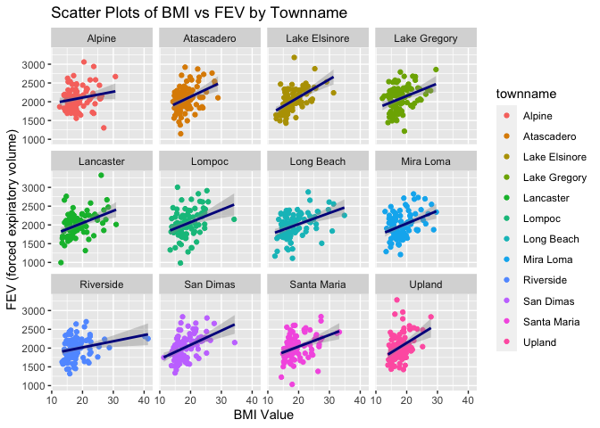

## Download the Data

You will need to download two datasets from https://github.com/USCbiostats/data-science-data. The individual and regional CHS datasets in 01_chs. The individual data includes personal and health characteristics of children in 12 communities across Southern California. The regional data include air quality measurements at the community level. Once downloaded, you can merge these datasets using the location variable. 


```r
individual <- data.table::fread("chs_individual.csv")
individual
```

```
##        sid  townname male race hispanic    agepft height weight      bmi asthma
##    1:    1 Lancaster    1    W        0 10.154689    123     54 16.22411      0
##    2:    2 Lancaster    1    W        0 10.461328    145     77 16.64685      0
##    3:    6 Lancaster    0    B        0 10.097194    145    143 30.91558      0
##    4:    7 Lancaster    0    O        0 10.746064    156     72 13.44809      0
##    5:    8 Lancaster    0    W        1  9.782341    132     61 15.91326      0
##   ---                                                                          
## 1196: 2047    Lompoc    0    W        1  9.631759    136     68 16.71123      0
## 1197: 2048    Lompoc    0    O        1  9.472964    133     68 17.47362      0
## 1198: 2049    Lompoc    1    O        1  9.733060    141    104 23.77784      0
## 1199: 2050    Lompoc    0    O        1  9.875428    145    119 25.72695      0
## 1200: 2053    Upland    0    W        0        NA     NA     NA       NA      0
##       active_asthma father_asthma mother_asthma wheeze hayfever allergy
##    1:             0             0             0      0        0       0
##    2:             0             0             0      1        0       0
##    3:             0             0             0      0        1       0
##    4:             0            NA             0      1        0       0
##    5:             0             1             0      1        1       1
##   ---                                                                  
## 1196:             0             0             0      0       NA       0
## 1197:             0             0             0      0        0      NA
## 1198:             0             1             1      0        0       0
## 1199:             0             0             0      0        0       0
## 1200:             0             0             0      0        0       0
##       educ_parent smoke pets gasstove       fev      fvc      mmef
##    1:           3     0    1        1 1650.2542 1800.005 2537.7774
##    2:           5     0    1        0 2273.1290 2721.111 2365.7454
##    3:           2     0    0        1 2011.6528 2257.244 1818.9734
##    4:           2     1    1        1 1643.0921 2060.526 1462.5000
##    5:           3     0    1        0 1651.9737 1996.382 1606.5789
##   ---                                                             
## 1196:           2     0    0        1  984.8485 1352.525  757.5758
## 1197:           1     0    0        1 1737.8289 1883.882 2689.1447
## 1198:           5     0    1        1 2260.3078 2930.661 1831.1609
## 1199:           1     0    0        1 2615.9708 2937.370 3651.8116
## 1200:           3     0    1        0        NA       NA        NA
```

```r
regional <- data.table::fread("chs_regional.csv")
regional
```

```
##          townname pm25_mass pm25_so4 pm25_no3 pm25_nh4 pm25_oc pm25_ec pm25_om
##  1:        Alpine      8.74     1.73     1.59     0.88    2.54    0.48    3.04
##  2: Lake Elsinore     12.35     1.90     2.98     1.36    3.64    0.62    4.36
##  3:  Lake Gregory      7.66     1.07     2.07     0.91    2.46    0.40    2.96
##  4:     Lancaster      8.50     0.91     1.87     0.78    4.43    0.55    5.32
##  5:        Lompoc      5.96     1.08     0.73     0.41    1.45    0.13    1.74
##  6:    Long Beach     19.12     3.23     6.22     2.57    5.21    1.36    6.25
##  7:     Mira Loma     29.97     2.69    12.20     4.25   11.83    1.25   14.20
##  8:     Riverside     22.39     2.43     8.66     3.14    5.27    0.94    6.32
##  9:     San Dimas     20.52     2.59     7.20     2.71    5.59    1.17    6.71
## 10:    Atascadero      7.48     0.79     1.38     0.61    3.31    0.40    3.97
## 11:   Santa Maria      7.19     1.44     1.21     0.59    2.39    0.34    2.86
## 12:        Upland     22.46     2.65     7.75     2.96    6.49    1.19    7.79
##     pm10_oc pm10_ec pm10_tc formic acetic  hcl hno3 o3_max o3106 o3_24   no2
##  1:    3.25    0.49    3.75   1.03   2.49 0.41 1.98  65.82 55.05 41.23 12.18
##  2:    4.66    0.63    5.29   1.18   3.56 0.46 2.63  66.70 54.42 32.23 17.03
##  3:    3.16    0.41    3.57   0.66   2.36 0.28 2.28  84.44 67.01 57.76  7.62
##  4:    5.68    0.56    8.61   0.88   2.88 0.22 1.80  54.81 43.88 32.86 15.77
##  5:    1.86    0.14    1.99   0.34   0.75 0.33 0.43  43.85 37.74 28.37  4.60
##  6:    6.68    1.39    8.07   1.57   2.94 0.73 2.67  39.44 28.22 18.22 33.11
##  7:   15.16    1.28   16.44   1.90   5.14 0.46 3.33  70.65 55.81 26.81 19.62
##  8:    6.75    0.96    7.72   1.72   3.92 0.47 3.43  77.90 62.04 31.50 19.95
##  9:    7.17    1.19    8.37   2.77   4.24 0.55 4.07  64.26 46.99 21.63 35.47
## 10:    4.24    0.41    4.65   0.74   2.11 0.31 0.97  51.96 43.29 26.21 12.56
## 11:    3.06    0.35    3.41   0.52   1.00 0.37 0.78  38.27 32.17 23.68 11.95
## 12:    8.32    1.22    9.54   2.67   4.73 0.46 4.03  63.83 46.50 22.20 37.97
##      pm10 no_24hr pm2_5_fr iacid oacid total_acids       lon      lat
##  1: 24.73    2.48    10.28  2.39  3.52        5.50 -116.7664 32.83505
##  2: 34.25    7.07    14.53  3.09  4.74        7.37 -117.3273 33.66808
##  3: 20.05      NA     9.01  2.56  3.02        5.30 -117.2752 34.24290
##  4: 25.04   12.68       NA  2.02  3.76        5.56 -118.1542 34.68678
##  5: 18.40    2.05       NA  0.76  1.09        1.52 -120.4579 34.63915
##  6: 38.41   36.76    22.23  3.40  4.51        7.18 -118.1937 33.77005
##  7: 70.39   26.90    31.55  3.79  7.04       10.37 -117.5159 33.98454
##  8: 41.55   15.48    27.99  3.90  5.64        9.07 -117.3755 33.98060
##  9: 38.61   42.95    25.33  4.62  7.01       11.08 -117.8067 34.10668
## 10: 20.93    8.71       NA  1.28  2.85        3.82 -120.6707 35.48942
## 11: 18.52    4.74     9.46  1.15  1.52        2.30 -120.4357 34.95303
## 12: 40.80   18.48    27.73  4.49  7.40       11.43 -117.6484 34.09751
```


1. After merging the data, make sure you don’t have any duplicates by counting the number of rows. Make sure it matches.

    In the case of missing values, impute data using the average within the variables “male” and “hispanic.” If you are interested (and feel adventurous) in the theme of Data Imputation, take a look at this paper on “Multiple Imputation” using the Amelia R package here.

### Merging data


```r
chs <- merge(
  # Data
  x     = individual,      
  y     = regional, 
  # List of variables to match
  by.x  = "townname",
  by.y  = "townname", 
  # Which obs to keep?
  all.x = TRUE,      
  all.y = FALSE
  )
```

### Checking Duplicate


```r
dim(individual)
```

```
## [1] 1200   23
```

```r
dim(regional)
```

```
## [1] 12 27
```

```r
dim(chs)
```

```
## [1] 1200   49
```

```r
head(chs)
```

```
##    townname sid male race hispanic    agepft height weight      bmi asthma
## 1:   Alpine 835    0    W        0 10.099932    143     69 15.33749      0
## 2:   Alpine 838    0    O        1  9.486653    133     62 15.93183      0
## 3:   Alpine 839    0    M        1 10.053388    142     86 19.38649      0
## 4:   Alpine 840    0    W        0  9.965777    146     78 16.63283      0
## 5:   Alpine 841    1    W        1 10.548939    150     78 15.75758      0
## 6:   Alpine 842    1    M        1  9.489391    139     65 15.29189      0
##    active_asthma father_asthma mother_asthma wheeze hayfever allergy
## 1:             0             0             0      0        0       1
## 2:             0             0             0      0        0       0
## 3:             0             0             1      1        1       1
## 4:             0             0             0      0        0       0
## 5:             0             0             0      0        0       0
## 6:             0             0             0      1        0       0
##    educ_parent smoke pets gasstove      fev      fvc     mmef pm25_mass
## 1:           3     0    1        0 2529.276 2826.316 3406.579      8.74
## 2:           4    NA    1        0 1737.793 1963.545 2133.110      8.74
## 3:           3     1    1        0 2121.711 2326.974 2835.197      8.74
## 4:          NA    NA    0       NA 2466.791 2638.221 3466.464      8.74
## 5:           5     0    1        0 2251.505 2594.649 2445.151      8.74
## 6:           1     1    1        0 2188.716 2423.934 2524.599      8.74
##    pm25_so4 pm25_no3 pm25_nh4 pm25_oc pm25_ec pm25_om pm10_oc pm10_ec pm10_tc
## 1:     1.73     1.59     0.88    2.54    0.48    3.04    3.25    0.49    3.75
## 2:     1.73     1.59     0.88    2.54    0.48    3.04    3.25    0.49    3.75
## 3:     1.73     1.59     0.88    2.54    0.48    3.04    3.25    0.49    3.75
## 4:     1.73     1.59     0.88    2.54    0.48    3.04    3.25    0.49    3.75
## 5:     1.73     1.59     0.88    2.54    0.48    3.04    3.25    0.49    3.75
## 6:     1.73     1.59     0.88    2.54    0.48    3.04    3.25    0.49    3.75
##    formic acetic  hcl hno3 o3_max o3106 o3_24   no2  pm10 no_24hr pm2_5_fr
## 1:   1.03   2.49 0.41 1.98  65.82 55.05 41.23 12.18 24.73    2.48    10.28
## 2:   1.03   2.49 0.41 1.98  65.82 55.05 41.23 12.18 24.73    2.48    10.28
## 3:   1.03   2.49 0.41 1.98  65.82 55.05 41.23 12.18 24.73    2.48    10.28
## 4:   1.03   2.49 0.41 1.98  65.82 55.05 41.23 12.18 24.73    2.48    10.28
## 5:   1.03   2.49 0.41 1.98  65.82 55.05 41.23 12.18 24.73    2.48    10.28
## 6:   1.03   2.49 0.41 1.98  65.82 55.05 41.23 12.18 24.73    2.48    10.28
##    iacid oacid total_acids       lon      lat
## 1:  2.39  3.52         5.5 -116.7664 32.83505
## 2:  2.39  3.52         5.5 -116.7664 32.83505
## 3:  2.39  3.52         5.5 -116.7664 32.83505
## 4:  2.39  3.52         5.5 -116.7664 32.83505
## 5:  2.39  3.52         5.5 -116.7664 32.83505
## 6:  2.39  3.52         5.5 -116.7664 32.83505
```
There is no duplicate happen, since the row of individual table is 1200 which matches the row of chs table, and the column of individual and region is 23 and 27 which matches the column of chs table: 27+23-1=49.

### Checking NAs


```r
str(chs)
```

```
## Classes 'data.table' and 'data.frame':	1200 obs. of  49 variables:
##  $ townname     : chr  "Alpine" "Alpine" "Alpine" "Alpine" ...
##  $ sid          : int  835 838 839 840 841 842 843 844 847 849 ...
##  $ male         : int  0 0 0 0 1 1 1 1 1 1 ...
##  $ race         : chr  "W" "O" "M" "W" ...
##  $ hispanic     : int  0 1 1 0 1 1 0 1 0 0 ...
##  $ agepft       : num  10.1 9.49 10.05 9.97 10.55 ...
##  $ height       : int  143 133 142 146 150 139 149 143 137 147 ...
##  $ weight       : int  69 62 86 78 78 65 98 65 69 112 ...
##  $ bmi          : num  15.3 15.9 19.4 16.6 15.8 ...
##  $ asthma       : int  0 0 0 0 0 0 0 NA 0 0 ...
##  $ active_asthma: int  0 0 0 0 0 0 0 0 0 0 ...
##  $ father_asthma: int  0 0 0 0 0 0 0 NA 0 1 ...
##  $ mother_asthma: int  0 0 1 0 0 0 0 NA 0 0 ...
##  $ wheeze       : int  0 0 1 0 0 1 1 NA 0 1 ...
##  $ hayfever     : int  0 0 1 0 0 0 0 NA 0 0 ...
##  $ allergy      : int  1 0 1 0 0 0 1 NA 0 1 ...
##  $ educ_parent  : int  3 4 3 NA 5 1 3 NA 5 3 ...
##  $ smoke        : int  0 NA 1 NA 0 1 0 NA 0 0 ...
##  $ pets         : int  1 1 1 0 1 1 1 0 1 1 ...
##  $ gasstove     : int  0 0 0 NA 0 0 1 NA 1 0 ...
##  $ fev          : num  2529 1738 2122 2467 2252 ...
##  $ fvc          : num  2826 1964 2327 2638 2595 ...
##  $ mmef         : num  3407 2133 2835 3466 2445 ...
##  $ pm25_mass    : num  8.74 8.74 8.74 8.74 8.74 8.74 8.74 8.74 8.74 8.74 ...
##  $ pm25_so4     : num  1.73 1.73 1.73 1.73 1.73 1.73 1.73 1.73 1.73 1.73 ...
##  $ pm25_no3     : num  1.59 1.59 1.59 1.59 1.59 1.59 1.59 1.59 1.59 1.59 ...
##  $ pm25_nh4     : num  0.88 0.88 0.88 0.88 0.88 0.88 0.88 0.88 0.88 0.88 ...
##  $ pm25_oc      : num  2.54 2.54 2.54 2.54 2.54 2.54 2.54 2.54 2.54 2.54 ...
##  $ pm25_ec      : num  0.48 0.48 0.48 0.48 0.48 0.48 0.48 0.48 0.48 0.48 ...
##  $ pm25_om      : num  3.04 3.04 3.04 3.04 3.04 3.04 3.04 3.04 3.04 3.04 ...
##  $ pm10_oc      : num  3.25 3.25 3.25 3.25 3.25 3.25 3.25 3.25 3.25 3.25 ...
##  $ pm10_ec      : num  0.49 0.49 0.49 0.49 0.49 0.49 0.49 0.49 0.49 0.49 ...
##  $ pm10_tc      : num  3.75 3.75 3.75 3.75 3.75 3.75 3.75 3.75 3.75 3.75 ...
##  $ formic       : num  1.03 1.03 1.03 1.03 1.03 1.03 1.03 1.03 1.03 1.03 ...
##  $ acetic       : num  2.49 2.49 2.49 2.49 2.49 2.49 2.49 2.49 2.49 2.49 ...
##  $ hcl          : num  0.41 0.41 0.41 0.41 0.41 0.41 0.41 0.41 0.41 0.41 ...
##  $ hno3         : num  1.98 1.98 1.98 1.98 1.98 1.98 1.98 1.98 1.98 1.98 ...
##  $ o3_max       : num  65.8 65.8 65.8 65.8 65.8 ...
##  $ o3106        : num  55 55 55 55 55 ...
##  $ o3_24        : num  41.2 41.2 41.2 41.2 41.2 ...
##  $ no2          : num  12.2 12.2 12.2 12.2 12.2 ...
##  $ pm10         : num  24.7 24.7 24.7 24.7 24.7 ...
##  $ no_24hr      : num  2.48 2.48 2.48 2.48 2.48 2.48 2.48 2.48 2.48 2.48 ...
##  $ pm2_5_fr     : num  10.3 10.3 10.3 10.3 10.3 ...
##  $ iacid        : num  2.39 2.39 2.39 2.39 2.39 2.39 2.39 2.39 2.39 2.39 ...
##  $ oacid        : num  3.52 3.52 3.52 3.52 3.52 3.52 3.52 3.52 3.52 3.52 ...
##  $ total_acids  : num  5.5 5.5 5.5 5.5 5.5 5.5 5.5 5.5 5.5 5.5 ...
##  $ lon          : num  -117 -117 -117 -117 -117 ...
##  $ lat          : num  32.8 32.8 32.8 32.8 32.8 ...
##  - attr(*, ".internal.selfref")=<externalptr> 
##  - attr(*, "sorted")= chr "townname"
```

```r
#check the NAs
summary(chs$bmi)
```

```
##    Min. 1st Qu.  Median    Mean 3rd Qu.    Max.    NA's 
##   11.30   15.78   17.48   18.50   20.35   41.27      89
```

```r
summary(chs$smoke)
```

```
##    Min. 1st Qu.  Median    Mean 3rd Qu.    Max.    NA's 
##  0.0000  0.0000  0.0000  0.1638  0.0000  1.0000      40
```

```r
summary(chs$gasstove)
```

```
##    Min. 1st Qu.  Median    Mean 3rd Qu.    Max.    NA's 
##  0.0000  1.0000  1.0000  0.7815  1.0000  1.0000      33
```

```r
summary(chs$fev)
```

```
##    Min. 1st Qu.  Median    Mean 3rd Qu.    Max.    NA's 
##   984.8  1809.0  2022.7  2031.3  2249.7  3323.7      95
```

```r
summary(chs$asthma)
```

```
##    Min. 1st Qu.  Median    Mean 3rd Qu.    Max.    NA's 
##  0.0000  0.0000  0.0000  0.1463  0.0000  1.0000      31
```

```r
summary(chs$pm25_mass)
```

```
##    Min. 1st Qu.  Median    Mean 3rd Qu.    Max. 
##   5.960   7.615  10.545  14.362  20.988  29.970
```

```r
#replace the NAs within average variables
chs[, mean_bmi := mean(bmi, na.rm = TRUE), by =.(male, hispanic)]
chs[, bmi := ifelse(is.na(bmi), mean_bmi, bmi)]

chs[, mean_smoke := mean(smoke, na.rm = TRUE), by = .(male, hispanic)]
chs[, smoke := ifelse(is.na(smoke), mean_smoke, smoke)]

chs[, mean_gasstove := mean(gasstove, na.rm = TRUE), by = .(male, hispanic)]
chs[, gasstove := ifelse(is.na(gasstove), mean_gasstove, gasstove)]

chs[, mean_fev := mean(fev, na.rm = TRUE), by = .(male, hispanic)]
chs[, fev := ifelse(is.na(fev), mean_fev, fev)]

chs[, mean_asthma := mean(asthma, na.rm = TRUE), by = .(male, hispanic)]
chs[, asthma := ifelse(is.na(asthma), mean_asthma, asthma)]

#check the NAs again
summary(chs$bmi)
```

```
##    Min. 1st Qu.  Median    Mean 3rd Qu.    Max. 
##   11.30   15.96   17.81   18.50   19.99   41.27
```

```r
summary(chs$smoke)
```

```
##    Min. 1st Qu.  Median    Mean 3rd Qu.    Max. 
##  0.0000  0.0000  0.0000  0.1636  0.0000  1.0000
```

```r
summary(chs$gasstove)
```

```
##    Min. 1st Qu.  Median    Mean 3rd Qu.    Max. 
##  0.0000  1.0000  1.0000  0.7817  1.0000  1.0000
```

```r
summary(chs$fev)
```

```
##    Min. 1st Qu.  Median    Mean 3rd Qu.    Max. 
##   984.8  1827.6  2016.4  2030.1  2223.6  3323.7
```

```r
summary(chs$asthma)
```

```
##    Min. 1st Qu.  Median    Mean 3rd Qu.    Max. 
##  0.0000  0.0000  0.0000  0.1463  0.0000  1.0000
```

```r
summary(chs$pm25_mass)
```

```
##    Min. 1st Qu.  Median    Mean 3rd Qu.    Max. 
##   5.960   7.615  10.545  14.362  20.988  29.970
```


2.Create a new categorical variable named “obesity_level” using the BMI measurement (underweight BMI<14; normal BMI 14-22; overweight BMI 22-24; obese BMI>24). To make sure the variable is rightly coded, create a summary table that contains the minimum BMI, maximum BMI, and the total number of observations per category.

### Create "obesity_level" variable


```r
chs[, obesity_level := fifelse(bmi <= 14, "Underweight",
                        fifelse(bmi > 14 & bmi <= 22, "Normal",
                          fifelse(bmi > 22 & bmi <= 24, "overweight", "Obese")))]

tab <- chs[, .(
  Minimun_BMI  = min(bmi),
  Maximun_BMI  = max(bmi),
  Total_Number = .N
), by = obesity_level]

knitr::kable(tab)
```


|obesity_level | Minimun_BMI| Maximun_BMI| Total_Number|
|:-------------|-----------:|-----------:|------------:|
|Normal        |    14.00380|    21.96387|          975|
|overweight    |    22.02353|    23.99650|           87|
|Obese         |    24.00647|    41.26613|          103|
|Underweight   |    11.29640|    13.98601|           35|


3. Create another categorical variable named “smoke_gas_exposure” that summarizes “Second Hand Smoke” and “Gas Stove.” The variable should have four categories in total.

### Create "smoke_gas_exposure"

```r
chs[, smoke_gas_exposure := fifelse(smoke == 0 & gasstove == 0, "No Exposure",
                              fifelse(smoke == 1 & gasstove == 0, "Smoke",
                                fifelse(smoke == 0 & gasstove == 1, "Gas", "Smoke & Gas Exposure")))]

table(chs$smoke_gas_exposure)
```

```
## 
##                  Gas          No Exposure                Smoke 
##                  739                  214                   36 
## Smoke & Gas Exposure 
##                  211
```


4. Create four summary tables showing the average (or proportion, if binary) and sd of “Forced expiratory volume in 1 second (ml)” and asthma indicator by town, sex, obesity level, and “smoke_gas_exposure.”

### Create summary tables

```r
tab_town <- chs[, .(
  Average_Fev = mean(fev),
  Average_Asthma = mean(asthma),
  SD_Fev = sd(fev),
  SD_Asthma = sd(asthma)
), by = townname]

knitr::kable(tab_town)
```


|townname      | Average_Fev| Average_Asthma|   SD_Fev| SD_Asthma|
|:-------------|-----------:|--------------:|--------:|---------:|
|Alpine        |    2087.101|      0.1144423| 291.1768| 0.3139348|
|Atascadero    |    2075.897|      0.2528408| 324.0935| 0.4340107|
|Lake Elsinore |    2038.849|      0.1274366| 303.6956| 0.3255095|
|Lake Gregory  |    2084.700|      0.1512392| 319.9593| 0.3585609|
|Lancaster     |    2003.044|      0.1640054| 317.1298| 0.3674206|
|Lompoc        |    2034.354|      0.1142335| 351.0454| 0.3139431|
|Long Beach    |    1985.861|      0.1359886| 319.4625| 0.3370219|
|Mira Loma     |    1985.202|      0.1582359| 324.9634| 0.3572088|
|Riverside     |    1989.881|      0.1100000| 277.5065| 0.3144660|
|San Dimas     |    2026.794|      0.1712392| 318.7845| 0.3771647|
|Santa Maria   |    2025.750|      0.1348240| 312.1725| 0.3372912|
|Upland        |    2024.266|      0.1212392| 343.1637| 0.3263737|


```r
tab_sex <- chs[, .(
  Average_Fev = mean(fev),
  Average_Asthma = mean(asthma),
  SD_Fev = sd(fev),
  SD_Asthma = sd(asthma)
), by = male]

knitr::kable(tab_sex)
```


| male| Average_Fev| Average_Asthma|   SD_Fev| SD_Asthma|
|----:|-----------:|--------------:|--------:|---------:|
|    0|    1958.911|      0.1208035| 311.9181| 0.3224043|
|    1|    2103.787|      0.1726819| 307.5123| 0.3728876|


```r
tab_obesity <- chs[, .(
  Average_Fev = mean(fev),
  Average_Asthma = mean(asthma),
  SD_Fev = sd(fev),
  SD_Asthma = sd(asthma)
), by = obesity_level]

knitr::kable(tab_obesity)
```


|obesity_level | Average_Fev| Average_Asthma|   SD_Fev| SD_Asthma|
|:-------------|-----------:|--------------:|--------:|---------:|
|Normal        |    1999.794|      0.1403606| 295.1964| 0.3426863|
|overweight    |    2224.322|      0.1640991| 317.4261| 0.3687886|
|Obese         |    2266.154|      0.2081964| 325.4710| 0.4034416|
|Underweight   |    1698.327|      0.0857143| 303.3983| 0.2840286|


```r
tab_smoke_gas <- chs[, .(
  Average_Fev = mean(fev),
  Average_Asthma = mean(asthma),
  SD_Fev = sd(fev),
  SD_Asthma = sd(asthma)
), by = smoke_gas_exposure]

knitr::kable(tab_smoke_gas)
```


|smoke_gas_exposure   | Average_Fev| Average_Asthma|   SD_Fev| SD_Asthma|
|:--------------------|-----------:|--------------:|--------:|---------:|
|No Exposure          |    2055.356|      0.1476213| 330.4169| 0.3522319|
|Smoke & Gas Exposure |    2014.752|      0.1352076| 310.5479| 0.3273861|
|Smoke                |    2055.714|      0.1717490| 295.6475| 0.3768879|
|Gas                  |    2025.989|      0.1478616| 317.6305| 0.3531690|

## Looking at the Data (EDA)

#### Check the dimensions, headers, footers. 

```r
dim(chs)
```

```
## [1] 1200   56
```

```r
head(chs)
```

```
##    townname sid male race hispanic    agepft height weight      bmi asthma
## 1:   Alpine 835    0    W        0 10.099932    143     69 15.33749      0
## 2:   Alpine 838    0    O        1  9.486653    133     62 15.93183      0
## 3:   Alpine 839    0    M        1 10.053388    142     86 19.38649      0
## 4:   Alpine 840    0    W        0  9.965777    146     78 16.63283      0
## 5:   Alpine 841    1    W        1 10.548939    150     78 15.75758      0
## 6:   Alpine 842    1    M        1  9.489391    139     65 15.29189      0
##    active_asthma father_asthma mother_asthma wheeze hayfever allergy
## 1:             0             0             0      0        0       1
## 2:             0             0             0      0        0       0
## 3:             0             0             1      1        1       1
## 4:             0             0             0      0        0       0
## 5:             0             0             0      0        0       0
## 6:             0             0             0      1        0       0
##    educ_parent     smoke pets  gasstove      fev      fvc     mmef pm25_mass
## 1:           3 0.0000000    1 0.0000000 2529.276 2826.316 3406.579      8.74
## 2:           4 0.1535270    1 0.0000000 1737.793 1963.545 2133.110      8.74
## 3:           3 1.0000000    1 0.0000000 2121.711 2326.974 2835.197      8.74
## 4:          NA 0.1522989    0 0.7291066 2466.791 2638.221 3466.464      8.74
## 5:           5 0.0000000    1 0.0000000 2251.505 2594.649 2445.151      8.74
## 6:           1 1.0000000    1 0.0000000 2188.716 2423.934 2524.599      8.74
##    pm25_so4 pm25_no3 pm25_nh4 pm25_oc pm25_ec pm25_om pm10_oc pm10_ec pm10_tc
## 1:     1.73     1.59     0.88    2.54    0.48    3.04    3.25    0.49    3.75
## 2:     1.73     1.59     0.88    2.54    0.48    3.04    3.25    0.49    3.75
## 3:     1.73     1.59     0.88    2.54    0.48    3.04    3.25    0.49    3.75
## 4:     1.73     1.59     0.88    2.54    0.48    3.04    3.25    0.49    3.75
## 5:     1.73     1.59     0.88    2.54    0.48    3.04    3.25    0.49    3.75
## 6:     1.73     1.59     0.88    2.54    0.48    3.04    3.25    0.49    3.75
##    formic acetic  hcl hno3 o3_max o3106 o3_24   no2  pm10 no_24hr pm2_5_fr
## 1:   1.03   2.49 0.41 1.98  65.82 55.05 41.23 12.18 24.73    2.48    10.28
## 2:   1.03   2.49 0.41 1.98  65.82 55.05 41.23 12.18 24.73    2.48    10.28
## 3:   1.03   2.49 0.41 1.98  65.82 55.05 41.23 12.18 24.73    2.48    10.28
## 4:   1.03   2.49 0.41 1.98  65.82 55.05 41.23 12.18 24.73    2.48    10.28
## 5:   1.03   2.49 0.41 1.98  65.82 55.05 41.23 12.18 24.73    2.48    10.28
## 6:   1.03   2.49 0.41 1.98  65.82 55.05 41.23 12.18 24.73    2.48    10.28
##    iacid oacid total_acids       lon      lat mean_bmi mean_smoke mean_gasstove
## 1:  2.39  3.52         5.5 -116.7664 32.83505 18.05281  0.1522989     0.7291066
## 2:  2.39  3.52         5.5 -116.7664 32.83505 18.63201  0.1535270     0.8218623
## 3:  2.39  3.52         5.5 -116.7664 32.83505 18.63201  0.1535270     0.8218623
## 4:  2.39  3.52         5.5 -116.7664 32.83505 18.05281  0.1522989     0.7291066
## 5:  2.39  3.52         5.5 -116.7664 32.83505 19.41148  0.1501976     0.8156863
## 6:  2.39  3.52         5.5 -116.7664 32.83505 19.41148  0.1501976     0.8156863
##    mean_fev mean_asthma obesity_level   smoke_gas_exposure
## 1: 1945.743   0.1239193        Normal          No Exposure
## 2: 1977.241   0.1164659        Normal Smoke & Gas Exposure
## 3: 1977.241   0.1164659        Normal                Smoke
## 4: 1945.743   0.1239193        Normal Smoke & Gas Exposure
## 5: 2120.266   0.1601562        Normal          No Exposure
## 6: 2120.266   0.1601562        Normal                Smoke
```

```r
tail(chs)
```

```
##    townname  sid male race hispanic    agepft height weight      bmi asthma
## 1:   Upland 1866    0    O        1  9.806982    139     60 14.11559      0
## 2:   Upland 1867    0    M        1  9.618070    140     71 16.46568      0
## 3:   Upland 2031    1    W        0  9.798768    135     83 20.70084      0
## 4:   Upland 2032    1    W        0  9.549624    137     59 14.28855      0
## 5:   Upland 2033    0    M        0 10.121834    130     67 18.02044      0
## 6:   Upland 2053    0    W        0        NA     NA     NA 18.05281      0
##    active_asthma father_asthma mother_asthma wheeze hayfever allergy
## 1:             0            NA             0      0       NA      NA
## 2:             0             1             0      0        0       0
## 3:             0             0             0      1        0       1
## 4:             0             0             1      1        1       1
## 5:             1             0             0      1        1       0
## 6:             0             0             0      0        0       0
##    educ_parent smoke pets gasstove      fev      fvc     mmef pm25_mass
## 1:           3     0    1        0 1691.275 1928.859 1890.604     22.46
## 2:           3     0    1        0 1733.338 1993.040 2072.643     22.46
## 3:           3     0    1        1 2034.177 2505.535 1814.075     22.46
## 4:           3     0    1        1 2077.703 2275.338 2706.081     22.46
## 5:           3     0    1        1 1929.866 2122.148 2558.054     22.46
## 6:           3     0    1        0 1945.743       NA       NA     22.46
##    pm25_so4 pm25_no3 pm25_nh4 pm25_oc pm25_ec pm25_om pm10_oc pm10_ec pm10_tc
## 1:     2.65     7.75     2.96    6.49    1.19    7.79    8.32    1.22    9.54
## 2:     2.65     7.75     2.96    6.49    1.19    7.79    8.32    1.22    9.54
## 3:     2.65     7.75     2.96    6.49    1.19    7.79    8.32    1.22    9.54
## 4:     2.65     7.75     2.96    6.49    1.19    7.79    8.32    1.22    9.54
## 5:     2.65     7.75     2.96    6.49    1.19    7.79    8.32    1.22    9.54
## 6:     2.65     7.75     2.96    6.49    1.19    7.79    8.32    1.22    9.54
##    formic acetic  hcl hno3 o3_max o3106 o3_24   no2 pm10 no_24hr pm2_5_fr iacid
## 1:   2.67   4.73 0.46 4.03  63.83  46.5  22.2 37.97 40.8   18.48    27.73  4.49
## 2:   2.67   4.73 0.46 4.03  63.83  46.5  22.2 37.97 40.8   18.48    27.73  4.49
## 3:   2.67   4.73 0.46 4.03  63.83  46.5  22.2 37.97 40.8   18.48    27.73  4.49
## 4:   2.67   4.73 0.46 4.03  63.83  46.5  22.2 37.97 40.8   18.48    27.73  4.49
## 5:   2.67   4.73 0.46 4.03  63.83  46.5  22.2 37.97 40.8   18.48    27.73  4.49
## 6:   2.67   4.73 0.46 4.03  63.83  46.5  22.2 37.97 40.8   18.48    27.73  4.49
##    oacid total_acids       lon      lat mean_bmi mean_smoke mean_gasstove
## 1:   7.4       11.43 -117.6484 34.09751 18.63201  0.1535270     0.8218623
## 2:   7.4       11.43 -117.6484 34.09751 18.63201  0.1535270     0.8218623
## 3:   7.4       11.43 -117.6484 34.09751 18.14035  0.1949686     0.7798742
## 4:   7.4       11.43 -117.6484 34.09751 18.14035  0.1949686     0.7798742
## 5:   7.4       11.43 -117.6484 34.09751 18.05281  0.1522989     0.7291066
## 6:   7.4       11.43 -117.6484 34.09751 18.05281  0.1522989     0.7291066
##    mean_fev mean_asthma obesity_level smoke_gas_exposure
## 1: 1977.241   0.1164659        Normal        No Exposure
## 2: 1977.241   0.1164659        Normal        No Exposure
## 3: 2090.258   0.1829653        Normal                Gas
## 4: 2090.258   0.1829653        Normal                Gas
## 5: 1945.743   0.1239193        Normal                Gas
## 6: 1945.743   0.1239193        Normal        No Exposure
```
 
#### Take a look at the variables.


```r
str(chs)
```

```
## Classes 'data.table' and 'data.frame':	1200 obs. of  56 variables:
##  $ townname          : chr  "Alpine" "Alpine" "Alpine" "Alpine" ...
##  $ sid               : int  835 838 839 840 841 842 843 844 847 849 ...
##  $ male              : int  0 0 0 0 1 1 1 1 1 1 ...
##  $ race              : chr  "W" "O" "M" "W" ...
##  $ hispanic          : int  0 1 1 0 1 1 0 1 0 0 ...
##  $ agepft            : num  10.1 9.49 10.05 9.97 10.55 ...
##  $ height            : int  143 133 142 146 150 139 149 143 137 147 ...
##  $ weight            : int  69 62 86 78 78 65 98 65 69 112 ...
##  $ bmi               : num  15.3 15.9 19.4 16.6 15.8 ...
##  $ asthma            : num  0 0 0 0 0 ...
##  $ active_asthma     : int  0 0 0 0 0 0 0 0 0 0 ...
##  $ father_asthma     : int  0 0 0 0 0 0 0 NA 0 1 ...
##  $ mother_asthma     : int  0 0 1 0 0 0 0 NA 0 0 ...
##  $ wheeze            : int  0 0 1 0 0 1 1 NA 0 1 ...
##  $ hayfever          : int  0 0 1 0 0 0 0 NA 0 0 ...
##  $ allergy           : int  1 0 1 0 0 0 1 NA 0 1 ...
##  $ educ_parent       : int  3 4 3 NA 5 1 3 NA 5 3 ...
##  $ smoke             : num  0 0.154 1 0.152 0 ...
##  $ pets              : int  1 1 1 0 1 1 1 0 1 1 ...
##  $ gasstove          : num  0 0 0 0.729 0 ...
##  $ fev               : num  2529 1738 2122 2467 2252 ...
##  $ fvc               : num  2826 1964 2327 2638 2595 ...
##  $ mmef              : num  3407 2133 2835 3466 2445 ...
##  $ pm25_mass         : num  8.74 8.74 8.74 8.74 8.74 8.74 8.74 8.74 8.74 8.74 ...
##  $ pm25_so4          : num  1.73 1.73 1.73 1.73 1.73 1.73 1.73 1.73 1.73 1.73 ...
##  $ pm25_no3          : num  1.59 1.59 1.59 1.59 1.59 1.59 1.59 1.59 1.59 1.59 ...
##  $ pm25_nh4          : num  0.88 0.88 0.88 0.88 0.88 0.88 0.88 0.88 0.88 0.88 ...
##  $ pm25_oc           : num  2.54 2.54 2.54 2.54 2.54 2.54 2.54 2.54 2.54 2.54 ...
##  $ pm25_ec           : num  0.48 0.48 0.48 0.48 0.48 0.48 0.48 0.48 0.48 0.48 ...
##  $ pm25_om           : num  3.04 3.04 3.04 3.04 3.04 3.04 3.04 3.04 3.04 3.04 ...
##  $ pm10_oc           : num  3.25 3.25 3.25 3.25 3.25 3.25 3.25 3.25 3.25 3.25 ...
##  $ pm10_ec           : num  0.49 0.49 0.49 0.49 0.49 0.49 0.49 0.49 0.49 0.49 ...
##  $ pm10_tc           : num  3.75 3.75 3.75 3.75 3.75 3.75 3.75 3.75 3.75 3.75 ...
##  $ formic            : num  1.03 1.03 1.03 1.03 1.03 1.03 1.03 1.03 1.03 1.03 ...
##  $ acetic            : num  2.49 2.49 2.49 2.49 2.49 2.49 2.49 2.49 2.49 2.49 ...
##  $ hcl               : num  0.41 0.41 0.41 0.41 0.41 0.41 0.41 0.41 0.41 0.41 ...
##  $ hno3              : num  1.98 1.98 1.98 1.98 1.98 1.98 1.98 1.98 1.98 1.98 ...
##  $ o3_max            : num  65.8 65.8 65.8 65.8 65.8 ...
##  $ o3106             : num  55 55 55 55 55 ...
##  $ o3_24             : num  41.2 41.2 41.2 41.2 41.2 ...
##  $ no2               : num  12.2 12.2 12.2 12.2 12.2 ...
##  $ pm10              : num  24.7 24.7 24.7 24.7 24.7 ...
##  $ no_24hr           : num  2.48 2.48 2.48 2.48 2.48 2.48 2.48 2.48 2.48 2.48 ...
##  $ pm2_5_fr          : num  10.3 10.3 10.3 10.3 10.3 ...
##  $ iacid             : num  2.39 2.39 2.39 2.39 2.39 2.39 2.39 2.39 2.39 2.39 ...
##  $ oacid             : num  3.52 3.52 3.52 3.52 3.52 3.52 3.52 3.52 3.52 3.52 ...
##  $ total_acids       : num  5.5 5.5 5.5 5.5 5.5 5.5 5.5 5.5 5.5 5.5 ...
##  $ lon               : num  -117 -117 -117 -117 -117 ...
##  $ lat               : num  32.8 32.8 32.8 32.8 32.8 ...
##  $ mean_bmi          : num  18.1 18.6 18.6 18.1 19.4 ...
##  $ mean_smoke        : num  0.152 0.154 0.154 0.152 0.15 ...
##  $ mean_gasstove     : num  0.729 0.822 0.822 0.729 0.816 ...
##  $ mean_fev          : num  1946 1977 1977 1946 2120 ...
##  $ mean_asthma       : num  0.124 0.116 0.116 0.124 0.16 ...
##  $ obesity_level     : chr  "Normal" "Normal" "Normal" "Normal" ...
##  $ smoke_gas_exposure: chr  "No Exposure" "Smoke & Gas Exposure" "Smoke" "Smoke & Gas Exposure" ...
##  - attr(*, ".internal.selfref")=<externalptr> 
##  - attr(*, "sorted")= chr "townname"
```


#### Take a closer look at the key variables.


```r
table(chs$townname)
```

```
## 
##        Alpine    Atascadero Lake Elsinore  Lake Gregory     Lancaster 
##           100           100           100           100           100 
##        Lompoc    Long Beach     Mira Loma     Riverside     San Dimas 
##           100           100           100           100           100 
##   Santa Maria        Upland 
##           100           100
```

```r
table(chs$male)
```

```
## 
##   0   1 
## 610 590
```

```r
summary(chs$bmi)
```

```
##    Min. 1st Qu.  Median    Mean 3rd Qu.    Max. 
##   11.30   15.96   17.81   18.50   19.99   41.27
```

```r
summary(chs$smoke)
```

```
##    Min. 1st Qu.  Median    Mean 3rd Qu.    Max. 
##  0.0000  0.0000  0.0000  0.1636  0.0000  1.0000
```

```r
summary(chs$gasstove)
```

```
##    Min. 1st Qu.  Median    Mean 3rd Qu.    Max. 
##  0.0000  1.0000  1.0000  0.7817  1.0000  1.0000
```

```r
summary(chs$fev)
```

```
##    Min. 1st Qu.  Median    Mean 3rd Qu.    Max. 
##   984.8  1827.6  2016.4  2030.1  2223.6  3323.7
```

```r
summary(chs$asthma)
```

```
##    Min. 1st Qu.  Median    Mean 3rd Qu.    Max. 
##  0.0000  0.0000  0.0000  0.1463  0.0000  1.0000
```

```r
summary(chs$pm25_mass)
```

```
##    Min. 1st Qu.  Median    Mean 3rd Qu.    Max. 
##   5.960   7.615  10.545  14.362  20.988  29.970
```

```r
table(chs$obesity_level)
```

```
## 
##      Normal       Obese  overweight Underweight 
##         975         103          87          35
```

### 1. Facet plot showing scatterplots with regression lines of BMI vs FEV by “townname”

```r
chs %>%
  ggplot(aes(x = bmi, y = fev, color = townname)) +
  geom_point() + 
  geom_smooth(method = lm, col = "darkblue")+
  facet_wrap(~townname)+
  labs(title = "Scatter Plots of BMI vs FEV by Townname", x = "BMI Value", y = "FEV (forced expiratory volume)")
```

```
## `geom_smooth()` using formula 'y ~ x'
```

<!-- -->

From the scetter plots, it is clear that Fev is positively correlated with BMI based on 12 towns.

### 2. Stacked histograms of FEV by BMI category and FEV by smoke/gas exposure. Use different color schemes than the ggplot default.


```r
chs %>%
  ggplot(aes(x = fev, fill = obesity_level)) +
  geom_histogram()+
  scale_fill_brewer(palette = "Pastel2")+
  labs(title = "Stacked Histograms of FEV by BMI Category", x = "FEV (forced expiratory volume)", y = "BMI Category Count")
```

```
## `stat_bin()` using `bins = 30`. Pick better value with `binwidth`.
```

<!-- -->

From the stacked histograms of fev by bmi category, it is obviously that fev is normal distribution for BMI category.


```r
chs %>%
  ggplot(aes(x = fev, fill = smoke_gas_exposure)) +
  geom_histogram()+
  scale_fill_brewer(palette = "Purples")+
  labs(title = "Stacked Histograms of FEV by Smoke/Gas Exposure", x = "FEV (forced expiratory volume)", y = "Exposure Count")
```

```
## `stat_bin()` using `bins = 30`. Pick better value with `binwidth`.
```

<!-- -->

From the stacked histograms of fev by smoke/gas exposure, it is obviously that fev is normal distribution for smoke/gas exposure.

### 3. Barchart of BMI by smoke/gas exposure.


```r
chs %>%
  ggplot(aes(x = obesity_level, fill = smoke_gas_exposure)) +
  geom_bar() +
  labs(title = "Barchart of BMI by Smoke/Gas Exposure  ", x="BMI",y="Smoke/Gas Exposure Count") +
  scale_fill_brewer(palette = "PuBu")
```

<!-- -->

From the bar chart of BMI by smoke/gas exposure, it seems that gas exposure will not affect normal group, and most of them are no exposure. Smoke exposure kind of effect obese people, and normal people also have a range of smoke which shows there is no obvious relationship exists.

### 4. Statistical summary graphs of FEV by BMI and FEV by smoke/gas exposure category.


```r
chs %>%
  ggplot(aes(x = obesity_level, y=fev)) +
  stat_summary(fun.min = min, fun.max = max, fun = median) +
  labs(title = " Statistical Summary Graphs of FEV by BMI",x="BMI", y="FEV (forced expiratory volume)" )
```

<!-- -->

From the statistical summary graphs of fev by bmi, the median of obese is highest, overweight is more similar.


```r
chs %>%
  ggplot(aes(x = smoke_gas_exposure, y=fev)) +
  stat_summary(fun.min = min, fun.max = max, fun = median) +
  labs(title = " Statistical Summary Graphs of FEV by Smoke/Gas Exposure",x="Smoke/Gas Exposure", y="FEV (forced expiratory volume)" )
```

<!-- -->

From above graph, the median of each category has closet value, the range of smoke&gas and smoke is smallest.

### 5. A leaflet map showing the concentrations of PM2.5 mass in each of the CHS communities.


```r
pm25_pal = colorNumeric(c('green','orange','red'), domain=chs$pm25_mass)
leaflet(chs)%>%
  addProviderTiles("OpenStreetMap")%>%
  addCircles(lat=~lat,lng=~lon,color=~pm25_pal(pm25_mass),opacity=1,fillOpacity=1, radius=500)%>%
  addLegend("bottomleft", pal = pm25_pal, values = chs$pm25_mass, title="Concentration of PM2.5 Mass in each of the CHS communities", opacity=1)
```

```{=html}
<div id="htmlwidget-87e996402e9fdb8b16f7" style="width:672px;height:480px;" class="leaflet html-widget"></div>
<script type="application/json" data-for="htmlwidget-87e996402e9fdb8b16f7">{"x":{"options":{"crs":{"crsClass":"L.CRS.EPSG3857","code":null,"proj4def":null,"projectedBounds":null,"options":{}}},"calls":[{"method":"addProviderTiles","args":["OpenStreetMap",null,null,{"errorTileUrl":"","noWrap":false,"detectRetina":false}]},{"method":"addCircles","args":[[32.8350521,32.8350521,32.8350521,32.8350521,32.8350521,32.8350521,32.8350521,32.8350521,32.8350521,32.8350521,32.8350521,32.8350521,32.8350521,32.8350521,32.8350521,32.8350521,32.8350521,32.8350521,32.8350521,32.8350521,32.8350521,32.8350521,32.8350521,32.8350521,32.8350521,32.8350521,32.8350521,32.8350521,32.8350521,32.8350521,32.8350521,32.8350521,32.8350521,32.8350521,32.8350521,32.8350521,32.8350521,32.8350521,32.8350521,32.8350521,32.8350521,32.8350521,32.8350521,32.8350521,32.8350521,32.8350521,32.8350521,32.8350521,32.8350521,32.8350521,32.8350521,32.8350521,32.8350521,32.8350521,32.8350521,32.8350521,32.8350521,32.8350521,32.8350521,32.8350521,32.8350521,32.8350521,32.8350521,32.8350521,32.8350521,32.8350521,32.8350521,32.8350521,32.8350521,32.8350521,32.8350521,32.8350521,32.8350521,32.8350521,32.8350521,32.8350521,32.8350521,32.8350521,32.8350521,32.8350521,32.8350521,32.8350521,32.8350521,32.8350521,32.8350521,32.8350521,32.8350521,32.8350521,32.8350521,32.8350521,32.8350521,32.8350521,32.8350521,32.8350521,32.8350521,32.8350521,32.8350521,32.8350521,32.8350521,32.8350521,35.4894169,35.4894169,35.4894169,35.4894169,35.4894169,35.4894169,35.4894169,35.4894169,35.4894169,35.4894169,35.4894169,35.4894169,35.4894169,35.4894169,35.4894169,35.4894169,35.4894169,35.4894169,35.4894169,35.4894169,35.4894169,35.4894169,35.4894169,35.4894169,35.4894169,35.4894169,35.4894169,35.4894169,35.4894169,35.4894169,35.4894169,35.4894169,35.4894169,35.4894169,35.4894169,35.4894169,35.4894169,35.4894169,35.4894169,35.4894169,35.4894169,35.4894169,35.4894169,35.4894169,35.4894169,35.4894169,35.4894169,35.4894169,35.4894169,35.4894169,35.4894169,35.4894169,35.4894169,35.4894169,35.4894169,35.4894169,35.4894169,35.4894169,35.4894169,35.4894169,35.4894169,35.4894169,35.4894169,35.4894169,35.4894169,35.4894169,35.4894169,35.4894169,35.4894169,35.4894169,35.4894169,35.4894169,35.4894169,35.4894169,35.4894169,35.4894169,35.4894169,35.4894169,35.4894169,35.4894169,35.4894169,35.4894169,35.4894169,35.4894169,35.4894169,35.4894169,35.4894169,35.4894169,35.4894169,35.4894169,35.4894169,35.4894169,35.4894169,35.4894169,35.4894169,35.4894169,35.4894169,35.4894169,35.4894169,35.4894169,33.6680772,33.6680772,33.6680772,33.6680772,33.6680772,33.6680772,33.6680772,33.6680772,33.6680772,33.6680772,33.6680772,33.6680772,33.6680772,33.6680772,33.6680772,33.6680772,33.6680772,33.6680772,33.6680772,33.6680772,33.6680772,33.6680772,33.6680772,33.6680772,33.6680772,33.6680772,33.6680772,33.6680772,33.6680772,33.6680772,33.6680772,33.6680772,33.6680772,33.6680772,33.6680772,33.6680772,33.6680772,33.6680772,33.6680772,33.6680772,33.6680772,33.6680772,33.6680772,33.6680772,33.6680772,33.6680772,33.6680772,33.6680772,33.6680772,33.6680772,33.6680772,33.6680772,33.6680772,33.6680772,33.6680772,33.6680772,33.6680772,33.6680772,33.6680772,33.6680772,33.6680772,33.6680772,33.6680772,33.6680772,33.6680772,33.6680772,33.6680772,33.6680772,33.6680772,33.6680772,33.6680772,33.6680772,33.6680772,33.6680772,33.6680772,33.6680772,33.6680772,33.6680772,33.6680772,33.6680772,33.6680772,33.6680772,33.6680772,33.6680772,33.6680772,33.6680772,33.6680772,33.6680772,33.6680772,33.6680772,33.6680772,33.6680772,33.6680772,33.6680772,33.6680772,33.6680772,33.6680772,33.6680772,33.6680772,33.6680772,34.242901,34.242901,34.242901,34.242901,34.242901,34.242901,34.242901,34.242901,34.242901,34.242901,34.242901,34.242901,34.242901,34.242901,34.242901,34.242901,34.242901,34.242901,34.242901,34.242901,34.242901,34.242901,34.242901,34.242901,34.242901,34.242901,34.242901,34.242901,34.242901,34.242901,34.242901,34.242901,34.242901,34.242901,34.242901,34.242901,34.242901,34.242901,34.242901,34.242901,34.242901,34.242901,34.242901,34.242901,34.242901,34.242901,34.242901,34.242901,34.242901,34.242901,34.242901,34.242901,34.242901,34.242901,34.242901,34.242901,34.242901,34.242901,34.242901,34.242901,34.242901,34.242901,34.242901,34.242901,34.242901,34.242901,34.242901,34.242901,34.242901,34.242901,34.242901,34.242901,34.242901,34.242901,34.242901,34.242901,34.242901,34.242901,34.242901,34.242901,34.242901,34.242901,34.242901,34.242901,34.242901,34.242901,34.242901,34.242901,34.242901,34.242901,34.242901,34.242901,34.242901,34.242901,34.242901,34.242901,34.242901,34.242901,34.242901,34.242901,34.6867846,34.6867846,34.6867846,34.6867846,34.6867846,34.6867846,34.6867846,34.6867846,34.6867846,34.6867846,34.6867846,34.6867846,34.6867846,34.6867846,34.6867846,34.6867846,34.6867846,34.6867846,34.6867846,34.6867846,34.6867846,34.6867846,34.6867846,34.6867846,34.6867846,34.6867846,34.6867846,34.6867846,34.6867846,34.6867846,34.6867846,34.6867846,34.6867846,34.6867846,34.6867846,34.6867846,34.6867846,34.6867846,34.6867846,34.6867846,34.6867846,34.6867846,34.6867846,34.6867846,34.6867846,34.6867846,34.6867846,34.6867846,34.6867846,34.6867846,34.6867846,34.6867846,34.6867846,34.6867846,34.6867846,34.6867846,34.6867846,34.6867846,34.6867846,34.6867846,34.6867846,34.6867846,34.6867846,34.6867846,34.6867846,34.6867846,34.6867846,34.6867846,34.6867846,34.6867846,34.6867846,34.6867846,34.6867846,34.6867846,34.6867846,34.6867846,34.6867846,34.6867846,34.6867846,34.6867846,34.6867846,34.6867846,34.6867846,34.6867846,34.6867846,34.6867846,34.6867846,34.6867846,34.6867846,34.6867846,34.6867846,34.6867846,34.6867846,34.6867846,34.6867846,34.6867846,34.6867846,34.6867846,34.6867846,34.6867846,34.6391501,34.6391501,34.6391501,34.6391501,34.6391501,34.6391501,34.6391501,34.6391501,34.6391501,34.6391501,34.6391501,34.6391501,34.6391501,34.6391501,34.6391501,34.6391501,34.6391501,34.6391501,34.6391501,34.6391501,34.6391501,34.6391501,34.6391501,34.6391501,34.6391501,34.6391501,34.6391501,34.6391501,34.6391501,34.6391501,34.6391501,34.6391501,34.6391501,34.6391501,34.6391501,34.6391501,34.6391501,34.6391501,34.6391501,34.6391501,34.6391501,34.6391501,34.6391501,34.6391501,34.6391501,34.6391501,34.6391501,34.6391501,34.6391501,34.6391501,34.6391501,34.6391501,34.6391501,34.6391501,34.6391501,34.6391501,34.6391501,34.6391501,34.6391501,34.6391501,34.6391501,34.6391501,34.6391501,34.6391501,34.6391501,34.6391501,34.6391501,34.6391501,34.6391501,34.6391501,34.6391501,34.6391501,34.6391501,34.6391501,34.6391501,34.6391501,34.6391501,34.6391501,34.6391501,34.6391501,34.6391501,34.6391501,34.6391501,34.6391501,34.6391501,34.6391501,34.6391501,34.6391501,34.6391501,34.6391501,34.6391501,34.6391501,34.6391501,34.6391501,34.6391501,34.6391501,34.6391501,34.6391501,34.6391501,34.6391501,33.7700504,33.7700504,33.7700504,33.7700504,33.7700504,33.7700504,33.7700504,33.7700504,33.7700504,33.7700504,33.7700504,33.7700504,33.7700504,33.7700504,33.7700504,33.7700504,33.7700504,33.7700504,33.7700504,33.7700504,33.7700504,33.7700504,33.7700504,33.7700504,33.7700504,33.7700504,33.7700504,33.7700504,33.7700504,33.7700504,33.7700504,33.7700504,33.7700504,33.7700504,33.7700504,33.7700504,33.7700504,33.7700504,33.7700504,33.7700504,33.7700504,33.7700504,33.7700504,33.7700504,33.7700504,33.7700504,33.7700504,33.7700504,33.7700504,33.7700504,33.7700504,33.7700504,33.7700504,33.7700504,33.7700504,33.7700504,33.7700504,33.7700504,33.7700504,33.7700504,33.7700504,33.7700504,33.7700504,33.7700504,33.7700504,33.7700504,33.7700504,33.7700504,33.7700504,33.7700504,33.7700504,33.7700504,33.7700504,33.7700504,33.7700504,33.7700504,33.7700504,33.7700504,33.7700504,33.7700504,33.7700504,33.7700504,33.7700504,33.7700504,33.7700504,33.7700504,33.7700504,33.7700504,33.7700504,33.7700504,33.7700504,33.7700504,33.7700504,33.7700504,33.7700504,33.7700504,33.7700504,33.7700504,33.7700504,33.7700504,33.9845417,33.9845417,33.9845417,33.9845417,33.9845417,33.9845417,33.9845417,33.9845417,33.9845417,33.9845417,33.9845417,33.9845417,33.9845417,33.9845417,33.9845417,33.9845417,33.9845417,33.9845417,33.9845417,33.9845417,33.9845417,33.9845417,33.9845417,33.9845417,33.9845417,33.9845417,33.9845417,33.9845417,33.9845417,33.9845417,33.9845417,33.9845417,33.9845417,33.9845417,33.9845417,33.9845417,33.9845417,33.9845417,33.9845417,33.9845417,33.9845417,33.9845417,33.9845417,33.9845417,33.9845417,33.9845417,33.9845417,33.9845417,33.9845417,33.9845417,33.9845417,33.9845417,33.9845417,33.9845417,33.9845417,33.9845417,33.9845417,33.9845417,33.9845417,33.9845417,33.9845417,33.9845417,33.9845417,33.9845417,33.9845417,33.9845417,33.9845417,33.9845417,33.9845417,33.9845417,33.9845417,33.9845417,33.9845417,33.9845417,33.9845417,33.9845417,33.9845417,33.9845417,33.9845417,33.9845417,33.9845417,33.9845417,33.9845417,33.9845417,33.9845417,33.9845417,33.9845417,33.9845417,33.9845417,33.9845417,33.9845417,33.9845417,33.9845417,33.9845417,33.9845417,33.9845417,33.9845417,33.9845417,33.9845417,33.9845417,33.9806005,33.9806005,33.9806005,33.9806005,33.9806005,33.9806005,33.9806005,33.9806005,33.9806005,33.9806005,33.9806005,33.9806005,33.9806005,33.9806005,33.9806005,33.9806005,33.9806005,33.9806005,33.9806005,33.9806005,33.9806005,33.9806005,33.9806005,33.9806005,33.9806005,33.9806005,33.9806005,33.9806005,33.9806005,33.9806005,33.9806005,33.9806005,33.9806005,33.9806005,33.9806005,33.9806005,33.9806005,33.9806005,33.9806005,33.9806005,33.9806005,33.9806005,33.9806005,33.9806005,33.9806005,33.9806005,33.9806005,33.9806005,33.9806005,33.9806005,33.9806005,33.9806005,33.9806005,33.9806005,33.9806005,33.9806005,33.9806005,33.9806005,33.9806005,33.9806005,33.9806005,33.9806005,33.9806005,33.9806005,33.9806005,33.9806005,33.9806005,33.9806005,33.9806005,33.9806005,33.9806005,33.9806005,33.9806005,33.9806005,33.9806005,33.9806005,33.9806005,33.9806005,33.9806005,33.9806005,33.9806005,33.9806005,33.9806005,33.9806005,33.9806005,33.9806005,33.9806005,33.9806005,33.9806005,33.9806005,33.9806005,33.9806005,33.9806005,33.9806005,33.9806005,33.9806005,33.9806005,33.9806005,33.9806005,33.9806005,34.1066756,34.1066756,34.1066756,34.1066756,34.1066756,34.1066756,34.1066756,34.1066756,34.1066756,34.1066756,34.1066756,34.1066756,34.1066756,34.1066756,34.1066756,34.1066756,34.1066756,34.1066756,34.1066756,34.1066756,34.1066756,34.1066756,34.1066756,34.1066756,34.1066756,34.1066756,34.1066756,34.1066756,34.1066756,34.1066756,34.1066756,34.1066756,34.1066756,34.1066756,34.1066756,34.1066756,34.1066756,34.1066756,34.1066756,34.1066756,34.1066756,34.1066756,34.1066756,34.1066756,34.1066756,34.1066756,34.1066756,34.1066756,34.1066756,34.1066756,34.1066756,34.1066756,34.1066756,34.1066756,34.1066756,34.1066756,34.1066756,34.1066756,34.1066756,34.1066756,34.1066756,34.1066756,34.1066756,34.1066756,34.1066756,34.1066756,34.1066756,34.1066756,34.1066756,34.1066756,34.1066756,34.1066756,34.1066756,34.1066756,34.1066756,34.1066756,34.1066756,34.1066756,34.1066756,34.1066756,34.1066756,34.1066756,34.1066756,34.1066756,34.1066756,34.1066756,34.1066756,34.1066756,34.1066756,34.1066756,34.1066756,34.1066756,34.1066756,34.1066756,34.1066756,34.1066756,34.1066756,34.1066756,34.1066756,34.1066756,34.9530337,34.9530337,34.9530337,34.9530337,34.9530337,34.9530337,34.9530337,34.9530337,34.9530337,34.9530337,34.9530337,34.9530337,34.9530337,34.9530337,34.9530337,34.9530337,34.9530337,34.9530337,34.9530337,34.9530337,34.9530337,34.9530337,34.9530337,34.9530337,34.9530337,34.9530337,34.9530337,34.9530337,34.9530337,34.9530337,34.9530337,34.9530337,34.9530337,34.9530337,34.9530337,34.9530337,34.9530337,34.9530337,34.9530337,34.9530337,34.9530337,34.9530337,34.9530337,34.9530337,34.9530337,34.9530337,34.9530337,34.9530337,34.9530337,34.9530337,34.9530337,34.9530337,34.9530337,34.9530337,34.9530337,34.9530337,34.9530337,34.9530337,34.9530337,34.9530337,34.9530337,34.9530337,34.9530337,34.9530337,34.9530337,34.9530337,34.9530337,34.9530337,34.9530337,34.9530337,34.9530337,34.9530337,34.9530337,34.9530337,34.9530337,34.9530337,34.9530337,34.9530337,34.9530337,34.9530337,34.9530337,34.9530337,34.9530337,34.9530337,34.9530337,34.9530337,34.9530337,34.9530337,34.9530337,34.9530337,34.9530337,34.9530337,34.9530337,34.9530337,34.9530337,34.9530337,34.9530337,34.9530337,34.9530337,34.9530337,34.09751,34.09751,34.09751,34.09751,34.09751,34.09751,34.09751,34.09751,34.09751,34.09751,34.09751,34.09751,34.09751,34.09751,34.09751,34.09751,34.09751,34.09751,34.09751,34.09751,34.09751,34.09751,34.09751,34.09751,34.09751,34.09751,34.09751,34.09751,34.09751,34.09751,34.09751,34.09751,34.09751,34.09751,34.09751,34.09751,34.09751,34.09751,34.09751,34.09751,34.09751,34.09751,34.09751,34.09751,34.09751,34.09751,34.09751,34.09751,34.09751,34.09751,34.09751,34.09751,34.09751,34.09751,34.09751,34.09751,34.09751,34.09751,34.09751,34.09751,34.09751,34.09751,34.09751,34.09751,34.09751,34.09751,34.09751,34.09751,34.09751,34.09751,34.09751,34.09751,34.09751,34.09751,34.09751,34.09751,34.09751,34.09751,34.09751,34.09751,34.09751,34.09751,34.09751,34.09751,34.09751,34.09751,34.09751,34.09751,34.09751,34.09751,34.09751,34.09751,34.09751,34.09751,34.09751,34.09751,34.09751,34.09751,34.09751,34.09751],[-116.7664109,-116.7664109,-116.7664109,-116.7664109,-116.7664109,-116.7664109,-116.7664109,-116.7664109,-116.7664109,-116.7664109,-116.7664109,-116.7664109,-116.7664109,-116.7664109,-116.7664109,-116.7664109,-116.7664109,-116.7664109,-116.7664109,-116.7664109,-116.7664109,-116.7664109,-116.7664109,-116.7664109,-116.7664109,-116.7664109,-116.7664109,-116.7664109,-116.7664109,-116.7664109,-116.7664109,-116.7664109,-116.7664109,-116.7664109,-116.7664109,-116.7664109,-116.7664109,-116.7664109,-116.7664109,-116.7664109,-116.7664109,-116.7664109,-116.7664109,-116.7664109,-116.7664109,-116.7664109,-116.7664109,-116.7664109,-116.7664109,-116.7664109,-116.7664109,-116.7664109,-116.7664109,-116.7664109,-116.7664109,-116.7664109,-116.7664109,-116.7664109,-116.7664109,-116.7664109,-116.7664109,-116.7664109,-116.7664109,-116.7664109,-116.7664109,-116.7664109,-116.7664109,-116.7664109,-116.7664109,-116.7664109,-116.7664109,-116.7664109,-116.7664109,-116.7664109,-116.7664109,-116.7664109,-116.7664109,-116.7664109,-116.7664109,-116.7664109,-116.7664109,-116.7664109,-116.7664109,-116.7664109,-116.7664109,-116.7664109,-116.7664109,-116.7664109,-116.7664109,-116.7664109,-116.7664109,-116.7664109,-116.7664109,-116.7664109,-116.7664109,-116.7664109,-116.7664109,-116.7664109,-116.7664109,-116.7664109,-120.6707255,-120.6707255,-120.6707255,-120.6707255,-120.6707255,-120.6707255,-120.6707255,-120.6707255,-120.6707255,-120.6707255,-120.6707255,-120.6707255,-120.6707255,-120.6707255,-120.6707255,-120.6707255,-120.6707255,-120.6707255,-120.6707255,-120.6707255,-120.6707255,-120.6707255,-120.6707255,-120.6707255,-120.6707255,-120.6707255,-120.6707255,-120.6707255,-120.6707255,-120.6707255,-120.6707255,-120.6707255,-120.6707255,-120.6707255,-120.6707255,-120.6707255,-120.6707255,-120.6707255,-120.6707255,-120.6707255,-120.6707255,-120.6707255,-120.6707255,-120.6707255,-120.6707255,-120.6707255,-120.6707255,-120.6707255,-120.6707255,-120.6707255,-120.6707255,-120.6707255,-120.6707255,-120.6707255,-120.6707255,-120.6707255,-120.6707255,-120.6707255,-120.6707255,-120.6707255,-120.6707255,-120.6707255,-120.6707255,-120.6707255,-120.6707255,-120.6707255,-120.6707255,-120.6707255,-120.6707255,-120.6707255,-120.6707255,-120.6707255,-120.6707255,-120.6707255,-120.6707255,-120.6707255,-120.6707255,-120.6707255,-120.6707255,-120.6707255,-120.6707255,-120.6707255,-120.6707255,-120.6707255,-120.6707255,-120.6707255,-120.6707255,-120.6707255,-120.6707255,-120.6707255,-120.6707255,-120.6707255,-120.6707255,-120.6707255,-120.6707255,-120.6707255,-120.6707255,-120.6707255,-120.6707255,-120.6707255,-117.3272615,-117.3272615,-117.3272615,-117.3272615,-117.3272615,-117.3272615,-117.3272615,-117.3272615,-117.3272615,-117.3272615,-117.3272615,-117.3272615,-117.3272615,-117.3272615,-117.3272615,-117.3272615,-117.3272615,-117.3272615,-117.3272615,-117.3272615,-117.3272615,-117.3272615,-117.3272615,-117.3272615,-117.3272615,-117.3272615,-117.3272615,-117.3272615,-117.3272615,-117.3272615,-117.3272615,-117.3272615,-117.3272615,-117.3272615,-117.3272615,-117.3272615,-117.3272615,-117.3272615,-117.3272615,-117.3272615,-117.3272615,-117.3272615,-117.3272615,-117.3272615,-117.3272615,-117.3272615,-117.3272615,-117.3272615,-117.3272615,-117.3272615,-117.3272615,-117.3272615,-117.3272615,-117.3272615,-117.3272615,-117.3272615,-117.3272615,-117.3272615,-117.3272615,-117.3272615,-117.3272615,-117.3272615,-117.3272615,-117.3272615,-117.3272615,-117.3272615,-117.3272615,-117.3272615,-117.3272615,-117.3272615,-117.3272615,-117.3272615,-117.3272615,-117.3272615,-117.3272615,-117.3272615,-117.3272615,-117.3272615,-117.3272615,-117.3272615,-117.3272615,-117.3272615,-117.3272615,-117.3272615,-117.3272615,-117.3272615,-117.3272615,-117.3272615,-117.3272615,-117.3272615,-117.3272615,-117.3272615,-117.3272615,-117.3272615,-117.3272615,-117.3272615,-117.3272615,-117.3272615,-117.3272615,-117.3272615,-117.275233,-117.275233,-117.275233,-117.275233,-117.275233,-117.275233,-117.275233,-117.275233,-117.275233,-117.275233,-117.275233,-117.275233,-117.275233,-117.275233,-117.275233,-117.275233,-117.275233,-117.275233,-117.275233,-117.275233,-117.275233,-117.275233,-117.275233,-117.275233,-117.275233,-117.275233,-117.275233,-117.275233,-117.275233,-117.275233,-117.275233,-117.275233,-117.275233,-117.275233,-117.275233,-117.275233,-117.275233,-117.275233,-117.275233,-117.275233,-117.275233,-117.275233,-117.275233,-117.275233,-117.275233,-117.275233,-117.275233,-117.275233,-117.275233,-117.275233,-117.275233,-117.275233,-117.275233,-117.275233,-117.275233,-117.275233,-117.275233,-117.275233,-117.275233,-117.275233,-117.275233,-117.275233,-117.275233,-117.275233,-117.275233,-117.275233,-117.275233,-117.275233,-117.275233,-117.275233,-117.275233,-117.275233,-117.275233,-117.275233,-117.275233,-117.275233,-117.275233,-117.275233,-117.275233,-117.275233,-117.275233,-117.275233,-117.275233,-117.275233,-117.275233,-117.275233,-117.275233,-117.275233,-117.275233,-117.275233,-117.275233,-117.275233,-117.275233,-117.275233,-117.275233,-117.275233,-117.275233,-117.275233,-117.275233,-117.275233,-118.1541632,-118.1541632,-118.1541632,-118.1541632,-118.1541632,-118.1541632,-118.1541632,-118.1541632,-118.1541632,-118.1541632,-118.1541632,-118.1541632,-118.1541632,-118.1541632,-118.1541632,-118.1541632,-118.1541632,-118.1541632,-118.1541632,-118.1541632,-118.1541632,-118.1541632,-118.1541632,-118.1541632,-118.1541632,-118.1541632,-118.1541632,-118.1541632,-118.1541632,-118.1541632,-118.1541632,-118.1541632,-118.1541632,-118.1541632,-118.1541632,-118.1541632,-118.1541632,-118.1541632,-118.1541632,-118.1541632,-118.1541632,-118.1541632,-118.1541632,-118.1541632,-118.1541632,-118.1541632,-118.1541632,-118.1541632,-118.1541632,-118.1541632,-118.1541632,-118.1541632,-118.1541632,-118.1541632,-118.1541632,-118.1541632,-118.1541632,-118.1541632,-118.1541632,-118.1541632,-118.1541632,-118.1541632,-118.1541632,-118.1541632,-118.1541632,-118.1541632,-118.1541632,-118.1541632,-118.1541632,-118.1541632,-118.1541632,-118.1541632,-118.1541632,-118.1541632,-118.1541632,-118.1541632,-118.1541632,-118.1541632,-118.1541632,-118.1541632,-118.1541632,-118.1541632,-118.1541632,-118.1541632,-118.1541632,-118.1541632,-118.1541632,-118.1541632,-118.1541632,-118.1541632,-118.1541632,-118.1541632,-118.1541632,-118.1541632,-118.1541632,-118.1541632,-118.1541632,-118.1541632,-118.1541632,-118.1541632,-120.4579409,-120.4579409,-120.4579409,-120.4579409,-120.4579409,-120.4579409,-120.4579409,-120.4579409,-120.4579409,-120.4579409,-120.4579409,-120.4579409,-120.4579409,-120.4579409,-120.4579409,-120.4579409,-120.4579409,-120.4579409,-120.4579409,-120.4579409,-120.4579409,-120.4579409,-120.4579409,-120.4579409,-120.4579409,-120.4579409,-120.4579409,-120.4579409,-120.4579409,-120.4579409,-120.4579409,-120.4579409,-120.4579409,-120.4579409,-120.4579409,-120.4579409,-120.4579409,-120.4579409,-120.4579409,-120.4579409,-120.4579409,-120.4579409,-120.4579409,-120.4579409,-120.4579409,-120.4579409,-120.4579409,-120.4579409,-120.4579409,-120.4579409,-120.4579409,-120.4579409,-120.4579409,-120.4579409,-120.4579409,-120.4579409,-120.4579409,-120.4579409,-120.4579409,-120.4579409,-120.4579409,-120.4579409,-120.4579409,-120.4579409,-120.4579409,-120.4579409,-120.4579409,-120.4579409,-120.4579409,-120.4579409,-120.4579409,-120.4579409,-120.4579409,-120.4579409,-120.4579409,-120.4579409,-120.4579409,-120.4579409,-120.4579409,-120.4579409,-120.4579409,-120.4579409,-120.4579409,-120.4579409,-120.4579409,-120.4579409,-120.4579409,-120.4579409,-120.4579409,-120.4579409,-120.4579409,-120.4579409,-120.4579409,-120.4579409,-120.4579409,-120.4579409,-120.4579409,-120.4579409,-120.4579409,-120.4579409,-118.1937395,-118.1937395,-118.1937395,-118.1937395,-118.1937395,-118.1937395,-118.1937395,-118.1937395,-118.1937395,-118.1937395,-118.1937395,-118.1937395,-118.1937395,-118.1937395,-118.1937395,-118.1937395,-118.1937395,-118.1937395,-118.1937395,-118.1937395,-118.1937395,-118.1937395,-118.1937395,-118.1937395,-118.1937395,-118.1937395,-118.1937395,-118.1937395,-118.1937395,-118.1937395,-118.1937395,-118.1937395,-118.1937395,-118.1937395,-118.1937395,-118.1937395,-118.1937395,-118.1937395,-118.1937395,-118.1937395,-118.1937395,-118.1937395,-118.1937395,-118.1937395,-118.1937395,-118.1937395,-118.1937395,-118.1937395,-118.1937395,-118.1937395,-118.1937395,-118.1937395,-118.1937395,-118.1937395,-118.1937395,-118.1937395,-118.1937395,-118.1937395,-118.1937395,-118.1937395,-118.1937395,-118.1937395,-118.1937395,-118.1937395,-118.1937395,-118.1937395,-118.1937395,-118.1937395,-118.1937395,-118.1937395,-118.1937395,-118.1937395,-118.1937395,-118.1937395,-118.1937395,-118.1937395,-118.1937395,-118.1937395,-118.1937395,-118.1937395,-118.1937395,-118.1937395,-118.1937395,-118.1937395,-118.1937395,-118.1937395,-118.1937395,-118.1937395,-118.1937395,-118.1937395,-118.1937395,-118.1937395,-118.1937395,-118.1937395,-118.1937395,-118.1937395,-118.1937395,-118.1937395,-118.1937395,-118.1937395,-117.5159449,-117.5159449,-117.5159449,-117.5159449,-117.5159449,-117.5159449,-117.5159449,-117.5159449,-117.5159449,-117.5159449,-117.5159449,-117.5159449,-117.5159449,-117.5159449,-117.5159449,-117.5159449,-117.5159449,-117.5159449,-117.5159449,-117.5159449,-117.5159449,-117.5159449,-117.5159449,-117.5159449,-117.5159449,-117.5159449,-117.5159449,-117.5159449,-117.5159449,-117.5159449,-117.5159449,-117.5159449,-117.5159449,-117.5159449,-117.5159449,-117.5159449,-117.5159449,-117.5159449,-117.5159449,-117.5159449,-117.5159449,-117.5159449,-117.5159449,-117.5159449,-117.5159449,-117.5159449,-117.5159449,-117.5159449,-117.5159449,-117.5159449,-117.5159449,-117.5159449,-117.5159449,-117.5159449,-117.5159449,-117.5159449,-117.5159449,-117.5159449,-117.5159449,-117.5159449,-117.5159449,-117.5159449,-117.5159449,-117.5159449,-117.5159449,-117.5159449,-117.5159449,-117.5159449,-117.5159449,-117.5159449,-117.5159449,-117.5159449,-117.5159449,-117.5159449,-117.5159449,-117.5159449,-117.5159449,-117.5159449,-117.5159449,-117.5159449,-117.5159449,-117.5159449,-117.5159449,-117.5159449,-117.5159449,-117.5159449,-117.5159449,-117.5159449,-117.5159449,-117.5159449,-117.5159449,-117.5159449,-117.5159449,-117.5159449,-117.5159449,-117.5159449,-117.5159449,-117.5159449,-117.5159449,-117.5159449,-117.3754942,-117.3754942,-117.3754942,-117.3754942,-117.3754942,-117.3754942,-117.3754942,-117.3754942,-117.3754942,-117.3754942,-117.3754942,-117.3754942,-117.3754942,-117.3754942,-117.3754942,-117.3754942,-117.3754942,-117.3754942,-117.3754942,-117.3754942,-117.3754942,-117.3754942,-117.3754942,-117.3754942,-117.3754942,-117.3754942,-117.3754942,-117.3754942,-117.3754942,-117.3754942,-117.3754942,-117.3754942,-117.3754942,-117.3754942,-117.3754942,-117.3754942,-117.3754942,-117.3754942,-117.3754942,-117.3754942,-117.3754942,-117.3754942,-117.3754942,-117.3754942,-117.3754942,-117.3754942,-117.3754942,-117.3754942,-117.3754942,-117.3754942,-117.3754942,-117.3754942,-117.3754942,-117.3754942,-117.3754942,-117.3754942,-117.3754942,-117.3754942,-117.3754942,-117.3754942,-117.3754942,-117.3754942,-117.3754942,-117.3754942,-117.3754942,-117.3754942,-117.3754942,-117.3754942,-117.3754942,-117.3754942,-117.3754942,-117.3754942,-117.3754942,-117.3754942,-117.3754942,-117.3754942,-117.3754942,-117.3754942,-117.3754942,-117.3754942,-117.3754942,-117.3754942,-117.3754942,-117.3754942,-117.3754942,-117.3754942,-117.3754942,-117.3754942,-117.3754942,-117.3754942,-117.3754942,-117.3754942,-117.3754942,-117.3754942,-117.3754942,-117.3754942,-117.3754942,-117.3754942,-117.3754942,-117.3754942,-117.8067257,-117.8067257,-117.8067257,-117.8067257,-117.8067257,-117.8067257,-117.8067257,-117.8067257,-117.8067257,-117.8067257,-117.8067257,-117.8067257,-117.8067257,-117.8067257,-117.8067257,-117.8067257,-117.8067257,-117.8067257,-117.8067257,-117.8067257,-117.8067257,-117.8067257,-117.8067257,-117.8067257,-117.8067257,-117.8067257,-117.8067257,-117.8067257,-117.8067257,-117.8067257,-117.8067257,-117.8067257,-117.8067257,-117.8067257,-117.8067257,-117.8067257,-117.8067257,-117.8067257,-117.8067257,-117.8067257,-117.8067257,-117.8067257,-117.8067257,-117.8067257,-117.8067257,-117.8067257,-117.8067257,-117.8067257,-117.8067257,-117.8067257,-117.8067257,-117.8067257,-117.8067257,-117.8067257,-117.8067257,-117.8067257,-117.8067257,-117.8067257,-117.8067257,-117.8067257,-117.8067257,-117.8067257,-117.8067257,-117.8067257,-117.8067257,-117.8067257,-117.8067257,-117.8067257,-117.8067257,-117.8067257,-117.8067257,-117.8067257,-117.8067257,-117.8067257,-117.8067257,-117.8067257,-117.8067257,-117.8067257,-117.8067257,-117.8067257,-117.8067257,-117.8067257,-117.8067257,-117.8067257,-117.8067257,-117.8067257,-117.8067257,-117.8067257,-117.8067257,-117.8067257,-117.8067257,-117.8067257,-117.8067257,-117.8067257,-117.8067257,-117.8067257,-117.8067257,-117.8067257,-117.8067257,-117.8067257,-120.4357191,-120.4357191,-120.4357191,-120.4357191,-120.4357191,-120.4357191,-120.4357191,-120.4357191,-120.4357191,-120.4357191,-120.4357191,-120.4357191,-120.4357191,-120.4357191,-120.4357191,-120.4357191,-120.4357191,-120.4357191,-120.4357191,-120.4357191,-120.4357191,-120.4357191,-120.4357191,-120.4357191,-120.4357191,-120.4357191,-120.4357191,-120.4357191,-120.4357191,-120.4357191,-120.4357191,-120.4357191,-120.4357191,-120.4357191,-120.4357191,-120.4357191,-120.4357191,-120.4357191,-120.4357191,-120.4357191,-120.4357191,-120.4357191,-120.4357191,-120.4357191,-120.4357191,-120.4357191,-120.4357191,-120.4357191,-120.4357191,-120.4357191,-120.4357191,-120.4357191,-120.4357191,-120.4357191,-120.4357191,-120.4357191,-120.4357191,-120.4357191,-120.4357191,-120.4357191,-120.4357191,-120.4357191,-120.4357191,-120.4357191,-120.4357191,-120.4357191,-120.4357191,-120.4357191,-120.4357191,-120.4357191,-120.4357191,-120.4357191,-120.4357191,-120.4357191,-120.4357191,-120.4357191,-120.4357191,-120.4357191,-120.4357191,-120.4357191,-120.4357191,-120.4357191,-120.4357191,-120.4357191,-120.4357191,-120.4357191,-120.4357191,-120.4357191,-120.4357191,-120.4357191,-120.4357191,-120.4357191,-120.4357191,-120.4357191,-120.4357191,-120.4357191,-120.4357191,-120.4357191,-120.4357191,-120.4357191,-117.6483876,-117.6483876,-117.6483876,-117.6483876,-117.6483876,-117.6483876,-117.6483876,-117.6483876,-117.6483876,-117.6483876,-117.6483876,-117.6483876,-117.6483876,-117.6483876,-117.6483876,-117.6483876,-117.6483876,-117.6483876,-117.6483876,-117.6483876,-117.6483876,-117.6483876,-117.6483876,-117.6483876,-117.6483876,-117.6483876,-117.6483876,-117.6483876,-117.6483876,-117.6483876,-117.6483876,-117.6483876,-117.6483876,-117.6483876,-117.6483876,-117.6483876,-117.6483876,-117.6483876,-117.6483876,-117.6483876,-117.6483876,-117.6483876,-117.6483876,-117.6483876,-117.6483876,-117.6483876,-117.6483876,-117.6483876,-117.6483876,-117.6483876,-117.6483876,-117.6483876,-117.6483876,-117.6483876,-117.6483876,-117.6483876,-117.6483876,-117.6483876,-117.6483876,-117.6483876,-117.6483876,-117.6483876,-117.6483876,-117.6483876,-117.6483876,-117.6483876,-117.6483876,-117.6483876,-117.6483876,-117.6483876,-117.6483876,-117.6483876,-117.6483876,-117.6483876,-117.6483876,-117.6483876,-117.6483876,-117.6483876,-117.6483876,-117.6483876,-117.6483876,-117.6483876,-117.6483876,-117.6483876,-117.6483876,-117.6483876,-117.6483876,-117.6483876,-117.6483876,-117.6483876,-117.6483876,-117.6483876,-117.6483876,-117.6483876,-117.6483876,-117.6483876,-117.6483876,-117.6483876,-117.6483876,-117.6483876],500,null,null,{"interactive":true,"className":"","stroke":true,"color":["#83ED00","#83ED00","#83ED00","#83ED00","#83ED00","#83ED00","#83ED00","#83ED00","#83ED00","#83ED00","#83ED00","#83ED00","#83ED00","#83ED00","#83ED00","#83ED00","#83ED00","#83ED00","#83ED00","#83ED00","#83ED00","#83ED00","#83ED00","#83ED00","#83ED00","#83ED00","#83ED00","#83ED00","#83ED00","#83ED00","#83ED00","#83ED00","#83ED00","#83ED00","#83ED00","#83ED00","#83ED00","#83ED00","#83ED00","#83ED00","#83ED00","#83ED00","#83ED00","#83ED00","#83ED00","#83ED00","#83ED00","#83ED00","#83ED00","#83ED00","#83ED00","#83ED00","#83ED00","#83ED00","#83ED00","#83ED00","#83ED00","#83ED00","#83ED00","#83ED00","#83ED00","#83ED00","#83ED00","#83ED00","#83ED00","#83ED00","#83ED00","#83ED00","#83ED00","#83ED00","#83ED00","#83ED00","#83ED00","#83ED00","#83ED00","#83ED00","#83ED00","#83ED00","#83ED00","#83ED00","#83ED00","#83ED00","#83ED00","#83ED00","#83ED00","#83ED00","#83ED00","#83ED00","#83ED00","#83ED00","#83ED00","#83ED00","#83ED00","#83ED00","#83ED00","#83ED00","#83ED00","#83ED00","#83ED00","#83ED00","#62F500","#62F500","#62F500","#62F500","#62F500","#62F500","#62F500","#62F500","#62F500","#62F500","#62F500","#62F500","#62F500","#62F500","#62F500","#62F500","#62F500","#62F500","#62F500","#62F500","#62F500","#62F500","#62F500","#62F500","#62F500","#62F500","#62F500","#62F500","#62F500","#62F500","#62F500","#62F500","#62F500","#62F500","#62F500","#62F500","#62F500","#62F500","#62F500","#62F500","#62F500","#62F500","#62F500","#62F500","#62F500","#62F500","#62F500","#62F500","#62F500","#62F500","#62F500","#62F500","#62F500","#62F500","#62F500","#62F500","#62F500","#62F500","#62F500","#62F500","#62F500","#62F500","#62F500","#62F500","#62F500","#62F500","#62F500","#62F500","#62F500","#62F500","#62F500","#62F500","#62F500","#62F500","#62F500","#62F500","#62F500","#62F500","#62F500","#62F500","#62F500","#62F500","#62F500","#62F500","#62F500","#62F500","#62F500","#62F500","#62F500","#62F500","#62F500","#62F500","#62F500","#62F500","#62F500","#62F500","#62F500","#62F500","#62F500","#62F500","#BFD400","#BFD400","#BFD400","#BFD400","#BFD400","#BFD400","#BFD400","#BFD400","#BFD400","#BFD400","#BFD400","#BFD400","#BFD400","#BFD400","#BFD400","#BFD400","#BFD400","#BFD400","#BFD400","#BFD400","#BFD400","#BFD400","#BFD400","#BFD400","#BFD400","#BFD400","#BFD400","#BFD400","#BFD400","#BFD400","#BFD400","#BFD400","#BFD400","#BFD400","#BFD400","#BFD400","#BFD400","#BFD400","#BFD400","#BFD400","#BFD400","#BFD400","#BFD400","#BFD400","#BFD400","#BFD400","#BFD400","#BFD400","#BFD400","#BFD400","#BFD400","#BFD400","#BFD400","#BFD400","#BFD400","#BFD400","#BFD400","#BFD400","#BFD400","#BFD400","#BFD400","#BFD400","#BFD400","#BFD400","#BFD400","#BFD400","#BFD400","#BFD400","#BFD400","#BFD400","#BFD400","#BFD400","#BFD400","#BFD400","#BFD400","#BFD400","#BFD400","#BFD400","#BFD400","#BFD400","#BFD400","#BFD400","#BFD400","#BFD400","#BFD400","#BFD400","#BFD400","#BFD400","#BFD400","#BFD400","#BFD400","#BFD400","#BFD400","#BFD400","#BFD400","#BFD400","#BFD400","#BFD400","#BFD400","#BFD400","#68F400","#68F400","#68F400","#68F400","#68F400","#68F400","#68F400","#68F400","#68F400","#68F400","#68F400","#68F400","#68F400","#68F400","#68F400","#68F400","#68F400","#68F400","#68F400","#68F400","#68F400","#68F400","#68F400","#68F400","#68F400","#68F400","#68F400","#68F400","#68F400","#68F400","#68F400","#68F400","#68F400","#68F400","#68F400","#68F400","#68F400","#68F400","#68F400","#68F400","#68F400","#68F400","#68F400","#68F400","#68F400","#68F400","#68F400","#68F400","#68F400","#68F400","#68F400","#68F400","#68F400","#68F400","#68F400","#68F400","#68F400","#68F400","#68F400","#68F400","#68F400","#68F400","#68F400","#68F400","#68F400","#68F400","#68F400","#68F400","#68F400","#68F400","#68F400","#68F400","#68F400","#68F400","#68F400","#68F400","#68F400","#68F400","#68F400","#68F400","#68F400","#68F400","#68F400","#68F400","#68F400","#68F400","#68F400","#68F400","#68F400","#68F400","#68F400","#68F400","#68F400","#68F400","#68F400","#68F400","#68F400","#68F400","#68F400","#68F400","#7DEF00","#7DEF00","#7DEF00","#7DEF00","#7DEF00","#7DEF00","#7DEF00","#7DEF00","#7DEF00","#7DEF00","#7DEF00","#7DEF00","#7DEF00","#7DEF00","#7DEF00","#7DEF00","#7DEF00","#7DEF00","#7DEF00","#7DEF00","#7DEF00","#7DEF00","#7DEF00","#7DEF00","#7DEF00","#7DEF00","#7DEF00","#7DEF00","#7DEF00","#7DEF00","#7DEF00","#7DEF00","#7DEF00","#7DEF00","#7DEF00","#7DEF00","#7DEF00","#7DEF00","#7DEF00","#7DEF00","#7DEF00","#7DEF00","#7DEF00","#7DEF00","#7DEF00","#7DEF00","#7DEF00","#7DEF00","#7DEF00","#7DEF00","#7DEF00","#7DEF00","#7DEF00","#7DEF00","#7DEF00","#7DEF00","#7DEF00","#7DEF00","#7DEF00","#7DEF00","#7DEF00","#7DEF00","#7DEF00","#7DEF00","#7DEF00","#7DEF00","#7DEF00","#7DEF00","#7DEF00","#7DEF00","#7DEF00","#7DEF00","#7DEF00","#7DEF00","#7DEF00","#7DEF00","#7DEF00","#7DEF00","#7DEF00","#7DEF00","#7DEF00","#7DEF00","#7DEF00","#7DEF00","#7DEF00","#7DEF00","#7DEF00","#7DEF00","#7DEF00","#7DEF00","#7DEF00","#7DEF00","#7DEF00","#7DEF00","#7DEF00","#7DEF00","#7DEF00","#7DEF00","#7DEF00","#7DEF00","#00FF00","#00FF00","#00FF00","#00FF00","#00FF00","#00FF00","#00FF00","#00FF00","#00FF00","#00FF00","#00FF00","#00FF00","#00FF00","#00FF00","#00FF00","#00FF00","#00FF00","#00FF00","#00FF00","#00FF00","#00FF00","#00FF00","#00FF00","#00FF00","#00FF00","#00FF00","#00FF00","#00FF00","#00FF00","#00FF00","#00FF00","#00FF00","#00FF00","#00FF00","#00FF00","#00FF00","#00FF00","#00FF00","#00FF00","#00FF00","#00FF00","#00FF00","#00FF00","#00FF00","#00FF00","#00FF00","#00FF00","#00FF00","#00FF00","#00FF00","#00FF00","#00FF00","#00FF00","#00FF00","#00FF00","#00FF00","#00FF00","#00FF00","#00FF00","#00FF00","#00FF00","#00FF00","#00FF00","#00FF00","#00FF00","#00FF00","#00FF00","#00FF00","#00FF00","#00FF00","#00FF00","#00FF00","#00FF00","#00FF00","#00FF00","#00FF00","#00FF00","#00FF00","#00FF00","#00FF00","#00FF00","#00FF00","#00FF00","#00FF00","#00FF00","#00FF00","#00FF00","#00FF00","#00FF00","#00FF00","#00FF00","#00FF00","#00FF00","#00FF00","#00FF00","#00FF00","#00FF00","#00FF00","#00FF00","#00FF00","#FF9B00","#FF9B00","#FF9B00","#FF9B00","#FF9B00","#FF9B00","#FF9B00","#FF9B00","#FF9B00","#FF9B00","#FF9B00","#FF9B00","#FF9B00","#FF9B00","#FF9B00","#FF9B00","#FF9B00","#FF9B00","#FF9B00","#FF9B00","#FF9B00","#FF9B00","#FF9B00","#FF9B00","#FF9B00","#FF9B00","#FF9B00","#FF9B00","#FF9B00","#FF9B00","#FF9B00","#FF9B00","#FF9B00","#FF9B00","#FF9B00","#FF9B00","#FF9B00","#FF9B00","#FF9B00","#FF9B00","#FF9B00","#FF9B00","#FF9B00","#FF9B00","#FF9B00","#FF9B00","#FF9B00","#FF9B00","#FF9B00","#FF9B00","#FF9B00","#FF9B00","#FF9B00","#FF9B00","#FF9B00","#FF9B00","#FF9B00","#FF9B00","#FF9B00","#FF9B00","#FF9B00","#FF9B00","#FF9B00","#FF9B00","#FF9B00","#FF9B00","#FF9B00","#FF9B00","#FF9B00","#FF9B00","#FF9B00","#FF9B00","#FF9B00","#FF9B00","#FF9B00","#FF9B00","#FF9B00","#FF9B00","#FF9B00","#FF9B00","#FF9B00","#FF9B00","#FF9B00","#FF9B00","#FF9B00","#FF9B00","#FF9B00","#FF9B00","#FF9B00","#FF9B00","#FF9B00","#FF9B00","#FF9B00","#FF9B00","#FF9B00","#FF9B00","#FF9B00","#FF9B00","#FF9B00","#FF9B00","#FF0000","#FF0000","#FF0000","#FF0000","#FF0000","#FF0000","#FF0000","#FF0000","#FF0000","#FF0000","#FF0000","#FF0000","#FF0000","#FF0000","#FF0000","#FF0000","#FF0000","#FF0000","#FF0000","#FF0000","#FF0000","#FF0000","#FF0000","#FF0000","#FF0000","#FF0000","#FF0000","#FF0000","#FF0000","#FF0000","#FF0000","#FF0000","#FF0000","#FF0000","#FF0000","#FF0000","#FF0000","#FF0000","#FF0000","#FF0000","#FF0000","#FF0000","#FF0000","#FF0000","#FF0000","#FF0000","#FF0000","#FF0000","#FF0000","#FF0000","#FF0000","#FF0000","#FF0000","#FF0000","#FF0000","#FF0000","#FF0000","#FF0000","#FF0000","#FF0000","#FF0000","#FF0000","#FF0000","#FF0000","#FF0000","#FF0000","#FF0000","#FF0000","#FF0000","#FF0000","#FF0000","#FF0000","#FF0000","#FF0000","#FF0000","#FF0000","#FF0000","#FF0000","#FF0000","#FF0000","#FF0000","#FF0000","#FF0000","#FF0000","#FF0000","#FF0000","#FF0000","#FF0000","#FF0000","#FF0000","#FF0000","#FF0000","#FF0000","#FF0000","#FF0000","#FF0000","#FF0000","#FF0000","#FF0000","#FF0000","#FF7E00","#FF7E00","#FF7E00","#FF7E00","#FF7E00","#FF7E00","#FF7E00","#FF7E00","#FF7E00","#FF7E00","#FF7E00","#FF7E00","#FF7E00","#FF7E00","#FF7E00","#FF7E00","#FF7E00","#FF7E00","#FF7E00","#FF7E00","#FF7E00","#FF7E00","#FF7E00","#FF7E00","#FF7E00","#FF7E00","#FF7E00","#FF7E00","#FF7E00","#FF7E00","#FF7E00","#FF7E00","#FF7E00","#FF7E00","#FF7E00","#FF7E00","#FF7E00","#FF7E00","#FF7E00","#FF7E00","#FF7E00","#FF7E00","#FF7E00","#FF7E00","#FF7E00","#FF7E00","#FF7E00","#FF7E00","#FF7E00","#FF7E00","#FF7E00","#FF7E00","#FF7E00","#FF7E00","#FF7E00","#FF7E00","#FF7E00","#FF7E00","#FF7E00","#FF7E00","#FF7E00","#FF7E00","#FF7E00","#FF7E00","#FF7E00","#FF7E00","#FF7E00","#FF7E00","#FF7E00","#FF7E00","#FF7E00","#FF7E00","#FF7E00","#FF7E00","#FF7E00","#FF7E00","#FF7E00","#FF7E00","#FF7E00","#FF7E00","#FF7E00","#FF7E00","#FF7E00","#FF7E00","#FF7E00","#FF7E00","#FF7E00","#FF7E00","#FF7E00","#FF7E00","#FF7E00","#FF7E00","#FF7E00","#FF7E00","#FF7E00","#FF7E00","#FF7E00","#FF7E00","#FF7E00","#FF7E00","#FF8F00","#FF8F00","#FF8F00","#FF8F00","#FF8F00","#FF8F00","#FF8F00","#FF8F00","#FF8F00","#FF8F00","#FF8F00","#FF8F00","#FF8F00","#FF8F00","#FF8F00","#FF8F00","#FF8F00","#FF8F00","#FF8F00","#FF8F00","#FF8F00","#FF8F00","#FF8F00","#FF8F00","#FF8F00","#FF8F00","#FF8F00","#FF8F00","#FF8F00","#FF8F00","#FF8F00","#FF8F00","#FF8F00","#FF8F00","#FF8F00","#FF8F00","#FF8F00","#FF8F00","#FF8F00","#FF8F00","#FF8F00","#FF8F00","#FF8F00","#FF8F00","#FF8F00","#FF8F00","#FF8F00","#FF8F00","#FF8F00","#FF8F00","#FF8F00","#FF8F00","#FF8F00","#FF8F00","#FF8F00","#FF8F00","#FF8F00","#FF8F00","#FF8F00","#FF8F00","#FF8F00","#FF8F00","#FF8F00","#FF8F00","#FF8F00","#FF8F00","#FF8F00","#FF8F00","#FF8F00","#FF8F00","#FF8F00","#FF8F00","#FF8F00","#FF8F00","#FF8F00","#FF8F00","#FF8F00","#FF8F00","#FF8F00","#FF8F00","#FF8F00","#FF8F00","#FF8F00","#FF8F00","#FF8F00","#FF8F00","#FF8F00","#FF8F00","#FF8F00","#FF8F00","#FF8F00","#FF8F00","#FF8F00","#FF8F00","#FF8F00","#FF8F00","#FF8F00","#FF8F00","#FF8F00","#FF8F00","#59F700","#59F700","#59F700","#59F700","#59F700","#59F700","#59F700","#59F700","#59F700","#59F700","#59F700","#59F700","#59F700","#59F700","#59F700","#59F700","#59F700","#59F700","#59F700","#59F700","#59F700","#59F700","#59F700","#59F700","#59F700","#59F700","#59F700","#59F700","#59F700","#59F700","#59F700","#59F700","#59F700","#59F700","#59F700","#59F700","#59F700","#59F700","#59F700","#59F700","#59F700","#59F700","#59F700","#59F700","#59F700","#59F700","#59F700","#59F700","#59F700","#59F700","#59F700","#59F700","#59F700","#59F700","#59F700","#59F700","#59F700","#59F700","#59F700","#59F700","#59F700","#59F700","#59F700","#59F700","#59F700","#59F700","#59F700","#59F700","#59F700","#59F700","#59F700","#59F700","#59F700","#59F700","#59F700","#59F700","#59F700","#59F700","#59F700","#59F700","#59F700","#59F700","#59F700","#59F700","#59F700","#59F700","#59F700","#59F700","#59F700","#59F700","#59F700","#59F700","#59F700","#59F700","#59F700","#59F700","#59F700","#59F700","#59F700","#59F700","#FF7D00","#FF7D00","#FF7D00","#FF7D00","#FF7D00","#FF7D00","#FF7D00","#FF7D00","#FF7D00","#FF7D00","#FF7D00","#FF7D00","#FF7D00","#FF7D00","#FF7D00","#FF7D00","#FF7D00","#FF7D00","#FF7D00","#FF7D00","#FF7D00","#FF7D00","#FF7D00","#FF7D00","#FF7D00","#FF7D00","#FF7D00","#FF7D00","#FF7D00","#FF7D00","#FF7D00","#FF7D00","#FF7D00","#FF7D00","#FF7D00","#FF7D00","#FF7D00","#FF7D00","#FF7D00","#FF7D00","#FF7D00","#FF7D00","#FF7D00","#FF7D00","#FF7D00","#FF7D00","#FF7D00","#FF7D00","#FF7D00","#FF7D00","#FF7D00","#FF7D00","#FF7D00","#FF7D00","#FF7D00","#FF7D00","#FF7D00","#FF7D00","#FF7D00","#FF7D00","#FF7D00","#FF7D00","#FF7D00","#FF7D00","#FF7D00","#FF7D00","#FF7D00","#FF7D00","#FF7D00","#FF7D00","#FF7D00","#FF7D00","#FF7D00","#FF7D00","#FF7D00","#FF7D00","#FF7D00","#FF7D00","#FF7D00","#FF7D00","#FF7D00","#FF7D00","#FF7D00","#FF7D00","#FF7D00","#FF7D00","#FF7D00","#FF7D00","#FF7D00","#FF7D00","#FF7D00","#FF7D00","#FF7D00","#FF7D00","#FF7D00","#FF7D00","#FF7D00","#FF7D00","#FF7D00","#FF7D00"],"weight":5,"opacity":1,"fill":true,"fillColor":["#83ED00","#83ED00","#83ED00","#83ED00","#83ED00","#83ED00","#83ED00","#83ED00","#83ED00","#83ED00","#83ED00","#83ED00","#83ED00","#83ED00","#83ED00","#83ED00","#83ED00","#83ED00","#83ED00","#83ED00","#83ED00","#83ED00","#83ED00","#83ED00","#83ED00","#83ED00","#83ED00","#83ED00","#83ED00","#83ED00","#83ED00","#83ED00","#83ED00","#83ED00","#83ED00","#83ED00","#83ED00","#83ED00","#83ED00","#83ED00","#83ED00","#83ED00","#83ED00","#83ED00","#83ED00","#83ED00","#83ED00","#83ED00","#83ED00","#83ED00","#83ED00","#83ED00","#83ED00","#83ED00","#83ED00","#83ED00","#83ED00","#83ED00","#83ED00","#83ED00","#83ED00","#83ED00","#83ED00","#83ED00","#83ED00","#83ED00","#83ED00","#83ED00","#83ED00","#83ED00","#83ED00","#83ED00","#83ED00","#83ED00","#83ED00","#83ED00","#83ED00","#83ED00","#83ED00","#83ED00","#83ED00","#83ED00","#83ED00","#83ED00","#83ED00","#83ED00","#83ED00","#83ED00","#83ED00","#83ED00","#83ED00","#83ED00","#83ED00","#83ED00","#83ED00","#83ED00","#83ED00","#83ED00","#83ED00","#83ED00","#62F500","#62F500","#62F500","#62F500","#62F500","#62F500","#62F500","#62F500","#62F500","#62F500","#62F500","#62F500","#62F500","#62F500","#62F500","#62F500","#62F500","#62F500","#62F500","#62F500","#62F500","#62F500","#62F500","#62F500","#62F500","#62F500","#62F500","#62F500","#62F500","#62F500","#62F500","#62F500","#62F500","#62F500","#62F500","#62F500","#62F500","#62F500","#62F500","#62F500","#62F500","#62F500","#62F500","#62F500","#62F500","#62F500","#62F500","#62F500","#62F500","#62F500","#62F500","#62F500","#62F500","#62F500","#62F500","#62F500","#62F500","#62F500","#62F500","#62F500","#62F500","#62F500","#62F500","#62F500","#62F500","#62F500","#62F500","#62F500","#62F500","#62F500","#62F500","#62F500","#62F500","#62F500","#62F500","#62F500","#62F500","#62F500","#62F500","#62F500","#62F500","#62F500","#62F500","#62F500","#62F500","#62F500","#62F500","#62F500","#62F500","#62F500","#62F500","#62F500","#62F500","#62F500","#62F500","#62F500","#62F500","#62F500","#62F500","#62F500","#BFD400","#BFD400","#BFD400","#BFD400","#BFD400","#BFD400","#BFD400","#BFD400","#BFD400","#BFD400","#BFD400","#BFD400","#BFD400","#BFD400","#BFD400","#BFD400","#BFD400","#BFD400","#BFD400","#BFD400","#BFD400","#BFD400","#BFD400","#BFD400","#BFD400","#BFD400","#BFD400","#BFD400","#BFD400","#BFD400","#BFD400","#BFD400","#BFD400","#BFD400","#BFD400","#BFD400","#BFD400","#BFD400","#BFD400","#BFD400","#BFD400","#BFD400","#BFD400","#BFD400","#BFD400","#BFD400","#BFD400","#BFD400","#BFD400","#BFD400","#BFD400","#BFD400","#BFD400","#BFD400","#BFD400","#BFD400","#BFD400","#BFD400","#BFD400","#BFD400","#BFD400","#BFD400","#BFD400","#BFD400","#BFD400","#BFD400","#BFD400","#BFD400","#BFD400","#BFD400","#BFD400","#BFD400","#BFD400","#BFD400","#BFD400","#BFD400","#BFD400","#BFD400","#BFD400","#BFD400","#BFD400","#BFD400","#BFD400","#BFD400","#BFD400","#BFD400","#BFD400","#BFD400","#BFD400","#BFD400","#BFD400","#BFD400","#BFD400","#BFD400","#BFD400","#BFD400","#BFD400","#BFD400","#BFD400","#BFD400","#68F400","#68F400","#68F400","#68F400","#68F400","#68F400","#68F400","#68F400","#68F400","#68F400","#68F400","#68F400","#68F400","#68F400","#68F400","#68F400","#68F400","#68F400","#68F400","#68F400","#68F400","#68F400","#68F400","#68F400","#68F400","#68F400","#68F400","#68F400","#68F400","#68F400","#68F400","#68F400","#68F400","#68F400","#68F400","#68F400","#68F400","#68F400","#68F400","#68F400","#68F400","#68F400","#68F400","#68F400","#68F400","#68F400","#68F400","#68F400","#68F400","#68F400","#68F400","#68F400","#68F400","#68F400","#68F400","#68F400","#68F400","#68F400","#68F400","#68F400","#68F400","#68F400","#68F400","#68F400","#68F400","#68F400","#68F400","#68F400","#68F400","#68F400","#68F400","#68F400","#68F400","#68F400","#68F400","#68F400","#68F400","#68F400","#68F400","#68F400","#68F400","#68F400","#68F400","#68F400","#68F400","#68F400","#68F400","#68F400","#68F400","#68F400","#68F400","#68F400","#68F400","#68F400","#68F400","#68F400","#68F400","#68F400","#68F400","#68F400","#7DEF00","#7DEF00","#7DEF00","#7DEF00","#7DEF00","#7DEF00","#7DEF00","#7DEF00","#7DEF00","#7DEF00","#7DEF00","#7DEF00","#7DEF00","#7DEF00","#7DEF00","#7DEF00","#7DEF00","#7DEF00","#7DEF00","#7DEF00","#7DEF00","#7DEF00","#7DEF00","#7DEF00","#7DEF00","#7DEF00","#7DEF00","#7DEF00","#7DEF00","#7DEF00","#7DEF00","#7DEF00","#7DEF00","#7DEF00","#7DEF00","#7DEF00","#7DEF00","#7DEF00","#7DEF00","#7DEF00","#7DEF00","#7DEF00","#7DEF00","#7DEF00","#7DEF00","#7DEF00","#7DEF00","#7DEF00","#7DEF00","#7DEF00","#7DEF00","#7DEF00","#7DEF00","#7DEF00","#7DEF00","#7DEF00","#7DEF00","#7DEF00","#7DEF00","#7DEF00","#7DEF00","#7DEF00","#7DEF00","#7DEF00","#7DEF00","#7DEF00","#7DEF00","#7DEF00","#7DEF00","#7DEF00","#7DEF00","#7DEF00","#7DEF00","#7DEF00","#7DEF00","#7DEF00","#7DEF00","#7DEF00","#7DEF00","#7DEF00","#7DEF00","#7DEF00","#7DEF00","#7DEF00","#7DEF00","#7DEF00","#7DEF00","#7DEF00","#7DEF00","#7DEF00","#7DEF00","#7DEF00","#7DEF00","#7DEF00","#7DEF00","#7DEF00","#7DEF00","#7DEF00","#7DEF00","#7DEF00","#00FF00","#00FF00","#00FF00","#00FF00","#00FF00","#00FF00","#00FF00","#00FF00","#00FF00","#00FF00","#00FF00","#00FF00","#00FF00","#00FF00","#00FF00","#00FF00","#00FF00","#00FF00","#00FF00","#00FF00","#00FF00","#00FF00","#00FF00","#00FF00","#00FF00","#00FF00","#00FF00","#00FF00","#00FF00","#00FF00","#00FF00","#00FF00","#00FF00","#00FF00","#00FF00","#00FF00","#00FF00","#00FF00","#00FF00","#00FF00","#00FF00","#00FF00","#00FF00","#00FF00","#00FF00","#00FF00","#00FF00","#00FF00","#00FF00","#00FF00","#00FF00","#00FF00","#00FF00","#00FF00","#00FF00","#00FF00","#00FF00","#00FF00","#00FF00","#00FF00","#00FF00","#00FF00","#00FF00","#00FF00","#00FF00","#00FF00","#00FF00","#00FF00","#00FF00","#00FF00","#00FF00","#00FF00","#00FF00","#00FF00","#00FF00","#00FF00","#00FF00","#00FF00","#00FF00","#00FF00","#00FF00","#00FF00","#00FF00","#00FF00","#00FF00","#00FF00","#00FF00","#00FF00","#00FF00","#00FF00","#00FF00","#00FF00","#00FF00","#00FF00","#00FF00","#00FF00","#00FF00","#00FF00","#00FF00","#00FF00","#FF9B00","#FF9B00","#FF9B00","#FF9B00","#FF9B00","#FF9B00","#FF9B00","#FF9B00","#FF9B00","#FF9B00","#FF9B00","#FF9B00","#FF9B00","#FF9B00","#FF9B00","#FF9B00","#FF9B00","#FF9B00","#FF9B00","#FF9B00","#FF9B00","#FF9B00","#FF9B00","#FF9B00","#FF9B00","#FF9B00","#FF9B00","#FF9B00","#FF9B00","#FF9B00","#FF9B00","#FF9B00","#FF9B00","#FF9B00","#FF9B00","#FF9B00","#FF9B00","#FF9B00","#FF9B00","#FF9B00","#FF9B00","#FF9B00","#FF9B00","#FF9B00","#FF9B00","#FF9B00","#FF9B00","#FF9B00","#FF9B00","#FF9B00","#FF9B00","#FF9B00","#FF9B00","#FF9B00","#FF9B00","#FF9B00","#FF9B00","#FF9B00","#FF9B00","#FF9B00","#FF9B00","#FF9B00","#FF9B00","#FF9B00","#FF9B00","#FF9B00","#FF9B00","#FF9B00","#FF9B00","#FF9B00","#FF9B00","#FF9B00","#FF9B00","#FF9B00","#FF9B00","#FF9B00","#FF9B00","#FF9B00","#FF9B00","#FF9B00","#FF9B00","#FF9B00","#FF9B00","#FF9B00","#FF9B00","#FF9B00","#FF9B00","#FF9B00","#FF9B00","#FF9B00","#FF9B00","#FF9B00","#FF9B00","#FF9B00","#FF9B00","#FF9B00","#FF9B00","#FF9B00","#FF9B00","#FF9B00","#FF0000","#FF0000","#FF0000","#FF0000","#FF0000","#FF0000","#FF0000","#FF0000","#FF0000","#FF0000","#FF0000","#FF0000","#FF0000","#FF0000","#FF0000","#FF0000","#FF0000","#FF0000","#FF0000","#FF0000","#FF0000","#FF0000","#FF0000","#FF0000","#FF0000","#FF0000","#FF0000","#FF0000","#FF0000","#FF0000","#FF0000","#FF0000","#FF0000","#FF0000","#FF0000","#FF0000","#FF0000","#FF0000","#FF0000","#FF0000","#FF0000","#FF0000","#FF0000","#FF0000","#FF0000","#FF0000","#FF0000","#FF0000","#FF0000","#FF0000","#FF0000","#FF0000","#FF0000","#FF0000","#FF0000","#FF0000","#FF0000","#FF0000","#FF0000","#FF0000","#FF0000","#FF0000","#FF0000","#FF0000","#FF0000","#FF0000","#FF0000","#FF0000","#FF0000","#FF0000","#FF0000","#FF0000","#FF0000","#FF0000","#FF0000","#FF0000","#FF0000","#FF0000","#FF0000","#FF0000","#FF0000","#FF0000","#FF0000","#FF0000","#FF0000","#FF0000","#FF0000","#FF0000","#FF0000","#FF0000","#FF0000","#FF0000","#FF0000","#FF0000","#FF0000","#FF0000","#FF0000","#FF0000","#FF0000","#FF0000","#FF7E00","#FF7E00","#FF7E00","#FF7E00","#FF7E00","#FF7E00","#FF7E00","#FF7E00","#FF7E00","#FF7E00","#FF7E00","#FF7E00","#FF7E00","#FF7E00","#FF7E00","#FF7E00","#FF7E00","#FF7E00","#FF7E00","#FF7E00","#FF7E00","#FF7E00","#FF7E00","#FF7E00","#FF7E00","#FF7E00","#FF7E00","#FF7E00","#FF7E00","#FF7E00","#FF7E00","#FF7E00","#FF7E00","#FF7E00","#FF7E00","#FF7E00","#FF7E00","#FF7E00","#FF7E00","#FF7E00","#FF7E00","#FF7E00","#FF7E00","#FF7E00","#FF7E00","#FF7E00","#FF7E00","#FF7E00","#FF7E00","#FF7E00","#FF7E00","#FF7E00","#FF7E00","#FF7E00","#FF7E00","#FF7E00","#FF7E00","#FF7E00","#FF7E00","#FF7E00","#FF7E00","#FF7E00","#FF7E00","#FF7E00","#FF7E00","#FF7E00","#FF7E00","#FF7E00","#FF7E00","#FF7E00","#FF7E00","#FF7E00","#FF7E00","#FF7E00","#FF7E00","#FF7E00","#FF7E00","#FF7E00","#FF7E00","#FF7E00","#FF7E00","#FF7E00","#FF7E00","#FF7E00","#FF7E00","#FF7E00","#FF7E00","#FF7E00","#FF7E00","#FF7E00","#FF7E00","#FF7E00","#FF7E00","#FF7E00","#FF7E00","#FF7E00","#FF7E00","#FF7E00","#FF7E00","#FF7E00","#FF8F00","#FF8F00","#FF8F00","#FF8F00","#FF8F00","#FF8F00","#FF8F00","#FF8F00","#FF8F00","#FF8F00","#FF8F00","#FF8F00","#FF8F00","#FF8F00","#FF8F00","#FF8F00","#FF8F00","#FF8F00","#FF8F00","#FF8F00","#FF8F00","#FF8F00","#FF8F00","#FF8F00","#FF8F00","#FF8F00","#FF8F00","#FF8F00","#FF8F00","#FF8F00","#FF8F00","#FF8F00","#FF8F00","#FF8F00","#FF8F00","#FF8F00","#FF8F00","#FF8F00","#FF8F00","#FF8F00","#FF8F00","#FF8F00","#FF8F00","#FF8F00","#FF8F00","#FF8F00","#FF8F00","#FF8F00","#FF8F00","#FF8F00","#FF8F00","#FF8F00","#FF8F00","#FF8F00","#FF8F00","#FF8F00","#FF8F00","#FF8F00","#FF8F00","#FF8F00","#FF8F00","#FF8F00","#FF8F00","#FF8F00","#FF8F00","#FF8F00","#FF8F00","#FF8F00","#FF8F00","#FF8F00","#FF8F00","#FF8F00","#FF8F00","#FF8F00","#FF8F00","#FF8F00","#FF8F00","#FF8F00","#FF8F00","#FF8F00","#FF8F00","#FF8F00","#FF8F00","#FF8F00","#FF8F00","#FF8F00","#FF8F00","#FF8F00","#FF8F00","#FF8F00","#FF8F00","#FF8F00","#FF8F00","#FF8F00","#FF8F00","#FF8F00","#FF8F00","#FF8F00","#FF8F00","#FF8F00","#59F700","#59F700","#59F700","#59F700","#59F700","#59F700","#59F700","#59F700","#59F700","#59F700","#59F700","#59F700","#59F700","#59F700","#59F700","#59F700","#59F700","#59F700","#59F700","#59F700","#59F700","#59F700","#59F700","#59F700","#59F700","#59F700","#59F700","#59F700","#59F700","#59F700","#59F700","#59F700","#59F700","#59F700","#59F700","#59F700","#59F700","#59F700","#59F700","#59F700","#59F700","#59F700","#59F700","#59F700","#59F700","#59F700","#59F700","#59F700","#59F700","#59F700","#59F700","#59F700","#59F700","#59F700","#59F700","#59F700","#59F700","#59F700","#59F700","#59F700","#59F700","#59F700","#59F700","#59F700","#59F700","#59F700","#59F700","#59F700","#59F700","#59F700","#59F700","#59F700","#59F700","#59F700","#59F700","#59F700","#59F700","#59F700","#59F700","#59F700","#59F700","#59F700","#59F700","#59F700","#59F700","#59F700","#59F700","#59F700","#59F700","#59F700","#59F700","#59F700","#59F700","#59F700","#59F700","#59F700","#59F700","#59F700","#59F700","#59F700","#FF7D00","#FF7D00","#FF7D00","#FF7D00","#FF7D00","#FF7D00","#FF7D00","#FF7D00","#FF7D00","#FF7D00","#FF7D00","#FF7D00","#FF7D00","#FF7D00","#FF7D00","#FF7D00","#FF7D00","#FF7D00","#FF7D00","#FF7D00","#FF7D00","#FF7D00","#FF7D00","#FF7D00","#FF7D00","#FF7D00","#FF7D00","#FF7D00","#FF7D00","#FF7D00","#FF7D00","#FF7D00","#FF7D00","#FF7D00","#FF7D00","#FF7D00","#FF7D00","#FF7D00","#FF7D00","#FF7D00","#FF7D00","#FF7D00","#FF7D00","#FF7D00","#FF7D00","#FF7D00","#FF7D00","#FF7D00","#FF7D00","#FF7D00","#FF7D00","#FF7D00","#FF7D00","#FF7D00","#FF7D00","#FF7D00","#FF7D00","#FF7D00","#FF7D00","#FF7D00","#FF7D00","#FF7D00","#FF7D00","#FF7D00","#FF7D00","#FF7D00","#FF7D00","#FF7D00","#FF7D00","#FF7D00","#FF7D00","#FF7D00","#FF7D00","#FF7D00","#FF7D00","#FF7D00","#FF7D00","#FF7D00","#FF7D00","#FF7D00","#FF7D00","#FF7D00","#FF7D00","#FF7D00","#FF7D00","#FF7D00","#FF7D00","#FF7D00","#FF7D00","#FF7D00","#FF7D00","#FF7D00","#FF7D00","#FF7D00","#FF7D00","#FF7D00","#FF7D00","#FF7D00","#FF7D00","#FF7D00"],"fillOpacity":1},null,null,null,{"interactive":false,"permanent":false,"direction":"auto","opacity":1,"offset":[0,0],"textsize":"10px","textOnly":false,"className":"","sticky":true},null,null]},{"method":"addLegend","args":[{"colors":["#00FF00 , #9BE500 16.826322365681%, #E0C000 37.6509787588505%, #FF9400 58.47563515202%, #FF6300 79.3002915451895%, #FF0000 "],"labels":["10","15","20","25"],"na_color":null,"na_label":"NA","opacity":1,"position":"bottomleft","type":"numeric","title":"Concentration of PM2.5 Mass in each of the CHS communities","extra":{"p_1":0.16826322365681,"p_n":0.793002915451895},"layerId":null,"className":"info legend","group":null}]}],"limits":{"lat":[32.8350521,35.4894169],"lng":[-120.6707255,-116.7664109]}},"evals":[],"jsHooks":[]}</script>
```

From the map, it seems that the PM2.5 in the nearby LA is much higher than the north California.
### 6. Choose a visualization to examine whether PM2.5 mass is associated with FEV.


```r
chs %>%
  ggplot(aes(x = pm25_mass, y = fev)) +
  geom_point() +
  stat_smooth(method = lm, col = "red") +
  labs(title = "Scatter Plot of FEV vs. PM2.5 mass", x = "PM 2.5 mass", y = "FEV (forced expiratory volume)")
```

```
## `geom_smooth()` using formula 'y ~ x'
```

<!-- -->

The scatter plot shows that Pm2.5 mass is not correlated with FEV in each of the CHS community.


## The primary questions of interest are: 
    1. What is the association between BMI and FEV (forced expiratory volume)? 
      - FEV is positively correlated with BMI.
    2. What is the association between smoke and gas exposure and FEV? 
      - Based on the statistical summary graph and stacked histograms, smoke and gas exposure may not be associated with FEV which is normal distribution for smoke/gas exposure.
    3. What is the association between PM2.5 exposure and FEV?
      - Pm2.5 mass is not correlated with FEV in each of the CHS community.


