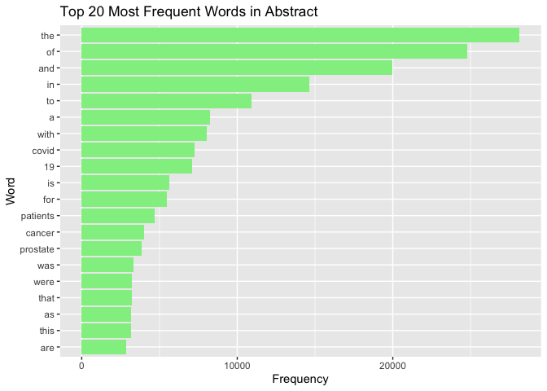
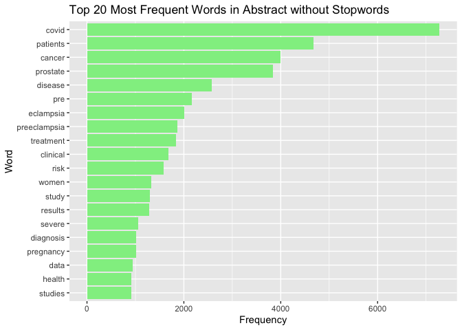
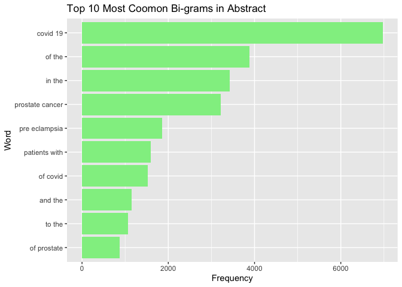
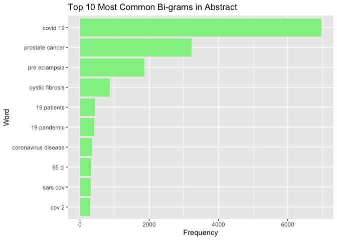

# APIs

Using the NCBI API, look for papers that show up under the term “sars-cov-2 trial vaccine.” Look for the data in the pubmed database, and then retrieve the details of the paper as shown in lab 7. How many papers were you able to find?

## Download the result with Search Term

```r
# Downloading the website
website <- xml2::read_html("https://pubmed.ncbi.nlm.nih.gov/?term=sars-cov-2+trial+vaccine")

# Finding the counts
counts <- xml2::xml_find_first(website, "/html/body/main/div[9]/div[2]/div[2]/div[1]/div[1]/span")

# Turning it into text
counts <- as.character(counts)

# Extracting the data using regex
stringr::str_extract(counts, "[[[:digit:]],]+")
```

```
## [1] "2,336"
```

There are 2,336 papers with the search term **sars-cov-2 trial vaccine**

## Download each papers' details
Using the list of pubmed ids you retrieved, download each papers’ details using the query parameter rettype = abstract. If you get more than 250 ids, just keep the first 250.

```r
query_ids <- GET(
  url   = "https://eutils.ncbi.nlm.nih.gov/entrez/eutils/esearch.fcgi",
  query = list(
    db     = "pubmed",
    term   = "sars-cov-2 trial vaccine",
    retmax = 250
  )
)

# Extracting the content of the response of GET
ids <- httr::content(query_ids)
```


```r
# Turn the result into a character vector
ids <- as.character(ids)

# Find all the ids 
ids <- stringr::str_extract_all(ids, "<Id>[[:digit:]]+</Id>+")[[1]]

# Remove all the leading and trailing <Id> </Id>. Make use of "|"
ids <- stringr::str_remove_all(ids, "<Id>|</Id>")
```


```r
publications <- GET(
  url   = "https://eutils.ncbi.nlm.nih.gov/entrez/eutils/efetch.fcgi",
  query = list(
    db      = "pubmed",
    id      = I(paste(ids, collapse = ",")),
    retmax  = 250,
    rettype = "abstract"
    )
)

# Turning the output into character vector
publications <- httr::content(publications)
publications_txt <- as.character(publications)
```

## Create a dataset containing the following:
1. Pubmed ID number,
2. Title of the paper,
3. Name of the journal where it was published,
4. Publication date, and
5. Abstract of the paper (if any).


```r
pub_char_list <- xml2::xml_children(publications)
pub_char_list <- sapply(pub_char_list, as.character)
```


```r
titles <- str_extract(pub_char_list, "<ArticleTitle>[[:print:][:space:]]+</ArticleTitle>")
titles <- str_remove_all(titles, "</?[[:alnum:]-=\"]+>")
```


```r
journal <- str_extract(pub_char_list, "<Journal>[[:print:][:space:]]+</Journal>")
journal_Name <- str_extract(journal, "<Title>[[:print:][:space:]]+</Title>")
journal_Name <- str_remove_all(journal_Name, "</?[[:alnum:]-=\"]+>")
```


```r
date <- str_extract(pub_char_list, "<PubDate>[[:print:][:space:]]+</PubDate>")
date <- str_remove_all(date, "</?[[:alnum:]]+>")
date <- str_replace_all(date, "[[:space:]]+", "-")
```


```r
abstracts <- str_extract(pub_char_list, "<Abstract>[[:print:][:space:]]+</Abstract>")
table(is.na(abstracts))
```

```
## 
## FALSE  TRUE 
##   218    32
```

```r
abstracts <- str_remove_all(abstracts, "</?[[:alnum:]-=\"]+>")
abstracts <- str_replace_all(abstracts, "[[:space:]]+", " ")
```


```r
database <- data.frame(
  PubMedId = ids,
  Title    = titles,
  Journal  = journal_Name,
  PubDate  = date,
  Abstract = abstracts
)
knitr::kable(database[1:10,], caption = "Some papers about Covid19 trail vaccine")
```


Table: Some papers about Covid19 trail vaccine

|PubMedId |Title                                                                                                                                                                              |Journal                                                                   |PubDate       |Abstract                                                                                                                                                                                                                                                                                                                                                                                                                                                                                                                                                                                                                                                                                                                                                                                                                                                                                                                                                                                                                                                                                                                                                                                                                                                                                                                                                                                                                                                                                                                                                                                                                                                                                                                                                                                                                                                                                                                                                                                                                                                                                                                                                                                                                                                                                                                                                                                                                                                                                                                                                                                                                                                                                                                                         |
|:--------|:----------------------------------------------------------------------------------------------------------------------------------------------------------------------------------|:-------------------------------------------------------------------------|:-------------|:------------------------------------------------------------------------------------------------------------------------------------------------------------------------------------------------------------------------------------------------------------------------------------------------------------------------------------------------------------------------------------------------------------------------------------------------------------------------------------------------------------------------------------------------------------------------------------------------------------------------------------------------------------------------------------------------------------------------------------------------------------------------------------------------------------------------------------------------------------------------------------------------------------------------------------------------------------------------------------------------------------------------------------------------------------------------------------------------------------------------------------------------------------------------------------------------------------------------------------------------------------------------------------------------------------------------------------------------------------------------------------------------------------------------------------------------------------------------------------------------------------------------------------------------------------------------------------------------------------------------------------------------------------------------------------------------------------------------------------------------------------------------------------------------------------------------------------------------------------------------------------------------------------------------------------------------------------------------------------------------------------------------------------------------------------------------------------------------------------------------------------------------------------------------------------------------------------------------------------------------------------------------------------------------------------------------------------------------------------------------------------------------------------------------------------------------------------------------------------------------------------------------------------------------------------------------------------------------------------------------------------------------------------------------------------------------------------------------------------------------|
|34735795 |Immunogenicity of standard and extended dosing intervals of BNT162b2 mRNA vaccine.                                                                                                 |Cell                                                                      |-2021-Oct-16- |Extension of the interval between vaccine doses for the BNT162b2 mRNA vaccine was introduced in the United Kingdom to accelerate population coverage with a single dose. At this time, trial data were lacking, and we addressed this in a study of United Kingdom healthcare workers. The first vaccine dose induced protection from infection from the circulating alpha (B.1.1.7) variant over several weeks. In a substudy of 589 individuals, we show that this single dose induces severe acute respiratory syndrome coronavirus 2 (SARS-CoV-2) neutralizing antibody (NAb) responses and a sustained B and T cell response to the spike protein. NAb levels were higher after the extended dosing interval (6-14 weeks) compared with the conventional 3- to 4-week regimen, accompanied by enrichment of CD4+ T cells expressing interleukin-2 (IL-2). Prior SARS-CoV-2 infection amplified and accelerated the response. These data on dynamic cellular and humoral responses indicate that extension of the dosing interval is an effective immunogenic protocol. Copyright © 2021 The Author(s). Published by Elsevier Inc. All rights reserved.                                                                                                                                                                                                                                                                                                                                                                                                                                                                                                                                                                                                                                                                                                                                                                                                                                                                                                                                                                                                                                                                                                                                                                                                                                                                                                                                                                                                                                                                                                                                                                                      |
|34735426 |Effectiveness of 2-Dose Vaccination with mRNA COVID-19 Vaccines Against COVID-19-Associated Hospitalizations Among Immunocompromised Adults - Nine States, January-September 2021. |MMWR. Morbidity and mortality weekly report                               |-2021-Nov-05- |Immunocompromised persons, defined as those with suppressed humoral or cellular immunity resulting from health conditions or medications, account for approximately 3% of the U.S. adult population (1). Immunocompromised adults are at increased risk for severe COVID-19 outcomes (2) and might not acquire the same level of protection from COVID-19 mRNA vaccines as do immunocompetent adults (3,4). To evaluate vaccine effectiveness (VE) among immunocompromised adults, data from the VISION Network* on hospitalizations among persons aged ≥18 years with COVID-19-like illness from 187 hospitals in nine states during January 17-September 5, 2021 were analyzed. Using selected discharge diagnoses,† VE against COVID-19-associated hospitalization conferred by completing a 2-dose series of an mRNA COVID-19 vaccine ≥14 days before the index hospitalization date§ (i.e., being fully vaccinated) was evaluated using a test-negative design comparing 20,101 immunocompromised adults (10,564 [53%] of whom were fully vaccinated) and 69,116 immunocompetent adults (29,456 [43%] of whom were fully vaccinated). VE of 2 doses of mRNA COVID-19 vaccine against COVID-19-associated hospitalization was lower among immunocompromised patients (77%; 95% confidence interval [CI] = 74%-80%) than among immunocompetent patients (90%; 95% CI = 89%-91%). This difference persisted irrespective of mRNA vaccine product, age group, and timing of hospitalization relative to SARS-CoV-2 (the virus that causes COVID-19) B.1.617.2 (Delta) variant predominance in the state of hospitalization. VE varied across immunocompromising condition subgroups, ranging from 59% (organ or stem cell transplant recipients) to 81% (persons with a rheumatologic or inflammatory disorder). Immunocompromised persons benefit from mRNA COVID-19 vaccination but are less protected from severe COVID-19 outcomes than are immunocompetent persons, and VE varies among immunocompromised subgroups. Immunocompromised persons receiving mRNA COVID-19 vaccines should receive 3 doses and a booster, consistent with CDC recommendations (5), practice nonpharmaceutical interventions, and, if infected, be monitored closely and considered early for proven therapies that can prevent severe outcomes.                                                                                                                                                                                                                                                                                                                                                                                                                |
|34735018 |COVID-19 Therapeutics and Vaccines: A Race to save Lives.                                                                                                                          |Toxicological sciences : an official journal of the Society of Toxicology |-2021-Nov-04- |COVID-19 (Coronavirus Disease 2019), the disease caused by SARS-CoV-2 (Severe Acute Respiratory Syndrome Coronavirus-2) is an ongoing global public health emergency. As understanding of the health effects of COVID-19 have improved, companies and agencies worldwide have worked together to identify therapeutic approaches, fast-track clinical trials and pathways for emergency use, and approve therapies for patients. This work has resulted in therapies that not only improve survival, reduce time of hospitalization and time to recovery, but also include preventative measures, such as vaccines. This manuscript discusses development programs for three products that are approved or authorized for emergency use at the time of writing: VEKLURY (remdesivir, direct acting antiviral from Gilead Sciences, Inc.), REGEN-COV (casirivimab and imdevimab antibody cocktail from Regeneron Pharmaceuticals Inc.) and Comirnaty (Pfizer-BioNTech COVID-19 Vaccine [Pfizer, Inc.-BioNTech]), and perspectives from the US Food and Drug Administration (FDA). Published by Oxford University Press 2021.                                                                                                                                                                                                                                                                                                                                                                                                                                                                                                                                                                                                                                                                                                                                                                                                                                                                                                                                                                                                                                                                                                                                                                                                                                                                                                                                                                                                                                                                                                                                                                                                                      |
|34729549 |Adverse events of active and placebo groups in SARS-CoV-2 vaccine randomized trials: A systematic review.                                                                          |The Lancet regional health. Europe                                        |-2021-Oct-28- |<AbstractText Label="Background" NlmCategory="UNASSIGNED">For safety assessment in clinical trials, adverse events (AEs) are reported for the drug under evaluation and compared with AEs in the placebo group. Little is known about the nature of the AEs associated with clinical trials of SARS-CoV-2 vaccines and the extent to which these can be traced to nocebo effects, where negative treatment-related expectations favor their occurrence. <AbstractText Label="Methods" NlmCategory="UNASSIGNED">In our systematic review, we compared the rates of solicited AEs in the active and placebo groups of SARS-CoV-2 vaccines approved by the Western pharmaceutical regulatory agencies.We implemented a search strategy to identify trial-III studies of SARS-CoV-2 vaccines through the PubMed database. We adopted the PRISMA Statement to perform the study selection and the data collection and identified three trial: two mRNA-based (37590 participants) and one adenovirus type (6736 participants). <AbstractText Label="Findings" NlmCategory="UNASSIGNED">Relative risks showed that the occurrence of AEs reported in the vaccine groups was higher compared with the placebo groups. The most frequently AEs in both groups were fatigue, headache, local pain, as injection site reactions, and myalgia. In particular, for first doses in placebo recipients, fatigue was reported in 29% and 27% in BNT162b2 and mRNA-1273 groups, respectively, and in 21% of Ad26.COV2.S participants. Headache was reported in 27% in both mRNA groups and in 24% of Ad26.COV2.S recipients. Myalgia was reported in 10% and 14% in mRNA groups (BNT162b2 and mRNA-1273, respectively) and in 13% of Ad26.COV2.S participants. Local pain was reported in 12% and 17% in mRNA groups (BNT162b2 and mRNA-1273, respectively), and in 17% of Ad26.COV2.S recipients. These AEs are more common in the younger population and in the first dose of placebo recipients of the mRNA vaccines. <AbstractText Label="Interpretation" NlmCategory="UNASSIGNED">Our results are in agreement with the expectancy theory of nocebo effects and suggest that the AEs associated with COVID-19 vaccines may be related to the nocebo effect. <AbstractText Label="Funding" NlmCategory="UNASSIGNED">Fondazione CRT - Cassa di Risparmio di Torino, IT (grant number 66346, "GAIA-MENTE" 2019). © 2021 The Authors.                                                                                                                                                                                                                                                                                                                           |
|34726743 |Analysis of the Effectiveness of the Ad26.COV2.S Adenoviral Vector Vaccine for Preventing COVID-19.                                                                                |JAMA network open                                                         |-2021-11-01-  |<AbstractText Label="Importance">Continuous assessment of the effectiveness and safety of the US Food and Drug Administration-authorized SARS-CoV-2 vaccines is critical to amplify transparency, build public trust, and ultimately improve overall health outcomes. <AbstractText Label="Objective">To evaluate the effectiveness of the Johnson &amp; Johnson Ad26.COV2.S vaccine for preventing SARS-CoV-2 infection. <AbstractText Label="Design, Setting, and Participants">This comparative effectiveness research study used large-scale longitudinal curation of electronic health records from the multistate Mayo Clinic Health System (Minnesota, Arizona, Florida, Wisconsin, and Iowa) to identify vaccinated and unvaccinated adults between February 27 and July 22, 2021. The unvaccinated cohort was matched on a propensity score derived from age, sex, zip code, race, ethnicity, and previous number of SARS-CoV-2 polymerase chain reaction tests. The final study cohort consisted of 8889 patients in the vaccinated group and 88 898 unvaccinated matched patients. <AbstractText Label="Exposure">Single dose of the Ad26.COV2.S vaccine. <AbstractText Label="Main Outcomes and Measures">The incidence rate ratio of SARS-CoV-2 infection in the vaccinated vs unvaccinated control cohorts, measured by SARS-CoV-2 polymerase chain reaction testing. <AbstractText Label="Results">The study was composed of 8889 vaccinated patients (4491 men [50.5%]; mean [SD] age, 52.4 [16.9] years) and 88 898 unvaccinated patients (44 748 men [50.3%]; mean [SD] age, 51.7 [16.7] years). The incidence rate ratio of SARS-CoV-2 infection in the vaccinated vs unvaccinated control cohorts was 0.26 (95% CI, 0.20-0.34) (60 of 8889 vaccinated patients vs 2236 of 88 898 unvaccinated individuals), which corresponds to an effectiveness of 73.6% (95% CI, 65.9%-79.9%) and a 3.73-fold reduction in SARS-CoV-2 infections. <AbstractText Label="Conclusions and Relevance">This study's findings are consistent with the clinical trial-reported efficacy of Ad26.COV2.S and the first retrospective analysis, suggesting that the vaccine is effective at reducing SARS-CoV-2 infection, even with the spread of variants such as Alpha or Delta that were not present in the original studies, and reaffirm the urgent need to continue mass vaccination efforts globally.                                                                                                                                                                                                                                                                                                                                       |
|34715931 |Lessons from Israel's COVID-19 Green Pass program.                                                                                                                                 |Israel journal of health policy research                                  |-2021-10-29-  |As of the beginning of March 2021, Israeli law requires the presentation of a Green Pass as a precondition for entering certain businesses and public spheres. Entitlement for a Green Pass is granted to Israelis who have been vaccinated with two doses of COVID-19 vaccine, who have recovered from COVID-19, or who are participating in a clinical trial for vaccine development in Israel. The Green Pass is essential for retaining immune individuals' freedom of movement and for promoting the public interest in reopening the economic, educational, and cultural spheres of activity. Nonetheless, and as the Green Pass imposes restrictions on the movement of individuals who had not been vaccinated or who had not recovered, it is not consonant with solidarity and trust building. Implementing the Green Pass provision while advancing its effectiveness on the one hand, and safeguarding equality, proportionality, and fairness on the other hand may imbue this measure with ethical legitimacy despite involving a potential breach of trust and solidarity. © 2021. The Author(s).                                                                                                                                                                                                                                                                                                                                                                                                                                                                                                                                                                                                                                                                                                                                                                                                                                                                                                                                                                                                                                                                                                                                                                                                                                                                                                                                                                                                                                                                                                                                                                                                                                 |
|34713912 |Vaccine development and technology for SARS-CoV-2: current insights.                                                                                                               |Journal of medical virology                                               |-2021-Oct-29- |<AbstractText Label="BACKGROUND" NlmCategory="BACKGROUND">SARS-CoV-2 is associated to a severe respiratory disease in China, that rapidly spread across continents. Since the beginning of the pandemic, available data suggested the asymptomatic transmission and patients were treated with specific drugs with efficacy and safety data not always satisfactory. <AbstractText Label="OBJECTIVES" NlmCategory="OBJECTIVE">The aim of this review is to describe the vaccines developed by three companies, Pfizer-BioNTech, Moderna and University of Oxford/AstraZeneca, in terms of both technological and pharmaceutical formulation, safety, efficacy and immunogenicity. <AbstractText Label="METHODS" NlmCategory="METHODS">A critical analysis of phase 1, 2 and 3 clinical trial results available was conducted, comparing the three vaccine candidates, underlining their similarities and differences. <AbstractText Label="RESULTS AND CONCLUSIONS" NlmCategory="CONCLUSIONS">All candidates showed consistent efficacy and tolerability; although some differences can be noted, such as their technological formulation, temperature storage, which will be related to logistics and costs. Further studies will be necessary to evaluate long-term effects and to assess the vaccine safety and efficacy in the general population. This article is protected by copyright. All rights reserved. This article is protected by copyright. All rights reserved.                                                                                                                                                                                                                                                                                                                                                                                                                                                                                                                                                                                                                                                                                                                                                                                                                                                                                                                                                                                                                                                                                                                                                                                                                                                                 |
|34711598 |BCG vaccination to reduce the impact of COVID-19 in healthcare workers: Protocol for a randomised controlled trial (BRACE trial).                                                  |BMJ open                                                                  |-2021-10-28-  |<AbstractText Label="INTRODUCTION">BCG vaccination modulates immune responses to unrelated pathogens. This off-target effect could reduce the impact of emerging pathogens. As a readily available, inexpensive intervention that has a well-established safety profile, BCG is a good candidate for protecting healthcare workers (HCWs) and other vulnerable groups against COVID-19. <AbstractText Label="METHODS AND ANALYSIS">This international multicentre phase III randomised controlled trial aims to determine if BCG vaccination reduces the incidence of symptomatic and severe COVID-19 at 6 months (co-primary outcomes) compared with no BCG vaccination. We plan to randomise 10 078 HCWs from Australia, The Netherlands, Spain, the UK and Brazil in a 1:1 ratio to BCG vaccination or no BCG (control group). The participants will be followed for 1 year with questionnaires and collection of blood samples. For any episode of illness, clinical details will be collected daily, and the participant will be tested for SARS-CoV-2 infection. The secondary objectives are to determine if BCG vaccination reduces the rate, incidence, and severity of any febrile or respiratory illness (including SARS-CoV-2), as well as work absenteeism. The safety of BCG vaccination in HCWs will also be evaluated. Immunological analyses will assess changes in the immune system following vaccination, and identify factors associated with susceptibility to or protection against SARS-CoV-2 and other infections. <AbstractText Label="ETHICS AND DISSEMINATION">Ethical and governance approval will be obtained from participating sites. Results will be published in peer-reviewed open-access journals. The final cleaned and locked database will be deposited in a data sharing repository archiving system. <AbstractText Label="TRIAL REGISTRATION">ClinicalTrials.gov NCT04327206. © Author(s) (or their employer(s)) 2021. Re-use permitted under CC BY. Published by BMJ.                                                                                                                                                                                                                                                                                                                                                                                                                                                                                                                                                                                                                                                                                                                                  |
|34704204 |COVID-19 Testing and Vaccine Acceptability Among Homeless-Experienced Adults: Qualitative Data from Two Samples.                                                                   |Journal of general internal medicine                                      |-2021-Oct-26- |<AbstractText Label="BACKGROUND" NlmCategory="BACKGROUND">Homeless-experienced populations are at increased risk of exposure to SARS-CoV-2 due to their living environments and face an increased risk of severe COVID-19 disease due to underlying health conditions. Little is known about COVID-19 testing and vaccination acceptability among homeless-experienced populations. <AbstractText Label="OBJECTIVE" NlmCategory="OBJECTIVE">To understand the facilitators and barriers to COVID-19 testing and vaccine acceptability among homeless-experienced adults. <AbstractText Label="DESIGN" NlmCategory="METHODS">We conducted in-depth interviews with participants from July to October 2020. We purposively recruited participants from (1) a longitudinal cohort of homeless-experienced older adults in Oakland, CA (n=37) and (2) a convenience sample of people (n=57) during a mobile outreach COVID-19 testing event in San Francisco. <AbstractText Label="PARTICIPANTS" NlmCategory="METHODS">Adults with current or past experience of homelessness. <AbstractText Label="APPROACH" NlmCategory="METHODS">We asked participants about their experiences with and attitudes towards COVID-19 testing and their perceptions of COVID-19 vaccinations. We used participant observation techniques to document the interactions between testing teams and those approached for testing. We audio-recorded, transcribed, and content analyzed all interviews and identified major themes and subthemes. <AbstractText Label="KEY RESULTS" NlmCategory="RESULTS">Participants found incentivized COVID-19 testing administered in unsheltered settings and supported by community health outreach workers (CHOWs) to be acceptable. The majority of participants expressed a positive inclination toward vaccine acceptability, citing a desire to return to routine life and civic responsibility. Those who expressed hesitancy cited a desire to see trial data, concerns that vaccines included infectious materials, and mistrust of the government. <AbstractText Label="CONCLUSIONS" NlmCategory="CONCLUSIONS">Participants expressed positive evaluations of the incentivized, mobile COVID-19 testing supported by CHOWs in unsheltered settings. The majority of participants expressed a positive inclination toward vaccination. Vaccine hesitancy concerns must be addressed when designing vaccine delivery strategies that overcome access challenges. Based on the successful implementation of COVID-19 testing, we recommend mobile delivery of vaccines using trusted CHOWs to address concerns and facilitate wider access to and uptake of the COVID vaccine. © 2021. Society of General Internal Medicine. |
|34703690 |A Rare Variant of Guillain-Barre Syndrome Following Ad26.COV2.S Vaccination.                                                                                                       |Cureus                                                                    |-2021-Sep-    |Efforts to combat the global pandemic caused by severe acute respiratory syndrome coronavirus 2 (SARS-CoV-2) range from adequate diagnostic testing and contract tracing to vaccination for the prevention of coronavirus disease 2019 (COVID-19). In the United States alone, three vaccinations have been authorized for emergency use (EUA) or approved to prevent COVID-19. The Ad26.COV2.S vaccine by Johnson and Johnson (New Brunswick, New Jersey) is the only adenovirus-based vaccine and deemed relatively effective and safe by the US Food and Drug Administration (FDA) following its clinical trial. Since its introduction, the US FDA has placed a warning on the vaccine adverse event reporting system (VAERS) after more than 100 cases of Guillain-Barre Syndrome (GBS) were reported. Herein, we outline the hospital course of a generally healthy 49-year-old female who experienced an axonal form of GBS nine days after receiving the Ad26.COV2.S vaccine. Copyright © 2021, Morehouse et al.                                                                                                                                                                                                                                                                                                                                                                                                                                                                                                                                                                                                                                                                                                                                                                                                                                                                                                                                                                                                                                                                                                                                                                                                                                                                                                                                                                                                                                                                                                                                                                                                                                                                                                                         |

# Text Mining
A new dataset has been added to the data science data repository https://github.com/USCbiostats/data-science-data/tree/master/03_pubmed. The dataset contains 3241 abstracts from articles across 5 search terms. Your job is to analyse these abstracts to find interesting insights.

## Download PubMed.csv


## 1. Tokenize the abstracts and count the number of each token. 

Do you see anything interesting? Does removing stop words change what tokens appear as the most frequent? What are the 5 most common tokens for each search term after removing stopwords?

### With Stopwords

```r
pubmed %>% 
  unnest_tokens(output = word, input = abstract) %>% 
  count(word, sort = TRUE) %>% 
  top_n(20, n) %>% 
  ggplot(aes(x = n, y = fct_reorder(word, n ))) + 
    geom_col(fill = 'lightgreen') +
    labs(title = "Top 20 Most Frequent Words in Abstract", y = "Word", x = "Frequency")
```

<!-- -->

With top 20 most frequent words in abstracts, most of them are stopwords, only **covid, patients, cancer, prostate** are not stopwords.

### Without Stopwords & Number

```r
pubmed %>% 
  unnest_tokens(output = word, input = abstract) %>%
  count(word, sort = TRUE) %>%
  anti_join(stop_words, by = c("word")) %>%
  filter(!grepl(pattern = "^[0-9]+$", x = word)) %>%
  top_n(20) %>%
  ggplot(aes(x=n, y = fct_reorder(word,n))) +
    geom_col(fill = 'lightgreen') +
    labs(title = "Top 20 Most Frequent Words in Abstract without Stopwords", y = "Word", x = "Frequency")
```

```
## Selecting by n
```

<!-- -->

After removing stopwords, the _top 20 frequent words in abstracts_ shows more clear about the information of the vaccine, like **treatment, clinical, risk**. At the same time, we can also infer from these words what the female pregnancy may be related to the vaccine, or what the clinical risks may be.

### 5 Most Common Tokens for Each Search Term

After removing stopwords & number:


```r
pubmed %>% 
  unnest_tokens(output = word, input = abstract) %>%
  group_by(term) %>%
  count(word, sort = TRUE) %>%
  filter(!(word %in% stop_words$word) & !grepl("^[0-9]+$", word)) %>%
  top_n(5) %>%
  arrange(term, desc(n)) %>%
  knitr::kable()
```

```
## Selecting by n
```


|term            |word         |    n|
|:---------------|:------------|----:|
|covid           |covid        | 7275|
|covid           |patients     | 2293|
|covid           |disease      |  943|
|covid           |pandemic     |  800|
|covid           |coronavirus  |  647|
|covid           |health       |  647|
|cystic fibrosis |fibrosis     |  867|
|cystic fibrosis |cystic       |  862|
|cystic fibrosis |cf           |  625|
|cystic fibrosis |patients     |  586|
|cystic fibrosis |disease      |  400|
|meningitis      |patients     |  446|
|meningitis      |meningitis   |  429|
|meningitis      |meningeal    |  219|
|meningitis      |csf          |  206|
|meningitis      |clinical     |  187|
|preeclampsia    |pre          | 2038|
|preeclampsia    |eclampsia    | 2005|
|preeclampsia    |preeclampsia | 1863|
|preeclampsia    |women        | 1196|
|preeclampsia    |pregnancy    |  969|
|prostate cancer |cancer       | 3840|
|prostate cancer |prostate     | 3832|
|prostate cancer |patients     |  934|
|prostate cancer |treatment    |  926|
|prostate cancer |disease      |  652|

Most 5 frequent tokens are related to their term, _patient_ exists these term except preeclampsia, because most patient in preeclampsia are women who are pregnant. 

## 2. Tokenize the abstracts into bigrams. 

Find the 10 most common bigram and visualize them with ggplot2.


```r
pubmed %>% 
  unnest_ngrams(output = bigram, input = abstract, n = 2) %>%
  count(bigram, sort = TRUE) %>%
  top_n(10) %>%
  ggplot(aes(x=n, y = fct_reorder(bigram,n))) +
    geom_col(fill = 'lightgreen') +
    labs(title = "Top 10 Most Coomon Bi-grams in Abstract", y = "Word", x = "Frequency")
```

```
## Selecting by n
```

<!-- -->

Above figure shows lots of stopwords which is not necessary, so it should be clean. However, there still exists some inportant information, like **Covid 19. prostate cancer, pre eclampsia**. 


```r
bigrams <- pubmed %>%
  unnest_ngrams(bigram, abstract, n = 2) %>% 
  separate(col=bigram, into=c("word1", "word2"), sep = " ") %>%
  select(word1, word2) %>%
  anti_join(stop_words, by = c("word1" = "word")) %>%
  anti_join(stop_words, by = c("word2" = "word")) %>%
  count(word1, word2, sort=TRUE) %>%
  top_n(10, n)
unite(bigrams, "bigram", c("word1", "word2"), sep = " ") %>%
  ggplot(aes(x = n, y = fct_reorder(bigram, n))) +
  geom_col(fill = 'lightgreen') +
  labs(title = "Top 10 Most Common Bi-grams in Abstract", y = "Word", x = "Frequency")
```

<!-- -->


After removing the stopwords, the bi-gram shows more specific words, like **cystic fibrosis**.  And these information are related with the search term which we did in question2. As we search the term **sars-cov-2 trial vaccine**, the bigrams are more related to coronavirus, like _covid 19, 19 pandemic,coronavirus disease, sars cov,cov 2_.

### 3. Calculate the TF-IDF value for each word-search term combination. 

(here you want the search term to be the “document”) What are the 5 tokens from each search term with the highest TF-IDF value? How are the results different from the answers you got in question 1?


```r
pubmed %>%
  unnest_tokens(word, abstract) %>%
  count(word, term) %>%
  bind_tf_idf(word, term, n) %>%
  group_by(term) %>%
  top_n(5, tf_idf) %>%
  arrange(desc(tf_idf), .by_group = TRUE) %>%
  select(term, word, n, tf_idf, tf, idf) %>% 
  knitr::kable(caption="5 Tokens from each Search Term with Highest TF-IDF Value")
```


Table: 5 Tokens from each Search Term with Highest TF-IDF Value

|term            |word            |    n|    tf_idf|        tf|       idf|
|:---------------|:---------------|----:|---------:|---------:|---------:|
|covid           |covid           | 7275| 0.0597183| 0.0371050| 1.6094379|
|covid           |pandemic        |  800| 0.0065670| 0.0040803| 1.6094379|
|covid           |coronavirus     |  647| 0.0053110| 0.0032999| 1.6094379|
|covid           |sars            |  372| 0.0030536| 0.0018973| 1.6094379|
|covid           |cov             |  334| 0.0027417| 0.0017035| 1.6094379|
|cystic fibrosis |cf              |  625| 0.0116541| 0.0127188| 0.9162907|
|cystic fibrosis |fibrosis        |  867| 0.0090127| 0.0176435| 0.5108256|
|cystic fibrosis |cystic          |  862| 0.0089608| 0.0175417| 0.5108256|
|cystic fibrosis |cftr            |   86| 0.0028167| 0.0017501| 1.6094379|
|cystic fibrosis |sweat           |   83| 0.0027184| 0.0016891| 1.6094379|
|meningitis      |meningitis      |  429| 0.0147974| 0.0091942| 1.6094379|
|meningitis      |meningeal       |  219| 0.0075539| 0.0046935| 1.6094379|
|meningitis      |pachymeningitis |  149| 0.0051394| 0.0031933| 1.6094379|
|meningitis      |csf             |  206| 0.0040453| 0.0044149| 0.9162907|
|meningitis      |meninges        |  106| 0.0036562| 0.0022718| 1.6094379|
|preeclampsia    |eclampsia       | 2005| 0.0229802| 0.0142784| 1.6094379|
|preeclampsia    |preeclampsia    | 1863| 0.0213527| 0.0132672| 1.6094379|
|preeclampsia    |pregnancy       |  969| 0.0035250| 0.0069006| 0.5108256|
|preeclampsia    |maternal        |  797| 0.0028993| 0.0056757| 0.5108256|
|preeclampsia    |gestational     |  191| 0.0021891| 0.0013602| 1.6094379|
|prostate cancer |prostate        | 3832| 0.0501967| 0.0311890| 1.6094379|
|prostate cancer |androgen        |  305| 0.0039953| 0.0024824| 1.6094379|
|prostate cancer |psa             |  282| 0.0036940| 0.0022952| 1.6094379|
|prostate cancer |prostatectomy   |  215| 0.0028164| 0.0017499| 1.6094379|
|prostate cancer |castration      |  148| 0.0019387| 0.0012046| 1.6094379|

#### 3.1
The 5 tokens from each search term with the highest TF-IDF value:

  * **covid**: covid, pandemic, coronavirus, sars, cov
  * **meningitis**: meningitis, meningeal, pachymeningitis, csf, meninges
  * **prostate cancer**: prostate, androgen, psa, prostatectomy, castration
  * **preeclampsia**: eclampsia, preeclampsia, pregnancy, maternal, gestational
  * **cystic fibrosis**: cf, fibrosis, cystic, cftr, sweat

#### 3.2
Compared with the first question, the table with TF-IDF value is more meaningful. Because there are very common words in the table of the first question, such as patient, health, disease, because it is a medical paper, these words are very common. In the TF-IDF table, each word is more related to their disease, showing the symptoms of the disease or related professional words such as diagnosis and treatment.
