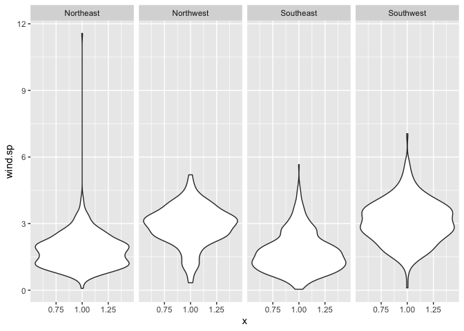
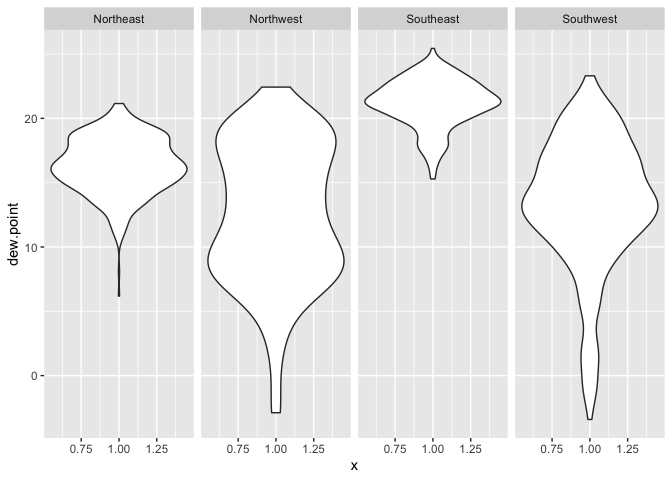
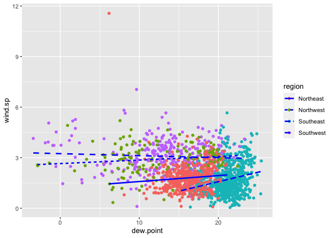
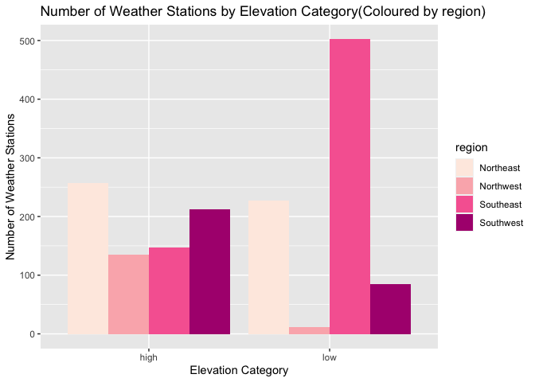
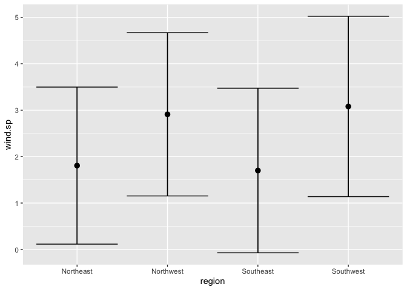
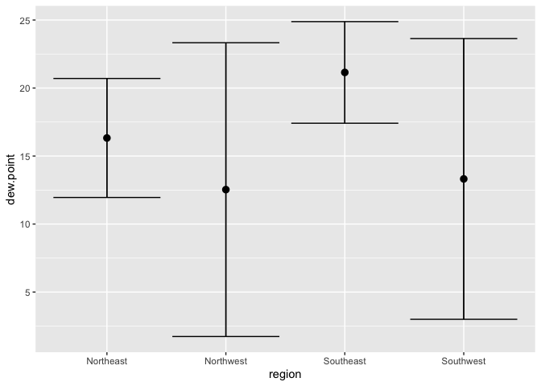
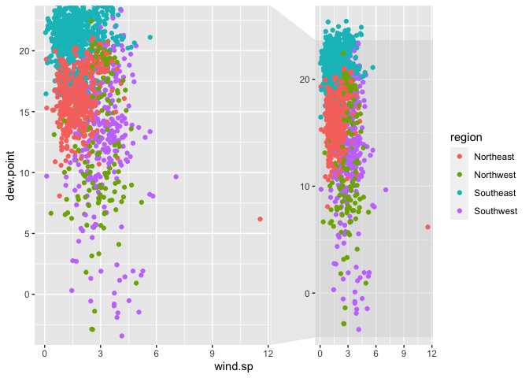

lab4
================
Lili Xu
9/17/2021

## 1\. Read in the data

``` r
library(data.table)
library(tidyverse)
library(lubridate)
library(leaflet)
library(ggplot2)
library(ggforce)
```

``` r
if (!file.exists("met_all.gz"))
  download.file(
    url = "https://raw.githubusercontent.com/USCbiostats/data-science-data/master/02_met/met_all.gz",
    destfile = "met_all.gz",
    method = "libcurl",
    timeout = 60
  )
met <- data.table::fread("met_all.gz")
```

## 2\. Prepare the data

``` r
# Remove temperatures less than -17C
met <- met[temp >= -17]
summary(met)
```

    ##      USAFID            WBAN            year          month        day    
    ##  Min.   :690150   Min.   :  116   Min.   :2019   Min.   :8   Min.   : 1  
    ##  1st Qu.:720927   1st Qu.: 3705   1st Qu.:2019   1st Qu.:8   1st Qu.: 8  
    ##  Median :722720   Median :13841   Median :2019   Median :8   Median :16  
    ##  Mean   :723095   Mean   :29496   Mean   :2019   Mean   :8   Mean   :16  
    ##  3rd Qu.:725090   3rd Qu.:54768   3rd Qu.:2019   3rd Qu.:8   3rd Qu.:24  
    ##  Max.   :726813   Max.   :94998   Max.   :2019   Max.   :8   Max.   :31  
    ##                                                                          
    ##       hour            min             lat             lon         
    ##  Min.   : 0.00   Min.   : 0.00   Min.   :24.55   Min.   :-124.29  
    ##  1st Qu.: 6.00   1st Qu.:20.00   1st Qu.:33.98   1st Qu.: -98.02  
    ##  Median :11.00   Median :48.00   Median :38.37   Median : -91.74  
    ##  Mean   :11.46   Mean   :39.23   Mean   :37.97   Mean   : -92.14  
    ##  3rd Qu.:17.00   3rd Qu.:55.00   3rd Qu.:41.96   3rd Qu.: -82.99  
    ##  Max.   :23.00   Max.   :59.00   Max.   :48.94   Max.   : -68.31  
    ##                                                                   
    ##       elev           wind.dir      wind.dir.qc        wind.type.code    
    ##  Min.   : -13.0   Min.   :  3      Length:2317212     Length:2317212    
    ##  1st Qu.: 101.0   1st Qu.:120      Class :character   Class :character  
    ##  Median : 252.0   Median :180      Mode  :character   Mode  :character  
    ##  Mean   : 415.1   Mean   :185                                           
    ##  3rd Qu.: 400.0   3rd Qu.:260                                           
    ##  Max.   :9999.0   Max.   :360                                           
    ##                   NA's   :732171                                        
    ##     wind.sp       wind.sp.qc          ceiling.ht    ceiling.ht.qc  
    ##  Min.   : 0.00   Length:2317212     Min.   :    0   Min.   :1.000  
    ##  1st Qu.: 0.00   Class :character   1st Qu.: 3048   1st Qu.:5.000  
    ##  Median : 2.10   Mode  :character   Median :22000   Median :5.000  
    ##  Mean   : 2.46                      Mean   :16171   Mean   :4.945  
    ##  3rd Qu.: 3.60                      3rd Qu.:22000   3rd Qu.:5.000  
    ##  Max.   :36.00                      Max.   :22000   Max.   :9.000  
    ##  NA's   :31743                      NA's   :73442                  
    ##  ceiling.ht.method    sky.cond            vis.dist      vis.dist.qc       
    ##  Length:2317212     Length:2317212     Min.   :     0   Length:2317212    
    ##  Class :character   Class :character   1st Qu.: 16093   Class :character  
    ##  Mode  :character   Mode  :character   Median : 16093   Mode  :character  
    ##                                        Mean   : 14924                     
    ##                                        3rd Qu.: 16093                     
    ##                                        Max.   :160000                     
    ##                                        NA's   :33674                      
    ##    vis.var           vis.var.qc             temp          temp.qc         
    ##  Length:2317212     Length:2317212     Min.   :-17.00   Length:2317212    
    ##  Class :character   Class :character   1st Qu.: 19.60   Class :character  
    ##  Mode  :character   Mode  :character   Median : 23.50   Mode  :character  
    ##                                        Mean   : 23.59                     
    ##                                        3rd Qu.: 27.80                     
    ##                                        Max.   : 56.00                     
    ##                                                                           
    ##    dew.point      dew.point.qc         atm.press        atm.press.qc  
    ##  Min.   :-37.20   Length:2317212     Min.   : 960.5    Min.   :1.000  
    ##  1st Qu.: 13.80   Class :character   1st Qu.:1011.8    1st Qu.:5.000  
    ##  Median : 18.10   Mode  :character   Median :1014.1    Median :9.000  
    ##  Mean   : 17.02                      Mean   :1014.2    Mean   :7.696  
    ##  3rd Qu.: 21.70                      3rd Qu.:1016.4    3rd Qu.:9.000  
    ##  Max.   : 36.00                      Max.   :1059.9    Max.   :9.000  
    ##  NA's   :6295                        NA's   :1606788                  
    ##        rh         
    ##  Min.   :  0.833  
    ##  1st Qu.: 55.790  
    ##  Median : 76.554  
    ##  Mean   : 71.641  
    ##  3rd Qu.: 90.629  
    ##  Max.   :100.000  
    ##  NA's   :6295

``` r
# Make sure there are no missing data in the key variables coded as 9999, 999, etc
met[, range(temp)]
```

    ## [1] -17  56

``` r
met[, range(rh,na.rm = TRUE)]
```

    ## [1]   0.8334298 100.0000000

``` r
met[, range(wind.sp,na.rm = TRUE)]
```

    ## [1]  0 36

``` r
met[, range(vis.dist,na.rm = TRUE)]
```

    ## [1]      0 160000

``` r
met[, range(dew.point,na.rm = TRUE)]
```

    ## [1] -37.2  36.0

``` r
met[, range(lat,na.rm = TRUE)]
```

    ## [1] 24.550 48.941

``` r
met[, range(lon,na.rm = TRUE)]
```

    ## [1] -124.290  -68.313

``` r
met[, range(elev,na.rm = TRUE)]
```

    ## [1]  -13 9999

``` r
met[elev == 9999, elev := NA]

#met[,table(is.na(temp))]
#met[,table(is.na(rh))]
#met[,table(is.na(wind.sp))]
#met[,table(is.na(vis.dist))]
#met[,table(is.na(dew.point))]
#met[,table(is.na(lat))]
#met[,table(is.na(lon))]
#met[,table(is.na(elev))]

# Generate a date variable using the functions as.Date() (hint: You will need the following to create a date paste(year, month, day, sep = "-")).
met[, ymd := as.Date(paste(year, month, day, sep = "-"))]

# Using the data.table::week function, keep the observations of the first week of the month.
met[,table(week(ymd))]
```

    ## 
    ##     31     32     33     34     35 
    ## 371545 520447 529571 526312 369337

``` r
met <- met[week(ymd) == 31]

# Compute the mean by station of the variables temp, rh, wind.sp, vis.dist, dew.point, lat, lon, and elev.
met_avg <- met[, .(
  temp      = mean(temp, na.rm =TRUE),
  rh        = mean(rh, na.rm =TRUE),
  wind.sp   = mean(wind.sp, na.rm =TRUE),
  vis.dist  = mean(vis.dist, na.rm =TRUE),
  dew.point = mean(dew.point, na.rm =TRUE),
  lat       = mean(lat, na.rm =TRUE),
  lon       = mean(lon, na.rm =TRUE),
  elev      = mean(elev, na.rm =TRUE), USAFID
), by = "USAFID"]

# Create a region variable for NW, SW, NE, SE based on lon = -98.00 and lat = 39.71 degrees
met_avg[lat >= 39.71 & lon <= -98, region:="Northwest"]
met_avg[lat <39.71 & lon <= -98, region:="Southwest"]
met_avg[lat >= 39.71 & lon > -98, region:="Northeast"]
met_avg[lat < 39.71 & lon > -98,region:="Southeast"]
met_avg[, table(region, useNA = "always")]
```

    ## region
    ## Northeast Northwest Southeast Southwest      <NA> 
    ##       484       146       649       297         0

``` r
met_avg[, region2 := fifelse(lat >= 39.71 & lon <= -98, "Northwest",
                      fifelse(lat < 39.71  & lon <= -98, "Southwest",
                        fifelse(lat >= 39.71 & lon > -98, "Northeast",
                          fifelse(lat < 39.71  & lon > -98, "Southeast", NA_character_))))]

met_avg[, table(region, region2, useNA = "always")]
```

    ##            region2
    ## region      Northeast Northwest Southeast Southwest <NA>
    ##   Northeast       484         0         0         0    0
    ##   Northwest         0       146         0         0    0
    ##   Southeast         0         0       649         0    0
    ##   Southwest         0         0         0       297    0
    ##   <NA>              0         0         0         0    0

``` r
# Create a categorical variable for elevation as in the lecture slides
met_avg[, elev_cat := fifelse(elev > 252, "high", "low")]

# Deleting extra column---USAFID
met_avg <- met_avg[, -1]
```

## 3\. Use geom\_violin to examine the wind speed and dew point temperature by region

### Wind speed

The wind speed is lower in the eastern region and higher wind speed in
the western region.

``` r
ggplot(met_avg, mapping = aes(y = wind.sp, x = 1)) + 
  geom_violin() +
  facet_grid(~region)
```

    ## Warning: Removed 13 rows containing non-finite values (stat_ydensity).

<!-- -->

### Dew point

From the plot, it seems western region has the highest and lowest dew
point at the same time.

``` r
ggplot(met_avg, mapping = aes(y = dew.point, x = 1)) + 
  geom_violin() +
  facet_grid(~region)
```

    ## Warning: Removed 1 rows containing non-finite values (stat_ydensity).

<!-- -->

## 4.Use geom\_jitter with stat\_smooth to examine the association between dew point temperature and wind speed by region

According to the inclination angle of the slope, it can be concluded
that the wind speed and dew points of the northeast, northwest, and
southwest regions are positive. But the slope of the southeast region is
almost 0, indicating that the wind speed and the dew point have nothing
related.

``` r
met_avg[!is.na(dew.point) & !is.na(wind.sp)] %>% 
  ggplot(mapping=aes(x=dew.point, y = wind.sp, color=region, linetype=region)) + 
  geom_jitter() +
  stat_smooth(method=lm, se=FALSE, color="blue")
```

    ## `geom_smooth()` using formula 'y ~ x'

<!-- -->

## 5.Use geom\_bar to create barplots of the weather stations by elevation category coloured by region

Base on the barplot, It seems Southeast has the most Weather stations in
the low elevation, and Northwest has the lowest weather station in low
elevation. Within high elevation, the Northeast has the most stations,
and the Northwest has the lowest stations, but it seems more Average.

``` r
met_avg[!is.na(elev_cat)] %>% 
  ggplot(mapping=aes(x=elev_cat, fill=region)) + 
  geom_bar(position="dodge") +
  labs(title = "Number of Weather Stations by Elevation Category(Coloured by region)", x  = "Elevation Category", y = "Number of Weather Stations")+
  scale_fill_brewer(palette = "RdPu")
```

<!-- -->

## 6.Use stat\_summary to examine mean dew point and wind speed by region with standard deviation error bars

### Mean wind speed

The mean wind speed of Northeast and Southeast is on the range 1.5 \~
2.0, and the Northwest is very closed to 3.0, and the Southwest is more
closed to 3.1.

``` r
ggplot(met_avg[!is.na(wind.sp) & !is.na(dew.point)], mapping = aes(x=region, y = wind.sp)) +
  stat_summary(fun.data="mean_sdl") +
  stat_summary(fun.data="mean_sdl", geom="errorbar")
```

<!-- -->

### Mean dew point

The mean dew point temperature of Northeast is on the range 15 \~ 17,
the Northwest is very closed to 12.5, the Southeast is on th range 20 \~
22 and the Southwest is very closed to 13.

``` r
ggplot(met_avg[!is.na(wind.sp) & !is.na(dew.point)], mapping = aes(x=region, y = dew.point)) +
  stat_summary(fun.data="mean_sdl") +
  stat_summary(fun.data="mean_sdl", geom="errorbar")
```

<!-- -->

## 7.Make a map showing the spatial trend in relative h in the US

It seems relative humidity temperature ¥ increased when moved from
westen to eastern region.

``` r
if(knitr::is_html_output()){

  met_avg2 <- met_avg[!is.na(rh)]
  temp.pal <- colorNumeric(c('darkgreen','goldenrod','brown'), domain=met_avg2$rh)
  leaflet(met_avg2) %>%
    addProviderTiles('CartoDB.Positron') %>%
    addCircles(
      lat = ~lat, lng=~lon,
      label = ~paste0(round(rh,2), ' rh'), color = ~ temp.pal(rh),
      opacity = 1, fillOpacity = 1, radius = 500
      ) %>%
    # And a Markers
    addMarkers(lat = ~met_avg2[rank(-rh) <= 10, lat], lng = ~met_avg2[rank(-rh) <= 10, lon]) %>%
    # And a pretty legend
    addLegend('bottomleft', pal=temp.pal, values=met_avg2$rh,
            title='Temperature, C', opacity=1)
}else{
  message("Sorry! No HTML!")
}
```

<div id="htmlwidget-6a4b6f8ac6adaa8f07e7" style="width:672px;height:480px;" class="leaflet html-widget"></div>
<script type="application/json" data-for="htmlwidget-6a4b6f8ac6adaa8f07e7">{"x":{"options":{"crs":{"crsClass":"L.CRS.EPSG3857","code":null,"proj4def":null,"projectedBounds":null,"options":{}}},"calls":[{"method":"addProviderTiles","args":["CartoDB.Positron",null,null,{"errorTileUrl":"","noWrap":false,"detectRetina":false}]},{"method":"addCircles","args":[[34.2999327731092,30.784,42.543,32.2173981042654,41.425,30.383,38.583,37.186,34.545,33.636,40.747,46.417,45.417,46.6829322033898,31.397,46.619,33.175,34.1,32.915,41.275,38.955,27.207,32.213,48.4670444444444,28.973,34.273,41.736,26.442,35.256,36.687,34.602,36.018,43.677,42.5740534188034,37.521,32.444,33.714,36.3610111111111,33.53,32.747,42.4530027855153,33.7799887955182,32.084,30.886,37.239,31.869,32.456,32.6459972222222,30.872,40.1,33.254,38.96,34.861,41.196,40.947,33.096,41.4,35.6130666666667,31.78,36.4139916666667,27.779,38.398,33.1100388888889,39.016,32.354,45.654,48.2990055555556,30.243,40.435,42.219,44.892,39,38.607,33.898,39.1670285714286,32.1492941176471,44.6259271070615,35.864,44.333,42.732,42.7959777777778,30.7500097087379,33.598,33.154,41.226,36.611,34.699,39.6000483870968,35.538,35.95,35.47295,31.0429945054945,31.846,42.07,45.372,43.987,43.743,41.96,27.916,34.229,35.6333383458647,41.0327752808989,36.855,30.291,30.7037100591716,38.967,39.7999718309859,45.117,47.1039333333333,31.056,34.85,34.1,28.95,39.217,35.6,33.85,41.4120694444444,38.15,39.9280446428571,39.983,36.4219838709677,41.828,34.267,40.333,43.433,39.428,37.158,37.45,39.7669666666667,36.665,37.578,37.633,38.0669747191011,37.751,30.8169583333333,30.558,36.9,46.2170223463687,44.567,44.8835730994152,44.933,37.4,36.783,37.85,33.902,41.824,41.4440285714286,43.548,38.698,38.2388965517241,38.783,38.533,40.0330166666667,40.333,40.5670111111111,40.167,37.283,34.383,30.5,41.3000583333333,40.6168722222222,41.384,39.183275,35.4329944444444,36.1748666666667,41.552,40.031,38.533,32.15,32.7170222222222,40.617,26.967,42.683,29.976,44.783,30.4600166666667,41.333,29.717,34.3,34.5,33.183,34.783,33.6499857142857,33.2500233918129,34.283,33.717,34.717,32.701,34.7170502793296,34.181,32.9170112676056,34,32.4118997214485,33.8280085227273,38.909,38.0329915254237,36.533,29.8,44.016,36.75,35.883,35.283,35.483,43.663,34.6170142450142,33.063,34.4,34.315,35.3,38.3500205882353,29.5000333333333,44.095,30.533,43.235,33.4170167597765,38.7170593220339,37.513,31.106,30.395,36.33,40.225,38.3559124087591,28.867,30.735,31.554,29.467,33.6329888888889,39.608,41.052,40.204,33.912,29.117,28.6430194986072,28.0561207865169,28.5,43.581,30.349059602649,41.066,47.451,30.902,32.646,35.947,34.8168333333333,36.654,33.433,31.841,31.641,32.304,39.6670222222222,38.946,48.884,46.925,48.784,34.689,48.48,44.251,48.929,48.381,35.937,48.405,47.29,48.39,47.796,46.768,46.117,43.067,29.067,48.301,46.9419777777778,27.833,27.6300416666667,29.296,48.726,34.915,30.071,40.28,45.506,31.606,46.218,41.2330222222222,32.521,40.3677407407407,30.617,32.1100111111111,37.974,32.609,26.9330833333333,29.1170333333333,40.711,32.214,30.033,32.4329008264463,33.227,30.718,35.7,42.517,35.178,35.38,31.684,30.879,31.885,43.467,28.228,32.931,39.332,30.173,29.634,44.4764282982792,46.244,43.6209923469388,43.459,27.812,24.5556730769231,28.29,28.474,24.5829130434783,24.726,25.7812018348624,28.014,26.378,25.907,25.48312,25.648,26.6848043478261,34.269,44.0739702702703,44.753,26.917,25.9990220994475,26.1549677419355,26.197,28.1010199004975,29.445,32.742,34.804,28.5169733333333,26.2499846153846,28.4338305084746,34.398,36.773,28.545,35.135,29.167,28.78,42.6900084269663,30.4926470588235,39.4670583333333,31.4770167130919,30.2330447761194,30.3999347826087,30.219,30.4,32.1312222222222,35.0960027777778,34.976,38.089,41.932,40.2,34.471,35.781,32.8992150537634,39.417027027027,42.246,32.4829644970414,40.9330833333333,31.8831530612245,36.2939805555555,36.6050392156863,44.68,32.699,36.682,35.9764666666667,41.584,40.96,35.724,37.45,27.498,27.765,26.5850093457944,32.675,26.536,34.3168583333333,27.963,32.699,30.169,45.1590603015075,27.4008,27.911,27.072,27.9999463414634,29.6340526315789,32.693,27.9499475655431,40.1490083333333,43.433,41.5399861111111,41.121,35.483,46.839,31.25,35.541,35.3899292929293,35.438,32.193,31.259,31.152,30.368,30.3997770700637,36.023,44.523,32.579,45.2363339960239,45.426,31.083,35.417,41.352,41.35,36.4371333333333,34.722,39.2170333333333,34.123,40.52,26.179,31.536,35.668,34.979,30.783,38.247,44.779,31.3829888888889,32.6877136563877,40.924,39.7,34.167,32.633,33.312,35.195,35.0210083333333,45.1499775280899,33.3643219512195,33.467,41.893,45.823,34.2720212765957,35.3570027777778,35.2119513888889,27.182,33.6323463687151,33.929,32.473,36.285,40.293,33.779,33.8750114285714,33.3550355029586,36.2,35.929,29.7329456521739,35.582,29.211,38.483,42.046,28.654,30.483,41.964,29.959,28.82102,35.858,30.78,32.564,38.5330498614958,41.0370055555556,30.478,30.35009375,30.7170869565217,30.6874708994709,31.666,30.6260125,31.35,31.356,42.242,34.891,38.981,30.65,40.624,30.131,39.531,32.35,32.514,44.7293571428571,32.756,32.516,42.0980333333333,32.3,27.2669888888889,32.383,31.8609891891892,31.317,31.2670409090909,33.9169318181818,40.684,31.309,31.416,34.653,33.56598,32.615993902439,33.9670320855615,33.212,33.587,40.948,33.178,29.9954699453552,30.5210138888889,30.038,30.049,29.817248447205,31.736,30.5369459459459,37.033,31.417,32.036,29.7168764705882,30.343011627907,42.4709530791789,45.469,38.0970416666667,30.833,27.349,32.3348044444444,29.2961428571429,42.351,32.55,42.9920869565217,31.467,32.3201304347826,29.2657333333333,32.337,32.2330172413793,31.6168881987578,31.182929245283,29.0540714285714,33.167,29.947,34.681,38.783,35.55,27.917,31.0497407407407,30.1267391304348,29.562,30.2100203045685,30.205,29.5660540540541,29.9508830409357,29.7089703703704,29.273,29.5189718309859,30.0679527559055,29.9782896551724,29.6163457943925,29.6380551181102,30.3569596774194,31.236,30.744,32.354,32.0309523809524,32.3849916666667,32.664,32.4477453416149,32.543,32.5,32.5158571428571,31.395,32.35,32.7099848484849,31.578,26.228,26.184,26.166,27.77525,27.6830787401575,27.5000555555556,27.741,27.9000864197531,27.5330916666667,29.339,28.0840422535211,28.457,29.11,29.5412121212121,29.36,29.3830503597122,29.5329568345324,29.983,29.8910447761194,30.1993636363636,33.19,30.7409516129032,29.622,30.320992248062,30.679,28.8597058823529,33.651,28.725,31.6186689655172,31.485,31.1337285714286,31.083046875,31.067,31.150048,32.851921875,33.6330289855073,33.068,33.2059645390071,32.8984705882353,32.565,32.973,32.7670166666667,32.782,32.969,32.681,32.215,29.3763714285714,29.3668016528926,30.04795,30.9120991735537,31.8309917355372,31.3540547945205,35.8999861111111,30.371,31.921,31.9482836879433,31.78,32.4118450704225,31.7999664804469,33.6637622377622,32.853,35.003,36.7410132450331,33.3067887323944,33.4500726256983,34.3835839416058,32.334024,32.6928319327731,34.4325483870968,32.2,38.5859583333333,32.84,32.2830333333333,31.8084482758621,33.236512195122,31.458,32.633,32.262,31.4209795918367,31.5879744897959,32.1442876712329,32.1669923664122,32.855,32.9502892561984,33.269,35.658,33.4287567567568,33.466905511811,33.688,33.5491724137931,33.3004761904762,33.5272608695652,33.4171518987342,33.623,32.817,31.607,31.3997794117647,31.0225379310345,48.941,33.8998442622951,33.8221983471074,33.952,34.0238048780488,34.201,34.016,34.21,34.0994029850746,34.666995,35.237,33.975,32.733880239521,32.816,32.572,32.826,32.567,33.023,33.3000551724138,33.128,33.286,32.867018404908,33.219,33.9373939393939,35.0668873239437,33.8029305555556,33.923,33.8126583850932,39.163,33.79,33.872,33.6799733333333,35.742,34.2678230088496,35.1739888888889,35.0330695652174,34.991,34.7330059880239,35.9170057636888,35.765,35.8890760233918,35.6330111111111,35.3438739495798,35.317523364486,35.855,34.833,36.261,36.0280138888889,36.817,36.298,36.9023650793651,36.698,37.70800625,36.937,37.132,37.133,34.9000053763441,35.068,34.708,34.6831296296296,38.527,33.942981595092,33.9709731543624,33.9664651162791,34.1879705882353,33.587,34.792,33.9481968911917,38.01,33.462,34.4654137931035,34.9870104712042,34.672,34.8460357142857,34.8871683168317,34.758,46.15,34.249,35.233,35.2226206896552,35.237,35.428,36.432,35.197,35.821,35.4321060606061,35.646,31.536,36.223,36.0939398907104,34.9880483870968,36.047,36.46,34.498,36.134,35.0170098039216,34.3482694300518,34.6445280898876,34.679,34.7440248447205,35.0338848484848,35.554,35.951,35.8177777777778,36.1428288770053,36.009,36.056,36.6239617834395,35.3503134328358,37.225,36.773,33.65,33.45,34.2625941176471,35.0546956521739,35.5930374331551,36,36.4799662162162,34.727015037594,34.9170166666667,36.125,35.8310075757576,35.9668888888889,35.94,34.29,34.6,34.1799461538462,33.454,33.221,33.6170166666667,35.258,36.1673253012048,34.5470222222222,36.2829842931937,36.369,35.333,41.7299861111111,36.191,36.349847133758,36.01,36.291,35.726,36.372,36.2669683544304,36.878,37.152,33.9774459459459,34.65,34.989,35.357,34.344,35.3875882352941,36.333,36.3829817351598,35.8519555555556,35.4169847328244,35.534,36.162,34.65,34.3000089686099,35.657,36.1991117318436,36.039,36.768,34.882,35.2499631336406,34.558,36.4490927152318,34.067,35.165,36.399,35.5139787234043,31.1780083333333,30.069,35.2268862275449,35.6950975609756,35.145,35.0401632653061,35.8829416666667,35.617,36.744,34.427,36.4503007518797,35.1820081300813,35.654,35.2592620689655,36.9269929078014,34.6520133333333,35.0264935064935,34.257,34.2640054945055,35.1422923976608,34.518,34.8499575757576,45.497,33.909,30.5159805555556,34.607,35.946,35.157,34.768,34.9010542635659,34.854,34.741,34.629,34.7448571428571,35.4338571428571,36.0735510204082,36.6204184397163,36.7780857142857,37.63295,36.3170333333333,36.319,34.1170161290323,34.426,34.2169776536313,34.201,34.7170823045267,34.8990840336134,35.67,38.341,40.1959791666667,36.666,36.682,37.5103924050633,37.183,38.1370584795322,37.358,36.983,37.9365180722892,37.647,38.9412420382166,38.267,38.5039858156028,38.721,38.7169847328244,38.2999047619048,38.804,38.8477027027027,39.143,39.078,36.895,39.47176,36.6830444444444,39.1743081761006,39.7060275862069,39.3325495049505,39.4517633136095,39.941,39.3660117647059,41.009,39.8743333333333,40.183,40.079,39.133,40.033,38.69,40.876,40.277,40.016992481203,40.7999708737864,37.3223333333333,38.264,36.573,36.766,37.3171073825503,37.208,37.950002994012,37.1330444444444,36.988,36.688,37.7839248554913,37.298,37.867,38.3763333333333,38.8848633093525,39.2960052910053,39.643,39.4039463087248,39.674,37.5909939759036,40.8200234375,39.0448865248227,38.0398571428571,38.1814905660377,38.18495,38.228,37.75,37.8001095890411,37.9000429447853,37.0869705882353,38.3654102564103,36.0229607843137,39.34,40.1759887640449,39.5939590163934,39.99225,39.9000082304527,39.817,39.944,41.56305,40.078015503876,39.896225,39.756,39.84,39.430977443609,39.103,40.708,41.038,38.0448071428571,38.65,38.323,37.78,38.5499583333333,37.750020746888,38.7525467625899,38.657,37.057298136646,37.0539972222222,39.578,39.2669404761905,38.249,39.452,39.1331083333333,39.7268,39.825,40.116937007874,40.412,40.528,41.5329545454545,39.845,38.8832666666667,40.483,37.2391954022989,38.1319565217391,39.9371,38.8170186335404,38.704,37.761,40.097,37.7499428571429,38.591,38.096,39.2938,39.121,39.823,38.7171031746032,38.8499726027397,38.832,39.7739541984733,37.6482285714286,37.1680052631579,37.7460223463687,37.6170163398693,38.065,37.6699897959184,39.0080303030303,38.0676363636364,37.7648936170213,37.927,37.05,38.3499655172414,38.849652173913,37.0910486486487,37.2839666666667,36.7369180327869,39.05,39.135032967033,38.3290167597765,39.0724414414414,38.95,39.5509047619048,38.876,38.8,37,37.4382356687898,37.1429795918367,37.9500558659218,38.0490081967213,38.07,38.2890533333333,37.2619784172662,37.2829754098361,39.3670206185567,39.3760204081633,38.81,39.2749862068965,39.57,39.229,40.0440806451613,39.6495625,39.23,38.533,40.517,38.678,39.245,39.7840611353712,39.717,40.167,39.9006,39.609,28.817,38.4262248062016,37.1,37.7088273381295,37.706,39.1313509933775,38.506,37.307,40.436,40.4500476190476,39.6009917355372,38.75,41.7870661157025,38.417,37.3704285714286,37.3827112299465,37.285,38.3779833333333,38.507052173913,38.5663406593407,38.6670337078652,39.1330454545455,39.1019666666667,38.695975,36.212,38.051,39.295724137931,39.4862857142857,39.417,36.587995412844,37.8905714285714,37.6240333333333,37.693,37.721,37.4667931034483,37.5168630136986,37.6196296296296,37.359,37.333,37.9919833333333,38.21,38.5040625,39.7998130841121,37.064,42.571,41.073,41.509,40.822,40.6851210191083,33.861,40.85,41.51,41.4828881118881,40.7799693251534,41.626,41.067,41.5,41.1592676056338,41.264,41.3280136986301,40.7790153846154,41.921,42.47,41.2526923076923,41.6502406015038,41.9099769230769,41.676,41.393,41.669,41.876,41.688,41.7244184397163,42.072,41.597,42.6969891304348,41.533,41.9373356643357,41.742,42.57,41.3710206896552,41.7360229007634,42.584,42.3625375,42.191,42.271,40.373119205298,41.626,40.821,42.552,40.2380441176471,40.3300229007634,39.918,40.120011627907,40.1330152284264,40.217,41.0470101522843,40.777,41.179,40.296,40.316,40.8499739130435,41.3338011049724,41.243782122905,40.433,41.7010354609929,43.35,42.2061860465116,42.4834923076923,42.159,42.109,43.533,40.6500124223602,36.695,40.6329887955182,42.7348125,43.1124117647059,42.643,43.234,40.4926646706587,40.7680467625899,40.3549875,40.2828232323232,40.616,40.9178642857143,41.3459672131148,40.873,39.364,43.338,40.472,40.0230551724138,41.4087735849057,41.518,41.5669378238342,41.256610738255,41.217,41.338,41.778,34.594,42.0804042553191,41.8,41.3829748743719,42.9390838323353,42.241,43.1079919354839,43.117,41.7169776536313,35.0170222222222,41.9651928571429,41.91395,38.571,40.04,39.8340234375,39.478,40.667701863354,41.743,41.453,40.9739433962264,40.6499248120301,40.234,41.6169836956522,41.7855714285714,38.764,41.5,42.417,41.604,41.7082658227848,41.717,41.5864444444444,41.014,42.2276337209302,42.099,42.223,42.409,42.2330746268657,42.608,42.6290742268041,41.8166480686695,42.911,44.0219666666667,47.467025,42.7747142857143,42.746,42.2669,42.308,41.868,43.322,43.78,45.013,45.9824451901566,41.921,41.933,42.251,43.7174663865546,42.566,41.94,40.783,43.622,42.1940142857143,41.139,41.4628723404255,41.883,41.407,41.276,40.46,43.078,42.742,41.5338581560284,42.111,41.633,43.073,41.674,41.108,41.691,40.7510027932961,42.046,41.0190084033613,42.3983428571429,41.9910569620253,41.832890625,41.007312849162,42.2239776536313,43.2750139664804,41.986,42.4360056179775,40.722,42.5534285714286,40.659,42.778,43.154027027027,42.0490055865922,41.3670083333333,42.681,42.550015625,41.299,41.0100027932961,43.208,42.597,41.259,41.7000084033613,40.6309923076923,41.3085714285714,40.8508888888889,40.8940166666667,40.893,38.142,40.301,40.9615720720721,41.623,40.6010213903743,40.7324146341463,41.764,40.08,41.117,40.606,41.433,42.5770166666667,41.9856808510638,41.449,41.4330872093023,42.47,42.3929714285714,41.099,41.1202380952381,41.119,40.789,40.206,40.5099885057471,40.45005,42.0569574468085,42.8370070422535,41.1570238095238,41.3169647887324,39.8404677419355,41.8705934065934,41.1889944134078,42.8784807692308,42.796,42.9009078014184,40.4947212121212,40.443,40.4798333333333,39.5279682539683,40.7791834319527,40.219,41.595,41.196,41.1175080645161,42.815,42.061,41.2730294117647,43.6000443037975,42.9196178343949,46.1439666666667,43.5189677419355,40.068,40.720859375,40.829,40.9016853146853,40.6118194444444,39.2769666666667,39.3199590163934,38.898,37.654,44.889,43.50012,42.482,42.5420162601626,42.147,39.126,40.1517,40.5154285714286,36.664,40.978,41.78,41.781,41.333,41.491,42.37728125,42.6,42.1666,42.074,43.2040972222222,43.0829230769231,43.278,43.6439512195122,43.394,44.7983629032258,44.533,44.45,44.067,47.286,44.5340122699386,43.344,43.626,44.27,44.42,44.204,43.567,44.576,42.805,44.368,42.9,42.8939649122807,44.4678101265823,43.991,44.05,44.316,45.462,45.648,44.936,44.6500166666667,43.9889097744361,44.385,46.3503064516129,42.882962962963,42.1260052356021,42.235,41.703,43.1704285714286,43.963,42.966994047619,42.6650243902439,43.533,44.3595625,44.2822478632479,44.2670257731959,44.741,45.0710147783251,38.780143258427,39.4301754874652,46.311,44.4500927152318,39.05,42.9542108843537,45.928,43.109047008547,43.041,43.1400062111801,43.4170422535211,42.615,42.6171034482759,43.212,45.101,45.3080112359551,46.549,42.761,43.7690134228188,44.55,46.6890084033613,43.879,44.867,43.933,43.967,43.156,43.9057894736842,43.019,45.199,44.4834919786096,44.3590135135135,44.133,43.984,44.2657604166667,44.85,44.929,43.167,44.7826601941748,45.2280463768116,45.419,45.709,45.7325302013423,45.1173649635036,41.053,43.4011384615385,43.164,44.614,43.522,45.932,42.595024691358,43.769,42.887,46.026,43.426,43.5786944444444,43.733,44.3000793650794,44.051,43.021,43.3909144385027,45.6689834710744,42.8801656441718,43.7669972222222,45.032,44.3954784482759,48.016,43.774,44.905,45.644,48.941,47.822,45.543,44.969,46.4049590643275,44.548,45.8679379844961,46.7028067061144,44.4500583333333,44.3810212765957,46.447288,44.628,44.589,45.566,43.983,44.3191141199226,44.123,44.8590952380952,46.2830887096774,44.6379943820225,45.062,45.1498913043478,45.949092519685,44.8319295774648,44.883,45.1424825462012,44.932,44.217085106383,43.6496585365854,43.645,44.077,43.6828769574944,45.4436666666667,43.65,44.018,44.857,44.4829829545454,44.0434037558685,44.15,45.154,45.6039674796748,44.339,44.381,44.7687419354839,44.5439333333333,43.966,44.517,47.133,45.698,45.56,45.5460059171598,41.8,44.5170681818182,42.584,43.0644054054054,44.6830138888889,45.8054127906977,47.049,46.357724137931,45.7877708333333,45.698,43.567,43.6498666666667],[-116.165932773109,-98.662,-83.178,-80.6998293838863,-88.419,-103.683,-91,-88.751,-94.203,-91.756,-122.922,-86.65,-123.817,-122.983,-84.895,-93.31,-97.828,-82.817,-85.963,-85.84,-121.081005555556,-98.121,-101.521010273973,-122.416055555556,-95.863,-78.715,-83.655,-98.1289805555556,-81.601,-77.483,-78.578,-75.671,-92.18,-84.811,-76.765,-97.817,-96.674,-78.529,-82.516,-96.531,-91.948,-82.816,-97.097,-94.035,-76.716,-95.218,-96.9129833333333,-81.596,-96.622,-75.267,-97.581,-94.371,-86.557,-96.112,-91.511,-94.9610083333333,-92.946,-100.995783333333,-95.706,-100.749025,-97.691,-77.456,-98.555,-87.65,-97.434,-84.519,-116.56,-98.91,-75.382,-92.026,-91.868,-80.274,-87.727,-117.602,-77.1669714285714,-111.167705882353,-86.201,-98.421,-89.02,-95.556,-109.806022222222,-92.6880097087379,-83.139,-83.241,-92.491,-83.7379888888889,-99.338,-78.7669806451613,-98.933,-96.773,-98.0059,-86.312,-86.611,-124.29,-94.7461001964636,-95.783,-111.097,-85.593,-82.449,-86.256,-91.1676090225564,-80.4168876404494,-84.856,-87.672,-87.0227100591716,-76.333,-105.765988732394,-95.133,-122.286933333333,-82.7670972222222,-102.333,-93.066,-98.517,-82.233,-92.45,-98.483,-96.1091111111111,-122.55,-74.2920714285714,-75.867,-105.29,-94.16,-87.6,-82.517,-86,-101.046,-95.778,-94.733,-101.799977777778,-88.373,-84.77,-84.333,-83.9829915730337,-82.637,-89.8669722222222,-92.099,-94.017,-97.6331117318436,-72.017,-72.2326179337232,-73.1,-77.517,-76.45,-76.883,-87.314,-110.556019444444,-106.826914285714,-109.69,-106.07,-108.563068965517,-108.067,-106.05,-105.217025,-103.8,-102.267033333333,-105.167,-107.05,-89.5499523809524,-97.967,-85.066975,-103.266872222222,-72.506,-119.733030555556,-99.3999833333333,-96.1519666666667,-112.062,-86.251,-121.783,-94.85,-98.8919888888889,-74.249970845481,-99.25,-90.45,-92.084,-88.55,-87.877,-86.667,-95.383,-81.633,-81.95,-80.033,-81.2,-81.6830285714286,-81.383014619883,-80.567,-79.8500392156863,-79.95,-80.003,-80.8500418994413,-79.335,-80.6330225352113,-80.367,-80.633991643454,-79.122,-121.351,-120.416994350282,-93.2,-95.9,-97.086,-97.35,-101.033,-95.1,-97.817,-84.261,-79.7330028490029,-80.279,-80.117,-81.109,-112.2,-93.6830029411765,-95.477,-121.2,-98.367,-93.624,-112.683016759777,-120.750025423729,-122.501,-98.196,-97.567,-77.635,-83.352,-119.51897080292,-82.5670334261838,-101.203,-81.883,-81.217,-85.1500111111111,-77.008,-93.689,-84.532,-84.941,-89.55,-89.7940167130919,-95.8731713483146,-95.7160027777778,-116.523,-85.7880728476821,-86.182,-99.151,-83.881,-93.298,-114.861,-82.7000714285714,-83.218,-88.849,-99.404,-96.514,-90.411,-119.876,-104.57,-99.621,-103.982,-97.632,-86.006,-99.236,-90.855,-103.297,-102.898,-77.547,-97.371,-101.581,-100.024,-103.254,-100.894,-89.883,-83.2674376367615,-81.2830138888889,-102.406,-98.018,-91.983,-90.45,-88.842,-116.295,-88.604,-94.216,-83.115,-91.981,-90.409,-100.245,-96.5999833333333,-94.308,-83.8172962962963,-81.467,-84.189,-92.691,-82.37,-94.6830833333333,-90.2000111111111,-86.375,-83.128,-85.533,-99.850041322314,-84.275,-91.479,-79.5,-108.783,-86.066,-86.246,-83.27,-96.971,-82.647,-108.387308123249,-82.156,-96.435,-94.31,-90.941,-104.361013888889,-93.0164282982792,-96.607,-96.2160306122449,-83.4459501133787,-97.089,-81.7541346153846,-81.437,-82.4540159574468,-81.6830745341615,-81.052,-80.3288073394495,-82.345,-80.108,-80.2799771428571,-80.38302,-80.433,-80.099097826087,-86.858,-93.553,-95.556,-81.991,-80.241,-81.775,-80.171,-80.6440099502488,-90.261,-95.496,-96.671,-80.7999866666667,-80.1080153846154,-81.3239152542373,-96.148,-98.67,-81.333,-90.234,-82.233,-81.244,-88.3040084269663,-81.6951764705882,-106.15,-82.8609832869081,-81.6672089552239,-81.4170579710145,-81.8760056497175,-86.4719875776398,-81.2017777777778,-97.9660055555556,-78.364,-88.123,-88.708,-87.6,-97.951125,-80.304,-80.0392795698925,-77.3827567567567,-89.582,-80.7170355029586,-90.4329666666667,-81.5668724489796,-95.4790194444444,-94.7380196078431,-84.729,-97.047,-101.505,-115.132066666667,-95.3390055710306,-72.252,-96.82,-106.8,-80.377,-82.6279823529412,-81.8610093457944,-102.654,-81.755,-84.417,-82.5386,-94.949,-96.98,-93.8428190954774,-82.5588333333333,-82.688,-82.44,-82.0498487804878,-83.1047368421053,-100.95,-81.783,-97.587,-83.866525862069,-87.5319944444444,-87.846,-81.161,-96.6630968992248,-82.4,-78.39,-80.7070707070707,-94.803,-82.3719944444444,-81.466,-81.391,-89.455,-84.346101910828,-78.33,-114.215,-96.719,-93.9863339960239,-84.913,-83.8,-80.151,-89.153,-71.799,-99.5210083333333,-84.869,-104.632966666667,-84.849,-90.652,-97.974,-84.194,-95.949,-89.787,-83.277,-78.046,-95.033,-103.510011111111,-83.652436123348,-88.625,-87.6690027777778,-101.716,-83.6,-84.77,-83.8649944444444,-94.621,-92.5330561797753,-81.9633951219512,-82.039,-89.078,-92.373,-83.83,-96.943,-91.7370486111111,-80.221,-84.4390391061452,-78.075,-100.466,-78.984,-88.142,-84.521,-84.302,-84.5670887573964,-81.65,-95.0040111111111,-85.0329347826087,-79.101,-99.744,-106.316,-90.108,-96.681,-86.517,-100.568,-81.34,-81.80999,-102.013,-86.523,-82.985,-76.0329750692521,-107.492027777778,-87.187,-87.3170625,-87.0170621118012,-88.2464232804233,-98.149,-88.068,-85.667,-85.751,-96.983,-79.759,-76.922,-86.523,-74.669,-93.376,-84.395,-85,-92.5880555555556,-96.2660892857143,-91.881,-84.942,-70.6719166666667,-86.4064688995215,-80.85,-86.350253968254,-86.012,-85.45,-85.7169818181818,-84.5169659090909,-92.901,-86.394,-87.044,-86.945,-86.74506,-85.433006097561,-86.0830320855615,-87.616,-85.856,-95.917,-86.782,-90.2749398907104,-90.418,-91.884,-90.029,-90.0175590062112,-93.099,-91.1470405405405,-85.95,-97.8,-102.101,-91.3331058823529,-89.8219941860465,-93.2077038123167,-89.806,-106.168027777778,-93.333,-98.737,-88.7446044444444,-81.1130285714286,-86.256,-88.567,-84.138452173913,-89.3330188679245,-90.0790869565217,-96.0112444444444,-90.221,-90.9329856321839,-91.2835217391304,-90.4710141509434,-80.948,-95.617,-100.173019444444,-90.347,-93.8,-98.667,-97.2,-93.1834666666667,-93.2256086956522,-91.526,-93.143,-91.988,-90.66,-94.0205321637427,-98.0459703703704,-94.859,-95.2421126760563,-95.5559763779528,-95.3582275862069,-95.166476635514,-95.2819763779528,-95.414,-94.754,-95.586,-95.403,-96.3990317460318,-94.7119916666667,-97.094,-93.8262360248447,-93.745,-93.667,-92.0409142857143,-92.291,-91.028,-96.267,-94.7090144927536,-97.654,-98.254,-97.346,-97.5103333333333,-97.283062992126,-97.8169444444444,-98.025,-98.0501728395062,-99.4669583333333,-98.472,-97.045985915493,-99.2180322580645,-95.462,-98.4797090909091,-99.17405,-98.5828992805755,-98.2622446043165,-99.083,-97.8639776119403,-97.6827972027972,-96.591,-98.2350967741936,-95.657,-97.7600775193798,-97.679,-96.9284705882353,-97.197,-96.254,-97.2265034482759,-97.3160594059406,-97.717,-97.683046875,-97.833,-97.416856,-96.8559375,-95.4500072463768,-96.065,-97.1989929078014,-97.0222941176471,-97.308,-97.318,-97.4499333333333,-98.06,-96.836,-96.868,-98.178,-100.925571428571,-100.782876033058,-102.213,-102.916,-104.808016528926,-100.495684931507,-100.400011111111,-104.016082644628,-102.386,-102.204453900709,-103.201,-99.6821408450704,-98.9500335195531,-101.822160839161,-104.467002785515,-105.662,-104.502,-104.511845070423,-105.516106145251,-103.315649635036,-104.25804,-103.212168067227,-103.082774193548,-81.87,-77.7110833333333,-105.990016853933,-106.916033333333,-106.380764367816,-107.26787804878,-109.606,-108.166,-107.72,-110.845020408163,-110.344,-110.95198630137,-110.883,-109.635,-111.76605785124,-111.811907894737,-109.061,-112.005013513514,-111.732921259843,-112.081033333333,-112.366937931034,-111.665345238095,-112.295,-112.38282278481,-111.910007462687,-115.683,-110.428,-93.2820955882353,-92.911475862069,-97.903,-117.250073770492,-116.504074380165,-117.438058333333,-118.290463414634,-118.357,-118.451,-118.489008333333,-117.782925373134,-120.46601,-120.641,-117.636016260163,-117.181083832335,-117.13902,-116.979005464481,-116.972,-117.116019230769,-118.588,-117.350275862069,-117.27901183432,-117.456,-117.13318404908,-117.349,-118.389454545455,-118.150028169014,-118.339222222222,-118.334,-118.146534161491,-89.675,-118.051034013605,-117.978,-117.866013333333,-81.382,-77.9,-79.0090185185185,-79.4999652173913,-78.88,-76.6570239520958,-75.6999884726225,-80.9569666666667,-78.7821169590643,-77.3830111111111,-77.9648991596639,-77.6321028037383,-77.893,-77.617,-76.175,-76.5670416666667,-76.033,-77.171,-76.1936931216931,-76.903014084507,-77.43401875,-76.289,-76.493,-76.6003461538461,-76.8829892473118,-77.048,-77.44,-77.0329444444444,-77.859,-81.1178773006135,-80.9959127516778,-80.800011627907,-79.730931372549,-80.209,-79.366,-83.3269170984456,-77.97,-80.858,-79.89,-81.0579895287958,-82.886,-82.3460714285714,-82.2202079207921,-82.376,-89.217,-82.159,-75.622,-80.9506650246305,-79.391,-81.935,-81.4190027855153,-81.156,-81.611,-82.5389393939394,-80.52,-82.507,-81.098,-79.9445300546448,-117.863983870968,-79.477,-80.553,-82.71,-80.222,-80.6209950980392,-85.1615595854922,-86.7839550561798,-86.685,-87.600248447205,-85.2,-87.179,-85.0810224719101,-83.9853333333333,-86.6598930481283,-86.52,-85.531,-87.418923566879,-89.8671343283582,-89.571,-90.325,-88.45,-88.583,-88.7705470588235,-89.9898206521739,-88.9169946524064,-89.4086739130435,-82.399054054054,-92.2388872180451,-92.14995,-90.9240234375,-90.646,-89.9497777777778,-89.831,-93.06,-91.5740461538462,-91.9340153846154,-94.006868852459,-92.814,-92.7669888888889,-93.095,-94.1170722891566,-93.5780148148148,-94.300109947644,-92.4700075757576,-94.3638342245989,-98.0540277777778,-94.491,-94.217076433121,-94.169,-92.59,-91.647,-94.107,-93.1569873417722,-91.903,-94.4950189873418,-98.4916418918919,-99.267,-99.053,-99.204,-98.983,-97.6007647058824,-97.917,-97.7999589041096,-97.4140444444444,-97.3830305343511,-97.647,-97.089,-98.4000151515152,-97.0169282511211,-95.361,-95.8865530726257,-95.984,-96.026,-95.783,-97.4670460829493,-98.417,-103.15278807947,-106.9,-107.902,-76.016,-108.793964539007,-99.324,-93.8039498607242,-101.707113772455,-101.394983739837,-106.795,-106.615408163265,-106.282727777778,-106.088014184397,-108.229,-100.283,-105.66622556391,-103.603,-105.141013888889,-113.935448275862,-111.447425531915,-112.42,-110.721727272727,-111.339,-110.006994505495,-111.666526315789,-109.379,-111.783212121212,-91.0009859943978,-94.859,-96.704,-120.075022222222,-112.154,-114.55905204461,-114.618,-117.866062015504,-116.785,-118.211,-118.083,-118.725285714286,-119.053428571429,-115.163469387755,-116.025624113475,-119.7187,-118.849933333333,-119.399883333333,-119.628,-119.11602688172,-119.841987012987,-119.083061452514,-119.206,-120.566074074074,-120.448168067227,-120.628,-75.513,-76.7719375,-76.321,-76.602,-77.3242278481013,-77.5,-78.4549415204678,-78.438,-77.001,-75.4680481927711,-75.761,-77.4517006369427,-77.449,-77.305,-77.515,-77.1829847328244,-76.4169659863946,-76.069,-77.0346,-78.144,-77.5579888888889,-81.35,-76.16996,-82.033,-76.6814591194969,-77.7299862068966,-76.4168069306931,-74.567,-74.841,-75.0779647058824,-74.7361,-75.2300666666667,-74.133,-75.013,-75.467,-74.3500882352941,-75.363,-74.283,-74.816,-74.5999398496241,-74.4169417475728,-79.2062222222222,-78.896,-79.335,-80.823008356546,-79.9730738255034,-80.408,-79.8170508982036,-80.6829444444444,-82.53,-78.054,-81.1223526011561,-81.204,-80.4,-81.5922222222222,-79.8527949640288,-80.2289947089947,-79.916,-77.9460738255033,-75.606,-83.3139759036144,-82.5179765625,-84.6712624113475,-84.6051428571429,-85.7375283018868,-84.9030333333333,-85.664,-87.167,-87.6830410958904,-85.9670306748466,-84.0770470588235,-82.5540153846154,-84.2339477124183,-81.444,-80.6469887640449,-84.2259918032787,-82.877972972973,-83.1330329218107,-82.933,-81.892,-83.47615,-83.0779612403101,-84.1935,-82.657,-83.84,-83.7771127819549,-84.419,-84.027,-81.4640245901639,-87.5227928571429,-88.967,-88.858,-89.25,-89.849875,-89.0000456431535,-90.3729496402878,-90.656,-88.7731739130435,-84.6150027777778,-85.803,-85.8999523809524,-86.954,-87.309,-86.617,-86.27855,-86.296,-85.616968503937,-86.937,-86.059,-85.7830649350649,-89.684,-90.0498476190476,-88.95,-93.3911494252874,-91.7650434782609,-91.19205,-92.2177888198758,-93.183,-90.4280661157025,-92.543,-92.1499357142857,-92.156,-92.552969924812,-94.7353428571429,-94.597,-93.579,-93.5499841269841,-94.7389863013699,-94.89,-94.9227022900763,-97.4303428571429,-97.0370052631579,-97.221,-97.2670032679738,-97.861,-95.4840102040816,-95.2120505050505,-97.275,-99.9677659574468,-100.724,-100.966,-98.8669540229885,-99.2672608695652,-95.5660972972973,-98.552975,-97.1019672131148,-96.767,-96.678956043956,-96.1949776536313,-95.6251711711712,-95.664,-97.6509047619048,-98.809,-97.65,-101.883,-105.86176433121,-107.76,-107.900111731844,-103.511975409836,-102.688,-104.498253333333,-104.337028776978,-102.613057377049,-101.692,-99.8300068027211,-104.688,-103.666,-104.848014925373,-106.316,-107.887967741935,-106.916125,-106.87,-106.933,-106.866,-104.756006329114,-102.284,-104.537366812227,-104.75,-103.216,-105.116066666667,-110.754,-82.317,-113.012387596899,-113.6,-113.094107913669,-112.145,-108.536523178808,-107.898,-108.626,-104.631,-105.015880952381,-116.005041322314,-109.762,-111.852983471074,-113.016,-118.359285714286,-120.566192513369,-120.512,-121.957083333333,-121.494982608696,-121.299835164835,-121.400033707865,-121.433060606061,-121.567025,-121.58905,-115.195,-117.09,-114.845420689655,-119.772714285714,-118.715274193548,-121.844990825688,-121.228571428571,-120.950066666667,-121.814042253521,-122.220006896552,-122.115965517241,-122.25,-122.366345679012,-121.924,-121.816045454545,-122.055016666667,-122.284,-122.8100375,-121.850299065421,-89.2190027932961,-77.713,-71.923,-74.265,-72.869,-74.1687579617834,-90.758,-74.061,-72.828,-73.1330559440559,-73.8767668711656,-73.882,-73.708,-74.1,-73.1295633802817,-72.887,-72.0489726027397,-73.9690153846154,-71.491,-71.289,-70.1231538461539,-70.5171203007519,-70.729,-70.958,-70.615,-70.28,-71.021,-69.993,-71.433,-70.221,-71.412,-73.17,-71.283,-72.6821328671329,-72.184,-72.2909895287958,-73.4829793103448,-72.6509541984733,-70.918,-71.0074375,-71.174,-71.873,-75.959119205298,-80.215,-76.864,-71.756,-75.5550441176471,-75.1229923664122,-76.874,-76.294011627907,-80.2830355329949,-76.851,-78.4120050761421,-79.95,-78.893,-78.32,-78.834,-77.8499739130435,-75.7247679558011,-76.9214413407821,-76.567,-74.795,-76.385,-75.9803488372093,-76.4664461538461,-76.892,-77.992,-72.95,-75.4461801242236,-76.136,-79.1000672268907,-73.7992215909091,-76.1030588235294,-77.056,-75.4119593495935,-80.2147185628743,-80.3984298561151,-79.9221,-79.4001262626263,-83.0639862068965,-81.4448142857143,-82.1789836065574,-81.887,-84.5249504132232,-73.61,-81.424,-82.4629724137931,-81.8514842767296,-81.683975,-81.4830932642487,-80.6752147651007,-81.25,-84.429,-80.696,-83.296,-80.182134751773,-78.633,-79.8669648241206,-78.7314011976048,-78.371,-78.938064516129,-77.6755915492958,-92.7000977653631,-80.0829666666667,-87.9269357142857,-88.246025,-90.1569833333333,-88.278,-88.866,-88.28,-89.6838633540373,-89.676,-87.006,-85.2045283018868,-86.1500751879699,-85.394,-87.4169347826087,-87.7517142857143,-87.606,-88.167,-87.867,-88.085,-86.3161265822785,-85.983,-83.8051666666667,-83.669,-83.3355465116279,-83.161,-83.7440263157895,-83.01,-83.5329552238806,-82.818,-83.984,-85.4335278969957,-82.529,-82.79295,-87.882975,-84.6,-86.097,-84.4668857142857,-85.251,-84.078952,-84.688,-82.9859900990099,-84.701,-86.1822371364653,-84.586,-85.053,-84.955917211329,-85.5003109243697,-84.4323171806167,-83.435,-91.125,-84.737,-89.0940285714286,-75.379,-90.5197375886525,-91.717,-95.047,-91.673,-91.428,-94.272,-93.759,-93.6551276595745,-92.916,-91.543,-92.611,-93.022,-92.447,-93.566,-95.4130027932961,-94.789,-93.3590084033613,-90.7059285714286,-93.6189873417722,-90.33278125,-94.363,-91.1659832402235,-91.739,-95.3809972067039,-93.869,-95.026,-92.4008571428571,-91.327,-96.194,-93.327027027027,-93.848,-91.1499833333333,-91.974,-94.18315625,-93.114,-95.26,-95.833,-95.241,-95.7600056022409,-94.9170336134454,-93.9009923076923,-95.8991428571429,-96.7501111111111,-97.6259833333333,-97.997,-76.429,-96.754,-98.3142522522522,-98.948,-98.4260106951872,-99,-96.178,-95.592,-95.917,-95.864,-99.633,-100,-97.4347872340426,-96.52,-97.3499593023256,-98.688,-96.3798571428571,-102.986,-100.674904761905,-101.768033333333,-99.771,-100.591,-101.620011494253,-99.3389666666667,-102.801031914894,-103.097978873239,-104.805357142857,-105.682943661972,-104.65923655914,-103.593802197802,-103.670039106145,-100.55,-105.38,-106.471957446809,-107.522278787879,-109.512,-107.217,-107.719126984127,-111.96450295858,-111.723,-109.052,-112.011,-111.966508064516,-108.726,-104.158,-111.030029411765,-110.73303164557,-112.574694267516,-115.596033333333,-112.063064516129,-118.569,-114.03471875,-115.788,-117.806867132867,-116.890763888889,-120.71,-120.139139344262,-119.994,-122.115,-116.101,-114.29988,-114.486,-113.766097560976,-121.724,-123.2,-122.252557142857,-122.298285714286,-121.608,-124.108004444444,-124.236008196721,-122.468,-122.332,-120.564,-122.87078125,-123.364,-120.399933333333,-124.29,-71.5024583333333,-70.8170923076923,-70.922,-70.3071707317073,-70.708,-68.8193629032258,-69.667,-68.366905511811,-69.1,-68.313,-72.614,-72.5179936708861,-72.3049928571429,-71.3,-72.019,-72.562,-71.433,-71.179,-72.0039929078014,-71.5449829545455,-72.267,-73.2489649122807,-73.1500379746836,-70.948,-70.283,-69.797,-69.595,-68.6929426229508,-74.846,-73.4670166666667,-76.0258646616541,-74.207,-87.3996169354839,-85.5222530864198,-86.4279738219895,-85.552,-86.821,-86.2388571428571,-86.408,-83.7490833333333,-83.4180487804878,-84.08,-84.6746041666667,-85.417188034188,-86.2499845360825,-85.5829917355372,-83.5645911330049,-106.219856741573,-107.380175487465,-85.457,-83.3997218543046,-105.51025210084,-87.9033605442177,-89.731,-88.031141025641,-88.237,-89.3435093167702,-88.1329577464789,-89.591,-89.0333103448276,-90.181,-90.303,-92.6900112359551,-90.919,-87.8140234375,-87.851,-89.533,-92.0940084033613,-91.253,-91.488,-90.267,-90.733,-90.678,-92.4932368421053,-91.124,-89.7110056022409,-88.1327219251337,-89.837027027027,-87.667,-88.557,-88.517,-87.417,-89.628,-88.717,-89.667,-96.0068376811594,-91.773,-90.402,-87.0835167785235,-87.6331824817518,-91.979,-94.7469769230769,-95.202,-88.731,-89.774,-89.269,-87.9377530864198,-88.491,-90.236,-91.444,-88.703,-96.7510833333333,-103.611,-96.8002698412698,-101.601,-102.518,-99.8420855614973,-96.9910743801653,-97.3646748466258,-99.3180083333333,-102.019,-98.2219913793103,-92.856,-98.038,-97.149,-95.32,-95.348,-92.689,-94.051,-95.71,-94.1310409356725,-95.08,-95.3940310077519,-92.504,-95.8172916666667,-100.285010638298,-95.211904,-93.228,-92.485,-95.9679310344828,-96.3,-94.502,-93.261,-94.3820952380952,-96.1506209677419,-90.1880056179775,-93.351,-93.2168695652174,-94.347,-93.4708028169014,-93.2274905660377,-94.507,-93.056,-93.9170283687943,-94.4169430894309,-95.58,-91.708,-93.367,-98.4134063926941,-94.9860316622691,-92.831,-93.033,-103.783,-103.053807511737,-103.1,-89.111,-103.546032520325,-105.541,-106.721,-106.967948387097,-110.420983333333,-107.95,-108.082,-104.8,-92.953,-93.608,-100.40700591716,-107.2,-109.016181818182,-110.107,-108.456945945946,-111.116005555556,-108.539947674419,-109.457,-104.250248275862,-111.159854166667,-110.44,-116.239007092199,-116.63305],500,null,null,{"interactive":true,"className":"","stroke":true,"color":["#0D6500","#CEA11E","#D69C22","#AF442A","#CC8427","#7B860D","#C06929","#BF672A","#BE642A","#C47229","#A09215","#C26D29","#BB5E2A","#C77928","#BF682A","#BE652A","#CB8227","#C37029","#BB5E2A","#C77928","#878A10","#D29324","#A89516","#C87C28","#BC5F2A","#B6542A","#BF672A","#D29324","#B4502A","#B7562A","#B8582A","#B24B2A","#C57529","#CB8127","#B34C2A","#D59923","#C37129","#B95A2A","#B8582A","#BF682A","#C77828","#BD632A","#C87C28","#B95A2A","#B6542A","#BE662A","#C47229","#B8572A","#BE652A","#BD642A","#CE8926","#C87C28","#B8582A","#C57529","#CA8027","#C0692A","#CA8027","#AF9718","#BA5C2A","#BF9C1B","#CB8227","#BB5D2A","#CF8A26","#BB5F2A","#CA7F27","#C37129","#B59919","#D9A221","#C36F29","#CA8027","#BF672A","#C06A29","#C26E29","#D29324","#BF672A","#7D860E","#CC8427","#CF8C26","#C37129","#B6532A","#D2A31F","#BE642A","#BB5E2A","#BD632A","#C57329","#B24B2A","#D9A520","#BD632A","#CDA11E","#BE642A","#CE8926","#BE652A","#C97D28","#AB3B2A","#BD632A","#CE8926","#D6A41F","#CC8527","#BC612A","#BD622A","#BC612A","#B9592A","#AB3A2A","#B95A2A","#B8572A","#BF672A","#D29225","#C37029","#CC8527","#BC622A","#A99516","#B44E2A","#D49624","#BC5F2A","#BD642A","#D39324","#C26E29","#C06A29","#C87A28","#BD632A","#C26D29","#B7562A","#B24A2A","#C16B29","#CB8127","#C97C28","#B6542A","#B2492A","#CA8127","#B8572A","#C47229","#C77828","#C36F29","#BC602A","#BF672A","#B8592A","#B34C2A","#B0462A","#C87B28","#C47329","#CD8726","#BF672A","#B34B2A","#B24A2A","#BB5D2A","#B89A19","#D79E22","#B59919","#D59823","#BE9C1B","#B89A19","#D8A121","#BB9B1A","#D29225","#CB8127","#C29D1B","#CD8626","#BF672A","#CE8826","#C77828","#C97E28","#C97E28","#697F0A","#D59A23","#BF672A","#888A10","#C06A29","#D39424","#BD642A","#CBA01D","#D08E25","#BC9C1A","#C06A29","#B0452A","#C57429","#B44F2A","#C57529","#CF8B26","#B5502A","#B5512A","#B1472A","#BB5F2A","#B5512A","#BD622A","#BD622A","#B24B2A","#B6542A","#B34B2A","#B8572A","#B7562A","#B7562A","#BA5D2A","#B5512A","#B44F2A","#BC9B1A","#978F13","#B44E2A","#C26E29","#A8312A","#BA5C2A","#A79516","#BE652A","#CE8926","#CC8327","#B34D2A","#B5522A","#B0462A","#BB5E2A","#D39324","#BA5C2A","#BA5B2A","#A09215","#D7A41F","#BE652A","#7D860E","#76840C","#A52B2A","#D29224","#CD8527","#AC3B2A","#CA7F27","#5F7C08","#B8572A","#9A9014","#BF662A","#B0442A","#B95A2A","#C77828","#C26E29","#D59923","#B34D2A","#CD8627","#C77928","#C97D28","#C67628","#868A10","#BE652A","#D19025","#BA5C2A","#BA5D2A","#C06929","#487404","#BA5B2A","#B95A2A","#B8572A","#BB9B1A","#C16B29","#B5512A","#5B7A07","#C29D1B","#B95B2A","#C97E28","#C77928","#B1472A","#B8582A","#BF682A","#CA8027","#BE662A","#B24A2A","#C26E29","#BA5B2A","#BF672A","#C16B29","#B24B2A","#B5522A","#C77828","#B6532A","#BA5D2A","#AF442A","#CB8127","#CB8127","#C97D28","#9E9214","#BE642A","#BF672A","#CB8327","#BB5F2A","#B5512A","#B8582A","#B8572A","#C37129","#D69C22","#B24B2A","#C87A28","#C37029","#C0692A","#CA7F27","#BF672A","#C57529","#BF672A","#BB5F2A","#A59416","#B6542A","#B95A2A","#B24B2A","#989013","#BC612A","#BA5C2A","#BA5D2A","#CB8127","#CA8027","#928E12","#B34C2A","#C47229","#C57429","#B6532A","#647E09","#C16B29","#C16B29","#C0692A","#C77928","#C57529","#C16B29","#B34E2A","#B44F2A","#C67728","#C47329","#BE642A","#B24B2A","#B6542A","#B7552A","#B6532A","#B44E2A","#B9592A","#BC612A","#BF672A","#BF682A","#B1472A","#BB5E2A","#AA382A","#B6542A","#B7552A","#C57529","#BC602A","#BE662A","#BB5E2A","#BC602A","#B5522A","#BC612A","#D19025","#B8572A","#BA5B2A","#B5502A","#B8572A","#BD622A","#B6542A","#D39424","#BC602A","#C47229","#B7552A","#B8582A","#C26E29","#B6542A","#CF8A26","#D8A420","#BF672A","#CB8127","#C47129","#CC8427","#AF442A","#B95B2A","#BA5C2A","#C16B29","#B5502A","#CC8427","#B5522A","#BB5E2A","#B7562A","#BC612A","#CE8926","#CEA11E","#417204","#B4502A","#C06A29","#BC602A","#C06929","#B5502A","#BD632A","#B34C2A","#A09215","#B24A2A","#BA5D2A","#BE652A","#C06A29","#C97E28","#C67828","#B6542A","#AF442A","#B8582A","#B1472A","#B95A2A","#B89A19","#AD3F2A","#B8582A","#CC8527","#C87B28","#C97E28","#B5522A","#BE662A","#C67728","#B34D2A","#B44E2A","#C06A29","#C97E28","#AE402A","#BA5C2A","#BE642A","#BD632A","#B7552A","#A29315","#C77928","#BB5D2A","#C57529","#BF672A","#B5522A","#CF8B26","#C37129","#D7A41F","#B7562A","#D39424","#BC612A","#C47229","#CE8926","#C06929","#B5512A","#B44E2A","#BE642A","#BD622A","#C16B29","#74830C","#BE652A","#CB8127","#C06A29","#BD9C1A","#B5502A","#BC602A","#AF442A","#B5512A","#C37029","#BC612A","#C47229","#C57429","#C16C29","#B34C2A","#C26E29","#B8572A","#B9592A","#C77928","#BE662A","#B89A19","#B5502A","#CE8826","#C06929","#BC602A","#C0692A","#B1492A","#B95B2A","#BF672A","#B5522A","#D8A121","#BF672A","#CA8027","#C26E29","#C06A29","#C0692A","#B44F2A","#B9592A","#BC9B1A","#C37029","#C16C29","#B95A2A","#D2A21E","#B95B2A","#B5522A","#B8592A","#B9592A","#D08D25","#BC612A","#B5512A","#B7552A","#B7552A","#C37029","#D39524","#BE652A","#BC602A","#BC612A","#CB8327","#B34C2A","#BE642A","#C57529","#BC602A","#BF682A","#C77828","#BD642A","#AD3E2A","#B9592A","#AE412A","#BF672A","#C16C29","#BD642A","#B8582A","#C26D29","#C16B29","#B95A2A","#C16B29","#B6532A","#BB5E2A","#BE662A","#BA5D2A","#BB5E2A","#C37129","#C26F29","#B7562A","#B44F2A","#C26E29","#B0472A","#C16C29","#C16B29","#BF682A","#CC8527","#928D12","#B24B2A","#BF682A","#C06A29","#B8582A","#D19025","#BD632A","#D79D22","#BB5F2A","#B34C2A","#BF672A","#B7552A","#CB8227","#B1482A","#C26F29","#C67628","#C16C29","#B8572A","#B8572A","#B6522A","#BA5B2A","#C87A28","#D1A21E","#B6542A","#BF682A","#D08D25","#C87B28","#C0682A","#BE642A","#BB5F2A","#B4502A","#B7552A","#BB5E2A","#BB5F2A","#D08D25","#C77928","#C37129","#C67728","#CB8127","#C97D28","#CB8227","#BD642A","#B8582A","#C87A28","#C87B28","#C0692A","#BF682A","#CD8826","#C77928","#CA8027","#C16C29","#C16C29","#B34B2A","#BB5E2A","#C87B28","#B95B2A","#C57429","#D29125","#C67628","#C67828","#C0692A","#CA7F27","#CA8127","#C67628","#C9A01D","#D8A420","#C57429","#C49E1C","#BB5F2A","#D59A23","#D89F22","#D18F25","#CB8227","#D59923","#CA8027","#CB8227","#C57429","#D89F22","#BC602A","#D59823","#D08E25","#C77828","#C67728","#CC8427","#D08E25","#CB8327","#CB8327","#CF8A26","#CC8527","#C87B28","#D08E25","#BB5F2A","#C97D28","#C97C28","#CE8826","#C97D28","#D19125","#D89F22","#D08D25","#CD8627","#CB8227","#D39424","#AC9617","#C39E1B","#928E12","#7F870E","#7E870E","#B59919","#D2A21E","#958E12","#8C8C11","#999013","#76840C","#BD9C1A","#D7A420","#B59919","#958F12","#CFA21E","#D69C22","#888A10","#D79D22","#B99B1A","#8A8B10","#928E12","#D1A21E","#B8582A","#CB8227","#85890F","#9F9214","#83880F","#999013","#CFA21E","#CFA21E","#948E12","#D69B23","#DAA520","#999013","#AC9617","#A09215","#958E12","#72830C","#DAA520","#77840D","#84890F","#77840C","#78850D","#A09215","#5C7B07","#6B800A","#7D860E","#326D02","#D8A121","#BF672A","#BB5F2A","#C37029","#9E9214","#306D02","#B29818","#CA8027","#D9A221","#B5522A","#BA9B1A","#AA9617","#AF442A","#BA5D2A","#DAA520","#BA5C2A","#BD622A","#AE402A","#C26E29","#C37129","#C26E29","#B7562A","#BD622A","#B6522A","#C87B28","#BC612A","#B5512A","#2E6C02","#C16C29","#C67628","#CC8527","#C47129","#C67728","#CC8527","#C67728","#B95A2A","#B9592A","#B8582A","#AF442A","#B24B2A","#BD622A","#B7552A","#B95A2A","#B7552A","#B8592A","#B1482A","#B2492A","#B8572A","#B1472A","#BA5D2A","#B24B2A","#B5502A","#B0452A","#BB5E2A","#B5512A","#C06929","#B95A2A","#BA5C2A","#C0692A","#BA5D2A","#B0462A","#B8592A","#B8572A","#C47229","#BD642A","#C16C29","#B95B2A","#B95A2A","#B7562A","#B95A2A","#BE642A","#BE642A","#B8592A","#C16C29","#B7552A","#B44E2A","#BF662A","#BC612A","#B2492A","#BF682A","#B6532A","#B7562A","#C26E29","#B34D2A","#B34E2A","#AF432A","#C36F29","#BE662A","#B7572A","#B5512A","#BB5F2A","#AD3E2A","#B8582A","#286B02","#BF672A","#B7562A","#BE662A","#BF672A","#B95A2A","#BD632A","#B7552A","#B34C2A","#C06A29","#C26E29","#B34D2A","#B6542A","#C57529","#C67628","#B8582A","#BA5D2A","#B95A2A","#B6532A","#C87B28","#C16C29","#B7552A","#B1482A","#C57329","#C67628","#B44E2A","#BA5B2A","#BF672A","#C67628","#C47329","#C06A29","#C57429","#D08D25","#C16B29","#C37029","#C06A29","#C87B28","#C16B29","#BA5C2A","#C67628","#C0692A","#B7552A","#AE402A","#B8572A","#BF672A","#B6542A","#B1472A","#AD3F2A","#B5512A","#B1472A","#C26D29","#B7552A","#B24A2A","#B8582A","#C37029","#B24A2A","#CE8926","#DAA520","#D3A31F","#D9A221","#D69C22","#C67828","#B7562A","#C47129","#C37129","#C77828","#D08D25","#C57329","#C67628","#B7562A","#B9592A","#B9592A","#BE642A","#B44F2A","#B7562A","#C37129","#D59A23","#C9A01D","#A99516","#D08D25","#B24A2A","#D3A31F","#C49E1C","#B1492A","#B19818","#9B9114","#D49624","#C19D1B","#BE9C1A","#CBA01D","#AD9717","#C49E1C","#D49823","#9C9114","#D29324","#677F09","#7F870E","#B99B1A","#A99516","#CAA01D","#D4A31F","#D08D25","#D3A31F","#B99B1A","#BB5D2A","#C26E29","#C47329","#C77828","#DAA420","#306D02","#1C6801","#246A01","#166701","#3A7003","#216901","#4C7605","#6B800A","#2B6B02","#006400","#8C8B11","#7B850D","#D5A31F","#9C9114","#AE412A","#B7552A","#BF682A","#B5502A","#A72E2A","#AE402A","#D59923","#BA5D2A","#C87C28","#B6522A","#B34D2A","#BE642A","#BF682A","#C26D29","#BD622A","#BA5B2A","#BC612A","#B0472A","#CB8327","#BD632A","#C26F29","#B7562A","#C26E29","#BC602A","#B8582A","#CD8726","#C06A29","#C26D29","#B1472A","#C67628","#B95A2A","#C77A28","#C77A28","#B7562A","#BF672A","#BC602A","#BC622A","#BD642A","#CE8826","#C57429","#CE8926","#B8592A","#D29324","#B44F2A","#C57429","#C37129","#C06929","#B2492A","#BB5D2A","#BB5E2A","#B5522A","#B2492A","#C47229","#B5502A","#B34C2A","#B8572A","#C26D29","#B0472A","#C37029","#BF682A","#BC612A","#C77928","#B5512A","#C26D29","#BC612A","#C06A29","#C06929","#B7562A","#C77928","#D8A021","#D19025","#DAA420","#CA8127","#D39424","#C36F29","#BC602A","#C67728","#B34C2A","#C26E29","#BD642A","#BC622A","#BC602A","#D79E22","#D39524","#C37029","#CB8327","#C87A28","#D59823","#D18F25","#D59923","#C16B29","#C97C28","#C47329","#C36F29","#CF8C26","#D18F25","#CD8627","#C87B28","#B95B2A","#BF672A","#D49723","#B5502A","#D59923","#C37029","#C06A29","#BB5E2A","#CF8C26","#D39524","#BB5D2A","#C67728","#C16D29","#D9A221","#D79D22","#C26E29","#CA7F27","#C57329","#C26F29","#C77928","#B1472A","#CB8227","#C06929","#C67628","#D18F25","#CB8227","#C0682A","#C37029","#BF672A","#C67728","#CE8826","#C06929","#C67628","#D08D25","#C16C29","#BB5E2A","#B9592A","#BE652A","#C37029","#C26E29","#C16B29","#B7552A","#BB5E2A","#BE652A","#BA5B2A","#BD622A","#B6522A","#CD8726","#CD8627","#CF8C26","#C26F29","#C16B29","#B6532A","#C97D28","#BC612A","#BC612A","#BA5B2A","#B1492A","#BA5D2A","#BE642A","#B7552A","#C57529","#C16C29","#D69B23","#D69C22","#CE8A26","#CE8826","#AF9718","#D3A31F","#CBA01D","#DAA420","#CAA01D","#BF672A","#C67828","#BF9C1B","#CB8227","#C9A01D","#CB8127","#D79E22","#CFA21E","#CFA21E","#CA8027","#CE8826","#BA9B1A","#C77828","#D39324","#DAA420","#BD632A","#D8A420","#9B9114","#AA372A","#7A850D","#677F09","#9E9214","#CF8B26","#B19818","#C79F1C","#D2A31E","#D59823","#D2A21E","#447304","#85890F","#B39818","#75840C","#356E03","#D49724","#C79F1C","#D9A221","#D69B23","#C19D1B","#C39E1C","#BC9C1A","#CFA21E","#D8A121","#2D6C02","#236901","#72830C","#4B7505","#497405","#BB5D2A","#BB9B1A","#AD9717","#C97D28","#C0692A","#C26F29","#C97E28","#C06A29","#B95A2A","#D79D22","#D79F22","#BA5B2A","#BB5E2A","#8B8B11","#C26D29","#C57529","#C36F29","#B7572A","#C97C28","#CA7F27","#B7552A","#CE8826","#C77828","#C16C29","#D59923","#C16D29","#C26F29","#C26D29","#CC8527","#C97E28","#C67828","#CB8227","#C97E28","#D59923","#B0462A","#BB5F2A","#C67628","#C16D29","#B5522A","#C77828","#C16C29","#BE642A","#D18F25","#BD632A","#CEA11E","#B34C2A","#C26E29","#CE8826","#C37029","#C0692A","#C16D29","#CC8327","#CC8327","#D8A121","#CD8627","#CF8C26","#BB5F2A","#C57429","#B5512A","#D08E25","#BE642A","#C67628","#BE652A","#BB5E2A","#B44E2A","#CC8527","#B34E2A","#B1472A","#BA5C2A","#BA5D2A","#C16D29","#B1472A","#C57429","#BF672A","#C0692A","#C57429","#CB8327","#C87B28","#BE642A","#B8572A","#B7552A","#C0682A","#CA8127","#BA5D2A","#BA5D2A","#CC8327","#D39424","#C67728","#CB8227","#C97E28","#C87C28","#BD622A","#AF442A","#C97D28","#CD8627","#D29224","#C67628","#C97E28","#B5522A","#BB5E2A","#C47129","#CE8A26","#D08C26","#BA5D2A","#C97E28","#CB8127","#CF8C26","#B8582A","#BF672A","#CE8826","#B9592A","#B6532A","#D8A021","#BF672A","#D19025","#D59A23","#C97E28","#BA5C2A","#D49624","#D29324","#C97D28","#CE8826","#CE8926","#CA8127","#D59823","#C57429","#CF8A26","#CA7F27","#C37029","#CB8327","#BC602A","#D49823","#C87A28","#C97D28","#BD632A","#CE8926","#C67828","#D3A31F","#D39524","#D69B23","#D29125","#C87C28","#C16B29","#CD8626","#CF8B26","#C47329","#CF8B26","#C67628","#C77928","#C37029","#C06A29","#CF8B26","#C26D29","#C37029","#CC8527","#D29225","#C97D28","#C57329","#C77928","#B7562A","#CB8127","#D18F25","#C97D28","#C57429","#C87B28","#BF662A","#D08E25","#C47129","#D29324","#BE662A","#D39524","#C67728","#B7562A","#C77828","#CA8027","#BA5D2A","#BD642A","#CC8527","#C0682A","#D69C22","#BD642A","#C36F29","#C77928","#C26F29","#B8592A","#B8582A","#BB5D2A","#C87A28","#B8592A","#C67629","#BC612A","#BE652A","#BE652A","#B24B2A","#B5512A","#B5512A","#CF8A26","#C77A28","#B9592A","#BF672A","#B95A2A","#D08D25","#BA5C2A","#BC612A","#C16C29","#BC602A","#AA372A","#B44E2A","#B2492A","#BA5B2A","#C47229","#C97C28","#C16B29","#B0462A","#AB3B2A","#C47329","#BB5E2A","#B8572A","#AD3D2A","#B8572A","#B8582A","#C57429","#B8582A","#C97E28","#BC612A","#AD3F2A","#B44E2A","#BB5F2A","#CC8527","#B6532A","#BA5C2A","#BB5F2A","#C57429","#BD622A","#C47229","#B7562A","#BA5C2A","#C37029","#B44E2A","#C16B29","#C87C28","#D5A31F","#D89F22","#D6A41F","#C47329","#CA7F27","#C57529","#D8A121","#CFA11E","#D89F22","#C29E1B","#D9A321","#C79F1C","#82880F","#C19D1B","#AC9617","#7E870E","#8A8B10","#968F13","#C77928","#CCA11D","#CC8527","#968F13","#D59923","#C79F1C","#326D02","#6F820B","#657E09","#326D02","#2A6B02","#7D860E","#D89F22","#D2A21E","#BC612A","#928D12","#BA9B1A","#958E12","#B79A19","#BE9C1B","#C39E1B","#999013","#75840C","#B6522A","#B44F2A","#AB392A","#83890F","#A99516","#76840C","#9A9014","#D49624","#A79516","#AB3A2A","#C37029","#CD8627","#CD8627","#D49823","#C16B29","#D08C26","#CC8527","#C97D28","#C57529","#CB8227","#BE652A","#C37029","#CC8527","#B95A2A","#C87C28","#BB5F2A","#CD8726","#BB5D2A","#C87C28","#C06929","#B5512A","#BC612A","#D9A221","#C57529","#CE8A26","#D39524","#D39424","#D29225","#CC8427","#D39524","#CA8027","#C0682A","#BE652A","#CF8C26","#BB5D2A","#CB8227","#BB5E2A","#CE8A26","#BD632A","#CB8127","#D08D26","#C97E28","#B6532A","#CB8227","#B34D2A","#CD8627","#C37029","#D8A021","#CE8A26","#C87C28","#C57529","#D29125","#CB8227","#C06A29","#CA7F27","#C16B29","#C77828","#BE652A","#D59A23","#BE662A","#BC602A","#B8582A","#BA5C2A","#B6532A","#C47229","#C16C29","#BC612A","#B5502A","#CE8A26","#BE652A","#AC3B2A","#BF662A","#B8582A","#C06A29","#C57529","#B8582A","#C26E29","#C26D29","#BF672A","#C77A28","#CE8926","#C67728","#BE642A","#BF662A","#B5502A","#C26E29","#D9A221","#B44E2A","#BA5C2A","#BD622A","#C67728","#B8572A","#C16C29","#C67628","#C37029","#BE652A","#B95B2A","#C87A28","#C67728","#B8572A","#C26E29","#C26E29","#BC602A","#B9592A","#B44E2A","#C57529","#BD622A","#B5522A","#B34C2A","#A52A2A","#BE652A","#B34C2A","#C37129","#B6542A","#B6522A","#BB5F2A","#BE652A","#BD632A","#BF682A","#C47229","#BF672A","#C16D29","#C87C28","#C26E29","#C06A29","#B44F2A","#B5512A","#BF672A","#CB8227","#B5522A","#BC602A","#C47329","#C26F29","#BA5B2A","#BD632A","#B95A2A","#C97C28","#BC602A","#B7562A","#C87B28","#CC8527","#C47229","#C47229","#BF662A","#BD632A","#BC612A","#C47229","#BB5F2A","#B8572A","#C37029","#C87B28","#CB8127","#C47229","#BE642A","#AF442A","#BA5D2A","#CD8627","#D79D22","#C49E1C","#C29E1B","#CD8726","#918D12","#80870E","#D8A021","#BE662A","#C36F29","#BF662A","#BF9C1B","#989013","#C59F1C","#9B9014","#CE8826","#7A850D","#A49415","#CF8A26","#D9A121","#B39818","#78850D","#9E9214"],"weight":5,"opacity":1,"fill":true,"fillColor":["#0D6500","#CEA11E","#D69C22","#AF442A","#CC8427","#7B860D","#C06929","#BF672A","#BE642A","#C47229","#A09215","#C26D29","#BB5E2A","#C77928","#BF682A","#BE652A","#CB8227","#C37029","#BB5E2A","#C77928","#878A10","#D29324","#A89516","#C87C28","#BC5F2A","#B6542A","#BF672A","#D29324","#B4502A","#B7562A","#B8582A","#B24B2A","#C57529","#CB8127","#B34C2A","#D59923","#C37129","#B95A2A","#B8582A","#BF682A","#C77828","#BD632A","#C87C28","#B95A2A","#B6542A","#BE662A","#C47229","#B8572A","#BE652A","#BD642A","#CE8926","#C87C28","#B8582A","#C57529","#CA8027","#C0692A","#CA8027","#AF9718","#BA5C2A","#BF9C1B","#CB8227","#BB5D2A","#CF8A26","#BB5F2A","#CA7F27","#C37129","#B59919","#D9A221","#C36F29","#CA8027","#BF672A","#C06A29","#C26E29","#D29324","#BF672A","#7D860E","#CC8427","#CF8C26","#C37129","#B6532A","#D2A31F","#BE642A","#BB5E2A","#BD632A","#C57329","#B24B2A","#D9A520","#BD632A","#CDA11E","#BE642A","#CE8926","#BE652A","#C97D28","#AB3B2A","#BD632A","#CE8926","#D6A41F","#CC8527","#BC612A","#BD622A","#BC612A","#B9592A","#AB3A2A","#B95A2A","#B8572A","#BF672A","#D29225","#C37029","#CC8527","#BC622A","#A99516","#B44E2A","#D49624","#BC5F2A","#BD642A","#D39324","#C26E29","#C06A29","#C87A28","#BD632A","#C26D29","#B7562A","#B24A2A","#C16B29","#CB8127","#C97C28","#B6542A","#B2492A","#CA8127","#B8572A","#C47229","#C77828","#C36F29","#BC602A","#BF672A","#B8592A","#B34C2A","#B0462A","#C87B28","#C47329","#CD8726","#BF672A","#B34B2A","#B24A2A","#BB5D2A","#B89A19","#D79E22","#B59919","#D59823","#BE9C1B","#B89A19","#D8A121","#BB9B1A","#D29225","#CB8127","#C29D1B","#CD8626","#BF672A","#CE8826","#C77828","#C97E28","#C97E28","#697F0A","#D59A23","#BF672A","#888A10","#C06A29","#D39424","#BD642A","#CBA01D","#D08E25","#BC9C1A","#C06A29","#B0452A","#C57429","#B44F2A","#C57529","#CF8B26","#B5502A","#B5512A","#B1472A","#BB5F2A","#B5512A","#BD622A","#BD622A","#B24B2A","#B6542A","#B34B2A","#B8572A","#B7562A","#B7562A","#BA5D2A","#B5512A","#B44F2A","#BC9B1A","#978F13","#B44E2A","#C26E29","#A8312A","#BA5C2A","#A79516","#BE652A","#CE8926","#CC8327","#B34D2A","#B5522A","#B0462A","#BB5E2A","#D39324","#BA5C2A","#BA5B2A","#A09215","#D7A41F","#BE652A","#7D860E","#76840C","#A52B2A","#D29224","#CD8527","#AC3B2A","#CA7F27","#5F7C08","#B8572A","#9A9014","#BF662A","#B0442A","#B95A2A","#C77828","#C26E29","#D59923","#B34D2A","#CD8627","#C77928","#C97D28","#C67628","#868A10","#BE652A","#D19025","#BA5C2A","#BA5D2A","#C06929","#487404","#BA5B2A","#B95A2A","#B8572A","#BB9B1A","#C16B29","#B5512A","#5B7A07","#C29D1B","#B95B2A","#C97E28","#C77928","#B1472A","#B8582A","#BF682A","#CA8027","#BE662A","#B24A2A","#C26E29","#BA5B2A","#BF672A","#C16B29","#B24B2A","#B5522A","#C77828","#B6532A","#BA5D2A","#AF442A","#CB8127","#CB8127","#C97D28","#9E9214","#BE642A","#BF672A","#CB8327","#BB5F2A","#B5512A","#B8582A","#B8572A","#C37129","#D69C22","#B24B2A","#C87A28","#C37029","#C0692A","#CA7F27","#BF672A","#C57529","#BF672A","#BB5F2A","#A59416","#B6542A","#B95A2A","#B24B2A","#989013","#BC612A","#BA5C2A","#BA5D2A","#CB8127","#CA8027","#928E12","#B34C2A","#C47229","#C57429","#B6532A","#647E09","#C16B29","#C16B29","#C0692A","#C77928","#C57529","#C16B29","#B34E2A","#B44F2A","#C67728","#C47329","#BE642A","#B24B2A","#B6542A","#B7552A","#B6532A","#B44E2A","#B9592A","#BC612A","#BF672A","#BF682A","#B1472A","#BB5E2A","#AA382A","#B6542A","#B7552A","#C57529","#BC602A","#BE662A","#BB5E2A","#BC602A","#B5522A","#BC612A","#D19025","#B8572A","#BA5B2A","#B5502A","#B8572A","#BD622A","#B6542A","#D39424","#BC602A","#C47229","#B7552A","#B8582A","#C26E29","#B6542A","#CF8A26","#D8A420","#BF672A","#CB8127","#C47129","#CC8427","#AF442A","#B95B2A","#BA5C2A","#C16B29","#B5502A","#CC8427","#B5522A","#BB5E2A","#B7562A","#BC612A","#CE8926","#CEA11E","#417204","#B4502A","#C06A29","#BC602A","#C06929","#B5502A","#BD632A","#B34C2A","#A09215","#B24A2A","#BA5D2A","#BE652A","#C06A29","#C97E28","#C67828","#B6542A","#AF442A","#B8582A","#B1472A","#B95A2A","#B89A19","#AD3F2A","#B8582A","#CC8527","#C87B28","#C97E28","#B5522A","#BE662A","#C67728","#B34D2A","#B44E2A","#C06A29","#C97E28","#AE402A","#BA5C2A","#BE642A","#BD632A","#B7552A","#A29315","#C77928","#BB5D2A","#C57529","#BF672A","#B5522A","#CF8B26","#C37129","#D7A41F","#B7562A","#D39424","#BC612A","#C47229","#CE8926","#C06929","#B5512A","#B44E2A","#BE642A","#BD622A","#C16B29","#74830C","#BE652A","#CB8127","#C06A29","#BD9C1A","#B5502A","#BC602A","#AF442A","#B5512A","#C37029","#BC612A","#C47229","#C57429","#C16C29","#B34C2A","#C26E29","#B8572A","#B9592A","#C77928","#BE662A","#B89A19","#B5502A","#CE8826","#C06929","#BC602A","#C0692A","#B1492A","#B95B2A","#BF672A","#B5522A","#D8A121","#BF672A","#CA8027","#C26E29","#C06A29","#C0692A","#B44F2A","#B9592A","#BC9B1A","#C37029","#C16C29","#B95A2A","#D2A21E","#B95B2A","#B5522A","#B8592A","#B9592A","#D08D25","#BC612A","#B5512A","#B7552A","#B7552A","#C37029","#D39524","#BE652A","#BC602A","#BC612A","#CB8327","#B34C2A","#BE642A","#C57529","#BC602A","#BF682A","#C77828","#BD642A","#AD3E2A","#B9592A","#AE412A","#BF672A","#C16C29","#BD642A","#B8582A","#C26D29","#C16B29","#B95A2A","#C16B29","#B6532A","#BB5E2A","#BE662A","#BA5D2A","#BB5E2A","#C37129","#C26F29","#B7562A","#B44F2A","#C26E29","#B0472A","#C16C29","#C16B29","#BF682A","#CC8527","#928D12","#B24B2A","#BF682A","#C06A29","#B8582A","#D19025","#BD632A","#D79D22","#BB5F2A","#B34C2A","#BF672A","#B7552A","#CB8227","#B1482A","#C26F29","#C67628","#C16C29","#B8572A","#B8572A","#B6522A","#BA5B2A","#C87A28","#D1A21E","#B6542A","#BF682A","#D08D25","#C87B28","#C0682A","#BE642A","#BB5F2A","#B4502A","#B7552A","#BB5E2A","#BB5F2A","#D08D25","#C77928","#C37129","#C67728","#CB8127","#C97D28","#CB8227","#BD642A","#B8582A","#C87A28","#C87B28","#C0692A","#BF682A","#CD8826","#C77928","#CA8027","#C16C29","#C16C29","#B34B2A","#BB5E2A","#C87B28","#B95B2A","#C57429","#D29125","#C67628","#C67828","#C0692A","#CA7F27","#CA8127","#C67628","#C9A01D","#D8A420","#C57429","#C49E1C","#BB5F2A","#D59A23","#D89F22","#D18F25","#CB8227","#D59923","#CA8027","#CB8227","#C57429","#D89F22","#BC602A","#D59823","#D08E25","#C77828","#C67728","#CC8427","#D08E25","#CB8327","#CB8327","#CF8A26","#CC8527","#C87B28","#D08E25","#BB5F2A","#C97D28","#C97C28","#CE8826","#C97D28","#D19125","#D89F22","#D08D25","#CD8627","#CB8227","#D39424","#AC9617","#C39E1B","#928E12","#7F870E","#7E870E","#B59919","#D2A21E","#958E12","#8C8C11","#999013","#76840C","#BD9C1A","#D7A420","#B59919","#958F12","#CFA21E","#D69C22","#888A10","#D79D22","#B99B1A","#8A8B10","#928E12","#D1A21E","#B8582A","#CB8227","#85890F","#9F9214","#83880F","#999013","#CFA21E","#CFA21E","#948E12","#D69B23","#DAA520","#999013","#AC9617","#A09215","#958E12","#72830C","#DAA520","#77840D","#84890F","#77840C","#78850D","#A09215","#5C7B07","#6B800A","#7D860E","#326D02","#D8A121","#BF672A","#BB5F2A","#C37029","#9E9214","#306D02","#B29818","#CA8027","#D9A221","#B5522A","#BA9B1A","#AA9617","#AF442A","#BA5D2A","#DAA520","#BA5C2A","#BD622A","#AE402A","#C26E29","#C37129","#C26E29","#B7562A","#BD622A","#B6522A","#C87B28","#BC612A","#B5512A","#2E6C02","#C16C29","#C67628","#CC8527","#C47129","#C67728","#CC8527","#C67728","#B95A2A","#B9592A","#B8582A","#AF442A","#B24B2A","#BD622A","#B7552A","#B95A2A","#B7552A","#B8592A","#B1482A","#B2492A","#B8572A","#B1472A","#BA5D2A","#B24B2A","#B5502A","#B0452A","#BB5E2A","#B5512A","#C06929","#B95A2A","#BA5C2A","#C0692A","#BA5D2A","#B0462A","#B8592A","#B8572A","#C47229","#BD642A","#C16C29","#B95B2A","#B95A2A","#B7562A","#B95A2A","#BE642A","#BE642A","#B8592A","#C16C29","#B7552A","#B44E2A","#BF662A","#BC612A","#B2492A","#BF682A","#B6532A","#B7562A","#C26E29","#B34D2A","#B34E2A","#AF432A","#C36F29","#BE662A","#B7572A","#B5512A","#BB5F2A","#AD3E2A","#B8582A","#286B02","#BF672A","#B7562A","#BE662A","#BF672A","#B95A2A","#BD632A","#B7552A","#B34C2A","#C06A29","#C26E29","#B34D2A","#B6542A","#C57529","#C67628","#B8582A","#BA5D2A","#B95A2A","#B6532A","#C87B28","#C16C29","#B7552A","#B1482A","#C57329","#C67628","#B44E2A","#BA5B2A","#BF672A","#C67628","#C47329","#C06A29","#C57429","#D08D25","#C16B29","#C37029","#C06A29","#C87B28","#C16B29","#BA5C2A","#C67628","#C0692A","#B7552A","#AE402A","#B8572A","#BF672A","#B6542A","#B1472A","#AD3F2A","#B5512A","#B1472A","#C26D29","#B7552A","#B24A2A","#B8582A","#C37029","#B24A2A","#CE8926","#DAA520","#D3A31F","#D9A221","#D69C22","#C67828","#B7562A","#C47129","#C37129","#C77828","#D08D25","#C57329","#C67628","#B7562A","#B9592A","#B9592A","#BE642A","#B44F2A","#B7562A","#C37129","#D59A23","#C9A01D","#A99516","#D08D25","#B24A2A","#D3A31F","#C49E1C","#B1492A","#B19818","#9B9114","#D49624","#C19D1B","#BE9C1A","#CBA01D","#AD9717","#C49E1C","#D49823","#9C9114","#D29324","#677F09","#7F870E","#B99B1A","#A99516","#CAA01D","#D4A31F","#D08D25","#D3A31F","#B99B1A","#BB5D2A","#C26E29","#C47329","#C77828","#DAA420","#306D02","#1C6801","#246A01","#166701","#3A7003","#216901","#4C7605","#6B800A","#2B6B02","#006400","#8C8B11","#7B850D","#D5A31F","#9C9114","#AE412A","#B7552A","#BF682A","#B5502A","#A72E2A","#AE402A","#D59923","#BA5D2A","#C87C28","#B6522A","#B34D2A","#BE642A","#BF682A","#C26D29","#BD622A","#BA5B2A","#BC612A","#B0472A","#CB8327","#BD632A","#C26F29","#B7562A","#C26E29","#BC602A","#B8582A","#CD8726","#C06A29","#C26D29","#B1472A","#C67628","#B95A2A","#C77A28","#C77A28","#B7562A","#BF672A","#BC602A","#BC622A","#BD642A","#CE8826","#C57429","#CE8926","#B8592A","#D29324","#B44F2A","#C57429","#C37129","#C06929","#B2492A","#BB5D2A","#BB5E2A","#B5522A","#B2492A","#C47229","#B5502A","#B34C2A","#B8572A","#C26D29","#B0472A","#C37029","#BF682A","#BC612A","#C77928","#B5512A","#C26D29","#BC612A","#C06A29","#C06929","#B7562A","#C77928","#D8A021","#D19025","#DAA420","#CA8127","#D39424","#C36F29","#BC602A","#C67728","#B34C2A","#C26E29","#BD642A","#BC622A","#BC602A","#D79E22","#D39524","#C37029","#CB8327","#C87A28","#D59823","#D18F25","#D59923","#C16B29","#C97C28","#C47329","#C36F29","#CF8C26","#D18F25","#CD8627","#C87B28","#B95B2A","#BF672A","#D49723","#B5502A","#D59923","#C37029","#C06A29","#BB5E2A","#CF8C26","#D39524","#BB5D2A","#C67728","#C16D29","#D9A221","#D79D22","#C26E29","#CA7F27","#C57329","#C26F29","#C77928","#B1472A","#CB8227","#C06929","#C67628","#D18F25","#CB8227","#C0682A","#C37029","#BF672A","#C67728","#CE8826","#C06929","#C67628","#D08D25","#C16C29","#BB5E2A","#B9592A","#BE652A","#C37029","#C26E29","#C16B29","#B7552A","#BB5E2A","#BE652A","#BA5B2A","#BD622A","#B6522A","#CD8726","#CD8627","#CF8C26","#C26F29","#C16B29","#B6532A","#C97D28","#BC612A","#BC612A","#BA5B2A","#B1492A","#BA5D2A","#BE642A","#B7552A","#C57529","#C16C29","#D69B23","#D69C22","#CE8A26","#CE8826","#AF9718","#D3A31F","#CBA01D","#DAA420","#CAA01D","#BF672A","#C67828","#BF9C1B","#CB8227","#C9A01D","#CB8127","#D79E22","#CFA21E","#CFA21E","#CA8027","#CE8826","#BA9B1A","#C77828","#D39324","#DAA420","#BD632A","#D8A420","#9B9114","#AA372A","#7A850D","#677F09","#9E9214","#CF8B26","#B19818","#C79F1C","#D2A31E","#D59823","#D2A21E","#447304","#85890F","#B39818","#75840C","#356E03","#D49724","#C79F1C","#D9A221","#D69B23","#C19D1B","#C39E1C","#BC9C1A","#CFA21E","#D8A121","#2D6C02","#236901","#72830C","#4B7505","#497405","#BB5D2A","#BB9B1A","#AD9717","#C97D28","#C0692A","#C26F29","#C97E28","#C06A29","#B95A2A","#D79D22","#D79F22","#BA5B2A","#BB5E2A","#8B8B11","#C26D29","#C57529","#C36F29","#B7572A","#C97C28","#CA7F27","#B7552A","#CE8826","#C77828","#C16C29","#D59923","#C16D29","#C26F29","#C26D29","#CC8527","#C97E28","#C67828","#CB8227","#C97E28","#D59923","#B0462A","#BB5F2A","#C67628","#C16D29","#B5522A","#C77828","#C16C29","#BE642A","#D18F25","#BD632A","#CEA11E","#B34C2A","#C26E29","#CE8826","#C37029","#C0692A","#C16D29","#CC8327","#CC8327","#D8A121","#CD8627","#CF8C26","#BB5F2A","#C57429","#B5512A","#D08E25","#BE642A","#C67628","#BE652A","#BB5E2A","#B44E2A","#CC8527","#B34E2A","#B1472A","#BA5C2A","#BA5D2A","#C16D29","#B1472A","#C57429","#BF672A","#C0692A","#C57429","#CB8327","#C87B28","#BE642A","#B8572A","#B7552A","#C0682A","#CA8127","#BA5D2A","#BA5D2A","#CC8327","#D39424","#C67728","#CB8227","#C97E28","#C87C28","#BD622A","#AF442A","#C97D28","#CD8627","#D29224","#C67628","#C97E28","#B5522A","#BB5E2A","#C47129","#CE8A26","#D08C26","#BA5D2A","#C97E28","#CB8127","#CF8C26","#B8582A","#BF672A","#CE8826","#B9592A","#B6532A","#D8A021","#BF672A","#D19025","#D59A23","#C97E28","#BA5C2A","#D49624","#D29324","#C97D28","#CE8826","#CE8926","#CA8127","#D59823","#C57429","#CF8A26","#CA7F27","#C37029","#CB8327","#BC602A","#D49823","#C87A28","#C97D28","#BD632A","#CE8926","#C67828","#D3A31F","#D39524","#D69B23","#D29125","#C87C28","#C16B29","#CD8626","#CF8B26","#C47329","#CF8B26","#C67628","#C77928","#C37029","#C06A29","#CF8B26","#C26D29","#C37029","#CC8527","#D29225","#C97D28","#C57329","#C77928","#B7562A","#CB8127","#D18F25","#C97D28","#C57429","#C87B28","#BF662A","#D08E25","#C47129","#D29324","#BE662A","#D39524","#C67728","#B7562A","#C77828","#CA8027","#BA5D2A","#BD642A","#CC8527","#C0682A","#D69C22","#BD642A","#C36F29","#C77928","#C26F29","#B8592A","#B8582A","#BB5D2A","#C87A28","#B8592A","#C67629","#BC612A","#BE652A","#BE652A","#B24B2A","#B5512A","#B5512A","#CF8A26","#C77A28","#B9592A","#BF672A","#B95A2A","#D08D25","#BA5C2A","#BC612A","#C16C29","#BC602A","#AA372A","#B44E2A","#B2492A","#BA5B2A","#C47229","#C97C28","#C16B29","#B0462A","#AB3B2A","#C47329","#BB5E2A","#B8572A","#AD3D2A","#B8572A","#B8582A","#C57429","#B8582A","#C97E28","#BC612A","#AD3F2A","#B44E2A","#BB5F2A","#CC8527","#B6532A","#BA5C2A","#BB5F2A","#C57429","#BD622A","#C47229","#B7562A","#BA5C2A","#C37029","#B44E2A","#C16B29","#C87C28","#D5A31F","#D89F22","#D6A41F","#C47329","#CA7F27","#C57529","#D8A121","#CFA11E","#D89F22","#C29E1B","#D9A321","#C79F1C","#82880F","#C19D1B","#AC9617","#7E870E","#8A8B10","#968F13","#C77928","#CCA11D","#CC8527","#968F13","#D59923","#C79F1C","#326D02","#6F820B","#657E09","#326D02","#2A6B02","#7D860E","#D89F22","#D2A21E","#BC612A","#928D12","#BA9B1A","#958E12","#B79A19","#BE9C1B","#C39E1B","#999013","#75840C","#B6522A","#B44F2A","#AB392A","#83890F","#A99516","#76840C","#9A9014","#D49624","#A79516","#AB3A2A","#C37029","#CD8627","#CD8627","#D49823","#C16B29","#D08C26","#CC8527","#C97D28","#C57529","#CB8227","#BE652A","#C37029","#CC8527","#B95A2A","#C87C28","#BB5F2A","#CD8726","#BB5D2A","#C87C28","#C06929","#B5512A","#BC612A","#D9A221","#C57529","#CE8A26","#D39524","#D39424","#D29225","#CC8427","#D39524","#CA8027","#C0682A","#BE652A","#CF8C26","#BB5D2A","#CB8227","#BB5E2A","#CE8A26","#BD632A","#CB8127","#D08D26","#C97E28","#B6532A","#CB8227","#B34D2A","#CD8627","#C37029","#D8A021","#CE8A26","#C87C28","#C57529","#D29125","#CB8227","#C06A29","#CA7F27","#C16B29","#C77828","#BE652A","#D59A23","#BE662A","#BC602A","#B8582A","#BA5C2A","#B6532A","#C47229","#C16C29","#BC612A","#B5502A","#CE8A26","#BE652A","#AC3B2A","#BF662A","#B8582A","#C06A29","#C57529","#B8582A","#C26E29","#C26D29","#BF672A","#C77A28","#CE8926","#C67728","#BE642A","#BF662A","#B5502A","#C26E29","#D9A221","#B44E2A","#BA5C2A","#BD622A","#C67728","#B8572A","#C16C29","#C67628","#C37029","#BE652A","#B95B2A","#C87A28","#C67728","#B8572A","#C26E29","#C26E29","#BC602A","#B9592A","#B44E2A","#C57529","#BD622A","#B5522A","#B34C2A","#A52A2A","#BE652A","#B34C2A","#C37129","#B6542A","#B6522A","#BB5F2A","#BE652A","#BD632A","#BF682A","#C47229","#BF672A","#C16D29","#C87C28","#C26E29","#C06A29","#B44F2A","#B5512A","#BF672A","#CB8227","#B5522A","#BC602A","#C47329","#C26F29","#BA5B2A","#BD632A","#B95A2A","#C97C28","#BC602A","#B7562A","#C87B28","#CC8527","#C47229","#C47229","#BF662A","#BD632A","#BC612A","#C47229","#BB5F2A","#B8572A","#C37029","#C87B28","#CB8127","#C47229","#BE642A","#AF442A","#BA5D2A","#CD8627","#D79D22","#C49E1C","#C29E1B","#CD8726","#918D12","#80870E","#D8A021","#BE662A","#C36F29","#BF662A","#BF9C1B","#989013","#C59F1C","#9B9014","#CE8826","#7A850D","#A49415","#CF8A26","#D9A121","#B39818","#78850D","#9E9214"],"fillOpacity":1},null,null,["14.6 rh","52.36 rh","58.18 rh","88.64 rh","66.68 rh","33.93 rh","76.34 rh","76.96 rh","78.07 rh","73.3 rh","42.1 rh","75.03 rh","80.15 rh","70.58 rh","76.85 rh","77.63 rh","67.47 rh","73.89 rh","80.17 rh","70.58 rh","36.58 rh","61.33 rh","43.81 rh","69.64 rh","79.65 rh","83.65 rh","76.94 rh","61.42 rh","84.91 rh","82.7 rh","82.33 rh","86.41 rh","72.01 rh","67.74 rh","86.15 rh","59.11 rh","73.6 rh","81.44 rh","82.07 rh","76.8 rh","71.07 rh","78.46 rh","69.8 rh","81.5 rh","83.44 rh","77.55 rh","73.02 rh","82.66 rh","77.65 rh","78.26 rh","64.94 rh","69.67 rh","82.09 rh","72.27 rh","68.02 rh","76.41 rh","68.22 rh","45.38 rh","80.68 rh","48.93 rh","67.64 rh","80.43 rh","64.56 rh","79.88 rh","68.38 rh","73.66 rh","46.81 rh","55.87 rh","74.15 rh","68.36 rh","77.18 rh","76.03 rh","74.73 rh","61.44 rh","77.15 rh","34.26 rh","66.78 rh","63.97 rh","73.67 rh","84 rh","53.22 rh","78.05 rh","80.03 rh","78.5 rh","72.66 rh","86.6 rh","54.76 rh","78.46 rh","52.12 rh","77.97 rh","65.09 rh","77.64 rh","69.38 rh","91.47 rh","78.32 rh","65.03 rh","53.97 rh","66.46 rh","79.11 rh","78.81 rh","79.23 rh","81.73 rh","91.63 rh","81.52 rh","82.61 rh","76.89 rh","61.67 rh","73.84 rh","66.55 rh","78.94 rh","44.15 rh","85.42 rh","60.43 rh","79.64 rh","78.21 rh","61.29 rh","74.58 rh","75.9 rh","70.17 rh","78.33 rh","74.79 rh","82.82 rh","86.68 rh","75.62 rh","67.91 rh","69.49 rh","83.43 rh","87.1 rh","67.99 rh","82.57 rh","73.33 rh","71.1 rh","74.13 rh","79.31 rh","77.13 rh","81.94 rh","86.21 rh","88.15 rh","70.14 rh","72.93 rh","65.68 rh","77.12 rh","86.37 rh","86.72 rh","80.34 rh","47.47 rh","57.46 rh","46.84 rh","59.55 rh","48.82 rh","47.45 rh","56.43 rh","48.16 rh","61.72 rh","67.74 rh","49.54 rh","65.87 rh","77.03 rh","65.29 rh","70.97 rh","68.99 rh","68.84 rh","29.99 rh","58.95 rh","77.02 rh","36.88 rh","75.96 rh","60.95 rh","78.19 rh","51.55 rh","63.19 rh","48.35 rh","75.94 rh","88.51 rh","72.45 rh","85.23 rh","72.16 rh","64.41 rh","84.9 rh","84.61 rh","87.73 rh","79.89 rh","84.47 rh","78.79 rh","78.76 rh","86.59 rh","83.54 rh","86.32 rh","82.66 rh","82.96 rh","82.72 rh","80.47 rh","84.62 rh","85.34 rh","48.23 rh","40.1 rh","85.6 rh","74.64 rh","94.16 rh","80.87 rh","43.6 rh","77.58 rh","64.92 rh","67.07 rh","85.68 rh","84.33 rh","88.1 rh","80.09 rh","61.21 rh","80.72 rh","81.04 rh","42.16 rh","54.21 rh","77.91 rh","34.42 rh","32.82 rh","95.83 rh","61.64 rh","66.27 rh","91.28 rh","68.58 rh","27.81 rh","82.68 rh","40.86 rh","77.34 rh","88.55 rh","81.45 rh","71.12 rh","74.56 rh","59.35 rh","85.79 rh","65.98 rh","70.58 rh","69.22 rh","71.64 rh","36.42 rh","77.67 rh","62.46 rh","81.01 rh","80.55 rh","76.24 rh","23.06 rh","81.12 rh","81.67 rh","82.61 rh","48.09 rh","75.8 rh","84.66 rh","26.96 rh","49.55 rh","81.24 rh","68.96 rh","70.83 rh","87.81 rh","82.2 rh","76.71 rh","68.23 rh","77.49 rh","86.82 rh","74.43 rh","81.16 rh","76.96 rh","75.55 rh","86.47 rh","84.18 rh","70.98 rh","83.93 rh","80.62 rh","88.86 rh","67.76 rh","67.79 rh","69.35 rh","41.65 rh","78.12 rh","76.91 rh","67.14 rh","79.88 rh","84.59 rh","82.3 rh","82.47 rh","73.62 rh","58.11 rh","86.53 rh","70.22 rh","73.76 rh","76.51 rh","68.48 rh","77.2 rh","72.21 rh","77.18 rh","79.81 rh","43.18 rh","83.66 rh","81.44 rh","86.49 rh","40.41 rh","79.21 rh","80.71 rh","80.64 rh","67.84 rh","68.22 rh","39.08 rh","86.14 rh","73.29 rh","72.35 rh","83.85 rh","28.89 rh","75.59 rh","75.69 rh","76.43 rh","70.85 rh","72.04 rh","75.73 rh","85.66 rh","85.15 rh","71.38 rh","72.77 rh","77.91 rh","86.6 rh","83.48 rh","83.32 rh","83.74 rh","85.62 rh","81.79 rh","79.09 rh","77.21 rh","76.78 rh","87.67 rh","80.19 rh","92.24 rh","83.5 rh","83.09 rh","72.14 rh","79.43 rh","77.49 rh","80.17 rh","79.57 rh","84.28 rh","79.07 rh","62.41 rh","82.38 rh","81.13 rh","84.78 rh","82.62 rh","78.64 rh","83.68 rh","60.88 rh","79.5 rh","73.14 rh","83.25 rh","82.16 rh","74.66 rh","83.58 rh","64.57 rh","54.37 rh","76.96 rh","67.84 rh","73.47 rh","66.73 rh","88.71 rh","81.33 rh","80.84 rh","75.81 rh","84.88 rh","66.68 rh","84.27 rh","80.08 rh","82.72 rh","79.12 rh","64.8 rh","52.21 rh","21.86 rh","84.91 rh","75.89 rh","79.38 rh","76.3 rh","84.84 rh","78.58 rh","86.16 rh","42.09 rh","86.75 rh","80.58 rh","77.83 rh","75.94 rh","68.86 rh","71.15 rh","83.55 rh","88.67 rh","82.19 rh","87.67 rh","81.67 rh","47.32 rh","90.09 rh","82.13 rh","66.51 rh","70.16 rh","68.9 rh","84.32 rh","77.47 rh","71.24 rh","85.84 rh","85.51 rh","75.85 rh","68.79 rh","89.89 rh","80.88 rh","78.04 rh","78.27 rh","83.24 rh","42.53 rh","70.87 rh","80.33 rh","72.06 rh","77.11 rh","84.29 rh","64.09 rh","73.58 rh","54.28 rh","82.73 rh","61.07 rh","79.17 rh","73.32 rh","65.12 rh","76.3 rh","84.61 rh","85.39 rh","78.06 rh","78.81 rh","75.51 rh","32.33 rh","77.72 rh","67.82 rh","76.07 rh","48.51 rh","84.71 rh","79.48 rh","88.72 rh","84.63 rh","73.86 rh","79.17 rh","73.01 rh","72.35 rh","75.36 rh","86.12 rh","74.71 rh","82.52 rh","81.83 rh","70.87 rh","77.55 rh","47.32 rh","84.74 rh","65.39 rh","76.36 rh","79.55 rh","76.5 rh","87.17 rh","81.27 rh","77.11 rh","84.22 rh","56.49 rh","77.16 rh","68.28 rh","74.72 rh","76.15 rh","76.49 rh","85.3 rh","81.91 rh","48.21 rh","74.06 rh","75.15 rh","81.41 rh","53.12 rh","81.24 rh","84.28 rh","81.95 rh","81.75 rh","63.63 rh","79.23 rh","84.41 rh","83.22 rh","83.25 rh","73.73 rh","60.82 rh","77.88 rh","79.42 rh","79.14 rh","67.12 rh","86.07 rh","78 rh","72.07 rh","79.53 rh","76.68 rh","70.92 rh","78.16 rh","90.41 rh","81.85 rh","89.76 rh","77.17 rh","75.2 rh","78.21 rh","82.15 rh","74.78 rh","75.48 rh","81.35 rh","75.64 rh","83.96 rh","80.04 rh","77.41 rh","80.55 rh","80.01 rh","73.54 rh","74.3 rh","82.83 rh","85.12 rh","74.48 rh","87.89 rh","75.4 rh","75.72 rh","76.73 rh","66.49 rh","38.89 rh","86.61 rh","76.7 rh","76.02 rh","82.07 rh","62.59 rh","78.42 rh","57.8 rh","79.8 rh","86.14 rh","77.02 rh","83.36 rh","67.41 rh","87.56 rh","74.31 rh","71.78 rh","75.47 rh","82.59 rh","82.51 rh","84.09 rh","81.14 rh","70.24 rh","53.01 rh","83.59 rh","76.72 rh","63.42 rh","69.99 rh","76.53 rh","78.11 rh","79.69 rh","84.98 rh","83.27 rh","80.05 rh","79.79 rh","63.6 rh","70.85 rh","73.64 rh","71.27 rh","67.92 rh","69.16 rh","67.47 rh","78.16 rh","82.15 rh","70.22 rh","70.14 rh","76.4 rh","76.76 rh","65.48 rh","70.55 rh","68.16 rh","75.28 rh","75.41 rh","86.36 rh","80.23 rh","69.91 rh","81.29 rh","72.64 rh","61.95 rh","71.61 rh","71.17 rh","76.45 rh","68.55 rh","68 rh","71.73 rh","51.06 rh","54.53 rh","72.45 rh","50.11 rh","79.76 rh","58.92 rh","56.89 rh","62.68 rh","67.66 rh","59.3 rh","68.15 rh","67.36 rh","72.34 rh","56.99 rh","79.56 rh","59.54 rh","63.31 rh","70.93 rh","71.41 rh","66.71 rh","63.29 rh","67.11 rh","67.22 rh","64.64 rh","66.37 rh","69.94 rh","63.01 rh","79.81 rh","69.2 rh","69.5 rh","65.35 rh","69.11 rh","62.26 rh","56.9 rh","63.55 rh","66.07 rh","67.37 rh","61.12 rh","44.74 rh","49.8 rh","39.06 rh","34.88 rh","34.5 rh","46.71 rh","53.06 rh","39.56 rh","37.75 rh","40.64 rh","32.74 rh","48.62 rh","54.34 rh","46.69 rh","39.68 rh","52.5 rh","57.97 rh","36.79 rh","57.64 rh","47.61 rh","37.29 rh","38.96 rh","52.99 rh","82.23 rh","67.51 rh","36.08 rh","41.87 rh","35.68 rh","40.53 rh","52.49 rh","52.57 rh","39.36 rh","58.46 rh","54.78 rh","40.49 rh","44.76 rh","42.19 rh","39.57 rh","31.96 rh","54.93 rh","33.03 rh","35.9 rh","32.92 rh","33.21 rh","42.13 rh","27.16 rh","30.32 rh","34.35 rh","19.08 rh","56.37 rh","76.89 rh","79.77 rh","73.72 rh","41.62 rh","18.82 rh","46.13 rh","68.17 rh","55.95 rh","84.28 rh","47.81 rh","44.3 rh","88.71 rh","80.48 rh","54.83 rh","80.93 rh","78.83 rh","89.79 rh","74.71 rh","73.54 rh","74.68 rh","82.97 rh","78.87 rh","84.14 rh","70.13 rh","78.98 rh","84.56 rh","18.45 rh","75.14 rh","71.61 rh","66.5 rh","73.45 rh","71.38 rh","66.48 rh","71.31 rh","81.56 rh","81.72 rh","82.19 rh","88.64 rh","86.53 rh","78.69 rh","83.31 rh","81.63 rh","83.12 rh","82.02 rh","87.59 rh","87.03 rh","82.47 rh","87.71 rh","80.53 rh","86.59 rh","84.83 rh","88.48 rh","80.03 rh","84.6 rh","76.26 rh","81.38 rh","80.98 rh","76.44 rh","80.46 rh","88.03 rh","81.95 rh","82.41 rh","73.26 rh","78.24 rh","75.41 rh","81.28 rh","81.52 rh","82.9 rh","81.53 rh","78.01 rh","78.13 rh","81.98 rh","75.45 rh","83.14 rh","85.55 rh","77.33 rh","79.29 rh","87.06 rh","76.63 rh","84 rh","82.93 rh","74.56 rh","85.85 rh","85.65 rh","88.94 rh","74.13 rh","77.53 rh","82.68 rh","84.56 rh","79.81 rh","90.46 rh","82.12 rh","17.6 rh","77.14 rh","82.74 rh","77.54 rh","76.98 rh","81.64 rh","78.38 rh","83.13 rh","86.06 rh","75.99 rh","74.45 rh","85.93 rh","83.69 rh","72.19 rh","71.6 rh","82.35 rh","80.66 rh","81.55 rh","83.72 rh","69.85 rh","75.26 rh","83.18 rh","87.59 rh","72.7 rh","71.84 rh","85.52 rh","81.05 rh","76.98 rh","71.69 rh","72.97 rh","75.97 rh","72.33 rh","63.55 rh","75.48 rh","73.88 rh","76.11 rh","69.95 rh","75.57 rh","80.87 rh","71.77 rh","76.52 rh","83.32 rh","89.91 rh","82.43 rh","77.15 rh","83.46 rh","87.67 rh","90.11 rh","84.51 rh","87.83 rh","74.87 rh","83.11 rh","86.75 rh","82.33 rh","73.97 rh","86.69 rh","65.04 rh","55.05 rh","53.27 rh","56.08 rh","58.06 rh","71.22 rh","82.7 rh","73.45 rh","73.53 rh","71.11 rh","63.59 rh","72.71 rh","71.6 rh","82.75 rh","81.81 rh","81.87 rh","78.03 rh","85.08 rh","82.88 rh","73.64 rh","58.83 rh","51.11 rh","44.05 rh","63.54 rh","86.86 rh","53.36 rh","50.14 rh","87.17 rh","45.92 rh","40.91 rh","60.17 rh","49.31 rh","48.64 rh","51.66 rh","45.02 rh","50.01 rh","59.73 rh","41.18 rh","61.55 rh","29.56 rh","34.69 rh","47.65 rh","44.17 rh","51.27 rh","53.51 rh","63.48 rh","53.26 rh","47.66 rh","80.35 rh","74.47 rh","72.72 rh","71.08 rh","55.07 rh","18.72 rh","15.97 rh","16.93 rh","15.31 rh","20.54 rh","16.55 rh","24.03 rh","30.51 rh","17.93 rh","13.76 rh","37.61 rh","33.8 rh","53.69 rh","41.19 rh","89.63 rh","83.34 rh","76.77 rh","84.77 rh","94.88 rh","89.91 rh","59.21 rh","80.65 rh","69.69 rh","84.17 rh","85.71 rh","78.13 rh","76.68 rh","74.97 rh","78.83 rh","81.03 rh","78.98 rh","87.91 rh","67.28 rh","78.53 rh","74.28 rh","82.78 rh","74.61 rh","79.34 rh","82.35 rh","65.54 rh","75.99 rh","74.86 rh","87.82 rh","71.82 rh","81.63 rh","70.39 rh","70.38 rh","82.73 rh","76.95 rh","79.4 rh","78.92 rh","78.22 rh","65.29 rh","72.5 rh","64.83 rh","82 rh","61.36 rh","85.28 rh","72.3 rh","73.57 rh","76.34 rh","87.06 rh","80.38 rh","80.2 rh","84.26 rh","86.99 rh","73.02 rh","84.7 rh","86.02 rh","82.51 rh","74.95 rh","87.86 rh","73.9 rh","76.78 rh","79.14 rh","70.62 rh","84.63 rh","75.05 rh","79.19 rh","75.85 rh","76.34 rh","82.78 rh","70.76 rh","56.53 rh","62.45 rh","55.27 rh","67.99 rh","61.04 rh","74.19 rh","79.43 rh","71.56 rh","86.12 rh","74.62 rh","78.18 rh","78.95 rh","79.57 rh","57.55 rh","60.5 rh","73.84 rh","67.13 rh","70.24 rh","59.46 rh","62.9 rh","59.38 rh","75.73 rh","69.48 rh","72.74 rh","74.07 rh","64.05 rh","62.95 rh","66.22 rh","69.97 rh","81.23 rh","76.91 rh","59.78 rh","84.81 rh","59.38 rh","73.81 rh","76.06 rh","80.16 rh","63.95 rh","60.48 rh","80.4 rh","71.28 rh","75.09 rh","55.84 rh","57.84 rh","74.72 rh","68.5 rh","72.71 rh","74.39 rh","70.85 rh","87.66 rh","67.44 rh","76.35 rh","71.71 rh","62.69 rh","67.58 rh","76.6 rh","74.02 rh","77.02 rh","71.51 rh","65.39 rh","76.38 rh","71.78 rh","63.64 rh","75.25 rh","80.14 rh","81.86 rh","77.75 rh","73.83 rh","74.46 rh","75.69 rh","83.2 rh","80.08 rh","77.78 rh","81.01 rh","78.7 rh","84.14 rh","65.77 rh","66.07 rh","64.02 rh","74.4 rh","75.79 rh","83.87 rh","69.1 rh","79.01 rh","79.15 rh","81.11 rh","87.24 rh","80.47 rh","78.03 rh","83.14 rh","72 rh","75.25 rh","58.49 rh","58.16 rh","64.72 rh","65.39 rh","45.39 rh","53.34 rh","51.53 rh","55.15 rh","51.27 rh","76.97 rh","71.14 rh","48.94 rh","67.43 rh","51.22 rh","67.67 rh","57.53 rh","52.58 rh","52.43 rh","68.26 rh","65.2 rh","47.79 rh","71.11 rh","61.23 rh","55.1 rh","78.43 rh","54.49 rh","40.99 rh","92.44 rh","33.72 rh","29.62 rh","41.59 rh","64.16 rh","45.82 rh","50.82 rh","53.21 rh","59.4 rh","53.09 rh","22.32 rh","36.01 rh","46.21 rh","32.64 rh","19.72 rh","59.91 rh","50.61 rh","55.92 rh","58.58 rh","49.43 rh","49.87 rh","48.35 rh","52.45 rh","56.2 rh","18.33 rh","16.89 rh","32.04 rh","23.82 rh","23.35 rh","80.4 rh","48.15 rh","44.91 rh","69.29 rh","76.41 rh","74.33 rh","68.78 rh","76.09 rh","81.69 rh","57.75 rh","57.2 rh","81.03 rh","80.06 rh","37.53 rh","74.98 rh","72.06 rh","74.2 rh","82.7 rh","69.48 rh","68.54 rh","83.3 rh","65.21 rh","71.13 rh","75.29 rh","59.29 rh","75.07 rh","74.31 rh","75.03 rh","66.34 rh","68.91 rh","71.13 rh","67.38 rh","68.98 rh","59.36 rh","88.15 rh","79.93 rh","71.77 rh","75.12 rh","84.23 rh","71.1 rh","75.37 rh","78.12 rh","62.94 rh","78.43 rh","52.29 rh","86.09 rh","74.67 rh","65.46 rh","73.9 rh","76.51 rh","75.07 rh","67 rh","67.04 rh","56.49 rh","65.98 rh","63.95 rh","79.9 rh","72.57 rh","84.67 rh","63.13 rh","77.99 rh","71.82 rh","77.66 rh","80.09 rh","85.51 rh","66.37 rh","85.66 rh","87.66 rh","80.8 rh","80.59 rh","75.07 rh","87.82 rh","72.42 rh","76.88 rh","76.51 rh","72.5 rh","67.27 rh","70.05 rh","77.96 rh","82.47 rh","83.37 rh","76.53 rh","67.95 rh","80.59 rh","80.66 rh","67.02 rh","61.01 rh","71.33 rh","67.57 rh","68.87 rh","69.58 rh","78.81 rh","88.72 rh","69.14 rh","66.17 rh","61.58 rh","71.63 rh","68.93 rh","84.35 rh","80.29 rh","73.42 rh","64.77 rh","63.82 rh","80.6 rh","68.74 rh","67.77 rh","63.83 rh","82.22 rh","76.96 rh","65.3 rh","81.85 rh","83.83 rh","56.82 rh","76.97 rh","62.31 rh","58.91 rh","68.9 rh","80.93 rh","60.2 rh","61.43 rh","69.18 rh","65.4 rh","64.81 rh","67.95 rh","59.57 rh","72.54 rh","64.58 rh","68.55 rh","73.85 rh","67.11 rh","79.55 rh","59.65 rh","70.27 rh","69.22 rh","78.45 rh","64.9 rh","71.23 rh","53.26 rh","60.66 rh","58.54 rh","61.98 rh","69.77 rh","75.76 rh","65.88 rh","64.39 rh","72.96 rh","64.09 rh","71.73 rh","70.67 rh","73.99 rh","76.13 rh","64.37 rh","75.06 rh","73.86 rh","66.54 rh","61.79 rh","69.2 rh","72.7 rh","70.74 rh","82.98 rh","67.82 rh","62.95 rh","69.28 rh","72.52 rh","69.87 rh","77.24 rh","63.3 rh","73.38 rh","61.54 rh","77.39 rh","60.65 rh","71.26 rh","82.77 rh","70.94 rh","68.27 rh","80.49 rh","78.19 rh","66.58 rh","76.57 rh","58.3 rh","78.23 rh","74.15 rh","70.77 rh","74.37 rh","81.98 rh","82.19 rh","80.43 rh","70.28 rh","82 rh","71.91 rh","79.25 rh","77.78 rh","77.67 rh","86.53 rh","84.42 rh","84.53 rh","64.57 rh","70.39 rh","81.9 rh","77.16 rh","81.61 rh","63.64 rh","80.76 rh","79.2 rh","75.3 rh","79.39 rh","92.69 rh","85.42 rh","87 rh","81.08 rh","73.06 rh","69.46 rh","75.68 rh","87.97 rh","91.49 rh","72.96 rh","80.32 rh","82.41 rh","90.69 rh","82.4 rh","82.2 rh","72.53 rh","82.27 rh","68.82 rh","79.21 rh","90.11 rh","85.55 rh","79.85 rh","66.37 rh","83.79 rh","80.84 rh","79.74 rh","72.36 rh","78.81 rh","73.29 rh","82.91 rh","80.95 rh","73.97 rh","85.46 rh","75.54 rh","69.57 rh","53.68 rh","56.91 rh","54.03 rh","72.99 rh","68.47 rh","72.25 rh","56.28 rh","52.41 rh","56.93 rh","49.66 rh","55.59 rh","50.69 rh","35.41 rh","49.37 rh","44.73 rh","34.66 rh","37.22 rh","39.84 rh","70.72 rh","51.82 rh","66.34 rh","39.81 rh","59.08 rh","50.69 rh","19.13 rh","31.34 rh","29.24 rh","19.19 rh","17.83 rh","34.31 rh","56.96 rh","53.05 rh","78.96 rh","38.93 rh","47.85 rh","39.58 rh","47.13 rh","48.81 rh","49.75 rh","40.61 rh","32.7 rh","84.11 rh","85.29 rh","92 rh","35.73 rh","44.15 rh","32.78 rh","40.84 rh","60.4 rh","43.66 rh","91.79 rh","74.04 rh","66.21 rh","66.05 rh","59.71 rh","75.49 rh","63.73 rh","66.57 rh","69.18 rh","72.06 rh","67.62 rh","77.71 rh","74.02 rh","66.31 rh","81.5 rh","69.66 rh","79.79 rh","65.74 rh","80.33 rh","69.54 rh","76.27 rh","84.58 rh","79.04 rh","56.1 rh","72.08 rh","64.77 rh","60.62 rh","61.19 rh","61.79 rh","66.8 rh","60.79 rh","68.12 rh","76.54 rh","77.69 rh","63.97 rh","80.42 rh","67.53 rh","80.04 rh","64.69 rh","78.39 rh","67.81 rh","63.69 rh","69.07 rh","83.75 rh","67.42 rh","85.93 rh","66.08 rh","73.98 rh","56.56 rh","64.66 rh","69.67 rh","72.22 rh","61.97 rh","67.64 rh","76.05 rh","68.52 rh","75.8 rh","70.96 rh","77.61 rh","58.93 rh","77.48 rh","79.51 rh","82.12 rh","81.01 rh","83.85 rh","73.01 rh","75.19 rh","79.2 rh","84.85 rh","64.69 rh","77.61 rh","91.28 rh","77.29 rh","82.16 rh","75.92 rh","72.05 rh","82.25 rh","74.45 rh","74.84 rh","77.01 rh","70.34 rh","64.94 rh","71.56 rh","78.13 rh","77.33 rh","84.81 rh","74.64 rh","55.83 rh","85.59 rh","80.71 rh","78.64 rh","71.47 rh","82.5 rh","75.21 rh","71.86 rh","73.85 rh","77.73 rh","81.27 rh","70.21 rh","71.36 rh","82.5 rh","74.53 rh","74.56 rh","79.3 rh","81.72 rh","85.47 rh","72.23 rh","78.71 rh","84.2 rh","86.05 rh","96.01 rh","77.77 rh","86.08 rh","73.66 rh","83.45 rh","84.12 rh","79.93 rh","77.79 rh","78.58 rh","76.73 rh","73.33 rh","77.03 rh","75.12 rh","69.75 rh","74.48 rh","75.99 rh","85.05 rh","84.51 rh","77.03 rh","67.63 rh","84.17 rh","79.57 rh","72.72 rh","74.36 rh","81.15 rh","78.41 rh","81.66 rh","69.51 rh","79.43 rh","83.02 rh","70.12 rh","66.59 rh","73.09 rh","73.24 rh","77.28 rh","78.59 rh","79.24 rh","73.15 rh","79.67 rh","82.36 rh","74.01 rh","70.06 rh","67.75 rh","73.19 rh","78 rh","88.66 rh","80.58 rh","66.09 rh","57.76 rh","50.05 rh","49.66 rh","65.72 rh","38.74 rh","35.05 rh","56.74 rh","77.43 rh","74.24 rh","77.27 rh","48.95 rh","40.35 rh","50.35 rh","40.87 rh","65.44 rh","33.77 rh","42.96 rh","64.65 rh","56.15 rh","46.22 rh","33.35 rh","41.71 rh"],{"interactive":false,"permanent":false,"direction":"auto","opacity":1,"offset":[0,0],"textsize":"10px","textOnly":false,"className":"","sticky":true},null,null]},{"method":"addMarkers","args":[[36.855,44.016,37.513,26.1549677419355,34.7170823045267,28.817,43.208,41.78,42.074,43.7669972222222],[-84.856,-97.086,-122.501,-81.775,-120.566074074074,-82.317,-95.833,-124.236008196721,-124.29,-99.3180083333333],null,null,null,{"interactive":true,"draggable":false,"keyboard":true,"title":"","alt":"","zIndexOffset":0,"opacity":1,"riseOnHover":false,"riseOffset":250},null,null,null,null,null,{"interactive":false,"permanent":false,"direction":"auto","opacity":1,"offset":[0,0],"textsize":"10px","textOnly":false,"className":"","sticky":true},null]},{"method":"addLegend","args":[{"colors":["#006400 , #376F03 7.58535963581824%, #697F0A 19.7434498769255%, #978F13 31.9015401180327%, #C49E1C 44.0596303591399%, #D49724 56.2177206002471%, #C87B28 68.3758108413543%, #BB5E2A 80.5339010824615%, #AE402A 92.6919913235687%, #A52A2A "],"labels":["20","30","40","50","60","70","80","90"],"na_color":null,"na_label":"NA","opacity":1,"position":"bottomleft","type":"numeric","title":"Temperature, C","extra":{"p_1":0.0758535963581824,"p_n":0.926919913235687},"layerId":null,"className":"info legend","group":null}]}],"limits":{"lat":[24.5556730769231,48.941],"lng":[-124.29,-68.313]}},"evals":[],"jsHooks":[]}</script>

## 8.Use a ggplot extension: ggforce

``` r
ggplot(met_avg, aes(wind.sp, dew.point, colour = region)) +
  geom_point() +
  facet_zoom(y = region == "Northwest")
```

    ## Warning: Removed 28 rows containing missing values (geom_point).

<!-- -->
