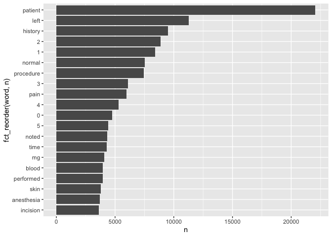
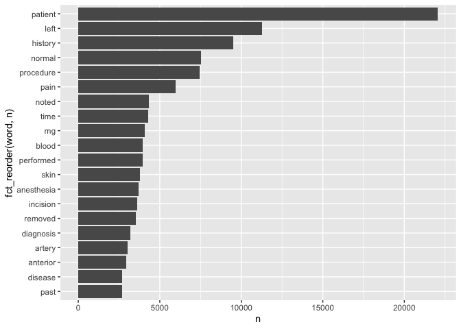
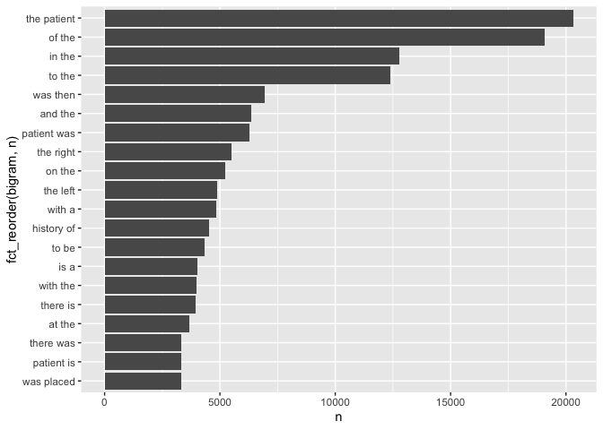

## Download the Dataset


```r
library(tidyverse)
```

```
## ── Attaching packages ─────────────────────────────────────── tidyverse 1.3.0 ──
```

```
## ✓ ggplot2 3.3.3     ✓ purrr   0.3.4
## ✓ tibble  3.1.0     ✓ dplyr   1.0.7
## ✓ tidyr   1.1.3     ✓ stringr 1.4.0
## ✓ readr   1.4.0     ✓ forcats 0.5.1
```

```
## ── Conflicts ────────────────────────────────────────── tidyverse_conflicts() ──
## x dplyr::filter() masks stats::filter()
## x dplyr::lag()    masks stats::lag()
```

```r
library(tibble)
library(dplyr)
library(ggplot2)
library(tidytext)
```


```r
if (!file.exists("mtsamples.csv"))
  download.file(
    url = "https://raw.githubusercontent.com/USCbiostats/data-science-data/master/00_mtsamples/mtsamples.csv",
    destfile = "mtsamples.csv",
    method = "libcurl",
    timeout = 60
  )
mtsamples <- read.csv("mtsamples.csv")
mtsamples <- as_tibble(mtsamples)
mtsamples
```

```
## # A tibble: 4,999 x 6
##        X description    medical_special… sample_name  transcription   keywords  
##    <int> <chr>          <chr>            <chr>        <chr>           <chr>     
##  1     0 " A 23-year-o… " Allergy / Imm… " Allergic … "SUBJECTIVE:, … "allergy …
##  2     1 " Consult for… " Bariatrics"    " Laparosco… "PAST MEDICAL … "bariatri…
##  3     2 " Consult for… " Bariatrics"    " Laparosco… "HISTORY OF PR… "bariatri…
##  4     3 " 2-D M-Mode.… " Cardiovascula… " 2-D Echoc… "2-D M-MODE: ,… "cardiova…
##  5     4 " 2-D Echocar… " Cardiovascula… " 2-D Echoc… "1.  The left … "cardiova…
##  6     5 " Morbid obes… " Bariatrics"    " Laparosco… "PREOPERATIVE … "bariatri…
##  7     6 " Liposuction… " Bariatrics"    " Liposucti… "PREOPERATIVE … "bariatri…
##  8     7 " 2-D Echocar… " Cardiovascula… " 2-D Echoc… "2-D ECHOCARDI… "cardiova…
##  9     8 " Suction-ass… " Bariatrics"    " Lipectomy… "PREOPERATIVE … "bariatri…
## 10     9 " Echocardiog… " Cardiovascula… " 2-D Echoc… "DESCRIPTION:,… "cardiova…
## # … with 4,989 more rows
```


## Question 1: What specialties do we have?

We can use count() from dplyr to figure out how many different catagories do we have? Are these catagories related? overlapping? evenly distributed?


```r
specialties <- mtsamples %>%
  count(medical_specialty)

specialties %>%
  arrange(desc(n))%>%
  top_n(15) %>%
  knitr::kable()
```

```
## Selecting by n
```


|medical_specialty             |    n|
|:-----------------------------|----:|
|Surgery                       | 1103|
|Consult - History and Phy.    |  516|
|Cardiovascular / Pulmonary    |  372|
|Orthopedic                    |  355|
|Radiology                     |  273|
|General Medicine              |  259|
|Gastroenterology              |  230|
|Neurology                     |  223|
|SOAP / Chart / Progress Notes |  166|
|Obstetrics / Gynecology       |  160|
|Urology                       |  158|
|Discharge Summary             |  108|
|ENT - Otolaryngology          |   98|
|Neurosurgery                  |   94|
|Hematology - Oncology         |   90|

There are `r nrow(speclialties)' specialties. Let's take a look at the distrubution.

```r
ggplot(mtsamples, aes(x = medical_specialty)) +
  geom_histogram(stat = "count") +
  coord_flip()
```

```
## Warning: Ignoring unknown parameters: binwidth, bins, pad
```

<!-- -->

```r
# method 2
ggplot(specialties, aes(x = n, y = fct_reorder(medical_specialty, n))) +
  geom_col()
```

<!-- -->

There are not evenly ( uniformly) distribution.

## Question 2


```r
mtsamples %>% 
  unnest_tokens(output = word, input = transcription) %>%
  count(word, sort = TRUE) %>%
  top_n(20) %>%
  ggplot(aes(x=n, y = fct_reorder(word,n))) +
    geom_col()
```

```
## Selecting by n
```

<!-- -->

The word "patient" seems to be important, but we observe a lot of stopwords

## Question 3
Redo visualization but remove stopwords before
What do we see know that we have removed stop words? Does it give us a better idea of what the text is about?

```r
mtsamples %>% 
  unnest_tokens(output = word, input = transcription) %>%
  count(word, sort = TRUE) %>%
  anti_join(stop_words, by = c("word")) %>%
  top_n(20) %>%
  ggplot(aes(x=n, y = fct_reorder(word,n))) +
    geom_col()
```

```
## Selecting by n
```

<!-- -->

Looking better ~~, but we don't like the numbers~~.

Bonus points if you remove numbers as well

```r
# method 1
tokens_clean <- mtsamples %>% 
  unnest_tokens(output = word, input = transcription) %>%
  count(word, sort = TRUE) %>%
  anti_join(stop_words, by = c("word"))

nums <- tokens_clean %>% filter(str_detect(word, "^[0-9]")) %>% select(word) %>% unique()

tokens_clean %>% 
  anti_join(nums, by = c("word")) %>%
  top_n(20) %>%
  ggplot(aes(x=n, y = fct_reorder(word,n))) +
    geom_col()
```

```
## Selecting by n
```

<!-- -->

```r
# method 2
mtsamples %>% 
  unnest_tokens(output = word, input = transcription) %>%
  count(word, sort = TRUE) %>%
  anti_join(stop_words, by = c("word")) %>%
  # using regular expressions to remove numbers
  filter(!grepl(pattern = "^[0-9]+$", x = word)) %>%
  top_n(20) %>%
  ggplot(aes(x=n, y = fct_reorder(word,n))) +
    geom_col()
```

```
## Selecting by n
```

<!-- -->


## Question 4

repeat question 2, but this time tokenize into bi-grams. how does the result change if you look at tri-grams?


```r
mtsamples %>% 
  unnest_ngrams(output = bigram, input = transcription, n = 2) %>%
  count(bigram, sort = TRUE) %>%
  top_n(20) %>%
  ggplot(aes(x=n, y = fct_reorder(bigram,n))) +
    geom_col()
```

```
## Selecting by n
```

<!-- -->

## Question 5


## Question 6


## Question 7

