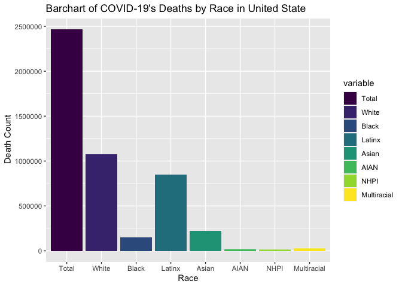
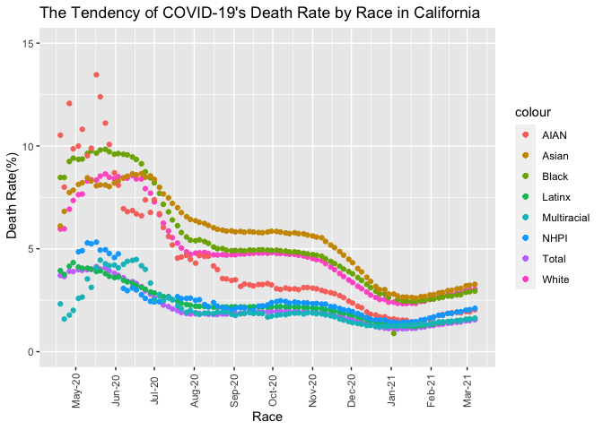

#  Introduction

The COVID-19 pandemic not only affects the global economy, but also seriously affects people's health and lifestyle. According to the current official data, we can observe the relevant factors of the COVID-19 to make better policies. For this project, we will analysis the data in United States.

## Question: Is race related to the death rate of COVID-19?
  - The histogram of deaths with different races in United States(count the deaths - different races in USA)
  - COVID-19's death rate of different races in California(death rate - date in CA)
  - The highest death rate of each state in United States(death rate - States in USA)


# Methods
## Data Source
The COVID Tracking Project is a volunteer organization launched from The Atlantic and dedicated to collecting and publishing the data required to understand the COVID-19 outbreak in the United States. 
The data used for this project is: [Race & Ethnicity](https://covidtracking.com/race)

```r
data <- fread("CRDT Data - CRDT.csv")
```

## Cleaned and Wrangled Data

As an analysist, the first step is dealing with the dirty data. Here, check the structure and NAs first.

```r
dim(data)
str(data)
# check NAs
summary(data$Cases_Total)
summary(data$Cases_White)
summary(data$Cases_Black)
summary(data$Cases_Latinx)
summary(data$Cases_Asian)
summary(data$Cases_AIAN)
summary(data$Cases_NHPI)
summary(data$Cases_Multiracial)
summary(data$Deaths_Total)
summary(data$Deaths_White)
summary(data$Deaths_Black)
summary(data$Deaths_Latinx)
summary(data$Deaths_Asian)
summary(data$Deaths_AIAN)
summary(data$Deaths_NHPI)
summary(data$Deaths_Multiracial)
```

    * There are 5320 rows and 54 columns in the CRDT dataset. Inside the dataset, the columns that we will use in the project are Total, White, Black, Latinx, Asian, AIAN(American Indian or Alaska Native), NHPI(Native Hawaiian or Other Pacific Islander), Multiracial. And these columns both have cases and deaths.

    * Within the summary, this dataset contains huge NA values which should be dropped. Especially, Latinx, AIAN, NHPI, and Multiracial have most NA values. 

Next, select the columns to create new data frame which will be easier use for analyzing. 


```r
# create new data frame without NA
race <- select(data, c('Date', 'State','Cases_Total', 'Cases_White', 'Cases_Black', 'Cases_Latinx', 'Cases_Asian', 'Cases_AIAN', 'Cases_NHPI', 'Cases_Multiracial',
                       'Deaths_Total', 'Deaths_White', 'Deaths_Black', 'Deaths_Latinx', 'Deaths_Asian', 'Deaths_AIAN', 'Deaths_NHPI', 'Deaths_Multiracial'))
# drop NAs
race <- race[!is.na(Cases_Total) & !is.na(Cases_White) & !is.na(Cases_Black) & !is.na(Cases_Latinx) & !is.na(Cases_Asian) & !is.na(Cases_AIAN) & !is.na(Cases_NHPI) & !is.na(Cases_Multiracial) & !is.na(Deaths_Total) & !is.na(Deaths_White) & !is.na(Deaths_Black) & !is.na(Deaths_Latinx) & !is.na(Deaths_Asian) & !is.na(Deaths_AIAN) & !is.na(Deaths_NHPI) & !is.na(Deaths_Multiracial)]

race$Date = as.Date(as.character(race$Date),"%Y%m%d")

# calculate the death rate of each race by date and state
race[, DRate_Total := Deaths_Total/Cases_Total*100]
race[, DRate_White := Deaths_White/Cases_White*100]
race[, DRate_Black := Deaths_Black/Cases_Black*100]
race[, DRate_Latinx := Deaths_Latinx/Cases_Latinx*100]
race[, DRate_Asian := Deaths_Asian/Cases_Asian*100]
race[, DRate_AIAN := Deaths_AIAN/Cases_AIAN*100]
race[, DRate_NHPI := Deaths_NHPI/Cases_NHPI*100]
race[, DRate_Multiracial := Deaths_Multiracial/Cases_Multiracial*100]
sum(is.na(race))
race[is.na(race)] <- 0
sum(is.na(race))

# create new data frame for total death
race_deaths <- race[,.(
  Total = sum(Deaths_Total),
  White = sum(Deaths_White),
  Black = sum(Deaths_Black),
  Latinx = sum(Deaths_Latinx),
  Asian = sum(Deaths_Asian),
  AIAN = sum(Deaths_AIAN),
  NHPI = sum(Deaths_NHPI),
  Multiracial = sum(Deaths_Multiracial)
), by = State]

# create new data frame for death rate
Daily_rate <- race[,.(
  Date = Date,
  State = State,
  Total = DRate_Total,
  White = DRate_White,
  Black = DRate_Black,
  Latinx = DRate_Latinx,
  Asian = DRate_Asian,
  AIAN = DRate_AIAN,
  NHPI = DRate_NHPI,
  Multiracial = DRate_Multiracial
)]
```

    * After selecting Columns and droping NAs, we need to convert the Date format to yyyy-mm-dd which will better use in graph.
    
    * race dataset: 'Date', 'State','Cases_Total', 'Cases_White', 'Cases_Black', 'Cases_Latinx', 'Cases_Asian', 'Cases_AIAN', 'Cases_NHPI', 'Cases_Multiracial', 'Deaths_Total', 'Deaths_White', 'Deaths_Black', 'Deaths_Latinx', 'Deaths_Asian', 'Deaths_AIAN', 'Deaths_NHPI', 'Deaths_Multiracial'
        - calculate death rate of each races
        - replace NAN to 0: because 0 cannot devided by 0
        
    * race_death: State, Total, White, Black, Latinx, Asian, AIAN, NHPI, Multriracial
        - sum of the deaths of each race, category by State
        
    * Daily_rate: Date, State, Total, White, Black, Latinx, Asian, AIAN, NHPI, Multriracial
        - the death rate of each race by Date and State
        

# Preliminary Results

## The Barchat of deaths with different races in United States

```r
convertRace = melt(race_deaths, id.vars = "State")

convertRace %>%
  ggplot(aes(x = variable, y = value, fill = variable)) +
  geom_bar(stat = "identity") +
  labs(title = "Barchart of COVID-19's Deaths by Race in United State", x="Race",y=" Death Count") +
  scale_fill_viridis_d()
```

<!-- -->

    * Beside Total deaths, the White race is the largest which above 1000000, and the Latinx is the second largest death counts. in the contrast, Black are not the one with the highest number of deaths.

## COVID-19's death rate tendency of different races in California

```r
Daily_rate[State == "CA"] %>%
  ggplot()+
  geom_point(aes(x =  Date, y = Total, color = "Total"))+
  geom_point(aes(x =  Date, y = White, color = "White"))+
  geom_point(aes(x =  Date, y = Black, color = "Black"))+
  geom_point(aes(x =  Date, y = Latinx, color = "Latinx"))+
  geom_point(aes(x =  Date, y = Asian, color = "Asian"))+
  geom_point(aes(x =  Date, y = AIAN, color = "AIAN"))+
  geom_point(aes(x =  Date, y = NHPI, color = "NHPI"))+
  geom_point(aes(x =  Date, y = Multiracial, color = "Multiracial"))+
  labs(title = "The Tendency of COVID-19's Death Rate by Race in California", x="Race",y=" Death Rate(%)")+
  ylim(0,15)+
  theme(axis.text.x = element_text(angle = 90, vjust = 0.5))+
  scale_x_date(date_breaks = "months" , date_labels = "%b-%y")
```

<!-- -->

    * The tendency of death rate gradually decresed by the Date. Before 2020-7-20, the death rate of all races is high, especially, AIAN(the highest death rate daily). After 2020-7-20, all races have similiar line sharp which means people pay more attention to health, thereby reducing the rate of COVID-19 infections.
    
    * Within this graph, the death rate of Black is more higher than other races, after 2020-7-20, Asian have the highest death rate, but there is no big dofference. 
    
    * Compare with NHPI,Latinx and Multiracial, the death rate of Blacks, whites, AIAN and Asians are the four races with the highest death rates.
    
    * Because the contains other races, the total death rate is not too high, maybe caused by data losing.
## The highest death rate of each state in United States

```r
data[is.na(data)] <- 0
sum(is.na(data))
```

```
## [1] 0
```

```r
data_state <- data[,.(
  Total = sum(Deaths_Total),
  White = sum(Deaths_White),
  Black = sum(Deaths_Black),
  Latinx = sum(Deaths_Latinx),
  Asian = sum(Deaths_Asian),
  AIAN = sum(Deaths_AIAN),
  NHPI = sum(Deaths_NHPI),
  Multiracial = sum(Deaths_Multiracial)
), by = State]

data_state <- data[,.(
  Total = sum(Deaths_Total)/sum(Cases_Total)*100,
  White = sum(Deaths_White)/sum(Cases_White)*100,
  Black = sum(Deaths_Black)/sum(Cases_Black)*100,
  Latinx = sum(Deaths_Latinx)/sum(Cases_Latinx)*100,
  Asian = sum(Deaths_Asian)/sum(Cases_Asian)*100,
  AIAN = sum(Deaths_AIAN)/sum(Cases_AIAN)*100,
  NHPI = sum(Deaths_NHPI)/sum(Cases_NHPI)*100,
  Multiracial = sum(Deaths_Multiracial)/sum(Cases_Multiracial)*100
), by = State]

data_state[is.na(data_state)] <- 0

maxRate <- colnames(data_state)[apply(data_state,1,which.max)]
data_state$MaxRate <- maxRate

knitr::kable(data_state)
```


|State |     Total|      White|      Black|     Latinx|      Asian|      AIAN|      NHPI| Multiracial|MaxRate |
|:-----|---------:|----------:|----------:|----------:|----------:|---------:|---------:|-----------:|:-------|
|AK    | 0.4865431|  0.6151181|  0.5160086|  0.0000000|  1.1903294| 0.8572752| 1.1689868|   0.1228223|Asian   |
|AL    | 1.6742976|  2.6266921|  2.6163701|  0.0000000|  1.2283442| 0.0000000| 0.0000000|   0.0000000|White   |
|AR    | 1.5988145|  1.8430055|  1.5049762|  0.0000000|  1.2716065| 1.2492545| 1.6919022|   0.8405395|White   |
|AS    | 0.0000000|  0.0000000|  0.0000000|  0.0000000|  0.0000000| 0.0000000| 0.0000000|   0.0000000|Total   |
|AZ    | 2.0078173|  2.9121282|  1.9340691|  1.9904326|  1.9483314| 3.7961140| 0.0000000|   0.0000000|AIAN    |
|CA    | 1.5107531|  3.2538708|  3.3735398|  1.6631391|  3.7881708| 2.2148793| 1.9246832|   1.5173393|Asian   |
|CO    | 1.8016307|  2.9650727|  2.7219192|  1.2639707|  3.0331802| 1.9456341| 1.3615110|   2.7862365|Asian   |
|CT    | 4.7089619| 10.9054105|  7.2956944|  2.5849025|  4.3563954| 1.3806870| 0.0000000|   2.1186715|White   |
|DC    | 3.4189619|  1.5600069|  5.2842846|        Inf|  2.5319271| 0.0000000| 0.0000000|   0.0000000|Latinx  |
|DE    | 2.1791303|  3.3360487|  2.2505778|  0.7306269|  0.5405509| 0.0000000| 0.0000000|   1.2517385|White   |
|FL    | 1.7733209|  2.9916199|  2.3071639|  1.4253940|  0.0000000| 0.0000000| 0.0000000|   0.0000000|White   |
|GA    | 2.0746453|  2.9906887|  2.9974179|  0.9856694|  1.9386221| 3.1977204| 1.8663642|   0.0000000|AIAN    |
|GU    | 1.6630742|  0.2070943|  0.0000000|  0.0000000|  0.4560472| 0.0000000| 0.6144122|   0.0000000|Total   |
|HI    | 1.3798279|  1.0163556|  1.3834896|  0.0000000|  3.2206413| 0.0000000| 1.3376524|   0.0000000|Asian   |
|IA    | 1.4688341|  2.0668220|  1.1125786|  0.0000000|  1.1666035| 1.1273494| 2.0042652|   0.0000000|White   |
|ID    | 1.0414301|  1.7850952|  0.8151326|  0.0000000|  1.3388964| 1.4369934| 0.0000000|   0.0000000|White   |
|IL    | 2.3109330|  3.3783305|  4.5971648|  1.8487089|  3.9547026| 3.2253407| 1.7761363|   0.0000000|Black   |
|IN    | 2.1176326|  2.2422389|  2.7738508|  0.0000000|  0.8405546| 0.0000000| 0.0000000|   0.0000000|Black   |
|KS    | 1.3338169|  1.4687608|  1.8521368|  0.0000000|  0.9583498| 1.6198239| 0.0000000|   0.0000000|Black   |
|KY    | 1.2504969|  1.5624746|  1.7711480|  0.0000000|  0.9707143| 0.2818355| 0.2600539|   0.7431618|Black   |
|LA    | 2.9084357|  3.7148376|  4.1691706|  0.0000000|  0.4794842| 1.0630506| 3.3286947|   0.0000000|Black   |
|MA    | 4.4642698|  9.7246336|  4.5701275|  1.4897228|  4.6297884| 2.5404157| 3.6794767|   0.0000000|White   |
|MD    | 2.6451419|  4.0787403|  3.4823273|  1.4147584|  4.6274540| 0.0000000| 0.0000000|   0.0000000|Asian   |
|ME    | 1.7874642|  1.9014515|  0.3861082|  0.0000000|  0.1998626| 1.6245487| 0.0000000|   0.0711136|White   |
|MI    | 3.4648139|  3.8280782|  7.5810456|  0.0000000|  2.4067307| 2.6639634| 0.0000000|   1.1656510|Black   |
|MN    | 1.5427312|  1.9963960|  0.9891215|  0.4899455|  1.3174724| 2.5387328| 1.2342737|   1.1496979|AIAN    |
|MO    | 1.6083051|  1.9470725|  2.7085459|  0.0000000|  1.3641549| 1.1917243| 2.1929825|   0.8390350|Black   |
|MP    | 2.5405169|  0.0000000|  0.0000000|  0.0000000|  0.0000000| 0.0000000| 0.0000000|   0.0000000|Total   |
|MS    | 2.5289314|  2.9471143|  3.1038572|  1.1204066|  1.4331139| 5.8159642| 0.0000000|   0.0000000|AIAN    |
|MT    | 1.2434809|  1.1432853|  0.0608242|  0.0000000|  0.1197127| 2.3772948| 0.5529226|   0.0000000|AIAN    |
|NC    | 1.4078150|  1.7351264|  2.1513496|  0.0000000|  1.0783436| 1.2986418| 1.8604651|   0.0000000|Black   |
|ND    | 1.2997229|  0.0000000|  0.0000000|  0.0000000|  0.0000000| 0.0000000| 0.0000000|   0.0000000|Total   |
|NE    | 1.0005405|  1.2724926|  1.3085661|  0.0000000|  1.0827371| 2.1888887| 0.2710333|   0.0000000|AIAN    |
|NH    | 2.4354411|  3.8127719|  1.7485390|  0.8900962|  1.1378663| 0.9439200| 0.0000000|   0.1916856|White   |
|NJ    | 5.2263599|  9.8796680|  9.6070836|  5.0934821|  8.0763417| 0.0000000| 0.0000000|   0.0000000|White   |
|NM    | 2.0530662|  3.4105573|  1.8215805|  1.4847426|  1.4875794| 3.4430913| 0.0000000|   0.0000000|AIAN    |
|NV    | 1.6414129|  2.5744800|  2.2258992|  1.0438678|  2.6036940| 2.9065337| 0.0000000|   0.0000000|AIAN    |
|NY    | 4.9245624|        Inf|        Inf|        Inf|        Inf| 0.0000000| 0.0000000|   0.0000000|White   |
|OH    | 1.8481170|  2.5259701|  2.1221162|  0.0000000|  0.9173803| 1.0848097| 0.7391645|   1.1342834|White   |
|OK    | 1.0238865|  1.3005643|  1.0898913|  0.0000000|  0.7222168| 0.9372522| 0.0000000|   0.0000000|White   |
|OR    | 1.4389749|  2.0981380|  1.0560946|  0.0000000|  1.4173430| 1.3361350| 1.3047848|   1.7137085|White   |
|PA    | 3.3460526|  5.5342431|  5.4620229|  0.0000000|  3.5772203| 0.0000000| 0.0000000|   0.0000000|White   |
|PR    | 1.8190366|  0.0000000|  0.0000000|  0.0000000|  0.0000000| 0.0000000| 0.0000000|   0.0000000|Total   |
|RI    | 2.7342790|  4.9175338|  1.8748412|  0.8593923|  1.8843966| 0.6449258| 0.0000000|   0.0728802|White   |
|SC    | 1.8700971|  2.2401348|  2.6202144|  0.0000000|  1.3616919| 0.0000000| 0.0000000|   0.0000000|Black   |
|SD    | 1.4120629|  1.5350706|  0.2122056|  0.3817225|  0.7710412| 1.5680180| 0.0000000|   0.0000000|AIAN    |
|TN    | 1.2858318|  1.5996734|  1.8586200|  0.0000000|  0.9984854| 1.1291889| 1.2223323|   0.0000000|Black   |
|TX    | 1.7098310| 40.2118757| 22.0398604| 43.7307951| 40.1239056| 0.0000000| 0.0000000|   0.0000000|Latinx  |
|UT    | 0.5176466|  0.5434443|  0.3744608|  0.3651297|  0.9269152| 1.7091630| 0.6891344|   0.0000000|AIAN    |
|VA    | 1.6893476|  2.7458296|  2.3825352|  0.7751221|  2.1638655| 2.3087330| 0.0000000|   1.0252426|White   |
|VI    | 1.3454213|  0.0000000|  0.0000000|  0.0000000|  0.0000000| 0.0000000| 0.0000000|   0.0000000|Total   |
|VT    | 2.0442641|  2.3168027|  0.1370187|  0.0000000|  1.3164855| 6.5934066| 0.0000000|   0.0000000|AIAN    |
|WA    | 1.8545282|  4.6872439|  1.6949569|  1.0645716|  3.9099039| 4.2101114| 2.1535292|   1.3329005|White   |
|WI    | 1.0822408|  1.1915477|  1.4945964|  0.0000000|  0.9128957| 1.1742662| 0.0000000|   0.0000000|Black   |
|WV    | 1.7176266|  1.8206436|  1.0286436|  0.0000000|  0.0000000| 0.0000000| 0.0000000|   1.1790715|White   |
|WY    | 1.0033981|  1.5676000|  0.5162800|  0.8784866|  1.7067933| 2.1911406| 0.6685982|   0.0000000|AIAN    |

```r
max_Race <- data_state %>%
  count(MaxRate)

max_Race %>%
  arrange(desc(n))%>%
  knitr::kable()
```


|MaxRate |  n|
|:-------|--:|
|White   | 20|
|AIAN    | 12|
|Black   | 11|
|Total   |  6|
|Asian   |  5|
|Latinx  |  2|

    * the First table shows the death rate of different races in each state, and which race has the highest death rate.
    
    * the second table summarizes the races have the number of states with the highest death rate:
      - White have the highest number which means White people maybe have huge risk in United States.
      
# Conclusion

With preliminary results above:

    I think there is no obvious correlation between race and COVID-19. From "Barchart of COVID-19's Deaths by Race in United State", White and Latinx are the highest, and Black is less than Asian. However, looking at "The Tendency of COVID-19's Death Rate by Race in California", Black and Asian have high death rates, while White have a slightly less number. Maybe the data collection is not complete in other states, so the result is comflict. The Total death rate is much lower. There may be a lot of information about other races but not fully included in the dataset. To be honest, I think the main reason for the difference of death rates among different races is the inadequacy of protective measures and unfairness. First of all, the main population of the United States is white. Because of the large base, the case and death rates are higher than those of other races, but the living distribution of other races is different. For example, in California, the death rate of Black is higher than that of White: one is because Black live here concentratedly, and the other is because of the large burden of medical resources that cannot support the population of California and the uneven distribution of resources. Why the death rate of white people is high? Another possible guess is that many white people oppose wearing masks and feel that it hinders their freedom, but this will also lead to an increase in their death rate. According to the "The Tendency of COVID-19's Death Rate by Race in California", with the time passed, medical resources may increase and the concept of protection increases, and the death rate of each race has decreased, showing almost same trend, which verifies that there is no correlation between Race and COVID-19.
